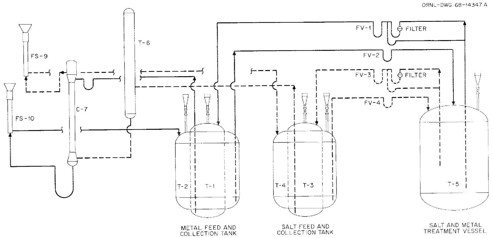
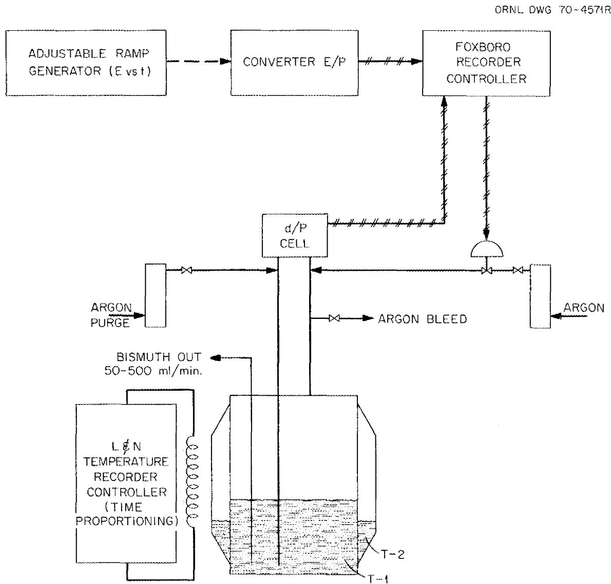
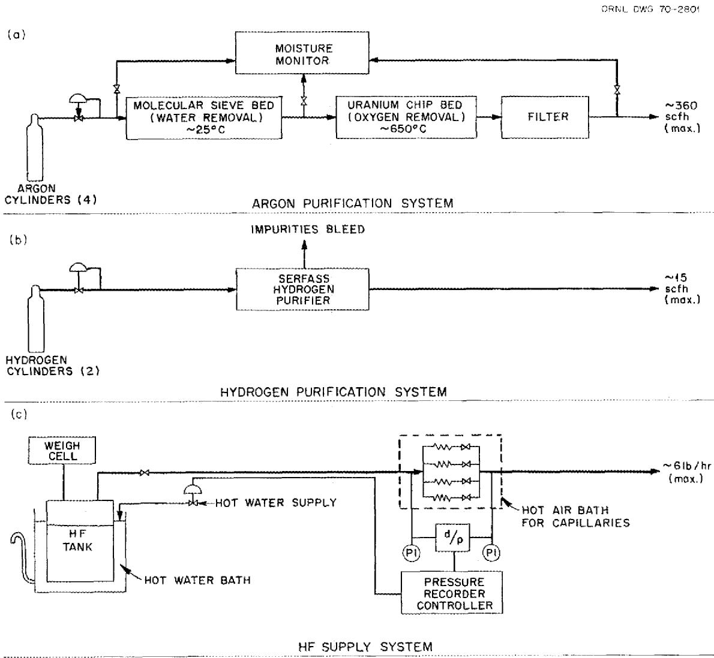
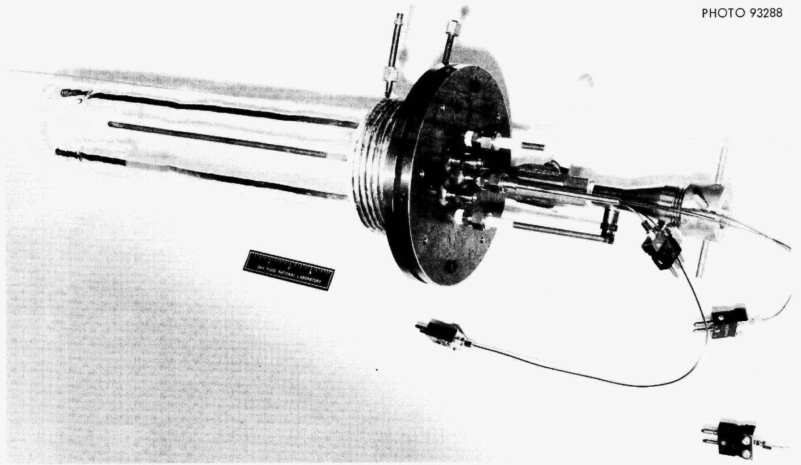
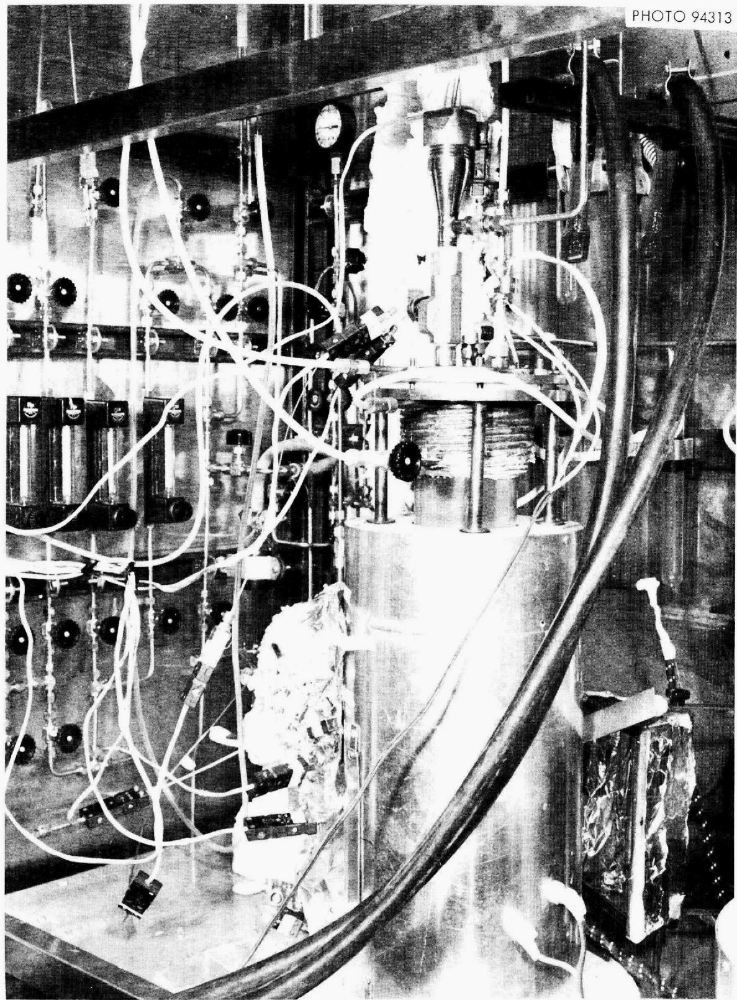
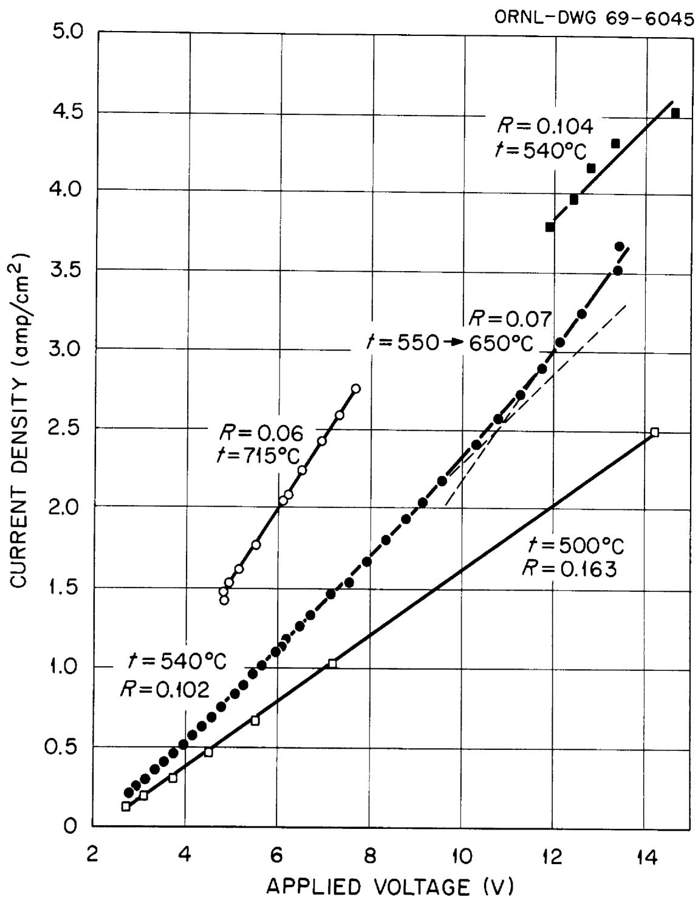
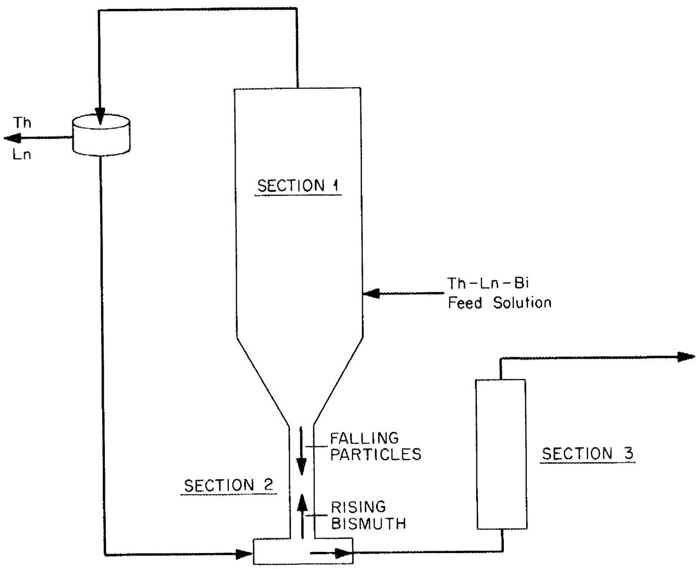
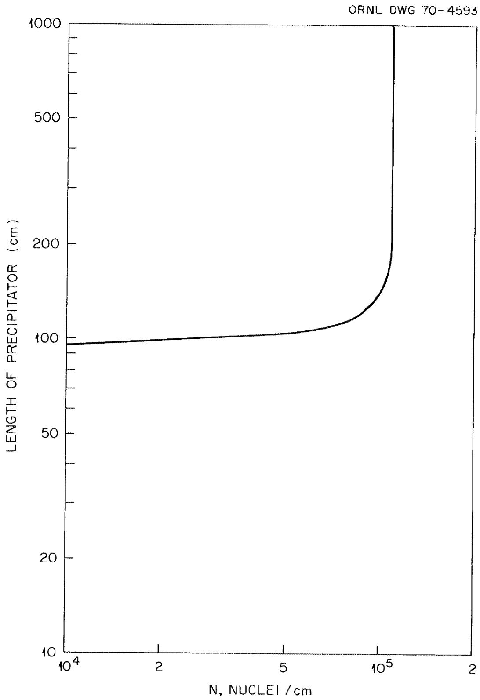
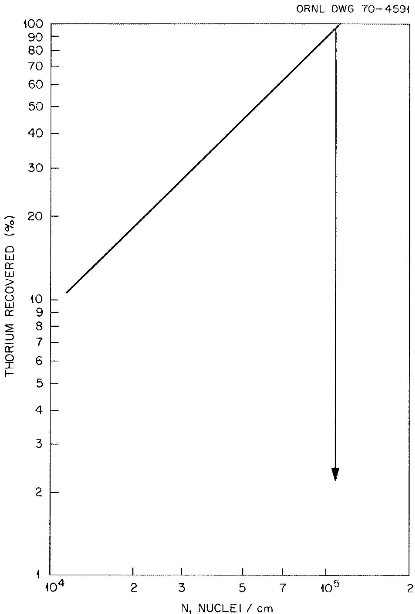

# OAK RIDGE NATIONAL LABORATORY

operated by

UNION CARBIDE CORPORATION

for the

U.S. ATOMIC ENERGY COMMISSION


3445605142379


ENGINEERING DEVELOPMENT STUDIES FOR MOLTEN-SALT BREEDER REACTOR PROCESSING NO.1

L. E. McNeese

CEN 1981《标准名称》（GB/T）

X.

LIBRA RY LOAN COFY

PO NO. 1001234567890100100100100

I am not sure I can see him.

#

and the history will encourage you

# LEGAL NOTICE

This report was prepared as an account of Government sponsored work. Neither the United States, nor the Commission, nor any person acting on behalf of the Commission:

A. Makes any warranty or representation, expressed or implied, with respect to the accuracy, completeness, or usefulness of the information contained in this report, or that the use of any information, apparatus, method, or process disclosed in this report may not infringe privately owned rights; or   
B. Assumes any liabilities with respect to the use of, or for damages resulting from the use of any information, apparatus, method, or process disclosed in this report.

As used in the above, "person acting on behalf of the Commission" includes any employee or contractor of the Commission, or employee of such contractor, to the extent that such employee or contractor of the Commission, or employee of such contractor prepares, disseminates, or provides access to, any information pursuant to his employment or contract with the Commission, or his employment with such contractor.

Contract No. W-7405-eng-26

CHEMICAL TECHNOLOGY DIVISION

ENGINEERING DEVELOPMENT STUDIES FOR MOLTEN-SALT BREEDER REACTOR PROCESSING NO. 1

L. E. McNeese

NOVEMBER 1970

OAK RIDGE NATIONAL LABORATORY

Oak Ridge, Tennessee

operated by

UNION CARBIDE CORPORATION

for the

U.S. ATOMIC ENERGY COMMISSION


34456 05142379

Reports previously issued in this series are as follows:

ORNL-4094 Period Ending December 1966

ORNL-14139 Period Ending March 1967

ORNL-4204 Period Ending June 1967

ORNL-4234 Period Ending September 1967

ORNL-4235 Period Ending December 1967

ORNL-4364 Period Ending March 1968

ORNL-4365 Period Ending June 1968

ORNL-366 Period Ending September 1968

# CONTENTS

# SUMMARIES V

# 1. INTRODUCTION 1

# 2. SEMICONTINUOUS ENGINEERING EXPERIMENTS ON REDUCTIVE EXTRACTION

2.1 General Operating Procedure 3   
2.2 Description of Major Processing Equipment 3   
2.3 Extraction Column 5   
2.4Jackleg 5   
2.5 Feed and Catch Tanks for Salt and Metal 6   
2.6 Treatment Vessel for Salt and Metal 6   
2.7Tank Samplers 7   
2.8 Filters, Freeze Valves, and Lines 9   
2.9 Instrumentation and Control 9   
2.10 Gas Purification and Supply Systems 12

# 3. ELECTROLYTIC CELL DEVELOPMENT 14

3.1 Experimental Equipment 15   
3.2 Results 16

# 4. SEPARATION OF RARE EARTH'S FROM THORIUM BY FRACTIONAL CRYSTALLIZATION FROM BISMUTH 22

4.1 Physical Properties of Materials Considered 23   
4.2 Conceptual Design of a ThBi Precipitator 24   
4.3 Estimation of the Minimum Cross Section for the Precipitator Section 26   
4.4 Estimated Length of Precipitator Section 28   
4.5 Summary and Conclusions 37

# 5. MATERIAL BALANCE CALCULATIONS FOR AN MSBR 38

5.1 Compilation of MSBR Nuclear Data 38   
5.2 Material Balance Equations 39   
5.3 Computation of Neutron Reaction Rates 41

# CONTENTS (Continued)

Page

5.4 Model for Diffusion of Noble Gases into Graphite 42   
5.5 Model for the Migration of Noble Gases and Noble Metals to Circulating Helium Bubbles 45   
5.6 Assumed Chemical Behavior of Fission Products 46   
5.7 Material Balance Calculations for a 1000-Mw(electrical) Single-Fluid MSBR 47

6. REFERENCES 49

APPENDIX A. LIBRARY OF NUCLEAR DATA FOR MSBR APPLICATIONS 51

APPENDIX B. TYPICAL MATADOR OUTPUT FOR A 2250-Mw(thermal) SINGLE-FLUID MSBR . . . . . . . . . . . . . . . . . . . . . . . . . . . . . . . . . . . . . . . . . . . . . . . .

# SUMMARIES

# SEMICONTOINUOUS ENGINEERING EXPERIMENTS

# ON REDUCTIVE EXTRACTION

Equipment has been installed in Bldg. 3592 to permit engineering studies on reductive extraction in countercurrent contactors. The system will allow the countercurrent contact of up to 15 liters each of molten salt and bismuth at flow rates of 0.05 to 0.5 liter/min. Almost all of the components that contact salt or bismuth are fabricated of carbon steel. The contactor presently being studied is a 0.82-in.-ID, 2-ft-long column (excluding end sections) that is packed with solid 1/4-in. right circular cylinders of molybdenum.

The salt and bismuth can be purified by contact with $\mathsf{H}_2$ -HF mixtures followed by filtration through porous molybdenum filters. The two phases can be sampled at various points in the system.

# ELECTROLYTIC CELL DEVELOPMENT

The flowsheet under consideration for processing fuel from the proposed MSBR uses an electrolytic cell. Fluorides of thorium or lithium in a molten-salt stream are reduced at the bismuth cathode, while metals that are extracted into bismuth are oxidized at the bismuth anode. Preliminary experiments made in static cells constructed of quartz show that the current varies linearly with the applied potential. This indicates the absence of a limiting current in the range of the experiments for which the highest average current density was $4.35 \, \text{amp/cm}^2$ .

# SEPARATION OF RARE EARTHES FROM THORIUM BY

# FRACTIONAL CRYSTALLIZATION FROM BISMUTH

The feasibility of separating rare earths from thorium in a bismuth solution by fractional crystallization of ThBi $_2$ was examined. A possible

equipment configuration was considered, and an analysis was made of factors affecting the fraction of $\mathrm{ThBi}_2$ that could be potentially recovered. It was concluded that operation in the envisioned manner might be difficult because of the need for close control of nucleation rates.

# MATERIAL BALANCE CALCULATIONS FOR AN MSBR

We have developed a computer code, MATLAB, to perform steady-state material-balance calculations that describe the nuclear, chemical, and physical processes occurring in the fuel stream of an MSBR. This code allows us to investigate the effects of chemical processing on the nuclear performance of an MSBR, to determine fission-product inventories and heat-generation rates, and to specify flow rates of streams in the chemical processing plant. The buildup of transuranium isotopes, the production of activation products by neutron capture in the carrier salt, and chain-branching in the decay fission products are considered.

The MATADOR code has been used to compute inventories and heat-generation rates in the fuel stream of a 1000-Mw (electrical) single-fluid MSBR; this information is summarized for the reference reactor.

# 1. INTRODUCTION

A molten-salt breeder reactor (MSBR) will be fueled with a molten fluoride mixture that will circulate continuously through the blanket and core regions of the reactor and through the primary heat exchanger. We are developing methods for use in a close-coupled processing facility for removing fission products, corrosion products, and fissile materials from the molten fluoride mixture.

Several operations associated with MSBR processing are under study. This section describes: (1) a recently completed facility for semicontinuous engineering experiments on reductive extraction, (2) experiments related to the development of electrolytic cells for use with molten salt and bismuth, (3) consideration of selective crystallization of thorium bismuthide from bismuth-thorium-rare earth solutions as a means for separating thorium from the rare earths, and (4) a computer code that calculates the nuclear, chemical, and physical processes occurring in the fuel stream of an MSBR. This work was carried out in the Chemical Technology Division during the period October through December 1968.

# 2. SEMICONTOINUOUS ENGINEERING EXPERIMENTS ON REDUCTIVE EXTRACTION

L. E. McNeese B. A. Hannaford H. D. Cochran, Jr.

The proposed MSBR processing method is based on reductive extraction, using countercurrent contact of molten salt and bismuth in multistage contactors. Equipment has been fabricated and installed in Bldg. 3592 for engineering studies of reductive extraction in countercurrent contactors. These studies will be made using molten salt (72-16-12 mole % LiF-BeF $_2$ -ThF $_4$ ) and liquid bismuth metal. Uranium (about 0.3 mole % UF $_4$ in the salt) will be transferred between the salt and the metal, using thorium as the reductant in the bismuth. The salt and the metal will be contacted countercurrently at $600^{\circ}\mathrm{C}$ .

One planned objective of these experiments is the investigation of mass transfer between the salt and bismuth under different flow conditions in various contacting devices. The effective overall mass-transfer coefficient (or, equivalently, the height equivalent to a theoretical stage) will be determined in several experiments with various contactors which include packed and baffled columns. The mass-transfer performance is determined, in part, by the hydrodynamic conditions in the contactor; information on hydrodynamic conditions in packed columns will be inferred from measurements of the pressure drop through the column by analogy to a water-mercury system being studied by Watson. $^{1}$ The experiments should answer the following questions: (1) What is the limiting flow rate beyond which the column will flood? (2) Is the bismuth well dispersed, or does channel type flow occur? (3) How much interfacial area exists for mass transfer? (4) Is disengagement of the phases complete in the end sections, or does entrainment present a problem? (5) How severe a problem will be caused by axial backmixing, particularly in the salt phase at high metal rates?

A second objective is the evaluation of the performance of auxiliary equipment necessary to perform experiments of this type. Such information will be used in designing subsequent experimental facilities. The following components will be included in the evaluation: freeze valves, filters, instrumentation, and supply systems for argon, hydrogen, and hydrogen fluoride.

We plan to determine the probable lifetime for freeze valves subjected to repeated freeze-thaw cycles since we expect them to fail eventually under such stress; in addition, we will study the performance of freeze valves containing two fluid phases. The performance of filters with the possible entrainment of a second fluid is also of interest. As a part of these studies, we wish to determine whether carbon steel is a suitable structural material for short-term use in experiments of this kind, and whether graphite is a suitable material in which to hydrofluorinate the salt and metal mixture.

In carrying out the experiments outlined above, we will gain operating experience and confidence in handling the process fluids. We will also uncover areas of unforeseen difficulty, where further developmental work may be needed.

# 2.1 General Operating Procedure

Prior to an experiment, slightly more than 15 liters of salt and 15 liters of bismuth will be present in the treatment vessel. This material will be hydrofluorinated to return lithium, thorium, uranium, etc. to the salt phase, and to remove oxides from the salt. After suitable sparging with argon to remove HF and $\mathbf{H}_{2}$ , salt (15 liters) will be transferred to the salt feed tank, leaving a heel about $1/2$ in. deep in the treatment vessel. Then bismuth (15 liters) will be transferred to the bismuth feed tank, leaving an additional heel of about 1 in. Finally, reductant will be added to the bismuth in the metal feed tank. Samples of salt and metal feed will be withdrawn.

During an experiment, salt and metal may be transferred through the column at controlled flow rates from 0.05 to 0.5 liter/min. During this transfer, the pressure drop across the column can be monitored, and samples can be taken from the salt and the metal streams exiting from the column. After an experiment, the salt and the metal may be sampled in the catch tanks before being transferred back to the treatment vessel. Hydrofluorination would be repeated to return lithium, thorium, and uranium to the salt phase prior to the next run. Thus, there will be a constant amount of each component in the system (notably uranium), except for a known amount of thorium which will be added to the system in each run. Material-balance determinations will be greatly facilitated by this fact.

# 2.2 Description of Major Processing Equipment

All components that contact molten salt or bismuth are fabricated of carbon steel, except as noted. The major components in the system for handling salt and metal are described below and are shown schematically in Fig. 1.

  
Fig. 1. Simplified Salt and Metal Flowsheet.

# 2.3 Extraction Column

The four contactors that have been fabricated have the same physical dimensions: 0.82 in. ID x 2 ft long, excluding end sections. In each, bismuth is introduced through a tube (0.259 in. ID, 0.058-in. wall thickness) that projects at right angles into the end section about 7/16 in. above a slotted grid. The grid acts as a distributor and restrainer for the packing. Salt is withdrawn through an overflow line 1-11/16 in. above the bismuth feed port. In the bottom end section, salt is introduced through a 0.259-in. tube at right angles to the column 7/16 in. below a slotted restraining grid similar to that at the top. Bismuth flows from the bottom of the end section through a tube 1-11/16 in. below the salt feed port.

Internally, the four columns contain one of the following: (1) $1/4$ -in. right circular cylinders of molybdenum (void fraction, about $40\%$ ); (2) $1/8$ -in. right circular cylinders of molybdenum (void fraction, about $40\%$ ); (3) segmental baffles covering $96\%$ of the column cross section at $1/2$ -in. spacing; or (4) open column area that could be packed later or could be used as a spray column. On the basis of studies with the water-mercury system, the $1/4$ -in. packing looks most promising. Therefore, it will be studied first.

# 2.4 Jackleg

The pressure drop across the column will be measured with a jackleg by using the following procedure. The salt level in the jackleg will be measured using an argon bubbler. The sum of the pressure resulting from this head of salt and the difference in the pressures in the gas spaces above the fluids in the jackleg and the column will be equal to the salt pressure at the bottom of the column. The pressure at the bottom of the column will, in turn, equal the pressure drop across the column. The salt head in the column, the bismuth held up in the column, and the viscous drag in the column will contribute to this pressure drop.

The jackleg can accommodate a head of approximately $\frac{1}{4}$ ft of salt. Preliminary estimates indicate that the pressure drop across the column may be 3 to 6 ft of salt under conditions of maximum flow. The jackleg will be pressurized in order to operate under conditions where the pressure drop is greater than $\frac{1}{4}$ ft of salt.

# 2.5 Feed and Catch Tanks for Salt and Metal

The duplex feed and catch tanks for salt and bismuth are identical in construction. The feed tank, an inner cylinder of 8-in. sched 80 pipe, is designed to operate at pressures up to 50 psig at $600^{\circ}\mathrm{C}$ . Both the inner feed tank and the outer catch tank will hold about 20 liters of fluid. We plan to use only about 15 liters of salt and 15 liters of bismuth.

The top of each feed tank contains seven ports: (1) an inlet port (1/2-in. pipe with a fitting for 3/8-in. tubing), which does not extend into the tank; (2) an outlet line (1/2-in. pipe with a fitting for 3/8-in. tubing), which extends to within 1/2 in. of the bottom of the tank; (3) a sparge and pressurization port (with a fitting for 3/8-in. tubing), which extends to within 1/2 in. of the bottom of the tank; (4) a 1/2-in. pipe (with a fitting for 3/8-in. tubing) used as a thermocouple well, which extends to within 1/2 in. of the bottom of the tank; (5) a 1/2-in. pipe with a fitting for a 1/2-in. ball valve and sampler and a fitting for 1/4-in. tubing below the valve; (6) a 1-in. pipe with a 1-in. ball valve as an addition port; and (7) a 1/2-in. capped pipe as a spare port. Each catch tank has the same ports as the feed tanks except that no addition port is provided. The outer surfaces of the feed and catch tanks are coated with nickel aluminide to retard oxidation.

# 2.6 Treatment Vessel for Salt and Metal

The treatment vessel consists of a 304L stainless steel pressure vessel that holds a graphite crucible. The cylindrical portion of the

pressure vessel is 26.5 in. long (1/4-in. wall thickness) and has a standard pipe cap on each end. It is designed to withstand $\mathbf{H}_2$ -HF at $600^{\circ}\mathrm{C}$ at a pressure of 50 psig.

The inner crucible, machined of graphite,\* has an outer diameter of 16.75 in. and is 26.75 in. (overall) high. The wall thickness tapers from 1.75 in. at the bottom to 0.75 in. at 16.75 in. from the bottom, and is uniform from there to the top. The bottom of the crucible is 1.75 in. thick. The crucible has a 16.75-in.-diam lid, whose thickness varies from 1 in. at the rim to 0.5 in. at the center. The graphite crucible rests on a support plate inside the pressure vessel, and the lid is held loosely in position by three studs projecting from inside the top of the pressure vessel. The vessel has 13 nozzles, which are described in Table 1.

# 2.7 Tank Samplers

The treatment vessel and the feed and catch tanks are each provided with a 1/2-in. sched 40 pipe nozzle fitted with a ball valve and sampler. These tank samplers hold four fritted filter sticks that extend through a Teflon plug in the top and can be lowered (while the system is under argon pressure) through the ball valve into the tank below. Samples can be drawn into the filter sticks by vacuum. Four samples can be taken during one run.

In addition to the five samplers on the vessels, there are two flowing-stream samplers, which operate in a manner similar to that of the tank samplers. These flowing-stream samplers allow seven samples to be taken from each of two flowing streams during column operation. One sampler is located on the salt return line (between the column and the salt catch tank), and one is located on the metal return line (between the column and the metal catch tank).

Table 1. Description of Nozzles on Treatment Vessel   

<table><tr><td>Nozzle No.</td><td>Used For</td><td>Description</td></tr><tr><td>1</td><td>Bismuth charging</td><td>2-in. sched 40 pipe, flanged at the top to accom- modate a chute for loading bismuth. The graphite lid below this nozzle has a 1.625-in.-diam hole with a removable plug.</td></tr><tr><td>2</td><td>Bismuth sampling; salt sampling; gas-phase pres- sure connection.</td><td>0.5-in. sched 40 pipe with ball valve and sampler. The lid is fitted with a 1-in.-ID graphite pipe into which the 0.5-in. pipe slips. The graphite pipe extends through the graphite lid and into the crucible for a distance of 1 in.</td></tr><tr><td>3</td><td>Returning salt from the salt receiver</td><td>0.5-in. sched 40 pipe nozzle containing a sleeved 0.375-in.-OD tube. Below the carbon-steel-to- molybdenum transition, the 0.375-in.-OD molybdenum tubing extends 4 in. below the graphite lid.</td></tr><tr><td>4</td><td>Returning bismuth from the bismuth receiver</td><td>Identical to nozzle No. 3.</td></tr><tr><td>5</td><td>Transferring bismuth to bismuth feed tank</td><td>0.5-in. sched 40 pipe nozzle containing a sleeved 0.375-in.-OD tube that extends to within 0.5 in. of the bottom of the crucible. The tubing that extends into the crucible is made of molybdenum.</td></tr><tr><td>6</td><td>Transferring salt to the salt feed tank</td><td>Similar to nozzle No. 5; set so that 15 liters of salt can be transferred to the salt feed tank, leaving a 0.5-in. heel of salt on top of the bismuth.</td></tr><tr><td>7</td><td>Monitoring liquid levela</td><td>Similar to nozzle No. 5.</td></tr><tr><td>8</td><td>Sparging with H2-HF</td><td>Similar to nozzle No. 5.</td></tr><tr><td>9</td><td>Adding salt</td><td>Similar to nozzle No. 3.</td></tr><tr><td>10</td><td>Spare</td><td>Similar to nozzle No. 3.</td></tr><tr><td>11</td><td>Thermocouple well</td><td>0.5-in. sched 40 pipe with fittings for 0.375-in.- OD tubing</td></tr><tr><td>12</td><td>Making miscellaneous ad- ditions, or vessel venting</td><td>1-in. sched 40 pipe, with ball valve,</td></tr><tr><td>13</td><td>Draining vessel</td><td>0.5-in. sched 40 pipe extending from the bottom of the pressure vessel; this line is capped.</td></tr></table>

${}^{a}$ Acts as a bubbler type of liquid-level monitor.

# 2.8 Filters, Freeze Valves, and Lines

The experimental facility has two filters, one of which is located on each of the lines between the treatment vessel and the salt and metal feed tanks. These filters, made of fritted molybdenum, have a nominal pore size of $25\mu$ . The permeability of each filter was measured before and after fabrication, and was found to be about $400\mathrm{cm}^3$ (STP) $\mathrm{cm}^{-2}$ ( $\mathrm{cmHg}$ ) at a pressure differential of $1.5\mathrm{cmHg}$ . Both filters can be bypassed if necessary.

Salt and metal flows through the facility are directed by 10 freeze valves in the transfer lines, located as indicated in Fig. 1. These valves are simply dips (in the carbon steel tubing), which are fitted with air cooling lines. Those freeze valves that must be closed before any salt or metal can be transferred from the treatment vessel were equipped with small reservoirs (about $50~\mathrm{cm}^3$ ) of bismuth prior to being welded into the lines. The facility, which is of welded construction, contains approximately 200 ft of salt and metal transfer lines (3/8-in. and 1/2-in. pressure tubing).

# 2.9 Instrumentation and Control

The principal objective of the instrumentation and control system is to provide closely-regulated flows of bismuth and molten salt to the extraction column. The range of flow rates provided for both bismuth and molten salt is nominally 40 to $500\mathrm{ml / min}$ , corresponding to experiment durations of about 5 to 0.5 hr. Pressures and liquid levels in the six vessels (treatment vessel, feed and catch tanks, and jackleg) of the facility are sensed by Foxboro differential-pressure transmitters, which send signals to miniature pneumatic recorders or controllers. Liquid level is inferred from the pressure of the argon that is supplied to a dip-leg bubbler in each tank. Flow rates of bismuth and salt to the column are controlled by regulating the rate of change of liquid level in the two feed tanks. The locations of salt-argon and salt-

bismuth interfaces in the column are not directly measured, but can be determined from pressure measurements. The feed and catch tanks and the treatment vessel are maintained at the desired temperatures by automatic controllers; transfer-line temperatures and temperatures of small components are controlled by manually regulating the appropriate voltage transformers that supply power to Calrod tubular heaters.

Figure 2 is a schematic diagram of the control system that regulates the flow of bismuth or salt to the extraction column. It is designed to circumvent the flow-control problems that sometimes occur when gas pressure is used to maintain a constant flow of liquid from a heated feed tank. An adjustable ramp generator and an electric-top pneumatic converter are used to linearly decrease the set point of a controller that senses liquid level in the feed tank and controls the level by controlling the flow rate of pressurizing argon to the gas space of the feed tank. The result should be a uniformly decreasing bismuth level and, hence, a uniform discharge rate of bismuth or salt from the tank. This control system should be unaffected by small increases in back pressure caused by changing column hydraulics, partial plugging of transfer lines, decreasing feed tank level, etc., or leakage of pressurizing argon (a small argon bleed is provided to improve pressure control). Small gas pressure oscillations caused by the temperature cycling of a conventional temperature controller will be minimized by the time-proportioning controller. Rates of transfer of salt and metal between the collection tanks and the treatment vessel need not be closely regulated; therefore, manual control of pressurization is used.

Heating circuits are manually controlled for 11 transfer lines, 3 flowing-stream samplers, the salt jackleg, and the extraction column. On the transfer lines, the Calrods rated at 230 v are run at 140 v or less, and provide up to 185 w per foot of line. Typically, temperatures at three points on each line are recorded. Approximately 100 points are recorded for the system.

For obvious reasons the gas bubbler method for measuring static head cannot be used directly in the small-diameter extraction column.

  
Fig. 2. Schematic Diagram of Control System for Metering Bismuth from the Pressurized Feed Tank, T-1.

However, the bubbler that terminates near the bottom of the jackleg can be used to determine the pressure at the base of the column. This liquid level measurement, in conjunction with the measurement of gas phase pressure in the jackleg, will accommodate a bismuth holdup in the column approaching $100\%$ of the open column volume.

# 2.10 Gas Purification and Supply Systems

Three gases are required for the experimental facility: HF, hydrogen, and argon. Because of the highly deleterious effect of small amounts of oxygen, the nominally pure bottled hydrogen and argon are further purified to remove traces of oxygen or water. The anhydrous HF is given no additional purification; it, along with hydrogen, is used only in the treatment vessel for hydrofluorination of the metal and the salt. A schematic diagram for each of the three supply systems is shown in Fig. 3.

Highly purified argon is used for all applications requiring an inert gas: pressurization of tanks for transferring bismuth and molten salt, dip-leg bubblers for liquid-level measurements, purging of apparatus for sampling bismuth and salt, etc. Cylinder argon with a minimum purity of $99.995\%$ is fed, first, to a bed of molecular sieves [Fig. 3(a)], which reduces the water content to about $2\mathrm{ppm}$ $(-100^{\circ}\mathrm{F}$ dew point). The argon then flows through a bed of uranium metal turnings, where the remaining oxygen and water are removed. A porous stainless steel filter removes any uranium oxide dust that might be carried from the uranium bed by the gas stream. The maximum argon flow rate, based on the capacity of the molecular sieve bed, is about 6 scfm.

The hydrogen purification system is a commercially avail device* that purifies hydrogen by the selective diffusion of hydrogen across a palladium alloy barrier. Impurities, along with a small flow of hydrogen, are continuously bled from the upstream side of the barrier. The capacity of the unit is 15 scfh. Controls for the purifier are self-contained.

  
Fig. 3. Simplified Diagram of the Gas Supply Systems.

The anhydrous HF supply system utilizes small capillaries for metering; a pneumatic controller maintains a specified pressure drop across a capillary by controlling the HF gas supply pressure. This is achieved by regulating the temperature of the water bath in which the HF supply tank is suspended. Accidental overheating of the HF supply tank is prevented by a switch that releases cold water into the bath if the temperature exceeds $60^{\circ}\mathrm{C}$ . The minimum flow range for the HF supply is nominally 0 to 0.25 lb of HF per hour; the maximum range is 0 to 1 lb per hour. A calibrated weigh cell provides a means of checking the rate of HF delivery and the HF inventory.

# 3. ELECTROLYTIC CELL DEVELOPMENT

M. S. Lin L. E. McNeese

In the proposed MSBR fuel flowsheet using reductive extraction, an oxidizer-reducer is required (1) to convert extracted materials to their fluorides in the presence of a salt stream, and (2) to reduce the fluorides of lithium and thorium at a bismuth cathode. Electrolytic cells for simultaneously carrying out these operations are being developed.

The advantages of using an electrolytic cell are as follows:

1. The oxidizer and reducer are coupled together; thus the amounts of the oxidized and reduced products are always in the correct proportion.   
2. A cell can be adapted for continuous operation.   
3. The rate of oxidation-reduction can be regulated by varying the current flowing through the cell.   
4. Use of a cell provides a closed system and makes the use of additional materials unnecessary.

The major information needed for designing an electrolytic cell is similar to that needed for designing a conventional chemical reactor,

namely, information concerning capacity, efficiency, and suitable materials of construction. The capacity is mainly determined by the current density obtainable in a practical cell configuration. The obtainable current density, in turn, is determined by the electrode kinetics, which must be evaluated experimentally. The cell configuration depends upon the state of the reactants and the method for dissipating the heat that is generated by the cell resistance. Factors which should be considered are: (1) the oxidation-reduction potential of the redox reaction, (2) the energy spent in overcoming the internal cell resistance, (3) the overvoltage caused by diffusion polarization, if any, and (4) the occurrence of side reactions between the oxidation and reduction products.

Some of this information can be estimated from currently available data. For example, consideration was given initially to selectively oxidizing metals, such as uranium, at the anode. However, we then realized that, under this condition, the operating current density would be limited by the rate of transfer of the material to be oxidized to the anode surface. In the case of uranium with a concentration of 0.0016 mole fraction in the bismuth, the estimated limiting current density is $0.15 \, \text{amp/cm}^2$ (based on a uranium diffusivity in $\text{bismuth}^3$ of $2.5 \times 10^{-5} \, \text{cm}^2/\text{sec}$ , an estimated diffusion layer thickness of $5 \times 10^{-3} \, \text{cm}$ , and a bismuth volume of $21.3 \, \text{cc/g-atom}$ ). A current density this low would require an anode area of $21.7 \, \text{ft}^2$ for the protactinium isolation system, which is larger than desired. The alternative is to oxidize a major component, bismuth, at the anode to produce bismuth fluoride. An additional salt-metal contactor would be used to simultaneously reduce the bismuth fluoride and oxidize the metals (uranium, lithium, thorium, etc.) in the bismuth stream from the reductive extraction contactor. The net effect is the same as for direct, selective oxidation at the anode.

# 3.1 Experimental Equipment

Experimental work to date has consisted of experiments in simple static cells constructed of quartz. Quartz, a transparent material that is compatible with bismuth, is a good electrical insulator. Although it

is attacked slowly by fluoride salt, it has proved to be quite satisfactory for these experiments. The flat-bottomed quartz tube (4 in. OD) shown in Fig. 4 was potted to a metal flange by using a silicone rubber preparation. The bottom of the cell is separated into two equal compartments by a vertical quartz divider 3 in. high. The compartments were filled with bismuth to within about $1/2$ in. of the top of the divider to produce electrodes having an exposed area of about $30\mathrm{~cm}^2$ each. A 6-in.-deep layer of molten salt (66-34 mole $\%$ LiF-BeF $_2$ ) covering the electrodes served as the electrolyte. Two molybdenum tubes contained within quartz sleeves were introduced from the top of the vessel; they extended through the molten salt and terminated near the bottom of the electrode compartments, serving as the electrode leads as well as gas sparge lines. These two tubes were electrically insulated from the argon supply line with short sections of plastic tubing. Means for obtaining filtered samples of salt or bismuth were provided.

Prior to each experiment, the bismuth was sparged with hydrogen at $700^{\circ}\mathrm{C}$ for about 16 hr. About 1.8 kg of molten salt, which had been previously purified by hydrofluorination, hydrogen reduction, and filtration, was then introduced into the cell. Viewing slits were provided in the furnace to allow observation of the salt-bismuth interface in the vicinity of the quartz divider. Prior to the transfer of molten salt to the cell, the bismuth surface was clean and shiny although it contained a small amount of film. After its transfer to the cell, the salt appeared to be colorless and quite transparent. To prevent air inleakage, a slight positive pressure was maintained in the gas space above the salt by a continuous flow of argon gas. Figure 5 shows the quartz cell after installation. A 0- to 12-v dc power supply was used that had a maximum output of 250 amp at 12 v. Both the cell current and the voltage difference between electrodes were recorded continuously.

# 3.2 Results

Two series of experiments have been made in cells of this type. During each series of experiments, the voltage applied across the

  
Fig. 4. Static Electrolytic Cell Made of Quartz.

  
Fig. 5. Static Electrolytic Cell After Installation.

electrodes was increased incrementally from an initial value of 2.6 v, in steps of about 0.6 v, and operation of the cell was observed. Neither the salt nor the bismuth electrodes were sparged with gas during the first series of experiments; however, the cathode was sparged with argon during most of the second series of experiments.

The initial potential difference between the bismuth electrodes was less than 0.05 v (below recorder sensitivity) before dc voltage was applied to the cell. The cell potential (measured with the power supply turned off) increased rapidly to 2 v after the passage of 60 coulombs in 10 sec, to 2.1 v after the passage of 625 coulombs in 125 sec, and to 2.25 v after the passage of 9300 coulombs in 61 min. The cell potential remained at about 2.2 v thereafter. The cell potential was decreased when the cathode was mixed via argon sparging, but sparging the anode produced no change in cell potential. This indicates that, as expected, the composition within the bismuth phase of the anode compartment does not change, but that the bismuth in the cathode contained lithium after the passage of electrical current.

The current-vs-voltage plot obtained from the experimental data (Fig. 6) suggests that essentially no limiting current exists in the range covered by the experiments. The slight upward trend seen in one of the curves indicates a slight decrease in cell resistance, which can be attributed to an increase in cell temperature. This effect is consistent with values calculated from the published equation for specific conductivity of the molten salt as a function of temperature. The highest average current density obtained was $4.35\mathrm{amp/cm}^2$ ( $4040\mathrm{amp/ft}^2$ ). Higher current densities would be expected as the applied potential is increased.

During each series of runs, the formation of a very finely divided dark material was noted at the anode. With the first cell, the material was observed to spread slowly throughout the salt during the first 10 min of operation. This cell was operated without externally induced circulation; circulation was due only to thermal convection. The salt remained opaque during the remaining cell operation; however, it became transparent after the cell had stood overnight, and only a small amount of dark

  
Fig. 6. Variation of Current Density with Applied Potential for Quartz Cell Experiments.

material was noted at the salt-bismuth interface. After the second cell had been operated for 10 sec (i.e., 60 coulombs had been passed), the salt immediately above the anode appeared to be light brown. At this point the cathode was sparged with argon; the salt remained clear.

Then the anode was stirred by an argon sparge, which resulted in dispersion of the material above the anode throughout the salt. The formation of black material at the anode continued for an additional 125 sec (passage of 625 additional coulombs). After the cell had stood overnight, the salt became clear and contained only a small amount of black material. No further formation of black material was noted throughout the cell operation that followed. During this time (i.e., a period of several hours), circulation of the salt was promoted by an argon sparge in the cathode chamber.

Gas was evolved from the anode during the electrolytic process, even at an average current density as low as $0.15\mathrm{amp/cm}^2$ . There was no evidence of fluorine evolution. A starch solution, through which the cell off-gas bubbled, remained clear throughout the cell operation although it did become slightly tinted at the end of the experiment when the cell was internally shorted and arcing was noted between the electrodes. Mass spectrometric analysis of the collected off-gas indicated that the gas evolved from the anode was $\mathrm{SiF}_{4}$ and that the $\mathrm{SiF}_{4}$ concentration in the samples increased as the current density of the cell was increased. The gas was produced on the anode side of the quartz divider which separated the bismuth anode and the cathode. It was produced only during, or immediately after, the passage of current. These observations strongly suggest that the gas evolution was the result of a reaction of $\mathrm{BiF}_{3}$ (produced at the anode) with the quartz divider.

Sparging the cathode with argon improved the convective heat transfer in the cell and kept the temperature low in the vicinity of the quartz divider. This allowed operation with a higher average current density $(4.35\mathrm{amp/cm}^2$ with sparging vs $2.5\mathrm{amp/cm}^2$ without sparging).

The concentration of bismuth (probably present as $\mathrm{BiF}_3$ ) in the salt increased with the number of coulombs passed through the cell, although the concentration was only 10 to $50\%$ of that which would result if only $\mathrm{BiF}_3$ were produced and it all remained in the salt.

The following conclusions have been drawn from the experimental results:

1. There is no evidence of a limiting current. Operation of the cell at a higher current density will depend on the availability of a suitable means for removing the heat that is generated by the internal cell resistance.   
2. A suitable electrical insulator that will withstand the cell environment is needed. Attention is being given to the use of frozen salt, which is a sufficiently good electrical insulator.   
3. The current efficiency for the cell can be measured only in a flow cell. Use of a static cell results in rapid attainment of steady state, where the net effect of cell operation is the transfer of bismuth from the anode to the cathode.   
4. A more-detailed study of the heat-removal problem should be made.

4. SEPARATION OF RARE EARTH'S FROM THORIUM BY FRACTIONAL CRYSTALLIZATION FROM BISMUTH

J.R.Hightower, Jr. L.E.McNeese

As presently envisioned, removal of the lanthanide fission products from an MSBR<sup>5</sup> will be effected by a multistage reductive-extraction system from which there will be a daily discard of about 0.5 ft<sup>3</sup> of salt containing 0.69 mole % rare-earth fluorides. The metal stream leaving the lower contactor of the rare-earth removal system will contain appreciable concentrations of thorium and the rare earths. Since the solubility

of thorium in bismuth is significantly lower than that of the rare earths, much of the thorium could possibly be separated from the rare earths by selectively precipitating thorium (as $\mathrm{ThBi}_2$ ) from the metal stream. Ideally, the precipitated thorium would be redissolved in bismuth for return to the rare-earth removal system. The potential benefits of such operation are twofold: (1) the required capacity of the electrolytic cell used in the system would be reduced, and (2) an appreciable separation of the rare earths from thorium might be achieved.

Although the physical chemistry involved in the above procedure appears favorable, the practicability of the operation has not been established. However, we have attempted to evaluate the feasibility of such an operation by considering possible equipment configurations, the bismuth holdup required, and anticipated areas of difficulty.

# 4.1 Physical Properties of Materials Considered

Bismuth melts at $271^{\circ}\mathrm{C}$ . At $350^{\circ}\mathrm{C}$ it has a density of $9.97\mathrm{g/cm}^3$ and a viscosity of 1.57 centipoises; at $600^{\circ}\mathrm{C}$ it has a density of 9.66 g/cm³ and a viscosity of 1.0 centipoise. Thorium is believed to exist in a bismuth solution as dissolved ThBi₂. The density of ThBi₂ is 11.5 g/cm³ at $25^{\circ}\mathrm{C}$ ; its density has been estimated to be 11.4 g/cm³ at $550^{\circ}\mathrm{C}$ . Thus, ThBi₂ particles should settle in liquid bismuth.

When a thorium-bismuth solution (containing 5 to 10 wt $\%$ ThBi $_2$ ) is cooled rapidly from $1000^{\circ}\mathrm{C}$ (complete solution) to $600^{\circ}\mathrm{C}$ , ThBi $_2$ precipitates in the form of fine platelets having diameter/thickness ratios greater than 50. If these platelets are heat-treated for 20 min at $800^{\circ}\mathrm{C}$ , or for 5 min at $900^{\circ}\mathrm{C}$ , dispersions of ThBi $_2$ particles having maximum dimensions of about $100\mu$ and diameter/thickness ratios equal to or less than 5 are produced.

In batch precipitation experiments with a Th-Bi solution that was rapidly cooled, the rate of nucleation on the vessel wall was not

detectably greater than that in the bulk of the solution. However, when the Th-Bi solution was cooled slowly, $\mathrm{ThBi}_2$ plates nucleated at the wall and tended to remain there. This tendency can be reduced by vigorous agitation.<sup>7</sup>

# 4.2 Conceptual Design of a ThBi<sub>2</sub> Precipitator

A possible design for a $\mathrm{ThBi}_2$ precipitator is shown schematically in Fig. 7. Bismuth that is fed to the precipitator is assumed to contain rare earths and to be saturated with thorium at $600^{\circ}\mathrm{C}$ . The precipitator consists of three sections. The feed enters the precipitation section (section 1 on the diagram) at 10 gpm, and is cooled to about $350^{\circ}\mathrm{C}$ . Particles of $\mathrm{ThBi}_2$ start to grow, and are carried upward until they grow large enough to have a terminal velocity greater than the velocity of the upflowing bismuth. Thus, for a given bismuth flow rate, the cross section of the precipitator determines the size of the $\mathrm{ThBi}_2$ particles that will settle out. The length of the precipitator section will be determined by the growth rate of the $\mathrm{ThBi}_2$ particles.

The precipitated $\mathrm{ThBi}_{2}$ particles produced in section 1 pass through section 2 against an upward flow of lanthanide-free bismuth. The purpose of the upward bismuth flow is to minimize mixing between the feed stream, which contains a high concentration of lanthanides, and the stream into which the $\mathrm{ThBi}_{2}$ is redissolved. The velocity should be sufficiently high to prevent backmixing but must be lower than the settling velocity of the particles. The section must be of sufficient length to provide the desired resistance to backmixing between the two streams. In the final section, the $\mathrm{ThBi}_{2}$ particles are dissolved in bismuth; this section will probably consist of a length of pipe at about $600^{\circ}\mathrm{C}$ . An analysis of the precipitator section is made in the sections that follow. The analyses of the other sections will be made at a later date.

ORNL DWG 70-4589

  
Fig. 7. Conceptual Flow Diagram of a Thorium Bismuthide Precipitator.

# 4.3 Estimation of the Minimum Cross Section for the Precipitator Section

The fluid velocity in the precipitation section must be less than the terminal velocity of the $\mathrm{ThBi}_2$ particles that are produced. These particles were assumed to be right-circular cylinders with a diameter/length ratio of 20. This ratio was assumed to be constant during the entire particle growth period.

For circular cylinders, the "sphericity" (i.e., the ratio of the surface area of a sphere having the volume of the particle to the surface area of the particle) can be shown to be:

$$
\Psi = \frac {2 (3 / 2) ^ {2 / 3}}{\lambda^ {2 / 3} \left(1 + \frac {1}{\lambda}\right)}, \tag {1}
$$

where $\Psi =$ sphericity,

$$
\lambda = D _ {p} / \ell ,
$$

$$
\ell = \text {l e n g t h o f t h e c y l i n d e r},
$$

$$
D _ {p} = \text {d i a m e t e r o f t h e c y l i n d e r}.
$$

For a cylinder with a diameter/length ratio of 20, the sphericity is 0.339. The drag coefficient for a particle having a sphericity of 0.3 can be estimated from the curves in ref. 8, as follows:

$$
C _ {D} \stackrel {\sim} {=} \frac {7 0}{N _ {R e}}, \tag {2}
$$

where $C_D =$ the drag coefficient,

$$
N _ {R e} = \text {t h e R e y n o l d s n u m b e r o f t h e p a r t i c l e} = \frac {v D _ {p} \rho}{\mu},
$$

$$
v = \text {v e l o c i t y}
$$

$$
\rho = \text {d e n s i t y}
$$

$$
\mu = \text {v i s c o s i t y}
$$

When a particle is falling at its terminal velocity, the downward force on the particle exerted by gravity is equal to the force produced by the drag of the fluid, and the following relation holds:

$$
\frac {3 c _ {D} v _ {t} ^ {2} \rho}{l D _ {p s}} = g (1 - \rho / \rho_ {s}), \tag {3}
$$

where $\mathbf{v}_{t} =$ terminal velocity of the particle,

$\rho_{s} =$ density of the particle,

g $\equiv$ gravitational acceleration.

Substituting Eq. (2) into Eq. (3) and solving for the terminal velocity yields:

$$
v _ {t} = \frac {g \left(\rho_ {s} - \rho\right)}{5 2 . 5 \mu} d _ {\rho} ^ {2}. \tag {4}
$$

This equation is valid when $N_{\mathrm{Re}} < 1$ . Using the values $\rho_{s} = 11.4 \, \mathrm{g/cm}^{3}$ , $\rho = 9.97 \, \mathrm{g/cm}^{3}$ , and $\mu = 0.0137 \, \mathrm{g/cm/sec}$ , Eq. (4) becomes:

$$
v _ {t} = 1 9 4 8 d _ {p} ^ {2}, \tag {5}
$$

where $v_t$ has units of cm/sec and $D_p$ has units of cm.

This equation provides a sufficiently good estimate of terminal velocities of single particles having diameters of less than $100\mu$

Assuming that the precipitation of $100 - \mu$ -diam particles is desired (larger particles would require a longer column, whereas smaller particles would require a larger cross section), the minimum cross section will be the cross section that results in a fluid velocity equal to the terminal velocity of $100 - \mu$ -diam particles. For a bismuth flow of $10~\mathrm{gpm}$ , the minimum precipitator cross section necessary for the production of $100 - \mu$ -diam particles would be $3.4~\mathrm{ft}^2$ , which corresponds

to a precipitator diameter of 2.1 ft. The cross-sectional area calculated in this manner must be regarded as the minimum area since, in the event that the particle concentration is sufficiently high, the terminal velocity of the particles will be a hindered settling velocity instead of the single-particle terminal velocity. For very thick slurries, the hindered settling velocity could be as much as two orders of magnitude less than the single-particle terminal velocity.

# 4.4 Estimated Length of Precipitator Section

The length of the precipitator section will depend on the growth rate of the $\mathrm{ThBi}_2$ particles since the particles must remain in this section until they are large enough to have a terminal velocity greater than that of the upflowing bismuth. The longer it takes a particle to grow to this size, the longer the precipitator section will be. A rough estimate of the required precipitator length is made below.

Crystallization from a solution takes place in two steps: nucleation and growth. We will assume that the nucleation rate can be controlled. However, this assumption may be unwarranted. Consider a single crystal that is growing in a solution containing y mole fraction of a solute. Let $\mathbf{y}_{\mathrm{e}}$ be the mole fraction of solute at saturation and $\mathbf{y}'$ the concentration of the solute at the interface between the crystal and the liquid. If supersaturation occurs, this will allow $\mathbf{y}'$ to be greater than $\mathbf{y}_{\mathrm{e}}$ . In this case, the rate of mass transfer from the bulk liquid to the interface is given by:

$$
\frac {\mathrm {d} \mathrm {m}}{\mathrm {A} \mathrm {d} \theta} = k _ {\mathrm {y}} (\mathrm {y} - \mathrm {y} ^ {\prime}), \tag {6}
$$

where dm is the number of moles of solute transferred to the crystal across an area A in time $\mathrm{d}\theta$ , and $k$ is a mass-transfer coefficient. Assuming that the rate of reaction is proportional to the extent of supersaturation at the interface, the following equation applies:

$$
\frac {\mathrm {d} \mathbf {m}}{\mathrm {A} \mathrm {d} \theta} = \mathrm {k} _ {\mathrm {s}} \left(\mathbf {y} ^ {\prime} - \mathbf {y} _ {\mathrm {e}}\right), \tag {7}
$$

where $k_s$ is a reaction rate constant. Eliminating $y'$ from Eqs. (6) and (7), one obtains:

$$
\frac {\mathrm {d m}}{\mathrm {A} \mathrm {d} \theta} = \frac {\left(\mathrm {y} - \mathrm {y} _ {\mathrm {e}}\right)}{\left(1 / \mathrm {k} _ {\mathrm {y}} + 1 / \mathrm {k} _ {\mathrm {s}}\right)}. \tag {8}
$$

Mass-transfer coefficients for crystal growth, k y, have been correlated by the equation 10

$$
\frac {\mathrm {k} \mathrm {D} \bar {\mathrm {M}}}{\rho \mathrm {D}} = \alpha \left(\frac {\mathrm {D} \mathrm {v} \rho}{\mu}\right) ^ {0. 6} \left(\frac {\mu}{\mathrm {D}}\right) ^ {0. 3}, \tag {9}
$$

where $k_y =$ mass-transfer coefficient, $D =$ diffusivity of solute in solvent, $v =$ velocity of particle relative to liquid, $D_p =$ particle diameter, $\rho =$ density of liquid, $M =$ average molecular weight of liquid, $\mu =$ viscosity of liquid, $\alpha =$ a constant (assumed to be 0.2 for this study).

If we assume that $\mathbf{v}$ is the previously estimated terminal velocity of the single particle and $D$ is $10^{-5} \, \text{cm}^2/\text{sec}$ , and if we use the values 209 g/g-mole, 9.97 g/cm³, and 1.37 centipoises (corresponding to a temperature of 350°C) for M, ρ, and μ, respectively, in Eq. (9), the following expression for the mass-transfer coefficient is obtained:

$$
\mathrm {k} _ {\mathrm {y}} = (2. 0 5 1 \times 1 0 ^ {- 3}) \mathrm {D} _ {\mathrm {p}} ^ {0. 8}, \tag {10}
$$

where $k_y$ has the units of g-mole per square centimeter per second per unit mole fraction, and $D_p$ has the units of centimeter.

Values for the surface reaction-rate constant $k_{s}$ are not available. Therefore, we will assume that the surface reaction takes place infinitely fast. This may be a poor assumption; however, it will place a lower limit on the length of time required to grow 100-µ-diam particles. Equation (8) then becomes:

$$
\frac {\mathrm {d} \mathrm {m}}{\mathrm {A} \mathrm {d} \theta} = k _ {\mathrm {y}} (\mathrm {y} - \mathrm {y} _ {\mathrm {e}}). \tag {11}
$$

Equation (11) will be used to estimate the growth rate of the ThBi $_2$ particles, as follows. The surface area of a cylinder with a diameter/length ratio of $\lambda$ is given by:

$$
A = \pi (1 / 2 + 1 / \lambda) D _ {p} ^ {2}, \tag {12}
$$

and the volume of a cylinder with a diameter/length ratio of $\lambda$ is given

by: $\mathbf{V} = (\pi /4\lambda)\mathbf{D}_{\mathrm{P}}^{3},$ (13)

Thus, the number of moles of $\mathrm{ThBi}_2$ in one particle is obtained from:

$$
m = \frac {\pi}{4 \lambda} D _ {p} ^ {3} \frac {\rho_ {s}}{M _ {s}}, \tag {14}
$$

where $\rho_{s} =$ the density of solid ThBi $= 11.4\mathrm{g / cm}^3$

$M_{s} =$ the molecular weight of $\mathrm{ThBi}_{2} = 650\mathrm{g / g}$ -mole.

Differentiating Eq. (14) results in:

$$
\mathrm {d m} = 3 \left(\frac {\pi}{4 \lambda}\right) \frac {\mathrm {O} _ {\mathrm {S}}}{\mathrm {M} _ {\mathrm {S}}} \mathrm {D} _ {\mathrm {p}} ^ {2} \mathrm {d D} _ {\mathrm {p}}. \tag {15}
$$

Substitution of Eqs. (12) and (15) into Eq. (11) gives the following equation for the rate of increase of particle diameter:

$$
\frac {d D _ {p}}{d \theta} = \frac {4}{3} \left(\frac {\lambda}{2} + 1\right) \frac {M _ {s}}{\rho_ {s}} k _ {y} (y - y _ {e}), \tag {16}
$$

where D is the particle diameter in cm, $\theta$ is the time in sec, y is the mole fraction of Th in B

The reduction of the bulk solute concentration as $\mathrm{ThBi}_2$ is precipitated must also be taken into account. Some simplifying assumptions are necessary. We will assume the system is at steady state, with a constant concentration of nuclei ( $N$ per $\mathrm{cm}^3$ ) in the incoming bismuth stream. We will further assume that (1) as these nuclei grow into larger particles, the concentration of particles does not change; (2) only mass transfer to rising particles is important; and (3) mass transfer to falling particles can be neglected. Although these assumptions will produce an error in the nuclei concentration necessary to decrease the thorium concentration to an acceptable value while $100 - \mu$ -diam particles are growing, the sensitivity necessary in controlling nucleation rates can be seen. The required column length calculated in this manner will be indicative of that required in an actual precipitator.

A $\mathrm{ThBi}_{2}$ balance over a differential section of the precipitator yields the following differential equation:

$$
\frac {\mathrm {V} \mathrm {d y}}{\mathrm {d} \xi} = k _ {\mathrm {y}} N \pi \left(\frac {1}{2} + \frac {1}{\lambda}\right) A _ {c} (\mathrm {y} - \mathrm {y} _ {e}), \tag {17}
$$

where $\mathbf{N} =$ number of nuclei per cm, y $=$ mole fraction of ThBi at point $\xi ,$ $\xi =$ distance above feed inlet point in precipitator, A $= \text{cross}$ section of precipitator, V $=$ molar flow rate of bismuth in precipitator, k $=$ mass-transfer coefficient to growing crystal.

Substitution of Eq. (10) into Eq. (17), with the condition that $\lambda = 20$ , yields the following relationship:

$$
\frac {\mathrm {d} y}{\mathrm {d} \xi} = - (3. 5 4 4 x 1 0 ^ {- 3}) \frac {\mathrm {N A} _ {\mathrm {c}}}{\mathrm {V}} \mathrm {D} _ {\mathrm {p}} ^ {2. 8} (\mathrm {y} - \mathrm {y} _ {\mathrm {e}}). \tag {18}
$$

Equation (18) can be transformed from an equation in $\xi$ (spatial coordinate) to one in $\theta$ (temporal coordinate) by using the following relationship:

$$
\frac {\mathrm {d} \mathbf {y}}{\mathrm {d} \theta} = \frac {\mathrm {d} \mathbf {y}}{\mathrm {d} \xi} \frac {\mathrm {d} \xi}{\mathrm {d} \theta}, \tag {19}
$$

where $\xi = 0$ is taken to be the bottom of the precipitator section. In this case, $\frac{\mathrm{d}\xi}{\mathrm{d}\theta}$ is the velocity of a particle with respect to the precipitator walls and is given by:

$$
\frac {\mathrm {d} \xi}{\mathrm {d} \theta} = U - v _ {t}, \tag {20}
$$

where $U =$ velocity of the fluid,

$v_{t} =$ velocity of the particle with respect to the fluid (which is assumed to be equal to the single-particle terminal velocity).

Substituting Eqs. (18) and (20) into Eq. (19), and using Eq. (5) for $\mathbf{v}_t$ , yields the following equation:

$$
\frac {d y}{d \theta} = - (3. 5 4 4 x 1 0 ^ {- 3}) \frac {N A _ {c}}{V} D _ {p} ^ {2. 8} (U - 1 9 4 8 D _ {p} ^ {2}) (y - y _ {e}), \tag {21}
$$

where $\mathrm{U} =$ velocity of the fluid $= \frac{\rho_{\mathrm{Bi}}V}{M_{\mathrm{Bi}}A}$ V = flow rate in precipitator, g-moles Bi/sec, Ac = cross-sectional area, cm², $\theta =$ time, sec, N = nuclei $\cdot \mathrm{cm}^3$ y = mole fraction of ThBi2 in bismuth,

$$
\begin{array}{l} \rho_ {B i} = d e n s i t y o f b i s m u t h, g / c m ^ {3}, \\ M _ {B i} = m o l e c u l a r w e i g h t o f b i s m u t h = 2 0 9, \\ y _ {e} = m o l e f r a c t i o n o f T h B i _ {2} a t s a t u r a t i o n. \end{array}
$$

This equation must be solved simultaneously with Eq. (16), using the conditions $y = 0.00165$ and $D_p = 0$ when $\theta = 0$ .

As the particles move in the precipitator, the distance from the feed inlet can be determined by integrating Eq. (20) to obtain:

$$
\xi = \int_ {0} ^ {\theta} \left\{\mathrm {U} - \mathrm {v} \left[ D _ {\mathrm {p}} (\theta) \right] \right\} d \theta . \tag {22}
$$

Equations (16), (21), and (22) were solved numerically; results are shown in Figs. 8 and 9 for a $\mathrm{V} / \mathrm{A}_{\mathrm{c}}$ ratio of 0.5776 g-mole cm $^{-2}$ sec $^{-1}$ , which represents a fluid velocity equal to the terminal velocity of a 100-µ-diam ThBi $_{2}$ particle. The initial ThBi $_{2}$ concentration was 0.00165 mole fraction, and an operating temperature equivalent to y $_{\mathrm{e}}$ = 0.00003 mole fraction (i.e., about 370°C) was assumed.

Under the assumptions of the previous calculations, the nuclei concentration necessary for a specified recovery of thorium (from the bottom of the precipitator) as $\mathrm{ThBi}_2$ platelets of a specified diameter can be determined by material balance. A material balance on thorium yields the following relation:

$$
N = \frac {y _ {o}}{1 0 0} \quad \frac {R}{D _ {p} ^ {3}} \quad \frac {\rho_ {s}}{n} \quad \frac {M _ {s}}{\rho_ {s}} \quad \frac {4 \lambda}{\pi}, \tag {23}
$$

  
Fig. 8. Effect of Nuclei Concentration on Length of Precipitator Required to Grow $100 - \mu$ -diam Particles When Fluid Velocity Equals Settling Velocity of $100 - \mu$ -diam Particle.

  
Fig. 9. Effect of Nuclei Concentration on the Fraction of Thorium Recovered as ThBi $_2$ Particles from the Bottom of a 272-cm-long ThBi $_2$ Precipitator Producing 100-μ-diam Particles.

where $R =$ percent of initial thorium recovered, $y_{0} =$ inlet thorium mole fraction (0.00165 in this case), $N =$ nuclei/cm³,

and the other quantities are as defined previously.

The maximum amount of thorium that can be recovered in a precipitator which cools bismuth containing 0.00165 mole fraction of thorium to $370^{\circ}\mathrm{C}$ (the temperature at which the bismuth contains only 0.00003 mole fraction of thorium) is $98.2\%$ of the initial thorium present. If one desires to recover $99\%$ of this value, or $97\%$ of the initial thorium present, then, according to Eq. (23), one needs $1.109 \times 10^{5}$ nuclei/cm³ in a precipitator producing 100-μ-diam particles. From Fig. 8, the length of the precipitator necessary to produce 100-μ-diam particles and give $97\%$ thorium recovery is $272\mathrm{cm}$ . Equation (23) shows that, in order to recover a higher fraction of the initial thorium, one must have a higher nuclei concentration, N; Fig. 8, in turn, shows that the precipitator must be longer. To obtain the maximum recovery possible, one would need $1.122 \times 10^{5}$ nuclei/cm³ and an infinitely long precipitator.

In order to obtain a high thorium recovery from the precipitator, one must be able to control the initial concentration of nuclei precisely. Figure 9 illustrates the sensitivity of the thorium recovery to the nuclei concentration in a 272-cm-long precipitator producing 100-μ-diam particles. The optimum operating point in this case is just at the peak of the curve. If the nuclei concentration in the feed were to decrease (because of imperfect control), the recovery of thorium as ThBi $_2$ would decrease proportionally, according to Eq. (23). However, if the nuclei concentration should increase, no recovery could

occur because there would not be enough thorium to allow the increased number of particles to attain a diameter of $100\mu$ ; the smaller particles would be swept through the precipitator. Thus, it is obvious that control of nucleation rate will be extremely important.

In commercial crystallization operations, nucleation is controlled by seeding the supersaturated feed solution. This type of nucleation control is not likely to be possible in the present case since solids handling would be involved. Programmed cooling of the feed to the precipitator might be used for controlling the extent of nucleation. However, no satisfactory method for predicting the rate of nucleation from solutions<sup>11</sup> is available at the present time. It is obvious that control of the nucleation rate must be considered further.

# 4.5 Summary and Conclusions

Even without examining the second and third sections of the precipitator-redissolver complex closely, one can conclude that the operation of a $\mathrm{ThBi}_2$ precipitator in the described manner will be difficult. The estimated bismuth holdup in the precipitator section is about $30\mathrm{ft}^3$ , and additional volumes will be held up by the other sections. The economic penalty associated with this holdup could be significant.

Three factors that could make the process unsuitable are: (1) the requirement for precise control of nucleation rate, (2) the impossibility of rapid particle growth at low temperatures due to a temperature-sensitive surface reaction, and (3) coprecipitation of the thorium and rare earths. Further study will be required to completely assess the feasibility of selective crystallization for separating thorium and the rare earths.

# 5. MATERIAL BALANCE CALCULATIONS FOR AN MSBR

M.J.Bell L.E.McNeese

A computer code, MATADOR, has been developed to perform steady-state material-balance calculations that describe, in detail, the nuclear, chemical, and physical processes taking place in the fuel stream of an MSBR. Such calculations are necessary to determine fission-product inventories and heat-generation rates, to specify flow rates of streams in the chemical processing plant, and to investigate the effects of changes in chemical processing on the nuclear performance of the MSBR. MATADOR also takes into account the buildup of transuranium isotopes, the production of activation products by neutron capture in the carrier salt, and chain-branching in the fission-product decay schemes not included in earlier investigations.[12]

# 5.1 Compilation of MSBR Nuclear Data

In order to perform the steady-state material-balance calculations, we have compiled a library of nuclear data for MSBR applications. This library contains half-lives and radioactive decay schemes, three-group neutron-capture cross sections, and beta and gross gamma disintegration energies for 687 nuclides. Of these, 178 are isotopes of elements that comprise the carrier salt, graphite, and structural materials and their activation products; 461 are fission products and their daughters; and 48 are isotopes of the actinide elements and their daughters. Each isotope in the library is identified by its chemical symbol, its atomic weight, and its isomeric state (a blank for the ground state and the character "M" for an isomeric state). Several nuclides appear in more than one place in the library; for example, ${}^{3}\mathrm{H}$ is included in both the fission products and the activation products. The radioactive decay schemes allowed include beta and positron emission (to isomeric states and ground states of daughter nuclides), alpha emission, and isomeric transition. These decay schemes are based, primarily, on the compilation of Lederer et al. $^{13}$ The three-group cross-section library consists of a thermal cross section, a resonance integral, and a fast cross section

which was generated by averaging over MSR spectra given by Prince $^{14,15}$ for E > 1 Mev. In addition to the total neutron-absorption cross section, the library also contains, for each group, the fractions of neutron captures that lead to fission and to $(\underline{\mathsf{n}},\gamma)$ , $(\underline{\mathsf{n}},\alpha)$ , $(\underline{\mathsf{n}},\mathsf{p})$ , and $(\underline{\mathsf{n}},2\underline{\mathsf{n}})$ reactions. These data are based on the compilations of Stehn et al., $^{16}$ and Drake. $^{17}$ The fission-product library includes a compilation of direct fission yields from five fissile species $-^{233}\mathrm{U},$ $^{235}\mathrm{U},$ $^{238}\mathrm{U},$ $^{232}\mathrm{Th}$ , and $^{239}\mathrm{Pu}$ - based on the data of Katcoff. $^{18}$ The beta disintegration energies were calculated by using the computer code SPECTRA. This code was written by Arnold, of ORNL, to compute the average energy of a beta particle by integration of the Fermi beta-ray spectrum, taking into account changes in spin and parity. $^{19}$ A listing of the computer library is presented in Appendix A. A computer code that reads the data in the nuclear library from cards has been written. The code also prepares an array of transition coefficients to be used in the material balance calculations described below.

# 5.2 Material Balance Equations

For many purposes, it is adequate to consider the recirculating fuel salt in a proposed MSBR to be a well-mixed fluid at steady state. In this case, the average concentration of a nuclide i is defined by the equation

$$
\begin{array}{l} 0 = \sum_ {j} ^ {\prime \prime} \left(\mathrm {V e} _ {i j} \lambda_ {j} + \Phi \mathrm {V} _ {\mathrm {c}} f _ {i j} \sigma_ {j} + \mathrm {A g} _ {i j} + \mathrm {A b h} _ {i j} + \Phi \mathrm {V} _ {\mathrm {c}} y _ {i j} \sigma_ {f j}\right) \mathrm {N} _ {j} \\ + \mathrm {F N} _ {\mathrm {i o}} - \left(\lambda_ {\mathrm {i}} \mathrm {V} + \sigma_ {\mathrm {i}} \Phi \mathrm {V} _ {\mathrm {c}} + \mathrm {F} + \mathrm {A} _ {\mathrm {g}} \mathrm {G} _ {\mathrm {i}} + \mathrm {A} _ {\mathrm {b}} \mathrm {H} _ {\mathrm {i}} + \mathrm {P} _ {\mathrm {i}}\right) \mathrm {N} _ {\mathrm {i}}, \tag {24} \\ \end{array}
$$

where $A_{b} =$ surface area of circulating bubbles, $cm^2$ ,

$$
\begin{array}{l} A _ {g} = \text {s u r f a c e a r e a o f g r a p h i t e ,} \mathrm {c m} ^ {2}, \\ F = \text {v o l u m e t r i c f l o w r a t e o f f u e l s a t t t o t h e r e a c t o r ,} c c / \sec , \\ \begin{array}{l} G _ {i} = \text {c o e f f i c i e n t f o r l o s s o f s p e c i e s i b y d i f f u s i o n i n t o g r a p h i t e}, \\ \mathrm {c m / s e c}, \end{array} \\ \end{array}
$$

$H_{i} =$ coefficient for loss of species $i$ by migration to bubbles, cm/sec,

$\mathbf{N}_{\mathrm{i}} =$ concentration of species i, moles/cc,

$N_{io} =$ feed concentration of species i, moles/cc,

$\mathbf{P}_{\mathrm{i}} =$ effective chemical processing rate for species i, cc/sec,

V = volume of fuel salt, cc,

$\mathbf{V}_{\mathbf{c}} =$ volume of fuel salt in core, cc,

$\mathbf{e}_{ij} =$ fraction of disintegrations by species $j$ which lead to formation of species i,

$f_{ij} =$ fraction of neutron captures by species $j$ which lead to formation of species $i$ ,

$g_{ij} =$ coefficient for production of species i by diffusion of species j into graphite, cm/sec,

$h_{ij} =$ coefficient for production of species i by migration of species j to gas bubbles, cm/sec,

$y_{ij} =$ fission yield of species i from fission of species j, $\lambda_{i} =$ radioactive disintegration constant of species i, sec

$\sigma_{i} =$ average neutron-capture cross section of species i, cm²,

$\sigma_{fi} =$ average fission cross section of species i, cm²,

$\Phi =$ average neutron flux, cm-sec.

This equation states that, under steady-state conditions, the rate of input of species $i$ to the fuel salt by direct feed, fission, and radioactive decay and neutron capture in the fuel salt, graphite, and circulating bubbles must equal the rate of loss of species $i$ from the salt by radioactive decay, neutron capture, diffusion into the graphite, migration to gas bubbles, salt discard, and chemical processing.

For the conditions of interest, Eq. (24) is a simultaneous system of N linear algebraic equations in N unknowns:

$$
0 = \sum_ {k = 1} ^ {N} a _ {i k} x _ {k} + b _ {i}, i = 1, 2, \dots , N. \tag {25}
$$

To solve this system of equations, MATLAB employs the Gauss-Seidel successive substitution algorithm, which is a well-known iterative technique for solving systems of equations of this type.[20]

# 5.3 Computation of Neutron Reaction Rates

A number of quantities must be computed by the code for use in Eq. (24). Most important of these are the neutron flux, the average neutron cross sections, the coefficients for diffusion into the graphite and migration to the gas bubbles, and the chemical processing rates. The average neutron cross sections are computed from the 2200-m/sec cross sections, infinite dilution resonance integrals, and fast average cross sections contained in the nuclear library by using a modification of a convention discussed by Stoughton and Halperin.[21] In this treatment, the spectrum-averaged neutron reaction rate of an isotope is:

$$
R = n v \left[ T h e r m x o (t h) + R E S x R I + F A S T x o (f) \right]. \tag {26}
$$

Here, THERM is defined as the ratio of the reaction rate of a $1 / \mathrm{v}$ absorber with a Maxwell-Boltzmann distribution of neutrons at temperature $T$ to the reaction rate of the absorber with neutrons whose velocity is $2200\mathrm{m / sec}$ (i.e., $\pi T_0 / 4T$ ); RES is the ratio of the resonance flux per unit lethargy to the average thermal flux; FAST is the ratio of the neutron flux with energy greater than $1\mathrm{MeV}$ to the average thermal flux; and RI is the resonance integral of the isotope corrected for self-shielding. Also, $\sigma(\mathrm{th})$ is the cross section of the isotope for $2200 - m / \mathrm{sec}$ neutrons multiplied by the Wescott correction for non- $1 / \mathrm{v}$ behavior, and $\sigma(f)$ is a neutron cross section, averaged over a fission spectrum, for reactions with a high-energy threshold. The value of THERM is readily computed from the reactor temperature. Values for $\bar{\mathbf{n}}\bar{\mathbf{v}}$ and RES are obtained from the output of the ROD reactor design code for a given reactor configuration and processing scheme. (ROD is a multiregion, nine-energy-group diffusion code used for the primary design calculations for the MSBR.[22] ROD supplies, for the important neutron absorbers, average neutron reaction rates that take into account deviations of their cross sections from $1 / \mathrm{v}$ behavior and resonance self-shielding. For these materials, the MATADOR cross sections and resonance integrals have been adjusted to yield the same average reaction rates predicted by ROD. The value of FAST was estimated by numerically integrating typical MSR spectra reported by Prince.[14,15]

# 5.4 Model for Diffusion of Noble Gases into Graphite

Coefficients for the loss of noble gases by diffusion into the graphite moderator and for the production of daughters by radioactive decay and neutron capture are computed in MATADOR, using a model developed by Kedl and Houtzeel.[23] The model replaces the graphite prisms of the moderator with semi-infinite solid cylinders of the same total area and surface-to-volume ratio. The surface of the graphite is assumed to be coated with a low-permeability material to a depth of 1 mil. Diffusion of gases to the bulk graphite is assumed to occur through an external liquid film and the coating, using a lumped-resistance model. The concentration of a noble gas isotope in the graphite moderator under steady-state conditions is described by the following time-independent diffusion equation in cylindrical coordinates $(z, r)$ :

$$
0 = \frac {D}{r} \frac {d}{d r} \left(r \frac {d y _ {i}}{d r}\right) - \left(\lambda_ {i} + \sigma_ {i} \Phi\right) y _ {i}. \tag {27}
$$

Here, $D$ is the diffusion coefficient of the gas in the bulk graphite, in $\mathrm{cm}^2/\mathrm{sec}$ , and $y_i$ is the concentration of the gas per unit volume of voids in the graphite. Equation (27) must be solved subject to the conditions of zero concentration gradient at the graphite center line and equality of flux across the outer surface of the graphite cylinder of radius $R$ . One obtains the following solution:

$$
y _ {i} (r) = \frac {h I _ {o} (m R) k x _ {i}}{h I _ {o} (m R) + D \in m I _ {l} (m R)}, \tag {28}
$$

where $\mathbf{x}_i =$ concentration of noble gas i dissolved in the fuel salt,

moles/cc,

$\epsilon =$ void fraction of the bulk graphite,

k = Henry's law constant for the gas in the fuel salt,

mole/cc of void mole/cc of liquid

$$
\begin{array}{l} \mathrm {m} = \text {c h a r a c t e r i s t i c r e c i p r o c a l l e n g t h} \equiv \left\{\frac {\lambda_ {i} + \sigma_ {i} \Phi}{D}\right) ^ {1 / 2} \\ I _ {p} (x) = \text {m o d i f i e d B e s s e l f u n c t i o n o f t h e f i r s t k i n d o f o r d e r p}, \end{array}
$$

$$
\begin{array}{l} h = \text {l u m p e d} \quad \text {s u r f a c e - f i l m} \quad \text {r e s i s t a n c e} = \frac {\mathrm {D} ^ {\prime} \in^ {\prime} \mathrm {h} ^ {\prime}}{\mathrm {D} ^ {\prime} \in^ {\prime} \mathrm {k} + \mathrm {h} ^ {\prime} \mathrm {t}}, \\ \frac {\text {c c o f v o i d}}{\text {s e c} \left(\mathrm {c m} ^ {2} \text {o f g r a p h i t e}\right)}, \\ \end{array}
$$

$$
\begin{array}{l} \begin{array}{l} \mathrm {D} ^ {\prime} = \text {d i f f u s i o n c o e f f i c i e n t o f t h e n o b l e g a s i n t h e g r a p h i t e} \\ \text {c o a t i n g s ,} \end{array} \\ t = \text {t h i c k n e s s o f g r a p h i t e c o a t i n g}, \\ \epsilon^ {\prime} = \text {p o r o s i t y} \\ h ^ {\prime} = \text {m a s s - t r a n s f e r c o e f f i c i e n t t h r o u g h t h e s a l t l a y e r a t t h e} \\ \end{array}
$$

In obtaining the expression for $h$ , both layers are assumed to be sufficiently thin that the effects of curvature and nuclear transmutation within the layers are negligible. The rate at which a noble gas isotope is lost from the fuel salt per unit area of graphite surface is equal to the flow rate of gas $i$ to the surface of the graphite:

$$
- D \in \left. \frac {d y _ {i}}{d r} \right| _ {r = R} = - \frac {D \in m h k I _ {1} (m R) x _ {i}}{h I _ {0} (m R) + D \in m I _ {1} (m R)}. \tag {29}
$$

The poisoning per unit surface area of graphite by a noble gas isotope that has diffused into the graphite may be computed by multiplying the concentration of noble gas by the average neutron reaction rate per absorber atom in the graphite (assumed to be constant at the same value as for fuel salt) and integrating over the radius of the rod as follows:

$$
\overline {{\sigma \Phi}} \quad \frac {\epsilon}{R} \int_ {0} ^ {R} r y _ {i} (r) d r = \frac {\overline {{\sigma \Phi}}}{m} \quad \frac {\epsilon h k I _ {1} (m R) x _ {i}}{h I _ {o} (m R) + D e m I _ {1} (m R)}. \tag {30}
$$

Similarly, the deposition of a nonvolatile daughter of a noble gas per square centimeter of graphite surface is:

$$
\lambda_ {i} \underset {R} {\in} \int_ {0} ^ {R} r y _ {i} (r) d r = \frac {\lambda_ {i}}{m} \frac {\epsilon h k I _ {1} (m R) x _ {i}}{h I _ {o} (m R) + D c m I _ {1} (m R)} \tag {31}
$$

The concentration of a volatile daughter in the graphite can be obtained by solving the diffusion equation with a distributed source,

$$
\frac {D}{r} \frac {d}{d r} \left(r \frac {d y _ {j}}{d r}\right) - \left(\lambda_ {j} + \sigma_ {j} \Phi\right) y _ {j} = - \epsilon_ {j i} \lambda_ {i j} (r), \tag {32}
$$

subject to the conditions of zero flux at the graphite center line and continuity of flux at the outer surface,

$$
- D \in \left(\frac {d y _ {j}}{d r}\right) _ {r = R} = h \left(y _ {j} (R) - k x _ {j}\right). \tag {33}
$$

For the concentration of the daughter as a function of position, one obtains:

$$
y _ {j} (r) = \frac {h k [ \alpha x _ {i} + x _ {j} ] I _ {o} (\ell r)}{h I _ {o} (\ell R) + D \in \ell I _ {1} (\ell R)} - \frac {\alpha h k I _ {o} (m R) x _ {i}}{h I _ {o} (m R) + D \in m I _ {1} (m R)}, \tag {34}
$$

where $\ell$ is the characteristic reciprocal length for species $j$ defined by $\ell^2 = (\lambda_j + \sigma_j\Phi) / D$ , and $\alpha$ is the dimensionless ratio $\alpha = -\epsilon_{ji}\lambda_i / (\lambda_j + \sigma_j\Phi - \lambda_i - \sigma_i\Phi)$ .

The flow rate of material $j$ across a unit surface into the fuel salt is given by:

$$
\begin{array}{l} \left. \left. \left[ y _ {j} (R) - k x _ {j} \right] = \left\{\frac {h ^ {2} k \alpha I _ {o} (\ell R)}{h I _ {o} (\ell R) + D \in \ell I _ {1} (\ell R)} - \frac {h ^ {2} k \alpha I _ {o} (m R)}{h I _ {o} (m R) + D \in m I _ {1} (m R)} \right\} x _ {i} \right. \right. \\ - \left[ \frac {\mathrm {h k D} \in \ell \mathrm {I} _ {1} (\ell \mathrm {R})}{\mathrm {h} \mathrm {I} _ {\mathrm {o}} (\ell \mathrm {R}) + \mathrm {D} \in \ell \mathrm {I} _ {1} (\ell \mathrm {R})} \right] x _ {j}. \tag {35} \\ \end{array}
$$

The quantity in the first bracket on the right-hand side of Eq. (35) is the coefficient for the production of species $j$ in the fuel salt by diffusion of species $i$ into the graphite, introduced as $g_{ji}$ in Eq. (24); the quantity in the second bracket is the coefficient for the loss of material $j$ by diffusion into the graphite, $G_j$ . Expressions for the poisoning by material $j$ and the deposition rate due to the decay of species $j$ (which has diffused into the graphite) may also be obtained by integrating the concentration as a function of position over the volume of the moderator, but they are not presented here. MATADOR uses these expressions to compute: (1) the concentrations of the noble gases in the fuel salt, and (2) the poisoning and the deposition rates, in the graphite, of the noble gases and their first-generation nonvolatile daughters.

# 5.5 Model for the Migration of Noble Gases and Noble Metals to Circulating Helium Bubbles

A model for the migration of noble gases and noble metals to helium bubbles that are circulating in the MSBR fuel salt has been developed for use in the MATADOR code. This model is an extension of the model proposed by Kedl and Houtzeel to treat xenon poisoning in the MSRE;23 it treats the bubbles as a separate well-mixed volume in contact with the fuel salt, and makes use of Kedl's results,24 which demonstrate that the concentration of noble gas in the bubbles is sufficiently low that it can be neglected when calculating the rate of transfer of noble gases from the fuel salt to the helium. It is assumed that a fraction of the bubbles is stripped on each complete pass of the fuel salt through the primary salt loop. Nonvolatile daughters of the noble gases and noble metals are assumed to return immediately to the fuel salt. With these assumptions, one may write:

$$
\begin{array}{l} O = h _ {b} A _ {b} X _ {i} + \sum_ {\substack {j \\ j \neq i}} ^ {\prime} (e _ {i j} \lambda_ {j} V _ {b} + f _ {i j} \sigma_ {j} \Phi V _ {b}) N _ {j} \\ - \left(\lambda_ {i} V _ {b} + \sigma_ {i} \Phi V _ {b} + E _ {s} Q _ {b}\right) N _ {i}, \tag {36} \\ \end{array}
$$

where $A_{b} =$ surface area of circulating bubbles, $cm^2$ , $E_{s} =$ efficiency with which the gas bubbles are stripped of i, $N_{i} =$ concentration of species i in the gas bubbles, moles/cc, $Q_{b} =$ volumetric flow rate of the gas bubbles, cc/sec, $V_{b} =$ volume of bubbles, cc, $X_{i} =$ concentration of species i in the fuel salt, moles/cc, $h_{b} =$ film coefficient for mass transfer to the bubbles, cm/sec.

The other terms have been defined earlier; the prime on the summation sign indicates that the sum includes only the noble gases and noble metals. There is one equation of this type [i.e., Eq. (36)] for each noble-gas and noble-metal isotope; and, since the equations are linear, the system can easily be solved by standard techniques.[20]

# 5.6 Assumed Chemical Behavior of Fission Products

The MATADOR code treats the chemical processing of the fuel salt by combining the fission products into groups of elements of similar chemical behavior. Each group of elements is assumed to be processed on a characteristic cycle, and individual elements are assigned a removal efficiency. Thus, with this procedure, the removal time for each element is equal to the cycle time for its characteristic group divided by its removal efficiency. The principal groups of chemical elements and their processing cycle times are given in Table 2. The efficiency for each element except europium (efficiency, 0.222) is, at present, equal to 1.0.

Table 2. Chemical Groups and Process Cycle Times in Reference MSBR   

<table><tr><td>Chemical Groups</td><td>Principal Elements</td><td>Processing Cycle Time</td></tr><tr><td>Noble gases</td><td>Kr, Xe</td><td>50 sec</td></tr><tr><td>Noble metals</td><td>As, Se, Nb, Mo, Tc, Ru, Rh, Pd, Ag, Te</td><td>50 sec</td></tr><tr><td>Sominoble metals</td><td>Zn, Ga, Ge, Zr, Cd, In, Sn, Sb</td><td>200 days</td></tr><tr><td>Rare earths</td><td>Y, La, Ce, Pr, Nd, Pm, Sm, Eu, Gd, Tb, Dy, Ho, Er</td><td>50 days</td></tr><tr><td>Halogens</td><td>Br, I</td><td>50 days</td></tr><tr><td>Active metals</td><td>Rb, Sr, Cs, Ba</td><td>3000 days</td></tr></table>

# 5.7 Material Balance Calculations for a 1000-Mw (electrical) Single-Fluid MSBR

The MATADOR code has been used to compute inventories and heat-generation rates in the fuel stream of a 1000-Mw (electrical) single-fluid MSBR [which is equivalent to a 2250-Mw (thermal) single-fluid MSBR]. The reactor is fueled with $1461\mathrm{ft}^3$ of salt having the nominal composition 71.7-16.0-12.0-0.3 mole $\%$ LiF-BeF $_2$ -ThF $_4$ -UF $_4$ . Protactinium is removed from the system on a 3-day cycle, and fuel salt is discarded on a 3000-day cycle. The fission products are removed as described in Sect. 4.4.6. Typical MATADOR output is given in Appendix B. Table B-1 includes pertinent input data (such as reactor power, thermal neutron flux, spectral indexes and parameters for diffusion of noble gases to the graphite) for the calculation. Removal times for the chemical elements are given in Table B-2. Table B-3 gives the molar density, mole fraction, neutron absorptions, activity, specific heat-generation rate, specific gamma power, and molar processing rate for each isotope in the fuel salt. This table concludes with summaries of the specific heat-generation rates, neutron absorption rates, and chemical processing rates for the elements. Table B-4 lists: (1) the 25 most important

fission products and heat sources in the fuel salt, (2) the most concentrated isotopes in each of the streams of fission products leaving the primary salt circuit, and (3) the most important heat sources in each of the fission-product streams. Table B-5 gives the flow rates and heat-generation rates of each of the fission-product streams. Table B-6 includes a material balance for thorium consumption in the reactor.

# 6. REFERENCES

1. M. E. Whatley et al., Unit Operations Section Quarterly Progress Report, July-September 1968, ORNL-4366.   
2. L. E. McNeese and M. E. Whatley, MSR Program Semiann. Progr. Rept. Feb. 29, 1968, ORNL-4254, p. 248.   
3. J. C. Hesson, H. E. Hootman, and L. Burris, Jr., Electrochem. Technol. 3, 204 (1965).   
4. J. W. Cooke, ORNL-TM-2316, p. 14.   
5. L. E. McNeese, MSR Program Semiann. Progr. Rept. Feb. 28, 1969, ORNL-4396, p. 273.   
6. J. A. Lane, H. G. MacPherson, and F. Maslan, Fluid Fueled Reactors, p. 275, Addison-Wesley Publishing Co., Inc., Reading, Mass., 1958.   
7. J. Brynner, Progr. Rept. Nucl. Engr. Dept., May 1-Sept. 30, 1957, BNL-477.   
8. A. S. Foust et al., Principles of Unit Operations, p. 450, Wiley, New York, 1964.   
9. Ibid, p. 451.   
10. W. L. McCabe and J. C. Smith, Unit Operations of Chemical Engineering, p. 815, McGraw-Hill, New York, 1956.   
11. C. S. Grove, Jr., et al., "Crystallization from Solution," p. 22 in Advances in Chemical Engineering, vol. 3, ed. by T. B. Drew et al., Academic, New York, 1962.   
12. J. S. Watson, L. E. McNeese, and W. L. Carter, MSR Program Semiann. Progr. Rept. Aug. 31, 1967, ORNL-4191.   
13. C. M. Lederer, J. M. Hollander, and I. Perlman, Table of Isotopes, 6th ed., Wiley, New York, 1967.   
14. B. E. Prince, MSR Program Semiann. Progr. Rept. Feb. 28, 1967, ORNL-4119, pp. 79-83.   
15. B. E. Prince, MSR Program Semiann. Progr. Rept. Aug. 31, 1967, ORNL-4191, pp. 50-58.   
16. J. R. Stehn et al., Neutron Cross Sections, BNL-325, suppl. 2, 2d ed. (1964), pp. 1-111.   
17. M. K. Drake, Nucleonics 24, 108 (1966).

18. S. Katcoff, Nucleonics 18, 163 (1960).   
19. E. D. Arnold, Handbook of Shielding Requirements, ORNL-3576 (1964), p. 21 ff.   
20. L. Lapidus, Digital Computation for Chemical Engineers, McGraw-Hill, New York, 1967.   
21. R. W. Stoughton and J. Halperin, Nucl. Sci. Eng. 6, 100-118 (1959).   
22. O. L. Smith, W. R. Cobb, and H. T. Kerr, MSR Program Semiann. Progr. Rept. Aug. 31, 1968, ORNL-4344, p. 68.   
23. R. J. Kedl and A. Houtzeel, Development of a Model for Computing 135Xe Migration in the MSRE, ORNL-4069 (1967).   
24. R. J. Kedl, MSR Program Semiann. Progr. Rept. Aug. 31, 1968, ORNL-14344, pp. 72-75.

APPENDIX A. LIBRARY OF NUCLEAR DATA FOR MSBR APPLICATIONS

# NUCLEAR TRANSMULTATICN DATA

```txt
NUCL = NUCLIDE = 10000 * ATOMIC NO + 10 * MASS NO + ISCHERIC STATE (O CR 1) DLAM = DECAY CONSTANT (1/SEC).  
F8, FP, FA, FT = FRACTIONAL DECAY BY BETA, POSITRON (OR ELECTRON CAPTURE), ALPHA, INTERNAL TRANSITION. FB = 1 - FP - FA - FT  
F81, FP1, FNG1, FN2N1 = FRACTION OF BETA, POSITRON, N-GAMMA, N-2N TRANSITIONS TO EXCITED STATE OF PRODUCT NUCLIDE  
SIGTH, SIGNG, SIGF, SIGNA, SIGNP = THERMAL CROSS SECTIONS (BARNS) FOR ABSORPTION, N-GAMMA, FISSION, N-ALPHA, N-PROTON.  
SIGNG = SIGTH * (1 - FNA - FNP). SIGNA = SIGTH * FNA. SIGNP = SIGTH * FNP. FNA, FNP = FRACTION THERMAL N-ALPHA, N-PROTON.  
RITH, RING, RIF, RINA, RINP = RESONANCE INTEGRAL FOR ABSORPTION, N-GAMMA, FISSION, N-ALPHA, N-PROTON.  
RING = RITH * (1 - FINA - FINP). RINA = RITH * FINA. RINP = RITH * FINP. FINA, FINP = FRACTION RESONANCE N-ALPHA, N-PROTON.  
SIGMEV, SIGFF, SIGN2N, SIGNAF, SIGNPF = FAST CROSS SECTIONS (BARNS) FOR ABSORPTION, FISION, N-2N, N-ALPHA, N-PROTON.  
SIG2N = SIGMEV * (1 - FFNA - FFNP). SIGNAF = SIGMEV * FFNA. SIGNPF = SIGMEV * FFNP. FFNA, FFNP = FRACTION FAST N-ALPHA, N-P.  
Y23, Y25, Y02, Y28, Y49 = FISSION YIELD (PERCENT) FROM 233-U, 235-U, 232-TH, 238-U, 239-PU.  
Q = HEAT PER DISINTEGRATION. FG = FRACTION CF HEAT IN GAMMAS CF ENERGY GREATER THAN 0.2 MEV. 
```

```txt
EFFECTIVE CROSS SECTIONS FOR A VOLUME AVERAGED THERMAL (LT 0.876 EV) FLUX ARE AS FOLLOWS.  
N-GAMMA - SIGNG * THERM * RING * RES.  
FISSION - SIGF * THERM * RIF * RES * SIGFF * FAST. THERM = 1/V CORRECTION FOR THERMAL SPECTRUM AND TEMPERATURE.  
N-2N - SIGN2N * FAST. RES = RATIO OF RESONANCE FLUX PER LETHARGY UNIT TO THERMAL FLUX.  
N-ALPHA - SIGNA * THERM * RINA * RES * SIGNAF * FAST. FAST = RATIC OF FAST (GT 1.0 MEV) TO THERMAL FLUX.  
N-PROTON - SIGNP * THERM * RINP * RES * SIGNPF * FAST.  
FLUX = 1.50E 13, THERM = 0.4360, RES = 0.0805, FAST = 0.07620 FOR 235-U FUELED MSRE AT 7.5 MW(TH)  
FLUX = 2.70E 13, THERM = 0.4660, RES = 0.1100, FAST = 0.043 FOR 233-U FUELED MSRE AT 7.5 MW(TH)  
FLUX = 3.70E 14, THERM = 0.3791, RES = 0.1027, FAST = 0.05 FOR THE REGION MSBR AT 556 MW(TH)  
FLUX = 4.90E 14, THERM = 0.3791, RES = 0.1027, FAST = 0.05 FOR ONE REGION MSBR AT 4444 MW(TH)  
FLUX = 2.31E 14, THERM = 0.306, RES = 0.0693, FAST = 0.05 FOR SINGLE FLUID MSBR AT 2250 MW(TH), CASE HK-G-30 
```

# REFERENCES

```txt
HALF LIVES, DECAY SCHEMES, AND THERMAL POWER C M LEDERER, J M HOLLANDER, AND I PERLMAN \*TABLE OF ISCTCPES - SIXTH EDITION\* JOHN WILEY AND SONS, INC (1967) B S OZHELEPOV AND L K PEKER 'DECAY SCHEMES OF RADIOACTIVE NUCLEI' PergAMMON PRESS (1961) D T GOLDMAN AND JAMES R ROSSER CHART OF THE NUCLIDES' NINTH EDITION GENERAL ELECTRIC CO (JULY 1966) E D ARNOLD 'PROGRAM SPECTRA' APPENDIX A OF CRNL-3576 (APRIL 1964) CROSS SECTIONS AND FUX SPECTRA B E PRINCE \*NEUTRON REACTION RATES IN THE MSRE SPECTRUM' ORNL-4119, PP 79-83 (JULY 1967) B E PRINCE \*NEUTRON ENERGY SPECTRA IN MSRE AND MSBR' ORNL-4191, PP 50-58 (DEC 1967) M D GOLDBERG ET AL \*NEUTRON CROSS SECTIONS' ENL-325, SECCNC ED, SUPP NO 2 (MAY 1964 - AUG 1966) ALSO EARLIER EDITIONS H T KERR, UNPUBLISHED ERC COMPILATION (FEB 1968) M K DRAKE 'A COMPILATION OF RESONANCE INTEGRALS' NUCLECNICS, VCL 24, NO 8, PP 108-111 (AUG 1966) BNWL STAFF INVESTIGATION OF N-2N CROSS SECTIONS' BNWC-98, PP 44-98 (JUNE 1965) H ALTER AND C F WEBER \*PRODUCTION OF H AND HE IN METALS DURING REACTOR IRRADIATION' J NUCL MATLS, VOL 16, PP 68-73 (1965) L L BENNETT \*RECOMMENDED FISSION PRODUCT CHAINS FOR USE IN REACTOR EVALUATION STUDIES' ORNL-TM-1658 (SEPT 1966) FISSION PRODUCT YIELDS S KATCOFF \* FISSION PRODUCT YIELDS FROM NEUTRON INDUCED FISSIONN NUCLEONICS, VCL 18, NO 11, (NOV 1960) J H GOODE \*HOT CELL EVALUATION OF THE RELEASE OF TRITIUM AND 85-KR DURING PROCESSING OF UO2-THO2 FUELS' ORNL-3956 (JUNE 1966) 
```

LIGHT ELEMENTS, MATERIALS OF CONSTRUCTION, AND ACTIVATION PRODUCTS  

<table><tr><td>NUCL</td><td>DLAM</td><td>FBI</td><td>FP</td><td>FP1</td><td>FT</td><td>FA</td><td>SIGTH</td><td>FNGI</td><td>FNA</td><td>FNP</td><td>RITH</td><td>FINA</td><td>FINP</td><td>SIGMEV</td><td>FN2N1</td><td>FFNA</td><td>FFNP</td><td>Q</td><td>FG</td><td></td></tr><tr><td>H 1</td><td>0.0</td><td>0.0</td><td>0.0</td><td>0.0</td><td>0.0</td><td>0.0</td><td>3.32E-01</td><td>0.0</td><td>0.0</td><td>0.0</td><td>1.66E-01</td><td>0.0</td><td>0.0</td><td>0.0</td><td>0.0</td><td>0.0</td><td>0.0</td><td>0.0</td><td>0.0</td><td>0.0</td></tr><tr><td>H 2</td><td>0.0</td><td>0.0</td><td>0.0</td><td>0.0</td><td>0.0</td><td>0.0</td><td>5.00E-01</td><td>0.0</td><td>0.0</td><td>0.0</td><td>0.0</td><td>0.0</td><td>0.0</td><td>0.0</td><td>3.89E-03</td><td>0.0</td><td>0.0</td><td>0.0</td><td>0.0</td><td>0.0</td></tr><tr><td>H 3</td><td>1.79E-09</td><td>0.0</td><td>0.0</td><td>0.0</td><td>0.0</td><td>0.0</td><td>0.0</td><td>0.0</td><td>0.0</td><td>0.0</td><td>0.0</td><td>0.0</td><td>0.0</td><td>0.0</td><td>0.0</td><td>0.0</td><td>0.0</td><td>0.0</td><td>0.0</td><td>0.0</td></tr><tr><td>H 4</td><td>0.0</td><td>0.0</td><td>0.0</td><td>0.0</td><td>0.0</td><td>0.0</td><td>0.0</td><td>0.0</td><td>0.0</td><td>0.0</td><td>0.0</td><td>0.0</td><td>0.0</td><td>0.0</td><td>9.90E 10</td><td>0.0</td><td>0.0</td><td>0.0</td><td>0.0</td><td>0.0</td></tr><tr><td>HE 3</td><td>0.0</td><td>0.0</td><td>0.0</td><td>0.0</td><td>0.0</td><td>0.0</td><td>5.33E 03</td><td>0.0</td><td>1.000</td><td>0.0</td><td>0.0</td><td>0.0</td><td>0.0</td><td>0.0</td><td>0.0</td><td>0.0</td><td>0.0</td><td>0.0</td><td>0.0</td><td>0.0</td></tr><tr><td>HE 4</td><td>0.0</td><td>0.0</td><td>0.0</td><td>0.0</td><td>0.0</td><td>0.0</td><td>0.0</td><td>0.0</td><td>0.0</td><td>0.0</td><td>0.0</td><td>0.0</td><td>0.0</td><td>0.0</td><td>0.0</td><td>0.0</td><td>0.0</td><td>0.0</td><td>0.0</td><td>0.0</td></tr><tr><td>HE 6</td><td>8.56E-01</td><td>0.0</td><td>0.0</td><td>0.0</td><td>0.0</td><td>0.0</td><td>0.0</td><td>0.0</td><td>0.0</td><td>0.0</td><td>0.0</td><td>0.0</td><td>0.0</td><td>0.0</td><td>0.0</td><td>0.0</td><td>0.0</td><td>0.0</td><td>1.580</td><td>0.0</td></tr><tr><td>LI 6</td><td>0.0</td><td>0.0</td><td>0.0</td><td>0.0</td><td>0.0</td><td>0.0</td><td>9.50E 02</td><td>0.0</td><td>1.000</td><td>0.0</td><td>2.75E 02</td><td>1.000</td><td>0.0</td><td>5.15E-01</td><td>0.0</td><td>0.992</td><td>0.008</td><td>0.0</td><td>0.0</td><td></td></tr><tr><td>LI 7</td><td>0.0</td><td>0.0</td><td>0.0</td><td>0.0</td><td>0.0</td><td>0.0</td><td>3.70E-02</td><td>0.0</td><td>0.0</td><td>0.0</td><td>7.00E-03</td><td>0.0</td><td>0.0</td><td>2.58E-03</td><td>0.0</td><td>1.000</td><td>0.0</td><td>0.0</td><td>0.0</td><td></td></tr><tr><td>LI 8</td><td>8.25E-01</td><td>0.0</td><td>0.0</td><td>0.0</td><td>0.0</td><td>0.0</td><td>0.0</td><td>0.0</td><td>0.0</td><td>0.0</td><td>0.0</td><td>0.0</td><td>0.0</td><td>0.0</td><td>0.0</td><td>0.0</td><td>0.0</td><td>6.490</td><td>0.0</td><td></td></tr><tr><td>BE 8</td><td>6.93E 03</td><td>0.0</td><td>0.0</td><td>0.0</td><td>0.0</td><td>0.0</td><td>1.000</td><td>0.0</td><td>0.0</td><td>0.0</td><td>0.0</td><td>0.0</td><td>0.0</td><td>0.0</td><td>0.0</td><td>0.0</td><td>0.0</td><td>0.095</td><td>0.0</td><td></td></tr><tr><td>BE 9</td><td>0.0</td><td>0.0</td><td>0.0</td><td>0.0</td><td>0.0</td><td>0.0</td><td>9.50E-03</td><td>0.0</td><td>0.0</td><td>0.0</td><td>6.60E-02</td><td>0.0</td><td>0.0</td><td>5.10E-01</td><td>0.0</td><td>0.267</td><td>0.0</td><td>0.0</td><td>0.0</td><td></td></tr><tr><td>BE 10</td><td>8.79E-15</td><td>0.0</td><td>0.0</td><td>0.0</td><td>0.0</td><td>0.0</td><td>0.0</td><td>0.0</td><td>0.0</td><td>0.0</td><td>0.0</td><td>0.0</td><td>0.0</td><td>0.0</td><td>0.0</td><td>0.0</td><td>0.0</td><td>0.0</td><td>0.0</td><td></td></tr><tr><td>BE 11</td><td>5.10E-02</td><td>0.0</td><td>0.0</td><td>0.0</td><td>0.0</td><td>0.0</td><td>0.0</td><td>0.0</td><td>0.0</td><td>0.0</td><td>0.0</td><td>0.0</td><td>0.0</td><td>0.0</td><td>0.0</td><td>0.0</td><td>0.0</td><td>5.000</td><td>0.20</td><td></td></tr><tr><td>B 10</td><td>0.0</td><td>0.0</td><td>0.0</td><td>0.0</td><td>0.0</td><td>0.0</td><td>3.84E 03</td><td>0.0</td><td>1.000</td><td>0.0</td><td>1.89E 03</td><td>0.0</td><td>1.000</td><td>6.35E-01</td><td>0.0</td><td>1.000</td><td>0.0</td><td>0.0</td><td>0.0</td><td></td></tr><tr><td>B 11</td><td>0.0</td><td>0.0</td><td>0.0</td><td>0.0</td><td>0.0</td><td>0.0</td><td>5.00E-03</td><td>0.0</td><td>0.0</td><td>0.0</td><td>0.0</td><td>0.0</td><td>0.0</td><td>9.50E-05</td><td>0.0</td><td>9.900</td><td>0.0</td><td>0.0</td><td>0.0</td><td></td></tr><tr><td>B 12</td><td>3.47E 01</td><td>0.0</td><td>0.0</td><td>0.0</td><td>0.0</td><td>0.0</td><td>0.0</td><td>0.0</td><td>0.0</td><td>0.0</td><td>0.0</td><td>0.0</td><td>0.0</td><td>0.0</td><td>0.0</td><td>0.0</td><td>6.490</td><td>0.01</td><td></td><td></td></tr><tr><td>C 12</td><td>0.0</td><td>0.0</td><td>0.0</td><td>0.0</td><td>0.0</td><td>0.0</td><td>3.40E-03</td><td>0.0</td><td>0.0</td><td>0.0</td><td>1.92E-03</td><td>0.0</td><td>0.0</td><td>4.00E-04</td><td>0.0</td><td>1.000</td><td>0.0</td><td>0.0</td><td>0.0</td><td></td></tr><tr><td>C 13</td><td>0.0</td><td>0.0</td><td>0.0</td><td>0.0</td><td>0.0</td><td>0.0</td><td>9.60E-04</td><td>0.0</td><td>0.0</td><td>0.0</td><td>0.0</td><td>0.0</td><td>0.0</td><td>2.60E-03</td><td>0.0</td><td>1.000</td><td>0.0</td><td>0.0</td><td>0.0</td><td></td></tr><tr><td>C 14</td><td>3.83E-12</td><td>0.0</td><td>0.0</td><td>0.0</td><td>0.0</td><td>0.0</td><td>0.0</td><td>0.0</td><td>0.0</td><td>0.0</td><td>0.0</td><td>0.0</td><td>0.0</td><td>0.0</td><td>0.0</td><td>0.0</td><td>0.0</td><td>0.050</td><td>0.0</td><td></td></tr><tr><td>N 13</td><td>1.16E-03</td><td>0.0</td><td>1.00C</td><td>0.0</td><td>0.0</td><td>0.0</td><td>0.0</td><td>0.0</td><td>0.0</td><td>0.0</td><td>0.0</td><td>0.0</td><td>0.0</td><td>0.0</td><td>0.0</td><td>0.0</td><td>6.490</td><td>1.490</td><td>6.68</td><td></td></tr><tr><td>N 14</td><td>0.0</td><td>0.0</td><td>0.0</td><td>0.0</td><td>0.0</td><td>0.0</td><td>1.88E 00</td><td>0.0</td><td>0.0</td><td>0.960</td><td>1.42E 0C</td><td>0.0</td><td>1.10E-01</td><td>0.0</td><td>6.660</td><td>6.340</td><td>0.0</td><td>0.0</td><td></td><td></td></tr><tr><td>N 15</td><td>0.0</td><td>0.0</td><td>0.0</td><td>0.0</td><td>0.0</td><td>0.0</td><td>0.0</td><td>0.0</td><td>0.0</td><td>0.0</td><td>0.0</td><td>0.0</td><td>1.50E-05</td><td>0.0</td><td>8.870</td><td>6.130</td><td>0.0</td><td>0.0</td><td></td><td></td></tr><tr><td>N 16</td><td>9.76E-02</td><td>0.0</td><td>0.0</td><td>0.0</td><td>0.0</td><td>0.0</td><td>0.0</td><td>0.0</td><td>0.0</td><td>0.0</td><td>0.0</td><td>0.0</td><td>0.0</td><td>0.0</td><td>0.0</td><td>7.520</td><td>6.66</td><td></td><td></td><td></td></tr><tr><td>O 16</td><td>0.0</td><td>0.0</td><td>0.0</td><td>0.0</td><td>0.0</td><td>0.0</td><td>1.78E-04</td><td>0.0</td><td>0.0</td><td>0.0</td><td>6.55E-02</td><td>0.0</td><td>0.0</td><td>5.60E-03</td><td>0.0</td><td>9.977</td><td>6.493</td><td>6.493</td><td></td><td></td></tr><tr><td>O 17</td><td>0.0</td><td>0.0</td><td>0.0</td><td>0.0</td><td>0.0</td><td>0.0</td><td>2.35E-01</td><td>0.0</td><td>1.00C</td><td>0.0</td><td>0.0</td><td>0.0</td><td>0.0</td><td>0.0</td><td>0.0</td><td>6.493</td><td>6.493</td><td></td><td></td><td></td></tr><tr><td>O 18</td><td>0.0</td><td>0.0</td><td>0.0</td><td>0.0</td><td>0.0</td><td>0.0</td><td>2.00E-04</td><td>0.0</td><td>0.0</td><td>0.0</td><td>0.0</td><td>0.0</td><td>1.50E-03</td><td>0.0</td><td>1.00C</td><td>6.493</td><td>6.493</td><td></td><td></td><td></td></tr><tr><td>O 19</td><td>2.39E-02</td><td>0.0</td><td>0.0</td><td>0.0</td><td>0.0</td><td>0.0</td><td>0.0</td><td>0.0</td><td>0.0</td><td>0.0</td><td>0.0</td><td>0.0</td><td>0.0</td><td>6.493</td><td>6.493</td><td>2.720</td><td>6.42</td><td></td><td></td><td></td></tr><tr><td>F 19</td><td>0.0</td><td>0.0</td><td>0.0</td><td>0.0</td><td>0.0</td><td>0.0</td><td>9.80E-03</td><td>0.0</td><td>0.0</td><td>3.50E-02</td><td>0.0</td><td>0.0</td><td>1.87E-02</td><td>0.0</td><td>6.916</td><td>6.684</td><td>6.493</td><td></td><td></td><td></td></tr><tr><td>F 20</td><td>6.30E-02</td><td>0.0</td><td>0.0</td><td>0.0</td><td>0.0</td><td>0.0</td><td>0.0</td><td>0.0</td><td>0.0</td><td>0.0</td><td>0.0</td><td>0.0</td><td>6.39E-05</td><td>6.39E-05</td><td>6.39E-05</td><td>6.39E-05</td><td>6.39E-05</td><td></td><td></td><td></td></tr><tr><td>NE 20</td><td>0.0</td><td>0.0</td><td>0.0</td><td>0.0</td><td>0.0</td><td>C. C</td><td>C. C</td><td>C. C</td><td>C. C</td><td>C. C</td><td>C. C</td><td>C. C</td><td>2.22E-02</td><td>C. C</td><td>1.13C</td><td>4.13C</td><td>3.39</td><td></td><td></td><td></td></tr><tr><td>NE 21</td><td>0.0</td><td>0.0</td><td>0.0</td><td>0.0</td><td>0.0</td><td>C. C</td><td>1.24E 01</td><td>C. C</td><td>1.24E 01</td><td>C. C</td><td>C. C</td><td>C. C</td><td>2.22E-02</td><td>C. C</td><td>1.13C</td><td>4.13C</td><td>3.39</td><td></td><td></td><td></td></tr><tr><td>NE 22</td><td>0.0</td><td>0.0</td><td>0.0</td><td>0.0</td><td>0.0</td><td>C. C</td><td>3.60E-22</td><td>C. C</td><td>C. C</td><td>C. C</td><td>C. C</td><td>C. C</td><td>2.22E-02</td><td>C. C</td><td>1.13C</td><td>4.13C</td><td>3.39</td><td></td><td></td><td></td></tr><tr><td>NE 23</td><td>1.84E-02</td><td>0.0</td><td>0.0</td><td>0.0</td><td>C. C</td><td>C. C</td><td>C. C</td><td>C. C</td><td>C. C</td><td>C. C</td><td>C. C</td><td>C. C</td><td>2.22E-03</td><td>C. C</td><td>1.13C</td><td>4.13C</td><td>3.39</td><td></td><td></td><td></td></tr><tr><td>NA 23</td><td>0.0</td><td>0.0</td><td>0.0</td><td>C. C</td><td>C. C</td><td>5.34E-01</td><td>C. C</td><td>C. C</td><td>C. C</td><td>C. C</td><td>3.15E-01</td><td>C. C</td><td>1.25E-03</td><td>C. C</td><td>1.25E-03</td><td>6.312</td><td>6.688</td><td>6.68</td><td></td><td></td></tr><tr><td>NA 24</td><td>1.28E-05</td><td>C. C</td><td>C. C</td><td>C. C</td><td>C. C</td><td>C. C</td><td>C. C</td><td>C. C</td><td>C. C</td><td>C. C</td><td>C. C</td><td>C. C</td><td>3.29E-03</td><td>C. C</td><td>1.29E-03</td><td>6.312</td><td>6.688</td><td></td><td></td><td></td></tr><tr><td>NA 25</td><td>1.16E-02</td><td>C. C</td><td>C. C</td><td>C. C</td><td>C. C</td><td>C. C</td><td>C. C</td><td>C. C</td><td>C. C</td><td>C. C</td><td>C. C</td><td>C. C</td><td>3.29E-03</td><td>C. C</td><td>1.29E-03</td><td>6.312</td><td>6.688</td><td></td><td></td><td></td></tr><tr><td>MG 24</td><td>0.0</td><td>C. C</td><td>C. C</td><td>C. C</td><td>C. C</td><td>3.22E-12</td><td>C. C</td><td>C. C</td><td>C. C</td><td>C. C</td><td>C. C</td><td>C. C</td><td>2.22E-12</td><td>C. C</td><td>1.29E-12</td><td>6.312</td><td>6.688</td><td></td><td></td><td></td></tr><tr><td>MG 25</td><td>0.0</td><td>C. C</td><td>C. C</td><td>C. C</td><td>C. C</td><td>2.76E-11</td><td>C. C</td><td>C. C</td><td>C. C</td><td>C. C</td><td>C. C</td><td>C. C</td><td>2.22E-11</td><td>C. C</td><td>1.29E-11</td><td>6.312</td><td>6.688</td><td></td><td></td><td></td></tr><tr><td>MG 26</td><td>0.0</td><td>C. C</td><td>C. C</td><td>C. C</td><td>C. C</td><td>3.22E-12</td><td>C. C</td><td>C. C</td><td>C. C</td><td>C. C</td><td>C. C</td><td>C. C</td><td>2.22E-12</td><td>C. C</td><td>1.29E-12</td><td>6.312</td><td>6.688</td><td></td><td></td><td></td></tr><tr><td>MG 27</td><td>1.22E-13</td><td>C. C</td><td>C. C</td><td>C. C</td><td>C. C</td><td>3.22E-12</td><td>C. C</td><td>C. C</td><td>C. C</td><td>C. C</td><td>C. C</td><td>C. C</td><td>2.22E-12</td><td>C. C</td><td>1.29E-12</td><td>6.312</td><td>6.688</td><td></td><td></td><td></td></tr><tr><td>AL 27</td><td>0.0</td><td>C. C</td><td>C. C</td><td>C. C</td><td>C. C</td><td>2.35E-11</td><td>C. C</td><td>C. C</td><td>C. C</td><td>C. C</td><td>C. C</td><td>C. C</td><td>3.29E-13</td><td>C. C</td><td>1.29E-13</td><td>6.312</td><td>6.688</td><td></td><td></td><td></td></tr><tr><td>AL 28</td><td>5.00E-13</td><td>C. C</td><td>C. C</td><td>C. C</td><td>C. C</td><td>2.35E-11</td><td>C. C</td><td>C. C</td><td>C. C</td><td>C. C</td><td>C. C</td><td>C. C</td><td>3.29E-13</td><td>C. C</td><td>1.29E-13</td><td>6.312</td><td>6.688</td><td></td><td></td><td></td></tr><tr><td>AL 29</td><td>1.75E-13</td><td>C. C</td><td>C. C</td><td>C. C</td><td>C. C</td><td>2.35E-11</td><td>C. C</td><td>C. C</td><td>C. C</td><td>C. C</td><td>C. C</td><td>C. C</td><td>3.29E-13</td><td>C. C</td><td>1.29E-13</td><td>6.312</td><td>6.688</td><td></td><td></td><td></td></tr><tr><td>AL 31</td><td>28.8</td><td>C. C</td><td>C. C</td><td>C. C</td><td>C. C</td><td>8.82E-12</td><td>C. C</td><td>C. C</td><td>C. C</td><td>C. C</td><td>C. C</td><td>C. C</td><td>4.75E-13</td><td>C. C</td><td>1.29E-13</td><td>6.312</td><td>6.688</td><td></td><td></td><td></td></tr><tr><td>AL 32</td><td>29.9</td><td>C. C</td><td>C. C</td><td>C. C</td><td>C. C</td><td>2.82E-11</td><td>C. C</td><td>C. C</td><td>C. C</td><td>C. C</td><td>C. C</td><td>C. C</td><td>9.15E-13</td><td>C. C</td><td>1.29E-13</td><td>6.312</td><td>6.688</td><td></td><td></td><td></td></tr><tr><td>AL 33</td><td>31 31 31 31 31 31 31 31 31 31 31 31 31 31 31 31 31 31 31 31 31 31 31 31 31 31 31 31 31 31 31 31 31 31 三1 三1 三1 三1 三1 三1 三1 三1 三1 三1 三1 三1 三1 三1 三1 三1 三1 三1 三1 三1 三1 三1 三1 三1 三1 三1 三1 三1 三1 三1 三1 三1 三1 三</td><td></td><td></td><td></td><td></td><td></td><td></td><td></td><td></td><td></td><td></td><td></td><td></td><td></td><td></td><td></td><td></td><td></td><td></td><td></td></tr></table>

LIGHT ELEMENTS, MATERIALS OF CONSTRUCTION, AND ACTIVATION PRODUCTS  

<table><tr><td>NUCL</td><td>DLAM</td><td>FB1</td><td>FP</td><td>FP1</td><td>FT</td><td>FA</td><td>SIGTH</td><td>FNG1</td><td>FNA</td><td>FNP</td><td>RITH</td><td>FINA</td><td>FINP</td><td>SIGMEV</td><td>FN2N1</td><td>FFNA</td><td>FFNP</td><td>Q</td><td>FG</td><td></td></tr><tr><td>S 35</td><td>0.12E-08</td><td>0.0</td><td>0.0</td><td>0.0</td><td>0.0</td><td>0.0</td><td>0.0</td><td>0.0</td><td>0.0</td><td>0.0</td><td>0.0</td><td>0.0</td><td>0.0</td><td>0.0</td><td>0.0</td><td>0.0</td><td>0.0</td><td>0.0</td><td>0.048</td><td>0.0</td></tr><tr><td>S 36</td><td>0.0</td><td>0.0</td><td>0.0</td><td>0.0</td><td>0.0</td><td>0.0</td><td>0.0</td><td>1.40E-01</td><td>0.0</td><td>0.0</td><td>0.0</td><td>0.0</td><td>0.0</td><td>0.0</td><td>0.0</td><td>0.0</td><td>0.0</td><td>0.0</td><td>0.0</td><td>0.0</td></tr><tr><td>S 37</td><td>2.28E-03</td><td>0.0</td><td>0.0</td><td>0.0</td><td>0.0</td><td>0.0</td><td>0.0</td><td>0.0</td><td>0.0</td><td>0.0</td><td>0.0</td><td>0.0</td><td>0.0</td><td>0.0</td><td>0.0</td><td>0.0</td><td>0.0</td><td>0.0</td><td>3.560</td><td>0.78</td></tr><tr><td>CL 35</td><td>0.0</td><td>0.0</td><td>0.0</td><td>0.0</td><td>0.0</td><td>0.0</td><td>0.0</td><td>4.44E-01</td><td>0.0</td><td>0.0</td><td>0.009</td><td>0.0</td><td>0.0</td><td>0.0</td><td>2.21E-02</td><td>0.0</td><td>0.276</td><td>0.724</td><td>0.0</td><td>0.0</td></tr><tr><td>CL 36</td><td>7.09E-14</td><td>0.0</td><td>0.019</td><td>0.0</td><td>0.0</td><td>0.0</td><td>1.00E 02</td><td>0.0</td><td>0.0</td><td>0.0</td><td>0.0</td><td>0.0</td><td>0.0</td><td>0.0</td><td>0.0</td><td>0.0</td><td>0.0</td><td>0.314</td><td>0.0</td><td></td></tr><tr><td>CL 37</td><td>0.0</td><td>0.0</td><td>0.0</td><td>0.0</td><td>0.0</td><td>0.0</td><td>4.33E-01</td><td>0.0</td><td>0.0</td><td>0.0</td><td>0.0</td><td>0.0</td><td>0.0</td><td>1.44E-03</td><td>0.0</td><td>0.833</td><td>0.167</td><td>0.0</td><td>0.0</td><td></td></tr><tr><td>CL 38</td><td>3.10E-04</td><td>0.0</td><td>0.0</td><td>0.0</td><td>0.0</td><td>0.0</td><td>0.0</td><td>√</td><td>0.0</td><td>0.0</td><td>0.0</td><td>0.0</td><td>0.0</td><td>0.0</td><td>0.0</td><td>0.0</td><td>0.0</td><td>3.100</td><td>0.52</td><td></td></tr><tr><td>AR 36</td><td>0.0</td><td>0.0</td><td>0.0</td><td>0.0</td><td>0.0</td><td>0.0</td><td>6.00E 00</td><td>0.0</td><td>0.001</td><td>0.0</td><td>0.0</td><td>0.0</td><td>0.0</td><td>1.10E-01</td><td>0.0</td><td>0.352</td><td>0.648</td><td>0.0</td><td>0.0</td><td></td></tr><tr><td>AR 37</td><td>2.29E-07</td><td>0.0</td><td>1.000</td><td>0.0</td><td>0.0</td><td>0.0</td><td>0.0</td><td>0.0</td><td>0.0</td><td>0.0</td><td>0.0</td><td>0.0</td><td>0.0</td><td>0.0</td><td>0.0</td><td>0.0</td><td>0.0</td><td>0.814</td><td>0.0</td><td></td></tr><tr><td>AR 38</td><td>0.0</td><td>0.0</td><td>0.0</td><td>0.0</td><td>0.0</td><td>0.0</td><td>8.00E-01</td><td>0.0</td><td>0.0</td><td>0.0</td><td>0.0</td><td>0.0</td><td>0.0</td><td>0.0</td><td>0.0</td><td>1.0</td><td>0.0</td><td>0.0</td><td>0.0</td><td></td></tr><tr><td>AR 39</td><td>0.0</td><td>0.0</td><td>0.0</td><td>0.0</td><td>0.0</td><td>0.0</td><td>1.00E 03</td><td>0.0</td><td>0.0</td><td>0.0</td><td>0.0</td><td>0.0</td><td>0.0</td><td>0.0</td><td>0.0</td><td>1.0</td><td>0.0</td><td>0.234</td><td>0.0</td><td></td></tr><tr><td>AR 40</td><td>0.0</td><td>0.0</td><td>0.0</td><td>0.0</td><td>0.0</td><td>0.0</td><td>6.30E-01</td><td>0.0</td><td>1.000</td><td>0.0</td><td>4.20E-01</td><td>0.0</td><td>0.0</td><td>0.0</td><td>0.0</td><td>0.0</td><td>0.0</td><td>0.0</td><td></td><td></td></tr><tr><td>AR 41</td><td>1.05E-04</td><td>0.0</td><td>0.0</td><td>0.0</td><td>0.0</td><td>0.0</td><td>5.00E-01</td><td>0.0</td><td>0.0</td><td>0.0</td><td>0.0</td><td>0.0</td><td>0.0</td><td>0.0</td><td>0.0</td><td>0.0</td><td>0.0</td><td>2.590</td><td>0.20</td><td></td></tr><tr><td>K 39</td><td>0.0</td><td>0.0</td><td>0.0</td><td>0.0</td><td>0.0</td><td>0.0</td><td>2.20E 00</td><td>C.C</td><td>0.0</td><td>0.0</td><td>0.0</td><td>0.0</td><td>0.0</td><td>8.90E-02</td><td>0.0</td><td>0.192</td><td>0.808</td><td>0.0</td><td>0.0</td><td></td></tr><tr><td>K 40</td><td>1.69E-17</td><td>0.0</td><td>0.0</td><td>0.0</td><td>0.0</td><td>0.0</td><td>7.40E 01</td><td>0.0</td><td>0.0</td><td>0.054</td><td>0.0</td><td>0.0</td><td>0.0</td><td>0.0</td><td>0.0</td><td>0.0</td><td>0.0</td><td>0.0</td><td></td><td></td></tr><tr><td>K 41</td><td>0.0</td><td>0.0</td><td>0.0</td><td>0.0</td><td>0.0</td><td>0.0</td><td>1.10E 00</td><td>C.C</td><td>0.0</td><td>0.0</td><td>0.0</td><td>0.0</td><td>0.0</td><td>0.0</td><td>0.0</td><td>0.0</td><td>0.0</td><td>0.0</td><td></td><td></td></tr><tr><td>K 42</td><td>1.55E-05</td><td>0.0</td><td>0.0</td><td>0.0</td><td>0.0</td><td>0.0</td><td>0.0</td><td>C.C</td><td>0.0</td><td>0.0</td><td>0.0</td><td>0.0</td><td>0.0</td><td>0.0</td><td>0.0</td><td>0.0</td><td>0.0</td><td>1.760</td><td>0.20</td><td></td></tr><tr><td>K 43</td><td>8.50E-06</td><td>0.0</td><td>0.0</td><td>0.0</td><td>0.0</td><td>0.0</td><td>0.0</td><td>C.C</td><td>0.0</td><td>0.0</td><td>0.0</td><td>0.0</td><td>0.0</td><td>0.0</td><td>0.0</td><td>0.0</td><td>0.0</td><td>1.290</td><td>0.76</td><td></td></tr><tr><td>K 44</td><td>5.25E-04</td><td>0.0</td><td>0.0</td><td>0.0</td><td>0.0</td><td>0.0</td><td>0.0</td><td>C.C</td><td>0.0</td><td>0.0</td><td>0.0</td><td>0.0</td><td>0.0</td><td>0.0</td><td>0.0</td><td>0.0</td><td>0.0</td><td>3.300</td><td>0.53</td><td></td></tr><tr><td>CA 40</td><td>0.0</td><td>0.0</td><td>0.0</td><td>0.0</td><td>0.0</td><td>0.0</td><td>2.00E-01</td><td>C.C</td><td>0.0</td><td>0.0</td><td>0.0</td><td>0.0</td><td>0.0</td><td>5.37E-02</td><td>0.0</td><td>0.125</td><td>0.875</td><td>0.0</td><td>0.0</td><td></td></tr><tr><td>CA 41</td><td>2.75E-13</td><td>0.0</td><td>1.000</td><td>0.0</td><td>0.0</td><td>0.0</td><td>C.C</td><td>0.0</td><td>0.0</td><td>0.0</td><td>0.0</td><td>0.0</td><td>0.0</td><td>0.0</td><td>0.0</td><td>0.0</td><td>0.0</td><td>0.427</td><td>0.0</td><td></td></tr><tr><td>CA 42</td><td>0.0</td><td>0.0</td><td>0.0</td><td>0.0</td><td>0.0</td><td>0.0</td><td>C.C</td><td>0.0</td><td>0.0</td><td>0.0</td><td>0.0</td><td>0.0</td><td>0.0</td><td>4.50E-02</td><td>0.0</td><td>0.533</td><td>0.467</td><td>0.0</td><td>0.0</td><td></td></tr><tr><td>CA 43</td><td>0.0</td><td>0.0</td><td>0.0</td><td>0.0</td><td>C.C</td><td>C.C</td><td>C.C</td><td>C.C</td><td>C.C</td><td>C.C</td><td>C.C</td><td>C.C</td><td>C.C</td><td>1.18E-02</td><td>0.0</td><td>0.712</td><td>0.288</td><td>0.0</td><td>0.0</td><td></td></tr><tr><td>CA 44</td><td>0.0</td><td>0.0</td><td>0.0</td><td>0.0</td><td>C.C</td><td>C.C</td><td>C.C</td><td>C.C</td><td>C.C</td><td>C.C</td><td>C.C</td><td>C.C</td><td>C.C</td><td>1.55E-01</td><td>0.0</td><td>0.304</td><td>0.695</td><td>0.0</td><td>0.0</td><td></td></tr><tr><td>CA 45</td><td>4.86E-08</td><td>0.0</td><td>0.0</td><td>C.C</td><td>C.C</td><td>C.C</td><td>C.C</td><td>C.C</td><td>C.C</td><td>C.C</td><td>C.C</td><td>C.C</td><td>C.C</td><td>C.C</td><td>C.C</td><td>C.C</td><td>C.C</td><td>1.103</td><td>0.0</td><td></td></tr><tr><td>CA 46</td><td>0.0</td><td>0.0</td><td>0.0</td><td>0.0</td><td>C.C</td><td>C.C</td><td>C.C</td><td>C.C</td><td>C.C</td><td>C.C</td><td>C.C</td><td>C.C</td><td>C.C</td><td>C.C</td><td>C.C</td><td>C.C</td><td>C.C</td><td>1.460</td><td>0.74</td><td></td></tr><tr><td>CA 47</td><td>1.77E-06</td><td>0.0</td><td>0.0</td><td>0.0</td><td>C.C</td><td>C.C</td><td>C.C</td><td>C.C</td><td>C.C</td><td>C.C</td><td>C.C</td><td>C.C</td><td>C.C</td><td>C.C</td><td>C.C</td><td>C.C</td><td>C.C</td><td>1.460</td><td>0.74</td><td></td></tr><tr><td>CA 48</td><td>0.0</td><td>0.0</td><td>0.0</td><td>0.0</td><td>0.0</td><td>0.0</td><td>C.C</td><td>C.C</td><td>C.C</td><td>C.C</td><td>C.C</td><td>C.C</td><td>C.C</td><td>C.C</td><td>C.C</td><td>C.C</td><td>C.C</td><td>1.825</td><td>0.0</td><td></td></tr><tr><td>CA 49</td><td>1.31E-03</td><td>0.0</td><td>0.0</td><td>0.0</td><td>C.C</td><td>C.C</td><td>C.C</td><td>C.C</td><td>C.C</td><td>C.C</td><td>C.C</td><td>C.C</td><td>C.C</td><td>C.C</td><td>C.C</td><td>C.C</td><td>C.C</td><td>4.070</td><td>0.78</td><td></td></tr><tr><td>SC 45</td><td>0.0</td><td>0.0</td><td>0.0</td><td>0.0</td><td>C.C</td><td>C.C</td><td>2.50E 01</td><td>C.C</td><td>C.C</td><td>C.C</td><td>1.02E 01</td><td>C.C</td><td>1.20E-04</td><td>0.0</td><td>0.310</td><td>0.690</td><td>0.0</td><td>0.0</td><td></td><td></td></tr><tr><td>SC 46</td><td>9.56E-08</td><td>0.0</td><td>0.0</td><td>0.0</td><td>C.C</td><td>C.C</td><td>C.C</td><td>C.C</td><td>C.C</td><td>C.C</td><td>C.C</td><td>C.C</td><td>C.C</td><td>C.C</td><td>C.C</td><td>C.C</td><td>2.370</td><td>0.85</td><td></td><td></td></tr><tr><td>SC 47</td><td>2.34E-06</td><td>C.C</td><td>C.C</td><td>C.C</td><td>C.C</td><td>C.C</td><td>C.C</td><td>C.C</td><td>C.C</td><td>C.C</td><td>C.C</td><td>C.C</td><td>C.C</td><td>C.C</td><td>C.C</td><td>C.C</td><td>1.460</td><td>0.74</td><td></td><td></td></tr><tr><td>SC 48</td><td>4.38F-06</td><td>C.C</td><td>C.C</td><td>C.C</td><td>C.C</td><td>C.C</td><td>C.C</td><td>C.C</td><td>C.C</td><td>C.C</td><td>C.C</td><td>C.C</td><td>C.C</td><td>C.C</td><td>C.C</td><td>C.C</td><td>3.570</td><td>0.94</td><td></td><td></td></tr><tr><td>SC 49</td><td>2.01E-04</td><td>C.C</td><td>C.C</td><td>C.C</td><td>C.C</td><td>C.C</td><td>C.C</td><td>C.C</td><td>C.C</td><td>C.C</td><td>C.C</td><td>C.C</td><td>C.C</td><td>C.C</td><td>C.C</td><td>C.C</td><td>8.625</td><td>0.0</td><td></td><td></td></tr><tr><td>SC 50</td><td>6.72E-03</td><td>C.C</td><td>C.C</td><td>C.C</td><td>C.C</td><td>C.C</td><td>C.C</td><td>C.C</td><td>C.C</td><td>C.C</td><td>C.C</td><td>C.C</td><td>C.C</td><td>C.C</td><td>C.C</td><td>C.C</td><td>4.640</td><td>0.69</td><td></td><td></td></tr><tr><td>TI 46</td><td>0.0</td><td>0.0</td><td>0.0</td><td>0.0</td><td>C.C</td><td>C.C</td><td>6.60E-01</td><td>C.C</td><td>C.C</td><td>C.C</td><td>C.C</td><td>C.C</td><td>C.C</td><td>1.35E-02</td><td>0.0</td><td>C.6951</td><td>0.0</td><td>0.0</td><td></td><td></td></tr><tr><td>TI 47</td><td>0.0</td><td>0.0</td><td>0.0</td><td>C.C</td><td>C.C</td><td>C.C</td><td>1.70E 00</td><td>C.C</td><td>C.C</td><td>C.C</td><td>C.C</td><td>C.C</td><td>C.C</td><td>2.75E-02</td><td>0.0</td><td>C.200</td><td>0.800</td><td>0.0</td><td></td><td></td></tr><tr><td>TI 48</td><td>0.0</td><td>0.0</td><td>0.0</td><td>C.C</td><td>C.C</td><td>C.C</td><td>8.60E 00</td><td>C.C</td><td>C.C</td><td>C.C</td><td>C.C</td><td>C.C</td><td>C.C</td><td>6.70E-04</td><td>0.0</td><td>C.6951</td><td>0.0</td><td></td><td></td><td></td></tr><tr><td>TI 49</td><td>0.0</td><td>0.0</td><td>0.0</td><td>C.C</td><td>C.C</td><td>C.C</td><td>1.90E 01</td><td>C.C</td><td>C.C</td><td>C.C</td><td>C.C</td><td>C.C</td><td>C.C</td><td>1.50E-03</td><td>0.0</td><td>C.260</td><td>7440</td><td>0.0</td><td></td><td></td></tr><tr><td>TI 50</td><td>0.0</td><td>0.0</td><td>0.0</td><td>C.C</td><td>C.C</td><td>C.C</td><td>1.40E-01</td><td>C.C</td><td>C.C</td><td>C.C</td><td>C.C</td><td>C.C</td><td>C.C</td><td>2.50E-05</td><td>C.C</td><td>3.999999999999999999999999999999999999999999999999999999999999999999999999999999999999999999999999999989999999999999999999999999999999999999999999999999999999999999999999999999999999999999999999999999996999999999999999999999999999999999999999999999999999999999999999999999999999999999999999999999999999555555555555555555555555555555555555555555555555555555555555555555555555555555555555555555555555555565555555555555555555555555555555555555555555555555555555555555555555555555555555555555555555555555558888888888888888888888888888888888888888888888888888888888888888888888888888888888888888888888888888B888888888888888888888888888888888888888888888888888888888888888888888888888888888888888888888888888</td><td></td><td></td><td></td><td></td></tr></table>

LIGHT ELEMENTS, MATERIALS CF CONSTRUCTION, AND ACTIVATION PRODUCTS  

<table><tr><td>NUCL</td><td>DLAM</td><td>FB1</td><td>FP</td><td>FP1</td><td>FT</td><td>FA</td><td>SIGTH</td><td>FNGI</td><td>FNA</td><td>FNP</td><td>RITH</td><td>FINA</td><td>FINP</td><td>SIGMEV</td><td>FN2N1</td><td>FFNA</td><td>FFNP</td><td>Q</td><td>FG</td></tr><tr><td>MN 56</td><td>7.46E-05</td><td>0.0</td><td>0.0</td><td>0.0</td><td>0.0</td><td>0.0</td><td>0.0</td><td>0.0</td><td>0.0</td><td>0.0</td><td>0.0</td><td>0.0</td><td>0.0</td><td>0.0</td><td>0.0</td><td>0.0</td><td>0.0</td><td>2.700</td><td>0.67</td></tr><tr><td>MN 57</td><td>6.80E-03</td><td>0.0</td><td>0.0</td><td>0.0</td><td>0.0</td><td>0.0</td><td>0.0</td><td>0.0</td><td>0.0</td><td>0.0</td><td>0.0</td><td>0.0</td><td>0.0</td><td>0.0</td><td>0.0</td><td>0.0</td><td>0.0</td><td>1.530</td><td>0.46</td></tr><tr><td>MN 58</td><td>1.05E-02</td><td>0.0</td><td>0.0</td><td>0.0</td><td>0.0</td><td>0.0</td><td>0.0</td><td>0.0</td><td>0.0</td><td>0.0</td><td>0.0</td><td>0.0</td><td>0.0</td><td>0.0</td><td>0.0</td><td>0.0</td><td>0.0</td><td>3.820</td><td>0.44</td></tr><tr><td>FE 54</td><td>0.0</td><td>0.0</td><td>0.0</td><td>0.0</td><td>0.0</td><td>0.0</td><td>2.90E 00</td><td>0.0</td><td>0.0</td><td>0.0</td><td>0.0</td><td>0.0</td><td>0.0</td><td>6.85E-02</td><td>0.0</td><td>0.035</td><td>0.965</td><td>0.0</td><td>0.0</td></tr><tr><td>FE 55</td><td>8.45E-09</td><td>0.0</td><td>1.000</td><td>0.0</td><td>0.0</td><td>0.0</td><td>0.0</td><td>0.0</td><td>0.0</td><td>0.0</td><td>0.0</td><td>0.0</td><td>0.0</td><td>0.0</td><td>0.0</td><td>0.0</td><td>0.0</td><td>0.220</td><td>0.0</td></tr><tr><td>FE 56</td><td>0.0</td><td>0.0</td><td>0.0</td><td>0.0</td><td>0.0</td><td>0.0</td><td>2.50E 00</td><td>0.0</td><td>0.0</td><td>0.0</td><td>0.0</td><td>0.0</td><td>0.0</td><td>1.22E-03</td><td>0.0</td><td>0.286</td><td>0.714</td><td>0.0</td><td>0.0</td></tr><tr><td>FE 57</td><td>0.0</td><td>0.0</td><td>0.0</td><td>0.0</td><td>0.0</td><td>0.0</td><td>2.50E 00</td><td>0.0</td><td>0.0</td><td>0.0</td><td>0.0</td><td>0.0</td><td>0.0</td><td>3.90E-03</td><td>0.0</td><td>0.897</td><td>0.103</td><td>0.0</td><td>0.0</td></tr><tr><td>FE 58</td><td>0.0</td><td>0.0</td><td>0.0</td><td>0.0</td><td>0.0</td><td>0.0</td><td>1.20E 00</td><td>0.0</td><td>0.0</td><td>0.0</td><td>0.0</td><td>1.15E 00</td><td>0.0</td><td>0.0</td><td>5.00E-06</td><td>0.0</td><td>0.500</td><td>0.500</td><td>0.0</td></tr><tr><td>FE 59</td><td>1.78E-07</td><td>0.0</td><td>0.0</td><td>0.0</td><td>0.0</td><td>0.0</td><td>0.0</td><td>0.0</td><td>0.0</td><td>0.0</td><td>0.0</td><td>0.0</td><td>0.0</td><td>0.0</td><td>0.0</td><td>0.0</td><td>0.0</td><td>1.306</td><td>0.91</td></tr><tr><td>CO 58M</td><td>2.14E-05</td><td>0.0</td><td>0.0</td><td>0.0</td><td>1.000</td><td>0.0</td><td>1.40E 05</td><td>0.0</td><td>0.0</td><td>0.0</td><td>0.0</td><td>0.0</td><td>0.0</td><td>0.0</td><td>0.0</td><td>0.0</td><td>0.0</td><td>0.025</td><td>0.0</td></tr><tr><td>CO 58</td><td>1.13E-07</td><td>0.0</td><td>1.000</td><td>0.0</td><td>0.0</td><td>0.0</td><td>2.50E 03</td><td>0.0</td><td>0.0</td><td>0.0</td><td>0.0</td><td>0.0</td><td>0.0</td><td>0.0</td><td>0.0</td><td>0.0</td><td>0.0</td><td>3.160</td><td>0.58</td></tr><tr><td>CO 59</td><td>0.0</td><td>0.0</td><td>0.0</td><td>0.0</td><td>0.0</td><td>0.0</td><td>3.72E 01</td><td>0.540</td><td>0.0</td><td>0.0</td><td>7.50E 01</td><td>0.040</td><td>0.0</td><td>1.96E-01</td><td>0.0</td><td>0.352</td><td>0.459</td><td>0.0</td><td>0.0</td></tr><tr><td>CO 60M</td><td>1.10E-03</td><td>0.0</td><td>0.0</td><td>0.0</td><td>0.997</td><td>0.0</td><td>1.00E 02</td><td>0.0</td><td>0.0</td><td>0.0</td><td>0.0</td><td>0.0</td><td>0.0</td><td>0.0</td><td>0.0</td><td>0.0</td><td>0.0</td><td>0.063</td><td>0.06</td></tr><tr><td>CO 60</td><td>4.18E-05</td><td>0.0</td><td>0.0</td><td>0.0</td><td>0.0</td><td>0.0</td><td>6.00E 00</td><td>0.0</td><td>0.0</td><td>0.0</td><td>0.0</td><td>0.0</td><td>0.0</td><td>0.0</td><td>0.0</td><td>0.0</td><td>0.0</td><td>2.630</td><td>0.95</td></tr><tr><td>CO 61</td><td>1.17E-04</td><td>0.0</td><td>0.0</td><td>0.0</td><td>0.0</td><td>0.0</td><td>0.0</td><td>0.0</td><td>0.0</td><td>0.0</td><td>0.0</td><td>0.0</td><td>0.0</td><td>0.0</td><td>0.0</td><td>0.0</td><td>0.0</td><td>0.556</td><td>0.0</td></tr><tr><td>CO 62</td><td>8.31E-04</td><td>0.0</td><td>0.0</td><td>0.0</td><td>0.0</td><td>0.0</td><td>0.0</td><td>0.0</td><td>0.0</td><td>0.0</td><td>0.0</td><td>0.0</td><td>0.0</td><td>0.0</td><td>0.0</td><td>0.0</td><td>0.0</td><td>3.850</td><td>0.74</td></tr><tr><td>NI 58</td><td>0.0</td><td>0.0</td><td>0.0</td><td>0.0</td><td>0.0</td><td>0.0</td><td>4.40E 00</td><td>0.0</td><td>0.0</td><td>0.0</td><td>0.0</td><td>0.0</td><td>0.0</td><td>1.04E-01</td><td>0.0</td><td>0.002</td><td>C.998</td><td>0.0</td><td>0.0</td></tr><tr><td>NI 59</td><td>2.75E-13</td><td>0.0</td><td>1.000</td><td>0.0</td><td>0.0</td><td>0.0</td><td>0.0</td><td>0.0</td><td>0.0</td><td>0.0</td><td>0.0</td><td>0.0</td><td>0.0</td><td>0.0</td><td>0.0</td><td>0.0</td><td>0.0</td><td>0.0</td><td>0.0</td></tr><tr><td>NI 60</td><td>0.0</td><td>0.0</td><td>0.0</td><td>0.0</td><td>0.0</td><td>0.0</td><td>2.60E 00</td><td>0.0</td><td>0.0</td><td>0.0</td><td>0.0</td><td>0.0</td><td>0.0</td><td>8.55E-04</td><td>0.0</td><td>0.286</td><td>0.714</td><td>0.0</td><td>0.0</td></tr><tr><td>NI 61</td><td>0.0</td><td>0.0</td><td>0.0</td><td>0.0</td><td>0.0</td><td>0.0</td><td>2.00E 00</td><td>0.0</td><td>0.0</td><td>0.0</td><td>0.0</td><td>0.0</td><td>0.0</td><td>1.60E-03</td><td>0.0</td><td>0.685</td><td>0.315</td><td>0.0</td><td>0.0</td></tr><tr><td>NI 62</td><td>0.0</td><td>0.0</td><td>0.0</td><td>0.0</td><td>0.0</td><td>0.0</td><td>1.50E 01</td><td>0.0</td><td>0.0</td><td>0.0</td><td>0.0</td><td>0.0</td><td>0.0</td><td>1.18E-04</td><td>0.0</td><td>0.394</td><td>0.606</td><td>0.0</td><td>0.0</td></tr><tr><td>NI 63</td><td>2.39E-10</td><td>0.0</td><td>0.0</td><td>0.0</td><td>0.0</td><td>0.0</td><td>0.0</td><td>0.0</td><td>0.0</td><td>0.0</td><td>0.0</td><td>0.0</td><td>0.0</td><td>0.0</td><td>0.0</td><td>0.0</td><td>0.027</td><td>0.0</td><td></td></tr><tr><td>NI 64</td><td>0.0</td><td>0.0</td><td>0.0</td><td>0.0</td><td>0.0</td><td>0.0</td><td>1.50E 09</td><td>0.0</td><td>0.0</td><td>0.0</td><td>0.0</td><td>0.0</td><td>0.0</td><td>0.0</td><td>0.0</td><td>0.0</td><td>0.0</td><td>0.0</td><td></td></tr><tr><td>NI 65</td><td>7.52E-05</td><td>0.0</td><td>0.0</td><td>0.0</td><td>0.0</td><td>0.0</td><td>2.00E 01</td><td>0.0</td><td>0.0</td><td>0.0</td><td>0.0</td><td>0.0</td><td>0.0</td><td>0.0</td><td>0.0</td><td>0.0</td><td>0.0</td><td>1.210</td><td>0.49</td></tr><tr><td>CU 62</td><td>1.18E-03</td><td>0.0</td><td>1.000</td><td>0.0</td><td>0.0</td><td>0.0</td><td>0.0</td><td>0.0</td><td>0.0</td><td>0.0</td><td>0.0</td><td>0.0</td><td>0.0</td><td>0.0</td><td>0.0</td><td>0.0</td><td>0.0</td><td>2.330</td><td>0.44</td></tr><tr><td>CU 63</td><td>0.0</td><td>0.0</td><td>0.0</td><td>0.0</td><td>0.0</td><td>0.0</td><td>4.50E 00</td><td>0.0</td><td>0.0</td><td>0.0</td><td>5.00E 00</td><td>0.0</td><td>0.0</td><td>2.94E-03</td><td>C.0</td><td>0.075</td><td>C.918</td><td>0.0</td><td></td></tr><tr><td>CU 64</td><td>1.50E-05</td><td>0.0</td><td>6.22C</td><td>0.0</td><td>0.0</td><td>0.0</td><td>1.50E 11</td><td>C.1C</td><td>C.1C</td><td>C.1C</td><td>C.1C</td><td>C.1C</td><td>C.1C</td><td>C.1C</td><td>C.1C</td><td>C.1C</td><td>C.1C</td><td>1.030</td><td>0.19</td></tr><tr><td>CU 65</td><td>0.0</td><td>0.0</td><td>0.0</td><td>0.0</td><td>0.0</td><td>0.0</td><td>2.30E 00</td><td>C.1C</td><td>C.1C</td><td>C.1C</td><td>2.60E 00</td><td>C.1C</td><td>C.1C</td><td>2.45E-04</td><td>C.1C</td><td>C.204</td><td>C.449</td><td>C.0</td><td></td></tr><tr><td>CU 66</td><td>2.27E-03</td><td>0.0</td><td>0.0</td><td>0.0</td><td>0.0</td><td>0.0</td><td>1.30E 12</td><td>C.1C</td><td>C.1C</td><td>C.1C</td><td>C.1C</td><td>C.1C</td><td>C.1C</td><td>C.1C</td><td>C.1C</td><td>C.1C</td><td>C.1C</td><td>1.160</td><td>C.08</td></tr><tr><td>NB 92</td><td>7.90E-07</td><td>0.0</td><td>C.1C</td><td>C.1C</td><td>C.1C</td><td>C.1C</td><td>C.1C</td><td>C.1C</td><td>C.1C</td><td>C.1C</td><td>C.1C</td><td>C.1C</td><td>C.1C</td><td>C.1C</td><td>C.1C</td><td>C.1C</td><td>C.1C</td><td>2.610</td><td>C.90</td></tr><tr><td>NB 93M</td><td>1.62E-09</td><td>C.1C</td><td>C.1C</td><td>C.1C</td><td>C.1C</td><td>C.1C</td><td>C.1C</td><td>C.1C</td><td>C.1C</td><td>C.1C</td><td>C.1C</td><td>C.1C</td><td>C.1C</td><td>C.1C</td><td>C.1C</td><td>C.1C</td><td>C.1C</td><td>2.010</td><td>C.46</td></tr><tr><td>NB 93</td><td>1.62E-09</td><td>C.1C</td><td>C.1C</td><td>C.1C</td><td>C.1C</td><td>C.1C</td><td>C.1C</td><td>C.1C</td><td>C.1C</td><td>C.1C</td><td>C.1C</td><td>C.1C</td><td>C.1C</td><td>C.1C</td><td>C.1C</td><td>C.1C</td><td>C.1C</td><td>2.330</td><td>C.44</td></tr><tr><td>NB 93</td><td>1.62E-15</td><td>C.1C</td><td>C.1C</td><td>C.1C</td><td>C.1C</td><td>C.1C</td><td>C.1C</td><td>C.1C</td><td>C.1C</td><td>C.1C</td><td>C.1C</td><td>C.1C</td><td>C.1C</td><td>C.1C</td><td>C.1C</td><td>C.1C</td><td>C.1C</td><td>1.660</td><td>C.58</td></tr><tr><td>NB 94</td><td>1.10E-15</td><td>C.1C</td><td>C.1C</td><td>C.1C</td><td>C.1C</td><td>C.1C</td><td>C.1C</td><td>C.1C</td><td>C.1C</td><td>C.1C</td><td>C.1C</td><td>C.1C</td><td>C.1C</td><td>C.1C</td><td>C.1C</td><td>C.1C</td><td>C.1C</td><td>1.970</td><td>C.80</td></tr><tr><td>NB 95</td><td>2.29E-07</td><td>C.1C</td><td>C.1C</td><td>C.1C</td><td>C.1C</td><td>C.1C</td><td>5.42E 11</td><td>C.1C</td><td>C.1C</td><td>C.1C</td><td>C.1C</td><td>C.1C</td><td>C.1C</td><td>C.1C</td><td>C.1C</td><td>C.1C</td><td>C.1C</td><td>8.899</td><td>C.94</td></tr><tr><td>NB 96</td><td>8.37E-06</td><td>C.1C</td><td>C.1C</td><td>C.1C</td><td>C.1C</td><td>C.1C</td><td>2.22E 11</td><td>C.1C</td><td>C.1C</td><td>C.1C</td><td>C.1C</td><td>C.1C</td><td>C.1C</td><td>C.1C</td><td>C.1C</td><td>C.1C</td><td>C.1C</td><td>2.610</td><td>C.90</td></tr><tr><td>NB 97</td><td>1.66F-14</td><td>C.1C</td><td>C.1C</td><td>C.1C</td><td>C.1C</td><td>C.1C</td><td>3.32E-11</td><td>C.1C</td><td>C.1C</td><td>C.1C</td><td>C.1C</td><td>C.1C</td><td>C.1C</td><td>C.1C</td><td>C.1C</td><td>C.1C</td><td>C.1C</td><td>1.160</td><td>C.58</td></tr><tr><td>MC 92</td><td>0.0</td><td>0.0</td><td>0.0</td><td>0.0</td><td>0.0</td><td>0.0</td><td>3.32E-11</td><td>C.1C</td><td>C.1C</td><td>C.1C</td><td>C.1C</td><td>C.1C</td><td>C.1C</td><td>C.1C</td><td>C.1C</td><td>C.1C</td><td>1.660</td><td>C.58</td><td></td></tr><tr><td>MC 93</td><td>2.44F-12</td><td>C.1C</td><td>1.000</td><td>855D</td><td>C.1C</td><td>C.1C</td><td>C.1C</td><td>C.1C</td><td>C.1C</td><td>C.1C</td><td>C.1C</td><td>C.1C</td><td>C.1C</td><td>C.1C</td><td>C.1C</td><td>C.1C</td><td>1.660</td><td>C.58</td><td></td></tr><tr><td>MC 94M</td><td>2.79E-15</td><td>C.1C</td><td>1.00D</td><td>855D</td><td>C.1C</td><td>C.1C</td><td>C.1C</td><td>C.1C</td><td>C.1C</td><td>C.1C</td><td>C.1C</td><td>C.1C</td><td>C.1C</td><td>C.1C</td><td>C.1C</td><td>C.1C</td><td>1.660</td><td>C.58</td><td></td></tr><tr><td>MC 95</td><td>0.0</td><td>0.0</td><td>0.0</td><td>0.0</td><td>0.0</td><td>0.0</td><td>1.45E 11</td><td>C.1C</td><td>C.1C</td><td>C.1C</td><td>1.C1E 12</td><td>C.1C</td><td>C.1C</td><td>3.95E-15</td><td>C.1C</td><td>C.1C</td><td>1.660</td><td>C.58</td><td></td></tr><tr><td>MC 96</td><td>0.0</td><td>0.0</td><td>C.1C</td><td>C.1C</td><td>C.1C</td><td>C.1C</td><td>1.C45E 11</td><td>C.1C</td><td>C.1C</td><td>C.1C</td><td>C.1C</td><td>C.1C</td><td>C.1C</td><td>3.75E-15</td><td>C.1C</td><td>C.1C</td><td>1.660</td><td>C.58</td><td></td></tr><tr><td>MC 97</td><td>0.0</td><td>0.0</td><td>0.0</td><td>0.0</td><td>C.C.C.C.C.C.C.C.C.C.C.C.C.C.C.C.C.C.C.C.C.C.C.C.C.C.C.C.C.C.C.C.C.C.C.C.C.C.C.C.C.C.C.C.C.C.C.C.C.C.C.C.C.C.C.C.C.C.C.C.C.C.C.C.C.C.C.C.C.C.C.C.C.C.C.C.C.C.C.C.C.C.C.C.C.C.C.C.C.C.C.C.C.C.C.C.C.C.C.C.C.
MC 98</td><td>C.C.C.C.C.C.C.C.C.C.C.C.C.C.C.C.C.C.C.C.C.C.C.C.C.C.C.C.C.C.C.C.C.C.C.C.C.C.C.C.C.C.C.C.C.C.C.C.C.C.C.C.C.C.C.C.C.C.C.C.C.C.C.C.C.C.C.C.C.C.C.C.C.C.C.C.C.C.C.C.C.C.C.C.C.C.C.C.C.C.C.C.C.C.C.C.C.C.
MC99</td><td>C.C.C.C.C.C.C.C.C.C.C.C.C.C.C.C.C.C.C.C.C.C.C.C.C.C.C.C.C.C.C.C.C.C.C.C.C.C.C.C.C.C.C.C.C.C.C.C.C.C.C.C.C.C.C.C.C.C.C.C.C.C.C.C.C.C.C.C.C.C.C.C.C.C.C.C.C.C.C.C.C.C.C.C.C.C.C.C.C.C.C.C.C.C.C.C.C.C
MC 100
MC 112
MC 123
MC 134
MC 145
MC 156
MC 167
MC 178
MC 188
MC 199
MC 212
MC 223
MC 234
MC 245
MC 256
MC 267
MC 278
MC 288
MC 299
MC 311
MC 322
MC 333
MC 344
MC 355
MC 366
MC 377
MC 388
MC 399
MC 411
MC 422
MC 433
MC 444
MC 455
MC 466
MC 477
MC 488
MC 499
MC 508
MC 517
MC 528
MC 539
MC 548
MC 552
MC 562
MC 573
MC 582
MC 593
MC 612
MC 623
MC 634
MC 645
MC 656
MC 667
MC 678
MC 689
MC 698
MC 712
MC 723
MC 734
MC 743
MC 754
MC 764
MC 775
MC 785
MC 796
MC 815
MC 826
MC 837
MC 848
MC 859
MC 868
MC 879
MC 888
MC 898
MC 918
MC 927
MC 936
MC 947
MC 957
MC 967
MC 977
MC 988
MC 999
MC 1,31E-11
MC 1,32E-11
MC 1,33E-11
MC 1,34E-11
MC 1,35E-11
MC 1,36E-11
MC 1,37E-11
MC 1,38E-11
MC 1,39E-11
MC 1,40E-11
MC 1,41E-11
MC 1,42E-11
MC 1,43E-11
MC 1,44E-11
MC 1,45E-11
MC 1,46E-11
MC 1,47E-11
MC 1,48E-11
MC 1,49E-11
MC 1,50E-11
MC 1,51E-11
MC 1,52E-11
MC 1,53E-11
MC 1,54E-11
MC 1,55E-11
MC 1,56E-11
MC 1,57E-11
MC 1,58E-11
MC 1,59E-11
MC 1,60E-11
MC 1,61E-11
MC 1,62E-11
MC 1,63E-11
MC 1,64E-11
MC 1,65E-11
MC 1,66E-11
MC 1,67E-11
MC 1,68E-11
MC 1,69E-11
MC 1,70E-11
MC 1,71E-11
MC 1,72E-11
MC 1,73E-11
MC 1,74E-11
MC 1,75E-11
MC 1,76E-11
MC 1,77E-11
MC 1,78E-11
MC 1,79E-11
MC 2,34E-11
MC 2,35E-11
MC 2,36E-11
MC 2,37E-11
MC 2,38E-11
MC 2,39E-11
MC 2,42E-11
MC 2,43E-11
MC 2,44E-11
MC 2,45E-11
MC 2,46E-11
MC 2,47E-11
MC 2,48E-11
MC 2,49E-11
MC 2,50E-11
MC 2,51E-11
MC 2,52E-11
MC 2,53E-11
MC 2,54E-11
MC 2,55E-11
MC 2,56E-11
MC 2,57E-11
MC 2,58E-11
MC 2,59E-11
MC 2,60E-11
MC 2,61E-11
MC 2,62E-11
MC 2,63E-11
MC 2,64E-11
MC 2,65E-11
MC 2,66E-11
MC 2,67E-11
MC 2,68E-11
MC 2,69E-11
MC 2,70E-11
MC 2,71E-11
MC 2,72E-11
MC 2,73E-11
MC 2,74E-11
MC 2,75E-11
MC 2,76E-11
MC 2,77E-11
MC 2,78E-11
MC 2,79E-11
MC 2,82E-11
MC 2,83E-11
MC 2,84E-11
MC 2,85E-11
MC 2,86E-11
MC 2,87E-11
MC 2,88E-11
MC 2,89E-11
MC 2,90E-11
MC 2,91E-11
MC 2,92E-11
MC 2,93E-11
MC 2,94E-11
MC 2,95E-11
MC 2,96E-11
MC 2,97E-11
MC 2,98E-11
MC 2,99E-11
MC 3,02E-11
MC 3,03E-11
MC 3,04E-11
MC 3,05E-11
MC 3,06E-11
MC 3,07E-11
MC 3,08E-11
MC 3,09E-11
MC 3,10E-11
MC 3,11E-11
MC 3,12E-11
MC 3,13E-11
MC 3,14E-11
MC 3,15E-11
MC 3,16E-11
MC 3,17E-11
MC 3,18E-11
MC 3,20E-11
MC 3,21E-11
MC 3,22E-11
MC 3,23E-11
MC 3,24E-11
MC 3,25E-11
MC 3,26E-11
MC 3,27E-11
MC 3,28E-11
MC 3,29E-11
MC 3,30E-11
MC 3,31E-11
MC 3,32E-11
MC 3,33E-11
MC 3,34E-11
MC 3,35E-11
MC 3,36E-11
MC 3,37E-11
MC 3,38E-11
MC 3,39E-11
MC 3,40E-11
MC 3,41E-11
MC 3,42E-11
MC 3,43E-11
MC 3,44E-11
MC 3,45E-11
MC 3,46E-11
MC 3,47E-11
MC 3,48E-11
MC 3,49E-11
MC 3,50E-11
MC 3,51E-11
MC 3,52E-11
MC 3,53E-11
MC 3,54E-11
MC 3,55E-11
MC 3,56E-11
MC 3,57E-11
MC 3,58E-11
MC 3,59E-11
MC 3,60E-11
MC 3,61E-11
MC 3,62E-11
MC 3,63E-11
MC 3,64E-11
MC 3,65E-11
MC 3,66E-11
MC 3,67E-11
MC 3,68E-11
MC 3,69E-11
MC 3,70E-11
MC 3,71E-11
MC 3,72E-11
MC 3,73E-11
MC 3,74E-11
MC 3,75E-11
MC 3,76E-11
MC 3,77E-11
MC 3,78E-11
MC 3,79E-11
MC 3,80E-11
MC 3,81E-11
MC 3,82E-11
MC 3,83E-11
MC 3,84E-11
MC 3,85E-11
MC 3,86E-11
MC 3,87E-11
MC 3,88E-11
MC 3,89E-11
MC 3,90E-11
MC 3,91E-11
MC 3,92E-11
MC 3,93E-11
MC 3,94E-11
MC 3,95E-11
MC 3,96E-11
MC 3,97E-11
MC 3,98E-11
MC 3,99E-11
MC 3,99E-11
MC 3,99E-11
MC 3,99E-11
MC 3,99E-11
MC 3,99E-11
MC 3,99E-11
MC 3,99E-11
MC 3,99E-11
MC 3,99F-11
MC 3,99F-11
MC 3,99F-11
MC 3,99F-11
MC 3,99F-11
MC 3,99F-11
MC 3,99F-11
MC 3,99F-11
MC 3,99F-11
MC 3,99F - 11
MC 3,99F - 11
MC 3,99F - 11
MC 3,99F - 11
MC 3,99F - 11
MC 3,99F - 11
MC 3,99F - 11
MC 3,99F - 11
MC 3,99F - 11
JC 2,477
JC 2,488
JC 2,497
JC 2,527
JC 2,547
JC 2,567
JC 2,587
JC 2,597
JC 2,627
JC 2,647
JC 2,667
JC 2,687
JC 2,697
JC 2,727
JC 2,747
JC 2,767
JC 2,787
JC 2,827
JC 2,847
JC 2,867
JC 2,887
JC 2,897
JC 2,927
JC 2,947
JC 2,957
JC 2,967
JC 2,977
JC 2,987
JC 2,997
JC 2,998
JC 2,999
JC 3,027
JC 3,047
JC 3,067
JC 3,087
JC 3,127
JC 3,227
JC 3,247
JC 3,267
JC 3,287
JC 3,327
JC 3,347
JC 3,367
JC 3,387
JC 3,427
JC 3,447
JC 3,467
JC 3,487
JC 3,527
JC 3,547
JC 3,567
JC 3,587
JC 3,627
JC 3,647
JC 3,687
JC 3,727
JC 3,747
JC 3,767
JC 3,787
JC 3,827
JC 3,847
JC 3,867
JC 3,887
JC 3,927
JC 3,947
JC 3,967
JC 3,987
JC 3,997
JC 4,227
JC 4,247
JC 4,267
JC 4,287
JC 4,288
JC 4,327
JC 4,347
JC 4,367
JC 4,387
JC 4,427
JC 4,447
JC 4,487
JC 4,527
JC 4,547
JC 4,587
JC 4,627
JC 4,647
JC 4,687
JC 4,727
JC 4,747
JC 4,767
JC 4,827
JC 4,847
JC 4,887
JC 4,927
JC 4,947
JC 4,987
JC 4,988
JC 4,997
JC 5,227
JC 5,247
JC 5,267
JC 5,287
JC 5,327
JC 5,347
JC 5,367
JC 5,387
JC 5,427
JC 5,447
JC 5,487
JC 5,527
JC 5,547
JC 5,567
JC 5,587
JC 5,627
JC 5,647
JC 5,687
JC 5,727
JC 5,747
JC 5,767
JC 5,787
JC 5,827
JC 5,847
JC 5,887
JC 5,927
JC 5,947
JC 5,987
JC 5,997
JC 6,227
JC 6,247
JC 6,267
JC 6,287
JC 6,288
JC 6,289
JC 6,327
JC 6,347
JC 6,367
JC 6,387
JC 6,427
JC 6,447
JC 6,487
JC 6,527
JC 6,547
JC 6,567
JC 6,587
JC 6,627
JC 6,647
JC 6,687
JC 6,727
JC 6,747
JC 6,767
JC 6,787
JC 6,827
JC 6,847
JC 6,887
JC 6,927
JC 6,947
JC 6,987
JC 6,988
JC 6,997
JC 7,227
JC 7,247
JC 7,247
JC 7,287
JC 7,288
JC 7,289
JC 7,327
JC 7,347
JC 7,367
JC 7,387
JC 7,388
JC 7,427
JC 7,447
JC 7,487
JC 7,488
JC 7,527
JC 7,547
JC 7,567
JC 7,587
JC 7,597
JC 7,627
JC 7,647
JC 7,687
JC 7,727
JC 7,747
JC 7,747
JC 7,787
JC 7,827
JC 7,847
JC 7,887
JC 7,888
JC 7,927
JC 7,947
JC 7,987
JC 7,988
JC 7,989
JC 8,227
JC 8,247
JC 8,247
JC 8,287
JC 8,288
JC 8,289
JC 8,327
JC 8,347
JC 8,347
JC 8,387
JC 8,388
JC 8,427
JC 8,447
JC 8,487
JC 8,488
JC 8,527
JC 8,547
JC 8,587
JC 8,588
JC 8,627
JC 8,647
JC 8,687
JC 8,688
JC 8,727
JC 8,747
JC 8,747
JC 8,787
JC 8,827
JC 8,847
JC 8,887
JC 8,888
JC 8,927
JC 8,947
JC 8,987
JC 8,988
JC 8,989
JC 8,997
JC 8,998
JC 8,999
JC 9,227
JC 9,247
JC 9,247
JC 9,287
JC 9,288
JC 9,289
JC 9,327
JC 9,347
JC 9,347
JC 9,387
JC 9,388
JC 9,389
JC 9,427
JC 9,447
JC 9,487
JC 9,488
JC 9,527
JC 9,547
JC 9,587
JC 9,588
JC 9,627
JC 9,647
JC 9,687
JC 9,688
JC 9,689
JC 9,727
JC 9,747
JC 9,747
JC 9,787
JC 9,827
JC 9,847
JC 9,887
JC 9,888
JC 9,927
JC 9,947
JC 9,987
JC 9,988
JC 9,989
JC 9,997
JC 9,998
JC 9,999
JC 9,999
JC 9,999
JC 9,999
JC 9,999
JC 9,999
JC 9,999
JC 9,999
JC 9,999
JC 9,999
JC 9,999
JC 9,999
JC 9,999
JC 8,227
JC 8,247
JC 8,247
JC 8,287
JC 8,288
JC 8,289
JC 8,289
JC 8,289
JC 8,289
JC 8,289
JC 8,289
JC 8,289
JC 8,289
JC 8,289
JC 8,289
JC 8,289
JC 8,289
JC 8,289
JC 9,227
JC 9,247
JC 9,247
JC 9,287
JC 9,288
JC 9,289
JC 9,289
JC 9,289
JC 9,289
JC 9,289
JC 9,289
JC 9,289
JC 9,289
JC 9,289
JC 9,289
JC 9,289
JC 9,289
JC 9,289
JC 8,227
JC 8,247
JC 8,247
JC 8,287
JC 8,288
JC 8,289
JC 8,289
JC 8,289
JC 8,289
JC 8,289
JC 8,289
JC 8,289
JC 
JC 8,289
JC 
JC 
JC 
JC 
JC 
JC 
JC 
JC 
JC 
JC 
JC 
JC 
JC 
JC 
JC 
JC 
JC 
JC 
JC 
JC 
JC 
JC 
JC 
JC 
JC 
JC 
JC 
JC 
JC 
JC 
JC 
JC 
JC 
JC 
JC 
JC 
JC 
JC 
JC 
JC 
JC 
JC 
JC 
JC 
JC 
JC 
JC 
JC 
JC 
JC 
JC
JC 
JC 
JC 
JC 
JC 
JC 
JC 
JC 
JC 
JC 
JC 
JC 
JC 
JC 
JC 
JC 
JC 
JC 
JC 
JC 
JC 
JC 
JC 
JC 
JC 
JC 
JC 
JC 
JC 
JC 
JC 
JC 
JC 
JC 
JC 
JC 
JC 
JC 
JC 
JC 
JC 
JC 
JC 
JC 
JC 
JC 
JC 
JC 
JC 
J 
J 
J 
J 
J 
J 
J 
J 
J 
J 
J 
J 
J 
J 
J 
J 
J 
J 
J 
J 
J 
J 
J 
J 
J 
J 
J 
J 
J 
J 
J 
J 
J 
J 
J 
J 
J 
J 
J 
J 
J 
J 
J 
J 
J 
J 
J 
J 
J 
J 
JD 
JD 
JD 
JD 
JD 
JD 
JD 
JD 
JD 
JD 
JD 
JD 
JD 
JD 
JD 
JD 
JD 
JD 
JD 
JD 
JD 
JD 
JD 
JD 
JD 
JD 
JD 
JD 
JD 
JD 
JD 
JD 
JD 
JD 
JD 
JD 
JD 
JD 
JD 
JD 
JD 
JD 
JD 
JD 
JD 
JD 
JD 
JD 
JD 
JD 
J 
J 
J 
J 
J 
J 
J 
J 
J 
J 
J 
J 
J 
J 
J 
J 
J 
J 
J 
J 
J 
J 
J 
J 
J 
J 
J 
J 
J 
J 
J 
J 
J 
J 
J 
J 
J 
J 
J 
J 
J 
J 
J 
J 
J 
J 
J 
J 
J 
JB 
JB 
JB 
JB 
JB 
JB 
JB 
JB 
JB 
JB 
JB 
JB 
JB 
JB 
JB 
JB 
JB 
JB 
JB 
JB 
JB 
JB 
JB 
JB 
JB 
JB 
JB 
JB 
JB 
JB 
JB 
JB 
JB 
JB 
JB 
JB 
JB 
JB 
JB 
JB 
JB 
JB 
JB 
JB 
JB 
JB 
JB 
JB 
JB 
JB 
J 
J 
J 
J 
J 
J 
J 
J 
J 
J 
J 
J 
J 
J 
J 
J 
J 
J 
J 
J 
J 
J 
J 
J 
J 
J 
J 
J 
J 
J 
J 
J 
J 
J 
J 
J 
J 
J 
J 
J 
J 
J 
J 
J 
J 
J 
J 
J 
J 
JE 
JE 
JE 
JE 
JE 
JE 
JE 
JE 
JE 
JE 
JE 
JE 
JE 
JE 
JE 
JE 
JE 
JE 
JE 
JE 
JE 
JE 
JE 
JE 
JE 
JE 
JE 
JE 
JE 
JE 
JE 
JE 
JE 
JE 
JE 
JE 
JE 
JE 
JE 
JE 
JE 
JE 
JE 
JE 
JE 
JE 
JE 
JE 
JE 
JE 
J 
J 
J 
J 
J 
J 
J 
J 
J 
J 
J 
J 
J 
J 
J 
J 
J 
J 
J 
J 
J 
J 
J 
J 
J 
J 
J 
J 
J 
J 
J 
J 
J 
J 
J 
J 
J 
J 
J 
J 
J 
J 
J 
J 
J 
J 
J 
J 
J 
JI 
JI 
JI 
JI 
JI 
JI 
JI 
JI 
JI 
JI 
JI 
JI 
JI 
JI 
JI 
JI 
JI 
JI 
JI 
JI 
JI 
JI 
JI 
JI 
JI 
JI 
JI 
JI 
JI 
JI 
JI 
JI 
JI 
JI 
JI 
JI 
JI 
JI 
JI 
JI 
JI 
JI 
JI 
JI 
JI 
JI 
JI 
JI 
JI 
JI 
J 
J 
J 
J 
J 
J 
J 
J 
J 
J 
J 
J 
J 
J 
J 
J 
J 
J 
J 
J 
J 
J 
J 
J 
J 
J 
J 
J 
J 
J 
J 
J 
J 
J 
J 
J 
J 
J 
J 
J 
J 
J 
J 
J 
J 
J 
J 
J 
J 
JP 
JP 
JP 
JP 
JP 
JP 
JP 
JP 
JP 
JP 
JP 
JP 
JP 
JP 
JP 
JP 
JP 
JP 
JP 
JP 
JP 
JP 
JP 
JP 
JP 
JP 
JP 
JP 
JP 
JP 
JP 
JP 
JP 
JP 
JP 
JP 
JP 
JP 
JP 
JP 
JP 
JP 
JP 
JP 
JP 
JP 
JP 
JP 
JP 
JP 
J 
J 
J 
J 
J 
J 
J 
J 
J 
J 
J 
J 
J 
J 
J 
J 
J 
J 
J 
J 
J 
J 
J 
J 
J 
J 
J 
J 
J 
J 
J 
J 
J 
J 
J 
J 
J 
J 
J 
J 
J 
J 
J 
J 
J 
J 
J 
J 
J 
JS
JS
JS
JS
JS
JS
JS
JS
JS
JS
JS
JS
JS
JS
JS
JS
JS
JS
JS
JS
JS
JS
JS
JS
JS
JS
JS
JS
JS
JS
JS
JS
JS
JS
JS
JS
JS
JS
JS
JS
JS
JS
JS
JS
JS
JS
JS
JS
JS
JS
JS</td><td></td><td></td><td></td><td></td><td></td><td></td><td></td><td></td><td></td><td></td><td></td><td></td></tr></table>

LIGHT ELEMENTS, MATERIALS CF CONSTRUCTION, AND ACTIVATION PRODUCTS  

<table><tr><td>NUCL</td><td>DLAM</td><td>FBI</td><td>FP</td><td>FP1</td><td>FT</td><td>FA</td><td>SIGTH</td><td>FNGI</td><td>FNA</td><td>FNP</td><td>RITH</td><td>FINA</td><td>FINP</td><td>SIGMEV</td><td>FN2NI</td><td>FFNA</td><td>FFNP</td><td>Q</td><td>FG</td></tr><tr><td>W183</td><td>0.0</td><td>0.0</td><td>0.0</td><td>0.0</td><td>0.0</td><td>0.0</td><td>1.02E 01</td><td>0.0</td><td>0.0</td><td>0.0</td><td>0.0</td><td>0.0</td><td>0.0</td><td>0.0</td><td>0.0</td><td>0.0</td><td>0.0</td><td>0.0</td><td>0.0</td></tr><tr><td>W184</td><td>0.0</td><td>0.0</td><td>0.0</td><td>0.0</td><td>0.0</td><td>0.0</td><td>1.80E 00</td><td>0.0</td><td>0.0</td><td>0.0</td><td>3.40E 00</td><td>0.0</td><td>0.0</td><td>0.0</td><td>0.0</td><td>0.0</td><td>0.0</td><td>0.0</td><td>0.0</td></tr><tr><td>W185M</td><td>7.22E-03</td><td>0.0</td><td>0.0</td><td>0.0</td><td>1.000</td><td>0.0</td><td>0.0</td><td>0.0</td><td>0.0</td><td>0.0</td><td>0.0</td><td>0.0</td><td>0.0</td><td>0.0</td><td>0.0</td><td>0.0</td><td>0.0</td><td>0.0</td><td>0.290</td></tr><tr><td>W185</td><td>1.07E-07</td><td>0.0</td><td>0.0</td><td>0.0</td><td>0.0</td><td>0.0</td><td>0.0</td><td>0.0</td><td>0.0</td><td>0.0</td><td>0.0</td><td>0.0</td><td>0.0</td><td>0.0</td><td>0.0</td><td>0.0</td><td>0.0</td><td>0.160</td><td>0.0</td></tr><tr><td>W186</td><td>0.0</td><td>0.0</td><td>0.0</td><td>0.0</td><td>0.0</td><td>0.0</td><td>3.80E 01</td><td>0.0</td><td>0.0</td><td>0.0</td><td>4.80E 02</td><td>0.0</td><td>0.0</td><td>0.0</td><td>0.0</td><td>0.0</td><td>0.0</td><td>0.0</td><td>0.0</td></tr><tr><td>W187</td><td>8.06E-06</td><td>0.0</td><td>0.0</td><td>0.0</td><td>0.0</td><td>0.0</td><td>0.0</td><td>0.0</td><td>0.0</td><td>0.0</td><td>0.0</td><td>0.0</td><td>0.0</td><td>0.0</td><td>0.0</td><td>0.0</td><td>0.0</td><td>0.865</td><td>0.67</td></tr><tr><td>PB206</td><td>0.0</td><td>0.0</td><td>0.0</td><td>0.0</td><td>0.0</td><td>0.0</td><td>0.0</td><td>0.0</td><td>0.0</td><td>0.0</td><td>0.0</td><td>0.0</td><td>0.0</td><td>0.0</td><td>0.0</td><td>0.0</td><td>0.0</td><td>0.0</td><td>0.0</td></tr><tr><td>PB209</td><td>5.83E-05</td><td>0.0</td><td>0.0</td><td>0.0</td><td>0.0</td><td>0.0</td><td>0.0</td><td>0.0</td><td>0.0</td><td>0.0</td><td>0.0</td><td>0.0</td><td>0.0</td><td>0.0</td><td>0.0</td><td>0.0</td><td>0.0</td><td>0.195</td><td>0.0</td></tr><tr><td>B1208</td><td>0.0</td><td>0.0</td><td>0.0</td><td>0.0</td><td>0.0</td><td>0.0</td><td>0.0</td><td>0.0</td><td>0.0</td><td>0.0</td><td>0.0</td><td>0.0</td><td>0.0</td><td>0.0</td><td>0.0</td><td>0.0</td><td>0.0</td><td>0.0</td><td>0.0</td></tr><tr><td>B1209</td><td>0.0</td><td>0.0</td><td>0.0</td><td>0.0</td><td>0.0</td><td>0.0</td><td>3.40E-02</td><td>0.559</td><td>0.0</td><td>0.0</td><td>7.50E-02</td><td>0.0</td><td>0.0</td><td>1.90E-03</td><td>0.0</td><td>0.0</td><td>0.003</td><td>0.0</td><td>0.0</td></tr><tr><td>B1210M</td><td>8.45E-15</td><td>0.0</td><td>0.0</td><td>0.0</td><td>0.0</td><td>0.996</td><td>0.0</td><td>0.0</td><td>0.0</td><td>0.0</td><td>0.0</td><td>0.0</td><td>0.0</td><td>0.0</td><td>0.0</td><td>0.0</td><td>0.0</td><td>5.050</td><td>0.0</td></tr><tr><td>B1210</td><td>1.60E-06</td><td>0.0</td><td>0.0</td><td>0.0</td><td>0.0</td><td>0.0</td><td>0.0</td><td>0.0</td><td>0.0</td><td>0.0</td><td>0.0</td><td>0.0</td><td>0.0</td><td>0.0</td><td>0.0</td><td>0.0</td><td>0.0</td><td>0.445</td><td>0.0</td></tr><tr><td>PQ210</td><td>5.80E-08</td><td>0.0</td><td>0.0</td><td>0.0</td><td>0.0</td><td>1.000</td><td>0.0</td><td>0.0</td><td>0.0</td><td>0.0</td><td>0.0</td><td>0.0</td><td>0.0</td><td>0.0</td><td>0.0</td><td>0.0</td><td>0.0</td><td>5.408</td><td>0.0</td></tr></table>

ACTINIDES   

<table><tr><td>NUCL</td><td>DLAM</td><td>FB1</td><td>FP</td><td>FPI</td><td>FT</td><td>FA</td><td>SIGNG</td><td>RING</td><td>FNGI</td><td>SIGF</td><td>RIF</td><td>SIGFF</td><td>SIGN2N</td><td>FN2NI</td><td>Q</td><td>FG</td><td></td><td></td><td></td></tr><tr><td>HE 4</td><td>0.0</td><td>0.0</td><td>0.0</td><td>0.0</td><td>0.0</td><td>0.0</td><td>0.0</td><td>0.0</td><td>0.0</td><td>0.0</td><td>0.0</td><td>0.0</td><td>0.0</td><td>0.0</td><td>0.0</td><td>0.0</td><td>0.0</td><td></td><td></td></tr><tr><td>TL208</td><td>3.73E-03</td><td>0.0</td><td>0.0</td><td>0.0</td><td>0.0</td><td>0.0</td><td>0.0</td><td>0.0</td><td>0.0</td><td>0.0</td><td>0.0</td><td>0.0</td><td>0.0</td><td>0.0</td><td>3.300</td><td>0.82</td><td></td><td></td><td></td></tr><tr><td>PB208</td><td>0.0</td><td>0.0</td><td>0.0</td><td>0.0</td><td>0.0</td><td>0.0</td><td>0.0</td><td>0.0</td><td>0.0</td><td>0.0</td><td>0.0</td><td>0.0</td><td>0.0</td><td>0.0</td><td>0.0</td><td>0.0</td><td></td><td></td><td></td></tr><tr><td>PB212</td><td>1.81E-05</td><td>0.0</td><td>0.0</td><td>0.0</td><td>0.0</td><td>0.0</td><td>0.0</td><td>0.0</td><td>0.0</td><td>0.0</td><td>0.0</td><td>0.0</td><td>0.0</td><td>0.0</td><td>0.299</td><td>0.60</td><td></td><td></td><td></td></tr><tr><td>BI212</td><td>1.91E-04</td><td>0.0</td><td>0.0</td><td>0.0</td><td>0.0</td><td>0.0</td><td>0.0</td><td>0.0</td><td>0.0</td><td>0.0</td><td>0.0</td><td>0.0</td><td>0.0</td><td>0.0</td><td>2.710</td><td>0.03</td><td></td><td></td><td></td></tr><tr><td>PO212</td><td>6.93E</td><td>0.0</td><td>0.0</td><td>0.0</td><td>0.0</td><td>0.0</td><td>1.00C</td><td>0.0</td><td>0.0</td><td>0.0</td><td>0.0</td><td>0.0</td><td>0.0</td><td>0.0</td><td>8.940</td><td>0.0</td><td></td><td></td><td></td></tr><tr><td>PO216</td><td>4.62E</td><td>0.0</td><td>0.0</td><td>0.0</td><td>0.0</td><td>0.0</td><td>1.00C</td><td>0.0</td><td>0.0</td><td>0.0</td><td>0.0</td><td>0.0</td><td>0.0</td><td>0.0</td><td>6.899</td><td>0.0</td><td></td><td></td><td></td></tr><tr><td>RN220</td><td>1.24E-02</td><td>0.0</td><td>0.0</td><td>0.0</td><td>0.0</td><td>0.0</td><td>1.00C</td><td>0.0</td><td>0.0</td><td>0.0</td><td>0.0</td><td>0.0</td><td>0.0</td><td>0.0</td><td>6.396</td><td>0.0</td><td></td><td></td><td></td></tr><tr><td>RA224</td><td>2.20E-06</td><td>0.0</td><td>0.0</td><td>0.0</td><td>0.0</td><td>0.0</td><td>1.00C</td><td>1.20E</td><td>01</td><td>0.0</td><td>0.0</td><td>0.0</td><td>0.0</td><td>0.0</td><td>5.782</td><td>0.00</td><td></td><td></td><td></td></tr><tr><td>TH228</td><td>1.15E-08</td><td>0.0</td><td>0.0</td><td>0.0</td><td>0.0</td><td>0.0</td><td>1.00C</td><td>1.20E</td><td>02</td><td>0.0</td><td>0.0</td><td>0.0</td><td>0.0</td><td>0.0</td><td>5.525</td><td>0.0</td><td></td><td></td><td></td></tr><tr><td>TH229</td><td>3.01E-12</td><td>0.0</td><td>0.0</td><td>0.0</td><td>0.0</td><td>0.0</td><td>1.00C</td><td>0.0</td><td>0.0</td><td>0.0</td><td>3.20E</td><td>01</td><td>0.0</td><td>0.0</td><td>5.100</td><td>0.0</td><td></td><td></td><td></td></tr><tr><td>TH230</td><td>2.75E-13</td><td>0.0</td><td>0.0</td><td>0.0</td><td>0.0</td><td>0.0</td><td>1.00C</td><td>2.30E</td><td>01</td><td>1.00E</td><td>0.0</td><td>0.0</td><td>0.0</td><td>0.0</td><td>4.767</td><td>0.0</td><td></td><td></td><td></td></tr><tr><td>TH231</td><td>7.52E-06</td><td>0.0</td><td>0.0</td><td>0.0</td><td>0.0</td><td>0.0</td><td>0.0</td><td>0.0</td><td>0.0</td><td>0.0</td><td>0.0</td><td>0.0</td><td>0.0</td><td>0.0</td><td>0.233</td><td>0.43</td><td></td><td></td><td></td></tr><tr><td>TH232</td><td>1.56E-18</td><td>0.0</td><td>0.0</td><td>0.0</td><td>0.0</td><td>0.0</td><td>1.00C</td><td>7.00E</td><td>00</td><td>3.61E</td><td>01</td><td>0.0</td><td>1.15E-01</td><td>1.59E-02</td><td>4.080</td><td>0.0</td><td></td><td></td><td></td></tr><tr><td>TH233</td><td>5.23E-04</td><td>0.0</td><td>0.0</td><td>0.0</td><td>0.0</td><td>0.0</td><td>1.50E</td><td>03</td><td>3.86E</td><td>02</td><td>0.0</td><td>0.0</td><td>0.0</td><td>0.0</td><td>0.420</td><td>0.0</td><td></td><td></td><td></td></tr><tr><td>PA230</td><td>4.53E-07</td><td>0.0</td><td>0.896</td><td>0.0</td><td>0.0</td><td>0.0</td><td>0.0</td><td>0.0</td><td>0.0</td><td>C.0</td><td>1.50E</td><td>03</td><td>0.0</td><td>0.0</td><td>1.380</td><td>0.02</td><td></td><td></td><td></td></tr><tr><td>PA231</td><td>6.76E-13</td><td>0.0</td><td>0.0</td><td>0.0</td><td>0.0</td><td>0.0</td><td>1.00C</td><td>2.00E</td><td>02</td><td>4.80E</td><td>02</td><td>0.0</td><td>1.60E</td><td>0.0</td><td>0.0</td><td>5.148</td><td>0.0</td><td></td><td></td></tr><tr><td>PA232</td><td>6.08E-06</td><td>0.0</td><td>0.0</td><td>0.0</td><td>0.0</td><td>0.0</td><td>0.0</td><td>0.0</td><td>0.0</td><td>C.0</td><td>0.0</td><td>0.0</td><td>0.0</td><td>0.0</td><td>0.560</td><td>0.40</td><td></td><td></td><td></td></tr><tr><td>PA233</td><td>2.93E-07</td><td>0.0</td><td>0.0</td><td>0.0</td><td>0.0</td><td>0.0</td><td>1.44E</td><td>02</td><td>7.42E</td><td>02</td><td>C.512</td><td>0.0</td><td>1.49E</td><td>00</td><td>7.05E-03</td><td>0.0</td><td>0.408</td><td>0.80</td><td></td></tr><tr><td>PA234M</td><td>9.87E-03</td><td>0.0</td><td>0.0</td><td>0.0</td><td>C.01C</td><td>0.0</td><td>0.0</td><td>0.0</td><td>C.0</td><td>C.0</td><td>0.0</td><td>0.0</td><td>0.0</td><td>0.0</td><td>0.869</td><td>0.01</td><td></td><td></td><td></td></tr><tr><td>PA234</td><td>2.85E-05</td><td>0.0</td><td>0.0</td><td>0.0</td><td>C.0</td><td>0.0</td><td>0.0</td><td>0.0</td><td>0.0</td><td>C.0</td><td>0.0</td><td>0.0</td><td>0.0</td><td>0.0</td><td>1.700</td><td>0.81</td><td></td><td></td><td></td></tr><tr><td>U232</td><td>3.05E-10</td><td>0.0</td><td>0.0</td><td>0.0</td><td>0.0</td><td>1.00C</td><td>7.80E</td><td>01</td><td>2.20E</td><td>02</td><td>7.70E</td><td>01</td><td>3.20E</td><td>02</td><td>0.0</td><td>5.414</td><td>0.0</td><td></td><td></td></tr><tr><td>U233</td><td>1.36E-13</td><td>0.0</td><td>0.0</td><td>0.0</td><td>C.0</td><td>1.00C</td><td>6.01E</td><td>01</td><td>9.40E</td><td>01</td><td>5.77E</td><td>02</td><td>7.25E</td><td>02</td><td>7.00E-03</td><td>0.0</td><td>4.909</td><td>0.0</td><td></td></tr><tr><td>U234</td><td>8.89E-14</td><td>0.0</td><td>0.0</td><td>0.0</td><td>0.0</td><td>1.00C</td><td>8.29E</td><td>01</td><td>5.67E</td><td>02</td><td>C.0</td><td>0.0</td><td>2.35E</td><td>00</td><td>5.20E-03</td><td>0.0</td><td>4.856</td><td>0.0</td><td></td></tr><tr><td>U235</td><td>3.09E-19</td><td>0.0</td><td>0.0</td><td>0.0</td><td>C.0</td><td>1.00C</td><td>9.52E</td><td>01</td><td>1.78E</td><td>02</td><td>C.0</td><td>5.10E</td><td>02</td><td>3.40E</td><td>02</td><td>8.34E-03</td><td>0.0</td><td>4.680</td><td>0.0</td></tr><tr><td>U236</td><td>9.19E-16</td><td>0.0</td><td>0.0</td><td>0.0</td><td>C.0</td><td>1.00C</td><td>5.65E</td><td>00</td><td>3.06E</td><td>02</td><td>C.0</td><td>0.0</td><td>9.27E-01</td><td>7.00E-03</td><td>0.0</td><td>4.573</td><td>0.0</td><td></td><td></td></tr><tr><td>U237</td><td>1.19E-06</td><td>0.0</td><td>0.0</td><td>0.0</td><td>C.0</td><td>0.0</td><td>0.0</td><td>0.0</td><td>C.0</td><td>C.0</td><td>0.0</td><td>0.0</td><td>0.0</td><td>0.0</td><td>0.362</td><td>0.71</td><td></td><td></td><td></td></tr><tr><td>U238</td><td>4.87E-18</td><td>0.0</td><td>0.0</td><td>0.0</td><td>C.0</td><td>1.00C</td><td>2.73E</td><td>02</td><td>2.80E</td><td>02</td><td>C.0</td><td>0.0</td><td>3.57E-01</td><td>4.60E-03</td><td>0.0</td><td>4.268</td><td>0.0</td><td></td><td></td></tr><tr><td>U239</td><td>4.92E-04</td><td>0.0</td><td>0.0</td><td>0.0</td><td>C.0</td><td>0.0</td><td>0.0</td><td>0.0</td><td>C.0</td><td>C.0</td><td>0.0</td><td>0.0</td><td>0.0</td><td>0.0</td><td>0.400</td><td>0.0</td><td></td><td></td><td></td></tr><tr><td>NP236</td><td>8.75E-06</td><td>0.0</td><td>4.32C</td><td>C.0</td><td>C.0</td><td>C.0</td><td>C.0</td><td>C.0</td><td>C.0</td><td>C.0</td><td>C.0</td><td>C.0</td><td>C.0</td><td>C.0</td><td>C.475</td><td>0.0</td><td></td><td></td><td></td></tr><tr><td>NP237</td><td>1.03E-14</td><td>0.0</td><td>0.0</td><td>0.0</td><td>C.0</td><td>C.0</td><td>3.14E</td><td>02</td><td>8.54E</td><td>02</td><td>C.70E-02</td><td>0.0</td><td>C.80E-03</td><td>C.0</td><td>C.0</td><td>C.0</td><td></td><td></td><td></td></tr><tr><td>NP238</td><td>3.82E-06</td><td>0.0</td><td>0.0</td><td>0.0</td><td>C.0</td><td>C.0</td><td>C.0</td><td>C.0</td><td>C.0</td><td>C.0</td><td>1.60E</td><td>03</td><td>C.0</td><td>C.0</td><td>C.866</td><td>0.69</td><td></td><td></td><td></td></tr><tr><td>NP239</td><td>3.41E-06</td><td>0.0</td><td>C.0</td><td>C.0</td><td>C.0</td><td>C.0</td><td>6.00E</td><td>01</td><td>C.0</td><td>C.0</td><td>C.0</td><td>C.0</td><td>C.0</td><td>C.0</td><td>C.500</td><td>0.65</td><td></td><td></td><td></td></tr><tr><td>PU236</td><td>7.71E-09</td><td>0.0</td><td>C.0</td><td>C.0</td><td>C.0</td><td>1.00C</td><td>C.0</td><td>C.0</td><td>C.0</td><td>C.0</td><td>1.70E</td><td>02</td><td>C.0</td><td>C.0</td><td>C.570</td><td>0.0</td><td></td><td></td><td></td></tr><tr><td>PU238</td><td>2.47E-1C</td><td>C.0</td><td>C.0</td><td>C.0</td><td>C.0</td><td>1.00C</td><td>5.00E</td><td>02</td><td>1.50E</td><td>02</td><td>C.0</td><td>1.75E</td><td>01</td><td>7.50E</td><td>01</td><td>5.587</td><td>0.0</td><td></td><td></td></tr><tr><td>PU239</td><td>9.00E-13</td><td>C.0</td><td>C.0</td><td>C.0</td><td>1.00C</td><td>1.02E</td><td>C3.55E</td><td>C2</td><td>8.79E</td><td>C3.0</td><td>C.0</td><td>1.71E</td><td>C3.49E</td><td>C3.0</td><td>C.1.60E-03</td><td>C.5243</td><td>C.0</td><td></td><td></td></tr><tr><td>PU240</td><td>3.25E-12</td><td>C.0</td><td>C.0</td><td>C.0</td><td>1.00C</td><td>3.55E</td><td>C2</td><td>8.79E</td><td>C3.0</td><td>C.0</td><td>C.0</td><td>C.23E</td><td>C3.1.6E-03</td><td>C3.49E-03</td><td>C.5557</td><td>C.0</td><td></td><td></td><td></td></tr><tr><td>PU241</td><td>1.69E-09</td><td>C.0</td><td>C.0</td><td>C.0</td><td>C.0</td><td>6.33E</td><td>C2</td><td>1.15E</td><td>C2</td><td>C.0</td><td>1.68E</td><td>C3.88E-02</td><td>C2.40E-03</td><td>C3.49E-03</td><td>C3.49E-03</td><td>C4.980</td><td>C.0</td><td></td><td></td></tr><tr><td>PU242</td><td>5.80E-14</td><td>C.0</td><td>C.0</td><td>C.0</td><td>1.00C</td><td>2.00E</td><td>C1</td><td>1.28E</td><td>C3.50E-02</td><td>C3.50E-02</td><td>6.00E-01</td><td>C.0</td><td>C.22E-03</td><td>C3.49E-03</td><td>C3.49E-03</td><td>C4.980</td><td>C.0</td><td></td><td></td></tr><tr><td>PU243</td><td>3.87E-05</td><td>C.0</td><td>C.0</td><td>C.0</td><td>C.0</td><td>C.0</td><td>C.0</td><td>C.0</td><td>C.0</td><td>C.0</td><td>C.0</td><td>C.0</td><td>C.0</td><td>C.0</td><td>C.240</td><td>C.02</td><td></td><td></td><td></td></tr><tr><td>AM241</td><td>4.80E-11</td><td>C.0</td><td>C.0</td><td>C.0</td><td>1.00C</td><td>1.66E</td><td>C3.9E-02</td><td>C3.16E</td><td>C3.13E</td><td>C3.13E</td><td>C3.13E</td><td>C3.13E</td><td>C3.13E</td><td>C3.13E</td><td>C3.13E-03</td><td>C3.13E-03</td><td></td><td></td><td></td></tr><tr><td>AM242M</td><td>1.45E-10</td><td>C.0</td><td>C.0</td><td>C.0</td><td>1.00C</td><td>2.20E</td><td>C3.9E-02</td><td>C3.9E-03</td><td>C3.9E-03</td><td>C3.9E-03</td><td>C3.9E-03</td><td>C3.9E-03</td><td>C3.9E-03</td><td>C3.9E-03</td><td>C3.9E-03</td><td></td><td></td><td></td><td></td></tr><tr><td>AM242</td><td>1.20E-05</td><td>C.0</td><td>C.18D</td><td>C.18D</td><td>C.18D</td><td>C.18D</td><td>C3.8E-22</td><td>C2.20E-23</td><td>C3.94E-23</td><td>4.50E-23</td><td>1.50E-22</td><td>C3.94E-23</td><td>C3.94E-23</td><td>C3.94E-23</td><td></td><td></td><td></td><td></td><td></td></tr><tr><td>AM243</td><td>2.87E-12</td><td>C.0</td><td>C.0</td><td>C.0</td><td>1.00C</td><td>1.83E-22</td><td>C2.2E-23</td><td>C3.94E-23</td><td>4.50E-23</td><td>1.50E-22</td><td>C3.94E-23</td><td>C3.94E-23</td><td>C3.94E-23</td><td></td><td></td><td></td><td></td><td></td><td></td></tr><tr><td>AM244M</td><td>4.44E-04</td><td>C.0</td><td>C.0</td><td>C.0</td><td>C.0</td><td>C.0</td><td>C.0</td><td>C.0</td><td>C.0</td><td>C.0</td><td>C.0</td><td>C.0</td><td>C.0</td><td></td><td></td><td></td><td></td><td></td><td></td></tr><tr><td>AM244</td><td>1.91E-05</td><td>C.0</td><td>C.0</td><td>C.0</td><td>C.0</td><td>C.0</td><td>C.0</td><td>C.0</td><td>C.0</td><td>2.30E-23</td><td>C3.94E-23</td><td>C3.94E-23</td><td>C3.94E-23</td><td></td><td></td><td></td><td></td><td></td><td></td></tr><tr><td>CM242</td><td>4.92E-08</td><td>C.0</td><td>C.0</td><td>C.0</td><td>1.00C</td><td>3.68E-21</td><td>C3.9E-22</td><td>C3.9E-22</td><td>C3.9E-22</td><td>C3.9E-22</td><td>C3.9E-22</td><td>C3.9E-22</td><td></td><td></td><td></td><td></td><td></td><td></td><td></td></tr><tr><td>CM243</td><td>6.86E-10</td><td>C.0</td><td>C.0</td><td>C.0</td><td>1.00C</td><td>2.56E-22</td><td>C3.9E-22</td><td>C3.9E-22</td><td>C3.9E-22</td><td>C3.9E-22</td><td>C3.9E-22</td><td></td><td></td><td></td><td></td><td></td><td></td><td></td><td></td></tr><tr><td>CM244</td><td>1.21E-09</td><td>C.0</td><td>C.0</td><td>C.0</td><td>1.00C</td><td>1.66E-22</td><td>C3.9E-22</td><td>C3.9E-22</td><td>C3.9E-22</td><td>C3.9E-22</td><td>C3.9E-22</td><td></td><td></td><td></td><td></td><td></td><td></td><td></td><td></td></tr></table>

FISSIC PRODUCTS   

<table><tr><td>NUCL</td><td>DLAM</td><td>FB1</td><td>FP</td><td>FPI</td><td>FT</td><td>SIGNG</td><td>RING</td><td>FNG1</td><td>Y23</td><td>Y25</td><td>Y02</td><td>Y28</td><td>Y49</td><td>Q</td><td>FG</td></tr><tr><td>H 3</td><td>1.79E-09</td><td>0.0</td><td>0.0</td><td>0.0</td><td>0.0</td><td>0.0</td><td>0.0</td><td>0.0</td><td>1.10E-02</td><td>1.30E-02</td><td>8.00E-03</td><td>2.00E-02</td><td>2.50E-02</td><td>0.006</td><td>0.0</td></tr><tr><td>ZN 72</td><td>4.14E-06</td><td>0.0</td><td>0.0</td><td>0.0</td><td>0.0</td><td>0.0</td><td>0.0</td><td>0.0</td><td>2.00E-04</td><td>1.60E-05</td><td>3.30E-04</td><td>1.00E-04</td><td>1.20E-04</td><td>0.246</td><td>0.084</td></tr><tr><td>GA 72</td><td>1.37E-05</td><td>0.0</td><td>0.0</td><td>0.0</td><td>0.0</td><td>0.0</td><td>0.0</td><td>0.0</td><td>0.0</td><td>0.0</td><td>0.0</td><td>0.0</td><td>0.0</td><td>3.460</td><td>0.860</td></tr><tr><td>GE 72</td><td>0.0</td><td>0.0</td><td>0.0</td><td>0.0</td><td>0.0</td><td>9.80E 00</td><td>0.0</td><td>0.0</td><td>0.0</td><td>0.0</td><td>0.0</td><td>0.0</td><td>0.0</td><td>0.0</td><td>0.0</td></tr><tr><td>GA 73</td><td>3.93E-05</td><td>0.0</td><td>0.0</td><td>0.0</td><td>0.0</td><td>0.0</td><td>0.0</td><td>0.0</td><td>6.00E-04</td><td>1.10E-04</td><td>4.50E-04</td><td>2.00E-04</td><td>2.00E-04</td><td>0.673</td><td>0.0</td></tr><tr><td>GE 73</td><td>0.0</td><td>0.0</td><td>0.0</td><td>0.0</td><td>0.0</td><td>1.40E 01</td><td>0.0</td><td>0.0</td><td>0.0</td><td>0.0</td><td>0.0</td><td>0.0</td><td>0.0</td><td>0.0</td><td>0.0</td></tr><tr><td>GA 74</td><td>1.46E-03</td><td>0.0</td><td>0.0</td><td>0.0</td><td>0.0</td><td>0.0</td><td>0.0</td><td>0.0</td><td>1.00E-03</td><td>3.50E-04</td><td>2.50E-03</td><td>7.00E-04</td><td>8.00E-04</td><td>4.030</td><td>0.720</td></tr><tr><td>GE 74</td><td>0.0</td><td>0.0</td><td>0.0</td><td>0.0</td><td>0.0</td><td>4.50E-01</td><td>0.0</td><td>0.440</td><td>C.0</td><td>0.0</td><td>0.0</td><td>0.0</td><td>0.0</td><td>0.0</td><td>0.0</td></tr><tr><td>GA 75</td><td>5.78E-03</td><td>0.950</td><td>0.0</td><td>0.0</td><td>0.0</td><td>0.0</td><td>0.0</td><td>0.0</td><td>3.00E-03</td><td>8.00E-04</td><td>5.00E-03</td><td>1.00E-03</td><td>8.00E-04</td><td>2.030</td><td>0.285</td></tr><tr><td>GE 75M</td><td>1.44E-02</td><td>0.0</td><td>0.0</td><td>0.0</td><td>1.00C</td><td>0.0</td><td>0.0</td><td>0.0</td><td>0.0</td><td>0.0</td><td>0.0</td><td>0.0</td><td>0.0</td><td>0.140</td><td>0.0</td></tr><tr><td>GE 75</td><td>1.41E-04</td><td>0.0</td><td>0.0</td><td>0.0</td><td>0.0</td><td>4.50E CC</td><td>0.0</td><td>0.0</td><td>0.0</td><td>0.0</td><td>0.0</td><td>0.0</td><td>0.0</td><td>0.464</td><td>G.71</td></tr><tr><td>AS 75</td><td>0.0</td><td>0.0</td><td>0.0</td><td>0.0</td><td>0.0</td><td>5.10E 00</td><td>3.61E 01</td><td>0.0</td><td>1.50E-05</td><td>4.00E-06</td><td>2.50E-05</td><td>0.0</td><td>4.00E-06</td><td>0.0</td><td>0.0</td></tr><tr><td>GA 76</td><td>2.17E-02</td><td>0.0</td><td>0.0</td><td>0.0</td><td>0.0</td><td>0.0</td><td>0.0</td><td>0.0</td><td>5.00E-03</td><td>2.50E-03</td><td>1.30E-02</td><td>2.00E-03</td><td>3.00E-03</td><td>3.280</td><td>0.170</td></tr><tr><td>GE 76</td><td>0.0</td><td>0.0</td><td>0.0</td><td>0.0</td><td>0.0</td><td>3.60E-01</td><td>1.50E-01</td><td>0.100</td><td>0.0</td><td>0.0</td><td>0.0</td><td>0.0</td><td>0.0</td><td>0.0</td><td>0.0</td></tr><tr><td>AS 76</td><td>7.27E-06</td><td>0.0</td><td>0.0</td><td>0.0</td><td>0.0</td><td>C.0</td><td>0.0</td><td>0.0</td><td>0.0</td><td>0.0</td><td>0.0</td><td>0.0</td><td>0.0</td><td>2.370</td><td>0.180</td></tr><tr><td>SE 76</td><td>0.0</td><td>0.0</td><td>0.0</td><td>0.0</td><td>0.0</td><td>8.50E C1</td><td>0.0</td><td>0.26C</td><td>C.0</td><td>0.0</td><td>0.0</td><td>0.0</td><td>0.0</td><td>0.0</td><td>0.0</td></tr><tr><td>GE 77M</td><td>1.28E-02</td><td>0.0</td><td>0.0</td><td>0.0</td><td>0.240</td><td>0.0</td><td>0.0</td><td>0.0</td><td>1.30E-02</td><td>6.70E-03</td><td>1.40E-02</td><td>2.60E-03</td><td>8.10E-03</td><td>1.100</td><td>0.017</td></tr><tr><td>GE 77</td><td>1.70E-05</td><td>0.0</td><td>0.0</td><td>0.0</td><td>0.0</td><td>0.0</td><td>0.0</td><td>0.0</td><td>8.00E-03</td><td>1.60E-03</td><td>6.00E-03</td><td>1.20E-03</td><td>1.90E-03</td><td>1.770</td><td>C.660</td></tr><tr><td>AS 77</td><td>4.98E-06</td><td>0.003</td><td>0.0</td><td>0.0</td><td>0.0</td><td>0.0</td><td>0.0</td><td>0.500</td><td>C.0</td><td>0.0</td><td>0.0</td><td>0.0</td><td>0.0</td><td>0.235</td><td>0.021</td></tr><tr><td>SF 77M</td><td>3.96E-02</td><td>0.0</td><td>0.0</td><td>0.0</td><td>1.00C</td><td>0.0</td><td>0.0</td><td>0.0</td><td>0.0</td><td>0.0</td><td>0.0</td><td>0.0</td><td>0.0</td><td>0.161</td><td>0.0</td></tr><tr><td>SE 77</td><td>0.0</td><td>0.0</td><td>0.0</td><td>0.0</td><td>0.0</td><td>4.20E 01</td><td>2.9CE 01</td><td>0.0</td><td>0.0</td><td>0.0</td><td>0.0</td><td>0.0</td><td>0.0</td><td>0.0</td><td>0.0</td></tr><tr><td>GE 78</td><td>1.31E-04</td><td>0.0</td><td>0.0</td><td>0.0</td><td>0.0</td><td>0.0</td><td>0.0</td><td>0.0</td><td>6.00E-02</td><td>2.00E-02</td><td>1.00E-01</td><td>1.60E-02</td><td>2.50E-02</td><td>0.521</td><td>0.540</td></tr><tr><td>AS 78M</td><td>1.93E-03</td><td>0.0</td><td>0.0</td><td>0.0</td><td>1.00C</td><td>0.0</td><td>0.0</td><td>0.0</td><td>0.0</td><td>0.0</td><td>0.0</td><td>0.0</td><td>0.0</td><td>5.500</td><td>1.000</td></tr><tr><td>AS 78</td><td>1.27E-04</td><td>0.0</td><td>0.0</td><td>0.0</td><td>0.0</td><td>0.0</td><td>0.0</td><td>C.0</td><td>0.0</td><td>0.0</td><td>0.0</td><td>0.0</td><td>0.0</td><td>2.250</td><td>0.360</td></tr><tr><td>SF 78</td><td>0.0</td><td>0.0</td><td>0.0</td><td>0.0</td><td>0.0</td><td>4.30E-01</td><td>0.0</td><td>C.880</td><td>C.0</td><td>0.0</td><td>0.0</td><td>0.0</td><td>0.0</td><td>0.0</td><td>0.0</td></tr><tr><td>AS 79</td><td>1.28E-03</td><td>1.00C</td><td>0.0</td><td>0.0</td><td>0.0</td><td>0.0</td><td>0.0</td><td>0.0</td><td>1.00E-01</td><td>5.60E-02</td><td>1.80E-01</td><td>3.00E-02</td><td>4.00E-02</td><td>0.0</td><td>0.0</td></tr><tr><td>SE 79M</td><td>2.96E-03</td><td>0.0</td><td>0.0</td><td>0.0</td><td>1.00C</td><td>0.0</td><td>0.0</td><td>0.0</td><td>0.0</td><td>0.0</td><td>0.0</td><td>0.0</td><td>0.0</td><td>0.096</td><td>0.0</td></tr><tr><td>GE 79</td><td>3.39E-13</td><td>0.0</td><td>0.0</td><td>0.0</td><td>0.0</td><td>4.00E OC</td><td>1.6CE OC</td><td>C.0</td><td>0.0</td><td>0.0</td><td>0.0</td><td>0.0</td><td>0.0</td><td>0.064</td><td>C</td></tr><tr><td>BR 79</td><td>0.0</td><td>0.0</td><td>0.0</td><td>0.0</td><td>1.88E 01</td><td>1.53E 02</td><td>0.248</td><td>2.00E-04</td><td>5.0CE-06</td><td>3.00E-05</td><td>3.00E-06</td><td>4.00E-06</td><td>0.0</td><td>C</td><td></td></tr><tr><td>AS 80</td><td>4.53E-02</td><td>0.0</td><td>0.0</td><td>0.0</td><td>0.0</td><td>C.10E 01</td><td>8.3CE-01</td><td>C.130</td><td>C.0</td><td>0.0</td><td>C.0</td><td>C.0</td><td>C.0</td><td>C.190</td><td>C</td></tr><tr><td>BR 80M</td><td>4.40E-05</td><td>0.0</td><td>0.0</td><td>0.0</td><td>1.00C</td><td>C.0</td><td>C.0</td><td>C.130</td><td>C.0</td><td>C.130</td><td>C.130</td><td>C.130</td><td>C.130</td><td>C.130</td><td>C</td></tr><tr><td>BR 80</td><td>6.56E-04</td><td>0.0</td><td>0.0</td><td>0.0</td><td>C.13C 13C 13C 13C 13C 13C 13C 13C 13C 13C 13C 13C 13C 13C 13C 13C 13C 13C 13C 13C 13C 13C 13C 13C 13C 13C</td><td></td><td></td><td></td><td></td><td></td><td></td><td></td><td></td><td></td><td></td></tr><tr><td>KR 80</td><td>0.0</td><td>0.0</td><td>0.0</td><td>0.0</td><td>1.40E 01</td><td>9.7CE 02</td><td>C.50C 50C 50C 50C 50C 50C 50C 50C 50C 50C 50C 50C 50C 50C 50C 50C 50C 50C 50C 50C 50C 50C 50C 50C 50C 50C</td><td></td><td></td><td></td><td></td><td></td><td></td><td></td><td></td></tr><tr><td>AS 81</td><td>2.10E-02</td><td>1.00C</td><td>0.0</td><td>0.0</td><td>C.13C 13C 13C 13C 13C 13C 13C 13C 13C 13C 13C 13C 13C 13C 13C 13C 13C 13C 13C 13C 13C 13C 2</td><td></td><td></td><td></td><td></td><td></td><td></td><td></td><td></td><td></td><td></td></tr><tr><td>SE 81M</td><td>2.03E-04</td><td>0.0</td><td>0.0</td><td>0.0</td><td>1.88E 01</td><td>1.53E 02</td><td>C.13C 13C 13C 13C 13C 13C 13C 13C 13C 13C 13C 13C 13C 13C 13C 13C 13C 13C 13C 13C 13C 13C 13C 13C 2</td><td></td><td></td><td></td><td></td><td></td><td></td><td></td><td></td></tr><tr><td>SE 81</td><td>6.21E-04</td><td>0.0</td><td>3.1E-01</td><td>C.13E-01</td><td>6.12E 13E 13E 13E 13E 13E 13E 13E 13E 13E 13E 13E 13E 13E 13E 13E 13E 13E 13E 13E 13E 13E 13E 13E 13E 13E 14</td><td></td><td></td><td></td><td></td><td></td><td></td><td></td><td></td><td></td><td></td></tr><tr><td>BR 81</td><td>0.0</td><td>0.0</td><td>C.13E-01</td><td>C.13E-01</td><td>6.12E 13E 13E 13E 13E 13E 13E 13E 13E 13E 13E 13E 13E 13E 13E 13E 13E 13E 13E 13E 13E</td><td></td><td></td><td></td><td></td><td></td><td></td><td></td><td></td><td></td><td></td></tr><tr><td>KR 81M</td><td>5.33E-02</td><td>C.13C 13C 13C 13C 13C 13C 13C 13C 13C 13C 13C 13C 13C 13C 13C 13C 13C 13C 13C 13C 13C 13C 13C 13</td><td></td><td></td><td></td><td></td><td></td><td></td><td></td><td></td><td></td><td></td><td></td><td></td><td></td></tr><tr><td>KR 81</td><td>0.0</td><td>C.13C 13C 13C 13C 13C 13C 13C 13C 13C 13C 13C 13C 13C 13C 13C 13C 13C 13C 13C 13C 13C 13C 13C 2</td><td></td><td></td><td></td><td></td><td></td><td></td><td></td><td></td><td></td><td></td><td></td><td></td><td></td></tr><tr><td>AS 82</td><td>C.99E-03</td><td>C.99E-03</td><td>C.99E-03</td><td>C.99E-03</td><td>C.99E-03</td><td>C.99E-03</td><td>C.99E-03</td><td>C.99E-03</td><td>C.99E-03</td><td>C.99E-03</td><td>C.99E-03</td><td>C.99E-03</td><td></td><td></td><td></td></tr><tr><td>BR 82M</td><td>1.89E-03</td><td>C.99E-03</td><td>C.99E-03</td><td>C.99E-03</td><td>C.99E-03</td><td>C.99E-03</td><td>C.99E-03</td><td>C.99E-03</td><td>C.99E-03</td><td>C.99E-03</td><td>C.99E-03</td><td>C.98E-02</td><td></td><td></td><td></td></tr><tr><td>BR 82</td><td>5.45E-06</td><td>C.99E-03</td><td>C.99E-03</td><td>C.99E-03</td><td>C.99E-03</td><td>C.99E-03</td><td>C.99E-03</td><td>C.99E-03</td><td>C.99E-03</td><td>C.99E-03</td><td>C.99E-03</td><td>C.98E-02</td><td>C.98E-02</td><td></td><td></td></tr><tr><td>KR 82</td><td>C.99E-03</td><td>C.99E-03</td><td>C.99E-03</td><td>C.99E-03</td><td>C.99E-03</td><td>C.99E-03</td><td>C.99E-03</td><td>C.99E-03</td><td>C.99E-03</td><td>C.99E-03</td><td>C.99E - 136E - 136E - 136E - 136E - 136E - 136E - 136E - 136E - 136E - 136E - 136E - 136E - 136E - 136E - 136E - 136E - 136E - 2</td><td></td><td></td><td></td><td></td></tr><tr><td>KR 83M</td><td>9.99E-03</td><td>9.99E-03</td><td>9.99E-03</td><td>9.99E-03</td><td>9.99E-03</td><td>9.99E-03</td><td>9.99E-03</td><td>9.99E-03</td><td>9.99E-03</td><td>9.99E-03</td><td>9.99E-03</td><td>9.99E-03</td><td></td><td></td><td></td></tr><tr><td>KR 84M</td><td>4.62E-04</td><td>4.62E-04</td><td>4.62E-04</td><td>4.62E-04</td><td>4.62E-04</td><td>4.62E-04</td><td>4.62E-04</td><td>4.62E-04</td><td>4.62E-04</td><td>4.62E-04</td><td>4.62E-04</td><td>4.62E-04</td><td></td><td></td><td></td></tr><tr><td>BR 83</td><td>7.99E-05</td><td>7.99E-05</td><td>7.99E-05</td><td>7.99E-05</td><td>7.99E-05</td><td>7.99E-05</td><td>7.99E-05</td><td>7.99E-05</td><td>7.99E-05</td><td>7.99E-05</td><td>7.99E-05</td><td>7.99E-05</td><td></td><td></td><td></td></tr><tr><td>KR 83M</td><td>1.49E-04</td><td>1.49E-04</td><td>1.49E-04</td><td>1.49E-04</td><td>1.49E-04</td><td>1.49E-04</td><td>1.49E-04</td><td>1.49E-04</td><td>1.49E-04</td><td>1.49E-04</td><td>1.49E-04</td><td>1.49E-04</td><td></td><td></td><td></td></tr></table>

FISSION PRODUCTS   

<table><tr><td>NUCL</td><td>OLAM</td><td>FBI</td><td>FP</td><td>FP1</td><td>FY</td><td>SIGNG</td><td>RING</td><td>FNGI</td><td>Y23</td><td>Y25</td><td>Y02</td><td>Y28</td><td>Y49</td><td>Q</td><td>FG</td></tr><tr><td>KR 85M</td><td>4.38E-05</td><td>0.0</td><td>0.0</td><td>0.0</td><td>0.0</td><td>0.0</td><td>0.0</td><td>0.0</td><td>2.80E-01</td><td>1.43E-01</td><td>7.50E-02</td><td>2.20E-01</td><td>5.90E-02</td><td>0.407</td><td>0.172</td></tr><tr><td>KR 85</td><td>2.04E-09</td><td>0.0</td><td>0.0</td><td>0.0</td><td>0.0</td><td>7.00E 00</td><td>1.45E 01</td><td>0.0</td><td>1.10E-01</td><td>5.70E-02</td><td>3.00E-02</td><td>8.90E-02</td><td>2.40E-02</td><td>0.271</td><td>0.008</td></tr><tr><td>RB 85</td><td>0.0</td><td>0.0</td><td>0.0</td><td>0.0</td><td>0.0</td><td>9.10E-01</td><td>6.70E-01</td><td>0.080</td><td>0.0</td><td>0.0</td><td>0.0</td><td>0.0</td><td>0.0</td><td>0.0</td><td>0.0</td></tr><tr><td>RR 86</td><td>1.28E-02</td><td>0.0</td><td>0.0</td><td>0.0</td><td>0.0</td><td>0.0</td><td>0.0</td><td>0.0</td><td>3.27E 00</td><td>2.02E 00</td><td>6.00E 00</td><td>1.38E 00</td><td>7.60E-01</td><td>3.230</td><td>0.0</td></tr><tr><td>KR 86</td><td>0.0</td><td>0.0</td><td>0.0</td><td>0.0</td><td>0.0</td><td>6.00E-02</td><td>5.60E-02</td><td>0.0</td><td>0.0</td><td>0.0</td><td>0.0</td><td>0.0</td><td>0.0</td><td>0.0</td><td>0.0</td></tr><tr><td>RB 86M</td><td>1.11E-02</td><td>0.0</td><td>0.0</td><td>0.0</td><td>0.0</td><td>1.000</td><td>0.0</td><td>0.0</td><td>2.30E-04</td><td>2.90E-05</td><td>8.60E-05</td><td>2.00E-06</td><td>2.30E-05</td><td>0.560</td><td>1.000</td></tr><tr><td>RB 86</td><td>4.30E-07</td><td>0.0</td><td>0.0</td><td>0.0</td><td>0.0</td><td>0.0</td><td>0.0</td><td>0.0</td><td>0.0</td><td>0.0</td><td>0.0</td><td>0.0</td><td>0.0</td><td>0.794</td><td>0.116</td></tr><tr><td>SR 86</td><td>0.0</td><td>0.0</td><td>0.0</td><td>0.0</td><td>0.0</td><td>8.00E-01</td><td>0.0</td><td>1.000</td><td>0.0</td><td>0.0</td><td>0.0</td><td>0.0</td><td>0.0</td><td>0.0</td><td>0.0</td></tr><tr><td>BR 87</td><td>1.26E-02</td><td>0.0</td><td>0.0</td><td>0.0</td><td>0.0</td><td>0.0</td><td>0.0</td><td>0.0</td><td>4.56E 00</td><td>2.49E 00</td><td>6.50E 00</td><td>1.80E 00</td><td>9.20E-01</td><td>5.650</td><td>0.670</td></tr><tr><td>KR 87</td><td>1.52E-04</td><td>0.0</td><td>0.0</td><td>0.0</td><td>0.0</td><td>6.00E 02</td><td>0.0</td><td>0.0</td><td>0.0</td><td>0.0</td><td>0.0</td><td>0.0</td><td>0.0</td><td>2.430</td><td>0.440</td></tr><tr><td>RR 87</td><td>4.39E-19</td><td>0.0</td><td>0.0</td><td>0.0</td><td>0.0</td><td>1.20E-01</td><td>1.70E-01</td><td>0.0</td><td>0.0</td><td>0.0</td><td>0.0</td><td>0.0</td><td>0.0</td><td>0.110</td><td>0.0</td></tr><tr><td>SR 87M</td><td>6.80E-05</td><td>0.0</td><td>0.0</td><td>0.0</td><td>0.0</td><td>0.993</td><td>0.0</td><td>0.0</td><td>0.0</td><td>0.0</td><td>0.0</td><td>0.0</td><td>0.0</td><td>0.388</td><td>1.000</td></tr><tr><td>SR 87</td><td>0.0</td><td>0.0</td><td>0.0</td><td>0.0</td><td>0.0</td><td>4.00E-01</td><td>0.0</td><td>0.0</td><td>0.0</td><td>0.0</td><td>0.0</td><td>0.0</td><td>0.0</td><td>0.0</td><td>0.0</td></tr><tr><td>BR 88</td><td>4.33E-02</td><td>0.0</td><td>0.0</td><td>0.0</td><td>0.0</td><td>0.0</td><td>0.0</td><td>0.0</td><td>5.37E 00</td><td>3.57E 00</td><td>6.70E 00</td><td>2.50E 00</td><td>1.42E 00</td><td>4.050</td><td>0.0</td></tr><tr><td>KR 88</td><td>6.88E-05</td><td>0.0</td><td>0.0</td><td>0.0</td><td>0.0</td><td>0.0</td><td>0.0</td><td>0.0</td><td>0.0</td><td>0.0</td><td>0.0</td><td>0.0</td><td>0.0</td><td>2.030</td><td>0.830</td></tr><tr><td>RR 88</td><td>6.49E-04</td><td>0.0</td><td>0.0</td><td>0.0</td><td>0.0</td><td>1.00E 00</td><td>0.0</td><td>0.0</td><td>0.0</td><td>0.0</td><td>0.0</td><td>0.0</td><td>0.0</td><td>2.690</td><td>0.210</td></tr><tr><td>SR 88</td><td>0.0</td><td>0.0</td><td>0.0</td><td>0.0</td><td>0.0</td><td>6.00E-03</td><td>0.0</td><td>0.0</td><td>0.0</td><td>0.0</td><td>0.0</td><td>0.0</td><td>0.0</td><td>0.0</td><td>0.0</td></tr><tr><td>BR 89</td><td>1.54E-01</td><td>0.0</td><td>0.0</td><td>0.0</td><td>0.0</td><td>0.0</td><td>0.0</td><td>0.0</td><td>5.62E 00</td><td>4.59E 00</td><td>6.42E 00</td><td>2.78E 00</td><td>1.64E 00</td><td>3.270</td><td>0.0</td></tr><tr><td>KR 89</td><td>3.61E-03</td><td>0.0</td><td>0.0</td><td>0.0</td><td>0.0</td><td>0.0</td><td>0.0</td><td>0.0</td><td>0.0</td><td>0.0</td><td>0.0</td><td>0.0</td><td>0.0</td><td>2.740</td><td>0.475</td></tr><tr><td>RR 89</td><td>7.50E-04</td><td>0.0</td><td>0.0</td><td>0.0</td><td>0.0</td><td>0.0</td><td>0.0</td><td>0.0</td><td>0.0</td><td>0.0</td><td>0.0</td><td>0.0</td><td>0.0</td><td>2.990</td><td>0.800</td></tr><tr><td>SR 89</td><td>1.54E-07</td><td>0.0</td><td>0.0</td><td>0.0</td><td>0.0</td><td>5.00E-01</td><td>2.00E-01</td><td>0.0</td><td>2.40E-01</td><td>2.00E-01</td><td>2.80E-01</td><td>1.20E-01</td><td>7.10E-02</td><td>6.607</td><td>0.0</td></tr><tr><td>Y 89</td><td>0.0</td><td>0.0</td><td>0.0</td><td>0.0</td><td>0.0</td><td>1.28E 00</td><td>8.40E-01</td><td>0.001</td><td>0.0</td><td>0.0</td><td>0.0</td><td>0.0</td><td>0.0</td><td>0.0</td><td>0.0</td></tr><tr><td>KP 90</td><td>2.10E-02</td><td>0.0</td><td>0.0</td><td>0.0</td><td>0.0</td><td>0.0</td><td>0.0</td><td>0.0</td><td>5.65E 00</td><td>5.00E 00</td><td>5.89E 00</td><td>2.77E 00</td><td>1.98E 00</td><td>3.110</td><td>C.670</td></tr><tr><td>RB 90</td><td>3.98E-03</td><td>0.0</td><td>C.</td><td>0.0</td><td>0.0</td><td>0.0</td><td>0.0</td><td>0.0</td><td>0.0</td><td>0.0</td><td>0.0</td><td>0.0</td><td>4.700</td><td>6.690</td><td></td></tr><tr><td>SR 90</td><td>7.82E-10</td><td>0.0</td><td>C.</td><td>0.0</td><td>0.0</td><td>1.00E 00</td><td>1.80E 0C</td><td>C.</td><td>7.80E-01</td><td>7.70E-01</td><td>9.10E-01</td><td>4.30E-01</td><td>2.30E-01</td><td>0.220</td><td>0.0</td></tr><tr><td>Y 90M</td><td>6.21E-05</td><td>0.0</td><td>C.</td><td>0.0</td><td>1.00C</td><td>0.0</td><td>0.0</td><td>0.0</td><td>0.0</td><td>0.0</td><td>0.0</td><td>0.0</td><td>0.0</td><td>6.685</td><td>1. Coo</td></tr><tr><td>Y 90</td><td>3.01E-06</td><td>0.0</td><td>C.</td><td>0.0</td><td>0.0</td><td>3.50E CC</td><td>1.40E 0C</td><td>5.50C</td><td>0.0</td><td>0.0</td><td>0.0</td><td>0.0</td><td>0.0</td><td>965</td><td>0.0</td></tr><tr><td>ZR 90</td><td>0.0</td><td>0.0</td><td>0.0</td><td>0.0</td><td>0.0</td><td>1.00E-01</td><td>4.00E-02</td><td>5.50C</td><td>0.0</td><td>C.</td><td>C.</td><td>C.</td><td>C.</td><td>C.</td><td>C.</td></tr><tr><td>KR 91</td><td>6.93E-02</td><td>0.0</td><td>C.</td><td>0.0</td><td>0.0</td><td>C.</td><td>C.</td><td>C.</td><td>3.31E 00</td><td>3.45E 0C</td><td>4.27E 00</td><td>2.38E 00</td><td>1.44E 00</td><td>1.570</td><td>C.</td></tr><tr><td>RB 91</td><td>9.63E-03</td><td>C.</td><td>C.</td><td>0.0</td><td>C.</td><td>C.</td><td>C.</td><td>C.</td><td>1.90E 0C</td><td>1.98E 0C</td><td>2.45E 0C</td><td>1.36E 0C</td><td>8.30E-01</td><td>2.950</td><td>C.305</td></tr><tr><td>SR 91</td><td>1.99E-05</td><td>0.59C</td><td>C.</td><td>0.0</td><td>C.</td><td>C.</td><td>C.</td><td>C.</td><td>3.60E-01</td><td>3.80E-01</td><td>4.70E-01</td><td>2.60E-01</td><td>1.60E-01</td><td>1.740</td><td>C.620</td></tr><tr><td>Y 91M</td><td>2.31E-04</td><td>C.</td><td>C.</td><td>C.</td><td>C.</td><td>C.</td><td>C.</td><td>C.</td><td>C.</td><td>C.</td><td>C.</td><td>C.</td><td>C.</td><td>C.</td><td>C.</td></tr><tr><td>Y 91</td><td>1.36E-07</td><td>C.</td><td>C.</td><td>C.</td><td>C.</td><td>1.07E OC</td><td>4.20E-01</td><td>C.</td><td>C.</td><td>C.</td><td>C.</td><td>C.</td><td>C.</td><td>C.</td><td>C.</td></tr><tr><td>ZR 91</td><td>C.</td><td>C.</td><td>C.</td><td>C.</td><td>C.</td><td>1.58E 0C</td><td>8,79E 0C</td><td>C.</td><td>8.60E-01</td><td>3.00E-02</td><td>4.00E-02</td><td>4.00E-02</td><td>1.80E-01</td><td>C.</td><td>C.</td></tr><tr><td>KR 92</td><td>2.31E-01</td><td>C.</td><td>C.</td><td>C.</td><td>C.</td><td>C.</td><td>C.</td><td>C.</td><td>2.66 E 0C</td><td>1.87E 0C</td><td>2.23E 0C</td><td>1.40E 0C</td><td>9.73E-01</td><td>2.250</td><td>C.</td></tr><tr><td>RR 92</td><td>1.31E-01</td><td>C.</td><td>C.</td><td>C.</td><td>C.</td><td>C.</td><td>C.</td><td>C.</td><td>3.79E 0C</td><td>3.43E 0C</td><td>4.10E 0C</td><td>2.56E 0C</td><td>1.79E 0C</td><td>3.49C</td><td>C.</td></tr><tr><td>SR 92</td><td>7.10E-05</td><td>C.</td><td>C.</td><td>C.</td><td>C.</td><td>C.</td><td>C.</td><td>C.</td><td>C.</td><td>C.</td><td>C.</td><td>C.</td><td>C.</td><td>1.460</td><td>C.840</td></tr><tr><td>Y 92</td><td>5.45E-05</td><td>C.</td><td>C.</td><td>C.</td><td>C.</td><td>C.</td><td>C.</td><td>C.</td><td>8.00E-01</td><td>7.30E-01</td><td>8.70E-01</td><td>5.40E-01</td><td>3.80E-01</td><td>1.780</td><td>C.210</td></tr><tr><td>ZR 92</td><td>C.</td><td>C.</td><td>C.</td><td>C.</td><td>C.</td><td>2.50E-01</td><td>5.50E-01</td><td>C.</td><td>C.</td><td>C.</td><td>C.</td><td>C.</td><td>C.</td><td>C.</td><td>C.</td></tr><tr><td>ZR 93</td><td>3.47E-01</td><td>C.</td><td>C.</td><td>C.</td><td>C.</td><td>C.</td><td>C.</td><td>C.</td><td>5.20E-01</td><td>4.80E-01</td><td>5.30E-01</td><td>3.70E-01</td><td>3.00E-01</td><td>3.680</td><td>C.</td></tr><tr><td>RB 93</td><td>1.24E-01</td><td>C.</td><td>C.</td><td>C.</td><td>C.</td><td>C.</td><td>C.</td><td>C.</td><td>6.08E 0C</td><td>5.62E 0C</td><td>6.17E 0C</td><td>4.35E 0C</td><td>3.46E 0C</td><td>3.49C</td><td>C.</td></tr><tr><td>SR 93</td><td>1.44E-03</td><td>C.</td><td>C.</td><td>C.</td><td>C.</td><td>C.</td><td>C.</td><td>C.</td><td>C.</td><td>C.</td><td>C.</td><td>C.</td><td>C.</td><td>3.220</td><td>C.620</td></tr><tr><td>Y 93</td><td>1.89E-05</td><td>C.</td><td>C.</td><td>C.</td><td>C.</td><td>C.</td><td>C.</td><td>C.</td><td>C.</td><td>C.</td><td>C.</td><td>C.</td><td>C.</td><td>1.380</td><td>C.200</td></tr><tr><td>ZR 93</td><td>1.46E-14</td><td>1.00C</td><td>C.</td><td>C.</td><td>C.</td><td>1.10E 0D</td><td>2.80E 01</td><td>C.</td><td>3.80E-01</td><td>3.50E-01</td><td>3.80E-01</td><td>2.70E-01</td><td>2.10E-01</td><td>C.</td><td>C.</td></tr><tr><td>NB 93M</td><td>1.62E-09</td><td>C.</td><td>C.</td><td>C.</td><td>C.</td><td>1.00C</td><td>C.</td><td>C.</td><td>C.</td><td>C.</td><td>C.</td><td>C.</td><td>C.</td><td>C.</td><td>C.</td></tr><tr><td>NB 93</td><td>C.</td><td>C.</td><td>C.</td><td>C.</td><td>C.</td><td>1.10E 0C</td><td>C.</td><td>C.</td><td>C.</td><td>C.</td><td>C.</td><td>C.</td><td>C.</td><td>C.</td><td>C</td></tr><tr><td>KR 94</td><td>4.95E-01</td><td>C.</td><td>C.</td><td>C.</td><td>C.</td><td>C.</td><td>C.</td><td>C.</td><td>1.00E-11</td><td>1.10E-11</td><td>1.10E-11</td><td>8.80E-02</td><td>7.00E-02</td><td>2.910</td><td>C.</td></tr><tr><td>RB 94</td><td>2.39E-01</td><td>C.</td><td>C.</td><td>C.</td><td>C.</td><td>C.</td><td>C.</td><td>C.</td><td>2.51E 0C</td><td>2.42E 0C</td><td>2.62E 0C</td><td>2.10E 0C</td><td>1.68E 0C</td><td>4.170</td><td>C.</td></tr><tr><td>SR 94</td><td>8.89E-02</td><td>C.</td><td>C.</td><td>C.</td><td>C.</td><td>C.</td><td>C.</td><td>C.</td><td>3.03E 0C</td><td>2.95E 0C</td><td>3.17E 0C</td><td>2.54E 0C</td><td>2.03E 0C</td><td>2.250</td><td>C.630</td></tr><tr><td>Y 94</td><td>5.69E-04</td><td>C.</td><td>C.</td><td>C.</td><td>C.</td><td>C.</td><td>C.</td><td>C.</td><td>C.</td><td>C.</td><td>C.</td><td>C.</td><td>C.</td><td>2.720</td><td>C.340</td></tr><tr><td>ZR 94</td><td>C.</td><td>C.</td><td>C.</td><td>C.</td><td>C.</td><td>7.50E-02</td><td>2.CCE-01</td><td>C.</td><td>1.04E 0C</td><td>1.03E 0C</td><td>1.09E 0C</td><td>5.80E-01</td><td>7.00E-01</td><td>C.</td><td>C</td></tr><tr><td>RB 95</td><td>2.77E-01</td><td>C.</td><td>C.</td><td>C.</td><td>C.</td><td>C.</td><td>C.</td><td>C.</td><td>1.50E 0C</td><td>1.55E 0C</td><td>1.71E 0C</td><td>1.41E 0C</td><td>1.24E 0C</td><td>3.42C</td><td>C</td></tr><tr><td>SR 95</td><td>1.44E-02</td><td>C.</td><td>C.</td><td>C.</td><td>C.</td><td>C.</td><td>C.</td><td>C.</td><td>2.95E 0C</td><td>3.00E 0C</td><td>3.30E 0C</td><td>2.73E 0C</td><td>2.41E 0C</td><td>2.50C</td><td>C</td></tr><tr><td>Y 95</td><td>1.06E-03</td><td>C.</td><td>C.</td><td>C.</td><td>C.</td><td>C.</td><td>C.</td><td>C.</td><td>1.60E 0C</td><td>1.65E 0C</td><td>1.81E 0C</td><td>1.50E 0C</td><td>1.32E 0C</td><td>2.02C</td><td>C</td></tr><tr><td>ZR 95</td><td>1.23E-07</td><td>C.</td><td>C.</td><td>C.</td><td>C.</td><td>C.</td><td>C.</td><td>C.</td><td>C.</td><td>C.</td><td>C.</td><td>C.</td><td>C.</td><td>8833</td><td>C</td></tr></table>

FISSICN PRODUCTS   

<table><tr><td>NUCL</td><td>DLAM</td><td>F81</td><td>FP</td><td>FP1</td><td>FT</td><td>SIGNG</td><td>RING</td><td>FNGI</td><td>Y23</td><td>Y25</td><td>Y28</td><td>Y49</td><td>Q</td><td>FG</td><td></td></tr><tr><td>NB 95M</td><td>2.14E-06</td><td>0.0</td><td>0.0</td><td>0.0</td><td>1.000</td><td>0.0</td><td>0.0</td><td>0.0</td><td>0.0</td><td>0.0</td><td>0.0</td><td>0.0</td><td>0.235</td><td>1.00</td><td></td></tr><tr><td>NB 95</td><td>2.29E-07</td><td>0.0</td><td>0.0</td><td>0.0</td><td>0.0</td><td>5.00E 00</td><td>0.0</td><td>0.0</td><td>0.0</td><td>0.0</td><td>0.0</td><td>0.0</td><td>0.809</td><td>0.945</td><td></td></tr><tr><td>MO 95</td><td>0.0</td><td>0.0</td><td>0.0</td><td>0.0</td><td>0.0</td><td>1.45E 01</td><td>1.01E 02</td><td>0.0</td><td>6.00E-02</td><td>7.00E-02</td><td>7.70E-02</td><td>5.40E-02</td><td>5.60E-02</td><td>0.0</td><td>0.0</td></tr><tr><td>Y 96</td><td>5.02E-03</td><td>0.0</td><td>0.0</td><td>0.0</td><td>0.0</td><td>0.0</td><td>0.0</td><td>0.0</td><td>5.58E 00</td><td>6.33E 00</td><td>6.60E 00</td><td>5.90E 00</td><td>5.17E 00</td><td>5.02C</td><td>0.700</td></tr><tr><td>ZR 96</td><td>0.0</td><td>0.0</td><td>0.0</td><td>0.0</td><td>0.0</td><td>5.30E-02</td><td>7. CCE-02</td><td>0.0</td><td>0.0</td><td>0.0</td><td>0.0</td><td>0.0</td><td>0.0</td><td>0.0</td><td></td></tr><tr><td>NB 96</td><td>8.37E-06</td><td>0.0</td><td>0.0</td><td>0.0</td><td>0.0</td><td>0.0</td><td>0.0</td><td>0.0</td><td>6.50E-03</td><td>6.10E-04</td><td>7.00E-03</td><td>7. C0E-03</td><td>3.60E-03</td><td>2.610</td><td>0.900</td></tr><tr><td>MO 96</td><td>0.0</td><td>0.0</td><td>0.0</td><td>0.0</td><td>0.0</td><td>1.20E 00</td><td>2.60E 01</td><td>0.0</td><td>0.0</td><td>0.0</td><td>0.0</td><td>0.0</td><td>0.0</td><td>0.0</td><td></td></tr><tr><td>Y 97</td><td>1.16E-01</td><td>0.0</td><td>0.0</td><td>0.0</td><td>0.0</td><td>0.0</td><td>0.0</td><td>0.0</td><td>5.23E 00</td><td>5.90E 00</td><td>5.10E 00</td><td>5.85E 00</td><td>5.50E 00</td><td>2.250</td><td>0.0</td></tr><tr><td>ZR 97</td><td>1.13E-05</td><td>0.960</td><td>0.0</td><td>0.0</td><td>0.0</td><td>0.0</td><td>0.0</td><td>0.0</td><td>0.0</td><td>0.0</td><td>0.0</td><td>0.0</td><td>0.855</td><td>0.081</td><td></td></tr><tr><td>NB 97M</td><td>1.16E-02</td><td>0.0</td><td>0.0</td><td>0.0</td><td>1.00C</td><td>0.0</td><td>0.0</td><td>0.0</td><td>0.0</td><td>0.0</td><td>0.0</td><td>0.0</td><td>0.747</td><td>1.000</td><td></td></tr><tr><td>NB 97</td><td>1.60E-04</td><td>0.0</td><td>0.0</td><td>0.0</td><td>0.0</td><td>0.0</td><td>0.0</td><td>0.0</td><td>0.0</td><td>0.0</td><td>0.0</td><td>0.0</td><td>1.160</td><td>0.580</td><td></td></tr><tr><td>MO 97</td><td>0.0</td><td>0.0</td><td>0.0</td><td>0.0</td><td>0.0</td><td>2.20E 00</td><td>1.60E 01</td><td>0.0</td><td>1.40E-01</td><td>1.90E-01</td><td>1.00E-01</td><td>1.50E-01</td><td>1.50E-01</td><td>0.0</td><td>0.0</td></tr><tr><td>ZR 98</td><td>1.16E-02</td><td>1.000</td><td>0.0</td><td>0.0</td><td>0.0</td><td>0.0</td><td>0.0</td><td>0.0</td><td>4.95E 00</td><td>5.72E 00</td><td>3.50E 00</td><td>6.00E 00</td><td>5.69E 00</td><td>0.550</td><td>0.0</td></tr><tr><td>NB 98M</td><td>5.78E-03</td><td>0.0</td><td>0.0</td><td>0.0</td><td>0.0</td><td>0.0</td><td>0.0</td><td>0.0</td><td>0.0</td><td>0.0</td><td>0.0</td><td>0.0</td><td>2.040</td><td>0.0</td><td></td></tr><tr><td>NB 93</td><td>2.27E-04</td><td>0.0</td><td>0.0</td><td>0.0</td><td>0.0</td><td>0.0</td><td>0.0</td><td>0.0</td><td>2.00E-01</td><td>6.40E-02</td><td>1.00E-01</td><td>2.00E-01</td><td>2. C0E-01</td><td>2.830</td><td>0.530</td></tr><tr><td>MO 98</td><td>0.0</td><td>0.0</td><td>0.0</td><td>0.0</td><td>0.0</td><td>1.50E-01</td><td>6.70E 00</td><td>0.0</td><td>0.0</td><td>0.0</td><td>0.0</td><td>0.0</td><td>0.0</td><td>0.0</td><td></td></tr><tr><td>NB 99</td><td>4.81E-03</td><td>0.0</td><td>0.0</td><td>0.0</td><td>0.0</td><td>0.0</td><td>0.0</td><td>0.0</td><td>4.80E 00</td><td>6.06E 00</td><td>2.70E 00</td><td>6.30E 00</td><td>6.10E 00</td><td>1.150</td><td>0.0</td></tr><tr><td>MO 99</td><td>2.87E-06</td><td>0.870</td><td>0.0</td><td>0.0</td><td>0.0</td><td>0.0</td><td>0.0</td><td>0.0</td><td>0.0</td><td>0.0</td><td>0.0</td><td>0.0</td><td>0.758</td><td>0.290</td><td></td></tr><tr><td>TC 99M</td><td>3.21E-05</td><td>0.0</td><td>0.0</td><td>0.0</td><td>1.00C</td><td>0.0</td><td>0.0</td><td>0.0</td><td>0.0</td><td>0.0</td><td>0.0</td><td>0.0</td><td>0.143</td><td>0.0</td><td></td></tr><tr><td>TC 99</td><td>1.04E-13</td><td>0.0</td><td>0.0</td><td>0.0</td><td>0.0</td><td>2.20E 01</td><td>9.20E 01</td><td>0.0</td><td>0.0</td><td>0.0</td><td>0.0</td><td>0.0</td><td>0.114</td><td>0.0</td><td></td></tr><tr><td>RU 99</td><td>0.0</td><td>0.0</td><td>0.0</td><td>0.0</td><td>0.0</td><td>1.10E 01</td><td>0.0</td><td>0.0</td><td>0.0</td><td>0.0</td><td>0.0</td><td>0.0</td><td>0.0</td><td>0.0</td><td></td></tr><tr><td>NB100</td><td>3.85E-03</td><td>0.0</td><td>0.0</td><td>0.0</td><td>0.0</td><td>0.0</td><td>0.0</td><td>0.0</td><td>4.41E 00</td><td>6.30E 00</td><td>1.00E 00</td><td>6.40E 00</td><td>7.10E 00</td><td>2.990</td><td>0.180</td></tr><tr><td>MO100</td><td>0.0</td><td>0.0</td><td>0.0</td><td>0.0</td><td>0.0</td><td>5.00E-01</td><td>4.15E 00</td><td>0.0</td><td>0.0</td><td>0.0</td><td>0.0</td><td>0.0</td><td>0.0</td><td>0.0</td><td></td></tr><tr><td>TC100</td><td>4.09E-02</td><td>0.0</td><td>0.0</td><td>0.0</td><td>0.0</td><td>0.0</td><td>0.0</td><td>0.0</td><td>0.0</td><td>0.0</td><td>0.0</td><td>0.0</td><td>1.460</td><td>0.0</td><td></td></tr><tr><td>RU100</td><td>0.0</td><td>0.0</td><td>0.0</td><td>0.0</td><td>0.0</td><td>9.40E 00</td><td>1.13E 01</td><td>0.0</td><td>0.0</td><td>0.0</td><td>0.0</td><td>0.0</td><td>0.0</td><td>0.0</td><td></td></tr><tr><td>NB101</td><td>1.16E-02</td><td>0.0</td><td>0.0</td><td>0.0</td><td>0.0</td><td>0.0</td><td>0.0</td><td>0.0</td><td>2.91E 00</td><td>5.00E 00</td><td>5.50E-01</td><td>6.50E 00</td><td>5.91E 00</td><td>1.150</td><td>0.0</td></tr><tr><td>MO101</td><td>7.91E-04</td><td>0.0</td><td>0.0</td><td>0.0</td><td>0.0</td><td>0.0</td><td>0.0</td><td>0.0</td><td>0.0</td><td>0.0</td><td>0.0</td><td>0.0</td><td>2.070</td><td>0.800</td><td></td></tr><tr><td>TC101</td><td>8.25E-04</td><td>0.0</td><td>0.0</td><td>0.0</td><td>0.0</td><td>0.0</td><td>0.0</td><td>0.0</td><td>55C</td><td>0.0</td><td>0.0</td><td>0.0</td><td>0.803</td><td>C.410</td><td></td></tr><tr><td>RU101</td><td>0.0</td><td>0.0</td><td>0.0</td><td>0.0</td><td>3.0CE CC</td><td>7.90E 01</td><td>0.0</td><td>0.0</td><td>0.0</td><td>0.0</td><td>0.0</td><td>0.0</td><td>0.0</td><td>0.0</td><td></td></tr><tr><td>MO102</td><td>1.05E-03</td><td>0.50C</td><td>0.0</td><td>0.0</td><td>0.0</td><td>0.0</td><td>0.0</td><td>0.0</td><td>2.22E 00</td><td>4.10E 00</td><td>2.20E-01</td><td>6.60E 00</td><td>5.99E 00</td><td>0.492</td><td>0.0</td></tr><tr><td>TC102M</td><td>2.57E-03</td><td>0.0</td><td>0.0</td><td>0.0</td><td>0.0</td><td>0.0</td><td>0.0</td><td>0.0</td><td>0.0</td><td>0.0</td><td>0.0</td><td>0.0</td><td>2.980</td><td>C.720</td><td></td></tr><tr><td>TC102</td><td>1.39E-01</td><td>0.0</td><td>0.0</td><td>0.0</td><td>0.0</td><td>0.0</td><td>0.0</td><td>0.0</td><td>0.0</td><td>0.0</td><td>0.0</td><td>0.0</td><td>1.920</td><td>0.0</td><td></td></tr><tr><td>RU102</td><td>0.0</td><td>0.0</td><td>0.0</td><td>0.0</td><td>C. 144E OC</td><td>1.13E 01</td><td>0.0</td><td>0.0</td><td>0.0</td><td>0.0</td><td>0.0</td><td>0.0</td><td>0.0</td><td>C.</td><td></td></tr><tr><td>MO103</td><td>1.12E-02</td><td>C. 0.0</td><td>0.0</td><td>C. 0.0</td><td>C. 0.0</td><td>C. 0.0</td><td>C. 0.0</td><td>C. 0.0</td><td>1.80E 00</td><td>3.00E 00</td><td>1.60E-01</td><td>6.60E 00</td><td>5.67E 00</td><td>1.200</td><td>C.</td></tr><tr><td>TC103</td><td>1.39E-02</td><td>C. 0.0</td><td>0.0</td><td>C. 0.0</td><td>C. 0.0</td><td>C. 0.0</td><td>C. 0.0</td><td>C. 0.0</td><td>C. 0.0</td><td>C. 0.0</td><td>C. 0.0</td><td>C. 0.0</td><td>1.060</td><td>C.</td><td></td></tr><tr><td>RU103</td><td>2.03E-07</td><td>1.00C</td><td>C. 0.0</td><td>C. 0.0</td><td>C. 0.0</td><td>C. 0.0</td><td>C. 0.0</td><td>C. 0.0</td><td>C. 0.0</td><td>C. 0.0</td><td>C. 0.0</td><td>C. 0.0</td><td>C. 551</td><td>C.880</td><td></td></tr><tr><td>RH103M</td><td>2.03E-04</td><td>C. 0.0</td><td>C. 0.0</td><td>C. 1.00C</td><td>C. 1.00C</td><td>C. 1.56E 02</td><td>1.66E 03</td><td>CCT3</td><td>CCT3</td><td>CCT3</td><td>CCT3</td><td>CCT3</td><td>CCT3</td><td>CCT3</td><td></td></tr><tr><td>RM103</td><td>C. 1.56E-06</td><td>C. 1.56E-11</td><td>C. 1.56E-11</td><td>C. 1.56E-11</td><td>C. 1.56E-11</td><td>C. 1.56E-11</td><td>C. 1.56E-11</td><td>CCT3</td><td>CCT3</td><td>CCT3</td><td>CCT3</td><td>CCT3</td><td>CCT3</td><td>CCT3</td><td></td></tr><tr><td>MO104</td><td>8.89E-03</td><td>C. 1.56E-11</td><td>C. 1.56E-11</td><td>C. 1.56E-11</td><td>C. 1.56E-11</td><td>C. 1.56E-11</td><td>C. 1.56E-11</td><td>CCT3</td><td>CCT3</td><td>CCT3</td><td>CCT3</td><td>CCT3</td><td>CCT3</td><td>CCT</td><td></td></tr><tr><td>TC104</td><td>6.42E-04</td><td>C. 1.56E-11</td><td>C. 1.56E-11</td><td>C. 1.56E-11</td><td>C. 1.56E-11</td><td>C. 1.56E-11</td><td>C. 1.56E-11</td><td>CCT3</td><td>CCT3</td><td>CCT3</td><td>CCT3</td><td>CCT3</td><td>CCT3</td><td>CCTC</td><td></td></tr><tr><td>RU104</td><td>C. 1.56E-11</td><td>C. 1.56E-11</td><td>C. 1.56E-11</td><td>C. 1.56E-11</td><td>C. 1.56E-11</td><td>C. 1.56E-11</td><td>C. 1.56E-11</td><td>CCT3</td><td>CCT3</td><td>CCT3</td><td>CCT3</td><td>CCT3</td><td>CCT3</td><td>CCT C</td><td></td></tr><tr><td>RH104M</td><td>2.62E-03</td><td>C. 1.56E-11</td><td>C. 1.56E-11</td><td>C. 1.56E-11</td><td>C. 1.56E-11</td><td>C. 1.56E-11</td><td>C. 1.56E-11</td><td>CCT3</td><td>CCT3</td><td>CCT3</td><td>CCT3</td><td>CCT3</td><td>CCTC</td><td>CCT</td><td></td></tr><tr><td>RH104M</td><td>1.61E-02</td><td>C. 1.56E-11</td><td>C. 1.56E-11</td><td>C. 1.56E-11</td><td>C. 1.56E-11</td><td>C. 1.56E-11</td><td>C. 1.56E-11</td><td>CCT3</td><td>CCT3</td><td>CCT3</td><td>CCT3</td><td>CCT3</td><td>CCTC</td><td>CCTC</td><td></td></tr><tr><td>PO104</td><td>C. 1.56E-11</td><td>C. 1.56E-11</td><td>C. 1.56E-11</td><td>C. 1.56E-11</td><td>C. 1.56E-11</td><td>C. 1.56E-11</td><td>C. 1.56E-11</td><td>CCT3</td><td>CCT3</td><td>CCT3</td><td></td><td></td><td></td><td></td><td></td></tr><tr><td>MO105</td><td>1.73E-02</td><td>C. 1.56E-11</td><td>C. 1.56E-11</td><td>C. 1.56E-11</td><td>C. 1.56E-11</td><td>C. 1.56E-11</td><td>C. 1.56E-11</td><td>CCT3</td><td>CCT3</td><td>CCT3</td><td></td><td></td><td></td><td></td><td></td></tr><tr><td>TC105</td><td>8.66E-02</td><td>C. 1.56E-11</td><td>C. 1.56E-11</td><td>C. 1.56E-11</td><td>C. 1.56E-11</td><td>C. 1.56E-11</td><td>C. 1.56E-11</td><td>CCT3</td><td>CCT3</td><td>CCT3</td><td></td><td></td><td></td><td></td><td></td></tr><tr><td>RU105</td><td>4.34E-05</td><td>1.1,00C</td><td>C. 1.56E-11</td><td>8.COE-11</td><td>8.COE-11</td><td>8.COE-11</td><td>C.CO</td><td>C.CO</td><td>C.CO</td><td>C.CO</td><td></td><td></td><td></td><td></td><td></td></tr><tr><td>RH105M</td><td>1.54E-02</td><td>C. 1.56E-11</td><td>C. 1.56E-11</td><td>C. 1.56E-11</td><td>C. 1.56E-11</td><td>C. 1.56E-11</td><td>C.CO</td><td>C.CO</td><td>C.CO</td><td>C.CO</td><td></td><td></td><td></td><td></td><td></td></tr><tr><td>RM105</td><td>5.36E-06</td><td>C. 1.56E-11</td><td>C. 1.56E-11</td><td>C. 1.56E-11</td><td>C. 1.56E-11</td><td>C. 1.56E-11</td><td>C.CO</td><td>C.CO</td><td>C.CO</td><td>C.CO</td><td></td><td></td><td></td><td></td><td></td></tr><tr><td>PO105</td><td>C. 1.56E-11</td><td>C. 1.56E-11</td><td>C. 1.56E-11</td><td>C. 1.56E-11</td><td>C. 1.56E-11</td><td>C. 1.56E-11</td><td>C.CO</td><td>C.CO</td><td>C.CO</td><td>C.CO</td><td></td><td></td><td></td><td></td><td></td></tr><tr><td>TC106</td><td>1.87E-02</td><td>C. 1.56E-11</td><td>C. 1.56E-11</td><td>C. 1.56E-11</td><td>C. 1.56E-11</td><td>C. 1.56E-11</td><td>C.CO</td><td>C.CO</td><td>C.CO</td><td>C.CO</td><td></td><td></td><td></td><td></td><td></td></tr><tr><td>RU106</td><td>2.19E-08</td><td>C. 1.56E-11</td><td>C. 1.56E-11</td><td>C. 1.56E-11</td><td>C. 1.56E-11</td><td>C. 1.56E-11</td><td>C.CO</td><td>C.CO</td><td>C.CO</td><td>C.CO</td><td></td><td></td><td></td><td></td><td></td></tr><tr><td>RU106M</td><td>8.89E-05</td><td>C. 1.56E-11</td><td>C. 1.56E-11</td><td>C. 1.56E-11</td><td>C. 1.56E-11</td><td>C. 1.56E-11</td><td>C.CO</td><td>C.CO</td><td>C.CO</td><td>C.CO</td><td></td><td></td><td></td><td></td><td></td></tr><tr><td>RH106M</td><td>2.31E-02</td><td>C. 1.56E-11</td><td>C. 1.56E-11</td><td>C. 1.56E-11</td><td>C. 1.56E-11</td><td>C. 1.56E-11</td><td>C.CO</td><td>C.CO</td><td>C.CO</td><td>C.CO</td><td></td><td></td><td></td><td></td><td></td></tr><tr><td>PD106</td><td>C. 1.56E-11</td><td>C. 1.56E-11</td><td>C. 1.56E-11</td><td>C. 1.56E-11</td><td>C. 1.56E-11</td><td>C. 1.56E-11</td><td>C.CO</td><td>C.CO</td><td>C.CO</td><td>C.CO</td><td></td><td></td><td></td><td></td><td></td></tr></table>

FISSIC PRODUCTS   

<table><tr><td>NUCL</td><td>DLAM</td><td>FB1</td><td>FP</td><td>FP2</td><td>FT</td><td>SIGNG</td><td>RING</td><td>FNG1</td><td>Y23</td><td>Y25</td><td>Y02</td><td>Y28</td><td>Y49</td><td>Q</td><td>FG</td></tr><tr><td>RU107</td><td>2.75E-03</td><td>0.0</td><td>0.0</td><td>0.0</td><td>0.0</td><td>0.0</td><td>0.0</td><td>0.0</td><td>1.60E-01</td><td>1.90E-01</td><td>6.00E-02</td><td>2.00E 00</td><td>3.50E 00</td><td>1.490</td><td>0.134</td></tr><tr><td>RH107</td><td>5.25E-04</td><td>0.0</td><td>0.0</td><td>0.0</td><td>0.0</td><td>0.0</td><td>0.0</td><td>0.0</td><td>0.0</td><td>0.0</td><td>0.0</td><td>0.0</td><td>0.0</td><td>0.796</td><td>0.390</td></tr><tr><td>PD107M</td><td>3.15E-02</td><td>0.0</td><td>0.0</td><td>0.0</td><td>1.000</td><td>0.0</td><td>0.0</td><td>0.0</td><td>0.0</td><td>0.0</td><td>0.0</td><td>0.0</td><td>0.0</td><td>0.210</td><td>1.000</td></tr><tr><td>PD107</td><td>0.0</td><td>0.0</td><td>0.0</td><td>0.0</td><td>0.0</td><td>1.00E 01</td><td>4.00E 01</td><td>0.0</td><td>0.0</td><td>0.0</td><td>0.0</td><td>0.0</td><td>0.0</td><td>0.014</td><td>0.0</td></tr><tr><td>AG107</td><td>0.0</td><td>0.0</td><td>0.0</td><td>0.0</td><td>0.0</td><td>3.50E C1</td><td>0.0</td><td>0.0</td><td>0.0</td><td>0.0</td><td>0.0</td><td>0.0</td><td>0.0</td><td>0.0</td><td>0.0</td></tr><tr><td>RU108</td><td>2.57E-03</td><td>0.0</td><td>0.0</td><td>0.0</td><td>0.0</td><td>0.0</td><td>0.0</td><td>0.0</td><td>7.00E-02</td><td>6.50E-02</td><td>5.90E-02</td><td>6.00E-01</td><td>2.50E 00</td><td>0.501</td><td>0.0</td></tr><tr><td>RH108</td><td>4.03E-02</td><td>0.0</td><td>0.0</td><td>0.0</td><td>0.0</td><td>0.0</td><td>0.0</td><td>0.0</td><td>0.0</td><td>0.0</td><td>0.0</td><td>0.0</td><td>0.0</td><td>2.150</td><td>0.160</td></tr><tr><td>PD108</td><td>0.0</td><td>0.0</td><td>0.0</td><td>0.0</td><td>0.0</td><td>1.23E 01</td><td>1.54E 02</td><td>0.0</td><td>0.0</td><td>0.0</td><td>0.0</td><td>0.0</td><td>0.0</td><td>0.0</td><td>0.0</td></tr><tr><td>AG108</td><td>4.77E-03</td><td>0.0</td><td>0.025</td><td>0.0</td><td>0.0</td><td>0.0</td><td>0.0</td><td>0.0</td><td>0.0</td><td>0.0</td><td>0.0</td><td>0.0</td><td>0.0</td><td>0.623</td><td>0.018</td></tr><tr><td>CD108</td><td>0.0</td><td>0.0</td><td>0.0</td><td>0.0</td><td>0.0</td><td>1.00E 01</td><td>0.0</td><td>0.0</td><td>0.0</td><td>0.0</td><td>0.0</td><td>0.0</td><td>0.0</td><td>0.0</td><td>0.0</td></tr><tr><td>RH109</td><td>2.31E-02</td><td>0.0</td><td>0.0</td><td>0.0</td><td>0.0</td><td>0.0</td><td>0.0</td><td>0.0</td><td>4.40E-02</td><td>3.00E-02</td><td>5.50E-02</td><td>3.20E-01</td><td>1.4CE 00</td><td>1.550</td><td>0.530</td></tr><tr><td>PD109M</td><td>2.46E-03</td><td>0.0</td><td>0.0</td><td>0.0</td><td>1.00C</td><td>0.0</td><td>0.0</td><td>0.0</td><td>0.0</td><td>0.0</td><td>0.0</td><td>0.0</td><td>0.0</td><td>0.188</td><td>0.0</td></tr><tr><td>PD109</td><td>1.43E-05</td><td>1.000</td><td>0.0</td><td>0.0</td><td>0.0</td><td>0.0</td><td>0.0</td><td>0.0</td><td>0.0</td><td>0.0</td><td>0.0</td><td>0.0</td><td>0.0</td><td>0.413</td><td>0.0</td></tr><tr><td>AG109M</td><td>1.73E-02</td><td>0.0</td><td>0.0</td><td>0.0</td><td>1.00C</td><td>0.0</td><td>0.0</td><td>0.0</td><td>0.0</td><td>0.0</td><td>0.0</td><td>0.0</td><td>0.0</td><td>0.088</td><td>0.0</td></tr><tr><td>AG109</td><td>0.0</td><td>0.0</td><td>0.0</td><td>0.0</td><td>0.0</td><td>9.10E 01</td><td>1.44E 03</td><td>0.038</td><td>0.0</td><td>0.0</td><td>0.0</td><td>0.0</td><td>0.0</td><td>0.0</td><td></td></tr><tr><td>CD109</td><td>1.77E-08</td><td>0.0</td><td>1.000</td><td>1.000</td><td>0.0</td><td>0.0</td><td>0.0</td><td>0.0</td><td>0.0</td><td>0.0</td><td>0.0</td><td>0.0</td><td>0.0</td><td>0.080</td><td>0.0</td></tr><tr><td>RH110</td><td>1.39E-01</td><td>0.0</td><td>0.0</td><td>0.0</td><td>0.0</td><td>0.0</td><td>0.0</td><td>0.0</td><td>3.00E-02</td><td>2.00E-02</td><td>5.50E-02</td><td>1.50E-01</td><td>5.00E-01</td><td>2.320</td><td>0.024</td></tr><tr><td>PD110</td><td>0.0</td><td>0.0</td><td>0.0</td><td>0.0</td><td>0.0</td><td>2.37E-01</td><td>1.00E 01</td><td>0.156</td><td>0.0</td><td>0.0</td><td>0.0</td><td>0.0</td><td>0.0</td><td>0.0</td><td>0.0</td></tr><tr><td>AG110M</td><td>3.17E-08</td><td>0.0</td><td>0.0</td><td>0.0</td><td>0.13C</td><td>8.20E 01</td><td>0.0</td><td>1.00C</td><td>0.0</td><td>0.0</td><td>0.0</td><td>0.0</td><td>0.0</td><td>2.720</td><td>0.960</td></tr><tr><td>AG110</td><td>2.84E-02</td><td>0.0</td><td>0.0</td><td>0.0</td><td>0.0</td><td>0.0</td><td>0.0</td><td>0.0</td><td>0.0</td><td>0.0</td><td>0.0</td><td>0.0</td><td>0.0</td><td>1.224</td><td>0.027</td></tr><tr><td>CD110</td><td>0.0</td><td>0.0</td><td>0.0</td><td>0.0</td><td>0.0</td><td>2.00E-01</td><td>3.00E 01</td><td>0.032</td><td>0.0</td><td>0.0</td><td>0.0</td><td>0.0</td><td>0.0</td><td>0.0</td><td></td></tr><tr><td>PD111M</td><td>3.50E-05</td><td>1.000</td><td>0.0</td><td>0.0</td><td>0.750</td><td>0.0</td><td>0.0</td><td>0.0</td><td>2.40E-04</td><td>1.90E-04</td><td>5.20E-04</td><td>7.60E-04</td><td>2.30E-03</td><td>0.373</td><td>0.0</td></tr><tr><td>PD111</td><td>5.25E-04</td><td>1.000</td><td>0.0</td><td>0.0</td><td>0.0</td><td>0.0</td><td>0.0</td><td>0.0</td><td>2.40E-02</td><td>1.90E-02</td><td>5.20E-02</td><td>7.60E-02</td><td>2.30E-01</td><td>0.848</td><td>0.0</td></tr><tr><td>AG111M</td><td>9.37E-03</td><td>0.0</td><td>0.0</td><td>0.0</td><td>1.00C</td><td>0.0</td><td>0.0</td><td>0.0</td><td>0.0</td><td>0.0</td><td>0.0</td><td>0.0</td><td>0.0</td><td>0.070</td><td>0.0</td></tr><tr><td>AG111</td><td>1.07E-06</td><td>0.0</td><td>0.0</td><td>0.0</td><td>0.0</td><td>0.0</td><td>0.0</td><td>0.0</td><td>0.0</td><td>0.0</td><td>0.0</td><td>0.0</td><td>0.0</td><td>0.404</td><td>0.0</td></tr><tr><td>CD111M</td><td>2.38E-04</td><td>0.0</td><td>0.0</td><td>0.0</td><td>1.00C</td><td>0.0</td><td>0.0</td><td>0.0</td><td>0.0</td><td>0.0</td><td>0.0</td><td>0.0</td><td>0.0</td><td>0.396</td><td>0.624</td></tr><tr><td>CD111</td><td>0.0</td><td>0.0</td><td>0.0</td><td>0.0</td><td>0.0</td><td>2.00E OC</td><td>5.20E 01</td><td>0.0</td><td>0.0</td><td>0.0</td><td>0.0</td><td>0.0</td><td>0.0</td><td>0.0</td><td></td></tr><tr><td>PD112</td><td>9.17E-06</td><td>0.0</td><td>0.0</td><td>0.0</td><td>0.0</td><td>0.0</td><td>0.0</td><td>0.0</td><td>1.60E-02</td><td>1.60E-02</td><td>5.70E-02</td><td>4.60E-02</td><td>1.2CE-01</td><td>0.096</td><td>0.0</td></tr><tr><td>AG112</td><td>6.02E-05</td><td>0.0</td><td>0.0</td><td>0.0</td><td>0.0</td><td>0.0</td><td>0.0</td><td>0.500</td><td>0.0</td><td>0.0</td><td>0.0</td><td>0.0</td><td>2.315</td><td>3.422</td><td></td></tr><tr><td>CD112</td><td>0.0</td><td>0.0</td><td>0.0</td><td>0.0</td><td>3.00E-02</td><td>i.30E 01</td><td>1.00C</td><td>0.0</td><td>0.0</td><td>0.0</td><td>0.0</td><td>0.0</td><td>0.0</td><td>0.</td><td></td></tr><tr><td>PD113</td><td>8.25E-03</td><td>0.100</td><td>0.0</td><td>0.0</td><td>0.0</td><td>0.0</td><td>0.0</td><td>0.0</td><td>1.80E-02</td><td>3.14E-02</td><td>3.53E-02</td><td>3.45E-02</td><td>7.00E-02</td><td>1.250</td><td>0.</td></tr><tr><td>AG113M</td><td>9.63E-03</td><td>0.0</td><td>0.0</td><td>0.0</td><td>0.0</td><td>0.0</td><td>0.0</td><td>0.0</td><td>0.0</td><td>0.0</td><td>0.0</td><td>0.0</td><td>0.0</td><td>8.830</td><td>0.</td></tr><tr><td>AG113</td><td>3.63E-05</td><td>0.0</td><td>0.0</td><td>0.0</td><td>0.0</td><td>0.0</td><td>0.0</td><td>0.0</td><td>0.0</td><td>0.0</td><td>0.0</td><td>0.0</td><td>0.0</td><td>1.350</td><td>0.740</td></tr><tr><td>CD113M</td><td>1.57E-09</td><td>0.0</td><td>0.0</td><td>0.0</td><td>0.01</td><td>0.0</td><td>0.0</td><td>0.0</td><td>0.0</td><td>0.0</td><td>0.0</td><td>0.0</td><td>0.0</td><td>0.223</td><td>0.</td></tr><tr><td>CD113</td><td>0.0</td><td>0.0</td><td>0.0</td><td>0.0</td><td>2.00E 04</td><td>6.52E 02</td><td>0.2C</td><td>0.0</td><td>0.0</td><td>0.0</td><td>0.0</td><td>0.0</td><td>0.0</td><td>0.</td><td></td></tr><tr><td>IN113</td><td>0.0</td><td>0.0</td><td>0.0</td><td>0.0</td><td>1.10E 01</td><td>1.05E 03</td><td>0.73C</td><td>0.0</td><td>0.0</td><td>0.0</td><td>0.0</td><td>0.0</td><td>0.</td><td></td><td></td></tr><tr><td>PD114</td><td>4.81E-03</td><td>0.0</td><td>0.0</td><td>0.0</td><td>0.0</td><td>0.0</td><td>0.0</td><td>0.0</td><td>1.90E-02</td><td>1.20E-02</td><td>5.50E-02</td><td>4.00E-02</td><td>5.20E-02</td><td>1.250</td><td>0.</td></tr><tr><td>AG114</td><td>1.39E-01</td><td>0.0</td><td>0.0</td><td>0.0</td><td>0.0</td><td>0.0</td><td>0.0</td><td>0.0</td><td>0.0</td><td>0.0</td><td>0.0</td><td>0.0</td><td>0.</td><td></td><td></td></tr><tr><td>CD114</td><td>0.0</td><td>0.0</td><td>0.0</td><td>0.0</td><td>1.24E-01</td><td>2.33E 01</td><td>0.11C</td><td>0.0</td><td>0.0</td><td>0.0</td><td>0.0</td><td>0.0</td><td>0.</td><td></td><td></td></tr><tr><td>IN114M</td><td>1.60E-07</td><td>0.0</td><td>0.035</td><td>0.0</td><td>966</td><td>C. 0.</td><td>C. 0.</td><td>C. 0.</td><td>C. 0.</td><td>C. 0.</td><td>C. 0.</td><td>C. 0.</td><td>C. 240</td><td>C. 24</td><td></td></tr><tr><td>IN114</td><td>9.63E-03</td><td>C. 0.</td><td>C. 019</td><td>C. 0.</td><td>C. 966</td><td>C. 0.</td><td>C. 966</td><td>C. 966</td><td>C. 966</td><td>C. 966</td><td>C. 966</td><td>C. 966</td><td>C. 966</td><td>C. 966</td><td></td></tr><tr><td>SN114</td><td>0.0</td><td>C. 0.</td><td>C. 0.</td><td>C. 966</td><td>C. 966</td><td>C. 966</td><td>C. 966</td><td>C. 966</td><td>C. 966</td><td>C. 966</td><td>C. 966</td><td>C. 966</td><td>C. 966</td><td></td><td></td></tr><tr><td>SN115</td><td>4.81E-02</td><td>C. 26C</td><td>C. 26C</td><td>C. 966</td><td>C. 966</td><td>C. 966</td><td>C. 966</td><td>C. 966</td><td>C. 966</td><td>C. 966</td><td>C. 966</td><td>C. 966</td><td>C. 966</td><td></td><td></td></tr><tr><td>AG115M</td><td>3.47E-02</td><td>C. 26C</td><td>C. 26C</td><td>C. 966</td><td>C. 966</td><td>C. 966</td><td>C. 966</td><td>C. 966</td><td>C. 966</td><td>C. 966</td><td>C. 966</td><td>C. 966</td><td>C. 966</td><td></td><td></td></tr><tr><td>AG115</td><td>5.78E-04</td><td>C. 26C</td><td>C. 26C</td><td>C. 966</td><td>C. 966</td><td>C. 966</td><td>C. 966</td><td>C. 966</td><td>C. 966</td><td>C. 966</td><td>C. 966</td><td>C. 966</td><td>C. 966</td><td></td><td></td></tr><tr><td>CD115M</td><td>1.87E-07</td><td>C. 26C</td><td>C. 26C</td><td>C. 966</td><td>C. 966</td><td>C. 966</td><td>C. 966</td><td>C. 966</td><td>C. 966</td><td>C. 966</td><td>C. 966</td><td>C. 966</td><td>C. 966</td><td></td><td></td></tr><tr><td>CD115</td><td>3.60E-06</td><td>1.25C</td><td>1.25C</td><td>1.25C</td><td>1.25C</td><td>1.25C</td><td>1.25C</td><td>1.25C</td><td>1.25C</td><td>1.25C</td><td>1.25C</td><td>1.25C</td><td></td><td></td><td></td></tr><tr><td>IN115M</td><td>4.28E-05</td><td>C. 26C</td><td>C. 26C</td><td>C. 966</td><td>C. 966</td><td>C. 966</td><td>C. 966</td><td>C. 966</td><td>C. 966</td><td>C. 966</td><td>C. 966</td><td>C. 966</td><td></td><td></td><td></td></tr><tr><td>IN115</td><td>C. 26C</td><td>C. 26C</td><td>C. 26C</td><td>C. 966</td><td>C. 966</td><td>C. 966</td><td>C. 966</td><td>C. 966</td><td>C. 966</td><td>C. 966</td><td>C. 966</td><td>C. 966</td><td></td><td></td><td></td></tr></table>

FISSIGNPRODUCTS   

<table><tr><td>NUCL</td><td>DLAM</td><td>FBI</td><td>FP</td><td>FP1</td><td>FT</td><td>SIGNG</td><td>RING</td><td>ENGI</td><td>Y23</td><td>Y25</td><td>Y02</td><td>Y28</td><td>Y49</td><td>Q</td><td>FG</td></tr><tr><td>AG117</td><td>1.05E-02</td><td>0.0</td><td>0.0</td><td>0.0</td><td>0.0</td><td>0.0</td><td>0.0</td><td>0.0</td><td>1.70E-02</td><td>1.10E-02</td><td>5.40E-02</td><td>4.00E-02</td><td>3.90E-02</td><td>1.250</td><td>0.0</td></tr><tr><td>CD117M</td><td>5.66E-05</td><td>0.440</td><td>0.0</td><td>0.0</td><td>0.0</td><td>0.0</td><td>0.0</td><td>0.0</td><td>0.0</td><td>0.0</td><td>0.0</td><td>0.0</td><td>0.0</td><td>1.660</td><td>0.570</td></tr><tr><td>CD117</td><td>8.02E-05</td><td>1.000</td><td>0.0</td><td>0.0</td><td>0.0</td><td>0.0</td><td>0.0</td><td>0.0</td><td>0.0</td><td>0.0</td><td>0.0</td><td>0.0</td><td>0.0</td><td>1.780</td><td>0.720</td></tr><tr><td>IN117M</td><td>9.98E-05</td><td>0.0</td><td>0.0</td><td>0.0</td><td>0.47C</td><td>1.00E 01</td><td>0.0</td><td>0.50C</td><td>0.0</td><td>0.0</td><td>0.0</td><td>0.0</td><td>0.0</td><td>0.533</td><td>0.280</td></tr><tr><td>IN117</td><td>2.63E-04</td><td>0.0</td><td>0.0</td><td>0.0</td><td>0.0</td><td>1.00E 01</td><td>0.0</td><td>0.50C</td><td>0.0</td><td>0.0</td><td>0.0</td><td>0.0</td><td>0.0</td><td>0.976</td><td>0.570</td></tr><tr><td>SN117M</td><td>5.73E-07</td><td>0.0</td><td>0.0</td><td>0.0</td><td>1.000</td><td>0.0</td><td>0.0</td><td>0.0</td><td>0.0</td><td>0.0</td><td>0.0</td><td>0.0</td><td>0.0</td><td>0.317</td><td>0.0</td></tr><tr><td>SN117</td><td>0.0</td><td>0.0</td><td>0.0</td><td>0.0</td><td>0.0</td><td>2.70E CC</td><td>1.60E 01</td><td>0.0</td><td>0.0</td><td>0.0</td><td>0.0</td><td>0.0</td><td>0.0</td><td>0.0</td><td>0.0</td></tr><tr><td>CD116</td><td>2.36E-04</td><td>0.0</td><td>0.0</td><td>0.0</td><td>0.0</td><td>1.00E CC</td><td>0.0</td><td>0.50C</td><td>1.70E-02</td><td>1.10E-02</td><td>5.50E-02</td><td>4.00E-02</td><td>3.90E-02</td><td>0.266</td><td>0.0</td></tr><tr><td>IN118M</td><td>2.63E-03</td><td>0.0</td><td>0.0</td><td>0.0</td><td>0.0</td><td>0.0</td><td>0.0</td><td>0.0</td><td>0.0</td><td>0.0</td><td>0.0</td><td>0.0</td><td>0.0</td><td>3.280</td><td>0.810</td></tr><tr><td>IN118</td><td>1.39E-01</td><td>0.0</td><td>0.0</td><td>0.0</td><td>0.0</td><td>0.0</td><td>0.0</td><td>0.0</td><td>0.0</td><td>0.0</td><td>0.0</td><td>0.0</td><td>0.0</td><td>1.920</td><td>0.096</td></tr><tr><td>SN118</td><td>0.0</td><td>0.0</td><td>0.0</td><td>0.0</td><td>0.0</td><td>1.00E-02</td><td>0.0</td><td>1.00C</td><td>0.0</td><td>0.0</td><td>0.0</td><td>0.0</td><td>0.0</td><td>0.0</td><td>0.0</td></tr><tr><td>CD119M</td><td>4.28E-03</td><td>1.000</td><td>0.0</td><td>0.0</td><td>0.0</td><td>0.0</td><td>0.0</td><td>0.0</td><td>8.50E-03</td><td>6.00E-03</td><td>2.80E-02</td><td>2.00E-02</td><td>2.00E-02</td><td>1.500</td><td>0.0</td></tr><tr><td>CD119</td><td>1.16E-03</td><td>1.000</td><td>0.0</td><td>0.0</td><td>0.0</td><td>0.0</td><td>0.0</td><td>0.0</td><td>8.50E-03</td><td>6.00E-03</td><td>2.80E-02</td><td>2.00E-02</td><td>2.00E-02</td><td>1.500</td><td>0.0</td></tr><tr><td>IN119M</td><td>6.42E-04</td><td>0.0</td><td>0.0</td><td>0.0</td><td>0.05C</td><td>1.00E 00</td><td>0.0</td><td>0.50C</td><td>0.0</td><td>0.0</td><td>0.0</td><td>0.0</td><td>0.0</td><td>1.120</td><td>0.011</td></tr><tr><td>IN119</td><td>5.50E-03</td><td>0.050</td><td>0.0</td><td>0.0</td><td>0.0</td><td>1.00E 00</td><td>0.0</td><td>0.60C</td><td>0.0</td><td>0.0</td><td>0.0</td><td>0.0</td><td>0.0</td><td>1.470</td><td>0.560</td></tr><tr><td>SN119M</td><td>3.21E-08</td><td>0.0</td><td>0.0</td><td>0.0</td><td>1.00C</td><td>0.0</td><td>0.0</td><td>0.0</td><td>0.0</td><td>0.0</td><td>0.0</td><td>0.0</td><td>0.0</td><td>0.089</td><td>0.0</td></tr><tr><td>SN119</td><td>0.0</td><td>0.0</td><td>0.0</td><td>0.0</td><td>2.50E 00</td><td>6.6CE 0C</td><td>0.0</td><td>0.0</td><td>0.0</td><td>0.0</td><td>0.0</td><td>0.0</td><td>0.0</td><td>0.0</td><td>0.0</td></tr><tr><td>CD120M</td><td>1.16E-02</td><td>0.500</td><td>0.0</td><td>0.0</td><td>0.0</td><td>0.0</td><td>0.0</td><td>0.0</td><td>1.80E-02</td><td>1.30E-02</td><td>5.70E-02</td><td>4.10E-02</td><td>4.00E-02</td><td>1.250</td><td>0.0</td></tr><tr><td>IN120M</td><td>2.17E-01</td><td>0.0</td><td>0.0</td><td>0.0</td><td>0.0</td><td>6.00E-02</td><td>0.0</td><td>0.0</td><td>0.0</td><td>0.0</td><td>0.0</td><td>0.0</td><td>2.550</td><td>0.669</td><td></td></tr><tr><td>IN120</td><td>1.51E-02</td><td>0.0</td><td>0.0</td><td>0.0</td><td>0.0</td><td>6.00E-02</td><td>0.0</td><td>0.0</td><td>0.0</td><td>0.0</td><td>0.0</td><td>0.0</td><td>3.610</td><td>0.670</td><td></td></tr><tr><td>SN120</td><td>0.0</td><td>0.0</td><td>0.0</td><td>0.0</td><td>1.41E-01</td><td>8.10E-01</td><td>0.007</td><td>0.0</td><td>0.0</td><td>0.0</td><td>0.0</td><td>0.0</td><td>0.0</td><td>0.0</td><td></td></tr><tr><td>CD121M</td><td>3.30E-03</td><td>1.00C</td><td>0.0</td><td>0.0</td><td>0.0</td><td>0.0</td><td>0.0</td><td>0.0</td><td>1.80E-02</td><td>1.50E-02</td><td>5.90E-02</td><td>4.20E-02</td><td>4.40E-02</td><td>1.980</td><td>0.750</td></tr><tr><td>IN121M</td><td>3.73E-03</td><td>0.0</td><td>0.0</td><td>0.0</td><td>0.0</td><td>0.0</td><td>0.0</td><td>0.0</td><td>0.0</td><td>0.0</td><td>0.0</td><td>0.0</td><td>1.530</td><td>0.0</td><td></td></tr><tr><td>IN121</td><td>2.31E-02</td><td>0.0</td><td>0.0</td><td>0.0</td><td>0.0</td><td>0.0</td><td>0.0</td><td>0.0</td><td>0.0</td><td>0.0</td><td>0.0</td><td>0.0</td><td>2.060</td><td>0.450</td><td></td></tr><tr><td>SN121M</td><td>2.89E-10</td><td>0.0</td><td>0.0</td><td>0.0</td><td>0.0</td><td>0.0</td><td>0.0</td><td>0.0</td><td>0.0</td><td>0.0</td><td>0.0</td><td>0.0</td><td>0.177</td><td>C.</td><td></td></tr><tr><td>SN121</td><td>7.13E-06</td><td>0.0</td><td>0.0</td><td>0.0</td><td>0.0</td><td>0.0</td><td>0.0</td><td>0.0</td><td>0.0</td><td>0.0</td><td>0.0</td><td>0.0</td><td>0.112</td><td>C.</td><td></td></tr><tr><td>SB121</td><td>0.0</td><td>0.0</td><td>0.0</td><td>0.0</td><td>6.50E 00</td><td>1.43E 02</td><td>0.10C</td><td>0.0</td><td>0.0</td><td>0.0</td><td>0.0</td><td>0.0</td><td>0.0</td><td>C.</td><td></td></tr><tr><td>IN122</td><td>8.66E-02</td><td>0.0</td><td>0.0</td><td>0.0</td><td>0.0</td><td>0.0</td><td>0.0</td><td>5.50C</td><td>3.00E-02</td><td>1.60E-02</td><td>6.10E-02</td><td>4.50E-02</td><td>4.5CE-02</td><td>4.120</td><td>C.</td></tr><tr><td>SN122M</td><td>0.0</td><td>0.0</td><td>0.0</td><td>0.0</td><td>1.80E-01</td><td>0.0</td><td>0.005</td><td>C.</td><td>0.0</td><td>0.0</td><td>0.0</td><td>0.0</td><td>C.</td><td>C.</td><td></td></tr><tr><td>SB122M</td><td>2.75E-03</td><td>0.0</td><td>0.0</td><td>0.0</td><td>1.80E-01</td><td>0.0</td><td>0.0</td><td>C.</td><td>C.</td><td>C.</td><td>C.</td><td>C.</td><td>C.</td><td>C.</td><td></td></tr><tr><td>SB122M</td><td>2.87E-06</td><td>0.0</td><td>0.031</td><td>0.0</td><td>C.</td><td>C.</td><td>C.</td><td>C.</td><td>C.</td><td>C.</td><td>C.</td><td>C.</td><td>C.</td><td>C.</td><td></td></tr><tr><td>TE122M</td><td>0.0</td><td>0.0</td><td>0.0</td><td>0.0</td><td>3.00E 00</td><td>C.</td><td>3.333</td><td>C.</td><td>C.</td><td>C.</td><td>C.</td><td>C.</td><td>C.</td><td>C.</td><td></td></tr><tr><td>IN123M</td><td>1.93E-02</td><td>0.0</td><td>0.0</td><td>0.0</td><td>0.0</td><td>C.</td><td>C.</td><td>4.50E-02</td><td>1.60E-02</td><td>6.00E-02</td><td>4.50E-02</td><td>5.00E-02</td><td>3.200</td><td>C.</td><td></td></tr><tr><td>IN123M</td><td>6.93E-02</td><td>1.00C</td><td>0.0</td><td>0.0</td><td>C.</td><td>C.</td><td>C.</td><td>5.00E-03</td><td>1.30E-03</td><td>6.00E-03</td><td>5.00E-04</td><td>5.00E-03</td><td>3.200</td><td>C.</td><td></td></tr><tr><td>SN123M</td><td>6.42E-08</td><td>C.</td><td>C.</td><td>C.</td><td>C.</td><td>C.</td><td>C.</td><td>C.</td><td>C.</td><td>C.</td><td>C.</td><td>C.</td><td>C.</td><td>C.</td><td></td></tr><tr><td>SN123M</td><td>2.89E-04</td><td>C.</td><td>C.</td><td>C.</td><td>C.</td><td>C.</td><td>C.</td><td>C.</td><td>C.</td><td>C.</td><td>C.</td><td>C.</td><td>C.</td><td>C.</td><td></td></tr><tr><td>SB123M</td><td>C.</td><td>C.</td><td>C.</td><td>C.</td><td>C.</td><td>C.</td><td>C.</td><td>C.</td><td>C.</td><td>C.</td><td>C.</td><td>C.</td><td>C.</td><td>C.</td><td></td></tr><tr><td>IN124M</td><td>1.99E-03</td><td>C.</td><td>C.</td><td>C.</td><td>C.</td><td>C.</td><td>C.</td><td>C.</td><td>C.</td><td>C.</td><td>C.</td><td>C.</td><td>C.</td><td>C.</td><td></td></tr><tr><td>IN124M</td><td>1.73E-01</td><td>C.</td><td>C.</td><td>C.</td><td>C.</td><td>C.</td><td>C.</td><td>C.</td><td>C.</td><td>C.</td><td>C.</td><td>C.</td><td>C.</td><td>C.</td><td></td></tr><tr><td>SN124M</td><td>C.</td><td>C.</td><td>C.</td><td>C.</td><td>C.</td><td>C.</td><td>C.</td><td>C.</td><td>C.</td><td>C.</td><td>C.</td><td>C.</td><td>C.</td><td>C.</td><td></td></tr><tr><td>SB124M</td><td>7.45E-03</td><td>C.</td><td>C.</td><td>C.</td><td>C.</td><td>C.</td><td>C.</td><td>C.</td><td>C.</td><td>C.</td><td>C.</td><td>C.</td><td>C.</td><td>C.</td><td></td></tr><tr><td>IN125M</td><td>1.19E-03</td><td>C.</td><td>C.</td><td>C.</td><td>C.</td><td>C.</td><td>C.</td><td>C.</td><td>C.</td><td>C.</td><td>C.</td><td>C.</td><td>C.</td><td>C.</td><td></td></tr><tr><td>SN125M</td><td>8.53E-07</td><td>C.</td><td>C.</td><td>C.</td><td>C.</td><td>C.</td><td>C.</td><td>C.</td><td>C.</td><td>C.</td><td>C.</td><td>C.</td><td>C.</td><td>C.</td><td></td></tr><tr><td>SB125M</td><td>8.14E-09</td><td>C.</td><td>C.</td><td>C.</td><td>C.</td><td>C.</td><td>C.</td><td>C.</td><td>C.</td><td>C.</td><td>C.</td><td>C.</td><td>C.</td><td>C.</td><td></td></tr><tr><td>IN126M</td><td>1.38E-07</td><td>C.</td><td>C.</td><td>C.</td><td>C.</td><td>C.</td><td>C.</td><td>C.</td><td>C.</td><td>C.</td><td>C.</td><td>C.</td><td>C.</td><td>C.</td><td></td></tr><tr><td>TE125M</td><td>C.</td><td>C.</td><td>C.</td><td>C.</td><td>C.</td><td>C.</td><td>C.</td><td>C.</td><td>C.</td><td>C.</td><td>C.</td><td>C.</td><td>C.</td><td>C.</td><td></td></tr><tr><td>IN127M</td><td>2.20E-13</td><td>C.</td><td>C.</td><td>C.</td><td>C.</td><td>C.</td><td>C.</td><td>C.</td><td>C.</td><td>C.</td><td>C.</td><td>C.</td><td>C.</td><td>C.</td><td></td></tr><tr><td>SN127M</td><td>6.68E-14</td><td>C.</td><td>C.</td><td>C.</td><td>C.</td><td>C.</td><td>C.</td><td>C.</td><td>C.</td><td>C.</td><td>C.</td><td>C.</td><td>C.</td><td>C.</td><td></td></tr><tr><td>SB127M</td><td>6.42E-17</td><td>C.</td><td>C.</td><td>C.</td><td>C.</td><td>C.</td><td>C.</td><td>C.</td><td>C.</td><td>C.</td><td>C.</td><td>C.</td><td>C.</td><td>C.</td><td></td></tr><tr><td>TE128M</td><td>7.13E-17</td><td>C.</td><td>C.</td><td>C.</td><td>C.</td><td>C.</td><td>C.</td><td>C.</td><td>C.</td><td>C.</td><td>C.</td><td>C.</td><td>C.</td><td>C.</td><td></td></tr></table>

FISSICN PRODUCTS   

<table><tr><td>NUCL</td><td>DLAM</td><td>F81</td><td>FP</td><td>FP1</td><td>FT</td><td>SIGNG</td><td>RING</td><td>FNGL</td><td>Y23</td><td>Y25</td><td>Y02</td><td>Y28</td><td>Y49</td><td>Q</td><td>FG</td></tr><tr><td>SB127</td><td>2.07E-06</td><td>0.220</td><td>0.0</td><td>0.0</td><td>0.0</td><td>0.0</td><td>0.0</td><td>0.0</td><td>0.500</td><td>0.0</td><td>0.0</td><td>0.0</td><td>0.0</td><td>0.927</td><td>0.507</td></tr><tr><td>TE127M</td><td>7.36E-09</td><td>0.0</td><td>0.0</td><td>0.0</td><td>0.0</td><td>0.985</td><td>0.0</td><td>0.0</td><td>0.0</td><td>0.0</td><td>0.0</td><td>0.0</td><td>0.0</td><td>0.093</td><td>0.0</td></tr><tr><td>TE127</td><td>2.05E-05</td><td>0.0</td><td>0.0</td><td>0.0</td><td>0.0</td><td>0.0</td><td>0.0</td><td>0.0</td><td>0.0</td><td>0.0</td><td>0.0</td><td>0.0</td><td>0.0</td><td>0.275</td><td>0.015</td></tr><tr><td>1127</td><td>0.0</td><td>0.0</td><td>0.0</td><td>0.0</td><td>0.0</td><td>0.0</td><td>6.20E 00</td><td>1.77E 02</td><td>0.0</td><td>0.0</td><td>0.0</td><td>0.0</td><td>0.0</td><td>0.0</td><td>0.0</td></tr><tr><td>SN128</td><td>1.96E-04</td><td>0.970</td><td>0.0</td><td>0.0</td><td>0.0</td><td>0.0</td><td>0.0</td><td>0.0</td><td>0.500</td><td>1.10E 00</td><td>3.70E-01</td><td>1.80E-01</td><td>3.50E-01</td><td>0.846</td><td>0.650</td></tr><tr><td>SB128M</td><td>1.05E-03</td><td>0.0</td><td>0.0</td><td>0.0</td><td>0.0</td><td>0.0</td><td>0.0</td><td>0.0</td><td>0.0</td><td>0.0</td><td>0.0</td><td>0.0</td><td>0.0</td><td>2.763</td><td>0.597</td></tr><tr><td>SB128</td><td>2.14E-05</td><td>0.0</td><td>0.0</td><td>0.0</td><td>0.0</td><td>0.0</td><td>0.0</td><td>0.0</td><td>0.0</td><td>1.10E-01</td><td>3.90E-02</td><td>1.80E-02</td><td>3.50E-02</td><td>3.557</td><td>0.858</td></tr><tr><td>TE128</td><td>0.0</td><td>0.0</td><td>0.0</td><td>0.0</td><td>0.0</td><td>1.70E-01</td><td>1.00E 01</td><td>0.110</td><td>0.0</td><td>0.0</td><td>0.0</td><td>0.0</td><td>0.0</td><td>0.0</td><td>0.0</td></tr><tr><td>1128</td><td>4.62E-04</td><td>0.0</td><td>0.0</td><td>0.0</td><td>0.0</td><td>0.0</td><td>0.0</td><td>0.0</td><td>9.00E-05</td><td>3.00E-05</td><td>1.00E-05</td><td>3.00E-05</td><td>9.00E-05</td><td>0.959</td><td>0.173</td></tr><tr><td>XE128</td><td>0.0</td><td>0.0</td><td>0.0</td><td>0.0</td><td>0.0</td><td>3.00E 00</td><td>0.0</td><td>0.500</td><td>0.0</td><td>0.0</td><td>0.0</td><td>0.0</td><td>0.0</td><td>0.0</td><td>0.0</td></tr><tr><td>SN129M</td><td>1.93E-04</td><td>0.0</td><td>0.0</td><td>0.0</td><td>0.0</td><td>0.0</td><td>0.0</td><td>0.0</td><td>2.00E 00</td><td>8.00E-01</td><td>4.00E-01</td><td>1.30E 00</td><td>2.00E 00</td><td>1.930</td><td>0.570</td></tr><tr><td>SN129</td><td>1.28E-03</td><td>0.0</td><td>0.0</td><td>0.0</td><td>0.0</td><td>0.0</td><td>0.0</td><td>0.0</td><td>0.0</td><td>0.0</td><td>0.0</td><td>0.0</td><td>0.0</td><td>1.930</td><td>0.570</td></tr><tr><td>SB129</td><td>4.48E-05</td><td>0.360</td><td>0.0</td><td>0.0</td><td>0.0</td><td>0.0</td><td>0.0</td><td>0.50C</td><td>0.0</td><td>0.0</td><td>0.0</td><td>0.0</td><td>0.0</td><td>1.360</td><td>0.440</td></tr><tr><td>TE129M</td><td>2.36E-07</td><td>0.0</td><td>0.0</td><td>0.0</td><td>0.64C</td><td>0.0</td><td>0.0</td><td>0.0</td><td>0.0</td><td>0.0</td><td>0.0</td><td>0.0</td><td>0.0</td><td>0.334</td><td>0.120</td></tr><tr><td>TE129</td><td>1.67E-04</td><td>0.0</td><td>0.0</td><td>0.0</td><td>0.0</td><td>0.0</td><td>0.0</td><td>0.0</td><td>0.0</td><td>0.0</td><td>0.0</td><td>0.0</td><td>0.0</td><td>0.612</td><td>0.150</td></tr><tr><td>1129</td><td>1.29E-15</td><td>0.0</td><td>0.0</td><td>0.0</td><td>0.0</td><td>2.80E 01</td><td>5.04E 01</td><td>0.68C</td><td>0.0</td><td>0.0</td><td>0.0</td><td>0.0</td><td>0.0</td><td>0.073</td><td>0.0</td></tr><tr><td>XE129M</td><td>1.00E-06</td><td>0.0</td><td>0.0</td><td>0.0</td><td>1.00C</td><td>0.0</td><td>0.0</td><td>0.0</td><td>0.0</td><td>0.0</td><td>0.0</td><td>0.0</td><td>0.0</td><td>0.236</td><td>0.0</td></tr><tr><td>XE129</td><td>0.0</td><td>0.0</td><td>0.0</td><td>0.0</td><td>0.0</td><td>2.10E 01</td><td>0.0</td><td>0.0</td><td>7.00E-04</td><td>4.00E-04</td><td>1.00E-04</td><td>4.00E-04</td><td>6.00E-04</td><td>0.0</td><td>0.0</td></tr><tr><td>SN130</td><td>4.44E-03</td><td>0.500</td><td>0.0</td><td>0.0</td><td>0.0</td><td>0.0</td><td>0.0</td><td>0.0</td><td>2.60E 00</td><td>2.00E 00</td><td>8.00E-01</td><td>2.00E 00</td><td>2.60E 00</td><td>0.0</td><td>0.0</td></tr><tr><td>SB130M</td><td>1.65E-03</td><td>0.0</td><td>0.0</td><td>0.0</td><td>0.0</td><td>0.0</td><td>0.0</td><td>0.0</td><td>0.0</td><td>0.0</td><td>0.0</td><td>0.0</td><td>0.0</td><td>3.320</td><td>0.630</td></tr><tr><td>SB130</td><td>3.50E-04</td><td>0.0</td><td>0.0</td><td>0.0</td><td>0.0</td><td>2.60E-01</td><td>2.00E-01</td><td>0.150</td><td>0.0</td><td>0.0</td><td>0.0</td><td>0.0</td><td>0.0</td><td>3.320</td><td>0.630</td></tr><tr><td>TE130</td><td>0.0</td><td>0.0</td><td>0.0</td><td>0.0</td><td>0.0</td><td>2.60E-01</td><td>2.00E-01</td><td>0.150</td><td>0.0</td><td>0.0</td><td>0.0</td><td>0.0</td><td>0.0</td><td>0.0</td><td>0.0</td></tr><tr><td>113CM</td><td>1.26E-03</td><td>0.0</td><td>0.0</td><td>0.0</td><td>1.00C</td><td>0.0</td><td>0.0</td><td>0.0</td><td>0.0</td><td>0.0</td><td>0.0</td><td>0.0</td><td>0.0</td><td>0.100</td><td>0.0</td></tr><tr><td>1130</td><td>1.55E-05</td><td>0.0</td><td>0.0</td><td>0.0</td><td>1.80E 01</td><td>0.0</td><td>0.0</td><td>6.00E-04</td><td>5.00E-04</td><td>2.00E-04</td><td>5.00E-04</td><td>6.00E-04</td><td>1.480</td><td>7.880</td><td></td></tr><tr><td>XE130</td><td>0.0</td><td>0.0</td><td>0.0</td><td>0.0</td><td>3.00E 0C</td><td>0.0</td><td>0.96C</td><td>G.0</td><td>0.0</td><td>0.0</td><td>0.0</td><td>0.0</td><td>0.0</td><td>0.0</td><td></td></tr><tr><td>SN131</td><td>3.40E-03</td><td>0.0</td><td>0.0</td><td>0.0</td><td>0.0</td><td>0.0</td><td>0.0</td><td>0.0</td><td>2.90E 00</td><td>2.93E 00</td><td>1.20E 00</td><td>3.20E 00</td><td>3.78E 00</td><td>2.000</td><td>C</td></tr><tr><td>SB131</td><td>4.62E-04</td><td>0.150</td><td>0.0</td><td>0.0</td><td>0.0</td><td>0.0</td><td>0.0</td><td>5.50C</td><td>0.0</td><td>0.0</td><td>0.0</td><td>0.0</td><td>0.0</td><td>1.850</td><td>C.510</td></tr><tr><td>TE131M</td><td>6.42E-06</td><td>C.</td><td>0.0</td><td>0.0</td><td>1.8BC</td><td>0.0</td><td>0.0</td><td>0.0</td><td>0.0</td><td>0.0</td><td>0.0</td><td>0.0</td><td>0.0</td><td>1.638</td><td>C.805</td></tr><tr><td>TE131</td><td>4.62E-04</td><td>C.</td><td>0.0</td><td>0.0</td><td>0.0</td><td>0.0</td><td>0.0</td><td>C.0</td><td>C.0</td><td>C.0</td><td>C.0</td><td>C.0</td><td>C.0</td><td>1.150</td><td>C.250</td></tr><tr><td>1131</td><td>9.97E-07</td><td>0.008</td><td>0.0</td><td>0.0</td><td>7.00E-01</td><td>8.00E 00</td><td>0.0</td><td>0.0</td><td>C.0</td><td>C.0</td><td>C.0</td><td>C.0</td><td>C.0</td><td>6.694</td><td>C.574</td></tr><tr><td>XE131M</td><td>6.80E-07</td><td>0.0</td><td>0.0</td><td>0.0</td><td>1.00C</td><td>0.0</td><td>0.0</td><td>C.0</td><td>C.0</td><td>C.0</td><td>C.0</td><td>C.0</td><td>C.0</td><td>1.164</td><td>C.0</td></tr><tr><td>XE131</td><td>0.0</td><td>0.0</td><td>0.0</td><td>0.0</td><td>1.10E 02</td><td>8.11E 02</td><td>0.0</td><td>4.90E-01</td><td>C.0</td><td>4.20E-01</td><td>C.0</td><td>C.0</td><td>C.0</td><td>C.0</td><td></td></tr><tr><td>SN132</td><td>5.25E-03</td><td>C.</td><td>0.0</td><td>0.0</td><td>0.0</td><td>C.</td><td>C.</td><td>4.40E 00</td><td>4.24E 0C</td><td>2.77E 0C</td><td>4.56E 0C</td><td>5.1CE 0C</td><td>2.00C</td><td>C</td><td></td></tr><tr><td>SB132M</td><td>1.54E-02</td><td>C.</td><td>0.0</td><td>0.0</td><td>C.</td><td>C.</td><td>C.</td><td>C.</td><td>C.</td><td>C.</td><td>C.</td><td>C.</td><td>C.</td><td>3.36C</td><td>C</td></tr><tr><td>SB132</td><td>5.5CF-03</td><td>C.</td><td>0.0</td><td>0.0</td><td>C.</td><td>C.</td><td>C.</td><td>C.</td><td>C.</td><td>C.</td><td>C.</td><td>C.</td><td>C.</td><td>3.36C</td><td>C</td></tr><tr><td>TE132</td><td>2.47E-06</td><td>C.</td><td>0.0</td><td>0.0</td><td>C.</td><td>C.</td><td>C.</td><td>5.50C</td><td>C.</td><td>C.</td><td>C.</td><td>C.</td><td>C.</td><td>C.</td><td></td></tr><tr><td>1132</td><td>8.37E-05</td><td>C.</td><td>0.0</td><td>0.0</td><td>C.</td><td>C.</td><td>C.</td><td>1.40E-01</td><td>1.40E-01</td><td>1.40E-01</td><td>1.40E-01</td><td>1.40E-01</td><td>2.70C</td><td>C</td><td></td></tr><tr><td>XE132</td><td>C.</td><td>C.</td><td>C.</td><td>C.</td><td>2.46E-01</td><td>2.46E 0C</td><td>C.</td><td>C.</td><td>C.</td><td>C.</td><td>C.</td><td>C.</td><td>C.</td><td></td><td></td></tr><tr><td>SB133</td><td>2.75E-03</td><td>C.</td><td>72C</td><td>C.</td><td>C.</td><td>C.</td><td>C.</td><td>3.38E 0C</td><td>3.87E 0C</td><td>2.46E 0C</td><td>3.22E 0C</td><td>4.04E 0C</td><td>2.76C</td><td></td><td></td></tr><tr><td>TE133M</td><td>2.31E-04</td><td>C.</td><td>C.</td><td>C.</td><td>C.</td><td>C.</td><td>C.</td><td>1.96E 0C</td><td>2.24E 0C</td><td>1.42E 0C</td><td>1.86E 0C</td><td>2.34E 0C</td><td>2.35C</td><td></td><td></td></tr><tr><td>TE133</td><td>9.24E-04</td><td>C.</td><td>C.</td><td>C.</td><td>C.</td><td>C.</td><td>C.</td><td>C.</td><td>C.</td><td>C.</td><td>C.</td><td>C.</td><td></td><td></td><td></td></tr><tr><td>1133</td><td>9.17E-06</td><td>C.</td><td>C.</td><td>C.</td><td>C.</td><td>C.</td><td>C.</td><td>4.40E-01</td><td>5.00E-01</td><td>3.20E-01</td><td>4.20E-01</td><td>1.53E-01</td><td>1.10C</td><td></td><td></td></tr><tr><td>XE133M</td><td>3.55E-06</td><td>C.</td><td>C.</td><td>C.</td><td>C.</td><td>C.</td><td>C.</td><td>C.</td><td>C.</td><td>C.</td><td>C.</td><td>C.</td><td></td><td></td><td></td></tr><tr><td>XE133</td><td>1.52E-06</td><td>C.</td><td>C.</td><td>C.</td><td>1.96E 02</td><td>9.20E 01</td><td>C.</td><td>C.</td><td>C.</td><td>C.</td><td>C.</td><td>C.</td><td></td><td></td><td></td></tr><tr><td>CS133</td><td>C.</td><td>C.</td><td>C.</td><td>C.</td><td>3.16E 01</td><td>4.66E 02</td><td>C.</td><td>C.</td><td>C.</td><td>C.</td><td>C.</td><td>C.</td><td></td><td></td><td></td></tr><tr><td>SB134</td><td>4.62E-01</td><td>C.</td><td>C.</td><td>C.</td><td>C.</td><td>C.</td><td>C.</td><td>5.99E 0C</td><td>6.96E 0C</td><td>4.66E 0C</td><td>6.39E 0C</td><td>6.39E 0C</td><td></td><td></td><td></td></tr><tr><td>TE134</td><td>2.75E-04</td><td>C.</td><td>C.</td><td>C.</td><td>1.00E-01</td><td>C.</td><td>C.</td><td>C.</td><td>C.</td><td>C.</td><td>C.</td><td>C.</td><td></td><td></td><td></td></tr><tr><td>1134</td><td>2.19E-04</td><td>C.</td><td>C.</td><td>C.</td><td>C.</td><td>C.</td><td>C.</td><td>6.60E-01</td><td>9.00E-01</td><td>6.00E-01</td><td>7.40E-01</td><td>8.30E-01</td><td></td><td></td><td></td></tr><tr><td>XE134</td><td>C.</td><td>C.</td><td>C.</td><td>C.</td><td>2.28E-01</td><td>1.75E 0C</td><td>96C</td><td>1.90E-01</td><td>2.66E-01</td><td>1.70E-01</td><td>2.40E-01</td><td>2.40E-01</td><td></td><td></td><td></td></tr><tr><td>CS134M</td><td>6.64E-05</td><td>C.</td><td>C.</td><td>C.</td><td>2.66E 0C</td><td>C.</td><td>C.</td><td>5.56E 0C</td><td>6.96E 01</td><td>2.66E-01</td><td>1.70E-01</td><td>2.40E-01</td><td></td><td></td><td></td></tr><tr><td>CS134M</td><td>1.07E-08</td><td>C.</td><td>C.</td><td>C.</td><td>1.34E 02</td><td>6.66E 01</td><td>C.</td><td>5.50C</td><td>C.</td><td>C.</td><td>C.</td><td>C.</td><td></td><td></td><td></td></tr><tr><td>CS134M</td><td>1.07E-08</td><td>C.</td><td>C.</td><td>C.</td><td>1.34E 02</td><td>6.66E 01</td><td>C.</td><td>5.50C</td><td>C.</td><td>C.</td><td>C.</td><td>C.</td><td></td><td></td><td></td></tr><tr><td>BA134</td><td>C.</td><td>C.</td><td>C.</td><td>C.</td><td>1.36E 0C</td><td>C.</td><td>C.</td><td>C.</td><td>C.</td><td>C.</td><td>C.</td><td>C.</td><td></td><td></td><td></td></tr><tr><td>TE135</td><td>2.39E-02</td><td>C.</td><td>C.</td><td>C.</td><td>C.</td><td>C.</td><td>C.</td><td>5.56E 0C</td><td>6.96E 0C</td><td>4.56E 0C</td><td>6.39E 0C</td><td>2.76C</td><td></td><td></td><td></td></tr><tr><td>1135</td><td>2.87E-05</td><td>C.</td><td>C.</td><td>C.</td><td>C.</td><td>C.</td><td>C.</td><td>5.76E 0C</td><td>6.96E 01</td><td>2.76E-01</td><td>2.46E-01</td><td></td><td></td><td></td><td></td></tr><tr><td>XE135M</td><td>7.41E-04</td><td>C.</td><td>C.</td><td>C.</td><td>1.55C 0C</td><td>C.</td><td>C.</td><td>C.</td><td>C.</td><td>C.</td><td>C.</td><td>C.</td><td></td><td></td><td></td></tr></table>

FISSION PRODUCTS   

<table><tr><td>NUCL</td><td>DLAM</td><td>F81</td><td>FP</td><td>FP1</td><td>FT</td><td>SIGNG</td><td>RING</td><td>FNG1</td><td>Y23</td><td>Y25</td><td>Y02</td><td>Y28</td><td>Y49</td><td>Q</td><td>FG</td><td></td></tr><tr><td>XE135</td><td>2.09E-05</td><td>0.0</td><td>0.0</td><td>0.0</td><td>0.0</td><td>2.72E 06</td><td>4.54E 03</td><td>0.0</td><td>1.11E 00</td><td>3.20E-01</td><td>1.08E 00</td><td>1.47E 00</td><td>0.567</td><td>0.460</td><td></td><td></td></tr><tr><td>CS135M</td><td>2.18E-04</td><td>0.0</td><td>0.0</td><td>0.0</td><td>1.000</td><td>0.0</td><td>0.0</td><td>0.0</td><td>0.0</td><td>0.0</td><td>0.0</td><td>0.0</td><td>1.621</td><td>1.000</td><td></td><td></td></tr><tr><td>CS135</td><td>7.32E-15</td><td>0.0</td><td>0.0</td><td>0.0</td><td>0.0</td><td>8.7CE 00</td><td>8.05E 01</td><td>0.0</td><td>0.0</td><td>0.0</td><td>0.0</td><td>0.0</td><td>0.02</td><td>0.0</td><td></td><td></td></tr><tr><td>BA135M</td><td>6.71E-06</td><td>0.0</td><td>0.0</td><td>0.0</td><td>1.000</td><td>0.0</td><td>0.0</td><td>0.0</td><td>0.0</td><td>0.0</td><td>0.0</td><td>0.0</td><td>0.268</td><td>1.000</td><td></td><td></td></tr><tr><td>BA135</td><td>0.0</td><td>0.0</td><td>0.0</td><td>0.0</td><td>0.0</td><td>5.00E 00</td><td>0.0</td><td>0.0</td><td>0.0</td><td>0.0</td><td>0.0</td><td>0.0</td><td>0.0</td><td>0.0</td><td></td><td></td></tr><tr><td>II136</td><td>9.35E-03</td><td>0.0</td><td>0.0</td><td>0.0</td><td>0.0</td><td>0.0</td><td>0.0</td><td>0.0</td><td>1.80E 00</td><td>3.10E 00</td><td>2.71E 00</td><td>2.83E 00</td><td>4.250</td><td>0.520</td><td></td><td></td></tr><tr><td>XE136</td><td>0.0</td><td>0.0</td><td>0.0</td><td>0.0</td><td>0.0</td><td>2.81E-01</td><td>0.0</td><td>0.0</td><td>4.83E 00</td><td>3.36E 00</td><td>2.94E 00</td><td>3.07E 00</td><td>4.53E 00</td><td>0.0</td><td></td><td></td></tr><tr><td>CS136</td><td>6.17E-07</td><td>0.0</td><td>0.0</td><td>0.0</td><td>0.0</td><td>0.0</td><td>0.0</td><td>0.0</td><td>1.20E-01</td><td>5.80E-03</td><td>1.00E-01</td><td>1.00E-01</td><td>1.10E-01</td><td>2.610</td><td>0.940</td><td></td></tr><tr><td>BA136</td><td>0.0</td><td>0.0</td><td>0.0</td><td>0.0</td><td>0.0</td><td>4.00E-01</td><td>1.30E 01</td><td>0.05C</td><td>0.0</td><td>0.0</td><td>0.0</td><td>0.0</td><td>0.0</td><td>0.0</td><td></td><td></td></tr><tr><td>II137</td><td>3.01E-02</td><td>0.0</td><td>0.0</td><td>0.0</td><td>0.0</td><td>0.0</td><td>0.0</td><td>0.0</td><td>6.42E 00</td><td>6.00E 00</td><td>6.14E 00</td><td>6.05E 00</td><td>6.47E 00</td><td>0.176</td><td>0.0</td><td></td></tr><tr><td>XE137</td><td>2.96E-03</td><td>0.0</td><td>0.0</td><td>0.0</td><td>0.0</td><td>0.0</td><td>0.0</td><td>0.0</td><td>0.0</td><td>0.0</td><td>0.0</td><td>0.0</td><td>2.060</td><td>0.150</td><td></td><td></td></tr><tr><td>CS137</td><td>7.32E-10</td><td>0.935</td><td>0.0</td><td>0.0</td><td>0.0</td><td>1.10E-01</td><td>3.0CE-01</td><td>0.0</td><td>1.60E-01</td><td>1.50E-01</td><td>1.50E-01</td><td>1.50E-01</td><td>1.60E-01</td><td>0.273</td><td>0.0</td><td></td></tr><tr><td>BA137M</td><td>4.53E-03</td><td>0.0</td><td>0.0</td><td>0.0</td><td>1.000</td><td>0.0</td><td>0.0</td><td>0.0</td><td>0.0</td><td>0.0</td><td>0.0</td><td>0.0</td><td>0.662</td><td>1.000</td><td></td><td></td></tr><tr><td>BA137</td><td>0.0</td><td>0.0</td><td>0.0</td><td>0.0</td><td>0.0</td><td>5.10E 00</td><td>2.0CE 00</td><td>0.0</td><td>0.0</td><td>0.0</td><td>0.0</td><td>0.0</td><td>0.0</td><td>0.0</td><td></td><td></td></tr><tr><td>II138</td><td>1.17E-01</td><td>0.0</td><td>0.0</td><td>0.0</td><td>0.0</td><td>0.0</td><td>0.0</td><td>0.0</td><td>6.31E 00</td><td>5.74E 00</td><td>6.60E 00</td><td>6.00E 00</td><td>6.31E 00</td><td>3.420</td><td>0.0</td><td></td></tr><tr><td>XE138</td><td>6.80E-04</td><td>0.0</td><td>0.0</td><td>0.0</td><td>0.0</td><td>0.0</td><td>0.0</td><td>0.0</td><td>0.0</td><td>0.0</td><td>0.0</td><td>0.0</td><td>1.420</td><td>0.300</td><td></td><td></td></tr><tr><td>CS138</td><td>3.59E-04</td><td>0.0</td><td>0.0</td><td>0.0</td><td>0.0</td><td>0.0</td><td>0.0</td><td>0.0</td><td>0.0</td><td>0.0</td><td>0.0</td><td>0.0</td><td>3.620</td><td>0.690</td><td></td><td></td></tr><tr><td>BA138</td><td>0.0</td><td>0.0</td><td>0.0</td><td>0.0</td><td>0.0</td><td>3.50E-01</td><td>1. CCE 00</td><td>0.0</td><td>0.0</td><td>0.0</td><td>0.0</td><td>0.0</td><td>0.0</td><td>0.0</td><td></td><td></td></tr><tr><td>II139</td><td>3.47E-01</td><td>0.0</td><td>0.0</td><td>0.0</td><td>0.0</td><td>0.0</td><td>0.0</td><td>0.0</td><td>5.32E 00</td><td>5.40E 00</td><td>5.69E 00</td><td>4.80E 00</td><td>4.84E 00</td><td>2.000</td><td>0.0</td><td></td></tr><tr><td>XE139</td><td>1.61E-02</td><td>0.0</td><td>0.0</td><td>0.0</td><td>0.0</td><td>0.0</td><td>0.0</td><td>0.0</td><td>0.0</td><td>0.0</td><td>0.0</td><td>0.0</td><td>2.000</td><td>0.0</td><td></td><td></td></tr><tr><td>CS139</td><td>1.22E-03</td><td>0.0</td><td>0.0</td><td>0.0</td><td>0.0</td><td>0.0</td><td>0.0</td><td>0.0</td><td>1.05E 00</td><td>1.07E 00</td><td>1.13E 00</td><td>9.60E-01</td><td>9.59E-01</td><td>2.390</td><td>0.530</td><td></td></tr><tr><td>BA139</td><td>1.39E-04</td><td>0.0</td><td>0.0</td><td>0.0</td><td>0.0</td><td>3.0</td><td>0.0</td><td>0.0</td><td>7.00E-02</td><td>8.00E-02</td><td>8.00E-02</td><td>7.00E-02</td><td>7.00E-02</td><td>0.936</td><td>0.007</td><td></td></tr><tr><td>LA139</td><td>0.0</td><td>0.0</td><td>0.0</td><td>0.0</td><td>0.0</td><td>8.2CE 00</td><td>1.1CE 01</td><td>0.0</td><td>0.0</td><td>0.0</td><td>0.0</td><td>0.0</td><td>0.0</td><td>0.0</td><td></td><td></td></tr><tr><td>XE140</td><td>4.33E-02</td><td>0.0</td><td>0.0</td><td>0.0</td><td>0.0</td><td>3.25E 00</td><td>1.1CE 01</td><td>0.0</td><td>3.23E 00</td><td>3.80E 00</td><td>4.71E 00</td><td>3.41E 00</td><td>3.32E 00</td><td>1.690</td><td>0.0</td><td></td></tr><tr><td>CS140</td><td>1.05E-02</td><td>0.0</td><td>0.0</td><td>0.0</td><td>0.0</td><td>0.0</td><td>0.0</td><td>0.0</td><td>1.87E 00</td><td>2.20E 00</td><td>2.15E 00</td><td>1.97E 00</td><td>1.93E 00</td><td>3.490</td><td>0.460</td><td></td></tr><tr><td>BA140</td><td>6.27E-07</td><td>0.0</td><td>0.0</td><td>0.0</td><td>1.20E 01</td><td>4.7CE 00</td><td>0.0</td><td>0.0</td><td>3.00E-01</td><td>3.50E-01</td><td>3.40E-01</td><td>3.10E-01</td><td>3.10E-01</td><td>0.569</td><td>0.470</td><td></td></tr><tr><td>LA140</td><td>4.79E-06</td><td>0.0</td><td>0.0</td><td>0.0</td><td>3.0CE 00</td><td>2.00E 01</td><td>0.0</td><td>9.90E-01</td><td>9.90E-01</td><td>0.0</td><td>0.0</td><td>0.0</td><td>2.800</td><td>0.770</td><td></td><td></td></tr><tr><td>CE140</td><td>0.0</td><td>0.0</td><td>0.0</td><td>0.0</td><td>6. CCE-01</td><td>4.9CE-01</td><td>0.0</td><td>1.70E-01</td><td>9.90E-02</td><td>8.8CE-02</td><td>8.10E-02</td><td>7.9CE-02</td><td>0.0</td><td>C.</td><td></td><td></td></tr><tr><td>XE141</td><td>3.47E-01</td><td>0.0</td><td>0.0</td><td>0.0</td><td>0.0</td><td>0.0</td><td>0.0</td><td>0.0</td><td>1.47E 00</td><td>1.33E 00</td><td>1.87E 00</td><td>1.23E 00</td><td>1.18E 00</td><td>2.670</td><td></td><td></td></tr><tr><td>CS141</td><td>2.89E-02</td><td>0.0</td><td>0.0</td><td>0.0</td><td>0.0</td><td>0.0</td><td>0.0</td><td>0.0</td><td>3.02E 00</td><td>3.27E 00</td><td>4.60E 00</td><td>3.01E 00</td><td>2.31E 00</td><td>2.040</td><td></td><td></td></tr><tr><td>BA141</td><td>6.42E-04</td><td>0.0</td><td>0.0</td><td>0.0</td><td>0.0</td><td>0.0</td><td>0.0</td><td>0.0</td><td>1.88E 00</td><td>1.70E 00</td><td>2.39E 00</td><td>1.57E 00</td><td>1.51E 00</td><td>1.370</td><td></td><td></td></tr><tr><td>LA141</td><td>4.94E-05</td><td>0.0</td><td>0.0</td><td>0.0</td><td>0.0</td><td>0.0</td><td>0.0</td><td>0.0</td><td>1.10E-01</td><td>1.40E-01</td><td>9.20E-02</td><td>8.90E-02</td><td>1.010</td><td>C.</td><td></td><td></td></tr><tr><td>CE141</td><td>2.48E-07</td><td>0.0</td><td>0.0</td><td>0.0</td><td>2.90E 01</td><td>0.0</td><td>0.0</td><td>0.0</td><td>0.0</td><td>0.0</td><td>0.0</td><td>0.0</td><td>0.332</td><td>C.</td><td></td><td></td></tr><tr><td>PR141</td><td>0.0</td><td>0.0</td><td>0.0</td><td>0.0</td><td>1.16E 01</td><td>1.55E 01</td><td>0.0</td><td>0.0</td><td>0.0</td><td>0.0</td><td>0.0</td><td>0.0</td><td>C.</td><td></td><td></td><td></td></tr><tr><td>XE142</td><td>4.62E-01</td><td>0.0</td><td>0.0</td><td>0.0</td><td>0.0</td><td>0.0</td><td>0.0</td><td>0.0</td><td>4.90E-01</td><td>3.50E-01</td><td>4.00E-01</td><td>3.39E-01</td><td>2.90E-01</td><td>3.090</td><td></td><td></td></tr><tr><td>CS142</td><td>3.01E-01</td><td>0.0</td><td>0.0</td><td>0.0</td><td>0.0</td><td>0.0</td><td>0.0</td><td>0.0</td><td>3.53E 00</td><td>3.11E 00</td><td>3.83E 00</td><td>2.94E 00</td><td>2.59E 00</td><td>3.090</td><td></td><td></td></tr><tr><td>BA142</td><td>1.05E-03</td><td>0.0</td><td>0.0</td><td>0.0</td><td>0.0</td><td>0.0</td><td>0.0</td><td>0.0</td><td>2.55E 00</td><td>2.24E 00</td><td>2.85E 00</td><td>2.13E 00</td><td>1.87E 00</td><td>C.</td><td></td><td></td></tr><tr><td>LA142</td><td>1.26E-04</td><td>0.0</td><td>0.0</td><td>0.0</td><td>0.0</td><td>0.0</td><td>0.0</td><td>0.0</td><td>3.50E-01</td><td>3.10E-01</td><td>3.50E-01</td><td>2.90E-01</td><td>2.69E-01</td><td>3.309</td><td></td><td></td></tr><tr><td>CE142</td><td>0.0</td><td>0.0</td><td>0.0</td><td>0.0</td><td>9.5OE-Cl</td><td>1.33E 0C</td><td>OC</td><td>0.0</td><td>0.0</td><td>0.0</td><td>0.0</td><td>C.</td><td></td><td></td><td></td><td></td></tr><tr><td>PR142</td><td>2.48E-05</td><td>0.0</td><td>0.0</td><td>0.0</td><td>1.88E 01</td><td>7.1CE 0C</td><td>OC</td><td>C.</td><td></td><td></td><td></td><td></td><td></td><td></td><td></td><td></td></tr><tr><td>ND142</td><td>0.0</td><td>0.0</td><td>0.0</td><td>0.0</td><td>1.88E 01</td><td>7.1CE 0C</td><td>OC</td><td>C.</td><td></td><td></td><td></td><td></td><td></td><td></td><td></td><td></td></tr><tr><td>XE143</td><td>6.93E-01</td><td>C.</td><td>C.</td><td>C.</td><td>C.</td><td>C.</td><td>C.</td><td></td><td></td><td></td><td></td><td></td><td></td><td></td><td></td><td></td></tr><tr><td>CS143</td><td>3.47E-01</td><td>C.</td><td>C.</td><td>C.</td><td>C.</td><td>C.</td><td>C.</td><td></td><td></td><td></td><td></td><td></td><td></td><td></td><td></td><td></td></tr><tr><td>BA143</td><td>5.78E-02</td><td>C.</td><td>C.</td><td>C.</td><td>C.</td><td>C.</td><td>C.</td><td></td><td></td><td></td><td></td><td></td><td></td><td></td><td></td><td></td></tr><tr><td>LA143</td><td>8.25E-04</td><td>C.</td><td>C.</td><td>C.</td><td>C.</td><td>C.</td><td>C.</td><td></td><td></td><td></td><td></td><td></td><td></td><td></td><td></td><td></td></tr><tr><td>CE143</td><td>5.83E-06</td><td>C.</td><td>C.</td><td>C.</td><td>C.</td><td>C.</td><td>C.</td><td></td><td></td><td></td><td></td><td></td><td></td><td></td><td></td><td></td></tr><tr><td>PR143</td><td>5.86E-07</td><td>C.</td><td>C.</td><td>C.</td><td>C.</td><td>C.</td><td>C.</td><td></td><td></td><td></td><td></td><td></td><td></td><td></td><td></td><td></td></tr><tr><td>ND143</td><td>C.</td><td>C.</td><td>C.</td><td>C.</td><td>C.</td><td>C.</td><td>C.</td><td></td><td></td><td></td><td></td><td></td><td></td><td></td><td></td><td></td></tr><tr><td>LA144</td><td>1.73E-01</td><td>C.</td><td>C.</td><td>C.</td><td>C.</td><td>C.</td><td>C</td><td></td><td></td><td></td><td></td><td></td><td></td><td></td><td></td><td></td></tr><tr><td>CE144</td><td>2.82E-08</td><td>C.</td><td>C.</td><td>C.</td><td>C.</td><td>C.</td><td>C</td><td></td><td></td><td></td><td></td><td></td><td></td><td></td><td></td><td></td></tr><tr><td>PR144</td><td>6.6BE-04</td><td>C.</td><td>C.</td><td>C.</td><td>C.</td><td>C.</td><td>C</td><td></td><td></td><td></td><td></td><td></td><td></td><td></td><td></td><td></td></tr><tr><td>ND144</td><td>C.</td><td>C.</td><td>C.</td><td>C.</td><td>C.</td><td>C.</td><td>C</td><td></td><td></td><td></td><td></td><td></td><td></td><td></td><td></td><td></td></tr><tr><td>CE145</td><td>3.85E-03</td><td>C.</td><td>C.</td><td>C.</td><td>C.</td><td>C.</td><td>C</td><td></td><td></td><td></td><td></td><td></td><td></td><td></td><td></td><td></td></tr><tr><td>PR145</td><td>3.22E-05</td><td>C.</td><td>C.</td><td>C.</td><td>C.</td><td>C.</td><td>C</td><td></td><td></td><td></td><td></td><td></td><td></td><td></td><td></td><td></td></tr><tr><td>ND145</td><td>C.</td><td>C.</td><td>C.</td><td>C.</td><td>C.</td><td>C.</td><td>C</td><td></td><td></td><td></td><td></td><td></td><td></td><td></td><td></td><td></td></tr></table>

FISSION PRODUCTS   

<table><tr><td>NUCL</td><td>DLAM</td><td>FBI</td><td>FP</td><td>FPI</td><td>FT</td><td>SIGNG</td><td>RING</td><td>FNGI</td><td>Y23</td><td>Y25</td><td>Y02</td><td>Y28</td><td>Y49</td><td>Q</td><td>FG</td></tr><tr><td>CE146</td><td>8.25E-04</td><td>0.0</td><td>0.0</td><td>0.0</td><td>0.0</td><td>0.0</td><td>0.0</td><td>0.0</td><td>2.63E 00</td><td>3.07E 00</td><td>4.00E 00</td><td>4.20E 00</td><td>2.60E 00</td><td>0.474</td><td>0.450</td></tr><tr><td>PR146</td><td>4.81E-04</td><td>0.0</td><td>0.0</td><td>0.0</td><td>0.0</td><td>0.0</td><td>0.0</td><td>0.0</td><td>0.0</td><td>0.0</td><td>0.0</td><td>0.0</td><td>0.0</td><td>2.710</td><td>0.620</td></tr><tr><td>ND146</td><td>0.0</td><td>0.0</td><td>0.0</td><td>0.0</td><td>0.0</td><td>1.00E 01</td><td>2.50E 01</td><td>0.0</td><td>0.0</td><td>0.0</td><td>0.0</td><td>0.0</td><td>0.0</td><td>0.0</td><td>0.0</td></tr><tr><td>CE147</td><td>1.07E-02</td><td>0.0</td><td>0.0</td><td>0.0</td><td>0.0</td><td>0.0</td><td>0.0</td><td>0.0</td><td>1.98E 00</td><td>2.36E 00</td><td>2.80E 00</td><td>3.50E 00</td><td>2.07E 00</td><td>2.000</td><td>0.0</td></tr><tr><td>PR147</td><td>9.63E-04</td><td>0.0</td><td>0.0</td><td>0.0</td><td>0.0</td><td>0.0</td><td>0.0</td><td>0.0</td><td>0.0</td><td>0.0</td><td>0.0</td><td>0.0</td><td>0.0</td><td>1.060</td><td>0.210</td></tr><tr><td>ND147</td><td>7.23E-07</td><td>0.0</td><td>0.0</td><td>0.0</td><td>0.0</td><td>0.0</td><td>0.0</td><td>0.0</td><td>0.0</td><td>0.0</td><td>0.0</td><td>0.0</td><td>0.0</td><td>0.472</td><td>0.043</td></tr><tr><td>PM147</td><td>8.38E-09</td><td>0.0</td><td>0.0</td><td>0.0</td><td>0.0</td><td>2.35E 02</td><td>3.22E 03</td><td>0.472</td><td>0.0</td><td>0.0</td><td>0.0</td><td>0.0</td><td>0.0</td><td>0.087</td><td>0.0</td></tr><tr><td>SM147</td><td>0.0</td><td>0.0</td><td>0.0</td><td>0.0</td><td>0.0</td><td>8.70E 01</td><td>7.08E 02</td><td>0.0</td><td>0.0</td><td>0.0</td><td>0.0</td><td>0.0</td><td>0.0</td><td>0.0</td><td>0.0</td></tr><tr><td>CE148</td><td>1.61E-02</td><td>0.0</td><td>0.0</td><td>0.0</td><td>0.0</td><td>0.0</td><td>0.0</td><td>0.0</td><td>1.34E 00</td><td>1.71E 00</td><td>9.00E-01</td><td>2.50E 00</td><td>1.73E 00</td><td>2.000</td><td>0.0</td></tr><tr><td>PR148</td><td>5.78E-03</td><td>0.0</td><td>0.0</td><td>0.0</td><td>0.0</td><td>0.0</td><td>0.0</td><td>0.0</td><td>0.0</td><td>0.0</td><td>0.0</td><td>0.0</td><td>0.0</td><td>2.080</td><td>0.140</td></tr><tr><td>ND148</td><td>0.0</td><td>0.0</td><td>0.0</td><td>0.0</td><td>0.0</td><td>2.90E 00</td><td>1.87E 01</td><td>0.0</td><td>0.0</td><td>0.0</td><td>0.0</td><td>0.0</td><td>0.0</td><td>0.0</td><td>0.0</td></tr><tr><td>PM148M</td><td>1.91E-07</td><td>0.0</td><td>0.0</td><td>0.0</td><td>0.0</td><td>2.90E 04</td><td>3.50E 04</td><td>0.0</td><td>0.0</td><td>0.0</td><td>0.0</td><td>0.0</td><td>0.0</td><td>2.142</td><td>0.910</td></tr><tr><td>PM148</td><td>1.49E-06</td><td>0.0</td><td>0.0</td><td>0.0</td><td>0.0</td><td>2.00E 03</td><td>4.80E 04</td><td>0.0</td><td>0.0</td><td>0.0</td><td>0.0</td><td>0.0</td><td>0.0</td><td>1.380</td><td>0.460</td></tr><tr><td>SM148</td><td>0.0</td><td>0.0</td><td>0.0</td><td>0.0</td><td>0.0</td><td>9.00E 00</td><td>5.00E 01</td><td>0.0</td><td>0.0</td><td>0.0</td><td>0.0</td><td>0.0</td><td>0.0</td><td>0.0</td><td>0.0</td></tr><tr><td>PR149</td><td>5.02E-03</td><td>0.0</td><td>0.0</td><td>0.0</td><td>0.0</td><td>0.0</td><td>0.0</td><td>0.0</td><td>7.60E-01</td><td>1.13E 00</td><td>5.00E-01</td><td>1.80E 00</td><td>1.32E 00</td><td>2.000</td><td>0.0</td></tr><tr><td>ND149</td><td>1.07E-04</td><td>0.0</td><td>0.0</td><td>0.0</td><td>0.0</td><td>0.0</td><td>0.0</td><td>0.0</td><td>0.0</td><td>0.0</td><td>0.0</td><td>0.0</td><td>0.0</td><td>0.866</td><td>0.390</td></tr><tr><td>PM149</td><td>3.63E-06</td><td>0.0</td><td>0.0</td><td>0.0</td><td>0.0</td><td>1.70E 03</td><td>0.0</td><td>0.0</td><td>0.0</td><td>0.0</td><td>0.0</td><td>0.0</td><td>0.0</td><td>0.421</td><td>0.020</td></tr><tr><td>SM149</td><td>0.0</td><td>0.0</td><td>0.0</td><td>0.0</td><td>0.0</td><td>8.44E 04</td><td>3.32E 03</td><td>0.0</td><td>0.0</td><td>0.0</td><td>0.0</td><td>0.0</td><td>0.0</td><td>0.0</td><td>0.0</td></tr><tr><td>ND150</td><td>0.0</td><td>0.0</td><td>0.0</td><td>0.0</td><td>0.0</td><td>3.00E 00</td><td>1.40E 01</td><td>0.0</td><td>5.60E-01</td><td>5.70E-01</td><td>2.60E-01</td><td>1.50E 00</td><td>1.01E 00</td><td>0.0</td><td>0.0</td></tr><tr><td>PM150</td><td>7.13E-05</td><td>0.0</td><td>0.0</td><td>0.0</td><td>0.0</td><td>0.0</td><td>0.0</td><td>0.0</td><td>0.0</td><td>0.0</td><td>0.0</td><td>0.0</td><td>0.0</td><td>2.270</td><td>0.660</td></tr><tr><td>SM150</td><td>0.0</td><td>0.0</td><td>0.0</td><td>0.0</td><td>0.0</td><td>1.02E 02</td><td>2.27E 02</td><td>0.0</td><td>0.0</td><td>0.0</td><td>0.0</td><td>0.0</td><td>0.0</td><td>0.0</td><td>0.0</td></tr><tr><td>ND151</td><td>9.63E-04</td><td>0.0</td><td>0.0</td><td>0.0</td><td>0.0</td><td>0.0</td><td>0.0</td><td>0.0</td><td>3.35E-01</td><td>4.40E-01</td><td>1.70E-01</td><td>1.20E 00</td><td>8.00E-01</td><td>1.220</td><td>0.0</td></tr><tr><td>PM151</td><td>6.88E-06</td><td>0.0</td><td>0.0</td><td>0.0</td><td>0.0</td><td>5.92E 03</td><td>2.49E 03</td><td>0.0</td><td>0.0</td><td>0.0</td><td>0.0</td><td>0.0</td><td>0.0</td><td>0.614</td><td>0.430</td></tr><tr><td>SM151</td><td>2.52E-10</td><td>0.0</td><td>0.0</td><td>0.0</td><td>0.0</td><td>8.80E 03</td><td>0.0</td><td>0.352</td><td>0.0</td><td>0.0</td><td>0.0</td><td>0.0</td><td>0.0</td><td>0.294</td><td>0.0</td></tr><tr><td>EU151</td><td>0.0</td><td>0.0</td><td>0.0</td><td>0.0</td><td>0.0</td><td>8.80E 03</td><td>0.0</td><td>0.352</td><td>0.0</td><td>0.0</td><td>0.0</td><td>0.0</td><td>0.0</td><td>0.0</td><td>0.0</td></tr><tr><td>PM152</td><td>1.93E-03</td><td>0.0</td><td>0.0</td><td>0.0</td><td>0.0</td><td>0.0</td><td>0.0</td><td>0.0</td><td>2.20E-01</td><td>2.81E-01</td><td>5.50E-02</td><td>8.50E-01</td><td>6.20E-01</td><td>2.260</td><td>0.550</td></tr><tr><td>SM152</td><td>0.0</td><td>0.0</td><td>0.0</td><td>0.0</td><td>0.0</td><td>2.10E 02</td><td>3.01E 03</td><td>0.0</td><td>0.0</td><td>0.0</td><td>0.0</td><td>0.0</td><td>0.0</td><td>0.0</td><td>0.0</td></tr><tr><td>EU152M</td><td>2.07E-05</td><td>0.0</td><td>0.230</td><td>0.0</td><td>0.0</td><td>0.0</td><td>0.0</td><td>0.0</td><td>0.0</td><td>0.0</td><td>0.0</td><td>0.0</td><td>0.0</td><td>1.190</td><td>0.0</td></tr><tr><td>EU152</td><td>1.83E-09</td><td>0.0</td><td>0.720</td><td>0.0</td><td>0.0</td><td>5.00E 03</td><td>0.0</td><td>0.0</td><td>0.0</td><td>0.0</td><td>0.0</td><td>0.0</td><td>0.0</td><td>2.060</td><td>0.0</td></tr><tr><td>GC152</td><td>0.0</td><td>0.0</td><td>0.0</td><td>0.0</td><td>0.0</td><td>1.80E 02</td><td>0.0</td><td>0.0</td><td>0.0</td><td>0.0</td><td>0.0</td><td>0.0</td><td>0.0</td><td>0.0</td><td>0.0</td></tr><tr><td>PM153</td><td>2.10E-03</td><td>0.0</td><td>0.0</td><td>0.0</td><td>0.0</td><td>0.0</td><td>0.0</td><td>0.0</td><td>1.10E-01</td><td>1.50E-01</td><td>1.80E-02</td><td>3.60E-01</td><td>3.76E-01</td><td>0.625</td><td>0.0</td></tr><tr><td>SM153</td><td>4.10E-06</td><td>0.0</td><td>0.0</td><td>0.0</td><td>0.0</td><td>0.0</td><td>0.0</td><td>0.0</td><td>2.00E-02</td><td>1.90E-02</td><td>2.00E-03</td><td>4.70E-02</td><td>4.70E-02</td><td>0.373</td><td>0.005</td></tr><tr><td>EU153</td><td>0.0</td><td>0.0</td><td>0.0</td><td>0.0</td><td>0.0</td><td>3.9CE 02</td><td>1.43E 03</td><td>0.0</td><td>0.0</td><td>0.0</td><td>0.0</td><td>0.0</td><td>0.0</td><td>0.0</td><td>0.0</td></tr><tr><td>G153</td><td>3.32E-08</td><td>0.0</td><td>1.000</td><td>0.0</td><td>0.0</td><td>0.0</td><td>0.0</td><td>0.0</td><td>0.0</td><td>0.0</td><td>0.0</td><td>0.0</td><td>0.0</td><td>0.243</td><td>0.0</td></tr><tr><td>PM154</td><td>4.62E-03</td><td>0.0</td><td>0.0</td><td>0.0</td><td>0.0</td><td>5.50E 00</td><td>2.50E 01</td><td>0.0</td><td>4.50E-02</td><td>7.70E-02</td><td>1.00E-02</td><td>2.50E-01</td><td>2.90E-01</td><td>1.010</td><td>0.0</td></tr><tr><td>SM154</td><td>0.0</td><td>0.0</td><td>0.0</td><td>0.0</td><td>0.0</td><td>5.50E 03</td><td>2.50E 01</td><td>0.0</td><td>0.0</td><td>0.0</td><td>0.0</td><td>0.0</td><td>0.0</td><td>0.0</td><td>0.0</td></tr><tr><td>EU154</td><td>1.37E-05</td><td>0.0</td><td>0.0</td><td>0.0</td><td>0.0</td><td>1.55E 03</td><td>5.94E 02</td><td>0.0</td><td>0.0</td><td>0.0</td><td>0.0</td><td>0.0</td><td>1.580</td><td>C.840</td><td></td></tr><tr><td>GD154</td><td>0.0</td><td>0.0</td><td>0.0</td><td>0.0</td><td>0.0</td><td>1.05E 02</td><td>5.35E 02</td><td>C2</td><td>0.0</td><td>C2</td><td>C2</td><td>C2</td><td>C2</td><td>C2</td><td>C2</td></tr><tr><td>SM155</td><td>5.02E-04</td><td>0.0</td><td>0.0</td><td>0.0</td><td>0.0</td><td>C45E 04</td><td>1.63E 03</td><td>C3</td><td>2.30E-02</td><td>3.35E-02</td><td>4.50E-03</td><td>1.30E-01</td><td>2.30E-01</td><td>C680</td><td>C68</td></tr><tr><td>EU155</td><td>1.21E-08</td><td>0.0</td><td>C.84E 04</td><td>C45E 04</td><td>C45E 04</td><td>1.43E 03</td><td>5.54E 03</td><td>C3</td><td>C45E-03</td><td>C45E-03</td><td>C45E-03</td><td>C45E-03</td><td>C45E-03</td><td>C45E-03</td><td>C45</td></tr><tr><td>GD155</td><td>C.84E 04</td><td></td><td></td><td></td><td></td><td></td><td></td><td></td><td></td><td></td><td></td><td></td><td></td><td></td><td></td></tr><tr><td>SM156</td><td>2.05E-05</td><td>C.84E 04</td><td></td><td></td><td></td><td></td><td></td><td></td><td></td><td></td><td></td><td></td><td></td><td></td><td></td></tr><tr><td>EU156</td><td>5.35E-07</td><td></td><td></td><td></td><td></td><td></td><td></td><td></td><td></td><td></td><td></td><td></td><td></td><td></td><td></td></tr><tr><td>GD156</td><td>C.84E 07</td><td></td><td></td><td></td><td></td><td></td><td></td><td></td><td></td><td></td><td></td><td></td><td></td><td></td><td></td></tr><tr><td>SM157</td><td>2.31E-02</td><td></td><td></td><td></td><td></td><td></td><td></td><td></td><td></td><td></td><td></td><td></td><td></td><td></td><td></td></tr><tr><td>EU157</td><td>1.27E-05</td><td></td><td></td><td></td><td></td><td></td><td></td><td></td><td></td><td></td><td></td><td></td><td></td><td></td><td></td></tr><tr><td>GD157</td><td>C.84E 07</td><td></td><td></td><td></td><td></td><td></td><td></td><td></td><td></td><td></td><td></td><td></td><td></td><td></td><td></td></tr><tr><td>SM158</td><td>2.51E-04</td><td></td><td></td><td></td><td></td><td></td><td></td><td></td><td></td><td></td><td></td><td></td><td></td><td></td><td></td></tr><tr><td>GD158</td><td>C.84E 04</td><td></td><td></td><td></td><td></td><td></td><td></td><td></td><td></td><td></td><td></td><td></td><td></td><td></td><td></td></tr><tr><td>EU159</td><td>6.42E-04</td><td></td><td></td><td></td><td></td><td></td><td></td><td></td><td></td><td></td><td></td><td></td><td></td><td></td><td></td></tr><tr><td>GD159</td><td>6.42E-04</td><td></td><td></td><td></td><td></td><td></td><td></td><td></td><td></td><td></td><td></td><td></td><td></td><td></td><td></td></tr><tr><td>SM157</td><td>2.31E-02</td><td></td><td></td><td></td><td></td><td></td><td></td><td></td><td></td><td></td><td></td><td></td><td></td><td></td><td></td></tr><tr><td>EU157</td><td>1.27E-05</td><td></td><td></td><td></td><td></td><td></td><td></td><td></td><td></td><td></td><td></td><td></td><td></td><td></td><td></td></tr><tr><td>GD157</td><td>C.84E 07</td><td></td><td></td><td></td><td></td><td></td><td></td><td></td><td></td><td colspan="6"></td></tr><tr><td>SM158</td><td>2.51E-04</td><td></td><td></td><td></td><td></td><td></td><td></td><td></td><td></td><td colspan="6"></td></tr><tr><td>GD158</td><td>C.84E 04</td><td></td><td></td><td></td><td></td><td></td><td></td><td></td><td></td><td colspan="6"></td></tr><tr><td>EU159</td><td>6.42E-04</td><td></td><td></td><td></td><td></td><td></td><td></td><td></td><td></td><td colspan="6"></td></tr><tr><td>GD159</td><td>6.42E-04</td><td></td><td></td><td></td><td></td><td></td><td></td><td></td><td></td><td colspan="6"></td></tr><tr><td>SM157</td><td>2.31E-02</td><td></td><td></td><td></td><td></td><td></td><td></td><td></td><td></td><td colspan="6"></td></tr><tr><td>EU159</td><td>1.27E-05</td><td></td><td></td><td></td><td></td><td></td><td></td><td></td><td></td><td colspan="6"></td></tr><tr><td>GD157</td><td>C.84E 07</td><td></td><td></td><td></td><td></td><td></td><td></td><td></td><td></td><td colspan="6"></td></tr></table>

FISSICA PRODUCTS   

<table><tr><td>NUCL</td><td>DLAM</td><td>F81</td><td>FP</td><td>FPI</td><td>FT</td><td colspan="2">SIGNG</td><td colspan="2">RING</td><td>FNGI</td><td>Y23</td><td>Y25</td><td>Y02</td><td>Y28</td><td>Y49</td><td>G</td><td>FG</td></tr><tr><td>DY160</td><td>0.0</td><td>0.0</td><td>0.0</td><td>0.0</td><td>0.0</td><td colspan="2">5.50E 01</td><td colspan="2">1.16E 03</td><td>0.0</td><td>0.0</td><td>0.0</td><td>0.0</td><td>0.0</td><td>0.0</td><td>0.0</td><td>0.0</td></tr><tr><td>GD161</td><td>3.12E-03</td><td>0.0</td><td>0.0</td><td>0.0</td><td>0.0</td><td colspan="2">0.0</td><td colspan="2">0.0</td><td>0.0</td><td>6.00E-05</td><td>7.60E-05</td><td>1.00E-05</td><td>1.60E-03</td><td>3.90E-03</td><td>1.030</td><td>0.390</td></tr><tr><td>TB161</td><td>1.16E-06</td><td>0.0</td><td>0.0</td><td>0.0</td><td>0.0</td><td colspan="2">0.0</td><td colspan="2">0.0</td><td>0.0</td><td>0.50C</td><td>0.0</td><td>0.0</td><td>0.0</td><td>0.0</td><td>0.275</td><td>0.003</td></tr><tr><td>DY161</td><td>0.0</td><td>0.0</td><td>0.0</td><td>0.0</td><td>0.0</td><td colspan="2">6.00E 02</td><td colspan="2">1.67E 03</td><td>0.0</td><td>0.0</td><td>0.0</td><td>0.0</td><td>0.0</td><td>0.0</td><td>0.0</td><td>0.0</td></tr><tr><td>GD162</td><td>2.20E-08</td><td>1.000</td><td>0.0</td><td>0.0</td><td>0.0</td><td colspan="2">0.0</td><td colspan="2">0.0</td><td>0.0</td><td>2.70E-05</td><td>3.90E-05</td><td>7.00E-06</td><td>8.00E-04</td><td>2.00E-03</td><td>0.574</td><td>0.0</td></tr><tr><td>TB162M</td><td>1.54E-03</td><td>0.0</td><td>0.0</td><td>0.0</td><td>0.0</td><td colspan="2">0.0</td><td colspan="2">0.0</td><td>0.0</td><td>0.0</td><td>0.0</td><td>0.0</td><td>0.0</td><td>0.0</td><td>1.130</td><td>0.0</td></tr><tr><td>TB167</td><td>8.75E-05</td><td>0.0</td><td>0.0</td><td>0.0</td><td>0.0</td><td colspan="2">0.0</td><td colspan="2">0.0</td><td>0.0</td><td>0.0</td><td>0.0</td><td>0.0</td><td>0.0</td><td>0.0</td><td>1.130</td><td>0.0</td></tr><tr><td>DY162</td><td>0.0</td><td>0.0</td><td>0.0</td><td>0.0</td><td>0.0</td><td colspan="2">1.60E 02</td><td colspan="2">3.32E 03</td><td>0.0</td><td>0.0</td><td>0.0</td><td>0.0</td><td>0.0</td><td>0.0</td><td>0.0</td><td>0.0</td></tr><tr><td>TB163M</td><td>1.65E-03</td><td>0.0</td><td>0.0</td><td>0.0</td><td>0.0</td><td colspan="2">0.0</td><td colspan="2">0.0</td><td>0.0</td><td>1.20E-05</td><td>1.80E-05</td><td>0.0</td><td>1.80E-04</td><td>4.50E-04</td><td>0.825</td><td>0.310</td></tr><tr><td>TB163</td><td>2.96E-05</td><td>0.0</td><td>0.0</td><td>0.0</td><td>0.0</td><td colspan="2">0.0</td><td colspan="2">0.0</td><td>0.0</td><td>0.0</td><td>0.0</td><td>0.0</td><td>1.80E-04</td><td>4.50E-04</td><td>0.825</td><td>0.310</td></tr><tr><td>DY163</td><td>0.0</td><td>0.0</td><td>0.0</td><td>0.0</td><td>0.0</td><td colspan="2">1.25E 02</td><td colspan="2">1.96E 03</td><td>0.0</td><td>0.0</td><td>0.0</td><td>0.0</td><td>0.0</td><td>0.0</td><td>0.0</td><td>0.0</td></tr><tr><td>TB164</td><td>8.37E-06</td><td>0.0</td><td>0.0</td><td>0.0</td><td>0.0</td><td colspan="2">0.0</td><td colspan="2">0.0</td><td>0.0</td><td>6.00E-06</td><td>0.0</td><td>1.20E-04</td><td>3.00E-04</td><td>1.580</td><td>0.0</td><td></td></tr><tr><td>DY164</td><td>0.0</td><td>0.0</td><td>0.0</td><td>0.0</td><td>0.0</td><td colspan="2">2.70E 03</td><td colspan="2">3.77E 02</td><td>0.74C</td><td>0.0</td><td>0.0</td><td>0.0</td><td>0.0</td><td>0.0</td><td>0.0</td><td>0.0</td></tr><tr><td>DY165M</td><td>9.17E-03</td><td>0.0</td><td>0.0</td><td>0.0</td><td>0.0</td><td colspan="2">0.0</td><td colspan="2">0.0</td><td>0.0</td><td>0.0</td><td>0.0</td><td>0.0</td><td>5.00E-05</td><td>1.30E-04</td><td>0.569</td><td>0.022</td></tr><tr><td>DY165</td><td>8.30E-05</td><td>0.0</td><td>0.0</td><td>0.0</td><td>0.0</td><td colspan="2">4.70E 03</td><td colspan="2">0.0</td><td>0.0</td><td>0.0</td><td>0.0</td><td>0.0</td><td>0.0</td><td>0.0</td><td>0.531</td><td>0.027</td></tr><tr><td>HO165</td><td>0.0</td><td>0.0</td><td>0.0</td><td>0.0</td><td>0.0</td><td colspan="2">6.7CE 01</td><td colspan="2">9.60E 02</td><td>0.015</td><td>0.0</td><td>0.0</td><td>0.0</td><td>0.0</td><td>0.0</td><td>0.0</td><td>0.0</td></tr><tr><td>DY166</td><td>2.36E-06</td><td>0.0</td><td>0.0</td><td>0.0</td><td>0.0</td><td colspan="2">0.0</td><td colspan="2">0.0</td><td>0.0</td><td>0.0</td><td>0.0</td><td>0.0</td><td>2.70E-05</td><td>6.80E-05</td><td>0.143</td><td>0.0</td></tr><tr><td>HO166M</td><td>1.83E-11</td><td>0.0</td><td>0.0</td><td>0.0</td><td>0.0</td><td colspan="2">0.0</td><td colspan="2">0.0</td><td>0.0</td><td>0.0</td><td>0.0</td><td>0.0</td><td>0.0</td><td>0.0</td><td>1.817</td><td>0.988</td></tr><tr><td>HO166</td><td>7.16E-06</td><td>0.0</td><td>0.0</td><td>0.0</td><td>0.0</td><td colspan="2">0.0</td><td colspan="2">0.0</td><td>0.0</td><td>0.0</td><td>0.0</td><td>0.0</td><td>0.0</td><td>0.0</td><td>0.739</td><td>0.0</td></tr><tr><td>ER166</td><td>0.0</td><td>0.0</td><td>0.0</td><td>0.0</td><td>0.0</td><td colspan="2">4.5CE 0C</td><td colspan="2">9.00E 02</td><td>0.0</td><td>0.0</td><td>0.0</td><td>0.0</td><td>0.0</td><td>0.0</td><td>0.0</td><td>0.0</td></tr><tr><td>ER167</td><td>0.0</td><td>0.0</td><td>0.0</td><td>0.0</td><td>0.0</td><td colspan="2">7.00E 02</td><td colspan="2">0.0</td><td>0.0</td><td>0.0</td><td>0.0</td><td>0.0</td><td>0.0</td><td>0.0</td><td>0.0</td><td>0.0</td></tr></table>

APPENDIX B. TYPICAL MATADOR OUTPUT FOR A 2250-Mw (thermal) SINGLE-FLUID MSBR

Table B-1. Sample Conditions for a Typical MATADOR Calculation for a 2250-Mw (thermal) MSBR   

<table><tr><td>Mean thermal neutron flux, cm-2sec-1</td><td>6.62 x 1013</td></tr><tr><td>Power, Mw (thermal)</td><td>2250</td></tr><tr><td>Salt feed rate, g-atom/sec</td><td>0.02148</td></tr><tr><td>Thermal spectrum factor</td><td>0.5</td></tr><tr><td>Resonance spectrum factor</td><td>0.108</td></tr><tr><td>Fast spectrum factor</td><td>0.075</td></tr><tr><td>Graphite area, cm2</td><td>2.57 x 107</td></tr><tr><td>Salt volume, cm3</td><td>4.14 x 107</td></tr><tr><td>Graphite rod radius, cm</td><td>3.1</td></tr><tr><td>Graphite porosity, cc of voids/ cc of graphite</td><td>0.1</td></tr><tr><td>Mass transfer coefficient for Kr to graphite, cm/sec</td><td>9.2 x 10-7</td></tr><tr><td>Diffusivity of Kr in graphite pores, cm2/sec</td><td>3.1 x 10-5</td></tr><tr><td>Solubility of Kr in fuel salt, (moles/cm3of salt)/(moles/cm3of gas)</td><td>5.0 x 10-4</td></tr><tr><td>Ratio of graphite volume to salt volume in core</td><td>2.0</td></tr><tr><td>Mass transfer coefficient of Xe to graphite, cm/sec</td><td>9.2 x 10-7</td></tr><tr><td>Diffusivity of Xe in graphite pores, cm2/sec</td><td>2.5 x 10-5</td></tr><tr><td>Solubility of Xe in fuel salt, (moles/cm3of salt)/(moles/cm3of gas)</td><td>2.0 x 10-4</td></tr></table>

Table B-2. Removal Times for the Chemical Elements in a Typical MSBR Reprocessing Plant   

<table><tr><td>Atomic No.</td><td>Element</td><td>Removal Time</td><td>Atomic No.</td><td>Element</td><td>Removal Time</td></tr><tr><td>1</td><td>H</td><td>50 sec</td><td>51</td><td>Sb</td><td>200 days</td></tr><tr><td>2</td><td>He</td><td>50 sec</td><td>52</td><td>Te</td><td>50 sec</td></tr><tr><td>3</td><td>Li</td><td>3000 days</td><td>53</td><td>I</td><td>50 days</td></tr><tr><td>4</td><td>Be</td><td>3000 days</td><td>54</td><td>Xe</td><td>50 sec</td></tr><tr><td>5</td><td>B</td><td>50 days</td><td>55</td><td>Cs</td><td>3000 days</td></tr><tr><td>6</td><td>C</td><td>3000 days</td><td>56</td><td>Ba</td><td>3000 days</td></tr><tr><td>7</td><td>N</td><td>50 sec</td><td>57</td><td>La</td><td>50 days</td></tr><tr><td>8</td><td>O</td><td>50 days</td><td>58</td><td>Ce</td><td>50 days</td></tr><tr><td>9</td><td>F</td><td>3000 days</td><td>59</td><td>Pr</td><td>50 days</td></tr><tr><td>10</td><td>Ne</td><td>50 sec</td><td>60</td><td>Nd</td><td>50 days</td></tr><tr><td>11</td><td>Na</td><td>3000 days</td><td>61</td><td>Pm</td><td>50 days</td></tr><tr><td>12</td><td>Mg</td><td>3000 days</td><td>62</td><td>Sm</td><td>50 days</td></tr><tr><td>13</td><td>Al</td><td>3000 days</td><td>63</td><td>Eu</td><td>50 days</td></tr><tr><td>14</td><td>Si</td><td>50 days</td><td>64</td><td>Gd</td><td>50 days</td></tr><tr><td>15</td><td>P</td><td>50 days</td><td>65</td><td>Tb</td><td>50 days</td></tr><tr><td>16</td><td>S</td><td>50 days</td><td>66</td><td>Dy</td><td>50 days</td></tr><tr><td>17</td><td>Cl</td><td>50 days</td><td>67</td><td>Ho</td><td>50 days</td></tr><tr><td>18</td><td>Ar</td><td>50 sec</td><td>68</td><td>Er</td><td>50 days</td></tr><tr><td>19</td><td>K</td><td>3000 days</td><td>69</td><td>Tm</td><td>a</td></tr><tr><td>20</td><td>Ca</td><td>3000 days</td><td>70</td><td>Yb</td><td>a</td></tr><tr><td>21</td><td>Sc</td><td>50 days</td><td>71</td><td>Lu</td><td>a</td></tr><tr><td>22</td><td>Ti</td><td>50 days</td><td>72</td><td>Hf</td><td>a</td></tr><tr><td>23</td><td>V</td><td>50 days</td><td>73</td><td>Ta</td><td>a</td></tr><tr><td>24</td><td>Cr</td><td>200 days</td><td>74</td><td>W</td><td>200 days</td></tr><tr><td>25</td><td>Mn</td><td>200 days</td><td>75</td><td>Re</td><td>a</td></tr><tr><td>26</td><td>Fe</td><td>200 days</td><td>76</td><td>Os</td><td>a</td></tr><tr><td>27</td><td>Co</td><td>200 days</td><td>77</td><td>Ir</td><td>a</td></tr><tr><td>28</td><td>Ni</td><td>200 days</td><td>78</td><td>Pt</td><td>a</td></tr><tr><td>29</td><td>Cu</td><td>200 days</td><td>79</td><td>Au</td><td>a</td></tr><tr><td>30</td><td>Zn</td><td>200 days</td><td>80</td><td>Hg</td><td>a</td></tr><tr><td>31</td><td>Ga</td><td>200 days</td><td>81</td><td>Tl</td><td>200 days</td></tr><tr><td>32</td><td>Ce</td><td>200 days</td><td>82</td><td>Pb</td><td>200 days</td></tr><tr><td>33</td><td>As</td><td>50 sec</td><td>83</td><td>Bi</td><td>200 days</td></tr><tr><td>34</td><td>Se</td><td>50 sec</td><td>84</td><td>Pd</td><td>50 sec</td></tr><tr><td>35</td><td>Br</td><td>50 days</td><td>85</td><td>At</td><td>50 days</td></tr><tr><td>36</td><td>Kr</td><td>50 sec</td><td>86</td><td>Rn</td><td>50 sec</td></tr><tr><td>37</td><td>Rb</td><td>3000 days</td><td>87</td><td>Fr</td><td>3000 days</td></tr><tr><td>38</td><td>Sr</td><td>3000 days</td><td>88</td><td>Ra</td><td>3000 days</td></tr><tr><td>39</td><td>Y</td><td>50 days</td><td>89</td><td>Ac</td><td>a</td></tr><tr><td>40</td><td>Zr</td><td>200 days</td><td>90</td><td>Th</td><td>3000 days</td></tr><tr><td>41</td><td>Nb</td><td>50 sec</td><td>91</td><td>Pa</td><td>3 days</td></tr><tr><td>42</td><td>Mo</td><td>50 sec</td><td>92</td><td>U</td><td>8200 days</td></tr><tr><td>43</td><td>Tc</td><td>50 sec</td><td>93</td><td>Np</td><td>8200 days</td></tr><tr><td>44</td><td>Ru</td><td>50 sec</td><td>94</td><td>Pu</td><td>8200 days</td></tr><tr><td>45</td><td>Rh</td><td>50 sec</td><td>95</td><td>Am</td><td>50 days</td></tr><tr><td>46</td><td>Pd</td><td>50 sec</td><td>96</td><td>Cm</td><td>50 days</td></tr><tr><td>47</td><td>Ag</td><td>50 sec</td><td>97</td><td>Bk</td><td>a</td></tr><tr><td>48</td><td>Cd</td><td>200 days</td><td>98</td><td>Cf</td><td>a</td></tr><tr><td>49</td><td>In</td><td>200 days</td><td>99</td><td>Es</td><td>a</td></tr><tr><td>50</td><td>Sn</td><td>200 days</td><td>100</td><td>Fm</td><td>a</td></tr></table>

${}^{a}$ Isotopes of these elements are not included in the calculations.

Table B-3. Calculated Nuclear Properties of Isotopes in the Fuel Salt of a Typical 2250-Mw (thermal) Single-Fluid MSBR   

<table><tr><td colspan="9">STEADY STATE VALUES FOR THE LIGHT ELEMENTS</td></tr><tr><td rowspan="2">NUCLIDE</td><td>CONCENTRATION</td><td rowspan="2">MOLE FRACTION</td><td>POISONING</td><td>ACTIVITY</td><td>POWER CENSITY</td><td>GAMMA HEAT</td><td colspan="2">PROCESS RATES</td></tr><tr><td>GM-ATOM/CC</td><td>ABS/ABS(FUEL)</td><td>CURIES</td><td>KW/LITER</td><td>KW/LITER</td><td colspan="2">MOLES/DAY</td></tr><tr><td>H 3</td><td>0.64444E-12</td><td>0.12391E-10</td><td>0.0</td><td>0.77556E 00</td><td>0.66667E-12</td><td>0.0</td><td colspan="2">0.46102E-01</td></tr><tr><td>H 4</td><td>0.95426E-16</td><td>0.18248E-13</td><td>0.35206E-03</td><td>0.0</td><td>0.0</td><td>0.0</td><td colspan="2">0.68267E-04</td></tr><tr><td>HE 3</td><td>0.57540E-19</td><td>0.11063E-17</td><td>0.32655E-14</td><td>0.0</td><td>0.0</td><td>0.0</td><td colspan="2">0.41164E-08</td></tr><tr><td>HE 4</td><td>0.10499E-10</td><td>0.20186E-09</td><td>0.0</td><td>0.0</td><td>0.0</td><td>0.0</td><td colspan="2">0.75106E 00</td></tr><tr><td>HE 6</td><td>0.15013E-13</td><td>0.28865E-12</td><td>0.0</td><td>0.8658CE 07</td><td>0.19598E-02</td><td>0.0</td><td colspan="2">0.10740E-02</td></tr><tr><td>LI 6</td><td>0.35120E-06</td><td>0.67526E-05</td><td>0.37753E-02</td><td>0.0</td><td>0.0</td><td>0.0</td><td colspan="2">0.48466E-02</td></tr><tr><td>LI 7</td><td>0.37253E-01</td><td>0.71625E 00</td><td>0.15634E-01</td><td>0.0</td><td>0.0</td><td>0.0</td><td colspan="2">0.51409E 03</td></tr><tr><td>LI 8</td><td>0.57809E-13</td><td>0.11115E-11</td><td>0.0</td><td>0.32148E 08</td><td>0.39103E-01</td><td>0.0</td><td colspan="2">0.79777E-09</td></tr><tr><td>AE 8</td><td>0.12089E-16</td><td>0.23244E-15</td><td>0.0</td><td>0.56473E 08</td><td>0.76860E-03</td><td>0.0</td><td colspan="2">0.16683E-12</td></tr><tr><td>BE 9</td><td>0.82966E-02</td><td>0.15952E 00</td><td>0.17867E-01</td><td>0.0</td><td>0.0</td><td>0.0</td><td colspan="2">0.11449E 03</td></tr><tr><td>SE 10</td><td>0.16946E-05</td><td>0.32660E-04</td><td>0.0</td><td>0.10058E 02</td><td>0.0</td><td>0.0</td><td colspan="2">0.23441E-01</td></tr><tr><td>B 10</td><td>0.40039E-13</td><td>0.76983E-12</td><td>0.18112E-08</td><td>0.0</td><td>0.0</td><td>0.0</td><td colspan="2">0.33152E-07</td></tr><tr><td>B 11</td><td>0.66802E-30</td><td>0.12844E-28</td><td>0.35800E-31</td><td>0.0</td><td>0.0</td><td>0.0</td><td colspan="2">0.55312E-24</td></tr><tr><td>B 12</td><td>0.32044E-44</td><td>0.61612E-43</td><td>0.0</td><td>0.74844E-22</td><td>0.68625E-31</td><td>0.82350E-33</td><td colspan="2">0.26533E-38</td></tr><tr><td>C 12</td><td>0.28785E-34</td><td>0.55346E-33</td><td>0.12121E-35</td><td>0.0</td><td>0.0</td><td>0.0</td><td colspan="2">0.39724E-30</td></tr><tr><td>C 13</td><td>0.11703E-11</td><td>0.22502E-10</td><td>0.22555E-13</td><td>0.0</td><td>0.0</td><td>0.0</td><td colspan="2">0.16151E-07</td></tr><tr><td>C 14</td><td>0.29841E-15</td><td>0.57375E-14</td><td>0.0</td><td>0.77090E-06</td><td>0.55222E-17</td><td>0.0</td><td colspan="2">0.41180E-11</td></tr><tr><td>N 13</td><td>0.20624F-42</td><td>0.39654E-41</td><td>0.0</td><td>0.16121E-24</td><td>0.34412E-34</td><td>0.23400E-34</td><td colspan="2">0.14754E-31</td></tr><tr><td>N 14</td><td>0.57195E-25</td><td>0.10997E-23</td><td>0.13551E-23</td><td>0.0</td><td>0.0</td><td>0.0</td><td colspan="2">0.40917E-14</td></tr><tr><td>N 15</td><td>0.71505E-35</td><td>0.13748E-33</td><td>0.39971E-39</td><td>0.0</td><td>0.0</td><td>0.0</td><td colspan="2">0.51154E-24</td></tr><tr><td>N 16</td><td>0.13877E-12</td><td>0.26681E-11</td><td>0.0</td><td>0.91299E 07</td><td>0.98361E-02</td><td>0.64918E-02</td><td colspan="2">0.99273E-02</td></tr><tr><td>O 16</td><td>0.69492E-07</td><td>0.13361E-05</td><td>0.12050E-07</td><td>0.0</td><td>0.0</td><td>0.0</td><td colspan="2">0.57540E-01</td></tr><tr><td>O 17</td><td>0.14300E-12</td><td>0.27495E-11</td><td>0.35782E-12</td><td>0.0</td><td>0.0</td><td>0.0</td><td colspan="2">0.11841E-06</td></tr><tr><td>O 19</td><td>0.62624E-13</td><td>0.12041E-11</td><td>0.0</td><td>0.10087E 07</td><td>0.39309E-03</td><td>0.16510E-03</td><td colspan="2">0.51853E-07</td></tr><tr><td>F 19</td><td>0.81883E-01</td><td>0.15744E 01</td><td>0.21595E-01</td><td>0.0</td><td>0.0</td><td>0.0</td><td colspan="2">0.11300E 04</td></tr><tr><td>F 20</td><td>0.78740E-12</td><td>0.15139E-10</td><td>0.0</td><td>0.33438E 08</td><td>0.19785E-01</td><td>0.77161E-02</td><td colspan="2">0.10866E-07</td></tr><tr><td>NE 20</td><td>0.24808E-11</td><td>0.47699E-10</td><td>0.18490E-12</td><td>0.0</td><td>0.0</td><td>0.0</td><td colspan="2">0.17748E 00</td></tr><tr><td colspan="9">STEADY STATE VALUES FOR THE ACTINICES</td></tr><tr><td rowspan="2">NUCLIDE</td><td rowspan="2">CONCENTRATION</td><td rowspan="2">MOLE FRACTION</td><td>POISONING</td><td>ACTIVITY</td><td>POWER DENSITY</td><td>GAMMA HEAT</td><td colspan="2">PROCESS RATES</td></tr><tr><td>ABS/ABS (FUEL)</td><td>Curies</td><td>KW/LITER</td><td>KW/LITER</td><td colspan="2">MGLES/DAY</td></tr><tr><td>HE 4</td><td>0.16170E-13</td><td>0.31090E-12</td><td>0.0</td><td>C.0</td><td>0.0</td><td>0.0</td><td colspan="2">0.11563E-02</td></tr><tr><td>TL208</td><td>0.16564E-16</td><td>0.31847E-15</td><td>0.0</td><td>0.41597E 02</td><td>0.19666E-07</td><td>0.16165E-07</td><td colspan="2">0.34287E-11</td></tr><tr><td>PB208</td><td>0.29628E-11</td><td>0.56965E-10</td><td>0.0</td><td>0.0</td><td>0.0</td><td>0.0</td><td colspan="2">0.61329E-06</td></tr><tr><td>PB212</td><td>0.94777E-14</td><td>0.18223E-12</td><td>0.0</td><td>0.11558E 03</td><td>0.49512E-08</td><td>0.29806E-08</td><td colspan="2">0.19619E-08</td></tr><tr><td>B1212</td><td>0.89944E-15</td><td>0.17294E-13</td><td>0.0</td><td>0.11555E 03</td><td>0.44862E-07</td><td>0.14356E-08</td><td colspan="2">0.18618E-09</td></tr><tr><td>PO212</td><td>0.15831E-22</td><td>0.30438E-21</td><td>0.0</td><td>0.73951E 02</td><td>0.94716E-07</td><td>0.0</td><td colspan="2">0.11325E-11</td></tr><tr><td>PO216</td><td>0.19211E-19</td><td>0.36938E-18</td><td>0.0</td><td>0.59828E 02</td><td>0.59133E-07</td><td>0.0</td><td colspan="2">0.13744E-08</td></tr><tr><td>RN220</td><td>0.72033E-17</td><td>0.13850E-15</td><td>0.0</td><td>0.60087E 02</td><td>0.55059E-07</td><td>0.0</td><td colspan="2">0.51532E-06</td></tr><tr><td>RA224</td><td>0.10582E-12</td><td>0.20346E-11</td><td>0.13520E-10</td><td>0.15718E 03</td><td>0.13020E-06</td><td>0.26040E-09</td><td colspan="2">0.14603E-08</td></tr><tr><td>TH228</td><td>0.20320E-10</td><td>0.39069E-09</td><td>0.25962E-07</td><td>0.15748E 03</td><td>0.12465E-06</td><td>0.0</td><td colspan="2">0.28041E-06</td></tr><tr><td>TH229</td><td>0.29593E-08</td><td>0.56899E-07</td><td>0.10083E-05</td><td>0.60009E 01</td><td>0.43845E-08</td><td>0.0</td><td colspan="2">0.40839E-04</td></tr><tr><td>TH230</td><td>0.28531E-09</td><td>0.55050E-05</td><td>0.72860E-06</td><td>0.52978E-01</td><td>0.36181E-10</td><td>0.0</td><td colspan="2">0.39511E-05</td></tr><tr><td>TH231</td><td>0.15305E-09</td><td>0.29427E-08</td><td>0.0</td><td>0.77576E 06</td><td>0.25896E-04</td><td>0.11135E-04</td><td colspan="2">0.21121E-05</td></tr><tr><td>TH232</td><td>0.62119E-02</td><td>0.11944E 00</td><td>0.98176E 00</td><td>0.65215E 01</td><td>0.38120E-08</td><td>0.0</td><td colspan="2">0.85724E 02</td></tr><tr><td>TH233</td><td>0.58465E-08</td><td>0.11241E-06</td><td>0.98566E-04</td><td>0.20596E 10</td><td>0.12393E 00</td><td>0.0</td><td colspan="2">0.80682E-04</td></tr><tr><td>PA231</td><td>0.49512E-09</td><td>0.95196E-08</td><td>0.16039E-05</td><td>0.22551E 00</td><td>0.16632E-09</td><td>0.0</td><td colspan="2">0.40996E-02</td></tr><tr><td>PA232</td><td>0.60710E-12</td><td>0.11673E-10</td><td>0.0</td><td>0.24867E 04</td><td>0.19950E-06</td><td>0.79800E-07</td><td colspan="2">0.50268E-05</td></tr><tr><td>PA233</td><td>0.11674E-05</td><td>0.22446E-04</td><td>0.37887E-02</td><td>0.23036E 09</td><td>0.13465E-01</td><td>0.10772E-01</td><td colspan="2">0.96664E 01</td></tr><tr><td>PA234M</td><td>0.61233E-12</td><td>0.11773E-10</td><td>0.0</td><td>0.40744E 07</td><td>0.50726E-03</td><td>0.76088E-05</td><td colspan="2">0.50701E-05</td></tr><tr><td>PA234</td><td>0.18386E-09</td><td>0.36112E-08</td><td>0.0</td><td>0.36305E 07</td><td>0.88421E-03</td><td>0.71621E-03</td><td colspan="2">0.15637E-02</td></tr><tr><td>U232</td><td>0.12837E-08</td><td>0.24778E-07</td><td>0.37273E-05</td><td>0.26465E 03</td><td>0.20551E-06</td><td>0.0</td><td colspan="2">0.65108E-05</td></tr><tr><td>U233</td><td>0.10690E-03</td><td>0.20553E-02</td><td>0.92649E 00</td><td>0.97677E 04</td><td>0.68695E-05</td><td>0.0</td><td colspan="2">0.54006E 00</td></tr><tr><td>U234</td><td>0.38008E-04</td><td>0.73078E-03</td><td>0.78201E-01</td><td>0.22778E 04</td><td>0.15847E-05</td><td>0.0</td><td colspan="2">0.19202E 00</td></tr><tr><td>U235</td><td>0.96281E-05</td><td>0.18512E-03</td><td>0.73513E-01</td><td>0.20074E-02</td><td>0.13459E-11</td><td>0.0</td><td colspan="2">0.48643E-01</td></tr><tr><td>U236</td><td>0.11204E-04</td><td>0.21542E-03</td><td>0.86336E-02</td><td>0.69393E 01</td><td>0.45463E-08</td><td>0.0</td><td colspan="2">0.56604E-01</td></tr><tr><td>U237</td><td>0.22555E-07</td><td>0.43367E-06</td><td>0.0</td><td>0.18066E 08</td><td>0.93695E-03</td><td>0.66523E-03</td><td colspan="2">0.11395E-03</td></tr><tr><td>U238</td><td>0.29200E-11</td><td>0.56144E-10</td><td>0.19692E-08</td><td>0.95841E-08</td><td>0.58603E-17</td><td>0.0</td><td colspan="2">0.14753E-07</td></tr><tr><td>U239</td><td>0.12485E-16</td><td>0.24004E-35</td><td>0.0</td><td>0.41359E 01</td><td>0.237C1E-09</td><td>0.0</td><td colspan="2">0.63075E-13</td></tr><tr><td>NP236</td><td>0.19112E-13</td><td>0.36747E-12</td><td>0.0</td><td>0.11273E 03</td><td>0.76873E-08</td><td>0.0</td><td colspan="2">0.96559E-10</td></tr><tr><td>NP237</td><td>0.14669E-05</td><td>0.29204E-04</td><td>0.79209E-02</td><td>0.10147E 02</td><td>0.0</td><td>0.0</td><td colspan="2">0.74110E-02</td></tr><tr><td>NP238</td><td>0.63830E-08</td><td>0.12273E-06</td><td>0.10874E-03</td><td>0.16434E 08</td><td>0.20389E-02</td><td>0.14068E-02</td><td colspan="2">0.32248E-04</td></tr><tr><td>NP239</td><td>0.75948E-14</td><td>0.14603E-12</td><td>0.48519E-11</td><td>0.17473E 02</td><td>0.12517E-08</td><td>0.81357E-09</td><td colspan="2">0.38370E-10</td></tr><tr><td>PU236</td><td>0.64543E-11</td><td>0.12410E-09</td><td>0.11683E-07</td><td>0.33523E 02</td><td>0.28192E-07</td><td>0.0</td><td colspan="2">0.326C9E-07</td></tr><tr><td>PU238</td><td>0.12120E-05</td><td>0.23303E-04</td><td>0.71659E-02</td><td>0.20158E 06</td><td>0.16135E-03</td><td>0.0</td><td colspan="2">0.61232E-02</td></tr><tr><td>PU239</td><td>0.19366E-06</td><td>0.37235E-05</td><td>0.67828E-02</td><td>0.11749E 03</td><td>0.88249E-07</td><td>0.0</td><td colspan="2">0.97840E-03</td></tr><tr><td>PU240</td><td>0.10604E-06</td><td>0.20388E-05</td><td>0.25453E-02</td><td>0.23220E 03</td><td>0.16816E-06</td><td>0.0</td><td colspan="2">0.53573E-03</td></tr><tr><td>PU241</td><td>0.91168E-07</td><td>0.17529E-05</td><td>0.24539E-02</td><td>0.10381E 06</td><td>0.10411E-06</td><td>0.0</td><td colspan="2">0.46060E-03</td></tr><tr><td>PU242</td><td>0.17727E-06</td><td>0.34084E-05</td><td>0.55991E-03</td><td>0.69237E 01</td><td>0.49398E-08</td><td>0.0</td><td colspan="2">0.89561E-03</td></tr><tr><td>PU243</td><td>0.45198E-10</td><td>0.86902E-09</td><td>0.0</td><td>0.11777E 07</td><td>0.40492E-04</td><td>0.76935E-06</td><td colspan="2">0.22835E-06</td></tr><tr><td>AM241</td><td>0.52521E-09</td><td>0.10098E-07</td><td>0.10348E-04</td><td>0.16975E 02</td><td>0.13619E-07</td><td>0.0</td><td colspan="2">0.43487E-03</td></tr><tr><td>AM242M</td><td>0.10542E-10</td><td>0.20270E-09</td><td>0.8980CE-06</td><td>0.10267E 01</td><td>0.70602E-11</td><td>0.0</td><td colspan="2">0.87290E-05</td></tr><tr><td>AM242</td><td>0.21954E-11</td><td>0.42211E-10</td><td>0.67789E-07</td><td>0.17804E 05</td><td>0.57392E-06</td><td>0.0</td><td colspan="2">0.18178E-05</td></tr><tr><td>AM243</td><td>0.66917E-08</td><td>0.13270E-06</td><td>0.46205E-04</td><td>0.13355E 02</td><td>0.95836E-08</td><td>0.0</td><td colspan="2">0.57146E-02</td></tr><tr><td>AM244M</td><td>0.31995E-12</td><td>0.61324E-11</td><td>0.0</td><td>0.95503E 05</td><td>0.82093E-05</td><td>0.0</td><td colspan="2">0.26449E-06</td></tr><tr><td>AM244</td><td>0.44242E-12</td><td>0.85065E-11</td><td>0.10835E-07</td><td>0.56839E 04</td><td>0.92016E-06</td><td>0.80974E-06</td><td colspan="2">0.36632E-06</td></tr><tr><td>CM242</td><td>0.76904E-10</td><td>0.14786E-08</td><td>0.24565E-07</td><td>0.25509E 04</td><td>0.22720E-05</td><td>0.0</td><td colspan="2">0.63676E-04</td></tr><tr><td>CM243</td><td>0.29493E-12</td><td>0.56707E-11</td><td>0.26379E-08</td><td>0.13643E 00</td><td>0.12042E-09</td><td>0.0</td><td colspan="2">0.24421E-06</td></tr><tr><td>CM244</td><td>0.63007E-09</td><td>0.12114E-07</td><td>0.11314E-05</td><td>0.51529E 03</td><td>0.42818E-06</td><td>0.0</td><td colspan="2">0.52170E-03</td></tr><tr><td colspan="9">STEACY STATE VALUES FOR THE FISSION PRODUCTS</td></tr><tr><td rowspan="2">NUCLIDE</td><td rowspan="2">CONCENTRATION</td><td rowspan="2">MOLE FRACTION</td><td>POISONING</td><td>ACTIVITY</td><td>POWER DENSITY</td><td>GAMMA HEAT</td><td>PROCESS RATES</td><td></td></tr><tr><td>ARS/ABS (FUEL)</td><td>CURIES</td><td>KW/LITER</td><td>KW/LITER</td><td>MCLES/DAY</td><td></td></tr><tr><td>H 3</td><td>0.15793E-13</td><td>0.30365E-12</td><td>0.0</td><td>C.19006E-01</td><td>0.52280E-13</td><td>0.0</td><td>0.11298E-02</td><td></td></tr><tr><td>ZN 72</td><td>0.12622E-11</td><td>0.24269E-10</td><td>0.0</td><td>0.35222E 04</td><td>0.12413E-06</td><td>0.10427E-07</td><td>0.26128E-06</td><td></td></tr><tr><td>GA 72</td><td>0.38112E-12</td><td>0.73279E-11</td><td>0.0</td><td>0.35073E 04</td><td>0.17386E-05</td><td>0.14952E-05</td><td>0.78892E-07</td><td></td></tr><tr><td>GF 72</td><td>0.89427E-10</td><td>0.17194E-08</td><td>0.93313E-08</td><td>0.0</td><td>0.0</td><td>0.0</td><td>0.18511E-04</td><td></td></tr><tr><td>GA 73</td><td>0.40531E-12</td><td>0.77928E-11</td><td>0.0</td><td>0.10733E 05</td><td>0.10348E-05</td><td>0.0</td><td>0.83898E-07</td><td></td></tr><tr><td>GE 73</td><td>0.27350E-09</td><td>0.52587E-08</td><td>0.40776E-07</td><td>0.0</td><td>0.0</td><td>0.0</td><td>0.56615E-04</td><td></td></tr><tr><td>GA 74</td><td>0.18533E-13</td><td>0.35634E-12</td><td>0.0</td><td>0.18264E 05</td><td>0.10545E-C4</td><td>0.75922E-05</td><td>0.38364E-08</td><td></td></tr><tr><td>GE 74</td><td>0.47038E-09</td><td>0.90440E-08</td><td>0.22538E-08</td><td>0.0</td><td>0.0</td><td>0.0</td><td>0.97368E-04</td><td></td></tr><tr><td>GA 75</td><td>0.13923E-13</td><td>0.26769E-12</td><td>0.0</td><td>0.54196E 05</td><td>0.15762E-04</td><td>0.44921E-05</td><td>0.28820E-08</td><td></td></tr><tr><td>GE 75M</td><td>0.53463E-14</td><td>0.10279E-12</td><td>0.0</td><td>0.52030E 05</td><td>0.10436E-05</td><td>0.0</td><td>0.11067E-08</td><td></td></tr><tr><td>GE 75</td><td>0.57064E-12</td><td>0.10972E-10</td><td>0.27342E-10</td><td>0.54178E 05</td><td>0.36015E-05</td><td>0.25570E-06</td><td>0.11812E-06</td><td></td></tr><tr><td>AS 75</td><td>0.40397E-14</td><td>0.77671E-13</td><td>0.55476E-12</td><td>0.0</td><td>0.0</td><td>0.0</td><td>0.28899E-03</td><td></td></tr><tr><td>GA 76</td><td>0.63169E-14</td><td>0.12146E-12</td><td>0.0</td><td>0.92213E 05</td><td>0.43332E-04</td><td>0.73664E-05</td><td>0.13076E-08</td><td></td></tr><tr><td>GE 76</td><td>0.23639E-08</td><td>0.45451E-07</td><td>0.98765E-08</td><td>0.0</td><td>0.0</td><td>0.0</td><td>0.48932E-03</td><td></td></tr><tr><td>AS 76</td><td>0.86538E-22</td><td>0.16648E-20</td><td>0.0</td><td>0.42398E-06</td><td>0.11569E-14</td><td>0.20823E-15</td><td>0.19811E-10</td><td></td></tr><tr><td>SE 76</td><td>0.31456E-25</td><td>0.60480E-24</td><td>0.28469E-22</td><td>0.0</td><td>0.0</td><td>0.0</td><td>0.18084E-13</td><td></td></tr><tr><td>GE 77M</td><td>0.27621E-13</td><td>0.53106E-12</td><td>0.0</td><td>0.23893E 06</td><td>0.37654E-04</td><td>0.64012E-06</td><td>0.57175E-08</td><td></td></tr><tr><td>GE 77</td><td>0.17426E-10</td><td>0.33505E-09</td><td>0.0</td><td>0.20010E 06</td><td>0.50742E-04</td><td>0.33489E-04</td><td>0.36072E-05</td><td></td></tr><tr><td>AS 77</td><td>0.28312E-13</td><td>0.54435E-12</td><td>0.0</td><td>0.94926E 02</td><td>0.10223E-07</td><td>0.21468E-09</td><td>0.20243E-02</td><td></td></tr><tr><td>SE 77M</td><td>0.70890E-20</td><td>0.13630E-18</td><td>0.0</td><td>0.18923E 00</td><td>0.17904E-10</td><td>0.0</td><td>0.71508E-09</td><td></td></tr><tr><td>SE 77</td><td>0.70357E-17</td><td>0.13528E-15</td><td>0.36156E-14</td><td>0.0</td><td>0.0</td><td>0.0</td><td>0.16109E-05</td><td></td></tr><tr><td>GE 78</td><td>0.12341E-10</td><td>0.23727E-09</td><td>0.0</td><td>0.10893E 07</td><td>0.81307E-04</td><td>0.43906E-04</td><td>0.25545E-05</td><td></td></tr><tr><td>AS 78</td><td>0.80309E-13</td><td>0.15441E-11</td><td>0.0</td><td>0.68705E 04</td><td>0.70199E-05</td><td>0.25272E-05</td><td>0.56661E-02</td><td></td></tr><tr><td>SE 78</td><td>0.50974E-15</td><td>0.99008E-14</td><td>0.23338E-14</td><td>0.0</td><td>0.0</td><td>0.0</td><td>0.11559E-03</td><td></td></tr><tr><td>AS 79</td><td>0.12968E-12</td><td>0.24741E-11</td><td>0.0</td><td>0.11131E 06</td><td>0.0</td><td>0.0</td><td>0.80664E-02</td><td></td></tr><tr><td>SE 79M</td><td>0.71928E-14</td><td>0.13830E-12</td><td>0.0</td><td>0.14358E 05</td><td>0.12504E-05</td><td>0.0</td><td>0.12471E-02</td><td></td></tr><tr><td>GE 79</td><td>0.10653E-14</td><td>0.20482E-13</td><td>0.49290E-13</td><td>0.24260E-06</td><td>0.33211E-16</td><td>0.0</td><td>0.48256E-03</td><td></td></tr><tr><td>BR 79</td><td>0.22490E-10</td><td>0.43241E-09</td><td>0.10500E-07</td><td>0.0</td><td>0.0</td><td>0.0</td><td>0.18622E-04</td><td></td></tr><tr><td>AS 80</td><td>0.83471E-13</td><td>0.16049E-11</td><td>0.0</td><td>0.25485E 07</td><td>0.15430E-02</td><td>0.32403E-03</td><td>0.99799E-03</td><td></td></tr><tr><td>SE 80</td><td>0.18912E-12</td><td>0.36362E-11</td><td>0.15893E-11</td><td>0.0</td><td>0.0</td><td>0.0</td><td>0.18503E-01</td><td></td></tr><tr><td>BR 80</td><td>0.18912E-12</td><td>0.36362E-11</td><td>0.15893E-11</td><td>0.0</td><td>0.0</td><td>0.0</td><td>0.19225E-06</td><td></td></tr><tr><td>BR 80</td><td>0.15533E-13</td><td>0.29961E-12</td><td>0.0</td><td>0.68928E 04</td><td>0.86406E-06</td><td>0.11233E-06</td><td>0.12902E-07</td><td></td></tr><tr><td>KR 80</td><td>0.47041E-15</td><td>0.90446E-14</td><td>0.43069E-09</td><td>0.0</td><td>0.0</td><td>0.0</td><td>0.33653E-04</td><td></td></tr><tr><td>AS 81</td><td>0.15775E-13</td><td>0.30331E-12</td><td>0.0</td><td>0.22331E 06</td><td>0.88932E-04</td><td>0.0</td><td>0.34090E-03</td><td></td></tr><tr><td>SE 81M</td><td>0.16401E-13</td><td>0.31535E-12</td><td>0.0</td><td>0.22401E 04</td><td>0.15195E-06</td><td>0.0</td><td>0.19182E-02</td><td></td></tr><tr><td>SE 81</td><td>0.52204E-12</td><td>0.10037E-10</td><td>0.0</td><td>0.21851E 06</td><td>0.79358E-04</td><td>0.26982E-04</td><td>0.34998E-01</td><td></td></tr><tr><td>BR 81</td><td>0.42784E-08</td><td>0.82260E-07</td><td>0.74144E-06</td><td>0.0</td><td>0.0</td><td>0.0</td><td>0.35425E-02</td><td></td></tr><tr><td>KR 81M</td><td>0.24475E-22</td><td>0.47058E-21</td><td>0.0</td><td>0.87946E-03</td><td>0.91882E-13</td><td>0.0</td><td>0.22588E-11</td><td></td></tr><tr><td>KR 81</td><td>0.3360E-19</td><td>0.64776E-18</td><td>0.0</td><td>0.0</td><td>0.0</td><td>0.0</td><td>0.48361E-08</td><td></td></tr><tr><td>SE 82</td><td>0.93834E-12</td><td>0.18041E-10</td><td>0.19982E-10</td><td>0.0</td><td>0.0</td><td>0.0</td><td>0.67128E-01</td><td></td></tr><tr><td>BR 82M</td><td>0.16348E-13</td><td>0.31432E-12</td><td>0.0</td><td>0.20864E 05</td><td>0.13750E-06</td><td>0.0</td><td>0.13536E-07</td><td></td></tr><tr><td>BR 82</td><td>0.54834E-11</td><td>0.10543E-09</td><td>0.0</td><td>0.20133E 05</td><td>0.80388E-05</td><td>0.76369E-05</td><td>0.45402E-05</td><td></td></tr><tr><td>KR 82</td><td>0.14936E-14</td><td>0.28718E-13</td><td>0.53701E-09</td><td>0.0</td><td>0.0</td><td>0.0</td><td>0.10685E-03</td><td></td></tr><tr><td>SE 83M</td><td>0.45840E-12</td><td>0.88136E-11</td><td>0.0</td><td>0.3059CE 07</td><td>0.15116E-02</td><td>0.0</td><td>0.15696E-01</td><td></td></tr><tr><td>SE 83</td><td>0.49629E-12</td><td>0.95423E-11</td><td>0.0</td><td>0.15455E 06</td><td>0.18289E-03</td><td>0.13716E-03</td><td>0.33787E-01</td><td></td></tr><tr><td>BR 83</td><td>0.12516E-09</td><td>0.24065E-08</td><td>0.0</td><td>0.67388E 07</td><td>0.37362E-03</td><td>0.0</td><td>0.10363E-03</td><td></td></tr><tr><td>KR 83M</td><td>0.47453E-12</td><td>0.91239E-11</td><td>0.45324E-06</td><td>0.33104E 05</td><td>0.63250E-06</td><td>0.0</td><td>0.33567E-01</td><td></td></tr><tr><td>KR 83</td><td>0.42220E-12</td><td>0.81177E-11</td><td>0.42500E-06</td><td>0.0</td><td>0.0</td><td>0.0</td><td>0.30586E-01</td><td></td></tr><tr><td>SE 84</td><td>0.20783E-11</td><td>0.39959E-10</td><td>0.0</td><td>0.49030E 07</td><td>0.23272E-02</td><td>0.0</td><td>0.10734E 00</td><td></td></tr><tr><td>BR 84M</td><td>0.52426E-12</td><td>0.10080E-10</td><td>0.0</td><td>0.68024E 06</td><td>0.35669E-03</td><td>0.28178E-03</td><td>0.43409E-06</td><td></td></tr><tr><td>KR 84</td><td>0.51805E-10</td><td>0.99605E-09</td><td>0.0</td><td>0.12683E 08</td><td>0.52147E-02</td><td>0.26074E-02</td><td>0.42894E-04</td><td></td></tr><tr><td>KR 84</td><td>0.11538E-11</td><td>0.22184E-10</td><td>0.55002E-08</td><td>0.0</td><td>0.0</td><td>0.0</td><td>0.82563E-01</td><td></td></tr><tr><td>SE 85</td><td>0.15519E-11</td><td>0.29838E-10</td><td>0.0</td><td>0.18588E 08</td><td>0.14866E-01</td><td>0.0</td><td>0.37569E-01</td><td></td></tr><tr><td>KR 85M</td><td>0.12495E-10</td><td>0.24023E-09</td><td>0.0</td><td>0.32424E 08</td><td>0.48775E-02</td><td>0.0</td><td>0.10346E-04</td><td></td></tr><tr><td>KR 85M</td><td>0.26623E-11</td><td>0.51188F-10</td><td>0.22746E-07</td><td>0.78512E 05</td><td>0.14616E-04</td><td>0.25140E-05</td><td>0.18983 E 00</td><td></td></tr><tr><td colspan="9">STEADY STATE VALUES FOR THE FISSION PRODUCTS</td></tr><tr><td>NUCLIDE</td><td>CONCENTRATION</td><td>MOLE FRACTION</td><td>PEISONING ABS/ABS (FUEL)</td><td>ACTIVITY CURIES</td><td>POWER DENSITY KW/LITER</td><td>GAMMA HEAT KW/LITER</td><td>PROCESS RATES MOLES/DAY</td><td></td></tr><tr><td>KR 85</td><td>0.17772E-12</td><td>0.34170E-11</td><td>0.73941E-08</td><td>0.24449E 00</td><td>0.30721E-10</td><td>0.24577E-12</td><td>0.12924E-01</td><td></td></tr><tr><td>RB 85</td><td>0.73566E-07</td><td>0.14145E-05</td><td>0.82616E-06</td><td>0.0</td><td>0.0</td><td>0.0</td><td>0.10152E-02</td><td></td></tr><tr><td>BR 86</td><td>0.69995E-11</td><td>0.13458E-09</td><td>0.0</td><td>0.60549E 08</td><td>0.28019E-01</td><td>0.0</td><td>0.57955E-05</td><td></td></tr><tr><td>KR 86</td><td>0.44923E-11</td><td>0.86373E-10</td><td>0.13310E-08</td><td>0.0</td><td>0.0</td><td>0.0</td><td>0.32137E 00</td><td></td></tr><tr><td>RB 86M</td><td>0.56550E-15</td><td>0.10873E-13</td><td>0.0</td><td>0.42332E 04</td><td>0.33962E-C6</td><td>0.33962E-06</td><td>0.78039E-11</td><td></td></tr><tr><td>PR 86</td><td>0.19952E-10</td><td>0.38361E-09</td><td>0.0</td><td>0.57809E 04</td><td>0.65759E-06</td><td>0.76281E-07</td><td>0.27533E-06</td><td></td></tr><tr><td>SR 86</td><td>0.22082E-08</td><td>0.42457E-07</td><td>0.18809E-07</td><td>0.0</td><td>0.0</td><td>0.0</td><td>0.30473E-04</td><td></td></tr><tr><td>BR 87</td><td>0.98790E-11</td><td>0.18994E-09</td><td>0.0</td><td>0.83905E 08</td><td>0.67917E-01</td><td>0.45504E-01</td><td>0.81798E-05</td><td></td></tr><tr><td>KR 87</td><td>0.59967E-11</td><td>0.11318E-09</td><td>0.53112E-06</td><td>0.60302E 06</td><td>0.66418E-03</td><td>0.29224E-03</td><td>0.41421E 00</td><td></td></tr><tr><td>RB 87</td><td>0.73279E-06</td><td>0.14089E-04</td><td>0.12228E-05</td><td>0.21695E-03</td><td>0.34189E-14</td><td>0.0</td><td>0.10112E-01</td><td></td></tr><tr><td>SR 87M</td><td>0.86329E-15</td><td>0.16599E-13</td><td>0.0</td><td>0.39582E 02</td><td>0.22003E-08</td><td>0.22003E-08</td><td>0.11913E-10</td><td></td></tr><tr><td>SR 87</td><td>0.15065E-10</td><td>0.28966E-09</td><td>0.64164E-10</td><td>0.0</td><td>0.0</td><td>0.0</td><td>0.20790E-06</td><td></td></tr><tr><td>BR 88</td><td>0.34113E-11</td><td>0.65590E-10</td><td>0.0</td><td>0.99596E 08</td><td>0.57788E-01</td><td>0.0</td><td>0.28246E-05</td><td></td></tr><tr><td>KR 88</td><td>0.70371E-11</td><td>0.13530E-09</td><td>0.0</td><td>0.32611E 06</td><td>0.30193E-03</td><td>0.25060E-03</td><td>0.49965E 00</td><td></td></tr><tr><td>BR 88</td><td>0.23796E-11</td><td>0.45752E-10</td><td>0.25336E-10</td><td>0.10407E 07</td><td>0.40109E-03</td><td>0.84228E-04</td><td>0.32838E-07</td><td></td></tr><tr><td>SR 88</td><td>0.40044E-06</td><td>0.76993E-05</td><td>0.25582E-07</td><td>0.0</td><td>0.0</td><td>0.0</td><td>0.55261E-02</td><td></td></tr><tr><td>BR 89</td><td>0.10144E-11</td><td>0.19503E-10</td><td>0.0</td><td>0.10530E 09</td><td>0.49329E-01</td><td>0.0</td><td>0.83988E-06</td><td></td></tr><tr><td>KR 89</td><td>0.63202E-11</td><td>0.12152E-09</td><td>0.0</td><td>0.15376E 08</td><td>0.15541E-01</td><td>0.73818E-02</td><td>0.32363E 00</td><td></td></tr><tr><td>BR 89</td><td>0.78312E-10</td><td>0.15057E-08</td><td>0.0</td><td>0.39589E 08</td><td>0.16958E-01</td><td>0.13567E-01</td><td>0.10807E-05</td><td></td></tr><tr><td>SR 89</td><td>0.41384E-06</td><td>0.79569E-05</td><td>0.23935E-05</td><td>0.43028E 08</td><td>0.37418E-02</td><td>0.0</td><td>0.57110E-02</td><td></td></tr><tr><td>Y 89</td><td>0.27576E-06</td><td>0.53021E-05</td><td>0.42910E-05</td><td>0.0</td><td>0.0</td><td>0.0</td><td>0.22833E 00</td><td></td></tr><tr><td>KR 90</td><td>0.37452E-11</td><td>0.72010E-10</td><td>0.0</td><td>0.53015E 08</td><td>0.39319E-01</td><td>0.26344E-01</td><td>0.80933E-01</td><td></td></tr><tr><td>RB 90</td><td>0.32872E-10</td><td>0.63204E-09</td><td>0.0</td><td>0.88247E 08</td><td>0.59421E-01</td><td>0.41000E-01</td><td>0.45364E-06</td><td></td></tr><tr><td>SR 90</td><td>0.32672E-04</td><td>0.62819E-03</td><td>0.48313E-03</td><td>0.17211E 08</td><td>0.54247E-03</td><td>0.0</td><td>0.45087E 00</td><td></td></tr><tr><td>Y 90M</td><td>0.21495E-15</td><td>0.41328E-14</td><td>0.0</td><td>0.89971E 01</td><td>0.88295E-09</td><td>0.88295E-09</td><td>0.17798E-09</td><td></td></tr><tr><td>ZR 90</td><td>0.40995E-06</td><td>0.78822E-05</td><td>0.47421E-06</td><td>0.0</td><td>0.0</td><td>0.0</td><td>0.65299E-02</td><td></td></tr><tr><td>KR 91</td><td>0.10472E-11</td><td>0.20135E-10</td><td>0.0</td><td>0.48918E 08</td><td>0.13810E-01</td><td>0.0</td><td>0.36862E-02</td><td></td></tr><tr><td>RB 91</td><td>0.15040E-10</td><td>0.28918E-09</td><td>0.0</td><td>0.97577E 09</td><td>0.41239E-01</td><td>0.12578E-01</td><td>0.20756E-06</td><td></td></tr><tr><td>SR 91</td><td>0.78664E-03</td><td>0.15125E-06</td><td>0.0</td><td>0.10556E 09</td><td>0.26313E-01</td><td>0.16314E-01</td><td>0.10856E-03</td><td></td></tr><tr><td>Y 91M</td><td>0.39958E-09</td><td>0.76827E-08</td><td>0.0</td><td>0.62216E 08</td><td>0.49113E-02</td><td>0.49113E-02</td><td>0.33085E-03</td><td></td></tr><tr><td>Y 91</td><td>0.42542E-06</td><td>0.81796E-05</td><td>0.52576E-05</td><td>0.39117E 08</td><td>0.35978E-02</td><td>0.21587E-04</td><td>0.35225E 00</td><td></td></tr><tr><td>ZR 91</td><td>0.13900E-05</td><td>0.26726E-04</td><td>0.51484E-04</td><td>0.0</td><td>0.0</td><td>0.0</td><td>0.28773E 00</td><td></td></tr><tr><td>KR 92</td><td>0.22969E-12</td><td>0.44162E-11</td><td>0.0</td><td>0.35764E 08</td><td>0.12489E-01</td><td>0.0</td><td>0.62204E-03</td><td></td></tr><tr><td>RB 92</td><td>0.12486E-11</td><td>0.24007E-10</td><td>0.0</td><td>0.11005E 09</td><td>0.55024E-01</td><td>0.0</td><td>0.17231E-07</td><td></td></tr><tr><td>SR 92</td><td>0.23064E-08</td><td>0.44345E-07</td><td>0.0</td><td>0.11043E 09</td><td>0.23099E-01</td><td>0.19403E-01</td><td>0.31828E-04</td><td></td></tr><tr><td>Y 92</td><td>0.34008E-08</td><td>0.65388E-07</td><td>0.0</td><td>0.12501E 09</td><td>0.31879E-01</td><td>0.66946E-02</td><td>0.28159E-02</td><td></td></tr><tr><td>ZR 92</td><td>0.32074E-05</td><td>0.61670E-04</td><td>0.12595E-04</td><td>C. 0</td><td>C. 0</td><td>C. 0</td><td>0.66394E 00</td><td></td></tr><tr><td>KR 93</td><td>0.39760E-13</td><td>0.76447E-12</td><td>0.0</td><td>0.92865E 07</td><td>0.51713E-02</td><td>0.0</td><td>0.72703E-04</td><td></td></tr><tr><td>RB 93</td><td>0.14944E-11</td><td>0.29734E-10</td><td>0.0</td><td>0.12466E 09</td><td>0.49113E-01</td><td>0.0</td><td>0.20623E-07</td><td></td></tr><tr><td>SR 93</td><td>0.12817E-09</td><td>0.24643E-08</td><td>C. 0</td><td>C. 12472E 09</td><td>0.57537E-01</td><td>0.35673E-01</td><td>0.17687E-05</td><td></td></tr><tr><td>Y 93</td><td>0.96856E-08</td><td>0.18623E-06</td><td>0.0</td><td>0.12321E 09</td><td>0.24360E-01</td><td>0.48720E-02</td><td>0.80197E-02</td><td></td></tr><tr><td>ZR 93</td><td>0.33303E-05</td><td>0.64031E-04</td><td>0.25346E-03</td><td>C. 32865E 02</td><td>0.94168E-10</td><td>0.0</td><td>0.68937E 00</td><td></td></tr><tr><td>NB 93M</td><td>0.24383E-17</td><td>0.46882E-16</td><td>0.0</td><td>0.26540E-05</td><td>0.36501E-16</td><td>0.0</td><td>0.17444E-06</td><td></td></tr><tr><td>NB 93</td><td>0.19690E-24</td><td>0.37859E-23</td><td>0.23062E-23</td><td>C. 0</td><td>C. 0</td><td>C. 0</td><td>0.45076E-13</td><td></td></tr><tr><td>KR 94</td><td>0.54739E-14</td><td>0.10525E-12</td><td>0.0</td><td>C. 18264E 07</td><td>0.79165E-03</td><td>0.0</td><td>0.70607E-05</td><td></td></tr><tr><td>RB 94</td><td>0.30693E-12</td><td>0.59014E-11</td><td>0.0</td><td>C. 49440E 08</td><td>0.29536E-01</td><td>C. 0</td><td>0.42356E-08</td><td></td></tr><tr><td>SR 94</td><td>0.17843E-10</td><td>0.34306E-09</td><td>0.0</td><td>C. 10685E 09</td><td>0.34444E-01</td><td>0.21699E-01</td><td>0.24623E-06</td><td></td></tr><tr><td>Y 94</td><td>0.27851E-09</td><td>0.53549E-08</td><td>C. 0</td><td>C. 10681E 09</td><td>0.41621E-01</td><td>0.14151E-01</td><td>0.23060E-03</td><td></td></tr><tr><td>ZR 94</td><td>0.32574E-05</td><td>0.62630E-04</td><td>C. 40996E-05</td><td>C. 0</td><td>C. 0</td><td>C. 0</td><td>0.67428E 00</td><td></td></tr><tr><td>RB 95</td><td>0.15299E-12</td><td>0.29416E-11</td><td>0.0</td><td>C. 28587E 08</td><td>0.14007E-01</td><td>C. 0</td><td>0.21113E-08</td><td></td></tr><tr><td>SR 95</td><td>0.87079E-11</td><td>0.16743E-09</td><td>C. 0</td><td>C. 84741E 08</td><td>0.30351E-01</td><td>C. 0</td><td>0.12017E-06</td><td></td></tr><tr><td>Y 95</td><td>0.16130E-09</td><td>0.31012E-08</td><td>C. 0</td><td>C. 11520E 09</td><td>0.33339E-01</td><td>C. 0</td><td>0.13355E-03</td><td></td></tr><tr><td>ZR 95</td><td>0.94297E-06</td><td>0.18131E-04</td><td>C. 0</td><td>C. 78435E 08</td><td>C. 99223E-02</td><td>C. 0</td><td>0.19519E 00</td><td></td></tr><tr><td>NB 95M</td><td>0.11637E-12</td><td>0.22375E-11</td><td>C. 0</td><td>C. 16778E 03</td><td>C. 18073E-07</td><td>C. 18073E-07</td><td>C. 83233E-02</td><td></td></tr></table>

STEDY STATE VALUES FOR THE FISSIC PRODUCTS   

<table><tr><td>NUCLIDE</td><td>CONCENTRATION
GM-ATOM/CC</td><td>MOLE FRACTION</td><td>POISONING
ABS/ABS(FUEL)</td><td>ACTIVITY
CURIES</td><td>POWER DENSITY
KW/LITER</td><td>GAMMA HEAT
KW/LITER</td><td>PROCESS RATES
MOLES/DAY</td></tr><tr><td>NB 95</td><td>0.57028E-11</td><td>0.10965E-09</td><td>0.30361E-09</td><td>C.88095E 03</td><td>0.32673E-C6</td><td>0.30876E-C6</td><td>0.40797E 00</td></tr><tr><td>MO 95</td><td>0.85733E-13</td><td>0.16484E-11</td><td>0.33151E-10</td><td>0.0</td><td>0.0</td><td>0.0</td><td>0.61435E-02</td></tr><tr><td>Y 96</td><td>0.31646E-10</td><td>0.60846E-09</td><td>0.0</td><td>0.10712E 09</td><td>0.77037E-01</td><td>0.53926E-01</td><td>0.26203E-04</td></tr><tr><td>ZR 96</td><td>0.27464E-05</td><td>0.52805E-04</td><td>0.19920E-05</td><td>0.0</td><td>0.0</td><td>0.0</td><td>0.56851E 00</td></tr><tr><td>NB 96</td><td>0.85992E-14</td><td>0.16534E-12</td><td>0.0</td><td>C.48513E 02</td><td>0.58013E-07</td><td>C.52211E-07</td><td>0.61462E-03</td></tr><tr><td>MO 96</td><td>0.36045E-17</td><td>0.69304E-16</td><td>0.26159E-15</td><td>C.0</td><td>0.0</td><td>0.0</td><td>0.82465E-06</td></tr><tr><td>Y 97</td><td>0.12890E-11</td><td>0.24784E-10</td><td>0.0</td><td>0.10036E 09</td><td>0.32350E-C1</td><td>0.0</td><td>0.10673E-05</td></tr><tr><td>ZR 97</td><td>0.13082E-07</td><td>0.25153E-06</td><td>0.0</td><td>0.99852E 08</td><td>0.17231E-C1</td><td>0.99071E-03</td><td>0.27080E-02</td></tr><tr><td>NB 97M</td><td>0.45080E-11</td><td>0.86674E-10</td><td>0.0</td><td>0.35096E 08</td><td>0.73949E-02</td><td>0.73949E-02</td><td>0.14203E 00</td></tr><tr><td>NB 97</td><td>0.28771E-11</td><td>0.55318E-10</td><td>0.0</td><td>0.31109E 06</td><td>0.26147E-03</td><td>0.15165E-03</td><td>0.37960E 00</td></tr><tr><td>MO 97</td><td>0.22528E-12</td><td>0.43315E-11</td><td>0.13567E-10</td><td>0.0</td><td>0.0</td><td>0.0</td><td>0.22816E-01</td></tr><tr><td>ZR 98</td><td>0.12219E-10</td><td>0.23493E-09</td><td>0.0</td><td>0.95126E 08</td><td>0.74955E-C2</td><td>0.0</td><td>0.25293E-05</td></tr><tr><td>NB 98M</td><td>0.54761E-11</td><td>0.10529E-09</td><td>0.0</td><td>0.21316E 08</td><td>0.14611E-01</td><td>0.0</td><td>0.23955E 00</td></tr><tr><td>NB 98</td><td>0.26605E-12</td><td>0.51154E-11</td><td>0.0</td><td>C.40613E 05</td><td>0.51811E-04</td><td>0.27460E-04</td><td>0.18570E-01</td></tr><tr><td>MO 98</td><td>0.15845E-11</td><td>0.30466E-10</td><td>0.26947E-10</td><td>0.0</td><td>0.0</td><td>0.0</td><td>0.26602E 00</td></tr><tr><td>NB 99</td><td>0.55559E-11</td><td>0.10692E-09</td><td>0.0</td><td>0.18022E 08</td><td>0.72403E-02</td><td>0.0</td><td>0.25987E 00</td></tr><tr><td>MO 99</td><td>0.13369E-11</td><td>0.25705E-10</td><td>0.0</td><td>0.25892E 04</td><td>0.17892E-05</td><td>0.51886E-06</td><td>0.23316E 00</td></tr><tr><td>TC 99M</td><td>0.16686E-15</td><td>0.32092E-14</td><td>0.0</td><td>0.36085E 01</td><td>0.11066E-08</td><td>0.0</td><td>0.75793E-04</td></tr><tr><td>TC 99</td><td>0.25241E-16</td><td>0.48530E-15</td><td>0.11253E-13</td><td>0.17624E-08</td><td>0.43752E-18</td><td>0.0</td><td>0.11655E-04</td></tr><tr><td>RU 99</td><td>0.13074E-27</td><td>0.25141E-26</td><td>0.15315E-25</td><td>0.0</td><td>0.0</td><td>0.0</td><td>0.14218E-15</td></tr><tr><td>NB 100</td><td>0.53714E-11</td><td>0.10326E-09</td><td>0.0</td><td>C.13939E 08</td><td>0.15199E-01</td><td>0.27358E-02</td><td>0.26993E 00</td></tr><tr><td>MO 100</td><td>0.10342E-11</td><td>0.19884E-10</td><td>0.15376E-10</td><td>0.0</td><td>0.0</td><td>0.0</td><td>0.18832E 00</td></tr><tr><td>TC 100</td><td>0.57823E-24</td><td>0.11118E-22</td><td>0.0</td><td>C.15889E-04</td><td>0.62173E-13</td><td>0.0</td><td>0.33295E-12</td></tr><tr><td>RU 100</td><td>0.11788E-23</td><td>0.22665E-22</td><td>0.14862E-21</td><td>0.0</td><td>0.0</td><td>0.0</td><td>0.15777E-11</td></tr><tr><td>NB 101</td><td>0.27344E-11</td><td>0.52574E-10</td><td>0.0</td><td>0.21288E 08</td><td>0.69052E-02</td><td>0.0</td><td>0.86146E-01</td></tr><tr><td>MO 101</td><td>0.15193E-11</td><td>0.29211E-10</td><td>0.0</td><td>0.81012E 06</td><td>0.12162E-02</td><td>0.97296E-03</td><td>0.20069E 00</td></tr><tr><td>TC 101</td><td>0.57723E-13</td><td>0.11098E-11</td><td>0.0</td><td>C.32099E 05</td><td>0.42644E-04</td><td>0.17484E-04</td><td>0.19799E-01</td></tr><tr><td>RU 101</td><td>0.23815E-14</td><td>0.45789E-13</td><td>0.50876E-12</td><td>C.0</td><td>0.0</td><td>0.0</td><td>0.19675E-02</td></tr><tr><td>MO 102</td><td>0.31607E-11</td><td>0.60771E-10</td><td>0.0</td><td>0.22370E 07</td><td>0.46864E-03</td><td>0.0</td><td>0.2027CE 00</td></tr><tr><td>TC 102M</td><td>0.73543E-13</td><td>0.14140E-11</td><td>0.0</td><td>C.12723E 06</td><td>0.35488E-03</td><td>0.25551E-03</td><td>0.13232E-01</td></tr><tr><td>TC 102</td><td>0.10462E-13</td><td>0.20116E-12</td><td>0.0</td><td>0.97746E 06</td><td>0.87469E-03</td><td>0.0</td><td>0.76657E-03</td></tr><tr><td>RU 102</td><td>0.81960E-13</td><td>0.15758E-11</td><td>0.32301E-11</td><td>C.0</td><td>0.0</td><td>0.0</td><td>0.21290E-01</td></tr><tr><td>MO 103</td><td>0.17140E-11</td><td>0.32954E-10</td><td>0.0</td><td>C.12914E 08</td><td>0.44105E-02</td><td>0.0</td><td>0.54990E-01</td></tr><tr><td>TC 103</td><td>0.56586E-12</td><td>0.10880E-10</td><td>0.0</td><td>C.52866E 07</td><td>0.26709E-02</td><td>0.0</td><td>0.42816E-01</td></tr><tr><td>RU 103</td><td>0.39222E-12</td><td>0.75413E-11</td><td>0.0</td><td>C.53550E 02</td><td>0.35166E-07</td><td>0.30946E-07</td><td>0.93348E-01</td></tr><tr><td>RH 103M</td><td>0.39332E-17</td><td>0.75623E-16</td><td>0.0</td><td>C.53720E 00</td><td>0.58683E-10</td><td>0.0</td><td>0.23101E-05</td></tr><tr><td>RH 103</td><td>0.39856E-19</td><td>0.76631E-18</td><td>0.16082E-15</td><td>C.0</td><td>0.0</td><td>0.0</td><td>0.54352E-07</td></tr><tr><td>MO 104</td><td>0.99485E-12</td><td>0.19128E-10</td><td>0.0</td><td>C.59577E 07</td><td>0.32709E-02</td><td>0.31400E-02</td><td>0.35991E-01</td></tr><tr><td>TC 104</td><td>0.42827E-12</td><td>0.82345E-11</td><td>0.0</td><td>C.18523E 06</td><td>0.64946E-03</td><td>0.50008E-03</td><td>0.61478E-01</td></tr><tr><td>RU 104</td><td>0.13743E-13</td><td>0.26423E-12</td><td>0.21416E-12</td><td>C.0</td><td>0.0</td><td>0.0</td><td>0.53232E-02</td></tr><tr><td>RH 104M</td><td>0.16228E-26</td><td>0.31162E-25</td><td>0.0</td><td>C.28612E-08</td><td>0.44266E-17</td><td>0.0</td><td>0.43592E-14</td></tr><tr><td>RH 104</td><td>0.13096E-25</td><td>0.25007E-24</td><td>0.0</td><td>C.14129E-06</td><td>0.12721E-14</td><td>0.15265E-16</td><td>0.25971E-13</td></tr><tr><td>PD 104</td><td>0.10431E-25</td><td>0.20055E-24</td><td>C.11221E-23</td><td>C.0</td><td>0.0</td><td>0.0</td><td>0.46566E-13</td></tr><tr><td>MO 105</td><td>0.40019E-12</td><td>0.76944E-11</td><td>0.0</td><td>C.46735E 07</td><td>0.25881E-02</td><td>0.0</td><td>0.98512E-02</td></tr><tr><td>TC 105</td><td>0.65027E-13</td><td>0.12503E-11</td><td>0.0</td><td>C.3797CE 07</td><td>0.15517E-02</td><td>0.0</td><td>0.22249E-02</td></tr><tr><td>RU 105</td><td>0.28110F-12</td><td>0.54047E-11</td><td>0.65032E-12</td><td>C.82151E 04</td><td>0.73772E-05</td><td>0.47214E-05</td><td>0.41119E-01</td></tr><tr><td>RH 105M</td><td>0.34432E-15</td><td>0.66202E-14</td><td>0.0</td><td>C.35742E 04</td><td>0.54948E-06</td><td>0.0</td><td>0.81939E-04</td></tr><tr><td>RH 105</td><td>0.26509E-15</td><td>0.50968E-14</td><td>0.1514CE-09</td><td>C.95813E 00</td><td>0.60112E-09</td><td>0.21039E-09</td><td>0.15767E-03</td></tr><tr><td>PD 105</td><td>0.71086E-19</td><td>0.13668E-17</td><td>0.20751E-16</td><td>C.0</td><td>0.0</td><td>0.0</td><td>0.98106E-07</td></tr><tr><td>TC 106</td><td>0.19596E-12</td><td>0.37677E-11</td><td>0.0</td><td>C.24740E 07</td><td>0.15230E-02</td><td>0.30460E-03</td><td>0.45801E-02</td></tr><tr><td>RU 106</td><td>0.18355E-12</td><td>0.35291E-11</td><td>0.11296E-11</td><td>C.27040E 01</td><td>0.18523E-10</td><td>0.0</td><td>0.22569E-01</td></tr><tr><td>RH 106M</td><td>0.72959E-20</td><td>0.14028E-18</td><td>0.0</td><td>C.43691E-03</td><td>0.86006E-11</td><td>0.78265E-11</td><td>0.10014E-07</td></tr><tr><td>RH 106</td><td>0.1065E-18</td><td>0.19352E-17</td><td>0.0</td><td>C.15673E 01</td><td>0.29808E-08</td><td>0.35769E-09</td><td>0.23384E-07</td></tr><tr><td>PD 106</td><td>0.11631E-18</td><td>0.22363E-17</td><td>0.19559E-17</td><td>C.0</td><td>0.0</td><td>0.0</td><td>0.67850E-07</td></tr><tr><td>RU 107</td><td>0.21991E-12</td><td>0.42282E-11</td><td>0.0</td><td>C.40763E 06</td><td>0.23398E-03</td><td>0.31353E-04</td><td>0.12078E-01</td></tr></table>

STEDY STATE VALUES FOR THE FISSION PRODUCTS   

<table><tr><td>NUCLIDE</td><td>CONCENTRATION
CM-ATOM/CC</td><td>MCLE FRACTION</td><td>POISONING
ABS/ABS(FUEL)</td><td>ACTIVITY
CURIES</td><td>POWER CENSITY
KW/LITER</td><td>GAMMA HEAT
KW/LITER</td><td>PROCESS RATES
MCLES/DAY</td></tr><tr><td>RH107</td><td>0.29469E-13</td><td>0.56660E-12</td><td>0.0</td><td>0.10428E 05</td><td>0.79500E-05</td><td>0.31005E-05</td><td>0.54477E-02</td></tr><tr><td>PD107M</td><td>0.60085E-16</td><td>0.11553E-14</td><td>0.0</td><td>0.12758E 04</td><td>0.33413E-06</td><td>0.33413E-06</td><td>0.15055E-04</td></tr><tr><td>PD107</td><td>0.71361E-15</td><td>0.13721E-13</td><td>0.0</td><td>0.0</td><td>0.0</td><td>0.0</td><td>0.35496E-03</td></tr><tr><td>PU108</td><td>0.10124E-12</td><td>0.19465E-11</td><td>0.0</td><td>0.17514E 06</td><td>0.34137E-04</td><td>0.0</td><td>0.56475E-02</td></tr><tr><td>RH108</td><td>0.42762E-14</td><td>0.32219E-13</td><td>0.0</td><td>0.11750E 06</td><td>0.12639E-03</td><td>0.20222E-04</td><td>0.34652E-03</td></tr><tr><td>PD108</td><td>0.87178E-14</td><td>0.16762E-12</td><td>0.42294E-11</td><td>0.0</td><td>0.0</td><td>0.0</td><td>0.21778E-02</td></tr><tr><td>PH109</td><td>0.32353E-13</td><td>0.62205E-12</td><td>0.0</td><td>0.50377E 06</td><td>0.18136E-03</td><td>0.95120E-04</td><td>0.65353E-03</td></tr><tr><td>PD109M</td><td>0.12350E-22</td><td>0.23746E-21</td><td>0.0</td><td>0.20457E-04</td><td>0.97365E-14</td><td>0.0</td><td>0.66950E-11</td></tr><tr><td>PD109</td><td>0.37349E-13</td><td>0.71811E-12</td><td>0.0</td><td>0.35978E 03</td><td>0.97116E-07</td><td>0.0</td><td>0.43261E-02</td></tr><tr><td>AG109M</td><td>0.14302E-16</td><td>0.27498E-15</td><td>0.0</td><td>0.16702E 03</td><td>0.14297E-07</td><td>0.0</td><td>0.26926E-05</td></tr><tr><td>AG109</td><td>0.12392E-16</td><td>0.23825E-15</td><td>0.53045E-13</td><td>0.0</td><td>0.0</td><td>0.0</td><td>0.60190E-05</td></tr><tr><td>RH110</td><td>0.56217E-14</td><td>0.10809E-12</td><td>0.0</td><td>0.52521E 06</td><td>0.19820E-03</td><td>0.47568E-05</td><td>0.24750E-04</td></tr><tr><td>PD110</td><td>0.38967E-13</td><td>0.74921E-12</td><td>0.99450E-12</td><td>0.0</td><td>0.0</td><td>0.0</td><td>0.31651E-02</td></tr><tr><td>AG110M</td><td>0.31473E-24</td><td>0.60513E-23</td><td>0.27479E-21</td><td>0.67258E-11</td><td>0.94517E-19</td><td>0.90736E-19</td><td>0.35884E-12</td></tr><tr><td>AG110</td><td>0.32919E-23</td><td>0.63293E-22</td><td>0.0</td><td>0.63022E-04</td><td>0.23005E-12</td><td>0.62114E-14</td><td>0.21213E-11</td></tr><tr><td>CD110</td><td>0.33510E-16</td><td>0.64429E-15</td><td>0.23834E-14</td><td>0.0</td><td>0.0</td><td>0.0</td><td>0.69365E-11</td></tr><tr><td>PD111M</td><td>0.34809E-15</td><td>0.66928E-14</td><td>0.0</td><td>0.82123E 01</td><td>0.14006E-08</td><td>0.0</td><td>0.24807E-04</td></tr><tr><td>PD111</td><td>0.33978E-13</td><td>0.65331E-12</td><td>0.0</td><td>0.12024E 05</td><td>0.44991E-05</td><td>0.0</td><td>0.22981E-02</td></tr><tr><td>AG111M</td><td>0.60765E-15</td><td>0.11683E-13</td><td>0.0</td><td>0.38358E 04</td><td>0.20745E-06</td><td>0.0</td><td>0.86800E-04</td></tr><tr><td>AG111</td><td>0.28457E-15</td><td>0.54715E-14</td><td>0.0</td><td>0.20515E 00</td><td>0.15273E-09</td><td>0.0</td><td>0.10978E-03</td></tr><tr><td>CD111M</td><td>0.10018E-23</td><td>0.19261E-22</td><td>0.0</td><td>0.16047E-06</td><td>0.91039E-17</td><td>0.56809E-17</td><td>0.20736E-18</td></tr><tr><td>CD111</td><td>0.67152E-13</td><td>0.12911E-11</td><td>0.94608E-11</td><td>0.0</td><td>0.0</td><td>0.0</td><td>0.13900E-07</td></tr><tr><td>PD112</td><td>0.22859E-13</td><td>0.43951E-12</td><td>0.0</td><td>0.14124E 03</td><td>0.62119E-08</td><td>0.0</td><td>0.16336E-02</td></tr><tr><td>AG112</td><td>0.10448E-16</td><td>0.20038E-15</td><td>0.0</td><td>0.42364E 00</td><td>0.11245E-08</td><td>0.47454E-09</td><td>0.23793E-05</td></tr><tr><td>CD112</td><td>0.87305E-13</td><td>0.16786E-11</td><td>0.26381E-11</td><td>0.0</td><td>0.0</td><td>0.0</td><td>0.18072E-07</td></tr><tr><td>PD113</td><td>0.19170E-13</td><td>0.35857E-12</td><td>0.0</td><td>0.10660E 06</td><td>0.41105E-04</td><td>0.0</td><td>0.71888E-03</td></tr><tr><td>AG113M</td><td>0.53390E-15</td><td>0.10265E-13</td><td>0.0</td><td>0.34637E 04</td><td>0.16038E-05</td><td>0.0</td><td>0.50242E-04</td></tr><tr><td>AG113</td><td>0.71050E-14</td><td>0.13661E-12</td><td>0.0</td><td>0.17395E 03</td><td>0.19254E-06</td><td>0.14248E-06</td><td>0.10912E-02</td></tr><tr><td>CD113M</td><td>0.12860E-15</td><td>0.26649E-14</td><td>0.0</td><td>0.14655E-03</td><td>0.46819E-14</td><td>0.46819E-17</td><td>0.28690E-10</td></tr><tr><td>CD113</td><td>0.29533E-10</td><td>0.56793E-09</td><td>0.63344E-05</td><td>0.0</td><td>0.0</td><td>0.0</td><td>0.61144E-05</td></tr><tr><td>IN113</td><td>0.33026E-17</td><td>0.63500E-16</td><td>0.83622E-14</td><td>0.0</td><td>0.0</td><td>0.0</td><td>0.68364E-12</td></tr><tr><td>PD114</td><td>0.21378E-13</td><td>0.41103E-12</td><td>0.0</td><td>0.69345E 05</td><td>0.30281E-04</td><td>0.0</td><td>0.99992E-03</td></tr><tr><td>AG114</td><td>0.64867E-15</td><td>0.12472E-13</td><td>0.0</td><td>0.60602E 05</td><td>0.53052E-04</td><td>0.13263E-04</td><td>0.35437E-04</td></tr><tr><td>CD114</td><td>0.44930E-08</td><td>0.86387E-07</td><td>0.24670E-06</td><td>0.0</td><td>0.0</td><td>0.0</td><td>0.93065E-03</td></tr><tr><td>IN114M</td><td>0.87315E-19</td><td>0.16788E-17</td><td>0.0</td><td>0.94416E-05</td><td>0.32464E-15</td><td>0.77912E-16</td><td>0.18074E-13</td></tr><tr><td>IN114</td><td>0.21367E-23</td><td>0.41082E-22</td><td>0.0</td><td>0.13863E-04</td><td>0.15769E-14</td><td>0.15769E-17</td><td>0.44229E-18</td></tr><tr><td>SN114</td><td>0.34868E-18</td><td>0.67040E-17</td><td>0.37125E-18</td><td>0.0</td><td>0.0</td><td>0.0</td><td>0.72176E-13</td></tr><tr><td>PD115</td><td>0.16380E-13</td><td>0.31494E-12</td><td>0.0</td><td>0.17004E 06</td><td>0.88502E-04</td><td>0.0</td><td>0.43491E-03</td></tr><tr><td>AG115M</td><td>0.12925E-14</td><td>0.24851E-13</td><td>0.0</td><td>0.30189E 05</td><td>0.14571E-04</td><td>0.0</td><td>0.62090E-04</td></tr><tr><td>AG115</td><td>0.98281E-14</td><td>0.16974E-12</td><td>0.0</td><td>0.43634E 04</td><td>0.47089E-05</td><td>0.26841E-05</td><td>0.10927E-02</td></tr><tr><td>CD115M</td><td>0.93703E-11</td><td>0.18016E-09</td><td>0.0</td><td>0.11782E 04</td><td>0.11596E-06</td><td>0.17046E-07</td><td>0.19396E-05</td></tr><tr><td>CD115</td><td>0.36634E-10</td><td>0.70436E-09</td><td>0.0</td><td>0.88850E 05</td><td>0.71538E-05</td><td>0.24609E-05</td><td>0.75832E-05</td></tr><tr><td>IN115M</td><td>0.30772E-11</td><td>0.59165E-10</td><td>0.0</td><td>0.88730E 05</td><td>0.42585E-05</td><td>0.40498E-05</td><td>0.63698E-06</td></tr><tr><td>IN115</td><td>0.14265E-09</td><td>0.27428E-07</td><td>0.14177E-04</td><td>0.0</td><td>0.0</td><td>0.0</td><td>0.29529E-03</td></tr><tr><td>SN115</td><td>0.11376E-09</td><td>0.21872E-08</td><td>0.0</td><td>0.0</td><td>0.0</td><td>0.0</td><td>0.23547E-04</td></tr><tr><td>AG116</td><td>0.20094E-13</td><td>0.38634E-12</td><td>0.0</td><td>0.62573E 05</td><td>0.59509E-04</td><td>0.0</td><td>0.95306E-03</td></tr><tr><td>CD116</td><td>0.39393E-08</td><td>0.75741E-07</td><td>0.98954E-07</td><td>0.0</td><td>0.0</td><td>0.0</td><td>0.81544E-03</td></tr><tr><td>IN116M</td><td>0.16345E-12</td><td>0.31427E-11</td><td>0.0</td><td>0.23565E 05</td><td>0.95541E-05</td><td>0.85605E-05</td><td>0.33834E-07</td></tr><tr><td>IN116</td><td>0.18778E-15</td><td>0.36105E-14</td><td>0.0</td><td>0.62657E 04</td><td>0.12567E-05</td><td>0.11310E-07</td><td>0.38871E-10</td></tr><tr><td>SN116</td><td>0.76355E-09</td><td>0.14681E-07</td><td>0.24633E-07</td><td>0.0</td><td>0.0</td><td>0.0</td><td>0.15805E-03</td></tr><tr><td>AG117</td><td>0.15403E-13</td><td>0.29615E-12</td><td>0.0</td><td>0.10901E 06</td><td>0.39450E-04</td><td>0.0</td><td>0.51128E-03</td></tr><tr><td>CD117M</td><td>0.18152E-14</td><td>0.34902E-13</td><td>0.0</td><td>0.69277E 02</td><td>0.16475E-07</td><td>0.93910E-08</td><td>0.37575E-09</td></tr><tr><td>CD117</td><td>0.40741E-11</td><td>0.78334E-10</td><td>0.0</td><td>0.22027E 06</td><td>0.56172E-04</td><td>0.40444E-04</td><td>0.84335E-06</td></tr><tr><td>IN117M</td><td>0.32750E-11</td><td>0.62968E-10</td><td>0.34870E-09</td><td>0.22018E 06</td><td>0.16913E-04</td><td>0.47077E-05</td><td>0.67792E-06</td></tr><tr><td>IN117</td><td>0.58497E-12</td><td>0.11247E-10</td><td>0.62284E-10</td><td>0.10353E 06</td><td>0.14472E-04</td><td>0.82492E-05</td><td>0.12109E-06</td></tr></table>

<table><tr><td colspan="9">STEADY STATE VALUES FOR THE FISSICAN PRODUCTS</td></tr><tr><td rowspan="2">NUCLICE</td><td rowspan="2">CONCENTRATION</td><td rowspan="2">MOLE FRACTION</td><td>POISING</td><td>ACTIVITY</td><td>POWER DENSITY</td><td>GAMMA HEAT</td><td>PROCESS RATES</td><td></td></tr><tr><td>ABS/ABS (FUEL)</td><td>CURIES</td><td>Kw/LITER</td><td>Kw/LITER</td><td>MOLES/OAY</td><td></td></tr><tr><td>SN117M</td><td>0.12193E-12</td><td>0.23443E-11</td><td>0.0</td><td>C.47087E 02</td><td>0.21334E-C8</td><td>0.0</td><td>0.25239E-07</td><td></td></tr><tr><td>SN117</td><td>0.56273E-08</td><td>0.10820E-06</td><td>0.36885E-06</td><td>0.0</td><td>0.0</td><td>0.0</td><td>0.11649E-02</td><td></td></tr><tr><td>CD118</td><td>0.19927E-11</td><td>0.38313E-10</td><td>0.21217E-10</td><td>0.3166CE 06</td><td>0.12065E-04</td><td>0.0</td><td>0.41248E-06</td><td></td></tr><tr><td>IN118M</td><td>0.24461E-18</td><td>0.46994E-17</td><td>0.0</td><td>C.43246E 00</td><td>0.20322E-09</td><td>0.16460E-09</td><td>0.50594E-13</td><td></td></tr><tr><td>IN118</td><td>0.33889E-14</td><td>0.65156E-13</td><td>0.0</td><td>0.31660E 06</td><td>0.87087E-04</td><td>0.83603E-05</td><td>0.70147E-09</td><td></td></tr><tr><td>SN118</td><td>0.81377E-08</td><td>0.15646E-06</td><td>0.86646E-05</td><td>0.0</td><td>0.0</td><td>0.0</td><td>0.16845E-02</td><td></td></tr><tr><td>CD119M</td><td>0.55154E-13</td><td>0.10604E-11</td><td>0.0</td><td>C.15903E 06</td><td>0.34175E-04</td><td>0.0</td><td>0.11417E-07</td><td></td></tr><tr><td>CD119</td><td>0.20427E-12</td><td>0.39274E-11</td><td>0.0</td><td>C.15903E 06</td><td>0.34174E-04</td><td>0.0</td><td>0.42283E-07</td><td></td></tr><tr><td>IN119M</td><td>0.73521E-12</td><td>0.14138E-10</td><td>0.79292E-11</td><td>0.31803E 06</td><td>0.51030E-04</td><td>0.56133E-06</td><td>0.15221E-06</td><td></td></tr><tr><td>IN119</td><td>0.42892E-14</td><td>0.82469E-13</td><td>0.4567CE-13</td><td>0.15901E 05</td><td>0.33488E-05</td><td>0.18753E-05</td><td>0.88787E-09</td><td></td></tr><tr><td>SN119M</td><td>0.13144E-10</td><td>0.25272E-09</td><td>0.0</td><td>C.28426E 03</td><td>0.36245E-08</td><td>0.0</td><td>0.27208E-05</td><td></td></tr><tr><td>SN119</td><td>0.81230E-08</td><td>0.15618E-06</td><td>0.33953E-06</td><td>0.0</td><td>0.0</td><td>0.0</td><td>0.16815E-02</td><td></td></tr><tr><td>CD120</td><td>0.43263E-13</td><td>0.83181E-12</td><td>0.0</td><td>C.33681E 06</td><td>0.60316E-04</td><td>0.0</td><td>0.89554E-08</td><td></td></tr><tr><td>IN120M</td><td>0.11536E-14</td><td>0.22181E-13</td><td>0.15919E-15</td><td>0.16940E 06</td><td>0.61522E-04</td><td>0.42450E-05</td><td>0.23880E-09</td><td></td></tr><tr><td>IN120</td><td>0.16593E-13</td><td>0.31885E-12</td><td>0.22883E-14</td><td>0.16840E 06</td><td>0.87096E-04</td><td>0.58354E-04</td><td>0.34327E-08</td><td></td></tr><tr><td>SN120</td><td>0.86527E-08</td><td>0.16637E-06</td><td>0.29109E-07</td><td>0.0</td><td>0.0</td><td>0.0</td><td>0.17911E-02</td><td></td></tr><tr><td>CD121</td><td>0.15275E-12</td><td>0.29368E-11</td><td>0.0</td><td>C.33976E 06</td><td>0.96377E-04</td><td>0.72283E-04</td><td>0.31618E-07</td><td></td></tr><tr><td>IN121M</td><td>0.13529E-12</td><td>0.26012E-11</td><td>0.0</td><td>C.33975E 06</td><td>0.74472E-04</td><td>0.0</td><td>0.28004E-07</td><td></td></tr><tr><td>IN121</td><td>0.33030E-24</td><td>0.63603E-23</td><td>0.0</td><td>C.51509E-05</td><td>0.15202E-14</td><td>0.68407E-15</td><td>0.68475E-19</td><td></td></tr><tr><td>SN121M</td><td>0.10941E-13</td><td>0.21036E-12</td><td>0.0</td><td>0.21310E-02</td><td>0.54038E-13</td><td>0.0</td><td>0.22648E-08</td><td></td></tr><tr><td>SN121</td><td>0.70139E-10</td><td>0.13486E-08</td><td>0.0</td><td>C.33708E 06</td><td>0.54086E-05</td><td>0.0</td><td>0.14519E-04</td><td></td></tr><tr><td>SB121</td><td>0.84611E-08</td><td>0.16268E-06</td><td>0.33683E-05</td><td>0.0</td><td>0.0</td><td>0.0</td><td>0.17515E-02</td><td></td></tr><tr><td>IN122</td><td>0.94274E-14</td><td>0.19126E-12</td><td>0.0</td><td>C.55048E 06</td><td>0.32492E-03</td><td>0.16896E-03</td><td>0.19515E-08</td><td></td></tr><tr><td>SN122</td><td>0.14119E-07</td><td>0.27146E-06</td><td>0.27059E-07</td><td>0.0</td><td>0.0</td><td>0.0</td><td>0.29226E-02</td><td></td></tr><tr><td>SB122M</td><td>0.38241E-15</td><td>0.73527E-14</td><td>0.0</td><td>C.70885E 03</td><td>0.16452E-07</td><td>0.0</td><td>0.79160E-10</td><td></td></tr><tr><td>SB122</td><td>0.35984E-11</td><td>0.69187E-10</td><td>0.0</td><td>C.69483E 04</td><td>0.10651E-05</td><td>0.45801E-06</td><td>0.74487E-06</td><td></td></tr><tr><td>TE122</td><td>0.49953E-15</td><td>0.96045E-14</td><td>0.15956E-13</td><td>0.0</td><td>0.0</td><td>0.0</td><td>0.35736E-04</td><td></td></tr><tr><td>IN123M</td><td>0.62612E-13</td><td>C.12038E-11</td><td>0.0</td><td>C.81245E 06</td><td>0.37247E-03</td><td>0.26445E-03</td><td>0.12961E-07</td><td></td></tr><tr><td>IN123</td><td>0.19179E-14</td><td>0.36875E-13</td><td>0.0</td><td>C.89591E 05</td><td>0.41073E-04</td><td>0.29162E-04</td><td>0.39700E-09</td><td></td></tr><tr><td>SN123M</td><td>0.10892E-08</td><td>0.20942E-07</td><td>0.0</td><td>C.47112E 05</td><td>0.38809E-05</td><td>0.0</td><td>0.22547E-03</td><td></td></tr><tr><td>SN123</td><td>0.41738E-11</td><td>0.80250E-10</td><td>0.0</td><td>C.81234E 06</td><td>0.79371E-04</td><td>0.0</td><td>0.86397E-06</td><td></td></tr><tr><td>SB123</td><td>0.21516E-07</td><td>0.41368E-06</td><td>0.96625E-05</td><td>0.0</td><td>0.0</td><td>0.0</td><td>0.44537E-02</td><td></td></tr><tr><td>TE123M</td><td>0.82963E-24</td><td>0.15951E-22</td><td>0.0</td><td>C.38338E-10</td><td>0.10951E-19</td><td>0.0</td><td>0.18992E-12</td><td></td></tr><tr><td>TE123</td><td>0.16618E-23</td><td>0.31951E-22</td><td>0.70774E-20</td><td>0.0</td><td>0.0</td><td>0.0</td><td>0.38042E-12</td><td></td></tr><tr><td>IN124</td><td>0.10773E-13</td><td>0.20712E-12</td><td>0.0</td><td>C.12580E 07</td><td>0.79844E-03</td><td>0.37846E-03</td><td>0.22299E-08</td><td></td></tr><tr><td>SN124</td><td>0.32255E-07</td><td>0.62016E-06</td><td>0.48081E-07</td><td>0.0</td><td>0.0</td><td>0.0</td><td>0.66767E-02</td><td></td></tr><tr><td>SB124M</td><td>0.52629E-16</td><td>0.10119E-14</td><td>0.0</td><td>C.26435E 03</td><td>0.156664E-07</td><td>0.13164E-07</td><td>0.10894E-10</td><td></td></tr><tr><td>SN124</td><td>0.82692E-10</td><td>0.15899E-08</td><td>0.45643E-05</td><td>0.74514E 04</td><td>0.24339E-05</td><td>0.19958E-05</td><td>0.17117E-04</td><td></td></tr><tr><td>TE124</td><td>0.55676E-15</td><td>0.10705E-13</td><td>0.41496E-13</td><td>0.0</td><td>0.0</td><td>0.0</td><td>0.39830E-04</td><td></td></tr><tr><td>SN125M</td><td>0.71457E-12</td><td>0.13739E-10</td><td>0.0</td><td>C.57351E 06</td><td>0.97528E-04</td><td>0.29063E-04</td><td>0.14791E-06</td><td></td></tr><tr><td>SN125</td><td>0.15171E-08</td><td>0.29170E-07</td><td>0.0</td><td>C.87260E 06</td><td>0.12764E-03</td><td>C.11615E-04</td><td>0.31404E-03</td><td></td></tr><tr><td>SB125</td><td>0.32697E-07</td><td>0.62869E-06</td><td>0.58973E-06</td><td>0.17926E 06</td><td>0.14536E-04</td><td>0.79949E-05</td><td>0.67684E-02</td><td></td></tr><tr><td>TE125M</td><td>0.51870E-14</td><td>0.99730E-13</td><td>0.0</td><td>C.48352E 00</td><td>0.32141E-10</td><td>0.0</td><td>0.37106E-03</td><td></td></tr><tr><td>TE125</td><td>0.81130E-14</td><td>0.15599E-12</td><td>0.58257E-12</td><td>0.0</td><td>0.0</td><td>0.0</td><td>0.58040E-03</td><td></td></tr><tr><td>SN126</td><td>0.45691E-07</td><td>0.87851E-06</td><td>0.15835E-06</td><td>0.67636E 01</td><td>0.87208E-10</td><td>0.0</td><td>0.94581E-02</td><td></td></tr><tr><td>SR126M</td><td>0.43509E-11</td><td>0.83655E-10</td><td>0.0</td><td>C.17828E 07</td><td>0.25030E-04</td><td>0.95114E-05</td><td>C.90064E-06</td><td></td></tr><tr><td>SB126</td><td>0.37443E-09</td><td>0.71992E-07</td><td>0.0</td><td>C.16195E 07</td><td>0.42924E-03</td><td>0.24896E-03</td><td>0.77507E-03</td><td></td></tr><tr><td>TE126</td><td>0.12148E-12</td><td>0.23357E-11</td><td>0.36330E-11</td><td>0.0</td><td>0.0</td><td>0.0</td><td>0.86905E-02</td><td></td></tr><tr><td>SN127M</td><td>0.95610E-16</td><td>0.16460E-14</td><td>0.0</td><td>C.16662E 03</td><td>0.38910E-07</td><td>0.12662E-07</td><td>0.17721E-10</td><td></td></tr><tr><td>SN127</td><td>0.17252E-09</td><td>0.33170E-08</td><td>0.0</td><td>C.10666E 08</td><td>0.27642E-02</td><td>0.14650E-02</td><td>0.35711E-04</td><td></td></tr><tr><td>SB127</td><td>0.74325E-08</td><td>0.14290E-06</td><td>0.0</td><td>C.1037CE 08</td><td>0.13772E-02</td><td>0.69825E-03</td><td>0.15385E-02</td><td></td></tr><tr><td>TE127M</td><td>0.16926E-12</td><td>0.32544E-11</td><td>0.0</td><td>C.83958E 01</td><td>0.35796E-09</td><td>0.0</td><td>0.12109E-01</td><td></td></tr><tr><td>TE127</td><td>0.59950E-12</td><td>0.11527E-10</td><td>0.0</td><td>C.82755E 04</td><td>0.10417E-05</td><td>0.15626E-07</td><td>0.42792E-01</td><td></td></tr><tr><td>127</td><td>0.16842E-09</td><td>0.32382E-08</td><td>0.79677E-07</td><td>0.0</td><td>0.0</td><td>0.0</td><td>0.13945E-03</td><td></td></tr><tr><td>SN128</td><td>0.14963E-09</td><td>0.28770E-08</td><td>0.0</td><td>C.19744E 08</td><td>0.23931E-02</td><td>0.15555E-02</td><td>0.30974E-04</td><td></td></tr><tr><td colspan="9">STEADY STATE VALUES FOR THE FISSION PRODUCTS</td></tr><tr><td>NUCLIDE</td><td>CONCENTRATION GM-ATOM/CC</td><td>MOLE FRACTION</td><td>POISONING ABS/ABS (FUEL)</td><td>CURIES</td><td>POWER DENSITY KW/LITER</td><td>GAMMA HEAT KW/LITER</td><td>PROCESS RATES MOLES/DAY</td><td></td></tr><tr><td>SB128K</td><td>0.27059E-10</td><td>0.52027E-09</td><td>0.0</td><td>0.19151E 08</td><td>0.75808E-02</td><td>0.45257E-02</td><td>0.56013E-05</td><td></td></tr><tr><td>SB128</td><td>0.17776E-09</td><td>0.34179E-03</td><td>0.0</td><td>0.25629E 07</td><td>0.13060E-02</td><td>0.11206E-02</td><td>0.36797E-04</td><td></td></tr><tr><td>TE128</td><td>0.16110E-11</td><td>0.30975E-10</td><td>0.39967E-10</td><td>0.0</td><td>0.0</td><td>0.0</td><td>0.11525E 00</td><td></td></tr><tr><td>I128</td><td>0.57228E-14</td><td>0.11003E-12</td><td>0.0</td><td>0.17821E 04</td><td>0.24485E-06</td><td>0.42359E-07</td><td>0.47385E-08</td><td></td></tr><tr><td>XE128</td><td>0.12389E-15</td><td>0.23820E-14</td><td>0.38121E-11</td><td>0.0</td><td>0.0</td><td>0.0</td><td>0.88629E-05</td><td></td></tr><tr><td>SN129M</td><td>0.27791E-09</td><td>0.53435E-08</td><td>0.0</td><td>0.36052E 08</td><td>0.99711E-02</td><td>0.56835E-02</td><td>0.57528E-04</td><td></td></tr><tr><td>SB129</td><td>0.11935E-08</td><td>0.22947E-07</td><td>0.0</td><td>0.36015E 08</td><td>0.70172E-02</td><td>0.30876E-02</td><td>0.24705E-03</td><td></td></tr><tr><td>TE129M</td><td>0.96192E-12</td><td>0.18495E-10</td><td>0.0</td><td>0.15256E 03</td><td>0.23422E-07</td><td>0.28106E-08</td><td>0.68813E-01</td><td></td></tr><tr><td>TE129</td><td>0.16959E-11</td><td>0.32607E-10</td><td>0.0</td><td>0.19135E 06</td><td>0.53019E-04</td><td>0.79529E-05</td><td>0.11913E 00</td><td></td></tr><tr><td>I129</td><td>0.38559E-08</td><td>0.74137E-07</td><td>0.15965E-05</td><td>0.33575E-02</td><td>0.35114E-13</td><td>0.0</td><td>0.31926E-02</td><td></td></tr><tr><td>XE129M</td><td>0.23992E-21</td><td>0.46129E-20</td><td>0.91792E-17</td><td>0.16214E-06</td><td>0.17576E-16</td><td>0.0</td><td>0.17210E-10</td><td></td></tr><tr><td>XE129</td><td>0.94695E-15</td><td>0.18207E-13</td><td>0.20389E-09</td><td>0.0</td><td>0.0</td><td>0.0</td><td>0.67744E-04</td><td></td></tr><tr><td>SN130</td><td>0.16066E-10</td><td>0.30890E-09</td><td>0.0</td><td>0.48106E 08</td><td>0.0</td><td>0.0</td><td>0.33256E-05</td><td></td></tr><tr><td>SB130M</td><td>0.21626E-10</td><td>0.41581E-09</td><td>0.0</td><td>0.24052E 08</td><td>0.11440E-01</td><td>0.72073E-02</td><td>0.44766E-05</td><td></td></tr><tr><td>SB130</td><td>0.10194E-09</td><td>0.19600E-08</td><td>0.0</td><td>0.24049E 08</td><td>0.11439E-01</td><td>0.72063E-02</td><td>0.21101E-04</td><td></td></tr><tr><td>TE130</td><td>0.35687E-11</td><td>0.68616E-10</td><td>0.11521E-10</td><td>0.0</td><td>0.0</td><td>0.0</td><td>-0.25530E 00</td><td></td></tr><tr><td>I130M</td><td>0.26994E-14</td><td>0.51962E-13</td><td>0.0</td><td>0.22843E 04</td><td>0.32726E-07</td><td>0.0</td><td>0.22351E-08</td><td></td></tr><tr><td>I130</td><td>0.13662E-11</td><td>0.26267E-10</td><td>0.26183E-09</td><td>0.14296E 05</td><td>0.30312E-05</td><td>0.23644E-05</td><td>0.11312E-05</td><td></td></tr><tr><td>XE130</td><td>0.10607E-14</td><td>0.20394E-13</td><td>0.32638E-10</td><td>0.0</td><td>0.0</td><td>0.0</td><td>0.75880E-04</td><td></td></tr><tr><td>SN131</td><td>0.23855E-10</td><td>0.45866E-09</td><td>0.0</td><td>0.54622E 08</td><td>0.15651E-01</td><td>0.0</td><td>0.49379E-05</td><td></td></tr><tr><td>SB131</td><td>0.17538E-09</td><td>0.33721E-08</td><td>0.0</td><td>0.54615E 08</td><td>0.14475E-01</td><td>0.73823E-02</td><td>0.36304E-04</td><td></td></tr><tr><td>TE131M</td><td>0.60760E-12</td><td>0.11682E-10</td><td>0.0</td><td>0.26280E 04</td><td>0.19725E-05</td><td>0.15879E-05</td><td>0.43437E-01</td><td></td></tr><tr><td>TE131</td><td>0.33665E-11</td><td>0.64727E-10</td><td>0.0</td><td>0.10483E 07</td><td>0.53433E-03</td><td>0.13358E-03</td><td>0.22919E 00</td><td></td></tr><tr><td>I131</td><td>0.39267E-08</td><td>0.75498E-07</td><td>0.10151E-06</td><td>0.26373E 07</td><td>0.26221E-03</td><td>0.15051E-03</td><td>0.32513E-02</td><td></td></tr><tr><td>XE131M</td><td>0.15433E-14</td><td>0.29573E-13</td><td>0.57498E-09</td><td>0.70711E 00</td><td>0.53162E-10</td><td>0.0</td><td>0.11040E-03</td><td></td></tr><tr><td>XE131</td><td>0.82950E-12</td><td>0.15949E-10</td><td>0.24161E-05</td><td>0.0</td><td>0.0</td><td>0.0</td><td>0.59342E-01</td><td></td></tr><tr><td>SN132</td><td>0.23347E-10</td><td>0.44889E-09</td><td>0.0</td><td>0.82617E 08</td><td>0.23672E-01</td><td>0.0</td><td>0.48328E-05</td><td></td></tr><tr><td>SB132</td><td>0.22285E-10</td><td>0.42848E-09</td><td>0.0</td><td>0.82616E 08</td><td>0.39769E-01</td><td>0.0</td><td>0.46130E-05</td><td></td></tr><tr><td>TE132</td><td>0.61287E-11</td><td>0.11784E-09</td><td>0.0</td><td>0.10195E 05</td><td>0.10748E-05</td><td>0.40844E-06</td><td>0.43833E 00</td><td></td></tr><tr><td>I132</td><td>0.47168E-10</td><td>0.90690E-09</td><td>0.0</td><td>0.26610E 07</td><td>0.10293E-02</td><td>0.80288E-03</td><td>0.39055E-04</td><td></td></tr><tr><td>XE132</td><td>0.19781E-12</td><td>0.33032E-11</td><td>0.14867E-08</td><td>0.0</td><td>0.0</td><td>0.0</td><td>0.14151E-01</td><td></td></tr><tr><td>SB133</td><td>0.34666E-10</td><td>0.66653E-09</td><td>0.0</td><td>0.64258E 08</td><td>0.25408E-01</td><td>0.0</td><td>0.71759E-05</td><td></td></tr><tr><td>TE133M</td><td>0.61259E-11</td><td>0.11778E-09</td><td>0.0</td><td>0.95383E 06</td><td>0.10101E-02</td><td>0.61616E-03</td><td>0.42738E 00</td><td></td></tr><tr><td>TE133</td><td>0.12847E-11</td><td>0.24701E-10</td><td>0.0</td><td>0.8C014E 06</td><td>0.66637E-03</td><td>0.45313E-03</td><td>0.84708E-01</td><td></td></tr><tr><td>I133</td><td>0.21091E-08</td><td>0.40551E-07</td><td>0.0</td><td>0.13032E 08</td><td>0.20537E-02</td><td>0.10474E-02</td><td>0.17463E-02</td><td></td></tr><tr><td>XE133M</td><td>0.23200E-13</td><td>0.44607E-12</td><td>0.0</td><td>0.55502E 02</td><td>0.59271E-08</td><td>0.0</td><td>0.16591E-02</td><td></td></tr><tr><td>XE133</td><td>0.91809E-12</td><td>0.17652E-10</td><td>0.14853E-05</td><td>0.94189E 03</td><td>0.78580E-07</td><td>0.0</td><td>0.65669E-01</td><td></td></tr><tr><td>CS133</td><td>0.54453E-09</td><td>0.10470E-07</td><td>0.75928E-06</td><td>0.0</td><td>0.0</td><td>0.0</td><td>0.75145E-05</td><td></td></tr><tr><td>SB134</td><td>0.71955E-11</td><td>0.13816E-09</td><td>0.76508E-11</td><td>0.13319E 07</td><td>0.16752E-02</td><td>0.0</td><td>0.49895E 00</td><td></td></tr><tr><td>I134</td><td>0.11459E-09</td><td>0.22032E-08</td><td>0.0</td><td>0.16896E 08</td><td>0.79154E-02</td><td>0.64431E-02</td><td>0.94881E-04</td><td></td></tr><tr><td>XE134</td><td>0.15259E-11</td><td>0.29339E-12</td><td>0.98143E-08</td><td>0.0</td><td>0.0</td><td>0.0</td><td>0.10917 E 00</td><td></td></tr><tr><td>CS134M</td><td>0.30354E-14</td><td>0.58362E-13</td><td>0.84031E-13</td><td>0.13582E 03</td><td>0.29770E-08</td><td>0.29175E-09</td><td>0.41889E-10</td><td></td></tr><tr><td>CS134</td><td>0.12488E-09</td><td>0.23356E-08</td><td>0.19176E-06</td><td>0.87717E 03</td><td>0.22243E-06</td><td>0.19796E-06</td><td>0.16764E-05</td><td></td></tr><tr><td>BA134</td><td>0.33501E-09</td><td>0.64412E-09</td><td>0.3567CE-08</td><td>C.</td><td>0.0</td><td>0.0</td><td>0.46231E-05</td><td></td></tr><tr><td>TE135</td><td>0.32586E-11</td><td>0.62653E-10</td><td>0.0</td><td>0.52489E 08</td><td>0.31766E-01</td><td>0.0</td><td>0.64233E-01</td><td></td></tr><tr><td>I135</td><td>0.43184E-08</td><td>0.83030E-07</td><td>0.0</td><td>0.83634E 08</td><td>0.27318E-01</td><td>0.22948E-01</td><td>0.35756E-02</td><td></td></tr><tr><td>XE135M</td><td>0.15903E-11</td><td>0.30578E-10</td><td>0.11186E-02</td><td>0.79366E 06</td><td>0.18182E-03</td><td>0.18182E-03</td><td>0.10520E 00</td><td></td></tr><tr><td>XE135</td><td>0.52155E-11</td><td>0.10025E-09</td><td>0.39098E-02</td><td>0.7356CE 05</td><td>0.19261E-04</td><td>0.88599E-05</td><td>0.37707E 00</td><td></td></tr><tr><td>CS135M</td><td>0.13737E-14</td><td>0.26411E-13</td><td>0.0</td><td>0.20178E 03</td><td>0.46859E-07</td><td>0.46859E-07</td><td>0.18956E-10</td><td></td></tr><tr><td>CS135</td><td>0.74581E-07</td><td>0.14340E-05</td><td>0.20716E-04</td><td>C.</td><td>0.43232E-11</td><td>0.0</td><td>0.10292E-02</td><td></td></tr><tr><td>BA135M</td><td>0.26551E-15</td><td>0.51049E-14</td><td>0.0</td><td>0.120C4E 01</td><td>0.46089E-10</td><td>0.46089E-10</td><td>0.36640E-11</td><td></td></tr><tr><td>BA135</td><td>0.29034E-11</td><td>0.55823E-10</td><td>0.15457E-05</td><td>C.</td><td>0.0</td><td>0.0</td><td>0.40066E-07</td><td></td></tr><tr><td>I136</td><td>0.63236E-11</td><td>0.12158E-09</td><td>0.0</td><td>0.35590E 08</td><td>0.21670E-01</td><td>0.11268E-01</td><td>0.52359E-05</td><td></td></tr><tr><td>XE136</td><td>0.98524E-11</td><td>0.18943E-09</td><td>0.28393E-07</td><td>C.</td><td>0.0</td><td>0.0</td><td>0.72108E 00</td><td></td></tr><tr><td rowspan="2">NUCLIDE</td><td rowspan="2">CONCENTRATION</td><td rowspan="2">MOLE FRACTION</td><td>POISONING</td><td>ACTIVITY</td><td>POWER DENSITY</td><td>GAMMA HEAT</td><td colspan="2">PROCESS RATES</td></tr><tr><td>ABS/ABS (FUEL)</td><td>CURIES</td><td>KW/LITER</td><td>KW/LITER</td><td colspan="2">MOLES/DAY</td></tr><tr><td>CS136</td><td>0.51614E-08</td><td>0.99238E-07</td><td>0.0</td><td>0.21466E-07</td><td>0.80266E-03</td><td>0.75450E-03</td><td colspan="2">0.71227E-04</td></tr><tr><td>BA136</td><td>0.80339E-06</td><td>0.15447E-04</td><td>0.27442E-04</td><td>0.0</td><td>0.0</td><td>0.0</td><td colspan="2">0.11087E-01</td></tr><tr><td>1137</td><td>0.59255E-11</td><td>0.11393E-09</td><td>0.0</td><td>0.12035E-09</td><td>0.30345E-02</td><td>0.0</td><td colspan="2">0.49063E-05</td></tr><tr><td>XE137</td><td>0.69424E-11</td><td>0.13348E-09</td><td>0.0</td><td>0.13858E-08</td><td>0.10877E-01</td><td>0.16315E-02</td><td colspan="2">0.37460E 00</td></tr><tr><td>CS137</td><td>0.12967E-04</td><td>0.24739E-03</td><td>0.23948E-04</td><td>0.63489E-07</td><td>0.24831E-03</td><td>0.0</td><td colspan="2">0.17756E 00</td></tr><tr><td>BA137M</td><td>0.19453E-11</td><td>0.37403E-10</td><td>0.0</td><td>0.59391E-07</td><td>0.56327E-03</td><td>0.56327E-03</td><td colspan="2">0.26845E-07</td></tr><tr><td>PA137</td><td>0.23519E-06</td><td>0.45221E-04</td><td>0.13853E-03</td><td>0.0</td><td>0.0</td><td>0.0</td><td colspan="2">0.32457E-01</td></tr><tr><td>1138</td><td>0.14919E-11</td><td>0.23684E-10</td><td>0.0</td><td>0.11812E-09</td><td>0.57874E-01</td><td>0.0</td><td colspan="2">0.12353E-05</td></tr><tr><td>XE138</td><td>0.75009E-11</td><td>0.14438E-09</td><td>0.0</td><td>0.34388E-07</td><td>0.21316E-02</td><td>0.63948E-03</td><td colspan="2">0.49983E 00</td></tr><tr><td>CS138</td><td>0.43545E-10</td><td>0.33725E-09</td><td>0.0</td><td>0.10528E-08</td><td>0.54601E-02</td><td>0.37675E-02</td><td colspan="2">0.60092E-06</td></tr><tr><td>BA138</td><td>0.41422E-05</td><td>0.79642E-04</td><td>0.24963E-04</td><td>0.0</td><td>0.0</td><td>0.0</td><td colspan="2">0.57162E-01</td></tr><tr><td>1139</td><td>0.42922E-12</td><td>0.82526E-11</td><td>0.0</td><td>0.10025E-09</td><td>0.28725E-01</td><td>0.0</td><td colspan="2">0.35539E-06</td></tr><tr><td>XE139</td><td>0.38207E-11</td><td>0.73461E-10</td><td>0.0</td><td>0.41506E-08</td><td>0.21327E-01</td><td>0.0</td><td colspan="2">0.98562E-01</td></tr><tr><td>CS139</td><td>0.11498E-09</td><td>0.22107E-08</td><td>0.0</td><td>0.94225E-08</td><td>0.32263E-01</td><td>0.17099E-01</td><td colspan="2">0.15867E-05</td></tr><tr><td>BA139</td><td>0.10185E-09</td><td>0.19582E-07</td><td>0.0</td><td>0.95646E-08</td><td>0.12826E-01</td><td>0.89781E-04</td><td colspan="2">0.14055E-04</td></tr><tr><td>LA130</td><td>0.61219E-06</td><td>0.11770E-04</td><td>0.68937E-04</td><td>0.0</td><td>0.0</td><td>0.0</td><td colspan="2">0.50689E 00</td></tr><tr><td>XE140</td><td>0.13822E-11</td><td>0.26575E-10</td><td>0.0</td><td>0.40354E-08</td><td>0.13499E-01</td><td>0.0</td><td colspan="2">0.17151E-01</td></tr><tr><td>CS140</td><td>0.12913E-10</td><td>0.24428E-09</td><td>0.0</td><td>0.91395E-08</td><td>0.45697E-01</td><td>0.21021E-01</td><td colspan="2">0.17820E-06</td></tr><tr><td>BA140</td><td>0.22872E-06</td><td>0.43976E-05</td><td>0.31696E-04</td><td>0.96610E-08</td><td>0.78754E-02</td><td>0.37014E-02</td><td colspan="2">0.31563E-02</td></tr><tr><td>LA140</td><td>0.33246E-07</td><td>0.63922E-06</td><td>0.25912E-05</td><td>0.10726E-09</td><td>0.43026E-01</td><td>0.33130E-01</td><td colspan="2">0.27528E-01</td></tr><tr><td>CE140</td><td>0.70728E-06</td><td>0.13597E-04</td><td>0.53155E-05</td><td>0.0</td><td>0.0</td><td>0.0</td><td colspan="2">0.58562E 00</td></tr><tr><td>XE141</td><td>0.11047E-12</td><td>0.21230E-11</td><td>0.0</td><td>0.25801E-08</td><td>0.10424E-01</td><td>0.0</td><td colspan="2">0.20199E-03</td></tr><tr><td>CS141</td><td>0.43481E-11</td><td>0.83600E-10</td><td>0.0</td><td>0.84630E-08</td><td>0.24734E-01</td><td>0.0</td><td colspan="2">0.60003E-07</td></tr><tr><td>BA141</td><td>0.27724E-06</td><td>0.53305E-08</td><td>0.0</td><td>0.11991E-09</td><td>0.23535E-01</td><td>0.0</td><td colspan="2">0.38259E-05</td></tr><tr><td>LA141</td><td>0.36489E-08</td><td>0.70158E-07</td><td>0.0</td><td>0.12140E-09</td><td>0.17567E-01</td><td>0.47430E-03</td><td colspan="2">0.30213E-02</td></tr><tr><td>CF141</td><td>0.37529E-06</td><td>0.72157E-05</td><td>0.11588E-03</td><td>0.62625E-08</td><td>0.29787E-02</td><td>0.0</td><td colspan="2">0.31074E 00</td></tr><tr><td>PR141</td><td>0.40058E-06</td><td>0.77020E-05</td><td>0.63756E-04</td><td>0.0</td><td>0.0</td><td>0.0</td><td colspan="2">0.33168E 00</td></tr><tr><td>XF142</td><td>0.22960E-13</td><td>0.44146E-12</td><td>0.0</td><td>0.71503E-07</td><td>0.32036E-02</td><td>0.0</td><td colspan="2">0.31691E-04</td></tr><tr><td>CS142</td><td>0.36107E-12</td><td>0.69422E-11</td><td>0.0</td><td>0.73333E-08</td><td>0.31519E-01</td><td>0.0</td><td colspan="2">0.49827E-08</td></tr><tr><td>BA142</td><td>0.17008E-09</td><td>0.32874E-03</td><td>0.0</td><td>0.12101E-09</td><td>0.16071E-01</td><td>0.0</td><td colspan="2">0.23595E-05</td></tr><tr><td>LA142</td><td>0.15044E-08</td><td>0.28926E-07</td><td>0.0</td><td>0.12731E-09</td><td>0.60352E-01</td><td>0.43152E-01</td><td colspan="2">0.12457E-02</td></tr><tr><td>CE142</td><td>0.81749E-06</td><td>0.15718E-04</td><td>0.10713E-04</td><td>0.0</td><td>0.0</td><td>0.0</td><td colspan="2">0.67688E 00</td></tr><tr><td>PR142</td><td>0.19405E-10</td><td>0.37309E-09</td><td>0.40358E-08</td><td>0.13114E-06</td><td>0.45466E-04</td><td>0.29462E-04</td><td colspan="2">0.16067E-04</td></tr><tr><td>ND142</td><td>0.63828E-09</td><td>0.16118E-07</td><td>0.17435E-06</td><td>0.0</td><td>0.0</td><td>0.0</td><td colspan="2">0.69410E-03</td></tr><tr><td>XE143</td><td>0.19952E-14</td><td>0.38358E-13</td><td>0.0</td><td>0.93193E-06</td><td>0.42431E-03</td><td>0.0</td><td colspan="2">0.18476E-05</td></tr><tr><td>CS143</td><td>0.14849E-12</td><td>0.28551E-11</td><td>0.0</td><td>0.34682E-08</td><td>0.14260E-01</td><td>0.19965E-02</td><td colspan="2">0.20492E-08</td></tr><tr><td>BA143</td><td>0.22940E-11</td><td>0.44106E-10</td><td>0.0</td><td>0.89299E-08</td><td>0.23924E-01</td><td>0.0</td><td colspan="2">0.31657E-07</td></tr><tr><td>LA143</td><td>0.20214E-09</td><td>0.38666E-08</td><td>0.0</td><td>0.11241E-09</td><td>0.25123E-01</td><td>0.47733E-02</td><td colspan="2">0.16738E-03</td></tr><tr><td>CE143</td><td>0.27502E-07</td><td>0.52877E-06</td><td>0.19087E-05</td><td>0.10814E-09</td><td>0.11867E-01</td><td>0.46994E-02</td><td colspan="2">0.22771E-01</td></tr><tr><td>PR143</td><td>0.19535E-06</td><td>0.37560E-05</td><td>0.27048E-03</td><td>0.77093E-08</td><td>0.40424E-02</td><td>0.0</td><td colspan="2">0.16175E 00</td></tr><tr><td>ND143</td><td>0.47080E-06</td><td>0.90521E-05</td><td>0.17334E-02</td><td>0.0</td><td>0.0</td><td>0.0</td><td colspan="2">0.38982E 00</td></tr><tr><td>LA144</td><td>0.75476E-12</td><td>0.14512E-10</td><td>0.0</td><td>0.88143E-08</td><td>0.32959E-01</td><td>0.0</td><td colspan="2">0.62494E-06</td></tr><tr><td>CE144</td><td>0.50349E-06</td><td>0.66605E-05</td><td>0.83947E-05</td><td>0.95851E-07</td><td>0.20323E-03</td><td>0.54873E-04</td><td colspan="2">0.41689E 00</td></tr><tr><td>PR144</td><td>0.22557E-10</td><td>0.43370E-09</td><td>0.0</td><td>0.10151E-08</td><td>0.18251E-02</td><td>0.43802E-04</td><td colspan="2">0.18677E-04</td></tr><tr><td>NA144</td><td>0.88357E-07</td><td>0.16988E-05</td><td>0.71424E-05</td><td>0.0</td><td>0.0</td><td>0.0</td><td colspan="2">0.73160E-01</td></tr><tr><td>CE145</td><td>0.25450E-10</td><td>0.48932E-09</td><td>0.0</td><td>0.66044E-08</td><td>0.10124E-01</td><td>0.0</td><td colspan="2">0.21072E-04</td></tr><tr><td>PR145</td><td>0.30220E-08</td><td>0.58103E-07</td><td>0.0</td><td>0.65572E-08</td><td>0.68578E-02</td><td>0.34289E-03</td><td colspan="2">0.25022E-02</td></tr><tr><td>ND145</td><td>0.41534E-06</td><td>0.79859E-05</td><td>0.37770E-03</td><td>0.0</td><td>0.0</td><td>0.0</td><td colspan="2">0.34390E 00</td></tr><tr><td>CE146</td><td>0.90148E-10</td><td>0.17333E-05</td><td>0.0</td><td>0.50130E-08</td><td>0.34042E-02</td><td>0.15319E-02</td><td colspan="2">0.74643E-04</td></tr><tr><td>PR146</td><td>0.15447E-09</td><td>0.29699E-08</td><td>0.0</td><td>0.50106E-08</td><td>0.19454F-01</td><td>0.12061E-01</td><td colspan="2">0.12790E-03</td></tr><tr><td>ND146</td><td>0.32556F-06</td><td>0.62595E-05</td><td>0.53382E-04</td><td>0.0</td><td>0.0</td><td>0.0</td><td colspan="2">0.26956 E 00</td></tr><tr><td>CE247</td><td>0.52610E-11</td><td>0.10115E-09</td><td>0.0</td><td>0.37809E-08</td><td>0.10833E-01</td><td>0.0</td><td colspan="2">0.43561E-05</td></tr><tr><td>PR147</td><td>0.58264E-10</td><td>0.11202E-08</td><td>0.0</td><td>0.37800E-08</td><td>0.57403E-02</td><td>0.12055E-02</td><td colspan="2">0.48243E-04</td></tr><tr><td>NA147</td><td>0.58954E-07</td><td>0.11335E-05</td><td>0.0</td><td>0.28715E-08</td><td>0.19418E-02</td><td>0.83496E-04</td><td colspan="2">0.48814E-01</td></tr><tr><td>PM147</td><td>0.15734E-06</td><td>0.30252E-05</td><td>0.15589E-02</td><td>0.88897E-06</td><td>0.11080E-04</td><td>0.0</td><td colspan="2">0.13028E 00</td></tr><tr><td rowspan="2">NUCLICE</td><td rowspan="2">CCENTRATION</td><td rowspan="2">MOLE FRACTION</td><td>POISONING</td><td>ACTIVITY</td><td>POWER CENSITY</td><td>GAMMA HEAT</td><td>PROCESS RATES</td><td></td></tr><tr><td>ABS/ABS(FUEL)</td><td>CURIES</td><td>KW/LITER</td><td>KW/LITER</td><td>MOLES/DAY</td><td></td></tr><tr><td>SM147</td><td>0.55086E-08</td><td>0.10591E-06</td><td>0.14073E-04</td><td>0.0</td><td>0.0</td><td>0.0</td><td>0.45611E-02</td><td></td></tr><tr><td>CE148</td><td>0.23658E-11</td><td>0.45488E-10</td><td>0.0</td><td>0.25701E 08</td><td>0.73641E-02</td><td>0.0</td><td>0.19589E-05</td><td></td></tr><tr><td>PR143</td><td>0.66023E-11</td><td>0.12694E-09</td><td>0.0</td><td>0.25700E 08</td><td>0.76584E-02</td><td>0.10722E-02</td><td>0.54667E-05</td><td></td></tr><tr><td>ND148</td><td>0.16458E-06</td><td>0.31644E-05</td><td>0.1216CE-04</td><td>0.0</td><td>0.0</td><td>0.0</td><td>0.13627E 00</td><td></td></tr><tr><td>PM148M</td><td>0.14027E-08</td><td>0.26970E-07</td><td>0.54603E-03</td><td>C.18057E 06</td><td>0.55411E-04</td><td>0.50424E-04</td><td>0.11614E-02</td><td></td></tr><tr><td>PM148</td><td>0.12165E-08</td><td>0.23389E-07</td><td>0.16020E-03</td><td>0.1218CE 07</td><td>0.24080E-03</td><td>0.11077E-03</td><td>0.10072E-02</td><td></td></tr><tr><td>SM148</td><td>0.90480E-08</td><td>0.17397E-06</td><td>0.19075E-05</td><td>0.0</td><td>0.0</td><td>0.0</td><td>0.74917E-02</td><td></td></tr><tr><td>PR149</td><td>0.43738E-11</td><td>0.84095E-10</td><td>0.0</td><td>0.14805E 08</td><td>0.42420E-02</td><td>0.0</td><td>0.36215E-05</td><td></td></tr><tr><td>ND149</td><td>0.20526E-09</td><td>0.39470E-08</td><td>0.0</td><td>0.14798E 08</td><td>0.18360E-02</td><td>0.71604E-03</td><td>0.16997E-03</td><td></td></tr><tr><td>PM149</td><td>0.61737E-08</td><td>0.11570E-06</td><td>0.11175E-03</td><td>0.15086E 08</td><td>0.90992E-03</td><td>0.18198E-04</td><td>0.51118E-02</td><td></td></tr><tr><td>SM149</td><td>0.73137E-08</td><td>0.14062E-06</td><td>0.66282E-02</td><td>0.0</td><td>0.0</td><td>0.0</td><td>0.60557E-02</td><td></td></tr><tr><td>ND150</td><td>0.68553E-07</td><td>0.13181E-05</td><td>0.43971E-05</td><td>0.0</td><td>0.0</td><td>0.0</td><td>0.56762E-01</td><td></td></tr><tr><td>PM150</td><td>0.48778E-11</td><td>0.93785E-10</td><td>0.0</td><td>0.23442E 06</td><td>0.76235E-04</td><td>0.50315E-04</td><td>0.40388E-05</td><td></td></tr><tr><td>SM150</td><td>0.88990E-07</td><td>0.17110E-05</td><td>0.14311E-03</td><td>0.0</td><td>0.0</td><td>0.0</td><td>0.73684E-01</td><td></td></tr><tr><td>ND151</td><td>0.99843E-11</td><td>0.19197E-09</td><td>0.0</td><td>0.64775E 07</td><td>0.11322E-02</td><td>0.0</td><td>0.82670E-05</td><td></td></tr><tr><td>PM151</td><td>0.13522E-09</td><td>0.26000E-07</td><td>0.0</td><td>0.62665E 07</td><td>0.55123E-03</td><td>0.23703E-03</td><td>0.11196E-02</td><td></td></tr><tr><td>SM151</td><td>0.21828E-07</td><td>0.41970E-06</td><td>0.15009E-02</td><td>0.37140E 04</td><td>0.15643E-06</td><td>0.0</td><td>0.18074E-01</td><td></td></tr><tr><td>EU151</td><td>0.10516E-10</td><td>0.20218E-09</td><td>0.98529E-06</td><td>0.0</td><td>0.0</td><td>0.0</td><td>0.87069E-05</td><td></td></tr><tr><td>PM152</td><td>0.32704E-11</td><td>0.62880E-10</td><td>0.0</td><td>0.42434E 07</td><td>0.13739E-02</td><td>0.75566E-03</td><td>0.27079E-05</td><td></td></tr><tr><td>SM152</td><td>0.42232E-07</td><td>0.81200E-06</td><td>0.38679E-03</td><td>0.0</td><td>0.0</td><td>0.0</td><td>0.34968E-01</td><td></td></tr><tr><td>EU152M</td><td>0.51735E-13</td><td>0.99471E-12</td><td>0.0</td><td>0.72183E 03</td><td>0.12306E-C6</td><td>0.0</td><td>0.42937E-07</td><td></td></tr><tr><td>EU152</td><td>0.49900E-11</td><td>0.95943E-10</td><td>0.26565E-06</td><td>0.61555E 01</td><td>0.18166E-08</td><td>0.0</td><td>0.41317E-05</td><td></td></tr><tr><td>GO152</td><td>0.34338E-11</td><td>0.66984E-10</td><td>0.66769E-08</td><td>0.0</td><td>0.0</td><td>0.0</td><td>0.28846E-05</td><td></td></tr><tr><td>PM153</td><td>0.15106E-11</td><td>0.29045E-10</td><td>0.0</td><td>0.21382E 07</td><td>0.25273E-C3</td><td>0.0</td><td>0.12508E-05</td><td></td></tr><tr><td>SM153</td><td>0.11413E-08</td><td>0.21944E-07</td><td>0.0</td><td>0.31509E 07</td><td>0.16838E-03</td><td>0.84188E-06</td><td>0.94499E-03</td><td></td></tr><tr><td>EU153</td><td>0.18358E-07</td><td>0.35298E-06</td><td>0.13661E-03</td><td>0.0</td><td>0.0</td><td>0.0</td><td>0.15201E-01</td><td></td></tr><tr><td>GO153</td><td>0.78791E-13</td><td>0.15149E-11</td><td>0.0</td><td>C.17603E 01</td><td>0.61282E-10</td><td>0.0</td><td>0.65239E-07</td><td></td></tr><tr><td>PM154</td><td>0.29109E-12</td><td>0.55968E-11</td><td>0.0</td><td>0.90648E 06</td><td>0.13117E-03</td><td>0.0</td><td>0.24102E-06</td><td></td></tr><tr><td>SM154</td><td>0.58016E-08</td><td>0.11155E-06</td><td>0.67332E-06</td><td>C.0</td><td>0.0</td><td>0.0</td><td>0.48038E-02</td><td></td></tr><tr><td>EU154</td><td>0.14865E-09</td><td>0.28580E-07</td><td>0.25771E-04</td><td>0.13752E 04</td><td>0.31130E-06</td><td>0.26149E-06</td><td>0.12308E-02</td><td></td></tr><tr><td>GO154</td><td>0.85520E-11</td><td>0.16443E-09</td><td>0.19530E-07</td><td>C.0</td><td>0.0</td><td>0.0</td><td>0.70811E-05</td><td></td></tr><tr><td>SM155</td><td>0.13699E-11</td><td>0.26339E-10</td><td>0.0</td><td>0.46369E 06</td><td>0.45173E-C4</td><td>0.81311E-05</td><td>0.11343E-05</td><td></td></tr><tr><td>EU155</td><td>0.10262E-08</td><td>0.19731E-07</td><td>0.16604E-03</td><td>C.83926E 04</td><td>0.17074E-06</td><td>0.0</td><td>0.84969E-03</td><td></td></tr><tr><td>GO155</td><td>0.60887E-11</td><td>0.11707E-09</td><td>0.3556CE-05</td><td>C.0</td><td>0.0</td><td>0.0</td><td>0.50415E-05</td><td></td></tr><tr><td>SM156</td><td>0.15685E-10</td><td>0.30157E-09</td><td>0.0</td><td>0.21651E 06</td><td>0.99570E-05</td><td>0.42815E-05</td><td>0.12987E-04</td><td></td></tr><tr><td>EU156</td><td>0.10959E-08</td><td>0.21070E-07</td><td>0.0</td><td>0.3950CE 06</td><td>0.10073E-03</td><td>0.76555E-04</td><td>0.90738E-03</td><td></td></tr><tr><td>GO156</td><td>0.25739E-08</td><td>0.49489E-07</td><td>0.45132E-06</td><td>C.0</td><td>0.0</td><td>0.0</td><td>0.21312E-02</td><td></td></tr><tr><td>SM157</td><td>0.61139E-14</td><td>0.11755E-12</td><td>0.0</td><td>0.95195E 05</td><td>0.12561E-04</td><td>0.77877E-05</td><td>0.50623E-08</td><td></td></tr><tr><td>EU157</td><td>0.10951E-10</td><td>0.21056E-09</td><td>0.0</td><td>C.93487E 05</td><td>0.97504E-05</td><td>0.42902E-05</td><td>0.90676E-05</td><td></td></tr><tr><td>GO157</td><td>0.16140E-10</td><td>0.31032E-09</td><td>0.43677E-04</td><td>C.0</td><td>0.0</td><td>0.0</td><td>0.13364E-04</td><td></td></tr><tr><td>EU158</td><td>0.18975E-12</td><td>0.36483E-11</td><td>0.0</td><td>C.32114E 05</td><td>0.97537E-05</td><td>0.54620E-05</td><td>0.15711E-06</td><td></td></tr><tr><td>GO158</td><td>0.79396E-09</td><td>0.15266E-07</td><td>0.92542E-07</td><td>C.0</td><td>0.0</td><td>C.0</td><td>0.65740E-03</td><td></td></tr><tr><td>EU159</td><td>0.39564E-13</td><td>0.76070E-12</td><td>0.0</td><td>0.17112E 05</td><td>0.33096E-05</td><td>0.12907E-05</td><td>0.32759E-07</td><td></td></tr><tr><td>GO159</td><td>0.23471E-11</td><td>0.45127E-10</td><td>0.0</td><td>0.16919E 05</td><td>0.99383E-06</td><td>0.11926E-06</td><td>0.19434E-05</td><td></td></tr><tr><td>TB159</td><td>0.10570E-09</td><td>0.20323E-08</td><td>0.20443E-06</td><td>C.0</td><td>C.0</td><td>C.0</td><td>0.87519E-04</td><td></td></tr><tr><td>EU160</td><td>0.15142E-14</td><td>0.29113E-13</td><td>0.0</td><td>C.47152E 04</td><td>0.10065E-05</td><td>C.0</td><td>0.12537E-08</td><td></td></tr><tr><td>GO160</td><td>0.30222E-10</td><td>0.58108E-09</td><td>0.25743E-09</td><td>C.0</td><td>C.0</td><td>C.0</td><td>0.25024E-04</td><td></td></tr><tr><td>TB160</td><td>0.18626E-11</td><td>0.35812E-10</td><td>0.0</td><td>C.13967E 03</td><td>0.28414E-07</td><td>0.23300E-07</td><td>0.15422E-05</td><td></td></tr><tr><td>DY160</td><td>0.85768E-12</td><td>0.16491E-10</td><td>0.27904E-08</td><td>C.0</td><td>C.0</td><td>C.0</td><td>0.71016E-06</td><td></td></tr><tr><td>GO161</td><td>0.70392E-15</td><td>0.13534E-13</td><td>0.0</td><td>C.14811E 04</td><td>C.21856E-C6</td><td>C.85238E-07</td><td>0.58284E-09</td><td></td></tr><tr><td>TB161</td><td>0.15764E-11</td><td>0.30309E-10</td><td>0.0</td><td>C.12352E 04</td><td>C.48664E-07</td><td>C.14599E-09</td><td>0.13052E-05</td><td></td></tr><tr><td>DY161</td><td>0.69908E-11</td><td>0.13441E-09</td><td>0.71511E-07</td><td>C.0</td><td>C.0</td><td>C.0</td><td>0.57884E-05</td><td></td></tr><tr><td>GO162</td><td>0.40616E-11</td><td>0.78092E-10</td><td>C.60122E 02</td><td>C.60122E 02</td><td>C.49441E-08</td><td>C.0</td><td>0.33630E-05</td><td></td></tr><tr><td>TB162M</td><td>0.57911E-16</td><td>0.11135E-14</td><td>C.60113E 02</td><td>C.97317E-08</td><td>C.97317E-08</td><td>C.0</td><td>0.47950E-10</td><td></td></tr><tr><td>DY162</td><td>0.11990E-11</td><td>0.23053E-10</td><td>C.11198E-07</td><td>C.0</td><td>C.0</td><td>C.0</td><td>0.99277E-06</td><td></td></tr></table>

STEADY STATE VALUES FOR THE FISSICN PRODLCTS   

<table><tr><td>NUCLIDE</td><td>CONCENTRATION
GM-ATOM/CC</td><td>MOLE FRACTION</td><td>POISONING
ABS/ABS (FUEL)</td><td>ACTIVITY
CURIES</td><td>POWER DENSITY
KW/LITER</td><td>GAMMA HEAT
KW/LITER</td><td>PROCESS RATES
MOLES/DAY</td></tr><tr><td>YB163M</td><td>0.24348E-15</td><td>0.46814E-14</td><td>0.0</td><td>C.27079E 03</td><td>0.32006E-07</td><td>0.99217E-08</td><td>0.20160E-09</td></tr><tr><td>YB163</td><td>0.19444E-14</td><td>0.37385E-13</td><td>0.0</td><td>C.38815E 02</td><td>0.45377E-08</td><td>0.14222E-08</td><td>0.16100E-08</td></tr><tr><td>DY163</td><td>0.19798E-11</td><td>0.38065E-10</td><td>0.11559E-07</td><td>0.0</td><td>0.0</td><td>0.0</td><td>0.16392E-05</td></tr><tr><td>YB164</td><td>0.57892E-14</td><td>0.11129E-12</td><td>0.0</td><td>C.32655E 02</td><td>0.73917E-08</td><td>0.0</td><td>0.47926E-08</td></tr><tr><td>DY164</td><td>0.26099E-12</td><td>0.50181E-11</td><td>0.77293E-08</td><td>0.0</td><td>0.0</td><td>0.0</td><td>0.21610E-06</td></tr><tr><td>DY165M</td><td>0.37771E-17</td><td>0.72622E-16</td><td>0.0</td><td>C.23338E 02</td><td>0.19024E-08</td><td>0.41854E-10</td><td>0.31274E-11</td></tr><tr><td>DY165</td><td>0.75269E-16</td><td>0.14472E-14</td><td>0.37667E-11</td><td>0.42096E 01</td><td>0.32024E-09</td><td>0.86466E-11</td><td>0.62323E-10</td></tr><tr><td>HO165</td><td>0.17040E-12</td><td>0.32762E-11</td><td>0.45958E-09</td><td>0.0</td><td>0.0</td><td>0.0</td><td>0.14109E-06</td></tr><tr><td>DY166</td><td>0.33360E-14</td><td>0.65103E-13</td><td>0.0</td><td>C.5391CE 01</td><td>0.11044E-09</td><td>0.0</td><td>0.28036E-08</td></tr><tr><td>HO166M</td><td>0.92790E-16</td><td>0.17841E-14</td><td>0.0</td><td>0.11446E-05</td><td>0.29796E-15</td><td>0.29439E-15</td><td>0.76830E-10</td></tr><tr><td>HO166</td><td>0.12735E-14</td><td>0.26485E-13</td><td>0.0</td><td>0.61429E 01</td><td>0.65037E-09</td><td>0.0</td><td>0.10544E-08</td></tr><tr><td>ER166</td><td>0.38284E-13</td><td>0.73608E-12</td><td>0.81076E-10</td><td>0.0</td><td>0.0</td><td>0.0</td><td>0.31699E-07</td></tr><tr><td>ER167</td><td>0.99383E-15</td><td>0.19108E-13</td><td>0.74073E-11</td><td>0.0</td><td>0.0</td><td>0.0</td><td>0.82289E-09</td></tr><tr><td colspan="8">TOTAL POWER DENSITY DUE TO RADIOACTIVE DECAY = 0.23328E 01</td></tr><tr><td colspan="8">TOTAL NEUTRON ABSORPTION RATE IS 0.28179E-03</td></tr><tr><td colspan="8">FISSILE NEUTRON ABSORPTION RATE IS 0.12928E-03</td></tr><tr><td colspan="8">BREEDING RATIO IS 0.10529E 01</td></tr><tr><td colspan="8">POWER GENERATED BY FISSION IN MW IS 0.22614E 04</td></tr><tr><td colspan="8">CHEMICAL PROCESSING RATE, EQUIV/SEC = 0.21710E-01</td></tr><tr><td colspan="8">MOLAR DENSITY, MOLES/CC = 0.52C1CE-C1</td></tr><tr><td colspan="8">GAMMA POWER DENSITY, KW/LITER = 0.62925E 00</td></tr></table>

ELEMENTS AND THEIR REMOVAL RATES FROM REACTOR   

<table><tr><td>SYM</td><td>MOLE/DAY</td><td>SYM</td><td>MOLE/DAY</td><td>SYM</td><td>MOLE/DAY</td><td>SYM</td><td>MOLE/DAY</td><td>SYM</td><td>MOLE/DAY</td><td>SYM</td><td>MOLE/DAY</td><td>SYM</td><td>MOLE/DAY</td><td>SYM</td><td>MOLE/DAY</td></tr><tr><td>H</td><td>4.730E-02</td><td>HE</td><td>7.533E-01</td><td>LI</td><td>5.141E 02</td><td>BE</td><td>1.145E 02</td><td>B</td><td>3.315E-08</td><td>C</td><td>1.615E-08</td><td>N</td><td>9.927E-03</td><td>0</td><td>5.754E-02</td></tr><tr><td>F</td><td>1.130E 03</td><td>NE</td><td>1.775E-01</td><td>NA</td><td>0.0</td><td>MG</td><td>0.0</td><td>AL</td><td>0.0</td><td>SI</td><td>0.0</td><td>P</td><td>0.0</td><td>S</td><td>0.0</td></tr><tr><td>CL</td><td>0.0</td><td>AR</td><td>0.0</td><td>K</td><td>0.0</td><td>CA</td><td>0.0</td><td>SC</td><td>0.0</td><td>TI</td><td>0.0</td><td>V</td><td>0.0</td><td>CR</td><td>0.0</td></tr><tr><td>MN</td><td>0.0</td><td>FE</td><td>0.0</td><td>CO</td><td>0.0</td><td>NI</td><td>0.0</td><td>CU</td><td>0.0</td><td>ZN</td><td>2.613E-07</td><td>GA</td><td>1.708E-07</td><td>GE</td><td>6.681E-04</td></tr><tr><td>AS</td><td>1.738E-02</td><td>SE</td><td>3.188E-01</td><td>BR</td><td>3.741E-03</td><td>KR</td><td>1.999E 00</td><td>RE</td><td>1.113E-02</td><td>SR</td><td>4.623E-01</td><td>Y</td><td>5.987E-01</td><td>ZR</td><td>3.167E 00</td></tr><tr><td>NB</td><td>1.813E 00</td><td>MO</td><td>1.221E 00</td><td>TC</td><td>1.450E-01</td><td>RU</td><td>2.033E-01</td><td>RH</td><td>6.715E-03</td><td>PO</td><td>1.615E-02</td><td>AG</td><td>4.004E-03</td><td>CD</td><td>1.763E-03</td></tr><tr><td>IN</td><td>2.970E-04</td><td>SN</td><td>2.626E-02</td><td>SR</td><td>1.567E-02</td><td>TE</td><td>2.409E 00</td><td>I</td><td>1.205E-02</td><td>XE</td><td>2.444E 00</td><td>CS</td><td>1.787E-01</td><td>BA</td><td>1.039E-01</td></tr><tr><td>LA</td><td>5.388E-01</td><td>CE</td><td>2.013F 00</td><td>PR</td><td>4.961E-01</td><td>NC</td><td>1.319E 00</td><td>PM</td><td>1.387E-01</td><td>SM</td><td>1.506E-01</td><td>EU</td><td>1.821E-02</td><td>GO</td><td>2.847E-03</td></tr><tr><td>TB</td><td>9.037E-05</td><td>DY</td><td>6.350E-06</td><td>HO</td><td>1.422F-07</td><td>ER</td><td>3.252E-08</td><td>TM</td><td>0.0</td><td>YB</td><td>0.0</td><td>LU</td><td>0.0</td><td>HF</td><td>0.0</td></tr><tr><td>TA</td><td>0.0</td><td>W</td><td>0.0</td><td>PE</td><td>0.0</td><td>OS</td><td>0.0</td><td>IR</td><td>0.0</td><td>PT</td><td>0.0</td><td>AU</td><td>0.0</td><td>HG</td><td>0.0</td></tr><tr><td>YL</td><td>3.429E-12</td><td>PB</td><td>6.163E-07</td><td>BI</td><td>1.862F-10</td><td>PO</td><td>1.375E-09</td><td>AT</td><td>0.0</td><td>RN</td><td>5.153E-07</td><td>FR</td><td>0.0</td><td>RA</td><td>1.460E-09</td></tr><tr><td>AC</td><td>0.0</td><td>TH</td><td>8.572F 01</td><td>PA</td><td>9.672E 00</td><td>U</td><td>8.375E-01</td><td>NP</td><td>7.443E-03</td><td>PU</td><td>8.994E-03</td><td>AM</td><td>6.161E-03</td><td>CM</td><td>5.856E-04</td></tr></table>

Table B-4. Summary of Nuclear and Chemical Properties of the Most Important Isotopes in the Fuel Salt of a Typical 2250-Mw (thermal) Single-Fluid MSBR   

<table><tr><td colspan="2">F. P. PCISONINGABS/(FISSILE ABS)</td><td colspan="2">F. P. TOTAL HEAT(KW/LITER)</td><td colspan="2">F. P. GAMMA HEAT(KW/LITER)</td><td colspan="2">F. P. CONCENTRATION(GM/CC)</td><td colspan="2">F. P. MOLE FRACTION</td></tr><tr><td>621490</td><td>6.628E-03</td><td>390960</td><td>7.7C4E-02</td><td>350960</td><td>5.393E-02</td><td>380900</td><td>3.267E-05</td><td>380900</td><td>6.282E-04</td></tr><tr><td>541350</td><td>3.499E-03</td><td>350870</td><td>6.792E-02</td><td>350870</td><td>4.550E-02</td><td>551370</td><td>1.287E-05</td><td>551370</td><td>2.474E-04</td></tr><tr><td>601430</td><td>1.733E-03</td><td>571420</td><td>6.035E-02</td><td>571420</td><td>4.315E-02</td><td>561380</td><td>4.142E-06</td><td>561380</td><td>7.964E-05</td></tr><tr><td>611470</td><td>1.559E-03</td><td>370900</td><td>5.942E-02</td><td>370900</td><td>4.100E-02</td><td>4.0930</td><td>3.330E-06</td><td>4.00930</td><td>6.403E-05</td></tr><tr><td>621510</td><td>1.501E-03</td><td>531380</td><td>5.787E-02</td><td>380930</td><td>3.567E-02</td><td>4.0940</td><td>3.257E-06</td><td>4.00960</td><td>6.263E-05</td></tr><tr><td>541351</td><td>1.119E-03</td><td>350880</td><td>5.779E-02</td><td>571400</td><td>3.313E-02</td><td>4.00920</td><td>3.207E-06</td><td>4.00920</td><td>6.167E-05</td></tr><tr><td>611481</td><td>5.460E-04</td><td>380630</td><td>5.754E-02</td><td>360900</td><td>2.634E-02</td><td>4.00960</td><td>2.746E-06</td><td>4.00960</td><td>5.281E-05</td></tr><tr><td>380900</td><td>4.831E-04</td><td>370920</td><td>5.502E-02</td><td>531350</td><td>2.295E-02</td><td>561370</td><td>2.352E-06</td><td>561370</td><td>4.522E-05</td></tr><tr><td>621520</td><td>3.868E-04</td><td>511340</td><td>5.176E-02</td><td>380940</td><td>2.170E-02</td><td>4.00910</td><td>1.390E-06</td><td>4.00910</td><td>2.673E-05</td></tr><tr><td>601450</td><td>3.771E-04</td><td>350890</td><td>4.933E-02</td><td>551400</td><td>2.102E-02</td><td>4.00950</td><td>9.430E-07</td><td>4.00950</td><td>1.813E-05</td></tr><tr><td>591430</td><td>2.705E-04</td><td>370930</td><td>4.911E-02</td><td>380920</td><td>1.940E-02</td><td>581420</td><td>8.175E-07</td><td>581420</td><td>1.572E-05</td></tr><tr><td>400930</td><td>2.535E-04</td><td>551400</td><td>4.570E-02</td><td>551390</td><td>1.710E-02</td><td>561360</td><td>8.034E-07</td><td>561360</td><td>1.545E-05</td></tr><tr><td>631550</td><td>1.660E-04</td><td>571400</td><td>4.303E-02</td><td>380910</td><td>1.631E-02</td><td>370870</td><td>7.328E-07</td><td>370870</td><td>1.409E-05</td></tr><tr><td>611480</td><td>1.602E-04</td><td>390940</td><td>4.162E-02</td><td>390940</td><td>1.415E-02</td><td>581400</td><td>7.073E-07</td><td>581400</td><td>1.360E-05</td></tr><tr><td>621500</td><td>1.431E-04</td><td>370910</td><td>4.124E-02</td><td>370890</td><td>1.357E-02</td><td>571390</td><td>6.122E-07</td><td>571390</td><td>1.177E-05</td></tr><tr><td>561370</td><td>1.385E-04</td><td>511320</td><td>3.977E-02</td><td>370910</td><td>1.258E-02</td><td>581440</td><td>5.035E-07</td><td>581440</td><td>9.681E-06</td></tr><tr><td>631530</td><td>1.366E-04</td><td>360900</td><td>3.922E-02</td><td>561460</td><td>1.206E-02</td><td>601430</td><td>4.708E-07</td><td>601430</td><td>9.052E-06</td></tr><tr><td>581410</td><td>1.159E-04</td><td>380940</td><td>3.444E-02</td><td>531360</td><td>1.127E-02</td><td>390910</td><td>4.254E-07</td><td>390910</td><td>8.190E-06</td></tr><tr><td>611490</td><td>1.117E-04</td><td>390950</td><td>3.334E-02</td><td>400950</td><td>8.146E-03</td><td>601450</td><td>4.153E-07</td><td>601450</td><td>7.986E-06</td></tr><tr><td>571390</td><td>6.894E-05</td><td>571440</td><td>3.296E-02</td><td>410971</td><td>7.395E-03</td><td>380890</td><td>4.138E-07</td><td>380890</td><td>7.957E-06</td></tr><tr><td>591410</td><td>6.376E-05</td><td>390970</td><td>3.235E-02</td><td>511310</td><td>7.382E-03</td><td>4.00900</td><td>4.100E-01</td><td>4.00900</td><td>7.882E-06</td></tr><tr><td>601460</td><td>5.338E-05</td><td>551390</td><td>3.226E-02</td><td>360890</td><td>7.382E-03</td><td>591410</td><td>4.006E-07</td><td>591410</td><td>7.702E-06</td></tr><tr><td>400910</td><td>5.148E-05</td><td>390920</td><td>3.189E-02</td><td>511301</td><td>7.207E-03</td><td>380880</td><td>4.004E-07</td><td>380880</td><td>7.699E-06</td></tr><tr><td>641570</td><td>4.368E-05</td><td>521350</td><td>3.177E-02</td><td>511300</td><td>7.266E-03</td><td>581410</td><td>3.753E-07</td><td>581410</td><td>7.216E-06</td></tr><tr><td>561400</td><td>3.170E-05</td><td>551420</td><td>3.152E-02</td><td>390950</td><td>7.001E-03</td><td>601460</td><td>3.256E-07</td><td>601460</td><td>6.259E-06</td></tr><tr><td colspan="10">STREAM COMPOSITIONS FOR MSB R AT STEADY STATE</td></tr><tr><td colspan="2">NOBLE GASES</td><td colspan="2">NOBLE METALS</td><td colspan="2">SEMI-NONE METALS</td><td colspan="2">RARE EARTHNS</td><td colspan="2">HALOGENS</td></tr><tr><td colspan="2">NUCLEIDE GM/DAY</td><td colspan="2">NUCLEIDE GM/DAY</td><td colspan="2">NUCLEIDE GM/DAY</td><td colspan="2">NUCLEIDE GM/DAY</td><td colspan="2">NUCLEIDE GM/DAY</td></tr><tr><td>541360</td><td>5.807E 01</td><td>521340</td><td>6.686E 01</td><td>4C093C</td><td>6.411E 01</td><td>58142C</td><td>9.612E 01</td><td>531350</td><td>4.058E 01</td></tr><tr><td>541380</td><td>6.898E 01</td><td>521320</td><td>5.786E 01</td><td>4C094C</td><td>6.338E 01</td><td>58140C</td><td>8.199E 01</td><td>531310</td><td>2.433E 01</td></tr><tr><td>541370</td><td>5.132E 01</td><td>521331</td><td>5.684E 01</td><td>4C092C</td><td>6.108E 01</td><td>57139C</td><td>7.046E 01</td><td>531290</td><td>4.119E-01</td></tr><tr><td>541350</td><td>5.090E 01</td><td>410950</td><td>3.876E 01</td><td>4C096C</td><td>5.458E 01</td><td>56144C</td><td>6.003E 01</td><td>350810</td><td>5.487E 00</td></tr><tr><td>360880</td><td>4.397E 01</td><td>410970</td><td>3.682E 01</td><td>4C091C</td><td>2.618E 01</td><td>60143C</td><td>5.574E 01</td><td>531330</td><td>2.323E-01</td></tr><tr><td>360870</td><td>3.604E 01</td><td>521300</td><td>3.319E 01</td><td>4C095C</td><td>1.854E 01</td><td>60145C</td><td>4.987E 01</td><td>531270</td><td>1.771E-02</td></tr><tr><td>360890</td><td>2.890E 01</td><td>521310</td><td>3.002E 01</td><td>4C090C</td><td>7.637E 00</td><td>59141C</td><td>4.677E 01</td><td>53134C</td><td>2.271E-02</td></tr><tr><td>360860</td><td>2.764E 01</td><td>411000</td><td>2.699E 01</td><td>50126C</td><td>1.922E 00</td><td>58141C</td><td>4.381E 01</td><td>35083C</td><td>4.863E-01</td></tr><tr><td>360851</td><td>1.614E 01</td><td>420980</td><td>2.607E 01</td><td>51125C</td><td>8.460E-01</td><td>60146C</td><td>3.936E 01</td><td>53132C</td><td>5.155E-03</td></tr><tr><td>541340</td><td>1.463E 01</td><td>410990</td><td>2.573E 01</td><td>50124C</td><td>8.279E-01</td><td>39091C</td><td>3.208E 01</td><td>35084C</td><td>3.603E-03</td></tr><tr><td>541351</td><td>1.420E 01</td><td>410981</td><td>2.348E 01</td><td>51123C</td><td>5.478E-01</td><td>59143C</td><td>2.313E 01</td><td>35079C</td><td>8.629E-02</td></tr><tr><td>541390</td><td>1.370E 01</td><td>420990</td><td>2.308E 01</td><td>5C122C</td><td>3.566E-01</td><td>39089C</td><td>2.032E 01</td><td>35085C</td><td>8.789E-03</td></tr><tr><td>541330</td><td>8.734E 00</td><td>42102C</td><td>2.068E 01</td><td>4C097C</td><td>2.627E-01</td><td>6C148C</td><td>2.017E 01</td><td>53136C</td><td>9.687E-03</td></tr><tr><td>541310</td><td>7.774E 00</td><td>42101C</td><td>2.027E 01</td><td>5C122C</td><td>2.149E-01</td><td>6C147C</td><td>1.915E 01</td><td>35087C</td><td>7.116E-04</td></tr><tr><td>36090C</td><td>7.284E 00</td><td>42100C</td><td>1.883E 01</td><td>5C121C</td><td>2.119E-01</td><td>6C150C</td><td>1.105E 01</td><td>53137C</td><td>6.722E-04</td></tr><tr><td>36084C</td><td>6.935E 00</td><td>52129C</td><td>1.537E 01</td><td>5C119C</td><td>2.001E-01</td><td>6C144C</td><td>1.054E 01</td><td>35086C</td><td>4.984E-04</td></tr><tr><td>36083C</td><td>2.786E 00</td><td>52128C</td><td>1.475E 01</td><td>5C118C</td><td>1.988E-01</td><td>6C150C</td><td>8.514E 00</td><td>35082C</td><td>3.723E-04</td></tr><tr><td>36083C</td><td>2.539E 00</td><td>41097C</td><td>1.378E 01</td><td>5C112C</td><td>1.954E-01</td><td>6C147C</td><td>7.176E 00</td><td>35088C</td><td>2.486E-04</td></tr><tr><td>54140C</td><td>2.401E 00</td><td>52133C</td><td>1.127E 01</td><td>5C117C</td><td>1.363E-01</td><td>6C152C</td><td>5.315E 00</td><td>53138C</td><td>1.705E-04</td></tr><tr><td>54132C</td><td>1.868E 00</td><td>44103C</td><td>9.615E 00</td><td>49114C</td><td>1.060E-01</td><td>57140C</td><td>3.854E 00</td><td>53130C</td><td>3.51E-04</td></tr><tr><td>36085C</td><td>1.099C</td><td>34084C</td><td>9.017C 00</td><td>5C122C</td><td>9.756E-02</td><td>58143C</td><td>3.256E 00</td><td>35089C</td><td>7.475E-05</td></tr><tr><td>36091C</td><td>7.904E-01</td><td>52129C</td><td>8.877E 00</td><td>48116C</td><td>9.459E-02</td><td>62151C</td><td>2.729E 00</td><td>53139C</td><td>4.940E-05</td></tr><tr><td>541331</td><td>2.207E-01</td><td>41101C</td><td>8.701C 00</td><td>5C125C</td><td>3.926E-02</td><td>63153C</td><td>2.326E 00</td><td>35084C</td><td>3.646E-05</td></tr><tr><td>36092C</td><td>5.723E-02</td><td>52135C</td><td>8.671E 00</td><td>32976C</td><td>3.719E-02</td><td>62148C</td><td>1.109E 00</td><td>35080C</td><td>9.618E-05</td></tr><tr><td>54141C</td><td>2.948E-02</td><td>43104C</td><td>6.394E 00</td><td>49115C</td><td>3.396E-02</td><td>62149C</td><td>9.023E-01</td><td>35082C</td><td>8.293E-05</td></tr></table>

STREAM HEAT RATES FOR MSER AT STEACY STATE   

<table><tr><td>NOBLE GASES
NUCLIDE (MW)</td><td>NOBLE METALS
NUCLIDE (MW)</td><td>SEMI-NONE METALS
NUCLIDE (MW)</td><td>RARE EARTHSC
NUCLIDE (MW)</td><td>HALOGENS
NUCLIDE (MW)</td><td>ACTIVE METALS
NUCLIDE (MW)</td></tr><tr><td>541380 2.814E-00</td><td>521340 3.383E-00</td><td>4C0950 3.70CE-01</td><td>581440 6.534E-01</td><td>531350 1.200E-02</td><td>380900 4.860E-01</td></tr><tr><td>360850 2.634E-00</td><td>521331 1.856E-00</td><td>4C0930 2.310E-02</td><td>390910 2.526E-01</td><td>531310 2.525E-03</td><td>551370 1.228E-01</td></tr><tr><td>360890 2.291E-00</td><td>521320 1.435E-00</td><td>5C1260 2.039E-02</td><td>581410 1.152E-01</td><td>531330 2.512E-03</td><td>561400 1.188E-02</td></tr><tr><td>360870 1.124E-00</td><td>411000 9.016E-01</td><td>4C0970 8.265E-03</td><td>571400 8.610E-02</td><td>531340 3.466E-04</td><td>380890 3.872E-03</td></tr><tr><td>541370 8.620E-01</td><td>421020 6.662E-01</td><td>511250 4.707E-03</td><td>591430 6.613E-02</td><td>350840 1.375E-04</td><td>380910 3.283E-04</td></tr><tr><td>360900 7.061E-01</td><td>421010 6.441E-01</td><td>511270 2.099E-03</td><td>601470 3.048E-02</td><td>531320 1.178E-04</td><td>551360 2.077E-04</td></tr><tr><td>541390 5.864E-01</td><td>410990 5.900E-01</td><td>511260 1.602E-03</td><td>581430 2.880E-02</td><td>350870 7.383E-05</td><td>380920 1.152E-04</td></tr><tr><td>541350 2.388E-01</td><td>410981 5.459E-01</td><td>501250 5.766E-04</td><td>611470 1.266E-02</td><td>350830 4.966E-05</td><td>561390 1.470E-05</td></tr><tr><td>541400 1.638E-01</td><td>340840 4.976E-01</td><td>511290 5.555E-04</td><td>390930 1.236E-02</td><td>350880 2.767E-05</td><td>561410 1.159E-05</td></tr><tr><td>541351 1.286E-01</td><td>410970 4.919E-01</td><td>501291 2.534E-04</td><td>390900 7.039E-03</td><td>531360 2.486E-05</td><td>561420 1.117E-05</td></tr><tr><td>360851 9.952E-02</td><td>521310 4.724E-01</td><td>511310 1.541E-04</td><td>390920 5.599E-03</td><td>350860 2.091E-05</td><td>380930 9.089E-06</td></tr><tr><td>360910 7.013E-02</td><td>521350 4.043E-01</td><td>511280 1.462E-04</td><td>571420 4.605E-03</td><td>350850 1.756E-05</td><td>551390 5.895E-06</td></tr><tr><td>541330 1.335E-02</td><td>411010 3.671E-01</td><td>501231 1.448E-04</td><td>571410 4.529E-03</td><td>350820 1.414E-05</td><td>370890 4.342E-06</td></tr><tr><td>360920 6.240E-03</td><td>410950 3.687E-01</td><td>501280 1.257E-04</td><td>611431 2.904E-03</td><td>531370 1.226E-05</td><td>551340 3.315E-06</td></tr><tr><td>360850 3.913E-03</td><td>431040 3.104E-01</td><td>501270 1.209E-04</td><td>611490 2.404E-03</td><td>531380 1.167E-05</td><td>551380 2.430E-06</td></tr><tr><td>541410 1.675E-03</td><td>521330 3.035E-01</td><td>511300 7.826E-05</td><td>631540 2.172E-03</td><td>350890 9.013E-06</td><td>370900 2.382E-06</td></tr><tr><td>360831 1.575E-03</td><td>410971 3.026E-01</td><td>511330 5.176E-05</td><td>591450 2.040E-03</td><td>531390 2.908E-06</td><td>380940 1.367E-06</td></tr><tr><td>360930 8.959E-04</td><td>421040 2.547E-01</td><td>501320 4.475E-05</td><td>631560 1.804E-03</td><td>531300 1.870E-06</td><td>551400 1.365E-06</td></tr><tr><td>541331 7.691E-04</td><td>420990 2.298E-01</td><td>511240 4.360E-05</td><td>611480 1.553E-03</td><td>350841 1.775E-06</td><td>370910 1.312E-06</td></tr><tr><td>541420 3.624E-04</td><td>340850 1.981E-01</td><td>511320 3.241E-05</td><td>611510 7.680E-04</td><td>350801 2.064E-07</td><td>380950 8.345E-07</td></tr><tr><td>360940 9.504E-05</td><td>421030 1.751E-01</td><td>501310 3.199E-05</td><td>390940 7.007E-04</td><td>350821 4.284E-08</td><td>551410 3.185E-07</td></tr><tr><td>541430 2.172E-05</td><td>521311 1.233E-01</td><td>511281 1.729E-05</td><td>390950 5.545E-04</td><td>350800 1.261E-08</td><td>370860 2.442E-07</td></tr><tr><td>541311 2.022E-05</td><td>340830 1.170E-01</td><td>511301 1.660E-05</td><td>571430 5.033E-04</td><td>531280 5.076E-09</td><td>370930 1.693E-07</td></tr><tr><td>10030 7.573E-06</td><td>521290 8.144E-02</td><td>501300 1.233E-05</td><td>390911 4.409E-04</td><td>531301 3.945E-09</td><td>561430 1.613E-07</td></tr><tr><td>541291 4.537E-12</td><td>431030 7.896E-02</td><td>320770 8.081E-06</td><td>621530 3.937E-04</td><td>0 0.0</td><td>370920 1.295E-07</td></tr></table>

Table B-5. Flow Rates and Heat-Generation Rates of the Fission-Product Streams in a Typical 2250-Mw (thermal) Single-Fluid MSBR   

<table><tr><td rowspan="2">Stream</td><td colspan="2">Flow Rates</td><td rowspan="2">Total Power (Mw)</td><td rowspan="2">Gamma Power (Mw)</td><td rowspan="2">Poison Fraction</td></tr><tr><td>g/day</td><td>moles/day</td></tr><tr><td>1</td><td>500</td><td>4.388</td><td>11.68</td><td>5.75</td><td>5.02 x 10-3</td></tr><tr><td>2</td><td>682.8</td><td>6.149</td><td>15.96</td><td>7.50</td><td>6.37 x 10-10</td></tr><tr><td>3</td><td>299.2</td><td>3.190</td><td>0.43</td><td>0.34</td><td>3.53 x 10-4</td></tr><tr><td>4</td><td>717.7</td><td>5.242</td><td>1.29</td><td>0.13</td><td>1.52 x 10-2</td></tr><tr><td>5</td><td>1.884</td><td>0.016</td><td>0.018</td><td>0.012</td><td>2.52 x 10-6</td></tr><tr><td>6</td><td>80.81</td><td>0.751</td><td>0.62</td><td>0.13</td><td>7.50 x 10-4</td></tr><tr><td>Totals</td><td>2282</td><td>19.74</td><td>30.00</td><td>13.87</td><td>2.13 x 10-2</td></tr></table>

Table B-6. Material Balance for Thorium Consumption in a Typical 2250-Mw (thermal) Single-Fluid MSBR   

<table><tr><td>Processing rate of fission products</td><td>2282.37 g/day</td></tr><tr><td>Processing rate of actinides</td><td>201.20 g/day</td></tr><tr><td>Deposition rate in graphite</td><td>35.65 g/day</td></tr><tr><td>Fission rate of miscellaneous actinides</td><td>6.01 g/day</td></tr><tr><td>Total fission products and actinides removed</td><td>2525.23 g/day</td></tr><tr><td>Burnup rate of thorium</td><td>2529.06 g/day</td></tr></table>

# INTERNAL DISTRIBUTION

1. C. F. Baes

2. H. F. Baumann

3. S.E.Beall

4. M. J. Bell

5. R.E.Blanco

6. F.F.Blankenship

7. G. E. Boyd

8. R.B.Briggs

9. R.E.Brooksbank

O. K. B. Brown

1. W. L. Carter

2. H. D. Cochran, Jr.

3. F. L. Culler

4. J. R. Distefano

5. W.P.Eatherly

6. D.E.Ferguson

7. L.M.Ferris

8. J.H.Frye

9. W. R. Grimes

0. A. G. Grindell

1. P.A.Haas

22. B. A. Hannaford

3. J. R. Hightower, Jr.

4. C.W.Kee

5. R. B. Lindauer

6. J.C.Mailen

7. H. E. McCoy

8. L. E. McNeese

9. D. M. Moulton

O. J. P. Nichols

31. E. L. Nicholson

32. J.H.Pashley (K-25)

33. A. M. Perry

34-35. M. W. Rosenthal

36. J. Roth

37. A. D. Ryon

38. W. F. Schaffer, Jr.

39. Dunlap Scott

40. J.H.Shaffer

41. M. J. Skinner

42. F.J. Smith

43. Martha Stewart

4. R. E. Thoma

45. D. B. Trauger

46. Chia-Pao Tung

47. W. E. Unger

48. C. D. Watson

49. J. S. Watson

50. A. M. Weinberg

51. J.R.Weir

52. M. E. Whatley

53. J.C. White

54. R. G. Wymer

55. E. L. Youngblood

56-57. Central Research Library

58-59. Document Reference Section

60-62. Laboratory Records

63. Laboratory Records, RC

64. Y-12 Document Reference Section

65. ORNL Patent Office

# EXTERNAL DISTRIBUTION

66. D. F. Cope, Atomic Energy Commission, RDT Site Office (ORNL)

67. A. R. DeGrazia, USAEC, DRDT, Washington, D.C. 20545

68. D. Elias, RDT, USAEC, Washington, D.C. 20454

69. Norton Haberman, RDT, USAEC, Washington, D.C. 20545

70. Kermit Laughon, Atomic Energy Commission, RDT Site Office (ORNL)

71-72. T. W. McIntosh, Atomic Energy Commission, Washington, D.C. 20545

73. M. Shaw, Atomic Energy Commission, Washington, D.C. 20545

74. Laboratory and University Division, ORO

75-89. Division of Technical Information Extension, OR