ORNL-TM-3063

Contract No. W-7405-eng-26

METALS AND CERAMICS DIVISION

AN EVALUATION OF THE MOLTEN-SALT REACTOR EXPERIMENT HASTELLOY N SURVEILLANCE SPECIMENS - FOURTH GROUP

H. E. McCoy, Jr.

MARCH 1971

# LEGAL NOTICE

This report was prepared as an account of work sponsored by the United States Government. Neither the United States nor the United States Atomic Energy Commission, nor any of their employees, nor any of their contractors, subcontractors, or their employees, makes any warranty, express or implied, or assumes any legal liability or responsibility for the accuracy, completeness or usefulness of any information, apparatus, product or process disclosed, or represents that its use would not infringe privately owned rights.

OAK RIDGE NATIONAL LABORATORY

Oak Ridge, Tennessee

operated by

UNION CARBIDE CORPORATION

for the

U.S. ATOMIC ENERGY COMMISSION

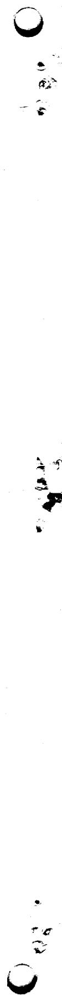

# CONTENTS

# Page

Abstract 1

Introduction 1

Experimental Details 2

Surveillance Assemblies 2

Materials 3

Test Specimens 5

Irradiation Conditions 5

Testing Techniques 7

Experimental Results 8

Visual and Metallographic Examination 8

Mechanical Property Data - Standard Hastelloy N 17

Mechanical Property Data - Modified Hastelloy N 35

Metallographic Examination of Test Samples 57

Discussion of Results 72

Summary and Conclusions 87

Acknowledgments 87

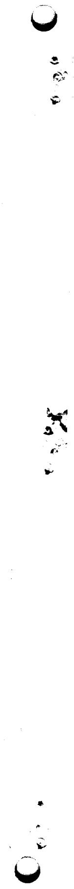

H. E. McCoy, Jr.

# ABSTRACT

Two heats of standard Hastelloy N were removed from the core of the MSRE after 22,533 hr at $650^{\circ}\mathrm{C}$ and exposed to a thermal fluence of $1.5 \times 10^{21}$ neutrons/cm² and a fast fluence $>50$ kev of $1.1 \times 10^{21}$ neutrons/cm². The mechanical properties have systematically deteriorated with increasing fluence. However, the change in properties is due to the helium produced by the $^{10}\mathrm{B}(\mathfrak{n},\alpha)^{7}\mathrm{Li}$ transmutation and can be reduced by changes in chemical composition. Some of these modified heats have been exposed to the core of the MSRE and show improved resistance to irradiation.

The corrosion of the Hastelloy N has been largely due to the selective removal of chromium. The rates of removal are much as predicted from the measured diffusion rate of chromium. Other superficial structure modifications have been observed, but they likely result from carbide precipitation along slip bands that were formed during machining.

# INTRODUCTION

The Molten-Salt Reactor Experiment (MSRE) is a single region reactor that is fueled by a molten fluoride salt (65 LiF-29.1 BeF $_2$ -5 ZrF $_4$ -0.9 UF $_4$ , mole %), moderated by unclad graphite, and contained by Hastelloy N (Ni-16 Mo-7 Cr-4 Fe-0.05 C, wt %). The details of the reactor design and construction can be found elsewhere.1 We knew that the neutron environment would produce some changes in the two structural materials - graphite and Hastelloy N. Although we were very confident of the compatibility of these materials with the fluoride salt, we needed to keep abreast of the possible development of corrosion problems within

the reactor itself. For these reasons, we developed a surveillance program that would allow us to follow the property changes of graphite and Hastelloy N specimens as the reactor operated.

The reactor went critical on June 1, 1965. After many small problems were solved, normal operation began in May 1966. We removed four groups of surveillance samples. The results of tests on the first three groups were reported.[2-4] This report deals primarily with the results of tests on samples removed with the fourth group. The fourth group included two heats of standard Hastelloy N used in fabricating the MSRE and three heats with modified chemistry that had better mechanical properties after irradiation and appear attractive for use in future molten-salt reactors. The respective history of each lot was (1) standard Hastelloy N, annealed 2 hr at $900^{\circ}\mathrm{C}$ and exposed to the MSRE core for 22,533 hr at $650^{\circ}\mathrm{C}$ to a thermal fluence of $1.5 \times 10^{22}$ neutrons/ $\mathrm{cm}^2$ , (2) two heats of modified Hastelloy N, annealed 1 hr at $1177^{\circ}\mathrm{C}$ and exposed to the MSRE core for 7244 hr at $650^{\circ}\mathrm{C}$ to a thermal fluence of $5.1 \times 10^{22}$ neutrons/ $\mathrm{cm}^2$ , and (3) a single heat of modified Hastelloy N, annealed for 1 hr at $1177^{\circ}\mathrm{C}$ and exposed to the MSRE cell environment of $\mathbf{N}_2 + 2$ to $5\% \mathbf{O}_2$ for 17,033 hr at $650^{\circ}\mathrm{C}$ to a thermal fluence of $2.5 \times 10^{19}$ neutrons/ $\mathrm{cm}^2$ . The results of tests on these materials will be presented in detail, and some comparisons will be made with the data from the groups removed previously.

# EXPERIMENTAL DETAILS

# Surveillance Assemblies

The core surveillance assembly5 was designed by W. H. Cook and others, and the details have been reported previously. The specimens

are arranged in three stringers. Each stringer is about 62 in. long and consists of two Hastelloy N rods and a graphite section made up of various pieces that are joined by pinning and tongue-and-groove joints. The Hastelloy N rod has periodic-reduced sections 1 l/8 in. long by 1/8 in. in diameter and can be cut into small tensile specimens after it is removed from the reactor. Three stringers are joined together so that they can be separated in a hot cell and reassembled with one or more new stringers for reinsertion into the reactor. The assembled stringers fit into a perforated Hastelloy N basket that is inserted into an axial position about 3.6 in. from the core center line.

A control facility is associated with the surveillance program. It utilizes a "fuel salt" containing depleted uranium in a static pot that is heated electrically. The temperature is controlled by the MSRE computer so that the temperature matches that of the reactor. Thus, these specimens are exposed to conditions similar to those in the reactor except for the static salt and the absence of a neutron flux.

There is another surveillance facility for Hastelloy N located outside the core in a vertical position about 4.5 in. from the vessel. These specimens are exposed to the cell environment of $\mathbb{N}_2 + 2$ to $5\%$ $\mathsf{O}_2$ .

# Materials

The compositions of the two heats of standard Hastelloy N are given in Table 1. These heats were air melted by the Stellar Division of Union Carbide Corporation. Heat 5085 was used for making the cylindrical portion of the reactor vessel and heat 5065 was used for forming the top and bottom heads. These materials were given a mill anneal of 1 hr at $1177^{\circ}\mathrm{C}$ and a final anneal of 2 hr at $900^{\circ}\mathrm{C}$ at ORNL after fabrication.

The chemical compositions of the three modified alloys are given in Table 1. The modifications in composition were made principally to improve the alloy's resistance to radiation damage and to bring about general improvements in the fabricability, weldability, and ductility.[6]

Table 1. Chemical Analysis of Surveillance Heats   

<table><tr><td rowspan="2">Element</td><td colspan="5">Content, wt %</td></tr><tr><td>Heat 5065</td><td>Heat 5085</td><td>Heat 7320</td><td>Heat 67-551</td><td>Heat 67-504</td></tr><tr><td>Cr</td><td>7.3</td><td>7.3</td><td>7.2</td><td>7.0</td><td>6.94</td></tr><tr><td>Fe</td><td>3.9</td><td>3.5</td><td>&lt; 0.05</td><td>0.02</td><td>0.05</td></tr><tr><td>Mo</td><td>16.5</td><td>16.7</td><td>12.0</td><td>12.2</td><td>12.4</td></tr><tr><td>C</td><td>0.065</td><td>0.052</td><td>0.059</td><td>0.028</td><td>0.07</td></tr><tr><td>Si</td><td>0.60</td><td>0.58</td><td>0.03</td><td>0.02</td><td>0.010</td></tr><tr><td>Co</td><td>0.08</td><td>0.15</td><td>0.01</td><td>0.03</td><td>0.02</td></tr><tr><td>W</td><td>0.04</td><td>0.07</td><td>&lt; 0.05</td><td>0.001</td><td>0.03</td></tr><tr><td>Mn</td><td>0.55</td><td>0.67</td><td>0.17</td><td>0.12</td><td>0.12</td></tr><tr><td>V</td><td>0.22</td><td>0.20</td><td>&lt; 0.02</td><td>&lt; 0.001</td><td>0.01</td></tr><tr><td>P</td><td>0.004</td><td>0.0043</td><td>0.002</td><td>0.0006</td><td>0.002</td></tr><tr><td>S</td><td>0.007</td><td>0.004</td><td>0.003</td><td>&lt; 0.002</td><td>0.003</td></tr><tr><td>Al</td><td>0.01</td><td>0.02</td><td>0.15</td><td>&lt; 0.05</td><td>0.03</td></tr><tr><td>Ti</td><td>0.01</td><td>&lt; 0.01</td><td>0.65</td><td>1.1</td><td>&lt; 0.02</td></tr><tr><td>Cu</td><td>0.01</td><td>0.01</td><td>0.02</td><td>0.01</td><td>0.03</td></tr><tr><td>O</td><td>0.0016</td><td>0.0093</td><td>0.001</td><td>0.0004</td><td>&lt; 0.0001</td></tr><tr><td>N</td><td>0.011</td><td>0.013</td><td>0.0002</td><td>0.0003</td><td>0.0003</td></tr><tr><td>Zr</td><td>&lt; 0.1</td><td>&lt; 0.002</td><td>&lt; 0.05</td><td>&lt; 0.01</td><td>0.01</td></tr><tr><td>Hf</td><td>&lt; 0.1</td><td></td><td></td><td></td><td>0.50</td></tr><tr><td>B</td><td>0.0024</td><td>0.0038</td><td>0.00002</td><td>0.0002</td><td>0.00003</td></tr></table>

Alloys 67-551 and 67-504 were small, 100-lb heats made by the Stellar Division of Union Carbide Corporation by vacuum melting. They were finished to $\frac{1}{2}$ in. plate by working at $870^{\circ}\mathrm{C}$ . We cut strips $\frac{1}{2}$ in. by $\frac{1}{2}$ in. from the plates and swaged them to $\frac{1}{4}$ -in.-diam rod. Two sections of rod were welded together to make 62-in.-long rods for fabricating the samples. The rods were annealed for $\frac{1}{hr}$ at $1177^{\circ}\mathrm{C}$ in argon and then the reduced sections were machined. Heat 7320 was a 5000-lb melt made by the Materials Systems Division of Union Carbide Corporation. Part of the heat was fabricated by the vendor to $\frac{5}{16}$ -in.-diam rod and was sinterless ground to obtain the needed $\frac{1}{4}$ in. stock. The material was annealed $\frac{1}{hr}$ at $1177^{\circ}\mathrm{C}$ and then the reduced sections were machined.

# Test Specimens

The surveillance rods inside the core are 62 in. long and those outside the vessel are 84 in. long. They both are $\frac{1}{4}$ in. in diameter with reduced sections $\frac{1}{8}$ in. in diameter by $\frac{1}{18}$ in. long. After removal from the reactor, the rods are sawed into small mechanical property specimens having a gage section $\frac{1}{8}$ in. in diameter by $\frac{1}{18}$ in. long.

The first rods were machined as segments and then welded together, but we described previously an improved technique in which we use a milling cutter to machine the reduced sections in the rod. This technique is quicker, cheaper, and requires less handling of the relatively fragile rods than the previous method of making the rods into segments. The standard Hastelloy N rods were machined and welded together and the modified alloys were prepared by milling.

# IRRADIATION CONDITIONS

The irradiation conditions for the various groups of surveillance specimens that have been removed are summarized in Table 2. The reactor operated from June 1965 until March 1968 with a single change of fuel salt in which there was a $33\%$ enrichment of $^{235}\mathrm{U}$ . After this period of operation the uranium in the fuel was stripped by fluorination and replaced with $^{233}\mathrm{U}$ (ref. 7). This charge of salt was used until the present group of samples was removed. Referring again to Table 2, the standard Hastelloy N in the core was exposed to both salts and the modified Hastelloy N in the core was exposed only to the latter salt. The same salt has been used in the control facility throughout operation.

The specimens outside the core (designated "vessel" specimens) were exposed to the cell environment of $\mathbb{N}_2 + 2$ to $5\% \mathrm{O}_2$ .

Table 2. Summary of Exposure Conditions of Surveillance Samples ${}^{a}$   

<table><tr><td rowspan="2"></td><td rowspan="2">Group 1
Core
Standard
Hastelloy N</td><td colspan="2">Group 2, Hastelloy N</td><td colspan="3">Group 3, Hastelloy N</td><td colspan="3">Group 4, Hastelloy N</td></tr><tr><td>Core
Modified</td><td>Vessel
Standard</td><td>Core
Standard</td><td>Core
Modified</td><td>Vessel
Standard</td><td>Core
Standard</td><td>Core
Modified</td><td>Vessel
Modified</td></tr><tr><td>Date inserted</td><td>9/8/65</td><td>9/13/66</td><td>8/24/65</td><td>9/13/66</td><td>6/5/67</td><td>8/24/65</td><td>9/13/66</td><td>4/10/68</td><td>5/7/68</td></tr><tr><td>Date removed</td><td>7/28/66</td><td>5/9/67</td><td>6/5/67</td><td>4/3/68</td><td>4/3/68</td><td>5/7/68</td><td>6/69</td><td>6/69</td><td>6/69</td></tr><tr><td>Megawatt-hour on MSRE
at time of insertion</td><td>0.0066</td><td>8682</td><td>0</td><td>8682</td><td>36,247</td><td>0</td><td>8682</td><td>72,441</td><td>36,247</td></tr><tr><td>Megawatt-hour on MSRE
at time of removal</td><td>8682</td><td>36,247</td><td>36,247</td><td>72,441</td><td>72,441</td><td>72,441</td><td>92,805</td><td>92,805</td><td>92,805</td></tr><tr><td>Temperature, °C</td><td>650 ± 10</td><td>650 ± 10</td><td>650 ± 10</td><td>650 ± 10</td><td>650 ± 10</td><td>650 ± 10</td><td>650 ± 10</td><td>650 ± 10</td><td>650 ± 10</td></tr><tr><td>Time at temperature, hr</td><td>4800</td><td>5500</td><td>11,000</td><td>15,289</td><td>9789</td><td>20,789</td><td>22,533</td><td>7244</td><td>17,033</td></tr><tr><td>Peak fluence, neutrons/cm2</td><td></td><td></td><td></td><td></td><td></td><td></td><td></td><td></td><td></td></tr><tr><td>Thermal (&lt; 0.876 ev)</td><td>1.3 × 1020</td><td>4.1 × 1020</td><td>1.3 × 1019</td><td>9.4 × 1020</td><td>5.3 × 1020</td><td>2.6 × 1019</td><td>1.5 × 1021</td><td>5.1 × 1020</td><td>2.5 × 1019</td></tr><tr><td>Epithermal (&gt; 0.876 ev)</td><td>3.8 × 1020</td><td>1.2 × 1021</td><td>2.5 × 1019</td><td>2.8 × 1021</td><td>1.6 × 1021</td><td>5.0 × 1019</td><td>3.7 × 1021</td><td>9.1 × 1020</td><td>3.9 × 1019</td></tr><tr><td>(&gt; 50 kev)</td><td>1.2 × 1020</td><td>3.7 × 1020</td><td>2.1 × 1019</td><td>8.5 × 1020</td><td>4.8 × 1020</td><td>4.2 × 1019</td><td>1.1 × 1021</td><td>1.1 × 1020</td><td>3.3 × 1019</td></tr><tr><td>(&gt; 1.22 Mev)</td><td>3.1 × 1019</td><td>1.0 × 1020</td><td>5.5 × 1018</td><td>2.3 × 1020</td><td>1.3 × 1020</td><td>1.1 × 1019</td><td>3.1 × 1020</td><td>0.8 × 1020</td><td>8.6 × 1018</td></tr><tr><td>(&gt; 2.02 Mev)</td><td>1.6 × 1019</td><td>0.5 × 1020</td><td>3.0 × 1018</td><td>1.1 × 1020</td><td>0.7 × 1020</td><td>6.0 × 1018</td><td>1.5 × 1020</td><td>0.4 × 1020</td><td>3.5 × 1018</td></tr><tr><td>Heat</td><td>5081</td><td>21545</td><td>5065</td><td>5065</td><td>67-502</td><td>5065</td><td>5065</td><td>7320</td><td>67-504</td></tr><tr><td>Designations</td><td>5085</td><td>21554</td><td>5085</td><td>5085</td><td>67-504</td><td>5085</td><td>5085</td><td>67-551</td><td></td></tr></table>

aInformation compiled by R. C. Steffy, Reactor Division, ORNL, July 1969. Revised for full-power operation at 8 Mw.

# Testing Techniques

The laboratory creep-rupture tests of unirradiated control specimens were run in conventional creep machines of the dead-load and lever-arm types. The strain was measured by a dial indicator that showed the total movement of the specimen and part of the load train. The zero strain measurement was taken immediately after the load was applied. The temperature accuracy was $\pm 0.75\%$ , the guaranteed accuracy of the Chromel-P-Alumel thermocouples used.

The postirradiation creep-rupture tests were run in lever-arm machines that were located in hot cells. The strain was measured by an extensometer with rods attached to the upper and lower specimen grips. The relative movement of these two rods was measured by a linear differential transformer, and the transformer signal was recorded. The accuracy of the strain measurement is difficult to determine. The extensometer (mechanical and electrical portions) produced measurements that could be read to about $\pm 0.02\%$ strain; however, other factors (temperature changes in the cell, mechanical vibrations, etc.) probably combine to give an overall accuracy of $\pm 0.1\%$ strain. This is considerably better than the specimen-to-specimen reproducibility that one would expect for relatively brittle materials. The temperature measuring and control system was the same as that used in the laboratory with only one exception. In the laboratory, the control system was stabilized at the desired temperature by use of a recorder with an expanded scale. In the tests in the hot cells, the control point was established by setting the controller without the aid of the expanded-scale recorder. This error and the thermocouple accuracy combine to give a temperature uncertainty of about $\pm 1\%$ .

The tensile tests were run on Instron Universal Testing Machines. The strain measurements were taken from the crosshead travel and generally are accurate to $\pm 2\%$ strain.

The test environment was air in all cases. Metallographic examination showed that the depth of oxidation was small, and we feel that the environment did not appreciably influence the test results.

# EXPERIMENTAL RESULTS

Visual and Metallographic Examination

W. H. Cook was in charge of the disassembly of the core surveillance fixture. As shown in Fig. 1, the assembly was in excellent mechanical condition when removed. The Hastelloy N samples were more discolored than noted previously; however, surface marking such as numbers were readily visible. The detailed appearance of the stringer has been described previously by Cook.8 The Hastelloy N surveillance rods located outside the core were oxidized, but the oxide was tenacious.

Metallographic examination of the Hastelloy N straps that held the graphite and metal together revealed intergranular cracks. A typical

8W. H. Cook, MSR Program Semiann. Progr. Rept. Aug. 31, 1965, ORNL-3872, pp. 87-92.

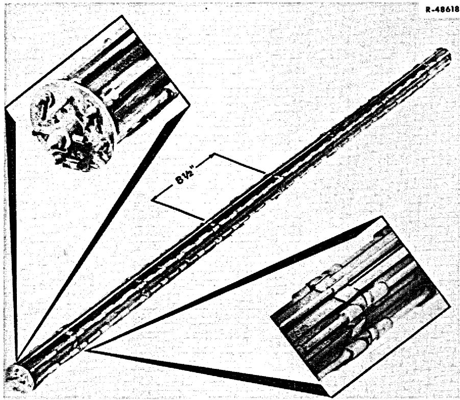  
Fig. 1. Overall View of MSRE Surveillance Assembly Removed After Run 18. Parts of this assembly had been exposed to the salt for 22,533 hr at $650^{\circ}\mathrm{C}$ . The center portion is graphite and the long rods are Hastelloy N.

crack is shown in Fig. 2 and extends to a depth of about 3 mils. A similar strap on the modified samples which had been in the reactor for 7244 hr had cracks to a depth of about 1.5 mils. These straps are about 0.020 in. thick and they likely encountered some deformation while being removed. However, the cracks were quite uniformly spaced on both surfaces of the straps, and their general appearance attests to a general corrosion that rendered the grain boundaries extremely brittle. Examination of unirradiated control straps failed to reveal a similar type of cracking.

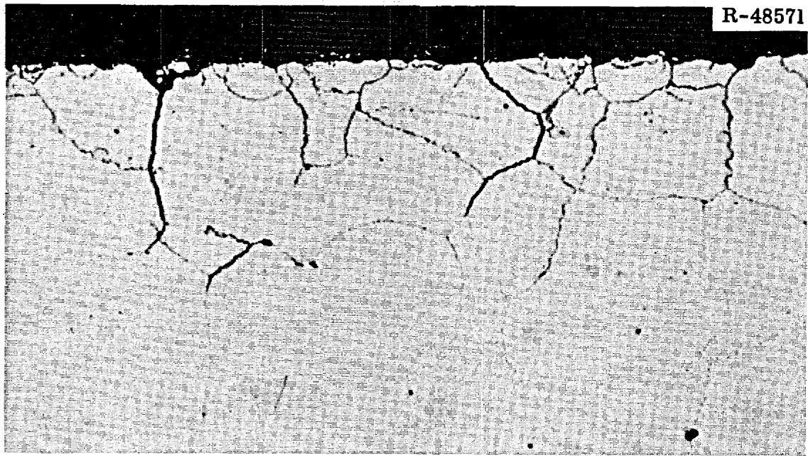  
Fig. 2. Typical Microstructure of a Hastelloy N (Heat 5055) After Exposure to the MSRE Core for 22,533 hr at $650^{\circ}\mathrm{C}$ . This material was used for straps for the surveillance assembly. As polished. 500x.

These observations led to the examination of tabs from the surveillance stringers. Small sections were cut from the centers of the Hastelloy N surveillance rods. Typical photomicrographs of heat 5065 after exposure to the core for 22,533 hr are shown in Fig. 3. The unetched view in Fig. 3(a) shows the surface layer that led to the discolored appearance and a single grain boundary that is visible. Much of the surface layer looks metallic, but this is difficult to judge on

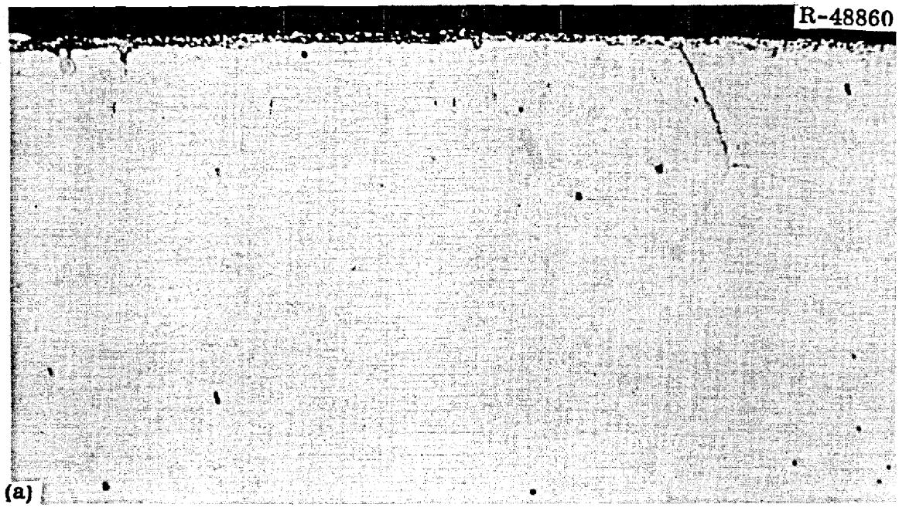

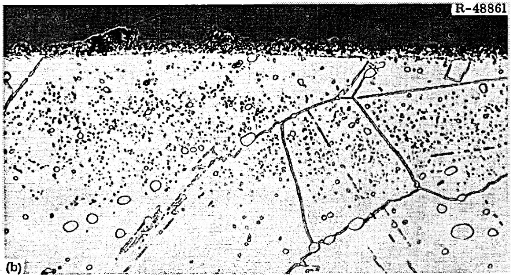  
Fig. 3. Typical Photomicrographs of Hastelloy N (Heat 5065) Exposed to the MSRE Core for 22,533 hr at $650^{\circ}\mathrm{C}$ . (a) As polished. (b) Etchant: aqua regia. $500\times$ .

such a thin film. The etched view in Fig. 3(b) reveals some carbide precipitation near the surface and grain boundaries that are generally lined with carbides. Heat 5085 was exposed an identical time and typical photomicrographs are shown in Fig. 4. The unetched view in Fig. 4(a) shows a modified grain boundary structure to a depth of about 2 mils. Etching [Fig. 4(b)] reveals a grain boundary network of carbides. The grain boundaries near the surface seem to etch differently from the rest of the sample, but little more can be said.

We interpreted these observations as being indicative of some corrosion and performed one further crude experiment to reveal the depth of this attack. One tensile sample had been cut too short for testing, and we bent the remaining portion in a vise. The sample was then sectioned and examined metallographically; the resulting photomicrographs are shown in Fig. 5. The tension side cracked to a depth of about 4 mils whereas the compression side did not crack. Both sides etched abnormally to a depth of about 4 mils.

Samples of heats 5065 and 5085 that were exposed to the static barren salt in the control facility were examined. Figure 6 shows typical photomicrographs of heat 5065 after exposure for 22,533 hr. There is some surface roughening, but no structure modification near the surface such as that shown in Fig. 3 for the sample from the reactor. Likewise, heat 5085 (Fig. 7) showed some surface effects that were minor compared with its irradiated counterpart in Fig. 4.

Thus, there is little doubt that the samples in the core experienced some modifications, apparently to a depth of 3 to 4 mils. This alters up to about $12\%$ of the sample cross section and can be expected to influence the mechanical properties. We shall dwell further on this very important subject later in this report.

A sample of heat 5085 from the core was examined by transmission electron microscopy. This sample had received sufficient thermal fluence to transmute about $97\%$ of the $^{10}\mathrm{B}$ to helium. The helium bubbles are obvious in Fig. 8. Another point of concern was the formation of voids in the material due to fast neutrons. No defects other than helium bubbles and dislocations were present.

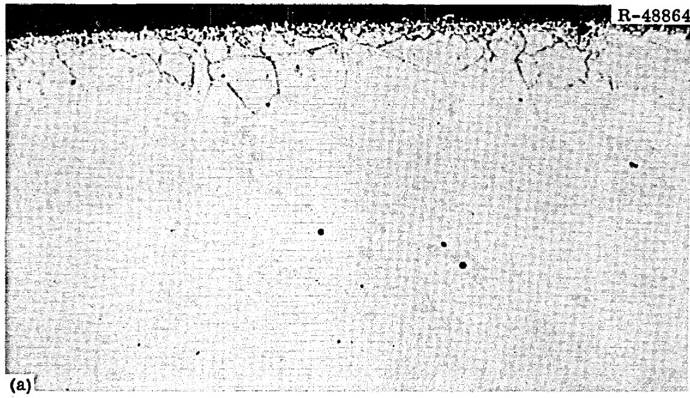

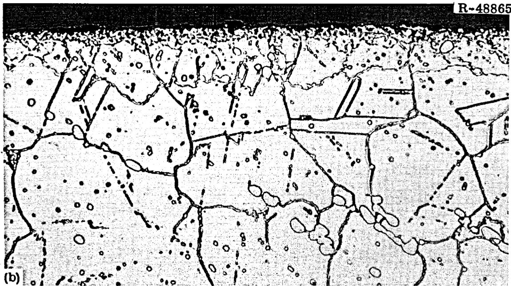  
Fig. 4. Typical Photomicrographs of Hastelloy N (Heat 5085) Exposed to the MSRE Core for 22,533 hr at $650^{\circ}\mathrm{C}$ . (a) As polished. (b) Etchant: glyceria regia. 500x.

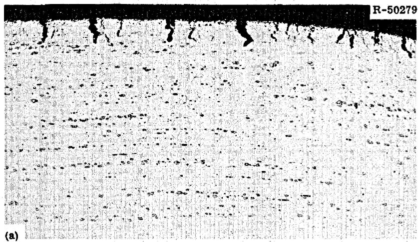

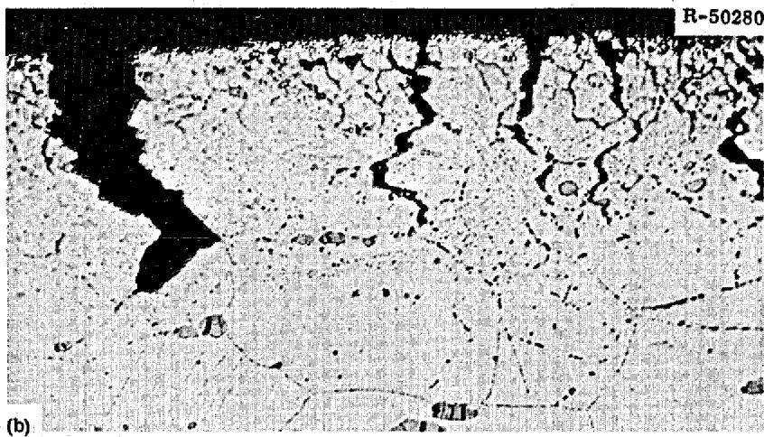

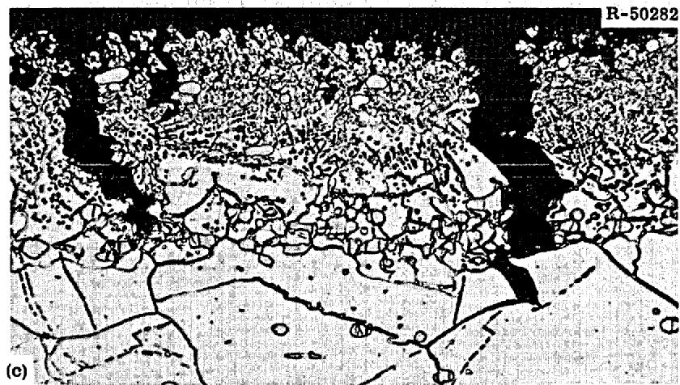

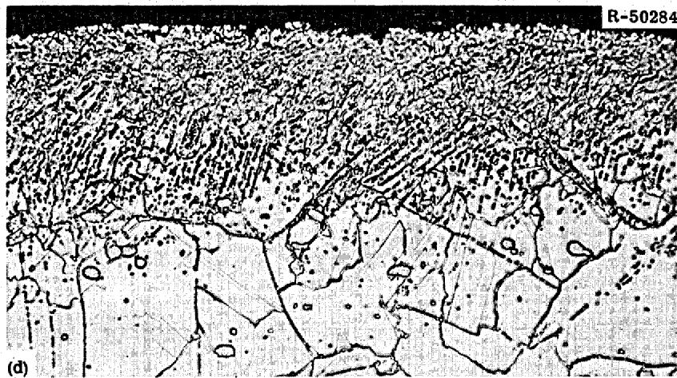  
Fig. 5. Typical Photomicrographs of a Hastelloy N (Heat 5085) Sample Exposed to the MSRE Core for 22,533 hr at $650^{\circ}\mathrm{C}$ . The sample was bent in a vise. (a) As polished, tension side. (b) As polished, tension side. (c) Etched, tension side. (d) Etched, compression side. Etchant: aqua regia. 500x. Reduced $27\%$ .

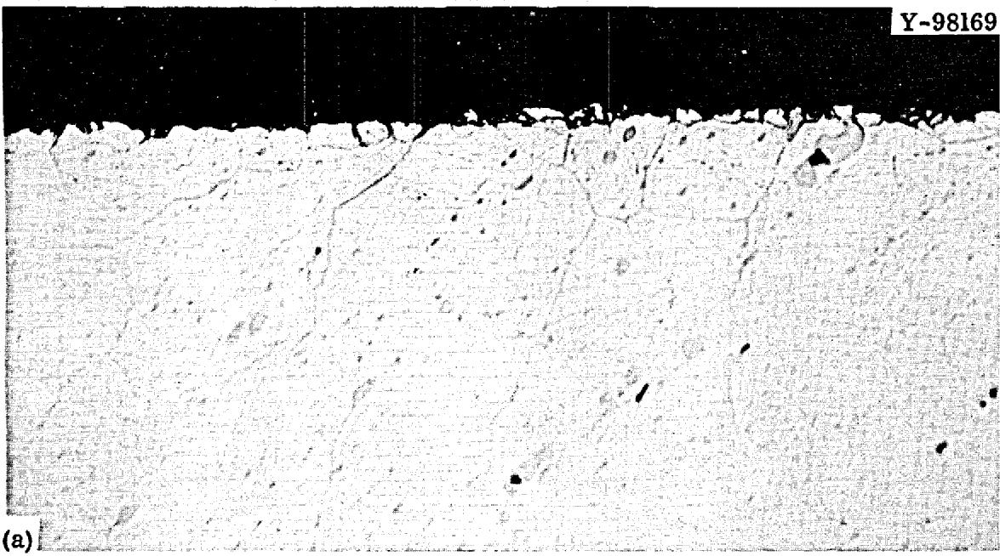

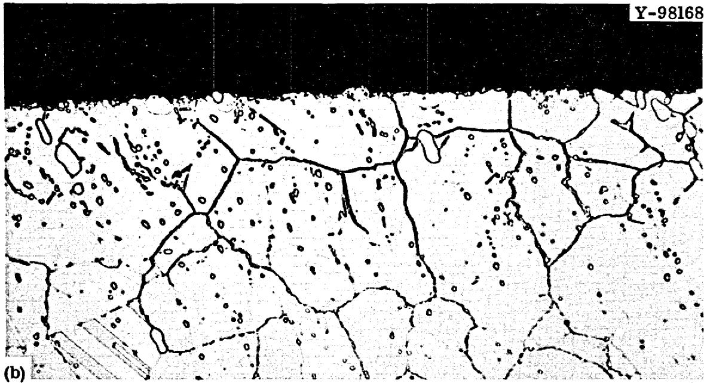  
Fig. 6. Typical Photomicrographs of Heat 5065 After Exposure to Static Barren Fuel Salt for 22,533 hr at $650^{\circ}\mathrm{C}$ . (a) As polished. (b) Etched. Etchant: glyceria regia. 500x.

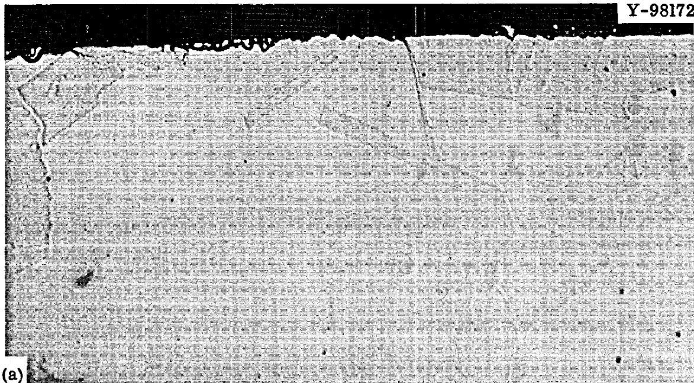

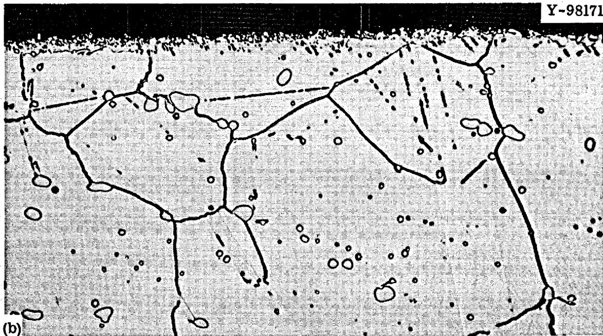  
Fig. 7. Typical Photomicrographs of Heat 5085 After Exposure to Static Barren Fuel Salt for 22,533 hr at $650^{\circ}\mathrm{C}$ . (a) As polished. (b) Etched. Etchant: glyceria regia. $500\times$ .

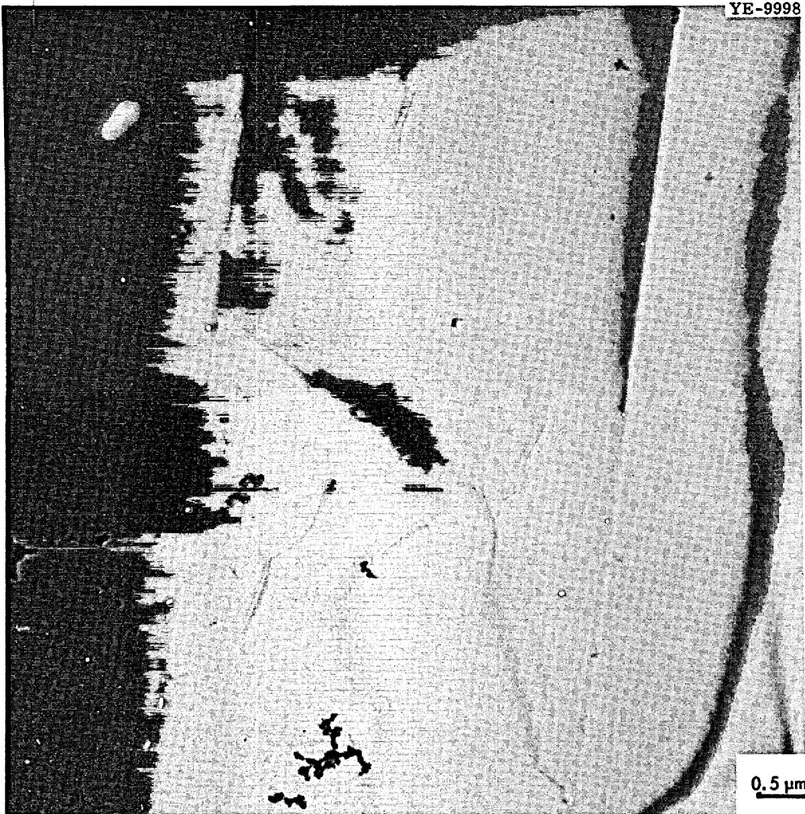  
Fig. 8. Transmission Electron Micrograph of Hastelloy N (Heat 5085) Exposed to the MSRE Core for 22,533 hr at $650^{\circ}\mathrm{C}$ . Irradiated to a thermal neutron fluence of $1.5 \times 10^{21}$ neutrons/cm² and a fast neutron fluence of $3.1 \times 10^{20}$ neutrons/cm² (>1.22 MeV). The white spots are helium bubbles that are located on a twin boundary. 25,000×. Reduced 16%.

# Mechanical Property Data - Standard Hastelloy N

Two heats of standard Hastelloy N were exposed to the MSRE core environment for 22,533 hr at $650^{\circ}\mathrm{C}$ and received a thermal neutron fluence of $1.5 \times 10^{21}$ neutrons/cm $^2$ . Similar control samples were exposed to static barren fuel salt for a corresponding length of time. The results of tensile tests on heat 5085 are summarized in Tables 3 and 4 for unirradiated and irradiated samples, respectively. The fracture strains are shown as a function of test temperature in Fig. 9. With increasing temperature the unirradiated samples exhibit first an increase in fracture strain, then a sharp decrease, and then an increase. The irradiated samples follow the same general pattern except for the absence

Table 3. Results of Tensile Tests on Control Samples of Heat $5085^{\text{a}}$   

<table><tr><td rowspan="2">Specimen Number</td><td rowspan="2">Test Temperature (°C)</td><td rowspan="2">Strain Rate (min-1)</td><td colspan="2">Stress, psi</td><td colspan="2">Elongation, %</td><td rowspan="2">Reduction in Area (%)</td><td rowspan="2">True Fracture Strain (%)</td></tr><tr><td>Yield</td><td>Ultimate Tensile</td><td>Uniform</td><td>Total</td></tr><tr><td>10410</td><td>25</td><td>0.05</td><td>48,100</td><td>108,500</td><td>40.5</td><td>40.6</td><td>32.8</td><td>40</td></tr><tr><td>10409</td><td>200</td><td>0.05</td><td>39,300</td><td>101,400</td><td>44.7</td><td>45.1</td><td>33.4</td><td>41</td></tr><tr><td>10408</td><td>400</td><td>0.05</td><td>35,400</td><td>94,900</td><td>48.2</td><td>48.9</td><td>39.3</td><td>50</td></tr><tr><td>10407</td><td>400</td><td>0.002</td><td>35,200</td><td>98,500</td><td>48.6</td><td>49.0</td><td>36.3</td><td>45</td></tr><tr><td>10406</td><td>500</td><td>0.05</td><td>34,000</td><td>92,800</td><td>48.0</td><td>48.8</td><td>40.0</td><td>51</td></tr><tr><td>10405</td><td>500</td><td>0.002</td><td>35,800</td><td>90,100</td><td>37.5</td><td>38.2</td><td>28.8</td><td>34</td></tr><tr><td>10416</td><td>550</td><td>0.05</td><td>32,700</td><td>88,900</td><td>51.6</td><td>52.2</td><td>37.1</td><td>46</td></tr><tr><td>10417</td><td>550</td><td>0.002</td><td>36,500</td><td>79,500</td><td>29.4</td><td>30.1</td><td>24.1</td><td>28</td></tr><tr><td>10418</td><td>600</td><td>0.05</td><td>33,400</td><td>82,200</td><td>37.3</td><td>37.9</td><td>28.6</td><td>34</td></tr><tr><td>10420</td><td>600</td><td>0.002</td><td>35,200</td><td>69,000</td><td>25.7</td><td>26.9</td><td>19.1</td><td>21</td></tr><tr><td>10421</td><td>650</td><td>0.05</td><td>32,600</td><td>75,200</td><td>31.0</td><td>32.0</td><td>28.9</td><td>34</td></tr><tr><td>10422</td><td>650</td><td>0.002</td><td>34,300</td><td>65,600</td><td>23.3</td><td>23.9</td><td>23.9</td><td>27</td></tr><tr><td>10404</td><td>650</td><td>0.0002</td><td>35,700</td><td>64,500</td><td>24.9</td><td>25.5</td><td>19.7</td><td>22</td></tr><tr><td>10412</td><td>650</td><td>0.000027</td><td>30,000</td><td>59,700</td><td>15.2</td><td>22.2</td><td>21.2</td><td>24</td></tr><tr><td>10423</td><td>760</td><td>0.05</td><td>33,900</td><td>64,900</td><td>25.6</td><td>27.5</td><td>19.7</td><td>22</td></tr><tr><td>10424</td><td>760</td><td>0.002</td><td>31,600</td><td>52,000</td><td>12.2</td><td>27.0</td><td>31.6</td><td>38</td></tr><tr><td>10426</td><td>850</td><td>0.05</td><td>33,600</td><td>50,600</td><td>10.0</td><td>33.0</td><td>37.1</td><td>46</td></tr><tr><td>10425</td><td>850</td><td>0.002</td><td>24,100</td><td>26,300</td><td>4.2</td><td>36.7</td><td>25.3</td><td>29</td></tr></table>

aAnnealed 2 hr at $900^{\circ}\mathrm{C}$ ; exposed to a static vessel of barren fuel salt for 22,533 hr at $650^{\circ}\mathrm{C}$ .

Table 4. Postirradiation Tensile Properties of Hastelloy N (Heat $5085)^{a}$   

<table><tr><td rowspan="2">Specimen Number</td><td rowspan="2">Test Temperature (°C)</td><td rowspan="2">Strain Rate (min-1)</td><td colspan="2">Stress, psi</td><td colspan="2">Elongation, %</td><td rowspan="2">Reduction in Area (%)</td><td rowspan="2">True Fracture Strain (%)</td></tr><tr><td>Yield</td><td>Ultimate Tensile</td><td>Uniform</td><td>Total</td></tr><tr><td>8806</td><td>25</td><td>0.05</td><td>53,900</td><td>89,000</td><td>22.0</td><td>22.1</td><td>19.6</td><td>22</td></tr><tr><td>8805</td><td>200</td><td>0.05</td><td>44,800</td><td>85,600</td><td>26.4</td><td>27.0</td><td>26.4</td><td>31</td></tr><tr><td>8804</td><td>400</td><td>0.05</td><td>41,600</td><td>80,900</td><td>30.2</td><td>30.5</td><td>24.3</td><td>28</td></tr><tr><td>8803</td><td>400</td><td>0.002</td><td>41,300</td><td>80,100</td><td>28.4</td><td>29.2</td><td>26.8</td><td>31</td></tr><tr><td>8802</td><td>500</td><td>0.05</td><td>40,800</td><td>73,200</td><td>24.8</td><td>25.0</td><td>23.2</td><td>26</td></tr><tr><td>8801</td><td>500</td><td>0.002</td><td>39,400</td><td>61,100</td><td>11.7</td><td>12.4</td><td>13.9</td><td>15</td></tr><tr><td>8812</td><td>550</td><td>0.05</td><td>37,900</td><td>62,600</td><td>14.4</td><td>14.9</td><td>14.3</td><td>15</td></tr><tr><td>8813</td><td>550</td><td>0.002</td><td>36,200</td><td>49,100</td><td>5.8</td><td>6.2</td><td>9.1</td><td>10</td></tr><tr><td>8814</td><td>600</td><td>0.05</td><td>36,700</td><td>56,200</td><td>9.8</td><td>10.5</td><td>13.3</td><td>14</td></tr><tr><td>8816</td><td>600</td><td>0.002</td><td>39,000</td><td>48,500</td><td>4.5</td><td>4.9</td><td>6.7</td><td>7</td></tr><tr><td>8817</td><td>650</td><td>0.05</td><td>36,400</td><td>50,800</td><td>8.8</td><td>9.3</td><td>9.1</td><td>10</td></tr><tr><td>8818</td><td>650</td><td>0.002</td><td>37,200</td><td>42,800</td><td>4.7</td><td>5.0</td><td>5.8</td><td>6</td></tr><tr><td>8800</td><td>650</td><td>0.002</td><td>35,200</td><td>37,700</td><td>2.1</td><td>2.4</td><td>2.8</td><td>3</td></tr><tr><td>8799</td><td>650</td><td>0.000027</td><td>32,900</td><td>34,500</td><td>1.2</td><td>1.4</td><td>6.1</td><td>6</td></tr><tr><td>8819</td><td>760</td><td>0.05</td><td>30,700</td><td>36,300</td><td>6.1</td><td>6.4</td><td>6.4</td><td>7</td></tr><tr><td>8820</td><td>760</td><td>0.002</td><td>35,100</td><td>35,100</td><td>1.7</td><td>2.0</td><td>2.5</td><td>3</td></tr><tr><td>8821</td><td>850</td><td>0.05</td><td>32,100</td><td>32,700</td><td>2.3</td><td>2.3</td><td>2.1</td><td>2</td></tr><tr><td>8822</td><td>850</td><td>0.002</td><td>22,200</td><td>22,200</td><td>1.6</td><td>1.7</td><td>2.6</td><td>3</td></tr></table>

aAnnealed 2 hr at $900^{\circ}\mathrm{C}$ prior to insertion in reactor. Irradiated to a thermal fluence of $1.5 \times 10^{21}$ neutrons/cm² over a period of 22,533 hr at $650^{\circ}\mathrm{C}$ .

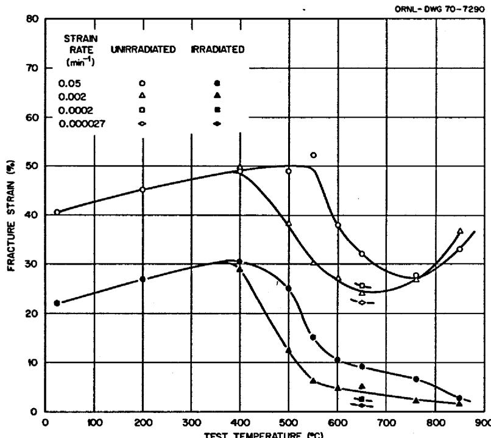  
Fig. 9. Fracture Strains of Hastelloy N (Heat 5085) After Removal from the MSRE and from the Control Facility. All samples annealed 1 hr at $900^{\circ}\mathrm{C}$ before irradiation for 22,533 hr at $650^{\circ}\mathrm{C}$ to a thermal fluence of $1.5 \times 10^{21}$ neutrons/cm $^2$ .

of a ductility increase at high temperatures. However, the levels of the fracture strains are lower for the irradiated material over the entire temperature range. For both materials the fracture strain decreases with decreasing strain rate. Another difference in behavior between the irradiated and unirradiated samples is that at the highest strain rate $(0.05\mathrm{min}^{-1})$ the fracture strain begins its precipitous drop at a lower temperature for the irradiated material.

Further characteristics of the effects of irradiation on the tensile properties of heat 5085 are apparent when the ratios of the irradiated and unirradiated properties are compared (Fig. 10). The yield stress is from 10 to $20\%$ higher for the irradiated material at test temperatures up to $760^{\circ}\mathrm{C}$ . The ultimate tensile stress is about $20\%$ lower for the irradiated material and drops even further as the test temperature is increased above $500^{\circ}\mathrm{C}$ . The fracture strains of the irradiated samples are about $50\%$ of those of the unirradiated samples up to about $500^{\circ}\mathrm{C}$ , above which the reduction is even greater.

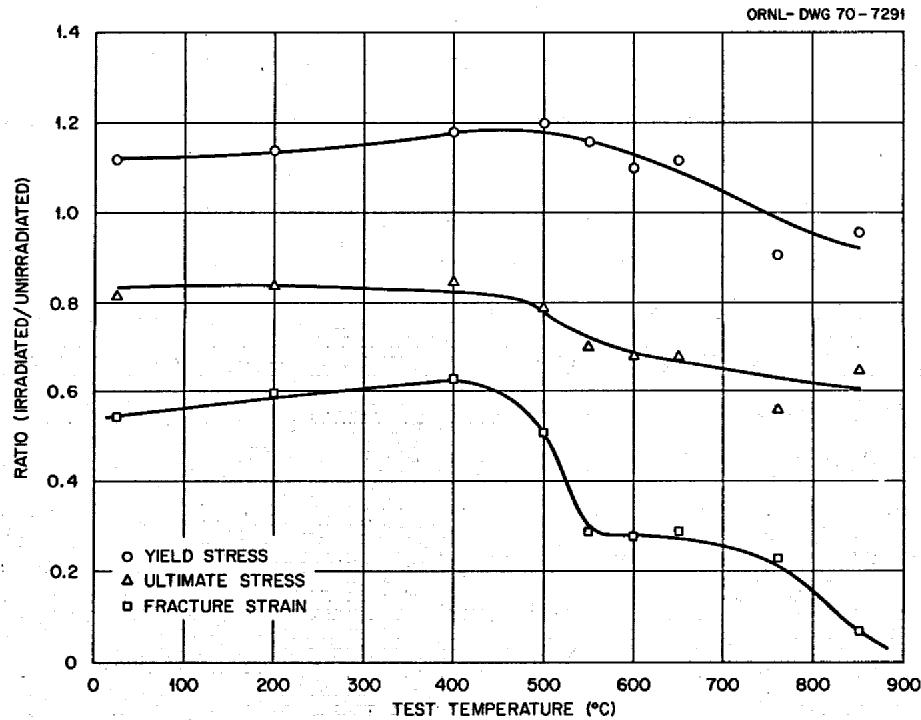  
Fig. 10. Comparison of the Tensile Properties of Control and Irradiated Hastelloy N (Heat 5085). Samples irradiated to a fluence of $1.5 \times 10^{21}$ neutrons/cm² over a period of 22,533 hr at $650^{\circ}\mathrm{C}$ . Tested at a strain rate of 0.05 min⁻¹.

The results of tensile tests on the samples of heat 5065 are summarized in Tables 5 and 6. The fracture strains of these samples are shown in Fig. 11 as a function of test temperature. The results are quite similar to those shown in Fig. 9 for heat 5085. A notable exception is the much higher fracture strains at low temperatures of heat 5065 after irradiation. The ratios of the irradiated and unirradiated tensile properties are shown in Fig. 12. The yield stress was not altered appreciably by irradiation. The ultimate tensile stress was decreased about $10\%$ by irradiation at low test temperatures and up to $35\%$ at high temperatures. Similarly, the fracture strain was reduced about $10\%$ at low temperatures, and this reduction progressed to about $85\%$ at high test temperatures.

The progressive change in the fracture strain with increasing fluence is illustrated in Fig. 13 for heat 5085. The fracture strain has been reduced over the entire range of test temperatures investigated. A similar trend was noted at a slower strain rate of $0.002 \, \text{min}^{-1}$ (Fig. 14), although the absolute values of the fracture strains were lower than noted in Fig. 13 at the higher strain rate of $0.05 \, \text{min}^{-1}$ . These samples have experienced various holding times at $650^{\circ}\text{C}$ and some of the property changes can be attributed to thermal aging. The fracture strains for several sets of control samples of heat 5085 are compared in Fig. 15. At low test temperatures and at $760^{\circ}\text{C}$ and above the fracture strain seems to show a progressive decrease with increasing holding time at $650^{\circ}\text{C}$ . At intermediate temperatures the behavior is more complex. At a test temperature of $650^{\circ}\text{C}$ , the results indicate a progressive decrease in fracture strain up to an exposure time of 15,289 hr and then an increase with further aging time.

Heat 5065 was not included in one set of surveillance samples, but there are sufficient data to follow the property changes with fluence and aging time at $650^{\circ}\mathrm{C}$ . The fracture strain is shown in Fig. 16 as a function of temperature for various fluences. At low test temperatures, excluding the one apparently anomalous point, the fracture strain was actually higher for irradiation to fluences of 1.3 and $2.6 \times 10^{19}$ neutrons/cm $^2$ . Higher fluences reduced the fracture strain at low test temperatures, but not to values as low as noted in Fig. 13 for heat 5085.

Table 5. Results of Tensile Tests on Control Samples of Heat $5065^{\text{a}}$   

<table><tr><td rowspan="2">Specimen Number</td><td rowspan="2">Test Temperature (°C)</td><td rowspan="2">Strain Rate (min-1)</td><td colspan="2">Stress, psi</td><td colspan="2">Elongation, %</td><td rowspan="2">Reduction in Area (%)</td><td rowspan="2">True Fracture Strain (%)</td></tr><tr><td>Yield</td><td>Ultimate Tensile</td><td>Uniform</td><td>Total</td></tr><tr><td>10384</td><td>25</td><td>0.05</td><td>61,200</td><td>126,500</td><td>48.5</td><td>49.8</td><td>36.77</td><td>46</td></tr><tr><td>10388</td><td>200</td><td>0.05</td><td>44,000</td><td>107,900</td><td>47.5</td><td>49.4</td><td>40.16</td><td>51</td></tr><tr><td>10392</td><td>400</td><td>0.05</td><td>42,600</td><td>102,000</td><td>48.9</td><td>50.8</td><td>45.31</td><td>60</td></tr><tr><td>10383</td><td>400</td><td>0.002</td><td>43,900</td><td>106,000</td><td>47.5</td><td>47.7</td><td>39.30</td><td>50</td></tr><tr><td>10391</td><td>500</td><td>0.05</td><td>42,200</td><td>99,400</td><td>48.1</td><td>49.6</td><td>37.54</td><td>47</td></tr><tr><td>10378</td><td>500</td><td>0.002</td><td>45,800</td><td>98,700</td><td>45.5</td><td>46.2</td><td>34.08</td><td>42</td></tr><tr><td>10395</td><td>550</td><td>0.05</td><td>42,500</td><td>98,800</td><td>48.2</td><td>49.9</td><td>38.14</td><td>48</td></tr><tr><td>10375</td><td>550</td><td>0.002</td><td>43,800</td><td>84,600</td><td>25.5</td><td>26.1</td><td>27.51</td><td>32</td></tr><tr><td>10377</td><td>600</td><td>0.05</td><td>41,800</td><td>93,800</td><td>42.0</td><td>43.0</td><td>34.08</td><td>42</td></tr><tr><td>10393</td><td>600</td><td>0.002</td><td>39,400</td><td>76,700</td><td>25.6</td><td>26.1</td><td>34.29</td><td>42</td></tr><tr><td>10382</td><td>650</td><td>0.05</td><td>41,500</td><td>81,900</td><td>26.4</td><td>26.8</td><td>23.84</td><td>27</td></tr><tr><td>10394</td><td>650</td><td>0.002</td><td>39,200</td><td>71,700</td><td>23.1</td><td>23.6</td><td>20.89</td><td>23</td></tr><tr><td>10397</td><td>650</td><td>0.0002</td><td>41,800</td><td>71,200</td><td>18.8</td><td>19.6</td><td>17.88</td><td>20</td></tr><tr><td>10400</td><td>650</td><td>0.000027</td><td>42,900</td><td>60,800</td><td>7.5</td><td>19.7</td><td>24.57</td><td>28</td></tr><tr><td>10385</td><td>760</td><td>0.05</td><td>32,900</td><td>70,500</td><td>24.3</td><td>27.3</td><td>22.85</td><td>26</td></tr><tr><td>10398</td><td>760</td><td>0.002</td><td>41,100</td><td>42,100</td><td>5.7</td><td>39.6</td><td>45.48</td><td>61</td></tr><tr><td>10390</td><td>850</td><td>0.05</td><td>35,500</td><td>49,500</td><td>8.7</td><td>38.1</td><td>45.31</td><td>60</td></tr><tr><td>10379</td><td>850</td><td>0.002</td><td>24,800</td><td>25,100</td><td>2.9</td><td>56.5</td><td>47.15</td><td>64</td></tr></table>

aAnnesled 2 hr at $900^{\circ}\mathrm{C}$ prior to insertion in the reactor. Exposed to a static vessel of barren fuel salt for 22,533 hr at $650^{\circ}\mathrm{C}$ .

Table 6. Postirradiation Tensile Properties of Hastelloy N (Heat 5065)a   

<table><tr><td rowspan="2">Specimen Number</td><td rowspan="2">Test Temperature (°C)</td><td rowspan="2">Strain Rate (min-1)</td><td colspan="2">Stress, psi</td><td colspan="2">Elongation, %</td><td rowspan="2">Reduction in Area (%)</td><td rowspan="2">True Fracture Strain (%)</td></tr><tr><td>Yield</td><td>Ultimate Tensile</td><td>Uniform</td><td>Total</td></tr><tr><td>8833</td><td>25</td><td>0.05</td><td>56,700</td><td>109,500</td><td>42.5</td><td>42.8</td><td>3.32</td><td>3</td></tr><tr><td>8832</td><td>200</td><td>0.05</td><td>46,000</td><td>99,900</td><td>42.8</td><td>44.6</td><td>4.44</td><td>5</td></tr><tr><td>8831</td><td>400</td><td>0.05</td><td>43,700</td><td>94,300</td><td>39.0</td><td>39.3</td><td>31.22</td><td>37</td></tr><tr><td>8830</td><td>400</td><td>0.002</td><td>43,200</td><td>91,300</td><td>35.7</td><td>37.2</td><td>27.31</td><td>32</td></tr><tr><td>8829</td><td>500</td><td>0.05</td><td>43,600</td><td>82,100</td><td>29.1</td><td>29.5</td><td>22.98</td><td>26</td></tr><tr><td>8828</td><td>500</td><td>0.002</td><td>39,800</td><td>63,200</td><td>10.9</td><td>11.3</td><td>10.70</td><td>11</td></tr><tr><td>8839</td><td>550</td><td>0.05</td><td>41,200</td><td>68,700</td><td>15.5</td><td>15.7</td><td>16.83</td><td>18</td></tr><tr><td>8840</td><td>550</td><td>0.002</td><td>37,800</td><td>57,700</td><td>7.1</td><td>7.2</td><td>8.93</td><td>9</td></tr><tr><td>8841</td><td>600</td><td>0.05</td><td>40,500</td><td>60,100</td><td>8.6</td><td>9.0</td><td>9.30</td><td>10</td></tr><tr><td>8842</td><td>600</td><td>0.002</td><td>41,000</td><td>50,400</td><td>4.3</td><td>4.5</td><td>7.40</td><td>8</td></tr><tr><td>8843</td><td>650</td><td>0.05</td><td>39,700</td><td>52,100</td><td>6.0</td><td>6.2</td><td>7.37</td><td>8</td></tr><tr><td>8844</td><td>650</td><td>0.002</td><td>40,000</td><td>42,800</td><td>3.0</td><td>3.1</td><td>4.89</td><td>5</td></tr><tr><td>8827</td><td>650</td><td>0.0002</td><td>34,300</td><td>36,100</td><td>2.1</td><td>2.2</td><td>3.30</td><td>3</td></tr><tr><td>8826</td><td>650</td><td>0.000027</td><td>28,400</td><td>36,900</td><td>1.1</td><td>1.2</td><td>1.1</td><td>1</td></tr><tr><td>8845</td><td>760</td><td>0.05</td><td>37,800</td><td>41,400</td><td>2.5</td><td>2.7</td><td>3.33</td><td>3</td></tr><tr><td>8846</td><td>760</td><td>0.002</td><td>35,200</td><td>35,200</td><td>1.3</td><td>1.3</td><td>2.86</td><td>3</td></tr><tr><td>8847</td><td>850</td><td>0.05</td><td>35,400</td><td>35,400</td><td>1.5</td><td>1.6</td><td>2.22</td><td>2</td></tr><tr><td>8848</td><td>850</td><td>0.002</td><td>20,300</td><td>20,300</td><td>1.0</td><td>1.0</td><td>0.16</td><td>0</td></tr></table>

aAnnealed 2 hr at $900^{\circ}\mathrm{C}$ prior to insertion in the reactor. Irradiated to a thermal fluence of $1.5 \times 10^{20}$ neutrons/cm² over a period of 22,533 hr at $650^{\circ}\mathrm{C}$ .

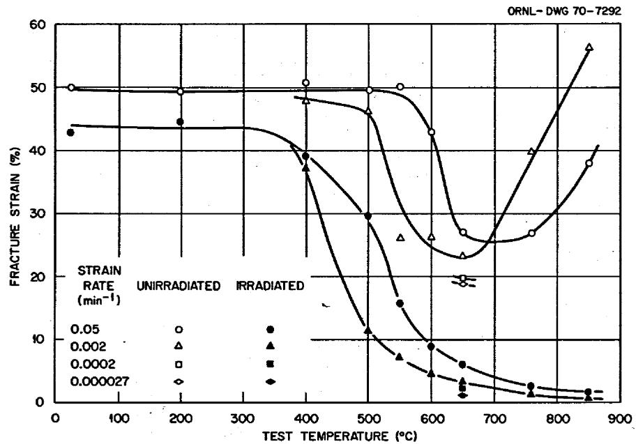  
Fig. 11. Fracture Strains of Hastelloy N (Heat 5065) After Removal from the MSRE and from the Control Facility. All samples annealed 2 hr at $900^{\circ}\mathrm{C}$ before irradiation for 22,533 hr at $650^{\circ}\mathrm{C}$ to a fluence of $1.5 \times 10^{21}$ neutrons/cm $^2$ .

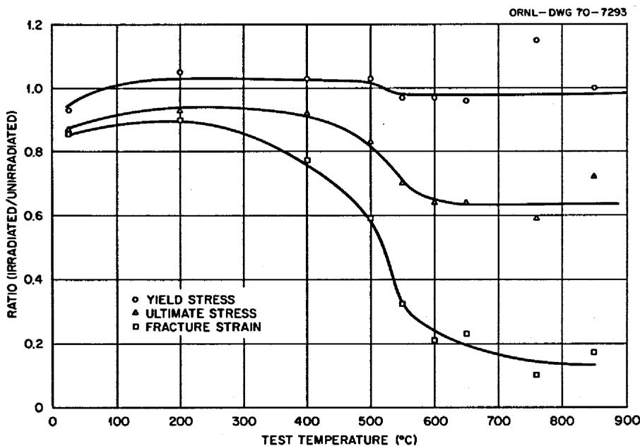  
Fig. 12. Comparison of the Tensile Properties of Control and Irradiated Hastelloy N (Heat 5065). Samples irradiated to a fluence of $1.5 \times 10^{21}$ neutrons/cm $^2$ over a period of 22,533 hr at $650^{\circ}\mathrm{C}$ . Tested at a strain rate of 0.05 min $^{-1}$ .

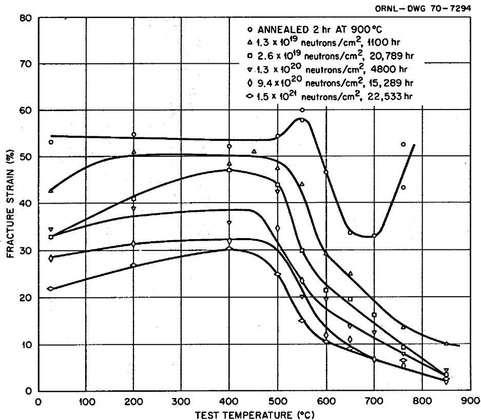  
Fig. 13. Fracture Strains of Hastelloy N (Heat 5085) After Irradiation to Various Thermal Fluences in the MSRE. Tested at a strain rate of $0.05 \, \text{min}^{-1}$ .

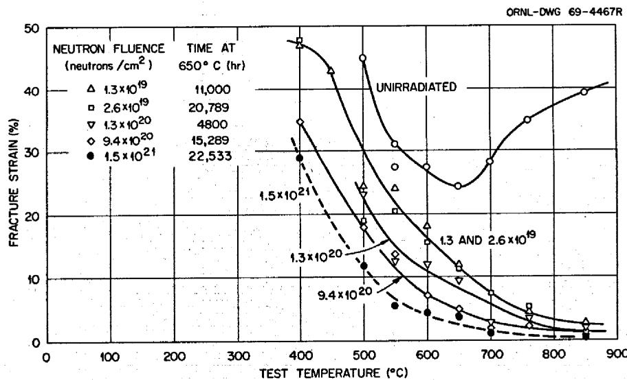  
Fig. 14. Postirradiation Tensile Properties of Hastelloy N (Heat 5085) After Exposure to Various Neutron Fluences. Tested at a strain rate of $0.002 \, \text{min}^{-1}$ .

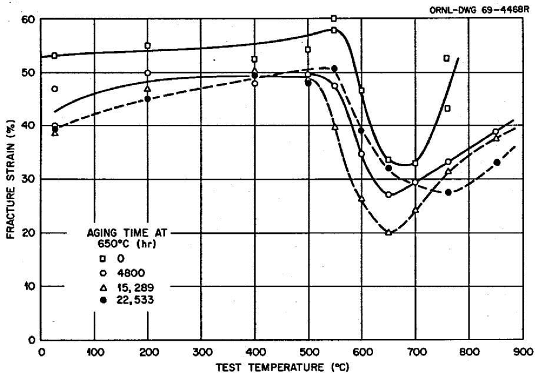  
Fig. 15. Variation of the Tensile Properties of Hastelloy N (Heat 5085) with Aging Time in Barren Fuel Salt at $650^{\circ}\mathrm{C}$ . Tested at a strain rate of $0.05\ \mathrm{min}^{-1}$ .

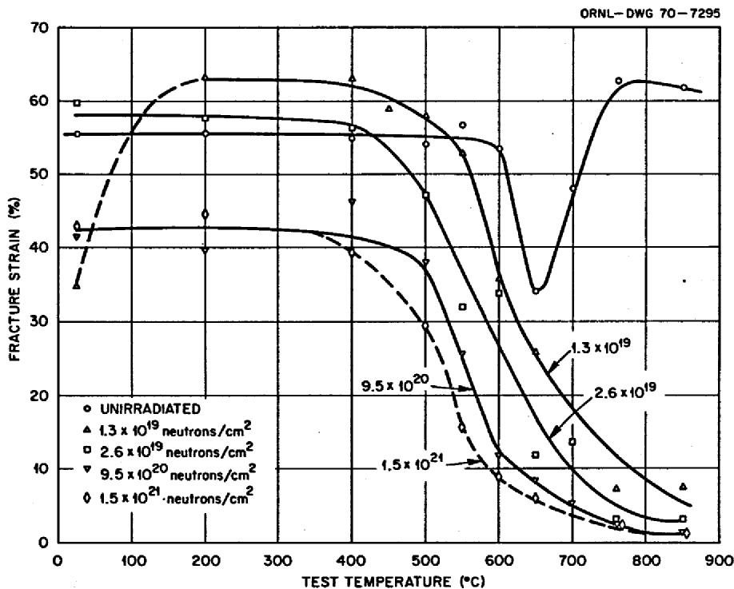  
Fig. 16. Variation of the Postirradiation Tensile Properties of Hastelloy N (Heat 5065) with Thermal Neutron Fluence.

At test temperatures above $550^{\circ}\mathrm{C}$ the fracture strain decreases progressively with increasing fluence. As shown in Fig. 17 some of these changes in fracture strain can be attributed to thermal aging at $650^{\circ}\mathrm{C}$ . Except at test temperatures above $750^{\circ}\mathrm{C}$ , the fracture strain is lowest for the material aged 15,289 hr and is improved after aging 22,533 hr. The changes in properties at low test temperatures are less than those for heat 5085 (Fig. 15).

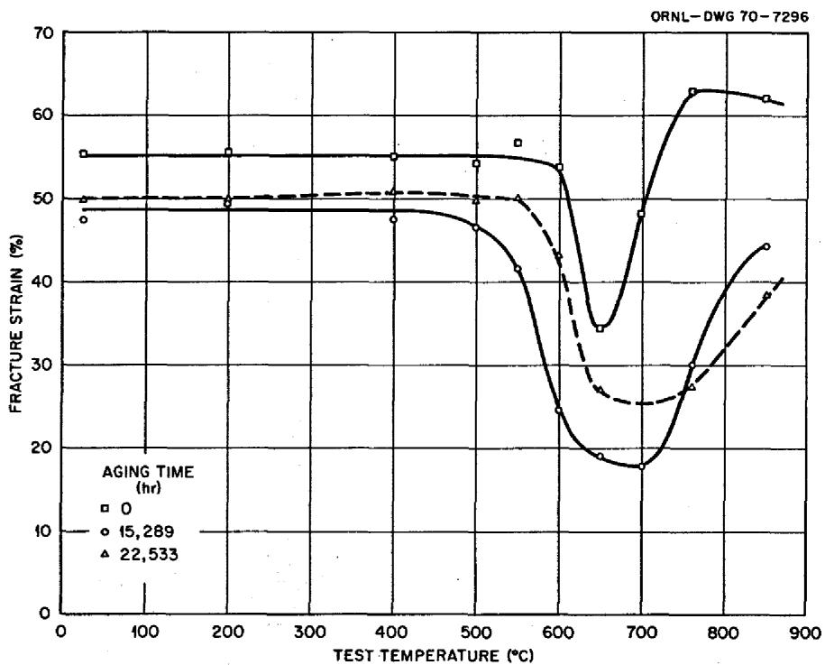  
Fig. 17. Effects of Thermal Aging at $650^{\circ}\mathrm{C}$ on the Tensile Properties of Hastelloy N (Heat 5065) at a Strain Rate of $0.05\mathrm{min}^{-1}$ .

As discussed previously in this series of reports, the changes in fracture strain at low temperatures were not expected. Although the fracture strains have not reached values below $20\%$ , we are still interested in its progression. Our experience to date is summarized in Fig. 18. If the noted effects were due simply to thermal aging, then the results should correlate with the time at $650^{\circ}\mathrm{C}$ . Obviously such a correlation does not exist. Where data are available for pairs of irradiated and unirradiated samples, the irradiated sample has the lower

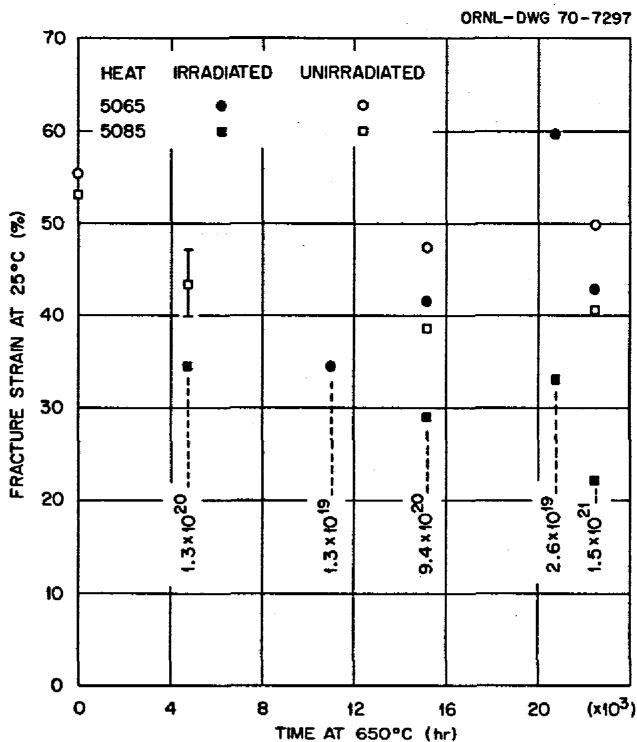  
Fig. 18. Variation of the Fracture Strain at $25^{\circ}\mathrm{C}$ with Annealing Time and Thermal Fluence.

fracture strain. This indicates that irradiation has a role in the embrittlement. We previously showed that the ductility could be recovered by an anneal of 8 hr at $871^{\circ}\mathrm{C}$ and concluded that the changes must be associated with carbide precipitation.[9] The higher susceptibility of heat 5085 to this type of embrittlement is not understood, since heat 5065 actually has a higher carbon concentration (Table 1, p. 4). The data in Fig. 18 defy extrapolation, so one cannot conclude whether the room temperature embrittlement is likely to become worse.

In these discussions of tensile properties we have emphasized the changes in fracture strain and made little mention of strength changes. Some pertinent data are summarized in Table 7 for heat 5085. The samples were tested at 25 and $650^{\circ}\mathrm{C}$ and include three histories: (1) as annealed, (2) thermally aged, and (3) irradiated. The changes in yield strength are likely significant, but the main point is that they are

Table 7. Comparison of the Tensile Properties of Heat 5085 Before and After Irradiationa   

<table><tr><td rowspan="2">Heat Treatment</td><td colspan="2">Yield Stress, psi</td><td colspan="2">Ultimate Tensile Stress, psi</td><td colspan="2">Fracture Strain, %</td></tr><tr><td>at 25°C</td><td>at 650°C</td><td>at 25°C</td><td>at 650°C</td><td>at 25°C</td><td>at 650°C</td></tr><tr><td>Annealed 2 hr at 900°C</td><td>51,500</td><td>29,600</td><td>120,900</td><td>75,800</td><td>53.1</td><td>33.7</td></tr><tr><td>Annealed 2 hr at 900°C and aged 22,533 hr at 650°C</td><td>48,100</td><td>32,600</td><td>108,500</td><td>75,200</td><td>40.6</td><td>32.0</td></tr><tr><td>Annealed 2 hr at 900°C, irradiated for 22,533 hr at 650°C to a thermal fluence of 1.5 × 1021 neutrons/cm2</td><td>53,900</td><td>36,400</td><td>89,000</td><td>50,800</td><td>22.1</td><td>9.3</td></tr></table>

aStrain rate of 0.05 min-1.

small considering the long thermal history of 22,533 hr. The ultimate tensile strength is reduced due to the lower fracture strain and the resulting fact that the test is interrupted before it reaches the high ultimate strength noted for the as-annealed material. Similar results are shown in Table 8 for heat 5065. The yield strength is increased by aging, but the main effects are on the fracture strains and the ultimate tensile strengths.

Table 8. Comparison of the Tensile Properties of Heat 5065 Before and After Irradiationa   

<table><tr><td rowspan="2">Heat Treatment</td><td colspan="2">Yield Stress, psi</td><td colspan="2">Ultimate Tensile Stress, psi</td><td>Fracture</td><td>Strain, %</td></tr><tr><td>at 25°C</td><td>at 650°C</td><td>at 25°C</td><td>at 650°C</td><td>at 25°C</td><td>at 650°C</td></tr><tr><td>Annealed 2 hr at 900°C</td><td>56,700</td><td>32,100</td><td>126,400</td><td>81,200</td><td>55.3</td><td>34.3</td></tr><tr><td>Annealed 2 hr at 900°C and aged 22,533 hr at 650°C</td><td>61,200</td><td>41,500</td><td>126,500</td><td>81,900</td><td>49.8</td><td>26.8</td></tr><tr><td>Annealed 2 hr at 900°C, irradiated for 22,533 hr at 650°C to a thermal fluence of 1.5 × 1021 neutrons/cm2</td><td>56,700</td><td>39,700</td><td>109,500</td><td>52,100</td><td>42.8</td><td>6.2</td></tr></table>

aStrain rate of 0.05 min-1.

The results of creep-rupture tests on heats 5085 and 5065 from the fourth group of surveillance samples are summarized in Tables 9 and 10. The results are most interesting when they are compared with those obtained on previous groups of surveillance samples so that the progressive changes in properties can be noted. The stress-rupture properties of heat 5085 are shown in Fig. 19. The rupture lives of the last group of samples (1.5 × 10²¹ thermal neutrons/cm²) are not detectably different from those irradiated previously to a thermal fluence of 9.4 × 10²⁰ neutrons/cm². In the unirradiated condition, the rupture lives for the samples aged 22,533 hr are slightly less than in the as-annealed condition, but greater than those observed for samples aged for lesser times.

Table 9. Creep-Rupture Tests on Heat 5085 at ${650}^{ \circ  }\mathrm{C}$   

<table><tr><td>Test Number</td><td>Specimen Number</td><td>Stress (psi)</td><td>Rupture Life (hr)</td><td>Rupture Strain (%)</td><td>Reduction in Area (%)</td><td>Minimum Creep Rate (%/hr)</td></tr><tr><td colspan="7">Unirradiateda</td></tr><tr><td>7978</td><td>10406</td><td>55,000</td><td>22.1</td><td>21.0</td><td>23.4</td><td>0.288</td></tr><tr><td>7897</td><td>10415</td><td>40,000</td><td>500.1</td><td>24.5</td><td>28.5</td><td>0.0299</td></tr><tr><td>7896b</td><td>10414</td><td>32,400</td><td>2500.7</td><td>12.7</td><td>9.4</td><td>0.0045</td></tr><tr><td>7895b</td><td>10413</td><td>27,000</td><td>2187.1</td><td>5.40</td><td>5.40</td><td>0.0026</td></tr><tr><td>7894b</td><td>10412</td><td>21,500</td><td>2064.9</td><td>2.10</td><td>2.44</td><td>0.0011</td></tr><tr><td>7893b</td><td>10411</td><td>17,000</td><td>2000.0</td><td>1.1</td><td>0</td><td>0.0007</td></tr><tr><td colspan="7">Irradiatedc</td></tr><tr><td>R-969</td><td>8811</td><td>40,000</td><td>0.6</td><td>1.1</td><td></td><td>0.78</td></tr><tr><td>R-958</td><td>8810</td><td>32,400</td><td>31.6</td><td>0.54</td><td></td><td>0.0067</td></tr><tr><td>R-956</td><td>8809</td><td>27,000</td><td>60.2</td><td>0.57</td><td></td><td>0.0055</td></tr><tr><td>R-957</td><td>8808</td><td>21,500</td><td>362.0</td><td>0.63</td><td></td><td>0.0010</td></tr><tr><td>R-964</td><td>8807</td><td>17,000</td><td>426.4</td><td>0.69</td><td></td><td>0.0004</td></tr></table>

aAnnealed 2 hr at $900^{\circ}\mathrm{C}$ , exposed to static barren fuel salt for 22,533 hr at $650^{\circ}\mathrm{C}$ .   
bDiscontinued prior to failure.   
cAnnealed 2 hr at $900^{\circ}\mathrm{C}$ , exposed to MSRE core for 22,533 hr at $650^{\circ}\mathrm{C}$ , received thermal fluence of $1.5 \times 10^{21}$ neutrons/cm².

Table 10. Creep-Rupture Tests on Heat 5065 at ${650}^{ \circ  }\mathrm{C}$   

<table><tr><td>Test Number</td><td>Specimen Number</td><td>Stress (psi)</td><td>Rupture Life (hr)</td><td>Rupture Strain (%)</td><td>Reduction in Area (%)</td><td>Minimum Creep Rate (%/hr)</td></tr><tr><td colspan="7">Unirradiateda</td></tr><tr><td>7978</td><td>10406</td><td>55,000</td><td>22.1</td><td>21.0</td><td>23.4</td><td>0.34</td></tr><tr><td>7892</td><td>10388</td><td>40,000</td><td>651.2</td><td>36.3</td><td>29.9</td><td>0.0331</td></tr><tr><td>7891b</td><td>10387</td><td>32,400</td><td>2144.3</td><td>44.7</td><td>37.7</td><td>0.0096</td></tr><tr><td>7890b</td><td>10386</td><td>27,000</td><td>2187.1</td><td>8.8</td><td>7.4</td><td>0.0040</td></tr><tr><td>7889b</td><td>10385</td><td>21,500</td><td>2373.3</td><td>3.6</td><td>2.2</td><td>0.0013</td></tr><tr><td>7888b</td><td>10384</td><td>17,000</td><td>2000.0</td><td>2.8</td><td>0</td><td></td></tr><tr><td colspan="7">Irradiatedc</td></tr><tr><td>R-966</td><td>8838</td><td>40,000</td><td>0</td><td></td><td></td><td></td></tr><tr><td>R-962</td><td>8836</td><td>32,400</td><td>22.7</td><td>0.25</td><td></td><td>0.0075</td></tr><tr><td>R-954</td><td>8836</td><td>27,000</td><td>40.5</td><td>0.44</td><td></td><td>0.0061</td></tr><tr><td>R-960</td><td>8835</td><td>21,500</td><td>46.2</td><td>0.47</td><td></td><td>0.0051</td></tr><tr><td>R-963</td><td>8834</td><td>17,000</td><td>1567.3</td><td>0.86</td><td></td><td>0.0004</td></tr></table>

aAnnealed 2 hr at $900^{\circ}\mathrm{C}$ , exposed to static barren fuel salt for 22,533 hr at $650^{\circ}\mathrm{C}$ .   
bDiscontinued prior to failure.   
cAnnealed 2 hr at $900^{\circ}\mathrm{C}$ , exposed to MSRE core for 22,533 hr at $650^{\circ}\mathrm{C}$ , received thermal fluence of $1.5 \times 10^{21}$ neutrons/cm $^2$ .

The minimum creep rates are shown as a function of stress in Fig. 20 for heat 5085. As noted previously, neither irradiation nor aging has a detectable effect on the creep rate. The data deviate from the line shown in Fig. 20 at both extremes. At high stresses, the irradiated samples fail at such low strains that a minimum creep rate is not established over long enough period for measurement. At low stress levels the data deviate due to the semilog plot.

The fracture strain is the parameter most affected by irradiation, and a variation of this parameter with minimum creep rate is shown in Fig. 21 for heat 5085 at $650^{\circ}\mathrm{C}$ . There has been a continual deterioration of the fracture strain with increasing thermal fluence.

Tensile and creep tests were run at $650^{\circ}\mathrm{C}$ at several different strain rates and stresses. The fracture strains from these tests are plotted together in Fig. 22 although different parameters are controlled

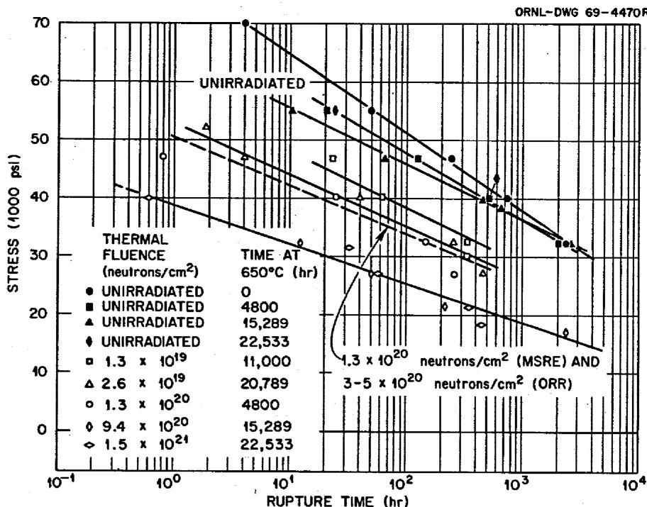  
Fig. 19. Postirradiation Stress-Rupture Properties of MSRE Surveillance Specimens (Heat 5085) at $650^{\circ}\mathrm{C}$ .

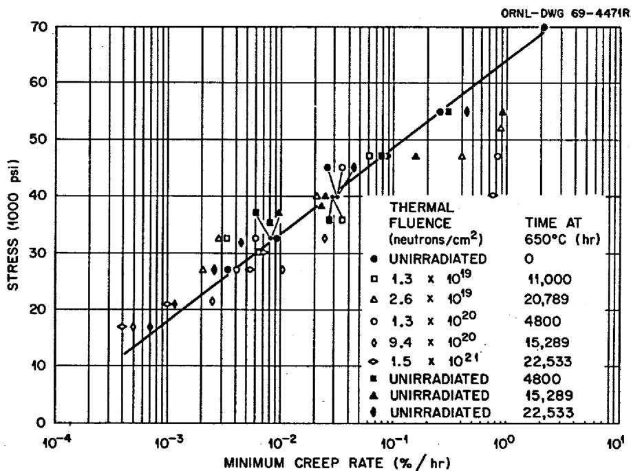  
Fig. 20. Minimum Creep Rate of Hastelloy N (Heat 5085) Surveillance Specimens from the MSRE at $650^{\circ}\mathrm{C}$ .

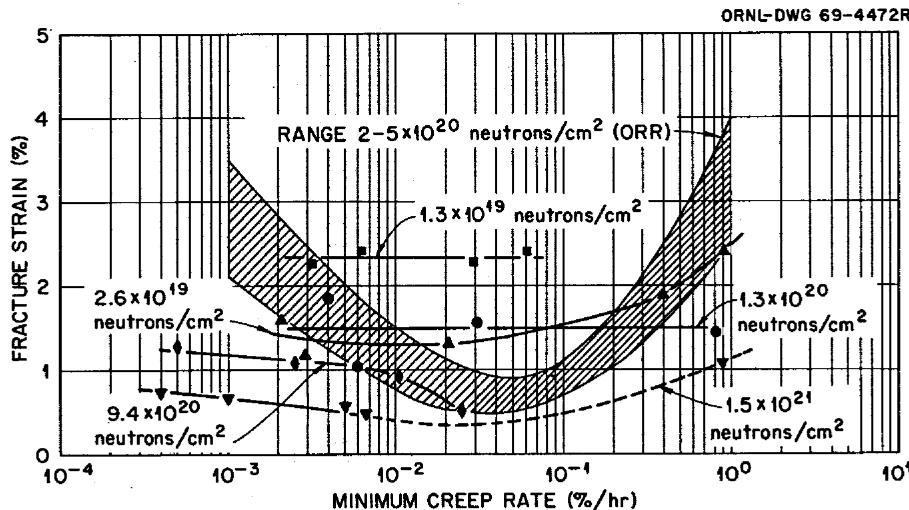  
Fig. 21. Variation of Fracture Strain with Strain Rate for Hastelloy N (Heat 5085) Surveillance Specimens at $650^{\circ}\mathrm{C}$ .

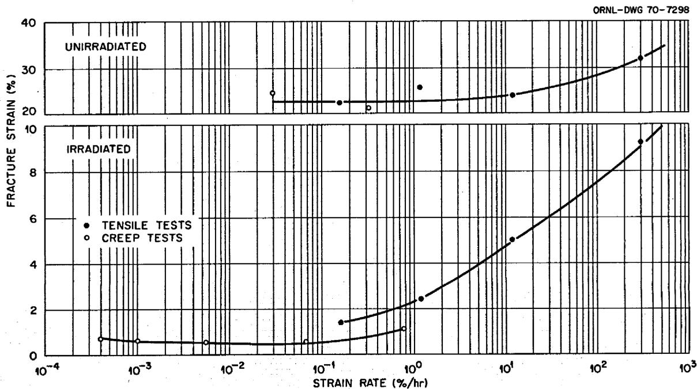  
Fig. 22. Fracture Strain at $650^{\circ}\mathrm{C}$ of Heat 5085 in the Unirradiated and Irradiated Conditions. Irradiated to a thermal fluence of $1.5 \times 10^{21}$ neutrons/cm $^2$ over a period of 22,533 hr at $650^{\circ}\mathrm{C}$ .

in the two types of tests. The most striking feature is the marked dependence of the fracture strain of the irradiated samples on the strain rate and the rather weak dependence of the fracture strains of the unirradiated samples on the strain rate. The irradiated samples at this

high fluence level show a general decrease in fracture strain with decreasing strain rate, with a possible slight increase in fracture strain at very low strain rates.

The sensitivity of the fracture strain of heat 5085 at $650^{\circ}\mathrm{C}$ to the helium content is illustrated in Fig. 23 for three strain rates. This material contains 38 ppm B (Table 1, p. 4) that can yield an equivalent amount of helium when transmuted. (Several factors contribute to the relationship that 1 ppm of natural boron by weight leads to 1.1 ppm He on an atomic basis.) The points shown in Fig. 23 all come from surveillance samples from the MSRE. The two higher strain rates are obtained by tensile testing, and the fracture strain decreases with increasing helium content. The $0.1\%$ strain rate is the creep rate that corresponds to the lowest fracture strain (Fig. 21). The fracture strain drops abruptly with the presence of 1 ppm He and then decreases gradually with increasing helium content.

The creep properties of heat 5065 are illustrated in a series of graphs similar to that just presented for heat 5085. The stress-rupture properties at $650^{\circ}\mathrm{C}$ are shown in Fig. 24 for heat 5065. The rupture

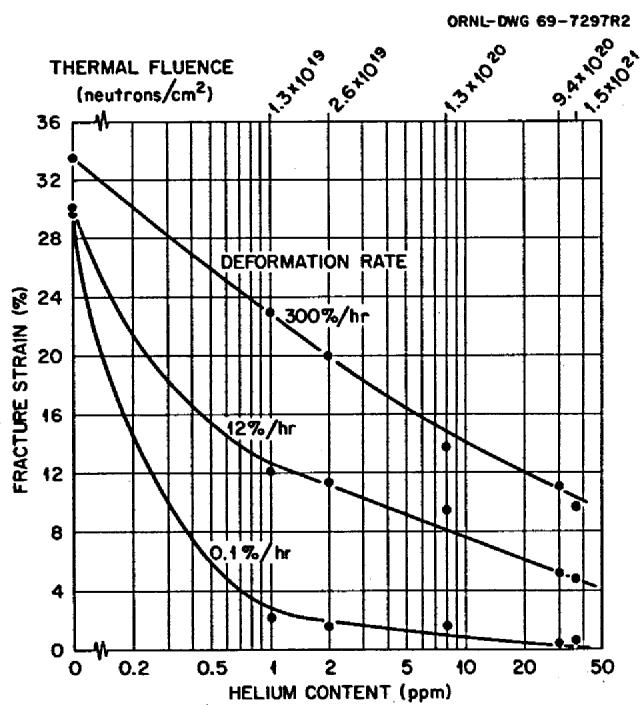  
Fig. 23. Variation of the Fracture Strain with Calculated Helium Content and Strain Rate for Hastelloy N (Heat 5085) at $650^{\circ}\mathrm{C}$ .

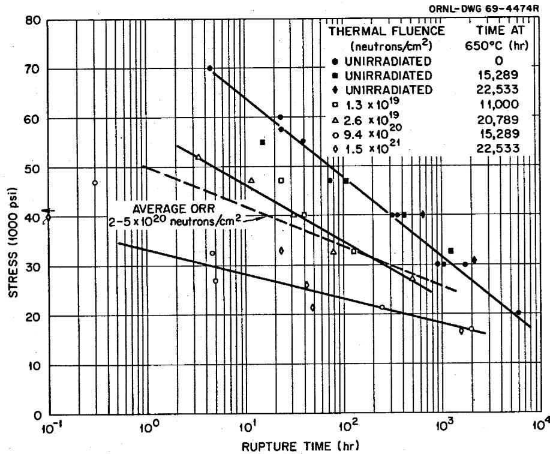  
Fig. 24. Stress-Rupture Properties of MSRE Surveillance Specimens (Heat 5065) at $650^{\circ}\mathrm{C}$ .

times are equivalent for the samples irradiated to the two highest fluences. The rupture times are also quite comparable with those shown in Fig. 19 for heat 5085. The unirradiated samples that were aged for 22,533 hr at $650^{\circ}\mathrm{C}$ in static barren fuel salt have longer rupture lives than the as-received material. The minimum creep rates are shown in Fig. 25 and show a lack of sensitivity to any of the variables being studied. The fracture strain is shown as a function of strain rate in Fig. 26. The fracture strain decreases with increasing fluence up to the two highest fluence levels, where the strains are about equivalent. This heat of material shows a ductility minimum with the fracture strain increasing slightly with decreasing creep rate except for the samples showing the lowest fluence.

The tensile and creep test results for heat 5065 have been combined in Fig. 27. These results again show the marked dependence of the fracture strain on the strain rate for the irradiated material. A comparison with the similar plot for heat 5085 (Fig. 22) reveals some slight differences in the fracture strains of the two heats, but shows generally

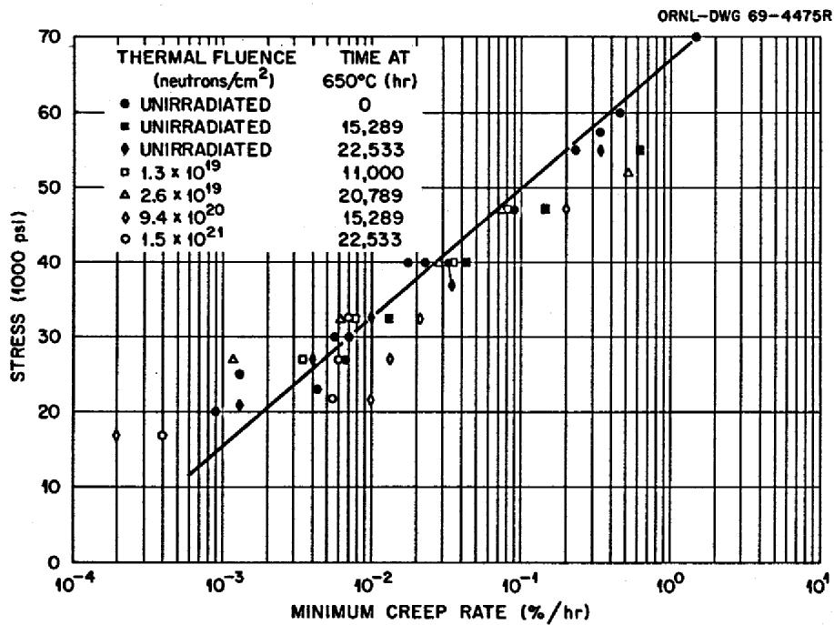  
Fig. 25. Minimum Creep Rate of Hastelloy N (Heat 5065) Surveillance Samples from the MSRE at $650^{\circ}\mathrm{C}$ .

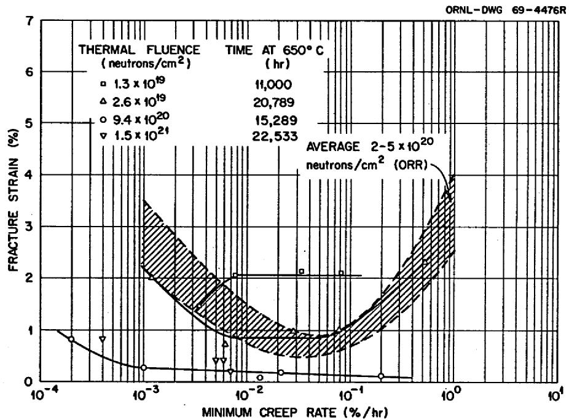  
Fig. 26. Variation of Fracture Strain with Strain Rate for Hastelloy N (Heat 5065) Surveillance Specimens at $650^{\circ}\mathrm{C}$ .

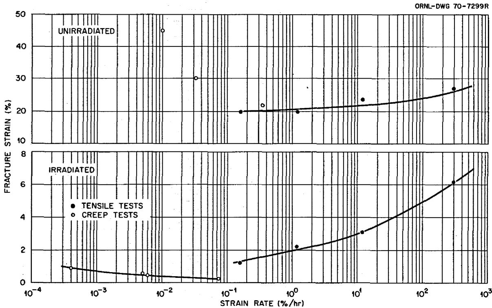  
Fig. 27. Fracture Strains at $650^{\circ}\mathrm{C}$ of Heat 5065 in the Unirradiated and the Irradiated Conditions. Irradiated to a thermal fluence of $1.5 \times 10^{21}$ neutrons/cm $^2$ over a period of 22,533 hr at $650^{\circ}\mathrm{C}$ .

that the two heats respond to irradiation quite similarly. Heat 5065 contains about 23 ppm B (average of the four values in Table 1, p. 4), and the variation of the fracture strain with helium content is shown in Fig. 28. The behavior is quite similar to that noted in Fig. 23 for heat 5085. Thus, the lower boron (and hence helium) concentration in heat 5065 results in about the same properties as the higher boron level in heat 5085.

# Mechanical Property Data - Modified Hastelloy N

Two heats of modified Hastelloy N were exposed to the MSRE core for 6244 hr at $650^{\circ}\mathrm{C}$ and received a thermal neutron fluence of $5.1 \times 10^{20}$ neutrons/cm² (Table 2, p. 6). Both of these alloys were modified with titanium - heat 7320 contained $0.65\%$ and heat 67-551 contained $1.1\%$ .

The tensile properties of heat 7320 are summarized in Tables 11 and 12 for the control and irradiated samples, respectively. The fracture

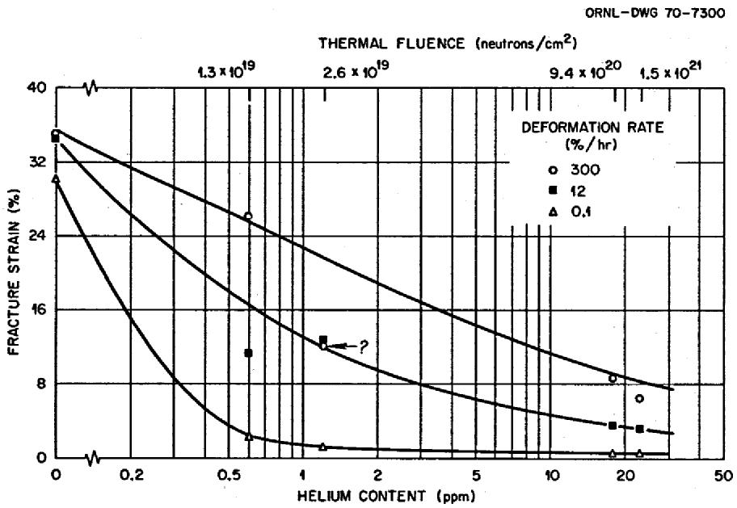  
Fig. 28. Variation of Fracture Strain at $650^{\circ}\mathrm{C}$ with Calculated Helium Content and Strain Rate for Heat 5065.

Table 11. Results of Tensile Tests on Control Samples of Heat $7320^{\mathrm{a}}$   

<table><tr><td rowspan="2">Specimen Number</td><td rowspan="2">Test Temperature (°C)</td><td rowspan="2">Strain Rate (min-1)</td><td colspan="2">Stress, psi</td><td colspan="2">Elongation, %</td><td rowspan="2">Reduction in Area (%)</td><td rowspan="2">True Fracture Strain (%)</td></tr><tr><td>Yield</td><td>Ultimate Tensile</td><td>Uniform</td><td>Total</td></tr><tr><td>9464</td><td>25</td><td>0.05</td><td>68,800</td><td>122,600</td><td>48.2</td><td>49.7</td><td>40.83</td><td>52</td></tr><tr><td>9432</td><td>200</td><td>0.05</td><td>60,000</td><td>107,600</td><td>40.6</td><td>41.9</td><td>43.75</td><td>58</td></tr><tr><td>9470</td><td>400</td><td>0.05</td><td>56,600</td><td>103,300</td><td>46.9</td><td>49.1</td><td>43.09</td><td>56</td></tr><tr><td>9481</td><td>400</td><td>0.002</td><td>54,100</td><td>96,000</td><td>45.2</td><td>46.2</td><td>40.64</td><td>52</td></tr><tr><td>9472</td><td>500</td><td>0.05</td><td>54,500</td><td>99,200</td><td>47.9</td><td>51.1</td><td>44.38</td><td>59</td></tr><tr><td>9456</td><td>500</td><td>0.002</td><td>53,600</td><td>96,700</td><td>45.1</td><td>46.2</td><td>41.21</td><td>53</td></tr><tr><td>9467</td><td>550</td><td>0.05</td><td>51,700</td><td>95,500</td><td>49.2</td><td>52.0</td><td>45.39</td><td>61</td></tr><tr><td>9466</td><td>550</td><td>0.002</td><td>49,400</td><td>85,300</td><td>36.7</td><td>37.7</td><td>32.99</td><td>40</td></tr><tr><td>9458</td><td>600</td><td>0.05</td><td>52,500</td><td>91,900</td><td>41.4</td><td>45.5</td><td>41.11</td><td>53</td></tr><tr><td>9476</td><td>600</td><td>0.002</td><td>54,800</td><td>80,500</td><td>18.2</td><td>19.7</td><td>23.35</td><td>27</td></tr><tr><td>9478</td><td>650</td><td>0.05</td><td>49,300</td><td>78,600</td><td>28.4</td><td>30.6</td><td>36.67</td><td>46</td></tr><tr><td>9461</td><td>650</td><td>0.002</td><td>47,700</td><td>72,800</td><td>14.5</td><td>15.5</td><td>19.46</td><td>22</td></tr><tr><td>9475</td><td>650</td><td>0.0002</td><td>50,800</td><td>67,900</td><td>12.3</td><td>13.7</td><td>14.40</td><td>16</td></tr><tr><td>9474</td><td>650</td><td>0.000027</td><td>47,800</td><td>59,100</td><td>5.6</td><td>9.6</td><td>13.88</td><td>15</td></tr><tr><td>9477</td><td>760</td><td>0.05</td><td>50,100</td><td>71,500</td><td>12.0</td><td>13.1</td><td>11.69</td><td>12</td></tr><tr><td>9480</td><td>760</td><td>0.002</td><td>44,200</td><td>45,100</td><td>4.2</td><td>17.2</td><td>19.07</td><td>21</td></tr><tr><td>9471</td><td>850</td><td>0.05</td><td>45,000</td><td>48,200</td><td>5.6</td><td>10.2</td><td>12.39</td><td>13</td></tr><tr><td>9457</td><td>850</td><td>0.002</td><td>27,500</td><td>27,800</td><td>1.6</td><td>10.1</td><td>11.97</td><td>13</td></tr></table>

aAnnealed 1 hr at $1177^{\circ}\mathrm{C}$ and exposed to a vessel of static barren fuel salt for 7244 hr at $650^{\circ}\mathrm{C}$ .

Table 12. Postirradiation Tensile Properties of Hastelloy N (Heat 7320)a   

<table><tr><td rowspan="2">Specimen Number</td><td rowspan="2">Test Temperature (°C)</td><td rowspan="2">Strain Rate (min-1)</td><td colspan="2">Stress, psi</td><td colspan="2">Elongation, %</td><td rowspan="2">Reduction in Area (%)</td><td rowspan="2">True Fracture Strain (%)</td></tr><tr><td>Yield</td><td>Ultimate Tensile</td><td>Uniform</td><td>Total</td></tr><tr><td>9221</td><td>25</td><td>0.05</td><td>69,800</td><td>116,600</td><td>43.8</td><td>45.2</td><td>35.48</td><td>44</td></tr><tr><td>9222</td><td>200</td><td>0.05</td><td>59,000</td><td>102,900</td><td>40.7</td><td>41.7</td><td>35.69</td><td>44</td></tr><tr><td>9223</td><td>400</td><td>0.05</td><td>54,100</td><td>93,500</td><td>40.5</td><td>41.6</td><td>33.09</td><td>40</td></tr><tr><td>9224</td><td>400</td><td>0.002</td><td>58,200</td><td>94,100</td><td>38.0</td><td>38.7</td><td>31.67</td><td>38</td></tr><tr><td>9225</td><td>500</td><td>0.05</td><td>54,900</td><td>89,100</td><td>39.1</td><td>41.1</td><td>36.97</td><td>46</td></tr><tr><td>9226</td><td>500</td><td>0.002</td><td>55,400</td><td>83,300</td><td>31.1</td><td>32.5</td><td>26.61</td><td>31</td></tr><tr><td>9215</td><td>550</td><td>0.05</td><td>61,100</td><td>88,200</td><td>26.8</td><td>27.6</td><td>26.26</td><td>30</td></tr><tr><td>9214</td><td>550</td><td>0.002</td><td>61,000</td><td>74,700</td><td>9.2</td><td>11.1</td><td>21.27</td><td>24</td></tr><tr><td>9213</td><td>600</td><td>0.05</td><td>60,800</td><td>81,700</td><td>18.4</td><td>19.6</td><td>27.74</td><td>32</td></tr><tr><td>9212</td><td>600</td><td>0.002</td><td>61,700</td><td>69,800</td><td>4.3</td><td>5.5</td><td>11.83</td><td>13</td></tr><tr><td>9211</td><td>650</td><td>0.05</td><td>67,400</td><td>74,900</td><td>8.0</td><td>9.5</td><td>7.10</td><td>7</td></tr><tr><td>9210</td><td>650</td><td>0.002</td><td>57,100</td><td>68,500</td><td>4.3</td><td>5.1</td><td>9.08</td><td>10</td></tr><tr><td>9227</td><td>650</td><td>0.0002</td><td>49,500</td><td>58,200</td><td>4.3</td><td>4.7</td><td>7.54</td><td>8</td></tr><tr><td>9228</td><td>650</td><td>0.000027</td><td>37,500</td><td>49,400</td><td>2.0</td><td>2.9</td><td>3.00</td><td>3</td></tr><tr><td>9209</td><td>760</td><td>0.05</td><td>56,700</td><td>63,700</td><td>3.8</td><td>4.0</td><td>6.15</td><td>6</td></tr><tr><td>9208</td><td>760</td><td>0.002</td><td>48,700</td><td>48,900</td><td>1.6</td><td>3.0</td><td>6.15</td><td>6</td></tr><tr><td>9207</td><td>850</td><td>0.05</td><td>37,900</td><td>38,200</td><td>1.6</td><td>2.2</td><td>7.25</td><td>8</td></tr><tr><td>9206</td><td>850</td><td>0.002</td><td>24,800</td><td>24,800</td><td>1.0</td><td>1.6</td><td>2.23</td><td>2</td></tr></table>

aAnnealed 1 hr at $1177^{\circ}\mathrm{C}$ . Irradiated to a thermal fluence of $5.1 \times 10^{20}$ neutrons/cm² over a period of 7244 hr at $650^{\circ}\mathrm{C}$ .

strains are shown as a function of test temperature in Fig. 29. Irradiation reduces the fracture strain over the entire range of test temperatures, but the magnitude of the decrease is much greater at elevated temperatures. The sharp drop in fracture strain with increasing temperature occurs at a lower temperature for the irradiated material. The ratios of the irradiated and unirradiated properties are shown in Fig. 30. The yield stress is higher for the irradiated material over the test temperature range of 550 to $760^{\circ}\mathrm{C}$ . The ultimate tensile strength is about the same for the irradiated and unirradiated material but shows a gradual decline with increasing test temperature. The fracture strain decreased due to irradiation, with the reduction being about $80\%$ at $850^{\circ}\mathrm{C}$ .

Some idea of the tensile properties of heat 7320 due to aging and irradiation can be obtained from Table 13. The yield strengths at 25 and $650^{\circ}\mathrm{C}$ are increased by aging; at a test temperature of $650^{\circ}\mathrm{C}$ a further increase occurs due to irradiation. The changes in ultimate tensile

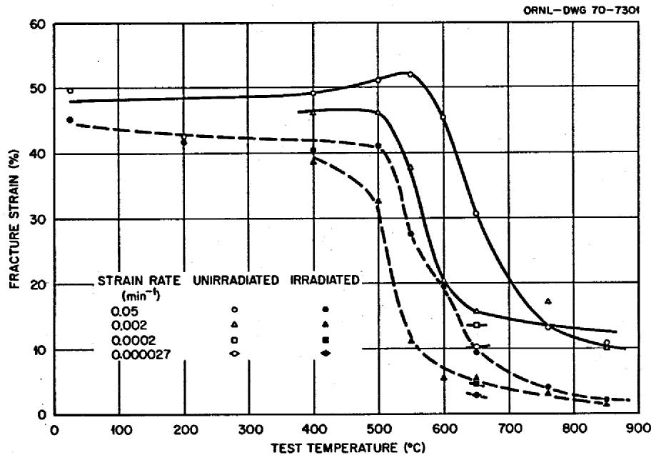  
Fig. 29. Fracture Strains of Heat 7320 After Removal from the MSRE and from the Control Facility. All samples annealed $1\mathrm{hr}$ at $1177^{\circ}\mathrm{C}$ before irradiation to a thermal fluence of $5.1 \times 10^{20}$ neutrons/cm² over a period of 7244 hr at $650^{\circ}\mathrm{C}$ .

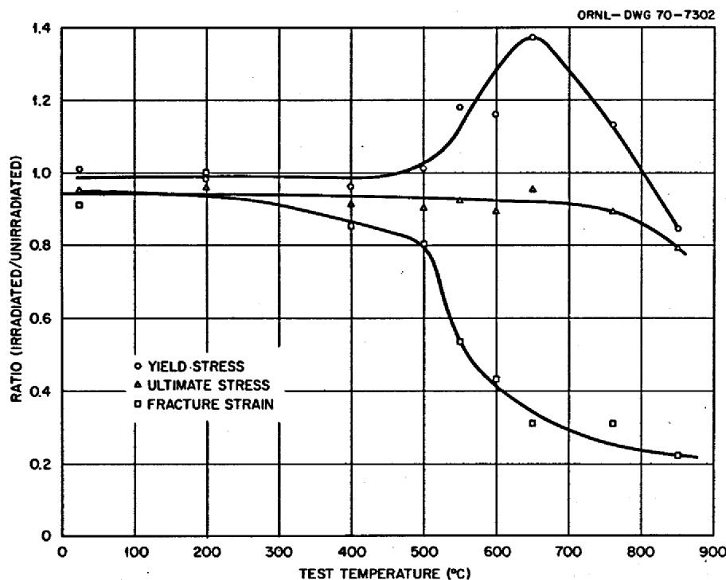  
Fig. 30. Comparison of Unirradiated and Irradiated Tensile Properties of Heat 7320 After Irradiation to a Thermal Fluence of $5.1 \times 10^{20}$ neutrons/cm² Over a Period of 7244 hr at $650^{\circ}\mathrm{C}$ . Tested at a strain rate of 0.05 min⁻¹.

Table 13. Comparison of the Tensile Properties of Heat 7320 Before and After Irradiationa   

<table><tr><td rowspan="2">Heat Treatment</td><td colspan="2">Yield Stress, psi</td><td colspan="2">Ultimate Tensile Stress, psi</td><td colspan="2">Fracture Strain, %</td></tr><tr><td>at 25°C</td><td>at 650°C</td><td>at 25°C</td><td>at 650°C</td><td>at 25°C</td><td>at 650°C</td></tr><tr><td>Annealed 1 hr at 1177°C</td><td>38,500</td><td>25,600</td><td>107,300</td><td>72,700</td><td>75.4</td><td>53.5</td></tr><tr><td>Annealed 1 hr at 1177°C, aged 7244 hr at 650°C</td><td>68,800</td><td>49,300</td><td>122,600</td><td>78,600</td><td>48.1</td><td>30.6</td></tr><tr><td>Annealed 1 hr at 1177°C, irradiated for 7244 hr at 650°C to a thermal fluence of 5.1 × 1020 neutrons/cm2</td><td>69,800</td><td>67,400</td><td>116,600</td><td>74,900</td><td>45.2</td><td>9.5</td></tr></table>

aTested at a strain rate of 0.05 min-1.

strength are rather small and likely within experimental error. The fracture strain is decreased by aging and by irradiation; the magnitude of the decrease is much larger at the test temperature of $650^{\circ}\mathrm{C}$ .

The results of tensile tests on the control and irradiated samples of heat 67-551 are given in Tables 14 and 15, respectively. The fracture strain is shown as a function of test temperature in Fig. 31. The fracture strain at low temperatures is not influenced by irradiation, but above $400^{\circ}\mathrm{C}$ the fracture strain is decreased by irradiation. However, the fracture strains at high temperatures are higher than those for either heat 7320 (Fig. 29) or the standard alloy (Figs. 9 and 11, pp. 18 and 22, respectively). The ratios of the irradiated and unirradiated tensile properties are shown in Fig. 32. The yield stress is generally about $25\%$ lower for the irradiated material. The ultimate tensile strength is reduced only about $10\%$ by irradiation when tested below $550^{\circ}\mathrm{C}$ , but is reduced up to $30\%$ as the test temperature is increased. The fracture strain is unaffected by irradiation up to test temperatures of $500^{\circ}\mathrm{C}$ ; above this temperature the fracture strain decreases progressively with increasing test temperature. Some values of the tensile properties at 25 and $650^{\circ}\mathrm{C}$ are given in Table 16. Aging at $650^{\circ}\mathrm{C}$ seems to increase the yield strength at both 25 and $650^{\circ}\mathrm{C}$ ; however, the strength of the irradiated material is quite close to that of the as-annealed material. The ultimate tensile strength is increased only slightly by aging and

Table 14. Results of Tensile Tests on Control Samples of Heat 67-551a   

<table><tr><td rowspan="2">Specimen Number</td><td rowspan="2">Test Temperature (°C)</td><td rowspan="2">Strain Rate (min-1)</td><td colspan="2">Stress, psi</td><td colspan="2">Elongation, %</td><td rowspan="2">Reduction in Area (%)</td><td rowspan="2">True Fracture Strain (%)</td></tr><tr><td>Yield</td><td>Ultimate Tensile</td><td>Uniform</td><td>Total</td></tr><tr><td>9403</td><td>25</td><td>0.05</td><td>62,400</td><td>120,200</td><td>50.3</td><td>52.3</td><td>41.59</td><td>54</td></tr><tr><td>9419</td><td>200</td><td>0.05</td><td>54,100</td><td>108,700</td><td>47.5</td><td>50.1</td><td>45.22</td><td>60</td></tr><tr><td>9422</td><td>400</td><td>0.05</td><td>52,300</td><td>104,300</td><td>48.7</td><td>50.4</td><td>46.66</td><td>63</td></tr><tr><td>9417</td><td>400</td><td>0.002</td><td>51,400</td><td>101,700</td><td>50.4</td><td>51.5</td><td>43.84</td><td>58</td></tr><tr><td>9506</td><td>500</td><td>0.05</td><td>48,100</td><td>89,900</td><td>50.4</td><td>53.6</td><td>46.58</td><td>63</td></tr><tr><td>9423</td><td>500</td><td>0.002</td><td>50,400</td><td>92,100</td><td>42.0</td><td>43.6</td><td>36.67</td><td>46</td></tr><tr><td>9402</td><td>550</td><td>0.05</td><td>45,200</td><td>94,100</td><td>52.0</td><td>53.7</td><td>41.78</td><td>54</td></tr><tr><td>9418</td><td>550</td><td>0.002</td><td>47,600</td><td>80,400</td><td>26.3</td><td>27.9</td><td>31.67</td><td>38</td></tr><tr><td>9416</td><td>600</td><td>0.05</td><td>42,800</td><td>87,800</td><td>46.8</td><td>49.8</td><td>43.09</td><td>56</td></tr><tr><td>9428</td><td>600</td><td>0.002</td><td>46,200</td><td>79,600</td><td>23.1</td><td>25.3</td><td>26.37</td><td>31</td></tr><tr><td>9410</td><td>650</td><td>0.05</td><td>41,900</td><td>84,600</td><td>40.4</td><td>42.6</td><td>37.07</td><td>46</td></tr><tr><td>9407</td><td>650</td><td>0.002</td><td>42,700</td><td>76,300</td><td>27.3</td><td>31.5</td><td>25.42</td><td>29</td></tr><tr><td>9426</td><td>650</td><td>0.0002</td><td>46,000</td><td>74,800</td><td>22.3</td><td>30.2</td><td>28.87</td><td>34</td></tr><tr><td>9415</td><td>650</td><td>0.000027</td><td>39,900</td><td>60,900</td><td>11.9</td><td>21.7</td><td>23.23</td><td>26</td></tr><tr><td>9424</td><td>760</td><td>0.05</td><td>45,600</td><td>78,000</td><td>21.6</td><td>28.8</td><td>28.87</td><td>34</td></tr><tr><td>9421</td><td>760</td><td>0.002</td><td>43,000</td><td>45,200</td><td>5.5</td><td>36.2</td><td>33.98</td><td>42</td></tr><tr><td>9425</td><td>850</td><td>0.05</td><td>41,300</td><td>51,000</td><td>6.2</td><td>23.6</td><td>26.14</td><td>30</td></tr><tr><td>9420</td><td>850</td><td>0.002</td><td>25,500</td><td>26,200</td><td>2.3</td><td>22.4</td><td>18.81</td><td>21</td></tr></table>

aAnnealed 1 hr at $1177^{\circ}\mathrm{C}$ prior to exposure to a vessel of static barren fuel salt for 7244 hr at $650^{\circ}\mathrm{C}$ .

Table 15. Postirradiation Tensile Properties of Hastelloy N (Heat 67-551)a   

<table><tr><td rowspan="2">Specimen Number</td><td rowspan="2">Test Temperature (°C)</td><td rowspan="2">Strain Rate (min-1)</td><td colspan="2">Stress, psi</td><td colspan="2">Elongation, %</td><td rowspan="2">Reduction in Area (%)</td><td rowspan="2">True Fracture Strain (%)</td></tr><tr><td>Yield</td><td>Ultimate Tensile</td><td>Uniform</td><td>Total</td></tr><tr><td>9167</td><td>25</td><td>0.05</td><td>49,600</td><td>107,800</td><td>50.6</td><td>51.0</td><td>36.87</td><td>46</td></tr><tr><td>9168</td><td>200</td><td>0.05</td><td>39,800</td><td>94,700</td><td>50.0</td><td>53.2</td><td>42.15</td><td>55</td></tr><tr><td>9169</td><td>400</td><td>0.05</td><td>39,200</td><td>91,800</td><td>48.7</td><td>50.7</td><td>38.44</td><td>49</td></tr><tr><td>9175</td><td>400</td><td>0.002</td><td>40,400</td><td>88,100</td><td>51.3</td><td>52.6</td><td>39.69</td><td>51</td></tr><tr><td>9176</td><td>500</td><td>0.05</td><td>37,000</td><td>83,400</td><td>52.1</td><td>52.9</td><td>38.34</td><td>48</td></tr><tr><td>9172</td><td>500</td><td>0.002</td><td>37,000</td><td>67,900</td><td>25.8</td><td>27.4</td><td>29.21</td><td>35</td></tr><tr><td>9161</td><td>550</td><td>0.05</td><td>34,500</td><td>80,400</td><td>42.8</td><td>44.5</td><td>34.92</td><td>43</td></tr><tr><td>9160</td><td>550</td><td>0.002</td><td>39,500</td><td>57,100</td><td>14.7</td><td>17.0</td><td>23.35</td><td>27</td></tr><tr><td>9159</td><td>600</td><td>0.05</td><td>37,000</td><td>71,300</td><td>31.9</td><td>33.9</td><td>39.59</td><td>50</td></tr><tr><td>9158</td><td>600</td><td>0.002</td><td>41,900</td><td>61,800</td><td>18.0</td><td>19.2</td><td>22.68</td><td>26</td></tr><tr><td>9157</td><td>650</td><td>0.05</td><td>31,300</td><td>56,600</td><td>20.7</td><td>22.6</td><td>28.76</td><td>34</td></tr><tr><td>9156</td><td>650</td><td>0.002</td><td>31,200</td><td>53,300</td><td>16.0</td><td>16.9</td><td>19.20</td><td>21</td></tr><tr><td>9173</td><td>650</td><td>0.0002</td><td>35,100</td><td>57,100</td><td>12.3</td><td>14.5</td><td>13.74</td><td>15</td></tr><tr><td>9174</td><td>650</td><td>0.000027</td><td>34,800</td><td>51,300</td><td>7.5</td><td>12.9</td><td>12.5</td><td>13</td></tr><tr><td>9155</td><td>760</td><td>0.05</td><td>29,700</td><td>51,500</td><td>13.8</td><td>14.8</td><td>8.79</td><td>9</td></tr><tr><td>9154</td><td>760</td><td>0.002</td><td>29,200</td><td>38,400</td><td>5.7</td><td>9.2</td><td>10.74</td><td>11</td></tr><tr><td>9153</td><td>850</td><td>0.05</td><td>26,700</td><td>34,700</td><td>4.8</td><td>6.5</td><td>7.54</td><td>8</td></tr><tr><td>9152</td><td>850</td><td>0.002</td><td>22,300</td><td>22,700</td><td>2.2</td><td>6.2</td><td>5.24</td><td>5</td></tr></table>

aAnnealed 1 hr at $1177^{\circ}\mathrm{C}$ . Irradiated to a thermal fluence of $5.1 \times 10^{20}$ neutrons/cm² over a period of 7244 hr at $650^{\circ}\mathrm{C}$ .

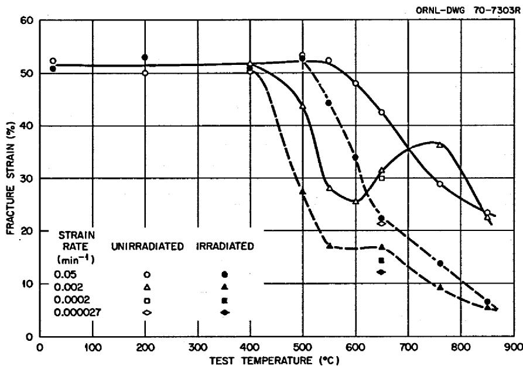  
Fig. 31. Fracture Strains of Heat 67-55l After Removal from the MSRE and from the Control Facility. All samples annealed 1 hr at $1177^{\circ}\mathrm{C}$ before irradiation to a thermal fluence of $5.1 \times 10^{20}$ neutrons/cm² over 7244 hr at $650^{\circ}\mathrm{C}$ .

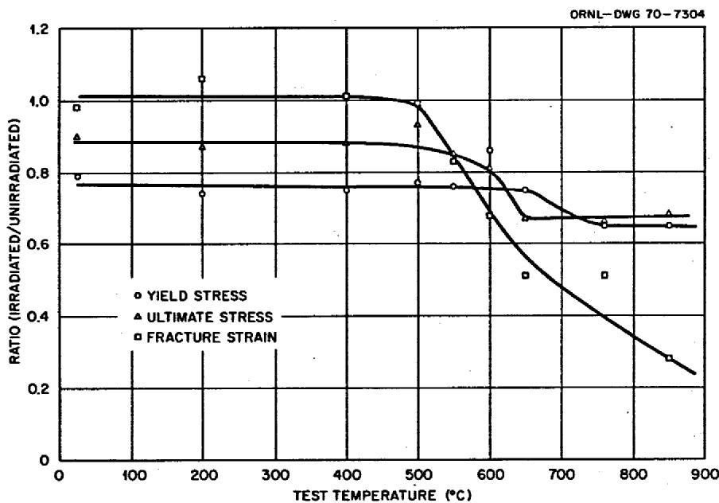  
Fig. 32. Comparison of Unirradiated and Irradiated Tensile Properties of Heat 67-55l After Irradiation to a Thermal Fluence of $5.1 \times 10^{20}$ neutrons/cm $^2$ over a period of 7244 hr at $650^{\circ}\mathrm{C}$ . Tested at a strain rate of 0.05 min $^{-1}$ .

Table 16. Comparison of the Tensile Properties of Heat 67-551 Before and After Irradiationa   

<table><tr><td rowspan="2">Heat Treatment</td><td colspan="2">Yield Stress, psi</td><td colspan="2">Ultimate Tensile Stress, psi</td><td colspan="2">Fracture Strain, %</td></tr><tr><td>at 25°C</td><td>at 650°C</td><td>at 25°C</td><td>at 650°C</td><td>at 25°C</td><td>at 650°C</td></tr><tr><td>Annealed 1 hr at 1177°C</td><td>44,600</td><td>26,900</td><td>113,600</td><td>78,900</td><td>79.6</td><td>57.3</td></tr><tr><td>Annealed 1 hr at 1177°C, aged 7244 hr at 650°C</td><td>62,400</td><td>41,900</td><td>120,200</td><td>84,600</td><td>52.3</td><td>42.6</td></tr><tr><td>Annealed 1 hr at 1177°C, aged 7244 hr at 650°C, irradiated to a thermal fluence of 5.1 × 1020neutrons/cm2</td><td>49,600</td><td>31,300</td><td>107,800</td><td>56,600</td><td>51.0</td><td>22.6</td></tr></table>

${}^{8}$ Tested at a strain rate of 0.05 min-1.

decreased by irradiation. At $25^{\circ}\mathrm{C}$ the fracture strain is reduced from $79.6\%$ to $52.3\%$ by aging, and irradiation does not cause any further change. At $650^{\circ}\mathrm{C}$ the fracture strain is decreased by aging and decreased further by irradiation.

The creep-rupture properties of heat 7320 are summarized in Table 17. These results are compared in Figs. 33, 34, and 35 with those for unirradiated samples that were given a pretest anneal of 1 hr at $1177^{\circ}\mathrm{C}$ . The stress-rupture properties in Fig. 33 show that the aging treatment given the controls, 7244 hr at $750^{\circ}\mathrm{C}$ , increased the rupture life. The irradiated samples failed after longer times than did the unirradiated samples that were simply annealed 1 hr at $1177^{\circ}\mathrm{C}$ , but ruptured in shorter times than the control samples. However, the minimum creep rates shown in Fig. 34 seem to fall within a common scatter band for all conditions. Thus, neither irradiation nor aging seems to have a detectable effect on the minimum creep rate. The fracture strain is shown as a function of strain rate in Fig. 35. The fracture strains of the unirradiated samples vary from about $30\%$ in a tensile test to about $10\%$ in a long-term creep test. The irradiated samples have lower fracture strains that vary from $9.5\%$ for the fastest tensile test to 2 to $3\%$ for creep tests.

Table 17. Creep-Rupture Tests on Heat 7320 at $650^{\circ}\mathrm{C}$   

<table><tr><td rowspan="2">Test Number</td><td rowspan="2">Specimen Number</td><td rowspan="2">Stress (psi)</td><td colspan="2">Rupture</td><td rowspan="2">Reduction in Area (%)</td><td rowspan="2">Minimum Creep Rate (%/hr)</td></tr><tr><td>Life (hr)</td><td>Strain (%)</td></tr><tr><td></td><td colspan="6">Unirradiated - Annealed 1 hr at 1177°C prior to test</td></tr><tr><td>7013</td><td>7276</td><td>55,000</td><td>4.7</td><td>28.7</td><td>29.6</td><td>0.190</td></tr><tr><td>7425</td><td>10329</td><td>50,000</td><td>11.5</td><td>21.2</td><td>28.3</td><td>0.125</td></tr><tr><td>7014</td><td>7277</td><td>47,000</td><td>49.9</td><td>21.8</td><td>31.3</td><td>0.0194</td></tr><tr><td>7016</td><td>7279</td><td>43,000</td><td>103.4</td><td>18.1</td><td>20.5</td><td>0.0069</td></tr><tr><td>7015</td><td>7278</td><td>40,000</td><td>384.6</td><td>16.3</td><td>17.6</td><td>0.0059</td></tr><tr><td>7424</td><td>10252</td><td>35,000</td><td>1602.1</td><td>27.3</td><td>30.6</td><td>0.0056</td></tr><tr><td>7017</td><td>7280</td><td>30,000</td><td>1949.5</td><td>10.9</td><td>19.9</td><td>0.0017</td></tr><tr><td></td><td colspan="6">Unirradiated Controlsa</td></tr><tr><td>7885</td><td>9462</td><td>55,000</td><td>32.5</td><td>14.2</td><td>32.9</td><td>0.25</td></tr><tr><td>7991</td><td>9468</td><td>47,000</td><td>224.1</td><td>15.3</td><td>26.3</td><td>0.045</td></tr><tr><td>7886</td><td>9463</td><td>40,000</td><td>653.7</td><td>17.9</td><td>29.3</td><td>0.019</td></tr><tr><td>7887b</td><td>9465</td><td>40,000</td><td>501.9</td><td>7.9</td><td>21.4</td><td>0.015</td></tr><tr><td>7884b</td><td>9460</td><td>32,400</td><td>2420.2</td><td>6.9</td><td>4.8</td><td>0.0006</td></tr><tr><td></td><td colspan="6">Irradiatedc</td></tr><tr><td>R-1151</td><td>9204</td><td>63,000</td><td>1.7</td><td>12.2d</td><td></td><td>1.2</td></tr><tr><td>R-1016</td><td>9216</td><td>63,000</td><td>4.0</td><td>2.0</td><td></td><td>0.44</td></tr><tr><td>R-951</td><td>9217</td><td>55,000</td><td>12.3</td><td>2.7</td><td></td><td>0.20</td></tr><tr><td>R-955</td><td>9219</td><td>47,000</td><td>95.1</td><td>2.3</td><td></td><td>0.018</td></tr><tr><td>R-967</td><td>9218</td><td>40,000</td><td>329.9</td><td>3.2</td><td></td><td>0.0074</td></tr><tr><td>R-950</td><td>9220</td><td>32,400</td><td>2083.3</td><td>3.1</td><td></td><td>0.0058</td></tr></table>

aAnnealed 1 hr at $1177^{\circ}\mathrm{C}$ and exposed to a vessel of static barren fuel salt for 7244 hr at $650^{\circ}\mathrm{C}$ .   
bDiscontinued prior to failure.

cAnnealed 1 hr at $1177^{\circ}\mathrm{C}$ . Irradiated to a thermal fluence of $5.1 \times 10^{20}$ neutrons/cm² over a period of 7244 hr at $650^{\circ}\mathrm{C}$ .

$^{\mathrm{d}}$ Test loaded so that strain on loading was included. All other tests did not include this strain.

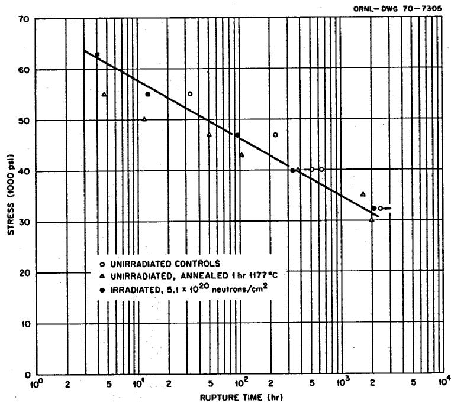  
Fig. 33. Stress-Rupture Properties of Heat 7320 at $650^{\circ}\mathrm{C}$ .

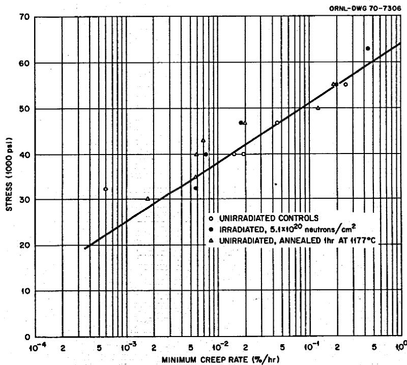  
Fig. 34. Creep Properties at $650^{\circ}\mathrm{C}$ of Heat 7320.

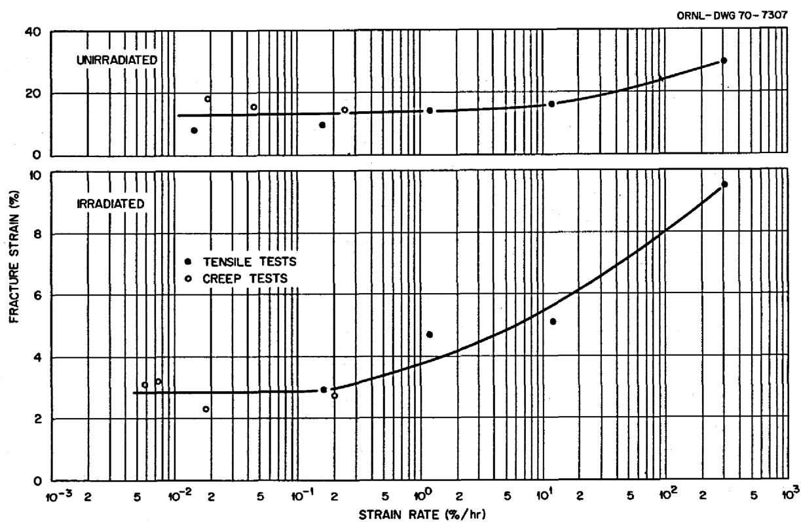  
Fig. 35. Fracture Strains at $650^{\circ}\mathrm{C}$ of Heat 7320 in the Unirradiated and Irradiated Conditions. Irradiated to a thermal fluence of $5.1 \times 10^{20}$ neutrons/cm $^2$ over a period of 7244 hr at $650^{\circ}\mathrm{C}$ .

The results of creep-rupture tests on heat 67-551 with $1.1\%$ Ti are given in Table 18. The stress-rupture properties of the control and irradiated samples are compared in Fig. 36 for $650^{\circ}\mathrm{C}$ . The irradiated samples generally fail in slightly shorter times than the unirradiated samples. The minimum creep rate seems to be unaffected by irradiation, although there are two data points that seem to be anomalous (Fig. 37). The fracture strains of this alloy (Fig. 38) are higher in both the unirradiated and irradiated conditions than those for heat 7320. The fracture strains of the unirradiated samples varied over the range of 43 to $25\%$ and those of the irradiated samples varied from 22.6 to $5.8\%$ over the range of strain rates studied.

One heat of modified Hastelloy N containing $0.49\%$ Hf (heat 67-504) was exposed to the cell environment for 17,033 hr at $650^{\circ}\mathrm{C}$ . The thermal fluence was $2.5 \times 10^{19}$ neutrons/cm². This same heat of material was included previously in our surveillance program and was exposed to a

Table 18. Results of Creep-Rupture Tests on Heat 67-551 at ${650}^{ \circ  }\mathrm{C}$   

<table><tr><td rowspan="2">Test Number</td><td rowspan="2">Specimen Number</td><td rowspan="2">Stress (psi)</td><td colspan="2">Rupture</td><td rowspan="2">Reduction in Area (%)</td><td rowspan="2">Minimum Creep Rate (%/hr)</td></tr><tr><td>Life (hr)</td><td>Strain (%)</td></tr><tr><td></td><td colspan="5">Unirradiated, Annealed 1 hr at 1177°C before testing</td><td></td></tr><tr><td>7872</td><td>6889</td><td>55,000</td><td>14.2</td><td>29.5</td><td>33.2</td><td>0.32</td></tr><tr><td>7871</td><td>6884</td><td>47,000</td><td>143.8</td><td>33.6</td><td>26.0</td><td>0.071</td></tr><tr><td></td><td colspan="5">Unirradiated Controlsa</td><td></td></tr><tr><td>7882</td><td>9409</td><td>55,000</td><td>44.7</td><td>25.5</td><td>28.5</td><td>0.190</td></tr><tr><td>7880</td><td>9404</td><td>47,000</td><td>271.2</td><td>29.1</td><td>29.6</td><td>0.067</td></tr><tr><td>7883</td><td>9411</td><td>40,000</td><td>956.2</td><td>30.4</td><td>25.5</td><td>0.018</td></tr><tr><td>7881</td><td>9408</td><td>32,400</td><td>2034.9</td><td>25.2</td><td>29.9</td><td>0.0053</td></tr><tr><td></td><td colspan="5">Irradiatedb</td><td></td></tr><tr><td>R-1150</td><td>9150</td><td>63,000</td><td>0.9</td><td>20.8c</td><td></td><td>2.2</td></tr><tr><td>R-1036</td><td>9151</td><td>63,000</td><td>0.6</td><td>2.2</td><td></td><td>2.6</td></tr><tr><td>R-949</td><td>9162</td><td>55,000</td><td>50.5</td><td>5.8</td><td></td><td>0.079</td></tr><tr><td>R-961</td><td>9165</td><td>47,000</td><td>117.1</td><td>8.3</td><td></td><td>0.058</td></tr><tr><td>R-948</td><td>9164</td><td>40,000</td><td>746.9</td><td>9.1</td><td></td><td>0.0079</td></tr><tr><td>R-947</td><td>9163</td><td>32,400</td><td>1485.6</td><td>12.5</td><td></td><td>0.0053</td></tr></table>

aAnnealed 1 hr at $1177^{\circ}\mathrm{C}$ prior to exposure to a vessel of static barren fuel salt for 7244 hr at $650^{\circ}\mathrm{C}$ .   
bAnnealed 1 hr at $1177^{\circ}\mathrm{C}$ . Irradiated to a thermal fluence of $5.1 \times 10^{20}$ neutrons/cm² over a period of 7244 hr at $650^{\circ}\mathrm{C}$ .   
Test loaded to include strain on loading. All other tests did not include this strain.

thermal fluence of $5.3 \times 10^{20}$ neutrons/cm² while being at temperature in the core for 9789 hr (ref. 10). In the group of samples presently being discussed, there were two rods of heat 67-504. Two heats of material should have been involved, but postirradiation chemical analysis revealed that both rods were made of the same material. This was not discovered until after many of the samples were tested, so we have several tests under duplicate conditions.

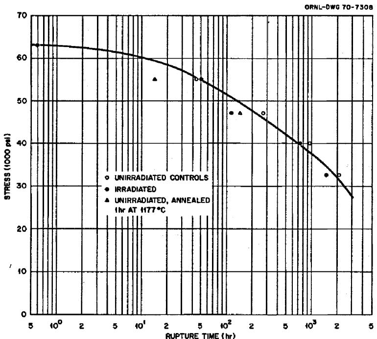  
Fig. 36. Stress-Rupture Properties at $650^{\circ}\mathrm{C}$ of Heat 67-551. Irradiated to a thermal fluence of $5.1 \times 10^{20}$ neutrons/cm $^2$ over a period of 7244 hr.

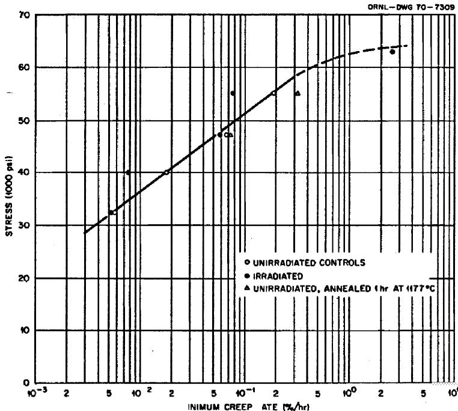  
Fig. 37. Creep-Rupture Properties at $650^{\circ}\mathrm{C}$ of Heat 67-551. Irradiated to a thermal fluence of $5.1 \times 10^{20}$ neutrons/cm $^2$ over a period of 7244 hr at $650^{\circ}\mathrm{C}$ .

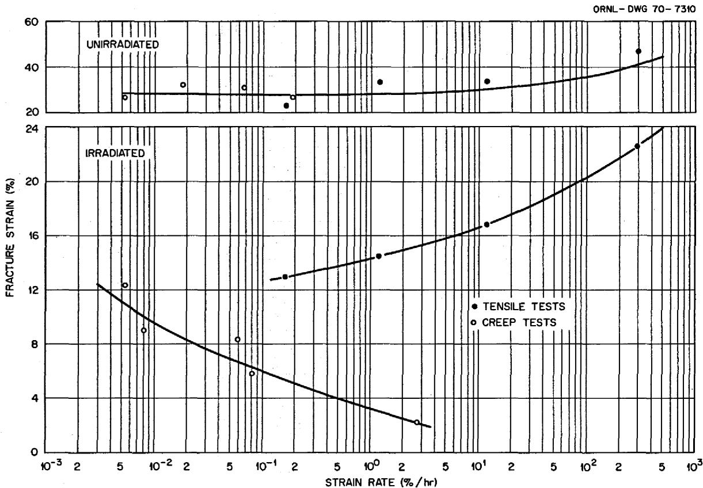  
Fig. 38. Comparison of the Fracture Strains of Unirradiated and Irradiated Heat 67-551 at $650^{\circ}\mathrm{C}$ . Irradiated to a thermal fluence of $5.1 \times 10^{20}$ neutrons/cm² over a period of 7244 hr at $650^{\circ}\mathrm{C}$ .

The results of the postirradiation tensile tests on heat 67-504 are given in Table 19. The postirradiation fracture strains are shown in Fig. 39 as a function of temperature and strain rate. The fracture strain generally decreases with increasing temperature above about $400^{\circ}\mathrm{C}$ and with decreasing strain rate. The results from the present tests and those reported previously show some very striking changes in fracture strain with varying histories (Fig. 40). The samples were all initially annealed 1 hr at $1177^{\circ}\mathrm{C}$ before being given the treatment indicated in Fig. 40. In the as-annealed condition, the alloy has a fracture strain of 70 to $80\%$ up to about $600^{\circ}\mathrm{C}$ , where the fracture strain drops precipitously. Aging for 9789 hr at $650^{\circ}\mathrm{C}$ reduced the fracture strain at lower temperatures and increased it above about $700^{\circ}\mathrm{C}$ . However, the fracture strains are in the range of 40 to $50\%$ over the entire range of temperatures studied. Irradiation to a thermal fluence of $2.5 \times 10^{19}$ neutrons/cm² over a period of 17,033 hr in $\mathbf{N}_2 + 2$ to $5\%$ $\mathbf{O}_2$ resulted in

Table 19. Postirradiation Tensile Properties of Hastelloy N (Heat 67-504)a   

<table><tr><td rowspan="2">Specimen Number</td><td rowspan="2">Test Temperature (°C)</td><td rowspan="2">Strain Rate (min-1)</td><td colspan="2">Stress, psi</td><td colspan="2">Elongation, %</td><td rowspan="2">Reduction in Area (%)</td><td rowspan="2">True Fracture Strain (%)</td></tr><tr><td>Yield</td><td>Ultimate Tensile</td><td>Uniform</td><td>Total</td></tr><tr><td>5111</td><td>25</td><td>0.05</td><td>50,300</td><td>112,200</td><td>45.9</td><td>48.1</td><td>34.63</td><td>43</td></tr><tr><td>5147</td><td>25</td><td>0.05</td><td>50,700</td><td>112,800</td><td>54.6</td><td>56.6</td><td>36.54</td><td>45</td></tr><tr><td>5110</td><td>200</td><td>0.05</td><td>41,000</td><td>96,400</td><td>43.0</td><td>44.8</td><td>38.34</td><td>48</td></tr><tr><td>5162</td><td>200</td><td>0.05</td><td>40,900</td><td>95,300</td><td>45.7</td><td>47.3</td><td>46.66</td><td>63</td></tr><tr><td>5109</td><td>400</td><td>0.05</td><td>36,700</td><td>90,800</td><td>49.8</td><td>52.0</td><td>36.15</td><td>45</td></tr><tr><td>5145</td><td>400</td><td>0.05</td><td>37,500</td><td>90,800</td><td>52.8</td><td>54.8</td><td>34.84</td><td>43</td></tr><tr><td>5108</td><td>400</td><td>0.002</td><td>36,700</td><td>91,800</td><td>52.2</td><td>54.7</td><td>45.71</td><td>61</td></tr><tr><td>5144</td><td>400</td><td>0.002</td><td>41,100</td><td>97,900</td><td>52.7</td><td>53.7</td><td>33.31</td><td>41</td></tr><tr><td>5107</td><td>500</td><td>0.05</td><td>40,600</td><td>92,700</td><td>45.7</td><td>47.2</td><td>32.23</td><td>39</td></tr><tr><td>5143</td><td>500</td><td>0.05</td><td>40,900</td><td>94,000</td><td>49.6</td><td>50.6</td><td>39.97</td><td>51</td></tr><tr><td>5106</td><td>500</td><td>0.002</td><td>41,600</td><td>90,500</td><td>44.5</td><td>46.2</td><td>39.40</td><td>50</td></tr><tr><td>5142</td><td>500</td><td>0.002</td><td>33,800</td><td>78,600</td><td>41.1</td><td>42.6</td><td>36.00</td><td>45</td></tr><tr><td>5117</td><td>550</td><td>0.05</td><td>39,700</td><td>74,900</td><td>34.5</td><td>36.5</td><td>31.45</td><td>38</td></tr><tr><td>5153</td><td>550</td><td>0.05</td><td>34,700</td><td>77,800</td><td>39.7</td><td>43.5</td><td>37.94</td><td>48</td></tr><tr><td>5118</td><td>550</td><td>0.002</td><td>44,600</td><td>62,000</td><td>11.9</td><td>15.1</td><td>16.02</td><td>17</td></tr><tr><td>5154</td><td>550</td><td>0.002</td><td>33,200</td><td>59,900</td><td>20.5</td><td>21.5</td><td>20.38</td><td>23</td></tr><tr><td>5096</td><td>600</td><td>0.05</td><td>31,900</td><td>74,500</td><td>34.7</td><td>36.9</td><td>26.02</td><td>30</td></tr><tr><td>5164</td><td>600</td><td>0.05</td><td>32,900</td><td>70,800</td><td>32.9</td><td>34.0</td><td>35.69</td><td>44</td></tr><tr><td>5120</td><td>600</td><td>0.002</td><td>36,400</td><td>49,600</td><td>8.9</td><td>10.9</td><td>20.38</td><td>23</td></tr><tr><td>5156</td><td>600</td><td>0.002</td><td>30,900</td><td>49,500</td><td>12.6</td><td>15.7</td><td>23.35</td><td>27</td></tr><tr><td>5128</td><td>650</td><td>0.05</td><td>39,900</td><td>55,500</td><td>24.0</td><td>25.8</td><td>22.06</td><td>25</td></tr><tr><td>5121</td><td>650</td><td>0.05</td><td>38,800</td><td>59,600</td><td>14.6</td><td>16.5</td><td>19.15</td><td>21</td></tr><tr><td>5155</td><td>650</td><td>0.05</td><td>30,200</td><td>46,200</td><td>12.8</td><td>15.8</td><td>10.17</td><td>11</td></tr><tr><td>5122</td><td>650</td><td>0.002</td><td>52,200</td><td>54,500</td><td>2.2</td><td>6.2</td><td>3.51</td><td>4</td></tr><tr><td>5158</td><td>650</td><td>0.002</td><td>31,700</td><td>44,800</td><td>13.2</td><td>14.3</td><td>11.54</td><td>12</td></tr><tr><td>5105</td><td>650</td><td>0.0002</td><td>32,200</td><td>40,800</td><td>7.4</td><td>9.8</td><td>13.52</td><td>15</td></tr><tr><td>5141</td><td>650</td><td>0.0002</td><td>30,700</td><td>38,800</td><td>7.8</td><td>8.8</td><td>6.65</td><td>7</td></tr><tr><td>5140</td><td>650</td><td>-0.000027</td><td>30,200</td><td>37,100</td><td>4.4</td><td>6.5</td><td>5.1</td><td>5</td></tr><tr><td>5104</td><td>650</td><td>-0.000027</td><td>30,700</td><td>37,200</td><td>4.8</td><td>6.5</td><td>5.4</td><td>6</td></tr><tr><td>5098</td><td>760</td><td>0.05</td><td>27,000</td><td>38,600</td><td>9.0</td><td>23.7</td><td>18.94</td><td>21</td></tr><tr><td>5123</td><td>760</td><td>0.05</td><td>33,300</td><td>40,100</td><td>6.7</td><td>8.7</td><td>10.17</td><td>11</td></tr><tr><td>5159</td><td>760</td><td>0.05</td><td>28,800</td><td>38,000</td><td>9.6</td><td>13.5</td><td>13.19</td><td>14</td></tr><tr><td>5124</td><td>760</td><td>0.002</td><td>33,300</td><td>33,300</td><td>1.2</td><td>2.7</td><td>4.63</td><td>5</td></tr><tr><td>5160</td><td>760</td><td>0.002</td><td>28,200</td><td>34,600</td><td>4.2</td><td>5.6</td><td>6.00</td><td>6</td></tr><tr><td>5102</td><td>850</td><td>0.05</td><td>27,300</td><td>29,700</td><td>2.9</td><td>4.3</td><td>2.40</td><td>2</td></tr><tr><td>5138</td><td>850</td><td>0.05</td><td>27,500</td><td>30,900</td><td>3.2</td><td>4.5</td><td>7.10</td><td>7</td></tr><tr><td>5103</td><td>850</td><td>0.002</td><td>21,100</td><td>21,100</td><td>1.0</td><td>1.9</td><td>0.64</td><td>1</td></tr><tr><td>5139</td><td>850</td><td>0.002</td><td>23,700</td><td>23,700</td><td>1.0</td><td>2.5</td><td>0.48</td><td>0</td></tr></table>

aAnnealed 1 hr at $1177^{\circ}\mathrm{C}$ . Irradiated to a thermal fluence of $0.25 \times 10^{20}$ neutrons/cm² over a period of 17,033 hr at $650^{\circ}\mathrm{C}$ .

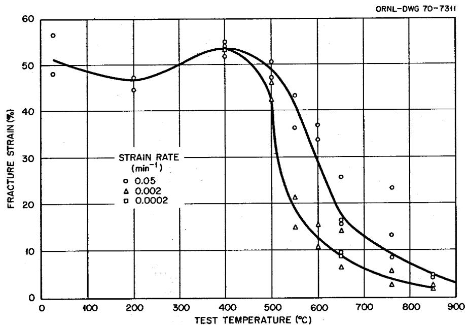  
Fig. 39. Fracture Strains of Heat 67-504 After Irradiation to a Thermal Fluence of $2.5 \times 10^{19}$ neutrons/cm² for 17,033 hr at $650^{\circ}C$ .

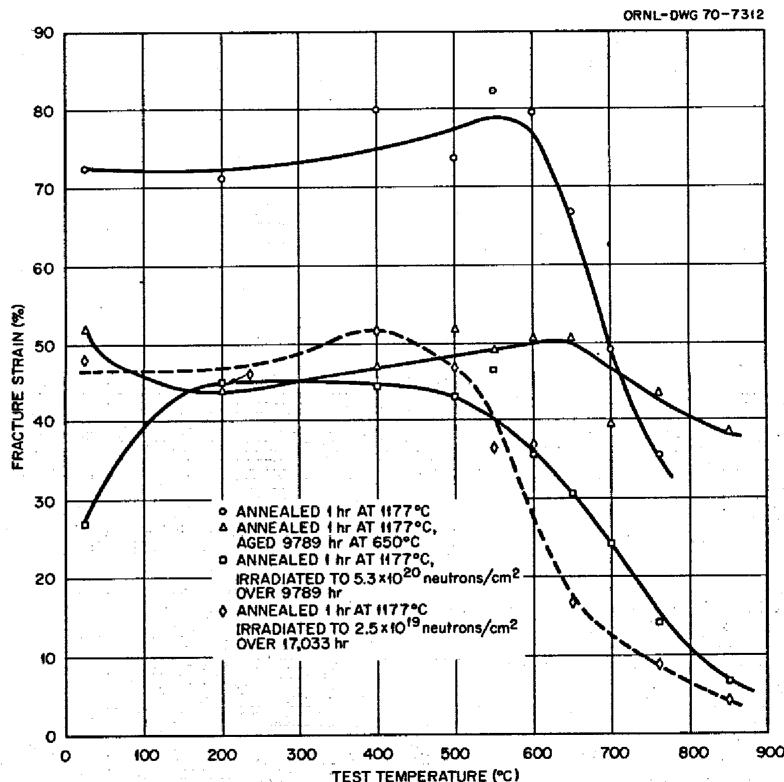  
Fig. 40. Comparison of the Fracture Strains of Heat 67-504 in Various Conditions When Tested at a Strain Rate of $0.05 \, \text{min}^{-1}$ .

fracture strains of about $50\%$ up to $500^{\circ}\mathrm{C}$ , above which the fracture strain dropped progressively with increasing temperature. Irradiation to a thermal fluence of $5.3 \times 10^{20}$ neutrons/cm² at $650^{\circ}\mathrm{C}$ in fuel salt over a period of 9789 hr resulted in a low fracture strain at $25^{\circ}\mathrm{C}$ (which may be anomalous), fracture strains of about $45\%$ up to $500^{\circ}\mathrm{C}$ , and decreasing fracture strains with increasing test temperature. The most striking feature is that above $550^{\circ}\mathrm{C}$ the fracture strains are lower for material irradiated in $\mathbf{N}_2 + 2$ to $5\%$ $\mathbf{O}_2$ for 17,033 hr to a fluence of $2.5 \times 10^{19}$ neutrons/cm² than for those irradiated in fuel salt for 9789 hr to a fluence of $5.3 \times 10^{20}$ neutrons/cm².

Some values of the tensile properties at 25 and $650^{\circ}\mathrm{C}$ are given in Table 20. The yield stress at both test temperatures was increased by aging and by irradiation. The ultimate tensile stress at $25^{\circ}\mathrm{C}$ was increased by aging and by irradiation; at $650^{\circ}\mathrm{C}$ it was increased by aging, but decreased by irradiation. We have already discussed the changes in the fracture strain.

Table 20. Comparison of the Tensile Properties of Heat 67-504 After Various Treatmentsa   

<table><tr><td rowspan="2">Heat Treatment</td><td colspan="2">Yield Stress, psi</td><td colspan="2">Ultimate Tensile Stress, psi</td><td colspan="2">Fracture Strain, %</td></tr><tr><td>at 25°C</td><td>at 650°C</td><td>at 25°C</td><td>at 650°C</td><td>at 25°C</td><td>at 650°C</td></tr><tr><td>Annealed 1 hr at 1177°C</td><td>37,400</td><td>25,600</td><td>105,000</td><td>83,000</td><td>73.2</td><td>65.9</td></tr><tr><td>Annealed at 1177°C and aged 9789b hr at 650°C</td><td>67,500</td><td>43,300</td><td>133,000</td><td>94,300</td><td>52.3</td><td>50.9</td></tr><tr><td>Annealed at 1177°C, irradiated toa thermal fluence of 5.3 × 1020neutrons/cm2 over 9789 hr (salt environment)</td><td>102,000</td><td>32,900</td><td>119,300</td><td>70,000</td><td>27.0</td><td>30.7</td></tr><tr><td>Annealed at 1177°C, irradiated to a thermal fluence of 2.5 × 1019neutrons/cm2 over 17,033 hr (N2+2 to 5% O2 environment)</td><td>50,300</td><td>38,800</td><td>112,000</td><td>59,600</td><td>48.1</td><td>16.5</td></tr></table>

${}^{a}$ Tested at a strain rate of 0.05 min ${}^{-1}$ .   
bData from: H. E. McCoy, Jr., An Evaluation of the Molten-Salt Reactor Experiment Hastelloy N Surveillance Specimens - Third Group, ORNL-TM-2647 (1970).

The results of creep-rupture tests on heat 67-504 are summarized in Table 21. These results and those obtained previously $^{11}$ were used to prepare Figs. 41, 42, and 43. The stress-rupture properties in Fig. 41 show that the rupture life was not changed appreciably by aging, at least for 9789 hr at $650^{\circ}\mathrm{C}$ . The stress-rupture life was reduced at least two orders of magnitude by the lower fluence and only a factor of 2 by the higher fluence. The minimum creep rates in Fig. 42 show that this property was not changed as much as the rupture life. Aging for 9789 hr increased the minimum creep, but samples irradiated over the same period had a lower creep rate than the aged samples. The samples irradiated to the lower fluence had a creep rate an order of magnitude higher than that of the as-annealed material. The fracture strains are

11H. E. McCoy, An Evaluation of the Molten-Salt Reactor Experiment Hastelloy N Surveillance Specimen - Third Group, ORNL-TM-2647 (1970).

Table 21. Creep-Rupture Tests on Heat 67-504 at ${650}^{ \circ  }\mathrm{C}$   

<table><tr><td rowspan="2">Test Number</td><td rowspan="2">Specimen Number</td><td rowspan="2">Stress (psi)</td><td colspan="2">Rupture</td><td rowspan="2">Minimum Creep Rate (%/hr)</td></tr><tr><td>Life (hr)</td><td>Strain (%)</td></tr><tr><td colspan="6">Irradiated at 650°C to a thermal fluence of 2.5 × 1019neutrons/cm2</td></tr><tr><td>R-952</td><td>5112</td><td>55,000</td><td>0.6</td><td>8.6</td><td>9.88</td></tr><tr><td>R-953</td><td>5148</td><td>55,000</td><td>1.0</td><td>10.6</td><td>6.6</td></tr><tr><td>R-959</td><td>5113</td><td>47,000</td><td>7.6</td><td>12.1</td><td>0.83</td></tr><tr><td>R-965</td><td>5149</td><td>47,000</td><td>3.3</td><td>6.2</td><td>0.52</td></tr><tr><td>R-971</td><td>5114</td><td>40,000</td><td>14.5</td><td>10.9</td><td>0.42</td></tr><tr><td>R-1017</td><td>5150</td><td>40,000</td><td>33.8</td><td>4.1</td><td>0.050</td></tr><tr><td>R-968</td><td>5115</td><td>32,400</td><td>235.5</td><td>3.8</td><td>0.0071</td></tr><tr><td>R-1033</td><td>5137</td><td>32,400</td><td>268.7</td><td>4.2</td><td>0.0066</td></tr><tr><td>R-1019</td><td>5116</td><td>27,000</td><td>1175.4</td><td>2.7</td><td>0.0016</td></tr><tr><td colspan="6">Annealed 1 hr at 1177°C</td></tr><tr><td>7432</td><td>6247</td><td>70,000</td><td>1.3</td><td>32.9</td><td>3.7</td></tr><tr><td>7431</td><td>6245</td><td>63,000</td><td>17.7</td><td>31.2</td><td>0.16</td></tr><tr><td>6255</td><td>4991</td><td>55,000</td><td>127.9</td><td>27.2</td><td>0.029</td></tr><tr><td>6254</td><td>4936</td><td>47,000</td><td>425.5</td><td>28.7</td><td>0.0068</td></tr><tr><td>6253</td><td>4933</td><td>40,000</td><td>876.9</td><td>16.3</td><td>0.0030</td></tr></table>

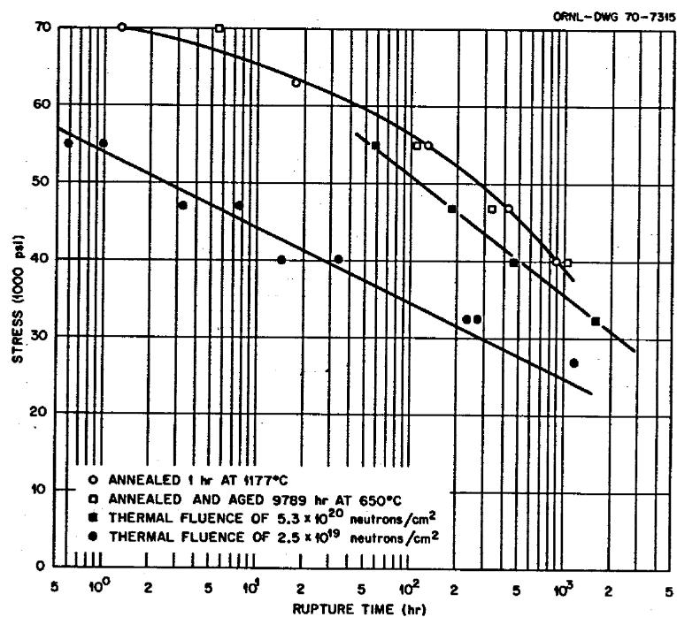  
Fig. 41. Stress-Rupture Properties at $650^{\circ}\mathrm{C}$ of Heat 67-504.

  
Fig. 42. Creep-Rupture Properties at $650^{\circ}\mathrm{C}$ of Heat 67-504.

  
Fig. 43. Comparison of the Fracture Strains of Unirradiated and Irradiated Heat 67-504 at $650^{\circ}\mathrm{C}$ . [Data for samples aged for 9789 hr at $650^{\circ}\mathrm{C}$ and for those irradiated to $2.5 \times 10^{19}$ neutrons/cm² from: H. E. McCoy, An Evaluation of the Molten-Salt Reactor Experiment Hastelloy N Surveillance Specimen - Third Group, ORNL-TM-2647 (1970).]

shown as a function of strain rate in Fig. 43. Aging increased the fracture strain of the unirradiated material. After irradiation the material irradiated to the lower fluence had the lowest fracture strain.

Several samples of heat 67-504 were subjected to tests that were interrupted. The results of these tests are summarized in Table 22. If strained continuously at $650^{\circ}\mathrm{C}$ at a strain rate of $0.05\mathrm{min}^{-1}$ , the

Table 22. Results of Interrupted Tensile Tests on Heat 67-504   

<table><tr><td rowspan="2">Type of Testa</td><td rowspan="2">Test Temperature (°C)</td><td colspan="2">Fracture Strain, %</td></tr><tr><td>Unirradiated</td><td>Irradiated</td></tr><tr><td>A</td><td>650</td><td>66.9</td><td>16.5</td></tr><tr><td>B</td><td>650</td><td>100.4</td><td></td></tr><tr><td>C</td><td>650</td><td>109.0</td><td></td></tr><tr><td>D</td><td>650</td><td>104.0</td><td></td></tr><tr><td>E</td><td>650</td><td>95.4</td><td>25.8</td></tr><tr><td>A</td><td>760</td><td>35.5</td><td>8.7</td></tr><tr><td>F</td><td>760</td><td>96.0</td><td>23.7</td></tr></table>

$^{a}A$ - Run uninterrupted at a strain rate of $0.05 \, \text{min}^{-1}$ .   
B - Strained $5\%$ , held at temperature for 2 min, cycle repeated to failure.   
C - Strained $5\%$ , held at temperature for 10 min, cycle repeated to failure.   
D - Strained $5\%$ , held at temperature for 30 min, cycle repeated to failure.   
E - Strained $5\%$ , held at temperature for 60 min, cycle repeated to failure.   
F - Strained $3\%$ , held at temperature for 60 min, cycle repeated to failure.

material had a fracture strain of $66.9\%$ if unirradiated and $16.5\%$ if irradiated. If the material was strained $5\%$ at $650^{\circ}\mathrm{C}$ then annealed 1 hr at $650^{\circ}\mathrm{C}$ and this pattern continued until failure, the unirradiated sample failed with $95.4\%$ strain and the irradiated sample with $25.8\%$ strain. A sequence of tests was performed on unirradiated samples at $650^{\circ}\mathrm{C}$ in which the annealing time was varied from 2 to $60\mathrm{min}$ ; the results show that this variable had little effect on the fracture strain. At a test temperature of $760^{\circ}\mathrm{C}$ the fracture strain was $35.5\%$ for an unirradiated sample and $8.7\%$ for an irradiated material. Samples were also tested by straining $3\%$ , annealing 1 hr at $760^{\circ}\mathrm{C}$ , straining $3\%$ , and repeating this sequence until failure. The fracture strains were 96.0 and $23.7\%$ for the unirradiated and irradiated samples, respectively. These tests have

demonstrated that there is not, for each test temperature, a unique strain at which failure occurs; rather, the fracture strain depends upon the loading history.

# Metallographic Examination of Test Samples

The tensile samples that were tested at $25^{\circ}\mathrm{C}$ at a strain rate of $0.05\mathrm{min}^{-1}$ and at $650^{\circ}\mathrm{C}$ at a strain rate of $0.002\mathrm{min}^{-1}$ were examined. An irradiated sample of heat 5085 from the core that was tested at $25^{\circ}\mathrm{C}$ is shown in Fig. 44. The fracture is primarily intergranular. There is a high frequency of edge cracking that extends to a depth of about 4 mils. The microstructure in the 4-mil region near the surface etches differently. At a $650^{\circ}\mathrm{C}$ test temperature (Fig. 45) the fracture is intergranular with no evidence of plastic deformation of the individual grains except adjacent to the fracture. This sample also had the modified structure and edge cracks that extend 10 mils into the sample. The control samples of heat 5085 that were annealed for 22,533 hr at $650^{\circ}\mathrm{C}$ in static barren fuel salt are shown in Figs. 46 and 47. The sample shown in Fig. 46 was tested at $25^{\circ}\mathrm{C}$ . The fracture is predominantly intergranular, but there are no edge cracks. There is a very thin layer near the surface where the structure is modified slightly. The microstructure is generally characterized by large $\mathsf{M}_6\mathsf{C}$ -type carbides, many of which cracked during deformation, and a network of almost continuous carbides along the grain and twin boundaries. When tested at $650^{\circ}\mathrm{C}$ (Fig. 47) the fracture is intergranular. There is some edge cracking, but not as frequently as noted in Fig. 45 for the irradiated sample. Another factor that should be considered in comparing Figs. 45 and 47 is that the irradiated sample in Fig. 45 failed after straining only $5\%$ (Table 4, p. 18), whereas the unirradiated sample in Fig. 47 strained $24\%$ (Table 3, p. 17) before fracturing. The higher strain should have increased the number and depth of edge cracks. The observed opposite trend indicates some influence of the exposure to the reactor environment on the fracture characteristics near the surface.

Heat 5065 was also exposed to the core for 22,533 hr at $650^{\circ}\mathrm{C}$ . The microstructure of a sample tested at $25^{\circ}\mathrm{C}$ is shown in Fig. 48. The


  
Fig. 44. Photomicrographs of a Hastelloy N (Heat 5085) Sample Tested at $25^{\circ}\mathrm{C}$ After Being Exposed to the MSRE Core for 22,533 hr at $650^{\circ}\mathrm{C}$ and Irradiated to a Thermal Fluence of $1.5 \times 10^{21}$ neutrons/ $\mathrm{cm}^2$ . (a) Fracture, etched. $100 \times$ . (b) Edge, as polished. $100 \times$ . (c) Edge, as polished. $500 \times$ . (d) Edge, etched. $100 \times$ . Etchant: glyceria regia. Reduced $27\%$ .

  
(a)

  
(b)


  
Fig. 45. Photomicrographs of a Hastelloy N (Heat 5085) Sample Tested at $650^{\circ}\mathrm{C}$ After Being Exposed to the Core of the MSRE for 22,533 hr at $650^{\circ}\mathrm{C}$ and Irradiated to a Thermal Fluence of $1.5 \times 10^{21}$ neutrons/cm $^2$ . (a) Fracture, etched. 100×. (b) Edge, as polished. 100×. (c) Edge, as polished. 500×. (d) Edge, etched. 100×. Etchant: glyceria regia. Reduced 27%.


  
Fig. 46. Typical Photomicrographs of a Hastelloy N (Heat 5085) Sample Tested at $25^{\circ}\mathrm{C}$ After Being Exposed to Static Barren Fuel Salt for 22,533 hr at $650^{\circ}\mathrm{C}$ . (a) Fracture, etched. 100x. (b) Edge near fracture, etched. 100x. (c) Representative unstressed structure, etched. 500x. Etchant: glyceria regia. Reduced $24.5\%$ .


  
Fig. 47. Typical Photomicrographs of a Hastelloy N (Heat 5085) Sample Tested at $650^{\circ}\mathrm{C}$ (Strain Rate $0.002\mathrm{min}^{-1}$ ) After Being Exposed to Static Barren Fuel Salt for 22,533 hr at $650^{\circ}\mathrm{C}$ . (a) Fracture. 100x. (b) Edge near fracture. 100x. (c) Representative unstressed structure. 500x. Etchant: glyceria regia. Reduced 25%.


  
Fig. 48. Photomicrographs of a Hastelloy N (Heat 5065) Sample Tested at $25^{\circ}\mathrm{C}$ After Being Exposed to the MSRE Core for 22,533 hr at $650^{\circ}\mathrm{C}$ and Irradiated to a Thermal Fluence of $1.5 \times 10^{21}$ neutrons/ $\mathrm{cm}^2$ . (a) Fracture, etched. $100\times$ . (b) Edge, as polished. $100\times$ . (c) Edge, as polished. $500\times$ . (d) Edge, etched. $100\times$ . Etchant: glyceria regia. Reduced $26\%$ .

fracture is mixed transgranular and intergranular. The same structural modification and edge cracking that were noted in heat 5085 (Fig. 44) are also present in heat 5065. A sample of heat 5065 tested at $650^{\circ}\mathrm{C}$ is shown in Fig. 49. The fracture is intergranular with little evidence of deformation of the adjacent grains. The microstructure at the edge is modified to a depth of about 4 mils, and cracks extend to a depth of about 10 mils. A control sample tested at $25^{\circ}\mathrm{C}$ is shown in Fig. 50. The fracture is mixed transgranular and intergranular, and the grains are elongated in the direction of stressing. There is no edge cracking. There are copious amounts of carbides, both of the large primary carbides and the finer carbides formed during the long annealing treatment at $650^{\circ}\mathrm{C}$ . The microstructure of a control sample of heat 5065 tested at $650^{\circ}\mathrm{C}$ (Fig. 51) shows an intergranular fracture and some edge cracking. Again the frequency of cracking is less than that noted for the irradiated material shown in Fig. 49.

Heat 7320 was exposed to the MSRE core for $7244\mathrm{hr}$ at $650^{\circ}\mathrm{C}$ . Typical micrographs of a sample tested at $25^{\circ}\mathrm{C}$ are shown in Fig. 52. The fracture is predominantly transgranular and the flow lines and the elongated grains attest to the deformation of the matrix. There are some edge cracks to a depth of about 3 mils, but the microstructure is not modified at the sample surface. Microstructures of an irradiated sample tested at $650^{\circ}\mathrm{C}$ are shown in Fig. 53. The fracture is intergranular. There are edge cracks that extend to a depth of about 10 mils, but the microstructure is not modified near the surface. A control sample that was tested at $25^{\circ}\mathrm{C}$ is shown in Fig. 54. The fracture is transgranular with the grains being elongated in the direction of stressing. There is no edge cracking. The unstressed microstructure gives a hint of the very fine matrix precipitation that is present in this alloy. Photomicrographs of a control sample tested at $650^{\circ}\mathrm{C}$ are shown in Fig. 55. The fracture is intergranular, and there are no edge cracks such as were noted in the irradiated sample (Fig. 53).

Heat 67-551 was exposed in the MSRE core for 7244 hr at $650^{\circ}\mathrm{C}$ . The fracture at $25^{\circ}\mathrm{C}$ (Fig. 56) is mixed transgranular and intergranular, and grains have deformed extensively. The microstructure near the surface is not altered, but there are edge cracks that extend to a depth of about


  
Fig. 49. Photomicrographs of a Hastelloy N (Heat 5065) Sample Tested at $650^{\circ}\mathrm{C}$ After Being Exposed to the Core of the MSRE for 22,533 hr at $650^{\circ}\mathrm{C}$ and Irradiated to a Thermal Fluence of $1.5 \times 10^{21}$ neutrons/cm $^2$ . (a) Fracture, etched. $100\times$ . (b) Edge, as polished. $100\times$ . (c) Edge, as polished. $500\times$ . (d) Edge, etched. $100\times$ . Etchant: glyceria regia. Reduced $26.5\%$ .


  
Fig. 50. Typical Photomicrographs of a Hastelloy N (Heat 5065) Sample Tested at $25^{\circ}\mathrm{C}$ After Being Exposed to Static Barren Fuel Salt for 22,533 hr at $650^{\circ}\mathrm{C}$ . (a) Fracture. 100x. (b) Edge near fracture. 100x. (c) Representative unstressed structure. 500x. Etchant: glyceria regia. Reduced 22%.


  
Fig. 51. Typical Photomicrographs of a Hastelloy N (Heat 5065) Sample Tested at $650^{\circ}\mathrm{C}$ (Strain Rate of 0.002 min $^{-1}$ ) After Being Exposed to Barren Fuel Salt for 22,533 hr at $650^{\circ}\mathrm{C}$ . (a) Fracture. 100×. (b) Edge near fracture. 100×. (c) Representative unstressed structure. 500×. Reduced 21.5%.


  
Fig. 52. Photomicrographs of a Modified Hastelloy N (Heat 7320) Sample Tested at $25^{\circ}\mathrm{C}$ After Being Exposed to the MSRE Core for 7244 hr at $650^{\circ}\mathrm{C}$ and Irradiated to a Fluence of $5.1 \times 10^{20}$ neutrons/cm $^2$ . (a) Fracture, etched. $100\times$ . (b) Edge, as polished. $100\times$ . (c) Edge, etched. $100\times$ . Etchant: glyceria regia. Reduced $22\%$ .


  
Fig. 53. Photomicrographs of a Modified Hastelloy N (Heat 7320) Sample Tested at $650^{\circ}\mathrm{C}$ (Strain Rate, $0.002\mathrm{min}^{-1}$ ) After Being Exposed to the MSRE Core for 7244 hr at $650^{\circ}\mathrm{C}$ and Irradiated to a Fluence of $5.1 \times 10^{20}$ neutrons/cm². (a) Fracture, etched. $100\times$ . (b) Edge, as polished. $100\times$ . (c) Edge, etched. $100\times$ . Etchant: glyceria regia. Reduced $22\%$ .


  
Fig. 54. Photomicrographs of a Modified Hastelloy N (Heat 7320) Sample Tested at $25^{\circ}\mathrm{C}$ After Being Exposed to Static Barren Fuel Salt for 7244 hr at $650^{\circ}\mathrm{C}$ . (a) Fracture. 100x. (b) Edge. 100x. (c) Typical unstressed microstructure. 500x. Etchant: glyceria regia. Reduced $22.5\%$ .


  
Fig. 55. Photomicrographs of a Modified Hastelloy N (Heat 7320) Sample Tested at $650^{\circ}\mathrm{C}$ (Strain Rate, $0.002\mathrm{min}^{-1}$ ) After Being Exposed to Static Barren Fuel Salt for 7244 hr at $650^{\circ}\mathrm{C}$ . (a) Fracture. 100x. (b) Edge near fracture. 100x. (c) Typical unstressed microstructure. 500x. Etchant: gylceria regia. Reduced $23\%$ .


  
Fig. 56. Photomicrographs of a Modified Hastelloy N (Heat 67-551) Sample Tested at $25^{\circ}\mathrm{C}$ After Being Exposed to the MSRE Core for 7244 hr at $650^{\circ}\mathrm{C}$ and Irradiated to a Fluence of $5.1 \times 10^{20}$ neutrons/cm $^2$ . (a) Fracture, etched. $100\times$ . (b) Edge, as polished. $100\times$ . (c) Edge, etched. $100\times$ . Etchant: glyceria regia. Reduced $21\%$ .

2 mils. At a test temperature of $650^{\circ}\mathrm{C}$ the fracture is mixed intergranular and transgranular (Fig. 57). The microstructure near the edge is not modified, but edge cracks extend to a depth of about 8 mils. A control sample that was tested at $25^{\circ}\mathrm{C}$ is shown in Fig. 58. The fracture is largely transgranular, and there are no edge cracks nor structural modifications. The high magnification view shows the fine carbide precipitates that form during the long thermal anneal. At $650^{\circ}\mathrm{C}$ the fracture is intergranular with numerous intergranular cracks scattered throughout the sample (Fig. 59). A few cracks are near the surface, but these are to be expected in light of the $31.5\%$ strain (Table 14, p. 40) that occurred in this sample before failure.

Heat 67-504 was exposed to the MSRE cell environment of $\mathbf{N}_2 + 2$ to $5\% 0_2$ for 17,033 hr at $650^{\circ}\mathrm{C}$ and had an oxide film of 1 to 2 mils: when tested at $25^{\circ}\mathrm{C}$ (Fig. 60) the fracture was mixed transgranular and intergranular, although most of the deformation occurred within the grains. There was no edge cracking. When tested at $650^{\circ}\mathrm{C}$ (Fig. 61) the fracture was primarily intergranular. There were edge cracks to a depth of 15 mils. Since there were no controls to compare with these samples, it is difficult to say whether the frequency and depth of cracking are greater than would be expected.

# DISCUSSION OF RESULTS

The mechanical property changes of the standard Hastelloy N in both the irradiated and unirradiated conditions have followed very regular trends throughout its exposure in the MSRE and in the control facility. Heats 5065 and 5085 have been used throughout the surveillance program. Exposure to the static barren fuel salt up to 15,289 hr brought about a gradual reduction of the tensile fracture strains in both heats; further exposure up to 22,533 hr caused a slight improvement over the strains observed after 15,289 hr (Figs. 15 and 17, pp. 24 and 25). These changes were small compared with those observed after irradiation, and we attribute them to the precipitation of grain-boundary carbides. These changes in tensile properties occurred without detectable change in the creep strength at $650^{\circ}\mathrm{C}$ (Figs. 19 and 25, pp. 30 and 34).


  
Fig. 57. Photomicrographs of a Modified Hastelloy N (Heat 67-551) Sample Tested at $650^{\circ}\mathrm{C}$ (Strain Rate, $0.002\mathrm{min}^{-1}$ ) After Being Exposed to the MSRE Core for 7244 hr at $650^{\circ}\mathrm{C}$ and Irradiated to a Fluence of $5.1 \times 10^{20}$ neutrons/cm². (a) Fracture, etched. 100x. (b) Edge, as polished. 100x. (c) Edge, etched. 100x. Etchant: glyceria regia. Reduced 20%.


  
Fig. 58. Photomicrographs of a Modified Hastelloy N (Heat 67-551) Sample Tested at $25^{\circ}\mathrm{C}$ After Being Exposed to Static Barren Fuel Salt for 7244 hr at $650^{\circ}\mathrm{C}$ . (a) Fracture. 100x. (b) Edge. 100x. (c) Typical unstressed microstructure. 500x. Etchant: glyceria regia. Reduced $20.5\%$ .


  
Fig. 59. Photomicrographs of a Modified Hastelloy N (Heat 67-551) Sample Tested at $650^{\circ}\mathrm{C}$ (Strain Rate, $0.002\mathrm{min}^{-1}$ ) After Being Exposed to Static Barren Fuel Salt for 7244 hr at $650^{\circ}\mathrm{C}$ . (a) Fracture. 100x. (b) Edge near fracture. 100x. (c) Typical unstressed microstructure. 500x. Etchant: glyceria regia. Reduced 20.5%.


  
Fig. 60. Photomicrographs of a Modified Hastelloy N (Heat 67-504) Sample Tested at $25^{\circ}\mathrm{C}$ Following Exposure to the MSRE Cell Environment for 17,033 hr and Irradiation to a Fluence of $2.5 \times 10^{19}$ neutrons/ $\mathrm{cm}^2$ . (a) Fracture, etched. $100 \times$ . (b) Edge, as polished. $100 \times$ . (c) Edge, etched. $100 \times$ . (d) Edge, as polished. $500 \times$ . Etchant: glyceria regia. Reduced $27 \%$


  
Fig. 61. Photomicrographs of a Modified Hastelloy N (Heat 67-504) Sample Tested at $650^{\circ}\mathrm{C}$ (Strain Rate, $0.002\mathrm{min}^{-1}$ ) Following Exposure to the MSRE Cell Environment for 17,033 hr and Irradiated to a Fluence of $2.5 \times 10^{19}$ neutrons/cm². (a) Fracture, etched. 100x. (b) Edge, as polished. 100x. (c) Edge, etched. 100x. (d) Edge, as polished. 500x. Etchant: glyceria regia. Reduced 25%.

Irradiation of both heats caused a general decrease of the fracture strain with increasing thermal fluence at test temperatures of 25 to $850^{\circ}\mathrm{C}$ . The fracture strains at low temperatures are lower for heat 5065. We attribute the reduction in fracture strain at low temperatures to precipitation of carbides and demonstrated previously that it can be recovered by annealing to coarsen the carbide. $^{12}$ We attribute the embrittlement at high temperatures to the helium formed by thermal transmutation of ${}^{10}\mathrm{B}$ to form $^4\mathrm{He}$ and $^7\mathrm{Li}$ . This embrittlement cannot be recovered by annealing. The presence of helium in the material influences the creep properties at $650^{\circ}\mathrm{C}$ by reducing the rupture life and the strain at fracture; the creep rate is unaffected (Figs. 19 through 26, pp. 30 through 34). The effects on the rupture life are greater at higher stress levels and decrease to insignificant below about 10,000 psi. (The maximum operating stress $^{13}$ in the MSRE is 6000 psi.) The changes in the fracture strain are of utmost importance and are slightly dependent upon the thermal fluence (Figs. 21 and 26). Figure 23 shows more clearly the sensitivity of heat 5085 to the presence of helium and how this sensitivity at $650^{\circ}\mathrm{C}$ depends upon the strain rate. A thermal fluence of only $1.3 \times 10^{19}$ neutrons/cm $^2$ produced about 1 ppm (atomic) He and reduced the fracture strain from 30 to $2\%$ when the material was crept at a rate of $0.1\%$ /hr. The strain rate results in the lowest fracture strains with slower rates resulting in slightly higher values. Figure 28, p. 36, shows that this same general behavior holds for heat 5065 although the amounts of helium produced are actually lower. The MSRE vessel has received a thermal fluence of about $4 \times 10^{19}$ neutrons/cm $^2$ , and Figs. 23 and 28 indicate that the fracture strains will not drop much more with continued operation. The control rod thimbles have received a thermal fluence of about $2 \times 10^{21}$ neutrons/cm $^2$ . They should be extremely brittle, but are normally subjected to only a slight compressive stress.

The greater strain rate sensitivity of the irradiated Hastelloy N at $650^{\circ}\mathrm{C}$ is illustrated in Figs. 22 and 27 for heats 5085 and 5065,

respectively. For heat 5085 the fracture strain of the unirradiated material varies from 32 to $21\%$ , a decrease of $34\%$ , and the irradiated material varies from 9.3 to $0.5\%$ , a decrease of $95\%$ . For heat 5065 the corresponding reductions are $35\%$ for the unirradiated material and $97\%$ for the irradiated material.

The question of primary concern is whether the Hastelloy N has corroded more rapidly during the previous surveillance period than previously. We have at least three parameters or phenomena that can be observed or measured that likely are dependent upon the corrosion rate. The first measure is the chemical change of the salt during reactor operation. Since the chromium observed in the salt can hardly come from anywhere except the Hastelloy N, we cannot question this parameter as a measure of the corrosion rate. Second, we can observe changes in the microstructure. Figures 2, 3, and 4, pp. 9, 10, and 12, show typical changes, but these observations are difficult to interpret without additional information. Third, the mechanical properties themselves may be altered or the crack patterns that develop may be useful indications of the effects of corrosion on the mechanical properties. The property changes themselves are not very useful in this case because we have only matched sets of control samples and surveillance samples. The control samples are exposed to a static barren fuel salt that does not match the corrosiveness of the MSRE fuel circuit. The surveillance samples are exposed to a neutron fluence and to a more corrosive salt circuit. The irradiation effects predominate, so the effects of the added corrosion are not large enough to see by observing the mechanical property changes. Thus there are several measures of corrosion in the MSRE, but they are all subject to interpretation. Because of the importance of this subject, let us review the pertinent facts and observations.

1. Before the last period of operation, the salt was removed from the MSRE and processed to remove the uranium and replace it with $^{233}\mathrm{U}$ . This processing left the salt fairly oxidizing, and it was necessary to adjust the oxidation potential by adding beryllium metal. The chromium content of the salt was only 40 ppm when placed in the reactor and rose over a few weeks to a level of about 100 ppm. This apparent corrosion could be accounted for by uniformly removing the chromium from the

Hastelloy N to a depth of 0.3 mil. The total increase of chromium in the salt during the entire MSRE operation would require uniform chromium extraction to a depth of 0.4 mil. However, the diffusion rate along the grain boundaries can be about $10^{6}$ the rate through the bulk grains, $^{14}$ and it is more likely that chromium be removed to greater depths along the grain boundaries.

2. Electron microprobe examination of the sample in Fig. 5, p. 13, revealed a definite chromium gradient near the surface and a surface chromium concentration of nearly zero. A diffusion coefficient of $4 \times 10^{-14} \mathrm{~cm}^2/\mathrm{sec}$ for chromium was computed based on the shape of the profile which is in excellent agreement with the value of $2 \times 10^{-14} \mathrm{~cm}^2/\mathrm{sec}$ measured by Grimes et al. $^{15}$ (Fig. 62).   
3. Complete loss of chromium from Hastelloy N does not result in the type of microstructural modification that was observed, not does it cause embrittlement.[16] We made laboratory melts containing from 0 to $9\%$ Cr with the standard Hastelloy N base composition. The amount of carbide precipitate increases and the grain size decreases as the chromium content increases. The alloy is weaker in creep at $650^{\circ}\mathrm{C}$ without chromium, but the fracture strains are not dependent upon the chromium concentration.   
4. Similar microprobe scans have been made on control samples where the modified structure is also present. The resolution is much better on these samples where the background radiation is not present. The gradients measured in a sample that had been in the control facility for 15,289 hr at $650^{\circ}\mathrm{C}$ are shown in Fig. 63. The chromium is depleted and the iron is enriched near the surface. These chemical modifications extend only a short distance into the material. These changes would not be expected to produce the microstructural changes.

  
Fig. 62. Chromium Gradient in Hastelloy N Sample Exposed to the MSRE Core for 22,533 hr.

  
Fig. 63. Concentration Gradients in Hastelloy N (Heat 5085) Exposed to Static Barren Fuel Salt in the MSRE Control Vessel for 15,289 hr at $650^{\circ}\mathrm{C}$ .

5. The Hastelloy N straps that held the surveillance assembly together for 22,533 hr had intergranular surface cracks to a depth of about 3 mils (ref. 17) (see Fig. 2, p. 9). Straps that had been in the reactor for 7244 hr had cracks to a depth of 1.5 mils. The straps are 0.020 in. thick and should not be stressed during reactor operation, but

they were handled considerably during disassembly. Thus one cannot conclude whether the cracks were formed during service or in handling afterwards. The microstructure was not modified near the surface of these straps.

6. A surface microstructural modification has been observed spasmodically during this entire program. The photomicrographs of the various lots of heat 5085 that were examined are presented in Fig. 64. The modified microstructure has been present to some degree in all samples including the irradiated and the control samples. It is difficult to say that the modification has grown any worse.   
7. We have been able to produce a microstructural modification quite similar to that shown in Fig. 65 by sinterless grinding Hastelloy N and then annealing it for long periods of time in argon at $650^{\circ}\mathrm{C}$ (Fig. 65). Thus, the layer may well be associated with cold working and the manner in which this alters carbide deposition near the surface.   
8. There is a definite tendency for the samples removed from the MSRE to show progressively more edge cracking during postirradiation testing as the time of exposure increases. As shown in Fig. 66 for samples stressed at $25^{\circ}\mathrm{C}$ , the frequency of edge cracks increases with exposure, but the maximum depth is constant at about 4 mils. The control samples do not show much edge cracking.   
9. Microprobe scans on irradiated samples failed to reveal any fission products in the sample. However, the inability to analyze solely the material in a grain boundary makes it impossible to conclude that no fission products are entering the metal. We plan to dissolve progressive layers from the sample surfaces for chemical analysis to answer this question.

The observations on the alloys of modified Hastelloy N are quite important. Heats 7320 (0.5% Ti) and 67-551 (1.1% Ti) were exposed to the MSRE core for 7244 hr at $650^{\circ}\mathrm{C}$ . The properties of heat 7320 were not as good as we have observed for other 0.5% Ti-modified alloys irradiated at $650^{\circ}\mathrm{C}$ . However, the properties after irradiation in the MSRE are equivalent to those measured after irradiation in the ORR in a helium environment. The properties of heat 67-551 are outstanding. Both of

  
Fig. 64. Photomicrographs of Unstressed Hastelloy N (Heat 5085) Control and Irradiated Samples.

  
Fig. 65. Photomicrograph of Hastelloy N (Heat 5085) Rod That Was Annealed 1 hr at $1177^{\circ}\mathrm{C}$ , Sinterless Ground 5.2 mils, and Annealed for 4370 hr at $650^{\circ}\mathrm{C}$ in Argon. 500×. Etchant: glyceria regia.

  
Fig. 66. Samples of Hastelloy N (Heat 5085) Stressed at $25^{\circ}\mathrm{C}$ . The control samples were exposed to static barren fuel salt for the indicated time and the irradiated samples were exposed to the core of the MSRE.

these heats seem to demonstrate some small property changes due to thermal aging. These changes are not large, but must be followed to longer times to make sure that they do not become large.

These two modified heats did not show a structural modification near the surface, but did exhibit edge cracking when tested. The frequency of edge cracks is much higher than noted for the controls.

One of the most confusing observations was the poor mechanical properties of heat 67-504 from outside the core. This heat was previously18 exposed to the core for 9789 hr to a thermal fluence of $5.3 \times 10^{20}$ neutrons/cm2. The present group of samples outside the core

was exposed to $\mathbb{N}_2 + 2$ to $5\%$ $\mathrm{O_2}$ for 17,033 hr and received a thermal fluence of $2.5\times 10^{19}$ neutrons/cm². The latter group had poorer mechanical properties than the group exposed to the higher fluence. The rupture life at a given stress level was less (Fig. 41, p. 54), the minimum creep rate higher (Fig. 42, p. 54), and the fracture strain lower (Fig. 43, p. 55). The photomicrographs in Figs. 60 and 61, pp. 76 and 77, show some surface oxidation but no other unusual features. Two heats should have been used, heat 67-502 ( $2\%$ W + $0.5\%$ Ti) and heat 67-504 ( $0.5\%$ Hf). Postirradiation chemical analyses showed the presence of $0.5\%$ Hf, but no tungsten was present. Hence, we have concluded that only heat 67-504 was included in these tests.

Our surveillance program has given us the opportunity to look at several alloys of modified composition. The creep properties of these heats are compared with those of standard Hastelloy N in Fig. 67. The curves were drawn through only four or five data points in each case, so slight differences in slope are not significant. The rupture lives of the modified alloys are within a factor of 2. The rupture lives of the irradiated, modified heats are about equivalent to those of unirradiated standard Hastelloy N. The creep rates, shown in Fig. 67(b), are lower for the modified alloys by as much as a factor of 3. Heats 67-502 and 67-504 have the lowest creep rates. The postirradiation fracture strains are shown in Fig. 67(c). Quite a range of fracture strains resulted with a minimum of about $0.5\%$ for standard Hastelloy N and a minimum of about $7\%$ for heat 67-551. Heats 67-502 and 67-504 had fracture strains of $6.4\%$ ; heat 7320 was not much better than standard Hastelloy N with only $2.8\%$ .

None of the modified alloys have shown any adverse corrosion behavior in the salt. Thus, it would appear that we have several alloys that are suitable for use in future reactors that operate at $650^{\circ}\mathrm{C}$ . However, as discussed previously, these new alloys are very sensitive to irradiation temperature and the proposed $700^{\circ}\mathrm{C}$ operating temperature of a breeder is too high for these alloys.[19] Present work offers encouragement that an alloy that is stable at $700^{\circ}\mathrm{C}$ can be developed by adding


  
Fig. 67. Postirradiation Creep Properties at $650^{\circ}\mathrm{C}$ of Several Modified Alloys That Were Included in the Surveillance Program. The thermal fluence and heat numbers are shown by each line (see Table 1, p. 4, for the chemical composition).

larger amounts of titanium or combined amounts of these elements along with niobium and hafnium.

# SUMMARY AND CONCLUSIONS

The heats of Hastelloy N used in fabricating the MSRE have shown a systematic deterioration of mechanical properties with increasing neutron fluence. The material exposed for the longest period of time in the core has reached a thermal fluence of $1.5 \times 10^{21}$ neutrons/cm² and a fast fluence ( $>50$ kev) of $1.1 \times 10^{21}$ neutrons/cm². These values are quite close to those anticipated for future reactors with a 30-year design life. The ductility of the material was too low, but the microstructure was free of irradiation-induced voids and defects other than helium bubbles. Several heats of the modified alloys have been exposed to the MSRE and these have better postirradiation properties. They also seem to have good corrosion resistance.

The standard Hastelloy N removed from the core shows some evidence of corrosion. The corrosion seems generally to be due to the selective removal of chromium, as predicted by prenuclear tests. Some observations that have not been explained adequately are (1) the presence of grain-boundary cracks in the straps that held parts of the surveillance assembly together, (2) the modified microstructure near the surface, and (3) the formation of intergranular cracks originating from the surface when irradiated materials are strained.

One of the modified alloys, heat 67-504, was exposed to the cell environment. This heat had been previously exposed to the MSRE. The fluence was higher in the core, but the postirradiation properties were superior to those of the material exposed to the cell environment. We presently have no explanation for the observed behavior.

# ACKNOWLEDGMENTS

The author is indebted to many people for assisting in this study: W. H. Cook and A. Taboada for design of the surveillance assembly and insertion of the specimens; W. H. Cook and R. C. Steffy for measurements

of flux; J. R. Weir, Jr., R. E. Gehlbach, and C. E. Sessions for review of the manuscript; E. J. Lawrence and J. L. Griffith for assembling the surveillance and control specimens in the fixture; P. Haubenreich and the MSRE Operation Staff for the extreme care with which they inserted and removed the surveillance specimens; E. M. King and the Hot Cell Operation Staff for developing techniques for cutting long rods into individual specimens, determining specimen straightness, and assistance in running creep and tensile tests; B. C. Williams, B. McNabb, and H. W. Kline for running tensile and creep tests on surveillance and control specimens; J. Feltner for processing the test data; H. R. Tinch and N. M. Atchley for metallography of the control and surveillance specimens; Frances Scarboro of The Metals and Ceramics Division Reports Office for preparing the manuscript; and the Graphic Arts Department for preparing the drawings.

# INTERNAL DISTRIBUTION

1-3. Central Research Library

4. ORNL Y-12 Technical Library Document Reference Section

5-24. Laboratory Records

25. Laboratory Records, ORNL RC

26. ORNL Patent Office

27. G. M. Adamson, Jr.

28. J. L. Anderson

29. R.F.Apple

30. W. E. Atkinson

31. C.F.Baes

32. S.J.Ball

33. C. E. Bamberger

34. C. J. Barton

35. H. F. Bauman

36. S. E. Beall

37. M. J. Bell

38. C. E. Bettis

39. D. S. Billington

40. R. E. Blanco

41. F. F. Blankenship

42. E. E. Bloom

43. R. Blumberg

44. E. G. Bohlmann

45. J. Braunstein

46. M. A. Bredig

47. R. B. Briggs

48. H. R. Bronstein

49. G. D. Brunton

50. S. Cantor

51. D. W. Cardwell

52. W. L. Carter

53. G. I. Cathers

54. O. B. Cavin

55. Nancy Cole

56. C. W. Collins

57. E. I. Compere

58. W. H. Cook

59. J. W. Cooke

60. L. T. Corbin

61. J. L. Crowley

62. F. L. Culler

63. D. R. Cuneo

64. J. E. Cunningham

65. J.M.Dale

66. J.H.DeVan

67. J. R. DiStefano

68. S.J.Ditto

69. W. P. Eatherly

70. J. R. Engel

71. J. I. Federer

72. D. E. Ferguson

73. J. H Frye, Jr.

74. W. K. Furlong

75. C. H. Gabbard

76. R. B. Gallaher

77. R. E. Gehlbach

78. L. O. Gilpatrick

79. G. Goldberg

80. W. R. Grimes

81. A. G. Grindell

82. R. H. Guymon

83. W. O. Harms

84. P. N. Haubenreich

85. R.E.Helms

86. J. R. Hightower

87-89. M.R.Hill

90. E.C.Hise

91. H. W. Hoffman

92. D. K. Holmes

93. P. P. Holz

94. A. Houtzeel

95. W.R.Huntley

96. H. Inouye

97. W.H.Jordan

98. P. R. Kasten

99. R. J. Kedl

100. C. R. Kennedy

101. R. T. King

102. S. S. Kirslis

103. J. W. Koger

104. H. W. Kohn

105. R. B. Korsmeyer

106. A. I. Krakoviak

107. T. S. Kress

108. J. A. Lane

109. R. B. Lindauer

110. E. L. Long, Jr.

111. A. I. Lotts

112. M. I. Lundin

113. R.N. Lyon

114. R.E. MacPherson

<table><tr><td>115.</td><td>D. L. Manning</td><td>155.</td><td>J. L. Scott</td></tr><tr><td>116.</td><td>W. R. Martin</td><td>156.</td><td>C. E. Sessions</td></tr><tr><td>117.</td><td>R. W. McClung</td><td>157.</td><td>J. H. Shaffer</td></tr><tr><td>118-123.</td><td>H. E. McCoy</td><td>158.</td><td>W. H. Sides</td></tr><tr><td>124.</td><td>D. L. McElroy</td><td>159.</td><td>G. M. Slaughter</td></tr><tr><td>125.</td><td>C. K. McGlothlan</td><td>160.</td><td>A. N. Smith</td></tr><tr><td>126.</td><td>C. J. McHargue</td><td>161.</td><td>F. J. Smith</td></tr><tr><td>127.</td><td>H. A. McLain</td><td>162.</td><td>G. P. Smith</td></tr><tr><td>128.</td><td>B. McNabb</td><td>163.</td><td>O. L. Smith</td></tr><tr><td>129.</td><td>L. E. McNeese</td><td>164.</td><td>P. G. Smith</td></tr><tr><td>130.</td><td>J. R. McWherter</td><td>165.</td><td>I. Spiewak</td></tr><tr><td>131.</td><td>A. S. Meyer</td><td>166.</td><td>R. C. Steffy</td></tr><tr><td>132.</td><td>R. L. Moore</td><td>167.</td><td>R. A. Strehlow</td></tr><tr><td>133.</td><td>D. M. Moulton</td><td>168.</td><td>R. W. Swindeman</td></tr><tr><td>134.</td><td>T. R. Mueller</td><td>169.</td><td>J. R. Tallackson</td></tr><tr><td>135.</td><td>H. H. Nichol</td><td>170.</td><td>R. E. Thoma</td></tr><tr><td>136.</td><td>J. P. Nichols</td><td>171.</td><td>D. B. Trauger</td></tr><tr><td>137.</td><td>E. L. Nicholson</td><td>172.</td><td>W. E. Unger</td></tr><tr><td>138.</td><td>T. S. Noggle</td><td>173.</td><td>G. M. Watson</td></tr><tr><td>139.</td><td>L. C. Oakes</td><td>174.</td><td>J. S. Watson</td></tr><tr><td>140.</td><td>S. M. Ohr</td><td>175.</td><td>H. L. Watts</td></tr><tr><td>141.</td><td>P. Patriarca</td><td>176.</td><td>C. F. Weaver</td></tr><tr><td>142.</td><td>A. M. Perry</td><td>177.</td><td>B. H. Webster</td></tr><tr><td>143.</td><td>T. W. Pickel</td><td>178.</td><td>A. M. Weinberg</td></tr><tr><td>144.</td><td>H. B. Piper</td><td>179.</td><td>J. R. Weir</td></tr><tr><td>145.</td><td>C. B. Pollock</td><td>180.</td><td>K. W. West</td></tr><tr><td>146.</td><td>B. E. Prince</td><td>181.</td><td>M. E. Whatley</td></tr><tr><td>147.</td><td>G. L. Ragan</td><td>182.</td><td>J. C. White</td></tr><tr><td>148.</td><td>D. M. Richardson</td><td>183.</td><td>R. P. Wichner</td></tr><tr><td>149.</td><td>R. C. Robertson</td><td>184.</td><td>L. V. Wilson</td></tr><tr><td>150.</td><td>K. A. Romberger</td><td>185.</td><td>Gale Young</td></tr><tr><td>151.</td><td>M. W. Rosenthal</td><td>186.</td><td>H. C. Young</td></tr><tr><td>152.</td><td>H. C. Savage</td><td>187.</td><td>J. P. Young</td></tr><tr><td>153.</td><td>W. F. Schaffer</td><td>188.</td><td>E. L. Youngblood</td></tr><tr><td>154.</td><td>Dunlap Scott</td><td>189.</td><td>F. C. Zapp</td></tr></table>

# EXTERNAL DISTRIBUTION

190. G. G. Allaria, Atomics International   
191. J. G. Asquith, Atomics International   
192. D. F. Cope, RDT, SSR, AEC, Oak Ridge National Laboratory   
193. C. B. Deering, Black and Veatch, Kansas City, Missouri   
194. A. R. DeGrazia, AEC, Washington   
195. H. M. Dieckamp, Atomics International   
196. David Elias, AEC, Washington   
197. A. Giambusso, AEC, Washington   
198. J. E. Fox, AEC, Washington   
199. F. D. Haines, AEC, Washington   
200. C. E. Johnson, AEC, Washington

201. W. L. Kitterman, AEC, Washington   
202. Kermit Laughon, AEC, OSR, Oak Ridge National Laboratory   
203. C. L. Matthews, AEC, OSR, Oak Ridge National Laboratory   
-205. T. W. McIntosh, AEC, Washington   
206. A. B. Martin, Atomics International   
207. J. M. Martin, The International Nickel Company, Huntington, W. Va.   
208. D. G. Mason, Atomics International   
209. G. W. Meyers, Atomics International   
210. D. E. Reardon, AEC, Canoga Park Area Office   
211. T. C. Reuther, AEC, Washington   
212. D. R. Riley, AEC, Washington   
213. T. K. Roche, Stellite Division, Cabot Corporation, 1020 W. Park Ave., Kokomo, Ind. 46901   
214. H. M. Roth, AEC, Oak Ridge Operations   
215. M. Shaw, AEC, Washington   
216. J. M. Simmons, AEC, Washington   
217. T. G. Schleiter, AEC, Washington   
218. W. L. Smalley, AEC, Washington   
219. Earl O. Smith, Black and Veatch, Post Office Box 8405, Kansas City, Missouri 64114   
220. S. R. Stamp, AEC, Canoga Park Area Office   
221. E. E. Stansbury, The University of Tennessee   
222. D. K. Stevens, AEC, Washington   
223. R.F.Sweek,AEC,Washington   
224. A. Taboada, AEC, Washington   
225. M. J. Whitman, AEC, Washington   
226. R. F. Wilson, Atomics International   
227. Laboratory and University Division, AEC, Oak Ridge Operations

228-242. Division of Technical Information Extension