# OAK RIDGE NATIONAL LABORATORY

operated by  
UNION CARBIDE CORPORATION for the

U.S. ATOMIC ENERGY COMMISSION

ORNL-TM-3064

MASTER

INFLUENCE OF TITANIUM, ZIRCONIUM, AND HAFNIUM ADDITIONS ON THE RESISTANCE OF MODIFIED HASTELLOY N TO IRRADIATION DAMAGE AT HIGH TEMPERATURE - PHASE I

H. E. McCoy, Jr.

THIS DOCUMENT CONFIRMED AS UNCLASSIFIED DIVISION OF CLASSIFICATION BY 74ka fin lamh DATE

NOTICE This document contains information of a preliminary nature and was prepared primarily for internal use at the Oak Ridge National Laboratory. It is subject to revision or correction and therefore does not represent a final report.

P8233

This report was prepared as an account of work sponsored by the United States Government. Neither the United States nor the United States Atomic Energy Commission, nor any of their employees, nor any of their contractors, subcontractors, or their employees, makes any warranty, express or implied, or assumes any legal liability or responsibility for the accuracy, completeness or usefulness of any information, apparatus, product or process disclosed, or represents that its use would not infringe privately owned rights.

Contract No. W-7405-eng-26

METALS AND CERAMICS DIVISION

INFLUENCE OF TITANIUM, ZIRCONIUM, AND HAFNIUM ADDITIONS ON THE RESISTANCE OF MODIFIED HASTELLOY N TO IRRADIATION DAMAGE AT HIGH TEMPERATURE - PHASE I

H. E. McCoy, Jr.

JANUARY 1971

LEGAL NOTICE

This report was prepared as an account of work sponsored by the United States Government, Neither the United States nor the United States Atomic Energy Commission, nor any of their employees, nor any of their contractors, subcontractors, or their employees, makes any warranty, express or implied, or assumes any legal liability or responsibility for the accuracy, completeness or usefulness of any information, apparatus, product or process disclosed, or represents that its use would not infringe privately owned rights.

OAK RIDGE NATIONAL LABORATORY Oak Ridge, Tennessee operated by UNION CARBIDE CORPORATION for the U.S. ATOMIC ENERGY COMMISSION

# CONTENTS

Page

Abstract 1

Introduction 1

Experimental Details 2

Test Materials 2

Irradiation Conditions 4

Testing Procedure 5

Experimental Results 5

Alloys Containing Titanium 5

Alloys Containing Zirconium 50

Alloys Containing Hafnium 100

Alloys Containing No Additions 124

Discussion of Results 135

Summary 143

Acknowledgments 143

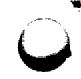

H. E. McCoy, Jr.

# ABSTRACT

The influence of small additions of Ti, Zr, and Hf on the mechanical properties of a modified Hastelloy N with the nominal composition Ni-12% Mo-7% Cr-0.2% Mn-0.05% C is described in this report. It deals specifically with test results from numerous, small, laboratory melts and several 100-lb melts from commercial vendors. Additions of Ti, Zr, and Hf had beneficial effects on the properties of the alloy both unirradiated and after irradiation. Irradiation temperature had a marked effect upon the properties of all alloys investigated. Generally, good properties were observed when the irradiation temperature was $650^{\circ}\mathrm{C}$ or less and poor when the temperature was $700^{\circ}\mathrm{C}$ or higher. We attributed this large effect of irradiation temperature to coarsening of the carbide structure at the higher temperature.

# INTRODUCTION

Previous studies $^{1-4}$ showed Hastelloy N (Ni-16% Mo-7% Cr-4% Fe-0.05% C) susceptible to a type of damage produced by irradiation at high temperatures that results in reduced stress-rupture properties and fracture ductility. One approach to solving this problem is that of making slight changes in the chemistry of the alloy. We initially modified the base composition to Ni-12% Mo-7% Cr-0.2% Mn-0.05% C to obtain an alloy that

was free of the stringers of the $\mathbf{M}_6\mathbf{C}$ type of carbide (where M is the metallic component) characteristically found in standard Hastelloy N. We then made a number of laboratory melts with various additions of Ti, Zr, and Hf, since they form very strong, stable diborides5 and should tie up the boron as compounds rather than allow it to segregate to the grain boundaries. The more random distribution of the boron should reduce the radiation damage by reducing the concentration at grain boundaries of helium produced by the $^{10}\mathrm{B}(n,\alpha)$ reaction.

The results of tensile and creep tests on these experimental alloys show that the resistance to irradiation damage is improved by the addition of Ti, Zr, or Hf. Results of tests on the first small (100-lb) heats of commercial alloys that contained these same alloy additions also indicate improved properties.

# EXPERIMENTAL DETAILS

# Test Materials

Our alloys were nonconsumably arc melted in an argon atmosphere from melting stock of commercial purity. A starting charge of about 2 lb was consolidated and melted several times. The charge was then placed in another arc-melting furnace with a hearth for drop casting. The alloy was again melted and drop cast into a l-in.-diam $\times$ 6-in.-long ingot. The ingot was swaged to $1/4$ -in.-diam rod by the following schedule: from l in. to $3/4$ in. at $1177^{\circ}\mathrm{C}$ , from $3/4$ in. to $7/16$ in. at $871^{\circ}\mathrm{C}$ , and from $7/16$ in. to $1/4$ in. at ambient temperature.

The commercial melts were melted by vacuum induction and cast into six 4-in.-diam ingots that weighed about 16 lb each. They were initially forged at $1177^{\circ}\mathrm{C}$ ; the final working was done at room temperature. The final product was small 1/2-in.-thick plates with $40\%$ cold work.

The chemical analysis of each alloy used in this study is given in Table 1.

Table 1. Chemical Compositions of Alloys   

<table><tr><td rowspan="2">Alloy Number</td><td colspan="9">Composition (wt %)</td><td rowspan="2">(ppm) B</td><td rowspan="2">Weight of Melt (1b)</td></tr><tr><td>Mo</td><td>Cr</td><td>Mn</td><td>Fe</td><td>Si</td><td>C</td><td>Ti</td><td>Zr</td><td>Other</td></tr><tr><td>100</td><td>12.16</td><td>6.96</td><td>0.20</td><td>0.071</td><td>&lt; 0.005</td><td>0.052</td><td>&lt; 0.01</td><td>&lt; 0.03</td><td></td><td>0.02</td><td>2</td></tr><tr><td>101</td><td>12.16</td><td>6.97</td><td>0.20</td><td>0.056</td><td>&lt; 0.005</td><td>0.057</td><td>0.11</td><td>&lt; 0.03</td><td></td><td>0.02</td><td>2</td></tr><tr><td>102</td><td>12.10</td><td>7.03</td><td>0.20</td><td>0.089</td><td>&lt; 0.005</td><td>0.045</td><td>0.39</td><td>&lt; 0.03</td><td></td><td>0.02</td><td>2</td></tr><tr><td>103</td><td>12.37</td><td>6.98</td><td>0.20</td><td>0.077</td><td>&lt; 0.005</td><td>0.055</td><td>0.31</td><td>&lt; 0.03</td><td></td><td>0.02</td><td>2</td></tr><tr><td>104</td><td>11.98</td><td>6.97</td><td>0.20</td><td>0.10</td><td>&lt; 0.005</td><td>0.050</td><td>0.55</td><td>&lt; 0.03</td><td></td><td>0.02</td><td>2</td></tr><tr><td>105</td><td>11.10</td><td>6.84</td><td>0.20</td><td>0.089</td><td>&lt; 0.005</td><td>0.049</td><td>0.66</td><td>&lt; 0.03</td><td></td><td>0.01</td><td>2</td></tr><tr><td>106</td><td>11.82</td><td>7.02</td><td>0.20</td><td>0.061</td><td>&lt; 0.005</td><td>0.050</td><td>0.81</td><td>&lt; 0.03</td><td></td><td>0.01</td><td>2</td></tr><tr><td>107</td><td>11.95</td><td>7.00</td><td>0.20</td><td>0.082</td><td>&lt; 0.005</td><td>0.056</td><td>1.04</td><td>&lt; 0.03</td><td></td><td>0.01</td><td>2</td></tr><tr><td>75</td><td>11.8</td><td>7.94</td><td>0.20</td><td>&lt; 0.05</td><td>&lt; 0.05</td><td>0.062</td><td>0.99</td><td></td><td></td><td></td><td>2</td></tr><tr><td>76</td><td>11.8</td><td>7.88</td><td>0.20</td><td>&lt; 0.05</td><td>&lt; 0.05</td><td>0.117</td><td>1.01</td><td></td><td></td><td></td><td>2</td></tr><tr><td>21545</td><td>12.0</td><td>7.18</td><td>0.29</td><td>0.034</td><td>0.015</td><td>0.050</td><td>0.49</td><td>0.01</td><td></td><td>0.7</td><td>100</td></tr><tr><td>108</td><td>11.9</td><td>7.2</td><td>0.21</td><td>0.065</td><td>&lt; 0.005</td><td>0.056</td><td>&lt; 0.001</td><td>0.10</td><td></td><td>0.2</td><td>2</td></tr><tr><td>109</td><td>12.5</td><td>7.2</td><td>0.21</td><td>0.081</td><td>&lt; 0.005</td><td>0.060</td><td>&lt; 0.01</td><td>0.28</td><td></td><td>0.01</td><td>2</td></tr><tr><td>110</td><td>12.6</td><td>6.7</td><td>0.19</td><td>0.12</td><td>&lt; 0.005</td><td>0.065</td><td>&lt; 0.01</td><td>0.53</td><td></td><td>0.01</td><td>2</td></tr><tr><td>111</td><td>12.7</td><td>6.6</td><td>0.21</td><td>0.069</td><td>&lt; 0.005</td><td>0.065</td><td>&lt; 0.01</td><td>0.75</td><td></td><td>0.02</td><td>2</td></tr><tr><td>112</td><td>11.3</td><td>7.5</td><td>0.23</td><td>0.069</td><td>&lt; 0.005</td><td>0.065</td><td>&lt; 0.01</td><td>1.18</td><td></td><td>0.01</td><td>2</td></tr><tr><td>146</td><td>12.4</td><td>6.7</td><td>0.23</td><td></td><td>0.005</td><td>0.060</td><td>0.01</td><td>0.90</td><td>Re=0.02</td><td>0.4</td><td>2</td></tr><tr><td>147</td><td>12.0</td><td>6.7</td><td>0.2</td><td>0.1</td><td>0.01</td><td>0.069</td><td>0.01</td><td>0.94</td><td>Re=0.3</td><td></td><td>2</td></tr><tr><td>21554</td><td>12.4</td><td>7.4</td><td>0.16</td><td>0.097</td><td>0.01</td><td>0.065</td><td>0.003</td><td>0.35</td><td></td><td>2</td><td>100</td></tr><tr><td>21555</td><td>12.4</td><td>7.2</td><td>0.16</td><td>0.065</td><td>0.008</td><td>0.052</td><td>0.003</td><td>0.05</td><td></td><td>2</td><td>100</td></tr><tr><td>152</td><td>12.2</td><td>6.2</td><td>0.21</td><td>0.03</td><td>0.03</td><td>0.054</td><td>&lt; 0.01</td><td>0.02</td><td>Hf=0.16</td><td>0.2</td><td>2</td></tr><tr><td>153</td><td>12.4</td><td>7.0</td><td>0.16</td><td>0.02</td><td>0.019</td><td>0.062</td><td>&lt; 0.01</td><td>&lt; 0.01</td><td>Hf=0.06</td><td></td><td>2</td></tr><tr><td>154</td><td>12.4</td><td>6.9</td><td>0.14</td><td>0.01</td><td>0.01</td><td>0.058</td><td>&lt; 0.01</td><td>&lt; 0.01</td><td>Hf=0.10</td><td></td><td>2</td></tr><tr><td>155</td><td>12.5</td><td>6.9</td><td>0.12</td><td>0.03</td><td>&lt; 0.01</td><td>0.052</td><td>&lt; 0.01</td><td>0.01</td><td>Hf=0.13</td><td></td><td>2</td></tr><tr><td>156</td><td>12.9</td><td>7.0</td><td>0.12</td><td>0.03</td><td>&lt; 0.01</td><td>0.056</td><td>&lt; 0.01</td><td>0.03</td><td>Hf=0.43</td><td>0.2</td><td>2</td></tr><tr><td>67-503</td><td>12.5</td><td>7.8</td><td>0.08</td><td>0.15</td><td>&lt; 0.01</td><td>0.06</td><td>0.06</td><td>&lt; 0.01</td><td>Hf=0.08</td><td>1</td><td>100</td></tr><tr><td>67-504</td><td>12.7</td><td>7.5</td><td>0.12</td><td>0.12</td><td>0.02</td><td>0.07</td><td>&lt; 0.01</td><td>0.01</td><td>Hf=0.50</td><td>0.3</td><td>100</td></tr><tr><td>21546</td><td>12.3</td><td>7.2</td><td>0.16</td><td>0.05</td><td>0.009</td><td>0.05</td><td>0.1</td><td>0.005</td><td></td><td>2</td><td>100</td></tr></table>

The rods were fabricated into the test specimens shown in Fig. 1. Our work with this specimen has shown that the rest results are reproducible and agree quite well with those obtained for more massive specimens. However, there is sufficient stress concentration to cause some of the more brittle specimens to break in the radius at the end of the gage length.

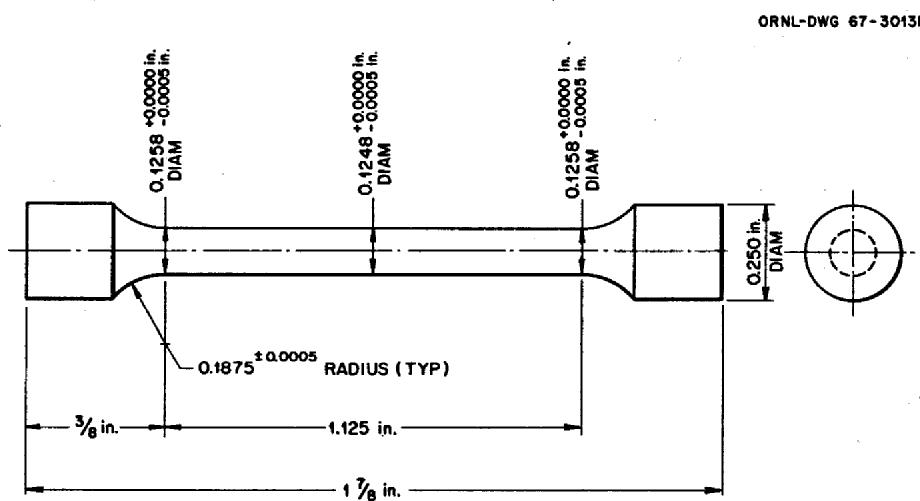  
Fig. 1. Specimen Used for Tests of Mechanical Properties.

# Irradiation Conditions

The results presented here were obtained from specimens irradiated in several experiments. These experiments were carried out in three reactors: the Engineering Test Reactor (ETR) at Idaho Falls, Idaho, and the Oak Ridge Research Reactor (ORR) and Molten Salt Reactor Experiment (MSRE) at Oak Ridge, Tennessee. A core facility was used in the ETR where the thermal and fast ( $>1\mathrm{MeV}$ ) fluxes were each $3.2 \times 10^{14}$ neutrons $\mathrm{cm}^{-2} \sec^{-1}$ and the fluence was $6 \times 10^{20}$ neutrons/ $\mathrm{cm}^2$ . The ETR experiments were uninstrumented, and the design temperatures were either below $150^{\circ}\mathrm{C}$ or $600 \pm 100^{\circ}\mathrm{C}$ . Melt wires included in these experiments indicated that the operating temperatures were within the desired range. The experiments in the ORR were performed in a poolside facility where the peak fluxes were $6 \times 10^{13}$ neutrons $\mathrm{cm}^{-2} \sec^{-1}$ (thermal) and $5 \times 10^{12}$ neutrons $\mathrm{cm}^{-2} \sec^{-1}$ ( $>2.9$ MeV). The experiments were run for

either one or two cycles so that the thermal fluence was 2 to $5 \times 10^{20}$ neutrons/cm $^2$ and the fast fluence was 2 to $4 \times 10^{19}$ neutrons/cm $^2$ . These experiments were instrumented, and the temperatures were controlled at 650 to $871^{\circ}\mathrm{C}$ . The experiments in the MSRE were run in the center of the core, where the thermal flux was $4.1 \times 10^{12}$ neutrons cm $^{-2}$ sec $^{-1}$ and the fast ( $>1.22$ MeV) flux was $1.0 \times 10^{12}$ neutrons cm $^{-2}$ sec $^{-1}$ . The samples were exposed to a noncorrosive fluoride salt environment for 4800 hr at $645 \pm 10^{\circ}\mathrm{C}$ and received a thermal fluence of $1.3 \times 10^{20}$ neutrons/cm $^2$ and a fast fluence of $3.1 \times 10^{19}$ neutrons/cm $^2$ . Since we could not see any consistent effects of thermal-neutron fluence over the small range encountered in these experiments, we present our data in this paper as having been obtained at a common fluence.

# Testing Procedure

The creep-rupture tests after irradiation were run in lever-arm creep machines in the hot cells at the Oak Ridge National Laboratory. The strain was measured by an extensometer with rods attached to the upper and lower specimen grips. The relative movement of these two rods was measured by a linear differential transformer, and the transformer signal was recorded. The accuracy of the strain measurements is about $\pm 0.1\%$ , considering the effects of ambient temperature variations in the hot cell, mechanical vibrations, etc. This accuracy is considerably better than the specimen-to-specimen reproducibility that one would expect for this alloy. The systems for measuring and controlling temperature combine to give a temperature uncertainty of about $\pm 1\%$ .

The tensile tests were run on Instron Universal Testing Machines. The strain measurements were taken from the crosshead travel.

# EXPERIMENTAL RESULTS

# Alloys Containing Titanium

The alloys with additions of titanium fell into three groups. The first group, alloys 100 through 107, contained from less than 0.01 to

1.04% Ti. These alloys were of the nominal base composition of Ni-12% Mo-7% Cr-0.2% Mn-0.05% C. Typical microstructures of these alloys after a l-hr anneal at 1177°C are shown in Fig. 2. The alloys were all free of intermetallic precipitates and contained only a small amount of carbide precipitates. Generally, the amount of carbide increased and the grain size decreased with increasing titanium concentration. The second group, alloys 75 and 76, contained 1% Ti and were made to explore the influence of varying carbon content. Typical microstructures of these alloys are shown in Fig. 3. The third material, a 100-lb commercial alloy from Special Metals Corporation, designated heat 21545, contained 0.49% Ti. Typical microstructures of this alloy are shown in Fig. 4. This alloy had a nominal composition quite close to that of alloy 104, and the microstructures of the two alloys after a l-hr anneal at 1177°C were quite similar except that the commercial alloy contained patches of precipitate. Close examination showed these regions to be quite high in molybdenum. Some of the precipitates were carbides of the MC type and others were almost pure molybdenum. The grain size after annealing for 100 hr at 871°C was quite fine, and copious quantities of carbide precipitates were present.

Alloys 100 through 107 were tested under a variety of conditions. Tensile tests were run at $650^{\circ}\mathrm{C}$ on samples that had been annealed 1 hr at $1177^{\circ}\mathrm{C}$ and aged 1000 hr at $650^{\circ}\mathrm{C}$ to duplicate the thermal history of irradiated samples. The results of these tests are summarized in Table 2. The variation of the tensile and yield strengths with titanium content is shown in Fig. 5. The yield strength increased with increasing titanium. The tensile strength varied in a poorly defined manner: at a strain rate of $0.05\mathrm{min}^{-1}$ , it increased systematically with increasing titanium, and at a rate of $0.002\mathrm{min}^{-1}$ it reached a maximum at $0.55\%$ Ti. The variation of the fracture strain with titanium content is shown in Fig. 6. At a strain rate of $0.05\mathrm{min}^{-1}$ , the addition of $0.11\%$ Ti greatly increased the fracture strain; further additions decreased the fracture strain. At a strain rate of $0.002\mathrm{min}^{-1}$ , the fracture strain improved greatly with the addition of $0.11\%$ Ti, and further additions caused a gradual improvement.

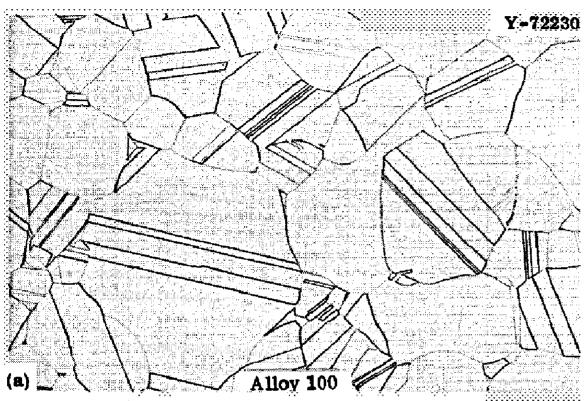

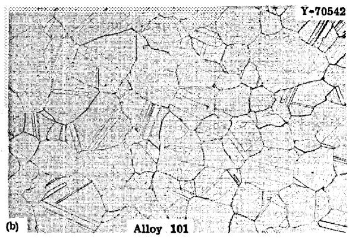

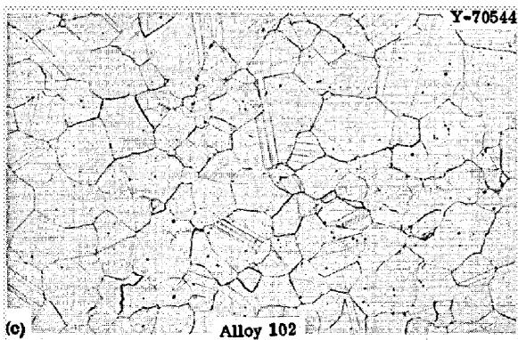

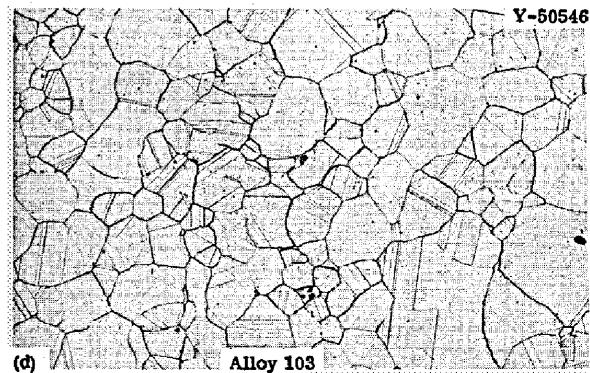

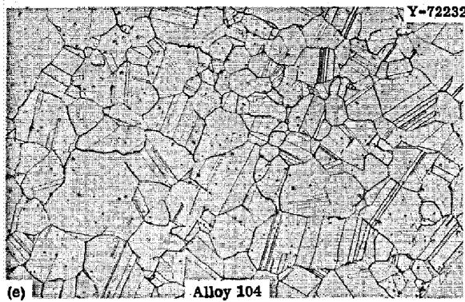

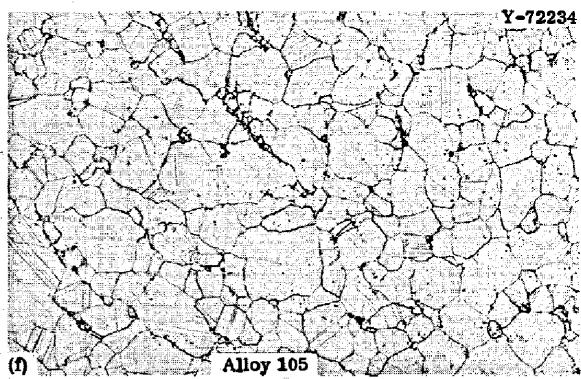

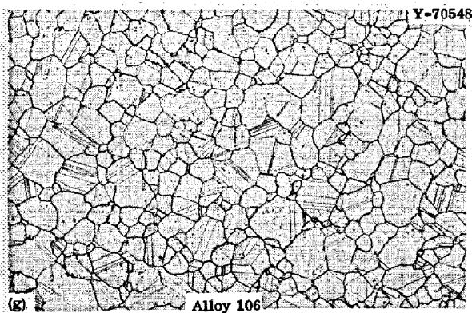

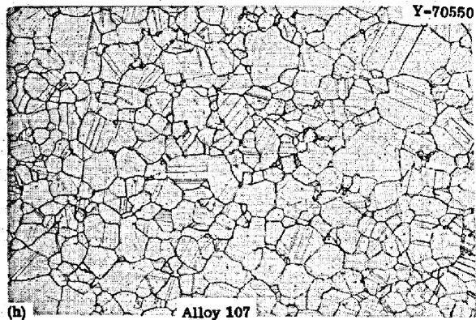  
Fig. 2. Photomicrographs of Alloys That Contain Various Amounts of Titanium. The basic composition is Ni-12% Mo-7% Cr-0.2% Mn-0.05% C. Etchant: glyceria regia. 100×. Reduced 38%.

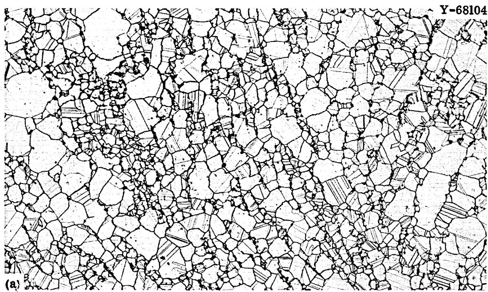

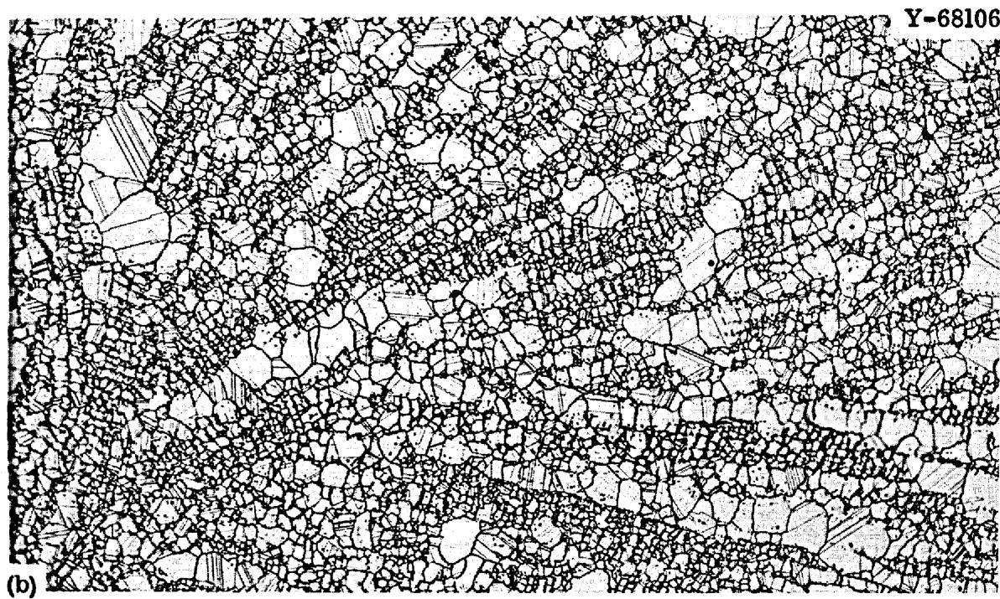  
Fig. 3. Photomicrographs of Alloys (a) 75 and (b) 76. The nominal chemical compositions are Ni-12% Mo-7% Cr-0.2% Mn-1% Ti-0.05% C and Ni-12% Mo-7% Cr-0.2% Mn-1.0% Ti-0.10% C, respectively. Etchant: glyceria regia. 100x.

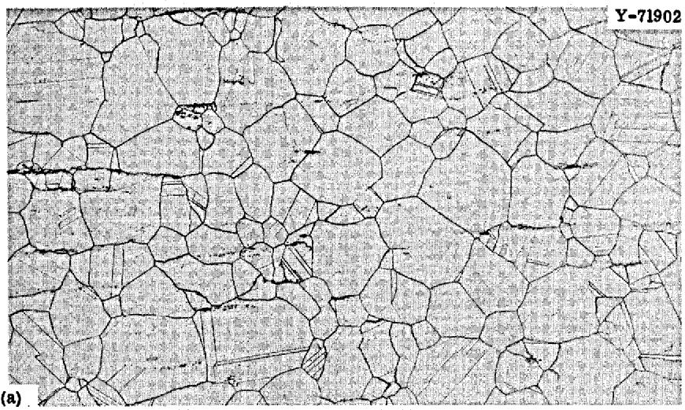

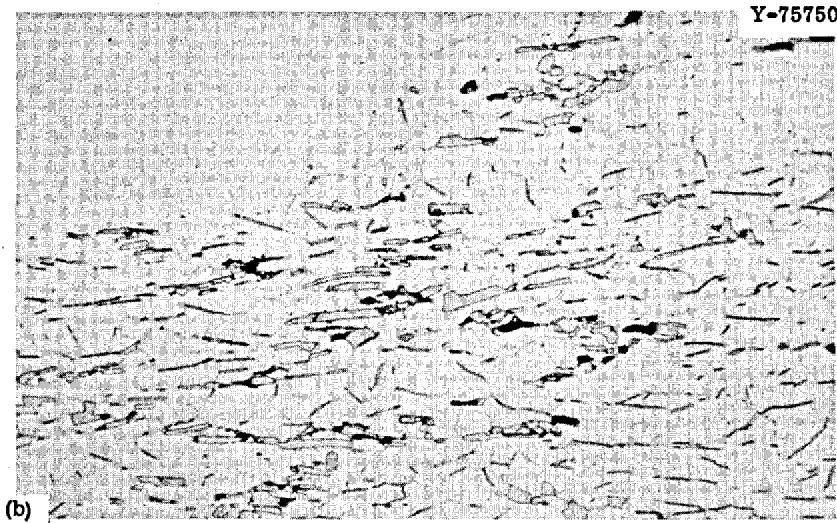

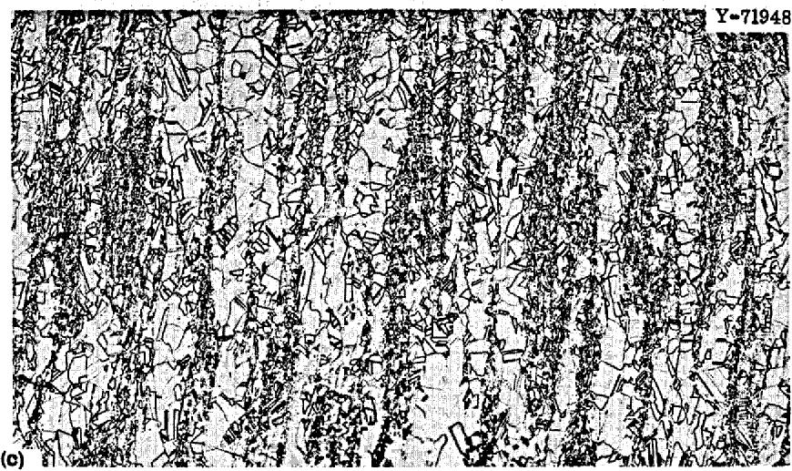

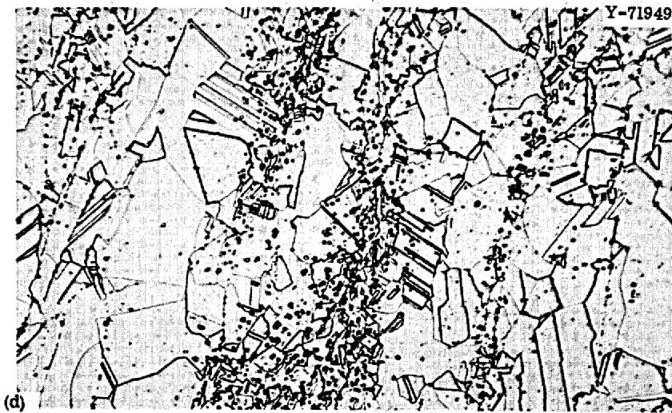  
Fig. 4. Photomicrographs of Heat 21545, which Contained $0.49\%$ Ti. (a) Annealed 1 hr at $1177^{\circ}\mathrm{C}$ , $100\times$ ; (b) precipitate after anneal of 1 hr at $1177^{\circ}\mathrm{C}$ , $1000\times$ ; (c) and (d) annealed 100 hr at $871^{\circ}\mathrm{C}$ , 100 and $500\times$ . Samples (a), (c), and (d) etched with glyceria regia. Sample (b) etched with hydrochloric, nitric, and lactic acids. Reduced $28\%$ .

Table 2. Tensile Properties of Several Unirradiateda Titanium-Modified Alloys at $650^{\circ}\mathrm{C}$   

<table><tr><td rowspan="2">Alloy Number</td><td rowspan="2">Specimen Number</td><td rowspan="2">Strain Rate (min-1)</td><td colspan="2">Stress, psi</td><td colspan="2">Elongation, %</td><td rowspan="2">Reduction in Area (%)</td></tr><tr><td>Yield</td><td>Ultimate Tensile</td><td>Uniform</td><td>Total</td></tr><tr><td></td><td></td><td></td><td>× 103</td><td>× 103</td><td></td><td></td><td></td></tr><tr><td>100</td><td>1906</td><td>0.05</td><td>27.1</td><td>77.4</td><td>43.6</td><td>44.2</td><td>34.2</td></tr><tr><td>100</td><td>1910</td><td>0.002</td><td>30</td><td>73.7</td><td>27.8</td><td>29.7</td><td>25.6</td></tr><tr><td>101</td><td>1933</td><td>0.05</td><td>27.9</td><td>82.6</td><td>62.1</td><td>64.8</td><td>44.2</td></tr><tr><td>101</td><td>1926</td><td>0.002</td><td>27.4</td><td>75.2</td><td>33.0</td><td>37.3</td><td>29.2</td></tr><tr><td>102</td><td>1943</td><td>0.05</td><td>31.1</td><td>87.1</td><td>51.2</td><td>53.2</td><td>42.7</td></tr><tr><td>102</td><td>1952</td><td>0.002</td><td>30.9</td><td>78.4</td><td>31.4</td><td>37.5</td><td>32.8</td></tr><tr><td>103</td><td>1962</td><td>0.05</td><td>31.5</td><td>87.7</td><td>51.4</td><td>54.0</td><td>47.3</td></tr><tr><td>103</td><td>1968</td><td>0.002</td><td>28.9</td><td>69.4</td><td>24.5</td><td>37.5</td><td>33.8</td></tr><tr><td>104</td><td>1987</td><td>0.05</td><td>31.1</td><td>87.5</td><td>51.0</td><td>53.0</td><td>42.4</td></tr><tr><td>104</td><td>1984</td><td>0.002</td><td>35.4</td><td>87.9</td><td>28.2</td><td>36.7</td><td>28.8</td></tr><tr><td>105</td><td>2007</td><td>0.05</td><td>34.2</td><td>93.6</td><td>51.0</td><td>52.8</td><td>45.0</td></tr><tr><td>105</td><td>2004</td><td>0.002</td><td>34.3</td><td>84.1</td><td>31.9</td><td>40.3</td><td>32.4</td></tr><tr><td>106</td><td>2023</td><td>0.05</td><td>34.8</td><td>100.7</td><td>45.4</td><td>47.3</td><td>40.3</td></tr><tr><td>106</td><td>2026</td><td>0.002</td><td>33.9</td><td>79.8</td><td>26.0</td><td>37.8</td><td>35.1</td></tr><tr><td>107</td><td>2039</td><td>0.05</td><td>36.4</td><td>99.2</td><td>43.8</td><td>46.1</td><td>36.4</td></tr><tr><td>107</td><td>2041</td><td>0.002</td><td>33.7</td><td>75.1</td><td>22.3</td><td>38.5</td><td>32.5</td></tr></table>

aAnnealed 1 hr at $1177^{\circ}C$ and aged 1000 hr at $650^{\circ}C$

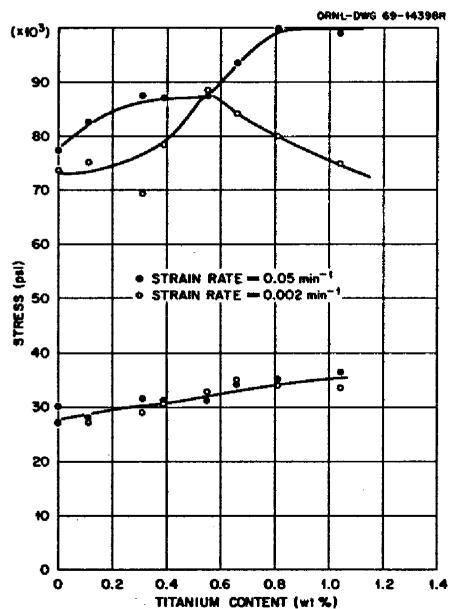  
Fig. 5. Influence of Titanium Content on the Yield and Ultimate Tensile Strengths at $650^{\circ}\mathrm{C}$ after Annealing 1 hr at $1177^{\circ}\mathrm{C}$ and Aging 1000 hr at $650^{\circ}\mathrm{C}$ .

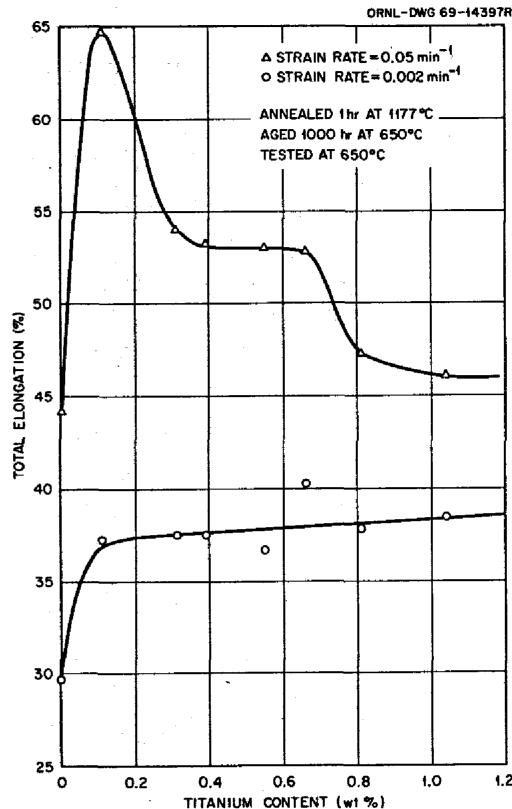  
Fig. 6. Influence of Titanium Content on the Tensile Fracture Strain at $650^{\circ}\mathrm{C}$ of Ni-12% Mo-7% Cr-0.2% Mn-0.05% C Alloys.

Alloys 100 through 107 were irradiated at $650^{\circ}\mathrm{C}$ to a thermal fluence of $2.5 \times 10^{20}$ neutrons/cm $^2$ . The results of tensile tests at $650^{\circ}\mathrm{C}$ after irradiation are summarized in Table 3. The fracture strains measured at $650^{\circ}\mathrm{C}$ are plotted as a function of titanium content in Fig. 7. The data exhibit considerable variation, but show no systematic variation with titanium concentration. The results of these tests are analyzed further in Fig. 8, where the ratios of the various tensile properties of the irradiated and unirradiated alloys are compared. The yield stress is increased by irradiation, and the tensile stress and fracture strain are decreased. However, the ratios are only moderately dependent upon the titanium level.

Another set of samples of alloys 100 through 107 was irradiated at $50^{\circ}\mathrm{C}$ to a thermal fluence of $9 \times 10^{19}$ neutrons/ $\mathrm{cm}^2$ . The results of tensile tests of these samples at 650 and $760^{\circ}\mathrm{C}$ are given in Table 4. Comparison of these results with those in Table 3 for the samples irradiated to a higher fluence at a higher temperature reveals that the fracture strains are higher for the samples irradiated at $50^{\circ}\mathrm{C}$ . The fracture

Table 3. Tensile Properties of Several Titanium-Modified Alloys Tested at $650^{\circ}\mathrm{C}$ after Irradiationa   

<table><tr><td rowspan="2">Alloy Number</td><td rowspan="2">Specimen Number</td><td rowspan="2">Strain Rate (min-1)</td><td colspan="2">Stress, psi</td><td colspan="2">Elongation, %</td><td rowspan="2">Reduction in Area (%)</td></tr><tr><td>Yield</td><td>Ultimate Tensile</td><td>Uniform</td><td>Total</td></tr><tr><td></td><td></td><td></td><td>× 103</td><td>× 103</td><td></td><td></td><td></td></tr><tr><td>100</td><td>1908</td><td>0.05</td><td>31.5</td><td>66.3</td><td>26.3</td><td>26.6</td><td>23.3</td></tr><tr><td>100</td><td>1912</td><td>0.002</td><td>26.3</td><td>48.8</td><td>13.4</td><td>14.1</td><td>13.1</td></tr><tr><td>101</td><td>1924</td><td>0.05</td><td>35.5</td><td>68.9</td><td>23.2</td><td>23.7</td><td>19.1</td></tr><tr><td>101</td><td>1925</td><td>0.002</td><td>36.9</td><td>57.2</td><td>10.7</td><td>10.9</td><td>12.5</td></tr><tr><td>102</td><td>1949</td><td>0.05</td><td>35.1</td><td>74.8</td><td>33.7</td><td>35.1</td><td>28.8</td></tr><tr><td>102</td><td>1951</td><td>0.002</td><td>37.7</td><td>67.8</td><td>18.5</td><td>19.2</td><td>14.9</td></tr><tr><td>103</td><td>1978</td><td>0.002</td><td>35.3</td><td>65.9</td><td>21.9</td><td>22.8</td><td>18.8</td></tr><tr><td>104</td><td>2006</td><td>0.002</td><td>39.0</td><td>65.2</td><td>14.5</td><td>15.4</td><td>15.6</td></tr><tr><td>105</td><td>1989</td><td>0.002</td><td>35.5</td><td>69.7</td><td>21.9</td><td>22.7</td><td>31.6</td></tr><tr><td>106</td><td>2021</td><td>0.002</td><td>39.2</td><td>65.1</td><td>12.0</td><td>12.6</td><td>14.4</td></tr><tr><td>107</td><td>2051</td><td>0.002</td><td>39.3</td><td>71.6</td><td>15.9</td><td>16.3</td><td>13.0</td></tr></table>

aAnnealed 1 hr at $1177^{\circ}\mathrm{C}$ before irradiation at $650^{\circ}\mathrm{C}$ to a thermal fluence of $2.5 \times 10^{20}$ neutrons/cm².

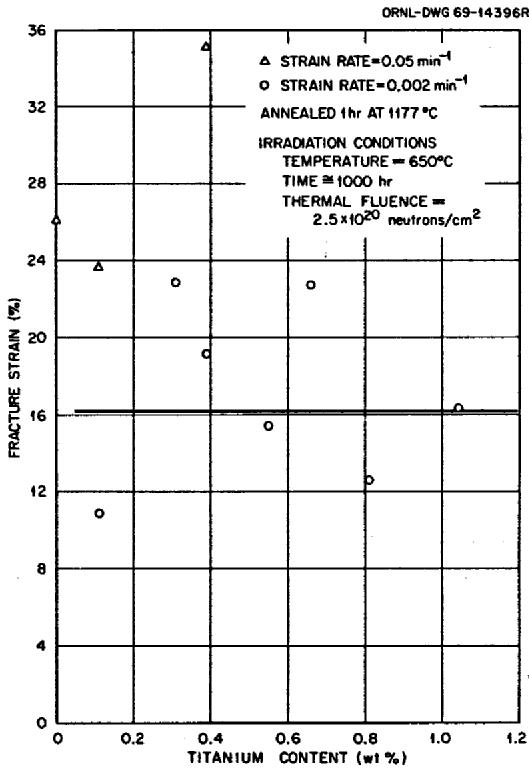  
Fig. 7. Influence of Titanium Content on the Tensile Fracture Strain at $650^{\circ}\mathrm{C}$ of Ni-12% Mo-7% Cr-0.05% C Alloys after Irradiation.

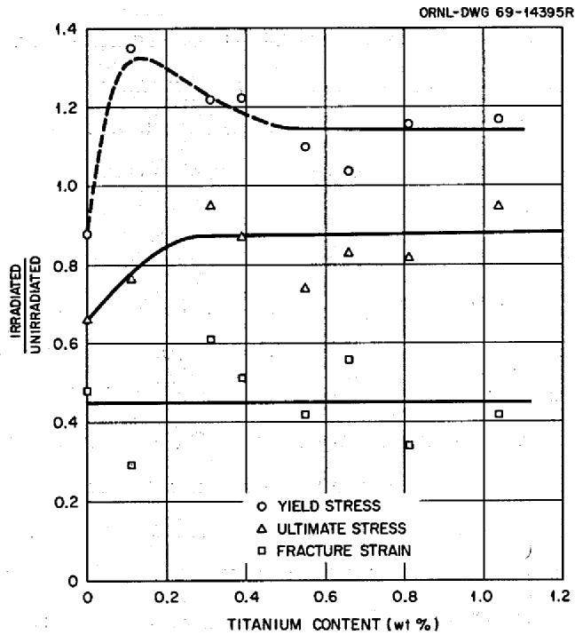  
Fig. 8. Ratios of the Unirradiated and Irradiated Tensile Properties of Alloys Modified with Titanium. Tested at $650^{\circ}\mathrm{C}$ at a Strain Rate of $0.002\mathrm{min}^{-1}$ .

Table 4. Tensile Propertiesa of Several Titanium-Modified Alloys Tested at 650 and $760^{\circ}\mathrm{C}$ after Irradiationb   

<table><tr><td rowspan="2">Alloy Number</td><td rowspan="2">Specimen Number</td><td colspan="2">Stress, psi</td><td colspan="2">Elongation, %</td><td rowspan="2">Reduction in Area (%)</td></tr><tr><td>Yield</td><td>Ultimate Tensile</td><td>Uniform</td><td>Total</td></tr><tr><td></td><td></td><td>× 103</td><td>× 103</td><td></td><td></td><td></td></tr><tr><td></td><td></td><td colspan="2">Test Temperature 650°C</td><td></td><td></td><td></td></tr><tr><td>100</td><td>1907</td><td>26.4</td><td>60.3</td><td>21.3</td><td>21.9</td><td>24.0</td></tr><tr><td>101</td><td>1941</td><td>27.6</td><td>62.0</td><td>21.6</td><td>22.1</td><td>18.3</td></tr><tr><td>102</td><td>1944</td><td>31.3</td><td>71.4</td><td>22.8</td><td>23.4</td><td>19.4</td></tr><tr><td>103</td><td>1975</td><td>30.7</td><td>74.9</td><td>23.8</td><td>24.4</td><td>27.2</td></tr><tr><td>104</td><td>1992</td><td>29.8</td><td>71.8</td><td>25.1</td><td>25.7</td><td>33.2</td></tr><tr><td>105</td><td>2003</td><td>34.4</td><td>76.1</td><td>23.5</td><td>23.8</td><td>22.8</td></tr><tr><td>106</td><td>2025</td><td>33.4</td><td>80.8</td><td>26.0</td><td>26.4</td><td>34.5</td></tr><tr><td>107</td><td>2043</td><td>39.6</td><td>89.3</td><td>23.4</td><td>23.8</td><td>21.1</td></tr><tr><td></td><td></td><td colspan="2">Test Temperature 760°C</td><td></td><td></td><td></td></tr><tr><td>100</td><td>1905</td><td>27.4</td><td>48.8</td><td>8.4</td><td>9.5</td><td>9.3</td></tr><tr><td>101</td><td>1940</td><td>27.6</td><td>51.0</td><td>8.1</td><td>9.2</td><td>5.6</td></tr><tr><td>102</td><td>1948</td><td>30.6</td><td>53.9</td><td>8.6</td><td>8.9</td><td>9.4</td></tr><tr><td>103</td><td>1977</td><td>26.8</td><td>53.8</td><td>9.3</td><td>10.3</td><td>10.4</td></tr><tr><td>104</td><td>1995</td><td>30.0</td><td>54.4</td><td>8.9</td><td>10.0</td><td>8.1</td></tr><tr><td>105</td><td>2016</td><td>31.8</td><td>56.7</td><td>8.8</td><td>11.2</td><td>8.6</td></tr><tr><td>106</td><td>2024</td><td>30.6</td><td>57.0</td><td>9.4</td><td>12.8</td><td>11.6</td></tr><tr><td>107</td><td>2056</td><td>31.5</td><td>58.9</td><td>9.3</td><td>13.2</td><td>12.1</td></tr></table>

aStrain rate $= 0.002\min^{-1}$   
bAnnealed 1 hr at $1177^{\circ}C$ before irradiation at $50^{\circ}C$ to a thermal fluence of $9\times 10^{19}$ neutrons/cm².

strains measured at $650^{\circ}\mathrm{C}$ after irradiation ranged from 22 to $26\%$ but did not vary systematically with titanium content. However, at a test temperature of $760^{\circ}\mathrm{C}$ , the fracture strain did show a slight dependence on titanium level; it varied from $9.5\%$ with no titanium present to $13.2\%$ with $1.04\%$ Ti present.

Several unirradiated samples of alloys 100 through 107 were creep tested at $650^{\circ}\mathrm{C}$ . The results of these tests are summarized in Table 5 and plotted in Figs. 9 through 11. The results of stress-rupture tests in Fig. 9 show a marked improvement in rupture life at a given stress level with increasing titanium content. The results are somewhat scattered, and there are some questions about the exact location of the line for each heat. The measurements of minimum creep rate in Fig. 10 show that titanium decreased the creep rate. All of these tests were run without an extensometer, and the precision of the measurements was not very good. However, the data indicate that the creep rate did not vary appreciably with titanium content from 0.11 to $1.04\%$ Ti (alloys 101 and 107). The data also indicate that titanium concentration may have no influence on the creep rate at low stress levels. The fracture strains are shown in Fig. 11 as a function of the minimum creep rate. Titanium additions definitely improve the fracture strain. The fracture strains of alloys 106 and 107, which contained 0.81 and $1.04\%$ Ti, respectively, were almost independent of creep rate; the other alloys exhibited decreasing fracture strain with decreasing creep rate.

Several of these alloys were heat treated to simulate irradiated samples by anneals of 1 hr at $1177^{\circ}\mathrm{C}$ and 1000 hr at $650^{\circ}\mathrm{C}$ . The results of tests on these samples are summarized in Table 6. A comparison of these results with those in Figs. 9 through 11 for samples that were annealed 1 hr at $1177^{\circ}\mathrm{C}$ indicates how these alloys respond to aging. The rupture life, minimum creep rate, and fracture strain were all increased by this aging treatment.

Alloys 100 through 107 were irradiated at $650^{\circ}\mathrm{C}$ and creep tested at the same temperature after irradiation. The results of these tests are given in Table 7. All of these samples were tested at a stress level of 32,400 psi. The rupture lives and fracture strains are shown as functions of titanium content in Fig. 12. The rupture life was increased

Table 5. Creep-Rupture Properties of Unirradiateda Titanium-Modified Alloys at $650^{\circ}\mathrm{C}$   

<table><tr><td>Alloy Number</td><td>Specimen Number</td><td>Test Number</td><td>Stress (psi)</td><td>Rupture Life (hr)</td><td>Minimum Creep Rate (%/hr)</td><td>Elongation (%)</td><td>Reduction in Area (%)</td></tr><tr><td></td><td></td><td></td><td>×103</td><td></td><td></td><td></td><td></td></tr><tr><td>100</td><td>1915</td><td>5725</td><td>55</td><td>3.4</td><td>0.43</td><td>22.5</td><td>20.8</td></tr><tr><td>100</td><td>1917</td><td>6099</td><td>47</td><td>20.8</td><td>0.55</td><td>14.5</td><td>12.5</td></tr><tr><td>100</td><td>1909</td><td>5554</td><td>40</td><td>47.4</td><td>0.088</td><td>12.5</td><td>9.5</td></tr><tr><td>100</td><td>1914</td><td>6108</td><td>32.4</td><td>185.1</td><td>0.0077</td><td>6.3</td><td>6.2</td></tr><tr><td>100</td><td>1921</td><td>6172</td><td>27</td><td>827.8</td><td>0.0022</td><td>4.9</td><td>4.0</td></tr><tr><td>101</td><td>1930</td><td>5753</td><td>70</td><td>0.6</td><td>2.9</td><td>34.5</td><td>28.3</td></tr><tr><td>101</td><td>1937</td><td>5692</td><td>55</td><td>23.4</td><td>0.064</td><td>21.0</td><td>21.3</td></tr><tr><td>101</td><td>1929</td><td>6203</td><td>47</td><td>52.1</td><td>0.050</td><td>16.0</td><td>14.0</td></tr><tr><td>101</td><td>1934</td><td>6203</td><td>40</td><td>292.1</td><td>0.0060</td><td>14.1</td><td>13.2</td></tr><tr><td>101</td><td>1932</td><td>6104</td><td>32.4</td><td>792.8</td><td>0.0037</td><td>10.5</td><td>12.8</td></tr><tr><td>102</td><td>1958</td><td>5751</td><td>70</td><td>3.3</td><td>0.56</td><td>28.5</td><td>22.8</td></tr><tr><td>102</td><td>1950</td><td>5726</td><td>55</td><td>32.4</td><td>0.047</td><td>20.0</td><td>15.4</td></tr><tr><td>102</td><td>1961</td><td>6100</td><td>47</td><td>162.4</td><td>0.016</td><td>15.8</td><td>16.9</td></tr><tr><td>102</td><td>1956</td><td>5669</td><td>40</td><td>506.5</td><td>0.0076</td><td>13.7</td><td>14.7</td></tr><tr><td>103</td><td>1979</td><td>5747</td><td>70</td><td>3.2</td><td>0.45</td><td>28.3</td><td>22.8</td></tr><tr><td>103</td><td>1976</td><td>5687</td><td>55</td><td>69.9</td><td>0.029</td><td>18.5</td><td>13.9</td></tr><tr><td>103</td><td>1966</td><td>6087</td><td>47</td><td>157.4</td><td>0.010</td><td>14.0</td><td>11.6</td></tr><tr><td>103</td><td>1980</td><td>5663</td><td>40</td><td>541.5</td><td>0.0082</td><td>15.6</td><td>18.4</td></tr><tr><td>104</td><td>1998</td><td>6101</td><td>70</td><td>3.5</td><td>0.88</td><td>32.3</td><td>20.8</td></tr><tr><td>104</td><td>1991</td><td>5566</td><td>55</td><td>41.6</td><td>0.060</td><td>18.8</td><td>14.0</td></tr><tr><td>104</td><td>1982</td><td>5959</td><td>36.5</td><td>2718.9</td><td>0.0033</td><td>13.9</td><td>21.4</td></tr><tr><td>104</td><td>1990</td><td>5638</td><td>40</td><td>1001.2</td><td>0.0066</td><td></td><td>19.9</td></tr><tr><td>105</td><td>2018</td><td>5754</td><td>70</td><td>7.7</td><td>0.25</td><td>23.4</td><td>18.5</td></tr><tr><td>105</td><td>2001</td><td>5698</td><td>55</td><td>94.0</td><td>0.019</td><td>15.9</td><td>13.7</td></tr><tr><td>105</td><td>2017</td><td>6089</td><td>47</td><td>179.7</td><td>0.015</td><td>15.5</td><td>19.6</td></tr><tr><td>105</td><td>2000</td><td>5586</td><td>40</td><td>476.6</td><td>0.0078</td><td>16.6</td><td>13.8</td></tr><tr><td>106</td><td>2031</td><td>5750</td><td>70</td><td>11.6</td><td>0.20</td><td>25.0</td><td>19.9</td></tr><tr><td>106</td><td>2029</td><td>5691</td><td>55</td><td>95.4</td><td>0.042</td><td>21.3</td><td>20.0</td></tr><tr><td>106</td><td>2022</td><td>5658</td><td>51</td><td>158.0</td><td>0.038</td><td>21.9</td><td>17.6</td></tr><tr><td>106</td><td>2032</td><td>5988</td><td>47</td><td>372.9</td><td>0.015</td><td>22.1</td><td>18.5</td></tr><tr><td>106</td><td>2034</td><td>6107</td><td>40</td><td>832.4</td><td>0.014</td><td>21.4</td><td>21.2</td></tr><tr><td>107</td><td>2054</td><td>5760</td><td>70</td><td>5.5</td><td>1.22</td><td>22.5</td><td>19.1</td></tr><tr><td>107</td><td>2046</td><td>5644</td><td>55</td><td>322.6</td><td>0.028</td><td>20.3</td><td>20.3</td></tr><tr><td>107</td><td>2055</td><td>6106</td><td>47</td><td>375.6</td><td>0.022</td><td>23.1</td><td>23.1</td></tr><tr><td>107</td><td>2040</td><td>5633</td><td>40</td><td>1490.5</td><td>0.010</td><td>26.5</td><td>27.3</td></tr></table>

aAnnealed 1 hr at $1177^{\circ}C$ before testing.

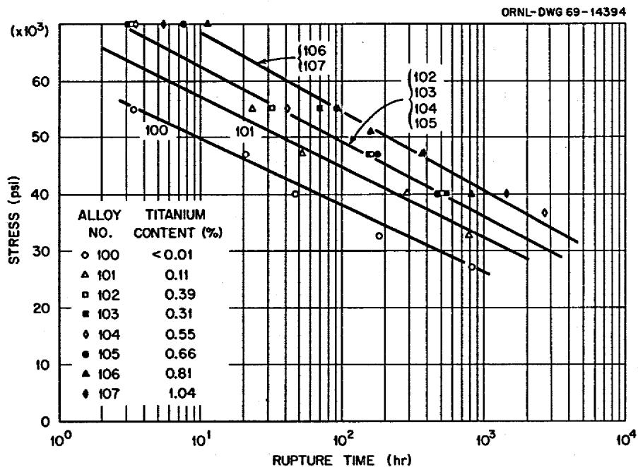  
Fig. 9. Stress-Rupture Properties at $650^{\circ}\mathrm{C}$ of Several Alloys Containing Titanium. All samples annealed 1 hr at $1177^{\circ}\mathrm{C}$ before testing.

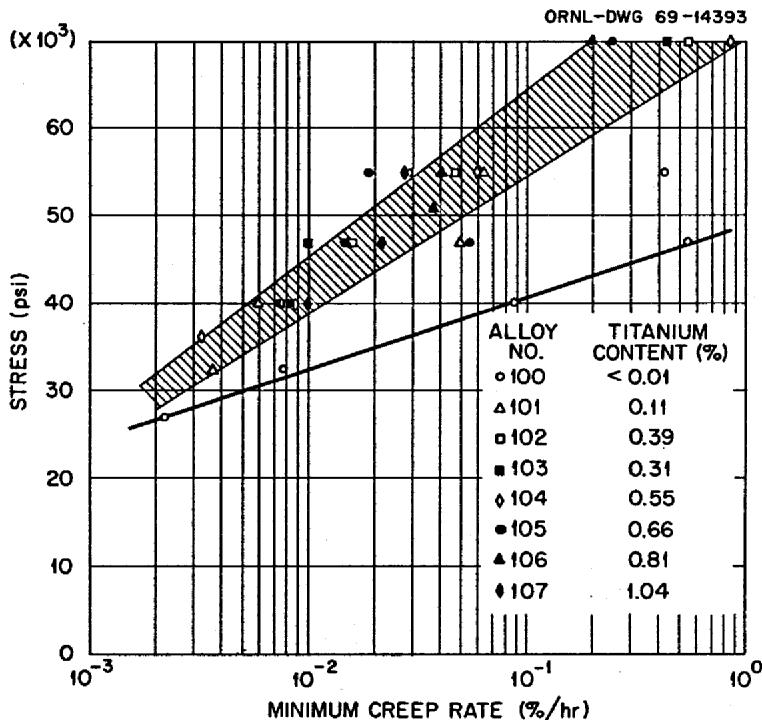  
Fig. 10. Creep Properties at $650^{\circ}\mathrm{C}$ of Several Alloys Containing Titanium. All samples annealed 1 hr at $1177^{\circ}\mathrm{C}$ before testing.

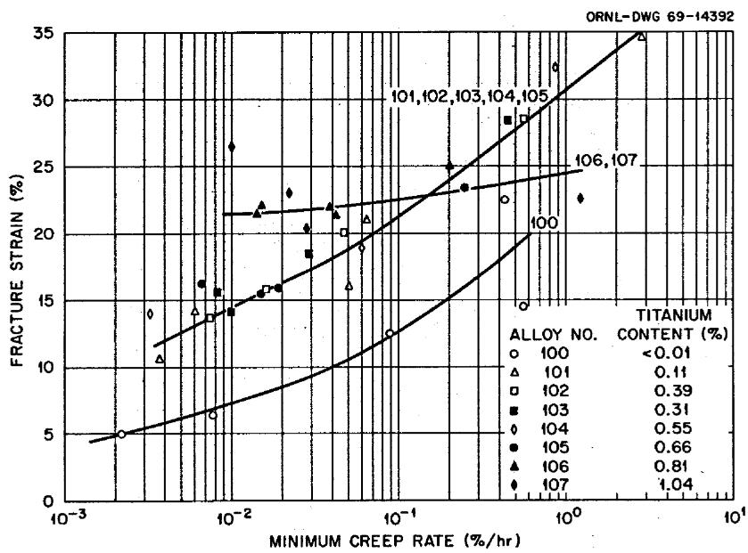  
Fig. 11. Fracture Strains at $650^{\circ}\mathrm{C}$ of Several Alloys Containing Titanium. All samples annealed at $1177^{\circ}\mathrm{C}$ before testing.

Table 6. Creep Properties of Several Ageda Titanium-Modified Alloys at $650^{\circ}\mathrm{C}$   

<table><tr><td>Alloy Number</td><td>Specimen Number</td><td>Test Number</td><td>Stress (psi)</td><td>Rupture Life (hr)</td><td>Minimum Creep Rate (%/hr)</td><td>Elorgation (%)</td><td>Reduction in Area (%)</td></tr><tr><td></td><td></td><td></td><td>× 103</td><td></td><td></td><td></td><td></td></tr><tr><td>100</td><td>1922</td><td>5723b</td><td>55</td><td>5.9</td><td>0.61</td><td>23.0</td><td>19.2</td></tr><tr><td>100</td><td>1919</td><td>5630b</td><td>17.8</td><td>1007</td><td>0.0007</td><td>1.0</td><td>0</td></tr><tr><td>101</td><td>1936</td><td>5724b</td><td>55</td><td>48.6</td><td>0.12</td><td>24.5</td><td>21.9</td></tr><tr><td>101</td><td>1935</td><td>5783b</td><td>32.4</td><td>1250.7</td><td>0.021</td><td>19.2</td><td>12.5</td></tr><tr><td>102</td><td>1960</td><td>5701b</td><td>55</td><td>88.0</td><td>0.140</td><td>37.5</td><td>29.7</td></tr><tr><td>102</td><td>1959</td><td>5780b</td><td>32.4</td><td>1659.1</td><td>0.0051</td><td>10.3</td><td>7.2</td></tr><tr><td>103</td><td>1973</td><td>5729b</td><td>55</td><td>54.0</td><td>0.21</td><td>36.4</td><td>25.6</td></tr><tr><td>103</td><td>1972</td><td>5757b</td><td>32.4</td><td>1006.9</td><td>0.0046</td><td>6.2</td><td>3.3</td></tr><tr><td>104</td><td>1999</td><td>5730b</td><td>55</td><td>101.2</td><td>0.095</td><td>36.0</td><td>26.9</td></tr><tr><td>104</td><td>1994</td><td>5758b</td><td>32.4</td><td>1006.9</td><td>0.0054</td><td>5.8</td><td>3.3</td></tr><tr><td>105</td><td>2013</td><td>5728b</td><td>55</td><td>66.6</td><td>0.119</td><td>38.0</td><td>32.4</td></tr><tr><td>105</td><td>2011</td><td>5785b</td><td>32.4</td><td>1704.5</td><td>0.0033</td><td>5.9</td><td>4.5</td></tr><tr><td>106</td><td>2035</td><td>5731b</td><td>55</td><td>107.5</td><td>0.14</td><td>45.0</td><td>35.0</td></tr><tr><td>106</td><td>2027</td><td>5779b</td><td>32.4</td><td>1655.8</td><td>0.0039</td><td>7.5</td><td>4.8</td></tr><tr><td>107</td><td>2052</td><td>5654b</td><td>42.7</td><td>902.2</td><td>0.027</td><td>42.2</td><td>35.0</td></tr><tr><td>107</td><td>2047</td><td>5784b</td><td>52.4</td><td>1704.5</td><td>0.004</td><td>6.0</td><td>4.8</td></tr></table>

aSamples annealed 1 hr at $1177^{\circ}C$ and aged 1000 hr at $650^{\circ}C$   
$b_{\text{Test}}$ discontinued before failure.

Table 7. Creep Properties of Irradiated ${}^{a}$ Alloys That Contain Various Amounts of Titanium   

<table><tr><td>Alloy Number</td><td>Specimen Number</td><td>Test Number</td><td>Titanium Content (wt %)</td><td>Rupture Life (hr)</td><td>Minimum Creep Rate (%/hr)</td><td>Elongation (%)</td><td>Reduction in Area (%)</td><td>True Fracture Strain (%)</td></tr><tr><td>100</td><td>1916</td><td>R-146</td><td>&lt; 0.01</td><td>105.4</td><td>0.0099</td><td>1.1</td><td>5.70</td><td>5.90</td></tr><tr><td>101</td><td>1928</td><td>R-147</td><td>0.11</td><td>169.9</td><td>0.0084</td><td>1.6</td><td>1.44</td><td>1.50</td></tr><tr><td>103</td><td>1971</td><td>R-150</td><td>0.31</td><td>570.1</td><td>0.0077</td><td>5.2</td><td>2.57</td><td>2.60</td></tr><tr><td>102</td><td>1954</td><td>R-148</td><td>0.39</td><td>1327.3</td><td>0.0034</td><td>5.8</td><td>4.63</td><td>4.70</td></tr><tr><td>104</td><td>2005</td><td>R-149</td><td>0.55</td><td>1446.3</td><td>0.0048</td><td>8.7</td><td>5.86</td><td>6.00</td></tr><tr><td>105</td><td>1983</td><td>R-151</td><td>0.66</td><td>1540.3</td><td>0.0046</td><td>9.2</td><td>b</td><td>b</td></tr><tr><td>107</td><td>2042</td><td>R-153</td><td>1.04</td><td>2928.8</td><td>0.0026</td><td>12.8</td><td>b</td><td>b</td></tr></table>

aIrradiated at $650^{\circ}C$ to a thermal fluence of $2.5\times 10^{20}$ neutrons $/\mathrm{cm}^2$ . Tested at $650^{\circ}C$ and 32,400 psi.   
${}^{\mathrm{b}}$ Diameter not measured after test.

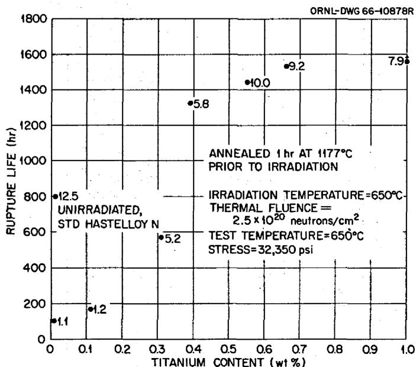  
Fig. 12. Influence of Titanium on the Creep Properties of Ni-12% Mo-7% Cr-0.05% C after Irradiation. Tested at $650^{\circ}\mathrm{C}$ at a stress level of 32,400 psi.

by a factor of 25 and the fracture strain by a factor of 10 by the addition of $1.04\%$ Ti. These results are compared with those of the unirradiated control samples in Table 8. This comparison is fraught with the uncertainties footnoted in Table 8, but it indicates that irradiated samples containing $0.55\%$ Ti or more have rupture lives that are about 0.7 times the unirradiated value, minimum creep rates that are about equal to that of the unirradiated material, and fracture strains that are about 0.7 times the unirradiated value.

Alloys 100 through 107 were also irradiated at $50^{\circ}\mathrm{C}$ to a thermal fluence of $9 \times 10^{19}$ neutrons/cm² and creep-rupture tested. The results of these tests are given in Table 9. These samples were tested at different stress levels than those used in the experiment described previously (Table 7). However, a rough comparison shows that the different irradiation temperatures (650 vs $50^{\circ}\mathrm{C}$ ) and the different fluences (25 vs $9 \times 10^{19}$ neutrons/cm²) had little effect on the test results. Both experiments show clearly the increasing rupture life and fracture strain with increasing titanium level.

The combined results of the tensile and creep tests allow a determination of the variation of the fracture strain with strain rate at $650^{\circ}\mathrm{C}$ .

Table 8. Comparison of the Creep Properties at 32,400 psi and $650^{\circ}\mathrm{C}$ of Unirradiated and Irradiated Titanium-Modified Alloys   

<table><tr><td rowspan="2">Titanium Content (%)</td><td colspan="3">Unirradiated</td><td colspan="3">Irradiated</td><td colspan="3">Ratio (Irradiated:Unirradiated)</td></tr><tr><td>Rupture Life (hr)</td><td>Minimum Creep Rate (%/hr)</td><td>Fracture Strain (%)</td><td>Rupture Life (hr)</td><td>Minimum Creep Rate (%/hr)</td><td>Fracture Strain (%)</td><td>Rupture Life</td><td>Minimum Creep Rate</td><td>Fracture Strain</td></tr><tr><td>&lt; 0.01</td><td>\( 185.1^a \)</td><td>\( 0.0077^a \)</td><td>\( 6.3^a \)</td><td>105.4</td><td>0.0099</td><td>1.1</td><td>0.57</td><td>1.3</td><td>0.17</td></tr><tr><td>0.11</td><td>1250.7</td><td>0.021</td><td>19.2</td><td>169.9</td><td>0.0084</td><td>1.6</td><td>0.14</td><td>0.40</td><td>0.08</td></tr><tr><td>0.31</td><td>\( 1900^b \)</td><td>0.0046</td><td>\( 12.5^{a,b} \)</td><td>570.4</td><td>0.0077</td><td>5.2</td><td>0.30</td><td>1.7</td><td>0.42</td></tr><tr><td>0.39</td><td>\( 1900^{a,b} \)</td><td>0.0051</td><td>\( 12.5^{a,b} \)</td><td>1327.3</td><td>0.0034</td><td>5.8</td><td>0.70</td><td>0.62</td><td>0.47</td></tr><tr><td>0.55</td><td>\( 1900^{a,b} \)</td><td>0.0054</td><td>\( 12.5^{a,b} \)</td><td>1446.3</td><td>0.0048</td><td>8.7</td><td>0.76</td><td>0.89</td><td>0.70</td></tr><tr><td>0.66</td><td>\( 1900^{a,b} \)</td><td>0.0033</td><td>\( 12.5^{a,b} \)</td><td>1540.3</td><td>0.0046</td><td>9.2</td><td>0.81</td><td>1.4</td><td>0.74</td></tr><tr><td>1.04</td><td>\( 3900^{a,b} \)</td><td>0.0040</td><td>\( 21^{a,b} \)</td><td>2928.8</td><td>0.0026</td><td>12.8</td><td>0.75</td><td>0.65</td><td>0.61</td></tr></table>

aValues from unaged samples.   
b Extrapolated.

Table 9. Creep Properties of Irradiated ${}^{a}$ Alloys That Contain Various Amounts of Titanium   

<table><tr><td>Alloy Number</td><td>Specimen Number</td><td>Test Number</td><td>Titanium Content (wt %)</td><td>Test Temperature (℃)</td><td>Stress (psi)</td><td>Rupture Life (hr)</td><td>Minimum Creep Rate (%/hr)</td><td>Elongation (%)</td></tr><tr><td></td><td></td><td></td><td></td><td></td><td>× 103</td><td></td><td></td><td></td></tr><tr><td>100</td><td>1911</td><td>R-257</td><td>&lt; 0.01</td><td>650</td><td>40</td><td>68.9</td><td>0.019</td><td>1.79</td></tr><tr><td>101</td><td>1927</td><td>R-264</td><td>0.11</td><td>650</td><td>40</td><td>226.1</td><td>0.0037</td><td>1.55</td></tr><tr><td>103</td><td>1974</td><td>R-286</td><td>0.31</td><td>650</td><td>40</td><td>114.0</td><td>0.013</td><td>3.07</td></tr><tr><td>102</td><td>1957</td><td>R-282</td><td>0.39</td><td>650</td><td>40</td><td>255.4</td><td>0.010</td><td>5.04</td></tr><tr><td>104</td><td>1981</td><td>R-287</td><td>0.55</td><td>650</td><td>47</td><td>114.8</td><td>0.025</td><td>5.25</td></tr><tr><td>105</td><td>2008</td><td>R-290</td><td>0.66</td><td>650</td><td>47</td><td>200.9</td><td>0.0078</td><td>3.89</td></tr><tr><td>106</td><td>2030</td><td>R-288</td><td>0.81</td><td>650</td><td>47</td><td>318.9</td><td>0.0072</td><td>8.25</td></tr><tr><td>107</td><td>2044</td><td>R-289</td><td>1.04</td><td>650</td><td>47</td><td>374.0</td><td>0.0073</td><td>7.55</td></tr></table>

aAnnealed 1 hr at $1177^{\circ}C$ before irradiation at $50^{\circ}C$ to a thermal fluence of $9\times 10^{19}$ neutrons/cm2.

The data for samples irradiated at $650^{\circ}\mathrm{C}$ to a fluence of $2.5 \times 10^{20}$ neutrons/ $\mathrm{cm}^2$ were used to construct Fig. 13. The strain rate is a controlled parameter in a tensile test and was used directly in this figure. The stress is controlled in a creep test, and the resulting minimum creep rate was used in Fig. 13. The lines on this graph simply join the data points, and their slopes have little significance. The most important observation is that the addition of titanium causes a greater improvement in the fracture strain at low strain rates than at high strain rates.

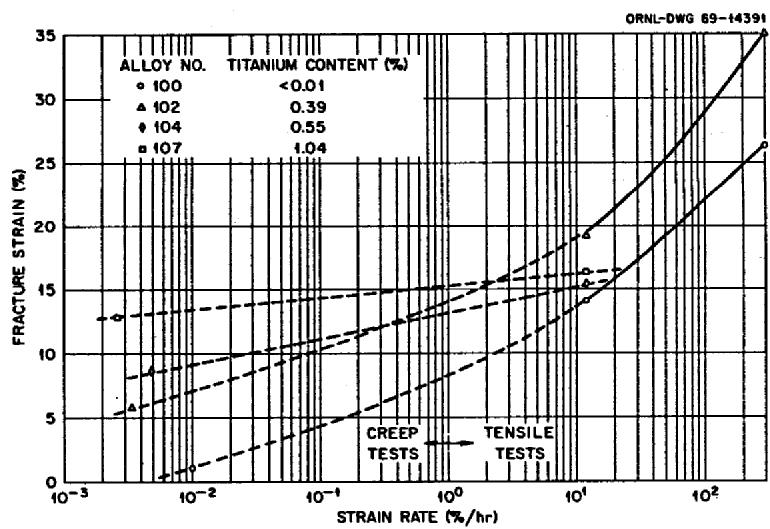  
Fig. 13. Variation of Fracture Strain with Strain Rate at $650^{\circ}\mathrm{C}$ for Several Titanium-Bearing Alloys Irradiated at $650^{\circ}\mathrm{C}$ to a Thermal Fluence of $2.5 \times 10^{20}$ neutrons/cm².

The results presented thus far for alloys 100 through 107 were obtained at a test temperature of $650^{\circ}\mathrm{C}$ for samples that were irradiated at $650^{\circ}\mathrm{C}$ or lower. The results in Table 10 illustrate the effects of varying the temperatures at which specimens were irradiated and tested. One group of samples was irradiated and tested at $760^{\circ}\mathrm{C}$ . These results show a general improvement in properties with increasing titanium level. The stress-rupture results for this series of tests are compared in Fig. 14 with those for tests on samples irradiated and tested at $650^{\circ}\mathrm{C}$ . Several samples were irradiated at $50^{\circ}\mathrm{C}$ and tested at $760^{\circ}\mathrm{C}$ . These were tested under different conditions, but the trend of increasing rupture

Table 10. Creep Properties of Alloys That Contain Various Amounts of Titanium After Irradiationa at Various Temperatures   

<table><tr><td rowspan="2">Alloy Number</td><td rowspan="2">Specimen Number</td><td rowspan="2">Test Number</td><td rowspan="2">Titanium Content (wt %)</td><td colspan="2">Temperature, °C</td><td rowspan="2">Stress (psi)</td><td rowspan="2">Rupture Life (hr)</td><td rowspan="2">Minimum Creep Rate (%/hr)</td><td rowspan="2">Elongation (%)</td></tr><tr><td>Irradiation</td><td>Test</td></tr><tr><td></td><td></td><td></td><td></td><td colspan="2">× 103</td><td></td><td></td><td></td><td></td></tr><tr><td></td><td></td><td></td><td colspan="3">2.5 × 1020 neutrons/cm2(thermal)</td><td></td><td></td><td></td><td></td></tr><tr><td>100</td><td>3791</td><td>R-455</td><td>&lt; 0.01</td><td>657</td><td>760</td><td>12.5</td><td>1.0</td><td>0.10</td><td>0.21</td></tr><tr><td>101</td><td>3801</td><td>R-454</td><td>0.11</td><td>760</td><td>760</td><td>12.5</td><td>0.8</td><td>0.10</td><td>0.20</td></tr><tr><td>102</td><td>3814</td><td>R-453</td><td>0.39</td><td>760</td><td>760</td><td>12.5</td><td>18.1</td><td>0.0252</td><td>0.71</td></tr><tr><td>103</td><td>3821</td><td>R-452</td><td>0.31</td><td>760</td><td>760</td><td>12.5</td><td>12.4</td><td>0.0333</td><td>0.66</td></tr><tr><td>104</td><td>3608</td><td>R-451</td><td>0.55</td><td>760</td><td>760</td><td>12.5</td><td>340.8</td><td>0.0086</td><td>5.72</td></tr><tr><td>104</td><td>3616</td><td>R-763</td><td></td><td>760</td><td>650</td><td>25.5</td><td>203.3</td><td>0.0042</td><td>1.36</td></tr><tr><td>105</td><td>3831</td><td>R-450</td><td>0.66</td><td>774</td><td>760</td><td>12.5</td><td>271.6</td><td>0.0066</td><td>3.05</td></tr><tr><td>106</td><td>3841</td><td>R-458</td><td>0.81</td><td>774</td><td>760</td><td>12.5</td><td>159.0</td><td>0.0196</td><td>5.40</td></tr><tr><td>107</td><td>3855</td><td>R-784</td><td>1.04</td><td>760</td><td>650</td><td>30</td><td>49.4</td><td>0.0238</td><td>1.58</td></tr><tr><td>107</td><td>3851</td><td>R-449</td><td></td><td>760</td><td>760</td><td>12.5</td><td>1000b</td><td>0.0039</td><td>5.19</td></tr><tr><td></td><td></td><td></td><td></td><td></td><td></td><td>15</td><td>242b</td><td>0.0185</td><td>4.88</td></tr><tr><td></td><td></td><td></td><td></td><td></td><td></td><td>17.5</td><td>38</td><td>0.0638</td><td>3.92</td></tr><tr><td></td><td></td><td></td><td colspan="3">9 × 1019 neutrons/cm2(thermal)</td><td></td><td></td><td></td><td></td></tr><tr><td>100</td><td>1913</td><td>R-254c</td><td>&lt; 0.01</td><td>50</td><td>760</td><td>15</td><td>15.1</td><td>0.037</td><td>0.83</td></tr><tr><td>100</td><td>1918</td><td>R-308c</td><td>&lt; 0.01</td><td>50</td><td>760</td><td>15</td><td>50.8</td><td>0.020</td><td>1.67</td></tr><tr><td>104</td><td>1986</td><td>R-255</td><td>0.55</td><td>50</td><td>760</td><td>15</td><td>358.8</td><td>0.016</td><td>11.9</td></tr><tr><td>104</td><td>1985</td><td>R-309c</td><td>0.55</td><td>50</td><td>760</td><td>15</td><td>316.3</td><td>0.011</td><td>11.3</td></tr><tr><td>107</td><td>2045</td><td>R-261</td><td>1.04</td><td>50</td><td>760</td><td>15</td><td>914.2</td><td>0.015</td><td>30.2</td></tr><tr><td>107</td><td>2035</td><td>R-310c</td><td>1.04</td><td>50</td><td>760</td><td>15</td><td>734.5b</td><td>0.016</td><td>25.1</td></tr><tr><td></td><td></td><td></td><td></td><td></td><td></td><td>20</td><td>4.8</td><td>0.19</td><td>2.7</td></tr></table>

aAnnealed 1 hr at $1177^{\circ}C$ before irradiation.   
bAnnealed 1000 hr at $650^{\circ}C$ after irradiation.   
cLoad increased at the intervals indicated.

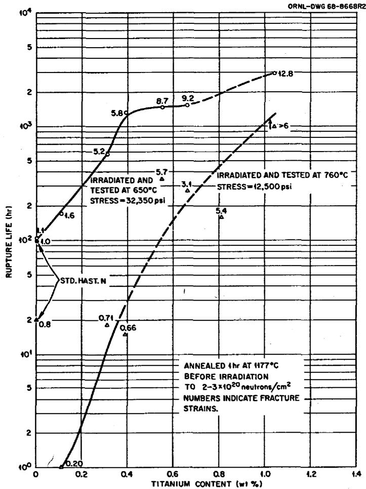  
Fig. 14. Effect of Titanium Content on Variation of Creep Properties after Irradiation.

life and elongation is the same as for samples irradiated at $760^{\circ}\mathrm{C}$ . The only property that seems appreciably different is the fracture strain: higher values were obtained for samples irradiated at $50^{\circ}\mathrm{C}$ . The most dramatic effect of irradiation temperature is demonstrated by the combination of irradiation at $760^{\circ}\mathrm{C}$ and testing at $650^{\circ}\mathrm{C}$ (compare the results in Tables 7 and 10). The general effect is that the higher irradiation temperature results in a shorter rupture life, a higher minimum creep rate, and a lower fracture strain. For example, alloy 107 was irradiated at $650^{\circ}\mathrm{C}$ and tested at 32,400 psi and $650^{\circ}\mathrm{C}$ . The rupture life was 2928.8 hr, the minimum creep rate was $0.0026\% / \mathrm{hr}$ , and the fracture strain was $12.8\%$ . The same alloy irradiated at $760^{\circ}\mathrm{C}$ and tested at 30,000 psi and $650^{\circ}\mathrm{C}$ had a rupture life of only 49.4 hr, a minimum creep rate of $0.024\% / \mathrm{hr}$ , and a fracture strain of $1.6\%$ .

Alloys 75 and 76 were similar in composition to alloy 107, and only limited testing has been carried out. The results of tensile tests are summarized in Table 11. The results for the unirradiated samples agree well with those for alloy 107 (Table 2). Alloy 75 contains $0.062\%$ C, and alloy 76 contains $0.117\%$ C; therefore, the trends of higher strength and lower fracture strain for alloy 76 are reasonable. Irradiation increased strength and decreased fracture strain (Table 11). The fracture strains agree reasonably well with those for alloy 107 irradiated at $650^{\circ}$ C (Table 3) and $50^{\circ}$ C (Table 4). The samples annealed for 100 hr at $871^{\circ}$ C had a very small grain size, and the fracture strains were lower for these samples. The higher carbon content of alloy 76 resulted in slightly lower fracture strains in tensile tests.

Table 11. Tensile Properties of Irradiated and Unirradiated Alloys 75 (0.99% Ti, 0.062% C) and 76 (1.01% Ti, 0.117% C) at ${650}^{ \circ  }\mathrm{C}$   

<table><tr><td rowspan="2">Alloy Number</td><td rowspan="2">Specimen Number</td><td rowspan="2">Anneala Before Irradiation</td><td rowspan="2">Strain Rate (min-1)</td><td colspan="2">Stress, psi</td><td colspan="2">Elongation, %</td><td rowspan="2">Reduction in Area (%)</td></tr><tr><td>Yield</td><td>Ultimate Tensile</td><td>Uniform</td><td>Total</td></tr><tr><td></td><td></td><td></td><td>× 103</td><td>× 103</td><td></td><td></td><td></td><td></td></tr><tr><td></td><td></td><td></td><td>Unirradiated</td><td></td><td></td><td></td><td></td><td></td></tr><tr><td>75</td><td>1197</td><td>121</td><td>0.05</td><td>31</td><td>89.3</td><td>45.0</td><td>45.8</td><td>36.3</td></tr><tr><td>75</td><td>1183</td><td>121</td><td>0.002</td><td>31.4</td><td>86.4</td><td>32.2</td><td>33.2</td><td>25.9</td></tr><tr><td>76</td><td>1300</td><td>121</td><td>0.05</td><td>39.3</td><td>100.3</td><td>34.6</td><td>34.8</td><td>26.9</td></tr><tr><td>76</td><td>1184</td><td>121</td><td>0.002</td><td>40.5</td><td>92.6</td><td>25.1</td><td>28.7</td><td>24.2</td></tr><tr><td></td><td></td><td></td><td>Irradiatedb</td><td></td><td></td><td></td><td></td><td></td></tr><tr><td>75</td><td>1010</td><td>121</td><td>0.05</td><td>89.5</td><td>99.4</td><td>16.0</td><td>17.2</td><td>20.5</td></tr><tr><td>75</td><td>1011</td><td>121</td><td>0.002</td><td>90</td><td>90.4</td><td>5.1</td><td>6.1</td><td>11.7</td></tr><tr><td>75</td><td>1118</td><td>16</td><td>0.05</td><td>61.6</td><td>78</td><td>8.9</td><td>8.9</td><td>13.2</td></tr><tr><td>75</td><td>1119</td><td>16</td><td>0.002</td><td>60.8</td><td>66.5</td><td>6.4</td><td>6.4</td><td>10.2</td></tr><tr><td>76</td><td>1012</td><td>121</td><td>0.05</td><td>89.5</td><td>102.3</td><td>13.0</td><td>13.2</td><td>19.1</td></tr><tr><td>76</td><td>1013</td><td>121</td><td>0.002</td><td>91.8</td><td>95.3</td><td>5.0</td><td>5.3</td><td>11.7</td></tr><tr><td>76</td><td>1121</td><td>16</td><td>0.05</td><td>62.6</td><td>76.8</td><td>7.1</td><td>7.1</td><td>8.6</td></tr><tr><td>76</td><td>1122</td><td>16</td><td>0.002</td><td>61.4</td><td>65.7</td><td>5.2</td><td>5.2</td><td>8.6</td></tr></table>

aAnnealing designations: 121 = annealed 1 hr at $1177^{\circ}C$ 16 = annealed 100 hr at $871^{\circ}C$   
bIrradiated at $150^{\circ}C$ to a thermal fluence of $5.8\times 10^{20}$ neutrons $/\mathrm{cm}^2$

Several samples of alloys 75 and 76 were creep tested at $650^{\circ}\mathrm{C}$ ; the results of these tests are summarized in Table 12. The properties of the unirradiated alloy are quite comparable with those for alloy 107 (1.04% Ti) that are given in Table 5. Same samples were irradiated at $760^{\circ}\mathrm{C}$ and tested at $650^{\circ}\mathrm{C}$ ; the test results are given in Table 12. Both of these alloys had extremely good properties under these conditions. A comparison with the results for heat 107 (1.04% Ti) in Table 10 reveals the superiority of alloys 75 and 76. We have no explanation for this observation.

Table 12. Creep Properties of Irradiated and Unirradiated Alloys 75 (0.99% Ti, 0.062% C) and 76 (1.01% Ti, 0.117% C) at ${650}^{ \circ  }\mathrm{C}$   

<table><tr><td>Alloy Number</td><td>Specimen Number</td><td>Test Number</td><td>Stress (psi)</td><td>Rupture Life (hr)</td><td>Minimum Creep Rate (%/hr)</td><td>Elongation (%)</td><td>Reduction in Area (%)</td></tr><tr><td></td><td></td><td></td><td colspan="2">×103</td><td></td><td></td><td></td></tr><tr><td></td><td></td><td></td><td colspan="2">Unirradiateda</td><td></td><td></td><td></td></tr><tr><td>75</td><td>8293</td><td>5276</td><td>55</td><td>128.5</td><td>0.0325</td><td>21.9</td><td>18.4</td></tr><tr><td>75</td><td>8341</td><td>5458</td><td>40</td><td>1919.9</td><td>0.0075</td><td>33.3</td><td>26.3</td></tr><tr><td>76</td><td>8292</td><td>5275</td><td>55</td><td>92.1</td><td>0.0880</td><td>15.6</td><td>22.7</td></tr><tr><td></td><td></td><td></td><td colspan="2">Irradiateda,b</td><td></td><td></td><td></td></tr><tr><td>75</td><td>10266</td><td>R-888</td><td>47</td><td>248.1</td><td>0.0442</td><td>13.1</td><td></td></tr><tr><td>75</td><td>10265</td><td>R-855</td><td>35</td><td>2669.2</td><td>0.0061</td><td>23.6</td><td></td></tr><tr><td>76</td><td>10269</td><td>R-889</td><td>47</td><td>276.0</td><td>0.0540</td><td>19.6</td><td></td></tr><tr><td>76</td><td>10268</td><td>R-852</td><td>35</td><td>2688.4</td><td>0.0059</td><td>22.0</td><td></td></tr></table>

aAnnealed 1 hr at 1177°C.   
bIrradiated at $760^{\circ}C$ to a thermal fluence of $3\times 10^{20}$ neutrons/cm².

The first commercial heat of a titanium-modified alloy was a 100-lb vacuum-melted alloy from Special Metals Corporation, designated 21545. This alloy was tested as received (40% cold work), after annealing 100 hr at $871^{\circ}\mathrm{C}$ (fine grain size, Fig. 4), and after annealing 1 hr at $1177^{\circ}\mathrm{C}$ (coarse grain size, Fig. 4). The results of tensile tests on these samples are summarized in Table 13. The fracture strains at a strain rate of $0.05\mathrm{min}^{-1}$ are shown in Fig. 15 as a function of test temperature. The fracture strain of the material as received was about $10\%$ at $25^{\circ}\mathrm{C}$ and

Table 13. Tensile Properties of Unirradiated Alloy 21545 (0.49% Ti)   

<table><tr><td rowspan="2">Specimen Number</td><td rowspan="2">Anneal \( {}^{a} \) Before Test</td><td rowspan="2">Strain Rate (min-1)</td><td rowspan="2">Test Temperature (°C)</td><td colspan="2">Stress, psi</td><td colspan="2">Elongation, %</td><td rowspan="2">Reduction in Area (%)</td></tr><tr><td>Yield</td><td>Ultimate Tensile</td><td>Uniform</td><td>Total</td></tr><tr><td></td><td></td><td></td><td></td><td>\( \times {10}^{3} \)</td><td>\( \times {10}^{3} \)</td><td></td><td></td><td></td></tr><tr><td>3432</td><td>121</td><td>0.05</td><td>25</td><td>39.4</td><td>109.4</td><td>68.9</td><td>72.5</td><td>63.7</td></tr><tr><td>3451</td><td>121</td><td>0.05</td><td>200</td><td>31.8</td><td>99.2</td><td>70.9</td><td>74.9</td><td>58.1</td></tr><tr><td>3447</td><td>121</td><td>0.05</td><td>427</td><td>29.4</td><td>95.6</td><td>73.1</td><td>78.8</td><td>58.6</td></tr><tr><td>3435</td><td>121</td><td>0.05</td><td>500</td><td>28.1</td><td>91.1</td><td>78.9</td><td>81.9</td><td>57.5</td></tr><tr><td>2531</td><td>121</td><td>0.05</td><td>550</td><td>29.1</td><td>93.4</td><td>72.5</td><td>75.2</td><td>53.3</td></tr><tr><td>2521</td><td>121</td><td>0.002</td><td>550</td><td>30.5</td><td>94.1</td><td>65.5</td><td>67.9</td><td>43.9</td></tr><tr><td>3436</td><td>121</td><td>0.05</td><td>600</td><td>26.4</td><td>85.9</td><td>70.9</td><td>75.3</td><td>52.0</td></tr><tr><td>3444</td><td>121</td><td>0.002</td><td>600</td><td>27</td><td>74.8</td><td>41.8</td><td>43.0</td><td>37.5</td></tr><tr><td>3446</td><td>121</td><td>0.05</td><td>650</td><td>24.9</td><td>76</td><td>41.6</td><td>43.5</td><td>38.2</td></tr><tr><td>2530</td><td>121</td><td>0.002</td><td>650</td><td>22.1</td><td>67.4</td><td>21.2</td><td>22.0</td><td>30.7</td></tr><tr><td>3425</td><td>121</td><td>0.05</td><td>760</td><td>25.1</td><td>67.6</td><td>31.0</td><td>33.2</td><td>21.8</td></tr><tr><td>3429</td><td>121</td><td>0.002</td><td>760</td><td>24.7</td><td>50.8</td><td>12.0</td><td>19.2</td><td>20.4</td></tr><tr><td>2523</td><td>121</td><td>0.002</td><td>760</td><td>23.1</td><td>45.4</td><td>10.1</td><td>25.2</td><td>26.5</td></tr><tr><td>3448</td><td>121</td><td>0.05</td><td>800</td><td>23.7</td><td>59</td><td>20.5</td><td>27.7</td><td>22.6</td></tr><tr><td>3445</td><td>121</td><td>0.002</td><td>800</td><td>23.2</td><td>41.3</td><td>8.5</td><td>18.6</td><td>22.7</td></tr><tr><td>1565</td><td>000</td><td>0.05</td><td>25</td><td>159.7</td><td>170.4</td><td>8.5</td><td>11.9</td><td>17.5</td></tr><tr><td>2519</td><td>000</td><td>0.05</td><td>25</td><td>164.2</td><td>171.6</td><td>6.3</td><td>10.7</td><td>37.8</td></tr><tr><td>1566</td><td>000</td><td>0.05</td><td>427</td><td>131.5</td><td>147.1</td><td>11.4</td><td>15.2</td><td>28.8</td></tr><tr><td>1544</td><td>000</td><td>0.05</td><td>650</td><td>119.4</td><td>131.6</td><td>8.0</td><td>11.8</td><td>20.9</td></tr><tr><td>1545</td><td>000</td><td>0.002</td><td>650</td><td>113.4</td><td>116.8</td><td>3.4</td><td>8.9</td><td>13.2</td></tr><tr><td>1567</td><td>000</td><td>0.05</td><td>760</td><td>92.7</td><td>93.4</td><td>3.0</td><td>24.9</td><td>41.9</td></tr><tr><td>1549</td><td>16</td><td>0.05</td><td>25</td><td>54.2</td><td>122.9</td><td>48.7</td><td>52.0</td><td>56.6</td></tr><tr><td>1550</td><td>16</td><td>0.05</td><td>427</td><td>37</td><td>102.2</td><td>49.8</td><td>54.0</td><td>42.3</td></tr><tr><td>2544</td><td>16</td><td>0.05</td><td>500</td><td>43.3</td><td>103.6</td><td>42.1</td><td>48.1</td><td>42.2</td></tr><tr><td>2543</td><td>16</td><td>0.05</td><td>550</td><td>42.5</td><td>99.8</td><td>43.9</td><td>45.9</td><td>35.0</td></tr><tr><td>2520</td><td>16</td><td>0.05</td><td>600</td><td>40.4</td><td>89</td><td>30.0</td><td>31.5</td><td>27.3</td></tr><tr><td>1765</td><td>16</td><td>0.05</td><td>650</td><td>37.9</td><td>87.6</td><td>39.9</td><td>46.1</td><td>37.2</td></tr><tr><td>1766</td><td>16</td><td>0.002</td><td>650</td><td>42.2</td><td>73</td><td>19.4</td><td>48.3</td><td>53.2</td></tr><tr><td>2540</td><td>16</td><td>0.05</td><td>700</td><td>40.9</td><td>70.7</td><td>21.2</td><td>41.8</td><td>42.3</td></tr><tr><td>2542</td><td>16</td><td>0.002</td><td>700</td><td>41.4</td><td>59.6</td><td>12.3</td><td>46.0</td><td>28.3</td></tr><tr><td>2546</td><td>16</td><td>0.05</td><td>760</td><td>41.6</td><td>56</td><td>11.7</td><td>53.5</td><td>58.3</td></tr><tr><td>2454</td><td>16</td><td>0.05</td><td>760</td><td>38</td><td>50.4</td><td>13.0</td><td>56.2</td><td>74.4</td></tr><tr><td>2547</td><td>16</td><td>0.002</td><td>760</td><td>37</td><td>37.3</td><td>1.5</td><td>53.3</td><td>68.1</td></tr><tr><td>2522</td><td>16</td><td>0.05</td><td>800</td><td>36.9</td><td>44.9</td><td>11.0</td><td>57.8</td><td>70.2</td></tr><tr><td>2541</td><td>16</td><td>0.002</td><td>800</td><td>30</td><td>30</td><td>1.1</td><td>47.7</td><td>29.8</td></tr><tr><td>2455</td><td>16</td><td>0.05</td><td>871</td><td>31.8</td><td>32.1</td><td>1.3</td><td>57.4</td><td>78.1</td></tr><tr><td>2456</td><td>16</td><td>0.002</td><td>871</td><td>17.6</td><td>17.6</td><td>1.0</td><td>47.7</td><td>41.6</td></tr><tr><td>2457</td><td>16</td><td>0.05</td><td>982</td><td>17.9</td><td>17.9</td><td>0.8</td><td>59.8</td><td>64.6</td></tr><tr><td>2536</td><td>46</td><td>0.002</td><td>600</td><td>26.4</td><td>76.9</td><td>45.8</td><td>47.6</td><td>32.6</td></tr><tr><td>2535</td><td>46</td><td>0.002</td><td>650</td><td>26.5</td><td>74.6</td><td>35.5</td><td>38.5</td><td>31.0</td></tr><tr><td>2537</td><td>46</td><td>0.002</td><td>700</td><td>26.5</td><td>56.2</td><td>15.6</td><td>34.3</td><td>31.0</td></tr></table>

aAnnealing designations: 121 = annealed 1 hr at $1177^{\circ}\mathrm{C}$ ; 000 = as received (40% cold work); 16 = annealed 100 hr at $871^{\circ}\mathrm{C}$ ; 46 = annealed 1 hr at $1177^{\circ}\mathrm{C}$ plus 1000 hr at $650^{\circ}\mathrm{C}$ .

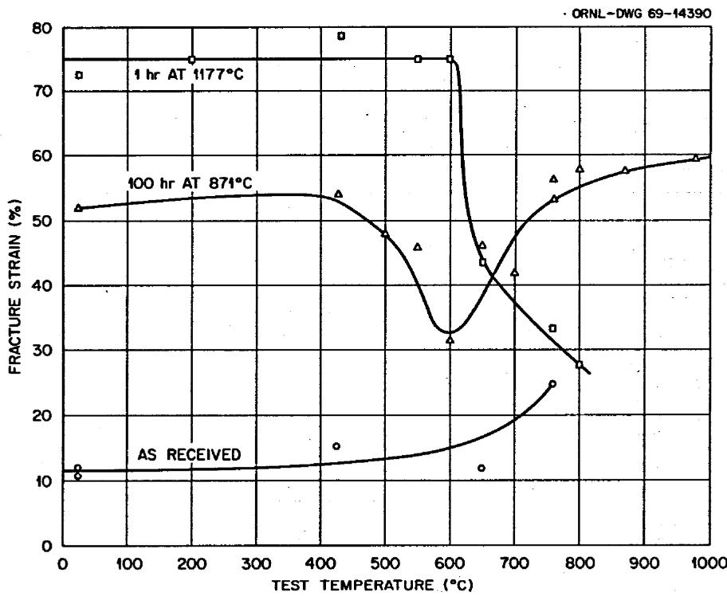  
Fig. 15. Fracture Strains of Alloy 21545 (0.49% Ti) in Tensile Tests at a Strain Rate of 0.05 min $^{-1}$ .

increased gradually with increasing temperature. The material annealed for 100 hr at $871^{\circ}\mathrm{C}$ had a fracture strain of $52\%$ at $25^{\circ}\mathrm{C}$ with a minimum ductility of $32\%$ at $600^{\circ}\mathrm{C}$ . After an anneal of 1 hr at $1177^{\circ}\mathrm{C}$ , the fracture strain was $75\%$ at temperatures between 25 and $600^{\circ}\mathrm{C}$ and then dropped precipitously with increasing temperature. Three samples were annealed for 1 hr at $1177^{\circ}\mathrm{C}$ and aged for 1000 hr at $650^{\circ}\mathrm{C}$ . This anneal did not change the strength properties appreciably, but did increase the fracture strain. Alloy 104 (0.55% Ti) was given the same anneal before testing, and a comparison between the results for this alloy in Table 2 and those for heat 21545 (0.49% Ti) in Table 13 shows that the commercial alloy is slightly weaker and that both alloys have comparable fracture strains.

The results of tensile tests on irradiated samples of heat 21545 are given in Table 14. The results for samples irradiated at $650^{\circ}\mathrm{C}$ or below were used in constructing Fig. 16 for a strain rate of $0.002\mathrm{min}^{-1}$ . The samples that were irradiated as received and those irradiated after annealing 100 hr at $871^{\circ}\mathrm{C}$ had comparable fracture strains. The samples annealed for 1 hr at $1177^{\circ}\mathrm{C}$ were more ductile. A comparison with the

Table 14. Tensile Properties of Alloy 21545 (0.49% Ti) after Irradiation   

<table><tr><td rowspan="2">Specimen Number</td><td rowspan="2">Annealb Before Test</td><td colspan="2">Temperature, °C</td><td rowspan="2">Strain Rate (min-1)</td><td colspan="2">Stress, psi</td><td colspan="2">Elongation, %</td><td rowspan="2">Reduction in Area (%)</td></tr><tr><td>Irradiation</td><td>Test</td><td>Yield</td><td>Ultimate Tensile</td><td>Uniform</td><td>Total</td></tr><tr><td></td><td></td><td></td><td></td><td></td><td>× 103</td><td>× 103</td><td></td><td></td><td></td></tr><tr><td>1554</td><td>000</td><td>600</td><td>550</td><td>0.002</td><td>111.6</td><td>134.9</td><td>11.5</td><td>15.1</td><td>14.7</td></tr><tr><td>1553</td><td>000</td><td>600</td><td>600</td><td>0.002</td><td>110.1</td><td>127.9</td><td>11.2</td><td>13.4</td><td>11.7</td></tr><tr><td>1551</td><td>000</td><td>650</td><td>650</td><td>0.05</td><td>107.0</td><td>124.9</td><td>12.5</td><td>15.1</td><td>16.2</td></tr><tr><td>1552</td><td>000</td><td>650</td><td>650</td><td>0.002</td><td>107.7</td><td>113.3</td><td>5.1</td><td>9.5</td><td>11.7</td></tr><tr><td>2524</td><td>121</td><td>590</td><td>650</td><td>0.05</td><td>29.0</td><td>64.4</td><td>36.0</td><td>37.0</td><td>32.0</td></tr><tr><td>2525</td><td>121</td><td>590</td><td>650</td><td>0.002</td><td>28.9</td><td>58.8</td><td>21.6</td><td>21.9</td><td>17.1</td></tr><tr><td>2548</td><td>121</td><td>600</td><td>650</td><td>0.002</td><td>30.0</td><td>61.3</td><td>21.1</td><td>21.4</td><td>18.3</td></tr><tr><td>2550</td><td>121</td><td>600</td><td>760</td><td>0.002</td><td>29.2</td><td>51.7</td><td>10.3</td><td>13.6</td><td>19.7</td></tr><tr><td>5953</td><td>121</td><td>760</td><td>650</td><td>0.002</td><td>22.4</td><td>22.4</td><td>1.0</td><td>1.4</td><td>3.2</td></tr><tr><td>5954</td><td>121</td><td>760</td><td>760</td><td>0.002</td><td>15.8</td><td>15.8</td><td>0.7</td><td>0.7</td><td>0.81</td></tr><tr><td>1560</td><td>16</td><td>600</td><td>550</td><td>0.002</td><td>42.9</td><td>85.3</td><td>12.1</td><td>12.4</td><td>20.5</td></tr><tr><td>1557</td><td>16</td><td>600</td><td>600</td><td>0.002</td><td>39.3</td><td>69.1</td><td>13.3</td><td>13.4</td><td>8.6</td></tr><tr><td>1558</td><td>16</td><td>600</td><td>650</td><td>0.05</td><td>38.2</td><td>71.5</td><td>14.7</td><td>15.1</td><td>16.2</td></tr><tr><td>1559</td><td>16</td><td>600</td><td>650</td><td>0.002</td><td>38.8</td><td>62.4</td><td>9.7</td><td>9.7</td><td>13.2</td></tr><tr><td>1561</td><td>16</td><td>600</td><td>760</td><td>0.002</td><td>37.8</td><td>37.8</td><td>1.4</td><td>4.1</td><td>7.1</td></tr></table>

aIrradiated to a thermal fluence of 2 to $5 \times 10^{20}$ neutrons/cm².   
b Annealing designations: 121 = annealed 1 hr at $1177^{\circ}\mathrm{C}$ , 000 = as received (40% cold work), 16 = annealed 100 hr at $871^{\circ}\mathrm{C}$ .

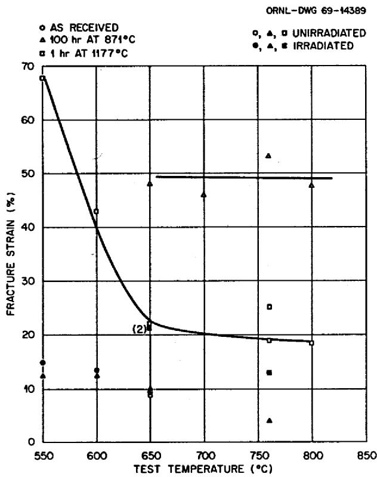  
Fig. 16. Fracture Strains of Alloy 21545 (0.49% Ti) in Tensile Tests at a Strain Rate of 0.002 min $^{-1}$ .

results for alloy 104 (0.55% Ti) in Tables 3 and 4 shows that the commercial alloy was more ductile and slightly weaker. Two samples in Table 14 were irradiated at $760^{\circ}\mathrm{C}$ . The samples had much lower fracture strains than those irradiated at $650^{\circ}\mathrm{C}$ or below, indicating again a very strong effect of irradiation temperature.

Samples of heat 21545 were subjected to creep tests in several annealed conditions; the results of these tests are presented in Table 15 for unirradiated samples and in Table 16 for irradiated samples. The stress-rupture properties at $650^{\circ}\mathrm{C}$ in the unirradiated condition are shown in Fig. 17. The as-received material had the longest rupture life at a given stress level and the lowest fracture strain. Annealing at $871^{\circ}\mathrm{C}$ produced a material with fine grain size that failed in much shorter times with fracture strains of about $50\%$ . Annealing for 1 hr at $1177^{\circ}\mathrm{C}$ gave longer rupture lives with intermediate fracture strains of about $30\%$ . Aging this material at 650 or $760^{\circ}\mathrm{C}$ before testing had only minor effects on the rupture life or the fracture strain. However, close

Table 15. Creep Properties of Unirradiated Alloy 21545 (0.49% Ti)   

<table><tr><td>Specimen Number</td><td>Test Number</td><td>Anneal a Before Test</td><td>Stress (psi)</td><td>Rupture Life (hr)</td><td>Minimum Creep Rate (%/hr)</td><td>Elongation (%)</td><td>Reduction in Area (%)</td></tr><tr><td colspan="8">\( \times 10^3 \)</td></tr><tr><td colspan="8">Test Temperature 650°C</td></tr><tr><td>1564</td><td>5535</td><td>000</td><td>70</td><td>174.1</td><td>0.0093</td><td>14.1</td><td>20.5</td></tr><tr><td>1546</td><td>5578</td><td>000</td><td>55</td><td>1317.8</td><td>0.0009</td><td>18.8</td><td>31.2</td></tr><tr><td>3441</td><td>6294</td><td>121</td><td>70</td><td>0</td><td></td><td>41.1</td><td>32.6</td></tr><tr><td>3404</td><td>6295</td><td>121</td><td>62</td><td>17.7</td><td>0.288</td><td>27.2</td><td>26.7</td></tr><tr><td>5250</td><td>6417</td><td>121</td><td>60</td><td>26.8</td><td>0.062</td><td>27.0</td><td>23.5</td></tr><tr><td>3406</td><td>6296</td><td>121</td><td>55</td><td>39.9</td><td>0.148</td><td>22.6</td><td>17.0</td></tr><tr><td>5251</td><td>6418</td><td>121</td><td>52</td><td>170.9</td><td>0.015</td><td>24.8</td><td>27.2</td></tr><tr><td>3416</td><td>6297</td><td>121</td><td>47</td><td>197.6</td><td>0.037</td><td>26.3</td><td>27.7</td></tr><tr><td>5244</td><td>6419</td><td>121</td><td>44</td><td>466.1</td><td>0.011</td><td>26.3</td><td>22.6</td></tr><tr><td>3418</td><td>6298</td><td>121</td><td>40</td><td>564.2</td><td>0.015</td><td>31.3</td><td>29.7</td></tr><tr><td>5246</td><td>6420</td><td>121</td><td>37</td><td>1478.6</td><td>0.0035</td><td>34.6</td><td>31.7</td></tr><tr><td>3413</td><td>6299</td><td>121</td><td>35</td><td>1720.9</td><td>0.0063</td><td>30.1</td><td>30.0</td></tr><tr><td>5247</td><td>6421</td><td>121</td><td>30</td><td>4383.2</td><td>0.0013</td><td>22.2</td><td>26.7</td></tr><tr><td>1822</td><td>5564</td><td>816</td><td>40</td><td>248.1</td><td>0.0688</td><td>34.4</td><td>20.5</td></tr><tr><td>1771</td><td>5409</td><td>16</td><td>55</td><td>20.1</td><td>1.37</td><td>52.5</td><td>47.3</td></tr><tr><td>1773</td><td>5580</td><td>16</td><td>40</td><td>242.6</td><td>0.120</td><td>59.4</td><td>56.6</td></tr><tr><td>1768</td><td>5449</td><td>16</td><td>30</td><td>1171.5</td><td>0.017</td><td>56.7</td><td>51.5</td></tr><tr><td>2539</td><td>6167</td><td>46</td><td>40</td><td>893.7</td><td>0.0129</td><td>38.7</td><td>32.1</td></tr><tr><td>2538</td><td>6161</td><td>46</td><td>32.4</td><td>2077.6</td><td>0.0041</td><td>30.8</td><td>24.7</td></tr><tr><td>2528</td><td>7716</td><td>148</td><td>40</td><td>708.9</td><td>0.0318</td><td>33.3</td><td></td></tr><tr><td>5534</td><td>7715</td><td>148</td><td>55</td><td>26.7</td><td>0.625</td><td>34.4</td><td>34.2</td></tr><tr><td>3400</td><td>7718</td><td>156</td><td>40</td><td>527.4</td><td>0.0334</td><td>36.1</td><td>41.4</td></tr><tr><td>2533</td><td>7717b</td><td>156</td><td>55</td><td>33.7</td><td>0.570</td><td>32.1</td><td>31.8</td></tr><tr><td>5508</td><td>6384b</td><td>103</td><td>70</td><td>1.9</td><td></td><td>39.2</td><td>30.6</td></tr><tr><td>5509</td><td>6385b</td><td>103</td><td>63</td><td>5.5</td><td>4.53</td><td>46.1</td><td>33.1</td></tr><tr><td>5510</td><td>6386b</td><td>103</td><td>55</td><td>15.7</td><td>2.50</td><td>47.4</td><td>34.3</td></tr><tr><td>5511</td><td>6387b</td><td>103</td><td>47</td><td>50.3</td><td>0.50</td><td>43.9</td><td>65.9</td></tr><tr><td>5512</td><td>6388b</td><td>103</td><td>40</td><td>177.2</td><td>0.165</td><td>55.3</td><td>45.1</td></tr><tr><td>5513</td><td>6428b</td><td>103</td><td>32.4</td><td>438.8</td><td>0.050</td><td>40.1</td><td>50.3</td></tr><tr><td colspan="8">Test Temperature 760°C</td></tr><tr><td>3424</td><td>7041</td><td>121</td><td>30</td><td>28.7</td><td>0.519</td><td>37.8</td><td>32.6</td></tr><tr><td>3431</td><td>7042</td><td>121</td><td>25</td><td>71.1</td><td>0.213</td><td>39.4</td><td>35.0</td></tr><tr><td>3422</td><td>6358</td><td>121</td><td>20</td><td>280.0</td><td>0.060</td><td>36.2</td><td>35.1</td></tr></table>

aAnnealing designations: 121 = annealed 1 hr at $1177^{\circ}\mathrm{C}$ ; 000 = as received (40% cold work); 816 = annealed 8 hr at $871^{\circ}\mathrm{C}$ ; 16 = annealed 100 hr at $871^{\circ}\mathrm{C}$ ; 46 = annealed 1 hr at $1177^{\circ}\mathrm{C}$ plus 1000 hr at $650^{\circ}\mathrm{C}$ ; 148 = annealed 1 hr at $1177^{\circ}\mathrm{C}$ plus 1000 hr at $760^{\circ}\mathrm{C}$ ; 156 = annealed 1 hr at $1177^{\circ}\mathrm{C}$ , 510 hr at $550^{\circ}\mathrm{C}$ , 1500 hr at $760^{\circ}\mathrm{C}$ , and 1 hr at $1177^{\circ}\mathrm{C}$ ; 103 = annealed 100 hr at $871^{\circ}\mathrm{C}$ , 5600 hr in fluoride salt at $650^{\circ}\mathrm{C}$ .   
bMolten Salt Reactor Experiment surveillance controls.

Table 16. Creep Properties of Alloy 21545 (0.49% Ti) after Irradiation   

<table><tr><td>Specimen Number</td><td>Test Number</td><td>Anneala Before Irradiation</td><td>Irradiation Temperature (°C)</td><td>Stress (psi)</td><td>Rupture Life (hr)</td><td>Minimum Creep Rate (%/hr)</td><td>Elongation (%)</td><td>Reduction in Area (%)</td></tr><tr><td colspan="9">\( \times 10^3 \)</td></tr><tr><td colspan="9">Test Temperature 650°C</td></tr><tr><td>5235</td><td>R-676</td><td>121</td><td>650</td><td>60</td><td>12.7</td><td>0.445</td><td>7.0</td><td>28.6</td></tr><tr><td>2558</td><td>R-415</td><td>121</td><td>600</td><td>63</td><td>8.6</td><td>0.237</td><td>3.1</td><td>19.6</td></tr><tr><td>2554</td><td>R-328</td><td>121</td><td>600</td><td>55</td><td>24.2</td><td>0.114</td><td>4.0</td><td>23.2</td></tr><tr><td>2549</td><td>R-325</td><td>121</td><td>600</td><td>47</td><td>264.8</td><td>0.022</td><td>10.4</td><td>18.3</td></tr><tr><td>5237</td><td>R-653</td><td>121</td><td>650</td><td>50</td><td>65.0</td><td>0.023</td><td>16.8</td><td>23.8</td></tr><tr><td>5242</td><td>R-657</td><td>121</td><td>650</td><td>50</td><td>178.0</td><td>0.011</td><td>8.0</td><td>19.5</td></tr><tr><td>2527</td><td>R-258</td><td>121</td><td>590</td><td>47</td><td>87.4</td><td>0.071</td><td>10.0</td><td></td></tr><tr><td>3402</td><td>R-909</td><td>121</td><td>654</td><td>47</td><td>33.5</td><td>0.258</td><td>13.2</td><td>31.1</td></tr><tr><td>5236</td><td>R-644</td><td>121</td><td>650</td><td>44</td><td>285.0</td><td>0.0040</td><td>18.9</td><td>26.3</td></tr><tr><td>2553</td><td>R-249</td><td>121</td><td>600</td><td>40</td><td>780.6</td><td>0.0091</td><td>16.5</td><td></td></tr><tr><td>2526</td><td>R-232</td><td>121</td><td>590</td><td>40</td><td>453.8</td><td>0.010</td><td>11.3</td><td></td></tr><tr><td>2529</td><td>R-348</td><td>121</td><td>590</td><td>40</td><td>261.2</td><td>0.017</td><td>8.2</td><td>17.3</td></tr><tr><td>5238</td><td>R-654</td><td>121</td><td>650</td><td>40</td><td>574.6</td><td>0.016</td><td>13.4</td><td>22.8</td></tr><tr><td>3426</td><td>R-771</td><td>121</td><td>760</td><td>27</td><td>11.6</td><td>0.019</td><td>0.33</td><td>5.4</td></tr><tr><td>3414</td><td>\( R-913 \)</td><td>121</td><td>760</td><td>27</td><td>6.1</td><td>0.056</td><td>0.42</td><td>11.6</td></tr><tr><td>5240</td><td>\( R-841 \)</td><td>121</td><td>650</td><td>27</td><td>355.5</td><td>0.0081</td><td>4.3</td><td>9.1</td></tr><tr><td>5239</td><td>\( R-817 \)</td><td>121</td><td>650</td><td>27</td><td>109.4</td><td>0.0070</td><td>1.3</td><td>5.2</td></tr><tr><td>3409</td><td></td><td>121</td><td>704</td><td>27</td><td>1531.8</td><td></td><td>8.77</td><td></td></tr><tr><td>3397</td><td></td><td>121</td><td>760</td><td>21.5</td><td>223.4</td><td></td><td></td><td></td></tr><tr><td>1767</td><td>R-352</td><td>16</td><td>650</td><td>40</td><td>4.9</td><td>0.373</td><td>2.0</td><td>4.8</td></tr><tr><td>1563</td><td>R-125</td><td>16</td><td>600</td><td>40</td><td>72.6</td><td>0.077</td><td>6.0</td><td></td></tr><tr><td>1769</td><td>R-353</td><td>16</td><td>650</td><td>35</td><td>43.4</td><td>0.039</td><td>3.4</td><td>6.4</td></tr><tr><td>1562</td><td>R-127</td><td>16</td><td>600</td><td>32.4</td><td>356.9</td><td>0.019</td><td>7.3</td><td></td></tr><tr><td>1770</td><td>R-354</td><td>16</td><td>650</td><td>30</td><td>111.7</td><td>0.019</td><td>3.3</td><td>4.0</td></tr><tr><td>1774</td><td>R-416</td><td>16</td><td>650</td><td>27</td><td>430.8</td><td>0.0053</td><td>3.9</td><td>4.8</td></tr><tr><td>1772</td><td>R-421</td><td>16</td><td>650</td><td>25</td><td>1056.5</td><td>0.0056</td><td>6.5</td><td>10.7</td></tr><tr><td>2448</td><td>R-346</td><td>16</td><td>150</td><td>55</td><td>3.5</td><td>1.59</td><td>6.1</td><td>10.6</td></tr><tr><td>2449</td><td>R-378</td><td>16</td><td>150</td><td>47</td><td>16.1</td><td>0.40</td><td>7.8</td><td>11.1</td></tr><tr><td>2450</td><td>R-347</td><td>16</td><td>150</td><td>40</td><td>66.4</td><td>0.13</td><td>9.9</td><td>12.9</td></tr><tr><td>2451</td><td>R-362</td><td>16</td><td>150</td><td>35</td><td>193.9</td><td>0.037</td><td>16.2</td><td>9.9</td></tr><tr><td>2452</td><td>R-419</td><td>16</td><td>150</td><td>30</td><td>596.0</td><td>0.0075</td><td>9.9</td><td>11.4</td></tr><tr><td>2453</td><td>R-420</td><td>16</td><td>150</td><td>27</td><td>721.8</td><td>0.0059</td><td>6.9</td><td>10.9</td></tr><tr><td>9100</td><td>\( R-317^c \)</td><td>16</td><td>650</td><td>47</td><td>2.8</td><td>0.46</td><td>1.6</td><td></td></tr><tr><td>9099</td><td>\( R-314^c \)</td><td>16</td><td>650</td><td>40</td><td>13.1</td><td>0.085</td><td>2.7</td><td></td></tr><tr><td>9102</td><td>\( R-319^c \)</td><td>16</td><td>650</td><td>32.4</td><td>51.1</td><td>0.013</td><td>3.4</td><td></td></tr><tr><td>9103</td><td>\( R-323^c \)</td><td>16</td><td>650</td><td>27</td><td>124.1</td><td>0.0089</td><td>3.7</td><td></td></tr><tr><td>3430</td><td>R-829</td><td>113</td><td>760</td><td>27</td><td>7.8</td><td>0.024</td><td>0.32</td><td>13.5</td></tr><tr><td>3433</td><td>R-906</td><td>113</td><td>760</td><td>21.5</td><td>108.4</td><td>0.0052</td><td>1.3</td><td>6.3</td></tr><tr><td colspan="9">Test Temperature 760°C</td></tr><tr><td>2556</td><td>R-394</td><td>121</td><td>650</td><td>25</td><td>351.0</td><td>0.0058</td><td>18.1</td><td>7.3</td></tr><tr><td>2555</td><td>R-329</td><td>121</td><td>600</td><td>20</td><td>127.4</td><td>0.0328</td><td>13.3</td><td>12.9</td></tr><tr><td>5234</td><td>R-652</td><td>121</td><td>650</td><td>20</td><td>200.2</td><td>0.037</td><td>13.8</td><td>13.3</td></tr><tr><td>d</td><td></td><td>121</td><td>760</td><td>25</td><td>0.50</td><td>0.50</td><td>0.66</td><td></td></tr><tr><td>d</td><td></td><td>121</td><td>760</td><td>20</td><td>1.5</td><td>0.42</td><td>1.0</td><td></td></tr><tr><td>d</td><td></td><td>121</td><td>760</td><td>11</td><td>94.0</td><td>0.034</td><td>4.7</td><td></td></tr><tr><td>d</td><td></td><td>22</td><td>760</td><td>12</td><td>101.0</td><td>0.040</td><td>5.2</td><td></td></tr><tr><td>d</td><td></td><td>22</td><td>760</td><td>11</td><td>296.0</td><td>0.020</td><td>7.0</td><td></td></tr></table>

aAnnealing designations: 121 = annealed 1 hr at $1177^{\circ}\mathrm{C}$ ; 16 = annealed 100 hr at $871^{\circ}\mathrm{C}$ ; 113 = annealed 1 hr at $1177^{\circ}\mathrm{C}$ plus 100 hr at $650^{\circ}\mathrm{C}$ ; 22 = annealed 1 hr at $1177^{\circ}\mathrm{C}$ plus 100 hr at $871^{\circ}\mathrm{C}$ .   
bAnnealed 5000 hr at $760^{\circ}C$ after irradiation.   
cMolten Salt Reactor Experiment surveillance specimens exposed to MSRE core for 5600 hr at $650^{\circ}\mathrm{C}$   
$\mathbf{d}_{\mathbf{D}}$ .G.Harman, personal communication, 1970.

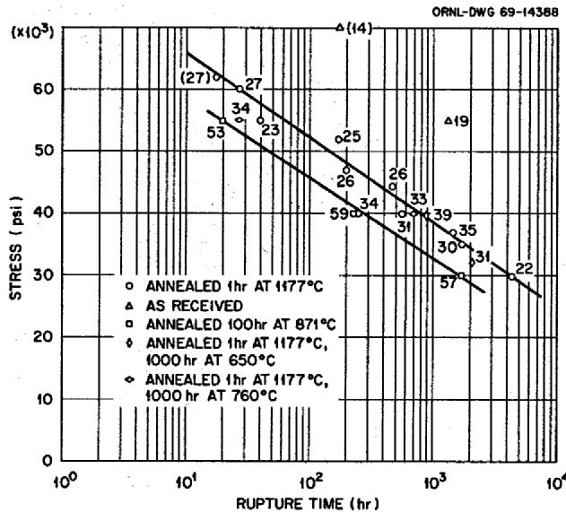  
Fig. 17. Creep-Rupture Properties of Unirradiated Alloy 21545 (0.49% Ti) at $650^{\circ}\mathrm{C}$ . The number by each datum point designates the fracture strain.

examination of the data in Table 15 reveals that the aging treatment of 1000 hr at $760^{\circ}\mathrm{C}$ increased the minimum creep rate.

The results of creep-rupture tests at $650^{\circ}\mathrm{C}$ after irradiation are shown in Figs. 18 through 20 for material annealed 1 hr at $1177^{\circ}\mathrm{C}$ . The irradiation temperatures are indicated by each datum point. At irradiation temperatures of $650^{\circ}\mathrm{C}$ or below, the rupture life was reduced only a small amount, and the minimum creep rate was unchanged. At an irradiation temperature of $760^{\circ}\mathrm{C}$ and test temperature of $650^{\circ}\mathrm{C}$ , the rupture life decreased at least one order of magnitude, and the minimum creep rate increased one order of magnitude. The corresponding fracture strains shown in Fig. 20 are $3\%$ and higher for the samples irradiated at $650^{\circ}\mathrm{C}$ or below and about $0.5\%$ for samples irradiated at $760^{\circ}\mathrm{C}$ . Tests R-841 and R-817 (Table 16) demonstrate the ability of annealing at $760^{\circ}\mathrm{C}$ after irradiation to degrade the properties at $650^{\circ}\mathrm{C}$ . This observation supports the premise that a structural change during annealing at $760^{\circ}\mathrm{C}$ is responsible for the poor properties after irradiation. A comparison of the results for heat 21545 in Figs. 18 through 20 with those in Fig. 14 for alloy 104 ( $0.55\%$ Ti) shows good qualitative agreement.

The results of postirradiation creep tests on material having a fine grain size (annealed at $871^{\circ}\mathrm{C}$ ) are also given in Table 16. The fracture

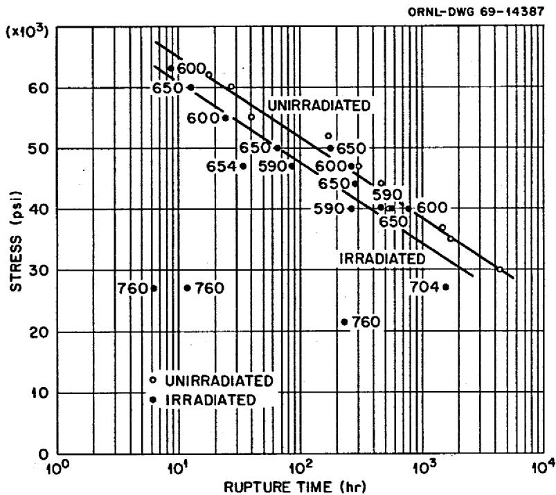  
Fig. 18. Stress-Rupture Properties of Alloy 21545 (0.49% Ti) at $650^{\circ}\mathrm{C}$ . All material annealed 1 hr at $1177^{\circ}\mathrm{C}$ . Number by each datum point designates the irradiation temperature in degrees Celsius.

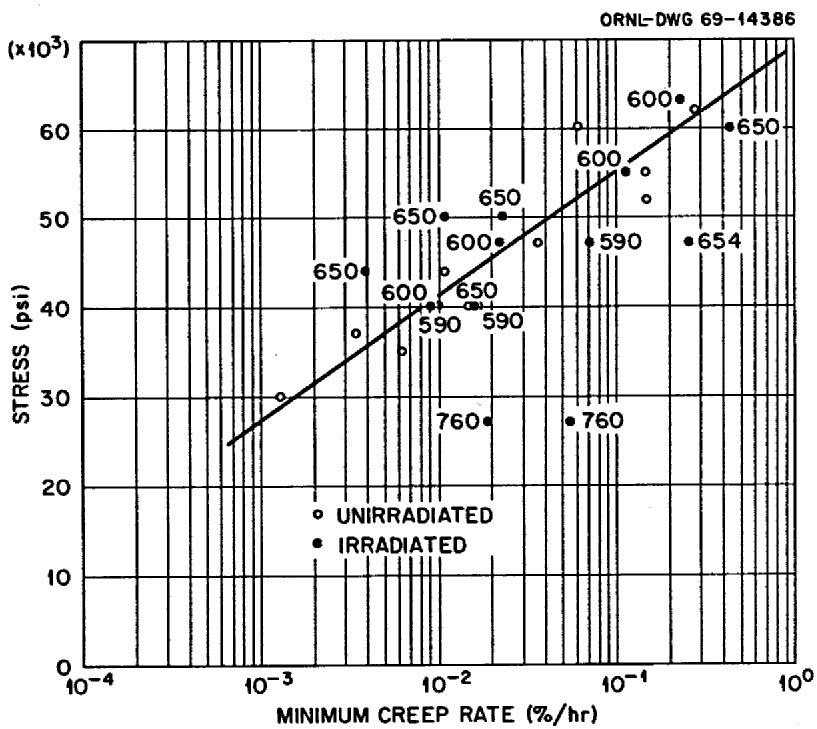  
Fig. 19. Creep Properties at $650^{\circ}\mathrm{C}$ of Alloy 21545 (0.49% Ti). All material annealed 1 hr at $1177^{\circ}\mathrm{C}$ . Number by each datum point designates irradiation temperature in degrees Celsius.

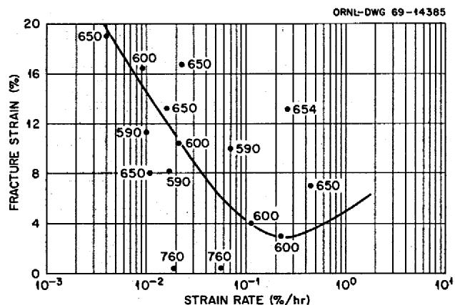  
Fig. 20. Fracture Strain of Alloy 21545 (0.49% Ti) at $650^{\circ}\mathrm{C}$ after Irradiation. All material annealed 1 hr at $1177^{\circ}\mathrm{C}$ . Number by each datum point designates the irradiation temperature in degrees Celsius.

strains for these samples were generally lower than those for the material annealed 1 hr at $1177^{\circ}\mathrm{C}$ . The stress-rupture properties of this material are shown in Fig. 21. In addition to the rupture life being low for the fine-grained, unirradiated material, the rupture life was reduced at least $50\%$ by irradiation.

Some of the fine-grained material of heat 21545 was included in the surveillance program for the MSRE. The detailed results of these tests

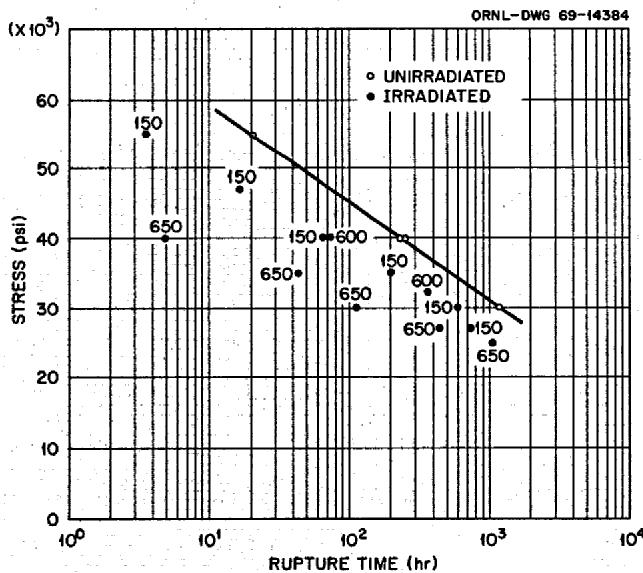  
Fig. 21. Stress-Rupture Properties of Alloy 21545 (0.49% Ti) at $650^{\circ}\mathrm{C}$ . Annealed 100 hr at $871^{\circ}\mathrm{C}$ to produce a fine grain size. Number by each datum point indicates the irradiation temperature in degrees Celsius.

were reported previously $^6$ and will be discussed only briefly in this report. These samples were exposed to molten fluoride salt for 5600 hr at $650^{\circ}\mathrm{C}$ while receiving a thermal-neutron fluence of $4.1 \times 10^{20}$ neutrons/ $\mathrm{cm}^2$ . The stress-rupture properties of these samples are shown in Fig. 22. The unirradiated control samples were exposed to barren fuel salt for an equivalent length of time and show a slight reduction in rupture life (compare Figs. 17 and 22). Irradiation decreased the rupture life about an order of magnitude, and the fracture strains ranged from 1.6 to $3.7\%$ . Since the metal was quite compatible with the salt, we attribute the changes to the long thermal anneal and the neutron exposure.

Several creep tests were run at $760^{\circ}\mathrm{C}$ on both the unirradiated and irradiated materials. The results of these tests are given in Tables 15 and 16, and the stress-rupture properties are shown graphically in Fig. 23. The rupture life at $760^{\circ}\mathrm{C}$ was not reduced by irradiation at $650^{\circ}\mathrm{C}$ or below, but was reduced drastically by irradiation at $760^{\circ}\mathrm{C}$ . The data in Table 16 also show that the higher irradiation temperature increased the minimum creep rate and decreased the fracture strain.

The microstructures of several samples were examined after testing. Typical photomicrographs of alloys 100, 102 (0.39% Ti), 104 (0.55% Ti), and 107 (1.04% Ti) after extended aging at $650^{\circ}\mathrm{C}$ are shown in Fig. 24. The carbide precipitation along grain boundaries and within the matrix was light in alloy 100, heavier in alloy 102, and still heavier for alloys 104 and 107. The fracture of alloy 100 after creep testing at 40,000 psi and $650^{\circ}\mathrm{C}$ is shown in Fig. 25. Numerous intergranular cracks were present, and the fracture was intergranular. The short time of about 50 hr at temperature was not sufficient to cause carbide precipitation. The fracture of alloy 104 (0.55% Ti) after testing at 40,000 psi and $650^{\circ}\mathrm{C}$ is shown in Fig. 26. Details of importance are the carbide stringers, general carbide precipitation, intergranular cracking, and a predominantly intergranular fracture. This sample was at temperature for 1000 hr, and copious amounts of carbide precipitate formed. Photomicrographs of the fracture of alloy 107 (1.04% Ti) are shown in Fig. 27.

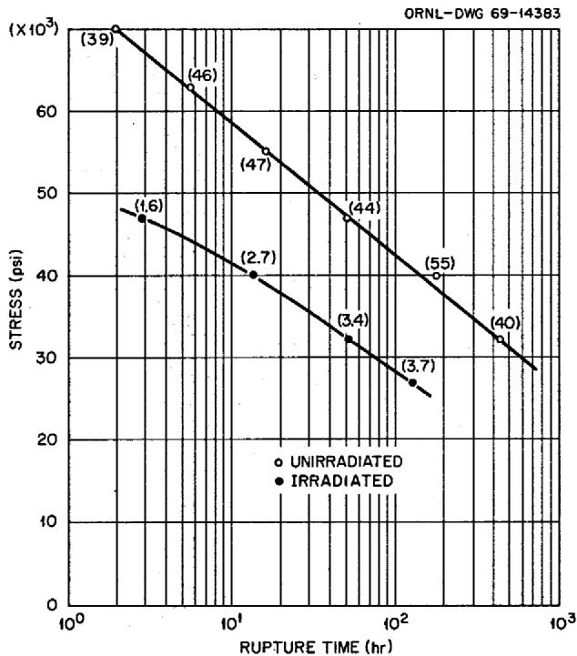  
Fig. 22. Stress-Rupture Properties of Alloy 21545 (0.49% Ti) at $650^{\circ}\mathrm{C}$ . All material annealed 100 hr at $871^{\circ}\mathrm{C}$ and exposed to fluoride salt for 5600 hr at $650^{\circ}\mathrm{C}$ . Number by each datum point indicates fracture strain.

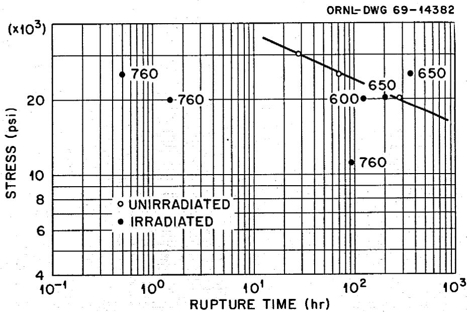  
Fig. 23. Stress-Rupture Properties of Alloy 21545 (0.49% Ti) at $760^{\circ}\mathrm{C}$ . All material annealed 1 hr at $1177^{\circ}\mathrm{C}$ . Number by each datum point indicates the irradiation temperature in degrees Celsius.

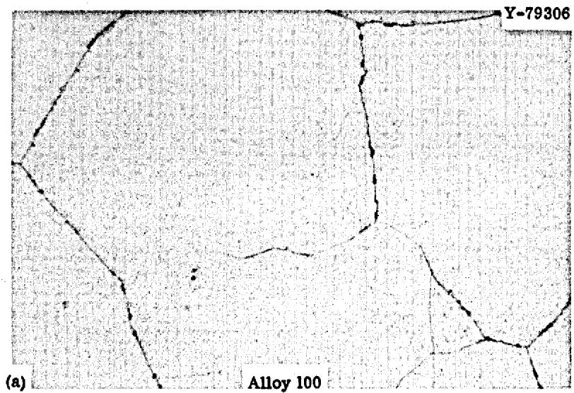

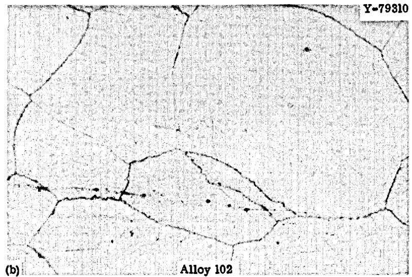

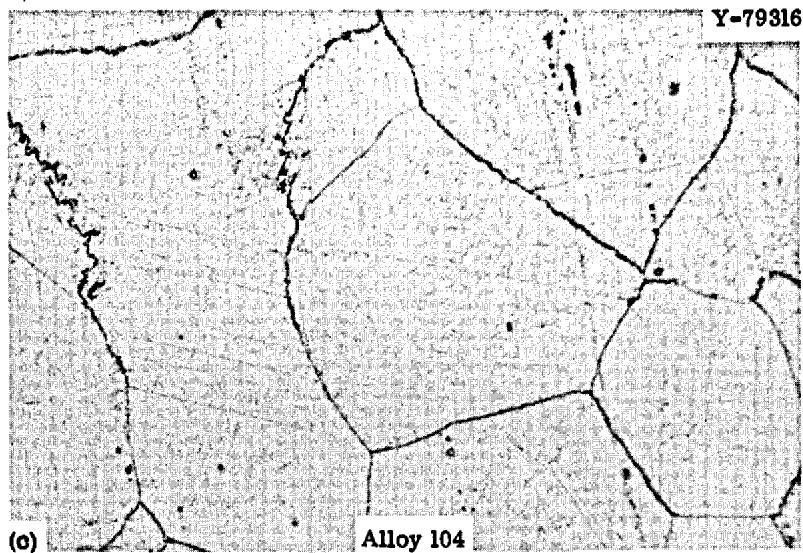

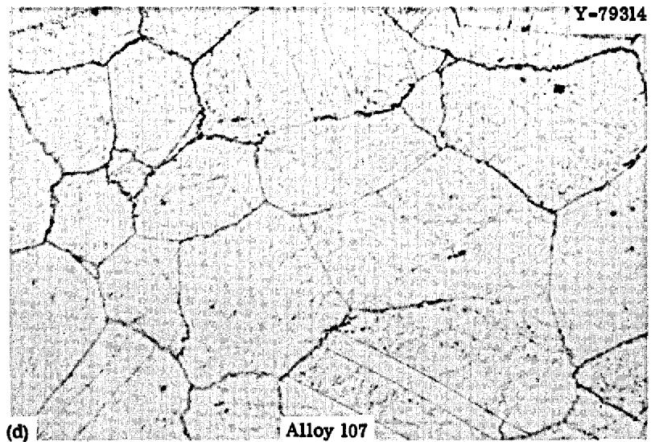  
Fig. 24. Microstructures of Several Titanium-Modified Alloys Annealed 1 hr at $1177^{\circ}\mathrm{C}$ , Aged 1000 hr at $650^{\circ}\mathrm{C}$ , and Stressed 1000 hr at $650^{\circ}\mathrm{C}$ at 32,400 psi. Etchant: glyceria regia, 500x. Reduced $22.5\%$ .

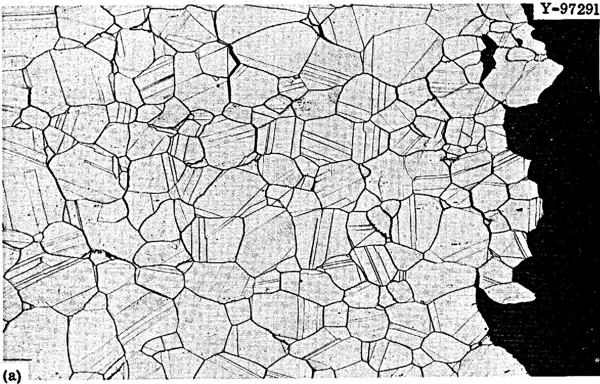

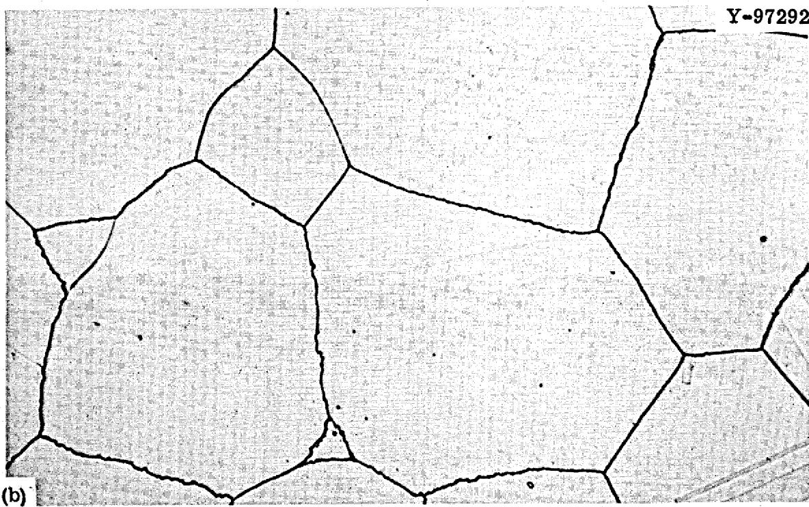  
Fig. 25. Microstructures of Alloy 100 after Annealing 1 hr at $1177^{\circ}C$ and Testing at 40,000 psi and $650^{\circ}C$ . (a) Fracture, $100\times$ ; (b) typical, $500\times$ . Etchant, glyceria regia.

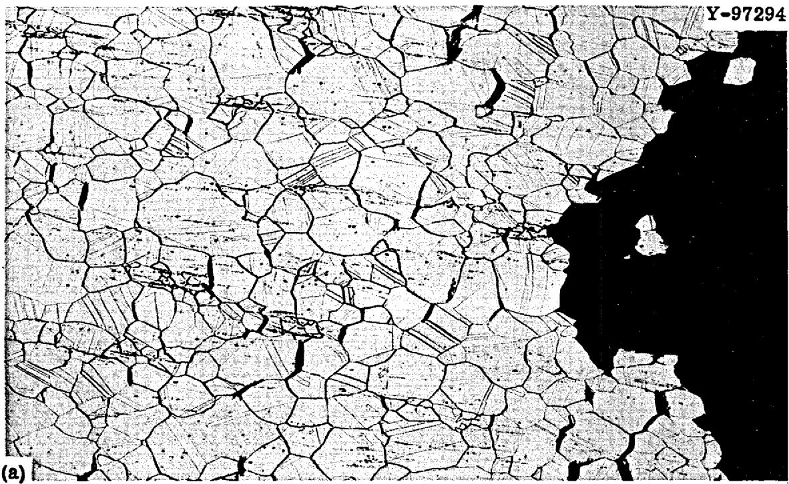

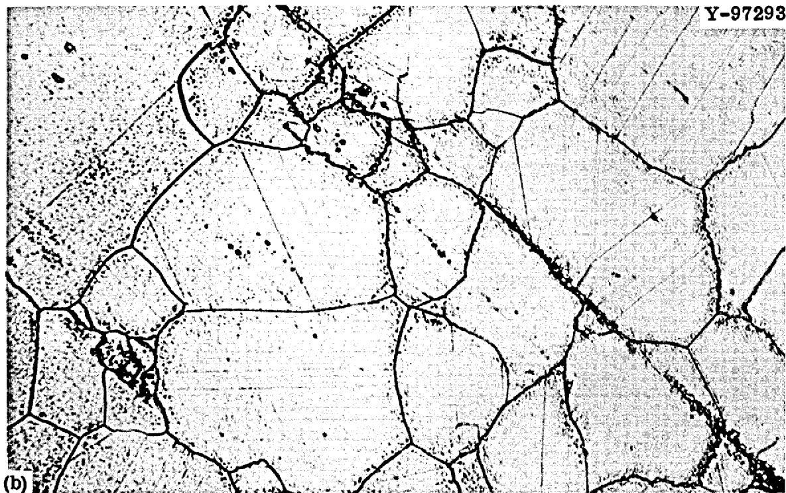  
Fig. 26. Photomicrographs of Alloy 104 (0.55% Ti) after Annealing 1 hr at $1177^{\circ}\mathrm{C}$ and Stressing at 40,000 psi at $650^{\circ}\mathrm{C}$ . (a) Fracture, $100\times$ ; (b) typical, $500\times$ . Etchant, glyceria regia.

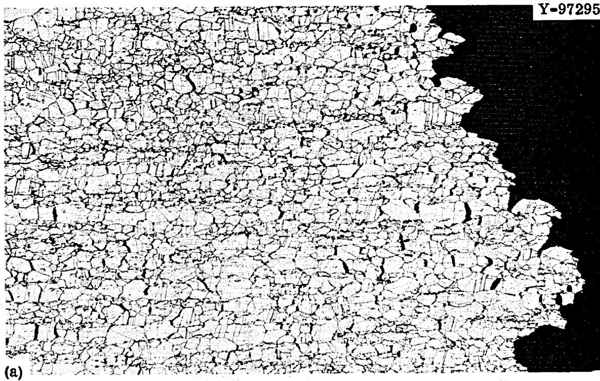

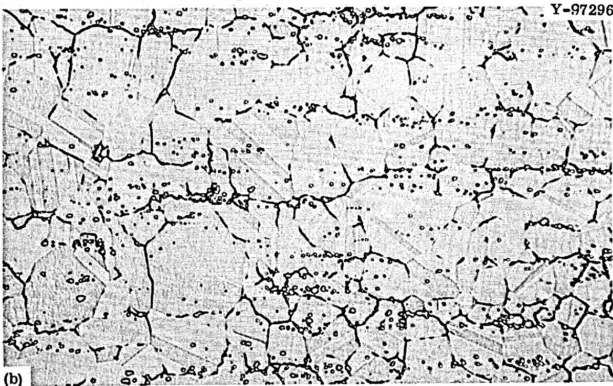  
Fig. 27. Photomicrographs of Alloy 107 (1.04% Ti) after Annealing 1 hr at $1177^{\circ}\mathrm{C}$ and Testing at $650^{\circ}\mathrm{C}$ and 40,000 psi. (a) Fracture, $100 \times$ ; (b) typical, $500 \times$ . Etchant, glyceria regia.

The sample was stressed at 40,000 psi at $650^{\circ}\mathrm{C}$ and fractured after 1490 hr. The grain size was quite small, and there were large quantities of precipitate present. The fracture was predominantly intergranular.

Alloy 21545 (0.49% Ti) was examined metallographically after being stressed at 40,000 psi at $650^{\circ}\mathrm{C}$ . The fracture was predominantly intergranular (Fig. 28). The sample was at temperature 564 hr, and some very fine precipitation occurred in the matrix and at grain boundaries. The stringers of precipitate were present in the annealed material before testing (Fig. 4).

Alloy 100 (< 0.01% Ti) was examined after irradiation and creep testing at $650^{\circ}\mathrm{C}$ . Typical microstructures are shown in Fig. 29. This sample failed after only $1.1\%$ strain (Table 7). There were a few intergranular cracks, but the deformation seemed restricted largely to the zone near the fracture. Some fine carbides were formed at the grain boundaries and in the matrix. The microstructure of alloy 104 (0.55% Ti) is shown in Fig. 30 after irradiation and creep testing at $650^{\circ}\mathrm{C}$ . This alloy failed after $10.0\%$ strain; the fracture was largely intergranular. Alloy 107 (1.04% Ti) failed after $11.1\%$ strain. The microstructure, shown in Fig. 3l, consists of an intergranular fracture with some carbide precipitation.

Alloy 21545 (0.49% Ti) was examined after exposure to the MSRE core and control facility. The material was annealed at $871^{\circ}\mathrm{C}$ before exposure to give a fine grain size (Fig. 4). The samples were then exposed to fluoride salt at $650^{\circ}\mathrm{C}$ for 5600 hr. Some of the samples were exposed to barren fuel salt for controls, and others were irradiated in the MSRE core. Microstructures of an irradiated sample that was tested at $25^{\circ}\mathrm{C}$ are shown in Fig. 32. The fracture was transgranular. There was some edge cracking due partially to slight changes in composition near the surface. The comparative control sample is shown in Fig. 33. The fracture was transgranular, and there was less edge cracking. Another irradiated sample was tested at $650^{\circ}\mathrm{C}$ ; typical photomicrographs are shown in Fig. 34. The fracture was intergranular, and there were a few intergranular cracks near the fracture. There were some edge cracks. The control sample shown in Fig. 35 was more ductile, with $40.8\%$ strain compared with only $6.2\%$ for the irradiated sample shown in Fig. 34. The higher strain led to extensive intergranular cracking.

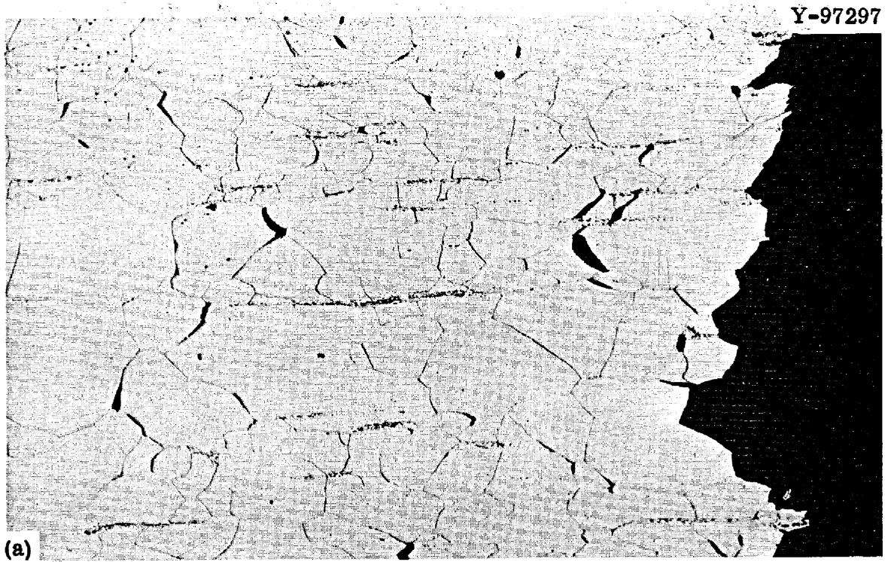

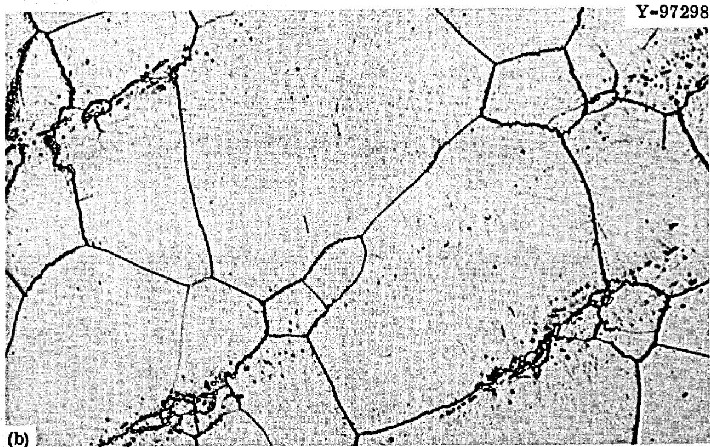  
Fig. 28. Photomicrographs of Alloy 21545 (0.49% Ti) after Annealing 1 hr at $1177^{\circ}\mathrm{C}$ and Testing at $650^{\circ}\mathrm{C}$ and 40,000 psi. (a) Fracture, $100\times$ ; (b) typical, $500\times$ . Etchant: glyceria regia.

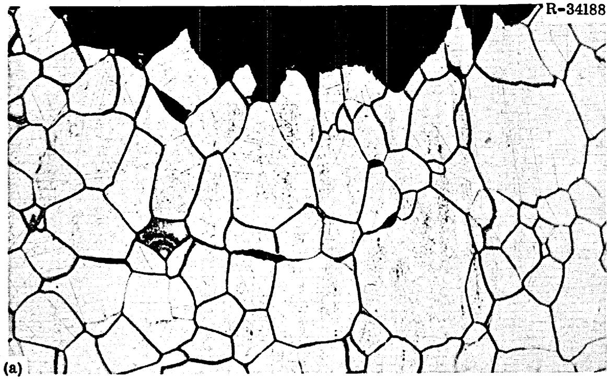

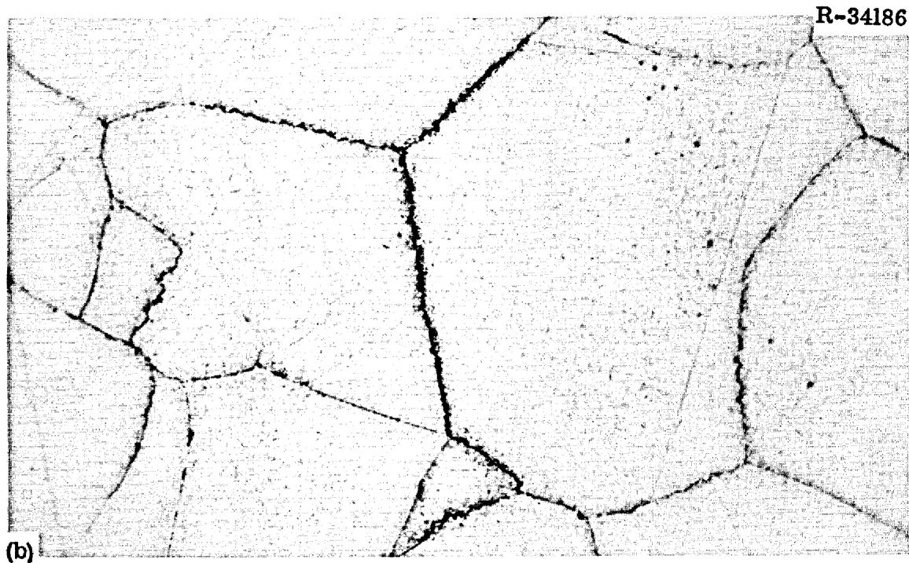  
Fig. 29. Photomicrographs of Alloy 100 (< 0.01% Ti) after Annealing 1 hr at $1177^{\circ}\mathrm{C}$ , Irradiation for 1000 hr at $650^{\circ}\mathrm{C}$ to a Thermal Fluence of $2.5 \times 10^{20}$ neutrons/cm², and Testing at a Stress of 32,400 psi at $650^{\circ}\mathrm{C}$ . Fractured in 105.4 hr with 1.1% strain. (a) Fracture, 100x; (b) typical, 500x. Etchant: aqua regia.

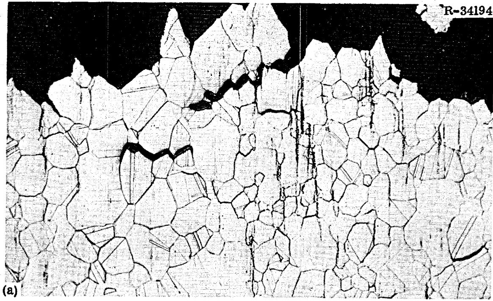

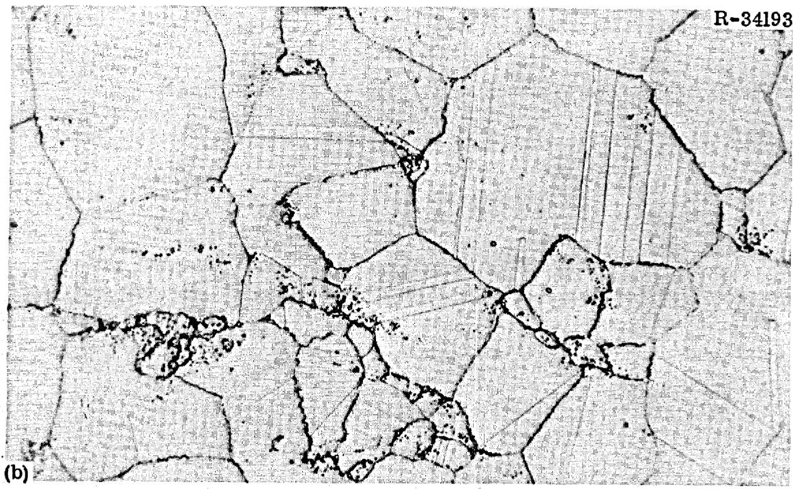  
Fig. 30. Photomicrographs of Alloy 104 (0.55% Ti) Annealed 1 hr at $1177^{\circ}\mathrm{C}$ , Irradiated for 1000 hr at $650^{\circ}\mathrm{C}$ to a Thermal Fluence of $2.5 \times 10^{20}$ neutrons/cm $^2$ , and Stressed at 32,400 psi at $650^{\circ}\mathrm{C}$ . Fractured in 1446.3 hr with 10.0% strain. (a) Fracture, 100x; (b) typical, 500x. Etchant: aqua regia.

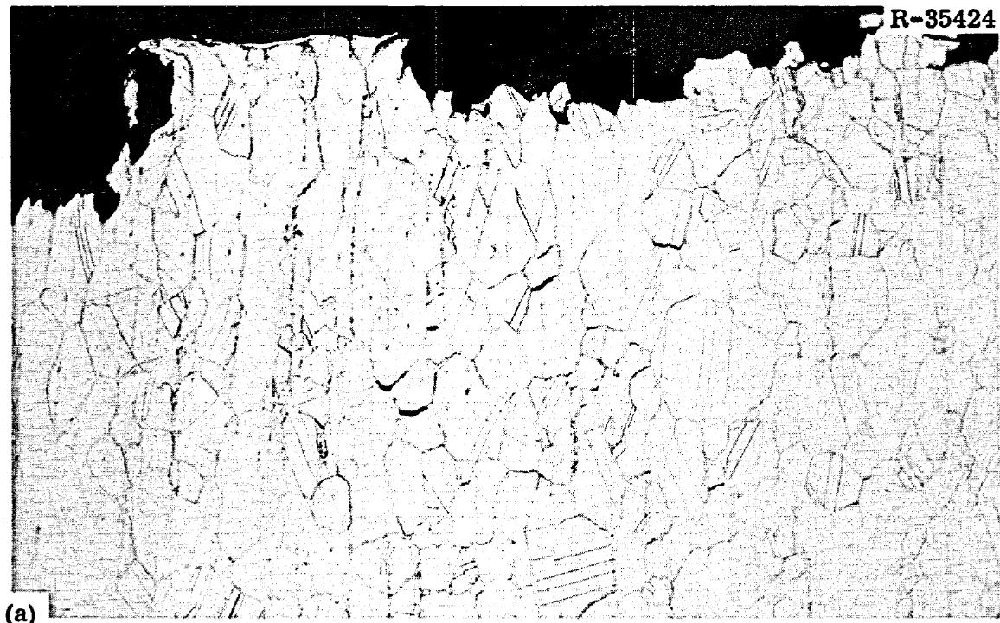

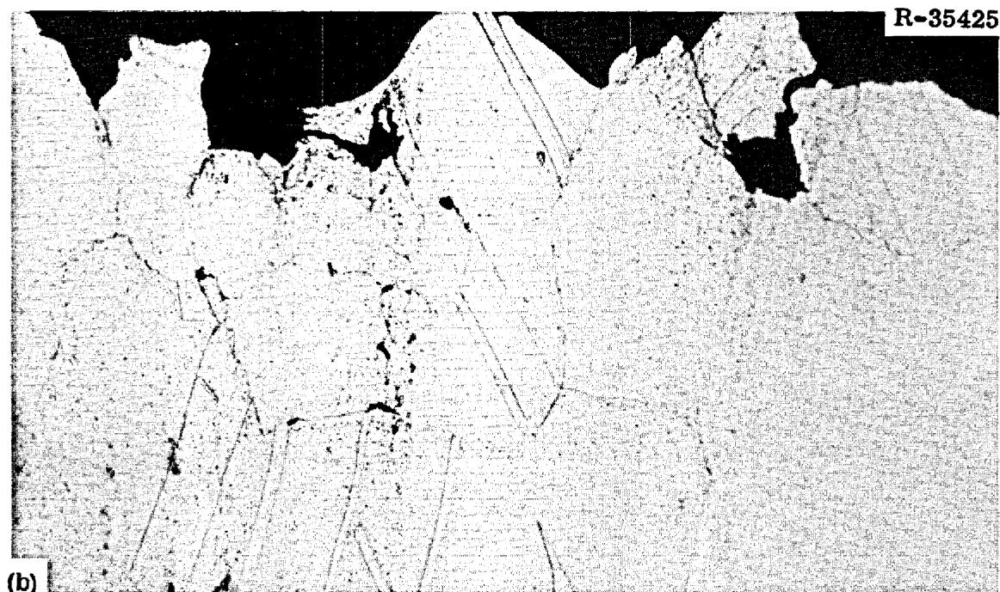  
Fig. 31. Photomicrographs of Alloy 107 (1.04% Ti) Annealed 1 hr at $1177^{\circ}\mathrm{C}$ , Irradiated for 1000 hr at $650^{\circ}\mathrm{C}$ to a Thermal Fluence of $2.5 \times 10^{20}$ neutrons/cm $^2$ , and Stressed at 32,400 psi at $650^{\circ}\mathrm{C}$ . Fractured in 2497.2 hr with $11.1\%$ strain. (a) Fracture (flattened end caused by handling), $100\times$ ; (b) fracture (blunted tip caused by handling), $500\times$ .

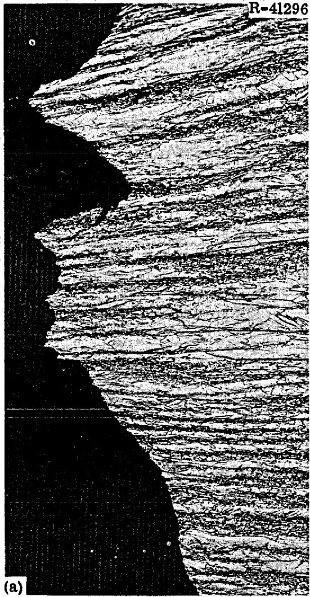

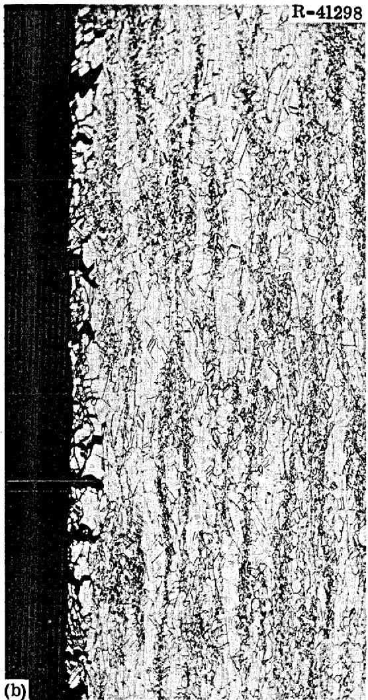

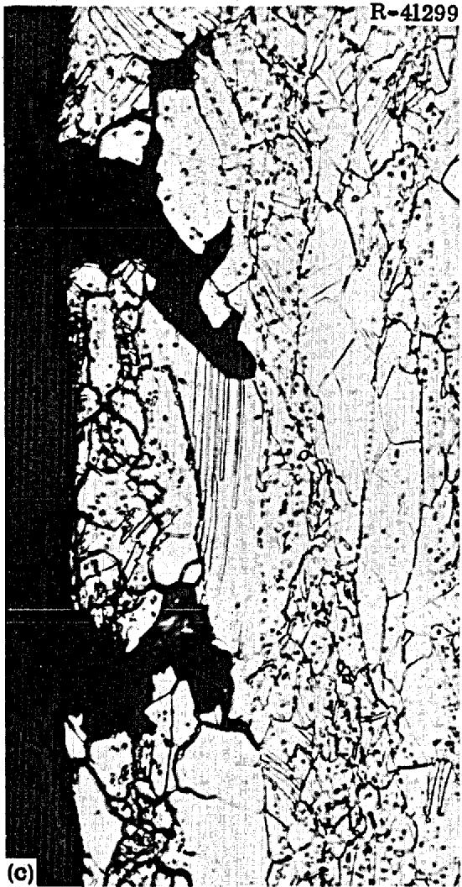  
Fig. 32. Photomicrographs of a Titanium-Modified Hastelloy N Surveillance Sample (Heat 21545) Tested at $25^{\circ}\mathrm{C}$ at a Strain Rate of $0.05\mathrm{min}^{-1}$ . Exposed in the MSRE core for 5500 hr at $650^{\circ}\mathrm{C}$ to a thermal fluence of $4.1 \times 10^{20}$ neutrons/cm². (a) Fracture, 100x; (b) edge of sample about 1/2 in. from fracture, 100x; (c) edge of sample showing edge cracking, 500x. Etchant: aqua regia. Reduced 8%.

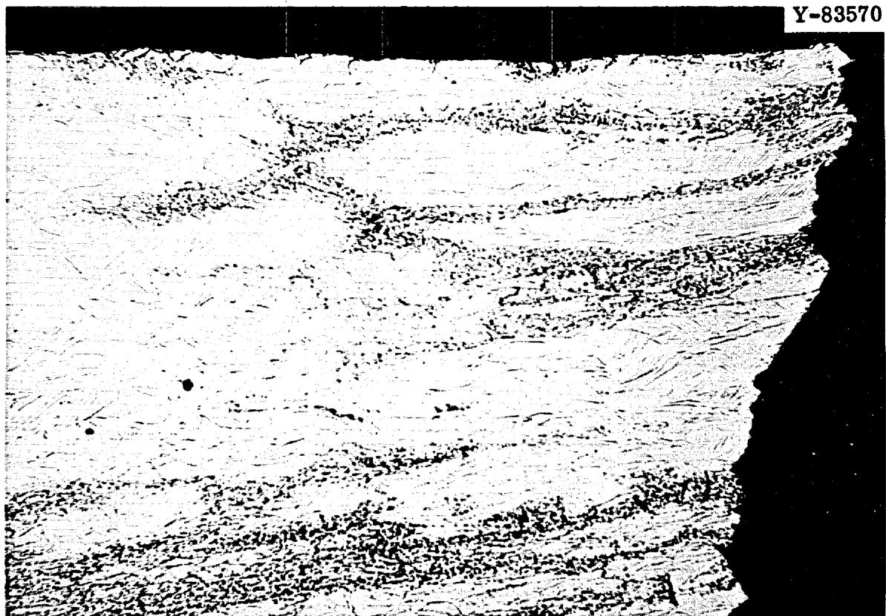  
Fig. 33. Photomicrograph of the Fracture of a Titanium-Modified Hastelloy N Surveillance Sample (Heat 21545) Tested at $25^{\circ}\mathrm{C}$ at a Strain Rate of $0.05\mathrm{min}^{-1}$ . Exposed to a static fluoride salt for 5500 hr at $650^{\circ}\mathrm{C}$ before testing. Note the shear fracture and the absence of edge cracking. 100x. Etchant: glyceria regia.

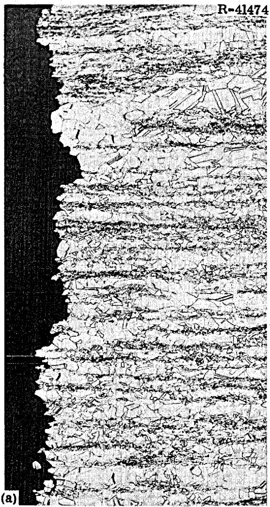

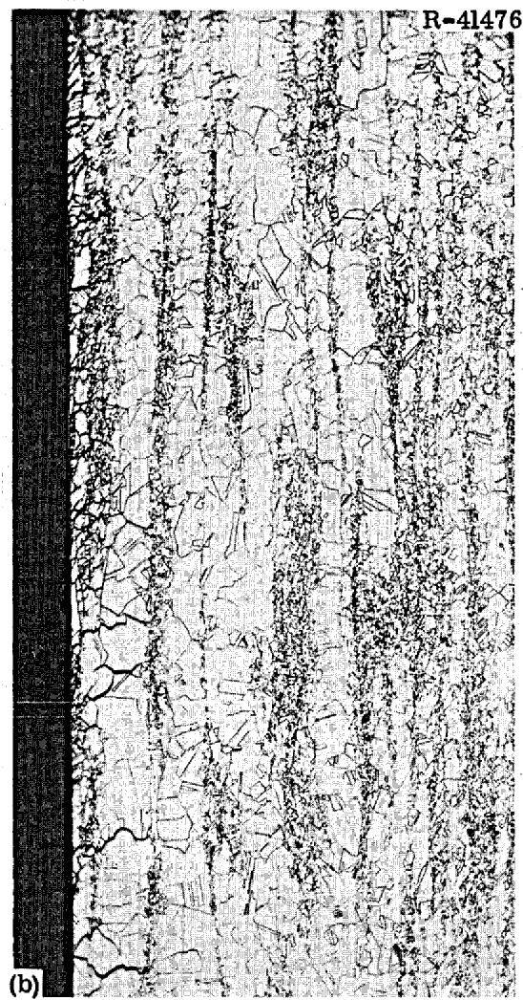

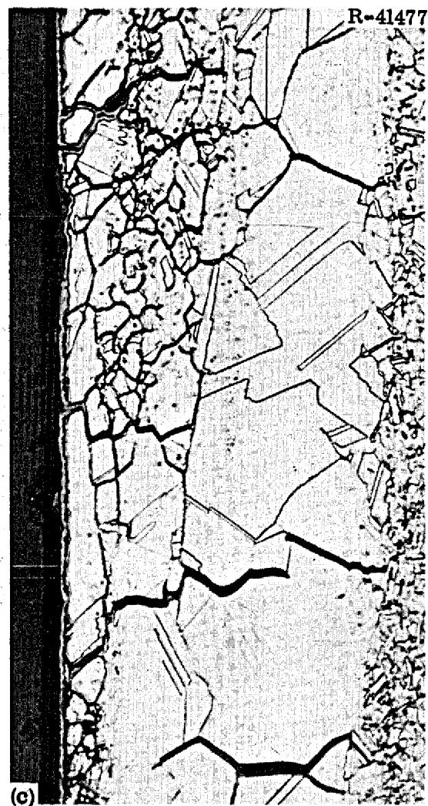  
Fig. 34. Photomicrographs of a Titanium-Modified Hastelloy N Surveillance Sample (Heat 21545) Tested at $650^{\circ}\mathrm{C}$ at a Strain Rate of $0.002\mathrm{min}^{-1}$ . Exposed in the MSRE core for 5500 hr at $650^{\circ}\mathrm{C}$ to a thermal fluence of $4.1 \times 10^{20}$ neutrons/cm². Failed after $6.2\%$ strain. (a) Fracture, $100\times$ ; (b) edge of sample about $1/2$ in. from fracture, $100\times$ ; (c) edge of sample showing edge cracking, $500\times$ . Oxide formed during the tensile test. Etchant: aqua regia. Reduced $10\%$ .

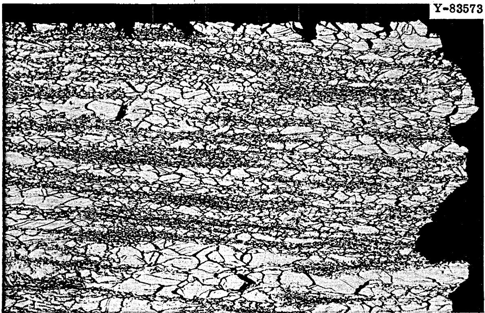  
Fig. 35. Photomicrograph Showing a Portion of the Fracture of a Titanium-Modified Hastelloy N Surveillance Sample (Heat 21545) Tested at $650^{\circ}\mathrm{C}$ at a Strain Rate of $0.002\mathrm{min}^{-1}$ . Failed after $40.8\%$ strain. Exposed to static fluoride salt for 5500 hr at $650^{\circ}\mathrm{C}$ before testing. $100\times$ . Etchant: glyceria regia.

# Alloys Containing Zirconium

Three groups of alloys were studied that contained various amounts of zirconium. A series of 2-lb laboratory melts containing from less than 0.03 to $1.18\%$ Zr was made from virgin melting stock. These alloys are designated 100 and 108 through 112; their chemical compositions are given in Table 1. Typical microstructures of these alloys after a 1-hr anneal at $1177^{\circ}\mathrm{C}$ are shown in Fig. 36. The addition of the first $0.1\%$ Zr (alloy 108) markedly decreased the grain size. Further additions up to the maximum $1.18\%$ Zr caused only slight additional refinement in grain size. The second group consisted of two alloys that contained $1\%$ Zr with additions of 0.1 and $1.0\%$ Re. The third series of alloys consisted of two 100-lb heats from Special Metals Corporation that contained 0.05 and $0.35\%$ Zr, designated heats 21555 and 21554, respectively. The alloy

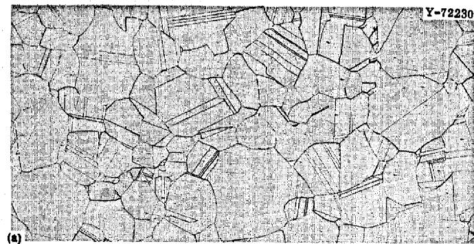

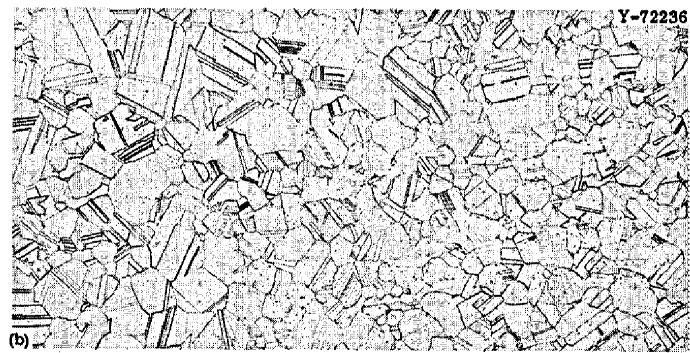

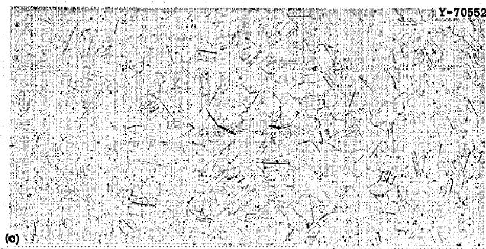

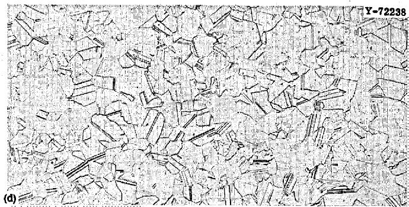

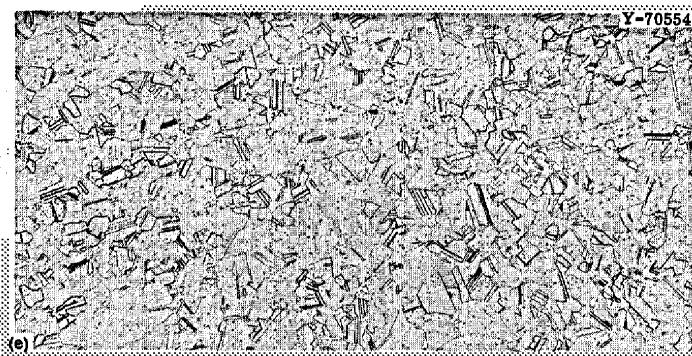

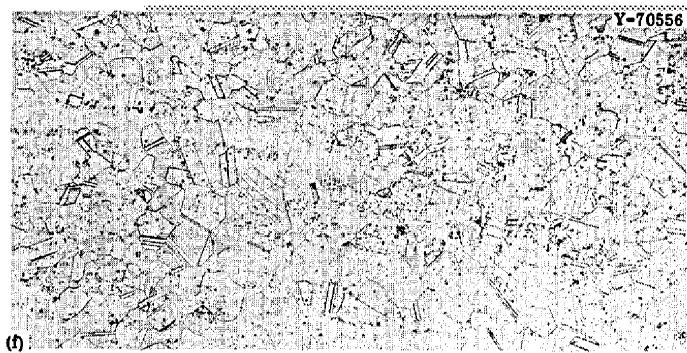  
Fig. 36. Typical Photomicrographs of Alloys 100 and 108 Through 112. Annealed 1 hr at $1177^{\circ}\mathrm{C}$ . (a) Alloy 100 (< 0.03% Zr), (b) alloy 108 (0.10% Zr), (c) alloy 109 (0.28% Zr), (d) alloy 110 (0.53% Zr), (e) alloy 111 (0.75% Zr), and (f) alloy 112 (1.18% Zr). 100x. Etchant: glyceria regia. Reduced 42.5%.

with the higher zirconium content from Special Metals Corporation was initially forged at $1177^{\circ}\mathrm{C}$ and cracked profusely. A second alloy was melted and forged at $1066^{\circ}\mathrm{C}$ , and a good product was obtained. This experience gave the first indication that zirconium caused the alloy to be hot-short and that it would likely have poor weldability. Typical photomicrographs of these two alloys are shown in Figs. 37 and 38. As received, the material contained $40\%$ cold work; annealing at $871^{\circ}\mathrm{C}$ produced a banded structure with a fine grain size and numerous carbides. The banding is likely due to the working pattern, but there was also some variation in the density of the carbides.

Alloys 100 and 108 through 112 were tested to determine their tensile properties. Samples of each alloy were annealed $1\mathrm{hr}$ at $1177^{\circ}\mathrm{C}$ and aged for 1000 hr at $650^{\circ}\mathrm{C}$ to match the thermal history of samples that were irradiated. The results of tensile tests on the unirradiated samples are given in Table 17. The variation of the strength parameters at $650^{\circ}\mathrm{C}$ with zirconium content is shown in Fig. 39. The yield strength was not affected appreciably until the zirconium level exceeded $0.3\%$ , but it increased markedly above this level. The ultimate tensile strength increased about $10\%$ with the addition of $0.1\% \mathrm{Zr}$ , but very little further strengthening occurred as the zirconium content increased. In the absence of aging, the strength was not affected by zirconium content. The fracture strains are shown in Fig. 40 as a function of zirconium content. A very distinct maximum for aged material occurred at a concentration of about $0.3\% \mathrm{Zr}$ . The fracture strain was almost doubled by the addition of even $0.1\% \mathrm{Zr}$ . The fracture strain at the lower strain rate was lower, a trend that is usually observed. In unaged material, a maximum occurred in the fracture strain for zirconium concentrations of 0.5 to $0.7\%$ .

The same experimental alloys were irradiated at $650^{\circ}\mathrm{C}$ to a thermal fluence of $2.5 \times 10^{20}$ neutrons/cm². The results of tensile tests on these samples after irradiation are summarized in Table 18, and the variations of the fracture strains with zirconium content are shown in Fig. 41. The postirradiation results also show a ductility maximum at about $0.3\%$ Zr. The results for the irradiated and unirradiated samples are compared in Fig. 42, where the ratios of the various tensile properties

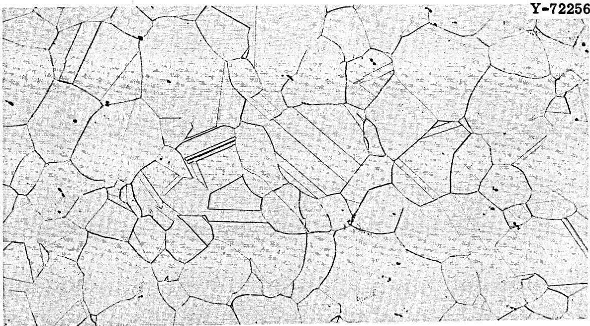  
Fig. 37. Typical Photomicrograph of Alloy 21555 (0.05% Zr). Annealed 1 hr at $1177^{\circ}\mathrm{C}$ . 100×. Etchant: glyceria regia.

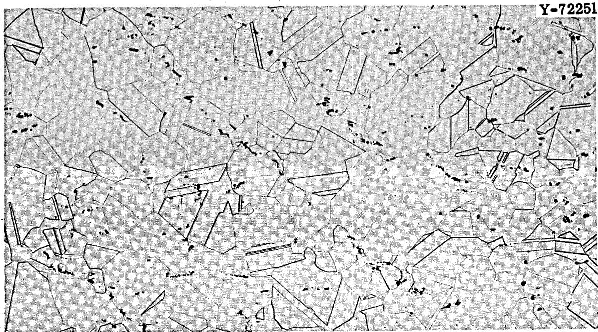  
Fig. 38. Typical Photomicrograph of Alloy 21554 (0.35% Zr). Annealed 1 hr at $1177^{\circ}\mathrm{C}$ . 100×. Etchant: glyceria regia.

Table 17. Tensile Properties of Several Unirradiated Zirconium-Modified Alloys at $650^{\circ}\mathrm{C}$   

<table><tr><td rowspan="2">Alloy Number</td><td rowspan="2">Specimen Number</td><td rowspan="2">Strain Rate (min-1)</td><td colspan="2">Stress, psi</td><td colspan="2">Elongation, %</td><td rowspan="2">Reduction in Area (%)</td><td rowspan="2">Heat Treatment</td></tr><tr><td>Yield</td><td>Ultimate Tensile</td><td>Uniform</td><td>Total</td></tr><tr><td></td><td></td><td></td><td>× 103</td><td>× 103</td><td></td><td></td><td></td><td></td></tr><tr><td>108</td><td>3870</td><td>0.05</td><td>25.7</td><td>68.3</td><td>28.6</td><td>29.8</td><td>23.7</td><td>a</td></tr><tr><td>109</td><td>3880</td><td>0.05</td><td>29.4</td><td>78.6</td><td>33.7</td><td>34.7</td><td>26.8</td><td>a</td></tr><tr><td>110</td><td>3890</td><td>0.05</td><td>25.9</td><td>75.6</td><td>42.8</td><td>44.8</td><td>30.6</td><td>a</td></tr><tr><td>111</td><td>3900</td><td>0.05</td><td>26.7</td><td>75.5</td><td>42.3</td><td>44.6</td><td>39.9</td><td>a</td></tr><tr><td>112</td><td>3909</td><td>0.05</td><td>26.5</td><td>69.6</td><td>32.4</td><td>34.4</td><td>33.3</td><td>a</td></tr><tr><td>108</td><td>2084</td><td>0.05</td><td>28.9</td><td>86.4</td><td>46.1</td><td>48.9</td><td>42.6</td><td>b</td></tr><tr><td>108</td><td>2078</td><td>0.002</td><td>29.2</td><td>86.2</td><td>47.3</td><td>50.0</td><td>47.2</td><td>b</td></tr><tr><td>109</td><td>2061</td><td>0.05</td><td>29.1</td><td>85.9</td><td>54.8</td><td>57.7</td><td>50.9</td><td>b</td></tr><tr><td>109</td><td>2062</td><td>0.002</td><td>29.4</td><td>84.7</td><td>52.5</td><td>56.2</td><td>47.3</td><td>b</td></tr><tr><td>110</td><td>2105</td><td>0.05</td><td>43.8</td><td>85.8</td><td>49.0</td><td>56.8</td><td>53.1</td><td>b</td></tr><tr><td>110</td><td>2114</td><td>0.002</td><td>44.6</td><td>87</td><td>48.9</td><td>51.9</td><td>48.7</td><td>b</td></tr><tr><td>111</td><td>2132</td><td>0.05</td><td>50.5</td><td>92.2</td><td>45.6</td><td>50.3</td><td>53.2</td><td>b</td></tr><tr><td>111</td><td>2134</td><td>0.002</td><td>52.9</td><td>80.9</td><td>35.6</td><td>44.4</td><td>47.5</td><td>b</td></tr><tr><td>112</td><td>2146</td><td>0.05</td><td>51.2</td><td>89.1</td><td>26.9</td><td>28.8</td><td>28.1</td><td>b</td></tr><tr><td>112</td><td>2148</td><td>0.002</td><td>55.2</td><td>89.3</td><td>22.6</td><td>23.3</td><td>25.8</td><td>b</td></tr></table>

aAnnealed 1 hr at $1177^{\circ}C$   
bAnnealed 1 hr at $1177^{\circ}C$ plus 1000 hr at $650^{\circ}C$

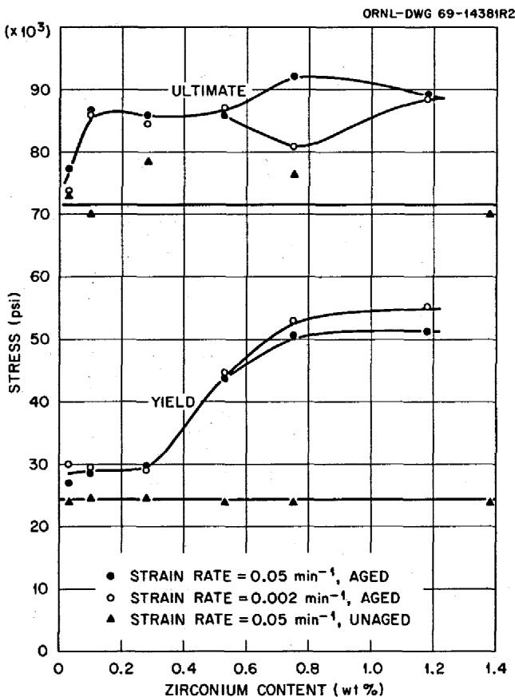  
Fig. 39. Influence of Zirconium Content on Tensile Properties after Annealing 1 hr at $1177^{\circ}\mathrm{C}$ and Aging 1000 hr at $650^{\circ}\mathrm{C}$ .

Table 18. Tensile Properties of Several Zirconium-Modified Alloys at $650^{\circ}\mathrm{C}$ after Irradiationa   

<table><tr><td rowspan="2">Alloy Number</td><td rowspan="2">Specimen Number</td><td rowspan="2">Strain Rate (min-1)</td><td colspan="2">Stress, psi</td><td colspan="2">Elongation, %</td><td rowspan="2">Reduction in Area (%)</td></tr><tr><td>Yield</td><td>Ultimate Tensile</td><td>Uniform</td><td>Total</td></tr><tr><td></td><td></td><td></td><td>× 103</td><td>× 103</td><td></td><td></td><td></td></tr><tr><td>108</td><td>2075</td><td>0.05</td><td>33.9</td><td>72.6</td><td>28.0</td><td>29.0</td><td>18.7</td></tr><tr><td>108</td><td>2087</td><td>0.002</td><td>35.3</td><td>67.4</td><td>22.1</td><td>23.5</td><td>18.9</td></tr><tr><td>109</td><td>2074</td><td>0.002</td><td>37.2</td><td>65.2</td><td>24.5</td><td>29.8</td><td>28.5</td></tr><tr><td>110</td><td>2109</td><td>0.05</td><td>41.2</td><td>63.4</td><td>16.5</td><td>18.5</td><td>17.9</td></tr><tr><td>110</td><td>2116</td><td>0.002</td><td>43.4</td><td>58.1</td><td>13.4</td><td>17.1</td><td>13.6</td></tr><tr><td>111</td><td>2141</td><td>0.002</td><td>49.8</td><td>60.8</td><td>8.5</td><td>10.0</td><td>12.1</td></tr><tr><td>112</td><td>2147</td><td>0.05</td><td>53.9</td><td>74.6</td><td>14.9</td><td>17.2</td><td>13.4</td></tr><tr><td>112</td><td>2152</td><td>0.002</td><td>56.5</td><td>68.7</td><td>7.1</td><td>7.7</td><td>11.9</td></tr></table>

aAnnealed 1 hr at $1177^{\circ}C$ before irradiation at $650^{\circ}C$ to a thermal fluence of $2.5\times 10^{20}$ neutrons/cm².

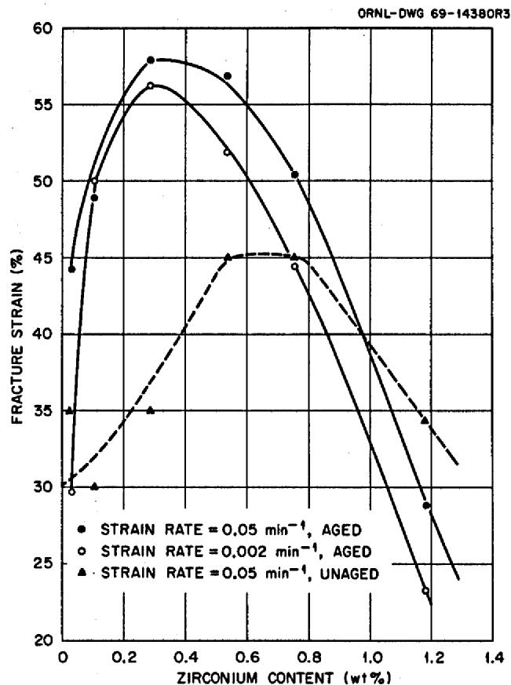  
Fig. 40. Influence of Zirconium Content on Fracture Strain. The unaged samples were annealed $1\mathrm{hr}$ at $1177^{\circ}\mathrm{C}$ and the aged samples were annealed $1\mathrm{hr}$ at $1177^{\circ}\mathrm{C}$ and aged $1000\mathrm{hr}$ at $650^{\circ}\mathrm{C}$ before testing.

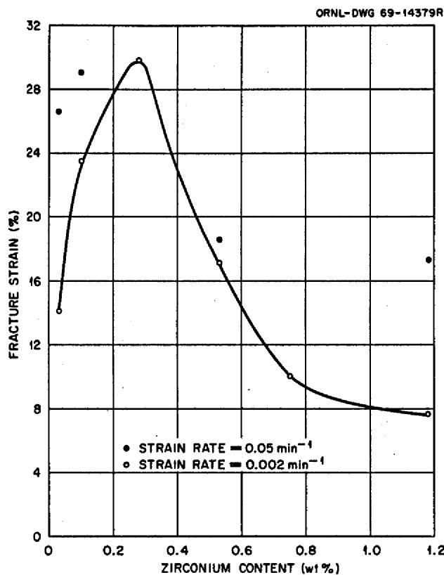  
Fig. 41. Influence of Zirconium Content on Fracture Strain at $650^{\circ}\mathrm{C}$ after Irradiation. Annealed 1 hr at $1177^{\circ}\mathrm{C}$ before irradiation.

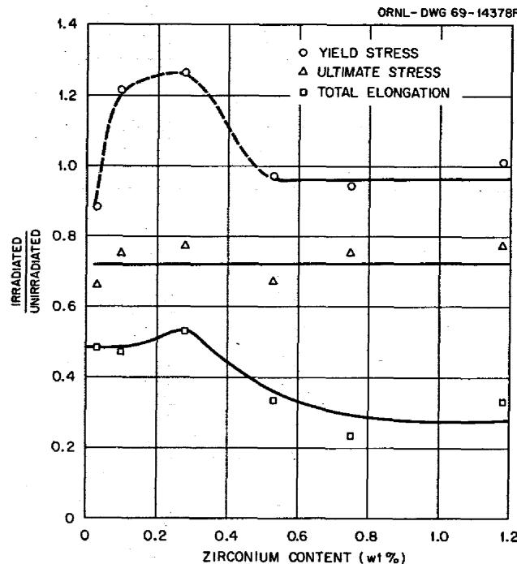  
Fig. 42. Effects of Zirconium on the Unirradiated and Irradiated Tensile Properties at $650^{\circ}\mathrm{C}$ and a Strain Rate of $0.002\mathrm{min}^{-1}$ .

are also shown. The yield strength was increased slightly by irradiation in alloys that contained 0.10 and $0.28\%$ Zr (alloys 108 and 109) and decreased slightly in the other alloys. The ultimate tensile strength was decreased about $30\%$ in each alloy. The fracture strain was reduced about $50\%$ by irradiation in alloys that contained $0.3\%$ Zr or less and reduced about $70\%$ for alloys that contained more zirconium.

Samples of alloys 100 and 108 through 112 were also irradiated at $43^{\circ}\mathrm{C}$ to a thermal fluence of $9 \times 10^{19}$ neutrons/ $\mathrm{cm}^2$ . These samples were tested at 650 and $760^{\circ}\mathrm{C}$ ; the results are given in Table 19. The fracture strains are shown in Fig. 43 as a function of zirconium concentration. The peak in fracture strain at $650^{\circ}\mathrm{C}$ with zirconium concentration still occurs, but less sharply and at a different concentration than observed previously (Fig. 4l). The fracture strains are also higher in the experiment at lower temperature. We do not know whether to attribute these differences to the variation in irradiation temperature or influence. However, the circumstantial evidence indicates that the irradiation temperature is the most important factor. Recall that the yield strengths of the aged control samples varied from 28,000 to 55,000 psi

Table 19. Tensile Properties of Several Zirconium-Modified Alloys after Irradiationa   

<table><tr><td rowspan="2">Alloy Number</td><td rowspan="2">Specimen Number</td><td colspan="2">Stress, psi</td><td colspan="2">Elongation, %</td><td rowspan="2">Reduction in Area (%)</td></tr><tr><td>Yield</td><td>Ultimate Tensile</td><td>Uniform</td><td>Total</td></tr><tr><td></td><td></td><td>× 103</td><td>× 103</td><td></td><td></td><td></td></tr><tr><td></td><td></td><td colspan="2">Test Temperature 650°C</td><td></td><td></td><td></td></tr><tr><td>108</td><td>2086</td><td>31.5</td><td>62.9</td><td>18.9</td><td>19.2</td><td>17.5</td></tr><tr><td>109</td><td>2064</td><td>34.7</td><td>88.8</td><td>37.8</td><td>38.9</td><td>24.0</td></tr><tr><td>110</td><td>2113</td><td>33.1</td><td>79.3</td><td>38.6</td><td>40.5</td><td>34.9</td></tr><tr><td>111</td><td>2139</td><td>33.6</td><td>80.8</td><td>33.3</td><td>37.4</td><td>33.8</td></tr><tr><td>112</td><td>2156</td><td>33.8</td><td>80</td><td>29.9</td><td>31.5</td><td>21.8</td></tr><tr><td></td><td></td><td colspan="2">Test Temperature 760°C</td><td></td><td></td><td></td></tr><tr><td>108</td><td>2088</td><td>27.4</td><td>52.3</td><td>10.0</td><td>12.3</td><td>9.8</td></tr><tr><td>109</td><td>2058</td><td>29.8</td><td>58.3</td><td>10.2</td><td>25.6</td><td>28.3</td></tr><tr><td>110</td><td>2111</td><td>27.7</td><td>56.7</td><td>11.6</td><td>25.6</td><td>27.3</td></tr><tr><td>111</td><td>2128</td><td>32.2</td><td>56.2</td><td>12.4</td><td>30.7</td><td>34.2</td></tr><tr><td>112</td><td>2153</td><td>29</td><td>61.8</td><td>15.5</td><td>18.0</td><td>17.5</td></tr></table>

aAnnealed 1 hr at $1177^{\circ}C$ , irradiated at $50^{\circ}C$ to a thermal fluence of $9\times 10^{19}$ neutrons/cm² and tested at a strain rate of 0.002 min⁻¹.

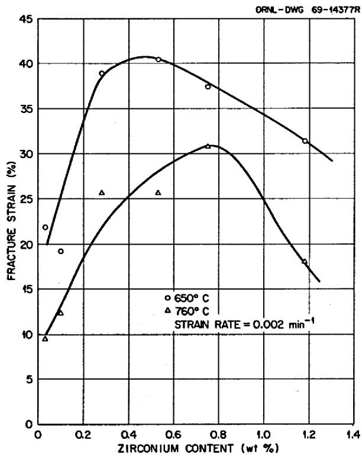  
Fig. 43. Fracture Strains of Several Zirconium-Bearing Alloys after Irradiation at $43^{\circ}\mathrm{C}$ to a Thermal Fluence of $9 \times 10^{19}$ neutrons/cm².

and varied systematically with zirconium content (Fig. 39). Irradiation at $650^{\circ}\mathrm{C}$ did not change these values markedly (Table 18). The yield strengths of the alloys irradiated at $43^{\circ}\mathrm{C}$ are all about 33,000 psi and do not vary detectably with zirconium content (Table 19). Thus, the thermal treatment seems necessary to bring about the changes characteristic of alloys with various concentrations of zirconium.

Some of the samples irradiated at $43^{\circ}\mathrm{C}$ were tested at $760^{\circ}\mathrm{C}$ . The fracture strain varied markedly with zirconium content (Fig. 43). However, the peak was shifted to a higher zirconium level than was noted at a test temperature of $650^{\circ}\mathrm{C}$ .

Alloys 100 and 108 through 112 were also creep-rupture tested. The results of several tests on material annealed for $1\mathrm{hr}$ at $1177^{\circ}\mathrm{C}$ are shown in Table 20 and in Figs. 44 through 46. The stress-rupture properties, shown in Fig. 44, illustrate the potent effect of zirconium in increasing the rupture life at a given level of stress. The rupture life of alloy 109 ( $0.28\%$ Zr) seems anomalously high, but the other alloys followed the trend of increasing rupture life with increasing zirconium content. The creep-rupture strength, shown in Fig. 45, was also affected by the zirconium concentration. Again, alloy 109 was the only exception to the trend of increasing strength with increasing zirconium content. Zirconium improved the fracture strain (Fig. 46). The addition of only $0.1\%$ Zr (alloy 108) improved the fracture strain, compared to that of alloy 100, several hundred percent at low strain rates. Higher concentrations of zirconium improved the fracture strain at high strain rates, but brought about little added improvement at low strain rates.

Some samples were aged for 1000 hr at $650^{\circ}\mathrm{C}$ to correspond to the thermal treatment of irradiated samples. The results of creep-rupture tests on these samples are given in Table 21. A comparison with the properties of the unaged samples in Table 20 shows that this aging treatment did not affect the properties appreciably.

Alloys 100 and 108 through 112 were irradiated to a thermal fluence of $2.5 \times 10^{20}$ neutrons/cm² at $650^{\circ}\mathrm{C}$ and subjected to creep-rupture tests at $650^{\circ}\mathrm{C}$ after irradiation. The results of these tests are given in Table 22. These samples were stressed at 32,400 psi for about 675 hr

Table 20. Creep Properties at $650^{\circ}\mathrm{C}$ of Several Alloys That Contain Various Concentrations of Zirconiuma   

<table><tr><td>Alloy Number</td><td>Specimen Number</td><td>Test Number</td><td>Stress (psi)</td><td>Rupture Life (hr)</td><td>Minimum Creep Rate (%/hr)</td><td>Elongation (%)</td><td>Reduction in Area (%)</td></tr><tr><td></td><td></td><td></td><td>× 103</td><td></td><td></td><td></td><td></td></tr><tr><td>100</td><td>1915</td><td>5725</td><td>55</td><td>3.4</td><td>0.43</td><td>22.5</td><td>20.8</td></tr><tr><td>100</td><td>1917</td><td>6099</td><td>47</td><td>20.8</td><td>0.55</td><td>14.5</td><td>12.5</td></tr><tr><td>100</td><td>1909</td><td>5554</td><td>40</td><td>47.4</td><td>0.088</td><td>12.5</td><td>9.5</td></tr><tr><td>100</td><td>1914</td><td>6108</td><td>32.4</td><td>185.1</td><td>0.0077</td><td>6.3</td><td>6.2</td></tr><tr><td>100</td><td>1921</td><td>6172</td><td>27</td><td>827.8</td><td>0.0022</td><td>4.9</td><td>4.0</td></tr><tr><td>108</td><td>2077</td><td>5689</td><td>55</td><td>14.1</td><td>0.16</td><td>17.5</td><td>14.8</td></tr><tr><td>108</td><td>2082</td><td>5991</td><td>47</td><td>178.7</td><td>0.025</td><td>18.8</td><td>15.9</td></tr><tr><td>108</td><td>2091</td><td>5721</td><td>40</td><td>348.5</td><td>0.018</td><td>25.0</td><td>21.4</td></tr><tr><td>108</td><td>2094</td><td>6162</td><td>32.4</td><td>2137.3</td><td>0.0059</td><td>31.3</td><td>28.4</td></tr><tr><td>109</td><td>2068</td><td>5778</td><td>70</td><td>30.7</td><td>0.128</td><td>32.4</td><td>28.3</td></tr><tr><td>109</td><td>2066</td><td>5712</td><td>55</td><td>178.1</td><td>0.015</td><td>32.0</td><td>31.0</td></tr><tr><td>109</td><td>2057</td><td>5740</td><td>51</td><td>358.5</td><td>0.013</td><td>31.0</td><td>36.0</td></tr><tr><td>109</td><td>2072</td><td>5987</td><td>47</td><td>851.2</td><td>0.0075</td><td>34.1</td><td>34.8</td></tr><tr><td>109</td><td>2065</td><td>5909</td><td>40</td><td>1474.3</td><td>0.0042</td><td>46.9</td><td>35.3</td></tr><tr><td>110</td><td>2115</td><td>5746</td><td>70</td><td>12.5</td><td>0.138</td><td>39.3</td><td>26.9</td></tr><tr><td>110</td><td>2104</td><td>5673</td><td>55</td><td>200.7</td><td>0.028</td><td>35.9</td><td>31.1</td></tr><tr><td>110</td><td>2117</td><td>6096</td><td>47</td><td>283.0</td><td>0.030</td><td>38.2</td><td>38.6</td></tr><tr><td>110</td><td>2112</td><td>5665</td><td>40</td><td>709.0</td><td>0.0080</td><td>18.8</td><td>25.6</td></tr><tr><td>111</td><td>2130</td><td>5771</td><td>70</td><td>26.9</td><td>0.174</td><td>35.0</td><td>26.9</td></tr><tr><td>111</td><td>2135</td><td>5688</td><td>55</td><td>192.8</td><td>0.027</td><td>30.9</td><td>29.7</td></tr><tr><td>111</td><td>2126</td><td>6091</td><td>47</td><td>589.4</td><td>0.014</td><td>36.6</td><td>33.7</td></tr><tr><td>112</td><td>2159</td><td>5752</td><td>70</td><td>39.2</td><td>0.181</td><td>38.2</td><td>31.6</td></tr><tr><td>112</td><td>2151</td><td>5908</td><td>62</td><td>169.5</td><td>0.038</td><td>34.3</td><td>27.2</td></tr><tr><td>112</td><td>2145</td><td>5666</td><td>55</td><td>537.4</td><td>0.011</td><td>30.5</td><td>26.9</td></tr><tr><td>112</td><td>2163</td><td>5641</td><td>51</td><td>673.1</td><td>0.010</td><td>37.5</td><td>28.8</td></tr><tr><td>112</td><td>2158</td><td>6166</td><td>47</td><td>1254.8</td><td>0.0056</td><td>32.0</td><td>29.9</td></tr></table>

aAnnealed 1 hr at $1177^{\circ}C$ before testing.

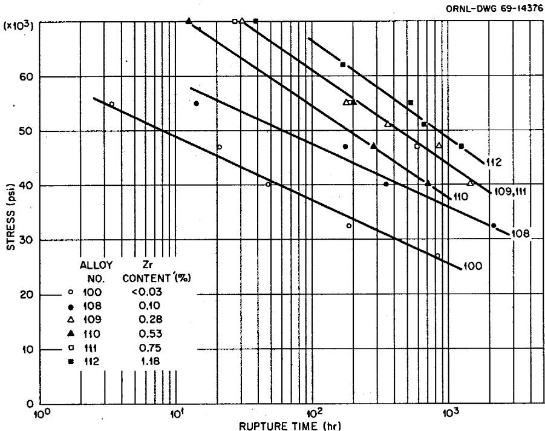  
Fig. 44. Stress-Rupture Properties at $650^{\circ}\mathrm{C}$ of Several Alloys That Contain Various Concentrations of Zirconium. All material was annealed $1\mathrm{hr}$ at $1177^{\circ}\mathrm{C}$ before testing.

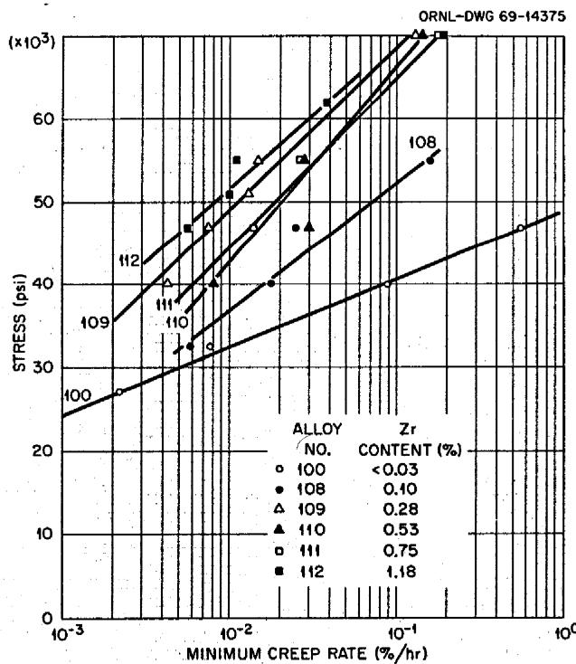  
Fig. 45. Influence of Zirconium on Creep Rates at $650^{\circ}\mathrm{C}$ . All alloys annealed 1 hr at $1177^{\circ}\mathrm{C}$ before testing.

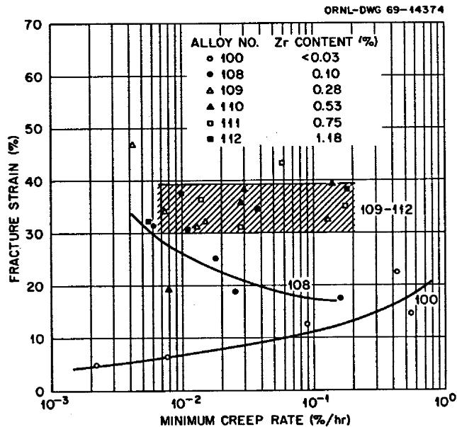  
Fig. 46. Fracture Strains During Creep Tests at $650^{\circ}\mathrm{C}$ for Alloys That Contain Various Amounts of Zirconium. All samples annealed 1 hr at $1177^{\circ}\mathrm{C}$ before testing.

Table 21. Stress Properties at $650^{\circ}\mathrm{C}$ of Several Ageda Alloys That Contain Zirconium   

<table><tr><td>Alloy Number</td><td>Specimen Number</td><td>Test Number</td><td>Stress (psi)</td><td>Rupture Life (hr)</td><td>Minimum Creep Rate (%/hr)</td><td>Elongation (%)</td><td>Reduction in Area (%)</td></tr><tr><td></td><td></td><td></td><td>× 103</td><td></td><td></td><td></td><td></td></tr><tr><td>100</td><td>1922</td><td>5723b</td><td>55</td><td>5.9</td><td>0.61</td><td>23.0</td><td>19.2</td></tr><tr><td>100</td><td>1919</td><td>5630b</td><td>17.8</td><td>1007</td><td>0.0007</td><td>1.0</td><td>0</td></tr><tr><td>108</td><td>2090</td><td>5680b</td><td>55</td><td>280.9</td><td>0.042</td><td>40.6</td><td>38.8</td></tr><tr><td>108</td><td>2085</td><td>5911b</td><td>32.4</td><td>1000</td><td>0.0096</td><td>15.0</td><td>9.8</td></tr><tr><td>109</td><td>2071</td><td>5727b</td><td>55</td><td>152.7</td><td>0.068</td><td>38.4</td><td>44.7</td></tr><tr><td>109</td><td>2063</td><td>6092b</td><td>32.4</td><td>1000</td><td>0.0044</td><td>3.5</td><td></td></tr><tr><td>110</td><td>2123</td><td>5682b</td><td>55</td><td>197.7</td><td>0.098</td><td>37.5</td><td>35.0</td></tr><tr><td>110</td><td>2120</td><td>6086b</td><td>32.4</td><td>1002.2</td><td>0.0012</td><td></td><td></td></tr><tr><td>111</td><td>2144</td><td>5674b</td><td>55</td><td>305.5</td><td>0.052</td><td>29.7</td><td>28.3</td></tr><tr><td>111</td><td>2137</td><td>6144b</td><td>32.4</td><td>1002.2</td><td>0.0011</td><td>3.1</td><td>0.03</td></tr><tr><td>112</td><td>2154</td><td>5637b</td><td>55</td><td>530.1</td><td>0.030</td><td>34.4</td><td>29.6</td></tr><tr><td>112</td><td>2149</td><td>5629b</td><td>32.4</td><td>1000.6</td><td>0.0016</td><td>3.1</td><td>0.01</td></tr></table>

aAnnealed 1 hr at $1177^{\circ}C$ and aged 1000 hr at $650^{\circ}C$ before testing.   
bDiscontinued before failure.

Table 22. Creep Properties at $650^{\circ}\mathrm{C}$ of Irradiated Alloys that Contain Various Amounts of Zirconium   

<table><tr><td rowspan="3">Alloy Number</td><td rowspan="3">Specimen Number</td><td rowspan="3">Test Number</td><td rowspan="3">Zirconium Content (wt %)</td><td colspan="7">Stress, b psi</td></tr><tr><td colspan="2">32,400</td><td colspan="5">40,000</td></tr><tr><td>Minimum Creep Rate (%/hr)</td><td>Elongation (%)</td><td>Minimum Creep Rate (%/hr)</td><td>Rupture Life (hr)</td><td>Elongation (%)</td><td>Reduction in Area (%)</td><td>True Fracture Strain (%)</td></tr><tr><td>100</td><td>1916</td><td>R-146</td><td>&lt; 0.03</td><td>0.0099</td><td>1.1</td><td></td><td></td><td></td><td></td><td></td></tr><tr><td>108</td><td>2076</td><td>R-163</td><td>0.10</td><td>0.0094</td><td>8.2</td><td>0.147</td><td>53.1</td><td>7.3</td><td>19.0</td><td>21.1</td></tr><tr><td>109</td><td>2070</td><td>R-171</td><td>0.28</td><td>0.0034</td><td>2.3</td><td>0.025</td><td>301.3</td><td>10.8</td><td>17.2</td><td>18.9</td></tr><tr><td>110</td><td>2121</td><td>R-172</td><td>0.53</td><td>0.0013</td><td>0.97</td><td>0.0094</td><td>429.5</td><td>5.9</td><td>11.1</td><td>11.7</td></tr><tr><td>111</td><td>2140</td><td>R*195</td><td>0.75</td><td>0.0037</td><td>3.3</td><td>0.035</td><td>127.1</td><td>5.7</td><td>13.9</td><td>15.0</td></tr><tr><td>112</td><td>2155</td><td>R-199</td><td>1.18</td><td>0.0033</td><td>5.1</td><td>0.080</td><td>46.5</td><td>3.9</td><td>6.8</td><td>7.0</td></tr></table>

aAll samples annealed 1 hr at $1177^{\circ}C$ before irradiation at $650^{\circ}C$ to a thermal fluence of $2.5\times 10^{20}$ neutrons/cm $^2$ .   
bAll tests except R-146 were initially stressed at 32,400 psi for about 675 hr and then stressed at 40,000 psi. Test R-146 failed while loaded at 32,400 psi after 105.4 hr.

and then stressed at 40,000 psi until failure. (This increase in stress level was necessary to cause failure in a reasonable time.) The rupture life at the higher stress is shown in Fig. 47 as a function of zirconium content. The strain during the first 675 hr at 32,400 psi is given in parentheses, and the strain at the higher stress level is shown by each

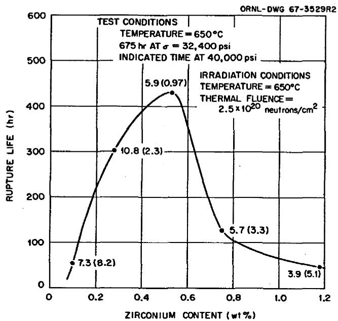  
Fig. 47. Influence of Zirconium Content on the Creep-Rupture Properties at $650^{\circ}\mathrm{C}$ after Irradiation. All samples annealed at $1177^{\circ}\mathrm{C}$ before irradiation.

point. The rupture life increased rapidly with zirconium content up to a maximum for an alloy containing $0.53\%$ Zr. The alloys containing less zirconium had better fracture strains under these test conditions; however, all alloys containing $0.1\%$ Zr or more had excellent fracture strains after irradiation. The minimum creep rates for these same samples are given in Fig. 48. The creep rates at both stress levels exhibited a definite minimum for the alloy containing $0.53\%$ Zr. The creep rates for the unirradiated control samples are also shown in Fig. 48 at the 32,400 psi stress level. The minimum creep rate was not affected detectably by irradiation except for the alloys containing $0.75$ and $1.18\%$ Zr.

A second irradiation experiment exposed samples to a thermal-neutron fluence of $9 \times 10^{19}$ neutrons/cm² at $50^{\circ}\mathrm{C}$ . These results are summarized

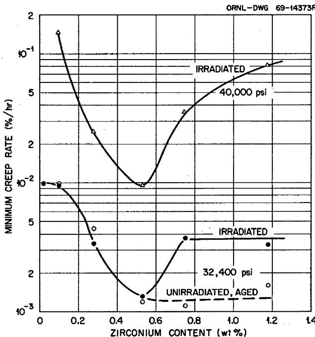  
Fig. 48. Influence of Zirconium Content on the Creep Rates at $650^{\circ}\mathrm{C}$ . All samples annealed 1 hr at $1177^{\circ}\mathrm{C}$ before irradiation at $650^{\circ}\mathrm{C}$ .

in Table 23. Because of the different stress levels involved, the results are difficult to compare with those presented previously. However, the following points can be established by cross-plotting results:

Table 23. Creep Properties at $650^{\circ}\mathrm{C}$ of Irradiateda Alloys That Contain Various Amounts of Zirconium   

<table><tr><td>Alloy Number</td><td>Specimen Number</td><td>Test Number</td><td>Zirconium Content (wt %)</td><td>Stress (psi)</td><td>Rupture Life (hr)</td><td>Minimum Creep Rate (%/hr)</td><td>Elongation (%)</td></tr><tr><td></td><td></td><td></td><td></td><td>× 103</td><td></td><td></td><td></td></tr><tr><td>100</td><td>1911</td><td>R-257</td><td>&lt; 0.03</td><td>40</td><td>68.9</td><td>0.019</td><td>1.79</td></tr><tr><td>108</td><td>2080</td><td>R-283</td><td>0.10</td><td>40</td><td>314.9</td><td>0.014</td><td>8.03</td></tr><tr><td>108</td><td></td><td></td><td></td><td>55b</td><td>5.1</td><td>0.96</td><td>5.05</td></tr><tr><td>109</td><td>2059</td><td>R-285</td><td>0.28</td><td>47b</td><td>158.6</td><td>0.010</td><td>2.42</td></tr><tr><td>109</td><td></td><td></td><td></td><td>55b</td><td>43.0</td><td>0.116</td><td>5.26</td></tr><tr><td>110</td><td>2110</td><td>R-292</td><td>0.53</td><td>47</td><td>453.3</td><td>0.0063</td><td>7.52</td></tr><tr><td>111</td><td>2136</td><td>R-293</td><td>0.75</td><td>47</td><td>714.6</td><td>0.0076</td><td>15.5</td></tr><tr><td>112</td><td>2161</td><td>R-307</td><td>1.18</td><td>47</td><td>905.7</td><td>0.0028</td><td>5.32</td></tr><tr><td>112</td><td></td><td></td><td></td><td>55b</td><td>74.5</td><td>0.059</td><td>5.24</td></tr></table>

aAnnealed 1 hr at $1177^{\circ} \mathrm{C}$ before irradiation at $50^{\circ} \mathrm{C}$ to a thermal fluence of $9 \times 10^{19}$ neutrons/cm².   
bLoad increased during test.

(1) the rupture life increased and the creep rate decreased continuously with increasing zirconium (Table 23); (2) the rupture lives of these samples were greater than those of samples irradiated at $650^{\circ}\mathrm{C}$ (Table 22); (3) the minimum creep rates were lower than those observed before irradiation (Fig. 45); and (4) the fracture strains were all quite good.

Tests were run at $760^{\circ}\mathrm{C}$ on several samples; the results are shown in Table 24. For samples irradiated and tested at $760^{\circ}\mathrm{C}$ , the minimum creep rate decreased with increasing zirconium (Fig. 49). The fracture strain seemed to go through a maximum in alloys that contained 0.1 to $0.28\%$ Zr. Test samples of alloy 108 ( $0.1\%$ Zr) indicated that the irradiation temperature had very little effect when the test temperature was $760^{\circ}\mathrm{C}$ . A test sample of this same composition also indicated that annealing at $650^{\circ}\mathrm{C}$ after irradiation at $43^{\circ}\mathrm{C}$ had very little effect on the properties. A single sample of alloy 112 ( $1.18\%$ Zr) was irradiated at $760^{\circ}\mathrm{C}$ and tested at $650^{\circ}\mathrm{C}$ . The rupture life at 30,000 psi was only 444.9 hr compared with more than 675 hr for a sample stressed at 32,400 psi after irradiation at $650^{\circ}\mathrm{C}$ (Table 22). However, the fracture strain was quite good for both samples.

Two other alloys were made that contained a nominal $1\%$ Zr. These two alloys, designated 146 and 147, also contained 0.1 and $1\%$ Re, respectively, an addition that was made in an attempt to improve the weldability. These alloys were creep tested in the irradiated and unirradiated conditions; the results are given in Tables 25 and 26, and the stress-rupture properties are shown graphically in Fig. 50. The stress-rupture properties of the unirradiated samples are about the same for both heats and quite similar to those shown in Fig. 44 for alloy 108 ( $1.18\%$ Zr). Thus, rhenium does not appear to be a very influential addition; the properties are basically those of an alloy containing $1\%$ Zr. The single test of an unirradiated sample of each heat that had been aged for 1000 hr at $760^{\circ}\mathrm{C}$ indicates an instability in this alloy. This anneal decreased the rupture life and increased the minimum creep rate. Irradiation at $650^{\circ}\mathrm{C}$ reduced the rupture life and fracture strain when samples were tested at $650^{\circ}\mathrm{C}$ (Fig. 50). Irradiation at a higher temperature further reduced rupture life, but the fracture strain remained reasonably high.

Table 24. Creep Properties of Irradiated ${}^{a}$ Alloys That Contain Various Amounts of Zirconium   

<table><tr><td rowspan="2">Alloy Number</td><td rowspan="2">Specimen Number</td><td rowspan="2">Test Number</td><td rowspan="2">Zirconium Content (wt %)</td><td colspan="2">Temperature, °C</td><td rowspan="2">Neutron Fluence (neutrons/cm2)</td><td rowspan="2">Stress (psi)</td><td rowspan="2">Rupture Life (hr)</td><td rowspan="2">Minimum Creep Rate (%/hr)</td><td rowspan="2">Elongation (%)</td></tr><tr><td>Irradiation</td><td>Test</td></tr><tr><td></td><td></td><td></td><td></td><td></td><td></td><td>×1020</td><td>×103</td><td></td><td></td><td></td></tr><tr><td>100</td><td>3791</td><td>R-455</td><td>&lt; 0.03</td><td>657</td><td>760</td><td>2.5</td><td>12.5</td><td>1.0</td><td>0.10</td><td>0.21</td></tr><tr><td>108</td><td>2089</td><td>R-284b</td><td>0.10</td><td>43</td><td>760</td><td>0.9</td><td>15</td><td>468.1</td><td>0.037</td><td>36.1</td></tr><tr><td>108</td><td>2093</td><td>R-291b</td><td>0.10</td><td>43</td><td>760</td><td>0.9</td><td>15</td><td>380.9</td><td>0.049</td><td>28.3</td></tr><tr><td>108</td><td>3861</td><td>R-448</td><td>0.10</td><td>750</td><td>760</td><td>2.5</td><td>12.5</td><td>665.2</td><td>0.026</td><td>35.3</td></tr><tr><td>109</td><td>3871</td><td>R-456c</td><td>0.28</td><td>750</td><td>760</td><td>2.5</td><td>12.5</td><td>1009.6</td><td>0.0094</td><td>14.4</td></tr><tr><td></td><td></td><td></td><td></td><td></td><td></td><td></td><td>15</td><td>310.4</td><td>0.062</td><td>23.8</td></tr><tr><td></td><td></td><td></td><td></td><td></td><td></td><td></td><td>17.5</td><td>7.9</td><td>0.37</td><td>3.9</td></tr><tr><td>110</td><td>3881</td><td>R-447c</td><td>0.53</td><td>760</td><td>760</td><td>2.5</td><td>12.5</td><td>1007.4</td><td>0.0084</td><td>11.1</td></tr><tr><td></td><td></td><td></td><td></td><td></td><td></td><td></td><td>15</td><td>262.4</td><td>0.014</td><td>3.8</td></tr><tr><td></td><td></td><td></td><td></td><td></td><td></td><td></td><td>17.5</td><td>167.6</td><td>0.038</td><td>16.6</td></tr><tr><td>111</td><td>3891</td><td>R-459c</td><td>0.75</td><td>740</td><td>760</td><td>2.5</td><td>12.5</td><td>1296.3</td><td>0.0047</td><td>10.4</td></tr><tr><td></td><td></td><td></td><td></td><td></td><td></td><td></td><td>17.5</td><td>308.6</td><td>0.043</td><td>19.2</td></tr><tr><td>112</td><td>3901</td><td>R-457c</td><td>1.18</td><td>740</td><td>760</td><td>2.5</td><td>12.5</td><td>1008.8</td><td>0.0013</td><td>2.5</td></tr><tr><td></td><td></td><td></td><td></td><td></td><td></td><td></td><td>15</td><td>310.4</td><td>0.013</td><td>4.2</td></tr><tr><td></td><td></td><td></td><td></td><td></td><td></td><td></td><td>17.5</td><td>218.4</td><td>0.041</td><td>12.4</td></tr><tr><td>112</td><td>3910</td><td>R-814</td><td>1.18</td><td>760</td><td>650</td><td>2.6</td><td>30</td><td>444.9</td><td>0.017</td><td>10.1</td></tr></table>

aAnnealed 1 hr at 1177°C before irradiation.   
bAnnealed 1000 hr at $650^{\circ}C$ after irradiation.   
cStress increased during test as indicated.

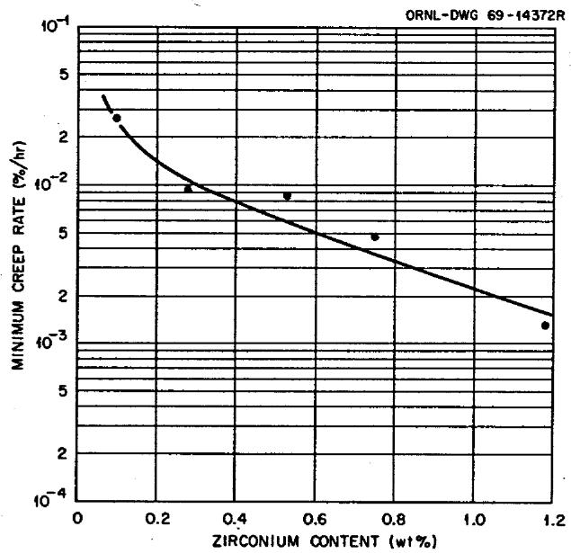  
Fig. 49. Variation of the Minimum Creep Rate at $760^{\circ}\mathrm{C}$ and 12,500 psi with Zirconium Concentration. Samples annealed 1 hr at $1177^{\circ}\mathrm{C}$ and irradiated at $760^{\circ}\mathrm{C}$ to a thermal fluence of $2.5 \times 10^{20}$ neutrons/cm $^2$ .

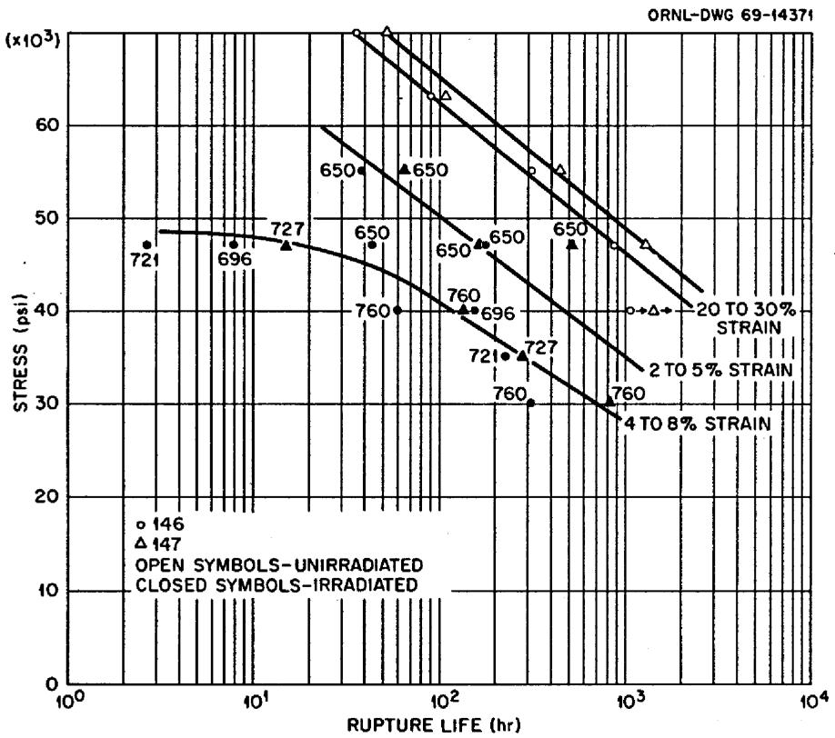  
Fig. 50. Stress-Rupture Properties at $650^{\circ}\mathrm{C}$ of Alloys 146 and 147. All samples annealed 1 hr at $1177^{\circ}\mathrm{C}$ before testing. Numbers by each point designate the irradiation temperature.

Table 25. Creep Properties of Irradiated and Unirradiated Alloy 146   

<table><tr><td>Specimen Number</td><td>Test Number</td><td>Anneala Before Irradiation</td><td colspan="2">Temperature, °C</td><td>Thermal Neutron Fluence (neutrons/cm2)</td><td>Stress (psi)</td><td>Rupture Life (hr)</td><td>Minimum Creep Rate (%/hr)</td><td>Elongation (%)</td><td>Reduction in Area (%)</td></tr><tr><td></td><td></td><td></td><td></td><td>×1020</td><td>×103</td><td></td><td></td><td></td><td></td><td></td></tr><tr><td>3515</td><td>6647</td><td>121</td><td></td><td>650</td><td></td><td>70</td><td>36.1</td><td>0.113</td><td>29.6</td><td>24.7</td></tr><tr><td>3516</td><td>6648</td><td>121</td><td></td><td>650</td><td></td><td>63</td><td>90.1</td><td>0.037</td><td>24.9</td><td>22.2</td></tr><tr><td>3517</td><td>6649</td><td>121</td><td></td><td>650</td><td></td><td>55</td><td>311.3</td><td>0.012</td><td>20.1</td><td>20.6</td></tr><tr><td>3504</td><td>6136</td><td>121</td><td></td><td>650</td><td></td><td>47</td><td>865.5</td><td>0.0049</td><td>22.3</td><td>17.2</td></tr><tr><td>3503</td><td>6135</td><td>121</td><td></td><td>650</td><td></td><td>40</td><td>1003.2b</td><td>0.0023</td><td>5.4</td><td>2.4</td></tr><tr><td>3511</td><td>7769</td><td>148</td><td></td><td>650</td><td></td><td>47</td><td>110.5</td><td>0.16</td><td>20.9</td><td>15.8</td></tr><tr><td>3518</td><td>6650</td><td>121</td><td></td><td>760</td><td></td><td>25</td><td>352.2</td><td>0.016</td><td>32.2</td><td>32.8</td></tr><tr><td>3519</td><td>6651</td><td>121</td><td></td><td>760</td><td></td><td>20</td><td>984.1</td><td>0.0039</td><td>29.1</td><td>51.9</td></tr><tr><td>3509</td><td>R-678</td><td>121</td><td>650</td><td>650</td><td>2.6</td><td>55</td><td>38.4</td><td>0.043</td><td>2.8</td><td></td></tr><tr><td>3510</td><td>R-656</td><td>121</td><td>650</td><td>650</td><td>2.6</td><td>47</td><td>177.4</td><td>0.021</td><td>4.9</td><td></td></tr><tr><td>3508</td><td>R-648</td><td>121</td><td>650</td><td>650</td><td>2.6</td><td>47</td><td>42.7</td><td>0.046</td><td>2.3</td><td></td></tr><tr><td>3522</td><td>R-915</td><td>121</td><td>696</td><td>650</td><td>2.6</td><td>47</td><td>7.9</td><td>0.20</td><td>1.8</td><td></td></tr><tr><td>3523</td><td>R-916</td><td>121</td><td>721</td><td>650</td><td>2.6</td><td>47</td><td>2.7</td><td>1.0</td><td>3.0</td><td></td></tr><tr><td>3526</td><td>R-928</td><td>121</td><td>696</td><td>650</td><td>2.6</td><td>40</td><td>153.5</td><td>0.024</td><td>4.9</td><td></td></tr><tr><td>3512</td><td>R-801</td><td>121</td><td>760</td><td>650</td><td>2.6</td><td>40</td><td>59.0</td><td>0.071</td><td>4.8</td><td></td></tr><tr><td>3528</td><td>R-935</td><td>121</td><td>721</td><td>650</td><td>2.6</td><td>35</td><td>226.3</td><td>0.022</td><td>7.2</td><td></td></tr><tr><td>3513</td><td>R-830</td><td>121</td><td>760</td><td>650</td><td>2.6</td><td>30</td><td>306.3</td><td>0.016</td><td>5.4</td><td></td></tr><tr><td>3506</td><td>R-552</td><td>121</td><td>760</td><td>760</td><td>2.4</td><td>15</td><td>380.1</td><td>0.0211</td><td>10.6</td><td></td></tr></table>

aAnnealing designations: 121 = annealed 1 hr at $1177^{\circ}\mathrm{C}$ 148 = annealed 1 hr at $1177^{\circ}\mathrm{C}$ plus 1000 hr at $760^{\circ}\mathrm{C}$ .   
Test discontinued before failure.

Table 26. Creep Properties of Irradiated and Unirradiated Alloy 147   

<table><tr><td rowspan="2">Specimen Number</td><td rowspan="2">Test Number</td><td rowspan="2">Anneal a Before Irradiation</td><td colspan="2">Temperature, °C</td><td rowspan="2">Thermal Neutron Fluence (neutrons/cm2)</td><td rowspan="2">Stress (psi)</td><td rowspan="2">Rupture Life (hr)</td><td rowspan="2">Minimum Creep Rate (%/hr)</td><td rowspan="2">Elongation (%)</td><td rowspan="2">Reduction in Area (%)</td></tr><tr><td>Irradiation</td><td>Test</td></tr><tr><td></td><td></td><td></td><td></td><td></td><td>× 1020</td><td>× 103</td><td></td><td></td><td></td><td></td></tr><tr><td>4031</td><td>6652</td><td>121</td><td></td><td>650</td><td></td><td>70</td><td>51.8</td><td>0.069</td><td>26.2</td><td>20.0</td></tr><tr><td>4032</td><td>6653</td><td>121</td><td></td><td>650</td><td></td><td>63</td><td>106.2</td><td>0.038</td><td>23.3</td><td>16.6</td></tr><tr><td>4033</td><td>6654</td><td>121</td><td></td><td>650</td><td></td><td>55</td><td>461.1</td><td>0.10</td><td>22.1</td><td>17.8</td></tr><tr><td>4045</td><td>6116</td><td>121</td><td></td><td>650</td><td></td><td>47</td><td>1289.5</td><td>0.0054</td><td>25.3</td><td>21.5</td></tr><tr><td>4044</td><td>6117</td><td>121</td><td></td><td>650</td><td></td><td>40</td><td>1147.8b</td><td>0.0014</td><td>4.2</td><td>2.6</td></tr><tr><td>4038</td><td>7770</td><td>148</td><td></td><td>650</td><td></td><td>47</td><td>53.8</td><td>0.19</td><td>12.7</td><td>14.5</td></tr><tr><td>4034</td><td>6655</td><td>121</td><td></td><td>760</td><td></td><td>25</td><td>453.3</td><td>0.018</td><td>55.4</td><td>37.7</td></tr><tr><td>4035</td><td>6656</td><td>121</td><td></td><td>760</td><td></td><td>20</td><td>1240.1</td><td>0.0039</td><td>29.2</td><td>34.1</td></tr><tr><td>4028</td><td>R-679</td><td>121</td><td>650</td><td>650</td><td>2.6</td><td>55</td><td>65.2</td><td>0.0089</td><td>1.4</td><td></td></tr><tr><td>4030</td><td>R-687</td><td>121</td><td>650</td><td>650</td><td>2.6</td><td>47</td><td>508.1</td><td>0.0068</td><td>4.8</td><td></td></tr><tr><td>4027</td><td>R-647</td><td>121</td><td>650</td><td>650</td><td>2.6</td><td>47</td><td>164.2</td><td>0.0095</td><td>3.2</td><td></td></tr><tr><td>4037</td><td>R-917</td><td>121</td><td>727</td><td>650</td><td>2.6</td><td>47</td><td>15.0</td><td>0.29</td><td>3.5</td><td></td></tr><tr><td>4051</td><td>R-802</td><td>121</td><td>760</td><td>650</td><td>2.6</td><td>40</td><td>136.4</td><td>0.027</td><td>4.3</td><td></td></tr><tr><td>4041</td><td>R-934</td><td>121</td><td>727</td><td>650</td><td>2.6</td><td>35</td><td>274.1</td><td>0.017</td><td>5.8</td><td></td></tr><tr><td>4052</td><td>R-832</td><td>121</td><td>760</td><td>650</td><td>2.6</td><td>30</td><td>804.4</td><td>0.0078</td><td>8.2</td><td></td></tr><tr><td>4049</td><td>R-553</td><td>121</td><td>685</td><td>760</td><td>2.4</td><td>15</td><td>1082.1</td><td>0.011</td><td>15.6</td><td></td></tr></table>

$^{\text{a}}$ Annealing designations: 121 = annealed 1 hr at $1177^{\circ}\mathrm{C}$ ,   
148 = annealed 1 hr at $1177^{\circ}C$ plus 1000 hr at $760^{\circ}C$ .   
Test discontinued before failure.

The two 100-lb commercial melts, heat 21555 (0.05% Zr) and 21554 (0.35% Zr) were evaluated in both tensile and creep tests. The tensile results are shown in Tables 27 and 28. The tests on heat 21555 after irradiation showed that the coarse-grained material had superior ductility and that the fine-grained material had higher yield strength. The tensile results for heat 21554 (0.35% Zr) are summarized in Table 28, and the fracture strain for the fine-grained material is shown in Fig. 51. The behavior is similar to that observed for standard Hastelloy N, but at $760^{\circ}\mathrm{C}$ the ductility of the zirconium-modified alloy was much lower. The strong dependence of fracture strain on strain rate at $760^{\circ}\mathrm{C}$ was also quite unusual where the fracture strain was higher at the lower strain rate. After irradiation, the fracture strain of the fine-grained material was generally reduced, and the reduction was larger at higher test temperatures (Fig. 52). The ratios of the various properties in the irradiated and unirradiated alloys are shown in Fig. 53. The yield and ultimate tensile strengths were not affected appreciably by irradiation. The elongation remained high with increasing temperature and dropped at test temperatures above $600^{\circ}\mathrm{C}$ . The high ratio at $760^{\circ}\mathrm{C}$ is due to the very low fracture strain of the unirradiated sample. The reduction in area follows the normal pattern for standard Hastelloy N.

Further analysis of the results in Table 28 shows the effects of various annealing treatments. Several samples were annealed for 100 hr at $871^{\circ}\mathrm{C}$ followed by 1000 hr at $650^{\circ}\mathrm{C}$ . The strengths were lower and the fracture strains higher than those of the samples held at $650^{\circ}\mathrm{C}$ for a much longer time. Two samples were annealed for 1 hr at $1177^{\circ}\mathrm{C}$ and then for 1000 hr at $760^{\circ}\mathrm{C}$ . This treatment gave good strength and ductility characteristics. Some samples were irradiated that had heat treatments other than those already discussed. The strains after irradiation were higher for samples annealed for 1 hr at $1177^{\circ}\mathrm{C}$ than for those annealed at $871^{\circ}\mathrm{C}$ .

Irradiated and unirradiated samples of heats 21555 (0.05% Zr) and 21554 (0.35% Zr) were tested in creep. The creep results at $650^{\circ}\mathrm{C}$ for heat 21555 are given in Tables 29 and 30, and the stress-rupture properties are shown in Fig. 54. In the unirradiated conditions, the optimum rupture life was obtained after a 1-hr anneal at $1177^{\circ}\mathrm{C}$ . Further aging

Table 27. Tensile Properties of Irradiated and Unirradiated Alloy 21555 (0.05% Zr)   

<table><tr><td rowspan="2">Specimen Number</td><td rowspan="2">Anneal\(^{a}\) Before Irradiation</td><td colspan="2">Temperature, °C</td><td rowspan="2">Thermal Neutron Fluence (neutrons/cm2)</td><td rowspan="2">Strain Rate (min-1)</td><td colspan="2">Stress, psi</td><td colspan="2">Elongation, %</td><td rowspan="2">Reduction in Area (%)</td></tr><tr><td>Irradiation</td><td>Test</td><td>Yield</td><td>Ultimate Tensile</td><td>Uniform</td><td>Total</td></tr><tr><td></td><td></td><td></td><td></td><td>× 1020</td><td></td><td>× 103</td><td>× 103</td><td></td><td></td><td></td></tr><tr><td>2488</td><td>36</td><td></td><td>600</td><td></td><td>0.002</td><td>24.4</td><td>4.1</td><td>50.2</td><td>52.5</td><td>37.6</td></tr><tr><td>2493</td><td>36</td><td></td><td>650</td><td></td><td>0.05</td><td>24.4</td><td>74.2</td><td>55.0</td><td>59.0</td><td>40.1</td></tr><tr><td>2494</td><td>36</td><td></td><td>650</td><td></td><td>0.002</td><td>25.2</td><td>66.8</td><td>33.0</td><td>42.6</td><td>35.2</td></tr><tr><td>2496</td><td>36</td><td></td><td>700</td><td></td><td>0.002</td><td>22.8</td><td>54.6</td><td>20.2</td><td>40.8</td><td>41.3</td></tr><tr><td>2478</td><td>148</td><td></td><td>25</td><td></td><td>0.05</td><td>43.9</td><td>116.1</td><td>54.3</td><td>56.9</td><td>44.2</td></tr><tr><td>2479</td><td>148</td><td></td><td>650</td><td></td><td>0.002</td><td>27.3</td><td>66.9</td><td>30.7</td><td>33.7</td><td>31.5</td></tr><tr><td>2480</td><td>121</td><td>540</td><td>650</td><td>2.5</td><td>0.05</td><td>26.6</td><td>63.6</td><td>43.3</td><td>45.0</td><td>33.8</td></tr><tr><td>2481</td><td>121</td><td>540</td><td>650</td><td>2.5</td><td>0.002</td><td>27.1</td><td>60</td><td>27.5</td><td>28.3</td><td>20.5</td></tr><tr><td>2464</td><td>16</td><td>540</td><td>650</td><td>2.5</td><td>0.05</td><td>36.8</td><td>60.2</td><td>11.3</td><td>11.9</td><td>12.6</td></tr><tr><td>2465</td><td>16</td><td>540</td><td>650</td><td>2.5</td><td>0.002</td><td>37.7</td><td>48.2</td><td>5.8</td><td>6.0</td><td>7.9</td></tr></table>

aAnnealing designations: 36 = 100 hr at $871^{\circ}C$ plus 1000 hr at $650^{\circ}C,$   
148 = 1 hr at $1177^{\circ}C$ plus 1000 hr at $760^{\circ}C$ ,   
121 = 1 hr at 1177°C,   
16 = 100 hr at $871^{\circ}C$

Table 28. Tensile Properties of Irradiated and Unirradiated Alloy 21554 (0.35% Zr)   

<table><tr><td rowspan="2">Specimen Number</td><td rowspan="2">Anneala Before Irradiation</td><td colspan="2">Temperature, °C</td><td rowspan="2">Thermal- Neutron Fluence (neutrons/cm2)</td><td rowspan="2">Strain Rate (min-1)</td><td colspan="2">Stress, psi</td><td colspan="2">Elongation, %</td><td rowspan="2">Reduction in Area (%)</td></tr><tr><td>Irradiation</td><td>Test</td><td>Yield</td><td>Ultimate Tensile</td><td>Uniform</td><td>Total</td></tr><tr><td></td><td></td><td></td><td></td><td>× 1020</td><td></td><td>× 103</td><td>× 103</td><td></td><td></td><td></td></tr><tr><td>5543</td><td>104</td><td></td><td>25</td><td></td><td>0.05</td><td>67.7</td><td>128.7</td><td>42.3</td><td>47.0</td><td>56.33</td></tr><tr><td>5544</td><td>104</td><td></td><td>200</td><td></td><td>0.05</td><td>60</td><td>115.9</td><td>39.9</td><td>42.9</td><td>59.80</td></tr><tr><td>5545</td><td>104</td><td></td><td>400</td><td></td><td>0.05</td><td>54.7</td><td>109.2</td><td>40.7</td><td>44.4</td><td>46.82</td></tr><tr><td>5553</td><td>104</td><td></td><td>400</td><td></td><td>0.002</td><td>54.2</td><td>111.8</td><td>45.8</td><td>48.3</td><td>53.59</td></tr><tr><td>5546</td><td>104</td><td></td><td>450</td><td></td><td>0.05</td><td>53</td><td>107.2</td><td>41.3</td><td>44.3</td><td>54.56</td></tr><tr><td>5554</td><td>104</td><td></td><td>450</td><td></td><td>0.002</td><td>55.9</td><td>110.5</td><td>42.7</td><td>48.1</td><td>48.26</td></tr><tr><td>5547</td><td>104</td><td></td><td>500</td><td></td><td>0.05</td><td>51.4</td><td>106.9</td><td>42.5</td><td>44.8</td><td>49.79</td></tr><tr><td>5555</td><td>104</td><td></td><td>500</td><td></td><td>0.002</td><td>58.6</td><td>111.4</td><td>39.9</td><td>45.3</td><td>43.69</td></tr><tr><td>5548</td><td>104</td><td></td><td>550</td><td></td><td>0.05</td><td>58.7</td><td>106.9</td><td>38.7</td><td>43.2</td><td>42.73</td></tr><tr><td>5556</td><td>104</td><td></td><td>550</td><td></td><td>0.002</td><td>59.8</td><td>101.3</td><td>26.4</td><td>28.0</td><td>24.70</td></tr><tr><td>5549</td><td>104</td><td></td><td>600</td><td></td><td>0.05</td><td>53.4</td><td>102</td><td>37.0</td><td>30.3</td><td>31.44</td></tr><tr><td>5557</td><td>104</td><td></td><td>600</td><td></td><td>0.002</td><td>56.8</td><td>91</td><td>22.7</td><td>25.0</td><td>24.18</td></tr><tr><td>5550</td><td>104</td><td></td><td>650</td><td></td><td>0.05</td><td>46.4</td><td>87.5</td><td>27.6</td><td>30.4</td><td>31.88</td></tr><tr><td>5558</td><td>104</td><td></td><td>650</td><td></td><td>0.002</td><td>55.8</td><td>75.5</td><td>13.3</td><td>46.6</td><td>63.15</td></tr><tr><td>5551</td><td>104</td><td></td><td>760</td><td></td><td>0.05</td><td>43.7</td><td>59</td><td>4.0</td><td>8.1</td><td>64.27</td></tr><tr><td>5559</td><td>104</td><td></td><td>760</td><td></td><td>0.002</td><td>37.9</td><td>37.9</td><td>1.6</td><td>47.4</td><td>69.45</td></tr><tr><td>5552</td><td>104</td><td></td><td>850</td><td></td><td>0.05</td><td>36.9</td><td>37.7</td><td>7.5</td><td>56.5</td><td>69.70</td></tr><tr><td>5560</td><td>104</td><td></td><td>850</td><td></td><td>0.002</td><td>22</td><td>22</td><td>100.0</td><td>46.9</td><td>60.94</td></tr><tr><td>10094</td><td>121</td><td></td><td>25</td><td></td><td>0.05</td><td>37.5</td><td>102.2</td><td>72.6</td><td>76.3</td><td>62.6</td></tr><tr><td>10095</td><td>121</td><td></td><td>200</td><td></td><td>0.05</td><td>33.2</td><td>100.1</td><td>64.0</td><td>65.3</td><td>46.3</td></tr><tr><td>10096</td><td>121</td><td></td><td>400</td><td></td><td>0.05</td><td>29.8</td><td>96.8</td><td>71.8</td><td>77.8</td><td>61.8</td></tr><tr><td>10097</td><td>121</td><td></td><td>500</td><td></td><td>0.05</td><td>25.6</td><td>84.4</td><td>79.9</td><td>83.7</td><td>50.7</td></tr><tr><td>10098</td><td>121</td><td></td><td>550</td><td></td><td>0.05</td><td>26.9</td><td>89.8</td><td>75.8</td><td>78.3</td><td>54.5</td></tr><tr><td>10099</td><td>121</td><td></td><td>600</td><td></td><td>0.05</td><td>27.4</td><td>89.1</td><td>74.3</td><td>78.0</td><td>49.6</td></tr><tr><td>10103</td><td>121</td><td></td><td>600</td><td></td><td>0.002</td><td>26.2</td><td>81</td><td>55.7</td><td>57.1</td><td>47.2</td></tr><tr><td>10100</td><td>121</td><td></td><td>650</td><td></td><td>0.05</td><td>25.7</td><td>81.2</td><td>65.8</td><td>68.5</td><td>44.1</td></tr><tr><td>10104</td><td>121</td><td></td><td>650</td><td></td><td>0.002</td><td>25.9</td><td>72.2</td><td>45.5</td><td>46.5</td><td>32.6</td></tr><tr><td>10101</td><td>121</td><td></td><td>700</td><td></td><td>0.05</td><td>25.8</td><td>72.5</td><td>47.0</td><td>48.7</td><td>38.9</td></tr><tr><td>10102</td><td>121</td><td></td><td>760</td><td></td><td>0.05</td><td>24.7</td><td>66</td><td>38.0</td><td>40.2</td><td>23.6</td></tr><tr><td>10105</td><td>121</td><td></td><td>760</td><td></td><td>0.002</td><td>24</td><td>45.5</td><td>11.5</td><td>33.5</td><td>29.9</td></tr><tr><td>2431</td><td>36</td><td></td><td>600</td><td></td><td>0.002</td><td>39.8</td><td>81</td><td>29.2</td><td>46.8</td><td>48.5</td></tr><tr><td>2436</td><td>36</td><td></td><td>650</td><td></td><td>0.05</td><td>26.5</td><td>71.3</td><td>51.6</td><td>60.6</td><td>42.5</td></tr><tr><td>2534</td><td>36</td><td></td><td>650</td><td></td><td>0.05</td><td>26</td><td>78.3</td><td>50.8</td><td>54.4</td><td>35.1</td></tr><tr><td>2437</td><td>36</td><td></td><td>650</td><td></td><td>0.002</td><td>27.2</td><td>69.1</td><td>43.5</td><td>49.6</td><td>31.4</td></tr><tr><td>2438</td><td>36</td><td></td><td>650</td><td></td><td>0.002</td><td>25.5</td><td>65.5</td><td>41.0</td><td>45.7</td><td>39.2</td></tr><tr><td>2439</td><td>36</td><td></td><td>700</td><td></td><td>0.002</td><td>25.2</td><td>56.7</td><td>18.7</td><td>34.4</td><td>31.2</td></tr><tr><td>10092</td><td>148</td><td></td><td>25</td><td></td><td>0.05</td><td>47.3</td><td>114.5</td><td>53.5</td><td>55.1</td><td>41.7</td></tr><tr><td>10093</td><td>148</td><td></td><td>650</td><td></td><td>0.002</td><td>30.1</td><td>68.9</td><td>37.3</td><td>47.3</td><td>42.9</td></tr><tr><td>9110</td><td>16</td><td>650</td><td>25</td><td>4.1</td><td>0.05</td><td>64.2</td><td>122.1</td><td>44.1</td><td>47.5</td><td>39.08</td></tr><tr><td>9111</td><td>16</td><td>650</td><td>200</td><td>4.1</td><td>0.05</td><td>61</td><td>116.1</td><td>43.7</td><td>46.0</td><td>51.90</td></tr><tr><td>9112</td><td>16</td><td>650</td><td>400</td><td>4.1</td><td>0.05</td><td>52.7</td><td>109.1</td><td>42.5</td><td>46.2</td><td>34.96</td></tr><tr><td>9131</td><td>16</td><td>650</td><td>400</td><td>4.1</td><td>0.002</td><td>64.6</td><td>112.6</td><td>39.5</td><td>45.2</td><td>36.26</td></tr><tr><td>9114</td><td>16</td><td>650</td><td>450</td><td>4.1</td><td>0.05</td><td>56</td><td>110.2</td><td>39.8</td><td>42.3</td><td>33.24</td></tr><tr><td>9132</td><td>16</td><td>650</td><td>450</td><td>4.1</td><td>0.002</td><td>57.4</td><td>107.9</td><td>41.8</td><td>45.7</td><td>33.94</td></tr><tr><td>9115</td><td>16</td><td>650</td><td>500</td><td>4.1</td><td>0.05</td><td>56.9</td><td>109.9</td><td>40.4</td><td>43.4</td><td>33.48</td></tr><tr><td>9113</td><td>16</td><td>650</td><td>500</td><td>4.1</td><td>0.002</td><td>50.5</td><td>119.7</td><td>43.4</td><td>45.6</td><td>25.54</td></tr><tr><td>9116</td><td>16</td><td>650</td><td>550</td><td>4.1</td><td>0.05</td><td>60.2</td><td>107.7</td><td>44.5</td><td>47.5</td><td>36.52</td></tr><tr><td>9121</td><td>16</td><td>650</td><td>550</td><td>4.1</td><td>0.002</td><td>43.6</td><td>91.7</td><td>22.5</td><td>23.0</td><td>21.15</td></tr><tr><td>9117</td><td>16</td><td>650</td><td>600</td><td>4.1</td><td>0.05</td><td>52.7</td><td>94.1</td><td>31.0</td><td>32.0</td><td>28.09</td></tr><tr><td>9122</td><td>16</td><td>650</td><td>600</td><td>4.1</td><td>0.002</td><td>50.3</td><td>80.3</td><td>15.7</td><td>16.8</td><td>18.42</td></tr><tr><td>9118</td><td>16</td><td>650</td><td>650</td><td>4.1</td><td>0.05</td><td></td><td></td><td></td><td></td><td>25.54</td></tr><tr><td>9123</td><td>16</td><td>650</td><td>650</td><td>4.1</td><td>0.002</td><td>48.1</td><td>65.6</td><td>10.9</td><td>11.2</td><td>12.39</td></tr><tr><td>9119</td><td>16</td><td>650</td><td>760</td><td>4.1</td><td>0.05</td><td>42.4</td><td>55.4</td><td>6.6</td><td>6.8</td><td>10.89</td></tr><tr><td>9124</td><td>16</td><td>650</td><td>760</td><td>4.1</td><td>0.002</td><td>37.6</td><td>37.9</td><td>1.7</td><td>5.4</td><td>4.74</td></tr><tr><td>9120</td><td>16</td><td>650</td><td>850</td><td>4.1</td><td>0.05</td><td>34.8</td><td>38.6</td><td>3.1</td><td>6.4</td><td>6.27</td></tr><tr><td>9125</td><td>16</td><td>650</td><td>850</td><td>4.1</td><td>0.002</td><td>3.8</td><td>12.1</td><td>5.1</td><td>10.4</td><td>13.88</td></tr><tr><td>2405</td><td>121</td><td>570</td><td>650</td><td>2.5</td><td>0.05</td><td>28.6</td><td>63.1</td><td>43.0</td><td>48.8</td><td>31.9</td></tr><tr><td>2406</td><td>121</td><td>575</td><td>650</td><td>2.5</td><td>0.002</td><td>30.5</td><td>56.6</td><td>28.4</td><td>32.6</td><td>34.0</td></tr><tr><td>2395</td><td>16</td><td>550</td><td>650</td><td>2.5</td><td>0.05</td><td>36.3</td><td>60.2</td><td>12.0</td><td>12.4</td><td>14.3</td></tr><tr><td>2396</td><td>16</td><td>550</td><td>650</td><td>2.5</td><td>0.002</td><td>38.7</td><td>50.9</td><td>6.3</td><td>6.5</td><td>8.8</td></tr></table>

aAnnealing designations: 16 = 100 hr at $871^{\circ}C$ 36 = 100 hr at $871^{\circ}C$ plus 1000 hr at $650^{\circ}C$ 148 = 1 hr at $1177^{\circ}C$ plus 1000 hr at $760^{\circ}C$ 121 = 1 hr at $1177^{\circ}C$ 104 = 100 hr at $871^{\circ}C$ plus 5600 hr at $650^{\circ}C$

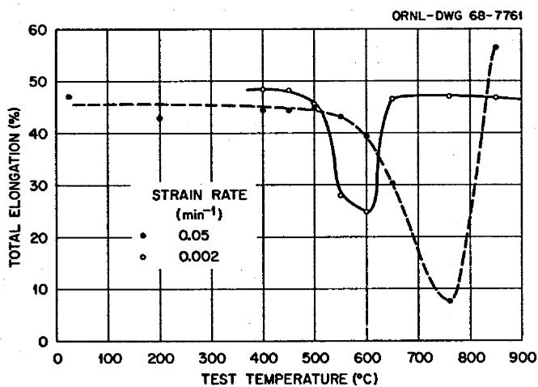  
Fig. 51. Variation of Ductility with Temperature for Control Specimens of Zirconium-Modified Hastelloy N (Heat 21554). Annealed 100 hr at $871^{\circ}\mathrm{C}$ and aged 5600 hr at $650^{\circ}\mathrm{C}$ in barren salt.

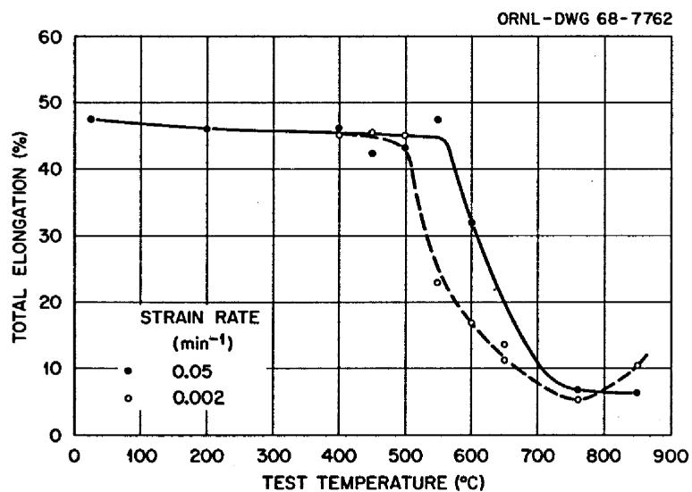  
Fig. 52. Variation of Ductility with Temperature for Molten Salt Reactor Experiment Surveillance Specimens of Zirconium-Modified Hastelloy N (Heat 21554). Thermal fluence was $4.1 \times 10^{20}$ neutrons/cm $^2$ . Samples annealed 100 hr at $871^{\circ}\mathrm{C}$ before irradiation over a period of 5600 hr at $650^{\circ}\mathrm{C}$ .

Table 29. Creep Properties of Unirradiated Alloy 21555 (0.05% Zr)   

<table><tr><td>Specimen Number</td><td>Test Number</td><td>Anneal a Before Test</td><td>Test Temperature (°C)</td><td>Stress (psi)</td><td>Rupture Life (hr)</td><td>Minimum Creep Rate (%/hr)</td><td>Elongation (%)</td><td>Reduction in Area (%)</td></tr><tr><td></td><td></td><td></td><td></td><td>× 103</td><td></td><td></td><td></td><td></td></tr><tr><td>2500</td><td>6312</td><td>121</td><td>650</td><td>70</td><td>3.5</td><td>1.49</td><td>37.3</td><td>36.1</td></tr><tr><td>2506</td><td>6313</td><td>121</td><td>650</td><td>62</td><td>17.0</td><td>0.39</td><td>32.5</td><td>35.3</td></tr><tr><td>2506</td><td>6314</td><td>121</td><td>650</td><td>55</td><td>62.5</td><td>0.12</td><td>28.1</td><td>26.1</td></tr><tr><td>2507</td><td>6315</td><td>121</td><td>650</td><td>47</td><td>231.3</td><td>0.026</td><td>39.7</td><td>33.2</td></tr><tr><td>2501</td><td>6316</td><td>121</td><td>650</td><td>40</td><td>451.5</td><td>0.0085</td><td>34.7</td><td>32.0</td></tr><tr><td>2509</td><td>6317</td><td>121</td><td>650</td><td>35</td><td>1115.6</td><td>0.0065</td><td>31.8</td><td>32.8</td></tr><tr><td>2498</td><td>5863</td><td>37</td><td>650</td><td>40</td><td>511.2</td><td>0.0153</td><td>41.5</td><td>37.7</td></tr><tr><td>2497</td><td>6163</td><td>37</td><td>650</td><td>32.4</td><td>1673.8</td><td>0.0050</td><td>34.1</td><td>23.1</td></tr><tr><td>2461</td><td>7669</td><td>148</td><td>650</td><td>62</td><td>3.4</td><td>3.59</td><td>31.4</td><td>38.3</td></tr><tr><td>2459</td><td>7492</td><td>148</td><td>650</td><td>47</td><td>77.1</td><td>0.24</td><td>33.8</td><td>37.8</td></tr><tr><td>2460</td><td>7668</td><td>148</td><td>650</td><td>40</td><td>272.9</td><td>0.062</td><td>29.8</td><td>37.5</td></tr><tr><td>2492</td><td>5859</td><td>36</td><td>650</td><td>47</td><td>77.9</td><td>0.34</td><td>60.0</td><td>56.3</td></tr><tr><td>2490</td><td>6164</td><td>36</td><td>650</td><td>32.4</td><td>1028.9</td><td>0.028</td><td>65.9</td><td>51.0</td></tr><tr><td>2505</td><td>7282</td><td>121</td><td>760</td><td>30</td><td>14.4</td><td>0.64</td><td>38.4</td><td>39.1</td></tr><tr><td>2499</td><td>6357</td><td>121</td><td>760</td><td>20</td><td>183.8</td><td>0.087</td><td>34.6</td><td>27.1</td></tr><tr><td>2512</td><td>7281</td><td>121</td><td>760</td><td>15</td><td>527.3</td><td>0.023</td><td>26.8</td><td>26.9</td></tr></table>

aAnnealing designations:   
121 = annealed 1 hr at $1177^{\circ}C$ ,   
37 = annealed 1 hr at $1177^{\circ}C$ plus 1000 hr at $650^{\circ}C$ ,   
148 = annealed 1 hr at $1177^{\circ}C$ plus 1000 hr at $760^{\circ}C$ ,   
36 = annealed 100 hr at $871^{\circ}C$ plus 1000 hr at $650^{\circ}C$ .

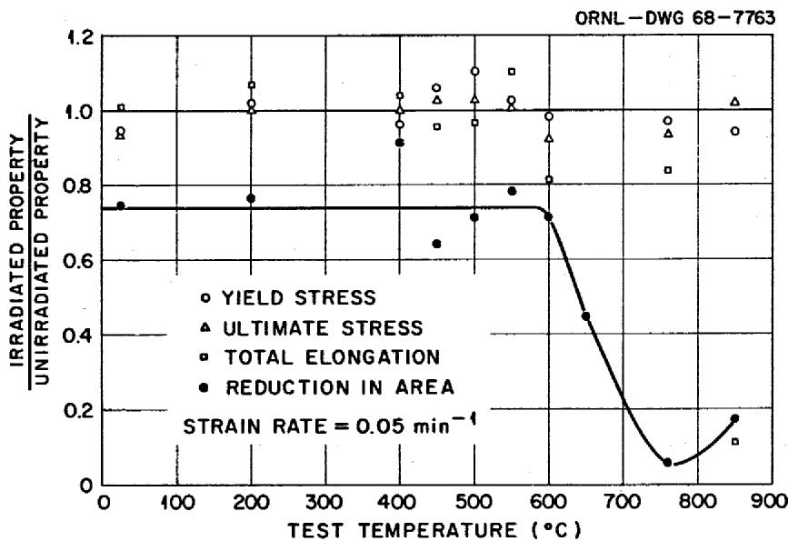  
Fig. 53. Comparison of the Tensile Properties of Irradiated and Unirradiated Zirconium-Modified Hastelloy N (Heat 21554). Thermal fluence was $4.1 \times 10^{20}$ neutrons/cm $^2$ . Annealed 100 hr at $871^{\circ}\mathrm{C}$ and aged or irradiated over a period of 5600 hr at $650^{\circ}\mathrm{C}$ . Tested at a strain rate of $0.05 \, \text{min}^{-1}$ .

Table 30. Creep Properties of Irradiated ${}^{a}$ Alloy 21555 (0.05% Zr)   

<table><tr><td>Specimen Number</td><td>Test Number</td><td>Annealb Before Irradiation</td><td>Stress (psi)</td><td>Rupture Life (hr)</td><td>Minimum Creep Rate (%/hr)</td><td>Elongation (%)</td></tr><tr><td></td><td></td><td colspan="5">× 103</td></tr><tr><td></td><td></td><td colspan="5">Test Temperature 650°C</td></tr><tr><td>2483</td><td>R-381</td><td>121</td><td>47</td><td>106.4</td><td>0.032</td><td>6.7</td></tr><tr><td>2482</td><td>R-259</td><td>121</td><td>40</td><td>410.9</td><td>0.0089</td><td>10.0</td></tr><tr><td>2467</td><td>R-349</td><td>16</td><td>47</td><td>0</td><td></td><td></td></tr><tr><td>2466</td><td>R-268</td><td>16</td><td>40</td><td>20.0</td><td>0.11</td><td>2.6</td></tr><tr><td>2469</td><td>R-350</td><td>16</td><td>35</td><td>45.7</td><td>0.032</td><td>3.0</td></tr><tr><td></td><td></td><td colspan="5">Test Temperature 760°C</td></tr><tr><td>2485</td><td>R-227</td><td>121</td><td>15</td><td>110.1</td><td>0.036</td><td>7.2</td></tr><tr><td>2484</td><td>R-355</td><td>121</td><td>12.5</td><td>349.5</td><td>0.0095</td><td>7.7</td></tr><tr><td>2472</td><td>R-237</td><td>16</td><td>15</td><td>34.2</td><td>0.0096</td><td>5.0</td></tr><tr><td>2471</td><td>R-351</td><td>16</td><td>12</td><td>123.1</td><td>0.027</td><td>6.8</td></tr></table>

aIrradiated at $540^{\circ}\mathrm{C}$ to a thermal neutron fluence of $2.5 \times 10^{20}$ neutrons/cm².   
bAnnealing designations: 121 = annealed 1 hr at 1177°C, 16 = annealed 100 hr at 871°C.

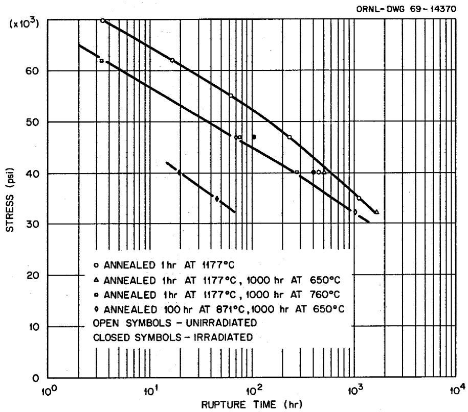  
Fig. 54. Stress-Rupture Properties at $650^{\circ}\mathrm{C}$ of Alloy 21555 $(0.05\% \mathrm{Zr})$

for 1000 hr at $650^{\circ}\mathrm{C}$ produced no detectable effect, but aging for 1000 hr at $760^{\circ}\mathrm{C}$ decreased the time to failure. Annealing at $871^{\circ}\mathrm{C}$ to produce a fine grain size resulted in shorter rupture lives. Irradiated samples had been annealed at 1177 and $871^{\circ}\mathrm{C}$ before irradiation. As shown in Fig. 54, irradiation reduced the rupture life of the larger grained material by a factor of about 2 and that of the finer grained material by a factor of about 10.

The minimum creep rate of heat 21555, shown in Fig. 55, was not affected appreciably by irradiation. The lowest minimum creep rate was obtained by annealing at $1177^{\circ}\mathrm{C}$ ; aging at $650^{\circ}\mathrm{C}$ had no effect; aging at $760^{\circ}\mathrm{C}$ increased the creep rate; and annealing at $871^{\circ}\mathrm{C}$ to give a small grain size produced a high creep rate.

The results of creep tests on heat 21554 (0.35% Zr) are given in Tables 31 and 32. The stress-rupture properties at $650^{\circ}\mathrm{C}$ are shown in Fig. 56. The same general trends with regard to heat treatment were observed for this heat and for the heat with lower zirconium content (heat 21555). The optimum rupture life occurred after a 1-hr anneal at

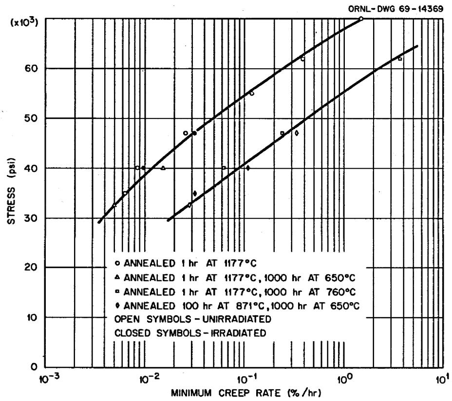  
Fig. 55. Creep Rates at $650^{\circ}\mathrm{C}$ of Alloy 21555 (0.05% Zr).

Table 31. Creep Properties of Unirradiated Alloy 21554 (0.35% Zr)   

<table><tr><td>Specimen Number</td><td>Test Number</td><td>Anneala Before Test</td><td>Stress (psi)</td><td>Rupture Life (hr)</td><td>Minimum Creep Rate (%/hr)</td><td>Elongation (%)</td><td>Reduction in Area (%)</td></tr><tr><td colspan="8">\( \times 10^3 \)</td></tr><tr><td colspan="8">Test Temperature 650°C</td></tr><tr><td>2442</td><td>6306</td><td>121</td><td>70</td><td>7.3</td><td>1.38</td><td>49.4</td><td>43.8</td></tr><tr><td>2443</td><td>6307</td><td>121</td><td>62</td><td>32.0</td><td>0.20</td><td>38.1</td><td>43.1</td></tr><tr><td>2444</td><td>6308</td><td>121</td><td>55</td><td>94.4</td><td>0.062</td><td>31.6</td><td>26.7</td></tr><tr><td>2445</td><td>6309</td><td>121</td><td>47</td><td>395.2</td><td>0.018</td><td>26.8</td><td>27.7</td></tr><tr><td>2446</td><td>6310</td><td>121</td><td>40</td><td>803.8</td><td>0.0071</td><td>19.7</td><td>28.0</td></tr><tr><td>2441</td><td>5913</td><td>37</td><td>40</td><td>627.7</td><td>1.38</td><td>20.5</td><td>12.8</td></tr><tr><td>10086</td><td>7667</td><td>148</td><td>62</td><td>5.5</td><td>2.45</td><td>54.9</td><td>41.8</td></tr><tr><td>10084</td><td>7491</td><td>148</td><td>47</td><td>157.5</td><td>0.14</td><td>46.0</td><td>44.0</td></tr><tr><td>10085</td><td>7666</td><td>148</td><td>40</td><td>597.4</td><td>0.0313</td><td>36.5</td><td>33.4</td></tr><tr><td>2435</td><td>5862</td><td>36</td><td>47</td><td>128.3</td><td>0.20</td><td>63.0</td><td>50.6</td></tr><tr><td>2491</td><td>5858</td><td>36</td><td>40</td><td>226.3</td><td>0.13</td><td>60.8</td><td>50.9</td></tr><tr><td>2434</td><td>5857</td><td>36</td><td>40</td><td>324.2</td><td>0.056</td><td>35.5</td><td>51.9</td></tr><tr><td>2433</td><td>6168</td><td>36</td><td>32.4</td><td>1390.9</td><td>0.018</td><td>55.1</td><td>42.4</td></tr><tr><td>5535</td><td>6399</td><td>104</td><td>70</td><td>3.3</td><td>8.38</td><td>60.6</td><td>48.8</td></tr><tr><td>5536</td><td>6398</td><td>104</td><td>63</td><td>8.3</td><td>3.20</td><td>50.0</td><td>50.1</td></tr><tr><td>5537</td><td>6397</td><td>104</td><td>55</td><td>28.2</td><td>1.01</td><td>55.8</td><td>45.0</td></tr><tr><td>5538</td><td>6389</td><td>104</td><td>47</td><td>58.1</td><td>0.37</td><td>38.3</td><td>58.3</td></tr><tr><td>5539</td><td>6390</td><td>104</td><td>40</td><td>228.7</td><td>0.12</td><td>69.5</td><td>56.6</td></tr><tr><td>5540</td><td>6425</td><td>104</td><td>47</td><td>84.1</td><td>0.36</td><td>75.1</td><td>56.0</td></tr><tr><td>5541</td><td>6426</td><td>104</td><td>40</td><td>244.0</td><td>0.11</td><td>63.1</td><td>50.0</td></tr><tr><td>5542</td><td>6427</td><td>104</td><td>32.4</td><td>709.8</td><td>0.032</td><td>56.1</td><td>50.8</td></tr><tr><td colspan="8">Test Temperature 760°C</td></tr><tr><td>2421</td><td>7286</td><td>121</td><td>30</td><td>35.6</td><td>0.33</td><td>30.3</td><td>25.9</td></tr><tr><td>2415</td><td>6356</td><td>121</td><td>20</td><td>354.1</td><td>0.047</td><td>32.9</td><td>30.7</td></tr><tr><td>2427</td><td>7285</td><td>121</td><td>15</td><td>1073.0</td><td>0.0123</td><td>28.7</td><td>31.3</td></tr><tr><td>2404</td><td>6056</td><td>16</td><td>20</td><td>85.0</td><td>0.35</td><td>61.7</td><td>45.0</td></tr></table>

aAnnealing designations:   
121 = annealed 1 hr at 1177°C,   
37 = annealed 1 hr at $1177^{\circ}C$ plus 1000 hr at $650^{\circ}C$ ,   
148 = annealed 1 hr at $1177^{\circ}C$ plus 1000 hr at $760^{\circ}C$ ,   
36 = annealed 100 hr at $871^{\circ}C$ plus 1000 hr at $650^{\circ}C$ ,   
104 = annealed 100 hr at $871^{\circ}C$ plus 5600 hr at $650^{\circ}C$ ,   
16 = annealed 100 hr at $871^{\circ}C$

Table 32. Creep Properties of Irradiated Alloy 21554 (0.35% Zr)   

<table><tr><td>Specimen Number</td><td>Test Number</td><td>Anneal® Before Irradiation</td><td>Irradiation Temperature (°C)</td><td>Thermal- Neutron Fluence (neutrons/cm2)</td><td>Stress (psi)</td><td>Rupture Life (hr)</td><td>Minimum Creep Rate (%/hr)</td><td>Elongation (%)</td></tr><tr><td></td><td></td><td></td><td colspan="2">×1020</td><td>×103</td><td></td><td></td><td></td></tr><tr><td></td><td></td><td colspan="3">Test Temperature 650°C</td><td></td><td></td><td></td><td></td></tr><tr><td>2408</td><td>R-382</td><td>121</td><td>590</td><td>2.5</td><td>47</td><td>140.2</td><td>0.024</td><td>4.75</td></tr><tr><td>2424</td><td>R-479</td><td>121</td><td>650</td><td>2.5</td><td>47</td><td>111.3</td><td>0.034</td><td>5.05</td></tr><tr><td>2407</td><td>R-260</td><td>121</td><td>590</td><td>2.5</td><td>40</td><td>336.3</td><td>0.0036</td><td>2.50</td></tr><tr><td>2420</td><td>R-480</td><td>121</td><td>650</td><td>2.5</td><td>40</td><td>279.0</td><td>0.0032</td><td>12.6</td></tr><tr><td>2398</td><td>R-265</td><td>16</td><td>550</td><td>2.5</td><td>47</td><td>3.9</td><td>0.35</td><td>1.51</td></tr><tr><td>2397</td><td>R-269</td><td>16</td><td>550</td><td>2.5</td><td>40</td><td>76.7</td><td>0.051</td><td>4.74</td></tr><tr><td>2402</td><td>R-356</td><td>16</td><td>550</td><td>2.5</td><td>35</td><td>163.7</td><td>0.0068</td><td>3.43</td></tr><tr><td>9127</td><td>R-316</td><td>61</td><td>650</td><td>4.1</td><td>47</td><td>11.1</td><td>0.34</td><td>4.57</td></tr><tr><td>9126</td><td>R-311</td><td>61</td><td>650</td><td>4.1</td><td>40</td><td>19.3</td><td>0.14</td><td>3.99</td></tr><tr><td>9128</td><td>R-318</td><td>61</td><td>650</td><td>4.1</td><td>32.4</td><td>65.4</td><td>0.013</td><td>2.36</td></tr><tr><td>9129</td><td>R-322</td><td>61</td><td>650</td><td>4.1</td><td>27</td><td>204.9</td><td>0.0088</td><td>3.45</td></tr><tr><td></td><td></td><td colspan="3">Test Temperature 760°C</td><td></td><td></td><td></td><td></td></tr><tr><td>2409</td><td>R-364</td><td>121</td><td>590</td><td>2.5</td><td>20</td><td>71.5</td><td>0.014</td><td>1.95</td></tr><tr><td>2410</td><td>R-239</td><td>121</td><td>590</td><td>2.5</td><td>15</td><td>264.1</td><td>0.0094</td><td>6.52</td></tr><tr><td>2412</td><td>R-470</td><td>121</td><td>760</td><td>2.5</td><td>15</td><td>9.1</td><td>0.092</td><td>1.24</td></tr><tr><td>2403</td><td>R-174</td><td>16</td><td>760</td><td>2.3</td><td>20</td><td>5.5</td><td>0.36</td><td>2.95</td></tr><tr><td>2401</td><td>R-236</td><td>16</td><td>566</td><td>2.5</td><td>15</td><td>13.3</td><td>0.10</td><td>2.62</td></tr><tr><td>2400</td><td>R-357</td><td>16</td><td>560</td><td>2.5</td><td>12.5</td><td>222.8</td><td>0.0092</td><td>5.62</td></tr></table>

aAnnealing designations: 121 = annealed 1 hr at $1177^{\circ}C$ ; 16 = annealed 100 hr at $871^{\circ}C$ . 61 = annealed 200 hr at $871^{\circ}C$

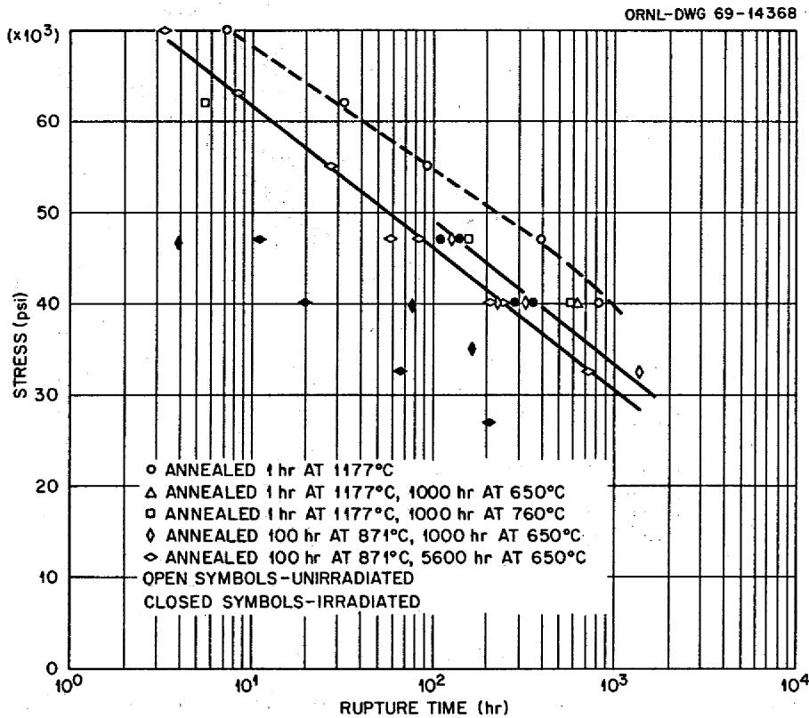  
Fig. 56. Stress-Rupture Properties at $650^{\circ}\mathrm{C}$ of Alloy 21554 (0.35% Zr).

1177°C. Irradiation reduced the rupture life of the material annealed at 1177°C by a factor of 2 to 3 and that of the fine-grained material by a factor of about 10. The variation of the minimum creep rate with heat treatment and irradiation is shown in Fig. 57. The lowest minimum creep rate was observed for the material annealed at 1177°C. No effect of irradiation on the minimum creep rate was evident.

The fracture strains are shown as a function of minimum creep rate in Fig. 58 for material annealed at $1177^{\circ}\mathrm{C}$ and tested in the unirradiated condition at $650^{\circ}\mathrm{C}$ . The results for heat 21554 ( $0.35\%$ Zr) show a clear trend of decreasing fracture strain with decreasing creep rate. The results for heat 21555 ( $0.05\%$ Zr) show a similar trend, but the data seem to fall on two separate line segments. All of the fracture strains are quite high and fall largely in the range of 20 to $40\%$ . The results in Tables 29 and 31 show that the samples of both alloys that were annealed at $871^{\circ}\mathrm{C}$ to give a fine grain size had fracture strains of 40 to $60\%$ .

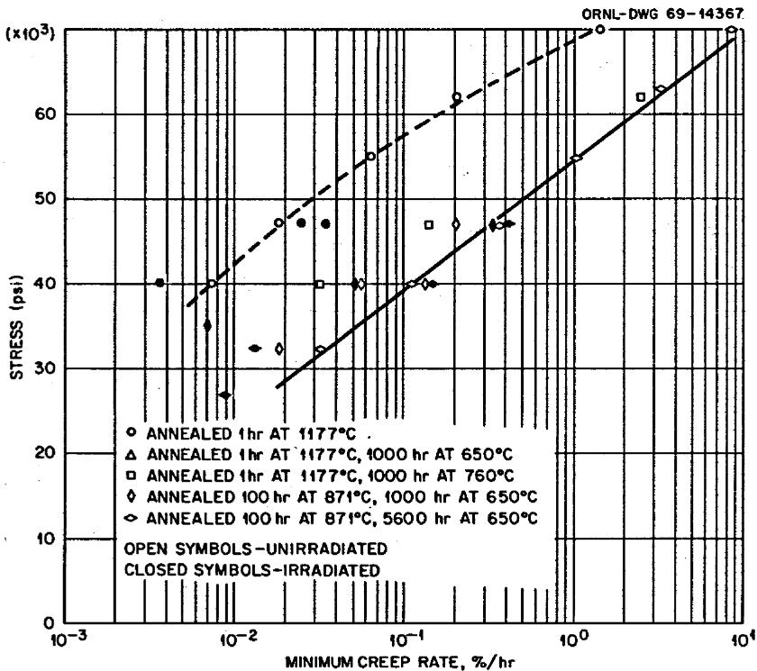  
Fig. 57. Creep Properties at $650^{\circ}\mathrm{C}$ of Alloy 21554 $(0.35\% \mathrm{Zr})$

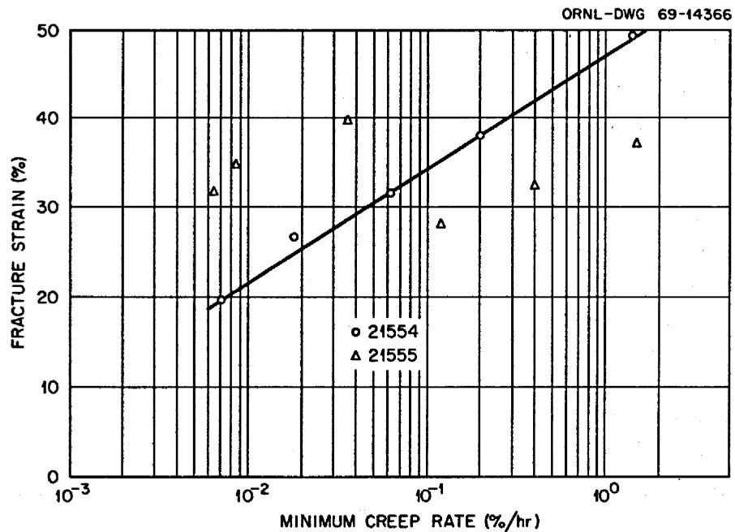  
Fig. 58. Fracture Strains at $650^{\circ}\mathrm{C}$ of Alloys 21554 (0.35% Zr) and 21555 (0.05% Zr). All samples annealed 1 hr at $1177^{\circ}\mathrm{C}$ before testing.

The fracture strains of irradiated samples of heats 21554 and 21555 are shown in Fig. 59 as a function of strain rate. The results generally follow a trend of increasing fracture strain with decreasing creep rate, although one point definitely deviates from this trend.

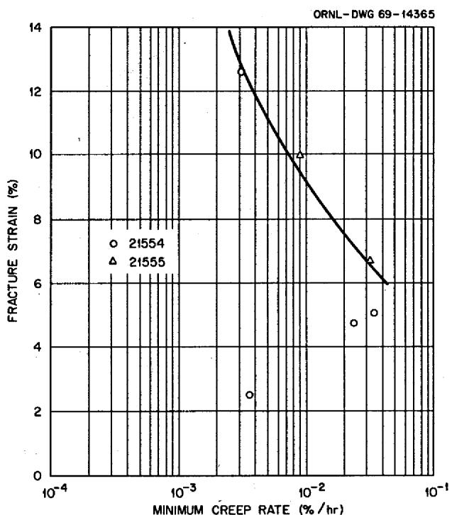  
Fig. 59. Fracture Strains at $650^{\circ}\mathrm{C}$ of Alloys 21554 (0.35% Zr) and 21555 (0.05% Zr) after Irradiation. All samples annealed 1 hr at $1177^{\circ}\mathrm{C}$ before irradiation.

The results for a test temperature of $760^{\circ}\mathrm{C}$ are fragmentary (Tables 29 through 32). The stress-rupture characteristics are shown in Figs. 60 and 61 for heats 21555 $(0.05\% \mathrm{Zr})$ and 21554 $(0.05\% \mathrm{Zr})$ . Rupture life was reduced by irradiation, but the samples annealed at $1177^{\circ}\mathrm{C}$ before irradiation had longer rupture lives than those annealed at $871^{\circ}\mathrm{C}$ . The fracture strains were reduced by irradiation, and the results for heat 21554 (Table 32) indicate that the reduction was greater as the irradiation temperature increased.

Several tested samples were examined metallographically. Typical photomicrographs of several alloys that contained zirconium are shown in Fig. 62. These samples were annealed $1\mathrm{hr}$ at $1177^{\circ}\mathrm{C}$ , aged 1000 hr

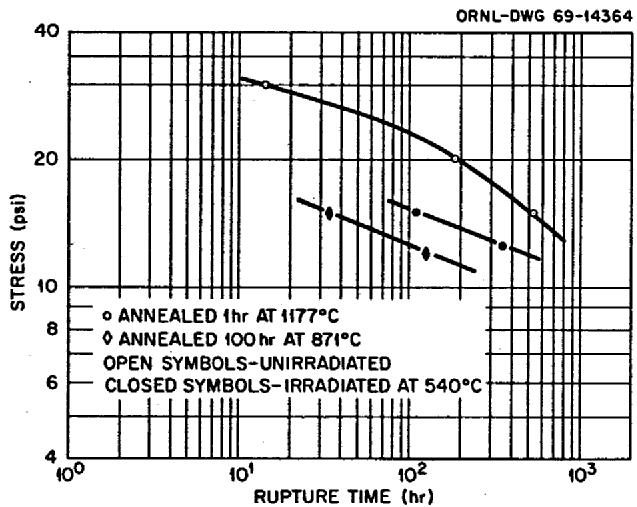  
Fig. 60. Stress-Rupture Properties of Alloy 21555 (0.05% Zr) at $760^{\circ}\mathrm{C}$ .

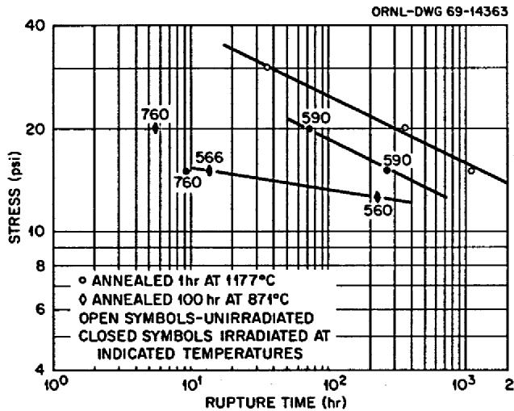  
Fig. 61. Stress-Rupture Properties of Alloy 21554 (0.35% Zr) at $760^{\circ}\mathrm{C}$ .

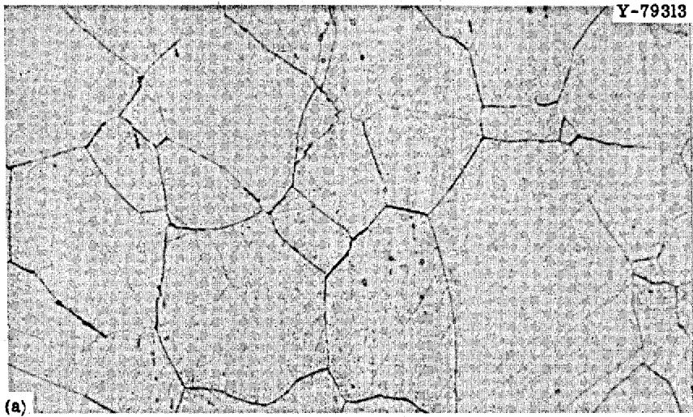

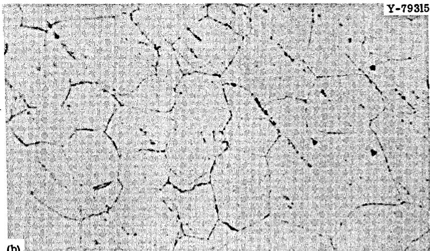

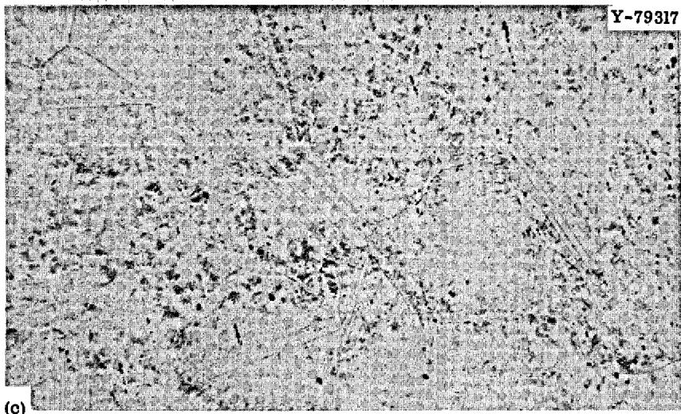

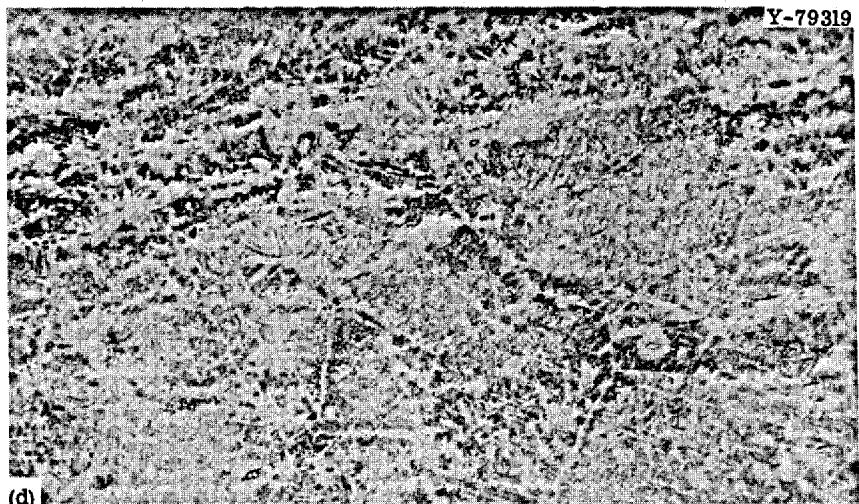  
Fig. 62. Photomicrographs of Zirconium-Modified Alloys Annealed for 1 hr at $1177^{\circ}\mathrm{C}$ , Aged for 1000 hr at $650^{\circ}\mathrm{C}$ , and Stressed at 32,400 psi for 1000 hr. $500 \times$ (a) Alloy 108 ( $0.10\%$ Zr), (b) alloy 109 ( $0.28\%$ Zr), (c) alloy 110 ( $0.53\%$ Zr), and (d) alloy 111 ( $0.75\%$ Zr). Etchant: glyceria regia. Reduced $26\%$ .

at $650^{\circ}\mathrm{C}$ , and stressed for 1000 hr at $650^{\circ}\mathrm{C}$ . Alloy 108 (0.10% Zr) had a very fine carbide precipitate typical of that observed in alloy 100 (Fig. 24), which did not contain zirconium. In alloy 109 (0.28% Zr) the precipitate was coarser and located predominantly along the grain boundaries. Alloys 110 (0.53% Zr) and 111 (0.75% Zr) contained a very fine precipitate that could not be resolved at a magnification of 500x. Alloy 112 (1.18% Zr) had an even higher concentration of precipitate (Fig. 63). Figure 63(c) shows that the precipitate was acicular. The grain boundaries had a denuded zone, and there was a denuded region associated with the oxide at the surface. The precipitate was extracted and found by x-ray diffraction to have a lattice parameter of 4.68 A, equal to that for zirconium carbide. We also strained some samples of alloy 112 at $25^{\circ}\mathrm{C}$ after they had been aged at $650^{\circ}\mathrm{C}$ to produce the precipitate. The fracture strains were in excess of 50%, thus indicating that this microstructure was not brittle.

Some of the aged samples were tensile tested at $650^{\circ}\mathrm{C}$ (Table 17). The fracture of alloy 112 after testing at $650^{\circ}\mathrm{C}$ at a strain rate of $0.002\mathrm{min}^{-1}$ is shown in Fig. 64. The fracture strain was $23.3\%$ , and the fracture was transgranular.

The fracture of alloy 110 (0.53% Zr), which was tested in creep at $650^{\circ}\mathrm{C}$ , is shown in Fig. 65. This alloy was at temperature 709 hr, and small quantities of precipitate are present in the microstructure. This precipitate cannot be resolved at low magnification and appears as dark spots. There are numerous intergranular cracks, and the fracture is intergranular. Typical photomicrographs of alloy 112 (1.18% Zr) after creep testing at $650^{\circ}\mathrm{C}$ are shown in Fig. 66. This sample was at temperature 1255 hr, and large quantities of precipitate are present in the microstructure. There are numerous intergranular cracks, and the fracture has both intergranular and transgranular components.

Typical fractures of alloy 21555 (0.05% Zr) after testing at $650^{\circ}\mathrm{C}$ and 32,400 psi are shown in Fig. 67. When this alloy was annealed 100 hr at $650^{\circ}\mathrm{C}$ before testing, the grain size was quite small. This sample was strained 65.9% before it fractured (Table 29), predominantly transgranularly [Fig. 67(a)]. Annealing for 1 hr at $1177^{\circ}\mathrm{C}$ and testing in creep resulted in the microstructure shown in Fig. 67(b). The

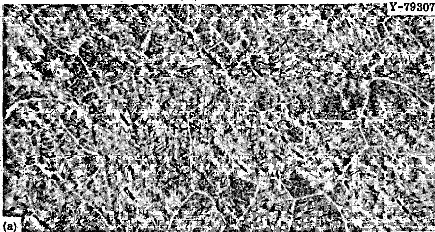

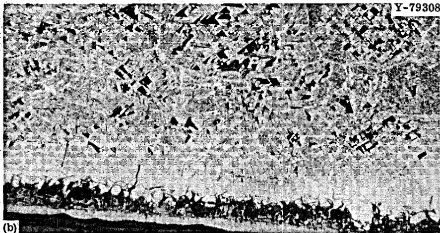

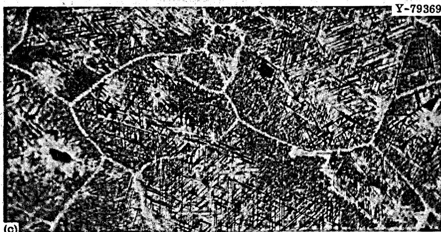  
Fig. 63. Photomicrographs of Zirconium-Modified Alloy 112 (1.18% Zr) Annealed for 1 hr at $1177^{\circ}\mathrm{C}$ , Aged for 1000 hr at $650^{\circ}\mathrm{C}$ , and Stressed at 32,400 psi for 1000 hr. (a) Typical, 500×; (b) edge of sample, 500×; and (c) typical, 1000×. Etchant: glyceria regia. Reduced 23%.

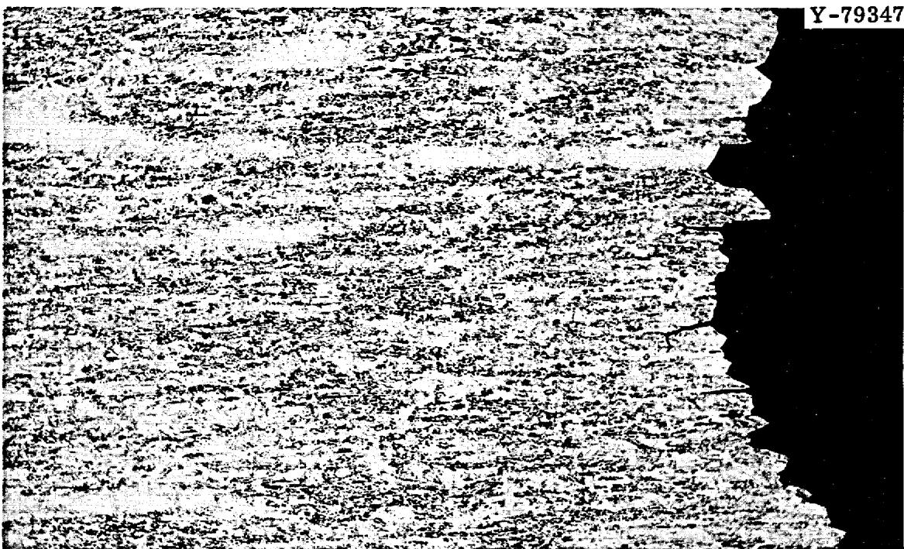

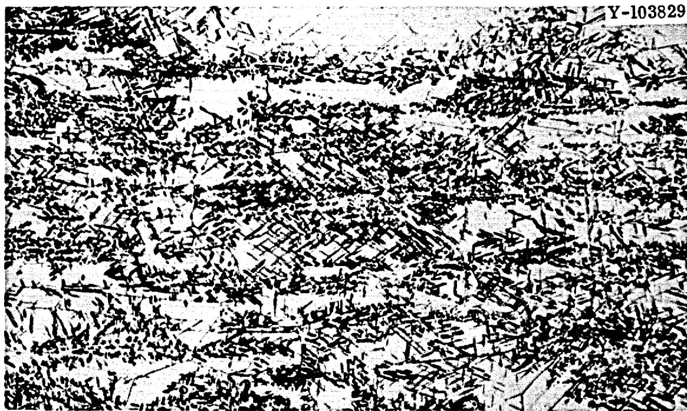  
Fig. 64. Photomicrographs of Alloy 112 (1.18% Zr) Annealed for 1 hr at $1177^{\circ}\mathrm{C}$ , Aged for 1000 hr at $650^{\circ}\mathrm{C}$ , and Tensile Tested at $650^{\circ}\mathrm{C}$ at a Strain Rate of $0.002\mathrm{min}^{-1}$ . (a) Fracture, $100\times$ ; (b) typical, $500\times$ .

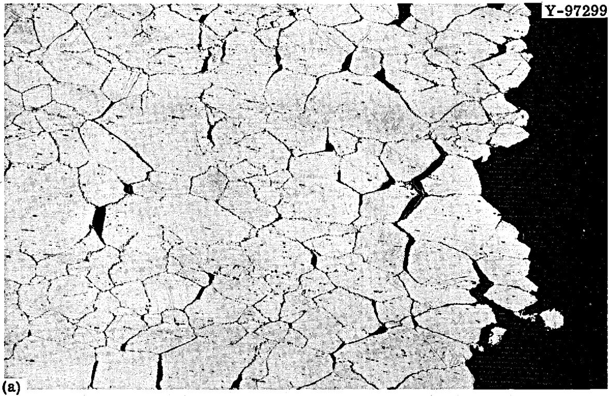

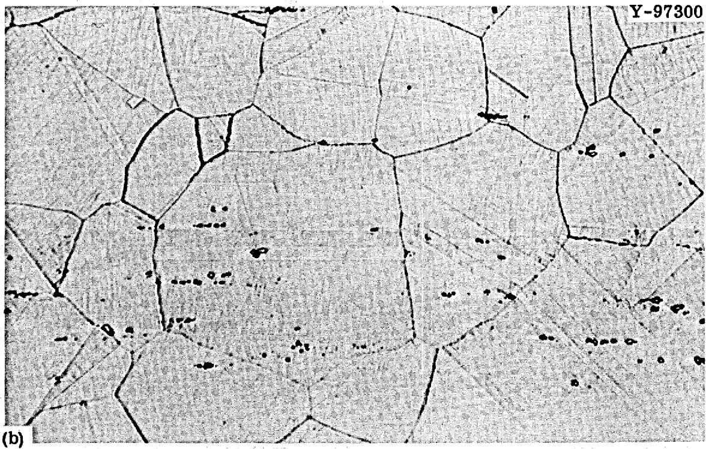  
Fig. 65. Photomicrographs of Alloy 110 (0.53% Zr) Annealed 1 hr at $1177^{\circ}\mathrm{C}$ and Tested at $650^{\circ}\mathrm{C}$ and 40,000 psi. (a) Fracture, 100x; (b) typical, 500x. Etchant: glyceria regia.

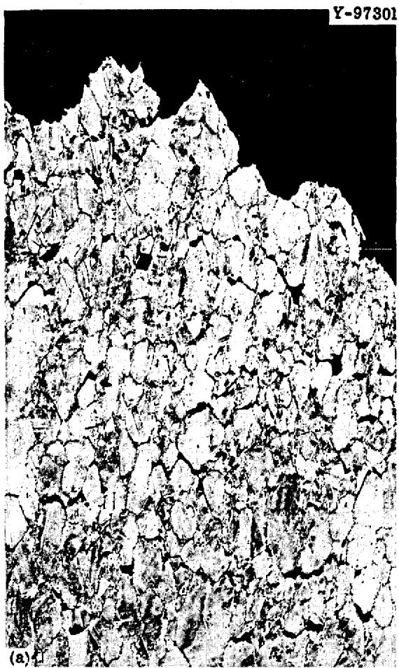

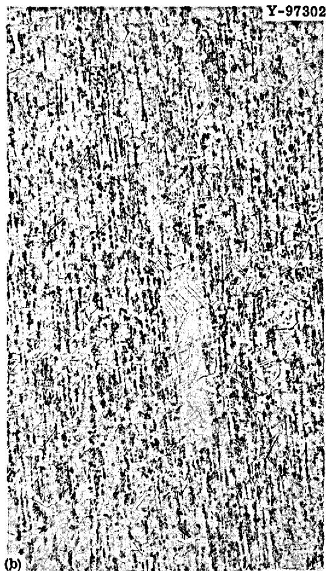

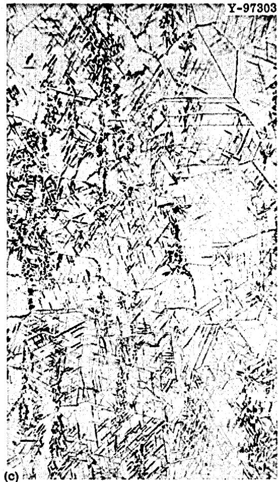  
Fig. 66. Photomicrographs of Alloy 112 (1.18% Zr) Annealed 1 hr at $1177^{\circ}\mathrm{C}$ and Tested at $650^{\circ}\mathrm{C}$ and 47,000 psi. (a) Fracture, $100\times$ ; (b) typical, $100\times$ , and (c) typical, $500\times$ . Etchant: glyceria regia. Reduced $20\%$ .

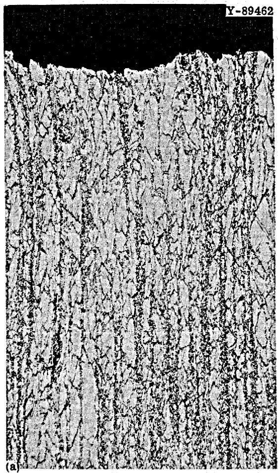

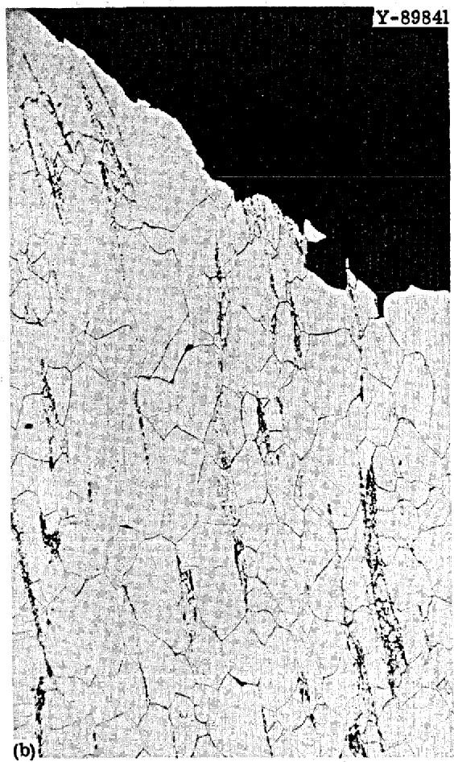

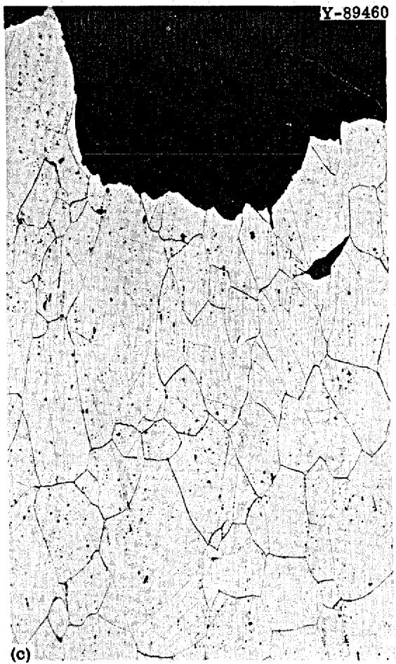  
Fig. 67. Photomicrographs of Alloy 21555 (0.05% Zr) Creep Tested at 32,400 psi and $650^{\circ}\mathrm{C}$ . (a) Fracture of sample annealed for 100 hr at $871^{\circ}\mathrm{C}$ and 1000 hr at $650^{\circ}\mathrm{C}$ before test; (b) fracture of sample annealed 1 hr at $1177^{\circ}\mathrm{C}$ before test; and (c) fracture of sample annealed 1 hr at $1177^{\circ}\mathrm{C}$ and 1000 hr at $650^{\circ}\mathrm{C}$ . 100×. Etchant: glyceria regia. Reduced 21%.

fracture was still largely intergranular, and the fracture strain was $31.8\%$ . Annealing at $1177^{\circ}\mathrm{C}$ and aging for 1000 hr at $650^{\circ}\mathrm{C}$ resulted in a fracture strain of $34.1\%$ (Table 29). The microstructure contained only a few small precipitates, and the fracture was still largely transgranular. Alloy 21554 $(0.35\% \mathrm{Zr})$ was subjected to a similar annealing sequence. After annealing for 100 hr at $871^{\circ}\mathrm{C}$ and 1000 hr at $650^{\circ}\mathrm{C}$ and testing at $650^{\circ}\mathrm{C}$ the fracture shown in Fig. 68(a) was obtained. This alloy originally had stringers present (Fig. 38), and numerous cracks formed around these stringers during testing. The fracture was transgranular, and the fracture strain was $55.1\%$ (Table 31). Annealing for 1 hr at $1177^{\circ}\mathrm{C}$ produced a coarser grain size. The fracture shown in Fig. 68(b) was mixed intergranular and transgranular, and the fracture strain was about $20\%$ . The approximately 1000 hr at temperature during the creep test was sufficient to produce some precipitation. Another sample was annealed 1 hr at $1177^{\circ}\mathrm{C}$ and aged for 1000 hr before testing. This sample failed with about $20\%$ strain. The fracture was mixed transgranular and intergranular [Fig. 68(a)]. Copious quantities of very fine precipitate formed.

Alloy 108 (0.10% Zr) was also examined metallographically after irradiation and creep testing. As shown in Fig. 69, a very fine precipitate was formed that was quite similar to that shown in Fig. 62 for an unirradiated sample. Alloy 110 (0.53% Zr) had more precipitate after irradiation than the control sample (compare Figs. 70 and 62). As shown in Fig. 70 there was a denuded zone along the boundaries and some banding of the precipitate, likely due to inhomogeneous distribution of zirconium in the alloy. The fracture was largely intergranular. Alloy 112 (1.18% Zr) had profuse quantities of the precipitate; the microstructure, however, was quite similar to that for the unirradiated sample (compare Figs. 71 and 63). The sample could not be etched heavily enough to show the grain boundaries without obliterating the precipitate. The fracture was mixed intergranular and transgranular.

Typical photomicrographs of alloy 21554 (0.35% Zr) are shown in Figs. 72 through 75. The sample shown in Fig. 72 was irradiated and tested at $25^{\circ}\mathrm{C}$ and failed transgranularly after straining $47.5\%$ . The comparable control sample is shown in Fig. 73. This sample failed

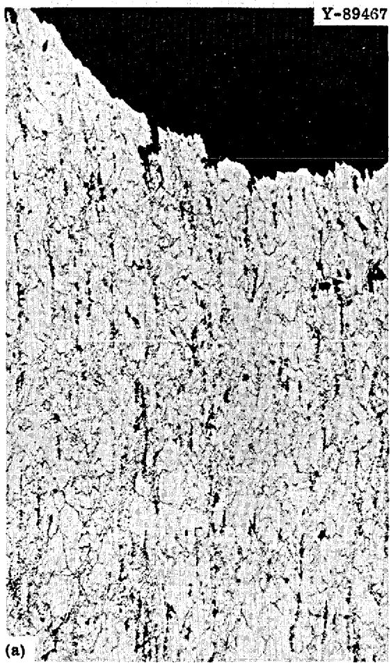

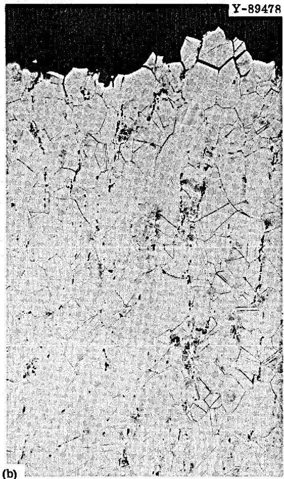

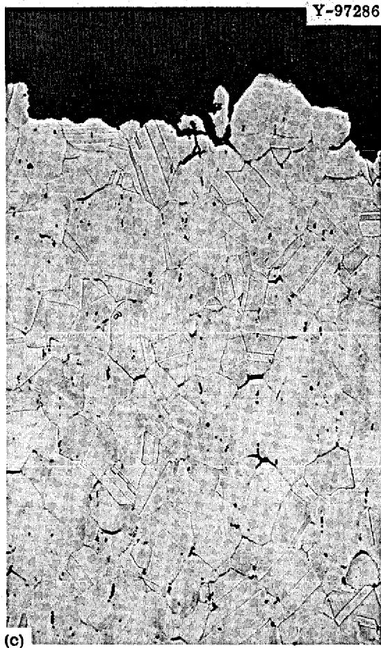  
Fig. 68. Photomicrographs of Alloy 21554 (0.35% Zr) Creep Tested at $650^{\circ}\mathrm{C}$ . (a) Fracture of sample annealed 100 hr at $871^{\circ}\mathrm{C}$ and 1000 hr at $650^{\circ}\mathrm{C}$ before test; (b) fracture of a sample annealed 1 hr at $1177^{\circ}\mathrm{C}$ before test; and (c) fracture of a sample annealed 1 hr at $1177^{\circ}\mathrm{C}$ and 1000 hr at $650^{\circ}\mathrm{C}$ before test. 100x. Etchant: glyceria regia. Reduced 21%.

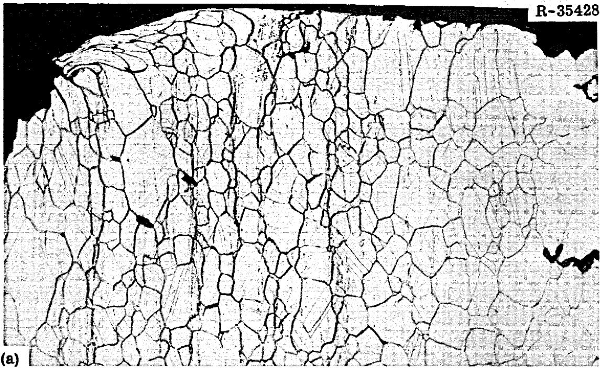

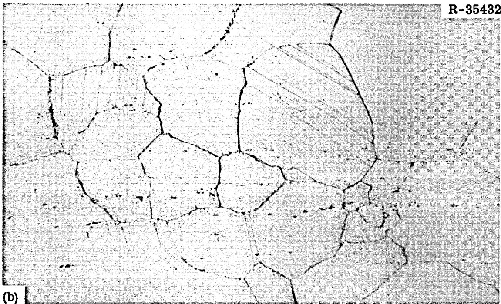  
Fig. 69. Photomicrographs of Alloy 108 (0.10% Zr) Annealed 1 hr at $1177^{\circ}\mathrm{C}$ , Irradiated at $650^{\circ}\mathrm{C}$ for 1000 hr to a Thermal-Neutron Fluence of $2.5 \times 10^{20}$ neutrons/cm², and Creep Tested at $650^{\circ}\mathrm{C}$ . Stressed at 32,400 psi for 675 hr (8.2% strain) and 40,000 psi for 53 hr (8.3% strain). (a) Fracture, blunted end caused in handling, 100x; (b) typical, 500x. Etchant: glyceria regia.

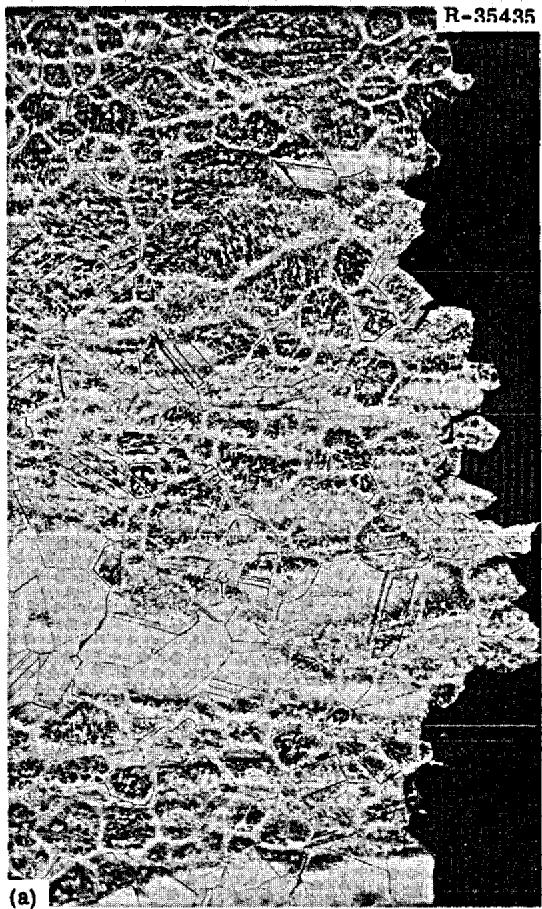

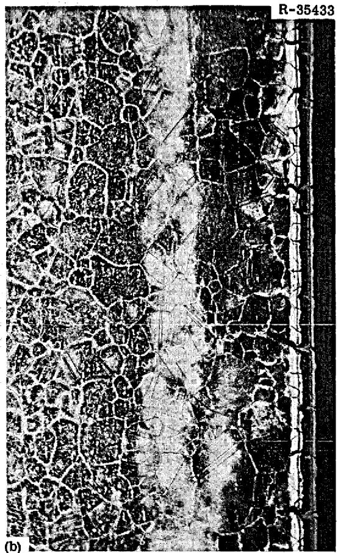

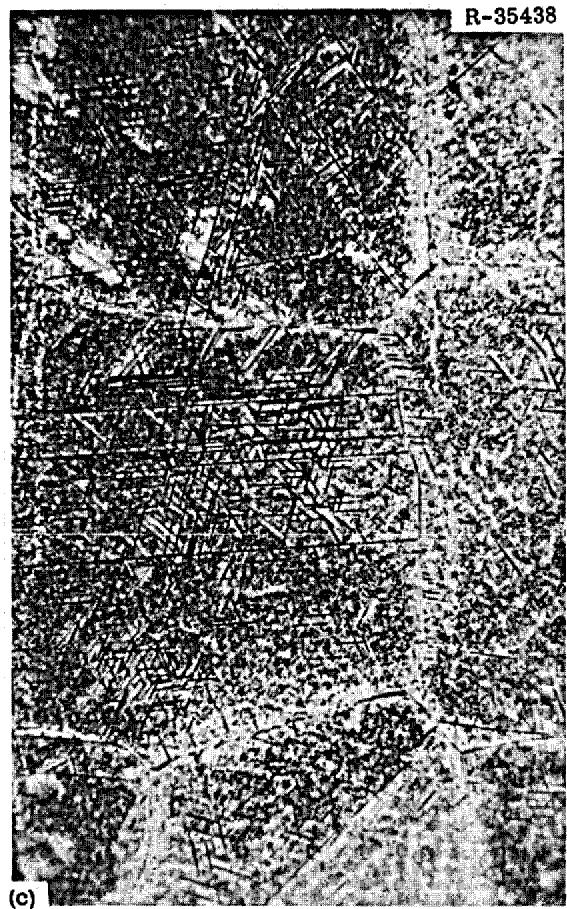  
Fig. 70. Photomicrographs of Alloy 110 (0.53% Zr) Annealed 1 hr at 1177°C, Irradiated at 650°C for 1000 hr to a Thermal-Neutron Fluence of 2.5 × 10²⁰ neutrons/cm², and Creep Tested at 650°C. Stressed at 32,400 psi for 675 hr (0.97% Strain) and 40,000 psi for 430 hr (5.9% Strain). (a) Fracture, 100x; (b) edge of gage length, 100x; and (c) typical, 1000x. Etchant: glyceria regia. Reduced 24%.

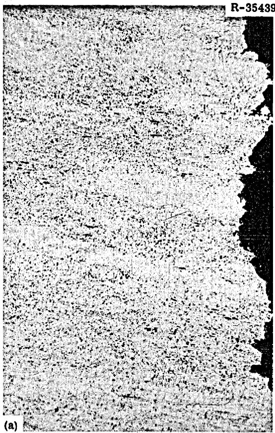

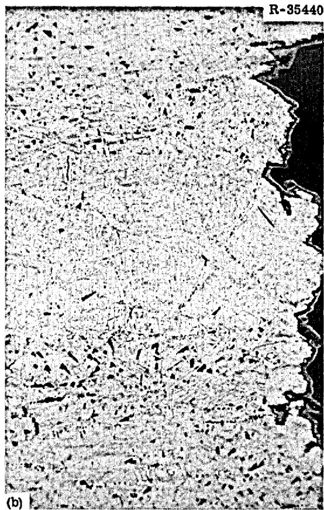

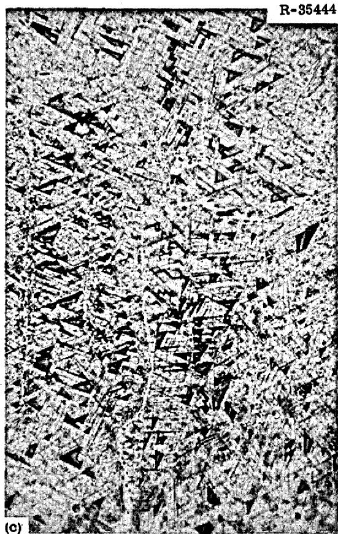  
Fig. 71. Photomicrographs of Alloy 112 (1.18% Zr) Annealed 1 hr at $1177^{\circ}\mathrm{C}$ , Irradiated at $650^{\circ}\mathrm{C}$ for 1000 hr to a Thermal-Neutron Fluence of $2.5 \times 10^{20}$ neutrons/cm², and Creep Tested at $650^{\circ}\mathrm{C}$ . Stressed at 32,400 psi for 677 hr (5.8% Strain) and 40,000 psi for 47 hr (3.9% Strain). (a) Fracture, 100x; (b) fracture, 500x; and (c) typical, 1000x. Etchant: glyceria regia. Reduced 24%.

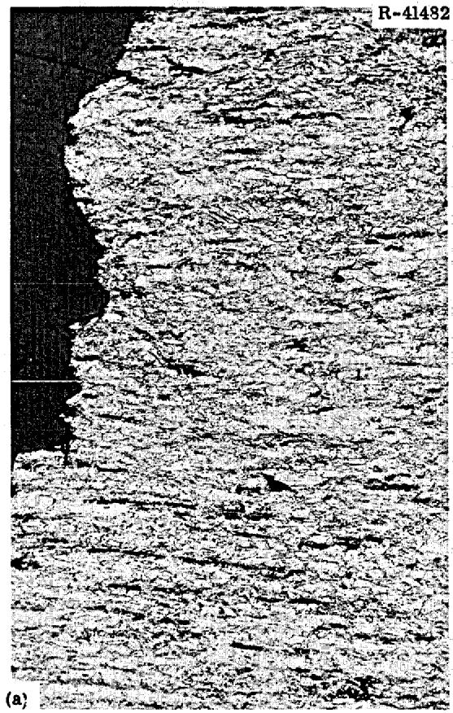

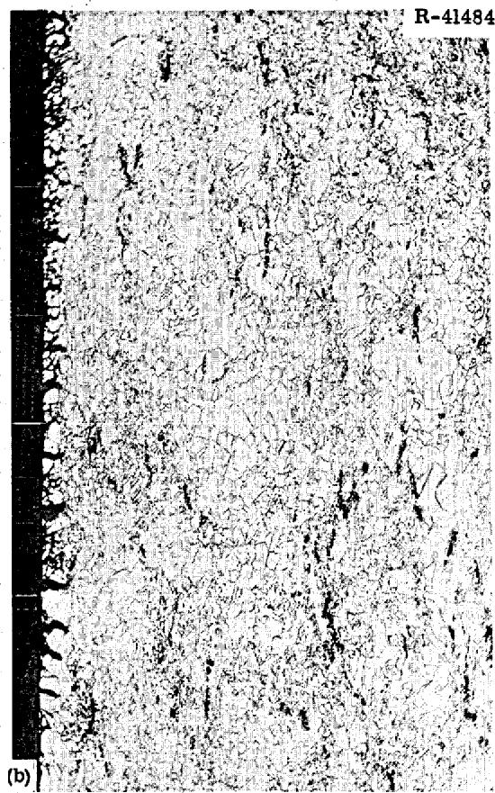

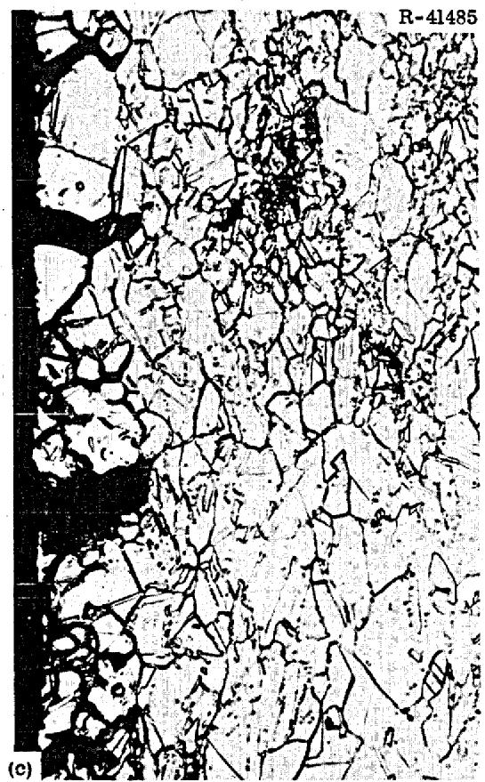  
Fig. 72. Photomicrographs of a Zirconium-Modified Hastelloy N Surveillance Sample (Heat 21554) Tested at $25^{\circ}\mathrm{C}$ at a Strain Rate of $0.05\mathrm{min}^{-1}$ . Exposed in the Molten Salt Reactor Experiment core for 5500 hr at $650^{\circ}\mathrm{C}$ to a thermal-neutron fluence of $4.1 \times 10^{20}$ neutrons/cm². (a) Fracture, 100x; (b) edge of sample about 1/2 in. from fracture, 100x; and (c) edge of sample showing edge cracking, 500x. Etchant: aqua regia. Reduced 24%.

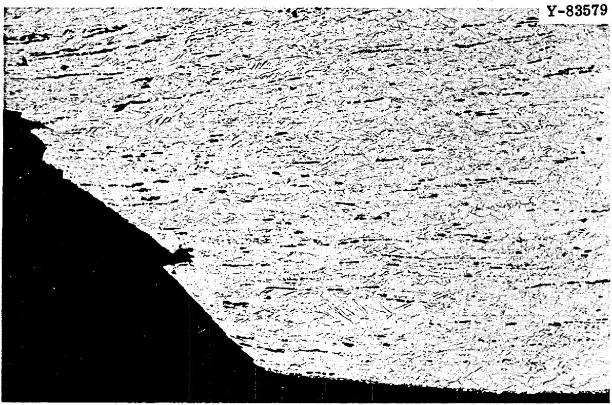  
Fig. 73. Photomicrograph of the Fracture of a Zirconium-Modified Hastelloy N Sample (Heat 21554) Tested at $25^{\circ}\mathrm{C}$ at a Strain Rate of $0.05\mathrm{min}^{-1}$ . Exposed to a static fluoride salt for 5500 hr at $650^{\circ}\mathrm{C}$ before testing. Note the shear fracture and the absence of edge cracking. $100\times$ . Etchant: glyceria regia.

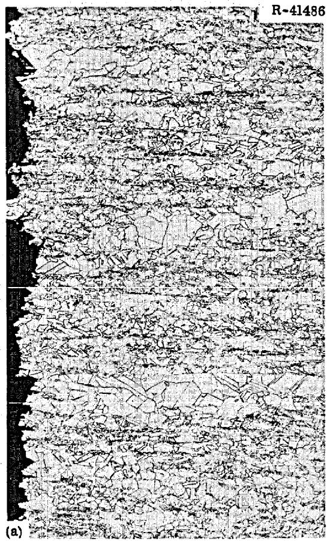

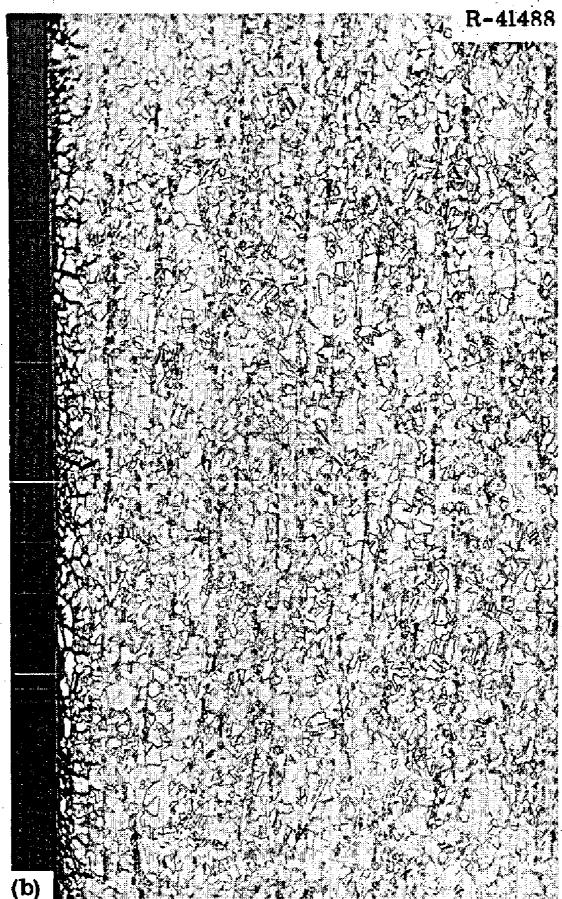

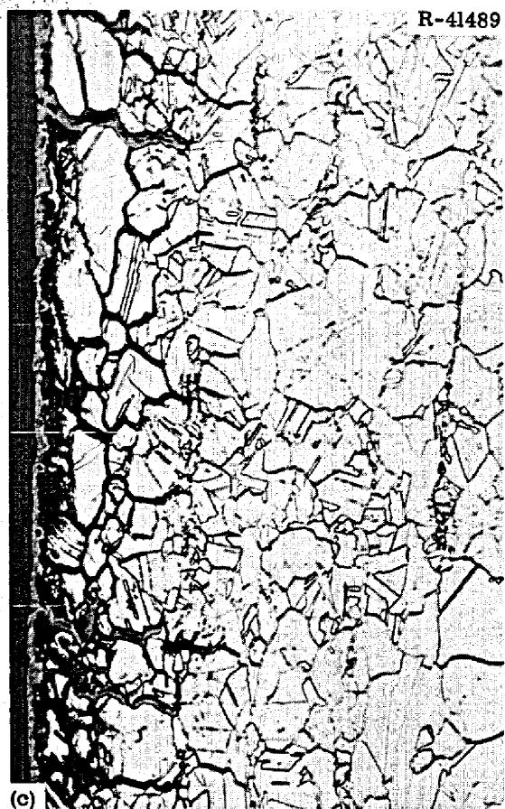  
Fig. 74. Photomicrographs of a Zirconium-Modified Hastelloy N Surveillance Sample (Heat 21554) Tested at $650^{\circ}\mathrm{C}$ at a Strain Rate of 0.002 min $^{-1}$ . Exposed in the Molten Salt Reactor Experiment core for 5500 hr at $650^{\circ}\mathrm{C}$ to a thermal fluence of $4.1 \times 10^{20}$ neutrons/cm $^2$ . (a) Fracture, 100x; (b) edge of sample about 1/2 in. from fracture, 100x; and (c) edge of sample showing edge cracking. Oxide formed during the tensile test. 500x. Etchant: aqua regia. Reduced 22%.

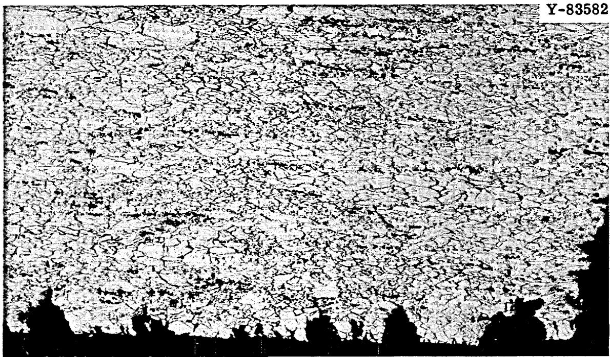  
Fig. 75. Photomicrograph Showing a Portion of the Fracture of a Zirconium-Modified Hastelloy N Sample (Heat 21554) Tested at $650^{\circ}\mathrm{C}$ at a Strain Rate of $0.002\mathrm{min}^{-1}$ . Exposed to static fluoride salt for 5500 hr at $650^{\circ}\mathrm{C}$ before testing. $100\times$ . Etchant: glyceria regia.

transgranularly after straining $47.0\%$ . An irradiated sample tested at $650^{\circ}\mathrm{C}$ is shown in Fig. 74; it fractured intergranularly after $11.2\%$ strain. The comparable control sample, shown in Fig. 75, strained $46.6\%$ before failing. There are numerous intergranular separations, and the fracture is largely intergranular.

# Alloys Containing Hafnium

Two groups of alloys were used to study the effects of hafnium content on the mechanical properties. The first group was composed of five laboratory melts that contained from 0.06 to $0.43\%$ Hf (designated alloys 152 through 156), and the second group consisted of two 100-lb commercial melts that contained 0.08 and $0.50\%$ Hf (designated alloys 67-503 and 67-504, respectively). The chemical compositions of these alloys are given in Table 1, and typical photomicrographs are shown in Figs. 76 through 80. Alloy 153 (Fig. 76) contained only $0.06\%$ Hf and had the largest grain size of the group. Alloys 154 ( $0.10\%$ Hf) and

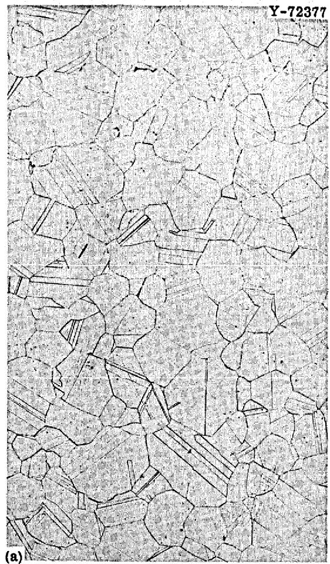

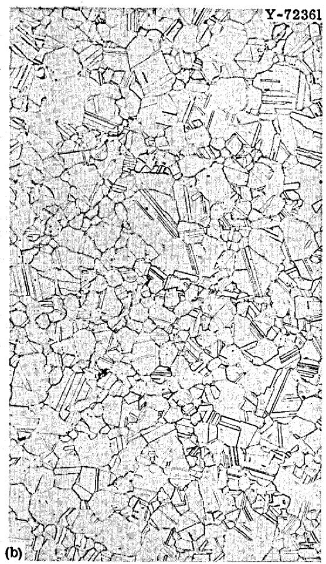

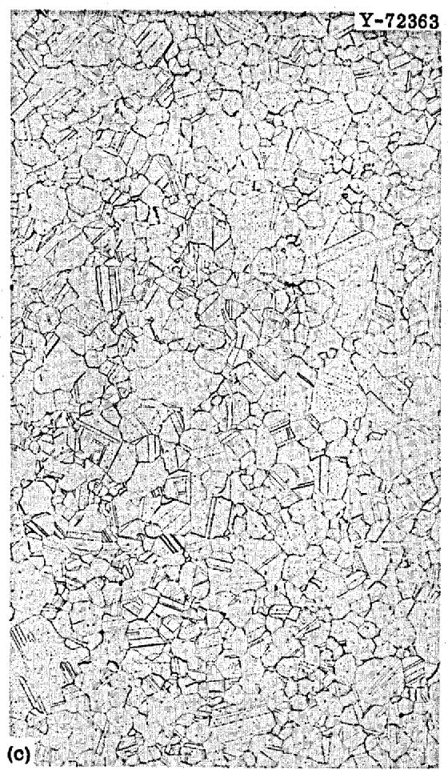  
Fig. 76. Photomicrographs of Alloys Modified with Hafnium Annealed 1 hr at $1177^{\circ}\mathrm{C}$ . (a) Alloy 153 $(0.06\% \mathrm{Hf})$ ; (b) alloy 154 $(0.10\% \mathrm{Hf})$ and (c) alloy 155 $(0.13\% \mathrm{Hf})$ . 100x. Etchant: glyceria regia. Reduced $18\%$ .

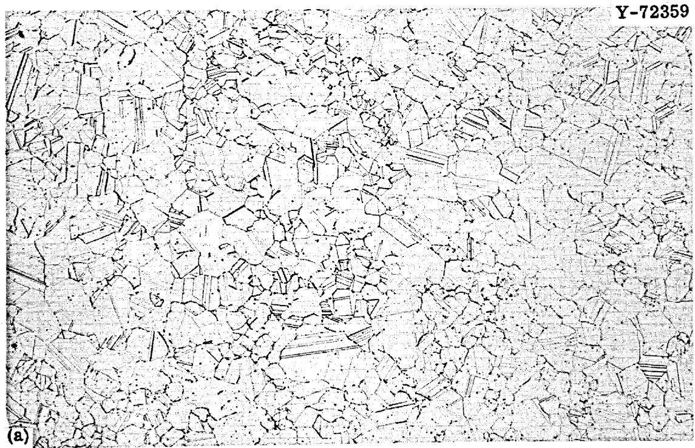

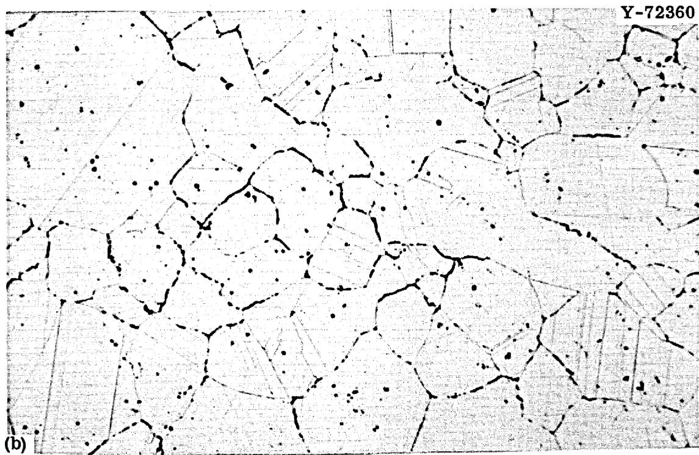  
Fig. 77. Photomicrographs of Alloy 152 Modified with $0.16\%$ Hf. Annealed 1 hr at $1177^{\circ}\mathrm{C}$ . (a) $100\times$ and (b) $500\times$ . Etchant: glyceria regia.

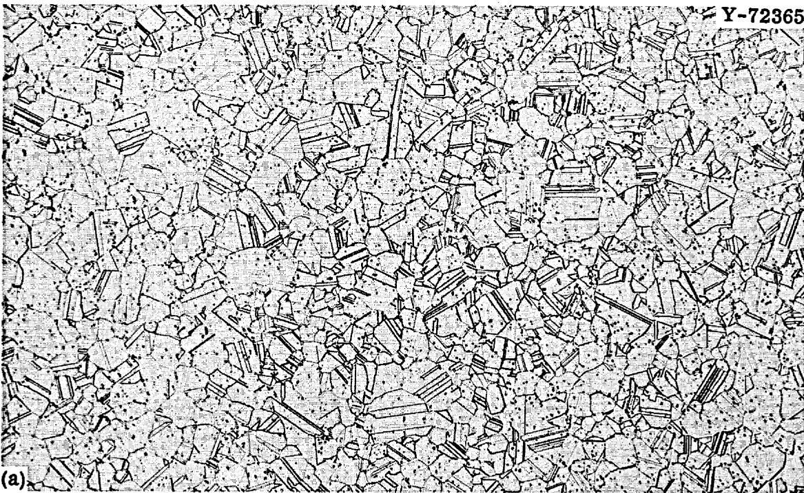

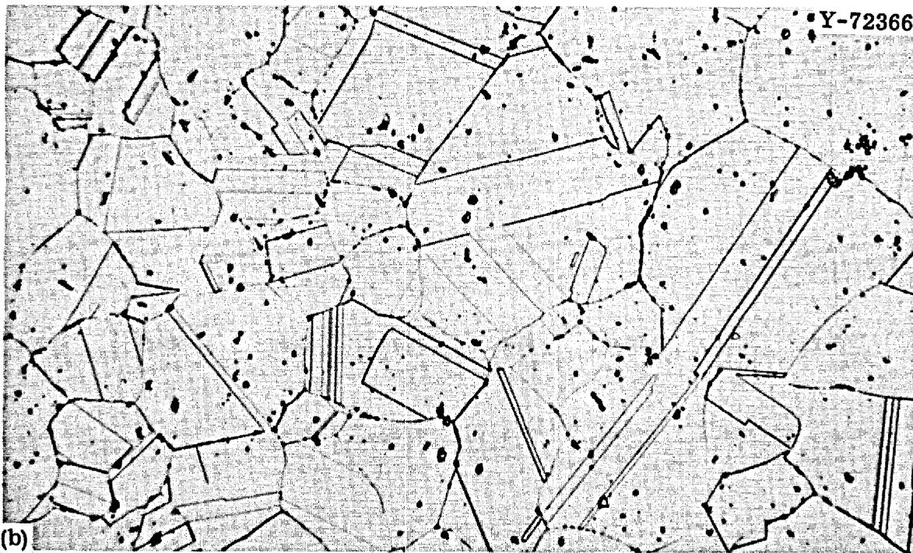  
Fig. 78. Photomicrographs of Alloy 156 Modified with $0.43\%$ Hf. Annealed 1 hr at $1177^{\circ}\mathrm{C}$ . (a) $100\times$ and (b) $500\times$ . Etchant: glyceria regia.

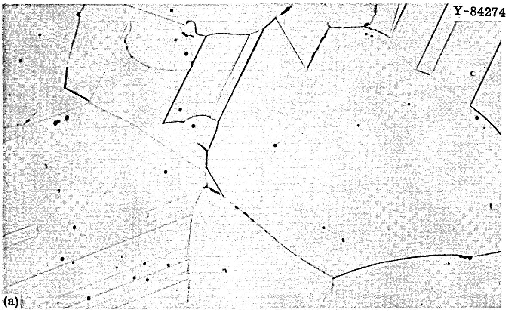

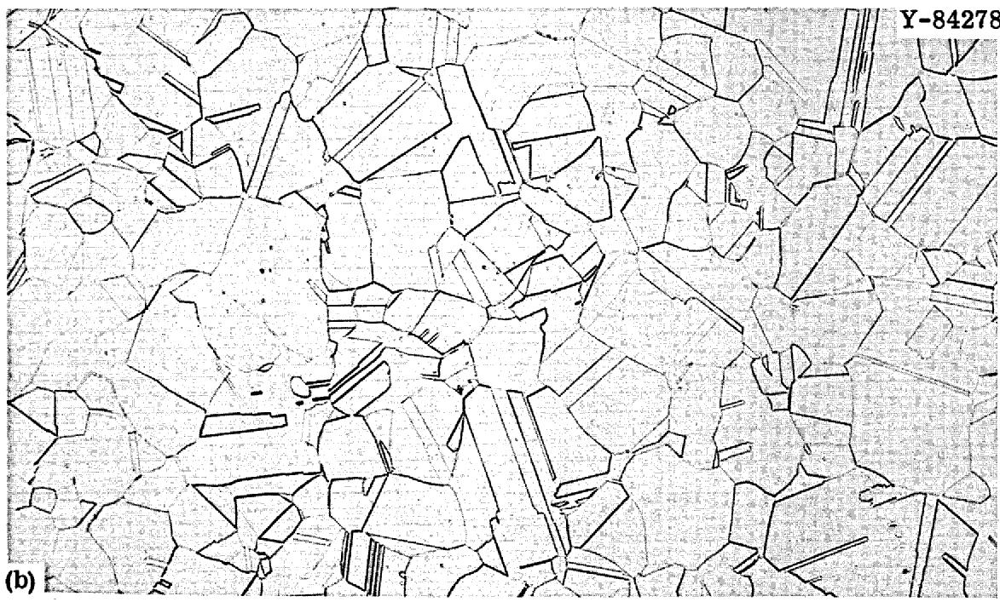  
Fig. 79. Typical Photomicrographs of Heat 67-503 (0.08% Hf) Annealed 1 hr at $1177^{\circ}\mathrm{C}$ . Longitudinal section. (a) $100\times$ and (b) $500\times$ . Etchant: glyceria regia.

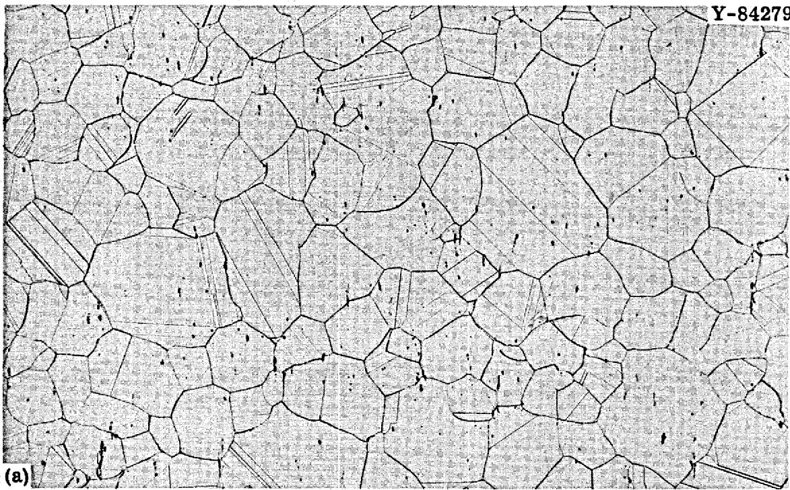

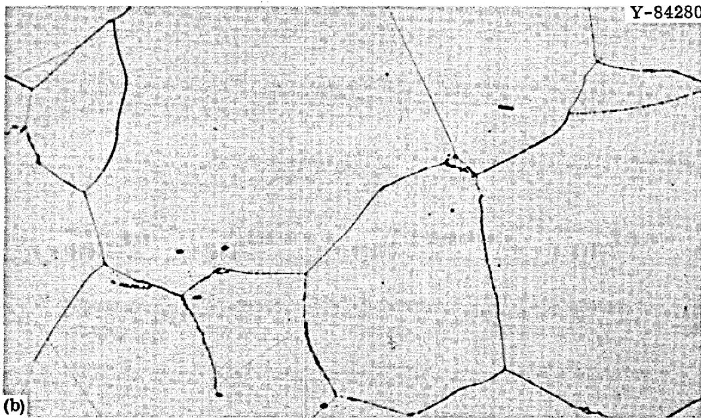  
Fig. 80. Typical Photomicrographs of Heat 67-504 (0.50% Hf) Annealed 1 hr at $1177^{\circ}\mathrm{C}$ . Longitudinal section. (a) $100 \times$ and (b) $500 \times$ . Etchant: glyceria regia!

155 (0.13% Hf) had much smaller grain sizes. Alloy 152 contained 0.16% Hf, and the grain size was refined by copious quantities of carbide precipitates at grain boundaries. When the hafnium content was increased to 0.43%, as in alloy 156, the precipitation became more general with precipitation at grain boundaries and in the matrix. The two commercial alloys had larger grain sizes than their counterparts in the series of laboratory melts (Figs. 79 and 80).

The results of creep-rupture tests at $650^{\circ}\mathrm{C}$ on unirradiated and irradiated samples of alloys 152 through 156 are given in Tables 33 and 34, respectively. The stress-rupture properties for the unirradiated

Table 33. Stress Properties at $650^{\circ}\mathrm{C}$ of Several Hafnium-Modified Alloysa   

<table><tr><td>Alloy Number</td><td>Specimen Number</td><td>Test Number</td><td>Stress (psi)</td><td>Rupture Life (hr)</td><td>Minimum Creep Rate (%/hr)</td><td>Elongation (%)</td><td>Reduction in Area (%)</td></tr><tr><td></td><td></td><td></td><td>×103</td><td></td><td></td><td></td><td></td></tr><tr><td>152</td><td>2979</td><td>7506</td><td>35</td><td>1906.3</td><td>0.0015</td><td>15.0</td><td>20.5</td></tr><tr><td>152</td><td>2964</td><td>6537</td><td>70</td><td>3.4</td><td>1.23</td><td>23.4</td><td>22.3</td></tr><tr><td>152</td><td>2967</td><td>6538</td><td>55</td><td>21.1</td><td>0.146</td><td>14.1</td><td>15.6</td></tr><tr><td>152</td><td>2965</td><td>6539</td><td>47</td><td>67.4</td><td>0.051</td><td>12.2</td><td>13.3</td></tr><tr><td>152</td><td>2966</td><td>6540</td><td>40</td><td>234.4</td><td>0.018</td><td>11.7</td><td>11.4</td></tr><tr><td>153</td><td>6554</td><td>7507</td><td>35</td><td>216.5</td><td>0.0050</td><td>9.3</td><td>11.3</td></tr><tr><td>153</td><td>6453</td><td>6658</td><td>70</td><td>0.3</td><td>7.69</td><td>41.8</td><td>29.3</td></tr><tr><td>153</td><td>2864</td><td>6535</td><td>55</td><td>6.6</td><td>0.194</td><td>20.4</td><td>17.4</td></tr><tr><td>153</td><td>2863</td><td>6536</td><td>47</td><td>76.7</td><td>0.023</td><td>16.2</td><td>18.2</td></tr><tr><td>153</td><td>6545</td><td>6687</td><td>40</td><td>114.2</td><td>0.013</td><td>11.9</td><td>11.8</td></tr><tr><td>153</td><td>6544</td><td>6686</td><td>55</td><td>7.4</td><td>0.223</td><td>22.6</td><td>18.0</td></tr><tr><td>154</td><td>6559</td><td>6771</td><td>70</td><td>0.2</td><td>3.5</td><td>32.0</td><td>26.5</td></tr><tr><td>154</td><td>6556</td><td>6689</td><td>40</td><td>86.0</td><td>0.023</td><td>7.8</td><td>5.5</td></tr><tr><td>154</td><td>6567</td><td>7509</td><td>55</td><td>5.0</td><td>0.188</td><td>19.7</td><td>24.8</td></tr><tr><td>154</td><td>6566</td><td>7508</td><td>47</td><td>41.0</td><td>0.0352</td><td>13.1</td><td>18.7</td></tr><tr><td>155</td><td>8495</td><td>7554</td><td>70</td><td>0</td><td></td><td>48.4</td><td>37.3</td></tr><tr><td>155</td><td>2873</td><td>6531</td><td>55</td><td>33.6</td><td>0.112</td><td>14.0</td><td>17.9</td></tr><tr><td>155</td><td>2874</td><td>6532</td><td>47</td><td>90.2</td><td>0.043</td><td>13.2</td><td>14.0</td></tr><tr><td>156</td><td>6642</td><td>6692</td><td>70</td><td>1.9</td><td>1.25</td><td>22.4</td><td>22.0</td></tr><tr><td>156</td><td>6643</td><td>6693</td><td>55</td><td>19.0</td><td>0.152</td><td>14.7</td><td>11.9</td></tr><tr><td>156</td><td>2878</td><td>6694</td><td>47</td><td>257.5</td><td>0.0214</td><td>18.5</td><td>15.6</td></tr><tr><td>156</td><td>6650</td><td>7510</td><td>35</td><td>1210.5</td><td>0.011</td><td>22.2</td><td>20.3</td></tr></table>

${}^{a}$ All materials annealed 1 hr at ${1177}^{ \circ  }\mathrm{C}$ before testing.

Table 34. Creep Properties at $650^{\circ}\mathrm{C}$ of Irradiated2 Alloys Containing Various Amounts of Hafnium   

<table><tr><td>Alloy Number</td><td>Specimen Number</td><td>Test Number</td><td>Hafnium Content (wt %)</td><td>Stress (psi)</td><td>Rupture Life (hr)</td><td>Minimum Creep Rate (%/hr)</td><td>Elongation (%)</td></tr><tr><td></td><td></td><td></td><td colspan="5">× 103</td></tr><tr><td>100</td><td>1916</td><td>R-146</td><td></td><td>32.4</td><td>105.4</td><td>0.0099</td><td>1.1</td></tr><tr><td>152</td><td>2961</td><td>R-373</td><td>0.16</td><td>47</td><td>10.7</td><td>0.240</td><td>3.14</td></tr><tr><td>152</td><td>2963</td><td>R-208</td><td>0.16</td><td>40</td><td>87.3</td><td>0.044</td><td>4.28</td></tr><tr><td>152</td><td>2962</td><td>R-371</td><td>0.16</td><td>32.4</td><td>459.5</td><td>0.0068</td><td>5.14</td></tr><tr><td>153</td><td>2860</td><td>R-212</td><td>0.06</td><td>40</td><td>35.6</td><td>0.053</td><td>2.38</td></tr><tr><td>153</td><td>2861</td><td>R-222</td><td>0.06</td><td>35</td><td>202.2</td><td>0.0065</td><td>3.07</td></tr><tr><td>153</td><td>2862</td><td>R-383</td><td>0.06</td><td>32.4</td><td>224.8</td><td>0.010</td><td>3.32</td></tr><tr><td>154</td><td>2865</td><td>R-374</td><td>0.10</td><td>47</td><td>7.1</td><td>0.253</td><td>2.25</td></tr><tr><td>154</td><td>2867</td><td>R-188</td><td>0.10</td><td>40</td><td>41.5</td><td>0.0548</td><td>2.70</td></tr><tr><td>154</td><td>2866</td><td>R-372</td><td>0.10</td><td>32.4</td><td>138.3</td><td>0.0115</td><td>3.09</td></tr><tr><td>155</td><td>2872</td><td>R-200</td><td>0.13</td><td>40</td><td>63.1</td><td>0.0385</td><td>2.78</td></tr><tr><td>155</td><td>2871</td><td>R-221</td><td>0.13</td><td>35</td><td>221.9</td><td>0.0080</td><td>1.93</td></tr><tr><td>155</td><td>2870</td><td>R-238</td><td>0.13</td><td>35</td><td>150.9</td><td>0.0084</td><td>2.85</td></tr><tr><td>156</td><td>2877</td><td>R-251</td><td>0.43</td><td>47</td><td>80.8</td><td>0.101</td><td>10.45</td></tr><tr><td>156</td><td>2875</td><td>R-190</td><td>0.43</td><td>40</td><td>395.1</td><td>0.0277</td><td>15.75</td></tr><tr><td>156</td><td>2876</td><td>R-213</td><td>0.43</td><td>35</td><td>1707.2</td><td>0.0064</td><td>14.20</td></tr></table>

aAll materials annealed 1 hr at $1177^{\circ}\mathrm{C}$ before irradiation at $650^{\circ}\mathrm{C}$ to a thermal fluence of $2.3 \times 10^{20}$ neutrons/cm².

alloys are shown in Fig. 81. The results for alloy 100, which contained no detectable hafnium, are used for comparative purposes. The general observation is that the rupture life increased with increasing hafnium content up to about $0.16\%$ . The stress-rupture properties of the irradiated alloys shown in Fig. 82 were even more dependent upon the hafnium content than those of the unirradiated material. In this condition, alloy 156 (0.43% Hf) had far superior stress-rupture properties.

The minimum creep rates of alloys 100 and 152 through 156 are shown in Fig. 83. The alloys that contained hanfium had lower creep rates, but the magnitudes showed no clear dependence upon the concentration between 0.06 and $0.43\%$ Hf. Irradiation caused a slight increase in the creep rate of most alloys; alloy 156 ( $0.43\%$ Hf) seemed unaffected.

The fracture strains of the alloys in the unirradiated condition are shown in Fig. 84. Generally, the alloys followed the trend of decreasing

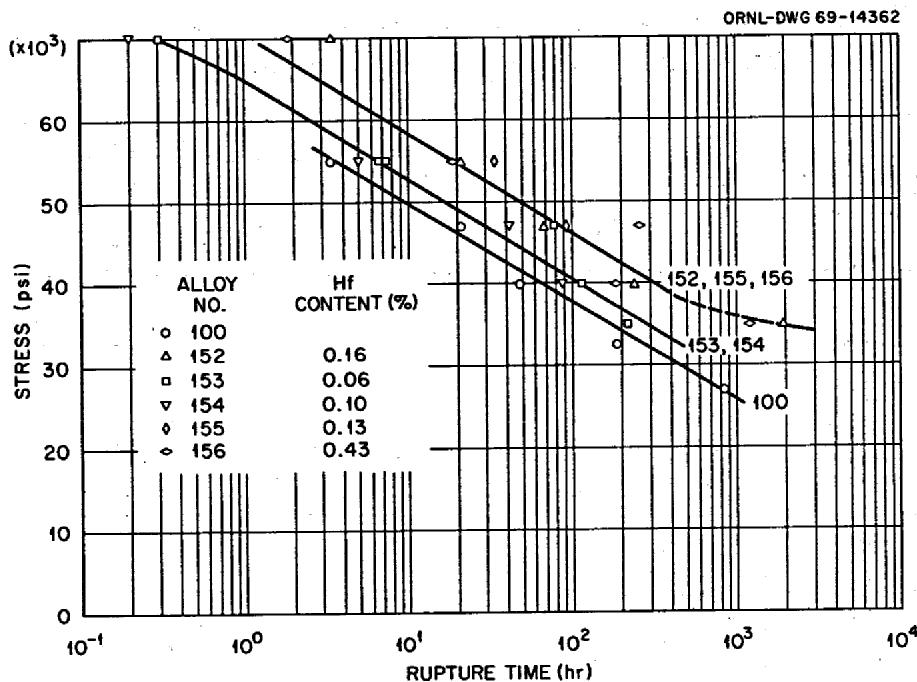  
Fig. 81. Stress-Rupture Properties at $650^{\circ}\mathrm{C}$ of Several Alloys That Contain Hafnium. All samples annealed 1 hr at $1177^{\circ}\mathrm{C}$ before testing.

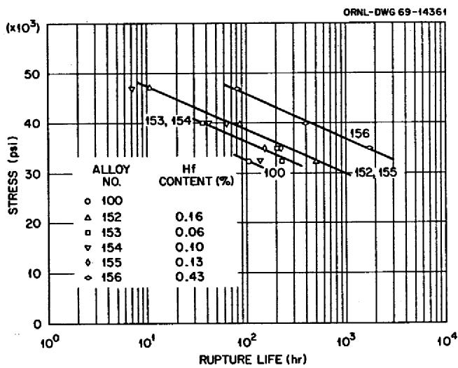  
Fig. 82. Creep-Rupture Properties at $650^{\circ}\mathrm{C}$ of Irradiated Alloys That Contain Various Concentrations of Hafnium. All samples annealed $1\mathrm{hr}$ at $1177^{\circ}\mathrm{C}$ before irradiation at $650^{\circ}\mathrm{C}$ .

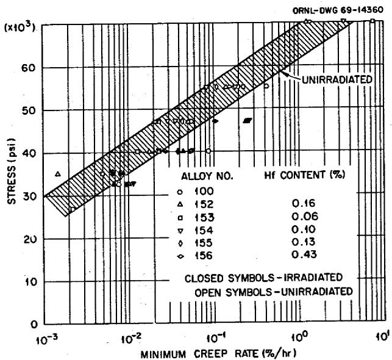  
Fig. 83. Creep Rates at $650^{\circ}\mathrm{C}$ of Alloys That Contain Various Concentrations of Hafnium. All samples annealed 1 hr at $1177^{\circ}\mathrm{C}$ .

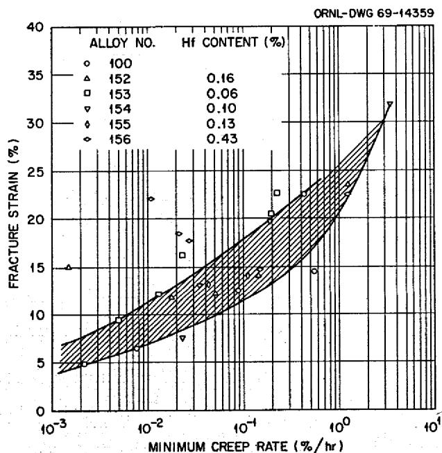  
Fig. 84. Fracture Strains at $650^{\circ}\mathrm{C}$ of Alloys That Contain Various Amounts of Hafnium. All samples annealed 1 hr at $1177^{\circ}\mathrm{C}$ before testing.

fracture strain with decreasing creep rate. Alloy 156 (0.43% Hf) had slightly superior ductility, particularly at the lower strain rates. The fracture strains after irradiation are shown in Fig. 85. Alloy 156 (0.43% Hf) had high fracture strains, and alloy 152 (0.16% Hf) had fracture strains somewhat-improved over those of the other alloys.

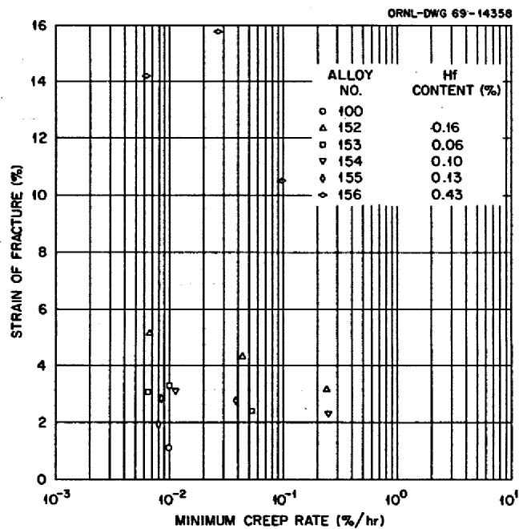  
Fig. 85. Fracture Strains at $650^{\circ}\mathrm{C}$ of Irradiated Alloys That Contain Various Amounts of Hafnium. All samples annealed 1 hr at $1177^{\circ}\mathrm{C}$ before irradiation at $650^{\circ}\mathrm{C}$ .

The commercial alloys, 67-503 (0.08% Hf) and 67-504 (0.50% Hf) were subjected to various tests. The results of tensile tests on alloy 67-503 are given in Table 35. The results on irradiated tests showed clearly that the anneal of 1 hr at $1177^{\circ}\mathrm{C}$ before test gave superior fracture strains at $650^{\circ}\mathrm{C}$ . More detailed testing was carried out on heat 67-504 (0.50% Hf). This alloy was included in the surveillance program for the MSRE. Samples were exposed to a molten fluoride fuel salt in the core for 9800 hr at $650^{\circ}\mathrm{C}$ and received a thermal-neutron fluence of $5.3 \times 10^{20}$ neutrons/ $\mathrm{cm}^2$ . Control samples were exposed to static barren salt for 9800 hr at $650^{\circ}\mathrm{C}$ . Some test results on these samples are presented in

Table 35. Tensile Properties of Irradiated and Unirradiated Alloy 67-503 (0.08% Hf)   

<table><tr><td rowspan="2">Specimen Number</td><td rowspan="2">Anneal\(^a\) Before Irradiation</td><td colspan="2">Temperature, °C</td><td rowspan="2">Thermal-Neutron Fluence(neutrons/cm\(^2\))</td><td rowspan="2">Strain Rate(min\(^{-1}\))</td><td colspan="2">Stress, psi</td><td colspan="2">Elongation, %</td><td rowspan="2">Reduction in Area (%)</td></tr><tr><td>Irradiation</td><td>Test</td><td>Yield</td><td>Ultimate Tensile</td><td>Uniform</td><td>Total</td></tr><tr><td></td><td></td><td></td><td></td><td>× 10\( ^{20} \)</td><td></td><td>× 10\( ^3 \)</td><td>× 10\( ^3 \)</td><td></td><td></td><td></td></tr><tr><td>6195</td><td>816</td><td></td><td>650</td><td></td><td>0.05</td><td>48</td><td>92.4</td><td>28.1</td><td>33.7</td><td>27.1</td></tr><tr><td>6196</td><td>816</td><td></td><td>650</td><td></td><td>0.002</td><td>50.6</td><td>74.5</td><td>14.6</td><td>33.8</td><td>31.5</td></tr><tr><td>6197</td><td>816</td><td></td><td>760</td><td></td><td>0.002</td><td>37.1</td><td>37.8</td><td>1.5</td><td>24.9</td><td>22.7</td></tr><tr><td>6193</td><td>121</td><td></td><td>650</td><td></td><td>0.002</td><td>24.3</td><td>55.8</td><td>21.7</td><td>22.9</td><td>17.4</td></tr><tr><td>6194</td><td>121</td><td></td><td>760</td><td></td><td>0.002</td><td>31.2</td><td>45.3</td><td>6.3</td><td>9.5</td><td>12.9</td></tr><tr><td>4999</td><td>123</td><td></td><td>760</td><td></td><td>0.002</td><td>27.7</td><td>41.2</td><td>5.5</td><td>6.7</td><td>4.7</td></tr><tr><td>6229</td><td>816</td><td>650</td><td>650</td><td>2.0</td><td>0.002</td><td>33.4</td><td>38.9</td><td>3.7</td><td>4.4</td><td>6.7</td></tr><tr><td>6234</td><td>816</td><td>650</td><td>650</td><td>2.0</td><td>0.05</td><td>35.1</td><td>46.2</td><td>6.0</td><td>7.0</td><td>14.1</td></tr><tr><td>4941</td><td>816</td><td>760</td><td>760</td><td>2.4</td><td>0.002</td><td>8.6</td><td>8.7</td><td>1.7</td><td>1.9</td><td>6.9</td></tr><tr><td>4974</td><td>121</td><td>760</td><td>760</td><td>2.4</td><td>0.002</td><td>14.3</td><td>14.7</td><td>1.6</td><td>1.7</td><td>3.2</td></tr><tr><td>4949</td><td>121</td><td>650</td><td>650</td><td>2.4</td><td>0.002</td><td>26.9</td><td>40.2</td><td>8.0</td><td>8.6</td><td>10.0</td></tr><tr><td>4966</td><td>123</td><td>760</td><td>760</td><td>2.4</td><td>0.002</td><td>7.8</td><td>7.8</td><td>0.7</td><td>0.8</td><td>2.1</td></tr></table>

a Annealing designations: 816 = annealed 8 hr at $871^{\circ}\mathrm{C}$ ; 121 = annealed 1 hr at $1177^{\circ}\mathrm{C}$ ; 123 = annealed 1 hr at $1260^{\circ}\mathrm{C}$ .

Table 36; details of these tests were discussed previously.7 The fracture strains at a strain rate of $0.05\mathrm{min}^{-1}$ are shown in Fig. 86 as a function of test temperature. The material in the unirradiated condition was characterized by a high fracture strain of about $50\%$ that decreased gradually with increasing temperature above $650^{\circ}\mathrm{C}$ . Irradiation caused a general decrease in the fracture strain; the decrease was largest at test temperatures of $25^{\circ}\mathrm{C}$ and above $600^{\circ}\mathrm{C}$ . The decrease at $25^{\circ}\mathrm{C}$ was likely associated with carbide precipitation and has been observed for many other modified and standard heats.7 The decrease at high temperatures is due to helium produced during irradiation. Similar results for a lower strain rate of $0.002\mathrm{min}^{-1}$ are shown in Fig. 87. The fracture strains were lower than those observed at the higher strain rate. Additional results given in Table 36 show that the higher anneal of $1\mathrm{hr}$ at $1177^{\circ}\mathrm{C}$ resulted in better fracture strains after irradiation than the anneal of $8\mathrm{hr}$ at $871^{\circ}\mathrm{C}$ . The samples irradiated in the MSRE for $9800\mathrm{hr}$ had slightly higher fracture strains than those irradiated in the ORR for about $1100\mathrm{hr}$ . This may have resulted from the different thermal histories or from the drastically different flux spectra.

7H. E. McCoy, An Evaluation of the Molten-Salt Reactor Experiment  
Hastelloy N Surveillance Specimens - Third Group, ORNL-TM-2647 (1970).

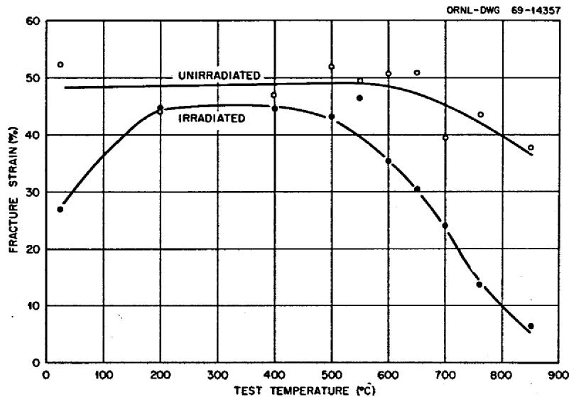  
Fig. 86. Variation of Fracture Strains of Alloy 67-504 with Test Temperature at a Strain Rate of $0.05 \, \text{min}^{-1}$ . Annealed 1 hr at $1177^{\circ}\text{C}$ . Irradiated at $650^{\circ}\text{C}$ .

Table 36. Tensile Properties of Irradiated and Unirradiated Alloy 67-504 (0.50% Hf)   

<table><tr><td rowspan="2">Specimen Number</td><td rowspan="2">Anneal\(^a\) Before Irradiation</td><td colspan="2">Temperature, °C</td><td rowspan="2">Thermal-Neutron Fluence (neutrons/cm\(^2\))</td><td rowspan="2">Strain Rate (min\(^{-1}\))</td><td colspan="2">Stress, psi</td><td colspan="2">Elongation, %</td><td rowspan="2">Reduction in Area (%)</td></tr><tr><td>Irradiation</td><td>Test</td><td>Yield</td><td>Ultimate Tensile</td><td>Uniform</td><td>Total</td></tr><tr><td></td><td></td><td></td><td></td><td>× 10\(^{20}\)</td><td></td><td>× 10\(^3\)</td><td>× 10\(^3\)</td><td></td><td></td><td></td></tr><tr><td>5058</td><td>151</td><td></td><td>25</td><td></td><td>0.05</td><td>67.5</td><td>133</td><td>50.2</td><td>52.3</td><td>43.7</td></tr><tr><td>5046</td><td>151</td><td></td><td>200</td><td></td><td>0.05</td><td>59.7</td><td>119</td><td>43.5</td><td>44.0</td><td>41.6</td></tr><tr><td>5057</td><td>151</td><td></td><td>400</td><td></td><td>0.05</td><td>45.5</td><td>105</td><td>46.2</td><td>47.2</td><td>36.4</td></tr><tr><td>5064</td><td>151</td><td></td><td>400</td><td></td><td>0.002</td><td>53.4</td><td>123</td><td>46.2</td><td>47.9</td><td>34.2</td></tr><tr><td>5061</td><td>151</td><td></td><td>500</td><td></td><td>0.05</td><td>43.1</td><td>99.9</td><td>50.6</td><td>52.1</td><td>41.3</td></tr><tr><td>5041</td><td>151</td><td></td><td>500</td><td></td><td>0.002</td><td>61.3</td><td>116</td><td>44.5</td><td>46.1</td><td>33.5</td></tr><tr><td>5045</td><td>151</td><td></td><td>550</td><td></td><td>0.05</td><td>45.3</td><td>102</td><td>47.9</td><td>49.4</td><td>36.9</td></tr><tr><td>5053</td><td>151</td><td></td><td>550</td><td></td><td>0.002</td><td>49.2</td><td>99.7</td><td>47.2</td><td>48.5</td><td>39.6</td></tr><tr><td>5055</td><td>151</td><td></td><td>600</td><td></td><td>0.05</td><td>45.4</td><td>97.7</td><td>49.1</td><td>50.9</td><td>36.7</td></tr><tr><td>5044</td><td>151</td><td></td><td>600</td><td></td><td>0.002</td><td>45.8</td><td>91.3</td><td>41.9</td><td>43.7</td><td>37.3</td></tr><tr><td>5065</td><td>151</td><td></td><td>650</td><td></td><td>0.05</td><td>43.3</td><td>94.3</td><td>48.8</td><td>50.9</td><td>37.4</td></tr><tr><td>5042</td><td>151</td><td></td><td>650</td><td></td><td>0.002</td><td>44.9</td><td>80.2</td><td>30.2</td><td>41.2</td><td>38.1</td></tr><tr><td>5067</td><td>151</td><td></td><td>700</td><td></td><td>0.05</td><td>53.3</td><td>94.6</td><td>30.8</td><td>39.5</td><td>36.0</td></tr><tr><td>5048</td><td>151</td><td></td><td>700</td><td></td><td>0.002</td><td>42.1</td><td>68.1</td><td>16.2</td><td>45.8</td><td>40.6</td></tr><tr><td>5066</td><td>151</td><td></td><td>760</td><td></td><td>0.05</td><td>44.2</td><td>75.4</td><td>20.3</td><td>43.5</td><td>38.4</td></tr><tr><td>5047</td><td>151</td><td></td><td>760</td><td></td><td>0.002</td><td>42.7</td><td>50.8</td><td>6.0</td><td>38.9</td><td>41.8</td></tr><tr><td>5060</td><td>151</td><td></td><td>850</td><td></td><td>0.05</td><td>34.9</td><td>47.8</td><td>7.7</td><td>38.7</td><td>35.5</td></tr><tr><td>5056</td><td>151</td><td></td><td>850</td><td></td><td>0.002</td><td>31.5</td><td>32.4</td><td>2.9</td><td>34.8</td><td>34.3</td></tr><tr><td>6255</td><td>121</td><td></td><td>25</td><td></td><td>0.05</td><td>37.4</td><td>104.7</td><td>66.6</td><td>73.2</td><td>73.7</td></tr><tr><td>6256</td><td>121</td><td></td><td>200</td><td></td><td>0.05</td><td>33.1</td><td>104.2</td><td>68.7</td><td>71.3</td><td>52.2</td></tr><tr><td>6257</td><td>121</td><td></td><td>400</td><td></td><td>0.05</td><td>27.1</td><td>88</td><td>77.1</td><td>80.1</td><td>60.6</td></tr><tr><td>6258</td><td>121</td><td></td><td>500</td><td></td><td>0.05</td><td>30</td><td>96.6</td><td>67.3</td><td>73.9</td><td>50.0</td></tr><tr><td>6259</td><td>121</td><td></td><td>550</td><td></td><td>0.05</td><td>27.8</td><td>91.2</td><td>79.0</td><td>82.3</td><td>62.5</td></tr><tr><td>6260</td><td>121</td><td></td><td>600</td><td></td><td>0.05</td><td>25.5</td><td>87.4</td><td>73.6</td><td>79.6</td><td>56.3</td></tr><tr><td>6265</td><td>121</td><td></td><td>600</td><td></td><td>0.002</td><td>24.4</td><td>71.4</td><td>45.7</td><td>47.1</td><td>34.7</td></tr><tr><td>6262</td><td>121</td><td></td><td>650</td><td></td><td>0.05</td><td>25.6</td><td>83</td><td>63.9</td><td>66.9</td><td>45.1</td></tr><tr><td>6266</td><td>121</td><td></td><td>650</td><td></td><td>0.002</td><td>23.9</td><td>63.6</td><td>33.1</td><td>34.2</td><td>26.9</td></tr><tr><td>6263</td><td>121</td><td></td><td>700</td><td></td><td>0.05</td><td>25.7</td><td>76.2</td><td>46.7</td><td>49.3</td><td>32.4</td></tr><tr><td>6264</td><td>121</td><td></td><td>760</td><td></td><td>0.05</td><td>24</td><td>65.8</td><td>33.5</td><td>35.5</td><td>25.7</td></tr><tr><td>6267</td><td>121</td><td></td><td>760</td><td></td><td>0.002</td><td>35.8</td><td>42</td><td>6.3</td><td>11.3</td><td>16.4</td></tr><tr><td>5086</td><td>121</td><td>650</td><td>25</td><td>5.3</td><td>0.05</td><td>102</td><td>119</td><td>26.0</td><td>27.0</td><td>33.5</td></tr><tr><td>5087</td><td>121</td><td>650</td><td>200</td><td>5.3</td><td>0.05</td><td>46.4</td><td>106</td><td>43.7</td><td>44.4</td><td>31.9</td></tr><tr><td>5088</td><td>121</td><td>650</td><td>400</td><td>5.3</td><td>0.05</td><td>41</td><td>97.6</td><td>44.0</td><td>44.5</td><td>37.2</td></tr><tr><td>5089</td><td>121</td><td>659</td><td>400</td><td>5.3</td><td>0.002</td><td>41.8</td><td>99</td><td>41.8</td><td>42.9</td><td>36.4</td></tr><tr><td>5090</td><td>121</td><td>650</td><td>500</td><td>5.3</td><td>0.05</td><td>40.2</td><td>93</td><td>42.8</td><td>43.3</td><td>37.9</td></tr><tr><td>5091</td><td>121</td><td>650</td><td>500</td><td>5.3</td><td>0.002</td><td>41.6</td><td>91.2</td><td>42.2</td><td>43.2</td><td>28.2</td></tr><tr><td>5092</td><td>121</td><td>650</td><td>550</td><td>5.3</td><td>0.05</td><td>39.6</td><td>92</td><td>46.0</td><td>46.7</td><td>36.5</td></tr><tr><td>5093</td><td>121</td><td>650</td><td>550</td><td>5.3</td><td>0.002</td><td>38</td><td>78.2</td><td>28.2</td><td>29.9</td><td>21.2</td></tr><tr><td>5079</td><td>121</td><td>650</td><td>600</td><td>5.3</td><td>0.05</td><td>39.7</td><td>82.6</td><td>35.3</td><td>35.7</td><td>33.5</td></tr><tr><td>5078</td><td>121</td><td>650</td><td>600</td><td>5.3</td><td>0.002</td><td>40.2</td><td>69.6</td><td>23.7</td><td>24.8</td><td>17.2</td></tr><tr><td>5085</td><td>121</td><td>650</td><td>650</td><td>5.3</td><td>0.05</td><td>32.9</td><td>70</td><td>30.0</td><td>30.7</td><td>31.5</td></tr><tr><td>5084</td><td>121</td><td>650</td><td>650</td><td>5.3</td><td>0.002</td><td>34.7</td><td>63.9</td><td>21.9</td><td>23.1</td><td>17.0</td></tr><tr><td>5077</td><td>121</td><td>650</td><td>700</td><td>5.3</td><td>0.05</td><td>35</td><td>65.9</td><td>23.2</td><td>24.2</td><td>24.5</td></tr><tr><td>5076</td><td>121</td><td>650</td><td>700</td><td>5.3</td><td>0.002</td><td>35.8</td><td>56.2</td><td>11.9</td><td>14.6</td><td>13.1</td></tr><tr><td>5075</td><td>121</td><td>650</td><td>760</td><td>5.3</td><td>0.05</td><td>34.9</td><td>57.6</td><td>12.8</td><td>13.8</td><td>18.0</td></tr><tr><td>5074</td><td>121</td><td>650</td><td>760</td><td>5.3</td><td>0.002</td><td>37</td><td>42.3</td><td>4.3</td><td>6.7</td><td>11.9</td></tr><tr><td>5073</td><td>121</td><td>650</td><td>850</td><td>5.3</td><td>0.05</td><td>32.6</td><td>40.8</td><td>4.8</td><td>6.6</td><td>9.4</td></tr><tr><td>5072</td><td>121</td><td>650</td><td>850</td><td>5.3</td><td>0.002</td><td>25.4</td><td>26</td><td>2.1</td><td>4.4</td><td>11.5</td></tr><tr><td>6238</td><td>816</td><td>650</td><td>650</td><td>2.0</td><td>0.002</td><td>34.8</td><td>50.4</td><td>9.2</td><td>9.9</td><td>13.2</td></tr><tr><td>6239</td><td>816</td><td>650</td><td>650</td><td>2.0</td><td>0.05</td><td>34.5</td><td>54.5</td><td>10.3</td><td>12.0</td><td>19.4</td></tr><tr><td>4945</td><td>816</td><td>760</td><td>760</td><td>2.0</td><td>0.002</td><td>18.5</td><td>18.6</td><td>2.4</td><td>2.8</td><td>4.9</td></tr><tr><td>4927</td><td>121</td><td>650</td><td>650</td><td>2.4</td><td>0.002</td><td>30.4</td><td>50.4</td><td>12.8</td><td>16.8</td><td>7.0</td></tr><tr><td>4986</td><td>121</td><td>760</td><td>760</td><td>2.4</td><td>0.002</td><td>13.5</td><td>13.5</td><td>1.1</td><td>1.1</td><td>6.0</td></tr><tr><td>4970</td><td>123</td><td>760</td><td>760</td><td>2.4</td><td>0.002</td><td>9.3</td><td>9.3</td><td>1.2</td><td>1.3</td><td>5.1</td></tr></table>

aAnnealing designations: 151 = annealed 1 hr at $1177^{\circ}C$ plus 9800 hr at $650^{\circ}C$ ; 121 = annealed 1 hr at $1177^{\circ}C$ ; 816 = annealed 8 hr at $871^{\circ}C$ ; 123 = annealed 1 hr at $1260^{\circ}C$ .

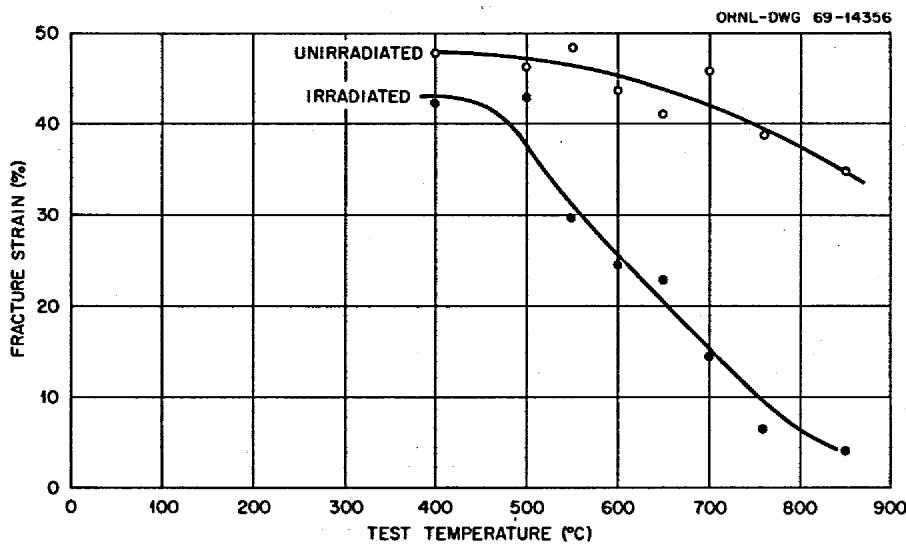  
Fig. 87. Variation of Fracture Strain of Alloy 67-504 with Test Temperature at a Strain Rate of $0.002 \, \text{min}^{-1}$ . Annealed 1 hr at $1177^{\circ}\text{C}$ . Irradiated at $650^{\circ}\text{C}$ .

The results of creep-rupture tests on heat 67-503 are given in Table 37. The stress-rupture properties are shown graphically in Fig. 88, and the creep characteristics are shown in Fig. 89. Irradiation reduced the rupture life more at $760^{\circ}\mathrm{C}$ than at $650^{\circ}\mathrm{C}$ . Irradiation at $650^{\circ}\mathrm{C}$ had no effect on the minimum creep rate, but irradiation at $760^{\circ}\mathrm{C}$ increased the minimum creep rate (Fig. 89).

Results of creep-rupture tests for heat 67-504 (0.50% Hf) are summarized in Table 38. Data are included from the MSRE surveillance program. The stress-rupture characteristics are shown in Fig. 90. This heat had a rupture life eight to ten times higher than that of heat 67-503 (0.08% Hf). The samples aged in fluoride salt for 9800 hr had slightly shorter rupture lives than those annealed 1 hr at $1177^{\circ}\mathrm{C}$ before test. Irradiation at $650^{\circ}\mathrm{C}$ reduced the rupture life, but less for the samples irradiated in the MSRE than for those irradiated in the ORR. Irradiation at $760^{\circ}\mathrm{C}$ in the ORR drastically decreased the rupture life. The minimum creep rates for these samples are shown graphically in Fig. 91. The creep strength of heat 67-504 is about ten times that of heat 67-503. The minimum creep rate was unaffected by aging at $650^{\circ}\mathrm{C}$ for 9800 hr in static salt or by short-term (1000-hr) irradiation at $650^{\circ}\mathrm{C}$ . Irradiation at $650^{\circ}\mathrm{C}$ in the MSRE increased the creep rate, and irradiation at $760^{\circ}\mathrm{C}$ drastically increased the creep rate.

Table 37. Creep Properties of Irradiated ${}^{a}$ and Unirradiated Alloy 67-503 (0.08% Hf)   

<table><tr><td rowspan="2">Specimen Number</td><td rowspan="2">Test Number</td><td rowspan="2">Annealb Before Irradiation</td><td colspan="2">Temperature, °C</td><td rowspan="2">Stress (psi)</td><td rowspan="2">Rupture Life (hr)</td><td rowspan="2">Minimum Creep Rate (%/hr)</td><td rowspan="2">Fracture Strain (%)</td><td rowspan="2">Reduction in Area (%)</td></tr><tr><td>Irradiation</td><td>Test</td></tr><tr><td></td><td></td><td></td><td></td><td></td><td>× 103</td><td></td><td></td><td></td><td></td></tr><tr><td>6179</td><td>7514</td><td>121</td><td></td><td>650</td><td>55</td><td>5.6</td><td>0.26</td><td>24.6</td><td>26.0</td></tr><tr><td>4957</td><td>6257</td><td>121</td><td></td><td>650</td><td>47</td><td>68.3</td><td>0.046</td><td>14.3</td><td>18.0</td></tr><tr><td>4958</td><td>6256</td><td>121</td><td></td><td>650</td><td>40</td><td>150.1</td><td>0.019</td><td>9.9</td><td>11.6</td></tr><tr><td>6178</td><td>7513</td><td>121</td><td></td><td>650</td><td>30</td><td>498.1</td><td>0.0045</td><td>8.3</td><td>17.5</td></tr><tr><td>6177</td><td>7512</td><td>121</td><td></td><td>760</td><td>20</td><td>41.1</td><td>0.15</td><td>9.2</td><td>5.1</td></tr><tr><td>6176</td><td>7511</td><td>121</td><td></td><td>760</td><td>15</td><td>128.1</td><td>0.039</td><td>8.4</td><td>16.8</td></tr><tr><td>4950</td><td>R-493</td><td>121</td><td>650</td><td>650</td><td>47</td><td>4.1</td><td>0.45</td><td>2.8</td><td></td></tr><tr><td>4952</td><td>R-505</td><td>121</td><td>650</td><td>650</td><td>40</td><td>32.6</td><td>0.071</td><td>3.2</td><td></td></tr><tr><td>4955</td><td>R-537</td><td>121</td><td>650</td><td>650</td><td>35</td><td>45.6</td><td>0.073</td><td>3.7</td><td></td></tr><tr><td>4975</td><td>R-500</td><td>121</td><td>760</td><td>650</td><td>47</td><td>0</td><td></td><td></td><td></td></tr><tr><td>4978</td><td>R-515</td><td>121</td><td>760</td><td>650</td><td>35</td><td>0.4</td><td>0.35</td><td>0.77</td><td></td></tr><tr><td>4979</td><td>R-547</td><td>121</td><td>760</td><td>650</td><td>30</td><td>2.2</td><td>0.036</td><td>0.11</td><td></td></tr><tr><td>4967</td><td>R-499</td><td>123</td><td>760</td><td>650</td><td>47</td><td>0</td><td></td><td></td><td></td></tr><tr><td>4969</td><td>R-541</td><td>123</td><td>760</td><td>650</td><td>40</td><td>0</td><td></td><td></td><td></td></tr><tr><td>4942</td><td>R-510</td><td>816</td><td>760</td><td>650</td><td>40</td><td>2.6</td><td>0.22</td><td>0.87</td><td></td></tr><tr><td>4944</td><td>R-539</td><td>816</td><td>760</td><td>650</td><td>35</td><td>3.3</td><td>0.096</td><td>0.51</td><td></td></tr><tr><td>4954</td><td>R-513</td><td>121</td><td>650</td><td>760</td><td>15</td><td>36.8</td><td>0.029</td><td>1.7</td><td></td></tr><tr><td>4977</td><td>R-508</td><td>121</td><td>760</td><td>760</td><td>12.5</td><td>7.6</td><td>0.082</td><td>0.41</td><td></td></tr><tr><td>4968</td><td>R-533</td><td>123</td><td>760</td><td>760</td><td>12.5</td><td>0.5</td><td>0.053</td><td>0.07</td><td></td></tr><tr><td>4943</td><td>R-527</td><td>816</td><td>760</td><td>760</td><td>12.5</td><td>8.1</td><td>0.021</td><td>0.68</td><td></td></tr></table>

aIrradiated at indicated temperatures to a thermal fluence of $2.4\times 10^{20}$ neutrons/cm².   
bAnnealing designations: 121 = annealed 1 hr at $1177^{\circ}C$ . 123 = annealed 1 hr at $1260^{\circ}C$ .. 816 = annealed 8 hr at $871^{\circ}C$

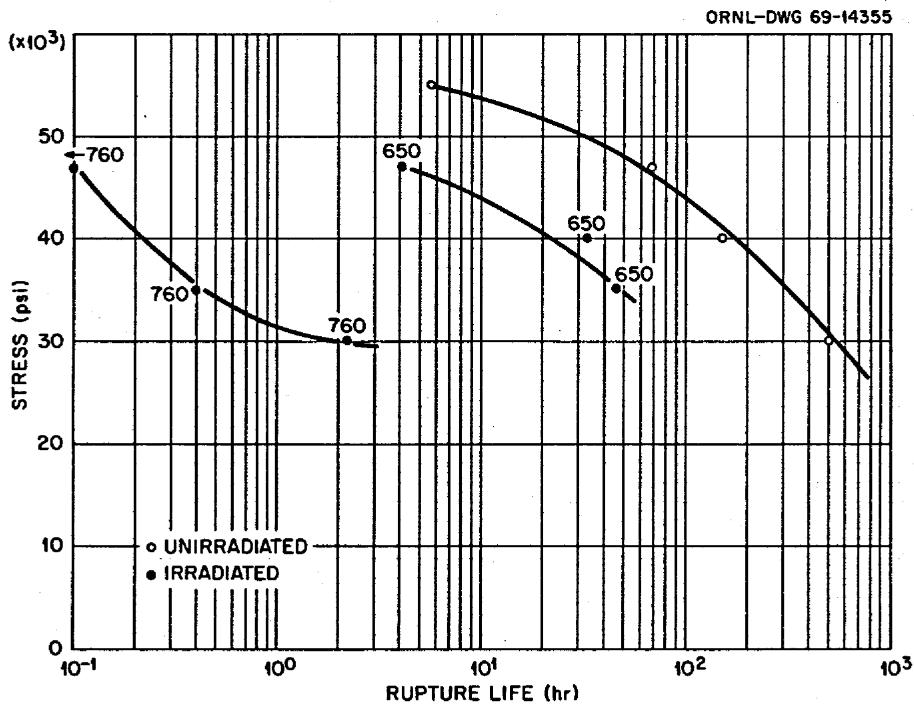  
Fig. 88. Stress-Rupture Properties at $650^{\circ}\mathrm{C}$ of Alloy 67-503. All samples annealed 1 hr at $1177^{\circ}\mathrm{C}$ before test or irradiation. Number by each datum point indicates irradiation temperature.

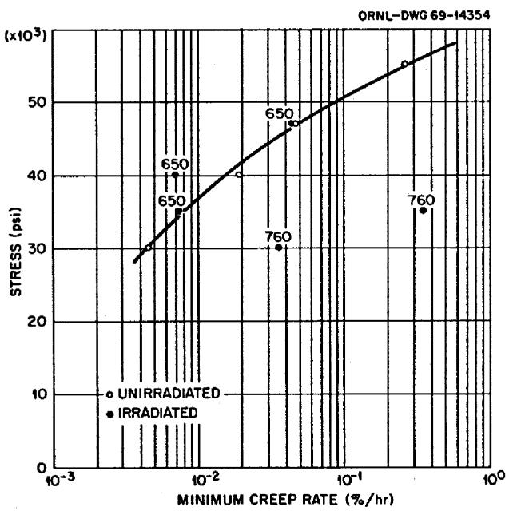  
Fig. 89. Creep Rates at $650^{\circ}\mathrm{C}$ of Alloy 67-503. All samples annealed 1 hr at $1177^{\circ}\mathrm{C}$ . Numbers by each datum point indicate irradiation temperature.

Table 38. Creep Properties of Irradiated and Unirradiated Alloy 67-504 (0.50% Hf)   

<table><tr><td rowspan="2">Specimen Number</td><td rowspan="2">Test Number</td><td rowspan="2">Anneal\(^a\) Before Irradiation</td><td colspan="2">Temperature, °C</td><td rowspan="2">Thermal- Neutron Fluence (neutrons/cm2)</td><td rowspan="2">Stress (psi)</td><td rowspan="2">Rupture Life (hr)</td><td rowspan="2">Minimum Creep Rate (%/hr)</td><td rowspan="2">Fracture Strain (%)</td><td rowspan="2">Reduction in Area (%)</td></tr><tr><td>Irradiation</td><td>Test</td></tr><tr><td></td><td></td><td></td><td></td><td></td><td>× 1020</td><td>× 103</td><td></td><td></td><td></td><td></td></tr><tr><td>6247</td><td>7432</td><td>121</td><td></td><td>650</td><td></td><td>70</td><td>1.3</td><td>3.74</td><td>32.9</td><td>33.4</td></tr><tr><td>6245</td><td>7431</td><td>121</td><td></td><td>650</td><td></td><td>63</td><td>17.7</td><td>0.16</td><td>31.2</td><td>27.7</td></tr><tr><td>4991</td><td>6255</td><td>121</td><td></td><td>650</td><td></td><td>55</td><td>127.9</td><td>0.029</td><td>27.2</td><td>37.8</td></tr><tr><td>4936</td><td>6254</td><td>121</td><td></td><td>650</td><td></td><td>47</td><td>425.5</td><td>0.0068</td><td>28.7</td><td>19.7</td></tr><tr><td>4933</td><td>6253</td><td>121</td><td></td><td>650</td><td></td><td>40</td><td>876.9</td><td>0.0030</td><td>16.3</td><td>20.1</td></tr><tr><td>6243</td><td>7430</td><td>121</td><td></td><td>650</td><td></td><td>40</td><td>1236.5</td><td>0.0034</td><td>26.5</td><td>27.3</td></tr><tr><td>5050</td><td>7228</td><td>151</td><td></td><td>650</td><td></td><td>70</td><td>5.5</td><td>3.80</td><td>43.7</td><td>43.9</td></tr><tr><td>5043</td><td>7227</td><td>151</td><td></td><td>650</td><td></td><td>55</td><td>108.3</td><td>0.18</td><td>41.7</td><td>39.6</td></tr><tr><td>5049</td><td>7226</td><td>151</td><td></td><td>650</td><td></td><td>47</td><td>329.2</td><td>0.049</td><td>39.4</td><td>43.3</td></tr><tr><td>5062</td><td>7225</td><td>151</td><td></td><td>650</td><td></td><td>40</td><td>1014.6</td><td>0.020</td><td>40.8</td><td>48.0</td></tr><tr><td>6249</td><td>7516</td><td>121</td><td></td><td>760</td><td></td><td>20</td><td>213.4</td><td>0.088</td><td>34.8</td><td>27.2</td></tr><tr><td>4929</td><td>R-518</td><td>121</td><td>650</td><td>650</td><td>2.4</td><td>55</td><td>17.0</td><td>0.36</td><td>13.1</td><td></td></tr><tr><td>4928</td><td>R-507</td><td>121</td><td>650</td><td>650</td><td>2.4</td><td>47</td><td>87.9</td><td>0.060</td><td>7.6</td><td></td></tr><tr><td>4932</td><td>R-548</td><td>121</td><td>650</td><td>650</td><td>2.4</td><td>40</td><td>261.2</td><td>0.017</td><td>5.9</td><td></td></tr><tr><td>4987</td><td>R-509</td><td>121</td><td>760</td><td>650</td><td>2.4</td><td>47</td><td>0.3</td><td>7.38</td><td>2.2</td><td></td></tr><tr><td>4989</td><td>R-543</td><td>121</td><td>760</td><td>650</td><td>2.4</td><td>40</td><td>1.3</td><td>0.43</td><td>0.60</td><td></td></tr><tr><td>5083</td><td>R-733</td><td>121</td><td>650</td><td>650</td><td>5.3</td><td>55</td><td>59.6</td><td>0.091</td><td>7.0</td><td></td></tr><tr><td>5080</td><td>R-715</td><td>121</td><td>650</td><td>650</td><td>5.3</td><td>47</td><td>181.7</td><td>0.027</td><td>6.8</td><td></td></tr><tr><td>5081</td><td>R-708</td><td>121</td><td>650</td><td>650</td><td>5.3</td><td>40</td><td>467.2</td><td>0.011</td><td>6.9</td><td></td></tr><tr><td>5082</td><td>R-732</td><td>121</td><td>650</td><td>650</td><td>5.3</td><td>32.4</td><td>1643.8</td><td>0.0025</td><td>5.9</td><td></td></tr><tr><td>4971</td><td>R-495</td><td>123</td><td>760</td><td>650</td><td>2.4</td><td>47</td><td>0</td><td></td><td></td><td></td></tr><tr><td>4973</td><td>R-544</td><td>123</td><td>760</td><td>650</td><td>2.4</td><td>40</td><td>0.1</td><td></td><td>0.68</td><td></td></tr><tr><td>4946</td><td>R-511</td><td>816</td><td>760</td><td>650</td><td>2.4</td><td>47</td><td>4.6</td><td>0.17</td><td>1.8</td><td></td></tr><tr><td>4948</td><td>R-540</td><td>816</td><td>760</td><td>650</td><td>2.4</td><td>40</td><td>19.9</td><td>0.020</td><td>0.93</td><td></td></tr><tr><td>5112</td><td>R-952</td><td>121</td><td>650</td><td>650</td><td>0.25</td><td>55</td><td>0.6</td><td></td><td>8.6</td><td></td></tr><tr><td>5148</td><td>R-953</td><td>121</td><td>650</td><td>650</td><td>0.25</td><td>55</td><td>1.0</td><td></td><td>10.6</td><td></td></tr><tr><td>4990</td><td>R-542</td><td>121</td><td>760</td><td>760</td><td>2.4</td><td>17.5</td><td>8.1</td><td>0.089</td><td>0.94</td><td></td></tr><tr><td>4930</td><td>R-519</td><td>121</td><td>650</td><td>760</td><td>2.4</td><td>15</td><td>287.7</td><td>0.015</td><td>8.0</td><td></td></tr><tr><td>4988</td><td>R-517</td><td>121</td><td>760</td><td>760</td><td>2.4</td><td>15</td><td>74.7</td><td>0.042</td><td>3.9</td><td></td></tr><tr><td>4947</td><td>R-492</td><td>121</td><td>760</td><td>760</td><td>2.4</td><td>15</td><td>9.3</td><td>0.076</td><td>1.6</td><td></td></tr><tr><td>4972</td><td>R-504</td><td>123</td><td>760</td><td>760</td><td>2.4</td><td>12.5</td><td>0.3</td><td>0.35</td><td>0.33</td><td></td></tr></table>

$^{\mathrm{a}}$ Annealing designations: 121 = annealed 1 hr at $1177^{\circ}\mathrm{C}$ ; 151 = annealed 1 hr at $1177^{\circ}\mathrm{C}$ plus 9800 hr at $650^{\circ}\mathrm{C}$ ; 123 = annealed 1 hr at $1260^{\circ}\mathrm{C}$ ; 816 = annealed 8 hr at $871^{\circ}\mathrm{C}$ .

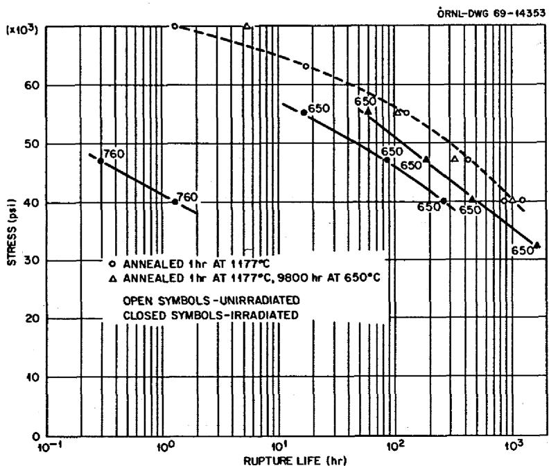  
Fig. 90. Stress Rupture at $650^{\circ}\mathrm{C}$ of Alloy 67-504. Number by each datum point indicates irradiation temperature.

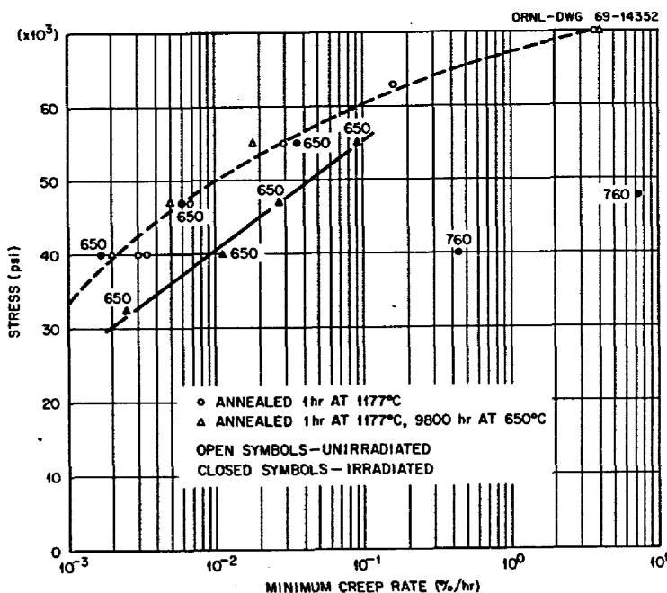  
Fig. 91. Creep Rates at $650^{\circ}\mathrm{C}$ of Alloy 67-504. Number by each datum point indicates irradiation temperature.

The fracture strains of heats 67-503 and 67-504 in the unirradiated condition at $650^{\circ}\mathrm{C}$ are shown in Fig. 92. Heat 67-504 (0.50% Hf) had much higher fracture strains than heat 67-503 (0.08% Hf), particularly at the lower creep rate.

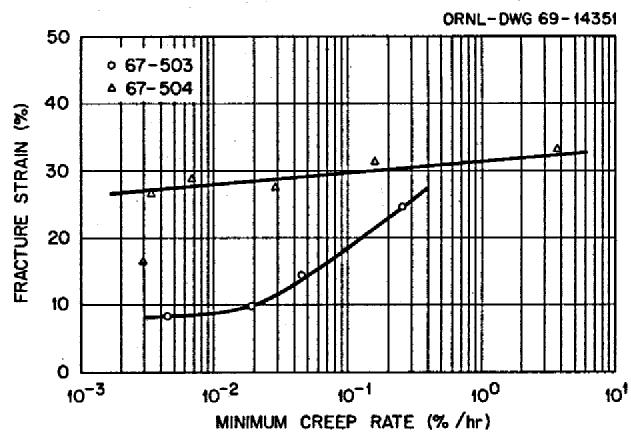  
Fig. 92. Fracture Strains at $650^{\circ}\mathrm{C}$ of Unirradiated Alloys 67-503 and 67-504. All samples annealed 1 hr at $1177^{\circ}\mathrm{C}$ .

The rather sparse data for heats 67-503 and 67-504 at $760^{\circ}\mathrm{C}$ are presented in Tables 37 and 38, and the stress-rupture properties are plotted in Fig. 93. In the unirradiated condition, alloy 67-504 had a rupture life about five times greater than that of alloy 67-503. Irradiation at

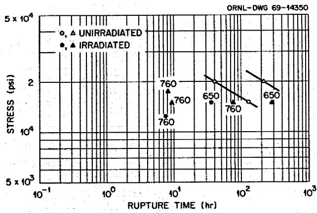  
Fig. 93. Stress-Rupture Properties at $760^{\circ}\mathrm{C}$ of Alloys 67-503 and 67-504. All samples annealed 1 hr at $1177^{\circ}\mathrm{C}$ . Number by each datum point indicates the irradiation temperature.

$650^{\circ}\mathrm{C}$ reduced the rupture life, but irradiation at $760^{\circ}\mathrm{C}$ reduced it much more. The fracture strains in the irradiated condition are shown in Fig. 94. The fracture strains of heat 67-503 were 3 to $4\%$ when irradiated and tested at $760^{\circ}\mathrm{C}$ . Irradiation at $760^{\circ}\mathrm{C}$ and testing at either 650 or $760^{\circ}\mathrm{C}$ resulted in lower fracture strains. Heat 67-504 generally had fracture strains of 6 to $8\%$ when irradiated at $650^{\circ}\mathrm{C}$ and tested at 650 or $760^{\circ}\mathrm{C}$ . Irradiation at $760^{\circ}\mathrm{C}$ resulted in fracture strains as low as $0.6\%$ .

Several of the samples were examined metallographically after testing. Typical photomicrographs of a sample of heat 67-504 after exposure to a noncorrosive fluoride salt for 9800 hr at $650^{\circ}\mathrm{C}$ and testing at $25^{\circ}\mathrm{C}$ are shown in Fig. 95. The fracture was partially intergranular, although the bulk grains elongated greatly. Also more carbides formed than in the annealed material shown in Fig. 80. At $650^{\circ}\mathrm{C}$ , the grains still showed

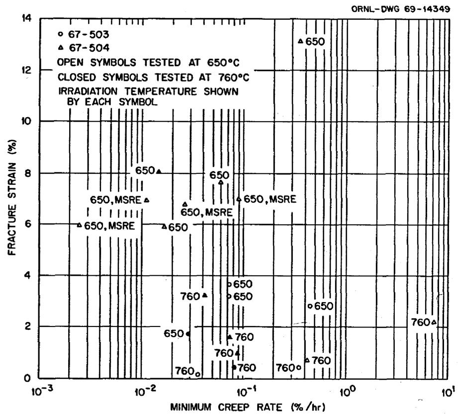  
Fig. 94. Postirradiation Fracture Strains of Heats 67-503 and 67-504.

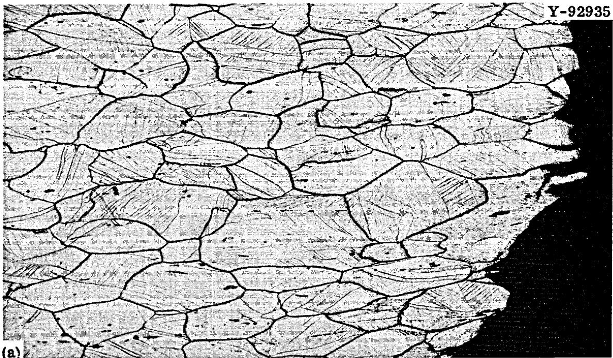

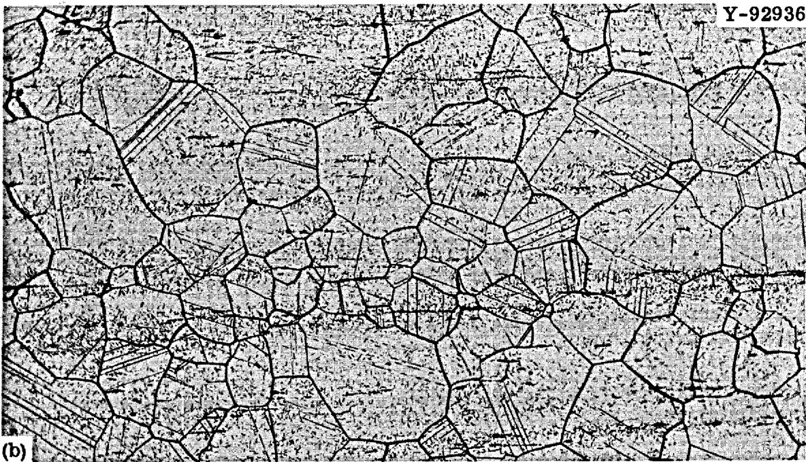  
Fig. 95. Photomicrographs of Sample of Heat 67-504 (0.50% Hr) Annealed 1 hr at $1177^{\circ}\mathrm{C}$ , Exposed 9800 hr to Fluoride Salt at $650^{\circ}\mathrm{C}$ , and Tested in Tension at $25^{\circ}\mathrm{C}$ . (a) Fracture, $100 \times$ ; (b) typical unstressed, $100 \times$ . Etchant: glyceria regia.

extensive elongation, and there are numerous intergranular cracks, although the final fracture was mixed intergranular and transgranular (Fig. 96). After irradiation, the fracture of heat 67-504 at $25^{\circ}\mathrm{C}$ (Fig. 97) was more intergranular than that of the unirradiated material (Fig. 95). A typical fracture of heat 67-503 after creep testing at $650^{\circ}\mathrm{C}$ is shown in Fig. 98. There are numerous intergranular cracks, and the fracture is predominantly intergranular. Heat 67-504 (Fig. 99) exhibited fewer intergranular cracks and a fracture that was mixed intergranular and transgranular.

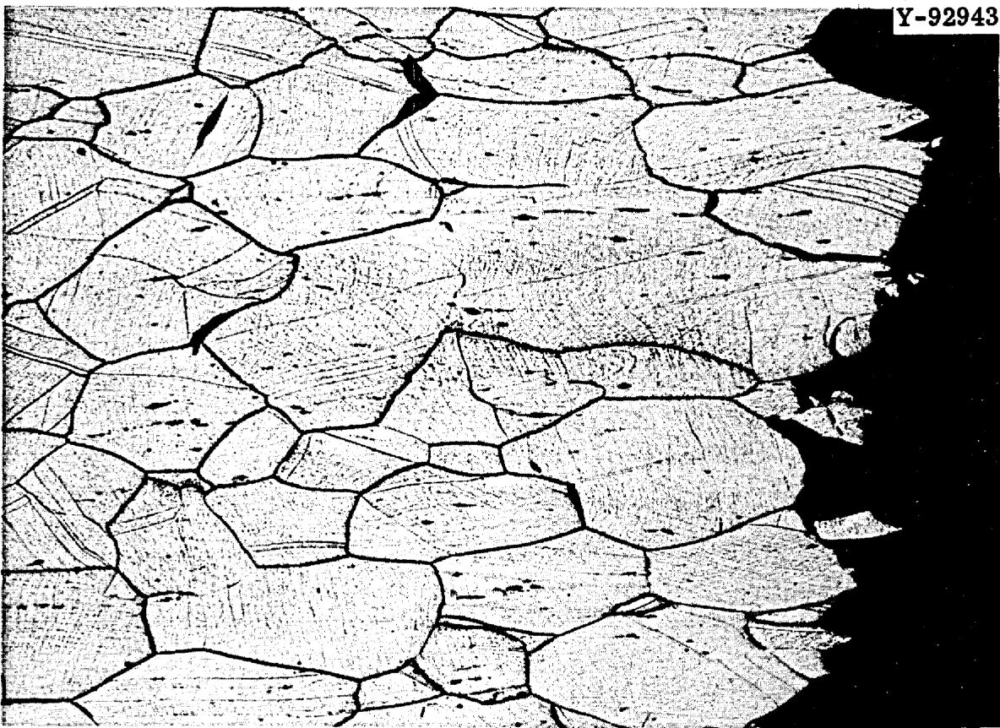  
Fig. 96. Photomicrograph of the Fracture of a Sample of Heat 67-504 (0.50% Hf) Annealed 1 hr at $1177^{\circ}\mathrm{C}$ , Exposed 9800 hr to Fluoride Salt at $650^{\circ}\mathrm{C}$ , and Tested in Tension at $650^{\circ}\mathrm{C}$ and a Strain Rate of 0.002 min $^{-1}$ . 100x.

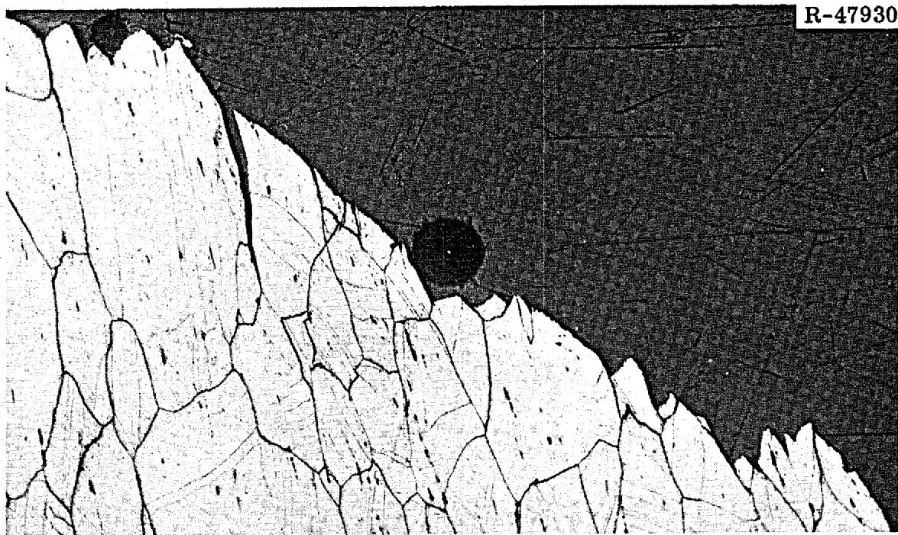  
Fig. 97. Fracture of a Sample of Heat 67-504 (0.43% Hf) Annealed 1 hr at $1177^{\circ}\mathrm{C}$ , Irradiated in the Molten Salt Reactor Experiment to a Thermal Fluence of $5.3 \times 10^{20}$ neutrons/cm² over a period of 9800 hr at $650^{\circ}\mathrm{C}$ , and Tested in Tension at $25^{\circ}\mathrm{C}$ . Etchant: glyceria regia. 100x.

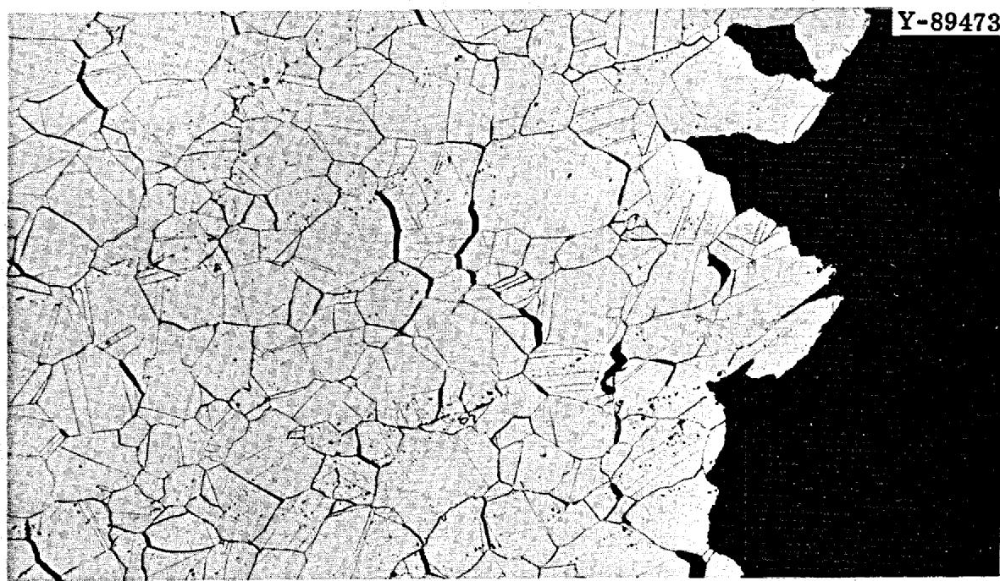  
Fig. 98. Fracture of a Sample of Heat 67-503 (0.08% Hf) Annealed 1 hr at $1177^{\circ}\mathrm{C}$ and Creep Tested at $650^{\circ}\mathrm{C}$ and 40,000 psi. Etchant: glyceria regia. 100x.

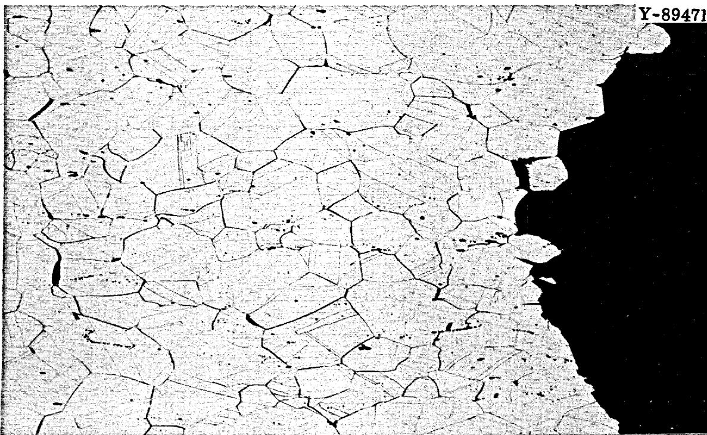  
Fig. 99. Fracture of a Sample of Heat 67-504 (0.50% Hf) Annealed 1 hr at $1177^{\circ}\mathrm{C}$ and Creep Tested at $650^{\circ}\mathrm{C}$ and 40,000 psi. Etchant: glyceria regia. 100x.

# Alloy Containing No Additions

The results for a small, 2-lb laboratory melt (alloy 100) that contained no additions of Ti, Zr, or Hf were presented above. One small, 100-lb commercial alloy (heat 21546) was also procured. This alloy was received in the cold-worked condition. Samples were tested in this condition and after annealing at 871 and $1177^{\circ}\mathrm{C}$ . Typical photomicrographs of the material are shown in Figs. 100 and 101. The microstructure after annealing at $871^{\circ}\mathrm{C}$ was characterized by bands of precipitate and fine grains. The bands were caused by carbide precipitation and retarded recrystallization in these areas. The material outside these bands was recrystallized. Annealing for 1 hr at $1177^{\circ}\mathrm{C}$ (Fig. 101) completed recrystallization. Some stringers were still present, although none are visible in Fig. 101. These stringers were quite similar to those found in heat 21545 and appeared to be unmelted molybdenum.

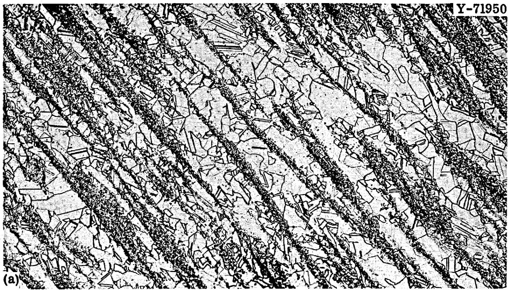

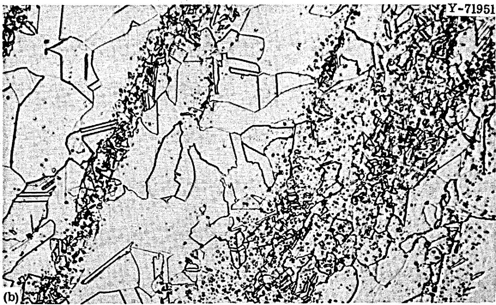  
Fig. 100. Photomicrographs of Alloy 21546 Annealed 100 hr at $871^{\circ}C$ . The material was cold worked $40\%$ before annealing. (a) $100x$ and (b) $500x$ . Etchant: glyceria regia.

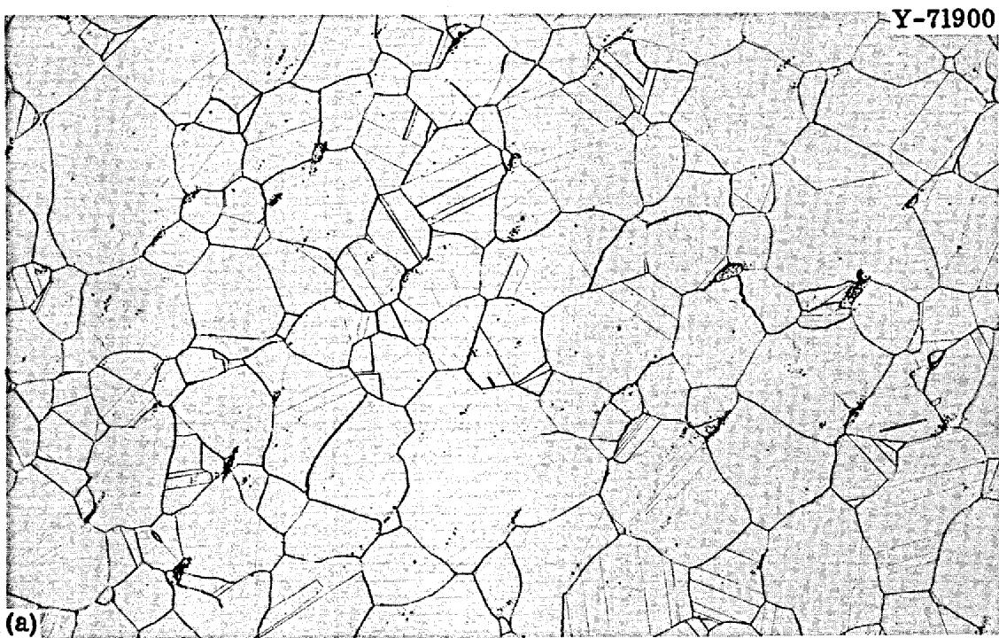

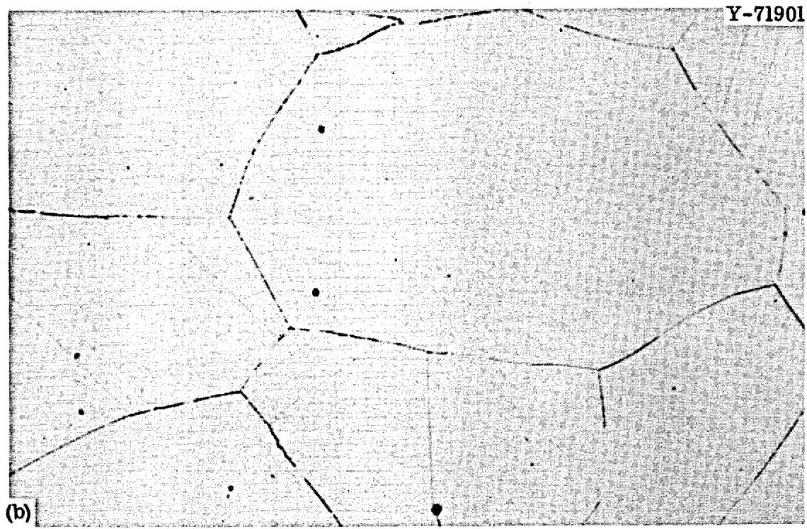  
Fig. 101. Photomicrographs of Alloy 21546 Annealed 1 hr at $1177^{\circ}C$ . The material was cold worked $40\%$ before annealing. (a) $100x$ and (b) $500x$ . Etchant: glyceria regia.

The results of tensile tests on this material are summarized in Table 39. The fracture strains are shown as a function of temperature in Fig. 102. Up to about $700^{\circ}\mathrm{C}$ , the material annealed 1 hr at $1177^{\circ}\mathrm{C}$ had the highest fracture strain and the cold-worked material had the lowest fracture strain. Above $700^{\circ}\mathrm{C}$ , the ductility of the cold-worked material increased markedly. Only samples as received and as annealed 100 hr at $871^{\circ}\mathrm{C}$ were irradiated, and these were all tested at $600^{\circ}\mathrm{C}$ and above. Irradiation decreased the fracture strain of all samples.

The results of creep tests on this material are given in Table 40. In the unirradiated condition, the material as received had the highest strength and the material annealed at $871^{\circ}\mathrm{C}$ had the lowest strength. The strength of material annealed 1 hr at $1177^{\circ}\mathrm{C}$ fell intermediate, and several illustrations follow to compare the properties of irradiated and unirradiated material annealed 1 hr at $1177^{\circ}\mathrm{C}$ . The stress-rupture properties at $650^{\circ}\mathrm{C}$ are shown in Fig. 103. The irradiation temperature was an important factor; the higher the irradiation temperature, the shorter was the rupture life. The two sets of data seem to converge, indicating that at very low levels of stress there would be no effect of irradiation on the rupture life. The creep rates are shown in Fig. 104 for $650^{\circ}\mathrm{C}$ . As long as the irradiation temperature was about $650^{\circ}\mathrm{C}$ , there was no difference between the creep rates of irradiated and unirradiated material. At irradiation temperatures of $700^{\circ}\mathrm{C}$ and above, the postirradiation creep rate was increased. There was at least one datum point that disagreed with this general trend. These curves also converged, again indicating common behavior at low stresses.

The fracture strains of irradiated samples tested at $650^{\circ}\mathrm{C}$ are shown as a function of minimum creep rate in Fig. 105. All of the samples irradiated above $700^{\circ}\mathrm{C}$ had fracture strains of 1.1 to $0.2\%$ . Irradiation at about $650^{\circ}\mathrm{C}$ resulted in fracture strains of 1.1 to $5.1\%$ . The exact dependence of the fracture strain on strain rate cannot be determined from the available data, and the indicated curve is influenced by results on standard Hastelloy N (ref. 8).

Table 39. Tensile Properties of Irradiated and Unirradiated Alloy 21546   

<table><tr><td rowspan="2">Specimen Number</td><td rowspan="2">Anneal\(^a\) Before Irradiation</td><td colspan="2">Temperature, °C</td><td rowspan="2">Thermal- Neutron Fluence (neutrons/cm2)</td><td rowspan="2">Strain Rate (min-1)</td><td colspan="2">Stress, psi</td><td colspan="2">Elongation, %</td><td rowspan="2">Reduction in Area (%)</td></tr><tr><td>Irradiation</td><td>Test</td><td>Yield</td><td>Ultimate Tensile</td><td>Uniform</td><td>Total</td></tr><tr><td></td><td></td><td></td><td></td><td>× 1020</td><td></td><td>× 103</td><td>× 103</td><td></td><td></td><td></td></tr><tr><td>10220</td><td>121</td><td></td><td>25</td><td></td><td>0.05</td><td>38.7</td><td>107.5</td><td>69.6</td><td>73.7</td><td>75.1</td></tr><tr><td>10221</td><td>121</td><td></td><td>200</td><td></td><td>0.05</td><td>32.6</td><td>99.7</td><td>69.8</td><td>73.8</td><td>63.3</td></tr><tr><td>10223</td><td>121</td><td></td><td>260</td><td></td><td>0.05</td><td>31.4</td><td>100.9</td><td>71.5</td><td>76.4</td><td>68.0</td></tr><tr><td>10222</td><td>121</td><td></td><td>400</td><td></td><td>0.05</td><td>30.2</td><td>97.8</td><td>73.0</td><td>79.3</td><td>64.8</td></tr><tr><td>10224</td><td>121</td><td></td><td>550</td><td></td><td>0.05</td><td>27.1</td><td>90.5</td><td>73.4</td><td>78.3</td><td>59.5</td></tr><tr><td>10225</td><td>121</td><td></td><td>600</td><td></td><td>0.05</td><td>27.5</td><td>87.1</td><td>66.0</td><td>69.5</td><td>47.2</td></tr><tr><td>10226</td><td>121</td><td></td><td>650</td><td></td><td>0.05</td><td>23.7</td><td>69.8</td><td>46.3</td><td>48.3</td><td>32.1</td></tr><tr><td>10227</td><td>121</td><td></td><td>700</td><td></td><td>0.05</td><td>24.4</td><td>64.7</td><td>35.1</td><td>36.1</td><td>26.9</td></tr><tr><td>10228</td><td>121</td><td></td><td>760</td><td></td><td>0.05</td><td>24</td><td>60.4</td><td>25.0</td><td>25.9</td><td>20.0</td></tr><tr><td>1440</td><td>000</td><td></td><td>25</td><td></td><td>0.05</td><td>151.9</td><td>164.2</td><td>6.8</td><td>13.4</td><td>53.3</td></tr><tr><td>1441</td><td>000</td><td></td><td>427</td><td></td><td>0.05</td><td>127.3</td><td>144.2</td><td>12.1</td><td>15.5</td><td>32.7</td></tr><tr><td>1452</td><td>000</td><td></td><td>650</td><td></td><td>0.05</td><td>119.5</td><td>132.7</td><td>7.7</td><td>13.6</td><td>18.8</td></tr><tr><td>1453</td><td>000</td><td></td><td>650</td><td></td><td>0.002</td><td>109.1</td><td>114.8</td><td>3.4</td><td>8.2</td><td>16.3</td></tr><tr><td>1451</td><td>000</td><td></td><td>760</td><td></td><td>0.05</td><td>76.4</td><td>78.4</td><td>2.6</td><td>32.3</td><td>51.1</td></tr><tr><td>1457</td><td>000</td><td></td><td>871</td><td></td><td>0.05</td><td>31.5</td><td>31.7</td><td>1.4</td><td>46.7</td><td>58.4</td></tr><tr><td>1458</td><td>000</td><td></td><td>871</td><td></td><td>0.002</td><td>19</td><td>19</td><td>1.0</td><td>48.1</td><td>44.0</td></tr><tr><td>1459</td><td>000</td><td></td><td>982</td><td></td><td>0.05</td><td>17.9</td><td>17.9</td><td>0.9</td><td>60.8</td><td>60.6</td></tr><tr><td>1749</td><td>16</td><td></td><td>25</td><td></td><td>0.05</td><td>51.7</td><td>119.4</td><td>49.2</td><td>53.5</td><td>72.4</td></tr><tr><td>1750</td><td>16</td><td></td><td>427</td><td></td><td>0.05</td><td>40.9</td><td>105.2</td><td>47.9</td><td>52.4</td><td>46.2</td></tr><tr><td>1746</td><td>16</td><td></td><td>650</td><td></td><td>0.05</td><td>44.3</td><td>95.5</td><td>27.8</td><td>30.0</td><td>31.2</td></tr><tr><td>1747</td><td>16</td><td></td><td>650</td><td></td><td>0.002</td><td>38.8</td><td>69</td><td>19.0</td><td>35.1</td><td>64.7</td></tr><tr><td>1752</td><td>16</td><td></td><td>760</td><td></td><td>0.05</td><td>37.8</td><td>51.5</td><td>3.6</td><td>7.5</td><td>68.2</td></tr><tr><td>1753</td><td>16</td><td></td><td>871</td><td></td><td>0.05</td><td>27.7</td><td>28.8</td><td>10.0</td><td>53.5</td><td>69.1</td></tr><tr><td>1754</td><td>16</td><td></td><td>871</td><td></td><td>0.002</td><td>18.2</td><td>18.2</td><td>0.9</td><td>45.3</td><td>51.2</td></tr><tr><td>1438</td><td>000</td><td>600</td><td>550</td><td>3.5</td><td>0.002</td><td>115.2</td><td>127.9</td><td>6.0</td><td>6.4</td><td>7.1</td></tr><tr><td>1439</td><td>000</td><td>600</td><td>600</td><td>3.5</td><td>0.002</td><td>105.3</td><td>115</td><td>4.4</td><td>4.5</td><td>4.0</td></tr><tr><td>1436</td><td>000</td><td>600</td><td>650</td><td>3.5</td><td>0.05</td><td>106.8</td><td>116.6</td><td>5.7</td><td>6.2</td><td>8.6</td></tr><tr><td>1437</td><td>000</td><td>600</td><td>650</td><td>3.5</td><td>0.002</td><td>103.1</td><td>106.8</td><td>3.5</td><td>3.7</td><td>4.0</td></tr><tr><td>1447</td><td>16</td><td>600</td><td>550</td><td>3.5</td><td>0.002</td><td>41.9</td><td>74.8</td><td>14.8</td><td>15.1</td><td>16.2</td></tr><tr><td>1446</td><td>16</td><td>600</td><td>600</td><td>3.5</td><td>0.002</td><td>43.7</td><td>65.6</td><td>8.2</td><td>8.4</td><td>10.2</td></tr><tr><td>1444</td><td>16</td><td>600</td><td>650</td><td>3.5</td><td>0.05</td><td>38.8</td><td>64.2</td><td>10.3</td><td>10.5</td><td>11.7</td></tr><tr><td>1443</td><td>16</td><td>650</td><td>650</td><td>1.0</td><td>0.002</td><td>38.6</td><td>55</td><td>7.3</td><td>7.4</td><td>12.9</td></tr><tr><td>1442</td><td>16</td><td>650</td><td>650</td><td>1.0</td><td>0.05</td><td>38.4</td><td>67.5</td><td>13.5</td><td>13.7</td><td>14.7</td></tr><tr><td>1445</td><td>16</td><td>600</td><td>650</td><td>3.5</td><td>0.002</td><td>45</td><td>56.7</td><td>5.6</td><td>5.7</td><td>8.6</td></tr><tr><td>1448</td><td>16</td><td>600</td><td>760</td><td>3.5</td><td>0.002</td><td>33.5</td><td>33.8</td><td>1.8</td><td>4.3</td><td>7.1</td></tr></table>

aAnnealing designations: 12l = annealed 1 hr at $1177^{\circ}C$ . $000 =$ as received (40% cold work); 16 = annealed 100 hr at $871^{\circ}C$

Table 40. Creep Properties of Irradiated and Unirradiated Alloy 21546   

<table><tr><td>Specimen Number</td><td>Test Number</td><td>Anneal\(^a\) Before Irradiation</td><td colspan="2">Temperature, °C</td><td rowspan="2">Thermal- Neutron Fluence (neutrons/cm2)</td><td rowspan="2">Stress (psi)</td><td rowspan="2">Rupture Life (hr)</td><td rowspan="2">Minimum Creep Rate (%/hr)</td><td rowspan="2">Fracture Strain (%)</td><td rowspan="2">Reduction in Area (%)</td></tr><tr><td></td><td></td><td></td><td>\(Irradiation\)</td><td>Test</td></tr><tr><td></td><td></td><td></td><td></td><td></td><td>\(x10^{20}\)</td><td>\(x10^3\)</td><td></td><td></td><td></td><td></td></tr><tr><td>4056</td><td>6300</td><td>121</td><td></td><td>650</td><td></td><td>62</td><td>5.3</td><td>0.56</td><td>25.6</td><td>24.9</td></tr><tr><td>4057</td><td>6301</td><td>121</td><td></td><td>650</td><td></td><td>55</td><td>18.5</td><td>0.22</td><td>21.3</td><td>21.3</td></tr><tr><td>4058</td><td>6302</td><td>121</td><td></td><td>650</td><td></td><td>47</td><td>63.0</td><td>0.074</td><td>18.1</td><td>16.6</td></tr><tr><td>4059</td><td>6303</td><td>121</td><td></td><td>650</td><td></td><td>40</td><td>187.5</td><td>0.026</td><td>19.4</td><td>15.6</td></tr><tr><td>10219</td><td>7288</td><td>121</td><td></td><td>650</td><td></td><td>35</td><td>256.2</td><td>0.013</td><td>13.0</td><td>16.2</td></tr><tr><td>10218</td><td>7289</td><td>121</td><td></td><td>650</td><td></td><td>30</td><td>561.6</td><td>0.0080</td><td>11.1</td><td>18.7</td></tr><tr><td>1455</td><td>5528</td><td>000</td><td></td><td>650</td><td></td><td>70</td><td>11.7</td><td>0.31</td><td>12.5</td><td>15.5</td></tr><tr><td>1454</td><td>5527</td><td>000</td><td></td><td>650</td><td></td><td>55</td><td>92.7</td><td>0.025</td><td>12.5</td><td>14.0</td></tr><tr><td>1456</td><td>5408</td><td>000</td><td></td><td>650</td><td></td><td>47</td><td>223.6</td><td>0.014</td><td>7.5</td><td>6.3</td></tr><tr><td>1751</td><td>5531</td><td>16</td><td></td><td>650</td><td></td><td>70</td><td>1.1</td><td>18.0</td><td>34.4</td><td>31.0</td></tr><tr><td>1748</td><td>5536</td><td>16</td><td></td><td>650</td><td></td><td>55</td><td>6.9</td><td>2.87</td><td>46.9</td><td>33.7</td></tr><tr><td>1745</td><td>5532</td><td>16</td><td></td><td>650</td><td></td><td>47</td><td>31.7</td><td>0.83</td><td>46.9</td><td>39.6</td></tr><tr><td>1826</td><td>5435</td><td>816</td><td></td><td>650</td><td></td><td>40</td><td>28.8</td><td>0.20</td><td>8.5</td><td>9.4</td></tr><tr><td>10231</td><td>7521</td><td>121</td><td></td><td>760</td><td></td><td>15</td><td>221.3</td><td>0.08</td><td>16.3</td><td>15.8</td></tr><tr><td>10229</td><td>7517</td><td>121</td><td></td><td>760</td><td></td><td>12.5</td><td>414.7</td><td>0.0142</td><td>13.4</td><td>12.7</td></tr><tr><td>5988</td><td>R-598</td><td>121</td><td>235</td><td>650</td><td>2.4</td><td>47</td><td>84.5</td><td>0.011</td><td>2.3</td><td></td></tr><tr><td>4060</td><td>R-294</td><td>121</td><td>650</td><td>650</td><td>2.5</td><td>47</td><td>10.1</td><td>0.41</td><td>5.1</td><td></td></tr><tr><td>4061</td><td>R-482</td><td>121</td><td>657</td><td>650</td><td>2.5</td><td>40</td><td>0</td><td></td><td></td><td></td></tr><tr><td>4065</td><td>R-481</td><td>121</td><td>650</td><td>650</td><td>2.5</td><td>40</td><td>9.2</td><td>0.019</td><td>2.4</td><td></td></tr><tr><td>5981</td><td>R-635</td><td>121</td><td>666</td><td>650</td><td>2.4</td><td>40</td><td>62.0</td><td>0.033</td><td>2.8</td><td></td></tr><tr><td>5980</td><td>R-604</td><td>121</td><td>666</td><td>650</td><td>2.4</td><td>35</td><td>20.1</td><td>0.042</td><td>1.1</td><td></td></tr><tr><td>5979</td><td>R-642</td><td>121</td><td>766</td><td>650</td><td>2.4</td><td>35</td><td>0.4</td><td>2.1</td><td>0.9</td><td></td></tr><tr><td>5974</td><td>R-602</td><td>121</td><td>754</td><td>650</td><td>2.4</td><td>35</td><td>0</td><td></td><td></td><td></td></tr><tr><td>5965</td><td>R-605</td><td>121</td><td>732</td><td>650</td><td>2.4</td><td>35</td><td>0.4</td><td>1.3</td><td>0.6</td><td></td></tr><tr><td>5975</td><td>R-607</td><td>121</td><td>760</td><td>650</td><td>2.4</td><td>30</td><td>1.2</td><td>0.44</td><td>0.8</td><td></td></tr><tr><td>5966</td><td>R-609</td><td>121</td><td>704</td><td>650</td><td>2.4</td><td>30</td><td>1.1</td><td>0.15</td><td>0.7</td><td></td></tr><tr><td>5982</td><td>R-643</td><td>121</td><td>666</td><td>650</td><td>2.4</td><td>27</td><td>727.8</td><td>0.0030</td><td>3.1</td><td></td></tr><tr><td>5967</td><td>R-638</td><td>121</td><td>732</td><td>650</td><td>2.4</td><td>25</td><td>46.6</td><td>0.0065</td><td>0.4</td><td></td></tr><tr><td>5969</td><td>R-639</td><td>121</td><td>816</td><td>650</td><td>2.4</td><td>25</td><td>11.1</td><td>0.015</td><td>0.4</td><td></td></tr><tr><td>5985</td><td>R-600</td><td>121</td><td>499</td><td>650</td><td>2.4</td><td>25</td><td>9.4</td><td>0.26</td><td>3.2</td><td></td></tr><tr><td>5976</td><td>R-631</td><td>121</td><td>760</td><td>650</td><td>2.4</td><td>21.5</td><td>68.3</td><td>0.0039</td><td>0.53</td><td></td></tr><tr><td>5968</td><td>R-632</td><td>121</td><td>832</td><td>650</td><td>2.4</td><td>21.5</td><td>69.6</td><td>0.0028</td><td>0.24</td><td></td></tr><tr><td>5971</td><td>R-637</td><td>121</td><td>871</td><td>650</td><td>2.4</td><td>17</td><td>1157.1</td><td>0.0006</td><td>1.1</td><td></td></tr><tr><td>5985</td><td>R-600</td><td>121</td><td>499</td><td>760</td><td>2.4</td><td>25</td><td>9.4</td><td>0.26</td><td>3.1</td><td></td></tr><tr><td>5972</td><td>R-640</td><td>121</td><td>799</td><td>760</td><td>2.4</td><td>15</td><td>14.3</td><td>0.061</td><td>1.3</td><td></td></tr><tr><td>4066</td><td>R-296</td><td>121</td><td>746</td><td>760</td><td>2.5</td><td>15</td><td>0.5</td><td>0.12</td><td>0.7</td><td></td></tr><tr><td>4067</td><td>R-468</td><td>121</td><td>746</td><td>760</td><td>2.5</td><td>12.5</td><td>3.6</td><td>0.060</td><td>0.4</td><td></td></tr><tr><td>5970</td><td>R-634</td><td>121</td><td>832</td><td>760</td><td>2.4</td><td>12.5</td><td>45.7</td><td>0.014</td><td>0.8</td><td></td></tr><tr><td>5973</td><td>R-641</td><td>121</td><td>799</td><td>760</td><td>2.4</td><td>10</td><td>110.9</td><td>0.0098</td><td>1.5</td><td></td></tr><tr><td>4068</td><td>R-469</td><td>121</td><td>746</td><td>760</td><td>2.5</td><td>10</td><td>13.8</td><td>0.036</td><td>1.1</td><td></td></tr><tr><td>1450</td><td>R-120</td><td>16</td><td>600</td><td>650</td><td>3.5</td><td>40</td><td>3.3</td><td>0.40</td><td>1.3</td><td></td></tr><tr><td>1449</td><td>R-113</td><td>16</td><td>600</td><td>650</td><td>3.5</td><td>32.4</td><td>97.7</td><td>0.038</td><td>4.0</td><td></td></tr></table>

aAnnealing designations: 121 = annealed 1 hr at $1177^{\circ}\mathrm{C}$ ; 000 = as received (40% cold work)  
16 = annealed 100 hr at $871^{\circ}\mathrm{C}$ ; 816 = annealed 8 hr at $871^{\circ}\mathrm{C}$ .

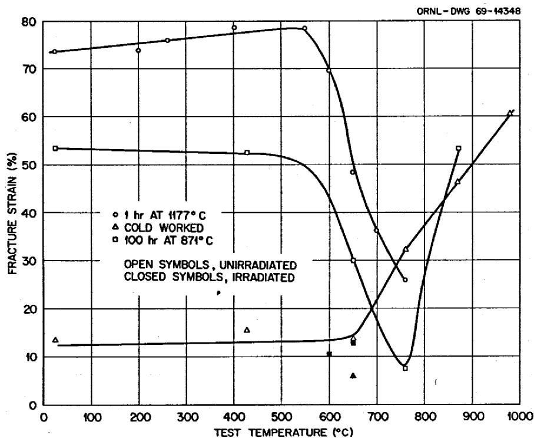  
Fig. 102. Variation of the Fracture Strain with Test Temperature for Alloy 21546 at a Strain Rate of $0.05 \, \text{min}^{-1}$ .

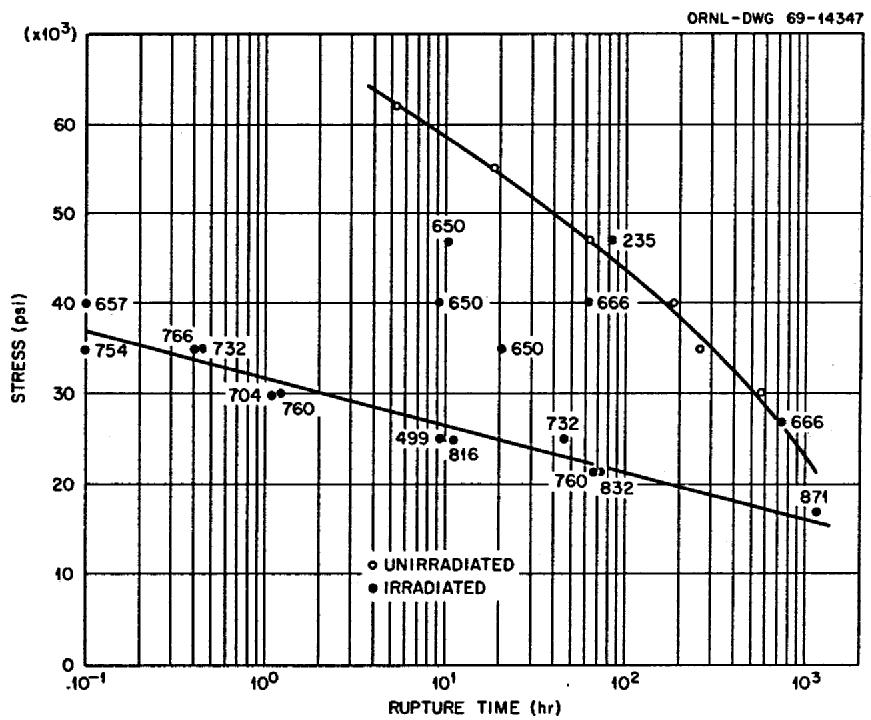  
Fig. 103. Stress-Rupture Properties at $650^{\circ}\mathrm{C}$ of Alloy 21546. All samples annealed 1 hr at $1177^{\circ}\mathrm{C}$ before testing. Number by each datum point indicates irradiation temperature.

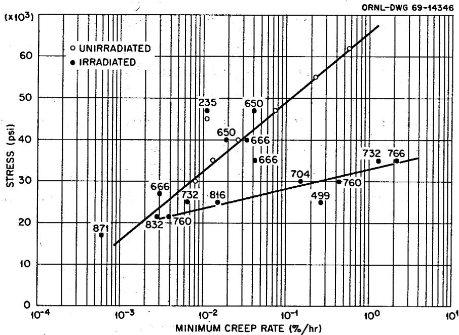  
Fig. 104. Creep Rate at $650^{\circ}\mathrm{C}$ of Alloy 21546. All samples annealed 1 hr at $1177^{\circ}\mathrm{C}$ before testing. Number by each datum point indicates irradiation temperature.

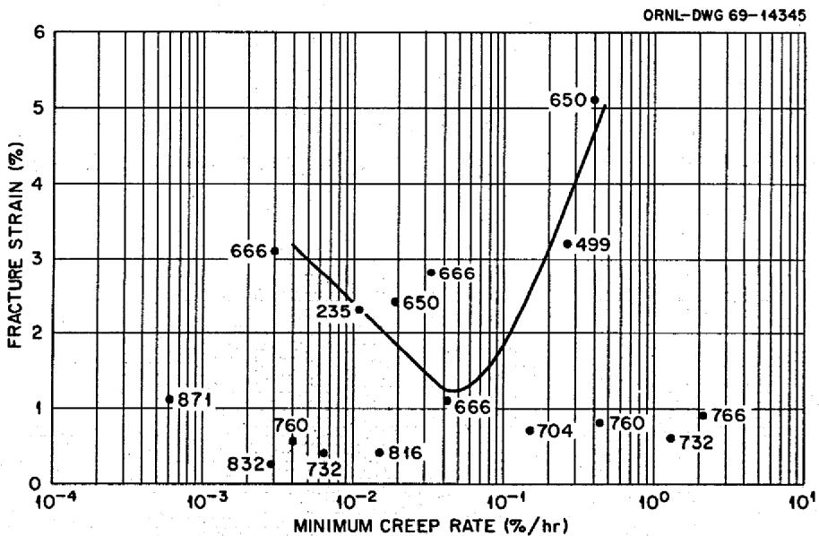  
Fig. 105. Fracture Strains at $650^{\circ}\mathrm{C}$ of Irradiated Alloy 21546. All samples annealed 1 hr at $1177^{\circ}\mathrm{C}$ before testing. Number by each datum point indicates irradiation temperature.

Some samples were tested at $760^{\circ}\mathrm{C}$ ; the rather sparse results are given in Table 40, and the stress-rupture data are shown in Fig. 106. There was an indication that irradiation at $746^{\circ}\mathrm{C}$ may result in poorer stress-rupture properties at $760^{\circ}\mathrm{C}$ than irradiation at 799 to $832^{\circ}\mathrm{C}$ . The minimum creep rate at $760^{\circ}\mathrm{C}$ (Fig. 107) showed that irradiation did not alter the creep rate drastically. However, there was again the tendency for the three samples irradiated at $746^{\circ}\mathrm{C}$ to show the greater effect. The fracture strains at $760^{\circ}\mathrm{C}$ were all quite low (0.4 to $1.5\%$ strain) except for the sample irradiated at $499^{\circ}\mathrm{C}$ (3.1% strain).

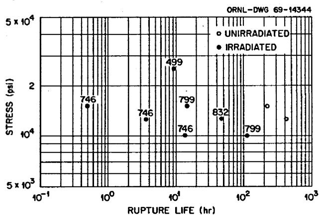  
Fig. 106. Stress-Rupture Properties at $760^{\circ}\mathrm{C}$ of Alloy 21546. All samples annealed 1 hr at $1177^{\circ}\mathrm{C}$ . Number by each datum point indicates irradiation temperature.

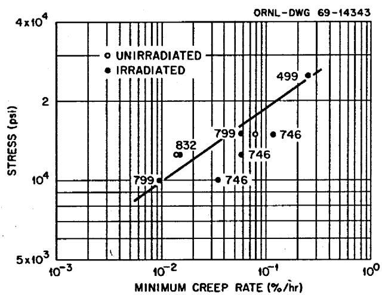  
Fig. 107. Creep Rates at $760^{\circ}\mathrm{C}$ of Alloy 21546. Material annealed $1\mathrm{hr}$ at $1177^{\circ}\mathrm{C}$ . Number by each datum point indicates irradiation temperature.

Some insight into the effect of irradiation temperature was gained by transmission electron microscopy. Typical microstructures for two samples irradiated at 666 and $766^{\circ}\mathrm{C}$ are shown in Figs. 108 and 109.

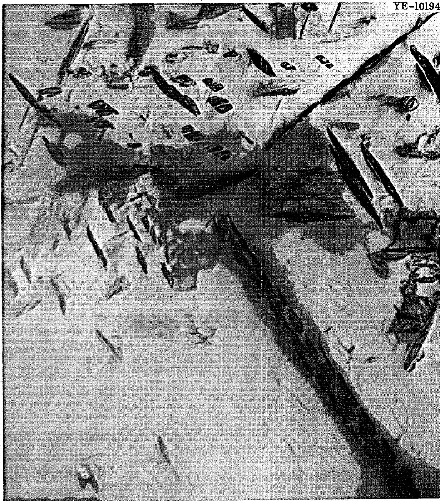  
Fig. 108. Transmission Electron Photomicrograph of Alloy 21546 after Irradiation at $666^{\circ}\mathrm{C}$ for about 1100 hr to a Thermal-Neutron Fluence of $2.4 \times 10^{20}$ neutrons/cm². 50,000x.

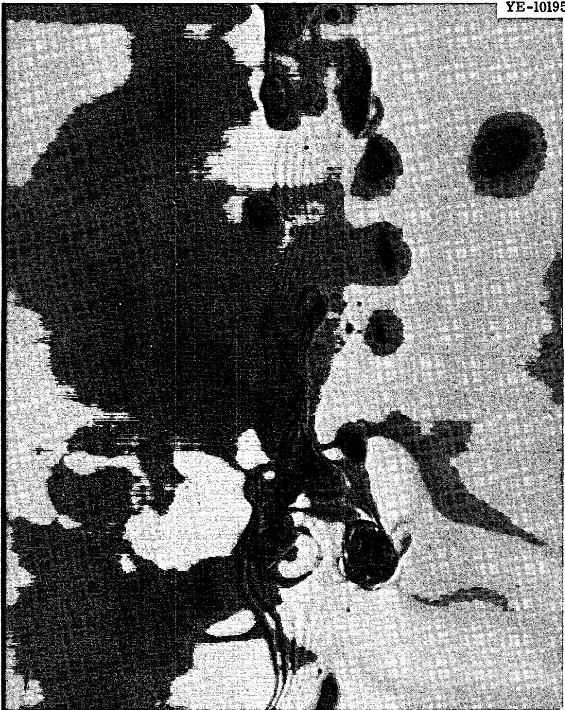  
Fig. 109. Transmission Electron Photomicrograph of Alloy 21546 after Irradiation at $766^{\circ}\mathrm{C}$ for about 1100 hr to a Thermal-Neutron Fluence of $2.4 \times 10^{20}$ neutrons/cm². 50,000x.

After irradiation at $666^{\circ}\mathrm{C}$ , the grain boundaries were completely lined with fine precipitate particles, and there were also numerous precipitates within the grains. After irradiation at $766^{\circ}\mathrm{C}$ (Fig. 109), there were fewer relatively coarse precipitates along the grain boundaries, and only random coarse precipitates were present within the grains. The precipitates in both samples were identified as carbides of the $\mathrm{M}_2\mathrm{C}$ type in which the metal component was primarily molybdenum. Thus, the poorer postirradiation properties are associated with the very coarse precipitate.

A typical fracture of heat 21546 at $650^{\circ}\mathrm{C}$ is shown in Fig. 110. There was extensive intergranular cracking, and the fracture was entirely intergranular. The random stringers are obvious in this field and may have been instrumental in causing the fracture at this particular location.

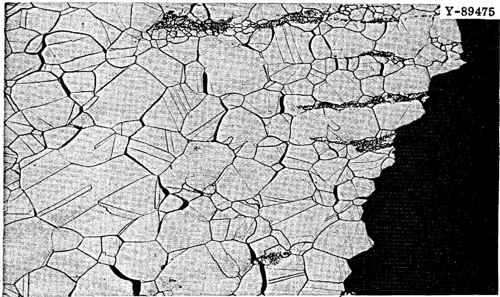  
Fig. 110. Fracture of a Sample of Heat 21546 Annealed 1 hr at $1177^{\circ}C$ and Tested at 40,000 psi and $650^{\circ}C$ . Etchant: glyceria regia.

# DISCUSSION OF RESULTS

A large* amount of data has been presented, and we should recapitulate some of the most important observations.

1. A modified base composition of Hastelloy N was developed: Ni-12% Mo-7% Cr-0.2% Mn-0.05% C. This alloy is free of the carbide stringers present in standard Hastelloy N, but is still very susceptible to embrittlement by irradiation.   
2. Additions of Ti, Zr, or Hf to this base composition improved resistance to irradiation embrittlement. Small heats showed a general improvement with increasing additions of titanium and hafnium. Similar work with additions of zirconium showed that an alloy containing $0.53\%$ Zr had the minimum creep rate and maximum rupture life. Other concentrations of zirconium resulted in higher fracture strains.   
3. Commercial melts (100 lb) were obtained with nominal additions of $0.5\%$ each of Ti, Zr, and Hf. The properties of these alloys were comparable with those of the small, laboratory melts (2 lb).   
4. Properties were very dependent upon the irradiation temperature. Irradiation at about $650^{\circ}\mathrm{C}$ resulted in good properties, but irradiation at $700^{\circ}\mathrm{C}$ and above gave relatively poor properties.   
5. Transmission electron microscopy revealed that the effect of irradiation temperature was associated with the precipitation of coarser carbides at the higher temperature. During irradiation at $650^{\circ}\mathrm{C}$ , fine carbides precipitated, whereas above $700^{\circ}\mathrm{C}$ relatively coarse carbides formed.   
6. The optimum properties after irradiation result from annealing for 1 hr at $1177^{\circ}\mathrm{C}$ before irradiation. The fine-grained microstructure obtained by annealing at low temperatures such as $871^{\circ}\mathrm{C}$ was not as strong or as ductile, and annealing above $1177^{\circ}\mathrm{C}$ decreased the fracture strain of irradiated and unirradiated samples.   
7. The general trend revealed by metallographic examination after testing was that additions of Ti, Zr, and Hf reduced the frequency of cracking at grain boundaries. Fractures in these alloys in creep at $650^{\circ}\mathrm{C}$ are predominantly intergranular but usually have some transgranular components.

Some comparisons are in order to show the relative properties of these alloys and standard Hastelloy N. For this comparison, we used only the commercial alloys with $0.5\%$ nominal additions of Ti, Zr, and Hf. All results are for samples annealed 1 hr at $1177^{\circ}\mathrm{C}$ . The tensile

and yield strengths are shown in Fig. 111. Alloys 21546 and 21545 (0.49% Ti) had very similar properties; the observed strengths were slightly less than those measured for standard Hastelloy N. The strength of heat 67-504 (0.50% Hf) was the highest of all alloys studied. The fracture strains of these samples are shown in Fig. 112. Alloys 21546, 21545 (0.49% Ti), 21554 (0.35% Zr), and 67-504 (0.50% Hf) have similar properties. Heat 67-504 (0.50% Hf) after aging for 9800 hr at $650^{\circ}\mathrm{C}$ had fracture strains lower than those of the other modified alloys when tested below about $650^{\circ}\mathrm{C}$ and higher above this temperature. Standard Hastelloy N had lower fracture strains than any of the modified alloys.

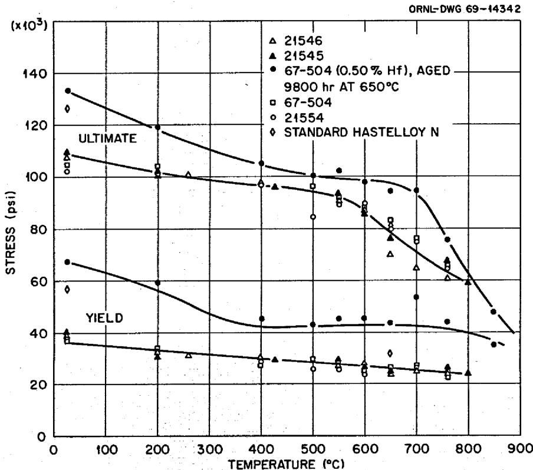  
Fig. 111. Tensile Properties of Several Commercial Melts of Modified Alloys. All material annealed $1\mathrm{hr}$ at $1177^{\circ}\mathrm{C}$ .

The relative stress-rupture properties of these alloys at $650^{\circ}\mathrm{C}$ are shown in Fig. 113. The rupture lives at 40,000 psi range from 170 to 1100 hr; alloy 21546 had the shortest rupture life, and alloy 67-504 (0.50% Hf) had the longest. Minimum creep rate is a better measure of

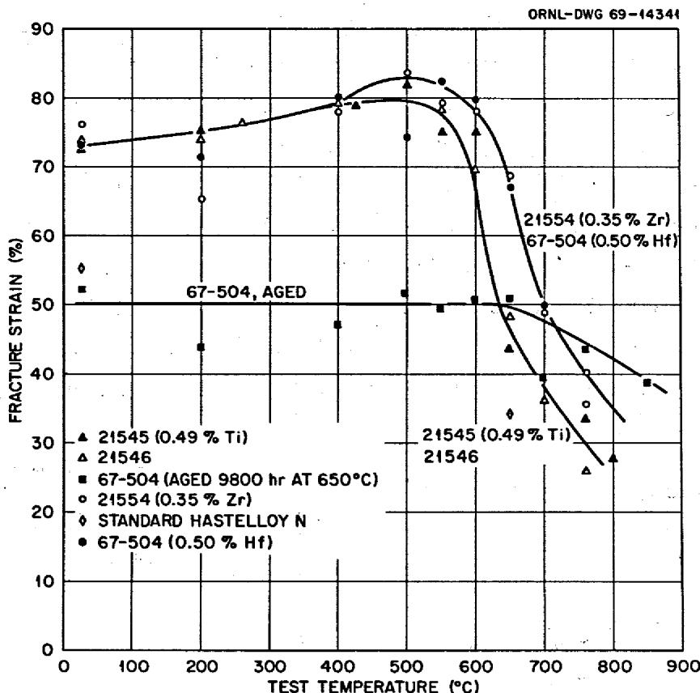  
Fig. 112. Variation of Tensile Fracture Strain with Test Temperature for Several Commercial Melts of Modified Alloys at a Strain Rate of $0.05 \, \text{min}^{-1}$ . All material annealed 1 hr at $1177^{\circ}\text{C}$ .

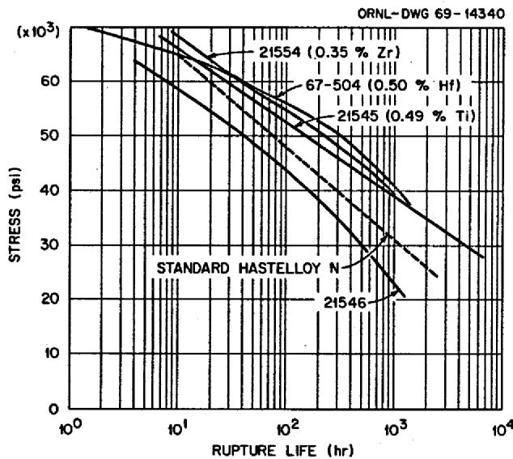  
Fig. 113. Stress-Rupture Properties at $650^{\circ}\mathrm{C}$ of Several Commercial Melts of Modified Alloys. All material annealed 1 hr at $1177^{\circ}\mathrm{C}$ before testing.

strength than rupture life; these data are shown in Fig. 114. At 40,000 psi, the minimum creep rate varied from $0.03\% / \text{hr}$ for alloy 21546 to $0.002\% / \text{hr}$ for alloy 67-504 (0.50% Hf). The addition of hafnium increased strength the most, by far, but the three alloys modified with Hf, Zr, and Ti were all stronger than standard Hastelloy N. There was not much difference between the creep strengths of standard Hastelloy N and the modified base alloy 21546. The fracture strains of the unirradiated modified alloys are shown in Fig. 115. All of the alloys except alloy 21545 (0.49% Ti) followed the trend of decreasing fracture strain with decreasing creep rate. At high strain rates, alloy 21554 (0.35% Zr) had the highest fracture strain. At low strain rates, alloy 21545 (0.49% Ti) had superior ductility. Alloy 21546 and standard Hastelloy N had the lowest fracture strains and did not differ appreciably from each other.

The stress-rupture properties determined at $650^{\circ}\mathrm{C}$ after irradiation are compared in Fig. 116. After irradiation at $650^{\circ}\mathrm{C}$ , alloys 21554

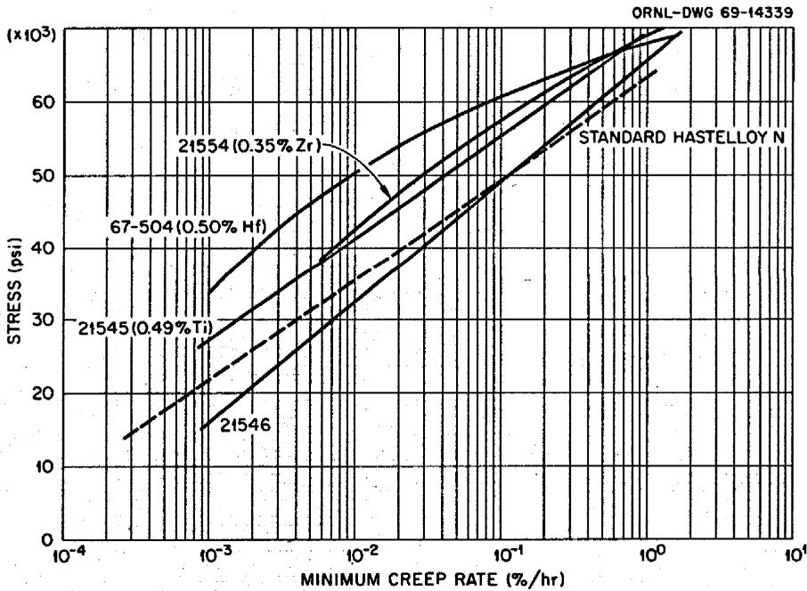  
Fig. 114. Creep Rates at $650^{\circ}\mathrm{C}$ of Several Commercial Melts of Modified Alloys. All material annealed 1 hr at $1177^{\circ}\mathrm{C}$ before testing.

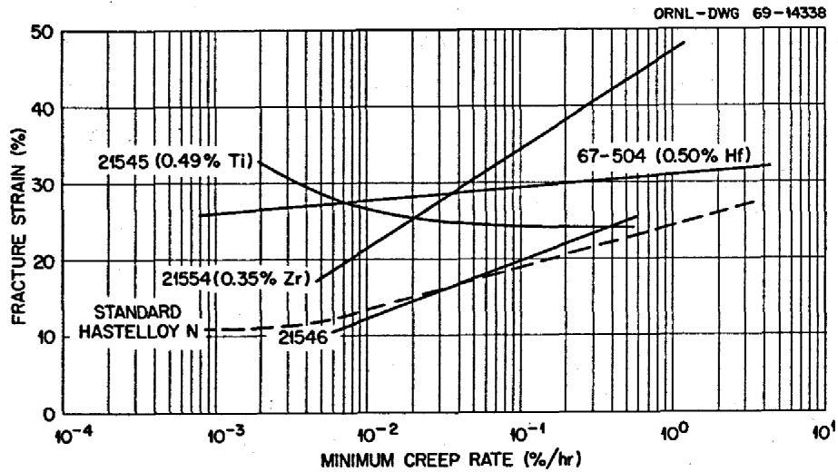  
Fig. 115. Comparison of the Fracture Strains at $650^{\circ}\mathrm{C}$ of Several Commercial Melts of Modified Alloys. All material annealed 1 hr at $1177^{\circ}\mathrm{C}$ .

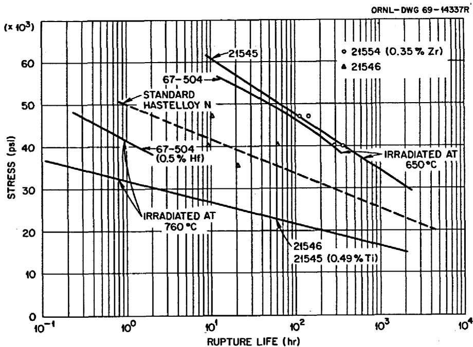  
Fig. 116. Postirradiation Stress-Rupture Properties at $650^{\circ}\mathrm{C}$ of Several Commercial Melts of Modified Alloys. All material annealed 1 hr at $1177^{\circ}\mathrm{C}$ before irradiation.

(0.35% Zr), 21545 (0.49% Ti), and 67-504 (0.50% Hf) had equally good properties. All three of the modified alloys showed improvement over the standard Hastelloy N shown for reference. The base modified alloy 21546 had properties quite similar to those of standard Hastelloy N.

Standard Hastelloy N that contained about $0.5\%$ Si is not sensitive to irradiation temperature, and the indicated line holds for irradiation at $760^{\circ}\mathrm{C}$ (ref. 9). Heats 21546 and 21545 $(0.49\% \mathrm{Ti})$ both had poor stress-rupture properties after irradiation at $760^{\circ}\mathrm{C}$ . The stress-rupture properties of alloy 67-504 $(0.50\% \mathrm{Hf})$ fell intermediate between those of these two alloys and those of standard Hastelloy N.

The postirradiation fracture strains for irradiation and testing at $650^{\circ}\mathrm{C}$ are summarized in Fig. 117. These curves are based on rather sparse data and should be considered as schematics. Alloy 21546 shows some improvement over standard Hastelloy N. Alloy 21545 (0.49% Ti) is generally better than standard Hastelloy N, but still has a distinct ductility minimum of only about 3%. The sparse data for heats 21554 (0.35% Zr) and 67-504 (0.50% Hf) indicate that these heats had improved fracture strains. The presence of a ductility minimum has been established for standard Hastelloy N and for heat 21545, but there are too few data to establish whether the other alloys conform to this pattern.

9H. E. McCoy, An Evaluation of the Molten-Salt Reactor Experiment Hastelloy N Surveillance Specimens - Third Group, ORNL-TM-2647 (1970).

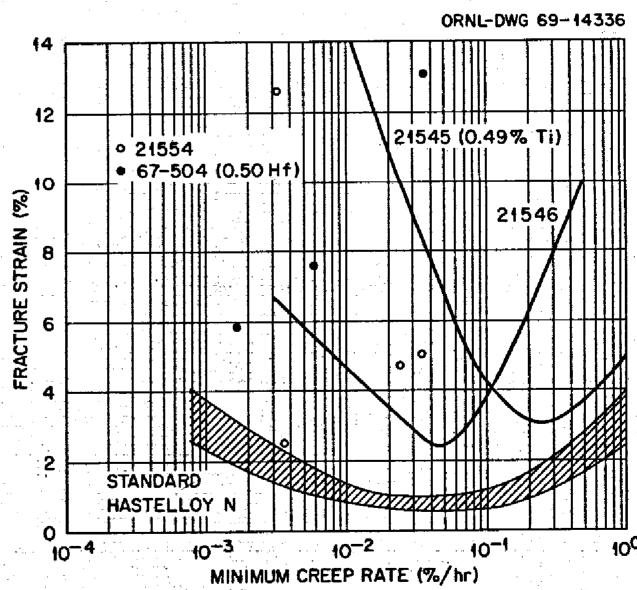  
Fig. 117. Postirradiation Fracture Strains of Several Commercial Melts of Modified Alloys Irradiated and Tested at $650^{\circ}\mathrm{C}$ . All material annealed 1 hr at $1177^{\circ}\mathrm{C}$ before irradiation.

Many of the properties of these alloys are likely determined by the carbide precipitate. As already shown, alloy 21546 exhibited a change in properties after irradiation that correlated well with changes in the carbide structure (Figs. 108 and 109). Further work by Gehlbach and $\mathrm{Cook}^{10}$ showed that Ti, Hf, and Zr promoted the formation of the MC type of carbides. The normal type of carbide for Hastelloy N is $\mathbf{M}_2\mathbf{C}$ when the silicon content is low and $\mathbf{M}_6\mathbf{C}$ when the silicon content is high.[11] The work of Gehlbach and $\mathrm{Cook}^{10}$ also showed that low levels (about $0.5\%$ ) of Ti, Hf, and Zr can result in an MC type of carbide at $650^{\circ}\mathrm{C}$ and a relatively coarse $\mathbf{M}_2\mathbf{C}$ type at $760^{\circ}\mathrm{C}$ . Thus, the strong effect of irradiation temperature on these alloys is associated with this transition in carbide types.

The mechanism whereby these precipitates improve the unirradiated creep properties also likely has to do with the carbide precipitates.[12] As shown in Fig. 114, the creep strength is increased with the addition of Ti, Zr, and Hf. These effects are larger than anticipated from solid-solution strengthening, particularly when one considers that most of the alloying additions are likely tied up as carbides. Thus, the strengthening observed is likely due to the finely dispersed carbide phase. These precipitates also likely impede crack propagation and account for the improved fracture strains (Fig. 115).

In irradiated material, the further complication of helium transmitted for the $^{10}\mathrm{B}$ exists. Our reasoning in adding Ti, Hf, and Zr was to tie the boron up in dispersed precipitates. The only measure that we have of the location of boron is to assume that it behaves like the carbon. Thus, each carbide precipitate contains some boron. The finely

divided MC type of carbide gives a better dispersion and would be expected to give better properties. Thus, the qualitative observation that the fine MC type of precipitates are associated with good properties and the coarse $\mathbf{M}_2\mathbf{C}$ type with poor porperties seems quite reasonable. The further role of these precipitates in inhibiting propagation of cracks may also be important.

All of the modified alloys are slightly susceptible to aging during long-term annealing. These changes are quite small and are associated with precipitation of carbides. The general effects of aging are that the minimum creep rate and fracture strain increase and the rupture life decreases. Because of the difference in the type of carbide precipitated at 650 and $760^{\circ}\mathrm{C}$ in many of these alloys, aging at $760^{\circ}\mathrm{C}$ seems to produce larger changes in properties. The precipitation of copious quantities of $\mathbf{ZrC}$ in alloys that contain less than $0.5\%$ $\mathbf{Zr}$ is quite dramatic, but the changes in properties are minimal.

# SUMMARY

This first phase of this study of the effects of additions of Ti, Zr, and Hf to a base alloy of Ni-12% Mo-7% Cr-0.2% Mn-0.05% C dealt with small, laboratory melts and the first 100-lb commercial melts. The results show that these three elements improve the creep strength and fracture strain in unirradiated alloys. Tests on samples irradiated at $650^{\circ}\mathrm{C}$ or less show that the rupture lives at a given stress level and the fracture strains are improved markedly. Irradiation at $760^{\circ}\mathrm{C}$ results in very poor properties. The good properties are associated with the formation of a very fine MC type of carbide and the poor properties with a very coarse $\mathbf{M}_2\mathbf{C}$ type of carbide.

# ACKNOWLEDGMENTS

The author is grateful to several technicians who assisted in running tests and collecting data: H. W. Kline, J. Feltner, B. McNabb, N. O. Pleasant, and B. C. Williams. The laboratory melts were melted and fabricated by C. E. Dunn and J. N. Hix. The metallographic samples

were prepared and photographed by H. R. Tinch and E. Lee. The drawings were prepared by the Graphic Arts Department and the manuscript by the Metals and Ceramics Division Reports Office.

The author also thanks J. R. Weir, A. C. Schaffhauser, and C. E. Sessions for their reviews of this report. The transmission electron photomicrographs and the phase-identification results were obtained by R. E. Gehlbach.

# INTERNAL DISTRIBUTION

1-3. Central Research Library   
4. ORNL Y-12 Technical Library Document Reference Section   
5-24. Laboratory Records   
25. Laboratory Records, ORNL-RC   
26. ORNL Patent Office   
27. G. M. Adamson, Jr.   
28. R. F. Apple   
29. C. F. Baes   
30. C. E. Bettis   
31. D. S. Billington   
32. E. E. Bloom   
33. E. G. Bohlfann   
34. G. E. Boyd   
35. R. B. Briggs   
36. O. B. Cavin   
37. Nancy Cole   
38. W. H. Cook   
39. F. L. Culler   
40. J. E. Cunningham   
41. J. H. Devan   
42. J. R. DiStefano   
43. W.P.Eatherly   
44. J. R. Engel   
45. J. I. Federer   
46. D. E. Ferguson   
47. J. H Frye, Jr.   
48. W. K. Furlong   
49. R. E. Gehlbach   
50. W. R. Grimes   
51. A. G. Grindell   
52. R. H. Guymon   
53. W. O. Harms   
54. P. N. Haubenreich   
55. R. E. Helms   
56-58. M.R.Hill   
59. D. K. Holmes   
60. W. R. Huntley   
61. H. Inouye   
62. R. T. King   
63. J. W. Koger   
64. R. B. Korsmeyer

65. A. I. Krakoviak   
66. J. A. Lane   
67. R.B.Lindauer   
68. E. L. Long, Jr.   
69. A. L. Lotts   
70. M. I. Lundin   
71. R. N. Lyon   
72. R. E. MacPherson   
73. D. L. Manning   
74. W. R. Martin   
75. R.W. McClung

76-80. H.E.McCoy

81. D. L. McElroy   
82. C. K. McGlothlan   
83. C. J. McHargue   
84. B. McNabb   
85. L. E. McNeese   
86. J. R. McWherter   
87. A. S. Meyer   
88. R. L. Moore   
89. D. M. Moulton   
90. E. L. Nicholson   
91. P. Patriarca   
92. A. M. Perry   
93. C. B. Pollock   
94. R. C. Robertson   
95. M. W. Rosenthal   
96. H. C. Savage   
97. Dunlap Scott   
98. J. L. Scott   
99. C. E. Sessions   
100. J. H. Shaffer   
01. G. M. Slaughter   
.02. R.W. Swindeman   
103. R. E. Thoma   
04. D. B. Trauger   
105. A. M. Weinberg   
06. J. R. Weir   
.7. K.W. West   
08. M. E. Whatley   
09. J. C. White

# EXTERNAL DISTRIBUTION

110. G. G. Allaria, Atomics International   
111. J. G. Asquith, Atomics International   
112. D. F. Cope, RDT, SSR, AEC, Oak Ridge National Laboratory   
113. C. B. Deering, Black and Veatch, Post Office Box 8405, Kansas City, Mo. 64114   
114. A. R. DeGrazia, AEC, Washington   
115. H. M. Dieckamp, Atomics International   
116. David Elias, AEC, Washington   
117. A. Giambusso, AEC, Washington   
118. J. E. Fox, AEC, Washington   
119. F. D. Haines, AEC, Washington   
120. D. G. Harman, Westinghouse Tampa Division, Nuclear Energy Systems, 6001 S. Westshore Blvd., Tampa, Fla. 33616   
121. C. E. Johnson, AEC, Washington   
122. W. L. Kitterman, AEC, Washington   
123. Kermit Laughon, AEC, OSR, Oak Ridge National Laboratory   
124. C. L. Matthews, AEC, OSR, Oak Ridge National Laboratory   
125-126. T. W. McIntosh, AEC, Washington   
127. A. B. Martin, Atomics International   
128. J. M. Martin, Huntington Alloy Products Division, The International Nickel Company, Inc., Huntington, W. Va. 25720   
129. D. G. Mason, Atomics International   
130. G. W. Meyers, Atomics International   
131. D. E. Reardon, AEC, Canoga Park Area Office   
132. T. C. Reuther, AEC, Washington   
133. D. R. Riley, AEC, Washington   
134. T. K. Roche, Stellite Division, Cabot Corporation, 1020 W. Park Ave., Kokomo, Ind. 46901   
135. H. M. Roth, AEC, Oak Ridge Operations   
136. M. Shaw, AEC, Washington   
137. J. M. Simmons, AEC, Washington   
138. T. G. Schleiter, AEC, Washington   
139. W. L. Smalley, AEC, Washington   
140. Earl O. Smith, Black and Veatch, Post Office Box 84Q5, Kansas City, Mo. 64114   
141. S. R. Stamp, AEC, Canoga Park Area Office   
142. E. E. Stansbury, The University of Tennessee   
143. D. K. Stevens, AEC, Washington   
144. R. F. Sweek, AEC, Washington   
145. A. Taboada, AEC, Washington   
146. W. M. Thomas, Allvac, Post Office Box 759, Monroe, N. C. 28110   
147. M. J. Whitman, AEC, Washington   
148. R. F. Wilson, Atomics International   
149. Laboratory and University Division, AEC, Oak Ridge Operations   
150-164. Division of Technical Information Extension