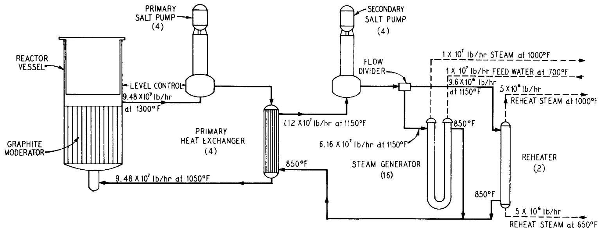
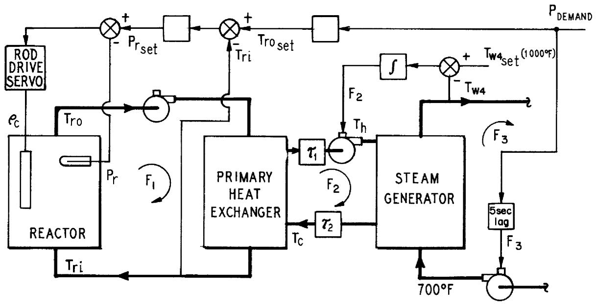
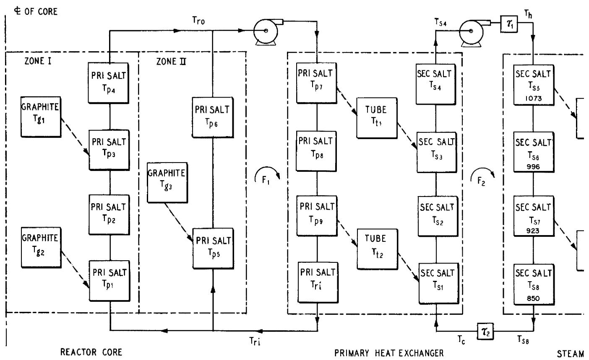
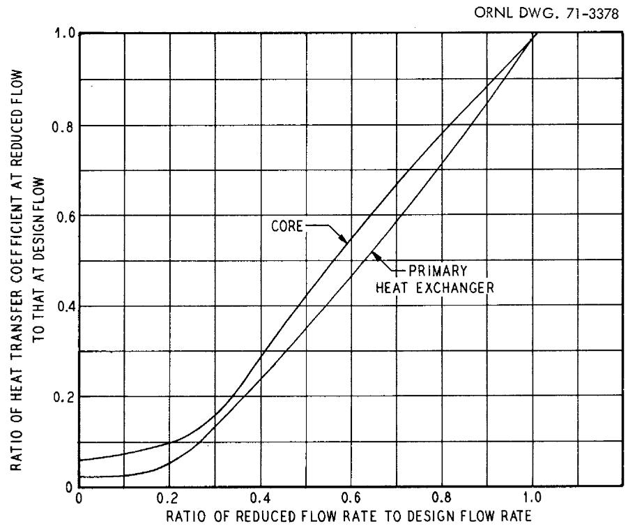
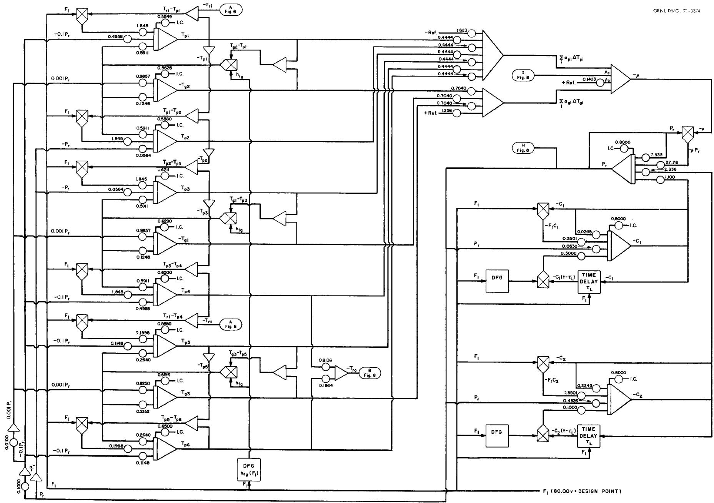
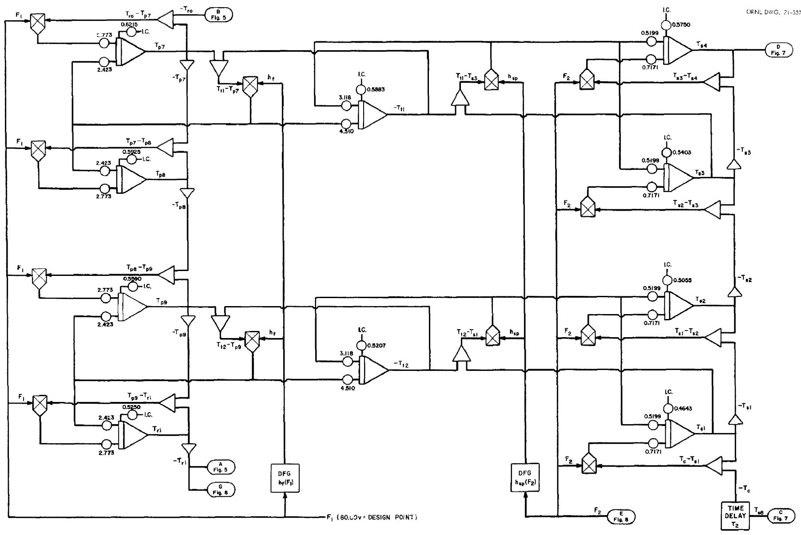
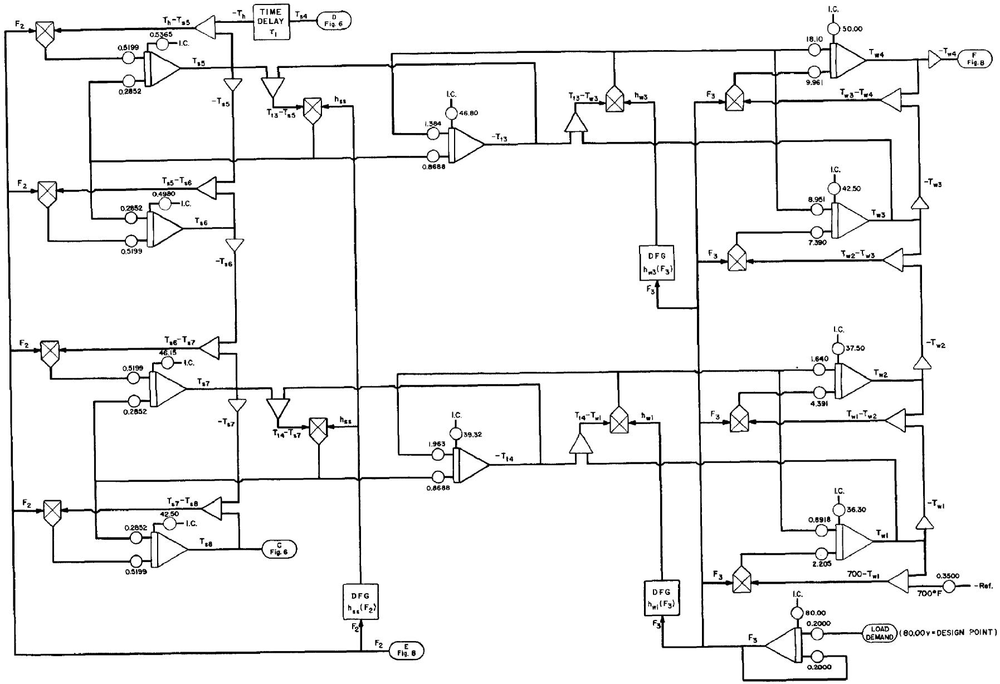
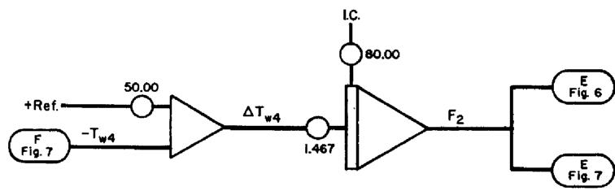
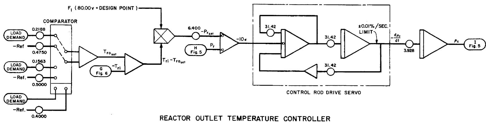

MSBR CONTROL STUDIES: ANALOG SIMULATION PROGRAM

W. H. Sides, Jr.

This report was prepared as an account of work sponsored by the United States Government. Neither the United States nor the United States Atomic Energy Commission, nor any of their employees, nor any of their contractors, subcontractors, or their employees, makes any warranty, express or implied, or assumes any legal liability or responsibility for the accuracy, completeness or usefulness of any information, apparatus, product or process disclosed, or represents that its use would not infringe privately owned rights.

Contract No. W-7405-eng-26

INSTRUMENTATION AND CONTROLS DIVISION

MSBR CONTROL STUDIES: ANALOG SIMULATION PROGRAM

W. H. Sides, Jr.

This report was prepared as an account of work sponsored by the United States Government. Neither the United States nor the United States Atomic Energy Commission, nor any of their employees, nor any of their contractors, subcontractors, or their employees, makes any warranty, express or implied, or assumes any legal liability or responsibility for the accuracy, completeness or usefulness of any information, apparatus, product or process disclosed, or represents that its use would not infringe privately owned rights.

MAY 1971

OAK RIDGE NATIONAL LABORATORY

Oak Ridge, Tennessee

operated by

UNION CARBIDE CORPORATION

for the

U.S. ATOMIC ENERGY COMMISSION

# CONTENTS

1. Introduction 1   
2.Description of the Plant and Control System 1   
3. Simulation of the System 7

3.1 Model 7   
3.2 System Equations and Analog Computer Program 9

3.2.1 Reactor Core 9   
3.2.2 Primary Heat Exchanger 15   
3.2.3 Steam Generator 19   
3.2.4 Control System 25

# MSBR CONTROL STUDIES: ANALOG SIMULATION PROGRAM

W. H. Sides, Jr.

# ABSTRACT

This report describes the mathematical model and analog computer program which were used in the preliminary study of the dynamics and control of the 1000-MW(e) single-fluid Molten-Salt Breeder Reactor. The results and conclusions of the study were reported earlier in Control Studies of a 1000-Mw(e) MSBR, ORNL-TM-2927 (May 18, 1970), by W. H. Sides, Jr.

# 1. INTRODUCTION

A preliminary investigation was made of the dynamics and possible control schemes for the proposed 1000-MW(e) single-fluid Molten-Salt Breeder Reactor (MSBR). For this purpose an analog computer simulation of the plant was devised. In this report the system, simulation model, and analog computer program are described. The specific transients investigated using this simulation, the results, and the conclusions were presented in another report.1

For the purposes of the analysis, the MSBR plant consisted of a graphite-moderated circulating-fuel (primary salt) reactor, a shell-and-tube heat exchanger for transferring the generated heat to a coolant (secondary salt), a shell-and-tube supercritical steam generator, and a possible control system. The analog simulation of the plant consisted of a lumped-parameter heat transfer model for the core, primary heat exchanger, and steam generator; a two-delayed-neutron-group model of the circulating-fuel nuclear kinetics with temperature reactivity feedbacks; and the external control system.

The simulation was carried out on the ORNL Reactor Controls Department analog computer. So that the model would have the maximum dynamic range, the system differential equations were not linearized, and as a result the requisite quantity of equipment required that the model be severely limited spatially to minimize the number of equations. In addition, the pressure in the water side of the steam generator, as well as in the rest of the plant, and the physical properties of the salts and water were taken to be time invariant. The temperature of the feedwater to the steam generators was also held constant.

# 2. DESCRIPTION OF THE PLANT AND CONTROL SYSTEM

The proposed 1000-MW(e) MSBR steam-electric generating plant consisted of a 2250-MW(t) graphite-moderated molten-salt reactor, 4 shell-and-tube primary heat exchangers, and 16 shell-and-tube supercritical steam generators (Fig. 1). The reactor core contained two zones: a central zone, a cylinder $\sim 14.4$ ft in diameter and $\sim 13$ ft high with a primary-salt volume fraction of 0.132; and an outer zone, an annular region $\sim 1.25$ ft thick and the same height as the central zone. The salt volume fraction in this region was 0.37. The primary salt, bearing $^{233}\mathrm{U}$ and $^{232}\mathrm{Th}$ , flowed upward through the graphite core in a single pass and then to the tube side of one of four vertical single-pass primary heat exchangers, each $\sim 19$ ft long, 5 ft in diameter, and constructed of Hastelloy N. The salt flow rate at design point was $9.48\times 10^7$ lb/hr. The design-point temperature of the salt entering the core was $1050^{\circ}\mathrm{F}$ and that at the core outlet was $1300^{\circ}\mathrm{F}$ . The liquidus temperature of this salt was approximately $930^{\circ}\mathrm{F}$ .

The heat generated in the primary salt in the core was transferred from the tube side of the primary heat exchangers to a countercurrent secondary salt passing through the shell side. This salt flowed in a closed secondary loop to one of four horizontal supercritical steam generators. The four secondary loops,

  
Fig. 1. Flow Diagram of MSBR Plant. The quantities shown are totals for the entire plant.

  
Fig. 2. Simulation Model of Plant and Control System.

one for each primary heat exchanger, were independent of each other, with each loop supplying heat to four steam generators. Thus there was a total of 16 steam generators in the plant. The design-point flow rate of secondary salt in each loop was $1.78 \times 10^{7} \mathrm{lb/hr}$ . At the design point the secondary-salt cold-leg temperature was $850^{\circ}\mathrm{F}$ , and the hot-leg temperature was $1150^{\circ}\mathrm{F}$ . The liquidus temperature of this salt was $\sim 725^{\circ}\mathrm{F}$ .

The shell-and-tube supercritical steam generators were countercurrent single-pass U-tube exchangers $\sim 73$ ft long and $\sim 18$ in. in diameter and were constructed of Hastelloy N. Feedwater entered the steam generators at the design point at $700^{\circ}\mathrm{F}$ and a pressure of about 3750 psi. The outlet steam conditions at the design point were $1000^{\circ}\mathrm{F}$ and 3600 psi. Each steam generator produced steam at the design point at a rate of $6.30 \times 10^{5} \mathrm{lb/hr}$ . Reference 2 gives a complete description of an earlier, but quite similar, version of the steam generator and primary heat exchanger.

The load control system used in this study maintained the temperature of the steam delivered to the turbines at a design value of $1000^{\circ}\mathrm{F}$ during all steady-state conditions and within a narrow band around this value during plant transients. The rudimentary control system used in this simulation is shown in Fig. 2. It consisted of a reactor outlet temperature controller similar to that used successfully in the $\mathrm{MSRE}^3$ and a steam temperature controller.

Steam temperature control was accomplished by varying the secondary-salt flow rate. This method was chosen because of the relatively tight coupling which existed between steam temperature and secondary-salt flow rate. The measured steam temperature was compared with its set point of $1000^{\circ}\mathrm{F}$ , and any error caused the secondary-salt flow rate to change at a rate proportional to the error if the error was $2^{\circ}\mathrm{F}$ or less. If the error was greater than $2^{\circ}\mathrm{F}$ , the rate of change of the secondary-salt flow rate was limited to its rate of change for a $2^{\circ}\mathrm{F}$ error, which was approximately $11\%/\mathrm{min}$ .

To control the reactor outlet temperature, an external plant-load demand signal was used to obtain a reactor outlet temperature set point. The outlet temperature set point was a linear function of load demand, varying between 1125 and $1300^{\circ}\mathrm{F}$ for loads above $50\%$ and between 1000 and $1125^{\circ}\mathrm{F}$ for loads below $50\%$ . The measured value of the reactor inlet temperature was subtracted from the outlet temperature set point, and, since the primary-salt flow rate was constant, a reactor (heat) power set point was generated by multiplying this $\Delta T$ by a proportionality constant. The reactor power set point was a function of inlet temperature during a transient and thus a function of dynamic load. The measured value of reactor power (from neutron flux) was compared with the reactor power set point, and any error was fed to the control rod servo for appropriate reactivity adjustment. Under normal conditions, the control rod servo added or removed reactivity at a rate proportional to the reactor power error if the error was $1\%$ or less. If the error was greater than $1\%$ , the addition or removal rate was limited to the rate for a $1\%$ error, which was about $0.01\%/\mathrm{sec}$ . The maximum magnitude of reactivity that the simulation allowed was $\pm 1\%$ .

The physical constants used in this simulation are summarized in Table 1. The various system volumes, masses, flow rates, etc., calculated from the constants are listed in Table 2.

Table 1. Physical Constants   

<table><tr><td colspan="4">Properties of Materials</td></tr><tr><td></td><td>\( C_p \) [Btu \( lb^{-1} (°F)^{-1} \)]</td><td>\( \rho \) (lb/ft3)</td><td>\( k \) [Btu \( hr^{-1} (°F)^{-1} ft^{-1} \)]</td></tr><tr><td>Primary salt</td><td>0.324</td><td>207.8 at 1175°F</td><td></td></tr><tr><td>Secondary salt</td><td>0.360</td><td>117 at 1000°F</td><td></td></tr><tr><td>Steam</td><td></td><td></td><td></td></tr><tr><td>726°F</td><td>6.08</td><td>22.7</td><td></td></tr><tr><td>750°F</td><td>6.59</td><td>11.4</td><td></td></tr><tr><td>850°F</td><td>1.67</td><td>6.78</td><td></td></tr><tr><td>1000°F</td><td>1.11</td><td>5.03</td><td></td></tr><tr><td>Hastelloy N</td><td></td><td></td><td></td></tr><tr><td>1000°F</td><td>0.115</td><td>548</td><td>9.39</td></tr><tr><td>1175°F</td><td>0.129</td><td></td><td>11.6</td></tr><tr><td>Graphite</td><td>0.42</td><td>115</td><td></td></tr></table>

Reactor Core   

<table><tr><td></td><td>Central Zone</td><td>Outer Zone</td></tr><tr><td>Diameter, ft</td><td>14.4</td><td>16.9</td></tr><tr><td>Height, ft</td><td>13</td><td>13</td></tr><tr><td>Salt volume fraction</td><td>0.132</td><td>0.37</td></tr><tr><td>Fuel</td><td>233U</td><td></td></tr><tr><td>Graphite-to-salt heat transfer coefficient, Btu hr-1 ft-2 (°F)-1</td><td>1065</td><td></td></tr><tr><td>Temperature coefficients of reactivity, (°F)-1</td><td></td><td></td></tr><tr><td>Primary salt</td><td>-1.333 × 10-5</td><td></td></tr><tr><td>Graphite</td><td>+1.056 × 10-5</td><td></td></tr><tr><td>Thermal-neutron lifetime, sec</td><td>3.6 × 10-4</td><td></td></tr><tr><td>Delayed neutron constants, β = 0.00264</td><td></td><td></td></tr><tr><td>i</td><td>βi</td><td>λi (sec-1)</td></tr><tr><td>1</td><td>0.00102</td><td>0.02446</td></tr><tr><td>2</td><td>0.00162</td><td>0.2245</td></tr></table>

Heat Exchangers   

<table><tr><td></td><td>Primary Heat Exchanger</td><td colspan="2">Steam Generator</td></tr><tr><td>Length, ft</td><td>18.7</td><td colspan="2">72</td></tr><tr><td>Triangular tube pitch, in.</td><td>0.75</td><td colspan="2">0.875</td></tr><tr><td>Tube OD, in.</td><td>0.375</td><td colspan="2">0.50</td></tr><tr><td>Wall thickness, in.</td><td>0.035</td><td colspan="2">0.077</td></tr><tr><td>Heat transfer coefficients, Btu hr-1 ft-2 (°F)-1</td><td></td><td>Steam Outlet</td><td>Feedwater Inlet</td></tr><tr><td>Tube-side fluid film</td><td>3500</td><td>3590</td><td>6400</td></tr><tr><td>Tube-wall conductance</td><td>3963</td><td>1224</td><td>1224</td></tr><tr><td>Shell-side fluid film</td><td>2130</td><td>1316</td><td>1316</td></tr></table>

Table 2. Plant Parameters (Design Point)   

<table><tr><td colspan="3">Reactor Core</td></tr><tr><td>Heat flux, Btu/hr</td><td>7.68 × 109[2250 MW(t)]</td><td></td></tr><tr><td>Primary-salt flow rate, lb/hr</td><td>9.48 × 107</td><td></td></tr><tr><td>Steady-state reactivity, ρ0</td><td>0.00140</td><td></td></tr><tr><td>External loop transit time of primary salt, sec</td><td>6.048</td><td></td></tr><tr><td></td><td>Zone I</td><td>Zone II</td></tr><tr><td>Heat generation, MW(t)</td><td>1830</td><td>420</td></tr><tr><td>Salt volume fraction</td><td>0.132</td><td>0.37</td></tr><tr><td>Active core volume, ft3</td><td>2117</td><td>800</td></tr><tr><td>Primary-salt volume, ft3</td><td>279</td><td>296</td></tr><tr><td>Graphite volume, ft3</td><td>1838</td><td>504</td></tr><tr><td>Primary salt mass, lb</td><td>58,074</td><td>61,428</td></tr><tr><td>Graphite mass, lb</td><td>212,213</td><td>58,124</td></tr><tr><td>Number of graphite elements</td><td>1466</td><td>553</td></tr><tr><td>Heat transfer area, ft2</td><td>30,077</td><td>14,206</td></tr><tr><td>Average primary-salt velocity, fps</td><td>~4.80</td><td>~1.04</td></tr><tr><td>Core transit time of primary salt, sec</td><td>2.71</td><td>12.5</td></tr><tr><td colspan="3">Primary Heat Exchanger</td></tr><tr><td colspan="3">Total for each of four exchanges, tube region only</td></tr><tr><td>Secondary-salt flow rate, lb/hr</td><td>1.78 × 107</td><td></td></tr><tr><td>Number of tubes</td><td>6020</td><td></td></tr><tr><td>Heat transfer area, ft2</td><td>11,050</td><td></td></tr><tr><td>Overall heat transfer coefficient, Btu hr-1 ft-2(°F)-1</td><td>993</td><td></td></tr><tr><td>Tube metal volume, ft3</td><td>30</td><td></td></tr><tr><td>Tube metal mass, lb</td><td>16,020</td><td></td></tr><tr><td></td><td>Primary Salt (Tube Side)</td><td>Secondary Salt (Shell Side)</td></tr><tr><td>Volume, ft3</td><td>57</td><td>295</td></tr><tr><td>Mass, lb</td><td>11,870</td><td>34,428</td></tr><tr><td>Velocity, fps</td><td>10.4</td><td>2.68</td></tr><tr><td>Transit time, sec</td><td>1.80</td><td>6.97</td></tr><tr><td colspan="3">Steam Generator</td></tr><tr><td colspan="3">Total for each of 16 steam generators, tube region only</td></tr><tr><td>Steam flow rate, lb/hr</td><td>7.38 × 105</td><td></td></tr><tr><td>Number of tubes</td><td>434</td><td></td></tr><tr><td>Heat transfer area, ft2</td><td>4102</td><td></td></tr><tr><td>Tube metal volume, ft3</td><td>22</td><td></td></tr><tr><td>Tube metal mass, lb</td><td>12,203</td><td></td></tr><tr><td></td><td>Steam (Tube Side)</td><td>Secondary Salt (Shell Side)</td></tr><tr><td>Volume, ft3</td><td>20</td><td>102</td></tr><tr><td>Mass, lb</td><td>235</td><td>11,873</td></tr><tr><td>Transit time, sec</td><td>1.15</td><td>9.62</td></tr><tr><td>Average velocity, fps</td><td>~62.8</td><td>7.50</td></tr></table>

# 3. SIMULATION OF THE SYSTEM

# 3.1 Model

A spatially lumped parameter model used for the heat transfer system (Fig. 3) consisted of the reactor core, one primary heat exchanger, one steam generator, the nuclear kinetics, and a control system as shown in Fig. 2. All 4 primary heat exchangers were combined into 1 and all 16 steam generators into 1.

In the core the primary salt in the central zone was divided axially into four equal lumps, and the graphite was divided into two. The outer zone was divided equally into two primary-salt lumps and one graphite lump. Since the primary-salt density varied only slightly with temperature, the four central-zone lumps were of equal mass, as were the two outer-zone lumps. The two central-zone graphite lumps were of equal mass as well.

The mass flow rate of the primary salt in the two zones of the core was determined by the heat generation rate in each zone, so that the temperature rise of the primary salt in the two zones was equal. Thus, $81.4\%$ of the flow passed through the central zone and $18.6\%$ through the outer zone.

A two-delayed-neutron-group approximation of the circulating-fuel nuclear kinetics equations4 was used in the model. This allowed the delayed-neutron precursor concentration term $C_{i}(t - \tau_{L})$ (see Sect. 3.2.1) to be simulated directly with two of four available transport lag devices. The delayed-neutron fraction for $^{233}\mathrm{U}$ was 0.00264, and the prompt-neutron generation time was 0.36 msec. The coefficient of reactivity for the primary salt was $-1.33 \times 10^{-5} \delta k / k$ per $^{\circ}\mathrm{F}$ , which was divided equally among the six primary-salt lumps of the core model. The temperature coefficient for the graphite was $+1.06 \times 10^{-5} \delta k / k$ per $^{\circ}\mathrm{F}$ , which was divided equally among the three graphite lumps.

The model was designed to accommodate a variable flow rate of the primary salt as well as the secondary salt and steam. The required variations of film heat transfer coefficients with the various salt and steam flow rates were included. The film coefficient for secondary salt on the shell side of the primary heat exchanger and steam generator was proportional to the 0.6 power of the flow rate. The film coefficient for steam on the tube side of the steam generators was assumed to be proportional to the 0.8 power of the flow rate. The variation of the film coefficient in the reactor core and on the tube (primary salt) side of the primary heat exchangers decreased with flow, as shown in Fig. 4. The heat conductance across the tube wall in both exchangers was assumed to be constant.

The primary and secondary salts in the primary heat exchanger were divided axially into four equal lumps, with the tube wall represented by two lumps. As did the primary-salt density, the secondary-salt density varied only slightly with temperature, and thus the masses of the salt lumps were assumed to be equal and constant. A variable transport delay was included in the hot and cold legs of the secondary-salt loop to simulate the transport of secondary salt between the primary heat exchanger and the steam generator.

The secondary salt in the steam generator was axially divided into four lumps of equal mass, as in the primary heat exchanger. The steam on the tube side was likewise divided into four equal lumps spatially, but of unequal mass. Under design conditions the supercritical steam density varied from $34\mathrm{lb / ft}^3$ at the feedwater inlet to $5\mathrm{lb / ft}^3$ at the steam outlet.[6] The density of the steam in the lump nearest the feedwater entrance was taken as the average density in the quarter of the steam generator represented by that lump, or $22.7\mathrm{lb / ft}^3$ . The densities of the remaining three steam lumps were determined in a similar manner. The

  
Fig. 3. Lumped-Parameter Model of MSBR Plant.

  
Fig. 4. Variation of Film Heat Transfer Coefficient with Primary-Salt Flow Rate in the Reactor Core and Primary Heat Exchanger.

axial temperature distribution in the steam was nonlinear also and was determined from the average design-point temperatures in each half of the steam generator. The specific heat of each lump was calculated from the enthalpy and temperature distributions. In the model, these resulting design-point values of density and specific heat were assumed to remain constant during part-load steady-state conditions and during all transients.

# 3.2 System Equations and Analog Computer Program

The spatially lumped parameter model used to describe the plant heat transfer system is shown in Fig. 3.

3.2.1 Reactor Core. In the graphite the heat transfer equation was:

$$
M _ {g i} C _ {p g} \frac {d T _ {g i}}{d t} = h _ {f g} A _ {g i} \left(T _ {p} - T _ {g i}\right) + k _ {g i} P _ {r}, \tag {1}
$$

where

$T_{gi} =$ temperature of graphite lump $i$

$T_{p} =$ temperature of primary salt lump to which heat is being transferred,

$M_{g1} = M_{g2} = \text{mass of graphite lump in core zone I}$ ,

$M_{g3} =$ mass of graphite lump in core zone II,

$C_{pg} =$ specific heat of graphite,

$h_{fg} =$ graphite-to-primary-salt heat transfer coefficient,

$A_{g1} = A_{g2} =$ heat transfer area of lump in zone I,

$A_{g3} =$ heat transfer area of lump in zone II,

$k_{gi} =$ fraction of fission heat generated in graphite lump $i$

$P_{r} =$ reactor heat generation rate.

In the primary salt:

$$
M _ {p i} C _ {p f} \frac {d T _ {p i}}{d t} = f F _ {1} C _ {p f} \left(T _ {p i - 1} - T _ {p i}\right) + h _ {f g} A _ {p i} \left(T _ {g} - T _ {p i}\right) + k _ {p i} P _ {r}, \tag {2}
$$

where

$T_{pi} =$ temperature of primary-salt lump $i$

$M_{p1} = M_{p2} = M_{p3} = M_{p4} = \text{mass of primary - salt lump in core zone I}$ ,

$M_{p5} = M_{p6} = \text{mass of primary - salt lump in core zone II}$ ,

$C_{pf} =$ specific heat of primary salt,

$F_{1} =$ total primary-salt mass flow rate,

$f =$ fraction of primary-salt mass flow rate in zone I,

$A_{p1} = A_{p2} = A_{p3} = A_{p4} =$ heat transfer area of lump in zone I,

$A_{p5} = A_{p6} =$ heat transfer area of lump in zone II,

$k_{pi} =$ fraction of fission heat generated in primary-salt lump $i$ .

The reactor outlet temperature $T_{ro}$ was given by:

$$
T _ {r o} = f T _ {p 4} + (1 - f) T _ {p 6}. \tag {3}
$$

The heat transfer coefficient $h_{fg}$ varied with the primary-salt mass flow rate, as follows:

$$
h _ {f g} = h _ {f g 0} h _ {f g} (F _ {1}),
$$

where $h_{fg0}$ is the design-point value of the graphite-to-salt heat transfer coefficient. A diode function generator was used to simulate the function $h_{fg}(F_1)$ , which is shown in Fig. 4 labeled "core."

The fraction of the total primary-salt mass flow rate that passed through zone I (and the fraction of the total heat generated in zone I) was given in Sect. 3.1 as 0.814. The fraction of heat generated in the primary salt as compared with the graphite in both zones was $91.9\%$ in the salt and $8.1\%$ in the graphite. Thus in zone II,

$$
k _ {g 3} = 0. 1 8 6 \times 0. 0 8 1 = 0. 0 1 5 1, \tag {4}
$$

and

$$
k _ {p 5} = k _ {p 6} = 0. 1 8 6 \times 0. 9 1 9 \times 0. 5 = 0. 0 8 5 7. \tag {5}
$$

In zone I,

$$
k _ {g 1} = k _ {g 2} = 0. 8 1 4 \times 0. 0 8 1 \times 0. 5 = 0. 0 3 2 9. \tag {6}
$$

The axial distribution of the reactor heat generation rate in the primary salt in core zone I was assumed to be a chopped cosine distribution with an extrapolation distance of 8 ft. Then, in the primary salt in zone I,

$$
\begin{array}{l} k _ {p 1} = k _ {p 4} = 0. 8 1 4 \times 0. 9 1 9 \left(\int_ {0. 2 7 6 \pi} ^ {0. 3 8 8 \pi} \sin x d x / \int_ {0. 2 7 6 \pi} ^ {0. 5 \pi} \sin x d x\right) \times 0. 5 \tag {7} \\ = 0. 1 7 4 9, \\ \end{array}
$$

$$
\begin{array}{l} k _ {p 2} = k _ {p 3} = 0. 8 1 4 \times 0. 9 1 9 \left(\int_ {0. 3 8 8 \pi} ^ {0. 5 \pi} \sin x d x / \int_ {0. 2 7 6 \pi} ^ {0. 5 \pi} \sin x d x\right) \times 0. 5 \tag {8} \\ = 0. 1 9 9 2. \\ \end{array}
$$

The constant coefficients in the equations were calculated using Tables 1 and 2. Thus in Eq. (1),

$$
\begin{array}{l} \frac {h _ {f g 0} A _ {g 1}}{M _ {g 1} C _ {p g}} = \frac {1 0 6 5 \mathrm {B t u} \times 1 5 , 0 3 9 \mathrm {f t} ^ {2} \times \mathrm {l b} - {} ^ {\circ} \mathrm {F} \times \mathrm {h r}}{\mathrm {h r} - \mathrm {f t} ^ {2} - {} ^ {\circ} \mathrm {F} \times 1 . 0 6 \times 1 0 ^ {5} \mathrm {l b} \times 0 . 4 2 \mathrm {B t u} \times 3 6 0 0 \sec} \tag {9} \\ = 0. 0 9 9 8 \sec^ {- 1} , \\ \end{array}
$$

where $h_{fg0} =$ design-point primary-salt-to-graphite heat transfer coefficient, and

$$
\begin{array}{l} \frac {k _ {g 1} P _ {r 0}}{M _ {g 1} C _ {p g}} = \frac {0 . 0 3 2 9 \times {} ^ {\circ} \mathrm {F} \times 7 . 6 8 \times 1 0 ^ {9} \mathrm {B t u} \times \mathrm {h r}}{0 . 4 4 5 2 \times 1 0 ^ {5} \mathrm {B t u} \times \mathrm {h r} \times 3 6 0 0 \mathrm {s e c}} \tag {10} \\ = 1. 5 7 7 ^ {\circ} \mathrm {F} / \sec , \\ \end{array}
$$

where $P_{r0}$ = design-point power level [2250 MW(t)]. The coefficients in the remaining graphite equations $(i = 2,3)$ were similarly calculated.

For the primary-salt heat transfer equation (2) the constant coefficients are

$$
\begin{array}{l} \frac {f F _ {1 0}}{M _ {p 1}} = \frac {0 . 8 1 4 \times 9 . 4 8 \times 1 0 ^ {7} \mathrm {l b} \times \mathrm {h r}}{0 . 2 5 \times 5 8 . 0 7 4 \mathrm {l b} \times \mathrm {h r} \times 3 6 0 0 \mathrm {s e c}} \tag {11} \\ = 1. 4 7 6 \sec^ {- 1}, \\ \end{array}
$$

where $F_{10} =$ design point value of primary-salt mass flow rate,

$$
\begin{array}{l} \frac {h _ {f g 0} A _ {p 1}}{M _ {p 1} C _ {p f}} = \frac {8 . 0 0 8 \times 1 0 ^ {6} \mathrm {B t u} \times \mathrm {l b} - {} ^ {\circ} \mathrm {F} \times \mathrm {h r}}{1 4 , 5 1 9 \mathrm {l b} \times \mathrm {h r} - {} ^ {\circ} \mathrm {F} \times 0 . 3 2 4 \mathrm {B t u} \times 3 6 0 0 \mathrm {s e c}} \tag {12} \\ = 0. 4 7 2 9 \sec^ {- 1}, \\ \end{array}
$$

and

$$
\begin{array}{l} \frac {k _ {p 1} P _ {r 0}}{M _ {p 1} C _ {p f}} = \frac {0 . 1 7 4 9 \times {} ^ {\circ} \mathrm {F} \times 7 . 6 8 \times 1 0 ^ {9} \mathrm {B t u} \times \mathrm {h r}}{4 7 0 4 \mathrm {B t u} \times \mathrm {h r} \times 3 6 0 0 \mathrm {s e c}} \tag {13} \\ = 7 9. 3 2 ^ {\circ} \mathrm {F} / \sec . \\ \end{array}
$$

The coefficients for the remaining primary-salt equations $(i = 2 - 6)$ were similarly calculated.

The unscaled heat transfer equations for the core were thus

$$
\frac {d T _ {g 1}}{d t} = 0. 0 9 9 8 h _ {f g} \left(F _ {1}\right) \left(T _ {p 3} - T _ {g 1}\right) + 1. 5 7 7 \frac {P _ {r}}{P _ {r 0}}, \tag {14}
$$

$$
\frac {d T _ {g 2}}{d t} = 0. 0 9 9 8 h _ {f g} \left(F _ {1}\right) \left(T _ {p 1} - T _ {g 2}\right) + 1. 5 7 7 \frac {P _ {r}}{P _ {r 0}}, \tag {15}
$$

$$
\frac {d T _ {g 3}}{d t} = 0. 1 7 2 2 h _ {f g} \left(F _ {1}\right) \left(T _ {p 5} - T _ {g 3}\right) + 1. 3 2 0 \frac {P _ {r}}{P _ {r 0}}, \tag {16}
$$

$$
\frac {d T _ {p 1}}{d t} = 1. 4 7 6 \frac {F _ {1}}{F _ {1 0}} \left(T _ {r i} - T _ {p 1}\right) + 0. 4 7 2 9 h _ {f g} \left(F _ {1}\right) \left(T _ {g 2} - T _ {p 1}\right) + 7 9. 3 2 \frac {P _ {r}}{P _ {r 0}}, \tag {17}
$$

$$
\frac {d T _ {p 2}}{d t} = 1. 4 7 6 \frac {F _ {1}}{F _ {1 0}} \left(T _ {p 1} - T _ {p 2}\right) + 0. 4 7 2 9 h _ {f g} \left(F _ {1}\right) \left(T _ {g 2} - T _ {p 1}\right) + 9 0. 2 4 \frac {P _ {r}}{P _ {r 0}}, \tag {18}
$$

$$
\frac {d T _ {p 3}}{d t} = 1. 4 7 6 \frac {F _ {1}}{F _ {1 0}} \left(T _ {p 2} - T _ {p 3}\right) + 0. 4 7 2 9 h _ {f g} \left(F _ {1}\right) \left(T _ {g 1} - T _ {p 3}\right) + 9 0. 2 4 \frac {P _ {r}}{P _ {r 0}}, \tag {19}
$$

$$
\frac {d T _ {p 4}}{d t} = 1. 4 7 6 \frac {F _ {1}}{F _ {1 0}} \left(T _ {p 3} - T _ {p 4}\right) + 0. 4 7 2 9 h _ {f g} \left(F _ {1}\right) \left(T _ {g 1} - T _ {p 3}\right) + 7 9. 3 2 \frac {P _ {r}}{P _ {r 0}}, \tag {20}
$$

$$
\frac {d T _ {p 5}}{d t} = 0. 1 5 9 9 \frac {F _ {1}}{F _ {1 0}} \left(T _ {r i} - T _ {p 5}\right) + 0. 2 1 1 2 h _ {f g} \left(F _ {1}\right) \left(T _ {g 3} - T _ {p 5}\right) + 1 8. 3 6 \frac {P _ {r}}{P _ {r 0}}, \tag {21}
$$

$$
\frac {d T _ {p 6}}{d t} = 0. 1 5 9 9 \frac {F _ {1}}{F _ {1 0}} \left(T _ {p 5} - T _ {p 6}\right) + 0. 2 1 1 2 h _ {f g} \left(F _ {1}\right) \left(T _ {g 3} - T _ {p 5}\right) + 1 8. 3 6 \frac {P _ {r}}{P _ {r 0}}, \tag {22}
$$

$$
T _ {r 0} = 0. 8 1 4 T _ {p 4} + 0. 1 8 6 T _ {p 6}. \tag {23}
$$

A two-delayed-neutron-group approximation of the circulating-fuel point-kinetics equations was used for the nuclear behavior of the core. The equations were:

$$
\frac {d P _ {r}}{d t} = \frac {\rho - \beta}{l} P _ {r} + \lambda_ {1} C _ {1} + \lambda_ {2} C _ {2}, \tag {24}
$$

$$
\frac {d C _ {i}}{d t} = \frac {\beta_ {i}}{l} P _ {r} - \lambda_ {i} C _ {i} - \frac {1}{\tau_ {c}} C _ {i} + \frac {e ^ {- \lambda_ {i} \tau_ {L}}}{\tau_ {c}} C _ {i} (t - \tau_ {L}), \tag {25}
$$

$$
\rho = \rho_ {0} + \sum_ {i} \alpha_ {p i} \Delta T _ {p i} + \sum_ {i} \alpha_ {g i} \Delta T _ {g i} + \rho_ {c}, \tag {26}
$$

where

$$
P _ {r} = \text {r e a c t o r h e a t g e n e r a t i o n r a t e},
$$

$$
C _ {i} = \text {m o d i f i e d d e l a y e d - n e u t r o n p r e c u s o r c o n c e n t r a t i o n},
$$

$$
\beta_ {i} = \text {d e l a y e d - n e u t r o n f r a c t i o n},
$$

$$
\lambda_ {i} = \text {d e l a y e d - n e u t r o n p r e c u s o r d e c a y c o n s t a n t},
$$

$$
l = \text {n e u t r o n g e n e r a t i o n t i m e},
$$

$$
\tau_ {c} = \text {t r a n s i t}
$$

$$
\tau_ {L} = \text {t r a n s i t}
$$

$$
\rho = \text {r e a c t i v i t y},
$$

$$
\rho_ {0} = \text {s t e a d y - s t a t e d e s i g n p o i n t r e a c t i v i t y (a s s o c i a t e d w i t h f l o w i n g f u e l)},
$$

$$
\alpha_ {p i} = \text {t e m p e r a t u r e c o e f f i c i e n t o f r e a c t i v i t y o f s a l t l u m p p i},
$$

$$
\alpha_ {g i} = \text {t e m p e r a t u r e c o e f f i c i e n t o f r e a c t i v i t y o f g r a p h i t e l u m p} g i,
$$

$$
\Delta T _ {p i} = \text {v a r i a t i o n f r o m d e s i g n - p o i n t t e m p e r a t u r e o f s a l t l u m p p i},
$$

$$
\Delta T _ {g i} = \text {v a r i a t i o n}
$$

$$
\rho_ {c} = \text {c o n t r o l}
$$

Variation of the primary-salt flow rate through the core varies the value of the transit times $\tau_{c}$ and $\tau_{L}$ inversely proportional to flow rate. Provision was made in the simulation for these variations to enable study of transients in the primary-salt flow rate. The variation of the transit times with flow rate was given by

$$
\tau_ {c} = \tau_ {c 0} \left(\frac {F _ {1}}{F _ {1 0}}\right) ^ {- 1} \tag {27}
$$

and

$$
\tau_ {L} = \tau_ {L 0} \left(\frac {F _ {1}}{F _ {1 0}}\right) ^ {- 1}, \tag {28}
$$

where

$$
\tau_ {c 0} = \text {t r a n s i t}
$$

$$
\tau_ {L 0} = \text {t r a n s i t}
$$

$$
F _ {1} / F _ {1 0} = \text {r e l a t i v e p r i m a r y - s a l t f l o w r a t e}.
$$

The value of $\tau_{L0}$ was as given in Table 2, and the transit time of the primary salt through the active core was taken to be 3.57 sec (ref. 5).

The negative temperature coefficient of reactivity for the primary salt was divided equally among the six primary-salt lumps in the core model. Similarly, the positive coefficient of the graphite was divided equally among the three graphite lumps.

The nuclear constants for the two-delayed-neutron-group approximation for $^{233}\mathrm{U}$ were as given in Table 1. The steady-state design-point reactivity $\rho_0$ was given by

$$
\rho_ {0} = \beta - \sum_ {i = 1} ^ {2} \frac {\lambda_ {i} \beta_ {i}}{\lambda_ {i} + \left(1 / \tau_ {c 0}\right) \left(1 - e ^ {- \lambda_ {i} \tau_ {L 0}}\right)}, \tag {29}
$$

which yields

$$
\rho_ {0} = 0. 0 0 1 4 0 3. \tag {30}
$$

After calculation of the various coefficients, the unscaled kinetics equations for the relative reactor power (neutron density) and relative delayed-neutron precursor concentrations are

$$
\frac {d \left(P _ {r} / P _ {r 0}\right)}{d t} = 2 7 7 8 \rho \frac {P _ {r}}{P _ {r 0}} - 7. 3 3 3 \frac {P _ {r}}{P _ {r 0}} + 1. 1 0 0 \frac {C _ {1}}{C _ {1 0}} + 2. 3 3 6 \frac {C _ {2}}{C _ {2 0}}, \tag {31}
$$

$$
\begin{array}{l} \frac {d \left(C _ {1} / C _ {1 0}\right)}{d t} = 0. 0 6 3 0 \frac {P _ {r}}{P _ {r 0}} - 0. 0 2 4 5 \frac {C _ {1}}{C _ {1 0}} - 0. 2 8 0 1 \frac {F _ {1}}{F _ {1 0}} \frac {C _ {1}}{C _ {1 0}} \\ + 0. 2 8 0 1 \left[ \frac {F _ {1}}{F _ {1 0}} \exp \left(- \frac {0 . 1 4 7 9}{F _ {1} / F _ {1 0}}\right) \right] \left[ \frac {C _ {1} \left(t - \frac {6 . 0 4 8}{F _ {1} / F _ {1 0}}\right)}{C _ {1 0}} \right], \tag {32} \\ \end{array}
$$

$$
\begin{array}{l} \frac {d \left(C _ {2} / C _ {2 0}\right)}{d t} = 0. 4 3 2 6 \frac {P _ {r}}{P _ {r 0}} - 0. 2 2 4 5 \frac {C _ {2}}{C _ {2 0}} - 0. 2 8 0 1 \frac {F _ {1}}{F _ {1 0}} \frac {C _ {2}}{C _ {2 0}} \\ + 0. 2 8 0 1 \left[ \frac {F _ {1}}{F _ {1 0}} \exp \left(- \frac {1 . 3 5 8}{F _ {1} / F _ {1 0}}\right) \right] \left[ \frac {C _ {2} \left(t - \frac {6 . 0 4 8}{F _ {1} / F _ {1 0}}\right)}{C _ {2 0}} \right], \tag {33} \\ \end{array}
$$

$$
\rho = 0. 0 0 1 4 0 3 - \sum_ {i = 1} ^ {6} 0. 2 2 2 2 \Delta T _ {p i} + \sum_ {i = 1} ^ {3} 0. 3 5 2 0 \Delta T _ {g i} + \rho_ {c}. \tag {34}
$$

The functions in brackets containing the exponentials in Eqs. (32) and (33) were generated by means of diode function generators.

Equations (14) through (23) and (31) through (34) formed the complete set for the thermal and neutronic behavior of the reactor core in this model.

The system variables in these equations and in those for the primary heat exchanger, steam generator, and control system given in the three following sections were scaled for the analog computer as follows.

The allowable computer voltage range from 0 to $100\mathrm{V}$ corresponded to a temperature range from 0 to $2000^{\circ}\mathrm{F}$ for all temperatures in the simulation. Therefore the computer variable representing temperature, $V_{T}$ , corresponded to system temperature, $T$ , as

$$
V _ {T} = \frac {T}{2 0}. \tag {35}
$$

For all flow rates the computer voltage range of 0 to $100\mathrm{V}$ corresponded to a relative flow-rate range of 0 to 1.25. Thus, the design-point flow rate (1.0) corresponded to a computer voltage $V_{F}$ of $80\mathrm{V}$ , or

$$
V _ {F} = 8 0 \frac {F}{F _ {0}}. \tag {36}
$$

The relative power level, $P / P_0$ , was similarly scaled. The computer variable representing power was

$$
V _ {P} = 8 0 \frac {P}{P _ {0}}. \tag {37}
$$

The computer variables, $V_{h}$ , representing the relative heat transfer coefficients, $h(F)$ , were generated using diode function generators with the relative flow rate $V_{F}$ as the input. The computer variables were directly proportional to the relative heat transfer coefficients such that the design-point value of $h(F)$ corresponded to a computer voltage $V_{h}$ of 80 V.

The scaling for the relative delayed-neutron precursor concentration, $C_i / C_{i0}$ , in the nuclear kinetics equations was similar to that for flow rate and power level. The computer variable $V_{Ci}$ was

$$
V _ {C i} = 8 0 \frac {C _ {i}}{C _ {i 0}}. \tag {38}
$$

Reactivity was scaled such that the range of the computer variable $V_{\rho}$ of 0 to $100\mathrm{V}$ corresponded to reactivity of 0 to $1.0\%$ , or

$$
V _ {\rho} = 1 0 ^ {4} \rho . \tag {39}
$$

The resulting analog computer program for the heat transfer and nuclear kinetics of the core is shown in Fig. 5.

3.2.2 Primary Heat Exchanger. The heat transfer model of the primary heat exchanger is shown in Fig. 3. For the primary-salt stream:

$$
M _ {p i} C _ {p f} \frac {d T _ {p i}}{d t} = F _ {1} C _ {p f} \left(T _ {p i - 1} - T _ {p i}\right) + h _ {f} A _ {p} \left(T _ {t i} - T _ {p i}\right). \qquad (4 0)
$$

For the tube walls:

$$
M _ {t i} C _ {p t} \frac {d T _ {t i}}{d t} = h _ {f} A _ {p} \left(T _ {p i} - T _ {t i}\right) + h _ {s p} A _ {p} \left(T _ {s i} - T _ {t i}\right). \tag {41}
$$

  
Fig. 5. Analog Computer Program for the Heat Transfer and Nuclear Kinetics Equations for the Core.

For the secondary-salt stream:

$$
M _ {s i} C _ {p s} \frac {d T _ {s i}}{d t} = F _ {2} C _ {p s} \left(T _ {s i - 1} - T _ {s i}\right) + h _ {s p} A _ {p} \left(T _ {t i} - T _ {s i}\right), \tag {42}
$$

where

$$
T _ {s i} = \text {t e m p e r a t u r e o f s e c o n d a r y - s a l t l u m p} i,
$$

$$
T _ {t i} = \text {t e m p e r a t u r e o f t u b e w a l l l u m p} i,
$$

$$
M _ {p 7} = M _ {p 8} = M _ {p 9} = M _ {r i} = \text {m a s s o f p r i m a r y - s a l t l u m p},
$$

$$
M _ {t 1} = M _ {t 2} = \text {m a s s o f t u b e w a l l l u m p},
$$

$$
M _ {s 1} = M _ {s 2} = M _ {s 3} = M _ {s 4} = \text {m a s s o f s e c o n d a r y - s a l t l u m p},
$$

$$
C _ {p t} = \text {s p e c i f i c h e a t o f t u b e w a l l (H a s t e l l o y N)},
$$

$$
C _ {p s} = \text {s p e c i f i c h e a t o f s e c o n d a r y s a l t},
$$

$$
F _ {2} = \text {s e c o n d a r y - s a l t m a s s f l o w r a t e},
$$

$$
h _ {f} = \text {p r i m a r y - s a l t - t o - t u b e - w a l l h e a t t r a n s f e r c o e f f i c i e n t},
$$

$$
h _ {s p} = \text {t u b e - w a l l - t o - s e c o n d a r y - s a l t h e a t t r a n s f e r c o e f f i c i e n t},
$$

$$
A _ {p} = \text {h e a t t r a n s f e r a r e a o f p r i m a r y h e a t e x c h a n g e r l u m p}.
$$

Heat transfer coefficients in the above equations were calculated as follows. The term $h_f$ in Eqs. (40) and (41) included the film resistance inside the tube and one-half of the tube wall resistance. The other half of the tube wall resistance and the outside-film resistance were included in the term $h_{sp}$ in Eqs. (41) and (42). When the flow rate of the primary salt was changed, the film coefficient varied with flow, as shown in Fig. 4, while the tube wall conductance was maintained constant. Similarly, the film-coefficient part of the term $h_{sp}$ varied as the 0.6 power of the secondary-salt flow rate, and the tube-wall-conductance part was constant. The calculation was performed on the analog computer by means of a diode function generator as

$$
h _ {f} = h _ {f 0} h _ {f} \left(F _ {1}\right) \tag {43}
$$

and

$$
h _ {s p} = h _ {s p 0} h _ {s p} \left(F _ {2}\right), \tag {44}
$$

where $h_{f0}$ is the design-point primary-salt-to-tube-wall heat transfer coefficient and $h_{sp0}$ is the design-point tube-wall-to-secondary-salt heat transfer coefficient. For example, from Table 1:

$$
\begin{array}{l} h _ {f 0} = \left(\frac {1}{3 5 0 0} + \frac {0 . 5}{3 9 6 3}\right) ^ {- 1} \tag {45} \\ = 2 4 2 8 \mathrm {B t u h r} ^ {- 1} \mathrm {f t} ^ {- 2} \left(^ {\circ} \mathrm {F}\right) ^ {- 1}. \\ \end{array}
$$

A diode function generator performed the following calculation:

$$
h _ {f} \left(F _ {1}\right) = \left[ \frac {1}{1 3 1 6 G \left(F _ {1}\right)} + \frac {0 . 5}{3 9 6 3} \right] ^ {- 1}, \tag {46}
$$

where $G(F_{1})$ is the curve for the primary heat exchanger given in Fig. 4.

The coefficients for Eqs. (40) through (42) were calculated using Tables 1 and 2. For example, in Eq. (40),

$$
\begin{array}{l} \frac {F _ {1 0}}{M _ {p 7}} = \frac {9 . 4 8 \times 1 0 ^ {7} \mathrm {l b} \times \mathrm {h r}}{0 . 2 5 \times 4 7 , 4 8 0 \mathrm {l b} \times \mathrm {h r} \times 3 6 0 0 \mathrm {s e c}} \tag {47} \\ = 2. 2 1 8 \sec^ {- 1}, \\ \end{array}
$$

and

$$
\begin{array}{l} \frac {h _ {f 0} A _ {p}}{M _ {p 7} C _ {p f}} = \frac {2 4 2 8 \mathrm {B t u} \times 1 1 , 0 5 0 \mathrm {f t} ^ {2} \times \mathrm {l b} - {} ^ {\circ} \mathrm {F} \times \mathrm {h r}}{\mathrm {h r} \cdot \mathrm {f t} ^ {2} - {} ^ {\circ} \mathrm {F} \times 1 1 , 8 7 0 \mathrm {l b} \times 0 . 3 2 4 \mathrm {B t u} \times 3 6 0 0 \sec} \tag {48} \\ = 1. 9 3 8 \sec^ {- 1}. \\ \end{array}
$$

The unscaled heat transfer equations for the primary heat exchanger were

$$
\frac {d T _ {p 7}}{d t} = 2. 2 1 8 \frac {F _ {1}}{F _ {1 0}} \left(T _ {r 0} - T _ {p 7}\right) + 1. 9 3 8 h _ {f} \left(F _ {1}\right) \left(T _ {t 1} - T _ {p 7}\right), \tag {49}
$$

$$
\frac {d T _ {p 8}}{d t} = 2. 2 1 8 \frac {F _ {1}}{F _ {1 0}} \left(T _ {p 7} - T _ {p 8}\right) + 1. 9 3 8 h _ {f} \left(F _ {1}\right) \left(T _ {t 1} - T _ {p 7}\right), \tag {50}
$$

$$
\frac {d T _ {p 9}}{d t} = 2. 2 1 8 \frac {F _ {1}}{F _ {1 0}} \left(T _ {p 8} - T _ {p 9}\right) + 1. 9 3 8 h _ {f} \left(F _ {1}\right) \left(T _ {t 2} - T _ {p 9}\right), \tag {51}
$$

$$
\frac {d T _ {r i}}{d t} = 2. 2 1 8 \frac {F _ {1}}{F _ {1 0}} \left(T _ {p 9} - T _ {r i}\right) + 1. 9 3 8 h _ {f} \left(F _ {1}\right) \left(T _ {t 2} - T _ {p 9}\right), \tag {52}
$$

$$
\frac {d T _ {t 1}}{d t} = 3. 6 0 8 h _ {f} \left(F _ {1}\right) \left(T _ {p 7} - T _ {t 1}\right) + 2. 4 9 5 h _ {s p} \left(F _ {2}\right) \left(T _ {s 3} - T _ {t 1}\right), \tag {53}
$$

$$
\frac {d T _ {t 2}}{d t} = 3. 6 0 8 h _ {f} \left(F _ {1}\right) \left(T _ {p 9} - T _ {t 2}\right) + 2. 4 9 5 h _ {s p} \left(F _ {2}\right) \left(T _ {s 1} - T _ {t 2}\right), \tag {54}
$$

$$
\frac {d T _ {s 1}}{d t} = 0. 5 7 3 7 \frac {F _ {2}}{F _ {2 0}} \left(T _ {c} - T _ {s 1}\right) + 0. 4 1 5 9 h _ {s p} \left(F _ {2}\right) \left(T _ {t 2} - T _ {s 1}\right), \tag {55}
$$

$$
\frac {d T _ {s 2}}{d t} = 0. 5 7 3 7 \frac {F _ {2}}{F _ {2 0}} \left(T _ {s 1} - T _ {s 2}\right) + 0. 4 1 5 9 h _ {s p} \left(F _ {2}\right) \left(T _ {t 2} - T _ {s 1}\right), \tag {56}
$$

$$
\frac {d T _ {s 3}}{d t} = 0. 5 7 3 7 \frac {F _ {2}}{F _ {2 0}} \left(T _ {s 2} - T _ {s 3}\right) + 0. 4 1 5 9 h _ {s p} \left(F _ {2}\right) \left(T _ {t 1} - T _ {s 3}\right), \tag {57}
$$

$$
\frac {d T _ {s 4}}{d t} = 0. 5 7 3 7 \frac {F _ {2}}{F _ {2 0}} \left(T _ {s 3} - T _ {s 4}\right) + 0. 4 1 5 9 h _ {s p} \left(F _ {2}\right) \left(T _ {t 1} - T _ {s 3}\right). \tag {58}
$$

The scaling of these equations for the analog computer is given in Sect. 3.2.1.

The analog computer program for these equations is shown in Fig. 6.

3.2.3 Steam Generator. The heat transfer model of the steam generator is shown in Fig. 3. For the secondary-salt stream:

$$
M _ {s i} C _ {p s} \frac {d T _ {s i}}{d t} = F _ {2} C _ {p s} \left(T _ {s i - 1} - T _ {s i}\right) + h _ {s s} A _ {s} \left(T _ {t i} - T _ {s i}\right). \tag {59}
$$

For the tube walls:

$$
M _ {t i} C _ {p t} \frac {d T _ {t i}}{d t} = h _ {s s} A _ {t} \left(T _ {s i} - T _ {t i}\right) + h _ {w i} A _ {t} \left(T _ {w i} - T _ {t i}\right). \tag {60}
$$

For the steam:

$$
M _ {w i} C _ {p w i} \frac {d T _ {w i}}{d t} = F _ {3} C _ {p w i} \left(T _ {w i - 1} - T _ {w i}\right) + h _ {w i} A _ {s} \left(T _ {t i} - T _ {w i}\right), \tag {61}
$$

where

$T_{wi} =$ temperature of steam (water) lump $i$

$M_{s5} = M_{s6} = M_{s7} = M_{s8} = \text{mass of secondary - salt lump},$

$M_{wi} =$ mass of steam lump $i$

$C_{pwi} =$ specific heat of steam lump $i$

$F_{3} =$ steam mass flow rate,

$h_{ss} =$ secondary-salt-to-tube-wall transfer coefficient,

$h_{w1} =$ tube-wall-to-steam heat transfer coefficient for the water inlet half of the steam generator,

$h_{w3} =$ tube-wall-to-steam heat transfer coefficient for the steam outlet half of the steam generator,

$A_{s} =$ heat transfer area of the secondary-salt and steam lumps,

$A_{t} =$ heat transfer area of the tube lumps.

The heat transfer coefficients in these equations were calculated in the same manner as were those in the primary heat exchanger (Sect. 3.2.2); namely, half of the tube wall resistance was included with the secondary-salt-to-tube-wall coefficient and half with the tube-wall-to-steam coefficient. The tube wall resistance was maintained constant under all flow and temperature conditions. The film coefficient on the secondary-salt (shell) side varied as the 0.6 power of the secondary-salt flow rate, and that on the tube (steam) side varied as the 0.8 power of the steam flow rate. The simulation of these coefficients was performed with a diode function generator as

$$
h _ {s s} = h _ {s s 0} h _ {s s} \left(F _ {2}\right), \tag {62}
$$

$$
h _ {w 1} = h _ {w 1 0} h _ {w 1} \left(F _ {3}\right), \tag {63}
$$

$$
h _ {w 3} = h _ {w 3 0} h _ {w 3} \left(F _ {3}\right), \tag {64}
$$

  
Fig. 6. Analog Computer Program for the Heat Transfer Equations for the Primary Heat Exchanger.

where the "zero" subscript refers to the design-point value. For example, $h_{ss0}$ was calculated as follows, using the information in Table 1:

$$
\begin{array}{l} h _ {s s 0} = \left(\frac {1}{1 3 1 6} + \frac {0 . 5}{1 2 2 4}\right) ^ {- 1} \tag {65} \\ = 8 5 5. 9 \mathrm {B t u h r} ^ {- 1} \mathrm {f t} ^ {- 2} (^ {\circ} \mathrm {F}) ^ {- 1}. \\ \end{array}
$$

A diode function generator performed the following calculations:

$$
h _ {s s} \left(F _ {2}\right) = \left[ \frac {1}{1 3 1 6 \left(F _ {2} / F _ {2 0}\right) ^ {0 . 6}} + \frac {0 . 5}{1 2 2 4} \right] ^ {- 1}. \tag {66}
$$

The other heat transfer coefficients were similarly calculated.

The coefficients of Eqs. (59) and (60) were calculated using Tables 1 and 2. For example, in Eq. (59):

$$
\begin{array}{l} \frac {F _ {2}}{M _ {s 5}} = \frac {7 . 1 1 \times 1 0 ^ {5} \mathrm {l b} \times \mathrm {h r}}{4 7 , 4 9 2 \mathrm {l b} \times \mathrm {h r} \times 3 6 0 0 \mathrm {s e c}} \tag {67} \\ = 0. 4 1 5 9 \sec^ {- 1}. \\ \end{array}
$$

$$
\begin{array}{l} \frac {h _ {s s 0} A _ {s}}{M _ {s 5} C _ {p s}} = \frac {8 5 5 . 9 \mathrm {B t u} \times 1 6 , 4 0 8 \mathrm {f t} ^ {2} \times \mathrm {l b} - {} ^ {\circ} \mathrm {F} \times \mathrm {h r}}{4 7 , 4 9 2 \mathrm {l b} \times \mathrm {h r} - \mathrm {f t} ^ {2} - {} ^ {\circ} \mathrm {F} \times 0 . 3 6 \mathrm {B t u} \times 3 6 0 0 \sec} \tag {68} \\ = 0. 2 2 8 2 \sec^ {- 1}. \\ \end{array}
$$

The masses and specific heats of the steam lumps in Eq. (61) were calculated as follows. The temperature and pressure distributions of the steam in the steam generator at design point were obtained from ref. 6. At the midplane in the steam generator the temperature and pressure were, respectively, $750^{\circ}\mathrm{F}$ and 3711 psi. From the steam tables, the enthalpy here was 1087 Btu/lb. At design point, the enthalpy of the water was raised from its inlet value of 770.8 Btu/lb to the steam outlet value of 1421 Btu/lb, an increase of 650.2 Btu/lb. The enthalpy rise from 770.8 to 1087 Btu/lb in the water inlet half of the steam generator was equally divided between lumps w1 and w2, and that from 1087 to 1421 Btu/lb equally divided between lumps w3 and w4. Thus, $48.6\%$ of the heat was transferred in the water inlet half and $51.4\%$ in the steam outlet half of the steam generator. The average temperature of the steam in the water inlet half was (from ref. 6) $\sim 726^{\circ}\mathrm{F}$ . The average temperature in the steam outlet half was about $850^{\circ}\mathrm{F}$ . The design-point temperatures of lumps w1, w2, w3, and w4 were, therefore, 726, 750, 850, and $1000^{\circ}\mathrm{F}$ respectively.

The total change in temperature of the secondary salt in the steam generator at design point was $300^{\circ}\mathrm{F}$ . Since the specific heat of this salt was constant, the $48.6\%$ of the heat transferred in the steam outlet half of the steam generator represented a change in salt temperature of $145.9^{\circ}\mathrm{F}$ , or a temperature at the midplane of the exchanger of $995.9^{\circ}\mathrm{F}$ , which compared well with that given by ref. 6 $(997^{\circ}\mathrm{F})$ . This was the design-point temperature for salt lump s6. The temperatures of lumps s5 and s7 were the average in the two halves of the exchanger, or 1073 and $923^{\circ}\mathrm{F}$ respectively.

The overall temperature difference for heat transfer between salt and steam in the water inlet end of the exchanger (between lumps $s7$ and $w1$ ) was $197^{\circ}\mathrm{F}$ . In the steam end the difference (between lumps $s5$ and $w3$ ) was $223^{\circ}\mathrm{F}$ . The values of the average heat transfer coefficients for the steam generator were also

obtained from ref. 6. The average secondary-salt (shell side) film heat transfer coefficient and average tube wall conductance over the entire exchanger were 1316 and 1224 Btu hr $^{-1}$ ft $^{-2}$ ( $^\circ \mathrm{F}$ ) $^{-1}$ respectively. The average film heat transfer coefficient on the steam (tube) side over the water inlet half of the steam generator was taken to be 6400 and that for the steam outlet half was 3590 Btu hr $^{-1}$ ft $^{-2}$ ( $^\circ \mathrm{F}$ ) $^{-1}$ . The average overall heat transfer coefficients in the water inlet half and the steam outlet half were about 577 and 539 Btu hr $^{-1}$ ft $^{-2}$ ( $^\circ \mathrm{F}$ ) $^{-1}$ respectively. The heat transfer area in each half was, then, 2051 ft $^2$ . The area of each lump was

$$
\begin{array}{l} A _ {s} = \frac {2 0 5 1 \times 1 6}{2} \tag {69} \\ = 1 6, 4 0 0 \mathrm {f t} ^ {2}. \\ \end{array}
$$

The enthalpy and temperature of each steam lump were used to calculate the effective specific heat. For example:

$$
\begin{array}{l} C _ {p w 1} = \frac {1}{2} (1 0 8 7 - 7 7 0. 8) / (7 2 6 - 7 0 0) \tag {70} \\ = 6. 0 8 \mathrm {B t u l b} ^ {- 1} \left(^ {\circ} \mathrm {F}\right) ^ {- 1}. \\ \end{array}
$$

The value of each $C_{pwi}$ is given in Table 1. The value for the density of the steam for each of the four steam lumps was obtained from ref. 6 as the average density of the steam in each quarter of the steam generator.

The steam generator was about 72 ft long. The number of 0.5-in.-OD tubes was calculated from the heat transfer area to be 434 tubes in each steam generator. From this information and the tube wall thickness and tube pitch given in Table 1, the mass and volume of the salt, metal, and steam were calculated for the tube region in each steam generator. These values are given in Table 2. The coefficients of Eq. (61) were then calculated. For example, the total flow area in the 434 tubes of each steam generator was 0.284 ft. The mass of steam lump $w1$ was

$$
\begin{array}{l} M _ {w 1} = 1 6 \times 0. 2 8 4 \mathrm {f t} ^ {2} \times \frac {7 2}{4} \mathrm {f t} \times 2 2. 7 \mathrm {l b} / \mathrm {f t} ^ {3} \tag {71} \\ = 1 8 6 0 \mathrm {l b}. \\ \end{array}
$$

Similarly,

$$
M _ {w 2} = 9 3 4 \mathrm {l b}, \tag {72}
$$

$$
M _ {w 3} = 5 5 5 \mathrm {l b}, \tag {73}
$$

$$
M _ {w 4} = 4 1 2 \mathrm {l b}. \tag {74}
$$

The design-point flow rate of the steam was $1.181 \times 10^{7} \mathrm{lb/hr}$ . Then

$$
\begin{array}{l} \frac {F _ {3 0}}{M _ {w 1}} = \frac {1 . 1 8 1 \times 1 0 ^ {7} \mathrm {l b} \times \mathrm {h r}}{1 8 6 0 \mathrm {l b} \times \mathrm {h r} \times 3 6 0 0 \mathrm {s e c}} \tag {75} \\ = 1. 7 6 4 \sec^ {- 1}. \\ \end{array}
$$

The term $h_{w10}$ was calculated in a manner similar to that for $h_{ss0}$ [see Eq. (65)]. Its value was 1771 Btu hr $^{-1}$ ft $^{-2}$ (°F) $^{-1}$ . Then

$$
\begin{array}{l} \frac {h _ {w 1 0} A _ {s}}{M _ {w 1} C _ {p w 1}} = \frac {1 7 7 1 \mathrm {B t u} \times 1 6 , 4 0 0 \mathrm {f t} ^ {2} \times \mathrm {l b} - {} ^ {\circ} \mathrm {F} \times \mathrm {h r}}{1 8 6 0 \mathrm {l b} \times \mathrm {h r} - \mathrm {f t} ^ {2} - {} ^ {\circ} \mathrm {F} \times 6 . 0 8 \mathrm {B t u} \times 3 6 0 0 \sec} \tag {76} \\ = 0. 7 1 3 4 \sec^ {- 1}. \\ \end{array}
$$

The unscaled analog computer equations for the steam generator were:

$$
\frac {d T _ {s 5}}{d t} = 0. 4 1 5 9 \frac {F _ {2}}{F _ {2 0}} \left(T _ {h} - T _ {s 5}\right) + 0. 2 2 8 2 h _ {s s} \left(F _ {2}\right) \left(T _ {t 3} - T _ {s 5}\right), \tag {77}
$$

$$
\frac {d T _ {s 6}}{d t} = 0. 4 1 5 9 \frac {F _ {2}}{F _ {2 0}} \left(T _ {s 5} - T _ {s 6}\right) + 0. 2 2 8 2 h _ {s s} \left(F _ {2}\right) \left(T _ {t 3} - T _ {s 5}\right), \tag {78}
$$

$$
\frac {d T _ {s 7}}{d t} = 0. 4 1 5 9 \frac {F _ {2}}{F _ {2 0}} \left(T _ {s 6} - T _ {s 7}\right) + 0. 2 2 8 2 h _ {s s} \left(F _ {2}\right) \left(T _ {t 4} - T _ {s 7}\right), \tag {79}
$$

$$
\frac {d T _ {s 8}}{d t} = 0. 4 1 5 9 \frac {F _ {2}}{F _ {2 0}} \left(T _ {s 7} - T _ {s 8}\right) + 0. 2 2 8 2 h _ {s s} \left(F _ {2}\right) \left(T _ {t 4} - T _ {s 7}\right), \tag {80}
$$

$$
\frac {d T _ {t 3}}{d t} = 0. 6 9 5 0 h _ {s s} \left(F _ {2}\right) \left(T _ {s 5} - T _ {t 3}\right) + 1. 1 0 7 h _ {w 3} \left(F _ {3}\right) \left(T _ {w 3} - T _ {t 3}\right), \tag {81}
$$

$$
\frac {d T _ {t 4}}{d t} = 0. 6 9 5 0 h _ {s s} \left(F _ {2}\right) \left(T _ {s 7} - T _ {t 4}\right) + 1. 5 7 0 h _ {w 1} \left(F _ {3}\right) \left(T _ {w 1} - T _ {t 4}\right), \tag {82}
$$

$$
\frac {d T _ {w 1}}{d t} = 1. 7 6 4 \frac {F _ {3}}{F _ {3 0}} (7 0 0 - T _ {w 1}) + 0. 7 1 3 4 h _ {w 1} \left(F _ {3}\right) \left(T _ {t 4} - T _ {w 1}\right), \tag {83}
$$

$$
\frac {d T _ {w 2}}{d t} = 3. 5 1 3 \frac {F _ {3}}{F _ {3 0}} \left(T _ {w 1} - T _ {w 2}\right) + 1. 3 1 2 h _ {w 1} \left(F _ {3}\right) \left(T _ {t 4} - T _ {w 1}\right), \tag {84}
$$

$$
\frac {d T _ {w 3}}{d t} = 5. 9 1 2 \frac {F _ {3}}{F _ {3 0}} \left(T _ {w 2} - T _ {w 3}\right) + 7. 1 6 1 h _ {w 3} \left(F _ {3}\right) \left(T _ {t 3} - T _ {w 3}\right), \tag {85}
$$

$$
\frac {d T _ {w 4}}{d t} = 7. 9 6 9 \frac {F _ {3}}{F _ {3 0}} \left(T _ {w 3} - T _ {w 4}\right) + 1 4. 4 8 h _ {w 3} \left(F _ {3}\right) \left(T _ {t 3} - T _ {w 3}\right). \tag {86}
$$

Transport delays were used in the hot and cold legs of the secondary-salt loop to account for the transit time of the secondary salt between the primary heat exchanger and the steam generator. Thus, from Fig. 3,

$$
T _ {s 4} = T _ {\mathrm {h}} \left(t + \tau_ {1}\right), \tag {87}
$$

$$
T _ {s 8} = T _ {\mathrm {c}} \left(t + \tau_ {2}\right). \tag {88}
$$

  
Fig. 7. Analog Computer Program for the Heat Transfer Equations for the Steam Generator.

The values used for $\tau_{1}$ and $\tau_{2}$ were 14.5 and 11.9 sec, respectively, at the design-point flow rate of the secondary salt and were inversely proportional to that flow rate at off-design conditions. No transport delay was included for the flow of primary salt between the reactor core and the primary heat exchanger.

The scaling of the equations for the analog computer is given in Sect. 3.2.1. The analog computer program for the steam generator is shown in Fig. 7.

3.2.4 Control System. Steam Temperature Controller. The steam temperature was controlled by varying the secondary-salt flow rate and thus the heat input to the steam generator. An error in steam temperature caused the flow rate to change at a rate proportional to the error, that is,

$$
\frac {d F _ {2}}{d t} = - \alpha \left(T _ {w 4} - 1 0 0 0 ^ {\circ} \mathrm {F}\right), \tag {89}
$$

where $F_{2}$ is the secondary-salt flow rate, $T_{w4}$ is the outlet steam temperature, and $\alpha$ is the controller gain.

The controller gain $\alpha$ used in the simulation was approximately $5.5\%/\min$ change in flow rate for each $1^{\circ}\mathrm{F}$ error in steam temperature for errors of $2^{\circ}\mathrm{F}$ or less. For errors greater than $2^{\circ}\mathrm{F}$ , the rate of change of flow rate was limited to $11\%/\min$ . No optimization was carried out to obtain these values, but they produced reasonably good system response.

Reactor Outlet Temperature Controller. The reactor outlet temperature set point was determined by the plant load demand (Fig. 2). The set-point equations were:

$$
T _ {r o _ {\text {s e t}}} = 3 5 0 P _ {\text {d e m a n d}} + 9 5 0 (0. 5 <   P \leqslant 1. 0) \tag {90}
$$

and

$$
T _ {r o _ {\text {s e t}}} = 2 5 0 P _ {\text {d e m a n d}} + 1 0 0 0 (0 <   P \leqslant 0. 5), \tag {91}
$$

where $T_{ro\text{set}}$ is the reactor outlet temperature set point and $P_{\text{demand}}$ is the fractional plant load demand. This set of equations was chosen so that the resulting steady-state reactor inlet temperature would decrease linearly with load from $1050^{\circ}\mathrm{F}$ at full load to $1000^{\circ}\mathrm{F}$ at $50\%$ load and remain constant at $1000^{\circ}\mathrm{F}$ for loads below $50\%$ .

The reactor power-level set point was proportional to the difference between the outlet temperature set point and the measured reactor inlet temperature, that is,

$$
P _ {r _ {\text {s e t}}} = A \left(T _ {r o _ {\text {s e t}}} - T _ {r i}\right), \tag {92}
$$

where $P_{r_{\mathrm{set}}}$ is the reactor power level set point, $T_{ri}$ is the measured reactor inlet temperature, and $A$ is the proportionality constant.

The proportionality constant $A$ was itself proportional to the primary-salt flow rate. The assumption of constant specific heat of the primary salt is thus implied here. However, it is not necessary to assume constant specific heat in an actual operating control system of this type. Additional circuitry may be provided to compensate for this effect, as was demonstrated in the MSRE control system.3

A reactor-power-level error was obtained by subtracting the set-point value from the measured value (from neutron flux), that is,

$$
\epsilon = P _ {r} - P _ {r _ {\text {s e t}}}. \tag {93}
$$

This power error $\epsilon$ was the input signal to a control rod servo described by the second-order transfer function:

$$
T (s) = \frac {G \omega^ {2}}{s ^ {2} + 2 \zeta \omega s + \omega^ {2}} = \frac {O (s)}{\epsilon (s)}, \tag {94}
$$

where $G$ is the controller gain, $\omega$ is the bandwidth, $\xi$ is the damping factor, and $O(s)$ is the Laplace transform of the servo output, $d\rho_{c} / dt$ .

In this simulation the bandwidth was $5\mathrm{Hz}$ and the damping factor was 0.5. These values are typical of the kind and size of servo which may be used in this control-rod-drive service. The gain of the controller $G$ was such that, for $|\epsilon| = 1\%$ of full power, the control reactivity addition or withdrawal rate was about $0.01\% / \sec$ ; that is,

$$
\frac {d \rho_ {c}}{d t} = 0.01 \% / \sec , \tag{95}
$$

where $\rho_{c}$ is the control reactivity.

For power level errors greater than $1\%$ of full power, the reactivity addition or withdrawal rate was limited to $0.01\%$ /sec. Integration of Eq. (95) yields the value for the control reactivity in the kinetics equations of Sect. 3.2.1.

The steam flow rate $F_{3}$ was obtained directly from the power demand, $P_{\text{demand}}$ . A 5-sec first-order lag was included to obtain some simulation of the response of the steam valve:

$$
\frac {d F _ {3}}{d t} = \frac {a}{\tau} P _ {\text {d e m a n d}} (t) - \frac {1}{\tau} F _ {3}, \tag {96}
$$

where $a$ is a proportionality constant and $\tau$ is the time constant (5 sec).

The scaling of the equations for the analog computer is given in Sect. 3.2.1. The analog computer program for the control system part of the simulation is shown in Fig. 8.

  
STEAM TEMPERATURE CONTROLLER

ORNL DWG. 71-3377

  
REACTOR OUTLET TEMPERATURE CONTROLLER  
Fig. 8. Analog Computer Program for the Control System.

#

# INTERNAL DISTRIBUTION

1. J. L. Anderson

35. H. A. McLain

2. C. F. Baes

36. L. E. McNeese

3. H. F. Bauman

37. J. R. McWherter

4. S. E. Beall

38. H. J. Metz

5. C. E. Bettis

39. R. L. Moore

6. E. S. Bettis

40. E. L. Nicholson

7. E. G. Bohlmann

41-60. L.C.Oakes

8. C. J. Borkowski

61. R. B. Parker

9. G. E. Boyd

62. A.M. Perry

10. R. B. Briggs

63. T. W. Pickel

11. O.W. Burke

64. R. C. Robertson

12. F. H. Clark

66. M. W. Rosenthal

13. C. W. Collins

67. G. S. Sadowski

14-15. D.F.Cope

68. Dunlap Scott

16. F. L. Culler

70. W. H. Sides, Jr.

17. S. J. Ditto

71. M. J. Skinner

18. W.P.Eatherly

72. O. L. Smith

19. J. R. Engel

73. D. A. Sundberg

20. D. E. Ferguson

74. J. R. Tallackson

21. L. M. Ferris

75. R. E. Thoma

22. W. K. Furlong

76. D. B. Trauger

23. W. R. Grimes

77. G.M. Watson

24. A. G. Grindell

78. A. M. Weinberg

25. P. N. Haubenreich

79. J. R. Weir

26. R. E. Helms

80. M. E. Whatley

27. P. G. Herndon

81. J. C. White - A. S. Meyer

28. E.C.Hise

82. L. V. Wilson

29. P. R. Kasten

83. Gale Young

30. T. W. Kerlin

84-85. Central Research Library

31. R. B. Korsmeyer

86. Document Reference Section

32. M. I. Lundin

87-89. Laboratory Records Department

33. R. E. MacPherson

90. Laboratory Records, ORNL R.C.

34. H. E. McCoy

# EXTERNAL DISTRIBUTION

91. C. B. Deering, Black and Veatch Engineers, 1500 Meadowlake Parkway, Kansas City, Missouri 64114   
92. Ronald Feit, Instrumentation and Control Branch, Division of Reactor Development and Technology, U. S. Atomic Energy Commission, Washington, D.C. 20545   
93. George McCright, Black and Veatch Engineers, 1500 Meadowlake Parkway, Kansas City, Missouri 64114

94-95. T. W. McIntosh, Division of Reactor Development and Technology, U. S. Atomic Energy Commission, Washington, D.C. 20545

96. M. Shaw, Division of Reactor Development and Technology, U. S. Atomic Energy Commission, Washington, D.C. 20545   
97. J. A. Swartout, Union Carbide Corporation, New York, N.Y. 10017   
98. Laboratory and University Division, AEC, ORO

99-100. Division of Technical Information Extension