# OAK RIDGE NATIONAL LABORATORY

operated by

UNION CARBIDE CORPORATION

for the

U.S. ATOMIC ENERGY COMMISSION

3445601352887

UNION CANGIBLE

ORNL-TM-3137

a.g. 59

ENGINEERING DEVELOPMENT STUDIES FOR MOLTEN-SALT BREEDER REACTOR PROCESSING NO., 2

L. E. McNeese

OAK PRACTICE YARBOCKS LABORATORY

GENERAL RESEARCH LITERARY

COWORKING COOLING

L

DO NOT TRANSFER TO AND THEN PERSON

I can with someone else like this

ckment used in some with document

get the library will replace a book

${13}/{14}$

NOTICE This document contains information of a preliminary nature and was prepared primarily for internal use at the Oak Ridge National Laboratory. It is subject to revision or correction and therefore does not represent a final report.

This report was prepared as an account of work sponsored by the United States Government. Neither the United States nor the United States Atomic Energy Commission, nor any of their employees, nor any of their contractors, subcontractors, or their employees, makes any warranty, express or implied, or assumes any legal liability or responsibility for the accuracy, completeness or usefulness of any information, apparatus, product or process disclosed, or represents that its use would not infringe privately owned rights.

ORNL-TM-3137

Contract No. W-7405-eng-26

CHEMICAL TECHNOLOGY DIVISION

ENGINEERING DEVELOPMENT STUDIES FOR MOLTEN-SALT BREEDER REACTOR PROCESSING NO. 2

L. E. McNeese

FEBRUARY 1971

OAK RIDGE NATIONAL LABORATORY

Oak Ridge, Tennessee

operated by

UNION CARBIDE CORPORATION

for the

U.S. ATOMIC ENERGY COMMISSION

Reports previously issued in this series include the following:

ORNL-4139 Period Ending March 1967

ORNL-4204 Period Ending June 1967

ORNL-4234 Period Ending September 1967

ORNL-4235 Period Ending December 1967

ORNL-364 Period Ending March 1968

ORNL-4365 Period Ending June 1968

ORNL-4366 Period Ending September 1968

ORNL-TM-3053 Period Ending December 1968

# CONTENTS

SUMMARIES V

1. INTRODUCTION 1   
2. PROPOSED FLOWSHEET FOR PROCESSING A SINGLE-FLUID MSBR BY REDUCTIVE EXTRACTION 1  
3. MSBR MATERIAL-BALANCE CALCULATIONS 5

3.1 Effect of Fuel-Salt Discard Cycle 5   
3.2 Effects of Removing Zirconium and Seminoble Metals 6   
3.3 Effect of Protactinium Removal Efficiency 8   
3.4 Quantities of Heat and Mass in the MSBR Off-Gas System . 10

4. REMOVAL OF PROTACTINIUM FROM A SINGLE-FLUID MSBR 22

4.1 Mathematical Analysis of a Reductive Extraction System 24   
4.2 Calculated System Performance 26   
4.3 Stabilization of the Protactinium Isolation System 29   
4.4 Transient Performance 41

5. USE OF THE PROTACTINIUM ISOLATION SYSTEM FOR CONTROLLING THE URANIUM CONCENTRATION IN THE BLANKET OF A SINGLE-FLUID MSBR. 44  
6. REMOVAL OF RARE EARTH'S FROM A SINGLE-FLUID MSBR 52

6.1 Proposed Rare-Earth Removal Flowsheet 52   
6.2 Effect of Rare-Earth--Thorium Separation Factor and Bismuth Flow Rate 54   
6.3 Effect of Location of Feed Point 63   
6.4 Effect of the Fraction of $\mathsf{ThF}_{\downarrow}$ That Is Reduced in the Electrolytic Cell 63   
6.5 Effect of Number of Stages in the Extraction Column 66   
6.6 Effect of Processing Cycle Time 66   
6.7 Rare-Earth Removal Times for Reference Conditions 77

# CONTENTS (Continued)

# 7. SEMICONTINUOUS ENGINEERING EXPERIMENTS ON REDUCTIVE EXTRACTION 78

7.1 Pressure Tests of the Feed-and-Catch Tanks 78   
7.2 Initial Cleanup of Experimental System 79   
7.3 Loading and Treatment of Bismuth 79   
7.4 Operation of Gas Purification and Supply Systems 80   
7.5 Planned Experiments 80

# 8. ELECTROLYTIC CELL DEVELOPMENT 82

8.1 Comparison of Cell Resistance with AC and DC Power 82   
8.2 Experiments in a Quartz Static Cell with a Graphite Anode 83   
8.3 Studies of Frozen-Wall Corrosion Protection in an All-Metal Cell 85

# 9. MSRE DISTILLATION EXPERIMENT 89

9.1 Instrument Panel 90   
9.2 Main Process Vessels 90   
9.3 Valve Box 94   
9.4 Condensate Sampler 96

# 10. REFERENCES 100

# SUMMARIES

# PROPOSED FLOWSHEET FOR PROCESSING A SINGLE-FLUID MSBR BY REDUCTIVE EXTRACTION

A proposed flowsheet for processing a single-fluid MSBR is based on reductive extraction, and routes the reactor salt through the prot-actinium-isolation and the rare-earth-removal systems on 3- and 30-day cycles, respectively. The flowsheet is scaled for a 1000-Mw (electrical) MSBR.

In addition to the two primary operations (protactinium isolation and rare-earth removal), the flowsheet incorporates means for removing materials such as zirconium and nickel. Other operations include recovery of uranium from waste streams, UF $_6$ collection, and fuel reconstitution and cleanup.

# MSBR MATERIAL-BALANCE CALCULATIONS

The MATADOR steady-state material-balance computer code has been used to determine the effects of a number of processing-plant variables on the nuclear performance of a 1000-Mw (electrical) MSBR. Variables studied were fuel-salt discard rate, removal times for zirconium and seminoble metals, and efficiency for the removal of protactinium.

# REMOVAL OF PROTACTINIUM FROM A SINGLE-FLUID MSBR

Isolation of protactinium by reductive extraction is proposed, based on the fact that protactinium is intermediate in nobility between uranium and thorium. By countercurrently contacting a salt stream containing fluorides of uranium and protactinium with a bismuth stream containing thorium and lithium, the uranium is transferred from the salt to a downflowing metal stream and is carried out of the extraction column.

The protactinium, which is trapped in the center of the column, will, for the most part, be held up for decay in a tank through which molten salt is circulated. This protactinium isolation method was analyzed mathematically; calculated results show it to be attractive.

# USE OF THE PROTACTINIUM ISOLATION SYSTEM FOR CONTROLLING THE URANIUM CONCENTRATION IN THE BLANKET OF A SINGLE-FLUID MSBR

The presently envisioned system for protactinium isolation produces a salt stream that is free of uranium and protactinium at one point in the system. This characteristic could be exploited to decrease the uranium concentration (and hence the uranium inventory) in the blanket region of a single-fluid MSBR. We concluded that the use of the protactinium-isolation system for decreasing the uranium concentration in the blanket region to $10\%$ of that in the core region is restricted to reactor designs having an exchange rate between the core and blanket regions of less than $0.01\%$ of the flow rate through the core.

# REMOVAL OF RARE EARTH'S FROM A SINGLE-FLUID MSBR

A reductive extraction method is proposed for removing rare earths from a single-fluid MSBR. Operation of the system is dominated by the low separation factors (1.2 to 3.5) between thorium and the rare earths. Calculated results for the steady-state performance of the system indicate that an extraction column having approximately 24 stages and a bismuth flow rate of 15 gpm will be required for removing the rare earths on a 30-day processing cycle, which is roughly equivalent to a 50-day removal time for all rare earths.

# SEMICONTOINUOUS ENGINEERING EXPERIMENTS ON REDUCTIVE EXTRACTION

Equipment for semicontinuous engineering experiments on reductive extraction was installed, and the initial shakedown operation was com

pleted. The salt and bismuth feed tanks were pressure tested. The internal surfaces of the system were treated for removal of oxides by contact with hydrogen at $600^{\circ}\mathrm{C}$ , and a 184-kg charge of bismuth was added to the system and treated for oxide removal. Several experiments planned with this system are described.

# ELECTROLYTIC CELL DEVELOPMENT

The proposed reductive extraction processes for protactinium isolation and rare-earth removal require electrolytic cells for reducing lithium and thorium fluorides into a bismuth cathode to prepare the metal streams fed to the extraction columns and for oxidizing extracted components from the metal streams leaving the columns. Experimental work is reported on (1) a comparison of cell resistances observed with alternating and direct current, (2) the performance of a graphite anode, and (3) the evaluation of an all-metal cell employing frozen-wall corrosion protection.

# MSRE DISTILLATION EXPERIMENT

Equipment is being installed at the MSRE for demonstrating the high-temperature, low-pressure distillation of molten salt as a means for separating the lanthanide fission products from the components of the M5RE fuel-carrier salt, which is a mixture of lithium, beryllium, and zirconium fluorides. Modifications that were made after the system was tested with nonradioactive salt are discussed; they include a change in the configuration of the feed line to the still pot, installation of electrical insulation between resistance heaters and process lines to prevent the lines from being damaged in the event of a heater failure, installation of absolute filters in the vacuum lines from the feed tank and the receiver to prevent the spread of radioactivity, completion of the secondary containment for the valve box, and construction of a condensate sampler suitable for remote operation with radioactive samples.

# 1. INTRODUCTION

A molten-salt breeder reactor (MSBR) will be fueled with a molten fluoride mixture that will circulate through the blanket and core regions of the reactor and through the primary heat exchanger. We are developing processing methods for use in a close-coupled facility for removing fission products, corrosion products, and fissile materials from the molten fluoride mixture.

Several operations associated with MSBR processing are under study. The remaining parts of this section describe (1) a proposed reductive-extraction flowsheet for a single-fluid MSBR, (2) material-balance calculations that show the effects of the removal time for zirconium, alkali metals and alkaline earths, europium, and protactinium on reactor performance and that indicate the magnitudes of the heat generation and mass flows associated with the reactor off-gas, (3) calculated results showing the steady-state performance of a protactinium isolation system, (4) an evaluation of the use of the protactinium isolation system to limit the uranium concentration in the blanket of a single-fluid MSBR, (5) calculations to predict the steady-state performance of a rare-earth removal system based on reductive extraction, (6) preliminary testing of the semicontinuous reductive-extraction facility, (7) experiments related to the development of electrolytic cells for use with molten salt and bismuth, and (8) installation of equipment at the MSRE for demonstrating low-pressure distillation of molten salt, using irradiated MSRE fuel carriers salt. This work was carried out by the Chemical Technology Division during the period January-March 1969.

# 2. PROPOSED FLOWSHEET FOR PROCESSING A SINGLE-FLUID MSBR BY REDUCTIVE EXTRACTION

L. E. McNeese M. E. Whatley

The process flowsheet envisioned for a single-fluid MSBR is based on reductive extraction, and routes the reactor salt volume through the protactinium-isolation and the rare-earth removal systems on 3- and

30-day cycles, respectively. The present version of the process flow-sheet (Fig. 1) is scaled for a 1000-Mw (electrical) MSBR. The protac-tinium isolation and the rare-earth removal systems will be described in more detail in a later section.

The protactinium-isolation system exploits the fact that protactinium is intermediate in nobility between uranium and thorium. A molten-salt stream is withdrawn from the reactor on a 3-day cycle (2.5 gpm) and is fed countercurrent to a 5.3-gpm stream of liquid bismuth in a 12-stage extraction column. If the correct flow of reductant (thorium plus lithium) in the bismuth stream entering the contactor is used, the uranium in the salt will transfer to the downflowing bismuth stream in the lower part of the column. The protactinium, however, will concentrate midway up the cascade, where most of the protactinium in the reactor system can be held up by diverting the salt through a suitably large volume $(200\text{ft}^3)$ . At steady state, the $^{233}\text{Pa}$ decays to $^{233}\text{U}$ at the same rate that it enters the tank from the reactor. The concentrations of both protactinium and uranium in the salt leaving the column are negligible; however, the concentration of rare earths at this point is approximately the same as that in the reactor. Approximately $10\%$ of the salt stream leaving the protactinium-isolation column (i.e., 0.25 gpm) will be processed for the removal of rare earths. The remaining salt passes through an electrolytic oxidizer-reducer, where lithium and thorium are reduced into a flowing bismuth cathode to provide the metal stream that is fed to the column. At the anode of the cell, bismuth is oxidized to $\text{BiF}_3$ , which is soluble in the molten salt. The salt stream, containing $\text{BiF}_3$ , is countercurrently contacted with the bismuth stream exiting from the extraction column in order to oxidize uranium, protactinium, and other materials, which are then transferred to the salt stream and returned to the reactor.

The concentration of uranium or protactinium must be known at some point in the column in order to control the concentration of reductant in the bismuth stream fed to the column. The uranium concentration is

Fig. 1. Proposed Reductive Extraction Processing Flowsheet for a Single-Fluid MSBR.   
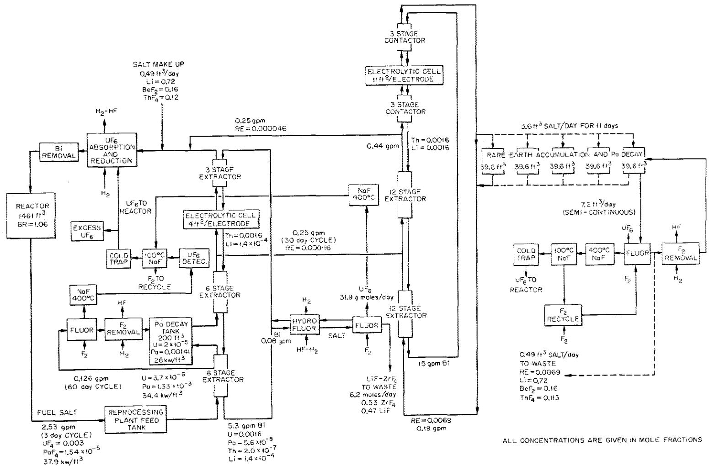  
ORN-OWG69-2333RA

determined by fluorinating approximately $5\%$ of the salt entering the protactinium decay tank and analyzing the resulting gas stream for $\mathrm{UF}_{6}$ . Means are provided for collecting the $\mathrm{UF}_{6}$ from this operation as well as from other fluorination operations and for returning this material to the fuel salt. The $\mathrm{UF}_{6}$ is simultaneously absorbed into the molten salt and reduced to $\mathrm{UF}_{4}$ by a hydrogen sparge. A bismuth-removal step will also be provided before the salt returns to the reactor.

Approximately $1.5\%$ of the bismuth stream leaving the extraction column (i.e., 0.08 gpm) will be hydrofluorinated in the presence of a salt stream for the removal of the seminoble metals (Ga, Ge, Cd, In, Sn, and Sb), various corrosion products (Fe, Ni, and Cr), and fission product zirconium. The salt is recycled between the hydrofluorinator and a fluorinator, where uranium is removed. The principal components that build up in this salt are ${}^{7}\mathrm{LiF}$ and $\mathrm{ZrF}_{4}$ ; the expected steady-state composition is $47 - 53$ mole $\%$ LiF-ZrF $_{4}$ , which has a liquidus of $520^{\circ}\mathrm{C}$ .

Salt that is free of uranium and protactinium but contains rare earths is fed to the center of a 24-stage extraction column at the rate of about 0.25 gpm, which is sufficient to process the reactor volume in 30 days. The salt flows countercurrent to a bismuth stream containing thorium and lithium. Typically, $60\%$ of the rare earths are extracted from the salt stream in the upper column (an effective removal time of 50 days), and the rare-earth concentration in the lower column is increased to approximately 0.69 mole $\%$ . The bismuth flow rate through the column is 15 gpm. Part of the salt leaving the column is returned to the reactor, whereas the remainder is fed to the electrolytic cell complex; this produces a net effect of reducing thorium and lithium into the bismuth phase and transferring the extracted rare earths from the bismuth phase to the returning salt. (Both the anode and the cathode are flowing streams of bismuth.) A Bi-Li stream generated at the cathode of the cell is fed to the three-stage contactor, which removes most of the $\mathrm{ThF}_4$ from the incoming salt. The salt then picks up $\mathrm{BiF}_3$ as it passes

the anode. The salt stream containing $\mathsf{BiF}_3$ is passed countercurrent to the bismuth stream entering the complex from the rare-earth-removal column in order to oxidize the rare earths, thorium, and lithium from the bismuth.

Salt containing rare earths at a concentration of 0.69 mole % is withdrawn from the system, at the rate of 0.49 ft³/day, through a set of sequentially arranged 40-ft³ tanks. The active-metal fission products (Sr, Cs, Ba, Rb, and Eu) are also present in the stream at a concentration equal to that in the reactor, and are removed on a 3000-day cycle. Use of this system limits the rate at which rare earths could inadvertently return to the reactor. The salt is fluorinated for uranium recovery when necessary.

# 3. MSBR MATERIAL-BALANCE CALCULATIONS

M.J.Bell L.E.McNeese

The MATADOR computer code for calculating steady-state material balances has been used to determine the effects of a number of processing-plant variables on the nuclear performance of a 1000-Mw (electrical) MSBR, which has a thermal power of 2250 Mw. These variables include fuel-salt discard rate, removal times for zirconium and seminoble metals, and protactinium removal efficiency. The reactor under consideration had a power of 2250-Mw (thermal) and contained 1220 ft³ of salt in the case of the studies of zirconium and seminoble metal removal and 1463 ft³ for studies of protactinium removal and salt discard rate. The fuel-salt composition was 67.7-20.0-12.0-0.3 mole % LiF-BeF₂-ThF₄-UF₄.

# 3.1 Effect of Fuel-Salt Discard Cycle

The active metals (Rb, Cs, Sr, and Ba) are not removed by reductive extraction, and their concentrations in the reactor system are

maintained at acceptable levels by the discard of salt. A study was made of the effect of the rate of salt discard on the performance of the reactor, as evidenced by neutron absorptions by the active metals. The poisoning caused by these metals is shown in Table 1 for salt-discard cycle times of 800, 1200, 2000, and 3000 days, and is compared with the total poisoning for all fission products. It is evident that the poisoning produced by the active metals is a small fraction of the total at even the longest cycle times, and that low discard rates are acceptable. However, the discard stream also contains concentrated rare-earth fission products from the rare-earth reductive-extraction system, and is the means for removing these materials from the system. Cycle times longer than 3000 days are not possible because the solubility of the rare earths in the discard stream would be exceeded. A cycle time of 3000 days for a reactor containing $1220 ft^3$ of salt corresponds to a salt discard rate of $0.41 ft^3$ /day. The approximate cost for the fuel salt is $\$2000/ft^3$ ; thus the cost of discarding salt at the above rate would be $\$250,000$ annually (or $0.036$ mill/kwhr), which indicates that it might be economical to process this stream to partially recover the carrier salt.

# 3.2 Effects of Removing Zirconium and Seminoble Metals

Zirconium is very similar in chemical behavior to uranium, and will be extracted into the bismuth stream in the protactinium isolation system. If means for removing zirconium from the bismuth are not employed, the zirconium will be returned to the reactor with the uranium and will constitute a serious neutron poison. However, zirconium can be removed from the system by hydrofluorination of part of the bismuth in the presence of salt, followed by fluorination of the salt to recover the uranium as $\mathrm{UF}_6$ . This concentrates the zirconium in a salt stream as $\mathrm{ZrF}_{4}$ , which is then discarded.

Table 1. Neutron Absorptions by Active Metals as a Function of the Salt Discard Cycle   

<table><tr><td rowspan="2">Discard Cycle Time (days)</td><td colspan="4">Neutron Absorptions per 100 Fissile</td><td colspan="2">Absorptionsa</td></tr><tr><td>Rb</td><td>Sr</td><td>Cs</td><td>Ba</td><td>Total Active Metals</td><td>Total Fission Products</td></tr><tr><td>800</td><td>0.0000593</td><td>0.0174</td><td>0.00166</td><td>0.00672</td><td>0.0264</td><td>2.15</td></tr><tr><td>1200</td><td>0.0000888</td><td>0.0253</td><td>0.00248</td><td>0.00925</td><td>0.0372</td><td>2.16</td></tr><tr><td>2000</td><td>0.00015</td><td>0.0398</td><td>0.0039</td><td>0.0159</td><td>0.0598</td><td>2.18</td></tr><tr><td>3000</td><td>0.00022</td><td>0.0561</td><td>0.0055</td><td>0.0267</td><td>0.0885</td><td>2.21</td></tr></table>

aPoisoning x 102.

A study was conducted to determine the effect of zirconium removal time on neutron poisoning by fission-product zirconium. The results of this investigation are summarized in Table 2, which shows the poisoning due to zirconium isotopes for removal times of 50, 200, and 800 days. The poisoning by zirconium is only $2\%$ of the combined fission-product poisoning for a 200-day removal time, and increases to $8\%$ for an 800-day removal time. On this basis, it was decided that the bismuth should be processed on a 200-day cycle to keep zirconium poisoning at an acceptable level. This requires the continuous hydrofluorination of $1.5\%$ of the circulating bismuth in the protactinium isolation system, or about 6.7 ft³ of bismuth per day.

Hydrofluorination of the bismuth stream to remove Zr will also serve as a cleanup step to remove corrosion products (Fe and Ni) and may remove fission products that are intermediate in nobility between the noble metals and uranium (Zn, Ga, Ge, Cd, In, and Sn), which are designated as seminoble metals. In the absence of the zirconium-removal step, these materials would accumulate in the bismuth phase until, eventually, saturation and precipitation occurred. Such an event might impair the performance of the protactinium isolation system. Table 3 shows the chemical composition of the mixture of seminoble metals and the production rate of these materials, assuming that they are removed on a 200-day cycle. This group of fission products, which consists primarily of isotopes of tin, does not contain important neutron poisons and is not a significant source of heat. The heat-generation rate of the combined seminoble metals is about $0.02\mathrm{Mw}$ . This heat generation rate is small compared to that of the zirconium isotopes removed in this operation, which is $0.39\mathrm{Mw}$ .

# 3.3 Effect of Protactinium Removal Efficiency

Another parameter that was studied is the efficiency of the protactinium isolation system, which has been defined as the ratio of a 3-day removal time for protactinium to the actual removal time. These

Table 2. Neutron Absorptionsa by Zirconium Isotopes as a Function of Zirconium Removal Time   

<table><tr><td rowspan="2">Isotope</td><td colspan="3">Removal Time (days)</td></tr><tr><td>50</td><td>200</td><td>800</td></tr><tr><td>90Zr</td><td>0.0000035</td><td>0.000017</td><td>0.000062</td></tr><tr><td>91Zr</td><td>0.00145</td><td>0.00608</td><td>0.0231</td></tr><tr><td>92Zr</td><td>0.00036</td><td>0.00148</td><td>0.00579</td></tr><tr><td>93Zr</td><td>0.00761</td><td>0.0305</td><td>0.1199</td></tr><tr><td>94Zr</td><td>0.00012</td><td>0.00048</td><td>0.00196</td></tr><tr><td>96Zr</td><td>0.000058</td><td>0.000234</td><td>0.000935</td></tr><tr><td>Total Zr</td><td>0.00954</td><td>0.0388</td><td>0.152</td></tr><tr><td>Total Fission Products</td><td>2.18</td><td>2.21</td><td>2.32</td></tr></table>

aAbsorptions per 100 fissile absorptions. Poisoning x $10^{2}$

Table 3. Composition of Seminoble Metals Stream from 2250-Mw (thermal) MSBR for a 200-day Removal Time   

<table><tr><td>Element</td><td>Production Rate (mole/day)</td><td>Mole Fraction</td></tr><tr><td>Zn</td><td>2.60 x 10-7</td><td>9.27 x 10-6</td></tr><tr><td>Ga</td><td>1.70 x 10-7</td><td>6.06 x 10-6</td></tr><tr><td>Ge</td><td>6.63 x 10-4</td><td>2.36 x 10-2</td></tr><tr><td>Cd</td><td>1.22 x 10-3</td><td>4.35 x 10-2</td></tr><tr><td>In</td><td>1.76 x 10-4</td><td>6.27 x 10-3</td></tr><tr><td>Sn</td><td>2.60 x 10-2</td><td>9.27 x 10-1</td></tr><tr><td>Total</td><td>2.81 x 10-2</td><td>1.00</td></tr></table>

studies were performed using a combination of the MATADOR material-balance code and the ROD reactor optimization and design code. The combined code, called MODROD, uses the MODRIC nine-group diffusion calculation and two-dimensional flux synthesis to compute the fissile inventories and a neutron balance for a given "lumped" fission-product concentration obtained from MATADOR. The fissile nuclide reaction rates computed by ROD are then used by MATADOR to obtain a new estimate of the lumped fission-product concentrations. This procedure is repeated until the lumped fission-product concentrations converge. A few of the individual points computed by the MODROD code were compared with the exact ROD treatment of the same case and were found to be in excellent agreement.

The proposed protactinium-isolation system will not perform with $100\%$ efficiency; therefore, the effective protactinium removal time will be greater than the 3-day processing cycle time. Figure 2 presents the effect of this longer cycle time on the fuel yield and the fuel-cycle cost of the reference MSBR design. It is obvious from this figure that the reactor performance varies only slightly for a protactinium removal time of 3 to 5 days, which is the expected operating range.

# 3.4 Quantities of Heat and Mass in the MSBR Off-Gas System

A series of investigations concerning the MSBR off-gas system has been carried out. Significant quantities of noble metals and noble gases and their daughters will be carried into this system by a helium stream that has been contacted with the fuel salt. These materials will be intensely radioactive and will generate about 30 Mw of heat. The system must also be able to accommodate all volatile fission products that are evolved throughout the processing plant. Table 4 summarizes the important volatile radionuclides that are generated in the processing plant and designates their point of origin. This table shows that the noble-metal group of fission products is an important source of volatile

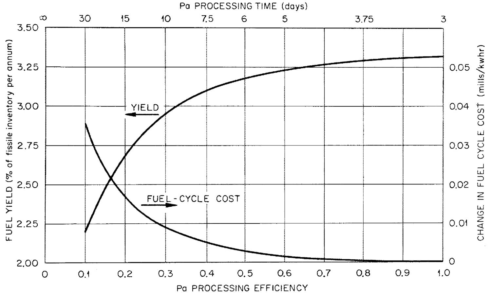  
Fig. 2. MSBR Performance as a Function of Protactinium Processing Efficiency.

ORNL-DWG70-10033

Table 4. Production of Volatile Radioactive Isotopes in an MSBR Continuous Processing Plant   

<table><tr><td rowspan="2">Isotope</td><td rowspan="2">Half-Life</td><td colspan="6">Rate (gram-atoms/Mwcd) at Which Volatile Radioactive Isotopes Are:</td><td rowspan="2">Total Activity Production Rate (curies/Mwcd)</td></tr><tr><td>Removed by Sparging with Helium</td><td>Evolved from Separated Noble Metals</td><td>Recovered from Fluorinator in Pa Isolation System</td><td>Evolved from Salt in Rare-Earth Process-ing Plant</td><td>Recovered from Fluori-nator in Rare-Earth Process-ing Plant</td><td>Produced (Total)</td></tr><tr><td>3H</td><td>12.26 y</td><td>4.48 x 10-7</td><td>----</td><td>----</td><td></td><td></td><td>4.98 x 10-7</td><td>1.41 x 10-2</td></tr><tr><td>83mKr</td><td>1.86 h</td><td>1.48 x 10-5</td><td>2.90 x 10-5</td><td>3.82 x 10-8</td><td>7.72 x 10-8</td><td>----</td><td>4.39 x 10-5</td><td>7.23 x 104</td></tr><tr><td>85mKr</td><td>4.4 h</td><td>8.35 x 10-7</td><td>1.66 x 10-5</td><td>3.80 x 10-9</td><td>1.03 x 10-8</td><td>----</td><td>1.00 x 10-4</td><td>6.74 x 104</td></tr><tr><td>82Kr</td><td>10.76 y</td><td>5.64 x 10-6</td><td>3.81 x 10-6</td><td>8.75 x 10-10</td><td>2.36 x 10-9</td><td>----</td><td>9.45 x 10-6</td><td>3.06 x 10-1</td></tr><tr><td>87Kr</td><td>76 m</td><td>1.83 x 10-4</td><td>----</td><td>3.02 x 10-9</td><td>9.60 x 10-7</td><td>----</td><td>1.83 x 10-4</td><td>4.41 x 105</td></tr><tr><td>88Kr</td><td>2.80 h</td><td>2.21 x 10-4</td><td>----</td><td>1.04 x 10-9</td><td>6.93 x 10-9</td><td>----</td><td>2.21 x 10-4</td><td>2.41 x 105</td></tr><tr><td>Total Kra</td><td>---</td><td>8.84 x 10-4</td><td>1.09 x 10-4</td><td>4.70 x 10-8</td><td>1.24 x 10-7</td><td>----</td><td>9.93 x 10-4</td><td>2.70 x 107</td></tr><tr><td>129I</td><td>1.7 x 107y</td><td>----</td><td>8.35 x 10-5</td><td>1.18 x 10-6</td><td>----</td><td>2.40 x 10-7</td><td>8.49 x 10-5</td><td>1.74 x 10-6</td></tr><tr><td>131I</td><td>8.05 d</td><td>----</td><td>1.20 x 10-4</td><td>1.19 x 10-6</td><td>----</td><td>2.13 x 10-9</td><td>1.21 x 10-4</td><td>1.91 x 103</td></tr><tr><td>132I</td><td>2.26 h</td><td>----</td><td>1.94 x 10-4</td><td>1.43 x 10-8</td><td>----</td><td>----</td><td>1.94 x 10-4</td><td>2.57 x 105</td></tr><tr><td>133I</td><td>20.3 h</td><td>----</td><td>2.30 x 10-4</td><td>6.44 x 10-7</td><td>----</td><td>----</td><td>2.31 x 10-4</td><td>5.36 x 104</td></tr><tr><td>134I</td><td>5.20 m</td><td>----</td><td>2.20 x 10-4</td><td>3.47 x 10-8</td><td>----</td><td>----</td><td>2.20 x 10-4</td><td>7.65 x 105</td></tr><tr><td>135I</td><td>6.68 h</td><td>----</td><td>2.84 x 10-5</td><td>1.32 x 10-6</td><td>----</td><td>----</td><td>2.97 x 10-5</td><td>1.35 x 104</td></tr><tr><td>Total Ia</td><td>---</td><td>----</td><td>8.74 x 10-4</td><td>4.45 x 10-6</td><td>----</td><td>8.90 x 10-7</td><td>8.94 x 10-4</td><td>1.07 x 106</td></tr><tr><td>131Xe</td><td>11.8 d</td><td>4.89 x 10-8</td><td>9.60 x 10-7</td><td>9.60 x 10-9</td><td>1.93 x 10-8</td><td>1.70 x 10-11</td><td>1.12 x 10-6</td><td>1.21 x 101</td></tr><tr><td>133mXe</td><td>2.26 d</td><td>7.34 x 10-7</td><td>5.51 x 10-6</td><td>1.54 x 10-8</td><td>3.14 x 10-8</td><td>----</td><td>6.29 x 10-6</td><td>3.54 x 102</td></tr><tr><td>133Xe</td><td>5.27 d</td><td>2.90 x 10-5</td><td>2.30 x 10-4</td><td>6.44 x 10-7</td><td>1.30 x 10-6</td><td>----</td><td>2.60 x 10-4</td><td>6.26 x 103</td></tr><tr><td>135mXe</td><td>15.6 m</td><td>4.66 x 10-5</td><td>8.51 x 10-6</td><td>3.96 x 10-7</td><td>6.03 x 10-7</td><td>----</td><td>5.61 x 10-5</td><td>6.59 x 103</td></tr><tr><td>135Xe</td><td>9.14 n</td><td>1.64 x 10-4</td><td>2.84 x 10-5</td><td>1.32 x 10-6</td><td>2.01 x 10-6</td><td>----</td><td>1.96 x 10-4</td><td>6.49 x 104</td></tr><tr><td>Total Xea</td><td>---</td><td>1.07 x 10-3</td><td>7.18 x 10-4</td><td>3.21 x 10-6</td><td>2.52 x 10-6</td><td>1.70 x 10-11</td><td>1.79 x 10-3</td><td>2.84 x 107</td></tr></table>

Total production rates include stable isotopes not shown. Total activity includes very short-lived isotopes not shown.

radionuclides; thus the chemical behavior of the noble metals in the fuel salt will greatly influence the design of the processing plant. Smaller amounts of volatile fission products will be evolved in the fluorinators and in the rare-earth decay tanks.

The noble-gas and noble-metal fission-product groups have been examined in more detail using the ORIGEN isotope generation and decay code. It was assumed that these materials migrated to circulating helium bubbles with a 50-sec residence time in the fuel salt, and that the helium bubbles were stripped from the salt on a 110-sec cycle. In this investigation, the MATADOR material-balance code was used to compute the steady-state compositions of the noble-gas and noble-metal fission-product streams leaving the fuel salt. These stream compositions were then used as input to the ORIGEN code to compute the isotopic compositions of each stream as a function of decay time in the off-gas system. The results of these calculations are summarized in Tables 5-8 and Figs. 3-6. Tables 5 and 7 and Figs. 3 and 5 give the flow rates of the noble gases and the noble metals as a function of time after removal from the gas bubbles. Tables 6 and 8 and Figs. 4 and 6 present the heat-generation rates for these two fission-product streams as a function of decay time. The tables are based on the production of fission products during a one-day period, and the figures have been normalized to obtain specific heat-generation rates. The heat-generation rates of both groups of fission products decrease considerably after a holdup of about 10 hr. Large quantities of halogen and noble gases are produced by the decay of the noble metals. If a large fraction of the noble metals is held up in the reactor system, the same quantity of material (but daughters in this case) will still require processing; however, the heat load on the off-gas system will be greatly reduced.

Table 5. Chemical Composition of MSBR Off-Gas Stream as a Function of Holdup Time   

<table><tr><td rowspan="2">Element</td><td colspan="6">Flow Rate (g/day) After Holdup Period of:</td></tr><tr><td>0.0 hr</td><td>0.04 hr</td><td>0.4 hr</td><td>4 hr</td><td>40 hr</td><td>400 hr</td></tr><tr><td>Kr</td><td>1.73x102</td><td>1.52x102</td><td>1.24x102</td><td>7.12x101</td><td>4.44x101</td><td>4.43x101</td></tr><tr><td>Rb</td><td>0</td><td>1.71x101</td><td>2.26x101</td><td>3.95x101</td><td>4.81x101</td><td>4.81x101</td></tr><tr><td>Sr</td><td>0</td><td>3.52</td><td>2.59x101</td><td>6.20x101</td><td>7.91x101</td><td>7.40x101</td></tr><tr><td>Y</td><td>0</td><td>8.78x10-4</td><td>2.22x10-2</td><td>2.51x10-1</td><td>1.35</td><td>6.36</td></tr><tr><td>Zr</td><td>0</td><td>2.40x10-9</td><td>8.79x10-7</td><td>1.51x10-4</td><td>1.02x10-2</td><td>1.42x10-1</td></tr><tr><td>Xe</td><td>3.27x102</td><td>2.88x102</td><td>2.16x102</td><td>1.75x102</td><td>1.29x102</td><td>1.20x102</td></tr><tr><td>Cs</td><td>0</td><td>3.57x101</td><td>8.67x101</td><td>6.85x101</td><td>1.14x102</td><td>1.23x102</td></tr><tr><td>Ba</td><td>0</td><td>3.25</td><td>2.30x101</td><td>7.22x101</td><td>7.08x101</td><td>6.96x101</td></tr><tr><td>La</td><td>0</td><td>1.49x10-2</td><td>1.28</td><td>1.16x101</td><td>1.38x101</td><td>1.38x101</td></tr><tr><td>Ce</td><td>0</td><td>7.18x10-5</td><td>2.03x10-3</td><td>2.45x10-2</td><td>9.78x10-2</td><td>1.30</td></tr><tr><td>Pr</td><td>0</td><td>1.92x10-8</td><td>1.87x10-6</td><td>6.22x10-5</td><td>1.13x10-3</td><td>8.64x10-3</td></tr><tr><td>Nd</td><td>0</td><td>4.82x10-13</td><td>5.39x10-10</td><td>1.53x10-7</td><td>1.37x10-5</td><td>2.74x10-4</td></tr><tr><td>Total</td><td>5.00x102</td><td>5.00x102</td><td>5.00x102</td><td>5.00x102</td><td>5.00x102</td><td>5.00x102</td></tr></table>

Table 6. Total $(\beta + \gamma)$ Power of Noble Gases and Their Daughters in the MSBR Off-Gas System as a Function of Holdup Time   

<table><tr><td rowspan="2">Element</td><td colspan="6">(β + γ) Power (w) After Holdup Period of:</td></tr><tr><td>0.0 hr</td><td>0.04 hr</td><td>0.4 hr</td><td>4 hr</td><td>40 hr</td><td>400 hr</td></tr><tr><td>Kr</td><td>9.27x108</td><td>2.29x108</td><td>1.99x107</td><td>4.31x106</td><td>9.31x102</td><td>2.98</td></tr><tr><td>Rb</td><td>0</td><td>1.27x108</td><td>3.51x107</td><td>3.69x106</td><td>4.97x102</td><td>1.92x10-9</td></tr><tr><td>Sr</td><td>0</td><td>2.05x104</td><td>2.98x104</td><td>2.46x104</td><td>4.49x103</td><td>2.33x103</td></tr><tr><td>Y</td><td>0</td><td>6.88x101</td><td>1.40x103</td><td>4.24x103</td><td>4.06x102</td><td>6.61x101</td></tr><tr><td>Xe</td><td>7.18x108</td><td>2.20x108</td><td>2.23x107</td><td>4.09x105</td><td>2.84x104</td><td>2.04x102</td></tr><tr><td>Cs</td><td>0</td><td>4.51x107</td><td>3.43x107</td><td>7.45x105</td><td>7.20</td><td>7.19</td></tr><tr><td>Ba</td><td>0</td><td>1.46x105</td><td>8.98x105</td><td>1.90x105</td><td>5.52x102</td><td>2.54x102</td></tr><tr><td>La</td><td>0</td><td>9.52x102</td><td>3.14x105</td><td>1.90x105</td><td>5.52x102</td><td>2.54x102</td></tr><tr><td>Ce</td><td>0</td><td>1.54x10-1</td><td>1.13</td><td>2.21</td><td>2.23</td><td>1.12</td></tr><tr><td>Pr</td><td>0</td><td>2.76x10-6</td><td>2.58x10-4</td><td>5.60x10-3</td><td>4.10x10-2</td><td>3.64x10-2</td></tr><tr><td>Total</td><td>1.65x109</td><td>6.20x108</td><td>1.12x108</td><td>9.37x106</td><td>3.66x104</td><td>4.21x103</td></tr></table>

Table 7. Chemical Composition of the Stream Containing Noble Metals and Daughters as a Function of Holdup Time   

<table><tr><td rowspan="2">Element</td><td colspan="6">Flow Rate (g/day) After a Holdup Period of:</td></tr><tr><td>0.0 hr</td><td>0.04 hr</td><td>0.4 hr</td><td>4 hr</td><td>40 hr</td><td>400 hr</td></tr><tr><td>As</td><td>1.35</td><td>1.13</td><td>6.41x10-1</td><td>2.36x10-1</td><td>9.71x10-2</td><td>2.16x10-2</td></tr><tr><td>Se</td><td>2.76x101</td><td>1.99x101</td><td>1.13x101</td><td>8.19</td><td>8.31</td><td>8.39</td></tr><tr><td>Br</td><td>0</td><td>6.95</td><td>1.06x101</td><td>9.03</td><td>3.00</td><td>3.00</td></tr><tr><td>Kr</td><td>0</td><td>1.82</td><td>6.35</td><td>1.43x101</td><td>1.55x101</td><td>1.55x101</td></tr><tr><td>Rb</td><td>0</td><td>1.84x10-3</td><td>1.17x10-1</td><td>1.12</td><td>2.44</td><td>2.45</td></tr><tr><td>Nb</td><td>1.90x102</td><td>1.44x102</td><td>9.13x101</td><td>4.49x101</td><td>3.81x101</td><td>2.82x101</td></tr><tr><td>Mo</td><td>1.07x102</td><td>1.39x102</td><td>1.60x102</td><td>1.91x102</td><td>1.88x102</td><td>1.62x102</td></tr><tr><td>Tc</td><td>1.58x101</td><td>1.76x101</td><td>1.67x101</td><td>1.97</td><td>1.65x101</td><td>4.78x101</td></tr><tr><td>Ru</td><td>2.02x101</td><td>3.14x101</td><td>6.31x101</td><td>9.08x101</td><td>8.73x101</td><td>8.28x101</td></tr><tr><td>Rh</td><td>7.16x10-1</td><td>1.03</td><td>1.35</td><td>2.57</td><td>3.51</td><td>4.94</td></tr><tr><td>Pd</td><td>1.77</td><td>1.92</td><td>2.94</td><td>3.84</td><td>5.92</td><td>5.82</td></tr><tr><td>Ag</td><td>4.87x10-1</td><td>4.31x10-1</td><td>4.07x10-1</td><td>4.88x10-1</td><td>7.20x10-1</td><td>5.97x10-1</td></tr><tr><td>Cd</td><td>0</td><td>2.33x10-1</td><td>4.65x10-1</td><td>5.70x10-1</td><td>7.34x10-1</td><td>8.34x10-1</td></tr><tr><td>In</td><td>0</td><td>3.43x10-4</td><td>6.26x10-3</td><td>3.07x10-2</td><td>7.42x10-2</td><td>1.85x10-1</td></tr><tr><td>Sn</td><td>0</td><td>9.39x10-7</td><td>2.32x10-4</td><td>1.85x10-2</td><td>6.77x10-2</td><td>7.39x10-2</td></tr><tr><td>Te</td><td>3.17x102</td><td>3.01x102</td><td>2.45x102</td><td>1.29x102</td><td>1.02x102</td><td>5.83x101</td></tr><tr><td>I</td><td>0</td><td>1.64x101</td><td>6.87x101</td><td>1.20x102</td><td>7.02x101</td><td>3.23x101</td></tr><tr><td>Xe</td><td>0</td><td>6.85x10-2</td><td>3.82</td><td>6.76x101</td><td>1.32x102</td><td>1.59x102</td></tr><tr><td>Cs</td><td>0</td><td>2.23x10-5</td><td>4.01x10-3</td><td>4.61x10-1</td><td>1.33x101</td><td>6.81x101</td></tr><tr><td>Ba</td><td>0</td><td>6.57x10-18</td><td>1.30x10-14</td><td>1.47x10-11</td><td>4.31x10-9</td><td>8.57x10-8</td></tr><tr><td>Total</td><td>6.83x102</td><td>6.83x102</td><td>6.83x102</td><td>6.83x102</td><td>6.83x102</td><td>6.83x102</td></tr></table>

Table 8. Total $(\beta + \gamma)$ Power of Noble Metals and Their Daughters as a Function of Holdup Time   

<table><tr><td rowspan="2">Element</td><td colspan="6">(B + γ) Power (w) After a Holdup Period of:</td></tr><tr><td>0.0 hr</td><td>0.04 hr</td><td>0.4 hr</td><td>4 hr</td><td>40 hr</td><td>400 hr</td></tr><tr><td>As</td><td>1.47x107</td><td>2.26x105</td><td>1.30x105</td><td>2.51x104</td><td>1.11x102</td><td>1.75x10-1</td></tr><tr><td>Se</td><td>2.48x108</td><td>5.70x107</td><td>4.09x106</td><td>1.10x104</td><td>2.26x10-1</td><td>3.80x10-4</td></tr><tr><td>Br</td><td>0</td><td>1.34x107</td><td>7.23x106</td><td>1.36x105</td><td>2.35</td><td>0</td></tr><tr><td>Kr</td><td>0</td><td>1.85x104</td><td>6.20x104</td><td>4.32x104</td><td>1.21x102</td><td>4.57x10-1</td></tr><tr><td>Nb</td><td>9.52x108</td><td>4.20x108</td><td>1.62x107</td><td>1.33x106</td><td>7.75x103</td><td>5.33x103</td></tr><tr><td>Mo</td><td>2.04x108</td><td>7.98x107</td><td>1.71x107</td><td>9.96x104</td><td>6.82x104</td><td>1.64x103</td></tr><tr><td>Tc</td><td>1.53x108</td><td>9.50x107</td><td>3.29x107</td><td>1.07x104</td><td>1.21x104</td><td>2.97x102</td></tr><tr><td>Ru</td><td>5.64x106</td><td>3.93x106</td><td>3.48x105</td><td>1.38x105</td><td>2.48x103</td><td>1.53x103</td></tr><tr><td>Rh</td><td>6.16x106</td><td>2.67x106</td><td>4.79x105</td><td>1.89x104</td><td>3.59x103</td><td>2.04x102</td></tr><tr><td>Pd</td><td>2.77x106</td><td>7.95x105</td><td>7.08x104</td><td>2.55x103</td><td>3.98x102</td><td>2.57x10-4</td></tr><tr><td>Ag</td><td>4.03x106</td><td>1.57x106</td><td>8.80x104</td><td>6.64x103</td><td>1.25x103</td><td>2.24x101</td></tr><tr><td>Cd</td><td>0</td><td>5.47x103</td><td>6.47x103</td><td>2.53x103</td><td>1.97x102</td><td>3.13</td></tr><tr><td>In</td><td>0</td><td>1.57x101</td><td>2.89x102</td><td>1.58x103</td><td>1.27x102</td><td>1.20</td></tr><tr><td>Te</td><td>4.76x108</td><td>9.58x107</td><td>5.34x107</td><td>1.82x106</td><td>3.87x104</td><td>1.52x103</td></tr><tr><td>I</td><td>0</td><td>1.73x106</td><td>1.01x107</td><td>4.90x106</td><td>3.63x105</td><td>1.27x104</td></tr><tr><td>Xe</td><td>0</td><td>2.21x103</td><td>2.00x104</td><td>4.14x104</td><td>1.87x104</td><td>1.91x103</td></tr><tr><td>Cs</td><td>0</td><td>9.52x10-12</td><td>1.67x10-9</td><td>1.73x10-7</td><td>3.19x10-6</td><td>3.70x10-6</td></tr><tr><td>Total</td><td>2.10x109</td><td>7.72x108</td><td>1.42x108</td><td>8.58x106</td><td>5.17x105</td><td>2.52x104</td></tr></table>

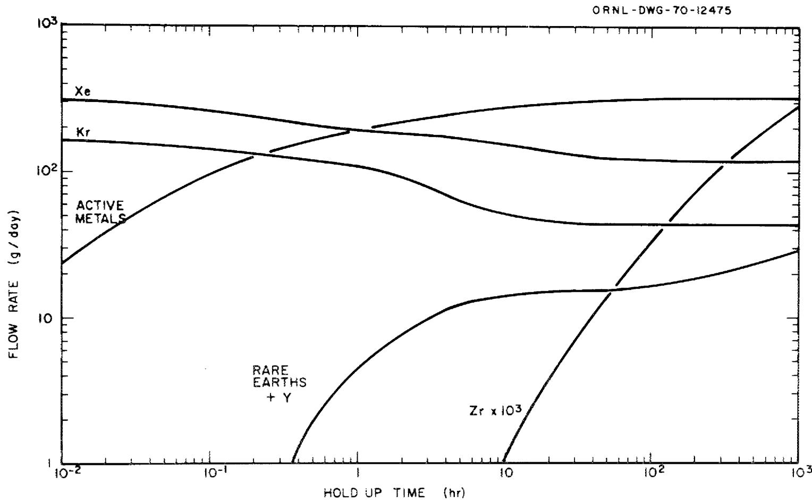  
Fig. 3. Chemical Composition of MSBR Off-Gas Stream as a Function of Holdup Time for Sparged Noble Gases.

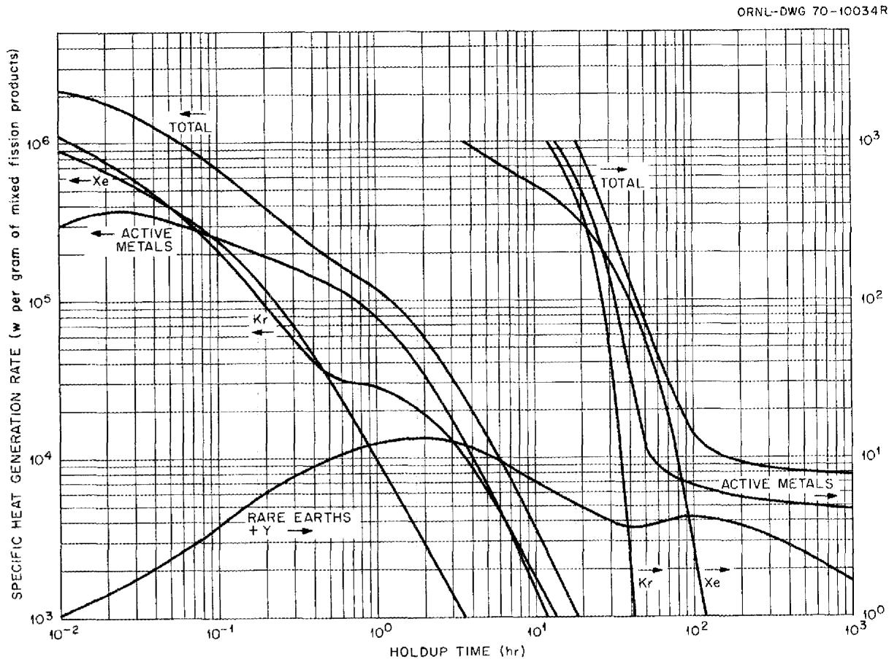  
Fig. 4. Specific Heat Generation Rates for Noble Gases and Their Daughters as a Function of Holdup Time in a 2250-Mw (thermal) MSBR Off-Gas System.

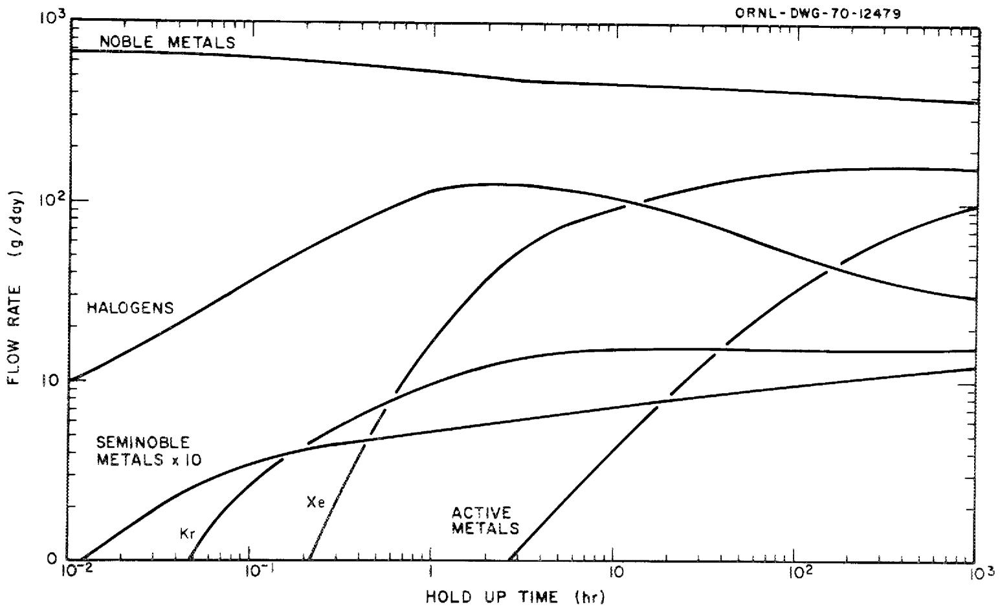  
Fig. 5. Chemical Composition of Noble Metals and Their Daughters Produced in a 2250-Mw (thermal) MSBR as a Function of Holdup Time.

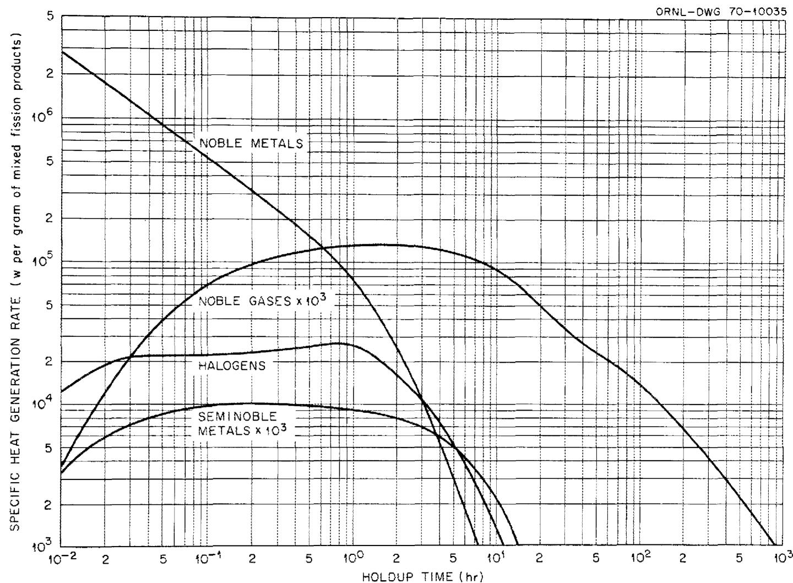  
Fig. 6. Specific Heat Generation Rates for Noble Metals and Their Daughters Produced in a 2250-Mw (thermal) MSBR as a Function of Decay Time.

# 4. REMOVAL OF PROTACTINIUM FROM A SINGLE-FLUID MSBR

L. E. McNeese M. E. Whatley

A method for isolating protactinium from a single-fluid MSBR has been described previously. In the proposed flowsheet (Fig. 7), a salt stream from the reactor enters the bottom of the extraction column and flows countercurrently to a stream of bismuth containing reduced metals. Ideally, the metal stream entering the top of the column contains sufficient thorium and lithium to extract only the uranium entering the column. The system exploits the fact that protactinium is less noble than uranium but more noble than thorium. Hence, in the lower part of the column, uranium is preferentially extracted from the incoming salt, while the protactinium progresses farther up the column to the point where it is reduced by thorium. In this manner, protactinium refluxes in the center of the column, and relatively high protactinium concentrations result. A retention tank is provided at the center of the column, where the maximum protactinium concentration occurs in the salt, to retain the protactinium until it decays to uranium (cf. Sect. 2).

An essential part of the flowsheet is an electrolytic oxidizer-reducer, which serves the dual purpose of recovering the extracted uranium from the metal stream leaving the extraction column and of preparing the lithium-thorium-bismuth stream that is fed to the extraction column. The metal phase containing the uranium extracted in the column can serve as the cell anode, where uranium and lithium will be oxidized to $\mathrm{UF}_{4}$ and LiF, respectively. Salt from the top of the extraction column serves as the cell electrolyte and first passes over a pool of liquid bismuth, which serves as the cathode into which thorium and lithium are reduced.

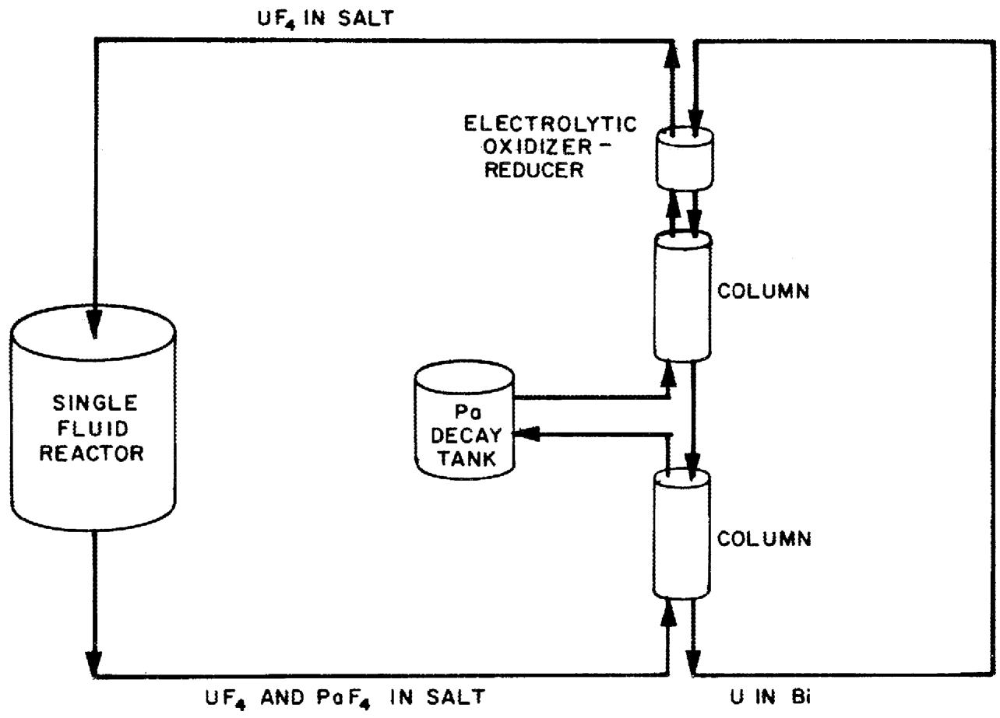  
Fig. 7. Protactinium Isolation for a Single-Fluid MSBR.

# 4.1 Mathematical Analysis of a Reductive Extraction System

Computations having to do with mass transfer in columns involving the countercurrent flow of two fluid phases can be carried out by one of two standard techniques: a differential analysis (the HTU concept) can be employed, or the column can be assumed to be equivalent to a sequence of theoretical stages. In order to use the former, mass-transfer coefficients must be known; for the later, the height of column equivalent to a theoretical stage must be known. The theoretical-stage approach was adopted for the present analysis. In this approach, calculations proceed from one end of the column, where flow rates and concentrations are known or assumed, to the opposite end of the column, where an appropriate check is made on the calculated values (if the starting concentrations and flow rates were assumed values). In either case, the calculations involve the successive application of equilibrium and material-balance relations for each of the theoretical stages.

In setting up the equilibrium relations for a system containing $N + 1$ components that distribute between the molten salt and bismuth phases, one component is conveniently chosen as the reference component. The compositions of the two phases are then related by the following set of expressions:

$$
\begin{array}{l} \mathrm {X} _ {\mathrm {M i}} = \mathrm {X} _ {\mathrm {S i}} \quad \frac {\mathrm {X} _ {\mathrm {M r}}}{\mathrm {X} _ {\mathrm {S r}}} \quad \exp \frac {\mathrm {n} _ {\mathrm {i}} \mathrm {F}}{\mathrm {R T}} \quad \left(\mathrm {E} _ {\mathrm {o i}} ^ {\prime} - \mathrm {E} _ {\mathrm {o r}} ^ {\prime}\right), \quad \mathrm {i} = 1 \dots \mathrm {N} \\ \begin{array}{l} \mathrm {N + 1} \\ \frac {\mathrm {n} _ {\mathrm {i}} ^ {\mathrm {X}} \mathrm {M i}}{\mathrm {N + 1}} = \mathrm {X M R}, \end{array} \\ \begin{array}{c c c c} 1 & - & \stackrel {{\cdot}} {{\cdot}} & X _ {M i} \\ & & \dot {i} = \dot {1} & \end{array} \\ \end{array}
$$

where $\mathbf{X}_{\mathrm{Si}},\mathbf{X}_{\mathrm{Mi}} =$ mole fraction of component i in salt and metal, respectively, $\mathbf{X}_{\mathrm{Sr}},\mathbf{X}_{\mathrm{Mr}} =$ mole fraction of reference component in salt and metal, respectively,   
XMR $=$ equivalents of transferrable components per mole of bismuth, $\mathtt{n_i},\mathtt{n_r} =$ valence of component i and reference component in salt, respectively,   
F $=$ Faraday's constant,   
R $=$ gas constant,   
T $=$ temperature, ${}^{\circ}\mathbb{K},$ E' - E' or = difference between modified reduction potential of component i and reference component.

A material balance around stage $j$ of a column in which the stages are numbered from the top yields the relation:

$$
\mathrm {F} _ {\mathrm {s j}} \mathrm {X} _ {\mathrm {s i}, \mathrm {j}} + \mathrm {F} _ {\mathrm {M j}} \mathrm {X} _ {\mathrm {M i}, \mathrm {j}} = \mathrm {F} _ {\mathrm {s j} + 1} \mathrm {X} _ {\mathrm {s i}, \mathrm {j} + 1} + \mathrm {F} _ {\mathrm {M j} - 1} \mathrm {X} _ {\mathrm {M i}, \mathrm {j} - 1},
$$

where $\mathbf{F}_{\mathbf{s}\mathbf{j}} =$ flow rate of salt leaving stage j, $\mathbf{F}_{\mathbf{M}\mathbf{j}} =$ flow rate of metal leaving stage j, Xsi,j = mole fraction of component i in salt leaving stage j, XMi,j = mole fraction of component i in metal leaving stage j.

For the present calculations, we assumed that

$$
\mathrm {F} _ {\mathrm {s j}} = \mathrm {F} _ {\mathrm {s j} + 1} = \mathrm {F} _ {\mathrm {s}}
$$

$$
F _ {M j} = F _ {M j + 1} = F _ {M}
$$

so that the above reduces to

$$
\mathrm {F} _ {\mathrm {s}} \left(\mathrm {X} _ {\mathrm {s i}, \mathrm {j}} - \mathrm {X} _ {\mathrm {s i}, \mathrm {j} + 1}\right) = \mathrm {F} _ {\mathrm {M}} \left(\mathrm {X} _ {\mathrm {M i}, \mathrm {j} - 1} - \mathrm {X} _ {\mathrm {M i}, \mathrm {j}}\right).
$$

# 4.2 Calculated System Performance

The typical performance of the protactinium isolation system is shown in Fig. 8 for a case that will be taken as the reference case. Conditions assumed for the calculations include the following: a reactor salt volume of $1.5 \times 10^{6}$ g-moles ( $\sim 1000\mathrm{ft}^{3}$ ), a decay-tank volume of $0.3 \times 10^{6}$ g-moles ( $\sim 200\mathrm{ft}^{3}$ ), a salt processing rate of $0.5 \times 10^{6}$ g-moles/day ( $\sim 1.7\mathrm{gpm}$ ), and six theoretical stages both above and below the protactinium decay tank. The operating temperature was $550^{\circ}\mathrm{C}$ ; the differences between the modified reduction potential of Th and those for U, Pa, and Li were $-0.18$ , $-0.14$ , and $+0.36\mathrm{v}$ , respectively, and U was considered to be tetravalent in the extraction columns. The protactinium production rate was assumed to be $10.7\mathrm{g}$ -moles/day for a $1000\text{-Mw}$ (electrical) reactor. The fuel carrier salt composition was $68-20-12$ mole $\%$ LiF-BeF $_2$ -ThF $_4$ .

The minimum reactor protactinium concentration is obtained when the bismuth flow rate is just sufficient to extract the uranium entering the system. At slightly higher bismuth rates, protactinium will also be extracted since it is the next component in order of decreasing nobility. At bismuth rates slightly lower than the optimum rate, some uranium will not be extracted; this uranium and most of the protactinium will flow out of the top of the column. In either case, some protactinium is allowed to return to the reactor, and the effectiveness of the system is diminished. The protactinium isolation system becomes ineffective almost immediately for bismuth flow rates lower than the optimum rate; for bismuth flow rates higher than the optimum, the reactor protactinium concentration increases from the minimum value of 22 ppm, at the rate of 28 ppm for each percent increase in metal flow rate (for the conditions of this particular case). Similar effects would be produced by variations in salt flow rate or in the total concentration of reduced metals (equivalents of reduced metals per mole of bismuth) fed to the column. Calculated concentration profiles in the extraction column are shown in Fig. 9 for steady-state operation under optimum conditions. The concentration of uranium in the salt decreases from the reactor concentration

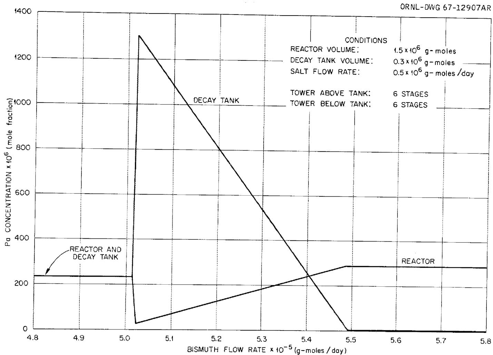  
Fig. 8. Variation of Protactinium Concentration in Reactor and Protactinium Decay Tank with Bismuth Flow Rate.

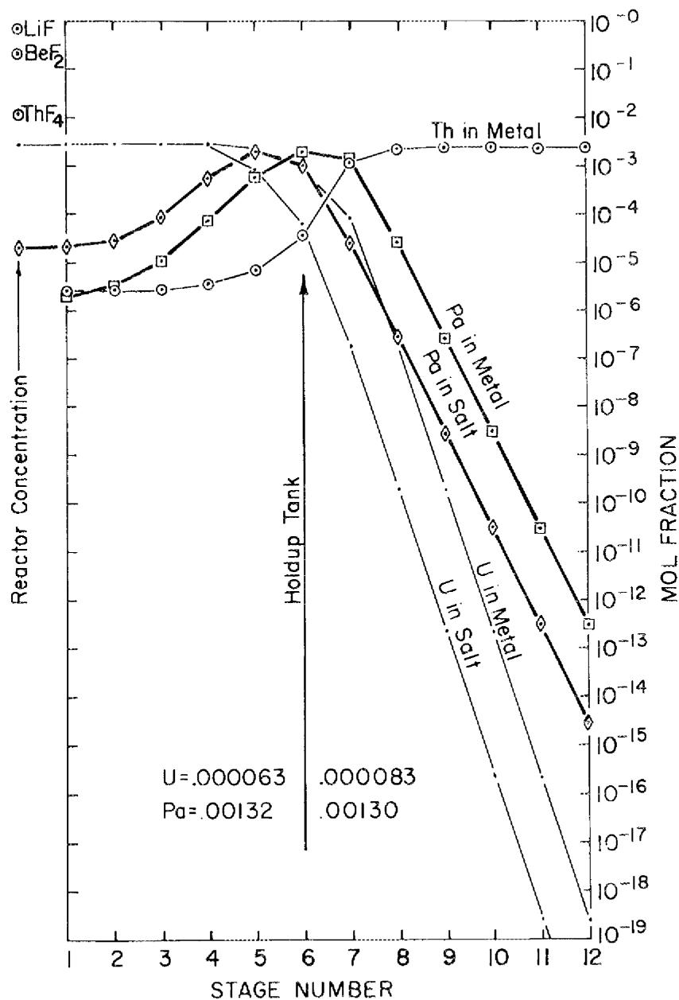  
Fig. 9. Calculated Concentration Profiles in Reductive Extraction Tower.

of $3 \times 10^{-3}$ mole fraction to $6.3 \times 10^{-5}$ mole fraction at the inlet to the protactinium decay tank, whereas the protactinium concentration increases from the reactor concentration of $2.2 \times 10^{-5}$ mole fraction to $1.32 \times 10^{-3}$ mole fraction at the inlet to the decay tank. The concentrations of protactinium and uranium in the decay tank are $1.3 \times 10^{-3}$ and $8.3 \times 10^{-5}$ mole fraction, respectively. Above the decay tank, the uranium and protactinium concentrations decrease steadily to negligible values.

The flowsheet has several very desirable characteristics, which include a negligible holdup of fissile $^{233}\mathrm{U}$ in the processing plant, an almost immediate return of newly produced $^{233}\mathrm{U}$ to the reactor system, and a closed system that precludes loss of protactinium, $^{233}\mathrm{U}$ , or other components of the reactor fuel salt. However, the efficiency of protactinium removal is undesirably sensitive to minor variations in operating conditions such as the salt or bismuth flow rate and the concentration of reduced metals in the bismuth stream that is fed to the extraction column. Methods for making system performance less sensitive to minor variations in operating conditions have been explored and are discussed in the following section.

# 4.3 Stabilization of the Protactinium Isolation System

Methods that were considered for making the protactinium system less sensitive to changes in operating conditions included removal of uranium from the center of the column by fluorination, withdrawal of salt containing uranium and protactinium from the center of the column, relocation of the protactinium decay tank, and partial oxidation of the metal stream at the center of the column. The first three of these methods were found to decrease the sensitivity of the system performance to changes in flow rate; however, only uranium removal by fluorination appears to be practical. In addition, consideration was given to using a higher salt throughput with the original flowsheet in order to obtain the desired time-averaged reactor protactinium concentration with a system allowing some variation in operating conditions. Effects of these changes are discussed in the remainder of this section.

Effect of Uranium Removal by Fluorination. - The protactinium isolation system can be stabilized for bismuth flow rates lower than the optimum rate if the uranium that is not carried out the bottom of the column by the bismuth stream is removed from the center of the column by fluorination. The alternatives of fluorinating salt from the decay tank or salt from the stream entering the decay tank were considered (Fig. 10). As will be shown later, fluorination of salt from the stream entering the decay tank is the preferred operating method.

The effect of fluorinating the stream that enters the protactinium decay tank is shown in Fig. 11 for a typical case in which $2\%$ of the uranium in the stream is removed. The protactinium concentration in the reactor is also shown for the reference case (no fluorination) as a dashed line. Removal of uranium from the inlet stream is seen to have no effect on the reactor protactinium concentration for bismuth flow rates higher than the optimum flow rate $(5.024 \times 10^{5} \mathrm{~g}$ -moles/day for the reference case), which will be designated as FMB opt. As the bismuth flow rate is decreased below FMB opt, the reactor protactinium concentration increases sharply from 22 ppm to 236 ppm with no fluorination, but remains at 22 ppm until the bismuth flow rate has decreased to $4.972 \times 10^{5} \mathrm{~g}$ -moles/day if $2\%$ of the uranium flowing to the decay tank is removed. As the bismuth flow rate is decreased further, the reactor protactinium concentration increases at a slower rate than in the reference case and reaches the maximum concentration $(236 \mathrm{ppm})$ at a flow rate of $4.7 \times 10^{5} \mathrm{~g}$ -moles/day. The minimum bismuth flow rate that yields a reactor protactinium concentration of 22 ppm will be designated as FMB min. The value of FMB min is related to the fraction of uranium removed from the inlet stream as

$$
\frac {\text {F M B} _ {\text {o p t}} - \text {F M B} _ {\text {m i n}}}{\text {F M B} _ {\text {o p t}}} = 0. 5 3 8 \mathrm {f},
$$

where $f$ is the fraction of uranium removed from the stream entering the protactinium decay tank.

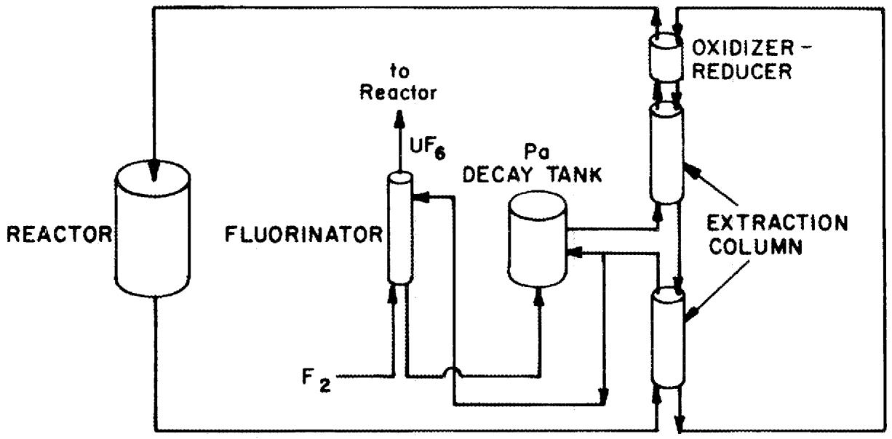  
(a) URANIUM REMOVAL FROM SALT ENTERING Pa DECAY TANK

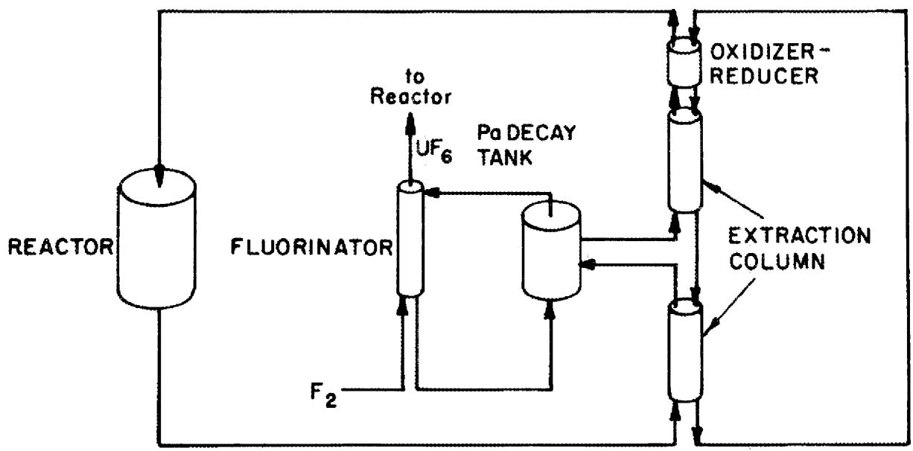  
(b) URANIUM REMOVAL FROM SALT IN Pa DECAY TANK   
Fig. 10. Uranium Removal from a Protactinium Isolation System by Fluorination.

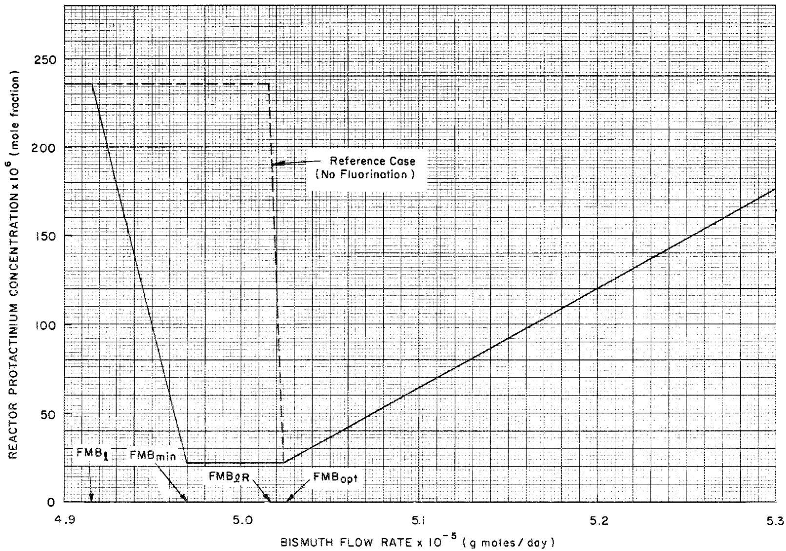  
Fig. 11. Variation of Reactor Protactinium Concentration with Bismuth Flow Rate for Removal of $2\%$ of Uranium in Inlet Stream by Fluorination and for No Uranium Removal.

The value of FMB opt is fixed when system parameters other than the fraction of uranium removed by fluorination are specified; thus, for the reference case, the bismuth flow rate interval in which the minimum reactor protactinium concentration is maintained increases at the rate of $0.538\%$ (based on FMB opt) for each percent of uranium removed from the salt stream entering the protactinium decay tank. For bismuth flow rates below FMB opt, the point at which the maximum reactor protactinium concentration is reached (for the reference case) is given by

$$
\frac {\mathrm {F M B} _ {\ell \mathrm {R}} - \mathrm {F M B} _ {\ell}}{\mathrm {F M B} _ {\ell \mathrm {R}}} = 0. 9 8 2 \mathrm {f},
$$

where $\mathsf{FMB}_{\mathcal{L}\mathbb{R}}$ is the bismuth flow rate yielding the maximum reactor protactinium concentration without fluorination (5.016 x $10^{5}$ g-moles/day), and $\mathsf{FMB}_{\mathcal{L}}$ is the bismuth flow rate yielding the maximum concentration with fluorination.

The variation of the $\mathsf{UF}_6$ concentration in the fluorinator off-gas with the bismuth flow rate is shown in Fig. 12 for several values of f. The rate at which fluorine is fed to the fluorinator and the fraction of uranium that is removed from the salt passing through the fluorinator were assumed to be constant. For bismuth flow rates greater than $\mathsf{FMB}_{\text {opt }}$ , the $\mathsf{UF}_6$ concentration is seen to be independent of the fraction of uranium removed from the steam entering the decay tank. As the bismuth flow rate decreases below $\mathsf{FMB}_{\text {opt }}$ , the $\mathsf{UF}_6$ concentration ratio increases sharply from about $5 \times 10^{-4}$ at $\mathsf{FMB}_{\text {opt }}$ to about $0.54$ at $\mathsf{FMB}_{\text {min }}$ . Thus, the concentration of $\mathsf{UF}_6$ in the fluorinator off-gas is extremely sensitive to minor variations in bismuth flow rate in the desired operating range ( $\mathsf{FMB}_{\text {min }} \leq \mathsf{FMB} \leq \mathsf{FMB}_{\text {opt }}$ ). It is anticipated that the optimum system for controlling the bismuth flow rate (or more likely, controlling the oxidizer-reducer amperage) will be based on sensing the $\mathsf{UF}_6$ concentration in the fluorinator off-gas.

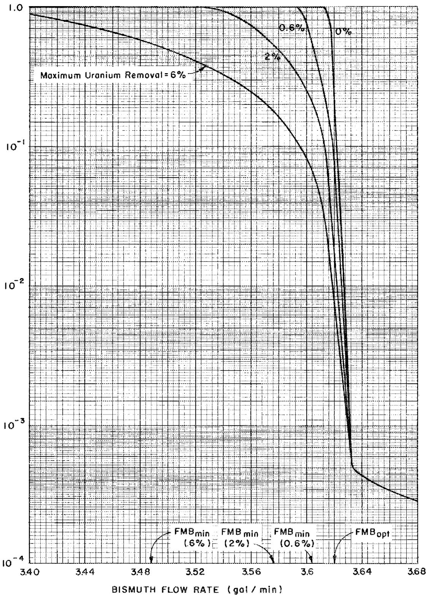  
$\mathsf{UF}_6$ CONCENTRATION FROM FLUORINATOR/MAXIMUM $\mathsf{UF}_6$ CONCENTRATION   
Fig. 12. Variation of Ratio of $\mathrm{UF_6}$ Concentration in the Fluorinator Off-Gas to Maximum $\mathrm{UF_6}$ Concentration in Fluorinator with Bismuth Flow Rate and Fraction of Uranium Removed from Stream Entering Decay Tank.

Fluorination of salt that is withdrawn from the protactinium decay tank [Fig. 10(b)] produces an effect similar to fluorination of part of the stream entering the tank, but is less desirable for several reasons. As shown in Fig. 13, the $\mathrm{UF}_6$ concentration in the fluorinator off-gas is less sensitive to variations in bismuth flow rate for this mode of operation than for fluorination of part of the inlet stream, since the uranium concentration in the decay tank is appreciably higher (for FMB $\geq \mathrm{FMB}_{\mathrm{opt}}$ ) than in the inlet stream. Fluorination of salt withdrawn from the decay tank is also less desirable since a long time interval is required for the uranium concentration in the decay tank (and hence the measured $\mathrm{UF}_6$ concentration) to reflect minor variations in operating conditions (tank volume/flow = 0.6 day), whereas the change in uranium concentration in the stream entering the tank will be almost instantaneous.

Effect of Withdrawing Salt from Center of Extraction Column. - The protactinium isolation system can also be stabilized with respect to low bismuth flow rates by withdrawing salt containing protactinium and uranium from the center of the column, as shown in Fig. 14. The stream passes through the protactinium decay tank before its return to the reactor system. The effect of withdrawing $5\%$ of the salt flowing to the protactinium-isolation system is shown in Fig. 15. The minimum protactinium concentration in the reactor is $75~\mathrm{ppm}$ for a decay-tank volume equal to that of the reference case. The concentration of $22~\mathrm{ppm}$ is approached as a limit only as the volume of the decay tank becomes infinite; therefore, withdrawal of salt from the center of the column is not considered to be a practical method of stabilization.

Effect of the Location of the Protactinium Decay Tank.- In the reference flowsheet (Fig. 7) and all modifications considered thus far, the protactinium decay tank is located at the center of the extraction column, which consists of six stages above and six stages below the tank. The variation of the protactinium concentration in the reactor with

ORNL DWG 68-2086

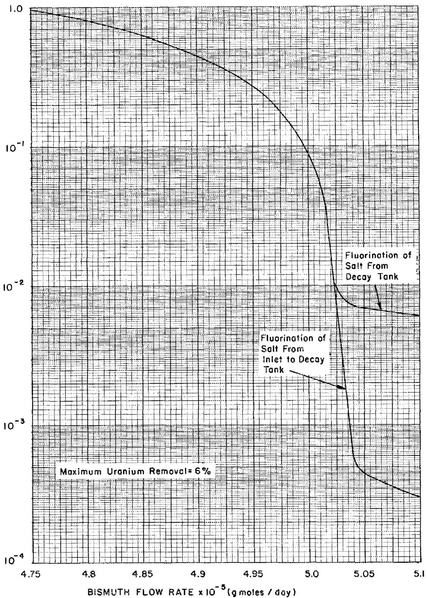  
$UF_{6}$ CONCENTRATION FROM FLUORINATOR/MAXIMUM $UF_{6}$ CONCENTRATION   
Fig. 13. Comparison of $\mathrm{UF}_{6}$ Concentration in Fluorinator Off-Gas for Salt Withdrawn from Protactinium Decay Tank with $\mathrm{UF}_{6}$ Concentration for Salt Taken from Inlet to Tank.

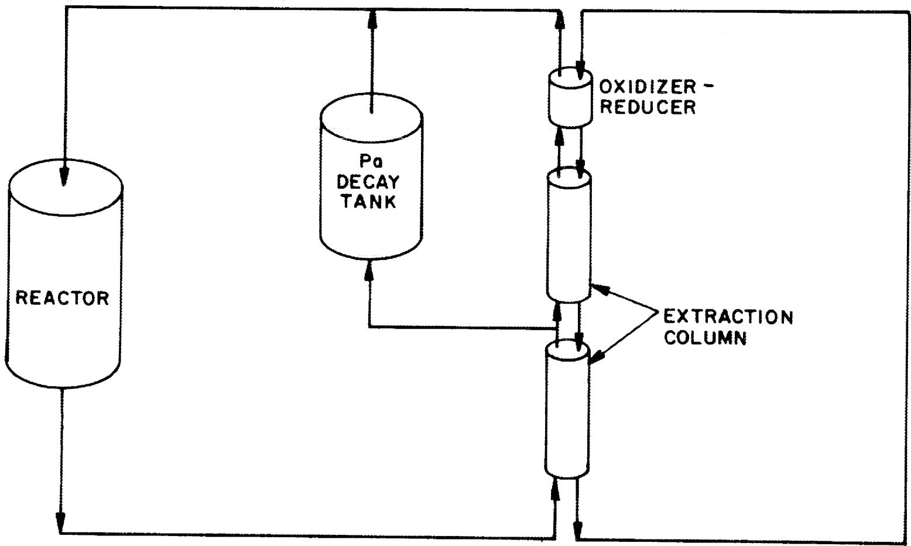  
Fig. 14. Stabilization of Protactinium Isolation System by Withdrawal of Salt from Center of Column.

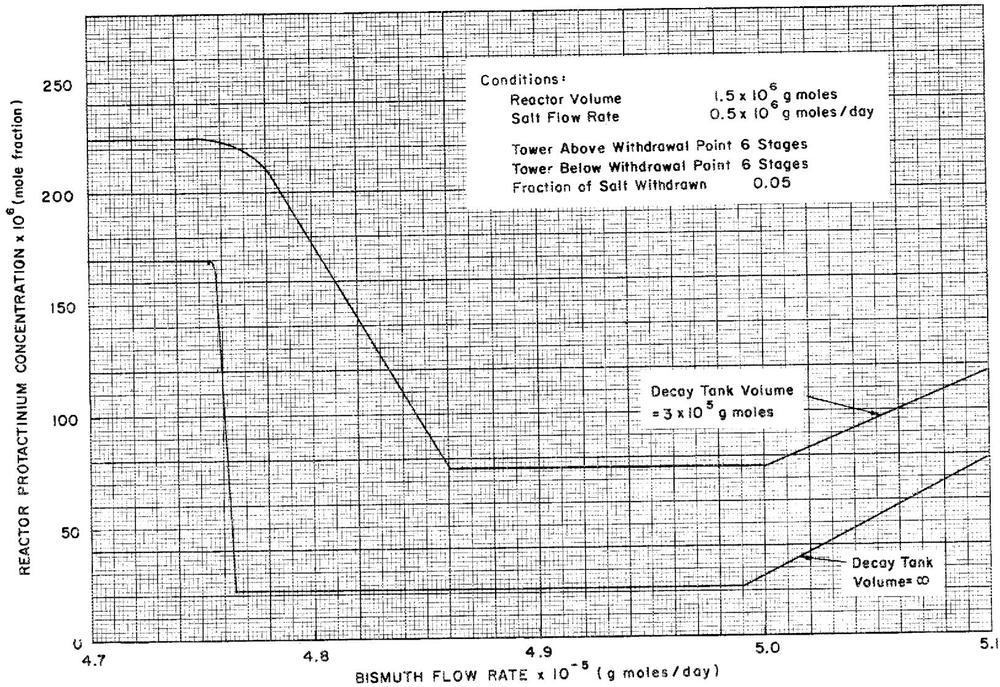  
Fig. 15. Variation of the Protactinium Concentration in the Reactor with Bismuth Flow Rate When Salt Is Withdrawn at Center of Column.

bismuth flow rate is shown in Fig. 16 for six or less stages below the decay tank (total of 12 stages in the column). Although the system becomes less sensitive to variations in bismuth flow rate as the number of stages below the decay tank decreases, this effect is more than offset by a continual increase in the minimum protactinium concentration in the reactor.

Effect of Partial Oxidation of the Metal Stream. - Partial oxidation of the metal stream adjacent to the protactinium decay tank was found to displace the minimum concentration of protactinium in the reactor in the direction of higher metal flow rates without changing the general behavior of the system. It produced no tendency toward a more nearly stable system.

Effect of Higher Salt Throughput with Initial System. -- A specified protactinium concentration in the reactor can be obtained even when bismuth flow rates are slightly higher than FMB opt if the cycle time for reactor processing is appropriately decreased. In the reference case, the concentration of protactinium in the reactor at steady state increases from a minimum of 22 ppm, at the rate of 28 ppm for each percent increase in bismuth flow rate above FMB opt; that is,

$$
C = 2 2 + 2 8 0 0 W, \quad 0 \leq W \leq 0. 0 9 3
$$

where $C =$ reactor protactinium concentration, ppm,

$$
W = \frac {F M B - F M B _ {\text {o p t}}}{F M B _ {\text {o p t}}}, \text {t h e f r a c t i o n a l i n c h i s e i n b i s m u t h f l o w r a t e}
$$

$$
\begin{array}{c} \text {a b o v e F M S} _ {\text {o p t}}. \end{array}
$$

If a salt throughput equivalent to a one-day cycle time were used instead of the three-day cycle time for the reference case, the steady-state concentration of protactinium in the reactor would increase from 7.76 ppm at the rate of 25.1 ppm for each percent increase in flow rate. That is,

$$
c = 7. 7 6 + 2 5 1 0 w \quad 0 \leq w \leq 0. 1 0 9 3.
$$

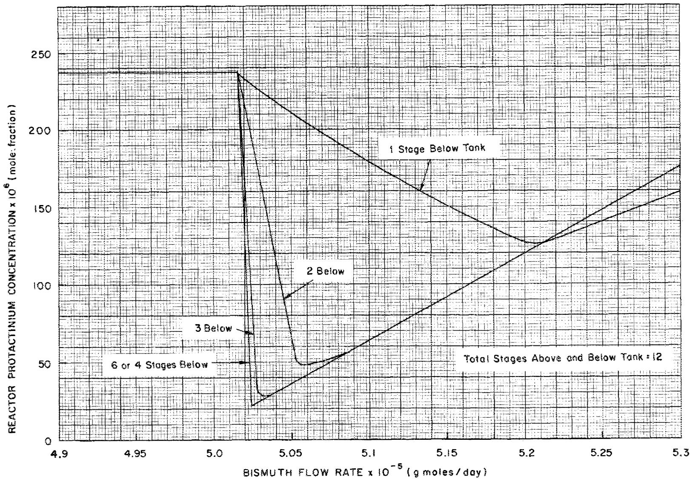  
Fig. 16. Variation of Protactinium Concentration in the Reactor with Bismuth Flow Rate and Location of Protactinium Decay Tank.

# 4.4 Transient Performance

Calculations were made to determine the transient behavior of the protactinium-isolation system. Since the concentration of uranium in the salt entering the decay tank had been shown to be very sensitive to operating conditions when these conditions were near optimum, measurement of this concentration was chosen as the means of controlling the system (Fig. 17). We assumed that the uranium concentration in the salt entering the decay tank could be measured by fluorinating approximately $5\%$ of the stream. The measured uranium concentration would then be used by a controller having proportional, integral, and derivative actions to control the flow rate of bismuth through the columns. For purposes of simulating the actual system, a random error distributed normally about the controller output and having a specified standard deviation (usually $5\%$ ) was imposed on the control system. The system was assumed to operate for a specified time interval (0.06 day) at each bismuth flow rate selected by the control system. During this period, the extraction columns were assumed to operate at steady state; however, the reactor and decay tank were treated as perfectly mixed vessels having inlet concentrations equal to the column effluent concentrations.

The calculated system response is shown in Fig. 18 for an initial protactinium concentration of $10^{-4}$ mole fraction in the reactor. The reactor volume used for the transient calculations was $1000 \, \text{ft}^3$ , and the other conditions were identical to those used for the steady-state calculations. Results show that the protactinium concentration decreases to approximately $4 \times 10^{-5}$ mole fraction, which is acceptably low. (This value would be expected to be even lower for a larger reactor volume.) Therefore, control of the protactinium isolation system in the manner suggested is believed to be practical.

ORNL DWG 68-4090R1

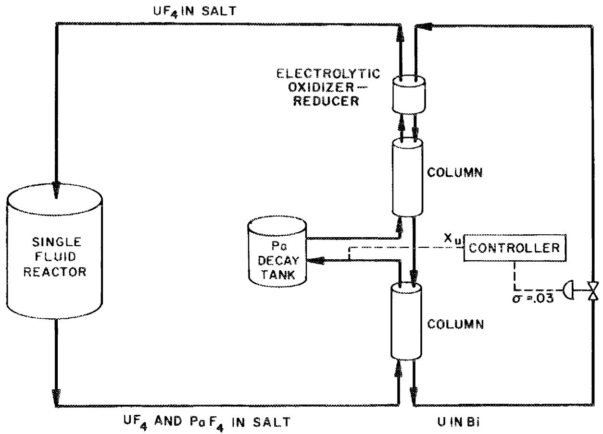  
Fig. 17. Schematic Diagram Showing Method for Controlling Metal Flow Rate by Measurement of Uranium Concentration in Salt Entering Protactinium Decay Tank.

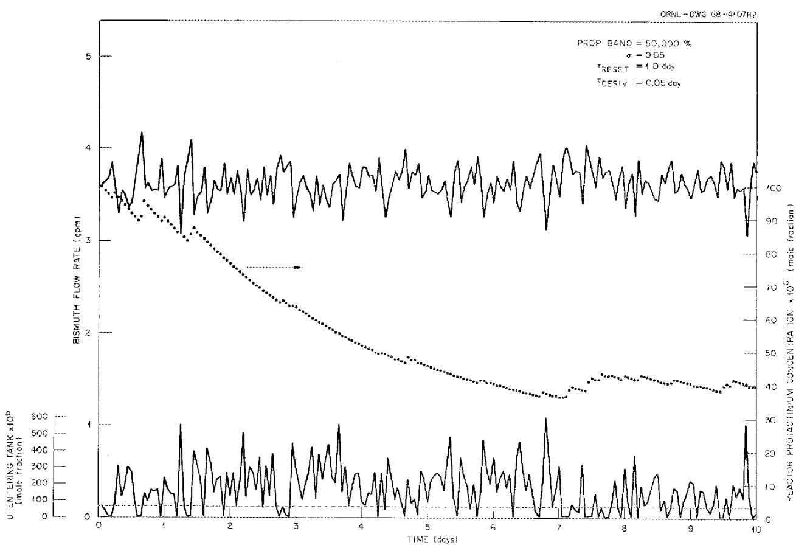  
Fig. 18. Control of Protactinium Isolation Process Through Measurement of Uranium Concentration in Salt Entering Decay Tank.

# 5. USE OF THE PROTACTINIUM-ISOLATION SYSTEM FOR CONTROLLING THE URANIUM CONCENTRATION IN THE BLANKET OF A SINGLE-FLUID MSBR

L. E. McNeese

A characteristic of the system for protactinium isolation, as presently envisioned, is that it produces salt that is free of uranium and protactinium at one part of the system. This characteristic could be exploited to decrease the uranium concentration in the blanket of a single-fluid MSBR, and thereby decrease the inventory of uranium in the reactor system. A possible operating method is shown in Fig. 19.

Assume that the core and blanket regions are separated by a membrane that allows limited exchange of salt in the two regions and that the core and blanket volumes have separate heat exchangers and separate salt-circulation systems. The salt flow rate through the core to the processing plant is small as compared with the flow rate through the core heat exchanger; likewise, the flow rate through the blanket to the processing system is small as compared with the flow rate through the blanket heat exchanger. Salt containing $\mathrm{UF}_{4}$ and $\mathrm{PaF}_{4}$ is withdrawn from the core for removal of protactinium; salt is also withdrawn from the blanket. These two streams are fed to the bottom of an extraction column that is a part of the conventional protactinium-isolation system. In the lower part of this column, the uranium is extracted into the downflowing metal stream, and the protactinium is isolated in the protactinium decay tank. Part of the salt stream flowing out of the top of the extraction column (i.e., a stream that contains essentially no protactinium or uranium) is returned to the blanket. The remaining salt flows to the cathode side of the electrolytic cell to provide lithium and thorium fluorides, which are reduced into the bismuth cathode to form the metal stream that is fed to the column. Uranium flowing out the bottom of the column is oxidized at the cell anode and transferred to the salt stream flowing through the cell.

ORNL DWG 68-12267

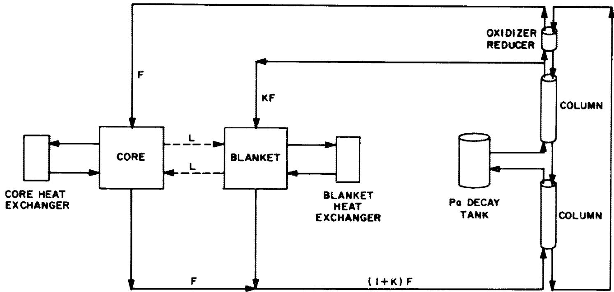  
Fig. 19. Use of the Protactinium Isolation System for Decreasing the Uranium Concentration in the Blanket of a Single-Fluid MSBR. Flow rates of various streams are denoted as discussed in the text.

Because of leakage between the core and blanket volumes, uranium tends to flow from the core to the blanket. The proposed system would limit the concentration of uranium in the blanket by purging this volume with salt containing no uranium or protactinium. Uranium extracted from both the blanket and core streams would be returned exclusively to the core region in salt flowing out of the cell anode. A study was made to examine the extent of exchange that could be tolerated between the core and blanket volumes without unduly affecting the protactinium-isolation system. The results are given below.

Since the uranium and protactinium concentrations in the salt leaving the upper column are assumed to be negligible, a uranium material balance around the blanket volume yields:

$$
\mathrm {L U} _ {\mathrm {c}} = \mathrm {L U} _ {\mathrm {b}} + \mathrm {k F U} _ {\mathrm {b}}, \tag {1}
$$

where $\mathbf{L} =$ rate of exchange of core and blanket fluids,

$\mathbf{U}_{\mathrm{c}} =$ uranium concentration in core,

$U_{b} =$ uranium concentration in blanket,

$\mathbf{F} =$ flow rate through core from protactinium-removal system,

$k =$ ratio of blanket processing rate to core processing rate.

Solving for L, one obtains:

$$
L = \frac {k F - \frac {U _ {b}}{U _ {c}}}{1 - \frac {U _ {b}}{U _ {c}}} \cdot \tag {2}
$$

The ratio of the exchange rate to the total flow rate through the core can then be obtained by dividing through by $F_{c}$ , the flow rate through the core heat exchanger, to give:

$$
\frac {\mathrm {L}}{\mathrm {F} _ {\mathrm {c}}} = \mathrm {k} \cdot \frac {\mathrm {F}}{\mathrm {F} _ {\mathrm {c}}} \quad \frac {\frac {\mathrm {U} _ {\mathrm {b}}}{\mathrm {U} _ {\mathrm {c}}}}{1 - \frac {\mathrm {U} _ {\mathrm {b}}}{\mathrm {U} _ {\mathrm {c}}}}. \tag {3}
$$

Values for the ratio $\mathrm{L} / \mathrm{F}_{\mathrm{c}}$ are given in Fig. 20 as a function of k and the ratio $\mathrm{U_b} / \mathrm{U_c}$ for an assumed core heat exchanger flow rate of 128 ft³/sec and an assumed core processing rate of 487 ft³/day. This figure shows that, if the uranium concentration in the blanket is to be $10\%$ of that in the core, then approximately $0.05\%$ and $0.5\%$ of the flow through the core can exchange between the core and blanket when the values of k are 10 and 100 respectively. Also, the allowable exchange rates are less than $1\%$ per pass through the core for k values of 100 or less.

From a material balance on uranium in the core, one obtains the relation:

$$
F U _ {p} + L U _ {b} = L U _ {c} + F U _ {c}, \tag {4}
$$

where $\mathbf{U}_{\mathfrak{p}}$ is the uranium concentration in the salt stream returning to the core. Combining Eqs. (1) and (4) yields the following relation for $\mathbf{U}_{\mathfrak{p}} / \mathbf{U}_{\mathfrak{c}}$ :

$$
\mathrm {U} _ {\mathrm {p}} / \mathrm {U} _ {\mathrm {c}} = 1 + \mathrm {k} \left(\mathrm {U} _ {\mathrm {b}} / \mathrm {U} _ {\mathrm {c}}\right), \tag {5}
$$

which also represents the ratio of the rate at which uranium is reduced in the present system to the rate of uranium reduction in the conventional protactinium-isolation system. If the concentration of uranium in the blanket is $10\%$ of the concentration of uranium in the core, the value of the ratio, $\mathrm{U_p / U_c}$ , is 2 for $k = 10$ and 11 for $k = 100$ . That is, in the first case, twice as much uranium must be reduced in the protactinium-isolation system as compared with the conventional protactinium-isolation system, and the stream returning to the core will have a uranium concentration twice that of the core. In the second case, 11 times as much uranium must be reduced in the protactinium-isolation system, and the uranium concentration in the stream returning to the core is 11 times the concentration in the core.

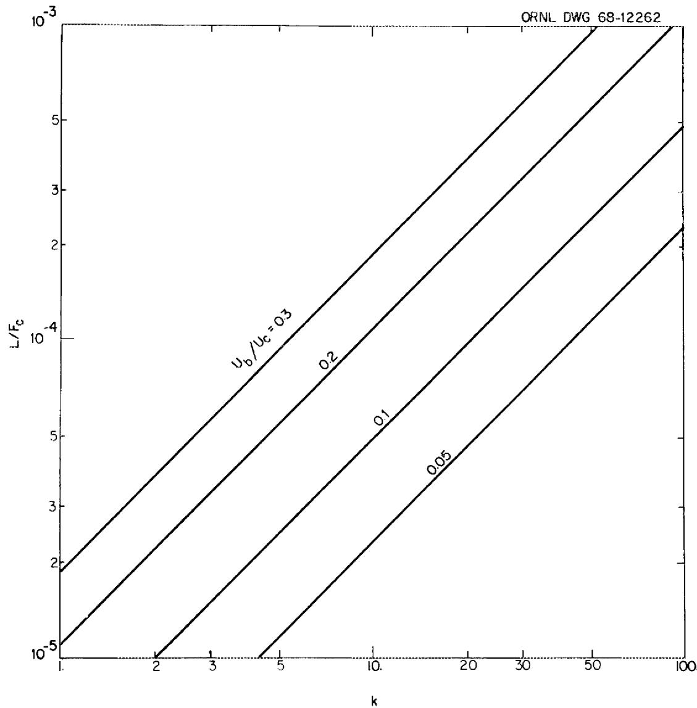  
Fig. 20. Variation of Ratio of Allowable Core-Blanket Exchange Rate to Core Flow Rate for Given Blanket-to-Core Uranium Concentration Ratios and Blanket-to-Core Processing Rate Ratios.

Of primary interest is the effect of the increased salt flow rate (and the attendant requirements for increased uranium reduction) on the protactinium-isolation system. We will assume that the permissible flow rates of salt and metal in the packed-column extractor are given by the relation2

$$
v _ {c} ^ {1 / 2} + v _ {d} ^ {1 / 2} = 2 1. 6, \tag {6}
$$

where $v_{c}$ is the superficial velocity of the continuous (salt) phase and $v_{d}$ is the superficial velocity of the discontinuous (metal) phase, both expressed in feet per hour. We will further assume that the metal stream entering the column contains 0.0016 mole fraction thorium, and that the concentration of uranium in the core is 0.003 mole fraction. Since all the uranium is removed from the salt, the required quantities of uranium and reductant are stoichiometrically related; thus, the ratio of the superficial velocity in the discontinuous phase to that in the continuous phase (after inserting a conversion factor to convert molar rates to linear velocities) is:

$$
\begin{array}{l} \frac {v _ {d}}{v _ {c}} = \frac {1 . 9 8 F \frac {U p}{U c}}{(1 + k) F} \\ = 1. 9 8 \frac {U _ {\mathrm {p}}}{U _ {\mathrm {c}}} \quad \frac {1}{1 + k}. \tag {7} \\ \end{array}
$$

Substituting Eq. (7) into Eq. (6) and solving for the square root of the superficial velocity of the continuous phase yields:

$$
v _ {c} ^ {1 / 2} = \frac {2 1 . 6}{1 + [ 1 . 9 8 (v _ {p} / v _ {c}) / (1 + k) ] ^ {1 / 2}}. \tag {8}
$$

The required column diameter is related to the superficial velocity of the continuous phase by

$$
D = \frac {4}{\pi} \frac {(1 + k) F}{v _ {c}} ^ {1 / 2}. \tag {9}
$$

Substitution of Eqs. (3), (5), and (8) into this relation yields the required column diameter, D, as a function of the relative exchange rate between the core and blanket volumes $(\mathrm{L} / \mathrm{F}_{\mathrm{c}})$ and the ratio of the uranium concentration in the blanket to that in the core:

$$
D = \frac {L _ {F}}{\pi} 1 / 2 \frac {\dots \quad 1 + \frac {F _ {c}}{F}}{2 1 . 6} \frac {\frac {L}{F _ {c}} \frac {U _ {c}}{U _ {b}} - 1}{2 1 . 6} + 1. 9 8 \left. 1 + \frac {F _ {c}}{F} \frac {L}{F _ {c}} 1 - \frac {U _ {b}}{U _ {c}} \right. ^ {1 / 2} \tag {10}
$$

Figure 21 shows the required column diameters as a function of $\mathbf{L} / \mathbf{F}_{\mathbf{c}}$ and the ratio $U_{b} / U_{c}$ . In this case, the rate of salt withdrawal from the core, F, is 487 ft³/day (i.e., a three-day cycle with respect to the combined core and blanket volumes) and the core flow rate, $F_{c}$ , is 128 ft³/sec. The figure shows that, for a $U_{b} / U_{c}$ ratio of 0.1, the required column diameters for $\mathbf{L} / \mathbf{F}_{\mathbf{c}}$ values of $10^{-5}$ , $10^{-4}$ , and $10^{-3}$ are approximately 9.3, 20.0, and 58.9 in., respectively.

The practical range of column diameter values is believed to be 20 in. or less, for which the acceptable exchange rates are quite low if the uranium concentration in the blanket is to be $10\%$ of that in the core. Hence, we conclude that the use of the protactinium-isolation system for decreasing the uranium concentration in the blanket of a single-fluid MSBR is practicable only for reactor designs having an exchange rate between the core and blanket regions of less than about $0.01\%$ of the core flow rate.

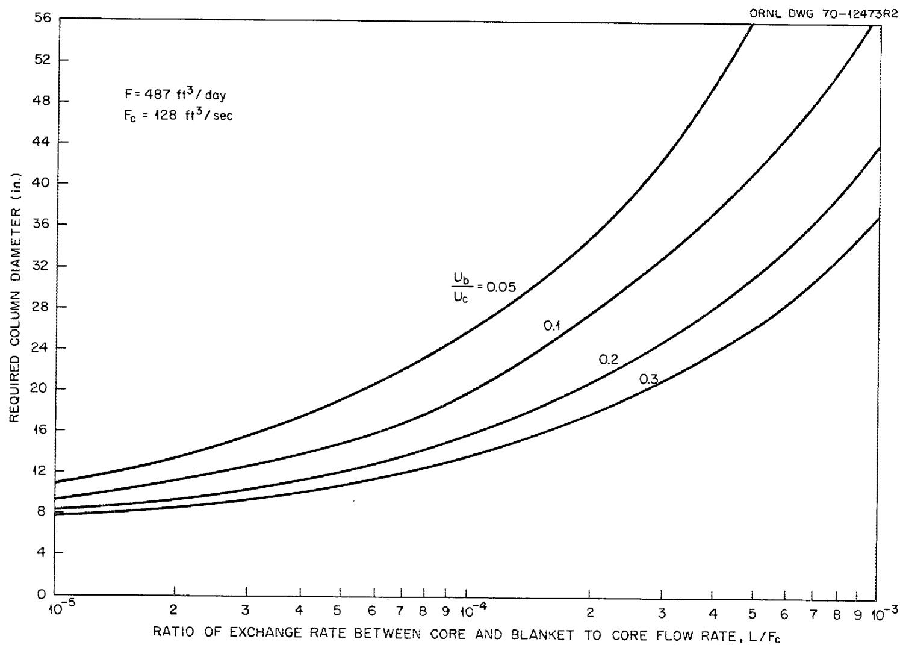  
Fig. 21. Variation of Required Extraction Column Diameter with Ratio of Uranium Concentration in Blanket to That in Core and Ratio of Exchange Rate Between Core and Blanket to Core Flow Rate.

# 6. REMOVAL OF RARE EARTH'S FROM A SINGLE-FLUID MSBR

# L. E. McNeese

The rare-earth fission products are among the more important neutron absorbers in an MSBR, and successful operation of this type of reactor requires the removal of such materials on a cycle of approximately 50 days. Removal of rare earths from a single-fluid MSBR is complicated by the need for separating the rare earths from thorium, a major component of the salt, since thorium fluoride and the rare-earth fluorides are chemically similar.

# 6.1 Proposed Rare-Earth Removal Flowsheet

The proposed method for removing rare earths from a single-fluid MSBR is based on differences in the extent to which the rare earths and thorium distribute between molten salt and liquid bismuth containing a reductant. The removal system is shown in its simplest form in Fig. 22. A molten-salt stream that consists of fluorides of lithium, beryllium, and thorium as well as rare-earth fluorides is fed to an extraction column. The salt flows countercurrent to a stream of liquid bismuth containing thorium and lithium. In the upper part of the column, a large fraction of the rare earths is reduced and transfers to the downflowing metal stream. Below the feed point, the rare-earth content of the salt and metal streams is increased in order to produce a concentration suitably high for disposal.

Molten salt leaving the top of the column contains rare earths at a low concentration. Part of this salt is returned to the reactor, and the remainder is sent to an electrolytic-cell complex. The complex is used to add thorium and lithium to bismuth for use as extractant and to return the extracted rare earths, which enter the complex with bismuth from the bottom of the cascade, to the cascade as reflux by oxidizing

ORNL DWG 68-9443

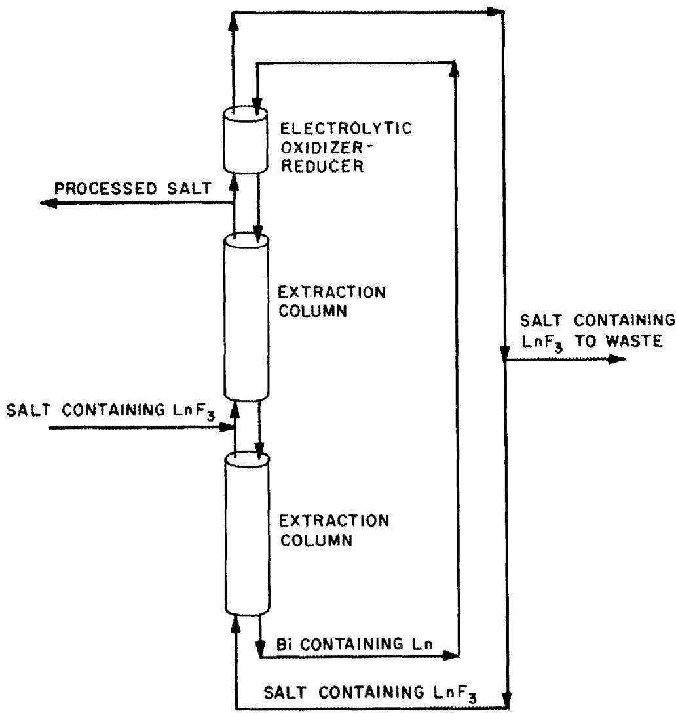  
Fig. 22. Removal of Rare Earths from a Single-Fluid Reactor by Reductive Extraction.

them out of the bismuth and transferring them to the returning salt stream. The electrolytic-cell complex consists of an electrolytic cell with contactors above and below it. Both the anode and the cathode of the cell are pools of flowing bismuth, and the electrolyte is salt that does not contain large amounts of rare earths or thorium. The cathode adds lithium to the bismuth stream that flows into the lower contactor and extracts essentially all (about $99\%$ ) of the thorium out of the entering salt. The anode releases $\mathsf{BiF}_3$ into the salt that flows into the upper contactor and oxidizes essentially all of the rare earths out of the entering bismuth.

Efficiencies for removal of rare earths were calculated for a range of operating conditions to establish the importance of the rare-earth--thorium separation factor, the fraction of $\mathrm{ThF}_4$ that is reduced in the electrolytic cell, the location of the feed point, the number of stages in the extraction column, the metal/salt flow ratio, and the concentration of rare earths in the discard stream. A reactor volume of $1461\mathrm{ft}^3$ , an operating temperature of $600^{\circ}\mathrm{C}$ , and a reactor power of $1000\mathrm{Mw}$ (electrical) were assumed. The thorium and lithium concentrations in the bismuth stream that was fed to the extraction column were each 0.0016 mole fraction. Within the range of interest, the concentration of the rare-earth fluorides in the withdrawn salt stream had no effect, and a concentration of 0.0069 mole fraction was assumed in all cases. This is less than $50\%$ of the rare-earth fluoride solubility in the fuel carrier salt at $600^{\circ}\mathrm{C}$ .

6.2 Effect of Rare-Earth--Thorium Separation Factor and Bismuth Flow Rate

Calculated results showing the effects of rare-earth--thorium separation factor, bismuth flow rate, and feed-point location are given in Figs. 23-30 for a 30-day processing cycle and a total of 24 stages in the extraction column. It was assumed that $99\%$ of the thorium was reduced from the salt as it passed through the electrolytic cell, and

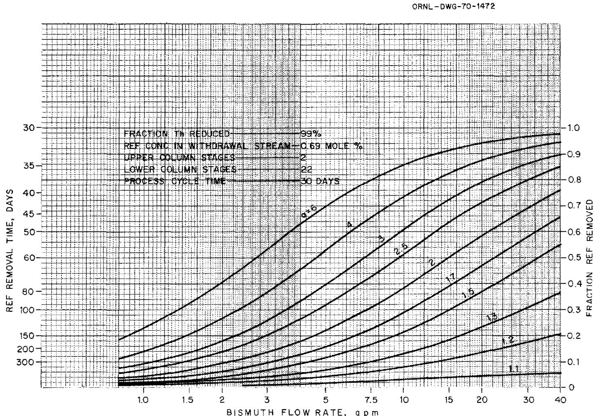  
Fig. 23. Variation of Rare-Earth Removal Time with Bismuth Flow Rate and Rare-Earth-- Thorium Separation Factor for 2 Stages Above the Feed Point and 22 Stages Below the Feed Point.

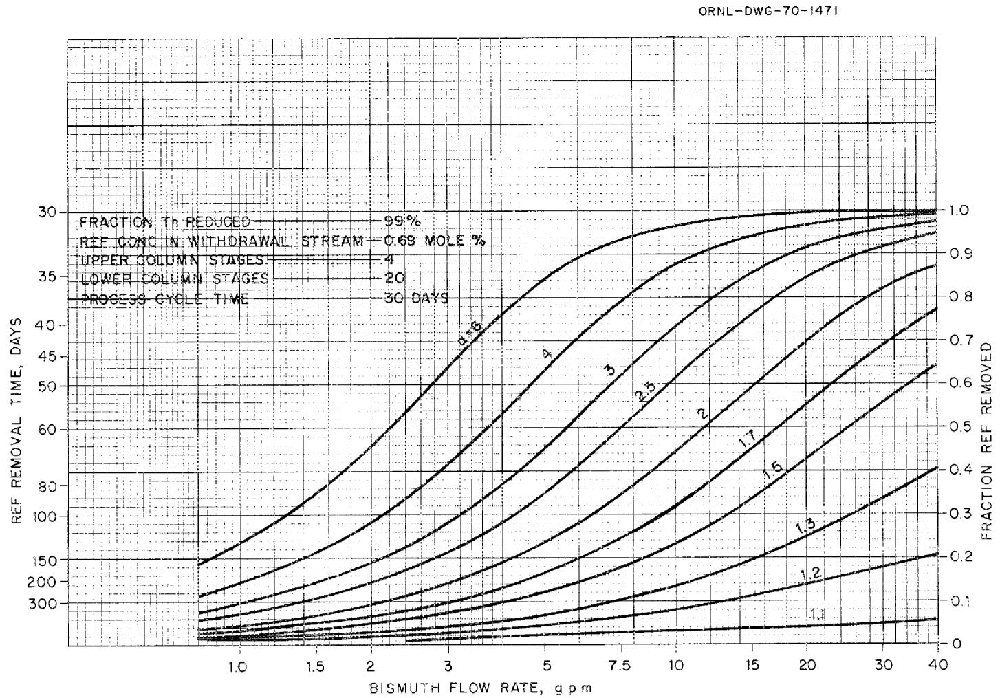  
Fig. 24. Variation of Rare-Earth Removal Time with Bismuth Flow Rate and Rare-Earth--Thorium Separation Factor for 4 Stages Above the Feed Point and 20 Stages Below the Feed Point.

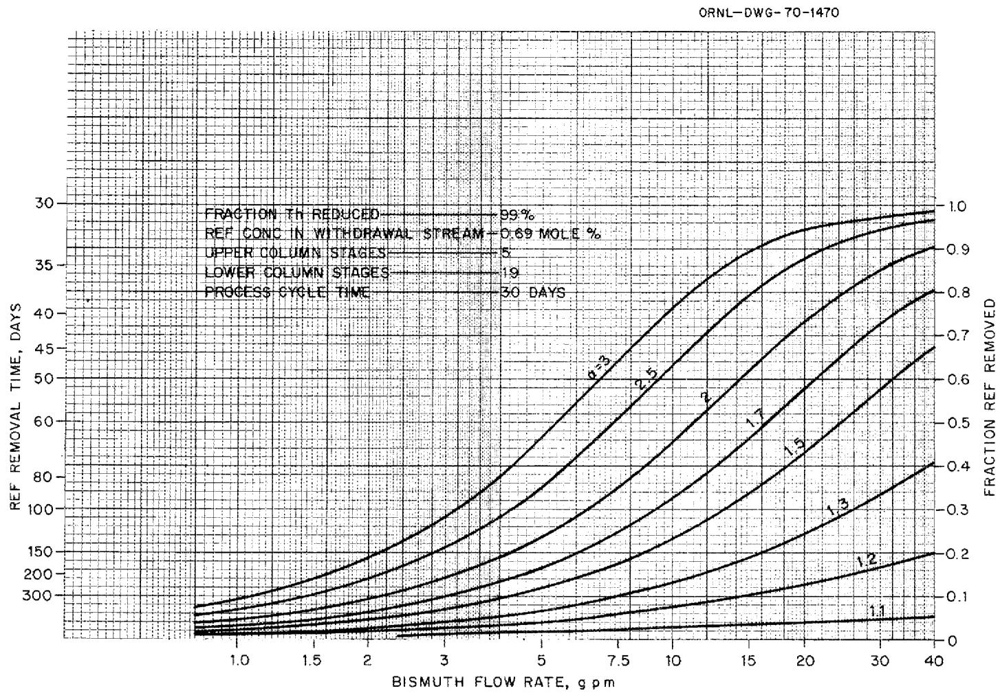  
Fig. 25. Variation of Rare-Earth Removal Time with Bismuth Flow Rate and Rare-Earth-- Thorium Separation Factor for 5 Stages Above the Feed Point and 19 Stages Below the Feed Point.

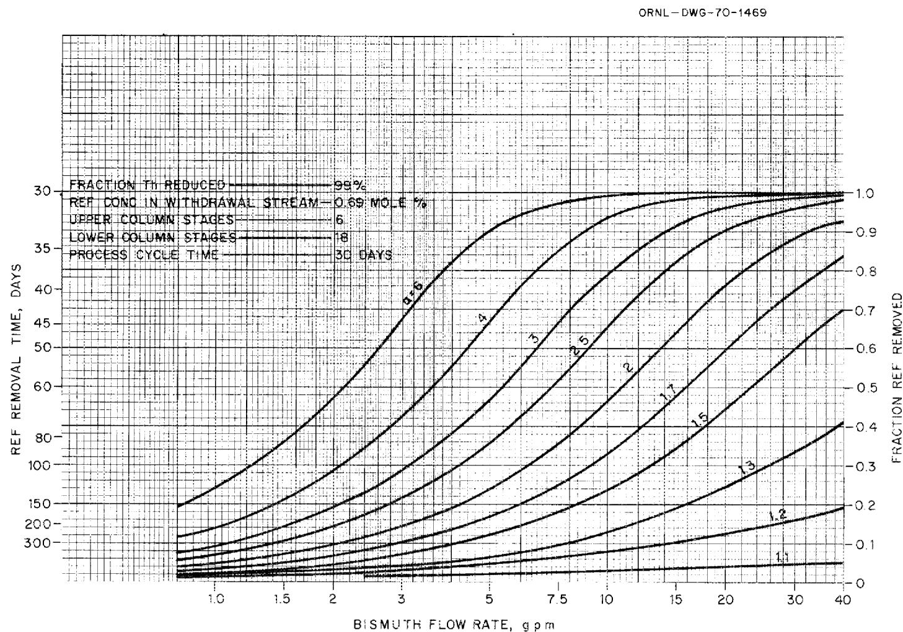  
Fig. 26. Variation of Rare-Earth Removal Time with Bismuth Flow Rate and Rare-Earth--Thorium Separation Factor for 6 Stages Above the Feed Point and 18 Stages Below the Feed Point.

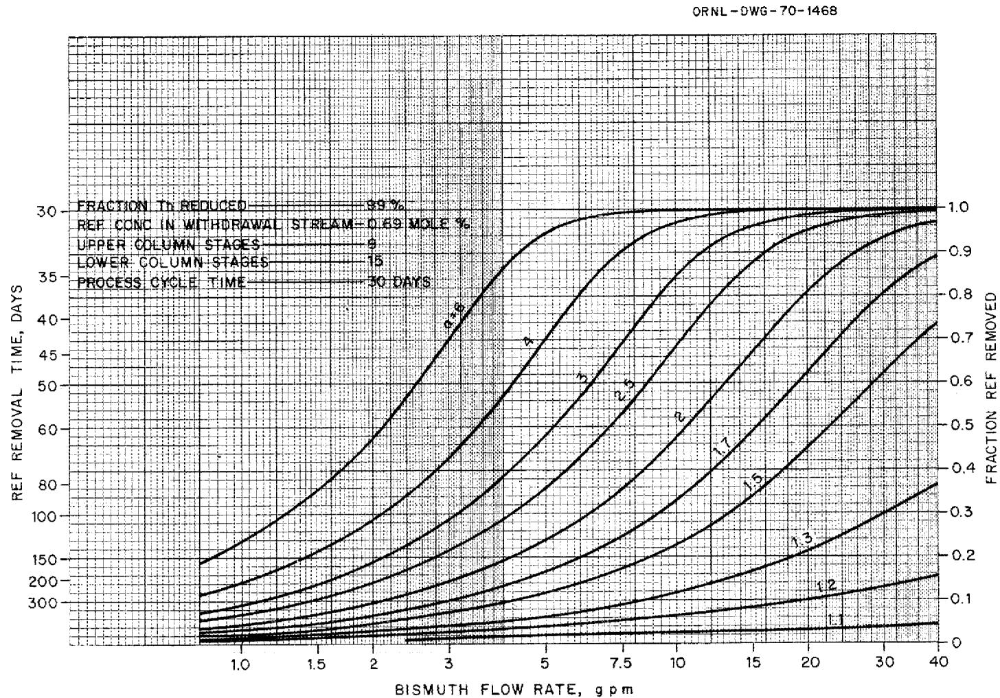  
Fig. 27. Variation of Rare-Earth Removal Time with Bismuth Flow Rate and Rare-Earth--Thorium Separation Factor for 9 Stages Above the Feed Point and 15 Stages Below the Feed Point.

ORNL-DWG-70-1473

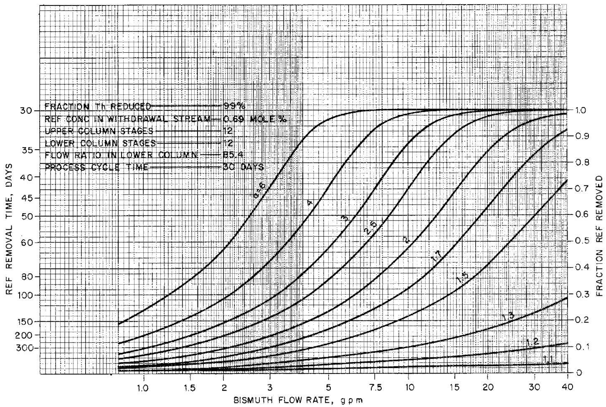  
Fig. 28. Variation of Rare-Earth Removal Time with Bismuth Flow Rate and Rare-Earth--Thorium Separation Factor for 12 Stages Above the Feed Point and 12 Stages Below the Feed Point.

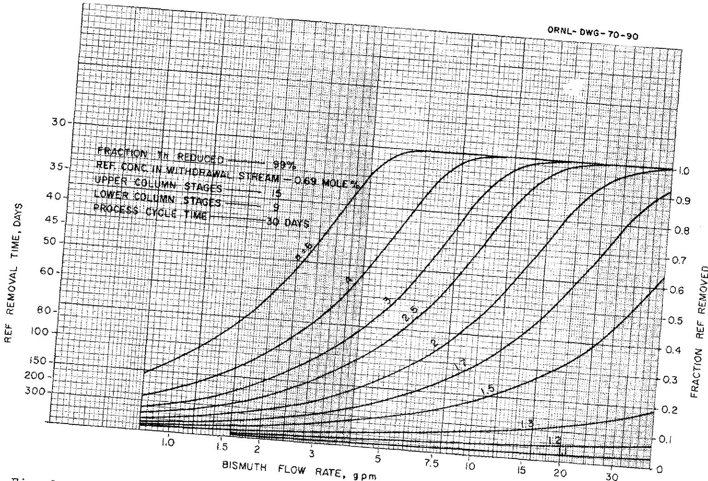  
Fig. 29. Variation of Rare-Earth Removal Time with Bismuth Flow Rate and Rare-Earth--

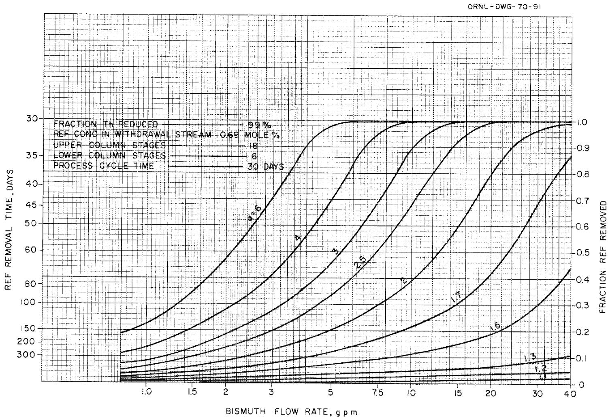  
Fig. 30. Variation of Rare-Earth Removal Time with Bismuth Flow Rate and Rare-Earth--Thorium Separation Factor for 18 Stages Above the Feed Point and 6 Stages Below the Feed Point.

that the concentration of rare-earth fluorides in the withdrawn salt stream was 0.69 mole %. The system is seen to be relatively efficient for separation factors of 2 or greater, but relatively inefficient for separation factors lower than 1.5.

# 6.3 Effect of Location of Feed Point

Figure 31 shows the effect of feed-point location for operating conditions that include a bismuth flow rate of $15\mathrm{~gpm}$ , a total of 24 stages, $99\%$ reduction of thorium in the electrolytic cell, a rare-earth fluoride concentration of 0.0069 mole fraction in the withdrawn salt stream, and a processing cycle time of 30 days. It is seen that the optimum feed-point location depends on the rare-earth--thorium separation factor and shifts from the center of the column for a separation factor of 2.0 to near the top of the column for separation factors near 1.0. The metal/salt flow ratios are relatively high for the conditions given, that is, 34 and 85.4 for the upper and lower columns, respectively.

# 6.4 Effect of the Fraction of $\mathrm{ThF}_4$ That Is Reduced in the Electrolytic Cell

Figure 32 shows the effect of the fraction of $\mathrm{ThF}_{4}$ that is reduced in the electrolytic cell for a rare-earth--thorium separation factor of 2, a 24-stage column, and a rare-earth concentration in the withdrawal stream of 0.0069 mole fraction. It should be noted that the importance of this parameter is equal to, if not greater than, that of the other parameters considered. If the fraction of $\mathrm{ThF}_{4}$ that is reduced is decreased from 99 to $90\%$ , a significant decrease in removal efficiency results; the system becomes ineffective if less than $50\%$ of the $\mathrm{ThF}_{4}$ is reduced.

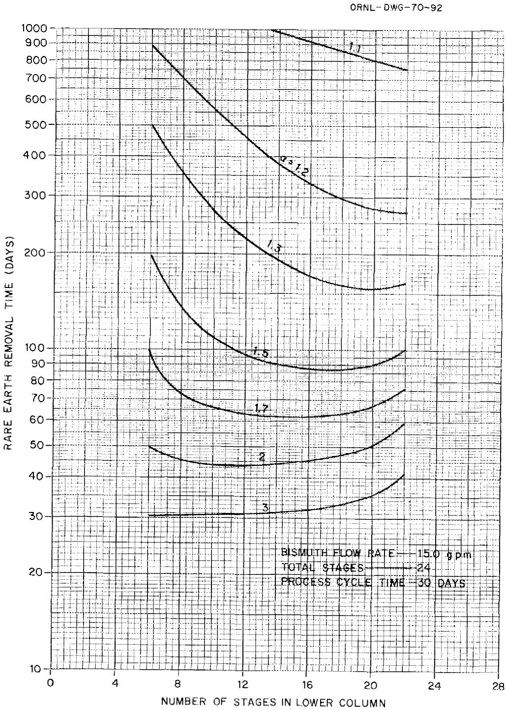  
Fig. 31. Variation of Rare-Earth Removal Time with Feed-Point Location and Rare-Earth--Thorium Separation Factor.

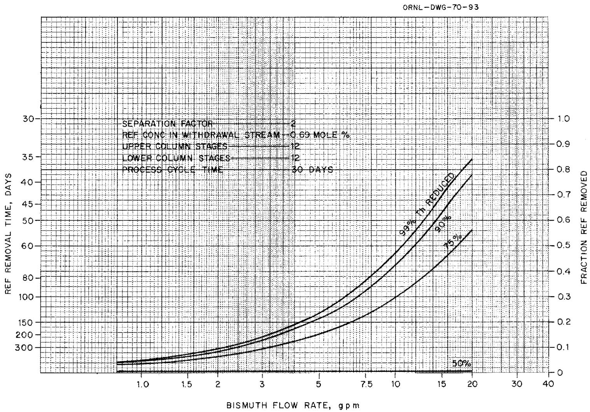  
Fig. 32. Variation of Rare-Earth Removal Time with Bismuth Flow Rate and the Fraction of $\mathrm{ThF}_{4}$ That Is Reduced in the Electrolytic Cell.

# 6.5 Effect of Number of Stages in the Extraction Column

Calculated rare-earth removal times for systems having a total of 24, 18, and 12 stages are shown in Figs. 28, 33, and 34 for a feed point at the center of the column. Assumed operating conditions include a 30-day processing cycle time, a concentration of rare-earth fluorides of 0.0069 mole fraction in the withdrawn salt stream, and $99\%$ reduction of the $\mathrm{ThF}_{4}$ in the electrolytic cell.

From the previous sections, it is apparent that, for a rare-earth-- thorium separation factor of about 1.2, about 20 stages are required below the feed point in order to achieve a marginally acceptable rareearth removal time. The effects of the bismuth flow rate and the number of stages in the upper column are shown in Figs. 24 and 35-37. The effect of the number of stages in the upper column for a bismuth flow rate of 15 gpm is shown in Fig. 38.

# 6.6 Effect of Processing Cycle Time

Figure 39 shows the effects of the processing cycle time and the rare-earth--thorium separation factor for a bismuth flow rate of 15 gpm and 5 stages above and 19 stages below the feed point. As expected, the rare-earth removal times were insensitive to processing cycle time for low separation factors.

The effects of rare-earth--thorium separation factor and bismuth flow rate on the rare-earth removal time are shown in Figs. 25 and 40-42 for processing cycle times of 6, 7.5, 15, and 30 days in the case of a system having 5 stages above and 19 stages below the feed point.

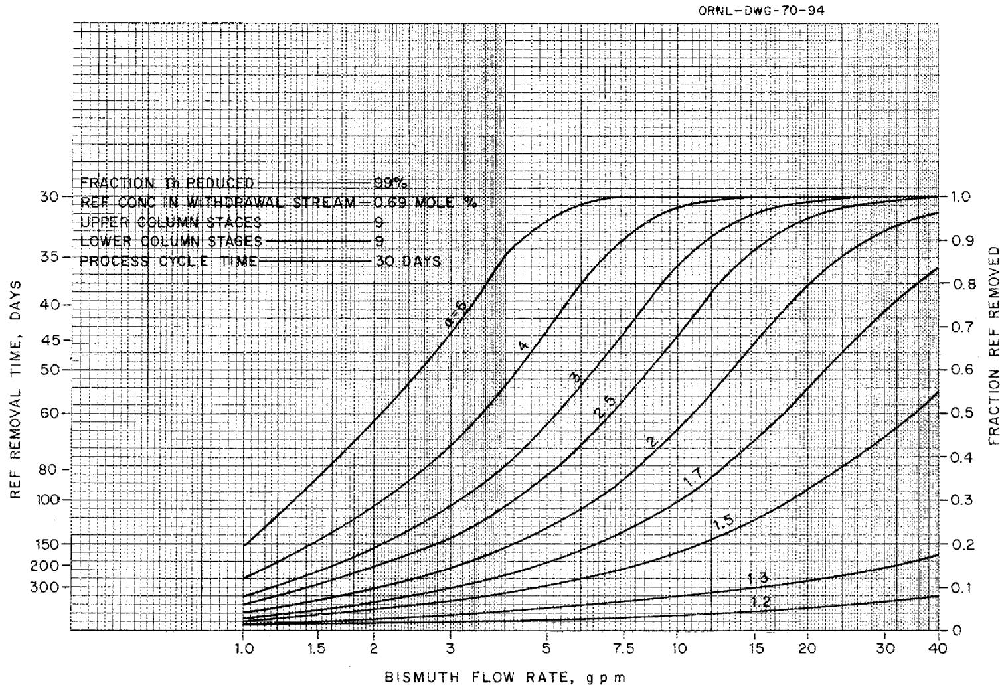  
Fig. 33. Variation of Rare-Earth Removal Time with Bismuth Flow Rate and Rare-Earth--Thorium Separation Factor for Nine Stages Above the Feed Point and Nine Stages Below the Feed Point.

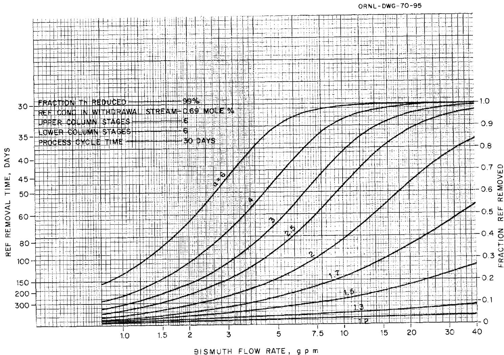  
Fig. 34. Variation of Rare-Earth Removal Time with Bismuth Flow Rate and Rare-Earth--Thorium Separation Factor for Six Stages Above the Feed Point and Six Stages Below the Feed Point.

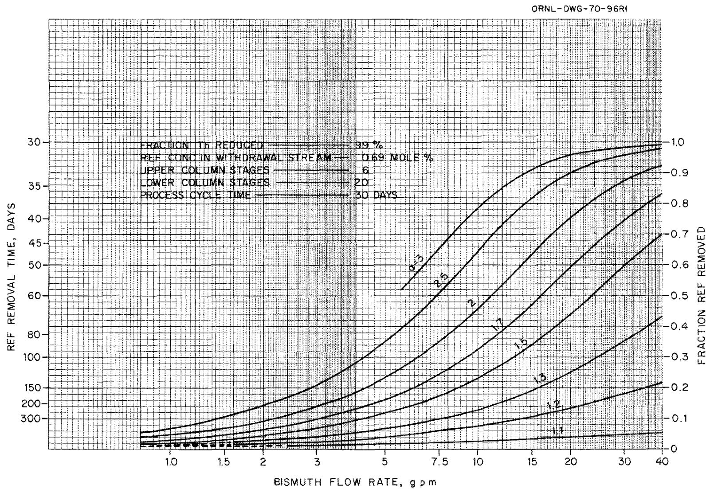  
Fig. 35. Variation of Rare-Earth Removal Time with Bismuth Flow Rate and Rare-Earth--Thorium Separation Factor for 6 Stages Above the Feed Point and 20 Stages Below the Feed Point.

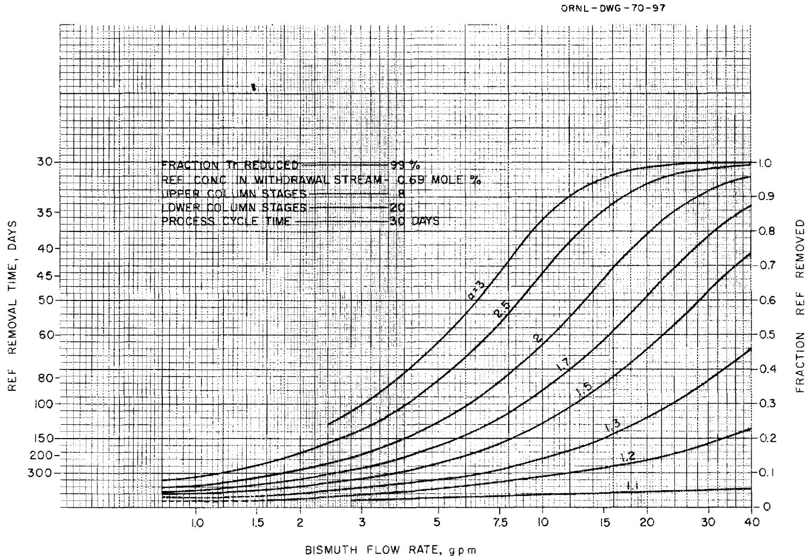  
Fig. 36. Variation of Rare-Earth Removal Time with Bismuth Flow Rate and Rare-Earth--Thorium Separation Factor for 8 Stages Above the Feed Point and 20 Stages Below the Feed Point.

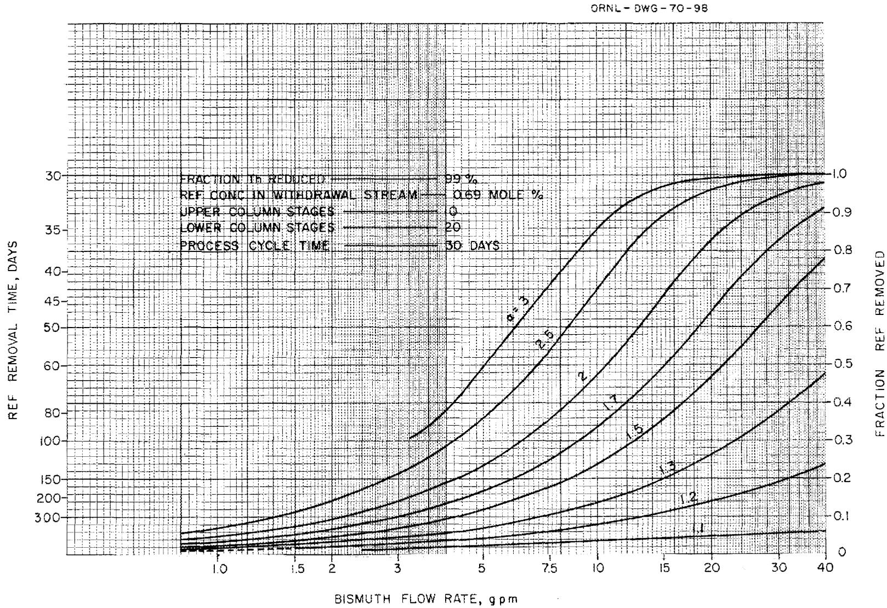  
Fig. 37. Variation of Rare-Earth Removal Time with Bismuth Flow Rate and Rare-Earth--Thorium Separation Factor for 10 Stages Above the Feed Point and 20 Stages Below the Feed Point.

ORNL-DWG-70-99

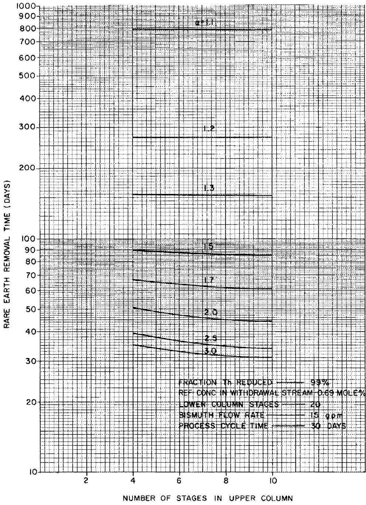  
Fig. 38. Variation of Rare-Earth Removal Time with Rare-Earth--Thorium Separation Factor and Number of Stages in Upper Column When the Lower Column Contains 20 Stages.

ORNL-DWG-70-100

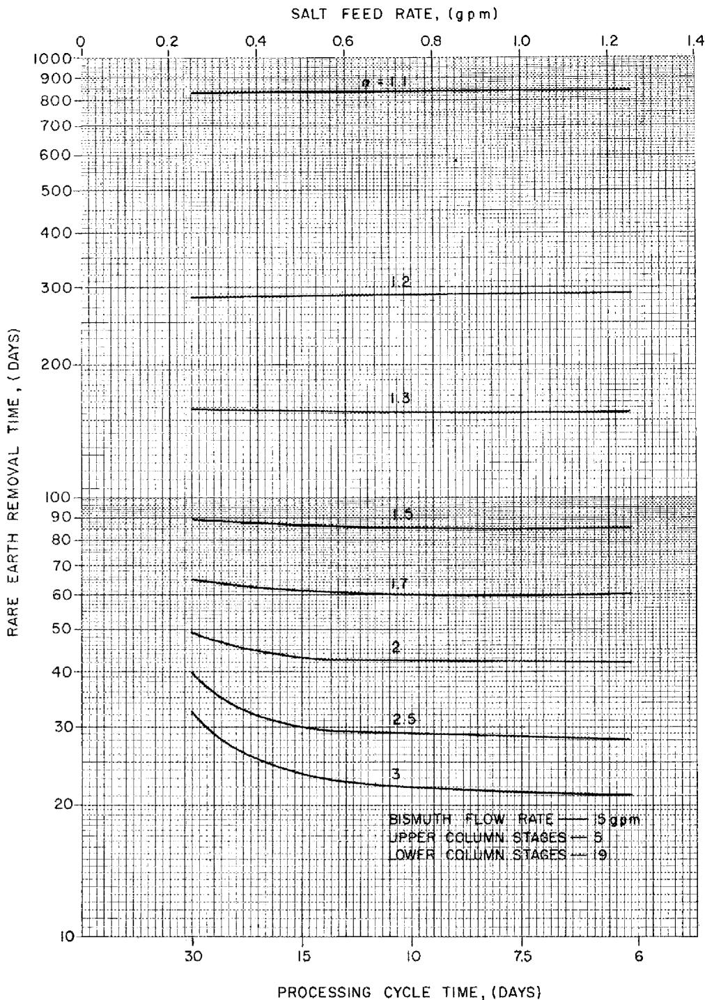  
Fig. 39. Variation of Rare-Earth Removal Time with Process Cycle Time and Rare-Earth--Thorium Separation Factor for a Bismuth Flow Rate of $15\mathrm{~gpm}$ and a Total of $2^{4+}$ Stages.

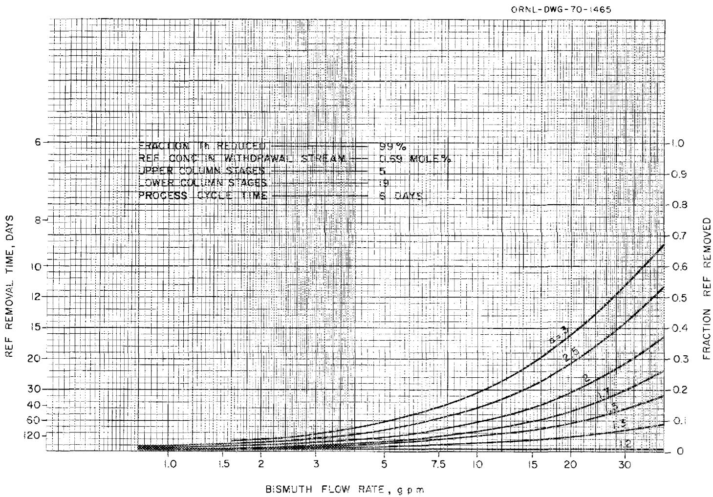  
Fig. 40. Variation of Rare-Earth Removal Time with Bismuth Flow Rate and Rare-Earth--Thorium Separation Factor for a Process Cycle Time of 6 Days and a Total of 24 Stages.

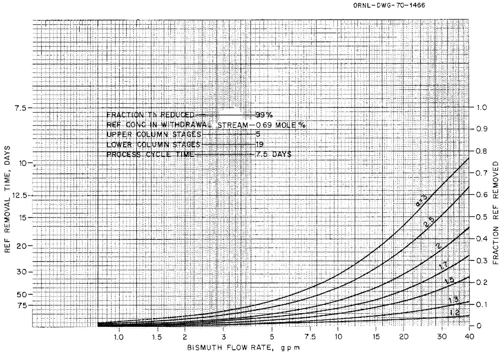  
Fig. 41. Variation of Rare-Earth Removal Time with Bismuth Flow Rate and Rare-Earth--Thorium Separation Factor for a Process Cycle Time of 7.5 Days and a Total of 24 Stages.

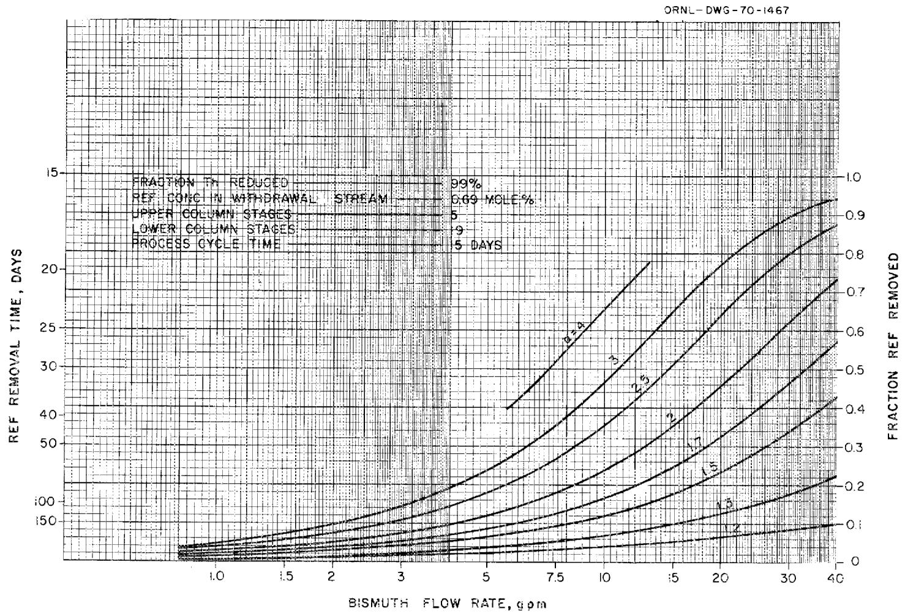  
Fig. 42. Variation of Rare-Earth Removal Time with Bismuth Flow Rate and Rare-Earth-- Thorium Separation Factor for a Process Cycle Time of 15 Days and a Total of 24 Stages.

# 6.7 Rare-Earth Removal Times for Reference Conditions

Reference operating conditions, which have been selected on the basis of the previous data, include a bismuth flow rate of 15 gpm, a total of 24 stages (5 above the feed point), a 30-day processing cycle, $99\%$ reduction of $\mathrm{ThF}_4$ in the electrolytic cell, and lithium and thorium concentrations in the metal fed to the column of 0.0016 mole fraction. The thorium concentration in the bismuth in the extraction columns is about $90\%$ of the thorium solubility at the operating temperature of $600^{\circ}\mathrm{C}$ .

The separation factors for several of the rare earths have been determined for thorium-saturated bismuth in contact with 72-16-12 mole $\%$ LiF-BeF $_{2}$ -ThF $_{4}$ . The separation factors and the removal times for Eu, Pm, La, Sm, Nd, and Ce at the reference conditions are given in Table 9. The removal times range from 155 days for Eu to approximately 33 days for Nd and Ce, and are considered adequate.

Table 9. Removal Times for Various Rare Earths at Reference Conditions ${}^{a}$   

<table><tr><td>Rare Earth</td><td>Separation Factor</td><td>Removal Time (days)</td></tr><tr><td>Pm</td><td>1.7</td><td>64</td></tr><tr><td>Nd</td><td>3.0</td><td>33.8</td></tr><tr><td>Sm</td><td>2.0</td><td>48.2</td></tr><tr><td>La</td><td>1.8</td><td>60</td></tr><tr><td>Eu</td><td>1.3</td><td>155</td></tr><tr><td>Ce</td><td>3.5</td><td>32</td></tr></table>

${}^{a}$ Bismuth flow rate,15 gpm; processing cycle,30 days; number of stages in extraction column, 24 (5 above the feed point); fraction of ${\mathrm{{ThFl}}}_{4}$ reduced in the electrolytic cell, 99%; lithium and thorium concentrations in the metal fed to the column, 0.0016 mole fraction.

# 7. SEMICONTINUOUS ENGINEERING EXPERIMENTS ON REDUCTIVE EXTRACTION

H. D. Cochran, Jr. B. A. Hannaford

L. E. McNeese

Equipment has been installed for semicontinuous engineering experiments on reductive extraction. The installation was treated to remove oxides, and inspected to the maximum feasible degree. Before loading the bismuth and salt into the treatment vessel, the salt and bismuth feed tanks were stress-relieved, heated to normal operating temperature (about $600^{\circ}\mathrm{C}$ ), and pressurized to rated pressures to test their integrity. The process system was heated and evacuated to remove air and degas the graphite crucible. A final hydrogen treatment reduced most of the rust on carbon-steel surfaces. Then, bismuth $(184\mathrm{kg})$ was charged to the treatment vessel, where the molten bismuth was treated with hydrogen for oxide removal. Planned experiments are described in Sect. 7.5.

# 7.1 Pressure Tests of the Feed-and-Catch Tanks

The mild-steel concentric tanks used for feeding and receiving the bismuth and salt were stress-relieved at $650^{\circ}\mathrm{C}$ and 1 atm pressure. Following stress relief, the inner and outer shells were proof-tested twice at 50 psi and 25 psi, respectively, at $600^{\circ}\mathrm{C}$ . Subsequent dimensional measurements of the vessels were somewhat ambiguous. The apparent changes were both positive and negative, and amounted to less than $0.5\%$ strain in each case. These changes were ascribed to the effect of stress relief. Additional measurements were made on the more accessible parts of the vessels to serve as a base line for future measurements which will be made to detect and measure creep.

# 7.2 Initial Cleanup of Experimental System

In order to reduce oxygen contamination of the process system to a low level, the system was thoroughly flushed with argon and held at an absolute pressure of $0.35 \mathrm{~mmHg}$ at room temperature for a period of about 100 hr. This treatment was followed by a period of approximately 100 hr at $600^{\circ} \mathrm{C}$ , during which the pressure rose briefly (probably due to outgassing of the graphite crucible) and then fell to $0.35 \mathrm{~mmHg}$ again.

The system was treated with hydrogen in order to reduce the rust that was present on the interior surfaces. The quantity of rust was estimated to be approximately $400\mathrm{g}$ , based on an assumed 0.5-mil layer of $\mathrm{Fe}_{2}\mathrm{O}_{3}$ on the vessels and tubing. The flow path of hydrogen was nominally from the treatment vessel, through the process system, and into the off-gas header. A continuous sample drawn from the off-gas header through a hygrometer provided a means for following the rate of $\mathrm{Fe}_{2}\mathrm{O}_{3}$ reduction. A 16-scfh flow of $30\%$ hydrogen in argon produced a $3\%$ water content in the off-gas, corresponding to the reduction of about 32 g of $\mathrm{Fe}_{2}\mathrm{O}_{3}$ per hour. Measurement of the moisture level during the entire 12-hr treatment was not possible because of the failure of the hygrometer.

# 7.3 Loading and Treatment of Bismuth

Following the hydrogen treatment of the process system, the temperature of the treatment vessel was reduced to $350^{\circ}\mathrm{C}$ . Bismuth was introduced into the graphite crucible in 12.5-kg batches, which provided a volume calibration of the crucible. The total charge was 184 kg, of which about 145 kg (15 liters) can be transferred to the feed tank. The bismuth was sparged with hydrogen at the rate of 10 scfh for approximately 12 hr at a temperature of about $625^{\circ}\mathrm{C}$ . Because the hygrometer was inoperative, the progress of the treatment was followed by visual observation through a temporary 2-in.-diam sight glass. Hydrogen treatment was interrupted (after 125 std ft³ had been fed) by a steadily

increasing back pressure in the off-gas system, which was caused by the collection of several grams of solids (probably carbon) in the small off-gas filter. The Teflon cloth filter was replaced with a fritted Inconel bayonet filter having an area of about 40 in. $^{2}$ . Further hydrogen treatment will be followed by addition of thorium metal to the bismuth and circulation of the solution through parts of the process system for further oxide removal prior to charging salt to the system.

# 7.4 Operation of Gas Purification and Supply Systems

Operation of the Serfass* hydrogen purification unit was not completely satisfactory. The actual capacity of the purifier was less than $75\%$ of its rated capacity of 15 scfh. After about 50 hr of operation, the unit was replaced with a spare because of a flow obstruction in the line used for removing impurities.

Operation of the argon purification system was generally good in terms of water removal. The moisture level reached a steady value of 1 to 2 ppm at a usage rate of about 1.5 to 2 scfh. The instrument for reading oxygen concentration is not yet in use.

# 7.5 Planned Experiments

Two types of experiment are planned with the facilities described above. The first experiments will consist of hydrodynamic studies in which the salt-phase pressure drop through the column will be measured under various flow conditions. A range of flow rates from 0.05 to 0.5 liter/min is available for each phase. It is hoped that limiting flow rates (flooding) and bismuth holdup may be inferred from the pressure drop by analogy to experiments with a water-mercury system. Preliminary calculations using a modified Ergun equation indicate that a pressure drop as high as 3 to 6 ft of salt may be observed at maximum flow rates.

After the first few hydrodynamic experiments, uranium tetrafluoride will be added to the salt phase, and thorium metal will be added to the bismuth, so that mass-transfer performance may be observed. It is expected that the height equivalent of a theoretical stage will be 1 to 2 ft in this system. Since the packed column is 2 ft long, we expect to observe the performance of the equivalent of perhaps one to three stages.

Stage-to-stage calculations were made for one, two, and three stages, assuming various experimental conditions, in order to predict the mass-transfer performance of the system and to choose the best experimental conditions for observing mass-transfer performance. Metal/salt volumetric flow ratios from 10 to 0.1 were studied with $\mathrm{UF}_{4}$ concentrations from 0.0001 to 0.003 mole fraction in the salt and thorium concentrations from 0.0002 to 0.002 mole fraction in the bismuth.

The most obvious result of these calculations is that it will be very difficult to distinguish between one-, two-, or three-stage performance. In fact, it will probably be possible to make this distinction only under carefully selected conditions. The most suitable experimental conditions are metal/salt flow ratios from 5 to 1 with 0.0005 to 0.001 mole fraction of $\mathrm{UF}_{4}$ in the salt and similar concentrations of thorium in the bismuth. Under the best conditions, there will be about a factor of 2 difference in the $\mathrm{UF}_{4}$ concentration in the effluent salt between one and two stages and less than $20\%$ difference between two and three stages. Concentrations of $\mathrm{UF}_{4}$ in the effluent salt between 10 and 200 molar ppm are expected under these conditions. Further calculations to determine the sensitivity of these results to small errors in the input variables and constants are now under way.

# 8. ELECTROLYTIC CELL DEVELOPMENT

M. S. Lin L. E. McNeese

The proposed reductive extraction processes for protactinium isolation and rare-earth removal require the use of electrolytic cells for reducing lithium and thorium fluorides into a bismuth cathode to prepare the metal streams that are fed to the extraction columns and for oxidizing extracted components from the metal streams leaving the columns. To date, results of experiments with static cells have indicated the need for an electrically insulating material that can withstand the corrosive conditions at the cell anode and the need for studying heat generation and removal in cells. The use of a layer of frozen salt, which is known to be a good electrical insulator and will not be attacked by the salt or by molten bismuth, has been proposed as a means of corrosion protection. The heat-removal problem could be studied without the complications of electrochemical reactions if an ac source were used. A comparison of cell performance with ac and dc power will reveal any significant differences. As an alternative to a bismuth anode, graphite could be used.

Experimental work is reported on (1) a comparison of cell resistance with alternating and direct current, (2) the performance of a graphite anode, and (3) protection of an all-metal cell from corrosion by a frozen layer of salt.

# 8.1 Comparison of Cell Resistance with AC and DC Power

We performed an experiment that was essentially a duplication of the static-cell experiments reported previously; however, ac rather than dc power was used during most of the experiment. During the ac portion of the run, both the voltage and the current were recorded; the results obtained during this part of the experiment can be summarized as follows:

1. The quartz electrode divider was attacked, but at a much lower rate than in the corresponding dc portion of the run. There was no visible gas evolution.   
2. Both of the electrode surfaces lost their metallic luster as soon as the power was turned on. At first, they turned a brownish color; later, dark-colored material was observed on the surface.   
3. The calculated cell resistance was 0.16 ohm at $500^{\circ}\mathrm{C}$ for the apportion of the run, as compared with 0.15 ohm at $515^{\circ}\mathrm{C}$ for the subsequent dc portion of the run in the same cell.   
4. A residual dc voltage of 0.2 v, which indicated that some rectification had occurred, was measured after the ac portion of the run. This may have resulted from sparging of one of the two electrodes.   
5. When one of the two electrodes was sparged with argon, currents of 87.5 amp $(2.6\mathrm{amp / cm}^2)$ and 100 amp $(3.2\mathrm{amp / cm}^2)$ were required to maintain cell temperatures of $660^{\circ}\mathrm{C}$ and $750^{\circ}\mathrm{C}$ , respectively. The cell was operated at each temperature for about 2 hr. The highest average current density achieved was 5.2 amp/cm².   
6. The amount of black suspended material was less than that in the comparable dc portion of the run. The material disappeared when the cell was maintained at $660^{\circ}\mathrm{C}$ or higher and reappeared when the cell temperature was lowered to about $500^{\circ}\mathrm{C}$ ; this suggests that a change in the solubility of the black material in the salt with temperature was being observed.   
8.2 Experiments in a Quartz Static Cell with a Graphite Anode

An experiment was carried out in a simple, flat-bottomed quartz tube, 4 in. OD and 20 in. long, of the same design as the quartz static cell

described previously. The cell was charged with $6.7\mathrm{kg}$ of bismuth and $1.5\mathrm{kg}$ of molten salt ( $66 - 34$ mole $\%$ LiF-BeF $_2$ ). The bismuth pool, which had been treated with hydrogen at $700^{\circ}\mathrm{C}$ overnight prior to charging the cell with molten salt, served as the cathode. The anode was a l-in.-diam graphite rod with the lower end cut at an angle of $10^{\circ}$ from the horizontal to promote disengagement of gas that formed on the end of the rod. The area of the cathode was $71\mathrm{cm}^2$ , whereas the area of the anode was $5\mathrm{cm}^2$ (considering the bottom of the rod only). The distance between the two electrodes was about $1/4$ in.

A Hasting mass flowmeter with a nominal full-scale flow rate of 1 liter/min was installed in the off-gas line downstream from the dibutyl phthalate bubbler. A wet-test meter with a capacity of $0.05\mathrm{ft}^3$ per revolution was connected to the mass flowmeter for monitoring the rate of gas evolution.

The results of the experiment can be summarized as follows:

1. As soon as the cell was charged with salt, an amber color was observed in the salt phase. The color darkened and finally became black. The black material, which collected overnight at the salt-metal interface, could easily be dispersed through out the salt by an argon sparge. The material settled quickly when the spurge gas was turned off, which indicates that the material had a relatively high density.

2. During dc operation, a constant voltage was applied to the cell. The current surged to a maximum value and then decayed rapidly, showing smaller intermittent peaks. In a typical case, 15 v was applied across the electrodes; the maximum current was 45 amp (9 amp/cm² at the anode). The current quickly decreased to 22.5 amp after 5 sec and to 4.5 amp after 17 sec; it reached a near-steady value between 0.2 and 0.4 amp, with intermittent increases.

3. Immediately after the power was turned off, the cell potential was about 1.3 v; the potential then increased to 1.6 v in about 5 sec and to about 1.7 v in about 30 sec. The potential remained steady for a while and then decreased very slowly. This behavior and the maximum cell potential (1.7 vs 2.2 v) are quite different from data obtained with a bismuth anode.

4. The gas that evolved from the anode produced only a momentary surge on the flowmeter, on the order of 10 to 20 cc/min. Toward the end of the run, the off-gas was diverted to a starch-KI solution bubbler. The color of the solution in the bubbler turned faint yellow after a few minutes of contact.

5. During ac operation, the current varied linearly from 12 to 120 amp for applied voltages of 1 to 8 v; at the end of the run, the cell resistance was 0.065 ohm as compared with about 68 ohms in the case of dc operation. At higher voltages (8 to 20 v), the cell temperature increased, resulting in a lower cell resistance and hence a higher current (from 120 to 260 amp).

6. After the run was completed, the graphite electrode was removed and inspected. No sign of attack was apparent.

8.3 Studies of Frozen-Wall Corrosion Protection in an All-Metal Cell

The first attempt to use a layer of frozen salt as a means of protection for the anode was carried out in an all-metal cell. The main body of the cell was a 6-in. sched $40$ mild-steel pipe that was 18 in. long and had a flat, $1/4$ -in.-thick bottom. The cell body was the cathode container. The upper part of the cell was flanged, and the upper flange was electrically insulated from the cell body by a Teflon gasket. The anode of the cell, before and after assembly, is shown in Figs. 43 and 44 respectively. It consisted of a double-walled, fluid-cooled cup having

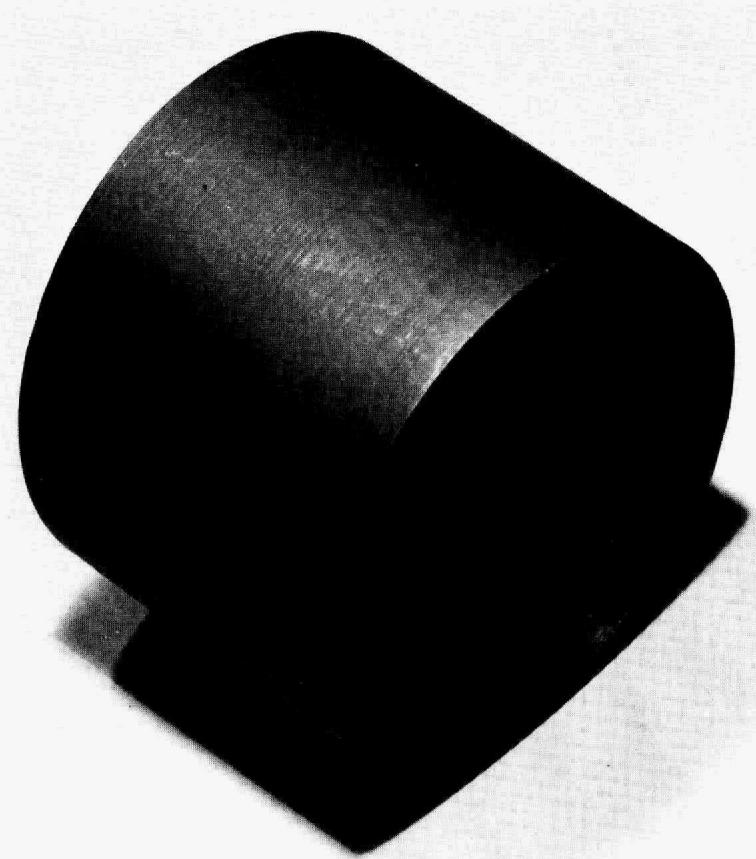

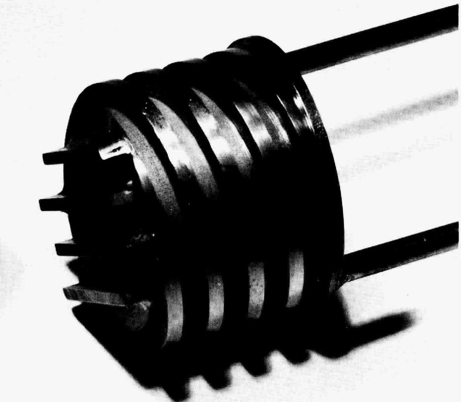

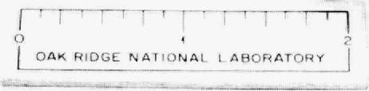  
Fig. 43. Anode Cup Before Assembly.

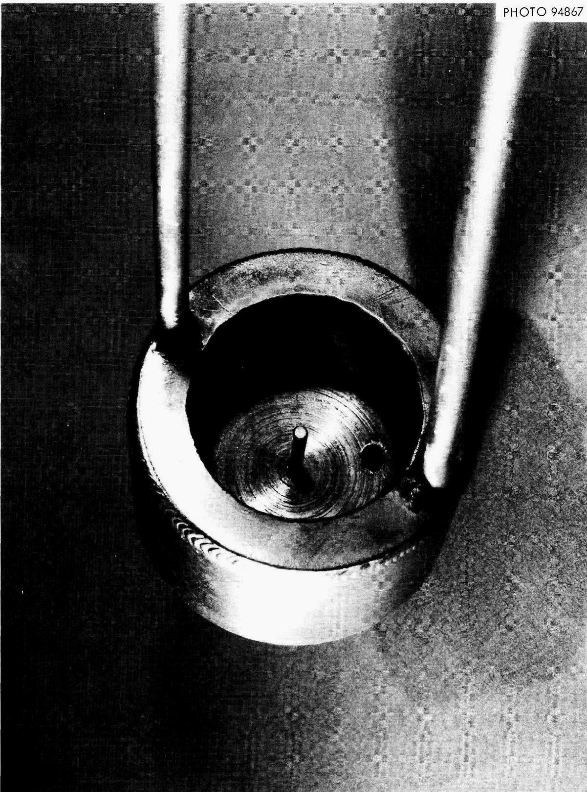  
Fig. 44. Double-Walled, Fluid-Cooled Anode Cup Ready for Installation.

an inner diameter of 1.75 in. (a gross anode area of $15.5\mathrm{cm}^2$ ) and an outer diameter of 2.75 in. The cup was suspended from the top flange by two $1/4$ -in. tubes, which served as the coolant ( $N_2$ and water) inlet and outlet as well as the anode lead. Provision was made for raising and lowering the anode cup. Viewing ports were provided on the top flange, and provision was made for sampling the salt or bismuth without introducing air into the system. A tube was installed to sparge the center of the anode.

The cell was charged with $16.3\mathrm{kg}$ of bismuth, which was subsequently treated with hydrogen at $700^{\circ}\mathrm{C}$ for 16 hr. The cell was then charged with molten salt $(4.5\mathrm{kg}$ of $66 - 34$ mole $\%$ LiF-BeF $_2$ ) that had been purified by hydrofluorination, hydrogen reduction, and filtration.

The first step was the formation of a layer of frozen salt over the anode cup. The cup was then lowered into the bismuth pool to be filled with molten bismuth. Finally, the anode was raised so that the bismuth level in the cup would be about $1/4$ in. above the bismuth level of the cathode. (It was essential to keep the salt frozen in all of these and subsequent operations.) After a few trials and some modification of the furnace, we could maintain a frozen salt layer on the anode in the operating position. However, the thickness of the salt layer could not be easily controlled. It was either too thick, which left no room for bismuth, or it was too thin and melted away when power was applied to the cell.

During our attempts to form frozen salt layers, the salt temperature was controlled at about $490^{\circ}\mathrm{C}$ , and the salt sparge tube was located just above the cathode-salt interface. The anode was sparged by argon; the lower heating section of the furnace, which surrounded the cathode, was turned off; and, the cooling-water rate was adjusted so that the water exit temperature was about $400^{\circ}\mathrm{C}$ .

Direct current was applied to the cell three times. In the first period, about 2.6 v dc was applied to the cell and a back EMF of about 1.5 v was observed; this should be compared with 2.2 v in the quartz cell. The cell resistance was 0.1 ohm. The cell shorted soon after the test began. In the following two runs, the measured cell resistances were 1.35 and 6 ohms, respectively. This variation in resistance was due mainly to changes in the effective area of the anode (the cross section of the inner cup, which is not covered by frozen salt). The back EMF was about 1.5 v for the second run, and only 0.2 v for the third run. The high resistance and the low cell potential in the last run could mean that the bismuth was fully covered by frozen salt and that only a small unprotected mild-steel portion of the anode was exposed in this instance. In the last run, cooling water was noted in the cell after about 1 hr; therefore, the run was terminated. Examination revealed that the cooling-water exit tube, which was covered by a relatively thin layer of frozen salt, had corroded (probably by anodic oxidation) and had ruptured.

# 9. MSRE DISTILLATION EXPERIMENT

J.R.Hightower, Jr. L.E.McNeese

The MSRE distillation experiment will consist of a demonstration of the high-temperature, low-pressure distillation of molten salt as a means for separating the lanthanide fission products from the components of the MSRE fuel-carrier salt, which is a mixture of lithium, beryllium, and zirconium fluorides. Originally, the experiment was planned as a demonstration of the lanthanide removal step in the fuel-stream processing of a two-fluid MSBR. Although the two-fluid MSBR concept has been deemphasized in favor of a one-fluid concept, the distillation of fluoride salts still has potential application as a feed-adjustment step for reductive extraction processes and as a means for partially recovering lithium and beryllium fluorides from waste streams.

The experimental work is divided into two phases: (1) nonradioactive testing of the equipment using salt that has the MSRE fuel-carrier composition and contains $\mathrm{NdF}_3$ , and (2) demonstration, at the MSRE, of the distillation of irradiated fuel-carrier salt from which the $^{235}\mathrm{U}$ has been removed.

The first phase of the experiment has been successfully completed. Equipment has been installed at the MSRE for the second phase of the experiment.

# 9.1 Instrument Panel

The instrument panel, from which the process is operated, contains all pressure, temperature, and level recorders and controllers, valve-operator switches, electrical power-supply controls, and various temperature and pressure alarms (Fig. 45). The instrument panel was installed at the MSRE in the high bay area along the east wall, south of the spare cell where the still was installed.

# 9.2 Main Process Vessels

The main process vessels5 - the feed tank, the still pot, the condenser, and the receiver are mounted in an angle-iron frame to facilitate their transfer between Building 3541 and the MSRE, as well as installation at the MSRE. Since the equipment is installed in a cell that is not much larger than the equipment frame, all extra piping, thermocouples, heaters, and insulation were installed on the equipment before its placement in the cell. Fig. 46 shows the equipment after piping, thermocouples, and heaters were installed, but before the thermal insulation was added. A stainless steel pan was placed under the equipment to catch the molten salt in the event that a vessel should rupture. The equipment is shown in Fig. 47 after installation in the cell.

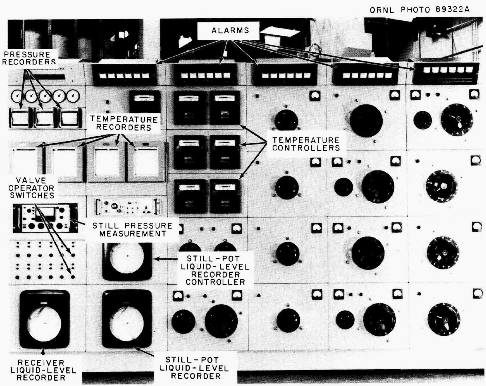  
Fig. 45. Control Panel for MSRE Distillation Experiment.

ORNL PHOTO 93564A

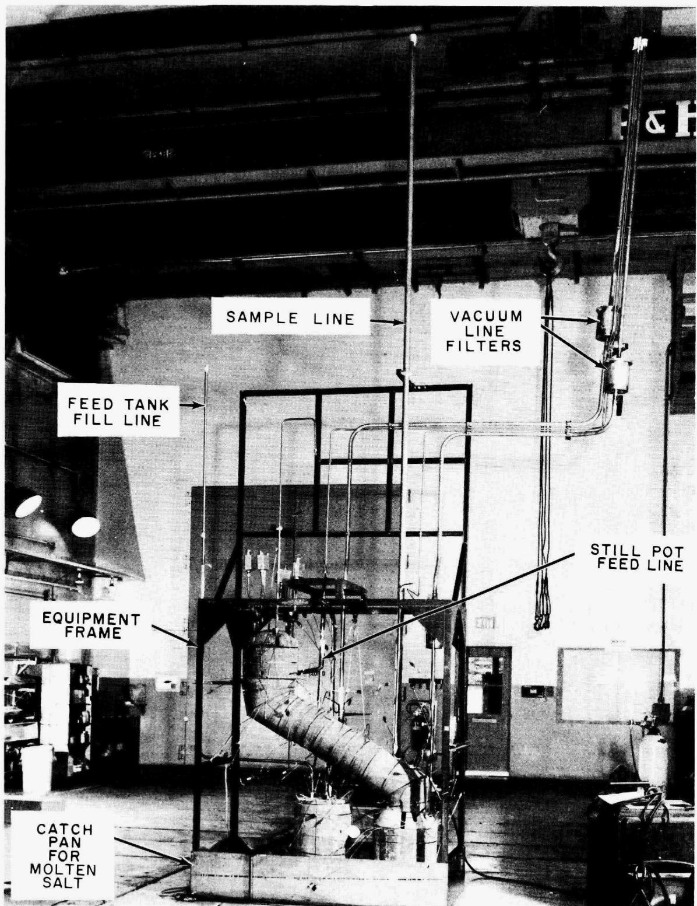  
Fig. 46. View of Still and Piping Before Insulation and Placement in Cell.

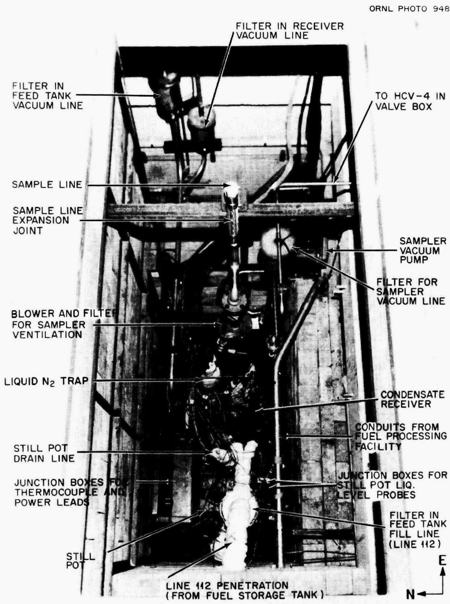  
Fig. 47. Equipment Installed in Spare Cell at MSRE.

Some minor alterations were made on the basis of experience from the nonradioactive tests. The configuration of the feed line to the still pot was changed to reduce the length of line that would be heated to nearly $1000^{\circ}\mathrm{C}$ by the still-pot heaters and to provide a longer horizontal section just ahead of the still pot. Both conditions should reduce the probability of plugging the line with nickel and iron deposits. With more of the line at a lower temperature, the rate of deposition may be less; and, with the longer horizontal section, more material must be deposited before the line can be obstructed (assuming that the material will spread out along the complete horizontal section). In the non-radioactive runs, a Calrod heater on an argon line failed and damaged the tubing. In order to prevent a similar failure during the radioactive experiment, electrical insulation (glass tape) was installed between all Calrods and the lines that they heat.

Absolute filters were installed in the vacuum lines from the feed tank and from the receiver in order to prevent fission products such as $95\mathrm{Zr}$ and $95\mathrm{Nb}$ from entering the valve box. On testing the filters, we found that they removed $99.997\%$ of $0.3\mu \mathrm{DOP}$ particles. These filters can be seen in Figs. 46 and 47.

# 9.3 Valve Box

The valve box (Fig. 48) contains all differential and absolute-pressure transmitters, all valves that handle potentially radioactive gaseous material, and two vacuum pumps - one to evacuate the reference side of a differential-pressure transmitter and the other to evacuate the distillation process vessels.

Before the valve box was installed at the MSRE, we added a bypass valve to the differential-pressure transmitter associated with the liquid level in the condensate receiver. The handle for this valve was extended through the wall of the valve box to allow its operation when the valve

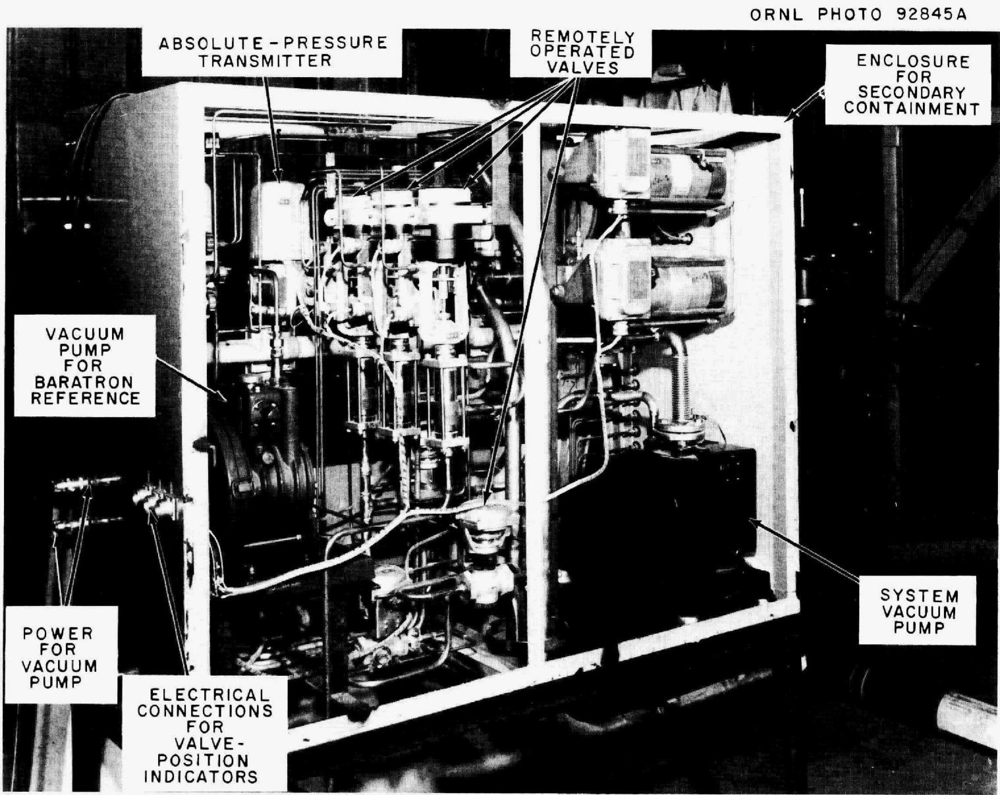  
Fig. 48. Valve Box Before Being Sealed.

box was sealed. Figure 48 does not show the metal plates that were later bolted to the front and the back of the box to complete the secondary containment. After the connections were made between the valve box and the still, these covers were put in place and the box was sealed. With the box under a pressure of 15 in. $\mathsf{H}_2\mathsf{O}$ , the leak rate was 0.1 scfh. During operation, the pressure in the box did not exceed 0.5 in. $\mathsf{H}_2\mathsf{O}$ ; the leak rate was negligible at this pressure.

# 9.4 Condensate Sampler

The condensate sampler (Fig. 49) is the most important piece of equipment for obtaining information from the distillation experiment. This sampler is patterned after the equipment that was used to add $^{233}\mathrm{U}$ to the fuel drain tanks and to take salt samples from the drain tanks. Modifications were made to allow the sampler to be evacuated to approximately $0.5\mathrm{mmHg}$ so that condensate samples can be withdrawn without interrupting the run.

Figure 50 is a cutaway diagram of the sampler. The main components of the sampler are: (1) the containment vessel in which the samples are stored, (2) the turntable, which allows the sample capsules to be aligned with the handling tool and also with the removal tool, (3) the capsule-handling tool, with which empty capsules are attached to the cable in order to be lowered into the sample reservoir, and (4) the reel assembly, with which empty capsules are lowered and filled capsules are raised.

The following sequence was followed in withdrawing a condensate sample. With HV-62 (the valve between the containment vessel and the still) closed and the containment vessel at atmospheric pressure, the sample-handling tool was raised to its highest position. The cable was attached about 20 in. from the top of the tool so that, with the cable reeled to the highest position, the top end of the tool protruded through

ORNL PHOTO-94943A

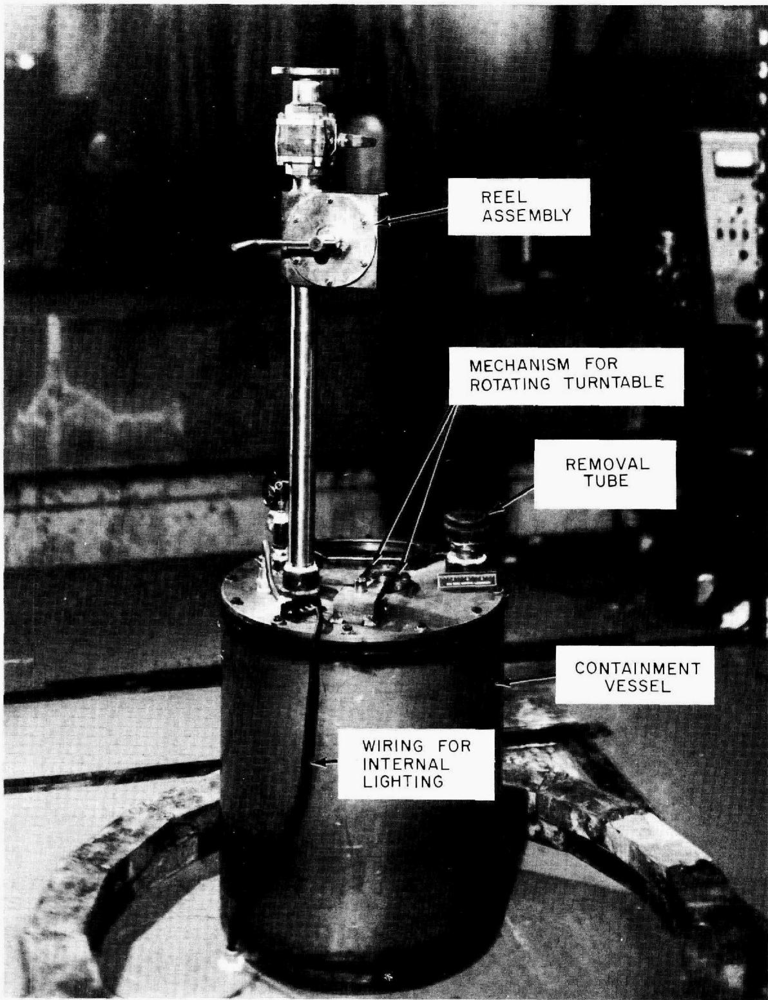  
Fig. 49. Condensate Sampler.

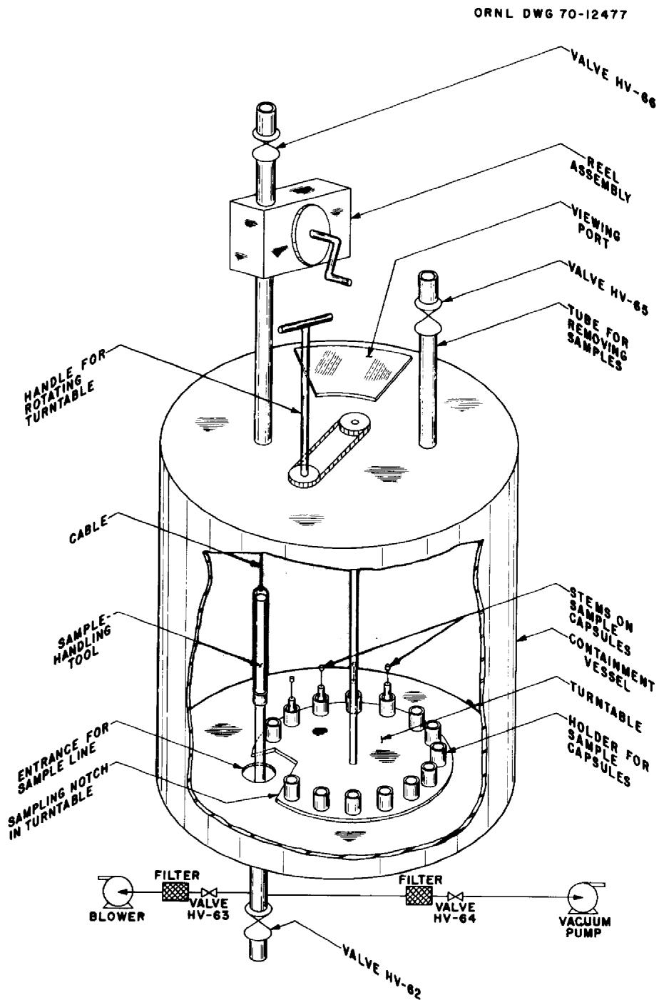  
Fig. 50. Cutaway Diagram of Condensate Sampler.

HV-66; with this arrangement, the samples on the turntable could pass under the lower end of the tool. With the tool in its highest position, an empty capsule was rotated underneath the tool's lower end. The tool was then lowered onto the stem of the capsule and locked in place by an adjustment at the end of the tool that protruded through HV-66. The tool (with capsule attached) was raised again, the turntable was rotated until the sampling notch was under the tool, and the tool was lowered below valve HV-66. This valve was then closed. The vacuum pump was turned on at this time, and the containment vessel was evacuated. When the pressure in the containment vessel was $0.5 \mathrm{~mmHg}$ , valve HV-62 was opened, and the sample-handling tool and the empty capsule were lowered until the sample capsule rested on the bottom of the sample reservoir at the end of the condenser. The tool and the capsule were then raised above valve HV-62, which was subsequently closed. The containment vessel was pressurized to atmospheric pressure with argon. Valve HV-66 was opened, and the sample-handling tool was raised to its highest position. The empty sample holder was rotated underneath the sample-handling tool; the sample was lowered into its holder and released from the tool. The sample tool was again raised, another sample capsule was rotated underneath it, and the process was repeated.

The turntable had provision for 11 sample capsules. The samples were stored in the containment vessel until the end of the experiment, at which time they were removed and sent for analysis.

A blower that induced a flow of air into the top of the line at the reel assembly was provided to prevent contamination of the high bay area when HV-66 was open. The air that was handled by the blower was filtered and exhausted into the cell.

# 1.0. REFERENCES

1. L. E. McNeese and M. E. Whatley, Unit Operations Section Quarterly Progress Report, January-March 1968, ORNL-4364.   
2. J. S. Watson, Oak Ridge National Laboratory, personal communication.   
3. M. W. Rosenthal, MSR Program Semiann. Progr. Rept. Feb. 28, 1969, ORNL-4396 p. 284.   
4. L. E. McNeese, Engineering Development Studies for Molten-Salt Breeder Reactor Processing. No. 1, ORNL-TM-3053 (November 1970).   
5. W. L. Carter, R. B. Lindauer, and L. E. McNeese, Design of an Engineering Scale Vacuum Distillation Experiment for Molten-Salt Reactor Fuel, ORNL-TM-2213 (November 1968).

# INTERNAL DISTRIBUTION

1. C. F. Baes

2. H.F.Bauman

3. S.E.Beal1

4. M. J. Be11

5. R.E.Blanco

6. F. F. Blankenship

7. G. E. Boyd

8. R. B. Briggs

9. R.E.Brooksbank

10. K. B. Brown

ll. W. L. Carter

12. H. D. Cochran, Jr.

13. F. L. Culler

14. J. R. Distefano

15. W. P. Eatherly

16. D. E. Ferguson

17. L. M. Ferris

18. J.H.Frye

19. W. R. Grimes

20. A. G. Grindell

21. P.A.Haas

22. B. A. Hannaford

23. P. N. Haubenreich

24. J. R. Hightower, Jr.

25. C.W.Kee

26. R. B. Lindauer

27. J. C. Mailen

28. H. E. McCoy

29-31. L.E.McNeese

32. D. M. Moulton

33. J. P. Nichols

34. E. L. Nicholson

35. J.H.Pashley (K-25)

36. A.M.Perry

37-38. M. W. Rosenthal

39. J. Roth

40. A. D. Ryon

41. W. F. Schaffer, Jr.

42. Dunlap Scott

43. J.H.Shaffer

44. M.J.Skinner

45. F.J. Smith

46. Martha Stewart

47. R.E.Thoma

48. D. B. Trauger

49. Chia-Pao Tung

50. W.E.Unger

51. C. D. Watson

52. J. S. Watson

53. A. M. Weinberg

54. J.R.Weir

55. M.E.Whatley

56. J.C. White

57. R.G.Wymer

58. E. L. Youngblood

59-60. Central Research Library

61-62. Document Reference Section

63-65. Laboratory Records

66. Laboratory Records, RC

67. Y-12 Document Reference Section

68. ORNL Patent Office

# EXTERNAL DISTRIBUTION

69. J. A. Acciarri, Continental Oil Co., Ponca City, Oklahoma 74601

70. R. M. Bushong, UCC, Carbon Products Division, 12900 Snow Road, Parma, Ohio 44130

71. D. F. Cope, Atomic Energy Commission, RDT Site Office (ORNL)

72. C. B. Deering, Black & Veach, P. O. Box 8405, Kansas City, Missouri 64114

73. A. R. DeGrazia, USAEC, DRDT, Washington, D.C. 20545

74. Delonde R. deBoisblanc, Evasco Services, Inc., 2 Rector Street, New York, N.Y. 10006

75. D. Elias, RDT, USAEC, Washington, D.C. 20545

76. Norton Haberman, RDT, USAEC, Washington, D.C. 20545   
77. T. R. Johnson, Argonne National Laboratory, 9700 S. Cass Avenue, Argonne, Illinois 60439   
78. Kermit Laughon, Atomic Energy Commission, RDT Site Office (ORNL)   
79-80. T. W. McIntosh, Atomic Energy Commission, Washington, D.C. 20545   
81. E. H. Okrent, Jersey Nuclear Co., Bellevue, Washington 98004   
82. R. D. Pierce, Argonne National Laboratory, 9700 S. Cass Avenue, Argonne, Illinois 60439   
83. M. Shaw, Atomic Energy Commission, Washington, D.C. 20545   
84. N. Srinivasan, Head, Fuel Reprocessing Division, Bhabha Atomic Research Center, Trombay, Bombay 74, India   
85. C. L. Storrs, Combustion Engineering Inc., Prospect Hill Road, Windsor, Connecticut 06095   
86. B. L. Tarmy, Esso Research and Engr. Co., P. O. Box 101, Florham Park, N. J. 07932   
87. J. R. Trinko, Ehsco Services, Inc., 2 Rector Street, New York, N.Y. 10006   
88. Laboratory and University Division, ORO   
89-103. Division of Technical Information Extension