# OAK RIDGE NATIONAL LABORATORY

operated by

UNION CARBIDE CORPORATION $\cdot$ NUCLEAR DIVISION

for the

U.S. ATOMIC ENERGY COMMISSION

ORNL-TM-3138

${90}^{ \circ  }$

ENGINEERING DEVELOPMENT STUDIES FOR MOLTEN-SALT BREEDER REACTOR PROCESSING NO.3

L, E. McNeese

eYI 10000000000000000000000000000000000000000000000000000000000000000000000000000000

$\therefore m = \frac{3}{11}$ ;

NOTICE This document contains information of a preliminary nature and was prepared primarily for internal use at the Oak Ridge National Laboratory. It is subject to revision or correction and therefore does not represent a final report.

This report was prepared as an account of work sponsored by the United States Government. Neither the United States nor the United States Atomic Energy Commission, nor any of their employees, nor any of their contractors, subcontractors, or their employees, makes any warranty, express or implied, or assumes any legal liability or responsibility for the accuracy, completeness or usefulness of any information, apparatus, product or process disclosed, or represents that its use would not infringe privately owned rights.

Contract No. W-7405-eng-26

ENGINEERING DEVELOPMENT STUDIES FOR MOLTEN-SALT BREEDER REACTOR PROCESSING NO. 3

L. E. McNeese

MAY 1971

OAK RIDGE NATIONAL LABORATORY

Oak Ridge, Tennessee

operated by

UNION CARBIDE CORPORATION

for the

U.S. ATOMIC ENERGY COMMISSION

Reports previously issued in this series are as follows:

<table><tr><td>ORNL-4204</td><td>Period ending June 1967</td></tr><tr><td>ORNL-4234</td><td>Period ending September 1967</td></tr><tr><td>ORNL-4235</td><td>Period ending December 1967</td></tr><tr><td>ORNL-4364</td><td>Period ending March 1968</td></tr><tr><td>ORNL-4365</td><td>Period ending June 1968</td></tr><tr><td>ORNL-4366</td><td>Period ending September 1968</td></tr><tr><td>ORNL-TM-3053</td><td>Period ending December 1968</td></tr><tr><td>ORNL-TM-3137</td><td>Period ending March 1969</td></tr></table>

# CONTENTS

Page

SUMMARIES 1

1. INTRODUCTION 5

2. REMOVAL OF PROTACTINIUM FROM A SINGLE-FLUID MSBR 6

2.1 Steady-State Performance for the Case of an MSBR Fueled with Uranium 8   
2.2 Steady-State Performance for the Case of an MSBR Fueled with Plutonium 11

3.EFFECT OF CHEMICAL PROCESSING ON THE NUCLEAR PERFORMANCE OF AN MSBR 14

3.1 Computational Procedure 16   
3.2 Chemical Behavior of Fission Products and Actinides During Processing 17   
3.3 Calculated Results 18   
3.4 Discussion of Results 29

4. REDUCTIVE EXTRACTION EXPERIMENTS IN A MILD-STEEL FLOW-THROUGH FACILITY 30

4.1 Addition of Thorium, and Subsequent Transfers of Thorium-Bismuth Solution 31   
4.2 Addition of Salt, and Hydrofluorination of Salt and Bismuth 34   
4.3 Hydrodynamic Experiments: Runs HR-1 and -2 35   
4.4 Hydrodynamic Run HR-3 38

5. DIGITAL SIMULATION OF THE FLOW CONTROL SYSTEMS FOR THE REDUC-TIVE EXTRACTION FACILITY 39

5.1 Salt and Metal Feed Systems To Be Studied 41   
5.2 Mathematical Analysis 41   
5.3 Solution of Equations and Calculated Results 45

6. ELECTROLYTIC CELL DEVELOPMENT 50

6.1 Formation of Frozen Salt Layers in Regions of High Heat Generation 50   
6.2 Use of Beryllium Oxide as an Electrical Insulator 54

# CONTENTS (Continued)

Page

# 7. ANALYSIS OF MASS TRANSFER IN ELECTROLYTIC CELLS 58

7.1 General Mathematical Model 59   
7.2 Assumptions and Simplifications 68   
7.3 Cathode Current Efficiencies and Maximum Current Densities with $\mathsf{LiF - BeF}_2\mathsf{-BiF}_3$ Mixtures 69

# 8. AXIAL MIXING IN PACKED COLUMS WITH HIGH-DENSITY FLUIDS 72

8.1 Mathematical Model 73   
8.2 Experimental Equipment 74   
8.3 Results 78

# 9. REMOVAL OF HEAT FROM PACKED-COLUMN CONTACTORS USED FOR ISSUING PROTACTINIUM 78

9.1 Maximum Column Temperatures, Assuming Only Convection of Heat 81   
9.2 Maximum Column Temperatures, Assuming Only Heat Removal Through the Column Wall 82   
9.3 Conclusion 83

# 10. MSRE DISTILLATION EXPERIMENT 84

10.1 Summary of Distillation Operation 84   
10.2 Summary of Available Experimental Data 85   
10.3 Material Balance Calculations 86   
10.4 Results 92

# 11. REFERENCES 96

# SUMMARIES

# REMOVAL OF PROTACTINIUM FROM A SINGLE-FLUID MSBR

System performance for the proposed flowsheet for isolating protactinium from a single-fluid MSBR has been recalculated using current data for reduction potentials and the solubility of thorium in bismuth. The results indicate that protactinium can be isolated satisfactorily from reactors fueled with uranium or plutonium.

# EFFECT OF CHEMICAL PROCESSING ON THE NUCLEAR PERFORMANCE OF AN MSBR

A series of calculations has been performed to investigate the effects of individual fission product elements on the neutron poisoning of a molten-salt breeder reactor. The most important elements are Nd, Sm, and Pm.

# REDUCTIVE EXTRACTION EXPERIMENTS IN A MILD-STEEL FLOW-THROUGH FACILITY

A bismuth solution containing about $10^{-4}$ mole fraction thorium was fed through the reductive extraction facility in order to complete the removal of oxides from surfaces of the system. Analyses of samples of bismuth taken from various vessels showed only small changes in the thorium concentration. This indicates that the earlier hydrogen treatment of the system had been quite effective in removing oxides.

Three experiments were performed in which bismuth and molten salt (72-16-12 mole $\%$ LiF-BeF $_2$ -ThF $_4$ ) were fed to the packed extraction column. In the first two runs, the pressure drop across the column and associated transfer lines was greater than expected due to iron deposits in the bismuth exit line from the column. After the tubing had been replaced, a third run was made at salt and bismuth flow rates of about 75 ml/min.

The flow rates were not steady, apparently due to bismuth that was trapped in the salt overflow loop at the top of the column. The loop was modified to correct this condition.

# DIGITAL SIMULATION OF THE FLOW CONTROL SYSTEMS FOR THE REDUCTIVE EXTRACTION FACILITY

A digital simulation of the bismuth and salt flow control systems for the reductive extraction facility was carried out to determine controller constants that would result in satisfactory operation. We found that: (1) the system is stable, (2) proportional control is acceptable, and (3) the system can be brought to a steady-state condition in an acceptably short time.

# ELECTROLYTIC CELL DEVELOPMENT

The proposed reductive extraction processes for isolating protactinium and removing rare earths are based on the use of electrolytic cells for reducing lithium and thorium fluorides into a bismuth cathode. These cells will require an electrically insulating material that can withstand the corrosive conditions present at the cell anode. Frozen layers of salt are being considered for this application; experiments have shown that such salt layers can be maintained in a region of high heat generation if sufficient cooling is provided. Beryllium oxide may also be useful in cell construction since it is a good electrical insulator, has a high thermal conductivity, and is relatively insoluble in molten fluoride salts of interest. We are presently assembling the equipment for an experiment in which an anode fabricated from BeO will be used. The portion of the BeO expected to contact molten salt will normally be covered by a layer of frozen salt.

# ANALYSIS OF MASS TRANSFER IN ELECTROLYTIC CELLS

A study of factors affecting mass transfer in electrolytic cells has been initiated to identify important cell parameters and to aid in understanding and interpreting experimental data.

A general mathematical model describing important changes in potential and concentrations throughout a cell was developed. This model was applied to the cathode region of an electrolytic cell containing an LiF-BeF $_2$ -ThF $_4$ mixture of the composition expected in the electrolytic cell for the rare-earth removal system. Calculated results (which are only approximate) indicate that the maximum current density obtainable may be about 0.16 amp/cm $^2$ ; at this current density, reduction of BeF $_2$ is likely to begin.

# AXIAL MIXING IN PACKED COLUMNswith HIGH-DENSITY FLUIDS

Axial diffusion may be important in determining the performance of packed-column contactors in flowsheets proposed for MSBR processing. Since relatively few data on axial dispersion are available, we have initiated a study of axial dispersion in packed columns using mercury and water to simulate bismuth and salt. Preliminary data using a steady-state technique indicated that the dispersion coefficient in a 2-in.-diam column packed with 3/8-in. Raschig rings is about $3.6~\mathrm{cm}^2/\mathrm{sec}$ . No significant dependence of the dispersion coefficient on mercury or water flow rate has been observed thus far.

# REMOVAL OF HEAT FROM PACKED-COLUMN CONTACTORS USED FOR ISOLATING PROTACTINIUM

Estimates have been made of heat transfer and temperature distribution within packed columns used for isolating protactinium under various operating conditions. It was concluded that the maximum temperature difference

between the center line of the column and the column wall will be less than $150^{\circ}\mathrm{C}$ if flow of either the salt or the bismuth can be maintained. This value is acceptably low. The temperature difference between the center line of the column and the wall is expected to be substantially lower than $150^{\circ}\mathrm{C}$ during periods of normal operation.

# MSRE DISTILLATION EXPERIMENT

The experiment to demonstrate high-temperature, low-pressure distillation of irradiated MSRE fuel carrier salt was successfully completed in an uneventful 31-hr operation. Approximately 12 liters of salt was distilled, and 11 condensate samples were collected.

Preliminary results indicate that the behavior of the major components (LiF, $\mathrm{BeF}_2$ , and $\mathrm{ZrF}_4$ ) was as expected. The relative volatility of $^{144}\mathrm{CeF}_3$ was higher by about two orders of magnitude than the expected value. An explanation of this discrepancy is not available; however, as other data become available, it may be resolved.

# 1. INTRODUCTION

A molten-salt breeder reactor (MSBR) will be fueled with a molten fluoride mixture that will circulate through the blanket and core regions of the reactor and through the primary heat exchanger. We are developing processing methods for use in a close-coupled facility for removing fission products, corrosion products, and fissile materials from the molten fluoride mixture.

Several operations associated with MSBR processing are under study. The remaining parts of this section describe (1) calculated results showing the steady-state performance of a protactinium isolation system for reactors fueled with uranium or plutonium; (2) material-balance calculations showing the effect of fission product removal times on reactor performance for important fission products; (3) experiments on reductive extraction in a mild-steel flow-through facility; (4) a simulation of the flow control system for the semicontinuous reductive extraction system; (5) experiments related to the development of electrolytic cells for use with molten salt and bismuth; (6) an analysis of factors limiting the rate of transfer of materials in electrolytic cells; (7) measurement of axial dispersion in packed columns in which immiscible fluids having large density differences are in countercurrent flow; (8) calculated heat generation rates and temperatures in an extraction column in which protactinium is being extracted from molten salt; and (9) operation of equipment at the Molten Salt Reactor Experiment (MSRE) for demonstration of low-pressure distillation of molten salt using irradiated MSRE fuel carrier salt. This work was carried out in the Chemical Technology Division during the period April through June 1969.

# 2. REMOVAL OF PROTACTINIUM FROM A SINGLE-FLUID MSBR

L.E.McNeese M.E.Whatley

System performance for the proposed flowsheet for isolating protactinium from a single-fluid MSBR (Fig. 1) has been recalculated using current data for reduction potentials and the solubility of thorium in bismuth. Calculations were made for an MSBR fueled with uranium, as well as for the initial operation of an MSBR fueled with plutonium. According to the flowsheet, fuel salt from the reactor enters the bottom of the extraction column and flows countercurrent to a stream of bismuth containing reduced metals. Ideally, the metal stream entering the top of the column contains sufficient Th and Li to extract only the U and Pu entering the system. The system exploits the fact that Pa is less noble than U and Pu but more noble than Th. Both U and Pu are preferentially extracted in the lower part of the column, while Pa refluxes in the center. High protactinium concentrations are produced in the salt and metal streams. Most of the protactinium in the system can be isolated by diverting the salt stream through a tank of sufficient size (i.e., with a volume of about $200\mathrm{ft}^3$ ).

In making the calculations, the following values were assumed: fuel salt composition, 71.7-16-12-0.3 mole % LiF-BeF $_2$ -ThF $_4$ -UF $_4$ ; reactor volume, 1461 ft $^3$ ; processing rate, 2.5 gpm (three-day cycle); operating temperature, $600^{\circ}\mathrm{C}$ ; reactor power, 1000 Mw(electrical); and Pa decay tank volume, 200 ft $^3$ . The extraction column consisted of three theoretical stages above the decay tank and four stages below the decay tank. The Th and Li concentrations in the Bi stream being fed to the column were $1.6 \times 10^{-3}$ and $1.4 \times 10^{-4}$ mole fraction respectively. In the calculations for an MSBR fueled with plutonium, the salt composition was assumed to be 71.8-16-12-0.2 mole % LiF-BeF $_2$ -ThF $_4$ -PuF $_3$ ; other values were the same as those given above.

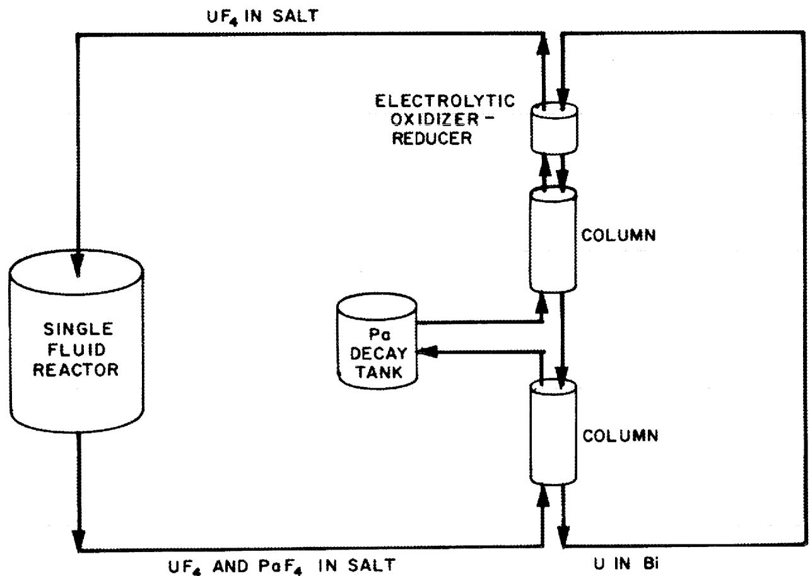  
Fig. 1. Scheme for Isolating Protactinium in a Single-Fluid MSBR.

# 2.1 Steady-State Performance for the Case of an MSBR Fueled with Uranium

Typical calculated concentration profiles in the extraction column are shown in Fig. 2. The uranium concentration in the salt increases from the inlet value of 0.003 mole fraction to approximately 0.004 mole fraction in the first stage because of the reduction of U(IV) to U(III). It then decreases steadily to negligible values at the salt outlet. The concentration of protactinium in the salt increases from the inlet value of $1.39 \times 10^{-5}$ mole fraction to a maximum of 0.0021 mole fraction, then decreases to negligible values near the salt outlet. The concentration of Th in the Bi stream decreases from about 0.00132 mole fraction in the upper part of the column to $7.9 \times 10^{-8}$ mole fraction near the Bi outlet. The concentration of Li in the Bi decreases from about 0.00124 mole fraction in the upper part of the column to about 0.00011 mole fraction at the bottom of the column.

The concentration of uranium and protactinium in the salt entering the decay tank are $1.25 \times 10^{-5}$ and $1.325 \times 10^{-3}$ mole fraction respectively. The concentrations of uranium and protactinium in the decay tank are $2.63 \times 10^{-5}$ and $1.312 \times 10^{-3}$ mole fraction respectively. Under ideal steady-state operating conditions, approximately $93\%$ of the protactinium present in the reactor system would be held in the decay tank. However, it is likely that the actual amount of protactinium isolated from the reactor will be somewhat below this value because of an inability to maintain optimum operating conditions.

The variation of the calculated steady-state protactinium concentration in the reactor and in the decay tank with bismuth flow rate is shown in Fig. 3. The minimum protactinium concentration in the reactor is obtained when the bismuth flow rate is just sufficient to extract the uranium entering the system. At slightly higher bismuth flow rates, protactinium will also be extracted since it is the next component in order of decreasing nobility. At bismuth flow rates slightly lower than the optimum rate (about $5.3\mathrm{gpm}$ ), some of the uranium will not be extracted; instead, it will displace protactinium from the decay tank,

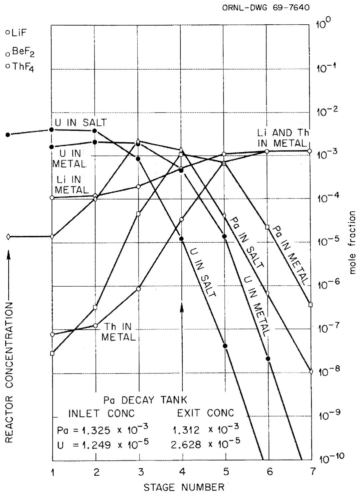  
Fig. 2. Calculated Concentration Profiles in Protactinium Isolation Column for Reactor Fueled with Uranium.

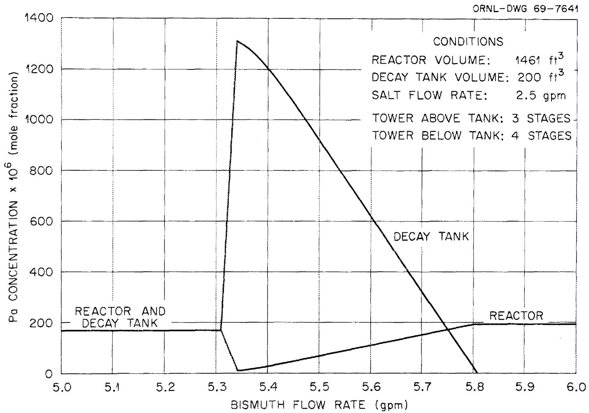  
Fig. 3. Variation of Calculated Steady-State Protactinium Concentration in the Reactor and in the Decay Tank with Bismuth Flow Rate for an MSBR Fueled with Uranium.

forcing the latter to flow out the top of the column if the flow rate is not corrected. In either case, some protactinium would be allowed to return to the reactor, and the effectiveness of the system would be diminished.

The flowsheet has several very desirable characteristics, including (1) a negligible holdup of fissile $^{233}\mathrm{U}$ in the isolation system, (2) an almost immediate return of newly produced $^{233}\mathrm{U}$ to the reactor system, and (3) a closed system that precludes loss of protactinium, $^{233}\mathrm{U}$ , or other components of the fuel salt. Since the performance of the system is sensitive to variations in operating conditions, attention has been given to methods for controlling the system and for making the performance less dependent on operating conditions. The removal of uranium from the center of the column makes the system less sensitive to minor changes in operating conditions (see Fig. 4). For example, removal of $2\%$ of the uranium in the salt entering the decay tank by fluorination results in complete stabilization of the system with respect to bismuth flow rate variations (below the optimum flow rate) as large as $1.03\%$ of the optimum. The uranium concentration in the salt, which is very sensitive to small changes in operating conditions near optimum conditions, increases by a factor of 5000 for a decrease in bismuth flow rate of only $0.037\%$ .

# 2.2 Steady-State Performance for the Case of an MSBR Fueled with Plutonium

An MSBR may be fueled initially with plutonium, which would remain in the reactor system during the time required for the $^{233}\mathrm{Pa}$ and $^{233}\mathrm{U}$ inventories to build up. Since the value for the Pu-Pa separation factor is only about one-half that for the U-Pa separation factor, we would expect the isolation of Pa from a Pu-fueled system to be more difficult than from a U-fueled system. Typical calculated concentration profiles in the extraction column for a Pu-fueled system are shown in Fig. 5. It was assumed that the Pa inventory in the salt was the steady-

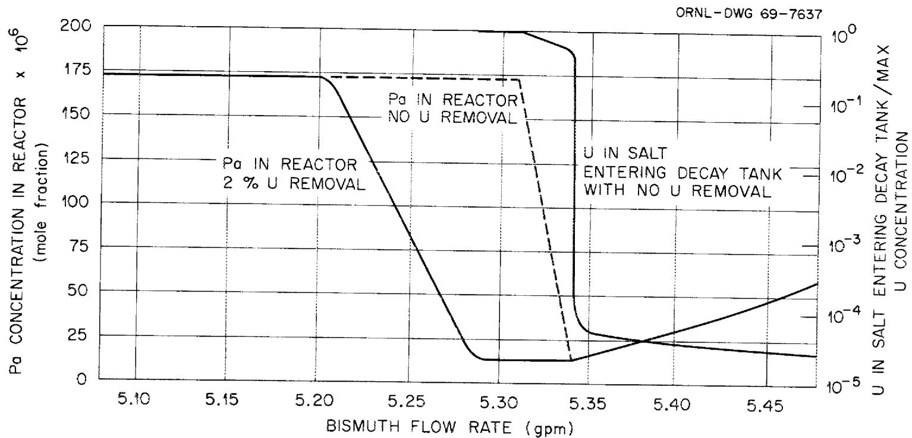  
Fig. 4. Effects of the Uranium Removal and the Bismuth Flow Rate on the Protactinium Concentration in the Reactor and on the Uranium Concentration in the Salt Entering the Decay Tank.

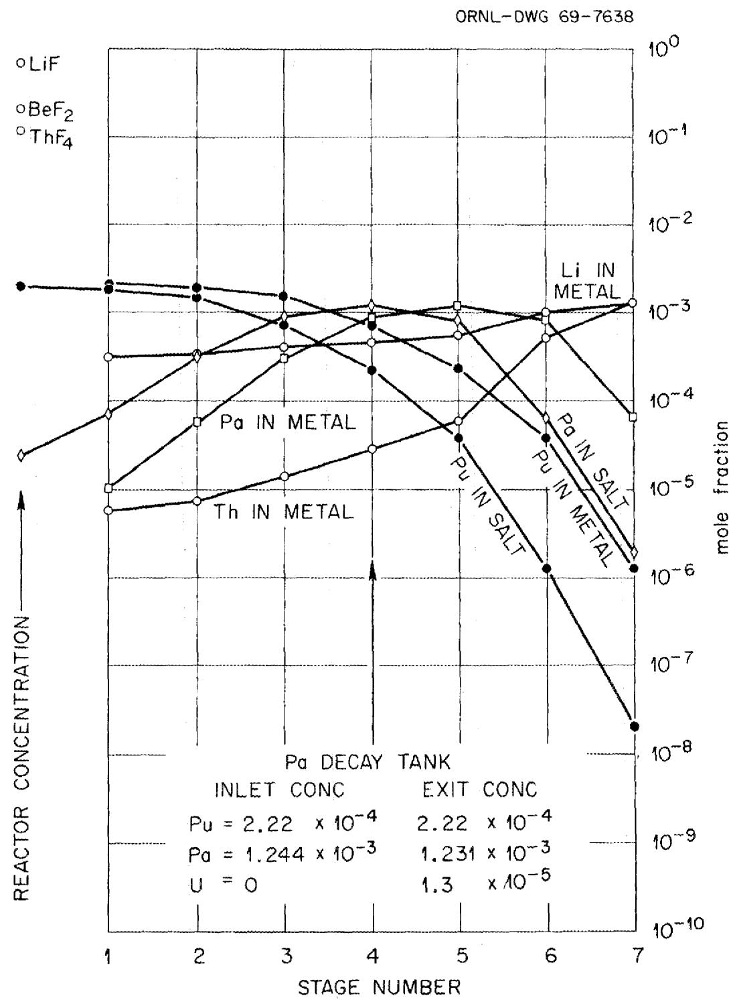  
Fig. 5. Calculated Concentration Profiles in the Protactinium Isolation Column for a Reactor Fueled with Plutonium.

state value and that a negligible quantity of U was present; although this condition will not actually exist, the results for such a case should indicate the relative ease or difficulty to be encountered in isolating Pa from a system fueled with Pu. The plutonium concentration in the salt decreases steadily from the inlet value of 0.0002 mole fraction to negligible values at the salt outlet. The concentration of protactinium in the salt increases from the inlet value of $2.5 \times 10^{-5}$ mole fraction to a maximum of $1.244 \times 10^{-3}$ mole fraction, then decreases to negligible values. The concentration of Th in the Bi stream decreases from $1.26 \times 10^{-3}$ mole fraction in the upper part of the column to $5.6 \times 10^{-6}$ mole fraction at the Bi outlet. The concentration of lithium in the bismuth decreases from about $1.23 \times 10^{-3}$ mole fraction in the upper part of the column to about $3.2 \times 10^{-4}$ mole fraction at the column exit.

The concentrations of plutonium and protactinium in the salt entering the decay tank are $2.22 \times 10^{-4}$ and $1.244 \times 10^{-3}$ mole fraction respectively. The concentration of protactinium in the decay tank is $1.231 \times 10^{-3}$ mole fraction. Under ideal steady-state operating conditions, approximately $87\%$ of the protactinium present in the reactor system would be held in the decay tank.

The variation of the protactinium concentration in the reactor and in the decay tank with bismuth flow rate is shown in Fig. 6. The results indicate that the isolation of protactinium in a reactor fueled with plutonium would be feasible.

# 3. EFFECT OF CHEMICAL PROCESSING ON THE NUCLEAR PERFORMANCE OF AN MSBR

M.J.Bell L.E.McNeese

A series of calculations has been performed to investigate the importance of individual fission product elements on the neutron poisoning

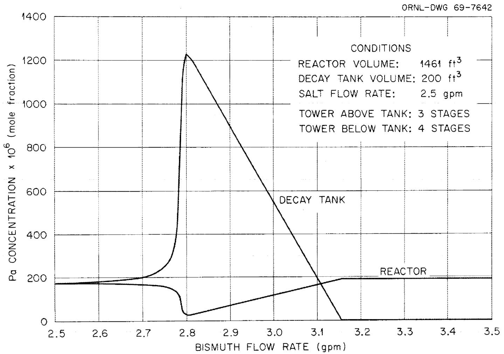  
Fig. 6. Variation of Calculated Steady-State Protactinium Concentration in the Decay Tank and in the Reactor with Bismuth Flow Rate for an MSBR Fueled with Plutonium.

of a molten salt reactor. These calculations were made with a computer code, MODROD, which is a combination of the ROD reactor optimization and design code and the MATADOR steady-state material balance code. $^{1,2}$

MODROD allows an accurate computation of the neutron production and loss in the reactor core and of the material balances for 461 fission product isotopes. The calculations were performed for a 2250-Mw(thermal) single-fluid MSBR fueled with $1680\text{ft}^3$ of fuel salt of nominal composition 71.7-16.0-12.0-0.3 mole % LiF-BeF $_2$ -ThF $_4$ -UF $_4$ . Further details of the reactor concept are given in ref.

# 3.1 Computational Procedure

The MODROD computer code employs ROD as a main program to perform reactor physics calculations that are used to provide neutron absorption rates for MATADOR, which is used as a subroutine. ROD performs a nine-energy-group diffusion calculation in the radial and axial directions and a two-dimensional flux synthesis. It also performs a steady-state material balance calculation for a number of important neutron absorbers in the fuel salt, moderator, and reactor vessel. These calculations are performed for a fixed reactor configuration (variable specified option) for an assumed "lumped" fission product concentration in order to obtain a set of concentrations and neutron absorption rates for the fuel material. These data, along with the ratio of the resonance flux per unit lethargy to the thermal flux and the spectrum-averaged neutron cross section for a reference nuclide, are then used by the MATADOR subroutine. The reference nuclide has a cross section of 1.0 barn for 2200-m/sec neutrons, and this cross section varies with neutron energy, E, as $\sqrt{\frac{1}{E}}$ . MATADOR uses the absorption rate, concentration, and average cross section of the reference absorber to compute a mean thermal flux, assuming a value of 200 Mev for the average thermal energy released in fission. This flux is equal to the quantity $f\phi_{2}$ , which has been defined by Alexander et al. and is equivalent to the thermal flux of Wescott. It is used by MATADOR to compute neutron absorption rates for the fission products and those materials not treated explicitly in ROD:

$$
\overline {{\sigma \phi}} = f \phi_ {2} \left[ \sigma_ {a} ^ {2 2 0 0} + R I F A C * R I \right], \tag {1}
$$

where

$$
\begin{array}{l} \overline {{\sigma \phi}} = \text {s p e c t r u m - a v e r a g e d n e u t r o n a b s o r p t i o n r a t e i n g i v e n i s o t o p e}, \\ f \phi_ {2} = t h e r m a l f l u x, \\ \sigma_ {a} ^ {2 2 0 0 ^ {2}} = \text {c r o s s s e c t i o n f o r} 2 2 0 0 - m / \sec \text {n e u t r o n s}, \\ R I F A C = \text {r e s o n a n c e} \\ R I = \text {r e s o n a n c e} \\ \end{array}
$$

For the isotopes $^{232}\mathrm{Th}$ , $^{233}\mathrm{Pa}$ , $^{233}\mathrm{U}$ , $^{234}\mathrm{U}$ , $^{235}\mathrm{U}$ , $^{236}\mathrm{U}$ , and $^{237}\mathrm{Np}$ , which are treated separately in ROD, MATADOR uses the absorption rates calculated by ROD directly. Using these neutron absorption rates, the MATADOR subroutine computes steady-state inventories for all of the materials in the fuel salt, as described in ref. 2, taking into account diffusion of the noble gases into the graphite and mass transfer of the noble gases and metals to the circulating helium bubbles. The steady-state concentrations as determined by MATADOR are then used to compute a new lumped fission product poisoning, which is used as input for ROD to repeat the diffusion and neutron balance calculations. This cycle is repeated until the change in the ratio of the lumped fission product concentrations for two successive iterations is less than $1\%$ .

# 3.2 Chemical Behavior of Fission Products and Actinides During Processing

In the calculations that were performed, the effect of chemical processing on the neutron poisoning by individual fission product elements was investigated by varying the efficiency with which these elements were removed from the fuel salt about a reference value. The reference case assumed that halogens and rare earths were removed on a 50-day cycle, zirconium and seminoble metals on a 200-day cycle, protactinium on a five-day cycle, and that salt was discarded on a 3000-day cycle to remove

the active metals and neptunium. In addition, the noble gases and the noble metals were assumed to have a 50-sec residence time in the fuel salt and a 110-sec residence time in the helium bubbles. The mass transfer coefficient for migration of the noble gases to the graphite was selected to give a poisoning of $0.5\%$ for $^{135}\mathrm{Xe}$ . The removal efficiencies for the individual elements were varied from $2^2$ to $2^{-6}$ for all elements from Zn to Ho, except Kr and Xe. The removal efficiencies for krypton and xenon were kept constant.

The base case used for these calculations differs slightly from that used by Baumann to optimize the reactor design.3 Baumann assumed that Pa was removed on a 3-day cycle; Eu was removed on a 500-day cycle; Zr, the noble metals, and the noble gases were removed on a 20-sec cycle; and the salt was discarded on a 5-year cycle. The effect of the different assumptions on the reactor performance is illustrated in Table 1, which compares the neutron balance for Baumann's system with the neutron balance for the system described in this report. The removal times used in our work give a lower breeding ratio than that for Baumann's Case CC-58 (1.0611 vs 1.0645). The corresponding fuel yield is decreased from $3.338\%$ per annum to $3.214\%$ per annum.

# 3.3 Calculated Results

The effect of chemical processing on the performance of the reference MSBR is illustrated in Figs. 7-15. The quantities plotted are the change in fuel yield and the change in fuel cycle cost as a function of removal time. The change in fuel cycle cost includes only the inventory charges for the excess fissile material that would be required if an element were removed less efficiently than in the base case for a fixed processing scheme. The elements whose poisoning is most significantly affected by chemical processing are the rare earths, especially Nd, Sm, and Pm. Other elements which are important are Zr, Ba, and Sr. A number of elements, primarily noble metals and seminoble metals, are not included in the figures. No significant variation in the reactor performance was observed for these materials over the range of processing efficiencies investigated.

Table 1. Comparison of Neutron Balances in Reference MSBR Design with Those Calculated for Assumed Processing Conditions   

<table><tr><td rowspan="2"></td><td colspan="3">Baumann Case CC-58a</td><td colspan="3">This Report</td></tr><tr><td>Absorption</td><td>Capture</td><td>Fission</td><td>Absorption</td><td>Capture</td><td>Fission</td></tr><tr><td>232Th</td><td>0.9889</td><td>0.9858</td><td>0.0031</td><td>0.9847</td><td>0.9816</td><td>0.0031</td></tr><tr><td>233Pa</td><td>0.0017</td><td>0.0017</td><td>0.0000</td><td>0.0026</td><td>0.0026</td><td>0.0000</td></tr><tr><td>233U</td><td>0.9248</td><td>0.1001</td><td>0.8247</td><td>0.9230</td><td>0.0999</td><td>0.8230</td></tr><tr><td>234U</td><td>0.0809</td><td>0.0805</td><td>0.0004</td><td>0.0826</td><td>0.0822</td><td>0.0004</td></tr><tr><td>235U</td><td>0.0752</td><td>0.0140</td><td>0.0612</td><td>0.0770</td><td>0.0143</td><td>0.0627</td></tr><tr><td>236U</td><td>0.0085</td><td>0.0085</td><td>0.0000</td><td>0.0089</td><td>0.0089</td><td>0.0000</td></tr><tr><td>237Np</td><td>0.0059</td><td>0.0059</td><td>0.0000</td><td>0.0070</td><td>0.0070</td><td>0.0000</td></tr><tr><td>9Be</td><td>0.0055</td><td>0.0009</td><td>0.0046</td><td>0.0055</td><td>0.0009</td><td>0.0046</td></tr><tr><td>9Be (n,α)</td><td>0.0016</td><td>0.0016</td><td>0.0</td><td>0.0016</td><td>0.0016</td><td>0.0</td></tr><tr><td>7Li</td><td>0.0160</td><td>0.0160</td><td>0.0</td><td>0.0159</td><td>0.0159</td><td>0.0</td></tr><tr><td>F</td><td>0.0206</td><td>0.0206</td><td>0.0</td><td>0.0205</td><td>0.0205</td><td>0.0</td></tr><tr><td>6Li</td><td>0.0023</td><td>0.0023</td><td>0.0000</td><td>0.0021</td><td>0.0021</td><td>0.0000</td></tr><tr><td>Graphite</td><td>0.0522</td><td>0.0522</td><td>0.0</td><td>0.0520</td><td>0.0520</td><td>0.0</td></tr><tr><td>Fission product reference element</td><td>0.0000</td><td>0.0000</td><td>0.0</td><td>0.0000</td><td>0.0000</td><td>0.0</td></tr><tr><td>Leakage</td><td>0.0018</td><td>0.0018</td><td>0.0</td><td>0.0019</td><td>0.0019</td><td>0.0</td></tr><tr><td>Delayed neutrons</td><td>0.0032</td><td>0.0032</td><td>0.0</td><td>0.0032</td><td>0.0032</td><td>0.0</td></tr><tr><td>Fixed poison fraction</td><td>0.0050</td><td>0.0050</td><td>0.0000</td><td>0.0050</td><td>0.0050</td><td>0.0000</td></tr><tr><td>&quot;Lumped&quot; fission products</td><td>0.0146</td><td>0.0146</td><td>0.0</td><td>0.0147</td><td>0.0147</td><td>0.0</td></tr><tr><td>Chromium</td><td>0.0014</td><td>0.0014</td><td>0.0000</td><td>0.0014</td><td>0.0014</td><td>0.0000</td></tr><tr><td>Iron</td><td>0.0007</td><td>0.0007</td><td>0.0000</td><td>0.0007</td><td>0.0007</td><td>0.0000</td></tr><tr><td>Nickel</td><td>0.0183</td><td>0.0183</td><td>0.0000</td><td>0.0183</td><td>0.0183</td><td>0.0000</td></tr><tr><td>Molybdenum</td><td>0.0023</td><td>0.0023</td><td>0.0000</td><td>0.0023</td><td>0.0023</td><td>0.0000</td></tr><tr><td>ne</td><td>2.2316</td><td></td><td></td><td>2.2310</td><td></td><td></td></tr></table>

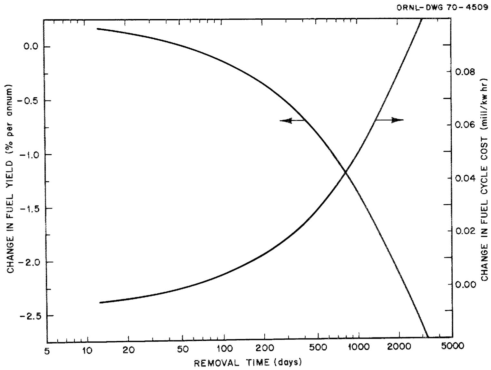  
Fig. 7. Effect of Neodymium Removal Time on MSBR Performance.

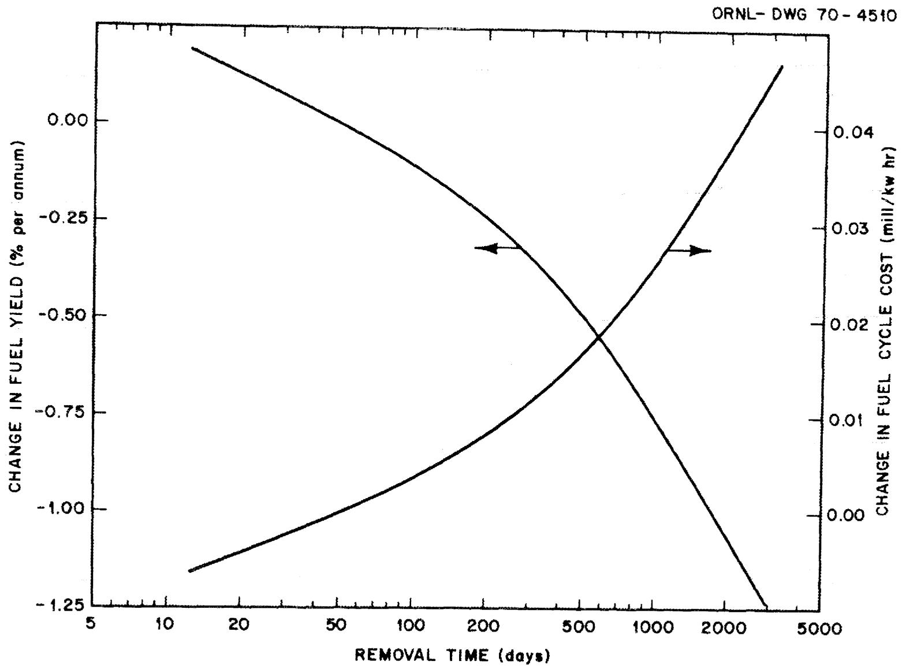  
Fig. 10. Effect of Zirconium Removal Time on MSBR Performance.

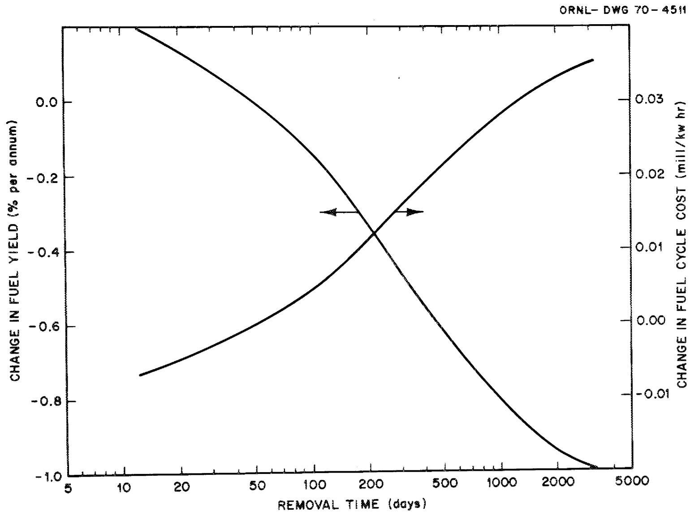  
Fig. 9. Effect of Protactinium Removal Time on MSBR Performance.

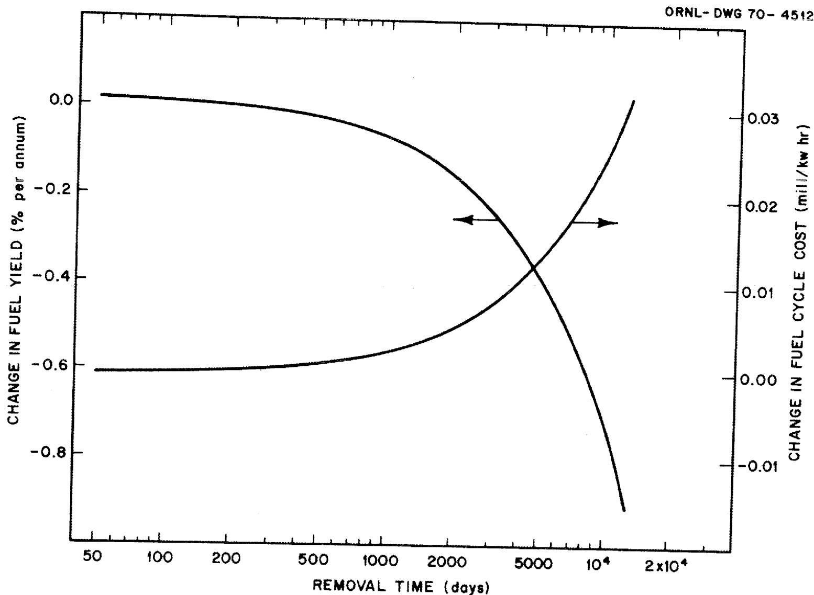  
Fig. 8. Effect of Samarium Removal Time on MSBR Performance.

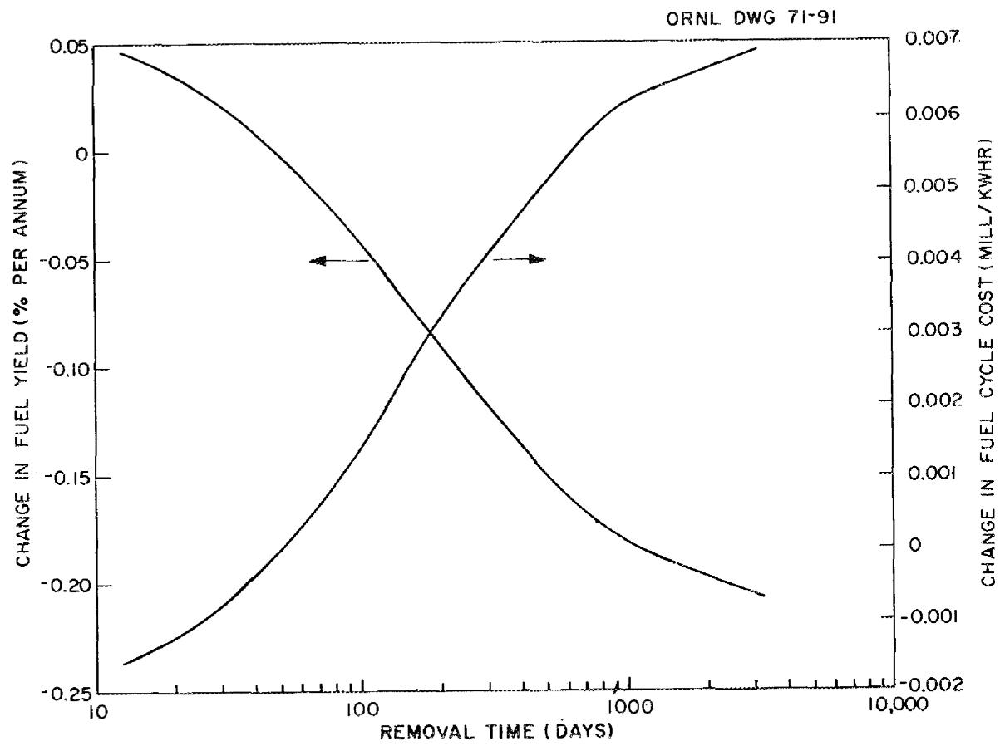  
Fig. 11. Effect of Europium Removal Time on MSBR Performance.

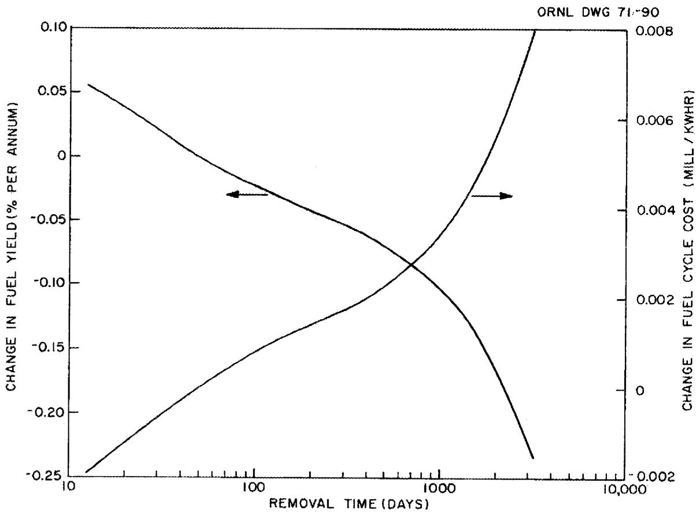  
Fig. 12. Effect of Praseodymium Removal Time on MSBR Performance.

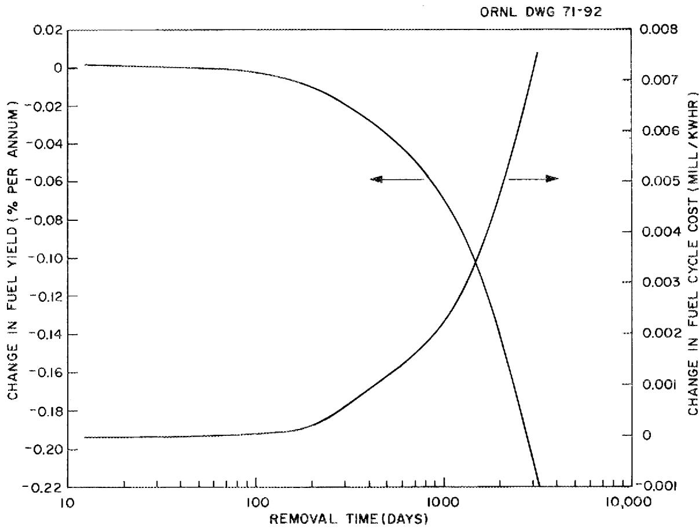  
Fig. 13. Effect of Lanthanum Removal Time on MSBR Performance.

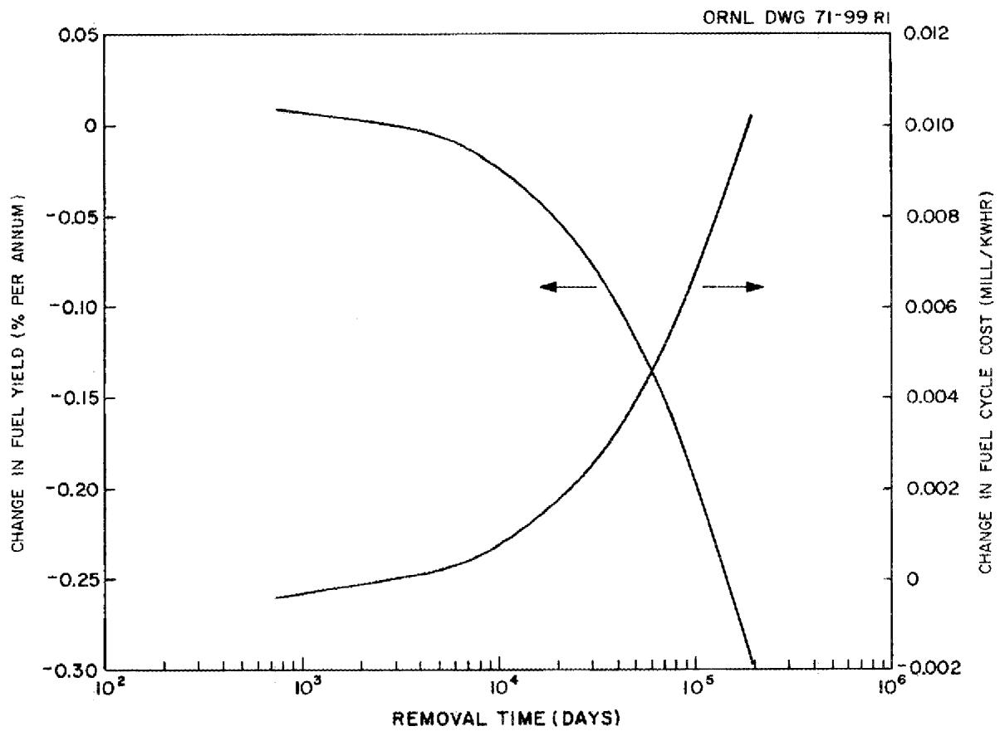  
Fig. 14. Effect of Barium Removal Time on MSBR Performance.

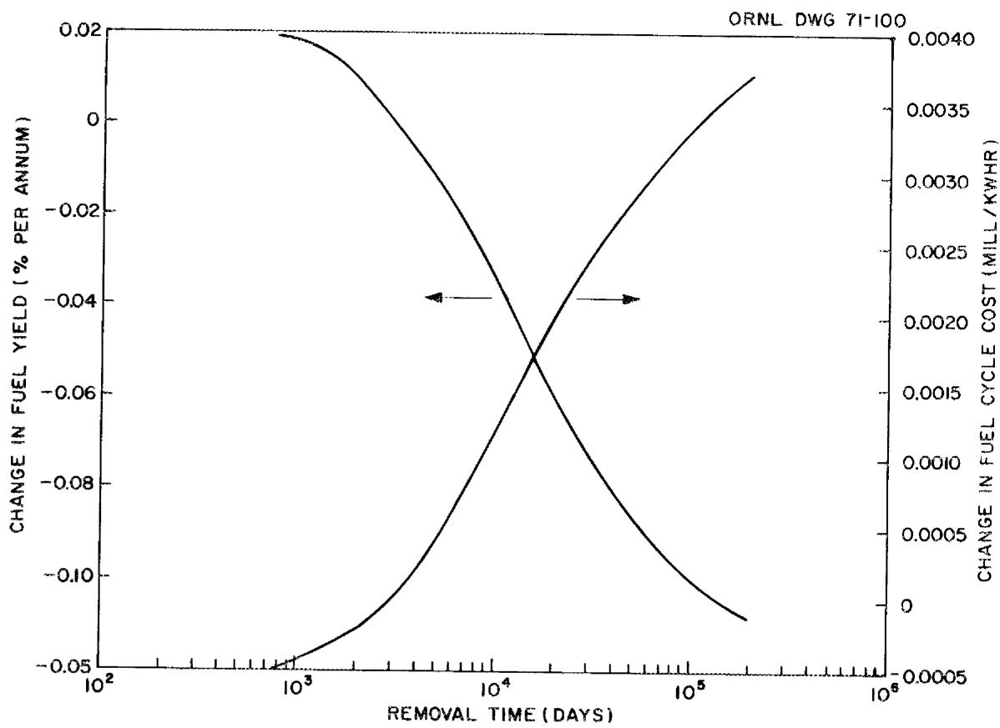  
Fig. 15. Effect of Strontium Removal Time on MSBR Performance.

# 3.4 Discussion of Results

We have investigated the effect of the removal efficiencies for fission product elements on the performance of an MSBR. Experimental data available for a number of elements indicate that the removal times of these elements will differ significantly from the times set for the reference case.6 The present results allow estimates to be made of the magnitude of the change in fuel yield and fuel cycle cost as a result of such differences. The data are also useful for estimating the change in power cost due to fissile inventory charges and changes in breeding ratio for alternative processing schemes.

The present investigation shows no effect of processing of the noble metals (Nb through Ag, Se, and Te) on the performance of the reactor. This results from the assumed removal of these elements on a short (50-sec) cycle as a smoke or mist. This treatment is consistent with reported noble-metal behavior in the MSRE.7 However, if conditions in an MSBR are sufficiently different from those in the MSRE (thereby resulting in longer removal times), the chemical processing of these elements will have an important effect.

A simplification made in this study was the treatment of the cross sections of the isotopes of samarium in the same manner as those of the other fission products. However, in a typical ROD calculation, the isotopes $^{149}\mathrm{Sm}$ and $^{151}\mathrm{Sm}$ are considered sufficiently important as neutron absorbers to be included explicitly in the nuclear calculations. Several calculations were performed using a more precise treatment of samarium in order to determine the magnitude of the error introduced in the present study. For samarium removal times of less than 100 days, the agreement between the two treatments is quite satisfactory (i.e., $\pm 2\%$ in the predicted changes). At longer times, the two-group treatment of the cross section used here overestimates the samarium poisoning. The poisoning is overestimated by $20\%$ at 800 days, the longest removal time for which the comparison was made. However, the operating conditions for the

MSBR anticipate that samarium will be removed efficiently at times less than 800 days; the results are applicable in the expected range of operating conditions. A few of the data points were also checked for neodymium and promethium, using the complete ROD treatment of the fission products. For these elements, the values for poisoning computed by both ROD and MODROD showed excellent agreement over the entire range of removal times.

# 4. REDUCTIVE EXTRACTION EXPERIMENTS IN A MILD-STEEL FLOW-THROUGH FACILITY

B. A. Hannaford H. D. Cochran   
L.E.McNeese C.W.Kee

Equipment8 for the study of reductive extraction in a mild-steel, flow-through facility has been installed. Preliminary testing of this equipment and the addition and purification of a bismuth charge (184 kg) have been described.9 Following purification of the bismuth, sufficient metallic thorium was added to the system to produce a thorium concentration of $10^{-4}$ mole fraction.

The bismuth-thorium solution was fed through the system in order to remove residual oxides from the surfaces of the system. The small changes in the thorium concentration in the solution indicated that the earlier hydrogen treatment of the system had thoroughly reduced oxides present on the steel surfaces. A 52.8-kg charge of salt (72-16-12 mole $\%$ LiF-BeF $_2$ -ThF $_4$ ) was then transferred to the treatment vessel containing the bismuth charge for a 30-hr treatment with HF-H $_2$ to remove trace quantities of oxygen and to oxidize the thorium metal to ThF $_4$ .

Three experiments were performed in which bismuth and salt were fed to the column. In the first two runs, the pressure drop across the column and associated transfer lines was greater than expected; it prevented the flow of bismuth from the column in the second run. The bismuth drain line was found to be blocked by iron crystals, which resulted from the

mass transport of iron from the hotter regions of the system. After the blocked tubing had been replaced, a third run was made at flow rates of about $75\mathrm{ml / min}$ for each phase. However, flow rates were not steady, apparently due to bismuth that was trapped in the salt overflow loop at the top of the column. The loop was modified to allow bismuth to drain from the loop to the line carrying bismuth from the bottom of the column. This work is described in greater detail in the sections that follow. A digital simulation of the automatic flow control systems for the salt and bismuth was carried out to determine whether the control system was stable or whether it might introduce oscillations into the flow rates; this work is discussed in Sect. 5.

# 4.1 Addition of Thorium, and Subsequent Transfers of Thorium-Bismuth Solution

A total of $201.5\mathrm{g}$ of thorium metal in the form of irregularly shaped slugs was added to the bismuth in the treatment vessel (Fig. 16) in order to remove the oxide impurities that remained after hydrogen treatment. Samples of bismuth were taken for thorium analysis by withdrawing the metal into a sample capsule through a porous metal filter. The thorium contents of these samples, shown in Fig. 17, are indicative of the rate of dissolution of the thorium in bismuth. The dissolution rate, which was lower than expected, was probably limited by the rate at which the dissolved material diffused away from the surface of the remaining thorium metal.

The bismuth-thorium solution, prepared as described above, was transferred through a fritted-metal filter to the metal feed tank by pressurizing the treatment vessel. The metal solution was then routed through the column and the flowing-stream bismuth samplers to the bismuth catch tank by pressurizing the metal feed tank; this operation served to remove residual oxide from the metal surfaces by reduction with thorium. The pressure required to pass argon through the salt feed line to the column indicated that about 12 in. of bismuth remained

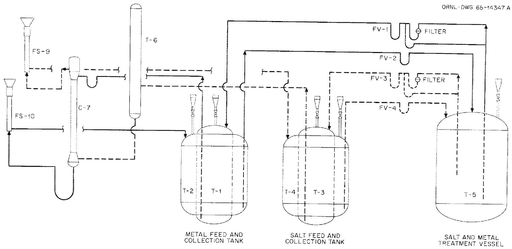  
Fig. 16. Simplified Salt and Metal Flowsheet.

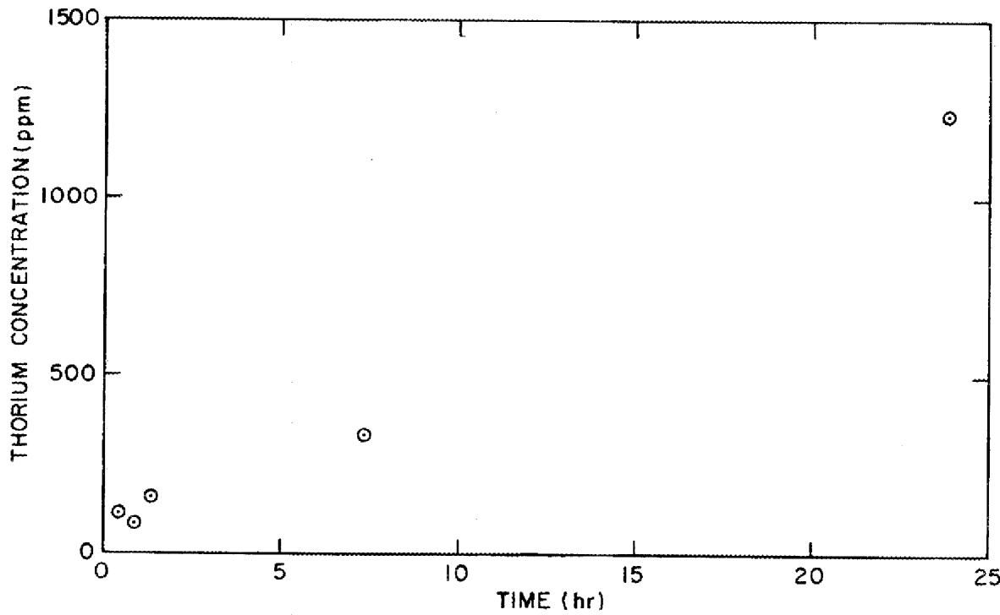  
Fig. 17. Dissolution of Thorium in Bismuth as a Function of Time. Thorium metal (301.5 g) added to 200 kg of bismuth at $600^{\circ}\mathrm{C}$ ; stirring by argon sparge $\sim$ 0.3 scfh.

in the column, while the lack of a static pressure required to pass argon through the salt return line from the column indicated that this line was free of bismuth. The remaining bismuth was transferred from the column, the salt feed line, and the bismuth return line into the bismuth catch tank by pressurizing the salt feed tank and the column. The effluent bismuth was then transferred from the bismuth catch tank to the treatment vessel.

Samples of bismuth were taken from the bismuth feed tank, the bismuth flowing-stream sampler, the bismuth catch tank, and the treatment vessel. Analyses of these samples showed no appreciable change in thorium content and indicated that most of the oxides that had formed on the piping had been removed from these surfaces by hydrogen treatment prior to the transfer of the bismuth-thorium solution through the system.

# 4.2 Addition of Salt, and Hydrofluorination of Salt and Bismuth

Sixteen liters of salt (72-16-12 mole % LiF-BeF $_2$ -ThF $_4$ ) was transferred from a salt shipping vessel to the treatment vessel via a temporary heated line. The weight of the salt added to the treatment vessel (52.8 kg) was determined from the decrease in weight of the shipping vessel.

The bismuth and salt in the treatment vessel were then sparged with a $\mathrm{H}_2$ -HF mixture in order to remove oxides from the salt and dissolved solutes (Th, Li, and Fe) from the bismuth. In order to prevent excessive attack on the containers and piping, the HF concentration was kept below 30 mole %, although an attempt was made to keep the concentration as near 30% as possible in order to obtain the maximum oxide removal rate. The nominal total flow rate was 33 scfh. The HF flow was set by controlling the pressure drop across a capillary; the $\mathrm{H}_2$ flow was set by use of a rotameter and was checked by a wet-test meter.

From the treatment vessel the $\mathrm{H}_2$ -HF stream passed successively through a NaF bed (to remove HF) and then through a wet-test meter (to measure the total $\mathrm{H}_2$ flow). Accumulation of HF in the NaF bed was followed by measuring the temperature along the length of the bed. The weight of unreacted HF leaving the treatment vessel was determined by changes in the weight of the bed.

The total weight of HF fed to the system was determined by weighing the HF supply tank. The system also contained an aqueous scrubber and a smaller $(0.05\mathrm{ft}^3/\mathrm{rev})$ wet-test meter in parallel with the NaF trap for sampling the gas fed to the treatment vessel or leaving the vessel. The concentration of HF in the gas stream was determined by passing the gas through $250\mathrm{ml}$ of a $0.4\mathrm{N}$ NaOH solution in the scrubber. When $0.05\mathrm{ft}^3$ of $\mathrm{H}_2$ had passed through the wet-test meter, the gas flow was stopped and the solution was removed for analysis. The HF concentration in the gas was determined by titrating small samples of the scrubbing solution with $0.1\mathrm{N}$ HCl. Both the feed and the discharge streams were monitored in this manner. Utilization of the HF was calculated from the feed and discharge concentrations. A plot of the results (see Fig. 18) showed that the HF utilization quickly decreased from an initial value of about $80\%$ to about $15\%$ , where it remained for a significant period of time.

# 4.3 Hydrodynamic Experiments: Runs HR-1 and -2

In run HR-1, bismuth and molten salt were fed countercurrently through a packed column at a low flow rate (0.05 liter/min for each phase). The purpose of this run was to demonstrate satisfactory operation of the system in general and of the flow control system in particular.

Run HR-1 was started by filling the column with molten salt. However, when the bismuth flow to the column was initiated, salt was forced out of the column toward the salt feed tank and resulted in a

ORNL DWG 71-102

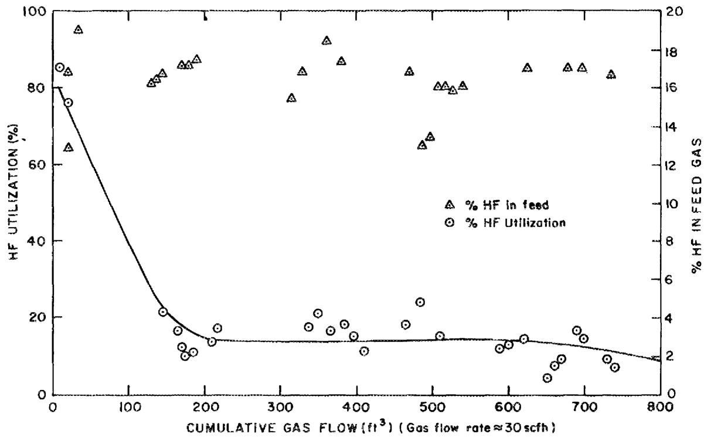  
Fig. 18. Utilization of HF as a Function of Time. Hydrofluorination of 20 liters of bismuth and 16 liters of LiF-BeF $_2$ -ThF $_4$ (72-16-12 mole %) with HF-H $_2$ at approximately $600^{\circ}\mathrm{C}$ .

negative salt feed rate. During the remainder of the run, a kind of quasi-countercurrent operation was maintained for only 30 min. In this 30-min period, the salt flow reversed direction three times, corresponding to small surges in the bismuth flow rate. Approximately 1.5 of the 3 liters of bismuth fed to the column overflowed to the salt catch tank. Subsequent runs provided the explanation for this behavior, namely, that the salt overflow loop was partially filled with bismuth and the bismuth exit line at the base of the column was partially plugged with iron deposits and/or frozen salt. It was concluded that the flow metering system operated satisfactorily; molten salt was metered to the column at a uniform rate for about 90 min, while bismuth was metered for a shorter time.

Run HR-2 was made to determine the cause of the low bismuth throughput during the first run. In this run, the column was filled with salt, and the salt overflow line from the column was sealed by freezing salt in the exit freeze valve. When bismuth was then fed to the column, much of the salt was displaced and forced back into the salt feed tank. During the period in which bismuth was fed to the column at the rate of about $50\mathrm{ml / min}$ , bismuth flowed through the column, out the salt inlet line, and into the salt feed catch tank. Very little bismuth flowed through the bismuth outlet line to the bismuth catch tank. Finally, the bismuth flow was stopped, and the column was pressurized from the salt feed tank. Under a pressure of about 20 psi, only about $500\mathrm{ml}$ of bismuth flowed through the bismuth outlet line in an hour; this made it obvious that an obstruction existed in the line between the column and the bismuth catch tank.

The portion of the bismuth line between the column and the flowing-stream sampler was removed and cut into approximately 6-in.-long sections, which were suspended in an argon atmosphere at about $600^{\circ}\mathrm{C}$ prior to examination. The bulk of the bismuth and salt in the line drained from the sections, leaving four partial obstructions at likely cold spots. These deposits consisted of clusters of whisker-like crystals that were

shown to be primarily iron by spectrographic analysis. The line between the flowing-stream sampler and the bismuth receiver contained a single deposit that completely filled the cross section of the 0.26-in.-ID tubing at the location of a probable cold spot. Elsewhere along the line, the steel tubing was heavily air-oxidized, confirming that these portions of the line had been exposed to temperatures considerably in excess of the $600 - 650^{\circ}\mathrm{C}$ range indicated by a few thermocouples. At one point, the wall thickness had decreased from its initial value of 0.058 in. to 0.042 in.

The portion of the line that was replaced was painted with an oxidation-retarding paint, and the number of thermocouples on the line was increased in order to prevent localized overheating. More importantly, the temperature of the bismuth feed tank was reduced from $600^{\circ}\mathrm{C}$ to $540^{\circ}\mathrm{C}$ in order to reduce the solubility of dissolved iron from about 70 ppm to about 25 ppm. Calculations indicated that the temperature of the bismuth could be increased to $600^{\circ}\mathrm{C}$ during its passage through about 5 ft of heated line between the feed tank and the column.

# 4.4 Hydrodynamic Run HR-3

Run HR-3 was the third attempt to achieve countercurrent contact of salt and bismuth in a packed column. During a period of about 2-1/2 hr, there was no evidence of incipient plugging in any of the lines; however, the salt and bismuth flow rates were not constant. Although these flow rates were programmed to be $90\mathrm{ml / min}$ and $75\mathrm{ml / min}$ , respectively, flow was intermittent throughout most of the run. It appeared that the salt overflow loop at the top of the column contained some bismuth - either from the initial transfer of bismuth through the system or from entrainment or flooding at the top of the column. Subsequently, the salt level in the column periodically increased sufficiently to overcome the bismuth seal; this resulted in a sudden flow of salt from the top of the column and, perhaps, replenishment of bismuth, which may have been carried out of the loop.

The solution to this problem was to install a line to drain bismuth from the low point in the salt exit line. For the purpose of observing bismuth entrainment, a small chamber and a freeze valve were inserted in the drain line (Fig. 19). With the freeze valve open, large quantities of bismuth passing through the chamber would be detected by changes in pressure between a pair of argon bubblers spaced about 3 in. apart (in elevation). By freezing a seal in the drain line, the rate of bismuth accumulation in the chamber could be measured over a period of time and thus provide data on the rate of bismuth entrainment.

These initial experiments showed that it was sometimes necessary to pressurize the salt jackleg (T-6) with argon in order to maintain the salt flow to the column. Manual control of the argon pressurizing valve and bleed valve proved to be difficult; therefore, we installed an automatic control system that maintained a constant level in T-6 by varying the flow of argon as required. After the automatic controller had been added, operation of the jackleg became quite satisfactory.

# 5. DIGITAL SIMULATION OF THE FLOW CONTROL SYSTEMS FOR THE REDUCTIVE EXTRACTION FACILITY

C.W.Kee L.E.McNeese

The rates at which the salt and metal flow out of the feed tanks in the semicontinuous reductive extraction facility (see Sect. 4) are set by using a ramp generator to continuously change the set point of a conventional level controller. The fact that flow from the tanks is proportional to the rate of change of the level suggests that optimum controller constants for this application may be quite different from those for simple level control. In addition, the time lag in pressurization or depressurization of the gas volume above the liquid suggests the possibility of an unstable system. A digital simulation was carried out to investigate the stability of the control system over various ranges of controller settings and to determine the most desirable settings.

ORNL DWG 71-103

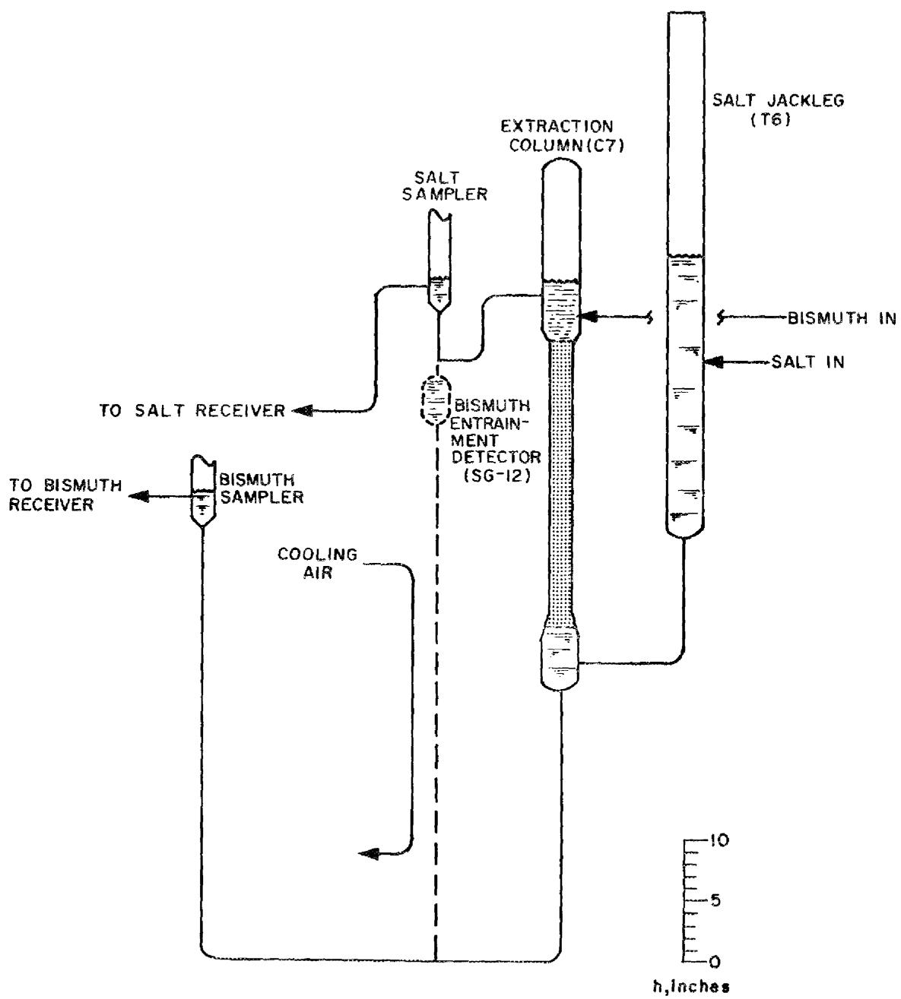  
Fig. 19. Extraction Column with Revised Salt Overflow. Vertical dimensions are to indicated scale; horizontal dimensions are not to scale. Packed section of column, 0.824 in. ID x 24 in. long, filled with 1/4-in.-diam right circular cylinders of molybdenum.

# 5.1 Salt and Metal Feed Systems To Be Studied

The system that was investigated is shown schematically in Fig. 16. It consists of a 20-liter tank filled initially with 15 liters of liquid (salt or bismuth). During operation, the liquid flows out of the tank through a dip tube and 10 ft of 3/8-in.-diam tubing to a discharge point about 125 cm above the entrance to the dip tube. The bismuth flows into the top of the column at the off-gas header pressure, while the salt is routed to a tank in which the pressure at the salt inlet point is set by the pressure drop through the column. The pressure drop of the salt through the column is almost entirely dependent on the bismuth holdup in the column and is approximately equal to the static head produced by the bismuth.

The rate at which argon is fed to the vapor space above the liquid in the feed tanks is determined by a level controller. The set point of the level controller is changed linearly with time and is proportional to the output of a ramp generator whose ramp time is adjustable. Ideally, the level controller maintains the level in the tank at a point equal to the set point. In this case, the flow rate out of the feed tanks is constant and proportional to the output from the ramp generator. The proportionality constant between the flow rate and the rate of change of the ramp generator output is then the tank calibration constant.

# 5.2 Mathematical Analysis

Consider a feed tank of volume $V_{t}$ , which consists of a gas volume, $V_{g}$ , and a liquid volume, $V_{s}$ . The rate of flow of liquid from the tank is then related to the rate of change of the gas volume as follows:

$$
\frac {\mathrm {d V}}{\mathrm {d t}} = \mathrm {F}. \tag {2}
$$

If one assumes ideal gas behavior, the following relation is obtained:

$$
P = \frac {n R T}{V g}, \tag {3}
$$

where

$\mathbf{P} =$ pressure in the gas space of the vessel,

$\mathbf{n} =$ number of moles of gas in the vessel,

$\mathbf{R} =$ gas constant,

T = absolute temperature.

If it is assumed that the temperature is constant, $P$ is a function of two variables (n and $V_g$ ), and one can write

$$
\frac {d P}{d t} = \frac {\partial P}{\partial n} \frac {d n}{d t} + \frac {\partial P}{\partial V} \frac {d V g}{d t}. \tag {4}
$$

Also,

$$
\frac {\partial \mathrm {P}}{\partial \mathrm {n}} = \frac {\mathrm {R T}}{\mathrm {V} _ {\mathrm {g}}} \tag {5}
$$

$$
\frac {\partial \mathrm {P}}{\partial \mathrm {V} _ {\mathrm {g}}} = - \frac {\mathrm {n R T}}{(\mathrm {V} _ {\mathrm {g}}) ^ {2}} = - \frac {\mathrm {P}}{\mathrm {V} _ {\mathrm {g}}}, \tag {6}
$$

$$
\frac {\mathrm {d} n}{\mathrm {d} t} = \frac {\mathrm {G P}}{\mathrm {R T}}, \tag {7}
$$

and

$$
\frac {\mathrm {d V}}{\mathrm {d t}} = - \frac {\mathrm {d V}}{\mathrm {d t}} = F, \tag {8}
$$

where

$G =$ volumetric flow rate of the gas into the vessel.

The rate at which gas is fed to the vessel was assumed to be proportional to the difference between the volume of liquid in the vessel, $V_{s}$ , and the corresponding controller set point value, $V_{s, \text{set}}$ . Thus

$$
G = K _ {3} \left(V _ {s, s e t} - V _ {s}\right), \tag {9}
$$

where

$$
\mathrm {K} _ {3} = \text {c o n t r o l l e r c o n s t a n t}.
$$

As noted earlier, values of $V_{s, \text{set}}$ were provided by a ramp generator and result from the relation

$$
\mathrm {V} _ {\mathrm {s}, \text {s e t}} = \mathrm {V} _ {\mathrm {s}, \text {i n i t}} - \mathrm {t F} _ {\text {s e t}}, \tag {10}
$$

where

$$
\begin{array}{l} \mathrm {V} _ {\mathrm {s}, \text {i n i t}} = \text {i n i t i a l l i q u i d v o l u m e ,} \\ \mathrm {F} _ {\text {s e t}} = \text {s e t f l o w r a t e .} \end{array}
$$

Substituting Eqs. (5)-(8) into Eq. (4) yields

$$
\frac {\mathrm {d} \mathrm {P}}{\mathrm {d t}} = \frac {\mathrm {G P}}{\mathrm {V g}} - \frac {\mathrm {F P}}{\mathrm {V g}}. \tag {11}
$$

Since $\mathbf{V}_{\mathbf{g}} = \mathbf{V}_{\mathbf{t}} - \mathbf{V}_{\mathbf{s}}$ , one can then write

$$
\frac {\mathrm {d} \mathrm {P}}{\mathrm {d t}} = \frac {\mathrm {P} (\mathrm {G} - \mathrm {F})}{\mathrm {V} _ {\mathrm {t}} - \mathrm {V} _ {\mathrm {s}}} \cdot \tag {12}
$$

The total pressure at the entrance to the dip tube in the feed tank is the sum of the gas pressure above the liquid and the hydrostatic pressure due to the weight of the liquid. Thus the pressure at the entrance to the dip tube is

$$
P _ {i} = P _ {g} + \frac {V _ {s}}{A} \rho g, \tag {13}
$$

where

$$
\begin{array}{l} P _ {i} = \text {p r e s s u r e} \\ A = \text {c r o s s - s e c t o n a l} \\ \rho = \text {d e n s i t y} \\ g = \text {g r a v i t a t i o n a l} \\ \end{array}
$$

If a tank calibration constant, $\mathbf{K}_0$ , is defined as

$$
K _ {O} = \frac {A}{\rho g},
$$

Eq. (11) becomes

$$
P _ {i} = P _ {g} + V _ {s} / K _ {o}. \tag {1.4}
$$

The resistance to the flow of liquid through the line is due to three effects: (1) inlet and exit frictional losses, (2) velocity losses caused by bends in the line, and (3) viscous losses in the equivalent length of straight line. For laminar flow, the functional form of all these resistances is the same and is

$$
F = K _ {2} \sqrt {\Delta P}, \tag {15}
$$

where

$$
\mathrm {K} _ {2} = \text {a c o n s t a n t},
$$

$$
\Delta P = \text {d y n a m i c}
$$

It was assumed that the entrance and exit losses corresponded to 1 velocity head each and that the bends corresponded to 7.5 velocity heads. The viscous losses were found to represent about 0.5 velocity head. Accordingly, the total resistance to flow through the line was taken to be 10 velocity heads, which then sets the value of $\mathbf{K}_2$ . The liquid was assumed to discharge from the line into a volume having an absolute pressure of 1 atm. Hence, the pressure drop across the line, $\Delta P$ , is given by:

$$
P = P _ {i} - P _ {e} - h \rho g, \tag {16}
$$

where

$$
P _ {e} = \text {d i s c h a r g e p r e s s u r e (1 a t m a b o l u t e)},
$$

$$
h = \text {d i s c h a r g e}
$$

Hence, Eq. (15) becomes

$$
F = K _ {2} \sqrt [ 4 ]{P _ {i}} - P _ {e} - h \rho g. \tag {17}
$$

The final set of equations that was solved consists of the following:

$$
\frac {\mathrm {d V} _ {\mathrm {S}}}{\mathrm {d t}} = - F \tag {18}
$$

$$
\frac {\mathrm {d} P}{\mathrm {d} t} = \frac {P (G - F)}{V _ {t} - V _ {s}} \tag {19}
$$

$$
G = K _ {3} \left(V _ {s, s e t} - V _ {s}\right) \tag {20}
$$

$$
V _ {s, s e t} = V _ {s, i n i t} - t F _ {s e t} \tag {21}
$$

$$
P _ {f} = P _ {g} + V _ {s} / K _ {o} \tag {22}
$$

$$
F = K _ {2} ^ {\prime \prime} / P _ {i} - P _ {e} - h p g ^ {-} \tag {23}
$$

# 5.3 Solution of Equations and Calculated Results

The set of equations listed above was solved by numerical integration, using a trapezoidal-rule approximation. Values for the constants and initial conditions are given in Table 2. The values used for $V_{s,init}$ and $F_{set}$ are believed to result in the least stable control action, that is, a small gas volume and a high set point for the liquid flow rate. The initial pressure in the vessel $(P_{init})$ was varied over the ranges 2.0 to 3.5 psig and 6.0 to 9.0 psig for salt and bismuth flows, respectively. The controller constant $(K_3)$ was varied over the ranges 0.04 to 0.2 sec $^{-1}$ for salt flow and 0.1 to 0.45 sec $^{-1}$ for bismuth flow.

Table 2. Constants and Initial Conditions Used for Simulation of Flow Control Systems   

<table><tr><td>Constant</td><td>Value</td></tr><tr><td>Vt</td><td>20 liters</td></tr><tr><td>Vss,init</td><td>15 liters</td></tr><tr><td>Fset</td><td>150 cm3/min</td></tr><tr><td>Ko</td><td>90.9 liters/atm for salt, or 31.5 liters/atm for bismuth</td></tr><tr><td>K2</td><td>7.536 liters/min (atm)1/2</td></tr></table>

One of the most difficult control situations is represented by startup conditions in which the initial pressure in the tank is insufficient to overcome the static head of liquid in the exit line from the tank. Since the available volumes of salt and bismuth are limited, we are primarily interested in rapidly achieving steady flow rather than in damping out disturbances after steady flow is achieved. The effect of the controller constant on the approach to steady flow for the salt and bismuth systems is shown in Figs. 20 and 21, respectively. Operation of the salt system was investigated more extensively since disturbances are more likely to occur in it.

As can be seen in Fig. 20, the critical value of the controller constant appears to be about 0.1 sec $^{-1}$ for the salt phase. The nature of the response changes rather slowly from an underdamped to a slightly overdamped situation as the controller constant increases from 0.1 to 0.2 sec $^{-1}$ . With higher controller constant values, there would be an increased tendency for the flow to be completely stopped. This is undesirable because bismuth could enter the salt feed line and further upset the system. In addition, higher values for the controller constant introduce instability and do not allow the system to be brought to steady-

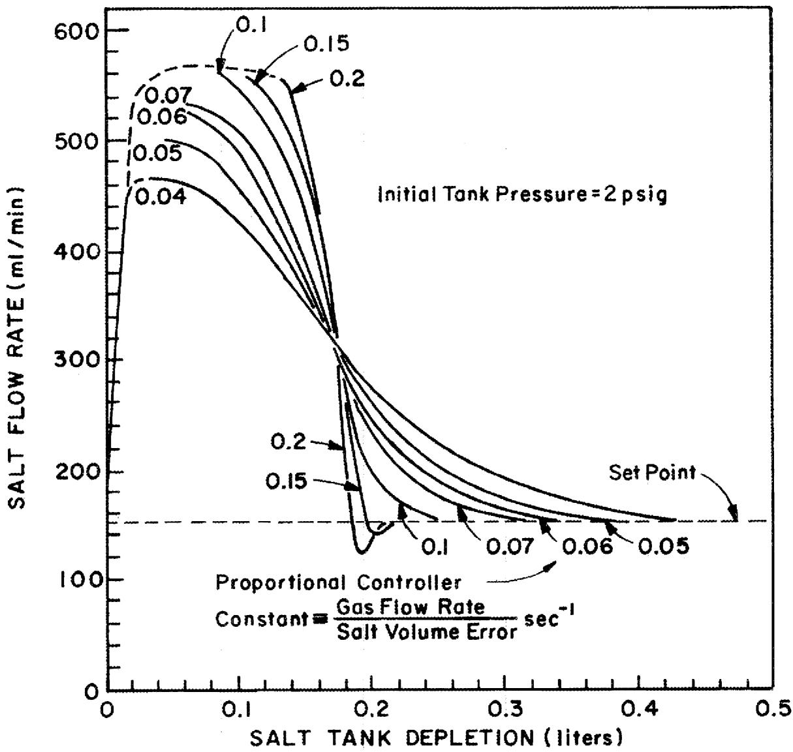  
Fig. 20. Calculated Salt-Phase Controller Response to a Stepwise Disturbance. Salt flow rate is shown as a function of salt tank depletion.

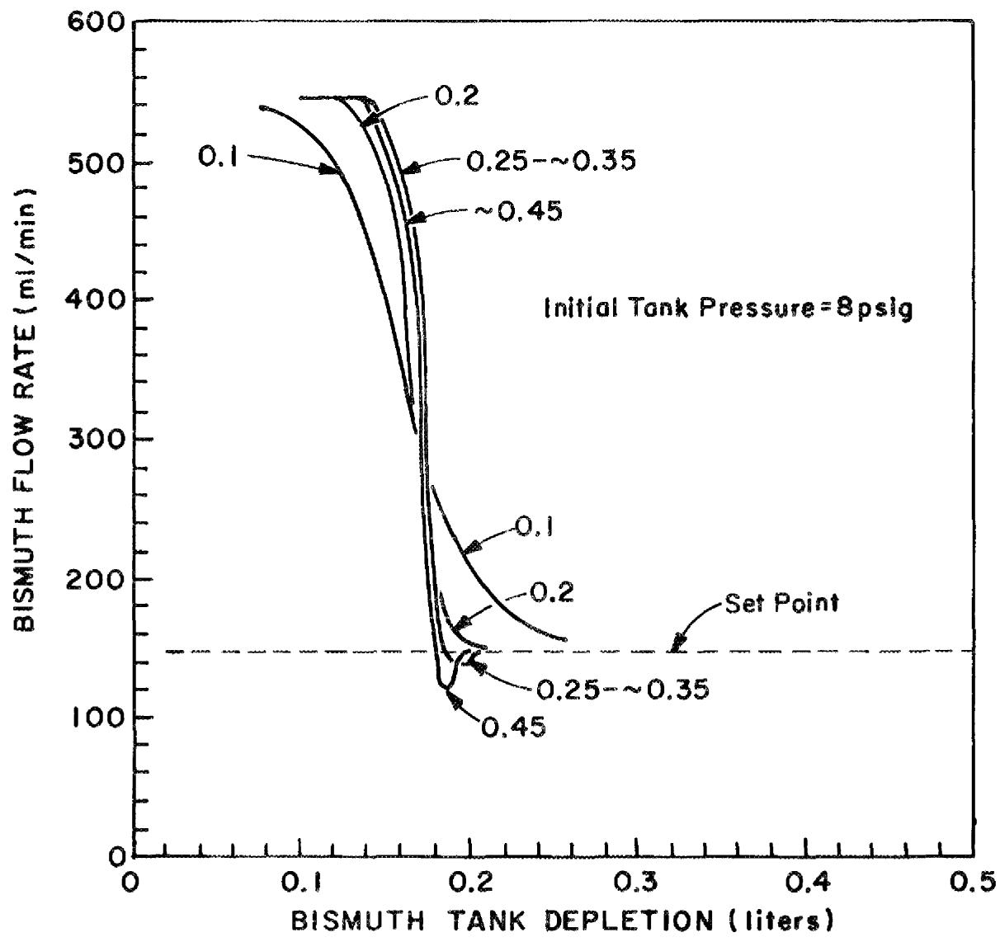  
Fig. 21. Calculated Bismuth-Phase Controller Response to a Stepwise Disturbance. Bismuth flow rate is shown as a function of bismuth tank depletion. Controller constants are given in sec $^{-1}$ units.

state operation with significantly less tank depletion. We thus conclude that values above 0.2 are to be avoided. On the other hand, controller constants below 0.1 sec $^{-1}$ provide slow response; therefore, values below 0.05 sec $^{-1}$ are also considered undesirable. As shown in Fig. 21, satisfactory operation of the bismuth flow control system can be obtained with a controller constant of about 0.1 sec $^{-1}$ .

After steady-state operation has been achieved, the bismuth flow rate is more likely to be stable than the salt flow rate since bismuth discharges from the transfer line at a constant pressure. The discharge pressure for the salt varies because of bismuth holdup in the column. When bismuth flow is initiated, control of the salt flow rate will be difficult (assuming that a salt flow rate has been established). The associated change in discharge pressure is believed to be less severe than a stepwise change of $30~\mathrm{cm}$ of salt, which is equivalent to suddenly imposing a bismuth holdup of about $30\%$ on the column. The response of the salt flow control system to such a change was investigated by choosing an initial tank pressure of 2 psig (see Fig. 20).

Several other factors associated with the control system were considered briefly. Results using proportional, integral control differed little from those using proportional control alone, except that a slower response was observed. The addition of integral control had only a small effect since the system provides its own integral action; that is, the integral of the flow rate, rather than the flow rate, is controlled.

Continuous removal of the pressurizing gas from the feed tank was also considered. This provision was found to have no appreciable effect on the system response as long as the required gas addition rate was well below the difference between the flow capacity of the control valve and the bleed rate. When the required gas flow approached the capacity of the flow control valve, the use of the gas bleed decreased the rate of response of the control system and hence increased the volume of liquid required to achieve steady-state operation. However, a bleed stream is

desirable because it increases the response to a decrease in pressured drop. We concluded that a small bleed stream, or no bleed stream at all, should be used at the higher flow rates, while a progressively larger bleed stream is desirable for the lower flow rates. From the standpoint of practicality, the bleed rate should be such that the control valve operates at about a 30 to $40\%$ open position.

In summary, we conclude that: (1) the system is stable, (2) proportional control is adequate, and (3) the system can be brought to a steady-state condition in an acceptably short time.

# 6. ELECTROLYTIC CELL DEVELOPMENT

M. S. Lin J. R. Hightower, Jr.

L. E. McNeese

The proposed reductive extraction processes for protactinium isolation and rare-earth removal require the use of electrolytic cells for reducing lithium and thorium fluorides into a bismuth cathode to prepare the metal streams fed to the extraction columns and for oxidizing extracted components from the metal streams leaving the columns. The cells will require the use of an electrically insulating material that can withstand the corrosive conditions present at the cell anode. In the experiments reported in the remainder of this section, frozen salt was used to provide insulation as well as protection against corrosion. The use of BeO, an insulator, is also under study.

# 6.1 Formation of Frozen Salt Layers in Regions of High Heat Generation

An experiment for studying the formation of frozen salt in regions of high heat generation was carried out previously in a cell constructed from metal rather than quartz. Although viewing ports were provided, it was very difficult to estimate the thickness of the frozen salt layer formed around the anode, especially near the salt-gas interface. In order

to study the formation and maintenance of a frozen salt layer in a region of high heat generation under conditions of improved visibility, a quartz cell having a quartz divider was used. A U-shaped, 1/4-in.-diam cooling tube was located about 1/4 in. above the divider, as shown in Fig. 22, in order to form a frozen salt layer along the top of the divider.

In our first attempt to operate this type of cell, the bismuth was hydrogen-treated at $700^{\circ}\mathrm{C}$ with the cooling tube in place. Subsequently, after addition of the molten salt, nitrogen (coolant) was observed to be leaking into the cell from the underside of the U-tube (Fig. 23). We believe that the mild-steel tube was preferentially attacked by bismuth, causing iron to be dissolved at points where bismuth was held between the tube and the divider during the hydrogen treatment period. The continual splashing of bismuth from the main bismuth pool against the small quantity of bismuth in contact with the tube would have allowed the dissolution of a sufficient quantity of iron to saturate all of the bismuth at the operating temperature of $700^{\circ}\mathrm{C}$ . In the second trial, the cooling tube was not lowered into position until after hydrogen treatment was complete.

With no current flowing through the cell and with both electrodes being sparged with argon at 0.1 to 0.2 scfh, a frozen salt film was easily formed on the cooling tube; a mixture of $\mathbf{N}_2$ and water was used as the coolant. The temperature of the salt (66-34 mole % LiF-BeF $_2$ ) in the cell was about $510^{\circ}\mathrm{C}$ . As expected, the frozen salt film was thicker at the two $90^{\circ}$ bends in the tube than along the straight sections of the tube. It was also thicker at the colder end of the horizontal tube than at the warmer end (5/16 in. vs 3/16 in.).

When ac power was applied to the cell, the salt turned a brownish color initially and then black (within a few minutes), as in previous experiments. With a low power input to the cell (37.5 w), the thickness of the frozen salt was practically unchanged (about 1/4 in.). With the applied voltage maintained at 3 v, the current decreased from 12.5 amp to 11.4 amp in 4 min.

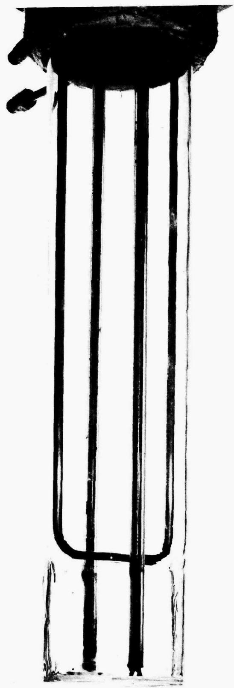  
Fig. 22. Quartz Electrolytic Cell Vessel (4 in. OD) with 1/4-in.-diam Cooling Tube Along Top of Quartz Electrode Divider.

PHOTO 95837

PHOTO 95838

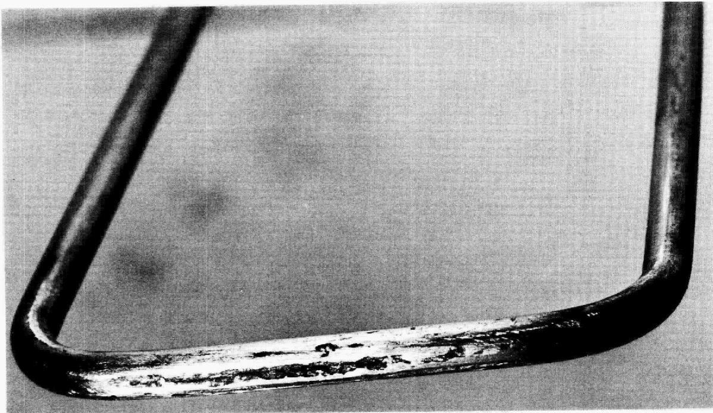  
Fig. 23. Results of Bismuth Attack on the Underside of the 1/4-in.-diam Tube Used for Forming Frozen Salt Film on Quartz Electrode Divider.

At higher currents, the salt became opaque; consequently, it was not possible to observe the frozen salt layer on the tube above the divider. With $4\mathrm{v}$ between the electrodes, the current was initially 17.8 amp and decreased to 8.8 amp over a period of 15 min. When the voltage was increased to $6\mathrm{v}$ , the current increased slightly from about 13.8 amp to 14.2 amp (85 w) over a period of about 3 min even though the flow rate of the cooling water was increased. At this time, both the power to the cell and the coolant were turned off; subsequently, the quartz cell cracked, allowing the salt to drain out of the cell. Later, examination revealed that a rather uniform salt layer (about 1/2 in. thick) remained on the cooling tube (Fig. 24). The observed thickness is believed to be the actual thickness of the frozen salt layer at the time that the power was turned off since the salt drained from the cell in less than 30 sec. It was concluded that a frozen layer of salt can be maintained in a region of high heat generation.

# 6.2 Use of Beryllium Oxide as an Electrical Insulator

Several of the properties of BeO suggest that this material might be useful in constructing an electrolytic cell. Beryllium oxide is a good electrical insulator, has a high thermal conductivity, and is relatively insoluble in molten fluoride salts of interest. However, since BeO would tend to dissolve slowly as well as to be attacked by the $\mathrm{BiF}_3$ present in the salt, a layer of frozen salt would be used to protect it from contact with the molten salt. In the event that the salt layer melted during an upset in cell operation, a low rate of attack on the BeO would be anticipated; thus sufficient time would be available to form a new frozen salt layer. During this period, the BeO would serve as the electrical insulator in the cell.

We have fabricated an anode in which a BeO cup is used as the electrical insulator and serves to separate the two mild-steel liners of the anode (Fig. 25). The assembled cell is shown in Fig. 26. The top edge

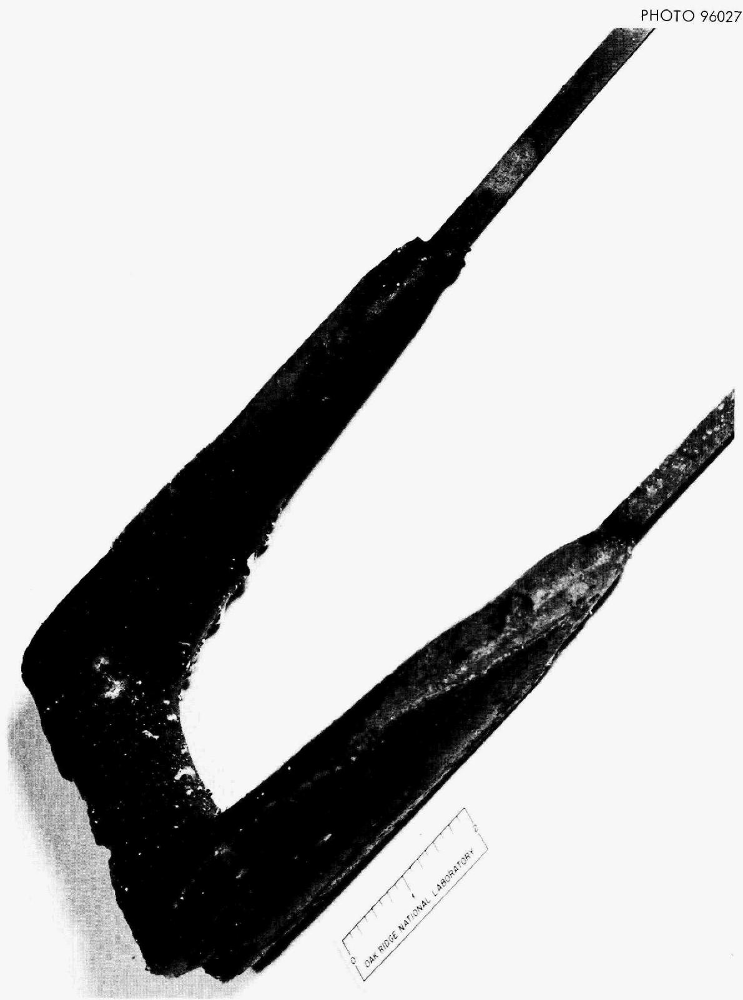  
Fig. 24. Frozen Salt Film Remaining on Cooling Tube Above Quartz Electrode Divider After the Cell Vessel Cracked.

PHOTO 96227

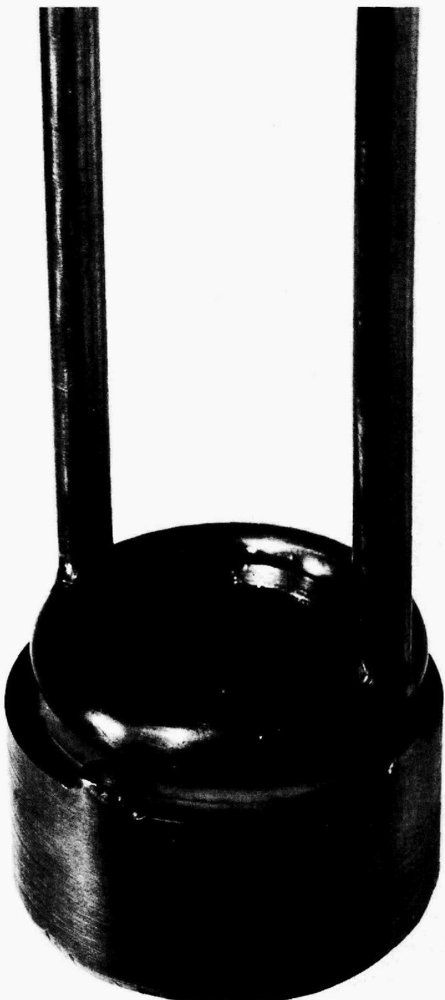  
Fig. 25. Anode Cup Assembly Consisting of Inner and Outer Carbon Steel Cladding Separated by BeO Insulator.

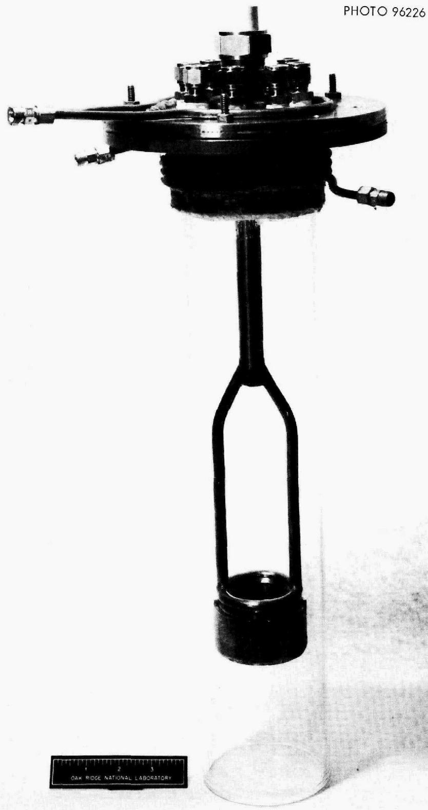  
Fig. 26. Assembled Electrolytic Cell Incorporating the BeO-Insulated Anode Cup Assembly.

of the inner liner is cooled by coolant that enters the annulus of the two concentric tubes (3/4 x 3/8 in.) and exits through the center tube. The BeO cup is attached to the inner cup by means of four pins on the liner and four grooves inside the cup. The outer liner is supported on the BeO cup which prevents the two metal liners from contacting each other. The BeO will contact the bulk of the molten salt only before the frozen salt layer is formed around the cooling tube. The anode will be used to test the stability of a frozen salt layer that is in contact with molten bismuth and that is subjected to localized heating which results from high current densities between the two electrodes. Cups of two different sizes (2-1/2 in. OD and 4 in. OD) have been fabricated. The resulting gross anode areas are $13.8~\mathrm{cm}^2$ and $49.5~\mathrm{cm}^2$ . The two anodes will be used in 4-in.-OD and 7-in.-ID quartz cells, respectively.

# 7. ANALYSIS OF MASS TRANSFER IN ELECTROLYTIC CELLS

J. S. Watson L. E. McNeese

In the proposed reductive extraction processes for removing protactinium and rare earths from molten-salt reactor fuels, an electrolytic cell is required (1) to provide lithium and/or thorium metal reductant for the liquid bismuth entering the extraction column, and (2) to oxidize extracted materials from the bismuth after it leaves the column. A study of factors affecting mass transfer in electrolytic cells has been initiated to identify important cell parameters and to aid in understanding and interpreting experimental data.

In principle, one could use the bismuth stream leaving the bottom of the column as the anode and selectively oxidize uranium and other extracted materials from the metal. The bismuth leaving the anode would be essentially pure bismuth, which could then be used as the cathode from which the metal would flow to the top of the extraction column. The salt stream flowing through the cell would serve as the cell electrolyte. Since molten salts of interest are not good conductors, the anode and cathode would have to be located relatively close to each

other in order to limit the rate of heat generation in the electrolyte. If the extracted materials were selectively oxidized from the bismuth stream at the anode, the current density obtainable at the anode surface would be limited by the rate at which the extracted materials were transported to the anode.

Since the extracted materials are present at low concentrations, a low anode current density would be obtained; this would require the use of a large anode area. This problem can be avoided by oxidizing bismuth at the anode and thereby generating $\mathrm{BiF}_3$ , which would be soluble in the salt. The $\mathrm{BiF}_3$ could then be used to oxidize extracted materials from the bismuth before it enters the electrolytic cell.

A second constraint on cell operation arises because of the relatively low solubility of thorium in the bismuth. High cathode current densities can cause thorium concentrations at the cathode surface to be higher than the solubility of thorium in bismuth; this would result in the formation of solid thorium metal.

# 7.1 General Mathematical Model

The geometry chosen for a simplified analysis of a molten-salt electrolytic cell is shown in Fig. 27. In this figure, the bismuth anode is on the left and the bismuth cathode is on the right. The anode and the cathode are separated by a molten-salt mixture containing LiF, $\mathrm{BeF}_2$ , $\mathrm{BiF}_3$ , and possibly $\mathrm{ThF}_4$ . Bismuth is oxidized at the anode and enters the salt phase as $\mathrm{BiF}_3$ . At the cathode, $\mathrm{Li}^+$ , $\mathrm{Th}^{4+}$ , and $\mathrm{Bi}^{3+}$ are reduced to metals and enter the metal phase. Under some (undesirable) conditions, $\mathrm{Be}^{2+}$ can also be reduced at the cathode. Both the salt and the metal forming the electrodes flow through the cell, and all concentration changes are assumed to occur across a liquid film that is present on both sides of the interface. Since the anode is a single component (i.e., bismuth), no concentration gradient is assumed to exist in the anode metal.

ORNL DWG 71-108

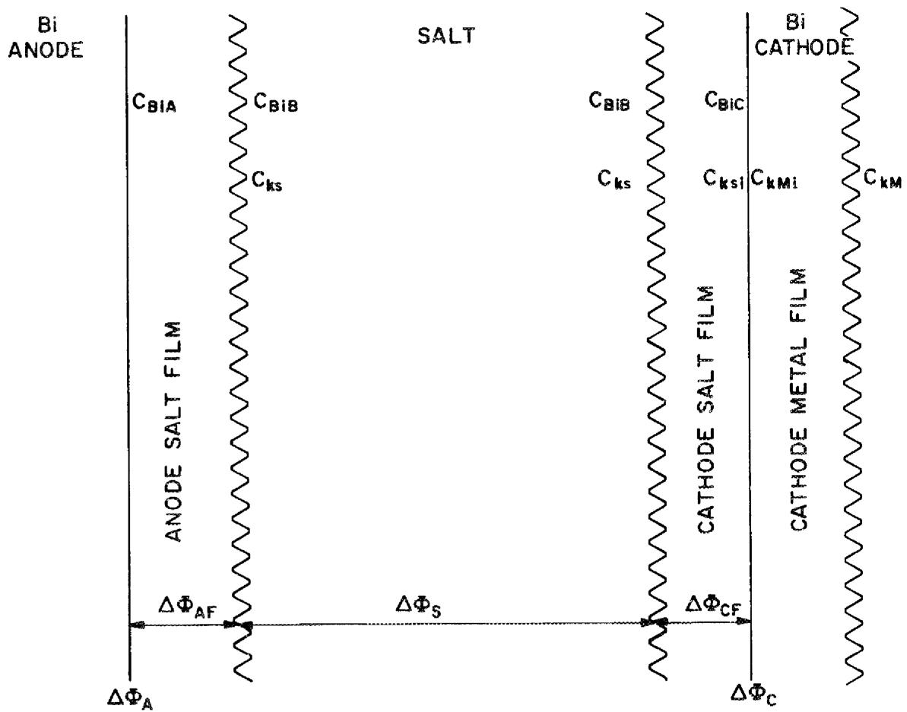  
Fig. 27. Schematic Representation of Model Used for Prediction of Mass Transfer Rates in Electrolytic Cells.

Decreases in potential may occur across the anode surface $(\Delta \phi_{\mathrm{A}})$ , the anode salt film $(\Delta \phi_{\mathrm{AF}})$ , the bulk salt $(\Delta \phi_{\mathrm{S}})$ , the cathode salt film $(\Delta \phi_{\mathrm{CF}})$ , and the cathode interface $(\Delta \phi_{\mathrm{C}})$ . A description of each of these regions and of the cathode metal film, along with equations defining potential and concentration changes, is given in the sections that follow. Simplifying assumptions that will allow the problem to be attacked at various levels of difficulty are also presented.

It should be noted that, in the salt regions, an electrical charge must be assumed for each ion or species. Lithium fluoride is probably a strongly ionized salt, yielding only $\mathsf{Li}^+$ and $\mathsf{F}^-$ ions in solution. However, thorium and beryllium appear to form fluoride complexes. The behavior of bismuth fluoride is not well understood; thus the fluoride complex could have a charge between 0 and $3+$ in the salt phase. In the following sections, transport in the salt regions will be described assuming that, though LiF is completely ionized, $\mathsf{BeF}_2$ and $\mathsf{ThF}_4$ are complexed and $\mathsf{BiF}_3$ is either ionized or complexed. The proposed models can be applied only if these cations form single fluoride complexes; that is, equilibria between several complexes may not be assumed. For example, one can assume that Be, Th, and Bi are either completely ionized or completely complexed; however, the assumption that these metals are partially complexed to form several species is not possible.

Anode Interface. - Bismuth is oxidized to the trivalent state at the anode interface. If bismuth fluoride is completely ionized, there will be no net flux of fluoride ions across the anode salt film; in this case, the decrease in potential across the interface $(\Delta \phi_{\mathrm{A}})$ can be approximated by the potential at equilibrium:

$$
\Delta \phi_ {A} = E _ {B i} + \frac {R T}{v _ {B i} F} \ln \frac {a _ {B i A}}{a _ {B i s a t}}, \tag {24}
$$

where

$$
\begin{array}{l} E _ {B i} = \text {r e d u c t i o n p o t e n t i a l o f B i F} _ {3} (\text {i n v o l t s}), \\ v _ {B i} = \text {v a l e n c e o f b i s m u t h (= 3)}, \\ F = \text {F a r a d a y} \\ R = \text {g a s} \\ \mathrm {T} = \text {t e m p e r a t u r e (a b s o l u t e)}, \\ a _ {B i A} = \text {a c t i v i t y o f B i} ^ {3 +} \text {a t t h e a n o d e i n t e r f a c e ,} \\ a _ {B i s a t} = \text {a c t i v i t y o f B i} ^ {3 +} \text {i n s a l t s a t u r a t e d w i t h B i F} _ {3}. \\ \end{array}
$$

Replacement of the activity, a, with the product of mole fraction and activity coefficient, $\gamma C$ , in Eq. (24) yields:

$$
\Delta \phi_ {A} = E _ {B i} + \frac {R T}{v _ {B i} F} \ln \frac {\gamma_ {B i A} C _ {B i A}}{\gamma_ {B i s a t} C _ {B i s a t}},
$$

where

$$
\begin{array}{l} \gamma_ {B i A} = \text {a c t i v i t y c o e f f i c i e n t o f B i} ^ {3 +} \text {a t t h e a n o d e i n t e r f a c e ,} \\ \gamma_ {\mathrm {B i} \text {s a t}} = \text {a c t i v i t y} \quad \text {c o e f f i c i e n t} \quad \text {B i} ^ {3 +} \text {i n s a l t s a t u r a t e d w i t h B i F} _ {3}, \\ C _ {B i A} = \text {m o l e f r a c t i o n o f B i} ^ {3 +} \text {a t t h e a n o d e i n t e r f a c e ,} \\ C _ {B i s a t} = \text {s o l u b i l i t y} B i F _ {3} \text {i n} \text {s a l t}, \text {m o l e f r a c t i o n}. \\ \end{array}
$$

If we assume that the activity coefficients are constant and note that the solubility of $\mathrm{BiF}_3$ in salt is a constant, we can rearrange this equation as follows:

$$
\Delta \phi_ {A} = E _ {B i} + \frac {R T}{v _ {B i} F} \ln \frac {\gamma_ {B i A}}{\gamma_ {B i s a t} C _ {B i s a t}} + \frac {R T}{v _ {B i} F} \ln C _ {B i A}.
$$

Combining the first two terms on the right-hand side yields:

$$
\Delta \phi_ {A} = E _ {B i} ^ {\prime \prime} + \frac {R T}{v _ {B i} F} \ln C _ {B i A}, \tag {25}
$$

where

$$
E _ {B i} ^ {\prime \prime} = \text {c o n s t a n t d e f i n e d a b o v e}.
$$

If $\mathrm{BiF}_3$ is not ionized, there will be a net flux of fluoride ions at the anode salt film and the concentration of fluoride ions at the anode surface will be dependent on current density and anode film thickness. In this case, the decrease in potential across the anode can be written approximately as:

$$
\Delta \phi_ {A} = E _ {B i} ^ {\prime \prime} + \frac {R T}{v _ {B i F}} \ln \frac {C _ {B i A}}{C _ {F A n}}, \tag {26}
$$

where $C_{\mathrm{FA}}$ is the fluoride concentration at the anode surface and $n$ is the number of fluorine atoms in the complex.

Anode Salt Film. - If bismuth fluoride is ionized, the only ion transferring across the anode salt film is $\mathbf{Bi}^{3+}$ . This transfer results from both concentration and potential gradients, as described by the Nernst-Planck equation:

$$
J _ {k} = - D _ {k} \left\{\Delta C _ {k} + \frac {v _ {k} C _ {k} F}{R T} \nabla \phi_ {i}, \right. \tag {27}
$$

where

$$
\begin{array}{l} J _ {k} = \text {f l u x o f i o n k a c r o s s a n o d e s a l t f i l m}, \\ D _ {k} = \text {d i f f u s i v i t y o f i o n k i n s a l t f i l m}, \\ C _ {k} = \text {c o n c e n t r a t i o n o f i o n k i n s a l t f i l m}, \\ v _ {k} = \text {v a l e n c e o f i o n k i n s a l t f i l m}, \\ \nabla \phi = \text {g r a d i e n t o f p o t e n t i a l i n s a l t f i l m}. \end{array}
$$

In determining the flux of a given component, one must actually solve simultaneously the set of equations consisting of expressions of the

form of Eq. (27) for all ionized species in the salt along with the following relation, which states that at any point in the film the net electric charge is negligible:

$$
\Sigma v _ {k} C _ {k} = 0. \tag {28}
$$

If bismuth fluoride is ionized, the flux of only one species, $\mathbf{Bi}^{3+}$ , is nonzero.

Thus,

$$
J _ {B i} = I / v _ {B i},
$$

where

$$
J _ {B i} = \text {f l u x o f B i} ^ {3 +} \text {a c r o s s a n o d e s a l t f i l m},
$$

$$
I = \text {c u r r e n t d e n s i t y i n s a l t f i l m},
$$

$$
v _ {B i} = \text {v a l e n c e o f B i i n s a l t (=} 3).
$$

If bismuth fluoride is not ionized, the current across the anode salt film is carried by fluoride ions. Thus,

$$
J _ {F} = I,
$$

where

$$
J _ {F} = \text {f l u x o f F} ^ {-} \text {a c r o s s s a l t f i l m},
$$

I = current density in salt film, equivalents per unit time per unit area.

Also, for this case, Eqs. (27) and (28) must be solved simultaneously. However, bismuth fluoride can be treated separately since it is an un-charged component at low concentration. Thus,

$$
J _ {B i} = I / v _ {B i} = D _ {B i} \frac {C _ {B i A} - C _ {B i B}}{\zeta_ {A F}}, \tag {29}
$$

where

$$
\begin{array}{l} J _ {B i} = \text {f l u x o f B i F} _ {3} \text {a c r o s s a n o d e s a l t f i l m ,} \\ I = \text {c u r r e n t} \\ D _ {B i} = \text {d i f f u s i v i t y o f B i F} _ {3} \text {i n s a l t f i l m ,} \\ C _ {B i A} = \text {c o n c e n t r a t i o n} B i F _ {3} \text {i n s a l t a t a n o d e i n t e r f a c e , m o l e f r a c t i o n ,} \\ C _ {B i B} = \text {c o n c e n t r a t i o n} \mathrm {B i F} _ {3} \text {i n b u l k s a l t , m o l e f r a c t i o n ,} \\ \zeta_ {A F} = \text {t h i c k n e s s} \\ \end{array}
$$

Bulk Salt. - All concentrations within the bulk salt are assumed to be uniform; however, a decrease in a potential will occur. This decrease is assumed to be simply

$$
\Delta \phi_ {S} = I L / R, \tag {30}
$$

where

$$
\begin{array}{l} \Delta \phi_ {S} = \text {d e c r e a s e i n p o t e n t i a l a c r o s s b u l k s a l t}, \\ I = \text {c u r r e n t} \\ L = \text {d i s t a n c e} \\ R = \text {r e s i s t i v i t y} \\ \end{array}
$$

Cathode Salt Film. - Transport across the cathode salt film is much like transport across the anode film, except that the current is carried by all reducible ions. If bismuth fluoride is partially ionized, or if thorium and beryllium are complexed, there will be a flux of fluoride ions from the cathode surface as well as a flux of reducible ions toward the cathode. The flux of each ion is defined by Eq. (27). These transport equations must be solved simultaneously with the condition of electrical neutrality [Eq. (28)] and an equation expressing overall conservation of charge,

$$
\Sigma v _ {k} J _ {k} = I, \tag {31}
$$

where

$$
\begin{array}{l} v _ {k} = \text {v a l e n c e o f i o n k}, \\ J _ {k} = \text {f l u x o f i o n k}. \\ \end{array}
$$

Furthermore, conservation of each component requires that each $J_{k}$ be constant at all points within the film.

If bismuth fluoride is not ionized, its transport can be described by the relation

$$
J _ {B i} = D _ {B i} \frac {C _ {B i B} - C _ {B i C}}{\delta_ {C F}},
$$

where

$$
J _ {B i} = \text {f l u x o f B i F} _ {3} \text {i n c a t h o d e s a l t f i l m ,}
$$

$$
D _ {B i} = \text {d i f f u s i v i t y o f B i F} _ {3} \text {i n c a t h o d e s a l t f i l m ,}
$$

$$
C _ {B i B} = \text {c o n c e n t r a t i o n} B i F _ {3} \text {i n b u l k s a l t},
$$

$$
C _ {B i C} = \text {c o n c e n t r a t i o n} B i F _ {3} \text {i n s a l t a t c a t h o d e i n t e r f a c e},
$$

$$
\delta_ {C F} = \text {t h i c k n e s s o f c a t h o d e s a l t f i l m}.
$$

If one assumes that the concentration of $\mathrm{BiF}_3$ in the salt at the cathode interface is negligible, the above relation becomes

$$
J _ {B i} = D _ {B i} C _ {B i B} / \delta_ {C F}. \tag {32}
$$

In most cases, beryllium can be treated as if it were not reduced at the cathode. When the potential drop across the cathode becomes sufficiently large, beryllium will be reduced; however, it will not go into solution in the bismuth. Since this is probably an undesirable situation, beryllium is treated as if it is not reduced. When the decrease in potential at the cathode surface is calculated, one must note whether beryllium would be reduced since we are interested in cell operation without beryllium reduction.

Cathode Surface. - A decrease in potential sufficient to reduce lithium and thorium into bismuth will occur at the cathode surface. If the decrease in potential at the cathode is sufficiently large, beryllium

will also be reduced to pure metal. The decrease in potential will be a function of the lithium and thorium concentrations on both sides of the salt-metal interface, $C_{\mathrm{ksi}}$ and $C_{\mathrm{kMi}}$ . If equilibrium exists at the cathode surface, the decrease in potential will be given by the relation

$$
\Delta \phi_ {C} = \frac {R T}{v _ {k} F} \ln \frac {C _ {k M i}}{C _ {k s i}} + E _ {k}, \tag {33}
$$

where

$$
\begin{array}{l} \Delta \phi_ {C} = \text {d e c r e a s e i n p o t e n t i a l a t t h e c a t h o d e s u r f a c e}, \\ v _ {k} = \text {v a l e n c e o f i o n k}, \\ C _ {k M i} = \text {c o n c e n t r a t i o n o f c o m p o n e n t k i n t h e m e t a l a t t h e c a t h o d e} \\ C _ {k s i} = \text {c o n c e n t r a t i o n o f i o n k i n t h e s a l t a t h e c a t h o d e s u r f a c e}, \\ E _ {k} = \text {r e d u c t i o n p o t e n t i a l f o r i o n k r e q u i r e d t o t r a n s p o r t c o m p o n e n t} k \text {b e t w e e n s a l t a n d m e t a l p h a s e s h a v i n g t h e s a m e c o n c e n t r a t i o n} \\ \end{array}
$$

This equation, similar to Eq. (25), must be applied to both lithium and thorium if both materials are reduced.

Cathode Metal Film. - A decrease in the concentration of all reducible components occurs across the metal film in the cathode. The diffusion of lithium and thorium across the film is described by the relation

$$
\begin{array}{l} J _ {k} = D _ {k M} \frac {C _ {k M i} - C _ {k M}}{\delta_ {C M}} \\ \approx \mathrm {D} _ {\mathrm {k M}} \frac {\mathrm {C} _ {\mathrm {k M i}}}{\delta_ {\mathrm {C M}}} \tag {34} \\ \end{array}
$$

where

$\mathbf{J}_{\mathbf{k}} =$ flux of component k in cathode metal film,

$\mathbf{D}_{\mathbf{kM}} =$ diffusivity of component k in cathode metal film,

$C_{\text{kMi}} = \text{concentration of component k in metal at cathode surface,}$

$C_{\mathbf{kM}}$ = concentration of component k in bulk metal in cathode,

$\delta_{\mathrm{CM}} =$ thickness of cathode metal film.

For the present case, we will assume that the concentrations of both lithium and thorium in the bulk metal are negligible. Then the above relation becomes

$$
J _ {k} = D _ {k M} C _ {k M i} / \delta_ {G M}. \tag {35}
$$

# 7.2 Assumptions and Simplifications

The model (as stated above) involves the following simplifications:

1. The geometry of the model is less complicated than that of a real system.

2. A rather simple stagnant film theory is used. Actually, flow near the interface causes the "fictive" stagnant film thickness to be a function of the diffusion coefficient or Schmidt number.

3. The activity coefficients in both metal and salt are assumed to be constant. This assumption is most important when the decreases in potential drops across the salt-metal interfaces are calculated.

4. Each important metal is assumed to form only one ion.

5. Changes in potential across interfaces are approximated from equilibrium conditions.

These simplifications, as well as many of those listed below, are probably not important when we remember that many of the constants in the model (especially diffusion coefficients) are not known and, therefore, have been estimated. We believe that the model will qualitatively describe the cell behavior and that the particular values assumed for the constants will not affect the general behavior of the system.

In determining the solution to the set of equations developed earlier, several constraints must be taken into account. First, the flux of each component in the various regions and across the boundaries of the regions must be constant. Also, the change in concentration across boundaries must have prescribed values; hence, a trial-and-error approach must be used. Thorium saturation in the metal cathode at the salt-metal interface must be checked. As with beryllium reduction, this will not affect the nature of the calculations, although it does place a limit on the operating conditions if the production of thorium metal is to be avoided.

To make the calculations practical, several additional simplifications will be made to provide models with varying degrees of complexity. In general, we will look at the simplest models first. Then, after comparisons are made with experimental data, the more elaborate models can be developed if required.

# 7.3 Cathode Current Efficiencies and Maximum Current Densities with LiF-BeF $_2$ -BiF $_3$ Mixtures

The cathode region of an electrolytic cell containing a mixture of $\mathrm{LiF - BeF_2 - BiF_3}$ was the first specific region studied. The compositions chosen for the bulk salt were approximately those expected in the electrolytic cell for the rare-earth removal system. Most of the important transport parameters for the system, such as diffusion coefficients and the effective film (boundary layer) thickness, were not known. Nevertheless, some important behavioral aspects of the system can be predicted by using estimates for these parameters.

The values for the current efficiency and the maximum allowable cathode current density are of greatest interest. The purpose of the cathode portion of this cell is to reduce lithium into the bismuth metal. Thus, any bismuth fluoride that is reduced at the cathode decreases the current efficiency based on LiF reduction. A maximum allowable current density at the cathode is imposed if one does not allow $\mathrm{BeF}_2$ to be reduced. Beryllium metal is insoluble in bismuth, and the introduction of this third phase is considered undesirable. Reduction of beryllium will not occur at low current densities and low bismuth reductant loadings.

A $\mathrm{BiF}_3$ -LiF-BeF $_2$ salt composition of 20.8-62.5-16.7 mole % was chosen as typical for the rare-earth cell. The diffusion coefficients for lithium and bismuth in the salt were assumed to be $10^{-5} \, \mathrm{cm}^2/\mathrm{sec}$ and $10^{-6} \, \mathrm{cm}^2/\mathrm{sec}$ , respectively. These values were estimated from measurements made with chloride salts. The molar volume of bismuth fluoride was assumed to be 0.04 liter/g-mole.

The bismuth species which will be present in the salt are not known. Two species were considered: $\mathrm{Bi}^{3+}$ and $\mathrm{BiF}_5^{2-}$ . Equations (20), (21), and (25) were integrated numerically for the four ions involved $(\mathrm{Li}^+, \mathrm{BeF}_4^{2-}, \mathrm{F}^-$ , and either $\mathrm{Bi}^{3+}$ or $\mathrm{BiF}_5^{2-})$ . Calculated current densities were lower when $\mathrm{Bi}^{3+}$ rather than $\mathrm{BiF}_5^{2-}$ was assumed to be the bismuth species because the electric potential gradient across the cathode salt film hinders the transport of negative ions and enhances the transport of positive ions. The predicted current efficiencies with $\mathrm{Bi}^{3+}$ are shown in Fig. 28 for salt and metal film thicknesses of $0.05\, \text{cm}$ (stagnant) each. With current densities of $0.1\, \text{amp/cm}^2$ or greater, the current efficiency is predicted to be approximately $50\%$ or greater and would become $90\%$ at $0.5\, \text{amp/cm}^2$ .

The conditions leading to the reduction of $\mathrm{BeF}_2$ were also estimated; they are illustrated in Fig. 28. The point at $0.65\mathrm{amp/cm}^2$ indicates the current density and current efficiency at which the salt at the cathode

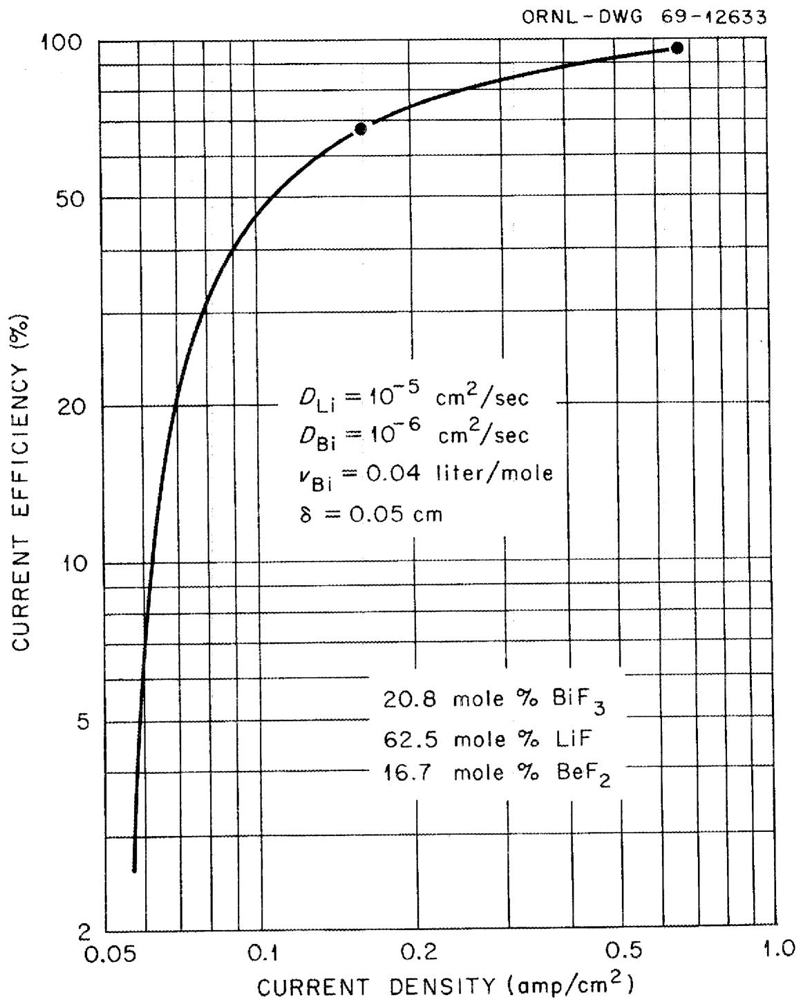  
Fig. 28. Calculated Current Efficiency with an LiF-BeF $_2$ -BiF $_3$ Salt.

interface becomes (under the simplifications of these calculations) pure $\mathrm{BeF}_2$ . Beryllium will certainly be reduced with current densities higher than this. The point at 0.16 amp/cm² represents the current density at which the reduction of beryllium is more likely to begin; this value was estimated by assuming that the salt and metal are in equilibrium at the cathode interface and that the diffusion coefficients and boundary-layer thicknesses are the same in the metal and the salt phases.

Experimental measurements with static electrolytic cells have indicated that considerably higher current densities $(5\mathrm{amp} / \mathrm{cm}^2)$ can be achieved without reduction of beryllium. Some solid material has been observed in the static cells, but this is not believed to have resulted from reduction of beryllium. However, one should keep the limitations of these calculations in mind. Although all of the assumed parameters will affect the results, the most important (and probably the most uncertain) parameter is the film thickness since this value determines the horizontal scale on Fig. 28. Thus, if a smaller film thickness is assumed, a higher allowable current density will be estimated. The general shape of the curve in Fig. 28 is probably more reliable than particular numerical values, especially estimates of current densities. At present, no experimental data on current efficiency are available. When data on current efficiency become available, Fig. 28 may be used to determine how efficiency will vary with current density and when reduction of beryllium is likely to occur.

# 8. AXIAL MIXING IN PACKED COLUMNS WITH HIGH-DENSITY FLUIDS

J. S. Watson L. E. McNeese

Axial diffusion may be important in determining the performance of reductive extraction contactors in flowsheets proposed for processing a molten-salt breeder reactor (MSBR). This is especially important in the proposed rare-earth removal system, in which high metal-to-salt vol-

umetric flow ratios are required. It is likely that packed-column contactors will be used and that salt will be the continuous phase. Under these conditions, the salt will flow through the column with a low velocity, and axial mixing is likely to severely decrease the performance of the column. Data on axial dispersion are needed in order to estimate the importance of this effect.

Relatively few data on axial dispersion coefficients are available; no data are available for high-density, non-wetting fluids. To supply the needed information, a study of axial diffusion coefficients has been initiated using mercury and water to simulate bismuth and salt.

# 8.1 Mathematical Model

A steady-state technique was used for the axial diffusivity measurements; its theoretical development is as follows. Consider a column of constant cross section in which a fluid moves with constant superficial velocity, $\nu$ . If a tracer material is introduced near the column exit, the tracer will tend to diffuse upstream, and a concentration profile will be established. At steady state, the flux of the tracer due to axial diffusion is equal to the convective flux; that is,

$$
- \mathrm {E} \frac {\mathrm {d C}}{\mathrm {d Z}} = \mathrm {v C}, \tag {36}
$$

where

$$
E = \text {a x i a l}
$$

$$
C = \text {t r a c e r} Z,
$$

$$
v = \text {s u p e r f i c i a l}
$$

$$
Z = \text {p o s i t i o n a l o n g t h e c o l u m n}.
$$

Integration of this relation, assuming that the concentration of tracer at point $Z_{1}$ is $C_{1}$ , yields the relation

$$
\ln \frac {C}{C _ {1}} = - \frac {v}{E} (Z - Z _ {1}), \tag {37}
$$

which indicates that a semilogarithmic plot of $\mathrm{C} / \mathrm{C}_1$ vs $Z$ should yield a straight line of slope $-\nu / E$ .

# 8.2 Experimental Equipment

The experimental equipment for the study is shown schematically in Fig. 29. While the packed column is operating with mercury and water in countercurrent flow, a tracer solution of cupric nitrate is introduced near the top of the column at a constant rate. The steady-state concentration profile of tracer is then measured photometrically at several points upstream (i.e., down the column) in the aqueous phase. At each measuring point, a small stream of water (approximately $1\mathrm{ml} / \mathrm{min}$ ) is removed from the column by a small centrifugal pump and circulated through a photocell and returned to the column. Only three sample loops are shown in Fig. 29; however, as many as ten loops have been used in the actual system.

A photograph of a photocell is in Fig. 30. The cells are made of Lucite. Light from a small incandescent lamp (shown on the left) passes through the cell to a Clairex Model CL707L photoresistor (shown on the right). No filters are used to restrict the spectrum of light passing through the cell or into the photoresistor; however, the sensitivity of the photoresistors reaches a maximum at a satisfactory wavelength for cupric nitrate.

A typical circulation pump is shown in Fig. 31. This pump is also made of Lucite; however, the inlet and outlet parts are made of stainless

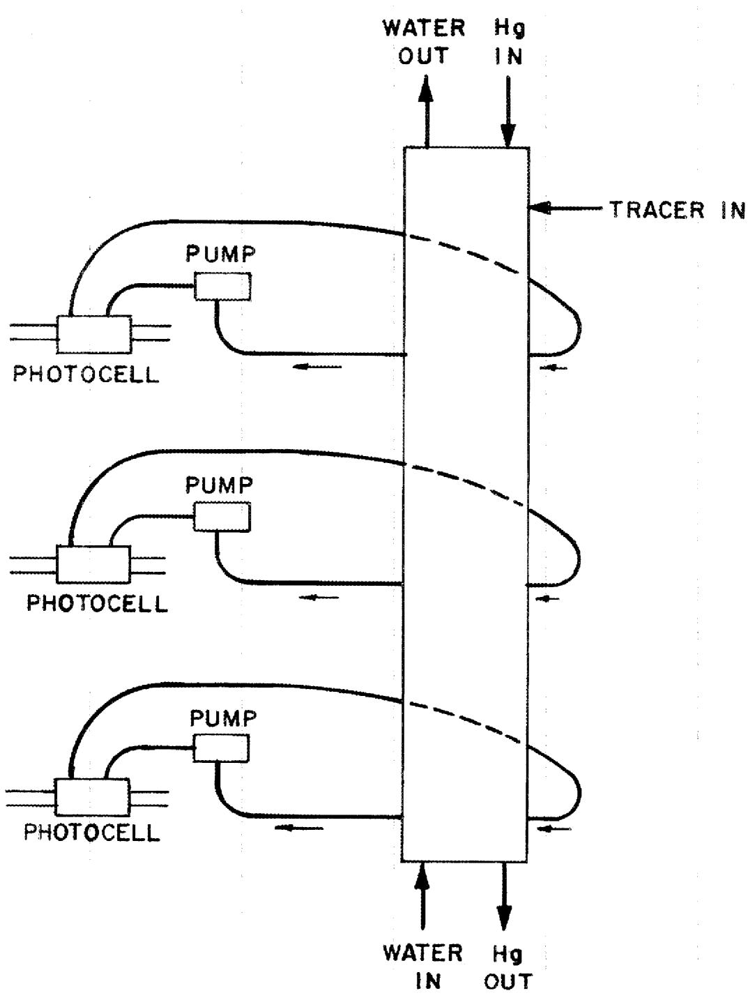  
Fig. 29. Schematic of Axial Diffusion Column.

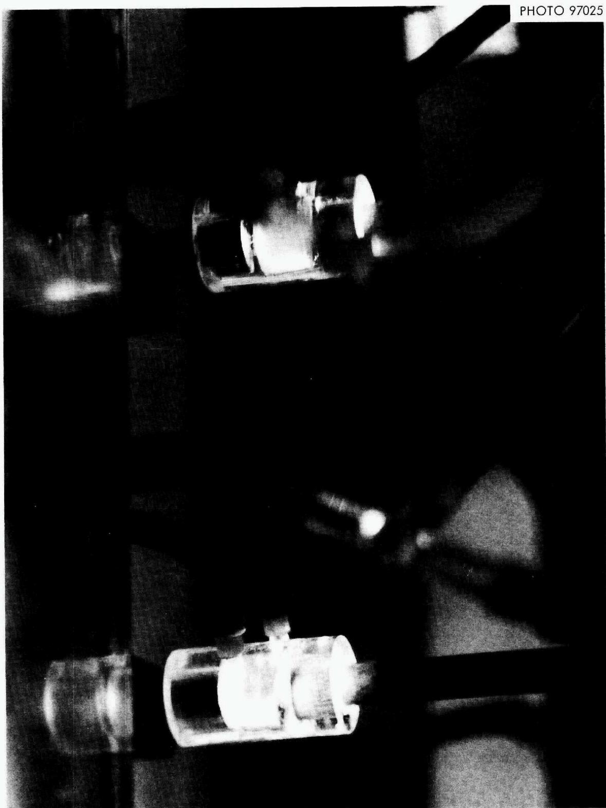  
Fig. 30. Photocell Used in Measurements of Axial Dispersion in Packed Columns.

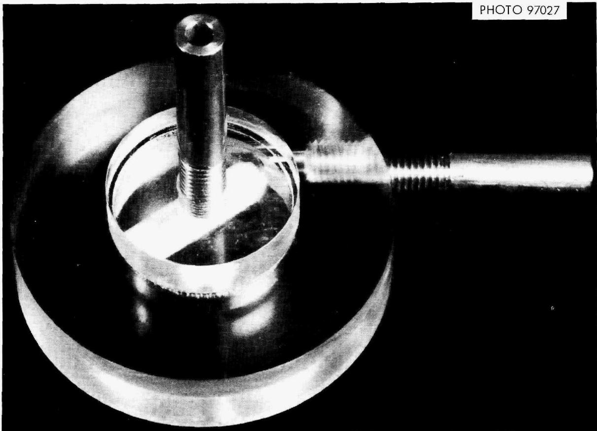  
Fig. 31. Circulation Pump Used for Measurements of Axial Dispersion in Packed Columns.

steel for extra strength. The impeller is a Teflon-coated magnetic stirrer driven by a rotating magnet located outside the pump.

The assembled column is shown in Fig. 32. The circulation pumps are mounted on the rack shown on the right. The driving magnets are rotated by a single motor. The column, made of Lucite, has an inside diameter of 2 in. and a height of 4 ft.

# 8.3 Results

Typical data from the system are shown in Fig. 33, where the logarithm of the tracer concentration is plotted as a function of distance down the column (Z) from the tracer inlet. The resulting curve, obtained by using 3/8-in. Raschig rings, a mercury flow rate of 29.1 ft/hr (superficial velocity), and a water flow rate of 9.1 ft/hr, is essentially linear. This indicates that the axial diffusion is independent of the distance down the column and suggests that the extent of mercury dispersion has reached a steady-state condition in this section of the column. The dispersion coefficient measured in this experiment was $3.4~\mathrm{cm}^2/\mathrm{sec}$ . No significant variation in this coefficient was detected when several other mercury and water flow rates were used; the average value was approximately $3.6~\mathrm{cm}^2/\mathrm{sec}$ . However, these flow rates did not include rates close to flooding, where changes in flow patterns are known to occur.

# 9. REMOVAL OF HEAT FROM PACKED-COLUMN CONTACTORS USED FOR ISOLATING PROTACTINIUM

J. S. Watson L. E. McNeese

Packed-column contactors are being considered for use in reductive extraction processing systems. Heat transfer and temperature distribution within these columns are important since significant quantities of

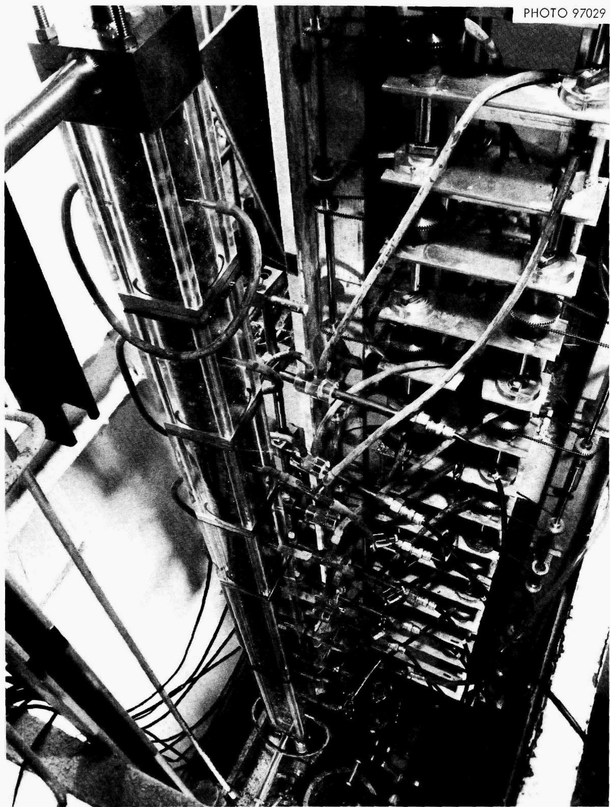  
Fig. 32. Experimental Equipment Used for Study of Axial Dispersion in Packed Columns.

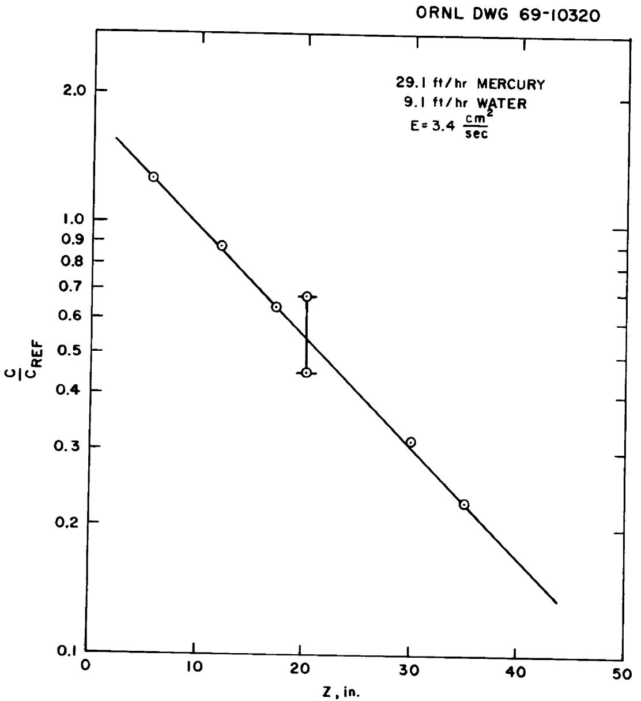  
Fig. 33. Axial Diffusion Measurements Made with 3/8-in. Raschig Rings.

heat will be generated as a result of radioactive decay. In the remainder of this section, estimates are made of temperatures in columns used for isolating protactinium under various operating conditions.

The generation of heat in the protactinium isolation system results primarily from the decay of $^{233}\mathrm{Pa}$ , although significant quantities of heat are produced by the decay of fission products. Under normal operating conditions, the concentration of protactinium in the salt reaches a maximum value midway up the column; at this point, the heat resulting from the decay of both fission products and protactinium is generated at the rate of about 37 kw per cubic foot of salt. As the salt flows through the column, the rate at which heat is generated from the decay of fission products in the salt decreases from an inlet value of 16 kw per cubic foot of salt to an exit value of about 4 kw per cubic foot of salt. A significant quantity of salt having a high protactinium concentration will be held up in the protactinium decay tank; the total generation rate in this salt is about 29 kw per cubic foot of salt.

The most difficult heat-transfer situation likely to be encountered is believed to be represented by conditions in which the extraction column contains salt having a heat generation rate equal to that in the decay tank $(29\mathrm{kw / ft}^3)$ . Two simplified heat-transfer situations related to this condition were examined. In the first, it was assumed that no heat was removed through the walls of the column, and the resulting exit salt and metal temperatures were calculated. In the second case, it was assumed that all of the heat was removed through the walls of the column, and the difference between the temperature of the column wall and the temperature of the center line of the column was calculated.

# 9.1 Maximum Column Temperatures, Assuming Only Convection of Heat

The rate at which salt flows through the column will be $7.1 \times 10^{5}$ g-moles/day, or $525 \mathrm{~g} / \mathrm{sec}$ . The heat capacity of salt is $0.33 \mathrm{cal} \mathrm{g}^{-1} \circ \mathrm{C}^{-1} \cdot 10^{10}$ . The metal flow rate is $1.4 \times 10^{6}$ g-moles/day, or $3.39 \times 10^{3}$

g/sec. The heat capacity of liquid bismuth is 0.035 cal g $^{-1}$ C $^{-1}$ . It will be assumed that the extraction column is 8 in. in diameter and 20 ft long. If packed with Raschig rings, it would have a void fraction of approximately 0.75 and the total heat generation rate would be 3.08 x 10 $^{4}$ cal/sec. If there is no heat loss through the wall and if the salt and metal streams enter the column at the same temperature, the temperature increase during their passage through the columns will be 106°C. If metal alone was flowing through the column, the increase in temperature would amount to 260°C; if salt alone was flowing through the column, the increase would be 178°C.

# 9.2 Maximum Column Temperatures, Assuming Only Heat Removal Through the Column Wall

Heat can be transferred radially in the column, and hence through the column wall, by the combined effects of conduction and convection. No data were found on effective thermal conductivities in packed beds during two-phase countercurrent flow. In the absence of such data, effective thermal conductivities in packed beds with single-phase flow were used. We feel that this approach probably gives a conservative estimate of the conductivity, that is, a value lower than would actually be observed. Data of Bernard and Wilhelm11 were considered most relevant because these authors studied mass transfer (diffusion) through packed beds, a situation in which no credit could be taken for conduction through the packing. Most data related to conduction through packed beds were obtained by using gases for the fluids; in such cases, the conductivity of the packing may be important. Bernard and Wilhelm reported that

$$
\mathrm {N} _ {\mathrm {P e}} = \mathrm {D} _ {\mathrm {p}} \mathrm {U} / \mathrm {E} \approx 1 0, \tag {38}
$$

where

$\mathrm{N}_{\mathrm{Pe}} = \mathrm{Peclet}$ number,

D $=$ packing diameter,

$\mathbf{U} =$ superficial fluid velocity,

$\mathbf{E} =$ effective diffusion coefficient (of heat or mass).

With 3/8-in. packing and a salt velocity of 62.7 ft/hr, the effective diffusivity given by this relation is $0.20\mathrm{ft}^2/\mathrm{hr}$ , which yields an effective thermal conductivity value of 7.75 Btu hr $^{-1}$ ft $^{-1}$ $\circ\mathrm{F}^{-1}$ . The difference between the temperature of the wall and that of the center line of a cylinder of infinite length having a volumetric heat source of uniform strength is:

$$
T _ {c} - T _ {\text {w a l l}} = \frac {\sigma d ^ {2}}{1 6 k _ {e}}, \tag {39}
$$

where

$\sigma =$ volumetric heat generation rate,

$\mathbf{d} =$ diameter of the cylinder,

$k_{e} =$ effective conductivity of the cylinder.

The calculated difference between the center-line and the wall temperatures is $147^{\circ}\mathrm{C}$ .

# 9.3 Conclusion

Since heat will be removed from the column by conduction through the wall, as well as by the materials flowing through the column, the maximum temperature rise in the columns should be less than $150^{\circ}\mathrm{C}$ if salt from the decay tank fills the reductive extraction column. However, in order to hold the temperature increases to this value, it will be necessary to maintain at least the normal metal flow rate. Actually, the increase in temperature will be tolerable if the normal flow rate of either one of the phases is maintained.

# 10. MSRE DISTILLATION EXPERIMENT

J.R.Hightower, Jr. L.E.McNeese

Equipment for the MSRE Distillation Experiment and its installation at the MSRE site have been described earlier. This section summarizes operation of the equipment, describes the data obtained, and presents the results of some of the performance calculations.

# 10.1 Summary of Distillation Operation

The experiment to demonstrate the high-temperature, low-pressure distillation of irradiated MSRE fuel carrier salt has been successfully completed. Although the quantity of salt processed was only 12 liters (instead of the anticipated 48 liters), all objectives of the experiment were met in an uneventful 31-hr operation.

On May 1, 1969, we attempted to transfer 48 liters of irradiated MSRE fuel salt (containing no uranium) from the fuel storage tank (FST) to the still feed tank. The transfer was initiated by evacuating the feed tank, which contained about 2 liters of unirradiated salt, to about 1.5 psia. After 12 liters of salt had been transferred from FST, the pressure in the feed tank rose quickly (over a period of 2 min) from about 4 psig to atmospheric pressure, which indicated that gas was flowing from the FST to the feed tank. Although the bubbler in the FST indicated that more salt was present, we made only one additional attempt to transfer salt because of the potential danger of removing the salt from the freeze valve between the two vessels. After it was established that a tight seal could be made in the freeze valve, we decided to proceed with the experiment using the salt already transferred.

At the start of the distillation, 7 liters of salt was transferred from the feed tank to the still pot. The still pot was heated to $900^{\circ}\mathrm{C}$ , and distillation was initiated by slowly decreasing the condenser pressure

to $0.2 \, \text{mm} \, \text{Hg}$ . The remaining salt in the feed tank was fed to the still pot with the control system maintaining a near-constant salt level in the still pot. During this part of the run, the still-pot temperature was slowly increased since the concentrations of volatile $\text{BeF}_2$ and $\text{ZrF}_4$ were still fairly high; also, it appeared that the capacity of the condenser would be exceeded since the temperature at the end of the condenser was becoming abnormally high. We reduced the distillation rate to a point where the condenser temperature remained at a constant and acceptable level (about $700^{\circ}\text{C}$ ) by increasing the pressure of the condenser to $0.8 \, \text{mm} \, \text{Hg}$ .

When the remaining salt in the feed tank (7 liters) had been distilled, salt in the feed line to the still pot was frozen; then 4 of the 7 liters of salt in the still pot was distilled by batch distillation. The still-pot temperature during this part of the run was $980^{\circ}\mathrm{C}$ ; the condenser pressure was about $0.1\mathrm{mmHg}$ .

During the first part of the experiment, the average distillation rate was 0.71 liter/hr; during the last part, it was about 0.30 liter/hr. Eleven condensate samples were taken at approximately 90-min intervals during the run. When these samples were removed at the end of the experiment, the radiation readings ranged from 4 r/hr at contact for the first sample to 500 m/r at contact for the last sample. The predominant activity in all samples was $^{137}$ Cs.

# 10.2 Summary of Available Experimental Data

The following quantities were measured during this experiment: the concentration of each component in the feed salt to the still and in the condensate (several times), the volume of liquid fed to the still pot, and the volume of liquid collected in the receiver. All concentrations were calculated as of May 7, 1969. The volumes of salt in the feed tank, still pot, and condensate receiver were determined by measuring the weight of

liquid over the end of a bubbler, dividing by a salt density of 2.2 $\mathrm{g/cm}^3$ to obtain the depth of liquid, and multiplying this value by the cross-sectional area of the particular vessel to obtain the volume. We assumed that the mass density of the liquid was independent of composition and that the volume of liquid in the still pot could be calculated by subtracting the volume of condensate collected from the total volume of salt fed to the still from the feed tank. Assuming molar volumes can be added (which is a fairly good assumption for fluoride salts), we calculated densities for liquids in the concentration range seen in this experiment and found only a $5\%$ variation in mass density; hence, our assumption of constant density is acceptable. Table 3 summarizes the data collected during the distillation. Complete analyses for all fission products have not been received; thus analyses are given only for $^{144}$ Ce and $^{95}$ Zr.

# 10.3 Material Balance Calculations

One of the most concise ways to express the separation performance of the distillation equipment is to convert the condensate analyses to effective relative volatilities with respect to LiF. The effective relative volatility of component i with respect to LiF is defined as

$$
\alpha_ {i - L i F} = \frac {\mathrm {y} _ {i} / \mathrm {x} _ {i}}{\mathrm {y} _ {L i F} / \mathrm {x} _ {L i F}}, \tag {40}
$$

where

$y =$ mole fraction in the condensate,

$x =$ mole fraction in the still pot.

Although the composition of each component in the still pot was not measured directly during the run, the data allow the composition of the still

Table 3. Summary of Data from Distillation Experiment   

<table><tr><td rowspan="2"></td><td rowspan="2">Volume of Salt Fed from Feed Tank (liters)</td><td rowspan="2">Volume of Condensate Collected (liters)</td><td colspan="5">Condensate Analyses (mole fraction)</td></tr><tr><td>LiF</td><td>BeF2</td><td>ZrF4</td><td>95Zr</td><td>144Ce</td></tr><tr><td>Start of run</td><td>7.75</td><td>0</td><td>--</td><td>--</td><td>--</td><td>--</td><td>--</td></tr><tr><td>FDE-1</td><td>7.9</td><td>0.42</td><td>0.284</td><td>0.629</td><td>0.0873</td><td>2.03 x 10-8</td><td>≤ 1.80 x 10-8</td></tr><tr><td>FDE-2</td><td>10.0</td><td>1.93</td><td>0.385</td><td>0.539</td><td>0.0756</td><td>2.07 x 10-8</td><td>2.03 x 10-8</td></tr><tr><td>FDE-3</td><td>11.2</td><td>2.96</td><td>0.439</td><td>0.512</td><td>0.0489</td><td>1.31 x 10-8</td><td>1.14 x 10-8</td></tr><tr><td>FDE-4</td><td>12.6</td><td>3.81</td><td>0.466</td><td>0.484</td><td>0.0494</td><td>1.36 x 10-8</td><td>2.49 x 10-8</td></tr><tr><td>FDE-5</td><td>13.4</td><td>4.35</td><td>0.489</td><td>0.463</td><td>0.0479</td><td>1.35 x 10-8</td><td>--</td></tr><tr><td>FDE-6</td><td>13.6</td><td>4.95</td><td>0.455</td><td>0.494</td><td>0.0515</td><td>1.43 x 10-8</td><td>1.25 x 10-8</td></tr><tr><td>Start of batch distillation</td><td>13.8</td><td>5.07</td><td>--</td><td>--</td><td>--</td><td>--</td><td>--</td></tr><tr><td>FDE-7</td><td>13.8</td><td>5.80</td><td>0.497</td><td>0.452</td><td>0.0509</td><td>1.35 x 10-8</td><td>9.21 x 10-9</td></tr><tr><td>FDE-8</td><td>13.8</td><td>6.34</td><td>0.546</td><td>0.407</td><td>0.0466</td><td>1.33 x 10-8</td><td>1.41 x 10-8</td></tr><tr><td>FDE-9</td><td>13.8</td><td>6.89</td><td>0.599</td><td>0.361</td><td>0.0405</td><td>1.09 x 10-8</td><td>2.32 x 10-8</td></tr><tr><td>FDE-10</td><td>13.8</td><td>7.49</td><td>0.740</td><td>0.224</td><td>0.0357</td><td>9.83 x 10-9</td><td>1.79 x 10-8</td></tr><tr><td>FDE-11</td><td>13.8</td><td>7.85</td><td>0.741</td><td>0.224</td><td>0.0344</td><td>9.47 x 10-9</td><td>2.51 x 10-8</td></tr><tr><td>Feed composition</td><td>--</td><td>--</td><td>0.663</td><td>0.273</td><td>0.0637</td><td>1.24 x 10-8</td><td>1.16 x 10-6</td></tr></table>

pot to be estimated from a material balance for each component. In the remainder of this section, we derive the material balance equations and outline the calculational procedure.

For the semicontinuous mode of operation, a differential mole balance for component $i$ gives:

$$
f _ {i} d I - y _ {i} d O = d M _ {i}, \tag {41}
$$

where

$I =$ total moles fed to the still pot,

$O =$ total moles removed from the still pot,

$M_{i} =$ moles of component i in the still pot,

$f_{i} =$ mole fraction of component i in the feed,

$y_{i} =$ mole fraction of component i in the condensate.

Since volume was the measured quantity, we can make the following substitutions:

$$
\begin{array}{l} d I = \frac {d V _ {i n}}{N}, \\ j = 1 \begin{array}{c} f \\ j \end{array} v _ {j} \\ \end{array}
$$

(4.2)

$$
\begin{array}{l} d 0 = \frac {d V}{N} \text {o u t}, \\ j = 1 ^ {y _ {j} v _ {j}} \\ \end{array}
$$

where

$V_{in} =$ volume of salt fed to the still pot, liters,

$\mathbf{V}_{\mathrm{out}} = \mathbf{v}$ olume of condensate collected, liters,

$v_{j} =$ molar volume of component j, liters/mole.

When we substitute the quantities in Eq. (42) into Eq. (41), we obtain

$$
\frac {f _ {i}}{N} \mathrm {d V} _ {\text {i n}} - \frac {y _ {i}}{N} \mathrm {d V} _ {\text {o u t}} = \mathrm {d M} _ {i}. \tag {43}
$$

Integration of Eq. (43) yields

$$
\frac {f _ {i}}{N} \quad V _ {\text {i n}} - \quad \frac {V _ {\text {o u t}} y _ {i}}{N} \quad d V _ {\text {o u t}} = M _ {i}, \tag {44}
$$

where the conditions $V_{in} = V_{out} = M_i = 0$ at the start of the experiment were used. The composition in the still pot can be determined by solving for $M_i$ for each component. This equation is valid up to the point where $V_{out} = 5.07$ liters (the end of the semicontinuous distillation).

During the batch distillation, if $\mathbf{M}_{\mathbf{i}}$ moles of component i are present in the still pot and $\mathrm{d}\mathbf{M}_{\mathbf{i}}$ moles of component i are vaporized, the mole fraction of component i in the vapor is given by

$$
y _ {i} = \frac {\mathrm {d M} _ {i}}{\mathrm {N}}; \tag {45}
$$

similarly, for component $j$ ( $i \neq j$ ),

$$
y _ {j} = \frac {\mathrm {d M} _ {j}}{\mathrm {N}}. \tag {46}
$$

From Eqs. (45) and (46), we obtain the expression

$$
\frac {\mathrm {d} M _ {i}}{y _ {i}} = \frac {\mathrm {d} M _ {j}}{y _ {j}}, \tag {47}
$$

or

$$
\mathrm {d M} _ {i} = \frac {\mathrm {y} _ {j}}{\mathrm {y} _ {j}} \mathrm {d M} _ {j}. \tag {48}
$$

Assuming that the molar volumes $\mathbf{v}_{\mathbf{i}}$ are independent of composition (as we did before), we multiply both sides of Eq. (48) by $\mathbf{v}_{\mathbf{i}}$ and sum both sides over all $\mathbf{i}$ to obtain the following equation:

$$
\underset {i = 1} {\overset {N} {\mathrm {v}}} _ {i} \mathrm {d M} _ {i} = \mathrm {d V} _ {\text {s t i l l}} = \underset {i = 1} {\overset {N} {\mathrm {v}}} _ {i} \left(\mathrm {y} _ {i} \mathrm {v} _ {i}\right) \frac {\mathrm {d M} _ {j}}{\mathrm {y} _ {j}}, \tag {49}
$$

where $V_{\text{still}} =$ volume of salt in the still pot, liters.

Solving Eq. (49) for $\mathbf{dM_j}$ yields:

$$
\mathrm {d M} _ {\mathrm {j}} = \frac {\mathrm {y} _ {\mathrm {j}}}{\underset {\mathrm {i} = 1} {\mathrm {N}} \mathrm {y} _ {\mathrm {i}} ^ {\mathrm {v}} \mathrm {y} _ {\mathrm {i}}} \quad \mathrm {d V} _ {\text {s t i l l}}. \tag {50}
$$

Integrating Eq. (50) yields:

$$
\mathrm {M} _ {\mathrm {j}} = \mathrm {M} _ {\mathrm {j o}} + \quad \begin{array}{c} \mathrm {V} _ {\text {s t i l l}} \\ \frac {\mathrm {y} _ {\mathrm {j}}}{\mathrm {N}} \\ \mathrm {V} _ {\mathrm {o}} \quad \mathrm {i} = 1 ^ {\mathrm {y} _ {\mathrm {i}} ^ {\mathrm {v}} \mathrm {i}} \end{array} \mathrm {d V} _ {\text {s t i l l}}, \tag {51}
$$

where

Mjo = moles of component j present in the still pot at the start of the batch distillation,

$V_{0} =$ volume of salt in still pot at start of batch distillation.

The quantity $M_{\text{jo}}$ in Eq. (51) is calculated by evaluating Eq. (44) using the values of $V_{\text{in}}$ and $V_{\text{out}}$ corresponding to the end of the semicontinuous distillation. As previously, the composition of the still pot is determined by evaluating Eq. (51) for each component present,

The integrals in Eqs. (44) and (51) were evaluated by plotting $y_{i} / \sum_{j=1}^{N} y_{j} v_{j}$ vs the volume of condensate collected in the receiver during the semicontinuous distillation and $y_{i} / \sum_{j=1}^{N} y_{j} v_{j}$ vs the still-pot volume (calculated as explained in the previous section) during the batch distillation. The evaluation was made by fitting the data to simple empirical functions of the appropriate values and then integrating these equations. For any component, a fairly wide range of equation parameters fit the scattered data equally well; however, the values of the integrals were not significantly sensitive to these variations in the parameters. The sums $\sum_{i=1}^{N} y_{i} v_{i}$ and $\sum_{i=1}^{N} f_{i} v_{i}$ were adequately represented by considering only the major salt components LiF, BeF₂, and ZrF₄ since the mole fractions of the fission products were negligible as compared with the mole fractions of these components.

Using Eqs. (44) and (51), we calculated the number of moles of each component present in the still pot at the time each condensate sample was taken. The mole fraction of each component in the still pot at that time was calculated using the following equation:

$$
\begin{array}{l} x _ {i} = \frac {M _ {i}}{N}. \tag {52} \\ j = 1 ^ {M} j \\ \end{array}
$$

The calculated $x_{i}$ values are summarized in Table 4. The measured values of $y_{i}$ from Table 3 and the calculated values of $x_{i}$ were used in Eq. (40) to calculate the effective relative volatility of each component, with respect to LiF, for each sample.

# 10.4 Results

Calculations, as described in the previous section, have been carried out for the major salt components LiF, $\mathrm{BeF}_2$ , and $\mathrm{ZrF}_4$ , and for the fission products $^{95}\mathrm{Zr}$ and $^{144}\mathrm{Ce}$ . As shown in Fig. 34, the effective relative volatility of $\mathrm{BeF}_2$ remained constant at a value of 5.4 during the semicontinuous distillation, but increased gradually to 8.4 during the batch distillation. The value measured during the semicontinuous portion of the run is near the value (4.7) that was measured in recirculating equilibrium stills in $\mathrm{LiF - BeF}_2$ systems. $^{12}$ The increase during the batch distillation is in qualitative agreement with measurements $^{13}$ made in $\mathrm{LiF - BeF}_2$ - $\mathrm{ThF}_4$ systems. These measurements showed that, as the mole fraction of $\mathrm{BeF}_2$ in the liquid became very small, the relative volatility of $\mathrm{BeF}_2$ increased.

The relative volatility of $\mathrm{ZrF}_4$ (both stable zirconium and fission product $^{95}\mathrm{Zr}$ ), which was approximately 4 at the start of the experiment, decreased, and then became constant at a value near 2 about halfway through the semicontinuous mode of operation. It then decreased further during the batch distillation to about 1. These values are consistent with values measured under equilibrium conditions.

As shown in Fig. 35, the effective relative volatility of $^{144}\mathrm{CeF}_3$ had an initial value of about $3.5 \times 10^{-2}$ and decreased steadily until it reached a value of about $1 \times 10^{-2}$ at the end of the experiment. These values are about two orders of magnitude higher than the value measured in small recirculating equilibrium stills in $\mathrm{LiF - BeF}_2$ systems. Although an explanation of this discrepancy is not presently available, consistent explanations may emerge as the analyses for the other fission products become available.

Table 4. Calculated Still-Pot Compositions for the MSRE Distillation Experiment   

<table><tr><td rowspan="2">Sample No. (FDE-)</td><td colspan="5">Concentration (mole fraction)</td></tr><tr><td>LiF</td><td>BeF2</td><td>ZrF4</td><td>95Zr</td><td>144Ce</td></tr><tr><td>1</td><td>0.684</td><td>0.255</td><td>0.0617</td><td>1.164 x 10-8</td><td>1.22 x 10-6</td></tr><tr><td>2</td><td>0.738</td><td>0.202</td><td>0.0593</td><td>1.039 x 10-8</td><td>1.41 x 10-6</td></tr><tr><td>3</td><td>0.766</td><td>0.175</td><td>0.0597</td><td>1.002 x 10-8</td><td>1.54 x 10-6</td></tr><tr><td>4</td><td>0.788</td><td>0.162</td><td>0.0606</td><td>0.966 x 10-8</td><td>1.61 x 10-6</td></tr><tr><td>5</td><td>0.785</td><td>0.154</td><td>0.0612</td><td>0.996 x 10-8</td><td>1.66 x 10-6</td></tr><tr><td>6</td><td>0.800</td><td>0.138</td><td>0.0618</td><td>0.974 x 10-8</td><td>1.76 x 10-6</td></tr><tr><td>7</td><td>0.828</td><td>0.109</td><td>0.0626</td><td>0.93 x 10-8</td><td>1.91 x 10-6</td></tr><tr><td>8</td><td>0.849</td><td>0.0877</td><td>0.0635</td><td>0.904 x 10-8</td><td>2.07 x 10-6</td></tr><tr><td>9</td><td>0.868</td><td>0.0667</td><td>0.0650</td><td>0.881 x 10-8</td><td>2.19 x·10-6</td></tr><tr><td>10</td><td>0.888</td><td>0.0444</td><td>0.0676</td><td>0.862 x 10-8</td><td>2.40 x 10-6</td></tr><tr><td>11</td><td>0.898</td><td>0.0323</td><td>0.0696</td><td>0.855 x 10-8</td><td>2.55 x 10-6</td></tr></table>

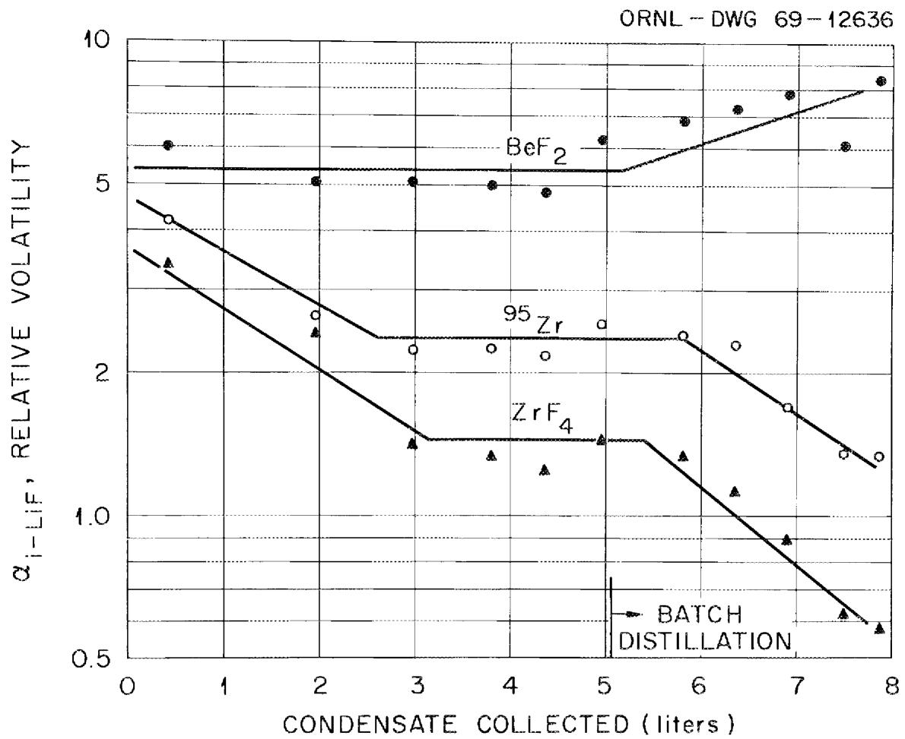  
Fig. 34. Effective Relative Volatilities of Major Salt Constituents and $95_{\mathrm{Zr}}$

ORNL DWG 71-107

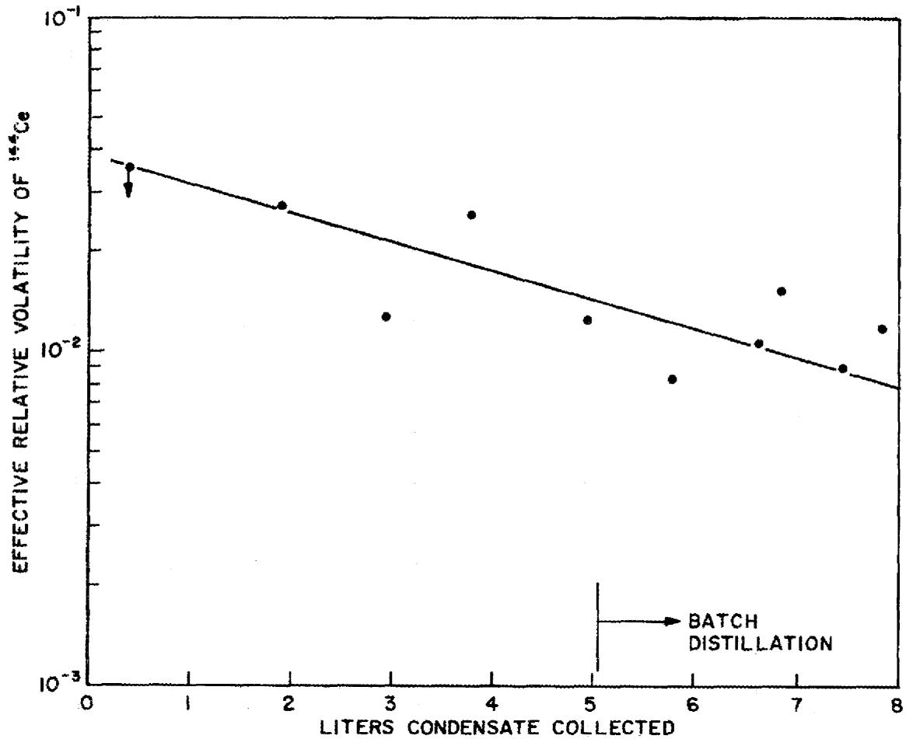  
Fig. 35. Effective Relative Volatility of $^{144}\mathrm{Ce}$ .

# 11. REFERENCES

1. MSR Program Semiann. Progr. Rept. Aug. 31, 1968, ORNL-4344, pp. 68-70.   
2. MSR Program Semiann. Progr. Rept. Feb. 28, 1969, ORNL-4396, pp. 275-78.   
3. MSR Program Semiann. Progr. Rept. Feb. 28, 1969, ORNL-4396, pp. 77-79.   
4. L. G. Alexander et al., Molten Salt Converter Reactor Design Study and Power Cost Estimates for a 1000 MWe Station, ORNL-TM-1060 (September 1965), pp. 209-20.   
5. R. W. Stoughton and J. Halperin, Nucl. Sci. Eng. 6, 100-118 (1959).   
6. MSR Program Semiann. Progr. Rept. Feb. 28, 1969, ORNL-4396, pp. 284-85.   
7. MSR Program Semiann. Progr. Rept. Aug. 31, 1968, ORNL-4344, pp. 115-41.   
8. L. E. McNeese, Engineering Development Studies for Molten-Salt Breeder Reactor Processing No. 1, ORNL-TM-3053 (November 1970).   
9. L. E. McNeese, Engineering Development Studies for Molten-Salt Breeder Reactor Processing No. 2, ORNL-TM-3137 (February 1971).   
10. S. Cantor, Physical Properties of Molten Salt Reactor Fuel, Coolant, and Flush Salts, ORNL-TM-2316 (August 1968).   
11. R. A. Bernard and B. H. Wilhelm, Chem. Eng. Progr. 46, 233-44 (1950).   
12. J. R. Hightower and L. E. McNeese, Measurement of the Relative Volatilities of Fluorides of Ce, La, Pr, Nd, Sm, Eu, Ba, Sr, Y, and Zr in Mixtures of LiF and BeF $_2$ , ORNL-TM-2058 (January 1968).   
13. F. J. Smith, L. M. Ferris, and C. T. Thompson, Liquid-Vapor Equilibria in LiF-BeF $_2$ -ThF $_4$ Systems, ORNL-4415 (June 1969).

# INTERNAL DISTRIBUTION

1. C. F. Baes

42. E. L. Nicholson

2.H.F.Baumann

43. J. H. Pashley (K-25)

3. S. E. Beall

44. A. M. Perry

4. M. J. Bell

45-46. M. W. Rosenthal

5. R. E. Blanco

47. J. Roth

6. F. F. Blankenship

48. A. D. Ryon

7. G. E. Boyd

49. W. F. Schnaffer, Jr.

8. R. B. Briggs

50. Dunlar, Scott

9. R. E. Brooksbank

51. J.H.Shaffer

10. K. B. Brown

52. M. J. Skinner

11. W. L. Carter

53. F. J. Smith

12. H. D. Cochran, Jr.

54. Martha Stewart

13. F. L. Culler

55. R.E.Thoma

14. J. R. Distefano

56. D. B. Trauger

15. W. P. Eatherly

57. Chia-Pao Tung

16. D. E. Ferguson

58. W.E.Unger

17. L. M. Ferris

59. C. D. Watson

18. J. H. Frye

60. J. S. Watson

19. W. R. Grimes

61. H. O. Weeren

20. A. G. Grindell

62. A. M. Weinberg

21. P. A. Haas

63. J.R.Weir

22. B. A. Hannaford

64. M. E. Whatley

23. P. N. Haubenreich

65. J. C. White

24. J. R. Hightower, Jr.

66. R. G. Wymer

25. C. W. Kee

67. E. L. Youngblood

26. R. B. Lindauer

68-69. Central Research Library

27. J. C. Mailen

70-71. Document Reference Section

28. H. E. McCoy

72-74. Laboratory Records

29-39. L. E. McNeese

75. Laboratory Records, RC

40. D. M. Moulton

76. Y-12 Document Reference Section

41. J. P. Nichols

77. ORNL Patent Office

# EXTERNAL DISTRIBUTION

78. D. F. Cope, Atomic Energy Commission, RDT Site Office (ORNL)   
79. A. R. DeGrazia, USAEC, DRDT, Washington, D.C. 20545   
80. D. Elias, RDT, USAEC, Washington, D.C. 20545   
81. Norton Haberman, RDT, USAEC, Washington, D.C. 20545   
82. Kermit Laughon, Atomic Energy Commission, RDT Site Office (ORNL)   
83-84. T. W. McIntosh, Atomic Energy Commission, Washington, D.C. 20545   
85. M. Shaw, Atomic Energy Commission, Washington, D.C. 20545   
86. Laboratory and University Division, ORO   
87-88. Division of Technical Information Extension, ORO