# OAK RIDGE NATIONAL LABORATORY

operated by

UNION CARBIDE CORPORATION \* NUCLEAR DIVISION

for the

1300X

U.S. ATOMIC ENERGY COMMISSION

3445601352879

ORNL-TM-3140

ay.67

ENGINEERING DEVELOPMENT STUDIES FOR MOLTEN-SALT

BREEDER REACTOR PROCESSING NO.5

L. E. McNeese

E E E E E E E E E E

D

1.2.4.3.1.1.1.1.1.1.1.1.1.1.1.1.1.1.1.1.1.1.1.1.1.1.1.1.1.1.1.1.1.1.1.1.1.1.1.1.1.1.1.1.1.1.1.1.1.1.1.1.1.1.

A

NOTICE This document contains information of a preliminary nature and was prepared primarily for internal use at the Oak Ridge National Laboratory. It is subject to revision or correction and therefore does not represent a final report.

This report was prepared as an account of work sponsored by the United States Government. Neither the United States nor the United States Atomic Energy Commission, nor any of their employees, nor any of their contractors, subcontractors, or their employees, makes any warranty, express or implied, or assumes any legal liability or responsibility for the accuracy, completeness or usefulness of any information, apparatus, product or process disclosed, or represents that its use would not infringe privately owned rights.

Contract No. W-7405-eng-26

CHEMICAL TECHNOLOGY DIVISION

ENGINEERING DEVELOPMENT STUDIES FOR MOLTEN-SALT BREEDER REACTOR PROCESSING NO. 5

L. E. McNeese

OCTOBER 1971

OAK RIDGE NATIONAL LABORATORY

Oak Ridge, Tennessee

operated by

UNION CARBIDE CORPORATION

for the

U.S. ATOMIC ENERGY COMMISSION

Reports previously issued in this series are as follows:

ORNL-4235

Period ending December 1967

ORNL-4364

Period ending March 1968

ORNL-4365

Period ending June 1968

ORNL-4366

Period ending September 1968

ORNL-TM-3053

Period ending December 1968

ORNL-TM-3137

Period ending March 1969

ORNL-TM-3138

Period ending June 1969

ORNL-TM-3139

Period ending September 1969

# CONTENTS

# Page

# SUMMARIES V

1. INTRODUCTION 1   
2. RARE-EARTH REMOVAL USING THE METAL-TRANSFER PROCESS 2

2.1 Equilibrium Data and Concentrations 2   
2.2 Removal of Rare Earths and Thorium from LiCl 5   
2.3 Conceptual Process Flowsheet and Mathematical Analysis 5   
2.4 Calculated Rare-Earth Removal Times 9   
2.5 Effect of Rare-Earth Removal Time on Breeding Ratio 12   
2.6 Miscellaneous Points Related to the Metal-Transfer Process . 12

3. PROTACTINIUM ISOLATION USING FLUORINATION--REDUCTIVE EXTRACTION . 15

3.1 Proposed Flowsheet for Isolating Protactinium by Fluorination--Reductive Extraction 15   
3.2 Calculated System Performance 17

4. AXIAL DISPERSION IN OPEN BUBBLE COLUMNS 22

4.1 Experimental Technique and Equipment 26   
4.2 Experimentally Determined Dispersion Coefficients 27

5. SEMICONTINUOUS REDUCTIVE EXTRACTION EXPERIMENTS IN A MILD-STEEL FACILITY 30

5.1 Hydrodynamic Run HR-6 30   
5.2 Hydrodynamic Runs HR-7 and HR-8; Tests for Obstructions 32

6. SIMULATION OF THE FLOW CONTROL SYSTEMS FOR THE REDUCTIVE EXTRAC- TION FACILITY 36

6.1 Analog Simulation of Jackleg and Extraction Column 37   
6.2 Digital Simulation of Salt Flow Control System, Jackleg, and Extraction Column 46

7. CALIBRATION OF AN ORIFICE--HEAD POT FLOWMETER WITH MOLTEN SALT AND BISMUTH 56

7.1 Data from Steady-State Flow Experiments 56   
7.2 Data from Transient Flow Experiments 58

8. ELECTROLYTIC CELL DEVELOPMENT: STATIC CELL EXPERIMENTS 62

# CONTENTS (Continued)

Page

9. ELECTROLYTIC CELL DEVELOPMENT: FORMATION OF FROZEN FILMS WITH AQUEOUS ELECTROLYTES 64

9.1 Mathematical Analysis 64   
9.2 Experimental Equipment 69   
9.3 Expected Mode of Operation 71

10. DEVELOPMENT OF A BISMUTH--MOLTEN SALT INTERFACE DETECTOR . 74

10.1 Testing and Modification of Electronic Circuit Prior to Installation 74   
10.2 Fabrication of Sight Tube 76

11. CONTINUOUS SALT PURIFICATION 77   
12. MSRE DISTILLATION EXPERIMENT 79   
13. RECOVERY OF $7_{\text{Li}}$ FROM $7_{\text{Li--BISMUTH--RARE-EARTH SOLUTIONS BY}}$ DISTILLATION 88

13.1 Mathematical Analysis 88   
13.2 Calculated Results 93

14. PREVENTION OF AXIAL DISPERSION IN PACKED COLUMNs 97   
15. HYDRODYNAMICS OF PACKED COLUMN OPERATION WITH HIGH-DENSITY FLUIDS 102

15.1 Experimental Technique and Results 103   
15.2 Pressure Drop Across the Column 104   
15.3 Dispersed-Phase Holdup 112   
15.4 Correlation of Flooding Rates 113   
15.5 Prediction of Molten-Salt-Bismuth Flooding Rates in Packed Columns 116

16. REFERENCES 118

# SUMMARIES

# RARE-EARTH REMOVAL USING THE METAL-TRANSFER PROCESS

We have devised a new process, called the metal-transfer process, for removing rare-earth fission products from the fuel salt of a single-fluid MSBR. In the process, bismuth containing thorium and lithium is used to transfer the rare-earth fission products from the reactor fuel salt to an acceptor salt such as LiCl.

Both thorium and rare earths transfer to the bismuth; however, because of favorable distribution coefficients, only a small fraction of the thorium transfers with the rare earths from the bismuth to the LiCl. The effective thorium-rare-earth separation factors for rare earths for which data exist (i.e., Nd, La, and Eu) range from about $10^{4}$ to about $10^{8}$ . The final step of the process is removal of the rare earths from the LiCl by extraction with bismuth containing 0.05 to 0.5 mole fraction lithium. The new process does not require an electrolytic cell. This is an important advantage over the earlier reductive extraction process, which also had the disadvantage of rare-earth-thorium separation factors near unity.

# PROTACTINIUM ISOLATION USING FLUORINATION--REDUCTIVE EXTRACTION

We have recently developed a new process for removing rare earths from a single-fluid MSBR. This process does not require an electrolytic cell, which has led us to consider protactinium isolation methods that do not require electrolyzers. One such method is fluorination--reducing extraction, in which most of the uranium would be removed prior to isolation of the protactinium by reductive extraction.

Calculated results indicated that an attractive processing system based on fluorination--reductive extraction can be devised and that this system will be quite stable with respect to variations as large as $20\%$

for most of the important operating parameters such as flow rates, reductant concentrations, and number of extraction stages.

# AXIAL DISPERSION IN OPEN BUBBLE COLUMN

Axial dispersion coefficient measurements and gas holdup measurements were carried out in a 2-in.-ID open column. Aqueous solutions of glycerol and n-butanol were used in order to determine the effect of liquid-phase viscosity and surface tension on axial dispersion. At low gas flow rates, increasing the liquid-phase viscosity from 1 cP to 15 cP resulted in a $30\%$ decrease in the dispersion coefficient. At higher gas flow rates, little effect of viscosity on dispersion coefficient was noted; however, only a limited range of gas flow rates was examined.

# SEMICONTOINUOUS REDUCTIVE EXTRACTION EXPERIMENTS IN A MILD-STEEL FACILITY

Hydrodynamic experiments using the 0.82-in.-diam column packed with solid cylinders of molybdenum were continued. Only limited useful flooding data were obtained because of deposition of iron in the column as well as in the bismuth exit line from the column and the salt feed line to the column. The data obtained are in general agreement with predictions based on data from a mercury-water system.

The column and the affected lines were replaced. The new column is similar to the original column except that it is packed with $1/4$ -in.-diam molybdenum Raschig rings.

# SIMULATION OF THE FLOW CONTROL SYSTEMS FOR THE REDUCTIVE EXTRACTION FACILITY

A study of the salt and bismuth flow control systems for the Reductive Extraction Facility was made in order to determine the best mode of operation of the existing equipment, to evaluate possible

equipment changes, and to verify the validity of flooding data obtained to date. One analog and three digital simulations were carried out. Each simulation represented a different manner of controlling flow through the column and allowed selection of optimum values for system parameters.

All of the systems were found to be stable and to perform satisfactorily; thus we believe that the actual system will function properly.

# CALIBRATION OF AN ORIFICE--HEAD POT FLOWMETER WITH MOLTEN SALT AND BISMUTH

Additional orifice calibration data, both steady-state and transient, were obtained. Since these data suggest that the orifice drain chamber may have been flooded at times, provisions were made for pressurizing the gas volume above the fluid in the orifice--head pot and discharge chamber in future experiments. This will ensure that the orifice drain chamber does not fill with liquid.

# ELECTROLYTIC CELL DEVELOPMENT: STATIC-CELL EXPERIMENTS

Two experiments related to cell development were made in a 4-in.-diam quartz cell. In the first, current was passed between two molybdenum electrodes to determine whether a dark material, observed in the salt in previous tests, would be formed. Although the presence of a dark material was noted, we were not able to identify the mechanism for its formation.

In the second experiment, we tested a porous carbon anode having a much higher gas permeability than that of a graphite anode which had previously been observed to polarize. As in the earlier test, low current densities were observed.

# ELECTROLYTIC CELL DEVELOPMENT: FORMATION OF FROZEN FILMS WITH AQUEOUS ELECTROLYTES

Formation of frozen salt films on structural surfaces exposed to the molten-salt electrolyte in electrolytic cells is being considered as a means for protecting these surfaces from corrosion by $\mathrm{BiF}_3$ produced at the cell anode. A study of frozen film formation under conditions similar to those expected in a cell is in progress. Part of the work will be carried out using an aqueous electrolyte in order to avoid problems associated with molten salt--bismuth systems. Equipment has been installed for studying the formation of ice films on surfaces of a simulated electrolytic cell that uses an aqueous solution, rather than molten salt, for the electrolyte. Alternating current will be used to minimize the effects of electrode reactions and mass transfer.

# DEVELOPMENT OF A BISMUTH-MOLTEN-SALT INTERFACE DETECTOR

An interface detector based on the principle of eddy current generation in liquid metals is being developed. It is desired that all surfaces in contact with bismuth be made of a refractory metal such as molybdenum, which has a relatively low electrical permeability.

Initial testing of the electronic circuit prior to installation established the need for several modifications. Preliminary tests of the system at temperatures above room temperature are in progress.

# CONTINUOUS SALT PURIFICATION

A facility has been designed for the development of continuous methods for removing contaminants from molten salts. The system consists of a $1 - 1 / 4$ -in.-diam, 8l-in.-long column packed with $1 / 4$ -in. Raschig rings, feed and receiver tanks, a salt filter, a flowing stream salt sampler, and the necessary flow, temperature, and pressure instru

mentation. In-line instruments are provided for continuously measuring the water and HF contents of the column exit gas stream. Systems have also been designed to provide purified hydrogen, argon, and HF gas.

# MSRE DISTILLATION EXPERIMENT

Analyses have been obtained for Li, Be, Zr, $^{95}\mathrm{Zr}$ , $^{144}\mathrm{Ce}$ , $^{147}\mathrm{Pm}$ , $^{155}\mathrm{Eu}$ , $^{91}\mathrm{Y}$ , $^{90}\mathrm{Sr}$ , $^{89}\mathrm{Sr}$ , and $^{137}\mathrm{Cs}$ in the ll condensate samples taken during the MSRE Distillation Experiment. Effective relative volatilities for each of these materials were calculated with respect to LiF during the course of the experiment. The calculated values for Be, Zr, and $^{95}\mathrm{Zr}$ are in agreement with previously reported values; however, values calculated for the rare earths are significantly higher than values measured in an equilibrium still.

RECOVERY OF $7_{\text{Li}}$ FROM $7_{\text{Li}}$ -BISMUTH-RARE-EARTH SOLUTIONS BY DISTILLATION

Removal of divalent lanthanides from the LiCl stream in the metal-transfer process produces a bismuth stream that contains lanthanides and has a high concentration of ${}^{7}\mathrm{{Li}}$ (5 to 50 at. %). Because ${}^{7}\mathrm{{Li}}$ is expensive,its recovery may be economical.

The low vapor pressures of the lanthanide metals relative to lithium and bismuth suggest that distillation might be used effectively to recover both the lithium and bismuth. However, lithium and bimsuth form an intermetallic compound $(\mathrm{Li}_{3}\mathrm{Bi})$ having a high melting point $(1145^{\circ}\mathrm{C})$ , which may limit the fraction of the lithium that could be recovered at still-pot temperatures of 800 to $900^{\circ}\mathrm{C}$ . The fractional recovery of lithium was calculated for a range of conditions that would allow reasonably high recovery of the lithium.

# PREVENTION OF AXIAL, DISPERSION IN PACKED COLUMN

Devices that will reduce axial dispersion in packed columns to acceptable levels are being evaluated. Two dispersion preventers were tested during the countercurrent flow of mercury and water in a 2-in.-diam column packed with 3/8-in. Raschig rings. The preventers consist of (1) a seal formed by a region in which the metal phase accumulates and prevents flow of the less-dense phase (salt or water), and (2) restrictions through which the salt flows at an increased velocity.

The fraction of the less-dense phase that is recycled through a dispersion preventer depends mainly on the water flow rate per restriction and the diameter of the restriction. It appears that devices of this type will reduce axial dispersion to desired levels; however, the devices tested to date have reduced the column throughput at flooding.

HYDRODYNAMICS OF PACKED COLUMN OPERATION WITH HIGH-DENSITY FLUIDS

Measurements were made of pressure drop, holdup, and flooding during the countercurrent flow of mercury and water in columns packed with $1/4-$ in. solid cylinders, 3/8-in. Raschig rings, and 1/2-in. Raschig rings. The data on holdup and flooding can be correlated in terms of a constant superficial slip velocity, which is a function of packing size only. A simple relation has not been found for correlating the pressure drop data. An expression based on the mercury-water data is given for predicting flooding and dispersed-phase holdup in packed columns through which salt and bismuth are in countercurrent flow.

# 1. INTRODUCTION

A molten-salt breeder reactor (MSBR) will be fueled with a molten fluoride mixture that will circulate through the blanket and core regions of the reactor and through the primary heat exchangers. We are developing processing methods for use in a close-coupled facility for removing fission products, corrosion products, and fissile materials from the molten fluoride mixture.

Several operations associated with MSBR processing are under study. The remaining parts of this report describe: (1) a newly devised process (called the metal-transfer process) for removing rare earths from an MSBR, (2) a protactinium isolation process based on fluorination for uranium removal, followed by reductive extraction, (3) measurements of axial dispersion coefficients in open bubble columns, (4) experiments carried out in a mild-steel reductive extraction facility to study the hydrodynamics of packed column operation during countercurrent flow of molten salt and bismuth, (5) simulation of the flow control systems for the reductive extraction facility, (6) calibration of an orifice--head pot flowmeter with molten salt and bismuth, (7) experiments related to the development of electrolytic cells for use with molten salt and bismuth, (8) design and installation of a facility for studying the formation of frozen films in electrolytic cells, using aqueous solutions to simulate molten salt, (9) development of an induction-type bismuth-salt interface detector, (10) design and installation of a facility for developing continuous methods for the purification of molten salt, (11) calculation of effective relative volatilities for various materials present in the MSRE Distillation Experiment, (12) calculations concerning the recovery of \(^7\mathrm{Li}\) from \(^7\mathrm{Li}\)--Bi--\) rare-earth solutions by low-pressure distillation, and (13) measurement of axial dispersion coefficients in packed columns in which immiscible fluids having large density differences are in countercurrent flow, and (14) experiments on the hydrodynamics of packed column operation with liquids having high densities and a large density difference. This work was carried out in the Chemical Technology Division during the period October-December 1969.

# 2. RARE-EARTH REMOVAL USING THE METAL-TRANSFER PROCESS

# L. E. McNeese

We have devised a new process, called the metal-transfer process, for removing rare-earth fission products from the fuel salt of a single-fluid MSBR. In this process, bismuth containing thorium and lithium is used to transfer the rare-earth fission products from the reactor fuel salt to an acceptor salt such as LiCl.

Both thorium and rare earths transfer to the bismuth; however, because of favorable distribution coefficients, only a small fraction of the thorium transfers with the rare earths from the bismuth to the LiCl. The effective thorium-rare-earth separation factors for rare earths for which data exist (i.e., Nd, La, and Eu) range from about $10^{4}$ to about $10^{8}$ . The final step of the process is removal of the rare earths from the LiCl by extraction with bismuth containing 0.05 to 0.50 mole fraction lithium. The new process does not require an electrolytic cell. This is an important advantage over the earlier reductive extraction process, which also had the disadvantage of rare-earth-thorium separation factors near unity.

# 2.1 Equilibrium Data and Concentrations

Ferris and Smith1 have measured the distribution of Th and the rare earths La, Nd, and Eu between LiCl and bismuth containing a reductant and have summarized their data as follows:

$$
\log D _ {T h} = 4 \log C _ {L i} + 7. 6 6 3,
$$

$$
\log D _ {L a} = 3 \log C _ {L i} + 2. 0 2 5,
$$

$$
\log D _ {N d} = 3 \log C _ {L i} + (\sim 2. 2 5),
$$

$$
\log D _ {E u} = 2 \log C _ {L i} - 1. 6 9 9,
$$

where

$$
\begin{array}{l} D _ {A} = \text {d i s t r i b u t i o n} A, \\ = \mathrm {X} _ {\mathrm {A} (\mathrm {B i})} / \mathrm {X} _ {\mathrm {A} (\mathrm {L i C l})}, \\ \end{array}
$$

$$
\mathrm {X} _ {\mathrm {A} (\mathrm {B i})} = \text {m o l e f r a c t i o n o f A i n B i},
$$

$$
\begin{array}{l} \mathrm {X} _ {\mathrm {A} (\mathrm {L i C l})} = \text {m o l e f r a c t i o n o f A i n L i C l}, \\ C _ {L i} = \text {lithium concentration in Bi}, \text {at}. \% \\ \end{array}
$$

The data for all materials except europium were obtained at $640^{\circ}\mathrm{C}$ ; the europium data were obtained at $630^{\circ}\mathrm{C}$ . Data for the distribution of the materials being considered between 72-16-12 mole $\%$ LiF-BeF $_2$ -ThF $_4$ and bismuth containing a reductant have been summarized by Ferris as:

$$
\log D _ {A} = n \log D _ {L i} + \log K _ {A} ^ {\prime},
$$

where

$$
\begin{array}{l} D _ {A} = \text {d i s t r i b u t i o n} A, \\ n = \text {v a l e n c e o f} A \text {i n s a l t}, \\ \end{array}
$$

$\log \mathrm{K}_{\mathrm{A}}^{\prime} =$ modified equilibrium constant.

The variation of log $\mathbf{K}_{\mathbf{A}}^{\prime}$ with temperature is:

$$
\begin{array}{l} \log K _ {\mathrm {T h}} ^ {\prime} = - 3. 6 3 8 6 + 1 1, 1 1 5 / \mathrm {T}, \\ \log K _ {L a} ^ {\prime} = - 2. 0 0 5 + 7 6 2 8 / T, \\ \log K _ {E u} ^ {\prime} = - 1. 3 0 9 + 4 3 6 6 / T, \\ \end{array}
$$

where $\mathrm{T} =$ temperature, $^\circ \mathrm{K}$ , and $\mathrm{Th}$ , $\mathrm{La}$ , and $\mathrm{Eu}$ have valences of 4, 3, and 2 in the salt respectively. For $\mathrm{Nd}$ , the measured value of the $\mathrm{Nd}-\mathrm{Th}$ separation factor (3.0) was taken at $\mathrm{Th}$ saturation at $600^{\circ}\mathrm{C}$ , and the same temperature dependence was assumed for $\log \mathrm{K}_{\mathrm{Nd}}'$ as that for $\log \mathrm{K}_{\mathrm{La}}'$ . The derived expression is, then:

$$
\log K _ {N d} ^ {\prime} = - 1. 9 4 2 + 7 6 2 8 / T,
$$

and Nd is assumed to be trivalent in the salt.

Using these data, the calculated equilibrium concentrations in Bi and LiCl at $640^{\circ}\mathrm{C}$ are as shown in Table 1, where the rare-earth concentrations in the fuel salt are those resulting from a 50-day removal time for the rare earths. The reductant concentration in the Bi was chosen such that the Th concentration was approximately $95\%$ of the Th solubility in Bi at $640^{\circ}\mathrm{C}$ . No correction was made in the data for europium to account for the fact that they are being used at $640^{\circ}\mathrm{C}$ (although they were obtained at $630^{\circ}\mathrm{C}$ ). All the concentrations are given in mole fractions.

Table 1. Equilibrium Concentrations in Fuel Salt, Bismuth, and LiCl at $640^{\circ}\mathrm{C}$   

<table><tr><td>Fuel Salt</td><td>Bismuth</td><td>LiCl</td></tr><tr><td>XLiF=0.72</td><td>XLi=0.00201</td><td></td></tr><tr><td>XBef2=0.16</td><td></td><td></td></tr><tr><td>XTbF4=0.12</td><td>XTh=0.0025</td><td>XTbCl4=0.331 x 10-7</td></tr><tr><td>XLaF3=10.8 x 10-6</td><td>XLa=0.524 x 10-6</td><td>XLaCl3=0.607 x 10-6</td></tr><tr><td>XNdF3=26.2 x 10-6</td><td>XNd=1.47 x 10-6</td><td>XNdCl3=1.02 x 10-6</td></tr><tr><td>XEuF2=0.287 x 10-6</td><td>XEu=0.664 x 10-8</td><td>XEuCl2=8.22 x 10-6</td></tr></table>

The data in the table show that the rare earths are present in the LiCl at low concentrations and are associated with only a small amount of thorium. Clearly, if a practical means is available for removing the rare earths and thorium from the LiCl in the relative concentration ratios shown, one will have achieved the desired goal of removing the rare earths with an acceptable thorium discard rate.

# 2.2 Removal of Rare Earths and Thorium from LiCl

The minimum rate at which the LiCl solution must be processed for removal of the rare earths is given by the ratio of the production rate of a given rare earth to its equilibrium concentration in the LiCl. These data, which are shown below, indicate that the minimum processing rate, as set by Nd, is $1.29 \times 10^{6}$ g-moles of LiCl per day. This is equivalent to $1320 \, \text{ft}^3$ of LiCl per day, which appears to be a higher processing rate than would be practical for low-pressure distillation.

<table><tr><td>Rare Earth</td><td>Production Rate (moles/day)</td><td>Concentration in LiCl (mole fraction)</td><td>Minimum Processing Rate (moles/day)</td></tr><tr><td>La</td><td>0.54</td><td>0.607 x 10-6</td><td>0.889 x 106</td></tr><tr><td>Nd</td><td>1.31</td><td>1.02 x 10-6</td><td>1.29 x 106</td></tr><tr><td>Eu</td><td>0.0144</td><td>8.22 x 10-6</td><td>1.75 x 103</td></tr></table>

Further consideration suggests that contact of the LiCl with a small volume of bismuth containing a relatively high concentration of lithium (5 to 50 at. $\%$ ) would provide the desired removal of the rare earths from the LiCl as well as the removal of the thorium associated with the rare earths. This is the method selected for additional evaluation.

# 2.3 Conceptual Process Flowsheet and Mathematical Analysis

The conceptual process flowsheet consists of three contactors through which the process fluids are circulated, as shown in Fig. 1. Fuel salt from the Pa isolation system, which is free of U and Pa but which contains the rare earths at the reactor concentration, is countercurrently contacted with Bi containing approximately 0.002 mole fraction Li in contactor 1. The rare earths transfer, in part, to the downflowing metal stream and are carried into contactor 2 by the bismuth stream. In contactor 2, the bismuth stream is contacted countercurrently with LiCl, and fractions of

ORNL DWG 70-11037

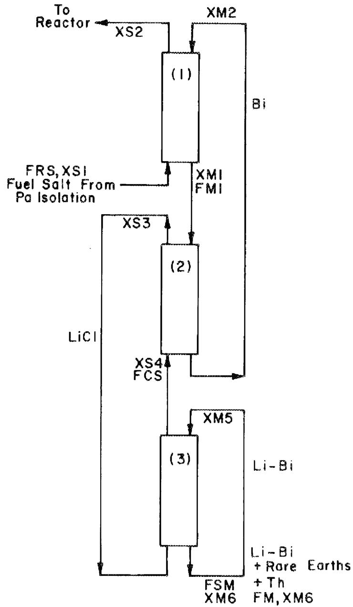  
Fig. 1. Metal-Transfer Process for Removing Rare Earths from a Single-Fluid MSBR.

the rare earths transfer to the LiCl. The resulting LiCl stream is finally contacted with Bi containing a high concentration of Li (0.05 to 0.5 mole fraction) in contactor 3, where most of the rare earths and thorium transfer from the LiCl to the Bi stream. A small stream of Bi containing Li is fed to the circulating Bi stream in contactor 3, and an equal volume of bismuth is withdrawn.

From material balance and equilibrium considerations, the following relations for a given transferring material can be written for the three countercurrent contactors. The nomenclature of Fig. 1 is used.

$$
\frac {\mathrm {X S l} - \mathrm {X S 2}}{\mathrm {X S l} - \mathrm {X M 2 / D} _ {\mathrm {F}}} = \frac {\mathrm {A} _ {\mathrm {F}} ^ {\mathrm {N} _ {\mathrm {U}} + 1} - \mathrm {A} _ {\mathrm {F}}}{\mathrm {A} _ {\mathrm {F}} ^ {\mathrm {N} _ {\mathrm {U}} + 1} - 1} = \mathrm {K} _ {\mathrm {F}} \tag {1}
$$

$$
\frac {\mathrm {X M 1} - \mathrm {X M 2}}{\mathrm {X M 1} - \mathrm {X S 4} \cdot \mathrm {D} _ {\mathrm {C}}} = \frac {\left(\frac {1}{\mathrm {A} _ {\mathrm {C}}}\right) ^ {\mathrm {N} _ {\mathrm {L}} + 1} - \frac {1}{\mathrm {A} _ {\mathrm {C}}}}{\left(\frac {1}{\mathrm {A} _ {\mathrm {C}}}\right) ^ {\mathrm {N} _ {\mathrm {L}} + 1} - 1} = \mathrm {K} _ {\mathrm {C}} \tag {2}
$$

$$
\frac {\mathrm {X S} 3 - \mathrm {X S} 4}{\mathrm {X S} 3 - \mathrm {X M} 5 / \mathrm {D} _ {\mathrm {S}}} = \frac {\mathrm {A} _ {\mathrm {S}} ^ {\mathrm {N} _ {\mathrm {S}} + 1} - \mathrm {A} _ {\mathrm {S}}}{\mathrm {A} _ {\mathrm {S}} ^ {\mathrm {N} _ {\mathrm {S}} + 1} - 1} = \mathrm {K} _ {\mathrm {S}} \tag {3}
$$

From material balance considerations,

$$
\mathrm {X S 1} - \mathrm {X M 2} = \mathrm {L} / \mathrm {F R S} \tag {4}
$$

$$
\mathrm {X M 1} - \mathrm {X M 2} = \mathrm {L} / \mathrm {F M 1} \tag {5}
$$

$$
\mathrm {X S} 3 - \mathrm {X S} 4 = \mathrm {L} / \mathrm {F C S} \tag {6}
$$

$$
\mathrm {X M 6} - \mathrm {X M 5} = \mathrm {L} / \mathrm {F S M} \tag {7}
$$

$$
\mathrm {X M} 6 = \mathrm {L} / \mathrm {F M}, \tag {8}
$$

where

Xsl = concentration of transferring material in fuel salt entering contactor 1, mole fraction,

XS2 = concentration of transferring material in fuel salt leaving contactor 1, mole fraction,

XML = concentration of transferring material in Bi leaving contactor 1, mole fraction,

XM2 = concentration of transferring material in Bi leaving contactor 2, mole fraction,

XS3 = concentration of transferring material in LiCl leaving contactor 2, mole fraction,

XS4 = concentration of transferring material in LiCl entering contactor 2, mole fraction,

XM5 = concentration of transferring material in Bi entering contactor 3, mole fraction,

XM6 = concentration of transferring material in Bi leaving contactor 3, mole fraction,

$\mathbf{D}_{\mathbf{F}} =$ distribution ratio between fuel salt and Bi in contactor 1,

$\mathbf{D}_{\mathbf{C}} =$ distribution ratio between LiCl and Bi in contactor 2,

$\mathrm{D}_{\mathrm{S}} =$ distribution ratio between LiCl and Bi in contactor 3,

$$
A _ {F} = \frac {F M L \cdot D _ {F}}{F R S}
$$

$$
A _ {C} = \frac {F M l \cdot D _ {C}}{F C S}
$$

$$
A _ {S} = \frac {F S M \cdot D _ {S}}{F C S}
$$

FRS = fuel salt flow rate, moles/unit time,

FM1 = metal flow rate in contactors 1 and 2, moles/unit time,

FCS = LiCl solution flow rate in contactors 2 and 3, moles/unit time,

FM = metal addition and withdrawal rate, moles/unit time,

$\mathbf{N}_{\mathbf{U}} =$ number of equilibrium stages in contactor 1,

$\mathbf{N}_{\mathrm{L}} =$ number of equilibrium stages in contactor 2,

$\mathbf{N}_{\mathrm{S}} =$ number of equilibrium stages in contactor 3,

$$
\begin{array}{l} K _ {F} = \text {c o n s t a n t}, \text {d e f i n e d a b o v e ,} \\ K _ {C} = \text {c o n s t a n t}, \text {d e f i n e d a b o v e ,} \\ K _ {S} = \text {c o n s t a n t}, \text {d e f i n e d a b o v e ,} \\ L = \text {p r o d u c t i o n} \\ \end{array}
$$

The distribution ratios are assumed to be constant since there will be a very small change in reductant concentration in the contactors; hence the A's and K's defined above are constant.

The eight relations listed above define the state of the system and can be solved simultaneously for the removal efficiency for a given material in contactor 1 as:

$$
\frac {1}{E} = \frac {1}{K _ {F}} + \frac {1}{A _ {F}} \left(\frac {1}{K _ {C}} - 1\right) + \frac {A _ {C}}{A _ {F}} \left(\frac {1}{K _ {S}} - 1\right) + \frac {A _ {C}}{A _ {F} A _ {S}} \left(\frac {F S M}{F M} - 1\right), \tag {9}
$$

where

$$
E = \text {f r a c t i o n}
$$

The removal time for a given transferring material is, then:

$$
\tau = \frac {V _ {R}}{F R S} \left[ \frac {1}{K _ {F}} + \frac {1}{A _ {F}} \left(\frac {1}{K _ {C}} - 1\right) + \frac {A _ {C}}{A _ {F}} \left(\frac {1}{K _ {S}} - 1\right) + \frac {A _ {C}}{A _ {F} A _ {S}} \left(\frac {\mathrm {F S M}}{\mathrm {F M}} - 1\right) \right], \tag {10}
$$

where

$$
\tau = \text {r e m o v a l}
$$

$$
V _ {R} / F R S = \text {p r o c e s s i n g c y c l e t i m e , d a y s}.
$$

# 2.4 Calculated Rare-Earth Removal Times

There appears to be great latitude in choosing operating conditions that will yield a desired rare-earth removal time. Conditions that give rare-earth removal times equal to, or somewhat shorter than, removal times presently assumed in reactor evaluation calculations will be given first. Those calculations assume a 50-day removal time for all rare earths except europium which is removed on a 225-day cycle. The table below shows the removal times (in days) for the following conditions: FRS = 2.94 gpm

(3-day processing cycle for reactor); FM1 = FSM = 8.35 gpm (Bi rates in contactors); FCS = 11.2 gpm (LiCl flow rate); FM = 22.7 liters/day (Bi feed and withdrawal rate); Li concentration in Bi in contactors 1 and 2 = 0.00201 mole fraction; Li concentration in Bi in contactor 3 = 0.05 mole fraction; and number of stages in contactor 3 = 1.

<table><tr><td rowspan="2">Rare Earth</td><td colspan="6">No. of Equilibrium Stages in Contactors 1 and 2</td></tr><tr><td>1</td><td>2</td><td>3</td><td>4</td><td>5</td><td>6</td></tr><tr><td>La</td><td>52.1</td><td>38.0</td><td>34.0</td><td>32.1</td><td>31.0</td><td>30.2</td></tr><tr><td>Nd</td><td>58.0</td><td>42.7</td><td>38.4</td><td>36.5</td><td>35.4</td><td>34.8</td></tr><tr><td>Eu</td><td>222.4</td><td>219.4</td><td>219.4</td><td>219.4</td><td>219.4</td><td>219.4</td></tr></table>

It is apparent that, with two or three stages in contactors 1 and 2 and with volumetric flow ratios near unity, one can obtain satisfactory removal times with relatively small processing streams. If packed columns were used as the contactors, the diameters would be approximately 6 in. Since the number of stages needed is low, the use of mixer-settlers similar to those being used at Argonne National Laboratory should not be dismissed, particularly for experiments aimed at demonstrating the process concept.

The rate at which $^7\mathrm{Li}$ is removed from the system in the withdrawal stream is 52.4 g-moles/day. The rate at which thorium is removed is less than 0.069 g-mole/day. If the Bi withdrawal stream were hydrofluorinated or hydrochlorinated in the presence of a suitable waste salt in order to recover only the Bi, the cost due to loss of $^7\mathrm{Li}$ would amount to 0.0018 mill/kWhr.

It is apparent that one can obtain removal times much shorter than those discussed in the previous section by increasing the bismuth and LiCl flow rates and hence the size of the processing plant. In each case, the reactor processing cycle time is 3 days (2.94 gpm). The removal times resulting from increasing the bismuth and LiCl flow rates to tentimes their previous values are given in Table 2 for the following conditions:

$\mathrm{FRS} = 2.94\mathrm{gpm}$ (3-day cycle), $\mathrm{FM1} = \mathrm{FSM} = 83.5\mathrm{gpm}$ (Bi flow rate in contactors), $\mathrm{FCS} = 112\mathrm{gpm}$ (LiCl flow rate), $\mathrm{FM} = 16\mathrm{ft}^3 /\mathrm{day}$ (Bi-Li feed and withdrawal rate),  
Li concentration in contactors 1 and $2 = 0.00201$ mole fraction, number of stages in contactor $3 = 1$

Table 2. Variation of Rare-Earth Removal Time (in days) with Lithium Concentration in Contactor 3 and Number of Stages in Contactors 1 and $2^{\text{a}}$   

<table><tr><td rowspan="2">Rare Earth</td><td colspan="6">No. of Stages in Contactors 1 and 2</td></tr><tr><td>1</td><td>2</td><td>3</td><td>4</td><td>5</td><td>6</td></tr><tr><td colspan="7">Li Concentration in Contactor 3 = 0.05 mole fraction</td></tr><tr><td>La</td><td>7.75</td><td>5.26</td><td>4.43</td><td>4.03</td><td>3.79</td><td>3.64</td></tr><tr><td>Nd</td><td>8.36</td><td>5.85</td><td>5.05</td><td>4.67</td><td>4.46</td><td>4.34</td></tr><tr><td>Eu</td><td>16.6</td><td>14.7</td><td>14.1</td><td>13.8</td><td>13.7</td><td>13.6</td></tr><tr><td colspan="7">Li Concentration in Contactor 3 = 0.20 mole fraction</td></tr><tr><td>La</td><td>7.59</td><td>5.10</td><td>4.28</td><td>3.87</td><td>3.63</td><td>3.48</td></tr><tr><td>Nd</td><td>8.22</td><td>5.71</td><td>4.91</td><td>4.54</td><td>4.33</td><td>4.20</td></tr><tr><td>Eu</td><td>8.71</td><td>6.81</td><td>6.23</td><td>5.98</td><td>5.86</td><td>5.79</td></tr><tr><td colspan="7">Li Concentration in Contactor 3 = 0.50 mole fraction</td></tr><tr><td>La</td><td>7.59</td><td>5.10</td><td>4.27</td><td>3.87</td><td>3.63</td><td>3.48</td></tr><tr><td>Nd</td><td>8.22</td><td>5.71</td><td>4.91</td><td>4.53</td><td>4.33</td><td>4.20</td></tr><tr><td>Eu</td><td>8.27</td><td>6.37</td><td>5.79</td><td>5.54</td><td>5.42</td><td>5.35</td></tr></table>

aThe bismuth and LiCl flow rates in each case are assumed to be ten times the values used to produce the data shown in the table on p. 10.

Thus, rare-earth removal times of 3.5 to about 15 days can be obtained, depending on the concentration of lithium used in the final contactor. It should be noted that one cannot afford to lose the Li by

a hydrofluorination operation as before, but would have to recover most of the Li and Bi. A possible recovery method consists of distilling the Li-Bi stream at the rate of about 16 ft³/day. The still would operate at a temperature of about 800°C and a pressure of approximately 0.1 mm Hg, and the rare earths would be removed in a still-bottoms volume of about 20 liters/day. (The bismuth could be recovered from this volume.) The thorium would be discarded at the rate of about 1.4 g-moles/day.

# 2.5 Effect of Rare-Earth Removal Time on Breeding Ratio

The effect of rare-earth removal time on breeding ratio has been calculated by Bell² and is shown in Fig. 2. The changes are given with respect to the base case, in which a removal time of 50 days is used for all the rare earths except europium. (Europium has a 225-day removal time.) It should be noted that rare-earth removal times of 5 days, 3 days, or 7 days would result in increases in the breeding ratio of 0.0126, 0.014, and 0.0115 respectively.

# 2.6 Miscellaneous Points Related to the Metal-Transfer Process

The following observations relative to the proposed process have been noted.

1. According to experimental data and calculations made by Ferris, LiBr would probably be at least as satisfactory as LiCl as the acceptor salt. This finding may be important in two respects. It offers another material with which to work; perhaps more importantly, however, the use of LiBr would not introduce chloride into the reactor but, instead, would simply increase the concentration of bromide already in the system.   
2. The feed stream exiting from the Pa isolation system will have to be essentially free of U and Pa, since these materials would likely accumulate in the Bi circulating in

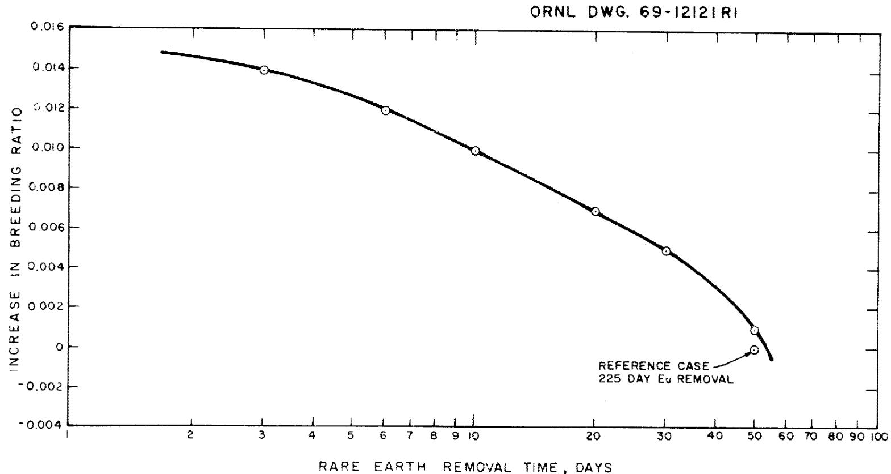  
Fig. 2. Effect of Rare Earth Removal Time on Breeding Ratio.

contactors 1 and 2 and thus consume the Li and Th reductant and prevent the transfer of rare earths. It will probably be necessary to treat the salt stream leaving the Pa isolation system for further removal of U and Pa.

3. Since virtually all of the partitioning of the rare earths from Th is a result of the Bi-LiCl equilibrium, one does not have to maintain the present free fluoride content of the fuel salt and, hence, could alter the reactor fuel salt composition.   
4. While there is no chemical method for transferring chloride ion to the reactor fuel salt, entrainment of LiCl in the bismuth leaving the second contactor would transfer chloride to the reactor. Fortunately, there appears to be less likelihood of this type of entrainment than the entrainment of the bismuth in the salt. It may be necessary to treat the salt returning to the reactor by hydrofluorination or fluorination for removal of chloride. Another alternative would be to pass the bismuth from contactor 2 through a captive fluoride salt volume (such as 72-16-12 mole % $\mathrm{LiF - BeF_2\sim ThF_4}$ ); this would probably result in removal of the entrained chloride salt.   
5. Although the inherent consumption of reductant for this process is quite low ( $\sim 15$ g-moles of lithium per day), the introduction of oxidants (or even hydrogen) could increase the lithium consumption significantly.   
6. The proposed rare-earth removal process does not require an electrolytic cell, and the operation of protactinium removal systems not requiring a cell should be kept in mind as a desired goal. An alternative to using a cell is fluorination of the uranium on a 3-day cycle followed by reductive extraction processing for protactinium isolation. The cost of the fluorine, assuming 100% fluorine utilization and a fluorine price of $2/lb, would be 0.02 mill/kWhr.

7. Conditions in the circulating Bi loops are always reducing so that a corrosion inhibitor such as Zr would likely remain in the Bi. This may allow Croloy to be used as the material of construction, although the operating temperature is significantly higher than the range in which the use of Croloy with zirconium inhibition was successful.

3. PROTACTINIUM ISOLATION USING FLUORINATION--REDUCTIVE EXTRACTION

L. E. McNeese

We have recently developed a new process for removing rare earths from a single-fluid MSBR. The advantages of this process, which does not require an electrolytic cell, have led us to consider protactinium isolation systems that do not require electrolyzers. One protactinium isolation method in which an electrolyzer is not required is fluorination--reductive extraction. In this method, most of the uranium would be removed from the fuel salt by fluorination prior to isolation of the protactinium by reductive extraction.

3.1 Proposed Flowsheet for Isolating Protactinium by Fluorination--Reductive Extraction

The fluorination--reductive extraction system for isolating protactinium is shown in its simplest form in Fig. 3. The salt stream from the reactor first passes through a fluorinator, where most of the uranium is removed by fluorination. Approximately $90\%$ of the salt leaving the fluorinator is fed to an extraction column, where it is countercurrently contacted with a bismuth stream containing lithium and thorium. The uranium is preferentially removed from the salt in the lower extractor, and the protactinium is removed by the upper contactor. A tank through which the bismuth flows is provided for retaining most of the protactinium in the system.

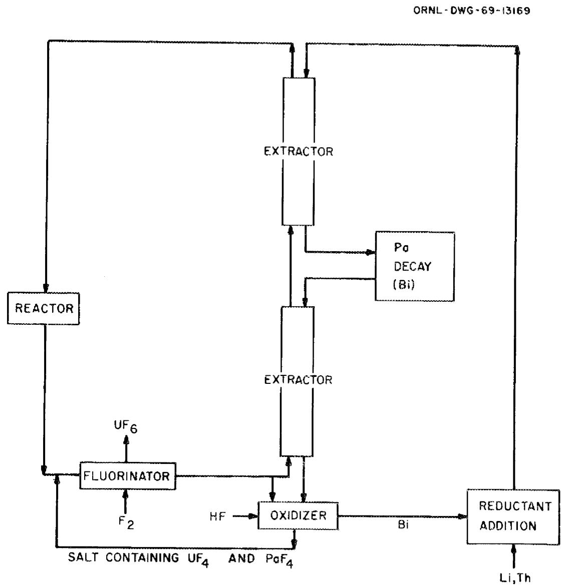  
Fig. 3. Isolation of Protactinium by Fluorination-Reductive Extraction.

The bismuth stream leaving the lower contactor contains some protactinium, as well as the uranium that was not removed in the fluorinator and the uranium that was produced by the decay of protactinium. This stream is contacted with a $\mathrm{H}_2$ -HF mixture in the presence of approximately $10\%$ of the salt leaving the fluorinator in order to transfer the uranium and the protactinium to the salt. The salt stream, containing $\mathrm{UF}_4$ and $\mathrm{PaF}_4$ , is then returned to a point upstream of the fluorinator, where most of the uranium is removed. The protactinium passes through the fluorinator and is subsequently extracted into the bismuth. Reductant (Li and Th) is added to the Bi stream leaving the oxidizer, and the resulting stream is returned to the upper contactor. The salt stream leaving the upper contactor is essentially free of uranium and protactinium and would be processed for removal of rare earths before being returned to the reactor.

# 3.2 Calculated System Performance

Calculations have shown that the system is quite stable with respect to variations as large as $20\%$ for most of the important parameters (i.e., flow rates, reductant concentrations, and number of extraction stages). The required uranium removal efficiency in the fluorinator is less than $90\%$ . The number of stages required in the extractors is relatively low, and the metal-to-salt flow ratio (about 0.26) is in a range where the effects of axial dispersion in packed column extractors will be negligible. Since the protactinium removal efficiency is very high and the system is quite stable, materials such as ${}^{231}\mathrm{Pa}$ , $\mathrm{Zr}$ , and $\mathrm{Pu}$ should accumulate with the ${}^{233}\mathrm{Pa}$ . These materials can be removed by hydrofluorination of a small fraction of the bismuth stream leaving the lower extractor in the presence of salt which is then fluorinated for uranium recovery. Sufficient decay time would be allowed for most of the ${}^{233}\mathrm{Pa}$ to decay to ${}^{233}\mathrm{U}$ , and the ${}^{233}\mathrm{Pa}$ and ${}^{233}\mathrm{U}$ losses would be acceptably low.

Operating conditions that will yield a 10-day protactinium removal time include a fuel salt flow rate of 0.88 gpm (10-day processing cycle), a bismuth flow rate of 0.23 gpm, two stages in the lower contactor and six to eight stages in the upper contactor, and a decay tank volume of 200 to $300\text{ft}^3$ . The required quantity of reductant is 340 to 430 equiv/day, which will cost 0.012 to 0.015 mill/kWh if ${}^{7}\text{Li}$ is purchased.

The remainder of this section is devoted to a discussion of the effects of important system parameters. Unless otherwise stated, the operating conditions include an operating temperature of $640^{\circ}\mathrm{C}$ , a processing cycle time of 10 days, a reductant addition rate of 429 equivalents/day, a protactinium decay tank volume of 300 ft $^3$ , a maximum thorium concentration equivalent to $50\%$ of the thorium solubility at $640^{\circ}\mathrm{C}$ , and a uranium removal efficiency during fluorination of $98\%$ .

The effect of the number of equilibrium stages in the upper extractor on protactinium removal time and uranium inventory in the decay tank is shown in Fig. 4. Less than two stages are required in the lower contactor; however, more stages can be used to advantage in the upper contactor. Approximately five stages are adequate; little benefit is obtained from using additional ones.

The effect of the fraction of uranium that is not removed during fluorination is shown in Fig. 5. High uranium removal efficiencies are not required since the retention of as much as $12\%$ of the uranium in the salt causes no harmful consequences.

The effect of reductant addition rate is shown in Fig. 6. No effect of decreasing the addition rate is seen until one reaches a value of 390 equiv/day, where a gradual but significant effect begins to be observed. The changes shown are approximately those changes which result from variations in the bismuth flow rate for a constant inlet reductant concentration. Hence, there is little effect of variations in the bismuth flow rate.

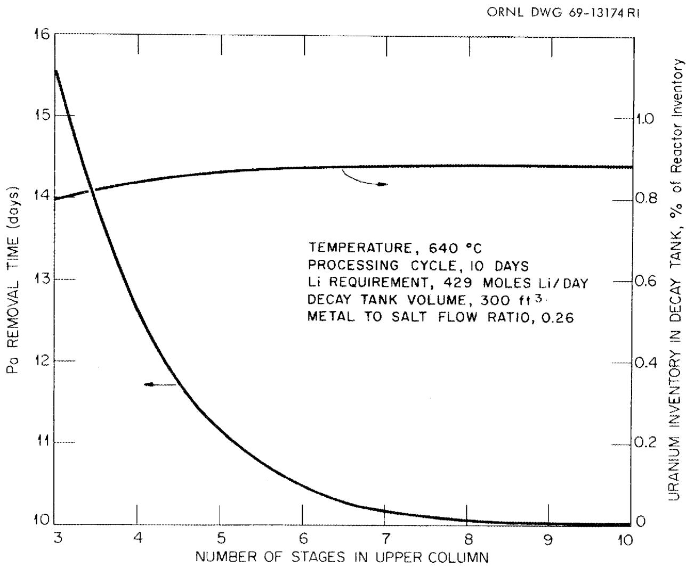  
Fig. 4. Variation of Protactinium Removal Time and Uranium Inventory in Decay Tank with Number of Stages in Upper Column.

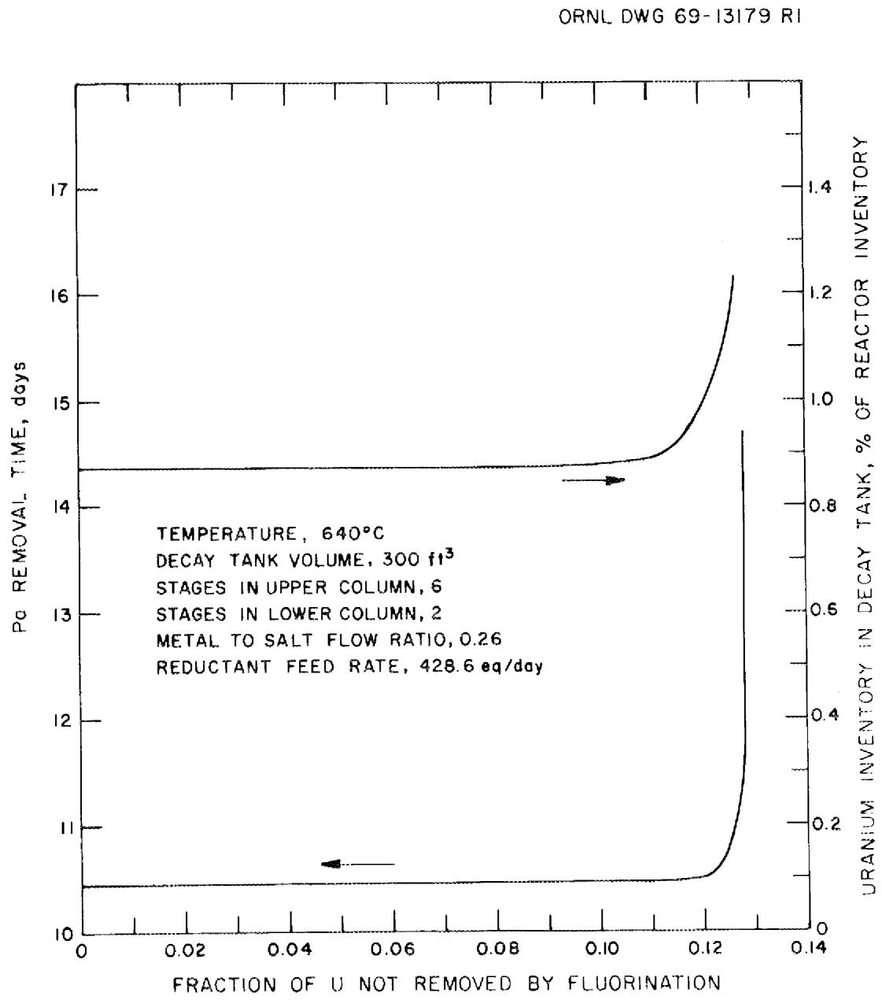  
Fig. 5. Variation of Protactinium Removal Time and Uranium Inventory in Decay Tank with Fraction of Uranium Not Removed by Fluorination.

ORNLDWG69-13178

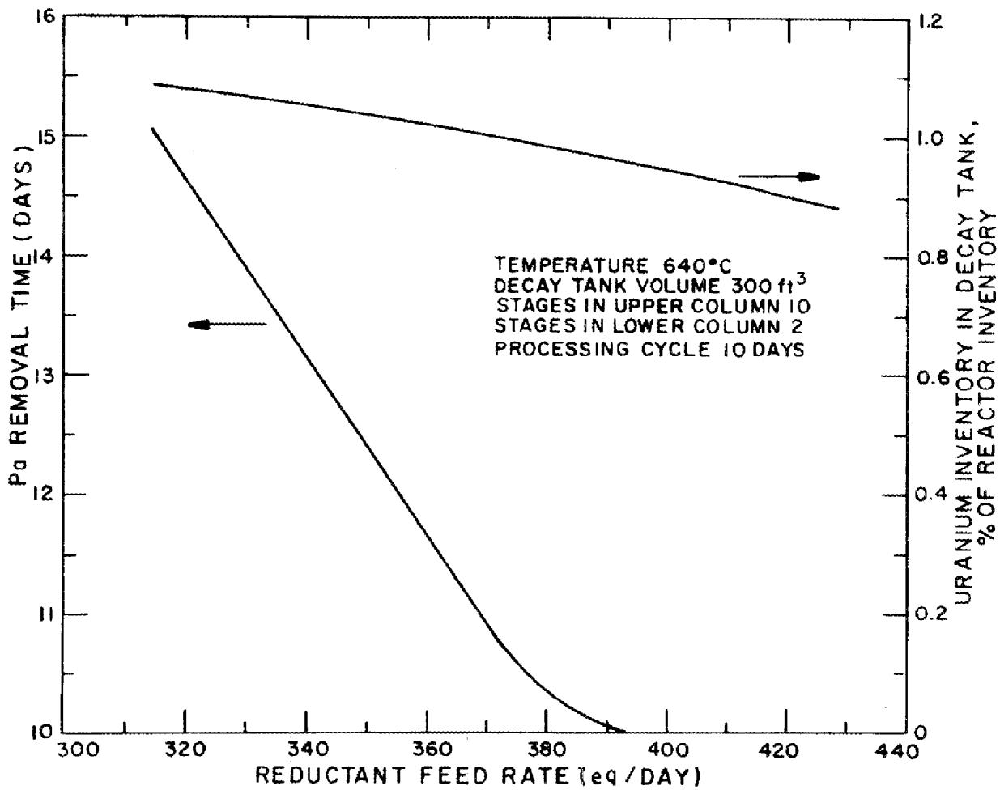  
Fig. 6. Effect of Reductant Feed Rate on Protactinium Removal Time and Uranium Inventory in the Protactinium Decay Tank.

The effect of processing cycle time on protactinium removal time and uranium inventory in the decay tank is shown in Fig. 7. The removal time is equal to the processing cycle time (100% removal efficiency) for processing cycle times greater than about 10 days. As the processing cycle time is decreased below this point, however, the system slowly loses efficiency. Figure 7 shows that the system is relatively insensitive to minor variations in the salt feed rate.

The effect of the protactinium decay tank volume is shown in Fig. 8. No change is seen as the tank volume is decreased from the nominal volume of $300\mathrm{ft}^3$ until a value of $280\mathrm{ft}^3$ is reached; at this point, the system slowly loses efficiency. Smaller tank volumes could be used without loss of removal efficiency by increasing the reductant concentration in the bismuth fed to the extractors.

The effects of operating temperature and reductant addition rate on protactinium removal time are shown in Fig. 9. The optimum operating temperature is about $640^{\circ}\mathrm{C}$ , and the system is relatively insensitive to minor temperature variations. The reductant costs associated with the addition rates shown decrease in increments of 0.001 mill/kWhr from a value of 0.015 mill/kWhr for an addition rate of 429 equiv/day.

# 4. AXIAL DISPERSION IN OPEN BUBBLE COLUMN

J. S. Watson L. E. McNeese

Axial mixing or dispersion is likely to be important in continuous fluorinator design and performance. Because molten salt saturated with fluorine is corrosive, fluorinators will be simple, open vessels that have a protective layer of frozen salt covering all exposed metal walls and surfaces. The rising gas bubbles may cause appreciable axial mixing in the salt. We have previously measured axial dispersion coefficients in a 2-in.-diam column using air and water to simulate fluorine and salt. Axial dispersion coefficients between 25 and $35~\mathrm{cm}^2/\mathrm{sec}$ were observed for gas flow rates between 3 and $30~\mathrm{cm}^3/\mathrm{sec}$ and were independent of the liquid

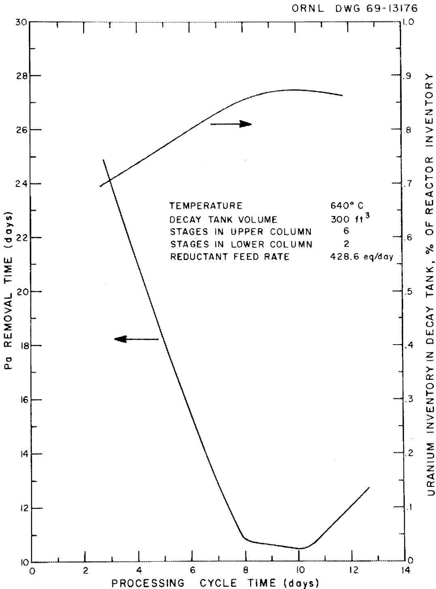  
Fig. 7. Effect of Processing Cycle Time on Protactinium Removal Time and Uranium Inventory in Decay Tank.

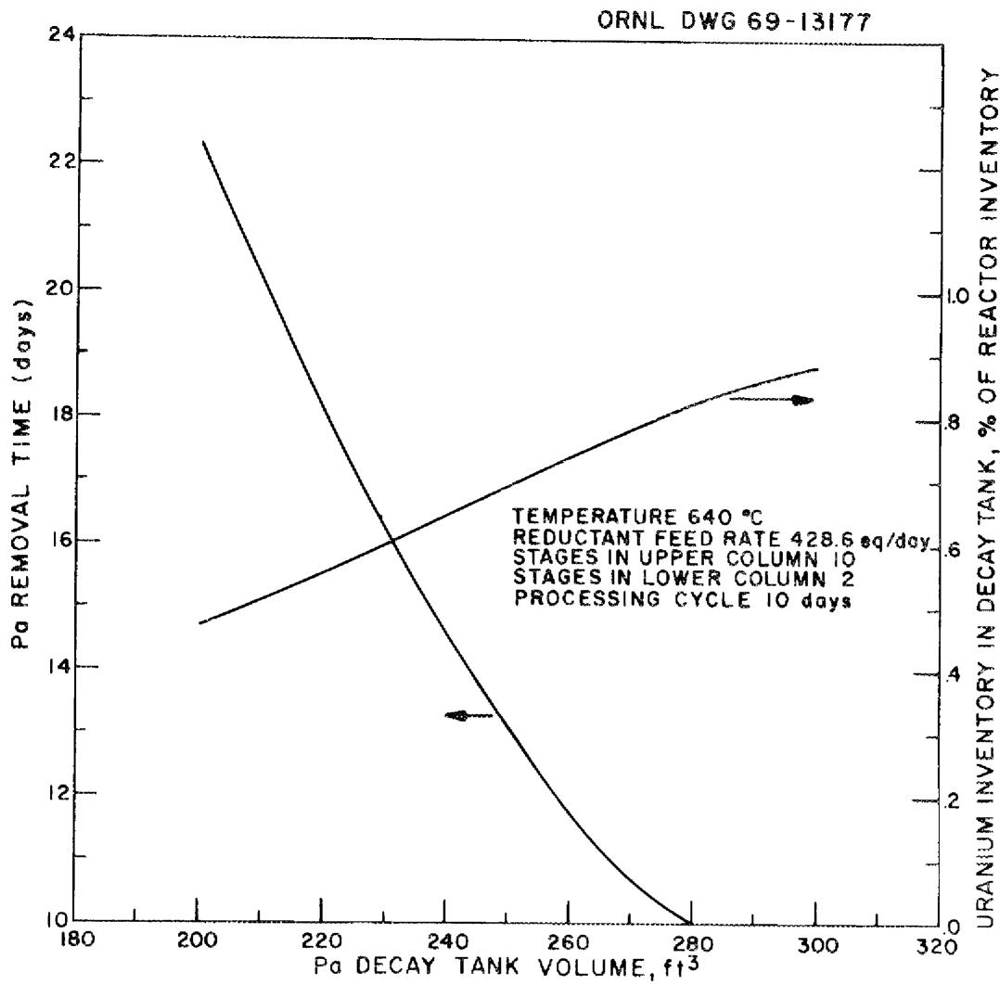  
Fig. 8. Effect of the Protactinium Decay Tank Volume on Protactinium Removal Time and Uranium Inventory in the Protactinium Decay Tank.

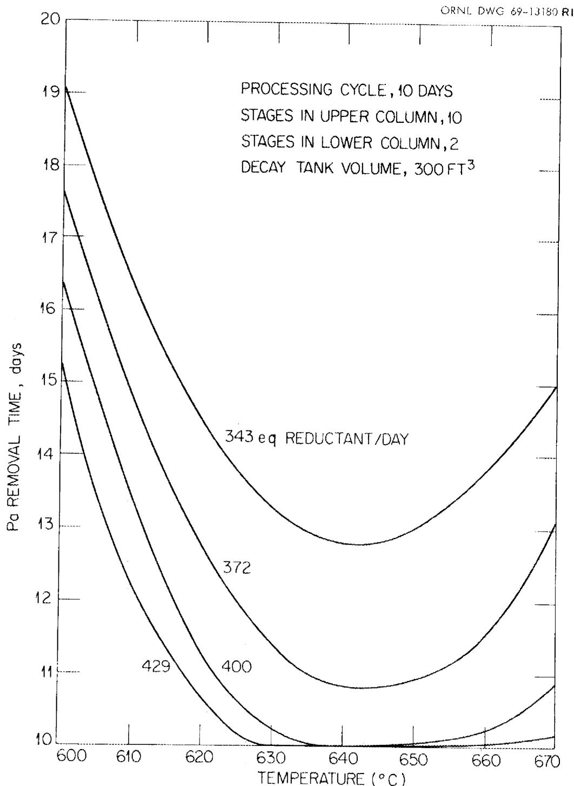  
Fig. 9. Variation of Protactinium Removal Time with Reductant Addition Rate and Operating Temperature.

(water) flow rate. In this flow range, termed "bubbly flow," the gas moves up the column in the form of discrete bubbles. When the gas flow rate is increased to greater than $30~\mathrm{cm}^3/\mathrm{sec}$ , "slugging flow" occurs and the gas bubbles coalesce and may fill the entire cross section of the column. In this flow range, the diffusion coefficient is more dependent on gas flow rate; it is approximately proportional to the square root of the volumetric gas flow rate.

The air-water system differs from the salt-fluorine system in two significant respects: (1) the viscosity of salt is 15 to 30 times higher than that of water, and (2) the surface tension of water is about 75 dynes/cm as compared with about 200 dynes/cm for salt. Of course, the density of salt is about three times that of water, but this difference is believed to be of less importance. The present study, performed by a group of MIT Practice School students, was carried out to investigate the effects of viscosity and surface tension on the dispersion coefficient.

# 4.1 Experimental Technique and Equipment

The experimental technique and equipment were the same as those used earlier. The column was 2 in. in diameter and had a length of 6 ft. The gas inlet was 0.04 in. ID. A $0.5\mathrm{M}$ $\mathrm{Cu(NO_3)_2}$ tracer was continuously injected into the bottom of the column, and the steady-state concentration of tracer was measured photometrically upstream at several points. At each measuring point, a sample of solution was removed from the column, circulated through a photocell, and returned to the column at the same elevation.

The effects of liquid viscosity and surface tension were studied separately. The viscosity of the liquid fed to the column was increased to 15 cP by adding glycerol. The surface tension of the liquid was varied between 37.8 and 67.4 dynes/cm by adding n-butanol to water. (The surface tension of water is 75 cP.) Addition of the glycerol

resulted in properties closer to the process conditions; however, the decrease in surface tension resulted in properties farther removed from process conditions. Nevertheless, data were obtained on the effects of variations in surface tension and viscosity.

# 4.2 Experimentally Determined Dispersion Coefficients

Experimentally determined values for the dispersion coefficient are summarized in Fig. 10. At low gas flow rates, the dispersion coefficients for a glycerol-water mixture with a viscosity of 15 cP are about $30\%$ below those observed for water alone. The transition from bubbly to slugging flow occurs at a gas flow rate of about $26~\mathrm{cm}^3/\mathrm{sec}$ . At higher rates, the dispersion coefficient values approach those observed with water. Unfortunately, the data for glycerol in Fig. 10 do not extend to high air flow rates; however, the data at these rates probably approximate those obtained with water.

In the bubbly region, the gas bubbles were smaller than those observed at the same gas flow rate with water, and the terminal rise velocities were lower. However, the terminal velocity of "slugs" of gas in the high gas flow rate region became independent of viscosity, although the slugs were probably larger than with water. This is because the gas holdup or void fraction increased with increasing viscosity (Fig. 11).

The addition of n-butanol to water to decrease the surface tension resulted in an increase in dispersion coefficient, as shown in Fig. 10. These results, however, are not conclusive because of possible concentration of the n-butanol at the gas-liquid interfaces. n Butanol and other surface-active materials may have concentrated at the interface so that the actual concentrations at the interface (and thus the surface tension) would not be known. The interface could be more rigid than an air-water interface, and this effect alone could increase the dispersion

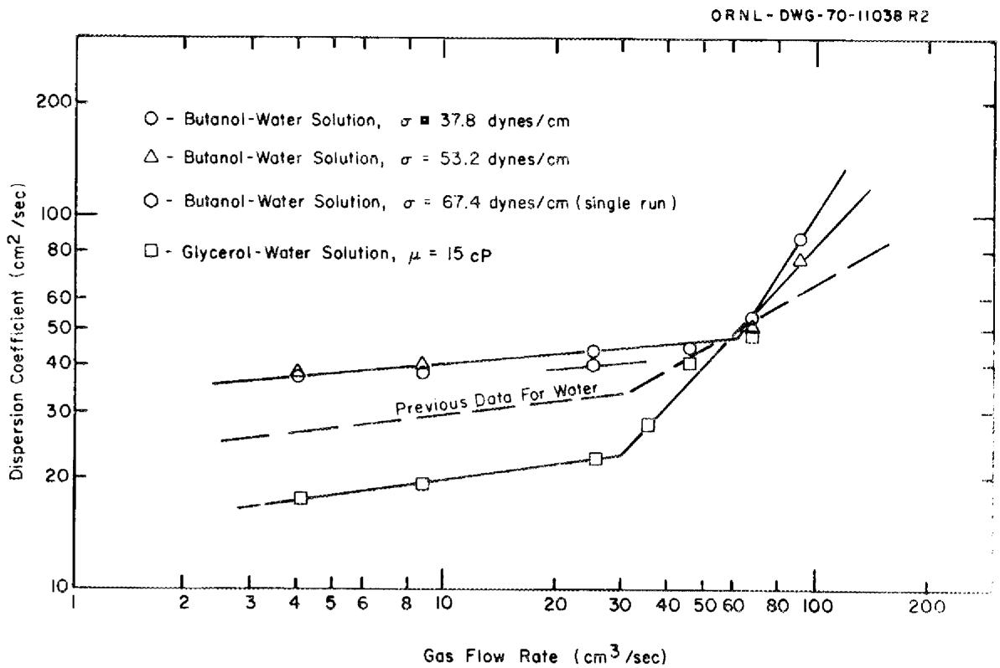  
Fig. 10. Effect of Liquid Surface Tension and Viscosity on Dispersion in an Open Bubble Column.

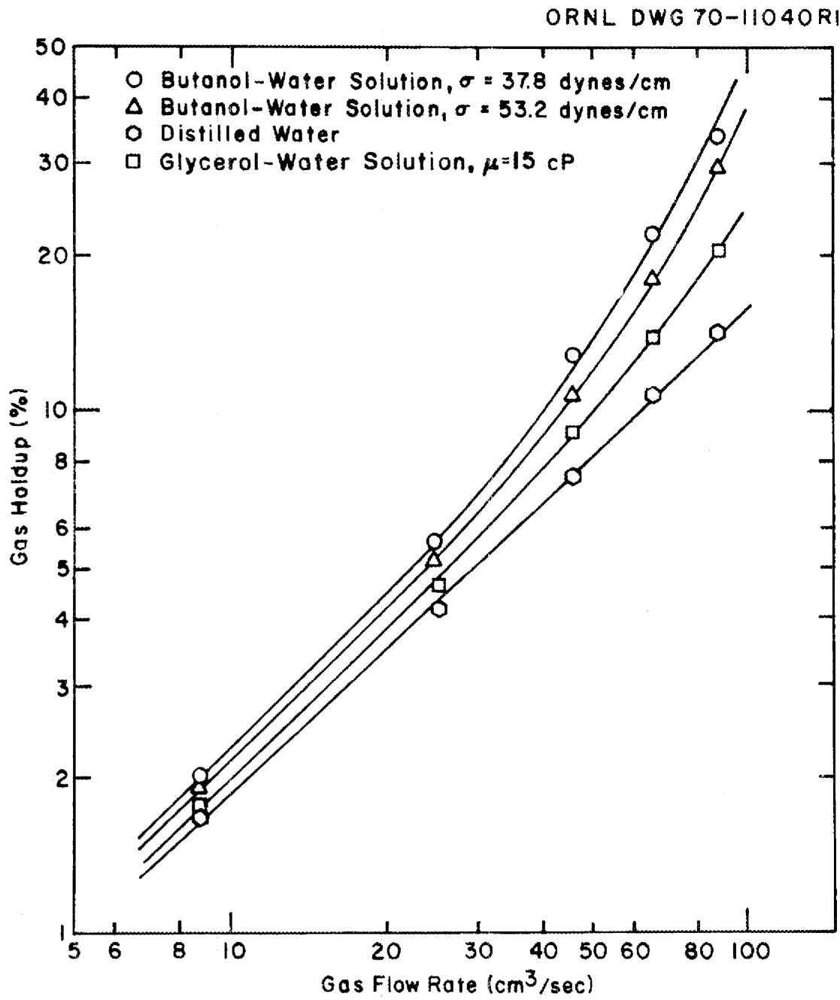  
Fig. 11. Effect of Gas Flow Rate and Properties of Liquid Phase on Gas Holdup in an Open Bubble Column.

coefficient. The same problem could have existed in the glycerol-water experiments; however, the glycerol concentration was sufficiently high that the concentration of glycerol at the surface is not believed to have been serious. Although it is desirable in experiments such as these to use pure components, it is frequently, as in this case, not practical.

# 5. SEMICONTINUOUS REDUCTIVE EXTRACTION EXPERIMENTS IN A MILD-STEEL FACILITY

B. A. Hannaford C. W. Kee L. E. McNeese

Hydrodynamic experiments with the 0.82-in.-diam column packed with $1/4$ -in. solid cylinders of molybdenum were continued. Only limited useful flooding data were obtained because of deposition of iron in the column as well as in the bismuth exit line from the column and the salt feed line to the column. The data obtained are in general agreement with predictions based on data from a mercury-water system. The column and the affected lines were removed for replacement.

# 5.1 Hydrodynamic Run HR-6

Only limited useful flooding data were obtained in run HR-6 despite good control of the rates of flow of bismuth and salt from the respective feed tanks. Subsequent examination of transfer lines attached to the column suggested that the unexpectedly high bismuth holdup may have been due to a deposit of iron accumulating in the transfer lines.

The schematic diagram of the experimental equipment (Fig. 12) indicates the method by which the pressure at the base of the column (a measure of the bismuth holdup) was deduced. As long as salt is entering the column, the pressure at the base of the column is equal to the sum of (l) the static column of salt between the column inlet and the jackleg

# ORNL DWG 70-11039

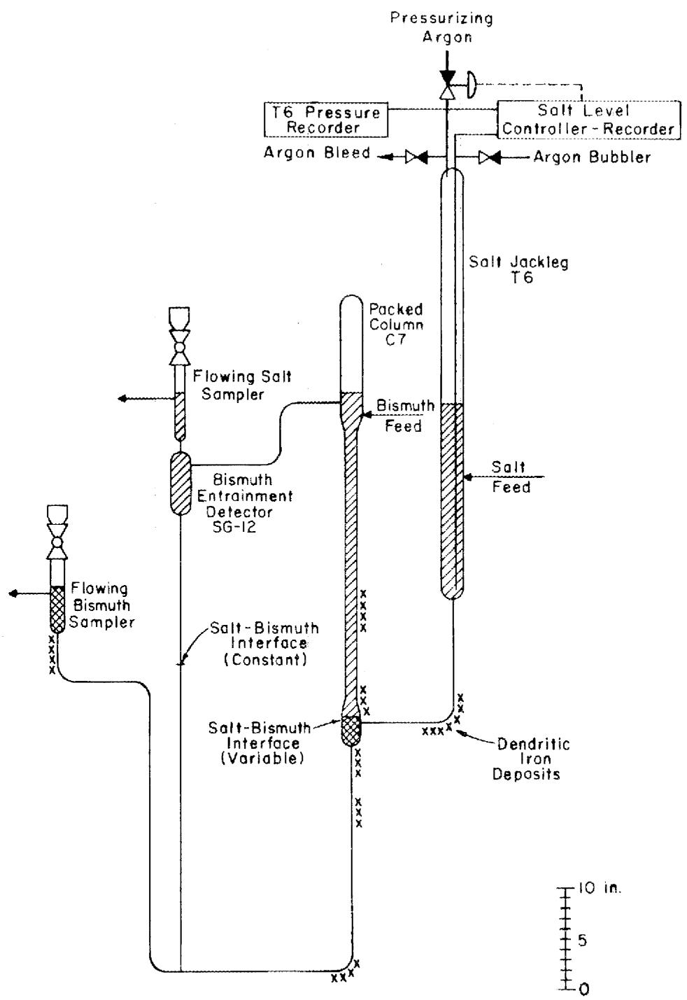  
Fig. 12. Packed Column and Related Components Shown in True Elevation; Schematic Diagram of Level Control System for Salt Jackleg.

bubbler, (2) the variable salt head in the jackleg, and (3) the variable argon pressure above the salt in the jackleg. Pressure drop due to salt flow in the line connecting the jackleg and the column is negligible.

Run HR-6 began with a salt flow to the column of about 75 ml/min; however, when bismuth flow was started, the pressure at the base of the column began to increase rapidly as reflected by a rapidly increasing argon pressure in the jackleg. By stepwise increase of the level set-point in the jackleg, it was possible to accommodate the increasing pressure drop across the column. At a bismuth flow rate of about 175 ml/min and a salt flow rate of 75 ml/min, the pressure at the base of the column was about 250 in. $\mathrm{H}_2\mathrm{O}$ and was increasing slowly. At this pressure, the bismuth-salt interface below the column would be within a few inches of the bottom of the bismuth drain loop; thus the bismuth flow rate was reduced in order to prevent the salt-metal interface from being forced through the drain loop. Despite a high bismuth holdup ( $\sim 80\%$ ) inferred from the pressure at the base of the column, no observable quantity of bismuth was carried out the top of the column with the salt; that is, no variations were observed in the signal from the bismuth entrainment detector (Fig. 12) that was being operated with the freeze valve open.

# 5.2 Hydrodynamic Runs HR-7 and HR-8; Tests for Obstructions

Run HR-7 was begun at the lowest possible flow rates ( $\sim 50 \, \text{ml/min}$ for each phase); however, flow of salt through the column was obtained only during a brief interval during which the salt jackleg showed a pressure equivalent to a static column of bismuth filling the extraction column. Bismuth flowed from the column only by way of the salt overflow.

The presence of suspected plugs in lines attached to the base of the column was verified by removing the lines and sectioning them for

examination after melting out the bismuth in an argon atmosphere. Deposits of iron crystals, some of which were extensive enough to constitute impermeable plugs (Fig. 13), were found in the locations indicated in Fig. 12.

Salt and bismuth were drained from the column into a temporary receiver to permit tests to determine the condition of the molybdenum packing. Radiographs of the column showed regions of trapped bismuth which might indicate a plug. Measurements showed a pressure drop about 2.5 times that of a reference column packed with polyethylene cylinders; however, this was not regarded as conclusive evidence of a restriction.

The column was reconnected to the system with 1/2-in.- and 3/4-in.- OD tubing to reduce the likelihood of plugging the full cross section of the transfer lines with iron deposits. In addition, a quantity of Zircaloy-2 equivalent to 100 ppm of zirconium in bismuth was added to the bismuth feed tank in an attempt to inhibit mass transfer of iron.

In the final hydrodynamic experiment (HR-8) in the original column, the column flooded at salt and bismuth flow rates of 75 ml/min. Since the column had operated satisfactorily at these flow rates during run HR-5, it was apparent that the condition of the column had changed. Therefore, the column was removed for examination and replacement.

The lower half of the column was filled with epoxy resin in order to preserve the packing arrangement while the steel pipe was being stripped away. Dendritic iron deposits were noted in the packing (Fig. 14) in an amount sufficient to increase the resistance to flow, that is, to decrease the throughput at flooding. The iron deposits were not uniformly distributed throughout the column, but were located primarily in the lower section.

Air oxidation of the carbon-steel column was severe, amounting to a loss of about 0.050 in. of wall thickness. The aluminum paint applied initially, which was expected to withstand high temperatures, appeared to have afforded little protection against oxidation.

PHOTO 97581

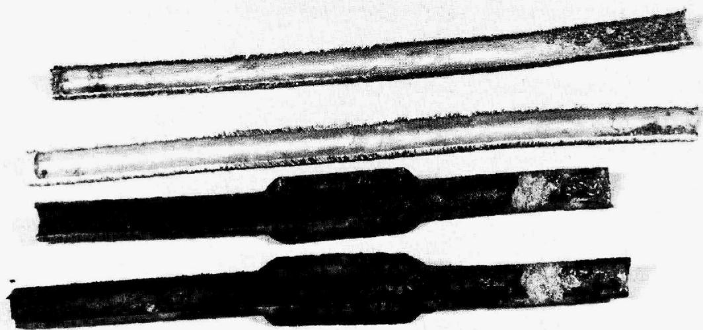

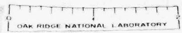  
Fig. 13. Section of Salt Transfer Line Between Salt Jackleg and Column Inlet, Plugged with Dendritic Iron. Darkening of lower specimen occurred during examination, when it was accidentally exposed to air while hot.

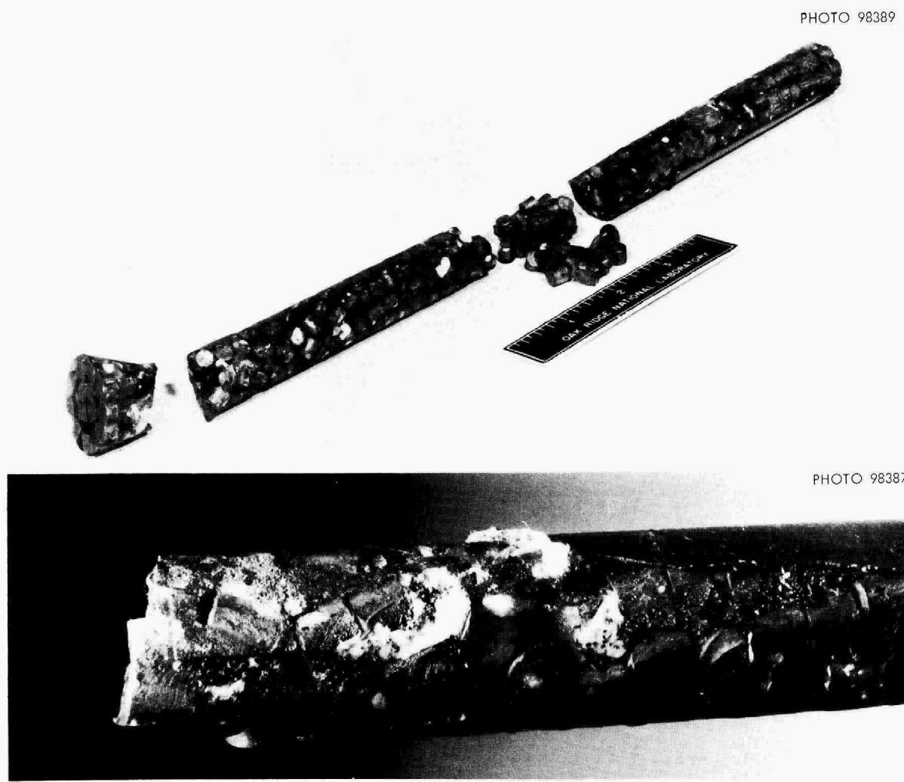  
Fig. 14. Section of 0.082-in.-ID Column Showing Dendritic Iron Deposit (Upper Photograph). The lower half of the column was potted in epoxy resin, and the steel pipe was stripped away.

# 6. SIMULATION OF THE FLOW CONTROL SYSTEMS FOR THE REDUCTIVE EXTRACTION FACILITY

C.W.Kee L.E.McNeese

The successful operation of the Reductive Extraction Facility (see Sect. 5) depends on a flow control system that will allow salt and bismuth flow rates in the facility to be quickly established at desired values and to be maintained relatively constant during the course of an experiment. Because of the importance of this aspect of operation, a study of the flow control system is in progress.

It has previously been shown that steady flow from the salt and bismuth feed tanks can be obtained if each phase discharges at a constant pressure. This is essentially the case for the bismuth flow system since the discharge point is at the top of the extraction column. In the case of the salt, however, the discharge pressure is not constant since the pressure in the salt jackleg varies to match that at the bottom of the column. At flow rates near flooding, changes in the salt discharge pressure might be rapid since pressure surges could be transmitted between the jackleg and column at the inherent resonant frequency; these variations could affect the rates at which salt and bismuth flow through the column.

It is thus desirable to simulate the transient behavior of the flow control systems and equipment items such as the jackleg, column, and transfer lines, which may affect operation of the control system. This study will (1) examine the stability of the present system, (2) examine the merits of various operating methods for the present system, and (3) allow evaluation of proposed equipment modifications. Both analog and digital simulations of the system have been carried out and are described in the remainder of this section.

# 6.1 Analog Simulation of Jackleg and Extraction Column

For this simulation a stepwise change in bismuth flow rate was imposed on the simulated system, which was operating at steady state. The rate of salt flow to the salt jackleg was assumed to remain constant during the ensuing period in which the level in the salt jackleg and the bismuth holdup in the column adjusted to the new steady-state values.

Mathematical Analysis.-The steady-state bismuth holdup in the column was assumed to be given by the relation

$$
\mathrm {H} _ {1} = \mathrm {k} _ {2} \mathrm {V} _ {\mathrm {d}} + \mathrm {k} _ {1} \left(\mathrm {V} _ {\mathrm {c}} - \mathrm {V} _ {\text {r e f}}\right), \tag {11}
$$

where

$$
\begin{array}{l} H _ {1} = \text {f r a c t i o n o f c o l u m n v o l u m e o c c u p i e d b y b i s m u t h a t s t e a d y} \\ \text {s t a t e (b i s m u t h h o l d u p) ,} \end{array}
$$

$$
V _ {d} = \text {d i s p e r s e d - p h a s e (b i s m u t h) f l o w r a t e t o c o l u n n},
$$

$$
V _ {c} = \text {c o n t i n u o u s - p h a s e (s a l t) f l o w r a t e t o c o l u m n},
$$

$$
V _ {r e f}, k _ {1}, k _ {2} = \text {c o n s t a n t s}.
$$

The instantaneous bismuth holdup in the column was assumed to change at a rate proportional to the difference between the instantaneous holdup and the steady-state holdup. Thus,

$$
\frac {\mathrm {d} \mathrm {H}}{\mathrm {d} t} = \mathrm {k} _ {3} \left(\mathrm {H} _ {1} - \mathrm {H}\right), \tag {12}
$$

where

$$
H = \text {i n s t a n t a n e o u s}
$$

$$
t = \text {t i m e},
$$

$$
k _ {3} = \text {c o n s t a n t}.
$$

The pressure at the base of the column was assumed to result from the static pressure of the dispersed-phase holdup, and from flow of the continuous and dispersed phases; the dependence was assumed to be as follows:

$$
P _ {A} = k _ {4} H V _ {c} + k _ {5} H, \tag {1.3}
$$

where

$P_A =$ pressure at the base of the column, minus the static pressure when the column is filled with salt,

$$
k _ {4}, k _ {5} = \text {c o n s t a n t s}.
$$

The rate of flow of salt between the jackleg and the column was assumed to correspond to laminar flow in the line connecting the two volumes and is given as

$$
V _ {c} = k ^ {\prime} \left(P _ {B} - P _ {A}\right), \tag {14}
$$

where

$$
k ^ {\prime} = \text {c o n s t a n t},
$$

$\mathrm{P_B} =$ pressure at outlet of jackleg, minus static pressure of the salt in the column.

The change in pressure with time at the outlet of the jackleg is related to the net rate of flow from the jackleg as

$$
\frac {\mathrm {d} P _ {B}}{\mathrm {d} t} = \frac {\rho}{a} \left(F _ {o} - V _ {c}\right), \tag {15}
$$

where

$$
\rho = \text {d e n s i t y}
$$

$$
a = \text {c r o s s - s e c t i o n a l}
$$

$$
F _ {0} = \text {r a t e}
$$

Scaled Equations and Analog Circuit.- Equations (11) through (15) were scaled for solution on an analog computer by introduction of the following variables:

$$
\mathrm {H} _ {\mathrm {l}} = \mathrm {h} _ {\mathrm {l}} \mathrm {H} _ {\mathrm {M}},
$$

$$
V _ {c} = v _ {c} V _ {M},
$$

$$
\mathrm {H} = \mathrm {h H} _ {\mathrm {M}},
$$

$$
P _ {B} = p _ {B} P _ {M},
$$

$$
P _ {A} = p _ {A} P _ {M},
$$

where

$h_{1} =$ scaled steady-state holdup,

$H_{\mathbb{M}} =$ maximum steady-state holdup (1.0),

$v_{c} =$ scaled salt flow rate between the jackleg and the column,

$V_{M} =$ maximum salt flow rate between the jackleg and the column (10 ml/sec),

$h =$ scaled instantaneous holdup,

$\mathrm{H}_{\mathrm{M}} =$ maximum instantaneous holdup (1.0),

$p_{B} =$ scaled value of pressure at jackleg outlet, minus static pressure at base of the column when filled with salt,

$P_{M} =$ maximum value of pressure at base of column, minus static pressure at base of the column when filled with salt (200 in. $\mathsf{H}_2\mathsf{O}$ ),

$p_A =$ scaled value of pressure at the base of the column, minus static pressure at base of the column when filled with salt.

The resulting equations are:

$$
h _ {1} = \frac {k _ {2} V _ {d}}{H _ {M}} + \frac {k _ {1} V _ {M}}{H _ {M}} v _ {c} - \frac {k _ {1} V _ {\text {r e f}}}{H _ {M}}, \tag {16}
$$

$$
\frac {d h}{d t} = k _ {3} \left(h _ {1} - h\right), \tag {17}
$$

$$
p _ {A} = \frac {k _ {l} H _ {M} V _ {M}}{P _ {M}} h v _ {c} + \frac {k _ {5} H}{P _ {M}} h, \tag {18}
$$

$$
\frac {d p _ {B}}{d t} = \frac {\rho}{a} \frac {F _ {O}}{P _ {M}} - \frac {\rho}{a} \frac {V _ {M}}{P _ {M}} v _ {c}, \tag {19}
$$

and

$$
v _ {c} = \frac {k ^ {\prime} P _ {M}}{V _ {M}} \left(p _ {B} - p _ {A}\right). \tag {20}
$$

A schematic diagram of the analog circuit used for solution of Equations (16)-(20) is shown in Fig. 15.

Choice of Constants. - The value of the constant $\mathbf{k}_2$ (0.1 sec/ml) was chosen such that the steady-state holdup had a value of 0.1 when $V_{\text{ref}}$ and $F_0$ were each assumed to have a value of 1 ml/sec. The constant $k_1$ was given the value of 0.01 sec/ml on the basis of observed holdup data from the mercury-water system and from the salt-bismuth system (Sect. 15). The value of the constant $k_3$ approximates the ratio of the bismuth flow rate through the column to the bismuth volume held up in the column, and was assigned values of 0.1 and 1 sec $^{-1}$ ; the value of 0.1 sec $^{-1}$ is considered to give a more accurate representation of the actual system. The constant $k_5$ , which was assumed to be equal to the product of the difference in densities of the salt and bismuth (6.4 g/cm $^3$ ) and the column height (30.25 in.), had a value of 194 in. $H_2O$ . The constant $k_4$ was varied from 0.02 to 20 in. $H_2O \cdot \sec / ml$ . The constant $k'$ , which represents the salt flow rate (in cm $^3$ /sec) obtained between the jackleg and the column for a pressure difference of 1 in. $H_2O$ , was varied from 0.2 to 10 cm $^3$ salt/sec · in. $H_2O$ . A value of 0.5 is considered to be most representative of the actual system. The cross-sectional area of the jackleg was varied from 0.25 to 4 in. $^2$ .

Calculated Results. Results calculated for a range of operating conditions are shown in Figs. 16-19. The greatest change in system

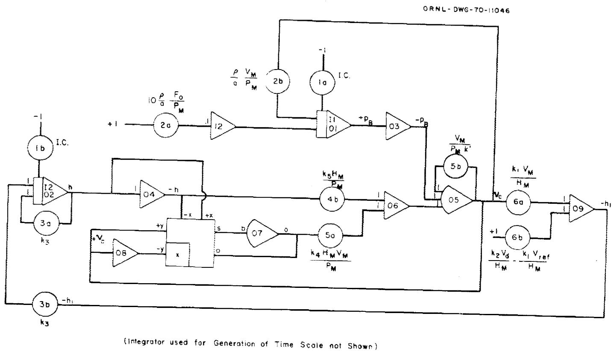  
Fig. 15. Diagram for Analog Simulation of Jackleg and Extraction Column.

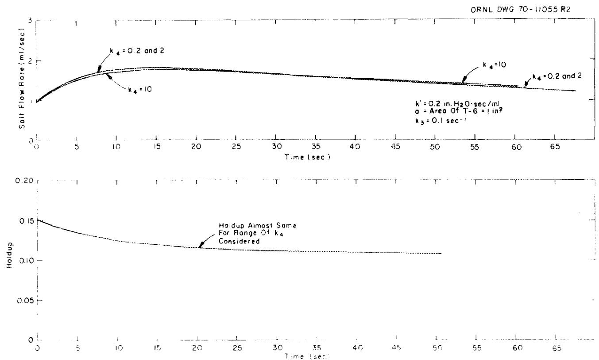  
Fig. 16. Variation of Bismuth Holdup in Column and Flow of Salt Between Jackleg and Column with Time for a $k_{3}$ Value of 0.1 and a $k'$ Value of 0.2 in. $H_{2}O \cdot \sec / ml$ .

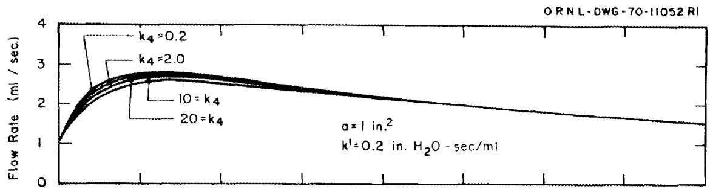

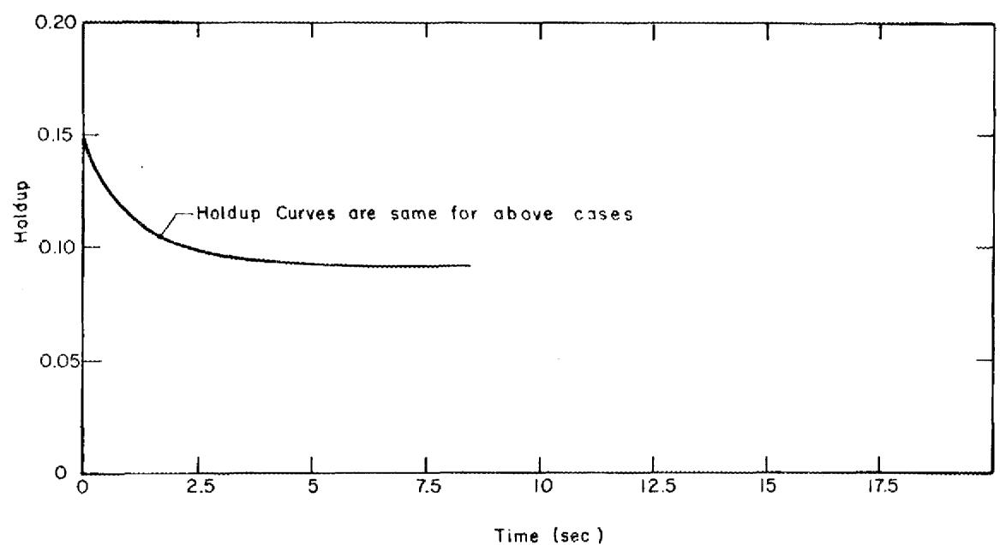  
Fig. 17. Variation of Bismuth Holdup in Column and Salt Flow Rate Between Jackleg and Column with Time for $k_{3}$ Equal to 1.0 and $k'$ Equal to 0.2 in. $H_{2}O \cdot \sec / ml$ .

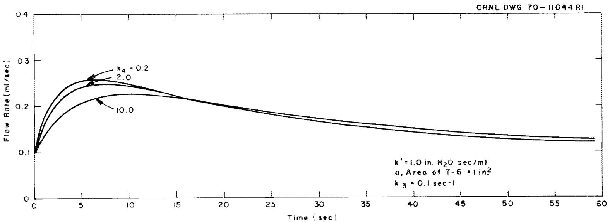  
Fig. 18. Variation of Salt Flow Rate Between Jackleg and Column with Time for a k3 Value of 0.1 and a k' Value of 1 in. H2O·sec/ml.

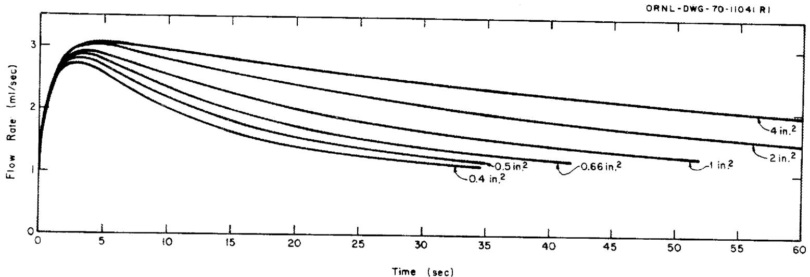  
Fig. 19. Variation of Salt Flow Rate Between Jackleg and Column with Time for a Range of Jackleg Cross-Sectional Areas.

response was produced by variation of $\mathbf{k}_3$ , the rate constant for drainage of bismuth from the column. Results calculated for the most representative value of $\mathbf{k}_3$ (0.1 sec $^{-1}$ ) and a range of values of $\mathbf{k}_4$ are shown in Fig. 16. The salt flow rate between the jackleg and the column and the bismuth holdup in the column are observed to adjust smoothly to the steady-state values after an imposed upset in conditions. Results are shown in Fig. 17 for a $\mathbf{k}_3$ value of 1 sec $^{-1}$ , which represents more rapid drainage of bismuth from the column. As expected, the system response is faster and the steady-state values are obtained more quickly. As in the former case, the system response was smooth and no oscillatory behavior was observed. Changes in the value of $\mathbf{k}_4$ had little effect on the transient behavior. As shown in Figs. 16-18, an increase in the value of $\mathbf{k}_4$ resulted in a small decrease in the maximum deviation of $\mathbf{V}_{\mathrm{c}}$ from the steady-state value.

As expected, an increase in the jackleg diameter (which represents a decrease in the resistance to flow between the jackleg and the column) resulted in a higher rate of change of $V_{c}$ , as shown in Fig. 19. However, the rate of change of the bismuth holdup in the column was not affected. The system remained stable for flow resistance values much lower than those present in the actual system.

Decreases in the cross-sectional area of the jackleg resulted in a more rapid return of the system to steady state, as shown in Fig. 19. The system was observed to be stable over the range of cross-sectional areas of 0.25 to 4 in.².

# 6.2 Digital Simulation of Salt Flow Control System, Jackleg, and Extraction Column

Although the analog simulation discussed previously indicated that satisfactory flow control should be obtained with the existing equipment, it was necessary to treat several aspects of the system in a simplified manner. Therefore, a digital simulation was carried out in order to obtain a more realistic representation of the system. Changes in sim

ulation of the system consisted of the following: (1) a material balance on salt and bismuth in the column was substituted for Eq. (2) used previously to define the rate of drainage of bismuth from the column; (2) the column was segmented into several sections to allow variation of flow rates and holdup at points along the column; (3) more accurate estimates were made of the frictional losses in the salt transfer lines (between the salt feed tank and the jackleg and between the jackleg and the column), and the diameter of the lines was varied; (4) simulation of the salt flow control system was included; and (5) the salt feed point location in the jackleg relative to the salt level in the jackleg was varied.

Three cases were considered. In Case I the salt inlet to the jackleg was located above the salt surface in the jackleg. The gas pressure above the salt in the jackleg was held constant, and the salt level in the jackleg was allowed to vary.

In Case II the salt inlet to the jackleg was located below the salt surface in the jackleg. The gas pressure in the jackleg was held constant, and the salt level in the jackleg was allowed to vary. In Case III the salt inlet to the jackleg was located below the salt surface in the jackleg. The gas pressure was varied in order to maintain a constant salt level in the jackleg.

Cases II and III represent two possible methods of operation for the present experimental facility in which the salt inlet to the jackleg is located below the salt surface in the jackleg.

Mathematical Analysis of Segmented Column. - In treating the extraction column, the column was divided into a number of segments, each of which was assumed to be at steady state during a given time interval. For the $i$ th segment (numbered from the top of the column), Eq. (11) was rearranged to yield the following relation:

$$
V _ {d, i + 1} = \frac {H _ {i}}{k _ {2}} - \frac {k _ {1}}{k _ {2}} \left[ \frac {\left(V _ {c , i} - V _ {\text {r e f}}\right) + \left| V _ {c , i} - V _ {\text {r e f}} \right|}{2} \right], \tag {21}
$$

where

$$
V _ {d, i + 1} = \text {b i s m u t h f l o w r a t e l e a v i n g t h e i t h s e g m e n t},
$$

$$
\begin{array}{l} H _ {i} = \text {f r a c t i o n o f c o l u m n v o l u m e i n i t h s e g m e n t o c o u p i u p e d b y} \\ \hskip 1 4. 2 2 6 3 7 8 p t \text {b i s m u t h}, \end{array}
$$

$$
V _ {c, i} = \text {s a l t f l o w r a t e l e a v i n g i t h s e g m e n t},
$$

$$
k _ {1}, k _ {2}, V _ {\text {r e f}} = \text {c o n s t a n t s}.
$$

This equation is similar to the relation used for the analog simulation, except that the continuous-phase flow rate is important only for flow rates near flooding.

The relation used for determining pressure within the column segments, similar to Eq. (13), is:

$$
P _ {i + 1} - P _ {i} = \left(k _ {4} H _ {i} V _ {c, i} + k _ {5} H _ {i}\right) / N, \tag {22}
$$

where

$$
\begin{array}{l} P _ {i} = \text {p r e s s u r e a t t h e t o p o f i t h s e g m e n t , m i n u s p r e s s u r e d u e t o} \\ \text {s t a t i c h e a d o f s a l t i n c o l u m n a b o v e i t h s e g m e n t ,} \end{array}
$$

$$
N = \text {n u m b e r o f s e g m e n t s i n c o l u m n},
$$

$$
k _ {4}, k _ {5} = \text {c o n s t a n t s}.
$$

Values used for the constants $\mathbf{k}_1, \mathbf{k}_2, \mathbf{k}_4, \mathbf{k}_5$ , and $V_{\text{ref}}$ are the same as used previously in the analog simulation.

A material balance on the dispersed phase in segment i yields the relation

$$
\frac {\mathrm {d} \mathrm {H} _ {\mathrm {i}}}{\mathrm {d t}} = \frac {\mathrm {V} _ {\mathrm {d} , \mathrm {i}} - \mathrm {V} _ {\mathrm {d} , \mathrm {i} + 1}}{\mathrm {C} _ {\mathrm {v o l}} / \mathrm {N}}, \tag {23}
$$

where

$$
t = \text {t i m e},
$$

$$
C _ {v o l} = v o l u m e o f c o l u n n.
$$

If one assumes that the salt and bismuth phases are incompressible, one obtains the relation

$$
V _ {c, i + 1} = V _ {c, i} + V _ {d, i + 1} - V _ {d, i}. \tag {24}
$$

During a given time interval, Eqs. (21) through (24) were solved by trial and error to determine pressure, holdup, and flow rates throughout the column in the following manner. A value was assumed for the rate of salt flow from the top of the column (top segment); this value was used with the known flow rate at which bismuth enters the top of the column to calculate values for each column segment. These values include the salt flow rate into the bottom of the column (bottom segment) as well as the pressure at this location. The pressure value was then used to calculate a value for the salt flow rate between the jackleg and the column which could be compared with the calculated rate of salt flow into the bottom of the column. When the two values did not agree, the assumed salt flow rate at the top of the column was adjusted and the calculation was repeated to obtain a better approximation.

Mathematical Description of Jackleg. - In Cases I and II the pressure above the salt surface in the jackleg was assumed to be constant so that changes in pressure at the jackleg outlet were related only to changes in the level of salt in the jackleg. Thus, the variation of pressure at the jackleg outlet with time is given by the relation

$$
\frac {d P _ {B}}{d t} = \frac {\rho}{a} \left(F _ {0} - V _ {N + 1}\right), \tag {25}
$$

where

$P_B =$ pressure at jackleg outlet, minus static head of salt in the column,

$\mathbf{t} = \mathbf{\text{time}}$ $\rho =$ density of the salt,   
a $=$ cross-sectional area of the jackleg, $\mathrm{F}_{0} =$ salt flow rate to jackleg, $V_{N + 1} =$ salt flow rate between jackleg and column.

In Case III the pressure above the salt surface in the jackleg was controlled in a manner such that the salt level in the jackleg remained constant. Hence, the pressure in the gas space above the salt surface in the jackleg was that required to obtain a salt flow rate between the jackleg and column which was equal to the salt flow rate to the jackleg. The resistance to flow between the jackleg and column was due to frictional losses in the line between the jackleg and column; the manner of calculating such losses is discussed in the following section.

Calculation of Frictional Losses in Salt Transfer Lines. - The frictional losses in the salt transfer lines (one connecting the salt feed tank to the jackleg, and one connecting the jackleg to the column) were calculated from the Poiseuille equation for laminar flow and from the Blasius equation for turbulent flow. These equations are given in Eqs. (26) and (27) respectively:

$$
Q = \frac {\pi (\Delta P) D ^ {4}}{1 2 8 \mu L}, \tag {26}
$$

where

$\mathbf{Q} =$ salt flow rate,   
D $=$ diameter of line, $\mu =$ viscosity of salt,   
L $=$ length of line, $\Delta \mathrm{P} =$ pressure difference, minus static head between ends of line;

and

$$
\frac {1}{3 2} \frac {\pi^ {2} D ^ {5} \Delta P}{L _ {P} Q ^ {2}} = \frac {0 . 0 7 9 1}{N _ {R e}}. \tag {27}
$$

The transition between laminar and turbulent flow was assumed to occur at a Reynolds number of 2200, where Reynolds number is defined as

$$
\mathrm {N} _ {\text {R e}} = \frac {1 4 \rho Q}{\pi D u}. \tag {28}
$$

In Case I, salt was allowed to flow only from the salt feed tank to the jackleg since the salt inlet to the jackleg was located above the salt surface in the jackleg. For the remaining lines, salt was allowed to flow in the direction indicated by the pressure difference across the line in question.

Mathematical Description of Salt Flow Control System. - A mathematical description of the salt flow control system has been given previously for a controller having only proportional action. In the present simulation, both proportional and integral actions were assumed. The following relation for the control action was used:

$$
G + B ^ {\prime} = \frac {G _ {\max}}{P B} \left\{\left(V _ {s, s e t} - V _ {s}\right) \left[ 1 + \frac {P B}{R T} \int_ {0} ^ {t} \left(V _ {s, s e t} - V _ {s}\right) d t \right] \right\}, \tag {29}
$$

where

$G =$ rate at which argon flows to salt feed tank,

B' = rate at which argon is bled from salt feed tank, plus one-half of maximum argon feed rate,

$G_{\max} =$ maximum argon flow rate to feed tank (1 std ft³/hr),

$\mathbf{PB} =$ proportional band,

RT = reset time, min,

$\mathbf{t} = \mathbf{\nabla}$ time,

$V_{s, \text{set}} =$ controller set point generated by ramp generator to represent a linearly decreasing salt volume in feed tank,

$V_{s} =$ salt volume in feed tank during current time interval.

Calculated Results. - Results calculated for Case I for several jack-leg diameters and for two salt transfer line diameters are shown in Fig. 20. It is observed that an upset results in a relatively rapid response in all cases. As expected, increases in the jackleg diameter result in a slower approach to steady state. The approach to steady state is also more rapid with 3/8-in.-diam salt transfer lines than with 1/4-in.-diam lines.

Results calculated for Case II are shown in Fig. 21. The optimum controller settings appear to be as follows: proportional band, 4.0; and reset time, 0.5 min. The use of a gas bleed stream from the feed tank is seen to be quite beneficial since it allows the feed tank pressure to quickly decrease without the transfer of large volumes of salt from the feed tank.

Results calculated for Case III are shown in Fig. 22. Here the approach to be steady state appears to be slightly more sluggish than in the previous cases.

Conclusions. - The performance of the flow control system appears to be limited by the time required for pressurization and depressurization of the gas space in the salt feed tank. The best mode of operation appears to be with a constant gas pressure in the salt jackleg and with the salt inlet to the jackleg located above the salt surface in the jack-leg, as illustrated by Case I. However, the actual system will be more sluggish than shown in Case I because considerable time will be required for the feed tank outlet flow rate to become constant during start-up, even though it is not affected by variations in the column and salt jackleg. It is believed that the actual system will function well since the simulated system was stable and performed satisfactorily in all the cases considered.

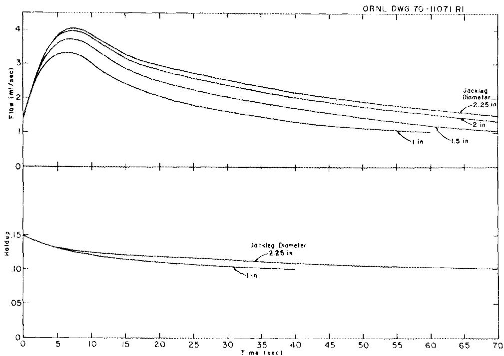

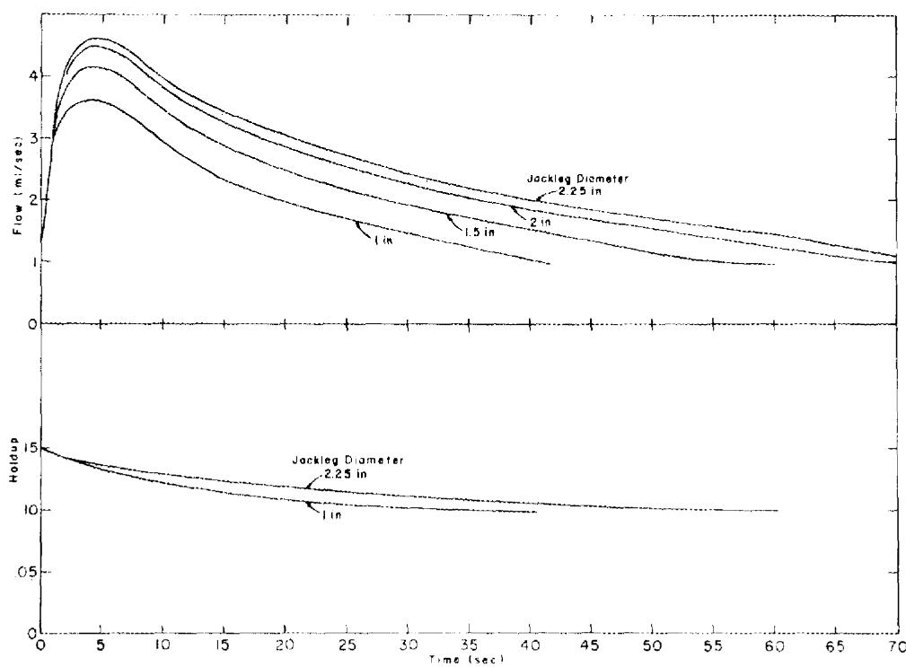  
Fig. 20. Effect of Jackleg and Transfer Line Diameter on Flow Rate to Column and Column Holdup. Upper curves are for a $1/4$ -in.-diam line, and lower curves are for a $3/8$ -in.-diam line.

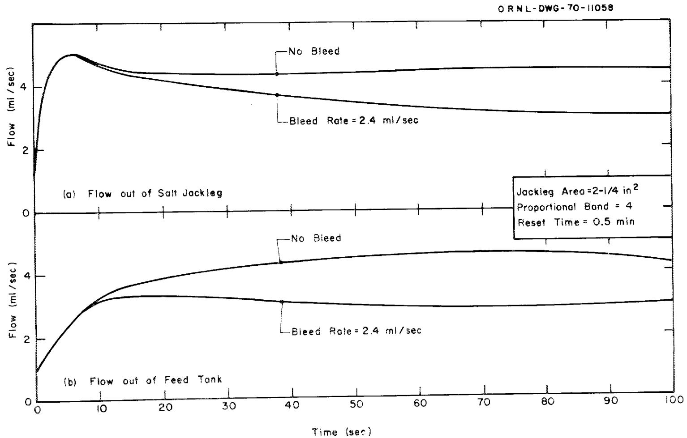  
Fig. 21. Variation of Salt Flow Rate from Feed Tank and Jackleg with Time for Cases With and Without Gas Bleed from Feed Tank (Case II).

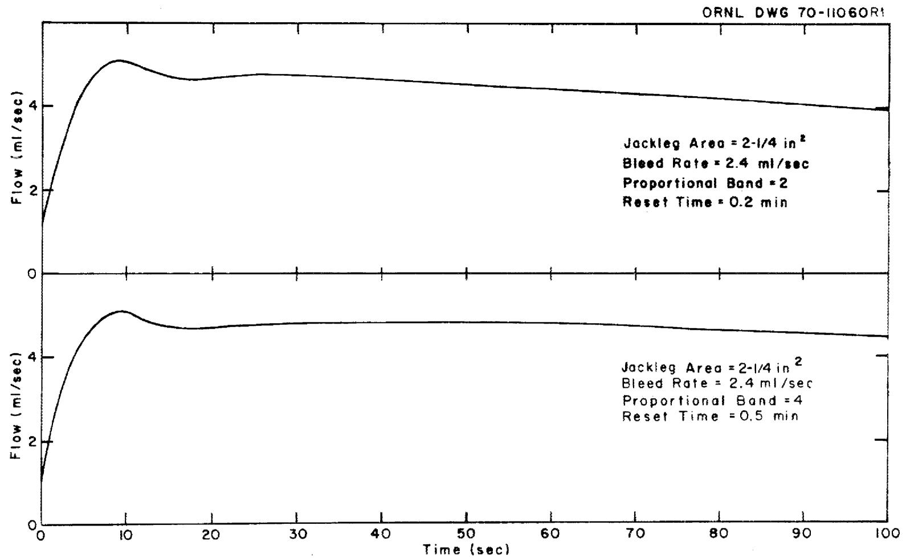  
Fig. 22. Variation of Salt Flow Rate from Jackleg with Time for Case III.

# 7. CALIBRATION OF AN ORIFICE--HEAD POT FLOWMETER WITH MOLTEN SALT AND BISMUTH

C.W.Kee b.A.Hannaford

Use of an orifice--head pot flowmeter, described previously, $^{6}$ is being considered for determining flow rates for molten salt and bismuth streams in systems used in engineering development work. Since the flow-meters under consideration are not of a standard design, experimental determination of the orifice discharge coefficient is in progress. $^{7}$

Additional calibration data were obtained during both steady-state and transient experiments with molten salt and bismuth in a flowmeter having a 0.118-in.-diam orifice. Results of these tests are given in the remainder of this section. The data suggest that the orifice discharge chamber was flooded part of the time; this would produce a significant error in the measured pressure drop across the orifice. The remaining data appear to have been obtained under conditions where the discharge chamber was not flooded. In future experiments, the orifice--head pot and discharge chamber will be pressurized to ensure that the orifice discharge chamber does not fill with liquid.

# 7.1 Data from Steady-State Flow Experiments

Three calibration experiments were made in which a steady bismuth flow was maintained through the mild-steel head pot, and one experiment was carried out with a steady salt flow. Results from these experiments are given in Tables 3 and 4. The data for salt flow appear to indicate that higher orifice coefficients are associated with higher Reynolds numbers. The values for the orifice coefficient also appear to approach a constant value at high Reynolds numbers. The orifice coefficient is defined as

$$
C _ {D} = \frac {Q \rho}{A \sqrt {2 \rho A P}}, \tag {30}
$$

Table 3. Orifice Discharge Coefficient Data Obtained with Salt Flow During Run OP-5   

<table><tr><td>Flow Rate (ml/min)</td><td>Reynolds Numbera</td><td>Orifice Coefficient</td><td>Period of Steady Flow (min)</td></tr><tr><td>132</td><td>278</td><td>0.28</td><td>8.3</td></tr><tr><td>194</td><td>407</td><td>0.34</td><td>5.3</td></tr><tr><td>245</td><td>515</td><td>0.36</td><td>4.3</td></tr><tr><td>296</td><td>623</td><td>0.37</td><td>3.7</td></tr></table>

${}^{a}$ Based on orifice diameter.

Table 4. Orifice Discharge Coefficient Data Obtained with Bismuth Flow   

<table><tr><td>Run</td><td>Flow Rate (ml/min)</td><td>Reynolds Numbera</td><td>Orifice Coefficient</td><td>Period of Steady Flow (min)</td></tr><tr><td>OP-5A</td><td>185</td><td>12070</td><td>0.77</td><td>3.75</td></tr><tr><td rowspan="5">OP-6</td><td>127</td><td>8283</td><td>0.68</td><td>3.7</td></tr><tr><td>182</td><td>11840</td><td>0.76</td><td>6.7</td></tr><tr><td>256</td><td>16644</td><td>0.74</td><td>1.7</td></tr><tr><td>290</td><td>18870</td><td>0.84</td><td>3</td></tr><tr><td>282</td><td>18363</td><td>0.81</td><td>8.2</td></tr><tr><td rowspan="4">OP-7</td><td>175</td><td>11410</td><td>0.734</td><td>13</td></tr><tr><td>222</td><td>14440</td><td>0.773</td><td>9</td></tr><tr><td>397</td><td>25830</td><td>1.114</td><td>3</td></tr><tr><td>368</td><td>23940</td><td>0.773</td><td>1</td></tr></table>

${}^{a}$ Based on orifice diameter.

where

$\mathbf{C}_{\mathrm{D}} =$ orifice coefficient,

$Q =$ liquid flow rate,

$\rho =$ density of liquid,

A = cross-sectional area of the orifice,

$\Delta P =$ pressure drop across orifice.

Data from the experiment with bismuth flow do not show the trend observed with salt flow; however, the Reynolds numbers during these experiments are about two orders of magnitude higher than in the experiment with salt. One of the calculated values for the orifice coefficient (1.114) is much higher than expected. This higher value is believed to be the result of the orifice discharge line being filled with bismuth, which led to a decreased pressure below the orifice.

# 7.2 Data from Transient Flow Experiments

Results are shown in Fig. 23 for an experiment (OP-5) in which drainage of salt from the orifice--head pot was observed. As seen in earlier experiments, the orifice coefficient appears to decrease as the pressure drop across the orifice decreases. This is believed to result from submergence of the orifice.

Some of the data obtained during drainage of bismuth from the orifice--head pot are shown in Fig. 24. These data indicate lower values than expected for the orifice coefficient. The lower values are probably caused by the filling of the orifice discharge chamber.

The remainder of the data obtained during drainage of bismuth from the head pot is shown in Fig. 25. These data are believed to be more reliable than those shown in Fig. 24. The values for the orifice discharge coefficient are in good agreement with the expected values and with each other.

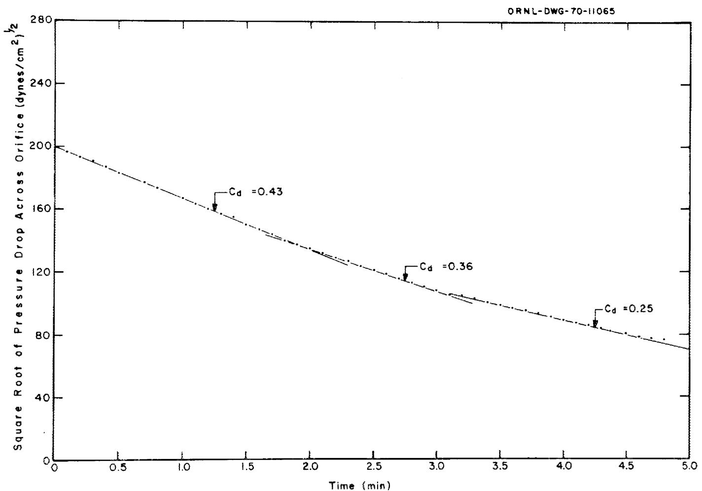  
Fig. 23. Data Obtained During Drainage of Salt from Orifice--Head Pot Having an Orifice Diameter of 0.118 in.

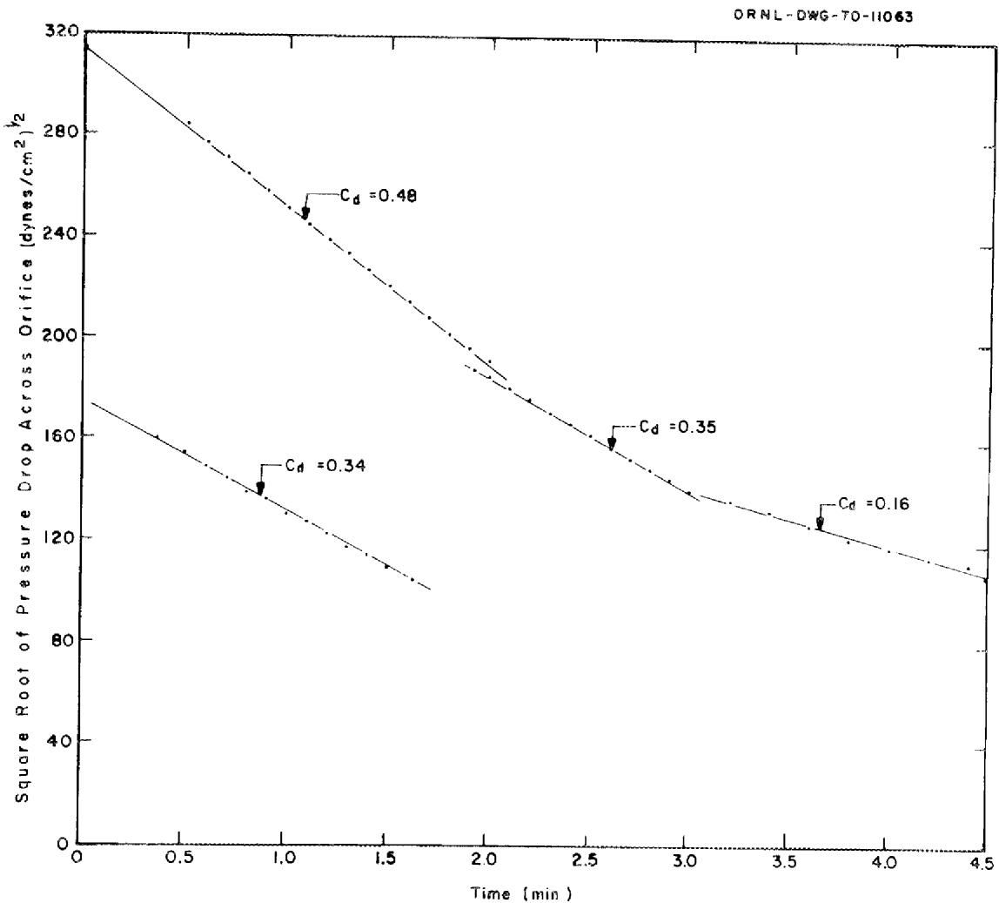  
Fig. 24. Data Obtained During Drainage of Bismuth from Orifice--- Head Pot Having an Orifice Diameter of 0.118 in.

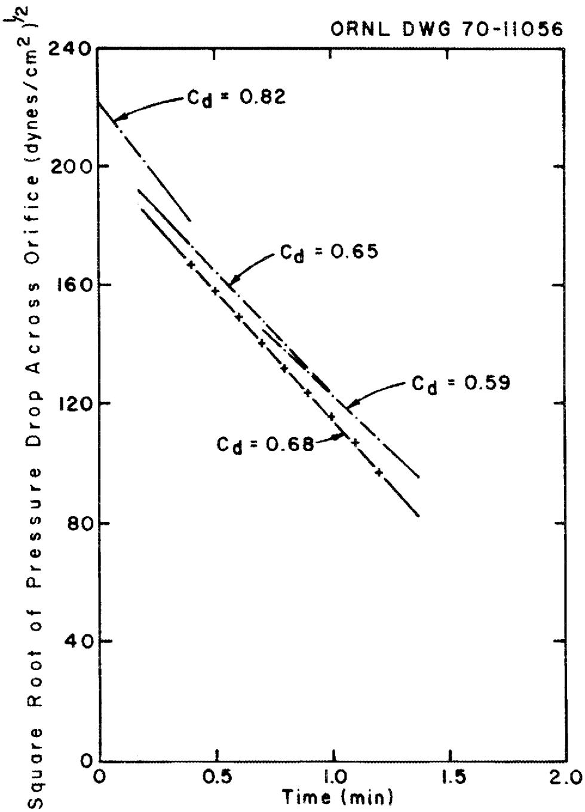  
Fig. 25. Data Obtained During Drainage of Bismuth from Orifice--Head Pot Having an Orifice Diameter of 0.118 in.

8. ELECTROLYTIC CELL DEVELOPMENT: STATIC CELL EXPERIMENTS

J.R.Hightower，Jr.M.S.Lin

L. E. McNeese

The proposed flowsheet for processing a molten-salt breeder reactor requires the use of electrolytic cells for reducing lithium and thorium fluorides at a bismuth cathode and for oxidizing materials from bismuth solutions at a bismuth anode. Two experiments related to cell development were made in a 4-in.-diam quartz cell. In the first, current was passed between two molybdenum electrodes to determine whether the usual dark material would be formed when bismuth was not present in the system. The second experiment was a test of a porous carbon anode having a much higher gas permeability than the graphite anode that had been used in an earlier experiment in which poor results had been obtained. It was believed that a higher gas permeability might allow removal of the $\mathrm{CF}_4$ formed at the anode (by flow through the graphite) and thereby prevent the electrode surface from being insulated by a layer of this material. The salt (66-34 mole % LiF-BeF $_2$ ) and bismuth were sparged with $\mathsf{H}_2$ before being transferred to the quartz vessel.

For the first test, the depth of salt in the cell was 3 in.; the cell contained no bismuth. The anode was a $1/4$ -in.-diam molybdenum rod immersed to a depth of 1 in. at the center of the cell. The cathode was a $1/4$ -in. molybdenum tube inserted to within about 1 in. of the bottom of the cell and located about $1/2$ in. from the cell wall. A quartz tube surrounded the cathode, and only about $1/4$ in. of the molybdenum tube was exposed since it was to be used as the electrical lead in the second experiment. Initially, an alternating current of about 2 A was passed between the electrodes for approximately 2 min with a cell temperature of approximately $600^{\circ}\mathrm{C}$ . At the end of this time, a small amount of black material was observed near the electrode having the quartz sheath around it. A direct current of about 5 A was then passed between the electrodes. There was a rapid formation of black material in the vicinity of the anode, and the

salt became opaque within 1 min. After standing overnight, most of the material had settled out, although a few large particles (vl/8 in. in diameter) were still suspended in the salt phase. Current (5 A, dc) was again passed, and the cell rapidly became opaque again; the black material that formed at the anode rose along the anode, spread out at the salt surface, and dispersed throughout the salt from the surface. Analysis of some of the solid material suspended in the salt indicated that silicon might have been present. It was concluded from this experiment that the presence of bismuth is not necessary for formation of the black material.

After the test with the molybdenum electrodes, sufficient bismuth was transferred to the cell to produce a 3-in. depth of this metal, and the molybdenum rod at the center of the cell was replaced with a l-in.-diam porous carbon electrode (density $= 0.1 \, \text{g/cc}$ ) immersed to a depth of l in. in the salt.

With the cell at $600^{\circ}\mathrm{C}$ , a potential of $5\mathrm{V}$ was applied between the bismuth cathode and the carbon anode. The initial current, approximately $4\mathrm{A}$ , decayed rapidly to a steady value of about $0.2\mathrm{A}$ (corresponding to a current density of $0.04\mathrm{A/cm}^2$ , based on the area of the end of the carbon anode). The cell was then evacuated to an absolute pressure of less than 29 in. Hg without affecting the current density. Sparging the cell periodically produced short-term increases in current, but continuous sparging did not help appreciably. If the $\mathrm{CF}_4$ had escaped from the carbon reaction surface at a rate limited only by resistance to gas flow through the porous electrode, a current density of 12 to $29\mathrm{A/cm}^2$ would have been obtained. Apparently, an insulating film of gas was formed on the anode. Alternatively, with such a high permeability, the salt may have penetrated the electrode a short distance, thus isolating the reaction surface from the salt-free porous carbon and nullifying the benefit of the low resistance to gas flow offered by this material.

We are continuing experiments in static cells in order to identify the black material. We are installing an all-metal cell to determine whether the material forms in the absence of silica.

# 9. ELECTROLYTIC CELL DEVELOPMENT: FORMATION OF FROZEN FILMS WITH AQUEOUS ELECTROLYTES

J. R. Hightower, Jr. C. W. Kee

Formation of frozen salt films on structural surfaces exposed to the molten-salt electrolyte in cells is being considered as a means for protecting these surfaces from corrosion by $\mathrm{BiF}_3$ produced at the cell anode. A study of frozen film formation under conditions similar to those expected in a cell is in progress. Part of the work will be carried out using an aqueous electrolyte in order to avoid problems associated with molten salt--bismuth systems.

Equipment has been installed for studying the formation of ice films on surfaces of a simulated electrolytic cell that uses an aqueous solution rather than molten salt as the electrolyte. Alternating current will be used to minimize the effects of electrode reactions and mass transfer.

The remainder of this section will describe the equipment that has been built, and outline a mathematical analysis for use in designing cells and interpreting results.

# 9.1 Mathematical Analysis

Average Current Density and Power Dissipation. - One conceptual design for an electrolytic cell consists of flowing molten bismuth electrodes (alternately anodic and cathodic) in long, narrow trays that are closely spaced and are submerged in the electrolyte. The divider between the electrodes must be electrically insulating, and the top edge of it must be protected from corrosion by a film of frozen salt.

Figure 26 is a diagram of a half-anode--half-cathode combination and shows a convenient idealization of an actual cell that will be used in cell design. The current is assumed to be confined to an electrolyte region bounded by the frozen film at a radius of $r_1$ and by a hypothetical

ORNL DWG 70-6245

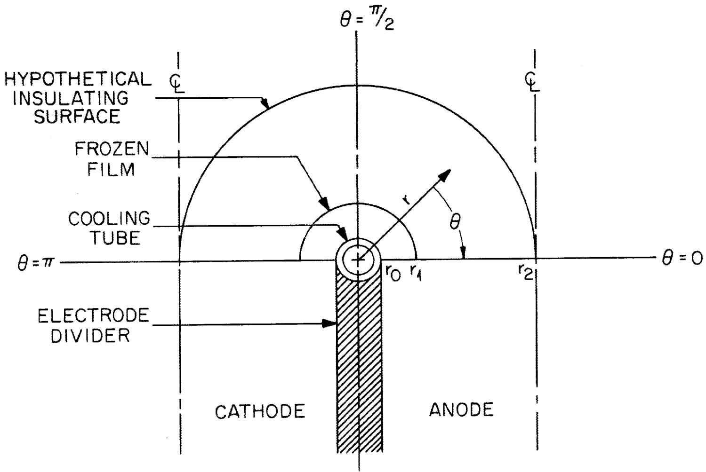  
Fig. 26. Diagram of Idealized Model of Electrolytic Cell.

insulating surface at a radius of $r_2$ (which is half the width of an electrode tray). A cooling tube of radius $r_0$ is positioned at the top of the electrode divider and is covered with a frozen film of thickness $r_1 - r_0$ . The cooling tube is assumed to be electrically insulating.

The current density in the conducting region is given by Ohm's law as:

$$
\vec {J} = g \vec {E}, \tag {31}
$$

where

$$
\begin{array}{l} \vec {J} = \text {v e c t o r c u r r e n t d e n s i t y}, A / m ^ {2}, \\ \vec {E} = \text {v e c t o r e l e c t r i c f i e l d s t r e n g t h}, \mathrm {V} / \mathrm {m}, \\ g = \text {c o n d u c t i v i t y} \text {o f t h e} \quad \text {e l e c t r o l y t e ,} \quad \mathrm {o h m} ^ {- 1} \quad \mathrm {m} ^ {- 1}. \\ \end{array}
$$

With no sources of emf in the conducting region, the field strength is derivable from a scalar potential:

$$
\vec {E} = - \overrightarrow {\operatorname {g r a d} U}, \tag {32}
$$

where

$$
\begin{array}{l} U = \text {e l e c t r i c p o t e n t i a l}, V, \\ \overrightarrow {\text {g r a d} U} = \text {g r a d i e n t o} U. \\ \end{array}
$$

In cylindrical polar coordinates, Eq. (32) becomes

$$
\vec {\frac {1}{E}} = \left(\vec {a} _ {r} \frac {\partial U}{\partial r} + \vec {a} _ {\theta} \frac {1}{r} \frac {\partial U}{\partial \theta}\right), \tag {33}
$$

where $\vec{a}_{r}$ and $\vec{a}_{\theta}$ are unit vectors in the $r$ and $\theta$ directions respectively. Substitution of Eq. (33) into Eq. (31) yields the relation

$$
\vec {J} = - g \left(\vec {a} _ {r} \frac {\partial U}{\partial r} + \vec {a} _ {\theta} \frac {1}{r} \frac {\partial U}{\partial \theta}\right). \tag {34}
$$

In the conducting region, if one assumes that $g$ is constant, $^{8}$ the potential U satisfies the differential equation

$$
\nabla^ {2} \mathrm {U} = 0, \tag {35}
$$

which may be stated in cylindrical polar coordinates as follows:

$$
r \frac {\partial}{\partial r} (r \frac {\partial U}{\partial r}) + \frac {\partial^ {2} U}{\partial \theta^ {2}} = 0. \tag {36}
$$

The boundary conditions assumed for the model shown in Fig. 26 are:

1. The radial current component at $r = r_1$ is 0, so that

$$
\left. \frac {\partial U}{\partial r} \right| _ {r = r _ {1}} = 0.
$$

2. The radial current component $r = r_2$ is 0, so that

$$
\left. \frac {\partial U}{\partial r} \right| _ {r = r _ {2}} = 0.
$$

3. The potential at the anode $(\theta = 0)$ is $V_{1}$ , and the potential at the cathode $(\theta = \pi)$ is 0.

Equation (37),

$$
U = V _ {1} \left(1 - \frac {\theta}{\pi}\right), \tag {37}
$$

is a solution to Eq. (36) in the region $r_1 \leq r \leq r_2$ and $0 \leq \theta \leq \pi / 2$ and satisfies the boundary conditions. Substitution of Eq. (37) into Eq. (34) results in the following equation for current density:

$$
\vec {J} = \vec {a} _ {\theta} \frac {g V _ {1}}{\pi r}. \tag {38}
$$

From Eq. (38) it can be seen that current flows only in the angular direction; the radial component is everywhere zero. This relation will be used to calculate the average current density in the cell and to calculate the power loss due to the resistance of the electrolyte.

The power loss can be calculated by integrating the specific power dissipation over the volume of the cell. The specific power dissipation is given by:

$$
p = \frac {1}{g} J ^ {2}, \text {i n} W / m ^ {3}, \tag {39}
$$

where $J$ is the magnitude of the current density; and the total power dissipation is given by

$$
P = \int_ {V} p d V, \tag {40}
$$

where $V$ is the volume of the region carrying current. The average current density is given by

$$
J _ {\text {a v g}} = \frac {\int_ {r _ {1}} ^ {r _ {2}} J d r}{r _ {2} - r _ {1}} = \frac {g V _ {1}}{\pi R _ {1 n}}, \tag {41}
$$

where $\mathrm{R}_{\ln} = (\mathrm{r}_2 - \mathrm{r}_1) / \ln (\mathrm{r}_2 / \mathrm{r}_1)$ .

The power dissipated in the cell is calculated from Eq. (40) and is given by:

$$
P = \frac {1}{g} J _ {\text {a v g}} ^ {2} \frac {R _ {\ln}}{R _ {\text {a v g}}} \text {, i n} W, \tag {42}
$$

where $\mathrm{R}_{\mathrm{avg}} = 1 / 2(\mathrm{r}_2 + \mathrm{r}_1)$ .

If a coolant at temperature $T_{c}$ ( $T_{c} < T_{f}$ , the freezing temperature of the electrolyte) flows through the cooling tube along the electrode divider, a frozen film will form and grow until the total resistance to heat flow from the bulk of the electrolyte causes the rate at which heat flows into the tube to be equal to that at which heat is carried away by the coolant. At steady state, the heat carried away will be equal to that generated in the bulk of the electrolyte, minus that lost through other surfaces (e.g., the top surface of the electrolyte). For these calculations, we will

assume that a known fraction of heat generated in the semiannular region between $\mathbf{r}_1$ and $\mathbf{r}_2$ (see Fig. 26) is removed through the cooling tube. We will assume that all heat flow through the frozen film and tube wall is in the radial direction. We will also assume that the resistance to heat flow through the tube wall and through the coolant is negligible when compared to the resistance to heat flow through the frozen film on the outside of the tube. Under these assumptions, the equation relating the frozen film thickness to the heat generation is:

$$
Q = \frac {\pi L k \left(T _ {f} - T _ {c}\right)}{\ln \left(\frac {r _ {0} + t}{r _ {0}}\right)}, \tag {43}
$$

where

$Q =$ heat transferred through the frozen film, W,

$\mathbf{L} =$ length of cooling tube, cm,

$\mathbb{T}_{\mathrm{f}} =$ freezing temperature of electrolyte, $^\circ \mathrm{C}$

$\mathrm{k} =$ thermal conductivity of the frozen film, $\mathrm{W}/{}^{\circ}\mathrm{C} - \mathrm{cm}$ ,

$\mathrm{T}_{\mathrm{c}} =$ temperature of coolant, $^\circ \mathrm{C}$

$r_0 =$ outside radius of coolant tube, cm,

$t =$ frozen film thickness, cm.

Equations (41), (42), and (43) are only approximate and thus can be used only as guides in the design of equipment and for predicting its performance.

# 9.2 Experimental Equipment

Coolant System. - A flow diagram of the coolant system is shown in Fig. 27. This system consists of cooling tubes (that pass through the electrolytic cell) for removing heat from the cell, a chiller for removing this heat from the system and chilling the coolant (trichloroethylene) below the freezing point of water, a pump to recirculate the coolant, and

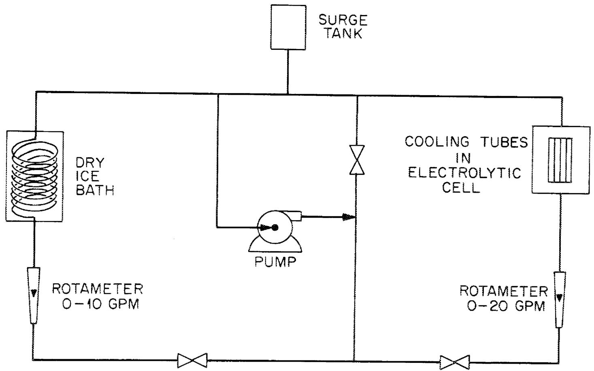  
Fig. 27. Flow Diagram of Aqueous Mock-up Coolant System.

flowmeters and valves to control the flow. There are three coolant circulating loops that allow the temperature of the coolant at the cell inlet and the flow rate of the coolant through the cell to be adjusted independently.

The chiller consists of a 55-gal stainless steel drum containing a coil made of 50 ft of $3/4$ -in.-diam copper tubing. The tubing is immersed in a trichloroethylene--dry ice bath, the temperature of which should be at least as low as $-50^{\circ}\mathrm{C}$ . Dry ice will be added at a rate of $0.24$ lb per minute per kilowatt of heat generated by the cell and pump.

Experimental Cell Vessel.- The first cell vessel to be used in these experiments is made of Plexiglas and contains two trays (1-7/8 in. wide x 12 in. long x 2 in. deep) separated by a 1/4-in.-thick divider; the trays will contain mercury pools for electrodes. A diagram of the cross section of the cell is shown in Fig. 28; a photograph of the cell vessel installed in the cooling loop is shown in Fig. 29. The wider sections at each end of the cell vessel accommodate installation of the cooling tubes. The maximum heat generation rate of interest corresponds to an average current density of $5\mathrm{A/cm}^2$ in molten salt having a resistivity of 0.65 ohm-cm (72-16-12 mole $\%$ LiF-BeF $_2$ -ThF $_4$ ) at $600^{\circ}\mathrm{C}$ . For KBr or KI solutions (27 and 33 wt $\%$ , respectively) a resistivity of about 8 ohm-cm can be obtained with a freezing point of $-10^{\circ}\mathrm{C}$ . With these solutions, the heat generation rate of interest could be obtained with an average current density of about $1.5\mathrm{A/cm}^2$ . Calculations show that, if this heat is removed through the electrode divider cooling tube, an ice film having a thickness of only about 0.05 in. will form. Consequently, other cooling tubes were added along the walls of the cell vessel to reduce the heat load on each tube. In an actual electrolytic cell, these surfaces would require corrosion protection also.

# 9.3 Expected Mode of Operation

Temperature measurements of the electrolyte, electrodes, and coolant fluid, and measurements of current and voltage, will be made in order to

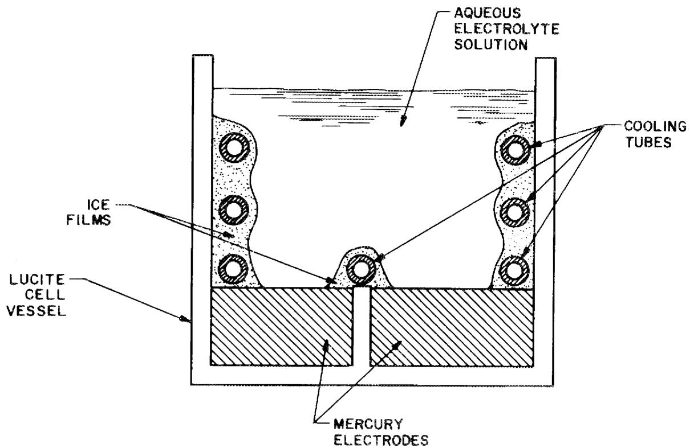  
Fig. 28. Diagram of Cross Section of Electrolytic Cell to Be Used with Aqueous Electrolytes in Studying Formation of Ice Films.

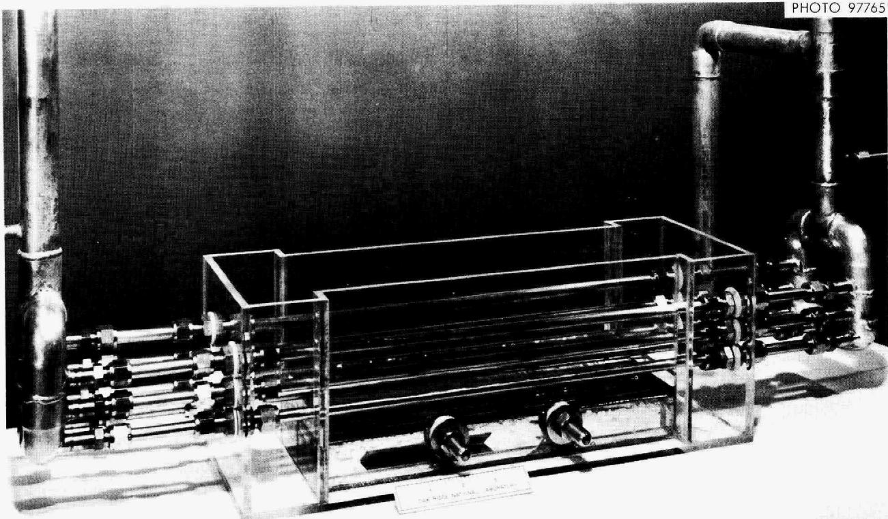  
Fig. 29. Photograph of Cell Vessel for Studying Frozen Film Formation with Aqueous Electrolyte Solutions.

make energy balance calculations on the system. Measurements of the amount of heat that is removed by each cooling tube should aid in determining heat generation rates at various points in the cell.

The center tube will have the greatest heat removal rate and the thinnest ice film. Observations of frozen film thickness, shape, and stability will be made. In addition, qualitative observations will be made of the behavior of the ice layer below the surface of the metal electrodes.

10. DEVELOPMENT OF A BISMUTH--MOLTEN SALT INTERFACE DETECTOR

J. Roth\* L.E.McNeese

An interface detector based on the principle of eddy current generation in liquid metals is being developed for use at molten salt--liquid bismuth or gas--liquid bismuth interfaces. It is desired that all surfaces contacting bismuth be made of a refractory metal such as molybdenum; however, these materials have a relatively low electrical permeability, which makes their use difficult. The device under development is a modification of a liquid-level induction probe developed at Argonne National Laboratory and has been described previously.[10] The design of the inductance coil has been modified so that all lead wires are accessible from one end; this simplifies the replacement of lead wires.

10.1 Testing and Modification of Electronic Circuit Prior to Installation

Initial testing of the electronic circuit prior to installation established the need for several modifications. An attempt was made to establish component compatibility using the expected materials of construction. Core materials tested in the inductance coil included aluminum, Woods metal, and bismuth, in air, in a $30^{14}$ stainless steel sight tube, and in the required $347$ stainless steel--molybdenum duplex sight tube that is

described below. The modifications involved changes in signal amplification, as well as stabilization of the signal received from the detection coil.

The electronic amplification factor was first increased by a factor of 10, which then necessitated replacement of the dc amplifier with one generating a "cleaner" signal. After these modifications had been completed, it was found that, with the $347$ stainless steel--molybdenum sight tube, insertion of a Woods metal rod into the coil caused a pen deflection of $90\%$ of full scale. Insertion of a bismuth rod into the coil caused a pen deflection of only $24\%$ of full scale; however, this deflection is believed to be sufficiently high if the signal-to-noise ratio can be increased. Toward this end, several additional modifications were made. All electrical lead wires were shielded. The detector coil was shielded from the furnace element by a sched 40 type $347$ stainless steel pipe, which essentially eliminated induced signals generated by the furnace element. All segments of the electronic circuit were connected to a common ground, which reduced the signal variations caused by differing ground potentials. All electronic components, with the exception of the furnace element, were connected to a 1-kV Sola constant-voltage transformer. Final testing of the system at room temperature revealed the presence of a 2-V impressed signal that could not be eliminated electronically. This signal was found to be dependent on lead wire location and was eliminated by proper placement of the lead wires. Upon completion of this phase of the work, it was found that noise level had been reduced from about $20\%$ of full scale to about $6\%$ of full scale.

Testing of the system at temperatures above room temperature was then started by first heating the coil slowly to about $250^{\circ}\mathrm{C}$ in an attempt to dry out the detector coil and to determine the effects of both heat and current flow through the furnace coils on the detector coil. The following conclusions were drawn as a result of these tests:

1. Loss of ground connection to the stainless steel furnace shield caused a pen deflection of $9\%$ of full scale. This indicates the need for good ground connections on all portions of the system.

2. The recorder responses resulting from full insertion of a bismuth rod into the detector coil were $4\%$ and $20\%$ of full scale at room temperature and at $220^{\circ}\mathrm{C}$ , respectively.

These data indicate that the sensitivity of the system increases with increasing temperature and that a full-scale pen deflection might be observed at the operating temperature of $600^{\circ}\mathrm{C}$ . However, the electrical properties of bismuth exhibit a discontinuity at the melting point, which may decrease the sensitivity. It was decided to modify the electronic circuit such that the output signal will be amplified by an additional factor of 10.

The optimum coil operating frequency increases with increasing temperature; however, the corresponding output signal decreases with increasing frequency. In addition, the electronic zero is also dependent on the frequency. At room temperature, the optimum frequency was $47\mathrm{kHz}$ , and an output of $8\mathrm{V}$ was observed. At $450$ to $500^{\circ}\mathrm{C}$ the optimum frequency was $59\mathrm{kHz}$ , with a corresponding output of $6\mathrm{V}$ . The electronic zero drifted over a period of time. A Zener diode feedback circuit will be installed in the system in an attempt to stabilize it.

# 10.2 Fabrication of Sight Tube

The second attempt by the Metals and Ceramics Division to coat the internal surface of a 0.500-in.-diam type 347 stainless steel tube with 0.005 to 0.010 in. of tungsten by chemical vapor deposition was successful. However, repeated attempts to coat the external surface of the tube failed because of an inability to produce a continuous bond between the internal and external coatings. Failure of this technique to establish a suitable bond between the two surface coatings was attributed to the high stress levels that are inherent with this type of joint. These stress levels are caused partially by the differential thermal expansion characteristics of tungsten and stainless steel and partially by the failure of the vapor-deposited tungsten to bond to the stainless steel substrate. No further attempts will be made to prepare sight tubes by this method.

The sight tubes required for the test apparatus have been produced by machining the external surfaces of several 36-in.-long pieces of molybdenum tubing, which were originally 0.375 in. OD with a 0.040-in. wall, to produce a wall thickness of 0.02 in. Although this thickness is considerably greater than anticipated, tests indicate that satisfactory results can still be obtained.

# 11. CONTINUOUS SALT PURIFICATION

R.B.Lindauer E.I.Youngblood

L. E. McNeese

Molten salt for the MSRE and for development work is presently purified from contaminants (mainly sulfides, oxides, and iron fluoride) by a batch process. The total cost of salt (natural lithium) thus produced has amounted to about \(1600 / ft^3\), of which less than \(40\%\) is material cost. In April 1968, a commercial vendor bid \)2660 / ft^3$ on a 280-ft³ quantity. It is believed that the labor costs could be reduced considerably by use of a continuous process for the most time-consuming operation (hydrogen reduction of iron fluoride). Although the removal of sulfides and oxides by the batch process is fairly rapid, additional advantages would probably be gained by performing this operation continuously.

Preliminary experiments on the reduction of iron fluoride in molten salt were performed by MIT Practice School students in 1968 with encouraging results. A substantial reduction in the concentration of iron fluoride was obtained, although most of the operation was carried out at less than $2\%$ of the calculated flooding rate. For the present studies, the column diameter has been reduced from 3.375 in. to 1.38 in. (1.25-in., sched 40 pipe) to allow operation nearer the flooding point. The column is 81 in. long and is packed with $1/4$ -in. Raschig rings. Equipment has been designed to supply purified hydrogen, argon, and HF gas in sufficient quantities to operate at the higher rates. Figure 30 is a simplified flowsheet of the system. Molten salt is charged to the receiver tank and then transferred via pressurization to the feed tank, which is elevated about $5-1/2$

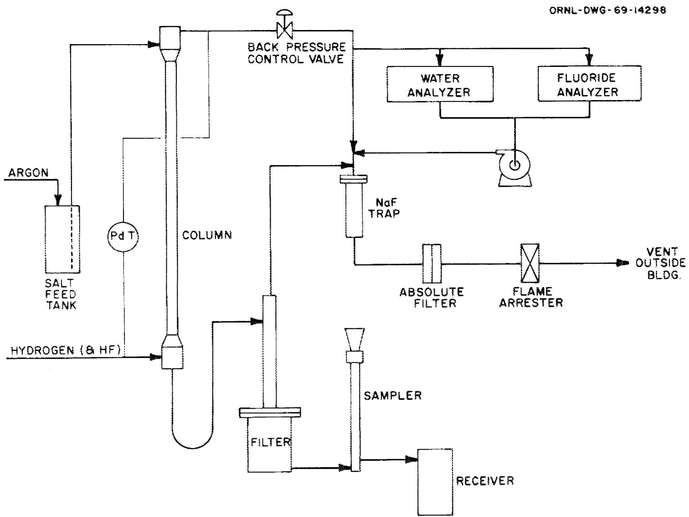  
Fig. 30. Flow Diagram of Equipment for Study of Continuous Salt Purification.

ft to reduce the argon pressure required to feed salt to the column. The salt feed rate is controlled by adjusting the argon flow rate to the feed tank. In order to limit the stress on the feed tank, the tank is maintained at $650^{\circ}\mathrm{C}$ ; additional heat is supplied to the feed line to increase the temperature of the salt to the column operating temperature of $700^{\circ}\mathrm{C}$ . The hydrogen is also preheated to $700^{\circ}\mathrm{C}$ before it enters the bottom of the column. Hydrogen leaving the top of the column flows through a pressure control valve in order to maintain the salt-gas interface at the bottom of the column below the gas inlet. Salt leaving the bottom of the column passes, first, through a liquid seal loop and, then, through a fibrous metal filter to remove particulate iron. The filtered salt passes through a flowing stream sampler and is subsequently routed to the receiver. Hydrogen fluoride that is produced during reduction is removed by a NaF trap.

Instrumentation is provided to measure the differential pressure across the column, the pressure at the top of the column, and the salt head above the salt filter. An analysis for water in the system off-gas is made during oxide removal to determine the rate at which oxide is removed, and an analysis for fluoride in this stream is made during the iron reduction step to provide a check on the rate of reduction as indicated by the analysis of filtered salt samples. Periodic examination of the filter (and possibly of the column packing) will provide information on the particle size, filterability, and disposition of the iron.

# 12. MSRE DISTILLATION EXPERIMENT

J.R.Hightower，Jr. L.E.McNeese

Results of final analyses have been obtained for Li, Be, Zr, $^{95}\mathrm{Zr}$ , $^{144}\mathrm{Ce}$ , $^{147}\mathrm{Pm}$ , $^{155}\mathrm{Eu}$ , $^{91}\mathrm{Y}$ , $^{90}\mathrm{Sr}$ , $^{89}\mathrm{Sr}$ , and $^{137}\mathrm{Cs}$ in the 11 condensate samples taken during the MSRE Distillation Experiment. These results (shown in Table 5) have been used to calculate the effective relative volatility of each component, with respect to LiF, during the course of the experiment by methods described previously. $^{12}$

Table 5. Analyses of Samples from the MSRE Distillation Experiment   

<table><tr><td rowspan="2"></td><td colspan="10">Component</td><td colspan="2">Salt Volumes Associated with Condensate Samples</td><td></td></tr><tr><td>Li(wt %)</td><td>Be(wt %)</td><td>Zr(wt %)</td><td>95Zrdis min-1g-1</td><td>144Ce(dis min-1g-1)</td><td>147Pmdis min-1g-1</td><td>155Eu(dis min-1g-1)</td><td>91Y(dis min-1g-1)</td><td>90Sr(dis min-1g-1)</td><td>89Sr(dis min-1g-1)</td><td>137CsTotal LitersFed</td><td>Liters CondensateCollected</td><td></td></tr><tr><td>Fuel storage tank-1(Date analyzed)</td><td>—</td><td>—</td><td>—</td><td>1.79 x 109(4/24/69)</td><td>3.14 x 1010(4/25/69)</td><td>3.48 x 109(4/24/69)</td><td>—</td><td>—</td><td>3.11 x 109(4/24/69)</td><td>—</td><td>—</td><td></td><td></td></tr><tr><td>Fuel storage tank-2(Date analyzized)</td><td>10.6(5/1/69)</td><td>5.67(5/1/69)</td><td>13.39(5/1/69)</td><td>1.62 x 109(4/29/69)</td><td>3.21 x 1010(5/2/69)</td><td>3.75 x 109(4/30/69)</td><td>—</td><td>—</td><td>3.35 x 109(4/29/69)</td><td>—</td><td>—</td><td></td><td></td></tr><tr><td>Condensate samples</td><td>3.88</td><td>11.14</td><td>15.66</td><td>1.53 x 109</td><td>6.83 x 106</td><td>&lt;2.6 x 106</td><td>&lt;8 x 103</td><td>6.54 x 105</td><td>&lt;2.1 x 106</td><td>2.10 x 107</td><td>9.46 x 109</td><td>7.9</td><td>0.42</td></tr><tr><td>-2</td><td>4.67</td><td>8.48</td><td>12.05</td><td>1.39 x 109</td><td>1.21 x 106</td><td>1.53 x 107</td><td>&lt;1.4 x 105</td><td>1.18 x 106</td><td>&lt;5.2 x 106</td><td>5.15 x 107</td><td>6.49 x 108</td><td>10.0</td><td>1.93</td></tr><tr><td>-3</td><td>6.86</td><td>10.39</td><td>10.04</td><td>1.14 x 109</td><td>2.39 x 106</td><td>2.78 x 107</td><td>&lt;3.0 x 105</td><td>1.44 x 106</td><td>8.54 x 106</td><td>1.61 x 107</td><td>3.93 x 109</td><td>11.2</td><td>2.96</td></tr><tr><td>-4</td><td>7.24</td><td>9.76</td><td>10.09</td><td>1.17 x 109</td><td>1.97 x 106</td><td>2.23 x 107</td><td>&lt;2.1 x 105</td><td>1.32 x 106</td><td>5.76 x 106a</td><td>1.34 x 107</td><td>3.53 x 109</td><td>12.6</td><td>3.81</td></tr><tr><td>-5</td><td>8.15</td><td>10.00</td><td>10.48</td><td>1.24 x 109</td><td>8.09 x 107</td><td>8.85 x 106</td><td>&lt;1.0 x 105</td><td>6.14 x 105</td><td>&lt;2.5 x 106</td><td>2.49 x 107</td><td>3.14 x 109</td><td>13.4</td><td>4.35</td></tr><tr><td>-6</td><td>7.05</td><td>9.93</td><td>10.49</td><td>1.21 x 109</td><td>2.89 x 108</td><td>3.20 x 107</td><td>&lt;3.4 x 105</td><td>1.81 x 106</td><td>8.93 x 106</td><td>1.08 x 107</td><td>2.61 x 109</td><td>13.6</td><td>4.95</td></tr><tr><td>-7</td><td>7.82</td><td>9.24</td><td>10.53</td><td>1.16 x 109</td><td>1.99 x 108</td><td>2.16 x 107</td><td>&lt;2.5 x 105</td><td>1.15 x 106</td><td>8.57 x 106</td><td>1.91 x 107</td><td>1.66 x 109</td><td>13.8</td><td>5.80</td></tr><tr><td>-8</td><td>8.77</td><td>8.48</td><td>9.83</td><td>1.17 x 109</td><td>3.01 x 108</td><td>3.08 x 107</td><td>&lt;3.3 x 105</td><td>1.60 x 106</td><td>8.75 x 106</td><td>3.38 x 107</td><td>5.91 x 108</td><td>13.8</td><td>6.34</td></tr><tr><td>-9</td><td>9.80</td><td>7.66</td><td>8.71</td><td>9.78 x 108</td><td>4.63 x 108</td><td>5.98 x 107</td><td>&lt;5.5 x 105</td><td>2.29 x 106</td><td>1.56 x 107</td><td>3.59 x 107</td><td>4.06 x 108</td><td>13.8</td><td>6.89</td></tr><tr><td>-10</td><td>13.02</td><td>5.11</td><td>8.26</td><td>9.44 x 108</td><td>4.75 x 105</td><td>6.27 x 107</td><td>&lt;6.6 x 105</td><td>6.01 x 106</td><td>2.37 x 107</td><td>1.69 x 107</td><td>2.63 x 108</td><td>13.8</td><td>7.49</td></tr><tr><td>-11</td><td>13.28</td><td>5.22</td><td>8.11</td><td>9.25 x 108</td><td>4.91 x 106</td><td>6.90 x 107</td><td>&lt;8.1 x 105</td><td>4.10 x 106</td><td>3.04 x 107</td><td>4.2 x 107</td><td>2.96 x 108</td><td>13.8</td><td>7.85</td></tr><tr><td>(Date analyzed)</td><td>(5/21/69)</td><td>(5/23/69)</td><td>(5/23/69)</td><td>(5/21/69)</td><td>(7/21/69)</td><td>(7/2/69)</td><td>(10/8/69)</td><td>(9/30/69)</td><td>(7/8/69)</td><td>(7/8/69)</td><td>(5/21/69)</td><td></td><td></td></tr></table>

aDuplicate samples differed by a factor of 4 or more.

The effective relative volatility of each component, with respect to LiF, is shown in Figs. 31-34 as a function of the volume of collected condensate. The most self-consistent values were obtained when the carrier salt composition in the feed was assumed to be $65 - 30 - 5$ mole $\%$ LiF $\mathrm{BeF}_2\mathrm{-ZrF}_4$ rather than a slightly different composition as indicated by the analysis of the salt from the fuel storage tank. The difference between the analytical values and the values used is probably due to the presence of zirconium metal in the fuel storage tank. The zirconium was filtered out when the salt was transferred to the still feed tank.

The effective relative volatilities of the major salt components $\mathrm{BeF}_2$ and $\mathrm{ZrF}_4$ and of the fission product $95_{\mathrm{ZrF}_4}$ are shown in Fig. 31. The effective relative volatility of $\mathrm{BeF}_2$ , which was essentially constant during the run, had an average value of 3.8. This value agrees favorably with the value of 3.9 reported by Smith, Ferris, and Thompson, $^{13}$ but is lower than the value of 4.7 measured by Hightower and McNeese. $^{14}$ Slight inaccuracies in calculations (especially the material balance calculations described earlier) and analyses probably account for these differences.

The effective relative volatilities of fission product $^{95}\mathrm{ZrF}_4$ and of natural $\mathrm{ZrF}_4$ are in agreement. When the analysis of the fuel storage tank salt was used in the relative volatility calculation, the resulting relative volatilities of the natural $\mathrm{ZrF}_4$ were about a factor of 2 lower than the values for $^{95}\mathrm{ZrF}_4$ . Figure 31 shows that $\alpha_{\mathrm{ZrF}_4 - \mathrm{LiF}}$ decreased from an initial value near 4 at the start of the run to about 1 at the end of the run. These values bracket the value of 2.2 measured by Smith and co-workers in salt mixtures having a $\mathrm{ZrF}_4$ concentration about 2% of that used in our system.

The effective relative volatilities for the lanthanide fission products, $^{144}\mathrm{CeF}_3$ , $^{147}\mathrm{PmF}_3$ , and $^{155}\mathrm{EuF}_2$ , are shown in Fig. 32. The value of the effective relative volatility of $^{144}\mathrm{CeF}_3$ increased sharply from 6.1 x $10^{-4}$ at the time of the first sample to about 1.0 x $10^{-2}$ , where it remained for nearly all the subsequent samples. The fifth sample, however, was lower than 1.0 x $10^{-2}$ by a factor of 3. The low initial value was 1.5 to 3.4 times the value measured in an equilibrium still; $^{12}$ the higher values were 24 to 56 times the value measured in the equilibrium still.

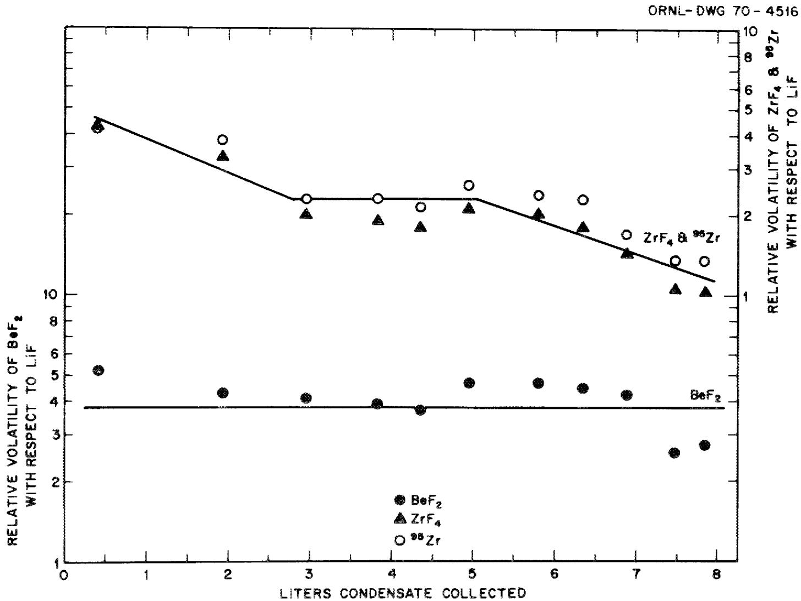  
Fig. 31. Effective Relative Volatilities of $\mathbf{ZrF_4}$ , $95_{\mathbf{ZrF_4}}$ , and $\mathbf{BeF_2}$ for the MORE Distillation Experiment.

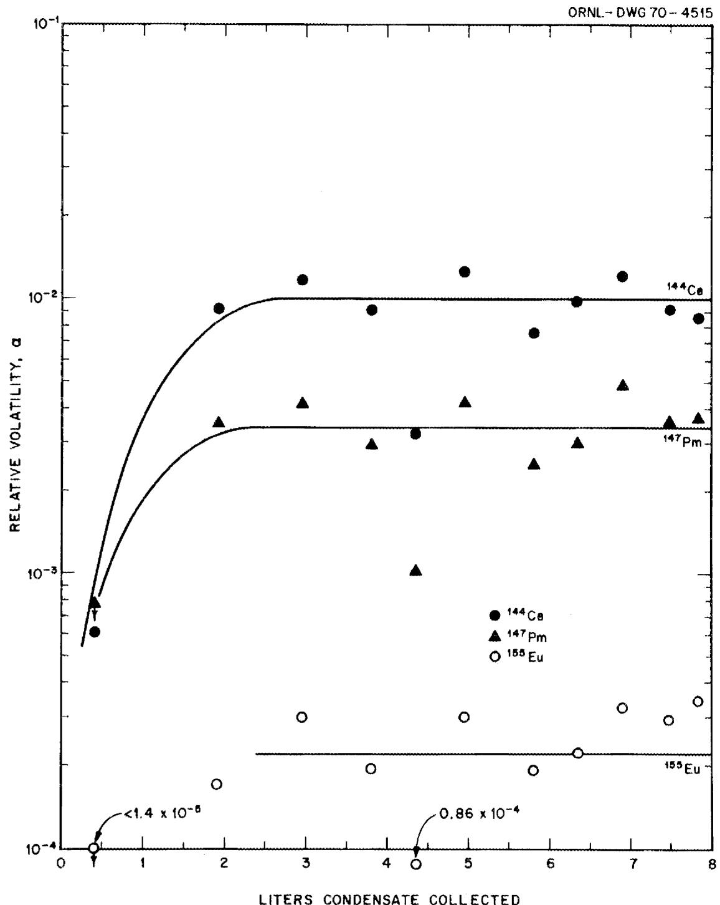  
Fig. 32. Effective Relative Volatilities of $^{144}\mathrm{CeF}_3$ , $^{147}\mathrm{PmF}_3$ , and $^{155}\mathrm{EuF}_2$ in the MSRE Distillation Experiment.

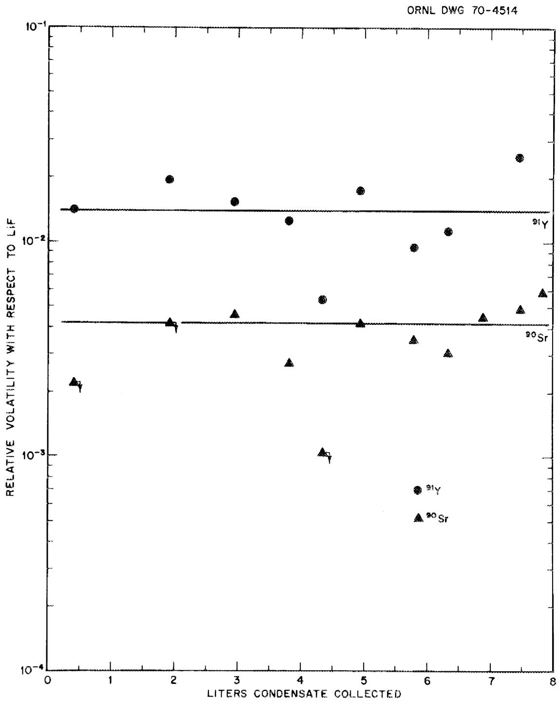  
Fig. 33. Effective Relative Volatilities of $^{91}\mathrm{YF}_3$ and $^{90}\mathrm{SrF}_2$ in the MSRE Distillation Experiment.

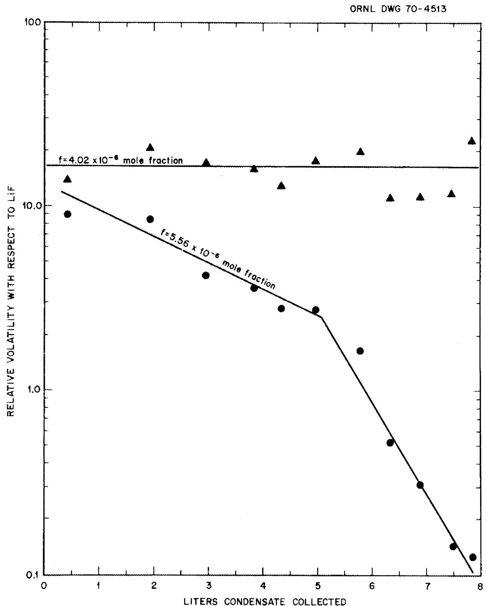  
Fig. 34. Effective Relative Volatility of $^{137}\mathrm{CsF}$ in MSRE Distillation Experiment, Showing Effect of Variation of Assumed Feed Concentration.

The effective relative volatility for $^{147}\mathrm{PmF}_3$ is based on a computed feed concentration, which is believed to be a more accurate value than the measured feed concentration (since measured concentrations of other lanthanide fission products were in good agreement with computed concentrations and since the measured concentration is in doubt). As in the case of $^{144}\mathrm{CeF}_3$ , the relative volatility of $^{147}\mathrm{PmF}_3$ at the time of the first sample was low--less than 7.8 x $10^{-4}$ ; it rose sharply to about 3.4 x $10^{-3}$ for the other samples. Again, as in the case of $^{144}\mathrm{CeF}_3$ , the relative volatility of the fifth sample was low. There were no previously measured values of the relative volatility of $\mathrm{PmF}_3$ with which to compare these results. It is interesting to note that when the effective relative volatility of $^{147}\mathrm{PmF}_3$ was calculated based on the measured concentration of $^{147}\mathrm{Pm}$ in the fuel storage tank (instead of a calculated concentration), the relative volatility value for each sample except the first nearly coincided with the respective value for $^{144}\mathrm{CeF}_3$ .

The variation of the relative volatility of $^{155}\mathrm{EuF}_2$ during the run closely paralleled the variations for $^{144}\mathrm{CeF}_3$ and $^{147}\mathrm{PmF}_3$ . The value for the first sample was low (less than $1.5 \times 10^{-5}$ ), but the values for all other samples except for the fifth sample were a great deal higher (about $2.2 \times 10^{-4}$ ). The value for the fifth sample was lower by a factor of 2.6. These calculated effective relative volatilities (which were based on a computed feed concentration of $^{155}\mathrm{Eu}$ ) were lower than the value of $1.1 \times 10^{-3}$ measured in recirculating equilibrium stills. However, the values for $^{155}\mathrm{Eu}$ in the condensate are suspected of being inaccurate since difficulty was experienced in the analyses; therefore, all $^{155}\mathrm{Eu}$ analyses for the condensate samples were reported as approximate values (see Table 5). On the other hand, it is significant that the variation in the relative volatility of $^{155}\mathrm{Eu}$ during the run closely paralleled the relative volatilities of $^{144}\mathrm{CeF}_3$ and $^{147}\mathrm{PmF}_3$ (and, as seen later, $^{91}\mathrm{YF}_3$ and $^{90}\mathrm{SrF}_2$ ).

Figure 33 shows the effective relative volatilities of $^{91}_{\mathrm{YF}_3}$ and $^{90}_{\mathrm{SrF}_2}$ . The effective relative volatility of $^{91}_{\mathrm{YF}_3}$ had an average value during the run of $1.4 \times 10^{-2}$ , about 410 times the value measured in recirculating equilibrium stills. The variation of the $^{91}_{\mathrm{YF}_3}$ relative

volatility during the run resembled variations in the relative volatilities of the lanthanides; the low value for the fifth sample was the most noticeable similarity.

During the run, the effective relative volatility of $^{90}\mathrm{SrF}_2$ (based on the measured concentration in the feed) had an average value of 4.1 x $10^{-3}$ , which is about 84 times the value measured in recirculating equilibrium stills. Although not shown in Fig. 33, the average value of the relative volatility of $^{89}\mathrm{SrF}_2$ (based on a computed concentration in the feed) was 0.193, about 3900 times the value measured in equilibrium stills; and the ratio of the $^{89}\mathrm{Sr}$ activity to the $^{90}\mathrm{Sr}$ activity in the condensate samples, which should have been about 0.002 for each sample, varied from 0.22 to greater than 10.

The concentration of $^{137}\mathrm{Cs}$ in the feed salt was not measured; instead, calculation of the effective relative volatility was based on an estimated feed concentration. Since $^{137}\mathrm{Cs}$ has a fairly long-lived gaseous precursor ( $^{137}\mathrm{Xe}$ , half-life of 3.9 min), its actual concentration in the salt will be lower than that calculated if we assume that all the precursors remained in the salt. Also, because the actual relative volatility of CsF is fairly high, the results of the calculations of the effective relative volatility are sensitive to the assumed feed concentration of $^{137}\mathrm{Cs}$ . Figure 34 shows calculated relative volatilities of $^{137}\mathrm{CsF}$ for two assumed feed concentrations. The points around the lower curve result from the feed concentration that would arise as a consequence of all precursors staying in the salt during MSRE operation and represent lower limits for the relative volatility; the points around the upper line result from a feed concentration just high enough to prevent the computed concentration of $^{137}\mathrm{Cs}$ in the still pot liquid from falling to zero, and represent upper limits for the effective relative volatility of $^{137}\mathrm{CsF}$ . The highest effective relative volatility of $^{137}\mathrm{CsF}$ seen in these calculations was only about $20\%$ of the value measured in LiF-BeF $_2$ mixtures by Smith and co-workers.

As seen from the previous results, all components except $\mathrm{BeF}_2$ and $\mathrm{ZrF}_4$ had effective relative volatilities that differed significantly

(in some cases, drastically) from values predicted from work with equilibrium systems. Possible explanations for these discrepancies are being examined.

# 13. RECOVERY OF $^7\text{Li}$ FROM $^7\text{Li}$ --BISMUTH--RARE-EARTH SOLUTIONS BY DISTILLATION

J.R.Hightower，Jr. L.E.McNeese

Removal of divalent lanthanides from the LiCl stream in the metaltransfer process produces a bismuth stream that contains lanthanides, along with a high concentration of $^7\mathrm{Li}$ (on the order of 10 to 50 at. $\%$ ). Because of the high cost of $^7\mathrm{Li}$ , its recovery may be economical.

The low vapor pressures of the lanthanide metals, as compared with those of Li and Bi, suggest that distillation might be used effectively to recover Li and Bi. However, since Li and Bi form an intermetallic compound $\left(\mathrm{Li}_{3} \mathrm{Bi}\right)$ having a high melting point $(1145^{\circ} \mathrm{C})$ , the Li concentration in the still could become high enough in the course of distillation that solid Li Bi would be formed in the still pot. Calculated results that indicate the expected performance of a one-stage continuous equilibrium still are discussed in this section. The fractional recovery of lithium is calculated for a set of conditions that allow a reasonably high recovery. The extent of separation of the recovered lithium from the lanthanides was assumed to be adequate and was not considered.

# 13.1 Mathematical Analysis

Material Balance Around a Continuous Still. - Consider a single-stage equilibrium still to which a bismuth stream containing lithium is fed (the lanthanide fission products are assumed to be nonvolatile and will be neglected) and from which an overhead stream and a bottom stream are drawn (each stream contains bismuth and lithium). A steady-state material balance around the still yields the following equation:

$$
Z = (1 - f) X + f Y, \tag {44}
$$

where

$\mathbf{Z} =$ atom fraction of Li in the feed stream,

$X =$ atom fraction of Li in the still bottoms stream,

$\mathbf{Y} =$ atom fraction of Li in the overhead stream from the still,

$f =$ fraction of the feed stream vaporized in the still, moles vapor per mole of liquid fed.

The vapor phase and the liquid phase leaving the still are assumed to be in equilibrium; the concentrations of these phases are related through the relative volatility of lithium with respect to bismuth, which is defined as:

$$
\alpha_ {\mathrm {L i - B i}} = \frac {\mathrm {Y} (1 - \mathrm {X})}{\mathrm {X} (1 - \mathrm {Y})}, \tag {45}
$$

where $\alpha_{\mathrm{Li - Bi}}$ is a function of system temperature, pressure, and composition. (The evaluation of $\alpha_{\mathrm{Li - Bi}}$ will be discussed in a later section.) Substitution of Eq. (45) into Eq. (44) yields the following equation, which relates the still-pot composition to the fraction of material distilled:

$$
z - \left[ \left(1 - \alpha_ {L i - B i}\right) z + (1 - r) + \alpha_ {L i - B i} f \right] x + \left(1 - \alpha_ {L i - B i}\right) (1 - r) x ^ {2} = 0. \tag {46}
$$

Because $\alpha_{\mathrm{Li - Bi}}$ depends on $X$ , this equation must be solved iteratively.

The relative volatility of lithium with respect to bismuth is related to the vapor pressures of the two components through the relation

$$
\alpha_ {\mathrm {L i} - \mathrm {B i}} = \frac {\gamma_ {\mathrm {L i}} {} ^ {\mathrm {P}} _ {\mathrm {L i}}}{\gamma_ {\mathrm {B i}} {} ^ {\mathrm {P}} _ {\mathrm {B i}}} \tag {47}
$$

where

$\gamma_{\mathrm{Li}}$ and $\gamma_{\mathrm{Bi}}$ are the liquid-phase activity coefficients of Li and Bi, respectively, at the temperature, pressure, and composition of the liquid in the still;

$P_{Li}$ and $P_{Bi}$ are the vapor pressures of Li and Bi, respectively, at the temperature of the still.

Evaluation of the activity coefficients for use in Eq. (47) is discussed in the following section.

Evaluation of Activity Coefficients for the Li-Bi System. - The activity coefficient for lithium in Li-Bi solutions has been measured15 and is expressed by the following equation:

$$
\ln \gamma_ {\mathrm {L i}} = - \left(\frac {\mathrm {A} (\mathrm {T})}{\mathrm {R T}} + \frac {\mathrm {B} (\mathrm {T})}{\mathrm {R T}}\right) \mathrm {X}, \tag {48}
$$

where

$$
\begin{array}{l} A (T) = 9 3 9 7 + 1 8. 1 6 T - 0. 0 1 0 9 T ^ {2} \text {c a l / m o l e}, \\ B (T) = 7 1 0 3 - 1 9. 4 4 T + 0. 0 0 6 8 T ^ {2} \text {c a l / m o l e}, \\ R = \text {g a s} = 1. 9 8 7 \text {c a l m o l e} ^ {- 1} \circ K ^ {- 1}, \\ T = \text {a b s o l u t e} ^ {\circ} K. \\ \end{array}
$$

This equation is valid for the composition range $0.05 \leq X \leq 0.60$ , in the temperature range $775^{\circ}K \leq T \leq 1100^{\circ}K$ and at a pressure of $l$ atm.

The activity coefficient of bismuth is obtained from Eq. (48) through the Gibbs-Duhem equation for a binary system at constant temperature, in the following form:

$$
\frac {\partial \ln \gamma_ {B i}}{\partial X} = - \frac {X}{1 - X} \frac {\partial \ln \gamma_ {L i}}{\partial X} + \frac {[ v - X \bar {V} _ {L i} - (1 - x) \bar {V} _ {B i} ]}{R T (1 - X)} \frac {d P}{d X}, \tag {49}
$$

where

$$
\begin{array}{l} v = \text {v o l u m e} \\ \bar {V} _ {L i} = \text {m o l a r v o l u m e o f p u r e L i}, \\ \bar {V} _ {B i} = \text {m o l a r v o l u m e o f p u r e B i}, \\ P = t o t a l \quad p r e s s u r e \quad o f \quad s y s t e m. \\ \end{array}
$$

When Eq. (49) is integrated with respect to $X$ from $X = 0$ to the desired value, the following equation is obtained:

$$
\begin{array}{l} \ln \gamma_ {\mathrm {B i}} = \int_ {0} ^ {X} \frac {\partial \ln \gamma_ {\mathrm {L i}}}{\partial X} d X \\ = - \int_ {0} ^ {X} \frac {\frac {X}{1 - X} \frac {\partial \ln Y _ {L i}}{\partial X} d X + \int_ {P a t X = 0} ^ {P a t X = X} \frac {[ v - x \bar {V} _ {L i} - (1 - x) \bar {V} _ {B i} ]}{R T (1 - X)} d P . (5 0)} \\ \end{array}
$$

The last term will be neglected since its value is less than $6 \times 10^{-4}$ , which is negligible as compared with the value of the next-to-last term (i.e., $> 0.1$ ). Thus, the following relation, valid for low pressures, will be used to evaluate $\gamma_{\mathrm{Bi}}$ :

$$
\ln \gamma_ {\mathrm {B i}} = - \int_ {0} ^ {X} \frac {X}{(1 - X)} \frac {\partial \ln \gamma_ {\mathrm {L i}}}{\partial X} d X. \tag {51}
$$

The quantity $\frac{\partial \ln \gamma_{\mathrm{Li}}}{\partial X}$ can be evaluated from Eq. (48); substituting this quantity into Eq. (51) and integrating the resulting expression results in:

$$
\ln \gamma_ {\mathrm {B i}} = \frac {\mathrm {B} (\mathrm {T})}{\mathrm {R T}}. [ \mathrm {X} + \ln (1 - \mathrm {X}) ]. \tag {52}
$$

Equations (52) and (48) can be combined with Eq. (47) to give the following relation for the relative volatility of lithium, with respect to bismuth:

$$
\alpha_ {\mathrm {L i} - \mathrm {B i}} = \frac {\mathrm {P} _ {\mathrm {L i}}}{\mathrm {P} _ {\mathrm {B i}}} \exp \left(- \frac {\mathrm {A} (\mathrm {T})}{\mathrm {R T}}\right) \exp \left(- \frac {2 \mathrm {B} (\mathrm {T})}{\mathrm {R T}} \mathrm {X}\right) (1 - \mathrm {x}) ^ {- \frac {\mathrm {B} (\mathrm {T})}{\mathrm {R T}}}. \tag {53}
$$

The vapor pressure of lithium is given by the following equation, which was derived from data given in ref. 17:

$$
\ln P _ {L i} = 1 6. 8 1 3 - \frac {1 6 7 4 6}{T}, \tag {54}
$$

where

$\mathbb{P}_{\mathrm{Li}} =$ vapor pressure of Li, mm Hg,

T = absolute temperature, °K.

The equation for the vapor pressure of bismuth used in these calculations was obtained from ref. 18 and is as follows:

$$
\log_ {1 0} P _ {B i} = 7. 6 3 2 7 - \frac {9 1 5 0 . 3}{T}, \tag {55}
$$

where

$\mathbb{P}_{\text{Bi}} =$ vapor pressure of Bi, mm Hg,

T = absolute temperature, °K.

Method for Solving Equations. -- The method for solving the equation for the still-pot composition (assumed to be the same as the still bottom stream) consisted of the following steps:

1. A still-pot temperature was chosen; this allowed the evaluation of the following terms in Eq. (53): $P_{Li}$ , $P_{Bi}$ , $A(T) / RT$ , $B(T) / RT$ .   
2. The above terms were substituted into Eq. (53) to give an expression for $\alpha_{\mathrm{Li - Bi}}$ which was dependent only on X.   
3. The expression for $\alpha_{\mathrm{Li - Bi}}$ was substituted into Eq. (46).   
4. Equation (46) was solved using the Newton-Raphson algorithm for a range of values of $f$ and $Z$ .   
5. Once the still-pot composition was determined, the liquidus temperature for this composition could be determined from the Li-Bi phase diagram.[20] The fractional recovery of lithium in the overhead stream was calculated from the following equation:

$$
R = 1 - (1 - f) \frac {X}{Z}, \tag {56}
$$

where R is the number of moles of lithium in the overhead stream per mole of lithium in the feed stream.

# 13.2 Calculated Results

Still-pot compositions, liquid temperatures, and fractional lithium recoveries were calculated for still-pot temperatures of $800^{\circ}\mathrm{C}$ and $900^{\circ}\mathrm{C}$ , feed compositions of 5, 10, and 20 at. $\%$ lithium, and values of f from 0.70 to 0.99. Figure 35 shows the liquidus temperature of the still-pot liquid for an operating temperature of $800^{\circ}\mathrm{C}$ , the three feed compositions, and vaporization of up to $95\%$ of the incoming Bi-Li stream. For a feed composition of 10 or 20 at. $\%$ lithium, the maximum lithium recovery would be less than $36\%$ . For a feed composition of 5 at. $\%$ lithium, a lithium recovery of greater than $50\%$ could be achieved before solid Li $_3$ Bi would be formed in the still pot.

Figure 36 shows the liquidus temperature of the still-pot liquid for an operating temperature of $900^{\circ}\mathrm{C}$ , the three feed compositions, and vaporization of up to $95\%$ of the incoming Bi-Li stream. For a given fraction vaporized and a given feed composition, distillation at $900^{\circ}\mathrm{C}$ produces a still-pot composition with a slightly lower liquidus temperature. The lower liquidus temperature, combined with the higher still-pot temperature, allows higher recovery of lithium than distillation at $800^{\circ}\mathrm{C}$ does. With a feed composition of 10 at. $\%$ lithium, a maximum lithium recovery of $66\%$ can be obtained. With a feed composition of 5 at. $\%$ lithium, very high lithium recoveries can be achieved, as shown in Fig. 37. About $90\%$ of the lithium could be recovered by vaporizing $99\%$ of the incoming Bi-Li stream; the liquidus temperature of the still-pot material in this case would be only about $630^{\circ}\mathrm{C}$ .

The following difficulties with recovery of $^7\mathrm{Li}$ from bismuth by distillation became apparent as a result of these calculations: (1) It will be difficult to find materials of construction that can withstand the high temperatures necessary to achieve high lithium recoveries.

(2) The vapor pressures of the Bi-Li mixtures are low even at temperatures around $900^{\circ}\mathrm{C}$ (for example, for recovery of $90\%$ of the lithium, a

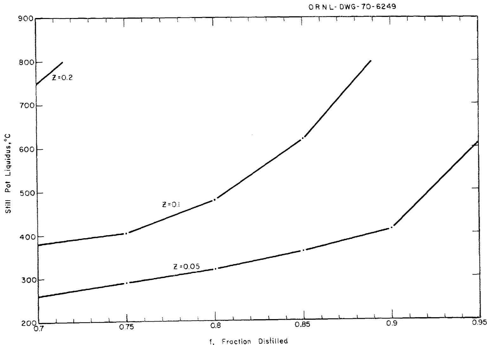  
Fig. 35. Liquidus Temperature of Still-Pot Material in Continuous Bi-Li Still Operating at $800^{\circ}\mathrm{C}$ . Effects of feed composition and fraction of feed vaporized.

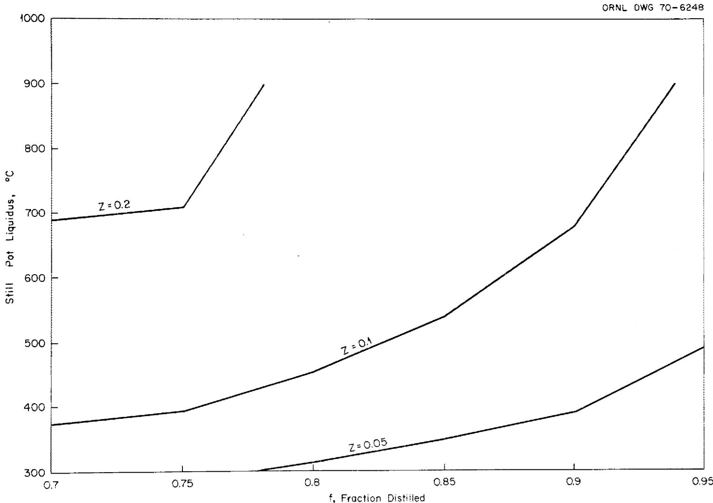  
Fig. 36. Liquidus Temperature of Still-Pot Material in Continuous Bi-Li Still Operating at $900^{\circ}\mathrm{C}$ . Effects of feed composition and fraction of feed vaporized.

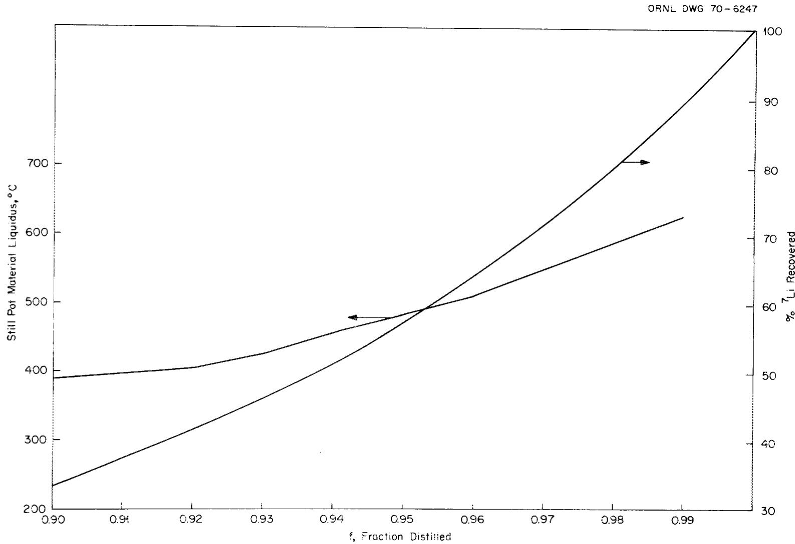  
Fig. 37. Liquidus Temperature of Still-Pot Material and Fractional Li Recovery for Large Fractions of Feed Vaporized. Operating temperature of still is $900^{\circ}\mathrm{C}$ , and feed composition is 5 at. $\%$ Li.

vapor pressure of only 0.2 to $0.3\mathrm{mmHg}$ was calculated for the still-pot material); the low vapor pressures would result in low vaporization fluxes. Consequently, large vaporization areas would be needed. (3) Because the lithium concentration in the feed must be low to prevent the formation of $\mathsf{Li}_3\mathsf{Bi}$ in the still pot, additional processing complexities must be added to dilute the Bi-Li stream coming from the extraction column. Although these difficulties are not insurmountable, they provide incentive to search for alternative methods for recovering the ${}^7\mathsf{Li}$ .

# 14. PREVENTION OF AXIAL DISPERSION IN PACKED COLUMN

# J. S. Watson L. E. McNeese

The use of packed column contactors in MSBR fuel processing systems is being considered. As shown previously,21 axial dispersion can significantly reduce the performance of this type of contactor under operating conditions of interest. As part of our contactor development program, we are evaluating modifications to packed columns that will reduce the effect of axial dispersion to an acceptable level. The proposed modifications consist of inserting devices at points along the column to reduce dispersion across the column at these points. If the devices are separated by a column length equivalent to one theoretical stage (an extent of separation that can be achieved even if the fluids between the devices are completely mixed), the stage efficiency of the column segment will be greater than $75\%$ if $15\%$ or less of the salt flowing through the segment is recycled to the previous segment.

The type of device under investigation is shown in Fig. 38. The metal stream flows down an annular section in the upper portion of the device into the portion that is effectively an inverted annular bubble cap. The accumulated metal forms a seal and forces the less-dense phase to flow upward through restrictions in a sieve plate. A significantly higher salt velocity is obtained through the restrictions, and a considerably diminished recycle of salt should occur across the device. We have tested two devices of this type, using mercury and water to

ORNL DWG 70-4506

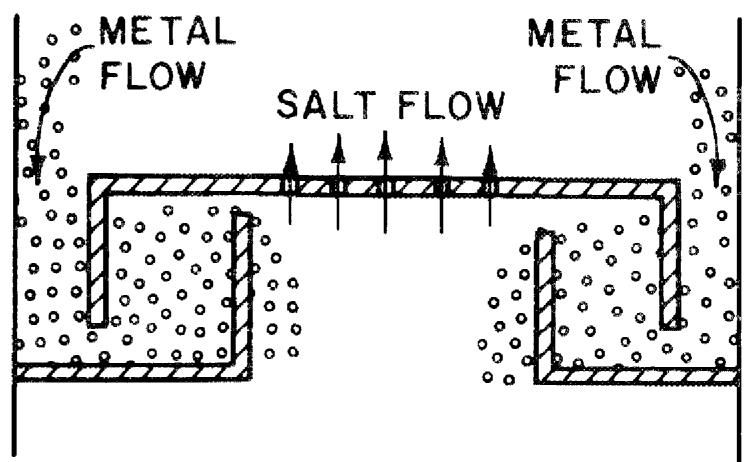  
Fig. 38. Schematic Diagram of an Axial Dispersion Preventer.

simulate bismuth and salt. One or more dispersion preventers were inserted near the middle of a 2-in.-diam column that was packed with 3/8-in. Raschig rings.

The experimental technique consisted of establishing a counter-current flow of mercury and water through the column and injecting a steady flow of tracer solution (cupric nitrate) at a point near the top of the column. The tracer concentration was determined at several points along the column. When the logarithm of the tracer concentration was plotted as a function of distance along the column, a discontinuity in tracer concentration was observed at the preventer location, as shown in Fig. 39. The ratio of the concentrations at the discontinuity is a measure of the fraction of the water that was recycled through the preventer.

The fraction of the water recycled through a preventer appears to depend mainly on the water flow rate per sieve opening and the diameter of the sieve opening. No dependence on the mercury flow rate was evident, although the small number of data points and the usual data scatter make this conclusion tentative. The effect of metal flow rate is expected to become quite large, however, for metal flow rates sufficiently high to prevent complete metal coalescence in the downcomer.

The first preventer to undergo testing consisted of a 1/2-in.-deep bubble cap and a 1/8-in.-thick sieve plate containing four 3/32-in.-diam holes. As shown in Fig. 40, only three data points were obtained with this device; however, the fraction of water that is recycled is observed to decrease with increasing water flow rate. Less than $15\%$ of the water was recycled for a water flow rate greater than $90 \mathrm{ml} / \mathrm{min}$ (22 ml per minute per hole). The openings were then drilled out to a diameter of 1/4 in. As shown in Fig. 40, similar results were obtained, although the fraction of water recycled did not reach an acceptably low level in any of these experiments. By extrapolating the curve, one can estimate that the fraction of water recycled would be less than $15\%$ at a water flow rate between 150 and 200 ml/min (approximately 50 ml per minute per hole).

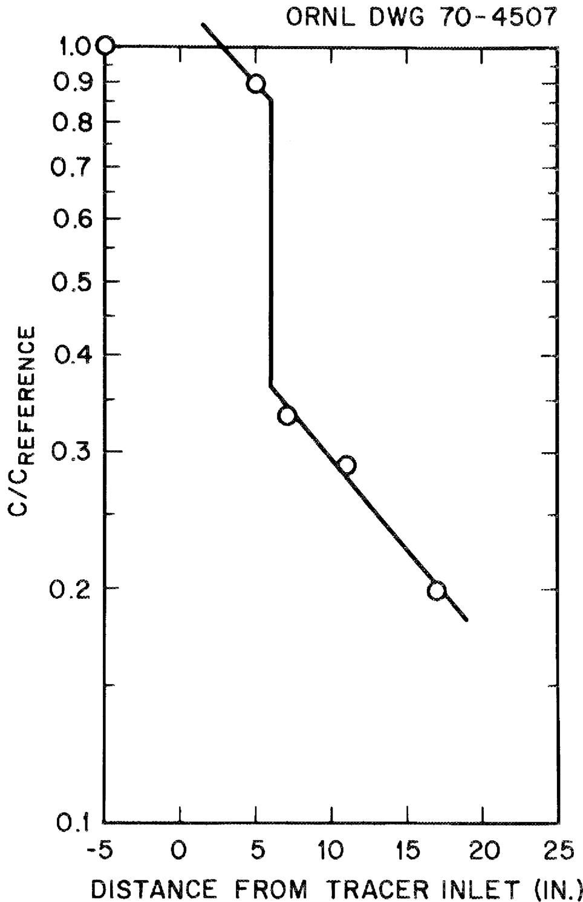  
Fig. 39. Concentration Profile Using a Backflow Preventer with a Single 3/8-in. Sleeve Opening. Mercury flow rate, $400 \, \text{ml/min}$ ; water flow rate, $115 \, \text{ml/min}$ .

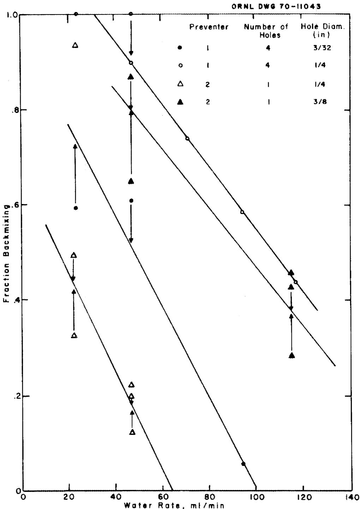  
Fig. 40. Fraction Backmixing Across Two Axial Dispersion Preventers Having Various Orifice Diameters.

A second dispersion preventer, which had a 2-in.-deep bubble cap and only a single 1/16-in.-diam opening in the sieve plate, was also tested. No recycle could be detected at the lowest measurable water rate (23.5 ml/min). The diameter of the opening was increased to 1/8 in., and again no recycle was detected. When the orifice diameter was increased to 1/4 in., the results shown in Fig. 40 were obtained. The fraction of water recycled is less than $15\%$ if the water flow rate is greater than 50 ml/min. Note that this value agrees with the results estimated by extrapolating results from the first preventer with four 1/4-in. holes. The orifice diameter was further increased to 3/8 in. to obtain the results shown in Fig. 40. The fraction of water recycled was increased considerably by this change in diameter; again, however, the fraction of water recycled could be reduced to any desired value at sufficiently high water flow rates.

An undesirable feature of dispersion preventers of the type discussed above is that the column capacity or flooding rate is reduced. This is to be expected, and it is unlikely that a device which will reduce the column capacity by less than $50\%$ will be developed. The devices tested have operated satisfactorily with mercury flow rates as high as $15\%$ of the flooding rate for a column packed with 3/8-in. Raschig rings.

# 15. HYDRODYNAMICS OF PACKED COLUMN OPERATION WITH HIGH-DENSITY FLUIDS

J. S. Watson L. E. McNeese

The hydrodynamics of packed column operation with fluids having high densities and a large density difference is being studied in order to evaluate and design countercurrent contactors for use in MSBR processing systems based on reductive extraction. Mercury and water are being used to simulate bismuth and molten salt in these studies. Earlier experiments, carried out with 1/8-in. and 1/4-in. solid cylinders and with 3/16-in. and 1/4-in. Raschig rings in a 1-in.-ID column, demonstrated that a transition in mode of flow of the dispersed phase occurs between

the packing sizes of 3/16 in. and $1 / 4$ in. The transition appeared to be a function of the packing size only and was not related to packing shape (solid cylinders or Raschig rings). With the larger packing, the mercury was dispersed into small droplets, which produced a large interfacial area. With the smaller packing, the mercury flowed down the column in continuous channels and resulted in a much smaller interfacial area.

A large interfacial area (and hence large packing) is desired in order to obtain high rates of mass transfer between the salt and metal phases. Since only one packing diameter above the critical size had been studied, it was considered desirable to study several larger packing materials. This required two modifications to the experimental system: (1) installation of a column larger than the 1-in.-diam unit used previously, and (2) installation of a mercury pump having a higher pumping capacity than that used previously. A 2-in.-ID Lucite column having a length of 24 in. was constructed, and a Lapp* CPS-3 pump was installed. The system was used by a group of MIT Practice School students for measuring flooding rates, dispersed-phase holdup, and pressure drop with 1/4-in. solid cylinders and with 3/8-in. Raschig rings. We later obtained data with 1/2-in. Raschig rings. Results of these studies and development of a relation for predicting packed column performance during countercurrent flow of molten salt and bismuth are discussed in the remainder of this section.

# 15.1 Experimental Technique and Results

The experimental technique is the same as that used previously[22] during studies with the l-in.-diam column. Pressure drop through the packed column was determined from displacement of the mercury-water interface at the bottom of the column. Dispersed-phase holdup was measured by simultaneously closing two ball valves, thereby isolating a section of the column and allowing determination of the trapped mercury volume.

Experimental data showing the variation of column pressure drop with continuous-phase (water) superficial velocity for several dispersed-phase superficial velocities are shown in Figs. 41 and 42 for 1/4-in. solid cylinders and 3/8-in. Raschig rings respectively. Data on the variation of dispersed-phase holdup with continuous-phase superficial velocity for several dispersed-phase velocities are shown in Figs. 43-45 for three packing materials studied. Flooding data are shown in Figs. 46 and 47 for 1/4-in. solid cylinders and 3/8-in. Raschig rings respectively.

# 15.2 Pressure Drop Across the Column

Surprisingly, the pressure drop across the column was observed to decrease with increases in water flow rate at high mercury flow rates and low water flow rates. At high water flow rates, the pressure drop increased with increases in water rate as expected. This effect was most apparent with 1/2-in. Raschig rings, although the same behavior is also observed to some extent with 3/8-in. Raschig rings. For example, with 1/2-in. Raschig rings and a superficial mercury velocity of 380 ft/hr, the column pressure drop decreased from 1.1 psi to 0.27 psi as the water velocity was increased from 0 to 12 ft/hr. This phenomenon was checked carefully and was found to be reproducible. The present data for pressure drop with 1/2-in. Raschig rings are confusing and difficult to represent. It is interesting to note (Fig. 45) that there was no significant decrease in dispersed-phase holdup when water flow was initiated.

On the average, the mercury is not being accelerated while flowing through the column. Thus, the weight of the mercury must be supported by interaction with the continuous phase and with the packing. If interaction with the packing were negligible, the pressure drop in the continuous phase would be equal to the sum of the force on the column wall and the quantity $(\Delta \rho)X$ , where $\Delta \rho$ is the difference in the densities of the two fluids and $X$ is the fraction of the column void volume that is occupied by the dispersed phase. The observed pressure

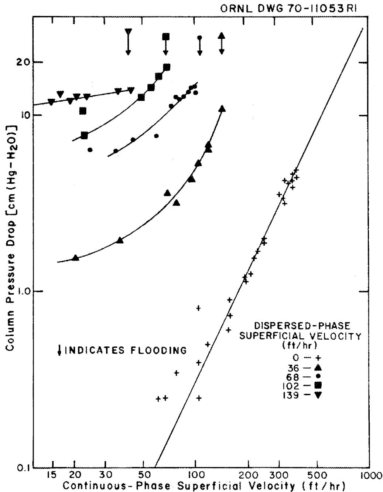  
Fig. 41. Variation of Column Pressure Drop with Superficial Water Velocity and Dispersed-Phase Superficial Velocity for $1/4$ -in. Cylindrical Packing in a 2-in.-diam Column.

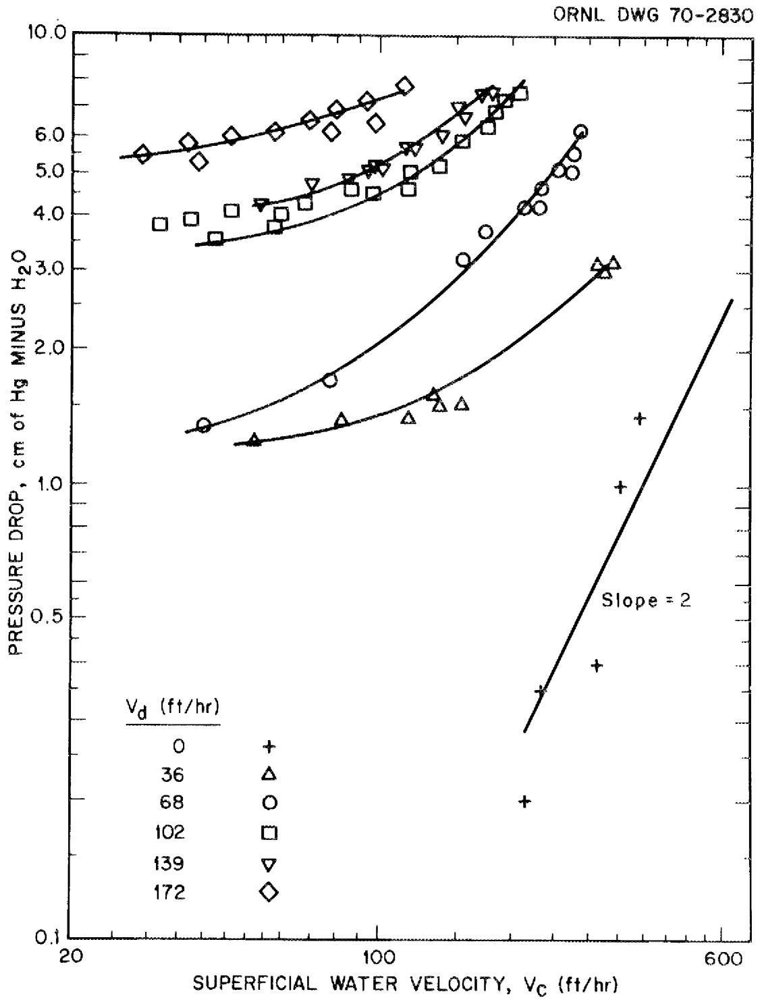  
Fig. 42. Variation of Column Pressure Drop with Superficial Water Velocity and Dispersed-Phase Superficial Velocity for 3/8-in. Raschig Ring Packing in a 2-in.-diam Column.

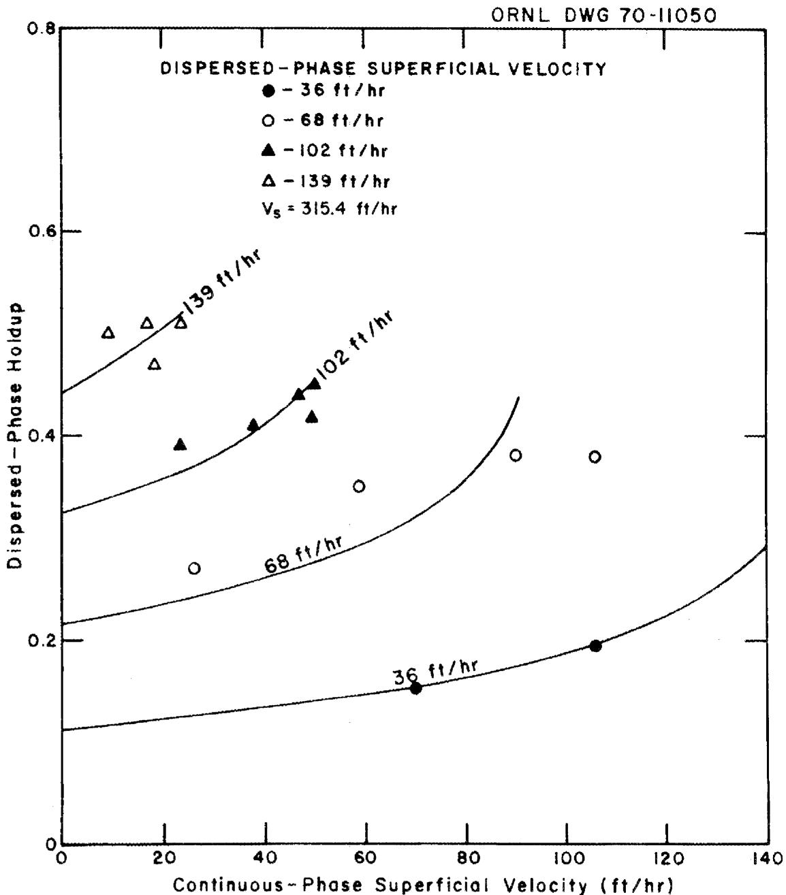  
Fig. 43. Variation of Dispersed-Phase Holdup with Continuous- and Dispersed-Phase Superficial Velocities for $1/4$ -in. Solid Cylindrical Packing in a 2-in.-diam Column.

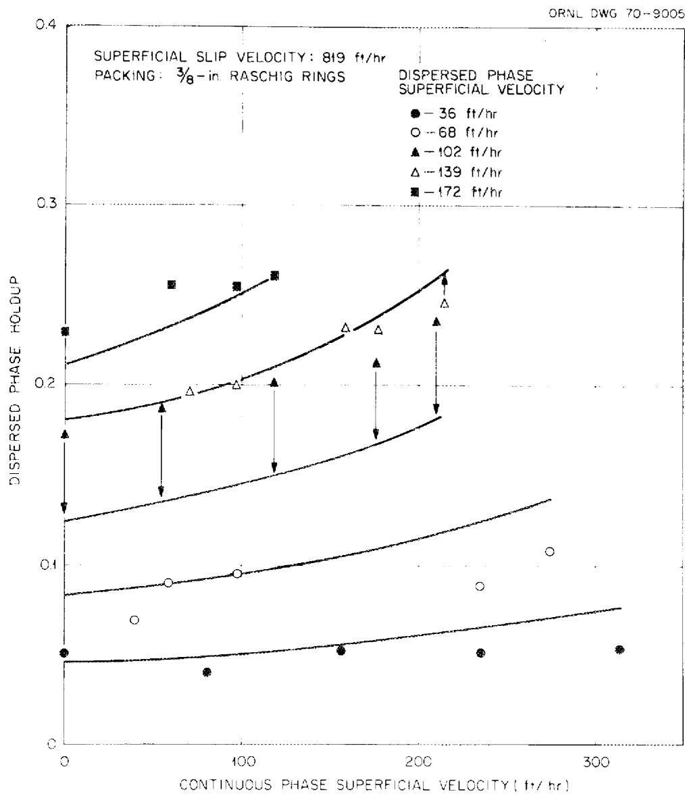  
Fig. 44. Variation of Dispersed-Phase Holdup with Continuous- and Dispersed-Phase Superficial Velocities for 3/8-in. Raschig Rings in a 2-in.-diam Column.

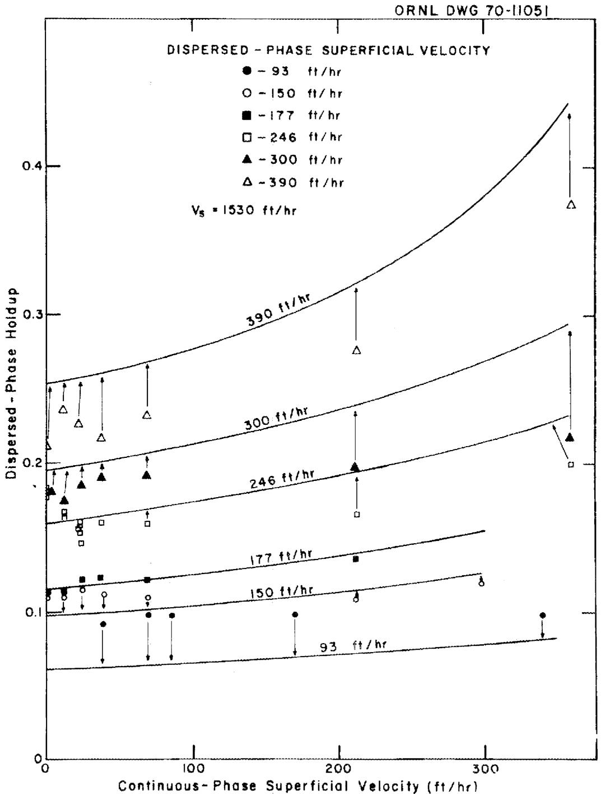  
Fig. 45. Variation of Dispersed-Phase Holdup with Continuous- and Dispersed-Phase Superficial Velocities for 1/2-in. Raschig Rings in a 2-in.-diam Column.

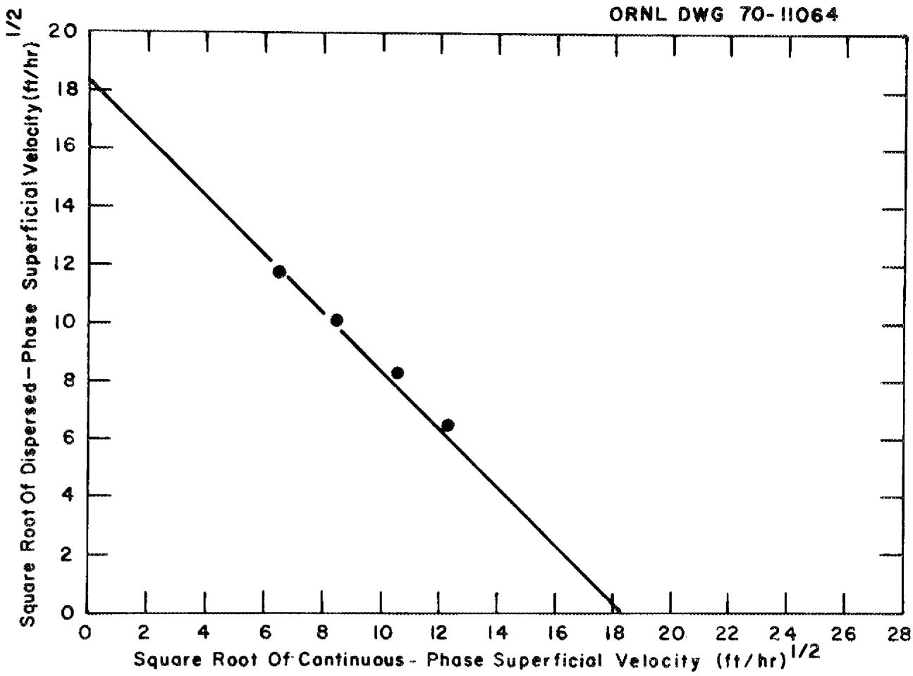  
Fig. 46. Predicted and Measured Flooding Rates with $1/4$ -in. Solid Cylindrical Packing.

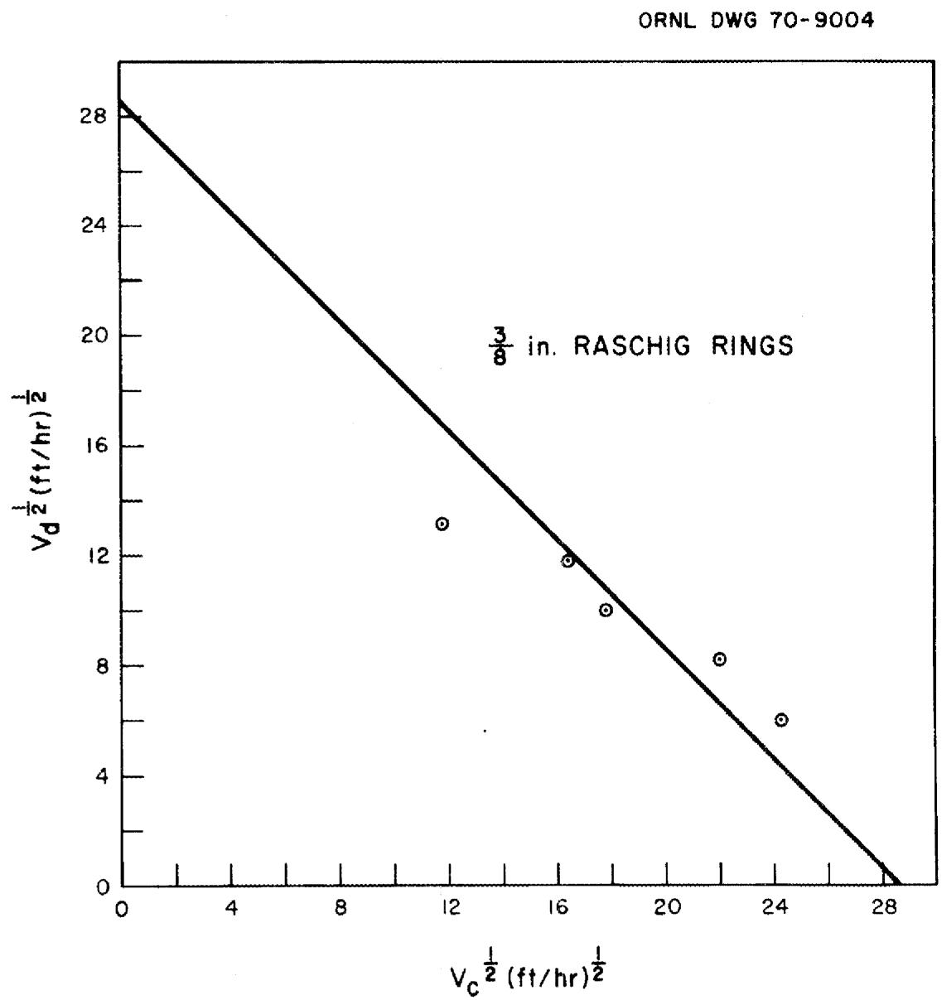  
Fig. 47. Predicted and Measured Flooding Rates in a Packed Column During Countercurrent Flow of Mercury and Water.

drop is less than the quantity $(\Delta \rho)X$ , which indicates that a substantial fraction of the mercury is supported by the packing. A decrease in pressure drop without a corresponding decrease in dispersed-phase holdup indicates that there is an increase in the interaction between the mercury and the packing.

One can qualitatively visualize the mercury as flowing through all of the channels between the packing when there is no water flow. When a water flow is started, it is possible that the mercury will flow preferentially through only part of the channels. In such a case, higher mercury velocities would be obtained and increased interaction of the dispersed phase with the packing would occur. A quantitative treatment of this phenomenon has not been developed.

# 15.3 Dispersed-Phase Holdup

Several methods, including an expression used by Pratt $^{24}$ and a relation developed earlier by the authors, $^{22}$ have been suggested for correlating holdup data. The present data indicate that holdup can be correlated in terms of a constant slip velocity, $V_{s}$ , which is defined as:

$$
V _ {s} = \frac {V _ {c}}{1 - X} + \frac {V _ {d}}{X}, \tag {57}
$$

where $V_{s} =$ superficial slip velocity,

$V_{c} =$ continuous-phase superficial velocity,

$\mathbf{V}_{\mathrm{d}} =$ dispersed-phase superficial velocity,

X $=$ dispersed-phase holdup.

The curves drawn through the holdup data in Figs. 43, 44, and 45 correspond to a constant slip velocity for each packing material. For a given packing, the slip velocity was obtained by averaging slip velocity values calculated for each data point from Eq. (57). The standard deviations of the average slip velocity thus calculated were 10 to $15\%$ , which is estimated to be the experimental error in the

holdup data. There are significant deviations between the calculated and measured holdup data for holdup values below $10\%$ . Otherwise, the data for 1/4-in. and 3/8-in. packing show no trend away from the predicted holdup values. The predicted holdup values for 1/2-in. Raschig rings are higher than the measured values at low mercury superficial velocities. This trend is not considered to be significant since it is not confirmed by data from other packing materials.

Average values were also calculated for the characteristic velocity, $V_{0}$ , suggested by Pratt $^{24}$ and defined as

$$
V _ {o} = \frac {V _ {c}}{(1 - x) ^ {2}} + \frac {V _ {d}}{x (1 - x)}. \tag {58}
$$

The standard deviation resulting from assumption of a constant characteristic velocity was larger than that resulting from assumption of a constant slip velocity, and a dependence of $V_{0}$ on holdup (other than that shown above) was noted.

The holdup data for $1/4$ -in. Raschig rings and $1/4$ -in. solid cylinders in 1- and 2-in.-diam columns suggest that the superficial slip velocity is proportional to the packing void fraction, as shown in Fig. 48. The superficial slip velocity is also expected to be dependent on packing size. The slip velocity for $3/8$ -in. Raschig rings (819 ft/hr) is not significantly higher than that for $1/4$ -in. packing when a correction is made for the difference in packing void fraction. However, the slip velocity for $1/2$ -in. Raschig rings (1530 ft/hr) is considerably higher than that for the smaller packing sizes.

# 15.4 Correlation of Flooding Rates

The observation that the dispersed-phase holdup data can be correlated on the basis of a constant superficial slip velocity is especially important since this suggests a method for correlating flooding data. At flooding, it is assumed that the following conditions exist:

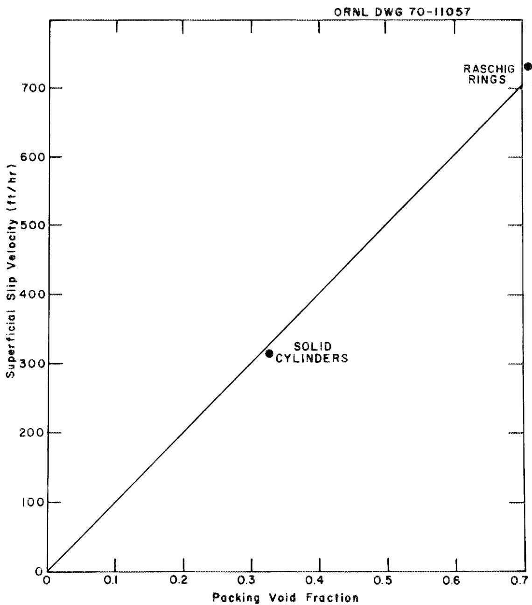  
Fig. 48. Variation of Superficial Slip Velocity with Packing Void Fraction for $1/4$ -in. Packing in 1-in. and 2-in.-diam Columns.

$$
\frac {\partial \mathrm {V} _ {\mathrm {d}}}{\partial \mathrm {X}} = \frac {\partial \mathrm {V} _ {\mathrm {c}}}{\partial \mathrm {X}} = 0. \tag {59}
$$

Partial differentiation of Eq. (57) with respect to $X$ , the dispersed-phase holdup, yields the relation

$$
\frac {V _ {c}}{(1 - x) ^ {2}} + \frac {1}{1 - x} \frac {\partial V _ {c}}{\partial x} - \frac {V _ {d}}{x ^ {2}} + \frac {1}{x} \frac {\partial V _ {c}}{\partial x} = 0. \tag {60}
$$

If the conditions stated by Eq. (59) are met at flooding, Eq. (60) reduces to

$$
\frac {V _ {\mathrm {c} , \text {f l o o d}}}{(1 - x) ^ {2}} = \frac {V _ {\mathrm {d} , \text {f l o o d}}}{x ^ {2}}. \tag {61}
$$

Multiplying Eq. (57) by $1 / (1 - X)$ and combining the resulting equation with Eq. (61) yields the following relation:

$$
\frac {V _ {d , f l o o d}}{X ^ {2}} + \frac {V _ {d , f l o o d}}{X (1 - X)} = \frac {V _ {s}}{1 - X}, \tag {62}
$$

which reduces to

$$
X = \sqrt {\frac {V _ {d , f l o o d}}{V _ {s}}} \tag {63}
$$

Multiplying Eq. (57) by $1 / X$ and combining the resulting equation with Eq. (61) yields the relation

$$
\frac {\mathrm {V} _ {\mathrm {c} , \text {f l o o d}}}{(1 - \mathrm {X}) \mathrm {X}} + \frac {\mathrm {V} _ {\mathrm {c} , \text {f l o o d}}}{(1 - \mathrm {X}) ^ {2}} = \frac {\mathrm {V} _ {\mathrm {s}}}{\mathrm {X}}, \tag {64}
$$

which reduces to

$$
1 - X = \sqrt {\frac {V _ {c , f l o o d}}{V _ {s}}} \tag {65}
$$

Elimination of X from Eqs. (63) and (65) yields the final relation

$$
\left(\mathrm {V} _ {\mathrm {c}, \text {f l o o d}}\right) ^ {1 / 2} + \left(\mathrm {V} _ {\mathrm {d}, \text {f l o o d}}\right) ^ {1 / 2} = \mathrm {V} _ {\mathrm {s}} ^ {1 / 2}, \tag {66}
$$

where $V_{c,flood}$ = continuous-phase superficial velocity at flooding,

$V_{d,flood} =$ dispersed-phase superficial velocity at flooding.

Thus, if the superficial slip velocity remains constant up to flooding, a plot of $(\mathrm{V}_{\mathrm{c},\mathrm{flood}})^{1/2}$ vs $(\mathrm{V}_{\mathrm{d},\mathrm{flood}})^{1/2}$ should produce a straight line having a slope of $-1$ . Similar flooding curves with slopes near $-1$ have been observed in the literature,[25] and our earlier data for $1/4-$ and $3/8-$ in. Raschig rings and $1/4-$ in. solid cylinders were correlated in this manner. Recent results obtained with $1/4-$ in. solid cylinders and $3/8-$ in. Raschig rings, shown in Figs. 46 and 47, are also represented well by this correlation.

# 15.5 Prediction of Molten-Salt--Bismuth Flooding Rates in Packed Columns

We have attempted to extend the correlations developed for the mercury-water system in order to obtain relations that are applicable to molten-salt--bismuth systems. The physical properties of the fluids were not varied in these studies. Significant differences in properties exist between the mercury-water system and molten-salt--bismuth systems; potentially important differences include the viscosity of the continuous phase, the difference in the densities of the phases, and the interfacial tension. The correction associated with differences in interfacial tension is believed to be small since the interfacial tension for the mercury-water system is approximately equal to that for a molten-salt--bismuth system.

As the dispersed phase flows down the column, it interacts with both the packing and the continuous phase. Interaction with the continuous phase is inertial in nature, and the continuous-phase viscosity is expected to have only a slight effect. If the principal interaction were between the two fluids, the slip velocity would be proportional to the square root of the difference in densities of the fluids. As noted earlier, however, the metal phase is more nearly supported by interaction with the packing; for this condition, it is estimated that the slip velocity is directly proportional to the difference in the densities of the phases.

On the basis of these considerations, the superficial slip velocity was assumed to be proportional to both the packing void fraction and the difference in densities of the phases. The resulting relation for the flooding rates in a salt-bismuth system is, then:

$$
\left(\mathrm {V} _ {\mathrm {c}, \text {f l o o d}}\right) ^ {1 / 2} + \left(\mathrm {V} _ {\mathrm {d}, \text {f l o o d}}\right) ^ {1 / 2} = \mathrm {V} _ {\mathrm {s}, \mathrm {H g} - \mathrm {H} _ {2} \mathrm {O}} \left(\frac {\Delta \rho}{\Delta \rho_ {\mathrm {H g} - \mathrm {H} _ {2} \mathrm {O}}}\right) \left(\frac {\varepsilon}{\varepsilon_ {\text {r e f}}}\right), \tag {67}
$$

where $V_{c,flood} =$ continuous-phase superficial velocity at flooding,

$\mathbf{V}_{d,flood} =$ dispersed-phase superficial velocity at flooding,

$\mathrm{V}_{\mathrm{s}, \mathrm{Hg}-\mathrm{H}_{2} \mathrm{O}} =$ superficial slip velocity for mercury-water system with the type packing to be used,

$\Delta \rho =$ difference in densities of the phases,

$\Delta \rho_{\mathrm{Hg - H_2O}} =$ difference in densities of mercury and water,

$\varepsilon =$ packing void fraction,

$\varepsilon_{\text{ref}} =$ void fraction of packing for which $V_{s, Hg - H_2O}$ was determined.

# 16. REFERENCES

1. L. M. Ferris, ORNL, personal communication.   
2. M. J. Bell, ORNL, personal communication.   
3. M. S. Bautista and L. E. McNeese, "Axial Mixing in an Open Bubble Column," Engineering Development Studies for Molten-Salt Breeder Reactor Processing No. 4, ORNL-TM-31.39 (in press).   
4. A. M. Skeikh and J. D. Dearth, Axial Mixing in an Open Bubble Column, MIT-CEPS-X-91 (December 1969).   
5. C. W. Kee and L. E. McNeese, Engineering Development Studies for Molten-Salt Breeder Reactor Processing No. 3, ORNL-TM-3138, pp. 39-50.   
6. J. R. Hightower, Jr., et al., "Design and Installation of the Flow Electrolytic Cell Facility," Engineering Development Studies for Molten-Salt Breeder Reactor Processing No. 4, ORNL-TM-3139 (in press).   
7. C. W. Kee and B. A. Hannaford, "Calibration of an Orifice—Head Pot Flowmeter," Engineering Development Studies for Molten-Salt Breeder Reactor Processing No. 4, ORNL-TM-3139 (in press).   
8. J. R. Reitz and F. J. Milford, Foundations of Electromagnetic Theory, 2d ed., p. 136, Addison-Wesley, Reading, Mass., 1967.   
9. T. R. Johnson, F. G. Teats, and R. D. Price, An Induction Probe for Measuring Liquid Levels in Liquid Metals, ANL-7153 (February 1966).   
10. J. Roth and L. E. McNeese, "Bismuth-Salt Interface Detector," Engineering Development Studies for Molten-Salt Breeder Reactor Processing No. 4, ORNL-TM-3139 (in press).   
11. J. H. Shaffer, MSR Program Semiann. Progr. Rept. July 31, 1964, ORNL-3708, pp. 288-303.   
12. J. R. Hightower, Jr., and L. E. McNeese, Engineering Development Studies for Molten-Salt Breeder Reactor Processing No. 3, ORNL-TM-3138, pp. 84-95.   
13. F. J. Smith, L. M. Ferris, and C. T. Thompson, Liquid-Vapor Equilibria in LiF-BeF $_2$ and LiF-BeF $_2$ -ThF $_4$ Systems, ORNL-4415 (June 1969).   
14. J. R. Hightower, Jr., and L. E. McNeese, Measurement of the Relative Volatilities of Fluorides of Ce, La, Pr, Nd, Sm, Eu, Ba, Sr, Y, and Zr in Mixtures of LiF-BeF $_2$ , ORNL-TM-2058 (January 1968).

15. M. S. Foster, S. E. Wood, and C. E. Crouthamel, Inorg. Chem. 3, 1428 (1964).   
16. N. V. Ibl and B. F. Dodge, Chem. Eng. Sci. 2, 120 (1953).   
17. Handbook of Chemistry and Physics, 41st ed., p. 2343, Chemical Rubber Publishing Co., Cleveland, Ohio, 1960.   
18. A. K. Fischer, J. Chem. Phys. 45, 375 (1966).   
19. Leon Lapidus, Digital Computation for Chemical Engineers, p. 288, McGraw-Hill, New York, 1962.   
20. M. Hansen, Constitution of Binary Alloys, 2d ed., p. 316, McGraw-Hill, New York, 1958.   
21. J. S. Watson and H. D. Cochran, Jr., "Effect of Axial Mixing in Packed Column Contactors Used for MSBR Processing," Engineering Development Studies for Molten-Salt Breeder Reactor Processing No. 4, ORNL-TM-3139 (in press).   
22. J. S. Watson and L. E. McNeese, Unit Operations Section Quarterly Progress Report, July-September 1968, ORNL-4366, pp. 57-98.   
23. A. J. Frederiksen, J. J. Protulpac, and S. C. Trindade, Hydrodynamics of a Mercury-Water Packed Column, MIT-CEPS-X-88 (1969).   
24. R. Gayler and H. R. C. Pratt, "Holdup and Pressure Drop in Packed Columns," Trans. Inst. Chem. Eng. 29, 110 (1951).   
25. F. R. Dell and H. R. C. Pratt, Trans. Inst. Chem. Eng. 29, 89-109 (1951).

# INTERNAL DISTRIBUTION

<table><tr><td>1.</td><td>C. F. Baes</td><td>41.</td><td>E. L. Nicholson</td></tr><tr><td>2.</td><td>H. F. Bauman</td><td>42.</td><td>J. H. Pashley (K-25)</td></tr><tr><td>3.</td><td>S. E. Beall</td><td>43.</td><td>A. M. Perry</td></tr><tr><td>4.</td><td>M. J. Bell</td><td>44-45.</td><td>M. W. Rosenthal</td></tr><tr><td>5.</td><td>M. R. Bennett</td><td>46.</td><td>A. D. Ryon</td></tr><tr><td>6.</td><td>R. E. Blanco</td><td>47.</td><td>W. F. Schaffer, Jr.</td></tr><tr><td>7.</td><td>F. F. Blankenship</td><td>48.</td><td>Dunlap Scott</td></tr><tr><td>8.</td><td>G. E. Boyd</td><td>49.</td><td>J. H. Shaffer</td></tr><tr><td>9.</td><td>R. B. Briggs</td><td>50.</td><td>M. J. Skinner</td></tr><tr><td>10.</td><td>R. E. Brooksbank</td><td>51.</td><td>F. J. Smith</td></tr><tr><td>11.</td><td>K. B. Brown</td><td>52.</td><td>D. D. Sood</td></tr><tr><td>12.</td><td>W. L. Carter</td><td>53.</td><td>Martha Stewart</td></tr><tr><td>13.</td><td>H. D. Cochran, Jr.</td><td>54.</td><td>O. K. Tallent</td></tr><tr><td>14.</td><td>F. L. Culler</td><td>55.</td><td>R. E. Thoma</td></tr><tr><td>15.</td><td>J. R. Distefano</td><td>56.</td><td>D. B. Trauger</td></tr><tr><td>16.</td><td>W. P. Eatherly</td><td>57.</td><td>W. E. Unger</td></tr><tr><td>17.</td><td>D. E. Ferguson</td><td>58.</td><td>C. D. Watson</td></tr><tr><td>18.</td><td>L. M. Ferris</td><td>59.</td><td>J. S. Watson</td></tr><tr><td>19.</td><td>J. H. Frye</td><td>60.</td><td>A. M. Weinberg</td></tr><tr><td>20.</td><td>W. R. Grimes</td><td>61.</td><td>J. R. Weir</td></tr><tr><td>21.</td><td>A. G. Grindell</td><td>62.</td><td>M. E. Whatley</td></tr><tr><td>22.</td><td>P. A. Haas</td><td>63.</td><td>J. C. White</td></tr><tr><td>23.</td><td>B. A. Hannaford</td><td>64.</td><td>W. M. Woods</td></tr><tr><td>24.</td><td>J. R. Hightower, Jr.</td><td>65.</td><td>R. G. Wymer</td></tr><tr><td>25.</td><td>C. W. Kee</td><td>66.</td><td>E. L. Youngblood</td></tr><tr><td>26.</td><td>R. B. Lindauer</td><td>67-68.</td><td>Central Research Library</td></tr><tr><td>27.</td><td>H. E. McCoy</td><td>69-70.</td><td>Document Reference Section</td></tr><tr><td>28-38.</td><td>L. E. McNeese</td><td>71-73.</td><td>Laboratory Records</td></tr><tr><td>39.</td><td>D. M. Moulton</td><td>74.</td><td>Laboratory Records, RC</td></tr><tr><td>40.</td><td>J. P. Nichols</td><td>75.</td><td>Y-12 Document Reference Section</td></tr><tr><td></td><td></td><td>76.</td><td>ORNL Patent Office</td></tr></table>

# EXTERNAL DISTRIBUTION

77. J. A. Accairri, Continental Oil Co., Ponca City, Oklahoma 74601   
78. R. M. Bushong, UCC, Carbon Products Division, 12900 Snow Road, Parma, Ohio 44130   
79. D. F. Cope, Atomic Energy Commission, RDT Site Office (ORNL)   
80. C. B. Deering, Black & Veach, P. O. Box 8405, Kansas City, Missouri 64114   
81. A. R. DeGrazia, USAEC, DRDT, Washington, D.C. 20545   
82. Delonde R. deBoisblanc, Evasco Services, Inc., 2 Rector Street, New York, N.Y. 10006   
83. D. Elias, RDT, USAEC, Washington, D.C. 20545   
84. Norton Haberman, RDT, USAEC, Washington, D.C. 20545

# EXTERNAL DISTRIBUTION (continued)

85. T. R. Johnson, Argonne National Laboratory, 9700 S. Cass Avenue, Argonne, Illinois 60439   
86. Kermit Laughon, Atomic Energy Commission, RDT Site Office (ORNL)   
87-88. T. W. McIntosh, Atomic Energy Commission, Washington, D.C. 20545   
89. E. H. Okrent, Jersey Nuclear Co., Bellevue, Washington 98004   
90. R. D. Pierce, Argonne National Laboratory, 9700 S. Cass Avenue, Argonne, Illinois 60439   
91. J. Roth, Combustion Engineering, Windsor, Connecticut 06095   
92. M. Shaw, Atomic Energy Commission, Washington, D.C. 20545   
93. N. Srinivasan, Head, Fuel Reprocessing Division, Bhabha Atomic Research Center, Trombay, Bombay 74, India   
94. C. L. Storrs, Combustion Engineering Inc., Prospect Hill Road, Windsor, Connecticut 06095   
95. B. L. Tarmy, Esso Research and Engr. Co., P. O. Box 101, Florham Park, N.J. 07932   
96. J. R. Trinko, Evasco Services, Inc., 2 Rector Street, New York, N.Y. 10006   
97. Laboratory and University Division, ORO   
98-99. Division of Technical Information Extension, ORO, AEC