# OAK RIDGE NATIONAL LABORATORY

operated by

UNION CARBIDE CORPORATION $\cdot$ NUCLEAR DIVISION

for the

U.S. ATOMIC ENERGY COMMISSION

18108   
24X8D

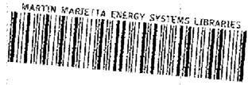

34456 03830424

ORNL-TM-314

${C}_{4}^{2} = \frac{1}{2}$

ENGINEERING DEVELOPMENT STUDIES FOR MOLTEN-SALT

BREEDER REACTOR PROCESSING NO. 6

L. E. McNeese

C

0000

1

DQAMDTGAAH235T0AAMOT1157E0

and $\mathbf{E} = \mathbf{E}\mathbf{B}$ and

This report was prepared as an account of work sponsored by the United States Government. Neither the United States nor the United States Atomic Energy Commission, nor any of their employees, nor any of their contractors, subcontractors, or their employees, makes any warranty, express or implied, or assumes any legal liability or responsibility for the accuracy, completeness or usefulness of any information, apparatus, product or process disclosed, or represents that its use would not infringe privately owned rights.

Contract No. W-7405-eng-26

CHEMICAL TECHNOLOGY DIVISION

ENGINEERING DEVELOPMENT STUDIES FOR MOLTEN-SALT BREEDER REACTOR PROCESSING NO. 6

L. E. McNeese

DECEMBER 1971

OAK RIDGE NATIONAL LABORATORY

Oak Ridge, Tennessee 37830

operated by

UNION CARBIDE CORPORATION

for the

U.S. ATOMIC ENERGY COMMISSION

Reports previously issued in this series are as follows:

ORNL-4364 Period ending March 1968

ORNL-4365 Period ending June 1968

ORNI.-4366 Period ending September 1968

ORNL-TM-3053 Period ending December 1968

ORNL-TM-3137 Period ending March 1969

ORNL-TM-3138 Period ending June 1969

ORNL-TM-3139 Period ending September 1969

ORNL-TM-3140 Period ending December 1969

# CONTENTS

# Page

# SUMMARIES . . . . . . . . . . . . . . . . . . . . . . . . . . . . . . . . . . .

1. INTRODUCTION 1   
2. MSBR FUEL PROCESSING USING FLUORINATION--REDUCTIVE EXTRACTION AND THE METAL TRANSFER PROCESS 1

2.1 Equilibrium Data and Concentrations 2   
2.2 Flowsheet Analysis 4   
2.3 Effect of Contamination of LiCl with Fluoride 13

3. AXIAL DISPERSION IN OPEN BUBBLE COLUMNS 13

3.1 Previous Studies on Axial Dispersion 16   
3.2 Equipment and Experimental Technique 16   
3.3 Effects of Gas Inlet Diameter and Column Diameter on Axial Dispersion 17   
3.4 Gas Holdup in Bubble Columns 19   
3.5 Discussion of Results and Future Experiments 22

4. CONSIDERATIONS OF CONTINUOUS FLUORINATORS AND THEIR APPLICABIL- I TY TO MSBR PROCESSING 23

4.1 Types of Fluorinators 24   
4.2 Experience Related to Fluorination of Molten Salt for Uranium Removal 26   
4.3 Mathematical Analysis of Open-Column Continuous Fluorinators 28   
4.4 Evaluation of Fluorination Reaction Rate Constant 30   
4.5 Predicted Performance of Open-Column Continuous Fluorinas 34

5. USE OF RADIO-FREQUENCY INDUCTION HEATING FOR FROZEN-WALL FLUORINATOR DEVELOPMENT STUDIES 39

5.1 Mathematical Analysis 41   
5.2 Calculated Results for a Molten-Salt Fluorinator 46   
5.3 Experimentally Measured Heat Generation Rates 46

6. MSRE DISTILLATION EXPERIMENT 48

# CONTENTS (continued)

Page

7. DEVELOPMENT OF THE METAL TRANSFER PROCESS 52

7.1 Equipment and Experimental Procedure 52   
7.2 Development and Testing of a Pump for Circulating LiCl 54

8. ELECTROLYTIC CELL DEVELOPMENT: STATIC CELL EXPERIMENTS 57   
9. STUDY OF THE PURIFICATION OF SALT BY CONTINUOUS METHODS 59

9.1 Previous Work on Salt Purification 60   
9.2 Experimental Equipment 61   
9.3 Gas Supply and Purification Systems 64   
9.4 Installation of Equipment and Initial Checkout 65   
9.5 Anticipated Experiments and Operating Procedures 71

10. SEMICONTINUOUS REDUCTIVE EXTRACTION EXPERIMENTS IN A MILD-STEEL FACILITY 73

10.1 Equipment Modifications 73   
10.2 Treatment of Bismuth and Salt; Adjustment of Zirconium Distribution Ratio 75   
10.3 Hydrodynamic Experiments HR-9, -10, -11, and -12 75   
10.4 Maintenance of Equipment 79

11. REFERENCES 80

# SUMMARIES

# MSBR FUEL PROCESSING USING FLUORINATION--REDUCTIVE EXTRACTION AND THE METAL TRANSFER PROCESS

A combined flowsheet for processing MSBR fuel salt by fluorination--reductive extraction and the metal transfer process has been devised. Calculations have been made, based on recently measured distribution coefficients, for a number of rare-earth and actinide elements. Reference conditions for the isolation of protactinium on a 10-day cycle are given, and the effects of several parameters associated with rare-earth removal are discussed. Conditions that result in rare-earth removal times of about 15 to 50 days are described. The effect of contamination of the LiCl with fluoride ions was examined. It was found that the fluoride concentration will have to be maintained below about 2 mole % in order to avoid a high thorium discard rate.

# AXIAL DISPERSION IN OPEN BUBBLE COLUMN

Measurements of axial dispersion during the countercurrent flow of air and water were made in 1.5-, 2-, and 3-in.-diam columns with a range of gas inlet diameters. In the "slugging" region, the dispersion coefficient was found to be independent of gas inlet diameter and dependent only on the volumetric gas flow rate for all column diameters. In the "bubbly" region, the dispersion coefficient also appears to depend only on the volumetric gas flow rate when the column diameter is 2 in. or larger. Gas holdup in bubble columns was also determined for a range of operating conditions.

# CONSIDERATIONS OF CONTINUOUS FLUORINATORS AND THEIR APPLICABILITY TO MSBR PROCESSING

A great deal of experience has been accumulated in removing uranium from molten salt by batch fluorination; however, information on continuous fluorinators is sparse, particularly on fluorinators capable of handling

salt flow rates up to about 100 ft $^3$ /day. Experience with fluorinators is reviewed, and possible types of fluorinators are discussed. A mathematical analysis of open-column continuous fluorinators is presented, and predictions are made concerning the performance of open-column continuous fluorinators for MSBR processing applications.

# USE OF RADIO-FREQUENCY INDUCTION HEATING FOR FROZEN-WALL FLUORINATOR DEVELOPMENT STUDIES

Radio-frequency induction heating is being considered as a method for generating heat in molten salt in studies of frozen-wall fluorinators with nonradioactive salt. Two configurations for an inductively heated continuous fluorinator are discussed. Calculations for the first configuration show that sufficient heat would be generated in a 1.9-in.-diam molten zone by a coil current of $24.7\mathrm{~A}$ at $500\mathrm{kHz}$ to maintain a 1.5-in.-thick frozen salt film with a $100^{\circ}\mathrm{C}$ temperature difference across the film. The calculated efficiency of heating the salt was about $34\%$ ; the heat generated in the metal walls was about 1.05 times the heat generated in the salt. In experiments with a 3-in.-diam charge of $30\%$ $\mathrm{H}_2\mathrm{SO}_4$ surrounded by a 6-in.-long section of 6-in. sched 40 pipe, the measured ratio of heat generated in the pipe to that in the acid was 1.3, whereas the calculated ratio for the system was 0.58. This discrepancy shows that the design of an experimental fluorinator using induction heating will depend heavily on empirical design relations.

The second configuration could not be examined mathematically. Experimental measurements using this configuration with $30\% \mathrm{H}_2\mathrm{SO}_4$ showed that the ratio of heat generated in the pipe to that generated in the acid was 0.069. The coupling of the magnetic field with the acid was weaker with this configuration than with the first configuration.

# MSRE DISTILLATION EXPERIMENT

Data obtained in the MSRE Distillation Experiment for the effective relative volatilities, with respect to LiF, of $\mathrm{BeF}_2$ , $\mathrm{ZrF}_4$ , and fluorides

of $^{95}\mathrm{Zr}$ , $^{144}\mathrm{Ce}$ , $^{147}\mathrm{Pm}$ , $^{155}\mathrm{Eu}$ , $^{91}\mathrm{Y}$ , $^{90}\mathrm{Sr}$ , $^{89}\mathrm{Sr}$ , and $^{137}\mathrm{Cs}$ were examined in an attempt to explain the anomalous relative volatilities of all fission products except $^{95}\mathrm{Zr}$ . These data were scrutinized closely for possible evidences of entrainment, concentration polarization, and sample contamination. Although all three effects were probably present, we believe that sample contamination was the major reason for the discrepancies between the values obtained in this experiment and those measured under equilibrium conditions. The low relative volatility observed for $^{137}\mathrm{Cs}$ is not explained by any of the three mechanisms examined.

# DEVELOPMENT OF THE METAL TRANSFER PROCESS

Equipment has been fabricated for studying and demonstrating the metal transfer process for removal of rare earths from MSBR fuel salt. Work that will demonstrate all phases of the process is under way. Lanthanum and $^{147}\mathrm{Nd}$ will be extracted from fuel carrier salt by contact with bismuth containing thorium. The rare earths will then be selectively transferred to LiCl. The final step of the experiment will consist of removing the rare earths from the LiCl by contact with bismuth containing 0.4 mole fraction lithium.

Several pumps made of quartz have been designed and tested with molten LiCl at $650^{\circ}\mathrm{C}$ in an effort to develop a device that is capable of circulating the LiCl in the experiment. Although difficulty has been encountered with devitrification of the quartz, we believe that the LiCl can be sufficiently purified to permit a quartz pump to perform satisfactorily. One pump was found to be operable after tests with LiCl at $650^{\circ}\mathrm{C}$ over a 16-day period.

# ELECTROLYTIC CELL DEVELOPMENT: STATIC CELL EXPERIMENTS

A static cell electrolysis experiment was made in an all-metal cell to determine whether the presence of quartz contributed to the formation

of the black material found to be present in the salt phase in other electrolysis experiments. No such material was observed in this experiment; however, the lack of a bismuth cathode may have resulted in a system too different from the previous cells to allow us to draw firm conclusions.

# STUDY OF THE PURIFICATION OF SALT BY CONTINUOUS METHODS

To date, the molten salt required for development work as still as for the MSRE has been purified from harmful contaminants (sulfur, oxygen, and iron fluoride) by a batch process. It is believed that the costs of the labor associated with salt purification can be reduced considerably by using a continuous process for the most time-consuming operation (i.e., the hydrogen reduction of iron fluoride).

We have installed equipment in which molten salt and hydrogen can be countercurrently contacted in a 1.25-in.-diam, 81-in.-long packed column. The system is fabricated of nickel, and provision is made for feeding about 15 liters of molten salt through the column at flow rates of 50 to $250~\mathrm{cm}^3/\mathrm{min}$ . The equipment and gas supply systems are described, and the anticipated experimental program is outlined.

# SEMICONTOINUOUS REDUCTIVE EXTRACTION EXPERIMENTS IN A MILD-STEEL FACILITY

A new column, packed with 1/4-in. molybdenum Raschig rings, was installed in the system. Minor changes were made in some of the piping. Three successful hydrodynamic experiments were made in which bismuth and molten salt were contacted countercurrently. The results are in excellent agreement with a flooding correlation developed from work with the mercury-water system. Results of a hydrodynamic experiment with salt flow only established that the pressure drop for the new column was in satisfactory agreement with that predicted from a literature correlation.

# 1. INTRODUCTION

A molten-salt breeder reactor (MSBR) will be fueled with a molten fluoride mixture that will circulate through the blanket and core regions of the reactor and through the primary heat exchangers. We are developing processing methods for use in a close-coupled facility for removing fission products, corrosion products, and fissile materials from the molten fluoride mixture.

Several operations associated with MSBR processing are under study. The remaining parts of this report discuss: (1) a flowsheet for processing MSBR fuel salt by fluorination--reductive extraction and the metal transfer process, (2) measurements of axial dispersion coefficients in open bubble columns, (3) considerations of continuous fluorinators and their applicability to MSBR processing, (4) an evaluation of radiofrequency induction heating for frozen-wall fluorinator development studies, (5) an examination of several explanations for the anomalous relative volatility data obtained in the MSRE Distillation Experiment, (6) the design and testing of equipment for demonstration of the metal transfer process for removal of rare earths from MSBR fuel carrier salt, (7) the operation of a static electrolytic cell in an all-metal system, (8) a study of the purification of salt by continuous methods, and (9) experiments conducted in a mild-steel reductive extraction facility to increase our understanding of the hydrodynamics of packed column operation during the countercurrent flow of molten salt and bismuth. This work was carried out in the Chemical Technology Division during the period January through March 1970.

# 2. MSBR FUEL PROCESSING USING FLUORINATION--REDUCTIVE EXTRACTION AND THE METAL TRANSFER PROCESS

M.J.Bell L.E.McNeese

Recently, we reported1 the development of the metal transfer process for extraction of rare-earth fission products from MSBR fuel salt and

presented removal times for several rare earths for a range of operating conditions. Noting that this process eliminated the need for large electrolytic cells, we introduced another process not requiring an electrolytic cell, namely, the fluorination--reductive extraction process for isolation of protactinium from fuel salt. Since then, we have devised a combined MSBR processing flowsheet that uses fluorination--reductive extraction for the isolation of protactinium and the metal transfer process for rare-earth removal. A range of operating conditions for the processing plant has been examined, and the MATADOR code2 has been used to calculate the breeding ratio corresponding to each set of conditions. Additional information on the distribution of rare earths between LiCl and Bi containing reductant has become available; this information indicates that satisfactory removal times can be obtained for Ba, Nd, and Sm, as well as for Eu and La (as previously reported).

# 2.1 Equilibrium Data and Concentrations

Ferris and co-workers have measured the distribution coefficients of several fission products and actinide elements between a number of acceptor salts and molten bismuth containing lithium. At a given temperature, the distribution coefficients for an element M can be expressed as

$$
\log D _ {M} = n \log X _ {L i} + \log K _ {M} ^ {*},
$$

where $X_{\mathrm{Li}}$ is the mole fraction of lithium in the bismuth phase, $n$ is the valence of $M$ in the salt phase, and $\log K_{M}^{*}$ is a constant. The distribution coefficient is defined as

$$
D _ {M} = \frac {\text {m o l e f r a c t i o n o f M i n b i s m u t h p h a s e}}{\text {m o l e f r a c t i o n o f M i n s a l t p h a s e}}.
$$

Their results, summarized in Table 1, indicate that either LiCl or LiBr would constitute a suitable acceptor salt, and that satisfactory removal

$$
\log D = n \log X _ {L i} + \log K ^ {*}
$$

Table 1. Values of log K* Derived from Distribution Coefficient Data   

<table><tr><td>Temperature (°C)</td><td>Salt</td><td>Element</td><td>log K*</td></tr><tr><td>630</td><td>LiCl</td><td>Eu2+</td><td>2.301</td></tr><tr><td>640</td><td>LiCl</td><td>Ba2+</td><td>1.702</td></tr><tr><td></td><td></td><td>La3+</td><td>7.973</td></tr><tr><td></td><td></td><td>Nd3+</td><td>8.633</td></tr><tr><td></td><td></td><td>Sm2+</td><td>2.886</td></tr><tr><td></td><td></td><td>Th4+</td><td>15.358</td></tr><tr><td></td><td></td><td>Pa4+</td><td>17.838</td></tr><tr><td></td><td></td><td>U3+</td><td>11.278</td></tr><tr><td>640</td><td>LiCl-LiF (98.1-1.9 mole %)</td><td>Th4+</td><td>13.974</td></tr><tr><td>640</td><td>LiCl-LiF (96-4 mole %)</td><td>Th4+</td><td>12.90</td></tr><tr><td></td><td></td><td>Pa4+</td><td>14.7</td></tr><tr><td></td><td></td><td>U3+</td><td>10.80</td></tr><tr><td>640</td><td>LiCl-LiF (90-10 mole %)</td><td>La3+</td><td>7.288</td></tr><tr><td></td><td></td><td>Th4+</td><td>11.309</td></tr><tr><td>600</td><td>LiCl-LiF (80-20 mole %)</td><td>La3+</td><td>7.235</td></tr><tr><td></td><td></td><td>Nd3+</td><td>7.644</td></tr><tr><td></td><td></td><td>Th4+</td><td>10.964</td></tr><tr><td>640</td><td>LiCl-LiF (80-20 mole %)</td><td>La3+</td><td>7.124</td></tr><tr><td></td><td></td><td>Th4+</td><td>10.629</td></tr><tr><td>700</td><td>LiCl-LiF (80-20 mole %)</td><td>Nd3+</td><td>6.732</td></tr><tr><td></td><td></td><td>Th4+</td><td>9.602</td></tr><tr><td>575</td><td>LiBr</td><td>Ba2+</td><td>1.497</td></tr><tr><td>600</td><td>LiBr</td><td>Ba2+</td><td>1.443</td></tr><tr><td></td><td></td><td>La3+</td><td>9.079</td></tr><tr><td></td><td></td><td>Nd3+</td><td>8.919</td></tr><tr><td></td><td></td><td>Th4+</td><td>16.16</td></tr><tr><td>640</td><td>LiBr</td><td>La3+</td><td>8.266</td></tr><tr><td></td><td></td><td>Nd3+</td><td>8.834</td></tr><tr><td>650</td><td>LiBr</td><td>Ba2+</td><td>1.358</td></tr><tr><td>700</td><td>LiBr</td><td>Ba2+</td><td>1.316</td></tr><tr><td></td><td></td><td>Nd3+</td><td>8.430</td></tr><tr><td>600</td><td>LiBr-LiF (90-10 mole %)</td><td>La3+</td><td>8.158</td></tr><tr><td></td><td></td><td>Th4+</td><td>12.380</td></tr><tr><td>600</td><td>LiBr-LiF (80-20 mole %)</td><td>La3+</td><td>7.840</td></tr><tr><td></td><td></td><td>Th4+</td><td>11.373</td></tr></table>

times can be obtained for Ba, La, Nd, Sm, and Eu. These data were used to evaluate the performance of the metal transfer process for removing strontium, barium, and the rare earths from MSBR fuel salt. Strontium was assumed to distribute in a manner similar to barium, and the trivalent rare earths for which distribution data were not available were assumed to have distribution characteristics like those of neodymium. These assumptions are believed to be conservative.

# 2.2 Flowsheet Analysis

A combined flowsheet for processing MSBR fuel salt using fluorination--reductive extraction and the metal transfer process is shown in Fig. 1. The effects of various operating parameters for the Pa isolation system on the Pa removal time and the uranium inventory in the Pa decay tank have been reported previously. A 10-day protactinium removal time is obtained with a fuel salt flow rate of 0.88 gpm (10-day processing cycle), a bismuth flow rate of 0.23 gpm, two stages in the lower contactor, six to eight stages in the upper contactor, and column diameters of less than 8 in. A decay tank volume of 200 to $300\mathrm{ft}^3$ is required. Reductant must be supplied at the rate of 340 to 420 equivalents per day, which costs 0.012 to 0.015 mill/kWhr. This system also results in a 10-day removal time for materials that are more noble than thorium and do not form volatile fluorides during fluorination; these include Zr, $\mathrm{Pa}$ , Pu, Rh, Pd, Ag, Cd, In, Ni, and other corrosion products.

The conceptual flowsheet (Fig. 2) for the metal transfer process includes four salt-metal contactors that operate at $640^{\circ}\mathrm{C}$ . Fuel salt from the Pa isolation system, which is free of U and Pa but which contains the rare earths at the reactor concentration, is countercurrently contacted with Bi containing approximately 0.002 mole fraction Li and 0.0025 mole fraction Th (90% of the solubility of thorium at $640^{\circ}\mathrm{C}$ ) in contactor 1. Significant fractions of the rare earths transfer to the downflowing metal stream and are carried into contactor 2. Here, the

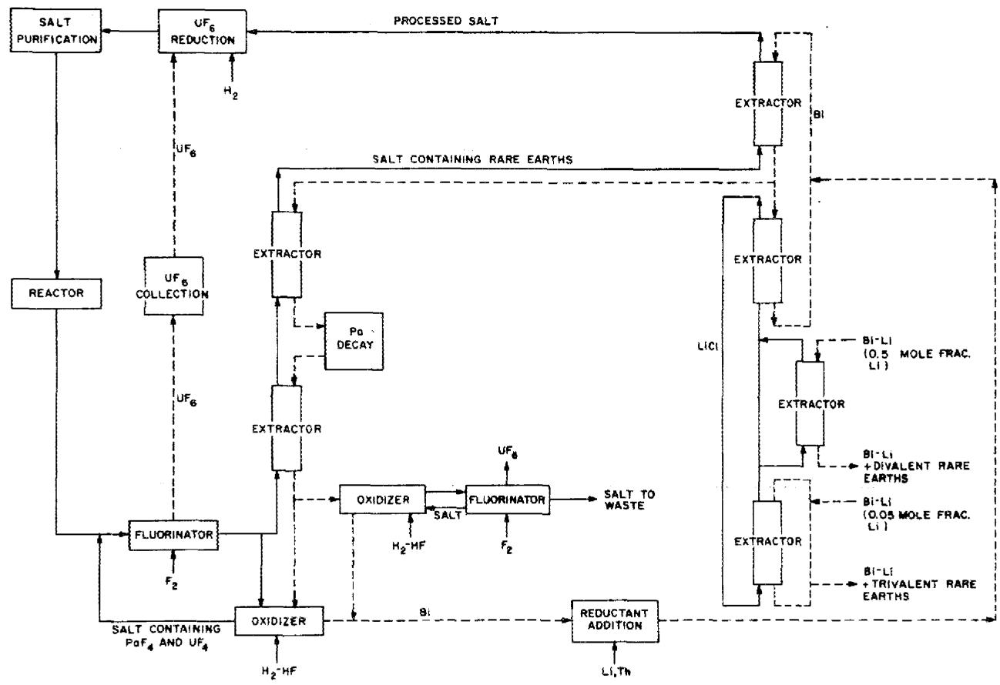  
Fig. 1. Flowsheet for Processing a Single-Fluid MSBR by Fluorination-Reductive Extraction and the Metal Transfer Process.

ORNL DWG 70-2812

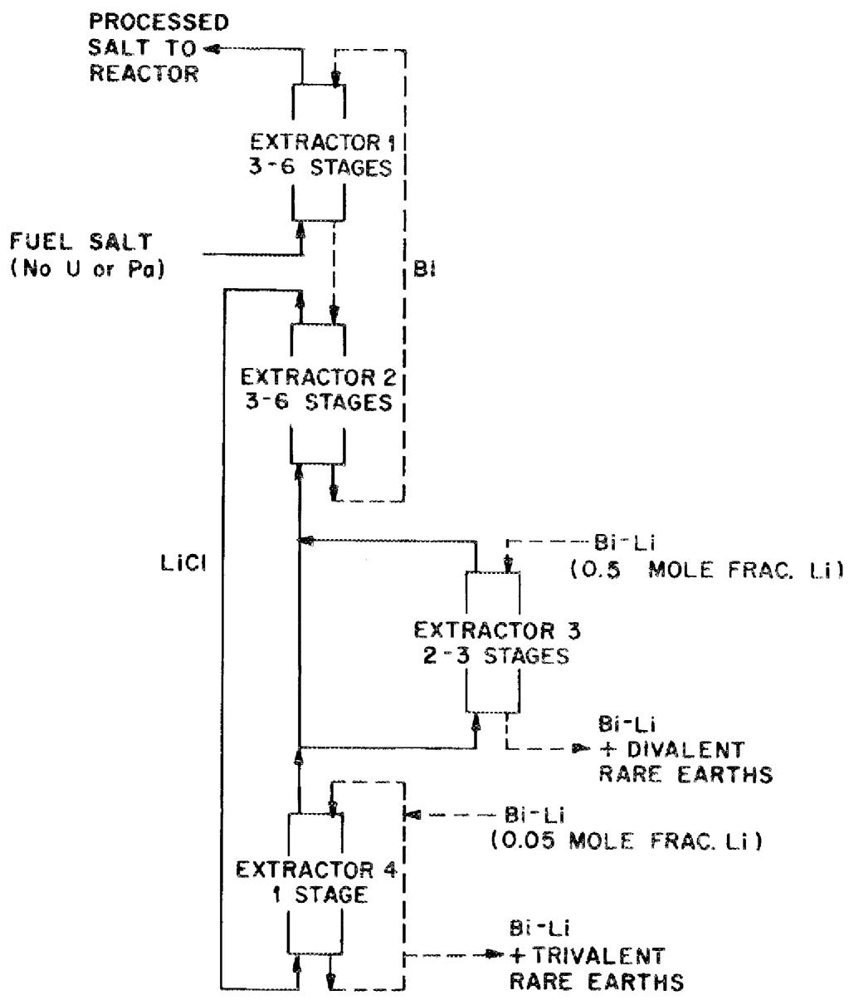  
Fig. 2. Metal Transfer Process for Removal of Rare Earths from a Single-Fluid MSBR.

bismuth stream is contacted countercurrently with LiCl, and significant fractions of the rare earths and a trace of the thorium transfer to the LiCl. The resulting LiCl stream is then routed to contactor 4, where it is contacted with a bismuth solution containing 0.05 mole fraction lithium for removal of the trivalent rare earths. About $2\%$ of the LiCl is routed to contactor 3, where it is contacted with a bismuth solution containing 0.5 mole fraction lithium for removal of the divalent rare earths (Sm and Eu) and the alkaline earths. The LiCl from contactors 3 and 4 (still containing some rare earths) is then returned to contactor 2.

The trivalent and divalent rare earths are removed from the LiCl in separate contactors in order to minimize the amount of lithium required. Removal of these elements in separate contactors appears advisable for several reasons. A high lithium concentration in the bismuth is required for obtaining adequately high distribution coefficients for the divalent rare earths. However, the solubilities of the trivalent rare earths in bismuth are much lower than those of the divalent elements. Also, the production rate for the trivalent rare earths is several times that of the divalent elements.

Calculations were made to identify the important system parameters for the metal transfer process. Figure 3 illustrates the effect of the bismuth flow rate through contactors 1 and 2 on the removal time for neodymium, a typical trivalent rare earth, and samarium, a typical divalent rare earth, for a fixed LiCl flow rate. The divalent materials distribute less readily to the metal phase, and high bismuth flow rates are required to achieve significant removal of these materials. On the other hand, Fig. 4 illustrates that, for a fixed bismuth flow rate, the divalent rare earths transfer quite readily to the LiCl but that high LiCl flow rates are required to achieve removal of the trivalent rare earths. The overall effect of the bismuth and LiCl flow rates on the removal of rare-earth fission products is illustrated in Fig. 5. It is seen that the reactor performance is relatively insensitive to in

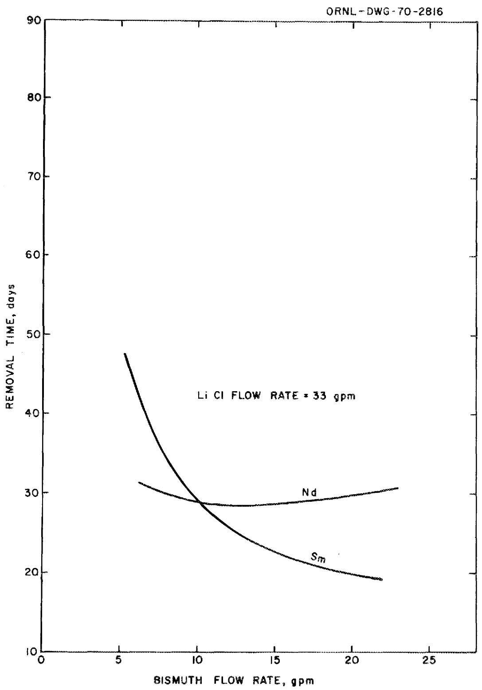  
Fig. 3. Effect of Bismuth Flow Rate Through Contactors 1 and 2 on the Removal Times of Neodymium and Samarium, Using the Metal Transfer Process.

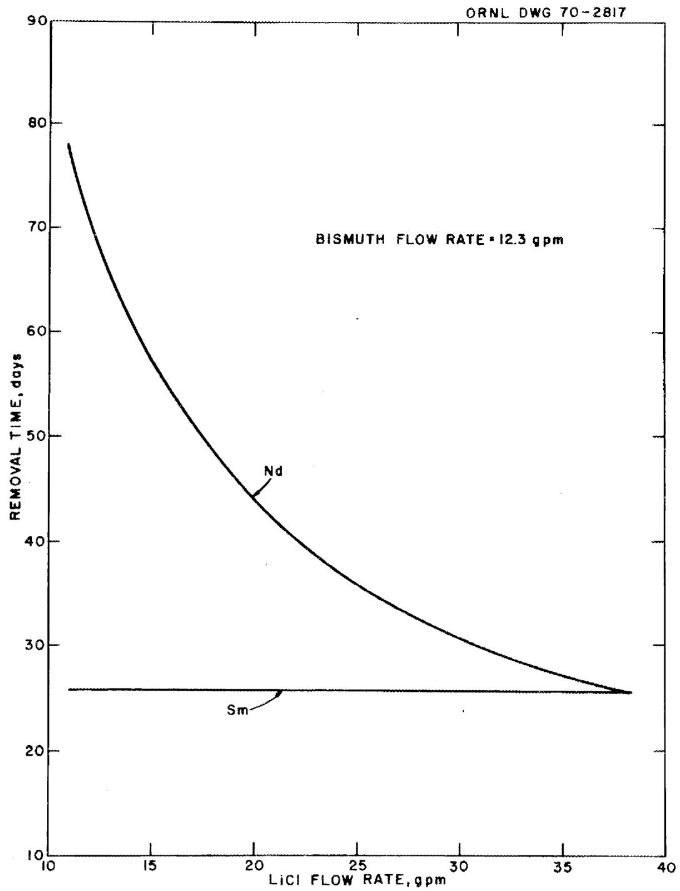  
Fig. 4. Effect of LiCl Flow Rate on the Removal Times of Neodymium and Samarium, Using the Metal Transfer Process.

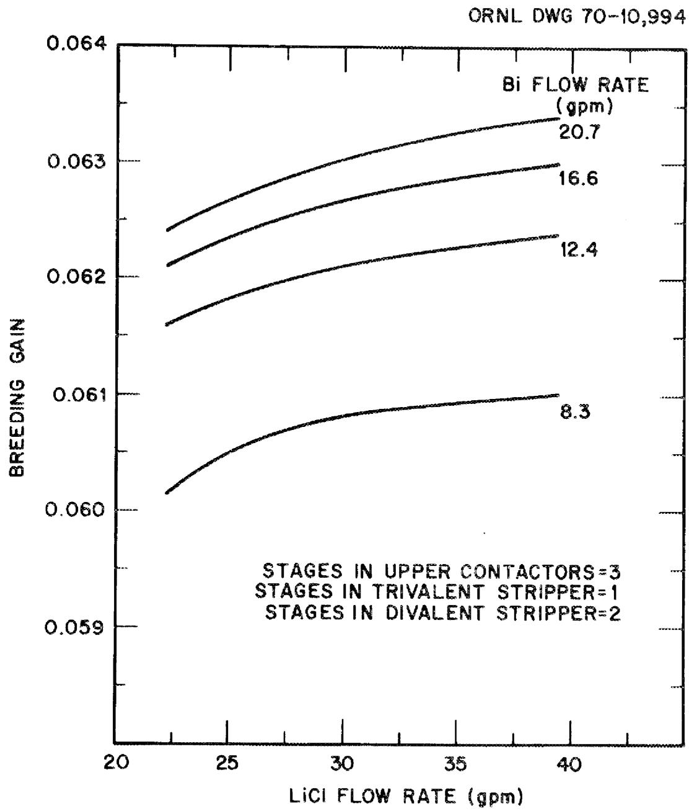  
Fig. 5. Overall Effect of LiCl and Bismuth Flow Rates in the Metal Transfer System on MSBR Performance.

creases in the LiCl flow rate above 33 gpm. A substantial increase in the breeding gain (breeding ratio minus 1) is obtained by increasing the bismuth flow rate from 8.3 gpm to 12.4 gpm. Further increases in the bismuth flow rate do not produce corresponding gains in reactor performance. Bismuth and LiCl flow rates of 12.4 gpm and 33 gpm, respectively, have been selected for the reference processing conditions.

Figure 6 shows the effect of the number of stages in the fuel salt--bismuth and the LiCl-bismuth contactors. Little benefit is obtained from using more than three stages; therefore, three stages is considered optimum. Only one stage is required to extract the trivalent rare earths from the LiCl in contactor 4. The flow rate of the Li-Bi solution through this contactor is 8.1 gpm, and 5.7 gal of the metal stream must be removed daily to prevent the solubilities of the trivalent rare earths in the bismuth from being exceeded. The bismuth can be recovered by hydrofluorinating or hydrochlorinating the metal stream in the presence of salt, which can be processed further (if economical) or discarded. The divalent rare earths, plus strontium and barium, can be stripped from the LiCl by passing $2\%$ of the LiCl $(0.66\mathrm{gpm})$ through a small two-stage extractor where it is contacted with $1.5\mathrm{cm}^3$ of bismuth--50 at. $\%$ lithium per minute. The bismuth in the metal stream can again be recovered by hydrofluorination or hydrochlorination in the presence of a waste salt. The rare-earth removal times that can be obtained using the reference processing conditions range from about 15 to 50 days (see Table 2).

Table 2. Fission Product Removal Times for Metal Transfer Process Under Reference Conditions   

<table><tr><td>Element</td><td>Removal Time (days)</td></tr><tr><td>Ba2+</td><td>16.8</td></tr><tr><td>La3+</td><td>22.0</td></tr><tr><td>Nd3+</td><td>29.9</td></tr><tr><td>Sm2+</td><td>27.0</td></tr><tr><td>Eu2+</td><td>51.0</td></tr></table>

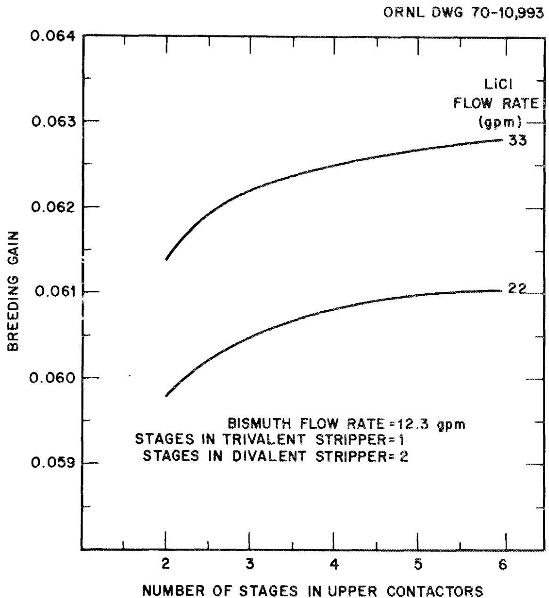  
Fig. 6. Effect of the Number of Stages in the Fuel Salt--Bismuth and LiCl-Bismuth Contactors on MSBR Performance.

# 2.3 Effect of Contamination of LiCl with Fluoride

The presence of fluoride in the LiCl acceptor salt causes a significant decrease in the thorium distribution coefficient, as shown in Fig. 7. This results in an increase in the extent to which the thorium transfers to the LiCl and is undesirable since the thorium is subsequently extracted, along with rare earths, from the LiCl into the Li-Bi solutions and is discarded. As shown in Fig. 8, the thorium loss rate increases from 0.41 mole/day with no fluoride in the LiCl to 280 moles/day when the LiCl contains 5 mole % LiF. It is likely that the fluoride concentration in the LiCl will have to be kept below about 2 mole %, which corresponds to a thorium transfer rate of 7.7 moles/day. Discard of thorium at this rate would add 0.0013 mill/kWhr to the fuel cycle cost. The effect of the presence of fluoride in the LiCl on the removal of rare earths is negligible; in fact, the rare-earth removal efficiency increases slightly as the fluoride concentration in the LiCl increases.

# 3. AXIAL DISPERSION IN OPEN BUBBLE COLUMN

J. S. Watson L. E. McNeese

Axial dispersion is important in the design and performance of continuous fluorinators. Since molten salt saturated with fluorine is corrosive, fluorinators will be simple, open vessels that have a protective layer of frozen salt on all exposed metal surfaces. In such systems, the rising gas bubbles may cause appreciable axial dispersion in the salt. We have been involved, for some time, in a program for measuring axial dispersion during the countercurrent flow of air and water in open bubble columns. The objectives of this program are to evaluate the effect of axial dispersion on fluorinator performance and to account for this effect in the design of fluorinators.

The data reported in this section result largely from a study by A. A. Jeje and C. R. Bozzuto, of the MIT Practice School, who investi

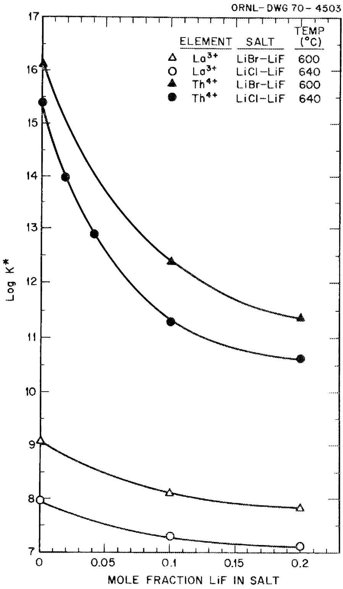  
Fig. 7. Values of log $\mathbf{K}^*$ for Lanthanum and Thorium, Using LiBr-LiF and LiCl-LiF as the Salt Phase.

ORNL DWG 70-10,995

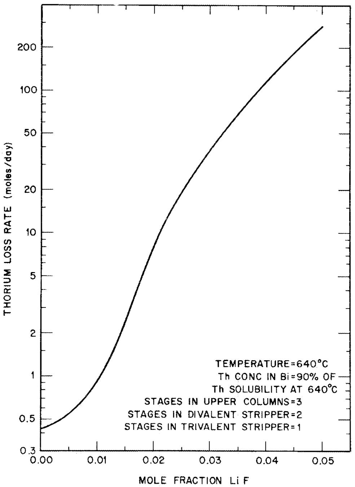  
Fig. 8. Effect of LiF Contaminant in LiCl on Thorium Loss Rate in Metal Transfer Process.

gated the effects of gas inlet diameter and column diameter on axial dispersion in open bubble columns during the countercurrent flow of air and water.

# 3.1 Previous Studies on Axial Dispersion

Initial studies on axial dispersion in open columns were carried out by Bautista and McNeese, who studied axial dispersion during the countercurrent flow of air and water in a 2-in.-ID, 72-in.-long column. Two regions of operation were observed. The first of these consisted of a "bubbly" region, at low gas flow rates, in which the air moved up the column as individual bubbles and coalescence was minimal. The second region consisted of a "slugging" region, at higher gas flow rates, in which the air coalesced rapidly into bubbles having diameters equal to the column diameter. A plot of the logarithm of the dispersion coefficient vs the logarithm of the gas flow rate was linear in both regions. However, the slope of the line representing data in the slugging region was higher than that for data in the bubbly region. The transition between the two regions was well defined.

The same column and equipment were used by A. M. Sheikh and J. D. Dearth, of the MIT Practice School, for investigating the effects of the viscosity and the surface tension of the liquid. The dispersion coefficient was found to decrease in the bubbly region as the viscosity of the liquid was increased from 1 to 15 cP by the addition of glycerol to the water; little effect was noted in the slugging region. An increase in the dispersion coefficient was observed as the surface tension of the liquid was decreased by the addition of n-butanol to the water.

# 3.2 Equipment and Experimental Technique

The equipment and the experimental technique used in the study described here are the same as those used in the previous studies; a detailed description was given previously. The technique involved

continuously injecting a tracer solution (cupric nitrate) into the bottom of the column and determining the resulting steady-state tracer concentration profile at points upstream along the column axis. The tracer concentration was measured at each of 20 sampling points that were equally spaced (3.5 in. apart) along the 72-in.-long column. At each sampling point, a miniature centrifugal pump was used for circulating solution between the column and a photocell for determination of the tracer concentration. The solution was withdrawn from, and returned to, opposite sides of the column at the same elevation.

Three column diameters (1.5, 2, and 3 in. ID) and four gas inlet diameters (0.019, 0.04, 0.06, and 0.085 in.) were used by the MIT Practice School group. Later, measurements were also made with a 0.17-in.-ID gas inlet. The fraction of the column volume occupied by the gas phase during the countercurrent flow of air and water was measured by two different techniques. The first consisted of measuring (1) the height of the air-water mixture above the air inlet while air was flowing through the column, and (2) the height of the water above the gas inlet after the air flow was turned off. The gas holdup was then determined from the difference in these values. The second technique consisted of attaching a water-filled manometer to points along the column axis. The manometer reading indicated the settled height of liquid above the point of attachment. The second method was found to be more rapid, and also allowed holdup measurements to be made for upper portions of the column.

# 3.3 Effects of Gas Inlet Diameter and Column Diameter on Axial Dispersion

As shown in Fig. 9, the dispersion coefficient values measured for a 2-in.-diam column are not dependent on gas inlet diameter in either the slugging region or the bubbly region. A few tests were also made using the 1.5- and 3-in.-diam columns with a 0.17-in.-diam gas inlet; no effect of gas inlet diameter was noted.

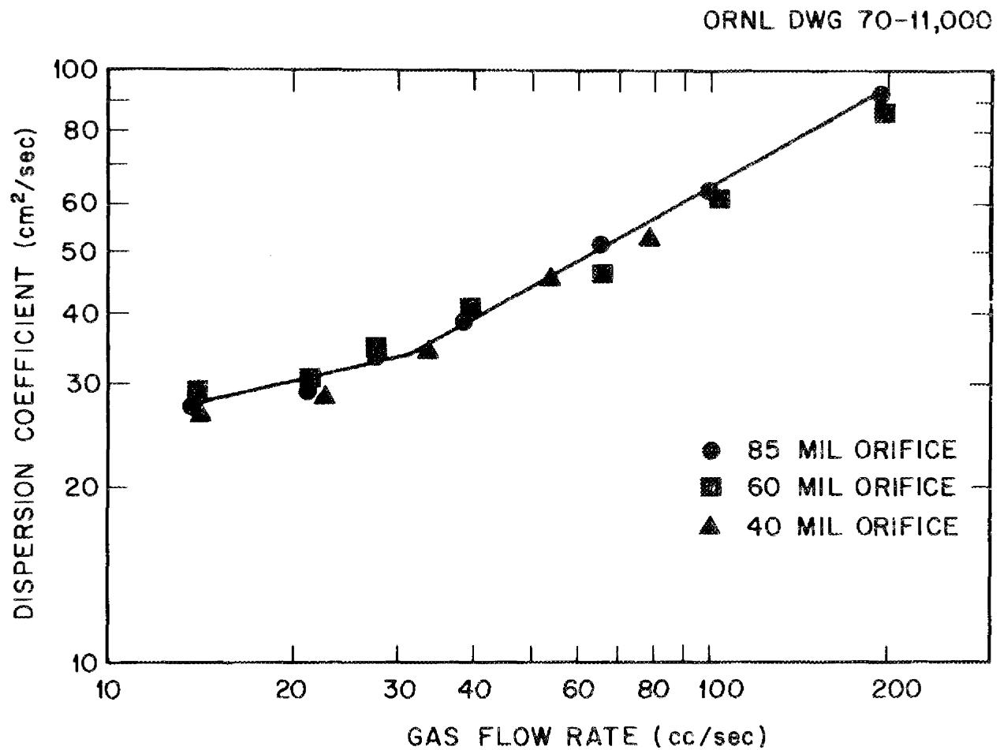  
Fig. 9. Effects of Gas Flow Rate and Orifice Diameter on Axial Dispersion in a 2-in.-diam Open Column.

It is not surprising that changes in the gas inlet diameter have no effect in the slugging region since a great deal of coalescence occurs in this region and the bubble size distribution quickly becomes independent of the initial size distribution. However, in the bubbly region (low gas flow rates), where coalescence is minimal, it was thought that gas inlet diameter might be important. It has been postulated4 that "chain bubbling" occurs at low gas flow rates (i.e., that gas bubbles are not formed consecutively). In this case, the bubble diameter would not be highly dependent on gas inlet diameter. Even with different bubble diameters, one would not expect large differences in bubble rise velocities or, possibly, large changes in dispersion coefficient. Davies and Taylor8 report that the bubble rise velocity is proportional to the sixth root of the bubble volume. Thus, even for conditions resulting in the release of single bubbles (where bubble volume is proportional to the cube root of the inlet diameter), one would find little variation in rise velocities and, possibly, little variation in dispersion coefficient with changes in gas inlet diameter.

The effects of gas flow rate and column diameter are shown in Fig. 10 for column diameters of 1.5, 2, and 3 in. In the slugging region, there is little difference in dispersion coefficient for the three column diameters at a given volumetric gas flow rate. However, the data do not extend to high gas flow rates for all column diameters, and extrapolation to higher gas flow rates is questionable since uncertainty in the data is greatest at high gas flow rates.

The dispersion coefficients for the 2-in.- and 3-in.-diam columns do not differ appreciably in the bubbly region. On the other hand, data from the 1.5-in.-diam column show significantly lower values for the dispersion coefficient and a greater dependence of dispersion coefficient on gas flow rate in this region.

# 3.4 Gas Holdup in Bubble Columns

Experimentally determined gas holdup values are summarized in Fig. 11, which shows the effects of superficial gas velocity and column diameter

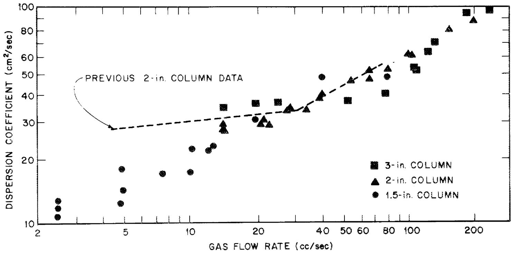  
Fig. 10. Effect of Column Diameter on Dispersion Coefficient in an Open Column.

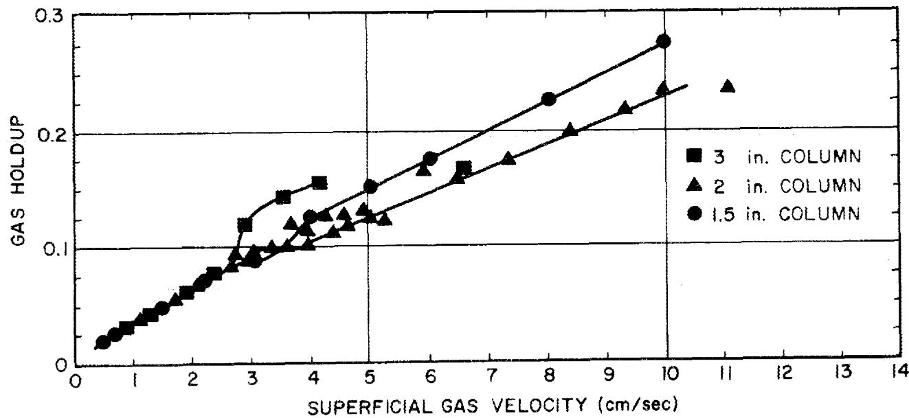  
Fig. 11. Variation of Gas Holdup with Superficial Gas Velocity in Open Columns Having Diameters of 1.5, 2, and 3 in.

on holdup. At low gas flow rates, holdup is linearly dependent on superficial gas velocity and is independent of column diameter. However, a transition from this behavior is observed at a superficial gas velocity of 2 to $3\mathrm{cm / sec}$ . At superficial velocities above the transition, the holdup data for the various column diameters diverge; the holdup is greatest for the smallest column diameter. Data for the 3-in.-diam column do not extend beyond the transition region.

The transition region corresponds roughly to the transition between bubbly and slug flow, as determined from measurements of the dispersion coefficient. Values for holdup in the transition region are thought to be inaccurate and will be checked during future studies.

There was no detectable variation of holdup with axial position along the column for any operating conditions tested.

# 3.5 Discussion of Results and Future Experiments

Although the present data on axial dispersion are incomplete, one can make the following tentative conclusions:

(1) In the slugging region, the dispersion coefficient appears to be proportional to the square root of the volumetric gas flow rate and independent of column diameter.   
(2) In the bubbly region, the dispersion coefficient is only a function of the volumetric gas flow rate for columns that are 2 in. or larger in diameter. The dispersion coefficient data for a 1.5-in.-diam column deviate from this condition.

Additional information is needed in order to confirm these conclusions. The reported data become less accurate as the column diameter is increased since air, which collects in the photocell sample circuits, prevents flow through the photocells. We will consider methods for preventing the buildup of air in the sample circuits as well as alternative methods for measuring dispersion coefficients.

Future studies will be concerned primarily with obtaining data in the region of slugging flow, where continuous fluorinators of interest will operate. Gas inlets other than the small-diameter tubes used thus far will be studied. Most of the effort will be concentrated on side inlets of large diameter since this type of inlet appears to be the most amenable to protection against corrosion by use of a frozen wall.

# 4. CONSIDERATIONS OF CONTINUOUS FLUORINATORS AND THEIR APPLICABILITY TO MSBR PROCESSING

L. E. McNeese J. S. Watson

Most of the flowsheets9-12 considered to date for processing MSBR fuel salt require fluorination of molten salt for removal of uranium at one or more points. These applications include: (1) removal of trace quantities of uranium from relatively small salt streams prior to discard, (2) removal of uranium from a captive salt volume in which $^{233}\mathrm{Pa}$ is accumulated and held for decay to $^{233}\mathrm{U}$ , (3) removal of most of the uranium from relatively large fuel salt streams prior to isolation of protactinium and removal of rare earths, and (4) nearly quantitative removal of uranium from a salt stream containing $^{233}\mathrm{Pa}$ in order to produce isotopically pure $^{233}\mathrm{U}$ . Not all of these applications require continuous fluorinators; in fact, the use of batch fluorinators results in definite advantages in certain cases. However, as the quantities of salt and uranium to be handled increase, the use of continuous fluorinators becomes mandatory in order to avoid undesirably large inventory charges on uranium and molten salt as well as the detrimental increase in reactor doubling time that is associated with an increased fissile inventory.

Although the literature contains many references to the removal of uranium from molten salt by batch fluorination, information on continuous fluorinators, particularly on fluorinators capable of handling salt flow rates on the order of $100\mathrm{ft}^3/\mathrm{day}$ , is rather meager. The remainder

of this section is devoted to a review of the experience with fluorinators, a discussion of the possible types of fluorinators, a mathematical analysis of open-column continuous fluorinators, and predictions of the performance of open-column continuous fluorinators for MSBR processing applications.

# 4.1 Types of Fluorinators

No known materials of construction are resistant to attack by the extremely corrosive environment resulting from the combined action of fluorine and molten salt;[13] for this reason, any discussion of fluorinator types must also give consideration to the relative ease of protecting the fluorinator from corrosion. Several types of fluorinators, all of which can be classified as either batch or continuous, have been considered in the past. In a batch fluorinator, the molten salt is contacted with fluorine for a sufficient time to reduce the uranium concentration to the desired level. A batch fluorinator is especially useful in cases where it is desired to remove small quantities of uranium from molten salt prior to its discard. In batch operations, the salt can be analyzed repeatedly and the probability of inadvertent discard of fissile material can be reduced to an acceptably low level. However, this type of fluorinator is not well suited to the removal of large quantities of uranium from salt streams having flow rates of 50 ft³/day or greater unless one can tolerate the large salt and uranium inventories that result.

Batch fluorinators are amenable to protection against corrosion by use of a frozen wall, provided the heat generation rate in the salt is adequate for supporting the thermal gradient necessary for maintaining a layer of frozen salt adjacent to molten salt. In this method of corrosion protection, a layer of frozen salt is maintained on all metal surfaces that are expected to be contacted by molten salt. This allows the buildup of a protective $\mathrm{NiF}_2$ layer, which would otherwise be dissolved by the molten salt.

At least three types of continuous fluorinators have been considered in the past; these are: (1) open columns in which an appreciable axial uranium concentration gradient exists, (2) a series of well-mixed vessels, and (3) falling-drop fluorinators in which molten salt droplets are allowed to fall through a gas phase containing fluorine.[14] Open-column continuous fluorinators have the advantage of a relatively small salt holdup and hence a low uranium inventory. This type of fluorinator, which consists of a simple open cylinder, can be designed for frozen-wall protection against corrosion for a fairly wide range of specific heat generation rates in the salt. Also, it appears to be capable of a relatively high salt throughput with a low salt inventory. However, this type of contactor depends on the establishment of a significant axial uranium concentration gradient; for this reason, axial dispersion in the salt phase is important. Many of the same arguments apply to a continuous fluorinator consisting of a series of well-mixed vessels. The salt inventory in such a system is likely to be larger than in the case of an open-column fluorinator designed for a given salt throughput. No attempt would be made to minimize dispersion in the salt phase in a given vessel. Protection of the intervessel salt transfer lines against corrosion for this type of fluorinator might be difficult.

The falling-drop fluorinator appears to have several advantages over other types of continuous fluorinators. For example, the salt inventory is quite low, and a large quantity of gas can be contacted with a small amount of salt. On the other hand, this system has two disadvantages that have not presently been circumvented: (1) thermal convection currents in the gas tend to sweep the molten salt droplets into the fluorinator wall, resulting in a highly corrosive condition, and (2) the device used for dispersing the salt into small droplets is subject to corrosion.

It appears that the open column is the best type of continuous fluorinator for MSBR processing applications requiring removal of 50 to $99\%$ of the uranium from salt streams that have flow rates on the order of 100 ft $^3$ /day; thus this fluorinator has been selected for further development.

# 4.2 Experience Related to Fluorination of Molten Salt for Uranium Removal

The removal of uranium from molten fluoride salts by batch fluorination has been studied extensively in the laboratory, $^{15}$ in engineering experiments, $^{16}$ and in the ORNL Fused Salt Fluoride Volatility Process Pilot Plant. Several spent reactor fuels cooled for periods as short as 25 days were used in these studies. $^{17,18}$ The most recent demonstrations of batch fluorination consist of: (1) the recovery of about 6.5 kg of uranium from $74\mathrm{ft}^3$ of MSRE flush salt (66-34 mole % LiF- $\mathrm{BeF}_2$ ) during a 6.6-hr operation, which resulted in a final uranium concentration of 7 ppm in the salt, $^{19}$ and (2) the recovery of about 214 kg of uranium from $74\mathrm{ft}^3$ of MSRE fuel salt (65-30-5 mole % LiF- $\mathrm{BeF}_2$ - $\mathrm{ZrF}_4$ ) during a 6-day operation (fluorination time, 47 hr), which resulted in a final uranium concentration of 26 ppm in the salt. $^{19}$

Data obtained from the above systems demonstrate that the concentration of uranium in molten salt can be decreased by batch fluorination to very low levels. Although the equilibria involved have not been measured, the formation of $\mathrm{UF}_6$ is strongly favored. It is believed that the uranium concentration in molten salt in equilibrium with $\mathrm{F}_2\mathrm{-UF}_6$ mixtures containing low concentrations of fluorine is very low; for the present data, it is indistinguishable from zero.

Experience with continuous fluorination is limited to a single study by McNeese.[20] The fluorinator used in this study had a salt depth of 48 in. and was constructed from l-in.-diam (nominal) nickel pipe. No attempt was made to protect the fluorinator walls from corrosion, and a relatively high corrosion rate occurred. The uranium removal efficiency was determined by analyzing the inlet and outlet salt streams. The fluorine utilization could not be determined because of the high corrosion rate. Two temperatures (525 and $600^{\circ}\mathrm{C}$ ) and two inlet uranium concentrations in the salt (0.12 and 0.35 mole %) were used. The results of this study are summarized in Fig. 12.

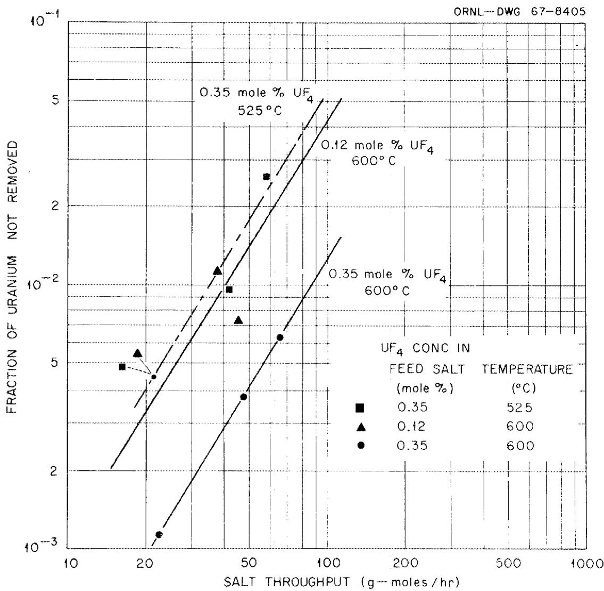  
Fig. 12. Variation of the Residual Uranium with Salt Flow Rate, Temperature, and Inlet Uranium Concentration During the Continuous Fluorination of Molten Salt.

Three runs for each temperature and inlet uranium concentration (a total of nine runs) were made using a range of salt flow rates. The fraction of the uranium removed was high in all cases, ranging from 97.5 to almost $99.9\%$ . The fluorination rate (and hence the fraction of the uranium removed) increased as the temperature was increased; the fraction of the uranium removed decreased as the inlet uranium concentration was decreased. These data serve primarily to demonstrate that high uranium removal efficiencies can be obtained with an open-column continuous fluorinator. However, they are sufficiently reliable for use with data on axial dispersion in open columns to allow estimating the performance of larger fluorinators, which are required for MSBR processing.

A study has also been made of the hydrodynamics of heat transfer in a simulated open-column continuous fluorinator having a frozen wall as a means of protection against corrosion.[21] The equipment consisted of a 5-in.-diam, 8-ft-long pipe in which molten salt (66-34 mole % LiF-ZrF $_{4}$ ) and argon were countercurrently contacted. A volumetric heat source in the molten salt was simulated by Calrod heaters located along the center line of the pipe, and provision was made for cooling the pipe wall. The system was operated over a range of conditions that included heat generation rates in the molten salt as high as 55.7 kW/ft $^3$ , which is greater than the heat generation rate in salt just removed from the reference 1000-MW(e) MSBR. The thickness of the frozen salt film on the fluorinator wall ranged from 0.3 to 0.8 in., depending on the operating conditions. The film was symmetrical and adhered to the metal wall.

# 4.3 Mathematical Analysis of Open-Column Continuous Fluorinators

Consider a differential height of a continuous fluorinator in which fluorine and molten salt containing uranium are in countercurrent flow. If the rate of removal of uranium from the salt is assumed to be first order with respect to the uranium concentration in the salt, a material balance on the differential volume yields the relation

$$
\frac {d ^ {2} C}{d X ^ {2}} - V \frac {d C}{d X} - k C = 0, \tag {1}
$$

where

D = axial dispersion coefficient, cm²/sec,

$C =$ concentration of uranium in salt, moles/cm $^3$ ,

$X =$ position in column measured from top of column, cm,

$\mathrm{V} =$ superficial salt velocity, cm/sec,

$\mathbf{k} =$ reaction rate constant, sec-1.

The terms in Eq. (1) represent the transfer of uranium in the salt by axial diffusion, the transfer of uranium in the salt by convection, and the removal of uranium from the salt by reaction with fluorine, respectively. The assumption of a first-order reaction does not imply a particular rate-limiting reaction mechanism; however, it is consistent with the assumption that the rate-limiting step is diffusion of uranium in the salt to the gas-liquid interface. In this case, the first-order expression would imply that the concentration of uranium in the salt at the interface is negligible in comparison with the uranium concentration in the salt at points a short distance from the interface.

The boundary conditions chosen for use with Eq. (1) assume that the diffusive flux across the fluorinator boundaries is negligible: at $X = 0$ (top of fluorinator),

$$
\left. \frac {\mathrm {d C}}{\mathrm {d X}} \right| _ {\mathrm {X} = 0 +} = - \frac {\mathrm {V}}{\mathrm {D}} \left[ \mathrm {C} _ {\text {f e e d}} - \mathrm {C} _ {0 +} \right], \tag {2}
$$

and at $X = \ell$ (bottom of fluorinator),

$$
\left. \frac {\mathrm {d C}}{\mathrm {d X}} \right| _ {\mathrm {X} = \ell} = 0, \tag {3}
$$

where

$C_{\text{feed}} =$ concentration of uranium in salt fed to the fluorinator,

$C_{0+} =$ concentration of uranium in salt at the top of the fluororinator.

Note that $C_{0+}$ is not equal to $C_{\text{feed}}$ since there is a discontinuity in uranium concentration in the salt at the top of the column where the salt enters.

The solution to Eq. (1) with the stated boundary conditions is, then:

$$
C (X) = \frac {2 \alpha C _ {\text {f e e d}} e ^ {\alpha X} \left[ - \alpha \sinh \beta (X - \ell) + \beta \cosh \beta (X - \ell) \right]}{\left(\alpha^ {2} + \beta^ {2}\right) \sinh \beta \ell + 2 \alpha \beta \cosh \beta \ell}, \tag {4}
$$

where $\alpha$ is defined as V/2D, $\beta$ is defined as $\sqrt{V^2 + 4kD / 2D}$ , and the ratio of the uranium concentration in salt leaving the column (at $X = \lambda$ ) to the concentration in the feed salt is:

$$
\frac {C (2)}{C _ {\text {f e e d}}} = \frac {1}{\left\{\frac {1 / 2 + n}{\sqrt {1 + 4 n}} + 1 / 2 \right\} e ^ {\xi \left[ \sqrt {1 / 4 + n} - 1 / 2 \right]} - \left\{\frac {1 / 2 + n}{\sqrt {1 + 4 n}} - 1 / 2 \right\} e ^ {- \xi \left[ 1 / 2 + \sqrt {1 / 4 + n} \right]}} \tag {5}
$$

where

$$
\eta = \frac {k D}{V ^ {2}},
$$

$$
\xi = \frac {V L}{D}.
$$

# 4.4 Evaluation of Fluorination Reaction Rate Constant

Application of Eq. (5) to the design and evaluation of continuous fluorinators requires information on the rate constant $k$ and the axial dispersion coefficient $D$ . Values for the dispersion coefficient can be obtained from studies in which air and water were contacted countercurrently in open bubble columns. Results from these studies are shown in Fig. 13 for 1.5-, 2-, and 3-in.-ID columns that were 72 in. long. The dispersion coefficient is independent of the gas inlet diameter over the range tested (from 0.020 to 0.170 in.) and appears to be es-

ORNL DWG 70-11,001

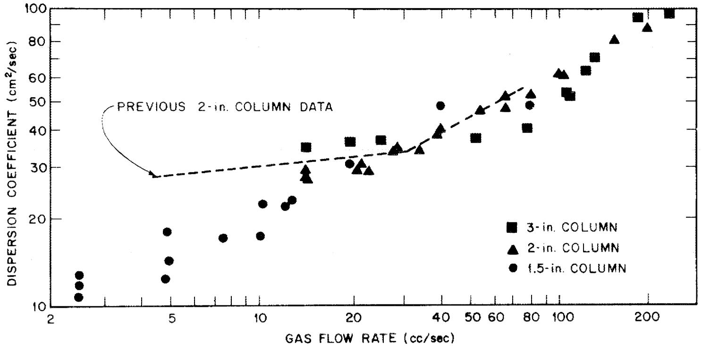  
Fig. 13. Axial Dispersion Coefficient Data Used in Evaluation of Continuous Fluorinator Performance.

sentially independent of column diameter for the larger column sizes. Only with the smallest column diameter and low gas rates did the data deviate from a single curve. Under all other conditions, the dispersion coefficient appears to be a function of the volumetric gas flow rate rather than the superficial gas velocity as one might expect. The data fall into two regions, corresponding to low gas flow rates and to high gas flow rates, respectively. The experimental data from which the rate constant $k$ was evaluated were used with data from the region of low gas flow rates. The fluorinators proposed for MSBR processing are expected to operate in the region of high gas flow rates, well beyond the range of the existing data.

In analyzing the experimental data from the 1-in.-diam open-column continuous fluorinator, it was assumed the axial dispersion coefficients were the same as those measured in a 1-1/2-in.-diam column (the closest column size tested). No correction was made for differences in physical properties between molten salt and water; for this reason, considerable uncertainty may have been introduced into the results. Efforts to improve this situation are under way. A group of MIT Practice School students has studied the effects of viscosity and attempted to determine the effect of interfacial tension on the dispersion coefficient.7 Increases in viscosity result in a decrease in the dispersion coefficient; however, the effects of high interfacial tension and density of the liquid are not known.

The reaction rate constant $k$ was estimated from the series of continuous fluorination experiments made by McNeese in a 1-in.-diam, 48-in.-long fluorinator by using the mathematical model developed above and an estimate for the axial dispersion coefficient. Two inlet uranium compositions (0.35 and 0.12 mole %) were studied at $600^{\circ}\mathrm{C}$ , and one composition (0.35 mole %) was studied at $525^{\circ}\mathrm{C}$ . Three data points corresponding to different salt flow rates were obtained for each set of temperatures and inlet compositions. The fluorine flow rate was different for each data point; however, according to the present model, this flow rate only affects the results by changing the dispersion coefficient. To evaluate the rate constant,

k, we chose to use the data obtained at $525^{\circ}\mathrm{C}$ since the temperature of the molten salt in the proposed fluorinator will be 10 to $15^{\circ}\mathrm{C}$ above the salt liquidus temperature of $505^{\circ}\mathrm{C}$ . Application of the model to the three data points obtained at $525^{\circ}\mathrm{C}$ gave the results shown in Table 3. Note that the resulting values for $\mathbf{k}$ are reasonably constant and show no trend with salt or fluorine flow rate. Although these data do not confirm the validity of the present model, they do not contradict the model.

Table 3. Summary of Fluorination Results Obtained at ${525}^{ \circ  }\mathrm{C}$   

<table><tr><td>Salt Flow Rate (cm/sec)</td><td>C(λ) C feed</td><td>F2 Flow Rate (cm3/sec)</td><td>D (cm2/sec)</td><td>k (sec-1)</td></tr><tr><td>0.0625</td><td>0.0257</td><td>6.8</td><td>18</td><td>0.00814</td></tr><tr><td>0.0445</td><td>0.0096</td><td>5.0</td><td>14</td><td>0.01010</td></tr><tr><td>0.0225</td><td>0.00457</td><td>3.82</td><td>12</td><td>0.00943</td></tr><tr><td></td><td></td><td></td><td></td><td>avg 0.00922</td></tr></table>

In the mathematical model developed earlier, the effect of axial dispersion was considered; however, it is interesting to note how the results are affected when axial dispersion is neglected. The solution to Eq. (1) when $D$ is zero is:

$$
\frac {C (k)}{C _ {\text {f e e d}}} = \mathrm {e} ^ {- K L / V}.
$$

The three data points considered above produce K values in this case of 0.00188, 0.00170, and 0.000995 sec $^{-1}$ . The effective rate constants are, as expected, considerably lower than those obtained when axial dispersion is taken into account. An indication that axial dispersion is significant in the present case lies in the fact that the lowest K value was obtained when the salt flow rate was lowest; the effects of axial dispersion would be the greatest for this condition.

# 4.5 Predicted Performance of Open-Column Continuous Fluorinators

The performance of large open-column continuous fluorinators was estimated from Eq. (5) using the previously discussed estimates of the reaction rate constant $k$ (shown in Table 3) and the dispersion coefficient $D$ (shown in Fig. 13). The required fluorinator height is shown in Figs. 14-17 for a range of salt flow rates for four fractional uranium removal values (0.9, 0.95, 0.99, and 0.999). The uranium concentration in the inlet salt was assumed to be 0.003 mole fraction in all cases, and the fluorine flow rate was assumed to be equal to 1.5 times the stoichiometric requirement. The effect of fluorine flow rate is important since the axial dispersion coefficient is dependent on fluorine flow rate. Extrapolation of the dispersion coefficient data to high gas flow rates results in very high dispersion coefficients for some of the conditions considered. (This extrapolation is believed to be a conservative one.)

The results shown in Figs. 15 and 16 are encouraging since they suggest that single fluorination vessels of moderate size will suffice for removing uranium from MSBR fuel salt prior to the isolation of protactinium by reductive extraction. The reference flowsheet for isolating protactinium by fluorination--reductive extraction requires fluorination of fuel salt at the rate of $170\mathrm{ft}^3/$ day, which represents a 10-day processing cycle. A 6-in.-diam fluorinator having a height of 10 ft would be required for a uranium removal efficiency of $95\%$ , and an 8-in.-diam fluorinator having a height of 14 ft would be required for a uranium removal efficiency of $99\%$ .

Fluorinators having a high uranium removal efficiency are required in the production of high-purity $^{233}\mathrm{U}$ since incomplete removal of uranium from a salt stream containing $^{233}\mathrm{Pa}$ would result in contamination of the $^{233}\mathrm{U}$ with other uranium isotopes. Fluorination of salt streams having flow rates of 550 to 1700 ft $^3$ /day, with uranium removal efficiencies as high as $99.9\%$ , may be required. As shown in Fig. 17, if a single open-column continuous fluorinator were used, a column

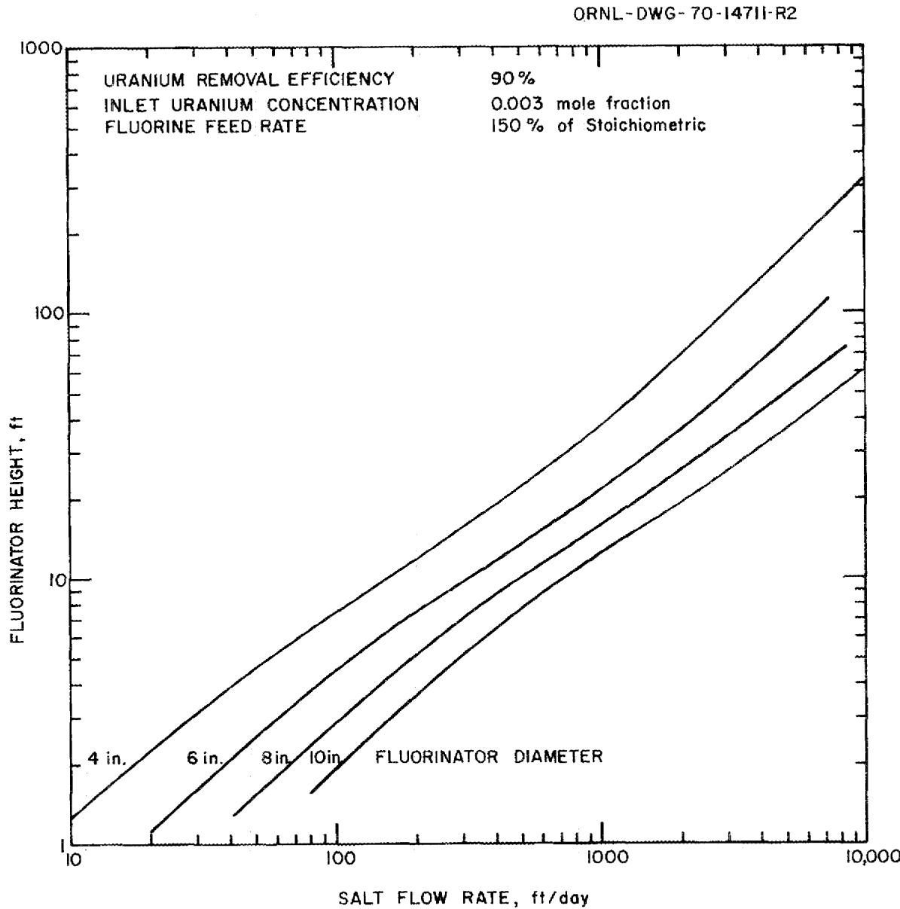  
Fig. 14. Variation of Calculated Fluorinator Height with Salt Flow Rate and Fluorinator Diameter for a Uranium Removal Efficiency of $90\%$ .

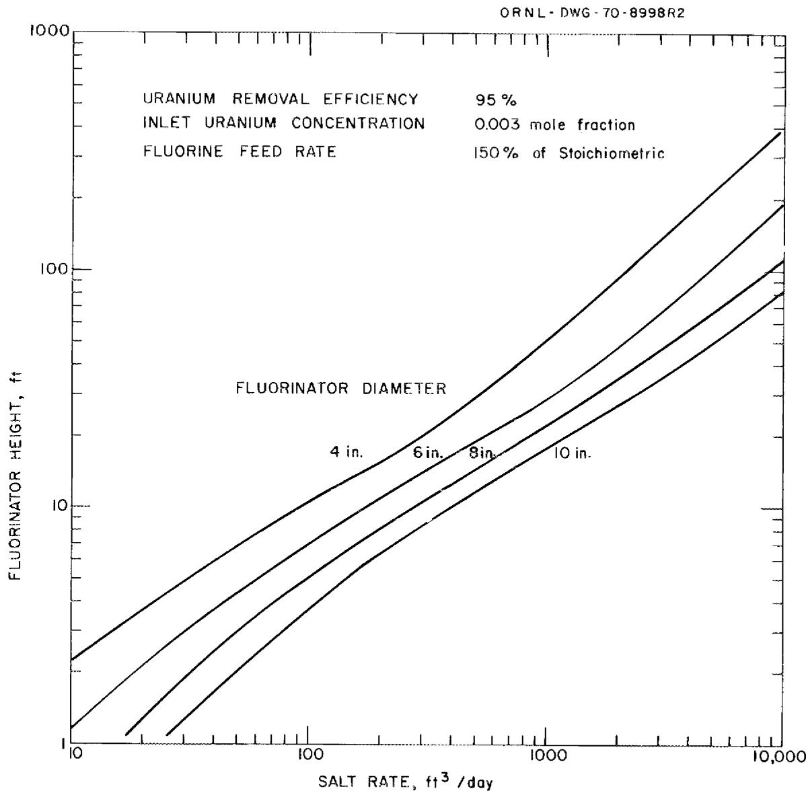  
Fig. 15. Variation of Calculated Fluorinator Height with Salt Flow Rate and Fluorinator Diameter for a Uranium Removal Efficiency of $95\%$ .

ORNL DWG 70-14712 R2

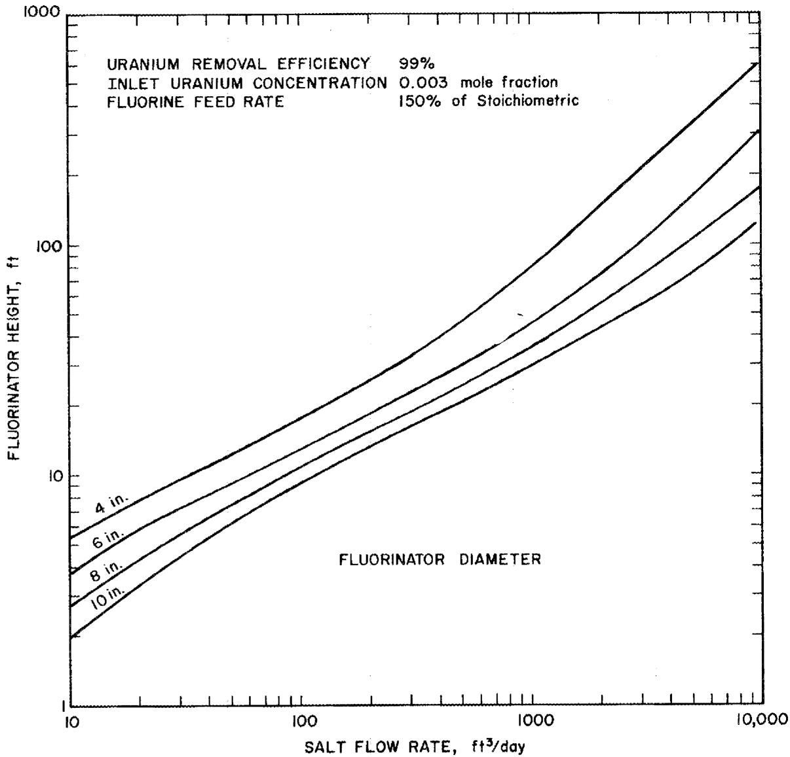  
Fig. 16. Variation of Calculated Fluorinator Height with Salt Flow Rate and Fluorinator Diameter for a Uranium Removal Efficiency of $99\%$ .

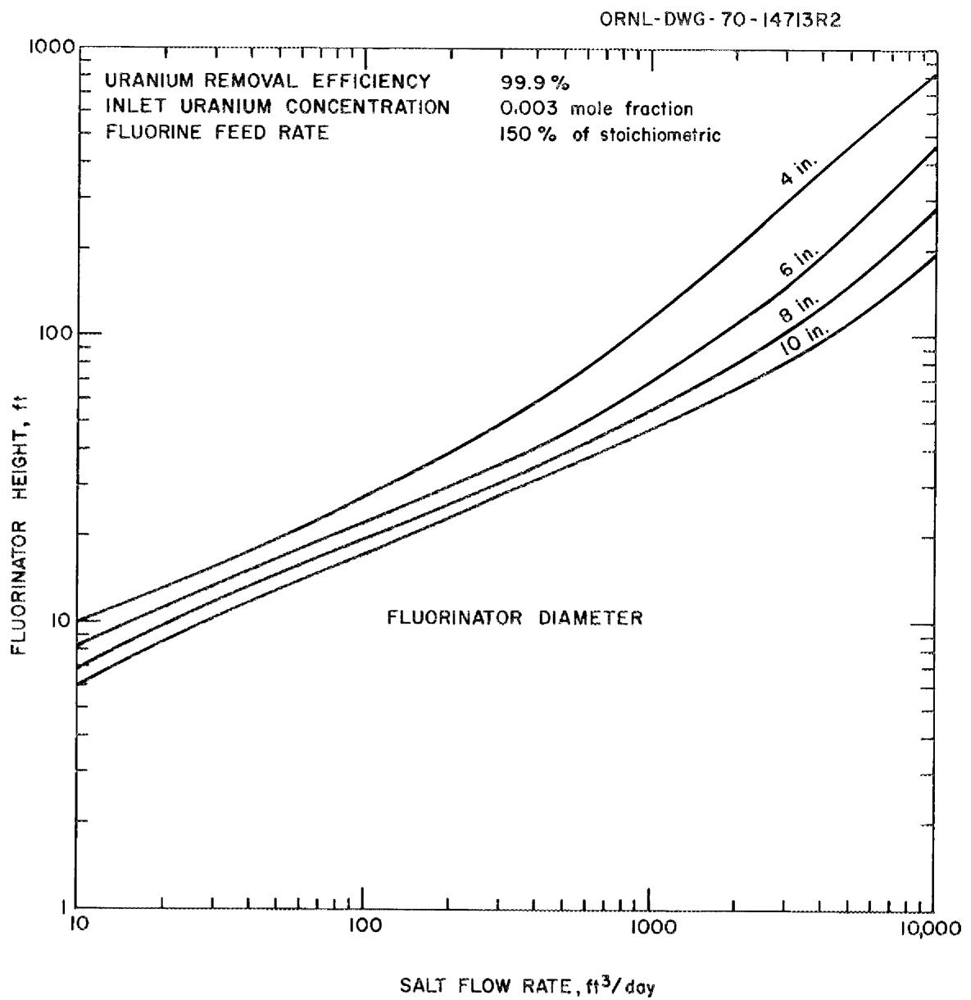  
Fig. 17. Variation of Calculated Fluorinator Height with Salt Flow Rate and Fluorinator Diameter for a Uranium Removal Efficiency of $99.9\%$ .

diameter of 10 in. and heights of 36 to 60 ft would be required. In this case, the fluorinator would be divided into several open-column fluorinators operating in series. If two columns were used, the required column heights would be less than half the height required for a single column since there would be no axial dispersion across the fluorinator inlets and outlets. As shown in Fig. 18, the required uranium removal efficiency for each column would be $96.8\%$ and column heights of 15 to 28 ft would be required for a 10-in.-diam fluorinator. The use of three columns, each of which must have a $90\%$ uranium removal efficiency, would reduce the total column height even further; heights of 8 to 17 ft would be required for a 10-in.-diam fluorinator in this case.

# 5. USE OF RADIO-FREQUENCY INDUCTION HEATING FOR FROZEN-WALL FLUORINATOR DEVELOPMENT STUDIES

J.R.Hightower，Jr. C.P.Tung

L. E. McNeese

Fluorination of molten salt for removal of uranium is required at several points in processes being considered for the isolation of protactinium and for the removal of rare earths. The fluorinators will be protected from corrosion by a layer of salt frozen on metal surfaces that will potentially contact both fluorine and molten salt. Although the separate aspects of such operations (continuous or batch fluorination, and frozen film formation) have been shown experimentally to be feasible, the testing of a fluorinator protected from corrosion by a frozen wall has been hampered by the lack of a corrosion-resistant means for generating heat in the molten salt. (The decay of fission products in the salt will constitute the heat source in a reactor processing plant.)

Radio-frequency induction heating appears to be a suitable method for providing heat in experimental work on fluorinator development, and its use is being studied. The heat would be generated in the molten salt

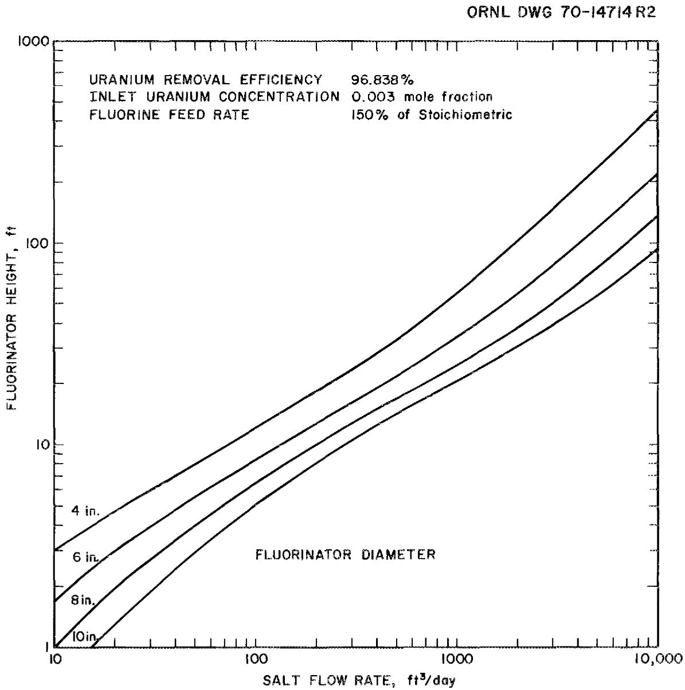  
Fig. 18. Variation of Calculated Fluorinator Height with Salt Flow Rate and Fluorinator Diameter for a Uranium Removal Efficiency of $96.838\%$ .

(a conductor) by eddy currents induced by an alternating magnetic field. The magnetic field would be generated by a coil not in contact with the molten salt. This method of generating heat in the salt has the disadvantage that heat would also be produced in the metal walls of the fluorinator, although this can be minimized by choosing a favorable geometry.

Two promising coil configurations (see Fig. 19) will be considered in the remainder of this section. In the first configuration (configuration I), the induction coil is located just inside the metal wall of the cylindrical fluorinator vessel and is embedded in a frozen salt film on the vessel wall. Heat is generated inside the coil by the magnetic field, and neither the coil nor the vessel wall would be in contact with molten salt and fluoride. In the second configuration (configuration II), the induction coil would be much smaller in diameter than the fluorinator vessel and would be located at the center of the fluorinator. A coolant would be passed through the induction coil in order to cover it with a layer of frozen salt. Heat would be generated in the molten salt (and in the vessel wall) by the magnetic field outside the coil. The second configuration requires a greater total heat generation rate than the first configuration since a larger area would be covered with frozen salt.

# 5.1 Mathematical Analysis

Initial work on the problem was directed toward a mathematical analysis of several coil configurations in order to assess the feasibility of rf heating and to identify important system parameters. Several configurations, including the two shown in Fig. 19, were examined. These include a configuration in which the induction coil was located outside the fluorinator vessel wall, which would be relatively thin to permit power to be transmitted through it. Since it appeared that most of the heat generation for systems having dimensions of interest would occur in the metal wall, this configuration was not considered further. Configuration I (see Fig. 19) is more amenable to mathematical analysis than configuration II, and expressions are available from standard texts on induction heating[22,23] for predicting coil performance.

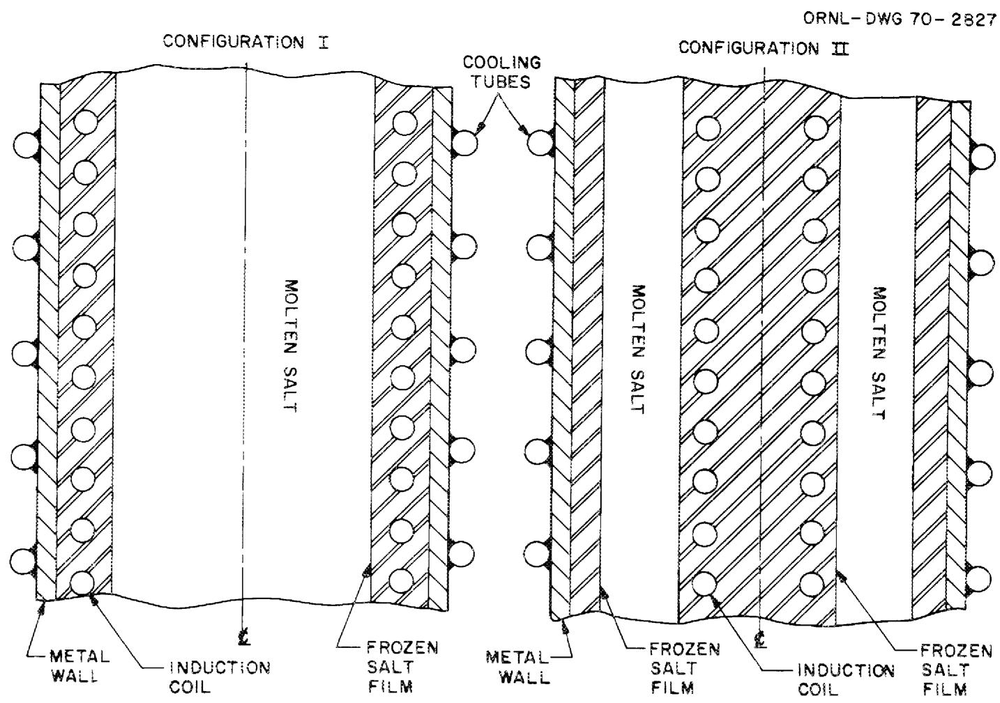  
Fig. 19. Induction Coil Configurations for Tests of Fluorinators Protected from Corrosion by a Frozen Wall.

Calculations were made for predicting the performance of two systems:

(1) a salt system having the approximate dimensions of an experimental frozen-wall fluorinator that will be built later, and   
(2) a system using sulfuric acid (which has properties similar to molten salt).

Rate of Heat Generation in Molten Salt. - The rate of heat generation in the molten-salt region of a frozen-wall fluorinator was approximated by an equation for the rate of heat generation in an infinitely long cylindrical charge inside an infinitely long coil. The heat generation rate per unit length of charge is:24

$$
P = 4 \pi^ {2} \sqrt [ 1 ]{2 / 1 0 ^ {9}} \sqrt [ 1 ]{\mu f n} n ^ {2} a i ^ {2} F, \tag {6}
$$

where

P = power generated in charge, W/cm, $\mu$ = permeability of charge, $f$ = frequency, Hz, $\eta$ = resistivity of the charge, $\Omega$ -cm, $n$ = coil spacing, turns/cm, $a$ = radius of charge, cm, $i$ = rms coil current, A.

The factor $F$ in Eq. (6) is defined by the following equation:

$$
F = \frac {\operatorname {b e r} (\Delta) \operatorname {b e r} ^ {\prime} (\Delta) + \operatorname {b e i} (\Delta) \operatorname {b e i} ^ {\prime} (\Delta)}{(\operatorname {b e r} (\Delta)) ^ {2} + (\operatorname {b e i} (\Delta)) ^ {2}}, \tag {7}
$$

where $\Delta$ is defined as $a\sqrt{\mu f} / 3558\sqrt{\eta}$ and $\text{ber}, \text{ber}', \text{bei}, \text{and} \text{bei}'$ are Bessel functions.

Heat Generation Rate in Fluorinator Wall. - No equations for calculating the heat generation rate in a cylindrical shell surrounding a cylindrical coil were found in the literature. Therefore, we estimated the heat generation rate in the fluorinator wall by assuming that the heat generation rate in the pipe just outside the coil was the same as that in a pipe just inside a coil; the intensity of the magnetic field was assumed to be the same at the surface adjacent to the coil in each case. For the high frequencies we expect to use (f >300 kHz), the penetration depths are very small and a metal pipe would be heated at essentially the same rate as a solid cylinder. For this case, the term F in Eq. (7) approaches the value of $\sqrt{2}/2$ , and the equation that approximates the rate of heat generation in the pipe is as follows:

$$
P = \left(4 \pi^ {2} / \sqrt {1 0 ^ {9}}\right) \sqrt {\mu_ {p} f n _ {p}} n ^ {2} R i ^ {2}, \tag {8}
$$

where

$$
P = \text {h e a t} \quad \text {g e n e r a t e d i n p i e}, W / c m,
$$

$$
u _ {p} = \text {p e r m e a b i l i t y o f p i e}
$$

$$
\eta_ {p} = \text {r e s i s t i v i t y o f p i e} \text {,} \Omega - c m,
$$

$$
\underset {p} {R} = \text {i n s i d e r a d i u s o f p i p e}, c m.
$$

Equation (8) will be used only to obtain a rough estimate of the heat generation rate in the pipe; the actual heat generation rate will be measured experimentally.

Resistance Losses in the Induction Coil. - The resistance of the induction coil is given by the following equation:25

$$
R _ {c} = 6 3. 2 k _ {r} \left(f \eta_ {c}\right) ^ {1 / 2} d _ {c} n ^ {2} x 1 0 ^ {- 8}, \tag {9}
$$

where

$$
\begin{array}{l} R _ {c} = \text {r e s i s t a n c e o f t h e c o i l}, \Omega \text {p e r c m o f a x i a l l e n g t h}, \\ k _ {r} = \text {c o r r e l a t i o n f a c t o r (a s s u m e d t o b e 1 . 5)}, \\ f = f r e q u e n c y, \mathrm {H z}, \\ \end{array}
$$

$\eta_{c} =$ resistivity of the coil, $\mu \Omega -cm,$

$\mathbf{d}_{\mathbf{c}} =$ diameter of the coil, in.,

$\mathbf{n} =$ coil spacing, turns/in.

The resistive losses in the coil are given, then, by:

$$
P _ {c} = i ^ {2} R _ {c} \left(\text {i n} W / c m\right). \tag {10}
$$

Conduction of Heat Through a Film of Frozen Salt. - It was assumed that all heat generated in the molten salt in the center of the fluorinator is transferred by conduction through the film of frozen salt on the fluorinator wall, which is maintained at a temperature below the liquidus temperature of the salt. The equation relating the heat transferred through the frozen film to the temperature difference, the dimensions of the film, and the properties of the frozen film is:

$$
P = \frac {2 \pi k _ {s} (T _ {i} - T _ {c})}{\ln (R / a)}, \tag {11}
$$

where

$\mathbb{P} =$ rate at which heat is transferred through the frozen film,

$\mathbf{k}_{\mathrm{s}} =$ thermal conductivity of the frozen film,

a = radius of the molten salt---frozen salt interface,

$R = a + t$ , where $t$ is the thickness of the frozen salt (R is assumed to be the inside radius of the coil),

$\mathrm{T_i} =$ the temperature of the solid-liquid interface, i.e., liquidus temperature of the salt,

$T_{c} =$ temperature in the frozen film at the outside of the coil.

# 5.2 Calculated Results for a Molten-Salt Fluorinator

The fluorinator system that was examined had the following features: The salt was $\mathrm{LiF - BeF_2 - ThF_4}$ (68-20-12 mole $\%$ ); the inside diameter of the 1/4-in.-thick vessel was 4.9 in.; the mean diameter of the induction coil was 3.9 in.; the frozen salt extended in from the wall, covering the coil and leaving a 1.9-in.-diam molten core; and the temperature difference across the frozen salt layer was $100^{\circ}\mathrm{C}$ . The metal was assumed to have the same electrical properties as Monel. The heat generation rate in the molten salt necessary to maintain this frozen salt layer was 63 W per centimeter of fluorinator length. The calculated induction current in the coil (at an assumed frequency of 500 kHz) necessary to produce this heat generation rate in the salt was 24.7 A. Using the assumption given previously, the calculated generation rate in the fluorinator vessel wall was 65 W/cm (about 1.05 times the heat generated in the salt). Removal of this amount of heat generated in the vessel wall, as well as that generated in the salt, would be practical. For a 5-ft-long fluorinator vessel, these calculations indicate that a 28-kW rf generator would be required. Similar calculations could not be made conveniently for configuration II.

# 5.3 Experimentally Measured Heat Generation Rates

In order to verify the values predicted for configuration I and to evaluate the performance of configuration II, we carried out experiments in which a 29 wt $\%$ $\mathrm{H}_2\mathrm{SO}_4$ solution was substituted for molten salt. Heat generation rates were measured in the acid and in a Monel pipe surrounding the acid. The acid was contained in a 2-liter graduated cylinder having an inside diameter of $3 - 1 / 4$ in. The pipe was a 6-in.-long section of 6-in. sched 40 Monel. The coil for the test with configuration I was 4 in. in inside diameter by 6 in. long and consisted of 20 turns of $1 / 4-$ in.-diam copper tubing; it was placed around the acid container, and the 6-in. pipe was placed around the coil. The coil for configuration II was $1 - 1 / 4$ in. in outside diameter by 6 in. long and consisted of 20 turns of $1 / 4-$ in.-diam copper tubing. It was placed in a $1 - 3 / 8-$ in.-OD glass tube,

which was immersed in the center of the acid. The heat generation rates were obtained by measuring the rates of temperature increase in the acid and in the pipe.

In three runs with configuration I, the ratio of heat generated in the pipe to that generated in the acid averaged 1.3. The frequency in the test was $350\mathrm{kHz}$ , and the conductivity of the acid was about 0.75 mho/cm. The heat generation rate in the acid was about 19 W per centimeter of coil length; this was kept low to prevent the acid from boiling. The predicted value for the ratio of heat generated in the pipe to that generated in the acid was 0.58 (this value was calculated by using the properties, conditions, and dimensions of the experimental system, and by making the assumptions that were outlined in the previous section), which is approximately one-half the measured value. Deviations in heat generation rate of this magnitude between the predicted and measured values are not surprising since the method used for calculating heat generation in the pipe was an approximate one.

In five runs with configuration II, the ratio of heat generated in the pipe to that generated in the acid had an average value of 0.069. The frequency in this test was $440\mathrm{kHz}$ . The heat generation rate in the acid, using configuration II, was about 16 W per centimeter of coil length, even though a higher plate voltage was used than in the experiments with configuration I. This indicates that the coupling of the magnetic field with the acid was poorer with configuration II than with configuration I; such a result is to be expected since the magnetic field strength outside a coil is smaller than the strength inside a coil. However, it means that, even though only a small amount of heat was generated in the pipe wall with configuration II, the efficiency of heating the salt could still be much less than if configuration I were used, because the heat generation in the coil itself might be large compared with the heat generation in the salt. This aspect will be explored in future experiments when means to measure the coil current have been obtained.

In general, results of these preliminary experiments and calculations encourage us to believe that inductive heating is a reasonable method for supplying heat to an experiment designed to study a fluorinator containing a frozen wall but no internal heat generation resulting from fission product decay. Disagreement between the measured and the calculated values of relative heat generation rates indicates that the design of an experimental fluorinator system must rely heavily on empirically obtained relationships. An experimental program to obtain this information is under way.

# 6. MSRE DISTILLATION EXPERIMENT

J.R.Hightower，Jr. L.E.McNeese

Effective relative volatilities, with respect to LiF, of $\mathrm{BeF}_2$ , $\mathrm{ZrF}_4$ , and of the fluorides of $95\mathrm{Zr}$ , $144\mathrm{Ce}$ , $147\mathrm{Pm}$ , $155\mathrm{Eu}$ , $91\mathrm{Y}$ , $90\mathrm{Sr}$ , $89\mathrm{Sr}$ , and $137\mathrm{Cs}$ have been calculated from condensate analyses made during the MSRE Distillation Experiment. These results, which have been discussed previously, show that all of the components except $\mathrm{BeF}_2$ and $\mathrm{ZrF}_4$ had effective relative volatilities that deviated (drastically in some cases) from values predicted from tests with equilibrium systems. Possible causes for the discrepancies include: (1) entrainment of droplets of still-pot liquid in the vapor, (2) concentration gradients in the still pot, and (3) contamination of samples during their preparation for radiochemical analysis.

Entrainment was suspected for a number of reasons. For example, entrainment of only 0.023 mole of liquid per mole of vapor would account for the high relative volatilities calculated for the slightly volatile fission products $^{144}\mathrm{Ce},$ $^{147}\mathrm{Pm},$ $^{91}\mathrm{Y},$ and $^{90}\mathrm{Sr}$ . Entrainment rates of this order would not be reflected in the effective relative volatilities of more volatile materials ( $\alpha \geq 1$ ). The high correlation of the scatter of the calculated effective relative volatilities of different slightly volatile fission products is consistent with the hypothesis that entrainment occurred.

Since entrainment was not apparent in the nonradioactive operation of the still,[27] reasons for entrainment in the radioactive operation were sought to support the hypothesis. Evidence of a salt mist above the salt in the pump bowl at the MSRE and above salt samples removed from the MSRE has been reported.[28,29] Further, studies have indicated that these mists are present over radioactive salt mixtures but not over nonradioactive mixtures; however, examination of data from these studies showed that entrainment rates large enough to explain the results of the MSRE Distillation Experiment could be obtained only by assuming that the concentration of salt in the gas space above the salt during this experiment was equal to that observed above salt in the pump bowl at the MSRE. If the rate at which the mist is formed decreases as the power density in the liquid decreases, the concentration of salt in the mist should also decrease as the power density in the liquid decreases. Since the salt used in the MSRE Distillation Experiment had a much lower power density (400-day decay period for distillation feed as compared with less than 30-day decay period for salt samples tested for mist formation) than salt samples from the MSRE, it seems unlikely that the concentration of salt in the gas above the salt would have been high enough to explain the high relative volatilities for the slightly volatile fission products. In addition to the argument against the entrainment hypothesis given above, not all discrepancies would be explained by it. For example, it would not account for the variations in the $\mathrm{Sr} / \mathrm{Sr}$ activity ratio and for the low value for the effective volatility of $^{137}\mathrm{Cs}$ .

Concentration polarization would cause the effective relative volatilities of the slightly volatile materials to be greater than the true relative volatilities. As the more-volatile materials vaporized from the surface of the liquid, the slightly volatile materials would be left behind on the surface at a higher concentration than in the liquid just below the surface. The concentration of these slightly volatile materials in the vapor would then increase since further vaporization would occur from a liquid with a higher surface concentration of slightly volatile materials. Since effective relative volatilities were based on average

concentrations in the still pot, the concentration in the vapor would be higher than that corresponding to the average concentration in the liquid; also, the calculated effective volatility would be higher than the true relative volatility. Concentration polarization would cause the effective relative volatility to be lower than the actual relative volatility in the case of a component whose relative volatility is greater than 1.

The extent to which concentration polarization affects the effective relative volatility of a particular component depends on the dimensionless group D/vL, which qualitatively represents the ratio of the rate of diffusion of a particular component from the vapor-liquid interface into the bulk of the still-pot liquid to the rate at which this material is transferred by convection to the interface by liquid moving toward the vaporization surface. In this ratio, D is the effective diffusivity of the component of interest, v is the velocity of liquid moving toward the interface, and L is the distance between the interface and the point where the feed is introduced.

The occurrence of concentration polarization is suggested by the sharp increase, at the beginning of the run in the effective relative volatilities of $^{144}\mathrm{Ce}$ , $^{147}\mathrm{Pm}$ , $^{155}\mathrm{Eu}$ , and, possibly, of $^{91}\mathrm{Y}$ and $^{90}\mathrm{Sr}$ . This increase would correspond to the formation of a concentration gradient in the still-pot liquid. The effective diffusivities of $\mathrm{NdF}_3$ in the still pot, calculated from results of the nonradioactive experiments, ranged from $1.4 \times 10^{-4}$ to $16 \times 10^{-4}$ cm $^2$ /sec and form the basis for estimating the magnitude of the concentration polarization effect in the radioactive operation. During the semicontinuous operation at the MSRE, the liquid velocity resulting from vaporization averaged 2.2 x $10^{-4}$ cm/sec; the depth of liquid above the inlet was about 9.4 cm. If one assumes that the effective diffusivities of the fission products in the still pot during the MSRE Distillation Experiment were in the same range as they were during the nonradioactive tests, the observed relative volatilities of the slightly volatile materials would be only 2.0 to 18 times the true relative volatility and the observed relative volatility of $^{137}\mathrm{Cs}$ would be 0.011 to 0.021 times its true value (as-

suming, in each case, that the true relative volatilities are those given in refs. 27 and 28). Although concentration polarization may have been significant in the work with radioactive salt, the effect was not great enough to account for the discrepancies between the observed relative volatilities and what we consider to be the true values. Also concentration polarization would not explain the variation in the $^{89}\mathrm{Sr}/^{90}\mathrm{Sr}$ activity ratio between samples of condensate.

The possibility that the condensate samples became contaminated while they were being prepared for radioactive analysis is suggested by the wide variation in the value of the $^{89}\mathrm{Sr}/^{90}\mathrm{Sr}$ activity ratio. Although routine precautions against contamination were taken in the hot cells, where the capsules were cut open, no special procedures were used and the manipulators used to handle MSRE salt samples were also used to open the condensate samples. If it is assumed that the source of the contamination was the last salt sample taken from the MSRE before the distillation samples were submitted, only $10^{-6}$ to $10^{-3}$ g of salt per gram of sample would be required to yield the observed values of the $^{89}\mathrm{Sr}$ and $^{90}\mathrm{Sr}$ activities. Contamination from such small quantities of material would be extremely difficult to prevent.

Other observations explained by assuming that the samples were contaminated are the high relative volatilities of the slightly volatile fission products and the close correlation between the variations of calculated relative volatilities of different fission products. However, the low relative volatility for $^{137}\mathrm{Cs}$ is not explained by this hypothesis.

We conclude that, although several factors may be involved, the discrepancy between the effective relative volatilities of the slightly volatile materials measured in this experiment and the values measured previously is primarily the result of contamination of the condensate samples by minute quantities of other MSRE salt samples in the hot cells.

# 7. DEVELOPMENT OF THE METAL TRANSFER PROCESS

E. L. Youngblood W. F. Schaffer, Jr.

L.E.McNeese E.L.Nicholson

J. R. Hightower, Jr.

Rare earths have been found to distribute selectively into molten LiCl from bismuth solutions containing rare earths and thorium, and an improved rare-earth removal process based on this observation has been devised. Work that will demonstrate all phases of the improved process, known as the metal transfer process, is under way.

# 7.1 Equipment and Experimental Procedure

Equipment has been fabricated for study and demonstration of the metal transfer process for selectively removing rare earths from single-fluid MSBR fuel salt. The first series of experiments will be carried out in a 6-in.-diam compartmented vessel (Fig. 20) fabricated from carbon steel. The vessel is 24 in. high; and the internal partition, which divides the vessel into two equal-volume compartments, terminates 1/2 in. above the bottom of the vessel.

During each experiment, the vessel will contain a 2-in. depth of bismuth (i.e., $\sim$ 0.8 liter) that is saturated with thorium at the operating temperature of $640^{\circ}\mathrm{C}$ and two salt phases having depths of 3 to 4 in. (0.7 to 1.0 liter each). One salt phase will be MSBR fuel carrier salt (72-16-12 mole $\%$ LiF-BeF $_2$ -ThF $_4$ ) initially containing 0.3 mole $\%$ LaF $_3$ and about 5 mCi of $^{147}\mathrm{NdF}_3$ ; the other salt phase will be LiCl. The LiCl compartment also contains an electrically insulated cup containing a Li-Bi solution and a pump for circulating LiCl through the cup. The cup will contain about $200\mathrm{cm}^3$ of Bi-Li solution having a lithium concentration of 0.40 mole fraction. Provision is made for agitating the liquid phases and for sampling all phases. During operation, La and Nd will be transferred from the fuel salt to the LiCl by circulation of the Th-Bi solution that will also contain the rare earths. Fractions of the La, Nd, and Th will then be extracted from the LiCl by contacting the LiCl with the Li-Bi solution.

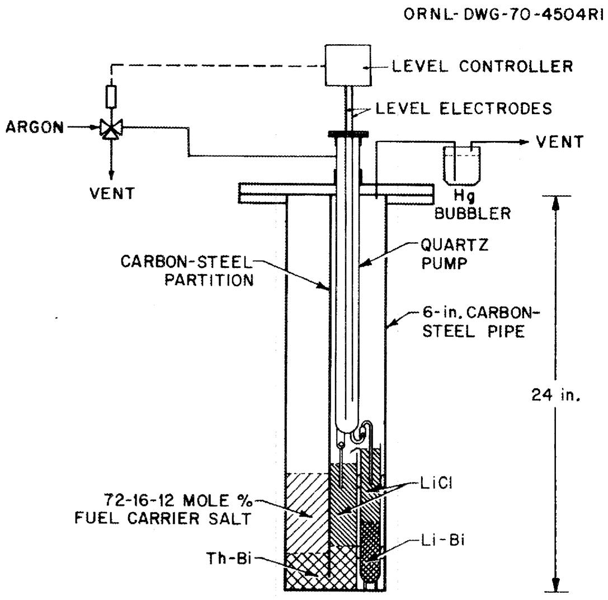  
Fig. 20. Carbon-Steel Vessel for Use in the Metal Transfer Experiment.

To begin an experiment, the three phases in contact (fuel salt, bismuth, and LiCl) will be allowed to approach equilibrium and samples of the phases will be taken. The LiCl will then be pumped through the reservoir containing the Li-Bi solution at a flow rate of about $25~\mathrm{cm}^3/$ min in order to remove the rare earths and thorium from the LiCl. The LiCl will overflow the Li-Bi reservoir and return to the initial LiCl volume. After a period of about 3 hr, circulation of the LiCl will be stopped and the system will be allowed to approach equilibrium. Samples of the phases will then be taken. It is estimated that 5 to $10\%$ of the lanthanum initially present in the fuel salt will have been transferred to the Li-Bi solution at this point. The above sequence of operations will then be repeated until the desired fraction of the lanthanum has been transferred to the Li-Bi solution (50 to $90\%$ ). The ${}^{147}\mathrm{Nd}$ tracer will be used to give a rapid indication of the rate at which the rare earths are transferred during the experiment.

# 7.2 Development and Testing of a Pump for Circulating LiCl

Several pumps for circulating the LiCl have been fabricated and tested for use in the experiment. The first pump, made from 1-l/2-in.-diam quartz tubing, was tested in a 4-in.-diam quartz vessel, as shown in Fig. 21. The pump was driven by varying the difference in argon pressure between the inside and the outside of the pump chamber. The direction of flow was determined by weighted quartz check valves on the pump inlet and outlet.

In operation, the flow of argon was controlled by solenoid valves that were actuated by signals from two level probes in the pump tube. During the first part of a pump cycle, the vessel was pressurized with argon, which forced liquid into the pump chamber through the pump inlet until the liquid contacted the high-level probe (Fig. 21). When contact with the high-level probe was made, the solenoid valves actuated to vent the test vessel and pressurize the pump chamber; this forced liquid out through the pump outlet. When the level of the liquid in the pump chamber dropped below the low-level probe, the solenoid valves were again actuated and the cycle was repeated.

ORNL PHOTO 98323

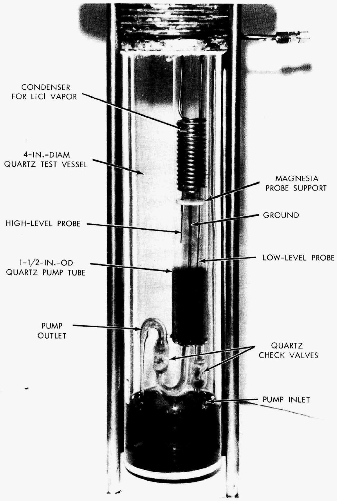  
Fig. 21. Pump for Circulating LiCl, Installed in 4-in.-diam Quartz Test Vessel.

Figure 21 shows the pump in operation with a colored aqueous solution of LiCl. During tests with this mixture, we observed that the quartz check valves had a tendency to stick. Before testing the pump with molten LiCl, we added supports to the weighted quartz check valves (which were teardrop-shaped) to prevent them from tipping over. This modification was not entirely successful; the valves continued to stick, although not as frequently.

After modification, the quartz pump was tested with molten LiCl. The 4-in.-diam quartz vessel containing the pump was loaded with $800\mathrm{g}$ of LiCl that had not been previously dried, and the system was heated to $650^{\circ}\mathrm{C}$ in order to melt the LiCl and remove water from the salt. The pump and the gas space of the vessel were purged with argon during this period. During the heatup period, the presence of a liquid having a $\mathsf{pH}$ of about 2 was observed on the vessel walls. When the pump was lowered into operating position, we found that the level probes had shorted; this shorting was probably caused by an accumulation of liquid on the magnesia probe support. The pump was then withdrawn from the molten LiCl, and the system was cooled to room temperature in order to recover the pump. Examination revealed that the quartz vessel and pump had sustained severe damage in regions contacted by the vapor; however, the quartz surfaces in contact with molten LiCl showed no sign of attack.

Two quartz pumps, similar to the first but having sapphire check valves, were then fabricated and tested with molten LiCl at $650^{\circ}\mathrm{C}$ . In the test involving the second pump, the LiCl was air-dried at $225^{\circ}\mathrm{C}$ . The pump operated successfully for a few hours, but difficulties with short circuits in the level probes prevented continued operation. The quartz components of the system showed evidences of gradual deterioration. After 7 days of exposure, the quartz was badly etched and some areas appeared to be ready to disintegrate. However, the sapphire balls used as the check valves were in good condition. The electrical short circuits were apparently caused by a film of LiCl covering the insulators used to separate the electrical probes.

The third quartz pump was tested in LiCl that had previously been purified by contact with a Th-Bi solution at $650^{\circ}\mathrm{C}$ to remove oxides. A molybdenum cup containing the Th-Bi solution was placed in the bottom of

the pump test vessel to further purify the LiCl. This pump operated satisfactorily at rates of 30 to $125\mathrm{ml / min}$ for 16 days, after which it was disassembled for inspection. At the time of shutdown, the pump was still operating satisfactorily; however, inspection of the pump and the quartz vessel showed evidence of considerable attack of the quartz in the hot vapor region. The quartz components that were submerged in the liquid, the molybdenum components, the carbon-steel thermowell, and the sapphire balls used as check valves all appeared to be in reasonably good condition. Discussions with quartz manufacturers and with those who have had experience with quartz equipment revealed that devitrification (i.e., a change in the crystal structure of the quartz) is a difficulty commonly encountered with this material at high temperature. The rate of devitrification is accelerated by the presence of contaminants (such as LiCl) on the surface of the quartz. The full effect of devitrification is not apparent until the quartz has cooled to room temperature. This appears to be the type of attack in our experiments. When purified LiCl is used, the rate of devitrification appears to be sufficiently low to permit a quartz pump to be used for the metal transfer experiment.

A pump using captive bismuth pools as check valves has been fabricated of low-carbon steel. This pump will be tested with molten LiCl in the near future.

8. ELECTROLYTIC CELL DEVELOPMENT: STATIC CELL EXPERIMENTS

J.R.Hightower，Jr. M.S.Lin

L. E. McNeese

We repeated an earlier experiment, $^{30}$ which was carried out in an all-metal cell to determine whether the presence of quartz in static-cell tests was involved in the formation of black material in the salt. The cell vessel was fabricated from an 18-in. section of mild-steel, sched 40 pipe. One electrode was a 15-kg pool of bismuth; the other was a 1/4-in.-diam mild-steel rod located at the center of the vessel and placed 1/2 to 1 in. above the bismuth pool. Observations in the salt phase were made using the bismuth surface as a mirror to reflect light to a sight glass in the top flange of the vessel. The electrolyte, a mixture of LiF-BeF $_2$ (66-34 mole %),

filled the vessel to a level about 3 in. above the bismuth surface. The bismuth had been sparged with $\mathsf{H}_2$ at $600^{\circ}\mathsf{C}$ to remove oxides. The cell vessel was electrically isolated from the hood and from the gas and water supply lines in order that the bismuth pool (and hence the cell vessel) could be operated in an anodic manner; the resistance between the cell and ground was $2\times 10^{6}\Omega$ .

A dc voltage of $2.3\mathrm{V}$ impressed across the electrodes for about 1 min, with the iron rod located $1/2$ in. above the bismuth (the iron rod was cathodic), produced a current of about $16.8\mathrm{A}$ ; when the electrode was raised to 1 in. above the bismuth surface for about 2 min, the current decreased to $15.6\mathrm{A}$ . An increase in voltage to $2.5\mathrm{V}$ produced a current that increased from $19.0\mathrm{A}$ to $21.8\mathrm{A}$ over a period of $7.5\mathrm{min}$ ; the cathode current density during this time was about 1.8 to $2.0\mathrm{A/cm}^2$ . The total charge transferred during the run was $12,400\mathrm{C}$ . The cell temperature was $550^{\circ}\mathrm{C}$ . During the passage of electric current, there was no sign of the dark material that had previously been seen; during the cell operation, density gradient patterns were visible, indicating that convective mixing was taking place in the salt phase. After the operation had been completed, the salt appeared to have a more distinct green color than before. Although the salt was slightly turbid, it was still quite transparent.

During the operation of the cell, material was deposited on the iron cathode. Some of the material was metallic and was probably not as dense as the salt since it formed near the salt-gas interface and tended to spread out over the surface of the salt. The remainder of the material was black and nonmetallic, and formed more uniformly over the submerged part of the steel electrode. The deposited material (16.5 g) had the composition 9.0 wt % Be, 17.0 wt % Li, and 71.8 wt % F, and contained traces of Fe and Bi. The formation of such a deposit is explained as follows. As $\mathrm{BeF}_2$ was reduced at the cathode during the cell operation, the concentration of $\mathrm{BeF}_2$ in the salt in the vicinity of the cathode decreased. At the operating temperature of $550^{\circ}\mathrm{C}$ , LiF began to crystallize when the $\mathrm{BeF}_2$ concentration reached 30 mole %. Further reduction of $\mathrm{BeF}_2$ was accompanied by precipitation of solid LiF in the vicinity of the cathode. When the cathode was removed from the cell, some of the $\mathrm{LiF - BeF}_2$ mixture was carried with the reduced beryllium.

If one assumes that the Li was present as LiF and that the remaining F was associated with Be as $\mathrm{BeF}_2$ , the cathodic deposit contained about $0.5\mathrm{g}$ of Be metal (33% of the Be present in the deposit) or 0.11 gram equivalent of Be. Since 0.129 electrical equivalent was passed, this represents a current efficiency of about $85\%$ for beryllium reduction. The current efficiency was probably actually closer to $100\%$ ; however, the additional beryllium was not recovered with the cathodic deposit but floated away from the cathode on the surface of the salt. Some particulate material was noted on the salt surface when the cell was dismantled.

The fact that the salt in this test remained transparent indicates that quartz may be important in the formation of black material in the salt. However, the lack of a bismuth cathode into which lithium could have been reduced may have resulted in a system too different from previous cells to allow us to draw firm conclusions.

# 9. STUDY OF THE PURIFICATION OF SALT BY CONTINUOUS METHODS

R.B.Lindauer L.E.McNeese

To date, the molten salt required for development work as well as for the MSRE has been purified from harmful contaminants (mainly sulfur, oxygen, and iron fluoride) by a batch process. The cost of salt from this process (containing natural lithium) has averaged about $1600 / ft^3$ ; less than $40\%$ of this cost is due to the cost of materials. In April 1968, a commercial vendor submitted a bid of $\$2660 / ft^3$ on a $280 - ft^3$ quantity of salt. It is believed that the labor costs associated with salt purification can be reduced considerably by use of a continuous process for the most time-consuming operation, which is the hydrogen reduction of iron fluoride. Although the removal of sulfur and oxygen by the batch process is fairly rapid, there would probably be advantages to performing this operation in continuous equipment also.

A packed column in which molten salt and gas can be contacted countercurrently is being installed (cell 4B, second floor of Bldg. 4505) to obtain data that will provide the basis for the design of a full-scale continuous salt purification facility. Flooding studies will be made using argon and hydrogen with two different salt mixtures: LiF-BeF $_2$ (66-3 $^{14}$ mole $\%$ )

and $\mathrm{LiF - BeF}_2\text{-ThF}_4$ (72-16-12 mole%). Studies of iron reduction and oxide removal will also be made with both salts. Since beryllium fluoride with a low sulfur content is now available, no sulfur removal work is planned.

# 9.1 Previous Work on Salt Purification

All of the molten salt used in the molten-salt reactor projects at ORNL up to the present time has been prepared in small $(2\text{-ft}^3)$ batch equipment. After the raw materials have been blended and melted, the sulfides and oxides are removed simultaneously by a $\mathsf{H}_2$ -HF sparge at $600^{\circ}\mathsf{C}$ . The temperature of the salt is then increased to about $700^{\circ}\mathsf{C}$ , and the fluorides of Fe and Ni are reduced by contacting the salt with hydrogen. Next, the salt is passed through a sintered nickel filter. Iron fluoride reduction, the most time-consuming of the various steps, requires about four days of contacting with hydrogen for a $2\text{-ft}^3$ batch. Completion of reduction of the metal fluorides is determined by titration of a sample of the effluent gas for HF content.

Consideration of continuous methods for use in the purification of molten salt mixtures began in 1967 with a preliminary conceptual design of a semicontinuous pilot plant by the MIT Practice School. $^{32}$ In a tentative design that was proposed for a $0.25\text{-ft}^{3}/\text{hr}$ pilot plant, packed columns were suggested for the hydrofluorination and reduction steps. A detailed design of the plant was not possible because of the lack of rate data for the steps involved. During the following year, two series of experiments were made by the MIT Practice School $^{33,34}$ for studying the reduction of iron fluoride in molten-salt mixtures by countercurrent contact with hydrogen in a packed column. Although only a few runs were made and equipment performance was not completely satisfactory, significant reduction of the iron fluoride was shown. The results suggested that the reduction rate is first order with respect to iron fluoride concentration and that the rate is controlled by the amount of interfacial area that is present between the salt and the hydrogen. It was recommended that additional studies be made to establish the rate-controlling mechanism more firmly. It was also suggested that (1) more effective purification of the hydrogen is necessary, (2) future runs should be made with packing

materials other than York Demister mesh, and (3) the column should be operated close to the loading or flooding point.

# 9.2 Experimental Equipment

A simplified flowsheet for the present experimental equipment is shown in Fig. 22. Molten salt is fed to the column by pressurizing the feed tank with argon at a controlled rate. The salt flow rate is set by the argon flow rate and is determined by the rate of depletion of salt from the feed tank. The hydrogen is preheated before entering the column by a 1.5-in.-diam, 24-in.-long heater filled with 1/4-in.-diam nickel spheres. The salt from the column flows through a gas-seal loop and a salt filter consisting of a removable 2.75 by 12-in. nickel Feltmetal fiber metal cartridge with a mean pore size of $50\mu$ . The salt passes through a flowing stream sampler before entering the receiver tank. The gas stream leaving the column can be throttled if necessary to depress the salt-gas interface to a point below the bottom of the column. A sample of the gas stream can be withdrawn for continuous determination of the $\mathrm{H}_2\mathrm{O}$ and HF contents. The stream then passes through a NaF trap and an absolute filter.

Packed Column. - The column was fabricated from 1.25-in.-diam low-carbon nickel pipe and can be operated at temperatures up to $750^{\circ}\mathrm{C}$ . The packed section is 81 in. long and contains $1/4 \times 1/4 \times 1/16$ -in. nickel Raschig ring packing. There are deentrainment sections of 3-in.-diam pipe at each end, and a 2-ft-long section of $1/2$ -in.-diam pipe below the column for deentrainment of hydrogen in case the interface is depressed by a high pressure drop through the column. A differential-pressure transmitter having a range of 0 to 50 in. $\mathsf{H}_2\mathsf{O}$ is connected to the gas inlet and outlet lines to provide data on liquid holdup and flooding. In the absence of gas flow through the column, the salt-gas interface is located 3.4 in. above the hydrogen inlet; the interface can be depressed below the inlet by increasing the pressure at the top of the column or by an increase in the pressure drop across the column. The column is heated by resistance heaters having a total heating capacity of $3\mathrm{kW}$ .

Salt Feed and Receiver Tanks. - The feed and receiver tanks have, in each case, an inside diameter of 10.25 in., a height of 15 in., and a volume of 21 liters. The l/4-in.-thick walls and the l-in.-thick flat ends are

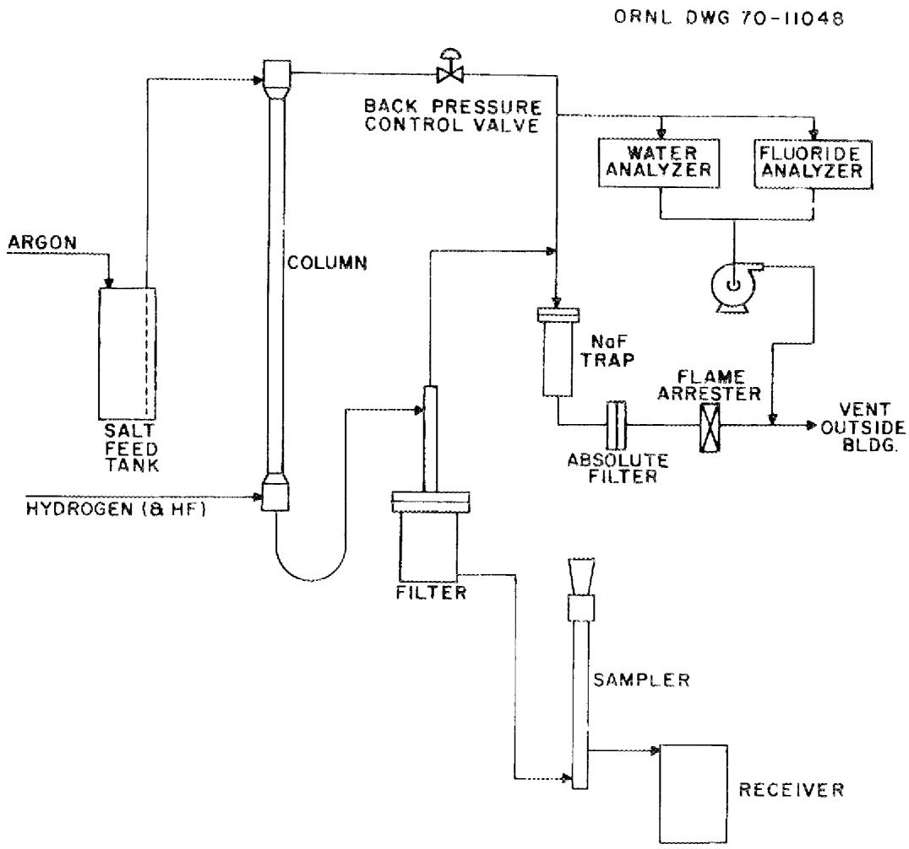  
Fig. 22. Simplified Process Flowsheet for Molten-Salt Purification Studies.

made of low-carbon nickel. These process vessels require approval for use as pressure vessels since their diameters are greater than 5 in. and the operating pressure is greater than 5 psig. (The vessels have been approved by the ORNL Pressure Vessel Committee for use at 25 psig and $650^{\circ}\mathrm{C}$ .) Heaters on the column feed line are used to heat the salt to a temperature of 700 to $750^{\circ}\mathrm{C}$ before it enters the column. Pressure relief valves on the argon and hydrogen supply systems are used to limit the maximum pressure to 25 psig. The tanks are heated by electrical resistance heaters equipped with temperature controllers to permit unattended heatup. Each tank has a bubble-type liquid-level instrument and both well- and surface-mounted thermocouples.

Salt Samplers. - Samplers are provided on the salt feed tank and in the line exiting from the salt filter. These samplers consist of a ball valve through which a sample capsule can be lowered into the liquid. The capsule is 3/16 in. ID and 1.5 in. long, and has a $25\mu$ metal fiber filter attached to the bottom. Vacuum is applied through a capillary tube attached to the top in order to obtain a filtered salt sample.

Off-Gas Analyzers. - A sample of the column off-gas stream can be passed through a water and/or a hydrogen fluoride analyzer at the rate of about $5\mathrm{cm}^3/\mathrm{min}$ . Flow through these instruments is obtained by a small "Dyna-Vac" gas pump. The water analyzer is the same instrument that was used in the MSRE Fuel Processing Facility.[35] Hydrogen fluoride is removed from the diluted sample by a sodium fluoride trap before passing through an electrolytic moisture cell. A reference leg with a similar trap and cell provides a compensated system with a single readout. The instrument is quite sensitive, and the injection of gas containing 250 ppm of water produces a rapid response.

The hydrogen fluoride monitor36 has a separate sample diluter with a heated capillary tube that withdraws a $5\mathrm{-cm}^3$ sample each minute; the sample is diluted with argon to produce a flow rate of $1000\mathrm{cm}^3/\mathrm{min}$ . The diluted sample is scrubbed with an acetic acid solution in the monitor, and the solution is analyzed by use of an aluminum-platinum electrolysis cell.

# 9.3 Gas Supply and Purification Systems

Argon. - Argon is supplied to a purification system from a six-cylinder manifold. Oxygen is removed by a 6-in.-diam, 24-in.-high trap charged with Dow-Q-1 (copper-coated aluminum), which has a total oxygen capacity of 7 ml (STP) per gram of packing. The oxygen capacity at 100 times the maximum argon flow rate expected (maximum expected rate, 6 liters/min) is 1 ml of oxygen per gram of absorbent, with a removal efficiency of $98\%$ . The expected oxygen concentration in the unpurified argon is about 10 ppm; hence, the purification system has an expected life of at least 4 months and should reduce the oxygen concentration in the purified gas to about 0.02 ppm. The oxygen content of the argon is measured by a Teledyne Model 306 W Oxygen Trace Analyzer, which uses a wet galvanic cell with silver-lead electrodes. The analyzer can be used for determining the oxygen concentration in either the purified or unpurified argon.

Water is removed from the argon by one of two Molecular Sieve traps that are arranged in parallel to allow operation during regeneration of one of the traps. The traps consist of a 42-in.-long packed section contained in the annulus between a 5-in.-diam pipe and a 2-in.-diam pipe that surrounds the heaters used for regeneration of the traps. Each trap contains about $0.4\mathrm{ft}^3$ of type 4A Molecular Sieve and can reduce the water concentration in a 6-liter/min argon stream from 100 ppm to 1 ppm for a period of 300 days. The water content of the argon is measured before and after purification by a Panametrics model 1000 hygrometer, which uses an aluminum oxide sensor placed directly in the flowing gas stream.

Hydrogen. - Hydrogen is supplied to one of two purification systems from a four-cylinder manifold. One purification system, consisting of a Serfass Hydrogen Purifier (palladium membrane), will provide hydrogen at flow rates up to 18 liters/min. In the other purification system, which is used for higher flow rates, the hydrogen is passed through a Deoxo unit, where oxygen is converted to water, and a Molecular Sieve trap with a capacity similar to that of the trap on the argon supply. The Deoxo unit has a diameter of 2.5 in., a length of 12.5 in., and a rated maximum capacity of 50 liters of hydrogen (maximum oxygen content, $3\%$ ) per minute.

Hydrogen Fluoride. - Hydrogen fluoride is vaporized from a tank having a 35-liter working volume. The tank is heated in a water bath, and

the pressure in the tank is set by controlling the bath temperature. The vaporized HF flows through a cubicle, maintained at $100^{\circ}\mathrm{C}$ , that contains a pressure transmitter, an HF flow control valve, four capillary tubes and a differential-pressure transmitter for determining HF flow rate, and a Hastings mass flowmeter. The Hastings flowmeter has a maximum flow rate of $1000~\mathrm{cm}^3/\mathrm{min}$ , while the capillaries have maximum flow rates of 250 to $2500~\mathrm{cm}^3/\mathrm{min}$ . The flow of HF can be terminated from three different locations in the operating area in case of an emergency.

Sulfur is removed from the vaporized HF by passing it through a 2-in.-diam pipe packed with nickel wool. An 18-in.-long section of the pipe contains tightly compressed wool and is heated to $650^{\circ}\mathrm{C}$ . A 24-in.-long section of nickel wool located downstream of the heated section is used to remove particulates from the gaseous HF.

# 9.4 Installation of Equipment and Initial Checkout

The equipment (shown in Figs. 23-25 before addition of thermal insulation) was mounted in a 30 in. x 30 in. x 13-ft-high frame for installation in cell 4B on the second floor of Bldg. 4505. Instruments for measuring the liquid levels in the salt feed and receiver tanks, the pressure at the top of the column and above the salt filter, and the differential pressure across the column are also located in the cell. In addition, the cell contains off-gas filters, in-line instruments for measuring the HF and the $\mathrm{H}_2\mathrm{O}$ contents of the off-gas stream from the column, and a sodium fluoride trap for disposal of excess HF. The equipment is operated from the area just outside the cell on the second floor, where the rotameters are located for controlling the hydrogen flow rate and the argon flow rates for purges and pressurization of the salt feed tank. The panelboard is shown in Fig. 26. A separate panelboard, shown in Fig. 27, contains heater controllers for the equipment, as well as the recorders and indicators for temperature, liquid level, and pressure.

After completion of the piping but prior to application of insulation to the system, the equipment was leak tested at 15 psig and room temperature, using helium and a thermal conductivity leak detector capable of detecting a leak rate of less than $0.001\mathrm{cm}^3/\mathrm{sec}$ . The leak rate for the final system was about $0.07\mathrm{cm}^3/\mathrm{sec}$ after all detectable leaks had been repaired.

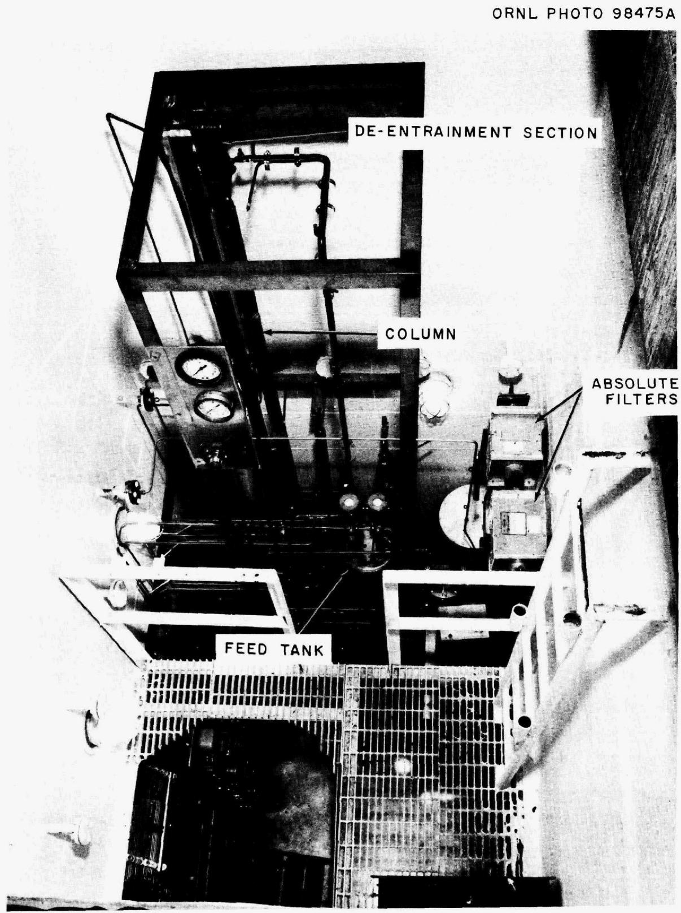  
Fig. 23. Top View of Salt Purification Equipment Before Addition of Thermal Insulation.

ORNL PHOTO 98473A

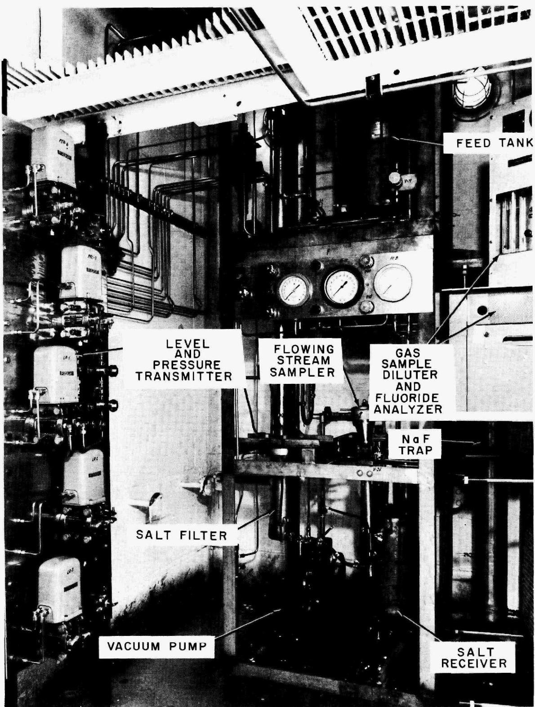  
Fig. 24. Lower View of Salt Purification Equipment Before Addition of Thermal Insulation.

ORNL PHOTO 98476A

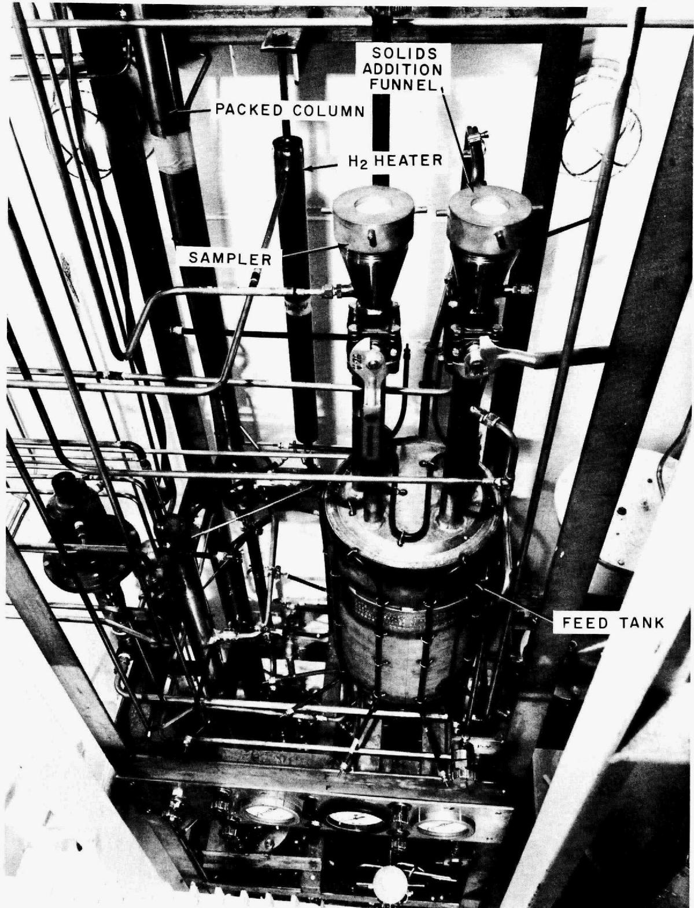  
Fig. 25. Salt Purification Equipment Before Addition of Thermal Insulation.

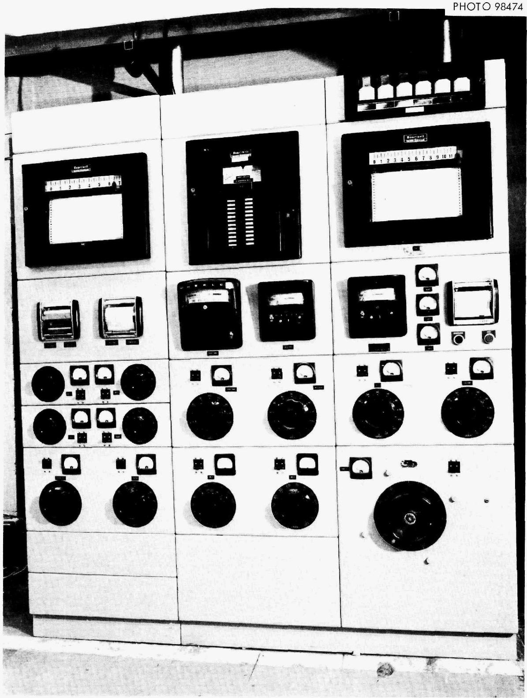  
Fig. 26. Panelboard for Salt Purification Equipment. Temperature, level, and pressure recorders and heater controls are included.

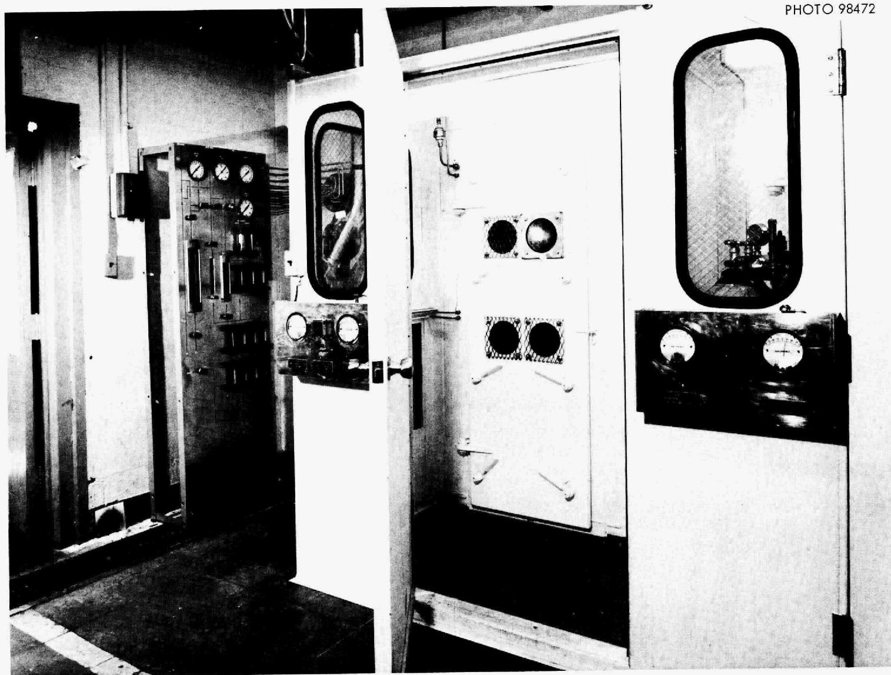  
Fig. 27. Gas Flow Panelboard and Cell Entrance for Salt Purification Equipment.

# 9.5 Anticipated Experiments and Operating Procedures

Experimental Program. - The system will be charged initially with about 15 liters of $\mathrm{LiF - BeF}_2$ (66-34 mole %), and will be operated with argon and hydrogen to determine the column flooding rate at several salt flow rates. The salt will then be treated with a $\mathsf{H}_2$ -HF mixture in the feed tank to remove oxides. The flooding tests will be repeated in order to determine the effect of oxide in the salt on flooding. Subsequently, iron fluoride will be added to the salt, and the salt will be countercurrently contacted with hydrogen at several gas and salt flow rates to obtain mass transfer data for reduction of the iron. After these data have been collected, a portion of the initially charged salt will be withdrawn from the system and sufficient LiF and $\mathrm{LiF - ThF}_4$ eutectic (73-27 mole %) will be added to yield salt having the composition of 72-16-12 mole % $\mathrm{LiF - BeF}_2$ -ThF₄. Flooding and iron fluoride reduction tests will be repeated with the new salt mixture. Removal of oxide from the salt by countercurrent contact with a $\mathsf{H}_2$ -HF mixture in the column will also be investigated.

Experimental Method. - The flooding data will be obtained by maintaining a constant salt flow rate through the column while the gas flow rate is increased in several steps. The pressure drop across the column at each gas flow rate will be recorded; increases in the gas flow rate will be continued until a sharp increase in column pressure drop is observed. The column temperature will be maintained at $700^{\circ}\mathrm{C}$ during the experiment. If subsequent iron fluoride reduction tests show that a higher temperature is necessary, flooding tests will also be made at the higher temperature. Reduction runs will be made in a similar manner after iron fluoride has been added to the salt. Filtered salt samples will be taken from the salt in the feed tank before and after a run. Several flowing stream samples will be withdrawn during each run.

Data obtained by analyzing the samples for iron will be used for calculating values of the mass transfer coefficients for the system. The fluoride monitor will provide a check on the extent of iron reduction achieved. In the oxide removal tests, the water analyzer in the column off-gas stream will be used for determining the amount of oxide removed from the salt.

Operating Procedures. - A typical run for testing iron fluoride reduction will consist of the following steps:

(1) Heat the system to operating temperature.   
(2) Add a weighed amount of $\mathsf{FeF}_2$ (if necessary) to the salt in the feed tank, and sparge for several hours.   
(3) Sample the salt in the feed tank.   
(4) Activate the fluoride monitor; start the gas sample pump, heat the sample flow capillary, set the sample and diluent gas flow rates, and set the scrubber solution flow rate.   
(5) Check the hydrogen supply system; heat the Serfass membrane if it is to be used.   
(6) Check the $\mathsf{O}_2$ and $\mathsf{H}_2\mathsf{O}$ contents of the argon and hydrogen supply.   
(7) Check the instrument purge rates.   
(8) Start the hydrogen flow at the specified rate.   
(9) Pressurize the feed tank and adjust the pressurizing argon flow rate to provide the specified salt flow rate.   
(10) Record the data on column temperature, flow rates, column pressure drop, salt head above the filter, pressure at the top of the column, and fluoride concentration in the exit gas stream.   
(11) Withdraw flowing stream salt samples periodically.   
(12) When the salt supply in the feed tank is exhausted, vent the feed tank and terminate the flow of hydrogen.   
(13) Purge the system of hydrogen.   
(14) Transfer the salt in the receiver vessel back to the feed tank.   
(15) Sparge and sample the feed tank.

# 10. SEMICONTOINUOUS REDUCTIVE EXTRACTION EXPERIMENTS IN A MILD-STEEL FACILITY

B. A. Hannaford C. W. Kee L. E. McNeese

A new column, packed with $1/4$ -in. molybdenum Raschig rings, was installed in the system, and minor changes were made in some of the piping. Three successful hydrodynamic experiments were performed in which bismuth and molten salt were contacted countercurrently. The results are in excellent agreement with a flooding correlation developed from work with the mercury-water system. Data from a hydrodynamic experiment in which salt flow only was used established that the pressure drop across the new column was approximately equal to that predicted from a literature correlation.

# 10.1 Equipment Modifications

Operating experiences with the original column and examination of the column following its removal suggested the need for minor changes in the column design. Of principal importance was the substitution of $1/4$ -in. Raschig rings for solid $1/4$ -in. right circular cylinders. Installation of a column packed with $1/4$ -in. Raschig rings was advantageous at this time in that it provided a column whose characteristics should be altered only slightly by deposition of small amounts of iron in the column.

The new column had an inside diameter of 0.82 in. and a packed length of 24 in., excluding end sections. Each of the end sections contained a 1.5-in.-long packed section consisting of a transition from the 0.82-in. column diameter to the 1.6-in. end section diameter.

The void fraction of the column was 0.84, as determined by direct measurement. An X-ray radiograph of the new column (Fig. 28) confirmed that the molybdenum Raschig rings were uniformly distributed. The l/4-in. and 3/8-in.-long mild-steel rings, which were tack-welded to the slotted support plate in order to prevent the bottom layer of molybdenum rings from sealing the slots, are not clearly shown. Measurements of the pressure drop across the column were made with argon at room temperature in order to establish a reference condition for future comparison.

In order to minimize entrainment of bismuth into the salt receiver, two changes were made at the time the column was replaced: (1) the height

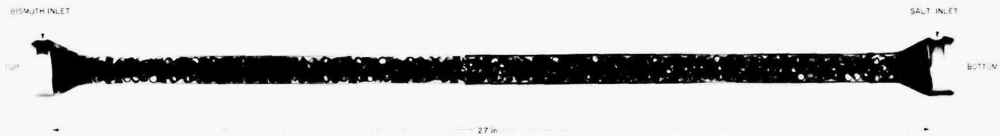  
Fig. 28. X-Ray Radiograph of Packed Extraction Column Before Installation. The column, which has an inside diameter of 0.82 in., is packed with 1/4-in. Raschig rings. Measured void fraction, 0.84.

of the disengaging section of the column was increased to 3.5 in., and (2) the entrainment detector was altered slightly to improve the separation of bismuth from the entering salt.

# 10.2 Treatment of Bismuth and Salt; Adjustment of Zirconium Distribution Ratio

Prior to the first hydrodynamic experiment (HR-9) in the new column, the combined salt and bismuth phases were sparged with about 300 g-moles of $30\%$ HF in hydrogen during a 20-hr operation for the removal of possible oxide contaminants. This was followed by a 6-hr hydrogen sparge (for removal of HF) and the addition of metallic thorium to reduce $\mathrm{FeF}_2$ and $\mathrm{ZrF}_4$ into the bismuth phase. Addition of zirconium to the bismuth is reported to inhibit the mass transport of iron - a source of iron deposits observed in earlier operations.[37] Samples of bismuth and salt taken 24 hr after addition of the initial $154\mathrm{g}$ of thorium showed that most of the iron but almost none of the zirconium had been reduced. An additional $157\mathrm{g}$ of thorium was added, and samples (filtered and unfiltered) were taken of each phase 90 hr later. Analysis of the bismuth revealed the presence of $240\mathrm{ppm}$ of Th, 30 ppm of Li, and 91 ppm of Zr. The concentration of lithium in the bismuth was in good agreement with the calculated equilibrium value based on the thorium concentration, and the zirconium concentration in the bismuth accounted for more than $70\%$ of the zirconium inventory in the system. The salt and bismuth were judged to be in satisfactory condition to permit hydrodynamic experiments to be carried out in the new column; the bismuth contained about 90 ppm of zirconium, and the salt had a low iron content ( $\sim60\mathrm{ppm}$ ).

# 10.3 Hydrodynamic Experiments HR-9, -10, -11, and -12

Three successful hydrodynamic experiments (HR-9, -10, and -11) were made with the new column, yielding flooding data in good agreement with values predicted from the flooding correlation that was developed from studies with a mercury-water system. Salt and bismuth were transferred from the treatment vessel to their respective feed tanks just prior to each run, and were then countercurrently contacted in the column beginning at a flow rate of about $60\mathrm{ml}$ of each phase per minute. The flow rate of one of the phases, or of both phases, was then increased

incrementally until the column flooded. Following each run, the salt and the bismuth were transferred to the treatment vessel. They were returned from this vessel to the feed tank when a subsequent run was made. Flooding rates were defined as those that resulted in a continually increasing pressure drop across the column or a pulsating flow of salt and bismuth through the column.

The flow rate data obtained during the three hydrodynamic experiments are summarized in Table 4. The recorded time intervals of less than 8 min resulted from a variety of reasons. At flooded or near-flooded conditions, it was usually impossible to maintain a constant flow rate for each phase. Also, near the end of an experiment and at high flow rates, the supply of bismuth or salt limited the time available.

The data from Table 4 are plotted as the square root of the superficial velocity of each phase in Fig. 29. The predicted flooding curve for the bismuth--molten salt system, developed on the basis of an assumed constant slip velocity between the phases, $^{38}$ is shown for comparison. The experimental points for nonflooded operation lie below the predicted flooding curve, and the points for flooded conditions lie above the curve. Thus, the data provide an excellent verification of the flooding correlation developed earlier. The data obtained with $1/4$ -in. solid cylindrical packing, reported previously, also agree with the predicted flooding curve. However, the range of flow rates investigated with the solid packing did not allow such conclusive confirmation of the predicted curve as is shown in Fig. 29.

Reference pressure drop measurements for salt flow only were made as the principal objective of run HR-12. Measurement of the small pressure drop expected (<10 in. $\mathsf{H}_2\mathsf{O}$ ) required that the bismuth-salt interface at the bottom of the column be depressed below the salt inlet. This was accomplished by routing the argon off-gas flow through a mercury seal in order to pressurize the top of the column, the salt overflow sampler, and the salt receiver. Observed pressure drops through the column were 2, 2.5, and 5 in. $\mathsf{H}_2\mathsf{O}$ at salt flow rates of 68, 127, and 244 ml/min, respectively, as compared with values of 0.5, 1, and 2 in. $\mathsf{H}_2\mathsf{O}$ predicted by the Ergun equation. This was regarded as a satisfactory check of the predicted values since the measured values were obtained as the difference between two large numbers.

Table 4. Summary of Hydrodynamic Data for Runs HR-9, -10, and -11   

<table><tr><td rowspan="2">Run HR-</td><td rowspan="2">Time Interval (min)</td><td colspan="2">Volumetric Flow Rate (ml/min)</td><td rowspan="2">Comments</td></tr><tr><td>Bismuth</td><td>Salt</td></tr><tr><td>9</td><td>18</td><td>80</td><td>85</td><td></td></tr><tr><td>9</td><td>15</td><td>115</td><td>121</td><td></td></tr><tr><td>9</td><td>3</td><td>175</td><td>177</td><td></td></tr><tr><td>9</td><td>2</td><td>221</td><td>133</td><td>Apparent bismuth holdup, ~15 vol %</td></tr><tr><td>9</td><td>4</td><td>221</td><td>107</td><td>Apparent bismuth holdup, ~16 to 26 vol % and increasing</td></tr><tr><td>9</td><td>15</td><td>150</td><td>150</td><td>Apparent bismuth holdup, ~40 vol %</td></tr><tr><td>9</td><td>3</td><td>130</td><td>300</td><td>Flooding</td></tr><tr><td>10</td><td>12</td><td>45</td><td>68</td><td></td></tr><tr><td>10</td><td>6</td><td>175</td><td>68</td><td></td></tr><tr><td>10</td><td>7.5</td><td>274</td><td>72</td><td></td></tr><tr><td>10</td><td>3</td><td>440</td><td>20.3</td><td>Incipient flooding; apparent bismuth holdup, 30 vol % and increasing</td></tr><tr><td>11</td><td>8</td><td>210</td><td>51</td><td></td></tr><tr><td>11</td><td>7</td><td>330</td><td>50</td><td></td></tr><tr><td>11</td><td>6</td><td>406</td><td>47</td><td>Apparent bismuth holdup, 16 to 26 vol % and increasing; incipient flooding</td></tr><tr><td>11</td><td>3.5</td><td>228</td><td>100</td><td>Apparent bismuth holdup, ~15 vol %; not flooded</td></tr></table>

ORNL DWG 70-14715

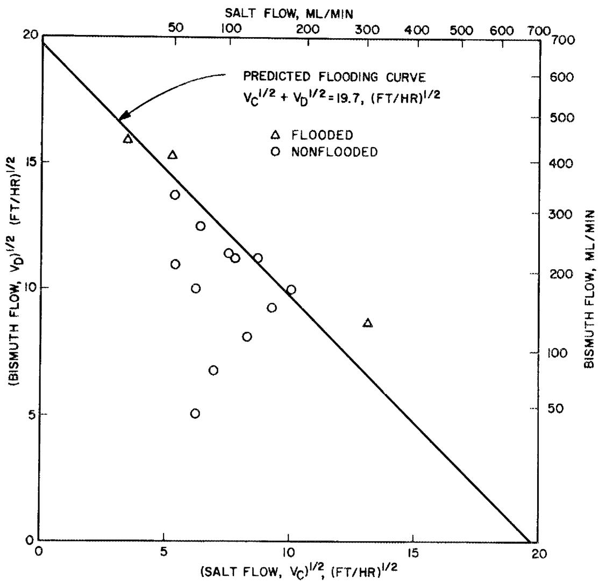  
Fig. 29. Flooding Data for the Bismuth-Salt System Compared with the Flooding Curve Predicted from Data from a Mercury-Water System.

# 10.4 Maintenance of Equipment

The amount of maintenance work required during this period was small; there were no instances of iron deposition and hence no formation of plugs. Two transfer lines failed, releasing a very small amount of salt. A salt transfer line from the treatment vessel developed a leak, apparently due to air oxidation of the steel tubing on the outside of a bend. A hole developed in a weld between the salt sampler and the specific gravity pot; this failure was probably due to contamination of the weld with salt or bismuth at the time the specific gravity pot was installed.

# 11. REFERENCES

1. L. E. McNeese, "Rare Earth Removal Using the Metal Transfer Process," Engineering Development Studies for Molten-Salt Breeder Reactor Processing No. 5, ORNL-TM-3140 (in press).   
2. M. J. Bell and L. E. McNeese, Engineering Development Studies for Molten-Salt Breeder Reactor Processing No. 1, ORNL-TM-3053, pp. 38-48.   
3. L. M. Ferris, MSR Program Semiann. Progr. Rept. Feb. 28, 1970, ORNL-4548, pp. 289-92.   
4. A. A. Jeje and C. R. Bozzuto, Axial Mixing in Open Bubble Columns (II), MIT-CEPS-X-102 (1970).   
5. M. S. Bautista and L. E. McNeese, Engineering Development Studies for Molten-Salt Breeder Reactor Processing No. 4, ORNL-TM-3139, pp. 38-83.   
6. A. M. Sheikh and J. D. Dearth, Axial Mixing in Open Bubble Columns, MIT-CEPS-X-91 (1969).   
7. J. S. Watson and L. E. McNeese, "Axial Mixing in Open Bubble Columns," Engineering Development Studies for Molten-Salt Breeder Reactor Processing No. 5, ORNL-TM-3140 (in publication).   
8. R. M. Davies and G. I. Taylor, Proc. Roy. Soc. (London), Ser. A 200, 375 (1950).   
9. L. E. McNeese and M. E. Whatley, Engineering Development Studies for Molten-Salt Breeder Reactor Processing No. 2, ORNL-TM-3137, pp. 22-43.   
10. MSR Program Semiann. Progr. Rept. Feb. 29, 1968, ORNL-4254, pp. 260-63.   
11. H. F. Bauman, personal communication, August 1970.   
12. L. E. McNeese, "Protactinium Isolation Using Fluorination--Reductive Extraction," Engineering Development Studies for Molten-Salt Breeder Reactor Processing No. 5, ORNL-TM-3140 (in press).   
13. E. L. Youngblood, R. P. Milford, R. G. Nicol, and J. B. Ruch, Corrosion of the Volatility Pilot Plant INOR-8 Hydrofluorinator and Nickel 201 Fluorinator During Forty Fuel Processing Runs with Zirconium-Uranium Alloy, ORNL-3623 (March 1965).   
14. J. C. Mailen, "Volatilization of Uranium as the Hexafluoride from Drops of Molten Fluoride Salt," paper presented at the American Chemical Society National Meeting, Chicago, Sept. 2, 1964.

15. G. I. Cathers, M. R. Bennett, and R. L. Jolley, The Fused Salt-Fluoride Volatility Process for Recovering Uranium, ORNL-2661 (1959).   
16. M. E. Whatley et al., Unit Operations Section Monthly Progress Report, September 1963, ORNL--TM--785 (1964).   
17. Chem. Technol. Div. Ann. Progr. Rept. May 31, 1965, ORNL-3830, pp. 71-75.   
18. R. P. Milford, S. Mann, J. B. Ruch, and W. H. Carr, Jr., "Recovering Uranium Submarine Reactor Fuels," Ind. Eng. Chem. 53, 357 (1961).   
19. MSR Program Semiann. Progr. Rept. Aug. 31, 1968, ORNL-4344, pp. 4-11.   
20. Chem. Technol. Div. Ann. Progr. Rept. May 31, 1967, ORNL-4145, pp. 95-97.   
21. MSR Program Semiann. Progr. Rept. Aug. 31, 1968, ORNL-4344, pp. 302-5.   
22. N. R. Stansel, Induction Heating, McGraw-Hill, New York, 1949.   
23. P. G. Simpson, Induction Heating, Coil, and System Design, McGraw-Hill, New York, 1960.   
24. N. R. Stansel, Induction Heating, McGraw-Hill, New York, 1949, p. 31.   
25. P. G. Simpson, Induction Heating, Coil, and System Design, McGraw-Hill, p. 141.   
26. J. R. Hightower, Jr., and L. E. McNeese, "MSRE Distillation Experiment," Engineering Development Studies for Molten-Salt Breeder Reactor Processing No. 5, ORNL-TM-3140 (in press).   
27. J. R. Hightower, Jr., and L. E. McNeese, Low-Pressure Distillation of Molten Fluoride Mixtures: Nonradioactive Tests for the MSRE Distillation Experiment, ORNL-4344 (January 1971).   
28. S. S. Kirslis and F. F. Blankenship, MSR Program Semiann. Progr. Rept. Feb. 29, 1968, ORNL-4254, p. 100.   
29. S. S. Kirslis and F. F. Blankenship, MSR Program Semiann. Progr. Rept. Feb. 28, 1969, ORNL-4396, pp. 145-53.   
30. M. S. Lin and L. E. McNeese, Engineering Development Studies for Molten-Salt Breeder Reactor Processing No. 2, ORNL-TM-3137, pp. 82-89.   
31. J. H. Shaffer, MSR Program Semiann. Progr., Rept. July 31, 1964, ORNL-3708, pp. 288-303.

32. G. E. Brown and N. A. Bhagat, A Preliminary Conceptual Design of a Pilot Plant for the Production of Purified Fused Fluoride Mixtures, ORNL-MIT-25 (May 30, 1967).   
33. D. A. Jones and J. A. Alvarez, Reduction of Iron Fluoride with Hydrogen in Mixtures of Molten Salts in a Packed Column (Part I), ORNL-MIT-53 (May 6, 1968).   
34. J. A. Alvarez and W. H. Pitcher, Jr., Reduction of Iron Fluoride with Hydrogen in Mixtures of Molten Salts in a Packed Column (Part II), ORNL-MIT-56 (May 29, 1968).   
35. W. S. Pappas, "Continuous Moisture Analyzer for Gases Containing Hydrogen Fluorides," Anal. Chem. 38, 615 (1966).   
36. O. H. Howard and C. W. Weber, "An Improved Continuous Internal-Electrolysis Analyzer for Gaseous Fluorides in Industrial Environments," Am. Ind. Hyg. Assoc. J. 23, 48-57 (1962).   
37. B. A. Hannaford, H. D. Cochran, L. E. McNeese, and C. W. Kee, Engineering Development Studies for Molten-Salt Breeder Reactor Processing No. 3, ORNL-TM-3138, pp. 30-39.   
38. J. S. Watson and L. E. McNeese, "Hydrodynamics of Packed Column Operation with High Density Fluids," Engineering Development Studies for Molten-Salt Breeder Reactor Processing No. 5, ORNL-TM-3140 (in press).

# INTERNAL DISTRIBUTION

1. C. F. Baes

2. H.F.Bauman

3. S.E.Beall

4. M. J. Bell

5. M. R. Bennett

6. R.E.Blanco

7. F. F. Blankenship

8. G. E. Boyd

9. R. B. Briggs

10. R.E.Brooksbank

11. K. B. Brown

12. W. L. Carter

13. H. D. Cochran, Jr.

14. F. L. Culler

15. J. R. Distefano

16. W.P.Eatherly

17. D. E. Ferguson

18. L.M.Ferris

19. J.H.Frye

20. W. R. Grimes

21. A. G. Grindell

22. P. A. Haas

23. B. A. Hannaford

24. J. R. Hightower, Jr.

25. C. W. Kee

26. R. B. Lindauer

27. H.E.McCoy

28-38. L.E.McNeese

39. D. M. Moulton

40. J.P. Nichols

41. E. L. Nicholson

42. J. H. Pashley (K-25)

43. A.M.Perry

44-45. M. W. Rosenthal

46. A. D. Ryon

47. W. F. Schaffer, Jr.

48. Dunlap Scott

49. J.H.Shaffer

50. M. J. Skinner

51. F.J. Smith

52. D. D. Sood

53. Martha Stewart

54. O. K. Tallent

55. R.E.Thoma

56. D. B. Trauger

57. W. E. Unger

58. C. D. Watson

59. J. S. Watson

60. A. M. Weinberg

61. J.R.Weir

62. M. E. Whatley

63. J. C. White

64. W.M.Woods

65. R.G.Wymer

66. E. L. Youngblood

67-68. Central Research Library

69-70. Document Reference Section

71-73. Laboratory Records

74. Laboratory Records, RC

75. Y-12 Document Reference Section

76. ORNL Patent Office

# EXTERNAL DISTRIBUTION

77. J. A. Accairri, Continental Oil Co., Ponca City, Oklahoma 74601

78. R. M. Bushong, UCC, Carbon Products Division, 12900 Snow Road, Parma, Ohio 44130

79. D. F. Cope, Atomic Energy Commission, RDT Site Office (ORNL)

80. C. B. Deering, Black & Veach, P. O. Box 8405, Kansas City, Missouri 64114

81. A. R. DeGrazia, USAEC, RDT, Washington, D.C. 20545

82. Delonde R. deBoisblanc, Evasco Services, Inc., 2 Rector Street, New York, N.Y. 10006

83. D. Elias, RDT, USAEC, Washington, D.C. 20545

84. Norton Haberman, RDT, USAEC, Washington, D.C. 20545

85. T. R. Johnson, Argonne National Laboratory, 9700 S. Cass Avenue, Argonne, Illinois 60439

# EXTERNAL DISTRIBUTION (Continued)

86. Kermit Laughon, Atomic Energy Commission, RDT Site Office (ORNL)   
87-88. T. W. McIntosh, Atomic Energy Commission, Washington, D.C. 20545   
89. E. H. Okrent, Jersey Nuclear Co., Bellevue, Washington, 98004   
90. R. D. Pierce, Argonne National Laboratory, 9700 S. Cass Avenue, Argonne, Illinois 60439   
91. J. Roth, Combustion Engineering Inc., Prospect Hill Road, Windsor, Connecticut 06095   
92. M. Shaw, Atomic Energy Commission, Washington, D.C. 20545   
93. N. Srinivasan, Head, Fuel Reprocessing Division, Bhabha Atomic Research Center, Trombay, Bombay 74, India   
94. C. L. Storrs, Combustion Engineering Inc., Prospect Hill Road, Windsor, Connecticut 06095   
95. B. L. Tarmy, Esso Research and Engr. Co., P. O. Box 101, Florham Park, N.J. 07932   
96. J. R. Trinko, Ehsaco Services, Inc., 2 Rector Street, New York, N.Y. 10006   
97. Laboratory and University Division, ORO   
98-99. Division of Technical Information Extension, ORO, AEC