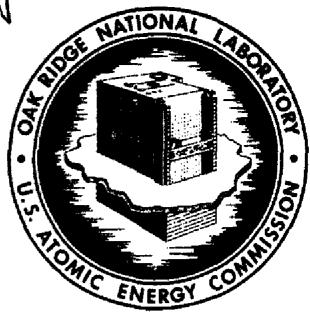
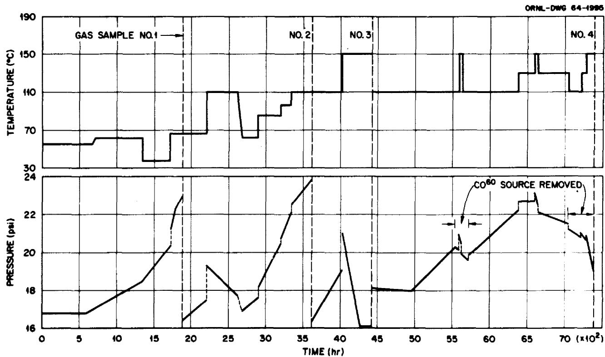
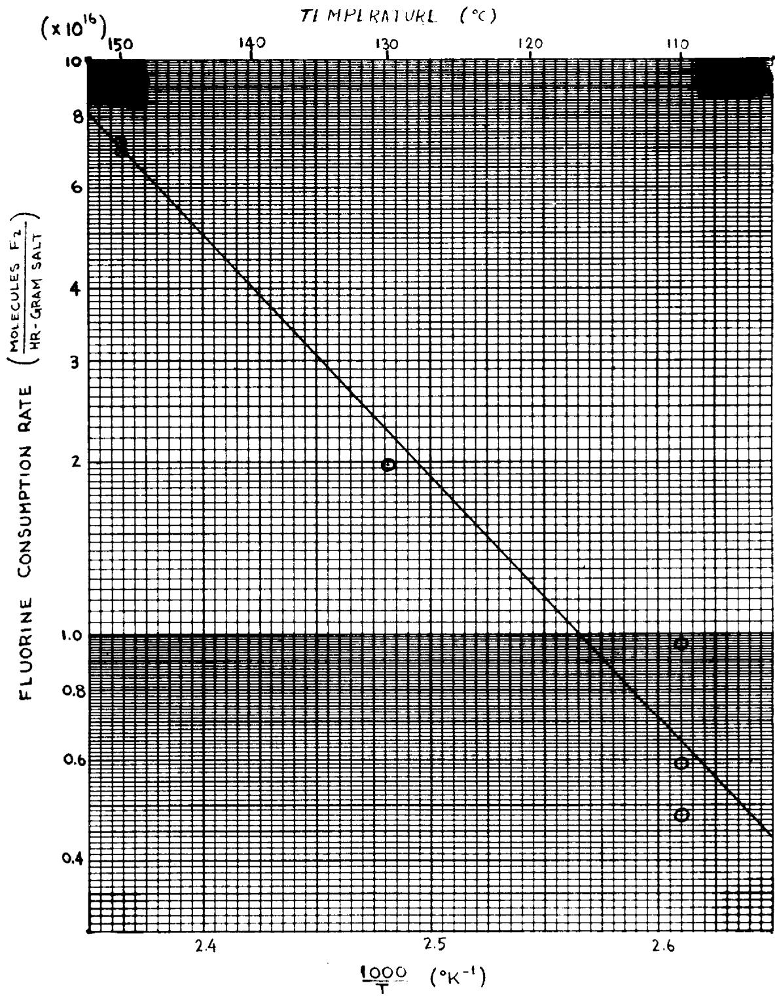
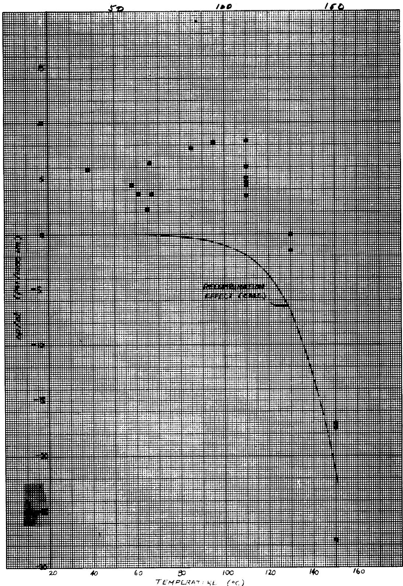
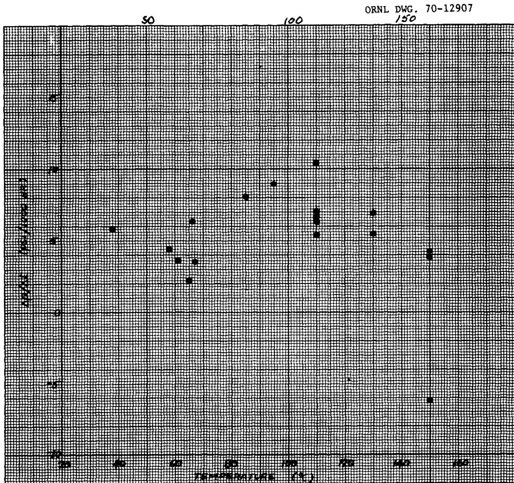
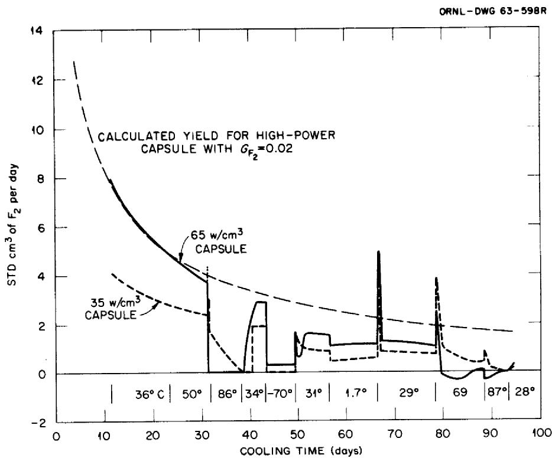
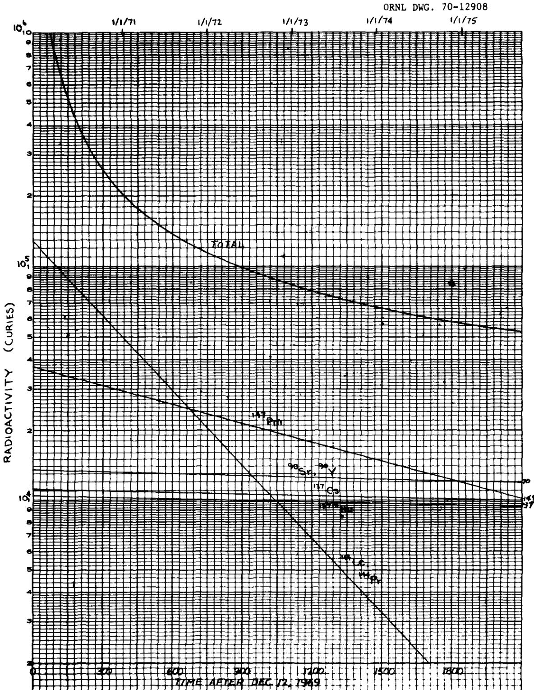
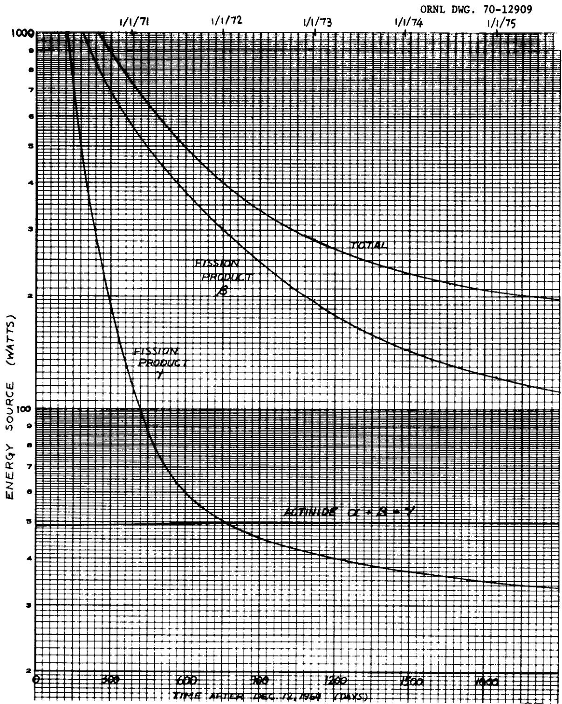
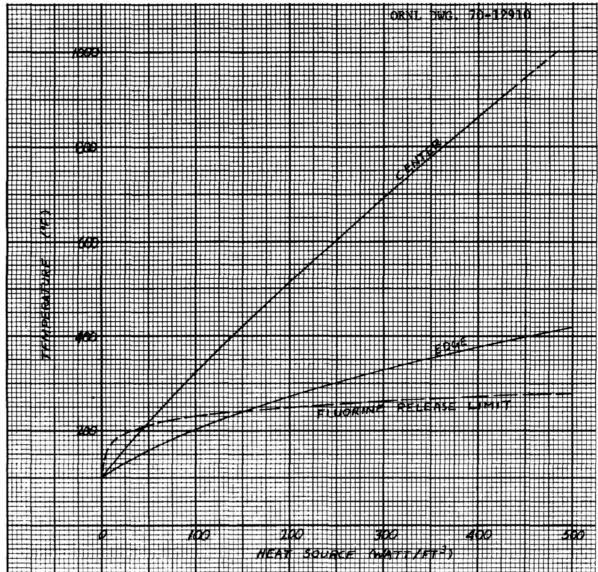
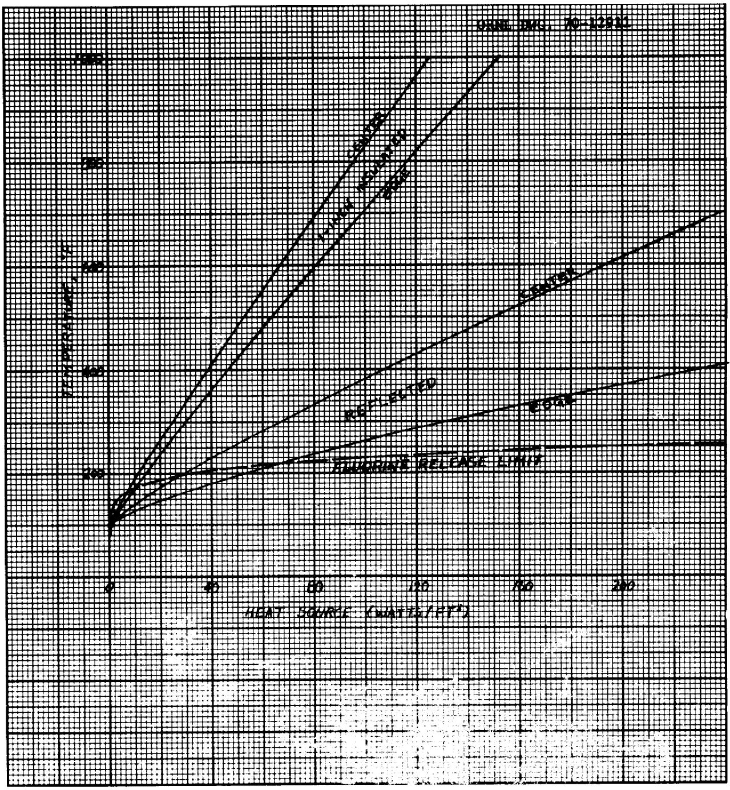

# OAK RIDGE NATIONAL LABORATORY

# operated by   UNION CARBIDE CORPORATION for the

U.S. ATOMIC ENERGY COMMISSION

ORNL-TM-3144

COPY NO. -

DATE - September 30, 1970

FLUORINE PRODUCTION AND RECOMBINATION IN FROZEN MSR SALTS AFTER REACTOR OPERATION

P. N. Haubenreich

# ABSTRACT

Exposure of capsules of MSR fuel salts in the MTR between 1961 and 1964 showed that when the salt was chilled below about $80^{\circ}\mathrm{C}$ , $\mathbf{F}_2$ was produced by radiolysis at a rate of 0.02 molecules/100 ev. Other experiments confirmed the radiolysis of frozen salt and provided data on the effect of temperature on recombination. The data on yield and recombination have recently been reviewed and used in answering questions involved in storing and disposing of irradiated salt from the MSRE and future molten-salt reactors. The energy source in the MSRE salt is low enough that no fluorine evolution is expected for over a year after heating to induce recombination. Salt from a high-power MSR can be stored in bare cans with no fluorine evolution if the surroundings are kept at about $200^{\circ}\mathrm{F}$ .

Keywords: molten-salt reactors, fluorine, fused salts, radiolysis, storage, waste disposal, afterheat, analysis, experiment, heat transfer, MSRE, primary salt, reaction rates, recombination.

# LEGAL NOTICE

This report was prepared as an account of Government sponsored work. Neither the United States, nor the Commission, nor any person acting on behalf of the Commission:

A. Makes any warranty or representation, expressed or implied, with respect to the accuracy, completeness, or usefulness of the information contained in this report, or that the use of any information, apparatus, method, or process disclosed in this report may not infringe privately owned rights; or   
B. Assumes any liabilities with respect to the use of, or for damages resulting from the use of any information, apparatus, method, or process disclosed in this report.

As used in the above, "person acting on behalf of the Commission" includes any employee or contractor of the Commission, or employee of such contractor, to the extent that such employee or contractor of the Commission, or employee of such contractor prepares, disseminates, or provides access to, any information pursuant to his employment or contract with the Commission, or his employment with such contractor.

# CONTENTS

Page

# ABSTRACT

INTRODUCTION 1

RESULTS OF THE $60\mathrm{CO}$ EXPERIMENT 2

Description of the Experiment 2

Analysis 2

RESULTS OF OTHER EXPERIMENTS 15

In-Pile Experiments 15

X-Ray Irradiations 18

Fast-Electron Bombardment 18

Discussion 18

STORAGE AND DISPOSAL OF MSRE SALT 19

Energy Sources 20

Temperature for Internal Recombination 20

Induction Period and Fluorine Release 23

Discussion 24

DEALING WITH SALT FROM LARGE MOLTEN-SALT REACTORS 25

Energy Source 25

Heat Transfer and Temperatures 25

Fluorine Yield and Induction Period 31

Temperature for Zero Release of Fluorine 32

Discussion 32

REFERENCES 34

# LEGAL NOTICE

This report was prepared as an account of work sponsored by the United States Government. Neither the United States nor the United States Atomic Energy Commission, nor any of their employees, nor any of their contractors, subcontractors, or their employees, makes any warranty, express or implied, or assumes any legal liability or responsibility for the accuracy, completeness or usefulness of any information, apparatus, product or process disclosed, or represents that its use would not infringe privately owned rights.

# INTRODUCTION

The phenomenon with which this report is concerned, that is, the evolution of fluorine gas from frozen fluoride salts subjected to radiation from included fission products, was first observed in 1962 in capsules that had been exposed in the MTR. Some capsules (Expt. 47-4) when opened several weeks after withdrawal from the reactor were found to have fluorine pressures as high as 50 atmospheres. It was evident, both from the lack of metal corrosion and from strength considerations, that this much $\mathbf{F}_2$ could not have been present while the capsules were at high temperature in the reactor. The next experiment included capsules with provisions for gas sampling and pressure measurement. These proved that $\mathbf{F}_2$ was evolved only when the salt was chilled well below the freezing point. Monitoring of these capsules after removal from the reactor showed that at room temperature the rate of fluorine release was proportional to the fission product decay energy. At slightly higher temperatures, the $\mathbf{F}_2$ apparently recombined with the salt. Meanwhile several experiments had been done in which frozen fluorides were subjected to various kinds of radiation from external sources. These experiments produced fluorine with yields comparable to those inferred from the in-pile capsules. In one experiment, with a $^{60}\mathrm{Co}$ gamma-ray source, the effect of temperature on fluorine evolution and recombination was explored during more than 7000 hours of operation.

One conclusion from the experiments was that fluorine evolution from frozen salt would pose no threat to the operation of the MSRE. New questions were raised, however, when in December 1969 the reactor was shut down and, for the first time at the MSRE, tanks of fuel salt were allowed to freeze. During the interim between the end of nuclear operation and the post-operation examinations (scheduled for the fall of 1970) it was a simple matter to keep the frozen salt warm enough ( $>200^{\circ}\mathrm{C}$ ) to positively preclude any fluorine evolution. During the next phase (Phase III) before the ultimate disposal of the fissile and radioactive materials, it would be convenient to turn off the heaters and let the salts cool to near ambient temperature. In anticipation of this phase, then, the data on fluorine evolution and recombination were reexamined.

# RESULTS OF THE $^{60}\mathrm{CO}$ EXPERIMENT

Of the various experiments, the one that contains the most information on temperature effects, which are of paramount importance in the consideration for the shutdown MSRE, is the $^{60}\mathrm{Co}$ experiment.

# Description of the Experiment

The equipment for this experiment consisted of a $25\text{-cm}^3$ Hastelloy-N autoclave with provisions for temperature control and measurement and with two 1/8-in. nickel tubes for gas sampling and pressure measurement. Powdered salt (35 g) of a composition similar to that proposed for the MSRE fuel was melted in the autoclave, an array of 24 small graphite spheres was inserted and the salt was allowed to freeze before the autoclave was sealed. All interior surfaces of the equipment were prefluorinated before the salt was added.

The assembly was placed in a $^{60}\mathrm{Co}$ irradiation facility and left there for 7391 hours between February and December, 1963. During this time the temperature was held at various levels between $38^{\circ}\mathrm{C}$ and $150^{\circ}\mathrm{C}$ , three samples of gas were taken, the source was removed twice to interrupt the gamma-ray irradiation, and the pressure was observed continuously. With the source in place, the energy absorption rate was $0.45 \times 10^{20} \mathrm{ev/hr-g}$ salt. The temperature of the salt and the total gas pressure over the salt during the experiment are shown in Fig. 1. An atmosphere of pure helium at 16 to 18 psia was established over the salt initially and after each sample. Analysis of the samples showed that the pressure changes were due to changes in the amount of fluorine in the gas phase.

# Analysis

The original analysis2 of the experiment produced the following conclusions. It was evident that practically pure $\mathbf{F}_2$ gas was produced by the gamma irradiation of solid MSRE salt in the presence of graphite. In the

  
Fig. 1. Pressure and Temperature vs Time in a Fluoride Salt Autoclave Under Gamma Irradiation

absence of radiation or at elevated temperatures in the presence of radiation the gas disappeared at a measurable rate, presumably recombining with the salt. Other points were that following complete recombination, $\mathbf{F}_{2}$ did not reappear in the gas phase until after an "induction period," that temperature strongly affected the recombination rate, and that $\mathbf{F}_{2}$ pressure had little if any effect on the release rate or recombination.

The remainder of this section will propose a simple model for the mechanisms involved and extract from the $^{60}\mathrm{Co}$ experiment some numbers that will be useful in calculations for the MSRE and MSBR fuel.

# Hypotheses

Let us adopt the following hypotheses as a basis for reducing the $^{60}\mathrm{Co}$ data to some quantities that can be applied to other situations.

1. Fluorine molecules $(\mathbf{F}_2)$ were produced in the frozen salt at a rate proportional to the absorption of energy from gamma rays. The proportionality factor, $G$ , was independent of temperature.   
2. Fluorine was evolved into the gas phase only after the average concentration in the salt reached some limiting value.   
3. Fluorine recombined with the salt at a rate proportional to the concentration of radiolytic fluorine within the salt.\*\* The proportionality factor was a function only of temperature.

Represent these hypotheses by

$$
\begin{array}{l} P = \mathrm {G E} / 1 0 0 \\ K = k (T) C \\ R = P - K _ {R} = P - k (T) C _ {R} \\ \end{array}
$$

where

C = average concentration of $\mathbf{F}_2$ in salt, molecules/g

E = rate of energy absorption in salt, ev/hr - g

G = yield, molecules/100 ev

K = rate of recombination of F2 with salt, molecules/hr - g

k = recombination factor, hr-1

P = rate of production of $F_{2}$ in salt, molecules/hr - g

R = rate of release of $\mathbf{F}_{2}$ from salt, molecules/hr - g

T = temperature of salt, °K

sub R = values while release is occurring.

# Interpretation of the Data

Let us first derive values for $K$ during the intervals when the source was out (making E and P zero). During these intervals the release rate was negative and equal to the rate of recombination in the salt.

$$
R = - K = - k (T) C _ {R}
$$

The release rate can be computed from the rate of pressure change. Savage, Compere, and Baker2 give the formula

$$
G = 0. 0 0 7 3 \frac {\Delta p}{\Delta t}
$$

when

$$
E = 0. 4 5 x 1 0 ^ {2 0}
$$

where the units are: G, molecules $\mathrm{F}_{2} / 100$ ev; E, $\mathrm{Ev} / \mathrm{hr}-\mathrm{g}$ ; and $\Delta p / \Delta t$ , psi/1000 hr. From this information, the release rate in molecules $\mathrm{F}_{2} / \mathrm{hr}-\mathrm{g}$ is given by

$$
R = \frac {G E}{1 0 0} = 0. 0 0 7 3 \frac {\Delta p}{\Delta t} x \frac {0 . 4 5 x 1 0 ^ {2 0}}{1 0 0} = 0. 3 2 8 x 1 0 ^ {1 6} \frac {\Delta p}{\Delta t}
$$

Table 1 gives the observed rate of pressure change and the computed value of R during intervals with the source out. (These times and pressures were taken from the original data sheets4 and the intervals were

# Table 1

Fluorine Consumption with the Source Removed   

<table><tr><td colspan="3">Interval (hr)</td><td rowspan="2">Temp. (°C)</td><td colspan="3">Pressure (psi)</td><td rowspan="2">Δp/Δt (1000 hr)</td><td rowspan="2">-10-16R molecules/hr-g</td></tr><tr><td>From</td><td>To</td><td>Δt</td><td>Start</td><td>End</td><td>Δp</td></tr><tr><td>5542.5</td><td>5590.0</td><td>47.5</td><td>110</td><td>20.21</td><td>20.14</td><td>-0.07</td><td>-1.47</td><td>0.48</td></tr><tr><td>5593.0</td><td>5618.5</td><td>25.5</td><td>150</td><td>20.99</td><td>20.43</td><td>-0.56</td><td>-22.0</td><td>7.22</td></tr><tr><td>5637.0</td><td>5708.7</td><td>71.7</td><td>110</td><td>19.79</td><td>19.58</td><td>-0.21</td><td>-2.93</td><td>0.96</td></tr><tr><td>7075.5</td><td>7221.0</td><td>145.5</td><td>110</td><td>21.04</td><td>20.78</td><td>-0.26</td><td>-1.79</td><td>0.59</td></tr><tr><td>7221.8</td><td>7291.5</td><td>69.7</td><td>130</td><td>21.05</td><td>20.63</td><td>-0.42</td><td>-6.03</td><td>1.98</td></tr><tr><td>7293.0</td><td>7381.1</td><td>88.1</td><td>150</td><td>20.89</td><td>19.02</td><td>-1.87</td><td>-21.2</td><td>6.95</td></tr></table>

chosen to eliminate transient periods associated with changing temperatures.) Since a functional relationship of $\mathbf{k}$ and $\mathbf{T}$ of the form

$$
\mathrm {k} = \mathrm {a e} ^ {- b / T}
$$

is a good possibility, let us try a plot of ln R vs l/T. (In attempting such a representation, one implies that K, which is the product of k and CR, is a function of temperature having the above form. This is a convenient approximation, as will be seen later.) Figure 2 shows that indeed data do seem to show the anticipated dependence on temperature. The line in the figure was fitted to the data, taking into account that some points are more reliable because they were measured over greater intervals. The equation of the line is

$$
K = 6. 6 5 \times 1 0 ^ {2 6} e ^ {- 9 7 1 0 / T} \frac {\text {m o l e c u l e s}}{\mathrm {h r} - \mathrm {g}}
$$

  
Fig. 2. Fluorine Consumption in Autoclave by Recombination with Simulated MSRE Fuel Salt

Let us turn now to the observed rates of pressure change while the salt was being irradiated. During three intervals the release rate was zero because the concentration of $\mathbf{F}_2$ in the salt was below the threshold, $C_0$ . The first was the initial interval at ambient temperature (about $50^{\circ}\mathrm{C}$ ), when the salt was irradiated for more than 600 hr before any pressure increase occurred. Another was the interval of similar length at $110^{\circ}\mathrm{C}$ after Sample 3. (The significance of such "induction periods" will be discussed later.) The other interval was the 150 hr at $150^{\circ}\mathrm{C}$ just before Sample 3. The pressure had decreased rapidly just before this until all the $\mathbf{F}_2$ was out of the gas (verified by Sample 3), indicating that recombination was exceeding production. Thus, after the pressure became constant the $\mathbf{F}_2$ concentration in the salt presumably continued to decrease.

The rates of pressure change during all the intervals when the source was in and there was significant $\mathbf{F}_2$ pressure in the gas are listed in Table 2 and in Fig. 3 they are plotted against temperature. These pressure changes are, of course, proportional to the difference between production and recombination, and the effect of increasing recombination rate at higher temperatures causes the pressure change to be negative even though fluorine is still being produced in the salt. The production rate can be computed by adding the recombination rate calculated from Fig. 2 to the rate of $\mathbf{F}_2$ release indicated by the observed pressure change. (In doing this we must assume that the recombination rate during an interval of pressure increase was the same as during an interval of pressure decrease with the source out at the same temperature, which is to say that $C_R$ is about the same when there was an outward flow of fluorine from the salt as when there was an inward flow.) Figure 4 shows the results of this computation.

Some of the differences between the points in Fig. 4 are no doubt due to error inherent in the measurements, but there is also a suggestion of some remaining temperature effect. One suspects the effects of limited diffusion rates in the salt and variation of the same with temperature, but no firm conclusion is justified. The band from 3 to 8 psi/1000 hr, which includes most of the points, corresponds to values of G from 0.02 to 0.06 molecules/100 ev, based on the energy absorption rate of

Table 2   
Fluorine Evolution from Salt Exposed to $^{60}\mathrm{Co}$ Source   

<table><tr><td colspan="3">Interval (hr)</td><td rowspan="2">Temp (°C)</td><td colspan="3">Pressure (psi)</td><td rowspan="2">Δp/Δt psi (1000 hr)</td></tr><tr><td>From</td><td>To</td><td>Δt</td><td>Start</td><td>End</td><td>Δp</td></tr><tr><td>764</td><td>884</td><td>120</td><td>65</td><td>17.00</td><td>17.28</td><td>.28</td><td>2.23</td></tr><tr><td>1008</td><td>1343</td><td>331</td><td>58</td><td>17.28</td><td>18.74</td><td>1.46</td><td>4.41</td></tr><tr><td>1364</td><td>1724</td><td>360</td><td>38</td><td>18.35</td><td>20.44</td><td>2.09</td><td>5.81</td></tr><tr><td>1774</td><td>1871</td><td>97</td><td>66</td><td>22.36</td><td>22.97</td><td>0.61</td><td>6.29</td></tr><tr><td>1893</td><td>2182</td><td>289</td><td>67</td><td>16.38</td><td>17.40</td><td>1.02</td><td>3.53</td></tr><tr><td>2713</td><td>2852</td><td>139</td><td>61</td><td>16.78</td><td>17.28</td><td>0.50</td><td>3.60</td></tr><tr><td>2948</td><td>3190</td><td>242</td><td>85</td><td>18.28</td><td>20.14</td><td>1.86</td><td>7.69</td></tr><tr><td>3217</td><td>3357</td><td>140</td><td>95</td><td>20.94</td><td>22.09</td><td>1.15</td><td>8.21</td></tr><tr><td>3404</td><td>3619</td><td>215</td><td>110</td><td>22.78</td><td>23.78</td><td>1.00</td><td>4.65</td></tr><tr><td>3741</td><td>4029</td><td>288</td><td>110</td><td>16.67</td><td>19.08</td><td>2.41</td><td>8.37</td></tr><tr><td>4033</td><td>4156</td><td>123</td><td>150</td><td>21.44</td><td>18.06</td><td>-3.38</td><td>-27.5</td></tr><tr><td>4156</td><td>4268</td><td>112</td><td>150</td><td>18.06</td><td>16.09</td><td>-1.97</td><td>-17.5</td></tr><tr><td>5084</td><td>5301</td><td>217</td><td>110</td><td>18.14</td><td>19.07</td><td>0.93</td><td>4.29</td></tr><tr><td>5301</td><td>5541</td><td>240</td><td>110</td><td>19.07</td><td>20.28</td><td>1.21</td><td>5.04</td></tr><tr><td>5878</td><td>6142</td><td>264</td><td>110</td><td>19.94</td><td>20.84</td><td>0.90</td><td>3.41</td></tr><tr><td>6217</td><td>6380</td><td>163</td><td>110</td><td>21.20</td><td>22.18</td><td>0.98</td><td>6.01</td></tr><tr><td>6387</td><td>6596</td><td>209</td><td>130</td><td>22.75</td><td>22.74</td><td>-0.01</td><td>-0.05</td></tr><tr><td>6603</td><td>6645</td><td>42</td><td>150</td><td>23.16</td><td>22.44</td><td>-0.72</td><td>-17.1</td></tr><tr><td>6740</td><td>6979</td><td>239</td><td>130</td><td>21.74</td><td>21.39</td><td>-0.35</td><td>-1.46</td></tr></table>

ORNL DWG. 70-12906

  
Fig. 3. Observed Rates of Pressure Increase in Salt Exposed to $^{60}\mathrm{Co}$ Source and Calculated Rate of Pressure Change Due to Recombination

  
Fig. 4. Rates of Pressure Increase in Salt Exposed to $^{60}\mathrm{Co}$ Source That Would Have Resulted if There had been no Recombination

0.45 x $10^{20}$ ev/hr-g. If we exclude the $150^{\circ}C$ points, which are very sensitive to temperature reproducibility, the average of the data in Fig. 4 corresponds to $G = 0.045$ molecules/100 ev.

Now let us turn again to "induction periods." We would like to be able to predict for various kinds of salt under various conditions how much energy can be absorbed before fluorine evolution begins. This is not a constant, the most obvious variables affecting it being temperature and the rate of energy absorption. If the temperature were high enough or E low enough, recombination would maintain an $\mathbf{F}_2$ concentration in the salt below that at which any significant $\mathbf{F}_2$ is released into the gas. At the other extreme, at temperatures so low that recombination is negligible, all the production would go into raising the concentration. At some intermediate temperature, C would increase more slowly because of partial recombination, but the limiting concentration, $\mathbf{C}_{\mathbb{R}}$ , could conceivably be lower so the induction time would not necessarily be longer than at low temperature. In the $^{60}\mathrm{Co}$ experiments we observed two induction periods, one at $50^{\circ}\mathrm{C}$ where recombination was practically negligible and the other at $110^{\circ}\mathrm{C}$ where the recombination rate during the induction period probably ranged up to roughly half the production rate (see Fig. 3). Examination of the detailed plot of the experimental data4 shows that the $50^{\circ}\mathrm{C}$ induction period was close to 700 hours (3.1 x $10^{22}$ ev/g) and the $110^{\circ}\mathrm{C}$ period was about 630 hours (2.8 x $10^{22}$ ev/g). The $\mathbf{F}_2$ concentration in the salt at the start of the latter period was not quite zero but was probably practically so. Thus the fact that, despite greater recombination, the induction period at $110^{\circ}\mathrm{C}$ was about the same as at $50^{\circ}\mathrm{C}$ indicates that $\mathbf{C}_{\mathbb{R}}$ was indeed substantially lower at the higher temperature. Further support for a lower $\mathbf{C}_{\mathbb{R}}$ at higher temperature are the pressure transients accompanying some of the steps in temperature, which seemed to indicate rapid release of fluorine when the temperature was raised.

From the foregoing, it is apparent that there is indeed a dependence of $C_R$ with temperature that is included in the exponential approximation for $kC_R$ vs $T$ that we derived. The probable difference in the form of the temperature dependence of $k$ and of $C_R$ should not affect the fit of the empirical relation too much, however, because $C_R$ probably varies by a

factor of several while k is varying by a couple of decades. It is not essential that we separate the relations for k and $\mathsf{C}_{\mathbb{R}}$ ; in most applications what we want to know is whether or not the temperature is high enough so that there will be no fluorine release (that the product $\mathsf{kC}_{\mathbb{R}}$ is less than P).

Although the point has no significance for future applications where no fluorine pressure is allowed to develop, it may be noted that the data of the $^{60}\mathrm{Co}$ experiment do not indicate any clear dependence of recombination rate on fluorine pressure in the gas.

# Summary

Yield (production in the salt) in the simulated MSRE fuel salt was $0.045 \pm 0.02$ molecules $\mathrm{F}_2 / 100$ ev, with little or no dependence on temperature. In salt initially free of $\mathrm{F}_2$ , a considerable amount of energy was absorbed before any fluorine appeared in the gas over the salt: induction periods of $3.1 \times 10^{22}$ and $2.8 \times 10^{22} \mathrm{ev/g}$ were observed at $55^{\circ}\mathrm{C}$ and $110^{\circ}\mathrm{C}$ respectively. Rates of recombination in "saturated salt" (when there was fluorine in the gas) depended strongly on temperature; practically not at all on fluorine overpressure. An empirical relation

$$
K = k C _ {R} = 6. 6 5 \times 1 0 ^ {2 6} e ^ {- \left(\frac {9 7 1 0}{T}\right)} \frac {\text {m o l e c u l e s}}{\mathrm {h r} - \mathrm {g}} F _ {2}
$$

fit the data within $\pm 50\%$ .

In applying these results to other situations, different units may be convenient. In particular, the induction period and recombination rates should probably be related to moles of salt rather than weight of salt. Table 3 expresses the $^{60}\mathrm{Co}$ experiment results in various units.

Results of $^{60}\mathrm{Co}$ Irradiation of Simulated MSRE Fuel

Table 3   

<table><tr><td>Yield</td><td>0.045</td><td>molecules F2100 ev</td><td>or</td><td>0.38</td><td>cc(STP)F2watt - hr</td><td></td><td></td></tr><tr><td>Induction 
Period</td><td>3.0x1022</td><td>ev/g</td><td>or</td><td>1.3</td><td>watt-hr/g</td><td>or</td><td>62 watt-hr mole salt</td></tr><tr><td>Recombination 
Coefficient</td><td>6.65x1026</td><td>molecules F2hr-g</td><td>or</td><td>2.47x107</td><td>cc(STP)F2hr-g</td><td>or</td><td>1.15x109cc(STP)F2hr-mole salt</td></tr></table>

$^a$ Composition: LiF-BeF2-ZrF4-ThF4-UF4(69.0-23.0-5.2-1.7-1.l mole %). Molecular weight = 46.5.

# RESULTS OF OTHER EXPERIMENTS

# In-Pile Experiments

The series of in-pile experiments which first drew attention to the matter of fluorine evolution and later proved it to be a low-temperature phenomenon also produced quantitative information on yields and temperature effects on recombination.

There were clues in experiments 47-1, 47-2, and 47-3 that were later recognized as effects of fluorine evolution, but about the only quantitative information on this subject was that $\mathrm{CF_4}$ yields were much lower in capsules in which the salt had cooled and frozen more slowly.

When the capsules from experiment 47-4 were punctured after exposure and cooling, fluorine was identified and the equipment was revised to allow measurement of the amounts in the capsules. Pressures observed in the capsules ranged as high as 50 atmospheres of $\mathbf{F}_2$ and a tenth as much $\mathrm{CF_4}$ . On the assumption that half of the decay energy released during the 95-day cooling period was absorbed in the salt, it was calculated that a G value of 0.035 molecules/100 ev would have produced the fluorine observed in the maximum case. Other capsules showed less $\mathbf{F}_2$ , with extremely wide variations both in the amounts of $\mathbf{F}_2$ and the ratio $\mathrm{CF_4 / F_2}$ , indicating the presence of unidentified factors affecting the net yield of fluorine.

Experiment 47-5, designed after the observation of $\mathrm{CF_4}$ in the 47-3 capsules, included two capsules with provisions for gas sampling and pressure measurement. During intervals when the MTR was shut down, the capsules were cooled to about $40^{\circ}\mathrm{C}$ , and, after variable induction periods, an accumulation of gas in the capsules was noted by pressure measurements. The accumulating gas was found to be $\mathbf{F}_2$ and to be released from the frozen fuel at $\mathbf{G}_{\mathbf{F}2}$ values (molecules of $\mathbf{F}_2$ per 100 ev of absorbed energy) from about 0.005 to 0.031, although on occasion the induction period persisted throughout the shutdown. No correlation between capsule power density just before shutdown and either $\mathbf{G}_{\mathbf{F}2}$ values or duration of induction periods was observed. There were seven shutdowns of sufficient duration for the effects to be noted. Short (4-hr) periods at low power in which fissioning

continued at some rate with the salt at temperatures between 85 and $325^{\circ}\mathrm{C}$ produced no detectable accumulation of gas.

The six capsules of experiment 47-5 were moved quickly from the MTR to an ORNL hot cell where pressures were monitored to determine fluorine evolution in the two vented capsules. Results for these two capsules, one of which had operated at 65 watts/cm³ and the other at 35 watts/cm³, are shown in Fig. 5. Analysis of the data brought out the following points. The evolution rates calculated from pressure derivatives between 11 and 31 days at $36^{\circ}\mathrm{C}$ and $50^{\circ}\mathrm{C}$ were proportional to the power density in the capsules and correspond to a yield of 0.020 molecules $\mathbf{F}_2 / 100$ ev. Experiments at various temperatures showed that evolution was suppressed when the salt was either very cold $(-70^{\circ}\mathrm{C})$ or moderately warm $(80^{\circ}\mathrm{C})$ . Bursts of $\mathbf{F}_2$ occurred immediately after the temperature was stepped up. These data suggest that the rate of evolution of $\mathbf{F}_2$ is controlled at low temperatures by rates of diffusion of radiolytic species within the solid, and at higher temperatures by a back reaction whose rate is strongly temperature dependent. Later (after day 113) the effect of $\mathbf{F}_2$ pressure was explored by adding $\mathbf{F}_2$ to the capsules. Above $50^{\circ}\mathrm{C}$ there were pronounced decreases in evolution at higher pressures, but some extraneous effects, presumed to be changing condition of the salt surface, did not permit derivation of a quantitative pressure relation.

Also exposed in 47-5 were sealed capsules of 3 different geometries. The gas spaces in these capsules, after 5 months cooling, yielded very different quantities of $\mathbf{F}_2$ and $\mathrm{CF_4}$ ; one gave $39~\mathrm{cm}^3$ of $\mathbf{F}_2$ and $70~\mathrm{cm}^3$ of $\mathrm{CF_4}$ , another gave $2.5~\mathrm{cm}^3$ of $\mathbf{F}_2$ and $0.6~\mathrm{cm}^3$ of $\mathrm{CF_4}$ , and two smaller capsules yielded none of either gas. The most plausible reason for the differences seemed to be the large differences in cooling rates among the capsules and consequent differences in crystallite sizes and degrees of stress introduced into the crystallite, with slower cooling resulting in less gas evolution.

In the final experiment, 47-6, the salt in the capsules was kept molten during exposure and no fluorine evolution was detected. After removal, the capsules were quickly disassembled for inspection so no fluorine evolution rate was measured.

  
Fig. 5. Postirradiation Fluorine Release in MTR-47-5 Capsules

# X-Ray Irradiations

Soft x-ray irradiation of a solid mixture similar to the MSRE fuel gave evidence of radiolytic decomposition with yields of volatile fluorine compounds equivalent to $\mathbf{G}_{\mathbf{F}_2}$ (moles of $\mathbf{F}_2$ per 100 ev absorbed) values ranging from 0.0006 to 0.04. In some cases elemental fluorine was identified, but, generally, the products were carbon tetrafluoride and carbonyl fluoride. Prefluorination of the salt removed carbon-containing impurities and encouraged liberation of elemental fluorine. Fine particles liberated volatile fluorine-containing products at about ten times the rate from coarse particles. The compound 6LiF·BeF₂·ZrF₄, one of the complex compounds which crystallize from the MSRE fuel, decomposed with an equivalent $\mathbf{G}_{\mathbf{F}_2}$ of about 0.02. Prefluorinated thorium fluoride liberated elemental fluorine at rates of about 0.005 molecule per 100 ev. Neither lithium nor zirconium fluorides gave any evidence of radiolysis.

# Fast Electron Bombardment

A Van de Graaf machine was used to bombard salt at 25 - $30^{\circ}\mathrm{C}$ , under a He- $\mathbf{F}_2$ atmosphere, in an irradiation cell equipped for gas analysis. Yields from simulated MSRE fuel salt varied with dose rate and total dose, exhibiting maxima about 0.02 molecules $\mathbf{F}_2 / 100$ ev. Bombardment of LiF showed no evolution of fluorine, but an uptake that was induced by the irradiation.

# Discussion

The in-pile capsules were notable for the wide variations in fluorine yields, with some capsules yielding no fluorine (the small capsules in 47-5) and others producing up to 0.035 molecules/100 ev. The evidence seems to be that slow freezing can greatly reduce subsequent fluorine evolution even to zero.

There is some suggestion in a comparison of all the different experiments that electrons or fission-product beta particles produce less fluorine than do gamma rays per unit of absorbed energy (perhaps because of differences in density of dislocations along the particle tracks). Whereas the $^{60}\mathrm{Co}$ gamma rays produced $\mathbf{F}_2$ with an average G value of 0.045

molecules/100 ev, the best value of yield from irradiation by included fission products (measured in the rapidly cooled 47-5 capsules) is about 0.020 molecules/100.

Recombination (suppression of evolution) was significant in the 47-5 capsules at temperatures from 69 to $87^{\circ}\mathrm{C}$ , a range in which the recombination factor derived from the $^{60}\mathrm{Co}$ experiment would be quite low.

In calculations for MSRE or MSBR salt, frozen slowly in relatively large tanks, and irradiated by contained fission products, it seems reasonable to use the G value of 0.02 molecules/100 ev observed in the 47-5 capsules. This is probably conservative because the salt in the larger vessels will cool and freeze even more slowly than the slowest cooled capsules, which showed no fluorine evolution. There may be some tendency toward a higher G because a greater fraction of the gamma rays will be absorbed in the large bodies of salt, but this is probably not as important as the cooling rate effect. In any case the value of 0.02 is probably within a factor of two.

Use of the recombination factor from the $^{60}\mathrm{Co}$ experiment is probably also conservative, based on the results of the 47-5 experiment.

# STORAGE AND DISPOSAL OF MSRE SALT

Shortly after the nuclear operation of the MSRE was concluded on December 12, 1969, the fuel salt was divided between the two 49-inch ID drain tanks and the heat was turned off.7 In the insulated tanks the salt cooled very slowly, and it was 22 days before thermocouples at the centers of the tanks indicated that the salt there had reached the solidus temperature $(662^{\circ}\mathrm{F})$ . A few days later, the tank heaters were turned on at low settings to hold the salt temperatures between 450 and $650^{\circ}\mathrm{F}$ . The same was done with the flush salt.

In planning for the ultimate disposal of the MSRE salts and the interim surveillance, it is necessary to consider radiolytic production of fluorine and the measures needed to control fluorine evolution from the salt. There would be some advantage in being able to turn off the heaters on the salt tanks.

# Energy Sources

During operation of the MSRE, gaseous fission products (Xe, Kr) were stripped from the fuel on a short cycle, noble metals (Nb, Mo, Ru, Te) soon deposited on surfaces, and the other fission products remained in the fuel salt. Each time the fuel loop was flushed, about $0.4\%$ of the fission products in the fuel salt became mixed into the flush salt. This was done only 9 times during the 4 years of power operation, so the activity in the fuel salt was not diminished significantly by this effect.

The inventories of fission products and actinides in the MSRE salt were computed by M. J. Bell, using the ORIGEN code and taking into account gas stripping and the operating history of the reactor. $^{8}$ Figure 6 shows the curies of fission products remaining as a function of time after the end of nuclear operation on December 12, 1969. The calculated activity of the actinides (mainly the chain descending from $^{232}\mathrm{U}$ ) amounts to $2.5 \times 10^{3}$ Ci at $384$ d, decreasing very slowly to $2.3 \times 10^{3}$ Ci at $1845$ d. The energy sources represented by the fission products and heavy nuclides in the MSRE salt are shown in Fig. 7. In the 49-inch ID salt tanks practically all of this energy will be absorbed. There is $4647$ kg ( $1.06 \times 10^{5}$ moles) of fuel salt, so the energy source per mole is $0.94 \times 10^{-5}$ times the total source shown in Fig. 7. As of January 1, 1971 (when it would be convenient to be able to turn off the heat on the tanks) the source intensity would be 0.0069 watts/mole. On January 1, 1975, which is perhaps as soon as the permanent disposal might be made, the source would amount to 0.00195 watts/mole.

# Temperature for Internal Recombination

The production of $\mathbf{F}_{2}$ within the MSRE salt is proportional to the absorbed energy. It would appear reasonable to estimate the yield on the basis of values observed in the inpile capsules, where the salt composition was very similar to that of the final MSRE fuel* and the irradiation was

  
Fig. 6. Fission Product Inventories in MSRE Salt

  
Fig. 7. Energy Sources in MSRE Salt

similarly from included fission products. The most precisely measured value was 0.020 molecules/100 ev, obtained by tracking the fluorine evolution from the two vented capsules in experiment 47-5. The MSRE fuel froze very much more slowly than did the salt in these capsules and the evidence seems to indicate lower yields from slower-cooled salt, so use of G = 0.020 probably is a conservatively high value for the yield in the MSRE. (This is not certain, however, because of the unknown effects of tank size, degree of salt cracking, etc., on escape of fluorine.) Assuming a yield of 0.020 molecules/100 ev, the production within the salt would amount to 0.17 S cc(STP)/hr-mole where S is the energy absorption rate in watts/mole.

The recombination of fluorine in the salt can be estimated by the relation derived from the $^{60}\mathrm{Co}$ experiment. When the production is equated to the expression for the recombination rate as a function of temperature, the result is

$$
S = \frac {1 . 1 5 \times 1 0 ^ {9}}{0 . 1 7} e ^ {- \frac {9 7 1 0}{T}} \frac {\text {w a t t s}}{\text {m o l e}}
$$

This is the relation between S and the temperature at which all the fluorine would just be recombined.

If one takes S for the MSRE fuel from Fig. 7 and uses the foregoing relation between S and T to compute temperature, one finds that the required temperature decreases very slowly from $173^{\circ}\mathrm{F}$ in January, 1971 to $145^{\circ}\mathrm{F}$ in January, 1975. The required temperatures would be higher by only $15^{\circ}\mathrm{F}$ if one were arbitrarily to assume twice the fluorine yield ( $G = 0.04$ instead of 0.02 molecules/100 ev).

# Induction Period and Fluorine Release

If the MSRE salt were somehow cooled below the point of complete internal recombination of the $\mathbf{F}_2$ , it would probably still be a very long time before any $\mathbf{F}_2$ was released. If the induction period were 62 watt-hr/ mole (as in the $^{60}\mathrm{Co}$ experiment), this would amount to $6.6 \times 10^{6}$ watt-hr in the MSRE fuel salt. If the salt were chilled on January 1, 1971, it

would be over 30 months before this much energy was absorbed. If the induction period began on January 1, 1975, it would be at least 45 months before the absorbed energy amounted to 62 watt-hr/mole.

The $\mathbf{F}_{2}$ production in the MSRE fuel salt on January 1, 1971 (assuming $G = 0.02$ molecules/100 ev) will be $0.17 \times 737 = 125 \mathrm{cc}(\mathrm{STP}) / \mathrm{hr}$ . If there were no recombination and all the $\mathbf{F}_{2}$ accumulated in the gas space in the fuel drain tanks, the rate of pressure increase would be $0.12 \mathrm{psi}/\text{week}$ . (The volume of the two tanks is $160 \mathrm{ft}^{3}$ , of which $66 \mathrm{ft}^{3}$ is filled with salt.) By January 1, 1975 the production rate would be down to $35 \mathrm{cc}(\mathrm{STP}) / \mathrm{hr}$ . If the salt were put in cans with $10\%$ free volume and all the $\mathbf{F}_{2}$ produced accumulated in the gas space, the rate of pressure rise at that time would be $0.42 \mathrm{psi}/\text{week}$ .

# Discussion

The figures generated above provide a basis for planning the surveillance and disposal of the MSRE fuel salt. This planning, which takes into account many considerations besides fluorine evolution, is currently underway and will be reported separately. One simple mode of operation during the surveillance period, that appears feasible from the standpoint of $\mathbf{F}_2$ production and recombination, would be to heat the drain tanks only once a year (at the time of the annual system tests) to a temperature (say $300^{\circ}\mathrm{F}$ ) at which all the $\mathbf{F}_2$ would certainly be recombined. There are some data which indicate the tanks might not cool below the threshold temperature in one year without external heat. But even if it did, the estimated induction period is much longer than a year, so probably no $\mathbf{F}_2$ would be released in the interval between heating.

# DEALING WITH SALT FROM LARGE MOLTEN-SALT REACTORS

In one scheme of operation of molten-salt converter reactors, the fuel salt would be discarded periodically (after the uranium had been stripped from it). After being held for a while in large tanks with internal cooling capabilities, the salt would be put into simple cans and allowed to freeze. Internal heating by the fission products would, of course, keep the salt above the ambient temperature and the salt could not be canned too soon after operation without creating a problem of keeping the cans from overheating. Later, after the heat source had diminished, the problem would change to one of keeping the salt warm enough to prevent fluorine evolution due to radiolysis of the frozen salt.

# Energy Source

Typical MSR power densities during operation fall in the range from about 1.0 to $1.5\mathrm{Mw(t)} / \mathrm{ft}^3$ of salt. A few minutes after shutdown of the fission chain reaction, the energy from decay of fission products in the salt is on the order of $10\mathrm{kw / ft}^3$ . By the time the salt could be processed and ready to put into storage cans (say 6 weeks after shutdown), the energy source would be down to around 500 watts/ft³. This then will be taken as the high end of the range to be considered. The low end depends on detailed plans for salt storage and disposal. If the cans of fluoride salt are to be disposed of by burial in a salt mine, an economic analysis of the relation between heat source and allowable spacing in the mine would probably dictate a cooling time of at least a year. At one year the heat source in MSR salt would be down to about 60 watts/ft³. It is necessary to consider much lower energy sources, however, because for some reason it might be desirable to store the salt for much longer than a year.

# Heat Transfer and Temperatures

The temperature of the canned salt will depend on the heat source, the dimensions of the can, and the ambient conditions. The size can tentatively considered is 2-ft dia by 10-ft long. When first loaded,

the cans might be left bare, radiating to relatively cool surfaces in some kind of storage vault. Later, if necessary to prevent fluorine evolution, the cans presumably could be set into insulated or heated enclosures.

# Internal Distribution

The radial temperature distribution within a long cylinder in which heat transfer is only by conduction (as it would be if the salt were frozen) is

$$
\mathrm {T} - \mathrm {T} _ {\mathrm {R}} = \frac {\mathrm {R} ^ {2} \mathrm {S}}{4 \mathrm {k}} [ 1 - (\frac {\mathrm {r}}{\mathrm {R}}) ^ {2} ]
$$

For molten MSBR salt, $k$ is about 0.7 Btu/hr-ft-°F. The conductivity of frozen salt increases rapidly as the temperature is lowered. For simplicity, let us use a constant value of $k = 0.7$ . Then for $R = 1$ ft, the centerline temperature, $T_{c}$ , is given by

$$
\mathrm {T} _ {\mathrm {c}} = \mathrm {T} _ {\mathrm {R}} + 1. 2 2 \mathrm {S}
$$

where the temperatures are in $^\circ \mathrm{F}$ and $S$ is in watts/ft3. If the salt were molten, convective currents would reduce the temperature gradient within the salt.

# Surface of Bare Cylinder

Consider the case where the can is exposed to the air. A convective film coefficient can be estimated from a convenient alignment chart for natural convection from vertical surfaces, given by McAdams (Ref. 10, p. 175.) Assuming air at $l$ atmosphere and $100^{\circ}F$ , the estimated heat flux due to convection varies with surface temperature as indicated in Table 4. Heat loss by radiation will be quite important if the can sees cool surfaces. If there are "black" surfaces at $T_{2}$ R in all directions the heat transferred by radiation is given by (Ref. 10, p. 65).

$$
q _ {1 - 2} = 0. 1 7 1 \epsilon_ {1} A _ {1} \left[ \left(\frac {T _ {1}}{1 0 0}\right) ^ {4} - \left(\frac {T _ {2}}{1 0 0}\right) ^ {4} \right]
$$

Assuming $\varepsilon_{1} = 0.5$ (about right for oxidized nickel-alloy surfaces) and $T_{2} = 560^{\circ}\mathrm{R}$ ( $100^{\circ}\mathrm{F}$ ), the heat flux due to radiation is as shown in Table 4.

# Table 4

Heat Loss from Vertical Surface Exposed to   
Air and Cool Surfaces at $100^{\circ}\mathrm{F}$   

<table><tr><td rowspan="2">Surface T (°F)</td><td colspan="3">Heat Flux (Btu/hr-ft2)</td></tr><tr><td>Convection</td><td>Radiation</td><td>Total</td></tr><tr><td>150</td><td>36</td><td>34</td><td>70</td></tr><tr><td>200</td><td>90</td><td>80</td><td>170</td></tr><tr><td>300</td><td>230</td><td>200</td><td>430</td></tr><tr><td>400</td><td>400</td><td>380</td><td>780</td></tr><tr><td>500</td><td>560</td><td>640</td><td>1200</td></tr></table>

For a long 2-ft diameter cylinder, the heat flux at the surface is related to the internal heat source by

$$
\frac {a}{A} = 1. 7 1 S
$$

where $\mathrm{q} / \mathrm{A}$ is in Btu/hr- $\mathrm{ft}^2$ and $S$ is in watts/ $\mathrm{ft}^3$ . This relation, the numbers in Table 1 and the relation given above for centerline temperature combine to give salt temperatures in a bare, radiating can as a function of $S$ as shown in Fig. 8.

# Surface of Insulated Cylinder

When measures have to be taken to keep the cans of salt warm, there are several things that might be done. It is evident from Table 4 that simply cutting off the radiant heat loss would almost double the $\Delta T$ between the can and the air. (Actually a layer of reflective material would probably also cut down on convection.) Later, as more efficient insulation became necessary, it would be simple to set several cans together in an insulated box. To get a feel for the amount of insulation required, consider a single can, with a non-radiating layer of insulation

  
Fig. 8. Temperatures in a 2-ft Diameter Can of Salt Exposed to $100^{\circ}\mathrm{F}$ Surroundings and the Temperature Required to Prevent Fluorine Release

immediately around it. For any thickness, $x$ , less than the radius of the can, $R$ , the $\Delta T$ between the can surface and the outside surface of the insulation is closely approximated by

$$
\Delta \mathrm {T} = \left(\frac {\mathrm {q}}{\mathrm {A}}\right) _ {\mathrm {R}} \left(\frac {\mathrm {R}}{\mathrm {R} + \mathrm {x} / 2}\right) \frac {\mathrm {x}}{\mathrm {k}}
$$

Let us make calculations for a long, 2-ft diameter can, closely surrounded by insulation with $\mathrm{k} = 0.03$ Btu/hr-ft-°F, which does not radiate, but gives up heat by thermal convection to air at $100^{\circ}\mathrm{F}$ . With the convective film coefficient evaluated as indicated in the preceding section and the $\Delta T$ through the insulation given by the above relation, one calculates the temperatures as a function of S shown in Fig. 9.

# Can Imbedded in a Salt Mine

If the cans of MSR salt are disposed of in the proposed national disposal facility,[11] they would be put into holes bored in rock salt (NaCl) and covered with crushed salt. After burial, the NaCl will flow and seal in the cans. The temperature of the salt bed initially will be about $70^{\circ}\mathrm{F}$ , so if there is good thermal contact, the temperature in the canned fluoride salt would be pulled so low that fluorine would not be recombined effectively, at least not for a while. Some questions that arise then are "How fast and how far will the salt bed temperature rise?" and "Can insulation around each can be used effectively?"

The answer to the first question depends on the intensity of the heat source, the spacing between cans and the extent of the buried array. Current planning for the disposal facility anticipates allowable salt temperatures up to $200^{\circ}\mathrm{C}$ , but in typical layouts the temperature takes about 3 years to rise above $100^{\circ}\mathrm{C}$ (Ref. 12). So there would probably be considerable fluorine evolution from MSR salt in bare cans for the first few years at least.

The question of insulation may be wroth investigating. One factor to be considered is the effect of the brine inclusions in the salt that will migrate up the thermal gradient to the heat source.

Probably more practical would be to anticipate fluorine generation and possible escape from the cans. The rates of release would not be great in any case, and probably would not create a hazard.

  
Fig. 9. Temperatures in Insulated 2-ft Diameter Cans of Salt in $100^{\circ}\mathrm{F}$ Air and the Temperature Required to Prevent Fluorine Release

# Fluorine Yield and Induction Period

The fluorine production in the salt will be proportional to the energy source, S. As discussed in preceding chapters a reasonable value for the fluorine yield is 0.020 molecules $\mathrm{F}_{2} / 100$ ev of absorbed energy. This is equivalent to 0.17 cc/(STP)/watt/hr.

It is interesting to consider the rate of pressure increase that might occur in a can of salt if the temperature were such that there was no recombination so that all fluorine was going into the gas phase. Assume an energy source of 100 watts/ft³. (With more intense sources even a bare can of salt would probably be warm enough to recombine some of the F₂.) Assume also that the gas space in the can is 0.1 as large as the salt volume. Then

$$
\frac {\Delta p}{\Delta t} = \frac {1 0 0 \frac {\text {w a t t s}}{f t ^ {3} \text {s a l t}} x 0 . 1 7 \frac {\mathrm {c c} (\mathrm {S T P}) \mathrm {F} _ {2}}{\text {w a t t - h r}} x 1 4 . 7 \frac {\text {p s i}}{\mathrm {c c} (\mathrm {S T P}) / \mathrm {c c}}}{{2 . 8 3} x 1 0 ^ {4} \frac {\mathrm {c c}}{f t ^ {3}}} \quad 0. 1 \frac {\mathrm {c c} \text {g a s}}{\mathrm {c c} \text {s a l t}} = 0. 0 9 \frac {\mathrm {p s i}}{\mathrm {h r}}
$$

Obviously the foregoing situation could be tolerated only temporarily, so the question of the induction period arises. The amount of energy that might be absorbed before fluorine begins to be evolved is around 62 wat-hr/mole salt (based on the $^{60}\mathrm{Co}$ experiments). MSBR salt molar density is about 1500 moles/ft $^3$ . If the energy source in the salt were 100 watts/ft $^3$ (0.067 watts/mole), then following a reduction in salt temperature from the range of complete recombination, the interval before fluorine evolution began would be roughly 5 to 6 weeks.

$$
\Delta t = \frac {6 2 \frac {\text {w a t t - h r}}{\text {m o l e}}}{0 . 0 6 7 \frac {\text {w a t t}}{\text {m o l e}}} = 9 3 0 \mathrm {h r}
$$

# Temperature for Zero Release of Fluorine

The rate of fluorine recombination in MSR salt can be calculated from the results of the $^{60}\mathrm{Co}$ experiment. The rate of recombination when the concentration of fluorine in the salt is at the threshold of evolution is

$$
K = 1. 1 5 \times 1 0 ^ {9} \times 1 5 0 0 e ^ {- \frac {9 7 1 0}{T}} \frac {c c (S T P)}{h r - f t ^ {3}}
$$

where $T$ is in degrees Kelvin. The production in the salt (corresponding to $G = 0.02$ ) is

$$
P = 0. 1 7 \mathrm {S} \frac {\operatorname {c c} (\mathrm {S T P})}{\mathrm {h r} - \mathrm {f t} ^ {3}}
$$

where S is in watts/ft $^3$ . Equating P and K gives a relation between T and the maximum value of S at which all the fluorine would be recombined internally.

$$
S = 1. 0 2 \times 1 0 ^ {1 3} e ^ {- \frac {9 7 1 0}{T}} \frac {\text {w a t t}}{f t ^ {3}}
$$

This relationship is represented by the dashed curve superimposed on the calculated salt temperatures in Figs. 8 and 9. Any combination of temperature and absorbed energy source below and to the right of the curve would result in fluorine release from the salt. At any point on the other side of the curve, the fluorine would all be recombined within the salt.

# Discussion

The purpose of the foregoing calculations is to provide a basis for considering ways of storing irradiated MSR salt. For example, from Fig. 8 one could conclude that salt could be put into a 2-ft diameter can one month after reactor shutdown and, with no cooling other than natural convection to $100^{\circ}$ air and radiation to $100^{\circ}$ F surroundings, it would not

overheat. For these storage conditions, fluorine evolution might begin when the heat source had decayed to about 150 watts/ft³, which would be about 3 months after shutdown. A reflective layer around the can would keep the temperature high enough out to about a year. Then, as indicated in Fig. 9, an inch or so of insulation would keep the can warm enough for several more years. Of course, rather than changing the insulation, it might be simpler to store the cans in a controlled-temperature enclosure. In this case the control range would not need to be wide: $100^{\circ}\mathrm{F}$ surroundings would keep the cans cool enough at the beginning and $200^{\circ}\mathrm{F}$ would keep the cans warm enough at the end.

If the cans were to be hauled to a disposal site say a year after shutdown, the radiation shielding around the can would probably keep the salt warm enough to prevent fluorine evolution. But even if the salt were chilled at this time, it would probably be a few weeks before fluorine began to be evolved.

It must be recognized that there are considerable uncertainties in the data on fluorine evolution and the extrapolation from the capsule experiments to the MSR salt storage conditions. Further research would be valuable. Nevertheless it is clear that prevention of fluorine evolution from stored MSR salt will not be very difficult or expensive.

# REFERENCES

1. MSR Program Semiann. Progr. Rept. July 31, 1964, ORNL-3708, pp. 252 - 287.   
2. H. C. Savage, E. L. Compere, and J. M. Baker, Gamma Irradiation of a Simulated MSRE Fuel Salt in the Solid Phase, Reactor Chem. Div. Ann. Progr. Rept., Jan. 31, 1964, ORNL-3591, pp. 16 - 37.   
3. MSR Program Semiann. Progr. Rept., Jan. 31, 1964, ORNL-3626, pp. 101 - 105.   
4. E. L. Compere, private communication, September 1970.   
5. F. F. Blankenship, S. S. Kirslis, and J. E. Savolainen, In-Pile Tests of MSR Materials, Reactor Chem. Div. Ann. Progr. Rept., Jan. 31, 1964, ORNL-3591, pp. 21 - 23.   
6. J. E. Baker and G. H. Jenks, Fluorine Evolution from Solid Fluoride Salts Under Irradiations by Van de Graaf Electrons, Reactor Chem. Div. Ann. Progr. Rept., Jan. 31, 1964, ORNL-3591, pp. 31 - 34.   
7. MSR Program Semiann. Progr. Rept., Feb. 28, 1970, ORNL-4548, p. 3.   
8. M. J. Bell, Calculated Radioactivity of MSRE Fuel Salt, USAEC Report ORNL-TM-2970, (May 1970).   
9. MSR Program Semiann. Progr. Rept., Aug. 31, 1969, ORNL-4449, pp. 89 - 93.   
10. W. H. McAdams, Heat Transmission, 3d ed., McGraw-Hill, New York, 1954.   
11. Siting of Fuel Reprocessing Plants and Waste Management Facilities, ORNL-4451 (July 1970) pp. 4 - 55 - 4 - 67.   
12. R. L. Bradshaw, private communication, September 1970.

# INTERNAL

ORNL-TM-3144

# DISTRIBUTION

1. R.G.Affel

2. J. L. Anderson

3. C.F.Baes

4. S.E.Beall

5. M. Bender

6. E. S. Bettis

7. D. S. Billington

8. F.F.Blankenship

9. J. L. Blomeke

10. E. G. Bohlmann

ll. C.J. Borkowski

12. G.E. Boyd

13. R. L. Bradshaw

14. R. B. Briggs

15. R.H. Chapman

16. E. L. Compere

17. W.B.Cottrell

18. F. L. Culler

19. J.R. Distefano

20. S.J.Ditto

21. W.P.Eatherly

22. J.R. Engel

23. D. E. Ferguson

24. L.M.Ferris

25. A.P.Fraas

26. J.H. Frye

27. W. K. Furlong

28. W.R.Grimes

29. A. G. Grindell

30. R. H. Guymon

31-35. P.N. Haubenreich

36. H.W.Hoffman

37. W. H. Jordan

38. P.R.Kasten

39. S. I. Kaplan

40. M. T. Kelley

41. J. J. Keyes

42. S. S. Kirslis

43. Kermit Laughon, AEC-OSR

44. R. B. Lindauer

45. M. I. Lundin

46. R.N. Lyon

47. H. G. MacPherson

48. R.E. MacPherson

49. W.C.McClain

50. H.E.McCoy

51. H.C. McCurdy

52-53. T. W. McIntosh, AEC-Washington

54. L.E.McNeese

55. A. S. Meyer

56. A.J.Miller

57. R. L. Moore

58. J.P. Nichols

59. E. L. Nicholson

60. A.M.Perry

61-63. M. W. Rosenthal

64. H. M. Roth, AEC-ORO

65. A.W. Savolainen

66. Dunlap Scott

67. M. Shaw, AEC-Washington

68. M.J. Skinner

69. W. L. Smalley, AEC-ORO

70. I. Spiewak

71. D. A. Sundberg

72. R.E.Thoma

73. D. B. Trauger

74. G. M. Watson

75. A.M. Weinberg

76. J.R. Weir

77. M. E. Whatley

78. J.C. White

79. G. D. Whitman

80. Gale Young

81-82. Central Research Library

83. Y-12 Document Reference Section

84-86. Laboratory Records Department

87. Laboratory Records Department (RC)

88. ORNL Patent Office

ORNL-TM-3144

# EXTERNAL DISTRIBUTION

89-103. Division of Technical Information Extension (DTIE)

104. Laboratory and University Division, ORO