ORNL-TM-3145

Contract No. W-7405-eng-26

Instrumentation and Controls Division

THERMAL RADIATION TRANSFER OF AFTERHEAT

IN MSBR HEAT EXCHANGERS

J. R. Tallackson

# LEGAL NOTICE

This report was prepared as an account of work sponsored by the United States Government. Neither the United States nor the United States Atomic Energy Commission, nor any of their employees, nor any of their contractors, subcontractors, or their employees, makes any warranty, express or implied, or assumes any legal liability or responsibility for the accuracy, completeness or usefulness of any information, apparatus, product or process disclosed, or represents that its use would not infringe privately owned rights.

MARCH 1971

OAK RIDGE NATIONAL LABORATORY

Oak Ridge, Tennessee

operated by

UNION CARBIDE CORPORATION

for the

U.S. ATOMIC ENERGY COMMISSION

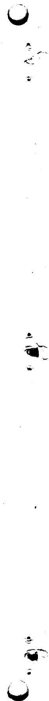

# CONTENTS

# Page

# Abstract 1

I. Introduction 2   
II. Conclusions and Recommendations 2   
III. MSBR Heat Exchanger Configuration 3   
IV. Afterheat Generation and Distribution 6   
V. Metallurgical Considerations 11   
VI. Results 14

Appendix A. Computational Model and Assumptions Governing the Computations 43   
Appendix B. Directional Distribution of Radiation 45   
Appendix C. View Factors 49   
Appendix D. Shell Temperatures 61   
Appendix E. The Heat Transfer - Temperature Equations 63   
Appendix F. Computational Procedure 69   
Appendix G. Thermal Radiation Characteristics of Hastelloy N 71   
Appendix H. Comparison - Experiments and Analyses 75   
Appendix I. Method Used to Estimate the Initial Peak Temperature Transient in the 563-Mw Reference Design Heat Exchanger 93   
References -103

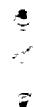

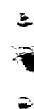

# THERMAL RADIATION TRANSFER OF AFTERHEAT

# IN MSBR HEAT EXCHANGERS

J. R. Tallackson

# ABSTRACT

A fraction, estimated to be $40\%$ , of the heat-producing noble-metal fission products--niobium, molybdenum, technetium, ruthenium, rhenium, and tellurium--is expected to deposit on the metal surfaces within the primary fuel-salt loop in a molten-salt reactor. Virtually all of this $40\%$ will be in the heat exchangers. The normal means of afterheat removal is to continue to circulate the primary and secondary salts. The worst abnormal situation arises if the heat exchangers are quickly drained of both primary and secondary salts in circumstances such that all afterheat removal from the heat exchangers is, of necessity, by radiative heat transfer. Whereas such an event will rarely, if ever, take place, the primary system must accommodate the consequences, principally high temperatures, without compromising containment.

Steady-state temperature calculations, based on radiative heat transfer in MSBR primary heat exchangers, are presented. Several sizes with ratings from 94 Mw to 563 Mw and all with the same general configuration were considered. Radial temperature profiles were computed for afterheat rates corresponding to elapsed times from 100 sec to 11 days after reactor shutdown. The effect of the emissivity of the internal radiating surfaces in the heat exchangers was included. The calculations show that the principal single barrier to heat removal is the intermediate shell surrounding the tube bundle. This shell is located just inside the outer shell and, unfortunately, becomes an effective thermal radiation shield.

It is shown that heat exchangers with but one shell instead of two as in the MSBR reference design will achieve significant reductions in peak temperatures, particularly in the larger sizes and at low emissivities.

No transient case was computed but the upper limit of the initial transient was estimated; the heat capacity of the exchangers affords a cushion which, with the exception of the 563-Mw unit, limits maximum temperatures to numbers that are high but not disastrous. Design changes to increase radiating surface areas and to shorten the radial transfer distance through the tube bundle should render the 563-Mw exchanger acceptable.

Keywords: thermal radiation, noble metals, heat exchangers, emergency cooling, deposition, afterheat.

# I. INTRODUCTION

The afterheat problem in molten-salt reactors caused by the noble metals which plate out on metal surfaces during reactor operation has not gone away. Reliable, consistent data are scant, but, from MSRE data, Briggs1 has estimated that $40\%$ of the noble-metal fission products might plate out on the metal surfaces in the primary salt circuit. These produce substantial amounts of afterheat and virtually all of it will be developed in the heat exchangers.

Normally, afterheat in an MSER is easily removed by continuing the circulation of the primary and secondary salts. The situation, albeit unlikely, may arise in which both primary and secondary salts are rapidly drained immediately after reactor shutdown. In these circumstances, afterheat removal is, of necessity, solely by radiative transfer and the maximum temperatures so developed are of considerable interest.

In September 1967 the author2 presented calculated estimates of temperatures produced by afterheat from noble metals plated on the surfaces in an empty primary heat exchanger of a two-region MSBR. It was assumed that all afterheat rejection was by radiative transfer. These temperatures were distressingly high, due, in large measure, to the overly simplified computational model employed (see Appendix H). I am pleased, without benefit of rack and thumbscrew, to recant. More realistic calculations based on the single-region "reference design"3 MSBR heat exchangers indicate that peak afterheat temperatures, while still uncomfortably high, will be much lower than originally anticipated.

# II. CONCLUSIONS AND RECOMMENDATIONS

MSBR "reference design" type heat exchangers can be designed to withstand the after-shutdown temperature rise produced by noble-metal afterheat. This worst-case study indicates that the two larger sizes considered, 563 Mw and 281 Mw, may experience excessively high temperatures, but the excess is small. If the overall diameters of these ex-changers are increased, the peak temperatures can be limited to acceptable values without undue penalties in cost. The improvement obtained is twofold: (1) The reduction in annulus thickness decreases the radiation path through the tube annulus, and (2) the radiating areas of the outer and intermediate shells are increased.

The additional intermediate shell between the tubes and the outside shell is an effective barrier to radiative transfer. This shell is required if the tube bundle is to be replaced in situ. Significant reductions in peak temperatures will be obtained if this shell is eliminated. Alternatively, if the effective emissivity of the surfaces of the intermediate shell and the outer shell can be made very high ( $\overline{>0.8}$ ) so as to be nearly black, the peak temperatures will be appreciably lower.

Calculated estimates of radiant heat transmission and resulting temperatures may be extremely sensitive to the assumptions, approximations, and uncertainties on which the calculations are based. For example, earlier calculations on a not too dissimilar heat exchanger, using an oversimplified model,\* produced discouragingly high temperature forecasts; the temperatures estimated by these earlier computations were as much as $2500^{\circ}\mathrm{F}$ higher than the temperatures reported herein. The present computational model is widely accepted and used. It contains no gross compromises with respect to heat exchanger geometry. It does require that photons be emitted, reflected, and absorbed in a simple pattern, and that their behavior be unaffected by temperature. A casual literature search indicates that the errors produced by these simplifications may be relatively small and probably on the high side, but confirmation would be highly desirable. The variation of maximum temperature with emissivity is substantial. Generally, I conclude that these calculated temperatures may err on the high side but hesitate to enumerate the amount. It will not be worthwhile to use or develop more accurate and elegant computational approaches until reliable experimental evidence, applicable to this particular type of problem, has been produced. Without the support of the experimental confirmation we can expect to produce a conservative and perhaps expensive design. If radiant heat transmission remains a dominant consideration, I recommend an experimental program to support and confirm the analyses. Such experiments are not uncomplicated; they must be carefully designed and well planned.

# III. MSBR HEAT EXCHANGER CONFIGURATION

Figure 1 is a vertical section through the "reference design"3 MSBR primary heat exchanger rated at $563\mathrm{Mw}$ . Four of these will be required for a 2250-Mw(th) MSBR. This exchanger type was scaled down by rating factors of $1/2$ , $1/3$ , $1/4$ , and $1/6$ , thereby giving heat exchangers rated at 281, 188, 141, and $94\mathrm{Mw}$ . The dimensions and details pertinent to these heat transfer computations are on Fig. 2. It should be noted that the scaled-down dimensions of the four smaller exchangers do not follow any precise scaling law(s) based on stress or flow. For example, it is more realistic to choose nominal pipe sizes and plate thicknesses for the inner and intermediate shells instead of the non-standard diameters and thicknesses that would result from any exact scaling down. Also, it would be unwise to use thicknesses less than $1/2$ in. for the outer shells. Therefore, the outer shells are $1/2$ in. in all the ex-changers.

A second set of calculations was made for 563-Mw exchangers having larger outside diameters, thinner annuli, and therefore fewer tube circles than the "reference design." These exchangers are scaled-up versions of the 563-Mw unit which has 31 tube circles in the tube annulus. These calculations are discussed in Section VI.

ORNL DWG. 69-6004R

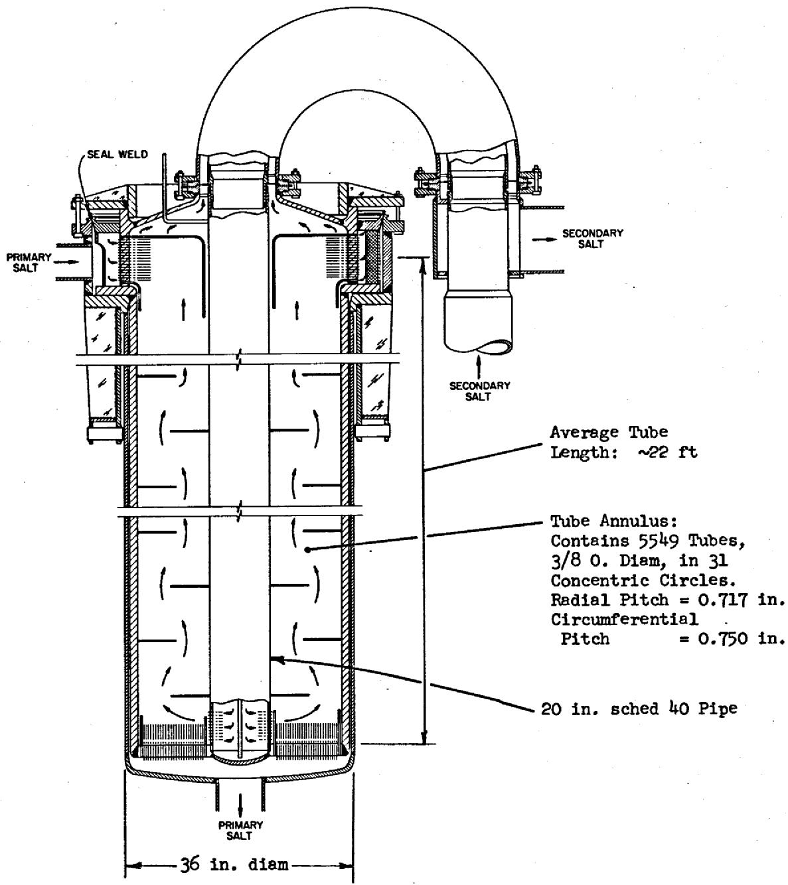  
Fig. 1. MSBR 563-Mw "Reference Design" Primary Heat Exchanger.

ORNL DWG. 71-567

Material; Tubes and Shells; Hastelloy N:

<table><tr><td>Density</td><td>0.320 lb/in.3</td></tr><tr><td>Melting point</td><td>2470 - 2755 °F</td></tr><tr><td>Thermal conductivity, at 1300°F</td><td>12.7 Btu/hr ft2-6°F/ft</td></tr></table>

<table><tr><td>Specific heat</td><td>0.138 Btu / lb·°F</td></tr></table>

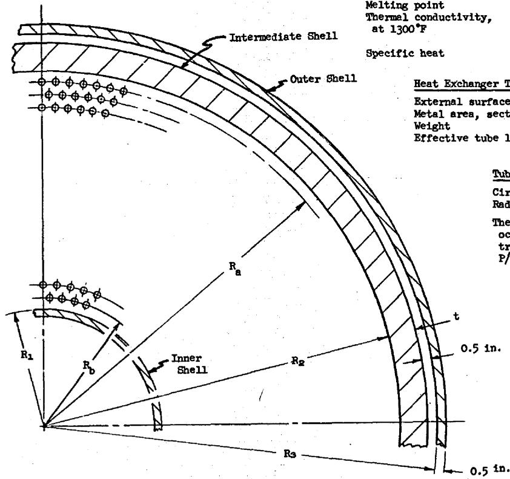  
Fig. 2. Diagram, With Dimensions, of Transverse Cross Sections Through MSER Heat Exchangers

Heat Exchanger Tubes

External surface area $= 0.0982 ft^2/$ ft

Metal area, sectional = 0.0373 in.² = 2.59 x 10⁻⁴ ft²

Weight $= 0.143\mathrm{lb / ft}$

Effective tube length = 22 ft, all exchangers

Tube Geometry

Circumferential pitch -- 0.750 in.  
Radial pitch -- 0.717 in.

The fraction of cross sectional area occupied by tubes is same as for triangulargly pitched tubes having $\mathbb{P} / \mathbb{D} = 2.1$

MSBR

HEAT EXCHANGER DIMENSIONS

<table><tr><td rowspan="2">Rating (Mw)</td><td rowspan="2">Inner Shell</td><td rowspan="2">Intermediate Shell</td><td rowspan="2">Outer Shell</td><td colspan="3">Tube Annulus</td></tr><tr><td>Dimensions</td><td>Tube Circles</td><td>Total Tubes</td></tr><tr><td rowspan="4">94</td><td>8 in., sched 40</td><td>Rg = 14.00 in.</td><td>R3 = 15.50 in.</td><td>Ra = 13.14 in.</td><td>12</td><td>924</td></tr><tr><td>R1 = 4.31 in.</td><td>t = 1.00 in.</td><td>A1 = 8.10 ft2/ft</td><td>Rb = 5.25 in.</td><td></td><td></td></tr><tr><td>A1 = 2.26 ft2/ft</td><td>A1 = 7.33 ft2/ft</td><td>A0 = 8.36 ft2/ft</td><td>ΔR = 7.89 in.</td><td></td><td></td></tr><tr><td></td><td>A0 = 7.85 ft2/ft</td><td></td><td></td><td></td><td></td></tr><tr><td rowspan="4">141</td><td>10 in., sched 40</td><td>Rg = 17.50 in.</td><td>R3 = 19.38 in.</td><td>Ra = 16.14 in.</td><td>15</td><td>1395</td></tr><tr><td>R1 = 5.38 in.</td><td>t = 1.38 in.</td><td>A1 = 10.13 ft2/ft</td><td>Rb = 6.10 in.</td><td></td><td></td></tr><tr><td>A1 = 2.81 ft2/ft</td><td>A1 = 9.16 ft2/ft</td><td>A0 = 10.39 ft2/ft</td><td>ΔR = 10.04 in.</td><td></td><td></td></tr><tr><td></td><td>A0 = 9.88 ft2/ft</td><td></td><td></td><td></td><td></td></tr><tr><td rowspan="4">188</td><td>12 in., sched 40</td><td>Rg = 19.50 in.</td><td>R3 = 21.50 in.</td><td>Ra = 18.75 in.</td><td>17</td><td>1853</td></tr><tr><td>R1 = 5.38 in.</td><td>t = 1.50 in.</td><td>A1 = 11.25 ft2/ft</td><td>Rb = 7.28 in.</td><td></td><td></td></tr><tr><td>A1 = 3.34 ft2/ft</td><td>A1 = 10.20 ft2/ft</td><td>A0 = 11.51 ft2/ft</td><td>ΔR = 11.47 in.</td><td></td><td></td></tr><tr><td></td><td>A0 = 11.00 ft2/ft</td><td></td><td></td><td></td><td></td></tr><tr><td rowspan="4">281</td><td>14 in., sched 40</td><td>Rg = 23.00 in.</td><td>R3 = 25.25 in.</td><td>Ra = 22.59</td><td>22</td><td>2794</td></tr><tr><td>R1 = 7.00 in.</td><td>t = 1.75 in.</td><td>A1 = 13.20 ft2/ft</td><td>Rb = 7.53</td><td></td><td></td></tr><tr><td>A1 = 3.67 ft2/ft</td><td>A1 = 12.02 ft2/ft</td><td>A0 = 13.46 ft2/ft</td><td>ΔR = 15.06</td><td></td><td></td></tr><tr><td></td><td>A0 = 12.94 ft2/ft</td><td></td><td></td><td></td><td></td></tr><tr><td rowspan="4">563</td><td>20 in., sched 40</td><td>Rg = 32.75 in.</td><td>R3 = 35.75 in.</td><td>Ra = 32.12</td><td>31</td><td>5549</td></tr><tr><td>R1 = 10.00 in.</td><td>t = 2.50 in.</td><td>A1 = 18.80 ft2/ft</td><td>Rb = 10.62</td><td></td><td></td></tr><tr><td>A1 = 5.24 ft2/ft</td><td>A1 = 17.13 ft2/ft</td><td>A0 = 19.06 ft2/ft</td><td>ΔR = 21.50</td><td></td><td></td></tr><tr><td></td><td>A0 = 18.45 ft2/ft</td><td></td><td></td><td></td><td></td></tr></table>

# IV. AFTERHEAT GENERATION AND DISTRIBUTION

The amount of afterheat in the heat exchanger is based on Briggs' estimate that 40% of the noble-metal fission products plate out on the metal surfaces exposed to the primary salt. The inside surfaces of the heat exchanger tubes provide 39,000 ft² of surface in a 2250-Mw(th) MSBR system. This is a very large area compared with the shell and pipe surface areas in the primary salt circuit. It can be assumed, with negligible error, that the entire 40% is deposited on the inner surfaces of the exchanger tubes.

The heat-producing noble metals are niobium, molybdenum, technetium, ruthenium, rhodium, and tellurium. The heat produced by the iodine daughters of tellurium is included. The heating by those noble metals produced in the drain tanks by the decay of non-noble parent nuclides is not included.

Figure 3 shows the afterheat rate in the 563-Mw unit per foot of length of heat exchanger, and Fig. 4 shows the rate per square foot of outside tube surface* in any MSBR exchanger of this type. The accumulated afterheat curve on Fig. 5 is the integral curve of Fig. 3. Table 1 gives numerical values of these data.

Heat exchanger temperatures were computed for two different distributions of heat generation in the exchangers. The simplest case, Type 1, is that in which all heat generation is assumed to be confined to the tubes and uniformly distributed. This, in effect, says that gamma radiation does not generate heat in adjacent shells nor is the total heat generation in the exchanger(s) reduced by gammas escaping to the outside world.

The second case, Type 2 distribution, considers the effect of gamma radiation on the location of internal heat generation. Careful calculations4,5 of gamma heat generation in heat exchangers of this general design are available and from these the total heat generation rate was subdivided into four parts:\*\*

1. the fraction in the inner shell,   
2. the fraction in the tube annulus (includes all $\theta^{\prime}$ heating).   
3. the fraction in the intermediate and outer shells,   
4. the fraction escaping the exchanger.

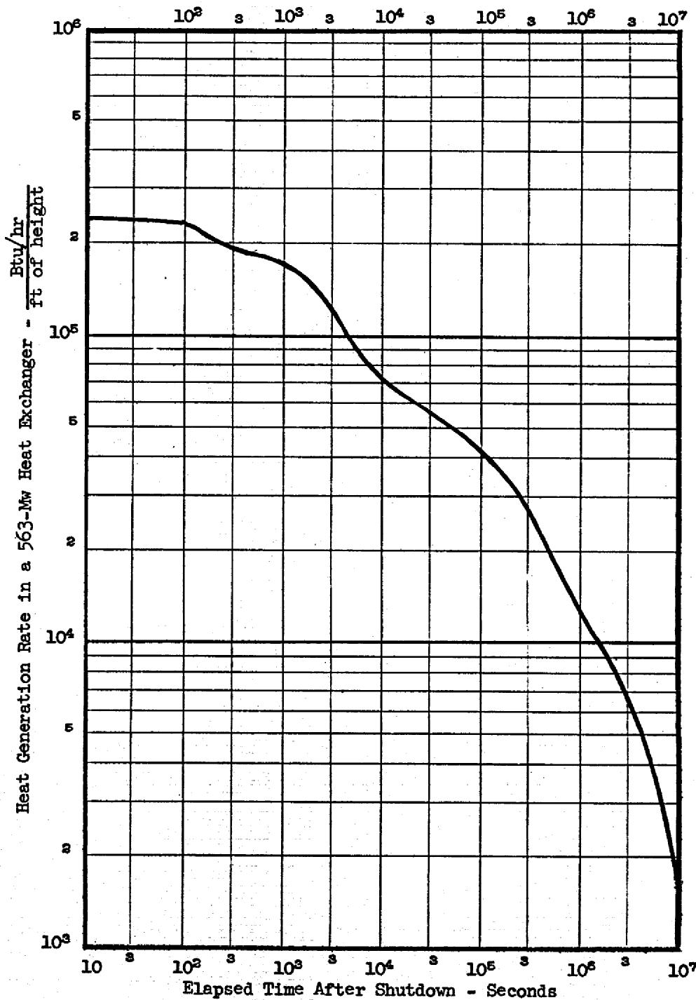  
Fig. 3. Afterheat Generation Rate Per Foot of Height in a 563-Mw MSER Heat Exchanger. Afterheat is that produced by $40\%$ of the total noble metal fission products (including iodine daughters of tellurium) which are assumed to plate out on metal surfaces. Refer to MSR-68-99 Rev., Fig. 9.

ORNL DWG. 71-569

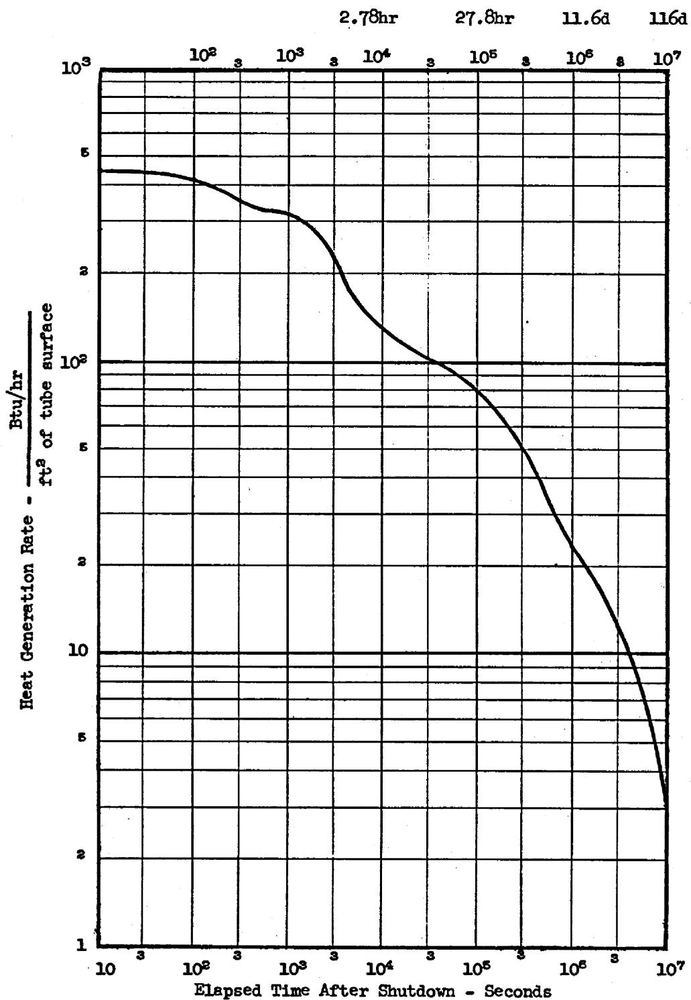  
Fig. 4. Afterheat Generation Rate Based on the Outside Surface Area (radiating surfaces) of MSER Heat Exchanger Tubes. Afterheat is that produced by $140\%$ of all noble fission products plus the iodine daughters of tellurium (see MSR-68-99 Rev., Fig. 9). Heat exchanger configuration per Fig. 1.

ORNL DWG. 71-570

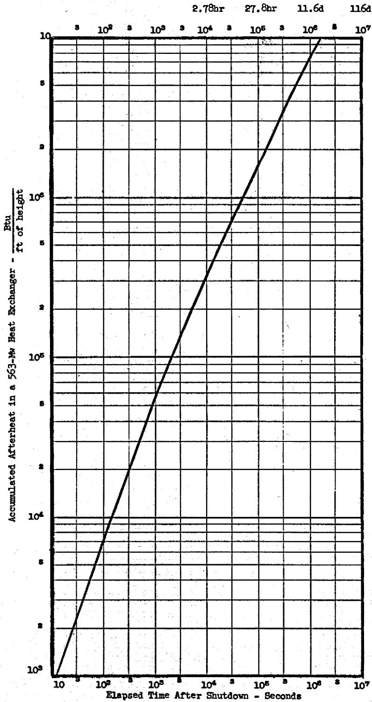  
Fig. 5. Accumulated Afterheat in a Perfectly Insulated 563-Mw MSBR Heat Exchanger per Foot of Heat Exchanger Length. Afterheat is that produced by $40\%$ of all the noble metal fission products which are assumed to plate out on the heat exchanger tubes. Refer to MSR-68-99 Rev., Fig. 10. Heat exchanger configuration per ORNL DWG 69-6004.

Table 1. Totala Afterheat Generation by Noble Metals Plated on Tube Surfaces in MSBR Heat Exchangers   

<table><tr><td rowspan="2">Elapsed Time After Reactor Shutdown (sec)</td><td colspan="6">Heat Generation Rates</td><td rowspan="2">Accumulated (Integrated) Heat Per Foot of Height in MSBR 563-Mw Heat Exchanger (ft2)</td><td rowspan="2">(kw ft)</td><td rowspan="2">(kw ft)</td><td rowspan="2">(kw ft)</td><td rowspan="2">(kw ft)</td></tr><tr><td>Per Foot of Height in MSBR 563-Mw Heat Exchanger (Btu/hr ft)</td><td>(kw ft)</td><td>Per Square Foot of Outside Surface of Heat Exchanger Tubes (Btu/hr ft)</td><td>(kw ft)</td><td>(kw ft)</td><td>(kw ft)</td></tr><tr><td>0</td><td>2.52x105</td><td>7.39x101</td><td>4.60x103</td><td>1.35x10-1</td><td>4.52x101</td><td>1.33x10-3</td><td>0</td><td>0</td><td></td><td></td><td></td></tr><tr><td>103</td><td>2.32x105</td><td>6.82x101</td><td>4.27x103</td><td>1.25x10-1</td><td>4.20x101</td><td>1.23x10-3</td><td>7.00x103</td><td>2.05</td><td></td><td></td><td></td></tr><tr><td>3x103</td><td>1.94x105</td><td>5.69x101</td><td>3.55x103</td><td>1.04x10-1</td><td>3.48x101</td><td>1.02x10-3</td><td>1.94x104</td><td>5.68</td><td></td><td></td><td></td></tr><tr><td>103=16.7 m</td><td>1.74x105</td><td>5.12x101</td><td>3.20x103</td><td>9.38x10-3</td><td>3.12x101</td><td>9.21x10-3</td><td>5.63x104</td><td>1.65x101</td><td></td><td></td><td></td></tr><tr><td>3x103=0.83 hr</td><td>1.24x105</td><td>3.64x101</td><td>2.27x103</td><td>6.67x10-3</td><td>2.23x101</td><td>6.55x10-3</td><td>1.36x105</td><td>3.98x101</td><td></td><td></td><td></td></tr><tr><td>104=2.78 hr</td><td>7.36x104</td><td>2.16x101</td><td>1.35x103</td><td>3.96x10-3</td><td>1.33x101</td><td>3.88x10-3</td><td>3.18x105</td><td>9.32x101</td><td></td><td></td><td></td></tr><tr><td>3x104=8.33 hr</td><td>5.63x104</td><td>1.65x101</td><td>1.03x103</td><td>3.02x10-3</td><td>1.01x101</td><td>2.97x10-3</td><td>7.16x105</td><td>2.10x103</td><td></td><td></td><td></td></tr><tr><td>105=27.8 hr</td><td>4.26x104</td><td>1.25x101</td><td>7.81x101</td><td>2.29x10-3</td><td>7.67</td><td>2.25x10-3</td><td>1.59x106</td><td>4.66x103</td><td></td><td></td><td></td></tr><tr><td>3x105=3.47 d</td><td>2.71x104</td><td>7.95</td><td>4.98x101</td><td>1.46x10-3</td><td>4.90</td><td>1.43x10-3</td><td>3.48x106</td><td>1.02x103</td><td></td><td></td><td></td></tr><tr><td>106=11.6 d</td><td>1.24x104</td><td>3.64</td><td>2.27x101</td><td>6.67x10-3</td><td>2.23</td><td>6.55x10-4</td><td>7.37x106</td><td>2.16x103</td><td></td><td></td><td></td></tr><tr><td>3x106=34.7 d</td><td>6.58x103</td><td>1.93</td><td>1.21x101</td><td>3.54x10-3</td><td>1.19</td><td>3.48x10-4</td><td>1.36x107</td><td>3.98x103</td><td></td><td></td><td></td></tr><tr><td>107=3.80 mo</td><td>1.67x103</td><td>4.89x10-1</td><td>3.05</td><td>8.95x10-4</td><td>3.00x10-1</td><td>8.78x10-5</td><td>1.94x107</td><td>5.68x103</td><td></td><td></td><td></td></tr><tr><td>3x107=0.95 y</td><td>3.30x103</td><td>9.66x10-3</td><td>6.05x10-1</td><td>1.77x10-4</td><td>5.94x10-3</td><td>1.74x10-5</td><td>2.36x107</td><td>6.93x103</td><td></td><td></td><td></td></tr><tr><td>108=3.17 y</td><td>6.58x101</td><td>1.93x10-3</td><td>1.21x10-1</td><td>3.54x10-5</td><td>1.19x10-2</td><td>3.48x10-6</td><td>2.64x107</td><td>7.73x103</td><td></td><td></td><td></td></tr></table>

${}^{a}$ These rates and accumulated heat values include all gamma energy and represent the afterheat production by ${40}\%$ of the noble metal fission products at saturation levels. Heat generation by the iodine daughters born after shutdown from the tellurium is included.   
bNominal height (length) of MSBR heat exchangers is 22 ft.

Figure 6 is a typical profile of the gamma heat deposition rate in an empty 563-Mw heat exchanger. Figure 7 shows curves of the fractions, (1) to (4) above, for the exchangers in the size range considered.* These distribution fractions do not show any large variations with elapsed time, particularly at the times of interest, from $10^{3}$ to $10^{5}$ sec (0.3 to 30 hours) after shutdown. These curves are based on averages of $10^{3}$ - and $10^{4}$ -sec data.

Figure 6 shows that, of the two outermost shells, the thicker intermediate shell is the much larger heat source; also, note that gamma heat generation in these shells is attenuated very rapidly in the radial direction. For these reasons, with Type 2 distribution, all the gamma heat deposition in both outer shells was considered to be near the inside surface of the intermediate shell.

# V. METALLURGICAL CONSIDERATIONS

The primary concern of this study is to determine whether or not excessive heat exchanger temperatures will jeopardize the integrity of the Hastelloy N primary containment envelope. Because the event postulated seldom, if ever, would occur and because the resultant high temperatures would be of short duration, we are not concerned with the long-term creep-rupture behavior. We are concerned with the short-term physical properties of Hastelloy N at temperatures around $2000^{\circ}\mathrm{F}$ ( $\sim 1100^{\circ}\mathrm{C}$ ) and assuming that these temperatures are maintained for no more than 20 hours.

Hastelloy N pressure vessels, piping, etc., are not expected to sustain serious damage if held at low stress for short times (< 20 hr) at temperatures of $2150^{\circ}\mathrm{F}$ (1177°C). A vessel subject to any substantial fluence will lose ductility. Ultimate strength at this temperature will be very low. If a component is to survive at this temperature, we must ensure that the high temperature regions be virtually free of stress-producing imposed loads. It is appropriate to point out that it is routine fabrication practice to specify a stress-relieving anneal at $2150^{\circ}\mathrm{F}$ for welded Hastelloy N pressure vessels. The foregoing suggests that we evaluate preliminary designs using $2100^{\circ}\mathrm{F}$ as an upper temperature limit for the unlikely events being considered here. This assumes that the calculated or estimated temperatures tend to be on the high side and leaves a small margin for thermal stresses and other uncertainties which will be evaluated with some care during gestation of a final design.

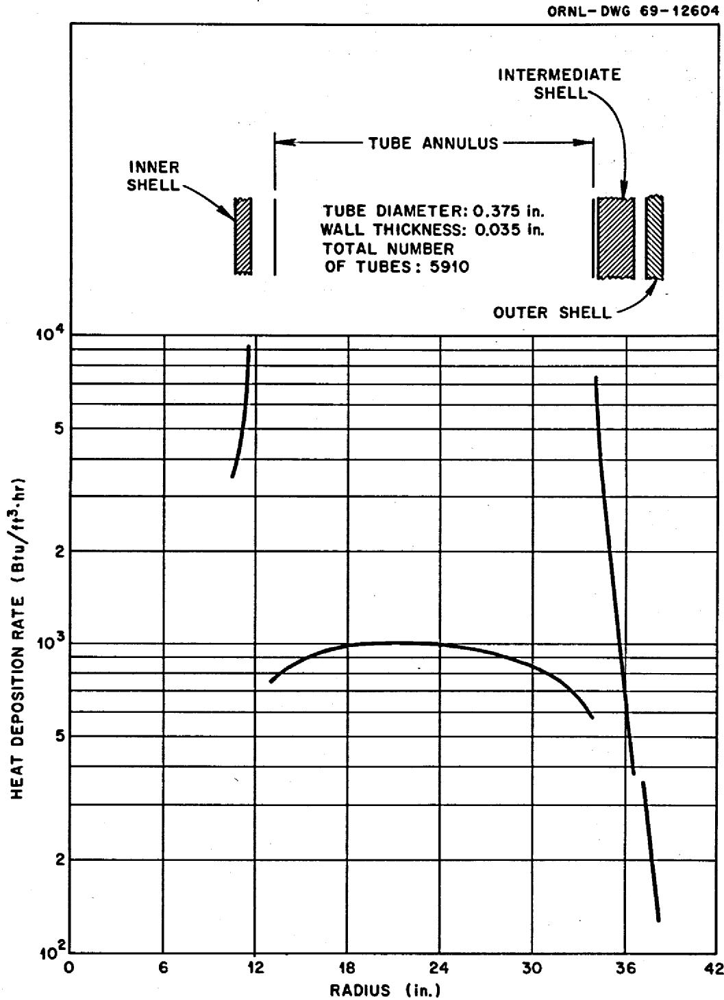  
Fig. 6. Distribution of Gamma Heat Generation Produced by Tellurium* Fission Products in a 563-Mw MSBR Heat Exchanger. Forty percent of all the tellurium is assumed to deposit uniformly on the inside surfaces of the tubes.

*The energy spectrum of tellurium gammas is considered to be typical of the gammas produced by the other noble metal fission products.

ORNL DWG. 71-571

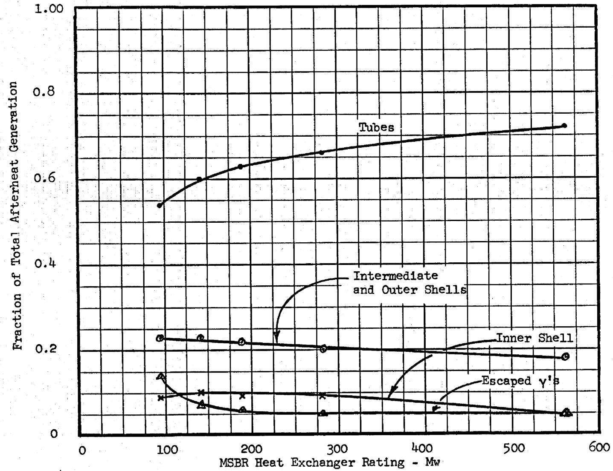  
Fig. 7. Type 1 Distributions of Noble Metal Afterheat in MSBR Heat Exchangers.

# VI. RESULTS

Figures 8 to 11 (incl.) are steady-state radial temperature profiles in four sizes, from 94 to 281 Mw, of MSBR-type heat exchangers having the dimensions shown on Fig. 2. The heat generation rate is that predicted at $10^{4}$ sec (2.8 hr) after shutdown and drain. These curves are based on the assumption of Type 1 distribution (see Section IV); i.e., all afterheat generation is uniformly distributed in the heat exchanger tubes and no gamma energy escapes. It was also assumed that the emissivity of the outside surface of the outer shell was 0.8 and that this surface was radiating into infinite "black" surroundings whose temperature is $1000^{\circ}\mathrm{F}$ . The emissivity* of the internal radiating surfaces, tubes and shells, is one of the larger uncertainties in a calculation of this type. Both tubes and shells will meet stringent quality assurance standards and we should expect them to have an excellent surface finish, perhaps appearing almost polished. Furthermore, after exposure to molten fluoride salts these internal radiating surfaces will be oxide free. All the factors tending to promote bright, low emissivity surfaces in a material tending toward low emissivity are present. For these reasons, nearly all the calculations were made at internal surface emissivities of 0.1, 0.2, and 0.3. The general subject of emissivity* is discussed in more detail in Appendix G. The data in Appendix G suggest that we can expect the internal Hastelloy N surfaces to have an emissivity of 0.2 to 0.3 and that we select an emissivity of 0.2 in evaluating heat exchanger performance in the situation considered herein. The high emissivity (0.8) of the outer surface of the outer shell is justified by assuming that it is coated with one of the titanates or, alternatively, deeply convoluted by fins or a gridwork.

It is emphasized that these temperature curves are for steady-state conditions and do not take into account the rapid decrease with time of the heat generation rate nor the temperature reducing effect of heat capacity of the exchanger. These temperature profiles are, perhaps, higher than would be obtained should the situation postulated actually occur. The upper limits of the initial temperature transient in the 563-Mw unit have been estimated and are discussed in subsequent paragraph(s). The estimate indicates the temperature will reach its maximum in about $10^{4}$ sec after reactor shutdown and an immediate drain; therefore, most of the data herein were calculated as if at steady state with the afterheat rate expected at $10^{4}$ sec after shutdown.

As the calculations proceeded, starting with the smallest, $94\mathrm{Mw}$ , unit, some trends became evident; (1) the effect of heat capacity of the exchanger cannot be ignored, (2) the variation of maximum internal temperature with emissivity is less at higher emissivities, (3) gamma

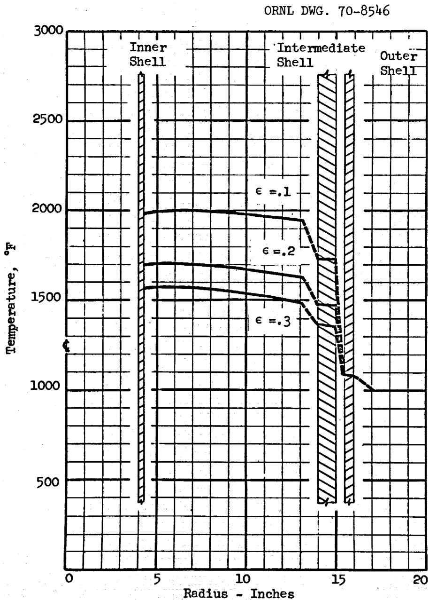  
Fig. 8. Steady-State Temperature Profiles in an Empty 94-Mw Heat Exchanger at Three Values of Internal Surface Emissivity.

Heat Production: 12,300 Btu/hr-ft height; uniformly distributed in tube annulus. Equivalent to afterheat rate $10^{4}$ sec after shutdown produced by $40\%$ of the noble metal fission products plated on tube surfaces.

Heat Transfer: By radiation only. Outer surface emissivity=0.8.

Environment: "Black" surroundings at $1000^{\circ}\mathbf{F}$ .

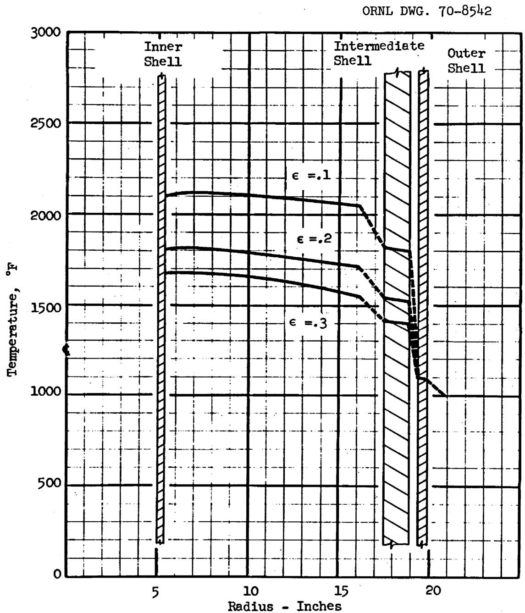  
Fig. 9. Steady-State Temperature Profiles in an Empty 14l-Mw Heat Exchanger at Three Values of Internal Surface Emissivity.

Heat Production: 18,400 Btu/hr-ft height; uniformly distributed in tube annulus. Equivalent to afterheat rate 104 sec after shutdown produced by $40\%$ of the noble metal fission products plated on tube surfaces.

Heat Transfer: By radiation only. Outer surface emissivity = 0.8.  
Environment: "Black" surroundings at $1000^{\circ}\mathrm{F}$ .

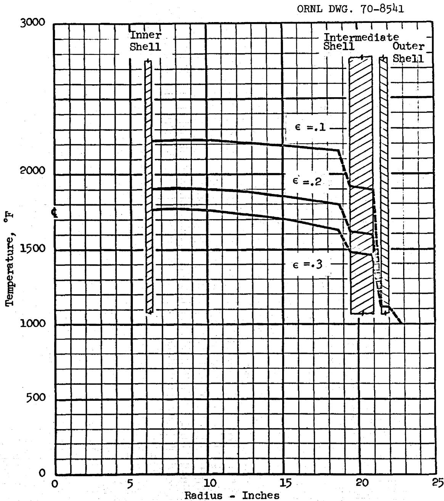  
Fig. 10. Steady-State Temperature Profiles in an Empty 188 Mw Heat Exchanger at Three Values of Internal Surface Emissivity.

Heat Production: 24,500 Btu/hr-ft height; uniformly distributed in tube annulus. Equivalent to afterheat rate $10^4$ sec after shutdown produced by $40\%$ of the noble metal fission products plated on tube surfaces.

Heat Transfer: By radiation only. Outer surface emissivity = 0.8.

Environment: "Black" surroundings at $1000^{\circ}\mathbf{F}$ .

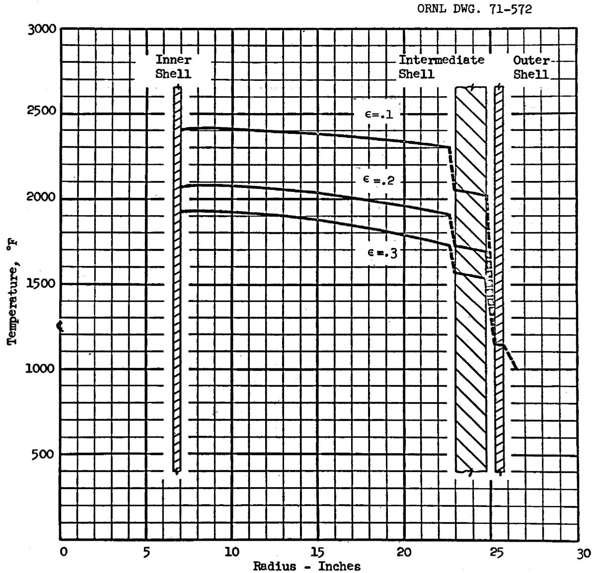  
Fig. 11. Steady-State Temperature Profiles in an Empty 281-Mw Heat Exchanger at Three Values of Internal Surface Emissivity.

Heat Production: 36,800 Btu/hr-ft height; uniformly distributed in tube annulus. Equivalent to afterheat rate $10^4$ sec after shutdown produced by $40\%$ of the noble metal fission products plated on tube surfaces.

Heat Transfer: By radiation only. Outer surface emissivity $= 0.8$ .

Environment: "Black" surroundings at $1000^{\circ}\mathbf{F}$ .

energy losses to the outside are insufficient to contribute materially toward reducing peak internal temperatures, and (4) the maximum temperatures in the 563-Mw "reference design" exchanger may become unacceptably high. Finally, it developed that the time-sharing computational program used to obtain temperatures in the tube annulus (Appendix E) would not run if the number of tube circles in an exchanger exceeded 22, whereas the 563-Mw exchanger contains 31. There was not sufficient incentive to spend time in rewriting the program for a larger machine. Instead, it was decided to produce additional computations to indicate the changes in the 563-Mw "reference design" which will reduce the maximum internal temperature to acceptable values. Therefore, scaled-up versions of the 563-Mw "reference design" unit with larger outside diameters and a reduced number of tube circles were programmed and the peak temperatures in the "reference design" were obtained by extrapolation.

The effect of emissivity, number of outer shells, heat capacity, overall size and rating are considered in the paragraphs which follow.

Temperatures in 563-Mw heat exchangers having larger outside diameters and thinner tube annuli than in the "reference design" (Fig. 1) model were computed. These computations served two purposes: (1) They indicated the minimum outside diameter of an exchanger which will limit the maximum temperature to the $1900^{\circ}\mathrm{F} - 2100^{\circ}\mathrm{F}$ region, and (2) they produced the basis for a good estimate, by extrapolation, of the peak temperatures in the 563-Mw "reference design" shown on Fig. 1. The dimensions of these exchangers and the computed temperatures therein are in Table 2 and on Figs. 12 and 13.

The extrapolated temperature profiles, Fig. 14, assigned to the 563-Mw "reference design" model which has 31 tube circles, are presented with considerable confidence because the extrapolations involved only the temperature differentials in the tube annulus and this represents only about $25\%$ of the total temperature above the $1000^{\circ}\mathrm{F}$ ambient. The remaining $75\%$ , the temperatures of the outer and intermediate shells, has been computed accurately.

It can be seen that if the outside diameter of the reference design heat exchanger is increased from 36 in. to approximately 50 in. so that the tubes are arrayed in 17 to 20 tube circles, the peak steady-state internal temperatures will be in the acceptable $2000^{\circ}\mathrm{F} - 2100^{\circ}\mathrm{F}$ region at $10^{4}$ sec after shutdown when the internal surface emissivity is about 0.2. A further increase in diameter may be necessary if: (1) the internal surface emissivity turns out to be much less than 0.2; (2) the "reference design" model, with two outer shells, continues to be the required design; and (3) if we use the steady-state temperature calculations at $10^{4}$ sec to guide the design. It will be shown that eliminating one of the shells outside the tube annulus effects a very substantial reduction in peak internal temperatures should the internal surface emissivity be low (0.1).

Table 2. Temperatures Developed by Radiative Transfer of Noble Metal Afterheat in MSBR Heat Exchangers Rated at 563 Mw and Having Tube Annuli of Different Thicknesses   

<table><tr><td rowspan="2">No. Tube 
Circles 
(Total 
Tubes)</td><td rowspan="2">R1R2t in.</td><td rowspan="2">R0</td><td rowspan="2">Ra, Ra,b, Abnn in.</td><td rowspan="2">Emissivity 
of 
Internal 
Surfaces</td><td colspan="7">Temperatures, °F</td></tr><tr><td>Tmax</td><td>To</td><td>ΔTann</td><td>T1</td><td>Ts</td><td>ΔTshells</td><td>Ts</td></tr><tr><td rowspan="3">17 
(5542)</td><td>32</td><td>50.50</td><td>44.65</td><td>0.1</td><td>2404</td><td>2087</td><td>317</td><td>2019</td><td>1149</td><td>870</td><td>1140</td></tr><tr><td>46</td><td></td><td>33.18</td><td>0.2</td><td>2059</td><td>1759</td><td>300</td><td>1691</td><td>1149</td><td>542</td><td>1140</td></tr><tr><td>3.50</td><td></td><td>11.47</td><td>0.3</td><td>1903</td><td>1607</td><td>296</td><td>1539</td><td>1149</td><td>390</td><td>1140</td></tr><tr><td rowspan="3">20 
(5540)</td><td>25</td><td>45.00</td><td>39.87</td><td>0.1</td><td>2495</td><td>2150</td><td>345</td><td>2084</td><td>1165</td><td>819</td><td>1155</td></tr><tr><td>41</td><td></td><td>26.25</td><td>0.2</td><td>2144</td><td>1807</td><td>337</td><td>1742</td><td>1165</td><td>577</td><td>1155</td></tr><tr><td>3.00</td><td></td><td>13.62</td><td>0.3</td><td>1987</td><td>1648</td><td>339</td><td>1583</td><td>1165</td><td>418</td><td>1155</td></tr><tr><td rowspan="3">22 
(5544)</td><td>21.5</td><td>43.00</td><td>37.62</td><td>0.1</td><td>2541</td><td>2179</td><td>362</td><td>2111</td><td>1172</td><td>939</td><td>1161</td></tr><tr><td>39</td><td></td><td>22.56</td><td>0.2</td><td>2191</td><td>1831</td><td>360</td><td>1763</td><td>1172</td><td>595</td><td>1161</td></tr><tr><td>3.00</td><td></td><td>15.06</td><td>0.3</td><td>2035</td><td>1668</td><td>367</td><td>1600</td><td>1172</td><td>428</td><td>1161</td></tr><tr><td rowspan="3">24 
(5544)</td><td>18</td><td>40.75</td><td>35.80</td><td>0.1</td><td>2578*</td><td>2208</td><td>370*</td><td>2142</td><td>1180</td><td>962</td><td>1169</td></tr><tr><td>37</td><td></td><td>19.38</td><td>0.2</td><td>2224*</td><td>1854</td><td>370*</td><td>1788</td><td>1180</td><td>608</td><td>1169</td></tr><tr><td>2.75</td><td></td><td>16.42</td><td>0.3</td><td>2057*</td><td>1687</td><td>370*</td><td>1621</td><td>1180</td><td>441</td><td>1169</td></tr><tr><td rowspan="3">26 
(5538)</td><td>15</td><td>39.75</td><td>34.40</td><td>0.1</td><td>2619*</td><td>2229</td><td>390*</td><td>2155</td><td>1184</td><td>971</td><td>1172</td></tr><tr><td>36</td><td></td><td>16.47</td><td>0.2</td><td>2262*</td><td>1872</td><td>390*</td><td>1798</td><td>1184</td><td>614</td><td>1172</td></tr><tr><td>2.75</td><td></td><td>17.93</td><td>0.3</td><td>2094*</td><td>1704</td><td>390*</td><td>1650</td><td>1184</td><td>446</td><td>1172</td></tr><tr><td rowspan="3">31 
(5549)</td><td>10</td><td>36.00</td><td>32.12</td><td>0.1</td><td>2705*</td><td>2280</td><td>425*</td><td>2212</td><td>1198</td><td>1014</td><td>1186</td></tr><tr><td>32.75</td><td></td><td>10.62</td><td>0.2</td><td>2336*</td><td>1911</td><td>425*</td><td>1843</td><td>1198</td><td>645</td><td>1186</td></tr><tr><td>2.50</td><td></td><td>21.50</td><td>0.3</td><td>2162*</td><td>1737</td><td>425*</td><td>1669</td><td>1198</td><td>471</td><td>1186</td></tr></table>

(1) Temperatures were calculated for steady-state heat rate of 7.36 x $10^{4}$ Btu/hr per ft height of heat exchanger uniformly distributed (Type 1) on the inside of the heat exchanger tubes. This is equivalent to 135 $\frac{\text{Btu/hr}}{\text{ft}^2\text{tube surface}} = 13.3\frac{\text{Btu/hr}}{\text{ft length of tube}}$ and is the heat rate expected at $10^{4}$ sec (2.8 hr) after shutdown.  
(2) Heat exchangers in "black, infinite" surroundings at $1000^{\circ}\text{F}$ .  
(3) Emissivity of outer surface of outer shell = 0.8.  
*These temperatures obtained by extrapolation.

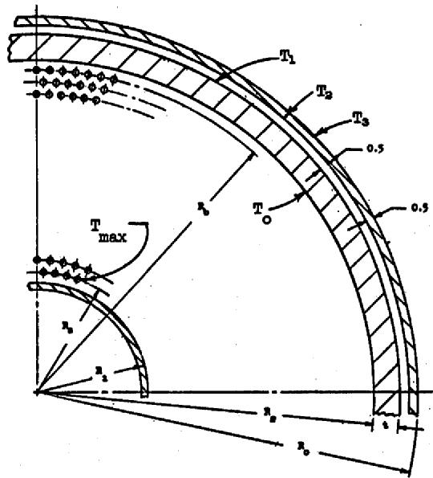

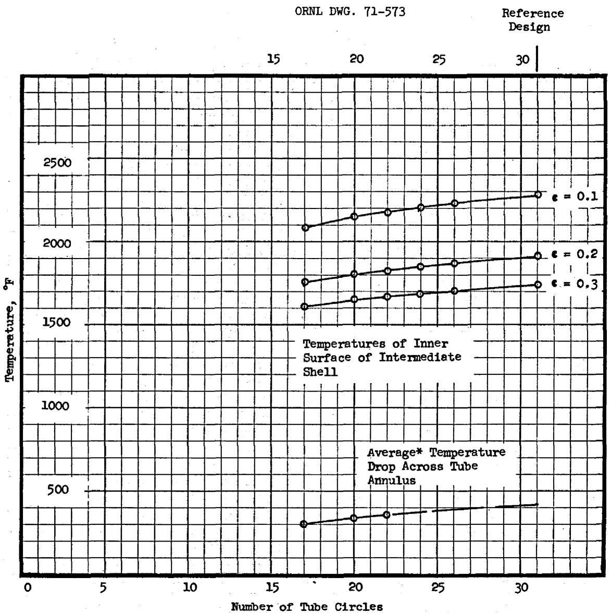  
Fig. 12. Internal Steady-State Temperatures in MSBR Heat Exchangers Rated at 563 Mw With Tube Annuli of Different Thicknesses and With the Emissivity, $\mathbf{c}_{\mathrm{i}}$ of All Internal Surfaces a Parameter. Heat exchanger configurations generally similar to Fig. 1.

Heat Generation: 7.36 x $10^{4}$ Btu/hr-ft height; all uniformly distributed (Type 1) in the tube annulus and equivalent to the afterheat rate $10^{4}$ sec after shutdown produced by $40\%$ of the noble metal fission products plated on the tube surfaces.

Heat Transfer: By radiation only.

Environment: "Black, infinite" surroundings at 1000°F

(a) Emissivity of outer surface of outer shell $= 0.8$

*For internal emissivities from 0.1 to 0.3 the variation, with emissivity, of the temperature rise in the tube annulus is negligible. Averaged values are used.

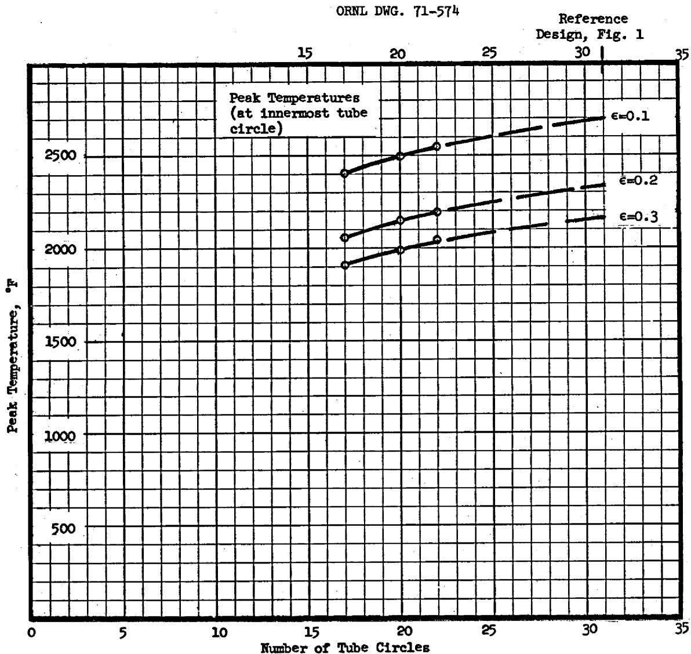  
Fig. 13. Peak Steady-State Temperatures Developed in MSBR Heat Exchangers Rated at 563 Mw With Tube Annuli of Different Thicknesses and With Emissivity, $\epsilon$ , of All Internal Surfaces a Parameter. Heat exchanger configurations generally similar to Fig. 1.

Heat Generation: 7.36 x $10^{4}$ Btu/hr-ft height; all uniformly distributed (Type 1) in the tube annulus and equivalent to the afterheat rate $10^{4}$ sec after shutdown produced by $40\%$ of the noble metal fission products plated on the tube surfaces.

Heat Transfer: By radiation only.

Environment: "Black, infinite" surroundings at 1000°F (a) Emissivity of outer surface of outer shell = 0.8.

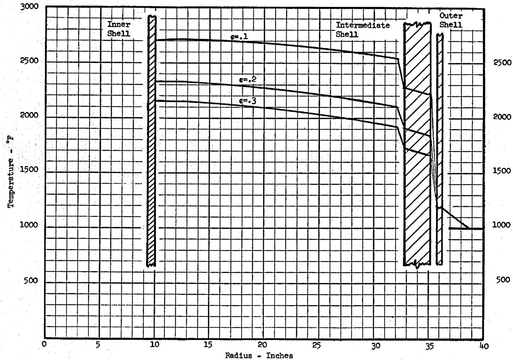  
ORNL DWG. 71-575   
Fig. 14. Steady-State Temperature Profiles in an Empty 563-Mw Heat Exchanger at Three Values of Internal Surface Emissivity. Heat Production: 73,600 Btu/hr-ft height; uniformly distributed in tube annulus. Equivalent to afterheat rate $10^{4}$ sec after shutdown produced by $40\%$ of the noble metal fission products plated on tube surfaces. Heat Transfer: By radiation only. Outer surface emissivity = 0.8. Environment: "Black" surroundings at $1000^{\circ}\mathrm{F}$ .

The estimated temperature transient in the 563-Mw exchanger is shown on Fig. 15. The estimate shows that the peak temperature, $2150^{\circ}\mathrm{F}$ , developed in this exchanger borders on acceptability if we can rely on an internal surface emissivity of 0.2 or better.* The simplifying assumptions and approximations used in calculating this transient were made so that the results would tend toward the high side. A brief description of the method used to develop this transient is in Appendix H.

Figure 16 shows the author's version of a similar transient in the $141\text{-Mw}$ unit. This curve was estimated by inspection using Fig. 15 as a guide. The transient peak, slightly above $1800^{\circ}\text{F}$ , was located slightly below the intersection of the adiabatic temperature growth curve of the annulus and the steady-state peak temperature curve. This smaller unit can be expected to perform well in the stated situation.

Figures 17 and 18 are temperature profiles in the $94-$ and $281\text{-Mw}$ units at $10^{4}$ sec after shutdown and for the nonuniform, Type 2, heat distribution, Fig. 7. All other conditions are the same as for Figs. 8 and 11, with which they may be compared to note the effect of making calculations using the simplifying Type 1 approximation. Table 3 provides a comparison of peak temperatures if calculated for both types of heat distribution at steady-state heat rates corresponding to those expected at $10^{4}$ sec (2.8 hr) after shutdown.

Noting that the more realistic assumption, Type 2, gives lower temperatures, it is proper to query, "Why not use the nonuniform case entirely?" The question is particularly appropriate because once the equations are programmed, there is little difference in the ease of obtaining numbers. The more exact nonuniform case, Type 2, requires a prior and not uncomplicated nor inexpensive computation of gamma heating.[5] During the early phase of a design study it will not be worthwhile to spend much time in this effort until a detailed design has been confidently established. The simple, uniform case, Type 1, requiring only a knowledge of heat exchanger geometry and afterheat generation rate, is relatively easy to calculate and, as it seems to provide temperatures slightly on the high side, will tend to produce a conservative design.

Figures 8 to 11 and Fig. 14 show inner shell temperatures slightly less than the temperature of the adjacent row of tubes. At first glance this seems contrary to all accepted laws governing heat transfer. In fact, and as will be seen, it is not true. However, if the assumption of zero heat generation in the inner shell were actually true we should expect this slight temperature depression at the inner shell. Because the tube matrix is quite open, the inner shell is in thermal equilibrium not only with the adjacent row of tubes but with the combination of several sets of tube circles at lower temperatures farther out in the tube annulus. On Figs. 17 and 18, in which the inner shells are generating $9\%$ of the total afterheat, their temperature is the peak temperature as expected.

ORNL DWG. 71-576

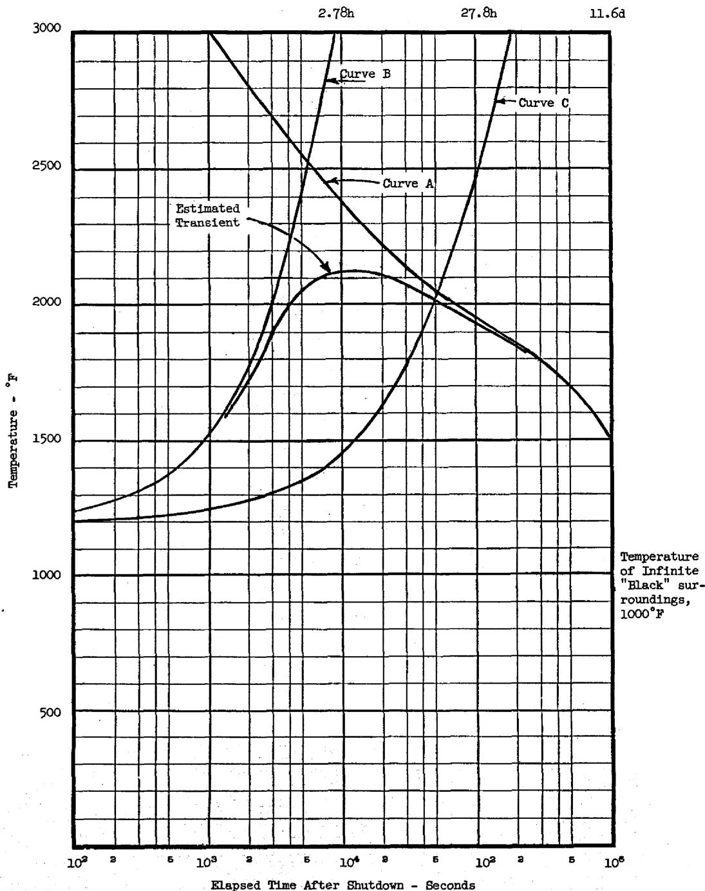  
Fig. 15. Estimated Initial Temperature Transient Caused by Noble Metal Afterheat in an Empty 563-Mw MSER Heat Exchanger.

Curve A: Peak steady-state temperature computed for Type 1 afterheat rates at the indicated times (see Table 1) and with the emissivity of all internal surfaces = 0.2 and the emissivity of the outer surface of the outer shell = 0.8.

Curve B: Temperature growth in the inner shell and the tube annulus computed as if (1) the annulus and shell are perfectly insulated; (2) they have a total heat capacity of 129 Btu/°F-ft of height (based on Table 3); and (3) generate 77% of the total afterheat (see Table 1 and Fig. 7).

Curve C: Temperature growth in the intermediate shell computed as if: (1) the shell is perfectly insulated; (2) it has a heat capacity of 287 Btu/ $^{\circ}$ F-ft of height, and (3) generates $23\%$ of the total afterheat.

ORNL DWG. 71-577

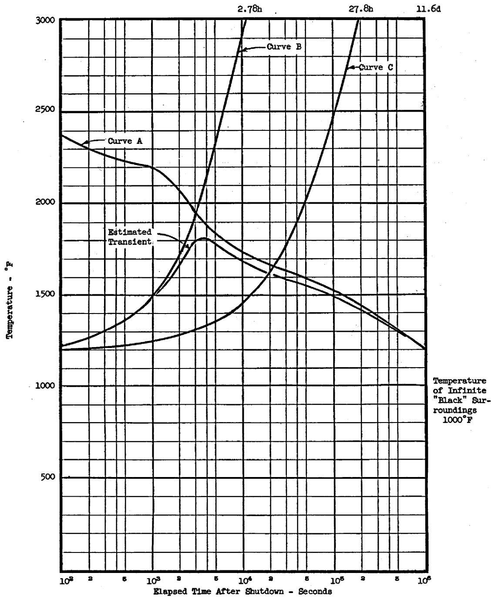  
Fig. 16. Estimated Initial Temperature Transient Caused by Noble Metal Afterheat in an Empty 141-Mw MSBR Heat Exchanger.

Curve A: Peak steady-state temperature computed for Type 2 afterheat rates at the indicated times (see Table 1 and Fig. 7) and with the emissivity of all internal surfaces $= 0.2$ and the emissivity of the outer surface of the outer shell $= 0.8$ .   
Curve B: Temperature growth in the inner shell and the tube annulus computed as if: (1) the annulus and shell are perfectly insulated; (2) they have a total heat capacity of 32 Etu/°F-ft of height (based on Table 3); and (3) generate $70\%$ of the total afterheat (see Table 1 and Fig. 7).   
Curve C: Temperature growth in the intermediate shell computed as if: (1) the shell is perfectly insulated; (2) it has a heat capacity of 72 Btu/²F-ft of height, and (3) generates 23% of the total afterheat.

ORNL DWG. 71-578

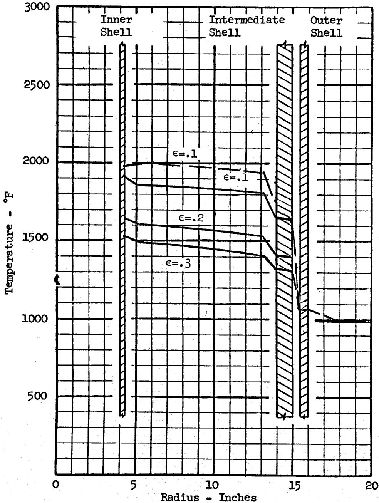  
Fig. 17. Steady-State Temperature Profiles in an Empty 94-Mw MSBR Heat Exchanger for Type 2 Heat Distribution Which Takes into Account the Effects of Gamma Energy Losses and Distribution, Fig. 7. Upper (dashed) curve is profile for Type 1 distribution (see Fig. 11) and is shown for comparison.

Total Heat Generation: 12,300 Btu/hr-ft height; equivalent to afterheat rate at $10^{4}$ sec after shutdown. Heat Transfer: By radiation only. Outer surface emissivity = 0.8. Environment: "Black" surroundings at $1000^{\circ}\mathrm{F}$ .

ORNL DWG. 71-579

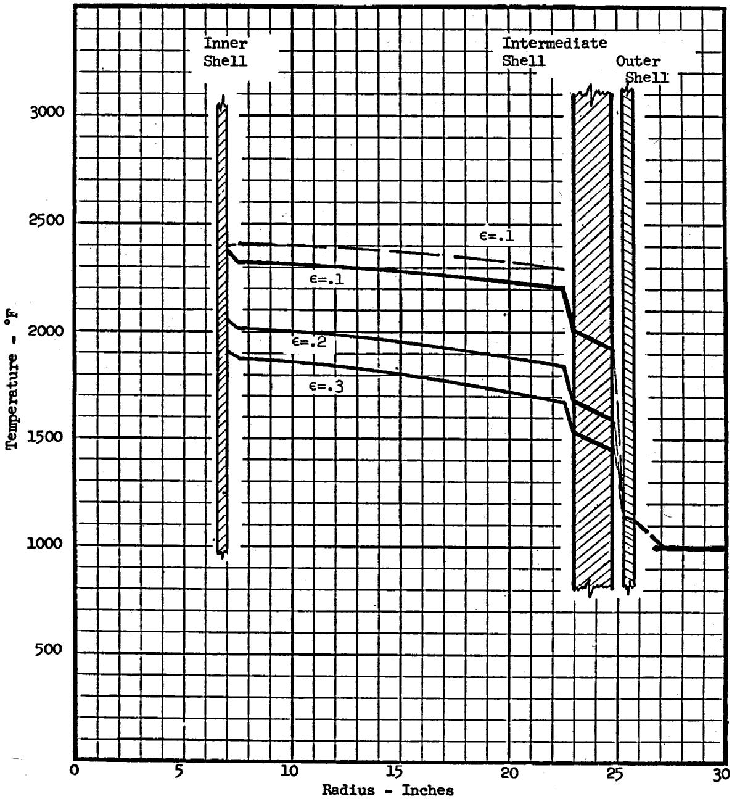  
Fig. 18. Steady-State Temperature Profiles in an Empty 281-Mw MSBR Heat Exchanger for Type 2 Heat Distribution Which Takes Into Account the Effects of Gamma Energy Losses and Distribution, Fig. 7. Upper (dashed) curve is profile for Type 1 distribution (see Fig. 11) and is shown for comparison.

Total Heat Generation: 36,800 Btu/hr-ft height; equivalent to afterheat rate at $10^4$ sec after shutdown. Heat Transfer: By radiation only. Outer surface emissivity = 0.8. Environment: "Black" surroundings at $1000^{\circ}$ F.

Table 3. The Influence of Internal Afterheat Distribution and Heat Exchanger Size on Peak Steady-State Temperatures in Empty MSBR Heat Exchangers at the Heat Generation Ratea Expected $10^{4}$ Sec (2.8 Hr) After Reactor Shutdownb   

<table><tr><td rowspan="3">Assumptions on Distribution of the Heat Generation</td><td colspan="3">94-Mw Heat Exchanger</td><td colspan="3">141-Mw Heat Exchanger</td><td colspan="3">188-Mw Heat Exchanger</td><td colspan="3">281-Mw Heat Exchanger</td></tr><tr><td colspan="3">Internal Surface Emissivityc</td><td colspan="3">Internal Surface Emissivityc</td><td colspan="3">Internal Surface Emissivityc</td><td colspan="3">Internal Surface Emissivityc</td></tr><tr><td>0.1</td><td>0.2</td><td>0.3</td><td>0.1</td><td>0.2</td><td>0.3</td><td>0.1</td><td>0.2</td><td>0.3</td><td>0.1</td><td>0.2</td><td>0.3</td></tr><tr><td></td><td colspan="12">Peak Temperatures - °F</td></tr><tr><td>Uniform, Type 1 (100% con-fined to the tube annulus)</td><td>1995</td><td>1706</td><td>1577</td><td>2111</td><td>1810</td><td>1678</td><td>2231</td><td>1913</td><td>1771</td><td>2406</td><td>2075</td><td>1928</td></tr><tr><td>Nonuniform, Type 2 (see Fig. 7)</td><td>1908</td><td>1635</td><td>1514</td><td>2072</td><td>1776</td><td>1645</td><td>2183</td><td>1878</td><td>1733</td><td>2380</td><td>2050</td><td>1903</td></tr><tr><td>Difference, °F</td><td>87</td><td>71</td><td>63</td><td>39</td><td>34</td><td>33</td><td>48</td><td>35</td><td>38</td><td>26</td><td>25</td><td>25</td></tr></table>

aHeat generation rate $= 13.3$ Btu/ (hr-ft length of tube),   
= 135 Btu/(hr-ft² of outside tube surface).   
Heat exchangers in infinite, "black" surroundings at $1000^{\circ}\mathbf{F}$ .   
cEmissivity of outer surface of outer shell $= 0.8$

All the preceding figures which show temperature profiles indicate one thing in common; namely, as in calorimeters and similar devices, the continuous intermediate shell, with low emissivity, is an efficient barrier to radiative heat transfer and is a large factor in producing higher internal temperatures. The reduction in peak temperatures effected by eliminating one of these two shells was determined by calculations made for the same group of exchangers with the outer, 1/2-in.-thick shell removed. Table 4 provides a comparison of the peak steady-state temperatures in exchangers of this type designed with one and two shells external to the tube bundle and at the heat rate expected at $10^{4}$ sec after shutdown. Figure 19 shows curves of the data in Table 4 which have been extrapolated to include estimated peak steady-state temperatures in the 563-Mw exchanger.

Interest was expressed in the reduction of temperature attained by increasing the apparent emissivity of all surfaces of the outer and intermediate shells. A possible method would be to add fins or a gridwork so that these surfaces take the appearance of a continuous sheet of black body cavities. No effort was spent investigating the feasibility of this idea, but temperature profiles in a 281-Mw exchanger were calculated as if all the surfaces of the intermediate and outer shells, internal and external, had an emissivity of 0.8. A value of 0.2 for emissivity of the inner shell and tube surfaces was selected. No allowance was made for the increases in shell diameters required. The results, calculated by using Type 1 heat generation at the rate expected at $10^4$ sec after shutdown, are on Fig. 20. The temperature reductions so obtained are appreciable.

Table 5 gives a comparison of maximum temperature in a 281-Mw exchanger for four different cases described in the preceding paragraphs.

The effect of internal emissivity on peak temperature is implicit in many of the preceding figures. Figure 21 shows, explicitly, the influence of emissivity on peak temperatures in the 94-Mw unit. It is apparent that we will get a worthwhile improvement in afterheat rejection by this heat exchanger if the emissivity of the Hastelloy N surfaces, after exposure to molten salts, is 0.3 rather than 0.1. It is also apparent that increasing the emissivity above 0.3 produces little additional benefit.

The transfer of radiant energy from surfaces far inside the exchanger will be strongly dependent on the combined effects, not separable, of internal geometry and emissivity. At low values of emissivity (high reflectivity) a photon will have a higher probability of traveling farther from its point of origin via multiple reflections through the tube bundle before being absorbed. The surfaces will also be at a somewhat higher temperature if they are radiating at a rate which maintains temperatures constant at a constant afterheat generation rate. These are offsetting trends, but the fourth power effect of temperature on heat transfer suggests that higher emissivities may produce only fringe benefits in open tube lattices. The quantitative extension of data from Fig. 21 to other geometries is not recommended since this figure does not provide the interrelation between geometry and emissivity.

External surface emissivity $= 0.8$ . Heat exchanger in infinite, "black" surroundings at $1000^{\circ}\mathrm{F}$ .

Table 4. Afterheat Temperature Reductions Attained by Removing the Outer Shell from Empty MSBR Type Heat Exchangers   

<table><tr><td rowspan="2">Heat Exchanger Rating</td><td rowspan="2">No. of Tube Circles</td><td rowspan="2">Emissivity of Internal Surfaces</td><td colspan="3">Maximum Steady-State Temperatures Computed at Heat Generation Ratea Equivalent to 40% of the Noble-Metal Afterheat 104 Sec After Reactor Shutdown</td></tr><tr><td>Reference Design (see Fig. 1)</td><td>Reference Design With Outer Shell Omitted</td><td>Difference</td></tr><tr><td rowspan="3">94 Mw</td><td rowspan="3">12</td><td>0.1</td><td>1995</td><td>1631</td><td>364</td></tr><tr><td>0.2</td><td>1706</td><td>1470</td><td>236</td></tr><tr><td>0.3</td><td>1577</td><td>1406</td><td>171</td></tr><tr><td rowspan="3">141 Mw</td><td rowspan="3">15</td><td>0.1</td><td>2111</td><td>1731</td><td>380</td></tr><tr><td>0.2</td><td>1810</td><td>1566</td><td>244</td></tr><tr><td>0.3</td><td>1678</td><td>1501</td><td>177</td></tr><tr><td rowspan="3">188 Mw</td><td rowspan="3">17</td><td>0.1</td><td>2231</td><td>1822</td><td>409</td></tr><tr><td>0.2</td><td>1913</td><td>1646</td><td>267</td></tr><tr><td>0.3</td><td>1771</td><td>1576</td><td>195</td></tr><tr><td rowspan="3">281 Mw</td><td rowspan="3">22</td><td>0.1</td><td>2406</td><td>1973</td><td>433</td></tr><tr><td>0.2</td><td>2075</td><td>1794</td><td>281</td></tr><tr><td>0.3</td><td>1928</td><td>1723</td><td>205</td></tr><tr><td rowspan="3">563 Mw</td><td rowspan="3">31</td><td>0.1</td><td>2705b</td><td>2365b</td><td>340b</td></tr><tr><td>0.2</td><td>2336b</td><td>2165b</td><td>171b</td></tr><tr><td>0.3</td><td>2162b</td><td>2075b</td><td>87b</td></tr><tr><td rowspan="3">563 Mw</td><td rowspan="3">26</td><td>0.1</td><td>2169b</td><td>2220b</td><td>399b</td></tr><tr><td>0.2</td><td>2262b</td><td>2030b</td><td>232b</td></tr><tr><td>0.3</td><td>2094b</td><td>1950b</td><td>134b</td></tr><tr><td rowspan="3">563 Mw</td><td rowspan="3">24</td><td>0.1</td><td>2578b</td><td>2160b</td><td>418b</td></tr><tr><td>0.2</td><td>2224b</td><td>1975b</td><td>249b</td></tr><tr><td>0.3</td><td>2057b</td><td>1900b</td><td>157b</td></tr><tr><td rowspan="3">563 Mw</td><td rowspan="3">22</td><td>0.1</td><td>2541</td><td>2099</td><td>442</td></tr><tr><td>0.2</td><td>2191</td><td>1920</td><td>271</td></tr><tr><td>0.3</td><td>2035</td><td>1850</td><td>185</td></tr><tr><td rowspan="3">563 Mw</td><td rowspan="3">20</td><td>0.1</td><td>2495</td><td>2020</td><td>475</td></tr><tr><td>0.2</td><td>2144</td><td>1830</td><td>314</td></tr><tr><td>0.3</td><td>1987</td><td>1755</td><td>232</td></tr><tr><td rowspan="3">563 Mw</td><td rowspan="3">17</td><td>0.1</td><td>2404</td><td>1936</td><td>468</td></tr><tr><td>0.2</td><td>2059</td><td>1747</td><td>312</td></tr><tr><td>0.3</td><td>1903</td><td>1672</td><td>231</td></tr></table>

$^{\text{a}}$ At $10^{4}$ sec heat generation rate = 13.3 $\frac{\text{Btu/hr}}{\text{ft rod}} = 135$ ft² tube surface and is Type 1 generation.   
bIndicates temperatures obtained by extrapolation.

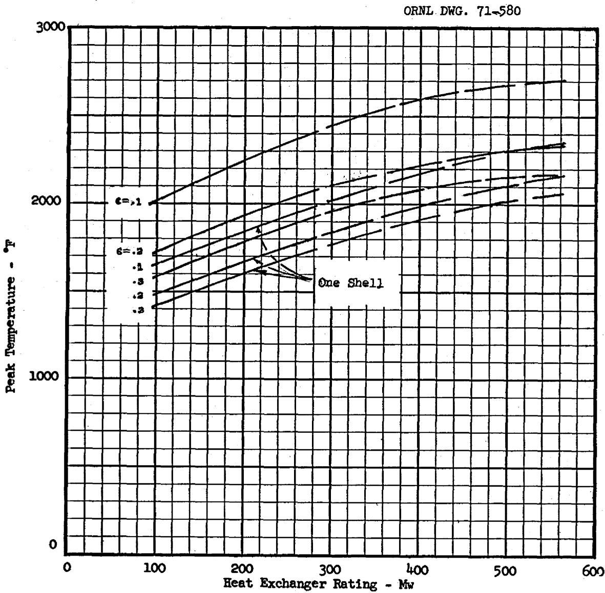  
Fig. 19. Maximum Internal Steady-State Temperatures in Single-Region MSBR Heat Exchangers with One and Two Shells Outside the Tube Bundle.

Elapsed Time After Shutdown --- 104 sec = 2.8 hr. Afterheat Rate --- 134 Btu/hr-ft² Tube Surface = 13.3 Btu/hr ft of tube

Emissivity of Internal Surfaces --- 0.1 to 0.3 as noted.

Emissivity of Outer Surface --- 0.8.

Surroundings --- Infinite, "black," at 1000°F.

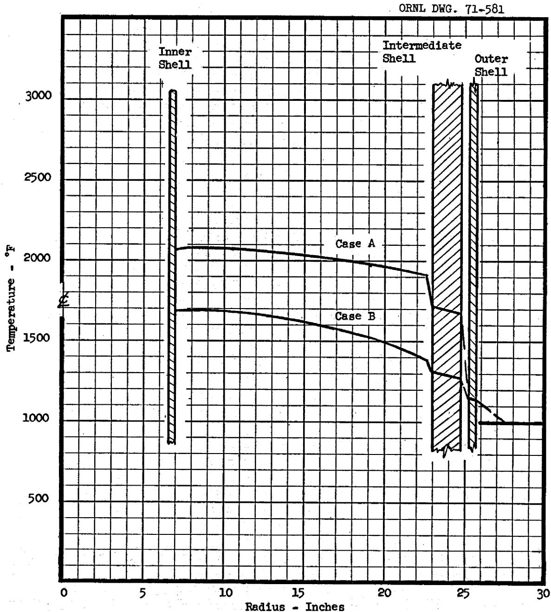  
Fig. 20. Temperature Profiles in a 281-Mw MSBR Heat Exchanger Showing the Effect of Increasing the Emissivity of the Internal Surfaces of the Outer and Intermediate Shells.

Heat Production: 36,800 Btu/hr-ft height, at $10^{4}$ sec after shutdown.

Heat Transfer: By radiation only.

Environment: Infinite, "black" at 1000°F.

(a) Emissivity of inner shell and tubes   
(b) Emissivity of intermediate shell surfaces   
(c) Emissivity of inner surface, outer shell   
(d) Emissivity of outer surface, outer shell

Case A Case B

0.2 0.2   
0.2 0.8   
0.2 0.8   
0.8 0.8

A comparison of four cases at $10^4$ sec.

Table 5. The Effect of the Outer Shells on Maximum Steady-State Afterheat Temperatures in an Empty 281-Mw MSBR Heat Exchanger   

<table><tr><td>Cases</td><td>Reduction in Maximum Temperature Referred to &quot;Reference Design&quot;</td><td>Maximum Internal Steady-State Temperature Calculated for Heat Rate at 104 Sec (2.8 Hr) After Reactor Shutdown</td></tr><tr><td>1. &quot;Reference design&quot; per Fig. 1. All internal surfaces exposed to primary and secondary salts have an emissivity of 0.2. Type 1 heat distribution.</td><td></td><td>2075°F</td></tr><tr><td>2. &quot;Reference design,&quot; with Type 2 heat distribution which takes into account gamma energy distribution. All other conditions as in in Case 1 (above).</td><td>25°F</td><td>2050°F</td></tr><tr><td>3. &quot;Reference design&quot; with outer shell removed. All other conditions as in Case 1 (above).</td><td>281°F</td><td>1794°F</td></tr><tr><td>4. &quot;Reference design&quot; in which emissivity of all surfaces of outer and intermediate shells is 0.8. Emissivity of tube and inner shell surfaces is 0.2. Type 1 heat distribution.</td><td>381°F</td><td>1694°F</td></tr></table>

aTotal afterheat load in exchanger (Type 1 distribution) = 8.1 × 105 Btu/hr at 104 sec after shutdown. Equivalent to:

(1) $3.68 \times 10^{4} \frac{\text{Btu/hr}}{\text{ft height}}$ ;   
(2) 135 $\frac{\text{Btu/hr}}{\text{ft}^2\text{tube surface}}$ ;   
(3) 13.3 $\frac{\text{Btu/hr}}{\text{ft tube}}$

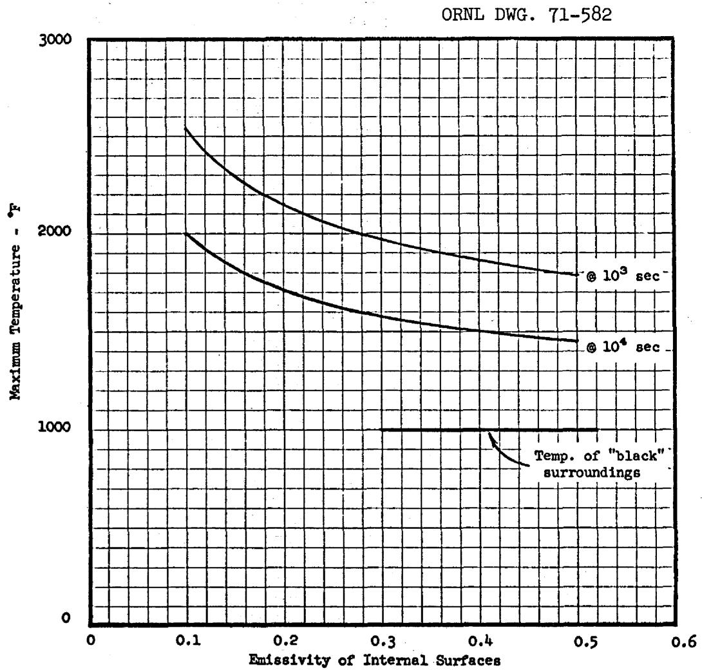  
Fig. 21. Effect of Internal Surface Emissivity on Peak Steady State Temperatures in a 94-Mw MSBR "Reference Design" Type Heat Exchanger (see Figs. 1 and 2).

Type 1 Heat Generation:

(a) At $10^{3}$ sec -- 29,000 Btu/hr-ft height = 31.2 $\frac{\text{Btu/hr}}{\text{ft of tube}}$ .   
(b) At $10^{4}$ sec -- 12,300 Btu/hr-ft height = 13.3 $\frac{\text{Btu/hr}}{\text{ft of tube}}$ .

Emissivity of outer surface, outer shell $= 0.8$

The primary item of concern is peak temperature and its variation with heat exchanger size and the heat generation rate. Figures 22 to 26, incl., show peak temperatures in the five sizes of exchangers listed in Fig. 2 and how these temperatures vary with the heat generation rate. The temperature profiles inside the exchangers will have the same general pattern as those shown on Figs. 8 to 11, incl., but with different gradients. As peak temperatures rise and/or as emissivity decreases, the radial gradients through the tube annuli will tend to flatten out.

ORNL DWG. 71-583

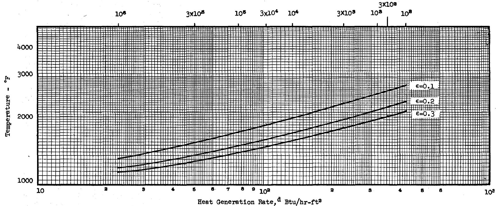  
Elapsed Time After Shutdown - Seconds   
Fig. 22. Peak Steady-State Temperatures in a 94-Mw MSBR Heat Exchanger vs Heat Generation Rate and Emissivity of Internal Radiating Surfaces.

(a) Heat transmission: By thermal radiation only.   
(b) Emissivity of outer surface of outer shell: 0.8.   
(c) Surroundings: Infinite, "black" at 1000°F.   
(d) Heat generation is Type 1 (all afterheat is generated in the tubes).   
(e) Heat exchanger design and dimensions on Figs. 1 and 2.

ORNL DWG. 71-584

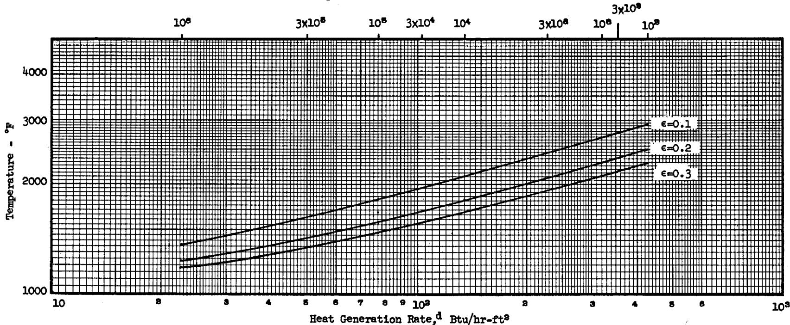  
Elapsed Time After Shutdown - Seconds   
Fig. 23. Peak Steady-State Temperatures in a 141-Mw MSBR Heat Exchanger vs Heat Generation Rate and Emissivity of Internal Radiating Surfaces.

(a) Heat transmission: By thermal radiation only.   
(b) Emissivity of outer surface of outer shell: 0.8.   
(c) Surroundings: Infinite, "black" at $1000^{\circ}\mathbb{F}$ .   
(d) Heat generation is Type 1 (all afterheat is generated in the tubes).   
(e) Heat exchanger design and dimensions on Figs. 1 and 2.

ORNL DWG. 71-585

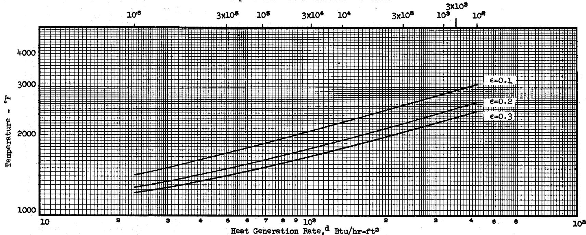  
Elapsed Time After Shutdown - Seconds   
Fig. 24. Peak Steady-State Temperatures in a 188-Mw MSBR Heat Exchanger vs Heat Generation Rate and Emissivity of Internal Radiating Surfaces.

(a) Heat transmission: By thermal radiation only.   
(b) Emissivity of outer surface of outer shell: 0.8.   
(c) Surroundings: Infinite, "black" at $1000^{\circ}F$ .   
(d) Heat generation is Type 1 (all afterheat is generated in the tubes).   
(e) Heat exchanger design and dimensions on Figs. 1 and 2.

ORNL DWG. 71-586

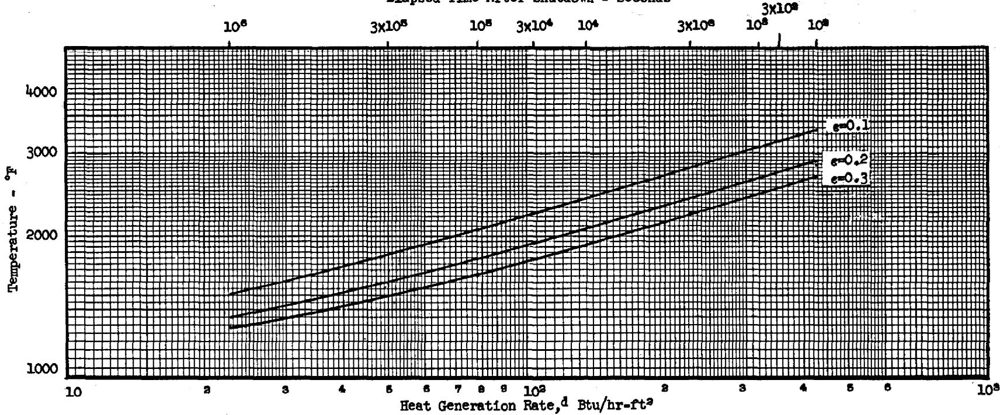  
Elapsed Time After Shutdown - Seconds   
Fig. 25. Peak Steady-State Temperatures in a 281-Mw MSBR Heat Exchanger vs Heat Generation Rate and Emissivity of Internal Radiating Surfaces.

(a) Heat transmission: By thermal radiation only.   
(b) Emissivity of outer surface of outer shell: 0.8.   
(c) Surroundings: Infinite, "black" at 1000°F.   
(d) Heat generation is Type 1 (all afterheat is generated in the tubes).   
(e) Heat exchanger design and dimensions on Figs. 1 and 2.

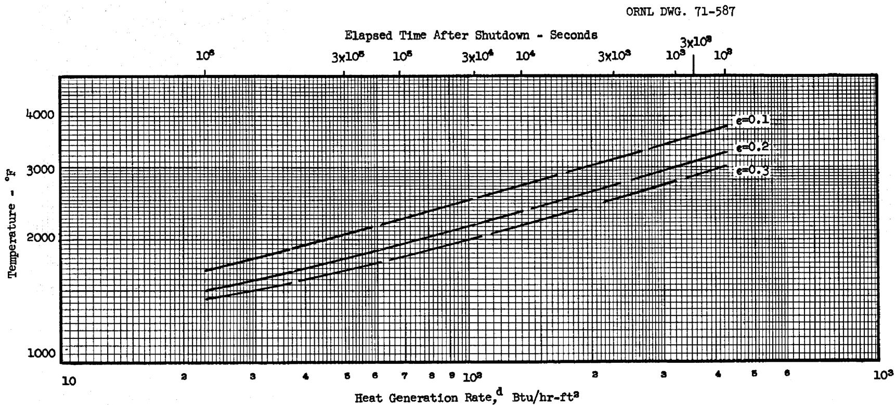  
Fig.26. Peak Steady-State Temperatures in a 563-Mw MSBR Heat Exchanger vs Heat Generation Rate and Emissivity of Internal Radiating Surfaces.

(a) Heat transmission: By thermal radiation only.   
(b) Emissivity of outer surface of outer shell: 0.8.   
(c) Surroundings: Infinite, "black" at $1000^{\circ}\mathrm{F}$ .   
(d) Heat generation is Type 1 (all afterheat is generated in the tubes).   
(e) Heat exchanger design and dimensions on Figs. 1 and 2.

NOTE: These curves obtained by extrapolation.

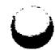

# APPENDIX A

# COMPUTATIONAL MODEL AND ASSUMPTIONS GOVERNING

# THE COMPUTATIONS

# Geometry (see Figs. 1 and 2)

All equations are written for infinite cylindrical geometry. Tube layout is assumed to be an annular array consisting of an integral number of concentric circles of tubes. Tube spacing (pitch) is: circumferential pitch -- 0.750 in.; radial pitch -- 0.717 in. In terms of space or volume occupied by the tubing in the annulus, these tube spacings are equivalent to triangularily pitched tubes having $\mathrm{P} / \mathrm{D} = 2.1$ .

# Physical Characteristics and Considerations

The computational model is based on five assumptions or postulates10 involving the radiating surfaces and the energy radiated; these are:

(1) We are dealing with a multi-surfaced enclosure in which it is possible to construct a heat balance for each surface in the enclosure. Each surface in the enclosure is considered to be isothermal. Since radial symmetry obtains, each circle of tubes was considered to be a single surface.   
(2) The surfaces of the enclosure are considered to be gray; i.e., absorptivity, $\alpha$ , is equal to emissivity, $\epsilon$ , for all wave lengths of radiant energy and is uniform on any particular surface.   
(3) The distribution of emitted radiation follows Lambert's cosine law. Lambert's law is outlined in the next appendix.   
(4) The distribution of reflected radiation also follows Lambert's cosine law, (3) above; i.e., when a collimated beam or pencil of rays strikes the surface it is reflected diffusely.

A consequence of (3) and (4) above is that, in considering the energy leaving an element of surface, no distinction is made between emitted and reflected radiation. The resulting heat transfer - temperature equations are linear and tractable.

(5) The radiation incident on any particular surface in the enclosure is uniformly distributed on that surface. This assumption is required if the isothermal and gray conditions per (1) and (2) above are met.

It is generally recognized that these postulates are simplifying assumptions which may deviate, sometimes quite substantially, from the actual physical situation. They receive wide use because of the tractable mathematical expressions resulting from their use. In most cases and in spite of their deficiencies, equations derived from these general

# 44

assumptions usually produce satisfactory engineering answers. Insofar as these heat exchanger calculations are concerned, we cannot justify or favor any other set of assumptions unless we have reliable experimental data which enable us to evaluate:

(1) emissivity, its temperature dependence and the angular distribution of emitted radiation,   
(2) the degree to which reflected radiation is specular instead of diffuse and how specularity is affected by surface finish, surface composition, and immediately adjacent sub-surface structure, temperature, and exposure to molten salt.

Even if we had these data the development of solvable equations would be a formidable problem and certainly, during the development of a design, not worthwhile from the standpoint of cost and time.

We would, perhaps, consider a calculation in which tube surfaces are divided in two parts [see (5) above], the inner and outer half circles. This would have, as its only effect, increasing the number of equations by a factor of almost 2 but would not increase the complexity of the equations. Such a step would, as of now, require programming for one of our local computers; our remote time sharing facility would not have the necessary capacity.

# APPENDIX B

# DIRECTIONAL DISTRIBUTION OF RADIATION

# (Lambert's Law)

Consider an elemental black surface, $\mathrm{dA}_1$ , radiating in accordance with Lambert's cosine law. The energy, $\mathrm{dQ}$ , emitted from $\mathrm{dA}_1$ into the elemental solid angle $\mathrm{d}\Omega$ centered about the direction $(\beta, \theta)$ , Fig. El, may be expressed,

$$
d Q (\beta , \theta) = d Q (\beta) = I _ {0} d A _ {1} \cos \beta d \Omega . \tag {B-1}
$$

$I_{0}$ is the rate of emission per unit elemental area, $\mathrm{dA}_{1}$ , of emitting surface, into a unit elemental solid angle around the normal, $(\beta = 0)$ , to $\mathrm{dA}_{1}$ .

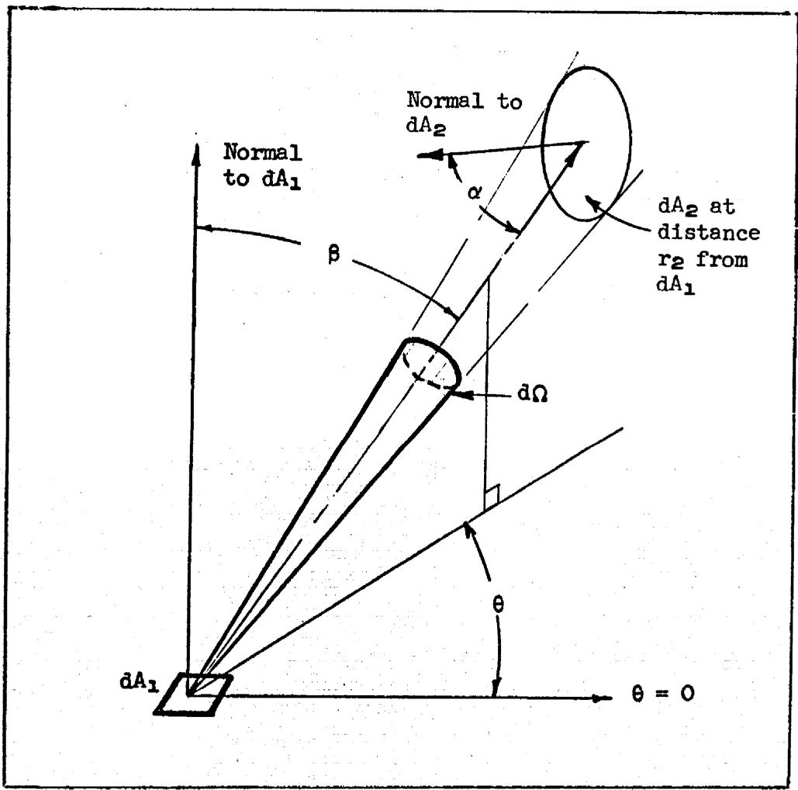  
Fig. B1

On a hemispherical surface of radius $r_1$ centered on $\mathrm{dA}_2$ and in spherical coordinates

$$
d \Omega = \frac {r \sin \theta d \theta r d \beta}{r ^ {2}} = \sin \theta d \theta d \beta \tag {B-2a}
$$

and

$$
d Q (\beta) = I _ {0} d A _ {2} \cos \beta \sin \beta d \theta d \beta . \tag {B-2b}
$$

The solid angle, $\mathrm{d}\Omega$ , may also be specified in terms of another element of area and its location elsewhere in space; e.g., on Fig. Bl

$$
\mathrm {d} \Omega = \frac {\mathrm {d} A _ {2} \cos \alpha}{r _ {2} ^ {2}} \tag {B-2c}
$$

and from (B-1)

$$
d Q (\beta) = \frac {I _ {0} d A _ {1} \cos \beta d A _ {2} \cos \alpha}{r _ {2} ^ {2}}. \tag {B-2d}
$$

The total energy emitted by $\mathrm{dA}_{\mathrm{z}}$ is obtained by integrating (B-2b) over the hemisphere,

$$
Q = I _ {0} d A _ {1} \int_ {0} ^ {2 \pi} \int_ {0} ^ {\pi / 2} \cos \beta \sin \beta d \theta d \beta \tag {B-3a}
$$

$$
Q = \pi I _ {0} d A _ {1} B t u / h r. \tag {B-3b}
$$

The total energy emitted by $\mathrm{dA}_{1}$ as a black body is

$$
Q = d A _ {2} \sigma T ^ {4} \tag {B-4}
$$

in which

$$
\begin{array}{l} \sigma = \text {S t e f a n - B o l t z m a n n c o n s t a n t} \\ = 1 7 3 0 \times 1 0 ^ {- 1 2} \frac {\text {B t u}}{\text {h r - f t} ^ {2} - ^ {\circ} R ^ {4}} \quad \text {(e x p e r i m e n t a l v a l u e)} \\ \end{array}
$$

$$
\mathrm {T} = \text {t e m p e r a t u r e}, ^ {\circ} \mathrm {R}.
$$

Therefore, by equating (B-3b) and (B-4)

$$
I _ {O} = \frac {\sigma T ^ {4}}{\pi} B t u / f t ^ {2} - h r \tag {B-5a}
$$

for black body emission; correspondingly, if Lambert's cosine law is extended to non-black surfaces having hemispherical total emissivity, $\epsilon$ ,

$$
I _ {O} (\epsilon) = \frac {\epsilon \sigma T ^ {4}}{\pi}. \tag {B-5b}
$$

The fraction of the total energy emitted by $\mathrm{dA_1}$ which is intercepted by $\mathrm{dA_2}$ is, from Eqs. (B-2d) and (B-3b),

$$
F _ {d A _ {1} \rightarrow d A _ {2}} = \frac {\frac {I _ {0} d A _ {1} \cos \beta d A _ {2} \cos \alpha}{r _ {2} ^ {2}}}{\pi I _ {0} d A _ {1}} \tag {B-6a}
$$

$$
F _ {d A _ {1} \rightarrow d A _ {2}} = \frac {d A _ {2} \cos \beta \cos \alpha}{\pi r _ {2} ^ {2}}. \tag {B-6b}
$$

This equation defines the view factor of one differential element, $\mathrm{dA}_1$ , radiating to another differential element, $\mathrm{dA}_2$ , with the proviso that $\mathrm{dA}_1$ is radiating diffusely in accordance with Lambert's cosine law. It is the basis for the view factor determination discussed in the next appendix.

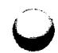

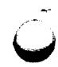

# General Considerations

In an enclosure made up of two or more surfaces the view factor* for any particular surface, the reference surface, to any surface in the enclosure is defined as the fraction of the total radiant energy leaving the reference surface which is transmitted directly (no reflections) to the viewed surface; obviously then, this fraction is dependent on the geometrical configuration of the surfaces in the enclosure and on the directional distribution of the radiant energy leaving the reference surface. "View fraction" would, perhaps, be more accurate terminology. References 11 and 12 provide excellent material on this subject. In this report view factors are represented thus: $\mathbf{F}_{\mathfrak{m}} \rightarrow \mathfrak{n}$ is the view factor of surface m looking at surface n.

It is not difficult to show that for surfaces, all composed of infinitely long parallel elements, the view factor, assuming diffuse radiation, from a strip of differential width to a neighboring surface is given by Fig. Cl.

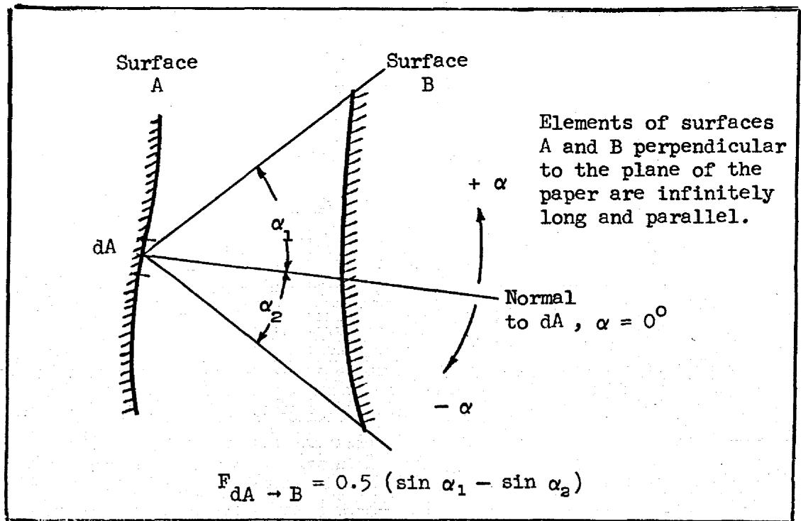  
Fig. C1

*Also referred to as "configuration," "angle factor," "shape factor" in various texts and references.

This is the situation which obtains in MSBR heat exchangers. Tubes and surfaces which see each other are separated at most by about 6 in., and since they are about 250 in. long, the infinite length model is appropriate. Note that concave surfaces see themselves and that view factors of surfaces to themselves must be included. The relation in Fig. Cl, evaluated graphically and integrated, was used to determine a majority of the view factors required by this analysis. The reciprocity relation

$$
\mathrm {F} _ {\mathrm {n} \rightarrow \mathrm {m}} \mathrm {A} _ {\mathrm {n}} = \mathrm {F} _ {\mathrm {m} \rightarrow \mathrm {n}} \mathrm {A} _ {\mathrm {m}} \tag {C-2}
$$

$$
A _ {m} = \text {a r e a o f m t h s u r f a c e}
$$

$$
A _ {n} = \text {a r e a o f n t h s u r f a c e}
$$

was also used.

View Factors, Tube to Adjacent Tube and Adjacent Plane

The view factors for simple regular geometries can often be obtained analytically and several references (13 to 20 incl.) are good sources of view factor formulas for a variety of geometrical shapes and arrangements. In these MSBR exchangers the unobstructed view factors for a tube to an adjacent tube, Fig. C2, were determined from

$$
F _ {I} \rightarrow I I = \frac {1}{\pi} \left[\left(X ^ {2} - 1\right) ^ {1 / 2} - X + \frac {\pi}{2} - \tan^ {- 1} \left(\left(X ^ {2} - 1\right) ^ {1 / 2}\right)\right] \tag {C-3}
$$

$$
X = P / D.
$$

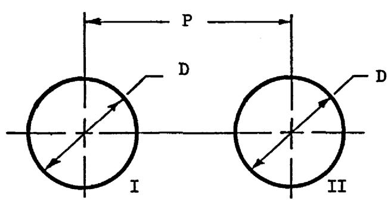  
Fig. C2

NOTE: In some references this view factor is referenced to one-half the perimeter of tube I since only one-half of tube I sees tube II. The value of $\mathbf{F}_{\mathbf{I}} \rightarrow \mathbf{II}$ will be twice that obtained from the above formula.

Also, $\cos^{-1}(1 / X)$ may be substituted for the tan term in some formulas. The tan term is better adapted for some computers.

Each tube sees adjacent tubes on either side in the same row; therefore, the view factor of a tube row to itself where a tube row is considered to be a single surface, n, in an infinite planar array is

$$
\begin{array}{l} F _ {n} \rightarrow n = 2 F _ {\text {t u b e}} \rightarrow \text {a d j a c e n t} \quad \text {t u b e} \tag {C-4} \\ = 0. 1 5 4 \text {f o r} P / D = 2. 1. \\ \end{array}
$$

At the boundaries where the tubes see a continuous plane surface, the view factor of an infinite row of tubes to an infinite plane is determined thus:

1. Consider an infinite row of tubes bounded on either side by parallel, infinite planes, Fig. C3.

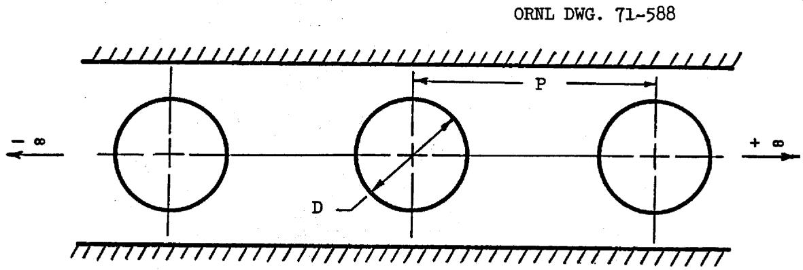  
Fig. C3

2. Since the total view factor for the tube row is 1.00, we can write

$$
\mathrm {F} _ {\mathrm {n} \rightarrow \mathrm {n}} + 2 \mathrm {F} _ {\mathrm {n} \rightarrow \text {p l a n e}} = 1. 0 0 \tag {C-5a}
$$

and

$$
\begin{array}{l} F _ {n} \rightarrow \text {p l a n e} = \frac {1 . 0 0 - F _ {n} \rightarrow n}{2} \tag {C-5b} \\ = 0. 4 2 3 \text {f o r} P / D = 2. 1. \\ \end{array}
$$

3. The view factor for a plane to the tubes is derived from the generally applicable reciprocity relation,

$$
\begin{array}{l} F _ {\text {p l a n e}} \rightarrow n = \left[ F _ {n} \rightarrow \text {p l a n e} \right] \frac {A _ {n}}{A _ {\text {p l a n e}}} (C-6a) \\ = \left[ F _ {n} \rightarrow \text {p l a n e} \right] (\pi D / P) (C-6b) \\ = 0. 6 3 0 \text {f o r} P / D = 2. 1. \\ \end{array}
$$

View Factors, Tube to Non-Adjacent Tube and Non-Adjacent Plane

View factors from a tube or from an inner or outer shell which sees only portions of neighboring tubes through the gap(s) between tubes were determined graphically as illustrated by the next diagram, Fig. C4, and the procedure which follows.

ORNL DWG. 71-589

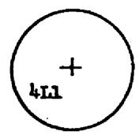

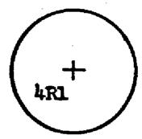

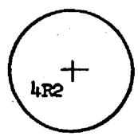

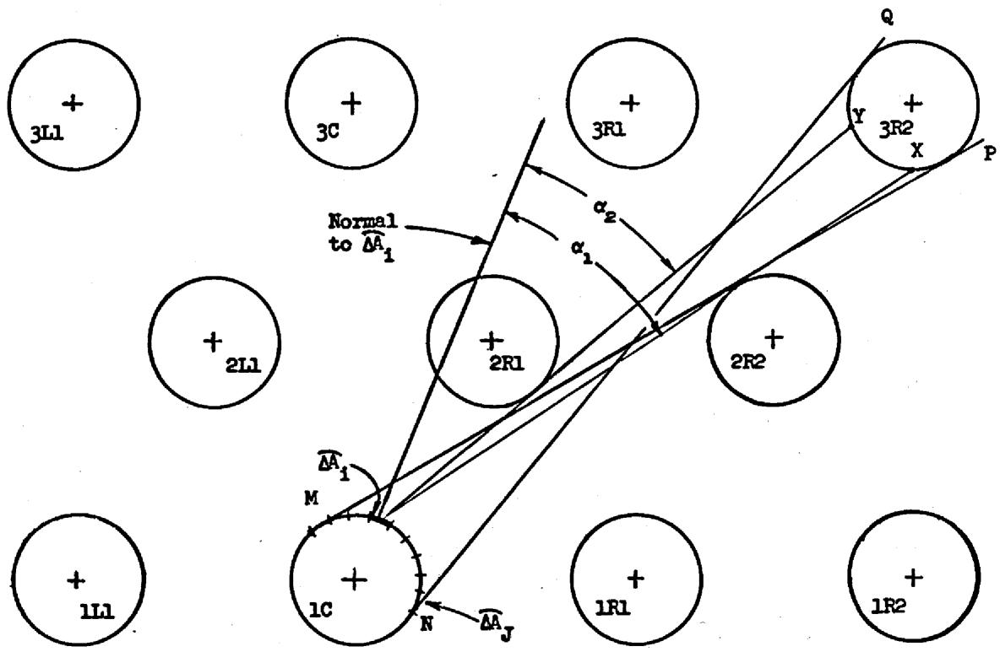  
Fig. C4. Graphic Integration of Tube-to-Tube View Factors

# Procedure for Calculating View Factors

1. On a large-scale layout, determine graphically the arc, $\widehat{MN}$ , the part of the periphery of the reference tube (lC) which sees the viewed tube, 3R2. $\widehat{MN}$ is defined by MP tangent to 2R2 and NQ tangent to 3R2.   
2. Subdivide $\widehat{\mathbf{MN}}$ into incremental arcs, $\widehat{\Delta A_1}$ , $\widehat{\Delta A_2}$ , $-\ldots - \widehat{\Delta A_J}$ . The number of subdivisions is a matter of judgment. Increasing the number of subdivisions increases both accuracy and labor. For these computations the $\widehat{\Delta A_1}$ were typically $10^\circ$ arcs.   
3. Determine the limits of view of each incremental arc on 1C to viewed tube 3R2. On the diagram these view limits of $\widehat{\Delta A_{i}}$ are denoted by lines OX and OY, making angles $\alpha_{1}$ and $\alpha_{2}$ with the normal to $\widehat{\Delta A_{i}}$ . The average view factor of the element of surface represented by arc $\widehat{\Delta A_{i}}$ seeing 3R2 is given by

$$
\widehat {F _ {\Delta A _ {1}}} \rightarrow 3 R 2 = 1 / 2 (\sin \alpha_ {1} - \sin \alpha_ {2}) _ {1}.
$$

The view factor of the surface represented by arc MN is the simple integrated average of the view factors of the incremental arcs:

$$
\widehat {F _ {\mathrm {M N}}} \rightarrow 3 \mathrm {R} 2 = \frac {\sum_ {i = 1} ^ {J} \left(\widehat {\Delta A _ {i}}\right)\left(F _ {\widehat {\Delta A _ {i}}} \rightarrow 3 \mathrm {R} 2\right)}{\sum_ {i = 1} ^ {J} \widehat {\Delta A _ {i}}} \tag {C-7a}
$$

and if all $\widehat{\Delta A_i}$ are equal, this is reduced to

$$
\widehat {F _ {\text {M N}}} \rightarrow 3 \mathrm {R} 2 = \frac {1}{J} \sum_ {i = 1} ^ {J} F _ {\Delta A _ {i}} \rightarrow . 3 \mathrm {R} 2. \tag {C-7b}
$$

The view factor of tube 1C, referred to its total surface, looking at tube surface 3R2 (or 4I1, 4R1, or 2R3, etc.) is

$$
F _ {1 C} \rightarrow 3 R 2 = \frac {\left(\widehat {M N}\right) ^ {\circ}}{3 6 0} \times F _ {\widehat {M N}} \rightarrow 3 R 2 \tag {C-7c}
$$

This procedure is repeated to get the view factors from tube 1C to the other tubes seen differently by 1C until a catalog of view factors to all tubes seen by tube 1C is complete. Because infinite geometry in all directions has been assumed, the sum of the view factors of tube 1C to all the tubes it sees in Row 2 is also the view factor of the surface represented by all tubes in Row 1 to all tubes in Row 2.

As noted in Section III and Fig. 2, the assumed tube spacing with 0.750 in. and 0.717 in. circular and radial pitch, respectively, is equivalent, in terms of space occupied by the tubes, to triangularily pitched tubes having a pitch/diameter ratio of 2.1. Specifying an actual detailed tube sheet layout is beyond the proper scope of this investigation as it will depend on accepted fabrication practices, designers' preferences, the vendor's machine tools, etc. Also, it would be folly to believe that, regardless of tube sheet layout, 3/8-in.-diam tubes over 20 ft long will exactly reproduce the tube sheet layout at the midplane. We can only depend on the average tube density in the tube annulus. Since, from symmetry, each tube in any particular circle was assumed to be at the same temperature, each circle of tubes was considered to be a single surface (see Appendix A).

Ideally, view factors for each tube circle would be determined by a careful computation, and tube circle curvature would be taken into account. Nearly as good results would be obtained by getting view factors at several radii and interpolating. Either of these methods requires a tremendous expenditure of routine labor in graphic computations and piecemeal integrations -- awesome to contemplate and wholly impracticable. Therefore, view factors were determined as if the tubes were in infinitely wide and deep slab geometry, triangurally pitched $(\mathbb{P} / \mathbb{D} = 2.1)$ and bounded on two faces by infinite planes. This reduced the labor involved to an acceptable minimum. The view factors so determined were then modified by considering the view factor akin to conductivity and using conduction equations as a basis for computing a correction coefficient which will make the slab array view factors apply to cylindrical geometry.

Consider, for example, the effect of tube circle curvature. In a simple enclosure consisting of two infinitely long concentric cylinders, it is immediately apparent that the view factor from the inner cylinder to the outer cylinder is 1. However, the concave inner surface of the outer cylinder sees itself across the annulus, and the view factor from the outer to inner annulus will be less than 1. This, of course, is also evident from the reciprocity relation, $\mathbf{F}_{\mathrm{n}} \rightarrow \mathbf{m} \quad \mathbf{A}_{\mathrm{n}} = \mathbf{F}_{\mathrm{m}} \rightarrow \mathbf{n} \quad \mathbf{A}_{\mathrm{m}}$ .

In these heat exchangers the ratios of the radii of tube circles which view one another are not sufficiently close to one to justify neglecting curvature by using a slab approximation.

An infinite, triangularily pitched array is completely regular, and view factors for a tube or row of tubes to other tubes or rows may be used repetitively throughout the array. An infinite array of uniformly spaced concentric circles of tubes will not be completely regular. The small local deviations from uniform geometry are expected to average out and hence were not considered in the determination of the view factors.

It will become apparent, by considering the equations in subsequent Appendix E, that system geometry enters the temperature - heat transfer equations only via the view factors; i.e., the use of slab array view factors would be equivalent to solving this heat exchanger transmission problem in infinite slab geometry. For thin annuli having ID/OD ratios close to 1, the substitution of slab for cylindrical geometry is probably of little consequence. The MSBR heat exchangers do not meet this condition. It is easily shown that, for conductive transfer with internal heat generation, the substitution of an infinite slab having the same thickness as the tube annulus may produce a large error. For example, the temperature-drop equations for the two cases are:[26]

ORNL DWG. 71-590

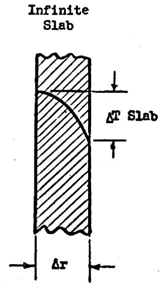

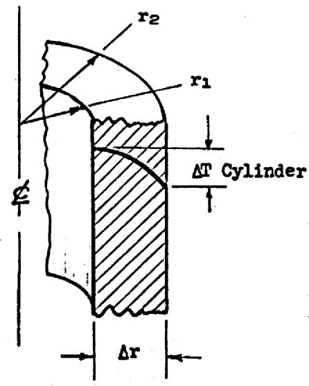  
Infinite Cylinder

$$
\Delta \mathrm {T} _ {\text {s l a b}} = \frac {\mathrm {H} (\Delta \mathrm {r}) ^ {2}}{2 \mathrm {k} _ {\text {s l a b}}}
$$

$$
\Delta \mathrm {T} _ {\mathrm {c y l}} = \frac {\mathrm {H}}{4 \mathrm {k} _ {\mathrm {c y l}}} \left[ 2 r _ {1} (\Delta \mathrm {r}) + (\Delta \mathrm {r}) ^ {2} - 2 r _ {1} ^ {2} \log_ {e} \left(1 + (\Delta \mathrm {r}) / r _ {1}\right) \right]
$$

H = internal heat generation rate, $\frac{\text{Btu/hr}}{\text{ft}^3}$ ,

k = thermal conductivity, $\frac{\text{Btu/hr}}{\text{ft}^2 - {}^o\text{F}/\text{ft}}$

If we use the tube annulus dimensions, Fig. 2, of the MSBR 563-Mw exchanger in these equations, we get, for equal values of H and k:

$$
\Delta \mathrm {T} _ {\text {c y l}} = 1. 2 8 \mathrm {H} / \mathrm {k}; \quad \Delta \mathrm {T} _ {\text {s l a b}} = 1. 8 0 \mathrm {H} / \mathrm {k}.
$$

The infinite slab equation, in this case, produces answers $40\%$ higher (referred to the cylinder). Alternatively, if the conductivity of the slab material is increased by $40\%$ , the temperature drops will be the same.

It was decided--for two reasons: (1) intuition, and (2) the immediate lack of a better proven approach--to use these conduction transfer equations to compute the correction coefficient applied to the slab array view factors. If the conduction transfer Equations (C-8) and (C-9) are rearranged to give the relative values of conductivity in a slab and a hollow cylinder which, all else equal, provide equal temperature differentials, we can write

$$
k _ {s l a b} = k _ {c y 1} \left[ \frac {2 (\Delta r) ^ {2}}{2 r _ {1} (\Delta r) + (\Delta r) ^ {2} - 2 r _ {1} ^ {2} \log_ {e} (1 + \frac {\Delta r}{r _ {1}})} \right]. \tag {C-10}
$$

The bracketed expression is the ratio of conductivities that must exist if an infinite slab of thickness $\Delta r$ is to transfer its internally generated heat across the same temperature differential as in an infinite hollow cylinder of inner radius $r$ and annular thickness $\Delta r$ . Equal values of heat generation per unit volume are assumed.

This expression in brackets is always positive and greater than 1 ( $>1$ ) if $\Delta r$ is taken as positive in the radially outward direction. It can be regarded as the correction factor, applied to conductivity, required to make a slab geometry computation produce results applicable to a hollow cylinder.

It is again emphasized that the temperature - radiant heat transfer equations do not contain explicit terms based on system geometry; i.e., if the view factors in these equations are those of slab geometry, the results are correct for slab geometry. The view factors, for reasons noted in the preceding paragraphs, were obtained from a slab model and subsequent computations based on these view factors must be corrected so the results are applicable to hollow cylindrical geometry.

View factors were regarded as analogous to conductivity and values obtained from the slab array calculations and graphics were corrected using a factor based on the bracketed term in Eq. (C-10). In detail, the corrections were made as follows:

$F_{n}^{slab} \rightarrow (n + k) =$ view factor from any row of tubes, surface n, to another parallel row, the $(n + k)$ th, where $k = 1, 2, 3, \ldots$ etc; or, from a bounding plane, $n = 1$ , to a row of tubes.

$\mathbf{F}_{\mathfrak{n}}^{\mathbf{cyl}}$ = view factor from the nth cylindrical surface (circle of tubes or a shell) to the $(n + k)$ th surface; $n = 1$ is assigned to the outer surface of the inner shell of the heat exchangers.

$\mathbf{r}_{\mathrm{n}} =$ radius of nth surface.

$\Delta \mathbf{r} =$ difference in the radii of nth and $(n + k)$ th surface. $\Delta r$ is always positive since these corrections were applied by starting at the innermost radius where $n = 1$ .

$$
= k \times (\text {r a d i a l t u b e p i t c h}) = 0. 7 1 7 k (\text {s e e F i g .} 2)
$$

$A_{n} =$ area of nth surface.

$$
A _ {n + k} = \text {a r e a o f} (n + k) \text {t h s u r f a c e .}
$$

The view factors in the cylinder are:

$$
F _ {n} ^ {\mathrm {c y l}} (n + k) = F _ {n} ^ {\mathrm {s l a b}} (n + k) \left[ \frac {2 (\Delta r) ^ {2}}{2 r _ {n} (\Delta r) + (\Delta r) ^ {2} - 2 r _ {n} ^ {2} \log_ {e} \left(1 + \frac {\Delta r}{r _ {n}}\right)} \right] \tag {C-11}
$$

With this expression (C-ll), the corrected view factors were established starting with the innermost surface at the inner shell $(n = 1)$ , for all surfaces to other view surfaces located radially outward. Having established the radially outward view factors, the view factors from all surfaces to other surfaces located radially inward were then determined from the reciprocity relation, viz.:

$$
F _ {n} ^ {\text {c y l}} \rightarrow (n - k) = \frac {A _ {n - k}}{A _ {n}} \left(F (n - k) \rightarrow n\right), \tag {C-12}
$$

because $\mathbf{F}_{(n - k)}\to n$ has been determined from previous calculations per (C-11) above.

The view factor for a surface to itself was now determined from the requirement that the sum of all view factors from any surface be 1 (1.00).

$$
F _ {n} \rightarrow n = 1. 0 0 - \sum_ {k = 1} ^ {M} F _ {n} \rightarrow (n + k) - \sum_ {k = 1} ^ {n - 1} F _ {n} \rightarrow (n - k) \tag {C-13}
$$

From the large-scale graphic layout of a planar or slab array of tubes, it was seen that, for this tube spacing (pitch/diam = 2.1), any tube in the array could barely see tubes beyond the 6th row distant; i.e., the view factor from a tube row to a row beyond the 6th row away was less than 0.01. This is of the same order as the accuracy of the graphics. Therefore, all radiation passing unobstructed beyond the 5th row was arbitrarily assumed to fall on the 6th row.

An interesting sidelight developed out of the view factor determinations. Figure C5 is a semi-log plot of the view factor of a continuous boundary plane versus distance, in tube row spacings, into the triangul- larly pitched $(\mathrm{P} / \mathrm{D} = 2.1)$ tube matrix. It seems that photon attenuation at least in this array, is exponential with distance. If, more generally, it turns out that photon attenuation in tube bundles is exponential, the use or development of analytical methods for transfer through continuous media might be worthwhile. There is a substantial body of analytical and experimental work on radiant transfer in absorbing and emitting gases. The relevant mathematics should apply if the descriptions of photon absorption or attenuation and emission in tube bundles and in gaseous media are similar. Neutron transport analyses may also be applicable since the photons undergo production (emission), absorption, and scattering (reflection). Monte Carlo techniques have also been used successfully.

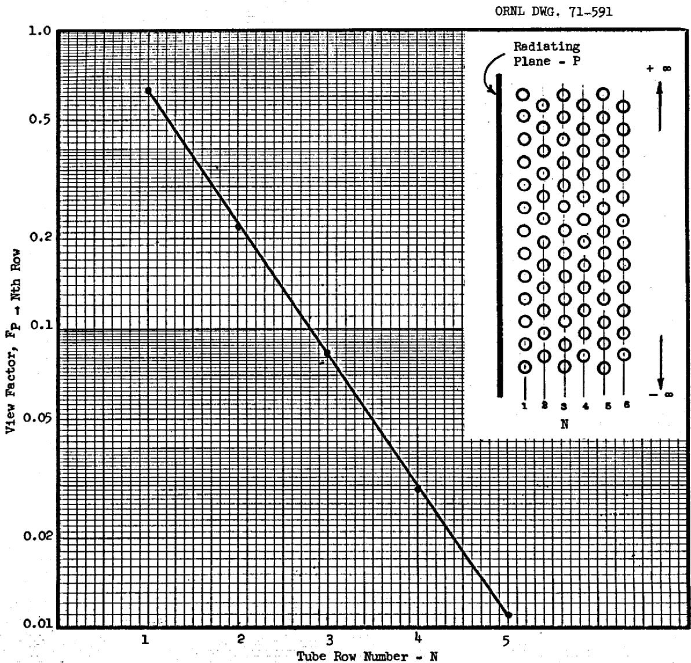  
Fig. C5. View Factors of a Diffusely Radiating, Infinite Plane to Parallel, Triangularly Pitched, Infinitely Long Rows of Tubes. (Tube Pitch)/(Tube Diem) = 2.1.

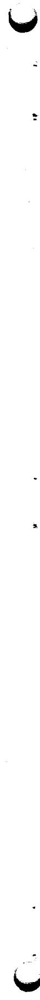

# APPENDIX D

# SHELL TEMPERATURES

Calculation of the steady-state temperature profiles through the outer and intermediate shells is a simple, straightforward procedure. It involves conduction transfer through the shells and radiative transfer in the simplest of geometries; between concentric, infinitely long concentric shells and from the outer shell to an infinite, "black" sink. This computation precedes the calculation of tube enclosure temperatures since it establishes the temperatures of the inner surface of the intermediate shell, the boundary value required to compute the tube enclosure temperatures. A detailed outline follows.

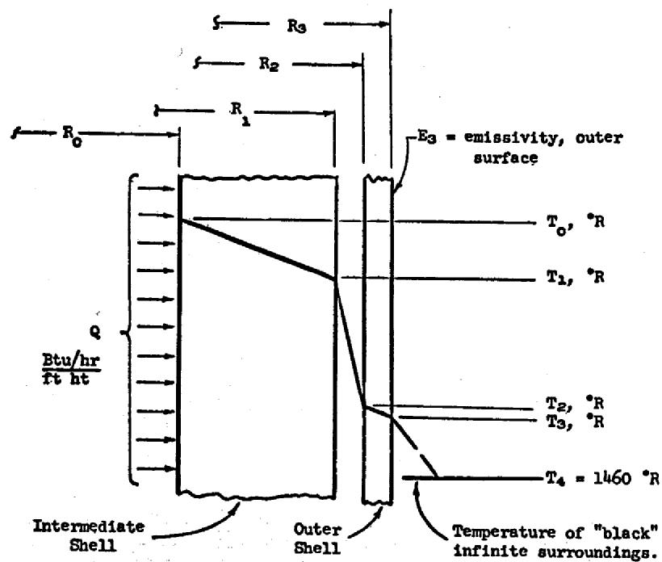

A, A1, A2, A3 = Surface areas of shells at radii R0, R1, R2, R3 respectively, ft²

$$
\sigma = \text {S t e f a n - B o l t z m a n n c o n s t a n t} = 1 7 3 0 \times 1 0 ^ {- 1 2}, \text {B t u / (h r - f t ^ {2} - R ^ {4})}
$$

E = Emissivity of surfaces A to A, incl.

$F_{1} = E_{0} / \left(1 + \left(A_{1} / A_{2}\right)(1 - E_{0})\right)$ , interchange factor for infinite, concentric cylinders.

k = thermal conductivity, Btu/hr-ft²F.

Shell temperatures were calculated with these equations and in the sequence listed.

$$
\mathrm {T} _ {3} = \left[ \left(\mathrm {Q} / \mathrm {A} _ {3} \mathrm {E} _ {3} \sigma\right) + \mathrm {T} _ {4} ^ {4} \right] ^ {1 / 4}
$$

$$
\mathrm {T} _ {2} = \mathrm {Q} \left(\mathrm {R} _ {3} - \mathrm {R} _ {2}\right) / \left(0. 5 \left(\mathrm {A} _ {2} + \mathrm {A} _ {3}\right) \mathrm {k}\right) + \mathrm {T} _ {3}
$$

$$
T _ {1} = \left[ \left(Q / A _ {1} F _ {1} \sigma\right) + T _ {2} ^ {4} \right] ^ {2 / 4}
$$

$$
\mathrm {T} _ {\mathrm {o}} = \mathrm {Q} \left(\mathrm {R} _ {2} - \mathrm {R} _ {0}\right) / \left(0. 5 \left(\mathrm {A} _ {\mathrm {o}} + \mathrm {A} _ {2}\right) \mathrm {k}\right) + \mathrm {T} _ {2}
$$

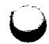

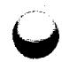

# APPENDIX E

# THE HEAT TRANSFER - TEMPERATURE EQUATIONS

Several approaches to calculating temperatures and radiated heat rates have been developed for systems in which it is assumed that the five postulates listed in Appendix A are valid. Regardless of how the problem is attacked, these various methods produce, in essence, the same final set of equations. The data reported herein were calculated using the "Radiosity Method" which, apparently, was introduced by Eckert and Drake. The development of the equations describing radiant interchange in multi-surface enclosures follows.

(1) Consider kth surface in an enclosure:

of M total surfaces

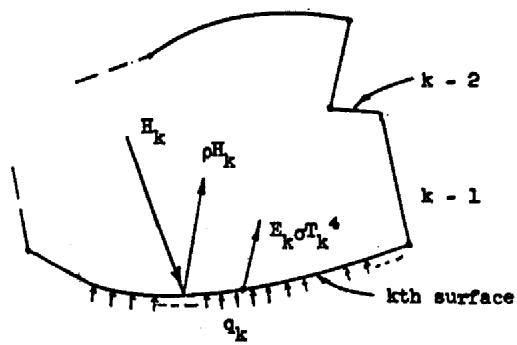

Definition of Symbols

B = radiosity, Btu/hr-ft²

H = incident flux, Btu/hr-ft²

$A_{k} =$ area of kth surface

$\mathbf{T}_{\mathbf{k}} =$ temperature of kth surface, \*R

$F_{k \rightarrow l} =$ view factor, the fraction of total radiation from the kth surface which goes directly to the ith surface

E $=$ emissivity

$Q_{K} =$ heat energy, lost or gained, by the kth surface, Btu/hr, heat lost is positive $(+)$ .

$q_{k} =$ heat energy per unit area, lost or gained, by the kth surface, Btu/hr-ft²

$\alpha =$ absorptivity

$\rho =$ reflectivity

$\sigma =$ Stefan-Boltzmann const. $= 1730 \times 10^{-12}$ , $\frac{\text{Btu/ft}^2}{\text{hr} - (^2\text{R})^4}$

1. For grey bodies

$$
\alpha = 1 - \rho = E.
$$

2. Table IV, page 174 in ref. ll gives two values for $\sigma$ , $1712 \times 10^{-12}$ and $1730 \times 10^{-12}$ for the calculated and experimental values, respectively.

"Radiosity" = total radiation from a surface

$$
B = \text {r a d i o s i t y} = \binom {\text {e m i t t e d}} {\text {r a d i a t i o n}} + \binom {\text {r e f l e c t e d}} {\text {r a d i a t i o n}}
$$

(1a) $\mathbf{B}_{\mathbf{k}} = \mathbf{E}_{\mathbf{k}}\sigma \mathbf{T}_{\mathbf{k}}^{4} + \rho \mathbf{H}_{\mathbf{k}}$

(1b) $\mathbf{E}_{\mathbf{k}} = \mathbf{E}_{\mathbf{k}}\sigma \mathbf{T}_{\mathbf{k}}^{4} + (1 - \mathbf{E}_{\mathbf{k}})\mathbf{H}_{\mathbf{k}}$

$E_{k} =$ total incident radiation on kth surface from all surfaces of the enclosure (includes radiation from kth surface to itself)

(2) $\mathrm{B}_{\mathrm{k}} = \frac{\mathrm{A}_{\mathrm{1}}}{\mathrm{A}_{\mathrm{k}}} \mathrm{F}_{\mathrm{1} \rightarrow \mathrm{k}} \mathrm{B}_{\mathrm{1}} + \frac{\mathrm{A}_{\mathrm{2}}}{\mathrm{A}_{\mathrm{k}}} \mathrm{F}_{\mathrm{2} \rightarrow \mathrm{k}} \mathrm{B}_{\mathrm{2}} + \dots \frac{\mathrm{A}_{\mathrm{k}}}{\mathrm{A}_{\mathrm{k}}} \mathrm{F}_{\mathrm{k} \rightarrow \mathrm{k}} \mathrm{B}_{\mathrm{k}} + \dots \frac{\mathrm{A}_{\mathrm{M}}}{\mathrm{A}_{\mathrm{k}}} \mathrm{F}_{\mathrm{M} \rightarrow \mathrm{k}} \mathrm{B}_{\mathrm{M}}$

(3) By reciprocity, $\mathbf{A}_{\mathbf{i}}\mathbf{F}_{\mathbf{i} - \mathbf{k}} = \mathbf{A}_{\mathbf{k}}\mathbf{F}_{\mathbf{k} - \mathbf{i}}$

$$
F _ {i \rightarrow k} = \frac {A _ {k}}{A _ {1}} F _ {k \rightarrow i} \quad i = 1, 2, \dots M
$$

Substituting the reciprocal expressions (3) into (2)

(4a) $\mathrm{H}_{\mathbf{k}} = \mathrm{F}_{\mathbf{k} \rightarrow \mathbf{1}} \mathrm{B}_{\mathbf{1}} + \mathrm{F}_{\mathbf{k} \rightarrow \mathbf{2}} \mathrm{B}_{\mathbf{2}} + \mathrm{F}_{\mathbf{k} \rightarrow \mathbf{k}} \mathrm{B}_{\mathbf{k}} + \ldots + \mathrm{F}_{\mathbf{k} \rightarrow \mathbf{1}} \mathrm{B}_{\mathbf{i}} + \ldots + \mathrm{F}_{\mathbf{k} \rightarrow \mathbf{M}} \mathrm{B}_{\mathbf{M}}$

or

(4b) $\mathbf{E}_{\mathbf{k}} = \sum_{\mathbf{i} = 1}^{\mathbf{M}}\mathbf{F}_{\mathbf{k}\rightarrow \mathbf{i}}\mathbf{B}_{\mathbf{i}}$ for the kth surface

substituting (4b) in (1b)

(5) $\mathbf{B}_{\mathbf{k}} = \mathbf{E}_{\mathbf{k}}\sigma_{\mathbf{k}}^{4} + (1 - \mathbf{E}_{\mathbf{k}})\sum_{\mathbf{l} = 1}^{\mathbf{N}}\mathbf{F}_{\mathbf{k}\rightarrow \mathbf{l}}\mathbf{B}_{\mathbf{l}}$

Expanding the terms after the summation sign and rearranging

(6) $\mathbb{E}_{\mathbf{k}}\sigma_{\mathbf{k}}^{4} = -(1 - \mathbb{E}_{\mathbf{k}})\mathbb{F}_{\mathbf{k}\rightarrow 1}\mathbb{E}_{\mathbf{l}} - (1 - \mathbb{E}_{\mathbf{k}})\mathbb{F}_{\mathbf{k}\rightarrow 2}\mathbb{E}_{\mathbf{z}}$

$$
+ \left(1 - (1 - \mathbb {E} _ {\mathbf {k}}) \mathbb {F} _ {\mathbf {k} \rightarrow \mathbf {k}}\right) \mathbb {E} _ {\mathbf {k}} \dots - (1 - \mathbb {E} _ {\mathbf {k}}) \mathbb {F} _ {\mathbf {k} \rightarrow \mathbf {M}}
$$

With thermal equilibrium established, a heat balance on the kth surface is written

$$
\left[ \begin{array}{l} \text {t o t a l e m i t t e d} \\ \text {r a d i a n t e n e r g y} \end{array} \right] = \left[ \begin{array}{l} \text {e n e r g y d e v e l o p e d} \\ \text {i n t e r n a l t o t h e} \\ \text {s u r f a c e a n d w h i c h} \\ \text {e s c a p e s f r o m t h e} \\ \text {s u r f a c e} \end{array} \right] + \quad \left[ \begin{array}{l} \text {a b s o r b e d f r a c t i o n o f t h e} \\ \text {r a d i a n t e n e r g y d e l i v e r e d} \\ \text {t o t h e s u r f a c e f r o m o t h e r} \\ \text {s u r f a c e s i n t h e e n c l o s u r e} \end{array} \right]
$$

(7)

$$
A _ {k} \sigma E _ {k} T _ {k} ^ {4} = Q _ {k} + A _ {k} \alpha H _ {k}
$$

(8)

$$
\sigma^ {E _ {k} T _ {k}} = \frac {Q _ {k}}{A _ {k}} + E _ {k} H _ {k}
$$

$$
\text {F r o m} (1 b), \mathrm {H} _ {\mathrm {k}} = \frac {\mathrm {B} _ {\mathrm {k}} - \mathrm {E} _ {\mathrm {k}} \sigma \mathrm {T} _ {\mathrm {k}} ^ {4}}{\left(1 - \mathrm {E} _ {\mathrm {k}}\right)} \quad \text {a n d s u b t i t u t i n g t h i s i n (7) a n d r e a r r a n g i n g w e c a n w r i t e}
$$

(9a)

$$
\frac {Q _ {k}}{A _ {k}} = q _ {k} = \left(\frac {E _ {k}}{1 - E _ {k}}\right) \quad \left[ \sigma T _ {k} ^ {*} - B _ {k} \right]
$$

(9b)

$$
\mathrm {B} _ {\mathrm {k}} = \sigma \mathrm {T} _ {\mathrm {k}} ^ {4} - \left(\frac {1 - \mathrm {E} _ {\mathrm {k}}}{\mathrm {E} _ {\mathrm {k}}}\right) \mathrm {q} _ {\mathrm {k}}
$$

(9c)

$$
\sigma_ {\mathrm {k}} ^ {\mathrm {T}} = \mathrm {E} _ {\mathrm {k}} + \left(\frac {1 - \mathrm {E} _ {\mathrm {k}}}{\mathrm {E} _ {\mathrm {k}}}\right) \mathrm {q} _ {\mathrm {k}}
$$

(9a)

$$
\mathrm {T} _ {\mathbf {k}} = \left\{\frac {1}{\sigma} \left[ \mathrm {B} _ {\mathbf {k}} + \left(\frac {1 - \mathrm {E} _ {\mathbf {k}}}{\mathrm {E} _ {\mathbf {k}}}\right) q _ {\mathbf {k}} \right] \right\} ^ {2 / 4}
$$

$$
\text {U s i n g} (9 c) \text {t o e l i m i n a t e} \sigma T _ {k} ^ {*} \text {f r o m} (6), \text {w e h a v e}
$$

$$
\begin{array}{l} B _ {k} + \left(\frac {1 - E _ {k}}{E _ {k}}\right) q _ {k} = - \left(\frac {1 - E _ {k}}{E _ {k}}\right) F _ {k \rightarrow 1} B _ {1} - \left(\frac {1 - E _ {k}}{E _ {k}}\right) F _ {k \rightarrow 2} B _ {2} \dots + \frac {1}{E _ {k}} (1 - (1 - E _ {k}) F _ {k \rightarrow k}) B _ {k} \dots - \frac {(1 - E _ {k})}{E _ {k}} F _ {k \rightarrow M} B _ {M} (10a) \\ \frac {Q _ {k}}{A _ {k}} = q _ {k} = - F _ {k \rightarrow 1} B _ {1} - F _ {k \rightarrow 2} B _ {2} \dots + (1 - F _ {k \rightarrow k}) B _ {k} - F _ {k \rightarrow k + 1} B _ {k} + 1 - \dots F _ {k \rightarrow M} B _ {M} (10b) \\ \end{array}
$$

Depending on whether surface temperature or surface heat transfer rate is known, either Equation (6) or (10b) can be written for each surface of the enclosure.

At the risk of stating the obvious we must be able to prescribe at least one surface temperature. When applied to MSBR heat exchangers we use these radiosity equations as follows:

(a) The innermost surface, $(\mathbf{k} = 1)$ , $q_{1} = 0$ in Equation (1Ob) if it is assumed that there is no heat generation in the inner-shell (Type 1).   
(b) Tube circles, $\mathbf{k} = 2$ to $\mathbf{M} - 1$ , incl., $q_{k}$ , in Equation (10b), is specified from noble metal afterheat data.   
(c) Intermediate shell, $\mathbf{k} = \mathbf{M}$ ; $\mathbf{T}_{\mathbf{M}}$ in Equation (6) is established from previous computations of the temperature gradients required to transfer the total afterheat generated within the heat exchanger from the inner surface of the intermediate shell to the outside world.

These equations in which radiosity, $\mathbf{B}_{\mathbf{k}}^{\prime}$ is the variable are written thus

$$
k = 1; \quad (1 - F _ {1 \rightarrow 1}) B _ {1} - F _ {1 \rightarrow 2} B _ {2} - F _ {1 \rightarrow 3} B _ {3} - \dots - F _ {1 \rightarrow j} B _ {j} - \dots \dots - F _ {1 \rightarrow M} B _ {M} = 0 \quad \text {S e e (a)}
$$

$$
\begin{array}{c c c c c c c}k = 2;&- F _ {2 \rightarrow 1} B _ {1} + (1 - F _ {2 \rightarrow 2}) B _ {2} - F _ {2 \rightarrow 3} B _ {3} -&F _ {2 \rightarrow 4} B _ {4}&\dots - F _ {2 \rightarrow j} B _ {j} -&\dots&- F _ {2 \rightarrow M} B _ {M}&= q _ {2}\\&\cdot&\cdot&&\cdot&&\cdot\\&&&&&&\end{array}\tag {See(b)}
$$

$$
\left(1 1 a\right) \quad k = j; \quad - F _ {j - 1} B _ {1} - F _ {j - 2} B _ {2} - F _ {j - 3} B _ {3} - \dots + (1 - F _ {j - j}) B _ {j} - \dots - F _ {j - M} ^ {\prime} B _ {M} = q _ {j}
$$

$$
k = M; - (1 - E _ {M}) F _ {M \rightarrow 1} B _ {1} - (1 - E _ {M}) F _ {M \rightarrow 2} B _ {2} - (1 - E _ {M}) F _ {M \rightarrow 3} B _ {3} - \dots . + (1 - (1 - E _ {M}) F _ {M \rightarrow M}) B _ {M} = E _ {M} T _ {M} ^ {*}
$$

a. For Type 2 heat generation, in which the gamma heat generation rate in the inner shell is considered, the 1st equation is not set equal to zero, $q_{k}$ is then the heat generation rate in the inner shell per unit outer surface area of the inner heat exchanger shell.   
b. For uniform heat generation rate in the tube annulus, $q_{2} = q_{3} = \dots q_{j} \dots = q_{M-1}$ .   
c. Note that the cylindrical geometry is not explicit in these equations; it is implied by the view factors.

In matrix format, suitable for machine computation, these equations (1la) are written:

(11b)

$$
\left[ \begin{array}{c c c c c c} c _ {1, 1} & c _ {1, 2} & c _ {1, 3} & \dots \dots \dots \dots & c _ {1, M - 1} & c _ {1, M} \\ c _ {2, 1} & c _ {2, 2} & c _ {2, 3} & c _ {2, 4} & \dots \dots & c _ {2, M - 1} \\ \cdot & & & & & \\ \cdot & & & & & \\ \cdot & & & & & \\ \cdot & & & & & \\ c _ {n, 1} & c _ {n, 2} & \dots \dots \dots \dots \dots \dots \dots \dots \dots \dots \dots \dots \dots \dots \dots \dots \dots \dots \dots \dots \dots \dots \dots \dots \dots \dots \dots \dots \dots \dots \dots \dots \dots \dots \dots \dots \dots \dots \dots \dots \dots \\ \cdot & & & & & \\ \cdot & & & & & \\ c _ {M, 1} & c _ {M, 2} & \dots \dots \dots & & c _ {J, M} \\ & & & & & \\ \end{array} \right] x \left[ \begin{array}{c} B _ {1, 1} \\ B _ {2, 1} \\ \vdots \\ B _ {n, 1} \\ \vdots \\ B _ {M, 1} \\ B _ {M, 1} \\ B _ {M, 1} \\ B _ {M, 1} \\ B _ {M, 1} \\ B _ {M, 1} \\ B _ {M, 1} \\ B _ {M, 1} \\ B _ {M, 1} \\ B _ {M, 1} \\ B _ {M, 1} \\ B _ {M, 1} \end{array} \right] = \left[ \begin{array}{c} R _ {1, 1} \\ R _ {2, 1} \\ \cdot \\ . \\ . \\ . \\ . \\ R _ {n, 1} \\ . \\ . \\ . \\ R _ {M, 1} \\ . \\ . \\ R _ {M, 1} \\ . \\ . \\ R _ {M, 1} \\ . \\ . \\ R _ {M, 1} \\ . \\ . \\ R _ {M, 1} \\ . \\ . \\ R _ {M, 1} \\ . \\ . \\ R _ {M, 1} \\ . \\ . \\ R _ {M, 1} \\ . \\ . \\ R _ {N, 1} \\ . \\ . \\ R _ {N, 1} \\ . \\ . \\ R _ {N, 1} \\ . \\ . \\ R _ {N, 1} \\ . \\ . \\ R _ {N, 1} \\ . \\ . \\ R _ {N, 1} \\ . \\ . \\ R _ {N, 1} \\ . \\ . \\ R _ {N, 1} \\ . \\ .
\end{array} \right]
$$

For surfaces having a known or prescribed rate of heat transfer:

$$
C _ {n, j} = - F _ {n \rightarrow j}; \quad j \neq n
$$

$$
C _ {n, j} = (1 - F _ {n \rightarrow j}) = (1 - F _ {j \rightarrow j}) \quad ; \quad j = n
$$

$$
R _ {n, 1} = q _ {n}
$$

For surfaces having a known or prescribed temperature:

$$
\mathrm {C} _ {\mathrm {n}, \mathrm {j}} = - (1 - \mathrm {E} _ {\mathrm {n}}) \mathrm {F} _ {\mathrm {n} \rightarrow \mathrm {j}}; \quad ; \mathrm {j} \neq \mathrm {n}
$$

$$
C _ {n, j} = 1 - \left(1 - E _ {n}\right) F _ {n \rightarrow j} = 1 - \left(1 - E _ {j}\right) F _ {j \rightarrow j}; j = n
$$

$$
R _ {n, 1} = E _ {n} \sigma T _ {n} ^ {4}
$$

The radiosities, $\mathbf{B}_{\mathbf{k}}$ are computed and surface temperatures, $\mathbf{T}_{\mathbf{k}}$ obtained from Equation (9d).

# APPENDIX F

# COMPUTATIONAL PROCEDURE

Calculations were made in sequence as follows:

1. View factors were determined as outlined in Appendix C.   
2. Temperature profiles in the outer and intermediate shells were calculated as outlined in Appendix D. The temperatures at the inner surface of the intermediate shell are the boundary values, $\mathbf{T}_{\mathbf{M}}$ , used in Eqs. (11c) in Appendix E.   
3. Having established the view factors, boundary values for temperatures, and heat rates, Eqs. (llc) in Appendix E were solved for tube circle and inner shell temperatures.

The computations were made using Extended Basic (BII) programs with the Reactor Division's time-sharing computer facility. Several programs were written for the various aspects of the problem. It has been this author's experience that the inclusion of computer program lists without copious explanatory notes and instructions is wasted effort. Should a need develop, the programs will be reported separately.

# APPENDIX G

# THERMAL RADIATION CHARACTERISTICS OF HASTELLOY N

The emissivity of Hastelloy N (INOR 8) is reported in reference 27. These data suggest that, for clean, unoxidized surfaces, we use an emissivity of 0.2 and, for oxidized surfaces, an emissivity of 0.5 or 0.6.

The author did not become aware of reference 27 until this report was virtually completed. The remainder of this appendix is the result of my attempts to infer a value of emissivity from measurements on alloys composed of similar elements. Although the data and references which follow are not directly applicable, they are included since they may be relevant and useful to persons dealing with similar problems.

There is considerable data on alloys containing nickel, iron, molybdenum, and chromium. Table Gl lists values of emissivity for metals of this general composition. In general, the numerical values of emissivity for smooth, clean, unoxidized surfaces at temperatures in the region $1200^{\circ}\mathrm{F} - 2000^{\circ}\mathrm{F}$ are from 0.1 to 0.3. In the absence of better information, similar values were assumed for Hastelloy N. Therefore, the temperature calculations were made for internal emissivities of 0.1, 0.2, and 0.3. In general, the data indicate, and theory substantiates, that emissivity increased with increasing temperature. This change is not large; within the temperature differences calculated in the tube annuli, it will be of the same order as the uncertainty in the value of the emissivity. No attempt was made to include a mild temperature dependence of emissivity in the temperature - heat transfer equations. These equations, linear with $\mathbf{T}^4$ as the unknown, are easily solved by standard routine programs. We are dealing with conceptual designs, subject to change, and a physical system containing uncertainties other than emissivity. The incremental elegance of solution and the resulting improvement in accuracy are insufficient to justify the very appreciable increase in cost and time required to develop or adapt a program which allows the use of temperature-dependent emissivity in the system of equations.

In connection with the data from reference 22 in Table Gl, it is appropriate to point out that this report, NASA CR 1431, outlines a program now apparently under way at Purdue University to collect, evaluate, and present radiative properties data from all available sources. When sufficient evidence exists concerning a particular property of a particular material, such as the emissivity of stainless steel, broad band curves of "recommended" values are presented which enable the reader to get a general feeling for the tolerances or variations to be expected and the circumstances in which the "recommended" values are applicable. These data tend to develop more confidence in the user than anything this writer has seen heretofore in the readily available texts and references.

It has been pointed out that by assuming gray, diffuse conditions, no distinction is made between emitted and reflected radiation; both are assumed to have directional properties in accordance with Lambert's cosine law. There is evidence that, whereas the pattern of emitted radiation may

<table><tr><td>Material</td><td>Condition and/or Treatment</td><td>Type1 of Emission Measure-ment</td><td>Emissions and Corresponding Temperatures and/or Wavelengths</td><td>Emissions at 1200°F</td><td>2000°F</td><td>Notes</td><td>Source</td></tr><tr><td rowspan="5">I. Molybdenum</td><td>A. Polished</td><td>HTE</td><td>Linear variation from 0.075±0.02 at 600°F to 0.250±0.02 at 3500°F.</td><td>0.110±0.02</td><td>0.190±0.02</td><td>Based on 7 references. Data is apparently consistent with uniform scatter.</td><td>Ref. (22)NASA CR 1431, p. 26</td></tr><tr><td>B. Grit blasted</td><td>HTE</td><td>0.28±0.05 at 1340°F; 0.30 at 1700°F.</td><td>0.26±0.05</td><td>-0.32*</td><td>Based on 2 references.</td><td>Ref. (22)NASA CR 1431, p. 26</td></tr><tr><td>C. Shot blasted and etched</td><td>HTE</td><td>0.22 at 1000°F to 0.40 at 2700°F.</td><td>0.25</td><td>0.38</td><td>Based on 1 reference.</td><td>Ref. (22)NASA CR 1431, p. 26</td></tr><tr><td>D. Etched and flashed</td><td>HTE</td><td>0.25 at 1340°F to 0.40 at 2700°F.</td><td>0.125*</td><td>0.275</td><td>Based on 1 reference.</td><td>Ref. (22)NASA CR 1431, p. 26</td></tr><tr><td>E. Stably oxidized.</td><td>HTE</td><td>Approximately 0.82 at 700°F.</td><td>--</td><td>--</td><td>Based on 1 reference. Curve sheet states that oxide is volatile in a vacuum above 1000°F (811 K).</td><td>Ref. (22)NASA CR 1431, p. 26</td></tr><tr><td rowspan="3">II. Stainless steels, cleaned</td><td>A. Cleaned</td><td>HTE</td><td>0.30±0.09 at 600°F; 0.35±0.09 at 1000°F; 0.41±0.09 at 1340°F; 0.56±0.11 at 1700°F.</td><td>0.35</td><td></td><td>Appears to be based on at least 13 references.</td><td>Ref. (22)NASA CR 1431, p. 44</td></tr><tr><td>B. N-155, as received or cleaned</td><td>HTE</td><td>Linear variation from 0.10 at 350°F to 0.15 at 1160°F rising nonlinearly to 0.3 at 1580°F (see Note).</td><td>0.16</td><td>--</td><td>Based on 4 references. No-tation on curve sheet at nonlinear portion of curve reads &quot;Oxidation Probable.&quot;</td><td>Ref. (22)NASA CR 1431, p. 44</td></tr><tr><td>C. As rolled, cleaned</td><td>HTE</td><td>0.47 at 600°F; 0.5 at 1160°F.</td><td>--</td><td>--</td><td>Based on 1 reference.</td><td>Ref. (22)NASA CR 1431, p. 44</td></tr><tr><td rowspan="6">II. Stainless steels, oxidized</td><td>A. Oxidized in air at red heat for 30 min.</td><td>HTE</td><td>0.15±0.06 at 260°F; 0.25±0.07 at 800°F; 0.29±0.07 at 1000°F; 0.35±0.07 at 1340°F; 0.41 at 1700°F; essentially linear variation from 440°F to 1700°F.</td><td>0.32±0.07</td><td>0.47*</td><td>Based on 6 references.</td><td>Ref. (22)NASA CR 1431, p. 45</td></tr><tr><td>B. Buffed, stably oxidized at 1112°F (873K).</td><td>HTE</td><td>0.40 at 620°F; 0.42 at 1000°F; 0.50 at 1340°F.</td><td>0.46</td><td>--</td><td>Based on 1 reference.</td><td>Ref. (22)NASA CR 1431, p. 45</td></tr><tr><td>C. Shot blasted, stably oxidized at 1112°F (873K).</td><td>HTE</td><td>0.64 at 800°F; 0.67 at 1160°F; 0.70 at 1340°F.</td><td>0.67</td><td>--</td><td>Based on 1 reference.</td><td>Ref. (22)NASA CR 1431, p. 45</td></tr><tr><td>D. Pollenized and oxi-dized at high temperature.</td><td>HTE</td><td>0.67±0.02 at 980°F; 0.70±0.03 at 1340°F; 0.75±0.05 at 1700°F; 0.82±0.06 at 260°F.</td><td>0.69±0.03</td><td>0.61±0.06</td><td>Based on at least 5 references (probably 7).</td><td>Ref. (22)NASA CR 1431, p. 45</td></tr><tr><td>E. As rolled, stably oxidized at 1112°F (873K).</td><td>HTE</td><td>0.77 at 700°F; 0.8 at 980°F; 0.85 at 1340°F; 0.87 at 1540°F.</td><td>0.83</td><td>--</td><td>Based on 1 reference.</td><td>Ref. (22)NASA CR 1431, p. 45</td></tr><tr><td>F. Stably oxidized at high temperature.</td><td>HTE</td><td>0.83±0.05 at 700°F; 0.85±0.05 at 980°F; 0.94±0.04 at 1340°F.</td><td>0.82±0.05</td><td>--</td><td>Based on 3 references.</td><td>Ref. (22)NASA CR 1431, p. 45</td></tr><tr><td rowspan="2">III. Stainless steels, polished</td><td>A. N-155, polished (oxidization re-tarded).</td><td>HTE</td><td>0.1 at 620°F; 0.13 at 980°F; 0.18 at 1340°F; 0.23±0.03 at 1700°F.</td><td>0.16</td><td>0.28*</td><td>Based on 3 references. Data indicates scatter above 1340°F.</td><td>Ref. (22)NASA CR 1431, p. 46</td></tr><tr><td>B. Various polished stainless steels (oxidation re-tarded).</td><td>HTE</td><td>0.17±0.04 at 860°F; 0.19±0.04 at 820°F; 0.21±0.04 at 980°F; 0.23±0.07 at 1340°F; 0.34±0.10 at 1520°F; 0.56±0.11 at 1700°F (see Note).</td><td>0.28±0.06</td><td>--</td><td>Based on 9 references. The curve rises rapidly at high temperature and carries no-tation &quot;Oxidation Probable.&quot;</td><td>Ref. (22)NASA CR 1431, p. 46</td></tr><tr><td rowspan="4">IV. Inconel</td><td>A. As received</td><td>Not stated</td><td>Constant at 0.25 from 300°F to 1200°F.</td><td>0.25</td><td>--</td><td></td><td>Ref. (23)</td></tr><tr><td>B. As received and oxidized at 1200°F for 48 hours.</td><td>Not stated</td><td>0.55 at 800°F to 0.53 at 1100°F. Linear variation.</td><td>0.53*</td><td>--</td><td></td><td></td></tr><tr><td>C. Polished</td><td>Not stated</td><td>0.12 at 300°F to 0.20 at 700°F. Linear variation.</td><td>0.30*</td><td>--</td><td></td><td></td></tr><tr><td>D. Polished and oxi-dized at 1200°F for 48 hours.</td><td>Not stated</td><td>0.27 at 500°F to 0.30 at 1100°F. Linear variation.</td><td>0.31*</td><td>--</td><td></td><td></td></tr><tr><td rowspan="4">V. Inconel X</td><td>A. As received</td><td>Not stated</td><td>0.27 at 300°F to 0.23 at 1100°F. Linear variation.</td><td>0.23*</td><td>--</td><td></td><td>Ref. (23)</td></tr><tr><td>B. As received and oxidized at 1200°F</td><td>Not stated</td><td>Constant at 0.38 from 300°F to 1100°F.</td><td>0.38*</td><td>--</td><td></td><td></td></tr><tr><td>C. Polished</td><td>Not stated</td><td>0.18 at 300°F to 0.17 at 1100°F. Linear variation.</td><td>0.17*</td><td>--</td><td></td><td></td></tr><tr><td>D. Polished and oxidized at 1200°F for 48 hours.</td><td>Not stated</td><td>0.29 at 300°F to 0.35 at 1100°F. Linear variation.</td><td>0.35*</td><td>--</td><td></td><td></td></tr><tr><td rowspan="3">VI. Monel</td><td>A. As received</td><td>Not stated</td><td>0.10 at 200°F to 0.31 at 1100°F. Linear variation.</td><td>0.31*</td><td>--</td><td></td><td>Ref. (23)</td></tr><tr><td>B. As received and oxidized at 1200°F for 48 hours.</td><td>Not stated</td><td>0.50 at 200°F to 0.72 at 1100°F. Linear variation.</td><td>0.75*</td><td>--</td><td></td><td></td></tr><tr><td>C. Polished and oxi-dized at 1200°F for 48 hours.</td><td>Not stated</td><td>0.65 at 400°F to 0.57 at 1100°F. Linear variation.</td><td>0.56*</td><td>--</td><td></td><td></td></tr><tr><td>VII. Nickel</td><td>Polished</td><td>TE</td><td>0.07 at 300°F to 0.16 at 2000°F. Nearly linear variation.</td><td>0.11</td><td>0.15</td><td></td><td>Ref. (24)</td></tr><tr><td>VIII. Chromium</td><td>Polished</td><td>TE</td><td>0.05 at 300°F to 0.46 at 1800°F. Linear variation.</td><td>0.26</td><td>--</td><td></td><td>Ref. (24)</td></tr></table>

1BTE -- Hemispherical Total Emittance.

MTE -- Normal Total Emittance.

TE -- Total Emittance.

*Extrapolated by author of this report.

be well approximated by the cosine law, reflected radiation from the same surface can be highly specular, particularly when very smooth or polished surfaces predominate. Intuitively, this is reasonable. No attempt was made to estimate or evaluate the effect of a strong specular component on temperatures developed in these heat exchangers. Any effect of specularity would be more apparent at low emissivities when the energy content of the total radiation leaving a surface contains the largest fraction of reflected radiation. The literature contains comparisons of computations based on diffuse vs specular radiation emanated by relatively simple, regular cavity configurations such as continuous rectangular and V-shaped grooves, cylindrical and conical cavities, and spherical cavities. The data are presented by plotting curves of apparent emissivity, which is a measure of overall heat transfer capability of the cavity, as a function of cavity depth-to-opening ratio (L/R for a cylindrical cavity). Actual emissivity is a parameter. The effect of specularity is to increase the apparent emissivity and the effect is most pronounced in deep cavities of low emissivity. For example, reference 12, Fig. 6.2, p. 165, shows calculated curves of apparent emissivity of cylindrical cavities having depth to radius ratios, L/R, from zero to 10. The data in Table G2 have been taken from this figure.

Table G2   

<table><tr><td rowspan="2">Actual Emissivity of Cavity Surface</td><td rowspan="2">L/R</td><td colspan="2">Calculated Apparent Emissivities</td></tr><tr><td>Diffusely Reflecting</td><td>Specularly Reflecting</td></tr><tr><td>0.1</td><td>2</td><td>0.34</td><td>0.34</td></tr><tr><td>0.1</td><td>6</td><td>0.48</td><td>0.59</td></tr><tr><td>0.1</td><td>10</td><td>0.49</td><td>0.72</td></tr><tr><td>0.2</td><td>2</td><td>0.53</td><td>0.56</td></tr><tr><td>0.2</td><td>6</td><td>0.63</td><td>0.79</td></tr><tr><td>0.2</td><td>10</td><td>0.63</td><td>0.88</td></tr><tr><td>0.3</td><td>2</td><td>0.66</td><td>0.70</td></tr><tr><td>0.3</td><td>6</td><td>0.72</td><td>0.83</td></tr><tr><td>0.3</td><td>10</td><td>0.72</td><td>0.94</td></tr></table>

The degree to which the internal surfaces, tubes mainly, reflect specularly deserves consideration. Certainly the spaces between the tubes are not unlike deep cavities. If specular reflections will take place in the heat exchangers, it is reasonable to conclude that the diffuse calculations reported here give higher temperatures and may be regarded as conservative.

# APPENDIX H

# COMPARISON - EXPERIMENTS AND ANALYSES

The calculated temperatures reported herein are not presented entirely unsupported by experimental verification. In November 1965, temperatures in a 91-rod bundle of 0.5-in.-diameter straight stainless steel tubular electrical heaters were reported.[25] Figure H1 is a photograph of a somewhat similar heater assembly. Figure H2 shows the essentials of the test setup. The information required to do temperature calculations follows.

# A. System Configuration

1. See Fig. H2   
2. Rod pitch/diam = 1.25.   
3. Rod diam --- 0.5 in.   
4. Rod surface area --- 0.131 ft²/ft length.   
5. Heated length of rod --- 10 in. = 0.83 ft.   
6. Rod array --- concentric, hexagonal rings formed by triangul- larly pitched tubes. The single, central tube is considered to be ring No. 1.

# B. Thermal Conditions

1. Heat input $= 22.4 \, \text{w/rod}$

$$
\begin{array}{l} = 9 1. 7 \text {B t u / h r - f t l e n g t h o f r o d} \\ = 7 0 0 \mathrm {B t u} / \mathrm {h r - f t} ^ {2} \text {r o d s u r f a c e} \\ = 6 7 8 0 \text {B t u / h r f o r} 9 0 \text {a c t i v e r o d s} (\text {1 r o d n o t h e a t e d}) \\ \end{array}
$$

2. Environment

(a) Tube bundle housing evacuated to a pressure of $\leq 3$ microns of mercury.   
(b) Housing in laboratory atmosphere, protected from drafts.

3. Emissivities

No measurements were made of emissivity of the tube surfaces or the internal surface of the housing. Based on the several-year-old recollection of a person somewhat familiar with the experiment, it can only be concluded that the stainless steel surfaces were neither new, bright and polished, nor were they heavily and deeply oxidized. Between these extremes, emissivities from 0.2 to 0.7 are possible and values from 0.3 to 0.5 are likely. Tube surfaces displayed a dull, satiny gloss typical of stainless steel after long immersion in a high-temperature liquid metal (NaK, K, Na, etc.).

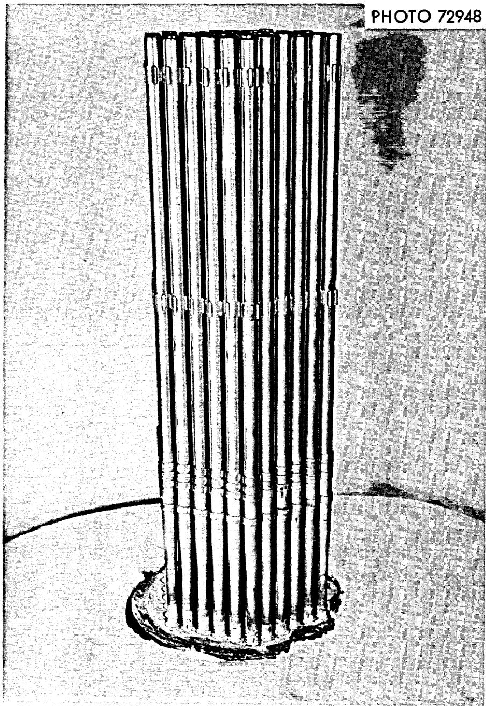  
Fig. H1. Array of 91 Heater Rods Having Similar Geometry to Rod Bundle Shown on Fig. H2.

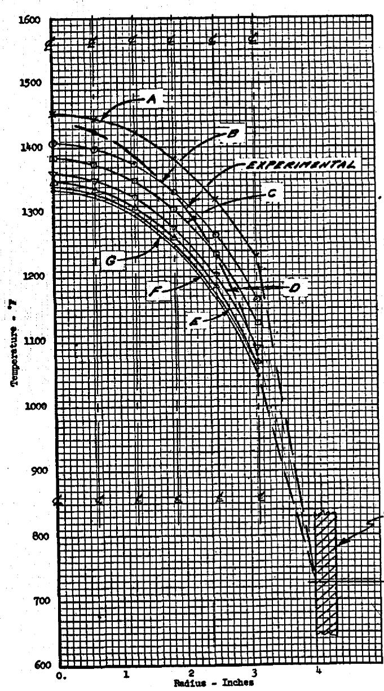

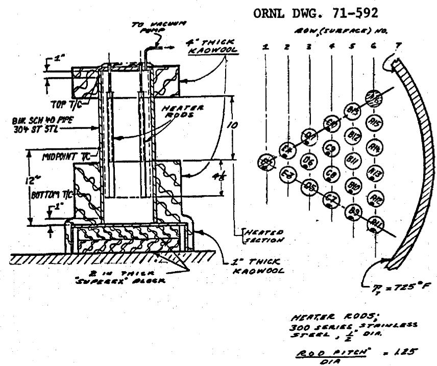  
Fig. H2. Comparison of Experimental and Calculated Temperatures in a 91 Rod Array.

Test Setup and Heater Rod Geometry

<table><tr><td>Curve No.</td><td>Emissivity, Surfaces 1 to 6 incl.</td><td>Radiated Heat Rate* Btu/hr ft of rod</td></tr><tr><td>A</td><td>0.10</td><td>82.5</td></tr><tr><td>B</td><td>0.15</td><td>82.5</td></tr><tr><td>C</td><td>0.20</td><td>82.5</td></tr><tr><td>D</td><td>0.40</td><td>82.5</td></tr><tr><td>E</td><td>0.45</td><td>82.5</td></tr><tr><td>F</td><td>0.50</td><td>82.5</td></tr><tr><td>G</td><td>0.60</td><td>82.5</td></tr><tr><td colspan="3">* This is 90% of total heat input.</td></tr></table>

# 4. Temperature measurements

Temperatures were measured by chromel-alumel thermocouples embedded in the heater rods and placed on or in the housing.

Temperature calculations were made using the same general method as that used to calculate heat exchanger temperatures. Because of the close spacing of the heaters $(\mathrm{P} / \mathrm{D} = 1.25)$ the view of any rod is limited to adjacent rods and to rods in any second row distant. The central rod and each of the five hexagonal rings were considered to be an isothermal surface so that the "enclosure" consisted of a total of seven surfaces. This assumption is capable of producing some error since the corners of the hexagons are closer to the outer shell. This is particularly apparent on examining the corner rods in the outermost hexagonal ring. Each of these six rods sees only three adjacent rods instead of the four seen by the other rods in this ring. Everything else being equal, we should expect its temperature to be lower than the other rods in that ring since it has more surface directly viewing the heat sink (the outer shell). This has been borne out in the second experiment discussed subsequently, but it was not taken into account in the temperature computations for this test setup.

The length of heated section in the rods was 10 in., giving the assembly an approximate L/D of 1.7. The one-dimensional infinite length computational model was used; it was recognized that, applied to this short assembly, accuracy would suffer. In an effort to compensate partially for axial heat losses by conduction in the rods and by radiation, particularly from the outer ring to the shell, the radially radiated heat was assumed to be $90\%$ of the total input.

Since the actual emissivities of the surfaces were not known, it was decided to assume values for emissivity and attempt to match the experimental temperature data. The results of these calculations are on Figs. H2 to H5, inclusive. These figures are, for the most part, self-explanatory, but in all cases note that the observed radial temperature gradient is steeper than the calculated values. The temperatures developed and measured in the rod array will be affected by axial conduction in the heater elements and thermocouples and by specular or other non-diffuse components in the emitted and reflected radiation. Any computation designed to obtain precise agreement with experiment must include these factors. They were not considered in the calculations reported herein. The calculations using emissivities in the neighborhood of 0.5 are in the best agreement with the experiment. This may be reasonable since the heaters had seen considerable use.

Figures H6 and H7 are included to emphasize that radiative transfer in a bundle of rods should not be approximated by assuming that each ring of rods behaves as if a continuous, impenetrable shell.

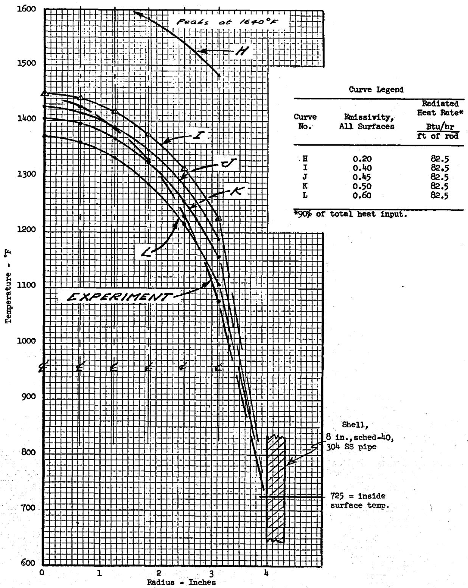  
Fig. H3. A Comparison of Experimental and Calculated Temperatures Required to Radiate 82.5 Btu/Hr-Ft of Rod in a 91-Rod, Hexagonal Array of 1/2-In.-Dlam Heater Rods Spaced 5/8 In. Apart Enclosed in an 8-In. Sched-40 SS Pipe (refer to CF 65-11-68). Calculations are shown with emissivity a parameter.

ORAL DVG. 71-594

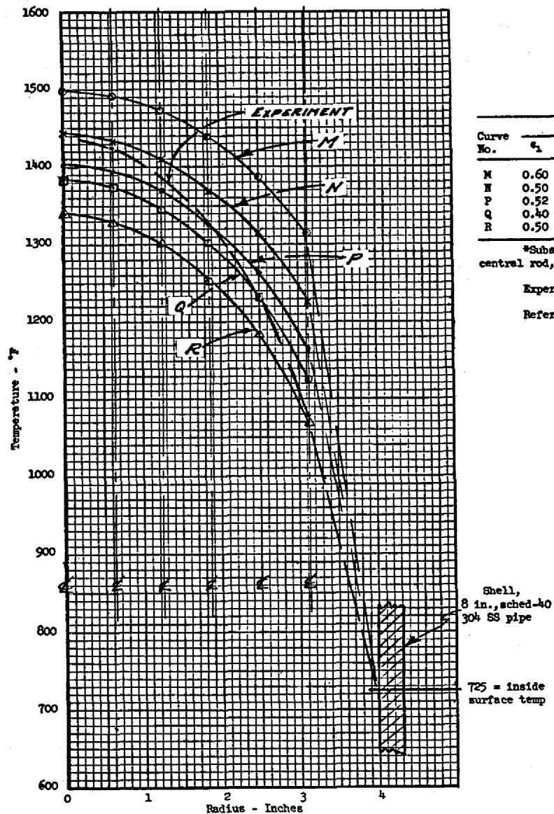  
Fig. B4. Temperature Profiles in 91 Heater-Rod Array in Which Rod Emissivities are Assumed to Vary With Their Radial Location.

<table><tr><td rowspan="2">Curve No.</td><td colspan="7">Emissivities*</td><td rowspan="2">Radiated Heat Rate Btu/hr-ft of Rod (90% of total)</td></tr><tr><td>ε1</td><td>ε2</td><td>ε3</td><td>ε4</td><td>ε5</td><td>ε6</td><td>ε7</td></tr><tr><td>M</td><td>0.60</td><td>0.55</td><td>0.50</td><td>0.45</td><td>0.40</td><td>0.35</td><td>0.30</td><td>82.5</td></tr><tr><td>N</td><td>0.50</td><td>0.50</td><td>0.50</td><td>0.50</td><td>0.40</td><td>0.40</td><td>0.40</td><td>82.5</td></tr><tr><td>P</td><td>0.52</td><td>0.50</td><td>0.48</td><td>0.46</td><td>0.44</td><td>0.42</td><td>0.50</td><td>82.5</td></tr><tr><td>Q</td><td>0.40</td><td>0.40</td><td>0.40</td><td>0.40</td><td>0.40</td><td>0.40</td><td>0.60</td><td>82.5</td></tr><tr><td>R</td><td>0.50</td><td>0.50</td><td>0.50</td><td>0.50</td><td>0.40</td><td>0.40</td><td>0.80</td><td>82.5</td></tr></table>

*Subscripts refer to surface numbers. Surface number 1 is central rod, surface number 7 is inside of 8-in. schem-40 pipe.

Experimental curve is from Fig. 12 in CF-65-11-68.

Refer to Fig. E2 for details of rod geometry and test setup.

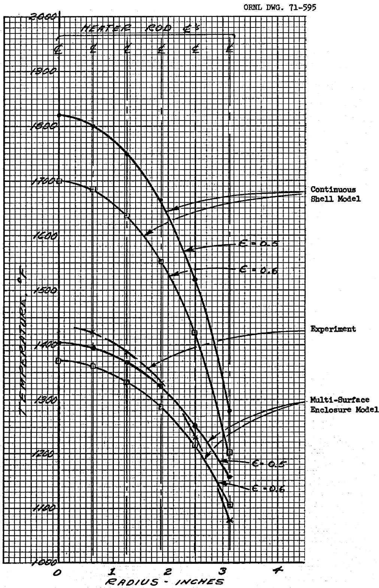  
Fig. H5. A Comparison of Calculated Temperatures Required to radiate 82.5 Btu/Hr-Fe of Rod in a 91-Rod, Hexagonal Array of 1/2-In.-Diam Heater Rods Spaced 5/8 In. Apart Enclosed in an 8-In. Sched-40 SS Pipe (refer to CF 65-11-68). Calculations are shown for emissivities (all surfaces) of 0.5 and 0.6.

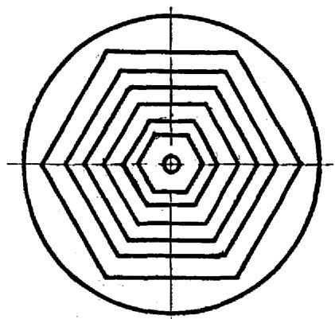  
Fig. H6. Diagram of a Continuous Shell Model of a Hexagonal Array of 91 Heater Rods.

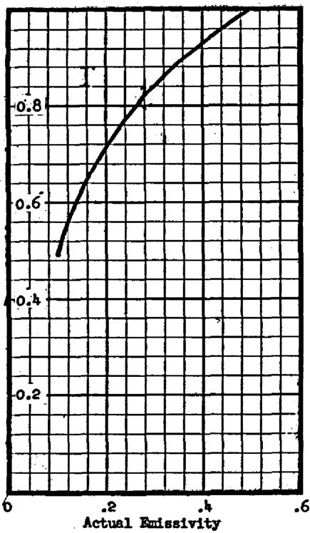  
Fig. H7. The Apparent Emissivity of a Hexagonal Array of Rods if Viewed as a Single, Hexagonal Surface vs Actual Rod Emissivity. Rod Pitch/Rod Diam = 1.25.

# ORNL DWG. 71-596

This curve indicates that, in calculating the temperatures required to get radiant heat transfer from arrays of rods or tubes, a continuous impenetrable convex shell is a poor substitute for the open, convoluted geometry of the tube bundle. The curve was prepared as follows:

1. Temperatures, Fig. E2, in the 91-rod array were calculated by the method described in Appendix C, for several values of rod surface and outer shell emissivity and with a heat input estimated at 82.5 Btu/hr-ft length of rod.   
2. The 91-rod array was then represented, Fig. H6, as a series of continuous, concentric, closely spaced, infinitely long hexagonal shells surrounded by an outer cylindrical shell. For this configuration the radiative transfer from shell to shell is given by the simple relation,

$$
Q = \sigma F _ {n} \rightarrow (n + 1) A _ {n} \left(T _ {n} ^ {4} - T _ {(n + 1)} ^ {4}\right) \tag {1}
$$

$$
\mathrm {F} _ {\mathrm {n}} \rightarrow (\mathrm {n} + 1) = \frac {\mathrm {E} _ {\mathrm {n}} \mathrm {E} _ {(\mathrm {n} + 1)}}{\mathrm {E} _ {(\mathrm {n} + 1)} + \frac {\mathrm {A} _ {\mathrm {n}}}{\mathrm {A} _ {(\mathrm {n} + 1)}} \mathrm {E} _ {\mathrm {n}} \left(1 - \mathrm {E} _ {(\mathrm {n} + 1)}\right)} \tag {2}
$$

$$
\begin{array}{l} \sigma = \text {S t e f a n - B o l t z m a n n c o n s t a n t} = 1 7 3 0 \times 1 0 ^ {- 1 2} \\ A _ {n} = \text {a r e a o f n t h s u r f a c e}; A _ {n + 1} = \text {a r e a o f (n + 1) t h s u r f a c e} \\ Q = \text {b e a t} \\ \mathbf {T} _ {\mathbf {n}} = \text {t e m p e r a t u r e o f n t h s u r f a c e} \\ \mathrm {T} _ {\mathrm {n} + 1} = \text {t e m p e r a t u r e o f (n + 1) t h s u r f a c e} \\ \end{array}
$$

$$
\begin{array}{l} \mathbf {F} _ {\mathbf {n} \rightarrow (\mathbf {n} + 1)} = \text {i n t e r c h a n g e f a c t o r f r o m n t h t o (n + 1) t h s u r f a c e} \\ E _ {n} = \text {e m i s s a v i t y o f n t h s u r f a c e} \\ E _ {(n + 1)} = \text {e m i s s i v i t y} (n + 1) \text {t h} \\ \end{array}
$$

Using formula (1) and inserting therein the numbers from the more exact calculation per (1) above, a value of $\mathbf{F}_{\mathfrak{n}} \rightarrow (\mathfrak{n} + 1)$ was calculated which produced the same total heat transfer at the same temperatures (see Fig. H2) as those computed by the more exact method per (1) above. The emissivity of the outer, $(n + 1)$ th, shell was assumed to be the same as that assumed for the more exact computation and, from formula (2), a value of $\mathbf{E}_{\mathfrak{n}}$ was established. This value of $\mathbf{E}_{\mathfrak{n}}$ is the emissivity which a continuous shell must have if it is to radiate to an adjacent shell as effectively as a hexagonal tube array having an emissivity of $\mathbf{E}_{(n + 1)}$ radiating to a continuous outer shell having the same emissivity, $\mathbf{E}_{(n + 1)}$ .

For example, Fig. E7 indicates that if the rod surfaces in the hexagonal array have an actual emissivity of 0.2, they appear, to an adjacent plane, as much blacker plane with an emissivity of 0.7.

A second experiment, $^{a}$ not dissimilar from the first, involves a hexagonal array consisting of a central tube plus eight hexagonal rings of heated tubes surrounded by a close fitting hexagonal shell and a final, outer shell of 10-in. sched-40 pipe, Fig. H8. The data $^{b}$ required for the radiant transfer calculations are:

# A. System configuration

1. See Fig. H8   
2. Pitch/diameter --- 1.375   
3. Tube diameter --- 0.25 in.   
4. Tube spacing (pitch) --- 0.343 in.   
5. Tube surface area --- 0.0654 ft²/ft length   
6. Heated length --- 48 in.   
7. Total number of tubes --- 217   
8. Total number of heated tubes --- 205 (12 tubes used for thermocouples)

# B. Thermal conditions

1. Heat input --- 5.86 w/tube

$$
\begin{array}{l} = 1. 4 7 \mathrm {w} / \mathrm {f t} \text {o f t u b e} \\ = 5. 0 \quad B t u / h r - f t \\ = 7 6. 5 \text {B t u / h r - f t} ^ {2} \text {t u b e s u r f a c e} \\ = 4 1 0 0 \text {t o t a l B t u / h r , f o r 2 0 5 a c t i v e} (\text {h e a t e d}) \text {t u b e s}. \\ \end{array}
$$

2. Environment

The hexagonal, stainless sheet steel tube enclosure is protected from air currents and sudden transients by the outer housing, a 10-in. sched-40 pipe. The system was evacuated to 100 microns of mercury or less for the tests discussed herein.

3. Emissivities

A somewhat similar situation as with the first experiment described in the preceding paragraphs obtains, except that the 0.25-in.-diam tubes had not been immersed in high-temperature liquid metal.

4. Temperature measurements

Temperatures in the bundle are measured by thermocouples inserted inside selected tubes. These tubes do not contain heaters and are located (see Fig. H8) at the corners and in the centers of the flats of the hexagonal rings making up the bundle.

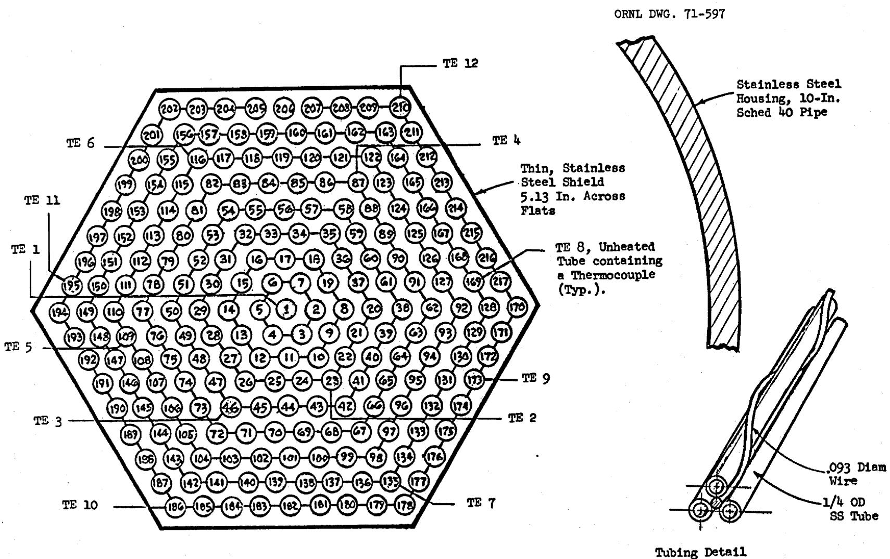  
Fig. H8. Diagram of a Cross Section Through the Hexagonal Array of 217 Tubes.

# Results

The comparison of experimental $^{a}$ and computed temperatures, Figs. H9 and H10 showed the same general trend as in the previous experiment, namely, the observed temperature gradient was steeper. The use of unheated tubes for the temperature measurements gives temperature readings below the average temperatures of similarly located heated tubes. This is borne out by the calculations, curves D1 and D2 on Fig. H10. Curve D2 calculated with zero heat input to the central tube is depressed $23^{\circ}F$ below the temperature computed as if the tube were heated. Note also that curves D1 and D2 show a temperature difference of $34^{\circ}F$ at the outer ring. This is the computed difference in temperature between a heated tube centrally located on a face of the outermost hexagonal ring and the unheated corner tube. This difference has two causes; (1) the corner tube is not heated and (2) by virtue of its location more of its surface views the adjacent hexagonal shield, a heat sink. It will be shown that the local temperature depression of an unheated tube tends to go inversely with the third power of the local prevailing temperature surrounding the unheated tube and, at lower emissivities $(< 0.3)$ , nearly inversely with emissivity. From this we should expect that the actual radial gradient across the bank of heated tubes will be less steep than indicated by thermocouples in unheated tubes.

During these preliminary runs the temperature of the intermediate, hexagonal shield was not measured. This is the heat sink temperature and its value is required in the calculations (see Appendix E). The calculated temperature curves in Figs. H9 and H10 are based on hexagonal shield temperatures of $700^{\circ}\mathrm{F}$ and $600^{\circ}\mathrm{F}$ . These temperatures were calculated by assuming an outer shell temperature of $200^{\circ}\mathrm{F}$ and emissivities of shell and shield surfaces of 0.30 and 0.42.

The experiment was in its initial startup phase when the data were taken, and plans were under way to obtain these temperatures in future tests. The degree to which hexagonal shell temperature affects internal temperatures has not yet been determined experimentally. Two calculations, virtually identical but for hexagonal shield temperatures, may be compared with the following table, H1. Reducing the sink temperature from

Table H1. Effect of Lowering the Heat Sink Temperature on Peak Temperature in the Hexagonal Array of 212 Tubes   

<table><tr><td>Heat Input (Btu/hr-ft Tube)</td><td>Emissivity of All Surfaces</td><td>Hexagonal Shell Temperature (Heat Sink) (°F)</td><td>Peak Temperature (°F)</td><td>Outermost Tube Ring Temperature (°F)</td></tr><tr><td>5</td><td>0.4</td><td>600</td><td>937</td><td>783</td></tr><tr><td>5</td><td>0.4</td><td>400</td><td>859</td><td>676</td></tr><tr><td></td><td></td><td></td><td>ΔT = 78</td><td>ΔT = 107</td></tr></table>

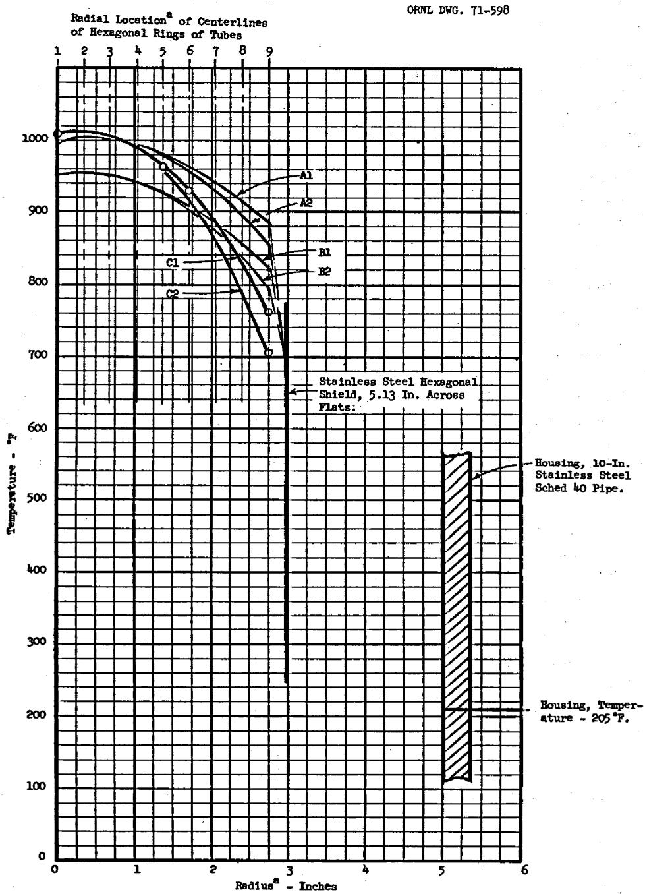  
Fig. E9. Experimental and Calculated Temperatures in a Hexagonal Array of 217 Heated, Stainless Steel Tubes (see Fig. E2).

1. Environment -- 10-in. pipe housing evacuated to \~3 microns Eq.   
2. Heat Input -- 1.47 watts/ft tube = 5 Btu/hr-ft = 76.5 Btu/hr-ft².

<table><tr><td></td><td>Emissivity, Tubes and Hexagonal Shield</td><td>Temperature Hexagonal Shield</td><td></td></tr><tr><td>Curves A1 and A2</td><td>0.3</td><td>700°F</td><td>Tube temperatures from central tube across flat and to corner tubes of hex, respectively.</td></tr><tr><td>Curves B1 and B2</td><td>0.5</td><td>700°F</td><td>Tube temperatures from central tube across flat and to corner tubes of hex, respectively.</td></tr><tr><td>Curves C1 and C2</td><td>--</td><td>--</td><td>Experimental data.</td></tr></table>

Tube centerlines and shield locations shown as in an elevation (section) view across corners of hexagon.

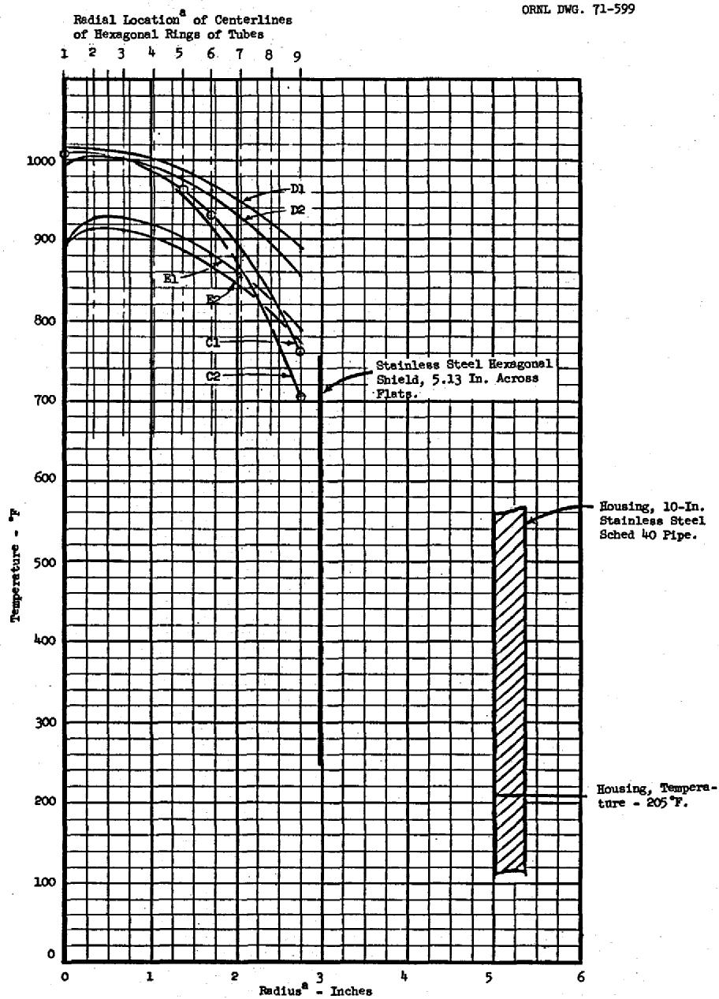  
Fig. H0. Experimental and Calculated Temperatures in a Hexagonal Array of 217 Beated, Stainless Steel Tubes (see Fig. E2).

1. Environment -- 10-in. pipe housing evacuated to $\sim 3$ microns Bg.  
2. Heat Input -- 1.47 watts/ft tube = 5 Btu/hr-ft = 76.5 Btu/hr-ft\*.

<table><tr><td rowspan="2"></td><td colspan="2">Emissivity</td><td rowspan="2">TemperatureHexagonalShield</td><td rowspan="2"></td></tr><tr><td>Tubes</td><td>HexagonalShield</td></tr><tr><td>Curves C1 and C2</td><td>- -</td><td>- -</td><td></td><td>Experimentally determined tube temperatures from central tube (unheated) across flat and to corner tubes of hex array, respectively.</td></tr><tr><td>Curve D1</td><td>0.3</td><td>0.3</td><td>700°F</td><td>Temperatures calculated as if all tubes are heated and as if outermost corner tubes have same view factors as other tubes in the outer ring.</td></tr><tr><td>Curve D2</td><td>0.3</td><td>0.3</td><td>700°F</td><td>Temperatures calculated as if central tube and outer corner tubes are unheated and with corrected view factors for the outer corner tubes.</td></tr><tr><td>Curve E1</td><td>0.10</td><td>0.5</td><td>600°F</td><td rowspan="2">Temperatures calculated with central tube unbeated and with no view factor correction for outer corner tubes which are heated.</td></tr><tr><td>Curve E2</td><td>0.15</td><td>0.5</td><td>600°F</td></tr></table>

a Tube centerlines and shield locations shown as in an elevation (section) view across corners of hexagon.

$600^{\circ}\mathrm{F}$ to $400^{\circ}\mathrm{F}$ effected an appreciable reduction in the peak temperature and a slight increase in the radial gradient. At higher heat inputs or in larger assemblies with more tube rings, the fourth power effect of temperature will dominate the fractional improvement obtained by lowering the sink temperature. It will be shown, subsequently, that there were axial heat losses in this experiment. The differences between observed and calculated temperatures are subject to the same general considerations mentioned in the previous discussion of the 91-rod array.

Conductive transfer effected by the spiral wire wrap around the tubes (see Fig. H8) was not considered. If any appreciable heat is transferred by conduction, it will affect the radial temperature gradient.

Figure H1 shows that there were axial heat losses, amount unknown. No really serious attempt was made to consider these in the computations. A few calculations for which the radiated heat was reduced by $\sim 5\%$ (from 5.0 to 4.73 Btu/hr-ft tube) were made using the same infinite cylinder model. The effect of this small heat reduction, credited to axial heat flow, was negligible.

It has been noted that we should expect the corner tubes to have a lower temperature. If unheated, as these are, the effect will be more pronounced. The unheated tubes in the inner rings will also be at lower temperatures than their neighbors at or near the same radius. The amount by which they will be lower will certainly be dependent on emissivity. For example, the temperature depression can be approximated by using the differential of the heat transfer expression,

$$
\frac {Q _ {1}}{A _ {1}} = F _ {1} \rightarrow_ {2} \sigma \left(T _ {1} ^ {4} - T _ {2} ^ {4}\right) \tag {H-1}
$$

in which

$$
\begin{array}{l} F _ {1 \rightarrow 2} = \text {r a d i a t i o n i n t e r c h a n g e f a c t o r f r o m a r e a A _ {1}} \\ \sigma = \text {S t e f a n - B o l t z m a n n c o n s t a n t} = 1 7 3 0 \times 1 0 ^ {- 1 2}, \\ \end{array}
$$

$$
\mathrm {T} _ {1} \text {a n d} \mathrm {T} _ {2} = \text {t e m p e r a t u r e s o f} \mathrm {A} _ {1} \text {a n d} \mathrm {A} _ {2}, ^ {\circ} \mathrm {R}.
$$

Assume that the unheated rod of area $A_{1}$ is surrounded by other rods having a total area, $A_{2}$ , at the same or nearly the same temperature so that $T_{1} \cong T_{2}$ ; also, assume that $T_{2}$ doesn't change. By differentiating,

$$
\Delta \left(\mathrm {Q} _ {1} / \mathrm {A} _ {1}\right) \cong 4 \mathrm {F} _ {1} \rightarrow_ {2} \sigma \mathrm {T} _ {1} ^ {3} \Delta \mathrm {T} _ {1} \tag {H-2a}
$$

ORNL DWG. 71-600

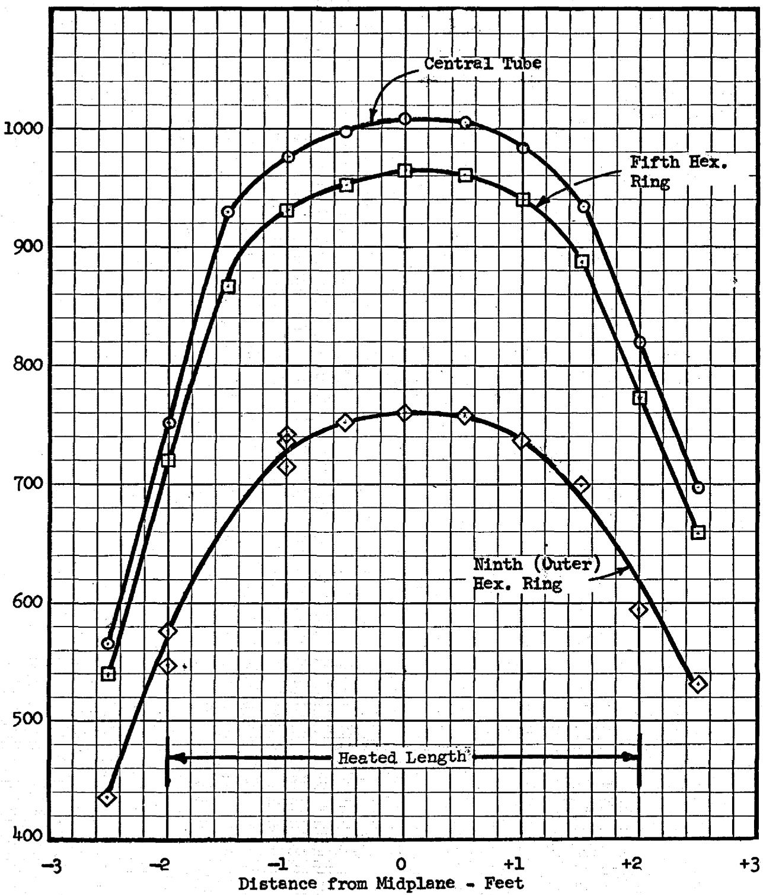  
Fig. H11. Axial Temperatures in Hexagonal Array of Internally Heated Tubes (see Fig. H8).

and

$$
\Delta \mathrm {T} _ {1} \cong \frac {\Delta \left(\mathrm {Q} _ {1} / \mathrm {A} _ {2}\right)}{4 \mathrm {F} _ {1} \rightarrow 2 \sigma \mathrm {T} _ {1} ^ {3}} \tag {H-2b}
$$

for small changes in $\mathbf{T}_{1}$ .

The single tube represented by $A_{1}$ and nearly completely surrounded by six tubes is approximated by two cylindrical surfaces having an area ratio, $A_{1} / A_{2} = 0.5$ . If the emissivity, $E$ , of both surfaces is the same, the interchange factor is then given by

$$
F _ {1} \rightarrow_ {2} = \frac {E}{1 + \frac {A _ {1}}{A _ {2}} (1 - E)} = \frac {E}{1 . 5 - 0 . 5 E} \cdot \tag {H-3}
$$

Now, if we disconnect the power from this central tube, it is, in effect, operating as a thermocouple tube and

$$
\Delta \left(Q _ {1} / A _ {1}\right) = - 7 6. 5 B t u h r - f t ^ {2}.
$$

The expression, Eq. (H-2b) for $\Delta T_{1}$ , the temperature depression in this tube, becomes

$$
\Delta \mathrm {T} _ {1} \cong \frac {- (7 6 . 5)}{4 \mathrm {F} _ {1} \rightarrow 2 (1 7 3 0 \times 1 0 ^ {- 1 2}) \mathrm {T} _ {1} ^ {3}} \cong \frac {- 1 1 \times 1 0 ^ {9}}{\mathrm {F} _ {1} \rightarrow 2 \mathrm {T} _ {1} ^ {3}}. \tag {H-2c}
$$

Table H2 gives values of $\Delta T_{\mathrm{f}}$ for the temperatures in the range of the experiment and for emissivities considered reasonable.

It would not and will not be correct to apply these approximate tabulated values to the experiment. They are listed to indicate that the temperatures measured in an unheated tube will be below that of the surrounding heated tubes in the bundle. Since this deficit is greater at lower temperatures, measurements so taken will indicate a gradient steeper than actually exists.

The infinite cylinder model was used and, taking the length equal to the length of the heated section of the tubes, $\frac{4}{3}$ ft, we have an $\mathrm{LD} \cong 8 - a$ better approximation than with the first experiment.

After assessing the calculated and observed temperatures in these tube bundles, it was concluded that the agreement was satisfactory. Since the computed values tended to be higher, it was decided that this calculational approach is a suitable method which gives safe answers

Table H2. Approximated Temperature Depression in a Single Unheated Tube in an Extensive Tube Array   

<table><tr><td>Location in Tube Bundle</td><td>Approximate Value, T1</td><td>Emissivity, E</td><td>ΔT2R or °F</td></tr><tr><td rowspan="5">Center</td><td rowspan="5">1000°F = 1460°R</td><td>0.1</td><td>-55</td></tr><tr><td>0.2</td><td>-25</td></tr><tr><td>0.3</td><td>-16</td></tr><tr><td>0.4</td><td>-11</td></tr><tr><td>0.5</td><td>-9</td></tr><tr><td>Center</td><td>900°F = 1360°R</td><td>0.1</td><td>-63a</td></tr><tr><td rowspan="5">Edge of Bundle</td><td rowspan="5">715°F = 1175°R</td><td>0.1</td><td>-106</td></tr><tr><td>0.2</td><td>-48</td></tr><tr><td>0.3</td><td>-31</td></tr><tr><td>0.4</td><td>-22</td></tr><tr><td>0.5</td><td>-17</td></tr></table>

aThe more exact calculation, curve El on Fig. H10 shows a temperature depression of $39^{\circ}$ at the central tube.

to use in estimating temperatures in MSBR heat exchangers whose internal configuration is, essentially, a bundle of parallel rods or tubes.

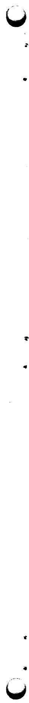

# APPENDIX I

# METHOD USED TO ESTIMATE THE INITIAL PEAK TEMPERATURE TRANSIENT

# IN THE 563-MW REFERENCE DESIGN HEAT EXCHANGER

1. The adiabatic temperature versus time curves "B" and "C" on Fig. 15 were plotted. The bases for these curves are:

A. The total accumulated afterheat, Table 1 or Fig. 5, is deposited thus (see Fig. 7):

(1) $77\%$ in the annulus (inner shell and tubes)   
(2) $23\%$ in the intermediate shell. This includes the heat deposition in the outer shell and the gamma heat lost to the outside.   
B. The annulus and intermediate shell are separated and both are perfectly insulated.   
C. The heat capacities of these regions are as listed in Table II.

Table II. Heat Capacity of Empty 563-Mw MSBR Primary Heat Exchanger   

<table><tr><td>Region</td><td>Metal Volume,* ft3/ft height</td><td>Heat Capacity,* Btu/°F ft height</td><td>Heat Capacity Per Mw Rated Capacity, (Btu/°F ft height) Mw</td><td>Fraction of Total</td></tr><tr><td>1. Inner shell 20 in. sched 40 pipe</td><td>0.25</td><td>19</td><td>0.034</td><td>0.04</td></tr><tr><td>2. Tubes</td><td>1.43</td><td>110</td><td>0.196</td><td>0.23</td></tr><tr><td>3. Intermediate shell</td><td>3.71</td><td>287</td><td>0.510</td><td>0.60</td></tr><tr><td>4. Outer shell</td><td>0.79</td><td>61</td><td>0.109</td><td>0.13</td></tr><tr><td>Total</td><td>6.18</td><td>477</td><td>0.849</td><td>1.00</td></tr></table>

$$
\rho = 0. 3 2 \mathrm {l b} / \mathrm {i n}. ^ {3} = 5 5 3 \mathrm {l b} / \mathrm {f t} ^ {3}
$$

$$
C _ {p} = 0. 1 4 B t u / l b - ^ {\circ} F
$$

$$
\left[ \begin{array}{l} \text {V o l u m e r t i c h e a t c a p a c i t y} \\ \text {o f H a s t e l l o w N} \end{array} \right] = \rho C _ {p} = 7 7. 4 B t u / f t ^ {3} - ^ {\circ} F
$$

2. The steady-state temperature profiles across the tube annulus, Fig. 14, show little curvature. The profile for the case when internal surface emissivities are 0.2 was approximated, by inspection, with a straight line. Using temperatures taken from this straight-line approximation, an average annulus temperature, $\theta_{\text{ann}}$ , was computed as outlined on Fig. II.

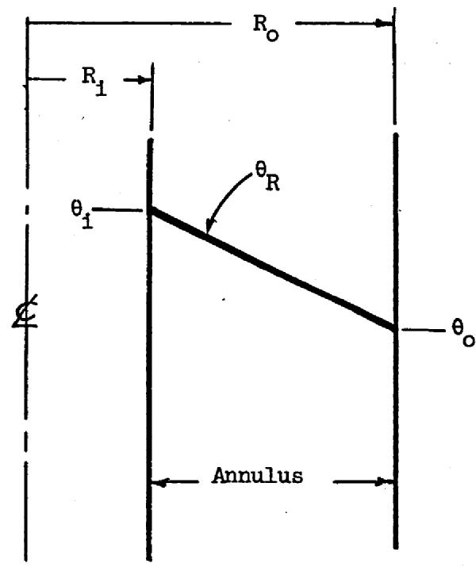  
Fig. 11

and

$$
\begin{array}{l} \theta_ {R} = \text {t e m p e r a t u r e} R, R _ {1} \leq R \leq R _ {0} \\ \bar {\theta} _ {1} = \text {a v e r a g e t e m p e r a t u r e i n t h e} \\ \overline {{R}} = \text {r a d i u s} \text {a t} \text {w h i c h} \theta_ {R} = \overline {{\theta}} \\ V = v o l u m e, p e r u n i t h e i g h t \\ \end{array}
$$

$$
\overline {{\theta}} _ {1} = \frac {\int_ {\mathrm {R} _ {1}} ^ {\mathrm {R} _ {0}} \theta_ {\mathrm {R}} \mathrm {d V}}{\mathrm {V}} = \frac {2 \int_ {\mathrm {R} _ {1}} ^ {\mathrm {R} _ {0}} \theta_ {\mathrm {R}} \mathrm {R D R}}{\left(\mathrm {R} _ {0} ^ {2} - \mathrm {R} _ {1} ^ {2}\right)}
$$

If the temperature varies linearly with radius,

$$
\theta_ {R} = \frac {\theta_ {1} \left(R - R _ {o}\right) - \theta_ {o} \left(R - R _ {i}\right)}{\left(R _ {i} - R _ {o}\right)}
$$

$$
\overline {{\theta}} _ {1} = \frac {1}{3 \left(R _ {o} - R _ {i}\right)} \left[ R _ {o} \theta_ {i} - R _ {i} \theta_ {o} + \frac {2 \left(R _ {o} ^ {2} \theta_ {o} - R _ {i} ^ {2} \theta_ {i}\right)}{\left(R _ {o} - R _ {i}\right)} \right].
$$

The location of $\overline{\theta}_1$ was taken to be at $\overline{R} = 25$ in.

3. Using this value of $\overline{\mathbb{R}} = 25$ in., a simple two-shell model of the heat exchanger, Fig. I2, was adopted.

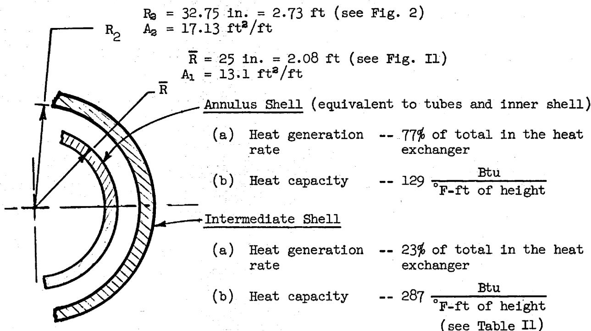  
Fig. I2.

Radiant transfer from the annulus shell, surface $A_{1}$ , to the intermediate shell, surface $A_{2}$ , is evaluated with this equation:

$$
Q _ {1 \rightarrow 2} = F _ {1 \rightarrow 2} A _ {1} \sigma \left(\bar {\theta} _ {1} ^ {4} - \theta_ {2} ^ {4}\right) B t u / h r. \tag {I-1}
$$

$$
F _ {1 \rightarrow 2} = \text {i n t e r c h a n g e f a c t o r f o r r a d i a t i o n t r a n s f e r} A _ {1} \text {t o} A _ {2}
$$

$$
\overline {{\theta}} _ {1} = \text {a v e r a g e a n n u l u s t e m p e r a t u r e}, ^ {\circ} R
$$

$$
\theta_ {2} = \text {t e m p e r a t u r e o f t h e i n n e r s u r f a c e o f t h e i n d e r m i d a t e} \\ \text {s h e l l}, ^ {\circ} R
$$

$$
\sigma = \text {S t e f a n - B o l t z m a n n c o n s t a n t} = 1 7 3 0 \times 1 0 ^ {- 1 2} \frac {\mathrm {B t u / h r - f t ^ {2}}}{^ {\circ} \mathrm {R} ^ {4}}
$$

The interchange factor, $\mathbf{F}_{1\rightarrow 2}$ , for this model was estimated with Eq. (I-1) by using the steady-state temperatures computed with the heat rates at $10^{4}$ sec after shutdown and for the case when the emissivity of all internal surfaces is 0.2. The shell temperatures, $\theta_{1}$ and $\theta_{2}$ , were obtained from the averaged straight-line approximation and from Fig. 14, respectively. The computed value of $\mathbf{F}_{1\rightarrow 2}$ was 0.178 and Eq. (I-1) becomes

$$
\theta_ {1} \rightarrow \theta = (0. 1 7 8) (1 3. 1) \sigma \left(\overline {{\theta}} _ {1} ^ {4} - \theta_ {2} ^ {4}\right) = (4. 0 3 \times 1 0 ^ {3}) \left(\theta_ {1} ^ {4} - \theta_ {2} ^ {4}\right). \tag {I-1a}
$$

4. The heat balance equations involved in developing the peak temperature transient are:

$$
\begin{array}{l} \left[ \begin{array}{l} \text {T o t a l h e a t} \\ \text {g e n e r a t e d} \\ \text {i n t h e} \\ \text {a n n u l u s} \end{array} \right] _ {t _ {1}} ^ {t _ {2}} = \left[ \begin{array}{l} \text {H e a t c a p a c i t y} \\ \text {o f t h e} \\ \text {a n n u l u s} \end{array} \right] \left[ \begin{array}{l} \text {A v e r a g e} \\ \text {t e m p e r a t u r e} \\ \text {c h a n g e i n} \\ \text {t h e a n n u l u s} \end{array} \right] _ {t _ {1}} ^ {t _ {2}} + \left[ \begin{array}{l} \text {H e a t t r a n s f e r r e d} \\ \text {f r o m t h e a n n u l u s} \\ \text {t o t h e i n t e r m e d i - a t e s h e l l} \end{array} \right] _ {t _ {1}} ^ {t _ {2}} \\ \left[ U _ {1} \right] _ {t _ {1}} ^ {t _ {2}} = \left[ U _ {2} \right] _ {t _ {1}} ^ {t _ {2}} + \left[ U _ {3} \right] _ {t _ {1}} ^ {t _ {2}} \tag {I-2} \\ \end{array}
$$

and

$$
\begin{array}{l} \left[ \begin{array}{l} \text {T o t a l h e a t} \\ \text {g e n e r a t e d i n} \\ \text {t h e i n t e r -} \\ \text {m e d i a t e s h e l l} \end{array} \right] _ {t _ {1}} ^ {t _ {2}} + \left[ \begin{array}{l} \text {H e a t t r a n s f e r r e d} \\ \text {f r o m t h e a n n u l u s} \\ \text {t o t h e i n t e r -} \\ \text {m e d i a t e s h e l l} \end{array} \right] _ {t _ {1}} ^ {t _ {2}} = \left[ \begin{array}{l} \text {H e a t c a p a c i t y} \\ \text {o f t h e} \\ \text {i n t e r m i d a t e} \\ \text {s h e l l} \end{array} \right] _ {t _ {1}} ^ {\text {A v e r a g e t e m p .}} \\ \left[ U _ {4} \right] _ {t _ {1}} ^ {t _ {2}} + \quad \left[ U _ {3} \right] _ {t _ {1}} ^ {t _ {2}} = \quad \left[ U _ {5} \right] _ {t _ {1}} ^ {t _ {2}} \\ + \left[ \begin{array}{l} \text {H e a t t r a n s f e r r e d} \\ \text {f r o m t h e i n t e r -} \\ \text {m e d i a t e s h e l l t o} \\ \text {t h e o u t e r s h e l l} \\ \text {a n d t h e n c e t o t h e} \\ \text {s u r r o u n d i n g s} \end{array} \right] _ {t _ {1}} ^ {t _ {2}} \\ + \quad \left. \mathrm {U} _ {6} \right] _ {\mathrm {t} _ {1}} ^ {\mathrm {t} _ {2}} \tag {I-3} \\ \end{array}
$$

In the above, $t_1$ and $t_2$ denote any arbitrary time interval. These equations, involving both temperatures and heat transfers, were satisfied by cut-and-try iteration.

On Fig. 15 it can be seen that the transient peak occurs at slightly more than $10^{4}$ sec ( $\sim 3$ hr) after shutdown and drain. This time period was subdivided into several increments and the manner in which the above equations were applied is described below.

A. From 0 to 1000 Sec

$$
\begin{array}{l} \text {E q .} (I - 2): \quad \left. \begin{array}{l} U _ {1} \Big ] _ {0} ^ {1 0 0 0} \\ = \quad U _ {2} \Big ] _ {0} ^ {1 0 0 0} \end{array} \right. \\ \text {E q .} (I - 3): \quad \left. \mathrm {U} _ {4} \right] _ {0} ^ {1 0 0 0} = \left. \mathrm {U} _ {5} \right] _ {0} ^ {1 0 0 0} \\ \text {a n d} \quad \left. \mathrm {U} _ {3} \right] _ {0} ^ {1 0 0 0} = \left. \mathrm {U} _ {6} \right] _ {0} ^ {1 0 0 0} \equiv 0 \\ \end{array}
$$

During the first 1000 sec (17 min) after shutdown and drain, the temperature differences between the annulus and the intermediate shell and the outer shell are small. In these circumstances, little heat will be transferred and the peak temperature in the annulus will tend to follow curve B in Fig. 15. At 1000 sec after shutdown the annulus is transferring to the intermediate shell about $20\%$ of the heat being generated within the annulus. This approximate rate was computed with Eq. (I-la) with temperatures taken from curves B and C on Fig. 15.

B. From $10^{3}$ : Sec to $5 \times 10^{3}$ Sec

$$
\begin{array}{l} \text {E q . (I - 2)}: \quad \left. \begin{array}{l} U _ {1} \right] _ {1 0 ^ {3}} ^ {5 \times 1 0 ^ {3}} = \left. U _ {2} \right] _ {1 0 ^ {3}} ^ {5 \times 1 0 ^ {3}} + \left. U _ {3} \right] _ {1 0 ^ {3}} ^ {5 \times 1 0 ^ {3}} \\ \text {E q . (I - 3)}: \quad \left.\begin{array}{l}U _ {4} \left. \right] _ {1 0 ^ {3}} ^ {5 \times 1 0 ^ {3}} + \left. U _ {3} \right] _ {1 0 ^ {3}} ^ {5 \times 1 0 ^ {3}} = U _ {5} \Big ] _ {1 0 ^ {3}} ^ {5 \times 1 0 ^ {3}}\end{array}\right. \\ \text {a n d} \quad \left. \begin{array}{l} U _ {6} \int_ {1 0 ^ {3}} ^ {5 \times 1 0 ^ {3}} \\ U _ {6} \end{array} \right. \equiv 0. \\ \end{array}
$$

During this 4000-sec interval, subdivided into two equal intervals for the computations, the heat transfer from the annulus to the intermediate shell was taken into account.

It was assumed that the heat lost by the annulus is transferred to the intermediate shell. The peak temperature in the annulus will, therefore, become less than curve B, Fig. 15, by an amount proportional to the heat transferred from the annulus and the average temperature of the intermediate shell will rise above curve C. Note that, because of its large heat capacity and lower internal generation rate, the average temperature of the intermediate shell rises quite slowly and it is incapable of transferring appreciable heat to the outer shell. Therefore, during this period, it was assumed that all the heat transferred from the annulus to the shell is retained by the shell.

# C. After $5 \times 10^{3} \mathrm{Sec}$

All the components of Eq. (I-2) and I-3) were considered. The computations of heat transferred from the intermediate shell to the outer shell included the simplifying assumption that the outer shell temperature remained constant at $1200^{\circ}\mathrm{F}$ , the initial temperature of the system. The thick intermediate shell is a good heat sink and intercepts all the heat from the annulus. Moreover, it is a poor radiator and must develop an appreciable temperature increase over the outer shell temperature before it can transfer an accountable amount of heat. The outer shell, on the other hand, is thin (0.5 in.) and, with an outer surface emissivity of 0.8 it is a good transmitter and radiator of such heat that it receives on its inner surface. In an actual situation we would expect the outer shell temperature to decrease, beginning immediately at shutdown. It would not begin to rise until the intermediate shell outer surface temperature had increased to a level that transfers substantial heat outward. Note, on Fig. 14, that the steady-state temperature computation at $10^{4}$ sec after shutdown shows adjacent surface temperatures of $1940^{\circ}\mathrm{F}$ and $1200^{\circ}\mathrm{F}$ for the intermediate and outer shells, respectively. From the transient calculation, the intermediate shell temperature is estimated to be from $1750^{\circ}\mathrm{F}$ to $1800^{\circ}\mathrm{F}$ at this time. This lower temperature will reduce the heat radiated to the outer shell and, therefore, the outer shell temperature will be less than the assumed value of $1200^{\circ}\mathrm{F}$ .

From $5 \times 10^{3}$ to $1.1 \times 10^{4}$ sec the computations were based on time increments of $2 \times 10^{3}$ sec. At $1.1 \times 10^{4}$ sec the rate of change of heat generation had been reduced to a value for which a final time increment of one hour was reasonable. The computations were terminated at $1.46 \times 10^{4}$ sec (4 hr) at which time it was evident that the transient had turned over and system temperatures were beginning to decrease and approach the steady-state values.

The generalized heat balance terms, $U_{1}$ to $U_{5}$ , incl., in Eqs. (I-2) and (I-3), will now be specified in detail.

$U_{1}$ and $U_{2}$ are obtained from Table 1 and/or Fig. 5 with the fractional amounts, $77\%$ and $23\%$ , respectively, from Fig. 7. The remaining terms are established by iteration.

The equations for $\mathbf{U}_2$ and $\mathbf{U}_6$ are simple and straightforward:

$$
\left. \mathrm {U} _ {2} \right] _ {\mathrm {t} _ {1}} ^ {\mathrm {t} _ {2}} = \left. C _ {\mathrm {a}} \left(\Delta \bar {\theta} _ {1}\right) \right] _ {\mathrm {t} _ {1}} ^ {\mathrm {t} _ {2}},
$$

Ca = heat capacity of the annulus, Fig. I2.

$\Delta \overline{\theta}_{1}$ , see Fig. II, is the change in the average annulus temperature during time interval, $t_{2} - t_{1}$ .

Note that the peak temperature in the heat exchanger will be slightly above $\theta$ because of the gradient in the annulus. With the annulus transferring heat at the generation rate existing $10^4$ sec after shutdown the increase is approximately $75^\circ\text{F}$ .

$$
\left. \mathrm {U} _ {5} \right] _ {\mathrm {t} _ {1}} ^ {\mathrm {t} _ {2}} = \left. C _ {1 5} \left(\Delta \bar {\theta} _ {2}\right) \right] _ {\mathrm {t} _ {1}} ^ {\mathrm {t} _ {2}}
$$

$C_{is} =$ heat capacity of the intermedi- ate shell.

$\Delta \overline{\theta}_{2} =$ change in the average temperature of the intermediate shell.

The average temperature of the thick (2.5 in.) intermediate shell is, during the transient, appreciably dependent on both space and time. From Fig. 6 it is apparent that most of the gamma heat deposition takes place near the inside surface. The radiant heat received from the annulus will be deposited directly on the inner surface. The net effect of course, is to raise the temperature of the inner surface a substantial amount above the average value, $\theta_{\mathrm{a}}$ , that must be used to evaluate $U_{5}$ . However, the inner surface temperature, $\theta_{\mathrm{a}}$ , is the effective heat sink temperature used in Eq. (I-1) when radiant transfer from the annulus is being calculated. This difference between the average and inner surface temperatures was not calculated directly as a function of elapsed time; instead, the approximate transit time for heat flow through the slab was estimated. Specifically, the case considered was an infinite slab, 2.5 in. thick, of Hastelloy N, with one face insulated. The uninsulated surface sees a step increase in temperature. From Fig. 10-2, p. 235, and related text material in reference 28, it was estimated that the average temperature will lag the inner surface temperature by approximately 1000 sec. This local transient effect in the intermediate shell was considered during the computations.

The total heat transferred from the annulus during any interval, $t_2 - t_1$ , is obtained by integrating Eq. (I-1).

$$
\left. \mathrm {U} _ {3} \right] _ {\mathrm {t} _ {1}} ^ {\mathrm {t} _ {2}} = \int_ {\mathrm {t} _ {1}} ^ {\mathrm {t} _ {2}} Q _ {1} \rightarrow_ {2} d t = F _ {1} \rightarrow_ {2} A _ {1} \sigma \int_ {\mathrm {t} _ {1}} ^ {\mathrm {t} _ {2}} \left\{\left[ \overline {{\theta}} _ {1} (t) \right] ^ {4} - \left[ \theta_ {2} (t) \right] ^ {4} \right\} d t \tag {I-4}
$$

As written, this expression presupposes the desired solution, $\overline{\theta}_{1}(t)$ and $\theta_{2}(t)$ . Therefore, it was assumed that, during each time interval, the temperature changes in both the annulus and the intermediate shell progressed linearly, i.e.:

$$
\overline {{\theta}} _ {1} (t) = A + B t \tag {I-5}
$$

$$
\theta_ {2} (t) = M + N t \tag {I-6}
$$

Also, at the temperatures and temperature differences involved in this calculation, the fourth power temperature difference in Eq. (I-1) can be approximated with negligible* error, viz.

$$
\left\{\left[ \overline {{\theta}} _ {1} (t) \right] ^ {4} - \left[ \theta_ {2} (t) \right] ^ {4} \right\} \cong 4 \theta_ {\text {a v g}} ^ {3} (\Delta \theta)
$$

in which

$$
\theta_ {\text {a v g}} = 1 / 2 \left(\bar {\theta} _ {1} (t) + \theta_ {2} (t)\right), ^ {\circ} R \tag {I-7}
$$

$$
\Delta \theta = \overline {{\theta}} _ {1} (t) - \theta_ {2} (t). \tag {I-8}
$$

In terms of Eqs. (I-5) and I-6) these can be written,

$$
\theta_ {\text {a v g}} = \mathrm {F} + \mathrm {G t} \tag {I-7a}
$$

$$
\Delta \theta = J + K t \tag {I-8a}
$$

$$
F = 1 / 2 (A + M) = 1 / 2 [ \text {S u m o f t h e s u r f a c e t e m p e r a t u r e s a t} t _ {1} ]
$$

$$
G = 1 / 2 (B + N) = 1 / 2 \left[ \begin{array}{l} \text {S u m o f t h e s l o p e s o f t h e s u r f a c e t e m p e r a t u r e} \\ \text {c u r v e s d u r i n g t h e i n t e r v a l ,} (t _ {2} - t _ {1}). \end{array} \right]
$$

$$
J = (A - M) = [ \text {T e m p e r a t u r e} t _ {1} ]
$$

$$
K = (B - N) = \begin{array}{l} \text {D i f f e r e n c e o f t h e s l o p e s o f t h e t e m p e r a t u r e c u r v e s} \\ \text {d u r i n g t h e i n t e r v a l ,} (t _ {2} - t _ {1}). \end{array}
$$

and Eq. (I-4) becomes

$$
\left. \mathrm {U} _ {3} \right] _ {\mathrm {t} _ {1}} ^ {\mathrm {t} _ {2}} = 4 \mathrm {F} _ {1} \rightarrow_ {3} \mathrm {A} _ {1} \sigma \int_ {\mathrm {t} _ {1}} ^ {\mathrm {t} _ {2}} \left[ \mathrm {J} (\mathrm {F} + \mathrm {G t}) ^ {3} + \mathrm {K t} (\mathrm {F} + \mathrm {G t}) ^ {3} \right] d t \quad . \tag {I-4a}
$$

After integration and some algebra,

$$
\begin{array}{l} \left. \mathrm {U} _ {3} \right] _ {\mathrm {t} _ {1}} ^ {\mathrm {t} _ {2}} = 4 \mathrm {F} _ {1} \rightarrow_ {2} \mathrm {A} _ {1} \sigma \left[ J \left\{\frac {\mathrm {G} ^ {3} \mathrm {t} ^ {4}}{4} + \frac {3}{4} \mathrm {F G} ^ {2} \mathrm {t} ^ {3} + \frac {3}{2} \mathrm {F} ^ {2} \mathrm {G t} ^ {2} + \mathrm {F} ^ {3} \mathrm {t} \right\}\right. \\ + K \left\{\frac {G ^ {3} t ^ {5}}{5} + \frac {3}{4} F G ^ {2} t ^ {4} + F ^ {2} G t ^ {3} + \frac {F ^ {3} t ^ {2}}{2} \right\} \tag {I-4b} \\ \end{array}
$$

in which $t = (t_2 - t_1)$ , hr.

For the range of temperatures and the time intervals used in this problem the first two terms in each set of brackets in Eq. (I-4b) are small enough to omit and

$$
\left. \mathrm {U} _ {3} \right] _ {\mathrm {t} _ {1}} ^ {\mathrm {t} _ {2}} \cong 4 \mathrm {F} _ {1} \rightarrow_ {2} \mathrm {A} _ {1} \sigma \left\{\mathrm {J} \left[ \frac {3}{2} \mathrm {F} ^ {2} \mathrm {G t} ^ {2} + \mathrm {F} ^ {3} \mathrm {t} \right] + \mathrm {K} \left[ \mathrm {F} ^ {2} \mathrm {G t} ^ {3} + \frac {\mathrm {F} ^ {3} \mathrm {t} ^ {2}}{2} \right]\right\}. \tag {I-4c}
$$

This equation was used to estimate the total heat transferred from the annulus during the time interval, $t_2 - t_1$ , if the temperature variations are linear during the interval as shown in Fig. I3.

ORNL DWG. 71-601

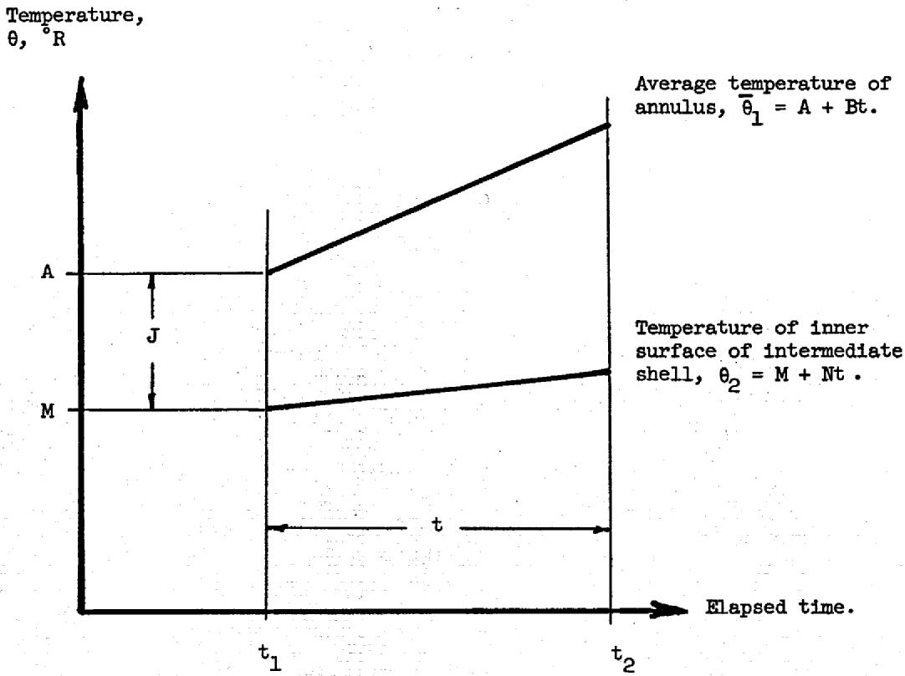  
Fig. I3.

The heat transferred to the outer shell from the intermediate shell is estimated by the familiar equation,

$$
U _ {s} = A _ {i s} F \sigma \left[ \theta_ {i s} ^ {4} - \theta_ {o s} ^ {4} \right], \quad \frac {\text {B t u / h r - f t} ^ {2}}{\text {f t o f h e i g h t}}
$$

$A_{is} = 18.45 ft^2 / ft$ of height, the area of the outer surface of the intermediate shell.

$A_{\text{os}} = 18.80 \, \text{ft}^2 / \text{ft}$ of height, the area of the inner surface of the outer shell.

$\theta_{is} =$ the temperature of the outer surface of the intermediate shell, ${}^{\circ}\mathbf{R}$

$\theta_{\mathrm{os}} \equiv 1660^{\circ}\mathrm{R} (1200^{\circ}\mathrm{F})$ , the temperature of the inner surface of the outer shell.

$\mathbf{F} = \frac{\epsilon}{1 + C(1 - \epsilon)} =$ interchange factor for radiative

transfer from an infinitely long convex inner shell concentric with an infinitely long outer shell, when the emissivities of both surfaces are equal.

$$
C = A _ {1 s} / A _ {o s}
$$

$$
\epsilon = \text {e m i s s i v i t y}
$$

$\sigma =$ the Stefan-Boltzmann constant.

# REFERENCES

1. MSR Program Semiann. Progr. Rept. Feb. 28, 1969, ORNL-4396, p. 60, Sect. 5.7.3 - Heat Removal Systems, and p. 62, Sect. 5.8 - Distribution of Noble-Metal Fission Products and Their Decay Heat.   
2. J. R. Tallackson, Estimated Temperatures Developed by Afterheat in MSBR Primary Heat Exchanger, SK-4304, Rev. 3, ORNL CF 67-9-1 (Sept. 27, 1967).   
3. E. S. Bettis and Roy C. Robertson, "The Design and Performance of a Single-Fluid Molten-Salt Breeder Reactor," Nuclear Applications & Technology, Vol. 8, pp. 190-207, Feb. 1970.   
4. MSR Program Semiann. Progr. Rept. Aug. 31, 1969, ORNL-4449, p. 56, Sect. 5.7 - Gamma Heating in MSBR Heat Exchangers.   
5. J. R. Tallackson, *Calculations of Heat Deposition in Empty MSBR Primary Heat Exchangers by Gamma Radiation from Noble Metal Fission Products*, ORNL CF 69-8-27 (Aug. 14, 1969).   
6. H. E. McCoy, private communication.   
7. MSR Program Semiann. Progr. Rept. Aug. 31, 1969, ORNL-4449, p. 183, Sect. 18.2 - Statistical Treatment of Aging Data for Hastelloy N, and p. 191, Fig. 18.10.   
8. R. E. Cleary, R. Emanuelson, W. Luoma, C. Amman, Properties of High Emittance Materials, NASA CR-1278, United Aircraft Corporation (Feb. 1969).   
9. R. B. Briggs, "Heating in Graphite of a 2000-Mw(e) Reactor by Decay of Fission Products After Shutdown," MSR-68-8 (Internal Correspondence)(Jan. 8, 1968).   
10. E. M. Sparrow, "Radiation Heat Transfer Between Surfaces," Advances in Heat Transfer, edited by James P. Hartnett and Thomas F. Irvine, Jr., Academic Press, 1965.   
11. Robert Siegel and John R. Howell, "Thermal Radiation Heat Transfer," The Black Body Electromagnetic Theory and Material Properties, Vol. I; Vol. II - Radiation Exchange Between Surfaces and in Enclosures, NASA SP-164, 1968.   
12. E. M. Sparrow and R. D. Cess, Radiation Heat Transfer, Brooks-Cole Publishing Co., 1966.   
13. H. Leuenberger and R. A. Person, Radiation Shape Factors for Cylindrical Assemblies, ASME Paper 56-A-144, Jan. 1955.

14. Carol J. Sotos and Norbert O. Stockman, "Radiant Interchange Factors and Limits of Visibility for Differential Cylindrical Surfaces with Parallel Generating Lines," NASA, Lewis Research Center, Cleveland, Ohio.   
15. O. H. Klepper, Radiant Interchange Factors for Heat Transfer in Parallel Rod Arrays, ORNL TM-583 (Dec. 26, 1963).   
16. J. S. Watson, Heat Transfer from Spent Reactor Fuels During Shipping: A Proposed Method for Predicting Temperature Distribution in Fuel Bundles and Comparison with Experimental Data, ORNL-3439 (May 27, 1963).   
17. D. C. Hamilton and W. R. Morgan, Radiant Interchange Factors, NACA TN 2836.   
18. Norman T. Grier and Ralph D. Sommers, View Factors for Toroids and Their Parts, NASA TN D-5006.   
19. James P. Campbell and Dudley G. McConnell, Radiant Interchange Configuration Factors for Spherical and Conical Surfaces to Spheres, NASA TN D-4457.   
20. A Feingold, Radiant Interchange Configuration Factors Between Various Selected Plane Surfaces.   
21. E. M. Sparrow, "On the Calculation of Radiant Interchange Between Surfaces," Modern Developments in Heat Transfer, edited by W. Ibele, Academic Press, 1963.   
22. D. P. DeWitt, M. C. Muinzer, and R. S. Hernicz, A Comparative Program for the Compilation and Analyses of Thermal Radiative Properties Data, NASA CR-143l, prepared by Thermophysical Properties Research Center, Purdue University, W. Lafayette, Indiana.   
23. Joseph Poggie, "Radiation Characteristics of Materials," Product Engineering, p. 205 (Sept. 1953).   
24. G. G. Gubareff, J. E. Janssen, and R. H. Torberg, Thermal Radiation Properties Survey, Honeywell Research Center, Minneapolis-Honeywell Regulator Company, 1960.   
25. B. C. Garrett, Bench Test of Rod Bundle from the IPS System, ORNL CF 65-11-68 (Nov. 30, 1965).   
26. H. Etherington, Nuclear Engineering Handbook, 1st Edition, 1958, Sect. 1-1, 14.1 "Steady State Conduction," p. 1-53 to 1-57 incl., McGraw-Hill.

27. D. L. McElroy and T. G. Kollic, "The Total Hemispherical Emittance of Platinum, Columbium-1% Zirconium, and Polished and Oxidized INOR-8 in the Range 100° to 1200°C," Measurement of Thermal Radiation Properties of Solids, Paper No. 38, NASA SP-31. A symposium held at Dayton, Ohio, Sept. 5-7, 1962.   
28. P. J. Schneider, Conduction Heat Transfer, Addison-Wesley Publishing Co., Inc., 1955.

# INTERNAL DISTRIBUTION

3. R. G. Affel   
4. J. L. Anderson   
5. C. F. Baes   
6. H.F.Bauman   
7. S. E. Beall   
8. M. J. Bell   
9. M. Bender

1-2. MSRP Director's Office,   
Bldg. 9201-3, Rm. 109   
10. C. E. Bettis   
11. E. S. Bettis   
12. D. S. Billington   
13. F. F. Blankenship   
14. R. Blumberg   
15. E. G. Bohlmann   
16. C. J. Borkowski   
17. G. E. Boyd   
18. R. B. Briggs   
19. S. Cantor   
20. W. L. Carter   
21. R. H. Chapman   
22. C. W. Collins   
23. E. L. Compere   
24. J. W. Cooke   
25. J. L. Crowley   
26. F. L. Culler   
27. J. R. Distefano   
28. S. J. Ditto   
29. W. P. Eatherly   
30. J. R. Engel   
31. D.E.Ferguson   
32. A. P. Fraas   
33. J. H. Frye, Jr.   
34. W. K. Furlong   
35. C. H. Gabbard   
36. W.R.Grimes   
37. A. G. Grindell   
38. R. H. Guymon   
39. P. H. Harley   
40. W. O. Harms   
41. P. N. Haubenreich   
42. R. E. Helms   
43. P. G. Herndon   
44. E. C. Hise   
45. H. W. Hoffman   
46. P. P. Holz   
47. P. R. Kasten   
48. R. J. Kedl   
49. A. R. Kerr

50. S. S. Kirslis

51. H. W. Kohn

52. R. B. Korsmeyer

53. T. S. Kress

54. R. B. Lindauer

55. M. I. Lundin

56. R. N. Lyon

57. H. G. MacPherson

58. R. E. MacPherson

59. H. E. McCoy

60. C. K. McGlothlan

61. H. A. McLain

62. L. E. McNeese

63. J. R. McWherter

64. H. J. Metz

65. R. L. Moore

66. E. L. Nicholson

67. L. C. Oakes

68. A. M. Perry

69. B. E. Prince

70. G. L. Ragan

71. R. C. Robertson

72. J. P. Sanders

73. H. C. Savage

74. Dunlap Scott

75. J. H. Shaffer

76. W. H. Sides

77. E. G. Silver

78. M. J. Skinner

79. A. N. Smith

80. O. L. Smith

81. I. Spiewak

82. R.A. Strehlow

83-87. J. R. Tallackson

88. W. Terry

89. R. E. Thoma

90. D. B. Trauger

91. G. M. Watson

92. A.M. Weinberg

93. M. E. Whatley

94. R. P. Wichner

95. L. V. Wilson

96. H. C. Young

97-98. Central Research Library

99-100. Document Reference Section

101-103. Laboratory Records

104. Laboratory Records-RC

ORNL-TM-3145

# EXTERNAL DISTRIBUTION

105. D. F. Cope, AEC-OSR-ORNL   
106. Ronald Feit, AEC-Wash.   
107. Kermit Laughon, AEC-OSR-ORNL

108-109. T. W. McIntosh, AEC-Wash.

110. R.M. Scoggins, AEC-Wash.   
111. M. Shaw, AEC-Wash.   
112. F. N. Watson, AEC-Wash.

113-127. Division of Technical Information Extension (DTIE)

128. Laboratory and University Division, ORO