ORNL-TM-3151

Contract No. W-7405-eng-26

Reactor Division

A STUDY OF FISSION PRODUCTS IN THE MOLTEN-SALT REACTOR EXPERIMENT BY GAMMA SPECTROMETRY

A.Houtzeel F.F.Dyer

AUGUST 1972

NOTICE This document contains information of a preliminary nature and was prepared primarily for internal use at the Oak Ridge National Laboratory. It is subject to revision or correction and therefore does not represent a final report.

OAK RIDGE NATIONAL LABORATORY

Oak Ridge, Tennessee 37830

operated by

UNION CARBIDE CORPORATION

for the

U.S. ATOMIC ENERGY COMMISSION

# CONTENTS

ACKNOWLEDGMENT vii

SUMMARY 1

1. INTRODUCTION TO THE MOLTEN SALT REACTOR EXPERIMENT. 3

1.1 Molten-Salt Reactor Concept 3   
1.2 Description of the MSRE 4

2. OBJECTIVES OF THIS GAMMA-RAY SPECTROMETRY STUDY 11   
3. DESCRIPTION AND PERFORMANCE OF EQUIPMENT. 13

3.1 Background 13   
3.2 General Description 14   
3.3 Detector and Amplifier 17   
3.4 Analyzer 17   
3.5 Collimator Assembly 18   
3.6 Setup of Experimental Equipment 20   
3.7 Locational Equipment 21   
3.8 Shielding 21   
3.9 Calibration Setup 24

4. ANALYSIS OF SPECTRA 27

4.1 Purpose and General Procedure 27   
4.2 Problems 28   
4.3 Table of Isotopes 30   
4.4 Computer Programs 31

5.CALIBRATION 33

5.1 General 33   
5.2 Source 34   
5.3 Slit Experiment - Source Strength 35   
5.4 Single Source Experiments 43   
5.5 Heat Exchanger Calibration 44   
5.6 Calibration of Shielding Materials 48   
5.7 Calibration for Fission Gases in the MSRE 52

6. MEASUREMENTS 53

Page

Page

# 7. RESULTS 57

7.1 Group A Spectra 57

7.1.1 Heat exchanger 58   
7.1.2 Main reactor off-gas line 64   
7.1.3 Main fuel lines 64

7.2 Group B Spectra 67

7.2.1 Main reactor off-gas line 67   
7.2.2 Heat exchanger 68

7.3 Group D Spectra 68   
7.4 Group E Spectra 68   
7.5 Group F Spectra 69

7.5.1 Main reactor off-gas line 70   
7.5.2 Heat exchanger 84   
7.5.3 Drain tank 96

7.6 Group G Spectra 99

7.6.1 Heat exchanger 101   
7.6.2 Main reactor off-gas line 112   
7.6.3 Fuel pump bowl and fuel lines 115

7.7 Group H Spectra 119   
7.7.1 Heat exchanger 123   
7.8 Group I Spectra 134   
7.9 Group J Spectra 134   
7.10 Group K Spectra 136   
7.11 Group L Spectra 136   
7.12 Group M Spectra 138

# 8. CONCLUSIONS 141

8.1 Data Collection and Analysis 141

8.1.1 Gamma spectrometer system 141   
8.1.2 Calibration 142   
8.1.3 Computer analysis program 143

8.2 Results - General 143

8.2.1 Metal surfaces in direct contact with the fuel salt 143   
8.2.2 Main reactor off-gas line 145

Page

8.3 Elements and Nuclide Chains 146

8.3.1 Niobium 146   
8.3.2 Ruthenium-rhodium 148   
8.3.3 Antimony-tellurium-iodine 151   
8.3.4 Extrapolation back to reactor shutdown time 154

9. EPILOGUE 155

Appendix A. TABLE OF RADIONUCLIDES 161

Appendix B. PRODUCTION AND STANDARDIZATION OF $^{110m}$ Ag IN SILVER TUBING FOR MSRE GAMMA SPECTROMETRY 181

Appendix C. ABSOLUTE EFFICIENCY CURVES OF THE GAMMA-RAY DETECTION SYSTEM USED FOR THE CALCULATION OF ABSOLUTE AMOUNTS OF NUCLIDES DEPOSITED 188

Appendix D. CALCULATIONS OF COUNTING EFFICIENCIES FROM FIRST PRINCIPLES 194

# ACKNOWLEDGMENT

The authors gratefully acknowledge the contributions of the many persons who were instrumental in the proper execution of this experiment, especially in the design of the equipment, the recording of the spectra, and the analysis of the results. In particular, we appreciate the valiant help of the following persons.

R. Blumberg, for the very helpful efforts in the design of the equipment and the recording of the spectra.   
J. R. Engel, for his wise advice during the course of the experiment.   
A. F. Joseph, for his effort in making the spectrum analysis program operable on the ORNL computers.   
J. L. Rutherford, for the help in analyzing the computer results and preparing the figures.   
L. P. Pugh, for the assistance in the design of the equipment.   
J. A. Watts, for his help in analyzing the computer results and preparing the figures.


# SUMMARY

The operation of the Molten-Salt Reactor Experiment (MSRE) has demonstrated that a mixture of fluoride salts is a practical fluid fuel that is quite stable under reactor conditions. The chemistry of the fission products is such, however, that some of them leave the circulating fuel salt and appear on the moderator graphite in the core, on the metal surfaces exposed to the salt, and on the metal surfaces in the off-gas system. Xenon and krypton fission gases are stripped in the off-gas system, where they decay to daughter nuclides. Some other elements (Mo, Nb, Ru, Te, and Sb) appear to exist in the metallic state and tend to plate out on metal or graphite surfaces or be carried out into the off-gas system as particles. Because it is important in the design of larger molten-salt reactor systems to know where and in what proportion fission products are distributed throughout the system, considerable efforts were made to obtain this information in the MSRE.

A technique was developed at ORNL to locate and measure fission product depositions on surfaces exposed to the salt and in the off-gas system of the MSRE by the intensity and energy spectrum of the emitted gamma rays. A gamma-ray spectrometer was developed, consisting of a Ge(Li) detector, a 4096-channel analyzer, and a lead collimator to permit examination of small areas. This device was usually positioned with the MSRE portable maintenance shield over the different reactor system components, with precise alignment and location achieved by a laser beam and surveyor's transits.

Measurements were made not only with the reactor system shut down and drained but also with the fuel circulating and the reactor at several power levels. Altogether some 1000 spectra were taken, $25\%$ of which were recorded with the reactor at some power level (a few watts to full reactor power). Another 400 spectra were taken to calibrate the equipment. Computerized data handling permitted this mass of data to be analyzed qualitatively and quantitatively.

Most of the effort was focused on the off-gas system and the primary heat exchanger, the latter because it contains $40\%$ of the metal surfaces exposed to the salt. The off-gas system contained not only fission products with gaseous precursors but also metallic elements with their decay

products [such as Nb, Mo, Ru, Sb, Te(I)]. The MSRE heat exchanger contained mostly depositions of the same metallic elements. It was observed that fission gases form a major source of activity in the heat exchanger when the reactor is shut down and the fuel is drained immediately (emergency drain).

A high-resolution gamma-ray spectrometer used with proper remote maintenance equipment and location tools proved to be very versatile in locating and evaluating fission product depositions in a highly radioactive reactor system.

# 1. INTRODUCTION TO THE MOLTEN-SALT REACTOR EXPERIMENT

# 1.1 Molten-Salt Reactor Concept<sup>1</sup>,<sup>2</sup>

The molten-salt reactor concept originated in 1947 at Oak Ridge as a system for jet aircraft propulsion. The idea was to use a molten mixture of fluoride salts including $\mathrm{UF_4}$ as a fuel that could be circulated to remove the heat from the core. Fluoride salts looked promising because of their basic physical chemistry: the vapor pressure of the molten salts would be extremely low and they would not react violently on exposure to air or water. Radiation damage would be nonexistent in the completely ionic liquid fluorides. Since a variety of interesting fluorides (NaF, LiF, $\mathrm{BeF_2}$ , $\mathrm{ZrF_4}$ , $\mathrm{UF_4}$ , etc.) were known to be stable in contact with some common structural metals, a corrosionless system seemed attainable. In addition, high specific heat, good thermal conductivity, and reasonable viscosity made these liquids good heat transfer media. On the other hand, the high melting point of potential fuel mixtures (400–500°C), while no drawback during power operation, would require provisions for preheating the piping and keeping the salt molten during shutdowns. An intensive effort on molten salt was undertaken at the Oak Ridge National Laboratory, and by 1954 a molten-salt reactor was operating at temperatures around $800^{\circ}\mathrm{C}$ . It had been recognized that the technology of the molten-salt system was well suited for the development of a commercial Th- $^{233}$ U power reactor. Thus, in 1956 the Molten-Salt Reactor Program was established at ORNL.

By 1960 a picture of an economically attractive molten-salt reactor had come into focus. Its core would contain the graphite moderator in direct contact with molten salt flowing through channels and there would be either one or two salt streams. If one, it would contain both thorium and uranium, giving a high-performance converter or even a breeder with a small breeding ratio.

The basic technical feasibility of the molten-salt reactors was on a sound footing - a compatible combination of salt, graphite, and container metal. A salt mixture based on $^7\mathrm{LiF}$ and $\mathrm{BeF_2}$ looked most attractive from the standpoint of melting point, viscosity, neutron absorption, and freedom from mass transfer. A nickel-base alloy, INOR-8, had been developed that was practically unaffected by the salt at temperatures to $700^{\circ}\mathrm{C}$ , that was superior in strength to austenitic stainless steel, and that was susceptible to conventional fabrication. It was found that salt did not wet or react significantly with graphite and that, by reducing the graphite pore size, intrusion of salt into the graphite could be prevented. Although the material situation was encouraging and test loops had operated successfully, a reactor experiment was needed to really prove the technology. Therefore the objective of the Molten-Salt Reactor Experiment (MSRE) was to demonstrate that the key features of the proposed breeders could be operated safely and reliably and maintained without excessive difficulty.

# 1.2 Description of the MSRE

The MSRE was to use essentially the same materials as the breeders. There was no attempt to design it to be a breeder, however, since this would have entailed added expense and complexity in the form of a large core or a blanket of fertile material. Some of the important design criteria were:

1. core of bare graphite with fuel flowing in channels,   
2. removable specimens of graphite and metal in the core,   
3. provision for sampling the salt and adding uranium during operation,   
4. fuel temperature around $650^{\circ}\mathrm{C}$   
5. power 10 MW or less,   
6. heat rejected to the air via a secondary salt loop,   
7. fuel pump rather larger than necessary (to minimize scaleup to the next reactor),

8. simplicity and conservatism to enhance reliability,   
9. zero leakage of salt in operation,   
10. enclosure capable of safely containing spill of entire fuel.

The flowsheet that was arrived at is shown as Fig. 1.l.

Details of the MSRE core and reactor vessel are shown in Fig. 1.2. The 55-in.-diam core was made up of graphite bars, 2 in. square and 64 in. long, with flow passages machined into the faces of the bars. The graphite was especially produced to limit pore size to $4\mu$ to keep out the salt. All metal components in contact with molten salt were made of Hastelloy N (a commercial version of INOR-8), which had been approved for construction under ASME codes. The three control rods were flexible, consisting of hollow cylinders of $\mathrm{Gd_2O_3 - Al_2O_3}$ ceramic canned in Inconel and threaded on a stainless steel hose. Draining the fuel provided positive and complete shutdown.

The volute of the centrifugal fuel pump was enclosed in a tank (the pump bowl) which was the high point in the loop. The pump suction was open to the salt in the bowl, so that the pump bowl and the connected overflow tank provided the surge space for the loop. A blanket of helium, generally at 5 psig, was provided over the salt. A tube into the top of the pump bowl connected to the sampler-enricher, which was a two-chambered, shielded transfer box; small sample buckets or capsules containing uranium-rich salt could be lowered from this transfer box into the pool in the pump bowl. A spray ring in the top of the fuel pump bowl took about $4\%$ of the pump discharge and sprayed it through the gas above the salt to provide contact between helium and fuel salt so that the gaseous fission products could escape into the gas. A flow of 4 liters/min (STP) of helium carried, among others, the fission gases such as xenon and krypton out of the pump bowl, through a holdup volume, a filter station, and a pressure-control valve to the charcoal beds. The beds operated on a continuous-flow basis to delay xenon for about 90 days and krypton for about 7 1/2 days, so only stable or long-lived nuclides could get through.

All salt piping and vessels were electrically heated to prepare for salt filling and to keep the salt molten when there was no nuclear power. The air-cooled radiator was equipped with doors that dropped to block the

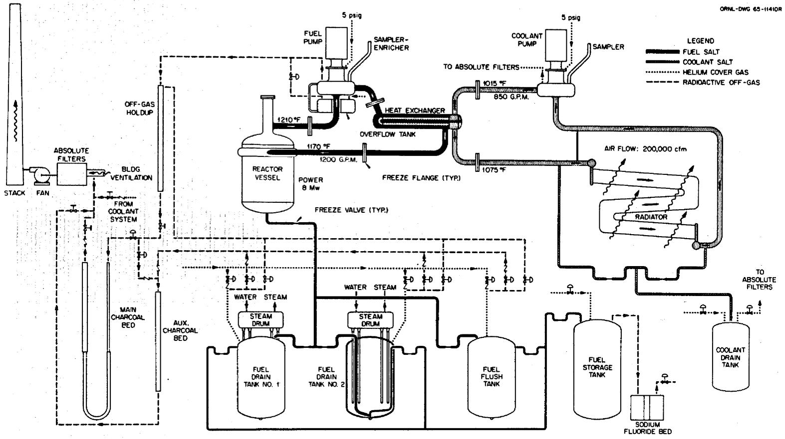  
Fig. 1.1. Design flowsheet for the MSRE.

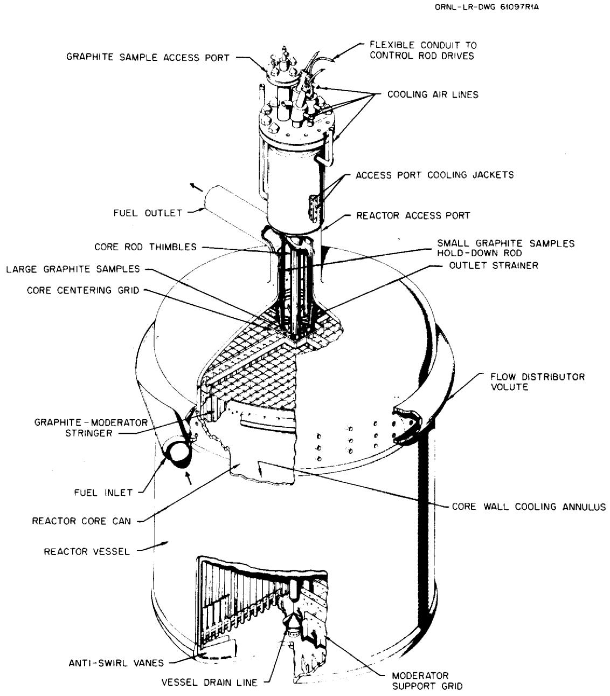  
Fig. 1.2. Details of the MSRE core and vessel.

air duct and seal the radiator enclosure if the coolant-salt circulation stopped and there was danger of freezing salt in the tubes. There were no mechanical valves in the salt piping; instead, flow was blocked by plugs of salt frozen in flattened sections of certain auxiliary lines. Temperatures in the freeze valves in the fuel and coolant drain lines were controlled so they would thaw in 10 to 15 min when a drain was requested. The drain tanks were almost as large as the reactor vessel, but the molten fuel was safely subcritical because it was undermoderated. Water-cooled bayonet tubes extended down into thimbles in the drain tanks to remove up to 100 kW of decay heat if necessary.

The physical arrangement of the equipment is shown in Fig. 1.3. The reactor and drain tank cells are connected by a large duct, so they form a single containment vessel. The tops of the two cells consist of two layers of concrete blocks, with a weld-sealed stainless steel sheet between the layers; the top layer is fastened down. The reactor and drain tank cell were kept at -2 psig during operation. A small bleed of nitrogen into the cell kept the oxygen content at $3\%$ to preclude fire if fuel pump lubricating oil should spill on hot surfaces. A water-cooled shield around the reactor vessel absorbed most of the escaping neutron and gamma-ray energy. The 5-in. salt piping in the reactor cell included flanges that would permit removal of the fuel pump or the heat exchanger. The flanges were made unusually large and were left uninsulated so that salt would freeze between the faces.

All the components in the reactor and drain tank cells were designed and laid out so they could be removed by the use of long-handled tools from above. When maintenance was to be done, the fuel was secured in a drain tank and the connecting lines frozen. The upper layer of blocks was removed and a hole cut in the membrane over the item to be worked on; after a steel work shield (the portable maintenance shield) consisting of two parts was set in place, a lower block was removed. Then the two parts of this portable maintenance shield were moved together, and the hole, caused by the removal of the lower block, was covered. Through 5-in.-diam holes in the portable maintenance shield, one could then work remotely in the reactor cell.

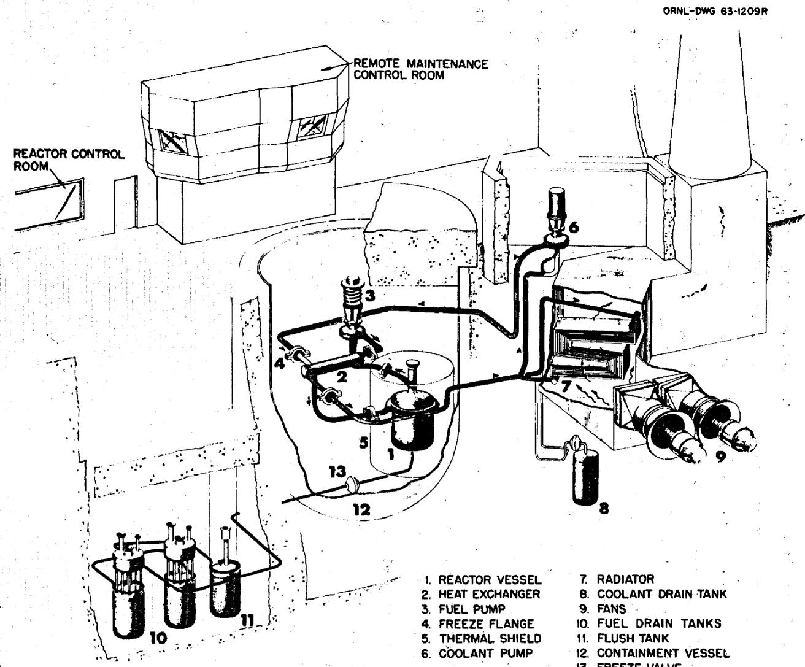  
Fig. 1.3. Layout of the MSRE.

The conventional instrumentation and control systems for the reactor were augmented by a digital computer that was used to log data and help analyze the operation. About 280 analog signals from the reactor were wired to the computer.

Construction of the primary system components for the MSRE started in 1962, and installation of the salt systems was completed in mid-1964. Pre-nuclear tests, in which first flush salt and then fuel carrier salt containing no uranium were circulated more than 1000 hr, showed that all systems worked well. Enriched $^{235}\mathrm{U}$ was then added to the carrier salt as the $\mathrm{UF_4}$ -LiF eutectic (61 wt % U) and on June 1, 1965, criticality was achieved. In May 1966, the full power of 7.3 MW was reached.

The shutdown in March 1968 was the end of nuclear operation with $^{235}\mathrm{U}$ . Sufficient $^{233}\mathrm{U}$ had become available, and plans had been made to substitute it for the $^{235}\mathrm{U}$ in the MSRE fuel to measure directly some nuclear characteristics of great importance to the molten-salt breeder design. After shakedown of the processing equipment, the flush salt and the fuel salt were fluorinated to recover the $218\mathrm{kg}$ of uranium in them. Uranium-233 was then loaded into the stripped fuel carrier salt, and criticality was attained in October 1968, after the addition of $33\mathrm{kg}$ of uranium ( $91\%$ $^{233}\mathrm{U}$ ). Nuclear operation with $^{233}\mathrm{U}$ fuel continued until December 1969, when after 4 1/2 years of successful operation, the reactor was shut down for the last time. $^4$

# 2. OBJECTIVES OF THIS GAMMA-RAY SPECTROMETRY STUDY

The operation of the MSRE demonstrated that a mixture of fluoride salts is stable under reactor conditions and that the majority of the fission products remain with the circulating fuel salt; however, some fission products are found on the moderator graphite in the core, on the metal surfaces exposed to the salt, and in the reactor off-gas system. For example, some elements (Mo, Nb, Ru, Te, and Sb) appear to exist in the metallic state and tend to plate out on surfaces in contact with the salt or to be carried into the off-gas system as particles.

The behavior of certain fission products, especially those that volatilize or deposit, is of interest for several reasons in a molten-salt system.

1. The reactor chemists, of course, seek to understand the chemistry of the fission products in the salt.   
2. The shielding required in remote maintenance of reactor components is strongly influenced by the total amount of highly active fission products deposited in those components.   
3. The deposited fission products may represent several megawatts of decay heat, creating a cooling problem after reactor shutdown and drain in a large, high-power molten-salt reactor.   
4. Fission products that concentrate in the core by deposition on graphite would absorb more neutrons and hence reduce the breeding performance of a molten-salt reactor.

For these reasons a comprehensive program of studies of fission product behavior in the MSRE was undertaken. The objective of the study described in this report was to determine the identity and magnitude of radioactive fission product deposits in certain MSRE components using the technique of remote gamma-ray spectrometry. Particular attention was directed to the reactor off-gas system and the heat exchanger, the latter because it contained approximately $40\%$ of the metal surfaces exposed to the circulating fuel salt. The deposition on graphite and metal in the core and in the

pump bowl is being studied by others and is discussed in other reports. $^{5-8}$ This report presents the results of the remote gamma-ray spectrometry in a readily usable form with some interpretations that may be useful in the overall effort of understanding the behavior of fission products in the MSRE.

# 3. DESCRIPTION AND PERFORMANCE OF EQUIPMENT

# 3.1 Background

The equipment that was used to obtain the data in this report (described below) was developed over a two-year period.

In 1967 Blumberg, Mauney, and Scott began to study devices for locating and evaluating amounts of radioactive materials in high-radiation-background areas. During a shutdown of the MSRE in May 1967, they mapped the intensity of radiation coming from the fuel heat exchanger using a gamma-ray dosimeter mounted over a collimator in the portable maintenance shield. During the same shutdown a few data on energy spectra were obtained with a sodium iodide crystal mounted in a lead shield with a collimating hole. At the end of $^{235}\mathrm{U}$ operation in March 1968, they made more, better measurements of gamma spectra by using a different collimator-shield combination, a lithium-drifted germanium diode, and a 400-channel analyzer. $^{10}$ The conclusion then was that remote determination of fission product deposition by gamma spectrometry of a collimated beam was feasible and would provide useful information, but that some improvements should be made in the equipment. Accordingly, modifications were made with the following specific objectives: $^{11}$

1. ability to position and aim the apparatus at a selected source with great accuracy,   
2. detector resolution good enough to identify individual nuclides among a multitude,   
3. simplified data handling and analysis,   
4. collimation adaptable to a wide range of source strengths,   
5. provisions for measuring spectra from selected spots during and immediately after power operation,   
6. better calibration.

By June 1969 these objectives had largely been met in the equipment described below.

# 3.2 General Description

As shown in Fig. 1.3, the fuel circulating system and drain tanks are situated in underground cells which, during operation, were covered by two layers of concrete beams with a thin stainless steel sheet between the layers. Gamma radiation levels in the reactor cell were 40,000 to 70,000 R/hr when the reactor was at full power, dropped to 3000 to 5000 R/hr upon a shutdown and drain, then slowly decreased.[12] Gamma radiation in the drain tank cell ran as high as 25,000 R/hr immediately after a drain.[12] Thus, the situation dictated that any gamma spectrometry measurements would have to be made from a distance of 10 to 20 ft through apertures in a biological shield.

Even at the top of the shield, the intensity of the gamma-ray beam through an opening was quite high. For example, the beam above a 5-in.-diam hole in the portable maintenance shield, about 14 ft above the primary heat exchanger, was on the order of $500\mathrm{R/hr}$ one or two days after a shutdown and drain. Thus the radiation to the detector had to be reduced by collimation and sometimes by attenuation through shielding plates as well. Of course, the collimation of the beam was necessary also to restrict and locate the source of the gamma rays being analyzed.

Figure 3.1 is a schematic, general view of the ultimate equipment, consisting of a collimator, a detector, and a laser alignment device. Figure 3.2 is a front view of the equipment. In these illustrations the equipment is mounted on the portable maintenance shield, but it could also be mounted over small holes drilled through the concrete shield blocks especially for this purpose. The detector was a Ge(Li) crystal connected through appropriate amplifiers to a 4096-channel analyzer. This combination provided the high-resolution capability that was necessary. Different collimator inserts could be used, depending on the intensity of the

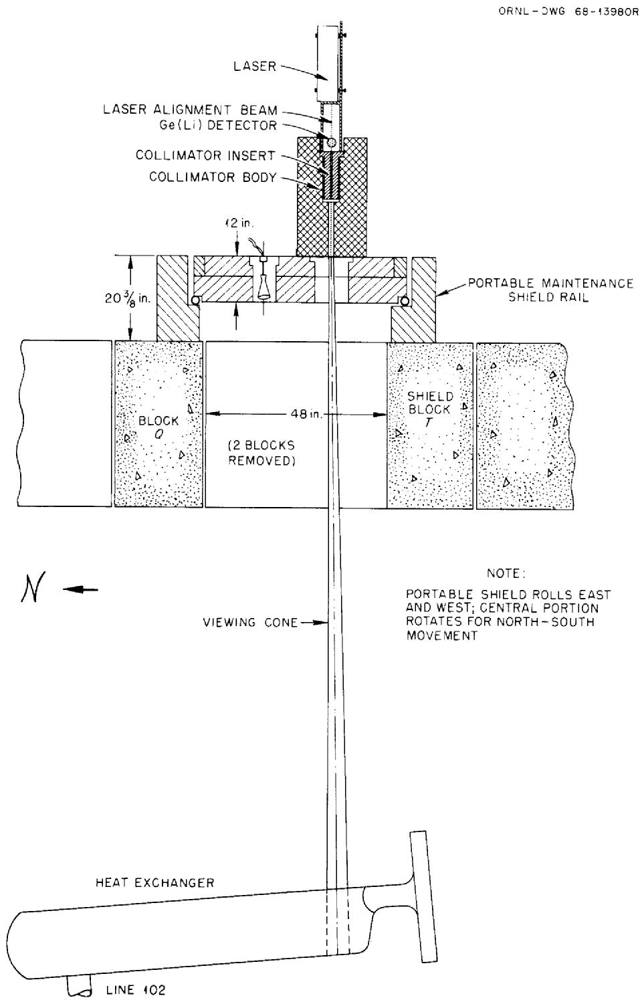  
Fig. 3.1. Schematic arrangement of the remote gamma-ray spectrometer on top of the portable maintenance shield.

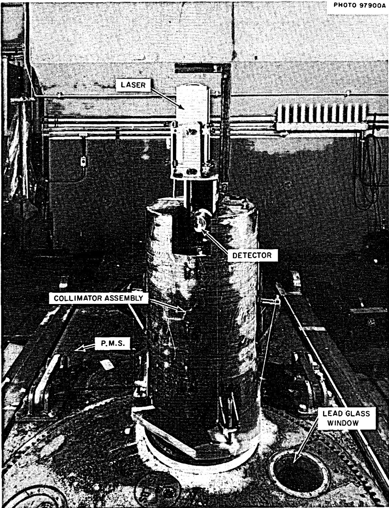  
Fig. 3.2. Front view of detector, collimator assembly, and laser on portable maintenance shield.

gamma radiation. When the equipment was used with the portable maintenance shield (PMS), the location from which the detected radiation was coming could be seen by shining the low-energy laser beam down through the collimator and looking through a lead-glass shielding window in the PMS. The precise location of the beam could be determined with a pair of surveyor's transits set up on the floor beside the reactor cell.

# 3.3 Detector and Amplifier

The detector was a coaxial, lithium-drifted germanium detector mounted on a specially extended arm at a right angle to the cryostat. The manufacturer, ORTEC, measured a total resolution of 1.78 keV FWHM at 1333 keV at the time of delivery. The detector was 36.65 mm in diameter by 28.5 mm long with a total active volume of 26.25 cm³. The peak-to-Compton ratio was 27/1. The measured efficiency (the ratio of the area under the 1333-keV photopeak recorded with this detector to the comparable area recorded with a 3- by 3-in. NaI crystal, with 25 cm between the source to the detector) was 4.3%. Most of the experiments were done with an ORTEC-440A or ORTEC-450 amplifier, both of which were adequate and posed no problems.

Although the collimated beam to the detector was very intense, it actually interacted with only a very small portion of the total germanium crystal. Although some 1400 spectra were taken in a period of six months under far from ideal conditions, it did not appear that the system resolution deteriorated appreciably during the rugged handling.

# 3.4 Analyzer

A Nuclear Data 2200 series, 4096-channel, analyzer was used. All spectra were recorded on magnetic tape. Initially several problems were encountered in operating the analyzer and tape unit, partly due to "bugs" in this new system. Other problems appeared to be connected with the fact that the analyzer was initially located in a quite hot and very humid area and had to be shut down frequently for experimental reasons.

Once the analyzer and amplifier were placed in an air-conditioned, humidity-controlled room and left on power continuously, most of the problems disappeared. This move necessitated a 200-ft cable between the

detector preamplifier in the reactor high-bay area and the amplifier located near the analyzer; the long cable did not noticeably influence the system performance. System gain shifts, sometimes of several channels, seemed to a certain degree dependent on local power conditions (voltage and possible frequency variations). We accepted this fate and had no opportunity to investigate this dependence. This high-resolution detector and 4096-channel analyzer combination performed satisfactorily. However, when the reactor was at power the cacophony of gamma rays from short-lived fission products in components such as the primary heat exchanger or reactor off-gas line generally proved too much even for this system; peaks degenerated into broad conglomerates from several gamma rays. In those cases, either a fair amount of shielding had to be used between the detector and the component observed to cut down the radiation level, or such a spectrum could not be analyzed.

# 3.5 Collimator Assembly

Figure 3.3 shows the collimator assembly, which consisted of a collimator body and a collimator insert. The collimator body, a lead-filled cylinder 32 1/2 in. high and 19 in. in diameter, had a central hole into which a collimator insert, also a lead-filled cylinder, could be placed. Three different, interchangeable collimator inserts having beam holes 1/16, 1/8, and 3/16 in. in diameter, respectively, were available to cope with the different radiation intensities. Ultimately only the inserts with 1/16- and 1/8-in. beam holes were used to collect data. The inserts were 12 in. long and 3 7/8 in. in diameter. The straightness of the beam holes in the inserts proved to be a manufacturing problem since drilling of such small holes over a 12-in. length is almost impossible. Reasonably straight holes were obtained by placing thick-walled stainless steel precision tubes of 1/16, 1/8, and 3/16 in. inside diameter in the collimator inserts and then filling the inserts with lead.

The detector and Dewar bottle were mounted on a platform attached to the collimator body. They could be moved on this platform with an adjusting screw to ensure that the detector was always at the same location over the collimator beam hole. The laser was fixed to the collimator insert with a

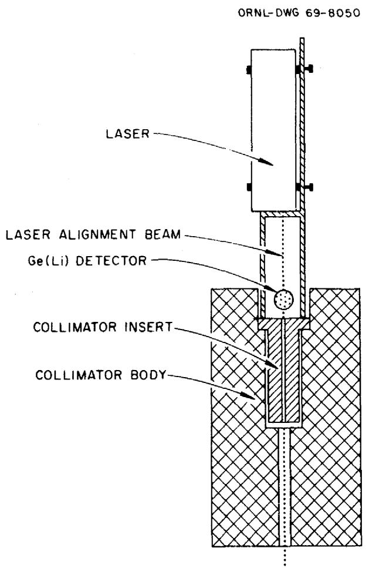  
Fig. 3.3. Schematic of collimator assembly, detector, and laser.

small jig in such a way that the laser beam could be adjusted to shine through the middle of the collimator beam hole. For the laser to shine through the collimator hole, it was necessary to get the detector out of the way by moving the detector and Dewar backward on the platform with the adjusting screw. It would have been easy to guide the laser beam around the detector into the collimator beam hole with some sort of a mirror system, but it was thought that the anticipated rough handling of the detector, laser, and collimator assembly in moving it from place to place would not permit this extra complication. The collimator insert and laser (in fact, one subassembly) could easily be taken out and replaced or adjusted.

# 3.6 Setup of Experimental Equipment

Several days were required after reactor shutdown to remove the upper shield blocks and the containment membrane, set up the PMS and the spectrometry equipment, and start a survey. For this reason, it was decided to drill holes through the upper and lower shield plugs at three different locations in the shielding so that the spectrometer could be used while the reactor shield plugs were still in place. The three locations chosen were: one over the reactor system off-gas line, one over the primary heat exchanger, and one over a drain tank. The holes were drilled during the June-August 1969 reactor shutdown period. The alignment of the holes in the upper and lower shield plugs was done with surveyor's transits. Of course, the containment membrane between the layers of shield blocks in both the reactor cell and drain tank cells remained intact. This setup, with the collimator assembly and detector placed on top of the upper shield blocks, was very useful for taking gamma-ray spectra during and immediately after reactor shutdown; it also gave us an opportunity to study the shorter-lived isotopes, at least at these three locations.

We used the PMS to survey the fission product activities along the heat exchanger axis, the fuel lines, and the off-gas line.<sup>13</sup> By placing the collimator assembly and detector over one of the holes in the rotating

work plug of the shield, we could survey 35 in. of the heat exchanger with one setup. Figure 3.4 shows the general arrangement. By placing the PMS over any group of two adjacent lower shield plugs, we could survey large areas in the reactor cell. The collimator assembly and detector were placed on a large axial bearing so that the assembly could be turned freely on the PMS. This proved to be very useful for locational purposes.

# 3.7 Locational Equipment

It was important to know precisely the locations on the different components from which gamma-ray spectra were taken. A low-power laser and two surveyor's transits were used for this purpose. The laser was mounted in the previously mentioned adjustable jig which could be attached to any of the collimator inserts. The laser beam coming through the center of the collimator hole and falling on the reactor component surveyed would then accurately indicate the center of the spot from which a gamma-ray spectrum was taken. The red laser "dot" could be observed very easily through a lead-glass shielding window in the PMS (even on a 1/2-in. line some 15 ft away). Through previous calibration with a plumb line and an adjustable bubble level on the collimator body, we could ensure that the laser beam was perfectly vertical. With the surveyor's transits, placed in the reactor high-bay area, it was then possible to locate the vertical laser beam and hence the spot examined on the reactor component. This rather simple system proved to be accurate within a fraction of 1 in.

# 3.8 Shielding

As already mentioned, the radiation intensity from several components was rather high. With the reactor at power, the radiation levels from the holes in the concrete shield plugs over the reactor off-gas line and heat exchanger were more than 1000 R/hr. An important dose due to fast and thermal neutrons was also detected. (Except when spectrometry data were being taken, the holes were plugged and covered with lead bricks.)

With the reactor at full power, it proved to be impossible to take meaningful spectra through the hole over the heat exchanger. So many

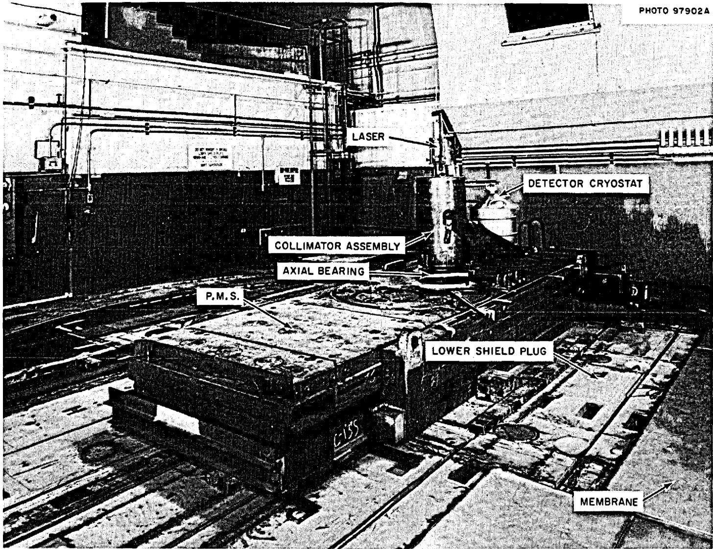  
Fig. 3.4. General arrangement of detector-collimator assembly and portable maintenance shield placed over removed lower shield plugs.

fission product nuclides appeared in the circulating fuel salt that among the great multitude of photopeaks present in these spectra, many coincided to form meaningless, large conglomerate peaks. These spectra could not be analyzed by our computer program for spectrum analysis. The off-gas contained fewer different nuclides than did the fuel salt, but even so, spectra taken with the reactor at full power through the hole over the off-gas line were on the borderline. A liberal use of shielding material, such as 2 in. of lithium-impregnated paraffin and 1 in. of copper, was necessary to render those off-gas-line spectra analyzable. (Lithium-impregnated paraffin was used since it absorbs neutrons without emitting capture gamma rays.)

With the reactor at low power or right after shutdown from high power, we were able to analyze spectra from both the heat exchanger and the off-gas line. Still a heavy amount of shielding was necessary to keep the count rate from the detector within reasonable limits, 3000 to 10,000 counts/sec.

A problem encountered was that many good shielding materials, such as lead, attenuate low-energy gamma rays (energies of a few hundred keV or lower) too strongly when enough shielding is used to obtain the desired degree of attenuation for the higher energy photons. Thus low-energy peaks could be entirely wiped out under such conditions. Because materials of low atomic number do not show such a strong shielding effect at low energies, this problem was largely overcome by using shields made of aluminum and/or copper. Thus the count rate could usually be kept at a desired level while allowing measurement of the lower energy photons. Chapter 5, concerning calibration of the equipment, will show in more detail the problems encountered.

In general, we tried to operate the system at a dead time of $25\%$ or less using a minimum of shielding material and the 1/16-in. collimator insert.

# 3.9 Calibration Setup

The detector system efficiency was determined empirically, since the geometry, especially of the primary heat exchanger, was thought to be too complex to ensure adequate precision from theoretical calculations. The complete calibration procedure is given in Chapter 5. A subsequent check of this calibration using simplified calculational models is described in Appendix D.

Figure 3.5 shows the physical setup for the calibration experiments. The detector, with a collimator, was installed in one of the underground cells (the decontamination cell) in the reactor high-bay area. A mockup of a complete section of the primary heat exchanger with a radiation source tube was located in the adjacent remote-maintenance-practice cell. Radiation from the source tube positioned in the heat exchanger mockup passed through a specially drilled hole in the wall between the two cells and the collimator and then interacted with the detector. The wall between the cells was thick enough to eliminate any radiation at the detector except that coming through the collimator. The remote-maintenance cell was closed off with the regular roof plugs, except for the area directly above the heat exchanger mockup; the PMS was used here. Through holes in the PMS, we could then manipulate the source and the dummy heat exchanger tubes in the mockup with a simple tool.

A 24-Ci $^{110}\mathrm{mAg}$ source was used for the calibration experiment. This source, activated by irradiation in the Oak Ridge Research Reactor, was 6.3 in. long and 1/2 in. in diameter. (It should be remembered that the real heat exchanger tubes also have a diameter of 1/2 in.)

By placing this source tube in each of the heat exchanger tube positions, with dummy tubes in all the other heat exchanger tube positions, we measured the influence of radiation from every one of these tubes on the detector. The addition of the readings from all the heat exchanger tube positions gave the detector response that would have been produced by a heat exchanger completely loaded with activated $^{110m}$ Ag tubes. The distance between the heat exchanger mockup and the detector was made the same

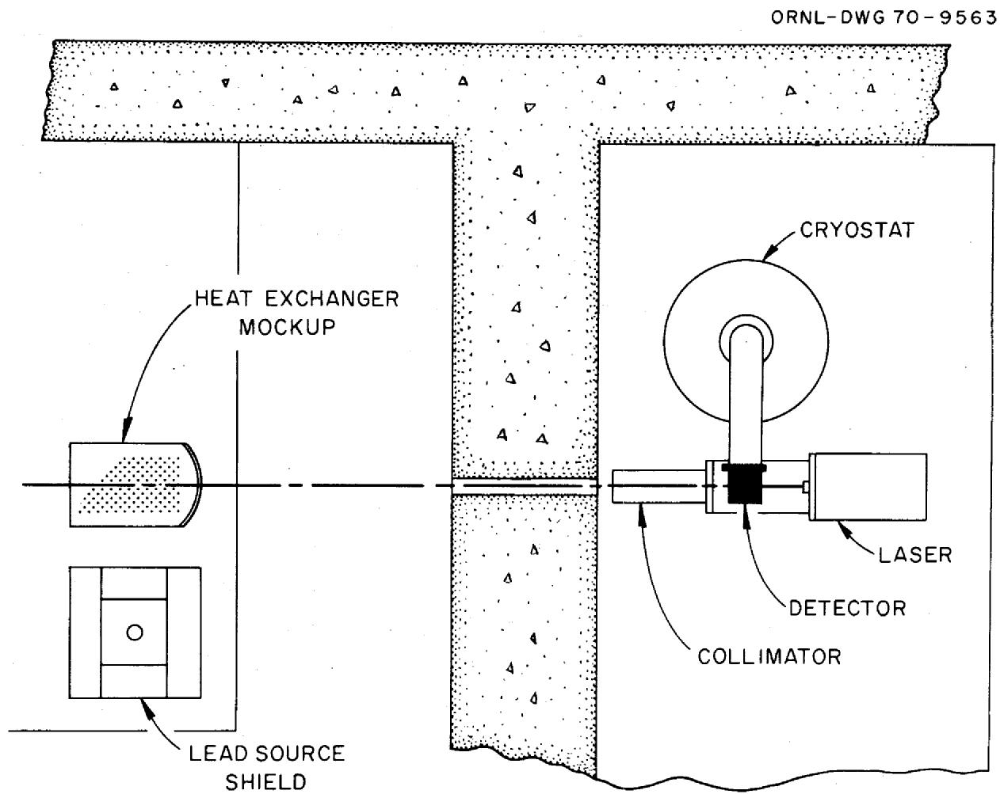  
Fig. 3.5. Plan view of calibration arrangement.

as the average distance between the detector placed on the PMS and the actual primary heat exchanger in the reactor cell.

The heat exchanger calibration experiments were done with a dummy section of the heat exchanger outer shell (1/2 in. Hastelloy N) placed between the tube mockup and the detector. The alignment of the collimator hole between the source and the detector was again done with the laser rig, which was mounted on the now horizontally placed collimator insert. The red laser beam, passing through the collimator insert, was easy to locate and was aimed at the center of the heat exchanger mockup.

The calibration required for the measurements on the reactor main off-gas line was less complicated because the portion of the line that was observed was simply a corrugated l-in. tube. It was estimated that the effect of this corrugated tube in comparison with the source tube would be approximately the same on the detector.

The ceramic part of a heat exchanger heater, as well as the shielding plates we used during the actual survey of the heat exchanger and off-gas line in the reactor cell, were calibrated with the same source to compare their shielding capabilities with those calculated from literature data. For this purpose, the ceramic heater was placed close to the heat exchanger mockup with the source tube in an unshielded center position. The shield plates were placed as close as possible to the wall in the remote-maintenance practice cell in front of the hole. The shielding capabilities of the different plates as found by these tests agreed well with the values calculated from literature data.

# 4. ANALYSIS OF SPECTRA

# 4.1 Purpose and General Procedure

The purpose of analyzing a gamma-ray spectrum is to identify radio-active nuclides by their emitted photons and, taking into account the absolute counting efficiency of the system, to determine the amounts of the various nuclides present at a given location in a particular reactor component.

The counts in each one of the 4096 channels of the analyzer system are stored in the analyzer memory and, after the end of the counting time, written on magnetic tape if so requested. Hence, the basic data are counts assembled in channels. Each channel represents a particular energy interval whose size can be set more or less at will. We generally used an energy interval (so-called "gain") in the range of 0.3 to 1.0 keV per channel. In other words, we could take a gamma spectrum comprising a range of 1200 ( $\sim$ 0.3 x 4096) to 4000 keV (1.0 x 4096). A gamma-ray peak (usually called a photopeak or full-energy peak) would identify itself in such a spectrum as an increase in accumulated counts in several adjacent channels. Experiments have shown that such a photopeak has essentially the form of a modified gaussian curve. The intensity of a photopeak is determined from the height of, or more precisely from the area under, such a gaussian curve. The energy of the gamma ray is determined from the location of the gaussian curve in the spectrum, that is, the channel in which the top of the gaussian curve falls.

The analysis of a recorded gamma-ray spectrum containing several photopeaks proceeds through the following basic steps:

1. Locate the peaks in the spectrum.   
2. Determine for each peak if it is just a statistical fluctuation or a real photopeak and determine a beginning and end of each peak.   
3. Determine the background from adjacent channels for each peak.   
4. Fit a gaussian curve to the net counts in those channels that form a peak.

5. Calculate the area under the peak as a measure of the gamma-ray intensity, subtract the background (above) from this area, and determine the location of the top of the gaussian curve to assign an energy to that peak.   
6. Examine the spectrum peak by peak to determine the nuclides responsible for the observed spectrum; a search is made through an energy library to find those isotopes that might emit gamma rays within the range of each energy peak.   
7. Select the nuclide most likely to be the one responsible for the peak in question. Each peak is subjected to several tests before it can really be associated with a certain isotope. These tests include half-life, presence of associated gamma rays and their relative intensities, and presence of precursor and daughter nuclides.   
8. Once a peak is thus identified, calculate from the area under the peak how much of the particular isotope is present.

A requirement for such a spectrum evaluation is that the efficiency of the detector system as a function of photon energy, that is, the ratio between the counts detected and the gamma rays emitted, must be well known for the energy range considered. Also, the relationship between gamma energy and channel number must be determined to evaluate the energy of the peaks accurately. A typical spectrum is given in Fig. 4.1.

# 4.2 Problems

Because most of our spectra were taken relatively soon after reactor shutdown, many short-lived isotopes were still present. This resulted in a large array of photopeaks, many of which overlapped each other. This means that several single photopeaks (singlets) would conglomerate (multiplets); the analysis of these multiplets poses an entirely new dimension to the analysis of a spectrum. For example, the beginning and end of any one peak in a multiplet is very difficult to determine, as is the subtraction of the background from this multiplet. Basically, a few gaussian curves have to be shifted back and forth so as to fit a multiplet.

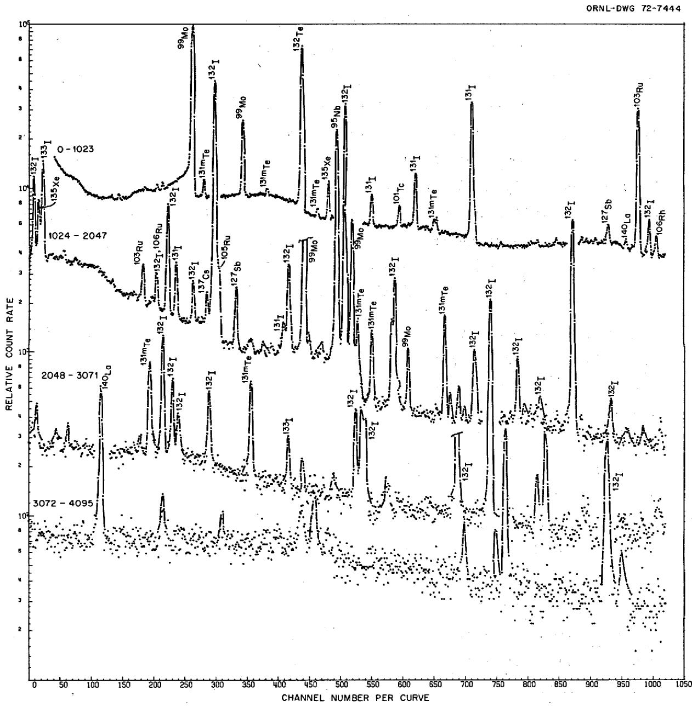  
Fig. 4.1. Representative gamma-ray spectrum from 4096-channel analyzer system.

The identification of isotopes by their emitted gamma rays is relatively easy if one has an extensive, accurate library of gamma-ray energies and branching ratios. The gamma rays of longer-lived isotopes are well known, but the shorter-lived ones are not and their descriptive data are scarce.

As implied above, it is a difficult task to analyze one spectrum completely, especially if it has to be done manually. If, as in our case, approximately 1400 spectra have to be analyzed, it becomes obvious that a computerized analysis is necessary. However, a computer program to handle our rather complicated spectra was not readily available, and it would have been too time consuming to have one written.

# 4.3 Table of Isotopes

Considerable effort was expended in setting up a library of isotopic data. This library is probably fairly unique in that it contains both short- and long-lived fission product data and is taken from the latest references collected by the ORNL Nuclear Data Project. Gamma-ray energies and branching ratios are listed per nuclide as well as in order of increasing energy. Absolute gamma-ray abundances, as well as precursors and decay products, are also given. Use of this table proved to be a major improvement in the analysis of our spectra. It should be emphasized that the entire analysis of our data is based on this table of isotopes. The basic isotope table is given in Appendix A.

As an example of possible errors, we might mention the problems encountered with the analysis of the $^{129}\mathrm{m}$ Te data. First, this nuclide decays partly to the ground state ( $^{129}\mathrm{Te}$ ) and then to $^{129}\mathrm{I}$ or directly from the isomeric state to $^{129}\mathrm{I}$ . In both cases, the abundance of emitted gamma rays is very small.

This means any statistical error in the original photopeak analysis is amplified by a large factor for the activity calculation. Even more disturbing is the fact that the whole $^{129}\mathrm{Te} - ^{129}\mathrm{Te}$ decay scheme is not completely agreed upon; a literature survey yielded several different decay schemes. Because the second largest photopeak (696.0 keV) observed in the

decay of $^{129m}$ Te coincides with photopeaks of other nuclides, we had to rely only on the results yielded by the 459.6-keV peak.

Based on the latest available data, we estimated that the decay of $^{129m}$ Te to the ground state $^{129}$ Te and subsequently to $^{129}$ I would produce a gamma ray at 459.6 keV with an abundance of 4.9%. Should better data become available, the results presented later on should be corrected proportionately. The abundance of the 459.6-keV photopeak for the decay of $^{129}$ Te itself to $^{129}$ I is estimated to be 7.7%.

# 4.4 Computer Programs

As already mentioned, computerized data handling was imperative for the proper analysis of this experiment. The principal problem was where to find a computer program that would analyze our spectra with their multitudes of singlet and multiplet peaks. As an indication of the complexity, it should be emphasized that we commonly had 150 to 230 peaks per spectrum.

The ORNL Mathematics Division had developed an effective gamma-ray spectrum analysis program, GAMSPEC-3, which was operational but did not yet have provisions for analyzing multiple peaks. The program was also limited to the analysis of 75 single peaks per spectrum and would not identify nuclides. These limitations eliminated this program for the analysis of most of our spectra, especially those still containing many photopeaks from short-lived isotopes. Gunnink et al.,<sup>14</sup> among others, had developed a versatile gamma-ray spectrum analysis program, GAMANAL, which seemed to suit our purposes. This program had been written in a Lawrence Radiation Laboratory (LRL) version of FORTRAN for a CDC 6600 computer and had been converted to FORTRAN-IV and made compatible with the IBM 360 series of computers by N. D. Dudey et al., of Argonne National Laboratory. Through a concerted effort of the ORNL Mathematics Division, the program was made compatible with the ORNL computers. As an indication of the complexity of

the program, it might be mentioned that it took LRL close to five man-years to write this program, ANL close to two years to make it compatible with the IBM 360 computers, and ORNL some four months to get it running here.

This program will locate peaks (singlets, doublets, and triplets) and identify and calculate the amounts of nuclides responsible for the peaks. It can handle 400 singlet peaks, 100 doublets, and 100 triplets. Although the basic program was originated by Gunnink et al., we made some modifications to it and supplied our own library of isotope data. For example, the original program read in the efficiency of the whole detector system as a function of energy as coefficients of a polynomial equation. This was modified to have the program interpolate efficiency values from a set of data that represented the efficiency curve itself. Normally we supplied approximately 60 points on this efficiency curve. It was also changed to permit a larger choice in output of different tables in order to reduce the paper output.

Although this program worked satisfactorily for most of our spectra, some problems remained, as follows.

1. In some specific energy ranges, many peaks appeared in multiplets. Since the program would only analyze up to triplets, it was obvious that a conglomerate of five or six peaks could not be properly analyzed.   
2. The storage possibility of 100 doublets and 100 triplets sometimes was inadequate for spectra that contained many short-lived isotopes. Such a spectrum would then be rejected.   
3. It was only exceptional that all the nuclides of a particular decay chain were deposited. When the program then went through the different identification tests, it would sometimes fail to find the precursor or daughter products and hence reject an identification. The only way out was then to uncouple the parent-daughter relation in the energy library. For example, in chain 95, $^{95}\mathrm{Zr}$ remained with the fuel salt while $^{95}\mathrm{Nb}$ tended to plate out. The program would not identify $^{95}\mathrm{Nb}$ as long as $^{95}\mathrm{Zr}$ was coupled to it as its precursor. Of course, this had nothing to do with the performance of the program itself.

# 5. CALIBRATION

# 5.1 General

The equipment was calibrated to determine the absolute efficiency of the whole gamma-ray detection system, taking into account the collimator assembly and the physical arrangement of the equipment in the reactor cell.

The counting efficiency as used in our empirical method is merely a proportionality constant relating photopeak count rate and source intensity, viz.,

$$
C R = E F \cdot S, \tag {1}
$$

where $CR$ is the count rate, $EF$ is the efficiency, and $S$ is the source intensity expressed as photons per unit of source dimension and per unit time. It should be noted that even though $CR$ is determined by photons from the total radioactive object subtended by the collimator, the source strength can be expressed as any convenient fraction or multiple of the total object. For example, in the case of the heat exchanger (see Sect. 5.5), count rates that corresponded to the collimator subtending a conical section of the heat exchanger full of radioactive tubes were obtained. The source strength, however, was taken as those photons emitted per unit time per square centimeter of a single tube. Thus the counting efficiency is expressed as

$$
E F \left(\frac {c}{\gamma / \mathrm {c m} ^ {2}}\right) = \frac {C R (\text {c o u n t s} / \min)}{S \left(\frac {\gamma}{\mathrm {c m} ^ {2} - \min}\right)}, \tag {2}
$$

where $\gamma$ denotes an emitted photon and $c$ a count registered in the photopeak. When a count rate measured over the heat exchanger was divided by this efficiency, the result was the photon emission rate per square centimeter of tubing in the heat exchanger. In the case of the reactor main off-gas line, the source strength was expressed in units of photons emitted per inch of tubing per minute ( $\gamma/\mathrm{in}.$ -min), causing the efficiency to have the units

The efficiency of any system of this kind is dependent on the energy of the incoming gamma rays. Basically, there are two ways to determine the relationship between efficiency and energy. One could establish this efficiency curve by measuring first the detector efficiency in a simple geometry with several different known sources and then discount the effects of collimation, distance, shielding, and geometry for an actual component to be surveyed. The other way would be to establish empirically the efficiency of the system in the actual physical setup. We chose the second path because it appeared to be somewhat simpler and more reliable. However, we also performed our analysis using the more basic approach to check the validity of the calibration (see Appendix D).

All gamma spectra taken from July to September 1969 were obtained with the ORTEC-440A amplifier. During our calibration experiments, we changed to the ORTEC-450 amplifier. Because it was not known at that particular time what the influence would be on the resolution of the system, it was decided to do a fair amount of the calibration work in duplicate using both amplifiers.

# 5.2 Source

In order to simulate the actual conditions as much as possible, we chose a 1/2-in.-OD silver source tube that was equivalent in diameter to the primary heat exchanger tubes.

Silver was chosen because $^{110}$ Ag has several gamma rays between 446.8 and 1562.2 keV and thus yields data over a sizable part of the energy range for the efficiency curve. Furthermore, it was rather inexpensive to prepare such a source by using the hydraulic-tube irradiation facilities of the ORR. Because of the large effect of the silver tubing on the reactivity of the ORR, only 2.3 in. of tubing could be irradiated in a single hydraulic tube; so three pieces of silver tubing of this length were irradiated, each in separate hydraulic tubes. Flux monitors (Co-Al foils) were first irradiated to determine the flux gradients and total flux in the hydraulic tubes and provide a basis for the silver irradiations. The assembly of our source tube was done in the hot cells of the ORNL Isotopes Division and consisted

in putting the three silver tubes together in one thin-walled stainless-steel container and seal welding it (Fig. 5.1). Appendix B reports in more detail the calculations done concerning the source strength as well as the activity gradient along the length of the source.

# 5.3 Slit Experiment - Source Strength

Because of the neutron flux distribution in the ORR, it was inevitable that there was some activity gradient along the source tube. It was necessary to know this gradient to properly calibrate the detector system. Originally we planned to deduce the level of $^{110m}$ Ag radioactivity at any point on the tube from the measured activity values and the activation gradients obtained from the flux monitors (Table B.2 and B.4 of App. B). However, this procedure has many uncertainties. A much better procedure, and one that was followed, was to scan the source with a collimator arrangement using the Ge(Li) detector and 4096-channel analyzer. A slit shield, set up in the remote-maintenance practice cell at the MSRE, consisted of stacked lead bricks to a height of about 2 ft. An air-gap slit 1/8 by 1 in. wide was formed in the brick stack by using 1/8-in. lead spacers; a glass tube large enough to accept the source was attached vertically to the brick stack over the air gap. The Ge(Li) detector was placed in the adjoining decontamination cell in front of the hole drilled through the concrete wall. When the source was placed in the glass tube, gamma rays from a 1/8-in. section of the silver tube could pass through the slit, the hole between the cells, and the collimator to strike the detector. Scanning was begun by lowering the source below the slit and then gradually raising it until the detector signaled that the top of the source was in front of the slit.

The scan was made by moving the source upward and obtaining gamma spectra at 1/8-in. increments until the entire source had been moved past the slit. A profile of the source intensity was obtained by resolving the gamma spectra and plotting net counts of photopeak areas versus distance along the source (see Fig. 5.2). From these results we could then calculate the absolute activity at any point along the entire length of the source tube (App. B).

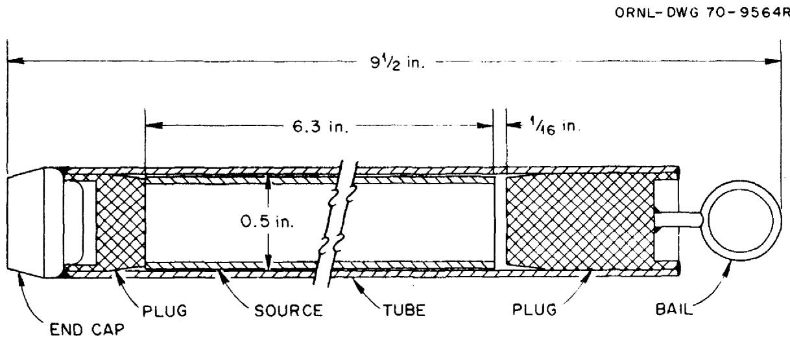  
Fig. 5.1. Source capsule assembly.

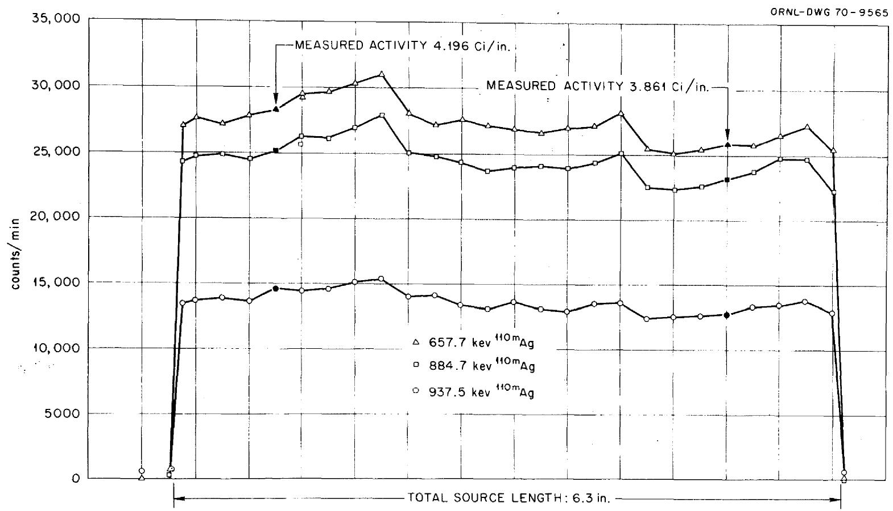  
Fig. 5.2. Net counts of 3 major $^{110m}$ Ag photopeaks versus distance along the source tube.

Because the activity profile of the silver source tube was not completely uniform and the collimator subtended a significant portion of the tube, an average value of the source strength as viewed by the system was needed. The average source strength, $\overline{S}$ can be expressed as

$$
\bar {S} = \frac {\int_ {0} ^ {L} S (x) R (x) d x}{\int_ {0} ^ {L} R (x) d x}, \tag {3}
$$

where $L$ is the length of the tube, $S(x)$ is the source strength at point $x$ , and $R(x)$ is a weighting function equivalent to the radial counting efficiency (sensitivity response to a point source as a function of distance from the source-to-collimator axis). Since the source strength $S(x)$ and the count rate $CR(x)$ found in the slit experiment are linearly related, we can write

$$
\overline {{S}} = \frac {k \int_ {0} ^ {L} C R (x) R (x) d x}{\int_ {0} ^ {L} R (x) d x}, \tag {4}
$$

where $k$ is a proportionality constant relating $S(x)$ and $CR(x)$ . Note that $k$ is the reciprocal of the counting efficiency for the source in the slit experiment configuration and has the units of $(\gamma/\mathrm{in.})/\mathrm{c}$ . We can now write

$$
\overline {{C R}} = \frac {\bar {S}}{\bar {k}} = \frac {\int_ {0} ^ {L} C R (x) R (x) d x}{\int_ {0} ^ {L} R (x) d x}, \tag {5}
$$

where $\overline{CR}$ is the average count rate for each of the gamma rays for the total source tube.

In determining the weighting function $R(x)$ , we assumed that the collimator-detector assembly had rotational symmetry; that is, only radial displacement from the collimator axis was considered. (This assumption required that the collimator hole be perfectly straight, which seemed reasonable, at least for the 1/8-in. collimator.)

From the calibration work in the heat exchanger mockup (see Sect. 5.5), we were able to measure the contribution to count rate at the detector from sources to the right and left of the collimator axis. Figure 5.3 is a normalized plot of the detector sensitivity to the silver source tube at various distances from the axis. This figure was made up as follows: For three different $^{110m}$ Ag photon energies, the net count rates were added for all the source tube positions in each column of tubes in the heat exchanger mockup (parallel to the collimator axis, Fig. 3.5). The reason for summing the readings of an entire column was to obtain a more uniform source distribution as well as better counting statistics. This count-rate distribution across the mockup was then normalized to a central value of unity for each of the three photopeak energies and corrected for a slight misalignment of the collimator. Figure 5.3 is the average of the three normalized curves; their deviation from this average was encouraging small. The figure also represents the required weighting factor $R(x)$ . By multiplying the count rates along the source tube, as measured by the slit experiment (Fig. 5.2), in the appropriate way with the normalized count-rate distribution as seen by the detector (Fig. 5.3), the result is the effective activity of the entire source tube as seen by the actual detecting system (Fig. 5.4). The average weighted count rate of the source tube for the three energies considered is the area under each of the curves on Fig. 5.4 divided by the area under the normalized curve (Fig. 5.3). For the three energies we find the following average weighted count rates:

Energy (keV)

657.7

884.7

937.5

Count rate (counts/min)

27,500

24,300

13,600

Since we now know the average count rates for the unshielded total tube for three of the gamma rays of the source, we need only calculate the

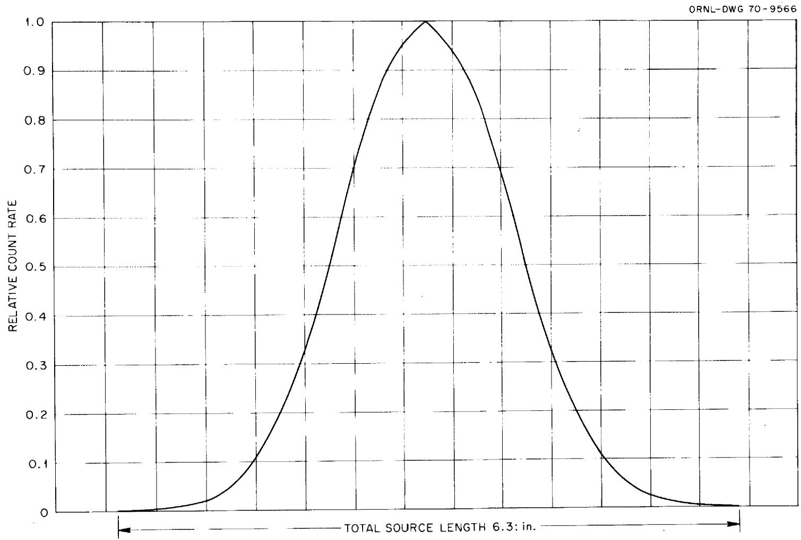  
Fig. 5.3. Normalized detector sensitivity of gamma rays coming from a source 15 ft away through a 1/8-in. collimator to the detector.

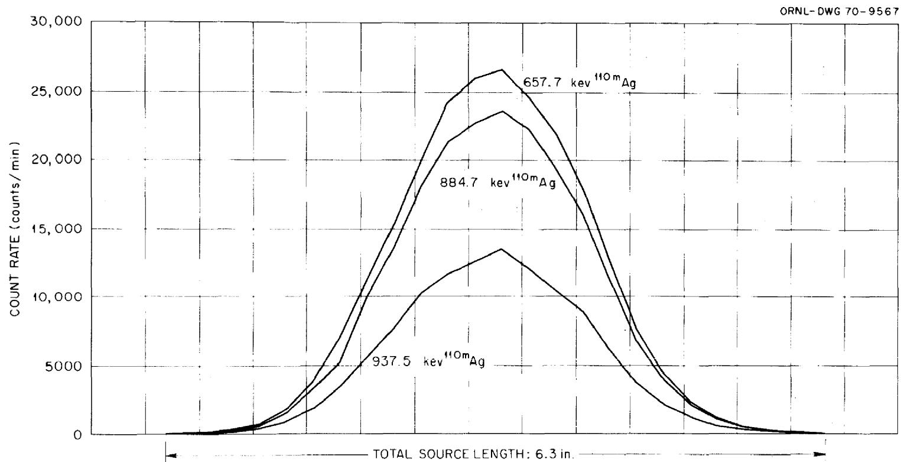  
Fig. 5.4. Measured count rate from slit experiment multiplied by normalized count rate distribution as seen by detector.

value of $k$ to determine the average source strength. The value of $k$ can be determined from the expression

$$
k _ {i} (x) = \frac {S (x)}{C R (x)},
$$

where $S(x)$ and $CR(x)$ denote the source strength in curies per inch and counts per minute, respectively, at point $x$ on the tube as determined by the slit experiment. The subscript $i$ denotes the $i$ th gamma and accounts for the variation of $k$ (a slit-experiment counting efficiency) with energy and the fact that the three gamma rays measured each have different branching ratios (photons emitted per 100 disintegrations). Since we know the source strength at two positions (see Fig. 5.2 and App. B), we can use the results of the slit experiment to obtain the value of $k$ at two positions for each of the three gamma rays as shown in Table 5.1.

Table 5.1. Count rates measured at two positions along the silver source for three different photopeaks   

<table><tr><td>Photon energy (keV)</td><td>Count rate from slit experiment for 3.861 Ci/in. (counts/min)</td><td>k(x 104) (Ci/in. counts/min)</td><td>Count rate from slit experiment for 4.196 Ci/in. (counts/min)</td><td>k(x 104) (Ci/in. counts/min)</td><td>k</td></tr><tr><td>657.7</td><td>25,900</td><td>1.491</td><td>28,300</td><td>1.481</td><td>1.486 x 10-4</td></tr><tr><td>884.7</td><td>23,100</td><td>1.675</td><td>25,100</td><td>1.671</td><td>1.673 x 10-4</td></tr><tr><td>937.5</td><td>12,700</td><td>3.044</td><td>14,700</td><td>2.861</td><td>2.953 x 10-4</td></tr></table>

We have listed the count rates and values computed for $k$ for each of the gamma rays for both "known" positions of the source tube. In addition, we have listed for each of the gamma rays the average value of $k$ for the two positions of the tube. Three values of the average source strength were then calculated by multiplying these averaged $k$ values times the corresponding averaged count rates for the three gamma rays given above. The results of these calculations are:

# Energy (keV)

657.7

884.7

937.5

# Source strength (Ci/in.)

4.09

4.07

4.00

From these results an overall average source strength was computed to be 4.05 Ci per inch of tube on June 1, 1969.

This source evaluation method leaves something to be desired and is to a certain degree misleading because we used an essentially plane source (source placed in all heat exchanger mockup positions) to evaluate the weighting factor of a line source. However, since the normalized weighting curve (Fig. 5.3) is quite steep and the source activity gradient in the central portion of the source rather flat, the method should be acceptable. Taking into account the errors of the radiochemical source-strength evaluation and the weighting-factor evaluation, we estimate an error of $\pm 5\%$ in the source-strength computation.

# 5.4 Single Source Experiments

A single source experiment was performed to determine the efficiency of the detector system for gamma rays coming from the main reactor off-gas line. We assumed that the detector system would have the same counting efficiency for the $^{110}\mathrm{mAg}$ source tube as for the corrugated l-in.-ID main off-gas line. The source tube was set up in an unshielded central position of the heat exchanger mockup, and the collimator was aligned with the laser. Minor collimator adjustments were made to cope with any misalignment by searching for the maximum count rate for this setup. The distance between the source tube and the detector was approximately equal to the distance between the actual detector-collimator assembly on the PMS and the main reactor off-gas line (line 522) in the reactor cell. Four spectra were taken for this setup with the 440A amplifier and six with the 450. The difference in response was small and judged to be due to statistical error. A 1/8-in. collimator insert was used.

By taking into account the data of this experiment and the absolute abundance of the different gamma peaks (15 photopeaks of $^{110}\mathrm{Ag}$ ), we were able to calculate the detector-system efficiency at all these different

photon energies. This way we established an absolute efficiency curve from the lowest $^{110m}$ Ag peak energy at 446.8 keV to the highest at 1562.2 keV. The problem was to extend this curve beyond these limits, because many fission products have important photopeaks outside this energy range. It was decided to use the actual fission product spectra taken from the off-gas line for the extension of the efficiency curve. For example, with $^{99}\mathrm{Mo}$ , $^{131}\mathrm{I}$ , $^{132}\mathrm{I}$ , and $^{140}\mathrm{La}$ , it would be possible to establish a relative efficiency curve all the way from 140 up to 2522 keV. By linking this wide-energy-range relative efficiency curve to the already established absolute curve from $^{110m}\mathrm{Ag}$ , an absolute efficiency curve was obtained. It was very encouraging to see that the relative curve from the fission products and the absolute curve were almost identical in shape in the 450- to 1560-keV range. Figure 5.5 is the efficiency curve adopted for the main reactor off-gas line (line 522).

As a check on the above approach, we used also a $^{226}\mathrm{Ra}$ source, which emits photons over a wide energy range. The relative efficiency curve for that source was essentially identical in shape with the established absolute curve. The discrepancies, especially in the lower energy range, were probably due to a different shielding of the actual photon emitter (for the 1-in.-ID off-gas line, this would be the wall thickness of the pipe).

# 5.5 Heat Exchanger Calibration

The heat exchanger calibration was done with a full-size mockup of a complete section of the heat exchanger. The 8 1/2-in.-long dummy tube sections had the same outside diameter and wall thickness as the actual heat exchanger tubes. In the mockup the tubes were held vertical and kept at the specified triangular pitch of 0.775 in. by two horizontal grid plates approximately 6 in. apart. With a simple tool it was easy to handle these tubes from above through a work hole in the portable maintenance shield. The mockup contained 20 rows of tubes (transverse to the detector-collimator axis). Because of the triangular pitch, each row contained either nine or eight tubes. A curved 1/2-in. stainless steel plate was placed in the proper geometry in front of the mockup to simulate the heat exchanger shell.

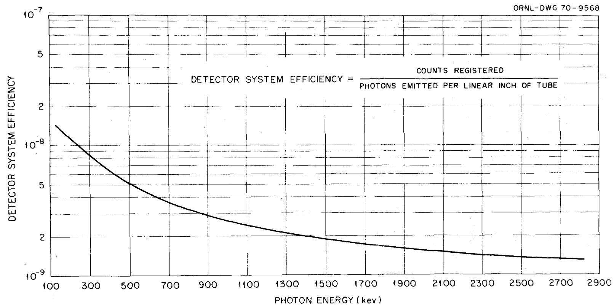  
Fig. 5.5. Absolute efficiency of detector system for photons emitted from the 522 line.

Spectra were taken with the source tube placed in each of the tube positions and dummy tubes in all the other positions. This procedure was done twice, once with the 440A amplifier and once with the 450; the 1/8-in. collimator insert was used. Some spectra were taken with the 1/16-in. collimator, but a full calibration was not performed.

By adding the count rates for each of the different $^{110m}$ Ag photopeaks from the spectra of all the source positions in the mockup, a count rate was obtained that represented the primary heat exchanger with an activity of 4.06 Ci of $^{110m}$ Ag per inch on each tube, but with the internal shielding of all the other heat exchanger tubes. By taking into account the data of the experiment and the absolute abundances of the various $^{110m}$ Ag gamma rays, we could establish an absolute efficiency curve applicable to the heat exchanger for the energy range from 446.8 to 1562.2 keV. Again, there was very little difference between the data obtained with the two different amplifiers; we used the average of the two efficiency curves as our standard.

Actual fission product data from the primary heat exchanger were used to extend the energy range of the efficiency curve; we used the photopeaks of $^{99}\mathrm{Mo}$ , $^{131}\mathrm{I}$ , $^{132}\mathrm{I}$ , and, to a lesser degree, $^{140}\mathrm{La}$ (because very little $^{140}\mathrm{La}$ was present in the empty heat exchanger). The shielding effect of a heater element was measured and also calculated separately. The final standard efficiency curve for the heat exchanger, including the heat exchanger shell and the heater box effects, is given in Fig. 5.6. It should be noted that this curve, contrary to that for the off-gas line, bends down at lower energies. The efficiency decrease at low energy was caused by the internal shielding of the heat exchanger; hence the strong increase in the photon attenuation coefficient with decreasing photon energy. This downward trend with decreasing energy proved to be a problem in the initial use of the computer program (see Chap. 4.4).

The above calibration procedure does not take into account the effect of fission products deposited on the inside of the heat exchanger shell. However, this amount, if comparable with the amounts deposited on the tubes, would have only a minor influence on the total reading. Another limitation was that the calibration would be reliable only if the deposition of fission

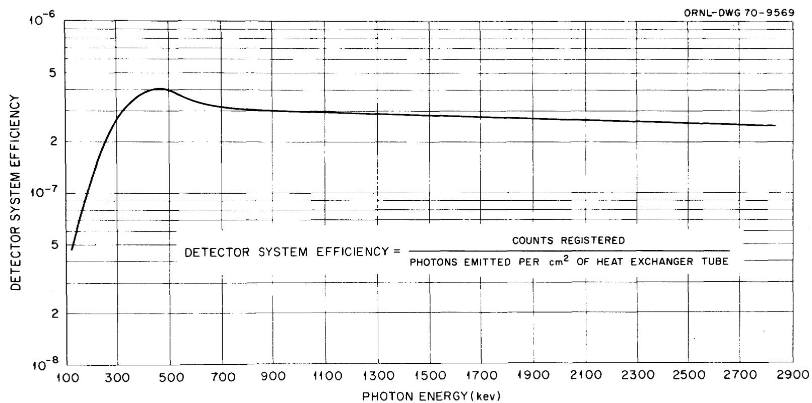  
Fig. 5.6. Absolute efficiency of detector system for phctons emitted from the primary heat exchanger.

products were approximately uniform on all the tubes. Although this is not necessarily true, we had no data to justify any other approximation.

As a check on our empirical efficiency calibrations, we have computed from first principles counting efficiencies for both a line source corresponding to the silver tube and the reactor off-gas line and a volume source (truncated cone) corresponding to the cone subtended by the collimator in the heat exchanger. These calculations are described in Appendix D. We believe that the good agreement found between experimental and computed counting efficiencies serves to confirm our measured values and increases our confidence in the validity of our measurements.

# 5.6 Calibration of Shielding Materials

Throughout the experiments we tried to keep the count rate of the detection system more or less constant in the range 3000 to 10,000 counts/sec. Since the source strength varied with time and position, we varied the detection-system efficiency accordingly by interposing different amounts of shielding material between the source and the detector. In most cases, disks, 1/2 in. thick and 7 in. in diameter, were placed over the work hole in the PMS just under the collimator assembly. These disks could be easily removed to permit use of the laser for location purposes. We used disks of aluminum, copper, and lithium-impregnated paraffin. With some extremely high activity levels, we also used some 1/4-in.-thick plates of lead between the collimator insert and the detector. Aside from the very inconvenient tendency for lead to attenuate especially well the lower energy photons, the proximity of this shielding material to the detector also caused the detection of lead x rays. In evaluating the influence of the different shielding materials, we relied not only on the published attenuation coefficients but we also calibrated the disks. We used both the unshielded silver source as well as the $^{226}\mathrm{Ra}$ source for this purpose. Our experimental values agreed well with the literature data for Pb, Cu, Al, Cd, and steel; we had to rely on experimental values only for the lithium-impregnated paraffin and the ceramic heat exchanger heater element. So-called "shielding curves" were made for each of these different shielding

materials; these curves were plots of the shielding factors (reciprocals of the more usual attenuation factors) as functions of energy from 140 to 2500 keV.

Absolute efficiency curves as functions of energy were synthesized for all the different combinations of shielding material used in the experiments. These were obtained by dividing, point by point, the unshielded efficiency values by shielding factors appropriate for that shielding combination. When two or more shielding disks were involved, composite shielding factors were used. That is,

$$
{E F _ {\mathcal {S}} (E)} = {\frac {E F _ {\mathcal {U}} (E)}{\Pi \left[ A _ {\dot {\mathcal {I}}} (E) \right] ^ {N _ {\dot {\mathcal {I}}}}},}
$$

where

$$
\begin{array}{l} E F _ {s} (E) = \text {e n e r g y - d e p e n d e n t e f f i c i e n c y w i t h s h i e l d i n g p r e s e n t}, \\ E F _ {u} (E) = \text {e n e r g y - d e p e n d e n t e f f i c i e n c y w i t h o u t s h i e l d i n g}, \\ A _ {i} (E) = \text {s h i e l d i n g f a c t o r f o r t h e i t h c o m p o n e n t o f t h e s h i e l d}, \\ N _ {i} = \text {n u m b e r o f p i e c e s o f c o m p o n e n t} i \text {u s e d}. \\ \end{array}
$$

Altogether we used 12 different combinations of shielding for the main reactor off-gas line and 8 for the heat exchanger (see Tables 5.2 and 5.3). The values of the efficiency curves generated for these shielding configurations were used as input data to the computer analysis program to evaluate the absolute amounts of nuclides present. The different efficiency curves are given in Appendix C.

With the reactor system shut down and drained, we used primarily the simpler cases of shielding with only aluminum or copper. With the reactor at different power levels, we had to rely on much more shielding because of the high gamma and neutron radiation levels. Gamma spectra taken at the same place but at different times after reactor shutdown and recorded with different shielding configurations yielded generally the same results for the amounts of nuclides deposited at shutdown time; this gave us a certain degree of confidence in the absolute efficiency curves used.

Table 5.2. Shielding configurations employed during surveys of reactor off-gas line   

<table><tr><td>Shielding case</td><td>Collimator insert diameter (in.)</td><td>Shielding material</td></tr><tr><td>1</td><td>1/16</td><td>1/8 in. steel</td></tr><tr><td>2</td><td>1/8</td><td>1/8 in. steel, 1 in. Cu</td></tr><tr><td>3</td><td>1/16</td><td>1/8 in. steel, 1 in. Cu, 2 in. paraffin (Li), 1/8 in. Cd</td></tr><tr><td>4</td><td>1/8</td><td>1 in. Al</td></tr><tr><td>5</td><td>1/8</td><td>None</td></tr><tr><td>6</td><td>1/16</td><td>None</td></tr><tr><td>7</td><td>1/8</td><td>1/8 in. Cd</td></tr><tr><td>8</td><td>1/8</td><td>1/8 in. Cd, 1/8 in. steel</td></tr><tr><td>9</td><td>1/16</td><td>1/8 in. Cd, 1/8 in. steel</td></tr><tr><td>10</td><td>1/16</td><td>1/8 in. Cd, 1/8 in. steel, 2 in. paraffin (Li), 1/2 in. Pb</td></tr><tr><td>11</td><td>1/16</td><td>1/8 in. Cd, 1/8 in. steel, 2 in. paraffin (Li), 1/4 in. Pb</td></tr><tr><td>12</td><td>1/16</td><td>1/8 in. Cd, 1/8 in. steel, 2 in. paraffin (Li)</td></tr></table>

Table 5.3. Shielding configurations employed during survey of primary heat exchanger   

<table><tr><td>Shielding case</td><td>Collimator insert diameter (in.)</td><td>Shielding material</td></tr><tr><td>1</td><td>1/8</td><td>None</td></tr><tr><td>2</td><td>1/8</td><td>1 in. Al</td></tr><tr><td>3</td><td>1/8</td><td>1/2 in. Al, 1/2 in. Cu</td></tr><tr><td>4</td><td>1/8</td><td>1 in. Al, 1/2 in. Cu</td></tr><tr><td>5</td><td>1/16</td><td>None</td></tr><tr><td>6</td><td>1/16</td><td>1/8 in. steel</td></tr><tr><td>7</td><td>1/8</td><td>1/8 in. Cd</td></tr><tr><td>8</td><td>1/8</td><td>1/8 in. Cd, 1/8 in. steel</td></tr></table>

Extensive experiments were done to evaluate the effect of the 1/16-in. collimator insert in relation to the 1/8-in. insert. During the calibration experiments, we found values appreciably higher than 4 for the decrease in count rate when the 1/16-in. insert was used; also, there was considerable scatter between individual measurements. It might have been that this spread was largely due to minor misalignments between the collimator axis and the center of the silver source tube. Therefore, another experiment was done, this time by placing a lightly activated foil alternately against the far ends of the 1/8- and 1/16-in. collimator inserts and the detector placed at the front end. We found a shielding factor of 9.0 for the 1/16-in. collimator insert in relation to the 1/8-in. insert. This test was repeated several times, and the experimental values were within $\pm 10\%$ . Apparently the 1/16-in. collimator was not all that straight!

# 5.7 Calibration for Fission Gases in the MSRE

Because our calibration was done in terms of radioactive sources deposited on the coolant salt tubes in the heat exchanger, all results obtained by the computer program, including those for gases, were expressed in this manner. Although this "equivalent surface deposition" for gases is a valid mode of expressing their concentrations, it may for certain purposes be more useful to express their concentrations in terms of free cross-sectional volume of the heat exchanger. We have estimated the average ratio of free volume to surface area to be $0.55\mathrm{cm}^3/\mathrm{cm}^2$ . Thus the results for gases can be converted to disintegrations per cubic centimeter per minute by dividing their values in disintegrations per square centimeter per minute by 0.55.

# 6. MEASUREMENTS

Gamma-ray spectra were taken during the period of July 1969 through December 1969. Altogether some 1400 spectra were recorded from several different locations (Table 6.1). The purposes of the various sets of measurements were as follows.

Group A - The reactor system had been drained and shut down since June 1, 1969. The purpose of these spectra was to test the equipment and, if possible, to study the deposition of longer-lived fission products.

Group B - During this period the reactor was usually at some power level ranging from a few kilowatts to full power. By changing the reactor conditions, such as fuel pump speed, helium purge rate in the fuel pump bowl, and changing to argon as a purge gas, the concentration of the noble fission gases was studied; of special interest was, of course, $^{135}\mathrm{Xe}$ . These spectra were all taken over a hole in the shield plug with the containment membrane in place and were considered in a separate report.

Group C - Calibration spectra were mainly taken with the $^{110m}$ Ag source tube; some were taken with a $^{226}$ Ra source. Details of the calibration work are described in Chapter 5.

Group D - A few spectra were taken through the shield plug over the main reactor off-gas line during a beryllium addition to find out if the noble fission gas concentration changed during and after an addition. These results were also considered in Ref. 15.

Group E - Several spectra were recorded of the main reactor off-gas line several hundred feet downstream of the fuel pump bowl. These spectra were taken at a location where sample bombs of fission gases can be isolated. Physically this location is in the vent house. The connection of the off-gas line into the main charcoal beds is a few feet downstream from this point. The purpose was to study the relative noble fission gas concentrations at this point.

Table 6.1. Gamma-ray spectra recorded   
July to December 1969   

<table><tr><td>Group</td><td>Place</td><td>Time</td><td>Number of spectra</td></tr><tr><td rowspan="3">A</td><td>MSRE heat exchanger</td><td>July</td><td>114</td></tr><tr><td>Main reactor off-gas line (522 jumper line)</td><td></td><td>20</td></tr><tr><td>Main fuel line (line 102)</td><td></td><td>5</td></tr><tr><td rowspan="2">B</td><td>Through shield plug hole over off-gas line</td><td>Aug.-Sept.</td><td>235</td></tr><tr><td>Through shield plug hole over heat exchanger</td><td></td><td>15</td></tr><tr><td>C</td><td>Calibrations (Chap. 5)</td><td>Oct.</td><td>425</td></tr><tr><td>D</td><td>Through shield plug hole over off-gas line (during Be addition)</td><td>Oct.</td><td>9</td></tr><tr><td>E</td><td>Main off-gas line in vent house</td><td>Oct.</td><td>6</td></tr><tr><td rowspan="3">F</td><td>Through shield plug hole over heat exchanger</td><td>Nov.</td><td>18</td></tr><tr><td>Through shield plug hole over off-gas line</td><td></td><td>24</td></tr><tr><td>Through shield plug hole over drain tank</td><td></td><td>15</td></tr><tr><td rowspan="3">G</td><td>MSRE heat exchanger</td><td>Nov.</td><td>241</td></tr><tr><td>Main reactor off-gas line (522 line)</td><td></td><td>91</td></tr><tr><td>Fuel pump bowl, fuel lines (lines 101 and 102)</td><td></td><td>36</td></tr><tr><td>H</td><td>Through shield plug over heat exchanger; final shutdown</td><td>Dec.</td><td>43</td></tr><tr><td>I</td><td>Gas samples, reactor cell</td><td>Dec.</td><td>9</td></tr><tr><td>J</td><td>MSRE coolant salt radiator</td><td>Dec.</td><td>5</td></tr><tr><td>K</td><td>Main coolant line</td><td>Dec.</td><td>14</td></tr><tr><td>L</td><td>Samples of fuel salt and graphite</td><td>Dec.</td><td>45</td></tr><tr><td>M</td><td>Miscellaneous: lube oil system, 523 line roughing filters</td><td>July-Dec.</td><td>10</td></tr></table>

Group F - From previous experience it was known that it takes at least a few days from the moment of reactor shutdown and drain until the portable maintenance shield is set up and operable over the reactor cell. In order to get some data during this time, spectra were taken over the three holes (off-gas line, heat exchanger, and drain tank) in the shield plugs. Reactor shutdown and drain on November 2, 1969, at 1441 hr was initiated by thawing the drain line freeze valve with the reactor still at full power. It was judged that this type of drain would leave the maximum fission product deposition in the system because the time span elapsed between the moment of fuel drainage of the entire fuel system and full-power operation would be shortest.

Group G - These are the main spectra taken with the detection equipment mounted on top of the portable maintenance shield after reactor shutdown.

Group H - Several spectra were taken from the heat exchanger over the hole in the shield plug. Spectra were recorded during full-power operation before final shutdown, at shutdown, during draining of the system, and thereafter.

Group I - Spectra were recorded from samples of the reactor cell air after final reactor shutdown. These spectra were used in the analysis of the piping leak that occurred after the shutdown.[16]

Group J - Spectra were recorded of the coolant-salt radiator after the system was drained; the detector was placed in front of the radiator tubes. The purpose was to find any activated corrosion products that might have settled in the radiator.

Group K - Spectra were taken by C. H. Gabbard at two places along the main coolant salt line to study the coolant flow rate by using the decay of $^{20}\mathrm{F}$ and $^{16}\mathrm{N}$ in the coolant salt; $^{20}\mathrm{F}$ and $^{16}\mathrm{N}$ are formed in the heat exchanger by delayed neutrons from the fuel salt.

Group L - Samples of fuel salt and graphite soaked in fuel salt were taken from the fuel pump bowl and placed in the sampler enricher. Spectra were taken by C. H. Gabbard with a special collimator and detector setup.

Group M - Several miscellaneous spectra were recorded, such as from the lube-oil system, the roughing filters from the containment ventilation air exhaust, and from the off-gas line of the pump bowl overflow tank (line 523).

The results of the analysis of the different spectra will be reported by group in Chapter 7.

# 7. RESULTS

Presented in this chapter are all results which pertain to the distribution of fission products in the MSRE. Brief mention is made of other spectra, recorded for different purposes, but their analyses will be discussed elsewhere.

Results are reported in the order given in Chapter 6. Because of the large number of spectra, results have been presented, where possible, in graphic form. In general, all results have been included in the figures, irrespective of possible experimental errors. Results that are somewhat uncertain for a particular reason are specifically indicated. Only in very few cases, because of obvious error, were data omitted.

# 7.1 Group A Spectra

These spectra were recorded during the July shutdown period and concern the primary heat exchanger, the main off-gas line, and a fuel salt line.

The shakedown of the equipment proved to be very useful, in that problems with the analyzer and detector system were resolved; the alignment and locational equipment, including the laser, proved to be sturdy and reliable.

Most spectra were taken six or more weeks after reactor shutdown (June 1, 1969); this implies that only a few longer-lived isotopes might be expected to be present. The spectra were relatively simple and contained no multiplets. The system had not been flushed with flush salt.

For nuclides emitting photons at different energies, we used the average of the computed activities yielded by the most prominent photopeaks emitted by that nuclide.

The counting time was mostly 200 sec per spectrum. Although $^{137}\mathrm{Cs}$ and $^{140}\mathrm{Ba - La}$ were identified a few times in the heat exchanger, their activity level was so small that one might tentatively conclude that they were deposited as a result of the decay of xenon present in the system after shutdown and drain. No $^{95}\mathrm{Zr}$ could be detected. It should be borne

in mind that, except where specifically noted, all results in this section have been extrapolated back to reactor shutdown time by simple exponential extrapolation. The reason for this extrapolation was to compare results yielded by spectra taken at different times. This extrapolation might give, however, an activity value at shutdown time that is too high because of the decay of a precursor nuclide. For example, the extrapolated value of $^{131}\mathrm{I}$ might be too high by a few percent because of the decay of $^{131m}_{\mathrm{Te}}$ . This will be further discussed in Chapter 8.

# 7.1.1 Heat exchanger

About 65 spectra were taken along the longitudinal axis of the heat exchanger. Another 49 were recorded by moving the detector transversely across the heat exchanger; the transverse scans were taken at four different places. Most spectra could be successfully analyzed. The quantitative interpretation of the transverse-scanning results proved to be rather difficult, due to the varying shielding condition because of the changing number of heat exchanger tubes seen by the detector as well as the changing photon attenuation through the heat exchanger shell. Qualitatively, the fission product deposition was symmetrical on both sides of the longitudinal axis of the heat exchanger.

The spectra recorded above the heater connector boxes (HTR plug) proved to be of no use for quantitative interpretation because of the unknown amount of shielding involved. All these spectra gave results that were far too low in comparison with the other spectra. Since the "activity depressions" near these boxes all had about the same shape, it was decided that results from spectra recorded above the heater boxes were biased because of the boxes and not because of different deposition of fission products in the heat exchanger. These spectra were discarded. Let us now turn to the different nuclides identified.

Niobium-95 (Fig. 7.1). The disintegration rate along the longitudinal axis ranges approximately between 0.10 and $0.30 \times 10^{12}$ dis/min per square centimeter of heat exchanger tube. There appears to be an increase of activity close to the baffle plates in the range of 0.25 to $0.30 \times 10^{12}$ dis min $^{-1}$ cm $^{-2}$ . Between the baffle plates, the average activity level is near 0.10 to 0.15 x $10^{12}$ dis min $^{-1}$ cm $^{-2}$ . Since the activity increase is

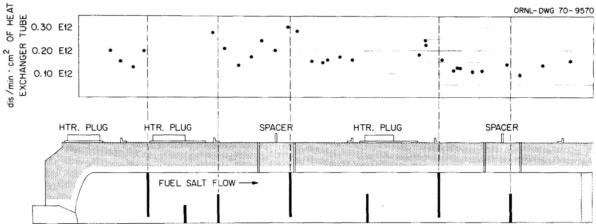  
Fig. 7.l. Activity of $^{95}\mathrm{Nb}$ at reactor shutdown on June l, 1969, in the MSRE heat exchanger.

more pronounced for those baffle plates against the upper side of the shell, one may conclude that this activity increase is rather localized around the low flow rate areas near the shell and the baffle. There does not appear to be any general change in activity along the length of the heat exchanger.

Ruthenium-103 (Fig. 7.2). The disintegration rate (dis min $^{-1}$ cm $^{-2}$ ) along the longitudinal axis follows nearly the same pattern as that for $^{95}\mathrm{Nb}$ : along longitudinal axis, 0.17 to 0.65 x 10 $^{11}$ ; near baffle plates, 0.50 to 0.65 x 10 $^{11}$ ; between baffle plates, 0.17 to 0.24 x 10 $^{11}$ .

Ruthenium-Rhodium-106 (Fig. 7.3). Ruthenium-106 is basically identified by its short half-life decay product, $^{106}\mathrm{Rh}$ . The activity distribution (dis min $^{-1}$ cm $^{-2}$ ) is essentially the same as for $^{103}\mathrm{Ru}$ : along longitudinal axis, 0.04 to 0.14 x $10^{11}$ ; near baffle plates, 0.11 to 0.14 x $10^{11}$ ; between baffle plates, 0.04 to 0.06 x $10^{-1}$ .

Antimony-125. This nuclide was detected in small quantities all along the heat exchanger. The activity level, probably because of the very low fission yield, was small; the computer program only sporadically found peaks that could be assigned to $^{125}\mathrm{Sb}$ . Variation of the activity level along the longitudinal axis was 0.053 to 0.14 x $10^{10}$ dis min $^{-1}$ cm $^{-2}$ . There were not enough data to make other observations concerning the distribution of the deposition.

Antimony-126 and Antimony-127 These nuclides were both identified a few times in the different spectra. However, it does not appear sound to assign a quantitative value to those peaks in view of the very low activity left after such a long decay time.

Tellurium-129m (Fig. 7.4). The fact that both the fission yield of $^{29}$ Te and the abundance of its photopeaks are small makes it difficult to detect this isotope with good precision (see also Sect. 4.3). There appears to be no strong tendency of an activity increase near the baffle plates; however, a slight increase in activity near the cold end of the heat exchanger seems apparent. Variation of activity along the longitudinal axis is 0.090 to 0.26 x $10^{11}$ dis min $^{-1}$ cm $^{-2}$ .

Iodine-131 and Tellurium-Iodine-132. Most of the $^{131}\mathrm{I}$ and $^{132}\mathrm{Te}-\mathrm{I}$ had decayed, although these nuclides could be positively identified in several spectra. The average activity of $^{131}\mathrm{I}$ at shutdown was approximately 0.2 x $10^{11}$ dis min $^{-1}$ cm $^{-2}$ . The average activity of $^{132}\mathrm{Te}-\mathrm{I}$ at

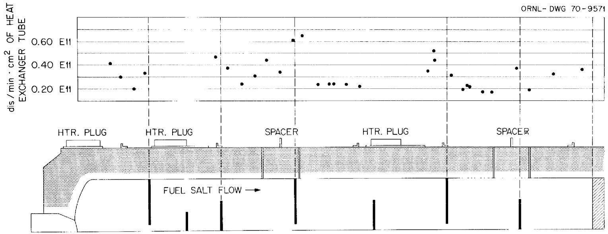  
Fig. 7.2. Activity of $^{10}$ Ru at reactor shutdown on June 1, 1969, in the MSRE heat exchanger.

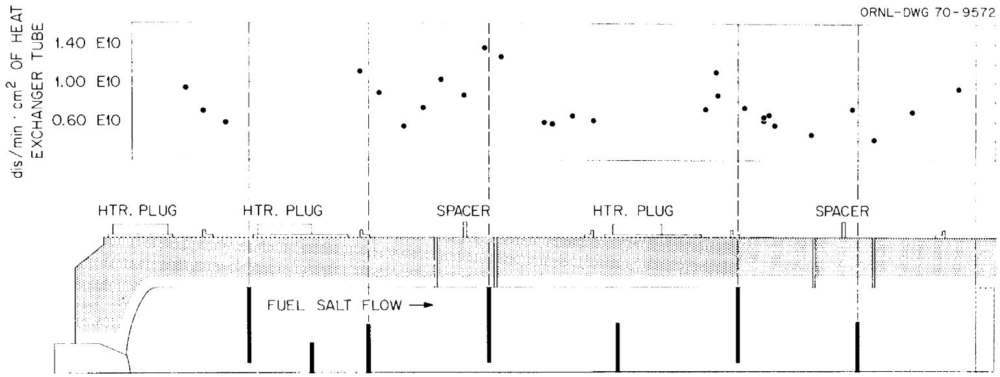  
Fig. 7.3. Activity of $^{106}\mathrm{Ru - Rh}$ at reactor shutdown on June 1, 1969, in the MSRE heat exchanger.

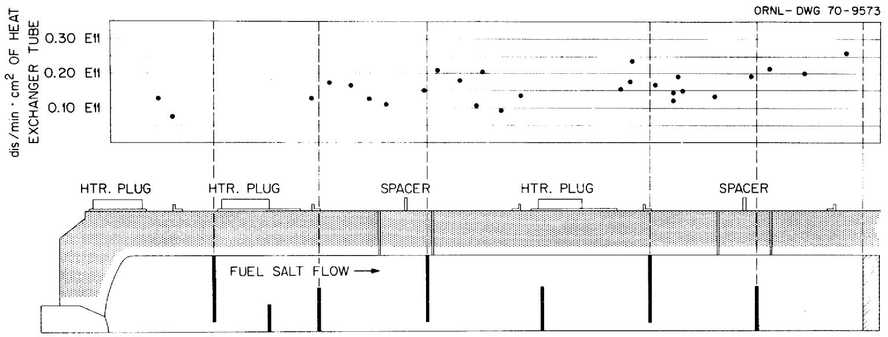  
Fig. 7.4. Activity cf $^{129m}$ Te at reactor shutdown on June 1, 1969, in the MSRE heat exchanger.

shutdown was approximately $0.4 \times 10^{12}$ dis min $^{-1}$ cm $^{-2}$ . Taking into account the relatively short half-life of these isotopes in comparison to the decay time, not much precision can be expected of these values.

# 7.1.2 Main reactor off-gas line

The flexible 1-in.-ID corrugated tubing, called the jumper line, was scanned. This 2-ft-long jumper line connects the main off-gas outlet at the fuel pump bowl with the 4-in.-diam section of the main off-gas system. This is about the only part of the off-gas system that could be "seen" from the portable maintenance shield and hence was the only piece surveyed.

The 20 spectra were taken about six weeks after reactor shutdown (shutdown of June 1, 1969) at approximately 1-in. intervals along the jumper line. Although there was some scatter in the data, especially for $^{137}\mathrm{Cs}$ and $^{140}\mathrm{Ba - La}$ , we could not detect a definite trend of decreasing activity in the downstream direction along the line. Although cesium, barium, and lanthanum were detected, these apparently were deposited in the off-gas line by the decaying xenon stripped from the salt rather than from salt deposits. Actually, no photopeaks could be positively identified from a nuclide that would indicate the presence of fuel salt; for example, $^{95}\mathrm{Zr}$ could not be positively identified. * Table 7.1 lists the nuclides that were identified; the activity is the average of the 20 different spectra. These data are extrapolated to the moment of shutdown (June 1, 1969) and represent disintegrations per minute per inch of off-gas line. It should be noted, however, that the main off-gas line was partially plugged during the latter part of the power operation prior to reactor shutdown. Off-gases were then routed through the fuel-pump overflow-tank off-gas line.

# 7.1.3 Main fuel lines

Only a few spectra were taken from the main fuel line (line 102). Given the different counting geometry, due to the distance to the detector and the shape of the source, these results could only be qualitative. However, based on experience of the calibration experiments, we can expect

Table 7.1. Nuclide activities found in the jumper line of the main reactor off-gas system at shutdown on June 1, 1969   

<table><tr><td>Nuclide</td><td>Activity (dis min-1in.-1)</td><td>Standard deviation of the average value (dis min-1in.-1)</td></tr><tr><td>95Nb</td><td>0.22 x 1013</td><td>1.0 x 1011</td></tr><tr><td>103Ru</td><td>0.45 x 1013</td><td>2.8 x 1011</td></tr><tr><td>106Ru-Rh</td><td>0.19 x 1013</td><td>0.8 x 1011</td></tr><tr><td>125Sb</td><td>0.36 x 1011</td><td>5.0 x 109</td></tr><tr><td>129mTe</td><td>0.55 x 1012</td><td>5.4 x 1010</td></tr><tr><td>131I</td><td>0.95 x 1012</td><td>6.2 x 1010</td></tr><tr><td>137Cs</td><td>0.53 x 1012</td><td>11.0 x 1010</td></tr><tr><td>140Ba-La</td><td>0.44 x 1013</td><td>5.7 x 1011</td></tr></table>

that the detection system has a fairly constant efficiency in the energy range 500 to 1000 keV. This would enable us to compare the activities of those nuclides that emit photons in that energy range. All nuclide activi- ties have been made relative to $^{95}\mathrm{Nb}$ , because this isotope had the most prominent photopeak in the spectra at 765.8 keV.

The nuclides identified, along with their relative activities, are given in Table 7.2. Restraint should be applied in using these numbers! It is intended to use these ratios only for comparison with the nuclide activities found in the heat exchanger and fuel line spectra taken in November 1969.

Table 7.2 Relative nuclide activity found in the main fuel line (102) at shutdown time on June 1, 1969   

<table><tr><td>Nuclide</td><td>Photopeak energy used in activity calculation (keV)</td><td>Activity relative to 95Nb</td></tr><tr><td>95Nb</td><td>765.8</td><td>1.0</td></tr><tr><td>103Ru</td><td>496.9</td><td>0.7</td></tr><tr><td>106Ru-Rh</td><td>a</td><td>0.1</td></tr><tr><td>125Sb</td><td>427.9</td><td>0.02</td></tr><tr><td>127Sb</td><td>b</td><td></td></tr><tr><td>129mTe</td><td>459.6</td><td>0.4</td></tr><tr><td>131I</td><td>364.5</td><td>0.7</td></tr><tr><td>132Te-I</td><td>c</td><td>7.0</td></tr></table>

$\alpha_{\mathrm{Average}}$ of 511.8 and 621.8,   
${}^{b}$ Activity too small for proper calculation.   
Average of 667.7, 772.6, and 954.5.

# 7.2 Group B Spectra

These spectra were recorded through shield plug holes on the main off-gas line and heat exchanger. As mentioned earlier, holes were drilled in the lower and upper shield plugs to permit the recording of gamma spectra from the main reactor off-gas line, the heat exchanger, and one of the drain tanks. There was one through-hole over each of these components; the steel containment membrane between the lower and upper shield plugs was, of course, left in place. Because of this membrane, the aiming of the collimator had to be done by trial and error rather than with the laser jig. We tried to obtain the maximum reading on a particular location by moving the collimator and detector back and forth.

# 7.2.1 Main reactor off-gas line

Most of these spectra were recorded with the reactor at some power level and under different reactor conditions. The variable reactor parameters were: use of argon instead of helium as purge gas, variations in pump speed, and different reactor power levels. The purpose of these spectra was to try to find a relation between the different noble fission gas concentrations (kryptons and xenons) and the changing reactor parameters. Especially at the higher power levels, the radiation intensity from the off-gas line was very high, in the order of 1000 R/hr or more. Fair doses of fast and thermal neutrons were also detected. This necessitated the extensive use of shielding materials, and even then some spectra contained too many overlapping peaks for proper analysis but were still useful for comparative purposes.

The different noble fission gases could be identified in most spectra and their concentration calculated in a major part of the spectra. These data were examined in connection with a study of $^{135}\mathrm{Xe}$ behavior in the reactor.[17] However, the values were too scattered to permit detailed analysis.

# 7.2.2 Heat exchanger

These spectra were taken to determine the change in fission product deposition on the heat exchanger after flush salt was circulated through the primary system. Spectra were taken before and after the flush-salt operation. Although the analyzed spectra did show the presence of noble metals, the activity was so low that it must be assumed that the collimator was improperly aimed and that we analyzed the general background in the high-bay area. This was confirmed by the analyzed data; there was no change in the activity of the considered nuclides before, during, and after the flush-salt circulation.

# 7.3. Group D Spectra

These spectra were recorded through the shield-plug hole above the main reactor off-gas line during a beryllium addition. The purpose was to evaluate the possible change in noble fission gas concentration during and after a beryllium addition, but, as with the group B spectra, the scatter in the results precluded the determination of small changes.

# 7.4 Group E Spectra

Just upstream of where the main off-gas line ties into the charcoal beds, there is a facility for isolating samples of reactor off-gas in any of three sample bombs. A hole was drilled in the shielding over the center sample bomb, and the off-gas flow was temporarily diverted and forced to flow through this bomb. Although no quantitative results can be expected, it is of interest to determine the ratio of the different fission gas concentrations. Heavy shielding was necessary to cope with the high radiation level. As might be expected, some of the decay products of those identified noble gases were also found. Because of the temporary diversion of the main off-gas flow, the quantitative activity value of these decay products does not bear much importance.

Table 7.3 gives the ratio of activities of the identified noble fission gases in relation to the $^{88}\mathrm{Kr}$ activity. It should be noted that the values of $^{135m}\mathrm{Xe}$ and $^{138}\mathrm{Xe}$ are to be considered with less confidence. There was considerable scatter in the value of $^{135m}\mathrm{Xe}$ : $\pm 50\%$ ; the $^{138}\mathrm{Xe}$ might be off as much as $\pm 60\%$ .

Table 7.3. Ratio of activities of identified noble fission gases in relation to the ${}^{88}\mathrm{Kr}$ activity   

<table><tr><td>Nuclide</td><td>Activity relative to 88Kr</td></tr><tr><td>87Kr</td><td>0.8</td></tr><tr><td>88Kr</td><td>1.0</td></tr><tr><td>89Kr</td><td>Identified only</td></tr><tr><td>135Me</td><td>0.05</td></tr><tr><td>135Xe</td><td>0.6</td></tr><tr><td>138Xe</td><td>0.07</td></tr></table>

# 7.5 Group F Spectra

These spectra were recorded through the shield plug holes of the heat exchanger, the main off-gas line, and the drain tank. From previous experience we knew that it would take at least two days to remove the upper shield plugs from the reactor cell, cut the containment membrane, and set up the portable maintenance shield (PMS). The holes in the shield plug would give us a convenient opportunity to record spectra at those locations during the time-span between reactor shutdown and installation of the equipment on top of the PMS. Drain tank data were taken through the hole only.

There was some disagreement between the data recorded through the holes from the heat exchanger and off-gas line compared with the data taken at the same locations with the PMS installed. It seemed that the disagreements were due to misalignment of the equipment, and the results were adjusted accordingly by normalizing to a known nuclide $(^{95}\mathrm{Nb})$ .

Several nuclides that otherwise would have been totally decayed could be identified and their activities estimated. The detector and collimator were moved several times during this two-day period from one location to the other.

Reactor shutdown and drain from full power occurred on November 2, 1969, at 1441 hr. The procedure was as follows: with the reactor still at full power, the thawing of the system drain valve was requested. Once this freeze valve was thawed, the drain of the fuel salt caused a drop of the fuel-salt level in the fuel pump bowl which automatically stopped the fuel pump and then scrambled the reactor.

# 7.5.1 Main reactor off-gas line

The collimator and detector were set up over the off-gas line hole two days before the actual shutdown and drain of the system. Several spectra were thus recorded with the reactor at full power; heavy shielding was necessary for the recording of these spectra.

Because of the very large number of photopeaks in the spectra during and shortly after reactor operation, it is obvious that many minor peaks would go undetected in the analysis and sometimes would be added by the computer program to the areas under the larger peaks. This leads to a certain overestimation of some of the nuclides present. For the evaluation we have tried to select those photopeaks that seem to be relatively isolated. Another check on the validity of a selected photopeak was the iso-tope half-life time as deduced from the presented graphs.

Because of nuclide activity variations due to sometimes short-half-lived precursors, all these off-gas line data are presented as activities measured at the moment of counting time rather than extrapolated back to reactor shutdown time.

First, the spectra were recorded with the reactor still at full power, and from these the average activity was calculated for the identified noble fission gases. Although many isotopes with longer half-lives were also identified, their activity appeared to be highly influenced by the many large photopeaks of the noble fission gases. An exception was $^{95}\mathrm{Nb}$ , with a calculated average activity of $0.99 \times 10^{13}$ dis min $^{-1}$ in $^{-1}$ , which is close to the "best estimate" of the $^{95}\mathrm{Nb}$ activity of $0.90 \times 10^{13}$ dis min $^{-1}$ in $^{-1}$ given in Section 7.6.2; all activity results are normalized to this last $^{95}\mathrm{Nb}$ activity. Table 7.4 shows the activities of noble fission gases detected in the off-gas line with the reactor at full power; we estimate the uncertainty of these results to be $\pm 40\%$ .

The activities reported in Table 7.4 appear to be much too high. If one calculates the maximum nominal disintegration rate of these fission gases in this section of the off-gas line, the values in the table appear to be a factor of 10 to 50 too high. The nominal calculation takes into account the yield of the fission gases and the reactor power and allows no holdup time in the primary loop. We found no way to explain this discrepancy except to postulate a longer than normal residence time for these fission gases in the off-gas line (such as might be produced by adsorption on the wall or on other deposits that were known to be present).

Let us now consider the activities of different nuclides after reactor shutdown. These spectra, being recorded through the shield plug hole, have also been normalized to the best estimate of the $^{95}\mathrm{Nb}$ activity.

It appears that most photopeaks from spectra taken at 1.04 and 1.49 days after reactor shutdown yield results that are too low. Although the cause is unknown, little confidence should be placed in the results calculated from these two spectra; these points are indicated in Figs. 7.6 to 7.20 as black points.

Krypton-87 (Fig. 7.5). There is a rapid activity decrease at the start of the fuel-salt drain, subsequent fuel pump stop, and reactor shutdown. The raising of gas bubbles from the salt after the fuel pump stop, the release of fission gases from the graphite, and the possible back surge of decaying fission gases back into the system because of drain might all be contributory to the first rapid and then slower decrease of activity.

Table 7.4. Noble fission gas nuclide chains identified in the main reactor off-gas line with the reactor at full power   

<table><tr><td>Nuclide</td><td>Average activity (dis min-1in.-1</td></tr><tr><td>87Kr</td><td>0.13 x 1015</td></tr><tr><td>88Kr</td><td>0.12 x 1015</td></tr><tr><td>88Rb</td><td>0.18 x 1014</td></tr><tr><td>89Kr</td><td>0.22 x 1015</td></tr><tr><td>89Ru</td><td>0.82 x 1014</td></tr><tr><td>90Kr</td><td>0.73 x 1014</td></tr><tr><td>95Nb</td><td>0.90 x 1013</td></tr><tr><td>135Xe</td><td>0.13 x 1014</td></tr><tr><td>135mXe</td><td>0.50 x 1014</td></tr><tr><td>138Xe</td><td>Identified only, order of activity: 1014</td></tr><tr><td>139Xe</td><td>Identified only, order of activity: 1013</td></tr><tr><td>139Cs</td><td>Identified only, order of activity: 1013</td></tr><tr><td>140Xe</td><td>Identified only, order of activity: 1012</td></tr></table>

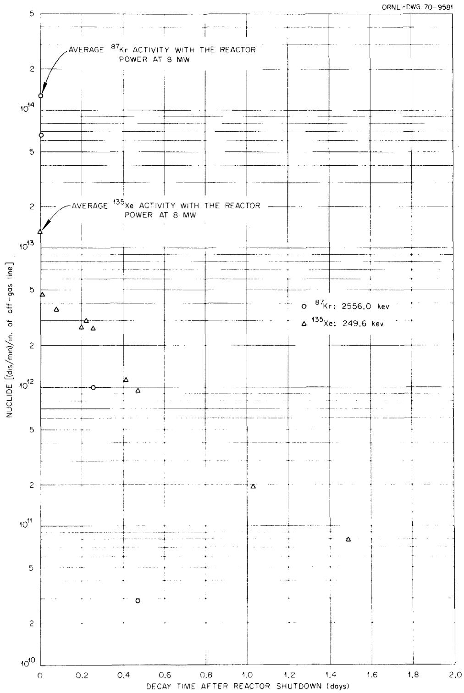  
Fig. 7.5. Activity of $^{87}\mathrm{Kr}$ and $^{135}\mathrm{Xe}$ after reactor shutdown in the jumper line of MSRE main off-gas line (November shutdown).

Krypton-88-Rubidium-88 (Fig. 7.6). There is a similar rapid activity decrease with ${}^{88}\mathrm{Kr}$ ; the ${}^{89}\mathrm{Rb}$ activity decreases almost at the same rate as ${}^{88}\mathrm{Kr}$ .

Strontium-91 (Fig. 7.7). This nuclide is a decay product of the $^{91}\mathrm{Kr}$ chain. The decrease in activity fits the decay half-life well, which would confirm its identification. Extrapolated back to zero time, one can estimate its maximum activity to be $0.20 \times 10^{13}$ dis min $^{-1}$ in. $^{-1}$ . This extrapolation seems reasonable if one considers the short decay half-life of its precursors.

Niobium-97. This nuclide was identified only a few times directly after reactor shutdown. Its activity was in the order of $10^{14}$ dis $\min^{-1}$ in.

Molybdenum-99 (Fig. 7.6). Although a few of the data appear somewhat too low, most of the activity results decrease according to the $^{99}\mathrm{Mo}$ decay half-life. From the actual survey of the jumper line, we estimated the $^{99}\mathrm{Mo}$ at the moment of shutdown to be $0.33 \times 10^{14}$ . The activities plotted in the figure agree well with this estimate.

Ruthenium-105-Rhodium-105 (Fig. 7.8). The calculated activity of $^{105}\mathrm{Ru}$ is deduced from two of its photopeaks; these agree well. The decay of the activity conforms very well to the literature data for its decay half-life. Extrapolated back to reactor shutdown time, the estimated maximum $^{105}\mathrm{Ru}$ activity is $0.34 \times 10^{13}$ dis min $^{-1}$ in $^{-1}$ .

The daughter nuclide, $^{105}\mathrm{Rh}$ , is rather difficult to identify because its photopeaks are not very prominent and are close to peaks from other nuclides; one might expect erroneous results. The maximum $^{105}\mathrm{Rh}$ activity is approximately 0.8 x $10^{13}$ dis min $^{-1}$ in $^{-1}$ . The amount of $^{105}\mathrm{Rh}$ present in the off-gas line could be due to the buildup from the decaying $^{105}\mathrm{Ru}$ as well as from the separate mechanism of $^{105}\mathrm{Rh}$ separation from the salt.

Antimony-129-Tellurium-129m (Fig. 7.9). In a few spectra we could identify $^{129}\mathrm{Sb}$ ; the lack of dependable nuclear data (decay scheme and abundance of its gamma rays) made it impossible, however, to assign an activity to this nuclide.

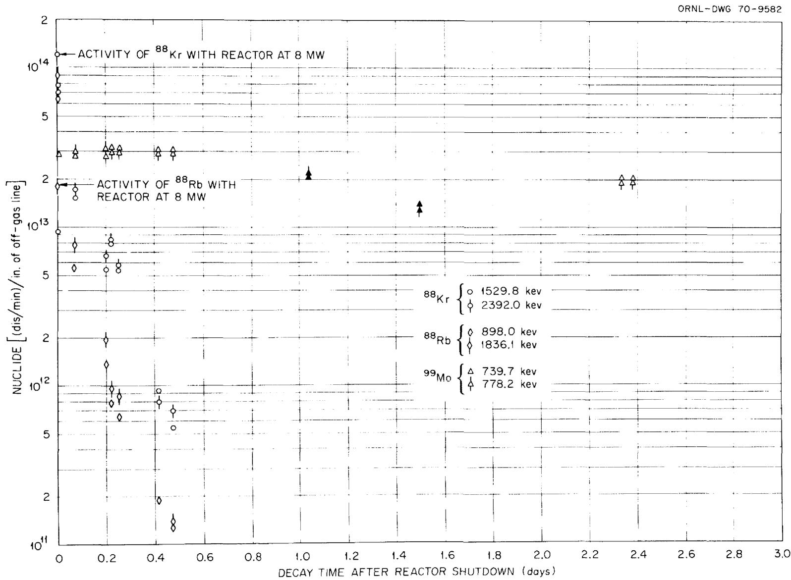  
Fig. 7.6. Activity of $^{88}\mathrm{Kr}$ , $^{88}\mathrm{Rb}$ , and $^{99}\mathrm{Mo}$ in the jumper line of the MSRE main off-gas line (November shutdown).

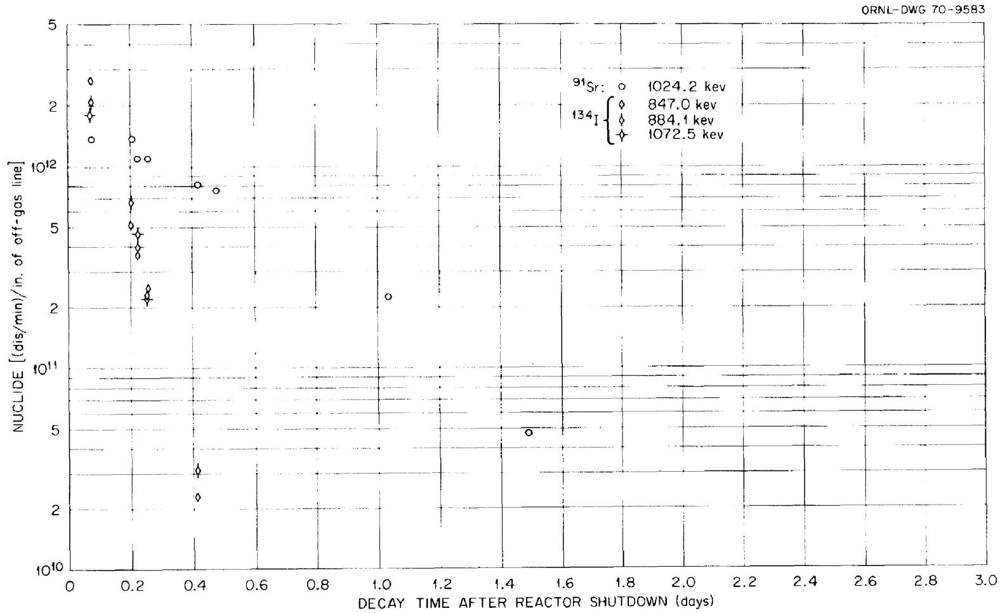  
Fig. 7.7. Activity of $^{91}\mathrm{Sr}$ and $^{134}\mathrm{I}$ in the jumper line of the MSRE main off-gas line (November shutdown).

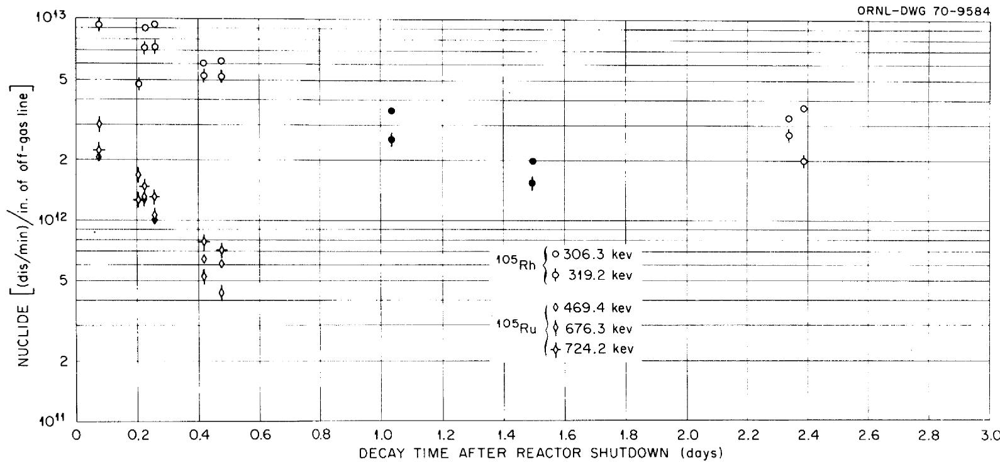  
Fig. 7.8. Activity of $^{105}\mathrm{Rh}$ and $^{105}\mathrm{Ru}$ in the jumper line of the MSRE main off-gas line (November shutdown).

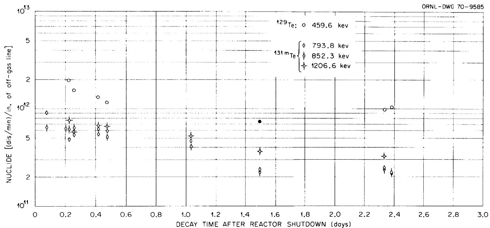  
Fig. 7.9. Activity of $^{129}\mathrm{Te}$ and $^{131m}\mathrm{Te}$ after reactor shutdown in the jumper line of the MSRE main off-gas line (November shutdown).

Tellurium-129m was detected by its decay from the isomeric state to the ground state and the subsequent disintegration of the ground state. We identified $^{129}$ Te primarily by the most abundant photopeak of the $^{129}$ Te daughter at 459.6 keV.

In the decay of $^{129}\mathrm{Sb}$ , the branching ratio is 85% to the ground state, $^{129}\mathrm{Te}$ , and 15% to the metastable state, $^{129}\mathrm{Te}$ . Since the half-life of $^{129}\mathrm{Te}$ itself is short, the decay of its 459.6-keV photopeak should, after a short time, follow a composite of the decay half-lives of $^{129}\mathrm{Sb}$ and $^{129}\mathrm{Te}$ . Figure 7.9 shows the activity related to $^{129}\mathrm{Te}$ .

The low yield of only $7.7\%$ for the 459.6-keV photopeak in the decay of ${}^{129}\mathrm{Te}$ implies also that any experimental scatter is amplified by more than a factor of 13 for the activity calculation. This would, of course, explain the state of the results.

The $^{129}\mathrm{m}$ Te activity can be deduced from Fig. 7.9; this activity extrapolated to zero time agrees reasonably with the estimate of Section 7.6.1. The initial faster decrease of activity of $^{129}\mathrm{Te}$ , with a half-life of about 5 hr, could possibly be attributed to the $^{129}\mathrm{Sb}$ decay.

Tellurium-131m (Fig. 7.9). Based on the results from three $^{131}m$ Te photopeaks, the activity of this nuclide could be well established. Its identification was confirmed by the decay half-life as deduced from Fig. 7.9. Extrapolated back to reactor shutdown time, the estimated maximum activity of $^{131}m$ Te is $0.75 \times 10^{12}$ dis min $^{-1}$ in. $^{-1}$ . The maximum activity calculated by extrapolation to reactor shutdown time is acceptable since one can discount the effects of an eventual $^{131}Sb$ decay. Only a few photopeaks in the different spectra could be identified as $^{131}Te$ ; these results were too sporadic for any interpretation.

Iodine-131 (Fig. 7.10). With the exception of two sets of data (1.04 and 1.49 days after shutdown), the results are in good agreement. It appears that the maximum activity occurs shortly after reactor shutdown time. This maximum activity is $0.5 \times 10^{13}$ dis min $^{-1}$ in $^{-1}$ , somewhat lower than the best estimate (Sect. 7.6.1) of the jumper line survey. It might be explained by the influence of the decaying $^{131m}Te$ . Another argument is that $^{131}I$ might "evaporate" or transfer from the hot, empty fuel system and settle in the off-gas line (see Chap. 8).

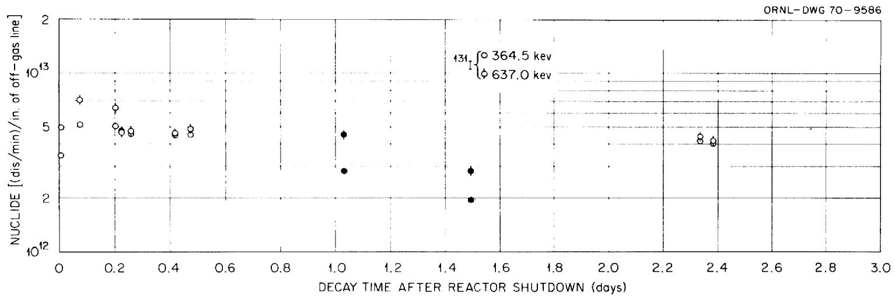  
Fig. 7.10. Activity of $^{131}\mathrm{I}$ after reactor shutdown in the jumper line of the MSRE main off-gas line (November shutdown).

Tellurium-132-Iodine-132 (Fig. 7.11). There is considerable scatter of both the $^{132}\mathrm{Te}$ and $^{132}\mathrm{I}$ results in the first hours after reactor shutdown. During the first 10 hr, disintegration rates vary between $0.45 \times 10^{13}$ and $1.3 \times 10^{14}$ dis min $^{-1}$ in. $^{-1}$ . Since three $^{132}\mathrm{I}$ photopeaks seem to yield consistent activities among each other, one has to accept apparently an extra increase of $^{132}\mathrm{I}$ activity after shutdown. This cannot be explained from the decay of $^{132}\mathrm{Te}$ and $^{132}\mathrm{I}$ alone. This surge in activity could be conveniently explained if it is assumed that some of the $^{132}\mathrm{I}$ formed by decay of $^{132}\mathrm{Te}$ in the hot, empty fuel system transfers to the off-gas line along with the circulating purge-gas flow. An extrapolation to reactor shutdown time, based on the data taken after 2.3 days and taking into account an equilibrium condition between $^{132}\mathrm{Te}$ and $^{132}\mathrm{I}$ , yields $0.67 \times 10^{13}$ dis min $^{-1}$ in. $^{-1}$ , in agreement with the estimate in Sect. 7.6.1 (0.65 x $10^{13}$ ). However, if one admits a transfer of iodine to the off-gas line, a maximum $^{132}\mathrm{I}$ activity of $0.12 \times 10^{14}$ dis min $^{-1}$ in. $^{-1}$ can be expected.

Iodine-133 (Fig. 7.12). The results are in reasonable agreement with the $^{133}\mathrm{I}$ decay half-life. The activities calculated during the first 6 hr seem to be low, which might again indicate that some transfer of $^{133}\mathrm{I}$ occurs from the reactor system to the off-gas line after reactor shutdown time.

Taking into account an equilibrium condition of Te-I, and the possible iodine transfer, it is estimated that the maximum $^{133}\mathrm{I}$ activity after reactor shutdown is 0.17 x $10^{13}$ dis min $^{-1}$ in. $^{-1}$ .

Iodine-134 (Fig. 7.7). The later spectra yield activities that are in very good agreement with the expected decay half-life value. It is estimated that the maximum $^{134}\mathrm{I}$ activity after reactor shutdown is in the order of 0.30 to 0.40 x $10^{13}$ dis min $^{-1}$ in. $^{-1}$ .

Xenon-135 (Fig. 7.5). Again there is a rapid decrease in activity directly after reactor shutdown which might be explained by the different circumstances related to the stoppage of the fuel pump and the drain. Even several hours after reactor shutdown and drain, the $^{135}\mathrm{Xe}$ activity is still appreciable.

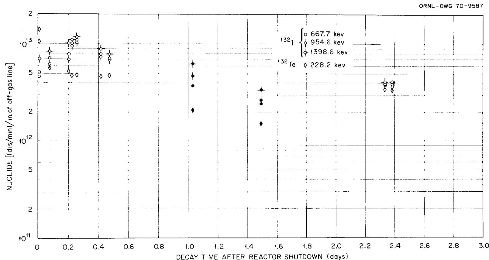  
Fig. 7.11. Activity of $^{132}\mathrm{Te}$ and $^{132}\mathrm{I}$ measured after reactor shutdown at the jumper line of the MSRE off-gas line (November shutdown).

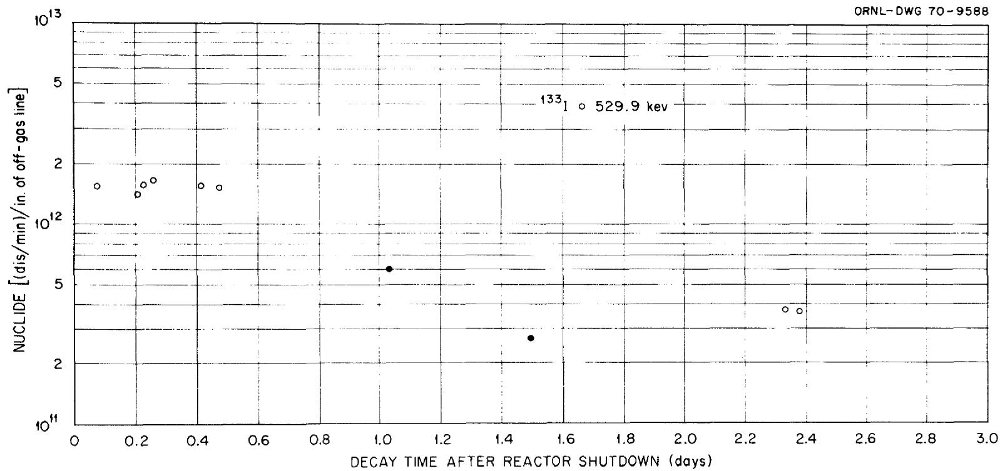  
Fig. 7.12. Activity of $^{133}\mathrm{I}$ after reactor shutdown in the jumper line of the MSRE main off-gas line (November shutdown).

# 7.5.2 Heat exchanger

With the reactor at full power, the radiation coming through the shield plug hole over the heat exchanger was too high to record any spectra. The main problem was that the setup of the collimator with detector caused such a high dose rate of scattered radiation during the alignment procedure that it was judged unwise to continue as long as the reactor was at power. Had the collimator and detector been set up and aligned before the reactor was at power, we could have recorded spectra; however, we found in later experiments that spectra taken over the heat exchanger with the reactor at full power could not be analyzed anyhow because of too many peaks.

This situation also prevented the recording of heat exchanger spectra until the collimator was properly aligned after the drain. Thus we lost almost three valuable hours of recording.

With our location equipment we determined the position of the shield plug hole and hence could relate the calculated activities found from the spectra through the shield plug hole with those deduced from the actual survey afterward. All calculated activities were normalized by comparing the $^{95}\mathrm{Nb}$ calculated from a spectrum taken through the shield plug hole and that actually found during the survey (Sect. 7.6.2). We used $0.93 \times 10^{11}$ dismin $^{-1}$ cm $^{-2}$ as the normalizing activity for $^{95}\mathrm{Nb}$ at this location. All activities given below are calculated at counting time and are expressed in disintegrations per minute per square centimeter of heat exchanger tube surface.

In view of our calibration methods, it should be noted that the activities of gaseous fission products, which are obviously in the space in the shell side of the heat exchanger, are expressed in equivalent disintegrations per minute per square centimeter of heat exchanger tube.

Krypton-88-Kubidium-88 (Fig. 7.13). Even 3 hr after reactor shutdown, the ${}^{88}\mathrm{Kr}$ and ${}^{88}\mathrm{Rb}$ activities are still appreciable. Comparing the krypton and rubidium activities, it appears that these nuclides are close to an equilibrium condition.

Strontium-91. A few spectra indicate the presence of $^{91}\mathrm{Sr}$ , with its photopeak at 1024.3 keV. Since we found $^{88}\mathrm{Kr}$ , one might, by the same token, expect decay products of $^{91}\mathrm{Kr}$ . The data were too sporadic to really indicate an average activity; 10 hr after reactor shutdown, a few spectra

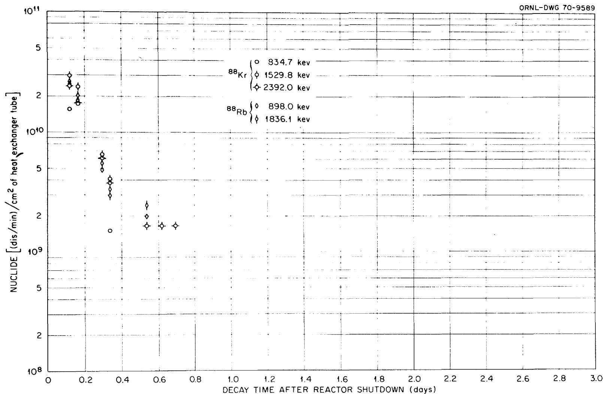  
Fig. 7.13. Activity of $^{88}\mathrm{Kr}$ and $^{88}\mathrm{Rb}$ after reactor shutdown in the MSRE primary heat exchanger (November shutdown).

indicated a $^{91}\mathrm{Sr}$ activity of approximately 0.15 x $10^{10}$ dis min $^{-1}$ cm $^{-2}$ (not extrapolated back to zero time).

Niobium-97 (Fig. 7.14). This nuclide has only one strong photopeak (658 keV), which makes it hard to assign much confidence to its identity, especially since many other peaks in these spectra are located very close to it. The fact that the observed photopeak decayed with a half-life of 108 min indicates there was interference in measuring the peak. We believe, however, that this decay rate is sufficiently close to the accepted half-life (78 min) to justify the peak's assignment to $^{97}\mathrm{Nb}$ .

Extrapolation to reactor shutdown time is acceptable, since its precursor $\left(^{97}\mathrm{Zr}\right)$ was not identified in the heat exchanger. The estimated maximum activity at zero time is $0.6 \times 10^{11}$ dis $\min^{-1} \mathrm{~cm}^{-2}$ .

Molydenum-99 (Fig. 7.14). Judging from the plots of different spectra, we have more confidence in the activities yielded by the 739.7-keV photopeak than in those from the 778.2-keV peak. The latter is located very close to a large $^{132}\mathrm{I}$ and $^{95}\mathrm{Nb}$ peak; this would make the activity calculation somewhat doubtful, especially since other short-lived isotopes also have peaks in that energy range.

The activities yielded by the 739.7-keV peak are rather consistent and in good agreement with the results of the actual survey afterward. The estimated maximum activity at reactor shutdown time is $0.18 \times 10^{12}$ dis $\min^{-1} \mathrm{~cm}^{-2}$ .

Ruthenium-105-Rhodium-105 (Fig. 7.15). It appears difficult to evaluate exactly what the activities of these two nuclides are. One would expect that ${}^{105}\mathrm{{Ru}}$ and ${}^{105}\mathrm{{Rh}}$ behave approximately the same.

The three $^{105}\mathrm{Ru}$ photopeaks (469.4, 676.3, and 724.2 keV) decay with a half-life close to that of $^{105}\mathrm{Ru}$ . The first two peaks, however, yield a nuclide activity almost half that from the third peak. The activity deduced from the first two peaks at reactor shutdown time would be $0.3 \times 10^{11}$ dis min $^{-1}$ cm $^{-2}$ ; that from the 724.2-keV photopeak would be $0.46 \times 10^{11}$ dis min $^{-1}$ cm $^{-2}$ . It is very well possible that our nuclear data are not correct for this isotope.

The scatter of the $^{105}\mathrm{Rh}$ activity results is even worse. Especially during the first hours after shutdown, the 319.2-keV peak indicates a high activity; these possible aberrations might be due to photopeaks from other nuclides, which could cause this overestimate.

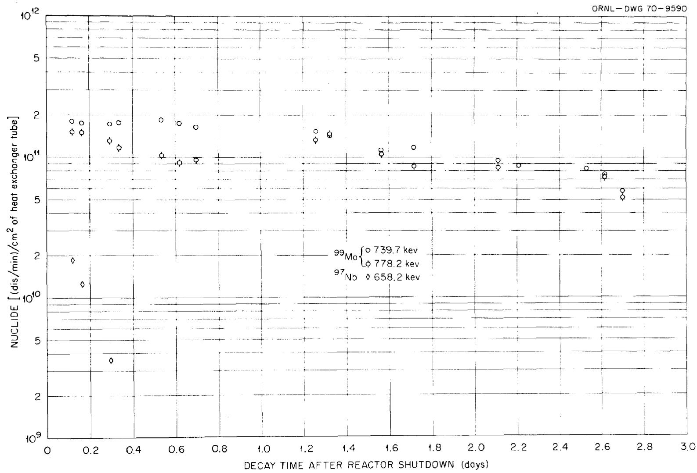  
Fig. 7.14. Activity of $^{97}\mathrm{Nb}$ and $^{99}\mathrm{Mo}$ after reactor shutdown in the MSRE primary heat exchanger (November shutdown).

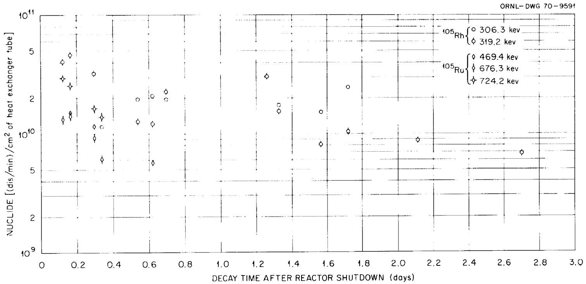  
Fig. 7.15. Activity of $^{105}\mathrm{Rh}$ and $^{105}\mathrm{Ru}$ after reactor shutdown in the MSRE primary heat exchanger (November shutdown).

Based on activities deduced from later spectra, we might conclude the maximum $^{105}\mathrm{Rh}$ activity would be in the range of 0.4 x $10^{11}$ dis/cm $^2$ .

Antimony-129-Tellurium-129-Tellurium-129m (Fig. 7.16). Since several other antimony isotopes are known to be present on the metal surfaces of the heat exchanger, there is no apparent reason why $^{129}\mathrm{Sb}$ should not be present too. The problem is that the decay scheme of this nuclide is not known with certainty; some of its gamma rays are indicated in the literature, but their reported abundances are doubtful.

We believe we have identified $^{129}\mathrm{Sb}$ by one of its photopeaks (1028 keV) and by its decay half-life; but, due to lack of data on the branching ratio for this gamma ray, we did not calculate the disintegration rate of $^{129}\mathrm{Sb}$ . The photon emission rate of this gamma ray at reactor shutdown time was $0.90 \times 10^{10}$ photons $\mathrm{min}^{-1} \mathrm{cm}^{-2}$ .

As reported in Section 7.5.1, we identified $^{129}\mathrm{mTe}$ primarily by the 459.6-keV peak from the decay of $^{129}\mathrm{Te}$ . The intensity of the 459.6-keV (and 1084.0-keV) peak would reflect the decay of $^{129}\mathrm{Sb}$ , $^{129}\mathrm{Te}$ , and $^{129}\mathrm{mTe}$ .

Figure 7.16 shows the $^{129}\mathrm{Te}$ activity based on the 459.6- and 1084.0-keV photopeaks. The absolute abundances of these peaks per decay of $^{129}\mathrm{Te}$ (ground state) are taken as 7.7 and $0.6\%$ respectively. In the same figure is shown the photon emission rate of $^{129}\mathrm{Sb}$ for its 1028-keV peak.

Tellurium-131m (Fig. 7.17). Even if $^{131}\mathrm{Sb}$ would deposit on metal surfaces, the maximum $^{131}\mathrm{Te}$ activity would occur, because of the short $^{131}\mathrm{Sb}$ half-life, very soon after reactor shutdown time; hence an extrapolation to zero time for the maximum activity seems justified. The 1206.6-keV photopeak appears the least influenced by other peaks and should be considered the most trustworthy. Our estimate of the maximum $^{131}\mathrm{Te}$ activity is $0.73 \times 10^{11}$ dis min $^{-1}$ cm $^{-2}$ .

Iodine-131 (Fig. 7.18). Based on the chemical properties of iodine, there is ample reason to believe that iodine remains with the fuel salt. This was confirmed by gamma-ray spectra taken in a later stage of the experiment. This would mean that any iodine detected came from the decay of either antimony or tellurium.

The half-lives of $^{131}\mathrm{Sb}$ and $^{131}\mathrm{Te}$ are so short that the buildup of $^{131}\mathrm{I}$ from these nuclides could not be observed. The formation of iodine

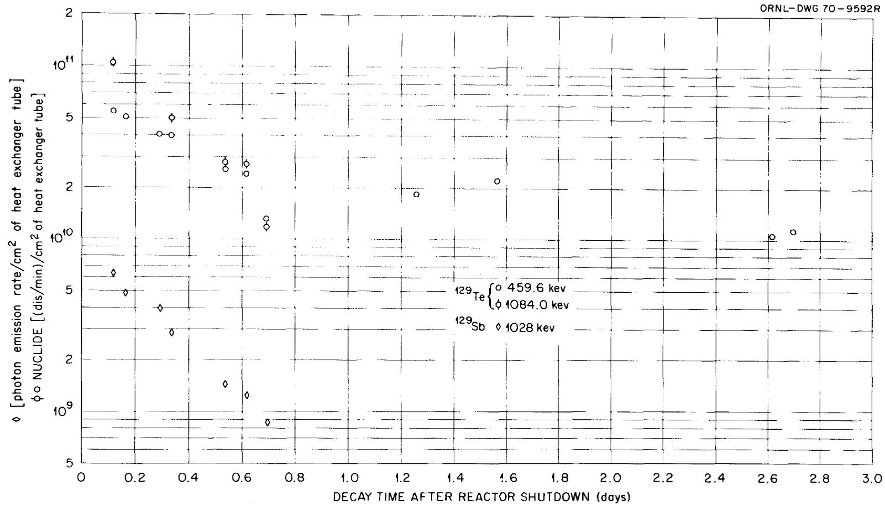  
Fig. 7.16. Activity of $^{129}\mathrm{Te}$ and photon emission rate of $^{129}\mathrm{Sb}$ measured after reactor shutdown in the MSRE primary heat exchanger (November shutdown).

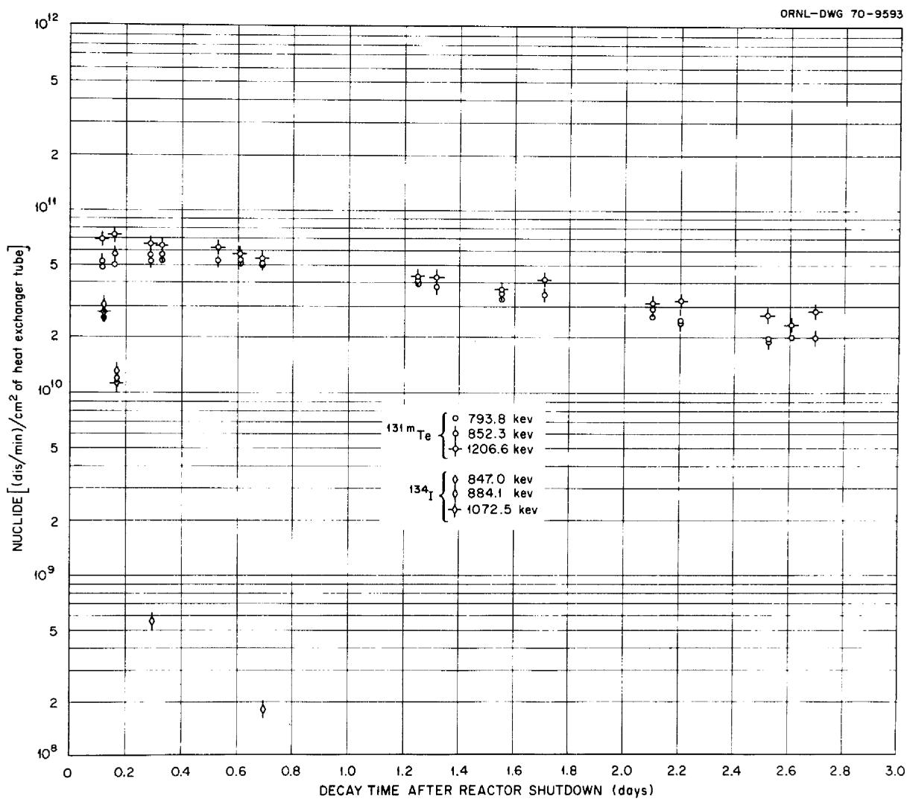  
Fig. 7.17. Activity of $^{131}\mathrm{Te}$ and $^{134}\mathrm{I}$ after reactor shutdown in the MSRE primary heat exchanger (November shutdown).

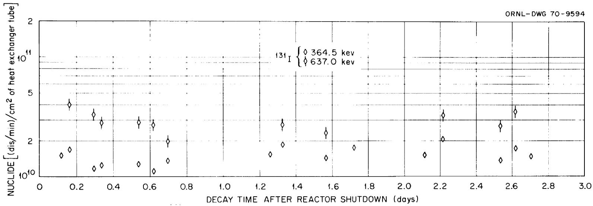  
Fig. 7.18. Activity of $^{131}\mathrm{I}$ after reactor shutdown in the MSRE primary heat exchanger (November shutdown).

from the decay of $^{131}\mathrm{mTe}$ , in the case that primarily $^{131}\mathrm{Sb}$ deposits on the metal surfaces, presents only a few percent of the total iodine activity and is difficult to observe. A simple extrapolation to reactor shutdown time to obtain the maximum $^{131}\mathrm{I}$ activity would then mean a very small overestimation because of this decay of $^{131}\mathrm{mTe}$ .

In case tellurium rather than antimony deposits, the overestimation would be much higher, in the order of $60\%$ , because of the slow decay of ${}^{131}\mathrm{m}_{\mathrm{Te}}$ .

There is a fair degree of scatter in the calculated activities. The estimated maximum activity of $^{131}\mathrm{I}$ would be approximately $0.24 \times 10^{11}$ dis $\min^{-1} \, \mathrm{cm}^{-2}$ and is based on the average of the 364.5- and 636.9-keV photopeaks. This conforms with the results of the actual survey by extrapolating those back to reactor shutdown time. The evolution of the iodine activity is considered in more detail in Chapter 8.

Tellurium-132-Iodine-132 (Fig. 7.19). For the calculation of the maximum $^{132}\mathrm{Te}$ activity, a simple extrapolation to reactor shutdown is justified. Even if it is the tellurium precursor, $^{132}\mathrm{Sb}$ , that plates out on the metal surfaces, the latter decay half-life is so short that this would justify the assumption. The maximum $^{132}\mathrm{Te}$ activity is approximately 0.40 x $10^{12}$ dis min $^{-1}$ cm $^{-2}$ .

The iodine activity is expected to grow in from the tellurium decay; that is, its maximum activity should occur about 9 to 10 hr after reactor shutdown. The observed $^{132}\mathrm{I}$ activities do not agree with this. Its activity went down again after 5 hr and then after 20 hr or more finally came into equilibrium with its precursor. The excess of $^{132}\mathrm{I}$ in the main off-gas line at about the same time period might indeed point to the transfer of iodine from the reactor system to the off-gas line. Because of this temporary deficiency in the heat exchanger, the maximum $^{132}\mathrm{I}$ activity occurs some 24 hr after shutdown time and amounts to 0.34 x $10^{12}$ dis min $^{-1}$ cm $^{-2}$ .

Iodine-133 (Fig. 7.20). The $^{133}\mathrm{I}$ activity seems to decrease faster than can be explained from decay only (transfer!). Taking into account the decay of its precursor, the maximum $^{133}\mathrm{I}$ might be expected to be below $0.20 \times 10^{11}$ dis $\min^{-1}$ cm $^{-2}$ (before its apparent transfer).

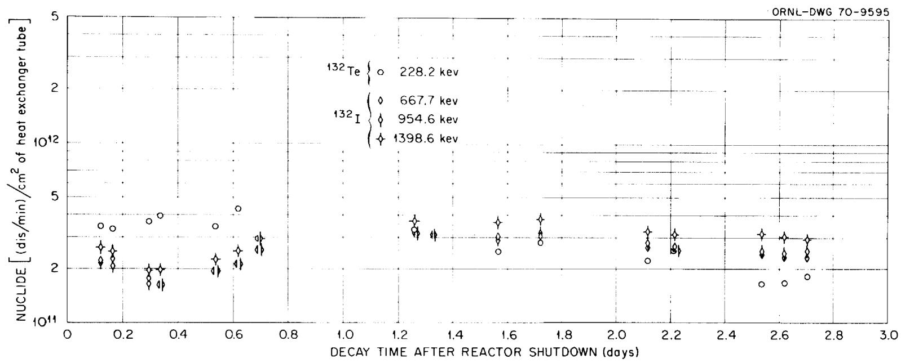  
Fig. 7.19. Activity of $^{132}\mathrm{Te}$ and $^{132}\mathrm{I}$ after reactor shutdown in the MSRE primary heat exchanger (November shutdown).

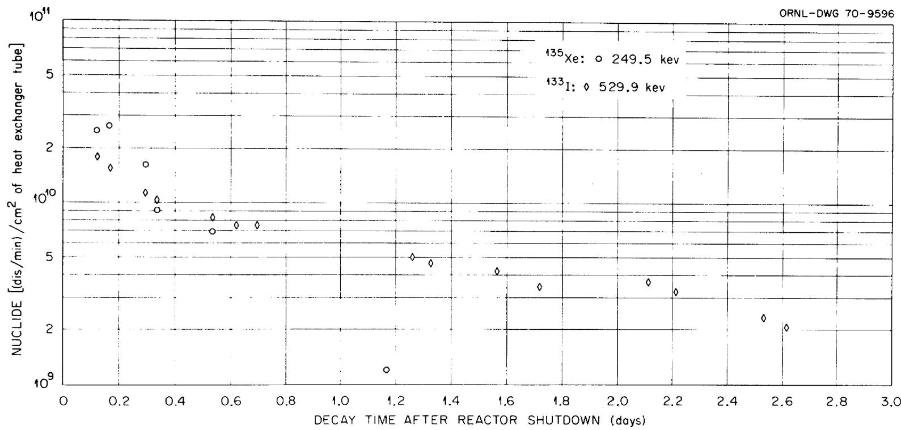  
Fig. 7.20. Activity of $^{133}\mathrm{I}$ and $^{135}\mathrm{Xe}$ after reactor shutdown in the MSRE primary heat exchanger (November shutdown).

Iodine-134 (Fig. 7.17). The maximum $^{134}\mathrm{I}$ activity might be expected to be around 0.30 to 0.60 x $10^{11}$ dis min $^{-1}$ cm $^{-2}$ if one takes into account that $^{134}\mathrm{I}$ is on the metal walls only as a decay product of tellurium.

Xenon-135 (Fig. 7.20). The presence of xenon in the reactor system is ample and in the first hours after reactor shutdown forms an important activity source. Its maximum activity might, at that time, run as high as 0.30 to $0.40 \times 10^{11}$ dis $\mathrm{min}^{-1} \mathrm{~cm}^{-2}$ . The decrease in activity is obviously due to decay and purging of the system.

# 7.5.3 Drain tank

Several spectra were taken from one drain tank after reactor shutdown. These spectra were recorded through the hole in the shield plugs over the drain tank. There was no possibility for calibration of the results or even for proper alignment. By moving the detector in small amounts back and forth, we tried to obtain a maximum activity reading.

All data, of course, had to be normalized to have a basis for comparison. We chose the 724.2-keV photopeak of $^{95}\mathrm{Zr}$ , extrapolated back to reactor shutdown time. This appeared to be the most convenient normalization point, since zirconium is supposed to remain with the salt and will be at its maximum activity very shortly after reactor shutdown time because of its short-half-life precursors.

The spectra were taken primarily to check the evolution of the niobium activity. However, there were some other interesting observations too.

Since we were not entirely sure about the location of the place on the drain tank from which spectra were taken or the amount of shielding materials (flanges, drain-tank vessel, steam drum, etc.), we will report only on relative results of nuclides having photopeaks close to each other in the energy range of 600 to $800\mathrm{keV}$ .

Table 7.5 indicates the evolution of the ratio of the $^{95}\mathrm{Nb}$ to $^{95}\mathrm{Zr}$ and the $^{97}\mathrm{Nb}$ to $^{97}\mathrm{Zr}$ activity. The $^{95}\mathrm{Zr}$ activity is based on the average of the photopeaks at 724.2 and 756.9 keV. The $^{95}\mathrm{Nb}$ , $^{97}\mathrm{Nb}$ , and $^{97}\mathrm{Zr}$ activities are based on the 765.8-, 658.2-, and 743.4-keV photopeaks respectively. The $^{97}\mathrm{Nb}/^{97}\mathrm{Zr}$ ratio is not of great value for analysis, since any $^{97}\mathrm{Nb}$ identified is formed in the drain tank in our case. (Any $^{97}\mathrm{Nb}$ in the salt that

Table 7.5. Ratio of $^{95}\mathrm{Nb}$ to $^{95}\mathrm{Zr}$ and $^{97}\mathrm{Nb}$ to $^{97}\mathrm{Zr}$ activity in relation to decay time after reactor shutdown in November   
Activities at counting time were used; no extrapolation to reactor shutdown time   

<table><tr><td>Decay time after reactor shutdown (days)</td><td>95Nb/95Zr</td><td>97Nb/97Zr</td></tr><tr><td>0.872</td><td>0.78</td><td>0.97</td></tr><tr><td>0.971</td><td>0.79</td><td>0.99</td></tr><tr><td>1.982</td><td>0.61</td><td>0.97</td></tr><tr><td>2.797</td><td>0.62</td><td>1.02</td></tr><tr><td>2.873</td><td>0.65</td><td></td></tr><tr><td>3.920</td><td>0.97</td><td></td></tr><tr><td>4.900</td><td>1.55</td><td></td></tr><tr><td>7.780</td><td>2.07</td><td></td></tr><tr><td>8.893</td><td>1.98</td><td></td></tr><tr><td>11.904</td><td>2.30</td><td></td></tr><tr><td>11.963</td><td>2.30</td><td></td></tr><tr><td>15.885</td><td>2.65</td><td></td></tr><tr><td>16.907</td><td>2.89</td><td></td></tr></table>

drained from the reactor would have decayed before these spectra were taken.) It is, however, a good check on the credibility of the $^{95}\mathrm{Nb}/^{95}\mathrm{Zr}$ data.

The $^{95}\mathrm{Nb}/^{95}\mathrm{Zr}$ ratios do not appear to indicate the real activity ratio in the salt itself. If we consider all of the $^{95}\mathrm{Zr}$ and $^{95}\mathrm{Nb}$ in the reactor system (regardless of location), the maximum value for this activity ratio is 1.0, immediately after shutdown. In view of the $^{95}\mathrm{Nb}$ deposits in the primary loop, the activity ratio in the drain tank would be expected to be appreciably smaller, unless the detection efficiency for $^{95}\mathrm{Nb}$ were somehow enhanced. One explanation might be that the $^{95}\mathrm{Nb}$ concentration near the salt surface is much higher than the average in the salt.

The first spectra taken after reactor shutdown (after about 0.800 day of decay) revealed the strongest activities to be due to $^{88}\mathrm{Kr}(\mathrm{Rb})$ and $^{135}\mathrm{Xe}$ . Besides the nuclides expected to be with the salt, such as yttrium, zirconium, cesium, cerium, and barium-lanthanum, there were also some unexpected observations. For example, we did not detect any molybdenum, antimony, or tellurium; the amount of ruthenium present (both $^{103}\mathrm{Ru}$ and $^{106}\mathrm{Ru}$ ) was very small. Molybdenum-99 has several photopeaks by which it could be identified; none of these peaks was present. This would indicate that the $^{99}\mathrm{Mo}$ activity has to be at least a factor of 100 smaller than the $^{95}\mathrm{Zr}$ activity. The same holds true for all the tellurium isotopes; neither the relatively short-lived $^{131}\mathrm{mTe}$ nor the longer-lived $^{129}\mathrm{mTe}$ could be identified. A further confirmation of the absence of tellurium was the fact that we could not identify $^{132}\mathrm{I}$ . Since $^{132}\mathrm{I}$ has a 2.3-hr half-life, this would then indicate the absence of the longer half-lived $^{132}\mathrm{Te}$ . Especially the absence of $^{132}\mathrm{I}$ is an important proof because this nuclide can be identified more easily than any other nuclide in a gamma-ray spectrum. (We did identify in the drain tank all longer half-life iodines such as $^{131}\mathrm{I}$ , $^{133}\mathrm{I}$ , and $^{135}\mathrm{I}$ .)

As in the case of molybdenum, the activity of antimony, tellurium, or $^{132}$ I had to be at least a factor of 100 smaller than the $^{95}$ Zr activity to go unidentified in these spectra. Table 7.6 shows the major nuclides identified at various times after reactor shutdown. There were several peaks in the spectra that could not be identified, probably due to the $^{232}$ U chain decay products.

Table 7.6. Major nuclides identified in fuel salt in the drain after November shutdown   

<table><tr><td>88Kr(Rb)</td><td>133I</td></tr><tr><td>91Sr</td><td>135I</td></tr><tr><td>95Zr</td><td>135Xe</td></tr><tr><td>95Nb</td><td>137Cs</td></tr><tr><td>97Zr</td><td>140Ba(La)</td></tr><tr><td>97Nb</td><td>141Ce</td></tr><tr><td>103Ru (very small activity)</td><td>143Ce</td></tr><tr><td>106Ru(Rh) (very small activity)</td><td>144Ce(Pr)</td></tr><tr><td>131I</td><td></td></tr></table>

# 7.6 Group G Spectra

These spectra were recorded during the November shutdown period on the heat exchanger, the main off-gas line, and the fuel lines. The portable maintenance shield was used for the survey.

The results presented in this section are those we were really looking for. The data recorded in July were useful for the analysis of the long-half-life nuclides, and, above all, it served as a very profitable shakedown of the equipment. It should be borne in mind that all results are extrapolated to reactor shutdown time by simple exponential techniques. The reason for this extrapolation was to compare results from spectra taken at different times. This extrapolation might yield, however, a maximum activity value for some isotopes that is too high because of the decay of a precursor nuclide. For example, the extrapolated value of $^{131}\mathrm{I}$ might be too high by a few percent because of the decay of $^{131}\mathrm{mTe}$ . We will discuss this in detail in Chapter 8.

Although the analyzer broke down about 24 hr before this planned reactor shutdown and drain, everything was made operational in time. The

spectra recorded through the shield plug holes in the first two days after the reactor shutdown while the portable maintenance shield (PMS) was being set up are reported in Section 7.5. The reactor shutdown and drain occurred on November 2, 1969, at 1441 hr.

Never before was the PMS installed so soon after a reactor drain. However, this did pose some problems: the radiation coming from the open reactor cell was considerable, and extra precautions had to be taken in installing the PMS at the location where the two lower shield plugs had been removed. However, no one received a radiation dose above the permitted level. During every day shift, the PMS was installed over a different part of the heat exchanger (or from time to time over the jumper line of the main off-gas line); spectra were then taken during the evening and night shifts. As reported earlier, we could scan with one PMS setup approximately 35 in. along the longitudinal axis of the heat exchanger or the whole length of off-gas jumper line.

Spectra were taken at intervals of 1 to 2 in. along the heat exchanger axis and 1 in. along the length of the jumper line. Based on our previous experience, we judged it worthwhile to increase the real counting time to 800 sec per spectrum. This proved to be advantageous for the counting statistics and allowed us to identify smaller peaks better. Once a 35-in. scan was finished, we set the detector over a specific spot and recorded several long counts of 10,000 sec real counting time for an even better analysis of the nuclides present. These long counts were continued until the day shift was ready to move the PMS to the next position.

The entire survey along the length of the heat exchanger was done twice. Several areas were scanned a third time; the off-gas jumper line was scanned three times. No transverse scans were made over the heat exchanger. It took approximately three weeks to finish the complete survey.

It is worthwhile to note that spectra taken of the same spot but at different times after reactor shutdown did, in general, yield values that were very similar; this gives some confidence in the results obtained.

There were two series of spectra that gave higher nuclide activity results. These were taken with the 1/16-in. hole collimator insert at the very beginning of the survey. We estimate that these slightly higher results were due to two problems:

1. The 1/16-in. hole in the collimator was far from straight and proved to be difficult to calibrate in relation to the 1/8-in. hole collimator; its calibration value, hence the detector system efficiency curve for this case, might have been somewhat in error.   
2. The cacophony of nuclide photopeaks shortly after reactor shutdown was such that it was obvious that photopeaks from several shorter- and longer-half-life nuclides fell on top of each other, thus causing the computer analysis program to overestimate some nuclide activities. As much care as possible was taken to ensure that the activity calculation considered only those photopeaks that had little or no interference from other peaks. This was, however, not always possible for the spectra taken in the early stages of the survey.

# 7.6.1 Heat exchanger

About 241 spectra were taken along the longitudinal axis of the heat exchanger. With a few exceptions, all could be analyzed successfully. The spectra taken over the heater connector boxes were discarded; the extra amount of shielding material that was obviously present attenuated the gamma rays too much to allow intelligible conclusions from those spectra. The results are presented per nuclide and in disintegrations per minute per square centimeter of heat exchanger tube. Data in which we have less confidence because of the above reasons are indicated in the figures as open circles.

Niobium-95 (Fig. 7.21). As was also found from the spectra taken in July 1969, there appears to be an increase of activity near the baffle plates. There was a good agreement between the data taken in July 1969 and those in November 1969. All results were based on the single $^{95}\mathrm{Nb}$ photo-peak of $765.8\mathrm{keV}$ . The range of activity is 0.090 to $0.27\times 10^{12}$ dis $\min^{-1}\mathrm{cm}^{-2}$ .

Molybdenum-99 (Fig. 7.22). Because of the relatively short half-life of $^{99}\mathrm{Mo}$ , a large portion had decayed before we could survey the whole heat exchanger. There is, however, ample reason to believe that molybdenum would deposit all over the heat exchanger.

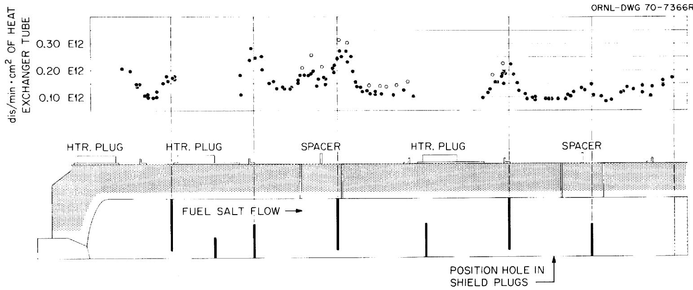  
Fig. 7.21. Activity of $^{95}\mathrm{Nb}$ at reactor shutdown on November 2, 1969, in the MSRE heat exchanger.

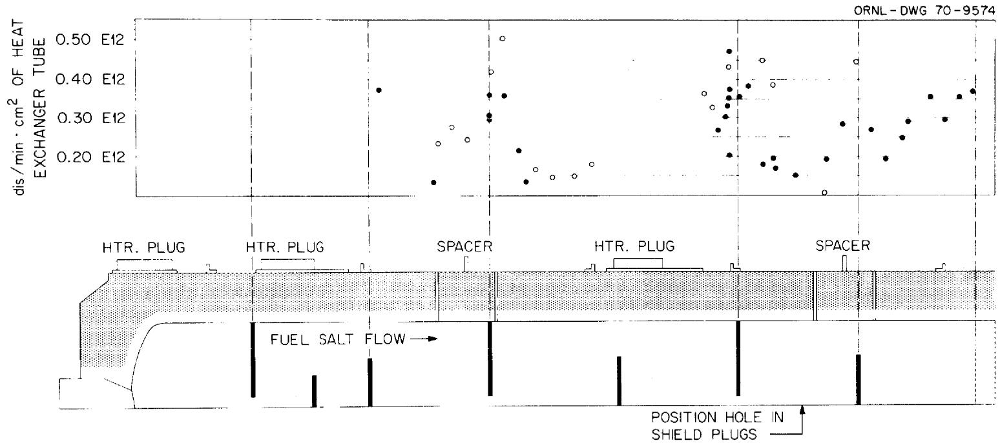  
Fig. 7.22. Activity of $^{99}\mathrm{Mo}$ at reactor shutdown on November 2, 1969, in the MSRE heat exchanger.

Although there is considerable scatter of the results (due to poor counting statistics), it does appear that there is again a concentration of activity near the baffle plates.

Results were primarily based on the average activity yielded by the 739.7- and 778.2-keV photopeaks. The rather steep drop in the detector system efficiency below 250 keV made the 140.5-keV photopeak less desirable for analysis (see Chap. 4). The range of activity is 0.15 to 0.40 x $10^{12}$ dis $\min^{-1} \, \text{cm}^{-2}$ .

Ruthenium-103 (Fig. 7.23). Essentially the same distribution of the ruthenium deposition occurs as with the previous nuclides. The increase in activity near the heat exchanger tube sheet or near the baffle plates is somewhat more pronounced than with $^{95}\mathrm{Nb}$ or $^{99}\mathrm{Mo}$ .

The results were primarily based on the 496.9-keV peak and to a small extent on the 610.2-keV peak (for confirmation only). The range of activity is 0.10 to 0.70 x $10^{-2}$ dis $\min^{-1} \, \text{cm}^{-2}$ .

Ruthenium-Rhodium-106 (Fig. 7.24). In addition to the increase of activity near the baffle plates, there is a good deal of scatter in the data; this might be expected because of the longer half-life of $^{106}\mathrm{Ru}$ and hence its smaller disintegration rate. For the same reason, one should not expect this nuclide to be even close to the saturated deposition concentration.

In general, the results were based on the average of the 511.8- and 621.8-keV photopeaks. The range of activity is 0.050 to 0.14 x $10^{11}$ dis $\min^{-1} \mathrm{~cm}^{-2}$ .

Antimony-125 (Fig. 7.25) Antimony-125 has a long half-life, a small fission yield, and photopeaks that could be easily confused with those of other nuclides, all circumstances which are not particularly advantageous for a good gamma-spectrometric analysis.

Contrary to the molybdenum results, we detected $^{125}\mathrm{Sb}$ mostly near the end of the survey when most of the shorter-half-life nuclides had disappeared.

Figure 7.25 presents the results for those locations where $^{125}\mathrm{Sb}$ was identified; it is, however, believed that this nuclide was distributed in comparable amounts all over the heat exchanger. The scatter in the data is largely due to the bad counting statistics.

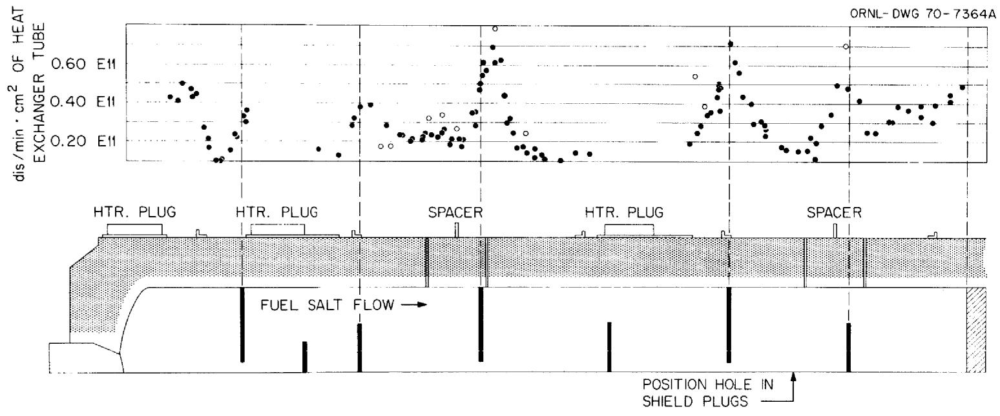  
Fig. 7.23. Activity of $^{10}$ Ru at reactor shutdown on November 2, 1969, in the MSRE heat exchanger.

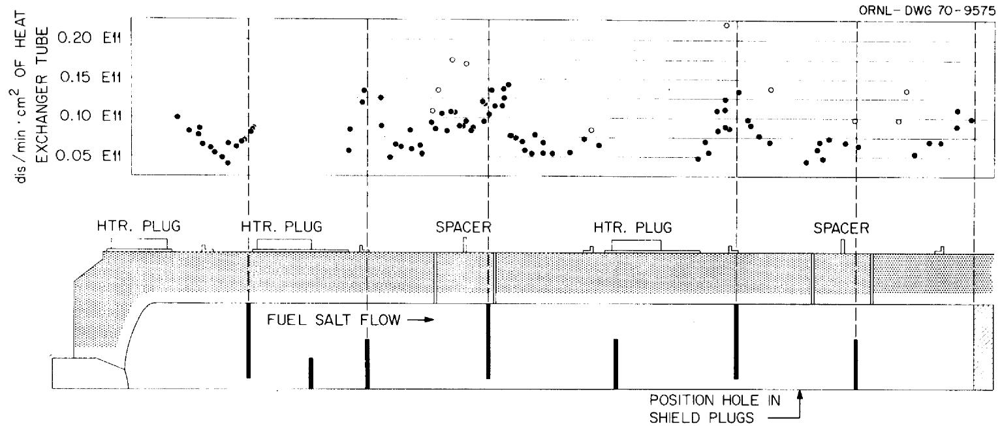  
Fig. 7.24. Activity of $^{106}\mathrm{Ru}-\mathrm{Rh}$ at reactor shutdown on November 2, 1969, in the MSRE heat exchanger.

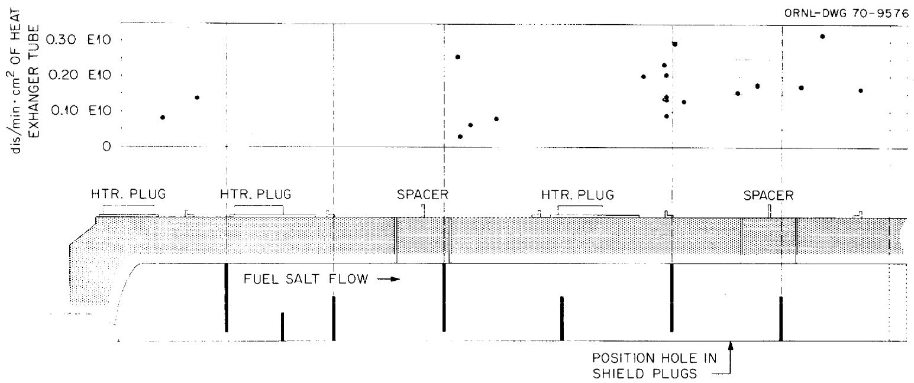  
Fig. 7.25. Activity of $^{125}\mathrm{Sb}$ at reactor shutdown on November 2, 1969, in the MSRE heat exchanger.

Results were based mostly on the 427.9-keV photopeak and, to a lesser degree, on the 600.8-keV peak. The range of activity is 0.080 to 0.30 x $10^{10}$ dis $\min^{-1} \mathrm{~cm}^{-2}$ .

Antimony-126. This nuclide proved to be difficult to identify. Its fission yield is relatively small, and its two major photopeaks (666.2 and 695.1 keV) fall together with those of $^{132}\mathrm{I}$ and $^{129m}\mathrm{Te}$ . The next important peaks were also close to photopeaks of other nuclides.

Although we identified $^{126}\mathrm{Sb}$ several times, the scatter in the computed activity is such that the accuracy is expected to be low. A nuclide distribution pattern along the heat exchanger could not be established. The range of activity is 0.023 to 0.14 x $10^{10}$ dis min $^{-1}$ cm $^{-2}$ ; average activity is 0.89 x $10^{9}$ dis min $^{-1}$ cm $^{-2}$ ; and standard deviation of the average activity is 0.11 x $10^{9}$ .

Antimony-127 (Fig. 7.26). The increase in activity near the baffle plates, although apparent, is by far not as strong as with $^{95}\mathrm{Nb}$ or $^{103}\mathrm{Ru}$ . Although $^{127}\mathrm{Sb}$ could be detected in almost every spectrum, we had to rely almost entirely on one photopeak (684.9 keV) for the activity analysis; naturally this causes some scatter in the data. The range of activity is 0.20 to 0.55 x $10^{11}$ dis min $^{-1}$ cm $^{-2}$ .

Tellurium-129m (Fig. 7.27). The amount of $^{129}\mathrm{mTe}$ deposited on the metal surfaces might be of crucial importance in explaining the deposition mechanism of several of the decay chains. There are, however, several problems that put a strain on an accurate analysis of the $^{129}\mathrm{mTe}$ (see Chap. 4.3).

The scatter of the results is considerable, although most within a certain range. There does not appear to be a strong increase of activity near the baffle plates; one might observe, however, a slight increase of activity near the tube sheet of the heat exchanger. The range of activity is 0.10 to 0.30 x $10^{11}$ dis $\mathrm{min}^{-1} \mathrm{~cm}^{-2}$ .

Iodine-131 (Fig. 7.28). The increase of activity near the baffle plates is definitely there, although much less pronounced than with the metals $^{95}\mathrm{Nb}$ and $^{103}\mathrm{Ru}$ . The photopeaks were easily identifiable, and the confidence in the data is good. For the analyses we used the 364.5- and

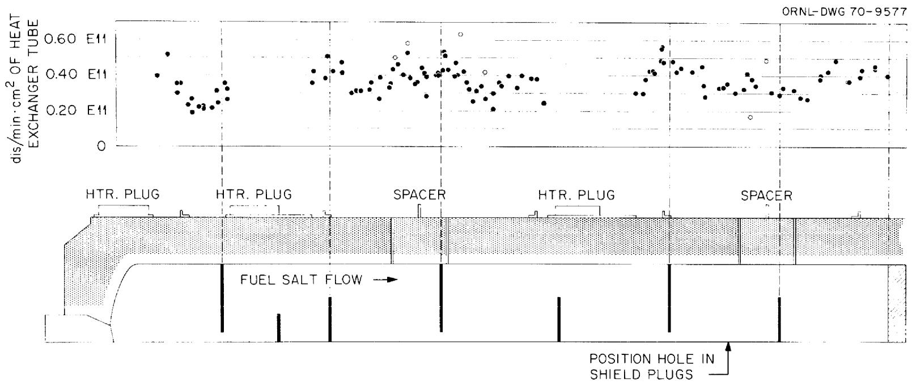  
Fig. 7.26. Activity of $^{127}\mathrm{Sb}$ at reactor shutdown on November 2, 1969, in the MSRE heat exchanger.

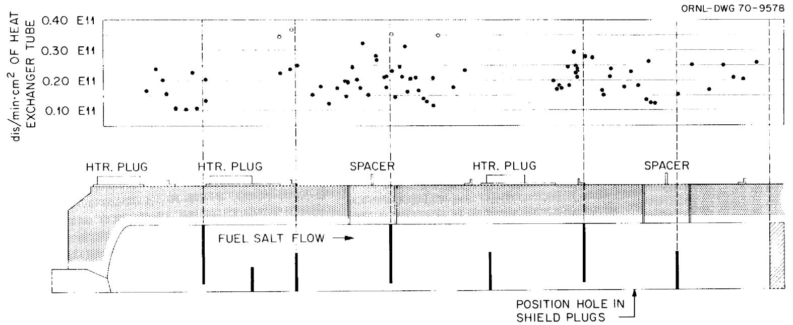  
Fig. 7.27. Activity of $^{129m}$ Te at reactor shutdown on November 2, 1969, in the MSRE heat exchanger.

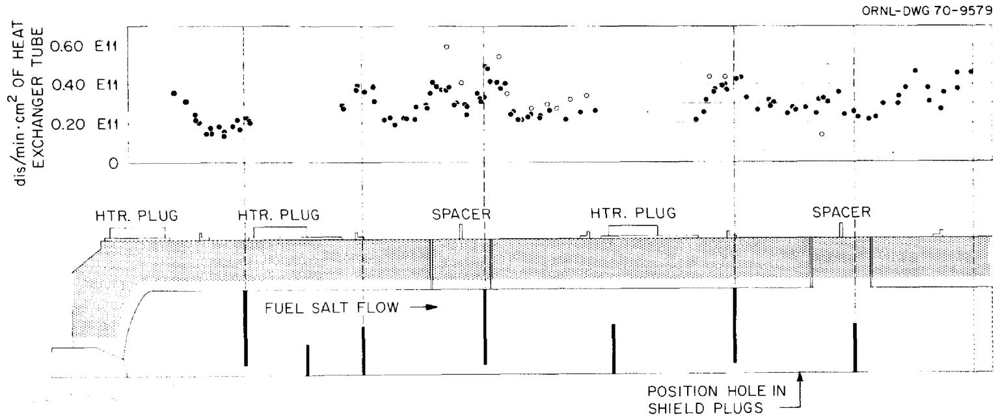  
Fig. 7.28. Activity of $^{131}\mathrm{I}$ at reactor shutdown on November 2, 1969, in the MSRE heat exchanger.

636.9-keV photopeaks; the 284.3-keV photopeak was used less because this is in the energy range where the detector efficiency begins to drop considerably.

The $^{131m}$ Te had already decayed to a large extent when we started the actual survey with the PMS. As with antimony and tellurium, there appears to be some increase of activity near the tube sheet of the heat exchanger. The range of activity is 0.15 to 0.40 x $10^{11}$ dis min $^{-1}$ cm $^{-2}$ .

Tellurium-Iodine-132 (Fig. 7.29). Because of the short half-life of $^{132}\mathrm{I}$ , one observes basically the decay of $^{132}\mathrm{Te}$ . Iodine-132 conveniently decays with a multitude of well-known gamma rays, many of which are easy to identify. For our tellurium and iodine analysis, we mostly used the 667.7-, 772.6-, 954.5-, and 1398.6-keV photopeaks of $^{132}\mathrm{I}$ to compute an average disintegration rate. Since the most abundant $^{132}\mathrm{Te}$ gamma ray (228.2 keV) was so low in the observed energy range, we did not rely much on this peak.

The nuclide distribution along the heat exchanger axis was about the same as for $^{131}\mathrm{I}$ ; again the nuclide activity increase near the baffle plates was not as strong as with $^{95}\mathrm{Nb}$ and $^{103}\mathrm{Ru}$ . The activity range is 0.30 to $0.75 \times 10^{12}$ dis min $^{-1}$ cm $^{-2}$ .

Iodine-133. The $^{133}\mathrm{I}$ was detected but had already decayed appreciably; the results have been reported together with the gamma-ray spectra taken through the shield plug holes immediately after reactor shutdown (Chap. 7.5).

Barium-Lanthanum-140 (Fig. 7.30). Some of the spectra revealed the presence of $^{140}\mathrm{Ba}$ -La. Its most abundant photopeak at 1596.6 keV is very easy to distinguish and was generally relied upon for the activity analysis. The range of activity was 0.050 to 0.20 x $10^{10}$ dis min $^{-1}$ cm $^{-2}$ .

# 7.6.2 Main reactor off-gas line

The only part of the reactor main off-gas line that is clearly visible from above without obstruction and hence available for a gamma-spectrometric survey is the jumper line. This jumper line is a corrugated, l-in.-ID flexible tube connecting the fuel pump purge-gas exhaust at the pump bowl with the 4-in. pipe section of the off-gas line. This jumper line is approximately 2 ft long.

Three surveys were made in the November scanning period, each comprising about 20 spectra taken approximately 1 in. apart along the off-gas

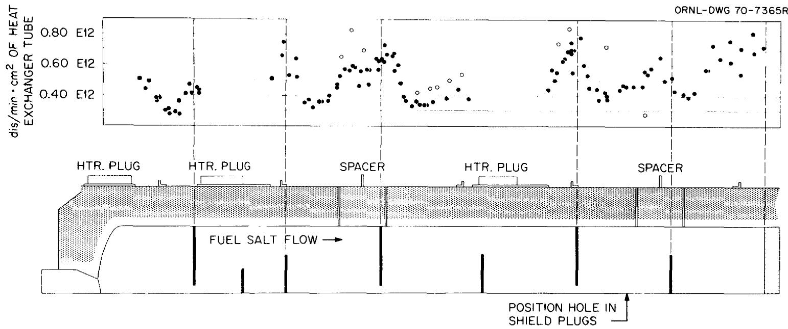  
Fig. 7.29. Activity of $^{132}\mathrm{Te} - \mathrm{I}$ at reactor shutdown on November 2, 1969, in the MSRE heat exchanger.

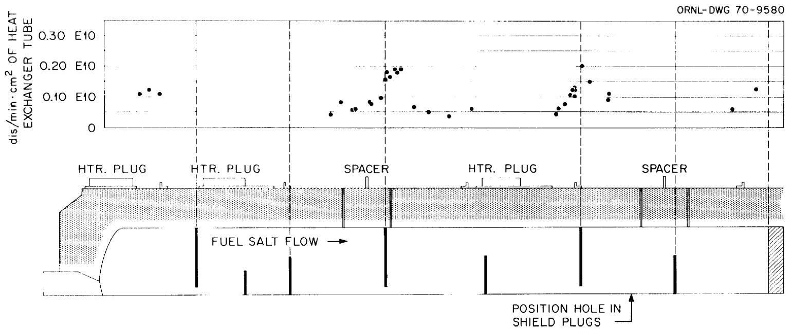  
Fig. 7.30. Activity of $^{140}\mathrm{Ba}$ -La at reactor shutdown on November 2, 1969, in the MSRE heat exchanger.

line. Since there was no noticeable decrease in activity in the downstream direction, the results of the recorded spectra from each survey have been combined. With the exception of possibly $^{126}\mathrm{Sb}$ , $^{129}\mathrm{Te}$ , $^{137}\mathrm{Cs}$ , and $^{140}\mathrm{Ba}-\mathrm{La}$ , the scatter of the calculated activity results was quite small.

There was a difference in the results of the three different surveys. Because the surveys were taken approximately one week after each other, the decline in the general activity level necessitated different shielding configurations between the detector and the jumper line. For example, the first survey was done using the 1/16-in. collimator insert with no shielding material; the second and third survey were executed with a 1/8-in. collimator insert and 1 in. aluminum shielding. We estimate that the results of the first survey are about $35\%$ too high because of discrepancies in the 1/16-in. collimator calibration (we observed this also with the heat exchanger data). Tables 7.7 to 7.9 represent the average activities calculated from each of the three surveys. We believe that Table 7.9 represents the best estimate of the activities detected in the jumper line.

During the first survey, $^{105}\mathrm{Ru}-\mathrm{Rh}$ and $^{133}\mathrm{I}$ were detected several times. Their calculated activities have been incorporated in the results given in Section 7.5.

We were unable to detect positively any component suggesting the presence of salt in the jumper line. In some spectra, a visual inspection of a spectrum plot revealed very, very weak peaks that might be coming from $^{95}\mathrm{Zr}$ . These peaks were so small that the computer analysis in most cases did not detect them. In a practical sense this implied that the $^{95}\mathrm{Zr}/^{95}\mathrm{Nb}$ activity ratio was much less than 0.0005.

# 7.6.3 Fuel pump bowl and fuel lines

The spectra recorded from gamma rays coming from the main fuel lines (lines 101 and 102) as well as from the fuel pump are useful only as qualitative indications. Our calibration work certainly did not cover the complex geometry of the fuel pump bowl nor the fuel lines. From experience we know that the efficiency curves for these geometries might be expected to be relatively flat in the area of 500 to $1000\mathrm{keV}$ , so we did compute relative activities for the identified isotopes. Those relative activities are only indicative figures, and restraint should be used in employing these values.

Table 7.7. Average activity measured along the jumper line of the MSRE main off-gas line of nuclides detected during the first survey after the November shutdown   

<table><tr><td>Nuclide</td><td>Average activitya</td><td>Standard deviation</td></tr><tr><td>95Nb</td><td>0.12 x 1014</td><td>0.24 x 1012</td></tr><tr><td>99Mo</td><td>0.48 x 1014</td><td>1.11 x 1012</td></tr><tr><td>103Ru</td><td>0.25 x 1014</td><td>0.65 x 1012</td></tr><tr><td>106Ru-Rh</td><td>0.43 x 1013</td><td>3.5 x 1011</td></tr><tr><td>125Sb</td><td>0.16 x 1012</td><td>Not sufficient data</td></tr><tr><td>126Sb</td><td>0.86 x 1011</td><td>Not sufficient data</td></tr><tr><td>127Sb</td><td>0.79 x 1012</td><td>4.7 x 1010</td></tr><tr><td>129mTe</td><td>0.22 x 1013</td><td>5.0 x 1011</td></tr><tr><td>131I</td><td>0.82 x 1013</td><td>2.9 x 1012</td></tr><tr><td>132Te-I</td><td>0.83 x 1013</td><td>1.7 x 1011</td></tr><tr><td>137Cs</td><td>0.77 x 1012</td><td>7.4 x 1010</td></tr><tr><td>140Ba-La</td><td>0.40 x 1013</td><td>1.7 x 1011</td></tr></table>

$^\alpha$ Average activity is given in disintegrations per minute per linear inch of off-gas line (jumper line).

Table 7.8. Average activity measured along the jumper line of the MSRE main off-gas line of nuclides detected during the second survey after the November shutdown   

<table><tr><td>Nuclide</td><td>Average activitya</td><td>Standard deviation</td></tr><tr><td>95Nb</td><td>0.84 x 1013</td><td>1.6 x 1011</td></tr><tr><td>99Mo</td><td>0.33 x 1014</td><td>0.91 x 1012</td></tr><tr><td>103Ru</td><td>0.18 x 1014</td><td>0.26 x 1012</td></tr><tr><td>106Ru-Rh</td><td>0.24 x 1013</td><td>0.61 x 1011</td></tr><tr><td>125Sb</td><td>0.73 x 1011</td><td>5.3 x 109</td></tr><tr><td>126Sb</td><td>0.47 x 1011</td><td>2.5 x 109</td></tr><tr><td>127Sb</td><td>0.47 x 1012</td><td>1.9 x 1010</td></tr><tr><td>129mTe</td><td>0.16 x 1013</td><td>0.42 x 1011</td></tr><tr><td>131I</td><td>0.51 x 1013</td><td>0.93 x 1011</td></tr><tr><td>132Te-I</td><td>0.58 x 1013</td><td>1.1 x 1011</td></tr><tr><td>137Cs</td><td>0.57 x 1012</td><td>7.5 x 1010</td></tr><tr><td>140Ba-La</td><td>0.21 x 1013</td><td>0.86 x 1011</td></tr></table>

$\alpha_{\text{Average activity in disintegrations per minute per linear inch of off-gas line (jumper line)}}$ .

Best estimate of activities along jumper line

Table 7.9. Average activity measured along the jumper line of the MSRE main off-gas line of nuclides detected during the third survey after the November shutdown   

<table><tr><td>Nuclide</td><td>Average activitya</td><td>Standard deviation</td></tr><tr><td>95Nb</td><td>0.90 x 1013</td><td>1.5 x 1011</td></tr><tr><td>99Mo</td><td>0.35 x 1014</td><td>1.2 x 1012</td></tr><tr><td>103Ru</td><td>0.20 x 1014</td><td>0.25 x 1012</td></tr><tr><td>106Ru-Rh</td><td>0.27 x 1013</td><td>0.80 x 1011</td></tr><tr><td>125Sb</td><td>0.74 x 1011</td><td>6.0 x 109</td></tr><tr><td>126Sb</td><td>0.56 x 1011</td><td>4.9 x 109</td></tr><tr><td>127Sb</td><td>0.67 x 1012</td><td>4.9 x 1010</td></tr><tr><td>129mTe</td><td>0.18 x 1013</td><td>0.46 x 1011</td></tr><tr><td>131I</td><td>0.58 x 1013</td><td>0.98 x 1011</td></tr><tr><td>132Te-I</td><td>0.65 x 1013</td><td>1.4 x 1011</td></tr><tr><td>137Cs</td><td>0.57 x 1012</td><td>8.2 x 1010</td></tr><tr><td>140Ba-La</td><td>0.22 x 1013</td><td>1.0 x 1011</td></tr></table>

$a_{\text{Average activity in disintegrations per minute per linear inch of off-gas line (jumper line)}}$ ,

Fuel Pump Bowl. Besides the isotopes identified throughout the system, we identified $^{95}\mathrm{Zr}$ and other salt components. Although not surprising, this would indicate the presence of small amounts of fuel salt, apparently left over from the drain. Table 7.10 shows the isotopes identified together with their relative activities in relation to the $^{95}\mathrm{Nb}$ activity.

101 Fuel Line Connecting the Fuel Pump with the Heat Exchanger. Besides the usual deposited fission products, again there was evidence of small remains of fuel salt. Table 7.11 shows the identified isotopes as well as their activity in relation to the $^{95}\mathrm{Nb}$ activity.

102 Fuel Line Connecting the Heat Exchanger with the Reactor. The usual nuclides were detected but no evidence of fuel salt could be positively identified. Table 7.12 shows the identified isotopes as well as their relative activity in relation to the $^{95}\mathrm{Nb}$ activity.

# 7.7 Group H Spectra

From November 26 to December 12, 1969, the reactor was operated at full power for approximately 16 days. The final shutdown of the MSRE occurred on December 12, 1969, at 1046 hr. The spectra in this group were taken from the heat exchanger shortly after the final power shutdown through the shield plug hole.

During this period of operation, three beryllium exposures were made which produced a total of 4.4 gram equivalents of reduction in the fuel salt. Since it is believed that this has a large influence on the behavior of the noble metals, in particular niobium, it was difficult to estimate how much niobium was left from the previous runs, how much of the niobium formed during this run deposited, and how much had gone from the metal walls back into the salt.

The aiming of the collimator with the detector through the shield plug hole was difficult. During the November shutdown we were able to normalize all the results of the spectra taken through the hole (Sect. 7.5.2) to the $^{95}\mathrm{Nb}$ activity found at the same spot during the later survey. However, this was not possible this time because we did not do a survey afterward. All results were normalized to a $^{95}\mathrm{Nb}$ activity of $0.465 \times 10^{11}$ dis $\mathrm{min}^{-1}$ $\mathrm{cm}^{-2}$ , this value being an arbitrary number and based on the average of the

Table 7.10. Longer-half-life nuclides identified in the MSRE fuel pump bowl together with their activity relative to the $^{95}\mathrm{Nb}$ activity (November shutdown)   

<table><tr><td>Nuclide</td><td>Relative activitya</td></tr><tr><td>95Zr</td><td>Identified only</td></tr><tr><td>95Nb</td><td>1</td></tr><tr><td>99Mo</td><td>5</td></tr><tr><td>103Ru</td><td>1</td></tr><tr><td>105Ru-Rh</td><td>Identified only</td></tr><tr><td>106Ru-Rh</td><td>0.1</td></tr><tr><td>125Sb</td><td>Identified only</td></tr><tr><td>126Sb</td><td>Identified only</td></tr><tr><td>127Sb</td><td>0.2</td></tr><tr><td>129mTe</td><td>0.2</td></tr><tr><td>131mTe</td><td>0.7</td></tr><tr><td>131I</td><td>Identified only</td></tr><tr><td>132Te-I</td><td>3</td></tr><tr><td>133I</td><td>0.3</td></tr><tr><td>137Cs</td><td>Identified only</td></tr><tr><td>140Ba-La</td><td>Identified only</td></tr></table>

$a_{\mathrm{No}}$ numerical value was given when the identified nuclide was not present in most spectra or if its major photopeak did not fall in the mentioned energy range.

Table 7.11. Longer-half-life nuclides identified in the main fuel line (101) together with their activity relative to the $^{95}\mathrm{Nb}$ activity (November shutdown)   

<table><tr><td>Nuclide</td><td>Relative activitya</td></tr><tr><td>95Zr</td><td>Identified only</td></tr><tr><td>95Nb</td><td>1</td></tr><tr><td>99Mo</td><td>4</td></tr><tr><td>103Ru</td><td>0.8</td></tr><tr><td>106Ru-Rh</td><td>0.08</td></tr><tr><td>125Sb</td><td>0.01</td></tr><tr><td>126Sb</td><td>Identified only</td></tr><tr><td>127Sb</td><td>0.2</td></tr><tr><td>129mTe</td><td>0.2</td></tr><tr><td>131I</td><td>Identified only</td></tr><tr><td>132Te-I</td><td>3</td></tr><tr><td>137Cs</td><td>Identified only</td></tr><tr><td>140Ba-La</td><td>Identified only</td></tr><tr><td>141Ce</td><td>Identified only</td></tr></table>

a

No numerical value was given when the identified nuclide was not present in most spectra or if its major photopeak would not fall in the mentioned energy range.

Table 7.12. Longer-half-life nuclides identified in the main fuel line (102) together with their activity relative to the $^{95}\mathrm{Nb}$ activity (November shutdown)   

<table><tr><td>Nuclide</td><td>Relative activitya</td></tr><tr><td>95Nb</td><td>1</td></tr><tr><td>99Mo</td><td>6</td></tr><tr><td>103Ru</td><td>1</td></tr><tr><td>106Ru-Rh</td><td>0.09</td></tr><tr><td>125Sb</td><td>0.02</td></tr><tr><td>126Sb</td><td>0.02</td></tr><tr><td>127Sb</td><td>0.6</td></tr><tr><td>129mTe</td><td>0.4</td></tr><tr><td>131I</td><td>Identified only</td></tr><tr><td>132Te-I</td><td>7</td></tr><tr><td>137Cs</td><td>Identified only</td></tr><tr><td>140Ba-La</td><td>Identified only</td></tr></table>

$a_{\mathrm{No}}$ numerical value was given when the identified nuclide was not present in most spectra or if its major photopeak would not fall in the mentioned energy range.

measured $^{95}\mathrm{Nb}$ activities through this recording period. The actual value might be somewhat different.

Another problem that complicated the analysis of the data was that the final reactor shutdown was not done in the same way as the November 2 shutdown. The reactor power was gradually decreased, starting about at 1018 hr; 28 min later the reactor scram occurred, and the drain of the fuel started at 1105 hr. Under these conditions a proper evaluation of the activities of the different nuclides is extremely difficult for the shorter-half-life isotopes.

Spectra were taken for a period of approximately three days over the heat exchanger only. Again, the activities are reported as measured at the time of counting.

# 7.7.1 Heat exchanger

Because of the mentioned uncertainties, it does not seem reasonable to analyze these data extensively; they might indicate qualitative results only. The activity results of the most abundant activities are presented in Figs. 7.31 to 7.40. All figures are normalized to the arbitrary $^{95}\mathrm{Nb}$ activity of $0.465 \times 10^{11}$ dis min $^{-1}$ cm $^{-2}$ . We will only make some general remarks concerning the nuclide activity results presented in the figures, since the absolute values are uncertain.

In view of our calibration methods, it should be observed that the activities of gaseous fission products, which are obviously filling the space in the shell side of the heat exchanger, are expressed in equivalent disintegrations per minute per square centimeter of heat exchanger tube.

Figure 7.31. Based on only one photopeak, we observed a maximum $^{8}$ Kr activity of $0.4 \times 10^{11}$ dis $\min^{-1}$ cm $^{-2}$ .

Figure 7.32. Rubidium-88 apparently was formed by the decay of $^{88}\mathrm{Kr}$ after the reactor shutdown, since its activity increases to a maximum before it comes into equilibrium with its precursor. The rate of activity decrease of $^{88}\mathrm{Kr}$ might be influenced by fuel pump starts at 0.03 and 0.3 day after reactor shutdown. Concerning the $^{99}\mathrm{Mo}$ activity, we have more confidence in its 739.7-keV photopeak; this in accordance with previous observations.

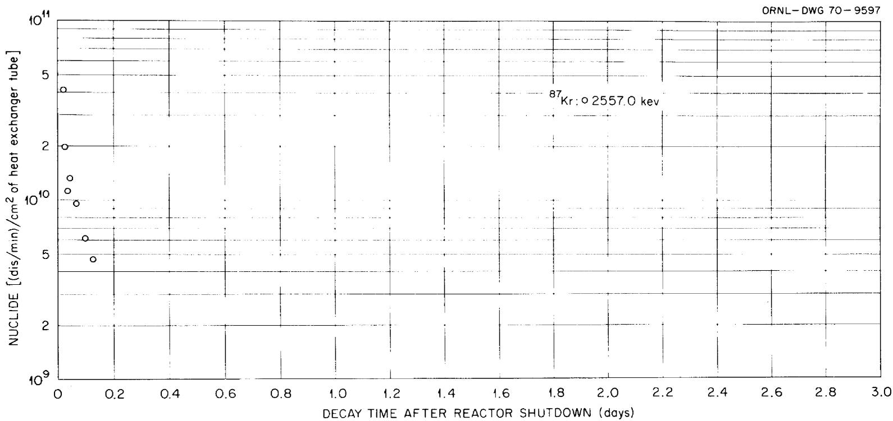  
Fig. 7.31. Activity of $^{87}\mathrm{Kr}$ after final reactor shutdown in the MSRE primary heat exchanger (through the shield plug hole).

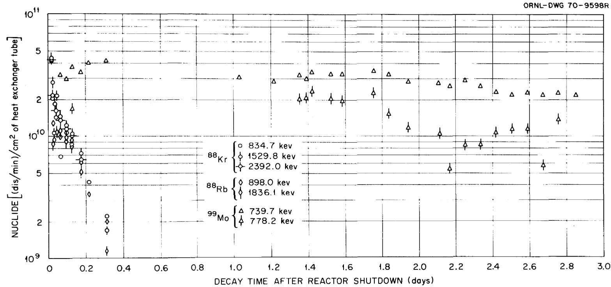  
Fig. 7.32. Activity of ${}^{88}\mathrm{Kr}$ , ${}^{88}\mathrm{Rb}$ , and ${}^{99}\mathrm{Mo}$ after final reactor shutdown in the MSRE primary heat exchanger (through the shield plug hole).

We observed the following maximum activities (dis min $^{-1}$ cm $^{-2}$ ): ${}^{88}\mathrm{Kr}$ , 0.42 x 10 $^{11}$ ; ${}^{88}\mathrm{Rb}$ , 0.13 x 10 $^{11}$ ; and ${}^{99}\mathrm{Mo}$ , 0.41 x 10 $^{11}$ .

Figure 7.33. Identified by its decay half-life as well as its only photopeak at $658.2\mathrm{keV}$ , we feel reasonably sure to have identified ${}^{97}\mathrm{Nb}$ . Its activity, in relation to the ${}^{95}\mathrm{Nb}$ activity, is quite large: maximum ${}^{97}\mathrm{Nb}$ activity, $0.11\times 10^{12}$ dis $\mathrm{min}^{-1}\mathrm{cm}^{-2}$ .

Figure 7.34. Ruthenium-105 and $^{105}\mathrm{Rh}$ were definitely detected; their ratio of activities appeared to be different from the one found in the November shutdown (see Sect. 8.3.2).

The following maximum activities (dis $\min^{-1} \mathrm{cm}^{-2}$ ) were observed: $^{105} \mathrm{Ru}$ , $0.30 \times 10^{11}$ , and $^{105} \mathrm{Rh}$ , $0.12 \times 10^{11}$ .

Figure 7.35. The observed activity of $^{129}\mathrm{Te}$ appeared again to come from the decay of $^{129}\mathrm{Sb}$ , $^{129}\mathrm{Te}$ , and $^{129m}\mathrm{Te}$ ; the presence of $^{129}\mathrm{Sb}$ appears to be confirmed by the photon emission rate of its 1028-keV photopeak.

The observed maximum activity of $^{129}\mathrm{Te}$ , based on the 459.6-keV photopeak, is $0.69 \times 10^{11}$ dis $\min^{-1}$ cm $^{-2}$ .

Figure 7.36. The presence of $^{131}\mathrm{Te}$ could not be identified with certainty, since only a few spectra showed photopeaks which might be assigned to that nuclide; $^{131}\mathrm{mTe}$ was definitely identified. A close look at the activity shortly after shutdown at least does not contradict the idea that part of the $^{131}\mathrm{mTe}$ is formed after reactor shutdown by decay of $^{131}\mathrm{Sb}$ ; at least two of its photopeaks (852.3 and 1206.6 keV) seem to indicate a maximum activity of $0.4 \times 10^{11}$ dis $\min^{-1}$ $\mathrm{cm}^{-2}$ about $1$ hr after shutdown.

Figure 7.37. We have more confidence, especially shortly after reactor shutdown, in the results of the 364.5-keV $^{131}$ I photopeak. As expected, $^{132}$ I is formed by the decay of $^{132}$ Te after the reactor drain; its maximum activity would occur several hours after shutdown.

We observed the following maximum activities (dis $\min^{-1} \mathrm{cm}^{-2}$ ): $^{131} \mathrm{I}$ , $0.14 \times 10^{11}$ ; $^{132} \mathrm{Te}$ , $0.20 \times 10^{12}$ ; and $^{132} \mathrm{I}$ , $0.16 \times 10^{12}$ .

Figures 7.38 and 7.39. Tellurium-133 and $^{133}\mathrm{I}$ could be positively identified, although there is some discrepancy of the $^{133}\mathrm{I}$ decay half-life. Iodine-134 typically grows in from the decay of $^{134}\mathrm{Te}$ after reactor shutdown; its maximum activity occurs, as expected, after reactor shutdown: $0.32 \times 10^{11}$ dis min $^{-1}$ cm $^{-2}$ . Other observed maximum activities were (dis min $^{-1}$ cm $^{-2}$ ): $^{133m}\mathrm{Te}$ , $0.33 \times 10^{11}$ , and $^{133}\mathrm{I}$ , $0.12 \times 10^{11}$ .

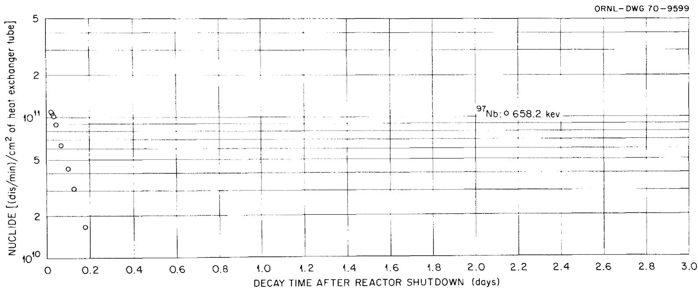  
Fig. 7.33. Activity of $^{97}\mathrm{Nb}$ after final reactor shutdown in the MSRE primary heat exchanger (through the shield plug hole).

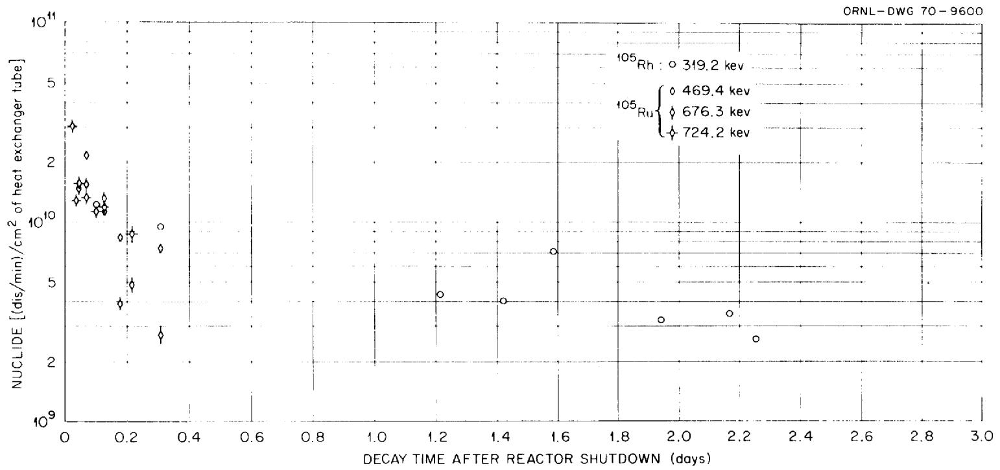  
Fig. 7.34. Activity of $^{105}\mathrm{Rh}$ and $^{105}\mathrm{Ru}$ after final reactor shutdown in the MSRE primary heat exchanger (through the shield plug hole).

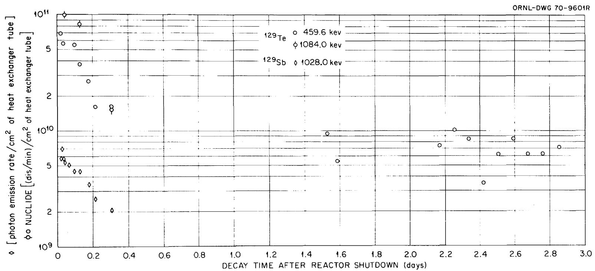  
Fig. 7.35. Activity of $^{129}\mathrm{Te}$ and photon emission rate of $^{129}\mathrm{Sb}$ after final reactor shutdown in the MSRE primary heat exchanger (through the shield plug hole).

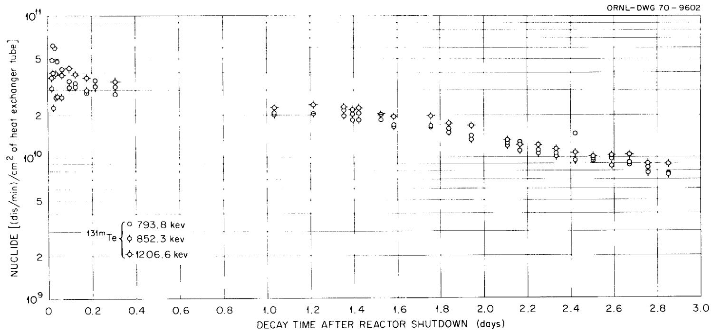  
Fig. 7.36. Activity of $^{131m}$ Te after final reactor shutdown in the MSRE primary heat exchanger (through the shield plug hole).

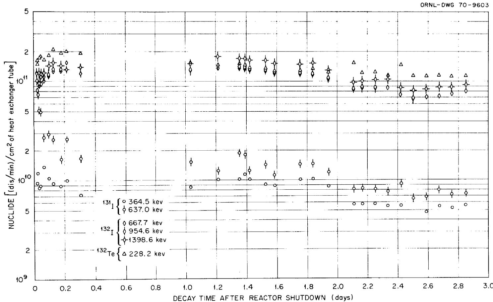  
Fig. 7.37. Activity of $^{131}\mathrm{I}$ , $^{132}\mathrm{I}$ , and $^{132}\mathrm{Te}$ after final reactor shutdown in the MSRE primary heat exchanger (through the shield plug hole).

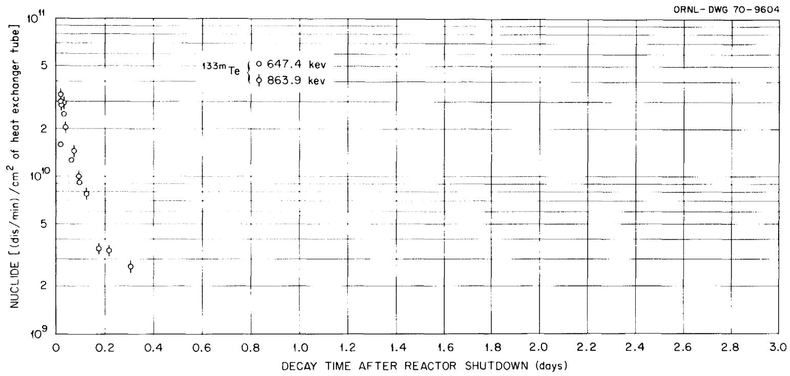  
Fig. 7.38. Activity of $^{13}3m$ Te after final reactor shutdown in the MSRE primary heat exchanger (through the shield plug hole).

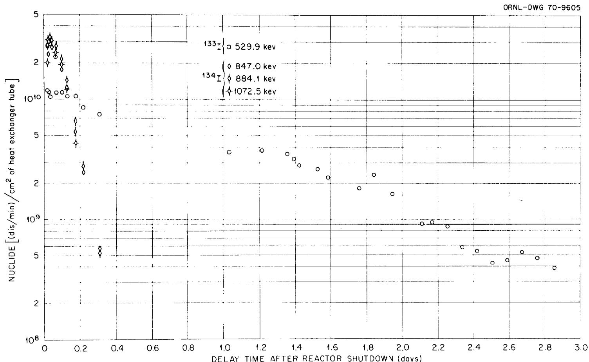  
Fig. 7.39. Activity of $^{133}\mathrm{I}$ and $^{134}\mathrm{I}$ after final reactor shutdown in the MSRE primary heat exchanger (through the shield plug hole).

Figure 7.40. The activity of $^{135}\mathrm{Xe}$ was again appreciable, with a maximum of $0.60 \times 10^{11}$ dis min $^{-1}$ cm $^{-2}$ .

It might be of interest to note that during the very first spectra taken after reactor shutdown, there was still some salt in the heat exchanger (in the course of draining away). These spectra contained several photopeaks that could be identified as coming from $^{135}\mathrm{I}$ . Once the salt was drained from the heat exchanger, those photopeaks disappeared entirely, indicating that at least $^{135}\mathrm{I}$ and, in all probability the other iodines, remain with the salt.

It should also be noted that $^{91}\mathrm{Sr}$ was also identified in many of these spectra.

# 7.8 Group I Spectra

These spectra were taken after the final reactor shutdown from samples of the reactor cell air after there had been indications of an increase of the cell-air activity. Results are reported separately. $^{18}$

# 7.9 Group J Spectra

Spectra were taken from the coolant-salt radiator a few days after the final shutdown and drain of the fuel- and coolant-salt systems. The objective was to determine if any radioactive corrosion products in the coolant salt were depositing in the coolant radiator.

Since some of these corrosion products might have been activated by delayed neutrons in the primary heat exchanger, those corrosion products in the coolant-salt radiator could possibly be observed with the gamma-ray spectrometer. The detector was set up in front of the radiator with the radiator doors open; no collimator was used. Since the MSRE main off-gas

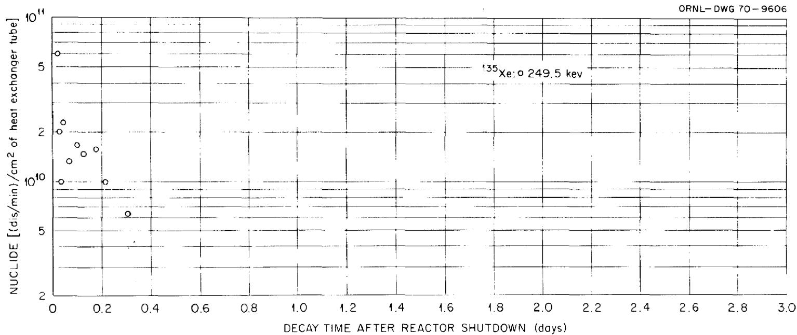  
Fig. 7.40. Activity of $^{135}\mathrm{Xe}$ after final reactor shutdown in the MSRE primary heat exchanger (through the shield plug hole).

line, although heavily shielded, passes not far away from this detector location, it appeared that the majority of the recorded photopeaks came from the off-gas line. Typical examples of identified nuclides that should not be expected in the coolant radiator were: $^{95}\mathrm{Nb}$ , $^{99}\mathrm{Mo}$ , $^{103}\mathrm{Ru}$ , $^{106}\mathrm{Ru(Rh)}$ , $^{131}\mathrm{I}$ , $^{132}\mathrm{Te-I}$ , $^{135}\mathrm{Xe}$ , $^{137}\mathrm{Cs}$ , and $^{140}\mathrm{Ba-La}$ . These nuclides formed the major peaks in the recorded spectra.

Some other nuclides could be identified with some degree of confidence. An approximate relative activity has been calculated for these in relation to the activity of $^{60}\mathrm{Co}$ (Table 7.13).

Because the unshielded detector obviously picked up gamma rays from different locations, the identified corrosion product radiations do not necessarily need to have come from the coolant radiator. A collimator would have been useful in identifying the sources of the activities; however, the activity level was too low to permit use of the available collimation equipment.

# 7.10 Group K Spectra

The purpose of this study was to measure the flow rate of coolant salt in the loop. Certain components of the coolant salt will be slightly activated by delayed neutrons in the primary heat exchanger to produce $^{16}\mathrm{N}$ and $^{19}\mathrm{F}$ . By measuring their activity at two places along the coolant-salt line, it is possible in principle to determine the flow rate from these decaying nuclides. The results of these measurements have been reported elsewhere.[19]

# 7.11 Group L Spectra

A graphite sample was lowered into the fuel pump bowl through the sampler enricher; this sample was left for several hours in the fuel pump bowl and then moved back into the sampler enricher. A special arrangement

These nuclides need not necessarily be in the radiator

Table 7.13. Relative activities of corrosion product nuclides found in the survey of the coolant radiator   

<table><tr><td>Nuclide</td><td>Confidence in nuclide identification</td><td>Disintegration rate relative to 60Co</td></tr><tr><td>60Co</td><td>Good</td><td>1</td></tr><tr><td>24Na</td><td>Reasonable</td><td>0.06</td></tr><tr><td>51Cr</td><td>Low</td><td>≈2.5</td></tr><tr><td>59Fe</td><td>Good</td><td>0.4</td></tr><tr><td>65Ni</td><td>Low</td><td>≈3.5</td></tr></table>

of a collimator with the detector was required to record gamma-ray spectra from this sample as soon as it was back in the sampler enricher. The reactor was at full power during this experiment. The objective was to study the deposition of short-lived fission products on graphite. A similar experiment was performed with a sample capsule filled with fuel salt as well as with a dummy sample capsule without salt. These experiments have yet to be analyzed in detail.

# 7.12 Group M Spectra

Several miscellaneous spectra were taken from the lube oil system, the 523 off-gas line, and the roughing filters.

Argon instead of helium was used as a reactor system purge gas for some special experiments to study the influence of a different gas on the stripping efficiency of noble fission gases in the fuel pump bowl as well as the change in the bubble fraction in the fuel salt. Since part of this argon could circulate with the fuel salt in the reactor system, some argon activation was to be expected. As a result, we even found some $^{41}\mathrm{Ar}$ in the fuel pump lube oil system during this experiment. This was proved by placing the detector near this lube oil system. Apparently $^{41}\mathrm{Ar}$ was entrained by the lube oil from the fuel pump to the lube oil system outside the reactor cell.

Shortly before the reactor shutdown on June 1, 1969, a plug developed in the main reactor off-gas line. Purge gases were then exhausted through the pump bowl overflow tank and its off-gas line (line 523). A plug also developed in this line after a period of time. Through other methods it was established that the plug was in a particular section of the 523 line. In an effort to locate the plug precisely, the gamma-ray spectrometer was used to survey that pipe section. This method would have been viable if the plug had consisted of radioactive material. Although there was some increase of activity near a valve in the line, we could not identify the real location of the plug. Afterward, when this pipe was taken out and inspected, it was learned that the plug consisted of carbonaceous material; hence it is not surprising that we did not detect any activity increase.

The nuclides identified in this pipe section were similar to those found in the main off-gas line such as noble metals and decay products from noble fission gases.

The roughing filters, or prefilters, are used for the containment ventilation system. The ventilation areas normally comprise the reactor highbay area but also include the reactor and drain tank cells during maintenance operations when the reactor cell containment is opened. During periods of maintenance, one can expect some activity from the reactor cell (mainly activation products) to collect on these filters. During replacement of the roughing filters, some gamma-ray spectra were taken to check on the nature of the retained activity. Table 7.14 shows the nuclides identified from these spectra together with their activity in relation to $^{60}\mathrm{Co}$ . The spectra were recorded many weeks after use of the filters, so no short-lived activities should be expected.

Table 7.14. Nuclides identified from gamma-ray spectra recorded from the containment ventilation roughing filters   

<table><tr><td>Nuclide</td><td>Confidence in identification</td><td>Disintegration rate relative to 60Co</td></tr><tr><td>60Co</td><td>Very good</td><td>1</td></tr><tr><td>59Fe</td><td>Very good</td><td>0.54</td></tr><tr><td>51Cr</td><td>Very good</td><td>0.50</td></tr><tr><td>54Mn</td><td>Questionable</td><td>0.55</td></tr><tr><td>110mAg</td><td>Very good</td><td>0.17</td></tr><tr><td>103Ru</td><td>Very good</td><td>1.32</td></tr><tr><td>106Ru-Rh</td><td>Very good</td><td>1.89</td></tr><tr><td>95Nb</td><td>Very good</td><td>0.77</td></tr><tr><td>137Cs</td><td>Reasonable</td><td>0.18</td></tr><tr><td>182Ta</td><td>Reasonable</td><td>0.085</td></tr><tr><td>24Na</td><td>Reasonable</td><td>0.005</td></tr><tr><td>124Sb</td><td>Questionable</td><td>0.069</td></tr></table>

# 8. CONCLUSIONS

The primary purpose of this study was to compile, in a readily usable form, a block of data on certain aspects of the behavior of fission products in the MSRE. We believe that the results given in the previous chapters are a fair representation of the analysis of all the recorded spectra that pertain to the fission product deposition in the parts of the MSRE that could be examined by this method.

In general, we have found remote gamma-ray spectrometry to be readily applicable and productive of much useful information about the MSRE. Many observations (e.g., possible discovery of new gamma rays, fundamental evaluation of collimators, etc.) are believed to be in disciplines that are not directly connected to the fission product behavior of this reactor and consequently are omitted from this report.

We realize that this work is only part of a very complicated matter in which the coordination of several specializations might be required to develop a more complete picture of fission product behavior in the MSRE. Hopefully, the information presented in this report can be combined with other data to achieve that goal.

This chapter presents some of our observations about the performance of this study. In addition, we draw some conclusions concerning the behavior of certain fission products.

# 8.1 Data Collection and Analysis

# 8.1.1 Gamma spectrometer system

One of the main reasons that we were able to analyze these complicated spectra successfully was the excellent resolution capability of the detector. Since we had to collimate and shield the incoming gamma rays considerably, there was no need for a large, expensive, high-efficiency detector. For these studies a medium-sized $(26\mathrm{-cm}^3)$ and hence rather inexpensive high-resolution crystal sufficed. The need for a multichannel

analyzer (4096 channels) with magnetic tape recorder seems indispensable with such a detector. Since our spectra were complicated, the spectrum analysis could only be done efficiently by computer. The computer program was complex and required a large memory, 610 k-bytes. It is doubtful that a smaller computer coupled directly to the analyzer system would have served our purpose.

The collimator assembly served its purposes well; with the proper choice of a collimator insert, we could limit the total amount of radiation to the detector without excessive use of shielding material. Also, we were able to observe fission product depositions in reactor components at very definite locations. Since the assembly was mounted with three adjustable set screws on an axial thrust bearing, instead of directly on the portable maintenance shield, we could easily make small adjustments to the assembly orientation. However, it was difficult to make a straight collimator beam hole. The idea of a free-floating thick-walled stainless steel precision tube around which the shielding lead is poured can be fruitful if some more thought is given to it.

The locational equipment, that is, laser and surveyor's transits, performed very satisfactorily and proved to be precise, reliable, and inexpensive. Since we moved the detector frequently, it is felt that any sophistication of this equipment (e.g., such as mirrors to guide the laser beam around the detector) would have been detrimental to its reliability.

# 8.1.2 Calibration

Very little is known about the efficiency of gamma-ray detectors in relation to a collimated beam. This, together with the complexity of the heat exchanger geometry, led us to believe that the effort given to the empirical calibration of equipment was worthwhile. The fact that different spectra recorded from the same spot on a component, but taken with entirely different shielding configurations, yielded virtually the same activities lends confidence to the calibration results obtained.

Silver-110m proved to be a good calibration source. If one has reactor irradiation facilities available, such a source can be made rather easily. The extension of the efficiency curves, as obtained with $^{110}\mathrm{Ag}$ , to both the lower and higher energy ranges was possible by using the actual

fission product spectra obtained during the experiment itself. The relative efficiency curves obtained from the fission product spectra were consistent with the absolute efficiency curves found with the calibration source.

# 8.1.3 Computer analysis program

Considerable time and effort were required to convert the computer analysis program, which originated at Lawrence Radiation Laboratory, for operation at the ORNL computing center. The program is quite powerful and, generally speaking, satisfied our needs well. For application to spectra like ours, where there are so many multiple photopeaks, however, we can envision several improvements, particularly in the analysis of multiplets.

Our table of radionuclides, as used in the library of the computer program, was a very useful tool for the analysis of the spectra. This table might be also of interest to others working in the gamma-spectrometry field, and so is presented as Appendix A. Although this table contains the latest published data, we realize that it is far from complete.

# 8.2 Results - General

We will draw some general conclusions concerning the fission product distribution in several reactor components, without, however, going here into detail on the different decay chains.

# 8.2.1 Metal surfaces in direct contact with the fuel salt

Metallic fission products, such as isotopes of niobium, molybdenum, ruthenium, rhodium, antimony, and tellurium, were present on the walls of the reactor system that were in contact with the fuel salt. Their deposition on the walls represented, in general, a large fraction of the total amount of that nuclide present in the entire reactor system.

Because of additional metal surface exposed to the salt near the baffle plates in the primary heat exchanger, one might expect a small increase in activity there. It appears, however, that the observed large increases in activity near these baffle plates (two to four times higher than in intervening areas) are due to additional effects. It may be that the salt flow pattern influences the deposition rate of these fission products. For example, niobium, molybdenum, and ruthenium-rhodium exhibit a higher

activity increase near the baffle plates (2.5 to 4 times) than antimony, tellurium, and iodine (1.5 to 2 times).

A study of the activity of the several iodine isotopes directly after reactor shutdown and subsequent fuel drain during the final reactor shutdown in December revealed that the iodine activities $\left({}^{13} \mathrm{I}\right.$ and especially $\left.{}^{13} \mathrm{I}\right)$ build up after reactor shutdown. Although we were never able to detect ${}^{13} \mathrm{I}$ after the drain of the fuel, we did detect it during the drain. Therefore we conclude that the observed large iodine activities in the empty system were mostly due to the decay of their precursors that deposited on the wall; iodine itself, however, remains with the fuel salt.

In comparing the relative activities of the deposited metal fission products (relative to $^{95}\mathrm{Nb}$ ) in the heat exchanger and in the fuel lines (101 and 102), there is no major difference in the deposition rate on the heat exchanger (between the baffle plates) and on the fuel lines. Molybdenum and ruthenium are possible exceptions; their relative activity appears to be somewhat higher in the fuel lines. It should be stated, however, that this is a tentative conclusion since we did no calibration work on the entirely different geometry of the fuel lines.

The amount of activity in the heat exchanger caused by the decay of noble fission gases is appreciable. Although most gas activities disappeared after a few hours because of decay and some circulation of purge gas, their decay represents a significant heat source during the first hours after drain of the fuel salt. These noble fission gases probably came from several sources:

1. A release of gases absorbed in the graphite bars in the reactor core,   
2. A release of gas bubbles from the fuel salt while in the course of draining to the drain tank.   
3. A back-flow of gases from the holdup gas volume of the main reactor off-gas line. In order to drain the fuel salt, a gas pressure equalizer line is necessary between the drain tanks and the fuel system; this line (521) ties into the main reactor off-gas line at the 4-in.-ID gas holdup section. A calculation of the volume of these back-flowing fission gases during drain largely explains the unexpectedly high activity of noble fission gases in the reactor system after shutdown.

It is reassuring to note that the magnitudes of the activities detected in the heat exchanger during the July shutdown were very close to those detected during the November survey.

# 8.2.2 Main reactor off-gas line

As might be expected, the major activities in the main reactor off-gas line during reactor operation are due to the decay of noble fission gases and their decay products. These nuclides still form a large source of activity shortly after reactor shutdown, but they decay rapidly and are diluted by purging of the empty fuel system.

Metals such as niobium, molybdenum, ruthenium, rhodium, antimony, and tellurium (iodine) could barely be identified during reactor operation but formed the major activity source soon after reactor shutdown.

Since we were not able to detect $^{135}\mathrm{I}$ in the off-gas line, although other iodine isotopes with metallic precursors were identified, we believe that iodine proper does not separate from the salt and will neither disappear in large quantities into the off-gas line nor remain with the metal walls when the system is filled with circulating salt.

We were not able to positively identify any nuclide, such as $^{95}\mathrm{Zr}$ , that is supposed to remain with salt; that is, we could not detect any appreciable quantity of fuel salt in the off-gas line. Although on a few occasions the computer program found a photopeak possibly due to $^{95}\mathrm{Zr}$ , we scrutinized the actual plots of these spectra and were not convinced of the presence of salt within the range of our nuclide detection sensitivity. Concerning the off-gas line geometry, this meant that we could not detect activities less than $0.5 \times 10^{10}$ dis $\min^{-1}$ in $^{-1}$ or an activity less than $5 \times 10^{-4}$ of the detected $^{95}\mathrm{Nb}$ activity.

Taking into account the purge-gas flow rate through the jumper line, it is not surprising that we did not detect a decrease in nuclide activity along the jumper line.

Comparing the activities calculated from the July and November surveys, the longer-lived nuclides, such as $^{106}\mathrm{Ru}-\mathrm{Rh}$ and $^{137}\mathrm{Cs}$ , seem to be consistent; $^{95}\mathrm{Nb}$ , $^{103}\mathrm{Ru}$ , and $^{129}\mathrm{Te}$ appear to be about four times higher during the November survey. This could partly be explained because of the power history before shutdown as well as by the fact that the main off-gas line was partially plugged during the latter part of the power operation before July. (At that time the off-gases were routed through the off-gas line of the fuel pump overflow tank.) Shorter-lived nuclide activities (e.g., $^{131}\mathrm{I}$ ) would be even more influenced by this plugging problem.

# 8.3 Elements and Nuclide Chains

Although it is clear that the reported results are only a part of the total picture of fission product behavior, it is possible to draw some tentative conclusions concerning the behavior of certain elements and nuclide chains. In particular, it is of interest to examine the behavior of isotopes that belong to the same element or to the same decay chain.

# 8.3.1 Niobium

Both $^{95}\mathrm{Nb}$ and $^{97}\mathrm{Nb}$ were identified in the heat exchanger after the November and the final shutdown. Because of the short half-life of $^{97}\mathrm{Nb}$ as well as its precursor, the disintegration rate of this nuclide reflects only the deposition of niobium shortly before shutdown. The $^{95}\mathrm{Nb}$ activity would represent a much longer history where chemical conditions of the salt were different.

Because absolute activities derived after the final shutdown may be uncertain, we have compared the $97\mathrm{Nb}$ results for the November and final shutdowns by normalizing them to the $95\mathrm{Nb}$ values. Table 8.1 shows these results corrected for decay to reactor shutdown time. Also shown are half-lives and fission yields. These data pertain to the area in the heat exchanger under the shield plug hole.

Table 8.1. Comparative values of $^{95}\mathrm{Nb}$ and $^{97}\mathrm{Nb}$   

<table><tr><td rowspan="2"></td><td colspan="2">Activity relative to 95Nb activity in heat exchanger</td><td colspan="2">Fission yielda</td></tr><tr><td>November shutdown</td><td>Final shutdown</td><td>(%)</td><td>Half-life</td></tr><tr><td>95Nb</td><td>1</td><td>1</td><td>6.05</td><td>35.5 days</td></tr><tr><td>97Nb</td><td>0.63</td><td>3.0</td><td>5.62</td><td>72.0 min</td></tr></table>

${}^{a}$ It is estimated that the total fission rate in the MSRE was due to the contribution of the following isotopes: ${}^{233}\mathrm{U},94\% ;{}^{235}\mathrm{U},2.25\%$ ; ${}^{239}\mathrm{{Pu}},3.75\%$ . Actual fission yields were calculated from B. M. Rider, A Survey and Evaluation of Thermal Fission Yields, GEAP-5356.

Concerning the activity results after the November shutdown, one might expect the $97\mathrm{Nb}$ activity to be in equilibrium with its environment whereas the $95\mathrm{Nb}$ activity is not; the uninterrupted power run was less than two months.

A possible explanation for the November shutdown $^{97}\mathrm{Nb}/^{95}\mathrm{Nb}$ activity ratio might be to assume a time lag between formation and deposition. An average time lag, or residence time in the salt before deposition, of approximately 100 to 150 min would explain the calculated ratio of 0.63.

The small $^{95}\mathrm{Nb}$ buildup during the short power run after the long shutdown period in November, as well as two beryllium additions prior to the final shutdown (which are known to affect the niobium behavior), might explain the rather different activity ratio of 3.0 after the last shutdown.

Currently it is thought that the oxidation potential of the salt, which is influenced by the beryllium additions, affects the niobium solubility in the fuel salt. This, of course, forms another dimension to the deposition problem. Therefore, a study of the $^{97}\mathrm{Nb}$ concentration in the salt in relation to the oxidation potential might be quite useful in future reactor systems. The reason for using the $^{97}\mathrm{Nb}$ concentration is that it is not influenced by a long reactor power history as is $^{95}\mathrm{Nb}$ . A simple gamma-spectrometry assay done at the reactor site would be ample.

We were not able to positively identify $97\mathrm{Nb}$ in the main off-gas line; there were indications of this nuclide, but too few to assign a numerical value to it.

# 8.3.2 Ruthenium-rhodium

Three ruthenium nuclides were identified in both the heat exchanger and the off-gas line: $^{103}\mathrm{Ru}$ , $^{105}\mathrm{Ru}$ , $^{106}\mathrm{Ru}-\mathrm{Rh}$ . Since it was assumed that the rutheniums are the first nuclides in their respective fission decay chains that deposit on the metal walls or escape into the off-gas line, an extrapolation to reactor shutdown time would then be legitimate to obtain their maximum activities. This might not be the case for $^{105}\mathrm{Ru}$ , since its precursors, $^{105}\mathrm{Mo}$ and $^{105}\mathrm{Tc}$ , also will deposit on the metal walls; it would, however, not introduce a large error in our evaluation of the maximum $^{105}\mathrm{Ru}$ activity. Table 8.2 shows comparative values for these three isotopes. The activities are given relative to the activity of $^{106}\mathrm{Ru}-\mathrm{Rh}$ .

Table 8.2. Comparative values of three ruthenium isotopes identified in the reactor system   

<table><tr><td rowspan="2"></td><td colspan="3">Activity relative to 106Ru-Rh</td><td rowspan="2">Half-life</td><td rowspan="2">Fission yielda</td></tr><tr><td>Heat exchanger, Nov. shutdown</td><td>Off-gas line, Nov. shutdown</td><td>Heat exchanger, Final shutdown</td></tr><tr><td>103Ru</td><td>3.6</td><td>7.4</td><td>1.2</td><td>40 days</td><td>1.80</td></tr><tr><td>105Ru</td><td>≈6.0</td><td>≈1.3</td><td>≈6.2</td><td>4.43 hr</td><td>0.60</td></tr><tr><td>106Ru-Rh</td><td>1.0</td><td>1.0</td><td>1.0</td><td>367 days</td><td>0.41</td></tr></table>

${}^{a}$ It is estimated that the total fission rate in the MSRE was due to the contribution of the following isotopes: ${}^{233}\mathrm{U},{94}\% ;{}^{235}\mathrm{U},{2.25}\% ;{}^{239}\mathrm{Pu},{3.75}\%$ . Actual fission yields were calculated from B. M. Rider, A Survey and Evaluation of Thermal Fission Yields, GEAP-5356.

Let us look first at the $^{103}\mathrm{Ru}$ and $^{106}\mathrm{Ru}-\mathrm{Rh}$ . Taking into account the whole power history of the reactor one can calculate how much $^{103}\mathrm{Ru}$ and $^{106}\mathrm{Ru}$ are present in the entire reactor system: in the salt, on the graphite the off-gas line, or on the metal walls. These calculated inventories yield a ratio of the $^{103}\mathrm{Ru}$ activity relative to the $^{106}\mathrm{Ru}-\mathrm{Rh}$ activity of roughly 6.5 both for the November shutdown and the final shutdown. Because of the difference in decay half-lives of these isotopes, this ratio should decrease with increasing age of the mixture. Tentatively one would conclude from the November shutdown ratio of 3.6 that the $^{103}\mathrm{Ru}-^{\mathbf{106}}\mathrm{Ru}-\mathrm{Rh}$ mixture has an average age of several weeks or that ruthenium does not tend to deposit very readily on metal walls.

The same ratio calculated for the off-gas line is 7.4. This seems to suggest that ruthenium separates from the salt and disappears into the off-gas line (or possibly deposits on the graphite rather than on the metal walls). In other words, since we could barely detect ruthenium in the fuel salt in the drain tank, it appears that this element has only a slight tendency to deposit on metal surfaces and rather will disappear into the off-gas line (or deposit on the graphite). Data on the deposition on graphite would be very important for a complete picture of the ruthenium behavior.

If one assumes that $^{105}\mathrm{Ru}$ deposits by the same mechanism as $^{103}\mathrm{Ru}$ and $^{106}\mathrm{Ru}$ , the $^{105}\mathrm{Ru}$ data from Table 8.2 are rather hard to explain. One alternative possibility would be to assume that it is the short-lived $^{105}\mathrm{Mo}$ or $^{105}\mathrm{Te}$ that really deposits, the observed $^{105}\mathrm{Ru}$ in the heat exchanger being mainly the result of its precursors deposition. A check on the activity of $^{105}\mathrm{Ru}$ relative to $^{99}\mathrm{Mo}$ both in the off-gas line and the heat exchanger does not exclude this possibility.

Because many other photopeaks are adjacent to or even coincide with its peaks, $^{105}\mathrm{Rh}$ is difficult to identify. From a study of Figs. 7.8, 7.15 and 7.34, two conclusions may be drawn. The results concerning the heat exchanger, Figs. 7.8 and 7.34, suggest that the $^{105}\mathrm{Ru}$ activity is equal to or higher than the $^{105}\mathrm{Rh}$ activity; the opposite is true for the off-gas line. Also, the $^{105}\mathrm{Rh}$ does not gradually build up from nothing to a maximum in the heat exchanger. Apparently, $^{105}\mathrm{Ru}$ remains on the metal walls after its formation from $^{105}\mathrm{Mo}-\mathrm{Tc}$ . The $^{105}\mathrm{Rh}$ seems, to certain degree

at least, to dissolve from the heat exchanger and then partly transfer to the off-gas line.

In view of the $^{103}\mathrm{Ru} - ^{106}\mathrm{Ru}$ -Rh behavior we envision the following possibility for the 105 decay chain: molybdenum deposits more readily on the heat exchanger than ruthenium; in agreement with the $^{99}\mathrm{Mo}$ data, it also escapes into the reactor off-gas line. The ruthenium does not desorb from the metal walls; therefore the observed deposits of this element on the heat exchanger and in the off-gas line are merely the decay products of the deposited molybdenum. Rhodium, formed by the decay of ruthenium, not only decays on the metal walls but also goes back into the salt and eventually disappears appreciably into the off-gas line. The fact that only very small amounts of various rutheniums were found in the salt confirms the contention that these nuclides transfer rather quickly from the salt into the off-gas line (or onto the graphite).

# 8.3.3 Antimony-tellurium-iodine

The identification of $^{125}\mathrm{Sb}$ , $^{126}\mathrm{Sb}$ , $^{127}\mathrm{Sb}$ , and $^{129}\mathrm{Sb}$ in the heat exchanger and in the off-gas line leads one to believe that antimony is at least partly instrumental in the presence of tellurium and, as a result, also of iodine after drain of the reactor system. The emerging question then is: What governs the tellurium deposition? There are several possibilities; the extremes of which are (1) all tellurium, after formation from decay of deposited antimony, returns to the salt and moves elsewhere; that is, when the system contains fuel salt, no tellurium is present on the metal walls; (2) tellurium deposits or remains on the wall.

Let us take an example of the fission decay scheme of the elements of mass number 131:

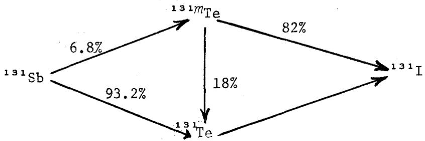

Antimony-131 decays for $6.8\%$ to the isomeric state of tellurium, ${}^{131}\mathrm{mTe}$ , and for $93.2\%$ directly to the ground state, ${}^{131}\mathrm{Te}$ ; ${}^{131}\mathrm{mTe}$ decays for $82\%$ directly to ${}^{131}\mathrm{I}$ and for the rest first to the ground state and then to ${}^{131}\mathrm{I}$ . Table 8.3 shows the cumulative fission yields as well as the decay half-lives.

In the first case assumed above, tellurium would remain on the metal walls only after the drain of the system. Because of the short half-life, the equilibrium concentration of $^{131}\mathrm{Sb}$ on the walls would be relatively small. After shutdown, the iodine activity would build up rather quickly since both $^{131}\mathrm{Sb}$ and $^{131}\mathrm{Te}$ have short half-lives. The buildup of $^{131}\mathrm{I}$ through $^{131m}\mathrm{Te}$ would be small and provide roughly 5% of the maximum iodine activity. Since we did not detect any tellurium in the salt, the bulk of this element would then have to be either on the graphite or in the off-gas line.

In the second case, $^{131}\mathrm{Te}$ and $^{131m}\mathrm{Te}$ would be also in equilibrium on the metal walls when the salt is still in the system; this means that their decay rates are governed by the respective fission yields. Since $^{131m}\mathrm{Te}$ has a much longer half-life than $^{131}\mathrm{Te}$ , the equilibrium concentration of $^{131m}\mathrm{Te}$ is much larger than that of $^{131}\mathrm{Te}$ . The buildup of $^{131}\mathrm{I}$ is expected to come from three sources: $^{131}\mathrm{Sb}, ^{131}\mathrm{Te}, ^{131m}\mathrm{Te}$ . In view of the fission yields and decay half-lives of these iodine precursors, roughly 70% of the maximum iodine activity would be due to $^{131m}\mathrm{Te}$ and the remainder to $^{131}\mathrm{Sb}$ and $^{131}\mathrm{Te}$ . The maximum iodine activity would occur approximately three days after reactor shutdown; however, this maximum would not be very pronounced, since the iodine activity from $^{131}\mathrm{Sb}$ and $^{131}\mathrm{Te}$ builds up quickly after reactor shutdown.

Let us now examine the different figures and try to decide what actually happened in the heat exchanger.

Figure 7.18. We believe that the data based on the 364.5-keV photopeak are the most trustworthy, although the values might be somewhat too high shortly after reactor shutdown because of a prominent $^{88}\mathrm{Kr}$ photopeak at 362.6 keV. Apart from the first data after shutdown, one would conclude from this figure that the $^{131}\mathrm{I}$ does build up to a maximum activity two to three days after reactor shutdown. This observation would be in line with

Table 8.3. Information concerning the element-131 fission decay chain   

<table><tr><td>Nuclide</td><td>Half-life</td><td>Cumulative fission yielda (%)</td></tr><tr><td>131Sb</td><td>21 min</td><td>2.93</td></tr><tr><td>131mTe</td><td>1.2 d</td><td>0.20</td></tr><tr><td>131Te</td><td>25 min</td><td>2.77</td></tr><tr><td>131I</td><td>8.07 d</td><td>2.93</td></tr></table>

${}^{a}$ It is estimated that the total fission rate in the MSRE was due to the contribution of the following isotopes: ${}^{239}\mathrm{U}$ , 94%; ${}^{235}\mathrm{U},{2.25}\% ;{}^{239}\mathrm{{Pu}},3.75\%$ . Actual fission yields were calculated from B. M. Rider, A Survey and Evaluation of Thermal Fission Yields, GEAP-5356.

the above-mentioned second hypothesis. The relatively high $^{13}$ I activity in relation to, for example, $^{95}$ Nb or $^{99}$ Mo would also favor the second case.

Figure 7.17. If the first hypothesis were to hold, one would expect the $^{131m}$ Te activity to be appreciably lower than the $^{131}$ I activity because the amount of $^{131m}$ Te formed from $^{131}$ Sb would be quite small. This is definitely not the case.

Figures 7.18 and 7.19. Antimony-132 has a decay half-life of approximately 2.1 min and $^{13}$ Sb approximately 25 min. (The decay half-lives and fission yields of these two isotopes do not appear to be very well known.) This means that their equilibrium concentrations on the metal walls, also taking into account the fission yields, differ by a factor of at least 8 to 10. Consequently, if the first hypothesis were correct, the $^{13}$ I should be higher than the $^{13}$ Te-I activity. This is definitely not the case.

Although it is fully acknowledged that a more precise analysis should be made of the antimony-tellurium-iodine data, it seems reasonable to conclude from the above that both the antimony and tellurium isotopes do deposit on the metal walls while the fuel salt is in the system. Both of these elements seem to contribute to the total iodine activities. Iodine itself, however, will not remain on the metal walls as long as there is salt in contact with these walls. A study of the antimony, tellurium, and iodine activities of the other fission decay chains basically points to the same conclusion.

# 8.3.4 Extrapolation back to reactor shutdown time

In order to plot and compare the recorded data during the actual survey of the heat exchanger and main reactor off-gas line, all activities were extrapolated back to reactor shutdown time. This seems a reasonable procedure to obtain the maximum activities of the deposited elements. There is possibly one exception to this rule, $^{131}$ I. Because $^{131}$ I appears to attain its maximum activity only after roughly three days, the extrapolation would overestimate the maximum $^{131}$ I activity by about 20%. Thus, $^{131}$ I data given in Fig. 7.28 and Tables 7.7 to 7.9 could be considered 20% too high. Since all data of the heat exchanger and main reactor off-gas line were taken during the actual survey, three or more days after reactor shutdown, these extrapolated $^{131}$ I activities are consistent among each other,

# 9. EPILOGUE

We observed a rather large, unexpected activity due to the fission gases krypton and xenon in the heat exchanger. This could be explained by taking into account a flow of these gases from the main reactor off-gas line back into the reactor system during the drain of the fuel salt. Actually, if one calculates the volume of the gases involved and their average age after fission, the observed activity in the reactor system can be approximately accounted for. Where substantially larger activities are involved with large molten-salt reactors, a different layout of this gas equalizer line should be considered to avoid such an activity surge.

With the exception of the iodines, all identified fission products migrated to the walls of the heat exchanger (and consequently to other metal walls in the reactor system), while the fuel salt was in the system. Unless the flush salt has entirely different chemical properties, it is difficult to expect that this salt would dissolve the deposited elements. With the exception of $^{131}\mathrm{I}$ , $^{133}\mathrm{I}$ , and $^{134}\mathrm{I}$ , the current flush salt is not expected to reduce appreciably the deposited activities; it still might be useful, however, to dissolve pockets of fuel salt or absorb radioactive dust.

In the previous chapter we have tried to define a few causal relationships for the observed activities of deposited fission products. In view of larger molten-salt reactor systems, it might be useful - beyond academic interest - to study the recorded data in much more detail. For example, a detailed study of the niobium, molybdenum-ruthenium-rhodium, and antimony-tellurium-iodine decay chains should be of interest since these elements seem to represent the major heat sources in the empty reactor system and main reactor off-gas system.

After this satisfactory experiment, in which a sensitive gamma-ray spectrometer was used in a very intense radiation field, we feel confident that a similar technique could be very useful in larger molten-salt reactor systems. For example, a remote gamma-ray spectrometer aimed at a bypass line of the main fuel system could economically reveal very useful information: the $^{97}\mathrm{Nb}/^{95}\mathrm{Nb}$ ratio in connection with the redox potential of the salt and the $^{233}\mathrm{Pa}$ concentration.

Although the gamma spectrometry system used in this study was in most respects highly satisfactory, two changes could be made that might significantly extend its usefulness. One change pertains to the detection of weak gamma lines (small photopeaks) in the presence of strong lines. Each gamma ray produces, in addition to a photopeak, a Compton continuum distribution with an energy range varying from 0 keV to just below the full energy of the gamma ray. A count in the Compton distribution arises when a photon loses only part of its energy in the detector. The remaining energy leaves the detector as a Compton scattered photon.

Although the detection of low-energy gamma rays is favored because the counting efficiency rapidly increases as the gamma energy decreases, this effect is partly offset if higher-energy gammas are present. Because of the Compton distribution of the higher-energy gammas, the lower-energy photopeaks will be masked to an extent that depends on the relative intensities of the various gammas. If they are of sufficiently low intensity the low-energy photopeaks will be completely masked.

In the past few years, a technique has evolved to greatly increase the peak/Compton ratio and thereby significantly extend the ability of the system to detect low-energy gammas in the presence of high-energy gammas. This technique makes use of a Ge(Li) detector enclosed in a much larger detector called an anticoincidence mantle. The mantle is often made of NaI(Tl), but can be a plastic scintillator. Ports are provided in the mantle to provide access for the Ge(Li) detector and a beam of gamma rays. The gamma beam is allowed to hit the Ge(Li) but not the mantle. Gamma rays that lose all their energy in the Ge(Li) produce a pulse (count) in the full energy peak. Most of the gamma rays that scatter out of the Ge(Li) detector will be detected by the mantle. For such events, pulses are detected simultaneously in both detectors. By proper electronic gating the spectrometer can be made to reject these coincident pulses and store only those that occur singly in the Ge(Li) detector. The resulting anticoincident spectrum has a very large full energy peak but very low Compton distribution. Because of the lower Compton distribution, the ability of the system to measure low-energy photons in the presence of high-energy photons is greatly enhanced. An anticoincident spectrometry system has been used successfully

by Holm et al.20 in scanning reactor fuel elements and would have comparable merit in studies similar to our MSRE measurements.

The second suggested change in the spectrometry system pertains to an improvement in the accumulation of spectra under transient conditions. During transient conditions, such as reactor startup, scram, or modifications of fuel or salt chemistry, it is desirable to collect as much spectral data as possible. To obtain suitable resolution of the large number of peaks and permit computer processing of spectra, it is necessary to collect spectra with a gain of about $0.7\mathrm{keV}$ or less per channel. However, with such a gain a 4096-channel spectrum will only extend to about $3000\mathrm{keV}$ . Because several of the short-lived fission products emit photons above $3000\mathrm{keV}$ , their photopeaks will be missed. Under transient conditions there is not enough time to obtain spectra at two different gain settings, and the higher energy portion of the spectrum is lost. The total spectrum can be obtained in two ways. First, a spectrometer system with about 7500 channels could be used; this would permit measurement of the $5230\mathrm{-keV}$ photon of $^{90}\mathrm{Rb}$ , which is the highest energy photon among the fission products with half-lives long enough to permit measurement in most experiments. Second, two spectrometers, one with 4096 channels and another with 400 channels, could be used. Because fission products emit only a few photons above $3000\mathrm{keV}$ , it is unnecessary to collect spectra at low gains above this energy. The two-spectrometer systems would be used by routing the signal from the detector preamplifier to two amplifiers. One amplifier would be operated at a gain of $0.75\mathrm{keV}$ per channel and its output processed by the 4096-channel analyzer to produce a spectrum with an energy range of 0 to 3000 keV. The other amplifier would be operated at about $5\mathrm{keV}$ per channel and its signal processed by the other analyzer. A zero-suppression amplifier would be interposed between the main amplifier and the 400-channel analyzer to suppress the lower $3000\mathrm{keV}$ . Pulses above $3000\mathrm{keV}$ would be processed to yield a spectrum between 3000 and $5000\mathrm{keV}$ .

With either of the above schemes, spectra could be obtained over the full energy range of fission product photons, and no information would be lost during critical moments of transient reactor conditions.

#

A

APPENDICES

# Appendix A

# TABLE OF RADIONUCLIDES

The successful analysis of the gamma-ray spectra, in particular the identification of the nuclides, depends very much on the nuclear data stored in the nuclide library of the spectrum analysis program. Considerable effort was expended in preparing a table of radionuclides for this library, based on the most updated information from the Nuclear Data Project located at ORNL. Since the absolute nuclide concentrations calculated by the computer program depend on the supplied nuclear data, we believed it to be useful to include this table. In case better nuclear data that are significantly different become available, the results presented in Chapter 7 should be changed accordingly.

LIST OF INPUT DATA

```csv
THE HEADING SYMBOLS A,B,C,D,E,F,G,AND H FOR THE INPUT TABLE HAVE THE FOLLOWING MEANING  
A=PRECURSOR SYMBOL MAINLY USED FOR THERMAL NEUTRON REACTIONS  
B=PRECURSOR MASS NO.  
C=PRECURSOR NATURAL ABUNDANCE  
D=NEUTRON REACTION CROSS SECTION  
E= RADIONUCLIDE TYPE,WHERE  
G=N,GAMMA PRODUCT  
1=FISSICN PRODUCT  
2=BOTH N,GAMMA AND FISSION PRODUCT  
3=NEUTRON DEFICIENT NUCLIDE  
4=NATURAL RADIANUCLIDE  
5=OTHER RADIANUCLIDES  
F = NO. OF GAMMA ENERGIES TABULATED  
G = BRANCHIIG RATIO STATUS,WHERE  
A=ABSOLUTE  
P=RELATIVE  
D=BASED ON DECAY SCHEME GIVEN IN REFERENCE 
```

<table><tr><td>TABLE.</td><td>AT.</td><td colspan="7">DECAY</td></tr><tr><td>NO.</td><td>ISOTOPE NO.</td><td>HALFLIFE</td><td>UNIT</td><td>MODE</td><td>A</td><td>B</td><td>C</td><td>D</td></tr><tr><td>1</td><td>0 19</td><td>8</td><td>26.500</td><td>S B-</td><td>0</td><td>18</td><td>0.204</td><td>0.000</td></tr><tr><td>REF</td><td>43</td><td>ADAMS AND DAMS</td><td>J.RADIOANAL</td><td>CHEM</td><td colspan="2">-ENERGIES</td><td>BLUE BOOK</td><td>FOR OTHER DATA</td></tr><tr><td>ENERGY</td><td>INTENSITY G</td><td>ENERGY</td><td>INTENSITY G</td><td></td><td></td><td></td><td></td><td></td></tr><tr><td>197.400</td><td>97.000</td><td>1356.000</td><td>59.000</td><td></td><td></td><td></td><td></td><td></td></tr><tr><td>2</td><td>F 18</td><td>9</td><td>109.800</td><td>M B+</td><td>0</td><td>0.0</td><td>0.0</td><td>3 0.0</td></tr><tr><td>REF</td><td>0</td><td></td><td></td><td></td><td></td><td></td><td></td><td></td></tr><tr><td>ENERGY</td><td>INTENSITY G</td><td></td><td></td><td></td><td></td><td></td><td></td><td></td></tr><tr><td>511.600</td><td>193.400</td><td></td><td></td><td></td><td></td><td></td><td></td><td></td></tr><tr><td>3</td><td>F 20</td><td>9</td><td>11.560</td><td>S B-</td><td>F 19</td><td>100.000</td><td>0.010</td><td>0 0.0</td></tr><tr><td>REF</td><td>43</td><td>ADAMS AND DAMS</td><td>J.RADIOANAL</td><td>CHEM</td><td colspan="2">-ENERGIES</td><td>BLUE BOOK</td><td>FOR OTHER DATA</td></tr><tr><td>ENERGY</td><td>INTENSITY G</td><td></td><td></td><td></td><td></td><td></td><td></td><td></td></tr><tr><td>1633.100</td><td>100.000</td><td></td><td></td><td></td><td></td><td></td><td></td><td></td></tr><tr><td>4</td><td>CR 51</td><td>24</td><td>27.720</td><td>D EC</td><td>CR 50</td><td>4.310</td><td>17.000</td><td>0 0.0</td></tr><tr><td>REF</td><td>0</td><td colspan="7">NUCLEAR DATA TABLES SEC A 1970</td></tr><tr><td>ENERGY</td><td>INTENSITY G</td><td></td><td></td><td></td><td></td><td></td><td></td><td></td></tr><tr><td>320.100</td><td>9.900</td><td></td><td></td><td></td><td></td><td></td><td></td><td></td></tr><tr><td>5</td><td>MN 54</td><td>25</td><td>314.000</td><td>D EC</td><td>FE 54</td><td>5.280</td><td>0.560</td><td>0 0.0</td></tr><tr><td>REF</td><td>36</td><td colspan="7">MARION, NUCLEAR DATA A4,301 (1968)</td></tr><tr><td>ENERGY</td><td>INTENSITY G</td><td></td><td></td><td></td><td></td><td></td><td></td><td></td></tr><tr><td>634.810</td><td>100.000</td><td></td><td></td><td></td><td></td><td></td><td></td><td></td></tr><tr><td>6</td><td>CO 56</td><td>27</td><td>77.300</td><td>D ECB+</td><td>C</td><td>0.0</td><td>0.0</td><td>3 0.0</td></tr><tr><td>REF</td><td>0</td><td colspan="7">NUCLEAR DATA TABLES SEC A 1970</td></tr><tr><td>ENERGY</td><td>INTENSITY G</td><td>ENERGY</td><td>INTENSITY G</td><td>ENERGY</td><td colspan="2">INTENSITY G</td><td>ENERGY</td><td>INTENSITY G</td></tr><tr><td>511.006</td><td>48.000</td><td>733.700</td><td>0.110</td><td>788.000</td><td colspan="2">0.400</td><td>846.750</td><td>99.974</td></tr><tr><td>977.500</td><td>1.400</td><td>1037.900</td><td>12.900</td><td>1141.200</td><td colspan="2">0.170</td><td>1175.130</td><td>2.000</td></tr><tr><td>1238.300</td><td>70.000</td><td>1360.250</td><td>4.300</td><td>1771.430</td><td colspan="2">15.600</td><td>1811.000</td><td>0.600</td></tr><tr><td>1964.200</td><td>0.720</td><td>2015.360</td><td>2.900</td><td>2034.920</td><td colspan="2">7.400</td><td>2112.800</td><td>0.370</td></tr><tr><td>2213.100</td><td>0.300</td><td>2274.000</td><td>0.120</td><td>2374.000</td><td colspan="2">0.150</td><td>2598.570</td><td>16.800</td></tr><tr><td>3010.000</td><td>0.890</td><td>3202.190</td><td>3.100</td><td>3253.640</td><td colspan="2">7.600</td><td>3273.190</td><td>1.500</td></tr><tr><td>3451.400</td><td>0.780</td><td>3548.200</td><td>0.180</td><td></td><td></td><td></td><td></td><td></td></tr><tr><td>7</td><td>CO 60</td><td>27</td><td>5.260</td><td>Y B-</td><td>CO 59</td><td>100.000</td><td>37.500</td><td>0 0.0</td></tr><tr><td>REF</td><td>0</td><td colspan="7">NUCLEAR DATA TABLES SEC A 1970</td></tr><tr><td>ENERGY</td><td>INTENSITY G</td><td>ENERGY</td><td>INTENSITY G</td><td></td><td></td><td></td><td></td><td></td></tr><tr><td>1173.230</td><td>99.880</td><td>1332.510</td><td>1.00.000</td><td>1.00.000</td><td></td><td></td><td></td><td></td></tr></table>

<table><tr><td>E</td><td>KR 87</td><td>36</td><td>76.000</td><td>M</td><td>B-</td><td>KR 86</td><td>17.370</td><td>0.060</td><td>2</td><td>0.250E 01</td><td>13</td><td>D</td></tr><tr><td>REF</td><td>1</td><td>H LYCKLAMA,</td><td>ET AL</td><td>CAN J.</td><td>PHYSICS</td><td colspan="7">47,393(1969)</td></tr><tr><td colspan="2">ENERGY</td><td>INTENSITY G</td><td>ENERGY</td><td>INTENSITY G</td><td>ENERGY</td><td>INTENSITY G</td><td>ENERGY</td><td>INTENSITY G</td><td>ENERGY</td><td colspan="3">INTENSITY G</td></tr><tr><td>403.000</td><td></td><td>59.700</td><td>674.300</td><td>2.000</td><td>836.000</td><td>0.700</td><td>845.800</td><td></td><td></td><td>8.200</td><td></td><td></td></tr><tr><td>1175.500</td><td></td><td>1.300</td><td>1338.000</td><td>0.600</td><td>1384.000</td><td>C.600</td><td>1741.000</td><td></td><td></td><td>2.000</td><td></td><td></td></tr><tr><td>2012.000</td><td></td><td>2.900</td><td>2556.000</td><td>9.500</td><td>2559.000</td><td>5.100</td><td>2881.200</td><td></td><td></td><td>0.300</td><td></td><td></td></tr><tr><td>3209.800</td><td></td><td>0.600</td><td></td><td></td><td></td><td></td><td></td><td></td><td></td><td></td><td></td><td></td></tr></table>

<table><tr><td colspan="4">G K R 88 36 2.800 H B-</td><td colspan="4">0 0.0 0.0 1 0.360E 01 40 A</td></tr><tr><td colspan="8">REF C LYCKLAMA KENNETT CAN J OF PHYSICS 48 P753 (1970)</td></tr><tr><td>ENERGY</td><td>INTENSITY G</td><td>ENERGY</td><td>INTENSITY G</td><td>ENERGY</td><td>INTENSITY G</td><td>ENERGY</td><td>INTENSITY G</td></tr><tr><td>28.000</td><td>0.0</td><td>166.000</td><td>6.800</td><td>196.100</td><td>37.800</td><td>240.400</td><td>0.300</td></tr><tr><td>362.600</td><td>3.000</td><td>390.400</td><td>0.600</td><td>472.300</td><td>0.600</td><td>789.000</td><td>0.400</td></tr><tr><td>834.700</td><td>13.000</td><td>862.400</td><td>0.530</td><td>884.500</td><td>0.070</td><td>945.200</td><td>0.260</td></tr><tr><td>962.200</td><td>0.070</td><td>986.700</td><td>1.600</td><td>1017.600</td><td>0.110</td><td>1039.600</td><td>0.400</td></tr><tr><td>1049.500</td><td>0.100</td><td>1090.400</td><td>0.070</td><td>1141.700</td><td>1.700</td><td>1179.500</td><td>0.750</td></tr><tr><td>1185.100</td><td>0.570</td><td>1213.000</td><td>0.200</td><td>1245.600</td><td>0.300</td><td>1250.000</td><td>1.100</td></tr><tr><td>1352.500</td><td>0.200</td><td>1406.900</td><td>0.200</td><td>1518.500</td><td>1.500</td><td>1529.800</td><td>11.300</td></tr><tr><td>1603.800</td><td>0.200</td><td>1909.100</td><td>0.110</td><td>2029.500</td><td>4.800</td><td>2035.300</td><td>4.800</td></tr><tr><td>2186.800</td><td>0.150</td><td>2195.900</td><td>14.900</td><td>2231.600</td><td>3.600</td><td>2352.400</td><td>0.200</td></tr><tr><td>2392.000</td><td>37.800</td><td>2409.400</td><td>0.070</td><td>2549.000</td><td>0.260</td><td>2771.800</td><td>0.040</td></tr></table>

<table><tr><td colspan="5">16 KR 89 36 3.200 M B-</td><td>0 0.0</td><td>0.0</td><td>1 0.459E 01 91 A R889</td></tr><tr><td colspan="8">REF 2 KITCHING JOHNS NUCL. PHYSICS A98,337(1967)</td></tr><tr><td>ENERGY</td><td>INTENSITY G</td><td>ENERGY</td><td>INTENSITY G</td><td>ENERGY</td><td>INTENSITY G</td><td>ENERGY</td><td>INTENSITY G</td></tr><tr><td>85.600</td><td>C.500</td><td>93.600</td><td>0.400</td><td>150.800</td><td>1.000</td><td>220.600</td><td>25.000</td></tr><tr><td>264.200</td><td>0.900</td><td>345.300</td><td>2.000</td><td>356.300</td><td>6.500</td><td>368.800</td><td>2.000</td></tr><tr><td>396.000</td><td>1.500</td><td>411.400</td><td>1.500</td><td>434.500</td><td>0.500</td><td>439.300</td><td>1.200</td></tr><tr><td>455.000</td><td>1.200</td><td>468.700</td><td>0.750</td><td>497.800</td><td>11.000</td><td>527.000</td><td>0.500</td></tr><tr><td>577.200</td><td>8.000</td><td>586.400</td><td>21.000</td><td>613.000</td><td>0.500</td><td>627.000</td><td>1.500</td></tr><tr><td>695.000</td><td>2.000</td><td>708.000</td><td>0.700</td><td>737.600</td><td>4.000</td><td>744.000</td><td>0.300</td></tr><tr><td>760.000</td><td>0.500</td><td>777.000</td><td>0.600</td><td>802.000</td><td>0.500</td><td>823.000</td><td>2.000</td></tr><tr><td>860.000</td><td>0.700</td><td>867.500</td><td>6.600</td><td>903.500</td><td>7.300</td><td>971.000</td><td>0.400</td></tr><tr><td>987.000</td><td>0.500</td><td>1010.000</td><td>1.000</td><td>1077.000</td><td>0.900</td><td>1105.300</td><td>5.400</td></tr><tr><td>1116.500</td><td>2.500</td><td>1173.000</td><td>1.000</td><td>1273.000</td><td>C.300</td><td>1298.000</td><td>0.500</td></tr><tr><td>1324.000</td><td>1.600</td><td>1370.000</td><td>2.800</td><td>1472.100</td><td>9.500</td><td>1500.000</td><td>0.800</td></tr><tr><td>1533.400</td><td>11.000</td><td>1636.000</td><td>1.000</td><td>1665.000</td><td>0.700</td><td>1670.000</td><td>1.000</td></tr><tr><td>1691.600</td><td>4.700</td><td>1760.000</td><td>3.000</td><td>1775.000</td><td>2.800</td><td>1843.000</td><td>1.100</td></tr><tr><td>1902.000</td><td>1.200</td><td>1998.000</td><td>0.400</td><td>2011.000</td><td>2.600</td><td>2020.000</td><td>1.700</td></tr><tr><td>2120.000</td><td>1.000</td><td>2120.000</td><td>1.700</td><td>2281.000</td><td>2.000</td><td>2380.000</td><td>0.400</td></tr><tr><td>2618.000</td><td>1.400</td><td>2644.000</td><td>0.800</td><td>2753.000</td><td>C.700</td><td>2762.000</td><td>0.500</td></tr><tr><td>2790.000</td><td>1.400</td><td>2865.700</td><td>2.800</td><td>2946.000</td><td>0.300</td><td>3125.000</td><td>0.160</td></tr><tr><td>3125.000</td><td>0.160</td><td>3143.000</td><td>0.900</td><td>3219.000</td><td>C.380</td><td>3320.000</td><td>C.250</td></tr><tr><td>3363.000</td><td>1.200</td><td>3384.000</td><td>0.250</td><td>3480.000</td><td>C.200</td><td>3510.000</td><td>0.300</td></tr><tr><td>3534.000</td><td>1.540</td><td>3568.000</td><td>0.850</td><td>3629.000</td><td>0.080</td><td>3653.000</td><td>0.070</td></tr><tr><td>3720.000</td><td>0.800</td><td>3734.000</td><td>0.200</td><td>3823.000</td><td>0.080</td><td>3834.000</td><td>0.080</td></tr><tr><td>3842.000</td><td>0.080</td><td>3894.000</td><td>0.140</td><td>3904.000</td><td>C.140</td><td>3924.000</td><td>0.300</td></tr><tr><td>1993.000</td><td>0.100</td><td>4005.000</td><td>0.670</td><td>4040.000</td><td>C.660</td><td></td><td></td></tr></table>

<table><tr><td colspan="11">11 KB 50 36 32.000 S B- G 0.0 0.0 1 0.560E 01 31 A RB-90</td></tr><tr><td>REF</td><td colspan="10">JCHNS ETAL BULL.AM.PHYS.SOC. 12,NC5,697 (1967)</td></tr><tr><td>ENERGY</td><td>INTENSITY G</td><td>ENERGY</td><td>INTENSITY G</td><td>ENERGY</td><td>INTENSITY G</td><td>ENERGY</td><td>INTENSITY G</td><td></td><td></td><td></td></tr><tr><td>121.500</td><td>58.000</td><td>192.000</td><td>0.200</td><td>234.100</td><td>4.600</td><td>241.800</td><td>17.000</td><td></td><td></td><td></td></tr><tr><td>345.600</td><td>1.000</td><td>434.100</td><td>2.900</td><td>455.500</td><td>2.900</td><td>539.800</td><td>38.000</td><td></td><td></td><td></td></tr><tr><td>554.500</td><td>6.500</td><td>731.100</td><td>1.700</td><td>786.100</td><td>0.400</td><td>941.900</td><td>1.600</td><td></td><td></td><td></td></tr><tr><td>991.100</td><td>0.200</td><td>1118.700</td><td>52.000</td><td>1303.000</td><td>0.700</td><td>1310.000</td><td>0.600</td><td></td><td></td><td></td></tr><tr><td>1423.700</td><td>3.700</td><td>1463.500</td><td>0.500</td><td>1501.200</td><td>0.0</td><td>1537.700</td><td>13.000</td><td></td><td></td><td></td></tr><tr><td>1552.100</td><td>3.100</td><td>1658.200</td><td>1.600</td><td>1714.200</td><td>0.040</td><td>1780.000</td><td>9.400</td><td></td><td></td><td></td></tr><tr><td>1834.700</td><td>0.400</td><td>2378.000</td><td>0.500</td><td>2708.000</td><td>0.300</td><td>2726.000</td><td>1.000</td><td></td><td></td><td></td></tr><tr><td>2752.000</td><td>0.600</td><td>2853.000</td><td>1.000</td><td>3113.000</td><td>1.400</td><td></td><td></td><td></td><td></td><td></td></tr><tr><td>12</td><td>FB 88</td><td>37</td><td>18.000 M</td><td colspan="7">B- PB 87 27.850 0.120 2 0.360E 01 15 C</td></tr><tr><td>REF</td><td colspan="10">1 H LYCKLAMA, ET AL CAN J. PHYSICS 47,393(1969)</td></tr><tr><td>ENERGY</td><td>INTENSITY G</td><td>ENERGY</td><td>INTENSITY G</td><td>ENERGY</td><td>INTENSITY G</td><td>ENERGY</td><td>INTENSITY G</td><td></td><td></td><td></td></tr><tr><td>698.000</td><td>18.100</td><td>1383.500</td><td>1.100</td><td>1518.500</td><td>0.200</td><td>1535.500</td><td>0.200</td><td></td><td></td><td></td></tr><tr><td>1779.800</td><td>0.300</td><td>1836.100</td><td>30.200</td><td>2119.500</td><td>0.500</td><td>2577.800</td><td>0.200</td><td></td><td></td><td></td></tr><tr><td>2677.800</td><td>2.900</td><td>2734.100</td><td>0.200</td><td>3009.500</td><td>0.500</td><td>3220.000</td><td>0.400</td><td></td><td></td><td></td></tr><tr><td>3487.800</td><td>0.200</td><td>4744.500</td><td>0.500</td><td>4854.000</td><td>0.030</td><td></td><td></td><td></td><td></td><td></td></tr><tr><td>13</td><td>PB 88</td><td>37</td><td>17.800 M</td><td colspan="7">B- RB 87 27.850 0.120 2 0.360E 01 14 A NONE</td></tr><tr><td>REF</td><td>3 RAGAINI</td><td>KIGHT</td><td colspan="8">NUCL.Phys.A125.97 (1969)</td></tr><tr><td>ENERGY</td><td>INTENSITY G</td><td>ENERGY</td><td>INTENSITY G</td><td>ENERGY</td><td>INTENSITY G</td><td>ENERGY</td><td>INTENSITY G</td><td></td><td></td><td></td></tr><tr><td>898.040</td><td>14.400</td><td>1383.500</td><td>0.860</td><td>1779.400</td><td>0.190</td><td>1799.000</td><td>0.120</td><td></td><td></td><td></td></tr><tr><td>1836.130</td><td>23.200</td><td>2118.000</td><td>0.560</td><td>2577.900</td><td>0.160</td><td>2677.000</td><td>2.800</td><td></td><td></td><td></td></tr><tr><td>2734.100</td><td>0.972</td><td>3009.100</td><td>0.230</td><td>3219.400</td><td>0.230</td><td>3488.200</td><td>0.140</td><td></td><td></td><td></td></tr><tr><td>4745.297</td><td>0.150</td><td>4853.699</td><td>0.008</td><td></td><td></td><td></td><td></td><td></td><td></td><td></td></tr><tr><td>14</td><td>PB 89</td><td>37</td><td>14.900 M</td><td colspan="7">B- 0 0.0 0.0 1 0.480E 01 14 A SR-90</td></tr><tr><td>REF</td><td colspan="10">10 KITCHING,JOHNS CAN.J.PHYSICS VOL 44 P2661 (1966) USING AU-198,CS-137,NA-24</td></tr><tr><td>ENERGY</td><td>INTENSITY G</td><td>ENERGY</td><td>INTENSITY G</td><td>ENERGY</td><td>INTENSITY G</td><td>ENERGY</td><td>INTENSITY G</td><td></td><td></td><td></td></tr><tr><td>277.000</td><td>2.200</td><td>290.000</td><td>0.500</td><td>658.800</td><td>10.700</td><td>770.000</td><td>0.400</td><td></td><td></td><td></td></tr><tr><td>548.500</td><td>10.000</td><td>1030.700</td><td>60.000</td><td>1225.000</td><td>0.750</td><td>1246.400</td><td>46.600</td><td></td><td></td><td></td></tr><tr><td>1526.000</td><td>3.100</td><td>2000.000</td><td>4.500</td><td>2194.900</td><td>17.100</td><td>2567.000</td><td>12.000</td><td></td><td></td><td></td></tr><tr><td>2708.000</td><td>3.000</td><td>3500.000</td><td>2.700</td><td></td><td></td><td></td><td></td><td></td><td></td><td></td></tr><tr><td>15</td><td>PB 90</td><td>37</td><td>2.910 M</td><td colspan="7">B- 0 0.0 0.0 1 0.581E 01 23 R SR-90</td></tr><tr><td>REF</td><td colspan="10">5 JCHNSON, O&#x27;KELLEY, EICHLER PHYS.REV. 135,B36(1964)</td></tr><tr><td>ENERGY</td><td>INTENSITY G</td><td>ENERGY</td><td>INTENSITY G</td><td>ENERGY</td><td>INTENSITY G</td><td>ENERGY</td><td>INTENSITY G</td><td></td><td></td><td></td></tr><tr><td>539.000</td><td>6.600</td><td>720.000</td><td>6.500</td><td>832.000</td><td>100.000</td><td>860.000</td><td>100.000</td><td></td><td></td><td></td></tr><tr><td>1030.000</td><td>8.500</td><td>1110.000</td><td>13.200</td><td>1240.000</td><td>4.300</td><td>1400.000</td><td>8.300</td><td></td><td></td><td></td></tr><tr><td>1700.000</td><td>6.100</td><td>1820.000</td><td>4.800</td><td>2200.000</td><td>3.600</td><td>2510.000</td><td>3.400</td><td></td><td></td><td></td></tr><tr><td>2720.000</td><td>1.800</td><td>2840.000</td><td>3.000</td><td>3070.000</td><td>9.700</td><td>3340.000</td><td>27.500</td><td></td><td></td><td></td></tr><tr><td>3540.000</td><td>8.100</td><td>4130.000</td><td>19.600</td><td>4340.000</td><td>31.300</td><td>4370.000</td><td>31.300</td><td></td><td></td><td></td></tr><tr><td>4600.000</td><td>8.400</td><td>5080.000</td><td>3.000</td><td>5230.000</td><td>6.700</td><td></td><td></td><td></td><td></td><td></td></tr></table>

<table><tr><td>16</td><td>SR 91</td><td>38</td><td>9.700 H B-</td><td>0</td><td>0.0</td><td>0.0</td><td>1</td><td>0.581E 01</td><td>10</td><td>A</td><td>Y 91</td></tr><tr><td>REF</td><td>42</td><td>GUNNINK</td><td>ETAL</td><td>UCID</td><td>15439</td><td>14JAN</td><td>1969</td><td></td><td></td><td></td><td></td></tr><tr><td colspan="2">ENERGY</td><td>INTENSITY G</td><td>ENERGY</td><td>INTENSITY G</td><td>ENERGY</td><td>INTENSITY G</td><td>ENERGY</td><td>INTENSITY G</td><td>ENERGY</td><td>INTENSITY G</td><td></td></tr><tr><td colspan="2">275.450</td><td>1.330</td><td>620.170</td><td>1.900</td><td>631.360</td><td>0.610</td><td>652.980</td><td>12.000</td><td></td><td></td><td></td></tr><tr><td colspan="2">749.770</td><td>24.000</td><td>761.300</td><td>0.600</td><td>925.770</td><td>4.000</td><td>1024.250</td><td>33.000</td><td></td><td></td><td></td></tr><tr><td colspan="2">1280.940</td><td>0.940</td><td>1413.400</td><td>1.400</td><td></td><td></td><td></td><td></td><td></td><td></td><td></td></tr><tr><td>17</td><td>SR 92</td><td>38</td><td>2.700 H B-</td><td>C</td><td>0.0</td><td>0.0</td><td>1</td><td>0.530E 01</td><td>1</td><td>A</td><td>Y 92</td></tr><tr><td>REF</td><td>42</td><td>GUNNINK</td><td>ETAL</td><td>UCID</td><td>15439</td><td>14JAN</td><td>1969</td><td></td><td></td><td></td><td></td></tr><tr><td colspan="2">ENERGY</td><td>INTENSITY G</td><td></td><td></td><td></td><td></td><td></td><td></td><td></td><td></td><td></td></tr><tr><td colspan="2">1386.000</td><td>90.000</td><td></td><td></td><td></td><td></td><td></td><td></td><td></td><td></td><td></td></tr><tr><td>18</td><td>Y 90M</td><td>39</td><td>3.100 H IT</td><td>Y 89</td><td>100.000</td><td>0.001</td><td>0</td><td>0.0</td><td></td><td>2</td><td>A</td></tr><tr><td>REF</td><td>43</td><td>ADAMS AND DAMS</td><td colspan="3">J.RADIOANAL CHEM -ENERGIES</td><td>BLUE BOOK</td><td colspan="3">FOR OTHER DATA</td><td></td><td></td></tr><tr><td colspan="2">ENERGY</td><td>INTENSITY G</td><td>ENERGY</td><td>INTENSITY G</td><td></td><td></td><td></td><td></td><td></td><td></td><td></td></tr><tr><td colspan="2">202.400</td><td>97.000</td><td>479.300</td><td>91.000</td><td></td><td></td><td></td><td></td><td></td><td></td><td></td></tr><tr><td>19</td><td>Y 90</td><td>38</td><td>64.000 H B-</td><td>Y 89</td><td>100.000</td><td>1.300</td><td>2</td><td>0.577E 01</td><td>1</td><td>A</td><td></td></tr><tr><td>REF</td><td>O</td><td colspan="10">NUCLEAR DATA TABLES SEC A 1970</td></tr><tr><td colspan="2">ENERGY</td><td>INTENSITY G</td><td></td><td></td><td></td><td></td><td></td><td></td><td></td><td></td><td></td></tr><tr><td colspan="2">1742.700</td><td>C.016</td><td></td><td></td><td></td><td></td><td></td><td></td><td></td><td></td><td></td></tr><tr><td>20</td><td>Y 91M</td><td>39</td><td>50.000 M IT</td><td>0</td><td>0.0</td><td>0.0</td><td>1</td><td>0.340E 01</td><td>1</td><td>A</td><td></td></tr><tr><td>REF</td><td>42</td><td>GUNNINK</td><td>ETAL</td><td>UCID</td><td>15439</td><td>14JAN</td><td>1969</td><td></td><td></td><td></td><td></td></tr><tr><td colspan="2">ENERGY</td><td>INTENSITY G</td><td></td><td></td><td></td><td></td><td></td><td></td><td></td><td></td><td></td></tr><tr><td colspan="2">555.630</td><td>58.000</td><td></td><td></td><td></td><td></td><td></td><td></td><td></td><td></td><td></td></tr><tr><td>21</td><td>Y 91</td><td>39</td><td>59.000 D B-</td><td>C</td><td>0.0</td><td>0.0</td><td>1</td><td>0.590E 01</td><td>1</td><td>A</td><td></td></tr><tr><td>REF</td><td>42</td><td>GUNNINK</td><td>ETAL</td><td>UCID</td><td>15439</td><td>14JAN</td><td>1969</td><td></td><td></td><td></td><td></td></tr><tr><td colspan="2">ENERGY</td><td>INTENSITY G</td><td></td><td></td><td></td><td></td><td></td><td></td><td></td><td></td><td></td></tr><tr><td colspan="2">1208.000</td><td>0.220</td><td></td><td></td><td></td><td></td><td></td><td></td><td></td><td></td><td></td></tr><tr><td>22</td><td>Y 92</td><td>39</td><td>3.530 H B-</td><td>0</td><td>0.0</td><td>0.0</td><td>1</td><td>0.590E 01</td><td>6</td><td>A</td><td></td></tr><tr><td>REF</td><td>42</td><td>GUNNINK</td><td>ETAL</td><td>UCID</td><td>15439</td><td>14JAN</td><td>1969</td><td></td><td></td><td></td><td></td></tr><tr><td colspan="2">ENERGY</td><td>INTENSITY G</td><td>ENERGY</td><td>INTENSITY G</td><td>ENERGY</td><td>INTENSITY G</td><td>ENERGY</td><td rowspan="2">INTENSITY G</td><td>1.750</td><td></td><td></td></tr><tr><td colspan="2">448.100</td><td>2.700</td><td>492.100</td><td>C.600</td><td>560.920</td><td>2.800</td><td>844.300</td><td></td><td></td><td></td></tr><tr><td colspan="2">934.520</td><td>14.000</td><td>1405.300</td><td>4.800</td><td></td><td></td><td></td><td></td><td></td><td></td><td></td></tr><tr><td>23</td><td>Y 93</td><td>39</td><td>10.100 H B-</td><td>0</td><td>0.0</td><td>0.0</td><td>1</td><td>0.610E 01</td><td>18</td><td>A</td><td></td></tr><tr><td>REF</td><td>42</td><td>GUNNINK</td><td>ETAL</td><td>UCID</td><td>15439</td><td>14JAN</td><td>1969</td><td></td><td></td><td></td><td></td></tr><tr><td colspan="2">ENERGY</td><td>INTENSITY G</td><td>ENERGY</td><td>INTENSITY G</td><td>ENERGY</td><td>INTENSITY G</td><td>ENERGY</td><td>INTENSITY G</td><td>1.750</td><td></td><td></td></tr><tr><td colspan="2">267.050</td><td>6.400</td><td>478.400</td><td>0.011</td><td>680.250</td><td>0.700</td><td>895.700</td><td>0.270</td><td></td><td></td><td></td></tr><tr><td>REF</td><td>42.070</td><td>2.200</td><td>1158.400</td><td>0.037</td><td>1162.800</td><td>0.044</td><td>1183.700</td><td>0.044</td><td></td><td></td><td></td></tr><tr><td colspan="2">1204.300</td><td>0.320</td><td>1237.700</td><td>0.023</td><td>1406.600</td><td>0.051</td><td>1425.460</td><td>0.237</td><td></td><td></td><td></td></tr><tr><td colspan="2">1450.570</td><td>0.342</td><td>1470.300</td><td>0.055</td><td>1642.500</td><td>0.051</td><td>1917.850</td><td>1.450</td><td></td><td></td><td></td></tr><tr><td colspan="2">2184.800</td><td>0.120</td><td>2191.200</td><td>0.170</td><td></td><td></td><td></td><td></td><td></td><td></td><td></td></tr><tr><td>24</td><td>ZR 95</td><td>40</td><td>65.000</td><td>D B-</td><td>ZR 94</td><td>17.400</td><td>0.080</td><td>2</td><td>0.620E 01</td><td>2</td><td>NE-95</td></tr><tr><td>REF</td><td>7</td><td>LEGRAND</td><td>ETAL, NUCL.PHYS.</td><td colspan="8">A107,177 (1968)</td></tr><tr><td>ENERGY</td><td>INTENSITY G</td><td>ENERGY</td><td>INTENSITY G</td><td></td><td></td><td></td><td></td><td></td><td></td><td></td><td></td></tr><tr><td>724.240</td><td>43.600</td><td>756.870</td><td>54.800</td><td></td><td></td><td></td><td></td><td></td><td></td><td></td><td></td></tr><tr><td>25</td><td>ZR 97</td><td>40</td><td>17.000</td><td>H B-</td><td>ZR 96</td><td>2.800</td><td>0.050</td><td>2</td><td>0.590E 01</td><td>10 A</td><td>NE 97</td></tr><tr><td>REF</td><td>42</td><td>GUNNINK</td><td>ETAL</td><td>UCID</td><td>15439</td><td>14JAN</td><td>1969</td><td></td><td></td><td></td><td></td></tr><tr><td>ENERGY</td><td>INTENSITY G</td><td>ENERGY</td><td>INTENSITY G</td><td>ENERGY</td><td>17.400</td><td>602.500</td><td>1.280</td><td>703.800</td><td>1.000</td><td></td><td></td></tr><tr><td>254.300</td><td>1.300</td><td>355.700</td><td>2.200</td><td>602.500</td><td>1.280</td><td>703.800</td><td>1.000</td><td></td><td></td><td></td><td></td></tr><tr><td>743.370</td><td>94.000</td><td>1148.000</td><td>2.620</td><td>1276.100</td><td>0.900</td><td>1362.700</td><td>1.080</td><td></td><td></td><td></td><td></td></tr><tr><td>1750.600</td><td>1.080</td><td>1852.000</td><td>0.260</td><td></td><td></td><td></td><td></td><td></td><td></td><td></td><td></td></tr><tr><td>26</td><td>NB 95M</td><td>41</td><td>90.000</td><td>H IT</td><td>ZR 94</td><td>17.400</td><td>0.080</td><td>2</td><td>0.128E 00</td><td>1 A</td><td></td></tr><tr><td>REF</td><td>43</td><td>ADAMS AND DAMS</td><td>J.RADIOANAL</td><td>CHEM -ENERGIES</td><td colspan="7">BLUE BOOK FOR OTHER DATA</td></tr><tr><td>ENERGY</td><td>INTENSITY G</td><td>ADAMS AND DAMS</td><td>J.RADIOANAL</td><td>CHEM -ENERGIES</td><td colspan="7">BLUE BOOK FOR OTHER DATA</td></tr><tr><td>235.700</td><td>100.000</td><td></td><td></td><td></td><td></td><td></td><td></td><td></td><td></td><td></td><td></td></tr><tr><td>27</td><td>NB 95</td><td>41</td><td>35.150</td><td>D B-</td><td>0 0.0</td><td>0.0</td><td>1</td><td>0.641E 01</td><td>1</td><td></td><td></td></tr><tr><td>REF</td><td>7</td><td>LEGRAND</td><td>ETAL, NUCL.PHYS.</td><td colspan="8">A107,177 (1968)</td></tr><tr><td>ENERGY</td><td>INTENSITY G</td><td>LEGRAND</td><td>ETAL, NUCL.PHYS.</td><td colspan="8">A107,177 (1968)</td></tr><tr><td>765.84C</td><td>100.000</td><td></td><td></td><td></td><td></td><td></td><td></td><td></td><td></td><td></td><td></td></tr><tr><td>28</td><td>NB 96</td><td>41</td><td>23.000</td><td>H B-</td><td>0 0.0</td><td>0.0</td><td>1</td><td>0.600E-03</td><td>21 P</td><td></td><td></td></tr><tr><td>REF</td><td>8</td><td>NONARC, BARRETTE, BOUTARD</td><td>CAN. J. PHYS.</td><td colspan="8">46, 2375(1968)</td></tr><tr><td>ENERGY</td><td>INTENSITY G</td><td>ENERGY</td><td>INTENSITY G</td><td>ENERGY</td><td>1.600</td><td>352.200</td><td>1.100</td><td></td><td></td><td></td><td></td></tr><tr><td>218.900</td><td>2.900</td><td>241.600</td><td>3.300</td><td>350.200</td><td>5.600</td><td>568.700</td><td>56.000</td><td></td><td></td><td></td><td></td></tr><tr><td>371.800</td><td>2.900</td><td>460.100</td><td>26.800</td><td>480.500</td><td>1.200</td><td>778.200</td><td>100.000</td><td></td><td></td><td></td><td></td></tr><tr><td>591.700</td><td>1.000</td><td>719.700</td><td>6.700</td><td>721.700</td><td>21.000</td><td>1091.400</td><td>50.000</td><td></td><td></td><td></td><td></td></tr><tr><td>810.400</td><td>9.000</td><td>812.500</td><td>5.500</td><td>849.800</td><td>0.400</td><td>1497.900</td><td>2.900</td><td></td><td></td><td></td><td></td></tr><tr><td>1128.000</td><td>0.700</td><td>1200.100</td><td>20.500</td><td>1441.300</td><td>0.400</td><td>1497.900</td><td>2.900</td><td></td><td></td><td></td><td></td></tr><tr><td>1497.900</td><td>0.400</td><td></td><td></td><td></td><td></td><td></td><td></td><td></td><td></td><td></td><td></td></tr><tr><td>29</td><td>NB 97M</td><td>41</td><td>1.000</td><td>M IT</td><td>ZR 96</td><td>2.800</td><td>0.050</td><td>2</td><td>0.595E 01</td><td>1 A</td><td></td></tr><tr><td>REF</td><td>43</td><td>ADAMS AND DAMS</td><td>J.RADIOANAL</td><td>CHEM -ENERGIES</td><td colspan="7">BLUE BOOK FOR OTHER DATA</td></tr><tr><td>ENERGY</td><td>INTENSITY G</td><td>ADAMS AND DAMS</td><td>J.RADIOANAL</td><td>CHEM -ENERGIES</td><td colspan="7">BLUE BOOK FOR OTHER DATA</td></tr><tr><td>743.300</td><td>98.000</td><td></td><td></td><td></td><td></td><td></td><td></td><td></td><td></td><td></td><td></td></tr><tr><td>30</td><td>NB 97</td><td>41</td><td>72.000</td><td>M B-</td><td>ZR 96</td><td>2.800</td><td>0.050</td><td>2</td><td>0.620E 01</td><td>1 A</td><td></td></tr><tr><td>REF</td><td>42</td><td>GUNNINK</td><td>ETAL</td><td>UCID 15439</td><td>14JAN 1969</td><td></td><td></td><td></td><td></td><td></td><td></td></tr><tr><td>ENERGY</td><td>INTENSITY G</td><td>GUNNINK</td><td>ETAL</td><td>UCID 15439</td><td>14JAN 1969</td><td></td><td></td><td></td><td></td><td></td><td></td></tr><tr><td>658.180</td><td>99.000</td><td></td><td></td><td></td><td></td><td></td><td></td><td></td><td></td><td></td><td></td></tr></table>

<table><tr><td>31</td><td>MO 99</td><td>42</td><td>66.690 H B-</td><td>MO 98</td><td>23.780</td><td>0.150</td><td>2</td><td>0.610E</td><td>01</td><td>22</td><td>A</td><td>TC99M</td></tr><tr><td>REF</td><td>37</td><td colspan="11">VAN Eijk ET.AL. NUCL. PHYS. A121,440(1968)</td></tr><tr><td>ENERGY</td><td>INTENSITY G</td><td>ENERGY</td><td>INTENSITY G</td><td>ENERGY</td><td>INTENSITY G</td><td>ENERGY</td><td>INTENSITY G</td><td>ENERGY</td><td>INTENSITY G</td><td></td><td></td><td></td></tr><tr><td>18.251</td><td>11.000</td><td>18.367</td><td>0.0</td><td>40.584</td><td>6.300</td><td>140.511</td><td>95.100</td><td></td><td></td><td></td><td></td><td></td></tr><tr><td>142.630</td><td>0.900</td><td>181.060</td><td>7.600</td><td>249.000</td><td>0.005</td><td>366.400</td><td>1.450</td><td></td><td></td><td></td><td></td><td></td></tr><tr><td>380.700</td><td>0.010</td><td>409.000</td><td>0.001</td><td>411.500</td><td>0.024</td><td>458.000</td><td>0.005</td><td></td><td></td><td></td><td></td><td></td></tr><tr><td>528.900</td><td>0.053</td><td>620.700</td><td>0.004</td><td>620.700</td><td>0.024</td><td>739.700</td><td>13.700</td><td></td><td></td><td></td><td></td><td></td></tr><tr><td>778.200</td><td>4.800</td><td>823.100</td><td>0.140</td><td>961.000</td><td>0.110</td><td>988.200</td><td>0.002</td><td></td><td></td><td></td><td></td><td></td></tr><tr><td>1001.700</td><td>0.006</td><td>1016.000</td><td>0.001</td><td></td><td></td><td></td><td></td><td></td><td></td><td></td><td></td><td></td></tr><tr><td>32</td><td>MO101</td><td>42</td><td>14.600 M B-</td><td>MO100</td><td>9.630</td><td>C.200</td><td>2</td><td>0.500E</td><td>01</td><td>22</td><td>D</td><td>TC-101</td></tr><tr><td>REF</td><td>14</td><td colspan="11">CRETU ETAL REV.ROUM.PHYS.,TOME11,NO2,P143 (1966)</td></tr><tr><td>ENERGY</td><td>INTENSITY G</td><td>ENERGY</td><td>INTENSITY G</td><td>ENERGY</td><td>INTENSITY G</td><td>ENERGY</td><td>INTENSITY G</td><td>ENERGY</td><td>INTENSITY G</td><td></td><td></td><td></td></tr><tr><td>8C.000</td><td>3.000</td><td>190.000</td><td>7.000</td><td>191.000</td><td>29.000</td><td>300.000</td><td>6.000</td><td></td><td></td><td></td><td></td><td></td></tr><tr><td>40C.000</td><td>2.000</td><td>510.000</td><td>2.000</td><td>510.000</td><td>18.000</td><td>590.000</td><td>25.000</td><td></td><td></td><td></td><td></td><td></td></tr><tr><td>700.000</td><td>14.000</td><td>890.000</td><td>14.000</td><td>950.000</td><td>1.000</td><td>1020.000</td><td>25.000</td><td></td><td></td><td></td><td></td><td></td></tr><tr><td>1180.000</td><td>9.000</td><td>1280.000</td><td>3.000</td><td>1380.000</td><td>9.000</td><td>1460.000</td><td>3.000</td><td></td><td></td><td></td><td></td><td></td></tr><tr><td>156C.000</td><td>12.000</td><td>1680.000</td><td>4.000</td><td>1800.000</td><td>1.000</td><td>1890.000</td><td>1.000</td><td></td><td></td><td></td><td></td><td></td></tr><tr><td>208C.000</td><td>9.000</td><td>2160.000</td><td>1.000</td><td></td><td></td><td></td><td></td><td></td><td></td><td></td><td></td><td></td></tr><tr><td>33</td><td>TC 9SM</td><td>43</td><td>6.000 H IT</td><td>MO 98</td><td>23.780</td><td>0.510</td><td>0</td><td>0.616E</td><td>01</td><td>2</td><td>A</td><td>43 99</td></tr><tr><td>REF</td><td>0</td><td colspan="11">NUCLEAR DATA TABLES SEC A 1970</td></tr><tr><td>ENERGY</td><td>INTENSITY G</td><td>ENERGY</td><td>INTENSITY G</td><td></td><td></td><td></td><td></td><td></td><td></td><td></td><td></td><td></td></tr><tr><td>140.511</td><td>89.500</td><td>142.630</td><td>0.027</td><td></td><td></td><td></td><td></td><td></td><td></td><td></td><td></td><td></td></tr><tr><td>34</td><td>TC101</td><td>43</td><td>14.000 M B-</td><td>MO100</td><td>9.620</td><td>0.200</td><td>2</td><td>0.502E</td><td>01</td><td>4</td><td>A</td><td></td></tr><tr><td>REF</td><td>43</td><td colspan="4">ADAMS AND DAMS J.RADIOANAL CHEM -ENERGIES</td><td colspan="7">BLUE BCDK FOR OTHER DATA</td></tr><tr><td>ENERGY</td><td>INTENSITY G</td><td>ENERGY</td><td>INTENSITY G</td><td>ENERGY</td><td>INTENSITY G</td><td>ENERGY</td><td>INTENSITY G</td><td>ENERGY</td><td>INTENSITY G</td><td></td><td></td><td></td></tr><tr><td>127.300</td><td>3.000</td><td>306.800</td><td>91.000</td><td>544.900</td><td>8.000</td><td>626.600</td><td>1.000</td><td></td><td></td><td></td><td></td><td></td></tr><tr><td>35</td><td>TC102</td><td>43</td><td>4.500 M B-</td><td>0</td><td>0.0</td><td>0.0</td><td>1</td><td>0.415E</td><td>01</td><td>30</td><td>R</td><td></td></tr><tr><td>REF</td><td>0</td><td colspan="11">BLACHOT ETAL NUCL PHYS A139 (1969) P434 GE DIODE</td></tr><tr><td>ENERGY</td><td>INTENSITY G</td><td>ENERGY</td><td>INTENSITY G</td><td>ENERGY</td><td>INTENSITY G</td><td>ENERGY</td><td>INTENSITY G</td><td>ENERGY</td><td>INTENSITY G</td><td></td><td></td><td></td></tr><tr><td>415.800</td><td>2.000</td><td>418.800</td><td>3.400</td><td>474.800</td><td>100.000</td><td>627.500</td><td>17.000</td><td></td><td></td><td></td><td></td><td></td></tr><tr><td>636.800</td><td>29.700</td><td>691.800</td><td>2.700</td><td>695.600</td><td>3.000</td><td>904.000</td><td>0.0</td><td></td><td></td><td></td><td></td><td></td></tr><tr><td>921.000</td><td>0.0</td><td>1046.300</td><td>12.800</td><td>1073.000</td><td>1.000</td><td>1104.600</td><td>13.200</td><td></td><td></td><td></td><td></td><td></td></tr><tr><td>1115.000</td><td>0.0</td><td>1128.000</td><td>0.0</td><td>1197.800</td><td>10.800</td><td>1292.600</td><td>5.400</td><td></td><td></td><td></td><td></td><td></td></tr><tr><td>1331.800</td><td>3.700</td><td>1511.000</td><td>2.900</td><td>1595.700</td><td>5.100</td><td>1612.800</td><td>7.300</td><td></td><td></td><td></td><td></td><td></td></tr><tr><td>1617.000</td><td>11.100</td><td>1710.000</td><td>5.500</td><td>1810.000</td><td>7.000</td><td>1907.000</td><td>0.0</td><td></td><td></td><td></td><td></td><td></td></tr><tr><td>1950.000</td><td>0.0</td><td>2141.600</td><td>1.000</td><td>2227.000</td><td>7.100</td><td>2242.200</td><td>13.500</td><td></td><td></td><td></td><td></td><td></td></tr><tr><td>2336.300</td><td>10.000</td><td>2437.800</td><td>0.0</td><td></td><td></td><td></td><td></td><td></td><td></td><td></td><td></td><td></td></tr><tr><td>36</td><td>TC102</td><td>43</td><td>5.000 S B-</td><td>0</td><td>0.0</td><td>0.0</td><td>0</td><td>0.415E</td><td>01</td><td>5</td><td>R</td><td></td></tr><tr><td>REF</td><td>0</td><td colspan="11">BLACHOT ETAL NUCL PHYS A139 (1969) P434 GE DIODE</td></tr><tr><td>ENERGY</td><td>INTENSITY G</td><td>ENERGY</td><td>INTENSITY G</td><td>ENERGY</td><td>INTENSITY G</td><td>ENERGY</td><td>INTENSITY G</td><td>ENERGY</td><td>INTENSITY G</td><td></td><td></td><td></td></tr><tr><td>468.000</td><td>15.000</td><td>475.000</td><td>100.000</td><td>628.000</td><td>19.000</td><td>1102.000</td><td>11.000</td><td></td><td></td><td></td><td></td><td></td></tr><tr><td>1166.000</td><td>8.000</td><td></td><td></td><td></td><td></td><td></td><td></td><td></td><td></td><td></td><td></td><td></td></tr></table>

<table><tr><td>E7</td><td>PU103</td><td>44</td><td>39.600 D E-</td><td>RUL02</td><td>31.610</td><td>1.400</td><td>2</td><td>0.300E 01</td><td>7</td><td>A</td><td>45103</td></tr><tr><td>REF</td><td>C</td><td>NUCLEAR</td><td>DATA TABLES</td><td>SEC A</td><td>1970</td><td></td><td></td><td></td><td></td><td></td><td></td></tr><tr><td>ENERGY</td><td>INTENSITY G</td><td>ENERGY</td><td>INTENSITY G</td><td>ENERGY</td><td>INTENSITY G</td><td>ENERGY</td><td>ENERGY</td><td>INTENSITY G</td><td></td><td></td><td></td></tr><tr><td>39.550</td><td>0.056</td><td>53.110</td><td>0.340</td><td>294.880</td><td>0.210</td><td>443.850</td><td>0.360</td><td></td><td></td><td></td><td></td></tr><tr><td>496.900</td><td>89.000</td><td>556.900</td><td>0.800</td><td>610.200</td><td>5.400</td><td></td><td></td><td></td><td></td><td></td><td></td></tr><tr><td>E8</td><td>RU105</td><td>44</td><td>4.430 H E-</td><td>RUL04</td><td>18.580</td><td>0.480</td><td>2</td><td>0.900E 00</td><td>17</td><td>A</td><td>RH105</td></tr><tr><td>REF</td><td>42</td><td>GUNNINK</td><td>ETAL</td><td>UCID</td><td>14JAN</td><td>1969</td><td></td><td></td><td></td><td></td><td></td></tr><tr><td>ENERGY</td><td>INTENSITY G</td><td>ENERGY</td><td>INTENSITY G</td><td>ENERGY</td><td>INTENSITY G</td><td>ENERGY</td><td>ENERGY</td><td>INTENSITY G</td><td></td><td></td><td></td></tr><tr><td>129.530</td><td>4.800</td><td>149.040</td><td>1.550</td><td>262.840</td><td>6.550</td><td>316.500</td><td>10.200</td><td></td><td></td><td></td><td></td></tr><tr><td>326.100</td><td>1.070</td><td>330.900</td><td>0.725</td><td>350.180</td><td>1.220</td><td>393.360</td><td>3.860</td><td></td><td></td><td></td><td></td></tr><tr><td>413.510</td><td>2.300</td><td>469.380</td><td>17.500</td><td>499.280</td><td>2.270</td><td>575.190</td><td>1.030</td><td></td><td></td><td></td><td></td></tr><tr><td>656.150</td><td>1.930</td><td>676.320</td><td>15.000</td><td>724.200</td><td>44.500</td><td>875.800</td><td>2.940</td><td></td><td></td><td></td><td></td></tr><tr><td>969.400</td><td>2.000</td><td></td><td></td><td></td><td></td><td></td><td></td><td></td><td></td><td></td><td></td></tr><tr><td>39</td><td>PH103M</td><td>45</td><td>7.000 M IT</td><td>RUL02</td><td>31.610</td><td>1.400</td><td>2</td><td>0.0</td><td>1</td><td>A</td><td>45103</td></tr><tr><td>REF</td><td>O</td><td>NUCLEAR</td><td>DATA TABLES</td><td>SEC A</td><td>1970</td><td></td><td></td><td></td><td></td><td></td><td></td></tr><tr><td>ENERGY</td><td>INTENSITY G</td><td></td><td></td><td></td><td></td><td></td><td></td><td></td><td></td><td></td><td></td></tr><tr><td>39.550</td><td>0.056</td><td></td><td></td><td></td><td></td><td></td><td></td><td></td><td></td><td></td><td></td></tr><tr><td>40</td><td>RH105M</td><td>45</td><td>45.000 S IT</td><td>G 0.0</td><td>0.0</td><td>1</td><td>0.850E 00</td><td>1</td><td>D</td><td></td><td></td></tr><tr><td>REF</td><td>17</td><td colspan="2">LEDERER, HOLLANDER, PERLMAN</td><td colspan="2">TABLE OF ISOTOPES (1968)</td><td></td><td></td><td></td><td></td><td></td><td></td></tr><tr><td>ENERGY</td><td>INTENSITY G</td><td></td><td></td><td></td><td></td><td></td><td></td><td></td><td></td><td></td><td></td></tr><tr><td>129.400</td><td>100.000</td><td></td><td></td><td></td><td></td><td></td><td></td><td></td><td></td><td></td><td></td></tr><tr><td>41</td><td>RH105</td><td>45</td><td>1.475 D B-</td><td>RUL04</td><td>18.580</td><td>0.480</td><td>2</td><td>0.900E 00</td><td>6</td><td>A</td><td></td></tr><tr><td>REF</td><td>42</td><td>GUNNINK</td><td>ETAL</td><td>UCID</td><td>14JAN</td><td>1969</td><td></td><td></td><td></td><td></td><td></td></tr><tr><td>ENERGY</td><td>INTENSITY G</td><td>ENERGY</td><td>INTENSITY G</td><td>ENERGY</td><td>INTENSITY G</td><td>ENERGY</td><td>INTENSITY G</td><td></td><td></td><td></td><td></td></tr><tr><td>215.800</td><td>0.113</td><td>280.540</td><td>0.180</td><td>306.310</td><td>5.440</td><td>319.240</td><td>19.600</td><td></td><td></td><td></td><td></td></tr><tr><td>442.300</td><td>0.037</td><td>497.000</td><td>0.096</td><td></td><td></td><td></td><td></td><td></td><td></td><td></td><td></td></tr></table>

<table><tr><td>42</td><td>FH106</td><td>45</td><td>367.000</td><td>D</td><td>B-</td><td>0</td><td>0.0</td><td>0.0</td><td>1</td><td>0.390E</td><td>00</td><td>106</td><td>A</td></tr><tr><td>REF</td><td>13</td><td colspan="12">STRUTZ, STRUTZ, AND HAMMERSFELD, Z. PHYSIK 221 231(1969)</td></tr><tr><td>ENERGY</td><td>INTENSITY G</td><td>ENERGY</td><td>INTENSITY G</td><td>ENERGY</td><td>INTENSITY G</td><td>ENERGY</td><td>INTENSITY G</td><td>ENERGY</td><td>INTENSITY G</td><td>ENERGY</td><td>INTENSITY G</td><td></td><td></td></tr><tr><td>228.300</td><td>0.000</td><td>427.900</td><td>0.092</td><td>435.000</td><td>0.047</td><td>498.500</td><td>0.004</td><td></td><td></td><td></td><td></td><td></td><td></td></tr><tr><td>511.800</td><td>20.500</td><td>544.000</td><td>0.003</td><td>552.900</td><td>0.002</td><td>565.700</td><td>0.001</td><td></td><td></td><td></td><td></td><td></td><td></td></tr><tr><td>569.200</td><td>0.002</td><td>578.000</td><td>0.008</td><td>588.100</td><td>0.001</td><td>602.500</td><td>0.002</td><td></td><td></td><td></td><td></td><td></td><td></td></tr><tr><td>616.200</td><td>0.810</td><td>621.800</td><td>9.760</td><td>661.200</td><td>0.015</td><td>680.100</td><td>0.007</td><td></td><td></td><td></td><td></td><td></td><td></td></tr><tr><td>684.300</td><td>0.002</td><td>716.200</td><td>0.016</td><td>717.100</td><td>0.015</td><td>749.500</td><td>0.002</td><td></td><td></td><td></td><td></td><td></td><td></td></tr><tr><td>774.600</td><td>0.006</td><td>873.100</td><td>0.414</td><td>1045.700</td><td>0.004</td><td>1050.100</td><td>1.450</td><td></td><td></td><td></td><td></td><td></td><td></td></tr><tr><td>1062.100</td><td>0.024</td><td>1108.900</td><td>0.005</td><td>1114.600</td><td>0.008</td><td>1128.000</td><td>0.383</td><td></td><td></td><td></td><td></td><td></td><td></td></tr><tr><td>1159.100</td><td>0.000</td><td>1159.700</td><td>0.000</td><td>1179.100</td><td>0.014</td><td>1180.600</td><td>0.014</td><td></td><td></td><td></td><td></td><td></td><td></td></tr><tr><td>1194.300</td><td>0.053</td><td>1220.400</td><td>0.000</td><td>1231.700</td><td>0.001</td><td>1257.000</td><td>0.001</td><td></td><td></td><td></td><td></td><td></td><td></td></tr><tr><td>1266.600</td><td>0.001</td><td>1305.600</td><td>0.003</td><td>1310.700</td><td>0.003</td><td>1316.800</td><td>0.004</td><td></td><td></td><td></td><td></td><td></td><td></td></tr><tr><td>1355.000</td><td>0.001</td><td>1359.900</td><td>0.001</td><td>1397.300</td><td>0.003</td><td>1457.800</td><td>0.001</td><td></td><td></td><td></td><td></td><td></td><td></td></tr><tr><td>1488.900</td><td>0.002</td><td>1496.400</td><td>0.026</td><td>1562.000</td><td>0.146</td><td>1574.400</td><td>0.001</td><td></td><td></td><td></td><td></td><td></td><td></td></tr><tr><td>1579.600</td><td>0.002</td><td>1592.700</td><td>0.008</td><td>1600.700</td><td>0.008</td><td>1605.700</td><td>0.001</td><td></td><td></td><td></td><td></td><td></td><td></td></tr><tr><td>1609.800</td><td>0.000</td><td>1686.100</td><td>0.001</td><td>1730.000</td><td>0.001</td><td>1733.100</td><td>0.002</td><td></td><td></td><td></td><td></td><td></td><td></td></tr><tr><td>1766.200</td><td>0.023</td><td>1775.000</td><td>0.001</td><td>1784.000</td><td>C.000</td><td>1789.000</td><td>0.006</td><td></td><td></td><td></td><td></td><td></td><td></td></tr><tr><td>1796.700</td><td>0.025</td><td>1854.800</td><td>0.00P</td><td>1904.000</td><td>0.000</td><td>1909.400</td><td>0.006</td><td></td><td></td><td></td><td></td><td></td><td></td></tr><tr><td>1926.800</td><td>0.013</td><td>1927.200</td><td>0.013</td><td>1950.400</td><td>0.001</td><td>1956.900</td><td>0.001</td><td></td><td></td><td></td><td></td><td></td><td></td></tr><tr><td>1988.500</td><td>0.022</td><td>2014.000</td><td>0.000</td><td>2033.900</td><td>C.000</td><td>2041.900</td><td>0.000</td><td></td><td></td><td></td><td></td><td></td><td></td></tr><tr><td>2094.100</td><td>0.006</td><td>2169.200</td><td>0.000</td><td>2193.200</td><td>C.005</td><td>2194.000</td><td>0.005</td><td></td><td></td><td></td><td></td><td></td><td></td></tr><tr><td>2210.700</td><td>0.000</td><td>2230.400</td><td>0.000</td><td>2242.400</td><td>0.001</td><td>2271.700</td><td>0.001</td><td></td><td></td><td></td><td></td><td></td><td></td></tr><tr><td>2308.700</td><td>0.006</td><td>2309.400</td><td>C.006</td><td>2317.600</td><td>0.006</td><td>2366.400</td><td>0.021</td><td></td><td></td><td></td><td></td><td></td><td></td></tr><tr><td>2390.800</td><td>0.007</td><td>2406.000</td><td>0.012</td><td>2438.500</td><td>0.004</td><td>2485.700</td><td>0.001</td><td></td><td></td><td></td><td></td><td></td><td></td></tr><tr><td>2525.200</td><td>0.0</td><td>2543.400</td><td>0.002</td><td>2571.200</td><td>G.001</td><td>2651.600</td><td>0.001</td><td></td><td></td><td></td><td></td><td></td><td></td></tr><tr><td>2706.600</td><td>0.003</td><td>2709.400</td><td>0.003</td><td>2740.500</td><td>C.000</td><td>2783.500</td><td>0.0</td><td></td><td></td><td></td><td></td><td></td><td></td></tr><tr><td>2809.500</td><td>0.004</td><td>2821.200</td><td>0.001</td><td>2904.100</td><td>C.000</td><td>2917.900</td><td>0.001</td><td></td><td></td><td></td><td></td><td></td><td></td></tr><tr><td>3627.100</td><td>0.0</td><td>3036.800</td><td>0.001</td><td>3055.600</td><td>C.000</td><td>3085.900</td><td>0.0</td><td></td><td></td><td></td><td></td><td></td><td></td></tr><tr><td>3161.500</td><td>0.0</td><td>3169.000</td><td>C.0</td><td></td><td></td><td></td><td></td><td></td><td></td><td></td><td></td><td></td><td></td></tr><tr><td>43</td><td>RH107</td><td>45</td><td>4.200 M B-</td><td>C 0.0</td><td>C 0.0</td><td>1 0.190E OC</td><td>8</td><td>PD-107</td><td></td><td></td><td></td><td></td><td></td></tr><tr><td>REF</td><td>12</td><td colspan="12">GRIFFIN, PIERSON, BULL, AM, PHYS, SOC, 13, NO.4 (1968)</td></tr><tr><td>ENERGY</td><td>INTENSITY G</td><td>ENERGY</td><td>INTENSITY G</td><td>ENERGY</td><td>INTENSITY G</td><td>ENERGY</td><td>INTENSITY G</td><td></td><td></td><td></td><td></td><td></td><td></td></tr><tr><td>115.800</td><td>0.0</td><td>202.700</td><td>0.0</td><td>312.200</td><td>0.0</td><td>348.200</td><td>0.0</td><td></td><td></td><td></td><td></td><td></td><td></td></tr><tr><td>381.700</td><td>0.0</td><td>392.400</td><td>0.0</td><td>567.600</td><td>C.0</td><td>670.000</td><td>0.0</td><td></td><td></td><td></td><td></td><td></td><td></td></tr><tr><td>44</td><td>AG11CM</td><td>47</td><td>260.000 D B-</td><td>AG10S 48.180 3.000 0 0.6</td><td colspan="9">15 A</td></tr><tr><td>REF</td><td>38</td><td colspan="12">BEMIS, ETAL, NUCL, PHYS A125 (1969) NO 1 P217</td></tr><tr><td>ENERGY</td><td>INTENSITY G</td><td>ENERGY</td><td>INTENSITY G</td><td>ENERGY</td><td>INTENSITY G</td><td>ENERGY</td><td>INTENSITY G</td><td></td><td></td><td></td><td></td><td></td><td></td></tr><tr><td>446.770</td><td>3.300</td><td>620.220</td><td>2.740</td><td>657.710</td><td>94.350</td><td>677.550</td><td>11.510</td><td></td><td></td><td></td><td></td><td></td><td></td></tr><tr><td>686.800</td><td>6.980</td><td>706.680</td><td>16.230</td><td>744.190</td><td>4.150</td><td>763.880</td><td>22.640</td><td></td><td></td><td></td><td></td><td></td><td></td></tr><tr><td>818.000</td><td>7.260</td><td>884.670</td><td>75.100</td><td>937.480</td><td>34.440</td><td>1384.220</td><td>26.130</td><td></td><td></td><td></td><td></td><td></td><td></td></tr><tr><td>1475.730</td><td>4.250</td><td>1504.900</td><td>13.960</td><td>1562.220</td><td>1.250</td><td></td><td></td><td></td><td></td><td></td><td></td><td></td><td></td></tr></table>

<table><tr><td>45</td><td>SB125</td><td>51</td><td>2.770 Y B-</td><td>SN124</td><td>E.980</td><td>C.100</td><td>2</td><td>0.210E-01</td><td>23</td><td>A</td><td>52125</td></tr><tr><td>REF</td><td>C</td><td colspan="10">NUCLEAR DATA TABLES SEC A 1970</td></tr><tr><td>ENERGY</td><td>INTENSITY G</td><td>ENERGY</td><td>INTENSITY G</td><td>ENERGY</td><td>INTENSITY G</td><td>ENERGY</td><td>INTENSITY G</td><td>ENERGY</td><td>INTENSITY G</td><td></td><td></td></tr><tr><td>35.450</td><td>6.900</td><td>81.800</td><td>1.000</td><td>109.270</td><td>0.066</td><td>111.000</td><td>0.098</td><td></td><td></td><td></td><td></td></tr><tr><td>116.970</td><td>0.260</td><td>122.430</td><td>0.036</td><td>172.600</td><td>C.200</td><td>176.290</td><td>6.300</td><td></td><td></td><td></td><td></td></tr><tr><td>178.780</td><td>0.043</td><td>204.070</td><td>0.250</td><td>208.120</td><td>C.190</td><td>227.900</td><td>0.100</td><td></td><td></td><td></td><td></td></tr><tr><td>321.130</td><td>0.440</td><td>380.510</td><td>1.400</td><td>408.100</td><td>C.240</td><td>427.950</td><td>29.600</td><td></td><td></td><td></td><td></td></tr><tr><td>443.620</td><td>0.280</td><td>463.510</td><td>10.000</td><td>489.800</td><td>C.250</td><td>600.770</td><td>18.400</td><td></td><td></td><td></td><td></td></tr><tr><td>606.820</td><td>5.200</td><td>636.150</td><td>11.200</td><td>671.660</td><td>1.800</td><td></td><td></td><td></td><td></td><td></td><td></td></tr><tr><td>46</td><td>SB126</td><td>51</td><td>12.500 D B-</td><td>C 0.0 C</td><td>0.0 1</td><td>0.320E-01</td><td>19 A</td><td></td><td></td><td></td><td></td></tr><tr><td>REF</td><td>42</td><td>GUNNINK ETAL UCID</td><td>15439 14JAN</td><td>1969</td><td></td><td></td><td></td><td></td><td></td><td></td><td></td></tr><tr><td>ENERGY</td><td>INTENSITY G</td><td>ENERGY</td><td>INTENSITY G</td><td>ENERGY</td><td>INTENSITY G</td><td>ENERGY</td><td>INTENSITY G</td><td></td><td></td><td></td><td></td></tr><tr><td>223.900</td><td>1.760</td><td>278.600</td><td>2.250</td><td>297.200</td><td>4.750</td><td>414.700</td><td>81.000</td><td></td><td></td><td></td><td></td></tr><tr><td>555.200</td><td>1.480</td><td>573.700</td><td>7.300</td><td>593.000</td><td>9.000</td><td>605.000</td><td>2.480</td><td></td><td></td><td></td><td></td></tr><tr><td>620.000</td><td>1.150</td><td>639.000</td><td>1.350</td><td>656.200</td><td>2.830</td><td>666.200</td><td>100.000</td><td></td><td></td><td></td><td></td></tr><tr><td>674.900</td><td>4.320</td><td>695.100</td><td>100.000</td><td>697.000</td><td>32.000</td><td>720.400</td><td>56.000</td><td></td><td></td><td></td><td></td></tr><tr><td>656.700</td><td>17.600</td><td>954.200</td><td>12.300</td><td>989.500</td><td>6.900</td><td></td><td></td><td></td><td></td><td></td><td></td></tr><tr><td>47</td><td>SB127</td><td>51</td><td>3.500 D B-</td><td>O 0.0</td><td>0.0 C</td><td>1</td><td>0.137E 00</td><td>30</td><td>A</td><td>TE127</td><td></td></tr><tr><td>REF</td><td>42</td><td>GUNNINK ETAL UCID</td><td>15439 14JAN</td><td>1969</td><td></td><td></td><td></td><td></td><td></td><td></td><td></td></tr><tr><td>ENERGY</td><td>INTENSITY G</td><td>ENERGY</td><td>INTENSITY G</td><td>ENERGY</td><td>INTENSITY G</td><td>ENERGY</td><td>INTENSITY G</td><td></td><td></td><td></td><td></td></tr><tr><td>252.700</td><td>6.700</td><td>280.800</td><td>0.400</td><td>290.600</td><td>1.800</td><td>309.600</td><td>0.210</td><td></td><td></td><td></td><td></td></tr><tr><td>392.100</td><td>1.000</td><td>412.000</td><td>3.500</td><td>417.900</td><td>0.780</td><td>440.700</td><td>0.470</td><td></td><td></td><td></td><td></td></tr><tr><td>445.200</td><td>4.300</td><td>473.200</td><td>24.800</td><td>501.900</td><td>C.670</td><td>543.200</td><td>3.000</td><td></td><td></td><td></td><td></td></tr><tr><td>603.800</td><td>4.400</td><td>638.200</td><td>0.500</td><td>652.700</td><td>C.260</td><td>666.900</td><td>0.640</td><td></td><td></td><td></td><td></td></tr><tr><td>684.900</td><td>36.800</td><td>697.900</td><td>2.500</td><td>721.400</td><td>1.800</td><td>743.700</td><td>0.150</td><td></td><td></td><td></td><td></td></tr><tr><td>753.000</td><td>0.067</td><td>782.600</td><td>15.000</td><td>787.900</td><td>C.140</td><td>806.000</td><td>0.036</td><td></td><td></td><td></td><td></td></tr><tr><td>816.400</td><td>0.350</td><td>820.100</td><td>0.240</td><td>924.200</td><td>C.500</td><td>1140.300</td><td>0.380</td><td></td><td></td><td></td><td></td></tr><tr><td>1289.900</td><td>0.340</td><td>1379.000</td><td>0.068</td><td></td><td></td><td></td><td></td><td></td><td></td><td></td><td></td></tr><tr><td>48</td><td>SB129</td><td>51</td><td>4.350 H B-</td><td>C 0.0</td><td>0.0 C</td><td>1</td><td>0.100E 01</td><td>21</td><td>D</td><td>52129</td><td></td></tr><tr><td>REF</td><td>0</td><td colspan="10">YOSHIHIRO TAGISHI J. PHYS.SOC.JAPAN 21,2439(1966)</td></tr><tr><td>ENERGY</td><td>INTENSITY G</td><td>ENERGY</td><td>INTENSITY G</td><td>ENERGY</td><td>INTENSITY G</td><td>ENERGY</td><td>INTENSITY G</td><td></td><td></td><td></td><td></td></tr><tr><td>180.000</td><td>2.200</td><td>296.000</td><td>1.600</td><td>358.000</td><td>5.300</td><td>410.000</td><td>2.000</td><td></td><td></td><td></td><td></td></tr><tr><td>523.000</td><td>2.000</td><td>544.000</td><td>18.000</td><td>652.000</td><td>2.800</td><td>683.000</td><td>5.300</td><td></td><td></td><td></td><td></td></tr><tr><td>760.000</td><td>1.600</td><td>813.000</td><td>40.900</td><td>876.000</td><td>2.900</td><td>916.000</td><td>17.000</td><td></td><td></td><td></td><td></td></tr><tr><td>967.000</td><td>5.700</td><td>1028.000</td><td>10.000</td><td>1048.000</td><td>1.000</td><td>1240.000</td><td>2.800</td><td></td><td></td><td></td><td></td></tr><tr><td>1300.000</td><td>1.600</td><td>1520.000</td><td>2.400</td><td>1730.000</td><td>4.100</td><td>1840.000</td><td>1.000</td><td></td><td></td><td></td><td></td></tr><tr><td>2070.000</td><td>0.800</td><td></td><td></td><td></td><td></td><td></td><td></td><td></td><td></td><td></td><td></td></tr><tr><td>49</td><td>TE127M 52</td><td>109.000 D ITB-</td><td>TE126 18.710</td><td>0.100 2</td><td>0.137E 00</td><td>4 A</td><td></td><td></td><td></td><td></td><td></td></tr><tr><td>REF</td><td colspan="11">C ADAMS, DAMS J RADIOANAL CHEM.3, 271 (1969) DICDE LEDERER, HOLLANDER GAMMA AB</td></tr><tr><td>ENERGY</td><td>INTENSITY G ENERGY</td><td>INTENSITY G</td><td>ENERGY</td><td>INTENSITY G ENERGY</td><td>INTENSITY G ENERGY</td><td>ENERGY</td><td>INTENSITY G</td><td></td><td></td><td></td><td></td></tr><tr><td>58.000</td><td>0.010</td><td>361.000</td><td>0.050</td><td>417.400</td><td>C.300</td><td>663.000</td><td>0.0</td><td></td><td></td><td></td><td></td></tr><tr><td>50</td><td>TE129</td><td>52</td><td>70.000 M B-</td><td>TE128</td><td>31.790</td><td>0.140</td><td>2</td><td>0.900E 00</td><td>33</td><td>D</td><td>53129</td></tr><tr><td>REF</td><td>0</td><td>DICKINSON</td><td>FT AL. NUCLEAR</td><td>PHYS A123</td><td>481-496(1969)</td><td></td><td></td><td></td><td></td><td></td><td></td></tr><tr><td colspan="2">ENERGY</td><td>INTENSITY G</td><td>ENERGY</td><td>INTENSITY G</td><td>ENERGY</td><td>INTENSITY G</td><td>ENERGY</td><td>INTENSITY G</td><td></td><td></td><td></td></tr><tr><td colspan="2">27.800</td><td>17.660</td><td>208.980</td><td>0.199</td><td>250.650</td><td>0.430</td><td>270.300</td><td>0.005</td><td></td><td></td><td></td></tr><tr><td colspan="2">278.430</td><td>0.614</td><td>281.160</td><td>0.161</td><td>342.600</td><td>0.008</td><td>342.800</td><td>0.039</td><td></td><td></td><td></td></tr><tr><td colspan="2">459.600</td><td>7.680</td><td>487.390</td><td>1.460</td><td>531.830</td><td>0.092</td><td>551.500</td><td>0.012</td><td></td><td></td><td></td></tr><tr><td colspan="2">559.700</td><td>0.008</td><td>624.400</td><td>0.092</td><td>716.800</td><td>0.002</td><td>741.100</td><td>0.035</td><td></td><td></td><td></td></tr><tr><td colspan="2">768.900</td><td>0.004</td><td>794.900</td><td>0.002</td><td>802.170</td><td>0.209</td><td>829.900</td><td>0.008</td><td></td><td></td><td></td></tr><tr><td colspan="2">833.400</td><td>0.045</td><td>925.800</td><td>0.001</td><td>982.400</td><td>0.017</td><td>1003.600</td><td>0.001</td><td></td><td></td><td></td></tr><tr><td colspan="2">1013.800</td><td>0.001</td><td>1083.990</td><td>0.606</td><td>1111.740</td><td>0.238</td><td>1204.200</td><td>0.000</td><td></td><td></td><td></td></tr><tr><td colspan="2">1233.000</td><td>0.009</td><td>1254.200</td><td>0.001</td><td>1260.800</td><td>0.012</td><td>1264.400</td><td>0.009</td><td></td><td></td><td></td></tr><tr><td colspan="2">1282.100</td><td>0.001</td><td></td><td></td><td></td><td></td><td></td><td></td><td></td><td></td><td></td></tr><tr><td>51</td><td>TE129M</td><td>52</td><td>33.000 D B-IT</td><td>TE128</td><td>31.790</td><td>0.017</td><td>2</td><td>0.350E 00</td><td>15</td><td>D</td><td>53129</td></tr><tr><td>REF</td><td>0</td><td>DICKINSON</td><td>ET AL. NUCLEAR</td><td>PHYS A123</td><td>481-496(1969)</td><td></td><td></td><td></td><td></td><td></td><td></td></tr><tr><td colspan="2">ENERGY</td><td>INTENSITY G</td><td>ENERGY</td><td>INTENSITY G</td><td>ENERGY</td><td>INTENSITY G</td><td>ENERGY</td><td>INTENSITY G</td><td></td><td></td><td></td></tr><tr><td colspan="2">105.500</td><td>0.230</td><td>556.650</td><td>0.176</td><td>672.030</td><td>0.028</td><td>695.980</td><td>4.910</td><td></td><td></td><td></td></tr><tr><td colspan="2">701.800</td><td>0.029</td><td>705.600</td><td>0.008</td><td>729.620</td><td>1.170</td><td>741.100</td><td>0.045</td><td></td><td></td><td></td></tr><tr><td colspan="2">768.900</td><td>0.005</td><td>817.200</td><td>0.145</td><td>844.900</td><td>0.055</td><td>1022.600</td><td>0.031</td><td></td><td></td><td></td></tr><tr><td colspan="2">1050.400</td><td>0.028</td><td>1373.800</td><td>0.001</td><td>1401.600</td><td>0.007</td><td></td><td></td><td></td><td></td><td></td></tr><tr><td>52</td><td>TE131M</td><td>52</td><td>1.200 D ITB-</td><td>TE130</td><td>34.480</td><td>0.030</td><td>2</td><td>0.440E 00</td><td>18</td><td>A</td><td>I131</td></tr><tr><td>REF</td><td>42</td><td>GUNNINK</td><td>ETAL UCID</td><td>15439</td><td>14JAN</td><td>1969</td><td></td><td></td><td></td><td></td><td></td></tr><tr><td colspan="2">ENERGY</td><td>INTENSITY G</td><td>ENERGY</td><td>INTENSITY G</td><td>ENERGY</td><td>INTENSITY G</td><td>ENERGY</td><td>INTENSITY G</td><td></td><td></td><td></td></tr><tr><td colspan="2">102.200</td><td>7.500</td><td>149.800</td><td>24.200</td><td>182.400</td><td>2.100</td><td>200.700</td><td>7.600</td><td></td><td></td><td></td></tr><tr><td colspan="2">240.900</td><td>8.400</td><td>334.300</td><td>11.100</td><td>452.400</td><td>6.500</td><td>665.100</td><td>5.000</td><td></td><td></td><td></td></tr><tr><td colspan="2">773.700</td><td>46.000</td><td>782.500</td><td>7.600</td><td>793.800</td><td>15.900</td><td>822.800</td><td>6.700</td><td></td><td></td><td></td></tr><tr><td colspan="2">852.300</td><td>25.600</td><td>1125.500</td><td>14.800</td><td>1206.600</td><td>11.800</td><td>1645.800</td><td>1.500</td><td></td><td></td><td></td></tr><tr><td colspan="2">1887.700</td><td>1.700</td><td>2001.000</td><td>2.700</td><td></td><td></td><td></td><td></td><td></td><td></td><td></td></tr><tr><td>53</td><td>TE131</td><td>52</td><td>25.000 M B-</td><td>TE13C ***</td><td>0.2CO</td><td>2</td><td>0.260E 01</td><td>12</td><td>A</td><td>52131</td><td></td></tr><tr><td>REF</td><td>C</td><td>ADAMS, DAMS</td><td>J RADIODAN</td><td>CHEM.3, 271(1969) DIODE</td><td colspan="7">LEDERER, HOLLANDER GAMMA AB</td></tr><tr><td colspan="2">ENERGY</td><td>INTENSITY G</td><td>ENERGY</td><td>INTENSITY G</td><td>ENERGY</td><td>INTENSITY G</td><td>ENERGY</td><td>INTENSITY G</td><td></td><td></td><td></td></tr><tr><td colspan="2">149.700</td><td>69.000</td><td>343.000</td><td>0.C</td><td>384.000</td><td>0.0</td><td>452.400</td><td>16.000</td><td></td><td></td><td></td></tr><tr><td colspan="2">492.700</td><td>5.000</td><td>602.100</td><td>4.000</td><td>654.400</td><td>1.7CO</td><td>934.000</td><td>0.0</td><td></td><td></td><td></td></tr><tr><td colspan="2">649.000</td><td>C.O</td><td>997.200</td><td>4.COO</td><td>1008.000</td><td>0.0</td><td>1147.800</td><td>8.000</td><td></td><td></td><td></td></tr><tr><td>54</td><td>TE132</td><td>52</td><td>78.000 H B-</td><td>O O.O</td><td>C.C</td><td>1</td><td>0.433E 01</td><td>4</td><td>A</td><td>53132</td><td></td></tr><tr><td>REF</td><td>O</td><td colspan="10">NUCLEAR DATA TABLES SEC A 1970</td></tr><tr><td colspan="2">ENERGY</td><td>INTENSITY G</td><td>ENERGY</td><td>INTENSITY G</td><td>ENERGY</td><td>INTENSITY G</td><td>ENERGY</td><td>INTENSITY G</td><td></td><td></td><td></td></tr><tr><td colspan="2">49.720</td><td>13.900</td><td>111.760</td><td>1.800</td><td>116.300</td><td>1.900</td><td>228.160</td><td>85.000</td><td></td><td></td><td></td></tr></table>

<table><tr><td colspan="10">5E TE133M 52 55.40C M B-1 0 0.0 0.0 1 0.65OE 01 63° TE-133</td></tr><tr><td colspan="10">REF 2G MC1SAAC PHYS.REV VOL172 P1253 , HEATH IN-1218</td></tr><tr><td>ENERGY</td><td>INTENSITY G</td><td>ENERGY</td><td>INTENSITY G</td><td>ENERGY</td><td>INTENSITY G</td><td>ENERGY</td><td>INTENSITY G</td><td></td><td></td></tr><tr><td>74.100</td><td>0.800</td><td>81.500</td><td>0.800</td><td>88.000</td><td>3.000</td><td>94.900</td><td>6.000</td><td></td><td></td></tr><tr><td>164.340</td><td>1.600</td><td>168.870</td><td>12.000</td><td>177.100</td><td>1.500</td><td>178.200</td><td>1.000</td><td></td><td></td></tr><tr><td>184.450</td><td>0.400</td><td>193.220</td><td>1.200</td><td>198.200</td><td>0.600</td><td>213.360</td><td>4.200</td><td></td><td></td></tr><tr><td>220.940</td><td>0.500</td><td>224.030</td><td>0.400</td><td>244.280</td><td>0.700</td><td>251.490</td><td>0.600</td><td></td><td></td></tr><tr><td>257.640</td><td>1.000</td><td>261.550</td><td>14.000</td><td>334.140</td><td>15.000</td><td>344.500</td><td>1.500</td><td></td><td></td></tr><tr><td>347.220</td><td>1.300</td><td>355.570</td><td>0.600</td><td>362.810</td><td>1.100</td><td>376.830</td><td>0.600</td><td></td><td></td></tr><tr><td>396.960</td><td>1.700</td><td>429.020</td><td>3.600</td><td>444.900</td><td>4.400</td><td>462.110</td><td>2.400</td><td></td><td></td></tr><tr><td>471.850</td><td>2.300</td><td>478.590</td><td>1.800</td><td>519.600</td><td>0.500</td><td>534.850</td><td>2.000</td><td></td><td></td></tr><tr><td>574.040</td><td>3.600</td><td>622.030</td><td>1.600</td><td>647.400</td><td>34.000</td><td>702.750</td><td>4.300</td><td></td><td></td></tr><tr><td>731.990</td><td>1.700</td><td>733.890</td><td>3.300</td><td>779.750</td><td>3.900</td><td>795.700</td><td>1.500</td><td></td><td></td></tr><tr><td>800.510</td><td>2.200</td><td>863.910</td><td>29.000</td><td>882.830</td><td>4.800</td><td>897.700</td><td>0.500</td><td></td><td></td></tr><tr><td>912.580</td><td>100.000</td><td>914.720</td><td>19.000</td><td>934.400</td><td>1.500</td><td>978.190</td><td>9.300</td><td></td><td></td></tr><tr><td>980.400</td><td>2.700</td><td>982.900</td><td>1.300</td><td>1029.800</td><td>1.800</td><td>1061.830</td><td>3.100</td><td></td><td></td></tr><tr><td>1248.900</td><td>2.900</td><td>1459.100</td><td>2.500</td><td>1516.100</td><td>1.100</td><td>1531.600</td><td>1.000</td><td></td><td></td></tr><tr><td>1587.400</td><td>2.210</td><td>1683.300</td><td>6.700</td><td>1704.400</td><td>1.100</td><td>1855.700</td><td>1.300</td><td></td><td></td></tr><tr><td>2004.900</td><td>5.400</td><td>2027.700</td><td>1.400</td><td>2049.200</td><td>1.700</td><td></td><td></td><td></td><td></td></tr><tr><td colspan="10">66 TE133 52 12.400 M C 0.0 C 0.0 1 0.65OE 01 31 A I-133</td></tr><tr><td colspan="10">REF 19 PARSA, GORDON, WALTERS, NUCL, PHYS, A110, 674 (1968)</td></tr><tr><td>ENERGY</td><td>INTENSITY G</td><td>ENERGY</td><td>INTENSITY G</td><td>ENERGY</td><td>INTENSITY G</td><td>ENERGY</td><td>INTENSITY G</td><td></td><td></td></tr><tr><td>312.100</td><td>70.000</td><td>384.600</td><td>0.400</td><td>392.900</td><td>0.800</td><td>407.900</td><td>31.000</td><td></td><td></td></tr><tr><td>475.000</td><td>1.100</td><td>546.400</td><td>C.800</td><td>587.100</td><td>0.700</td><td>613.600</td><td>0.400</td><td></td><td></td></tr><tr><td>696.500</td><td>0.0 P</td><td>720.100</td><td>8.300</td><td>787.000</td><td>7.200</td><td>844.500</td><td>4.600</td><td></td><td></td></tr><tr><td>930.880</td><td>5.400</td><td>1000.500</td><td>4.500</td><td>1021.000</td><td>3.400</td><td>1061.000</td><td>1.800</td><td></td><td></td></tr><tr><td>1206.900</td><td>0.0 P</td><td>1252.100</td><td>1.400</td><td>1307.700</td><td>1.300</td><td>1313.500</td><td>1.100</td><td></td><td></td></tr><tr><td>1332.300</td><td>11.000</td><td>1405.600</td><td>0.800</td><td>1474.000</td><td>0.500</td><td>1518.600</td><td>0.700</td><td></td><td></td></tr><tr><td>1588.200</td><td>0.400</td><td>1717.570</td><td>3.200</td><td>1825.100</td><td>0.800</td><td>1881.650</td><td>1.300</td><td></td><td></td></tr><tr><td>2136.500</td><td>0.400</td><td>2228.000</td><td>C.400</td><td>2540.600</td><td>0.100</td><td></td><td></td><td></td><td></td></tr><tr><td colspan="10">57 TE134 52 41.800 M B- 0 0.0 C 0.0 1 0.69OE 01 13 A I-134</td></tr><tr><td colspan="10">REF 31 TE-134 C.E. BEMIS, ET.AL. ARK. FYS. 37, 202 (1968)</td></tr><tr><td>ENERGY</td><td>INTENSITY G</td><td>ENERGY</td><td>INTENSITY G</td><td>ENERGY</td><td>INTENSITY G</td><td>ENERGY</td><td>INTENSITY G</td><td></td><td></td></tr><tr><td>79.500</td><td>53.000</td><td>101.400</td><td>0.500</td><td>181.100</td><td>22.000</td><td>201.500</td><td>9.400</td><td></td><td></td></tr><tr><td>210.800</td><td>25.000</td><td>278.100</td><td>21.000</td><td>434.800</td><td>18.000</td><td>460.700</td><td>8.900</td><td></td><td></td></tr><tr><td>464.400</td><td>4.300</td><td>565.600</td><td>19.000</td><td>712.500</td><td>5.100</td><td>742.000</td><td>14.000</td><td></td><td></td></tr><tr><td>766.700</td><td>27.000</td><td></td><td></td><td></td><td></td><td></td><td></td><td></td><td></td></tr><tr><td colspan="10">58 I 131 53 8.060 D B- TE130 34.490 0.240 2 0.291E 01 15 A 54131</td></tr><tr><td colspan="10">REF 0 NUCLEAR DATA TABLES SEC A 1970</td></tr><tr><td>ENERGY</td><td>INTENSITY G</td><td>ENERGY</td><td>INTENSITY G</td><td>ENERGY</td><td>INTENSITY G</td><td>ENERGY</td><td>INTENSITY G</td><td></td><td></td></tr><tr><td>80.164</td><td>2.450</td><td>163.970</td><td>0.023</td><td>177.230</td><td>0.270</td><td>272.300</td><td>0.070</td><td></td><td></td></tr><tr><td>284.312</td><td>5.800</td><td>318.000</td><td>0.090</td><td>325.000</td><td>0.033</td><td>325.750</td><td>0.280</td><td></td><td></td></tr><tr><td>258.500</td><td>0.016</td><td>364.490</td><td>82.400</td><td>405.000</td><td>0.066</td><td>502.940</td><td>0.330</td><td></td><td></td></tr><tr><td>636.900</td><td>6.900</td><td>643.000</td><td>0.150</td><td>722.910</td><td>1.630</td><td></td><td></td><td></td><td></td></tr></table>

<table><tr><td colspan="11">EG 1 132 53 2.300 H B- 0 C.0 0.0 1 0.430E 01 68 A</td></tr><tr><td colspan="11">REF 39 ORNL-11C-4 GERRARD, PINAJIAN, BAKER</td></tr><tr><td>ENERGY</td><td>INTENSITY G</td><td>ENERGY</td><td>INTENSITY G</td><td>ENERGY</td><td>INTENSITY G</td><td>ENERGY</td><td>INTENSITY G</td><td>ENERGY</td><td>INTENSITY G</td><td></td></tr><tr><td>147.200</td><td>0.240</td><td>255.000</td><td>0.150</td><td>284.600</td><td>0.800</td><td>306.600</td><td>0.110</td><td></td><td></td><td></td></tr><tr><td>310.500</td><td>0.160</td><td>363.500</td><td>0.500</td><td>416.800</td><td>0.470</td><td>431.900</td><td>0.460</td><td></td><td></td><td></td></tr><tr><td>446.000</td><td>0.680</td><td>473.400</td><td>0.270</td><td>477.900</td><td>0.100</td><td>487.500</td><td>0.180</td><td></td><td></td><td></td></tr><tr><td>505.940</td><td>4.960</td><td>522.640</td><td>16.400</td><td>547.100</td><td>1.200</td><td>590.900</td><td>0.060</td><td></td><td></td><td></td></tr><tr><td>621.000</td><td>2.000</td><td>630.210</td><td>14.000</td><td>650.500</td><td>2.500</td><td>667.680</td><td>99.220</td><td></td><td></td><td></td></tr><tr><td>670.000</td><td>4.400</td><td>671.700</td><td>6.100</td><td>727.000</td><td>6.500</td><td>772.600</td><td>75.900</td><td></td><td></td><td></td></tr><tr><td>780.200</td><td>1.300</td><td>784.500</td><td>0.300</td><td>792.100</td><td>0.080</td><td>809.800</td><td>2.700</td><td></td><td></td><td></td></tr><tr><td>812.300</td><td>5.700</td><td>876.900</td><td>1.100</td><td>910.300</td><td>0.900</td><td>927.700</td><td>0.410</td><td></td><td></td><td></td></tr><tr><td>954.550</td><td>17.900</td><td>984.500</td><td>0.730</td><td>1035.300</td><td>0.570</td><td>1086.300</td><td>0.070</td><td></td><td></td><td></td></tr><tr><td>1096.800</td><td>0.035</td><td>1112.500</td><td>0.063</td><td>1126.600</td><td>0.052</td><td>1136.030</td><td>2.900</td><td></td><td></td><td></td></tr><tr><td>1143.400</td><td>1.400</td><td>1148.200</td><td>0.210</td><td>1173.300</td><td>1.100</td><td>1290.800</td><td>1.100</td><td></td><td></td><td></td></tr><tr><td>1295.300</td><td>1.800</td><td>1298.000</td><td>0.770</td><td>1314.300</td><td>0.060</td><td>1317.200</td><td>0.090</td><td></td><td></td><td></td></tr><tr><td>1372.100</td><td>2.300</td><td>1398.570</td><td>6.800</td><td>1442.560</td><td>1.420</td><td>1456.500</td><td>0.050</td><td></td><td></td><td></td></tr><tr><td>1476.800</td><td>0.130</td><td>1542.200</td><td>0.010</td><td>1593.100</td><td>0.045</td><td>1620.600</td><td>0.030</td><td></td><td></td><td></td></tr><tr><td>1715.400</td><td>0.053</td><td>1727.200</td><td>0.057</td><td>1757.500</td><td>0.340</td><td>1921.100</td><td>1.200</td><td></td><td></td><td></td></tr><tr><td>1985.500</td><td>0.008</td><td>2002.310</td><td>1.090</td><td>2086.840</td><td>0.230</td><td>2172.670</td><td>0.200</td><td></td><td></td><td></td></tr><tr><td>2223.150</td><td>0.098</td><td>2249.000</td><td>0.030</td><td>2487.600</td><td>0.002</td><td>2525.120</td><td>0.036</td><td></td><td></td><td></td></tr><tr><td colspan="11">6C 1133 53 20.900 H B- 0 0.0 0.0 1 0.669E 01 14 A XE133</td></tr><tr><td colspan="11">REF 42 GUNNINK ETAL UCID 15439 14JAN 1969</td></tr><tr><td>ENERGY</td><td>INTENSITY G</td><td>ENERGY</td><td>INTENSITY G</td><td>ENERGY</td><td>INTENSITY G</td><td>ENERGY</td><td>INTENSITY G</td><td></td><td></td><td></td></tr><tr><td>262.500</td><td>0.370</td><td>422.800</td><td>0.300</td><td>510.530</td><td>2.000</td><td>529.910</td><td>89.000</td><td></td><td></td><td></td></tr><tr><td>617.960</td><td>0.560</td><td>680.410</td><td>0.690</td><td>706.710</td><td>1.530</td><td>768.500</td><td>0.450</td><td></td><td></td><td></td></tr><tr><td>820.500</td><td>0.130</td><td>856.470</td><td>1.220</td><td>875.540</td><td>4.430</td><td>1052.500</td><td>0.495</td><td></td><td></td><td></td></tr><tr><td>1236.600</td><td>1.500</td><td>1298.400</td><td>2.240</td><td></td><td></td><td></td><td></td><td></td><td></td><td></td></tr><tr><td colspan="11">61 1134 53 53.000 M B- 0 0.0 0.0 1 0.780E 01 29 A</td></tr><tr><td colspan="11">REF 42 GUNNINK ETAL UCID 15439 14JAN 1969</td></tr><tr><td>ENERGY</td><td>INTENSITY G</td><td>ENERGY</td><td>INTENSITY G</td><td>ENERGY</td><td>INTENSITY G</td><td>ENERGY</td><td>INTENSITY G</td><td></td><td></td><td></td></tr><tr><td>135.440</td><td>3.260</td><td>139.100</td><td>0.650</td><td>162.470</td><td>0.260</td><td>188.420</td><td>0.680</td><td></td><td></td><td></td></tr><tr><td>235.480</td><td>1.740</td><td>405.440</td><td>7.350</td><td>433.300</td><td>4.450</td><td>459.000</td><td>1.430</td><td></td><td></td><td></td></tr><tr><td>488.900</td><td>1.610</td><td>514.380</td><td>2.380</td><td>540.800</td><td>8.600</td><td>595.400</td><td>11.200</td><td></td><td></td><td></td></tr><tr><td>621.750</td><td>10.900</td><td>628.000</td><td>2.500</td><td>677.340</td><td>8.200</td><td>730.600</td><td>2.200</td><td></td><td></td><td></td></tr><tr><td>766.680</td><td>3.830</td><td>847.030</td><td>96.000</td><td>857.280</td><td>6.600</td><td>884.080</td><td>66.000</td><td></td><td></td><td></td></tr><tr><td>947.800</td><td>4.000</td><td>974.630</td><td>4.930</td><td>1040.000</td><td>2.000</td><td>1072.530</td><td>14.300</td><td></td><td></td><td></td></tr><tr><td>1126.120</td><td>9.150</td><td>1455.500</td><td>2.960</td><td>1613.700</td><td>4.000</td><td>1741.400</td><td>3.100</td><td></td><td></td><td></td></tr><tr><td>1806.900</td><td>5.600</td><td></td><td></td><td></td><td></td><td></td><td></td><td></td><td></td><td></td></tr><tr><td>62</td><td>I135</td><td>53</td><td colspan="2">6.700 H B-</td><td>C 0.0</td><td>0.0</td><td>1 0.617E01</td><td>35</td><td>A</td><td>XE135</td></tr><tr><td>REF</td><td>42</td><td>GUNNINK</td><td>ETAL</td><td>UCID</td><td>15439</td><td>14JAN</td><td>1969</td><td></td><td></td><td></td></tr><tr><td>ENERGY</td><td>INTENSITY G</td><td colspan="2">ENERGY</td><td>INTENSITY G</td><td colspan="2">ENERGY</td><td>INTENSITY G</td><td>ENERGY</td><td>INTENSITY G</td><td></td></tr><tr><td>158.190</td><td>0.500</td><td colspan="2">220.400</td><td>2.200</td><td colspan="2">229.680</td><td>0.250</td><td>288.380</td><td>4.000</td><td></td></tr><tr><td>403.000</td><td>0.330</td><td colspan="2">408.000</td><td>0.580</td><td colspan="2">414.800</td><td>0.360</td><td>417.660</td><td>4.100</td><td></td></tr><tr><td>429.900</td><td>0.400</td><td colspan="2">433.500</td><td>0.600</td><td colspan="2">453.600</td><td>0.390</td><td>526.540</td><td>16.400</td><td></td></tr><tr><td>540.590</td><td>8.400</td><td colspan="2">707.900</td><td>0.850</td><td colspan="2">769.350</td><td>0.0 P</td><td>836.880</td><td>8.000</td><td></td></tr><tr><td>972.310</td><td>2.700</td><td colspan="2">1038.810</td><td>10.000</td><td colspan="2">1101.580</td><td>1.800</td><td>1124.000</td><td>4.200</td><td></td></tr><tr><td>1131.570</td><td>26.800</td><td colspan="2">1169.100</td><td>1.390</td><td colspan="2">1240.400</td><td>1.620</td><td>1260.500</td><td>34.900</td><td></td></tr><tr><td>1367.700</td><td>0.790</td><td colspan="2">1386.900</td><td>0.720</td><td colspan="2">1457.610</td><td>10.000</td><td>1502.800</td><td>1.240</td><td></td></tr><tr><td>1566.600</td><td>1.540</td><td colspan="2">1678.260</td><td>11.800</td><td colspan="2">1706.700</td><td>4.900</td><td>1791.400</td><td>9.400</td><td></td></tr><tr><td>1836.800</td><td>0.700</td><td colspan="2">1927.300</td><td>0.370</td><td colspan="2">2045.000</td><td>0.900</td><td></td><td></td><td></td></tr><tr><td>63</td><td>I136</td><td>53</td><td colspan="2">83.000 S B-</td><td colspan="2">0 0.0</td><td>0.640E01</td><td>20 R</td><td></td><td></td></tr><tr><td>REF</td><td>22</td><td colspan="6">LUNCAN,SIIVOLA, ANN. ACAD. SCI. FENN., SER. A VI, NO.</td><td colspan="2">288,1-15(1968).</td><td></td></tr><tr><td>ENERGY</td><td>INTENSITY G</td><td colspan="2">ENERGY</td><td>INTENSITY G</td><td colspan="2">ENERGY</td><td>INTENSITY G</td><td>ENERGY</td><td>INTENSITY G</td><td></td></tr><tr><td>197.700</td><td>4.200</td><td colspan="2">219.700</td><td>0.600</td><td colspan="2">345.500</td><td>2.100</td><td>371.200</td><td>2.100</td><td></td></tr><tr><td>381.700</td><td>8.200</td><td colspan="2">395.800</td><td>1.000</td><td colspan="2">1246.400</td><td>3.300</td><td>1268.600</td><td>7.200</td><td></td></tr><tr><td>1313.200</td><td>82.000</td><td colspan="2">1320.200</td><td>18.000</td><td colspan="2">1767.200</td><td>1.400</td><td>1935.000</td><td>1.400</td><td></td></tr><tr><td>2287.800</td><td>7.400</td><td colspan="2">2414.000</td><td>3.800</td><td colspan="2">2631.800</td><td>4.200</td><td>2866.500</td><td>2.700</td><td></td></tr><tr><td>2976.800</td><td>1.800</td><td colspan="2">3039.500</td><td>1.200</td><td colspan="2">3153.700</td><td>1.200</td><td>3238.000</td><td>1.700</td><td></td></tr><tr><td>64</td><td>XE131M</td><td>54</td><td colspan="2">11.900 D IT</td><td>XE130</td><td>4.080</td><td>5.000</td><td>2 0.22CE-01</td><td>2 A</td><td></td></tr><tr><td>REF</td><td>0</td><td colspan="6">NUCLEAR DATA TABLES SEC A 1970</td><td></td><td></td><td></td></tr><tr><td>ENERGY</td><td>INTENSITY G</td><td colspan="6">ENERGY INTENSITY G</td><td></td><td></td><td></td></tr><tr><td>80.164</td><td>2.450</td><td colspan="2">163.970</td><td colspan="4">0.023</td><td></td><td></td><td></td></tr><tr><td>65</td><td>XE133M</td><td>54</td><td colspan="2">2.260 D IT</td><td>XE132</td><td>26.890</td><td>0.022</td><td>2 0.160E00</td><td>1 A</td><td>XE133</td></tr><tr><td>REF</td><td>0</td><td colspan="6">P.ALEXANDER NUCL PHYS A121 612 (1968)</td><td></td><td></td><td></td></tr><tr><td>ENERGY</td><td colspan="7">INTENSITY G</td><td></td><td></td><td></td></tr><tr><td>233.500</td><td colspan="7">14.000</td><td></td><td></td><td></td></tr><tr><td>66</td><td>XE133</td><td>54</td><td colspan="2">5.290 D B-</td><td>XE132</td><td>26.890</td><td>0.200</td><td>2 0.669E01</td><td>3 A</td><td></td></tr><tr><td>REF</td><td>0</td><td colspan="6">NUCLEAR DATA TABLES SEC A 1970</td><td></td><td></td><td></td></tr><tr><td>ENERGY</td><td>INTENSITY G</td><td colspan="6">ENERGY INTENSITY G</td><td></td><td></td><td></td></tr><tr><td>79.550</td><td>0.400</td><td colspan="2">80.995</td><td>36.600</td><td colspan="2">160.500</td><td>0.051</td><td></td><td></td><td></td></tr><tr><td>67</td><td>XE135M</td><td>54</td><td colspan="2">15.600 M IT</td><td>XE134</td><td>10.440</td><td>0.003</td><td>2 0.180E01</td><td>1 A</td><td>54135</td></tr><tr><td>REF</td><td>0</td><td colspan="6">ADAMS, DAMS, J.RADIOANAL.CHEM. 3,271(1969)</td><td></td><td></td><td></td></tr><tr><td>ENERGY</td><td colspan="7">INTENSITY G</td><td></td><td></td><td></td></tr><tr><td>526.800</td><td colspan="7">80.000</td><td></td><td></td><td></td></tr><tr><td>68</td><td>XE135</td><td>54</td><td colspan="2">9.100 H B-</td><td>XE134</td><td>10.440</td><td>5.200</td><td>2 0.640E01</td><td>12 A</td><td>CS-135</td></tr><tr><td>REF</td><td>23</td><td colspan="6">ALEXANDER, LAU NUCL.PhYS.A121,612 (1968</td><td></td><td></td><td></td></tr><tr><td>ENERGY</td><td>INTENSITY G</td><td colspan="6">ENERGY INTENSITY G</td><td></td><td></td><td></td></tr><tr><td>158.500</td><td>0.262</td><td colspan="2">199.900</td><td>0.020</td><td colspan="2">249.650</td><td>92.000</td><td>358.600</td><td>0.239</td><td></td></tr><tr><td>378.100</td><td>0.012</td><td colspan="2">408.200</td><td>0.339</td><td colspan="2">573.300</td><td>0.066</td><td>608.600</td><td>2.630</td><td></td></tr><tr><td>654.600</td><td>0.035</td><td colspan="2">731.900</td><td>0.050</td><td colspan="2">812.600</td><td>0.055</td><td>1063.000</td><td>0.003</td><td></td></tr></table>

<table><tr><td>69</td><td>XE137</td><td>54</td><td>4.200 M B-</td><td>XE136</td><td>8.870</td><td>0.280</td><td>2</td><td>0.600E 01</td><td>33</td><td>A</td><td>CS-137</td></tr><tr><td>REF</td><td>25</td><td>G.HOLM, ARKIV FYSIK 37</td><td>1(1968)</td><td></td><td></td><td></td><td></td><td></td><td></td><td></td><td></td></tr><tr><td>ENERGY</td><td>INTENSITY G</td><td>ENERGY</td><td>INTENSITY G</td><td>ENERGY</td><td>INTENSITY G</td><td>ENERGY</td><td>INTENSITY G</td><td>ENERGY</td><td>INTENSITY G</td><td></td><td></td></tr><tr><td>394.000</td><td>0.170</td><td>455.600</td><td>30.000</td><td>595.000</td><td>0.090</td><td>684.000</td><td>0.020</td><td></td><td></td><td></td><td></td></tr><tr><td>849.000</td><td>0.650</td><td>875.000</td><td>0.010</td><td>886.000</td><td>0.020</td><td>934.000</td><td>0.070</td><td></td><td></td><td></td><td></td></tr><tr><td>969.000</td><td>0.030</td><td>982.000</td><td>0.220</td><td>1068.000</td><td>C.080</td><td>1107.000</td><td>0.070</td><td></td><td></td><td></td><td></td></tr><tr><td>1117.000</td><td>0.200</td><td>1185.000</td><td>0.080</td><td>1197.000</td><td>0.070</td><td>1275.000</td><td>0.250</td><td></td><td></td><td></td><td></td></tr><tr><td>1330.000</td><td>0.020</td><td>1576.000</td><td>0.170</td><td>1615.000</td><td>0.160</td><td>1635.000</td><td>0.010</td><td></td><td></td><td></td><td></td></tr><tr><td>1657.000</td><td>0.040</td><td>1668.000</td><td>0.080</td><td>1686.000</td><td>0.040</td><td>1784.000</td><td>0.480</td><td></td><td></td><td></td><td></td></tr><tr><td>1918.000</td><td>0.110</td><td>2004.000</td><td>0.020</td><td>2017.000</td><td>0.040</td><td>2396.000</td><td>0.100</td><td></td><td></td><td></td><td></td></tr><tr><td>2852.000</td><td>0.260</td><td>2924.000</td><td>0.030</td><td>3162.000</td><td>0.010</td><td>3697.000</td><td>0.010</td><td></td><td></td><td></td><td></td></tr><tr><td>3914.000</td><td>0.010</td><td></td><td></td><td></td><td></td><td></td><td></td><td></td><td></td><td></td><td></td></tr><tr><td>70</td><td>XE138</td><td>54</td><td>17.000 M B-</td><td>0</td><td>0.0</td><td>1</td><td>0.590E 01</td><td>9</td><td>R</td><td>CS138</td><td></td></tr><tr><td>REF</td><td>28</td><td colspan="10">XE138, T. NAGAHARA ET. AL. J. PHYS SOC JAPAN 26, 232 (1969)</td></tr><tr><td>ENERGY</td><td>INTENSITY G</td><td>ENERGY</td><td>INTENSITY G</td><td>ENERGY</td><td>INTENSITY G</td><td>ENERGY</td><td>INTENSITY G</td><td>INTENSITY G</td><td></td><td></td><td></td></tr><tr><td>153.200</td><td>26.000</td><td>242.800</td><td>9.600</td><td>258.200</td><td>100.000</td><td>396.500</td><td>16.000</td><td></td><td></td><td></td><td></td></tr><tr><td>401.600</td><td>9.000</td><td>434.400</td><td>48.000</td><td>1769.000</td><td>39.000</td><td>2002.000</td><td>14.000</td><td></td><td></td><td></td><td></td></tr><tr><td>2613.000</td><td>29.000</td><td></td><td></td><td></td><td></td><td></td><td></td><td></td><td></td><td></td><td></td></tr><tr><td>71</td><td>XE139</td><td>54</td><td>41.000 S B-</td><td>C</td><td>0.0</td><td>1</td><td>0.540E 01</td><td>18</td><td>D</td><td>CS139</td><td></td></tr><tr><td>REF</td><td>29</td><td colspan="10">XE139, G.HOLM ET. AL. ARKIV FYSIK 34, 447 (1967)</td></tr><tr><td>ENERGY</td><td>INTENSITY G</td><td>ENERGY</td><td>INTENSITY G</td><td>ENERGY</td><td>INTENSITY G</td><td>ENERGY</td><td>INTENSITY G</td><td>INTENSITY G</td><td></td><td></td><td></td></tr><tr><td>121.000</td><td>1.000</td><td>174.900</td><td>29.000</td><td>219.000</td><td>77.000</td><td>225.500</td><td>2.000</td><td></td><td></td><td></td><td></td></tr><tr><td>289.900</td><td>10.000</td><td>296.700</td><td>24.000</td><td>339.000</td><td>0.700</td><td>358.000</td><td>0.500</td><td></td><td></td><td></td><td></td></tr><tr><td>394.200</td><td>8.000</td><td>456.000</td><td>0.1004</td><td>491.000</td><td>1.400</td><td>514.000</td><td>2.100</td><td></td><td></td><td></td><td></td></tr><tr><td>549.000</td><td>0.600</td><td>613.000</td><td>4.400</td><td>649.000</td><td>0.0</td><td>723.000</td><td>0.900</td><td></td><td></td><td></td><td></td></tr><tr><td>732.000</td><td>1.200</td><td>788.000</td><td>3.200</td><td></td><td></td><td></td><td></td><td></td><td></td><td></td><td></td></tr><tr><td>72</td><td>XE140</td><td>54</td><td>14.300 S B-</td><td>O</td><td>C.0</td><td>1</td><td>0.380E 01</td><td>50</td><td>R</td><td>CS140</td><td></td></tr><tr><td>REF</td><td>27</td><td colspan="10">ALVAGER PHYS REV 167,1105(1968)</td></tr><tr><td>ENERGY</td><td>INTENSITY G</td><td>ENERGY</td><td>INTENSITY G</td><td>ENERGY</td><td>INTENSITY G</td><td>ENERGY</td><td>INTENSITY G</td><td>INTENSITY G</td><td></td><td></td><td></td></tr><tr><td>47.300</td><td>5.200</td><td>79.400</td><td>22.400</td><td>87.700</td><td>1.900</td><td>92.500</td><td>1.000</td><td></td><td></td><td></td><td></td></tr><tr><td>193.000</td><td>11.700</td><td>111.600</td><td>18.300</td><td>117.500</td><td>21.600</td><td>158.600</td><td>0.400</td><td></td><td></td><td></td><td></td></tr><tr><td>163.600</td><td>1.400</td><td>166.700</td><td>5.900</td><td>182.000</td><td>1.300</td><td>197.600</td><td>4.900</td><td></td><td></td><td></td><td></td></tr><tr><td>202.600</td><td>0.800</td><td>212.200</td><td>14.400</td><td>258.400</td><td>1.200</td><td>277.400</td><td>4.200</td><td></td><td></td><td></td><td></td></tr><tr><td>281.200</td><td>10.700</td><td>290.700</td><td>3.400</td><td>331.200</td><td>2.000</td><td>373.900</td><td>4.000</td><td></td><td></td><td></td><td></td></tr><tr><td>390.100</td><td>9.200</td><td>396.500</td><td>4.700</td><td>411.600</td><td>0.500</td><td>429.400</td><td>4.000</td><td></td><td></td><td></td><td></td></tr><tr><td>438.600</td><td>19.200</td><td>445.100</td><td>4.200</td><td>454.500</td><td>0.500</td><td>461.700</td><td>9.700</td><td></td><td></td><td></td><td></td></tr><tr><td>503.300</td><td>2.000</td><td>514.800</td><td>5.700</td><td>518.900</td><td>6.200</td><td>547.800</td><td>6.600</td><td></td><td></td><td></td><td></td></tr><tr><td>557.200</td><td>28.700</td><td>608.100</td><td>13.800</td><td>622.000</td><td>40.300</td><td>627.400</td><td>3.900</td><td></td><td></td><td></td><td></td></tr><tr><td>638.900</td><td>7.300</td><td>646.100</td><td>0.800</td><td>653.400</td><td>31.400</td><td>773.900</td><td>21.300</td><td></td><td></td><td></td><td></td></tr><tr><td>805.400</td><td>100.000</td><td>879.500</td><td>11.600</td><td>951.300</td><td>3.000</td><td>998.900</td><td>16.200</td><td></td><td></td><td></td><td></td></tr><tr><td>1136.500</td><td>7.800</td><td>1207.400</td><td>5.500</td><td>1308.800</td><td>30.000</td><td>1314.600</td><td>34.100</td><td></td><td></td><td></td><td></td></tr><tr><td>1413.100</td><td>51.200</td><td>1426.000</td><td>3.700</td><td></td><td></td><td></td><td></td><td></td><td></td><td></td><td></td></tr><tr><td>72</td><td>CS124M</td><td>55</td><td>2.900 H IT</td><td>CS133 1CO.000</td><td>2.6CO C 0.0</td><td>3 A</td><td></td><td></td><td></td><td></td><td></td></tr><tr><td>REF</td><td>43</td><td colspan="10">ADAMS AND DAMS J.RACIOANAL CHEM -ENERGIES BLUE BOOK FOR OTHER DATA</td></tr><tr><td>ENERGY</td><td>INTENSITY G</td><td>ENERGY</td><td>INTENSITY G</td><td>ENERGY</td><td>INTENSITY G</td><td></td><td></td><td></td><td></td><td></td><td></td></tr><tr><td>10.500</td><td>0.0</td><td>127.400</td><td>14.000</td><td>137.400</td><td>0.0</td><td></td><td></td><td></td><td></td><td></td><td></td></tr><tr><td>74 CS134</td><td>55</td><td>2.100 Y B-</td><td>CS133</td><td>100.000</td><td>30.000</td><td>G</td><td>0.0</td><td>10 A</td><td></td><td></td><td></td></tr><tr><td>REF 42</td><td>GUNNINK</td><td>ETAL</td><td>UCID</td><td>15439</td><td>14JAN</td><td>1969</td><td></td><td></td><td></td><td></td><td></td></tr><tr><td>ENERGY</td><td>INTENSITY G</td><td>ENERGY</td><td>INTENSITY G</td><td>ENERGY</td><td>INTENSITY G</td><td>ENERGY</td><td>ENERGY</td><td>INTENSITY G</td><td></td><td></td><td></td></tr><tr><td>475.340</td><td>1.540</td><td>563.220</td><td>8.820</td><td>569.330</td><td>15.800</td><td>604.700</td><td>98.000</td><td></td><td></td><td></td><td></td></tr><tr><td>795.790</td><td>89.000</td><td>801.870</td><td>9.500</td><td>1038.610</td><td>1.060</td><td>1167.910</td><td>1.850</td><td></td><td></td><td></td><td></td></tr><tr><td>1365.130</td><td>3.000</td><td>1400.500</td><td>0.080</td><td></td><td></td><td></td><td></td><td></td><td></td><td></td><td></td></tr><tr><td>75 CS137</td><td>55</td><td>30.000 Y B-</td><td></td><td>0</td><td>0.0</td><td>0.0</td><td>1</td><td>0.620E 01</td><td>1</td><td>A</td><td>56137</td></tr><tr><td>REF 0</td><td colspan="10">NUCLEAR DATA TABLES SEC A 1970</td><td></td></tr><tr><td>ENERGY</td><td colspan="10">INTENSITY G</td><td></td></tr><tr><td>661.640</td><td colspan="10">84.600</td><td></td></tr><tr><td>76 CS138</td><td>55</td><td>32.200 M B-</td><td></td><td>0</td><td>0.0</td><td>0.0</td><td>1</td><td>0.670E 01</td><td>12</td><td>A</td><td></td></tr><tr><td>REF 27</td><td colspan="10">ALVAGER ETAL PHYS.REV.167, 1105 (1968)</td><td></td></tr><tr><td>ENERGY</td><td>INTENSITY G</td><td>ENERGY</td><td>INTENSITY G</td><td>ENERGY</td><td>INTENSITY G</td><td>ENERGY</td><td>INTENSITY G</td><td>INTENSITY G</td><td></td><td></td><td></td></tr><tr><td>138.300</td><td>2.000</td><td>192.500</td><td>0.800</td><td>227.900</td><td>1.600</td><td>409.100</td><td>3.000</td><td></td><td></td><td></td><td></td></tr><tr><td>492.600</td><td>23.000</td><td>546.600</td><td>8.000</td><td>746.200</td><td>8.000</td><td>870.700</td><td>4.000</td><td></td><td></td><td></td><td></td></tr><tr><td>1008.400</td><td>25.000</td><td>1426.000</td><td>73.000</td><td>2217.000</td><td>18.000</td><td>2630.000</td><td>9.000</td><td></td><td></td><td></td><td></td></tr><tr><td>77 CS139</td><td>55</td><td>9.500 M B-</td><td></td><td>0</td><td>0.0</td><td>0.0</td><td>1</td><td>0.647E 01</td><td>6</td><td>R</td><td>BA13°</td></tr><tr><td>REF 27</td><td colspan="10">ALVAGER ET. AL. PHYS REV 167, 1105 (1968)</td><td></td></tr><tr><td>ENERGY</td><td>INTENSITY G</td><td>ENERGY</td><td>INTENSITY G</td><td>ENERGY</td><td>INTENSITY G</td><td>ENERGY</td><td>INTENSITY G</td><td>INTENSITY G</td><td></td><td></td><td></td></tr><tr><td>101.600</td><td>0.400</td><td>626.600</td><td>5.000</td><td>724.000</td><td>2.400</td><td>732.400</td><td>3.100</td><td></td><td></td><td></td><td></td></tr><tr><td>11J7.400</td><td>13.600</td><td>1284.000</td><td>8.800</td><td></td><td></td><td></td><td></td><td></td><td></td><td></td><td></td></tr><tr><td>78 CS140</td><td>55</td><td>65.700 S B-</td><td></td><td>0</td><td>0.0</td><td>0.0</td><td>1</td><td>0.590E 01</td><td>33</td><td>R</td><td>BA14C</td></tr><tr><td>REF 27</td><td colspan="10">T. ALVAGER ET AL PHYS REV 167, 1105 (1968)</td><td></td></tr><tr><td>ENERGY</td><td>INTENSITY G</td><td>ENERGY</td><td>INTENSITY G</td><td>ENERGY</td><td>INTENSITY G</td><td>ENERGY</td><td>INTENSITY G</td><td>INTENSITY G</td><td></td><td></td><td></td></tr><tr><td>528.200</td><td>5.800</td><td>602.200</td><td>100.000</td><td>671.900</td><td>2.400</td><td>735.500</td><td>1.000</td><td></td><td></td><td></td><td></td></tr><tr><td>830.700</td><td>0.0</td><td>908.200</td><td>16.000</td><td>925.000</td><td>0.0</td><td>1008.500</td><td>2.000</td><td></td><td></td><td></td><td></td></tr><tr><td>1079.500</td><td>0.0</td><td>1130.300</td><td>5.500</td><td>1200.000</td><td>6.700</td><td>1215.500</td><td>0.0</td><td></td><td></td><td></td><td></td></tr><tr><td>1221.200</td><td>4.200</td><td>1246.200</td><td>1.200</td><td>1308.800</td><td>0.0</td><td>1390.800</td><td>2.400</td><td></td><td></td><td></td><td></td></tr><tr><td>1408.200</td><td>0.0</td><td>1499.500</td><td>6.100</td><td>1633.800</td><td>3.400</td><td>1827.000</td><td>2.500</td><td></td><td></td><td></td><td></td></tr><tr><td>1852.600</td><td>8.100</td><td>1948.200</td><td>2.000</td><td>2031.000</td><td>0.0</td><td>2099.000</td><td>4.700</td><td></td><td></td><td></td><td></td></tr><tr><td>2237.400</td><td>3.100</td><td>2329.600</td><td>3.600</td><td>2348.400</td><td>0.0</td><td>2429.400</td><td>4.600</td><td></td><td></td><td></td><td></td></tr><tr><td>2522.400</td><td>5.000</td><td>2580.800</td><td>0.0</td><td>2772.700</td><td>0.0</td><td>2924.300</td><td>0.0</td><td></td><td></td><td></td><td></td></tr><tr><td>3055.100</td><td>0.0</td><td></td><td></td><td></td><td></td><td></td><td></td><td></td><td></td><td></td><td></td></tr><tr><td>79 BA133</td><td>56</td><td>10.660 Y EC</td><td>BA132</td><td>0.0</td><td>0.0</td><td>0.0</td><td>9 R</td><td></td><td></td><td></td><td></td></tr><tr><td>REF 23</td><td colspan="10">ALEXANDER, LAU NUCL.PhYS.A121, 612 (1968)</td><td></td></tr><tr><td>ENERGY</td><td>INTENSITY G</td><td>ENERGY</td><td>INTENSITY G</td><td>ENERGY</td><td>INTENSITY G</td><td>ENERGY</td><td>INTENSITY G</td><td></td><td></td><td></td><td></td></tr><tr><td>53.170</td><td>3.300</td><td>79.600</td><td>11.000</td><td>80.997</td><td>55.000</td><td>160.660</td><td>1.200</td><td></td><td></td><td></td><td></td></tr><tr><td>223.430</td><td>0.740</td><td>276.430</td><td>12.000</td><td>303.090</td><td>30.600</td><td>356.260</td><td>100.000</td><td></td><td></td><td></td><td></td></tr><tr><td>384.090</td><td>14.200</td><td></td><td></td><td></td><td></td><td></td><td></td><td></td><td></td><td></td><td></td></tr><tr><td>80 BA137M</td><td>56</td><td>2.554 M IT</td><td>BA136</td><td>7.810</td><td>0.010</td><td>2</td><td>0.580E 01</td><td>1 A</td><td></td><td></td><td></td></tr><tr><td>REF 43</td><td colspan="10">ADAMS AND DAMS J.RADIOANAL CHEM -ENERGIES</td><td></td></tr><tr><td>ENERGY</td><td>INTENSITY G</td><td></td><td></td><td></td><td></td><td></td><td></td><td></td><td></td><td></td><td></td></tr><tr><td>661.600</td><td>89.000</td><td></td><td></td><td></td><td></td><td></td><td></td><td></td><td></td><td></td><td></td></tr></table>

<table><tr><td>81</td><td>BA129</td><td>56</td><td>83.000 M</td><td>B-</td><td>BA138</td><td>71.660</td><td>0.400</td><td>2</td><td>0.649E</td><td>01</td><td>4</td><td>R</td></tr><tr><td>REF</td><td>27</td><td colspan="2">T. ALVAGER ET AL</td><td>PHYS REV</td><td colspan="2">167,1105(1968)</td><td colspan="6">HOLLANDER FOR HIGHER ENEGIES</td></tr><tr><td>ENERGY</td><td>INTENSITY G</td><td colspan="2">ENERGY</td><td>INTENSITY G</td><td colspan="2">ENERGY</td><td>INTENSITY G</td><td colspan="2">ENERGY</td><td colspan="3">INTENSITY G</td></tr><tr><td>165.700</td><td>22.000</td><td colspan="2">1090.000</td><td>0.120</td><td colspan="2">1270.000</td><td>0.300</td><td colspan="2">1430.000</td><td colspan="3">1.800</td></tr><tr><td>82</td><td>BA140</td><td>56</td><td>12.800 D</td><td>B-</td><td>G</td><td>0.0</td><td>0.0</td><td>1</td><td>0.630E</td><td>01</td><td>18</td><td>A</td></tr><tr><td>REF</td><td>0</td><td colspan="11">NUCLEAR DATA TABLES SEC A 1970</td></tr><tr><td>ENERGY</td><td>INTENSITY G</td><td colspan="2">ENERGY</td><td>INTENSITY G</td><td colspan="2">ENERGY</td><td>INTENSITY G</td><td colspan="2">ENERGY</td><td colspan="3">INTENSITY G</td></tr><tr><td>13.850</td><td>1.290</td><td colspan="2">29.960</td><td>14.000</td><td colspan="2">34.150</td><td>1.240</td><td colspan="2">118.900</td><td colspan="3">0.048</td></tr><tr><td>132.700</td><td>0.170</td><td colspan="2">144.000</td><td>0.040</td><td colspan="2">162.900</td><td>6.200</td><td colspan="2">177.000</td><td colspan="3">0.190</td></tr><tr><td>304.620</td><td>4.500</td><td colspan="2">423.690</td><td>3.200</td><td colspan="2">437.550</td><td>2.100</td><td colspan="2">466.000</td><td colspan="3">0.210</td></tr><tr><td>498.000</td><td>0.400</td><td colspan="2">512.000</td><td>0.260</td><td colspan="2">537.380</td><td>23.800</td><td colspan="2">602.000</td><td colspan="3">0.600</td></tr><tr><td>637.000</td><td>0.300</td><td colspan="2">661.000</td><td>0.700</td><td></td><td></td><td></td><td></td><td></td><td></td><td></td><td></td></tr><tr><td>83</td><td>BA141</td><td>56</td><td>18.000 M</td><td>B-</td><td>0</td><td>0.0</td><td>0.0</td><td>1</td><td>0.610E</td><td>01</td><td>10</td><td>R</td></tr><tr><td>REF</td><td>0</td><td colspan="11">ADAMS DAMS J.RADIOANALYTICAL CHEM 3,271 (1969) DIODE</td></tr><tr><td>ENERGY</td><td>INTENSITY G</td><td colspan="2">ENERGY</td><td>INTENSITY G</td><td colspan="2">ENERGY</td><td>INTENSITY G</td><td colspan="2">ENERGY</td><td colspan="3">INTENSITY G</td></tr><tr><td>189.800</td><td>100.000</td><td colspan="2">276.900</td><td>50.000</td><td colspan="2">304.400</td><td>60.000</td><td colspan="2">344.000</td><td colspan="3">20.000</td></tr><tr><td>457.900</td><td>30.000</td><td colspan="2">462.500</td><td>20.000</td><td colspan="2">467.000</td><td>0.0</td><td colspan="2">647.900</td><td colspan="3">10.000</td></tr><tr><td>738.000</td><td>0.0</td><td colspan="2">1197.000</td><td>0.0</td><td></td><td></td><td></td><td></td><td></td><td></td><td></td><td></td></tr><tr><td>84</td><td>LA140</td><td>57</td><td>40.200 H</td><td>B-</td><td>LA139</td><td>99.990</td><td>8.900</td><td>2</td><td>0.634E</td><td>01</td><td>25</td><td>A</td></tr><tr><td>REF</td><td>0</td><td colspan="11">NUCLEAR DATA TABLES SEC A 1970</td></tr><tr><td>ENERGY</td><td>INTENSITY G</td><td colspan="2">ENERGY</td><td>INTENSITY G</td><td colspan="2">ENERGY</td><td>INTENSITY G</td><td colspan="2">ENERGY</td><td colspan="3">INTENSITY G</td></tr><tr><td>24.395</td><td>0.0</td><td colspan="2">68.916</td><td>0.060</td><td colspan="2">109.417</td><td>0.230</td><td colspan="2">131.121</td><td colspan="3">0.800</td></tr><tr><td>173.543</td><td>0.140</td><td colspan="2">241.960</td><td>0.600</td><td colspan="2">266.550</td><td>0.700</td><td colspan="2">306.900</td><td colspan="3">0.060</td></tr><tr><td>328.770</td><td>21.000</td><td colspan="2">397.800</td><td>0.100</td><td colspan="2">432.550</td><td>3.300</td><td colspan="2">487.030</td><td colspan="3">45.000</td></tr><tr><td>612.800</td><td>0.040</td><td colspan="2">751.790</td><td>4.400</td><td colspan="2">815.830</td><td>23.100</td><td colspan="2">867.840</td><td colspan="3">5.500</td></tr><tr><td>919.600</td><td>2.500</td><td colspan="2">925.230</td><td>6.900</td><td colspan="2">950.500</td><td>0.640</td><td colspan="2">1596.600</td><td colspan="3">95.600</td></tr><tr><td>2348.400</td><td>0.860</td><td colspan="2">2522.000</td><td>3.300</td><td colspan="2">2547.900</td><td>0.110</td><td colspan="2">2899.700</td><td colspan="3">0.070</td></tr><tr><td>3118.500</td><td>0.027</td><td></td><td></td><td></td><td></td><td></td><td></td><td></td><td></td><td></td><td></td><td></td></tr><tr><td>85</td><td>LA141</td><td>57</td><td>3.900 H</td><td>B-</td><td>0</td><td>0.0</td><td>0.0</td><td>1</td><td>0.610E</td><td>01</td><td>1</td><td>A</td></tr><tr><td>REF</td><td>42</td><td>GUNNINK ETAL</td><td>UCID</td><td>15439</td><td>14JAN</td><td>1969</td><td></td><td></td><td></td><td></td><td></td><td></td></tr><tr><td>ENERGY</td><td>INTENSITY G</td><td></td><td></td><td></td><td></td><td></td><td></td><td></td><td></td><td></td><td></td><td></td></tr><tr><td>1375.900</td><td>2.000</td><td></td><td></td><td></td><td></td><td></td><td></td><td></td><td></td><td></td><td></td><td></td></tr><tr><td>86</td><td>LA142</td><td>57</td><td>1.400 H</td><td>B-</td><td>0</td><td>0.0</td><td>0.0</td><td>1</td><td>0.584E</td><td>01</td><td>27</td><td>A</td></tr><tr><td>REF</td><td>42</td><td>GUNNINK ETAL</td><td>UCID</td><td>15439</td><td>14JAN</td><td>1969</td><td></td><td></td><td></td><td></td><td></td><td></td></tr><tr><td>ENERGY</td><td>INTENSITY G</td><td colspan="2">ENERGY</td><td>INTENSITY G</td><td colspan="2">ENERGY</td><td>INTENSITY G</td><td colspan="2">ENERGY</td><td colspan="3">INTENSITY G</td></tr><tr><td>5776.660</td><td>1.320</td><td colspan="2">641.210</td><td>46.500</td><td colspan="2">861.640</td><td>1.770</td><td colspan="2">879.480</td><td colspan="3">1.170</td></tr><tr><td>894.850</td><td>8.500</td><td colspan="2">1011.480</td><td>3.540</td><td colspan="2">1043.800</td><td>2.670</td><td colspan="2">1160.200</td><td colspan="3">1.650</td></tr><tr><td>1165.300</td><td>1.580</td><td colspan="2">1233.000</td><td>2.300</td><td colspan="2">1354.600</td><td>2.430</td><td colspan="2">1363.100</td><td colspan="3">2.020</td></tr><tr><td>1520.900</td><td>6.850</td><td colspan="2">1546.100</td><td>2.520</td><td colspan="2">1722.900</td><td>1.600</td><td colspan="2">1756.500</td><td colspan="3">2.600</td></tr><tr><td>1901.400</td><td>6.500</td><td colspan="2">1949.300</td><td>4.730</td><td colspan="2">2055.300</td><td>2.450</td><td colspan="2">2187.300</td><td colspan="3">4.050</td></tr><tr><td>2291.900</td><td>2.140</td><td colspan="2">2398.000</td><td>11.700</td><td colspan="2">2542.900</td><td>8.800</td><td colspan="2">2590.400</td><td colspan="3">1.860</td></tr><tr><td>2611.200</td><td>2.550</td><td colspan="2">2667.100</td><td>1.610</td><td colspan="2">2971.300</td><td>2.740</td><td></td><td></td><td></td><td></td><td></td></tr><tr><td>87 CE141</td><td>58</td><td>32.380</td><td>D</td><td>B-</td><td>CE140</td><td>88.480</td><td>0.600</td><td>G</td><td>0.610E 01</td><td>1</td><td>A</td><td></td></tr><tr><td>REF O</td><td>NUCLEAR</td><td>DATA TABLES</td><td>SEC</td><td>A</td><td>1970</td><td></td><td></td><td></td><td></td><td></td><td></td><td></td></tr><tr><td>ENERGY</td><td>INTENSITY G</td><td></td><td></td><td></td><td></td><td></td><td></td><td></td><td></td><td></td><td></td><td></td></tr><tr><td>145.450</td><td>49.000</td><td></td><td></td><td></td><td></td><td></td><td></td><td></td><td></td><td></td><td></td><td></td></tr><tr><td>88 CE143</td><td>58</td><td>1.370</td><td>D</td><td>B-</td><td>CE142</td><td>11.070</td><td>1.000</td><td>2</td><td>0.591E 01</td><td>10</td><td>A</td><td>PR143</td></tr><tr><td>REF 42</td><td>GUNNINK</td><td>ETAL</td><td>UCIO</td><td>15439</td><td>14JAN</td><td>1969</td><td></td><td></td><td></td><td></td><td></td><td></td></tr><tr><td>ENERGY</td><td>INTENSITY G</td><td colspan="2">ENERGY</td><td>INTENSITY G</td><td colspan="2">ENERGY</td><td>INTENSITY G</td><td colspan="2">ENERGY</td><td>INTENSITY G</td><td></td><td></td></tr><tr><td>57.400</td><td>12.500</td><td colspan="2">231.600</td><td>2.130</td><td colspan="2">293.200</td><td>46.500</td><td colspan="2">350.600</td><td>3.550</td><td></td><td></td></tr><tr><td>432.800</td><td>0.180</td><td colspan="2">490.400</td><td>2.310</td><td colspan="2">587.400</td><td>0.220</td><td colspan="2">664.590</td><td>6.000</td><td></td><td></td></tr><tr><td>721.980</td><td>0.600</td><td colspan="2">880.400</td><td>1.100</td><td></td><td></td><td></td><td></td><td></td><td></td><td></td><td></td></tr><tr><td>89 CE144</td><td>58</td><td>284.000</td><td>D</td><td>B-</td><td>0</td><td>0.0</td><td>0.0</td><td>1</td><td>0.541E 01</td><td>10</td><td>A</td><td>59144</td></tr><tr><td>REF O</td><td>NULEAR</td><td colspan="2">DATA TABLES</td><td>SEC A</td><td>1970</td><td></td><td></td><td></td><td></td><td></td><td></td><td></td></tr><tr><td>ENERGY</td><td>INTENSITY G</td><td colspan="2">ENERGY</td><td>INTENSITY G</td><td colspan="2">ENERGY</td><td>INTENSITY G</td><td colspan="2">ENERGY</td><td>INTENSITY G</td><td></td><td></td></tr><tr><td>33.570</td><td>0.220</td><td colspan="2">40.930</td><td>0.390</td><td colspan="2">53.410</td><td>0.140</td><td colspan="2">59.030</td><td>0.0</td><td></td><td></td></tr><tr><td>80.120</td><td>1.540</td><td colspan="2">99.950</td><td>0.038</td><td colspan="2">133.530</td><td>1C.800</td><td colspan="2">696.480</td><td>1.510</td><td></td><td></td></tr><tr><td>1489.140</td><td>0.290</td><td colspan="2">2185.720</td><td>0.740</td><td></td><td></td><td></td><td></td><td></td><td></td><td></td><td></td></tr><tr><td>50 PA226</td><td>88</td><td>1620.000</td><td>Y</td><td></td><td>C</td><td>0.0</td><td>0.0</td><td>4</td><td>0.0</td><td>66</td><td>A</td><td></td></tr><tr><td>REF 41</td><td colspan="12">ADOPTED VALUES BY ORNL NUCLEAR DATA CENTER RA-226 IN EQUIL W DAU</td></tr><tr><td>ENERGY</td><td>INTENSITY G</td><td colspan="2">ENERGY</td><td>INTENSITY G</td><td colspan="2">ENERGY</td><td>INTENSITY G</td><td colspan="2">ENERGY</td><td>INTENSITY G</td><td></td><td></td></tr><tr><td>46.510</td><td>0.0</td><td colspan="2">53.230</td><td>2.200</td><td colspan="2">186.000</td><td>3.900</td><td colspan="2">241.920</td><td>7.260</td><td></td><td></td></tr><tr><td>258.800</td><td>0.550</td><td colspan="2">274.800</td><td>0.470</td><td colspan="2">295.220</td><td>17.600</td><td colspan="2">351.990</td><td>34.600</td><td></td><td></td></tr><tr><td>386.800</td><td>0.360</td><td colspan="2">388.900</td><td>0.390</td><td colspan="2">405.900</td><td>0.150</td><td colspan="2">455.000</td><td>0.280</td><td></td><td></td></tr><tr><td>462.100</td><td>0.210</td><td colspan="2">470.000</td><td>0.130</td><td colspan="2">480.500</td><td>0.330</td><td colspan="2">487.200</td><td>0.400</td><td></td><td></td></tr><tr><td>533.800</td><td>0.170</td><td colspan="2">580.300</td><td>0.320</td><td colspan="2">609.400</td><td>42.200</td><td colspan="2">665.600</td><td>1.500</td><td></td><td></td></tr><tr><td>703.100</td><td>0.470</td><td colspan="2">718.800</td><td>0.410</td><td colspan="2">753.000</td><td>0.110</td><td colspan="2">768.400</td><td>4.950</td><td></td><td></td></tr><tr><td>786.000</td><td>0.860</td><td colspan="2">786.100</td><td>0.290</td><td colspan="2">806.200</td><td>1.150</td><td colspan="2">821.300</td><td>0.160</td><td></td><td></td></tr><tr><td>826.000</td><td>0.139</td><td colspan="2">839.100</td><td>0.580</td><td colspan="2">934.100</td><td>3.000</td><td colspan="2">964.200</td><td>0.380</td><td></td><td></td></tr><tr><td>1052.000</td><td>0.340</td><td colspan="2">1070.000</td><td>0.260</td><td colspan="2">1104.000</td><td>0.160</td><td colspan="2">1120.400</td><td>13.700</td><td></td><td></td></tr><tr><td>1133.800</td><td>0.250</td><td colspan="2">1155.300</td><td>1.700</td><td colspan="2">1207.700</td><td>0.506</td><td colspan="2">1238.200</td><td>6.300</td><td></td><td></td></tr><tr><td>1281.100</td><td>1.600</td><td colspan="2">1303.800</td><td>0.140</td><td colspan="2">1377.800</td><td>4.300</td><td colspan="2">1385.400</td><td>0.920</td><td></td><td></td></tr><tr><td>1401.700</td><td>1.500</td><td colspan="2">1408.000</td><td>2.400</td><td colspan="2">1416.100</td><td>0.0</td><td colspan="2">1509.500</td><td>2.100</td><td></td><td></td></tr><tr><td>1543.400</td><td>0.360</td><td colspan="2">1583.500</td><td>0.720</td><td colspan="2">1594.900</td><td>C.290</td><td colspan="2">1599.600</td><td>0.370</td><td></td><td></td></tr><tr><td>1661.500</td><td>1.130</td><td colspan="2">1684.200</td><td>0.250</td><td colspan="2">1729.900</td><td>3.100</td><td colspan="2">1764.700</td><td>16.000</td><td></td><td></td></tr><tr><td>1836.600</td><td>0.350</td><td colspan="2">1847.700</td><td>2.100</td><td colspan="2">1873.600</td><td>C.240</td><td colspan="2">1890.600</td><td>0.110</td><td></td><td></td></tr><tr><td>1896.800</td><td>0.190</td><td colspan="2">2110.400</td><td>0.100</td><td colspan="2">2118.900</td><td>1.280</td><td colspan="2">2204.500</td><td>5.300</td><td></td><td></td></tr><tr><td>2293.700</td><td>0.350</td><td colspan="2">2448.000</td><td>1.740</td><td></td><td></td><td></td><td></td><td></td><td></td><td></td><td></td></tr></table>

<table><tr><td>1</td><td>TH232</td><td>50</td><td>14.000</td><td>B</td><td>B-A</td><td>0</td><td>0.0</td><td>0.0</td><td>4</td><td>0.0</td><td>54</td><td>A</td><td></td></tr><tr><td>REF</td><td>C</td><td>NUCLEAR</td><td>DATA TABLES</td><td>SEC A</td><td>197G</td><td></td><td></td><td></td><td></td><td></td><td></td><td></td><td></td></tr><tr><td colspan="2">ENERGY</td><td>INTENSITY G</td><td colspan="2">ENERGY</td><td>INTENSITY G</td><td colspan="2">ENERGY</td><td>INTENSITY G</td><td colspan="2">ENERGY</td><td colspan="2">INTENSITY G</td><td></td></tr><tr><td>39.850</td><td></td><td>1.060</td><td colspan="2">57.300</td><td>0.0</td><td colspan="2">59.000</td><td>0.0</td><td colspan="2">78.100</td><td>0.0</td><td></td><td></td></tr><tr><td>84.500</td><td></td><td>1.200</td><td colspan="2">98.000</td><td>0.0</td><td colspan="2">115.190</td><td>0.570</td><td colspan="2">129.000</td><td>1.600</td><td></td><td></td></tr><tr><td>131.600</td><td></td><td>0.180</td><td colspan="2">151.000</td><td>0.800</td><td colspan="2">166.500</td><td>0.180</td><td colspan="2">176.700</td><td>0.200</td><td></td><td></td></tr><tr><td>178.000</td><td></td><td>0.0</td><td colspan="2">184.000</td><td>1.600</td><td colspan="2">208.000</td><td>2.700</td><td colspan="2">216.100</td><td>0.400</td><td></td><td></td></tr><tr><td>233.500</td><td></td><td>0.120</td><td colspan="2">238.620</td><td>40.000</td><td colspan="2">240.980</td><td>4.100</td><td colspan="2">252.600</td><td>0.270</td><td></td><td></td></tr><tr><td>270.000</td><td></td><td>4.000</td><td colspan="2">277.240</td><td>2.400</td><td colspan="2">282.000</td><td>0.300</td><td colspan="2">288.100</td><td>0.450</td><td></td><td></td></tr><tr><td>300.610</td><td></td><td>3.000</td><td colspan="2">327.000</td><td>1.900</td><td colspan="2">328.600</td><td>0.170</td><td colspan="2">337.000</td><td>11.000</td><td></td><td></td></tr><tr><td>409.000</td><td></td><td>1.600</td><td colspan="2">452.800</td><td>0.400</td><td colspan="2">461.000</td><td>2.700</td><td colspan="2">510.720</td><td>8.000</td><td></td><td></td></tr><tr><td>583.140</td><td></td><td>30.000</td><td colspan="2">727.200</td><td>7.100</td><td colspan="2">763.300</td><td>0.610</td><td colspan="2">780.000</td><td>1.400</td><td></td><td></td></tr><tr><td>785.400</td><td></td><td>1.000</td><td colspan="2">793.000</td><td>3.500</td><td colspan="2">833.000</td><td>3.200</td><td colspan="2">860.100</td><td>4.400</td><td></td><td></td></tr><tr><td>893.400</td><td></td><td>0.400</td><td colspan="2">909.000</td><td>30.000</td><td colspan="2">953.000</td><td>0.110</td><td colspan="2">967.000</td><td>27.000</td><td></td><td></td></tr><tr><td>1079.160</td><td></td><td>0.600</td><td colspan="2">1093.900</td><td>0.150</td><td colspan="2">1466.000</td><td>1.300</td><td colspan="2">1500.000</td><td>2.100</td><td></td><td></td></tr><tr><td>1513.100</td><td></td><td>0.310</td><td colspan="2">1595.000</td><td>5.600</td><td colspan="2">1620.800</td><td>1.800</td><td colspan="2">1636.000</td><td>3.200</td><td></td><td></td></tr><tr><td>1806.000</td><td></td><td>0.110</td><td colspan="2">2614.660</td><td>35.930</td><td></td><td></td><td></td><td></td><td></td><td></td><td></td><td></td></tr><tr><td>92</td><td>PA233</td><td>91</td><td>27.400</td><td>D</td><td>B-</td><td colspan="2">TH232</td><td>100.000</td><td>7.400</td><td>0</td><td>0.0</td><td>15</td><td>A</td></tr><tr><td>REF</td><td>42</td><td>GUNNINK</td><td>ETAL</td><td>UCID</td><td>15439</td><td colspan="2">14JAN</td><td>1969</td><td></td><td></td><td></td><td></td><td></td></tr><tr><td colspan="2">ENERGY</td><td>INTENSITY G</td><td colspan="2">ENERGY</td><td>INTENSITY G</td><td colspan="2">ENERGY</td><td>INTENSITY G</td><td colspan="2">ENERGY</td><td>INTENSITY G</td><td></td><td></td></tr><tr><td>75.280</td><td></td><td>0.680</td><td colspan="2">86.610</td><td>1.860</td><td colspan="2">94.660</td><td>8.430</td><td colspan="2">98.440</td><td>13.500</td><td></td><td></td></tr><tr><td>163.860</td><td></td><td>0.810</td><td colspan="2">111.030</td><td>4.850</td><td colspan="2">114.620</td><td>1.680</td><td colspan="2">248.300</td><td>0.075</td><td></td><td></td></tr><tr><td>271.540</td><td></td><td>0.330</td><td colspan="2">300.110</td><td>6.600</td><td colspan="2">311.900</td><td>38.000</td><td colspan="2">340.470</td><td>4.430</td><td></td><td></td></tr><tr><td>375.400</td><td></td><td>0.655</td><td colspan="2">398.500</td><td>13.900</td><td colspan="2">415.750</td><td>1.720</td><td></td><td></td><td></td><td></td><td></td></tr><tr><td>93</td><td>U 232</td><td>92</td><td>72.000</td><td>Y</td><td>B-</td><td colspan="2">0</td><td>0.0</td><td>4</td><td>0.0</td><td>10</td><td>A</td><td></td></tr><tr><td>REF</td><td>4</td><td>4 HERTZ</td><td colspan="2">MLM-1400</td><td colspan="8">RADIATIONS EMITTED BY U-333, U-232 MIXTURES</td><td></td></tr><tr><td colspan="2">ENERGY</td><td>INTENSITY G</td><td colspan="2">ENERGY</td><td>INTENSITY G</td><td colspan="2">ENERGY</td><td>INTENSITY G</td><td colspan="2">ENERGY</td><td>INTENSITY G</td><td></td><td></td></tr><tr><td>115.000</td><td></td><td>4.500</td><td colspan="2">239.000</td><td>81.000</td><td colspan="2">277.000</td><td>2.400</td><td colspan="2">300.000</td><td>4.500</td><td></td><td></td></tr><tr><td>511.000</td><td></td><td>7.800</td><td colspan="2">583.000</td><td>29.000</td><td colspan="2">727.000</td><td>4.500</td><td colspan="2">860.000</td><td>4.100</td><td></td><td></td></tr><tr><td>2410.000</td><td></td><td>5.500</td><td colspan="2">2614.470</td><td>36.000</td><td></td><td></td><td></td><td></td><td></td><td></td><td></td><td></td></tr><tr><td>94</td><td>U 233</td><td>92</td><td>162000</td><td>0.00</td><td>Y</td><td colspan="2">B-</td><td>0.0</td><td>4</td><td>0.0</td><td>11</td><td>A</td><td></td></tr><tr><td>REF</td><td>4</td><td>4 HERTZ</td><td colspan="2">MLM-1400</td><td colspan="8">RADIATIONS EMITTED BY U-333, U-232 MIXTURES</td><td></td></tr><tr><td colspan="2">ENERGY</td><td>INTENSITY G</td><td colspan="2">ENERGY</td><td>INTENSITY G</td><td colspan="2">ENERGY</td><td>INTENSITY G</td><td colspan="2">ENERGY</td><td>INTENSITY G</td><td></td><td></td></tr><tr><td>124.000</td><td></td><td>20.000</td><td colspan="2">132.000</td><td>9.000</td><td colspan="2">137.000</td><td>15.100</td><td colspan="2">143.000</td><td>7.500</td><td></td><td></td></tr><tr><td>154.000</td><td></td><td>20.500</td><td colspan="2">156.000</td><td>11.200</td><td colspan="2">180.000</td><td>1.800</td><td colspan="2">193.000</td><td>14.000</td><td></td><td></td></tr><tr><td>211.000</td><td></td><td>9.000</td><td colspan="2">216.000</td><td>15.000</td><td colspan="2">437.000</td><td>0.0</td><td></td><td></td><td></td><td></td><td></td></tr></table>

# Appendix B

# PRODUCTION AND STANDARDIZATION OF $^{110m}_{\mathrm{Ag}}$ IN SILVER TUBING FOR MSRE GAMMA SPECTROMETRY

Silver tubing was irradiated in the Oak Ridge Research Reactor (ORR) to produce a cylindrical source (6.1 in. long, 0.5 in. OD, and 0.035 in. wall thickness) of about 24 Ci of $^{110}\mathrm{mAg}$ . Gamma spectra of the source, placed in a mockup of the MSRE heat exchanger, were made to obtain a curve of counting efficiency versus photon energy for resolution of spectra of fission products in MSRE components. Since $^{110}\mathrm{mAg}$ has several peaks in the energy range from 446 to 1562 keV of well-known energy and abundance, this source is very suitable for efficiency calibrations.

Irradiations were made in hydraulic tubes of the ORR. Because of the large effect of the silver tubing on the reactivity of the ORR, only 2.3 in. of tubing could be irradiated in a single hydraulic tube at any one time. It was estimated that rapid withdrawal of a longer section of tubing would scream the reactor. No provision was available for slow withdrawal. Since a source at least 6 in. long was desired, it was decided to expedite the source production by irradiating three 2.3-in. sections in three separate hydraulic tubes (12, 13, and 25). To ensure that the silver tube sections were exposed to equal neutron fluences and that the neutron flux gradients were not excessive in the hydraulic tubes, Co-Al flux-monitor foils were irradiated first, and results obtained from measurements on these were used to adjust the irradiation times of the silver tubes for equal neutron fluences. Details of all measurements and source preparation and evaluation are given below.

# Flux Monitors

Flux monitors were prepared by cutting 3/8- by 2-in. sections from a 0.01-in. foil of cobalt-aluminum alloy containing $0.14\%$ cobalt. The foils were weld-sealed in aluminum rabbits and irradiated 20 min in hydraulic tubes 12, 13, and 25 on May 6, 1969. After irradiation, the foils were weighed and their $^{60}\mathrm{Co}$ contents measured by gamma spectrometry using a NaI detector. The total areas of both the 1.17- and 1.33-MeV peaks were

taken as a measure of the $^{60}\mathrm{Co}$ content. The final results, which are given in Table B.1, were reduced to counts per milligram of foil. The values in the table were used to normalize the irradiation times of the silver tube sections to expose the tubes to equal neutron fluences.

Table B.1. Results of count-rate measurements for total Co-Al flux monitors   

<table><tr><td>Sample No.</td><td>Weight (mg)</td><td>Counts</td><td>Counts/mg</td></tr><tr><td>D-25</td><td>96.4</td><td>56,439</td><td>585.5</td></tr><tr><td>D-12</td><td>95.7</td><td>46,771</td><td>488.7</td></tr><tr><td>D-13</td><td>103.5</td><td>48,484</td><td>468.4</td></tr></table>

To obtain a measure of the neutron flux gradient in the hydraulic tubes, sections of about 1/4 in. were cut from the ends and middle of each foil, weighed, and assayed for $^{60}\mathrm{Co}$ by gamma spectrometry. The count rates of each foil were compared with the count rate of a standard $^{60}\mathrm{Co}$ source to permit calculation of their disintegration rates and the neutron fluxes to which the foil sections were exposed. These results are given in Table B.2.

# Silver Tube Irradiation

From previous experience it was estimated that the activity of the source tube should be in the order of 3.5 to 4.5 Ci of $^{110}\mathrm{Ag}$ per inch of tube.

The amount of $^{110m}$ Ag, A, that would be formed in 1 in. of silver tubing after one week of exposure to a flux of $2 \times 10^{14}$ neutrons $\mathrm{cm}^{-2}$ sec $^{-1}$ was calculated by

Table B.2. Measured results for foil sections cut from Co-A1 flux monitors   

<table><tr><td>Sample No.</td><td>Counts/mg/sec</td><td>Disintegrations/mg/sec</td><td>Flux (neutrons cm-2sec-1)</td></tr><tr><td>D-25-1</td><td>7.45</td><td>720</td><td>2.70 x 1014</td></tr><tr><td>D-25-2</td><td>7.20</td><td>696</td><td>2.62 x 1014</td></tr><tr><td>D-25-3</td><td>6.86</td><td>663</td><td>2.49 x 1014</td></tr><tr><td>Mean</td><td>7.17</td><td>693</td><td>2.60 x 1014</td></tr><tr><td>D-12-1</td><td>6.15</td><td>595</td><td>2.24 x 1014</td></tr><tr><td>D-12-2</td><td>6.10</td><td>590</td><td>2.22 x 1014</td></tr><tr><td>D-12-3</td><td>6.11</td><td>591</td><td>2.22 x 1014</td></tr><tr><td>Mean</td><td>6.12</td><td>592</td><td>2.23 x 1014</td></tr><tr><td>D-13-1</td><td>5.68</td><td>549</td><td>2.06 x 1014</td></tr><tr><td>D-13-2</td><td>5.94</td><td>575</td><td>2.16 x 1014</td></tr><tr><td>D-13-3</td><td>6.14</td><td>594</td><td>2.23 x 1014</td></tr><tr><td>Mean</td><td>5.92</td><td>573</td><td>2.15 x 1014</td></tr></table>

$$
A = \frac {W (A B) (A V) F S H \sigma}{1 0 0 (A W) x 3 . 7 x 1 0 ^ {1 0}} C i,
$$

where

$$
\begin{array}{l} W = \text {w e i g h t o f} 1 \text {i n . o f t u b i n g ,} 8. 8 0 \mathrm {g}, \\ A W = \text {a t o m i c w e i g h t o f s i l v e r}, 1 0 7. 8 7, \\ A B = \text {n a t u r a l} ^ {1 0 9} \mathrm {A g}, 4 8. 1 8 \%, \\ A V = 6. 0 2 3 \times 1 0 ^ {2 3}, \\ F = \text {n e u t r o n} 2 \times 1 0 ^ {1 4}, \\ \sigma = \text {s a t u r a t i o n f a c t o r ,} 0. 6 9 3 \times 7 \text {d a y s / 2 6 0 d a y s} = 0. 0 1 8 6, \\ H = \text {t h e n e u t r o n s e l f - s h i e l d i n g f a c t o r , a s s u m e d v a l u e} = 0. 6. \\ \end{array}
$$

Using the values in the equation it was predicted that 4.28 Ci of $^{110}\mathrm{Ag}$ per inch of tube would be formed. Therefore it was decided that the irradiation in hydraulic tube 25 would be made for 5.00 days and those in hydraulic tubes 12 and 13 for

$$
5 \times \frac {5 8 5 . 5}{4 8 8 . 7} = 5. 9 9 d a y s
$$

and

$$
5 \times \frac {5 8 8 . 5}{4 6 8 . 4} = 6. 2 8 d a y s,
$$

respectively, which would then give an activity of approximately 4.3 Ci per inch of tube. The normalization factors were obtained from Table B.1.

The silver tube sections were prepared 2.3 in. long with a 0.25-in, center section that could be removed for destructive assay of the $^{110}\mathrm{Ag}$ . Silver caps were placed on the ends of the tubes to prevent neutrons from entering and causing increased activation of the ends of the tubes. The tubes were weld-sealed in aluminum rabbits and irradiated according to the schedule in Table B.3.

Table B.3. Irradiation schedule for silver tubes   

<table><tr><td rowspan="2">Hydraulic tube No.</td><td colspan="2">Dates and times</td><td rowspan="2">ΔT (hr)</td></tr><tr><td>In</td><td>Out</td></tr><tr><td>25</td><td>5/7/69, 0819</td><td>5/12/69, 0855</td><td>120.5</td></tr><tr><td>12</td><td>5/7/69, 0826</td><td>5/13/69, 0845</td><td>144.3</td></tr><tr><td>13</td><td>5/7/69, 0830</td><td>5/13/69, 1455</td><td>150.4</td></tr></table>

# Measurement of $^{110}\mathrm{mAg}$ in Silver Tube Sections

After irradiation, the rabbits containing the silver tubes were transferred to a hot cell and loaded into the source holder shown in Fig. 5.1. The silver tubes irradiated in hydraulic tubes 12, 13, and 25 will be denoted as samples 12, 13, and 25 respectively. Because it was desirable to maintain the length of the final source as long as possible, the center sections of only two tubes were removed. Since the flux gradient in hydraulic tube 12 was the smallest, the center section of this silver tube was left in place. The order of placement of the silver tubes in the source holder was 13, 12, and 25.

The center section of silver tubes 13 and 25 were dissolved in separate l-liter volumetric flasks containing nitric acid. The solutions were diluted with distilled water and mixed well, and aliquots of $10\mathrm{ml}$ were taken from each, placed in other l-liter flasks, and diluted to capacity. From these solutions aliquots of $5\mathrm{ml}$ were taken for analysis. From each of these final solutions, three aliquots of $0.1\mathrm{ml}$ were assayed for ${}^{110m}\mathrm{Ag}$ by gamma spectrometry using a Ge(Li) detector. The peak area of the 657-keV gamma ray of ${}^{110m}\mathrm{Ag}$ was measured. The photon emission rates of the ${}^{110m}\mathrm{Ag}$

samples were obtained by comparing their count rates with the count rate of a $^{137}\mathrm{Cs}$ source of known photon emission rate. The results of these measurements are given in Table B.4.

Table B.4. Measured and calculated quantities for silver tube samples   

<table><tr><td>Sample No.</td><td>Counts/sec per 0.1 ml</td><td>Aliquot volumea (ml)</td><td>Gammas/sec</td><td>Curies per inch of tube</td></tr><tr><td>13-1</td><td>5.835</td><td></td><td></td><td></td></tr><tr><td>-2</td><td>5.961</td><td></td><td></td><td></td></tr><tr><td>-3</td><td>5.851</td><td></td><td></td><td></td></tr><tr><td>Mean</td><td>5.882</td><td>9.9</td><td>3.336 x 104b</td><td>3.861</td></tr><tr><td>25-1</td><td>6.457</td><td></td><td></td><td></td></tr><tr><td>-2</td><td>6.355</td><td></td><td></td><td></td></tr><tr><td>-3</td><td>6.064</td><td></td><td></td><td></td></tr><tr><td>Mean</td><td>6.329</td><td>9.8</td><td>3.591 x 104b</td><td>4.198</td></tr></table>

$\alpha_{\text{Aliquot}}$ taken from first liter of solution in which silver tube sections were dissolved,   
bCalculations based on count rate of 26.6 counts/sec for $^{137}\mathrm{Cs}$ source with a photon emission rate of 1.526 x $10^{5}$ gammas/sec. The values were corrected for decay to June 1, 1969.

The photon-emission rates of Table B.4 were calculated by

$$
A = \frac {G _ {\mathbf {C s}}}{C _ {\mathbf {C s}}} C D,
$$

where

$$
\begin{array}{l} A = \text {g a m m a s / s e c o f 0 . l - m l a l i q u o t o f} ^ {1 1 0} \mathrm {A g} \text {s o l u t i o n ,} \\ G _ {C s} = \text {g a m m a s / s e c o f} ^ {1 3 7} C s \text {s o u r c e ,} 1. 5 2 6 x 1 0 ^ {5}, \\ C _ {C s} = \text {c o u n t s / s e c o f} ^ {1 3 7} C s \text {s o u r c e ,} 2 6. 6, \\ C = \text {c o u n t s / s e c} 0. 1 - m l \text {a l i q u o t} ^ {1 1 0 m} \mathrm {A g} \text {s o l u t i o n}, \\ D = \text {d e c a y f a c t o r} ^ {1 1 0 m} \mathrm {A g} \text {f o r M a y 2 7 , 6 9 , t o J u e n 1 , 6 9 = 0 . 9 8 9 .} \\ \end{array}
$$

Values for curies of $^{110m}$ Ag per inch of silver tube given in Table B.4 were calculated by

$$
\mathrm {C i} / \mathrm {i n}. = \frac {A \times 4 \times 1 0 ^ {6}}{0 . 1 V (\gamma / D) 3 . 7 \times 1 0 ^ {1 0}}
$$

where the factor 4 converts the results from $\frac{1}{4}$ to $\frac{1}{\mathrm{l}}$ in. of tubing, the factor $10^6$ is a dilution factor for the two l-liter dilutions, the factor 0.l is the volume in milliliters of solution assayed, the factor $3.7 \times 10^{10}$ converts from disintegrations per second to curies,

$$
\begin{array}{l} A = \text {g a m m a s / s e c} \\ \gamma / D = \text {b r a n c h i n g} 6 5 7 - k e V \text {g a m m a} \text {r a y} = 0. 9 4 3 5, \\ V = \text {a l i q o t v o l u m e , i n m l , t a k e n f r o m l i t e r o f s o l u t i o n i n w h i c h} \\ V = 9. 9 \mathrm {m l} \text {f o r s a m p l e 1 3 a n d 9 . 8 m l f o r s a m p l e 2 5 .} \\ \end{array}
$$

# Appendix C

ABSOLUTE EFFICIENCY CURVES OF THE GAMMA-RAY DETECTION SYSTEM USED FOR THE CALCULATION OF ABSOLUTE AMOUNTS OF NUCLIDES DEPOSITED

We intended to keep the detector system counting dead time more or less constant (between 15 and $25\%$ ). Since the intensity of radiation from the various measured components differed and varied with time, we adjusted the shielding configurations to obtain a relatively constant count rate.

Tables C.1 and C.2 present the various shielding configurations employed in surveying the primary heat exchanger and the main reactor off-gas line (jumper line). Figures C.1 to C.3 present the efficiency curves used in the analysis of the spectra.

Table C.1. Shielding materials employed during survey of the main reactor off-gas line   

<table><tr><td>Shielding case</td><td>Diameter of collimator insert (in.)</td><td>Shielding material</td></tr><tr><td>1</td><td>1/16</td><td>1/8 in. steel</td></tr><tr><td>2</td><td>1/8</td><td>1/8 in. steel, 1 in. Cu</td></tr><tr><td>3</td><td>1/16</td><td>1/8 in. steel, 1 in. Cu, 2 in. paraffin, 1/8 in. Cd</td></tr><tr><td>4</td><td>1/8</td><td>1 in. Al</td></tr><tr><td>5</td><td>1/8</td><td>None</td></tr><tr><td>6</td><td>1/16</td><td>None</td></tr><tr><td>7</td><td>1/8</td><td>1/8 in. Cd</td></tr><tr><td>8</td><td>1/8</td><td>1/8 in. Cd, 1/8 in. steel</td></tr><tr><td>9</td><td>1/16</td><td>1/8 in. Cd, 1/8 in. steel</td></tr><tr><td>10</td><td>1/16</td><td>1/8 in. Cd, 1/8 in. steel, 2 in. paraffin, 1/2 in. Pb</td></tr><tr><td>11</td><td>1/16</td><td>1/8 in. Cd, 1/8 in. steel, 2 in. paraffin, 1/2 in. Pb</td></tr><tr><td>12</td><td>1/16</td><td>1/8 in. Cd, 1/8 in. steel, 2 in. paraffin</td></tr></table>

Table C.2. Shielding materials employed during survey of primary heat exchanger   

<table><tr><td>Shielding case</td><td>Diameter of collimator insert (in.)</td><td>Shielding material</td></tr><tr><td>1</td><td>1/8</td><td>None</td></tr><tr><td>2</td><td>1/8</td><td>1 in. Al</td></tr><tr><td>3</td><td>1/8</td><td>1/2 in. Al, 1/2 in. Cu</td></tr><tr><td>4</td><td>1/8</td><td>1 in. Al, 1/2 in. Cu</td></tr><tr><td>5</td><td>1/16</td><td>None</td></tr><tr><td>6</td><td>1/16</td><td>1/8 in. Cd</td></tr><tr><td>7</td><td>1/8</td><td>1/8 in. Cd</td></tr><tr><td>8</td><td>1/8</td><td>1/8 in. Cd, 1/8 in. steel</td></tr></table>

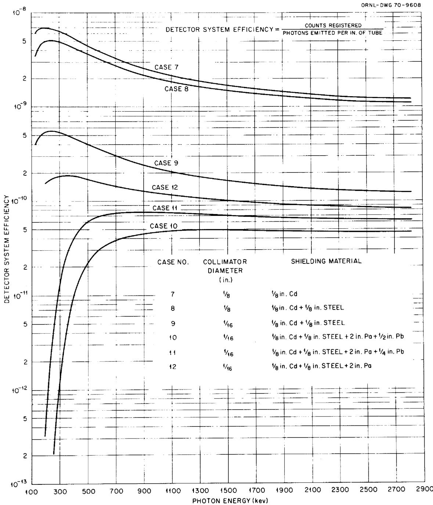  
Fig. C.l. Absolute efficiency of gamma-ray detection system for main reactor off-gas line.

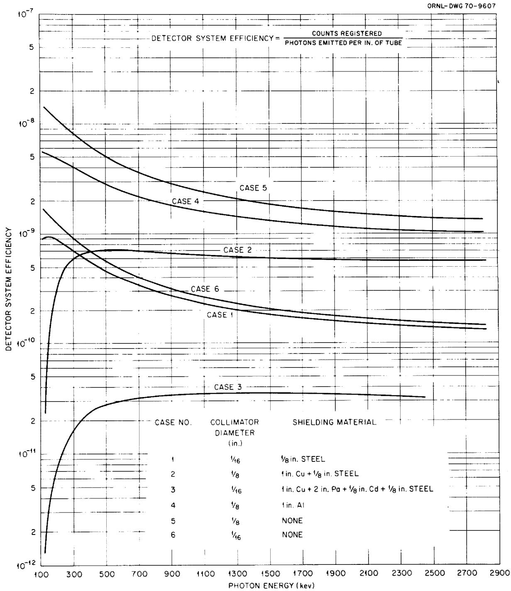  
Fig. C.2. Absolute efficiency of gamma-ray detection system for main reactor off-gas line.

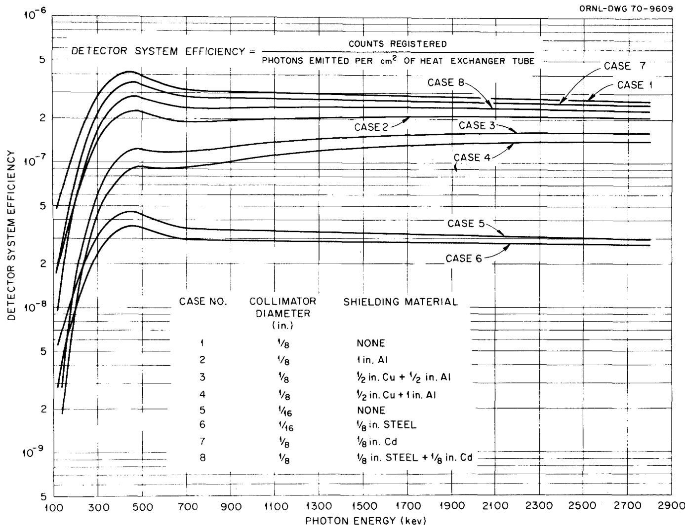  
Fig. C.3. Absolute efficiency of gamma-ray detection system of primary heat exchanger.

# Appendix D

# CALCULATIONS OF COUNTING EFFICIENCIES FROM FIRST PRINCIPLES

# Objective

We have computed from first principles counting efficiencies for the MSRE main off-gas line (see Sect. 5.4) and the MSRE heat exchanger (see Sect. 5.5). Initially we believed that such calculations could be done by models that were of necessity so simplified that only gross agreement between theory and experiment would be achieved. However, this has not been the case; very close agreement has been found over a wide gamma-energy range. Although significant differences still exist below $200\mathrm{keV}$ and above $1500\mathrm{keV}$ (probably still due to the simplified calculational model), the calculations serve to confirm the validity of the empirical calibrations.

# MSRE Main Off-Gas Line

Since the MSRE main off-gas line was only 1 in. in diameter we used a line source as a model in our calculations. The physical configuration of the detector-collimator-source is shown in Fig. D.1. Distances of items labeled in the figure are as follows:

$$
\begin{array}{l} L _ {c o} = \text {g e o m e t r i c a l c o l l i m a t o r l e n g t h} = 1 2 \text {i n .} = 3 0. 4 8 \mathrm {c m}, \\ D _ {c} = \text {c o l l i m a t o r d i a m e t e r} = 1 / 8 \text {i n .} = 0. 3 1 7 \mathrm {c m}, \\ H = \begin{array}{l} \text {d i s t a n c e f r o m s o u r c e t o s o u r c e f a c e o f c o l l i m a t o r = 1 5 f t =} \\ 4 5 7 \mathrm {c m}, \end{array} \\ L = \text {l e n g t h o f s o u r c e s u b t e n d e d b y c o l l i m a t o r}. \\ \end{array}
$$

Due to penetration of the edges of the collimator on both source and detector ends, the length of the source subtended by the collimator is not constant but depends on the gamma-ray energy. Mather, $^{1}$ in a study of collimators found that, to a first approximation, the effect of edge penetration is to reduce the length of the collimator by two mean free paths of the gamma photons. The effective collimator length $L_{\mathcal{C}}$ thus can be computed by

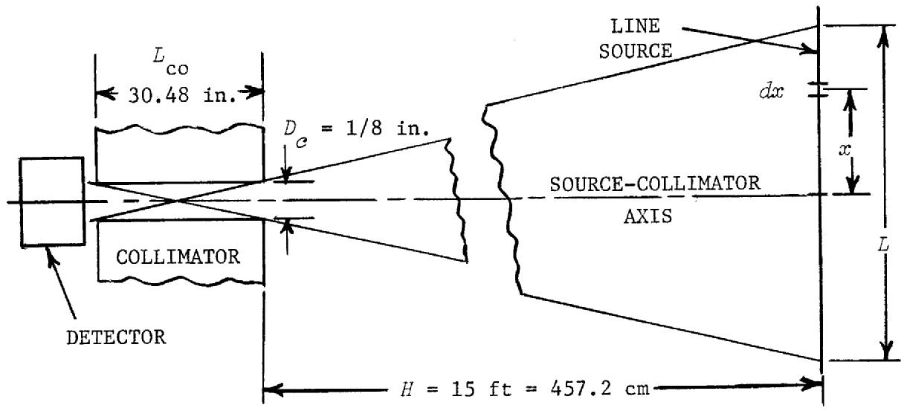  
Fig. D.1. Schematic of detector-collimator-line source arrangement.

$$
L _ {c} = L _ {c o} - 2 / \mu_ {t}, \tag {1}
$$

where $\mu_t$ is the linear attenuation coefficient for the collimator material (lead).

The subtended source length can then be obtained from

$$
L = \frac {2 D _ {\mathcal {C}}}{L _ {\mathcal {C}}} \left(H + \frac {L _ {\mathcal {C}}}{2}\right). \tag {2}
$$

Thus, in our experimental arrangement, the source length subtended varied from 3.8 in. for 200-keV photons to 4.4 in. for 2000-keV photons.

Let $S_{\mathcal{I}} =$ source strength per inch $= 1$ gamma in. $^{-1}$ sec $^{-1}$ and $A_{c} =$ geometrical area of collimator hole,

$$
\frac {\pi}{4} (0. 3 1 7) ^ {2} \mathrm {c m} ^ {2} = 0. 0 7 1 9 7 \mathrm {c m} ^ {2}.
$$

Then if we consider a differential source length, $dx$ , at point $x$ on the source, the photon intensity $dG$ due to $dx$ at the distance $H + L_{\mathrm{co}}$ (source-to-detector distance) is given by

$$
d G = \frac {S _ {I} d x}{4 \pi (H + L _ {\mathrm {c o}}) ^ {2}}. \tag {3}
$$

If the collimator were not between the source and the detector, the photon current (due to $dG$ ) that would hit the detector over an area $A_{c}$ would be

$$
d I = A _ {e} d G.
$$

However, since the collimator is present, only those photons emitted from the central portion of the source can go through any portion of the detector end of the collimator hole. Photons emitted by parts of the source that are off the source-collimator axis are partially shadowed from the detector by the collimator and can only go through a fraction of the area $A_{c}$ . Thus Eq. (2) must be multiplied by the fraction of the area $A$ that is not shadowed by the collimator. Let this fraction be $R(x)$ , and we have

$$
d I = A _ {e} R (x) d G, \tag {4}
$$

where $R(x)$ is a function of the distance $x$ that the segment $dx$ lies from the collimator axis.

Now the quantity $R(x)$ is a radial weighting function and corresponds to the $R(x)$ of Section 5.3. Although $R(x)$ is a gaussian-type function, we can approximate it by a linear function that has a value of unity at the center of the source and a value of zero at a distance $L/2$ from the axis. Within these boundary values, $R(x)$ is given by

$$
R (x) = 1 - \frac {2}{L} x. \tag {5}
$$

Thus by combining Eqs. (3), (4), and (5), we have an expression for the photon current $dI$ that leaves the segment $dx$ and hits the detector, viz.,

$$
d I = \frac {S _ {\mathcal {L}} A _ {\mathcal {e}} \left(1 - \frac {2}{L} x\right) d x}{4 \pi \left(H + L _ {\mathrm {c o}}\right) ^ {2}}. \tag {6}
$$

We can now integrate this expression and obtain an equation for the total photon current that hits the detector:

$$
\begin{array}{l} I = \frac {S _ {L} A _ {c}}{4 \pi \left(H + L _ {\mathrm {c o}}\right) ^ {2}} 2 \int_ {0} ^ {L / 2} \left(1 - \frac {2}{L} x\right) d x \tag {7} \\ = \frac {S _ {\text {孔}} A _ {\text {c}} L}{8 \pi (H + L _ {\text {c o}}) ^ {2}}. \\ \end{array}
$$

Since the photon current through an area equal to $A_{\mathcal{C}}$ without the collimator being present is

$$
\frac {S _ {\mathcal {I}} A _ {\mathcal {C}} L}{4 \pi (H + L _ {\mathrm {c o}}) ^ {2}},
$$

we see that collimator shadowing for a line source allows only one-half of the photons directed toward the collimator exit hole (detector end of collimator) to be transmitted through the collimator. The fraction of photons $P'$ that interact with the detector is given by

$$
P ^ {\prime} = 1 - \exp \left(- \mu_ {G e} D _ {G e} Y\right), \tag {8}
$$

where $\mu_{\mathrm{Ge}}$ is mass attenuation coefficient of germanium $(\mathrm{cm}^2 /\mathrm{g})$ , $D_{\mathrm{Ge}}$ is density of germanium $(5.33~\mathrm{g / cm}^3)$ , and $Y$ is diameter of the germanium detector $(2.7~\mathrm{cm})$ . Thus the total count rate in the detector is given by

$$
C R = I P ^ {\prime} \tag {9}
$$

To obtain the count rate in the photopeak, we must multiply by the fraction of the counts that fall in the photopeak. Because these peak-to-total ratios are difficult to calculate, we used values that were measured with our collimated detector with the sources $^{51}\mathrm{Cr}$ , $^{137}\mathrm{Cs}$ , $^{52}\mathrm{V}$ , and $^{28}\mathrm{Al}$ . These sources each emit single gamma rays with energies of 320, 662, 1434 and 1778 keV respectively. The corresponding peak-to-total ratios found were 0.195, 0.106, 0.0551, and 0.046. When these peak-to-total values were plotted versus energy on log-log coordinate paper, a straight line was obtained that could be represented by

$$
P = 2 6. 8 2 E ^ {- 0. 8 5 2 1}, \tag {10}
$$

where $P$ is the peak-to-total ratio for photons with energy $E$ .

Now, combining Eqs. (2), (7), (9), and (10), we have for the count rate,

$$
C R = \frac {S _ {\mathcal {I}} A _ {\mathcal {C}} \left[ \frac {2 D _ {\mathcal {C}}}{L _ {\mathcal {C}}} \left(H + \frac {L _ {\mathcal {C}}}{2}\right) \left[ 1 - \exp \left(- u _ {\mathrm {G e}} D _ {\mathrm {G e}} Y\right) \right] \left(2 6 . 8 2 E ^ {- 0 . 8 5 2 1}\right) \right.}{8 \pi \left(H + L _ {\mathrm {c o}}\right) ^ {2}}. \tag {11}
$$

Since the counting efficiency $EF$ is simply

$$
{ E F } { = } { \frac { C R } { S _ { l } } }
$$

and $S_{\mathcal{I}}$ is assumed to be 1 gamma in. $^{-1} \sec^{-1}$ , the right side of Eq. (11) is also equal to the counting efficiency.

A computer program was written to evaluate Eq. (11) and obtain counting efficiencies at several energies over a range from 100 to $2700\mathrm{keV}$ . The program allowed for photon transmission through the edges of the collimator according to Eqs. (1) and (2). Results of the calculated efficiencies are shown in Table D.l, along with experimental values. As can be

Table D.1. Calculated versus experimental counting efficiencies for MSRE off-gas line   

<table><tr><td rowspan="2">Energy (keV)</td><td colspan="2">Efficiencies (x 109)</td><td rowspan="2">Percent differencea</td></tr><tr><td>Measured</td><td>Calculated</td></tr><tr><td>100</td><td>15.0</td><td>27.2</td><td>-81.3</td></tr><tr><td>200</td><td>12.1</td><td>13.7</td><td>-13.2</td></tr><tr><td>300</td><td>8.4</td><td>9.5</td><td>-13.1</td></tr><tr><td>400</td><td>6.2</td><td>6.2</td><td>0</td></tr><tr><td>500</td><td>5.1</td><td>5.1</td><td>0</td></tr><tr><td>600</td><td>4.2</td><td>4.1</td><td>2.4</td></tr><tr><td>700</td><td>3.6</td><td>3.4</td><td>5.5</td></tr><tr><td>800</td><td>3.2</td><td>3.0</td><td>6.2</td></tr><tr><td>900</td><td>2.9</td><td>2.6</td><td>10.3</td></tr><tr><td>1100</td><td>2.4</td><td>2.1</td><td>12.5</td></tr><tr><td>1300</td><td>2.1</td><td>1.8</td><td>14.3</td></tr><tr><td>1500</td><td>1.9</td><td>1.5</td><td>21.0</td></tr><tr><td>1700</td><td>1.7</td><td>1.3</td><td>23.5</td></tr><tr><td>2000</td><td>1.5</td><td>1.1</td><td>26.6</td></tr><tr><td>2700</td><td>1.04</td><td>0.79</td><td>24.0</td></tr></table>

$^{a}$ Percent diff. = 100(meas. - calc.)/meas.

seen from the table, agreement between calculated and measured efficiencies is good from 200 to $1300\mathrm{keV}$ ; below 200 keV the difference becomes very large.

# MSRE Heat Exchanger

The MSRE heat exchanger<sup>2</sup> is composed of a 16 3/4-in. -OD shell that encloses a 14,5-in. diam tube bundle. The shell is made of Hastelloy N and is 1/2 in. thick; the tube bundle, also made of Hastelloy N, consists of 156 cooling U-tubes (312 tubes) plus twenty-three 1/2-in. dummy rods. A typical cross section also contains eight 7/16-in. baffle-plate spacer rods. Although these tubes and rods coated with fission products represent a complex radioactive source, we have calculated counting efficiencies for the heat exchanger using a model in which the tubes and their radioactive coatings are assumed to be homogeneously dispersed throughout the tube bundle.

The detector-collimator-heat exchanger arrangement is schematically represented in Fig. D.2. The source region subtended in the heat exchanger is a truncated cone with a front face diameter of 3.9 in. and a back face diameter of 4.3 in. As in the case of the line source, because of transmission of photons through the collimator edges around the collimator hole, the diameter of the subtended area increases with increasing energy. This effect is actually larger in the heat exchanger because of attenuation in the heat exchanger tubes and shell. However, we will neglect the latter effect and only account for collimator edge transmission in the same manner as before. Thus, the diameter of the subtended area will be determined according to Eqs. (1) and (2). In addition, we will approximate the truncated cone by a cylinder with a diameter equal to that of the front face (detector end) of the cone. This approximation is reasonable since most of the radiation measured comes from the front portions of the cone.

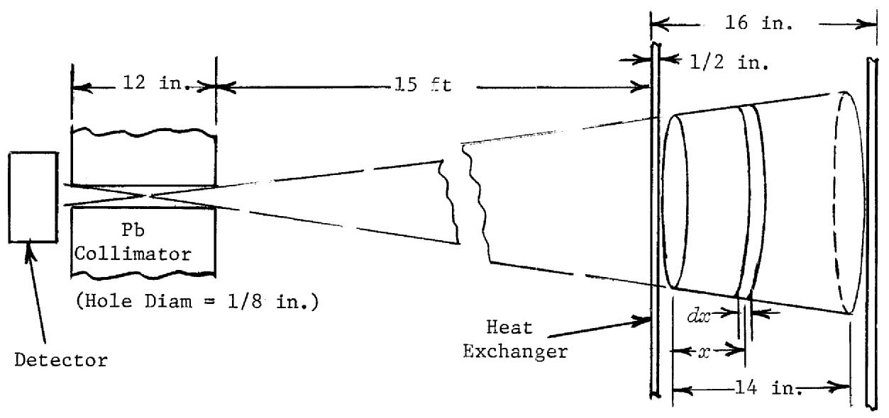  
Fig. D.2. Detector-collimator assembly shown subtending a cone-shaped source region in heat exchanger.

Because the collimator partially shadows all but the central portion of the source from the detector, we must again obtain an average radial weighting function for the radiation transmitted through the collimator. Because this function is dependent only on the distance from the source-collimator axis (and not on depth of the source), we can derive the function for a two-dimensional, circular area source. Consider the front face of the cone with a differential area, $\rho d\rho d\theta$ , located a distance $\rho$ from the source-collimator axis. The photon current $dI$ through the collimator due to this area is given by

$$
d I = \frac {A _ {\mathcal {C}} S _ {A}}{4 \pi (H + L _ {\mathrm {c o}}) ^ {2}} R (\rho) \rho d \rho d \theta , \tag {12}
$$

where $S_A$ is the source strength per unit area and $R(\rho)$ is the radial weighting function. Other terms were previously defined.

We approximate $R(\rho)$ by a linear function that is unity at the source center and zero at the circumference. Thus

$$
R (\rho) = 1 - \frac {\rho}{L / 2}. \tag {13}
$$

Substituting this result into Eq. (12) and integrating, we have for the total photon current:

$$
\begin{array}{l} I = \frac {A _ {c} S _ {A}}{4 \pi (H + L _ {\mathrm {c o}}) ^ {2}} \int_ {0} ^ {L / 2} \int_ {0} ^ {2 \pi} \left(1 - \frac {\rho}{L / 2}\right) \rho d \rho d \theta \tag {14} \\ = \frac {A _ {e} S _ {A}}{4 \pi (H + L _ {\mathrm {c o}}) ^ {2}} \quad \frac {\pi (L / 2) ^ {2}}{3}. \\ \end{array}
$$

The photon current through an equivalent area $A_{\mathcal{C}}$ without the collimator interposed is

$$
\frac {A _ {\mathcal {C}} S _ {A}}{4 \pi (H + L _ {\mathrm {c o}}) ^ {2}} \quad \pi (L / 2) ^ {2}.
$$

We see therefore that the collimator transmits only one-third of the photons directed toward its exit (detector side) hole.

We must now account for the fraction of those photons that are produced in the source and directed toward the collimator that actually pass through the source without being degraded. Consider the cross-sectional slice (Fig. D.2) through the cone of thickness $dx$ and at distance $x$ from the cone's front face. Denoting the source strength as $S_V$ (photons $cm^{-3} \sec^{-1}$ ), we obtain for the fraction $dF$ of photons from the slice transmitted distance $x$

$$
d F = S _ {V} A _ {S} e ^ {- \overline {{\mu}} \overline {{D}} x} d x,
$$

where $A_{s}$ is the area of the circular source surface facing the detector, $\mu$ is mass attenuation coefficient of Hastelloy N (taken as iron), and $\overline{D}$ is average density of the MSRE tube bundle. Integrating over the diameter $T$ of the tube bundle we have

$$
F = \frac {S _ {V} A _ {S} (1 - e ^ {- \bar {\mu} \bar {D} T})}{\bar {\mu} \bar {D}}. \tag {15}
$$

We can now write an expression for the count rate in the photopeak for those photons that are emitted by the subtended cone (cylinder in this approximation) and transmitted by the collimator.

$$
C R = \frac {A _ {C} \cdot S _ {V} A _ {S}}{4 \pi (H + L _ {\mathrm {c o}}) ^ {2}} \cdot 1 / 3 \cdot \frac {(1 - e ^ {- \bar {\mu} \bar {D} T})}{\bar {\mu} \bar {D}} \cdot [ 1 - \exp (- \mu_ {\mathrm {G e}} D _ {\mathrm {G e}} Y ] P ^ {\prime} P, \tag {16}
$$

where $P'$ is the fraction of photons transmitted through the heat exchanger shell; other terms have previously been defined.

Once we have derived values for the volumetric source strength $S_V$ and the average density of the MSRE tube bundle, we can use Eq. (16) to compute the counting efficiency for the heat exchanger. Because our experimental efficiencies were expressed as counts per photon per square centimeter of tube, we assume that each square centimeter of tube in the tube bundle emits 1 photon $\mathrm{cm}^{-2} \sec^{-1}$ . From the number of tubes in the bundle and the bundle diameter, we obtain a value of 1.09 $\mathrm{cm}^2$ of tubing per cubic centimeter of bundle. Thus $S_V = 1.09$ photons $\mathrm{cm}^{-3} \sec^{-1}$ . Similarly we compute, for the average density of metal in the bundle, $\overline{D} = 0.976 \mathrm{~g/cm}^3$ . The counting efficiency is

$$
E F = \frac {C R}{S _ {\varepsilon}},
$$

where $S_{s} = 1$ photon $\mathrm{cm}^{-2}$ sec $^{-1}$ .

A computer program was written to evaluate the counting efficiency at several energies over the energy range 100 to $2700\mathrm{keV}$ and also to compute the counting efficiency for an area source corresponding to the inner surface of the heat exchanger shell. The results of our computations are summarized in Table D.2, along with the experimentally measured efficiencies.

As can be seen, the agreement between calculated and measured efficiency values is excellent between 400 and $1500\mathrm{keV}$ . The contribution of the heat exchanger shell varies from about $12\%$ at $200\mathrm{keV}$ to about $4\%$ at $2700\mathrm{keV}$ . The effect of the shell was not accounted for in our empirical calibration but can now be seen to be a negligible factor.

Table D.2. Calculated and measured counting efficiencies for the MSRE heat exchanger   

<table><tr><td>Energy (keV)</td><td>Measured</td><td>Calculated tube bundle</td><td>Calculated shell</td><td>D1a</td><td>D2b</td></tr><tr><td>100</td><td>0.4</td><td>0.3</td><td>0.08</td><td>25.0</td><td>26.7</td></tr><tr><td>200</td><td>1.2</td><td>3.3</td><td>0.39</td><td>-175.0</td><td>11.8</td></tr><tr><td>300</td><td>2.7</td><td>3.8</td><td>0.36</td><td>-40.7</td><td>9.5</td></tr><tr><td>400</td><td>3.9</td><td>3.8</td><td>0.31</td><td>2.6</td><td>8.1</td></tr><tr><td>500</td><td>3.9</td><td>3.6</td><td>0.27</td><td>7.7</td><td>7.5</td></tr><tr><td>600</td><td>3.4</td><td>3.5</td><td>0.24</td><td>-2.9</td><td>6.8</td></tr><tr><td>700</td><td>3.1</td><td>3.4</td><td>0.22</td><td>-9.6</td><td>6.5</td></tr><tr><td>800</td><td>3.0</td><td>3.2</td><td>0.20</td><td>-6.6</td><td>6.2</td></tr><tr><td>900</td><td>3.0</td><td>3.1</td><td>0.18</td><td>-3.3</td><td>5.8</td></tr><tr><td>1100</td><td>3.0</td><td>2.9</td><td>0.16</td><td>3.3</td><td>5.5</td></tr><tr><td>1300</td><td>2.9</td><td>2.8</td><td>0.14</td><td>3.4</td><td>5.0</td></tr><tr><td>1500</td><td>2.8</td><td>2.6</td><td>0.13</td><td>7.1</td><td>5.0</td></tr><tr><td>2100</td><td>2.7</td><td>2.1</td><td>0.09</td><td>22.2</td><td>4.3</td></tr><tr><td>2700</td><td>2.5</td><td>1.6</td><td>0.07</td><td>36.0</td><td>4.3</td></tr></table>

$\alpha_{\mathrm{D1}} = 100$ (meas. - calc.)/meas.   
D2 = 100 calc, shell/calc. tube bundle.

# INTERNAL DISTRIBUTION

1. L. G. Alexander   
2. J. L. Anderson   
3. C. F. Baes   
4. L.C.Bate   
5. S. E. Beal1   
6. M. J. Bell   
7. M. Bender   
8. E. S. Bettis   
9. F. F. Blankenship   
10. R. Blumberg   
11. E. G. Bohlmann   
12. G. E. Boyd   
13. R. B. Briggs   
14. S. Cantor   
15. W. L. Carter   
16. E. L. Compere   
17. W.H.Cook   
18. W.B.Cottrell   
19. J. L. Crowley   
20. F. L. Culler   
21. H. J. De Nordwall   
22. J. R. DiStefano   
23. S.J.Ditto   
24. A. S. Dworkin

25-34. F. F. Dyer

35. W. P. Eatherly   
36. J. S. Eldridge   
37. J. F. Emery   
38. J. R. Engel   
39. D. E. Ferguson   
40. L. M. Ferris   
41. A. P. Fraas   
42. C. H. Gabbard   
43. W. R. Grimes   
44. A. G. Grindell   
45. R. H. Guymon

46-48. P. N. Haubenreich

49. J. R. Hightower   
50. E. C. Hise   
51. H. W. Hoffman   
52. P. R. Kasten   
53. R. J. Kedl   
54. C. R. Kennedy   
55. J. J. Keyes   
56. S. S. Kirslis   
57. J. W. Koger   
58. A. I. Krakoviak

59. T. S. Kress   
60. Kermit Laughon, AEC-OSR   
61. R. B. Lindauer   
62. M. I. Lundin   
63. R. N. Lyon   
64. W. S. Lyon   
65. H. G. MacPherson   
66. R. E. MacPherson   
67. C. L. Matthews, AEC-OSR   
68. H.E.McCoy   
69. H. C. McCurdy   
70. H. A. McLain   
71. L. E. McNeese   
72. J. R. McWherter   
73. A. S. Meyer   
74. A. J. Miller   
75. R. L. Moore   
76. E. L. Nicholson   
77. L.C.Oakes   
78. A. M. Perry   
79. D. M. Richardson   
80. R. C. Robertson

81-83. M. W. Rosenthal

84. H. M. Roth, AEC-ORO   
85. Dunlap Scott   
86. J.H.Shaffer   
87. Myrtleen Shelton   
88. M. J. Skinner   
89. Din Sood   
90. I. Spiewak   
91. D. A. Sundberg   
92. J. R. Tallackson   
93. R.E.Thoma   
94. D. B. Trauger   
95. H. O. Weeren   
96. A. M. Weinberg   
97. J. R. Weir   
98. J. C. White   
99. G. D. Whitman   
00. R.P.Wichner   
01. D. Wilson   
02. L. V. Wilson   
03. E. I. Wyatt   
04. F. C. Zapp

105-106. Central Research Library

107. Y-12 Document Reference Section

108-110. Laboratory Records Department

111. Laboratory Records, RC

# EXTERNAL DISTRIBUTION

112. D. F. Cope, AEC-OSR, Oak Ridge, Tenn. 37830   
113. D. R. DeBoisblanc, Evasco Services, Inc., 2 Rector Street, New York, N.Y. 10006   
114. C. B. Deering, Black & Veatch, P.O. Box 8405, Kansas City, Mo. 64114   
115. A. R. DeGrazia, AEC, Washington D.C. 20545   
116. N. D. Dudey, Argonne National Laboratory, 9700 South Cass Avenue, Argonne, I11, 60439   
117. David Elias, AEC, Washington, D.C. 20545   
118. T. A. Flynn, Evasco Services, Inc., 2 Rector Street, New York, N.Y. 10006   
119. J. E. Fox, AEC, Washington, D.C. 20545   
120. R. Gunnink, LRL, University of California, End East Avenue, P.O. Box 808, Livermore, Calif. 94550   
121. Norton Haberman, AEC, Washington, D.C. 20545   
122. P. A. Halpine, AEC, Washington, D.C. 20545   
123-132. A. Houtzeel, TNO, 176 Second Ave., Waltham, Mass. 02154   
133. Prof. ir. D.G.H. Latzko, Technological University Delft, Rotterdamseweg 139a, Delft, The Netherlands   
134. Fred Marsh, Babcock and Wilcox, P.O. Box 1260, Lynchburg, Va. 24505   
135. J. Neff, AEC, Washington, D.C. 20545   
136. M. Shaw, AEC, Washington, D.C. 20545   
137. R. C. Steffy, Jr., TVA, 303 Power Building, Chattanooga, Tenn. 37401   
138. G. F. Taylor, Fuels and Materials Division, Applied Materials Research Branch, Chalk River Nuclear Laboratories, Chalk River, Ontario, Canada   
139. F. N. Watson, AEC, Washington, D.C. 20545   
140. Prof. J. J. Went, Director, N. V. tot Keuring van Electrotechnische Materialen Utrechtseweg 310, Arnhem, The Netherlands   
141. M. J. Whitman, AEC, Washington, D.C. 20545   
142-144. Director, Division of Reactor Licensing, Washington, D.C. 20545   
145-146. Director, Division of Reactor Standards, Washington, D.C. 20545   
147-163. Manager, Technical Information Center, AEC   
164. Research and Technical Support Division, AEC, ORO   
165-166. Technical Information Center, AEC