ORNL-TM-3177

Contract No. W-7405-eng-26

Reactor Division

MOLTEN SALT BREEDER EXPERIMENT DESIGN BASES

J. R. McWherter

# LEGAL NOTICE

This report was prepared as an account of work sponsored by the United States Government. Neither the United States nor the United States Atomic Energy Commission, nor any of their employees, nor any of their contractors, subcontractors, or their employees, makes any warranty, express or implied, or assumes any legal liability or responsibility for the accuracy, completeness or usefulness of any information, apparatus, product or process disclosed, or represents that its use would not infringe privately owned rights.

NOVEMBER 1970

OAK RIDGE NATIONAL LABORATORY

Oak Ridge, Tennessee

operated by

UNION CARBIDE CORPORATION

for the

U.S. ATOMIC ENERGY COMMISSION

#

# CONTENTS

# Page

List of Tables . . . . . . . . . . . . . . . . . . . . . . . . . v

List of Figures. vi

Acknowledgment vii

Abstract 1

1. Introduction 1   
2. The MSRE and the Present Status of the Technology. 2   
3. Reference Plant Design - MSBR. 5   
4.MSBE Design Bases. 5

4.1 MSBE Requirements 5   
4.2 MSBE Core and Pressure Vessel Configuration 8   
4.3 MSBE Primary Salt Properties. 16   
4.4 MSBE Primary System 16

4.4.1 Primary Loop 16   
4.4.1.1 Primary Pump. 18   
4.4.1.2 Primary Heat Exchanger. 18

4.4.2 Gas Separation Bypass. 20   
4.4.3 Primary Salt Drain Tank. 20   
4.4.4 Primary Salt Storage Tank. 21   
4.4.5 Primary Salt Sample System 21

4.5 MSBE Secondary System 22   
4.6 MSBE Steam System 23   
4.7 MSBE Reactor Cell 23   
4.8 Drain Tank Cell, Off-Gas Cell, and Secondary Cell 26   
4.9 MSBE Reactor Building 26   
4.10 MSBE Chemical Processing. 27

5.MSBE Expected Accomplishments. 29   
6. Appendix I - MSRE. 30

6.1 Description 30   
6.2 Experience. 35

6.2.1 Fuel Chemistry 36   
6.2.2 Materials. 38

Page

6.2.3 Nuclear 39   
6.2.4 Equipment 39   
6.2.5 Maintenance of Radioactive Systems. 40

7. Appendix II 41

7.1 MSBR Plant Description 41

References 52

# LIST OF TABLES

Page

Table I. Comparison of Design Data, MSRE, MSBE, MSBR 3

Table II. Nuclear Characteristics of Several Conceptual MSBE Reactor Configurations 9

Table III. MSBE Irradiation Facility V-1 Neutron Flux. 14

# LIST OF FIGURES

Figure 1. MSBE Reactor Core Assembly 12   
Figure 2. MSBE Core Section Plan 13   
Figure 3. MSBE Flow Diagram. 17   
Figure 4. MSBE Primary Heat Exchanger. 19   
Figure 5. MSBE Reactor Building Section B-B. 24   
Figure 6. MSBE Reactor Building Plan A-A 25   
Figure 7. MSBE Chemical Processing Flowsheet 28   
Figure 8. MSRE Flowsheet 31   
Figure 9. Layout of the MSRE 34   
Figure 10. Flow Diagram for MSBR Plant. 42   
Figure 11. Plan View of MSBR at Reactor Cell Elevation. 43   
Figure 12. Sectional Elevation Through MSBR Plant Building. 44   
Figure 13. Elevation of MSBR Drain Tank Cell. 45   
Figure 14. Plan View of MSBR Vessel 47   
Figure 15. Sectional Elevation of MSBR Vessel 48

# ACKNOWLEDGMENT

The author gratefully acknowledges the layout design work by W. Terry for this report and the general contributions to the report by R. B. Briggs, P. N. Haubenreich, M. I. Lundin, H. E. McCoy and L. E. McNeese. The reactor physics calculations in support of this report were made by O. L. Smith, W. R. Cobb, and J. H. Carswell. The general concept is based on studies of the 1000 Mw(e) single-fluid Molten Salt Breeder Reactor by E. S. Bettis, C. W. Collins, W. K. Furlong, E. C. Hise, H. A. McLain, H. M. Poly, D. Scott, H. L. Watts, and others.

# MOLTEN SALT BREEDER EXPERIMENT DESIGN BASES

J. R. McWherter

# ABSTRACT

The design bases for the Molten Salt Breeder Experiment (MSBE) are based on information from the MSRE and the reference plant design of a 1000 Mw(e) single-fluid Molten Salt Breeder Reactor (MSBR).

Calculations indicate that a 150 Mw(thermal) reactor is a reasonable size that would meet the project objectives for the MSBE.

The primary salt for the MSBE contains both the fissile $(^{233}\mathrm{U})$ and the fertile (Th) material. The heat generated in the primary system is transferred by a secondary salt loop to the steam generators.

Provisions are made in the MSBE core to permit exposure of removable graphite samples at conditions similar to those expected in the MSBR.

The pumps and heat exchangers in the MSBE are similar to those proposed for the MSBR.

Keywords: design, design criteria, design data, experiment, fluid-fueled reactors, fused salts, graphite, MSBE, MSBR, reactors.

# 1. INTRODUCTION

The goal of the Molten Salt Reactor Program (MSRP) is to provide the basic scientific and engineering data and the experience necessary for the development and construction of large molten salt reactors to produce economical electricity. Such reactors would be based on the use of fluoride salts containing dissolved fissionable material (233U, 235U or plutonium) and fertile material (thorium). We believe that in the long run the most economical embodiment of the molten salt reactor concept will be a reactor with a positive breeding gain. Since an essential requirement for such a breeder will be a salt processing facility closely coupled to the reactor system, the MSRP embraces processing as well as reactor development.

A major step in the program was the construction and successful operation of the Molten Salt Reactor Experiment (MSRE). The MSRE was a circulating molten-salt-fueled, graphite-moderated reactor that operated at 7.3 Mw(thermal) and a core outlet temperature of $1210^{\circ}\mathrm{F}$ . The purpose of the MSRE was to provide a demonstration of the technology as it existed in the early 1960's and a facility for investigating the compatibility of fuels and materials, the chemistry of the fuels, and the engineering features of molten-salt reactors.

Four years of MSRE operation provided an essential base for proceeding with larger reactors. However, the MSRE was a small reactor with a low power density and contained no thorium in the salt. We believe that one step that is highly desirable before building a prototype power breeder plant is the construction of a reactor with a power density near that of the larger reactors, with a fuel composition like that of a power breeder, and which will produce protactinium at a sufficient rate to provide for processing development. This Molten Salt Breeder Experiment (MSBE) should include the essential features of a power breeder and satisfy as many of the technical criteria of the reference design as practical. The size and power of the MSBE should be no greater than will be necessary to meet these requirements. The experiment would demonstrate all the basic equipment and processes at proposed design conditions of the large plants. The essential purpose of the MSBE would be to produce information rather than electricity, but it should demonstrate the technology of the production of steam at conditions adequate for electrical production. This report expands on these design bases for the MSBE.

# 2. THE MSRE AND THE PRESENT STATUS OF THE TECHNOLOGY

Molten salt reactor technology has been under development since 1947, with the most prominent accomplishments being the operation of the Aircraft Reactor Experiment in 1954 and the MSRE from 1964 to 1969. Much of the present status of the technology is best described in terms of the MSRE. Some of the important characteristics of that reactor are given in Table I. The MSRE information in Table I is in general from Refs. 2 and 3; however, it has been modified as required to reflect the

Table I. Comparison of Design Data, MSRE, MSBE, MSBR   

<table><tr><td></td><td>MSRE</td><td>MSBE</td><td>MSBR6</td></tr><tr><td>Reactor power, Mw(t)</td><td>7.3</td><td>150</td><td>2250</td></tr><tr><td>Breeding ratio</td><td>-</td><td>0.96</td><td>1.06</td></tr><tr><td>Peak graphite damage flux, (E&gt;50 kev) neutrons/cm2·sec</td><td>3 x 1013</td><td>5 x 1014</td><td>3 x 1014</td></tr><tr><td>Peak power density, w/cc</td><td></td><td></td><td></td></tr><tr><td>Primary salt</td><td>30</td><td>760</td><td>500</td></tr><tr><td>Core including graphite</td><td>6.6</td><td>114</td><td>65</td></tr><tr><td>Peak neutron heating in graphite, w/cm3</td><td>0.2</td><td>2.6</td><td>1.7</td></tr><tr><td>Peak gamma heating in graphite, w/cm3</td><td>0.7</td><td>6.3</td><td>4.7</td></tr><tr><td>Volume-fraction primary salt in core</td><td>0.225</td><td>0.15</td><td>0.13</td></tr><tr><td>Composition, mole %</td><td></td><td></td><td></td></tr><tr><td>LiF</td><td>65</td><td>71.5</td><td>71.7</td></tr><tr><td>BeF2</td><td>29.1</td><td>16</td><td>16</td></tr><tr><td>ThF4</td><td>None</td><td>12</td><td>12</td></tr><tr><td>UF4</td><td>0.9</td><td>0.5</td><td>0.3</td></tr><tr><td>ZrF4</td><td>5</td><td>None</td><td>None</td></tr><tr><td>Liquidus, °F</td><td>813</td><td>932</td><td>932</td></tr><tr><td>Density, lb/m/ft3 at l100°F</td><td>141</td><td>211a</td><td>210</td></tr><tr><td>Viscosity, lb/ft·hr at l100°F</td><td>19</td><td>29b</td><td>29</td></tr><tr><td>Heat capacity, Btu/lbm°F</td><td>0.47</td><td>0.32</td><td>0.32</td></tr><tr><td>Thermal conductivity, Btu/hr·ft·°F</td><td>0.83</td><td>0.75</td><td>0.75</td></tr><tr><td>Volumetric heat capacity, Btu/ft3·°F</td><td>66</td><td>66</td><td>66</td></tr><tr><td>Temperature, °F</td><td></td><td></td><td></td></tr><tr><td>Inlet reactor vessel</td><td>1170</td><td>1050</td><td>1050</td></tr><tr><td>Outlet reactor vessel</td><td>1210</td><td>1300</td><td>1300</td></tr><tr><td>Circulating primary salt vol, ft3</td><td>70</td><td>266</td><td>1720</td></tr><tr><td>Inventory fissile, kg</td><td>32c</td><td>396c</td><td>1470</td></tr><tr><td>Power density primary salt circulating average, w/cc</td><td>4</td><td>20</td><td>46</td></tr></table>

a206 @ 1300°F; 212 @ 1050°F.   
b16.4 @ 1300°F; 34.2 @ 1050°F.   
c 239U initial.

Table I (continued)   

<table><tr><td></td><td>MSRE</td><td>MSBE</td><td>MSBR6</td></tr><tr><td>Number of primary loops</td><td>1</td><td>1</td><td>4</td></tr><tr><td>Primary pump capacity, gpm</td><td>1200</td><td>5400d</td><td>16,000</td></tr><tr><td>Secondary system salt</td><td>LiF-BeF2</td><td>NaBF4-NaF</td><td>NaBF4-NaF</td></tr><tr><td>Composition, mole %</td><td>66 - 34</td><td>92 - 8</td><td>92 - 8</td></tr><tr><td>Liquidus temp, °F</td><td>850</td><td>725</td><td>725</td></tr><tr><td>Density, lbm/ft3 @ 1000°F</td><td>124.1</td><td>117</td><td>117</td></tr><tr><td>Viscosity, lbm/ft·hr @ 1000°F</td><td>28.7</td><td>3.4</td><td>3.4</td></tr><tr><td>Heat capacity, Btu/1b m°F</td><td>0.57</td><td>0.36</td><td>0.36</td></tr><tr><td>Thermal conductivity</td><td>0.58</td><td>0.27</td><td>0.27</td></tr><tr><td>Btu/hr·ft·°F</td><td></td><td></td><td></td></tr><tr><td>Temperature, °F</td><td></td><td></td><td></td></tr><tr><td>Heat exchanger inlet</td><td>1015</td><td>850</td><td>850</td></tr><tr><td>Heat exchanger outlet</td><td>1075</td><td>1150</td><td>1150</td></tr><tr><td>Number of secondary pumps</td><td>1</td><td>1</td><td>4</td></tr><tr><td>Secondary pump capacity, gpm</td><td>850</td><td>5300</td><td>20,000</td></tr><tr><td>Tertiary system</td><td>air</td><td>steam</td><td>steam</td></tr><tr><td>Inlet temp., °F</td><td>~70</td><td>700</td><td>700</td></tr><tr><td>Outlet temp., °F</td><td>~180</td><td>1000</td><td>1000</td></tr><tr><td>Outlet pressure, psia</td><td>14.7</td><td>3600</td><td>3600</td></tr></table>

dFor $200^{\circ}\mathrm{F}\Delta \mathrm{T};4300\mathrm{gpm}$ required at $250^{\circ}\mathrm{F}\Delta \mathrm{T}.$

measurements made during operation of the reactor. $^{4}$ A description of the MSRE and a summary of the experience with it are given in Appendix I.

Some significant advances in the technology have been made with materials since the construction of the MSRE. The alloy, Hastelloy N, which was used throughout the MSRE salt systems, was modified to improve its resistance to damage by neutron irradiation while retaining its excellent corrosion resistance. Graphites have been made which change dimensions less at a given neutron dose and temperature than that graphite used in the MSRE, and methods have been devised to seal the graphite pores to reduce gas permeability and therefore xenon poisoning in high-flux reactors.

Since the inception of the MSRE, great strides have been made in salt processing, notably the invention of the reductive extraction and

metal transport processes. The basic chemistry has been shown to be quite favorable. Materials of construction for the process equipment are under development, with encouraging progress being made. These new processes make a single fluid reactor concept similar to the MSRE, but with a higher power density, a potential high performance breeder. By permitting a breeder core to resemble a scaled-up MSRE, these developments have made the MSRE technology more directly applicable.

Another advance since the MSRE has been the experience with molten sodium fluoroborate salt, a lower-melting and less expensive coolant than was used in the MSRE secondary system.

# 3. REFERENCE PLANT DESIGN - MSBR

A conceptual design of a single-fluid 1000 Mw(e) Molten Salt Breeder Reactor (MSBR) power station was made and is described in Appendix II and in more detail elsewhere.5,6 The fuel is contained in the primary salt which is a mixture of fluorides containing also the fertile material. Some basic design conditions are given in Table I. The MSBE design is based on this MSBR concept, including current revisions, insofar as is practical.

4. MSBE DESIGN BASES

# 4.1 MSBE Requirements

The MSBE should demonstrate the basic technology of a large molten salt breeder reactor so that moderate scale-up and normal improvement of equipment and processes are the major requirements for building large plants. The plant should be as small as is consistent with making a complete demonstration.

Major criteria for the plant are the following:

1. The plant shall be a facility for testing materials, components, systems, and methods at conditions, where practical, equal to or more severe than those of the reference MSBR. For instance, it is desired that the damage neutron flux in the MSBE graphite be the maximum that has been proposed in molten salt reactor studies, which is about twice

that proposed for the reference MSBR. In other cases, such as the average circulating power density in the salt, it may not be practical to equal that proposed for the reference MSBR.

2. The reactor shall have the capability for exposing to a fast $(>50\mathrm{kev})$ neutron flux of $5\times 10^{14}$ neut. $\mathrm{cm}^{-2}$ sec $^{-1}$ in primary salt at temperatures up to $1300^{\circ}\mathrm{F}$ core graphite elements that are of full MSBR cross section. These elements may be shorter in length than those proposed for the MSBR. At least one of these elements shall be individually removable. In this region of the core, the power density shall be above 500 w/cc of salt and the salt flow conditions shall be as close as practical to those proposed for the MSBR. This will permit evaluation of the useful life of potential MSBR graphite at irradiation and thermal conditions equal to or more severe than those proposed for the MSBR.   
3. The primary and secondary salt compositions shall be essentially the same as proposed for the single fluid MSBR. Modifications shall be limited to those which will not significantly alter the chemistry or physical properties of the salts. This will permit studies of the nuclear and chemical effects in the salt, heat transfer and fluid flow characteristics, and the chemical processing aspects at conditions as near those of the proposed MSBR as practical.   
4. The design power of the reactor shall be sufficient to meet the above criteria and in addition supply considerable protactinium and fission products for process development. A conversion ratio near 1.0 is desirable but not essential. In addition, the average power density of the circulating primary salt shall be near that of the MSBR (46 w/cc). This will permit some determination of the fission product handling problems, such as afterheat, in the fluid processing systems.   
5. The design of the plant shall be similar to that proposed for the MSBR. Where practical, the MSBE primary system components shall be similar in design to those proposed for the MSBR with a design life of thirty years and of a size that can be scaled up for use in demonstration plants. The flowsheets of the two plants shall be similar where practical. With this approach the design and operation of the MSBE will give considerable advance information for design and operation of the MSBR.

6. The maximum operating temperatures, and, where practical, the temperature differences in the MSBE shall be the same as those of the MSBR. This should permit evaluation of materials and systems at MSBR thermal conditions.

7. Thermal energy shall be transferred from the primary salt to a secondary salt from which it shall be removed by steam generation at proposed MSBR conditions. This provides a double barrier between the fission products and the steam system and provides experience with steam generators, a major undeveloped component for molten salt reactors.

8. The generation of electricity will only be required if it is economically justified, since the effect of the steam system operation on the nuclear systems can be determined without any specific use of the steam.

9. The chemical processing of the primary salt shall be done by processes proposed for the MSBR and with equipment similar to that for the MSBR. This requirement stems from the importance of fuel processing to an MSBR and the need to experiment with and demonstrate the process on highly irradiated salt. The MSBE will be an excellent source of irradiated primary salt for use in evaluation of proposed chemical processing schemes and equipment.

10. Maintenance techniques and procedures proposed for the MSBR, including removal and replacement of the core graphite, shall be used where practical in the MSBE. This will permit development of maintenance techniques and procedures under conditions similar to those proposed for the MSBR.

11. In support of the above requirements and to improve the understanding of molten salt reactor systems, facilities shall be provided for:

(a) on-line chemical analyses of the fuel salt (for the most important constituents),   
(b) obtaining unbiased samples of the salts for complete chemical and isotopic analyses,   
(c) determining compatibility of materials by examination of removable specimens,   
(d) studying the composition of gas at various locations,

(e) studying the deposition of fission products,   
(f) determining the behavior of tritium,   
(g) removing the core graphite array for post-irradiation examination,   
(h) continuously monitoring the nuclear reactivity,   
(i) determining the dynamic characteristics of the entire system,   
(j) examining reactor components after operation with irradiated salt,   
(k) monitoring the behavior of components.

# 4.2 MSBE Core and Pressure Vessel Configuration

Preliminary calculations $^{7,8,9}$ were made by O. L. Smith, W. R. Cobb, and J. H. Carswell of small-single-fluid reactors to determine the breeding ratio and the power required in various configurations of core and blanket to achieve a peak damage flux of $5 \times 10^{14}$ neutrons $\mathrm{cm}^{-2} \sec^{-1}$ $(E_{n} > 50 \mathrm{keV})$ . The core, of course, was composed of graphite and salt. A range of salt fractions in the core between 0.1 and 0.2 was studied. The blanket was $100\%$ salt in the radial direction but was assumed to contain 30 to $50\%$ graphite in the axial direction. The axial plena at the top and bottom of the reactor vessel were assumed to contain $94\%$ salt and $6\%$ Hastelloy N for structural purposes.

The salt composition range considered was (in mole percent): $16 - 20\% \mathrm{BeF}_2$ , $12 - 14\% \mathrm{ThF}_4$ , and the balance as "LiF with sufficient $^{233}\mathrm{UF}_4$ for criticality. Of course, $^{235}\mathrm{UF}_4$ could be used, if desired.

The results of some of these initial calculations are given in Table II. The remainder of the cases are reported elsewhere. $^{7,8,9}$ The breeding ratio reported is the value at start-of-life conditions, assuming pure $^{233}\mathrm{U}$ as fuel. Thus, for example, no allowance is made for fission product or protactinium losses. The reactors were unreflected, with the exception of Case 10, which had a l-ft-thick graphite reflector.

The following objectives were considered in selecting a reference concept from the cases studied:

1. A breeding ratio near one is desired.   
2. The reactor power required should be low (less than 200 Mw).   
3. The total uranium inventory should be reasonable.

Table II. Nuclear Characteristics of Several Conceptual MSHE Reactor Configurations   

<table><tr><td rowspan="2">Case</td><td colspan="3">Core</td><td rowspan="2">Radial Blank-t Thickness (ft)</td><td rowspan="2">Axial Blanket Thickness (ft)</td><td rowspan="2">Axial Plena Thicknessa (ft)</td><td rowspan="2">Reactor Vessel Salt Volume (ft3)</td><td rowspan="2">Primary System Salt Volumeb (ft3)</td><td rowspan="2">Mole Percent ThF4</td><td rowspan="2">Mole Percent 233UF4</td><td rowspan="2">Total 233U (kg)</td><td rowspan="2">Breeding Ratioc</td><td rowspan="2">Required Powerd Mw(thermal)</td><td rowspan="2">Fraction of Power in Core</td><td rowspan="2">Peak Power Density in Core (w/cm3)</td><td rowspan="2">Average Power Density in Salt (w/cm3)</td></tr><tr><td>Diameter (ft)</td><td>Height (ft)</td><td>Salt Fraction</td></tr><tr><td>1</td><td>5</td><td>5</td><td>0.10</td><td>0</td><td>--</td><td>0.67</td><td>36</td><td>100</td><td>12</td><td>0.465</td><td>159</td><td>0.551</td><td>108</td><td>1.0</td><td>99</td><td>38</td></tr><tr><td>3</td><td>3</td><td>5</td><td>0.10</td><td>1.0</td><td>--</td><td>0.67</td><td>92</td><td>158</td><td>12</td><td>0.621</td><td>335</td><td>0.784</td><td>112</td><td>0.48</td><td>112</td><td>25</td></tr><tr><td>4</td><td>3</td><td>5</td><td>0.15</td><td>1.0</td><td>--</td><td>0.67</td><td>94</td><td>158</td><td>12</td><td>0.597</td><td>322</td><td>0.803</td><td>108</td><td>0.51</td><td>116</td><td>24</td></tr><tr><td>10e</td><td>5</td><td>5</td><td>0.10</td><td>0</td><td>--</td><td>0.67</td><td>36</td><td>124</td><td>12</td><td>0.351</td><td>149</td><td>0.693</td><td>155</td><td>1.0</td><td>105</td><td>44</td></tr><tr><td>11</td><td>3</td><td>5</td><td>0.15</td><td>4.25</td><td>--</td><td>0.67</td><td>627</td><td>724</td><td>12</td><td>0.616</td><td>1524</td><td>0.999</td><td>174</td><td>0.327</td><td>116</td><td>9</td></tr><tr><td>12</td><td>4</td><td>5</td><td>0.15</td><td>4.25</td><td>--</td><td>0.67</td><td>724</td><td>825</td><td>12</td><td>0.467</td><td>1316</td><td>1.009</td><td>183</td><td>0.481</td><td>112</td><td>8</td></tr><tr><td>16</td><td>4</td><td>5</td><td>0.15</td><td>4.25</td><td>--</td><td>0.67</td><td>724</td><td>819</td><td>14</td><td>0.482</td><td>1349</td><td>1.022</td><td>169</td><td>0.511</td><td>112</td><td>7</td></tr><tr><td>18</td><td>4</td><td>6</td><td>0.20</td><td>3.75</td><td>--</td><td>0.67</td><td>702</td><td>806</td><td>14</td><td>0.493</td><td>1357</td><td>1.046</td><td>188</td><td>0.538</td><td>112</td><td>8</td></tr><tr><td>20</td><td>4</td><td>6</td><td>0.20</td><td>2.75</td><td>--</td><td>0.67</td><td>460</td><td>561</td><td>14</td><td>0.480</td><td>920</td><td>1.034</td><td>182</td><td>0.561</td><td>112</td><td>11</td></tr><tr><td>23</td><td>4</td><td>6</td><td>0.2</td><td>2.0</td><td>1.0</td><td>0.5</td><td>379</td><td>489</td><td>14</td><td>0.530</td><td>886</td><td>1.061</td><td>199</td><td>0.55</td><td>102</td><td>14</td></tr><tr><td>25</td><td>4</td><td>5</td><td>0.2</td><td>2.0</td><td>1.5</td><td>0.5</td><td>382</td><td>486</td><td>14</td><td>0.546</td><td>906</td><td>1.063</td><td>188</td><td>0.51</td><td>103</td><td>14</td></tr><tr><td>26</td><td>4</td><td>5</td><td>0.2</td><td>2.0</td><td>1.5</td><td>0.5</td><td>382</td><td>491</td><td>12</td><td>0.456</td><td>765</td><td>1.051</td><td>198</td><td>0.49</td><td>105</td><td>14</td></tr><tr><td>27</td><td>4</td><td>5</td><td>0.15</td><td>2.0</td><td>1.5</td><td>0.5</td><td>378</td><td>489</td><td>12</td><td>0.422</td><td>705</td><td>1.047</td><td>202</td><td>0.46</td><td>102</td><td>15</td></tr><tr><td>28</td><td>4</td><td>5</td><td>0.2</td><td>2.0</td><td>1.07</td><td>0.357</td><td>337</td><td>432</td><td>14</td><td>0.591</td><td>872</td><td>1.062</td><td>169</td><td>0.57</td><td>110</td><td>14</td></tr><tr><td>29f</td><td>4</td><td>5</td><td>0.2</td><td>2.0</td><td>1.07</td><td>0.357</td><td>337</td><td>429</td><td>14</td><td>0.492</td><td>721</td><td>1.069</td><td>164</td><td>0.59</td><td>113</td><td>13</td></tr><tr><td>30</td><td>4</td><td>5</td><td>0.2</td><td>2.0</td><td>1.07</td><td>0.357</td><td>337</td><td>432</td><td>12</td><td>0.417</td><td>616</td><td>1.051</td><td>169</td><td>0.57</td><td>112</td><td>14</td></tr><tr><td>31</td><td>3.5</td><td>4.5</td><td>0.2</td><td>2.0</td><td>1.07</td><td>0.357</td><td>284</td><td>362</td><td>14</td><td>0.587</td><td>726</td><td>1.049</td><td>136</td><td>0.52</td><td>115</td><td>13</td></tr><tr><td>33</td><td>3</td><td>4</td><td>0.2</td><td>1.75</td><td>1.0</td><td>0.25</td><td>189</td><td>255</td><td>14</td><td>0.723</td><td>630</td><td>0.993</td><td>112</td><td>0.44</td><td>118</td><td>16</td></tr><tr><td>35</td><td>3</td><td>4</td><td>0.2</td><td>1.0</td><td>1.0</td><td>0.25</td><td>101</td><td>161</td><td>14</td><td>0.755</td><td>415</td><td>0.893</td><td>100</td><td>0.49</td><td>119</td><td>22</td></tr><tr><td>36</td><td>3</td><td>4</td><td>0.2</td><td>1.75</td><td>1.0</td><td>0.25</td><td>189</td><td>257</td><td>12</td><td>0.628</td><td>551</td><td>0.972</td><td>115</td><td>0.43</td><td>118</td><td>16</td></tr><tr><td>37</td><td>4</td><td>5</td><td>0.2</td><td colspan="3">(Spherical blanket - 8 ft dia)</td><td>210</td><td>301</td><td>12</td><td>0.420</td><td>432</td><td>0.994</td><td>161</td><td>0.59</td><td>113</td><td>19</td></tr><tr><td>38</td><td>4</td><td>5</td><td>0.2</td><td colspan="3">(Spherical blanket - 9 ft dia)</td><td>324</td><td>418</td><td>12</td><td>0.418</td><td>597</td><td>1.039</td><td>168</td><td>0.57</td><td>113</td><td>14</td></tr><tr><td>39</td><td>4</td><td>5</td><td>0.2</td><td colspan="3">(Spherical blanket - 10 ft dia)</td><td>466</td><td>565</td><td>12</td><td>0.413</td><td>797</td><td>1.075</td><td>178</td><td>0.55</td><td>113</td><td>11</td></tr><tr><td>40</td><td>3.75</td><td>4.75</td><td>0.2</td><td colspan="3">(Spherical blanket - 7.5 ft dia)</td><td>182</td><td>264</td><td>12</td><td>0.457</td><td>412</td><td>0.966</td><td>143</td><td>0.57</td><td>114</td><td>19</td></tr><tr><td>41</td><td>3.75</td><td>4.75</td><td>0.15</td><td colspan="3">(Spherical blanket - 7.5 ft dia)</td><td>179</td><td>266</td><td>12</td><td>0.436</td><td>396</td><td>0.960</td><td>153</td><td>0.53</td><td>114</td><td>20</td></tr><tr><td colspan="4">MSEE Objective</td><td>0.13</td><td></td><td></td><td></td><td></td><td>12</td><td>0.3</td><td></td><td></td><td></td><td></td><td></td><td></td></tr></table>

aContains 6% INOR.   
bSystem volume = vessel volume + 0.5 ft³ (reactor power in Mw) + 10 ft³ miscellaneous.   
At start of life with $100\%$ 233U fuel; no absorptions in 135Xe or 233Pa.   
$^{\mathrm{d}}$ Reactor power required to achieve a peak damage flux of $5 \times 10^{14}$ neutrons $\mathrm{cm}^{-2} \sec^{-1}$ .   
Case 10 had a 1 ft thick graphite reflector.   
New cross sections introduced.   
gIncludes all salt in circulation.

4. The concentration of uranium should be near that proposed for the MSBR, which is 0.3 mole percent.   
5. The salt fraction of the core should be near that proposed for the MSBR, which is 0.13.   
6. The average power density of the circulating salt should be near that proposed for the MSBR, $\frac{46\mathrm{kw / l}}{\mathrm{l}}$ .

For those cases of most interest, the fast neutron flux in the reactor vessel wall was determined. The current extent to which specimens of Hastelloy N have been irradiated is $1 \times 10^{21}$ nvt ( $E_{n} > 0.1$ MeV). Until it is established that the material is adequate beyond this, a concept is preferred in which the reactor vessel receives a dose of less than this in its design life.

Based on the data in Table II the reactor represented by Case 41 is judged to most nearly satisfy the requirements of the MSBE. Although the average power density in the circulating salt is only $20\mathrm{kw / l}$ , this is considered adequate.

In Case 1 the desired neutron damage flux in the core and a high average power density in the circulating salt are achieved with a total power of only $108\mathrm{Mw}$ . However, the breeding ratio is much lower than desired and the fast neutron flux in the vessel wall is unacceptably high. The vessel wall would receive a fluence of $1\times 10^{21}$ nvt ( $E_{n} > 0.1$ Mev) in less than 1 year.

In Cases 3, 4, 33, 35, and 36, the fast flux at the vessel wall is reduced and the breeding ratio is improved by reducing the size of the graphite core and introducing a salt blanket between the core and the vessel wall. The desired neutron damage flux in the core is still achieved with a low total power, less than $115\mathrm{Mw}$ . However, the $^{233}\mathrm{U}$ concentration is unacceptably high in all of these cases.

In Case 10 the fast flux at the vessel wall is reduced by a factor of 10 by introducing a graphite reflector between the core and the vessel wall. The breeding ratio is too low in this case, however.

The remainder of the cases show the effects of varying the core size, the volume fraction of the salt in the core, and the blanket thicknesses in the radial and axial dimensions. Although it is possible to achieve a

breeding ratio of greater than one, factors such as the total power, inventory of $233\mathrm{U}$ , concentration of $233\mathrm{U}$ , and average power density in the circulating salt are either individually, or in some combination, unfavorable.

Although additional cases will be run before selecting a final configuration of the core, Case 41 is considered to provide a reasonable preliminary basis for design of the MSBE.

A concept of the MSBE based on Case 41 is shown in Figs. 1 through 6. The details indicated in these drawings are schematic only and may be significantly changed after additional analytical studies are made. A pressure vessel and core configuration is shown in Fig. 1. The reactor power is $150\mathrm{Mw}$ (thermal). Primary salt enters the vessel at the bottom at $1050^{\circ}\mathrm{F}$ and flows upward through the blanket region between the core and the vessel wall. About half of the power is generated in the blanket. Therefore the temperature of the salt rises to $1175^{\circ}\mathrm{F}$ just before the salt enters the graphite region. The graphite array is divided into two regions of equal flow area, the outer region and the central region. After leaving the blanket region the flow is down through the graphite outer region and up through the graphite central region at an average velocity of about 10 ft/sec, resulting in a salt temperature of $1300^{\circ}\mathrm{F}$ at the vessel outlet.

The graphite arrangement in the core is indicated in Fig. 2. The size of each bar is the same (except for length) as that proposed for the MSBR. The 4-inch square lattice arrangement in the central region of the core has a $15\%$ flow area as compared to the $13\%$ in the MSBR. This is considered to be a sufficiently close simulation. The graphite bar at the center of the core is removable through a specimen access port in the upper head of the vessel. The neutron flux spectrum at this specimen location is shown in Table III. The peak damage flux ( $>50$ kev) of $5 \times 10^{14}$ neutrons/cm $^2$ -sec, is equivalent to an integrated dose of $3 \times 10^{22}$ nvt in two years.

The temperature of this specimen at full power ranges from about $1250^{\circ}\mathrm{F}$ to $1300^{\circ}\mathrm{F}$ . The peak gamma heating is about $2.6\mathrm{W/cm}^3$ .

Provisions will be made for inserting surveillance specimens of Hastelloy N at the upper end of the removable graphite specimen.

ORNL DWG. 70-12350R

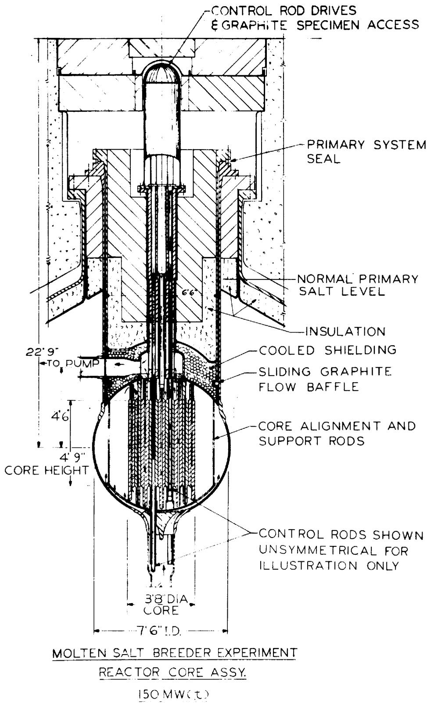  
Figure 1. MSBE Reactor Core Assembly

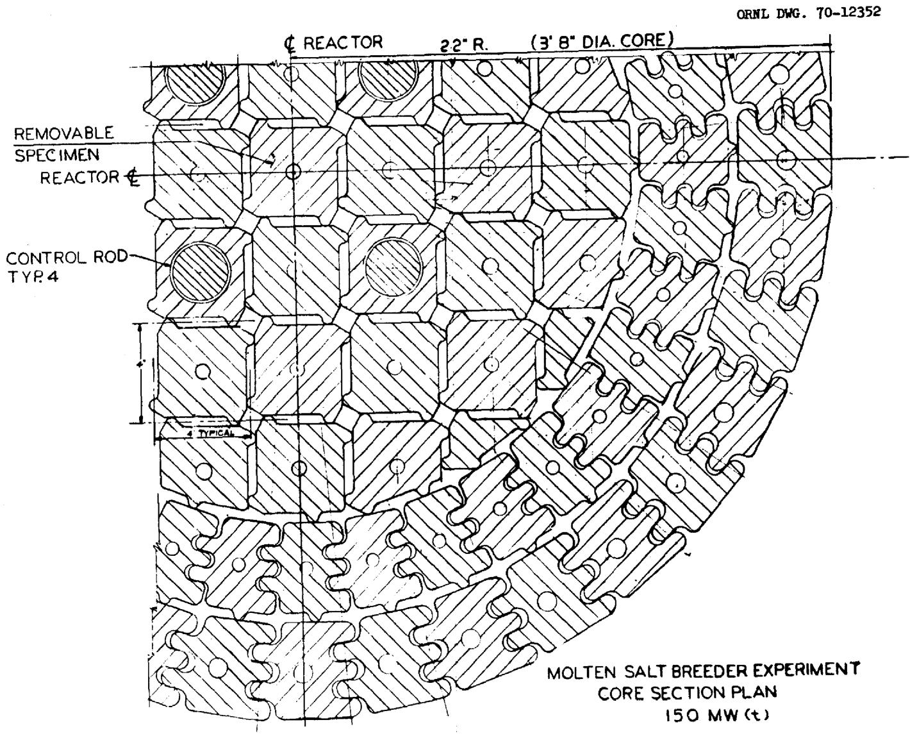  
Figure 2. MSBE Core Section Plan

Table III. MSBE Irradiation Facility V-1* Neutron Flux   

<table><tr><td>Location</td><td colspan="9">Energy Groups</td></tr><tr><td></td><td>0.9 Mev-1.5 Mev</td><td>36 Kev-0.9 Mev</td><td>1.4 Kev-36 Kev</td><td>55 ev-1.4 Kev</td><td>2.1 ev-55 ev</td><td>0.8 ev-2.1 ev</td><td>0.19 ev-0.8 ev</td><td>0.065 ev-0.19 ev</td><td>0.007 ev-.065 ev</td></tr><tr><td>Horizontal (core) midplane</td><td>1.8</td><td>3.6</td><td>3.7</td><td>3.3</td><td>2.6</td><td>0.7</td><td>2.4</td><td>2.1</td><td>0.6</td></tr><tr><td>1 ft above or below midplane**</td><td>1.6</td><td>3.1</td><td>3.2</td><td>2.8</td><td>2.3</td><td>0.6</td><td>2.1</td><td>1.8</td><td>0.5</td></tr><tr><td>2 ft above or below midplane**</td><td>1.0</td><td>2.0</td><td>2.1</td><td>1.9</td><td>1.4</td><td>0.4</td><td>1.2</td><td>1.0</td><td>0.3</td></tr></table>

$^{*}4$ in. square, $\sim 4$ ft long, vertical at core centerline.   
$\star \star$ Neutron flux, neutrons $\mathbf{cm}^{-2}$ sec-1 x 10-14 (unperturbed).

The four control rod locations shown in Fig. 2 are also accessible from above where the rod drives are located. The control rods are cooled by direct contact with salt flowing upward through the core. With the control rod drives removed, four additional graphite bars are removable through the specimen access.

The graphite bars in the outer region of the core are arranged as shown in Fig. 2. This tongue and groove arrangement is proposed as one method to separate the flow in the several regions. This permits some thermal and irradiation expansion or contraction. The graphite array is held together by hoops at the ends and keyed to prevent rotation. The entire array is supported by a Hastelloy N dish at the bottom of the vessel which in turn is supported by Hastelloy N rods suspended from the vessel upper head. These rods, as shown in Fig. 1, are located about one foot away from the core at a region where the fast flux ( $>0.1$ Mev) is less than $3 \times 10^{13}$ neut/cm² sec. The fast flux ( $>0.1$ Mev) at the midplane of the vessel wall is less than $3 \times 10^{12}$ , giving the wall an integrated dose ( $>0.1$ Mev) of about $1 \times 10^{21}$ nvt in ten full power years. The thermal flux at the vessel wall is only $2 \times 10^{10}$ neut/cm² sec.

Using the approach proposed for the MSBR, the entire graphite core structure is replaceable as a unit. A minimum six foot opening is provided in the top of the vessel to permit removal of the core structure including the support rods. This vessel opening is extended some 16 ft in height above the vessel midplane and some 8 ft above the salt level. This permits location of the vessel closure outside of the cell furnace in a thermally cool region with a reduced radiation level. Either two concentric metal gaskets with provision for leak detection between them or a seal weld could be used in the closure.

The following is proposed for replacement of the core shown in Fig. 1. After draining the salt and flushing the primary system with inert gas, the biological shielding blocks are removed, the containment seal is broken, and the pressure vessel seal is broken. Then the upper vessel head, with the core suspended on the support rods, is hoisted into a carrier. During this operation the carrier is sealed to the vessel. Large gate valves are used to isolate the volumes before removing the carrier. The procedure is reversed in inserting a preassembled replacement unit complete with a new vessel upper head.

Some primary salt will bypass the core during operation. This will result from leakage between the blanket region and the outlet in the vessel extension. In order to reduce this to an acceptable minimum, graphite piston rings in grooves on the vessel upper head as shown in Fig. 1 slide against a raised machined surface inside of the vessel extension just above the blanket region.

# 4.3 MSBE Primary Salt Properties

The primary salt has the following nominal composition (in mole $\%$ ): 71.5 ${}^{7}\mathrm{LiF}$ ; 16 $\mathrm{BeF}_2$ ; 12 $\mathrm{ThF}_4$ ; 0.5 $\mathrm{UF_4}$ . (At the start in a system initially charged with $^{233}\mathrm{U}$ only, the $\mathrm{UF_4}$ would be 0.44 mole $\%$ ; at steady state, the total $\mathrm{UF_4}$ would be 0.57 mole $\%$ ). This salt has the physical properties given in Table I. As indicated in Table I the proposed MSBR salt has a lower $\mathrm{UF_4}$ concentration. The difference, however, is small enough to have little effect on the neutron spectrum, salt properties, and salt chemistry.

# 4.4 MSBE Primary System

The MSBE flowsheet is shown in Fig. 3. This flowsheet is modeled after that proposed for the MSBR. The flowsheet will be explained in more detail under the individual systems.

# 4.4.1 Primary Loop

The primary salt leaves a side outlet at the top of the reactor pressure vessel at $1300^{\circ}\mathrm{F}$ and enters the pump suction. From the pump, the salt flows to the primary heat exchanger. The flow is down through the tubes in the vertical heat exchanger, leaving at $1050^{\circ}\mathrm{F}$ . The primary salt then enters the bottom of the reactor pressure vessel. For the layout studies, 10-inch pipe is shown between the components except at the pump suction where 12-inch pipe is used to reduce the velocity entering the pump.

The total primary salt flow through the core at 150 Mw(thermal) and with a $\Delta T$ of $250^{\circ}F$ is 6.37 x $10^{6}$ lb/hr (3850 gpm at $1300^{\circ}F$ ). The velocity in the proposed 10-inch pipe is about 16 ft/sec.

The primary system circulating volume exclusive of the expansion volume in the pump tank is about 266 ft³.

ORNL DWG. 70-11190

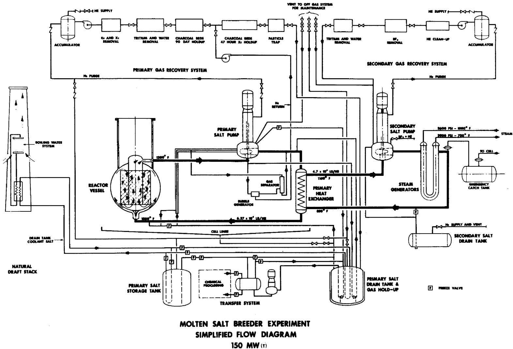  
MOLTEN SALT BREEDER EXPERIMENT   
SIMPLIFIED FLOW DIAGRAM   
150 MW (1)   
Figure 3. MSBE Flow Diagram

The primary piping is of welded construction. Thermal expansion of the piping is accommodated by allowing the pump and heat exchanger to move by sliding on their supports. Provisions will be made in the pump inlet piping for insertion and removal of Hastelloy N specimens in the primary salt.

4.4.1.1 Primary Pump. The primary system utilizes a single-stage, sump-type centrifugal pump with an overhung impeller. The pump volute is enclosed in a tank which provides for the system volumetric expansion. This expansion tank is able to accommodate about $10\%$ of the primary system salt volume or about 30 ft³. About $89\%$ of the primary salt flow goes through the reactor vessel, $10\%$ through the gas separation bypass, and the remainder to miscellaneous components such as the jet pump in the drain tank. The total flow requirements at a $\Delta T$ of $250^{\circ}\mathrm{F}$ is $4300\mathrm{gpm}$ . However, it is proposed that a larger pump be used in the MSBE to permit operation with a $\Delta T$ of $200^{\circ}\mathrm{F}$ at full power, if problems arise at the higher $\Delta T$ . Therefore a pump with a minimum flow of $5400\mathrm{gpm}$ is proposed; the head required is 125 ft. The pump would have a variable speed motor to permit operation at $4300\mathrm{gpm}$ .

A single circulating loop is used to reduce the development or extrapolation that will be required in progressing from MSBE size equipment to equipment for larger reactors.

4.4.1.2 Primary Heat Exchanger. The primary heat exchanger shown in Fig. 4 has the same type, size (3/8 in. OD) and length (about 21 ft) of tubes as those proposed for the MSBR. The MSBE exchanger, however, will have only about one-fourth as many tubes as will be in each of the four heat exchangers in the MSBR. The following conditions are about the same as those for the MSBR. The velocity of the primary salt in the tubes is about 10 ft/sec and the pressure drop about 129 psi. The overall heat transfer coefficient is estimated to be 950 Btu/hr·ft²·°F when a secondary salt composed of 92 mole % NaBF₄ and 8 mole % NaF with an average velocity of 7.5 ft/sec is used on the shell side.

The tube bundle, as shown in Fig. 4, is removable as a unit using the maintenance techniques proposed for removing the core graphite array. An alternate approach to tube repair is to use a tube and shell exchanger,

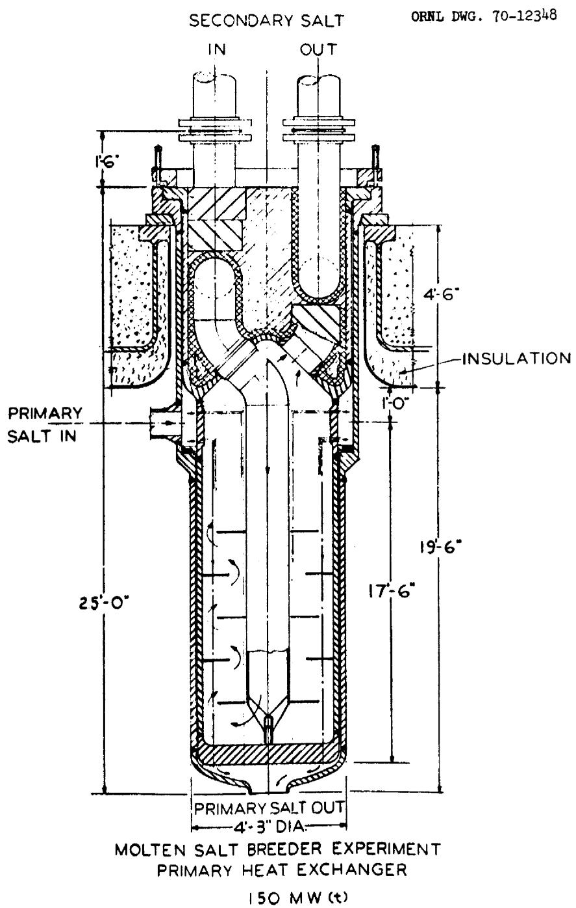  
Figure 4. MSBE Primary Heat Exchanger

cut open access hatches to the tube sheets, locate the faulty tube, and plug both ends.

# 4.4.2 Gas Separation Bypass

As in the MSBR about $10\%$ of the primary salt flow leaving the pump is routed through a gas separator. After the primary salt leaves the gas separator it enters the bubble generator where relatively clean helium bubbles are injected into the salt. These combined fluids are returned to the main loop at the pump suction.

The separated gas is combined with overflow salt from the pump expansion tank and sent to the drain tank.

# 4.4.3 Primary Salt Drain Tank

The drain tank is designed to contain all of the salt from the primary loop. In addition, it serves as a gas hold-up tank for fission product decay during operation. A minimum one hour decay of the fission products in the gas from the primary loop is desired before the gas is sent to the charcoal beds.

The primary loop is drained by gravity to the drain tank after a freeze valve in the drain line is thawed. The drain valve requires some five minutes for a rapid thaw. After the valve is open, it takes about twelve minutes to drain the primary system. The afterheat in the primary system, twelve minutes after reactor shutdown, is about $2\%$ of the operating power.5 The afterheat in the fission gas from the primary system during operation is about $1\%$ of the reactor power.5 The primary drain tank heat removal system is designed for the higher of these two which is 3 Mw.

This heat is removed by a drain tank coolant salt system. This coolant salt consists of 66 mole percent $^7\mathrm{LiF}$ and 34 mole percent $\mathrm{BeF_2}$ . The coolant system is composed of ten independent loops, each of which is capable of removing $12\%$ of the total afterheat. This will permit operation of the reactor with one coolant loop out of service. Each loop contains a number of vertical U-tubes in which the coolant salt circulates by natural convection. The heat is removed from the coolant salt by boiling water in a heat exchanger. The steam is condensed in air cooled coils in a natural

draft stack adjacent to the reactor building, and the condensed water is returned to the water boilers by gravity.

Some primary salt continuously overflows from the pump bowl to the drain tank and some is entrained in the gas flowing to the drain tank. This salt is returned to the primary loop by a jet pump in the drain tank. This jet is driven with a $40\mathrm{~gpm}$ side stream from the discharge side of the primary pump.

There is a second jet pump in the drain tank which furnishes salt to the chemical processing plant. This jet pump is also used to return the salt to the primary system when it is desired to restart the reactor after a drain. This jet is driven by an auxiliary pump of low capacity (around 300 gpm).

# 4.4.4 Primary Salt Storage Tank

A primary salt storage tank is provided for the storage of irradiated salt. In the event of trouble with the primary salt drain tank the salt can be transferred to the storage tank. The storage tank utilizes a cooling system similar to that of the drain tank but of only one-tenth the capacity; therefore, the afterheat must be allowed to decay to 0.3 Mw before the salt is transferred to the storage tank. An alternate approach for cooling of the storage tank is to use a system similar to that of the MSRE drain tank in which water was boiled in bayonet-type thimbles in the drain tank.10

# 4.4.5 Primary Salt Sample System

It is required that samples of the primary salt be taken while the reactor is in operation. A sampler-enricher, basically similar to the one successfully employed in the MSRE, is being considered for the MSBE. In the MSBE the sample is obtained from the primary salt drain tank since the salt there is representative of the primary loop and is normally well mixed by the jet pumps.

In addition, consideration is being given to an on-line analytical facility which will measure the $\mathrm{UF_3 / UF_4}$ ratio and the concentration of uranium, chromium, and oxygen. The analytical facility is fed by a side

stream from the primary loop at the primary heat exchanger discharge. The primary salt is returned to the primary loop at the suction of the pump. The use of this system will require development of new instrumentation for these measurements.

# 4.5 MSBE Secondary System

The composition and physical properties of the proposed MSBR (and MSBE) secondary salt is given in Table I.

At a power level of 150 Mw(thermal), the secondary salt enters the shell side of the primary heat exchanger at $850^{\circ}\mathrm{F}$ and leaves at $1150^{\circ}\mathrm{F}$ . The flow rate is $4.7 \times 10^{6} \, \text{lb/hr}$ or $5300 \, \text{gpm}$ at $1150^{\circ}\mathrm{F}$ . After leaving the primary heat exchanger, the salt enters the secondary pump, which is similar to the primary pump.

Heat is removed from the salt in the steam generator downstream of the pump. The salt is on the shell side and the steam is in the tubes. Feedwater is fed to the tubes at $700^{\circ}\mathrm{F}$ and 3800 psia. Steam is generated with outlet conditions of $1000^{\circ}\mathrm{F}$ and 3600 psia.

Thermal expansion of the secondary system piping is accommodated by expansion loops.

Both the secondary side of the primary heat exchanger and the salt side of the steam generator have relatively high pressure drops and therefore require large fractions of the available head of the secondary pump. A compensating reduction in pressure drop in the secondary system piping is achieved with a relatively low velocity of 13 ft/sec, which requires 12-inch pipe.

The secondary salt outlet on the steam generator is a pipe tee with a rupture disc on one leg. This permits pressure relief in the event of a tube failure in the steam generator. The line on the downstream side of this rupture disc is connected to the emergency drain tank which is also equipped with a rupture disc. Upon rupture of both discs, $\mathbf{BF}_3$ and water vapor are released to the cell.

It is desirable to clean corrosion products and water and other contamination from the secondary salt. A small bypass loop around the pump is provided for this purpose. This loop may include a cold trap for corrosion products and a nickel tank where batchwise removal of water (possibly by an HF, $\mathbf{BF}_3$ , He purge) is accomplished.

The pressurizing gas in the pump bowl of the secondary system is continuously cleaned of tritium, water vapor, radioactive material, and $\mathbf{BF}_3$ before being returned to the system as a purge gas for the pump shaft. The tritium is that which diffuses through the heat exchanger tubing from the primary system.

# 4.6 MSBE Steam System

It is required that as much information as practical be obtained from the MSBE which would be useful in design of the MSBR steam system. The feedwater conditions (700°F - 3800 psia) and the outlet steam conditions (1000°F - 3600 psia) are therefore the same in both reactors. The high feedwater temperature is desired to reduce the possibility of freezing of the secondary salt in the steam generator. The secondary salt melting point is about $725^{\circ}\mathrm{F}$ . The high feedwater temperature is achieved by mixing some of the outlet steam with the feedwater to raise the temperature above that attainable with conventional feedwater equipment.

The steam generators are fabricated from Hastelloy N, but all other components in the steam system can be conventional equipment made from material such as 2-1/4 Cr steel. A water treatment plant is available for control of the water chemistry. Provisions are made to evaluate the metallurgical, corrosion, and deposition problems in the steam system.

A steam turbine is not considered necessary in the MSBE in obtaining information for the MSBR but could be used if desired as indicated by economic studies.

# 4.7 MSBE Reactor Cell

The reactor components must be maintained above the freezing point of the primary salt even during zero power operation. This is achieved by using the reactor cell as a furnace. Heater thimbles penetrate the top of the cell and are capable of maintaining the interior at $1000^{\circ}\mathrm{F}$ . The reactor cell is shown in Figs. 5 and 6. The cell liner is about 26 ft in diameter and 34 ft in height. The cell contains a nitrogen atmosphere.

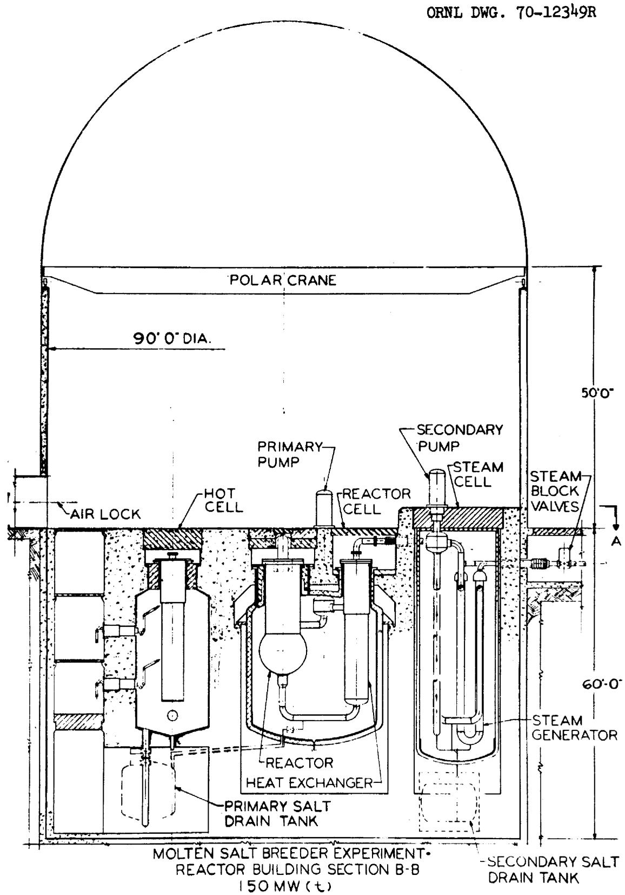  
Figure 5. MSBE Reactor Building Section B-B

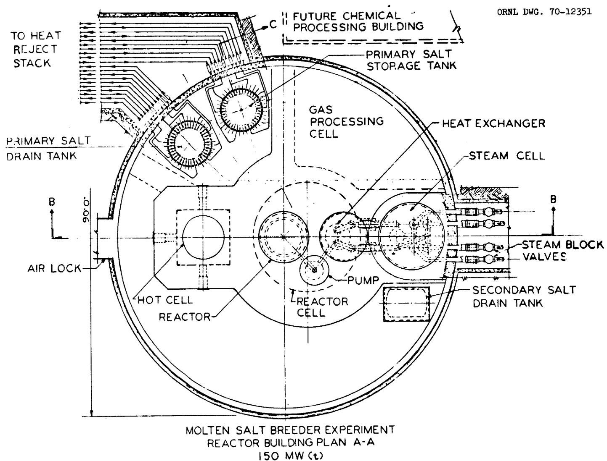  
Figure 6. MSBE Reactor Building Plan A-A

Thermal insulation with an inner liner of stainless steel is used inside of the cell liner to reduce the heat losses. Any salt which leaks onto the stainless steel liner remains molten and is routed through a special line to the primary system drain tank. An air-cooled-steel thermal-shield surrounds the cell liner to prevent radiation overheating of the concrete biological shielding.

Removable shielding plugs and flanged nozzles on the cell liner permit access to the components for maintenance.

# 4.8 Drain Tank Cell, Off-Gas Cell, and Secondary Cell

The primary system drain tank cell is a furnace similar to the reactor cell. The heater thimbles are in the annular region between the drain tank and the cell liner. This cell liner which will catch any salt spilled from the drain tank, is cooled by thermal radiation to the cell walls.

The primary system off-gas cell is a shielded containment cell. Since there is no molten salt in this system, there are no heating requirements.

The secondary cell (or steam cell) contains the secondary system components including the steam generator. These components must be maintained at a temperature above the freezing point of the secondary salt. This is achieved with the furnace concept for the cell as used in the reactor cell.

The secondary salt in the primary heat exchanger will incur some induced activity. The secondary system is therefore in a shielded containment cell. This cell is designed to withstand the pressure which would result from a ruptured steam tube. Two block valves on each steam line and feedwater line are used to minimize the pressure in the cell as a result of such a rupture.

# 4.9 MSBE Reactor Building

An elevation of the reactor building is shown in Fig. 5, and a plan of the cells within the building is shown in Fig. 6. The building serves as the containment during maintenance through the shielding plugs above the cells. The building is cylindrical with a hemispherical dome for a roof. A polar crane, located at the top of the cylindrical portion of the building, is used for movement of equipment within the building.

# 4.10 MSBE Chemical Processing

The chemical processing plant is similar to that proposed for the MSBR. The equipment is located in the chemical processing building adjacent to the reactor building. The small lines connecting the two plants are equipped with isolation valves. This permits installation, alteration, and maintenance of the processing equipment while the reactor is in operation.

The chemical processing flowsheet proposed for the MSBR11 is given in Fig. 7. The processes are described in more detail elsewhere;11 a brief description is given below.

Salt withdrawn from the reactor is fed to a fluorinator, where most of the uranium is removed as $\mathrm{UF_6}$ . Most of the salt leaving the fluorinator is fed to a reductive extraction column, where the remaining uranium is removed and the protactinium is extracted into a bismuth stream. The bismuth stream containing the extracted protactinium flows through a tank of sufficient volume to contain most of the protactinium in the reactor system. Most of the bismuth stream leaving the extraction column is contacted with an $\mathrm{H_2}$ -HF mixture in the presence of about $10\%$ of the salt leaving the fluorinator in order to transfer materials such as uranium and protactinium to the salt stream. This salt stream is then recycled to the fluorinator.

The bismuth stream leaving the lower column also contains several materials that must be removed for satisfactory operation of an MSBR. The most important of these are fission product zirconium, which can be an important neutron absorber, and corrosion product nickel, which forms an intermetallic nickel-thorium compound having a low solubility in bismuth. These materials and others that do not form volatile fluorides during fluorination are removed by hydrofluorination, in the presence of a salt stream, of a small fraction of the bismuth stream exiting from the lower column. The salt is then fluorinated for removal of uranium. Sufficient time is allowed for the decay of $^{233}\mathrm{Pa}$ so that the rate at which this material is lost is acceptably low. The remaining materials, including Zr, Ni, $^{231}\mathrm{Pa}$ , and Pu, are withdrawn in the salt stream from the fluorinator. Oxidation of part of the metal stream leaving the lower

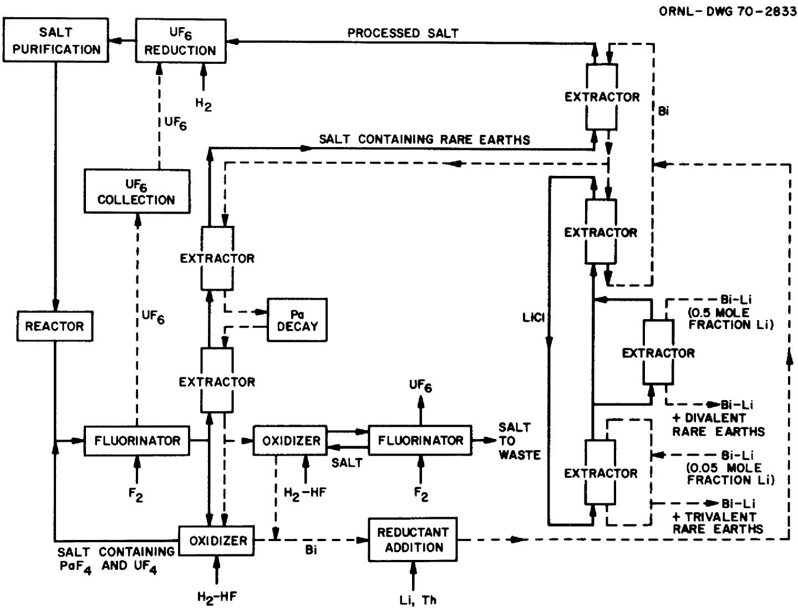  
Figure 7. MSBE Chemical Processing Flowsheet

contactor is chosen as a means for removal of these materials, since this results in discard of no beryllium and very little lithium or thorium; discard of salt from other points in the system would result in much higher removal rates for the major components LiF, $\mathrm{BeF}_2$ , and $\mathrm{ThF}_4$ .

The bismuth streams leaving the hydrofluorinators are then combined, and sufficient reductant (lithium and thorium) is added for operation of the protactinium isolation system. Effectively, this stream is fed to the upper column of the protactinium isolation system; actually, it first passes through a captive bismuth phase in the rare-earth removal system in order to purge uranium and protactinium from this captive volume.

The salt stream leaving the upper column of the protactinium isolation system contains negligible amounts of uranium and protactinium but contains the rare earths at essentially the reactor concentration. This stream is fed to the rare-earth removal system, where fractions of the rare earths are removed from the fuel carrier salt by countercurrent contact with bismuth containing lithium and thorium. The bismuth stream is then contacted with LiCl, to which the rare earths, along with a negligible amount of thorium, are transferred. The rare earths are then removed from the LiCl by contact with bismuth containing a high concentration of $^7$ Li. Separate contactors are used for removal of the divalent and trivalent rare earths in order to minimize the quantity of $^7$ Li required. Only about $2\%$ of the LiCl is fed to the contactor in which the divalent materials are removed.

Small scale testing of these processes is now in progress. Material for the equipment is being developed. The plant proposed for the MSBE is of such size that determination of most of the problems in an MSBR size processing plant is possible.

# 5. MSBE EXPECTED ACCOMPLISHMENTS

The design, procurement, installation, and maintenance of equipment for the MSBE will give essential information for design of similar equipment for larger reactors. The operation of the MSBE will demonstrate the reliability of equipment and systems from performance and safety standpoints. The evaluation of material samples and radioactive deposits will

give important information on material behavior and fission product behavior in an MSBR environment. The central core graphite specimen can be removed and replaced individually after several months operation, and it is expected to replace all of the core graphite after two years at full power.

The MSBE will be an important step in continuing the training of operating personnel, the development of MSBR preliminary operational procedures, and the development of safety criteria for the MSBR.

The MSBE will be used in conjunction with its processing plant to study the nuclear characteristics of a reactor with a breeding ratio near one. The irradiated salt available to the processing plant will permit development work on a processing plant at conditions very close to those of an MSBR.

A six year program of operation of the MSBE at full power should be sufficient time to achieve the initial objectives. Continued use may be important for irradiation of improved graphite, testing of improved designs of equipment such as steam generators, improvement of chemical processes, and the study of the long term effects of operation on salts and materials.

# 6. APPENDIX I

# THE MOLTEN SALT REACTOR EXPERIMENT

# 6.1 Description

The MSRE was a reactor in which a molten fluoride salt containing fissile material (but no thorium) was circulated through a single-region core of bare graphite bars. All metal in contact with the molten salts was standard Hastelloy N. The flow diagram is shown in Fig. 8; some additional operating data were given previously in this report in Table I. The design, development, and construction of the MSRE are described in Ref. 3. Ref. 10 is a very detailed description of the reactor design. The brief description which follows is intended to focus on the features that are of particular interest in a consideration of the bases for future molten salt reactors.

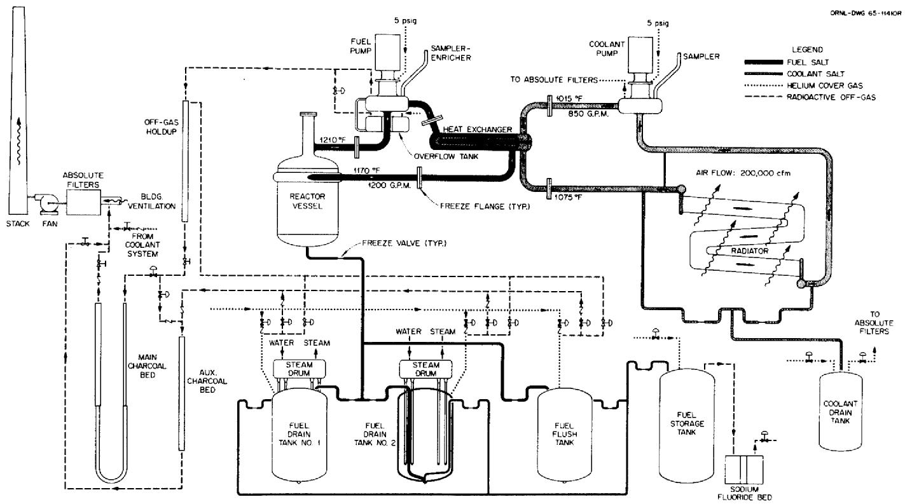  
Figure 8. MSRE Flowsheet

The 54-in.-diameter MSRE core was comprised of bare graphite bars, 2-in. square and 64-in. long. The graphite bars had a channel machined in each face to form $1.2 \times 0.4$ in. flow passages between bars. The graphite (Grade CGB) was especially produced to limit pore size to 0.4 microns to keep out the salt (which does not wet the graphite). Fuel salt passed upward through the core channels in laminar flow. A removable, 2-in.-diameter, Hastelloy N basket held specimens of metal and graphite in a special channel near the center of the core. Three thimbles (also near the core centerline) housed flexible control rods used for temperature regulation and shutdown.

The fuel salt was circulated at 1200 gpm through the shell side of a U-tube heat exchanger, where heat was transferred to a secondary salt (LiF-BeF $_2$ , 66 - 34 mole %). The coolant salt, circulating at 850 gpm, delivered the heat to an air-cooled heat exchanger. The heat transfer capability of this system limited the power that could be dissipated to 7.3 Mw when the core operated at its normal temperature of 1210°F.

The salt pumps were centrifugal pumps of conventional hydraulic design with vertical, overhung shafts having oil-lubricated bearings. The volute of each pump was submerged in a pool of salt in a tank (pump bowl) that contained the surge space for the loop. The pressure in the blanket gas (and at the open pump suction) was 5 psig. Pump discharge pressures were 55 psig in the fuel loop and 70 psig in the coolant loop, respectively. A tube into the top of the fuel pump bowl connected to the sampler-enricher, contained a motor-driven reel by which sample buckets or capsules of enriching salt $(\mathrm{LiF - UF_4}, 73 - 27 \text{ mole}\%)$ could be lowered into the salt pool. A similar device was provided on the coolant pump.

A spray ring in the top of the fuel pump bowl took about 50 gpm of the pump discharge and sprayed it through the gas above the salt. The purpose was to provide contact so that the gaseous fission products could escape into the gas. A flow of 3 liters/min of helium carried the xenon and krypton out of the pump bowl, through a holdup volume, a filter station, and a pressure-control valve to charcoal beds. These consisted of pipes filled with charcoal, submerged in a water-filled pit at about $90^{\circ}\mathrm{F}$ . The beds, operated on a continuous-flow basis, delayed xenon for

about ninety days and krypton for about seven days so only stable or long-lived nuclides got through to the stack.

All salt piping and vessels were electrically heated to prepare for salt filling and to keep the salt molten when there was no nuclear power. Heaters in the reactor cell were incorporated in removable, reflective-metal insulated units. Thermocouples under each heater monitored temperatures to avoid overheating the empty pipe. (The salt pumps were used to circulate gas during system heatup and cooldown to help maintain uniform temperatures.)

There were no mechanical valves in the salt piping. Flow in drain and transfer lines was blocked by plugs of salt frozen in flattened sections of the lines. Temperatures in the freeze valves in the fuel and coolant drain lines were controlled so they would thaw in 10 to 15 minutes when a drain was requested. A power failure of longer duration also resulted in a drain because the cooling air required to keep the valves frozen was interrupted. The drain tanks were almost as large as the reactor vessel, but the molten fuel when in the drain tanks and away from the graphite was subcritical. Water-cooled bayonet tubes extended down into thimbles in the drain tanks to remove up to 100 kw of heat, if necessary. Steam produced in the tubes was condensed and returned by gravity.

The physical arrangement of the equipment is shown in Fig. 9. The reactor and drain tank cells were connected by a large duct so they formed a single containment vessel. The tops of the two cells consisted of two layers of concrete blocks, with a weld-sealed stainless-steel sheet between the layers, and the top layer fastened down. A water-cooled shield around the reactor vessel absorbed most of the escaping neutron and gamma-ray energy. The cell atmosphere was kept at $140^{\circ}\mathrm{F}$ by water-cooled, forced-air space coolers. The cooling air for the freeze valves and the fuel-pump bowl was actually reactor-cell atmosphere, compressed and cooled. A fraction of the blower output was discharged past a radiation monitor and up the ventilation stack to keep the reactor and drain tank cells at -2 psig during operation. A small bleed of nitrogen into the cell kept the oxygen content at $3\%$ to preclude fire if fuel-pump lubricating oil spilled on hot surfaces.

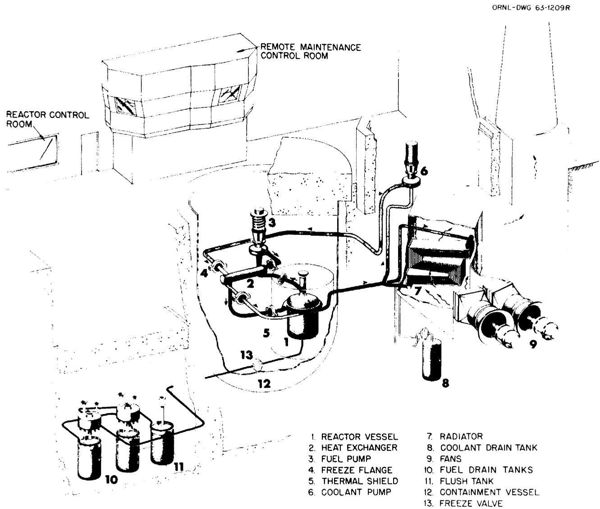  
Figure 9. Layout of the MSRE

The 5-in. salt piping in the reactor cell included flanges that would permit removal of the fuel pump or the heat exchanger. These flanges were designed to form a frozen salt seal in the gap between the flange faces. This seal was backed-up by a metal ring joint seal to prevent escape of gaseous fission products. The uninsulated flanges were maintained below the melting point of the salt by thermal radiation to the reactor cell environment.

All the components in the reactor and drain tank cells were designed and arranged such that they could be removed by the use of long-handled tools from above. When maintenance was done, the fuel was secured in a drain tank and the connecting lines were frozen. The upper layer of blocks was removed, a hole was cut in the membrane over the item to be worked on, and, after a steel work shield was set in place, a lower block was removed. A large duct from the reactor cell to the upstream side of the ventilation filters was opened to draw air down through the shield openings. Tools, lights, and viewing devices were inserted through fitted openings in the work shield and items to be replaced were unbolted so they could be lifted with the building crane.

In the same building adjacent to the drain tank cell, there was a simple facility for processing the fuel or flush salt. The purpose was twofold: to remove oxide contamination from the salt if this should be necessary, and to recover the uranium from the salt. One whole batch of salt (about 75 ft³) could be transferred into the tank where it was sparged with hydrogen fluoride gas to remove H₂O and convert the metal oxides to fluorides. A fluorine gas sparge was used to convert UF₄ to the volatile UF₆. The UF₆ gas was then trapped on a bed of sodium fluoride pellets.

# 6.2 Experience

Design of the MSRE was started in the summer of 1960. The design, component development, procurement, and construction were conducted between this time and October 1964 when molten salt was first loaded in the MSRE. In comparison with other reactor experiments, the MSRE ran long and well. At the time of the final shutdown in December 1969, salt had circulated in the fuel system for 21,788 hours, the reactor had been

critical for 17,655 hours and had produced heat equivalent to 13,172 full-power hours. During this ample period of operation, the MSRE produced much new and valuable information and accomplished its goal of demonstrating the practicality of the molten salt reactor concept. Experience in the most important areas is summarized below. (A convenient review as of July 1969, appears in Ref. 12.)

# 6.2.1 Fuel Chemistry

The experience with regard to the chemical stability of the MSRE fuel salt was excellent. It had been anticipated that the fuel might be subject to uranium separation under two extreme conditions, but neither was approached during MSRE operation.

Oxide contamination, which could lead to $\mathrm{UO_2}$ precipitation, was controlled by providing a blanket gas (ordinarily helium) from which oxygen and moisture had been removed by passage through a $1200^{\circ}\mathrm{F}$ titanium sponge. On occasions when the reactor vessel was open, moist air intrusion was minimized by first filling the system with dense argon and working through a nitrogen-purged standpipe. Fuel salt analyses showed that the oxide level remained remarkably low ( $\sim 60$ ppm), well below any solubility limit. As a result of this experience, $\mathrm{ZrF_4}$ , which was in the MSRE fuel as a buffer against $\mathrm{UO_2}$ formation, is not considered necessary in fuels for future molten salt reactors.

The other mechanism that was considered credible at the time the MSRE was designed was reduction of uranium from the fluoride to the metallic state as a result of the fission process. There was some uncertainty in the valence state that several fission products would assume in the MSRE fuel salt environment, and it was recognized that if the average products of one fission reacted with more than $\frac{1}{4}$ fluorine atoms, some $\mathrm{UF}_4$ would be reduced to $\mathrm{UF}_3$ as a result of power operation. If this were unchecked, the $\mathrm{UF}_3$ concentration conceivably could get high enough to dis-portionate into $\mathrm{UF}_4$ and insoluble U. It turned out that the reverse was true: the fission products tied up slightly less than $\frac{1}{4}$ fluorine atoms on the average, so $\mathrm{U}^{3+}$ was very gradually raised to $\mathrm{U}^{4+}$ . To offset this tendency and keep the system slightly reducing (to avoid Hastelloy N

corrosion), it was necessary only to make small ( $\sim 10 - g$ ) additions of beryllium metal through the sampler-enricher at intervals of a month or two.

Coulometric analysis of fuel salt samples for uranium showed good reproducibility and high precision $(\pm 0.5\%)$ and the indicated inventory changes agreed well with calculated burnup. A far more sensitive (although less unequivocal) indication of uranium concentration was the reactivity balance by the on-line computer. This never indicated any anomalous behavior of the uranium.

Early operation with partially enriched uranium built up about $0.6\mathrm{kg}$ of plutonium as $\mathrm{PuF_3}$ in the MSRE fuel. The stable behavior of plutonium in the MSRE and laboratory verification of adequately high solubilities of $\mathrm{PuF_3}$ and $\mathrm{Pu_2O_3}$ made it appear reasonable to fuel the MSRE entirely with plutonium. This was not done, but during 1969, capsules of $\mathrm{PuF_3}$ were added to the fuel salt to compensate for fissile material burnup.

The behavior of fission products was intensively investigated in the MSRE. The noble gases were stripped into the offgas as expected and most of the other fission products stayed in the salt, also as expected. The exception was the "noble-metal" group - Mo, Nb, Ru, and Te, whose probable behavior could not be predicted with certainty before the MSRE operated. It appeared that they existed in the normal reducing environment of the MSRE in elemental form, as colloidal particles, which tended to go to the metal and graphite surfaces and to accumulate at the gas-liquid interfaces. Generally only a few percent of the inventories of these elements were found in the salt. Gas samples indicated that a few percent were carried into the offgas system, implying that the bulk was on the metal and graphite. This was supported by radioanalysis of core specimens and measurements of deposition in the heat exchanger by remote gamma-ray spectrometry. This information is quite important, for it means that high-power molten salt reactors must deal with the afterheat problems resulting from deposition of the noble metals.

Tritium was produced in the MSRE fuel salt at a calculated rate of 40 Ci/day (35 Ci/day from $^6\mathrm{Li}$ and 5 Ci/day from $^7\mathrm{Li}$ ). Measurements showed that the amount in the fuel offgas leaving the charcoal beds rose gradually

to about 25 Ci/day during sustained power operation. Both this observation and the determination of tritium in materials exposed briefly in the fuel pump implied significant internal holdup and gradual release of tritium. Some tritium diffused through the heat exchanger tubes in the MSRE: 0.6 Ci/day was found in the coolant salt offgas and around 3 to 5 Ci/day appeared in the air going up the coolant stack. These rates were lower than predicted by accepted relations for tritium diffusion and suggest the need for refinements in the calculations.

# 6.2.2 Materials

Compatibility. The compatibility of the salt, the graphite moderator, and the Hastelloy N container material was demonstrated by analysis of hundreds of samples of fuel salt and examination of specimens exposed to salt in the core for as long as 14,714 hours.

The corrosion of the Hastelloy N in the fuel system was very slight, consisting primarily of leaching of chromium from the surface. (For a short time after the fuel processing and $233\mathrm{U}$ loading there was apparently some oxidation of iron also.) Analyses of the fuel salt showed a chromium increase over the 48 months from December 1965 to December 1969, equivalent to all the chromium in a 0.46-mil layer over the circulating loop surfaces. Metallographic and microprobe examination of core specimens showed no void formation due to leaching, but there was a chromium concentration gradient from the surface to a depth of 2 to 3 mils. Carburization of metal specimens in contact with graphite extended to a depth of only 1 mil.

In the coolant salt system there appears to have been virtually no corrosion. The chromium concentration in the coolant salt remained at $37 \pm 7$ ppm through 26,076 hr of circulation and preliminary examination of radiator tube specimens shows no evidence of deposition by mass transport.

Graphite specimens exposed to fuel salt in the core for periods up to $14,714$ hr showed no attack; there were no changes in surface finish and no cracks other than those present before exposure. Only extremely small quantities of salt were found to have penetrated the graphite either through pores or cracks. (Assuming the specimens are typical, there is less than $10\mathrm{g}$ of uranium in the $3700\mathrm{kg}$ of graphite in the core.)

Irradiation Effects. Specimens of the standard Hastelloy N heats used in constructing the MSRE, after exposure to thermal neutron fluences up to $1.5 \times 10^{21} \mathrm{n/cm}^2$ , showed drastically reduced fracture strain and creep rupture life at high temperatures. (Fracture strains at $650^{\circ}\mathrm{C}$ were less than $1\%$ for some specimens.) Although these effects did not become limiting in the MSRE, they would make the standard alloy unsuited for high-flux, long-term applications. Specimens of Ti- and Zr-modified Hastelloy N exposed in the MSRE core proved to have excellent corrosion resistance and far less decrease in creep rupture life and fracture strain due to irradiation than the standard alloy.

Graphite specimens showed no measurable irradiation effects at the fluences attained in the MSRE.

# 6.2.3 Nuclear

Confidence in the predictions of nuclear performance of future molten salt reactors is bolstered by results of measurements in the MSRE. Agreement of calculated and observed critical concentrations of fissile material was good, both in the $235\mathrm{U}$ and the $233\mathrm{U}$ startups. Changes in the isotopic ratios of uranium in the MSRE fuel and encapsulated uranium in the MSRE core were measured very precisely. From these measurements most accurate values were obtained for neutron yields $(\eta)$ for $235\mathrm{U}$ and $233\mathrm{U}$ in a neutron spectrum quite similar to that in molten salt breeder reactors.

The dynamic behavior of the system agreed with calculations which took into account effects of transport of delayed neutron precursors in the circulating fuel. As predicted, the stability margin of the MSRE was quite satisfactory.

# 6.2.4 Equipment

Conservative design and great care in quality assurance (plus the chemical stability and compatibility of MSRE materials) were responsible for the high degree of reliability that was attained in the MSRE. This reliability was demonstrated over the last fifteen months of 235U operation when the reactor was available $87\%$ of the time (critical $80\%$ and involved in the removal of core specimens $7\%$ ).

Salt Pumps. The two original salt pumps served throughout the MSRE operation, accumulating 21,788 hr of salt circulation on the fuel pump and 26,076 hr on the coolant pump. The only problem with the pumps was oil leakage from the shaft seal drainage passages into the pump bowls. The oil, which leaked at roughly 5 cc/day into each pump, had no deleterious effect on the salt, but its thermal decomposition products accumulated at points in the offgas system. The spare pump rotary elements were seal-welded to prevent such leakage, but since the offgas problems were adequately handled with the original pump rotary elements, the spare pump rotary elements were not installed.

Offgas System. The fuel offgas system caused some delays during the initial power ascension when oil that had collected in the lines during the prenuclear testing was vaporized and polymerized by the gaseous fission products. This was overcome by installation of larger valves and a 3-stage filter. Oil in the coolant offgas system gradually accumulated and eventually required cleanout of the lines near the pump bowl. It was necessary to rod out the fuel offgas line at its outlet from the pump bowl due to accumulation of frozen salt droplets (originating in the xenon stripper spray in the pump bowl). After the third such operation in 24 months, a heater was installed so salt accumulations could be melted out. Holdup of xenon and krypton on the room-temperature charcoal beds met design predictions and showed no evidence of decrease in capacity.

Heat Exchangers. Measurements on the MSRE heat exchangers confirmed that conventional design calculations adequately predict molten salt heat transfer and showed no change in performance over the many months of power operation. The original underestimates of performance resulted from the use of incorrect values for salt thermal conductivity and improper calculation of the air-side coefficient in the air-cooled heat-exchanger.

# 6.2.5 Maintenance of Radioactive Systems

Practical maintenance of highly radioactive systems was demonstrated in the MSRE. The basic philosophy was one which can be used, with appropriate implementation, in large, high-power molten salt reactors. With careful design to permit use of simple tools, operated remotely or semi-remotely, the MSRE approach can be used to replace virtually any component.

Although there was little trouble with the major components in the MSRE, enough jobs were done to thoroughly test this scheme. The semiremotem maintenance took longer than equivalent non-radioactive jobs, but could be scheduled with confidence. By the use of temporary containment enclosures and shielding, radioactive contamination was controlled and personnel exposures to radiation were held well below permissible limits.

# 7. APPENDIX II

# 7.1 MSBR Plant Description (5,6)

A simplified flow diagram of the primary and secondary systems is shown in Fig. 10. The salt composition and some of the design conditions are given in Table I in the main body of this report. The thermal rating of the plant is $2250\mathrm{Mw}$ . The primary salt is circulated by four pumps operating in parallel and is heated from $1050^{\circ}\mathrm{F}$ to $1300^{\circ}\mathrm{F}$ in its passage through the core. Each pump has a capacity of about 16,000 gpm and circulates the salt through one of four primary heat exchangers and returns it to a common plenum at the bottom of the reactor vessel.

There are four corresponding secondary loops. Each of the four secondary salt circuits has a pump of 20,000 gpm capacity which circulates the secondary salt from the corresponding primary heat exchanger through steam generators in adjacent cells. The secondary salt is heated from $850^{\circ}\mathrm{F}$ to $1150^{\circ}\mathrm{F}$ in a primary heat exchanger. The steam generated is at $1000^{\circ}\mathrm{F}$ and 3600 psia.

A plan of the reactor plant is shown in Fig. 11 and a sectional elevation in Figs. 12 and 13.

The reactor cell houses the reactor vessel and the four primary heat exchanger-circulating pump loops. There are removable plugs over all components which might require maintenance. The reactor cell is normally maintained at a temperature of about $1000^{\circ}\mathrm{F}$ by electric heater thimbles to insure that the salts will be molten. This "furnace" concept for heating is preferred over trace-heating of lines and equipment because it should give more uniform heating, heater elements can be replaced more easily, and there is no need of thermal insulation on equipment that would crowd the cell and require removal for maintenance and inspection.

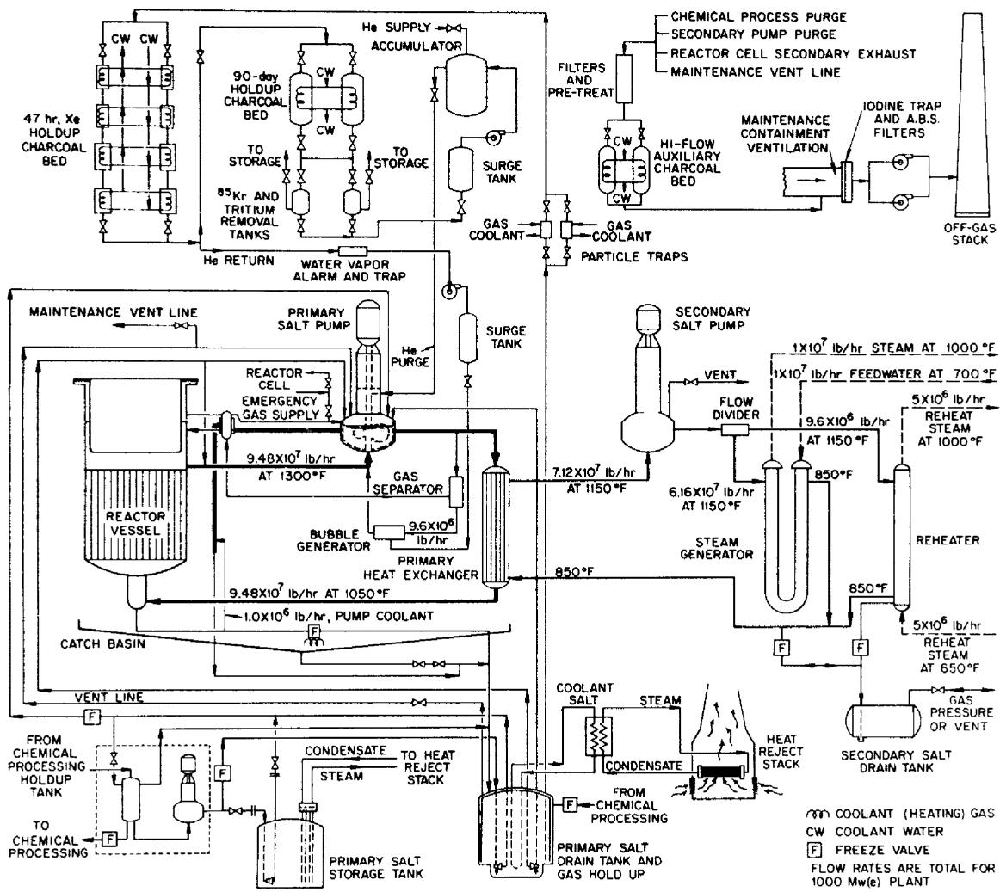  
Figure 10. Flow Diagram for MSBR Plant

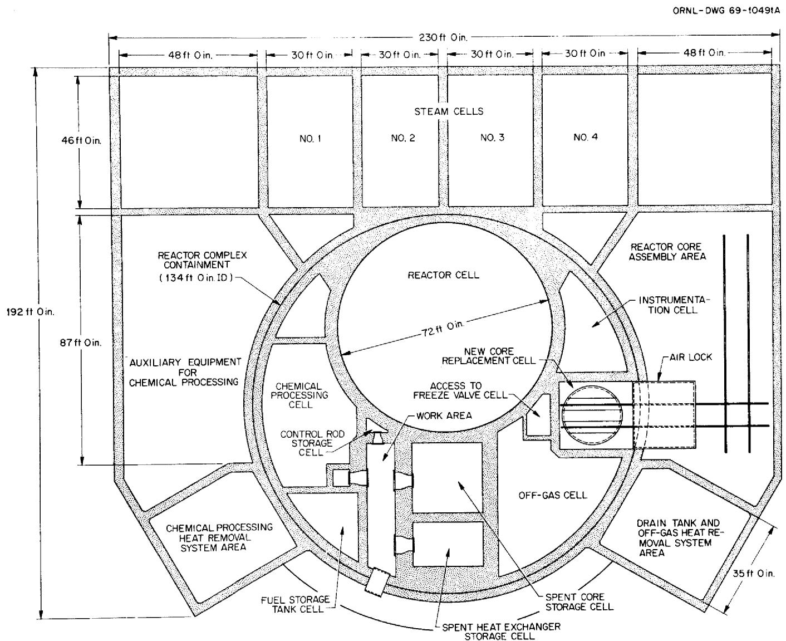  
Figure 11. Plan View of MSBR at Reactor Cell Elevation

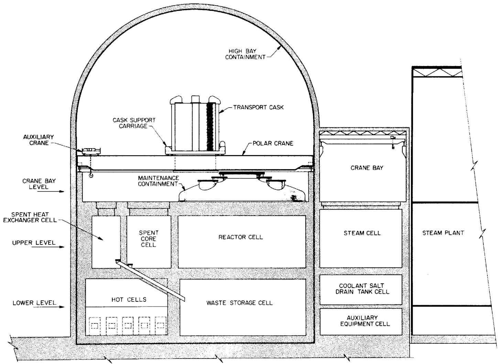  
Figure 12. Sectional Elevation Through MSBR Plant Building

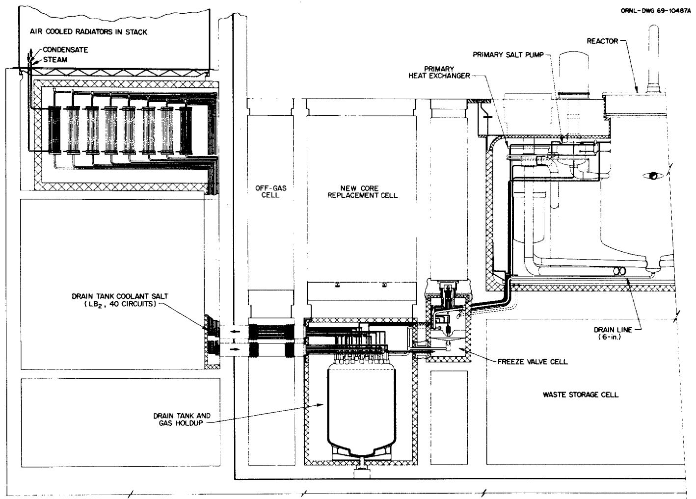  
Figure 13. Elevation of MSBR Drain Tank Cell

The stainless steel "catch pan" at the bottom of the reactor cell, shown in Fig. 13, slopes to a drain line leading to the primary salt drain tank located in an adjacent cell. In the very unlikely event of a major salt spill, the salt would flow to the tank. A fusible valve is provided in the drain line to isolate the tank contents from the cell during normal conditions.

High temperature thermal insulation is attached to the inside of the cylindrical wall and the upper and lower heads of the reactor cell containment vessel to limit heat losses from the reactor cell. The inside surface of the insulation is covered with a thin stainless steel liner to protect the insulation from damage, to act as a radiant heat reflector, and to provide a clean, smooth surface for the interior.

The primary drain tank cell is essentially the same "furnace" and containment concept as the reactor cell.

The four steam-generating cells are located adjacent to the reactor cell. These house the secondary-salt circulating pumps, the steam generators and the reheaters. The cell construction is similar to that of the reactor cell but only a single containment is used. These cells are also based on the "furnace" concept.

Through careful quality control of materials and workmanship, the reactor loops containing fission products would have a high degree of integrity and reliability in preventing escape of radioactive materials from the system.

The MSBR core design is based on replacement of the core graphite after an integrated neutron dose of about $3 \times 10^{22}$ neutrons/cm² (for E > 50 kev). At a peak core power density of about 65 kw/liter, the anticipated core graphite life is about 4 years. The breeding performance at this power density is considered adequate. The calculated doubling time is 21 years. The dimensions of the reactor were obtained through nuclear physics optimization studies discussed in Ref. 5.

A plan and elevation of the reactor vessel assembly are given in Figs. 14 and 15. The vessel is about 22 ft in diameter containing a graphite structure some 20 ft high. For the proposed 70 psi inlet pressure, the Hastelloy N vessel would require an estimated 2 in. cylindrical thickness.

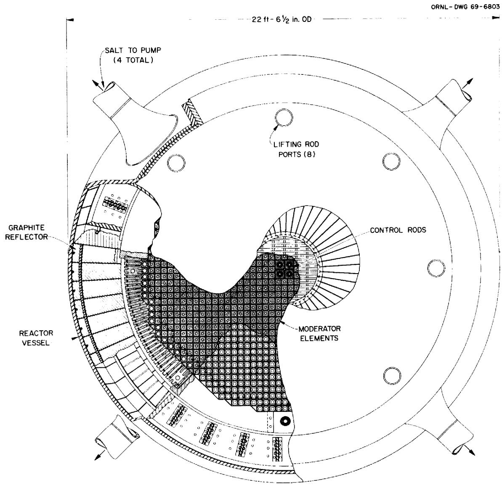  
Figure 14. Plan View of MSBR Vessel

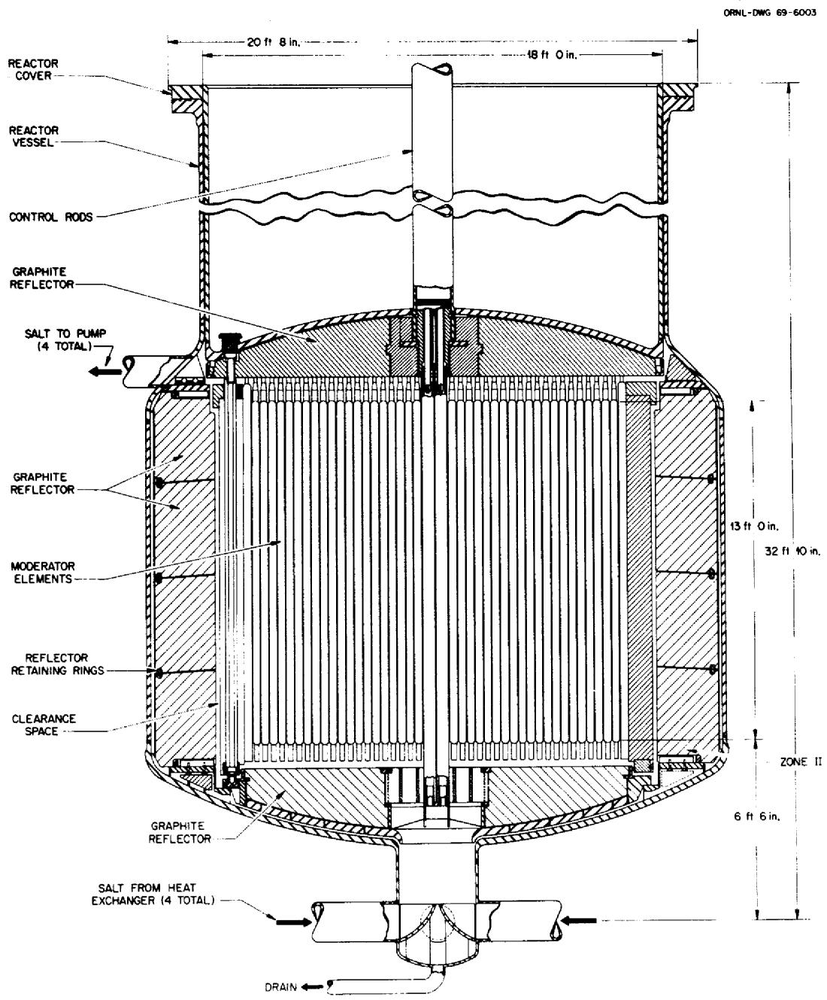  
Figure 15. Sectional Elevation of MSBR Vessel

A cylindrical extension of the vessel above the salt overflow level in the pump tank permits location of the vessel closure above the roof of the reactor cell "furnace." This makes possible a joint which can be remade after replacement of the core graphite.

The fuel salt enters the bottom of the reactor vessel at $1050^{\circ}\mathrm{F}$ , flows upward and leaves at the top at about $1300^{\circ}\mathrm{F}$ . The core Zone 1 is about 14 ft in diameter and consists of extruded graphite elements, 4 in. square x 13 ft long. A minimum 0.6 in. diameter hole through the center of each element, and ridges oriented to separate the pieces, furnish flow passages and provide the requisite $13\%$ salt volume in this most active portion of the reactor.

Special shaped extensions on each end of the elements provide a greater salt-to-graphite volume ratio at the top and bottom of core Zone 1 to form an undermoderated region which helps reduce the axial neutron leakage from the core. By varying the salt velocity, a uniform temperature rise across the core is obtained. The maximum salt velocity in the core is about 8 ft/sec. The overall pressure drop in the salt flowing through the core is about 26 psi.

Core Zone 2 consists of graphite slabs 2 in. thick and 13 ft long arranged radially around core Zone 1 to form a 17 ft diameter region. The salt volume in core Zone 2 is about $37\%$ . This under-moderated region serves to reduce the radial neutron leakage. The slabs provide the stiffness to hold the inner core graphite elements in a compact array as dimensional changes occur in the graphite. The slabs are confined by graphite rings at the top and bottom. Graphite in the central region of core Zone 1 would require replacement after four years. It was decided to replace all of the graphite in core Zones 1 and 2 as a unit. This permits the replacement core to be assembled as a unit in a clean area.

Surrounding core Zone 2 in the radial direction is a 2 l/2 ft thick graphite reflector. This graphite receives a relatively low neutron dose and is structurally suitable for the life of the reactor. The reflector is composed of wedged-shaped slabs, about 1 ft wide at the thicker end and about 4 ft high. These slabs are spaced about 1/4 in. from the vessel wall to allow an upward flow of fuel salt to cool the metal wall and maintain it below the design temperature of about $1300^{\circ}\mathrm{F}$ . The reflector

has a radial clearance of about $1\frac{1}{2}$ in. on the inside diameter to accommodate dimensional changes of the graphite and to allow clearances for removing and replacing the core assembly. Salt flow passages and appropriate orificing are provided between the graphite slabs to maintain the temperature at acceptable levels. A system of Hastelloy N bands and vertical rods key the slabs together and cause the reflector to move with the vessel wall as the systems expand with temperature. Reflector graphite is also provided in the top and bottom heads. The amount of fuel salt in the radial and axial reflector regions is about $1\%$ of the reflector volume.

The primary heat exchangers are designed for primary salt in the tubes and secondary salt on the shell side. Each exchanger removes one-fourth of the 2250 Mw of thermal energy and has an estimated 5900 tubes, 3/8 in. OD and about 21 l/2 ft long. One objective of the design was to minimize the primary salt content; therefore, knurled tubing was proposed in order to increase the heat transfer coefficient. The velocity in the tubes is 10 ft/sec; the velocity of the secondary salt is typically 7.5 ft/sec. The overall heat transfer coefficient is estimated to be 950 Btu/hr-ft $^2$ -°F. Provisions have been made in the design for replacement of the tube bundle.

Pumps similar to those used in the MSRE are proposed for the MSBR.

It is required that fission gases be removed from the circulating salt for neutron economy reasons. This will be accomplished in a $10\%$ bypass flow around the heat exchanger and core. This side stream leaves the main loop just downstream from the pump discharge. Previously injected helium bubbles containing the fission gasses will be removed by a gas separator in the side stream. The separated gas is combined with any overflow salt from the expansion tank and routed through a cooled line to the primary salt drain tank. After a minimum holdup of one hour, the gas is sent to charcoal beds for 135 Xe holdup and decay. After part of the gas is further purified, the relatively clean helium is pressurized and injected as bubbles into the primary salt loop bypass stream just before the side stream re-enters the main loop at the primary pump suction.

The primary system drain tank, used above for gas holdup, is sized to hold all the primary salt plus the secondary salt which would also drain to this tank in the event of failure of a tube in one of the primary

heat exchangers. The drain tank is equipped with multiple natural convection salt cooling systems which transfer the afterheat to boiling water systems in which the steam is condensed in a natural draft stack.

The heat removed from the primary heat exchangers by the secondary salt is used to generate steam in tube and shell steam generators with the secondary salt on the shell side. To reduce the possibility of freezing of the secondary salt, the feedwater enters the steam generators at $700^{\circ}\mathrm{F}$ . Supercritical steam is generated at $1000^{\circ}\mathrm{F}$ and 3600 psia. There are four 140 Mw thermal steam generators in each of the four secondary systems.

Part of the steam from the steam generators will be used to heat the feedwater in a mixing tee from about $550^{\circ}\mathrm{F}$ to the $700^{\circ}\mathrm{F}$ required. Otherwise, the steam cycle will be similar to that of the TVA Bull Run steam plant.

# REFERENCES

1. R. C. Briant, et al., Nuclear Science and Engineering, Vol. 2, No. 6, pp. 795-853 (1957).   
2. P. N. Haubenreich, et al., MSRE Design and Operations Report, Part III, Nuclear Analysis, ORNL-TM-730, Oak Ridge National Laboratory, Feb. 3, 1964.   
3. R. B. Briggs, et al., MSR Program Semiann. Progr. Rept., July 31, 1964, ORNL-3708, Oak Ridge National Laboratory.   
4. P. N. Haubenreich, et al., MSR Program Semiann. Progr. Rept., Feb. 28, 1970, ORNL-4548, pp. 1-25, Oak Ridge National Laboratory.   
5. E. S. Bettis, et al., MSR Program Semiann. Progr. Rept., Feb. 28, 1969, pp. 49-71, USAEC Report ORNL-4396, Oak Ridge National Laboratory.   
6. E. S. Bettis, et al., MSR Program Semiann. Progr. Rept., Aug. 31, 1969, pp. 39-58, USAEC Report ORNL-4449, Oak Ridge National Laboratory.   
7. O. L. Smith, et al., MSR Program Semiann. Progr. Rept., Aug. 31, 1968, ORNL-4344, p. 71, Oak Ridge National Laboratory.   
8. O. L. Smith, et al., MSR Program Semiann. Progr. Rept., Feb. 28, 1969, ORNL-4396, pp. 84-87, Oak Ridge National Laboratory.   
9. O. L. Smith and J. H. Carswell, MSR Semiann. Progr. Rept., Aug. 31, 1969, ORNL-4449, pp. 69-70, Oak Ridge National Laboratory.   
10. R. C. Robertson, MSRE Design and Operations Report, Part I, Description of Reactor Design, ORNL-TM-728, January 1965, Oak Ridge National Laboratory.   
11. L. E. McNeese, MSR Program Semiann. Prog. Rept., Feb. 28, 1970, USAEC Report ORNL-4548, pp. 277-288, Oak Ridge National Laboratory.   
12. P. N. Haubenreich and J. R. Engel, Experience with the MSRE, Nucl. Appl. Tech., 8, 118 (1970).

1. J. L. Anderson

2. C.F.Baes

3. H.F. Bauman

4. S. E. Beall

5. M. Bender

6. C.E. Bettis

7. E. S. Bettis

8. D. S. Billington

9. F. F. Blankenship

O. R. Blumberg

1. E. G. Bohlfann

2. C.J. Borkowski

3. H. I. Bowers

4. G. E. Boyd

5. R.B.Briggs

6. S. Cantor

7. D. W. Cardwell

8. W. L. Carter

9. C. W. Collins

O. W. B. Cottrell

1. J. L. Crowley

2. F. L. Culler

3. J. R. Distefano

4. S.J.Ditto

5. W. P. Eatherly

6. J. R. Engel

7. D. E. Ferguson

8. L. M. Ferris

9. A. P. Fraas

O.J.H.Frye

1. L.C.Fuller

2. W.K. Furlong

3. C. H. Gabbard

4. R.B.Gallaher

5. L. O. Gilpatrick

6. W. R. Grimes

7. A. G. Grindell

3. R.H.Guymon

9. P.H. Harley

D. W. O. Harms

1. P. N. Haubenreich

2. R.E.Helms

3. E.C.Hise

4. H.W.Hoffman

5. P.P.Holz

5. W.R.Huntley

7. W.H. Jordan

3. P. R. Kasten

9. R.J.Kedl

50. M. T. Kelley

51. H. T. Kerr

52. J.J.Keyes

53. S. S. Kirslis

54. R. B. Korsmeyer

55. T. S. Kress

56. J. A. Lane

57. R. B. Lindauer

58. M. I. Lundin

59. R. N. Lyon

60. H. G. MacPherson

61. R.E. MacPherson

62. H.E.McCoy

63. H.C.McCurdy

64. C. K. McGlothlan

65. H. A. McLain

66. L. E. McNeese

67-69. J. R. McWherter

70. H. J. Metz

71. A. S. Meyer

72. A. J. Miller

73. R. L. Moore

74. E. L. Nicholson

75. L.C.Oakes

76. P. Patriarca

77. A. M. Perry

78. T. W. Pickel

79. H. B. Piper

80. G. L. Ragen

81. M. Richardson

82. R. C. Robertson

83-112. M. W. Rosenthal

113. J. P. Sanders

114. H. C. Savage

115. A. W. Savolainen

116. Dunlap Scott

117. H. E. Seagren

118. W. H. Sides

119. M. J. Skinner

120. G. M. Slaughter

121. A. N. Smith

122. O. L. Smith

123. I. Spiewak

124. D. A. Sundberg

125. W. Terry

126. R.E.Thoma

127. D. B. Trauger

128. G.M. Watson

129. H. L. Watts

130. A.M. Weinberg   
131. J.R.Weir   
132. M.E. Whatley   
133. J.C. White   
134. G. D. Whitman   
135. R.P.Wichner

136. L. V. Wilson

137. Gale Young

138-139. Central Research Library

140-141. Document Reference Section

142-144. Laboratory Records

145. Laboratory Records (LRD-RC)

# EXTERNAL DISTRIBUTION

146. David Elias, AEC-Washington   
147. Norton Haberman, AEC-Washington   
148. W. H. Hannum, AEC-Washington   
149. Kermit Laughon, AEC-OSR

150-151. T. W. McIntosh, AEC-Washington

152. D. R. Riley, AEC-Washington   
153. H.M.Roth, AEC-ORO   
154. M. Shaw, AEC-Washington   
155. W. L. Smalley, AEC-ORO

156-170. Division of Technical Information Extension (DTIE)