ORNL-TM-3229

COPY NO. -

DATE - November 19, 1970

FLUID DYNAMIC STUDIES

OF THE MOLTEN-SALT REACTOR EXPERIMENT (MSRE) CORE

R.J.Kedl

# ABSTRACT

In the MSRE reactor vessel, fluid fuel is circulated at 1200 gpm down through an annular region and up through 1140 passages in the graphite core. The core design was based on preliminary tests in a one-fifth scale model, followed by detailed measurements with water solutions in a full-scale mockup of the reactor vessel and internals. This report describes the models, the testing, and the data from which velocity, pressure drop and flow patterns are deduced. It also describes how the measurements were extrapolated to molten salt at $1200^{\circ}\mathrm{F}$ in the actual reactor. The few observations possible in the reactor were consistent with the predicted behavior.

KEYWORDS:

MOLTEN-SALT REACTORS, CORES, DESIGN, DEVELOPMENT, FLUID-FLOW, MSRE,

REACTOR VESSEL, FLOW MEASUREMENT, MODELS

NOTICE This document contains information of a preliminary nature and was prepared primarily for internal use at the Oak Ridge National Laboratory. It is subject to revision or correction and therefore does not represent a final report.

This report was prepared as an account of work sponsored by the United States Government. Neither the United States nor the United States Atomic Energy Commission, nor any of their employees, nor any of their contractors, subcontractors, or their employees, makes any warranty, express or implied, or assumes any legal liability or responsibility for the accuracy, completeness or usefulness of any information, apparatus, product or process disclosed, or represents that its use would not infringe privately owned rights.

# CONTENTS

Page No.

# ABSTRACT

INTRODUCTION 1

DESCRIPTION OF MSRE CORE AND TEST PROGRAM

One-Fifth Scale Model 4

Full Scale Model 7

DESCRIPTION AND ANALYSIS OF TEST RESULTS 9

Volute and Core Wall Cooling Annulus 9

Reactor Vessel Lower Head 14

Graphite Moderator Assembly 20

Reactor Vessel Upper Head 25

Miscellaneous Measurements 26

EXPERIENCE WITH THE MSRE 31

REFERENCES

# LEGAL NOTICE

This report was prepared as an account of work sponsored by the United States Government, Neither the United States nor the United States Atomic Energy Commission, nor any of their employees, nor any of their contractors, subcontractors, or their employees, makes any warranty, express or implied, or assumes any legal liability or responsibility for the accuracy, completeness or usefulness of any information, apparatus, product or process disclosed, or represents that its use would not infringe privately owned rights.

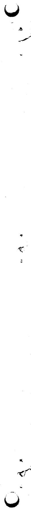

# INTRODUCTION

The MSRE (Molten-Salt Reactor Experiment) is a 7.3 MW fluid-fueled, graphite-moderated, single region nuclear reactor. The fuel consists of uranium fluoride dissolved in a mixture of lithium, beryllium and zirconium fluorides. A unique feature of this reactor concept is that the power is generated in circulating fluid fuel rather than stationary solid fuel elements. The nominal operating temperature is $1200^{\circ}\mathrm{F}$ . A detailed description of the reactor concept and its components is available in many sources, for instance References 1, 2 and 3. A program was undertaken to determine the fluid dynamic and heat transfer characteristics of the core. This report presents the results of that effort. Most of the experimental results presented here were obtained in the early 1960's. This report was not written, however, until after the MSRE nuclear operations were terminated in December of 1969.

# DESCRIPTION OF MSRE CORE AND TEST PROGRAM

Figure 1 shows an isometric view of the MSRE core. The fuel enters the reactor vessel at 1200 gpm through a constant flow area volute near the top of the cylindrical section. Because of the variable pressure gradient in avolute of this type, orifices are used to obtain a uniform angular flow distribution to the core wall cooling annulus. The fuel then swirls down the core wall cooling annulus and into the reactor vessel lower head. Radial vanes are placed in the lower head to destroy the swirl generated by the volute. The lower head then serves as a plenum to direct the fuel uniformly to the moderator region. The moderator region is composed of long graphite core blocks, square in cross section, and with grooves cut longitudinally in the 4 faces. When these stringers are assembled vertically together, the grooves form the fuel passages. Figure 2 shows an isometric and a plan view of a small cluster or core blocks. After passing through the moderator, the fuel then goes into the vessel upper head which serves as a collection plenum and directs the fuel to the outlet pipe. Each of these various regions of the core will be described in more detail in the appropriate section of this report.

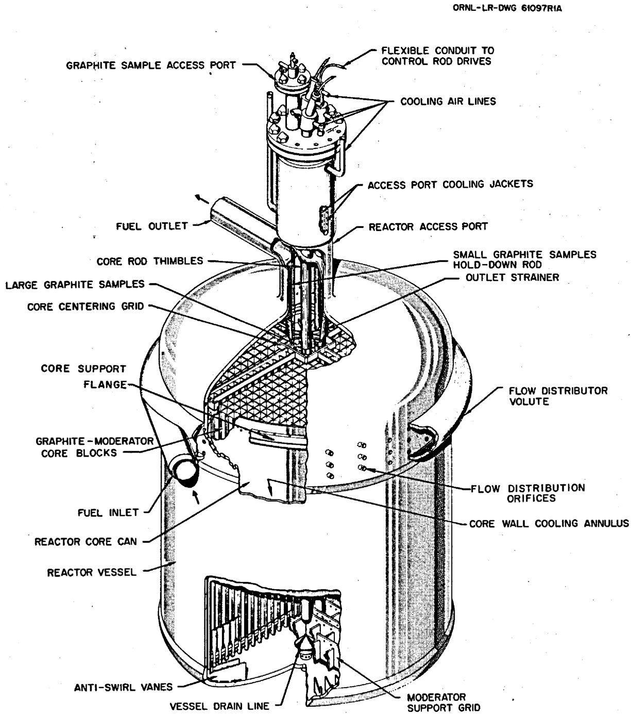  
FIGURE 1. MSRE REACTOR VESSEL

ORNL-LR-DWG 56874R

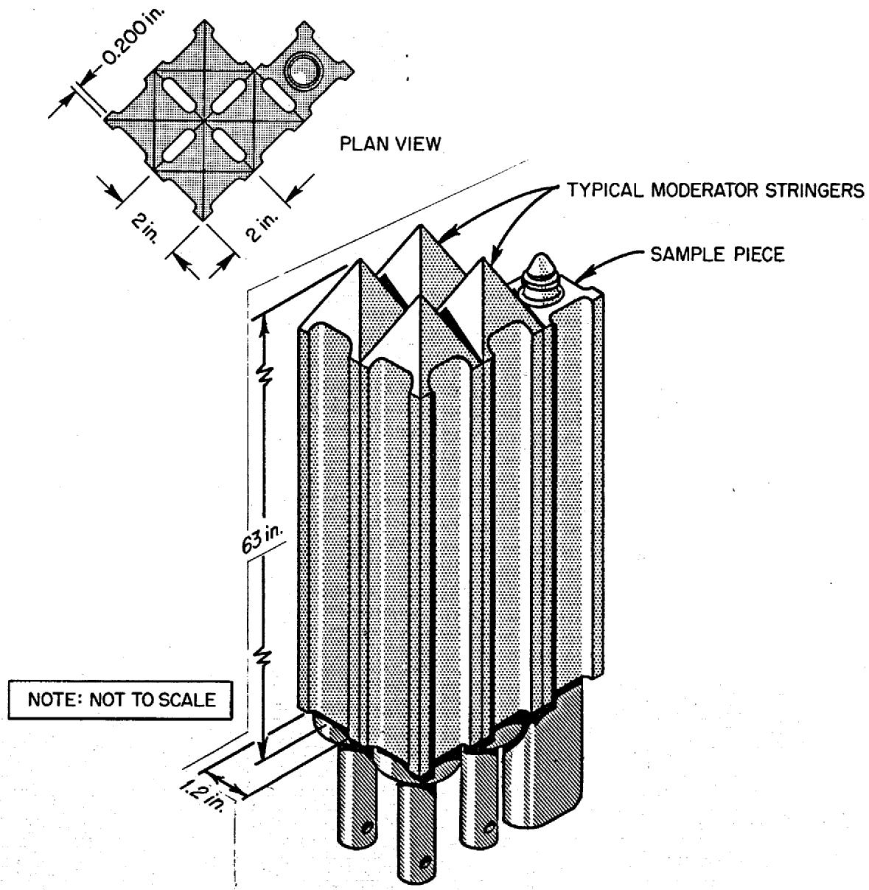  
FIGURE 2. TYPICAL GRAPHITE CORE BLOCK ARRANGEMENT

The MSRE core development program was divided into two phases. The first phase consisted of building a 1/5 linearly scaled plastic model and testing with water. This was considered to be a rough and preliminary design checking device. The second phase consisted of building a full scale carbon steel and aluminum model and testing with water. The only data presented in this report will be from the full scale model, however, a brief description of the 1/5 scale model and the way it was used is given in the next section.

Early concepts of the MSRE called for a variable speed pump. It was planned to operate the reactor at flow rates below the design flow of 1200 gpm. The lowest flow rate was undefined but could have been as low as $25\%$ of design flow. Later in the design stage, this reduced flow specification was dropped and design flow rate was fixed at 1200 gpm. This change occurred during the testing of the full scale core model. As a result, data were taken at flow rates ranging from 1200 gpm to 300 gpm, but the emphasis in this report is on the 1200 gpm data. Late in the operating history of the MSRE, the fuel pump was connected to a variable frequency unit, and the reactor was operated at reduced flow rates. The purpose of these special runs was to study Xe-135 behavior. The "worst case" as far as lateral temperature gradients in the core is concerned, would be when it was operated at 5.5 MW (thermal) at half the design flow rate for a period of about 3 l/2 days.

Figure 3 is a list of reactor parameters and physical properties of interest in this study.

# One-Fifth Scale Model

A small transparent plastic model of the MSRE core, linearly scaled down by a factor of 1/5, was built and tested. The particular core components simulated in this model were the inlet volute, flow distribution orifices, core wall cooling annulus, lower vessel head with swirl killing vanes, moderator support and the moderator fuel channels which were simulated with a tube bundle. A photograph of the model is shown in Figure 4.

The particular scale factor of $1/5$ was chosen because a geometrically similar model of that size tested with water at about $95^{\circ}\mathrm{F}$ , and at a flow rate such that its fluid velocities are equal to those of the reactor, will have the same Reynolds Number as that in the actual reactor core when

<table><tr><td colspan="3">DESIGN CONDITIONS</td></tr><tr><td colspan="2">FUEL SALT FLOW RATE</td><td>1200 gpm</td></tr><tr><td colspan="2">REACTOR POWER</td><td>10 Mw(t)</td></tr><tr><td colspan="2">FUEL INLET TEMPERATURE TO CORE</td><td>1175°F</td></tr><tr><td colspan="2">FUEL OUTLET TEMPERATURE FROM CORE</td><td>1225°F</td></tr><tr><td colspan="2">REACTOR OPERATING POWER</td><td>7.3 Mw(t)</td></tr><tr><td colspan="2">FUEL SALT</td><td></td></tr><tr><td colspan="2">COMPOSITION LiF</td><td>65.0 mole %</td></tr><tr><td colspan="2">BeF2</td><td>29.1 mole %</td></tr><tr><td colspan="2">ZrF4</td><td>5.0 mole %</td></tr><tr><td colspan="2">UF4</td><td>0.9 mole %</td></tr><tr><td colspan="2">LIQUIDUS TEMPERATURE</td><td>813°F</td></tr><tr><td colspan="2">PROPERTIES AT 1200°F</td><td></td></tr><tr><td colspan="2">DENSITY</td><td>141 lbs/ft3</td></tr><tr><td colspan="2">SPECIFIC HEAT</td><td>0.47 Btu/1b °F</td></tr><tr><td colspan="2">THERMAL CONDUCTIVITY</td><td>0.83 Btu/hr ft °F</td></tr><tr><td colspan="2">VISCOSITY</td><td>19 lbs/ft hr</td></tr><tr><td colspan="2">PRANDTL NUMBER = (0.47)(19)/(0.83)</td><td>10.7</td></tr><tr><td colspan="2">HASTELLOY-N</td><td></td></tr><tr><td colspan="2">SPECIFIC GRAVITY</td><td>8.79</td></tr><tr><td colspan="2">THERMAL CONDUCTIVITY AT 1200°F</td><td>11.71 Btu/hr ft °F</td></tr><tr><td colspan="2">SPECIFIC HEAT AT 1200°F</td><td>0.139 Btu/1b °F</td></tr><tr><td colspan="2">MEAN COEFFICIENT OF THERMAL EXPANSION (70-1200°F)</td><td>7.81 x 10-6/°F</td></tr><tr><td colspan="2">GRAPHITE</td><td></td></tr><tr><td colspan="2">GRADE</td><td>CGB</td></tr><tr><td colspan="2">POROSITY (ACCESSIBLE TO KEROSENE)</td><td>6.2%</td></tr><tr><td colspan="2">WETTABILITY</td><td>**</td></tr><tr><td colspan="2">FUEL SALT ABSORPTION AT 150 psi (CONFINED TO SURFACE)</td><td>0.2%</td></tr><tr><td></td><td>UNIRRADIATED</td><td>IRRADIATED</td></tr><tr><td>DENSITY</td><td>117 lbs/ft3</td><td>117 lbs/ft3</td></tr><tr><td>SPECIFIC HEAT (1200°F)</td><td>0.42 Btu/1b °F</td><td></td></tr><tr><td>THERMAL CONDUCTIVITY</td><td></td><td></td></tr><tr><td>WITH GRAIN AT 68°F</td><td>80 Btu/hr ft °F</td><td>35 Btu/hr ft °F</td></tr><tr><td>NORMAL TO GRAIN AT 68°F</td><td>45 Btu/hr ft °F</td><td>20 Btu/hr ft °F</td></tr><tr><td>WITH GRAIN AT 1200°F</td><td></td><td>23 Btu/hr ft °F*</td></tr><tr><td>NORMAL TO GRAIN AT 1200°F</td><td></td><td>13 Btu/hr ft °F*</td></tr><tr><td>COEFFICIENT OF THERMAL EXPANSION</td><td></td><td></td></tr><tr><td>WITH GRAIN AT 68°F</td><td>0.56 x 10-6/°F</td><td></td></tr><tr><td>NORMAL TO GRAIN AT 68°F</td><td>1.7 x 10-6/°F</td><td></td></tr></table>

*ESTIMATED

\*\*GRAPHITE NOT WET BY FUEL SALT AT REACTOR CONDITIONS

FIGURE 3. REACTOR PARAMETERS AND PHYSICAL PROPERTIES

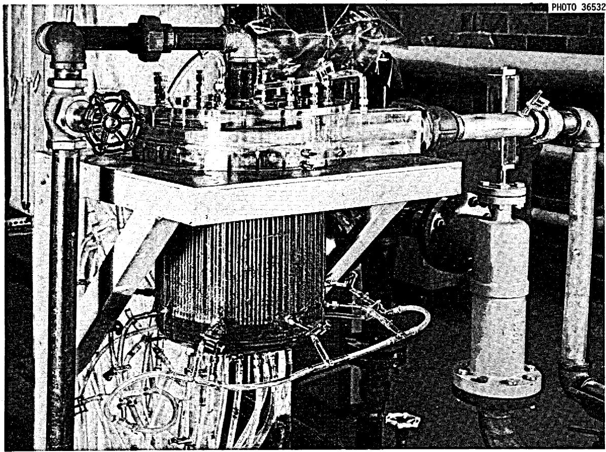  
FIGURE 4. ONE-FIFTH SCALE CORE MODEL

circulating fuel. Measurable variables of the model are then related to those of the reactor by the following proportionalities.

$$
\begin{array}{l} \left(\text {l i n e a r d i m e n s i o n s}\right) _ {\text {M S R E}} = 5 \left(\text {l i n e a r d i m e n s i o n s}\right) _ {\text {M o d e l}} \\ \left(\text {f l u i d v e l o c i t y}\right) _ {\text {M S R E}} = \left(\text {f l u i d v e l o c i t y}\right) _ {\text {M o d e l}} \\ \left(\text {R e y n o l d s N u m b e r}\right) _ {\text {M S R E}} = \left(\text {R e y n o l d s N u m b e r}\right) _ {\text {M o d e l}} \\ \left(\text {f l u i d a g e}\right) _ {\text {M S R E}} = 5 \left(\text {f l u i d a g e}\right) _ {\text {M o d e l}} \\ \text {(r e l a t i v e f l u i d p r e s s u r e g r a d i e n t s i n f t - f l u i d)} _ {\text {M S R E}} \\ = (\text {r e l a t i v e f l u i d p r e s s u r e g r a d i e n t s i n f t - f l u i d}) _ {\text {M o d e l}} \\ \left(\text {t u r b u l e n t h e a t t r a n s f e r c o e f f i c i e n t s}\right) _ {\text {M S R E}} \\ = 0. 6 3 x (\text {t u r b u l e n t h e a t t r a n s f e r c o e f f i c i e n t s}) _ {\text {M o d e l}} \\ \end{array}
$$

Since the model was so small, not every surface and channel of the reactor core exposed to salt was simulated. As a result, the model did not give exact comparisons, and was used only as a rough design checking device to establish early in the program the acceptability of major core concepts. For example, it was used for studies of the volute design and spacing of flow distribution orifices, design of swirl killing vanes in lower head, and preliminary measurements of solids settling characteristics of the lower head.

# Full Scale Model

The full scale MSRE core model is almost an exact duplicate of the actual reactor. Figure 5 is a photograph of this model. The model is constructed of carbon steel with the exception of the core blocks and part of the moderator support grid which are of aluminum. The core blocks were made by extruding aluminum approximately to shape including the longitudinal grooves and then taking only a finish cut on the $4$ side surfaces. Most of the tolerances of the reactor were increased (normally doubled) in the model for economic reasons. In addition, other simplifications were made to reduce the cost if they were presumed to have a small effect on the fluid dynamics. The vessel was constructed with a large girth flange just over the volute so that the internals could be removed with relative ease. Several transparent plastic windows were placed in the vessel heads, core wall cooling annulus and volute for viewing. Numerous holes were drilled into the vessel walls at various places for fluid measuring probes. A carbon steel loop was built to operate this model and consisted of a pump,

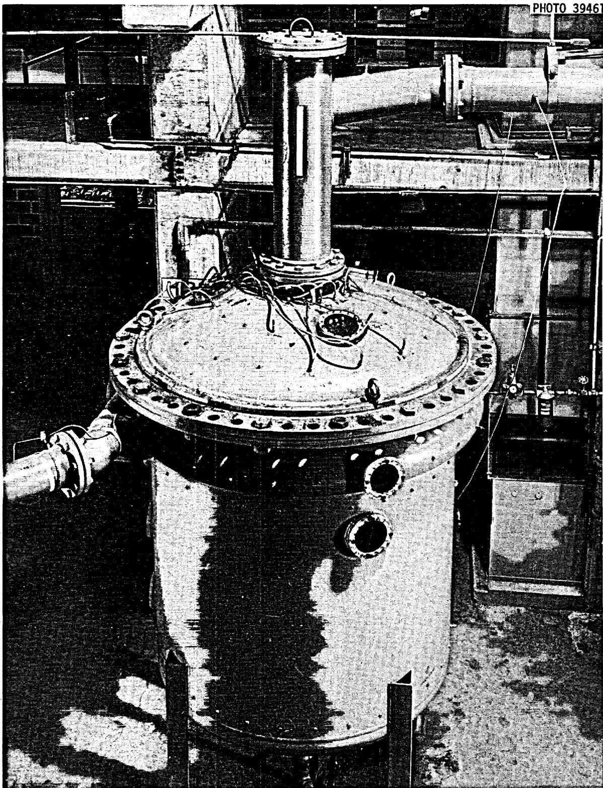  
FIGURE 5. FULL SCALE CORE MODEL

gate valve to control the flow, orifice flowmeter, loop cooler, 5400 gal. surge tank and an ion-exchange system for removing salt injected during fluid age measurements.

All the initial data from the full scale model was taken with the loop filled with water and operated between $75^{\circ}\mathrm{F}$ and $80^{\circ}\mathrm{F}$ . This results in a Reynolds Number for the model about four times that of the reactor. Later in the program a thickening agent (Jaguar-508 by Stein, Hall & Co.) was added to the system in order to simulate Reynolds Numbers, and the measurements which were strong functions of the Reynolds Number, were repeated. Although Jaguar-508 imparts non-Newtonian characteristic to the water, in the low concentrations that were used in these tests, this was a negligible consideration. As data is presented in this report, it will be noted whether or not exact Reynolds Number similarity existed. Items to simulate the three control rods and the surveillance specimen holder were not included in the core model because their design was not sufficiently well known when the model was built. Rather, the regular graphite matrix was continued throughout this regions.

# DESCRIPTION AND ANALYSIS OF TEST RESULTS

# Volute and Core Wall Cooling Annulus

The main fuel loop piping in the MSRE is 5 in. Schedule 40. Just prior to entering the core vessel volute the pipe size is increased to 6 in. The cross sectional flow area of the 6 in. pipe is approximately equal to that of the volute, 28.8 in.² and 26.0 in.², respectively. The volute is a constant flow area type and the tail end is hydraulically connected to the head end so there is recirculation. One characteristic of this type of volute is the variable static pressure around it; therefore, in order to obtain a uniform angular flow distribution, it is necessary to use orifices between the volute and core wall cooling annulus. The orifices are 3/4 in. and occur in stacks of 3. At the head end of the volute the orifice stacks are 5 deg apart. At the tail end of the volute, because of the lower fuel velocity and resulting higher static pressure, the orifice stack spacing is increased to 22 1/2 deg. This orifice distribution was determined from the 1/5 scale

model. The orifice holes are drilled at an angle of 30 deg with the tangent in order to maintain a tangential velocity component in the annulus. The resulting high heat transfer coefficients cool the core vessel wall and the reactor core can.

Figure 6 is a plot of the experimentally measured centerline velocities in the volute as a function of angular position and at various flow rates. At 1200 gpm water approaches the core through the 5 in. pipe at a mean velocity of 19.2 ft/sec. Immediately inside the volute the velocity jumps to about 23 ft/sec because of recirculation around the volute. At the tail end of the volute the velocity is about 10 ft/sec. The centerline velocities cannot be taken as absolute representations of flow rate, particularly at the inlet where two fluid streams of different velocities merge. Nevertheless, the linear decrease in velocity is a good indication that the water is distributed uniformly to the core wall cooling annulus. At the head end of the volute the mean velocity through the orifices is about 4 ft/sec and at the tail end of the volute the mean velocity through the orifices is about 18 ft/sec. Figure 7 is a plot of the centerline velocity in the core wall cooling annulus as a function of elevation. Note that the velocity decreases as the water moves down the annulus, because the tangential component is attenuated. Figure 8 is a plot of the centerline velocity at the bottom of the core wall cooling annulus as a function of angular position around the core. Note that it is quite flat, indicating uniform flow to the reactor vessel lower head. Data for Figures 6, 7 and 8 was taken with water in the loop. The Reynolds Numbers involved in the volute and core wall cooling annulus are so high (over $10^{4}$ in all cases at 1200 gpm) that exact Reynolds similarity is not important, and the reactor vessel containing fuel salt will have the same velocity profiles.

At this point it would be informative to compute the temperature difference between the bulk salt in the core wall cooling annulus and the vessel wall (Hastelloy N). At the midplane of the core (about 30 in. up in the annulus) and at 1200 gpm, the fluid velocity in the annulus is 7.2 ft/sec (Figure 7). Now, molten salt behaves as a conventional Newtonian fluid so that standard heat transfer relationships may be used. From the Dittus-Boelter equation and with physical properties from Figure 3 we can compute a heat

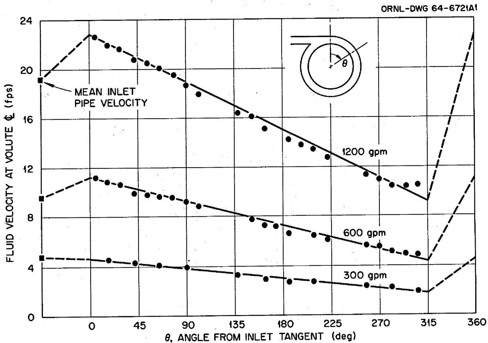  
FIGURE 6. ANGULAR DISTRIBUTION OF FLUID VELOCITY AT CENTER LINE OF VOLUTE

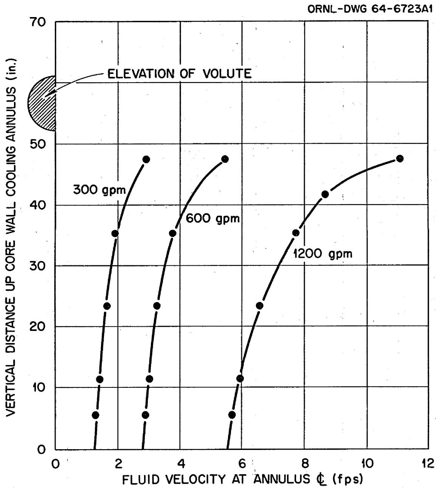  
FIGURE 7. VERTICAL DISTRIBUTION OF FLUID VELOCITY AT CENTER OF CORE WALL COOLING ANNULUS

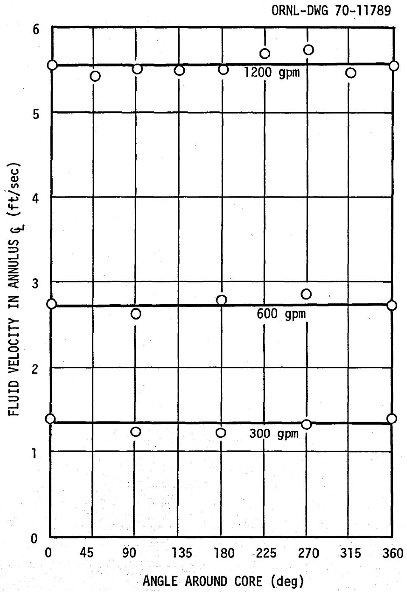  
FIGURE 8. ANGULAR DISTRIBUTION OF FLUID VELOCITY AROUND BOTTOM OF CORE WALL COOLING ANNULUS

transfer coefficient at this position in the core wall cooling annulus (1 in. thick) of 1370 Btu/hr- ft $^2$ -°F. The heat generation rate in the vessel wall at this point has been estimated to be about 0.2 watts/cm $^3$ . The vessel wall is 9/16 in. thick so the heat flux to the salt, assuming the outside surface is insulated, will be 905 Btu/hr- ft $^2$ . The temperature drop across the fluid boundary layer will be only $0.66^{\circ}\text{F}$ . Now the temperature drop in the vessel wall with an internal heat source, and assuming again that the outside surface is insulated, is represented by

$$
\Delta T = \frac {Q t ^ {2}}{2 k}
$$

where: $t =$ wall thickness $= 9/16$ in.

$$
\begin{array}{l} Q = \text {i n t e r n a l h e a t s o u r c e} = 0. 2 \mathrm {w} / \mathrm {c m} ^ {3} \\ k = \text {t h e r m a l} - 1 1. 7 1 B t u / h r - f t - ^ {\circ} F \\ \end{array}
$$

Evaluating gives a temperature drop in the metal wall of $1.81^{\circ}\mathrm{F}$ . Therefore the overall temperature drop from the outside surface of the vessel wall to the salt in the core wall cooling annulus is the sum of the above or only $2.47^{\circ}\mathrm{F}$ . It is beyond the scope of this report to include many detailed thermal analyses such as above. These analyses have been made and many are reported in References 8 and 9. It was felt however that one such computation would be worthwhile to give the reader an idea of the order of magnitude of these effects. Because of its rather low power density, lateral temperature gradients are quite low in the MSRE.

# Reactor Vessel Lower Head

The lower plenum of the core vessel is formed by a standard 60 in. OD ASME flanged and dished head, containing anti-swirl vanes and a drain line configuration. The anti-swirl vanes consist of 48 plates starting about 2 in. up in the core wall cooling annulus and extending along radial lines into the lower head for about $38\%$ of the radial distance to the core centerline. They are slightly elevated off the core vessel wall, thus eliminating as much corner area as possible where settled solids could accumulate. The vessel drain consists of a short section of 1 l/2 in. pipe extending slightly up into the vessel head at the centerline, and having a conical umbrella over it. In addition it incorporates a secondary drain which is a 1/2 in. concentric tube coming up the middle of the primary drain, penetrating through

the drain pipe wall just inside the vessel and wrapping around the drain pipe horizontally about $90^{\circ}$ . The conical umbrella will prevent gross settling of solid particles (should they exist) into the primary drain line, however, fuel containing solids may still drift in and out of the umbrella and over a long period of time, solids could still plug this drain. The 1/2 in. line serves as a safety drain since it is designed to prevent slow migration of fuel in and out. Because of its size, it would drain the reactor too slow under normal conditions. The secondary drain terminates inside the primary drain just below the freeze valve.

The object of the anti-swirl vanes is to prevent the swirl generated in the volute from penetrating into the lower head and creating an excessive radial pressure gradient. The uniformity of fuel flow through the graphite moderator region is a direct function of this pressure gradient. Figure 9 is a plot of the experimentally observed radial pressure gradient as measured by wall pressure taps. Since the flow in the lower head is 3-dimensional, the static pressure at the wall is not an absolute measure of the pressure influencing flow through the moderator region, nevertheless it is a good indication. Note that the pressure is slightly higher at the center, therefore, one would expect a slightly higher flow through the moderator near the center. This was measured to be the case as will be pointed out in the section on the moderator.

As the water goes through the anti-swirl vanes and heads toward the vessel centerline, it is turned by the lower head and produces a high velocity jet adjacent to the wall. Figure 10 is a profile of this jet measured at a radius of 17 inches and at $\frac{1}{4}$ positions $90^{\circ}$ apart. The flow rate was 1200 gpm. Again, since the Reynolds Number is so high, the same jet will exist with salt in the vessel. This jet does not persist much farther towards the vessel centerline when the flow character becomes gusty but still remains turbulent. From this velocity profile a heat transfer coefficient can be estimated by assuming parallel plate geometry. The equivalent diameter would be $\frac{1}{4}$ times the distance from the wall to the peak velocity. The calculation with the Dittus-Boelter equation yields a heat transfer coefficient for fuel salt of 540 Btu/hr-ft $^{2}$ -F.

Heat transfer coefficients were also measured with a locally developed "heat meter." Basically, it is an aluminum cube with a electric heater on one surface and a thermocouple in its interior. The surface opposite

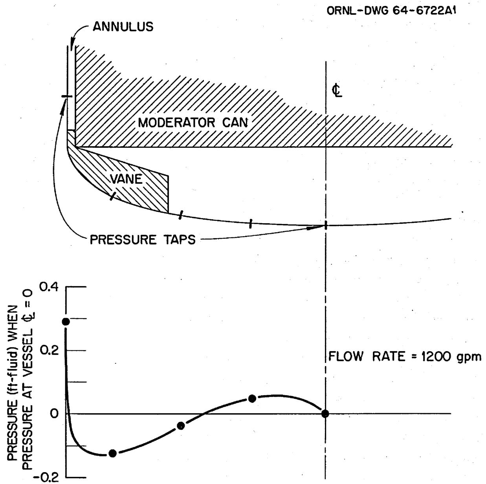  
FIGURE 9. RADIAL PRESSURE GRADIENT AT WALL OF LOWER VESSEL HEAD

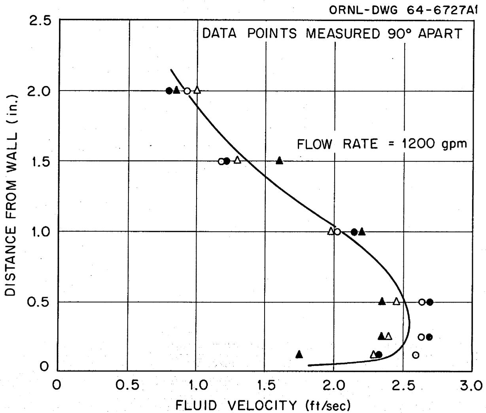  
FIGURE 10. VELOCITY PROFILE AT WALL JET IN LOWER VESSEL HEAD AT RADIUS OF 17 IN.

the heater is then exposed to the fluid stream and mounted flush with the vessel surface. The heat meter is thermally insulated from the vessel walls. It is illustrated and described in more detail in Ref. 10. By measuring the electrical power input and the temperature difference between the meter and the fluid, the heat transfer coefficient can be calculated. The technique yields a heat transfer coefficient in a thermal entrance region and it is necessary to convert them to the "far downstream" case. This can be done with correlations in References 4, 5 and 6. In addition, the measured coefficients must be converted from water to salt with the Dittus-Boelter equation. Heat transfer coefficients were measured at a radius of 17 in. and 4 in. with water in the loop and were checked with water thickened with Jaguar for Reynolds Number similarity and found equal. The data, after being converted to the far downstream case and from water to salt, are shown in Figure 11. Also shown on this plot is the heat transfer coefficient as calculated from the wall jet. Note that the slope of the curve indicates turbulent flow. More confidence is placed in the data at 17 in. than at 4 in. because the flow is well defined at the larger radius and less defined and gusty at the shorter radius. It is expected that the predicted values of these heat transfer coefficients are conservative because they do not include the effect of thermal convection which is expected to contribute roughly 100 Btu/hr-ft² -°F to the overall coefficient.

Consideration was given to the possibility of a source of nuclear power oscillations in the MSRE core existing because of fuel short circuiting in the lower head. If a fraction of the fuel did short circuit, then a corresponding amount of fuel must reside a little longer in the head. This results in the short circuiting fraction entering the moderator and little cooler than the mean and the short-circuited fraction entering the moderator and a little hotter than the mean. Power oscillations result because of the fuel temperature coefficient of reactivity. Tests were conducted on the model by injecting a conductive saline solution at a constant rate into the lower head at various locations and measuring the oscillations in electrical conductivity at the vessel outlet. These measurements indicate that the power oscillations originating from this mechanism should be well below $0.01\%$ of the mean power.

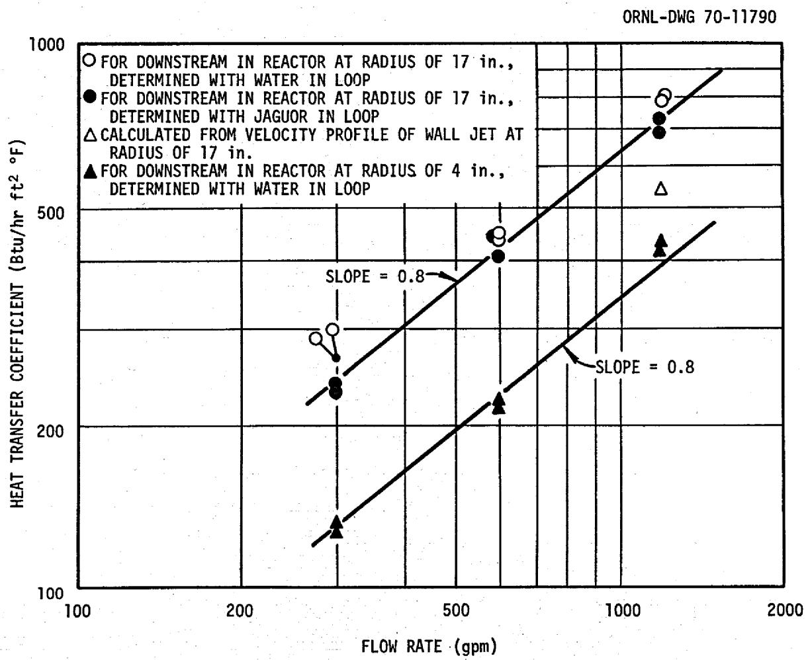  
FIGURE 11. HEAT TRANSFER COEFFICIENTS IN REACTOR VESSEL LOWER HEAD

# Graphite Moderator Assembly

In flowing through the reactor moderator assembly, fuel first passes through a moderator support structure and then through the moderator core blocks. The support structure consists of two assemblies, the lower of which is a Hastelloy-N cross structure (Figure 1) which is the main support structure for the graphite. Resting on this is a grid consisting of two layers of rectangular graphite bars, one layer resting on the other and perpendicular to it. The purpose of the graphite assembly is to position and hold the graphite core blocks, and to compensate for a difference in thermal expansion between the Hastelloy N and graphite. The resulting square passages in the graphite grid are small and the fuel velocity is high (approx. $4 \frac{1}{2} \text{ft/sec}$ ), and therefore its pressure drop is high. Comparatively, the salt velocity through the bulk moderator fuel channels is low (approx. $0.7 \text{ft/sec}$ ) and its pressure drop is low.

Figure 12 shows the experimentally determined head loss across the moderator assembly as measured in the model. A small correction has been applied to this data to account for small holes drilled through the support grid of the MSRE, as will be discussed later in this section. Also shown in this figure is the head loss across the support grid as measured in a separate model made for this purpose. The difference between these curves is the head loss in the moderator channels themselves including entrance and exit losses. For these tests, the loop was filled with water. Note that the slope of the curves in Figure 12 is 2.0 as would be expected since the Reynolds Number with water is over 4000 in the fuel channels and the bulk of the head loss is due to form losses in the graphite grid. With fuel salt the bulk of the head loss would still be from form losses. The Reynolds Number in the fuel channels would be approximately 1000 so the flow character would theoretically be laminar, however, much of the turbulence generated by fuel passing through the tortuous inlet configuration would persist through the fuel channels. As a result one might expect a very slightly lower slope to the curves in Figure 12 with fuel salt in the system.

As pointed out, the bulk of the pressure drop through the moderator assembly is due to the graphite grid. There is also very little room for cross flow in the space between the graphite grid and the entrance to the

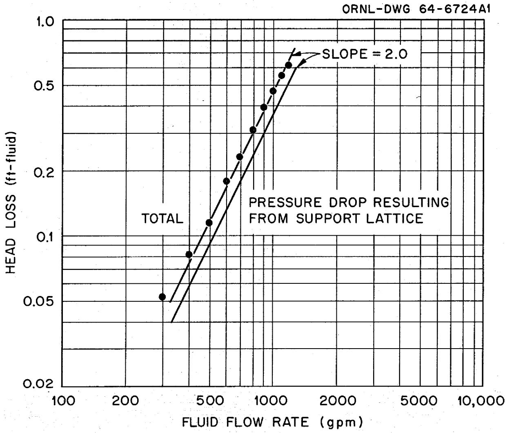  
FIGURE 12. FUEL SALT PRESSURE DROP ACROSS MODERATOR ASSEMBLY

fuel channels. Therefore the uniformity of flow distribution across the moderator assembly is controlled to a large extent by the uniformity of flow through the orifices in the graphite grid. The flow distribution among the core fuel channels was experimentally measured by two different techniques. The most successful technique was to simply inject a small amount of electrically conductive salt solution into the water flowing in a fuel channel and measure the time required to pass two conductivity probes a given distance apart. The device used consisted of a length of $1/4$ in. tubing blanked off on the end, and a small hole drilled into the side where the salt solution was injected. The tubing was inserted down into a fuel channel about 6 in. from the top. Access to the fuel channels was available through the viewing ports in the upper head of the vessel. The assembly was made to readily slip into and out of the fuel channels, and was small enough in cross section so that its presence would not significantly change the flow rate. The conductivity probes were about 3 in. apart and about 2 in. up from the injection hole. The device was calibrated in a special test fixture. The flow rate was measured in 77 more or less randomly chosen passages and the data appear in Figure 13 as a function of the core radius. Note first that 2 separate regions are present which represents channels that are mutually perpendicular to each other. These regions are characterized by different inlet configurations because of their position over the graphite grid. A plan view of the graphite grid with the position of the fuel channels superimposed is included in the figure. A separate plastic model was built of a few adjacent fuel channels with the graphite grid simulated to investigate methods of correcting this problem. Based on these tests, it was determined that $0.10^{\frac{1}{4}}$ in. holes (no. 37 drill) drilled through the upper graphite grid bar and directly under the starved channel would equilibrate the flows. A typical location of one of these holes is shown in Figure 13. Note also from this figure that the flow rate decreases slightly with increasing radius. This was expected and is due to the radial pressure gradient in the lower head as discussed earlier (see Figure 9). Actually this flow distribution is beneficial because the flow rate is highest where the power density is highest, resulting in a better thermal utilization of the fuel. In a large power producing reactor, for instance, one would strive to match the flow distribution

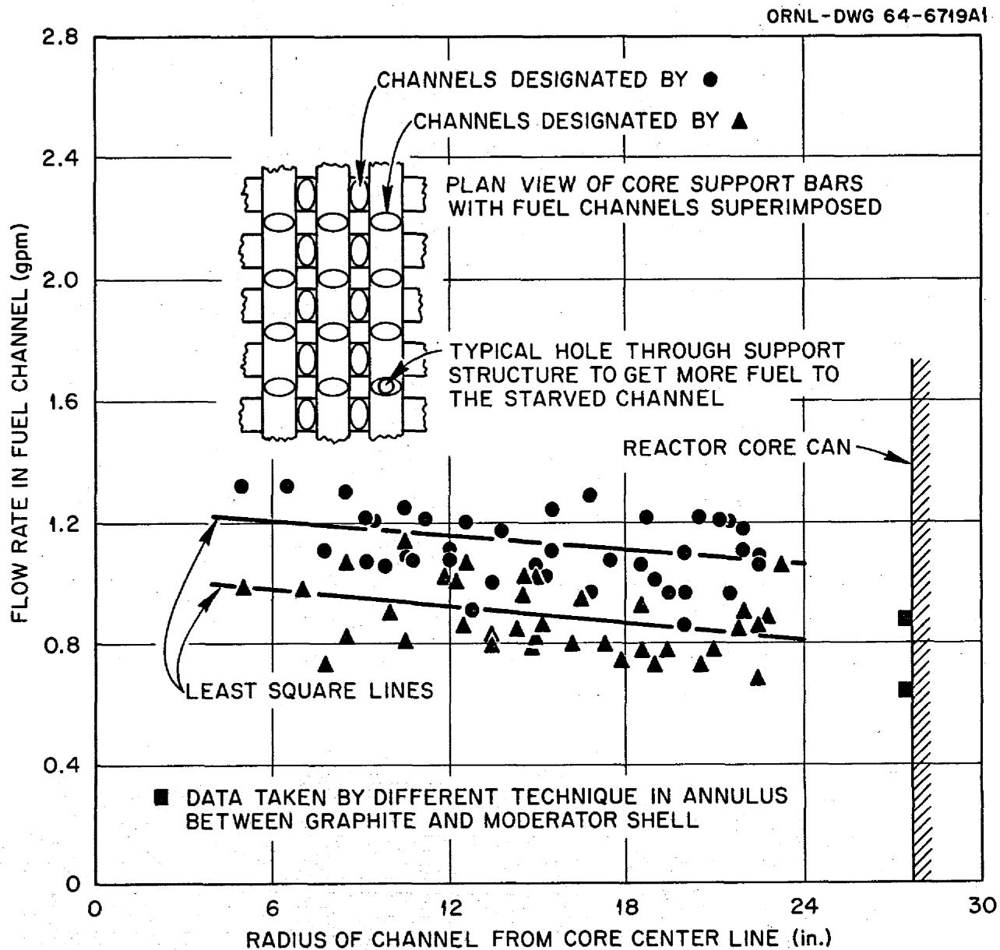  
FIGURE 13. RADIAL FLOW DISTRIBUTION OF FUEL SALT IN FUEL CHANNELS

with the power distribution so that the fuel outlet temperature across the core would be approximately equal. Lastly note from Figure 13, the rather large scatter of data points around the least square lines. This is a result of inherent inaccuracies in the flow instrument and also because of tolerances in the orifices formed by the graphite grid. Recall that the flow distribution through the moderator is controlled by these orifices because their pressure drop is high and cross flow above them to level out possible perturbations is low. The tolerances in making the model were normally double those of the reactor, so that a greater variation in orifice width was expected. The nominal orifice width is 0.375 in. In the model we measured these orifice widths with go nogo gages as high as 0.400 in. and as low as 0.350 in. Estimates indicate that this variation is enough to account for a large fraction of the scatter in Figure 13. It was therefore concluded that the large scatter in flow distribution experienced in the model will not be present in the reactor.

The second technique used to measure flow rates through the moderator channels was to install pressure taps in the aluminum core blocks and measure the pressure drop. Pressure taps were installed on 2 sides of 9 core blocks yielding information on 18 fuel channels. The core blocks were calibrated before installation in the model. Data from this technique was consistent with date obtained from the salt injection technique, although with more scatter. The data points at the extreme radius of the moderator are shown as squares in Figure 13. They represent the flow rate between the graphite moderator and reactor core can. The units are given as gpm which is misleading, because the hydraulic parameters (e.g., cross sectional flow area) in this flow region are not accurately known. To be specific this is the flow rate corresponding to the measured pressure drop in a standard fuel channel. The significant observation is that these data points fall more or less on an extension of the least squares line.

In the MSRE and in the model, the regular pattern of the graphite support grid is discontinued near the centerline of the core where the control rods and the surveillance specimen holder are located. This allows greater salt velocities past these components for cooling. As noted previously however, the control rods and specimen holder were not simulated in the model. Instead, the regular pattern of core blocks was continued

throughout this region. In the model, about 16 regular fuel channels were directly affected and a few more were indirectly affected by the discontinued support grid. The average flow rate measured through these channels by the conductivity probe technique was $2.3\mathrm{gpm}$ . Two values measured in this region by the calibrated fuel channel technique were 3.6 and $3.7\mathrm{gpm}$ . Fluid velocities in units of ft/sec would be about the same if control rods and the surveillance specimen holder were present. This is more than adequate for cooling so no attempt was made to resolve the difference in flow rate measured by the two different techniques.

A suggested scheme for core power oscillations is due to changes in the character of flow in the centermost 16 fuel channels. The Reynolds Number of these channels is in the order of 3000 and is therefore in the transitional region. It was speculated that the character of flow could oscillate from laminar to turbulent between parallel channels. To test this hypothesis, a flow visualization study was made using an optically birefringent solution of Milling Yellow dye in water. An almost full scale model of 4 parallel fuel channels with inlet conditions similar to the reactor was built from transparent plastics. With two mutually perpendicular polarized plates, we were able to observe clearly the transition between laminar and turbulent flow. The transition was smooth and continuous, and no oscillatory action could be detected either in a single channel or between channels that could be regarded as significant.

Many detailed temperature distribution calculations have been made for the MSRE core based on the results presented in this report. Results of these analyses are presented in Refs. 8 and 9 and will not be presented here.

# Reactor Vessel Upper Head

The reactor vessel upper plenum is similar to the lower plenum in that it is formed from a standard ASME flanged and dished head. The fuel enters the upper head uniformly across the diameter from the moderator fuel channels. The fuel then moves radially to the center and leaves the core through a 10 in. outlet pipe. The model showed no tendency of the water to vortex into the outlet pipe. After the model was built, a strainer structure (Figure 1) was added to the reactor outlet design which penetrated down into the upper plenum. Its purpose was to catch graphite chips (graphite floats in fuel salt) should they break loose from the moderator. This

device was not installed in the model but it would not be expected to influence the flow significantly.

Velocity profiles in the model were determined in the upper head by a fluid age technique. Electrically conductive salt solutions were injected as a step function at the core inlet. Conductivity probes were placed at selected locations in the upper head presumably along the fluid streamlines. By measuring the time required for these conductive pulses to pass between the probes, the average velocity between the probes can be calculated. There are, of course, inaccuracies in the calculation because they assume knowledge of the streamlines and they neglect lateral mixing between streamlines. Velocity profiles estimated by this technique appear in Figure 14. Plotted is the average velocity between the probes indicated (see sketch) as a function of distance from the vessel wall, assuming that the streamlines were parallel to the wall. At the rated flow rate (1200 gpm), the Reynolds Number in the upper head is high for both water and fuel salt and the flow is turbulent. Heat transfer coefficients to the vessel walls can therefore be estimated with Dittus-Boelter type equations. Assuming parallel plate geometry where the equivalent diameter is twice the channel width, the estimated heat transfer coefficient is a little over 100 Btu/hr-ft²°F neglecting thermal convection. This value has been generally confirmed with heat meter measurements taken at approximately the same location. The calculation is assumed conservative because the entire upper head would be a thermal entrance region (low length/diameter ratio). The region near the knee of the upper head will have a lower heat transfer coefficient but the heat generation in the MSRE vessel wall in this region is very low. In addition, some small channels have been milled in the MSRE core support flange to allow a small flow of cool fuel to short circuit directly from the core wall cooling annulus to this region of the upper head. The flow rate in this circuit has been estimated to be between 25 and 50 gpm depending on certain manufacturing and assembly tolerances. Estimated temperatures in this region are presented in Reference 9.

# Miscellaneous Measurements

The overall head loss through the core vessel from the 5 in. inlet line to the 5 in. outlet line was measured and is shown in Figure 15. The curve has a slope of 2.0 indicating that the head loss is primarily due to form drag as expected, and very little due to skin friction.

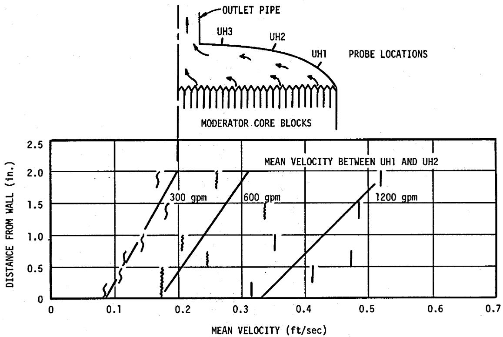

ORNL-DWG 70-11791

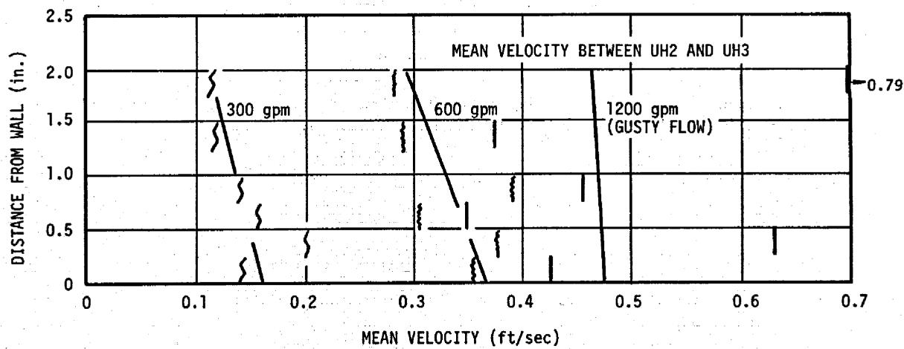  
FIGURE 14. FLUID VELOCITY PROFILES IN REACTOR VESSEL UPPER HEAD

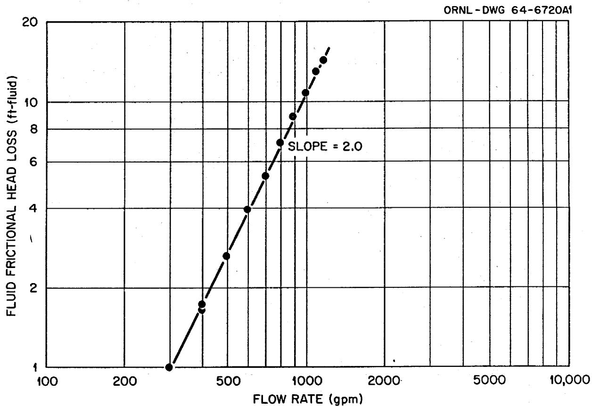  
FIGURE 15. OVERALL FLUID HEAD LOSS ACROSS MSRE CORE FROM 5 INCH INLET PIPE TO 5 INCH OUTLET PIPE

Experiments were conducted to obtain information on the behavior of heavy solid particles in the fuel salt. The question arose because if sufficient oxygen or water vapor come in contact with fuel salt, zirconium oxide would precipitate. A considerable effort was made in the MSRE to prevent this, and indeed it never did happen. Nevertheless, during the design stage it was desirable to know the disposition of heavy solid particles should they occur. One of the most likely places for particles to settle out is in the lower head of the reactor. This is also one of the more critical areas because they could potentially develop into a significant heat source on the primary containment surface. There was also concern that if enough particles developed, they may plug up the drain line configuration.

The experiments consisted of adding 2 or 3 pounds of sized iron filings to the water at the core inlet while the pump was running. They were added slowly over a specified period of time, generally about 20 minutes. The pump was then turned off either immediately after the addition or left running for an additional period up to 8 hours. After the pump was turned off, the loop was drained and the quantity of solids that remained in the reactor vessel lower head was determined. The solids passed through the core only once because downstream of the core model was the 5400 gallon surge tank in which the particles would most certainly settle out. All data were taken at 1200 gpm, mostly with water but some runs with thickening agent added for Reynolds Number simulation. A summary of the data is shown in Figure 16. A particle diameter of 200-300 microns seems to be critical, that is, particles larger than this settled out in significant quantities, and particles smaller than this passed through the system. The gusty nature of the flow around the drain line assembly also seems to have some ability to re-suspend particles less than 300 microns in size if the pump is kept running after the addition phase. The solids that did deposit in the lower head had the appearance of an annular ring around the drain pipe but did not touch it. In no case was significant quantities of solids found in the 1 l/2 in. drain pipe. Because of the way the model was built, it was not possible to check the 1/2 in. emergency drain tube after each run. After all runs were completed, however, this tube was examined and no particles were found in it. After all the runs

FIGURE 16. SUMMARY OF SOLIDS ADDITION DATA  

<table><tr><td>NOMINAL MESH SIZE OF IRON FILINGS</td><td>SCREEN APERTURE (microns)</td><td>LOOP LIQUID VISCOSITY (1b/ft hr)</td><td>TIME INTERNAL USED TO ADD SOLIDS (min)</td><td>PUMP RUN TIME AFTER SOLIDS WERE ADDED (hr)</td><td>LOOP FLOW RATE (gpm)</td><td>WT SOLIDS ADDED (1b)</td><td>% OF ADDED SOLIDS THAT WERE RECOVERED FROM VESSEL LOWER LEAD (%)</td></tr><tr><td>100</td><td>147</td><td>2.0</td><td>120</td><td>0</td><td>1180</td><td>3</td><td>~0%</td></tr><tr><td>40</td><td>370</td><td>2.0</td><td>120</td><td>0</td><td>1180</td><td>3</td><td>45%</td></tr><tr><td>20</td><td>833</td><td>2.0</td><td>120</td><td>0</td><td>1180</td><td>3</td><td>55%</td></tr><tr><td>150</td><td>104</td><td>2.0</td><td>35</td><td>0</td><td>1180</td><td>3</td><td>9%</td></tr><tr><td>150</td><td>104</td><td>2.0</td><td>32</td><td>8</td><td>1180</td><td>3</td><td>0%</td></tr><tr><td>60</td><td>248</td><td>2.0</td><td>20</td><td>0</td><td>1180</td><td>3</td><td>61%</td></tr><tr><td>60</td><td>248</td><td>2.0</td><td>20</td><td>8</td><td>1180</td><td>3</td><td>55%</td></tr><tr><td>150</td><td>104</td><td>2.0</td><td>20</td><td>0</td><td>1180</td><td>3</td><td>5.6%</td></tr><tr><td>50-30</td><td>290-490</td><td>9 1/2*</td><td>20</td><td>0</td><td>1180</td><td>2</td><td>56%</td></tr><tr><td>50-30</td><td>290-490</td><td>9 1/2*</td><td>20</td><td>8</td><td>1180</td><td>2</td><td>44%</td></tr><tr><td>50-100</td><td>290-147</td><td>9 1/2*</td><td>20</td><td>0</td><td>1180</td><td>2</td><td>30%</td></tr><tr><td>50-100</td><td>290-147</td><td>9 1/2*</td><td>20</td><td>7</td><td>1180</td><td>2</td><td>0%</td></tr></table>

\*THICKENING AGENT ADDED TO WATER FOR REYNOLDS NUMBER SIMULATION

were completed, the top head was removed from the vessel and it was found that a large amount of filings had settled fairly uniformly on the top of the core blocks. They had rusted together, otherwise, a large fraction of them may have fallen back down into the fuel channels when the pump was stopped. Note that the top of the core blocks is in the shape of a pyramid (Figure 2). Calculations have been made for the MSRE to determine the effect of precipitated fuel particles on the containment wall temperature near the drain pipe. They are not serious and some of the results are reported in Reference 9.

Experiments were performed to determine the behavior of gas bubbles in the core. Bubbles between 1/8 and 1/4 in. were injected into the core inlet. At 1200 gpm virtually all the bubbles went down the core wall cooling annulus and essentially none short circuited through the slots in the core support flange to the upper head. In contrast to this, at about 350 gpm, all the bubbles went through the core support flange slots and none went down the core wall cooling annulus. The bubbles injected at this lower flow rate were considerably larger, however, than at the higher flow rate. At 1200 gpm, no pockets could be noted anywhere in the core vessel where bubbles tended to accumulate. In the MSRE, bubbles in the fuel loop that have been generated by the xenon stripper spray ring are estimated to be in the order of 0.010 in. Certainly they will travel with the salt at 1200 gpm and not accumulate in pockets or short circuit through the core support flange.

# EXPERIENCE WITH THE MSRE

A brief summary of the MSRE operating history is as follows:

First criticality - June 1, 1965

Nuclear operation terminated - Dec. 12, 1969

Time reactor was critical - 17,655 hours

Nuclear heat production - 13,172 equivalent full power hours

Salt circulating in fuel loop - 21,788 hours.

There were no direct fluid measuring probes of any kind (velocity, pressure drop, etc.) installed in the MSRE core. Even the flow rate was an inferred quantity from measured $\Delta T$ 's in the fuel and coolant loop and the coolant salt flow rate from a venturi. The only instrumentation that could yield fluid dynamic performance information in the core was 64 thermocouples spotted at various locations on the outside of the core vessel (not in wells). These thermocouples yielded no indications of any adverse conditions inside the core. Another rather indirect source of information would be by the reactivity balance, which was kept in detail for this reactor because of its experimental nature. Again, no effects were noted that could be attributed to fluid dynamics in the core. The conclusion then is that, based on lack of evidence to the contrary, the MSRE core did behave as was expected from testing the model. It should be noted however, that because of the conservative design of the core, a rather large malfunction would have been necessary in order to see it with available instrumentation.

# REFERENCES

1. Robertson, R. C., MSRE Design and Operations Report, Part I, Description of the Reactor Design, USAEC Report ORNL-TM-728, January 1965.   
2. Entire Issue of Nuclear Applications and Technology, Vol. 8, No. 2, February 1970.   
3. Molten-Salt Reactor Program Semiannual Progress Report for Period Ending July 31, 1964, USAEC Report ORNL-3708, November 1964.   
4. Aladyev, I. T., Experimental Determination of Local and Mean Coefficients of Heat Transfer for Turbulent Flow in Pipes, Tech. Memo 1356, NACA.   
5. Sparrow, E. M., et al., Turbulent Heat Transfer in a Thermal Entrance Region of a Pipe with Uniform Heat Flux, Appl. Sci. Res., Sec. A, Vol. 7.   
6. Abbrecht, P. H., The Thermal Entrance Region in Fully Developed Turbulent Flow, AIChE Journal, Vol. 6, No. 2, June 1960.   
7. Lindauer, R. B., Revisions to MSRE Design Data Sheets, Issue No. 9, ORNL Publication ORNL-CF-64-6-43, June 24, 1964, Internal Distribution Only.   
8. Engel, J. R. and Haubenreich, P. N., Temperatures in the MSRE Core During Steady-State Power Operation, USAEC Report ORNL-TM-378, November 5, 1962.

9. Bettis, E. S.; et al., MSRE Component Design Report, ORNL Report MSR-61-67, June 20, 1961, Internal Distribution Only.   
10. Mott, J. E., Hydrodynamic and Heat Transfer Tests of a Full Scale Re-Entrant Core, ORNL Publication ORNL-CF-58-8-54, Aug. 8, 1958, Internal Distribution Only.

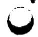

# INTERNAL DISTRIBUTION

1.-3. MSRP Director's Office   
4. J. L. Anderson   
5. H.F.Bauman   
6. S. E. Beall   
7. H. R. Beatty   
8. M.J.Bell   
9. M. Bender   
10. E. S. Bettis   
11. R. E. Blanco   
12. F. F. Blankenship   
13. R. Blumberg   
14. E. G. Bohlmann   
15. H. I. Bowers   
16. G.E. Boyd   
17. R.B.Briggs   
18. O.W.Burke   
19. D. W. Cardwell   
20. W. L. Carter   
21. J. E. Caton   
22. C.W.Collins   
23. W.H.Cook   
24. J. W. Cooke   
25. J. L. Crowley   
26. F. L. Culler   
27. W. P. Eatherly   
28. J. R. Engel   
29. D. E. Ferguson   
30. A. P. Fraas   
31. J.H.Frye   
32. W. K. Furlong   
33. C. H. Gabbard   
34. W. R. Grimes   
35. A. G. Grindell   
36. R.H.Guymon   
37. P. H. Harley   
38. W. O. Harms   
39. P. N. Haubenreich   
40. R.E. Helms   
41. H. W. Hoffman   
42. P.P.Holz   
43. W.R. Huntley   
44. P. R. Kasten   
45.-48. R.J.Kedl   
49. M. T. Kelley   
50. M. J. Kelly   
51. J. J. Keyes   
52. S. S. Kirslis   
53. A. I. Krakoviak   
54. T. S. Kress   
55. R.B. Lindauer

56. M. I. Lundin   
57. R.N. Lyon   
58. H. G. MacPherson   
59. R. E. MacPherson   
60. C. D. Martin   
61. H.E. McCoy   
62. D. L. McElroy   
63. C. K. McGlothlan   
64. H. A. McLain   
65. J.R.McWherter   
66. R. L. Moore   
67. E. L. Nicholson   
68. A. M. Perry   
69. T. W. Pickel   
70. M. Richardson   
71. R. C. Robertson   
72. J.P.Sanders

73.-76. Dunlap Scott

77. J. L. Scott

78. M. J. Skinner

79. A. N. Smith

80. O. L. Smith

81. I. Spiewak

82. H. H. Stone

83. R.D. Stulting

84. J. R. Tallackson

85. R.E.Thoma

86. D. B. Trauger

87. H. L. Watts

88. A. M. Weinberg

89. J. R. Weir

90. M. E. Whatley

91. J. C. White

92. R.P.Wichner

93. L. V. Wilson

94. Gale Young

95. H. C. Young

96.-97. Central Research Library

98.-99. Document Reference Section

100.-102. Laboratory Records

103. Laboratory Records (RC)

# EXTERNAL DISTRIBUTION

104.-105. D.F.Cope,AEC-ORO

106. David Elias, AEC-Washington   
107. Kermit Laughon, AEC-OSR   
108. C. L. Matthews, AEC-OSR

109.-110. T. W. McIntosh, AEC-Washington

111. D. R. Riley, AEC-Washington   
112. H. M. Roth, AEC-ORO   
113. J. J. Shreiber, AEC-Washington   
114. R. M. Scroggins, AEC-Washington   
115. M. Shaw, AEC-Washington   
116. M. J. Whitman, AEC-Washington

117.-131. Division of Technical Information Extension (DTIE)