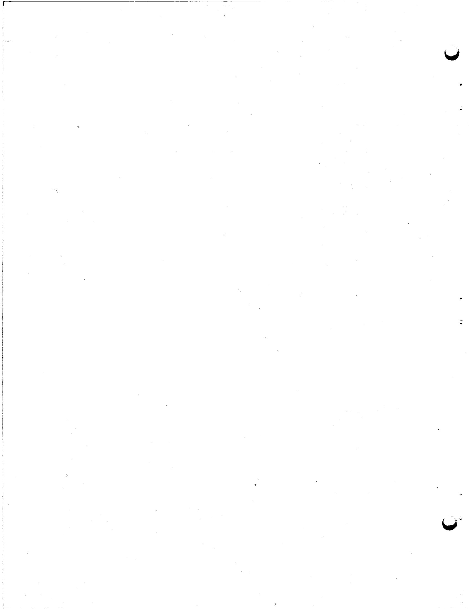
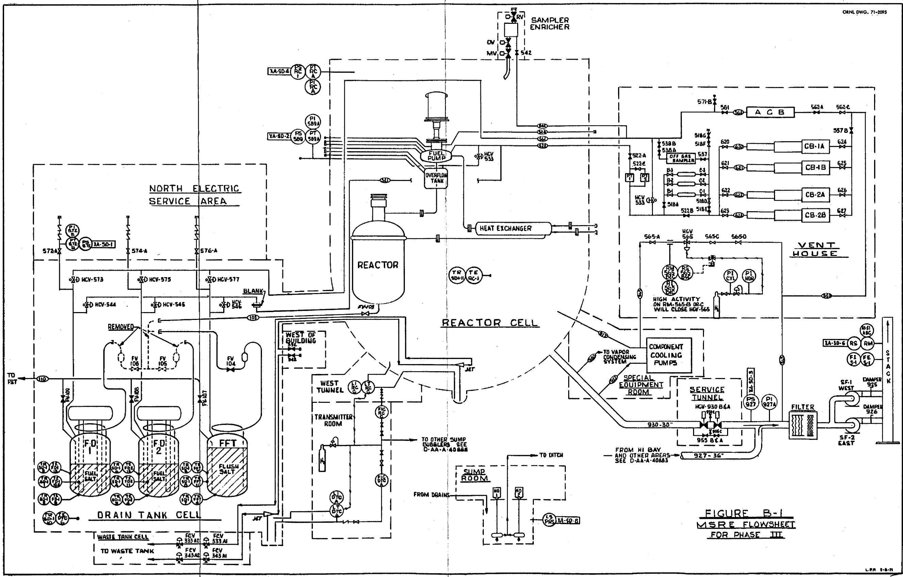
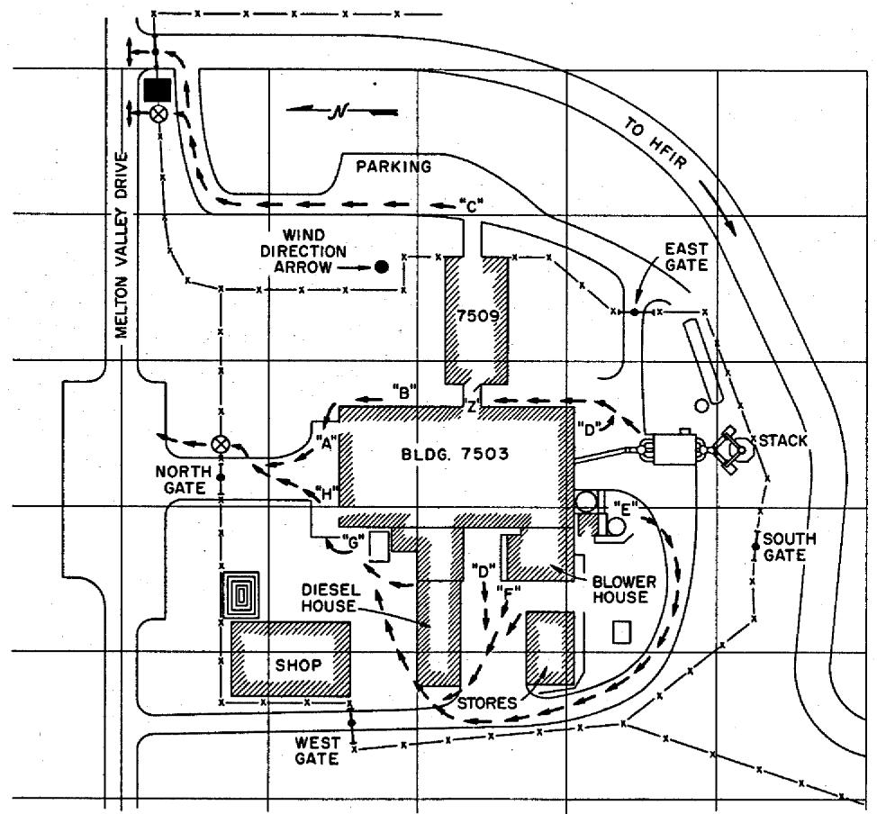
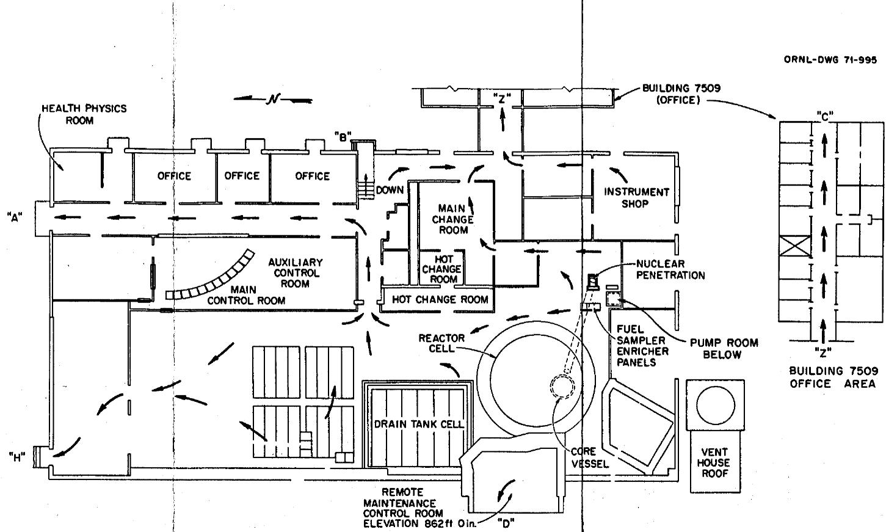
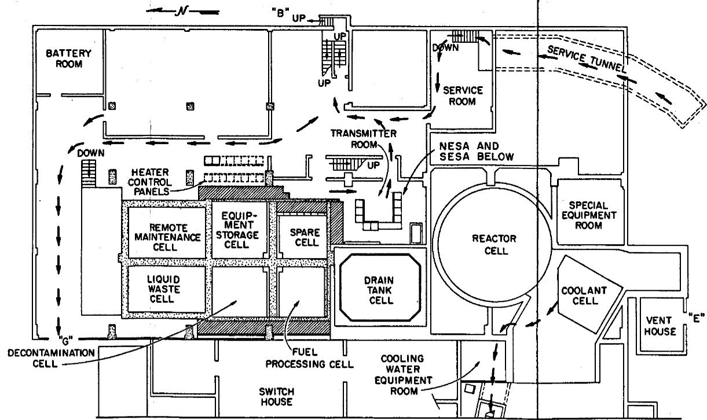
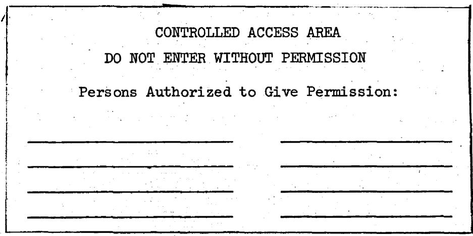
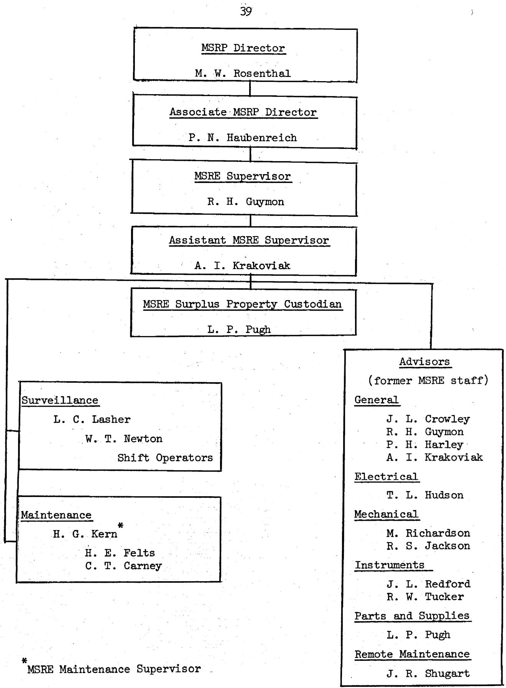

# OAK RIDGE NATIONAL LABORATORY

operated by  
UNION CARBIDE CORPORATION for the

U.S. ATOMIC ENERGY COMMISSION

ORNL-TM-3253

DATE - February 10, 1971

MSRE PROCEDURES FOR THE PERIOD BETWEEN EXAMINATION

AND ULTIMATE DISPOSAL

(Phase III of Decommissioning Program)

R. H. Guymon

# ABSTRACT

This document describes the condition of the MSRE and specifies procedures to be followed after the post-operation examinations and before the ultimate disposal of the fissile and radioactive material in the reactor. The fuel salt will be kept frozen in the sealed drain tanks, within secondary containment whose only opening is through filters to a stack. Surveillance will consist of remote monitoring and daily visits by X-10 plant personnel. Personnel access will be controlled by the security fence around the reactor building. The MSRE Procedures specify remedial actions for abnormal conditions. Also specified are procedures and responsibilities for maintenance, modifications, and removal of surplus equipment.

Keywords: molten-salt reactors, MSRE, procedures, storage, surveillance, administration, containment, flowsheets, maintenance, operations, ORNL, plans, testing.

# Table of Contents

Page

# ABSTRACT

A. INTRODUCTION 1   
B. DESCRIPTION AND NORMAL OPERATING CONDITIONS 1  
C. SURVEILLANCE 8   
D．DATA 10

1. Control-Room Log 10   
2. Periodic Logs 10

E. ABNORMAL CONDITIONS 17   
F. POWER OUTAGES. 25   
G.ANNUAL TASKS 26

1. Recombine Fluorine by Heating the Drain Tank 26   
2. Pressure Test of the Reactor and Drain Tank Cells 28   
3. FD-2 and FP Pressure 29   
4. Ventilation System 29   
5. RC Air Activity. 30   
6. Sump Pumps 30   
7. Miscellaneous 31

H. MAINTENANCE AND REPAIRS 34   
I. REMOVAL OF EQUIPMENT OR INSTRUMENTATION 34   
J ACCESS CONTROL 37   
K. ORGANIZATION AND CHANGES 38

REFERENCES 40

This report was prepared as an account of work sponsored by the United States Government. Neither the United States nor the United States Atomic Energy Commission, nor any of their employees, nor any of their contractors, subcontractors, or their employees, makes any warranty, express or implied, or assumes any legal liability or responsibility for the accuracy, completeness or usefulness of any information, apparatus, product or process disclosed, or represents that its use would not infringe privately owned rights.

# A. INTRODUCTION

The retirement or decommissioning of the MSRE involves several phases. Phase I is the period between the end of power operation and the post-operation examinations, which is Phase II. Phase III is the interim period between the completion of the examinations and the final disposal which is Phase IV.

During Phase III, some of the information given in the MSRE Design and Operations Reports (Refs. 1 through 9) and the facility drawings will still be applicable. Much of the equipment will not be in service, however, and most of the procedures which were followed during operation will no longer be applicable. This report describes the systems which will be used and specifies the normal conditions and surveillance required during Phase III. It also lists the more probable abnormal situations which could develop and prescribes remedial actions. The system of access control, approvals required for maintenance and changes, and responsibilities are delineated. This document supersedes all previous operating procedures for the MSRE.

# B. DESCRIPTION AND NORMAL OPERATING CONDITIONS

Most of the equipment and instrumentation involved during Phase III is shown in Figure B-1. Pertinent information on the instruments in service is given in Table B-1. Plan views of the building showing evacuation routes are shown in Figure B-2. The most often used abbreviations are given in Table B-2. Master, marked-up, copies of the flowsheets (D-AA-A-40880 to 40890), the instrument application drawings (D-AA-B-40500 to 40515) and the electrical power distribution drawing (E-20794-ED-153-D) will be kept up to date and available in the MSRE control room in Building 7503. Another up-to-date set of drawings will be kept in the outermost room of the office building (Room 17, Building 7509).

About one-half of the fuel salt (5,460 lbs) is stored in FD-1 and the other half (4784 lbs) in FD-2. All of the flush salt (9,460 lbs) is

  
Fig. B-1. MSRE Flowsheet for Phase III

0

Table B-1 INSTRUMENTATION   

<table><tr><td colspan="3">Read-Out Instrument</td><td colspan="2">Primary Element</td><td colspan="3">Annunciator*</td></tr><tr><td>No.</td><td>Location</td><td>Range</td><td>No.</td><td>Variable Monitored</td><td>No.</td><td>Switch No.</td><td>Setpoint</td></tr><tr><td>FI-S1</td><td>Stack Pnl.</td><td>0-1 in. H2O</td><td>FE-S1</td><td>Stack Flow</td><td></td><td></td><td></td></tr><tr><td>LI-RC-C</td><td>TR</td><td>0-20 in. H2O</td><td>LE-RC-C</td><td>RC Sump Level</td><td></td><td></td><td></td></tr><tr><td>LI-DTC-A1</td><td>TR</td><td>&quot;</td><td>LE-DTC-A1</td><td>DTC Sump Level</td><td></td><td></td><td></td></tr><tr><td>LI-FSC-A</td><td>TR</td><td>0-52 in. H2O</td><td>LE-DC-C</td><td>DC Sump Level</td><td></td><td></td><td></td></tr><tr><td>LI-FSC-A</td><td>TR</td><td>&quot;</td><td>LE-FSC-A</td><td>FSC-Sump Level</td><td></td><td></td><td></td></tr><tr><td>LI-FSC-A</td><td>TR</td><td>&quot;</td><td>LE-TC-A</td><td>TC Sump Level</td><td></td><td></td><td></td></tr><tr><td>LI-FSC-A</td><td>TR</td><td>&quot;</td><td>LE-SC-A</td><td>SC Sump Level</td><td></td><td></td><td></td></tr><tr><td>LI-FSC-A</td><td>TR</td><td>&quot;</td><td>LE-WTC-A</td><td>WTC Sump Level</td><td></td><td></td><td></td></tr><tr><td>---</td><td>---</td><td>---</td><td>LS-PRS</td><td>Pump Room Sump Level</td><td>XA-SD-8</td><td>LS-PRS</td><td>+</td></tr><tr><td>PI-572B</td><td>ACR</td><td>0-50 psig</td><td>PT-572B</td><td>FD-2 Pressure</td><td>XA-SD-1</td><td>PS-572</td><td>+2 psig</td></tr><tr><td>PI-589A</td><td>ACR</td><td>0-50 psig</td><td>PT-592B</td><td>FP Pressure</td><td>XA-SD-2</td><td>PS-589</td><td>+0.5 psig</td></tr><tr><td>PI-927A</td><td>Stack Pnl.</td><td>-8-0 in. H2O</td><td>PI-927A</td><td>Stack Filter Inlet Suction</td><td>XA-SD-3</td><td>PS-927</td><td>+1 in. H2O</td></tr><tr><td>PI-RC-A</td><td>MCR</td><td>-15-50 psig</td><td>PT-RC-A</td><td>RC Pressure</td><td>XA-SD-4</td><td>PS-RC-1</td><td>+1 psig</td></tr><tr><td>RI-565-B</td><td>ACR</td><td>0-100 mR/hr</td><td>RM-565-B</td><td>RC Air Activity</td><td>XA-SD-5</td><td>RS-565-B</td><td>+20 mR/hr</td></tr><tr><td>RI-565-C</td><td>ACR</td><td>0-100 mR/hr</td><td>RM-565-C</td><td>RC Air Activity</td><td>XA-SD-5</td><td>RS-565-C</td><td>+20 mR/hr</td></tr><tr><td>RI-S1-A</td><td>ACR</td><td>****</td><td>RM-S1-A</td><td>Stack β,γ activity</td><td>XA-SD-6</td><td>RS-S1-A</td><td>&lt;6000 c/m</td></tr><tr><td>RI-S1-B</td><td>ACR</td><td>****</td><td>RM-S1-B</td><td>Stack α activity</td><td>XA-SD-6</td><td>RS-S1-B</td><td>&lt;6000 c/m</td></tr><tr><td>RI-S1-C</td><td>ACR</td><td>****</td><td>RM-S1-C</td><td>Stack Iodine Activity</td><td>XA-SD-6</td><td>RS-S1-C</td><td>&lt;6000 c/m</td></tr></table>

All annihilators repeat at ORNL Central Waste Monitoring Facility (Building 3105).   
** See calibration curve for conversion to flow.   
High activity indication $(>20\mathrm{mR / hr})$ on either RSS-565-B or -C will close HCV-565.   
Range switching is provided. These also indicate as well as annunciate at the ORNL Central Waste Hitoring Facility (Building 3105).

(continued)

Table B-1 Instrumentation   

<table><tr><td colspan="3">Read-Out Instrument</td><td colspan="2">Primary Element</td><td colspan="3">Annunciator*</td></tr><tr><td>No.</td><td>Location</td><td>Range</td><td>No.</td><td>Variable Monitored</td><td>No.</td><td>Switch No.</td><td>Setpoint</td></tr><tr><td>RI-7001</td><td>Hi Bay</td><td>0-5000 cpm</td><td>RM-7001</td><td>Hi Bay Constant Air Monitor</td><td>XA-SD-7</td><td>RS-7001</td><td>4000 cpm</td></tr><tr><td>RI-7012</td><td>Hi Bay</td><td>0-25 mR/hr</td><td>RM-7012</td><td>Hi Bay Monitron</td><td>XA-SD-7</td><td>RS-7012</td><td>25 mR/hr</td></tr><tr><td>TR-SD-1-1</td><td>ACR</td><td>0-1000°F</td><td>TE-FD1-19A</td><td>FD-1 temp. -- Probe</td><td></td><td></td><td></td></tr><tr><td>TR-SD-1-2</td><td>ACR</td><td>0-1000°F</td><td>TE-FD1-5</td><td>FD-1 temp. -- Bottom</td><td></td><td></td><td></td></tr><tr><td>TR-SD-1-3</td><td>ACR</td><td>0-1000°F</td><td>TE-FD1-15</td><td>FD-1 temp. -- Lower side</td><td></td><td></td><td></td></tr><tr><td>TR-SD-1-4</td><td>ACR</td><td>0-1000°F</td><td>TE-FD2-19A</td><td>FD-2 temp. -- Probe</td><td></td><td></td><td></td></tr><tr><td>TR-SD-1-5</td><td>ACR</td><td>0-1000°F</td><td>TE-FD2-5</td><td>FD-2 temp. -- Bottom</td><td></td><td></td><td></td></tr><tr><td>TR-SD-1-6</td><td>ACR</td><td>0-1000°F</td><td>TE-FD2-15</td><td>FD-2 temp. -- Lower side</td><td></td><td></td><td></td></tr><tr><td>TR-SD-1-7</td><td>ACR</td><td>0-1000°F</td><td>TE-FFT-4</td><td>FFT temp. -- Bottom</td><td></td><td></td><td></td></tr><tr><td>TR-SD-1-8</td><td>ACR</td><td>0-1000°F</td><td>TE-FFT-11</td><td>FFT temp. -- Lower Side</td><td></td><td></td><td></td></tr><tr><td>TR-SD-1-9</td><td>ACR</td><td>0-1000°F</td><td>TE-FFT-7</td><td>FFT temp. -- Mid Side</td><td></td><td></td><td></td></tr><tr><td>TR-SD-1-10</td><td>ACR</td><td>0-1000°F</td><td>TE-DTC-6</td><td>DTC temp. -- SE</td><td></td><td></td><td></td></tr><tr><td>TR-SD-1-11</td><td>ACR</td><td>0-1000°F</td><td>TE-RC-1</td><td>RC temp. -- SW</td><td></td><td></td><td></td></tr></table>

All annihilators repeat at ORNL Central Waste Monitoring Facility (Building 3105). Range switching is provided. These also indicate as well as annunciate at the ORNL Central Waste Monitoring Facility (Building 3105).

- - - - - - - - SECURITY FENCE

TURNSILE (OUTBOUND ONLY)

GUARD POST

  
PLOT PLAN-MSRE AREA

  
BLDG.7503-852-f1 LEVEL

  
BLDG. 7503-840-f1 LEVEL   
Fig. B-2. Emergency Evacuation Routes

C

# EQUIPMENT AND LOCATION ABBREVIATIONS

AB Auxiliary Board

ACB Auxiliary Charcoal Bed

ACR Auxiliary Control Room

BH Blower House

CB Charcoal Bed (main)

CC Coolant Cell

CDC Coolant Drain Cell

CDT Coolant Drain Tank

CT Cooling Tower

DC Decontamination Cell

DH Diesel House

DTC Drain Tank Cell

FD Fuel Drain Tank

FFT Fuel Flush Tank

FSC Fuel Storage Cell

FST Fuel Storage Tank

HB High Bay

HCP Heater Control Panel

MB Main Board   
MCR Main Control Room   
NESA North Electric Service Area   
PR Pump Room   
PRS Pump Room Sump   
RC Reactor Cell   
RMC Remote Maintenance Practice Cell   
SC Equipment Storage Cell   
S1 Stack   
SESA South Electric Service Area   
SER Special Equipment Room   
SF Stack Fan   
SFA Stack Filter (fan) Area   
SH Switch House   
ST Service Tunnel   
TC Spare Cell   
TR Transmitter Room   
VH Vent House   
WR Water Room   
WT Liquid Waste Tank   
WTC Waste Tank Cell

stored in FFT. The salt is at ambient temperature and pressure with all heaters turned off. The salt fill lines (104, 105, and 106) have been severed and are blanked in the drain tank cell. Salt is frozen in the transfer freeze valves (107, 108, and 109). The equalizer line (521) between the tanks and the fuel circulating system has been blanked in the drain cell. The helium supply lines (572, 574, 576) are capped. The vent valves (HCV-573, -575, -577, and -533) are open (since they are fail-open valves) but HV's-542, -522A, -522B, -538B, -571B, and -561 in the vent house are closed. Thus there normally is no purge or vent from the tanks. The drain tanks and the flush tank gas spaces are interconnected through the vent valves and the equalizer valves (HCV-544, -545, -546). The pressure in the tank system is indicated and annunciated by PIA-572 in the auxiliary control room. The drain tank and other temperatures can be read on TR-SD-1.

The fuel circulating system contains only residual amounts of flush salt. The system was opened at the reactor, fuel pump, heat exchanger, and line 103. These openings were sealed in various ways and were shown not to leak excessively at 5 psig. Since some of the heat exchanger tubes were cut out, the main coolant salt lines (200 and 201) communicate with the fuel system and were therefore welded shut just outside the reactor cell. The system is at ambient temperature and pressure. The helium supply lines (516, 592, 593, 596, 589, 599, and 600) are capped. The main vent line (522) is closed by HV-522A and the upper offgas line (524) is capped in the Special Equipment Room. The pressure is indicated and annunciated by PIA-589 in the Auxiliary Control Room.

The coolant salt (3,575 lbs) is in the coolant drain tank, at ambient temperature and pressure. Freeze valves 204 and 206 are frozen to separate it from the coolant circulating system. The helium supply valve (HV-511B) is closed and the vent line is blanked off to isolate the tank.

The coolant circulating system contains only residual amounts of coolant salt. It has been opened in several places and is lightly sealed (masking tape). There are no helium inputs to the system or vents from it.

The main charcoal beds are isolated by valves 522B and 557B. The auxiliary charcoal bed is isolated by valves 561 and 562A.

The reactor and drain tank cell membranes are sealed and the blocks are secured. The ventilation valves (930B and 955B) are closed and locked. The cells are vented to the stack through line 565. (HCV-565 is kept open by pressure from a cylinder of nitrogen.) Activity in the line is monitored by RIA-565 B and C. High activity indication on either detector will close HCV-565 and annunciate in the auxiliary control room. All other lines and penetrations into the cells are mechanically sealed.

Stack fan SF-1 is in service and SF-2 is in standby (damper 925 open and 926 closed). All three stack filters are in service. Most of the building ventilation flow is from the high bay with smaller amounts from other areas including the chemical processing cell. (The relative distribution is not critical.) The stack flow is indicated by FI-S1 at the stack. The pressure at the inlet to the filters is indicated and annunciated by PIA-927A. The $\alpha$ , $\beta$ - $\gamma$ , and iodine activities in the stack are indicated and annunciated in the auxiliary control room and at the ORNL Central Waste Monitoring Facility (CWMF).

All water lines to the reactor and drain tank cells have been disconnected. The water levels in all cell sumps can be checked using the bubbler level indicators, but no annunciation is provided. The waste tank is essentially empty and can also be checked using a bubbler level indicator. The pump-room sump, which collects water from the filter pit, french drains, etc., is automatically pumped to the drainage ditch by the sump pumps. High level in this sump is annihilated.

The fire alarm and sprinkler system is in service and maintained by the ORNL fire department.

# C. SURVEILLANCE

Surveillance of the MSRE shall be adequate to prevent the development of any condition that would threaten personnel safety or the continuity of other ORNL activities.

Radioactive and fissile materials are so contained and situated that criticality is prevented and the probability of any significant release to

the environment is extremely small. The potentials for increasing temperature and pressure in the containment or the development of other potentially damaging conditions are limited so that such conditions can arise only slowly, if at all. Thus the continuous presence of personnel at the reactor site is not required. Surveillance therefore consists of scheduled visits for data-logging and checking plus the continuous monitoring at the ORNL Central Waste Monitoring Facility of key signals from the MSRE instrumentation.

Each day a member of the ORNL Central Waste Monitoring Group shall enter the reactor building to make observations as required on a Daily Log Form. During the last week of each month a qualified member of the Reactor Division shall make an inspection of the reactor building, record data, and make checks as required on a Monthly Log Form. Equipment and instrumentation shall be maintained on a regular schedule and as required by personnel of the ORNL Plant and Equipment Division and Instruments and Controls Division.

When any of a selected list of variables goes out of limits (prescribed in Table B-1) alarms occur both in the reactor building and at the ORNL Central Waste Monitoring Facility in Building 3105. When an alarm occurs, one person from the group on duty at the CWMF shall go to the MSRE site, enter the main control room and take appropriate action to restore normal conditions.

Corrective actions for foreseeable abnormal situations are prescribed in Section E of these Procedures. In addition, experienced former members of the MSRE operations staff shall be designated and available on call for assistance in meeting needs that may arise. (See Fig. K-1.)

The ORNL Plant Protection Division provides protection against entry by unauthorized personnel (see Section J) and against fire damage.

# D. DATA

# 1. Control-Room Log

Every significant event or action affecting the reactor shall be recorded in a journal-type logbook that is kept in the control room. Some items which shall be included in this log are:

Equipment started or stopped.

Valves opened or closed.

Switches or breakers opened or closed.

Procedures or parts of procedures started, worked on, or completed.

Changes in setpoints of switches.

Annunciations, and action taken.

Abnormal conditions or malfunctioning equipment found.

Maintenance and other non-operational jobs done.

The person who makes an observation, or takes action, or is in charge of any job shall be responsible for seeing that an entry is made. Log entries shall be sufficiently descriptive for others to understand and each shall include time, date, and the name of the person making the entry.

Carbon copies of the logbook sheets will be removed when the monthly log is taken and will be stored in a file cabinet in Room 17, Building 7509.

# 2. Periodic Logs

The Daily Log includes recording various readings as indicated on Form D-1. This form prescribes "Log Limits" and identifies the appropriate corrective action if a variable is outside these limits. (Corrective actions, identified on Form D-1 by a letter, are detailed in Section E of these Procedures.)

The Monthly Log, which shall be filled out during the monthly inspection, is Form D-2. This form requires reading the salt tank temperatures, the waste tank level and 7 sump levels. It also has spaces for indicating that other routine monthly tasks have been done.

Form D-1   
DAILY LOG - PHASE III   

<table><tr><td colspan="2">Location</td><td>ACR</td><td>ACR</td><td>ACR</td><td>ACR</td><td>ACR</td><td>ACR</td></tr><tr><td colspan="2">Description</td><td>FD-1 Temp</td><td>FD-2 Temp</td><td>FFT TEmp</td><td>DTC Temp</td><td>RC Temp</td><td>RC Press.</td></tr><tr><td colspan="2">Primary Element</td><td>TE-FD-1-19A</td><td>TE-FD-2-19A</td><td>TE-FFT-4</td><td>TE-DEC-6</td><td>TE-RC-5</td><td>PT-RC-A</td></tr><tr><td colspan="2">Readout</td><td>TR-SD-1-1</td><td>TR-SD-1-4</td><td>TR-SD-1-7</td><td>TR-SD-1-10</td><td>TR-SD-1-11</td><td>PI-RC-A</td></tr><tr><td colspan="2">Alarm Limits</td><td>no alarm</td><td>no alarm</td><td>no alarm</td><td>no alarm</td><td>no alarm</td><td>† 1 psig</td></tr><tr><td colspan="2">Log Limits</td><td>&lt;200°F</td><td>&lt;200°F</td><td>&lt;200°F</td><td>&lt;150°F</td><td>&lt;150°F</td><td>-2 to +0.5</td></tr><tr><td colspan="2">What to do if*Out of Limits</td><td>A</td><td>B</td><td>C</td><td>D</td><td>E</td><td>F</td></tr><tr><td rowspan="2">Init.</td><td rowspan="2">Date/Time</td><td></td><td></td><td colspan="2">Reading</td><td></td><td></td></tr><tr><td>oF</td><td>oF</td><td>oF</td><td>oF</td><td>oF</td><td>psig</td></tr><tr><td></td><td></td><td></td><td></td><td></td><td></td><td></td><td></td></tr><tr><td></td><td></td><td></td><td></td><td></td><td></td><td></td><td></td></tr><tr><td></td><td></td><td></td><td></td><td></td><td></td><td></td><td></td></tr><tr><td></td><td></td><td></td><td></td><td></td><td></td><td></td><td></td></tr><tr><td></td><td></td><td></td><td></td><td></td><td></td><td></td><td></td></tr><tr><td></td><td></td><td></td><td></td><td></td><td></td><td></td><td></td></tr><tr><td></td><td></td><td></td><td></td><td></td><td></td><td></td><td></td></tr><tr><td></td><td></td><td></td><td></td><td></td><td></td><td></td><td></td></tr><tr><td></td><td></td><td></td><td></td><td></td><td></td><td></td><td></td></tr><tr><td></td><td></td><td></td><td></td><td></td><td></td><td></td><td></td></tr><tr><td></td><td></td><td></td><td></td><td></td><td></td><td></td><td>psig</td></tr><tr><td></td><td></td><td></td><td></td><td></td><td></td><td></td><td></td></tr><tr><td></td><td></td><td></td><td></td><td></td><td></td><td></td><td></td></tr><tr><td></td><td></td><td></td><td></td><td></td><td></td><td></td><td></td></tr><tr><td></td><td></td><td></td><td></td><td></td><td></td><td></td><td></td></tr><tr><td></td><td></td><td></td><td></td><td></td><td></td><td></td><td></td></tr><tr><td></td><td></td><td></td><td></td><td></td><td></td><td></td><td></td></tr><tr><td></td><td></td><td></td><td></td><td></td><td></td><td></td><td></td></tr><tr><td></td><td></td><td></td><td></td><td></td><td></td><td></td><td></td></tr><tr><td></td><td></td><td></td><td></td><td></td><td></td><td></td><td></td></tr><tr><td></td><td></td><td></td><td></td><td colspan="2">Reading</td><td></td><td></td></tr><tr><td></td><td></td><td></td><td></td><td></td><td></td><td></td><td></td></tr><tr><td></td><td></td><td></td><td></td><td></td><td></td><td></td><td></td></tr><tr><td></td><td></td><td></td><td></td><td></td><td></td><td></td><td></td></tr><tr><td></td><td></td><td></td><td></td><td></td><td></td><td></td><td></td></tr><tr><td></td><td></td><td></td><td></td><td></td><td></td><td></td><td></td></tr><tr><td></td><td></td><td></td><td></td><td></td><td></td><td></td><td></td></tr><tr><td></td><td></td><td></td><td></td><td></td><td></td><td></td><td></td></tr></table>

See Section E. TX-4413

# Form D-1

# DAILY LOG - PHASE III

<table><tr><td colspan="2">Location</td><td>ACR</td><td>ACR</td><td colspan="2">ACR</td><td colspan="3">ACR</td><td></td></tr><tr><td colspan="2">Description</td><td>FD-2 Press</td><td>FP Press</td><td colspan="2">RC Activity</td><td colspan="3">Stack Activity</td><td></td></tr><tr><td colspan="2">Primary Element</td><td>PT-572B</td><td>PT-589A</td><td>RM-565B</td><td>RM-565C</td><td>β-γ</td><td>α</td><td>I2</td><td></td></tr><tr><td colspan="2">Readout</td><td>PI-572B</td><td>PI-589A</td><td>RI-565B</td><td>TI-565C</td><td>SI-1A</td><td>SI-1B</td><td>SI-1C</td><td></td></tr><tr><td colspan="2">Alarm Limits</td><td>+2 psig</td><td>+0.5 psig</td><td>+20 mR/hr</td><td>+20 mR/hr</td><td>&lt;6000*</td><td>&lt;6000*</td><td>&lt;6000*</td><td></td></tr><tr><td colspan="2">Log Limits</td><td>&lt;1.5 psig</td><td>&lt;0.5 psig</td><td>&lt;10 mR/hr</td><td>&lt;10 mR/hr</td><td>&lt;1500</td><td>&lt;1500</td><td>&lt;1500</td><td></td></tr><tr><td colspan="2">What to do if**</td><td>G</td><td>H</td><td>I</td><td>I</td><td>J</td><td>J</td><td>J</td><td></td></tr><tr><td colspan="2">Out of Limits</td><td></td><td></td><td></td><td></td><td></td><td></td><td></td><td></td></tr><tr><td rowspan="2">Init.</td><td rowspan="2">Date/Time</td><td colspan="2"></td><td colspan="2">Reading</td><td></td><td></td><td></td><td></td></tr><tr><td>psig</td><td>psig</td><td>mR/hr</td><td>mR/hr</td><td>cpm</td><td>cpm</td><td>cpm</td><td></td></tr><tr><td></td><td></td><td></td><td></td><td></td><td></td><td></td><td></td><td></td><td></td></tr><tr><td></td><td></td><td></td><td></td><td></td><td></td><td></td><td></td><td></td><td></td></tr><tr><td></td><td></td><td></td><td></td><td></td><td></td><td></td><td></td><td></td><td></td></tr><tr><td></td><td></td><td></td><td></td><td></td><td></td><td></td><td></td><td></td><td></td></tr><tr><td></td><td></td><td></td><td></td><td></td><td></td><td></td><td></td><td></td><td></td></tr><tr><td></td><td></td><td></td><td></td><td></td><td></td><td></td><td></td><td></td><td></td></tr><tr><td></td><td></td><td></td><td></td><td></td><td></td><td></td><td></td><td></td><td></td></tr><tr><td></td><td></td><td></td><td></td><td></td><td></td><td></td><td></td><td></td><td></td></tr><tr><td></td><td></td><td></td><td></td><td></td><td></td><td></td><td></td><td></td><td></td></tr><tr><td></td><td></td><td></td><td></td><td></td><td></td><td></td><td></td><td></td><td></td></tr><tr><td></td><td></td><td></td><td></td><td></td><td></td><td></td><td></td><td></td><td></td></tr><tr><td></td><td></td><td></td><td></td><td></td><td></td><td></td><td></td><td></td><td></td></tr><tr><td></td><td></td><td></td><td></td><td></td><td></td><td></td><td></td><td></td><td></td></tr><tr><td></td><td></td><td></td><td></td><td></td><td></td><td></td><td></td><td></td><td></td></tr><tr><td></td><td></td><td></td><td></td><td></td><td></td><td></td><td></td><td></td><td></td></tr><tr><td></td><td></td><td></td><td></td><td></td><td></td><td></td><td></td><td></td><td></td></tr><tr><td></td><td></td><td></td><td></td><td></td><td></td><td></td><td></td><td></td><td></td></tr><tr><td></td><td></td><td></td><td></td><td></td><td></td><td></td><td></td><td></td><td></td></tr></table>

*Setpoint is adjustable and will normally be set lower than 6000 cpm.

长长

See Section E.

TX-4413

Form D-1   
DAILY LOG - PHASE III   

<table><tr><td colspan="2">Location</td><td>Stack Panel</td><td>Stack Panel</td><td>VH</td><td>VH</td><td>HB</td><td>HB</td></tr><tr><td colspan="2">Description</td><td>Vacuum</td><td>Flow</td><td>N2Cyl.</td><td>N2Header</td><td>CAM</td><td>Monitron</td></tr><tr><td colspan="2">Primary Element</td><td>PE-927A</td><td>FE-S1</td><td>PE-Cyl.</td><td>PE-Hdr</td><td>RE-7001</td><td>RE-7012</td></tr><tr><td colspan="2">Readout</td><td>PI-927A</td><td>FI-S1</td><td>PI-Cyl.</td><td>PI-Hdr</td><td>RI-7001</td><td>RI-7012</td></tr><tr><td colspan="2">Alarm Limits</td><td>+1.0 in.H2O</td><td>No Alarm</td><td>---</td><td>---</td><td>4000 cpm</td><td>25 mR/hr</td></tr><tr><td colspan="2">Log Limits=</td><td>&lt;-1.5 in.H2O</td><td>&gt;0.4 in.H2O</td><td>&gt;200 psig</td><td>30-50 psig</td><td>&lt;4000 cpm</td><td>&lt;25 mR/hr</td></tr><tr><td colspan="2">What to do if*Out of Limits</td><td>K</td><td>K</td><td>Replace</td><td>Adjust</td><td>L</td><td>L</td></tr><tr><td rowspan="2">Init.</td><td rowspan="2">Date/Time</td><td colspan="2"></td><td colspan="2">Reading</td><td></td><td></td></tr><tr><td>In.H2O</td><td>In.H2O</td><td>psig</td><td>psig</td><td>cpm</td><td>mR/hr</td></tr><tr><td></td><td></td><td></td><td></td><td></td><td></td><td></td><td></td></tr><tr><td></td><td></td><td></td><td></td><td></td><td></td><td></td><td></td></tr><tr><td></td><td></td><td></td><td></td><td></td><td></td><td></td><td></td></tr><tr><td></td><td></td><td></td><td></td><td></td><td></td><td></td><td></td></tr><tr><td></td><td></td><td></td><td></td><td></td><td></td><td></td><td></td></tr><tr><td></td><td></td><td></td><td></td><td></td><td></td><td></td><td></td></tr><tr><td></td><td></td><td></td><td></td><td></td><td></td><td></td><td></td></tr><tr><td></td><td></td><td></td><td></td><td></td><td></td><td></td><td></td></tr><tr><td></td><td></td><td></td><td></td><td></td><td></td><td></td><td></td></tr><tr><td></td><td></td><td></td><td></td><td></td><td></td><td></td><td></td></tr><tr><td></td><td></td><td></td><td></td><td></td><td></td><td></td><td>mR/hr</td></tr><tr><td></td><td></td><td></td><td></td><td></td><td></td><td></td><td></td></tr><tr><td></td><td></td><td></td><td></td><td></td><td></td><td></td><td></td></tr><tr><td></td><td></td><td></td><td></td><td></td><td></td><td></td><td></td></tr><tr><td></td><td></td><td></td><td></td><td></td><td></td><td></td><td></td></tr><tr><td></td><td></td><td></td><td></td><td></td><td></td><td></td><td></td></tr><tr><td></td><td></td><td></td><td></td><td></td><td></td><td></td><td></td></tr><tr><td></td><td></td><td></td><td></td><td></td><td></td><td></td><td></td></tr><tr><td></td><td></td><td></td><td></td><td></td><td></td><td></td><td></td></tr><tr><td></td><td></td><td></td><td></td><td></td><td></td><td></td><td></td></tr><tr><td></td><td></td><td></td><td>.</td><td></td><td></td><td></td><td></td></tr><tr><td></td><td></td><td></td><td></td><td></td><td></td><td></td><td></td></tr><tr><td></td><td></td><td></td><td></td><td></td><td></td><td></td><td></td></tr><tr><td></td><td></td><td></td><td></td><td></td><td></td><td></td><td></td></tr><tr><td></td><td></td><td></td><td></td><td></td><td></td><td></td><td></td></tr><tr><td></td><td></td><td></td><td></td><td></td><td></td><td></td><td></td></tr><tr><td></td><td></td><td></td><td></td><td></td><td></td><td></td><td></td></tr><tr><td></td><td></td><td></td><td></td><td></td><td></td><td></td><td></td></tr></table>

See Section E.

# Form D-2

# MONTHLY LOG

(To be taken during the last week of each month)

NOTE: NOTIFY WASTE MONITORING GROUP BEFORE STARTING   

<table><tr><td>Item</td><td>Limits</td><td>What to do if out of Limits</td><td>Jan or July</td><td>Feb or Aug</td><td>Mar or Sept</td><td>April or Oct</td><td>May or Nov</td><td>June or Dec</td></tr><tr><td>Date Log was Taken</td><td>--</td><td>--</td><td></td><td></td><td></td><td></td><td></td><td></td></tr><tr><td>Initial</td><td>--</td><td>--</td><td></td><td></td><td></td><td></td><td></td><td></td></tr><tr><td></td><td></td><td></td><td></td><td></td><td></td><td></td><td></td><td></td></tr><tr><td>Review Daily Logs</td><td>--</td><td>--</td><td></td><td></td><td></td><td></td><td></td><td></td></tr><tr><td>Review Console Log</td><td>--</td><td>--</td><td></td><td></td><td></td><td></td><td></td><td></td></tr><tr><td>Record TR-SD-1 Temps</td><td>--</td><td>--</td><td>--</td><td>--</td><td>--</td><td>--</td><td>--</td><td>--</td></tr><tr><td>1 - TE-FD1-19A</td><td>&lt;200°F</td><td>A</td><td></td><td></td><td></td><td></td><td></td><td></td></tr><tr><td>2 - TE-FD1-5</td><td>&#x27;&#x27;</td><td>A</td><td></td><td></td><td></td><td></td><td></td><td></td></tr><tr><td>3 - TE-FD1-15</td><td>&#x27;&#x27;</td><td>A</td><td></td><td></td><td></td><td></td><td></td><td></td></tr><tr><td>4 - TE-FD2-19A</td><td>&#x27;&#x27;</td><td>B</td><td></td><td></td><td></td><td></td><td></td><td></td></tr><tr><td>5 - TE-FD2-5</td><td>&#x27;&#x27;</td><td>B</td><td></td><td></td><td></td><td></td><td></td><td></td></tr><tr><td>6 - TE-FD2-15</td><td>&#x27;&#x27;</td><td>B</td><td></td><td></td><td></td><td></td><td></td><td></td></tr><tr><td>7 - TE-FFT-4</td><td>&#x27;&#x27;</td><td>C</td><td></td><td></td><td></td><td></td><td></td><td></td></tr><tr><td>8 - TE-FFT-11</td><td>&#x27;&#x27;</td><td>C</td><td></td><td></td><td></td><td></td><td></td><td></td></tr><tr><td>9 - TE-FFT-7</td><td>&#x27;&#x27;</td><td>C</td><td></td><td></td><td></td><td></td><td></td><td></td></tr><tr><td>10 - TE-DTC-6</td><td>&lt;150°F</td><td>D</td><td></td><td></td><td></td><td></td><td></td><td></td></tr><tr><td>11 - TE-RC-1</td><td>&#x27;&#x27;</td><td>E</td><td></td><td></td><td></td><td></td><td></td><td></td></tr><tr><td></td><td></td><td></td><td></td><td></td><td></td><td></td><td></td><td></td></tr><tr><td></td><td></td><td></td><td></td><td></td><td></td><td></td><td></td><td></td></tr><tr><td></td><td></td><td></td><td></td><td></td><td></td><td></td><td></td><td></td></tr><tr><td></td><td></td><td></td><td></td><td></td><td></td><td></td><td></td><td></td></tr></table>

# Form D-2

# MONTHLY LOG

<table><tr><td>Item</td><td>Limits</td><td>What to do if out of Limits</td><td>Jan or July</td><td>Feb or Aug</td><td>Mar or Sept</td><td>April or Oct</td><td>May or Nov</td><td>June or Dec</td></tr><tr><td>Date Log was Taken</td><td>--</td><td>--</td><td></td><td></td><td></td><td></td><td></td><td></td></tr><tr><td>Initial</td><td>--</td><td>--</td><td></td><td></td><td></td><td></td><td></td><td></td></tr><tr><td></td><td></td><td></td><td></td><td></td><td></td><td></td><td></td><td></td></tr><tr><td>Check that HCV-565 is open</td><td>--</td><td>F</td><td></td><td></td><td></td><td></td><td></td><td></td></tr><tr><td>Record Sump Levels</td><td>--</td><td>--</td><td>--</td><td>--</td><td>--</td><td>--</td><td>--</td><td>--</td></tr><tr><td>Set N2Supply at 20 psig</td><td>--</td><td>--</td><td></td><td></td><td></td><td></td><td></td><td></td></tr><tr><td>WT Level</td><td>&lt;100&quot;</td><td>M</td><td></td><td></td><td></td><td></td><td></td><td></td></tr><tr><td>RC-C Sump Level</td><td>&lt; 15&quot;</td><td>N</td><td></td><td></td><td></td><td></td><td></td><td></td></tr><tr><td>DTC-Al Sump Level</td><td>&#x27;&#x27;</td><td>O</td><td></td><td></td><td></td><td></td><td></td><td></td></tr><tr><td>DC-C Sump Level</td><td>&#x27;&#x27;</td><td>P</td><td></td><td></td><td></td><td></td><td></td><td></td></tr><tr><td>FSC-A Sump Level</td><td>&#x27;&#x27;</td><td>Q</td><td></td><td></td><td></td><td></td><td></td><td></td></tr><tr><td>TC-A Sump Level</td><td>&#x27;&#x27;</td><td>Q</td><td></td><td></td><td></td><td></td><td></td><td></td></tr><tr><td>SC-A Sump Level</td><td>&#x27;&#x27;</td><td>Q</td><td></td><td></td><td></td><td></td><td></td><td></td></tr><tr><td>WIC-A Sump Level</td><td>&#x27;&#x27;</td><td>Q</td><td></td><td></td><td></td><td></td><td></td><td></td></tr><tr><td>Turn off N2Cylinder</td><td>&#x27;&#x27;</td><td>&#x27;&#x27;</td><td></td><td></td><td></td><td></td><td></td><td></td></tr><tr><td colspan="9"></td></tr><tr><td>File Data</td><td>--</td><td>--</td><td></td><td></td><td></td><td></td><td></td><td></td></tr><tr><td>Review Stack Release Reports</td><td>--</td><td>--</td><td>x</td><td></td><td>x</td><td>x</td><td>x</td><td>x</td></tr><tr><td>Write 6-month report</td><td>--</td><td>--</td><td>x</td><td></td><td>x</td><td>x</td><td>x</td><td>x</td></tr><tr><td>Run Annual Tests</td><td>--</td><td>--</td><td>x</td><td>x</td><td>x</td><td>x</td><td></td><td>x</td></tr></table>

# Form D-2

# MONTHLY LOG

Tour the building. Inspect each of the following areas for hazards or malfunctioning items or abnormal radiation. Punch-list any repairs which are needed. Take cutie pie or chirper on tour.*

<table><tr><td>Location</td><td>Jan or July</td><td>Feb or Aug</td><td>Mar or Sept</td><td>April or Oct</td><td>May or Nov</td><td>June or Dec</td></tr><tr><td>Control Room</td><td></td><td></td><td></td><td></td><td></td><td></td></tr><tr><td>7503 Offices</td><td></td><td></td><td></td><td></td><td></td><td></td></tr><tr><td>7509 Offices</td><td></td><td></td><td></td><td></td><td></td><td></td></tr><tr><td>Instrument Shop</td><td></td><td></td><td></td><td></td><td></td><td></td></tr><tr><td>Change Room</td><td></td><td></td><td></td><td></td><td></td><td></td></tr><tr><td>High Bay</td><td></td><td></td><td></td><td></td><td></td><td></td></tr><tr><td>High Bay North</td><td></td><td></td><td></td><td></td><td></td><td></td></tr><tr><td>N.E. of 7503 (underground water leaks)</td><td></td><td></td><td></td><td></td><td></td><td></td></tr><tr><td>Steam Supply Line</td><td></td><td></td><td></td><td></td><td></td><td></td></tr><tr><td>Air Intake Filters and Heaters</td><td></td><td></td><td></td><td></td><td></td><td></td></tr><tr><td>Shop</td><td></td><td></td><td></td><td></td><td></td><td></td></tr><tr><td>Diesel House</td><td></td><td></td><td></td><td></td><td></td><td></td></tr><tr><td>Switch House</td><td></td><td></td><td></td><td></td><td></td><td></td></tr><tr><td>Remote Maintenance Control Room</td><td>x</td><td>x</td><td>x</td><td>x</td><td></td><td>x</td></tr><tr><td>Water Room</td><td></td><td></td><td></td><td></td><td></td><td></td></tr><tr><td>Blower House</td><td></td><td></td><td></td><td></td><td></td><td></td></tr><tr><td>CDT Cell</td><td></td><td></td><td></td><td></td><td></td><td></td></tr><tr><td>Special Equipment Room</td><td>x</td><td>x</td><td>x</td><td>x</td><td></td><td>x</td></tr><tr><td>Cooling Tower</td><td></td><td></td><td></td><td></td><td></td><td></td></tr><tr><td>South Electric Service Area</td><td>x</td><td>x</td><td>x</td><td>x</td><td></td><td>x</td></tr><tr><td>Vent House</td><td></td><td></td><td></td><td></td><td></td><td></td></tr><tr><td>Stack Area</td><td></td><td></td><td></td><td></td><td></td><td></td></tr><tr><td>High Bay South</td><td></td><td></td><td></td><td></td><td></td><td></td></tr><tr><td>Sump Room</td><td>x</td><td>x</td><td>x</td><td>x</td><td></td><td>x</td></tr><tr><td>840 Level</td><td></td><td></td><td></td><td></td><td></td><td></td></tr><tr><td>Transmitter Room</td><td>4</td><td></td><td></td><td></td><td></td><td></td></tr><tr><td>North Electric Service Area</td><td></td><td></td><td></td><td></td><td></td><td></td></tr><tr><td>Service Tunnel</td><td></td><td></td><td></td><td></td><td></td><td></td></tr></table>

\* Notify key holders of abnormal radiation or contamination areas. (See Section J.) TX-4412

# E. ABNORMAL CONDITIONS

Whenever the log limits are exceeded or an annunciation occurs, corrective action is necessary. To plan in advance for all possible trouble is impractical. An attempt has been made to anticipate some of the more probable difficulties and suggest remedial actions. "What to do if out of limits" columns have been included in the logs (Forms D-1 and D-2) and in the list of annihilators (Table E-1). Letters in these columns refer to the suggested action given in Table E-2. Power outages are covered in Section F.

Table E-1   
ANNUNCIATION   

<table><tr><td>Annunciator No.</td><td>Switch No.</td><td>Cause of Annunciation</td><td>What to Do If Out of Limits*</td></tr><tr><td>XA-SD-1</td><td>PS-572</td><td>High FD-2 Pressure</td><td>G</td></tr><tr><td>XA-SD-2</td><td>PS-589</td><td>High FP Pressure</td><td>H</td></tr><tr><td>XA-SD-3</td><td>PS-927</td><td>Low Ventilation Suction</td><td>K</td></tr><tr><td>XA-SD-4</td><td>PS-RC-1</td><td>High RC Pressure</td><td>F</td></tr><tr><td rowspan="3">XA-SD-5</td><td>RS-S1-A</td><td>Hi Stack Activity (β-γ)</td><td>J</td></tr><tr><td>RS-S1-B</td><td>Hi Stack Activity (α)</td><td>J</td></tr><tr><td>RS-S1-C</td><td>Hi Stack Activity (Iodine)</td><td>J</td></tr><tr><td rowspan="2">XA-SD-6</td><td>RS-565B</td><td>Hi RC Air Activity</td><td>I</td></tr><tr><td>RS-565C</td><td>Hi RC Air Activity</td><td>I</td></tr><tr><td rowspan="2">XA-SD-7</td><td>RS-7001</td><td>Hi Air Activity</td><td>L</td></tr><tr><td>RS-7012</td><td>Hi Radiation</td><td>L</td></tr><tr><td>XA-SD-8</td><td>LS-PRS</td><td>Hi Pump Room Sump Level</td><td>R</td></tr></table>

See Table E-2.   
NOTE: Loss of electrical power will also annunciate at the ORNL Central Waste Monitoring Facility (Building 3105).

ABNORMAL CONDITIONS

Table E-2   

<table><tr><td>Code</td><td>Variable
Out of Limits</td><td>Corrective Action</td></tr><tr><td>A</td><td>FD-1 Temp</td><td>If TE-FD1-19A (TR-SD-1-1) indicates greater than 200°F, other FD-1 temperatures should be checked (TR-SD-1-2 &amp; 3). If these are less than 200°F, notify the MSRE Supervisor on the next regular work day. If all three temperatures are greater than 200°F, notify him as soon as possible and check that all heaters are off. If TR-SD-1 fails, read the temperatures with a portable instrument and have TR-SD-1 repaired on the next regular work day.</td></tr><tr><td>B</td><td>FD-2 Temp</td><td>If TE-FD2-19A (TR-SD-1-4) indicates greater than 200°F, other FD-2 temperatures should be checked (TR-SD-1-5 &amp; 6). If these are less than 200°F, notify the MSRE Supervisor on the next regular work day. If all three temperatures are greater than 200°F, notify him as soon as possible and check that all heaters are off. If TR-SD-1 fails, read the temperatures with a portable instrument and have TR-SD-1 repaired on the next regular work day.</td></tr><tr><td>C</td><td>FFT Temp</td><td>If TE-FFT-4 (TR-SD-1-7) indicates greater than 200°F, other flush tank temperatures should be checked (TR-SD-1-8 &amp; 9). If these are less than 200°F, notify the MSRE Supervisor on the next regular work day. If all three temperatures are greater than 200°F, notify him as soon as possible and check that all heaters are off. If TR-SD-1 fails, read the temperatures with a portable instrument and have TR-SD-1 repaired on the next regular work day.</td></tr><tr><td>D</td><td>DTC Temp</td><td>If TE-DTC-6, (TR-SD-1-10), indicates greater than 150°F, other drain tank cell temperatures should be checked (Patch panel 208 to 212). If these are less than 150°F, notify the MSRE Supervisor on the next regular work day. If they are greater than 150°F, notify them of the temperature changes.</td></tr></table>

(continued)

Table E-2   
ABNORMAL CONDITIONS   

<table><tr><td>Code</td><td>Variable
Out of Limits</td><td>Corrective Action</td></tr><tr><td colspan="2">D (con't)</td><td>him as soon as possible and check that all in-cell heaters are turned off. If TR-SD-1 fails, read the temperatures with a portable instrument and have TR-SD-1 repaired on the next regular work day.</td></tr><tr><td>E</td><td>RC Temp</td><td>If TE-RC-1 (TR-SD-1-11) indicates greater then 150°F, other reactor cell temperatures should be checked. (Patch panel 82 to 90.) If these are less than 150°F, notify the MSRE supervisor on the next regular work day. If they are greater than 150°F, notify him as soon as possible and check that all in-cell heaters are turned off. If TR-SD-1 fails, read the temperatures with a portable instrument and have TR-SD-1 repaired on the next regular work day.</td></tr><tr><td>F</td><td>RC Press.</td><td>If PI-RC-A indicates greater than 0.5 psig or less than -2 psig or if XA-SD-4 annunciates, check in the vent house that HCV-565 and V-565A, C, and D are open. If not, push reset buttons on RE-565 B &amp; C in the control room and open the hand valves. If the pressure is still out of limits and cell air activity is normal, vent the cell by opening V-955 A and B in the service tunnel. After about 30 minutes, close V-955 A and B. Notify the MSRE Supervisor on the next regular work day. If PI-RC-A or XA-SD-4 fails, have it repaired on the next regular work day. If both fail, notify the MSRE Supervisor as soon as possible.</td></tr><tr><td>G</td><td>FD-2 Press.</td><td>If PI-572B reaches 2 psig or XA-SD-1 annunciates, vent the drain tanks to the stack by opening V-561 and V-562A in the vent house. When the pressure is 0 to 1 psig, close V-561 and V-562A. Notify the MSRE Supervisor on the next regular work day. If the pressure reaches 5 psig, notify the MSRE Supervisor as soon as possible. If PI-572B or XA-SD-1 fails, have it repaired on the next regular work day. If both fail, notify the MSRE Supervisor as soon as possible.</td></tr><tr><td>H</td><td>FP Press.</td><td>If PI-589A reaches 0.5 psig or if XA-SD-2
annunciates, vent the fuel system to the
stack by opening V-522A, V-561, and V-562A
in the vent house. When the pressure is 0
to 0.1 psig, close V-522A, V-561, and V-562A.
Notify the MSRE Supervisor on the next
regular work day. If the pressure reaches
5 psig, notify the MSRE Supervisor as soon
as possible.
If PI-589A or XA-SD-2 fail, have them repaired
on the next regular work day.</td></tr><tr><td>I</td><td>RC Activity</td><td>If RI-565B or C reach 20 mR/hr or if XA-SD-5
annunciates, (or if the instruments fail)
close V-565C in the vent house and notify
the MSRE Supervisor on the next regular
work day.</td></tr><tr><td>J</td><td>Stack Activity</td><td>If RI-S1-A, B, or C in the auxiliary control
room indicate abnormal stack activity, i.e.
&gt;1500 c/m, notify the MSRE Supervisor on the
next regular work day. If any exceed 6000
c/m, notify him as soon as possible. If any
instrument should fail, repairs should be
made as soon as possible.</td></tr><tr><td>K</td><td>Ventilation</td><td>If FI-S1 is less than 0.4 in. H2O (~ 15,000 cfm)
or if PI-927A is less than 1.0 in. H2O vacuum,
or if PI-927A annunciates on XA-SD-3, check
that one stack fan is operating properly and
there is a good flow of air into duct 935 in
the southeast corner of the high bay. If
ventilation is adequate, notify the MSRE
Supervisor on the next regular work day.
If neither stack fan is in operation, or if
ventilation flow is low, start the alternate
stack fan as follows: Stop both stack fans
from the control room. Open the discharge
damper on the stack fan to be operated
(Damper 925 for SF #1 - west and damper 926 for
SF #2 - east). Close the discharge damper</td></tr></table>

# Table E-2

# ABNORMAL CONDITIONS

(continued)

<table><tr><td>Code</td><td>Variable
Out of Limits</td><td>Corrective Action</td></tr><tr><td colspan="2">K (continued)</td><td>(926 or 925) on the other stack fan. Start the desired stack fan. (It may be necessary to energize the proper breaker in the switch house. This is G3-24 for SF #1 and G4-34 for SF #2. Notify the MSRE Supervisor on the next regular work day. If the above does not correct the difficulty, notify the MSRE Supervisor as soon as possible. If any of the instruments fail to function, have them repaired on the next regular work day.</td></tr><tr><td>L</td><td>Personnel
Monitors</td><td>If RI-7001 indicates high air activity (&gt;4000 cpm) or if RI-7012 indicates high radiation (&gt;25 mR/hr.), have Health Physics survey the area. If abnormal conditions are found, notify the MSRE Supervisor as soon as possible. If instrument failure occurs, repairs should be made as soon as possible. Notify the MSRE Supervisor on the next regular work day.</td></tr><tr><td>M</td><td>WT Level</td><td>If WT level is greater than 100 inches, transfer the contents to the Melton Valley Waste Station as follows: Call ORNL Waste Station (Telephone 3-6234) and report volume to be pumped. When permission to transfer is obtained, remove blocks and set valves as follows in the Remote Maintenance Practice Cell: Open V-300. Close V-301, V-302, V-303B, V-305A, V-305B, and V-307. Start the waste pumps. (It may be necessary to energize breaker G4-4 in the switch house.) Throttle V-305A to give flow acceptable at Melton Valley Waste Station. PI-305 should not exceed 35 psig. When desired amount has been transferred, stop pump. Close V-300 and 305A and replace blocks on remote maintenance practice cell. Record waste tank levels in the console log (before and after transfer).</td></tr><tr><td>N</td><td>RC Sump</td><td>If LI-RC-C indicates a level greater than 15 inches in the reactor cell sump, jet the water to the waste tank as follows: Record LI-RC-C and waste tank level in the console log. Connect steam to line 332 on the west side of the building. Connect instrument air or nitrogen to the valve operators of FCV-333Al and A2 and open them. Open the steam supply to line 332 and jet the sump. When complete, remove steam supply and cap line 332. Remove air or N2supply to FCV-333Al and A2. Record LI-RC-C and waste tank level in the console log.</td></tr><tr><td>O</td><td>DTC Sump</td><td>If LI-DTC-Al indicates a level greater than 15 in. in the drain tank cell sump, jet the water to the waste tank as follows: Record LI-DTC-Al and waste tank level in the console log. Connect steam to line 342 on the west side of the building. Connect instrument air or nitrogen to the valve operator of FCV-343A and A2 and open them. Open the steam supply to line 342 and jet the sump. When complete, remove steam supply and cap line 342. Remove air or N2supply to FCV-343Al and A2. Record LI-DTC-Al and waste tank level in the console log.</td></tr><tr><td>P</td><td>DC Sump</td><td>If the level in the decontamination cell exceeds 15 in., pump it to the waste tank as follows: Record the sump level and the waste tank level in the console log. Remove the blocks from the remote maintenance practice cell. Close V-300, V-302, V-307, and 303A. Open V-303B and V-301. Start waste pump from RMPC and pump DC to WT. Stop pump and close V-303B and V-301. Record DC sump level, LI-DC and waste tank level in the console log.</td></tr></table>

Q

Aux. Sumps

If the level in any of the auxiliary cell sumps exceeds 15 in., jet the water to the waste tank as follows: Record the sump level and the waste tank level (LI-WT) in the console log. Open proper jet supply valves (these are located in the NE corner of the transmitter room).

<table><tr><td>Cell</td><td>Level Element</td><td>Jet Supply Valves</td></tr><tr><td>Fuel Storage</td><td>LE-FSC</td><td>V-321, V-311B</td></tr><tr><td>Equipment Storage</td><td>LE-SC</td><td>V-317, V-311B</td></tr><tr><td>Waste Tank</td><td>LE-WTC</td><td>V-315A, V-315B</td></tr><tr><td>Spare</td><td>LE-TC</td><td>V-319, V-311B</td></tr><tr><td>Remote Maintenance Practice</td><td>None</td><td>V-315A, V-323</td></tr></table>

When jetting is complete, close the valves and record the sump level and the waste tank level in the console log.

R

PRS Level

If the pump room sump level annunciates, check the pump room to see if it is flooded. (Entrance is in the SE corner of the high bay.) Do not enter without the exhaust fan in operation and another person on hand for emergency. If possible, check the float switches of both sump pumps. If the sump cannot be emptied with the pumps, try jetting the coolant drain cell sump (which connects with the pump room) using steam through lines 309 and 310.

# F. POWER OUTAGES

A power outage at the MSRE should not cause much difficulty and should not be hazardous. An alarm will occur at the ORNL Control Waste Monitoring Facility unless they also lose power; in that case no alarm will occur until their power trouble is corrected.

When power is available, a stack fan should be started. HCV-565 should be opened by pushing the reset buttons on RE-565 B and C, and the high-bay CAM and monitron should be checked. A log should be taken to assure that everything is within limits and that nothing appears abnormal in the area. Check that there is no water in the pump room (observe from 852 level). Freeze protection should be considered in the winter. The MSRE supervisor should be notified on the next regular work day.

# G. ANNUAL TASKS

The fuel and flush salt in the drain tanks will be heated once a year to recombine fluorine. An annual check will be made to determine that all valving and electrical switches are in the proper position, that standby equipment will operate if needed and that the annunciator and control switches have the proper setpoints. The following check lists are used to accomplish this.

Init. Date/Time

1. Recombine Fluorine by Heating the Drain Tank

1.1 Close switches 1 - 7 in Panel FD-1-1, switches 1 - 6 and 11 in Panel FD-2-1, and switches 1 - 6 and 11 in Panel FFT-1 (North end of 849 level) and energize Breaker G5-BB.   
1.2 Push FD-1-1, FD-2-1, and FFT-1 "ON" buttons and raise or lower settings to get approximately 9 amps on the heaters (HCP-8).   
1.3 Open and leave V-561 and 562A open to vent the drain tanks.   
1.4 Record temperatures daily in Table G-1 until the salt has been above $300^{\circ}\mathbf{F}$ for at least one week (do not exceed $500^{\circ}\mathbf{F}$ ).   
1.5 Turn heaters off and open switches 1 - 7 in Panel FD-1-1, switches 1 - 6 and 11 in Panel FD-2-1, and switches 1 - 6 and 11 in Panel FFT-1 and rack out Breaker G-5-BB.   
1.6 Close V-561 and V-562A.   
1.7 Record temperatures daily in Table G-1 until temperatures are less than $250^{\circ}\mathbf{F}$ .

NOTE: Add helium as necessary through V-518A to keep FD-1 pressure between 0 and 2 psig. (See G-3 for valving.)

Table G-1   
Temperature Readings   

<table><tr><td colspan="2">TR-SD-1 Pt. No.</td><td rowspan="2">1FD-1-19A</td><td rowspan="2">2FD-1-5</td><td rowspan="2">3FD-1-15</td><td rowspan="2">4FD-2-19A</td><td rowspan="2">5FD-2-5</td><td rowspan="2">6FD-2-15</td><td rowspan="2">7FFT-4</td><td rowspan="2">8FFT-11</td><td rowspan="2">9FFT-7</td></tr><tr><td colspan="2">TE No.</td></tr><tr><td>Init.</td><td>Date/Time</td><td></td><td></td><td></td><td></td><td></td><td></td><td></td><td></td><td></td></tr><tr><td></td><td></td><td></td><td></td><td></td><td></td><td></td><td></td><td></td><td></td><td></td></tr><tr><td></td><td></td><td></td><td></td><td></td><td></td><td></td><td></td><td></td><td></td><td></td></tr><tr><td></td><td></td><td></td><td></td><td></td><td></td><td></td><td></td><td></td><td></td><td></td></tr><tr><td></td><td></td><td></td><td></td><td></td><td></td><td></td><td></td><td></td><td></td><td></td></tr><tr><td></td><td></td><td></td><td></td><td></td><td></td><td></td><td></td><td></td><td></td><td></td></tr><tr><td></td><td></td><td></td><td></td><td></td><td></td><td></td><td></td><td></td><td></td><td></td></tr><tr><td></td><td></td><td></td><td></td><td></td><td></td><td></td><td></td><td></td><td></td><td></td></tr><tr><td></td><td></td><td></td><td></td><td></td><td></td><td></td><td></td><td></td><td></td><td>1</td></tr><tr><td></td><td></td><td></td><td></td><td></td><td></td><td></td><td></td><td></td><td></td><td></td></tr><tr><td></td><td></td><td></td><td></td><td></td><td></td><td></td><td></td><td></td><td></td><td></td></tr><tr><td></td><td></td><td></td><td></td><td></td><td></td><td></td><td></td><td></td><td></td><td></td></tr><tr><td></td><td></td><td></td><td></td><td></td><td></td><td></td><td></td><td></td><td></td><td></td></tr><tr><td></td><td></td><td></td><td></td><td></td><td></td><td></td><td></td><td></td><td></td><td></td></tr><tr><td></td><td></td><td></td><td></td><td></td><td></td><td></td><td></td><td></td><td></td><td></td></tr><tr><td></td><td></td><td></td><td></td><td></td><td></td><td></td><td></td><td></td><td></td><td></td></tr><tr><td></td><td></td><td></td><td></td><td></td><td></td><td>1</td><td></td><td></td><td></td><td></td></tr><tr><td></td><td></td><td></td><td></td><td></td><td></td><td></td><td></td><td></td><td></td><td></td></tr></table>

2. Pressure Test of the Reactor and Drain Tank Cells

2.1 Connect the reference side of the hook gage in the transmitter room to the in-cell reference volume. (Penetration A-27 in the NESA.) Open the hook gage equalizer valve.   
2.2 Connect the other side of the hook gage to the drain tank cell (Penetration A-5 in the NESA).   
2.3 Close HCV-565 using handswitch in the control room.   
2.4 Connect a portable diesel air compressor to line 342 at the west side of the building (840 level).   
2.5 Pressurize the cell through line $3^{142}$ to approximately 6 psig\* per PI-RC-A in the control room. As the cell is pressurized, note the pressure at which PS-RC-1 annunciates on XA-SD-4. psig. If the alarm does not occur between 0.5 and 1.5, the switch should be reset. Record final setting psig.   
2.6 Disconnect the compressor from line $3^{42}$ , cap the line and soap check.   
2.7 Close the hook gage equalizer valve. Record and plot the hook gage reading and PI-RC-A once per shift until the leak rate is established (minimum of 48 hrs). Acceptable leak rate is 400 scfd at 5 psig. Use the following formula for calculating the leak rate.

$$
L = 1 0 0 0 \frac {\Delta P}{t}
$$

where $\mathrm{L} =$ leak rate in standard cu ft per day

$\Delta P =$ change in pressure during test in inches of water (from the hook gage)

t = duration of the test in hours.

2.8 When the test is complete, open the hook gage equalizer valve.

Init. Date/Time

2.9 Open HCV-565 and vent the cells to atmospheric pressure.   
2.10 Disconnect the hook gage and cap the lines at penetrations A-5 and A-27 in the NESA.

# 3. FD-2 and FP Pressure

(To be done after drain tank temperatures have cooled below $250^{\circ}\mathrm{F}$ following the fluorine recombination.)

3.1 Connect a nitrogen cylinder with regulator to V-518G in the vent house and check that fitting does not leak.   
3.2 Check that the auxiliary charcoal bed inlet valve 561 is closed and V-522B is closed.   
3.3 Open V-522A, and V-518A, Bl, Cl, F, and G and pressurize systems until PS-589 annunciates on XA-SD-2 psig. (Do not exceed ~ 0.6 psig on PI-592B.) Adjust setpoint if necessary to 0.4 to 0.6 psig. Record final setting psig.   
3.4 Close V-522A and pressurize drain tanks until PS-572 annunciates on XA-SD-1 psig. (Do not exceed 2.5 psig on PI-572B.) Reset PS-572 to 1.5 to 2.5 psig if necessary. Record final setting psig.   
3.5 Close V-518A, B1, C1, F, and G and remove nitrogen cylinder and cap line at 518G.   
3.6 Open V-561 and V-562A and vent DT's to atmospheric pressure.   
3.7 Then open V-522A and vent FP to atmospheric pressure.   
3.8 Close V-522A, V-561, and V-562A.

# 4. Ventilation System

4.1 Record FI-SI in. $\mathsf{H}_2\mathsf{O}$ (should be greater than .5 in. $\mathsf{H}_2\mathsf{O}$ ), PI-927A in. $\mathsf{H}_2\mathsf{O}$ (suction should be more than 1.5 in. of water). Record which stack fan is in service

Init. Date/Time

4.2 Stop both stack fans and note pressure at which PS-927A annunciates on XA-SD-3 in. $\mathbf{H}_2\mathbf{O}$ . If necessary, reset PS-927A to -0.9 to -1.1 in. of water as indicated on PI-927A. Record final setting in. $\mathbf{H}_2\mathbf{O}$ .   
4.3 Manually switch dampers to operate alternate stack fan. Damper 925 should be open to operate SF-1 West. Damper 926 should be open to operate SF-2 East.   
4.4 Start other stack fan and record FI-S1 in. $\mathbf{H}_2\mathbf{O}$ (should be greater than .5 in. $\mathbf{H}_2\mathbf{O}$ ) and PI-927A in. $\mathbf{H}_2\mathbf{O}$ (suction should be greater than -1.5 in. water). Record which stack fan is in service

NOTE: It may be necessary to energize the proper breaker in the switch house. This is G3-24 for SF #1 and G4-34 for SF #2.

4.5 Set up for and put SF-1 in service. Open breaker G4-34.

5. RC Air Activity

5.1 Check that alarm settings on RS-565B and C are 20 mR/hr by pressing the alarm buttons. Adjust if necessary. Adjust calibrate to 0.3 mR/hr.   
5.2 Have a Health Physicist insert a source in lead shielding around RE-565B in the vent house and note that XA-SD-5 annunciates and that HCV-565 closes. (Observe valve located below the grating in the north side of the vent house.)   
5.3 Remove source, reset RS-565B in ACR and note that HCV-565 opens and XA-SD-5 clears.   
5.4 Have a Health Physicist insert a source near RE-565C and note that XA-SD-5 annunciates and that HCV-565 closes.   
5.5 Remove source, reset RM-565C in ACR and note that HCV-565 opens and XA-SD-5 clears.

6. Sump Pumps

Two people are required for the following. Be sure to turn on the blower and allow to run for about 5 minutes before entering the pump room.

Init. Date/Time

6.1 Add water to the pump room sump. When sump pump "A" starts, physically hold the float switch on sump pump "A" down.   
6.2 Note that sump pump "B" starts and LS-PRS annihilates on XA-SD-8 (before the floor is flooded), stop adding water.   
6.3 Release both pump float switches and note that annunciation clears and both pumps stop when sump level is normal.

# 7. Miscellaneous

The following miscellaneous checks should be completed annually.

7.1 Check that equipment valves, switches, etc., are as indicated in Table G-2.   
7.2 Check results of annual DOP test of stack filters.   
7.3 Review results of monthly stack monitor checks.   
7.4 Review results of monthly personnel radiation monitor checks.   
7.5 Review list of programmed maintenance being done and results of previous year's maintenance work.

Table G-2   
Miscellaneous Equipment Check   

<table><tr><td>Location</td><td>What to Check</td><td>Required Condition</td><td>CheckwhenComplete</td></tr><tr><td></td><td></td><td></td><td></td></tr><tr><td>SE</td><td>V-542</td><td>Tagged Closed</td><td></td></tr><tr><td>HB</td><td>935 filter</td><td>Clean</td><td></td></tr><tr><td></td><td></td><td></td><td></td></tr><tr><td>ST</td><td>HCV-930A</td><td>Closed</td><td></td></tr><tr><td>ST</td><td>HCV-930B</td><td>Locked Closed</td><td></td></tr><tr><td>ST</td><td>V-930C</td><td>Closed</td><td></td></tr><tr><td>ST</td><td>V-955A</td><td>Closed</td><td></td></tr><tr><td>ST</td><td>V-955B</td><td>Locked Closed</td><td></td></tr><tr><td>ST</td><td>V-955C</td><td>Closed</td><td></td></tr><tr><td></td><td></td><td></td><td></td></tr><tr><td>TR</td><td>V-514C</td><td>Tagged Closed</td><td></td></tr><tr><td>TR</td><td>All LKD Valves</td><td>Closed</td><td></td></tr><tr><td>Near TR</td><td>Dist. Panel 1A-5</td><td>Tagged closed</td><td></td></tr><tr><td></td><td></td><td></td><td></td></tr><tr><td>SH</td><td>G3-3</td><td>Tagged Closed</td><td></td></tr><tr><td>SH</td><td>G3-24</td><td>Tagged Closed</td><td></td></tr><tr><td>SH</td><td>G4-34</td><td>Tagged Open</td><td></td></tr><tr><td></td><td></td><td></td><td></td></tr><tr><td>CDT Cell</td><td>V-511B</td><td>Tagged Closed</td><td></td></tr><tr><td>VH</td><td>V-518 A, E, &amp; G</td><td>Tagged Closed</td><td></td></tr><tr><td>VH</td><td>V-518G</td><td>Capped</td><td></td></tr><tr><td>VH</td><td>V-522 A &amp; B</td><td>Tagged Closed</td><td></td></tr><tr><td>VH</td><td>V-537</td><td>Tagged Closed</td><td></td></tr><tr><td>VH</td><td>V-538 A &amp; B</td><td>Tagged Closed</td><td></td></tr><tr><td>VH</td><td>V-571B</td><td>Tagged Closed</td><td></td></tr><tr><td>VH</td><td>HCV-565</td><td>Open</td><td></td></tr><tr><td>VH</td><td>V-565 A, B, &amp; C</td><td>Tagged Open</td><td></td></tr><tr><td>VH</td><td>V-557B</td><td>Closed</td><td></td></tr><tr><td>VH-</td><td>V-562A</td><td>Closed</td><td></td></tr><tr><td>VH</td><td>V-562C</td><td>Open</td><td></td></tr><tr><td>VH</td><td>V-561</td><td>Tagged Closed</td><td></td></tr><tr><td></td><td></td><td></td><td></td></tr><tr><td>Stack</td><td>Damper 925</td><td>Open</td><td></td></tr><tr><td>Stack</td><td>Damper 926</td><td>Closed</td><td></td></tr><tr><td>Stack</td><td>SF-1 (West)</td><td>Running</td><td></td></tr><tr><td>Stack</td><td>SF-2 (East)</td><td>Not Running</td><td></td></tr><tr><td></td><td></td><td></td><td></td></tr></table>

# H. MAINTENANCE AND REPAIRS

Operating equipment which fails should be repaired as soon as possible. The urgency depends upon the consequences. Table E-2 lists most of the possible process repairs and delineates the importance of each.

Repairs will be done only with the approval of the ORNL Central Waste Monitoring Group, the MSRE Maintenance Supervisor, or the MSRE Supervisor (or his representative). The person initiating the request for repairs will be responsible for the safety of personnel and the facility.

During regular working hours a Punch List form (FORM H-1) will be filled out and given to the Maintenance Supervisor (Fig. K-1) who will expedite the repairs. Any deviation from the punch list should be approved by the requester. When the work is complete, the punch list will be returned to the Maintenance Supervisor who will be responsible for entering all details in the console log and filing the completed punch list in Room 17, Building 7509.

On other shifts, the ORNL shift supervisor shall arrange to have the repairs made and shall be responsible for getting the details recorded in the console log.

Most of the programmed maintenance will be done during the last week of each month when the monthly log is being taken. Permission must be obtained from the Maintenance Supervisor, the MSRE Supervisor, or his representative before doing these.

No modification will be made to the facility without the approval of the MSRE Supervisor or his supervisors.

# I. REMOVAL OF EQUIPMENT OR INSTRUMENTATION

Equipment and instrumentation needed for the interim storage of the fuel or for the future transfer or processing of the fuel will be retained intact. Other things may be removed if needed after obtaining the approval of the MSRE Surplus Property Custodian, the MSRE Supervisor, or Assistant MSRE Supervisor. All ORNL procedures will be strictly adhered to (see ORNL-SPP-37). In addition an MSRE Property Transfer Form I-1, and Punch

# Form H-1. MSRE PUNCH LIST

<table><tr><td>To</td><td>Priority</td><td>Date</td></tr><tr><td>Location</td><td></td><td>Requested by:</td></tr><tr><td>Equipment, Line No., etc.</td><td></td><td></td></tr><tr><td>Description of Work to be Done:</td><td></td><td></td></tr><tr><td>Precautions:</td><td></td><td></td></tr><tr><td>Estimated Cost:</td><td></td><td></td></tr><tr><td>Approval to proceed:</td><td></td><td></td></tr><tr><td>Describe work done if different from above:</td><td></td><td></td></tr><tr><td>Job Completed and Accepted by:</td><td></td><td>Date:</td></tr></table>

# Form I-1. MSRE SURPLUS EQUIPMENT TRANSFER

Item: Tag No.

Quantity and Units:

Brief Description:

Location at MSRE:

Property No.: X-

Requested by: Date:

For use in: MSRP; Other (specify)

Charge removal costs to:

When needed:

Transfer approved by: Date:

Item received by: Date:

List, Form H-1, will be filled out for each item or group of items removed. A file of these will be maintained in Room 17, Building 7509. If special precautions are necessary, these should be described fully on the Punch List.

# J. ACCESS CONTROL

As indicated in Fig. B-2, an 8-foot lighted security fence completely encloses a compact area immediately surrounding the MSRE buildings. Two gates in the fence (North and West Gates) open onto Melton Valley Drive (a road posted as "Official Use Only"). The other two gates and the office building door are inside the controlled-access HFIR-TRU-TURF area. All four gates and the office door will normally be kept locked. On the office door and on each of the four gates is a sign of the form indicated below, where the blanks contain the names and phone numbers of (1) the MSRE Supervisor, (2) the Assistant MSRE Supervisor, (3) the MSRP Associate Director, and (4) the MSRP Director.

Normal entrance to the MSRE Area will be through the guard gate on the HFIR Access Road, then through either the office door, the East Gate or the South Gate. Keys to the door and these two gates will be issued to a limited number of people, including the MSRP Associate Director, the MSRE Supervisor, the MSRE Surplus Property Custodian, the Assistant MSRE Supervisor, the MSRE Maintenance Supervisor, the ORNL Waste Monitoring Group, and the ORNL Shift Supervisors.

The North and West gates will have security-type locks which are controlled by the ORNL Guard Department. Only a limited number of people will be authorized to have the Guard Department open these. These will include the MSRP Associate Director, the MSRE Supervisor, the MSRE Asst. Supervisor, and the ORNL Shift Supervisors. These gates will not be left open without a guard in attendance.

There will be radiation and contamination outside of the containment cells. Where required, Radiation and Contamination Zones will be identified and protection provided as prescribed by ORNL procedures. Monthly radiation and safety surveys will be made to assure that no inadequately guarded hazards exist. Those persons having keys will be advised of any limitations on use of the area, and it will be their responsibility to so advise anyone that they admit to the area.

# K. ORGANIZATION AND CHANGES

The organization chart for the MSRE during Phase III is shown in Fig. K-1. The MSRE supervisor has the prime responsibility for the area. He must approve of any changes in the procedures or modification of the facility. A master up-to-date copy of the procedures will be kept in Room 17, Building 7509. All changes will be initialed and dated. If significant modifications are needed, others in the MSRP project will be consulted.

  
Fig. K-1. MSRE Organization Chart (January, 1971)

# REFERENCES

1. R. C. Robertson, MSRE Design and Operations Report, Part I, Description of Reactor Design, ORNL-TM-728 (Jan. 1965).   
2. J. R. Tallackson, MSRE Design and Operations Report, Part II, Nuclear and Process Instrumentation, ORNL-TM-729 (Feb. 1968).   
3. J. R. Engel, B. E. Prince, and H. C. Claiborne, MSRE Design and Operations Report, Part III, Nuclear Analysis, ORNL-TM-730 (Feb. 1964).   
4. S. E. Beall, P. N. Haubenreich, R. B. Lindauer, and J. R. Tallackson, MSRE Design and Operations Report, Part V, Reactor Safety Analysis Report, ORNL-TM-732 (Aug. 1964).   
5. P. N. Haubenreich, J. R. Engel, C. H. Gabbard, R. H. Guymon, and B. E. Prince, MSRE Design and Operations Report, Part V-A, Safety Analysis of Operation with $^{233}\mathrm{U}$ , ORNL-TM-2111 (Feb. 1968).   
6. R. B. Lindauer, MSRE Design and Operations Report, Part VII, Fuel Handling and Processing Plant, ORNI-TM-907 (May 1965).   
7. R. H. Guymon, MSRE Design and Operations Report, Part VIII, Operating Procedures, ORNL-TM-908 (Jan. 1966).   
8. A. N. Smith, MSRE Design and Operations Report, Part IX, Safety Procedures and Emergency Plans, ORNL-TM-909 (June 1965).   
9. E. C. Hise and R. Blumberg, MSRE Design and Operations Report, Part X, Maintenance Equipment and Procedures, ORNL-TM-910 (June 1968).

# Internal Distribution

1. R. G. Affel   
2. J. L. Anderson   
3. T. A. Arehart   
4. C.F.Baes   
5. S. E. Beall   
6. E.S. Bettis   
7. E. G. Bohlmann   
8. G.E. Boyd   
9. R. B. Briggs   
10. W. B. Cottrell   
11. J. L. Crowley   
12. J.R. Distefano   
13. S.J.Ditto   
14. W. P. Eatherly   
15. J.R. Engel   
16. D. E. Ferguson   
17. L. M. Ferris   
18. A. P. Fraas   
19. W. R. Grimes   
20. A. G. Grindell

21-30. R.H.Guymon

31. P. H. Harley   
32. P. N. Haubenreich   
33. P. W. Hembree, Jr.   
34. H. W. Hoffman   
35. T. L. Hudson   
36. R. S. Jackson   
37. J. E. Kahn   
38. S. I. Kaplan   
39. P. R. Kasten   
40. J. J. Keyes   
41. A. I. Krakoviak   
42. Kermit Laughon, AEC-OSR

43-45. L.C.Lasher

46. B. Lieberman   
47. M. I. Lundin   
48. R.N. Lyon

49. H. G. MacPherson   
50. R. E. MacPherson   
51. H. E. McCoy   
52. D. W. Magnuson   
53. H. C. McCurdy

54-55. T. W. McIntosh, AEC-Washington

56. L. E. McNeese   
57. A. J. Miller   
58. A. S. Meyer   
59. R. L. Moore   
60. E. L. Nicholson   
61. A. M. Perry   
62. L. P. Pugh   
63. J. L. Redford   
64. M. Richardson

65-67. M. W. Rosenthal

68. H. M. Roth, AEC-ORO   
69. A. W. Savolainen   
70. R. W. Schaich   
71. Dunlap Scott   
72. M. Shaw, AEC-Washington   
73. J. R. Shugart   
74. M. J. Skinner   
75. W. L. Smalley, AEC-ORO   
76. I. Spiewak   
77. D. A. Sundberg   
78. R.E.Thoma   
79. D. B. Trauger   
80. R. W. Tucker   
81. B. T. Walters   
82. G. M. Watson   
83. J. R. Weir   
84. M. E. Whatley   
85. J. C. White   
86. G. D. Whitman   
87. Gale Young

88-89. Central Research Library

90. Y-12 Document Reference Section

91-93. Laboratory Records Department

94. Laboratory Records Department (RC)

# External Distribution

95-96. Division of Technical Information Extension (DTIE)

97. Laboratory and University Division, (ORO)   
98. A. Houtzeel, 176 Second Avenue, Waltham, Mass. 02154   
99. R.C.Steffy, Jr., 303 Power Building, Chattanooga, Tenn. 37401