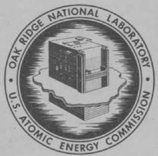

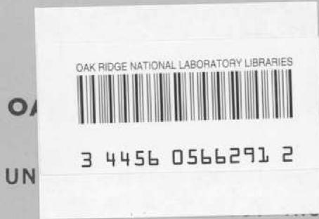

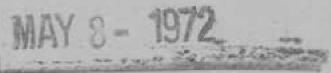

AL LABORATORY

by

ON • NUCLEAR DIVISION


U.S. ATOMIC ENERGY COMMISSION

ORNL-TM-3258

#

MAster copy

ENGINEERING DEVELOPMENT STUDIES FOR MOLTEN-SALT BREEDER REACTOR PROCESSING NO.8

L.E.McNeese

Contract No. W-7405-eng-26

CHEMICAL TECHNOLOGY DIVISION

ENGINEERING DEVELOPMENT STUDIES FOR MOLTEN-SALT

BREEDER REACTOR PROCESSING NO. 8

L. E. McNeese

MAY 1972

OAK RIDGE NATIONAL LABORATORY

Oak Ridge, Tennessee 37830

operated by

UNION CARBIDE CORPORATION

for the

U.S. ATOMIC ENERGY COMMISSION

Reports previously issued in this series are as follows:

ORNL-4366 Period ending September 1968

ORNL-TM-3053 Period ending December 1968

ORNL-TM-3137 Period ending March 1969

ORNL-TM-3138 Period ending June 1969

ORNL-TM-3139 Period ending September 1969

ORNL-TM-3140 Period ending December 1969

ORNL-TM-3141 Period ending March 1970

ORNL-TM-3257 Period ending June 1970

# CONTENTS

SUMMARIES vii

1. INTRODUCTION. 1   
2. ANALYSIS OF THE FLUORINATION--REDUCTIVE EXTRACTION AND METAL TRANSFER FLOWSHEET. 3

2.1 Isolation of Protactinium in a Secondary Salt, Using Fluorination and Reductive Extraction 3   
2.2 Mathematical Analysis of Flowsheet in Which Protactinium Is Isolated in a Secondary Salt, Using Fluorination and Reductive Extraction 6   
2.3 Calculated Results on Operation of the Protactinium Isolation System 12   
2.4 Combination of Discard Streams from the Fluorination--Reducive Extraction-Metal Transfer Flowsheet. 19

3. ANALYSIS OF URANIUM REMOVAL FROM FUEL SALT BY OXIDE PRECIPITATION 21

3.1 Mathematical Analysis of a Uranium Oxide Precipitator 21   
3.2 Calculated Results 24

4. DEVELOPMENT OF A FROZEN-WALL FLUORINATOR: INSTALLATION OF A SIMULATED FLUORINATOR FOR STUDYING INDUCTION HEATING 24

4.1 Experimental Equipment. 26   
4.2 Status of Equipment Installation. 29

5. MEASUREMENT OF AXIAL DISPERSION COEFFICIENTS AND GAS HOLDUP IN OPEN BUBBLE COLUMNS 31

5.1 Previous Studies on Axial Dispersion. 31   
5.2 Mathematical Analysis of Unsteady-State Axial Dispersion in a Bubble Column 33   
5.3 Equipment 38   
5.4 Experimental Procedure. 44   
5.5 Results 45   
5.6 Discussion of Data on Axial Dispersion. 45   
5.7 Discussion of Data on Gas Holdup. 54   
5.8 Conclusions 56

# CONTENTS (continued)

# 6. DEVELOPMENT OF THE METAL TRANSFER PROCESS 58

6.1 Equipment for Experiment MTE-2 59   
6.2 Materials Used in Experiment MTE-2 63   
6.3 Status of Experiment MTE-2 63

# 7. SEMICONTINUOUS REDUCTIVE EXTRACTION EXPERIMENTS IN A MILD-STEEL FACILITY 64

7.1 Preparation for Mass Transfer Run UTR-3 65   
7.2 Mass Transfer Run UTR-3 67   
7.3 Preparation for Mass Transfer Run UTR-4 70   
7.4 Mass Transfer Run UTR-4 71   
7.5 Mathematical Analysis of Mass Transfer with Primary Resistance to Transfer in the Salt Phase. 75   
7.6 Discussion of Mass Transfer Data from Runs UTR-3 and UTR-4.. 78   
7.7 Preparation for Zirconium Mass Transfer Experiments; Run UTR-5 80   
7.8 Summary of Hydrodynamic Data with Present Column. 84   
7.9 Examination of 304 Stainless Steel Corrosion Specimens from Salt-Metal Treatment Vessel 87   
7.10 Maintenance of Equipment. 87

# 8. PREVENTION OF AXIAL DISPERSION IN PACKED COLUMNS. 90

# 9. ELECTROLYTIC REDUCTION OF LiCl USING A BISMUTH CATHODE AND A GRAPHITE ANODE 92

9.1 Equipment and Materials Used. 94   
9.2 Operating Conditions and Results. 94   
9.3 Postoperational Examination of Equipment 96

# 10. STUDY OF THE PURIFICATION OF SALT BY CONTINUOUS METHODS 97

10.1 Iron Fluoride Reduction Runs R-1 and R-2. 97   
10.2 Mathematical Analysis of the Rate of Iron Fluoride Reduction; Calculated Mass Transfer Coefficients for Runs R-1 and R-2. 99   
10.3 Equipment Modifications and Maintenance 101

# CONTENTS (continued)

Page

11. ELECTROLYTIC OXIDATION OF $\mathsf{Pa}^{4+}$ to $\mathsf{Pa}^{5+}$ IN MSBR FUEL SALT 106

11.1 Estimated Anode Current Density for the Case of No Interaction Between Protactinium and Uranium. 107   
11.2 Estimated Anode Current Density for the Case of Equilibrium Between Protactinium and Uranium 110   
11.3 Calculated Results and Discussion. 113   
12. REFERENCES 116

# SUMMARIES

# ANALYSIS OF THE FLUORINATION--REDUCTIVE EXTRACTION

# AND METAL TRANSFER FLOWSHEET

An improved flowsheet was developed in which protactinium is isolated from the fuel salt of an MSBR and held for decay in a secondary salt stream that is physically and chemically isolated from the reactor. A processing plant based on this flowsheet should be much easier to control than one based on the earlier flowsheet in which the protactinium was isolated in bismuth at a point intermediate in the protactinium extraction column. Use of the new flowsheet should result in a considerable saving in capital equipment cost. A mathematical analysis showed that essentially complete extraction of the protactinium on a 10-day cycle could be obtained with five equilibrium stages and a reductant addition rate of about 200 equiv/day for a uranium removal efficiency of $99\%$ in the primary fluorinator, or an addition rate of about 300 equiv/day for a uranium removal efficiency of $95\%$ . The number of equilibrium stages could be reduced to as few as three without increasing the protactinium removal time appreciably if the reductant addition rate were increased to 371 equiv/day for a primary fluorinator efficiency of $95\%$ , or to 257 equiv/day for a fluorinator efficiency of $99\%$ . A method was developed for combining and fluorinating the various wastes produced by the flowsheet. Use of this method will eliminate several potential routes for loss of fissile material from the system.

# ANALYSIS OF URANIUM REMOVAL FROM FUEL SALT BY OXIDE PRECIPITATION

Calculations were made to investigate the operation of an oxide precipitator for removing uranium from fuel salt that contains no protactinium. The results indicate that greater than $99\%$ of the uranium can be removed with about three equilibrium stages in a countercurrent system and that the $\mathrm{UO}_2$ - $\mathrm{ThO}_2$ stream produced will have a $\mathrm{UO}_2$ concentration of greater than $90\%$ . Less than $1\%$ of the thorium fed to the system would be precipitated with the uranium. No significant effect on precipitator performance was observed when the amount of salt remaining with the oxide during the transfer of salt between stages was varied from 2 to 10 moles per mole of oxide.

# DEVELOPMENT OF A FROZEN-WALL FLUORINATOR: INSTALLATION OF A SIMULATED FLUORINATOR FOR STUDYING INDUCTION HEATING

An experiment to demonstrate protection against corrosion by the use of layers of frozen salt in a continuous fluorinator requires a corrosion-resistant heat source to be present in the molten salt. High-frequency induction heating has been proposed as the source of heat. There are uncertainties in determining the effect of bubbles in the molten salt with this heating method and in estimating the amount of heat that will be generated in the metal walls of the fluorinator. Equipment is being installed for studying heat generation in a simulated frozen-wall fluorinator containing provisions for induction heating. A 31 wt $\%$ HNO $_3$ solution will be used to simulate molten salt in the system. The simulated fluorinator consists of a 5-in.-OD by 5-ft-long section of 8-in. 304 stainless steel sched 40 pipe. The system also contains a pump for circulating the acid through the column and a heat exchanger for removing heat that is generated in the acid.

# MEASUREMENT OF AXIAL DISPERSION COEFFICIENTS AND GAS HOLDUP IN OPEN BUBBLE COLUMN

An improved experimental technique was developed for measuring axial dispersion coefficients in open bubble columns. This technique consists of injecting a small amount of KCl tracer solution at the top of a column and using a conductivity probe to measure the rate at which the tracer is dispersed throughout the column. Twenty-nine runs were made in order to measure the axial dispersion coefficient in open bubble columns having diameters of 1.5, 2, and 3 in.; 59 runs were made to determine gas holdup. The new technique appears to be superior to the earlier steady-state technique in that (1) less scatter is observed in the dispersion coefficient data, and (2) data can usually be obtained in less than $10\%$ of the time required for the steady-state technique. The axial dispersion coefficients obtained with the new technique are in agreement with those measured previously; however, data were obtained over a wider range of superficial gas velocities in the present study. At low gas flow rates (where bubble flow

occurs), gas holdup was found to be proportional to the superficial gas velocity and independent of the column diameter. At higher gas flow rates, the gas holdup was found to be inversely proportional to the column diameter and to increase, in a gradual manner, as the gas flow rate increased.

# DEVELOPMENT OF THE METAL TRANSFER PROCESS

A second engineering experiment (MTE-2) is presently in progress. The experiment was designed to demonstrate all phases of an improved rare-earth removal method known as the metal transfer process. The main objectives of the experiment are: (1) to demonstrate the selective removal of rare earths from fluoride salt containing thorium fluoride, (2) to collect the rare earths in a lithium-bismuth solution, and (3) to verify previous distribution coefficient data. Experiment MTE-2 is being performed at $660^{\circ}\mathrm{C}$ in a 6-in.-diam carbon steel vessel that is divided into two compartments interconnected at the bottom by a pool of thorium-saturated molten bismuth. One compartment contains fluoride salt (72-16-12 mole % LiF-BeF $_2$ -ThF $_4$ ) to which 7 mCi of $^{147}\mathrm{Nd}$ and sufficient LaF $_3$ to produce a concentration of 0.3 mole % has been added. The second compartment contains LiCl, a 35 at.% Li-Bi solution (in a cup), and a pump for circulating the LiCl through the cup at a flow rate of about 25 cm $^3$ /min. The pump is constructed of carbon steel and uses molten bismuth as check valves. Thus far, the experiment appears to be proceeding satisfactorily; however, no data are available at this time.

# SEMICONTOINUOUS REDUCTIVE EXTRACTION EXPERIMENTS IN A MILD-STEEL FACILITY

We continued to operate a mild-steel system which can be used to carry out semicontinuous reductive extraction experiments. We are presently studying the mass transfer performance of an 0.82-in.-ID, 24-in.-long column packed with $1/4$ -in. molybdenum Raschig rings.

Following the second uranium mass transfer run (UTR-2), the salt and bismuth were returned to the treatment vessel and $122.5\mathrm{g}$ of thorium metal was added to the graphite crucible through a 3/4-in.-diam tube. The thorium

dissolved slowly in the bismuth, at about the same rate observed after thorium was added to the bismuth feed tank prior to run UTR-2. A second charge of thorium metal (119 g) was lowered into the bismuth phase in a perforated steel basket to accelerate the reaction between the thorium and the bismuth. After this addition, the thorium dissolution rate increased to about ten times the rate observed earlier. Subsequent samples of the bismuth revealed a nonuniform thorium concentration in the bismuth pool, apparently the result of poor mixing during the period in which the bismuth and salt approached chemical equilibrium following the reductant addition. It was also found that thorium concentrates in the lower part of a sample during the slow freezing of the bismuth because of the tendency of the more dense thorium bismuthide to settle to the bottom. The previous sample preparation method, which involves discarding the lower 15% of the sample, was revised in order to avoid substantial errors in the reported concentration of thorium in the bismuth.

Run UTR-3 was carried out with metal-to-salt flow rate ratios of 2.05, 1.22, and 0.91. Seven pairs of bismuth and salt samples were removed from the salt and bismuth streams leaving the column. Analyses of these samples showed that, as the bismuth-to-salt flow rate ratio was decreased from 2.05 to 0.91, the fraction of the uranium removed from the salt decreased from 0.91 to 0.73.

Following run UTR-3 the salt and bismuth phases were returned to the treatment vessel. Sufficient thorium metal was then charged to the vessel to produce a thorium concentration of about 1000 ppm, which is about $10\%$ greater than the solubility of thorium and bismuth at the bismuth feed tank operating temperature $(540^{\circ}\mathrm{C})$ . Observed variations in thorium concentration in the bismuth appeared to be due to insufficient mixing of the bismuth phase. In run UTR-4, the fraction of uranium extracted from the salt increased from 0.63 to 0.74 as the flow rate ratio was increased from 0.75 to 1.0.

In correlating the uranium extraction data from runs UTR-3 and -4, it was assumed that the rate at which uranium transfers to the bismuth is controlled by the diffusive resistance in the salt film when the extraction

factor is high and when the salt film is composed largely of nontransferring ions. It was found that the data could be correlated in terms of the height of an overall transfer unit based on the salt phase. The HTU value increased from 0.77 ft to 2.1 ft as the bismuth-to-salt flow rate ratio decreased from 2.05 to 0.75.

In order to measure mass transfer rates in the column under more closely controlled conditions and under conditions where the controlling resistance is not necessarily in the salt phase, preparations were begun for experiments in which the rate of exchange of zirconium isotopes will be measured between salt and bismuth phases otherwise at chemical equilibrium. The salt and bismuth were transferred to the treatment vessel and were contacted with a 70-30 mole $\%$ $\mathrm{H}_2$ -HF mixture for 20 hr in order to remove reductant from the bismuth phase. After being sparged successively with hydrogen and argon, the salt and bismuth were then transferred to their respective feed tanks. The reported uranium concentrations in salt samples removed from the column effluent varied by $\pm 35\%$ , which was surprising since no extraction of uranium from the salt occurred during the run. The hydrodynamic data obtained during countercurrent flow of salt and bismuth in the present column were found to be in good agreement with the predicted column throughput at flooding, which is based on studies with mercury and aqueous solutions.

# PREVENTION OF AXIAL DISPERSION IN PACKED COLUMN

Packed columns are being considered for use in countercurrently contacting molten salt and bismuth in MSBR fuel processing systems. We have previously made axial dispersion measurements in packed columns during the countercurrent flow of mercury and aqueous solutions and have shown that axial dispersion can significantly reduce column performance under some operating conditions of interest. As part of our contactor development program, we are evaluating column modifications that will reduce the effect of axial dispersion to an acceptable level. We have devised and tested an improved axial dispersion preventer, which consists of an inverted bubble cap having a single 3/8-in.-OD tube at the upper

surface of the bubble cap. During operation, the metal phase accumulates around the bottom of the bubble cap and the resulting seal forces the continuous phase to flow through the tube in the upper surface of the cap. This design allows the depth of the metal phase to increase to the point where a sufficiently high head of liquid metal is produced to force the metal through the dispersion preventer at a high throughput. The extent of axial dispersion observed with this design is probably sufficiently low for most applications of interest. However, it is believed that the present design allows for salt and bismuth throughputs that can be as high as the column throughputs at flooding.

# ELECTROLYTIC REDUCTION OF LiCl USING A BISMUTH CATHODE AND A GRAPHITE ANODE

One method for providing the Li-Bi solutions required by the metal transfer process for rare-earth removal would consist of electrolytically reducing LiCl produced in the processing system. We have performed an experiment in order to determine the general operating characteristics of an electrolytic cell having a bismuth cathode and a graphite anode. This experiment was carried out in a 4-in.-diam quartz cell vessel in which a 3.5-in.-diam molybdenum cup containing the bismuth cathode was placed. The anode consisted of a 1-in.-diam graphite rod. The cell was operated at $670^{\circ}\mathrm{C}$ at a maximum anode current density of $8.6\mathrm{A/cm}^2$ . Apparently, there was no limiting anode current density under the conditions used in this experiment, and disengagement of the chlorine gas produced at the anode proceeded smoothly and without difficulty. During operation, the LiCl became red in color, probably because the cathode surface became saturated with $\mathrm{Li}_3\mathrm{Bi}$ (which partially dissolved in the LiCl). Measurement of the cell current efficiency was not possible because of the reaction of the chlorine gas produced in the cell with iron components in the upper part of the cell vessel. The experiment confirms our expectation that electrolytic reduction of LiCl using a bismuth cathode and a graphite anode should proceed readily and that the attack on the graphite anode should be minimal, if it occurs at all.

# STUDY OF THE PURIFICATION OF SALT BY CONTINUOUS METHODS

We have continued studies of the purification of salt by counter-current contact with hydrogen in a 1.25-in.-diam, 7-ft-long column packed with 1/4-in. nickel Raschig rings. During this report period, a sufficient quantity of $\mathrm{FeF}_2$ was added to the salt (66-34 mole % LiF- $\mathrm{BeF}_2$ ) to increase the iron concentration from 20 ppm to 425 ppm. Two iron fluoride reduction runs (R-1 and R-2) were carried out. A salt flow rate of $100~\mathrm{cm}^3/\mathrm{min}$ was used in each; the hydrogen flow rates were about 20 liters/min and 13.5 liters/min respectively. Accurate control of the flow rates of salt and gas to the column proved to be difficult, and erratic results were obtained. The calculated mass transfer coefficients for the two runs were 2.4 and 5.4 x $10^{-5}$ moles/sec· $\mathrm{cm}^3$ . Several equipment modifications were made in order to correct the difficulties noted during these runs.

ELECTROLYTIC OXIDATION OF Pa $^{4+}$ TO Pa $^{5+}$ IN MSBR FUEL SALT

A protactinium isolation method based on the selective precipitation of $\mathrm{Pa}_{2}0_{5}$ from MSBR fuel salt has recently been proposed. The process requires oxidation of the $\mathrm{Pa}^{4+}$ in the salt to $\mathrm{Pa}^{5+}$ (and most of the $\mathrm{U}^{3+}$ to $\mathrm{U}^{4+}$ ) prior to precipitation of the $\mathrm{Pa}_{2}0_{5}$ . It was suggested that oxidation of the $\mathrm{Pa}^{4+}$ be carried out electrolytically. Estimates of the current densities, the size of the proposed electrolytic oxidation system, and the feasibility of such a reduction step were made. It was concluded that a low current density would be observed at the anode because of the low concentration of $\mathrm{Pa}^{4+}$ in the salt, and that a current density limitation was not likely at the cathode since the concentration of the material to be reduced is higher, by about two orders of magnitude, than the total concentration of materials to be oxidized at the anode. Electrolytic oxidation of $\mathrm{Pa}^{4+}$ prior to precipitation of $\mathrm{Pa}_{2}0_{5}$ is not considered attractive because of the large anode surface area required. It is believed that oxidation of the $\mathrm{Pa}^{4+}$ to $\mathrm{Pa}^{5+}$ by the use of $\mathrm{HF}-\mathrm{H}_{2}0-\mathrm{H}_{2}$ mixtures is more promising and that additional data should be obtained to allow evaluation of this step.

# 1. INTRODUCTION

A molten-salt breeder reactor (MSBR) will be fueled with a molten fluoride mixture that will circulate through the blanket and core regions of the reactor and through the primary heat exchangers. We are developing processing methods for use in a close-coupled facility for removing fission products, corrosion products, and fissile materials from the molten fluoride mixture.

Several operations associated with MSBR processing are under study. The remaining parts of this report discuss:

(1) an improved flowsheet for processing MSBR fuel salt by fluorination--reductive extraction and the metal transfer process,   
(2) analysis of methods for removing uranium from fuel salt by precipitation as $\mathrm{UO}_2\text{-ThO}_2$ solid solutions,   
(3) installation of a simulated continuous fluorinator for studying induction heating in molten salt,   
(4) measurement of gas holdup and axial dispersion coefficients in open bubble columns, using a recently devised transient technique,   
(5) installation of experiment MTE-2 for demonstration of the metal transfer process for removing rare earths from MSBR fuel carriers salt,   
(6) experiments conducted in a mild-steel reductive extraction facility, to increase our understanding of the rate at which uranium is extracted from molten salt into bismuth in a packed column,   
(7) the design and testing of devices for preventing axial dispersion in packed columns during the countercurrent flow of molten salt and bismuth,   
(8) operation of a static electrolytic cell for reduction of LiCl using a bismuth cathode and a graphite anode,

(9) studies of the purification of salt by continuous methods, and   
(10) analysis of the feasibility of the electrolytic oxidation of tetravalent protactinium to pentavalent protactinium prior to the precipitation of $\mathrm{Pa}_{2} \mathrm{O}_{5}$ .

This work was carried out in the Chemical Technology Division during the period July through September 1970.

# 2. ANALYSIS OF THE FLUORINATION--REDUCTIVE EXTRACTION AND METAL TRANSFER FLOWSHEET

M.J.Bell L.E.McNeese

A flowsheet in which fluorination is used for removing uranium and reductive extraction is used for isolating protactinium from MSBR fuel salt has been described. $^{1,2}$ However, we have found that a considerable simplification in the flowsheet and a significant reduction in partial fuel cycle cost can be achieved by holding the isolated protactinium in a secondary salt phase, rather than in bismuth, as previously considered. A flowsheet that employs this improved mode of operation has been developed, and the partial fuel cycle costs corresponding to several sets of operating conditions have been calculated. We have also observed that the wastes from the protactinium isolation and the rare-earth removal portions of the new flowsheet can be conveniently combined for uranium recovery prior to disposal, thus decreasing the probability of loss of fissile material and also eliminating the need for adding $^{7}\mathrm{LiF}$ to the protactinium decay tank in order to obtain an acceptably low liquidus temperature. A method for combining the waste streams is described.

# 2.1 Isolation of Protactinium in a Secondary Salt, Using Fluorination and Reductive Extraction

Analysis of the fluorination--reductive extraction flowsheet for isolating protactinium from MSBR fuel salt has revealed several undesirable features and has suggested an improved method for removing fission product zirconium and for retaining $^{233}\mathrm{Pa}$ during its decay to $^{233}\mathrm{U}$ . In the flow-sheet described previously, zirconium was extracted into the bismuth stream exiting from the lower column of the protactinium isolation system; it was removed from this stream by hydrofluorinating a small fraction of the bismuth in the presence of salt that was withdrawn from the system. Since the bismuth stream also contained protactinium and uranium, the portion of the stream that was hydrofluorinated represented a compromise between (l) maintaining an acceptably low zirconium concentration in the bismuth in the

lower part of the column and (2) transferring acceptably small amounts of protactinium and uranium to the waste salt from which these materials must be recovered. The remaining bismuth was hydrofluorinated in the presence of salt that was then recycled to a point ahead of the fluorinator in order to remove uranium as UF<sup>6</sup>. This operation also resulted in the recycle of zirconium, which, under operating conditions of interest, was oxidized and reduced several times before its removal. Such recycling caused the quantity of reductant required for isolating the protactinium to be increased significantly.

We have observed that the flowsheet can be simplified by hydrofluorinating the entire bismuth stream in the presence of a secondary salt stream, as shown in Fig. 1. Salt is withdrawn from the reactor on a 10-day cycle and is fed to a fluorinator, where 95 to $99\%$ of the uranium is removed. The salt from the fluorinator is then sent to an extraction column where protactinium, zirconium, and the remaining uranium are extracted into a bismuth stream containing reductant. Finally, the bismuth stream is hydrofluorinated in the presence of the secondary salt stream, which results in transfer of the extracted materials to the salt. Reductant is added to the recovered bismuth, and the metal stream thus produced is recycled to the extraction column as in the previous flowsheet. The secondary salt stream is circulated successively through a hydrofluorinator, a fluorinator, and a protactinium decay tank. The fluorinator is used to maintain an acceptably low uranium concentration in the protactinium decay tank. Periodically, salt is withdrawn from the decay tank to remove zirconium and other fission products that have accumulated. The salt is held for a sufficient period before final discard to allow $^{233}\mathrm{Pa}$ to decay to $^{233}\mathrm{U}$ , which is recovered from the salt by batch fluorination.

These flowsheet modifications offer the following advantages over the earlier flowsheet:

1. The bismuth inventory in the system is greatly reduced, thereby avoiding a significant inventory charge.   
2. The protactinium decay tank can be fabricated from a nickel-base alloy rather than molybdenum, which will result in a considerable saving in the installed equipment cost.

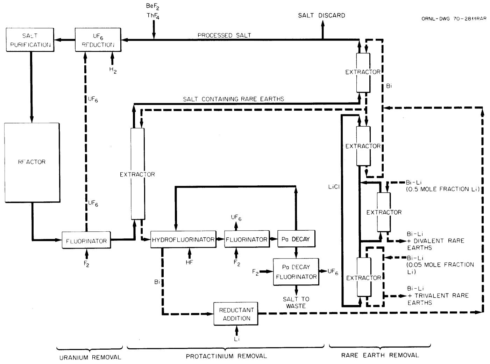  
Fig. 1. Flowsheet for Processing a Single-Fluid MSBR by Fluorination-- Reductive Extraction and the Metal Transfer Process.

3. Control of the protactinium isolation system is greatly simplified.   
4. Zirconium will not be recycled in the lower part of the protactinium isolation system, thus reducing the consumption of reductant.   
5. The isolated protactinium is retained in such a manner that maloperation of the extraction column cannot return large quantities of protactinium to the reactor.   
6. The flowsheet is simplified; recycle of fuel salt containing uranium, zirconium, and protactinium to the primary fluorinator is avoided. Operation of the secondary salt circuit is restricted only by heat removal and uranium inventory considerations.   
7. Very efficient hydrofluorination of the bismuth stream would permit the initial salt inventory in the protactinium decay tank to contain natural lithium rather than $^7$ Li.

2.2 Mathematical Analysis of Flowsheet in Which Protactinium Is Isolated in a Secondary Salt, Using Fluorination and Reductive Extraction

A mathematical analysis was carried out for the protactinium isolation system described in the previous section. Of main interest were (1) the effects of the primary fluorinator uranium removal efficiency and the reductant addition rate on the performance of the protactinium extraction column, and (2) the rate at which LiF must be added to the secondary salt in the protactinium decay system in order to maintain an acceptably low liquidus temperature. Also of interest was the uranium inventory in the protactinium decay tank for various values of the secondary fluorinator efficiency and the flow rate of the secondary salt through the fluorinator.

In making the analysis, we assumed that salt of a designated composition was withdrawn from the reactor at a known flow rate and fed to the primary fluorinator, where a specified fraction of the uranium was removed as $\mathrm{UF}_6$ . The extraction column was assumed to consist of a specified number of theoretical stages. With this approach, calculations proceed from one

end of the column, where flow rates and concentrations are known or assumed, to the opposite end of the column, where an appropriate check is made on the calculated values (if the starting concentrations and flow rates were assumed values). The calculations involve the successive application of equilibrium and material balance relations for each of the theoretical stages. Data relative to the equilibrium distribution of materials of interest have been obtained by Ferris and co-workers.<sup>3</sup> The distribution coefficient for material A, between salt and bismuth containing a reductant, is given by the expression:

$$
\log \mathrm {D} _ {\mathrm {A}} = \mathrm {n} _ {\mathrm {A}} \log \mathrm {D} _ {\mathrm {L i}} + \log \mathrm {K} _ {\mathrm {A}} ^ {\prime}, \tag {1}
$$

where

$$
\begin{array}{l} D _ {A} = \text {d i s t r i b u t i o n c o e f f i c i e n t f o r A}, \\ = \mathrm {X} _ {\mathrm {M A}} / \mathrm {X} _ {\mathrm {S A}}, \\ \end{array}
$$

$$
X _ {M A} = \text {c o n c e n t r a t i o n o f e l e m e n t A i n m e t a l p h a s e , m o l e f r a c t i o n ,}
$$

$$
\begin{array}{l} X _ {S A} = \text {c o n c e n t r a t i o n o f f l u o r i d e o f e l e m e n t A i n s a l t p h a s e}, \text {m o l e} \\ f r a c t i o n, \\ \end{array}
$$

$$
\begin{array}{l} n _ {A} = \text {v a l e n c e o f e l e m e n t A i n s a l t p h a s e}, \\ D _ {L i} = \text {d i s t r i b u t i o n c o e f f i c i e n t o f l i t h i u m}, \\ K _ {A} ^ {\prime} = \text {m o d i f i e d e q u i l i b r i u m c o n s t a n t}. \\ \end{array}
$$

The variation of the modified equilibrium constant, $\mathrm{K}_{\mathrm{A}}^{\prime}$ with temperature is given by the relation:

$$
\log K _ {A} ^ {\prime} = A + B / T, \tag {2}
$$

where

$$
\begin{array}{l} A, B = \text {c o n s t a n t s}, \\ \mathrm {T} = \text {t e m p e r a t u r e}, ^ {\circ} \mathrm {K}. \\ \end{array}
$$

In setting up the equilibrium relations for a system containing $\mathbf{N} + 1$ components that distribute between the molten salt and bismuth phases, one component is conveniently chosen as the reference component. The relative concentrations of materials in the two phases are then related by the following set of expressions that can be derived from Eq. (l):

$$
\mathrm {X} _ {\mathrm {M i}} = \mathrm {X} _ {\mathrm {S i}} \left(\frac {\mathrm {X} _ {\mathrm {M r}}}{\mathrm {X} _ {\mathrm {S r}}}\right) ^ {\mathrm {n} _ {\mathrm {i}} / \mathrm {n} _ {\mathrm {r}}} \exp \left[ \log \mathrm {K} _ {\mathrm {i}} ^ {\prime} - \frac {\mathrm {n} _ {\mathrm {i}}}{\mathrm {n} _ {\mathrm {r}}} \log \mathrm {K} _ {\mathrm {r}} ^ {\prime} \right], \mathrm {i} = 1 \dots . \mathrm {N}, \tag {3}
$$

where

$$
X _ {S i}, X _ {M i} = \text {m o l e f r a c t i o n o f c o m p o n e n t i i n s a l t a n d m e t a l}, \text {r e s p e c t i v e l y},
$$

$$
\begin{array}{l} \mathrm {X} _ {\mathrm {S r}}, \mathrm {X} _ {\mathrm {M r}} = \text {m o l e f r a c t i o n o f r e f e r e n c e c o m p o n e n t i n s a l t a n d m e t a l}, \\ \text {r e s p e c t i v e l y ,} \end{array}
$$

$$
\begin{array}{l} n _ {i}, n _ {r} = \text {v a l e n c e o f c o m p o n e n t i a n d r e f e r e n c e c o m p o n e n t , r e s p e c t i v e l y ,} \\ \text {i n s a l t .} \end{array}
$$

The final expression required for calculating equilibrium concentrations in the two phases is given by the following relation:

$$
\frac {\sum_ {i = 1} ^ {N + 1} n _ {i} X _ {M i}}{1 - \sum_ {i = 1} ^ {N + 1} X _ {M i}} = \text {X M R}, \tag {4}
$$

where

XMR = equivalents of transferrable components per mole of bismuth.

This relation requires that the number of equivalents of transferrable metals per mole of bismuth remain constant.

A material balance around stage $j$ of a column in which the stages are numbered from the top yields the relation:

$$
F _ {S j} X _ {S i, j} + F _ {M j} X _ {M i, j} = F _ {S j + 1} X _ {S i, j + 1} + F _ {M j - 1} X _ {M i, j - 1}, \tag {5}
$$

where

$$
F _ {S j} = \text {f l o w r a t e o f s a l t l e a v i n g s t a g e j , m o l e s / d a y},
$$

$$
F _ {M j} = \text {f l o w r a t e o f m e t a l l e a v i n g s t a g e j , m o l e s / d a y},
$$

$$
X _ {S i, j} = \text {m o l e f r a c t i o n o f c o m p o n e n t i i n s a l t l e a v i n g s t a g e j},
$$

$$
X _ {M i, j} = \text {m o l e f r a c t i o n o f c o m p o n e n t i i n m e t a l l e a v i n g s t a g e j}.
$$

The notation used in analyzing the remaining parts of the protactinium isolation system (see Fig. 2) is as follows:

FDS = flow rate of discarded salt, moles/day,  
FH = flow rate of salt entering hydrofluorinator, moles/day,  
FM = flow rate of metal entering hydrofluorinator, moles/day,  
FLIF = rate of addition of LiF to Pa decay tank, moles/day,  
FS1 = flow rate of salt leaving hydrofluorinator, moles/day,  
H = uranium removal efficiency in fluorinator,  
XM = mole fraction of a component in metal phase,  
XS = mole fraction of a component in salt phase,  
VDK = volume of protactinium decay tank, moles,  
λ = radioactive decay constant for $^{233}\mathrm{Pa}$ , day $^{-1}$ .

In addition, various suffixes were added to the flow rates and concentrations to indicate the location of a stream in the flow diagram, and the following suffixes were appended to the concentrations to denote the element being considered:

```txt
L = lithium,  
P = protactinium,  
T = thorium,  
U = uranium,  
Z = zirconium. 
```

Thus, the symbol XS2P refers to the mole fraction of protactinium in salt at point 2 in the flowsheet. In the model, the protactinium decay tank was treated as a completely mixed vessel and the hydrofluorinator was assumed to remove all transferrable metals from the bismuth. For these conditions, one can write the material balance relations given below. For $^{233}\mathrm{Pa}$ :

$$
\mathrm {F M} \cdot \mathrm {X M P} + \mathrm {F S 4} \cdot \mathrm {X S 4 P} = \mathrm {F S 2} \cdot \mathrm {X S 2 P}, \tag {6a}
$$

$$
\mathrm {F S 2} \cdot \mathrm {X S 2 P} = \mathrm {F S 3} \cdot \mathrm {X S 3 P}, \tag {6b}
$$

$$
(F S 3 - F D S) \cdot X S 3 P = (\lambda \cdot V D K + F S 4) \cdot X S 4 P. \tag {6c}
$$

ORNL DWG. 71-13585 RI

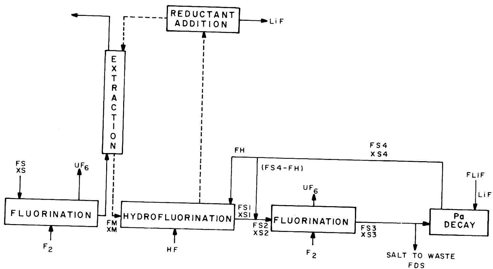  
Fig. 2. Schematic Flowsheet for Isolation of Protactinium Using Fluorination and Reductive Extraction.

For 233U:

$$
\mathrm {F M} \cdot \mathrm {X M U} + \mathrm {F S} 4 \cdot \mathrm {X S} 4 \mathrm {U} = \mathrm {F S} 2 \cdot \mathrm {X S} 2 \mathrm {U}, \tag {7a}
$$

$$
(F S 3 - F D S) \cdot X S 3 U + \lambda \cdot V D K \cdot X S 4 P = F S 4 \cdot X S 4 U, \tag {7b}
$$

$$
\mathrm {F S 3} \cdot \mathrm {X S 3 U} = \mathrm {F S 2} \cdot \mathrm {X S 2 U} \cdot (1 - \mathrm {H}). \tag {7c}
$$

For 7Li:

$$
\mathrm {F M} \cdot \mathrm {X M L} + \mathrm {F S} 4 \cdot \mathrm {X S} 4 \mathrm {L} = \mathrm {F S} 2 \cdot \mathrm {X S} 2 \mathrm {L}, \tag {8a}
$$

$$
\mathrm {F S 2} \cdot \mathrm {X S 2 L} = \mathrm {F S 3} \cdot \mathrm {X S 3 L}, \tag {8b}
$$

$$
(F S 3 - F D S) \cdot X S 3 L + F L I F = F S 4 \cdot X S 4 L. \tag {8c}
$$

For $^{232}\mathrm{Th}$

$$
\mathrm {F M} \cdot \mathrm {X M T} + \mathrm {F S} 4 \cdot \mathrm {X S} 4 \mathrm {T} = \mathrm {F S} 2 \cdot \mathrm {X S} 2 \mathrm {T}, \tag {9a}
$$

$$
\mathrm {F S 2} \cdot \mathrm {X S 2 T} = \mathrm {F S 3} \cdot \mathrm {X S 3 T}, \tag {9b}
$$

$$
(F S 3 - F D S) \cdot X S 3 T = F S 4 \cdot X S 4 T. \tag {9c}
$$

For $\mathbf{Zr}$ ..

$$
\mathrm {F M} \cdot \mathrm {X M Z} + \mathrm {F S 4} \cdot \mathrm {X S 4 Z} = \mathrm {F S 2} \cdot \mathrm {X S 2 Z}, \tag {10a}
$$

$$
\mathrm {F S 2} \cdot \mathrm {X S 2 Z} = \mathrm {F S 3} \cdot \mathrm {X S 3 Z}, \tag {10b}
$$

$$
(F S 3 - F D S) \cdot X S 3 Z = F S 4 \cdot X S 4 Z. \tag {10c}
$$

From an overall material balance:

$$
F M \cdot (X M P + X M U + X L M + X M T + X M Z) + F S 4 = F S 2, \tag {11a}
$$

$$
\mathrm {F S} 2 = \mathrm {F S} 3 + \mathrm {F S} 2 \cdot \mathrm {X S} 2 \mathrm {U} \cdot \mathrm {H}, \tag {11b}
$$

$$
\mathrm {F S} 3 + \text {F L I F} = \mathrm {F D S} + \mathrm {F S} ^ {4}. \tag {11c}
$$

The system is also under the constraint that LiF must be added to the protactinium decay tank at a sufficient rate (FLIF) to obtain a suitable salt liquidus temperature. An LiF- $\mathrm{ThF}_4$ mixture containing 71 mole % LiF has a liquidus temperature of $568^{\circ}\mathrm{C}$ , which is acceptably low. It was assumed that the presence of zirconium, protactinium, and uranium fluorides

at low concentrations would not increase the salt liquidus temperature to an unacceptable level; and, in the calculations, the value of FLIF was determined so that $\mathrm{XS4L}$ was equal to 0.71. Each of the sets of equations [i.e., Eqs. (6) - (10)] consists of three equations relating three concentrations. However, the equations are not linear because of the dependence of the flow rates on the uranium concentration, as indicated by Eq. (llb). The quantities FM, XMP, XMU, XMT, XML, XMZ, VDK, H, $\mathrm{XS4L}$ , and FS4 are known; the remaining variables are to be determined. In the algorithm adopted for solving the above system of equations, the equations were linearized by assuming a value for the salt discard rate, which, with Eqs. (8a) - (8c) and (lla) - (llc) fixes all of the salt flow rates. The remaining equations can be solved for the unknown concentrations, and Eqs. (llb) and (llc) can be used to obtain an improved estimate of the salt discard rate. This algorithm converges in only a few iterations since the equations are not strongly nonlinear.

# 2.3 Calculated Results on Operation of the Protactinium Isolation System

The mathematical model described in the previous section was used to compute concentrations and flow rates throughout the secondary salt system and to evaluate the performance of the protactinium isolation system for an assumed 10-day processing cycle. The variation of the protactinium removal time with the primary fluorinator uranium removal efficiency and with the rate at which reductant is added to the extraction column is shown in Fig. 3. As can be observed, essentially complete extraction of the protactinium is obtained if the reductant addition rate is adequate. A reduction addition rate of about 200 equiv/day is required for a uranium removal efficiency of $99\%$ , and an addition rate of about 300 equiv/day is required for a uranium removal efficiency of $95\%$ . The rate at which LiF must be added to the secondary salt in order to maintain a LiF concentration of 0.71 mole fraction depends on both the uranium removal efficiency in the primary fluorinator and on the reductant addition rate. As shown in Fig. 4, a LiF addition rate of about 40 moles/day is required in order

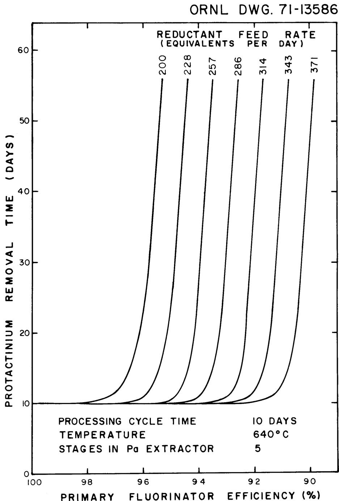  
Fig. 3. Effects of Primary Fluorinator Efficiency and Reductant Feed Rate to Protactinium Extraction Column on Protactinium Removal Time.

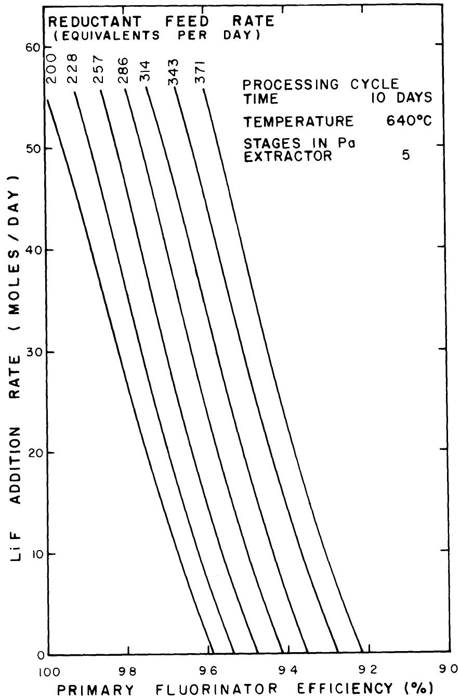  
ORNL DWG. 71-13587   
Fig. 4. Effects of Primary Fluorinator Efficiency and Reductant Feed Rate to Protactinium Extraction Column on LiF Addition Rate.

to achieve a uranium removal efficiency of $99\%$ when the reductant addition rate is 200 equiv/day. The same LiF addition rate is also required to achieve a uranium removal efficiency of $95\%$ when the reductant addition rate is 371 equiv/day. The variation of protactinium removal time with number of stages in the protactinium extraction column is shown in Fig. 5. As can be observed, little benefit is obtained from use of more than five stages, and as few as three stages could be used at the higher reductant feed rate without increasing the protactinium removal time appreciably. The variation of the uranium inventory in the protactinium decay tank with the uranium removal time from the tank and with the uranium removal efficiency in the primary fluorinator is shown in Fig. 6. As can be observed, a uranium inventory that is $0.1\%$ or less of the reactor uranium inventory can be obtained over a wide range of operating conditions.

Both the quantity of reductant required and the rate at which fuel carrier salt must be removed from the reactor to compensate for the LiF added by the protactinium isolation system depend on the fraction of the uranium that is removed from the fuel salt by the primary fluorinator. For a uranium removal efficiency of $95\%$ and a reductant addition rate of 371 equiv/day, fuel carrier salt must be withdrawn at the rate of 0.3 ft³/day; for a removal efficiency of $99\%$ and a reductant addition rate of 200 equiv/day, fuel salt must be removed at the rate of 0.16 ft³/day. Table 1 gives a comparison of the components of the partial fuel cycle cost for the present protactinium isolation system in which the protactinium is isolated in salt and those for the previous protactinium isolation system in which the protactinium was isolated in bismuth. For the present system, the chemical and inventory charges amount to 0.047 mill/kWhr for a uranium removal efficiency of $95\%$ and a reductant addition rate of 371 moles/day. These charges are reduced to 0.034 mill/kWhr for a uranium removal efficiency of $99\%$ and a reductant addition rate of 200 equiv/day. The salt inventory in the protactinium decay tank is 150 ft³ in each case. The uranium inventory in the tank is about $0.1\%$ of the reactor uranium inventory.

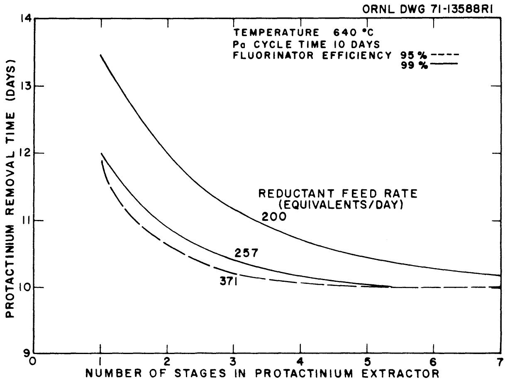  
Fig. 5. Effect of Number of Stages in Protactinium Extraction Column on Protactinium Removal Time for Primary Fluorinator Efficiencies of $95\%$ and $99\%$ .

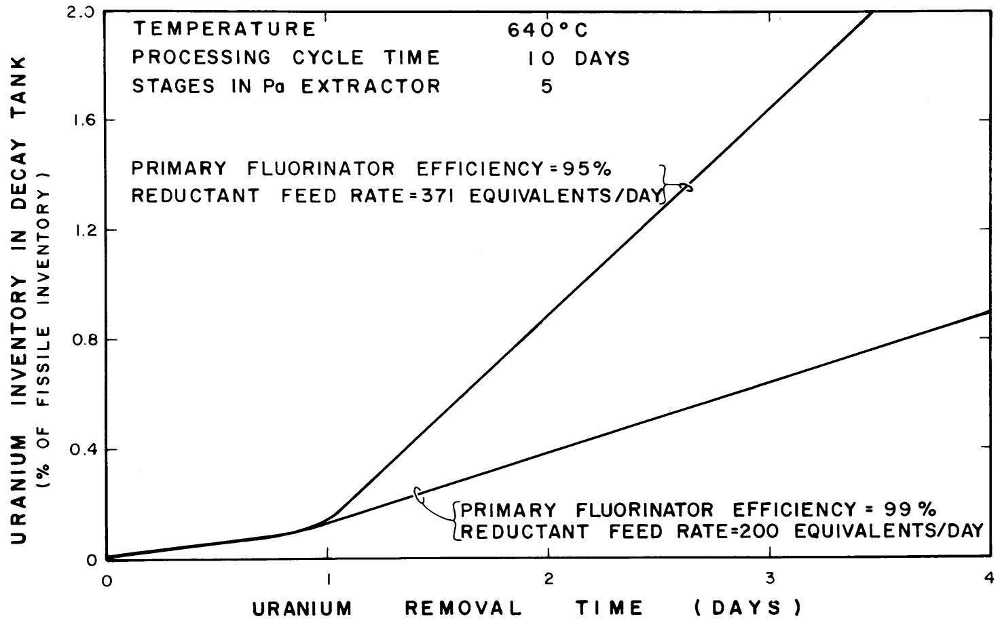  
ORNL DWG. 71-13589   
Fig. 6. Effect of Uranium Removal Time in Secondary Salt Circuit on Uranium Inventory in Protactinium Decay Tank for Primary Fluorinator Efficiencies of $95\%$ and $99\%$ .

Table 1. Partial Fuel Cycle Costs for Present and Past Protactinium Isolation Systems   

<table><tr><td></td><td colspan="2">Pa Isolation in Salt</td><td>Pa Isolation in Bi</td></tr><tr><td>Reductant addition rate, moles/day</td><td>371</td><td>200</td><td>429</td></tr><tr><td>Fluorinator efficiency, %</td><td>95</td><td>99</td><td>95</td></tr><tr><td>Resulting components of cost, mill/kWhr</td><td></td><td></td><td></td></tr><tr><td>Reductant</td><td>0.0131</td><td>0.0071</td><td>0.0151</td></tr><tr><td>Fluorine</td><td>0.0115</td><td>0.0115</td><td>0.0115</td></tr><tr><td>Salt replacement</td><td>0.0206</td><td>0.0134</td><td>0.0163</td></tr><tr><td>Uranium inventory</td><td>0.0004</td><td>0.0004</td><td>0.0030</td></tr><tr><td>Loss in breeding ratio</td><td>0.0000</td><td>0.0006</td><td>0.0013</td></tr><tr><td>HF and H2</td><td>0.0010</td><td>0.0007</td><td>0.0010</td></tr><tr><td>Bi inventory</td><td></td><td></td><td>0.0097</td></tr><tr><td>Total</td><td>0.0467</td><td>0.0336</td><td>0.0579</td></tr></table>

# 2.4 Combination of Discard Streams from the Fluorination-- Reductive Extraction--Metal Transfer Flowsheet

The flowsheet shown in Fig. 1 requires that about 40 moles of LiF be added daily to the protactinium decay tank in order to obtain a suitable liquidus temperature. Lithium fluoride purchased for this addition would increase the fuel cycle cost by only $0.0014$ mill/lkWhr; however, we have observed that an acceptable liquidus temperature can also be obtained by hydrofluorinating the Li-Bi stream from the divalent rare-earth stripper in the presence of the salt from the decay tank. This operation adds 50 moles of LiF and about 1.1 moles of rare-earth fluorides to the decay tank per day. With this addition, the composition of the salt in the decay tank is $72 - 24 - 3$ mole $\%$ LiF- $\mathrm{ThF}_4\mathrm{-ZrF}_4$ , 1 mole $\%$ divalent rare-earth fluorides, and 360 ppm of trivalent rare-earth fluorides. (A primary fluorinator efficiency of $99\%$ and a reductant feed rate of 200 equivalents per day are assumed.) The salt has a liquidus temperature of $570^{\circ}\mathrm{C}$ ; at this temperature, the rare-earth fluoride concentration is well within the rare-earth solubility.

We have also observed that it is possible to combine all waste streams from the metal transfer system and the protactinium isolation system for uranium recovery prior to disposal, as shown in Fig. 7. In this operation, waste salt from the protactinium decay tank would be combined with the fuel carrier salt discard stream. The Li-Bi stream from the trivalent rare-earth stripper would be hydrofluorinated in the presence of the resulting salt, and the combined stream would be held for protactinium decay. The protactinium concentration in the combined streams would be only 500 ppm initially, and it would decrease thereafter. The specific heat generation rate would be acceptably low. The salt in the waste holdup tank would be fluorinated before discard to remove uranium. The composition of the discarded salt would be 74.7-13.5-9.5-0.8 mole % LiF-ThF $_4$ -BeF $_2$ -ZrF $_4$ , 1.2 mole % trivalent rare-earth fluorides, and 0.3 mole % divalent rare-earth fluorides. Although the liquidus temperature of the salt is near $500^{\circ}\mathrm{C}$ , the salt temperature would have to be maintained at about $600^{\circ}\mathrm{C}$ to prevent precipitation of the trivalent rare-earth fluorides.

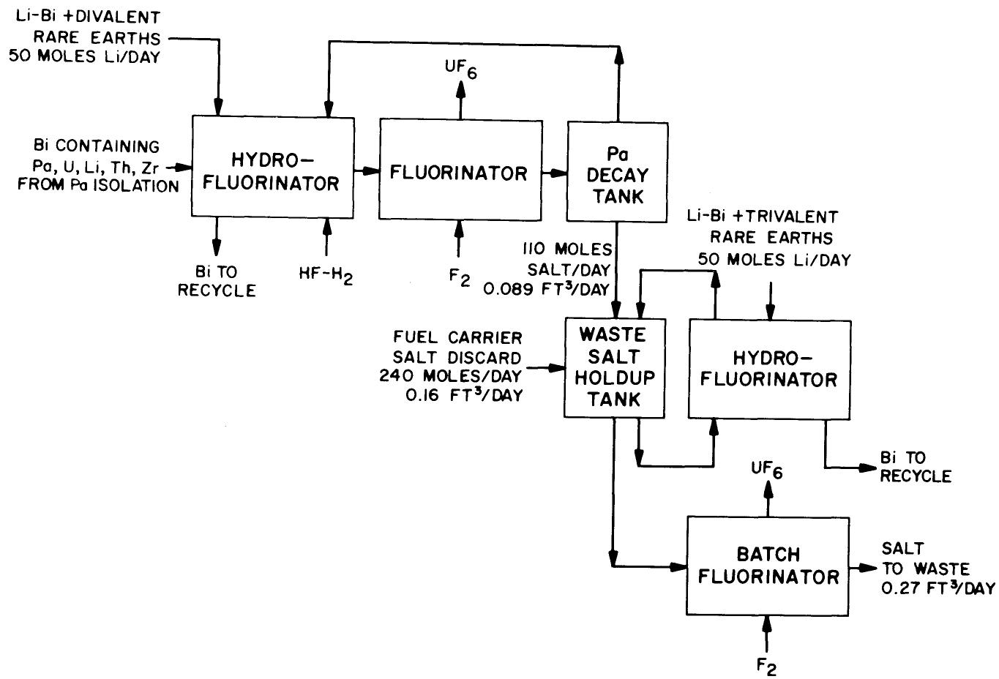  
Fig. 7. Method for Combining Waste Streams from Protactinium Isolation and Rare-Earth Removal Processes. Flow rates are shown for a uranium removal efficiency in the primary fluorinator of $99\%$ and a reductant addition rate of 200 equivalents/day.

This processing scheme would require that salt be discarded at the rate of $60\, \text{ft}^3$ every 220 days.

3. ANALYSIS OF URANIUM REMOVAL FROM FUEL SALT BY OXIDE PRECIPITATION

M.J.Bell L.E.McNeese

Oxide precipitation is being considered as an alternative method for selectively removing protactinium from MSBR fuel salt and for subsequently removing uranium from the fuel salt prior to the removal of rare earths. We have made calculations that describe the performance of a multistage countercurrent precipitator for removing uranium from fuel salt which is free of protactinium. The results indicate that $99\%$ of the uranium can be removed from the salt by using about three equilibrium stages and that the $\mathrm{UO}_2\text{-ThO}_2$ solid solution which is precipitated will contain greater than $90\%$ $\mathrm{UO}_2$ .

# 3.1 Mathematical Analysis of a Uranium Oxide Precipitator

A mathematical analysis of a multistage countercurrent equilibrium precipitator was carried out to determine the feasibility of precipitating most of the uranium from MSBR fuel salt without the attendant precipitation of large quantities of $\mathrm{ThO}_2$ . The data of Bamberger and Baes for the equilibrium concentration of $\mathrm{UO}_2$ - $\mathrm{ThO}_2$ solid solutions in contact with molten LiF- $\mathrm{BeF}_2$ - $\mathrm{ThF}_4$ - $\mathrm{UF}_4$ salts were employed in the analysis. The equilibrium quotient, Q, defined as

$$
Q = X _ {U O _ {2}} X _ {T h F _ {4}} / \left(X _ {T h O _ {2}} X _ {U F _ {4}}\right), \tag {12}
$$

for the reaction

$$
\mathrm {U F} _ {4} + \mathrm {T h O} _ {2} = \mathrm {U O} _ {2} + \mathrm {T h F} _ {4} \tag {13}
$$

is given by the expression

$$
\log Q = (2 1 0 1 + 5 5 0 x _ {U O _ {2}}) / T, \tag {14}
$$

where $T$ is the absolute temperature $(^{\circ}\mathrm{K})$ .

In the analysis, each stage was treated as an equilibrium contactor and it was assumed that the solid leaving a stage would have a specified quantity of salt associated with it. The salt/solid mole ratio in this stream was assumed to be constant for each of the stages. Material balances around stage N (see Fig. 8) yield the following relations. For uranium and thorium in salt:

$$
\begin{array}{l} (F S + F R) [ X S U (N) + X S T (N) ] \\ = \operatorname {F R} [ \mathrm {X S U} (\mathrm {N} + 1) + \mathrm {X S T} (\mathrm {N} + 1) ] + \mathrm {F S} [ \mathrm {X S U} (\mathrm {N} - 1) + \mathrm {X S T} (\mathrm {N} - 1) ]; \tag {15} \\ \end{array}
$$

and for uranium:

$$
\begin{array}{l} (F S + F R) \cdot X S U (N) + F O \cdot X O U (N) \\ = \operatorname {F R} \cdot \operatorname {X S U} (N + 1) + \operatorname {F S} \cdot \operatorname {X S U} (N - 1) + \operatorname {F O} \cdot \operatorname {X O U} (N + 1), \tag {16} \\ \end{array}
$$

where

$$
F O = \text {f l o w r a t e o f o x i d e}, \text {m o l e s / d a y},
$$

$$
F R = f l o w r a t e \text {o f s a l t a c c o m p a n y i n g o x i d e , m o l e s / d a y},
$$

$$
F S = \text {f l o w}
$$

$$
\mathrm {X O U} = \text {m o l e f r a c t i o n U O} _ {2} \text {i n o x i d e ,}
$$

$$
\mathrm {X S T} = \text {m o l e f r a c t i o n T h F} _ {4} \text {i n s a l t},
$$

$$
\mathrm {X S U} = \text {m o l e f r a c t i o n U F} _ {4} \text {i n s a l t}.
$$

Equation (15) states that the rate at which $\mathrm{UF}_{4}$ and $\mathrm{ThF}_{4}$ leave stage N must equal the rate at which these materials enter in salt from stage $(N - 1)$ and in salt associated with solids from stage $(N + 1)$ , since it is assumed that the flow rate of oxide from stage to stage is fixed. Equation (16) states that the amount of uranium leaving stage N in the salt and the oxide must be equal to the amount of uranium entering in the salt from stage

ORNL DWG. 71-13590RI

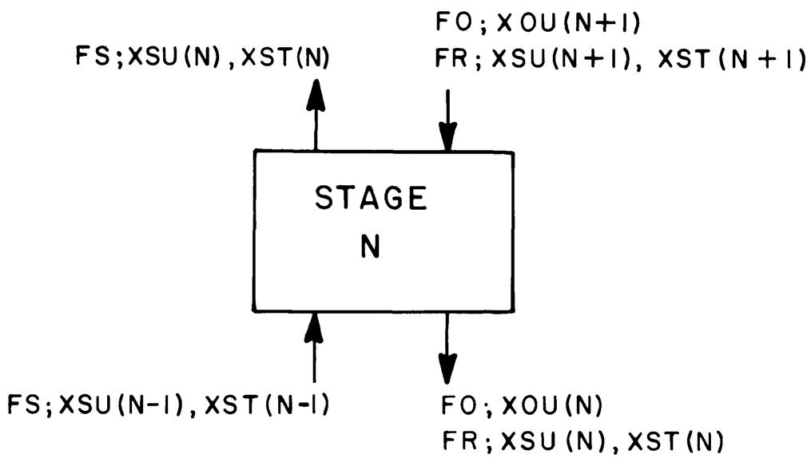  
Fig. 8. Nomenclature Used in Mathematical Analysis of a Multistage Countercurrent Uranium Oxide Precipitator.

$(N - 1)$ plus that entering in the solids and associated salt from stage $(N + 1)$ . In solving the set of equations represented by Eqs. (15) and (16), one takes account of two facts: the salt flow rate and the composition of the salt are known at the point where salt is fed to the precipitator, and no salt accompanies the oxide fed to the opposite end of the precipitator. Other data required for evaluating precipitator performance include the number of stages in the precipitator, the temperature, the moles of salt per mole of oxide in the oxide stream leaving a stage, and the composition of the $\mathrm{UO}_2\text{-ThO}_2$ solid solution produced in a given stage, which is given by Eq. (12).

# 3.2 Calculated Results

Typical results showing the effects of temperature and number of stages on precipitator performance are shown in Fig. 9. These results indicate that greater than $99\%$ of the uranium can be removed from MSBR fuel salt with three or more stages and that the oxide stream produced will have a $\mathrm{UO}_2$ concentration of greater than $90\%$ . Over a wide range of conditions, less than $1\%$ of the thorium fed to the system would be precipitated with the uranium. A decrease in performance is observed as the temperature increases. No significant effect on precipitator performance was observed when the amount of salt remaining with the oxide during the transfer of salt between stages was varied from 2 to 10 moles per mole of oxide.

# 4. DEVELOPMENT OF A FROZEN-WALL FLUORINATOR: INSTALLATION OF A SIMULATED FLUORINATOR FOR STUDYING INDUCTION HEATING

J.R.Hightower，Jr.C.P.Tung

L. E. McNeese

An experiment to demonstrate protection against corrosion by the use of layers of frozen salt in a continuous fluorinator requires a corrosion-resistant heat source to be present in the molten salt. High-frequency induction heating has been proposed as the source of heat, and the estimated

ORNL DWG 70-8995

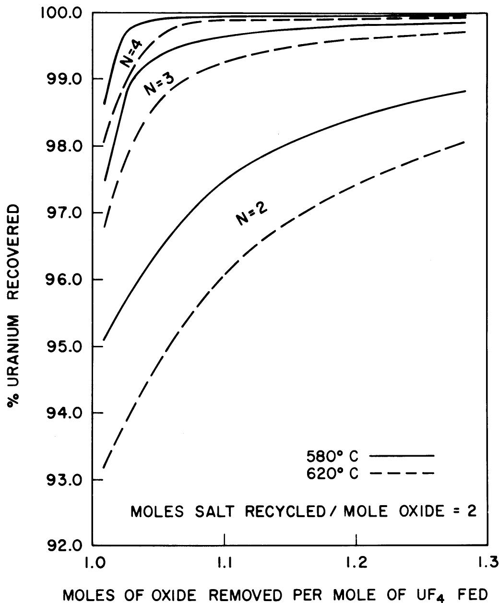  
Fig. 9. Effects of Temperature, Number of Stages, and Oxide Removal Rate on Percentage Uranium Recovered in an Oxide Precipitation.

performance<sup>5</sup> of a frozen-wall fluorinator having an induction coil embedded in the frozen salt near the fluorinator wall has indicated that this may be an acceptable heating method. There are uncertainties associated with determining the effect of bubbles in the molten salt and in estimating the amount of heat that will be generated in the metal walls of the fluorinator. Equipment is being assembled for studying heat generation in a simulated frozen-wall fluorinator containing an embedded induction coil. In this experiment, a 3l wt % HNO<sub>3</sub> solution, which has electrical properties similar to those of molten salts, will be used to simulate molten salt in the fluorinator vessel. The equipment for the experiment is described in the remainder of this section.

# 4.1 Experimental Equipment

The induction-heated simulated fluorinator consists of a 5-in.-OD, 5-ft-long glass tube inserted in an induction coil and placed inside a 5-ft-long section of 8-in. 304 stainless steel sched 40 pipe. The nitric acid inside the glass tube represents the molten salt in the fluorinator, the space between the glass tube and the pipe wall (which contains the induction coil) represents the frozen salt layer, and the pipe represents the fluorinator vessel wall. As shown by the flow diagram in Fig. 10, the acid is pumped, first, through the glass column (where it is heated by the induction coil) and, then, through a heat exchanger (where the heat is removed). The rate at which heat is generated in the acid will be determined from a heat balance on the acid passing through the column. The pipe representing the fluorinator wall is equipped with a jacket through which cooling water passes. The heat generated in the pipe will be calculated from the change in temperature of the water flowing through the jacket. A drain tank is provided for holding the nitric acid during system maintenance. Air, at rates up to 2 cfm, can be countercurrently contacted with the downflowing acid stream in the column.

The glass column and induction coil are shown in Fig. 11. The coil is made up of 17 sections of smaller coils, each of which is 5.6 in. in inside diameter and 3 in. long. The coil sections are made of 6.5 turns

ORNL DWG 70-8961

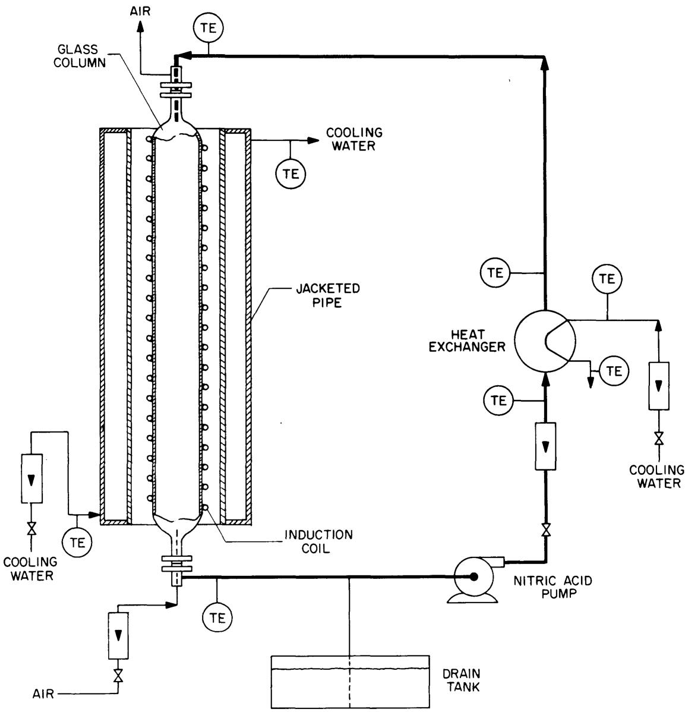  
Fig. 10. Flow Diagram of Fluorinator Simulation and Nitric Acid Recirculation System.

PHOTO 100288

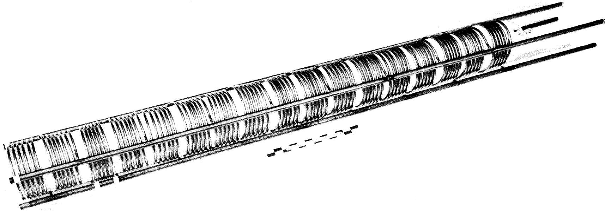  
Fig. 11. Photograph of Induction Coil with the Glass Column Thermally Insulated and Inserted.

of 0.25-in.-OD Monel tubing, and adjacent coils are wound in opposed directions. The total length of the coil assembly is 5 ft. The coils are connected electrically in parallel between headers made from 5/8-in.-diam Monel tubing; all coils wound in the same direction are connected to one pair of headers, and the two pairs of headers are, in turn, connected electrically in parallel. The inductance of the work coil (when installed inside the 8-in.-diam pipe) was found to be 5.8 $\mu$ H. The effective resistance at a frequency of $1000\mathrm{Hz}$ was found to be 0.135 $\Omega$ .

Figure 12 shows the acid recirculation system before thermal insulation was added to the jacketed pipe that simulates the fluorinator vessel (shown at the right of the photograph). The acid recirculation system is constructed of stainless steel tubing; the parts of the pump that contact the acid are made of stainless steel and Teflon; and the gaskets in the glass-to-metal joints at each end of the glass column are fabricated from Viton-A. The recirculation system is located behind a splash shield (not shown in Fig. 12) and can be operated entirely from in front of the splash shield.

The heat exchanger is an American Standard stainless steel shell and tube exchanger which has one shell side and one tube side pass. The heat-transfer area is 9 ft². The pump is a Crane Company Champump made of 316 stainless steel with Teflon gaskets and is designed to operate at a temperature of $150^{\circ}\mathrm{F}$ . At a flow rate of 1 gpm (approximately the maximum acid flow), the pump develops a total head of 7⁴ ft of fluid.

The rf generator is a 25-kW Ther-monic model $1400$ oscillator operating at a frequency of $400\mathrm{kHz}$ . The rf transmission lines are flexible water-cooled coaxial cables made by the L. C. Miller Company.

# 4.2 Status of Equipment Installation

The nitric acid recirculation system and the rf generator have been installed. We are presently matching the impedances of the generator and work coil in order to deliver sufficient power to the work coil.

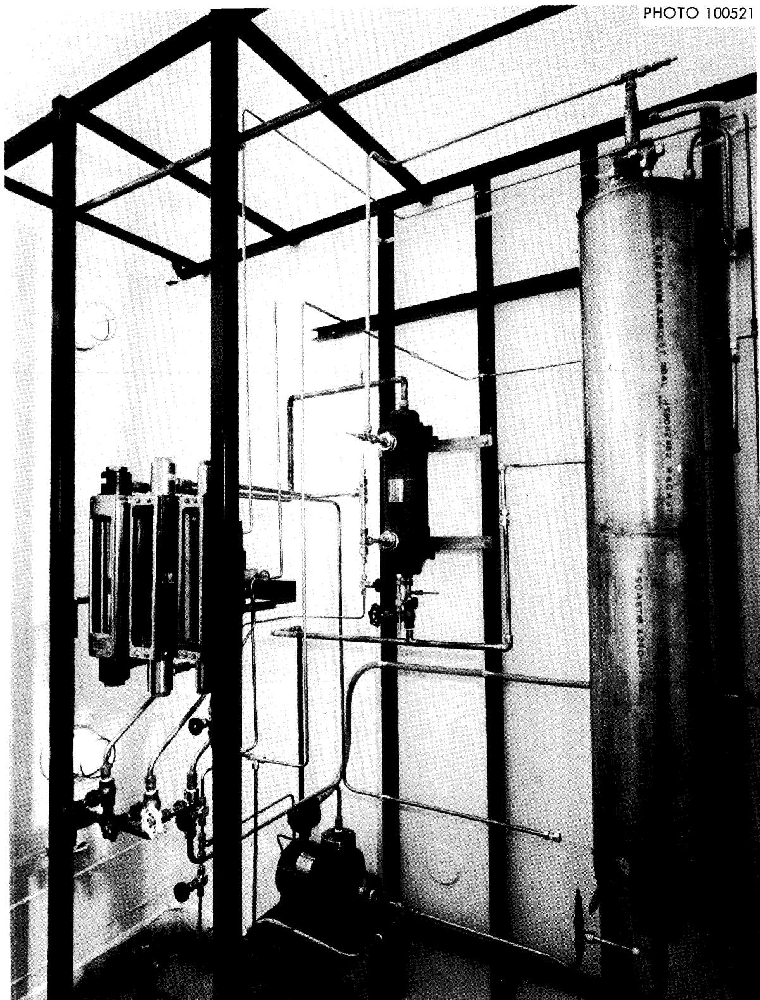  
Fig. 12. Installed Fluorinator Simulation and Nitric Acid Recirculation System.

# 5. MEASUREMENT OF AXIAL DISPERSION COEFFICIENTS AND GAS HOLDUP IN OPEN BUBBLE COLUMNNS

M. S. Bautista J. S. Watson L. E. McNeese

Axial dispersion is an important consideration in the design and performance of continuous fluorinators. Since molten salt saturated with fluorine is corrosive, fluorinators will be simple open vessels having a protective layer of frozen salt on all exposed metal surfaces. In such systems, the rising gas bubbles may cause appreciable axial dispersion in the salt. For the past two years, we have been involved in a program for measuring axial dispersion during the countercurrent flow of air and water in open bubble columns. The objectives of this program are to evaluate the effect of axial dispersion on fluorinator performance and to account for this effect in the design of fluorinators.

# 5.1 Previous Studies on Axial Dispersion

Initial investigations on axial dispersion in open bubble columns were made by Bautista and McNeese, who studied the countercurrent flow of air and water in a 2-in.-ID, 72-in.-long column. Two regions of operation were observed. The first of these consisted of a "bubbly" region (at low gas flow rates) in which the air moved up the column as individual bubbles and coalescence was minimal. The second region consisted of a "slugging" region (at higher gas flow rates) in which the air coalesced rapidly into bubbles having diameters equal to the column diameter. A plot of the logarithm of the dispersion coefficient vs the logarithm of the gas flow rate was linear in both regions. However, the slope of the line representing data in the slugging region was higher than that for data in the bubbly region. The transition between the two regions was well defined.

The same column and associated equipment were used by A. M. Sheikh and J. D. Dearth<sup>7</sup> of the MIT Practice School for investigating the effects of the viscosity and surface tension of the liquid. The dispersion coefficient

was found to decrease in the bubbly region as the viscosity of the liquid was increased from 1 to $15\mathrm{cP}$ by the addition of glycerol to the water; little effect was noted in the slugging region. An increase in the dispersion coefficient was observed as the surface tension of the liquid was decreased by addition of n-butanol to the water.

The equipment was also used by A. A. Jeje and C. R. Bozzuto, $^{8}$ of the MIT Practice School, who investigated the effects of gas inlet diameter and column diameter on axial dispersion and obtained data on gas holdup in bubble columns. In the slugging region, the dispersion coefficient appeared to be proportional to the square root of the volumetric gas flow and was independent of column diameter. In the bubbly region, the dispersion coefficient was dependent only on the volumetric gas flow rate for columns having diameters of 2 in. or larger. Dispersion coefficient data obtained with a 1.5-in.-diam column deviated from this condition. At low gas flow rates, gas holdup was linearly dependent on the superficial gas velocity and was independent of column diameter. At superficial velocities above the transition from bubbly to slug flow, the gas holdup data for the various column diameters diverged; the holdup was greatest for the smallest column diameter.

All of the dispersion coefficient data obtained thus far result from measurements of the steady-state axial distribution of a cupric nitrate tracer that is continuously injected into the bottom of the column near the water exit. The tracer concentration was measured at 20 positions, located 3.5 in. apart, along the column. Water was withdrawn at a low rate (about $1\mathrm{cm}^3/\mathrm{min}$ ) by a small magnetically driven centrifugal pump at each of the positions, and the water stream was circulated through a photocell and then returned to the opposite side of the column at the same elevation. This experimental technique operated satisfactorily for a range of water and air flow rates. It was found that the axial dispersion coefficient was independent of both axial position in the column and water superficial velocity in the range of interest. This experimental technique had the following two principal disadvantages: (l) the measurements were time consuming since about 2 hr was required for the column to

reach steady state, and (2) at sufficiently high gas rates, air that was entrained with the water circulating through the photocells accumulated in the centrifugal pumps and prevented satisfactory operation. For these reasons, an attempt was made to develop an alternative experimental technique that would circumvent these problems. The remainder of this section describes a transient technique that has a number of advantages over the steady-state technique.

# 5.2 Mathematical Analysis of Unsteady-State Axial Dispersion in a Bubble Column

A transient technique, which has been used previously by Ohki and Inoue, $^{9}$ was examined to determine its applicability under conditions of interest. In this technique, there is no net flow of water through the column; however, data obtained by use of the steady-state technique indicated that the water flow rate does not affect the axial dispersion coefficient in the range of flow rates of interest. A small amount of electrolyte tracer is rapidly injected into the top of the column, and the concentration of the tracer is measured continuously at a point near the bottom of the column by use of a conductivity probe. It was assumed that the rate of movement of tracer down the column would be described by the one-dimensional diffusion equation:

$$
\frac {\partial \mathrm {C}}{\partial t} = D _ {e} \frac {\partial^ {2} C}{\partial Z ^ {2}}, \tag {17}
$$

where

$$
C = \text {t r a c e r}
$$

$$
t = \text {t i m e},
$$

$$
Z = \text {a x i a l p o s i t i o n i n c o l u m n m e a s u r e d f r o m t h e t o p o f t h e c o l u m n ,}
$$

$$
D _ {e} = \text {a x i a l d i s p e r s i o n c o e f f i c i e n t}.
$$

Since the tracer cannot diffuse across the upper and lower boundaries of the column, one requires that the following boundary condition be met at $Z = 0$ and $Z = L$ :

$$
\frac {\partial C}{\partial Z} = 0. \tag {18}
$$

The instantaneous injection at the top of the column of a specified quantity of solution containing a specified tracer concentration is represented by the following relations at $t = 0$ :

$$
C = C _ {0}, 0 \leq Z \leq \lambda \tag {19}
$$

$$
C = 0, \lambda <   Z \leq L,
$$

where

$C_{0} =$ concentration of tracer in solution in a thin layer at top of column at $t = 0$ ,

$\lambda =$ depth of solution having concentration $C_{0}$ at $t = 0$

L = column length.

Solution of Eq. (17) with the boundary conditions specified by Eqs. (18) and (19) yields the following relation for the relative tracer concentration at position Z and time t:

$$
\frac {C}{C _ {\infty}} = 1 + \frac {2 L}{\pi \lambda} \sum_ {n = 1} ^ {\infty} \left[ \frac {1}{n} \sin \frac {n \pi \lambda}{L} \cos \frac {n \pi Z}{L} \exp \left(- \frac {D _ {e} n ^ {2} \pi^ {2} t}{L ^ {2}}\right) \right],
$$

where

$C_{\infty} =$ final tracer concentration in column after tracer is uniformly dispersed.

For the condition where $\lambda < \lambda$ , this solution reduces to the following relation for the relative tracer concentration in the column at position Z and time t:

$$
\frac {C}{C _ {\infty}} = 1 + 2 \sum_ {n = 1} ^ {\infty} \left[ \left(\cos \frac {n \pi}{L} z\right) \exp \left(- n ^ {2} \frac {\pi^ {2}}{L ^ {2}} D _ {e} t\right) \right] \tag {20}
$$

The relative tracer concentration is thus a function of the normalized position in the column, $Z/L$ , and of the dimensionless time, $\beta$ , which is equal to the quantity $(\pi/L)^2 D_{\mathrm{e}} t$ . In the present case, the relative tracer concentration is dependent only on the dimensionless time $\beta$ and was measured at only one point in the column. In principle, a value for the axial dispersion coefficient could be obtained by fitting Eq. (20) to the experimentally determined relative-tracer-concentration-vs-time curve at only one point $(C/C_{\infty} = 0.5$ , for example). Ohki and Inoue point out, however, that greater accuracy is usually achieved if this curve is fit to Eq. (20) at two points (other than $t = 0$ ) since the result is less sensitive to errors in the injection time and in the duration of the injection period. In the present case, the curves were fit to Eq. (20) at relative tracer concentration values of 0.3 and 0.7. Here, the axial dispersion coefficient is given by the relation:

$$
D _ {e} = \frac {\beta_ {0 . 7} - \beta_ {0 . 3}}{t _ {0 . 7} - t _ {0 . 3}} \left(\frac {L}{\pi}\right) ^ {2}, \tag {21}
$$

where

$$
\begin{array}{l} \beta_ {0. 3}, \beta_ {0. 7} = \text {d i m e n s i o n l e s s t i m e a t w h i c h C / C _ {\infty} h a s v a l u e s o f 0 . 3 a n d} \\ 0. 7, \text {r e s p e c t i v e l y ,} \end{array}
$$

$$
t _ {0. 3}, t _ {0. 7} = \text {t i m e a t w h i c h C / C} _ {\infty} \text {h a s v a l u e s o f 0 . 3 a n d 0 . 7 , r e s p e c t i v e l y}.
$$

The error in the measured axial dispersion coefficient resulting from an error in the relative position of the conductivity probe in the column can be estimated from Eq. (20) by calculating the variation of the quantity $\beta_{0.7} - \beta_{0.3}$ with relative probe position, as shown in Fig. 13. The rate of change of the quantity $\beta_{0.7} - \beta_{0.3}$ with a change in relative probe position at a Z/L value of 0.7 is 1.8, which indicates that an error in probe position of 2 cm would produce an error in the measured axial dispersion coefficient of $2.3\%$ . The relative probe position was measured to within 1 cm in the present work.

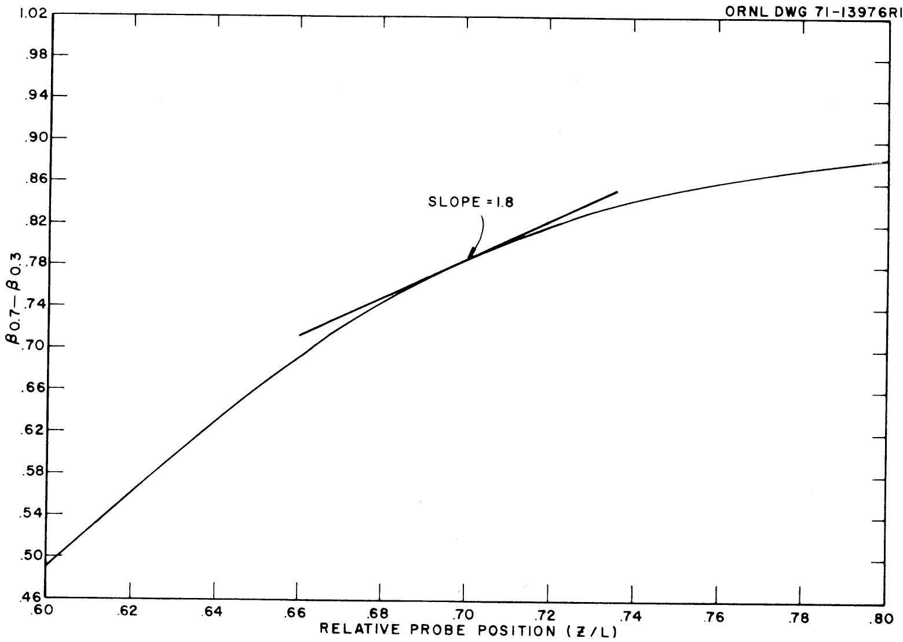  
Fig. 13. Variation of $\beta_{0.7} - \beta_{0.3}$ with Relative Probe Position (Z/L).

In the previous analysis, it was assumed that the tracer solution is injected into the top of the column instantaneously. Since this is not actually the case, a new analysis was made in order to estimate the error in the measured axial dispersion coefficient caused by a nonzero injection time. In the latter analysis, it was assumed that tracer was added at the top of the column at a constant rate for a specified time period, and that this resulted in a nonuniform tracer concentration profile in the column at the end of the injection period. After this time, the tracer was assumed to diffuse throughout the column with the boundary conditions represented by Eq. (18). The concentration of tracer in the column during the period in which tracer is added to the top of the column at a constant rate is represented by Eq. (17) and the following initial and boundary conditions:

$$
\begin{array}{l} C = 0, \text {f o r a l l Z a t} t = 0 \\ D _ {e} \frac {\partial C}{\partial Z} = F _ {o}, a t z = 0, \\ \frac {\partial C}{\partial Z} = 0, \quad a t Z = L, \\ \end{array}
$$

where

$$
F _ {0} = \text {f l u x o f t r a c e r a t t o p o f c o l u m n}.
$$

The concentration of tracer at the end of the tracer injection period is given by the following relation:

$$
C = \frac {F _ {o} L}{D _ {e}} \left[ \frac {D _ {e} t ^ {\prime}}{L ^ {2}} + \frac {3 (L - z) ^ {2} - L ^ {2}}{6 L ^ {2}} - \frac {2}{\pi^ {2}} \sum_ {n = 1} ^ {\infty} \frac {1}{n ^ {2}} \cos \frac {n \pi Z}{L} \exp \left(- \frac {D _ {e} n ^ {2} \pi^ {2} t ^ {\prime}}{L ^ {2}}\right) \right] \tag {22}
$$

where

$$
t ^ {\prime} = \text {l e n g t h o f i n j e c t i o n p e r i o d}.
$$

The concentration of tracer in the column during the period following tracer injection is given by solution of Eq. (17) with the boundary conditions represented by Eq. (18) and the initial condition represented by Eq. (22).

The relative tracer concentration in the column at time $t$ and position $Z$ is given by the following relation:

$$
\frac {C}{C _ {\infty}} = 1 + 2 \sum_ {n = 1} ^ {\infty} \cos \frac {n \pi Z}{L} \exp \left(- \frac {D _ {e} n ^ {2} \pi^ {2} t}{L ^ {2}}\right) \frac {1}{n ^ {2} \beta^ {\prime}} \left(1 - e ^ {- n ^ {2} \beta^ {\prime}}\right), \tag {23}
$$

where

$\mathrm{C}_{\infty} = \frac{\mathrm{F}_{0} \mathrm{t}^{\prime}}{\mathrm{L}} =$ tracer concentration in column after a uniform concentration is reached,

$$
\beta^ {\prime} = \frac {D _ {e} \pi^ {2} t ^ {\prime}}{L ^ {2}}.
$$

For the column length used in this work and the range of dispersion coefficients observed, an injection time of 2 sec ( $t'$ ) would result in an error in the measured axial dispersion coefficient of less than $5\%$ . The actual injection time was always less than 2 sec and usually less than 1 sec.

# 5.3 Equipment

The equipment used in the study (shown schematically in Fig. 14) consisted of an open bubble column, a means for injecting KCl tracer solution at the top of the column, a conductivity probe located at an intermediate axial point along the column for determining the KCl concentration in the aqueous solution at that point, an electronics system and a recorder for recording the output from the conductivity probe, an air supply and metering system that allowed air to be fed at a known flow rate to a gas disperser located in the base of the column, and a manometer for obtaining data on gas holdup in the column. These parts of the system are discussed in detail in the remainder of this section.

# 5.3.1 Column

The open bubble columns used in this study consisted of Lucite tubes, 8 ft long and 1.5, 2, and 3 in. in inside diameter, that were mounted in a

ORNL DWG 71-13966

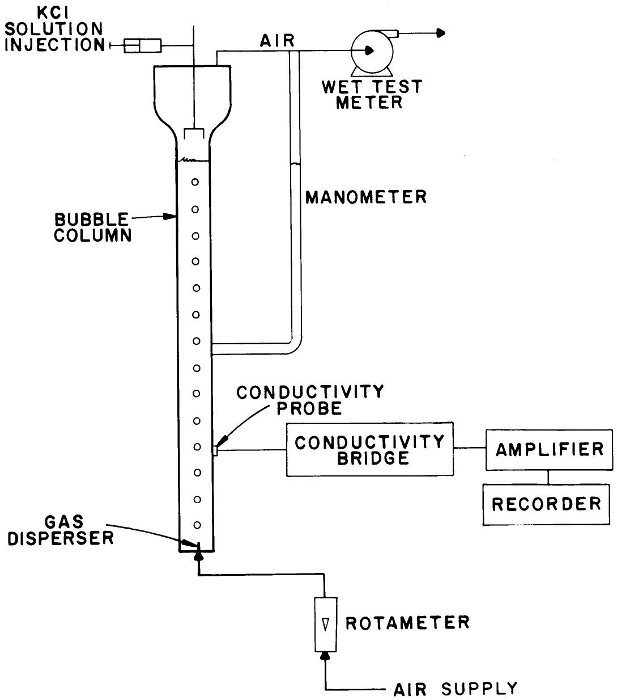  
Fig. 14. Schematic Flow Diagram of Equipment Used for Study of Axial Dispersion in an Open Bubble Column by a Transient Technique.

vertical position. Provision was made for installing a conductivity probe at a point $70.5\mathrm{cm}$ from the bottom of the column. Provision was also made for attaching a manometer for obtaining gas holdup data at any of 20 points located 3.5 in. apart along the axis of a column. A gas disperser was located in the bottom of the column.

# 5.3.2 Gas Disperser

The gas disperser consisted of a 0.04-in.-ID opening in the bottom of the column. Provision was made for use of gas dispersers having a diameter as large as $1/4$ in. However, in the present study, only one disperser size was used.

# 5.3.3 Air Supply and Metering System

Compressed air (90 psig) from the building supply was passed through a demister trap and was reduced in pressure to 15 psig. The air was then metered through either of two rotameters having maximum flow capacities of 0.216 liter/min and 0.840 liter/min and subsequently passed into the gas disperser in the bubble column. The rate at which air flowed through the column was monitored with a wet-test meter as the air exited from the column.

# 5.3.4 KCl Tracer Solution Injection System

A 5-ml syringe was connected to a sparger through which a known quantity of concentrated KCl tracer solution could be injected. The total time required for injecting the tracer was less than 2 sec. The tracer solution was distributed throughout the column by use of four sections of l/l6-in.-diam tubing.

# 5.3.5 Conductivity Probe

The conductivity probes were prepared by use of 1/4-in.-diam bolts, as shown in Fig. 15. A 0.094-in.-diam hole was drilled along the axis of

ORNL DWG 71-13967RI

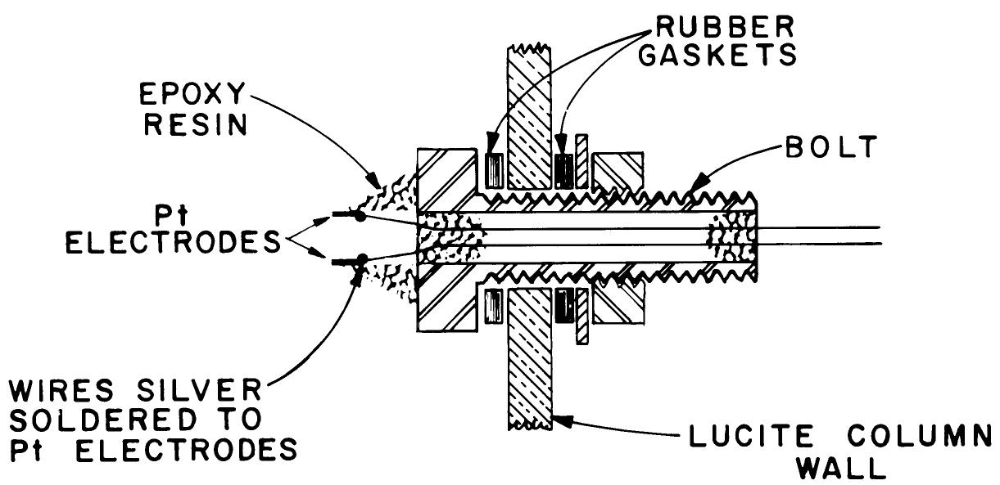  
Fig. 15. Method for Installing Conductivity Probe in Column.

the bolt, and two insulated wires were silver-soldered to separate square platinum electrodes that measured about $0.5\mathrm{cm}$ on a side. The electrodes were positioned 1 to $2\mathrm{mm}$ apart and were attached to the head of the bolt by use of epoxy resin. The hole in the bolt through which the wires extended was also sealed with epoxy, and all surfaces other than those of the platinum electrodes were coated with epoxy. The separation distance between the electrodes was adjusted in order that water would be held between the electrodes by surface tension. The surfaces of the electrodes were platinized to reduce polarization by inserting the probe in a platinum chloride solution and imposing a dc potential of about $3\mathrm{V}$ across the probe for a period of about $1\mathrm{min}$ . The direction of current flow was then reversed for $1\mathrm{min}$ . The output from the conductivity probe and electronics system was shown to be linearly dependent on the concentration of KCl in an aqueous solution in which the probe was placed (see Fig. 16). When the probe is used in a column, relatively large fluctuations in output signal are observed during the first part of an experiment. Initially, these fluctuations were believed to be the result of air passing between the electrodes. Later, it was observed that they become minimal after the KCl tracer has been dispersed uniformly throughout the column. Apparently, then, the fluctuations are produced by velocity gradients in the column in the presence of a significant KCl concentration gradient.

A probe was installed (see Fig. 15) so that the head of the bolt was located inside the column; the threaded section of the bolt extended through a rubber gasket and a hole in the column. A nut was tightened on the bolt from outside the column to compress the gasket and thereby secure the probe and seal the hole through which the bolt was passed.

# 5.3.6 Electronics System and Recorder

The conductivity probe was connected to a Leeds and Northrup Model 4988 conductivity monitor, which imposed a $60\mathrm{-Hz}$ signal across the electrodes of the probe and produced an output voltage proportional to the current passing through the probe. It was not possible to vary the frequency of the signal impressed across the probe; however, there was no

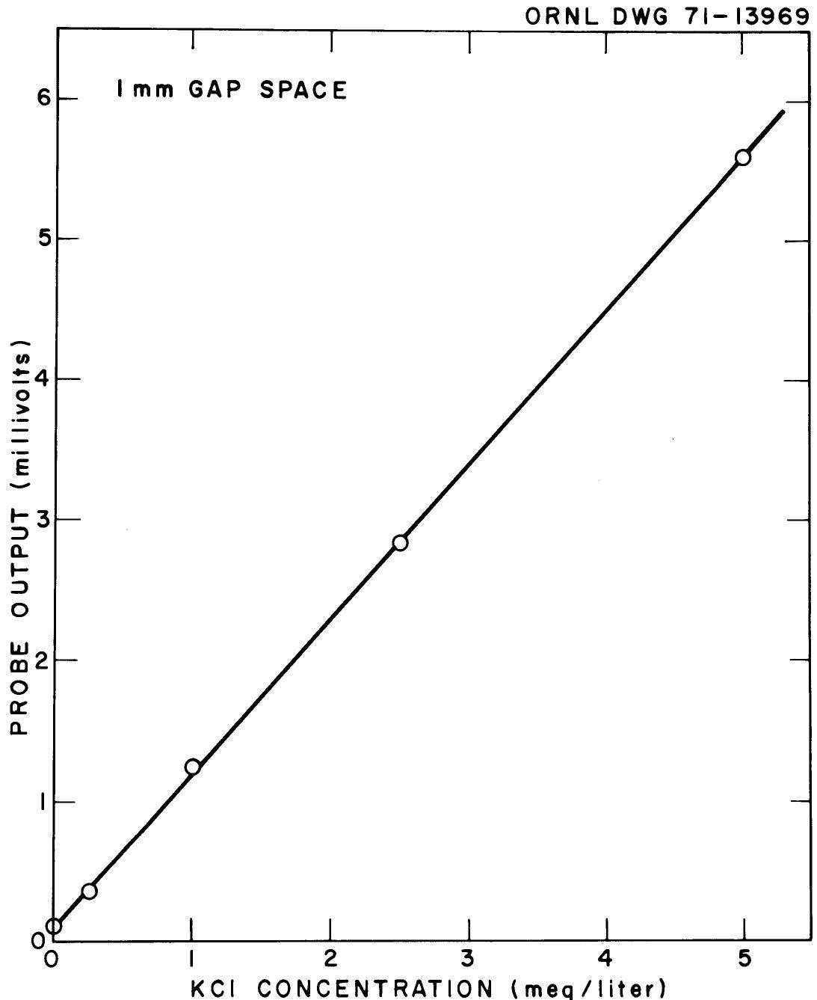  
Fig. 16. Variation of Output from Conductivity Probe and Electronics System with Concentration of KCl in an Aqueous Solution.

evidence of polarization. The signal from the conductivity monitor passed through a high-impedance amplifier, having a gain of unity, in order not to overload the conductivity monitor. The output signal from the amplifier was damped slightly to reduce the effect of high-frequency fluctuations. Several damping periods in the range 0.1 to 0.5 sec were tested; no effect on the quantity $t_{0.7} - t_{0.3}$ could be detected. A damping period of 0.5 sec was used in succeeding runs. The output from the electronics system was recorded on a Hewlett-Packard Model 7100B recorder having a chart speed of 0.1 in./sec, or 2 in./min, and a chart width of 12 in.

# 5.3.7 Manometer for Gas Holdup Measurements

The relative pressure and the relative height of the air-water mixture were measured at several points along the axis of the column in order to determine the average gas holdup in the portion of the column above the measuring point. A manometer made from 0.25-in.-diam glass tubing was used for the pressure determinations. The lower end of the manometer was connected to a point on the column, and the upper end was connected to a point on the column off-gas line near the top of the column. The variation of gas holdup with axial position along the column could be determined by obtaining readings at several positions along the column.

# 5.4 Experimental Procedure

Prior to a run, the column was filled with distilled water to a level that would produce an air-water mixture height of approximately 230 cm at the gas flow rate to be used in the subsequent run. The gas holdup in each column had previously been determined as a function of gas flow rate. The air flow rate was then set at the approximate value by use of a rotameter, and air exiting from the column was routed through a wet-test meter to accurately measure the air flow rate. The air was allowed to flow through the meter for a sufficient length of time to obtain an accurate measurement; at low gas flow rates, this period was considerably longer than the time required for a dispersion coefficient measurement.

The tracer injection syringe was then filled with the desired volume of tracer solution, and the conductivity monitor and recorder were turned on. The tracer was injected as quickly as possible, and the injection

time was marked on the recorder chart. As the tracer was dispersed throughout the column, the recorder indicated the increase in conductivity of the solution at the probe position. The run was continued until no further increase in recorder output was observed, and the times required for the recorder reading to increase to $30\%$ and $70\%$ of its total deflection during the run were determined and recorded. The sensitivity of the recorder and the volume of tracer injected were selected so that the total recorder deflection observed during a run was 70 to $90\%$ of the chart width.

During the run, the height of the air-water mixture in the column was determined to within $1\mathrm{cm}$ . A more accurate determination would have been difficult because of variation in the position of the air-water mixture at the top of the column.

# 5.5 Results

Twenty-nine runs were made in order to measure axial dispersion coefficient values in open bubble columns having diameters of 1.5, 2, and 3 in. These data are summarized in Tables 2-4. Fifty nine runs were made to determine gas holdup in the same columns. In each run, values for the pressure at a particular location and the height of the air-water mixture above this location were determined at three to seven points along the column axis. The resulting data were fit by the method of least squares to a straight line on a plot of pressure vs distance down the column. The resulting data showed that gas holdup does not depend on axial position along the column, since the standard deviation values were less than $2.5\%$ of the holdup values in most cases. For this reason, experimentally determined values for the pressure and height of the air-water mixture at the various points along the column axis are not given. Values for the gas holdup (and the associated standard deviation) for each of the runs are summarized in Tables 5-7.

# 5.6 Discussion of Data on Axial Dispersion

The variation of the axial dispersion coefficient with gas superficial velocity is shown in Fig. 17 for columns having diameters of 1.5, 2, and 3 in.

Table 2. Summary of Data on Axial Dispersion in a 1.5-in.-ID Open Bubble Column Tracer injection volume: $\sim 2\mathrm{cm}^3$   

<table><tr><td>Run No.</td><td>Gas Flow Ratea (cm3/sec)</td><td>Superficial Gas Velocity (cm/sec)</td><td>Relative Probe Positionb</td><td>t0.3 (sec)</td><td>t0.7 (sec)</td><td>Dispersion Coefficient (cm2/sec)</td></tr><tr><td>1</td><td>7.19</td><td>0.631</td><td>0.697</td><td>181.8</td><td>411.0</td><td>18.3</td></tr><tr><td>2</td><td>89.8</td><td>7.88</td><td>0.700</td><td>51.0</td><td>108.6</td><td>74.2</td></tr><tr><td>3</td><td>35.4</td><td>3.11</td><td>0.701</td><td>87.6</td><td>196.2</td><td>39.4</td></tr><tr><td>4</td><td>288.9</td><td>25.3</td><td>0.700</td><td>18.5</td><td>39.5</td><td>194</td></tr><tr><td>5</td><td>236</td><td>20.7</td><td>0.691</td><td>23.5</td><td>49.5</td><td>154</td></tr><tr><td>6</td><td>152.1</td><td>13.3</td><td>0.696</td><td>31.8</td><td>73.2</td><td>100.3</td></tr><tr><td>7</td><td>128.1</td><td>11.2</td><td>0.683</td><td>34.2</td><td>75.6</td><td>97.6</td></tr></table>

aMeasured under conditions at top of column.   
${}^{\mathrm{b}}$ Ratio of distance of probe from surface of gas-water mixture to total height of gas- water mixture.

Tracer injection volume: $\sim 2\mathrm{cm}^3$

Table 3. Summary of Data on Axial Dispersion in a 2-in.-ID Open Bubble Column   

<table><tr><td>Run No.</td><td>Gas Flow Ratea (cm3/sec)</td><td>Superficial Gas Velocity (cm/sec)</td><td>Relative Probe Positionb</td><td>t0.3 (sec)</td><td>t0.7 (sec)</td><td>Dispersion Coefficient (cm2/sec)</td></tr><tr><td>1</td><td>206</td><td>10.2</td><td>0.700</td><td>30.6</td><td>69.0</td><td>113.2</td></tr><tr><td>2</td><td>304</td><td>15.0</td><td>0.687</td><td>27.6</td><td>54.0</td><td>148</td></tr><tr><td>3</td><td>375</td><td>18.5</td><td>0.683</td><td>17.4</td><td>37.5</td><td>139</td></tr><tr><td>4</td><td>473</td><td>23.3</td><td>0.680</td><td>16.7</td><td>38.0</td><td>176</td></tr><tr><td>5</td><td>425</td><td>21.0</td><td>0.679</td><td>15.7</td><td>34.8</td><td>145</td></tr><tr><td>6</td><td>495</td><td>24.4</td><td>0.680</td><td>13.8</td><td>27.1</td><td>282</td></tr><tr><td>7</td><td>515</td><td>25.4</td><td>0.680</td><td>16.0</td><td>35.7</td><td>192</td></tr><tr><td>8</td><td>764</td><td>37.7</td><td>0.705</td><td>11.7</td><td>23.0</td><td>265</td></tr><tr><td>9</td><td>604</td><td>29.8</td><td>0.674</td><td>12.3</td><td>26.3</td><td>258</td></tr><tr><td>10</td><td>7.79</td><td>0.384</td><td>0.682</td><td>102</td><td>326</td><td>21.4</td></tr><tr><td>11</td><td>57.3</td><td>2.83</td><td>0.690</td><td>71.1</td><td>158.1</td><td>46.0</td></tr><tr><td>12</td><td>32.3</td><td>1.59</td><td>0.703</td><td>100.8</td><td>219.6</td><td>33.1</td></tr><tr><td>13</td><td>7.71</td><td>0.380</td><td>0.794</td><td>103.5</td><td>234.9</td><td>31.0</td></tr></table>

Measured under conditions at top of column.   
${}^{\mathrm{b}}$ Ratio of distance of probe from surface of gas-water mixture to total height of gas-water mixture.

Table 4. Summary of Data on Axial Dispersion in a 3-in.-ID Open Bubble Column Tracer injection volume: $\sim$ 2 cm<sup>3</sup>   

<table><tr><td>Run No.</td><td>Gas Flow Ratea (cm3/sec)</td><td>Superficial Gas Velocity (cm/sec)</td><td>Relative Probe Positionb</td><td>t0.3 (sec)</td><td>t0.7 (sec)</td><td>Dispersion Coefficient (cm2/sec)</td></tr><tr><td>1</td><td>488.0</td><td>10.7</td><td>0.701</td><td>27.0</td><td>61.8</td><td>123.6</td></tr><tr><td>2</td><td>832.8</td><td>18.3</td><td>0.696</td><td>19.6</td><td>45.0</td><td>164.0</td></tr><tr><td>3</td><td>882.1</td><td>19.3</td><td>0.692</td><td>18.0</td><td>37.6</td><td>207.1</td></tr><tr><td>4</td><td>168.6</td><td>3.70</td><td>0.700</td><td>45.0</td><td>99.0</td><td>74.0</td></tr><tr><td>5</td><td>334.0</td><td>7.32</td><td>0.709</td><td>39.0</td><td>87.0</td><td>94.2</td></tr><tr><td>6</td><td>31.9</td><td>0.700</td><td>0.684</td><td>67.2</td><td>153</td><td>43.0</td></tr><tr><td>7</td><td>218.0</td><td>4.78</td><td>0.700</td><td>44.1</td><td>99.0</td><td>78.9</td></tr><tr><td>8</td><td>528.3</td><td>11.6</td><td>0.692</td><td>25.9</td><td>56.5</td><td>131.8</td></tr><tr><td>9</td><td>505.6</td><td>11.1</td><td>0.695</td><td>25.5</td><td>60.0</td><td>119.4</td></tr></table>

Measured under conditions at top of column.   
b Ratio of distance of probe from surface of gas-water mixture to total height of gas-water mixture.

Table 5. Summary of Data on Gas Holdup in a 1.5-in.-ID Open Bubble Column   

<table><tr><td>Run No.</td><td>Superficial Gas Velocitya(cm/sec)</td><td>Number of Points</td><td>Gas Holdup</td><td>Standard Deviation</td><td>Relative Deviation (%)</td></tr><tr><td>1</td><td>5.26</td><td>5</td><td>0.140</td><td>0.00387</td><td>2.76</td></tr><tr><td>2</td><td>9.74</td><td>5</td><td>0.228</td><td>0.00537</td><td>2.36</td></tr><tr><td>3</td><td>15.2</td><td>5</td><td>0.320</td><td>0.00838</td><td>2.62</td></tr><tr><td>4</td><td>21.6</td><td>5</td><td>0.397</td><td>0.00852</td><td>2.15</td></tr><tr><td>5</td><td>26.4</td><td>5</td><td>0.460</td><td>0.00892</td><td>1.94</td></tr><tr><td>6</td><td>31.1</td><td>5</td><td>0.469</td><td>0.01017</td><td>2.17</td></tr><tr><td>7</td><td>3.03</td><td>5</td><td>0.0905</td><td>0.00291</td><td>3.22</td></tr><tr><td>8</td><td>4.28</td><td>5</td><td>0.119</td><td>0.00247</td><td>2.08</td></tr><tr><td>9</td><td>7.65</td><td>5</td><td>0.191</td><td>0.00406</td><td>2.13</td></tr><tr><td>10</td><td>12.5</td><td>5</td><td>0.278</td><td>0.00743</td><td>2.67</td></tr><tr><td>11</td><td>24.8</td><td>5</td><td>0.433</td><td>0.01269</td><td>2.93</td></tr><tr><td>12</td><td>18.4</td><td>5</td><td>0.371</td><td>0.01146</td><td>3.09</td></tr><tr><td>13</td><td>32.6</td><td>5</td><td>0.485</td><td>0.01500</td><td>3.09</td></tr><tr><td>14</td><td>27.2</td><td>5</td><td>0.445</td><td>0.01265</td><td>2.84</td></tr><tr><td>15</td><td>28.4</td><td>5</td><td>0.467</td><td>0.01326</td><td>2.84</td></tr></table>

Measured under conditions at top of column.

Table 6. Summary of Data on Gas Holdup in a 2-in.-ID Open Bubble Column   

<table><tr><td>Run No.</td><td>Superficial Gas Velocitya (cm/sec)</td><td>Number of Points</td><td>Gas Holdup</td><td>Standard Deviation</td><td>Relative Deviation (%)</td></tr><tr><td>16</td><td>0.260</td><td>5</td><td>0.0094</td><td>0.000446</td><td>0.47</td></tr><tr><td>17</td><td>1.90</td><td>4</td><td>0.0638</td><td>0.00268</td><td>4.20</td></tr><tr><td>18</td><td>3.88</td><td>4</td><td>0.109</td><td>0.00124</td><td>1.14</td></tr><tr><td>19</td><td>7.80</td><td>4</td><td>0.191</td><td>0.00336</td><td>1.76</td></tr><tr><td>20</td><td>13.4</td><td>4</td><td>0.277</td><td>0.00592</td><td>2.14</td></tr><tr><td>21</td><td>16.3</td><td>4</td><td>0.320</td><td>0.00857</td><td>2.68</td></tr><tr><td>22</td><td>19.5</td><td>4</td><td>0.356</td><td>0.00873</td><td>2.45</td></tr><tr><td>23</td><td>26.9</td><td>4</td><td>0.412</td><td>0.00996</td><td>2.42</td></tr><tr><td>24</td><td>14.3</td><td>4</td><td>0.294</td><td>0.00717</td><td>2.44</td></tr><tr><td>25</td><td>9.13</td><td>4</td><td>0.197</td><td>0.00450</td><td>2.28</td></tr><tr><td>26</td><td>9.32</td><td>3</td><td>0.197</td><td>0.00239</td><td>1.21</td></tr><tr><td>27</td><td>20.7</td><td>4</td><td>0.341</td><td>0.00851</td><td>2.50</td></tr><tr><td>28</td><td>6.02</td><td>5</td><td>0.151</td><td>0.00261</td><td>1.73</td></tr><tr><td>29</td><td>6.37</td><td>5</td><td>0.152</td><td>0.00222</td><td>1.46</td></tr><tr><td>30</td><td>5.92</td><td>5</td><td>0.145</td><td>0.00144</td><td>0.99</td></tr></table>

Measured under conditions at top of column.

Table 7. Summary of Data on Gas Holdup in a 3-in.-ID Open Bubble Column   

<table><tr><td>Run No.</td><td>Superficial Gas Velocity (cm/sec)</td><td>Number of Points</td><td>Gas Holdup</td><td>Standard Deviation</td><td>Relative Deviation (%)</td></tr><tr><td>31</td><td>12.6</td><td>7</td><td>0.249</td><td>0.00312</td><td>1.25</td></tr><tr><td>32</td><td>11.9</td><td>5</td><td>0.230</td><td>0.00455</td><td>1.98</td></tr><tr><td>33</td><td>11.0</td><td>5</td><td>0.217</td><td>0.00482</td><td>2.22</td></tr><tr><td>34</td><td>10.2</td><td>5</td><td>0.204</td><td>0.00360</td><td>1.76</td></tr><tr><td>35</td><td>9.32</td><td>5</td><td>0.189</td><td>0.00345</td><td>1.83</td></tr><tr><td>36</td><td>8.40</td><td>5</td><td>0.177</td><td>0.00290</td><td>1.64</td></tr><tr><td>37</td><td>7.61</td><td>6</td><td>0.165</td><td>0.00288</td><td>1.75</td></tr><tr><td>38</td><td>5.94</td><td>6</td><td>0.137</td><td>0.00259</td><td>1.89</td></tr><tr><td>39</td><td>9.03</td><td>5</td><td>0.154</td><td>0.00259</td><td>1.68</td></tr><tr><td>40</td><td>1.75</td><td>5</td><td>0.0481</td><td>0.00101</td><td>2.10</td></tr><tr><td>41</td><td>13.1</td><td>5</td><td>0.234</td><td>0.00299</td><td>1.28</td></tr><tr><td>42</td><td>7.57</td><td>5</td><td>0.146</td><td>0.000562</td><td>0.38</td></tr><tr><td>43</td><td>8.93</td><td>5</td><td>0.182</td><td>0.00108</td><td>0.59</td></tr><tr><td>44</td><td>11.0</td><td>5</td><td>0.209</td><td>0.00207</td><td>0.99</td></tr><tr><td>45</td><td>5.71</td><td>5</td><td>0.134</td><td>0.00203</td><td>1.51</td></tr><tr><td>46</td><td>5.08</td><td>5</td><td>0.134</td><td>0.00133</td><td>0.99</td></tr><tr><td>47</td><td>3.55</td><td>5</td><td>0.102</td><td>0.00125</td><td>1.23</td></tr><tr><td>48</td><td>2.65</td><td>5</td><td>0.0813</td><td>0.00161</td><td>1.98</td></tr><tr><td>49</td><td>1.86</td><td>6</td><td>0.0598</td><td>0.000613</td><td>1.03</td></tr><tr><td>50</td><td>0.988</td><td>5</td><td>0.0360</td><td>0.00112</td><td>3.11</td></tr><tr><td>51</td><td>14.0</td><td>5</td><td>0.237</td><td>0.00509</td><td>2.15</td></tr><tr><td>52</td><td>24.0</td><td>5</td><td>0.319</td><td>0.00508</td><td>1.59</td></tr><tr><td>53</td><td>15.2</td><td>5</td><td>0.248</td><td>0.00485</td><td>1.96</td></tr><tr><td>54</td><td>20.2</td><td>5</td><td>0.268</td><td>0.00476</td><td>1.78</td></tr><tr><td>55</td><td>7.50</td><td>5</td><td>0.152</td><td>0.00266</td><td>1.75</td></tr><tr><td>56</td><td>24.8</td><td>5</td><td>0.320</td><td>0.00662</td><td>2.07</td></tr><tr><td>57</td><td>33.0</td><td>5</td><td>0.378</td><td>0.00884</td><td>2.34</td></tr><tr><td>58</td><td>29.6</td><td>5</td><td>0.342</td><td>0.00554</td><td>1.62</td></tr><tr><td>59</td><td>21.6</td><td>5</td><td>0.291</td><td>0.00457</td><td>1.57</td></tr></table>

Measured under conditions at top of column.

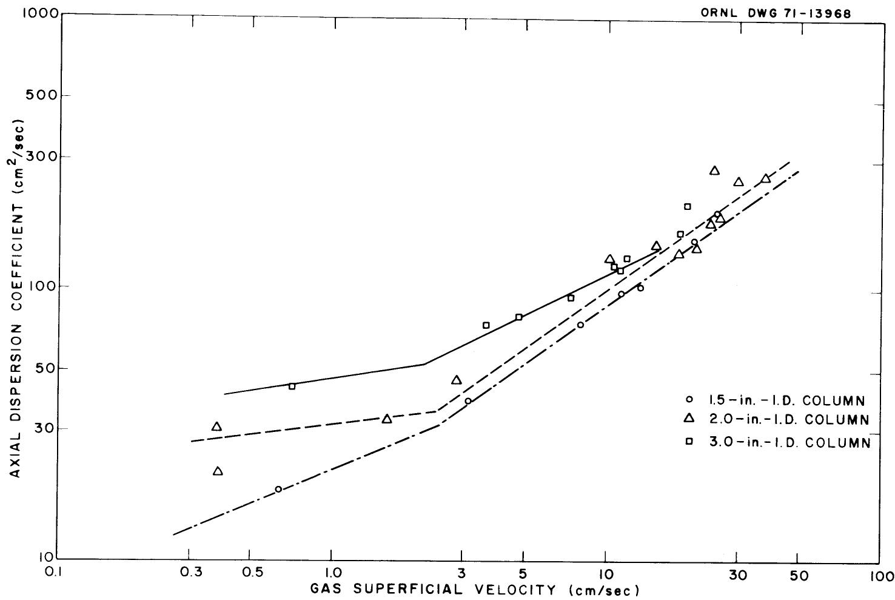  
Fig. 17. Variation of Axial Dispersion Coefficient with Gas Superficial Velocity and Column Diameter in Open Bubble Columns Having Diameters of 1.5, 2, and 3 in.

The line shown for a column diameter of 2 in. is the same as that reported earlier, based on data obtained by use of the steady-state technique. In the present study, however, data have been obtained at higher gas flow rates than were previously used; these data show minimal scatter, and thus the curves for the various column diameters are more clearly defined. On the basis of these data, the transient technique appears to be far superior to the earlier steady-state technique in that (1) less scatter is observed in the dispersion coefficient data, and (2) data can be obtained much more rapidly with the transient technique. A typical run using the transient technique requires less than 10 min, whereas more than 2 hr is required for a run using the steady-state technique.

The data on axial dispersion obtained with the 1.5-in.-diam column are quite similar to those reported earlier. However, the high quality of the present data shows that, at high gas flow rates, the dispersion coefficient values obtained with the 1.5-in. column are slightly lower than values obtained with a 2-in.-diam column at the same superficial gas velocity. When the gas flow rate is increased sufficiently to produce a slugging condition, the dispersion coefficient data for the two column diameters result in parallel lines that are separated by about $15\%$ . At lower gas flow rates where bubbly flow occurs, the curves for the two column diameters have widely different slopes (as had been reported earlier). The slope of the curve for the 1.5-in.-diam column appears to change only slightly in moving from bubbly to slug flow.

Thus far, the principal advantage of using the transient technique has been improved axial dispersion coefficient data for the 3-in.-diam column. Although the scatter in the present data increases as the column diameter is increased, the data for the 3-in.-diam column appear to adequately define the dependence of axial dispersion coefficient on superficial gas velocity. There appear to be three distinct regions of operation, and the data from each region can be fit by a straight line as indicated in Fig. 17. In the first region, bubbly flow is observed for superficial gas velocities up to about $3\mathrm{cm/sec}$ . The second mode of operation consists of a transition region covering superficial gas veloc

ities from about 3 to about $25~\mathrm{cm / sec}$ . The third mode of operation consists of slug flow, which occurs at superficial gas velocities greater than $25~\mathrm{cm / sec}$ . The axial dispersion coefficient values measured with the 2- and 3-in.-diam columns in the slug flow region show little difference.

# 5.7 Discussion of Data on Gas Holdup

The variation of gas holdup with superficial gas velocity and column diameter is shown in Fig. 18. At low gas flow rates (in which bubbly flow occurs), gas holdup is proportional to the superficial gas velocity and is independent of the column diameter. At higher gas flow rates, gas hold-up data from the different column diameters begin to diverge and holdup increases, but in a more gradual manner, as the gas superficial velocity increases; for a given gas superficial velocity, holdup increases as the column diameter is decreased.

Davies and Taylor<sup>10</sup> report that the rate of rise of a single gas "slug" in a column filled with stationary liquid is given by the relation:

$$
v _ {1} = 0. 3 5 \sqrt {g d}, \tag {24}
$$

where

$\mathrm{V}_{\perp} =$ rate of rise of gas slug, $\mathbf{g} =$ gravitational acceleration, d $=$ column diameter.

In an open bubble column operating at steady state, a number of gas slugs will be essentially evenly spaced throughout the column. In this case, the relative velocity of the liquid between the gas slugs will be equal to the superficial gas velocity. If the slug velocity as defined by Davies and Taylor is assumed to be the relative velocity between liquid and gas in an open bubble column, the gas holdup would be given by the relation:

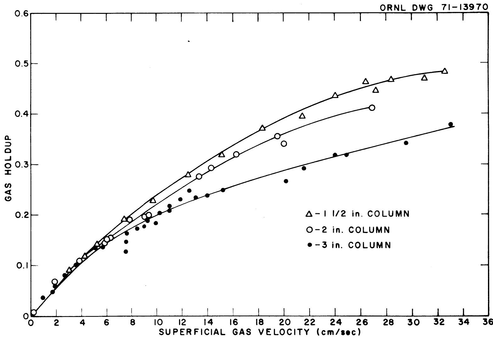  
Fig. 18. Variation of Gas Holdup with Superficial Gas Velocity and Column Diameter in Open Bubble Columns.

$$
\begin{array}{l} \phi = \frac {V _ {g}}{V _ {g} + V _ {1}} \tag {25} \\ = \frac {v _ {g}}{v _ {g} + 0 . 3 5 \sqrt {g a}} \\ \end{array}
$$

where

$$
\begin{array}{l} \phi = \text {g a s} \\ V _ {g} = \text {s u p e r f i c i a l g a s v e l o c i t y}. \\ \end{array}
$$

A plot of the gas holdup data in the form suggested by Eq. (25) is shown in Fig. 19. It should be noted that the holdup data from the 1.5-, 2-, and 3-in.-diam columns are brought together on a single line which passes through the origin. However, the slope of the line is approximately 0.78, rather than the expected value of 1.0. Thus, while Eq. (25) does not produce an exact fit of the gas holdup data, it appears to be useful in suggesting a form for correlating the data. Because the slope of the resulting line is not unity, the theoretical basis for the correlation still must be established.

# 5.8 Conclusions

An improved experimental method for measuring axial dispersion coefficients in open bubble columns has been developed. This method, an unsteady-state technique, has been shown to be more accurate and to be applicable over a wider range of superficial gas velocities than the steady-state technique employed previously. In addition, use of the transient technique allows completion of an experiment in less than $10\%$ of the time required for the steady-state technique. Axial dispersion coefficient data obtained in columns having diameters of 1.5, 2, and 3 in. are in agreement with previously obtained data. A theoretical basis for correlating these data, as well as those on gas holdup in bubble columns, must be developed before such results can be used to predict gas holdup and the effect of axial dispersion in continuous fluorinators.

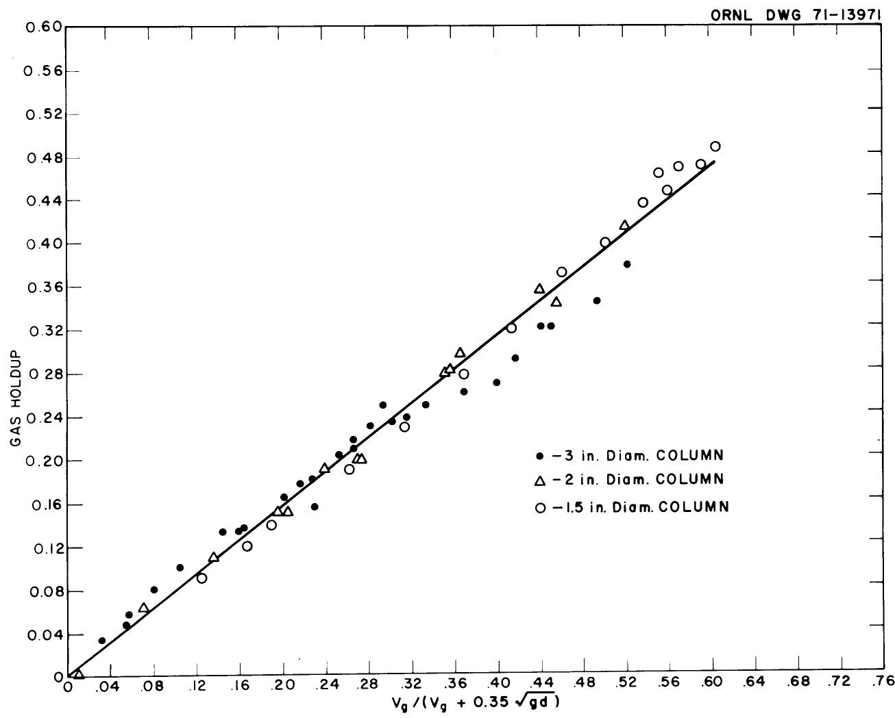  
Fig. 19. Variation of Gas Holdup in 1.5-, 2-, and 3-in.-diam Open Bubble Columns with the Quantity $\frac{V_g}{V_g + 0.35\sqrt{gd}}$ .

The unsteady-state technique for measuring axial dispersion coefficients does not require water to be fed through the open bubble column, and it may prove especially useful in studying effects on axial dispersion resulting from changes in the physical properties of the continuous (water) phase. Since at least one measurement (and possibly several measurements) of the axial dispersion coefficient can be made with one column volume of the liquid phase, it should be possible to work with materials that would have been considered too expensive with the steady-state technique.

# 6. DEVELOPMENT OF THE METAL TRANSFER PROCESS

E. L. Youngblood L. E. McNeese

It has been found that rare earths distribute selectively into molten lithium chloride from bismuth solutions containing rare earths and thorium, and an improved rare-earth removal process based on this observation has been devised. We are currently engaged in a demonstration of all phases of the improved rare-earth removal method, which is known as the metal transfer process. In a previous engineering experiment (MTE-1), we studied the removal of rare earths from single-fluid MSBR fuel salt by this process. During this experiment, approximately $50\%$ of the lanthanum and $25\%$ of the neodymium originally present in the fluoride salt were removed at approximately the predicted rate. However, the lanthanum and neodymium that were removed from the fluoride salt did not accumulate in the lithium-bismuth solution used for removing these materials from lithium chloride as expected. Reaction of impurities in the system with the rare earths is believed to have caused this unexpected behavior. A second engineering experiment (MTE-2) is currently under way. The main objectives of this experiment are: (1) to demonstrate the selective removal of rare earths from fluoride salt containing thorium fluoride, (2) to collect the rare earths in a Li-Bi solution, and (3) to verify previous distribution coefficient data.

# 6.1 Equipment for Experiment MTE-2

Experiment MTE-2 is being carried out in a vessel made of 6-in.-diam carbon-steel pipe (see Fig. 20). The vessel is divided into two compartments by a partition that extends to within $1/2$ in. of the bottom of the vessel. The compartments are interconnected by a 2-in.-deep pool of thorium-saturated molten bismuth, which forms a seal between the two compartments. One compartment contains MSBR fuel carrier salt (72-16-12 mole $\%$ LiF- $BeF_2$ - $ThF_4$ ) to which tracer quantities of $^{147}\text{Nd}$ and sufficient $LaF_3$ to produce a lanthanum concentration of 0.3 mole $\%$ were added. The other compartment contains LiCl, Li-Bi solution (in a cup), and a pump for circulating the LiCl through the cup at a flow rate of about $25\text{cm}^3/\text{min}$ . The concentration of reductant (35 at. $\%$ Li) in the Li-Bi solution is sufficiently high to permit essentially all of the lanthanum and neodymium to be extracted from LiCl in equilibrium with the Li-Bi solution.

In order to obtain mixing in the main bismuth pool, about $10\%$ of the metal volume is forced to flow back and forth every 7 min through the 1/2-in. slot located below the partition between the fluoride and chloride compartments. This flow is effected by reducing the pressure of the argon cover gas in the fluoride compartment relative to that in the chloride compartment. Gas-lift sparge tubes are used to disperse droplets of bismuth in the salt phase to improve contact between the salt and bismuth phases in each compartment. Lumps of thorium metal (a total of $149\mathrm{g}$ ), measuring approximately 0.5 in. on a side, were placed in the bottom of the vessel in order to ensure that the bismuth phase is saturated with thorium. The amount of thorium added in this manner is about five times the amount that could dissolve in the bismuth. The lower section of the vessel is heated to the operating temperature (650 to $660^{\circ}\mathrm{C}$ ) by an 8-kW furnace. The flange and upper 6 in. of the vessel are wrapped with cooling coils through which water flows in order to maintain the flange at approximately $100^{\circ}\mathrm{C}$ . This provision prevents damage to the neoprene gasket used for sealing the flange to the vessel. The exterior of the vessel was spray coated with 20 mils of nickel aluminide to protect against air oxidation of the carbon steel.

ORNL DWG 70-12503

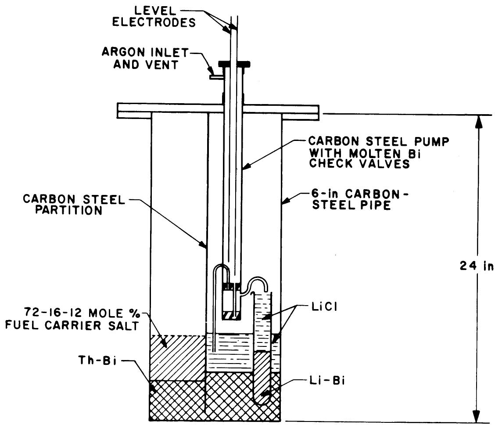  
Fig. 20. Carbon Steel Vessel Used for Metal Transfer Experiment MTE-2.

The pump used for circulating the LiCl through the cup containing the Li-Bi solution is constructed of carbon steel and uses molten bismuth as check valves (see Fig. 21). The quantity of LiCl pumped during one cycle of operation is controlled by level electrodes (in the pump chamber) that actuate a solenoid valve in a gas supply line to the pump chamber. A pressure of about 18 in. $\mathrm{H}_2\mathrm{O}$ is maintained in the LiCl compartment of the main vessel by the use of a mercury bubbler in the vessel off-gas. When the pressure in the pump chamber is decreased to near atmospheric pressure, LiCl flows into the pump chamber until the upper electrode is contacted by salt. At this point, the solenoid valve opens and argon is admitted into the pump chamber to discharge the LiCl. When the salt level falls below the lower electrode, the solenoid valve is closed and the pump chamber is again vented. The pumping rate is determined by the distance between the two electrodes and the frequency of the pumping cycle. An electrically operated counter is attached to the solenoid valve in order to record the number of pumping cycles that have occurred.

Provisions were made for obtaining filtered samples of the salt and bismuth phases in the experiment. The samplers, which are constructed of stainless steel, consist of 1/4-in.-OD, 1-in.-long stainless steel capsules that have a length of 1/16-in.-OD capillary tubing attached to one end and a porous metal filter (mean pore size, $20\mu$ ) attached to the other. In preparation for obtaining a sample, the capillary tubing is inserted through a hole in a Teflon plug located in a chamber above a ball valve leading into the system. The chamber is purged with argon before the ball valve is opened in order to prevent air from entering the system. The capillary tube is used to push the sample to the proper location within the vessel. An argon purge is maintained through the capillary tubing to prevent material from entering the sampler before the sampler reaches the level at which a sample is to be taken. When the sampler is in position, a sample is obtained by applying vacuum to the capillary tubing. The sample is then removed and prepared for analysis by removing the filter and capillary tubing and cleaning the outside surface of the sampler with emery cloth. The sample is analyzed for neodymium and radium by direct gamma counting; the lanthanum concentration is determined by a neutron activation technique after the sample has been dissolved.

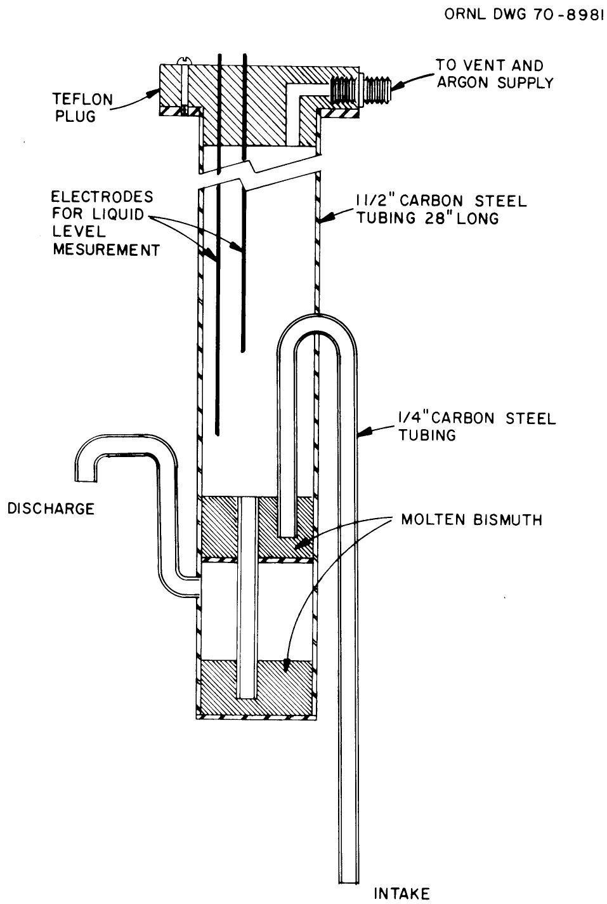  
Fig. 21. Carbon Steel Pump Having Molten Bismuth Check Valves Used to Circulate LiCl in Metal Transfer Experiment MTE-2.

# 6.2 Materials Used in Experiment MTE-2

The quantities of materials used in experiment MTE-2 are given in Table 8. The LiCl was purified prior to use by contact with thorium-saturated bismuth at $650^{\circ}\mathrm{C}$ . Both the carbon-steel vessel and the bismuth were treated with hydrogen at $650^{\circ}\mathrm{C}$ to remove oxides. The fluoride salt used in the experiment was purified by the Reactor Chemistry Division. The argon used as cover gas for the experiment was purified by passage through a bed of uranium turnings held at $600^{\circ}\mathrm{C}$ and a bed of molecular sieves.

Table 8. Materials Used in Metal Transfer Experiment MTE-2   

<table><tr><td rowspan="2">Material</td><td colspan="2">Quantity</td></tr><tr><td>cm3</td><td>g-moles</td></tr><tr><td>Fluoride salt
(LiF-BeF2-ThF4-LaF3, 72-15.7-12-0.3 mole %, 7 mCi 147NdF3)</td><td>789</td><td>40.7</td></tr><tr><td>Bismuth saturated with thorium</td><td>799</td><td>36.9</td></tr><tr><td>LiCl</td><td>1042</td><td>36.6</td></tr><tr><td>Li-Bi (35 at. % lithium)</td><td>164</td><td>9.5</td></tr></table>

# 6.3 Status of Experiment MTE-2

To date, experiment MTE-2 appears to be operating satisfactorily; however, no data are available at this time.

# 7. SEMICONTINUOUS REDUCTIVE EXTRACTION EXPERIMENTS IN A MILD-STEEL FACILITY

B. A. Hannaford C. W. Kee L. E. McNeese

We have continued operation of a facility in which a system constructed of mild steel can be used to carry out semicontinuous reductive extraction experiments.[12] Initial work with the facility was directed toward obtaining data on the hydrodynamics of countercurrent flow of molten salt and bismuth in an 0.82-in.-ID, 24-in.-long column packed with $1/4$ -in. molybdenum Raschig rings. We have been able to show that flooding data obtained with this column are in agreement with predictions from a correlation based on studies of the countercurrent flow of mercury and aqueous solutions in packed columns.[13] We have recently undertaken experiments for determining the mass transfer performance of the packed column. In the initial experiments, a salt stream containing $\mathrm{UF}_4$ was countercurrently contacted, over a wide range of operating conditions, with bismuth containing reductant. The first uranium mass transfer experiment (UTR-1) was very successful hydrodynamically and demonstrated that simultaneous samples of the bismuth and salt streams leaving the extraction column can be taken easily. However, the run failed to provide mass transfer data because of difficulties that prevented the addition of reductant to the bismuth prior to the experiment.[14] During the second uranium mass transfer run (UTR-2), bismuth containing reductant was fed to the column at the rate of $247~\mathrm{cm}^3/\mathrm{min}$ , and salt (72-16-12 mole % LiF- $\mathrm{BeF}_2$ -ThF₄) containing 3000 ppm of uranium as $\mathrm{UF}_4$ was fed to the column at the rate of $52~\mathrm{cm}^3/\mathrm{min}$ . The flow rates of bismuth and salt were both steady over a period of about 40 min, and 95% of the uranium was extracted from the salt.[14] The experiment represented the first known demonstration of the continuous extraction of uranium from molten salt into bismuth containing reductant and was encouraging in that it suggested that high uranium removal efficiencies can be obtained in a packed column having a reasonable length.

# 7.1 Preparation for Mass Transfer Run UTR-3

Following run UTR-2, the salt and bismuth were returned to the treatment vessel and $122.5\mathrm{g}$ of thorium metal was added to the graphite crucible through a 3/4-in.-diam tube. Periodically, bismuth samples were taken with graphite ladles. Analyses of these samples showed that the thorium concentration in the bismuth increased at the rate of about $2\mathrm{ppm/hr}$ , which is the same rate of increase observed following the earlier addition of thorium to the bismuth feed tank prior to run UTR-2. The thorium concentration in the bismuth was only $800\mathrm{ppm}$ after $250\mathrm{hr}$ , which is far below its solubility at $660^{\circ}\mathrm{C}$ (i.e., $3500\mathrm{ppm}$ ). The rate of dissolution appeared to be limited by poor contact of the bismuth with the 0.5-in. cubes of thorium. In order to improve the extent of contact between thorium and bismuth, a second charge of thorium metal $(119\mathrm{g})$ was loaded into a 1-in.-diam, 6-in.-long perforated steel basket and was lowered into the bismuth phase. After this addition, the observed thorium dissolution rate increased to about ten times the earlier rate (20 ppm/hr based on graphite ladles samples, and 25 ppm/hr based on change in weight of the addition basket). About $85\%$ of the thorium dissolved during a 22-hr period. After approximately 24 additional hours, the thorium concentration in a ladled bismuth sample was $1665\mathrm{ppm}$ , which is $95\%$ of the value expected from complete dissolution.

Surprisingly, bismuth samples taken 50, 100, and 350 hr after completion of the thorium addition showed a sharp decrease in thorium concentration (to 1000 ppm), which was followed by a slow increase in thorium concentration (to 1200 ppm). In order to check for a concentration gradient within the pool of bismuth, samples were taken with a ladle at a point about 1 in. from the bottom of the vessel and at a point close to the bismuth-salt interface (about 6 in. from the bottom of the vessel). Two pairs of samples showed that the thorium concentration was higher near the bottom of the vessel (17% higher in one case and 88% in the other). This behavior can be explained as follows. After thorium had been added to the bismuth, the composition of the bismuth phase changed slowly as the bismuth and salt

approached a state of chemical equilibrium. During this period, part of the thorium was oxidized from the bismuth phase by reaction with LiF from the salt and was replaced with the same number of equivalents of lithium. In the absence of mixing in the bismuth phase, a sharp density gradient would have been produced in which the least-dense material would occur at the top of the bismuth pool and the most-dense material would occur at the bottom of the bismuth pool. It was concluded that the mixing within the bismuth phase was inadequate to maintain a uniform composition.

Filtered samples of the bismuth phase were usually taken, using the stainless steel samplers, at the same time that samples were obtained with a graphite ladle. The thorium content of samples obtained in the stainless steel samplers was consistently lower than that of samples obtained with the graphite samplers. In order to check the possibility that the method for preparing the filtered samples for analysis might be at fault, two stainless steel samplers were cut into two or three segments and analyzed separately. The results showed that the thorium concentration in the bottom third of the sample capsule was much higher (about 1900 ppm) than in the upper third (about 300 ppm). This clearly confirmed our suspicion that thorium was concentrating in the bottom of the sample capsule during the slow freezing of the sample. Presumably, the observed concentration of thorium resulted from the fact that the density of thorium bismuthide $(11.4\mathrm{g/cm}^3)$ is greater than the density of bismuth $(9.66\mathrm{g/cm}^3)$ . Thus, the method for preparing samples taken in a stainless steel sampler, which involved discarding the bottom of the capsule (containing the porous metal filter and about $15\%$ of the bismuth), resulted in substantial errors in the measured thorium concentration. The sample preparation method was revised so that the outside surface of the porous metal frit was mechanically cleaned; however, the frit was left attached to the capsule. We have continued to rely primarily on samples obtained with a graphite ladle for analyzing for thorium in bismuth because the metal sample can easily be removed from the ladle and is not subject to difficulties peculiar to the leaching operation required for the filtered samples.

# 7.2 Mass Transfer Run UTR-3

Immediately prior to run UTR-3, about 5 liters of salt was transferred from the treatment vessel to the salt feed tank. On completion of this operation, a total of 15 liters of salt, in which the uranium concentration was about 2000 ppm, was present in the feed tank. About 15 liters of bismuth was then transferred from the treatment vessel to the bismuth feed tank. The experiment was initiated by setting the salt flow rate through the column at approximately the desired value; subsequently, the flow of bismuth through the column was initiated as shown in Fig. 22. During the initial part of the run, bismuth and salt were countercurrently contacted in the packed column at flow rates of 205 and $100\mathrm{cm}^3/\mathrm{min}$ , respectively. Five sets of samples were obtained from the salt and bismuth streams leaving the column at the times indicated in Fig. 22. The salt flow rate was then increased to 160 $\mathrm{cm}^3/\mathrm{min}$ , and a single set of salt and bismuth samples was taken after a salt volume equivalent to three column volumes had passed through the column. The salt flow rate was then increased to $220\mathrm{cm}^3/\mathrm{min}$ , and a final set of salt and bismuth samples was taken after three additional column volumes of salt had passed through the column. The temperature along the extraction column during the run varied from $627^\circ\mathrm{C}$ at the bottom of the column to $640^\circ\mathrm{C}$ at the top.

Data obtained during run UTR-3 are summarized in Table 9. The high uranium concentration in the first salt sample is probably the result of dilution in the salt effluent piping which initially contained salt with a uranium concentration equal to that in the feed tank. For this reason, the point corresponding to this sample was excluded from consideration in calculating the fraction of uranium that was transferred. As the bismuth-to-salt flow rate ratio was decreased, the fraction of the uranium removed from the salt decreased, as expected, from an average value of 0.91 during the first period of operation to 0.73 during the final period of operation. As in the previous run, the uranium concentration in the bismuth in the receiver tank (528 ppm) was significantly higher than that which would be calculated (about 440 ppm) by integrating the product of the uranium con

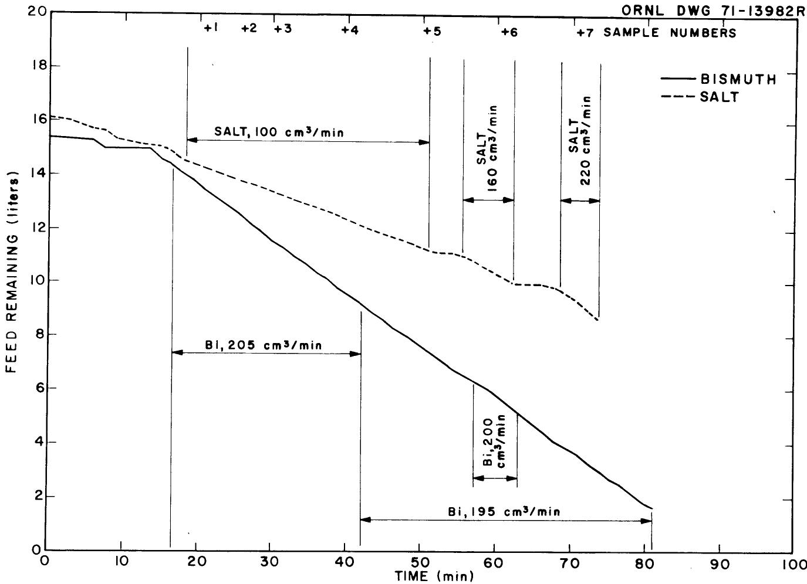  
Fig. 22. Volumes of Bismuth and Salt Remaining in Feed Tanks vs Run Time, Run UTR-3. Volumetric flow rate (ml/min) for each indicated interval was inferred from the slope.

Table 9. Summary of Mass Transfer Data Obtained During Run UTR-3   

<table><tr><td rowspan="3">Sample</td><td rowspan="3">Uranium Conc. in Salt Phase (ppm)</td><td rowspan="3">Fraction of Uranium Remaining in Salt</td><td rowspan="3">Volumetric Flow Ratio, Bismuth/Salt</td><td colspan="8">Bismuth Phase</td><td></td></tr><tr><td colspan="2">U Conc.</td><td colspan="2">Zr Conc.</td><td colspan="2">Th Conc.</td><td colspan="2">Li Conc.</td><td rowspan="2">Sum meq/liter</td></tr><tr><td>ppm</td><td>meq/liter</td><td>ppm</td><td>meq/liter</td><td>ppm</td><td>meq/liter</td><td>ppm</td><td>meq/liter</td></tr><tr><td>Feed tanks</td><td>2100</td><td></td><td></td><td>200</td><td>32.4</td><td>40</td><td>6.6</td><td>1200</td><td>199</td><td>\( 30^a \)</td><td>41.4</td><td>280</td></tr><tr><td colspan="13">Flowing stream</td></tr><tr><td>1</td><td>461</td><td>0.220</td><td>2.05</td><td>475</td><td>77.1</td><td>57</td><td>9.4</td><td>254</td><td>42.3</td><td>34</td><td>47.3</td><td>176</td></tr><tr><td>2</td><td>103</td><td>0.049</td><td>2.05</td><td>405</td><td>65.8</td><td>37</td><td>6.1</td><td>420</td><td>70.0</td><td>37</td><td>51.5</td><td>193</td></tr><tr><td>3</td><td>160</td><td>0.076</td><td>2.05</td><td>404</td><td>65.6</td><td>47</td><td>7.7</td><td>300</td><td>50.0</td><td>40</td><td>55.7</td><td>179</td></tr><tr><td>4</td><td>158</td><td>0.075</td><td>2.05</td><td>362</td><td>58.8</td><td>43</td><td>7.1</td><td>208</td><td>34.6</td><td>36</td><td>50.1</td><td>151</td></tr><tr><td>5</td><td>326</td><td>0.155</td><td>2.05</td><td>420</td><td>68.2</td><td>54</td><td>8.9</td><td>282</td><td>47.0</td><td>35</td><td>48.7</td><td>173</td></tr><tr><td>6</td><td>445</td><td>0.217</td><td>1.22</td><td>458</td><td>74.4</td><td>55</td><td>9.0</td><td>192</td><td>32.0</td><td>27</td><td>37.6</td><td>153</td></tr><tr><td>7</td><td>561</td><td>0.267</td><td>0.91</td><td>502</td><td>81.5</td><td>53</td><td>8.7</td><td>226</td><td>37.6</td><td>27</td><td>37.6</td><td>165</td></tr><tr><td>Ave.</td><td></td><td></td><td></td><td></td><td></td><td></td><td></td><td></td><td></td><td></td><td></td><td>170</td></tr><tr><td>Receiver tanks</td><td>272</td><td></td><td></td><td>528</td><td>85.7</td><td></td><td></td><td>407</td><td>67.8</td><td>34</td><td>47.3</td><td>\( 209^b \)</td></tr><tr><td colspan="13">U balance,flowing stream samples = U entering Bi U leaving salt = 129 millimoles U U = 0.78</td></tr></table>

Equilibrium lithium concentration calculated from thorium analysis.   
bAssume zirconium concentration $= 8.1$ meq/liter.

centration in the flowing bismuth samples and the bismuth flow rate. A similar difference is also noted in the measured and calculated values for the total number of equivalents of transferrable materials (U, Th, Zr, and Li) per liter of bismuth. This quantity should be invariant during an experiment, except for changes resulting from the fact that the uranium in the exit salt has a valence of $3+$ rather than $4+$ as in the entering salt. However, this effect accounts for only about 5 meq of reductant per liter, or less than $2\%$ of the total milliequivalents of transferrable materials per liter of bismuth. Therefore, the observed variation in the number of milliequivalents of transferrable materials per liter of bismuth must be ascribed to errors in the sampling procedure or in the method of analysis, or to the presence of oxidants in the system. The uranium material balance during the run was $78\%$ , based on analysis of the flowing stream samples.

# 7.3 Preparation for Mass Transfer Run UTR-4

Following mass transfer run UTR-3, both the salt phase and the bismuth phase were transferred to the treatment vessel for a 16-hr equilibration period. After both phases were sampled, most of the salt was transferred to the salt feed tank. At this point, the treatment vessel contained about 15 liters of bismuth and about 2 liters of salt. Sufficient thorium metal was charged to the treatment vessel to produce a thorium concentration of about 1000 ppm, which is about $10\%$ greater than the solubility of thorium in bismuth at the bismuth feed tank operating temperature (900 ppm at $540^{\circ}\mathrm{C}$ ). A filtered sample of the bismuth taken $44\mathrm{hr}$ after addition of the thorium indicated a thorium concentration of 980 ppm, which is near the expected value. The rate of dissolution of the thorium, based on the observed thorium concentration, was about that observed prior to run UTR-3. However, visual inspection of the thorium addition basket showed that less than half of the thorium had dissolved in the bismuth. The basket was returned to the bismuth phase, and the temperature of the treatment vessel was increased from $600^{\circ}\mathrm{C}$ to $660^{\circ}\mathrm{C}$ . After a total period of 115 hr, the addition basket was removed and weighed. It was found that about $90\%$ of the thorium had dissolved. The bismuth was then sampled and transferred to the bismuth feed

tank. The reported thorium contents of two samples removed from the treatment vessel were 828 ppm and 710 ppm. Because of the discrepancies in these concentrations, three additional samples of the bismuth were taken from the bismuth feed tank and were analyzed by both the colorimetric method and a spectroscopic technique. Results of these analyses are shown in Table 10. Although the values reported for the two different analytical techniques showed appreciable scatter, the bismuth in the feed tank appeared to have a nonuniform composition. The lower concentration of thorium near the bottom of the tank might have been due to a lower temperature at the bottom of the tank and a correspondingly lower thorium solubility.

Table 10. Thorium Concentrations Reported for Bismuth Samples Removed from the Bismuth Feed Tank Prior to Run UTR-4   

<table><tr><td rowspan="2">Location at Which Sample Was Taken</td><td rowspan="2">Type of Sampler</td><td colspan="2">(Thorium Concentration (ppm)</td></tr><tr><td>Colorimetric Analysis</td><td>Spectroscopic Analysis</td></tr><tr><td>Bottom of tank</td><td>Graphite ladle</td><td>714</td><td>830</td></tr><tr><td>15 in. from bottom</td><td>Graphite ladle</td><td>1080</td><td>1200</td></tr><tr><td>Middle of bismuth pool</td><td>Stainless steel, filtered</td><td>1189</td><td>920</td></tr></table>

# 7.4 Mass Transfer Run UTR-4

Immediately prior to run UTR-4, about 15 liters of bismuth and about 15 liters of salt were transferred from the treatment vessel to the salt and bismuth feed tanks. The uranium concentration in the salt was 1681 ppm. As shown in Fig. 23, the run was initiated by starting a salt flow at a low rate through the column. After the salt metering system was determined to

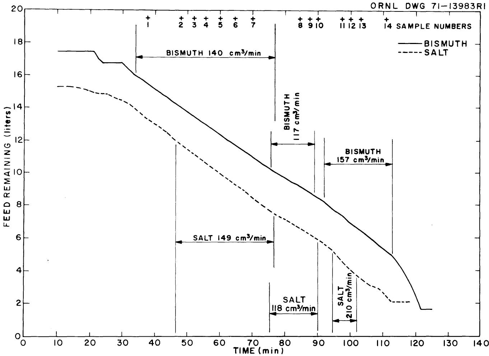  
Fig. 23. Volumes of Bismuth and Salt Remaining in Feed Tanks vs Run Time, Run UTR-4.

be functioning satisfactorily, a bismuth flow was started through the column, and the salt and bismuth flow rates were adjusted to 149 and $140~\mathrm{cm}^3/$ min, respectively. Seven pairs of salt and bismuth samples were obtained from the salt and bismuth streams leaving the column. The salt and bismuth flow rates were then decreased to 118 and $117~\mathrm{cm}^3/$ min, respectively, and three pairs of salt and bismuth samples were withdrawn. The salt and bismuth flow rates were then adjusted to 210 and $157~\mathrm{cm}^3/$ min, respectively. However, these flow rates were maintained during only about one-half of the remainder of the run. During this period, four additional pairs of salt and bismuth samples were taken from the salt and bismuth streams leaving the column. The temperature along the extraction column during the run varied from $615^{\circ}\mathrm{C}$ at the bottom of the column to $630^{\circ}\mathrm{C}$ at the top.

Data obtained during run UTR-4 are summarized in Table 11. A noticeable change in the fraction of uranium extracted from the salt is observed as the bismuth-to-salt flow rate ratio varies throughout the range 0.75 to 1.0. The total number of milliequivalents of transferrable materials per liter of bismuth in the bismuth stream leaving the column was essentially constant throughout the run, and is in agreement with the value obtained by analyzing a sample from the bismuth receiver tank. The total number of milliequivalents of transferrable materials per liter of bismuth, as indicated by analysis of bismuth from the feed tank, is about $30\%$ higher than values observed during the run and values obtained by analyzing the material present in the bismuth receiver tank. The indicated lithium concentration in the bismuth in the feed tank is higher than expected and could signify that the bismuth sample was contaminated with salt. A slight change in the total number of milliequivalents of transferrable materials per liter of bismuth is expected since the uranium remaining in the salt has a valence of $3+$ rather than $4+$ as in the inlet salt. However, this effect would result in a change of only about 10 meq of transferrable materials per liter of bismuth.

Table 11. Summary of Mass Transfer Data Obtained During Run UTR-4   

<table><tr><td rowspan="3">Sample</td><td rowspan="3">Uranium Conc. in Salt Phase (ppm)</td><td rowspan="3">Fraction of Uranium Remaining in Salt</td><td rowspan="3">Volumetric Flow Ratio, Bismuth/Salt</td><td colspan="9">Bismuth Phase</td></tr><tr><td colspan="2">U Conc.</td><td colspan="2">Zr Conc.</td><td colspan="2">Th Conc.</td><td colspan="2">Li Conc.</td><td rowspan="2">Sum meq/liter</td></tr><tr><td>ppm</td><td>meq/liter</td><td>ppm</td><td>meq/liter</td><td>ppm</td><td>meq/liter</td><td>ppm</td><td>meq/liter</td></tr><tr><td>Feed tanks</td><td>1681</td><td></td><td></td><td>480</td><td>77.8</td><td>53</td><td>8.7</td><td>1097</td><td>182</td><td>67</td><td>92.5</td><td>361</td></tr><tr><td>Flowing stream</td><td></td><td></td><td></td><td></td><td></td><td></td><td></td><td></td><td></td><td></td><td></td><td></td></tr><tr><td>1</td><td>473</td><td>0.281</td><td>0.94</td><td>753</td><td>122</td><td>71</td><td>11.7</td><td>342</td><td>57.0</td><td>36</td><td>50.1</td><td>241</td></tr><tr><td>2</td><td>549</td><td>0.327</td><td>0.94</td><td>745</td><td>121</td><td>38</td><td>6.3</td><td>399</td><td>66.5</td><td>40</td><td>55.7</td><td>250</td></tr><tr><td>3</td><td>431</td><td>0.256</td><td>0.94</td><td>784</td><td>127</td><td></td><td></td><td>448</td><td>74.6</td><td>13</td><td>18.1</td><td></td></tr><tr><td>4</td><td>636</td><td>0.378</td><td>0.94</td><td>544</td><td>88</td><td>32</td><td>5.3</td><td>332</td><td>55.3</td><td>29</td><td>40.4</td><td>189</td></tr><tr><td>5</td><td>515</td><td>0.306</td><td>0.94</td><td>773</td><td>126</td><td>39</td><td>6.4</td><td>467</td><td>77.8</td><td>31</td><td>43.2</td><td>253</td></tr><tr><td>6</td><td>495</td><td>0.294</td><td>0.94</td><td>724</td><td>118</td><td>38</td><td>6.2</td><td>499</td><td>83.1</td><td>34</td><td>47.3</td><td>255</td></tr><tr><td>7</td><td>572</td><td>0.340</td><td>0.94</td><td>644</td><td>105</td><td>44</td><td>7.2</td><td>595</td><td>99.1</td><td>35</td><td>48.7</td><td>260</td></tr><tr><td>Ave.</td><td></td><td>0.312</td><td></td><td></td><td></td><td></td><td></td><td></td><td></td><td></td><td></td><td></td></tr><tr><td>8</td><td>441</td><td>0.262</td><td>1.0</td><td>833</td><td>135</td><td>32</td><td>5.3</td><td>508</td><td>84.6</td><td>33</td><td>45.9</td><td>271</td></tr><tr><td>9</td><td>458</td><td>0.272</td><td>1.0</td><td>597</td><td>97</td><td>50</td><td>8.2</td><td>395</td><td>65.8</td><td>34</td><td>47.3</td><td>218</td></tr><tr><td>10</td><td>418</td><td>0.249</td><td>1.0</td><td>645</td><td>105</td><td>42</td><td>6.9</td><td>391</td><td>65.1</td><td>34</td><td>47.3</td><td>224</td></tr><tr><td>Ave.</td><td></td><td>0.261</td><td></td><td></td><td></td><td></td><td></td><td></td><td></td><td></td><td></td><td></td></tr><tr><td>11</td><td>668</td><td>0.397</td><td>0.75</td><td>806</td><td>131</td><td>41</td><td>6.7</td><td>349</td><td>58.1</td><td>31</td><td>43.2</td><td>239</td></tr><tr><td>12</td><td>720</td><td>0.428</td><td>0.75</td><td>778</td><td>126</td><td>34</td><td>5.6</td><td>399</td><td>66.5</td><td>32</td><td>44.5</td><td>243</td></tr><tr><td>13</td><td>551</td><td>0.328</td><td>0.75</td><td>745</td><td>121</td><td>30</td><td>4.9</td><td>488</td><td>81.3</td><td>36</td><td>50.1</td><td>257</td></tr><tr><td>14</td><td>567</td><td>0.337</td><td></td><td>762</td><td>124</td><td>38</td><td>6.2</td><td>493</td><td>82.1</td><td>29</td><td>40.4</td><td>252</td></tr><tr><td>Ave.</td><td></td><td>0.384a</td><td></td><td></td><td></td><td></td><td></td><td></td><td></td><td></td><td></td><td></td></tr><tr><td>Receiver tanks</td><td>423</td><td></td><td></td><td>803</td><td>130.4</td><td>53</td><td>8.7</td><td>586</td><td>97.6</td><td>32</td><td>44.5</td><td>281</td></tr></table>

${}^{a}$ Late from sample 14 was not used in calculating this value because of variation in the salt flow rate.

# 7.5 Mathematical Analysis of Mass Transfer with Primary Resistance to Transfer in the Salt Phase

It has been noted $^{15}$ that the uranium extraction data from runs UTR-3 and -4 can be correlated in terms of the height of an overall transfer unit based on the salt phase (HTU) if several assumptions are made. The chief assumption is that the rate at which uranium transfers to the bismuth phase will be controlled by the diffusive resistance in the salt film when the extraction factor is high and when the salt film is composed largely of non-transferring ions. In runs UTR-3 and -4, a small amount of uranium was added to the salt after it had been equilibrated with the bismuth phase, which contained reductant. Thus, no significant transfer of lithium and thorium between the salt and bismuth occurred in the column. In this case, the overall transfer coefficient based on the salt phase is equal to the individual salt film transfer coefficient. By definition, the HTU and the number of overall transfer units based on the salt phase developed in the column are related as:

$$
\mathrm {H} = \mathrm {H T U} \cdot \mathrm {N T U}, \tag {26}
$$

where

$$
\begin{array}{l} \mathrm {H} = \text {c o l u n n l e n g t h}, \\ \mathrm {H T U} = \text {h e i g h t o f a n o v e r a l l t r a n s f e r u n i t b a s e d o n t h e s a l t p h a s e}, \\ \mathrm {N T U} = \text {n u m b e r o f o v e r a l l t r a n s f e r u n i t s b a s e d o n t h e s a l t p h a s e}. \\ \end{array}
$$

If it is assumed that uranium is the major component transferring from the salt and that the controlling resistance to transfer is in the salt phase, the HTU can be defined as follows:

$$
\mathrm {H T U} = \frac {\mathrm {V}}{\mathrm {k a}}, \tag {27}
$$

where

$$
\begin{array}{l} V _ {s} = \text {s u p e r f i c i a l v e l o c i t y o f s a l t i n t h e c o l u m n , c m / s e c}, \\ k = \text {o v e r a l l m a s s t a n s f e r} \\ a = \text {i n t e r f a c i a l a r e a b e t w e e n s a l t a n d b i s m u t h p h a s e s p e r u n i t c o l u m n} \\ \text {v o l u m e , c m ^ {2} / c m ^ {3}}. \end{array}
$$

It has been observed previously<sup>16</sup> that the dispersed-phase holdup is approximately proportional to the flow rate of the dispersed phase in a packed column, except at conditions near flooding. We would, therefore, expect the interfacial area between the salt and bismuth phases to be proportional to the bismuth flow rate; thus, one can write the following relation:

$$
\mathrm {k a} = \mathrm {k} ^ {\prime} \mathrm {V} _ {\mathrm {B i}}, \tag {28}
$$

where

$$
\begin{array}{l} k ^ {\prime} = a \text {c o n s t a n t}, c m ^ {- 1}, \\ V _ {B i} = \text {s u p e r f i c i a l v e l o c i t y o f t h e b i s m u t h i n t h e c o l u m n , c m / s e c .} \\ \end{array}
$$

The number of overall transfer units (based on the salt phase) developed in the column is defined as:

$$
\mathrm {N T U} = \int_ {\mathrm {X} _ {i}} ^ {\mathrm {X} _ {0}} \frac {\mathrm {d X}}{\mathrm {X} ^ {*} - \mathrm {X}}, \tag {29}
$$

where

$$
\begin{array}{l} X = \text {u r a n i u m} \\ \begin{array}{l} X ^ {*} = \text {u r a n i u m c o n c e n t r a t i o n i n s a l t i n e q u i l i b r i u m w i t h t h e b u l k b i s m u t h} \\ \text {p h a s e , p p m ,} \end{array} \\ X _ {i} = \text {u r a n i u m c o n c e n t r a t i o n i n t h e s a l t f e d t o t h e c o l u m n , p p m}, \\ X _ {O} = \text {u r a n i u m c o n c e n t r a t i o n i n t h e s a l t l e a v i n g t h e c o l u m n , p p m .} \\ \end{array}
$$

As shown in Table 12, the value of $X^*$ at the bottom of the column is much smaller than the value of $X_0$ ; thus, one would expect that the value of $X^*$ would be much less than the value of $X$ throughout the column. In this case, Eq. (29) can be integrated to yield the following expression:

$$
\mathrm {N T U} = - \ln \frac {\mathrm {X} _ {0}}{\mathrm {X} _ {i}}. \tag {30}
$$

Table 12. Summary of Mass Transfer Data Obtained During Uranium Mass Transfer Runs UTR-3 and UTR-4   

<table><tr><td rowspan="2">Run</td><td colspan="3">Uranium Concentration in Salt (ppm)</td><td rowspan="2">Metal-to-Salt Flow Rate Ratio</td><td rowspan="2">Fraction of Flooding</td><td rowspan="2">Fraction of Uranium Remaining in Salt</td></tr><tr><td>Salt Feed, Xi</td><td>Salt Effluent Xo</td><td>Maximum Equilibrium Value,a X*</td></tr><tr><td>UTR-3</td><td>2100</td><td>159</td><td>3.6</td><td>2.05</td><td>0.87</td><td>0.076</td></tr><tr><td></td><td></td><td>445</td><td>9.4</td><td>1.22</td><td>1.04</td><td>0.212</td></tr><tr><td></td><td></td><td>561</td><td>10.3</td><td>0.91</td><td>1.23</td><td>0.267</td></tr><tr><td>UTR-4</td><td>1680</td><td>524</td><td>9.7</td><td>0.94</td><td>0.85</td><td>0.312</td></tr><tr><td></td><td></td><td>439</td><td>7.2</td><td>1.0</td><td>0.69</td><td>0.261</td></tr><tr><td></td><td></td><td>646</td><td>11.5</td><td>0.75</td><td>1.07</td><td>0.384</td></tr></table>

<sup>a</sup>Calculated as the concentration that would be in equilibrium with the observed concentrations of reductant (lithium) and uranium in the bismuth effluent.

Combining Eqs. (26), (27), (28), and (30), and rearranging, yields the relation:

$$
\ln \frac {X _ {0}}{X _ {i}} = - k ^ {\prime} H \frac {V _ {B i}}{V _ {s}}, \tag {31}
$$

which states that a semilogarithmic plot of the fraction of uranium remaining in the salt vs the bismuth-to-salt flow rate ratio should yield a straight line having a slope of $-k'H$ . This line should pass through an ordinal value of 1.0 at a bismuth-to-salt flow rate ratio of zero.

# 7.6 Discussion of Mass Transfer Data from Runs UTR-3 and UTR-4

The mass transfer data obtained during runs UTR-3 and -4 are summarized in Table 12. As shown in Fig. 24, the data are well represented by Eq. (31). For these data, the constant $\mathbf{k}^{\prime}$ has the value of $0.0208\mathrm{cm}^{-1}$ . The product of the overall mass transfer coefficient, based on the salt phase and the interfacial area, is given by the relation:

$$
\mathrm {k a} = 0. 0 2 0 8 \mathrm {V} _ {\mathrm {B i}}, \tag {32}
$$

where

$$
\begin{array}{l} \mathrm {k a = o v e r a l l r a t e c o n s t a n t b a s e d o n t h e s a l t p h a s e , s e c ^ {- 1} ,} \\ \mathrm {V _ {B i} = s u p e r f i c i a l v e l o c i t y o f b i s m u t h i n t h e c o l u m n , c m / s e c .} \end{array}
$$

Values for the overall rate constant for the present data range from 0.012 to 0.021 sec $^{-1}$ and compare favorably with a preliminary value of 0.0076 sec $^{-1}$ measured $^{17}$ for the transfer of uranium from a 96.2-3.6-0.2 wt % Cd-Mg-U solution to a molten salt (50-30-20 mole % MgCl $_2$ -NaCl-KCl) at temperatures ranging from 560 to $610^{\circ}\mathrm{C}$ .

The height of an overall transfer unit based on the salt phase, as calculated from the data from runs UTR-3 and -4, is given by the expression

$$
\mathrm {H T U} = \frac {7 . 4 4}{\mathrm {V} _ {\mathrm {B i}} / \mathrm {V} _ {\mathrm {s}}} \text {,} \tag {33}
$$

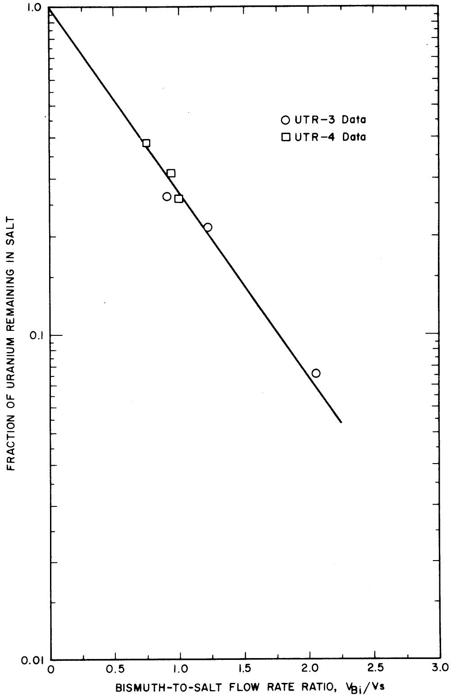  
Fig. 24. Variation of Fraction of Uranium Remaining in Salt with Bismuth-to-Salt Flow Rate Ratio During the Countercurrent Contact of Salt and Bismuth in a 0.82-in.-long Packed Column.

where

HTU = height of the overall transfer unit based on the salt phase,

cm,

$\mathrm{V_{Bi}} / \mathrm{V_s} =$ bismuth-to-salt volumetric flow rate ratio.

The lower and upper limits of the HTU values were 0.77 ft and 2.1 ft, which corresponded to flow rate ratios of 2.05 and 0.75, respectively. The amount of reductant present in the bismuth apparently had no measurable effect on the rate of uranium transfer. Uranium mass transfer data from an earlier experiment (UTR-2) are not in agreement with the data shown in Fig. 24. However, in experiment UTR-2, the thorium reductant was added to the bismuth in the feed tank and the bismuth and salt phases were not in chemical equilibrium with respect to thorium and lithium as they entered the column. Thus, both uranium and lithium were being extracted from the salt phase by reaction with thorium from the bismuth phase, and it is not surprising that the resulting uranium mass transfer rate is not in agreement with data obtained during runs UTR-3 and -4.

# 7.7 Preparation for Zirconium Mass Transfer Experiments; Run UTR-5

In order to measure mass transfer rates in the column under more closely controlled conditions and under conditions where the controlling resistance is not necessarily in the salt phase, preparations were begun for experiments in which the rate of exchange of zirconium isotopes will be measured between salt and bismuth phases otherwise at chemical equilibrium. In the present system, there is no means for effecting a separation of zirconium isotopes; thus, by definition, the separation factor between $^{97} \mathrm{Zr}$ (16.8-hr half-life) and natural zirconium will be unity, as shown in Eq. (34):

$$
\alpha = \frac {\mathrm {D} _ {9 7} z r}{\mathrm {D} _ {z r}} = 1, \tag {34}
$$

where

$$
\begin{array}{l} \alpha = ^ {9 7} \mathrm {Z r - Z r} \text {s e p a r a t i o n f a c t o r ,} \\ D _ {9 7 _ {\mathrm {Z r}}} = ^ {9 7} _ {\mathrm {Z r}} \text {d i s t r i b u t i o n c o e f f i c i e n t}, \\ D _ {Z r} = Z r \text {d i s t r i b u t i o n c o e f f i c i e n t}. \\ \end{array}
$$

This relation also shows that the distribution coefficient for $^{97}\mathrm{Zr}$ will be equal to the distribution coefficient for natural zirconium and hence can be varied at will by adjusting the concentration of reductant in the bismuth phase. In the experiments to be carried out, a small amount of natural zirconium will be added to the system, and prior to each experiment the reductant concentration in the bismuth will be adjusted to obtain the desired zirconium distribution coefficient. Immediately prior to an experiment, $^{97}\mathrm{Zr}$ tracer will be added to the salt or bismuth phase in its respective feed tank, and the phases will be countercurrently contacted in the packed column under the desired operating conditions. During an experiment, the $^{97}\mathrm{Zr}$ tracer will exchange for natural zirconium and the mass transfer performance of the column can be evaluated by determining the $^{97}\mathrm{Zr}$ activity in the salt and bismuth streams leaving the column. This experimental technique has several advantages over the technique used thus far in runs UTR-2, -3, and -4. First, the zirconium distribution coefficient can be adjusted as desired. However, even for high values of the zirconium distribution coefficient, no chemical changes other than the exchange of zirconium isotopes will occur in the salt or bismuth. In this case, the driving force for the transfer of $^{97}\mathrm{Zr}$ between the salt and bismuth phases will be accurately known at all points throughout the column. Since the $^{97}\mathrm{Zr}$ tracer can be added either to the salt or bismuth feed tank, experiments can be carried out in which the primary resistance to mass transfer is in either the salt or bismuth phase, or in which the resistance to transfer in both phases is of importance.

Before the zirconium mass transfer runs could be carried out, it was necessary that (1) most of the reductant be removed from the bismuth, (2) that undissolved thorium added to the bismuth feed tank prior to run UTR-2 be removed, and (3) that the salt and bismuth phases be brought to chemical

equilibrium. It was decided that the best way for effecting these changes consisted of completely removing reductant from the bismuth in the treatment vessel, after which the salt and bismuth would be transferred to their respective feed tanks. An adequate period for dissolution of thorium from the bismuth feed tank would be allowed; then the salt and bismuth would be countercurrently contacted in the packed column. This operation would provide additional information on the hydrodynamics of countercurrent flow in the packed column, and would provide an opportunity to obtain flowing stream salt and bismuth samples under conditions where essentially no uranium mass transfer should occur (and hence essentially no variation should be observed in the uranium concentration in the salt and bismuth streams leaving the column).

The salt and bismuth were transferred to the treatment vessel and were contacted with a nominal 70-30 mole $\%$ $\mathrm{H}_{2}$ -HF mixture for 20 hr. At the end of this period, the salt was sparged, first, with hydrogen for 6 hr in order to reduce $\mathrm{FeF}_{2}$ to metallic iron and, then, with argon at the rate of about $0.13\mathrm{ft}^{3}/\mathrm{hr}$ for 15 hr to ensure complete removal of HF. The salt and bismuth were subsequently sampled and were transferred to their respective feed tanks. After a delay of about 20 hr, the next experiment (UTR-5) was begun.

In the initial part of the experiment, bismuth and salt were fed to the column at the rates of 115 and $123~\mathrm{cm}^3/\mathrm{min}$ , respectively, and seven pairs of samples were taken of salt and bismuth leaving the column (see Fig. 25). Throughout the remainder of the experiment, the salt and bismuth flow rates were varied in order to operate near expected flooding conditions. During this period, six salt samples were obtained from the salt stream leaving the column in order to check for evidence of bismuth entrainment. After about 116 min of operation, the column flooded and an alarm indicating a high salt level in the column was noted. At this point, the bismuth entrainment separator became filled with bismuth. A restriction in the drain line from the entrainment separator prevented the accumulated bismuth from draining out of the salt exit line, and, in

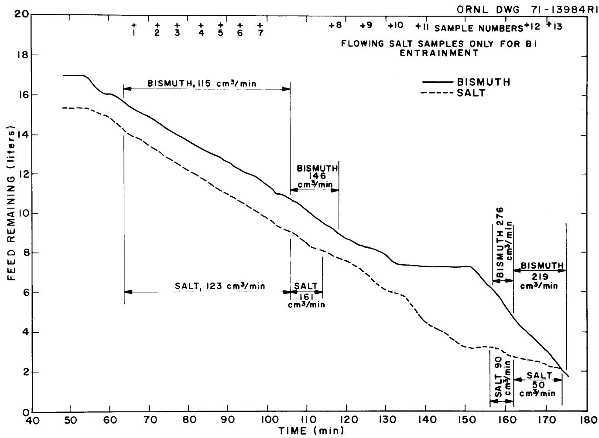  
Fig. 25. Volumes of Bismuth and Salt Remaining in Feed Tanks vs Run Time, Run UTR-5. Volumetric flow rate (ml/min) for each indicated interval was inferred from the slope.

order to overcome the resulting back pressure, an argon overpressure of 21 in. $\mathsf{H}_2\mathsf{O}$ was imposed on the top of the column for the remainder of the experiment. The salt samples taken during the latter half of the experiment contained large quantities of bismuth ( $>50$ vol $\%$ ). It is likely that this was caused by the restriction in the entrainment separator drain line and the subsequent accumulation of bismuth in the salt stream sampler. The temperature along the extraction column during the run varied from $615^{\circ}\mathsf{C}$ at the bottom of the column to $622^{\circ}\mathsf{C}$ at the top.

Data obtained during the first half of the run by analyzing salt and bismuth samples from the treatment vessel, the feed tanks, the salt and bismuth streams leaving the column, and the salt and bismuth receiver tanks are shown in Table 13. The concentration of thorium in the bismuth samples increased, as expected, from about 0.3 ppm for samples from the treatment vessel to 66 ppm for samples from the bismuth receiver tank. Although the increase was less than expected, it does indicate that the holdup of thorium in the bismuth feed and receiver tanks was decreased significantly. The uranium concentration in each of the bismuth samples was below the limit of detection (<1 ppm) except in the case of the receiver tank sample, for which a uranium concentration of 1.1 ppm was indicated. Thus, no transfer of uranium to the bismuth phase occurred during the experiment. Surprisingly, the reported uranium concentrations in the salt samples removed from the column effluent varied by ±35% from the average value, which was in excellent agreement with the indicated uranium concentrations of the salt feed and catch tanks. Under almost the same conditions of flow during run UTR-1, the variation in the indicated uranium concentration in samples of the salt leaving the column was only about ±10%. These results confirmed that, in any future uranium transfer experiments, we must continue to rely upon several pairs of samples at a given set of conditions in order to obtain a reliable estimate of the fraction of the uranium that is transferred.

# 7.8 Summary of Hydrodynamic Data with Present Column

Hydrodynamic data obtained during countercurrent flow of salt and bismuth in the present column are summarized in Table 14. The values for the

Table 13. Concentrations of Uranium and Thorium in Salt and Bismuth Samples from Run UTR-5   

<table><tr><td rowspan="2">Sample Source</td><td colspan="2">Bismuth Samples</td><td rowspan="2">Uranium Conc. in Salt Samples (ppm)</td></tr><tr><td>Thorium Conc. (ppm)</td><td>Uranium Conc. (ppm)</td></tr><tr><td>Treatment vessel</td><td>0.32, 10</td><td>&lt;1</td><td>3030, 3400</td></tr><tr><td>Feed tanks</td><td>9, 1.2</td><td>&lt;1</td><td>3005</td></tr><tr><td>Flowing stream</td><td></td><td></td><td></td></tr><tr><td>1</td><td>3.4</td><td>&lt;1</td><td>2500</td></tr><tr><td>2</td><td>19.</td><td>&lt;1</td><td>3000</td></tr><tr><td>3</td><td>8.3</td><td>&lt;1</td><td>2650</td></tr><tr><td>4</td><td>5.1</td><td>&lt;1</td><td>3240</td></tr><tr><td>5</td><td>0.83</td><td>&lt;1</td><td>3340</td></tr><tr><td>6</td><td>26.</td><td>&lt;1</td><td>4310</td></tr><tr><td>7</td><td>35.</td><td>&lt;1</td><td>2040</td></tr><tr><td>Ave.</td><td>14.</td><td>&lt;1</td><td>3010</td></tr><tr><td>Receiver tanks</td><td>66</td><td>1.1</td><td>3030</td></tr></table>

Table 14. Summary of Hydrodynamic Data Obtained During Countercurrent Flow of Salt and Bismuth in a 0.82-in.-ID, 24-in.-long Column Packed with 1/4-in. Molybdenum Raschig Rings   

<table><tr><td rowspan="2">Run</td><td rowspan="2">Interval (min)</td><td colspan="2">Volumetric Flow Rate (ml/min)</td><td rowspan="2">Bismuth-to-Salt Flow Ratio</td><td rowspan="2">Fraction of Floodinga</td><td rowspan="2">Apparent Bismuth Holdup (%)</td><td rowspan="2">Comments</td></tr><tr><td>Bismuth</td><td>Salt</td></tr><tr><td>HR-9</td><td>18</td><td>80</td><td>85</td><td>0.94</td><td>0.48</td><td>14</td><td></td></tr><tr><td>HR-9</td><td>15</td><td>115</td><td>121</td><td>0.95</td><td>0.69</td><td>14</td><td></td></tr><tr><td>HR-9</td><td>3</td><td>175</td><td>177</td><td>0.99</td><td>1.03</td><td>14</td><td></td></tr><tr><td>HR-9</td><td>2</td><td>221</td><td>133</td><td>1.66</td><td>1.02</td><td>17</td><td></td></tr><tr><td>HR-9</td><td>4</td><td>221</td><td>107</td><td>2.07</td><td>0.93</td><td>--</td><td></td></tr><tr><td>HR-9</td><td>15</td><td>150</td><td>150</td><td>1.00</td><td>0.88</td><td>40</td><td></td></tr><tr><td>HR-10</td><td>12</td><td>45</td><td>68</td><td>0.66</td><td>0.33</td><td>--</td><td></td></tr><tr><td>HR-10</td><td>6</td><td>175</td><td>68</td><td>2.57</td><td>0.68</td><td>--</td><td></td></tr><tr><td>HR-10</td><td>7.5</td><td>274</td><td>72</td><td>3.81</td><td>0.92</td><td>17</td><td></td></tr><tr><td>HR-10</td><td>3</td><td>440</td><td>20.3</td><td>21.7</td><td>0.95</td><td>32</td><td>Holdup increasing; flooding</td></tr><tr><td>HR-11</td><td>8</td><td>210</td><td>51</td><td>4.12</td><td>0.69</td><td>17</td><td></td></tr><tr><td>HR-11</td><td>7</td><td>330</td><td>50</td><td>6.60</td><td>0.93</td><td>17</td><td></td></tr><tr><td>HR-11</td><td>6</td><td>406</td><td>47</td><td>8.64</td><td>1.07</td><td>18-27</td><td>Holdup increasing; flooding</td></tr><tr><td>HR-11</td><td>3.5</td><td>228</td><td>100</td><td>2.28</td><td>0.92</td><td>--</td><td></td></tr><tr><td>UTR-1</td><td>90</td><td>100</td><td>100</td><td>1.0</td><td>0.59</td><td>17</td><td></td></tr><tr><td>UTR-1</td><td>25</td><td>130</td><td>130</td><td>1.0</td><td>0.76</td><td>17</td><td></td></tr><tr><td>UTR-2</td><td>40</td><td>247</td><td>52</td><td>4.75</td><td>0.77</td><td>17</td><td></td></tr><tr><td>UTR-3</td><td>23.5</td><td>205</td><td>100</td><td>2.05</td><td>0.87</td><td>6</td><td></td></tr><tr><td>UTR-3</td><td>9</td><td>195</td><td>100</td><td>1.95</td><td>0.84</td><td>6</td><td></td></tr><tr><td>UTR-3</td><td>5</td><td>200</td><td>160</td><td>1.25</td><td>1.05</td><td>13</td><td></td></tr><tr><td>UTR-3</td><td>5.2</td><td>195</td><td>220</td><td>0.89</td><td>1.22</td><td>10</td><td></td></tr><tr><td>UTR-4</td><td>46</td><td>140</td><td>149</td><td>0.94</td><td>0.85</td><td>16</td><td></td></tr><tr><td>UTR-4</td><td>13</td><td>117</td><td>118</td><td>0.99</td><td>0.69</td><td>16</td><td></td></tr><tr><td>UTR-4</td><td>7.5</td><td>157</td><td>210</td><td>0.75</td><td>1.07</td><td>16</td><td></td></tr><tr><td>UTR-5</td><td>42</td><td>115</td><td>123</td><td>0.93</td><td>0.70</td><td>17</td><td></td></tr><tr><td>UTR-5</td><td>8</td><td>146</td><td>161</td><td>0.91</td><td>0.90</td><td>40</td><td>Holdup increasing; flooding</td></tr><tr><td>UTR-5</td><td>5</td><td>276</td><td>90</td><td>3.07</td><td>1.00</td><td>29</td><td>Holdup increasing; flooding</td></tr><tr><td>UTR-5</td><td>12</td><td>219</td><td>50</td><td>4.38</td><td>0.70</td><td>44</td><td>Holdup increasing; flooding</td></tr></table>

aFraction of flooding $= \left[\left(\mathrm{V}_{\mathrm{salt}}\right)^{1 / 2} + \mathrm{V}_{\mathrm{B}}^{1 / 2}\right] / \mathrm{V}^{1 / 2}$ . The value of $\mathbf{V}_{s}$ (superficial slip velocity) used was 392 ft/hr, which corresponds to 676 ml/min in the present column.

apparent bismuth holdup were calculated from measurements of the pressure at the base of the column (salt inlet), and the column overpressure. During most of the periods of steady-state operation, the values for the apparent bismuth holdup were essentially constant (less than $5\%$ variation during the period); however, in a few periods the variation was considerably larger (about $33\%$ ). A comparison will be made in a later report in this series of the apparent bismuth holdup with previous measurements of the apparent holdup of mercury during countercurrent flow of mercury and aqueous solutions in packed columns. In run UTR-5, flooding was observed at $90\%$ of the calculated flooding condition. This low flooding value could be explained by the nonwetting condition of the salt following the hydrogen-HF treatment. A comparison of the predicted flooding relation resulting from work with mercury and aqueous solutions<sup>16</sup> with the hydrodynamic data summarized in Table 14 is shown in Fig. 26. As can be observed, the agreement between the predicted and measured values is quite satisfactory.

# 7.9 Examination of 304 Stainless Steel Corrosion Specimens from Salt-Metal Treatment Vessel

The 304 stainless steel vessel, which contains the graphite crucible that constitutes the salt-metal treatment vessel, is exposed to an $\mathsf{H}_2$ -HF mixture during the infrequent treatment of bismuth and salt to remove oxides and to transfer dissolved metals from the bismuth to the salt. Corrosion specimens of 304 stainless steel were removed from the treatment vessel after a period of 10 months, which included a total of about 60 hr of exposure to a 30 mole % HF- $\mathsf{H}_2$ mixture. After the specimens were cleaned with a wire brush, a change of only ±0.002 in. in thickness was observed. The temperature of the specimens was about $550^{\circ}\mathrm{C}$ as compared with a nominal vessel temperature of $600^{\circ}\mathrm{C}$ . On the basis of these data, corrosion of the stainless steel treatment vessel to the present time is judged to be very slight.

# 7.10 Maintenance of Equipment

Three transfer line failures occurred during this report period; all were due to stresses produced by frozen bismuth. Failures in transfer lines

ORNL DWG 71-284OR4

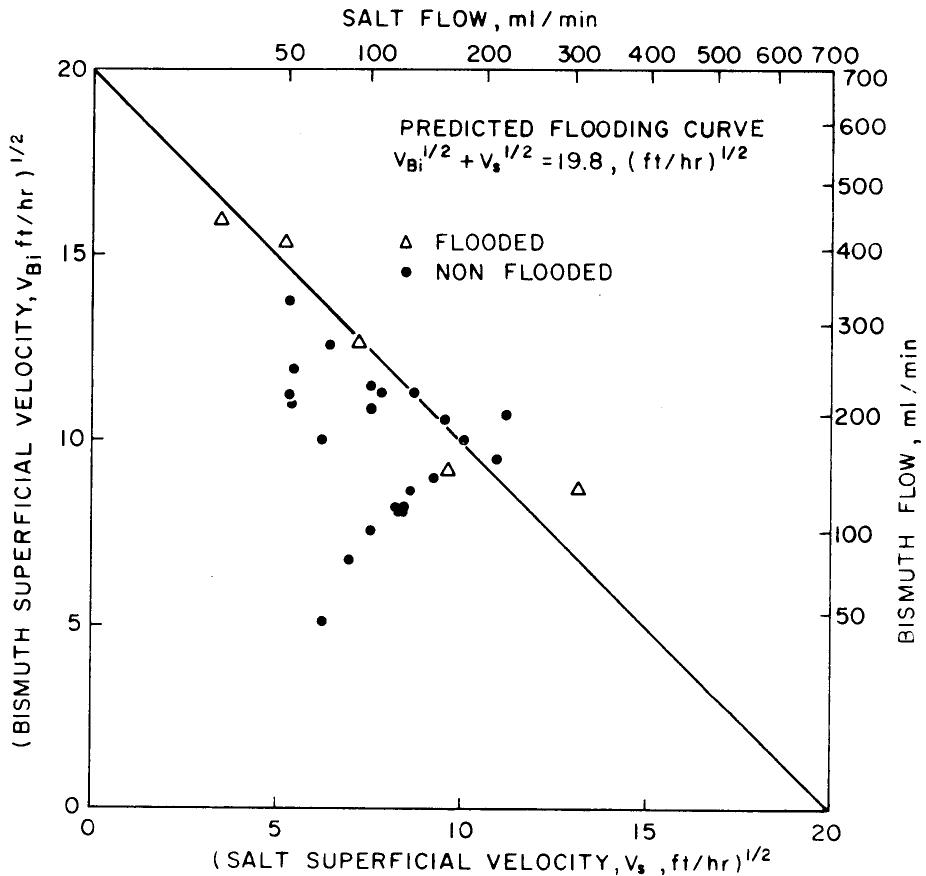  
Fig. 26. Summary of Flooding Data with Salt and Bismuth in a 0.82-in.-diam, 24-in.-long Column Packed with 1/4-in. Raschig Rings.

were noted at two points during heatup of the flow system prior to experiment UTR-3. The first failure occurred on the outside of a bend in the salt line connecting the salt jackleg to the bottom of the column; the second failure was located in the bismuth exit line from the column. About $125\mathrm{ml}$ of bismuth and $500\mathrm{ml}$ of salt drained from the system as a result of these failures. The salt leak occurred in a bend that had expanded 5 to $10\%$ in diameter at a location which is normally filled with bismuth during cooldown periods. The wall thickness of tubing adjoining the site of failure in the bismuth exit line was unchanged (0.080 in.), indicating that mass transfer of iron was not a contributing factor as was the case in some of the earlier failures. The external surfaces of the tubing examined were only slightly air oxidized; the extent of oxidation appears to have been decreased by the oxidation retardant paint used on the lines and by the practice of heating the transfer lines to operating temperature only when an experiment is planned. Approximately 15 freeze-thaw cycles had been accumulated in the failed areas. The implication of these observations was that future operation should attempt to minimize the number of thermal cycles at the expense of increasing the length of time during which the lines are held at elevated temperature. Subsequently, attempts were made to maintain the lines at temperatures of about 350 to $400^{\circ}\mathrm{C}$ , which are considerably higher than the melting point of bismuth $(271^{\circ}\mathrm{C})$ . In practice, this procedure had a serious shortcoming in that freeze valves containing bismuth would not seal; this, in turn, made the routine transfer of bismuth and salt between vessels more difficult. We ultimately returned to the original procedure of cooling the transfer lines to room temperature between experiments.

During a routine cooldown of the flow system following experiment UTR-5, a leak occurred in the bismuth drain line from the entrainment separator. About $50\mathrm{ml}$ of bismuth was released through a longitudinal crack in the 1/2-in.-diam mild-steel tubing. The failure was similar in appearance to the failures discussed earlier.

# 8. PREVENTION OF AXIAL DISPERSION IN PACKED COLUMN

J. S. Watson L. E. McNeese

Packed columns are being considered for use in countercurrently contacting molten salt and bismuth streams in MSBR fuel processing systems. Previously, we made measurements of axial dispersion for various packing materials in columns during the countercurrent flow of mercury and aqueous solutions.[18] We showed that axial dispersion can significantly reduce the performance of this type of contactor under some operating conditions of interest.[19] As part of our contactor development program, we are currently evaluating column modifications that will reduce the effect of axial dispersion to an acceptable level. The proposed modifications consist of devices to be inserted at points along the column to reduce dispersion at these points. If the devices are separated by a column length equivalent to one theoretical stage (an extent of separation that can be achieved even if the liquids between the devices are completely mixed), the stage efficiency of the column segment will be greater than $75\%$ if $15\%$ or less of the salt flowing through the segment is recycled to the previous segment. We have previously tested devices consisting of inverted bubble caps containing a number of small-diameter holes through which the salt flows at an increased velocity.[20] It was found that the extent of axial dispersion could be reduced considerably and, in principle, to very low values by the use of sufficiently small holes. However, the column capacity, or throughput at flooding, was reduced by about a factor of 6. During the current report period, we devised and tested an improved design of axial dispersion preventer. In this design, shown schematically in Fig. 27, the small-diameter holes in the upper portion of the inverted bubble cap have been replaced with a single $3/8$ -in.-OD tube that is sealed at the top but which has four $1/4$ -in.-diam holes near the top of the tube. This design allows the metal phase to rise to the bottom of the salt exit holes in the vertical tube, thereby providing a sufficiently high liquid metal head for forcing the dispersed phase through the axial dispersion preventer at a high throughput. Two axial dispersion preventer designs were tested during the counter-

ORNL DWG 71-13973

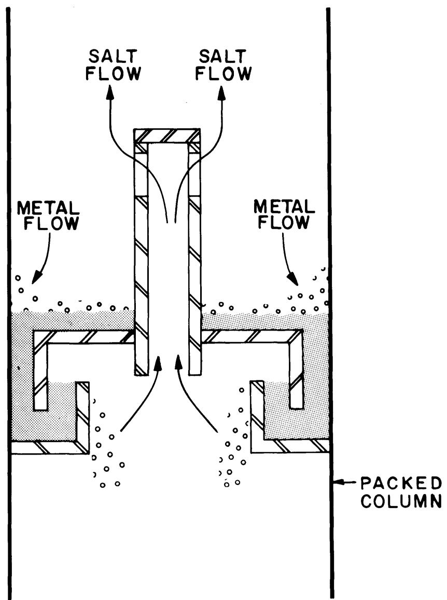  
Fig. 27. Schematic Diagram of an Improved Axial Dispersion Preventer.

current flow of mercury and water in a 2-in.-diam column packed with $3/8-$ in. Raschig rings. In the first design, the water flowed upward through a $1/4$ -in.-diam, $1/4$ -in.-long tube. In the second design, the tube length was increased to $1/2$ in. Data obtained with the second axial dispersion preventer design is summarized in Fig. 28. The mercury superficial velocity was varied from about $40$ to $150 \text{ ft/hr}$ , and the water superficial velocity was varied from about $2.7$ to $14 \text{ ft/hr}$ . A marked effect of the metal flow rate on the extent of axial dispersion was noted; that is, higher metal superficial velocities led to a greater extent of axial dispersion. As expected, no difference between the two devices was noted with regard to axial dispersion. The major effect of using a longer tube is that of obtaining an increase in the metal throughput. It is believed that this design would allow for salt and bismuth throughputs that can be as high as the column throughputs at flooding. Although the extent of axial dispersion is still significant with either of the devices, it is probably sufficiently low for most applications of interest. The extent of axial dispersion provided with the present device is intermediate between that provided by bubble caps having one $1/4$ -in.-diam hole and bubble caps having four $1/4$ -in.-diam holes through which the water is allowed to flow. The performance of the present axial dispersion preventer could probably be increased by using only a single hole in the side of the vertical tube instead of the four holes as in the current design.

# 9. ELECTROLYTIC REDUCTION OF LiCl USING A BISMUTH CATHODE AND A GRAPHITE ANODE

J. R. Hightower, Jr. C. P. Tung  
L. E. McNeese

The metal transfer process for removing rare earths from an MSBR requires the use of Li-Bi solutions for extracting the rare earths from LiCl. One method for providing these Li-Bi solutions would consist of electrolytically reducing LiCl that is produced in the processing system. We have carried out an experiment in order to determine the general operating characteristics of an electrolytic cell having a bismuth cathode and a graphite anode. The objectives of the experiment were to determine the maximum anode

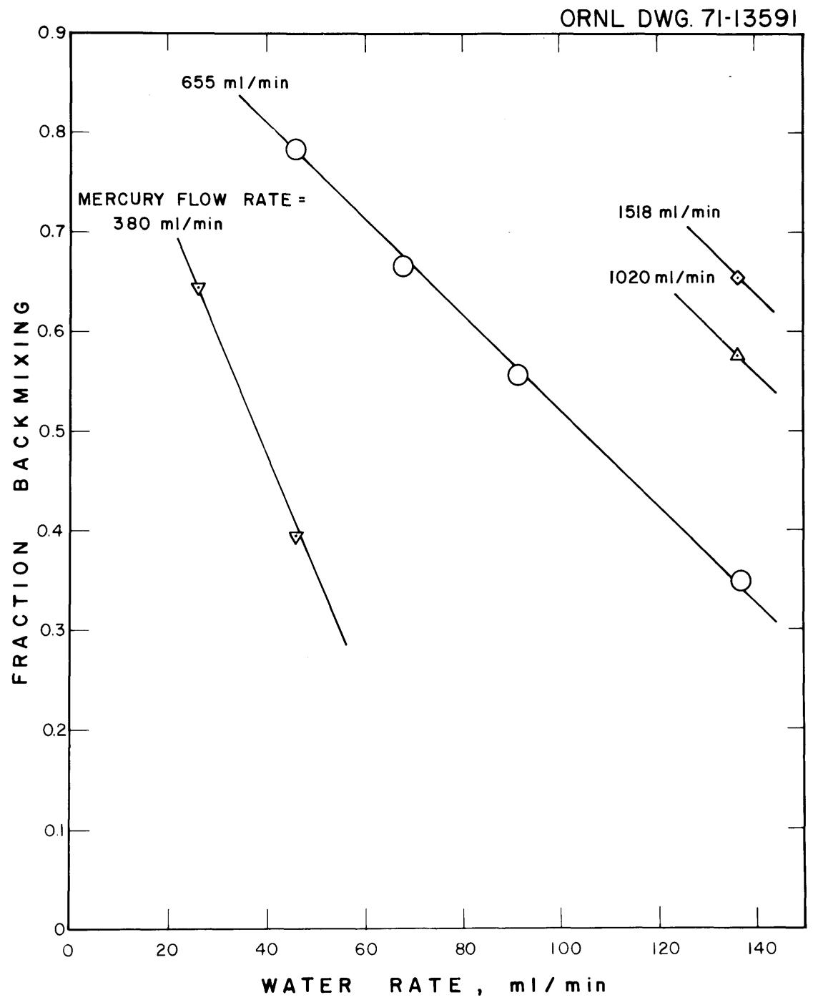  
Fig. 28. Variation of Fraction of Backmixing with Water and Mercury Flow Rate for an Axial Dispersion Preventer Having a Single $1/4$ -in.-ID, $1/2$ -in.-long Tube Through Which the Water Flowed.

current density achievable, the current efficiency, the extent of attack on the graphite anode, and operational difficulties associated with formation of Li-Bi solutions at the cathode.

# 9.1 Equipment and Materials Used

The experimental equipment consisted of a 4-in.-diam, 18-in.-long quartz cell vessel; a 3.5-in.-diam, 3.5-in.-high molybdenum cup containing the bismuth cathode; a 1-in.-diam, 7-in.-long graphite anode; a 4-in.-diam, 10-in.-high bismuth purification vessel; and a 4-in.-diam, 15-in.-high LiCl purification vessel. The assembled electrolytic cell is shown in Fig. 29.

Provision was made for measuring the volume of chlorine produced at the anode by allowing the chlorine to displace argon from a 25-ft-long section of $3/4$ -in.-diam copper tubing. A wet-test meter was provided for measuring the volume of the displaced argon.

Seven kilograms of bismuth was charged to the bismuth treatment vessel, where it was sparged with hydrogen at $650^{\circ}\mathrm{C}$ until the water concentration in the off-gas was less than 1 ppm. The bismuth was then transferred through a porous molybdenum filter into the electrolytic cell. Eleven hundred grams of oven-dried LiCl was charged to the salt treatment vessel. The salt was purified by contact with 2 kg of purified bismuth to which 93 g of thorium metal had been added. The LiCl was contacted with the thorium-bismuth solution for a period of about 100 hr at $650^{\circ}\mathrm{C}$ ; then it was transferred through a porous molybdenum filter into the cell vessel. The porous molybdenum filters were made from 0.63-in.-diam, 1/8-in.-thick porous molybdenum disks having a mean pore size of 30 to 40 μ. The filtration rate at $650^{\circ}\mathrm{C}$ for the LiCl was 0.8 cm $^3$ /sec with a pressure drop of 6.2 psi, and the filtration rate for the bismuth was 0.4 cm $^3$ /sec with a pressure drop of 2 psi.

# 9.2 Operating Conditions and Results

The cell was operated at $670^{\circ}\mathrm{C}$ with the following anode current densities (based on the projected area of the bottom of the anode, $5.06\mathrm{cm}^2$ ):

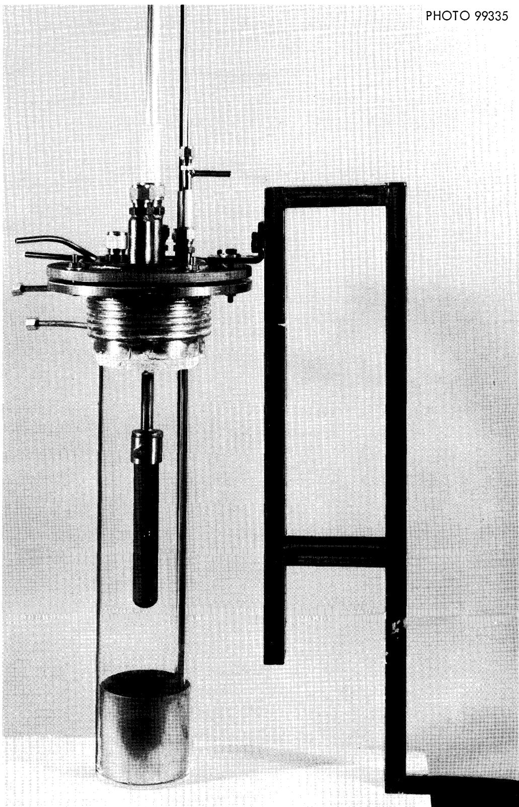  
Fig. 29. Assembled Electrolytic Cell Vessel Used for LiCl Reduction.

4.37 A/cm² for 7 min, 6.7 A/cm² for 6 min, and 8.6 A/cm² for 6 min. There appeared to be no limiting anode current density in this operating range. Disengagement of the chlorine gas produced at the anode (which had been rounded slightly to promote gas disengagement) proceeded smoothly and without difficulty. With the initiation of current flow through the cell, the LiCl became red in color; the color of the salt grew darker as the operation continued until, finally, the salt became opaque.

Measurement of the chlorine evolution rate (and hence the current efficiency) was not possible because of reaction of the chlorine with iron components in the upper part of the cell vessel.

# 9.3 Postoperational Examination of Equipment

After the cell had cooled to room temperature, examination showed that the top flange and the anode support, both of which were made of mild steel, were severely corroded. A mixture of yellow and white powders $\left(\mathrm{FeCl}_2\right.$ and LiCl containing 1.3 wt % bismuth) covered the flange and nearly filled a 3-ft-long section of the 1/4-in.-diam copper off-gas line. A thin metallic film, which had covered the LiCl surface, was removed intact when the anode was raised at the end of the experiment. The metallic portion of the film consisted of iron and about 3 wt % bismuth. The LiCl appeared to contain a large amount of suspended black material, which was found to be iron. The bismuth concentration in the LiCl was relatively high (about 0.63 wt %). The molybdenum cup, which contained the bismuth cathode, appeared to be unattacked.

It is believed that the attack of iron components in the cell by gaseous chlorine was the only detrimental action which occurred during operation of the cell. The $\mathrm{FeCl}_3$ corrosion product was partially transferred to the LiCl, where it was reduced to metallic iron.

The material that caused the salt to turn red during the experiment was probably $\mathrm{Li}_{3}\mathrm{Bi}$ , which dissolved in the LiCl. It is known that $\mathrm{Li}_{3}\mathrm{Bi}$ dissolves to an appreciable extent in an LiCl-LiF eutectic which is in contact with solid $\mathrm{Li}_{3}\mathrm{Bi}$ or a bismuth solution that is saturated with

$\mathrm{Li}_{3}\mathrm{Bi},^{21}$ and that a dark red solution is formed. The cathode probably polarized rapidly at the cathode current densities used in this experiment, resulting in bismuth saturated with $\mathrm{Li}_{3}\mathrm{Bi}$ at the LiCl-bismuth interface. Polarization of the cathode could be prevented by any of several methods, including limiting the cathode current density or increasing the extent of mixing of the bismuth phase near the LiCl-bismuth interface. The equilibrium concentrations of lithium and bismuth in LiCl are reported to be significantly reduced when the bismuth is not saturated with $\mathrm{Li}_{3}\mathrm{Bi}$ .<sup>22</sup>

Although this experiment pointed out an unexpected complication, it confirms our expectation that electrolytic reduction of LiCl using a bismuth cathode and a graphite anode should proceed readily and that little, if any, attack should occur on the graphite anode.

# 10. STUDY OF THE PURIFICATION OF SALT BY CONTINUOUS METHODS

R.B.Lindauer L.E.McNeese

We have previously described equipment for study of the purification of salt by continuous methods.[23] Initial work with this system was directed at measurement of the flooding rates in a 1.25-in.-diam, 7-ft-long column packed with 1/4-in. nickel Raschig rings. Flooding data were obtained during the countercurrent flow of molten salt (66-34 mole % LiF-BeF $_2$ ) and hydrogen or argon.[24] The objective of the present work is to study the continuous reduction of iron fluoride in molten salt by countercurrent contact of the salt with hydrogen in a packed column. During this report period, a sufficient quantity of FeF $_2$ (34.5 g) was added to the salt (66-34 mole % LiF-BeF $_2$ ) to increase the iron concentration from 20 ppm to 425 ppm. Two iron fluoride reduction runs (R-1 and -2) were carried out, and several equipment modifications were made.

# 10.1 Iron Fluoride Reduction Runs R-1 and R-2

After $\mathrm{FeF}_2$ had been added to the 14-liter salt charge, two iron fluoride reduction runs were carried out at a column temperature of $700^{\circ}\mathrm{C}$ . During the

first run, a salt flow rate of $100~\mathrm{cm}^3/\mathrm{min}$ and a hydrogen flow rate of about 20 liters/min were used. A low hydrogen supply pressure resulted in a fluctuating hydrogen flow rate throughout most of the run. The variations in the gas flow rate caused the pressure at the top of the column to fluctuate; in turn, this fluctuation resulted in an irregular salt feed rate to the column. During the run, the iron fluoride concentration in the salt was reduced from an inlet value of $425~\mathrm{ppm}$ to $307~\mathrm{ppm}$ . In the second run (R-2), a salt flow rate of $100~\mathrm{cm}^3/\mathrm{min}$ and a hydrogen flow rate of 13.5 liters/min were used. Operation of the column at the desired conditions was difficult in this run, although performance of the system had been satisfactory during previous flooding runs in which the gas flow rates were as high as about 25 liters/min. After only 4.0 liters of the 14-liter salt batch had been fed through the column, the pressure at the base of the column resulting from the pressure drop across the column and column off-gas line was sufficiently high to force the gas-salt interface out of the salt loop below the column. At this point, the flow of hydrogen was terminated and the remaining salt was transferred to the salt receiver vessel through the static column of salt. Data for the two runs are summarized in Table 15.

Table 15. Summary of Data from Iron Fluoride Reduction Runs R-1 and R-2   

<table><tr><td rowspan="2">Run No.</td><td rowspan="2">Hydrogen Flow Rate (std liters/min)</td><td rowspan="2">Salt Flow Rate (cm3/min)</td><td rowspan="2">Length of Run (min)</td><td colspan="2">Analysis of Filtered Samplesa (ppm of iron)</td><td rowspan="2">Fraction of Salt Contacted with H2</td></tr><tr><td>Feed</td><td>Product</td></tr><tr><td>R-1</td><td>20.0</td><td>100</td><td>87</td><td>425</td><td>307</td><td>0.685</td></tr><tr><td>R-2</td><td>13.5</td><td>100</td><td>41</td><td>307</td><td>228</td><td>0.276</td></tr></table>

Samples were taken from the combined salt volumes in the salt receiver vessel.

10.2 Mathematical Analysis of the Rate of Iron Fluoride Reduction; Calculated Mass Transfer Coefficients for Runs R-1 and R-2

The countercurrent contact, in a packed column, of hydrogen with salt containing $\mathrm{FeF}_2$ results in the reaction:

$$
\mathrm {F e F} _ {2 (\mathrm {d})} + \mathrm {H} _ {2 (\mathrm {g})} = \mathrm {F e} _ {(\mathrm {s})} + 2 \mathrm {H F} _ {(\mathrm {g})}. \tag {35}
$$

A material balance on $\mathrm{FeF}_2$ in the salt contained in a differential length of the column yields the relation:

$$
- L d x = r A d h, \tag {36}
$$

where

$$
\begin{array}{l} L = \text {s a l t f l o w r a t e}, \text {m o l e s / s e c}, \\ x = \text {c o n c e n t r a t i o n} F e F _ {2} \text {i n b u l k s a l t , m o l e f r a c t i o n ,} \\ \begin{array}{l} \mathrm {r} = \text {r a t e o f F e F _ {2}} \text {r e d u c t i o n p e r u n i t c o l u m n v o l u m e , m o l e s F e F _ {2} / s e c \cdot c m ^ {3}}, \\ \mathrm {A} = \text {c r o s s - s e c t i o n a l a r e a o f c o l u m n , c m} ^ {2}, \end{array} \\ h = \text {c o l u m n h e i g h t}, c m. \\ \end{array}
$$

The reduction of $\mathrm{FeF}_2$ by reaction with hydrogen can be affected by a number of factors that may contribute to setting the overall rate of reaction. One of the objectives of this work is to determine the rate-controlling steps involved in the reduction of $\mathrm{FeF}_2$ and evaluation of the associated rate constants. Two limiting cases for the rate of reduction of $\mathrm{FeF}_2$ are of interest: (1) the case in which the rate of reduction is limited by the rate of transfer of $\mathrm{FeF}_2$ to the gas-salt interface from the bulk salt, and (2) the case in which the rate of reduction is limited by the rate of reaction between $\mathrm{FeF}_2$ and $\mathrm{H}_2$ at the gas-salt interface.

10.2.1 Case for Which the Rate of $\mathsf{FeF_2}$ Reduction Is Limited by the Rate of Transfer of $\mathsf{FeF_2}$ to the Gas-Salt Interface

For the case in which the rate of transfer of $\mathrm{FeF}_2$ to the gas-salt interface is rate limiting, the rate of reduction will be given by the expression:

$$
r = k _ {l} a \left(x - x ^ {*}\right), \tag {37}
$$

where

$k_{\ell} =$ mass transfer coefficient for transfer of $\mathrm{FeF}_2$ from the bulk salt to the salt-gas interface, moles/sec·cm²,

a = gas-salt interfacial area per unit column volume, $\mathrm{cm}^2/\mathrm{cm}^3$ ,

$\mathbf{x}^{*}$ = concentration of $\mathrm{FeF}_2$ in salt that would be in equilibrium with the $\mathrm{H}_2$ -HF mixture adjacent to the salt being considered, mole fraction.

Combining Eqs. (36) and (37) yields the relation:

$$
L d x = - k _ {l} a A \left(x - x ^ {*}\right) d h. \tag {38}
$$

If the value of $x^*$ is small in comparison with the value of $x$ , Eq. (38) can be integrated over the column length to yield the following relation:

$$
k _ {l} a = \frac {L}{A H} \ln \frac {x _ {j}}{x _ {0}}, \tag {39}
$$

where

$$
\mathrm {H} = \text {c o l u m n h e i g h t}, \mathrm {c m},
$$

$x_{i} =$ concentration of $\mathsf{FeF}_2$ in salt fed to column, mole fraction,

$x_{0} =$ concentration of $\mathsf{FeF}_2$ in salt leaving column, mole fraction.

10.2.2 Case for Which the Rate of $\mathsf{FeF_2}$ Reduction Is Limited by the Rate of Reaction of $\mathsf{FeF_2}$ with $\mathsf{H}_2$ at the Gas-Salt Interface

For the case in which the rate of reaction between $\mathrm{FeF}_2$ and $\mathbf{H}_2$ at the gas-salt interface is rate limiting, the rate of reduction will be given by the expression:

$$
r = k _ {s} K _ {H} p _ {H _ {2}} x, \tag {40}
$$

where

$$
k _ {s} = r e a c t i o n r a t e c o n s t a n t, \mathrm {c m} ^ {3} / \sec ,
$$

$$
\mathrm {K} _ {\mathrm {H}} = \text {H e n r y ' s l a w c o n s t a n t f o r h y d r o g e n i n s a l t , m o l e s / c m ^ {3} \cdot a t m ,}
$$

$$
p _ {H _ {2}} = \text {p a r t i a l}
$$

Combination of Eqs. (36) and (40) yields the relation:

$$
L d x = - k _ {s} K _ {H} A p _ {H 2} x d h. \tag {41}
$$

If the variation in the value of $\mathfrak{p}_{\mathtt{H}_2^2}$ throughout the column is small, this relation can be integrated over the column length to yield the expression:

$$
k _ {s} = \frac {L}{K _ {H} H A p _ {H _ {2}}} \ln \frac {x _ {\text {i n}}}{x _ {\text {o u t}}} \tag {42}
$$

# 10.2.3 Calculated Reaction Rate Constants for Runs R-1 and R-2

Values for the mass transfer coefficient and the reaction rate constant, as defined by Eqs. (39) and (42) for the two limiting cases of interest, were calculated. These values and associated information are summarized in Table 16. For the case in which the reduction rate is controlled by mass transfer, it is seen that the $\mathrm{FeF}_2$ concentration in salt in equilibrium with gas having a composition equal to that of gas leaving the column is negligible in comparison with the inlet or outlet $\mathrm{FeF}_2$ concentrations in the salt. The resulting values for the overall rate constant ( $k_{\lambda}a$ ) are 0.028 and 0.064 moles/sec·cm³ and are in satisfactory agreement with each other. Since the partial pressure of hydrogen was the same for both runs, the reaction rate constant, $k_{s}$ , is proportional to $k_{\lambda}a$ . In future runs, the controlling mechanism will be determined by varying the inlet hydrogen partial pressure.

# 10.3 Equipment Modifications and Maintenance

Several difficulties were encountered during operation of the system throughout the current report period. These difficulties were as follows:

Table 16. Calculated Values for the Mass Transfer Coefficient and the Reaction Rate Constant for Runs R-1 and R-2   

<table><tr><td rowspan="3">Run No.</td><td colspan="2">FeF2Concentrations (mole fraction) x 104</td><td colspan="2">Mass Transfer Controlled</td><td colspan="3">Reaction Rate Controlled</td></tr><tr><td rowspan="2">x i</td><td rowspan="2">x o</td><td rowspan="2">k a (moles/sec·cm-3) x 105</td><td rowspan="2">x* (mole fraction) x 104</td><td>k (cm3/sec) x 10-4</td><td colspan="2">pH2(atm)</td></tr><tr><td>Inlet</td><td>Exit</td><td>Equilibriumb</td></tr><tr><td>R-1</td><td>5.13</td><td>3.70</td><td>2.4</td><td>0.033a</td><td>2.4</td><td>1.0</td><td>0.9987</td></tr><tr><td>R-2</td><td>3.70</td><td>2.75</td><td>5.4</td><td>0.198a</td><td>5.4</td><td>1.0</td><td>0.9967</td></tr></table>

"Calculated from composition of exit gas."   
b Calculated from $\mathrm{FeF}_2$ concentration in salt leaving the column.

(1) an undesirably high pressure drop in the column off-gas system, which caused the salt-gas interface in the column to be forced out of the seal loop below the column;   
(2) restrictions in the salt filter inlet and outlet vent lines, which probably contributed to the erratic operation of the system during the two iron fluoride reduction runs;   
(3) failure of a weld in contact with salt in the sampler in the salt effluent line from the column;   
(4) failure of the liquid level dip line above the salt receiver tank; and   
(5) deposition of BeO (in the column), which reduced the column throughput.

# 10.3.1 Restriction in the Off-Gas Line from the Column

In the initial system design, salt leaving the bottom of the column flowed through a 30-in.-deep loop that formed a gas seal and prevented gas from flowing out with the salt. The salt used initially in the system had a specific gravity of 2, and a pressure of 60 in. $\mathsf{H}_2\mathsf{O}$ at the bottom of the column was sufficient to force salt out of the seal loop. The total pressure at the bottom of the column is the sum of (1) the pressure at the top of the column, and (2) the pressure drop across the column. The pressure at the top of the column is usually controlled by a throttling valve; however, an abnormally high value will result if there is a restriction in the off-gas line leaving the column. The pressure drop across the column increases as the salt and gas flow rates are increased, rising sharply as the flooding point is approached. During run R-1, the pressure at the base of the column remained sufficiently low that salt was not forced from the seal loop. However, during run R-2, the pressure at the top of the column was higher; and, after about half of the salt (6 liters) had been fed through the column, the column pressure drop increased to about 35 in. $\mathsf{H}_2\mathsf{O}$ . At this point, the pressure at the base of the column was sufficient to

force salt out of the seal and the run was terminated. Examination of the 1/2-in.-OD off-gas line leaving the column showed that the line was almost completely restricted with salt. An 8-in.-long, 4-in.-diam heated vessel packed with a 6-in.-long section of nickel wool (see Fig. 30) was installed in the off-gas line in order to remove salt from the gas stream leaving the column. The vessel was positioned in such a manner that salt would drain from the packing and return to the top of the column through a gas seal loop.

# 10.3.2 Restrictions in Vent Lines on Salt Filter

Following reduction runs R-1 and -2, it was found that the vent lines on the inlet and outlet sides of the salt filter had become plugged with salt. The restriction in the inlet vent line probably resulted from entrainment of salt with the gas that was forced out of the seal loop below the column during run R-2. The salt in the outlet vent line on the filter was the result of a cold section in the line (between the filter and the salt receiver tank) that caused salt to fill the filter vessel. The restricted portions of the vent lines were removed and replaced.

# 10.3.3 Failure of a Weld on the Flowing-Stream Salt Sampler

During flooding test ll (which followed reduction runs R-1 and -2), the pressure drop across the column suddenly increased. It was found that failure of a submerged weld in the flowing stream salt sampler had allowed salt to contact a Calrod heater on the salt exit line between the sampler and the receiver, thereby causing the heater to fail. Failure of the heater and, in turn, a decrease in the temperature of the exit line (to below the salt liquidus temperature) caused an accumulation of salt in the column and resulted in the observed increase in the column pressure drop. To circumvent these difficulties, the lower section of the sampler was redesigned to eliminate welds below the normal salt level.

ORNL DWG 72-1384

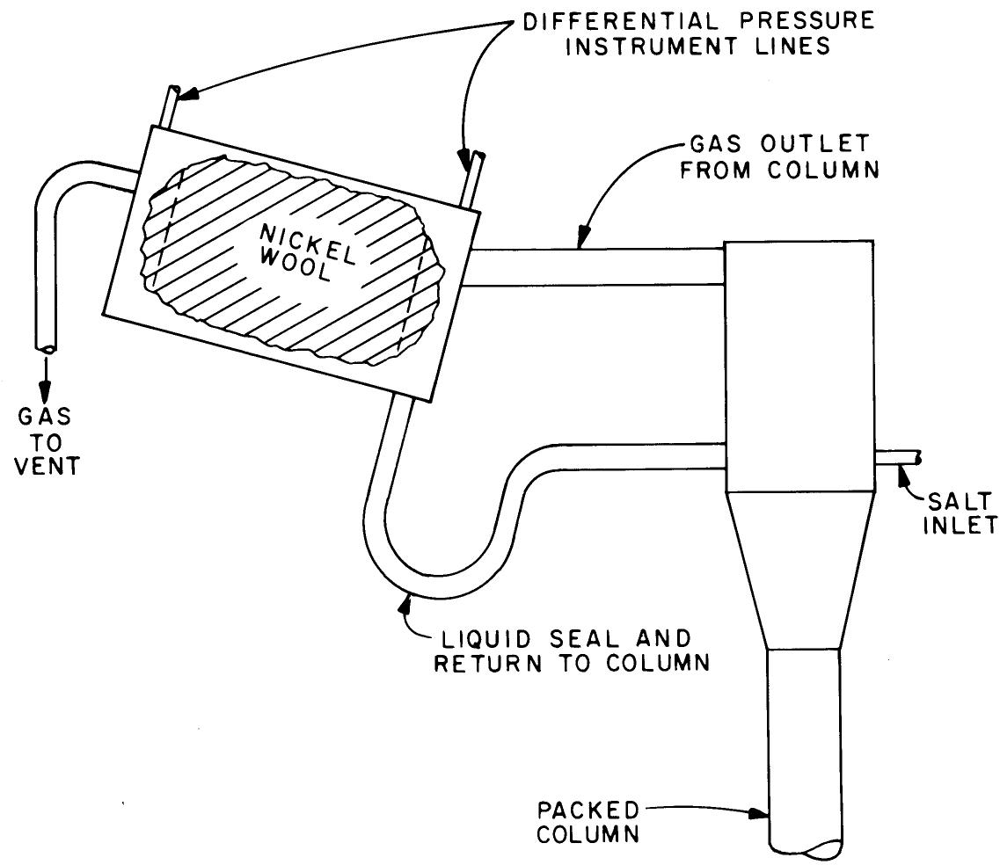  
Fig. 30. Salt Entrainment Separator.

# 10.3.4 Failure of a Liquid Level Dip Line on the Salt Receiver Tank

One of the dip lines in the salt receiver tank was found to be restricted by salt in the vicinity of the top of the vessel. A drill was used to remove the salt from the line; however, we found that attempts to transfer salt from the receiver to the feed tank led to a failure in the liquid level dip line at the point where the salt plug had been removed. We believe that the reason for the failure was improper centering of the drill and a decrease in the wall thickness of the tubing.

# 10.3.5 Deposition of BeO in Column

After the first two reduction runs (R-1 and -2) had been completed, we found that the pressure drop across the column with argon flow only (flow rate, 5 liters/min) had increased from 5.7 in. $\mathrm{H}_2\mathrm{O}$ to 12.0 in. $\mathrm{H}_2\mathrm{O}$ . Since only $7\mathrm{g}$ of iron had been reduced in the system, it was believed that the restriction was caused by an accumulation of relatively insoluble $\mathrm{BeO}$ , which may have been formed in the system as the result of low concentrations of impurities in the argon or hydrogen or because of inleakage of air into the system. Up to this time, our usual procedure has been to maintain a low argon flow rate through the system, which is held at atmospheric pressure during periods of nonoperation. We have now adopted the procedure of maintaining a positive pressure of at least 1 psig in the system during such periods in order to minimize the possibility of air inleakage.

11. ELECTROLYTIC OXIDATION OF Pa $^{4+}$ TO Pa $^{5+}$ IN MSBR FUEL SALT

J. S. Watson L. E. McNeese

Baes, Bamberger, and Ross $^{25}$ have recently proposed a protactinium isolation method based on the selective precipitation of $\mathrm{Pa}^{14+}\mathrm{O}_{5}$ . The process requires oxidation of the $\mathrm{Pa}^{14+}$ in MSBR fuel salt to $\mathrm{Pa}^{5+25}$ (and most of the $\mathrm{U}^{3+}$ to $\mathrm{U}^{4+}$ ) prior to the subsequent oxide precipitation step. A process

step was proposed in which oxidation of the protactinium and uranium, as well as subsequent reduction of about $1\%$ of the $\mathrm{U}^{4+}$ to $\mathrm{U}^{3+}$ , would be carried out electrolytically. The estimated current densities, the size of the proposed electrolytic oxidation reduction system, and the feasibility of such a reduction step will be considered in the remainder of this section.

The proposed system contains three electrodes: a cathode, an anode, and a third low-current electrode that functions sometimes as a cathode and at other times as an anode. The current between the first two electrodes is expected to be limited by the rate of diffusion of $\mathrm{U}^{3+}$ and $\mathrm{Pa}^{4+}$ to the anode surface, where a low current density is estimated because of the low concentrations of these materials in the salt. The total concentration of materials to be reduced at the cathode (primarily $\mathrm{U}^{4+}$ ) is higher by about two orders of magnitude than the total concentration of materials to be oxidized at the anode, and a current density limitation is not expected at the cathode.

# 11.1 Estimated Anode Current Density for the Case of No Interaction Between Protactinium and Uranium

The maximum rate at which $\mathrm{Pa}^{4+}$ can transfer to the anode surface is the rate which would be obtained by assuming the concentration of $\mathrm{Pa}^{4+}$ to be negligible at the anode surface. In this case, the $\mathrm{Pa}^{4+}$ transfer rate can be estimated by the following expression:

$$
R _ {P a} 4 + = \frac {D C e A}{\delta}, \tag {43}
$$

where

$\mathrm{R}_{\mathrm{Pa}}{}^{4 + } =$ rate at which $\mathrm{Pa}^{4 + }$ transfers to the anode surface and is oxidized to $\mathrm{Pa}^{5 + }$ , moles/sec,  
D = diffusivity of $\mathrm{Pa}^{4 + }$ in MSBR fuel salt under conditions present in the boundary layer at the anode surface, $\mathrm{cm}^2/\mathrm{sec}$ ,  
C_e = effective concentration of $\mathrm{Pa}^{4 + }$ in the bulk salt adjacent to the anode surface, moles/ $\mathrm{cm}^3$ ,

A = anode surface area, $\mathbf{cm}^2$

$\delta =$ thickness of boundary layer adjacent to anode surface, cm.

The effect of the electrical potential gradient within the boundary layer has been neglected since the potential gradient will be dissipated by the high concentration of nonreacting ions in the layer that will act as a supporting electrolyte. The required anode surface area is given, then, by rearranging Eq. (43) to obtain the following expression:

$$
A = \frac {\delta R _ {P a} ^ {4 +}}{D C _ {e}}. \tag {44}
$$

It should be noted that the rate at which $\mathsf{Pa}^{4+}$ transfers to the anode surface is approximately equal to the rate at which protactinium is produced under desirable operating conditions. It will be useful, subsequently, to also note the following relations for the fraction of $\mathsf{Pa}^{4+}$ that is oxidized to $\mathsf{Pa}^{5+}$ and for the rate at which $\mathsf{Pa}^{4+}$ is oxidized to $\mathsf{Pa}^{5+}$ in a system operating at steady state:

$$
f = 1 - \frac {C _ {P a ^ {4} + o u t}}{C _ {P a ^ {4} + i n}}, \tag {45}
$$

where

$$
f = \text {f r a c t i o n} \mathrm {P a} ^ {4 +} \text {t h a t i s o x i d i z e d} \mathrm {P a} ^ {5 +},
$$

$$
\begin{array}{l} C _ {P a ^ {4 +}} \text {o u t} = \text {c o n c e n t r a t i o n o f P a} ^ {4 +} \text {i n b u l k s a l t l e a v i n g a n o d e s u r f a c e}, \\ \text {m o l e s / c m} ^ {3}, \end{array}
$$

$$
\begin{array}{l} C _ {P a ^ {4 +} i n} = c o n c e n t r a t i o n \enspace \enspace P a ^ {4 +} i n s a l t e n t e r i n g o x i d i z e r f r o m r e a c t o r, \\ \enspace \enspace \enspace \enspace \enspace \enspace \enspace \enspace \enspace \enspace \enspace \enspace \enspace \enspace \enspace \enspace \enspace \enspace \enspace \enspace \enspace \enspace \enspace \enspace \enspace \enspace \enspace \enspace \enspace \enspace \enspace \enspace \enspace \enspace m o l e s / c m ^ {3}; \end{array}
$$

and

$$
R _ {P a} 4 + = f F C _ {P a} 4 + i n, \tag {46}
$$

where

$F = \text{rate at which salt is processed for protactinium removal, cm}^3/\text{sec}$ .

# 11.1.1 Case for No Axial Mixing Along Anode Surface

If there is no axial mixing along the anode surface, the effective $\mathrm{Pa}^{4+}$ concentration will be the logarithmic mean average of the inlet and outlet $\mathrm{Pa}^{4+}$ concentrations, which is given by the relation:

$$
C _ {e} = \frac {C _ {P a ^ {4} + i n} - C _ {P a ^ {4} + o u t}}{\ln \frac {C _ {P a ^ {4} + i n}}{C _ {P a ^ {4} + o u t}}} \quad . \tag {47}
$$

Substitution of Eq. (47) into Eq. (44) yields the following relation for the required anode surface area:

$$
A = \frac {\delta R _ {P a} {} ^ {4 +}}{f D C _ {P a} {} ^ {4 +} i n} \ln \frac {1}{1 - f}. \tag {48}
$$

# 11.1.2 Case for Complete Mixing of Salt Along Anode Surface

If the salt along the anode surface is assumed to be perfectly mixed, the effective $\mathrm{Pa}^{4+}$ concentration will be equal to the outlet $\mathrm{Pa}^{4+}$ concentration, which can be expressed by use of Eq. (45) in the following manner:

$$
C _ {e} = (1 - f) C _ {P a ^ {4} + i n}. \tag {49}
$$

Substitution of Eq. (41) into Eq. (44) yields the following relation for the anode surface area in this case:

$$
A = \frac {\delta R _ {P a} {} ^ {4 +}}{D C _ {P a} {} ^ {4 +} i n} \frac {1}{1 - f}. \tag {50}
$$

The processing cycle time is defined by the following relation:

$$
\tau_ {p} = V / F, \tag {51}
$$

where

$$
\begin{array}{l} \tau_ {p} = \text {p r o c e s s i n g c y c l e t i m e , s e c}, \\ V = v o l u m e o f f u e l s a l t i n r e a c t o r, c m ^ {3}. \end{array}
$$

The protactinium removal time is then related to the processing cycle time by the following expression:

$$
\tau_ {R} = \tau_ {p} / f, \tag {52}
$$

where

$$
\tau_ {R} = \text {P a r e m o v a l t i m e , s e c .}
$$

Substitution of Eqs. (46), (51), and (52) into Eq. (50) yields the following expression for the required anode surface area for the case in which perfect mixing along the anode surface is assumed:

$$
A = \frac {\delta V}{D \left(\tau_ {R} - \tau_ {p}\right)}. \tag {53}
$$

# 11.2 Estimated Anode Current Density for the Case of Equilibrium Between Protactinium and Uranium

In the cases discussed thus far, no consideration has been given to the simultaneous oxidation of $\mathrm{U}^{3+}$ to $\mathrm{U}^{4+}$ during the oxidation of $\mathrm{Pa}^{4+}$ or to the effect of the oxidation of uranium on the rate at which $\mathrm{Pa}^{4+}$ is oxidized. If we assume that perfect mixing occurs along the anode surface and that the uranium and protactinium species are at chemical equilibrium, the concentrations of the latter species are related by the following expression:

$$
\left(\frac {C _ {P a} 5 ^ {+}}{C _ {P a} 4 ^ {+}}\right) \left(\frac {C _ {U} 3 ^ {+}}{C _ {U} 4 ^ {+}}\right) = Q, \tag {54}
$$

where

$$
C _ {P a ^ {5 +}} = \text {c o n c e n t r a t i o n} P a ^ {5 +} \text {i n b u l k s a l t , m o l e s / c m} ^ {3},
$$

$$
\begin{array}{l} C _ {P a} 4 + = \text {c o n c e n t r a t i o n} P a ^ {4 +} \text {i n b u l k s a l t , m o l e s / c m} ^ {3}, \\ C _ {1 1} 3 + = \text {c o n c e n t r a t i o n} U ^ {3 +} \text {i n b u l k s a l t , m o l e s / c m} ^ {3}, \\ C _ {U ^ {4 +}} = \text {c o n c e n t r a t i o n} U ^ {4 +} \text {i n b u l k s a l t , m o l e s / c m} ^ {3}, \\ Q = \text {e q u i l i b r i u m c o n s t a n t}. \\ \end{array}
$$

The following equation shows the relationship of the $\mathrm{Pa}^{5+}$ and $\mathrm{Pa}^{4+}$ concentrations to the fraction of the $\mathrm{Pa}^{4+}$ that is oxidized:

$$
\frac {C _ {P a} 5 ^ {+}}{C _ {P a} 4 ^ {+}} = \frac {1}{1 - f}. \tag {55}
$$

The concentration of $\mathbf{U}^{4+}$ will remain approximately constant during oxidation of both $\mathbf{Pa}^{4+}$ and $\mathbf{U}^{3+}$ . Thus, the concentration of $\mathbf{U}^{3+}$ will be given by the following relation, which is obtained by substituting Eq. (55) into Eq. (54):

$$
C _ {U 3 ^ {+}} = Q C _ {U ^ {4 +}} (1 - f) / f. \tag {56}
$$

The total rate at which $\mathrm{Pa}^{4+}$ and $\mathrm{U}^{3+}$ are oxidized is given by the following expression:

$$
R = F C _ {P a} 4 + i n f + F \left(C _ {U 3 + i n} - C _ {U 3 +}\right), \tag {57}
$$

where

$$
R = \text {t o t a l r a t e} \text {a t} \text {w h i c h P a} ^ {4 +} \text {a n d} U ^ {3 +} \text {a r e o x i d i z e d , m o l e s / s e c .}
$$

If it is assumed that the concentrations of $\mathrm{Pa}^{4+}$ and $\mathrm{U}^{3+}$ are negligible at the anode surface in comparison with their concentrations in the bulk salt, the total rate at which these materials are oxidized will also be given by the following expression:

$$
R = \frac {A _ {t}}{\delta} \left(D _ {P a} 4 + C _ {P a} 4 + D _ {U 3} + C _ {U 3}\right), \tag {58}
$$

where

$$
\begin{array}{l} A _ {t} = \text {t o t a l a n o d e s u r f a c e a r e a r e q u i r e d f o r o x i d a t i o n o f P a} ^ {4 +} \text {a n d U} ^ {3 +}, \\ \text {c m} ^ {2}. \end{array}
$$

If Eqs. (57) and (58) are equated and if it is assumed that the diffusivities of $\mathrm{Pa}^{4+}$ and $\mathrm{U}^{3+}$ in molten salt are equal, one obtains the following relation for the required anode surface area:

$$
A _ {t} = \frac {F \delta}{D} \frac {C _ {P a ^ {4} + i n} f + C _ {U ^ {3} + i n} - C _ {U ^ {3} + o u t}}{C _ {P a ^ {4} + i n} + C _ {U ^ {3} + o u t}}, \tag {59}
$$

where

$$
D = \text {d i f f u s i v i t y} P a ^ {4 +} \text {o r} U ^ {3 +} \text {i n} \text {s a l t}.
$$

Substitution of Eqs. (57) and (58) yields the following expression for the required anode surface area:

$$
A _ {t} = \frac {\delta R _ {P a ^ {4 +}}}{D C _ {P a ^ {4 + i n}} f} \frac {f + \frac {C _ {U ^ {3 + i n}}}{C _ {P a ^ {4 + i n}}} - Q \frac {C _ {U ^ {4 +}}}{C _ {P a ^ {4 + i n}}} \left(\frac {1 - f}{f}\right)}{1 - f + Q \frac {C _ {U ^ {4 +}}}{C _ {P a ^ {4 + i n}}} \left(\frac {1 - f}{f}\right)}. \tag {60}
$$

An expression showing the relative anode surface area required for the case in which equilibrium is assumed between the protactinium and uranium species and the case in which no interaction between uranium and protactinium is assumed is given by dividing Eq. (60) by Eq. (50), which yields:

$$
\frac {A _ {t}}{A} = \frac {f + \frac {C _ {U ^ {3 + i n}}}{C _ {P a ^ {4 + i n}}} - Q \frac {C _ {U ^ {4 +}}}{C _ {P a ^ {4 + i n}}} \left(\frac {1 - f}{f}\right)}{f + Q \frac {C _ {U ^ {4 +}}}{C _ {P a ^ {4 + i n}}}}. \tag {61}
$$

The rate at which protactinium is produced in a 1000-MW(e) MSBR is about 11.1 moles/day, and the concentration of $\mathbf{U}^{4+}$ in the salt is about 0.0033 mole fraction. If removal of protactinium in the reactor by neutron capture and radioactive decay of $^{233}\mathrm{Pa}$ is neglected, the relative concentrations of $\mathbf{U}^{4+}$ and $\mathbf{Pa}^{4+}$ in salt entering the protactinium isolation system will be given by the following relation:

$$
\frac {C _ {U ^ {4 +}}}{C _ {P a ^ {4 +} i n}} = 7 4 3 / \tau_ {R}, \tag {62}
$$

where

$$
\tau_ {R} = \text {P a r e m o v a l t i m e , d a y s .}
$$

Since the ratio of the $\mathrm{U}^{3+}$ concentration to the $\mathrm{U}^{4+}$ concentration in MSBR fuel salt is about 0.01, the ratio of the $\mathrm{U}^{3+}$ and $\mathrm{Pa}^{4+}$ concentrations in salt entering the protactinium isolation system is given by the following relation:

$$
\frac {C _ {U 3 + i n}}{C _ {P a} 4 + i n} = 7. 4 3 / \tau_ {R}. \tag {63}
$$

Substitution of Eqs. (62) and (63) into Eq. (61) yields the following expression for the relative anode surface area:

$$
\frac {A _ {t}}{A} = \frac {1 + \tau_ {p} \left[ 7 . 4 3 - 7 4 3 Q \left(1 - \tau_ {p} / \tau_ {R}\right) \right]}{1 + 7 4 3 Q \tau_ {p}}. \tag {64}
$$

# 11.3 Calculated Results and Discussion

Processing cycle times of interest (3 to 10 days) correspond to salt flow rates of about 1 to 3 gpm for a 1000-MW(e) MSBR. The diffusion coefficients for $\mathrm{Pa}^{4+}$ and $\mathrm{U}^{3+}$ in molten salt are estimated to be $10^{-5} \, \mathrm{cm}^2/\mathrm{sec}$ . Since the salt flow rate is relatively low, recirculation of salt through the anode compartment will be required to achieve Reynolds numbers sufficiently high to obtain film thicknesses in the desired range of 0.01 to 0.05 cm. For example, a salt flow rate of 1 gpm through an anode compartment that is 2 in. wide and 78.7 in. (2 m) long corresponds to a Reynolds number of 16. A film thickness of about 0.03 cm would result from a Reynolds number of 4000 for the same anode configuration. It is thus apparent that sufficient recirculation of salt will be required in the anode compartment to give salt which will be essentially perfectly mixed. In

this case, Eq. (50) must be used for estimating the anode surface area rather than Eq. (48), which applies to the case in which no mixing along the anode surface is assumed.

Values for the required anode surface area for several combinations of protactinium removal time and processing cycle time are shown in Table 17. The minimum required anode surface area ranges from 16.7 to $167\mathrm{m}^2$ as the protactinium removal time is decreased from 10 days to 1 day. An anode area of about $83.5\mathrm{m}^2$ is required to obtain a 3-day protactinium removal time with a processing cycle time of 1 day, and an area of $23.9\mathrm{m}^2$ is required to obtain a protactinium removal time of 10 days with a processing cycle time of 3 days.

Table 17. Estimated Values for the Required Anode Surface Area for the Case of No Interaction Between Protactinium and Uranium Species   
Reactor salt volume $= 1700 ft^3$ Salt film thicknesses $= 0.03 \, \text{cm}$   

<table><tr><td>Pa Removal Time (days)</td><td>Processing Cycle Time (days)</td><td>Required Anode Area (m2)</td></tr><tr><td>1</td><td>0</td><td>167</td></tr><tr><td>3</td><td>0</td><td>55.7</td></tr><tr><td>10</td><td>0</td><td>16.7</td></tr><tr><td>3</td><td>1</td><td>83.5</td></tr><tr><td>10</td><td>3</td><td>23.9</td></tr></table>

Values for the relative anode surface area required for the case in which equilibrium between the protactinium and uranium species is assumed are shown in Table 18 for two processing cycle times, four protactinium removal times, and two equilibrium constants that represent extremes of the estimated values for this constant.[26] It is seen that the required area depends strongly on the value of the equilibrium constant and ranges

from about $20\%$ of the area required for the case in which no interaction of protactinium and uranium species is assumed to about 11 times the area required for that case.

Table 18. Relative Anode Surface Areas Required for the Case of Equilibrium Between Protactinium and Uranium Species   

<table><tr><td rowspan="2">Protactinium 
Removal Time 
(days)</td><td rowspan="2">Processing Cycle Time 
(days)</td><td colspan="2">Relative Anode Area, 
At/A</td></tr><tr><td>Q = 0.0005</td><td>Q = 0.01</td></tr><tr><td>3</td><td>1</td><td>5.97</td><td>0.412</td></tr><tr><td>6</td><td>1</td><td>5.92</td><td>0.266</td></tr><tr><td>10</td><td>1</td><td>5.90</td><td>0.207</td></tr><tr><td>4</td><td>3</td><td>10.9</td><td>0.761</td></tr><tr><td>6</td><td>3</td><td>10.8</td><td>0.521</td></tr><tr><td>10</td><td>3</td><td>10.6</td><td>0.330</td></tr></table>

It is concluded that electrolytic oxidation of $\mathrm{Pa}^{4+}$ prior to precipitation of $\mathrm{Pa}_{2} \mathrm{O}_{5}$ is not attractive because of the large anode surface areas required. We believe that oxidation of the $\mathrm{Pa}^{4+}$ to $\mathrm{Pa}^{5+}$ by the use of HF- $\mathrm{H}_{2} \mathrm{O}-\mathrm{H}_{2}$ mixtures (as suggested by Baes<sup>27</sup>) is more promising and recommend that additional data be obtained for evaluation of this step.

# 12. REFERENCES

1. L. E. McNeese, MSR Program Semiann. Progr. Rept. Feb. 28, 1970, ORNL-4548, pp. 282-88.   
2. M. J. Bell and L. E. McNeese, MSR Program Semiann. Progr. Rept. Aug. 31, 1970, ORNL-4622, pp. 199-202.   
3. MSR Program Semiann. Progr. Rept. Feb. 28, 1970, ORNL-4548, pp. 289-92.   
4. C. E. Bamberger and C. F. Baes, Jr., J. Nucl. Mater. 35, 177 (1970).   
5. L. E. McNeese, Engineering Development Studies for Molten-Salt Breeder Reactor Processing No. 7, ORNL-TM-3257, pp. 16-29.   
6. M. S. Bautista and L. E. McNeese, Engineering Development Studies for Molten-Salt Breeder Reactor Processing No. 4, ORNL-TM-3139, pp. 38-83.   
7. L. E. McNeese, Engineering Development Studies for Molten-Salt Breeder Reactor Processing No. 5, ORNL-TM-3140, pp. 22-30.   
8. L. E. McNeese, Engineering Development Studies for Molten-Salt Breeder Reactor Processing No. 6, ORNL-TM-3141, pp. 13-23.   
9. Y. Ohki and H. Inoue, Chem. Eng. Sci. 25, 1 (1970).   
10. R. M. Davies and G. I. Taylor, Proc. Roy. Soc. (London), Ser. A 200, 375 (1950).   
1. L. E. McNeese, Engineering Development Studies for Molten-Salt Breeder Reactor Processing No. 7, ORNL-TM-3257, pp. 29-46.   
2. L. E. McNeese, Engineering Development Studies for Molten-Salt Breeder Reactor Processing No. 1, ORNL-TM-3053, pp. 1-14.   
3. L. E. McNeese, Engineering Development Studies for Molten-Salt Breeder Reactor Processing No. 6, ORNL-TM-3141, pp. 73-79.   
4. L. E. McNeese, Engineering Development Studies for Molten-Salt Breeder Reactor Processing No. 7, ORNL-TM-3257, pp. 52-56.   
5. J. S. Watson, ORNL, personal communication, September 1970.   
6. L. E. McNeese, Engineering Development Studies for Molten-Salt Breeder Reactor Processing No. 5, ORNL-TM-3140, pp. 102-17.   
17. T. Johnson et al., Chem. Eng. Div. Semiann. Rept. January-June 1965, ANL-7055, p. 44.

# REFERENCES (continued)

18. L. E. McNeese, Engineering Development Studies for Molten-Salt Breeder Reactor Processing No. 7, ORNL-TM-3257, pp. 58-89.   
19. L. E. McNeese, Engineering Development Studies for Molten-Salt Breeder Reactor Processing No. 4, ORNL-TM-3139, pp. 27-38.   
20. L. E. McNeese, Engineering Development Studies for Molten-Salt Breeder Reactor Processing No. 5, ORNL-TM-3140, pp. 97-102.   
21. M. S. Foster et al., J. Phys. Chem. 68, 980 (1964).   
22. M. S. Foster, "Laboratory Studies of Intermetallic Cells," p. 144 in Regenerative EMF Cells, American Chemical Society, Washington, D.C., 1967.   
23. L. E. McNeese, Engineering Development Studies for Molten-Salt Breeder Reactor Processing No. 6, ORNL-TM-3141, pp. 59-72.   
24. L. E. McNeese, Engineering Development Studies for Molten-Salt Breeder Reactor Processing No. 7, ORNL-TM-3257, pp. 46-52.   
25. C. F. Baes, Jr., C. E. Bamberger, and R. G. Ross, personal communication, May 8, 1970.   
26. C. F. Baes, Jr., personal communication to J. S. Watson, May 1970.   
27. C. F. Baes, Jr., personal communication to L. E. McNeese, June 8, 1970.

# INTERNAL DISTRIBUTION

1. J. L. Anderson   
2. C.F.Baes   
3. H.F.Bauman   
4. S. E. Beall   
5. M. J. Bell   
6. M. R. Bennett   
7. E. S. Bettis   
8. R.E.Blanco   
9. F. F. Blankenship   
10. E. G. Bohlfann   
11. G. E. Boyd   
12. R. B. Briggs   
13. R. E. Brooksbank   
14. K. B. Brown   
15. W. L. Carter   
16. H. D. Cochran, Jr.   
17. F. L. Culler   
18. J.R. Distefano   
19. W. P. Eatherly   
20. D. E. Ferguson   
21. L. M. Ferris   
22. J. H. Frye   
23. W. R. Grimes   
24. A. G. Grindell   
25. P. A. Haas   
26. B. A. Hannaford   
27. P. N. Haubenreich   
28. J. R. Hightower, Jr.   
29. C. W. Kee   
30. J. J. Keyes   
31. R. B. Lindauer   
32. M. I. Lundin   
33. H. G. MacPherson   
34. R. E. MacPherson   
35. H. E. McCoy

36-46. L. E. McNeese

47. D. M. Moulton   
48. J. P. Nichols   
49. E. L. Nicholson   
50. J.H.Pashley (K-25)   
51. A. M. Perry

52-53. M. W. Rosenthal

54. A. D. Ryon   
55. W. F. Schaffer, Jr.   
56. Dunlap Scott   
57. J.H.Shaffer   
58. M.J. Skinner   
59. F. J. Smith   
60. D. D. Sood   
61. Martha Stewart   
62. O. K. Tallent   
63. R.E.Thoma   
64. D. B. Trauger   
65. W.E.Unger   
66. C. D. Watson   
67. J. S. Watson   
68. A. M. Weinberg   
69. J.R.Weir   
70. M. E. Whatley   
71. J. C. White   
72. W. M. Woods   
73. R. G. Wymer   
74. E. L. Youngblood

75-76. Central Research Library   
77-78. Document Reference Section   
79-81. Laboratory Records   
82. Laboratory Records, RC   
83. Y-12 Document Reference Section   
84. ORNL Patent Office

# EXTERNAL DISTRIBUTION

85. J. A. Accairri, Continental Oil Co., Ponca City, Oklahoma 74601   
86. R. M. Bushong, UCC, Carbon Products Division, 12900 Snow Road, Parma, Ohio 44130   
87. D. F. Cope, Atomic Energy Commission, RDT Site Office (ORNL)   
88. C. B. Deering, Black & Veatch, P.O. Box 8405, Kansas City, Missouri 64114   
89. A. R. DeGrazia, USAEC, RDT, Washington, D.C. 20545   
90. Delonde R. deBoisblanc, Evasco Services, Inc., 2 Rector Street, New York, N.Y. 10006

91. D. Elias, RDT, USAEC, Washington, D.C. 20545   
92. Norton Haberman, RDT, USAEC, Washington, D.C. 20545   
93. T. R. Johnson, Argonne National Laboratory, 9700 S. Cass Avenue, Argonne, Illinois 60439   
94. Kermit Laughon, Atomic Energy Commission, RDT Site Office (ORNL)   
95-96. T. W. McIntosh, Atomic Energy Commission, Washington, D.C. 20545   
97. E. H. Okrent, Jersey Nuclear Co., Bellevue, Washington 98004   
98. R. D. Pierce, Argonne National Laboratory, 9700 S. Cass Avenue, Argonne, Illinois 60439   
99. J. Roth, Combustion Engineering Inc., Prospect Hill Road, Windsor, Connecticut 06095   
100. M. Shaw, Atomic Energy Commission, Washington, D.C. 20545   
101. N. Srinivasan, Head, Fuel Reprocessing Division, Bhabha Atomic Research Center, Trombay, Bombay 74, India   
102. C. L. Storrs, Combustion Engineering Inc., Prospect Hill Road, Windsor, Connecticut 06095   
103. B. L. Tarmy, Esso Research and Engr. Co., P. O. Box 101, Florham Park, N.J. 07932   
104. J. R. Trinko, Evasco Services, Inc., 2 Rector Street, New York, N.Y. 10006   
105-106. TIC, Oak Ridge   
107. Laboratory and University Division, ORO