THERMAL STABILITY OF TITANIUM-MODIFIED

HASTELLOY N AT 650 AND $760^{\circ}$ C

C. E. Sessions and E. E. Stansbury

THIS DOCUMENT CONFIRMED AS UNCLASSIFIED DIVISION OF CLASSIFICATION BY H. Kalman

This report was prepared as an account of work sponsored by the United States Government. Neither the United States nor the United States Atomic Energy Commission, nor any of their employees, nor any of their contractors, subcontractors, or their employees, makes any warranty, express or implied, or assumes any legal liability or responsibility for the accuracy, completeness or usefulness of any information, apparatus, product or process disclosed, or represents that its use would not infringe privately owned rights.

ORNL-TM-3321

Contract No. W-7405-eng-26

METALS AND CERAMICS DIVISION

THERMAL STABILITY OF TITANIUM-MODIFIED

HASTELLOY N AT 650 AND $760^{\circ}C$

C. E. Sessions and E. E. Stansbury

This report was prepared as an account of work sponsored by the United States Government. Neither the United States nor the United States Atomic Energy Commission, nor any of their employees, nor any of their contractors, subcontractors, or their employees, makes any warranty, express or implied, or assumes any legal liability or responsibility for the accuracy, completeness or usefulness of any information, apparatus, product or process disclosed, or represents that its use would not infringe privately owned rights.

JULY 1971

OAK RIDGE NATIONAL LABORATORY

Oak Ridge, Tennessee

operated by

UNION CARBIDE CORPORATION

for the

U.S. ATOMIC ENERGY COMMISSION

0

# CONTENTS

Page

Abstract 1

Introduction 1

Experimental Procedure 2

Results and Discussion 5

Effect of Preaging on the Mechanical Properties 5

Effect of Aging on Ductility 6

Effect of Aging on the Strength 8

Stress-Strain Curves 10

Comparison of Measures of Ductility 11

Room-Temperature Tensile Properties 12

Creep Properties After 3000 hr of Aging 14

Effect of Preage Treatments 14

Effect of Aging Temperature 15

Effect of Titanium 15

Comparison of Tensile and Creep Results 16

Results of Unaged Samples 18

Results for Aged Samples 18

Phases Identified in Aged Alloys 19

Metallography 20

Initial Microstructures 20

Microstructures Developed During Aging 20

Structures Developed in Prestrained Material 23

Fracture of Samples Tested in Creep 25

Summary and Conclusions 29

Appendix 35

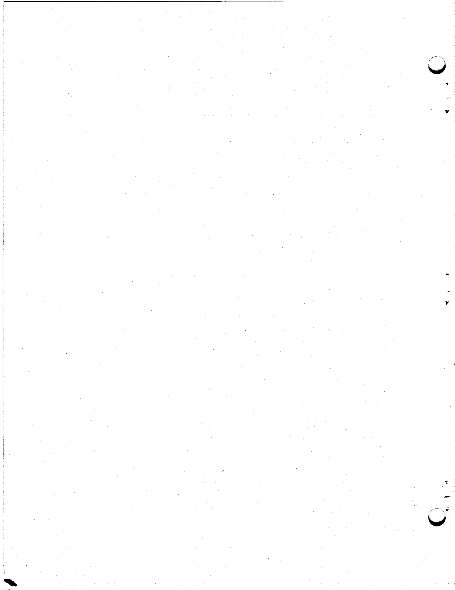

C. E. Sessions and E. E. Stansbury

# ABSTRACT

We have investigated the influence of small titanium additions on the thermal stability of Ni-12% Mo-7% Cr-0.07% C. The mechanical properties at $650^{\circ}\mathrm{C}$ (tensile tests at 0.002/min strain rate and creep tests at 40,000 psi stress) were measured for four heats of this alloy with titanium contents from 0.15 to 1.2%. Solution annealing temperatures were 1177 or $1260^{\circ}\mathrm{C}$ , and subsequent precipitation heat treatments were conducted at 650 and $760^{\circ}\mathrm{C}$ . Titanium increases the stability of a complex MC-type carbide. At low titanium levels the MC carbide is stable at $650^{\circ}\mathrm{C}$ but is unstable at $760^{\circ}\mathrm{C}$ , where an $\mathbf{M}_2\mathbf{C}$ -type carbide is precipitated, resulting in inferior properties. For the higher titanium concentrations the MC carbide is stable on aging at $760^{\circ}\mathrm{C}$ and results in excellent properties after a solution anneal at $1177^{\circ}\mathrm{C}$ . However, high-titanium alloys are significantly less ductile if they are solution annealed at $1260^{\circ}\mathrm{C}$ and aged at either 650 or $760^{\circ}\mathrm{C}$ . The heat with the lowest carbon content $(0.04\%)$ was most resistant to property changes on aging up to 10,000 hr at both 650 and $760^{\circ}\mathrm{C}$ .

# INTRODUCTION

We are concerned with modifying the composition of Hastelloy N for better performance as a material for a molten-salt thermal breeder reactor with an expected lifetime of 30 years or more. The existing Hastelloy N developed primarily at Oak Ridge over the past 10 to 12 years functioned well in an 8-MW(t) reactor built five years ago and operated over the past three years.[2] However, this reactor operated at

$650^{\circ}\mathrm{C}$ , and when it was constructed very little was known about the problem of high-temperature irradiation damage to this alloy. Since that time we have observed3 damage by thermal neutrons on many materials, including nickel-base alloys such as Hastelloy N, in which a larger deterioration in properties is observed than in most iron-base alloys. Thus, an alloy with greater resistance to radiation damage is needed.

We found that small additions of reactive elements, notably titanium, can significantly enhance the postirradiation creep-rupture life and ductility.4 Thus, we have proceeded with the development of a modified Hastelloy N containing titanium. This report represents the phase of the program concerned with the effect of thermal and mechanical treatment on the creep and tensile behavior of these experimental alloys.

# EXPERIMENTAL PROCEDURE

The material investigated in this program was produced by a commercial vendor. These four 100-lb heats were vacuum induction melted with initial ingot breakdown at $1177^{\circ}\mathrm{C}$ and final fabrication to 0.5-in. plate at $870^{\circ}\mathrm{C}$ . The titanium content was the primary variable, being 0.15, 0.27, 0.45, and $1.20\%$ as shown in Table 1. Although a nominal carbon level of $0.07\%$ was specified, the carbon content of Heat 466-548 was lower than the others. The various thermal and mechanical treatments applied are given in Table 2. The variables include solution annealing conditions, cold work, aging time, and aging temperature.

The dimensions of the mechanical property test specimen are shown in Fig. 1. This specimen was used so that the results could be compared directly to postirradiation mechanical property tests for which this

Table 1. Chemical Analyses of Alloys in Aging Program   

<table><tr><td rowspan="2">Element</td><td colspan="4">Chemical Analyses, wt %</td></tr><tr><td>466-535a</td><td>466-541</td><td>466-548</td><td>467-548</td></tr><tr><td>Mo</td><td>12.8</td><td>13.2</td><td>12.4</td><td>12.0</td></tr><tr><td>Cr</td><td>7.2</td><td>6.8</td><td>7.7</td><td>7.1</td></tr><tr><td>Ti</td><td>0.15</td><td>0.27</td><td>0.45</td><td>1.20</td></tr><tr><td>C</td><td>0.073</td><td>0.07</td><td>0.04</td><td>0.08</td></tr><tr><td>Fe</td><td>0.03</td><td>0.03</td><td>0.03</td><td>0.04</td></tr><tr><td>Si</td><td>0.07</td><td>0.05</td><td>0.05</td><td>0.03</td></tr><tr><td>Mn</td><td>0.12</td><td>0.10</td><td>0.14</td><td>0.12</td></tr><tr><td>Mg</td><td>0.034</td><td>0.01</td><td>0.023</td><td></td></tr><tr><td>W</td><td>0.007</td><td>0.07</td><td>0.007</td><td>0.004</td></tr><tr><td>Zr</td><td>0.0002</td><td>0.0007</td><td>&lt; 0.0001</td><td>0.002</td></tr><tr><td>V</td><td>&lt; 0.01</td><td>&lt; 0.01</td><td>&lt; 0.01</td><td>0.001</td></tr><tr><td>Co</td><td>0.02</td><td>0.04</td><td>0.03</td><td>0.15</td></tr><tr><td>Cu</td><td>0.002</td><td>0.005</td><td>0.0005</td><td>0.01</td></tr><tr><td>Nb</td><td>&lt; 0.0001</td><td>0.0001</td><td>0.0003</td><td>0.0005</td></tr><tr><td>Al</td><td>&lt; 0.03</td><td>&lt; 0.03</td><td>&lt; 0.03</td><td>0.05</td></tr><tr><td>S</td><td>0.003</td><td>&lt; 0.002</td><td>0.003</td><td>&lt; 0.002</td></tr><tr><td>P</td><td></td><td></td><td></td><td>0.0004</td></tr><tr><td>B</td><td>0.0002</td><td>0.0002</td><td>0.00007</td><td>0.0007</td></tr><tr><td>O</td><td>0.0012</td><td>0.0008</td><td>0.001</td><td>0.0003</td></tr><tr><td>N</td><td>0.007</td><td>0.0005</td><td>0.0009</td><td>0.0002</td></tr><tr><td>H</td><td>0.0002</td><td>0.0002</td><td>0.0002</td><td>0.0003</td></tr><tr><td>Ni</td><td>Balance</td><td>Balance</td><td>Balance</td><td>Balance</td></tr></table>

Heat numbers of 100-lb heats obtained from the Stellar Division of the Cabot Corporation.

Table 2. Variables Considered in This Study   

<table><tr><td>Variable</td><td>Levels or Treatments</td></tr><tr><td>Titanium content, %</td><td>0.15, 0.27, 0.45, and 1.2</td></tr><tr><td>Preage treatment</td><td>Solution anneal 1 hr at 1177°C
Solution anneal 1 hr at 1260°C
Anneal 1 hr at 1177°C, then prestrain 10% at room temperature</td></tr><tr><td>Aging temperature, °C</td><td>650 and 760</td></tr><tr><td>Aging time, hr</td><td>1500, 3000, and 10,000</td></tr><tr><td>Testing after aging</td><td></td></tr><tr><td>Tensile</td><td>650°C, 0.002/min strain rate</td></tr><tr><td>Creep</td><td>650°C, 40,000 psi stress</td></tr></table>

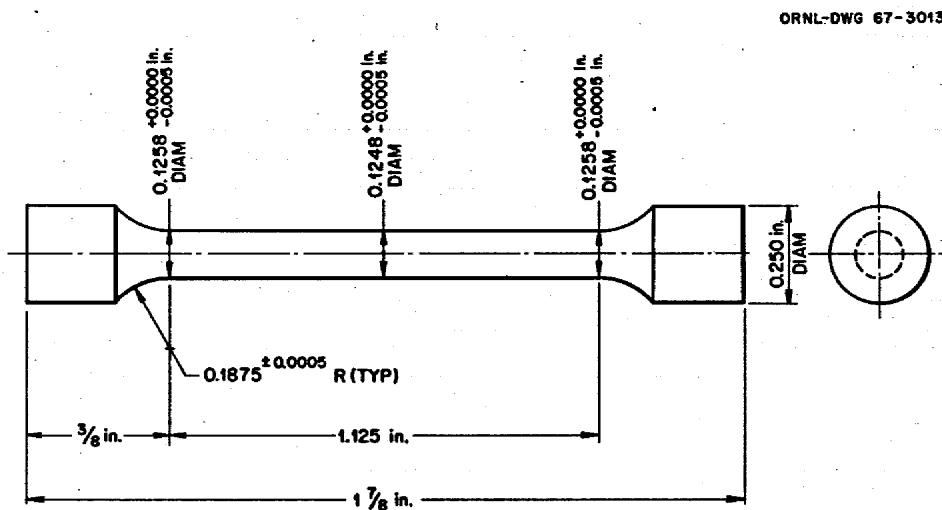  
Fig. 1. Mechanical Property Test Specimen.

specimen was designed. Specimens were solution annealed in argon and aged in stainless steel capsules that had been evacuated and backfilled with argon. Conventional tensile measurements were carried out using an Instron tensile machined equipped with a specimen furnace. Two Chromel-P vs Alumel thermocouples were used with a proportioning controller to keep the test specimen at $650 \pm 3^{\circ}\mathrm{C}$ .

The microstructures developed during aging were studied by optical and electron transmission microscopy, extraction replication, and scanning microscopy. In addition, precipitated phases present in certain alloys were identified by x-ray diffraction using the Debye-Scherrer technique on precipitates extracted electrolytically with a methanol-10% HCl solution. Details of the microstructure examination have been reported, $^{5}$ and the alloying effects of titanium have been summarized. $^{6}$ We shall concern ourselves here with the detailed mechanical property response to heat treatment and a limited discussion of microstructures revealed in optical metallography.

Because of the large number of variables included in this study and the attempt to measure the complicated and very subtle differences introduced by titanium additions, these experiments were statistically designed as a full factorial replication7 including the variables in Table 2. The purpose of this experimental design was to provide better evaluation and separation of the influence of the specific variables on the tensile property response. Results of these statistical analyses have been discussed previously.8

# RESULTS AND DISCUSSION

Typical results of the influence of preage thermal-mechanical treatment, aging time, and temperature on the tensile and creep properties at $650^{\circ}\mathrm{C}$ will be presented first. The phase identification will then be presented and discussed in light of the mechanical property changes. Strength and ductility values for all specimens tested are given in the Appendix.

# Effect of Preaging on the Mechanical Properties

Figure 2 shows the yield strength (0.2% offset) and total elongation values for the three preage treatments investigated. Solution annealing 1 hr at $1260^{\circ}\mathrm{C}$ lowered the strength and increased the ductility at each titanium level as compared to a 1-hr solution anneal at $1177^{\circ}\mathrm{C}$ . Prestraining 10% at room temperature after a 1-hr $1177^{\circ}\mathrm{C}$ solution anneal doubled the high-temperature yield strength and reduced the ductility by one-third. The yield strength increased with titanium content for these unaged specimens, but the tensile ductility was not appreciably affected by the titanium content for these pretest treatments.

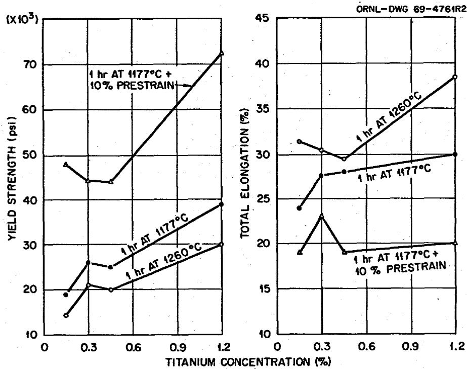  
Fig. 2. Effect of Titanium Content and Preaging Treatments on the Strength and Ductility of Modified Hastelloy N at $650^{\circ}\mathrm{C}$ .

# Effect of Aging on Ductility

Changes in tensile elongation with aging time are shown in Figs. 3 through 5 for both aging temperatures. Aging at either 650 or $760^{\circ}\mathrm{C}$ after a solution anneal at $1177^{\circ}\mathrm{C}$ enhanced the ductility at $650^{\circ}\mathrm{C}$ for the $1.2\%$ Ti heat and decreased it for the $0.15\%$ Ti heat. After a 1-hr solution anneal at $1260^{\circ}\mathrm{C}$ , the $1.2\%$ Ti heat lost ductility on aging at either aging temperature to the same extent as did the lowest titanium level, $0.15\%$ . Thus, the larger grain size or greater amount of solute in solid solution after the $1260^{\circ}\mathrm{C}$ treatment made the high-titanium heat susceptible to a detrimental aging reaction to which it was immune after the $1177^{\circ}\mathrm{C}$ anneal.

The effect of prestraining on the aging behavior is shown in Fig. 5. Samples were solution annealed $1\mathrm{hr}$ at $1177^{\circ}\mathrm{C}$ , prestrained $10\%$ at room temperature, aged at either 650 or $760^{\circ}\mathrm{C}$ , and then tested at $650^{\circ}\mathrm{C}$ . The variation in tensile ductility with aging time and titanium was similar to that shown in Fig. 3 for samples not prestrained; however, the overall ductility was lower for the prestrained material.

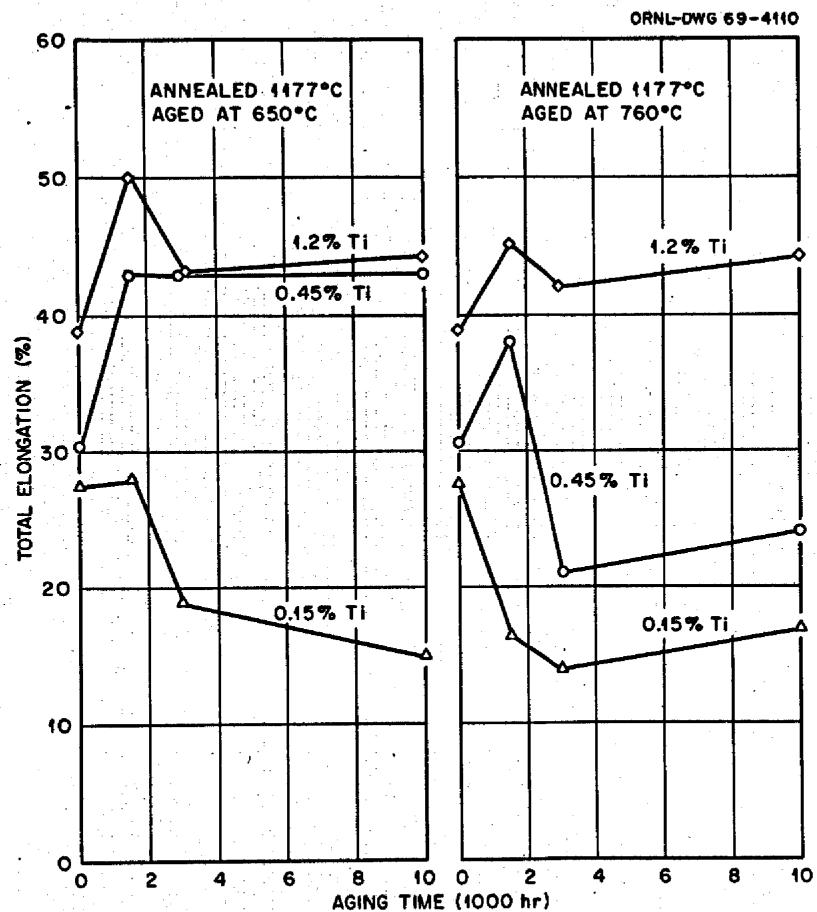  
Fig. 3. Effect of Titanium Content and Aging Time on the Tensile Ductility at $650^{\circ}\mathrm{C}$ after a 1-hr Solution Anneal at $1177^{\circ}\mathrm{C}$ .

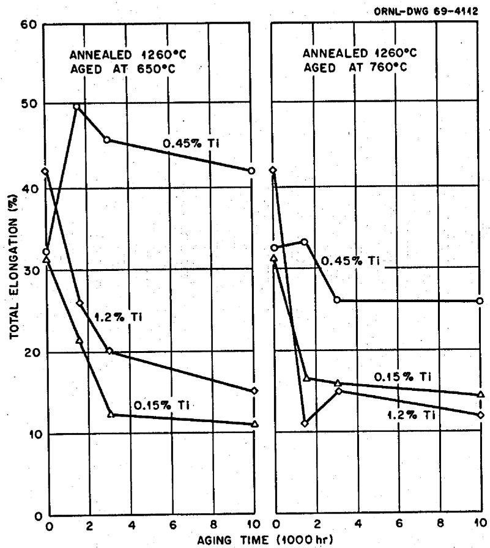  
Fig. 4. Effect of Titanium Content and Aging Time on the Tensile Ductility at $650^{\circ}\mathrm{C}$ after a 1-hr Solution Anneal at $1260^{\circ}\mathrm{C}$ .

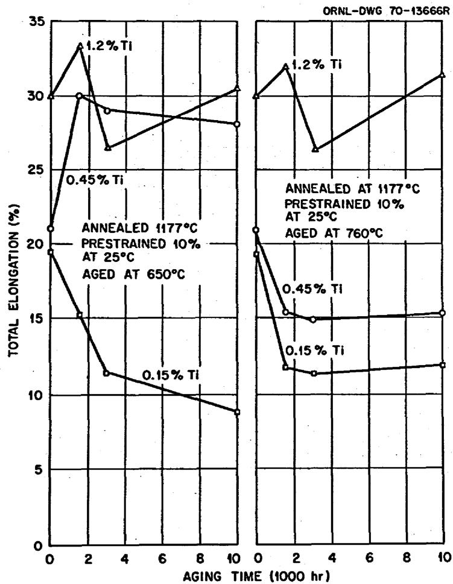  
Fig. 5. Effect of Titanium Content and Aging Time on the Tensile Ductility at $650^{\circ}\mathrm{C}$ for Samples Solution Annealed 1 hr at $1177^{\circ}\mathrm{C}$ and Prestrained $10\%$ at Room Temperature.

For aging at $650^{\circ}\mathrm{C}$ the intermediate $(0.45\%)$ and high $(1.2\%)$ titanium heats showed an increase in ductility with aging time. The low $(0.15\%)$ titanium heat exhibited a rapid loss in hot ductility with aging time at $650^{\circ}\mathrm{C}$ . Aging at $760^{\circ}\mathrm{C}$ affected the ductility of the low- and high-titanium heats the same as aging at $650^{\circ}\mathrm{C}$ , whereas the intermediate $(0.45\%)$ titanium heat showed a ductility deterioration with time at $760^{\circ}\mathrm{C}$ in contrast to the ductility enhancement found after aging at $650^{\circ}\mathrm{C}$ .

# Effect of Aging on the Strength

The changes in the yield strength on aging are shown for only the 1-hr solution anneal at $1260^{\circ}\mathrm{C}$ in Fig. 6. For aging at both 650 and

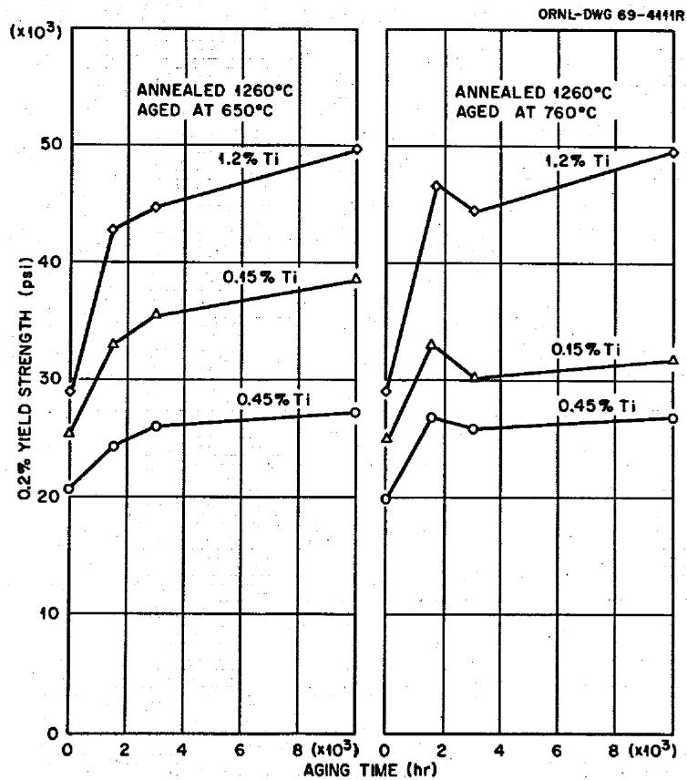  
Fig. 6. Yield Strength Changes as a Function of Aging Time and Titanium Content for a 1-hr Solution Anneal at $1260^{\circ}\mathrm{C}$ .

$760^{\circ}\mathrm{C}$ the largest strength increase occurred for the $1.2\%$ Ti heat. The intermediate $(0.45\%)$ titanium heat exhibited the smallest change in yield strength for aging at either temperature. The lower yield strength values in this $0.45\%$ Ti heat were most likely due to the lower carbon concentration for this heat $(0.04\%)$ as compared to $0.07\%$ .

The changes in yield strength for samples solution annealed at $1177^{\circ}\mathrm{C}$ before aging (not plotted) were comparable in most cases to those shown in Fig. 6. For the $1.2\%$ Ti heat solution annealed at $1177^{\circ}\mathrm{C}$ and aged at $650^{\circ}\mathrm{C}$ , the yield strength at $650^{\circ}\mathrm{C}$ peaked at 46,000 psi after 1500 hr aging and exhibited classical overaging by decreasing to 37,500 psi after 10,000 hr. The increase in strength on aging the $1.2\%$ Ti heat at $760^{\circ}\mathrm{C}$ after the $1177^{\circ}\mathrm{C}$ solution anneal was appreciably lower than for the $1260^{\circ}\mathrm{C}$ anneal. The yield strength peaked at 41,000 psi after 1500 hr and decreased to 37,000 psi after 10,000 hr.

The strength of the prestrained alloys did not increase on aging. The $1.2\%$ Ti heat actually showed a yield strength decrease with aging time at both 650 and $760^{\circ}\mathrm{C}$ , and the intermediate- and low-titanium heats did not show any large change in yield strength after aging.

# Stress-Strain Curves

The stress-strain curves for the two heats that showed the lowest and highest strengths are shown in Figs. 7 and 8. The engineering stress and strain are plotted up to the ultimate stress for the $0.45$ and $1.2\%$ Ti heats in Figs. 7 and 8, respectively. For the $0.45\%$ Ti heat

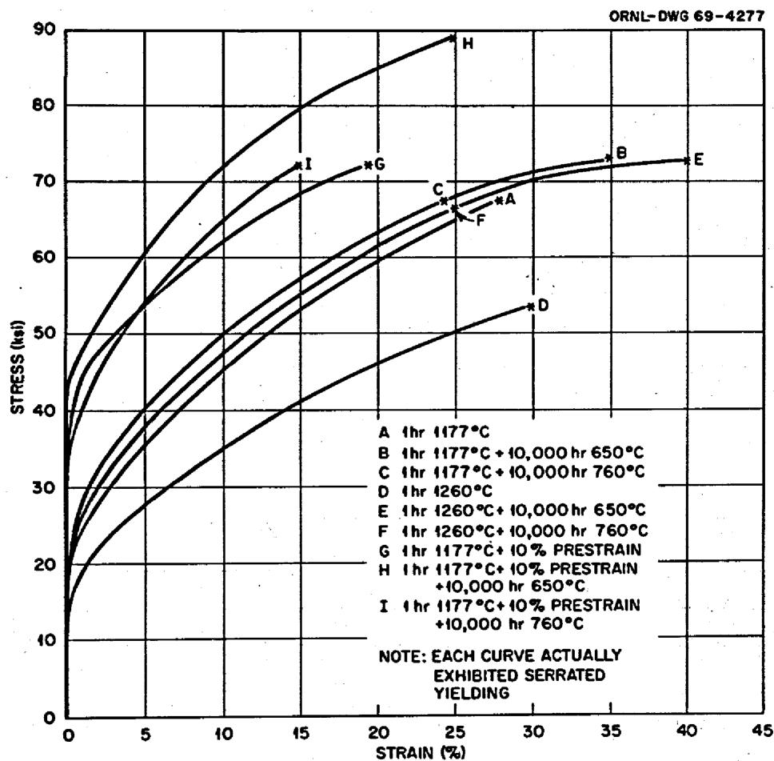  
Fig. 7. Stress-Strain Curves for the $0.45\%$ Ti Heat at $650^{\circ}\mathrm{C}$ for Various Heat Treatments.

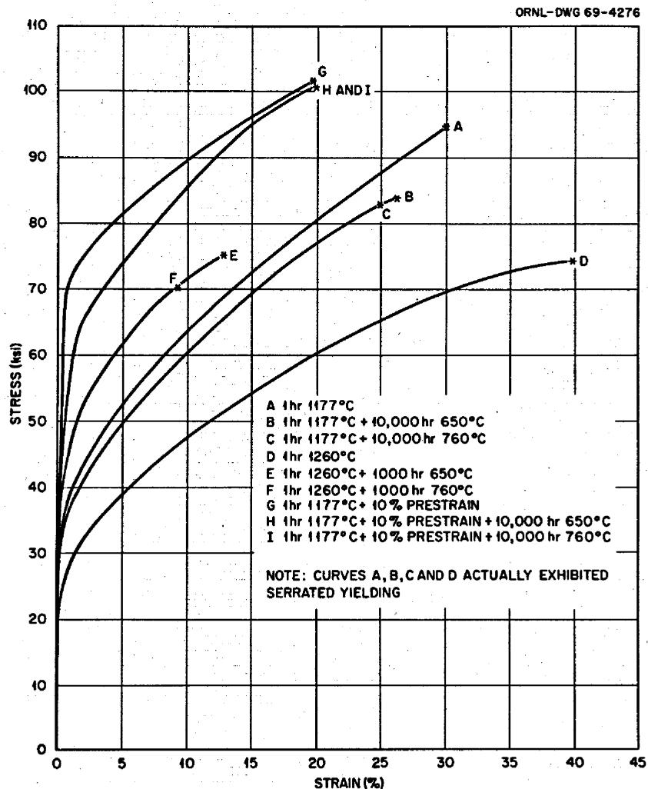  
Fig. 8. Stress-Strain Curves for the $1.2\%$ Ti Heat at $650^{\circ}\mathrm{C}$ for Various Heat Treatments.

ultimate tensile stresses from 50,000 to 90,000 psi and uniform elongations from approximately 15 to $40\%$ were achieved by the thermal-mechanical treatments investigated. The $1.2\%$ Ti heat (Fig. 8) exhibited a range of ultimate tensile strengths from 75,000 to 105,000 psi and uniform elongations from 8 to $40\%$ .

# Comparison of Measures of Ductility

Depending on the application, our criteria of usable ductility often vary. Thus, Fig. 9 compares three measures of the tensile ductility at $650^{\circ}\mathrm{C}$ for a l-hr anneal at $1177^{\circ}\mathrm{C}$ and aging at $650^{\circ}\mathrm{C}$ . This particular treatment produced a high total elongation for the 0.45 and

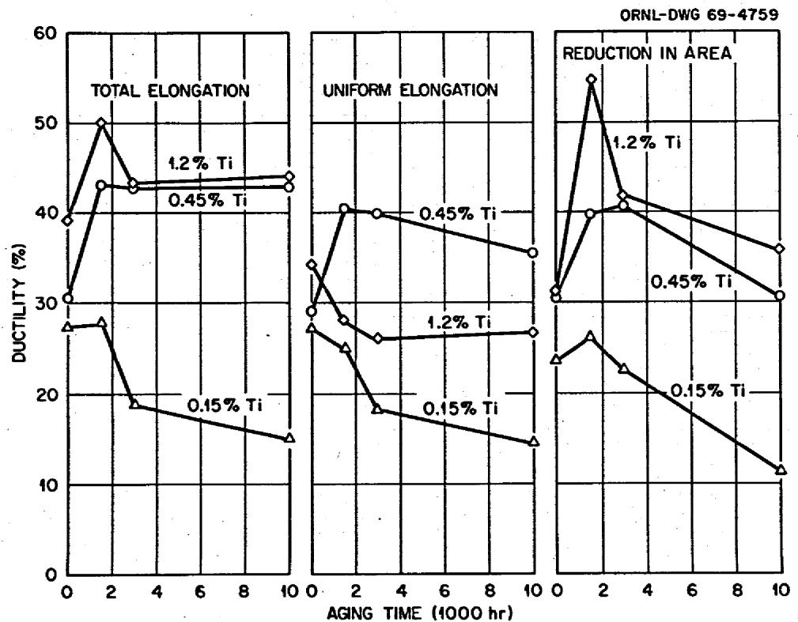  
Fig. 9. Comparison of Measures of Tensile Ductility for a 1-hr Solution Anneal at $1177^{\circ}\mathrm{C}$ and Aging at $650^{\circ}\mathrm{C}$ .

1.2% Ti levels, as previously discussed, but the 1.2% Ti heat actually deteriorated in uniform elongation from 35 to approximately 26% with aging time. Therefore, to account for the high total elongation observed, the nonuniform elongation must have increased to compensate for the observed decrease in uniform strain. That is to say, for this heat, which exhibited the maximum ductility after this particular treatment, we found a change in the stress-strain relationship induced by precipitation. The change corresponded to an increase in yield strength, an increase in reduction in area, and an increase in total elongation; however, it corresponded to a decrease in ultimate tensile strength and uniform elongation.

# Room-Temperature Tensile Properties

The effect of aging treatment on the room-temperature tensile properties is given in Table 3. The yield strengths and ductilities

Table 3. Room-Temperature Tensile Properties at 0.002/min Strain Rate for Titanium-Modified Hastelloy N After Various Heat Treatments   

<table><tr><td rowspan="2">Alloy</td><td colspan="3">Heat Treatment</td><td colspan="2">Strength, psi</td><td colspan="2">Elongation, %</td><td rowspan="2">Reduction in Area (%)</td><td rowspan="2">Specimen</td></tr><tr><td>Solution Anneal (°C)</td><td>Aging Time (hr)</td><td>Aging Temperature (°C)</td><td>Yield</td><td>Ultimate Tensile</td><td>Uniform</td><td>Total</td></tr><tr><td></td><td></td><td></td><td></td><td>×103</td><td>×103</td><td></td><td></td><td></td><td></td></tr><tr><td rowspan="3">466-535</td><td>1177</td><td>0</td><td></td><td>42.2</td><td>119.5</td><td>61.0</td><td>64.2</td><td>66.4</td><td>5292</td></tr><tr><td>1177</td><td>1500</td><td>650</td><td>61.5</td><td>135.9</td><td>40.5</td><td>40.8</td><td>29.5</td><td>5997</td></tr><tr><td>1177</td><td>1500</td><td>760</td><td>53.3</td><td>139.1</td><td>43.5</td><td>46.0</td><td>47.8</td><td>5998</td></tr><tr><td rowspan="3">466-541</td><td>1177</td><td>0</td><td></td><td>38.2</td><td>112.7</td><td>69.6</td><td>73.3</td><td>57.1</td><td>6093</td></tr><tr><td>1177</td><td>1500</td><td>650</td><td>54.3</td><td>125.6</td><td>52.5</td><td>53.7</td><td>41.9</td><td>6099</td></tr><tr><td>1177</td><td>1500</td><td>760</td><td>42.4</td><td>110.5</td><td>50.1</td><td>52.3</td><td>40.6</td><td>6100</td></tr><tr><td rowspan="3">466-548</td><td>1177</td><td>0</td><td></td><td>37.4</td><td>113.3</td><td>68.8</td><td>72.2</td><td>62.6</td><td>6270</td></tr><tr><td>1177</td><td>1500</td><td>650</td><td>47.6</td><td>124.1</td><td>57.4</td><td>59.0</td><td>41.8</td><td>6277</td></tr><tr><td>1177</td><td>1500</td><td>760</td><td>48.1</td><td>129.6</td><td>53.6</td><td>55.4</td><td>50.9</td><td>6278</td></tr><tr><td rowspan="5">467-548</td><td>1260</td><td>0</td><td></td><td>35.7</td><td>104.9</td><td>67.0</td><td>68.2</td><td>18.2</td><td>6344</td></tr><tr><td>1177</td><td>0</td><td></td><td>47.6</td><td>134.9</td><td>62.5</td><td>63.8</td><td>46.2</td><td>11416</td></tr><tr><td>1177</td><td>1500</td><td>650</td><td>61.3</td><td>145.6</td><td>50.5</td><td>52.0</td><td>41.2</td><td>6321</td></tr><tr><td>1177</td><td>1500</td><td>760</td><td>50.1</td><td>121.3</td><td>47.8</td><td>49.0</td><td>43.6</td><td>6322</td></tr><tr><td>1260</td><td>1500</td><td>760</td><td>59.6</td><td>122.6</td><td>41.6</td><td>41.7</td><td>36.7</td><td>6989</td></tr></table>

are similar for the various heats as solution annealed at $1177^{\circ}\mathrm{C}$ . Aging 1500 hr at $650^{\circ}\mathrm{C}$ increases yield strength more than at $760^{\circ}\mathrm{C}$ . However, the ductility decrease on aging was approximately the same for the two aging temperatures. These trends in strength and ductility were found for heats 466-535, 466-541, and 466-548. For heat 467-548 (1.2% Ti) we measured the effect of using a higher solution anneal temperature $(1260^{\circ}\mathrm{C})$ on the aging response. Aging 1500 hr at $760^{\circ}\mathrm{C}$ increased the room-temperature yield strength from 36,000 to 60,000 psi and decreased the creep elongation from 68 to $42\%$ strain. This change in the room-temperature tensile behavior for the $1260^{\circ}\mathrm{C}$ solution anneal was larger than that found after annealing at $1177^{\circ}\mathrm{C}$ . However, the microstructural differences found for this high-titanium (1.2% Ti, 467-548) heat are significant and have been discussed previously. The point is that, regardless of the differences in microstructure, the room-temperature properties are similar.

# Creep Properties After 3000 hr of Aging

The effect of titanium content on the creep properties of solution-annealed and aged alloys was measured for 36 specimens. Each test was conducted at $650^{\circ}\mathrm{C}$ and under 40,000 psi stress so that the rupture lives and creep rates indicate the effects of aging. Creep ductility in these tests reflected the influence of strain rate, which varied with the strength of the alloy under this constant-load creep test. The ductilities, rupture lives, and creep rates are given in Figs. 10 and 11 for some of the treatments used.

# Effect of Preage Treatments

For each alloy, except the $1.2\%$ Ti heat, the lowest rupture life and highest elongation corresponded to samples solution annealed at the higher temperature (i.e., 1 hr at $1260^{\circ}\mathrm{C}$ ). In most instances the lowest secondary creep rate, maximum rupture life, and minimum ductility corresponded to the samples prestrained $10\%$ at room temperature.

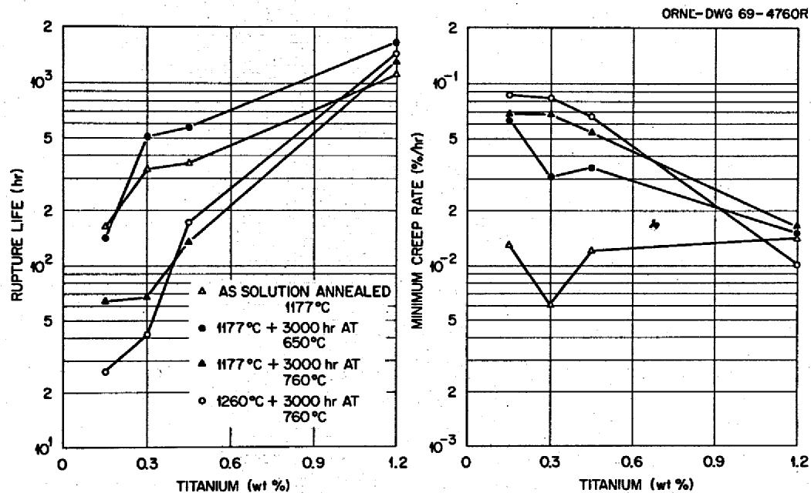  
Fig. 10. Variation in Rupture Life and Creep Rate with Titanium Content and Heat Treatment at $650^{\circ}\mathrm{C}$ and 40,000 psi Stress.

# Effect of Aging Temperature

In most cases (10 of 12 tests) the rupture life after aging 3000 hr at $760^{\circ}\mathrm{C}$ was reduced by from 20 to $90\%$ as compared with the unaged samples. Correspondingly, the creep rates were significantly increased by a factor of 3 to 10, depending on the alloy and heat treatment. The creep ductility of the samples aged 3000 hr at $760^{\circ}\mathrm{C}$ ranged from 6 to $37\%$ , with the higher values corresponding to the higher titanium level $(1.2\%)$ .

Less property deterioration was observed for aging 3000 hr at $650^{\circ}\mathrm{C}$ . In fact, several heats, notably the $0.45\%$ Ti heat, exhibited significantly enhanced rupture lives and fracture strains even though the creep rate was increased appreciably by the aging treatment. In general, the prestrained samples and those with the larger grain size (i.e., solution annealed at $1260^{\circ}\mathrm{C}$ ) showed the largest reduction in rupture life after aging at $760^{\circ}\mathrm{C}$ .

# Effect of Titanium

Generally, the creep-rupture lives and ductilities increased with increasing titanium content for both the solution-annealed and the aged samples. The creep rates decreased with increasing titanium content.

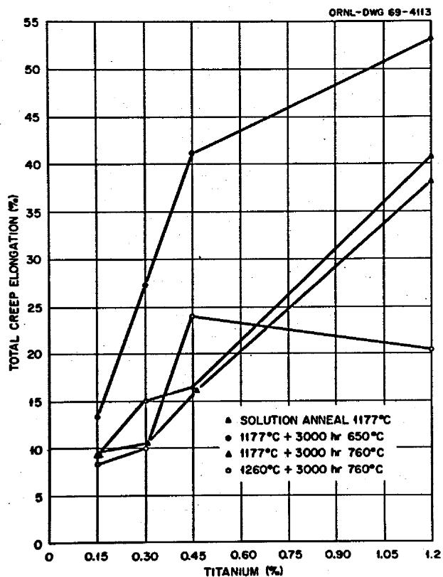  
Fig. 11. Effect of Titanium Content and Heat Treatment on the 40,000-psi Creep Elongation at $650^{\circ}\mathrm{C}$ .

The titanium content influenced the magnitude of the aging effect. For most treatments, the alloy with the highest titanium content exhibited the smallest property deterioration after aging. However, solution annealing for 1 hr at $1260^{\circ}\mathrm{C}$ led to creep property changes on aging that were quite significant for all levels of titanium.

# Comparison of Tensile and Creep Results

Table 4 lists the heat treatments for each heat of material that corresponded to the maximum and minimum property value found in creep and tensile testing of the samples aged 3000 hr. Since three treatments were included in this study [i.e., solution anneals of (1) 1 hr at $1177^{\circ}\mathrm{C}$ (2) $1260^{\circ}\mathrm{C}$ , and (3) 1 hr at $1177^{\circ}\mathrm{C}$ plus $10\%$ prestrain at room temperature] the treatment that is not listed under either minimum or maximum in Table 4 would result in properties intermediate between the minimum and maximum values.

Table 4. Thermal-Mechanical Treatments That Produced the Maximum and Minimum Creep and Tensile Properties at $650^{\circ}\mathrm{C}$ for Various Heats of Titanium-Modified Hastelloy N   

<table><tr><td rowspan="3">Condition</td><td rowspan="3">Property</td><td colspan="4">Heat Treatmenta to Give Extreme Property</td></tr><tr><td colspan="4">for Each Titanium Content in Percent</td></tr><tr><td>0.15</td><td>0.27</td><td>0.45</td><td>1.2</td></tr><tr><td colspan="6">Tensile Resultsb</td></tr><tr><td rowspan="6">Unaged</td><td>Maximum yield strength</td><td>cw</td><td>cw</td><td>cw</td><td>cw</td></tr><tr><td>Minimum yield strength</td><td>1260</td><td>1260</td><td>1260</td><td>1260</td></tr><tr><td>Maximum ultimate strength</td><td>cw</td><td>cw</td><td>cw</td><td>cw</td></tr><tr><td>Minimum ultimate strength</td><td>1260</td><td>1260</td><td>1260</td><td>1260</td></tr><tr><td>Maximum total elongation</td><td>1260</td><td>1260</td><td>1260</td><td>1260</td></tr><tr><td>Minimum total elongation</td><td>cw</td><td>cw</td><td>cw</td><td>cw</td></tr><tr><td rowspan="6">Aged</td><td>Maximum yield strength</td><td>cw/650</td><td>cw/650</td><td>cw/650</td><td>cw/650</td></tr><tr><td>Minimum yield strength</td><td>1260/760</td><td>1177/760</td><td>1260/760</td><td>1177/760</td></tr><tr><td>Maximum ultimate strength</td><td>1177/760</td><td>cw/650</td><td>cw/650</td><td>cw/650</td></tr><tr><td>Minimum ultimate strength</td><td>1260/650</td><td>1260/650</td><td>1260/760</td><td>1260/760</td></tr><tr><td>Maximum total elongation</td><td>1177/760</td><td>1177/650</td><td>1177/650</td><td>1177/650, 760</td></tr><tr><td>Minimum total elongation</td><td>cw/650</td><td>1260/650</td><td>cw/760</td><td>1260/760</td></tr><tr><td colspan="6">Creep Resultsc</td></tr><tr><td rowspan="6">Unaged</td><td>Maximum rupture life</td><td>cw</td><td>1177</td><td>cw</td><td>1260</td></tr><tr><td>Minimum rupture life</td><td>1260</td><td>1260</td><td>1260</td><td>1177</td></tr><tr><td>Maximum secondary creep rate</td><td>1177</td><td>1260</td><td>1177</td><td>1177</td></tr><tr><td>Minimum secondary creep rate</td><td>cw</td><td>cw</td><td>cw</td><td>1260</td></tr><tr><td>Maximum creep elongation</td><td>1260</td><td>1260</td><td>1260</td><td>1177</td></tr><tr><td>Minimum creep elongation</td><td>cw</td><td>cw</td><td>cw</td><td>1260</td></tr><tr><td rowspan="6">Aged</td><td>Maximum rupture life</td><td>1260/650</td><td>cw/650</td><td>cw/650</td><td>cw/650</td></tr><tr><td>Minimum rupture life</td><td>1260/760</td><td>1260/760</td><td>cw/760</td><td>1177/760</td></tr><tr><td>Maximum secondary creep rate</td><td>1260/760</td><td>1260/760</td><td>1260/650</td><td>1177/760</td></tr><tr><td>Minimum secondary creep rate</td><td>1177/760</td><td>cw/650</td><td>cw/650</td><td>cw/650</td></tr><tr><td>Maximum creep elongation</td><td>cw/650</td><td>1177/650</td><td>1177/650</td><td>1177/650</td></tr><tr><td>Minimum creep elongation</td><td>cw/760</td><td>cw/760</td><td>cw/760</td><td>1260/760</td></tr></table>

aThe preage heat treatments are 1177, 1 hr at $1177^{\circ}C$ ; 1260, 1 hr at $1260^{\circ}C$ ; cw, 1 hr at $1177^{\circ}C$ , then cold worked. For aged specimens this is followed by the aging temperature in $^\circ C$ . Aging times were 3000 hr.   
bTensile properties measured at $650^{\circ}\mathrm{C}$ and 0.002/min strain rate.   
$^\mathrm{c}$ Creep properties measured at $650^{\circ}\mathrm{C}$ and 40,000-psi stress.

# Results of Unaged Samples

In each case the maximum yield strength and maximum ultimate tensile strength at $650^{\circ}\mathrm{C}$ were found for the $10\%$ prestrained samples. The minimum yield and ultimate strengths were found for the $1260^{\circ}\mathrm{C}$ treatment. The minimum and maximum tensile ductilities corresponded to the strongest and weakest alloys in tensile tests, with one exception, the $0.45\%$ Ti heat.

In creep the maximum resistance to rupture (maximum rupture life) corresponded to the prestrained sample in only two of the four heats, but prestrained samples crept at a lower rate in three of the four cases. Notably, the $1.2\%$ Ti heat exhibited the minimum and maximum creep resistance (as measured by the creep rate) for the 1177 and $1260^{\circ}\mathrm{C}$ anneals, respectively. This indicates that creep of this higher titanium heat was affected more by solution annealing treatment than by $10\%$ cold working. The minimum and maximum creep ductilities of the other alloys corresponded to the prestrained and to the $1260^{\circ}\mathrm{C}$ annealed material, respectively.

# Results for Aged Samples

The prestrained material aged 3000 hr at $650^{\circ}\mathrm{C}$ exhibited the maximum yield strength for each heat. The minimum yield strength corresponded to either 1177 or $1260^{\circ}\mathrm{C}$ samples aged 3000 hr at $760^{\circ}\mathrm{C}$ , depending on the alloy. The maximum ultimate strength was for prestrained samples aged 3000 hr at $650^{\circ}\mathrm{C}$ with one exception, the $0.15\%$ Ti heat. The lowest ultimate strength (UTS) was found for the $1260^{\circ}\mathrm{C}$ treatment; at lower titanium level an aging treatment of 3000 hr at $650^{\circ}\mathrm{C}$ caused the lowest UTS, and at the higher titanium levels aging 3000 hr at $760^{\circ}\mathrm{C}$ caused the lowest UTS. The rupture life was a maximum for prestrained samples aged at $650^{\circ}\mathrm{C}$ , and the treatment that produced the minimum rupture life differed for each alloy. An interesting point is that the $0.15\%$ Ti heat gave both the maximum and the minimum rupture life for the larger grain size $1260^{\circ}\mathrm{C}$ treatment, depending on whether it was aged at 650 or $760^{\circ}\mathrm{C}$ .

# Phases Identified in Aged Alloys

Table 5 lists the phases identified by Debye-Scherrer x-ray diffraction analysis of electrolytically extracted precipitate particles after 3000 hr of aging at the indicated temperatures. In the $0.15\%$ Ti heat a combination of MC and $\mathbf{M}_2\mathbf{C}$ type phases was present, but at $760^{\circ}\mathrm{C}$ only the $\mathbf{M}_2\mathbf{C}$ carbide was found. At the intermediate titanium level $(0.45\%)$ only MC was present at $650^{\circ}\mathrm{C}$ , while at $760^{\circ}\mathrm{C}$ a weak trace of MC and strong lines for $\mathbf{M}_2\mathbf{C}$ were found. At the highest titanium level investigated $(1.20\%)$ the MC structure was present after aging at either temperature. Thus, we conclude that the higher titanium content has stabilized the MC-type carbide at higher aging temperatures.

Table 5. Phases Identified in Ni-Mo-Cr-Ti Alloys by Debye-Scherrer Analysis   

<table><tr><td>Heat</td><td colspan="2">Heat Treatment</td><td>Titanium Content (%)</td><td>Phases Present</td></tr><tr><td rowspan="2">466-535</td><td colspan="2">1 hr 1177°C + 3000 hr at 650°C</td><td>0.15</td><td>\( MC^a + M_2C \)</td></tr><tr><td colspan="2">1 hr 1177°C + 3000 hr at 760°C</td><td>0.15</td><td>\( M_2C \)</td></tr><tr><td rowspan="4">466-548</td><td colspan="2">As annealed 1177°C</td><td></td><td>b</td></tr><tr><td colspan="2">As annealed 1260°C</td><td></td><td>b</td></tr><tr><td colspan="2">1 hr 1177°C + 3000 hr at 650°C</td><td>0.45</td><td rowspan="2">\( MC^a + M_2C \)</td></tr><tr><td colspan="2">1 hr 1177°C + 3000 hr at 760°C</td><td>0.45</td></tr><tr><td rowspan="6">467-548</td><td colspan="2">As annealed 1177°C</td><td>1.20</td><td>MC</td></tr><tr><td colspan="2">As annealed 1260°C</td><td>1.20</td><td>MC</td></tr><tr><td colspan="2">1 hr 1177°C + 3000 hr at 650°C</td><td>1.20</td><td>MC</td></tr><tr><td colspan="2">1 hr 1177°C + 3000 hr at 760°C</td><td>1.20</td><td>MC</td></tr><tr><td colspan="2">1 hr 1260°C + 3000 hr at 650°C</td><td>1.20</td><td>MC</td></tr><tr><td colspan="2">1 hr 1260°C + 3000 hr at 760°C</td><td>1.20</td><td>MC</td></tr></table>

aMinor amounts present.   
b. Too little precipitate to extract electrolytically.

The carbides found in these alloys were complex compounds involving chromium, molybdenum, and titanium, and in several cases we found two different lattice parameters that generally fit the hexagonal $\mathbf{M}_2\mathbf{C}$ -type structure with the same c/a ratio of 1.63. In the case of the MC

structure the lattice constant did not correspond to that of TiC (4.33 Å) but rather was significantly lower, which indicates that the smaller molybdenum or chromium atoms were substituting for titanium in the face-centered cubic MC structure.

# Metallography

# Initial Microstructures

The effect of solution annealing at $1177$ or $1260^{\circ}\mathrm{C}$ on the grain size for three of the four alloys is shown in Fig. 12. Annealing 1 hr at $1177^{\circ}\mathrm{C}$ did not produce a single-phase alloy for most of these heats. In the alloys containing 0.15 and $1.2\%$ Ti after an $1177^{\circ}\mathrm{C}$ anneal, large stringers of second-phase particles were evident. The 0.27 and $0.45\%$ Ti heats were virtually single phase after the $1177^{\circ}\mathrm{C}$ heat treatment. After 1 hr at $1260^{\circ}\mathrm{C}$ the grain size of each heat was 2 to 4 times that found after the $1177^{\circ}\mathrm{C}$ anneal. Also, fewer precipitate particles and stringers were present after 1 hr at $1260^{\circ}\mathrm{C}$ .

# Microstructures Developed During Aging

Typical structures obtained by interference contrast microscopy are shown in Fig. 13. This figure compares the precipitate distributions for samples solution annealed at $1177^{\circ}\mathrm{C}$ and aged 10,000 hr at either 650 or $760^{\circ}\mathrm{C}$ . These photographs were taken near the fracture sites of tensile samples tested at $650^{\circ}\mathrm{C}$ after aging at the indicated temperatures. After aging at $650^{\circ}\mathrm{C}$ the precipitate was generally finer, and the concentration of precipitate near grain boundaries appeared to be fairly heavy, particularly for the low-titanium alloy. After aging 10,000 hr at $760^{\circ}\mathrm{C}$ the precipitate was rather coarse, and the concentration of precipitate near the grain boundary was lower than that found at $650^{\circ}\mathrm{C}$ . The precipitate within the grain boundary was also coarse, as shown by the micrographs of the 0.27 and $0.45\%$ Ti heats in Fig. 13. Little precipitation occurred in the $1.2\%$ Ti heat, since the stringers evident in Fig. 13 were actually present to some extent even before aging; this was shown for the as-solution-annealed condition in Fig. 12.

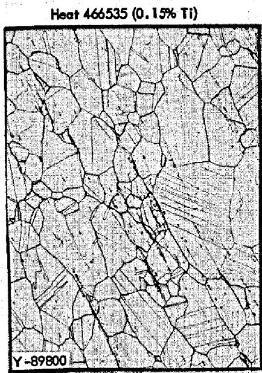  
1 hr at 1177oC

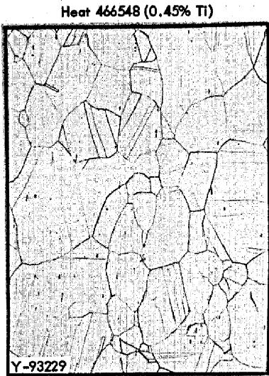

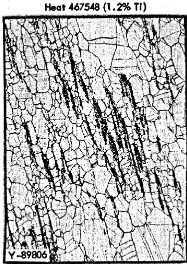

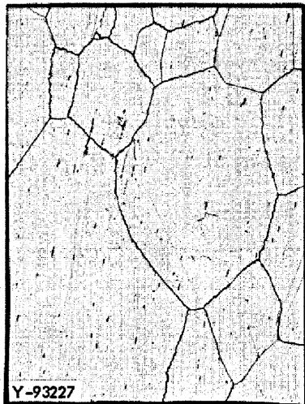  
1 hr at 1260°C

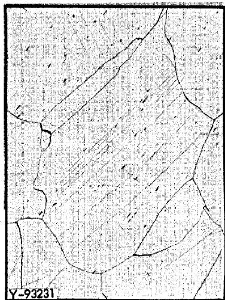

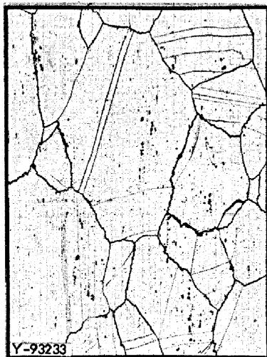  
Fig. 12. Microstructures of Titanium-Modified Alloys in the Solution-Annealed Condition. $100 \times$ Reduced $38\%$ .

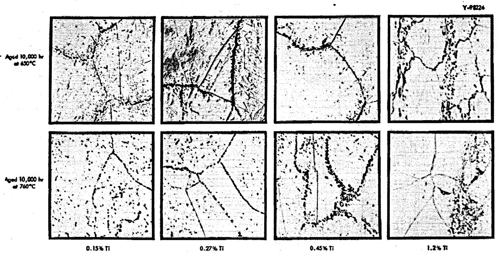  
Fig. 13. Microstructures Developed in Ni-12% Mo-7% Cr-0.07% C Alloys Modified with Titanium, Solution Annealed 1 hr at $1177^{\circ}\mathrm{C}$ , and Aged 10,000 hr. 1000x. Reduced 65%.

Microstructures developed during aging 10,000 hr after a 1-hr solution anneal at $1260^{\circ}\mathrm{C}$ are shown in Fig. 14. These structures are typical also of those developed in 1500 and 3000 hr of aging and indicate a large variation in optical microstructure with titanium content. Alloys with lower titanium contents exhibited relatively coarse precipitate distributions. The $1.2\%$ Ti alloy showed bands of precipitate stringers after aging at $650^{\circ}\mathrm{C}$ . Apparently, the stringers present initially along the hot-working direction of the rod stock were not completely eliminated even though the material was solution annealed at $1260^{\circ}\mathrm{C}$ . During subsequent aging these residual second-phase particles coarsened. Thus, the longitudinal cross section of these aged alloys exhibited a banded structure, which is similar to that found in the cold-worked rod before solution annealing. In the 0.45 and $1.2\%$ Ti heats during aging at $650^{\circ}\mathrm{C}$ , however, some additional precipitation occurred on both subgrain and grain boundaries.

The microstructures developed at $760^{\circ}\mathrm{C}$ after a $1260^{\circ}\mathrm{C}$ solution anneal, shown in Fig. 14, were actually quite similar to those found after the $1177^{\circ}\mathrm{C}$ anneal and $760^{\circ}\mathrm{C}$ age (Fig. 13). For the $1.2\%$ Ti heat,

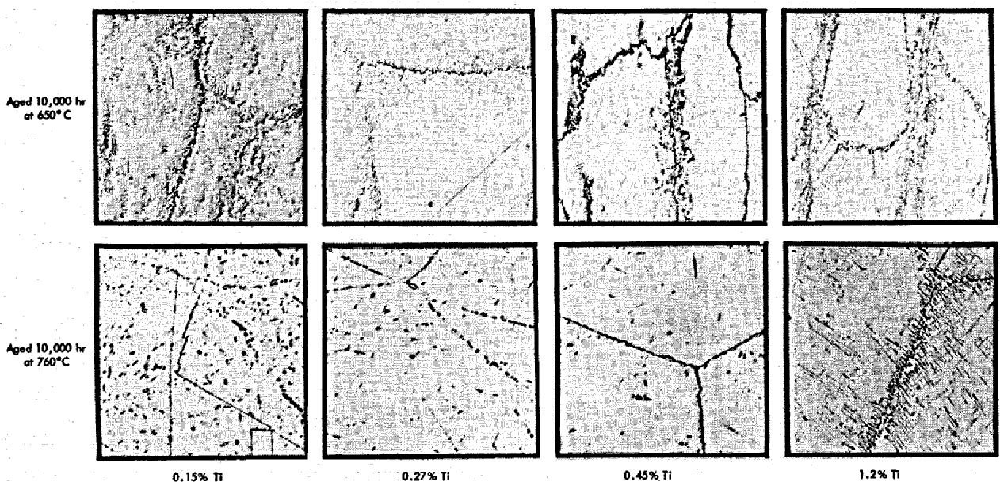  
Fig. 14. Microstructures Developed in Ni-12% Mo-7% Cr-0.07% C Alloys Modified with Titanium, Solution Annealed 1 hr at 1260°C, and Aged 10,000 hr. 1000x. Reduced 65%.

however, the structure developed after a $1260^{\circ}\mathrm{C}$ anneal was much different from that developed in samples annealed at $1177^{\circ}\mathrm{C}$ . The precipitation appeared to be a Widmanstätten distribution; however, the concentration of precipitate platelets shown in Fig. 14 varied within a given grain. Generally, a higher concentration of "platelets" was found near grain boundaries and near clusters of primary precipitate particles. This "platelet"-type precipitate, which forms primarily after the $1260^{\circ}\mathrm{C}$ solution anneal and $760^{\circ}\mathrm{C}$ age, has been shown10 by transmission electron microscopy to result from precipitation on stacking faults.

# Structures Developed in Prestrained Material

The microstructures developed during aging 10,000 hr at 650 and $760^{\circ}\mathrm{C}$ after annealing 1 hr at $1177^{\circ}\mathrm{C}$ and prestraining $10\%$ at room temperature are shown in Fig. 15 for the 0.15 and $1.2\%$ Ti heats. Prior prestraining greatly reduced the coarseness of the precipitate in both

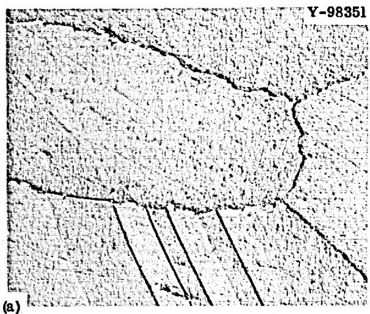

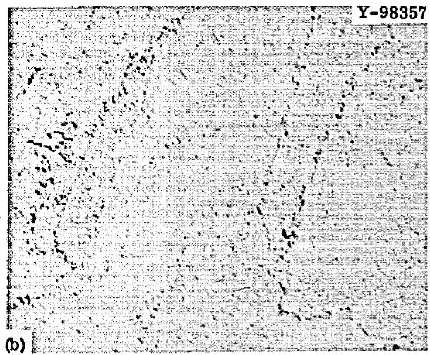

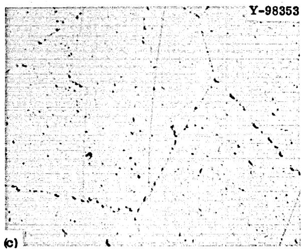

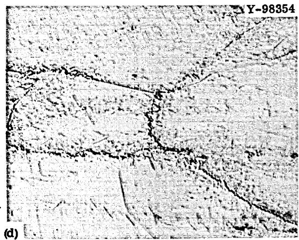  
Fig. 15. Microstructures Developed in Ni-12% Mo-7% Cr-0.07% C Alloys Modified with Titanium, Solution Annealed 1 hr at 1177°C, Prestrained 10% at Room Temperature, and Then Aged 10,000 hr. 1000x. (a) 0.15% Ti, aged at 650°C, (b) 1.2% Ti, aged at 650°C, (c) 0.15% Ti, aged at 760°C, and (d) 1.2% Ti, aged at 760°C. Reduced 18%.

alloys at $650^{\circ}\mathrm{C}$ . In samples aged at $760^{\circ}\mathrm{C}$ , prestraining $10\%$ produced very little effect on the structure of the $0.15\%$ Ti heat, but the $1.2\%$ Ti heat showed much more precipitation in the prestrained samples (Fig. 15) than in samples aged without prestraining (Fig. 13). In the prestrained $1.2\%$ Ti alloy, both a fine random matrix precipitate and a crystallographic platelet-type precipitate are shown in Fig. 15. Evidently prestraining has enhanced the precipitation of this platelet-type precipitate

(the platelets are actually a precipitate on stacking faults, $^{11}$ as mentioned previously). This apparent enhancement in formation of stacking fault precipitate produced by straining this $1.2\%$ Ti alloy before aging is consistent with the effect of prior straining on formation of stacking fault precipitates in niobium-doped stainless steels as reported by Silcock and Tunstall $^{11}$ and Naybour. $^{12}$ However, some differences in the effect of strain on the tendency to precipitate on stacking faults in steels and in this alloy are discussed in another paper. $^{13}$

# Fracture of Samples Tested in Creep

The fracture appearance of creep samples tested after solution annealing at $1177^{\circ}\mathrm{C}$ and aging 3000 hr at $760^{\circ}\mathrm{C}$ is compared in Fig. 16. The rupture lives (64, 135, and 1335 hr) and the total elongation values (9.5, 16.7, and $36.8\%$ ) of samples with these fractures increased progressively with increasing titanium content. The fracture appearance confirms the measured ductility trends, since the fracture mode exhibits a transition with increasing titanium content from intergranular fracture for the $0.15\%$ Ti heat [Fig. 16(a)] to transgranular for the $1.2\%$ Ti heat [Fig. 16(c)]. The intermediate titanium content ( $0.45\%$ Ti) also failed in a predominantly transgranular fracture mode; however, the tips of the fractured grains [Fig. 16(b)] show regions that appear to have recrystallized during the creep test. Nevertheless, the creep elongation of this $0.45\%$ Ti heat after the $760^{\circ}\mathrm{C}$ heat treatment was only $16.7\%$ , which indicates that the apparent recrystallization that occurred during creep testing at $650^{\circ}\mathrm{C}$ did not significantly enhance the ductility. That is, other heat treatments of this $0.45\%$ Ti heat yielded post-age creep elongation values appreciably greater than $16.7\%$ even though they showed no evidence of recrystallization.

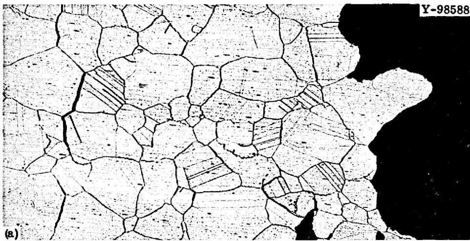

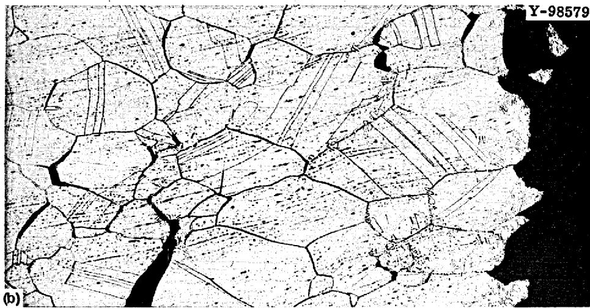

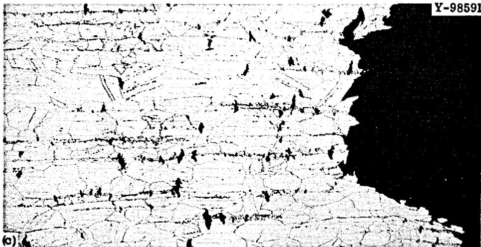  
Fig. 16. Creep Fractures at $650^{\circ}\mathrm{C}$ and 40,000 psi for Heats of Titanium-Modified Hastelloy N After a 1 hr at $1177^{\circ}\mathrm{C}$ Solution Anneal and 3000 hr Age at $760^{\circ}\mathrm{C}$ . 100x. (a) $0.15\%$ Ti, (b) $0.45\%$ Ti, and (c) $1.2\%$ Ti. Reduced $18\%$ .

In Fig. 16 it is also apparent that the grain size is smallest for the $1.2\%$ Ti heat. Although the fracture was primarily transgranular in that heat, many intergranular cracks have opened up along the gage length in contrast to the alloys with lower titanium concentrations. Apparently, the grain boundary structure in the higher titanium heat inhibits the propagation of intergranular cracks even though the nucleation of cracks in this alloy is apparently quite easy.

Another comparison of fractures for creep tests after various aging treatments is given in Fig. 17 for three heats with different titanium contents. The total creep elongations for the samples shown in Fig. 17(a), (b), and (c) were 8.3, 42.1, and $24.5\%$ , respectively. Thus, the alloy with the intermediate titanium content $[0.45\% \text{Ti}, \text{Fig. 17(b)}]$ was the most ductile of the three alloys, in contrast to the results in Fig. 16. The grain size and the amount of precipitation evident at this magnification is greater in Fig. 17(a) and (c) than in Fig. 17(b). As in Fig. 16, the incidence of intergranular cracks is higher in the most ductile alloy, Fig. 17(b), than in the other materials. The fracture mode is a mixture of transgranular and intergranular fracture in Fig. 17(a) and (c) and is transgranular in Fig. 17(b).

An influence of aging time at $760^{\circ}\mathrm{C}$ on the post-age fracture appearance for the $0.45\%$ Ti heat is found by comparing Fig. 17(b) (1500 hr at $760^{\circ}\mathrm{C}$ ) with Fig. 16(b) (3000 hr at $760^{\circ}\mathrm{C}$ ). These two samples from the same heat were both solution annealed at $1177^{\circ}\mathrm{C}$ , aged, and then creep tested at 40,000 psi and $650^{\circ}\mathrm{C}$ . The creep properties (594 hr rupture life and $42.1\%$ elongation) for the sample aged 1500 hr at $760^{\circ}\mathrm{C}$ [Fig. 17(b)] were much better than the properties (135 hr rupture life and $16.7\%$ elongation) obtained after aging 3000 hr at $760^{\circ}\mathrm{C}$ . Similarly, the fracture appearance is more transgranular and the amount of grain deformation is much greater for the samples aged only 1500 hr [Fig. 17(b)]. Although a significant difference was found in creep properties after aging 1500 and 3000 hr at $760^{\circ}\mathrm{C}$ , the optical microscopy did not reveal any large differences in structure. This effect of aging time between 1500 and 3000 hr at $760^{\circ}\mathrm{C}$ is rather surprising since normally aging follows a logarithmic rate, which would give small changes for a factor of 2 difference in aging time, but it should change significantly

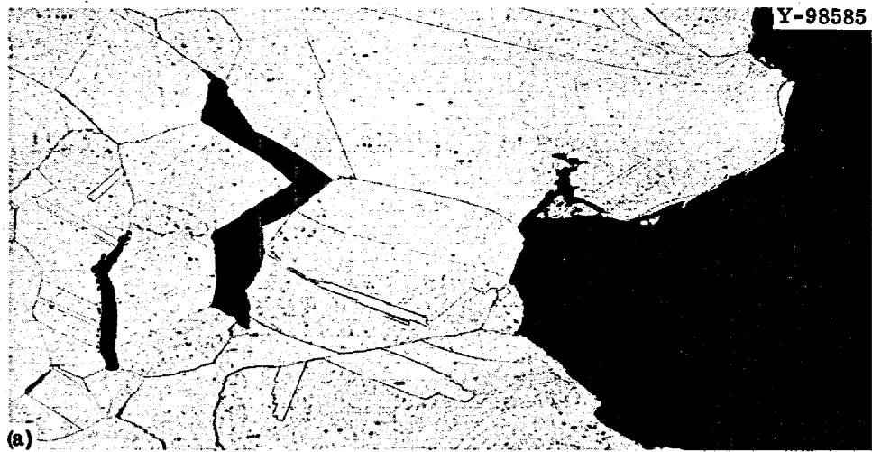

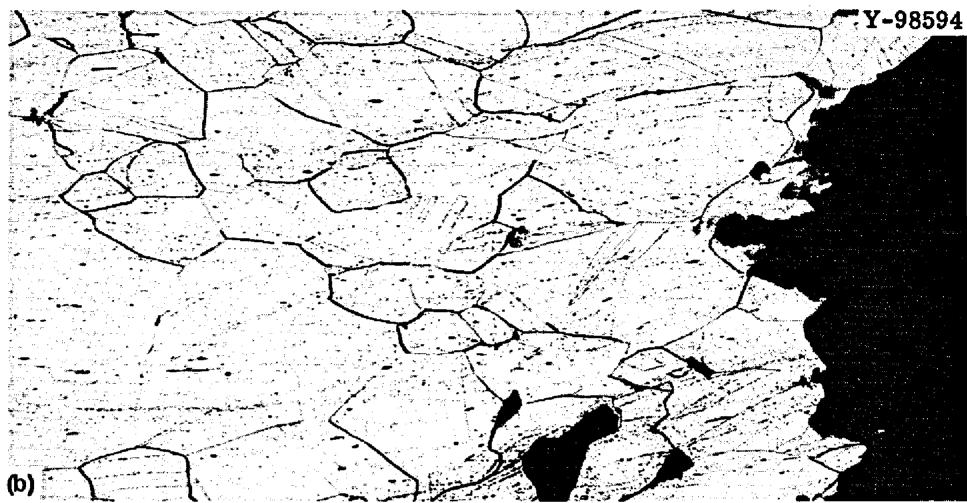

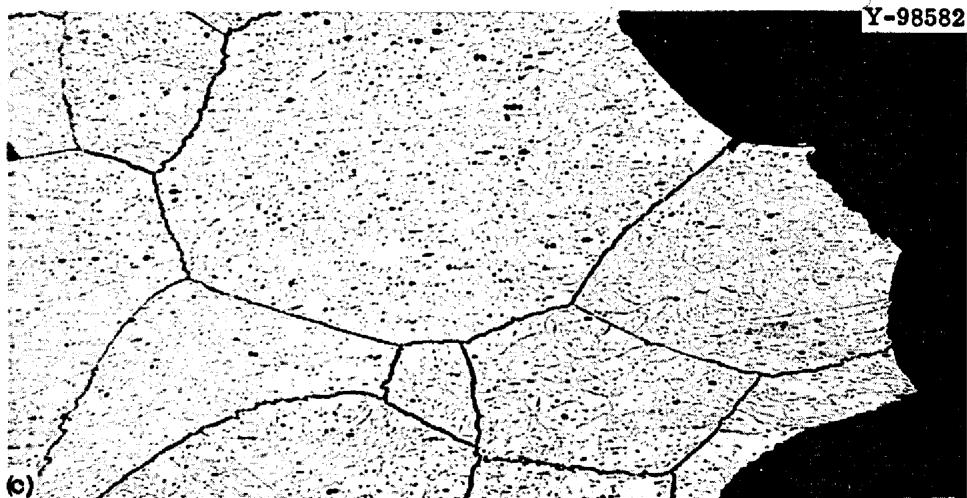  
Fig. 17. Creep Fractures for Tests at $650^{\circ}\mathrm{C}$ and 40,000 psi in Titanium-Modified Hastelloy N for Various Heat Treatments. 100x. (a) $0.15\%$ Ti solution annealed 1 hr at $1260^{\circ}\mathrm{C}$ and aged 3000 hr at $760^{\circ}\mathrm{C}$ , (b) $0.45\%$ Ti solution annealed 1 hr at $1177^{\circ}\mathrm{C}$ and aged 1500 hr at $760^{\circ}\mathrm{C}$ , and (c) $1.2\%$ Ti solution annealed 1 hr at $1260^{\circ}\mathrm{C}$ and aged 3000 hr at $650^{\circ}\mathrm{C}$ . Reduced $18\%$ .

for a tenfold difference in aging time. Nevertheless, this observed large difference in creep behavior between 1500 and 3000 hr of aging was confirmed by the tensile ductility for this $0.45\%$ Ti heat, as shown in Fig. 3, p. 7. The $650^{\circ}\mathrm{C}$ tensile ductility decreased from about 38 to $21\%$ between 1500 and 3000 hr of aging at $760^{\circ}\mathrm{C}$ . Thus in the $0.45\%$ Ti heat, evidently either the type of precipitate present or its amount and distribution differed significantly between 1500 and 3000 hr of exposure at a temperature of $760^{\circ}\mathrm{C}$ (phases were not identified in the samples aged 1500 hr).

# SUMMARY AND CONCLUSIONS

We have investigated the effects of titanium content, solution annealing temperature, aging temperature, and aging time on the mechanical properties of modified Hastelloy N at $650^{\circ}\mathrm{C}$ . In the solution-annealed condition the 0.002/min yield strength increased and the ductility was approximately constant with increasing titanium content from 0.15 to $1.2\%$ . Aging and prestraining both generally increased the yield strength, but the changes in ductility during aging depended on (1) alloy content, (2) annealing temperature, and (3) aging temperature.

Phase identification of electrolytically extracted precipitates indicated two types of carbides present. An $\mathrm{M}_2\mathrm{C}$ -type was favored in heats with low titanium contents or alloys aged at the higher temperature, $760^{\circ}\mathrm{C}$ . An MC-type carbide was favored at higher titanium contents or for alloys with a given titanium concentration aged at the lower temperature, $650^{\circ}\mathrm{C}$ . Thus, the titanium content determined the carbide type, whether $\mathrm{M}_2\mathrm{C}$ or MC. The carbide type, its stability, and its morphology subsequently influenced the deformation and fracture in creep and tensile tests. Correlations of microstructures and high-temperature mechanical properties as influenced by the carbon and titanium contents have previously been investigated.[14]

Increasing the titanium content resulted in improved post-age properties. Apparently, the $\mathrm{M}_2\mathrm{C}$ carbide precipitate was more detrimental to ductility than was the MC carbide precipitate. However, certain distributions of MC carbides were also detrimental to the ductility. This was indicated by the $1.2\%$ Ti alloy, which lost ductility and increased its strength on aging after the $1260^{\circ}\mathrm{C}$ solution anneal. Since only MC carbides were identified in this alloy, the strengthening and embrittlement are attributed to the precipitation on stacking faults. Correlations of microstructures and mechanical properties for stacking fault precipitates have also been made for stainless steels, $^{15,16}$ Inconel, $^{17}$ and Hastelloy N. $^{18,19}$

Several additional points should be made from these results. The alloy with the lowest carbon content (i.e., heat 466-548) generally had the lowest strength and highest ductility. This low carbon alloy, however, did show a pronounced difference in aging response at 650 and $760^{\circ}\mathrm{C}$ , which we attribute to the fact that different carbides were precipitated at the two aging temperatures (i.e., MC at $650^{\circ}\mathrm{C}$ and $\mathbf{M}_2\mathbf{C}$ at $760^{\circ}\mathrm{C}$ ).

Overaging could be expected in most of these alloys before 3000 hr at $760^{\circ}\mathrm{C}$ , as indicated from the peak in yield strength at 1500 hr in Fig. 6, p. 9.

The comparison of creep and tensile properties indicated that the higher solution anneal, which increases the grain size and amount of

15J. M. Silcock and W. J. Tunstall, Phil. Mag. 10, 360-389 (1964).   
16R. D. Naybour, Acta Met. 13, 1197-1207 (1965).   
17P. S. Kotval, Trans. Met. Soc. AIME 242, 1651-1656 (1968).   
18C. E. Sessions, Influence of Titanium on the High-Temperature Deformation and Fracture of Some Nickel Based Alloys, ORNL-4561 (July 1970).   
$^{19}$ C. E. Sessions, E. E. Stansbury, R. E. Gehlbach, and H. E. McCoy, Jr., "Influence of Titanium on the Strengthening of a Ni-Mo-Cr Alloy," pp. 626-630 in Second International Conference on the Strength of Metals and Alloys, Conf. Proc., Vol. II, The American Society for Metals, Metals Park, Ohio, 1970.

solute in solution, actually produces the lowest yield strength. The weakest alloys in creep (as measured by the highest secondary creep rate) were found for the $1177^{\circ}\mathrm{C}$ anneal, which produces a smaller grain size relative to the structure produced at $1260^{\circ}\mathrm{C}$ . This dependence of low yield strength on large grain size and of low creep resistance on small grain size is typical of the effects of grain size on the strength of alloys at elevated test temperatures. At such temperatures, intergranular fracture rather than transgranular fracture is favored.

Of the treatments investigated, cold working $10\%$ at room temperature after a 1-hr solution anneal at $1177^{\circ}\mathrm{C}$ had the greatest effect on raising the strength and lowering the ductility, both before and after aging. An exception to this was found for the $1.2\%$ Ti heat, which exhibited the lowest post-age tensile and creep ductility after a $1260^{\circ}\mathrm{C}$ solution anneal and $760^{\circ}\mathrm{C}$ age. Samples that showed this large ductility loss had a high concentration of the platelet-type stacking fault precipitate.

The heat treatments investigated produced variations in the high-temperature ductility between 5 and $50\%$ , yet the significant point is that most of these treatments change the room-temperature properties only slightly. The irony, however, is that these subtle microstructural modifications caused by titanium additions have affected the creep behavior of this material even more than we found from this systematic look at tensile behavior. However, testing in creep does not give a constant rate of deformation, and the strain rate sensitivity of the ductility would have made it more difficult to separate effects of aging time and temperature than it has been for this tensile evaluation. However, the creep properties follow similar trends with precipitate type and distribution and are, in fact, most important in reactor applications of this alloy.

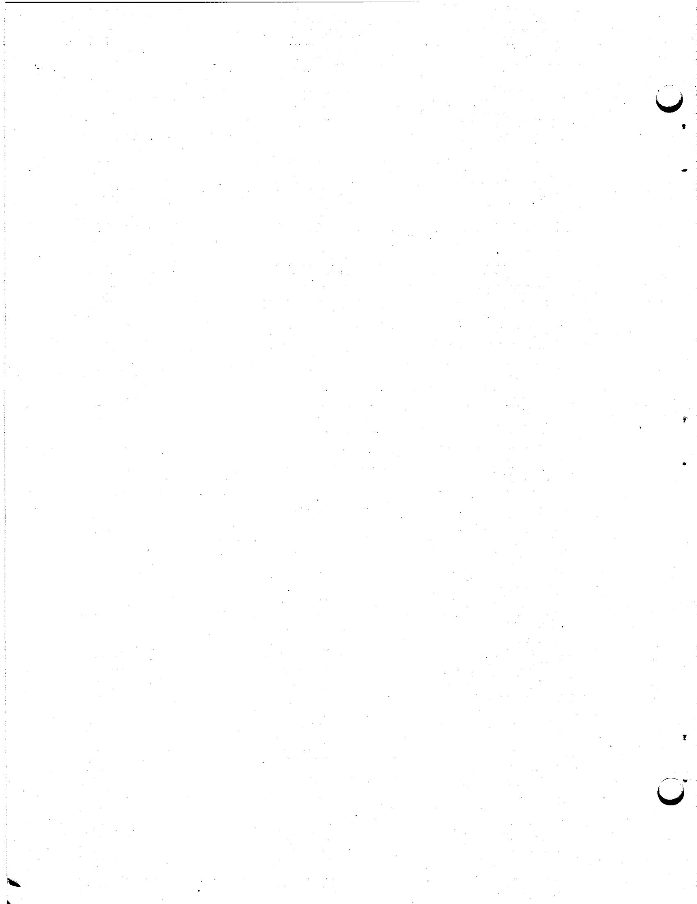

APPENDIX

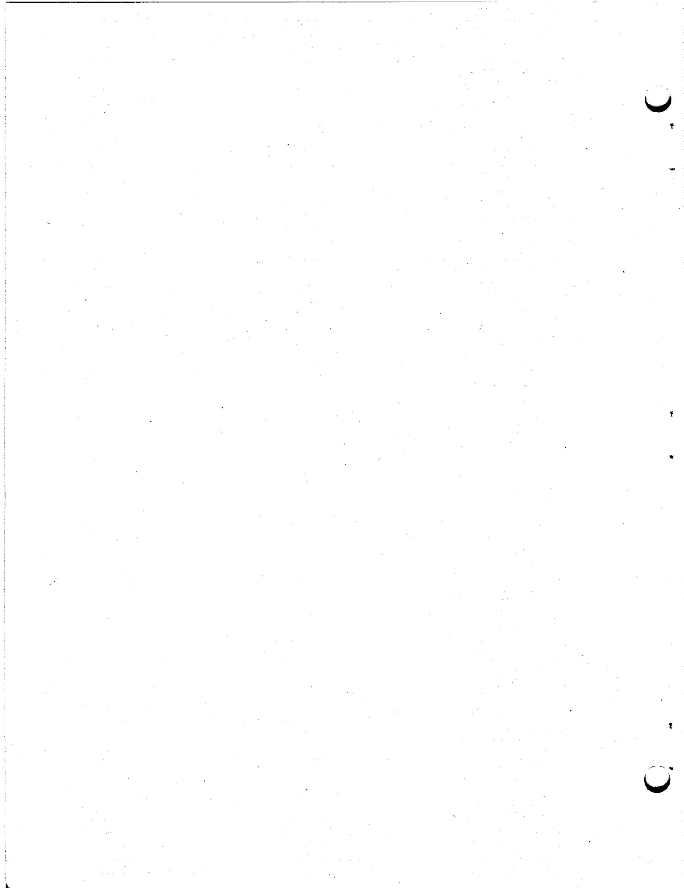

Table 6. Heat Treatment Designations   

<table><tr><td rowspan="2">Designation</td><td rowspan="2">Solution-Anneal 
Temperaturea 
(°C)</td><td rowspan="2">Prestrainb</td><td colspan="2">Age Treatment</td></tr><tr><td>Time 
(hr)</td><td>Temperature 
(°C)</td></tr><tr><td>109</td><td>1177</td><td>yes</td><td>0</td><td></td></tr><tr><td>121</td><td>1177</td><td>no</td><td>0</td><td></td></tr><tr><td>123</td><td>1260</td><td>no</td><td>0</td><td></td></tr><tr><td>130</td><td>1177</td><td>no</td><td>1,500</td><td>650</td></tr><tr><td>131</td><td>1177</td><td>no</td><td>1,500</td><td>760</td></tr><tr><td>132</td><td>1177</td><td>no</td><td>3,000</td><td>650</td></tr><tr><td>133</td><td>1177</td><td>no</td><td>3,000</td><td>760</td></tr><tr><td>134</td><td>1177</td><td>no</td><td>10,000</td><td>650</td></tr><tr><td>135</td><td>1177</td><td>no</td><td>10,000</td><td>760</td></tr><tr><td>136</td><td>1260</td><td>no</td><td>1,500</td><td>650</td></tr><tr><td>137</td><td>1260</td><td>no</td><td>1,500</td><td>760</td></tr><tr><td>138</td><td>1260</td><td>no</td><td>3,000</td><td>650</td></tr><tr><td>139</td><td>1260</td><td>no</td><td>3,000</td><td>760</td></tr><tr><td>140</td><td>1260</td><td>no</td><td>10,000</td><td>650</td></tr><tr><td>141</td><td>1260</td><td>no</td><td>10,000</td><td>760</td></tr><tr><td>142</td><td>1177</td><td>yes</td><td>1,500</td><td>650</td></tr><tr><td>143</td><td>1177</td><td>yes</td><td>1,500</td><td>760</td></tr><tr><td>144</td><td>1177</td><td>yes</td><td>3,000</td><td>650</td></tr><tr><td>145</td><td>1177</td><td>yes</td><td>3,000</td><td>760</td></tr><tr><td>146</td><td>1177</td><td>yes</td><td>10,000</td><td>650</td></tr><tr><td>147</td><td>1177</td><td>yes</td><td>10,000</td><td>760</td></tr></table>

aFor 1 hr.   
b Strained 10% in tension at room temperature after the l-hr anneal at $1177^{\circ}\mathrm{C}$ .

Table 7. Tensile Data for Heat 466-535 (0.15% Ti) for Various Heat Treatments   

<table><tr><td rowspan="2">Specimen</td><td rowspan="2">Heat Treatment</td><td rowspan="2">Test Temperature (°C)</td><td colspan="2">Strength, psi</td><td colspan="2">Elongation, %</td><td rowspan="2">Reduction in Area (%)</td></tr><tr><td>Yield</td><td>Ultimate Tensile</td><td>Uniform</td><td>Total</td></tr><tr><td></td><td></td><td></td><td>× 103</td><td>× 103</td><td></td><td></td><td></td></tr><tr><td>5989</td><td>121</td><td>650</td><td>29.3</td><td>71.4</td><td>24.0</td><td>24.6</td><td>27.28</td></tr><tr><td>5991</td><td>121</td><td>650</td><td>28.6</td><td>76.1</td><td>30.4</td><td>30.9</td><td>21.18</td></tr><tr><td>6019</td><td>123</td><td>650</td><td>26.1</td><td>66.7</td><td>29.0</td><td>30.0</td><td>22.61</td></tr><tr><td>6017</td><td>123</td><td>650</td><td>24.5</td><td>64.5</td><td>31.8</td><td>33.0</td><td>32.09</td></tr><tr><td>5993</td><td>130</td><td>650</td><td>38.7</td><td>77.5</td><td>24.9</td><td>27.7</td><td>26.61</td></tr><tr><td>6040</td><td>130</td><td>650</td><td>40.7</td><td>81.9</td><td>27.0</td><td>32.5</td><td>23.40</td></tr><tr><td>5994</td><td>131</td><td>650</td><td>35.2</td><td>73.9</td><td>15.9</td><td>16.4</td><td>17.59</td></tr><tr><td>6041</td><td>131</td><td>650</td><td>35.2</td><td>76.2</td><td>16.6</td><td>17.4</td><td>13.54</td></tr><tr><td>5999</td><td>132</td><td>650</td><td>39.3</td><td>73.9</td><td>18.5</td><td>18.8</td><td>22.93</td></tr><tr><td>6000</td><td>133</td><td>650</td><td>32.7</td><td>66.2</td><td>13.4</td><td>13.8</td><td>16.71</td></tr><tr><td>6001</td><td>134</td><td>650</td><td>36.2</td><td>62.6</td><td>14.8</td><td>15.1</td><td>11.49</td></tr><tr><td>6002</td><td>135</td><td>650</td><td>32.3</td><td>73.4</td><td>16.6</td><td>16.9</td><td>13.29</td></tr><tr><td>6021</td><td>136</td><td>650</td><td>33.1</td><td>66.1</td><td>21.0</td><td>21.6</td><td>24.20</td></tr><tr><td>6022</td><td>137</td><td>650</td><td>33.0</td><td>66.7</td><td>13.8</td><td>16.5</td><td>17.43</td></tr><tr><td>6027</td><td>138</td><td>650</td><td>35.2</td><td>57.5</td><td>12.1</td><td>12.6</td><td>17.73</td></tr><tr><td>6028</td><td>139</td><td>650</td><td>30.5</td><td>63.3</td><td>14.3</td><td>16.0</td><td>17.86</td></tr><tr><td>6029</td><td>140</td><td>650</td><td>38.4</td><td>62.2</td><td>10.2</td><td>10.7</td><td>10.54</td></tr><tr><td>6030</td><td>141</td><td>650</td><td>31.9</td><td>65.3</td><td>13.7</td><td>14.4</td><td>17.36</td></tr><tr><td>5997</td><td>130</td><td>25</td><td>61.5</td><td>135.9</td><td>40.5</td><td>40.8</td><td>29.54</td></tr><tr><td>5998</td><td>131</td><td>25</td><td>53.3</td><td>139.1</td><td>43.5</td><td>46.0</td><td>47.81</td></tr><tr><td>6003</td><td>109</td><td>650</td><td>47.8</td><td>78.4</td><td>18.7</td><td>19.3</td><td>21.38</td></tr><tr><td>6005</td><td>109</td><td>650</td><td>49.3</td><td>79.4</td><td>19.1</td><td>19.6</td><td>14.72</td></tr><tr><td>6007</td><td>142</td><td>650</td><td>57.9</td><td>90.2</td><td>15.2</td><td>15.6</td><td>11.67</td></tr><tr><td>6008</td><td>143</td><td>650</td><td>49.5</td><td>80.9</td><td>11.8</td><td>12.0</td><td>9.67</td></tr><tr><td>6013</td><td>144</td><td>650</td><td>54.1</td><td>80.7</td><td>10.8</td><td>11.5</td><td>13.71</td></tr><tr><td>6014</td><td>145</td><td>650</td><td>44.5</td><td>74.7</td><td>11.0</td><td>11.4</td><td>17.31</td></tr><tr><td>6015</td><td>146</td><td>650</td><td>48.9</td><td>66.2</td><td>7.4</td><td>7.7</td><td>3.98</td></tr><tr><td>6016</td><td>147</td><td>650</td><td>39.5</td><td>68.1</td><td>11.8</td><td>12.2</td><td>7.14</td></tr></table>

Table 8. Tensile Data for Heat 466-541 (0.27% Ti) for Various Heat Treatments   

<table><tr><td rowspan="2">Specimen</td><td rowspan="2">Heat Treatment</td><td rowspan="2">Test Temperature (°C)</td><td colspan="2">Strength, psi</td><td colspan="2">Elongation, %</td><td rowspan="2">Reduction in Area (%)</td></tr><tr><td>Yield</td><td>Ultimate Tensile</td><td>Uniform</td><td>Total</td></tr><tr><td></td><td></td><td></td><td>× 103</td><td>× 103</td><td></td><td></td><td></td></tr><tr><td>6090</td><td>121</td><td>650</td><td>26.5</td><td>68.8</td><td>29.2</td><td>30.6</td><td>28.41</td></tr><tr><td>6092</td><td>121</td><td>650</td><td>27.5</td><td>76.2</td><td>33.7</td><td>34.6</td><td>28.30</td></tr><tr><td>6121</td><td>123</td><td>650</td><td>21.5</td><td>54.4</td><td>31.8</td><td>33.4</td><td>31.22</td></tr><tr><td>6119</td><td>123</td><td>650</td><td>21.4</td><td>53.9</td><td>29.7</td><td>30.5</td><td>41.14</td></tr><tr><td>6128</td><td>123</td><td>650</td><td>21.8</td><td>53.6</td><td>29.8</td><td>31.3</td><td>27.48</td></tr><tr><td>6094</td><td>130</td><td>650</td><td>35.1</td><td>77.3</td><td>35.1</td><td>43.7</td><td>38.68</td></tr><tr><td>6095</td><td>131</td><td>650</td><td>33.3</td><td>68.8</td><td>17.8</td><td>18.3</td><td>23.17</td></tr><tr><td>6101</td><td>132</td><td>650</td><td>34.6</td><td>74.3</td><td>32.9</td><td>39.6</td><td>35.31</td></tr><tr><td>6102</td><td>133</td><td>650</td><td>31.4</td><td>63.4</td><td>15.4</td><td>16.0</td><td>20.73</td></tr><tr><td>6103</td><td>134</td><td>650</td><td>33.8</td><td>69.8</td><td>28.6</td><td>34.6</td><td>27.36</td></tr><tr><td>6104</td><td>135</td><td>650</td><td>28.3</td><td>61.0</td><td>19.0</td><td>19.5</td><td>16.01</td></tr><tr><td>6123</td><td>136</td><td>650</td><td>26.6</td><td>46.8</td><td>16.4</td><td>17.4</td><td>26.43</td></tr><tr><td>6124</td><td>137</td><td>650</td><td>31.3</td><td>59.2</td><td>15.5</td><td>16.7</td><td>15.92</td></tr><tr><td>6129</td><td>138</td><td>650</td><td>29.9</td><td>46.1</td><td>10.4</td><td>11.4</td><td>25.41</td></tr><tr><td>6120</td><td>139</td><td>650</td><td>29.7</td><td>57.6</td><td>13.6</td><td>14.9</td><td>16.03</td></tr><tr><td>6131</td><td>140</td><td>650</td><td>36.0</td><td>48.5</td><td>7.4</td><td>8.9</td><td>10.39</td></tr><tr><td>6132</td><td>141</td><td>650</td><td>31.0</td><td>58.1</td><td>13.1</td><td>14.7</td><td>13.57</td></tr><tr><td>6099</td><td>130</td><td>25</td><td>54.3</td><td>125.6</td><td>52.5</td><td>53.7</td><td>41.88</td></tr><tr><td>6100</td><td>131</td><td>25</td><td>42.4</td><td>110.5</td><td>50.1</td><td>52.3</td><td>40.64</td></tr><tr><td>6107</td><td>109</td><td>650</td><td>45.4</td><td>77.5</td><td>22.4</td><td>23.2</td><td>17.77</td></tr><tr><td>6105</td><td>109</td><td>650</td><td>44.4</td><td>76.4</td><td>22.9</td><td>23.7</td><td>27.82</td></tr><tr><td>6109</td><td>142</td><td>650</td><td>48.1</td><td>81.3</td><td>21.6</td><td>24.4</td><td>20.33</td></tr><tr><td>6110</td><td>143</td><td>650</td><td>45.1</td><td>71.5</td><td>11.1</td><td>11.6</td><td>13.07</td></tr><tr><td>6115</td><td>144</td><td>650</td><td>49.3</td><td>81.6</td><td>18.0</td><td>19.7</td><td>19.39</td></tr><tr><td>6116</td><td>145</td><td>650</td><td>42.9</td><td>68.4</td><td>9.8</td><td>10.4</td><td>11.66</td></tr><tr><td>6117</td><td>146</td><td>650</td><td>52.2</td><td>81.6</td><td>13.7</td><td>14.5</td><td>12.60</td></tr><tr><td>6118</td><td>147</td><td>650</td><td>44.4</td><td>73.1</td><td>11.8</td><td>12.2</td><td>11.42</td></tr></table>

Table 9. Tensile Data for Heat 466-548 (0.45% Ti) for Various Heat Treatments   

<table><tr><td rowspan="2">Specimen</td><td rowspan="2">Heat Treatment</td><td rowspan="2">Test Temperature (°C)</td><td colspan="2">Strength, psi</td><td colspan="2">Elongation, %</td><td rowspan="2">Reduction in Area (%)</td></tr><tr><td>Yield</td><td>Ultimate Tensile</td><td>Uniform</td><td>Total</td></tr><tr><td></td><td></td><td></td><td>× 103</td><td>× 103</td><td></td><td></td><td></td></tr><tr><td>6268</td><td>121</td><td>650</td><td>25.2</td><td>66.6</td><td>28.2</td><td>29.2</td><td>35.43</td></tr><tr><td>6270</td><td>121</td><td>650</td><td>24.2</td><td>66.9</td><td>30.4</td><td>31.9</td><td>26.33</td></tr><tr><td>6299</td><td>123</td><td>650</td><td>20.3</td><td>54.2</td><td>29.8</td><td>32.2</td><td>27.74</td></tr><tr><td>6297</td><td>123</td><td>650</td><td>20.6</td><td>55.3</td><td>30.2</td><td>32.9</td><td>34.73</td></tr><tr><td>7400</td><td>130</td><td>650</td><td>29.7</td><td>76.6</td><td>40.4</td><td>43.3</td><td>40.10</td></tr><tr><td>7402</td><td>131</td><td>650</td><td>30.1</td><td>79.2</td><td>35.3</td><td>37.7</td><td>28.94</td></tr><tr><td>6279</td><td>132</td><td>650</td><td>29.9</td><td>74.3</td><td>39.6</td><td>42.9</td><td>41.38</td></tr><tr><td>6280</td><td>133</td><td>650</td><td>30.1</td><td>67.3</td><td>20.1</td><td>20.8</td><td>27.04</td></tr><tr><td>6281</td><td>134</td><td>650</td><td>29.4</td><td>71.9</td><td>35.4</td><td>43.3</td><td>31.45</td></tr><tr><td>6282</td><td>135</td><td>650</td><td>28.9</td><td>70.3</td><td>23.6</td><td>24.3</td><td>20.41</td></tr><tr><td>6301</td><td>136</td><td>650</td><td>24.3</td><td>71.6</td><td>47.2</td><td>49.8</td><td>46.04</td></tr><tr><td>6302</td><td>137</td><td>650</td><td>27.2</td><td>86.5</td><td>32.3</td><td>33.5</td><td>27.64</td></tr><tr><td>6307</td><td>138</td><td>650</td><td>26.1</td><td>68.6</td><td>44.4</td><td>46.2</td><td>52.56</td></tr><tr><td>6308</td><td>139</td><td>650</td><td>25.8</td><td>61.8</td><td>24.9</td><td>26.2</td><td>23.42</td></tr><tr><td>6309</td><td>140</td><td>650</td><td>29.6</td><td>72.4</td><td>39.3</td><td>41.7</td><td>40.83</td></tr><tr><td>6310</td><td>141</td><td>650</td><td>27.0</td><td>63.9</td><td>24.9</td><td>26.2</td><td>26.33</td></tr><tr><td>6277</td><td>130</td><td>25</td><td>47.6</td><td>124.1</td><td>57.4</td><td>59.0</td><td>41.79</td></tr><tr><td>6278</td><td>131</td><td>25</td><td>48.1</td><td>129.6</td><td>53.6</td><td>55.4</td><td>50.95</td></tr><tr><td>6285</td><td>109</td><td>650</td><td>41.7</td><td>70.1</td><td>20.7</td><td>21.7</td><td>18.04</td></tr><tr><td>6283</td><td>109</td><td>650</td><td>43.9</td><td>71.9</td><td>19.3</td><td>20.4</td><td>24.16</td></tr><tr><td>6287</td><td>142</td><td>650</td><td>45.1</td><td>84.3</td><td>27.2</td><td>30.0</td><td>22.49</td></tr><tr><td>6288</td><td>143</td><td>650</td><td>41.3</td><td>69.7</td><td>14.8</td><td>15.5</td><td>13.90</td></tr><tr><td>6293</td><td>144</td><td>650</td><td>44.3</td><td>82.0</td><td>26.8</td><td>28.8</td><td>31.47</td></tr><tr><td>6284</td><td>145</td><td>650</td><td>40.8</td><td>68.8</td><td>14.5</td><td>14.9</td><td>16.75</td></tr><tr><td>6295</td><td>146</td><td>650</td><td>47.7</td><td>88.2</td><td>24.7</td><td>28.2</td><td>20.49</td></tr><tr><td>6296</td><td>147</td><td>650</td><td>42.1</td><td>71.9</td><td>15.0</td><td>15.6</td><td>12.60</td></tr></table>

Table 10. Tensile Data for Heat 467-548 (1.2% Ti) for Various Heat Treatments   

<table><tr><td rowspan="2">Specimen</td><td rowspan="2">Heat Treatment</td><td rowspan="2">Test Temperature (°C)</td><td colspan="2">Strength, psi</td><td colspan="2">Elongation, %</td><td rowspan="2">Reduction in Area (%)</td></tr><tr><td>Yield</td><td>Ultimate Tensile</td><td>Uniform</td><td>Total</td></tr><tr><td></td><td></td><td></td><td>× 103</td><td>× 103</td><td></td><td></td><td></td></tr><tr><td>6313</td><td>121</td><td>650</td><td>39.4</td><td>96.3</td><td>29.8</td><td>35.3</td><td>31.58</td></tr><tr><td>6315</td><td>121</td><td>650</td><td>33.8</td><td>96.7</td><td>39.3</td><td>42.9</td><td>31.22</td></tr><tr><td>6341</td><td>123</td><td>650</td><td>29.7</td><td>74.6</td><td>39.4</td><td>40.8</td><td>39.95</td></tr><tr><td>6343</td><td>123</td><td>650</td><td>28.6</td><td>82.4</td><td>43.2</td><td>43.9</td><td>28.53</td></tr><tr><td>6317</td><td>130</td><td>650</td><td>46.5</td><td>92.1</td><td>28.3</td><td>50.2</td><td>45.00</td></tr><tr><td>6355</td><td>130</td><td>650</td><td>42.9</td><td>93.6</td><td>25.7</td><td>45.4</td><td>38.51</td></tr><tr><td>6357</td><td>131</td><td>650</td><td>41.1</td><td>94.5</td><td>26.5</td><td>44.7</td><td>37.44</td></tr><tr><td>6318</td><td>131</td><td>650</td><td>41.8</td><td>92.8</td><td>25.9</td><td>45.0</td><td>39.99</td></tr><tr><td>6323</td><td>132</td><td>650</td><td>43.1</td><td>87.9</td><td>26.1</td><td>43.3</td><td>42.18</td></tr><tr><td>6324</td><td>133</td><td>650</td><td>40.8</td><td>87.1</td><td>24.5</td><td>42.1</td><td>41.05</td></tr><tr><td>6325</td><td>134</td><td>650</td><td>38.2</td><td>84.3</td><td>26.7</td><td>44.1</td><td>35.74</td></tr><tr><td>6326</td><td>135</td><td>650</td><td>36.6</td><td>83.1</td><td>25.5</td><td>44.1</td><td>36.05</td></tr><tr><td>6345</td><td>136</td><td>650</td><td>42.7</td><td>83.3</td><td>24.4</td><td>25.7</td><td>24.07</td></tr><tr><td>6346</td><td>137</td><td>650</td><td>46.3</td><td>71.5</td><td>9.6</td><td>11.0</td><td>10.60</td></tr><tr><td>6351</td><td>138</td><td>650</td><td>44.8</td><td>79.0</td><td>17.3</td><td>20.1</td><td>27.41</td></tr><tr><td>6352</td><td>139</td><td>650</td><td>44.6</td><td>91.7</td><td>13.3</td><td>15.4</td><td>18.51</td></tr><tr><td>6353</td><td>140</td><td>650</td><td>49.6</td><td>81.4</td><td>14.0</td><td>15.2</td><td>18.29</td></tr><tr><td>6354</td><td>141</td><td>650</td><td>49.8</td><td>76.4</td><td>10.8</td><td>11.7</td><td>9.52</td></tr><tr><td>6321</td><td>130</td><td>25</td><td>61.3</td><td>145.6</td><td>50.5</td><td>52.0</td><td>41.21</td></tr><tr><td>6322</td><td>131</td><td>25</td><td>50.1</td><td>121.3</td><td>47.8</td><td>49.0</td><td>43.57</td></tr><tr><td>6327</td><td>109</td><td>650</td><td>73.1</td><td>102.2</td><td>20.0</td><td>27.7</td><td>30.35</td></tr><tr><td>6329</td><td>109</td><td>650</td><td>64.5</td><td>105.5</td><td>26.3</td><td>32.2</td><td>25.14</td></tr><tr><td>6331</td><td>142</td><td>650</td><td>64.5</td><td>104.5</td><td>21.6</td><td>33.2</td><td>30.56</td></tr><tr><td>6332</td><td>143</td><td>650</td><td>62.0</td><td>101.9</td><td>20.7</td><td>32.2</td><td>27.30</td></tr><tr><td>6337</td><td>144</td><td>650</td><td>61.4</td><td>100.3</td><td>18.3</td><td>26.4</td><td>25.45</td></tr><tr><td>6338</td><td>145</td><td>650</td><td>56.1</td><td>94.1</td><td>20.6</td><td>26.5</td><td>25.79</td></tr><tr><td>6339</td><td>146</td><td>650</td><td>62.9</td><td>103.3</td><td>20.0</td><td>30.4</td><td>24.07</td></tr><tr><td>6340</td><td>147</td><td>650</td><td>61.6</td><td>101.9</td><td>18.7</td><td>31.5</td><td>28.11</td></tr><tr><td>6989</td><td>137</td><td>25</td><td>59.6</td><td>122.8</td><td>41.6</td><td>41.7</td><td>36.73</td></tr><tr><td>11416</td><td>121</td><td>25</td><td>47.6</td><td>134.9</td><td>62.5</td><td>63.8</td><td>46.25</td></tr></table>

Table 11. Creep-Rupture Properties at 40,000 psi and ${650}^{ \circ  }\mathrm{C}$ for Commercial Heats Used to Determine the Thermal Stability   

<table><tr><td>Heat</td><td>Heat Treatment</td><td>Test</td><td>Rupture Life (hr)</td><td>Secondary Creep Rate (%/hr)</td><td>Total Elongation (%)</td><td>Reduction in Area (%)</td></tr><tr><td rowspan="10">466-535</td><td>121</td><td>7130</td><td>166.5</td><td>0.0133</td><td>9.50</td><td>10.60</td></tr><tr><td>123</td><td>7132</td><td>50.9</td><td>0.0119</td><td>13.60</td><td>24.39</td></tr><tr><td>131</td><td>7277</td><td>136.5</td><td>0.0489</td><td>11.30</td><td>17.36</td></tr><tr><td>132</td><td>7368</td><td>137.8</td><td>0.0630</td><td>13.60</td><td>14.27</td></tr><tr><td>133</td><td>7369</td><td>63.6</td><td>0.0683</td><td>9.50</td><td>13.19</td></tr><tr><td>138</td><td>7336</td><td>217.5</td><td>0.0346</td><td>13.70</td><td>15.22</td></tr><tr><td>139</td><td>7340</td><td>26.2</td><td>0.0868</td><td>8.30</td><td>9.51</td></tr><tr><td>109</td><td>7131</td><td>193.8</td><td>0.0048</td><td>3.60</td><td>6.41</td></tr><tr><td>144</td><td>7464</td><td>135.4</td><td>0.0179</td><td>5.70</td><td>11.24</td></tr><tr><td>145</td><td>7465</td><td>103.2</td><td>0.0420</td><td>6.70</td><td>10.79</td></tr><tr><td rowspan="10">466-541</td><td>121</td><td>7133</td><td>341.6</td><td>0.0060</td><td>15.20</td><td>17.75</td></tr><tr><td>123</td><td>7135</td><td>189.0</td><td>0.0080</td><td>21.50</td><td>26.61</td></tr><tr><td>131</td><td>7276</td><td>217.0</td><td>0.0538</td><td>18.90</td><td>19.48</td></tr><tr><td>132</td><td>7370</td><td>507.6</td><td>0.0315</td><td>27.60</td><td>26.93</td></tr><tr><td>133</td><td>7371</td><td>67.8</td><td>0.0692</td><td>10.50</td><td>18.42</td></tr><tr><td>138</td><td>7337</td><td>50.0</td><td>0.0716</td><td>9.70</td><td>12.96</td></tr><tr><td>139</td><td>7341</td><td>41.2</td><td>0.0844</td><td>9.90</td><td>17.62</td></tr><tr><td>109</td><td>7134</td><td>308.9</td><td>0.0043</td><td>5.90</td><td>13.90</td></tr><tr><td>144</td><td>7470</td><td>515.4</td><td>0.0159</td><td>14.00</td><td>20.73</td></tr><tr><td>145</td><td>7471</td><td>43.1</td><td>0.0730</td><td>6.36</td><td>11.96</td></tr><tr><td rowspan="12">466-548</td><td>121</td><td>7136</td><td>358.0</td><td>0.0117</td><td>16.70</td><td>22.31</td></tr><tr><td>123</td><td>7138</td><td>125.1</td><td>0.0110</td><td>19.30</td><td>28.19</td></tr><tr><td>130</td><td>7024</td><td>569.6</td><td>0.0203</td><td>27.20</td><td>30.09</td></tr><tr><td>131</td><td>7275</td><td>594.0</td><td>0.0251</td><td>42.10</td><td>34.19</td></tr><tr><td>132</td><td>7372</td><td>574.6</td><td>0.0391</td><td>41.30</td><td>41.30</td></tr><tr><td>133</td><td>7373</td><td>135.5</td><td>0.0535</td><td>16.70</td><td>21.94</td></tr><tr><td>138</td><td>7338</td><td>345.5</td><td>0.0968</td><td>29.10</td><td>37.27</td></tr><tr><td>139</td><td>7342</td><td>175.2</td><td>0.0660</td><td>24.10</td><td>37.54</td></tr><tr><td>109</td><td>7137</td><td>620.6</td><td>0.0065</td><td>11.70</td><td>17.77</td></tr><tr><td>144</td><td>7468</td><td>855.8</td><td>0.0166</td><td>25.60</td><td>22.62</td></tr><tr><td>145</td><td>7469</td><td>130.7</td><td>0.0255</td><td>6.50</td><td>15.97</td></tr><tr><td>130</td><td>7024</td><td>669.6</td><td>0.0203</td><td>27.20</td><td>30.09</td></tr><tr><td rowspan="10">467-548</td><td>121</td><td>7434</td><td>1207.6</td><td>0.0144</td><td>36.60</td><td>33.44</td></tr><tr><td>123</td><td>7141</td><td>2472.9</td><td>0.0038</td><td>21.60</td><td>17.62</td></tr><tr><td>131</td><td>7303</td><td>1006.2</td><td>0.0195</td><td>32.40</td><td>47.74</td></tr><tr><td>132</td><td>7374</td><td>1582.7</td><td>0.0159</td><td>54.40</td><td>47.74</td></tr><tr><td>133</td><td>7375</td><td>1335.2</td><td>0.0162</td><td>36.80</td><td>35.17</td></tr><tr><td>138</td><td>7339</td><td>2095.5</td><td>0.0072</td><td>24.50</td><td>26.93</td></tr><tr><td>139</td><td>7343</td><td>1454.2</td><td>0.0099</td><td>20.40</td><td>28.64</td></tr><tr><td>109</td><td>7140</td><td>2149.2</td><td>0.0049</td><td>30.50</td><td>28.94</td></tr><tr><td>144</td><td>7466</td><td>2638.1</td><td>0.0053</td><td>33.30</td><td>33.60</td></tr><tr><td>145</td><td>7467</td><td>1853.1</td><td>0.0089</td><td>32.10</td><td>30.33</td></tr></table>

# INTERNAL DISTRIBUTION

1-3. Central Research Library

4. ORNL Y-12 Technical Library Document Reference Section

5-24. Laboratory Records

25. Laboratory Records, ORNL RC

26. ORNL Patent Office

27. G. M. Adamson, Jr.

28. J. L. Anderson

29. R. F. Apple

30. W. E. Atkinson

31. C. F. Baes

32. S.J.Ball

33. C. E. Bamberger

34. C. J. Barton

35. H. F. Bauman

36. S. E. Beall

37. M. J. Bell

38. C. E. Bettis

39. D. S. Billington

40. R. E. Blanco

41. F. F. Blankenship

42. E.E.Bloom

43. R. Blumberg

44. E. G. Bohlmann

45. J. Braunstein

46. M. A. Bredig

47. R. B. Briggs

48. H. R. Bronstein

49. G. D. Brunton

50. S. Cantor

51. D. W. Cardwell

52. W. L. Carter

53. G. I. Cathers

54. O. B. Cavin

55. Nancy Cole

56. C. W. Collins

57. E. L. Compere

58. W. H. Cook

59. J. W. Cooke

60. L. T. Corbin

61. J. L. Crowley

62. F. L. Culler, Jr.

63. D. R. Cuneo

64. J. E. Cunningham

65. J.M.Dale

66. J.H.DeVan

67. J. R. DiStefano

68. S.J.Ditto

69. W.P.Eatherly

70. J. R. Engel

71. J. I. Federer

72. D. E. Ferguson

73. J. H Frye, Jr.

74. W. K. Furlong

75. C. H. Gabbard

76. R. B. Gallaher

77. R. E. Gehlbach

78. L. O. Gilpatrick

79. G. Goldberg

80. W. R. Grimes

81. A. G. Grindell

82. R.H.Guymon

83. W. O. Harms

84. P. N. Haubenreich

85. R.E.Helms

86. J. R. Hightower

87-89. M.R.Hill

90. E. C. Hise

91. H. W. Hoffman

92. D. K. Holmes

93. P. P. Holz

94. A. Houtzeel

95. W.R.Huntley

96. H. Inouye

97. W. H. Jordan

98. P. R. Kasten

99. R. J. Kedl

100. C. R. Kennedy

101. R. T. King

102. S. S. Kirslis

103. J. W. Koger

104. H. W. Kohn

105. R. B. Korsmeyer

106. A. I. Krakoviak

107. T. S. Kress

108. J. A. Lane

109. R. B. Lindauer

110. E. L. Long, Jr.

111. A. L. Lotts

112. M. I. Lundin

113. R. N. Lyon

114. R. E. MacPherson

115. D. L. Manning   
116. W. R. Martin   
117. R.W. McClung   
118. H. E. McCoy   
119. D. L. McElroy   
120. C. K. McGlothlan   
121. C. J. McHargue   
122. H. A. McLain   
123. B. McNabb   
124. L. E. McNeese   
125. J.R.McWherter   
126. A. S. Meyer   
127. R. L. Moore   
128. D. M. Moulton   
129. T. R. Mueller   
130. H. H. Nichol   
131. J. P. Nichols   
132. E. L. Nicholson   
133. T. S. Noggle   
134. L.C.Oakes   
135. S. M. Ohr   
136. P. Patriarca   
137. A. M. Perry   
138. T. W. Pickel   
139. H. B. Piper   
140. C. B. Pollock   
141. B. E. Prince   
142. G. L. Ragan   
143. D. M. Richardson   
144. R. C. Robertson   
145. K. A. Romberg   
146. M. W. Rosenthal   
147. H. C. Savage   
148. W. F. Schaffer   
149. Dunlap Scott

150. J. L. Scott   
151-165. C. E. Sessions   
166. J.H.Shaffer   
167. W.H. Sides   
168. G. M. Slaughter   
169. A. N. Smith   
170. F.J. Smith   
171. G.P. Smith   
172. O. L. Smith   
173. P. G. Smith   
174. I. Spiewak   
175. R.C.Steffy   
176. R.A. Strehlow   
177. R.W.Swindeman   
178. J. R. Tallackson   
179. R. E. Thoma   
180. D. B. Trauger   
181. W. E. Unger   
182. G. M. Watson   
183. J. S. Watson   
184. H. L. Watts   
185. C. F. Weaver   
186. B.H.Webster   
187. A. M. Weinberg   
188. J. R. Weir   
189. K. W. West   
190. M. E. Whatley   
191. J. C. White   
192. R.P.Wichner   
193. L. V. Wilson   
194. Gale Young   
195. H.C.Young   
196. J. P. Young   
197. E. L. Youngblood   
198. F. C. Zapp

# EXTERNAL DISTRIBUTION

199. G. G. Allaria, Atomics International, P. O. Box 309, Canoga Park, CA 91304   
200. J. G. Asquith, Atomics International, P. O. Box 309, Canoga Park, CA 91304   
201. D. F. Cope, RDT, SSR, AEC, Oak Ridge National Laboratory   
202. C. B. Deering, Black and Veatch, P. O. Box 8405, Kansas City, MO 64114   
203. A. R. DeGrazia, RDT, AEC, Washington, DC 20545   
204. H. M. Dieckamp, Atomics International, P. O. Box 309, Canoga Park, CA 1304   
205. David Elias, RDT, AEC, Washington, DC 20545   
206. J. E. Fox, RDT, AEC, Washington, DC 20545   
207. A. Giambusso, RDT, AEC, Washington, DC 20545

208. F. D. Haines, RDT, AEC, Washington, DC 20545   
209. C. E. Johnson, Jr., RDT, AEC, Washington, DC 20545   
210. W. L. Kitterman, RDT, AEC, Washington, DC 20545   
211. Kermit Laughon, RDT, OSR, AEC, Oak Ridge National Laboratory   
212. P. J. Levine, Westinghouse, ARD, Waltz Mill Site, P. O. Box 158, Madison, PA 15663   
213. A. B. Martin, Atomics International, P. O. Box 309, Canoga Park, CA 91304   
214. J. M. Martin, International Nickel Company, Inc., Guyan River Rd., Huntington, WV 25720   
215. D. G. Mason, Atomics International, P. O. Box 309, Canoga Park, CA 91304   
216. C. L. Matthews, RDT, OSR, AEC, Oak Ridge National Laboratory   
217-218. T. W. McIntosh, RDT, AEC, Washington, DC 20545   
219. G. W. Meyers, Atomics International, P. O. Box 309, Canoga Park, CA 91304   
220. J. Neff, RDT, AEC, Washington, DC 20545   
221. W. E. Ray, Westinghouse, ARD, Waltz Mill Site, P. O. Box 158, Madison, PA 15663   
222. D. E. Reardon, AEC, Canoga Park Office, P. O. Box 591, Canoga Park, CA 91305   
223. T. C. Reuther, RDT, AEC, Washington, DC 20545   
224. D. R. Riley, RDT, AEC, Washington, DC 20545   
225. T. K. Roche, Stellite Division Cabot Corp., 1020 W. Park Ave., Kokomo, IN 46901   
226. H. M. Roth, AEC, Oak Ridge Operations   
227. T. G. Schleiter, RDT, AEC, Washington, DC 20545   
228. M. Shaw, RDT, AEC, Washington, DC 20545   
229. S. Siegel, Atomics International, P. O. Box 309, Canoga Park, CA 91304   
230. J. M. Simmons, RDT, AEC, Washington, DC, 20545   
231. W. L. Smalley, AEC, Oak Ridge Operations Office   
232. Earl O. Smith, Black and Veatch, P. O. Box 8405, Kansas City, MO 64114   
233. S. R. Stamp, AEC, Canoga Park Office, P. O. Box 591, Canoga Park, CA 91305   
234-238. E. E. Stansbury, Department of Chemical and Metallurgical Engineering, University of Tennessee, Knoxville, TN 37916   
239. D. K. Stevens, RD, AEC, Washington, DC 20545   
240. R. F. Sweek, RDT, AEC, Washington, DC 20545   
241. A. Taboada, RDT, AEC, Washington, DC 20545   
242. G. A. Whitlow, Westinghouse, ARD, Waltz Mill Site, P. O. Box 158, Madison, PA 15663   
243. M. J. Whitman, AEC, Washington, DC 20545   
244. R. F. Wilson, Atomics International, P. O. Box 309, Canoga Park, CA 91304   
245-247. Director, Division of Reactor Licensing, RDT, AEC, Washington, DC 20545   
248-249. Director, Division of Reactor Standards, RDT, AEC, Washington, DC 20545   
250. Laboratory and University Division, AEC, Oak Ridge Operations 251-252. Division of Technical Information Extension