ORNL-TM-3344

Contract No. W-7405-eng-26

Reactor Division

EXPERIENCE WITH SODIUM FLUOROBORATE CIRCULATION IN AN MSRE-SCALE FACILITY

A. N. Smith

SEPTEMBER 1972

NOTICE

This report was prepared as an account of work sponsored by the United States Government. Neither the United States nor the United States Atomic Energy Commission, nor any of their employees, nor any of their contractors, subcontractors, or their employees, makes any warranty, express or implied, or assumes any legal liability or responsibility for the accuracy, completeness or usefulness of any information, apparatus, product or process disclosed, or represents that its use would not infringe privately owned rights.

NOTICE This document contains information of a preliminary nature and was prepared primarily for internal use at the Oak Ridge National Laboratory. It is subject to revision or correction and therefore does not represent a final report.

OAK RIDGE NATIONAL LABORATORY

Oak Ridge, Tennessee 37830

operated by

UNION CARBIDE CORPORATION

for the

U.S. ATOMIC ENERGY COMMISSION

# CONTENTS

# ABSTRACT 1

1. INTRODUCTION 2   
2. TEST OBJECTIVES 4   
3. SUMMARY OF TEST RESULTS 5

3.1 General 5   
3.2 Pumping Characteristics 5   
3.3 Control of the Salt Composition 5   
3.4 Controlled Deposition of Corrosion Products 6   
3.5 Analysis and Correction of Restrictions on the Off-Gas System 6   
3.6 Miscellaneous Observations 6

4.DESCRIPTION OF TEST FACILITY 7

4.1 General 7   
4.2 Salt Piping and Components 7   
4.3 Salt Sampling Device 12   
4.4 Heating and Controlled Ventilation 14   
4.5 Gas System Design 14   
4.6 $\mathbf{BF}_3$ Disposal 18   
4.7 Instrument and Controls 18

5. TEST PROCEDURES, OBSERVATIONS, AND CONCLUSIONS FOR THE PRINCIPAL TESTS 19

5.1 Pumping Characteristics 19   
5.2 Control of the Salt Composition 26

5.2.1 Operation of the $\mathbf{BF}_3$ partial pressure control system 31   
5.2.2 Methods for monitoring salt composition 36   
5.2.3 Evaluation of the thermal conductivity method 40

5.3 Corrosion Product Deposition 48   
5.4 Off-Gas System Flow Restrictions 53

5.4.1 Plugging experience 54   
5.4.2 Off-gas tests 56   
5.4.3 Discussion and evaluation of test results 71   
5.4.4 General conclusions from off-gas tests 77

# Page

6. CHRONOLOGY, PERTINENT OBSERVATIONS, AND OTHER TESTS 79

6.1 Chronology 79   
6.2 Analyses of Salt Samples 83   
6.3 Pretreatment and Transfer of Salt Charges 84   
6.4 Freeze Valve Operation 88   
6.5 Bubbler Tube Operation 90   
6.6 Experience with Salt Level Instruments 93   
6.7 Back Diffusion at the Pump Shaft 95   
6.8 A Salt Leak to the Atmosphere 96   
6.9 Experience with Handling $\mathbf{BF}_3$ 98   
6.10 Corrosion Experience 99   
6.11 Green Salt 103   
6.12 Valves in BF3 Service 105

7. RECOMMENDATIONS FOR FURTHER DEVELOPMENT WORK 106

7.1 Impurities in the Salt 106   
7.2 Corrosion Product Deposition 106   
7.3 Salt Level Instruments 107   
7.4 Off-Gas System Restrictions 107   
7.5 Control of Salt Composition 107   
7.6 Intermixing of Molten Salts 108   
7.7 Solid Phase Transition 108   
7.8 BF Recycle System 108

ACKNOWLEDGMENTS 109

REFERENCES 110

BIBLIOGRAPHY 110

APPENDIX A. SELECTED PHYSICAL AND CHEMICAL PROPERTIES OF PROCESS MATERIALS 113  
APPENDIX B. REFERENCE DRAWINGS 121   
APPENDIX C. MATERIAL SPECIFICATIONS 122   
APPENDIX D. DERIVATION OF EQUATION FOR CALCULATION OF $\mathbf{BF}_3$ PARTIAL PRESSURE 123   
APPENDIX E. FREEZE-THAW STRESS TEST 125

# EXPERIENCE WITH SODIUM FLUOROBORATE CIRCULATION IN AN MSRE-SCALE FACILITY

A. N. Smith

# ABSTRACT

A eutectic mixture of sodium fluoroborate and sodium fluoride was circulated isothermally at a rate of about 800 gpm for 11,567 hr in a 4-in.-IPS Inconel test loop as part of the program to evaluate the fluoroborate salt for use as a secondary coolant for the Molten-Salt Breeder Reactor. Except for brief periods at 900, 1150, and $1275^{\circ}\mathrm{F}$ , the bulk salt temperature was controlled at $1025^{\circ}\mathrm{F}$ . The objective of the experiment was to obtain general experience in the handling and circulation of the fluoroborate salts, with emphasis on the pumping characteristics and on the design and operation of the gas system as it related to handling $\mathrm{BF}_3$ and controlling the salt composition.

The test results indicated (1) that water test data may be used to predict the performance of molten-salt pumps with the fluoroborate salt, (2) that reliable performance may be obtained from systems handling $\mathrm{BF}_3$ gas if precautions are taken to exclude water and water-related impurities, (3) that control of the salt composition should not be a problem, and (4) that the thermal conductivity of the gas phase above the salt surface may be used as an indicator for monitoring the salt composition. Preliminary tests were made to examine the feasibility of protecting reactor heat transfer surfaces by preferential deposition of corrosion products in a cold trap. Further work is recommended in this area. The test work indicated that flow restrictions in the off-gas line can be eliminated by pretreatment of the salt to remove volatile impurities and by the use of a hot-mist trap and a cold filter in the off-gas line at the pump bowl outlet.

Additional work is needed to improve our understanding of the effects of cross-mixing between the fluoroborate salt and the reactor fuel salt and the nature and properties of the acid impurities in the fluoroborate salt.

Key words: reactors, secondary coolants, sodium fluoroborate, fused salts, boron trifluoride, coolant loops, Molten-Salt Reactor Experiment, molten-salt pumps.

# 1. INTRODUCTION

As currently conceived, molten-salt breeder reactor (MSBR) systems require the circulation of a secondary coolant salt to transfer the nuclear heat from the fuel salt to the steam generator in the power conversion (Rankine cycle) system (see Fig. 1). A mixture of lithium and beryllium fluorides was used as the secondary coolant in the Molten-Salt Reactor Experiment (MSRE), and the performance of this salt indicates that it is suitable for MSBR use. The main disadvantages of its use are high cost (about $12/lb) and relatively high melting point (850°F). Another material, a sodium fluoroborate-sodium fluoride eutectic mixture [NaBF₄-NaF (92-8 mole %)], has evoked interest because it costs less (about 4% of the cost of the Li-Be salt) and because its melting point (725°F) is low enough to minimize the probability of salt freezing in the steam generators.

An extensive program has been under way at ORNL to qualify the fluoroborate salt for use as the secondary coolant for MSBR service. In addition to studies of basic physical properties, engineering properties, and materials compatibility, the program originally called for testing the fluoroborate salt mixture in the MSRE coolant system under reactor operating conditions. To help us determine design and operational changes that would be needed at the MSRE for the coolant test, it was decided to make a preliminary test in an existing isothermal pump test stand, which was capable of operating at the flow rate (850 gpm) and temperature (1000 to $1200^{\circ}\mathrm{F}$ ) of the MSRE. This report describes this preliminary test. Conceptual work started in June 1967; initial loop operation started in March 1968, and the test work extended through June 1970. After the preliminary test was under way, a program change resulted in the cancellation of plans to use the fluoroborate salt in the MSRE coolant system. Consequently, the work reported here represents the current total experience with the circulation of fluoroborate salt in an MSRE-scale facility.

Fig. 1. Flow diagram for 2000-MW(e) station.   
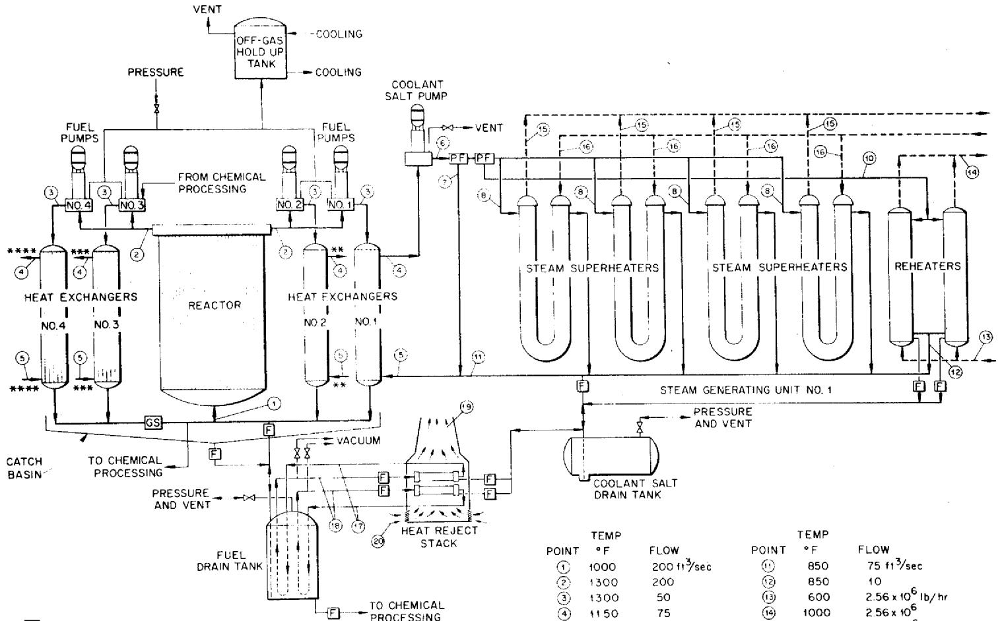  
F FREEZE VALVE   
PF PROPORTIONAL FLOW VALVE   
GAS SEPARATOR   
FUEL   
COOLANT   
STEAM

\*\*STEAM GENERATING UNIT NO.2   
\*\*\* STEAM GENERATING UNIT NO.3   
\*\*\*\* STEAM GENERATING UNIT NO.4

<table><tr><td colspan="3">TEMP</td><td colspan="3">TEMP</td></tr><tr><td>POINT</td><td>°F</td><td>FLOW</td><td>POINT</td><td>°F</td><td>FLOW</td></tr><tr><td>①</td><td>1000</td><td>200 ft3/sec</td><td>⑪</td><td>850</td><td>75 ft3/sec</td></tr><tr><td>②</td><td>1300</td><td>200</td><td>⑫</td><td>850</td><td>10</td></tr><tr><td>③</td><td>1300</td><td>50</td><td>⑬</td><td>600</td><td>2.56 x 106lb/hr</td></tr><tr><td>④</td><td>1150</td><td>75</td><td>⑭</td><td>1000</td><td>2.56 x 106</td></tr><tr><td>⑤</td><td>850</td><td>75</td><td>⑮</td><td>1000</td><td>1.26 x 106</td></tr><tr><td>⑥</td><td>1150</td><td>75</td><td>⑯</td><td>700</td><td>1.26 x 106</td></tr><tr><td>⑦</td><td>1150</td><td>0-20</td><td>⑰</td><td>950</td><td>4 ft3/sec</td></tr><tr><td>⑧</td><td>1150</td><td>16.2</td><td>⑱</td><td>1250</td><td>4</td></tr><tr><td>⑨</td><td>850</td><td>16.2</td><td>⑲</td><td>600</td><td>420,000 ft3/min</td></tr><tr><td>⑩</td><td>1150</td><td>10</td><td>⑳</td><td>100</td><td>420,000</td></tr></table>

# 2. TEST OBJECTIVES

When the fluoroborate* salt is heated above its melting point, it dissociates in accordance with the equation $\mathrm{NaBF}_4 \stackrel{\leftrightarrow}{\longrightarrow} \mathrm{NaF} + \mathrm{BF}_3$ . The degree of dissociation and the resulting partial pressure of $\mathrm{BF}_3$ over the melt is a function of the temperature (see Appendix A, Sect. A.2). At $1025^{\circ}\mathrm{F}$ the equilibrium $\mathrm{BF}_3$ decomposition pressure is 1.4 psia; at $1150^{\circ}\mathrm{F}$ , which is the design temperature at the coolant pump inlet for the MSBR, the $\mathrm{BF}_3$ decomposition pressure is 4.9 psia or one-third of atmosphere. By way of contrast the Li-Be coolant salt at $1025^{\circ}\mathrm{F}$ has a vapor pressure of about $4 \times 10^{-6}$ psia. In a system such as the MSRE coolant system, which operated at a total overpressure of 20 psia, the pump bowl gas space and the associated off-gas stream would contain from 7 to $25\%$ $\mathrm{BF}_3$ , depending on the temperature at the salt-gas interface. This rather significant partial pressure of $\mathrm{BF}_3$ suggested the possibility of problems in the control of salt composition, in pump operation, and in the operation of the cover-gas system. In addition, so far as we know, this was the first attempt to circulate molten fluoroborate salt in large-scale equipment, and it appeared likely that some unforeseen problem might arise. Therefore, the original objectives of the sodium fluoroborate circulating test loop can be summarized as follows:

1. Examine the pumping characteristics. Compare head-flow data with similar data for the Li-Be salt. Determine minimum overpressures necessary to suppress cavitation.   
2. Determine what problems might be involved in monitoring and controlling the composition of the salt.   
3. Accumulate experience in the operation of a fluoroborate circulation system. In particular, make observations on freeze valve operation, salt sampling, and the handling and control of gases containing $\mathrm{BF}_3$ . In general, make note of anything that might be useful in the design or operation of a fluoroborate system.

After the test work was under way, two other items assumed sufficient importance to warrant designation as a major objective.

4. Examine the possibility of preventing undesirable accumulations of corrosion products (such as on heat exchanger surfaces) by providing for preferential deposition in a cold trap.   
5. Determine the nature of mists and vapors discharged from the pump bowl vapor space into the off-gas line. Develop separators, traps, filters, or other devices that will manage these materials so as to minimize flow restrictions and fouling of control valve trim in the off-gassystem.

# 3. SUMMARY OF TEST RESULTS

# 3.1 General

The test work produced no evidence of any engineering problem that would preclude the use of $\mathrm{NaBF}_4$ -NaF eutectic as a secondary coolant for molten-salt reactor systems.

# 3.2 Pumping Characteristics

The results of hydraulic performance and cavitation tests indicate that head-flow and cavitation characteristics using fluoroborate salt should be predictable from water test data taken with similar pumps. Cavitation inception pressures for a flushing batch of salt were 7 to $16\%$ higher than similar data for a clean batch of salt. This effect was attributed to an increase in $\mathrm{BF}_3$ partial pressure resulting from contamination of the flushing salt by the residual MSRE-type (Li-Be-U-Th) salt remaining in the loop from prior test work.

# 3.3 Control of the Salt Composition

Efforts to evaluate methods for composition control were hampered by our inability to determine the composition of the salt with sufficient accuracy and precision. However, after due consideration of the

test data, we believe that the composition of the salt remained essentially constant over the 11,000-hr period of circulation, and we further conclude from this that the use of a $\mathrm{BF}_3$ overpressure system was successful as a composition control method. Of techniques considered for monitoring the salt composition, the test work indicated that the off-gas thermal conductivity method is feasible and that chemical analysis of salt samples by use of currently available techniques is unsatisfactory.

# 3.4 Controlled Deposition of Corrosion Products

Data were obtained on the relative size and chemical composition of deposits formed on a "cold finger" which was inserted beneath the surface of the salt pool in the pump bowl. The ultimate objective was to determine if cold trapping could be used in reactor secondary coolant systems to control corrosion product concentrations and thus to inhibit the formation of harmful deposits on the steam generator heat transfer surfaces. However, the test results were too meager to permit any meaningful conclusions.

# 3.5 Analysis and Correction of Restrictions on the Off-Gas System

Initial operations were characterized by flow restrictions in the off-gas line. The trouble was traced to a mixture of materials (salt mists, acids, metal corrosion products) carried from the pump bowl by a purge-gas stream and deposited in undesirable places by condensation and/or gravity. Test results indicate the problem can be controlled by a properly designed system of traps and filters in the off-gas line at the pump bowl outlet. Also the problem may be ameliorated by pretreatment of the salt to minimize impurities and by designing the pump so as to minimize formation of salt mist in the pump bowl gas space.

# 3.6 Miscellaneous Observations

Handling and circulation of the fluoroborate salt were accomplished without difficulty using routine molten-salt handling techniques. An

incident involving leakage of salt to the atmosphere dramatized the essential lack of secondary effects. The importance of providing a clean, leak-tight system for handling $\mathrm{BF_3}$ was confirmed. The performance of the salt freeze valve and of various instruments for measuring pressure and flow in both the salt and gas systems appeared to be reliable and adequate.

# 4. DESCRIPTION OF TEST FACILITY

# 4.1 General

The test work was done in an existing facility that was modified to meet the requirements of the fluoroborate test. The facility was constructed in 1956 and was operated for many thousands of hours circulating NaK in order to obtain performance data on model PKP pumps for the Aircraft Reactor Test (ART). In 1962 the facility was reassigned to the Molten-Salt Reactor Program and between 1962 and 1966 was operated for more than 17,000 hr in the circulation of molten-fluoride salts of the type (Li-Be-U-Th) used in the MSRE. Changes made prior to the start of the fluoroborate test included provisions to obtain salt samples, revisions to the purge- and off-gas systems to provide proper equipment for handling $\mathrm{BF}_3$ gas, revision to the drain line freeze valve to better simulate the MSRE installation, and revisions to the containment and ventilation systems to insure proper containment and disposal of any vapors that might accidentally leak from the loop. As a result of problems that arose during the course of the fluoroborate test work, the $\mathrm{BF}_3$ feed system was modified, and miscellaneous revisions were made in the purge- and off-gas systems primarily to cope with flow restriction problems. For design details of the complete facility see the drawings listed in Appendix B.

# 4.2 Salt Piping and Components

The salt piping is shown in simplified outline in Fig. 2. The pump and piping were fabricated from Inconel. The pipe size was $\frac{1}{4}$ in. IPS except for about $\frac{1}{4}$ ft of $\frac{3}{2}$ in. IPS at the pump discharge. The pump

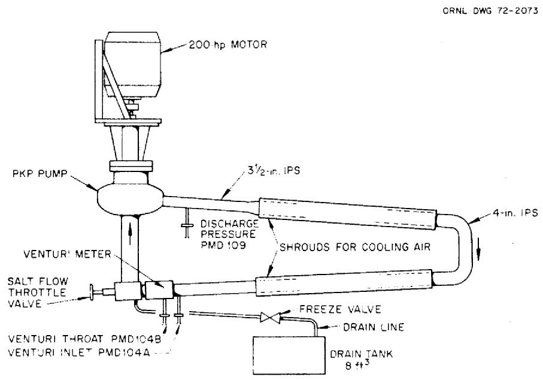  
Fig. 2. Simplified schematic of fluoroborate circulation loop.

was located at the point of maximum elevation. From the pump discharge the salt flowed in order through an upper horizontal section, a vertically oriented $180^{\circ}$ return bend, a lower horizontal section, a venturi element, and a throttle valve. From the valve, which was at the point of minimum elevation, the flow proceeded directly upward about 3 ft to the pump suction. Each horizontal section was about 16 ft long and was pitched slightly to facilitate draining of the loop. An 8-ft³ Inconel drain tank served as storage space for the salt inventory when the facility was not in operation. A 3/4-in.-IPS drain line connected the dip leg in the drain tank to the bottom of the throttle valve housing in the loop. Transfer of salt was accomplished by means of gas pressure, and a freeze valve (see Section 6.4) was provided to isolate the drain tank from the loop. Table 1 lists principal data relating to loop geometry.

The pump, designated as model PKP, is a forerunner of the pumps used in the MSRE fuel and coolant systems. It is a centrifugal sump pump with integral pump tank and vertical shaft (Fig. 3). During the fluoroborate test work the pump speed was $1800\mathrm{rpm}$ . The upper exterior surface of the impeller is equipped with ribs which function to control the rate of leakage (fountain flow) from the volute into the pump tank by way of the upper shaft seal.[2] Baffles and a thermal shield serve to protect the bearing cavity from excess temperature. A forced-circulation oil system lubricates the bearings and cools the thermal shield.

The shaft oil seal is a metal-graphite rotating mechanical seal. Oil that leaks past the seal drains into a catch basin (Fig. 4). A top hat or dam is provided to minimize the tendency for leakage oil to flow down the pump shaft to the pump bowl. A continuous flow of inert gas (helium or argon) serves as a shaft purge. At the shaft annulus the flow is split into two streams. One stream, equal to about $90\%$ of the total, flows down the shaft into the pump bowl vapor space, serving to inhibit back diffusion of pump bowl vapors. The remaining portion of the purge gas flows up the shaft over the rotating seal and through the oil catch basin. The piping is arranged so that most of the accumulated oil is forced out of the catch basin with the gas stream and into an oil catch tank further downstream.

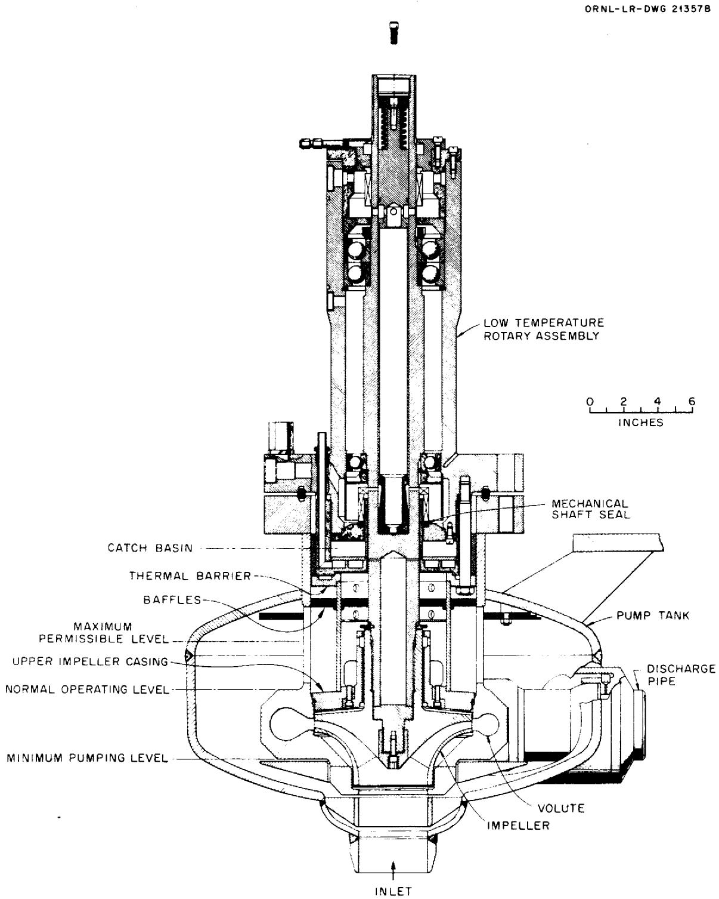  
Fig. 3. PKP pump cross section.

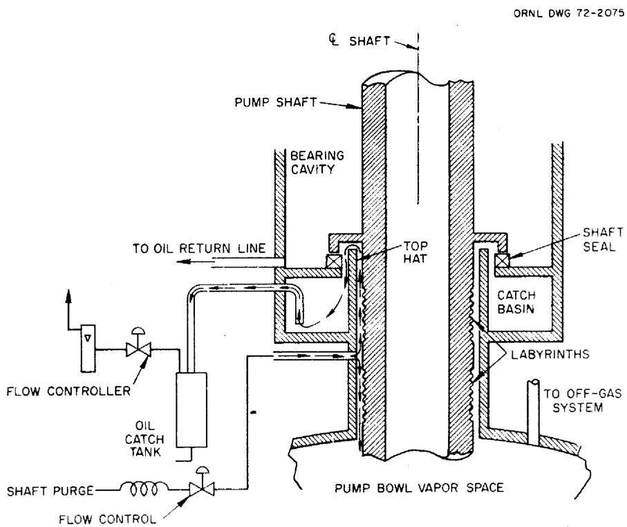  
Fig. 4. Schematic diagram of shaft purge system on PKP pump.

The gas pressure in the bearing cavity is controlled at 1 to 2 psi above the pump bowl pressure so that oil seal leakage flows into the catch basin.

Table 1. Descriptive data on fluoroborate circulation loop   

<table><tr><td></td><td>Circulating loop</td><td>Pump tank</td><td>Total</td></tr><tr><td>Salt volume, ft3</td><td>4.1</td><td>0.5</td><td>4.6</td></tr><tr><td>Salt mass, lb</td><td>476</td><td>58</td><td>534</td></tr><tr><td>Gas volume,a ft3</td><td>0</td><td>1.2</td><td>1.2</td></tr><tr><td>Surface area of wetted metal, ft2</td><td>50</td><td>4</td><td>54</td></tr><tr><td>Free surface of salt, ft2</td><td>0</td><td>3</td><td>3</td></tr><tr><td>Length of piping, ft</td><td>40</td><td></td><td>40</td></tr><tr><td>Linear velocity of salt at 800 gpm, fps</td><td>20</td><td></td><td></td></tr><tr><td>Typical Reynolds number at 1025°F</td><td>7.7 × 105</td><td></td><td></td></tr></table>

Assuming salt level at 2 in. above volute midplane.

# 4.3 Salt Sampling Device

Salt samples were obtained by dipping a copper bucket into the salt in the pump bowl. Although the pump bowl inventory was not in the main circulating stream, the leakage through the pump shaft labyrinth (fountain flow) was estimated to be enough to cause a complete interchange with the circulating inventory every 2 min, and so the salt samples were assumed to be representative of the material in the circulating stream. The sample tubes were hydrogen fired before use to remove oxide scale, and a special pipe housing was provided to prevent contact with air before and during the sampling process. The sampling procedure was as follows: The sample device (Fig. 5) was screwed onto the pipe nipple on the pump bowl sample access pipe. The sample unit ball valve was opened, and the sample unit and nipple were purged and evacuated to remove wet air and then were pressurized to about 2 psi above the pump

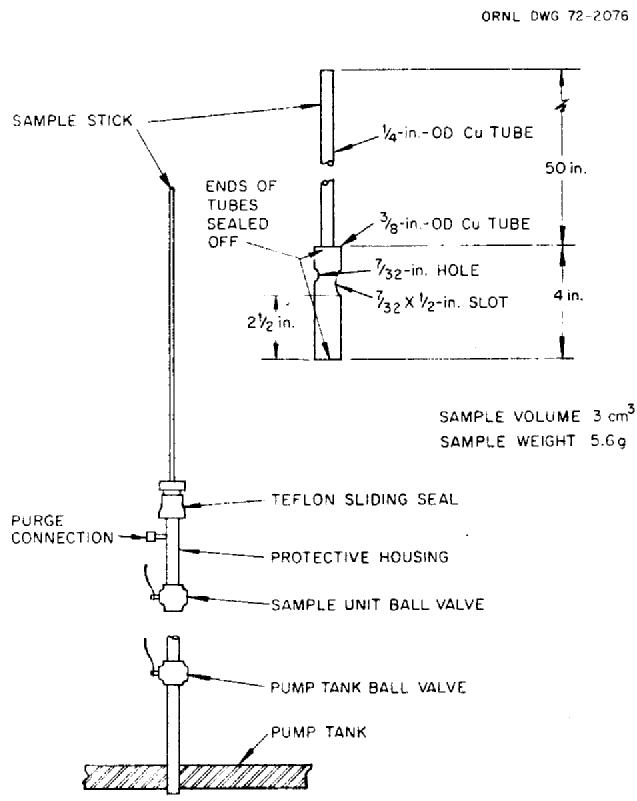  
Fig. 5. Salt sampling device.

bowl pressure. The pump bowl ball valve was then opened and the sample tube inserted until the bucket bottomed in the pump tank. After an insertion period of 10 to 15 sec, the sample bucket was withdrawn into the protective housing, and the pump tank ball valve was closed. After a cooldown period of at least 15 min, the sample bucket was removed from its protective pipe housing, cut loose from the $1/4$ -in. copper tube extension rod, and placed in a sample jar that had been flushed with argon to remove excess wet air.

# 4.4 Heating and Controlled Ventilation

The loop was heated with Calrod heaters applied to bare pipe and ceramic heaters installed on the pump tank, drain tank, and air cooling shrouds. The heater input was controlled by manually adjusted Variacs. The circulating salt was cooled by using the suction of the ventilation blower to draw a controlled flow of air through annuli formed on portions of each horizontal section of the piping (Fig. 6). Except for the top portion of the pump, the loop proper was completely enclosed in sheet metal. The blower was used to maintain a slight negative pressure in the enclosure, so that any gas leakage from the loop would be diluted with air and discharged from the stack on the roof. The loop operating temperature was maintained by balancing the power supplied by the pump and by the resistance heaters against the power removed by loss to the surroundings and by the cooling air.

# 4.5 Gas System Design

Gas input was constant and was made up of three separate streams (Fig. 7): (1) the shaft purge, normally about $950~\mathrm{cm}^3/\mathrm{min}$ of helium, whose function was to inhibit diffusion of pump bowl vapors into the bearing cavity; (2) the instrument line purge, about $230~\mathrm{cm}^3/\mathrm{min}$ of helium, which maintained a continuous sweep of purge gas through the line that was used to sense pump bowl pressure and also served as the vapor phase tap for the salt level indicator; and (3) the mixed-gas

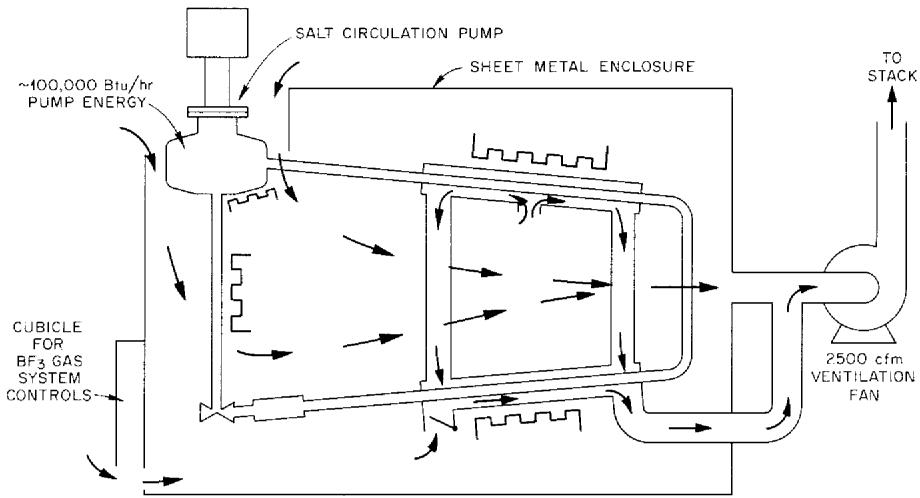  
ORNL-DWG72-2077   
Fig. 6. Loop ventilation and temperature control.

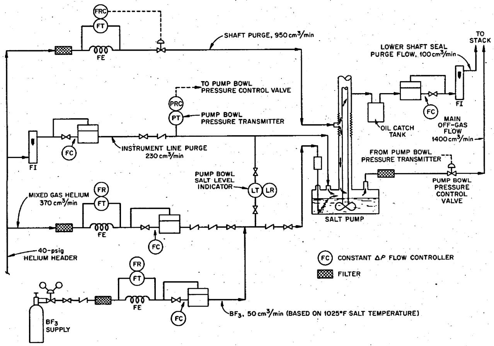  
Fig. 7. Simplified diagram of gas system, $\mathrm{NaBF}_4$ circulation test, PKP loop.

feed, about $370~\mathrm{cm}^3/\mathrm{min}$ of helium plus $\mathrm{BF}_3$ , which provided the necessary $\mathrm{BF}_3$ feed to the pump bowl and also served as the high side tap for the salt level indicator. The $\mathrm{BF}_3$ flow required for $1025^{\circ}\mathrm{F}$ operation was 50 $\mathrm{cm}^3/\mathrm{min}$ . When the loop was operated at other salt temperatures, the $\mathrm{BF}_3$ flow was varied accordingly, and the helium was adjusted to keep the total mixed-gas flow at $370~\mathrm{cm}^3/\mathrm{min}$ .

There were two effluent gas streams from the system. One was a small fraction of the shaft purge, about $100~\mathrm{cm}^3/\mathrm{min}$ , which flowed up the shaft and served to keep oil leakage swept out of the pump. This flow was controlled at a constant value. The other effluent, the main off-gas stream, consisted of the remainder of the shaft purge and the other gas flows that entered the pump bowl vapor space. The flow rate in the main off-gas stream was dependent on the pump bowl pressure control valve, which operated to keep the pump bowl gas overpressure at the desired set point. Since the other gas flows were constant, when the system was at steady state the off-gas flow was constant and equal to the total input minus the lower seal purge flow.

Ball valves with packed stem seals were used in the salt sample access line to permit passage of the sample tubes and the cold-finger assembly. The experimental traps and filters in the off-gas line also were equipped with ball-type isolation valves because the straight-through flow path minimized the tendency for salt particles and other contaminants to collect in the valves. Otherwise, the gas system was equipped with globe-type valves that had packed stem seals in existing areas and with some few exceptions demountable bellows stem seals in newly installed areas. Check valves and relief valves were of the spring-loaded poppet type. Body material was brass and trim was brass or Teflon, although in some cases stainless steel valves were substituted because of availability. End connections were $1/4$ -in.-OD tubing or $1/4$ in. IPS, except where larger sizes were dictated by specific operating requirements. All valves were selected from existing, commercially available models.

# 4.6 $\underline{\mathbf{BF}_3}$ Disposal

The loop was operated for the most part with the salt temperature at $1025^{\circ}\mathrm{F}$ and the total overpressure at 38.7 psia. At $1025^{\circ}\mathrm{F}$ , the $\mathrm{BF}_3$ partial pressure is 1.35 psi, and so the $\mathrm{BF}_3$ concentration in the off-gas stream was about $3.5\%$ by volume. After passing through the loop pressure control valve, the off-gas stream was passed through a mineral-oil bubbler to inhibit back diffusion of moisture. The gas stream was then vented into the 12-in. suction line to the stack blower. The off-gas flow rate was 1.5 liters/min, and the blower flow was 2500 cfm; so the concentration of $\mathrm{BF}_3$ in the stack was (1.5/28.3)(0.035/2500), or 0.7 ppm. Dilution by the atmosphere probably reduced the concentration by a factor of 100, so this method of disposing of the $\mathrm{BF}_3$ kept the atmospheric concentration well below the continuous exposure limit of 1 ppm.

# 4.7 Instrument and Controls

Approximately 32 sheathed Chromel-Alumel thermocouples were provided on the salt system to monitor the salt temperature. One thermocouple well was immersed in the salt in the pump bowl and another was installed in the drain tank; all other thermocouples were strapped to surfaces of piping and components. Salt pressure was measured by pressure transmitters (PT), which use a flexible thin-metal diaphragm and an NaK-filled transmission line to relay pressure impulses to a remote receiver. Salt flow was indicated by the $\Delta P$ across a full-flow venturi, and the $\Delta P$ was measured by the difference in reading between a PT at the venturi inlet and another at the venturi throat. Salt flow could be varied between 400 and 1000 gpm by adjusting the throttle valve. A metal bellows was used for the stem seal on the salt valve, and an automatic gas-pressurizing system was connected to a chamber surrounding the bellows to insure that the difference in pressure across the bellows was always controlled within acceptable limits. Spark plug probes were provided in the pump bowl and drain tank for single point indication of salt level. A gas bubbler tube, mentioned earlier, was provided in the pump bowl for continuous salt level indication over a range of 10.75 in. A high-frequency conductance probe was used very briefly for salt level indication (see Sect. 6.6).

Pressure gages with silver-soldered phosphor-bronze Bourdon tubes were used for gas lines containing $\mathrm{BF}_3$ . The pressure transmitters for $\mathrm{BF}_3$ flow and salt level had wetted parts of stainless steel or Teflon. The 0- to 50-psig pump bowl pressure transmitter had a helical element. Capillaries were used for gas flow elements. The capillary for the $\mathrm{BF}_3$ flow element (FE-B9) was 0.03l in. in inside diameter by 45 in. long, and the calibrated $\mathrm{BF}_3$ flow rate at 40 psig metering pressure and $80\%$ scale (16 in. H₂O) was 330 cm³/min. The $\mathrm{BF}_3$ calibrations were done using a wet test meter filled with mineral oil. Constant ΔP flow controllers were used for control of gas flow, with the input flows referenced to the 40-psig supply pressure and the lower seal purge referenced to atmosphere. Off-gas letdown was controlled by a pneumatic control valve with stainless steel body and trim, gasketed bellows stem seal, and a Cₙ of 0.01.

The thermal conductivity cell was constructed of tungsten-rhenium elements, brass element block, and silver-soldered stainless steel tubing leads. The cell temperature was controlled at $100^{\circ}\mathrm{C}$ , and sample and reference gas flows were $100~\mathrm{cm}^3/\mathrm{min}$ . The off-gas sample take-off point was just upstream of the pressure control valve, so there was a time lag of 1 to 2 min between changes at the pump bowl outlet and cell response.

Figures 8 to 10 show the main control panel, the $\mathrm{BF}_3$ supply cubicle, and the off-gas cubicle.

5. TEST PROCEDURES, OBSERVATIONS, AND CONCLUSIONS FOR THE PRINCIPAL TESTS

# 5.1 Pumping Characteristics

The test was designed to obtain head-flow and cavitation inception data and, by comparing these data with water and liquid-metal data for the same pump, to lend assurance to the assumption that water test data may be used to predict the performance of similar pumps when handling fluoroborate salts. A brief discussion of the tests is given below; for further information see Refs. 3 and 4.

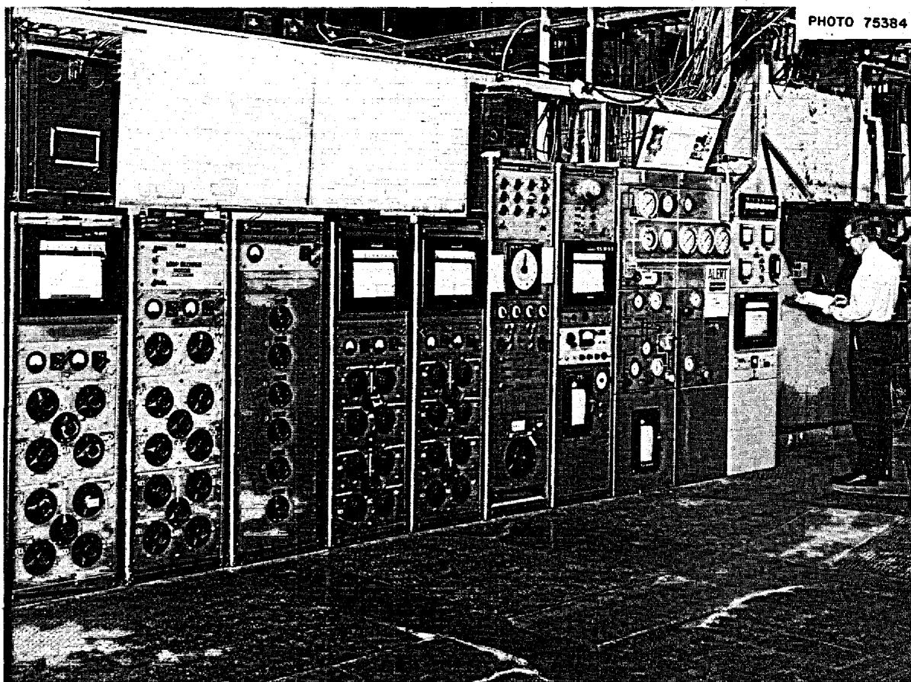  
Fig. 8. Main control panel, fluoroborate circulation (PKP) test.

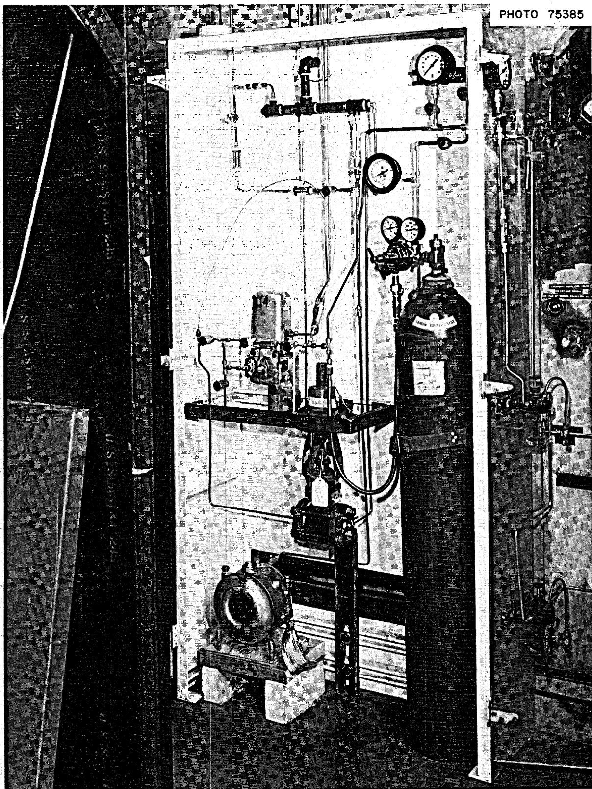  
Fig. 9. BF $_3$ supply cubicle.

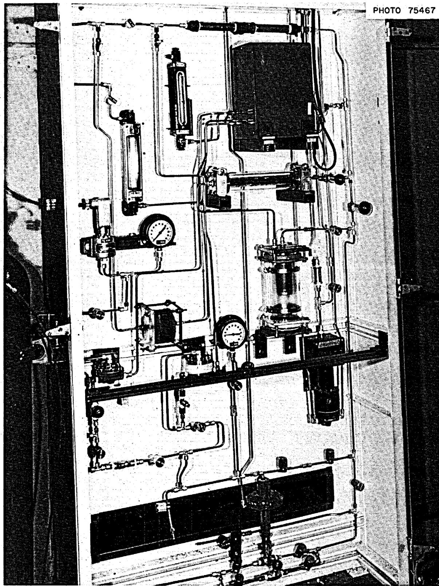  
Fig. 10. Off-gas cubicle.

The tests were made at a pump speed of 1800 rpm and at various salt temperatures in the range 900 to $1300^{\circ}\mathrm{F}$ . For the head-flow tests the procedure was to adjust the salt temperature to the desired point and then to vary the salt flow by adjusting the position of the loop throttle valve. The procedure for the cavitation inception tests was to adjust the salt temperature to the desired point and, with flow constant at 750 gpm, to reduce the gas overpressure in fixed decrements until the drop in discharge head per unit decrease in pressure showed a disproportionate change.

The hydraulic performance data are compared with $\mathsf{H}_2\mathsf{O}$ and NaK data in Fig. 11. The excellent agreement between results from all sources creates confidence that the head-flow characteristics of the PKP pump could well have been adequately predicted, based on the results of available $\mathsf{H}_2\mathsf{O}$ and NaK tests. As a corollary, we can conclude that the performance of similar pumps, such as the MSRE coolant salt pump, could be adequately predicted based on water test results.

Cavitation data for the clean charge* of salt indicated that the inception of cavitation for fluoroborate salt can be correlated on the basis of NPSH (net positive suction head) and vapor pressure (see Fig. 12). Data for the flush charge of salt showed cavitation pressures from 7 to $16\%$ higher than those for the clean charge. This effect is attributed to the fact that the flushing charge contained the residue of a molten salt (designated BULT-4) that had been used in the previous test work in the facility. The total charge of flush salt into the test facility was 689 lb, and the estimated residue of fuel salt was 26 lb; so that a $16\%$ rise in partial pressure at $1150^{\circ}\mathrm{F}$ resulted from adding about $4\%$ by weight of fuel to the coolant. Tables 2 and 3 present data on the compositions of the salt charges.

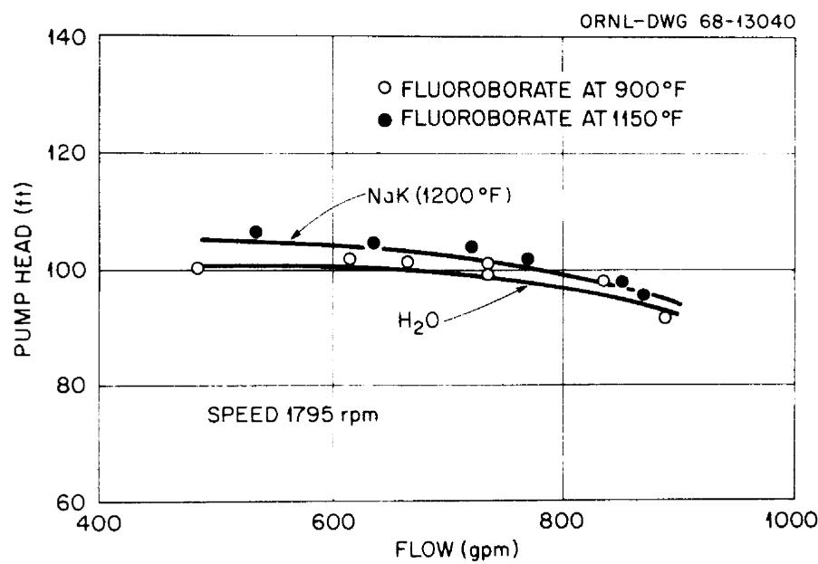  
Fig. 11. Comparison of PKP pump characteristics with sodium fluoro-borate, NaK, and water.

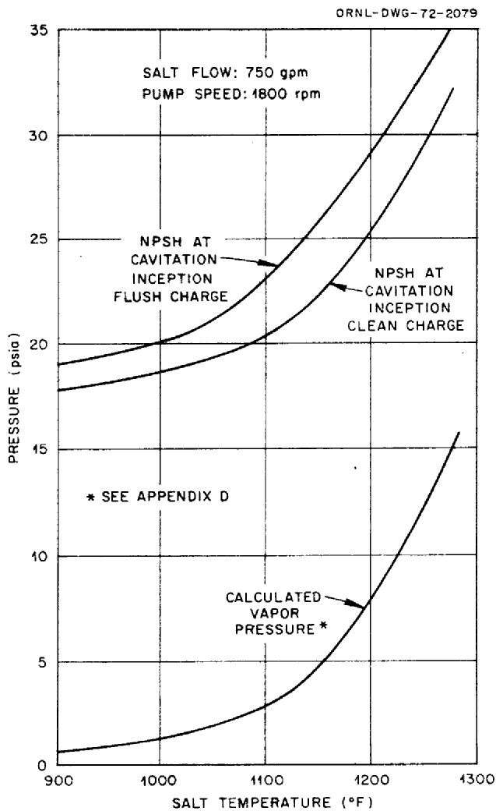  
Fig. 12. Cavitation data for PKP pump with $\mathrm{NaBF}_4$ -NaF eutectic salt. (a) Pump NPSH requirements (Ref. 3); (b) vapor pressure of sodium fluoro-borate (eutectic) (Ref. 5).

Table 2. Composition of salts circulated in PKP-1 loop   

<table><tr><td rowspan="2"></td><td colspan="7">Composition (wt %)</td></tr><tr><td>Li</td><td>Be</td><td>U</td><td>Th</td><td>Na</td><td>B</td><td>F</td></tr><tr><td>BULT-4 salt formerly in loopa</td><td>9.7</td><td>5.8</td><td>5.1</td><td>20.0</td><td></td><td></td><td>59.3</td></tr><tr><td>Fluoroborate salt flush chargeb</td><td>0.20</td><td>0.18</td><td>0.26</td><td>0.24</td><td>21.2</td><td>9.3</td><td>66.9</td></tr><tr><td>Fluoroborate salt clean chargeb</td><td>0.05</td><td>0.02</td><td>0.02</td><td>0.10</td><td>20.9</td><td>9.3</td><td>68.0</td></tr></table>

aFigures for BULT-4 salt are calculated (LiF-BeF2 - ThF4 - UF4 = 65-30-4-1 mole %).   
bFigures for fluoroborate salts are averages of all samples analyzed during the entire test program.

Table 3. Relative amounts of fuel salt constituents in fluoroborate charges   

<table><tr><td rowspan="2">Salt mixture</td><td rowspan="2">Method of determination</td><td colspan="4">Moles per 1000 moles Na</td></tr><tr><td>Li</td><td>Be</td><td>U</td><td>Th</td></tr><tr><td>Flush charge</td><td>Calculateda</td><td>54</td><td>26</td><td>0.9</td><td>3.0</td></tr><tr><td>Flush charge</td><td>Chemical analysis</td><td>32</td><td>21</td><td>1.0</td><td>1.0</td></tr><tr><td>Clean charge</td><td>Chemical analysis</td><td>8</td><td>2</td><td>0.08</td><td>0.4</td></tr></table>

${}^{a}$ Based on 689 lb flush salt and an estimated BULT-4 heel of 26 lb.

# 5.2 Control of the Salt Composition

It is desirable to keep the salt at or near the eutectic (NaBF₄-NaF 92-8 mole %) composition in order to take advantage of the minimum melting point* (Appendix A, Fig. A.l). The high BF₃ partial pressure, together with the continuous flow of purge gas through the pump bowl vapor

space, provides a mechanism for loss of $\mathrm{BF}_3$ and a change in the composition of the salt. The objective of this phase of the test loop work was to determine the problems that might be associated with composition control. A preliminary survey revealed the following key points.

1. Loss of $\mathrm{BF}_3$ would shift the composition in the direction of lower $\mathrm{NaBF}_4$ content. The resultant increase in melting point would increase the probability of precipitating NaF in the cooler areas of the system, such as in the steam generator tubes. The suggested solution was to feed $\mathrm{BF}_3$ gas into the pump bowl gas space at a rate such that the partial pressure of $\mathrm{BF}_3$ , based on $\mathrm{BF}_3$ flow and total gas flow, is equal to the equilibrium $\mathrm{BF}_3$ pressure of the salt, based on the desired salt composition and on the temperature of the salt at the salt-gas interface.

2. If a $\mathrm{BF}_3$ feed system is used and the feed rate is too high, the composition would be shifted in the direction of increased $\mathrm{NaBF}_4$ content. On this side of the eutectic, the rise in melting point is limited to a moderate $27^{\circ}\mathrm{F}$ , but the increase in $\mathrm{BF}_3$ partial pressure might be intolerable. For example, at $1150^{\circ}\mathrm{F}$ the $\mathrm{BF}_3$ partial pressure would increase from 5 to 30 psia if the $\mathrm{NaBF}_4$ fraction increased from 92 to 98.5 mole%.

3. Rates of change in the salt composition are likely to be relatively low, because the amount of $\mathbf{BF}_3$ in the salt is very large compared with the rate at which the $\mathbf{BF}_3$ would normally be added or removed by the gas stream. Thus, if $\mathbf{BF}_3$ is removed at the maximum rate, that is, no attempt is made to add $\mathbf{BF}_3$ to the system (and ignoring the decrease in partial pressure with composition), the time (in days) required to produce a change of $1\%$ in mole fraction would be $2.4 \times 10^{-5} (\mathrm{W}_0 / \mathrm{F})(\mathrm{P}_t / \mathrm{P}_b)$ , where $\mathrm{W}_0$ is original weight of salt (lb) assuming a 92-8 mole % mix, F is total gas flow (cfm), $\mathrm{P}_b$ is partial pressure of $\mathbf{BF}_3$ (psia), and $\mathrm{P}_t$ is total gas pressure (psia). Assuming a $\mathbf{BF}_3$ partial pressure of 5 psia (salt temperature = 1150°F) and a total pressure of 25 psia, the above expression was applied to three different systems with the results given below.

<table><tr><td>System</td><td>Inventory (1b)</td><td>Flow (cfm)</td><td>Time required for 1 mole % change (days)</td></tr><tr><td>NaBF4test facility</td><td>700</td><td>0.05</td><td>1.7</td></tr><tr><td>MSRE coolant system</td><td>5,000</td><td>0.05</td><td>12</td></tr><tr><td>MSBR coolant system</td><td>500,000</td><td>2</td><td>30</td></tr></table>

We note that even for a relatively small system such as the test facility, almost two days would be required to produce the indicated change. In the MSBR system, even if the estimated inventory is high by a factor of 10, the elapsed time would still be three days. We also note that the times required to reduce the $\mathrm{NaBF}_4$ mole fraction would actually be longer than indicated since the $\mathrm{BF}_3$ partial pressure, and hence the rate of removal of $\mathrm{BF}_3$ , would decrease as the $\mathrm{NaBF}_4$ fraction decreased. If we look at the case where the salt composition is being shifted upward because of the addition of an excess of $\mathrm{BF}_3$ , we note that the rate of change of salt composition is proportional to the difference between the $\mathrm{BF}_3$ partial pressure of the salt and the $\mathrm{BF}_3$ partial pressure based on the gas flows. In order to have a rate of increase of $\mathrm{NaBF}_4$ fraction numerically equal to the maximum rate of decrease postulated in the example above, it would be necessary to assume a $100\%$ error in the control of the $\mathrm{BF}_3$ gas flow or some appropriate combination of errors in the $\mathrm{BF}_3$ and helium flows. We consider errors of this magnitude to be very unlikely in a properly instrumented system and hence conclude that rates of change of $\mathrm{NaBF}_4$ fraction in the upward direction will be no greater than, and are likely to be somewhat less than, the maximum rates of change of $\mathrm{NaBF}_4$ fraction that could be expected in the downward direction.

4. Assuming steady-state conditions, the salt will eventually adjust to a composition whose $\mathrm{BF}_3$ partial pressure is equal to the $\mathrm{BF}_3$ partial pressure based on the gas flows. Therefore, if we maintain proper control of the salt temperature, then control of the salt composition is limited only by the accuracy with which we can control the $\mathrm{BF}_3$ partial pressure of the cover gas. In an actual system, where there would be finite limits of error in the control of salt temperatures and gas flows, it would probably be best to control the $\mathrm{BF}_3$ partial pressure with a deliberate bias on the high side. The rationale is that it is unlikely that we will be able to control precisely at the eutectic point;

therefore we should try to insure that the normal deviation is on the side of increased $\mathrm{NaBF_4}$ fraction in order to gain the advantage of the lower incremental increase in melting point. By reference to Fig. A.l in Appendix A, we note that the melting point increases an average of $23^{\circ}\mathrm{F}/\mathrm{mole}\%$ between 92 and 90 mole $\%$ $\mathrm{NaBF_4}$ , whereas the increase between 92 and 100 mole $\%$ $\mathrm{NaBF_4}$ is only $5.4^{\circ}\mathrm{F}/\mathrm{mole}\%$ . In order to examine the feasibility of operating with a bias in $\mathrm{BF_3}$ partial pressure, consider a system in which the mole fraction of $\mathrm{NaBF_4}$ is f and the temperature of the salt at the salt-gas interface is $1150^{\circ}\mathrm{F}$ ; a total gas flow of $\mathbf{F_t}$ scfm is flowing past the salt-gas interface in the pump bowl; the gas flow is made up of a mixture of $\mathbf{F_h}$ scfm of helium and $\mathbf{F_b}$ scfm of $\mathrm{BF_3}$ ; the gas pressure in the pump bowl is maintained at a value of $\mathbf{P_t}$ psia; the partial pressure of $\mathrm{BF_3}$ is $\mathbf{P_b}$ psia; $(\mathbf{P_b})_{\mathbf{g}}$ represents the partial pressure of $\mathrm{BF_3}$ based on gas flows,

$$
\left(P _ {b}\right) _ {g} = \left(P _ {t}\right) \left(F _ {b} / F _ {t}\right) = \left(P _ {t} F _ {b}\right) / \left(F _ {b} + F _ {h}\right);
$$

and $(\mathsf{P_b})_s$ represents the partial pressure of $\mathsf{BF}_3$ based on the composition and temperature of the salt (see Appendix D):

$$
\left(P _ {b}\right) _ {s} = (0. 4 2 5 f) / (1 - f) \text {a t} 1 1 5 0 ^ {\circ} F.
$$

We would like to know how the salt composition is affected when we set the gas flows so that they correspond to a value of $(\mathsf{P}_{\mathsf{b}})_{\mathsf{g}}$ that is slightly higher than the ideal value for $(\mathsf{P}_{\mathsf{b}})_{\mathsf{s}}$ . We first set $(\mathsf{P}_{\mathsf{b}})_{\mathsf{g}} = (\mathsf{P}_{\mathsf{b}})_{\mathsf{s}}$ , then we solve for $f$ in terms of $\mathsf{F}_{\mathsf{b}}$ , and finally we differentiate to determine how $f$ is affected by a change in $\mathsf{F}_{\mathsf{b}}$ :

$$
\left(\mathrm {P} _ {\mathrm {b}}\right) _ {\mathrm {g}} = \left(\mathrm {P} _ {\mathrm {b}}\right) _ {\mathrm {s}},
$$

$$
\left(\mathrm {P} _ {\mathrm {t}} \mathrm {F} _ {\mathrm {b}}\right) / \left(\mathrm {F} _ {\mathrm {b}} + \mathrm {F} _ {\mathrm {h}}\right) = (0. 4 2 5 \mathrm {f}) / (1 - \mathrm {f}),
$$

from which

$$
f = \frac {P _ {t} F _ {b}}{\left(0 . 4 2 5 + P _ {t}\right) \left(F _ {b}\right) + 0 . 4 2 5 F _ {h}}.
$$

If we assume that $\mathbf{P}_{\mathrm{t}}$ and $\mathbf{F}_{\mathrm{h}}$ are constant at 30 psia and 0.5 scfm, respectively,\* then

$$
f = \frac {3 0 F _ {b}}{3 0 . 4 2 5 F _ {b} + 0 . 2 1},
$$

and

$$
\left(\partial f / \partial F _ {b}\right) _ {T} = \frac {6 . 3 0}{\left(3 0 . 4 2 5 F _ {b} + 0 . 2 1\right) ^ {2}}.
$$

If we assume a value of 5 psi for the $\mathrm{BF}_3$ partial pressure (Appendix A, Fig. A.2, eutectic composition at $1150^{\circ}\mathrm{F}$ ), we can estimate the ideal value for $\mathbf{F}_{\mathrm{b}}$ by noting that the ratio of gas flows is equal to the ratio of partial pressures:

$$
\begin{array}{l} \left(\mathrm {F} _ {\mathrm {b}} / \mathrm {F} _ {\mathrm {h}}\right) = \left(\mathrm {P} _ {\mathrm {b}}\right) / \left(\mathrm {P} _ {\mathrm {t}} - \mathrm {P} _ {\mathrm {b}}\right), \\ \left(\mathrm {F} _ {\mathrm {b}} / 0. 5\right) = (5) / (3 0 - 5), \\ \end{array}
$$

from which

$$
F _ {b} = 0. 1
$$

and $(\partial f / \partial F_{b})_{T} = 0.6$ for $F_{b} = 0.1$ . We conclude from this that a reasonable bias in the $\mathrm{BF}_3$ flow will result in an acceptable shift in the salt composition. For example, if the bias is $10\%$ ( $\partial F_{b} = 0.01$ ), the composition shift, $\partial f$ , is $0.006$ . In other words, if the $\mathrm{BF}_3$ flow is adjusted to $10\%$ higher than the ideal value, assuming an initial salt composition of $92$ mole $\%$ $\mathrm{NaBF}_4$ , the composition will shift eventually to $92.6$ mole $\%$ $\mathrm{NaBF}_4$ , and the melting point at this composition is estimated to be about $3^{\circ}\mathrm{F}$ above the eutectic melting point.

5. In order to design a reliable system for controlling the salt composition by means of a $\mathrm{BF}_3$ overpressure, one must have reliable information regarding the $\mathrm{BF}_3$ partial pressure of the salt at concentrations and temperatures of interest. Data have been published (see Appendices A and D and Refs. 2 and 5) that provide mathematical statements relating salt composition and temperature and $\mathrm{BF}_3$ partial pressure, and these

relationships have been used in the remarks under items 1 through 4 above. However, test work that was performed to investigate the pumping characteristics of the salt (see Sect. 5.1) indicated that the $\mathrm{BF}_3$ partial pressure of the salt can be altered significantly by the presence of contaminants. The results of those tests indicated that the pressure of incipient cavitation was about $16\%$ higher for the flush charge than for the clean charge, and this effect was attributed to the residue, or heel, that remained in the loop after draining out the old charge of BULT-4 salt. We do not know that there is a one-to-one relationship between cavitation pressure and the $\mathrm{BF}_3$ partial pressure of the salt, but we assume that the relationship is direct and therefore the $\mathrm{BF}_3$ partial pressure of the flush charge must have been higher than that of the clean charge. If such an effect were present but not known, the $\mathrm{BF}_3$ partial pressure of the gas feed would be inadvertently adjusted to a value lower than required, and, as indicated in the discussions above, the $\mathrm{NaBF}_4$ fraction of the salt would be reduced due to transfer of $\mathrm{BF}_3$ out of the salt. Therefore, the composition control system must be able to recognize the presence of contaminants and the nature and extent of their effect on the $\mathrm{BF}_3$ partial pressure of the salt.

In summary, the consequences of a change in salt composition can be serious, but the kinetics of the system are such that rapid change is highly improbable. We should be able to use an applied overpressure of $\mathrm{BF}_3$ to control the composition within desired limits, provided we have available a suitably accurate method for measuring the salt composition and the necessary data relating the $\mathrm{BF}_3$ partial pressure of the salt both as a function of the ratio of the primary constituents, $\mathrm{NaBF}_4$ and NaF, and as a function of probable contaminants, such as fuel salt and corrosion products. The test work consisted in (1) obtaining operating experience with the $\mathrm{BF}_3$ partial pressure control system and (2) evaluating several proposed methods for monitoring the composition of the salt.

# 5.2.1 Operation of the $\mathrm{BF}_3$ partial pressure control system

The data furnished by Cantor et al. were used to make a plot of $\mathrm{BF}_3$ partial pressure vs salt temperature with salt composition as a

parameter (Appendix A, Fig. A.2, and Appendix D). The salt composition was assumed to be at the eutectic point, $\mathrm{NaBF_4}$ -NaF (92-8 mole %), and the target value or control point for $\mathrm{BF}_3$ partial pressure was obtained from the plot by interpolating at the specified salt temperature. The target value for the $\mathrm{BF}_3$ gas flow rate was then calculated by equating the flow ratio to the pressure ratio:

$$
\mathrm {F} _ {\mathrm {b}} / \mathrm {F} _ {\mathrm {t}} = \mathrm {P} _ {\mathrm {b}} / \mathrm {P} _ {\mathrm {t}},
$$

where $F_{b}$ is the required $BF_{3}$ gas flow, $F_{t}$ is the total gas flow, $P_{b}$ is the target value for $BF_{3}$ partial pressure, and $P_{t}$ is the total gas pressure at the surface of the salt.

A general description of the gas system is given in Sections 4.5 through 4.7. Helium was fed into the pump bowl in three separate streams the shaft purge, which was held constant at $850~\mathrm{cm}^3/\mathrm{min}$ (the total flow to the pump shaft was $950~\mathrm{cm}^3/\mathrm{min}$ , but $100~\mathrm{cm}^3/\mathrm{min}$ was split off as the lower seal purge stream); the pressure transmitter purge, which was held constant at $230~\mathrm{cm}^3/\mathrm{min}$ ; and the mixed-gas helium, which was mixed with the $\mathsf{BF}_3$ gas and fed into the pump bowl by way of the salt level bubbler tube. The total flow to the bubbler tube, that is, helium plus $\mathsf{BF}_3$ , was held constant at $370~\mathrm{cm}^3/\mathrm{min}$ , so the total gas flow into the pump bowl, $\mathsf{F_t}$ , was constant at $1450~\mathrm{cm}^3/\mathrm{min}$ . The flow rate of helium to the bubbler tube was obtained by subtracting the target value for the $\mathsf{BF}_3$ gas flow rate, $\mathsf{F_b}$ , from 370. The set point for the total pressure, $\mathsf{P_t}$ , was somewhat arbitrary as long as a margin was provided above the point of cavitation inception in the pump. Test data (see Sect. 5.1) indicated that at the maximum anticipated salt temperature of $1300^{\circ}\mathsf{F}$ the pressure of incipient cavitation for the clean charge was about 19 psig, and 5 psi was added to this figure to obtain a set point of $24~\mathrm{psig}$ for $\mathsf{P_t}$ . This setting provided a comfortable margin of 20 psi when operating at the normal salt temperature of $1025^{\circ}\mathsf{F}$ . It might be noted that there is an incentive to operate at a high total pressure due to the inverse effect on the $\mathsf{BF}_3$ gas flow rate. Also, the pressure was set at $24~\mathrm{psig}$ , rather than 23 or 25, because $24~\mathrm{psig}$ is almost exactly equal to $2000~\mathrm{mmHg}$ absolute, and calculations involving metric units were simplified. At

$1025^{\circ}\mathrm{F}$ the indicated value for $\mathbb{P}_{\texttt{b}}$ is 1.35 psia. Using this value for $\mathbb{P}_{\texttt{b}}$ , 38.7 psia for $\mathbb{P}_{\texttt{t}}$ , and $1450~\mathrm{cm}^3/\mathrm{min}$ for $\mathbb{F}_{\texttt{t}}$ , we obtain a value of $50~\mathrm{cm}^3/\mathrm{min}$ as the target value for the $\mathsf{BF}_3$ gas flow. Except for brief periods (less than $10\%$ of total circulating time), when the salt was circulated at temperatures other than $1025^{\circ}\mathrm{F}$ , and brief special tests that required varying the $\mathsf{BF}_3$ flow, the target value for control of the $\mathsf{BF}_3$ gas flow was held constant at $50~\mathrm{cm}^3/\mathrm{min}$ .

We were unable to evaluate the effectiveness of the $\mathrm{BF}_3$ partial pressure control system on the basis of its ultimate objective, that is, control of the salt composition, because we did not have an adequate method for measuring the salt composition (see Sect. 5.2.2). Therefore, observations concerning partial pressure control will be limited to some comments relative to the accuracy of the gas flows ( $F_b$ and $F_h$ ) and the system overpressure ( $P_t$ ) and to the mechanical reliability of the system. The three gas streams that made up the total flow of helium into the system were monitored either with capillary flow elements or rotameters. The calibrations of the flow instruments were checked before, during, and after the operation of the facility using a bubble meter and a wet test meter. Since these test instruments are accurate to within $1\%$ , we feel that the limit of error in the helium flow rate was of the same order. We used the wet test meter, filled with mineral oil instead of water, to calibrate the $\mathrm{BF}_3$ flow element using $\mathrm{BF}_3$ gas. However, due to the limitations of the wet test meter, we were unable to obtain readings below $200~\mathrm{cm}^3/\mathrm{min}$ , and we could not use the bubble meter for flows between 0 and $200~\mathrm{cm}^3/\mathrm{min}$ because of the strong affinity between $\mathrm{BF}_3$ and water. As an alternative, we calibrated the $\mathrm{BF}_3$ flow element with argon using the bubble meter and then used the argon curve as a guide to extrapolate the $\mathrm{BF}_3$ flow curve into the low-flow region, attempting to maintain the same relative separation between the curves (in the region between 200 and 400 cm³/min, the $\mathrm{BF}_3$ flow was about $20\%$ higher than the argon flow for the same scale reading). Because of this difficulty with the calibration, the $\mathrm{BF}_3$ flow readings probably have a higher error limit than the helium readings, but we feel that an estimate of the $\mathrm{BF}_3$ flow error could conservatively be placed at less than $\pm 20\%$ . An attempt was made to check the accuracy of the $\mathrm{BF}_3$ flow setting by comparison with $\mathrm{BF}_3$ cylinder usage.

The following data on $\mathbf{BF}_3$ cylinder usage were extracted from the operating log:

<table><tr><td rowspan="2">Cylinder No.</td><td colspan="2">Date</td><td rowspan="2">Salt circulating time (hr)</td><td rowspan="2">Cylinder pressure drop (psi)</td></tr><tr><td>On line</td><td>Off line</td></tr><tr><td>2</td><td>1-6-69</td><td>4-28-69</td><td>2323</td><td>1450</td></tr><tr><td>3</td><td>4-28-69</td><td>8-15-69</td><td>2194</td><td>1300</td></tr><tr><td>4</td><td>8-15-69</td><td>1-27-70</td><td>2463</td><td>1610</td></tr></table>

The flow setting for $\mathrm{BF}_3$ was held constant at $50~\mathrm{cm}^3/\mathrm{min}$ during the periods covered by the above operating data. The $\mathrm{BF}_3$ cylinder data were used to estimate an average $\mathrm{BF}_3$ flow rate as follows:

$$
\mathrm {F} _ {\mathrm {c}} = (\mathrm {d p} / \mathrm {d t}) (\mathrm {d M} / \mathrm {d p}) (\mathrm {V} _ {\mathrm {s}}) ,
$$

where

$\mathbf{F}_{\mathrm{c}} = \mathbf{BF}_{3}$ flow rate,  
dp/dt = average rate of drop in cylinder pressure,  
dM/dp = estimated mass of $\mathbf{BF}_3$ per psi of cylinder pressure,  
V = specific volume of $\mathbf{BF}_3$ gas.

The average value for dp/dt for all three cylinders was 0.0104 psi/min. The specific volume of $\mathsf{BF}_3$ (Appendix A, Sect. A.4) is $5.6\mathrm{ft}^3 /1\mathrm{b}_{\mathrm{m}}$ . The estimated mass of $\mathsf{BF}_3$ per cylinder (the cylinder weights were not checked) was assumed to be somewhere between 59 and $62\mathrm{lb}_{\mathrm{m}}/\mathrm{psi}$ . The lower figure was obtained by dividing the total mass of $\mathsf{BF}_3$ , as stated on the purchase order, by the total number of cylinders received, that is, 1000/17. The higher value was the nominal mass per cylinder as stated on the purchase order. The corresponding values for dM/dp, 0.0384 and 0.0365 lb/m/psi, were obtained by dividing by 1600 psig, which was the average pressure for a full cylinder. By inserting the indicated values into the equation for Fc, we get values of 60 and 63 cm³/min for the $\mathsf{BF}_3$ flow rate, or 20 and 26% above the target value of 50 cm³/min.

This relatively poor agreement between the $\mathrm{BF}_3$ flow rate as indicated by the flow element and the $\mathrm{BF}_3$ flow rate as indicated by the cylinder data may have been due to the cumulative effect of small errors in the estimates for dp/dt and dM/dp and in the technique used for the calibration of the $\mathrm{BF}_3$ capillary flow element. If the $\mathrm{BF}_3$ flow rate had actually been $63~\mathrm{cm}^3/\mathrm{min}$ instead of the intended $50~\mathrm{cm}^3/\mathrm{min}$ , then we could predict, using the method described in Section 5.2, that the salt composition should have been shifted from 92 mole % NaBF $_4$ to 93.5 mole % NaBF $_4$ and, other things being equal, this would have caused a $25\%$ increase in the $\mathrm{BF}_3$ partial pressure. If the $\mathrm{BF}_3$ partial pressure had actually shifted this much, there should have been a significant change in the reading on the thermal conductivity cell that was being used to monitor the off-gas steam. Since no such change was observed, we conclude that the $\mathrm{BF}_3$ flow as calculated from the cylinder usage data was probably in error on the high side.

In addition to the control of the gas flows, performance of the $\mathrm{BF}_3$ partial pressure control system requires reliable control of the total system overpressure $(\mathsf{P}_{\mathsf{t}})$ . An error in the indication of total pressure will cause an error in the calculation of the $\mathrm{BF}_3$ gas flow setting, and the salt composition would thus not be controlled at the desired point. As an example, suppose that the salt composition and temperature are such that the $\mathrm{BF}_3$ partial pressure $(\mathsf{P}_{\mathsf{b}})$ is 5 psi, and 25 psia has been selected as the set point for total overpressure $(\mathsf{P}_{\mathsf{t}})$ . Since $\mathsf{F}_{\mathsf{b}} / \mathsf{F}_{\mathsf{t}} = \mathsf{P}_{\mathsf{b}} / \mathsf{P}_{\mathsf{t}} = 5/25 = 0.2$ , the set point for $\mathrm{BF}_3$ flow is $20\%$ of the total gas flow. Suppose, however, that the pressure indicator is in error, such that the total overpressure is actually 20 psia. Since the partial pressure of $\mathrm{BF}_3$ is 5 psi, this means that the composition of the gas phase, and likewise the composition of the off-gas stream, is $25\% \mathrm{BF}_3$ . As a result, we are feeding a $20\%$ mixture and removing a $25\%$ mixture, and the salt will be depleted in $\mathrm{NaBF}_4$ until the composition of the off-gas stream is reduced to $20\%$ . During the operation of the facility, the pressure instruments were calibrated against a master gage such that the error limit in total pressure indication could be conservatively estimated to be less than $\pm 0.5$ psi. Using the normal operating conditions

of 1.35 psi for $\mathbf{P}_{\mathrm{b}}$ and 38.7 psia for $\mathbf{P}_{\mathrm{t}}$ , the ratio of $\mathbf{BF}_3$ flow to total flow is calculated to be 1.35/38.7 or $3.49\%$ . If we assume that the total pressure was low by 0.5 psi, or 38.2 psia, we can calculate that the gas phase, and the off-gas stream, was actually 1.35/38.2 or $3.54\%$ , and $\mathbf{BF}_3$ would have been removed from the salt until the partial pressure of $\mathbf{BF}_3$ over the salt was reduced to (0.0349)(38.2) or 1.33 psi. This reduction of 0.02 psi in $\mathbf{BF}_3$ partial pressure would have corresponded to a reduction of the $\mathbf{NaBF}_4$ mole fraction of the salt from 92 to $91.9\%$ . We conclude from this that the total pressure indication during the operation of the facility was accurate enough that a negligible reduction in salt composition would have occurred even if the pressure indication had been low by the maximum estimated limit of error.

From a mechanical standpoint, the operation of the $\mathrm{BF}_3$ partial pressure control system was essentially trouble free. As one would expect, no problems at all were encountered with those portions of the system that contained only helium. The $\mathrm{BF}_3$ flow control system operated adequately, although there were occasional periods of noise or hash on the $\mathrm{BF}_3$ flow recorder, indicating that the flow controller was responding sluggishly. We attributed this trouble to accumulation in the controller orifice of the typical fluid that results when moisture (or moist air) is introduced into a system containing $\mathrm{BF}_3$ . The pressure transmitter that was used to indicate the total system overpressure performed quite satisfactorily. As noted in the design description, a continuous helium purge stream was maintained in the transmitter line in order to minimize the concentration of $\mathrm{BF}_3$ in the vicinity of the transmitter diaphragm. No tests were made, however, to obtain a direct measure of the effectiveness of this purge stream.

# 5.2.2 Methods for monitoring salt composition

Four methods were considered for monitoring the composition of the salt.

1. Chemical analyses of salt samples. In this method the basic constituents are determined from chemical analyses, and then the mole fraction is inferred from stoichiometric ratios. A preliminary mathematical analysis indicated that the limits of error of the chemical

analyses were too great to permit use of this method. This conclusion was verified by a plot of the mole fraction as calculated from analyses of a large number of salt samples taken during operation of the test facility (see Fig. 13).

2. Change in heat transfer coefficient due to a salt deposit. A heat transfer surface in the salt stream would be controlled at a temperature slightly above the normal liquidus temperature. A change in composition would result in a deposit on the cool surface that could be detected by a change in heat transfer coefficient. It was concluded that preferential deposition of corrosion products would make this method difficult to interpret.

3. Differential thermal analysis. In this method the composition is inferred from analysis of temperature profiles obtained by moving a salt sample through carefully controlled freeze and thaw cycles. Although this method may be applicable, it was not evaluated because it required specialized sampling techniques that were outside the capability of the test facility.

4. Thermal conductivity of off-gas stream. The off-gas is assumed to contain the equilibrium concentration of $\mathrm{BF}_3$ for the given salt temperature and composition. $^{5,6}$ The off-gas stream is monitored continuously by a thermal conductivity cell (Fig. 14), which is calibrated in percent $\mathrm{BF}_3$ . The partial pressure of $\mathrm{BF}_3$ is calculated using the thermal conductivity cell reading and the total overpressure as indicated by a pressure transmitter. This value for $\mathrm{BF}_3$ partial pressure is then compared with the theoretical value for the eutectic composition as calculated from an equation of the following form (Appendix D):

$$
\ln P = 1 6. 8 3 7 - \frac {2 4 , 5 4 0}{T}, \tag {1}
$$

where $\mathrm{P}$ is partial pressure of ${\mathrm{{BF}}}_{3}$ (psi) and $\mathrm{T}$ is temperature $\left( {{}^{ \circ  }\mathrm{R}}\right)$ .

The thermal conductivity cell incorporates a Wheatstone bridge, with one leg containing a conductivity element that is exposed to a reference gas. The second leg has a similar element that is normally exposed to the sample gas, and the output voltage is a function of the difference in thermal conductivity between the reference and sample gases. A zero

ORNL-DWG 69-5491

CALCULATED FROM EQUATION

$\circ$ RATIO OF B TO Na 2.126* (B/Na)   
RATIO OF F TO B 1/ $\left\{\left[0.569^{*}\left(F / B\right)\right] - 3\right\}$

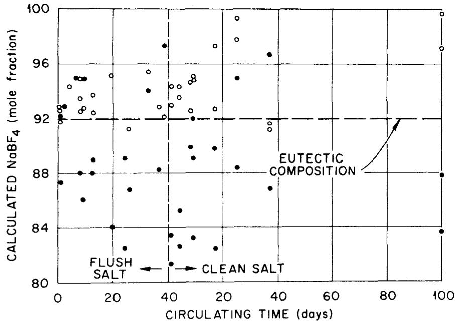  
Fig. 13. Mole fraction $\mathrm{NaBF}_4$ calculated from salt sample analyses.

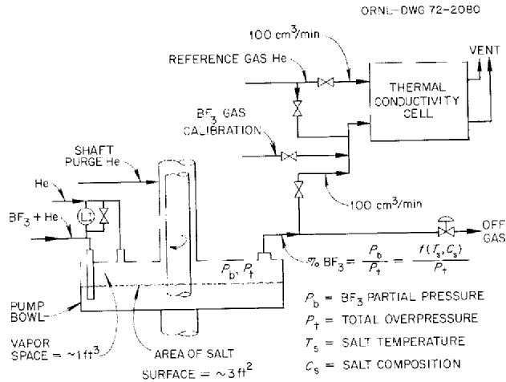  
Fig. 14. Schematic diagram of monitoring system for salt composition.

or background reading is obtained by temporarily exposing both legs to the reference gas. In the test facility, the reference gas was helium and the sample gas consisted of a mixture of $\mathrm{BF}_3$ and helium, with the $\mathrm{BF}_3$ concentration normally between 0 and 5 vol %. The applicability of the thermal conductivity method depends on there being a significant difference between the thermal conductivities of the reference and sample gases and on a predictable relationship between the thermal conductivity and composition of the sample gas.

# 5.2.3 Evaluation of the thermal conductivity method

In order to examine the applicability of the thermal conductivity method for monitoring the salt composition, we must consider at least four questions.

1. Is the $\mathrm{BF}_3$ partial pressure a reliable indicator of the salt composition?   
2. Is the off-gas stream in equilibrium with the salt?   
3. Is the thermal conductivity of the gas a reliable measure of the $\mathrm{BF}_3$ partial pressure?   
4. Is the variation of $\mathrm{BF}_3$ partial pressure with salt composition reasonable when compared with errors that might be expected in the measurement of salt temperature, total overpressure, and $\mathrm{BF}_3$ concentration?

With regard to the first question, experimental work² has been performed to determine the variation between salt composition, salt temperature, and $\mathrm{BF}_3$ pressure. These relationships may not be reliable, however, if contaminants are present in the salt. We know from experience during the cavitation tests (see Sect. 5.1) that relatively small amounts of fuel salt added to the fluoroborate salt can cause changes which imply that the $\mathrm{BF}_3$ partial pressure has been significantly affected. For example, the cavitation pressure of the contaminated salt at $1150^{\circ}\mathrm{F}$ is the same as that of the clean salt at $1210^{\circ}\mathrm{F}$ . Unfortunately, thermal conductivity cell data from the flush salt operating period are insufficient to determine whether there was a detectable change in the thermal conductivity of the off-gas stream. Additional experimental work is needed to show the variation of $\mathrm{BF}_3$ partial pressure as a function of the concentration of any contaminant that might be present or that might be

expected to leak into the fluoroborate salt. Depending on the results of this work, we may need (1) to develop procedures for purifying the fluoroborate salt; (2) to arrange the design to prevent entry of the contaminants into the salt; (3) to provide a monitoring system whereby we can monitor, and adjust for, the contaminant level; or (4) the effects may be minor enough so that no action is necessary.

Question 2 has to do with the problem of assuring ourselves that the gas sample we are looking at is truly representative of the equilibrium partial pressure of $\mathbf{BF}_3$ at the surface of the salt. In the test facility, helium and $\mathbf{BF}_3$ were added continuously to the system at controlled flow rates; the shaft purge and pressure transmitter purge streams were vented directly into the pump bowl vapor space, while the $\mathbf{BF}_3$ and mixed-gas helium were introduced a few inches below the surface of the salt in the pump bowl. An equivalent amount of off-gas (1450 cm³/min) was vented continuously by the pressure control valve so as to hold the system pressure constant. The stream that was monitored by the thermal conductivity cell was a 100-cm³/min sample flow taken from the off-gas line at a point about 25 ft downstream from the pump bowl, that is, just upstream of the pressure control valve. If the partial pressure of the $\mathbf{BF}_3$ in the gas feed were equal to the equilibrium partial pressure of $\mathbf{BF}_3$ over the salt, then there should be no net transfer of $\mathbf{BF}_3$ between the vapor space and the salt, and the off-gas stream should represent the composition of the salt. If the partial pressure of the $\mathbf{BF}_3$ in the gas feed were not equal to the equilibrium partial pressure of the $\mathbf{BF}_3$ over the salt, then there would tend to be a transfer of $\mathbf{BF}_3$ between the salt and the vapor space. The direction and rate of this transfer would depend on concentration difference, surface area, temperature, gas residence time, etc., and it would be theoretically possible for the off-gas stream to represent the gas feed composition, the salt composition, or some intermediate value. Conditions in the test facility were favorable to the ideal situation; that is, it appeared probable that the gas space, and hence the off-gas stream, would tend to be in equilibrium with the salt. For example, the residence time for the gas was long (20 min), the contact surface was relatively large (3 ft²), and there was a good exchange of fluid (estimated at 15 gpm or one loop volume every 2 min) between the main loop

and the pump bowl salt pool. Several experiments were run in an attempt to determine if the composition of the thermal conductivity cell sample stream was representative of the gas composition that would be predicted from the salt composition and temperature. These tests are described below, and test results are summarized in Table 4. In all cases the test period was short (<8 hr), and it was assumed that the salt composition was at the eutectic and remained essentially constant.

1. Change in salt temperature. With gas flow, total pressure, and salt temperature constant, the $\mathrm{BF}_3$ concentration of the off-gas stream was determined from the thermal conductivity cell reading. The salt temperature was then changed, and the concentration was again determined from the thermal conductivity cell. The measured values were compared with the calculated values. The test was performed over two temperature intervals: 910 to $1025^{\circ}\mathrm{F}$ and 1025 to $1150^{\circ}\mathrm{F}$ . The agreement was only fair in the first case and very good in the second case.   
2. Change in total pressure. With gas feed (1450 cm³/min) and salt temperature (1025°F) constant, the total pressure was leveled out at 30 psia, and a thermal conductivity cell reading was obtained at this condition. The total pressure was then increased from 30 to 45 psia in about 12 min by closing the pressure control valve. The thermal conductivity cell reading was again recorded after the system had leveled out at the higher pressure. Since nothing was done to change $P_b$ , the ratio $P_b / P_t$ , and hence the $BF_3$ concentration fraction, would be expected to decrease by a factor of 2/3 in order to compensate for the factor of 3/2 by which the pressure increased. Also, if the thermal conductivity cell were properly responsive to the change in $BF_3$ concentration, its reading should show a corresponding decrease. The thermal conductivity cell responded as expected, showing a drop from 0.9 to 0.6 MV.   
3. Change in gas flow. If the $\mathrm{BF}_3$ concentration in the vapor phase over the salt were dependent on $F_{b} / F_{t}$ , or if there were a time lag in returning to equilibrium, then the thermal conductivity cell should show a response to a change in the $\mathrm{BF}_3 / \mathrm{He}$ flow ratio. With all conditions constant, a reading of $\mathrm{BF}_3$ concentration was obtained on the thermal conductivity cell. Sudden changes were then made in the gas flow ratio. In one case the $\mathrm{BF}_3$ gas flow was increased enough to triple the normal

Table 4. Effect of changes in loop operating variables on methods of estimating $\mathbf{BF}_3$ partial pressure   

<table><tr><td rowspan="2">Date of Test</td><td colspan="3">Variable conditions</td><td colspan="3">Constant conditions</td><td rowspan="2">Change in thermal conductivity cell reading (MV)</td><td colspan="3">Change in BF3partial pressure (psi)</td></tr><tr><td>Variable</td><td>Start</td><td>Finish</td><td>Salt temperature (°F)</td><td>Total pressure (psia)</td><td>Gas flow ratio (Fb/Ft)</td><td>Compositiona temperaturea</td><td>Thermal conductivity cellb</td><td>Gas feed flowc</td></tr><tr><td>8-30-68</td><td>Salt temperature, °F</td><td>910</td><td>1025</td><td></td><td>44.7</td><td>0.043</td><td>0.32</td><td>+0.7</td><td>+1.0</td><td>0</td></tr><tr><td>9-26-68</td><td>Salt temperature, °F</td><td>1025</td><td>1150</td><td></td><td>44.7</td><td>0.043</td><td>1.95</td><td>+3.8</td><td>+3.5</td><td>0</td></tr><tr><td>6-6-69</td><td>Total pressure, psia</td><td>29.7</td><td>44.7</td><td>1025</td><td></td><td>0.033</td><td>0.3</td><td>0</td><td>0</td><td>0</td></tr><tr><td>8-30-68</td><td>Gas flow ratio</td><td>0.04</td><td>0.17</td><td>910</td><td>44.7</td><td></td><td>0</td><td>0</td><td>0</td><td>+5.8</td></tr><tr><td>8-30-68</td><td>Gas flow ratio</td><td>0.04</td><td>0.0</td><td>1025</td><td>44.7</td><td></td><td>0</td><td>0</td><td>0</td><td>-1.8</td></tr><tr><td>10-15-68</td><td>Gas flow ratio with BF3entering vapor space</td><td>0.04</td><td>0.10</td><td>1025</td><td>44.7</td><td></td><td>0</td><td>0</td><td>0</td><td>+3.7</td></tr><tr><td>10-16-68</td><td>Gas flow ratio with BF3entering vapor space</td><td>0.04</td><td>0.13</td><td>1025</td><td>44.7</td><td></td><td>0</td><td>0</td><td>0</td><td>+4.0</td></tr></table>

Salt temperature: $P_{b} = \exp (16.33 - (24,540 / T,^{\circ}R)$ psi.   
bGas composition and pressure: $\mathbb{F}_{\mathrm{b}} =$ (thermal conductivity cell reading) (calibration factor) (total pressure).   
Gas feed flow ratio: $\mathrm{P_b} =$ (total pressure) $\left( \frac{\mathrm{F_b}}{\mathrm{F_t}} \right)$ .

concentration; in another test, the flow was cut off completely. The flow variation tests were then repeated with the $\mathrm{BF}_3$ flow admitted directly to the pump bowl vapor phase rather than under the salt surface. No response was noted on the thermal conductivity cell during any of the flow variation tests.

It was concluded from these tests that the off-gas stream from the test facility was a reliable indicator of the composition of the gas in the pump bowl vapor space, and in cases where the $\mathrm{BF}_3$ partial pressure based on the composition of the gas feed was different from the $\mathrm{BF}_3$ partial pressure based on the salt composition and temperature, then the vapor space composition tended to be that dictated by the salt composition and temperature. Reactor systems using pumps of similar design and similar operating conditions should perform in a similar manner. In using a sample point that is remote from the pump bowl outlet, however, precautions must be taken to insure that the composition of the gas is not inadvertently changed during its passage from the pump bowl outlet to the thermal conductivity cell.

Question 3 concerns a weakness in the use of the thermal conductivity cell as an indicator of $\mathrm{BF}_3$ concentration. If the thermal conductivity cell is working properly, it will respond to any change in the thermal conductivity of the gas whether that change has been caused by a change in the concentration of the $\mathrm{BF}_3$ or by the addition or removal of some other material. In the design and operation of the system, therefore, precautions must be taken to exclude, or to detect and account for, any materials that might give a false signal. Experimental work is needed to investigate the variation in thermal conductivity cell reading as a function of the concentration of probable contaminants.

The fourth question is concerned with probable errors in the measurement of salt temperature and gas pressure and the effect such error limits might have on the usefulness of the thermal conductivity cell method. We start by referring to the general equation for $\mathrm{BF}_3$ decomposition pressure, which includes the effects of composition change as well as temperature change (Appendix D):

$$
P _ {b} = \left(\frac {f}{1 - f}\right) \left[ \exp \left(1 4. 3 9 5 - \frac {2 4 , 5 4 0}{T}\right) \right], \tag {2}
$$

where $P_b$ is partial pressure of $BF_3$ (psi), $f$ is mole fraction $NaBF_4$ , and $T$ is temperature ( $^\circ R$ ). Differentiating alternately with respect to composition and temperature, we get

$$
\left(\frac {\partial \mathrm {P}}{\partial \mathrm {f}}\right) _ {\mathrm {T}} = \left\{\frac {\exp [ 14.395 - (24,540 / \mathrm {T}) ]}{(1 - \mathrm {f}) ^ {2}} \right\} \text {psi/mole %}, \tag{3}
$$

$$
\left(\frac {\partial P}{\partial T}\right) _ {f} = \left[ \frac {f}{1 - f} \right] \left[ \frac {2 4 , 5 4 0}{T ^ {2}} \right] \left\{\exp [ 1 4. 3 9 5 - (2 4, 5 4 0 / T) ] \right\} p s i / ^ {\circ} R. \tag {4}
$$

Assuming values of 1025 and $1150^{\circ}\mathrm{F}$ for salt temperature and 0.91, 0.92, and 0.93 for mole fraction $\mathrm{NaBF}_4$ , the calculated values for partial pressure and for rate of change of partial pressure are as shown in Table 5. At $1150^{\circ}\mathrm{F}$ a change in composition from 0.92 (the desired value) to 0.91 would cause a change in partial pressure of about 0.6 psi. The temperature error required to cause an apparent change of the same magnitude would be 0.60/0.047, or about $13^{\circ}\mathrm{F}$ . The expected accuracy of temperature measurement is 0.5%, or about $6^{\circ}\mathrm{F}$ . From this we conclude that changes greater than 0.5 mole % should not be masked by temperature error.

The apparent rate of change of $\mathrm{BF}_3$ partial pressure as a function of total pressure is numerically equal to the concentration fraction ( $\% \mathrm{BF}_3 / 100$ ), assuming constant gas flows:

$$
\mathrm {P} _ {\mathrm {b}} = \left(\mathrm {F} _ {\mathrm {b}} / \mathrm {F} _ {\mathrm {t}}\right) \left(\mathrm {P} _ {\mathrm {t}}\right)
$$

from which

$$
\mathrm {d P _ {b} / d P _ {t}} = \mathrm {F _ {b} / F _ {t}} = \mathrm {P _ {b} / P _ {t}}.
$$

Assuming a total pressure of $24$ psig, the concentration fraction at $1150^{\circ}\mathrm{F}$ ( $P_{b} = 4.93 \, \text{psi}$ ) would be $4.93 / 38.7$ , or 0.13. The error in total pressure reading required to cause an apparent change of $1 \, \text{mole} \, \%$ in composition would therefore be:

$$
\frac {\mathrm {d} \mathrm {P} _ {\mathrm {b}} / \mathrm {d f}}{\mathrm {d} \mathrm {P} _ {\mathrm {b}} / \mathrm {d P} _ {\mathrm {t}}} = \frac {0 . 6 7}{0 . 1 3} = 5. 1 \text {psi / mole} \%
$$

Table 5. Variation of ${\mathrm{{BF}}}_{3}$ partial pressure with composition and temperature   

<table><tr><td rowspan="2">T, Salt temperature (°F)</td><td rowspan="2">f, Mole fraction NaBF4</td><td rowspan="2">Pb, BF3partial pressure (psi)</td><td colspan="2">Rate of change of partial pressure</td><td rowspan="2">εT, Error in temperature required to produce an apparent composition change of 1 mole % (°F)</td></tr><tr><td>∂Pb/∂f (psi/mole %)</td><td>∂Pb/∂T (psi/°R)</td></tr><tr><td rowspan="3">1025</td><td>0.93</td><td>1.58</td><td>0.24</td><td>0.018</td><td>13</td></tr><tr><td>0.92</td><td>1.36</td><td>0.18</td><td>0.015</td><td>12</td></tr><tr><td>0.91</td><td>1.20</td><td>0.15</td><td>0.013</td><td>11.5</td></tr><tr><td rowspan="3">1150</td><td>0.93</td><td>5.69</td><td>0.87</td><td>0.054</td><td>16</td></tr><tr><td>0.92</td><td>4.93</td><td>0.67</td><td>0.047</td><td>14</td></tr><tr><td>0.91</td><td>4.33.</td><td>0.53</td><td>0.041</td><td>13</td></tr></table>

$$
\ln P _ {b} = \ln \left(\frac {f}{1 - f}\right) + 1 4. 3 9 5 - \frac {2 4 , 5 4 0}{T} p s i,
$$

$$
\left(\frac {\partial P _ {b}}{\partial f}\right) = \left\{\frac {\exp [ 14 . 395 - (24 , 540 / T) ]}{(1 - f) ^ {2}} \quad p s i / m o l e \% \right.,
$$

$$
\left(\frac {\partial P _ {b}}{\partial T}\right) _ {f} = \left[ \frac {f}{1 - f} \right] \left[ \frac {2 4 , 5 4 0}{T ^ {2}} \right] \left\{\exp [ 1 4. 3 9 5 - (2 4, 5 4 0 / T) ] \right\} p s i / ^ {\circ} R
$$

At 38.7 psia, we should be able to read pressure within 0.5 psi, so error in measurement of total pressure should not be an important factor.

The accuracy of the thermal conductivity cell readout should not be an important factor in the discussion because the reading is only relative, that is, the instrument compares the conductivity of the gas mixture with that of a reference gas, and provision can be made for continual calibration checks using mixtures of $\mathrm{BF}_3$ and helium of known composition. There should likewise be no problem in designing a thermal conductivity system that will have the desired degree of sensitivity, that is, one that will be able to see small enough changes in salt composition. For example, in the test facility, the sensitivity of the thermal conductivity cell was $4.3\% \mathrm{BF}_3$ per millivolt, that is, for a given reading, R, in mV, the concentration, C, in $\% \mathrm{BF}_3$ , was equal to 4.3R. If we let the concentration fraction equal $f_c$ , and noting that $f_c = P_b / P_t$ , then:

$$
f _ {c} = C / 1 0 0 = 4. 3 R / 1 0 0 = P _ {b} / P _ {t}.
$$

Solving for R in terms of $\mathbf{P}_{\mathrm{b}}$ and differentiating, we obtain the rate of change of the thermal conductivity cell reading as a function of the $\mathbf{BF}_3$ partial pressure:

$$
R = 2 3. 2 5 P _ {b} / P _ {t},
$$

$$
\mathrm {d R} / \mathrm {d P} _ {\mathrm {b}} = 2 3. 2 5 / \mathrm {P} _ {\mathrm {t}} \mathrm {m V} / \mathrm {p s i}.
$$

The rate of change of thermal conductivity cell reading as a function of salt composition can be obtained by multiplying by $\mathrm{dP_b / df}$ , that is, the rate of change of $\mathrm{BF}_3$ partial pressure as a function of salt composition:

$$
\mathrm{dR} / \mathrm{df} = (\mathrm{dP}_{\mathrm{b}} / \mathrm{df})(\mathrm{dR} / \mathrm{dP}_{\mathrm{b}})\mathrm{mV} / \mathrm{mole}\% .
$$

For the test facility, where $P_t$ was 38.7 psia, the change in reading as a function of $BF_3$ partial pressure was 23.25/38.7, or 0.6 mV/psi. From Table 5, we note that at 1025°F and f = 0.92, $dP_b / df$ has a value of 0.18; so for this condition the value of $dR / df = (0.6)(0.18) = 0.11$ mV/mole%.

The smallest change in thermal conductivity cell reading that could be considered significant was about $0.05\mathrm{mV}$ , which was equivalent to a change of about 0.5 mole $\%$ . The unit installed at the test facility, however, was an old-fashioned unit, and improved cells are now available with sensitivities that are higher by at least a factor of 10. It might be noted that the rate of change in partial pressure as a function of salt composition increases as the salt temperature increases, so that the test facility unit would probably have been adequately sensitive for an MSBR system. For example, the MSBR is expected to operate at a salt temperature of $1150^{\circ}\mathrm{F}$ and a total overpressure of 30 psia. At these conditions, the value of dR/df for the test facility unit would be $0.4\mathrm{mV}/$ mole $\%$ , and a change in the salt composition of 0.13 mole $\%$ should have been discernible. It might also be noted that the test facility unit was monitoring a mixture of helium and $\mathsf{BF}_3$ , and the sensitivity of the unit was directly related to the difference in thermal conductivity cell significantly, or it could rule out altogether the use of the thermal conductivity method.

In summary, we conclude that for systems which are similar in design and operating conditions to the test facility, we should be able to monitor the composition of a circulating fluoroborate salt system by using a thermal conductivity cell to monitor the gas stream that is flowing from the vapor space which is in contact with the salt surface.

# 5.3 Corrosion Product Deposition

During extended periods of salt circulation, one or more of the products of corrosion are likely to reach the saturation concentration corresponding to the minimum temperature of the system. Continued operation would then result in precipitation on the steam generator tubes (the coolest surface in the intermediate system) with resultant loss in heat transfer capability. It is proposed to protect vital heat transfer surfaces from this fouling by providing for preferential deposition of corrosion products in a cold trap whose temperature would be maintained

a suitable amount below that of the heat exchanger. This section describes some tests that were run to develop information on the nature and kinetics of formation of cold surface deposits.

A cold finger was fabricated from a piece of nickel rod, 5/8 in. OD by 1 l/2 in. long (Fig. 15). An attempt was made to enhance the heat transfer properties by milling a series of circumferential grooves on the exterior surface and by forming the interior space in five operations with a 1/8-in.-diam drill. The operating temperature was sensed by 0.040-in.-diam Inconel-sheathed thermocouples inserted in four 0.055-in.-diam vertical, equally spaced holes located so that the outer edge of each hole was about 0.045 in. away from the surface of the test piece (Fig. 16). A 3/8-in.-OD nickel tube was welded to the test piece, and this, in combination with a central 1/8-in.-OD tube, provided a reentrant-type arrangement for introduction and removal of the coolant, a mixture of argon and distilled water. Other tubes and fittings were provided so that the assembled unit would be able to satisfy the containment and mobility criteria (Fig. 17). A catch pan (small metal disk) was attached to the bottom of the cold finger in the hope that it would retain pieces which might become detached from the surface of the test piece. During a test, the unit was attached to the salt sample access nozzle on the pump bowl, the sample ball valve was opened, and the inner tube was inserted until the lower half of the test piece was submerged under the salt surface. Movement of the cold finger was through a Teflon seal above the ball valve. After the test piece was in position, the coolant flow was started, and the total and relative flows of argon and distilled water were adjusted to obtain the desired temperature. As a result of experience during shakedown tests, two revisions were made: (1) two of the four thermocouples were eliminated because space limitations made operation with the larger number impossible, and (2) the catch pan was eliminated because of clearance problems between it and internal hardware in the pump bowl.

A total of five tests were run with the cold finger to investigate the effect of wall temperature on the amount and type of deposit obtained. Each test period was 6 hr. In addition, two tests were run with a 2-hr test period to check the effect of time. The test results are summarized in Tables 6 and 7. Some deposit was obtained in all the 6-hr tests; none

ORNL DWG 72-2081

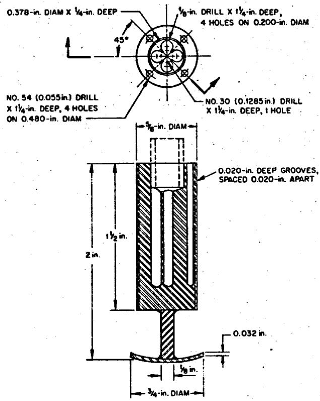  
Fig. 15. Cold-finger detail, fluoroborate circulation test, PKP loop.

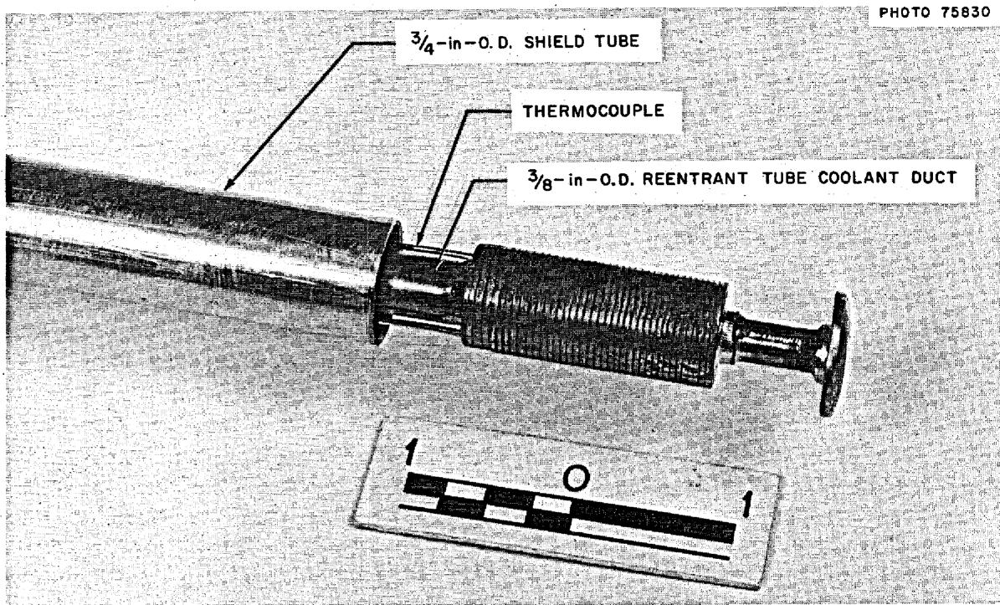  
Fig. 16. Cold finger showing connecting tubing and thermocouples.

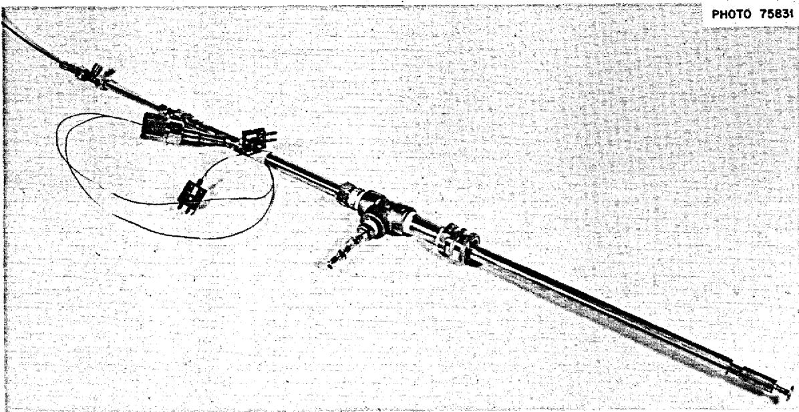  
Fig. 17. Cold-finger assembly.

was obtained in the 2-hr tests. All deposits were bright green, and the amount varied from very thin isolated spots to a uniform coating over the $1\ \mathrm{l} / 2$ -in.² surface. No data were obtained on the weight of material deposited; however, the total amount of material in the heaviest deposit is estimated to have been $<0.5\ \mathrm{g}$ . Chemical analyses indicated that as the wall temperature of the cold finger was increased, the quantity of chromium in the trapped sample increased relative to the other constituents. A rough atomic balance can be achieved if one assumes that the deposits consisted of a small amount of $\mathrm{Na}_{3}\mathrm{CrF}_{6}$ mixed with large amounts of $\mathrm{NaBF}_{4}$ and $\mathrm{NaF}$ .

The data from the cold-finger tests are too meager to permit any final conclusions. The results, however, are sufficiently promising to indicate that removal of corrosion products by cold trapping is possible and that further development effort is justified.

Table 6. Summary of cold-finger tests Salt circulating temperature, $1025^{\circ}\mathrm{F}$   

<table><tr><td>Test No.</td><td>Date of test</td><td>Wall temperature (°F)</td><td>Test duration (hr)</td><td>Deposit</td></tr><tr><td>1</td><td>4-23-69</td><td>750</td><td>6</td><td>Yes</td></tr><tr><td>2</td><td>4-29-69</td><td>850</td><td>6</td><td>Yes</td></tr><tr><td>3</td><td>5-7-69</td><td>950</td><td>6</td><td>Yes, two small areas</td></tr><tr><td>4</td><td>5-9-69</td><td>890</td><td>6</td><td>Yes, thin</td></tr><tr><td>5</td><td>6-13-69</td><td>860</td><td>6</td><td>Yes, heavy</td></tr><tr><td>6</td><td>6-20-69</td><td>944</td><td>2</td><td>No</td></tr><tr><td>7</td><td>6-20-69</td><td>929</td><td>2</td><td>No</td></tr></table>

# 5.4 Off-Gas System Flow Restrictions

A profile of the off-gas line is shown in Fig. 18. The length and layout of the line were fortuitous, and the profile is shown primarily to illustrate the rather lengthy and tortuous flow path between the pump

bowl outlet and the suction line of the ventilation blower. During most of the loop operations the off-gas flow was $1500~\mathrm{cm}^3 (\mathrm{STP}) / \mathrm{min}$ , and the pump bowl pressure was 24 psig. The gas temperature at the pump bowl exit was close to the salt temperature (normally $1025^{\circ}\mathrm{F}$ ), but the gas quickly cooled to room temperature in the unheated off-gas line. Downstream of the pressure control valve, the pressure was essentially atmospheric.

Table 7. Analyses of deposits from cold-finger tests   

<table><tr><td>Test No.</td><td>Wall temperature (°F)</td><td>Na</td><td>B</td><td>F</td><td>Fe</td><td>Cr</td><td>Ni</td></tr><tr><td></td><td></td><td></td><td></td><td colspan="2">Weight %</td><td></td><td></td></tr><tr><td>1</td><td>750</td><td>25.4</td><td>5.07</td><td>59.0</td><td>1.54</td><td>2.76</td><td>0.031</td></tr><tr><td>2</td><td>850</td><td>24.4</td><td>4.28</td><td>57.3</td><td>1.61</td><td>4.18</td><td>0.009</td></tr><tr><td>4</td><td>890</td><td>24.0</td><td>6.26</td><td>46.5</td><td>1.52</td><td>8.38</td><td>0.090</td></tr><tr><td></td><td></td><td></td><td colspan="5">Atomic abundance relative to Fe</td></tr><tr><td>1</td><td></td><td>40</td><td>17</td><td>113</td><td>1</td><td>2</td><td></td></tr><tr><td>2</td><td></td><td>36</td><td>17</td><td>124</td><td>1</td><td>3</td><td></td></tr><tr><td>4</td><td></td><td>38</td><td>18</td><td>71</td><td>1</td><td>6</td><td></td></tr></table>

# 5.4.1 Plugging experience

Continuing difficulty was experienced with flow restrictions in the off-gas system. The principal trouble spots were (1) just downstream of the pump bowl, (2) the pressure control valve, and (3) the extreme end of the off-gas pipe at the point where the off-gas stream was vented into the 12-in. suction line to the ventilation blower.

The restrictions at the pump bowl outlet were due to salt mist that was generated in the pump bowl and carried out by the off-gas. When the gas stream cooled below the freezing point of the salt $(725^{\circ}\mathrm{F})$ , the mist particles froze and some fraction of them agglomerated and settled out on the pipe wall. Eventually the flow became blocked.

ORNL-DWG 72-2082

* INDICATES 90° CHANGE IN HORIZONTAL DIRECTION. TOTAL LENGTH OF OFF-GAS LINE FROM PUMP BOWL TO BLOWER SUCTION LINE = 67 ft

① PUMP BOWL OFF-GAS OUTLET   
②YORK MESH FILTER   
(3) 50-μ METALLIC FILTER   
④ PUMP BOWL PRESSURE CONTROL VALVE

⑤ SUCK-BACK TRAP   
MINERAL OIL BUBBLER   
FORWARD BLOW TRAP

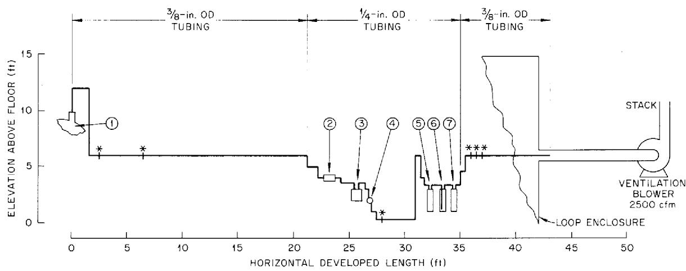  
Fig. 18. Profile of fluoroborate (PKP) loop off-gas line.

Restrictions at the control valve were ascribed to two things: (1) those mist particles that did not settle out in the pipe were carried downstream and deposited in the valve by inertial force and (2) a viscous fluid was carried out of the pump bowl by the off-gas stream and condensed out in the control valve and other places in the off-gas lines. During the initial operation of the loop with the flushing salt, the emission rate of the fluid was very high, and an estimated $50~\mathrm{cm}^3$ was drained from the line downstream of the control valve. With continued operation, however, the rate dropped off considerably and leveled off at about $6 \pm 3~\mathrm{mg/hr}$ (equivalent to about $1\mathrm{g}$ per $15,000$ liters of gas or $0.07~\mathrm{mg/liter}$ ).

The restrictions that occurred at the extreme end of the off-gas line were attributed to a slow buildup of materials resulting from a reaction between $\mathrm{BF}_3$ and water. The $\mathrm{BF}_3$ was normally present in the off-gas stream at about $3.5\%$ by volume, and the water content of the building atmosphere was probably about $1\%$ by volume. The plugs normally occurred about 2 to 4 in. from the end of the 3/8-in. line (Fig. 19). We assume that the moisture diffused up the small line to this point, where it combined with the $\mathrm{BF}_3$ coming downstream and the reaction product was gradually deposited. A total of six plugs were formed. The time of formation (salt circulation time) was not consistent, varying from six weeks to six months, as shown in Table 8.

The identity of the plug material is subject to speculation since chemical analyses were not made. The principal reaction product* from combination of $\mathsf{BF}_3$ and water is thought to be $\mathsf{BF}_3$ .2H,0, which presumably would not be a solid at the conditions (atmospheric pressure and room temperature) under which the plugs were formed.

# 5.4.2 Off-gas tests

In December 1968, the off-gas line at the pump bowl outlet was modified to provide for the installation of experimental equipment to evaluate methods of coping with salt mist and other contaminants in the off-gas

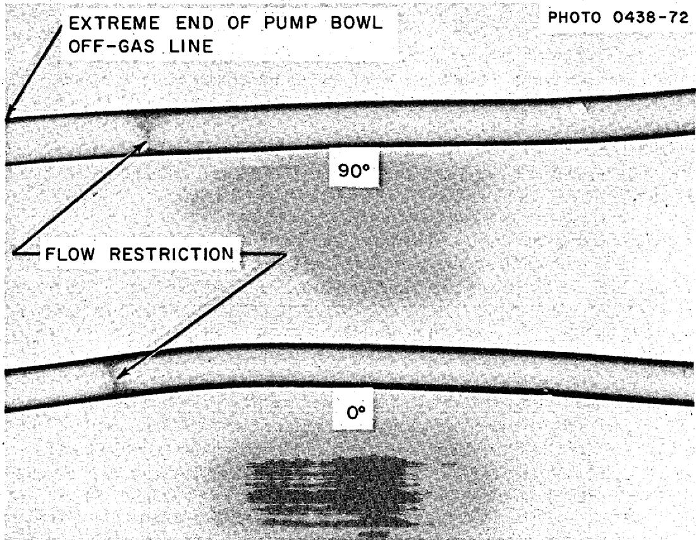  
Fig. 19. Radiograph of typical plug (formed 9-11-68) that formed at extreme end of off-gas line. $\mathsf{NaBF}_4$ circulation test, PKP loop.

stream. The following is a description of the tests that were performed from December 19, 1968, until the final shutdown of the facility in April 1970. During the discussion, reference may be made to Figs. 20 to 23 for design details and other pertinent information relative to the off-gas line and the various traps and filters used during the tests; to Figs. 24 to 26 for the particular order in which the various components were arrayed; and to Table 9 for a chronological summary and for data on collection rates for salt mists and condensed liquid. Connections between components were made with 3/8-in.-OD (5/16-in.-ID) tubing, turns were made using long radius bends, and the total length of interconnecting tubing between the pump bowl nozzle and the final component in the test section was never more than 6 ft.

Table 8. Record of flow restrictions at extreme end of off-gas line   

<table><tr><td>Date observed</td><td>Salt circulation time (hr)</td><td>Total elapsed time (hr)</td></tr><tr><td>9-11-68</td><td>1350</td><td>3200</td></tr><tr><td>12-16-68</td><td>1270</td><td>2300</td></tr><tr><td>1-29-69</td><td>980</td><td>1060</td></tr><tr><td>8-22-69</td><td>4160</td><td>4870</td></tr><tr><td>11-25-69</td><td>1720</td><td>2230</td></tr><tr><td>2-18-70</td><td>1100</td><td>2000</td></tr></table>

For the initial series of tests, a Calrod heater was installed on the off-gas line at the point of connection with the pump bowl (Fig. 20). The arrangement was such that, with no power to the heater, and with the system operating at normal steady-state condition (bulk salt temperature of $1025^{\circ}\mathrm{F}$ and off-gas flow of 1.5 liters/min), the temperature of the 1/2-in.-ID off-gas line dropped from $755^{\circ}\mathrm{F}$ at the pump bowl to $400^{\circ}\mathrm{F}$ at a point 3 1/2 in. away from the pump bowl, and it is estimated that the

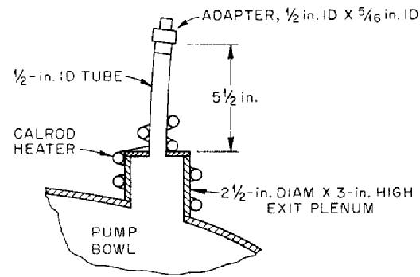

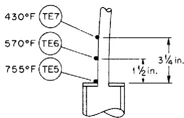  
TYPICAL TEMPERATURE PROFILE WITH CALROD HEATER TURNED OFF

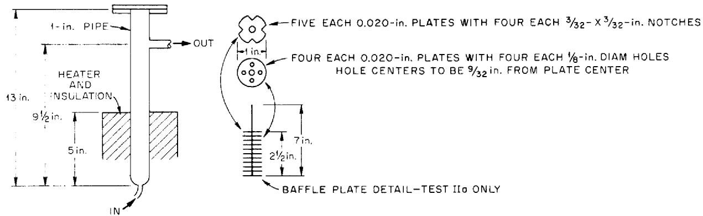  
DETAIL OF PUMP BOWL OFF-GAS NOZZLE-TESTS IaTO Ic   
VERTICAL HOT-MIST TRAP DETAIL-TESTS IIaTO IIc

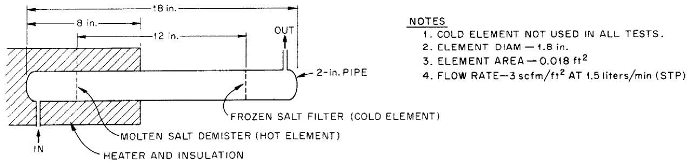  
HORIZONTAL HOT-MIST TRAP DETAIL-TESTS IIIa TO IIIId   
Fig. 20. Details of off-gas nozzle and hot-mist traps for $\mathrm{NaBF}_4$ circulating test, PKP loop.

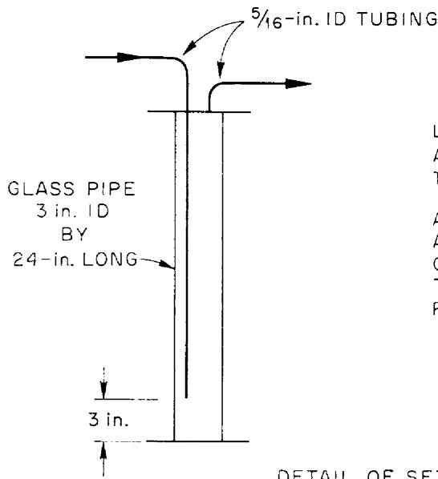

LINEAR VELOCITY OF GAS AT 1.5 liters/min (STP)

AND 24 psig WAS O.of8 fps AND RESIDENCE

TIME WAS 110 sec

ASSUMING SPHERICAL PARTICLES OF $spgr = 2.0$

A SETTLING RATE OF O.018 fps IN HELIUM

CORRESPONDS TO A PARTICLE SIZE OF $9\mu$

THEREFORE, PARTICLES $\geq 10\mu$ SHOULD

REMAIN IN THE SETTLING TANK

DETAIL OF SETTLING TANK (ST)

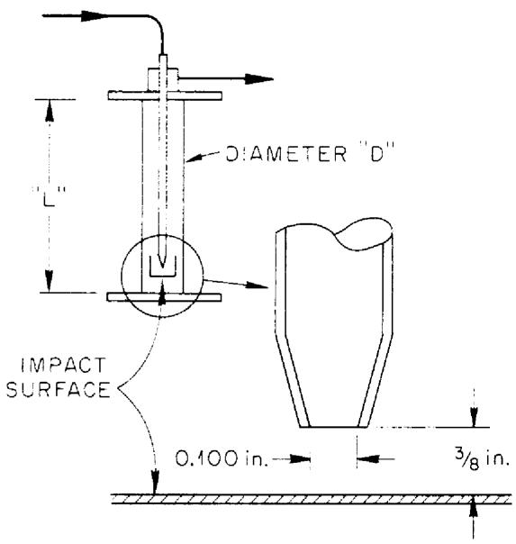  
Fig. 21. Settling tank and impactor units, tests Ia and Ib, $\mathrm{NaBF}_4$ circulation test, PKP loop.

<table><tr><td>UNIT</td><td>IN SERVICE</td><td>“D”</td><td>“L”</td></tr><tr><td>I-1</td><td>1-13-69 TO 1-22-69</td><td>1 in.</td><td>6 in.</td></tr><tr><td>I-2</td><td>1-22-69 TO 2-9-69</td><td>2 in.</td><td>12 in.</td></tr></table>

DETAIL OF IMPACTOR UNITS - TEST Ib

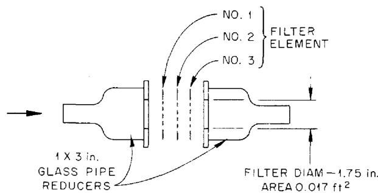

ORNL-DWG 72-2085   
NOTE: ALL ELEMENTS WERE STAINLESS STEEL   
[ \text{FLOW} = 3.1 \, \text{scfm} / \text{ft}^2 \, \text{AT} \, 1.5 \, \text{liters(STP)} / \min ]   

<table><tr><td rowspan="2">MODEL</td><td colspan="3">ELEMENT</td></tr><tr><td>NO.1</td><td>NO.2</td><td>NO.3</td></tr><tr><td>F-1a</td><td>FM204</td><td>—</td><td>—</td></tr><tr><td>F-1b</td><td>NEVACLOG</td><td>FM225</td><td>FM204</td></tr><tr><td>F-1c</td><td>FM225</td><td>FM204</td><td>—</td></tr></table>

# NOTES

1. FILTER ELEMENTS TYPE FM ARE MADE BY HUYCK METALS, INC.

MFR'S REMOVAL RATINGS WHEN FILTERING GASES: FM-225 98% LESS THAN $1.4\mu$

100% LESS THAN 5 μ

FM-204 100% LESS THAN $0.1\mu$

2. NEVA-CLOG FILTER MATERIAL IS BY MULTI-METAL WIRE CLOTH, INC., AND CONSISTS OF

TWO PERFORATED SHEETS FASTENED TOGETHER WITH ABOUT A $1 / 6$ in. SPACING

BETWEEN THEM, AND ARRANGED SO THAT THE PERFORATONS IN ONE SHEET

ARE NOT IN LINE WITH THOSE OF THE OTHER. THE PERFORATIONS

ARE 0.044 in. DIAM ON 0.13 in. CENTERS, EQUIVALENT TO 10% OPEN AREA

FILTER TYPE F-1

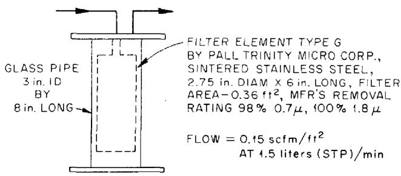

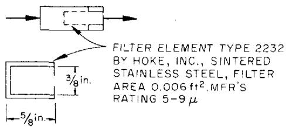  
Fig. 22. Filters used during off-gas tests in $\mathrm{NaBF}_4$ circulation test, PKP loop.

[ \text{FLOW} = 8.8 \, \text{scfm} / \text{ft}^2 ]

AT 1.5 liters (STP)/min

FILTER TYPE F-2

FILTER TYPE F-3

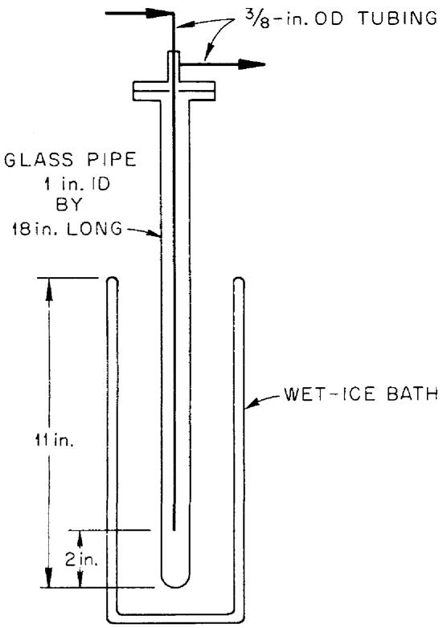

LINEAR VELOCITY OF GAS AT 1.5 liters/min (STP)

AND 24 psig WAS 0.076 fps AND RESIDENCE

TIME IN 11 in. COLD SECTION WAS 12 sec

-ICE BATH

WET-ICE COLD TRAP (CT-WI)

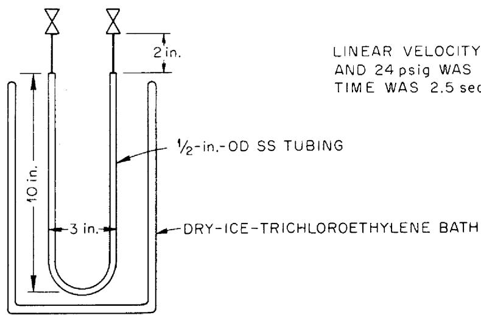  
Fig. 23. Cold traps used during off-gas system tests, $\mathrm{NaBF}_4$ circulation test, PKP loop.

DRY-ICE COLD TRAP (CT-DI)

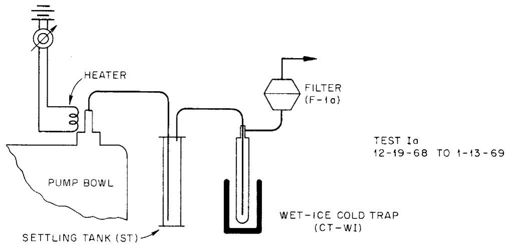

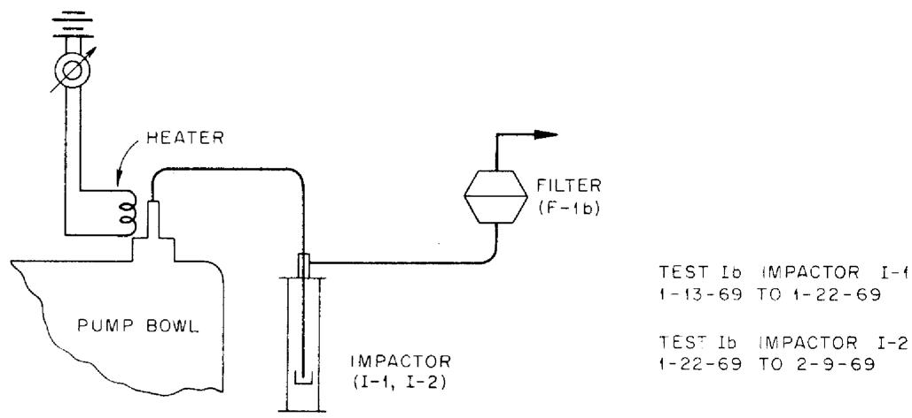

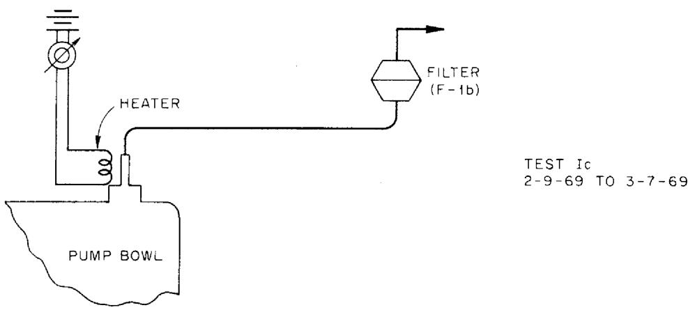  
Fig. 24. Arrangement of off-gas test equipment, tests Ia to Ic, $\mathrm{NaBF}_4$ circulation test, PKP loop.

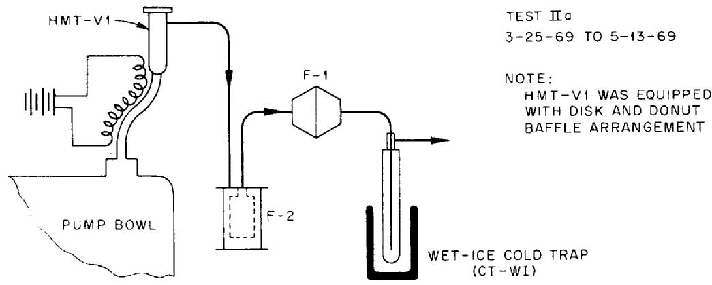

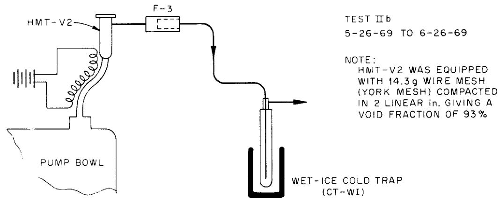

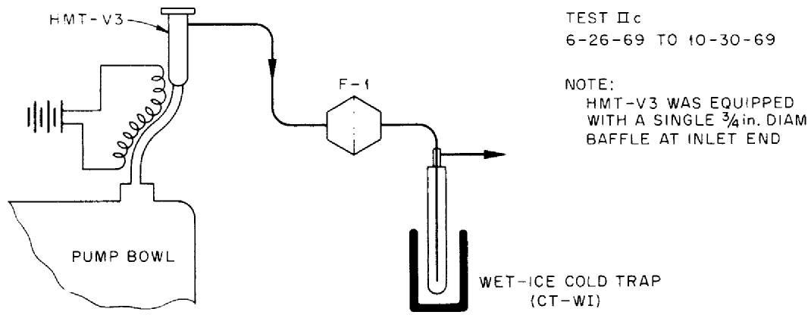  
Fig. 25. Arrangement of off-gas test equipment, tests IIa to IIc, $\mathrm{NaBF}_4$ circulation test, PKP loop.

ORNL-DWG72-2089

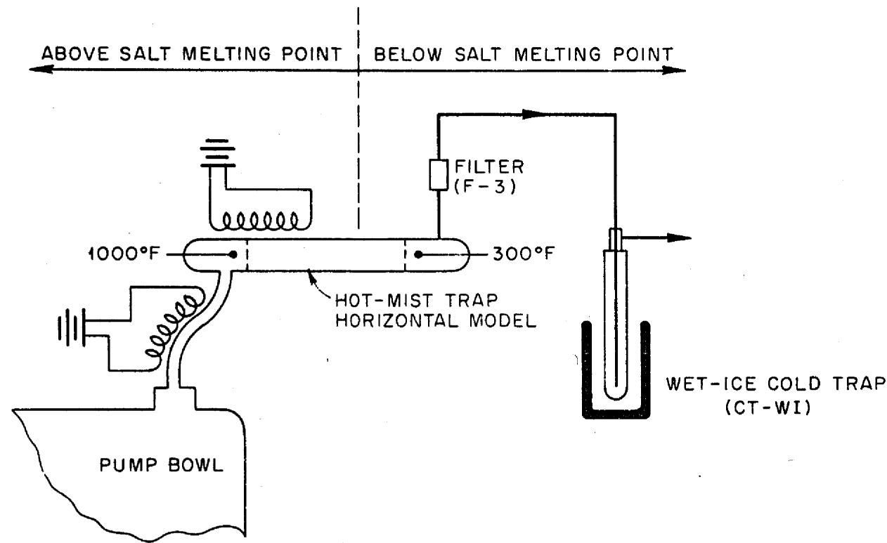  
Fig. 26. Arrangement of off-gas test equipment, tests IIIa to IIIc, NaBF₄ circulation test, PKP loop.

<table><tr><td>TEST</td><td colspan="3">TIME PERIOD</td><td>HOT MIST TRAP</td><td>HOT ELEMENT</td><td>COLD ELEMENT</td></tr><tr><td>III a</td><td>11-7-69</td><td>TO</td><td>11-24-69</td><td>HMT-H1</td><td>FM-225</td><td>NONE USED</td></tr><tr><td>III b</td><td>12-5-69</td><td>TO</td><td>12-23-69</td><td>HMT-H2</td><td>NEVACLOG</td><td>NONE USED</td></tr><tr><td>III c</td><td>1-20-70</td><td>TO</td><td>3-4-70</td><td>HMT-H3</td><td>FM-225</td><td>FM-225</td></tr><tr><td>III e</td><td>3-24-70</td><td>TO</td><td>4-13-70</td><td>HMT-H3</td><td>FM-225</td><td>FM-225</td></tr></table>

Table 9. Chronological summary of tests and data collection rates for salt mists and condensed liquid   

<table><tr><td rowspan="2">Test</td><td rowspan="2">Date</td><td rowspan="2">Cumulative circulating time (hr)</td><td rowspan="2">Remarks</td><td rowspan="2">Component</td><td colspan="4">Collection data</td></tr><tr><td>Total time on stream (hr)</td><td>Total weight collected (g)</td><td>Average rate (g/hr)</td><td>Primary phasea</td></tr><tr><td rowspan="4">Ia</td><td>12-19-68</td><td></td><td>Test facility started up after modifying off-gas line to investigate off-gas emissions; collection equipment includes settling tank (ST), wet ice cold trap (CT-WI), and filter (Fl-a)</td><td></td><td></td><td></td><td></td><td></td></tr><tr><td rowspan="3">1-13-69</td><td rowspan="3">622</td><td rowspan="3">Settling tank, wet ice cold trap, and filter removed from system</td><td>ST</td><td>622</td><td>63</td><td>0.10</td><td>S</td></tr><tr><td>CT-WI</td><td>622</td><td>4</td><td>0.007</td><td>L</td></tr><tr><td>Fl-a</td><td>622</td><td>8</td><td>0.013</td><td>S</td></tr><tr><td rowspan="5">Ib</td><td>1-13-69</td><td></td><td>Impactor unit (I-1) and filter (Fl-b) installed</td><td></td><td></td><td></td><td></td><td></td></tr><tr><td>1-15-69</td><td>670</td><td>Pressure drop at pump bowl outlet is 6.5 psi; restriction cleared by increasing temperature of off-gas line at pump bowl outlet</td><td></td><td></td><td></td><td></td><td></td></tr><tr><td>1-22-69</td><td rowspan="2">830</td><td>Impactor unit, I-1 removed</td><td>I-1</td><td>210</td><td>97</td><td>0.46</td><td>S</td></tr><tr><td>1-22-69</td><td>Impactor unit I-2 installed</td><td>Fl-b</td><td>210</td><td>14</td><td>0.07</td><td>S</td></tr><tr><td>1-30-69</td><td>1020</td><td>Pressure drop at pump bowl outlet is 4.5 psi; restriction cleared by increasing temperature of off-gas line at pump bowl outlet</td><td></td><td></td><td></td><td></td><td></td></tr><tr><td rowspan="3">Ic</td><td>2-9-69</td><td>1250</td><td>Impactor unit I-2 removed because of restriction in inlet line</td><td>I-2</td><td>430</td><td>5</td><td>0.012</td><td>S</td></tr><tr><td>3-6-69</td><td>1870</td><td>Pressure drop at pump bowl outlet is 8.0 psi; restriction cleared by heating off-gas line</td><td></td><td></td><td></td><td></td><td></td></tr><tr><td>3-7-69</td><td>1900</td><td>Test facility shut down to install hot-mist trap</td><td>Fl-b</td><td>1070</td><td>4</td><td>0.004</td><td>S</td></tr><tr><td rowspan="7">IIa</td><td>3-25-69</td><td></td><td>Test facility started up after installation of vertical hot-mist traps with internal disk-donut baffles (HMT-VI); collection equipment includes sintered metal filter F-2, absolute filter Fl-c, and wet ice cold trap CT-WI</td><td></td><td></td><td></td><td></td><td></td></tr><tr><td>4-21-69</td><td>650</td><td>Removed filter Fl-c</td><td>Fl-c</td><td>650</td><td>0.02</td><td>0.0003</td><td>S</td></tr><tr><td>5-2-69</td><td>900</td><td>Replaced sintered metal filter F-2 with sintered metal filter F-3; reinstalled filter Fl-c</td><td>F-2</td><td>900</td><td>7</td><td>0.008</td><td>S</td></tr><tr><td rowspan="4">5-13-69</td><td rowspan="4">1145</td><td rowspan="4">Test facility shut down to change hot-mist trap</td><td>HMT-VI</td><td>1145</td><td>9</td><td>0.008</td><td>S</td></tr><tr><td>F-3</td><td>245</td><td>5.1</td><td>0.02</td><td>S</td></tr><tr><td>Fl-c</td><td>245</td><td>0</td><td>0</td><td>S</td></tr><tr><td>CT-WI</td><td>1145</td><td>7</td><td>0.006</td><td>L</td></tr><tr><td rowspan="3">IIb</td><td>5-26-69</td><td></td><td>Test facility started up with vertical hot-mist trap with wire screen demister (HMT-V2); collection equipment includes sintered metal filter F-3 and wet ice cold trap CT-WI</td><td></td><td></td><td></td><td></td><td></td></tr><tr><td rowspan="2">6-26-69</td><td rowspan="2">1910</td><td rowspan="2">Test facility shut down to change hot-mist trap</td><td>F-3</td><td>765</td><td>15.1</td><td>0.02</td><td>S</td></tr><tr><td>CT-WI</td><td>740</td><td>6.4</td><td>0.009</td><td>L</td></tr><tr><td rowspan="3">IIc</td><td>6-26-69</td><td></td><td>Test facility started up with vertical hot-mist trap with single baffle plate at inlet; collection equipment includes filter Fl-c and wet ice cold trap CT-WI</td><td></td><td></td><td></td><td></td><td></td></tr><tr><td rowspan="2">10-30-69</td><td rowspan="2">4610</td><td rowspan="2">Test facility shut down to install horizontal hot-mist trap</td><td>Fl-c</td><td>2700</td><td>50</td><td>0.02</td><td>S</td></tr><tr><td>CT-WI</td><td>2700</td><td>12</td><td>0.005</td><td>L</td></tr><tr><td rowspan="4">IIIa</td><td>11-7-69</td><td></td><td>Test facility started up with first horizontal hot-mist trap (HMT-H1); collection equipment includes sintered metal filter F-3 and wet ice cold trap CT-WI</td><td></td><td></td><td></td><td></td><td></td></tr><tr><td rowspan="3">11-24-69</td><td rowspan="3">410</td><td rowspan="3">Test facility shut down to change hot-mist trap</td><td>HMT-H1</td><td>410</td><td>5.3</td><td>0.013</td><td>S</td></tr><tr><td>F-3</td><td>320</td><td>2.5</td><td>0.008</td><td>S</td></tr><tr><td>CT-WI</td><td>410</td><td>3.3</td><td>0.008</td><td>L</td></tr><tr><td rowspan="4">IIIb</td><td>12-5-69</td><td></td><td>Test facility started up with second horizontal hot-mist trap (HMT-H2); same collection equipment</td><td></td><td></td><td></td><td></td><td></td></tr><tr><td rowspan="3">12-23-69</td><td rowspan="3">840</td><td rowspan="3">Test facility shut down to change hot-mist trap</td><td>HMT-H2</td><td>430</td><td>1.8</td><td>0.004</td><td>S</td></tr><tr><td>F-3</td><td>430</td><td>1.8</td><td>0.004</td><td>S</td></tr><tr><td>CT-WI</td><td>430</td><td>2.5</td><td>0.006</td><td>L</td></tr><tr><td rowspan="9">IIIc</td><td>1-20-70</td><td></td><td>Test facility started up with third horizontal hot-mist trap (HMT-H3); same collection equipment</td><td></td><td></td><td></td><td></td><td></td></tr><tr><td rowspan="3">3-4-70</td><td rowspan="3">1840</td><td rowspan="3">Test facility shut down to change hot-mist trap and prepare for water injection test</td><td>HMT-H3</td><td>1000</td><td>33</td><td>0.03</td><td>S</td></tr><tr><td>F-3</td><td>1000</td><td>0.4</td><td>0.0004</td><td>S</td></tr><tr><td>CT-WI</td><td>1000</td><td>5.6</td><td>0.006</td><td>L</td></tr><tr><td>3-24-70</td><td></td><td>Test facility started up to run water injection test; hot-mist trap is same as in test IIIC; collection equipment includes wet ice cold trap CT-WI and dry ice cold trap CT-DI</td><td></td><td></td><td></td><td></td><td></td></tr><tr><td rowspan="2">4-2-70</td><td rowspan="2">2055</td><td rowspan="2">Check trap weights</td><td>CT-WI</td><td>215</td><td>1.8</td><td>0.008</td><td>L</td></tr><tr><td>CT-DI</td><td>200</td><td>0.24</td><td>0.012</td><td>L</td></tr><tr><td>4-2-70</td><td>2056</td><td>Injected 10 g H2O into loop</td><td>CT-WI</td><td>265</td><td>2.7</td><td>0.01</td><td>L</td></tr><tr><td>4-13-70</td><td>2320</td><td>Test facility shut down</td><td>CT-DI</td><td>265</td><td>0.85</td><td>0.003</td><td>L</td></tr></table>

$\mathbf{e}_{\mathrm{S}} = \mathrm{salt}; \mathbf{L} = \mathrm{liquid}$ .

line was at the salt melting point $(725^{\circ}\mathrm{F})$ at about $1/4$ to $1/2$ in. away from the pump bowl. By applying power to the heater, the temperature profile could be shifted so that the temperature of the line did not drop below the salt melting point until a point 4 in. or more away from the pump bowl. At $5\frac{1}{2}$ in. from the pump bowl, an adapter was installed that converted the off-gas line from $1/2-$ to $5/16$ -in.-ID tube. About 30 in. downstream of the adapter, traps and filters were installed to separate and collect the materials that were emitted with the off-gas stream.

The facility was operated with the above arrangement for 1900 hr (Table 9). The procedure was to operate without power to the off-gas line heater until excessive pressure drop at the pump bowl outlet indicated the formation of a salt plug. The heater was then turned on and the temperature of the line increased until a sharp decrease in pressure drop indicated that the plug had melted. Using this method, restrictions at the pump bowl outlet were cleared after 670, 1020, and 1870 hr of circulation (Fig. 27). At the start of the tests, the collection equipment consisted of a 3-in.-ID glass settling tank (ST), a 1-in.-diam wet-ice cold trap (CT-WI), and a porous metal filter (Fl-a). After 622 hr the settling tank and cold trap were removed, and during the next 630 hr two different models of impactor units were tested. After 1250 hr the second impactor unit was removed, and the final 650 hr of operation (test Ic) were completed with only the porous metal filter (Fl-b) in the line. Table 9 summarizes solid and liquid collection rates for this test period. After completion of test Ic, a salt plug was found in the inlet to the porous metal filter (Fig. 28).

Following completion of the first group of tests, it was concluded that the best approach to the salt mist problem was to use a hot-mist trap, that is, one that is operated at a temperature above the salt melting point, to collect a large fraction of the salt mist and return it continuously to the salt system or store it until suitable disposition could be made. The salt overflow, that is, the fraction not separated out by the hot-mist trap, would be cooled below the salt melting point and the frozen salt particles removed by a replaceable filter. The objective of the second series of tests was to obtain performance data on hot-mist traps using different internal arrangements for interception

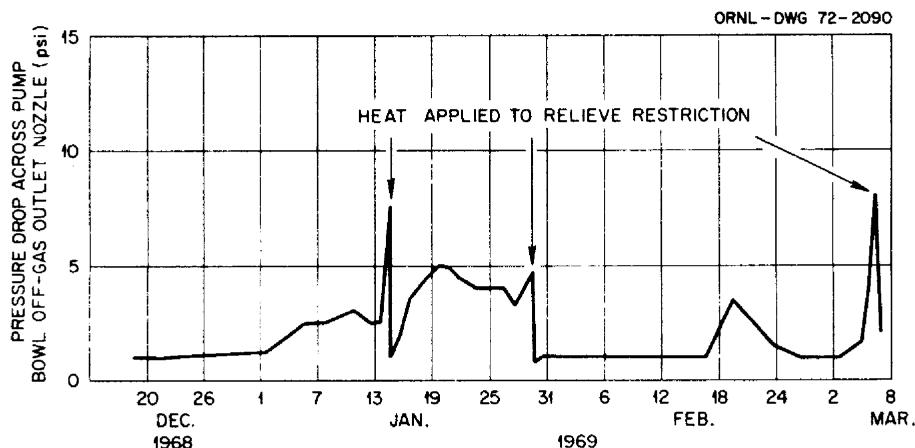  
Fig. 27. Pressure drop across pump bowl off-gas outlet nozzle, variation with time.

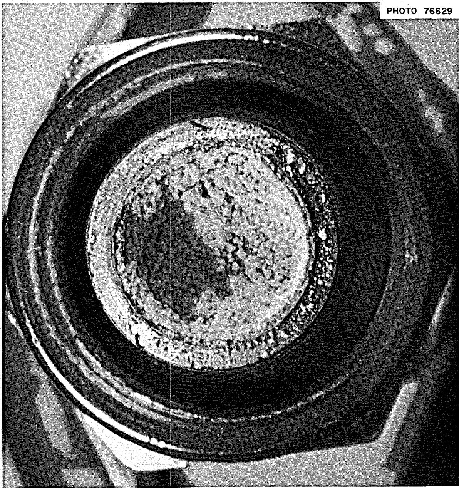  
Fig. 28. Salt plug found in 5 l/16-in. line at filter inlet, Mar. 7, 1969. NaBF₄ circulation test, PKP loop.

of the salt mist. The trap housing consisted of a 1-in.-ID pipe, 13 in. long (Fig. 20), vertically oriented. The lower part of the trap and the off-gas line between the pump bowl and the trap were heated and insulated, so the off-gas temperature was held above the salt melting point until the gas had reached the upper part of the trap. Initially (test IIa), the hot-mist trap was equipped with baffle plates drilled alternately at the center and periphery to create continuously reversing cross flow between plates. A total of nine plates was used, with 1/4-in. spacing between plates.

For test IIb, the baffles were removed, and a 2-in.-long bundle of wire mesh (York mesh) weighing $14.3\mathrm{g}$ was installed. For the final test (test IIc), the wire mesh was removed and the hot-mist trap was operated without any internal hardware except for a $3/4$ -in.-diam deflector plate at the inlet end. Three different types of porous metal filter were used for solids collection during the series II tests. Operating data for tests IIa, IIb, and IIc are presented in Table 9. The tests were started on March 25, 1968, and completed on October 30, 1969; total circulating time was $4600\mathrm{hr}$ . Test IIc was interrupted twice because of salt plugs at the hot-mist trap outlet and once because of a salt plug at the inlet to the porous metal filter.

In the final series of tests (IIIa to IIIId), investigation of the hot-mist trap idea was continued, but changes were made in the geometry, orientation, and demister material. The size of the trap was increased to 2 in. diam by 18 in. long, and it was turned so that the long axis was horizontal (Fig. 20). In the first test (IIIa), the demister material was porous metal type FM-225 (Huyck Metals, Inc.), while in the second test (IIIb) it was a perforated metal sheet material called NEVA-CLOG (Multi-Metal Wire Cloth, Inc.). For the third test (IIIc), the FM-225 material was again used, and a second piece of FM-225 was installed in the cold end of the mist trap to catch the frozen salt particles. Descriptive data for the various demister materials are given in Fig. 22. In all cases, a porous metal filter (F-3) was used for solids collection at the outlet of the hot-mist trap. After both tests IIIa and IIIb, each of which lasted about $400\mathrm{hr}$ , the outlet line from the hot-mist trap was

found to be blocked with a black material, although only IIIb showed a significant increase in pressure drop across the hot-mist trap (2.3 psi as compared with a clean $\Delta P$ of 0.4 psi). The black deposit was not found after test IIIc, and no appreciable rise in $\Delta P$ was noted during the 1000 hr of operation. The final test (IIId) was a special test to determine the effects of injecting water directly into the salt in the pump bowl. The hot-mist trap was the same design as that used for test IIIc.

For both the series II and III tests, the collection equipment was essentially the same, that is, a high-efficiency porous metal filter followed by a wet-ice cold trap. The type of porous metal filter was varied in some cases (see Figs. 25 and 26 and Table 9), and in the final test (IIIId), the porous metal filter was not used and the wet-ice cold trap was followed by a dry-ice-trichloroethylene trap. Operating and collection data for the series III tests are shown in Table 9.

# 5.4.3 Discussion and evaluation of test results

The off-gas system tests are subject to the valid criticism that they were too broad and shallow. That is, a limited amount of experience was obtained over an excessive variety of test conditions. This lack of in-depth study argues for the use of caution in reaching conclusions based on the test results. With this in mind, we propose to examine the test data first on a qualitative basis and then to draw whatever quantitative conclusions seem permissible.

Tests Ia to Ic verified the fact that the plugs or flow restrictions tend to form at the first place in the line where the temperature falls below the melting point of the salt. The tests also showed that the restrictions could be cleared by raising the temperature of the line. Although we did not have a measure of the salt temperature at the exact points where the plugs had formed, we noted that the line temperature did not exceed $1100^{\circ}\mathrm{F}$ during any of the times when heat was applied to clear a restriction. We conclude from this that the plugs were probably $\mathrm{NaBF}_4$ -NaF eutectic, or some other mixture of $\mathrm{NaBF}_4$ and NaF, rather

than oxide, which would tend to have a melting point considerably higher than $1100^{\circ}\mathrm{F}$ . We noted also that other tests (see Sect. 5.2.2) implied that the off-gas stream tended to be in equilibrium with the bulk circulating salt, and, since the off-gas would be in continuous contact with deposits in the off-gas line, deposited mixtures of $\mathrm{NaBF}_4$ and NaF would tend to approach the bulk salt in composition. Finally, we noted that chemical analyses of solids deposited in the off-gas line (sample PK-20, 11-4-68) corresponded closely to the $\mathrm{NaBF}_4$ -NaF eutectic composition.

Tests IIa to IIc and IIIa to IIIc proved that restrictions could be eliminated if the line were maintained at a temperature above the salt melting point and if the line were pitched so as to prevent trapping of the molten salt in low spots, as evidenced by the fact that no flow restrictions were experienced in the heated line between the pump bowl and the hot-mist traps. The occurrence of salt plugs at the hot-mist trap outlet during test IIa indicated that the simple settling tank was not as effective in removing salt mist as the baffles or the wire mesh.

Tests IIIa to IIIc seemed to indicate that either Huyck Felt Metal or Multi-Metal NEVA-CLOG could be used as an effective demisting agent. This conclusion is based on the lack of significant solids accumulations in the porous metal filter (F-3) downstream of the hot-mist traps and, in the case of test IIIc, on the filter element in the cool end of the hot-mist trap. We noted, however, that the 5/16-in.-ID line at the outlet of the hot-mist trap (upstream of filter F-3) was plugged with a dark-solid material after both tests IIIa and IIIb. No plug of dark material was found after test IIIc, which had a Huyck Felt Metal cold element in the cool zone of the hot-mist trap. Also test IIIc was operated more than twice as long as IIIa and IIIb without an appreciable increase in pressure drop over the "clean" value. Thus the clean $\Delta P$ at startup was 0.5 psi, while the $\Delta P$ after 1000 hr was 0.75 psi. The source of the black deposits is not known, but they possibly could have been due to decomposition products of lubricating oil that inadvertently leaked into the pump bowl; we have no positive evidence, however, that such an oil leak occurred.

In order to make intelligent use of the quantitative data from the off-gas system tests, it is necessary to give due consideration to the

shortcomings that were present in the experimental design. First, the procedure did not provide for periodic checks to insure that the mass flow rate and physical properties of the salt mist in the off-gas stream at the pump bowl outlet did not vary significantly with time. Also, it seems logical to assume that the flow of salt mist into the test section would need to be adjusted for holdup of salt in the line connecting the pump bowl to the first component in the test section. The fraction held up would drain back into the pump bowl or it would freeze and settle out in the line, depending on whether or not the line was heated. The flow rate of salt mist into the first test component would be the flow rate out of the pump bowl times the fraction not held up in the intervening line. In comparing data taken over different time intervals, therefore, we make the arbitrary assumption that for the periods of interest, the flow rate of salt mist out of the pump bowl and the fraction of salt mist held up in the line connecting the pump bowl to the first component in the test section were essentially constant. In addition, we assume that there were no major changes in the size range and density of the mist particles.

Second, the collection rate determinations were susceptible to large errors. This is because the quantity of material collected was usually on the order of 1 to $10\mathrm{g}$ , while the weight of the collection component was on the order of 100 to $5000\mathrm{g}$ . A $1\%$ error in weighing, therefore, would cause a $100\%$ or larger error in the weight of material collected. An attempt was made to alleviate this problem by making weighings on a large analytical balance that had a sensitivity of $0.02\mathrm{g}$ with a $2000\mathrm{g}$ load.

Third, there was some settling out or trapping of solids in the 5/16-in.-ID lines used to connect test components. The deposition was greater at places where acceleration forces were present, such as at $90^{\circ}$ bends. In cases where the performance of an upstream component was based on data obtained from downstream components, the figures may be considered to be in error by some amount due to the trapping of material in the intervening lines. We do not have an estimate of the size of the error introduced by this effect; it would tend to be in direct proportion to the solids flow rate. In the series II tests, there was a tendency

for solids to accumulate in the outlet line of the hot-mist trap upstream of the filter. Where possible, this material was collected, and weights were added to the filter weights in order to determine the filter collection rates. The tendency to settle out on the surfaces of interconnecting lines may also have affected the liquids collection data. One would expect the error to be proportional to the amount of solids present since this might greatly increase the available surface.

In the first series of tests (Table 9), the off-gas line between the pump bowl and the first test component was normally cold and the solids collection data are biased low because of the fraction retained in the line. Of the total material collected in the settling tank and filter during test Ia, about $90\%$ was retained in the settling tank. We can predict from Stokes law that particles larger than $10\mu$ should have remained in the settling tank (assuming spherical particles of density $2.0~\mathrm{g/cm^3}$ ). After the test, the solids were piled up under the inlet nozzle, so if the assumptions regarding particle size and density are reasonable, it appears that the average particle size may have been significantly larger than $10\mu$ or inertial forces due to the relatively high inlet velocity (1.6 fps) may have had a pronounced effect. The solids were tan and tended to "ball up" or stick together in clumps (rather than the brilliant white free flowing appearance characteristic of $\mathrm{NaBF_4}$ -NaF powder). We attribute this uncharacteristic appearance to adsorption of acid vapors and corrosion products that were emitted from the pump bowl along with the salt mist.

In test Ib the collection rate for impactor I-1 was about five times that for the settling tank in test Ia; the collection rate for impactor I-2 was only about one-tenth that of the settling tank. In test Ic, when only a filter was used, the collection rate was even lower than that of impactor I-2. We consider the results of tests Ib and Ic to be completely anomalous. There was no reason to expect any difference in performance between the two impactors because they differed only in the diameter and length of the housing. And the collection rate in test Ic should have been the highest of all, because a high efficiency filter was used. We attribute these strange results to holdup of salt mist at the pump bowl off-gas outlet nozzle and in the intervening lines. If the cumulative

total of solids collected during the series I tests (191 g) is divided by the total circulating time (1900 hr), a value of 0.1 g/hr is obtained for the average collection rate. This should represent a lower limit for the flow rate of salt mist into the test section. If the calculation is repeated using only the numbers from tests Ia and Ib (182/830), we get an average value of 0.2 g/hr, which we feel is probably the best estimate we can obtain from the test data for the rate at which salt mist was flowing from the pump bowl. In evaluating the series II and III tests, we assume that the flow rate of salt mist from the pump bowl was constant at 0.2 g/hr and that the holdup in the line between the pump bowl and the salt-mist trap was constant; thus the performance of the hot-mist traps was directly proportional to the solids collection rate in the filters.

Table 9 shows that the solids collection rates in the filters during the series II tests were only 10 to $15\%$ of the rate $(0.2\mathrm{g / hr})$ at which the salt mist was estimated to be leaving the pump bowl. As noted previously, these filter collection rates include the material found in the line between the hot-mist trap and the filter. Note, however, that in test IIIa, $9\mathrm{g}$ of solids were found in the cool upper part of the hot-mist trap. If this material was added to the filter collection rate, the collection rate for test IIIa would be increased almost $50\%$ . We conclude from the series II tests that a significant reduction in the transfer of salt mist to the filters was achieved in the case of all three models. The fraction of salt mist that was transmitted, however, tended to collect in the line upstream of the filter, and, in the case of test IIIc, these accumulations resulted in severe flow restrictions.

Table 9 also shows that the collection data for the series III tests include quantities collected in the horizontal mist traps (HMT-H1, HMT-H2, and HMT-H3). This was salt that passed through the hot demister element but was retained in the hot-mist trap on the downstream side of the hot demister element rather than being carried out with the off-gas stream. For purposes of evaluating performance, this material must be added to the material collected in the filters. A qualification is necessary in the case of test IIIc, however, because the horizontal mist trap contained a cool zone filter element that was not used in the IIIa and IIIb models. We were not able to measure the amount of material retained on

this cool zone element, but visual inspection indicated that the quantity was small. If the quantity had been $\text{lg}$ or more, it should have been highly visible, so we decided for comparison purposes to use a value of $\text{lg}$ or $0.001 \text{g/hr}$ for the 1000-hr period. Considering these factors the collection rates were 0.02, 0.01 (nearly), and $0.03 \text{g/hr}$ , respectively, for tests IIIa, IIIb, and IIIc. We conclude that the efficiency of the horizontal hot-mist traps was about the same as that of the vertical hot mist. The horizontal hot-mist traps, however, gave less difficulty with flow restrictions (due to salt), apparently because the salt mist which passed through the hot demister element was retained in the mist trap housing. In test IIc, this material was found at the bottom of the housing in the form of solidified droplets rather than crystals or powder which one would expect if frozen salt particles had settled out from the gas stream. We conclude that this accumulation of material resulted from the draining of droplets of salt from the downstream surface of the hot demister element. If this is true, then the efficiency of the horizontal hot-mist traps may have been higher than was indicated by the collection data.

Except for the latter part of the series I tests, the off-gas stream was passed through a wet-ice cold trap (CT-WI) during the entire test program, and a viscous dark-brown fluid was routinely accumulated. The final test in the program (IIIId) was designed to determine how the liquid collection rate would be affected by a slug of water injected into the salt pool in the pump bowl. For this test a dry-ice-trichloroethylene trap (CT-DI) was used as a backup for the wet-ice trap. The liquid collection data are summarized in Table 9. It may be seen from the table that the liquid collection rate varied randomly between 0.005 and $0.009\mathrm{g / hr}$ over the 7500 hr of operation, as though the emission was due to the continuous introduction of a contaminant (such as water in the $\mathsf{BF}_3$ or helium gas supply). Thus, if the contaminant is considered to be water and the average collection is assumed to be $0.007\mathrm{g / hr}$ , then the required volumetric input of water would be

$$
\left(\frac {0 . 0 0 7 \mathrm {g}}{\mathrm {h r}}\right) \left(2 2. 4 \text {l i t e r s} / 1 8 \mathrm {g}\right) = 0. 0 0 8 7 \text {l i t e r s} / \mathrm {h r}.
$$

If the gas flow is F liters/hr and the concentration of water is C ppm, then the required concentration would be

$$
\left(\mathrm {C} \times 1 0 ^ {- 6} \text {l i t e r / l i t e r}\right) (\mathrm {F l i t e r / h r}) = 0. 0 0 8 7,
$$

from which $C = 8700 / F$ . If we apply the normal gas flow rates to this equation, the results are as follows:

<table><tr><td>Gas</td><td>Normal flow (liters/hr)</td><td>Required concentration of H2O in the gas (ppm)</td></tr><tr><td>BF3</td><td>3</td><td>1900</td></tr><tr><td>Helium</td><td>87</td><td>100</td></tr></table>

If we assume that the trapped fluid is $\mathrm{BF}_3.2\mathrm{H}_2\mathrm{O}$ rather than $\mathrm{H}_2\mathrm{O}$ , then only one-fourth as much water would be required and the required impurity concentration would be 475 ppm for $\mathrm{BF}_3$ and 25 ppm for helium. Analysis of the $\mathrm{BF}_3$ gas indicated that the water concentration was less than 1 ppm. The water content of the helium was supposed to be less than 1 ppm, but samples taken from the helium supply header at the test facility frequently indicated water levels of as much as 25 ppm. We concluded therefore that the helium gas supply was most probably responsible for the continued low-level emission of condensable fluid in the off-gas stream. The conclusion was reinforced during the post-test examination of the pump, when evidence of severe erosion was noted on the inner heat baffles near the point where the shaft purge gas helium entered the pump (see Sect. 6.10).

# 5.4.4 General conclusions from off-gas tests

The following is a summary of the pertinent conclusions resulting from evaluation of the off-gas system tests.

1. The prevention of flow restrictions due to salt-mist deposits requires a twofold approach. First, a hot-mist trap, that is, one that operates above the salt melting point, would be installed at the pump bowl outlet to remove as much of the salt mist as possible from the gas

stream. The fraction of salt mist removed would be either returned to the pump bowl or stored until it could be returned to the system or discarded. Second, the gas emerging from the hot-mist trap would be chilled to freeze residual salt particles and then passed through a filter to remove the frozen particles. The hot-mist trap would be designed for continuous operation. The particle filter would be arranged so that the filter unit or the filtering material could be replaced when necessary. The pipeline between the pump bowl outlet and the hot-mist trap would be operated at a temperature above the salt melting point and would have a continuous reverse pitch to permit deentrained salt to drain back into the pump bowl.

2. The salt-mist overflow, that is, the fraction (based on the flow rate of salt mist at the pump bowl outlet) of salt mist not removed by the hot-mist trap, was $15\%$ or less for all the hot-mist trap models tested. This would imply $\geq 85\%$ removal efficiency, but it was not clear what part of the removal was due to the demisting action of the hot-mist trap and what part was due to gravitational settling in the pipe connecting the pump bowl to the hot-mist trap. Of the different demister mechanisms tested, the one using a porous metal screen (Felt Metal 225 by Huyck, Inc.) appeared to have an advantage in that the pressure drop remained acceptably low over 1000 hr of operation and most of the salt which passed through the screen settled out as droplets in the trap.

3. The filter element for the particle filter should be fabricated from a porous metal screen (such as Huyck Felt Metal) that has a removal rating, in gas service, of not less than $98\%$ of particles larger than $1\mu$ . This material should be stainless steel.

4. In the operation of the particle filter, the frozen salt particles may tend to settle out in the region upstream of the filter element. To minimize flow restriction problems in this area, the distance between the hot-mist trap and the particle filter should be kept as short as possible, and the connecting pipe should be of uniform cross section and, if possible, without bends. Isolation valves should be ball or gate type.

5. The continuous low-level emissions of viscous brown fluid were probably caused by moisture levels of about 25 ppm in the helium supply gas. The presence of this viscous fluid in the off-gas stream at this

low level (0.007 g/hr or about 0.0001 g/liter) did not cause an operating problem (e.g., sticking pressure control valve) as long as there was no salt mist. Since corrosion rates in fluoroborate systems are directly proportional to the water level, the helium supply system should contain a dryer designed to maintain the moisture content at a very low level, with an upper limit of 1 ppm by volume.

# 6. CHRONOLOGY, PERTINENT OBSERVATIONS, AND OTHER TESTS

# 6.1 Chronology

Planning for the test program was started in mid-1967. By the end of that year, a tentative program had been formulated, and work was in progress on the necessary facility modifications. Figure 29 is a chronological summary of test activities starting with January 1968. Four batches of salt, totaling 689 lb, were charged into the drain tank during February. Initial filling and salt circulation occurred on March 4, 1968. Loop operation was divided into a flushing salt period, extending from March through June 1968, and a main test period, extending from August 1968 through April 1970.

The flushing salt operation was originally scheduled to be completed in about a week. However, a number of problems arose that required study and resulted in several shutdowns for repairs and design changes, and this phase of the test lasted about 115 days. The following is a brief discussion of significant events.

1. While running cavitation tests, a number of ingassing transients occurred when the pump cavitated at unexpectedly high overpressures (see Sect. 4.1 and Table 10). Impeller ingassing is the pumping of gas from the pump tank along the top side of the pump impeller and into the circulation system salt. It is generally thought to occur whenever the head produced by the working impeller is lower than that produced by the impeller top surface and is caused by pump operation either at excessive flow rates or in deep cavitation. When an ingassing transient occurred, there was a sudden increase in circulating volume, and this in turn caused a rise in salt level in the pump tank. The pump was shut off within a few seconds, which stopped the ingassing, but the transients

ORNL-DWG 72-2091

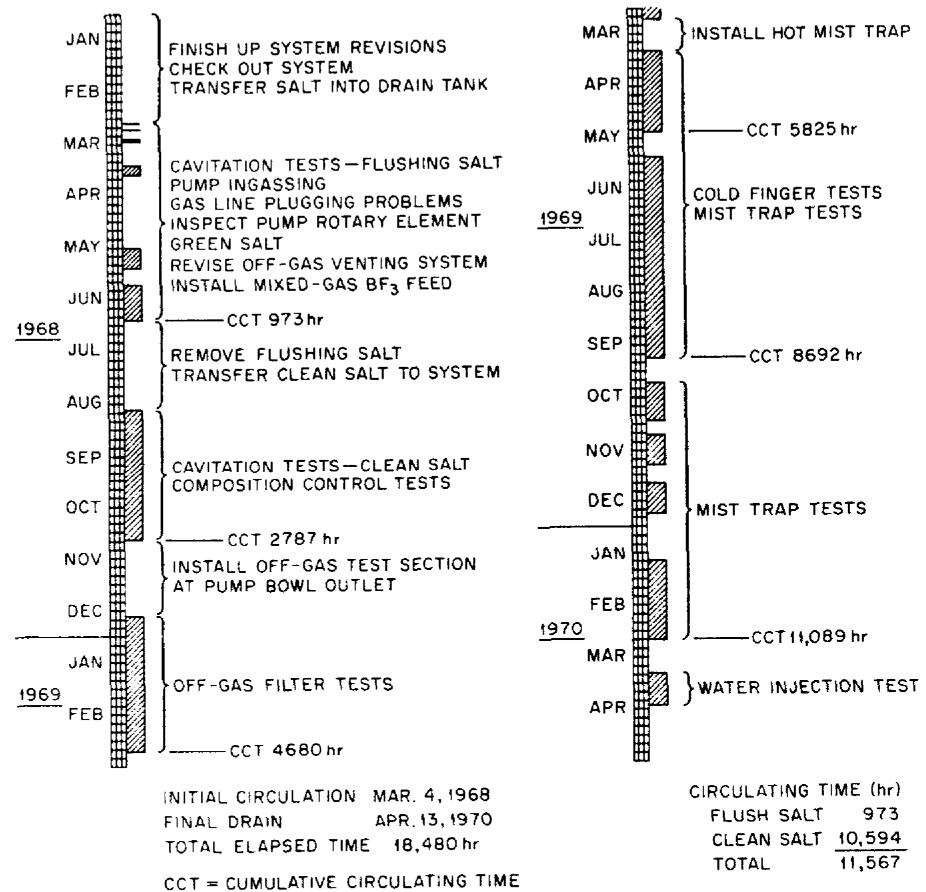  
Fig. 29. Chronology - sodium fluoroborate circulation test.

were sufficiently rapid and enough gas was ingested so that the pump tank was filled with salt and salt was forced into the connecting unheated gas lines. Each transient, therefore, resulted in a program delay for clean-out or replacement of plugged gas lines.

Table 10. Ingassing transients for $\mathrm{NaBF_4}$ circulation test, PKP loop   

<table><tr><td rowspan="2">Date</td><td colspan="2">Pump time (hr)</td><td rowspan="2">Item</td></tr><tr><td>Cumulative</td><td>Net</td></tr><tr><td>3-7-68</td><td>23</td><td>23</td><td>Ingassing transient</td></tr><tr><td>3-13-68</td><td>43</td><td>20</td><td>Ingassing transient</td></tr><tr><td>4-9-68</td><td>187</td><td></td><td>Remove, inspect, and reinstall rotary element; discovery of green salt</td></tr><tr><td>5-28-68</td><td>472</td><td>285</td><td>Ingassing transient</td></tr><tr><td>6-18-68</td><td>736</td><td>264</td><td>Ingassing transient</td></tr><tr><td>6-24-68</td><td>872</td><td>136</td><td>Ingassing transient</td></tr></table>

2. Continuing difficulty was experienced with gas line restrictions. The trouble was due in part to the ingassing transients, which forced salt into the pump bowl gas connections, and in part to salt impurities and salt mist which were being swept out of the pump bowl by the purge-gas stream (see Sect. 5.4).   
3. The pump rotary element was removed to check for an oil leak. No leak was found, and the apparent loss of oil from the lube-oil reservoir was attributed to a shift of inventory from the reservoir to the pump bearing cavity. When the pump rotary element was removed for inspection, several large chunks of green salt were found lying on top of the impeller casing (see Sect. 6.11 for further details on this material).   
4. $\mathrm{BF}_3$ was normally fed to the system through a bubbler dip tube inserted in the pump bowl. The back pressure in the tube was also used as an indicator of pump bowl salt level. It was desired to keep the bubbler flow uniform in order to avoid the need for level corrections

due to flow variations and to keep the bubbler flow rate about the same as that used in the MSRE coolant pump (370 cm³/min) for simulation. The original calculations indicated that a BF₃ flow of about 300 cm³/min would be required, and the system was designed on this basis. Subsequently, an increase was made in the normal setting for the pump bowl total overpressure, and revised BF₃ partial pressure data were received; these changes reduced the normal BF₃ flow rate (at 1025°F) to 50 cm³/min. In order to maintain the desired total flow, a mixed-gas system was installed in which the total flow was controlled at 370 cm³/min, and the composition of the gas mixture (ratio of BF₃/He) was adjusted as dictated by the salt temperature, the pump bowl total overpressure, and the total gas flow. The mixed-gas BF₃ feed system was installed during the shutdown for inspection of the salt pump rotary element; Section 5.5 describes the gas system as it appeared after this change was made. The use of a mixed-gas BF₃ meant that the normal gas composition in the bubbler tube (at 1025°F) was about 12.5% BF₃ by volume, whereas the normal composition (at 1025°F and 24 psig) of the pump bowl atmosphere was about 3.5% by volume. See Section 6.5 for a discussion of the effect of gas composition on bubbler tube operation.

During July and August 1968, the flushing salt (702 lb) was transferred out of the system and replaced with a fresh charge of sodium fluoroborate (765 lb). Pretreatment of the fresh charge was modified in an attempt to reduce the water content (Sect. 6.3). Initial circulation with the clean charge of salt was on August 19, 1968. September and October 1968 were spent in performing cavitation tests and in evaluating the performance of the thermal conductivity cell to indicate salt composition. A severe restriction in the off-gas line at the pump bowl outlet forced a shutdown of the loop on November 4, 1968. The off-gas piping was revised to provide a test section for studying the problem of off-gas restrictions, and operations were resumed on December 19, 1969. From that point until the final shutdown in April 1970, the principal activities were evaluation of the cold zone deposition technique (Sect. 5.3) and evaluation of various techniques for coping with the problem of off-gassystem restrictions (Sect. 5.4). The total salt circulation time was 11,567 hr, of which 973 hr were with the flushing salt. From March 1968 until November 1968, the set point for the circulating salt temperature

was varied frequently to accommodate cavitation inception tests and other special tests; settings used during this time interval were 900, 1025, 1150, and $1275^{\circ}\mathrm{F}$ . After November 1968, the salt circulating temperature was maintained at a constant setting of $1025^{\circ}\mathrm{F}$ . In September 1970, the pump rotary element and the salt level bubbler tube were removed from the system for inspection. Findings are summarized in Section 6.10.

# 6.2 Analyses of Salt Samples

Samples of salt were taken from the pump bowl using equipment as described in Section 4.3. Thirteen samples were taken during the flushing salt period, three in duplicate. Sixteen samples of the clean batch were taken, all but one in duplicate. Routine salt samples were not taken after June 1969. Normally the samples were transferred to the analytical laboratory in a covered glass jar that had been flushed with argon. Samples taken during and after April 1969 were delivered to the analyst without removing them from the protective pipe housing that is part of the sampling unit. The purpose was to insure maximum protection against exposure to moisture in the atmosphere. In addition to the routine samples, a number of special samples were taken during the test program, mostly to identify materials found in the off-gas system.

All pump bowl samples were analyzed for Na, B, and F and for the common corrosion constituents Fe, Cr, Ni, and O. A number of the samples were analyzed for the constituents of the salt formerly used in the loop (Li, Be, U, and Th), and samples taken during and after April 1969 were analyzed for H₂O. Average analytical values for the basic constituents are shown below.

Concentration (wt %)   

<table><tr><td></td><td>Na</td><td>B</td><td>F</td><td>Li</td><td>Be</td><td>U</td><td>Th</td></tr><tr><td>Flushing salt</td><td>21.2</td><td>9.26</td><td>66.9</td><td>0.20</td><td>0.18</td><td>0.26</td><td>0.24</td></tr><tr><td>Clean salt</td><td>20.9</td><td>9.33</td><td>68.0</td><td>0.048</td><td>0.016</td><td>0.019</td><td>0.093</td></tr></table>

Values for the impurities found in the salt samples are plotted in Fig. 30. The oxygen results were quite scattered and did not seem to correlate with anything in particular. Only a few samples were analyzed for $\mathsf{H}_2\mathsf{O}$ , and the level seemed to increase with time. Except for the high-temperature operating period following addition of the clean salt to the system in August 1968, the results for Fe, Cr, and Ni were repetitive. The concentration of nickel was consistently very low. The concentration of chromium in the clean salt started out about the same as the concentration in the flush salt, but then leveled off at about twice this value. The iron concentration in the clean salt was uniformly about twice that in the flush salt.

# 6.3 Pretreatment and Transfer of Salt Charges

Pretreatment of the salt for removal of volatiles and melting, mixing, and transfer of the salt were all done using a mobile unit that was positioned next to the facility enclosure. The unit (Figs. 31 and 32) contained a nickel-lined stainless steel pot of $2\mathrm{ft}^3$ capacity housed in a $23\mathrm{-kW}$ furnace. Connections were provided at the top for charging of salt and for the connection of vacuum and inert gas lines. The salt was transferred through a $3/8$ -in.-OD tubing line that was preheated by passing electric current through the walls of the tubing. The size of the system was such that four batches were required to load the sump tank.

The procedure for pretreatment and transfer of the flushing charge of salt was as follows. The calculated amounts of salt powders, based on the eutectic mixture, were loaded into the melting pot through the 3-in. access pipe. The pot was sealed up, heated to $300^{\circ}\mathrm{F}$ , and held under a vacuum ( $\leq$ 1 psia) for at least 16 hr. The furnace temperature was then raised to $900^{\circ}\mathrm{F}$ (melting point of salt = $725^{\circ}\mathrm{F}$ ) and inert gas blown through the dip leg for about 10 min to insure good mixing of the charge. The transfer line was then connected to the dip leg and the salt transferred into the sump tank by applying gas pressure to the melting pot.

Prior to the addition of the flush charge of salt, a temporary dip leg tube was inserted into the sump tank, and gas pressure was used to

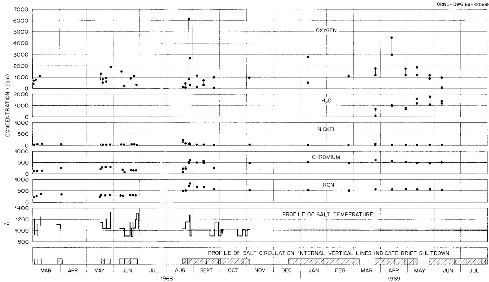  
Fig. 30. Analyses of impurities in $\mathrm{NaBF}_4$ salt samples, fluoroborate circulation test, PKP loop.

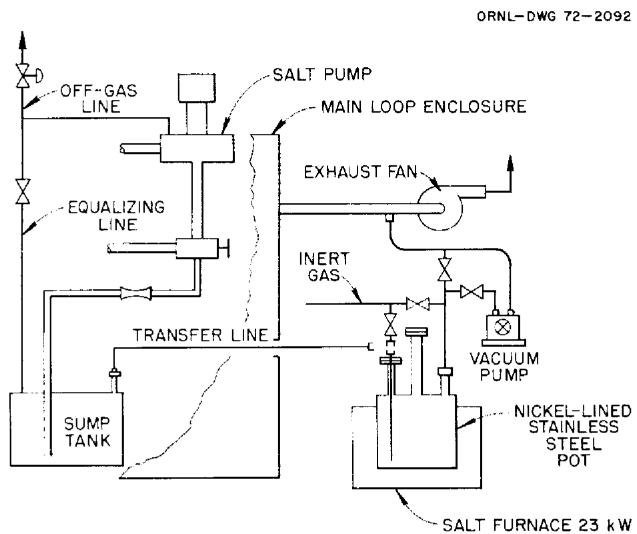  
Fig. 31. Schematic diagram of salt transfer system.

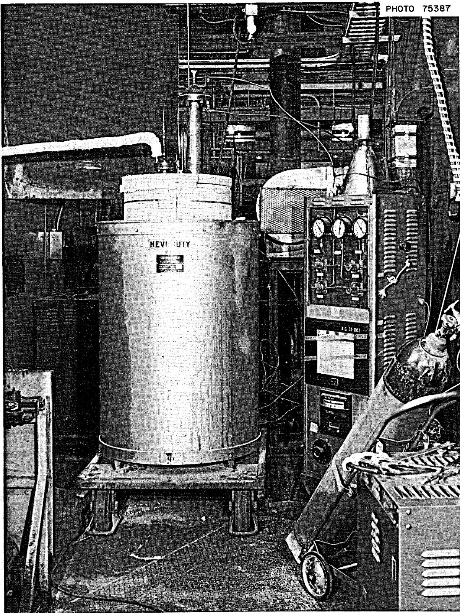  
Fig. 32. Salt transfer system.

blow the old BULT-4 salt from the sump tank into a 55-gal steel drum. The flush charge of salt was later removed the same way. The clean charge of salt was processed essentially the same way as the flush charge, except that the $\mathrm{BF}_3$ partial pressure of the batch at $925^{\circ}\mathrm{F}$ was used as a criterion for the effectiveness of the evacuation treatment. The limiting pressure rise was arbitrarily selected as 10 psi. Three of the four batches that showed pressure rises of 4 to 6 psi were transferred without further processing. The remaining batch, which registered a 13-psi rise at $925^{\circ}\mathrm{F}$ , was cooled down and reevacuated, remelted, and transferred. The pressure rise during the second melt was only 1.5 psi.

All salt batches were transferred without incident. There was intermittent plugging of the dip leg during the process of mixing with the helium stream (see Sect. 6.5). The quantities of material transferred are given below.

<table><tr><td></td><td>Date of transfer</td><td>Weight transferred (1b)</td></tr><tr><td>Flush charge added to sump tank</td><td>Feb. 1968</td><td>687</td></tr><tr><td>Flush charge removed from sump tank</td><td>July 1968</td><td>702</td></tr><tr><td>Clean charge added to sump tank</td><td>July 1968</td><td>765</td></tr></table>

# 6.4 Freeze Valve Operation

The freeze valve consisted of a 2-in.-long squeezed-down section at the center of a 12-in.-long piece of $3/4$ -in.-IPS sched-40 Inconel pipe. Pipe wall spacing at the narrow part was $1/4$ in. The air tube was fabricated from a piece of $1 \frac{1}{2}$ -in.-IPS sched-40 Inconel pipe. The control system was minimal. There were thermocouples to monitor the temperature at the center of the valve and at the shoulders and hand-operated Variacs to adjust heater power and a hand-operated valve to adjust air flow. The thermocouple and heater layout is shown in Fig. 33. Additional thermocouples were added for the fluoroborate test in order to obtain better simulation of the MSRE freeze valves.

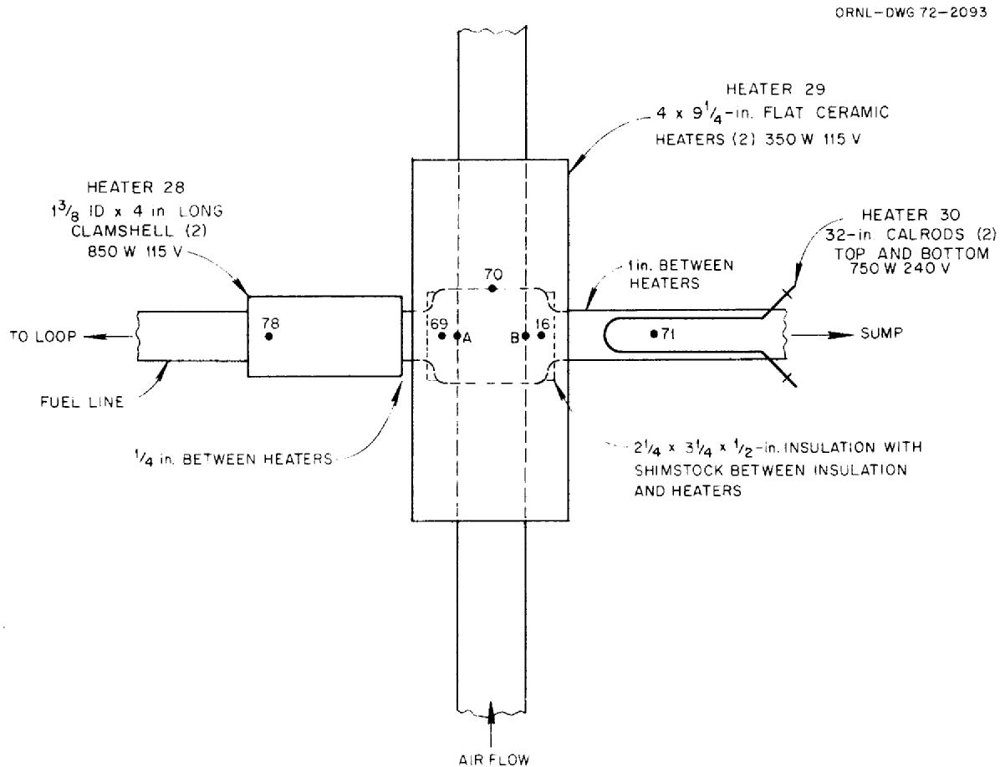  
Fig. 33. Heater and thermocouple layout drain line freeze valve, $\mathrm{NaBF}_4$ circulation test, PKP loop.

The freeze valve was operated through six fill and drain cycles during the flush salt program and ten fill and drain cycles during the clean salt program. There was never any difficulty in establishing or thawing the frozen salt plug in the valve. The temperature at the center of the valve was maintained between 200 and $400^{\circ}\mathrm{F}$ while the valve was frozen. The time required for draining varied between 3 min and 3 hr. Although the longer drain times were attributed to variations in operating techniques, an alternate possibility would be flow restrictions due to accumulations of corrosion products. The last six drains all required 7 to 10 min, which indicates that the situation improved with practice.

On March 21, 1968, the freeze valve was used to protect the drain tank from excessive pressure while making a calibration check on the salt pressure transmitters. No pressure rise was noted in the drain tank, which was at O psig, during the 30-min period when the loop was pressurized with helium at various levels between 50 and 100 psig.

# 6.5 Bubbler Tube Operation

During the preparation of the charge of flush salt in the salt furnace (Sect. 6.3), helium was bubbled through a tube submerged in the molten mass to insure good mixing. It was observed that the gas-feed pressure would build up and drop off intermittently, as though the tube was alternately plugging and unplugging. The implication was that the helium was stripping $\mathrm{BF}_3$ away from the salt at the end of the tube, leaving a high-melting NaF-enriched phase that precipitated out and caused the flow restriction.

In September and October 1968, three tests were run in an attempt to confirm this observation. In each case the $\mathrm{BF}_3$ flow to the pump bowl bubbler tube (see Fig. 7) was reduced to zero and allowed to remain there until plugging of the tube was indicated, that is, until the indicated salt level went off scale on the high side (the $\Delta P$ at full scale was 20 in. $\mathrm{H}_{2} \mathrm{O}$ or 0.72 psi). While the $\mathrm{BF}_3$ flow was at zero, the helium flow was increased so as to maintain the total bubbler flow at $370 \mathrm{~cm}^{3} / \mathrm{min}$ . The salt temperature was mostly $900^{\circ} \mathrm{F}$ during two of the tests and mostly $1025^{\circ} \mathrm{F}$ for the third test. Some variations in salt temperature were

caused by other test work that was being carried out at the same time. The $\mathrm{BF}_3$ flow was restored to normal immediately after the indicated level went off scale. The results (see Fig. 34) show that where the average temperature was $900^{\circ}\mathrm{F}$ , the bubbler tube plugged in about $140\mathrm{hr}$ , and where the salt temperature was $1025^{\circ}\mathrm{F}$ , plugging occurred in about $54\mathrm{hr}$ . In each case the salt level indication returned to normal within an hour after the $\mathrm{BF}_3$ flow was restored. The time required to develop a plug was less at higher salt temperature, presumably because the higher $\mathrm{BF}_3$ partial pressure permitted more rapid removal of the $\mathrm{BF}_3$ . It is interesting to note that the plugging time required during the salt preparation operation was lower by a factor of more than $100$ than the plugging time required during the bubbler tube test. A probable explanation is that there was much better mixing in the pump bowl due to the relatively high rate of exchange of salt (estimated to be one loop volume every $2\mathrm{min}$ ) between the pump bowl and the bulk salt circulation system. Other contributing factors may have been the difference in tube geometry (the salt transfer tube was $1/4$ in. ID, whereas the bubbler tube was $1/2$ in. ID) or the gas flow in the salt preparation tank (a flowmeter was not used and so the actual flow was not known) may have been significantly higher than the bubbler tube flow.

Although the above tests indicate that a continuous bubbler flow cannot be maintained using pure helium, it must be concluded that the use of a pure $\mathrm{BF}_3$ flow might also cause plugging problems of a different nature. As an example, assume operating conditions of $1025^{\circ}\mathrm{F}$ ( $\mathrm{BF}_3$ partial pressure = 1.35 psia), 24 psig, and a $100\%$ $\mathrm{BF}_3$ feed to the bubbler. Now, assume the $\mathrm{BF}_3$ flow is inadvertently cut off at a valve in the $\mathrm{BF}_3$ header. The $\mathrm{BF}_3$ downstream of the valve will react with the salt, and the header pressure will approach the equilibrium value of 1.35 psia. As the header pressure drops, salt will be driven back through the bubbler tube, and the unheated portion of the $\mathrm{BF}_3$ feed header will be plugged with frozen salt.

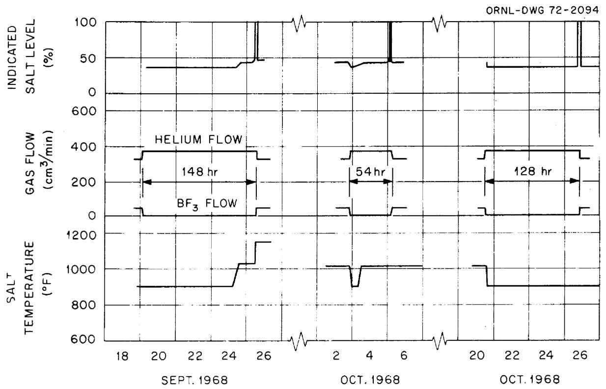  
Fig. 34. Effect of operating liquid level bubbler tube without $\mathrm{BF}_3$ flow, $\mathrm{NaBF}_4$ circulation test, PKP loop.

# 6.6 Experience with Salt Level Instruments

Prior to the fluoroborate test program, the loop was equipped with five single-point, or spark plug, salt level indicators, one each for maximum, minimum, and normal pump bowl level and one each for maximum and minimum drain tank level. The operating potential was $110\mathrm{V}$ , and when salt contacted the probe, the circuit was closed, causing an indicator bulb to light up. The probe material was changed from Inconel to Hastelloy N for the fluoroborate service. The normal and minimum level probes in the pump bowl were removed from service early in the program in order to provide access for other tests. The three remaining level probes gave excellent service for the duration of the test program. The only trouble was in April 1968, when the drain tank maximum probe shorted out. The failure was traced to a leaky tube fitting. Wet air diffused in through the leak, and the resulting accumulation of corrosion products bridged the gap between the probe and the nearby vessel wall.

During normal operation, a continuous indication of the pump bowl salt level was provided by monitoring the back-pressure in the $\mathbf{BF}_3$ feed line (see Fig. 7). The $\mathbf{BF}_3$ bubbler feed tube was $5/8$ -in.-OD by 0.065-in.-wall Inconel tubing welded into the nozzle formerly occupied by the pump bowl minimum level probe. The bottom of the bubbler tube was $12\frac{1}{2}$ in. below the top of the nozzle; a study of the pump drawings indicates that this should have placed the tube end about $3/4$ in. below the volute center line. The end of the tube had a single $45^{\circ}$ notch approximately $1/4$ in. wide by $1/8$ in. deep. At the normal operating temperature of $1025^{\circ}\mathrm{F}$ , the salt density was $116\mathrm{lb_m / ft^3}$ and the instrument range was $10.8$ in. salt at full scale. During the early phases of the test program, the salt level was adjusted to 25 to $35\%$ of the level scale; later on, the level was adjusted to 45 to $50\%$ to insure that the pump bowl thermocouple well would be adequately covered with salt. In normal operation, an upper limit of $54\%$ (6 in. salt) was maintained on the salt level. A backflow preventer, a piece of $1\frac{1}{2}$ -in.-IPS, 9-in.-long stainless steel pipe, was installed just upstream of the bubbler tube to minimize plugging of the $\mathbf{BF}_3$ feed line when pressure level changes (e.g., during pump ingassing) caused

backflow of salt from the pump bowl. A Calrod heater was provided so that any salt in the backflow preventer could be melted and allowed to drain back into the pump bowl. Some difficulty was experienced with plugging of the $\mathrm{BF}_3$ feed line during the early part of the loop operation, but the plugs were believed to be associated primarily with the ingassing transients that occurred during cavitation tests. It was also noted that plugging difficulties would occur if the proper gas feed composition was not maintained. Just prior to the final shutdown, an apparent rise in salt level indicated that there might be a flow restriction in the bubbler tube line. Then at the shutdown the restriction became worse, so that there was an apparent salt level even after the loop had been drained. For the bubbler flow conditions (0.37 liter/min), an orifice of about 0.030 in. diameter (0.0036% of the original cross-sectional area) would be required to cause a detectable change ( $\geq 1\%$ scale) on the salt level instrument.

After shutdown, the bubbler tube was removed from the pump bowl. The end of the tube was found to be completely filled with a hard, grainy, metallic-appearing magnetic deposit (see Sect. 6.11). Lesser amounts of the deposit were found inside the tube as far as $5\frac{1}{2}$ in. from the end. We conclude that the performance of the bubbler tube level indicator was reliable and appeared to be reasonably accurate, although serious plugging was noted at the final inspection. Further study should indicate whether the plugging problem can be moderated by design or operational changes. At worst, we should be able to accommodate tube replacement on a two-year cycle.

In June 1968, in response to a suggestion by J. W. Krewson, ORNL Instrumentation and Control Division, a brief test was made using a resistance probe for indicating salt level in the pump bowl. The input signal was $1000\mathrm{Hz}$ at low voltage, and the output signal was a straight-line function of salt level over the lower third of the probe. Calibration to a depth of 2 in. produced a reasonably straight line with a slope of $75\mathrm{mV / in}$ . The test was terminated after one week due to catastrophic corrosion of the stainless steel probe by the fluoroborate environment. Subsequently, corrosion tests were run using probes made from Hastelloy N material, and the results indicated that the severe corrosion of the

stainless steel probe was normal for operation in fluoroborate salt at $1025^{\circ}\mathrm{F}$ , that acceptable corrosion rates could be achieved by using an appropriate material such as Hastelloy N, and that the use of a high-frequency electrical current did not appear to contribute to the corrosion. We did not have an opportunity to repeat the salt level calibration using the Hastelloy N probe.

# 6.7 Back Diffusion at the Pump Shaft

The purge gas that entered the pump shaft annulus was split into two streams; the larger stream flowed down the shaft and into the pump bowl vapor space, and the other stream, $100~\mathrm{cm}^3/\mathrm{min}$ or about $11\%$ of the total flow, flowed up the shaft, past the shaft seal, through the oil catch tank, and finally was vented into the loop enclosure. The end of this vent line, a 1/4-in. tube, would gradually plug over a period of several months of operation, indicating that the gas contained some $\mathrm{BF}_3$ . The composition of the plug material was not determined.

Several tests were made in which the seal purge stream was passed through the thermal conductivity cell when the shaft purge was at the normal setting of $850~\mathrm{cm}^3/\mathrm{min}$ and the salt temperature was at $1025^{\circ}\mathrm{F}$ . In none of the tests was there any discernible change in signal when compared with pure helium sample gas. The thermal conductivity cell had a calibration slope of $4.7\%$ $\mathrm{BF}_3$ per mV, and the smallest chart change that could be detected with confidence was $0.02\mathrm{mV}$ , which would be equivalent to $0.1\%$ or $1000\mathrm{ppm}$ . It was concluded from this that the $\mathrm{BF}_3$ content of the seal purge stream was less than $1000\mathrm{ppm}$ and that the concentration ratio between the purge stream and the pump bowl gas was not more than $0.03(0.1\%/3.5\%)$ . This result is in agreement with back-diffusion tests run on this pump using ${}^{85}\mathrm{Kr}$ , where a concentration ratio of 0.01 was observed for the same purge flow. In another test, with the system at steady state, we reduced the shaft purge rate by a factor of 2 and did not get any response from the thermal conductivity cell. Data from Ref. 8 indicate that a factor of 2 in total purge would change the concentration ratio by an order of magnitude. From this we might infer that

at the normal shaft purge rate of 950 cm³/min the BF₃ content of the lower purge stream could have been as low as 100 ppm.

# 6.8 A Salt Leak to the Atmosphere

On the morning of September 23, 1969, after 8700 hr of operation with the fluoroborate salt, a salt leak was discovered. The initial indications of trouble were a decrease in pump bowl liquid level of $8\%$ (~0.8 in. salt), an apparent decrease in the temperature of circulating salt, and irregular temperatures at the two venturi pressure transmitters. A visual inspection inside the loop enclosure revealed a stalactite of frozen salt hanging from the insulation surrounding both venturi pressure transmitters and a small quantity of salt in the floor pan beneath them. Using normal shutdown procedures, the pump was stopped and the salt was drained into the sump tank. The leak was found to be at the venturi inlet pressure transmitter (PT 104A) in the weld that joins a 1/2-in.-IPS pipe to the boss on the diaphragm flange (Fig. 35). This is a stagnant salt zone serving only to sense venturi inlet pressure, which is about 100 psig with the pump on.

The defective pressure transmitter was removed from the system, the pipe nozzle to which it had been attached was capped off, and operation of the loop was resumed.

Metallurgical examination of the pressure transmitter indicated that the weld (made in 1956) had been defective when made by the vendor, and that the defect had been repaired by applying braze metal to the interior surface. It is estimated that the pressure transmitter had been in service in the loop for at least eight years and, prior to the current fluoroborate service, was operated for three years with a salt similar to the MSRE fuel salt.

The conclusions resulting from the investigation of the leak were as follows:

1. The salt leak was attributed to the failure of a welded closure that was defective when originally made and which had been repaired by a technique, which based on current technology, could not be recommended for molten-salt service at $1000^{\circ}\mathrm{F}$ . The fact that the leak occurred during $\mathrm{NaBF}_4$ service was coincidental.

ORNL DWG 72-2095

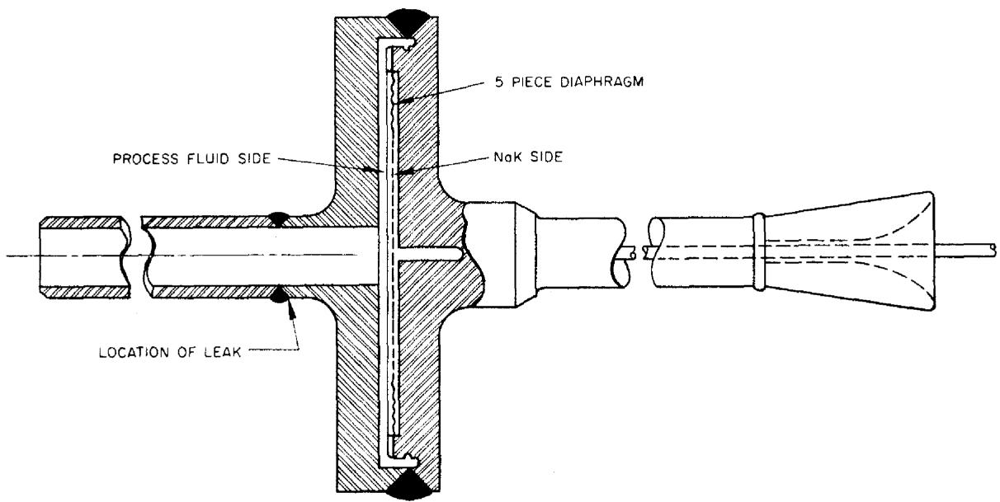  
Fig. 35. Location of leak on venturi inlet pressure transmitter (PT 104A), $\mathrm{NaBF}_4$ circulation test, PKP loop.

2. Corrosion in the stagnant leg between the pressure transmitter and the loop was relatively mild and was similar to that experienced with Inconel in other $\mathrm{NaBF}_4$ loops.   
3. The consequences of the leak can be characterized as rather mild. If there were any visible fumes, they were carried off to the stack by the controlled ventilation system. There was no indication of fire or sudden energy release. The condition of the containment system metal in the vicinity of the hole seemed to indicate that the leak was not self-igngravating, that is, continued leakage did not result in an increase in the rate of leakage.

# 6.9 Experience with Handling $\mathsf{BF}_3$

Properties of $\mathbf{BF}_3$ and suggestions for handling and storage have been excerpted from manufacturers' literature and included in Appendix A. In general, our experience during the test program was in agreement with the literature, and the following comments are included for emphasis or to present observations which should be of special interest.

1. There was no evidence of corrosive attack in tubing, pipe, and vessels where the gas was dry, that is, excluded from contact with moist air. Conversely, where there was opportunity for contact with moist air, the resulting combination was extremely corrosive. Handling problems will be minimized if extra precautions are taken to insure a dry, leak-tight system before admitting $\mathbf{BF}_3$ .   
2. A flow restriction developed periodically at the point where the off-gas stream (3 l/2% BF₃ in helium) was vented into the stack suction line (see Sect. 5.4).   
3. In September 1967, seventeen 1800-psig cylinders of $\mathbf{BF}_3$ (nominally $60\mathrm{lb}_{\mathrm{m}}$ per cylinder) were purchased to provide for expected usage during the test program. The use rate was lower than originally predicted, so that most of the cylinders were still on hand by the summer of 1968. In May, June, and July 1968, five of the stored cylinders developed leaks to the atmosphere. One of the leaks was due to defective packing, but the other leaks resulted from the fact that the cylinder valves were equipped with improperly rated safety devices. The leaky cylinders were

vented to the atmosphere at a remote location, and eight of the remaining cylinders were returned to the vendor.

4. Just before venting to the stack suction, the off-gas stream was passed through a mineral-oil trap to inhibit back diffusion of moist air. There were no visual ill effects on the mineral oil during the test period. The effectiveness of this device in preventing back diffusion of moisture was not measured quantitatively, but two observations indicated that it was satisfactory. First, there were no accumulations of moisture in the mineral oil bubbler tank. Second, there was no evidence of corrosive attack in the tubing on the upstream side of the bubbler, indicating the absence of significant moisture levels.

# 6.10 Corrosion Experience

The development and evaluation of container materials for fluoro-borate service is being done by others in other test equipment. However, there were certain pieces of hardware installed new in the fluoro-borate system that were exposed to service conditions of interest. A brief history and general description are presented below.

The pump tank salt level bubbler tube installation is described in Section 6.6. The tube, which was made from a 5/8-in.-OD, 0.065-in.-wall Inconel tube, was installed before the loop startup, and it was removed on October 23, 1970. The post-test exterior appearance is shown in Fig. 36. The tube was cut into four pieces by making transverse cuts at 1, 4 1/2, and 7 1/2 in. from the lower end. The three lower pieces were then slit axially. Figure 37 shows the interior appearance of the tube. The bubbler tube was examined chemically and metallurgically, and the results are presented in Refs. 10 and 11.

The pressure control valve was used throughout the test program. The valve operated at room temperature and absorbed the full pressure drop of 24 psi. It had to be opened and cleaned a number of times to remove accumulations of salt and liquid impurities. The stainless steel valve trim (Fig. 38) appeared to be essentially free of corrosive attack when examined visually on October 26, 1970.

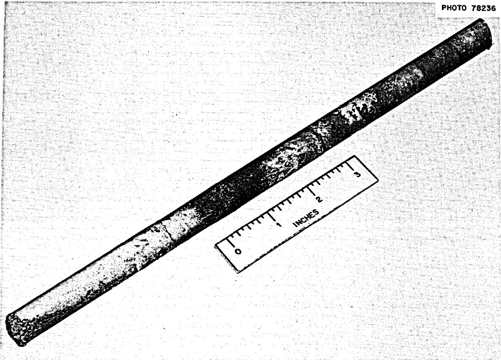  
Fig. 36. Post-test appearance of salt level bubbler tube exterior.

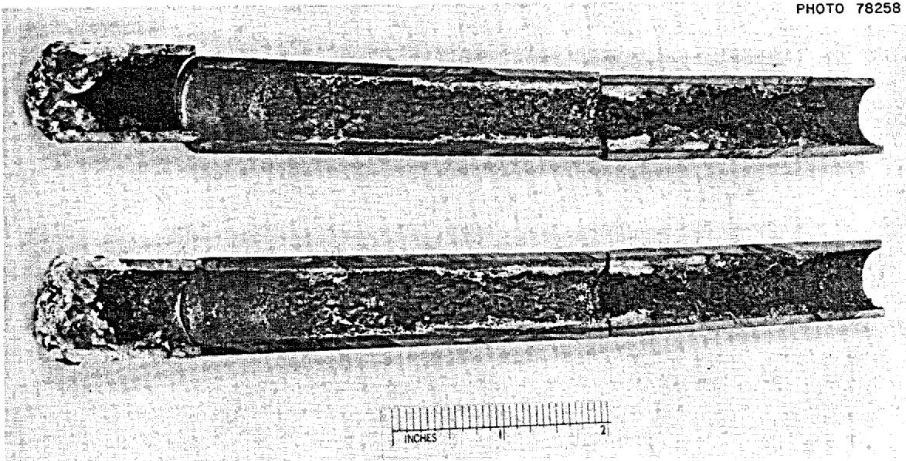  
Fig. 37. Post-test appearance of salt level bubbler tube interior.

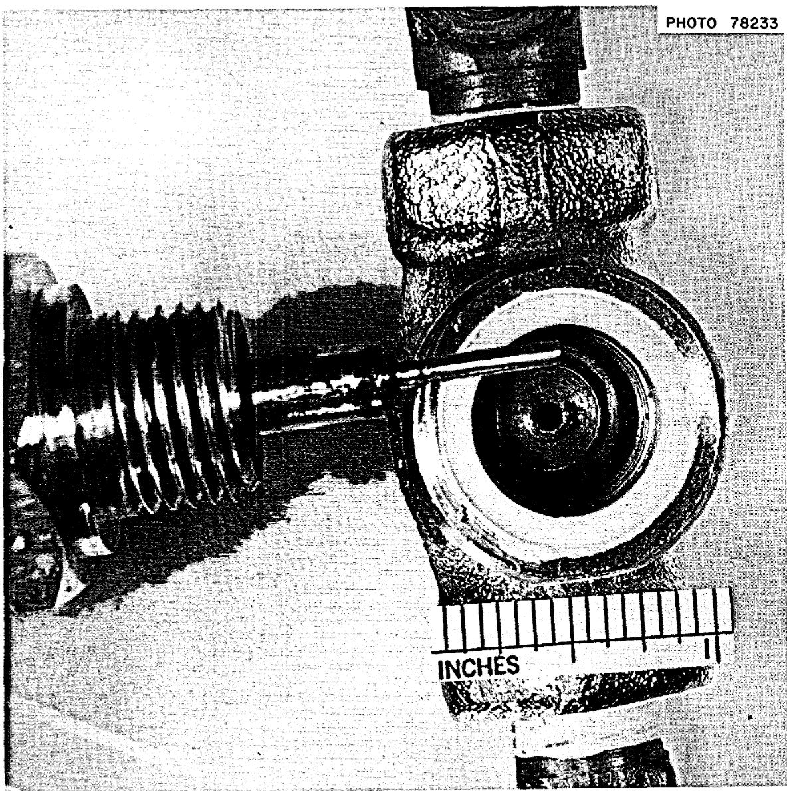  
Fig. 38. Post-test appearance of pressure control valve trim.

During the final examination of the pump rotary element, pieces of gray-black, magnetic, metallic-appearing material, shaped somewhat like automobile tire weights, were found lying in the annulus next to the impeller hub. The chemical analysis [Na-5, B-3, Fe-2.5, Cr-0.2, and Ni-66.3 (wt %)] indicated that the material was elemental nickel mixed with some $\mathrm{NaBF}_4$ . We speculate that the material was formed near the upper end of the impeller hub by mass transfer of nickel from the salt that flowed through the impeller-shaft labyrinth seal (fountain flow). Evidence of severe corrosion was found on the inner heat baffles,[12] and this condition was ascribed to continuous low levels of moisture (estimated to be about 25 ppm) in the shaft purge helium gas. The mechanism is believed to have been as follows: residual droplets of fluoroborate salt were left on the heat baffle surfaces as a result of the ingassing transients which occurred during the cavitation inception tests and the moisture in the incoming purge gas combined with these salt droplets to form corrosive reaction products.

# 6.11 Green Salt

When the pump rotary element was removed for inspection in May 1968, several large chunks of green salt were found lying on top of the upper impeller casing. It was concluded that this material was a relatively insoluble phase that resulted from mixing the fluoroborate flushing salt with the residue of MSRE-type salt left over from the previous test program. The color was similar to, but not quite as dark as, the green deposits $\left(\mathrm{Na}_{3} \mathrm{CrF}_{6}\right)$ obtained during the cold-finger test work. In September 1970, when the rotary element was again removed from the pump, a similar deposit of green salt was found on the upper impeller casing. In both cases, it was obvious that the deposits had been formed on the under side of the outer thermal baffles and had been dislodged during removal of the rotary element. This thermal baffle surface was probably somewhat colder than the bulk salt temperature, which would account for precipitation of the less-soluble phase; but the surface was about $4$ in. above the maximum normal pump bowl salt level, and it is not clear how the salt came into contact with this surface. There are two possibilities: first, splashing

or spraying of the salt due to impeller fountain flow, and second, the violent but momentary expansions of the salt that occurred during the ingassing transients (see Sect. 6.1). The first mechanism seems more probable, since the ingassing transients were so brief that it is difficult to see how there could have been sufficient contact time to allow transfer of the material. On the other hand, the first deposit was found after only $187\mathrm{hr}$ of salt circulation, which implies a rather rapid transfer rate even for the spray theory. Table 11 compares the chemical analyses of the green salts with the various charges of circulating salt, and Table 12 compares molecular compositions of the circulating salts with possible molecular compositions for the green salts.

The discovery of the deposits of green salt suggests the possibility of similar deposits in an MSBR secondary coolant system if there were leakage of the fuel salt into the coolant salt. The possible ramifications of such an incident need to be thoroughly considered to insure that there would be no intolerable side effects.

Table 11. Comparison of green salt with present and former salts for $\mathrm{NaBF_4}$ circulation test, PKP-1 loop   

<table><tr><td rowspan="2"></td><td rowspan="2">BULT-4 salt formerly in loop (wt %)</td><td colspan="2">NaBF4salt (wt %)</td><td colspan="2">Green salt (wt %)</td></tr><tr><td>Flush chargea</td><td>Clean batch</td><td>May 1968</td><td>Sept. 1970</td></tr><tr><td>Li</td><td>9.72</td><td>0.21</td><td>0.048</td><td>0.21</td><td>0.17</td></tr><tr><td>Be</td><td>5.82</td><td>0.17</td><td>0.016</td><td>0.04</td><td>0.10</td></tr><tr><td>U</td><td>5.12</td><td>0.25</td><td>0.019</td><td>12.2</td><td>0.35</td></tr><tr><td>Th</td><td>20.0</td><td>0.25</td><td>0.093</td><td>26.5</td><td>13.9</td></tr><tr><td>Na</td><td></td><td>21.6</td><td>20.9</td><td>10.9</td><td>17.8</td></tr><tr><td>B</td><td></td><td>9.45</td><td>9.3</td><td>3.91</td><td>2.6</td></tr><tr><td>F</td><td>59.34</td><td>67.7</td><td>68.0</td><td>43.5</td><td>45.3</td></tr><tr><td>Fe</td><td></td><td>0.02</td><td>0.06</td><td>1.48</td><td>9.45</td></tr><tr><td>Cr</td><td></td><td>0.01</td><td>0.04</td><td>0.27</td><td>8.9</td></tr><tr><td>Ni</td><td></td><td>0.04</td><td>0.005</td><td>0.03</td><td>0.08</td></tr></table>

aAfter mixing with heel of salt left in drain tank from previous test program.

Table 12. Comparison of molecular compositionsa of circulating salts and green salts   

<table><tr><td rowspan="2"></td><td rowspan="2">BULT-4 salt formerly in loop</td><td colspan="2">Fluoroborate salt</td><td colspan="2">Green salt</td></tr><tr><td>Flush charge</td><td>Clean charge</td><td>May 1968</td><td>Sept. 1970</td></tr><tr><td>NaBF4</td><td></td><td>88</td><td>93</td><td>53</td><td>32</td></tr><tr><td>NaF</td><td></td><td>6</td><td>5</td><td>13</td><td>8</td></tr><tr><td>LiF</td><td>65</td><td>3</td><td>0.1</td><td>4</td><td>3</td></tr><tr><td>BeF2</td><td>30</td><td>2</td><td>0.2</td><td>0.7</td><td>2</td></tr><tr><td>UF4</td><td>1</td><td>0.1</td><td>0.01</td><td>7</td><td>0.2</td></tr><tr><td>ThF4</td><td>4</td><td>0.1</td><td>0.04</td><td>17</td><td>9</td></tr><tr><td>Na3CrF6</td><td></td><td>0.02</td><td>0.08</td><td>0.7</td><td>23</td></tr><tr><td>FeF2</td><td></td><td>0.04</td><td>0.1</td><td>4</td><td>23</td></tr></table>

aInferred from chemical analyses; all values in mole %.

# 6.12 Valves in $\mathbf{BF}_3$ Service

In general, the performance of in-line valves, whether packed stem seal or bellows stem seal, was very satisfactory. We attribute success in this area to the use of resistant materials (fluorinated polymers) for gaskets and packing and to care in leak testing to insure a tight system. In a few instances a valve stuck in the closed position. This difficulty was attributed to accumulation of fluid or solids and to the fact that the valves opened on spring action, that is, the stems were not directly connected to the valve wheel.

In cases where a valve was used to separate the $\mathrm{BF}_3$ system from the atmosphere, the experience was not so good. One example was the l-in. ball valve that was installed on the salt sample access line on the pump bowl. This valve had a stainless steel body and Teflon trim, but we had continual trouble with seat leakage. We attributed the trouble to attack by corrosive materials produced by the reaction of $\mathrm{BF}_3$ with atmospheric moisture. Another example was the safety relief valve that was in a line connected to the $\mathrm{BF}_3$ feed header. This valve had a spring-loaded brass

poppet and a synthetic-rubber elastomer (Buna N) seat. A check after the final shutdown of the loop showed that the poppet opened at about the right cracking pressure but failed to reseat when the pressure was lowered. We believe the failure to reseat was due to $\mathrm{BF}_3\text{-H}_2\mathrm{O}$ reaction products which caused a change in the properties of the elastomer. A third example was the check valve in the off-gas line just before the stack suction. The original valve, which had a spring-loaded brass poppet with a Buna N seat, stuck closed after 766 hr of operation. Failure was attributed to deterioration of the elastomer seat. We changed the rubber ring to a Poly-TFE ring and had no further difficulty.

In summary, the valve applications that require close attention are in locations where there is an opportunity for the $\mathrm{BF}_3$ to come into contact with atmospheric moisture. Good performance can be obtained by the use of well-designed valves having proper materials of construction. For infrequently used lines, it may be advisable to provide for purging and capping off the line on the atmospheric side of the valve.

# 7. RECOMMENDATIONS FOR FURTHER DEVELOPMENT WORK

# 7.1 Impurities in the Salt

Certain impurities, variously identified as water, hydroxyfluoroboric acid, $\mathrm{BF}_3$ - $\mathrm{H}_2\mathrm{O}$ reaction products, etc., cause increased corrosion rates in the circulation system and flow restrictions in the off-gas system. Work is needed in the following areas: (1) identity and pertinent physical properties (e.g., vapor pressure) of the impurities, (2) maximum concentration of the impurities which can be tolerated in the salt, and (3) procedure for pretreating salt to remove impurities.

# 7.2 Corrosion Product Deposition

Additional work is needed to verify the suitability of a cold trapping technique to inhibit the deposition of corrosion products on steam generator tubes and other functional surfaces where fouling is unwanted.

# 7.3 Salt Level Instruments

We need a reliable, accurate method for continuous indication of salt level. Two devices were tested. The test of the resistivity probe was cursory, and additional work is needed to provide a reliable evaluation of it. Additional work is needed with the bubble-tube indicator to insure that we have a suitable construction material and to develop a design that will not be susceptible to plugging. The accuracy and stability of both types need to be established.

# 7.4 Off-Gas System Restrictions

We have proposed the use of a hot-mist trap and a replaceable filter to help eliminate flow restrictions in the off-gas system. The word "replaceable" implies a parallel filter installation with provisions for isolating and servicing the off-stream unit. The problem is to design an arrangement that does not tend to plug at the isolation valve between the hot-mist trap and the filter. Our test work showed that globe valves would be unsuited for this application. Ball valves, which have a straight-through flow pattern, might be satisfactory from the standpoint of solids accumulation, but their packed-stem seal design might be unacceptable for a nuclear reactor installation. One possible approach would be to dodge the problem altogether by eliminating the isolation valves and sizing the filter so that replacement would be necessary only during scheduled reactor shutdowns. We need to examine the various alternatives and to define and perform tests that will demonstrate that we have a satisfactory solution to this problem.

# 7.5 Control of Salt Composition

In connection with the use of the thermal conductivity cell to monitor the composition of the salt two tests are needed: (1) the instrument should be used to check a salt that is known to be noneutectic, and (2) tests should be run to determine the variation of $\mathrm{BF}_3$ partial pressure as a function of the quantity of fuel salt that is mixed with the fluoroborate.

# 7.6 Intermixing of Molten Salts

Additional study is needed to examine the relative miscibility of various mixtures of the fluoroborate salt with the reactor fuel salt. The purpose is to insure that cross mixing of salt between the fuel and coolant systems would not cause any insoluble safety or operating problems. This study can probably be carried out in conjunction with the work noted in Section 7.5 above.

# 7.7 Solid Phase Transition

Studies should be made to determine if special designs or operating techniques are needed to prevent damaging stresses when salt-filled components are heated upward through the solid phase transition temperature $(469^{\circ}\mathrm{F})$ . A brief, simple test was run (see Appendix E) that indicates that proper adjustment of heater temperatures is probably an important factor. Additional study is needed, however, to insure that we can cope with this problem in complex circulating systems.

The solid phase transition might also be expected to cause problems with the operation of freeze valves, although this hypothesis was not supported by our experience (see Sect. 6.4) during the test program. We recommend a critical review of the design and operation of fluoroborate freeze valves followed by the execution of any experimental work that might be indicated by this review.

# 7.8 BF3 Recycle System

The $\mathrm{BF}_3$ usage rate is directly proportional to the $\mathrm{BF}_3$ partial pressure. In the MSBR concept, the $\mathrm{BF}_3$ partial pressure will be relatively high (about one-third of an atmosphere) and the usage rate for a once-through $\mathrm{BF}_3$ feed system would be on the order of 100 ft³/day or 20 lb/m/day (based on a total pressure of 2 atm and total flow of 12 liters/min). The problem of $\mathrm{BF}_3$ supply and disposal would be minimized if a system were provided to recycle a large fraction of the $\mathrm{BF}_3$ , and a study should be made to examine the feasibility and desirability of such a recycle system.

# ACKNOWLEDGMENTS

The work described herein required and received constructive inputs from many persons. The major contributors are listed below.

Dunlap Scott, guidance in formulation of test program; R. B. Gallaher, P. G. Smith, and H. C. Young, execution and analysis of tests; W. H. Duckworth, F. E. Lynch, and Doyle Scott, operation of test equipment; Ben Squires, design of control system; C. A. Brandon, design of cold finger; R. F. Apple, S. Cantor, A. S. Meyer, Jr., and J. A. Shaffer, chemistry support; Dunlap Scott, A. G. Grindell, R. E. MacPherson, and R. B. Briggs, constructive review of report drafts.

We are also indebted to V. B. Maggart for typing of the report and to M. R. Sheldon for assistance with the final editing. All contributions are hereby gratefully acknowledged.

# REFERENCES

1. R. C. Robertson et al., Two-Fluid Molten-Salt Breeder Reactor Design Study (Status as of January 1, 1968), ORNL-4528, pp. 9-11 (August 1970).   
2. Reactor Handbook, vol. IV, 2d ed., p. 832, Interscience, New York, 1964.   
3. P. G. Smith, "Hydraulic Performance and Cavitation Inception Characteristics with Fluoroborate - PKP Salt Pump (MSR-69-3)," unpublished internal memorandum (Jan. 10, 1969).   
4. A. N. Smith et al., MSRP Semiannu. Progr. Rep. February 1969, ORNL-4396, p. 100.   
5. S. Cantor et al., Physical Properties of Molten-Salt Reactor Fuel, Coolant, and Flush Salts, ORNL-TM-2316, pp. 33-35 (August 1968).   
6. S. Cantor, MSRP Semiannu. Progr. Rep. August 1967, ORNL-4191, pp. 159-61.   
7. MSRP Semiannu. Progr. Rep. February 1969, ORNL-4396, p. 105.   
8. "Rotating Machinery for Gas-Cooled Reactor Application," Proceedings of Meeting at Oak Ridge National Laboratory, April 2-4, 1962, TID-7631.   
9. J. W. Koger and A. P. Litman, Compatibility of Fused Sodium Fluoroborates and $\mathsf{BF}_3$ Gas with Hastelloy N Alloys, ORNL-TM-2978 (June 1970).   
10. S. Cantor, MSRP Semiannu. Progr. Rep. Feb. 1971, ORNL-4676, pp. 92-93.   
11. J. W. Koger, ibid., pp. 211 ff.   
12. MSRP Semiannu. Progr. Rep. Aug. 31, 1971, ORNL-4728, pp. 31 ff.   
13. J. W. Koger, MSRP Semiannu Progr. Rep. August 1971, ORNL-4622, pp. 168-69.

# BIBLIOGRAPHY

1. H. S. Booth and D. R. Martin, Boron Trifluoride and Its Derivatives, Wiley, New York, 1949.   
2. Matheson Gas Data Book, The Matheson Co., Inc., East Rutherford, N.J., 1961.

APPENDICES

# Appendix A

# SELECTED PHYSICAL AND CHEMICAL PROPERTIES OF PROCESS MATERIALS

# A.1 NaBF4 and NaF

<table><tr><td>Name</td><td>Sodium fluoroborate</td><td>Sodium fluoride</td></tr><tr><td>Formula</td><td>NaBF4</td><td>NaF</td></tr><tr><td>Molecular weight</td><td>109.8</td><td>42</td></tr><tr><td>Density, g/cm3, 20°C</td><td>2.47</td><td>2.79</td></tr><tr><td>Melting point, °F</td><td>765</td><td>1818</td></tr><tr><td>Solubility, g/100 g H2O</td><td></td><td></td></tr><tr><td>At 25°C</td><td>108</td><td>4</td></tr><tr><td>At 100°C</td><td>210</td><td>5</td></tr></table>

# A.2 The System $\mathrm{NaBF_4 - NaF}$

Phase diagram See Fig. A.1 $\mathrm{BF}_3$ decomposition See Fig. A.2 pressure

Mole fraction $\mathrm{NaBF}_4$ (2.126) $\left(\frac{\mathrm{wt}\%}{\mathrm{wt}\%}\right)$ boron sodium

$$
(0.569 \mathrm{R} - 3) ^ {- 1}, \text {where R} = \left(\frac {\text {wt} \% \text {fluorine}}{\text {wt} \% \text {boron}}\right)
$$

# A.3 $\mathrm{NaBF}_4$ -NaF Eutectic

# Composition

<table><tr><td></td><td>NaBF4-NaF</td><td>NaBF4</td><td>NaF</td><td>Na</td><td>B</td><td>F</td></tr><tr><td>Moles</td><td>1</td><td>0.92</td><td>0.08</td><td>1</td><td>0.92</td><td>3.76</td></tr><tr><td>Grams</td><td>104.39</td><td>101.3</td><td>3.36</td><td>23</td><td>9.95</td><td>71.44</td></tr><tr><td>Weight %</td><td>100</td><td>96.77</td><td>3.22</td><td>22.02</td><td>9.53</td><td>68.44</td></tr></table>

# Properties

(Note: The following properties are for the liquid unless otherwise indicated.)

# Conductivity

$$
\text {E l e c t r i c a l}, (\Omega - \mathrm {c m}) ^ {- 1} \quad n = 2. 7 + 7. 2 \times 1 0 ^ {- 3} (\mathrm {T} ^ {\circ} \mathrm {F} - 9 3 2)
$$

$$
\text {T h e r m a l , B t u h r} ^ {- 1} \mathrm {f t} ^ {- 1} (^ {\circ} \mathrm {F}) ^ {- 1} \quad k = 0. 3
$$

# Density

$$
\mathrm {g} / \mathrm {c m} ^ {3} \quad \rho = 2. 2 7 - 4. 1 \times 1 0 ^ {- 4} \mathrm {T} ^ {\circ} \mathrm {F}
$$

$$
\mathrm {l b} _ {\mathrm {m}} / \mathrm {f t} ^ {3} \quad \rho = 1 4 2. 5 - 2. 5 6 \times 1 0 ^ {- 2} \mathrm {T} ^ {\circ} \mathrm {F}
$$

$$
1 0 2 5 ^ {\circ} \mathrm {F} (5 5 1. 7 ^ {\circ} \mathrm {C}) \quad \rho = 1. 8 6 \mathrm {g} / \mathrm {c m} ^ {3} = 1 1 6 \mathrm {l b} _ {\mathrm {m}} / \mathrm {f t} ^ {3}
$$

$$
1 1 5 0 ^ {\circ} \mathrm {F} (6 2 1. 1 ^ {\circ} \mathrm {C}) \quad \rho = 1. 8 1 \mathrm {g} / \mathrm {c m} ^ {3} = 1 1 3 \mathrm {l b} _ {\mathrm {m}} / \mathrm {f t} ^ {3}
$$

Density of solid, g/cm³ Solid phase transition at 469.4°F (243°C)

$$
\leq 4 6 9 ^ {\circ} \mathrm {F}: \quad \rho = 2. 5 2 - 6. 6 7 \times 1 0 ^ {- 5} \mathrm {T} ^ {\circ} \mathrm {F}
$$

$$
\geq 4 6 9 ^ {\circ} \mathrm {F}: \quad \rho = 2. 1 5 - 6. 6 7 \times 1 0 ^ {- 5} (\mathrm {T} ^ {\circ} \mathrm {F} - 4 6 9. 4)
$$

# Expansion

$$
\text {T h e r m a l}, \left(^ {\circ} F\right) ^ {- 1} \quad \alpha = 1. 1 \times 1 0 ^ {- 4}
$$

$$
\text {S o l i d} \quad \alpha = 6. 7 \times 1 0 ^ {- 3}
$$

# Heat capacity

$$
B t u 1 b _ {m} ^ {- 1} \left(^ {\circ} F\right) ^ {- 1} C _ {p} = 0. 3 6
$$

$$
\text {S o l i d ,} 7 7 - 4 6 9 ^ {\circ} \mathrm {F} \quad \mathrm {C} _ {\mathrm {p}} = 0. 2 2 + 3. 2 \times 1 0 ^ {- 4} \mathrm {T} ^ {\circ} \mathrm {F}
$$

$$
4 6 9 - 7 1 8 ^ {\circ} \mathrm {F} \quad C _ {p} = 0. 3 4
$$

# Heat of fusion

$$
\mathrm {B t u} / \mathrm {l b} _ {\mathrm {m}} \quad \Delta \mathrm {H} = 5 5. 8
$$

$$
\text {S o l i d t r a n s i t i o n ,} 4 6 9. 4 ^ {\circ} \mathrm {F} \quad \Delta \mathrm {H} = 2 6. 1
$$

Melting point, ${}^{\circ}\mathbf{F}$ 723

Solubility of inert gases, $10^{-5}$ lb/mole  
of gas per ft³ melt per atm He - 4.7  
Kr - 9.2  
Xe - 8.5  
Surface tension, dynes/cm $\alpha = 121.3 - 0.0417\mathrm{T}^{\circ}\mathrm{F}$ Decomposition pressure See Fig. A.2  
Viscosity, cP $\eta = 0.04\exp \left(\frac{5400}{T^{\circ}R}\right)$ $1025^{\circ}\mathrm{F}$ $\eta = 1.52$

A.4 $\underline{\mathbf{BF}_3}^*$ Name Boron trifluoride (also boron fluoride)   
Formula BF3Molecular weight 67.82 Specific volume, ft/1b m 5.6 Boiling point, $^\circ \mathrm{F}$ -148.5 Freezing point, $^\circ \mathrm{F}$ -196.8 Specific gravity, $50^{\circ}\mathrm{F}$ (air = 1) 2.37 Critical temperature, $^\circ \mathrm{F}$ 10 Critical pressure, psia 732 Specific heat of gas at $-64^{\circ}\mathrm{F},$ Btu lb ${}^{-1}\mathrm{mole}^{-1}{\left({}^{\circ}\mathrm{F}\right)}^{-1}$

Description. Boron trifluoride is a colorless gas that fumes in moist air and has a pungent, suffocating odor. It is nonflammable and does not support combustion. It is normally packaged in cylinders as a nonliquefied gas at a pressure of 2000 psig at $70^{\circ}\mathrm{F}$ . It is very soluble in water with decomposition (forming fluoroboric and boric acids) and is heavier than air.

Toxicity. Boron trifluoride is very irritating to the respiratory tract. Exposure of the skin or eyes or the breathing of boron trifluoride should be avoided. Although the relative toxicity of the gas to humans has not been established, no medical evidence of chronic effects has been found among workmen who have frequently been exposed to small amounts for periods up to seven years. At high concentrations boron trifluoride will cause burns on the skin similar to, but not as penetrating as, hydrogen fluoride.

First-aid suggestions. Observe procedures specified by the Industrial Hygiene Department. If official procedures are not available, treat irritation or burns of the eyes or skin with copious amounts of water and obtain services of a physician or trained clinician as soon as possible. The treatment of $\mathsf{BF}_3$ burns is normally the same as that used for anhydrous hydrogen fluoride burns.

Precautions in handling and storage. The following rules should be followed in the handling and storage of boron trifluoride.

1. Cylinders should be stored in a dry, cool, well-ventilated area. Cylinders may be stored in the open, but in such cases should be protected against extreme weather and from the dampness of the ground to prevent rusting.

2. Since boron trifluoride is reactive with water, alcohol, ether, and other compounds, introduction of the gas below the surface of a liquid may create a hazard owing to the possibility of suckback into the cylinder. This should be guarded against by the use of traps or check valves.

3. Equipment exposed to boron trifluoride should not be used with other gases, particularly oxygen, since the gas may have oil vapors that will coat out on equipment and may cause fires when combined with oxygen under pressure.

Leak detection. Small leaks may be detected visually by checking for an accumulation of fluid (product of reaction between $\mathrm{BF}_3$ and atmospheric moisture) or with the aid of an aqueous ammonia squeeze bottle (formation of white fumes). If the leak is large enough, reaction with atmospheric moisture will produce visible "smoke."

Materials of construction. Dry boron trifluoride does not react with the common metals of construction, but if moisture is present, the hydrate acids identified above can corrode all common metals rapidly. In consequence, lines and pressure reducing valves in boron trifluoride service must be well protected from moist air. Cast iron must not be used because active fluoride attacks it structure. If steel piping is used for boron trifluoride, forged steel fittings must be used with it instead of cast iron fittings. Materials recommended for the handling of dry boron trifluoride are steel tubing or pipe, stainless steel, copper, nickel, Monel, brass, and aluminum, and the more noble metals. These metals will stand up adequately to at least $200^{\circ}\mathrm{C}$ . Pyrex glass is also suitable up to about $200^{\circ}\mathrm{C}$ at low pressures. For moist gas: copper, Saran tubing, hard rubber, paraffin wax, and Pyrex glass show fair resistance; plastic materials, such as Teflon, Epons, polyethylene, and pure polyvinyl chloride are not attacked at $80^{\circ}\mathrm{C}$ ; rubber tubing, phenolic resins, nylon, cellulose, and commercial polyvinyl chloride are readily attacked.

Chemical properties. (a) With elements: Alkali and alkaline-earth metals reduce boron trifluoride to elemental boron and the metal fluoride. Gaseous or liquid boron trifluoride does not react with mercury or chromium, even at high pressures for long periods. Red-hot iron is not attacked by boron trifluoride.

(b) With oxides: When boron trifluoride is allowed to react with slaked lime, calcium borate and fluoroborate are formed with evolution of heat. With anhydrous calcium oxide or magnesium oxide, the metal fluoride and the volatile boron oxyfluoride are formed.   
(c) With halides: $\mathrm{BCl}_3$ and $\mathrm{BF}_3$ do not react when heated to $500^{\circ}\mathrm{C}$ . Aluminum chloride or aluminum bromide react with boron trifluoride when gently heated to give the corresponding boron halide and aluminum fluoride. Boron trifluoride forms no coordination compounds when passed at 1 atm over the solid chlorides of copper, silver, or potassium at temperatures from -75 to $530^{\circ}\mathrm{C}$ .   
(d) As a catalyst: Boron trifluoride acts as an acid catalyst. It catalyzes numerous types of reactions, namely, esterification, nitrations, oxidations, reductions, halogenations, etc.

A.5 Inconel and Hastelloy N

Nominal composition (wt %)   

<table><tr><td></td><td>C</td><td>Mn</td><td>Si</td><td>Cr</td><td>Ni</td><td>Fe</td><td>Mo</td></tr><tr><td>Inconel</td><td>0.04</td><td>0.35</td><td>0.20</td><td>15</td><td>78</td><td>7</td><td></td></tr><tr><td>Hastelloy N</td><td>0.06</td><td>0.50</td><td>0.50</td><td>7</td><td>70</td><td>4</td><td>17</td></tr></table>

A.6 Helium and Argon

<table><tr><td></td><td>Helium</td><td>Argon</td></tr><tr><td>Molecular weight</td><td>4</td><td>40</td></tr><tr><td>Specific volume, ft3/1bm</td><td>90</td><td>9</td></tr><tr><td>Specific heat, Btu lb-1mole-1(°F)-1</td><td>5.00</td><td>5.00</td></tr><tr><td>Thermal conductivity, Btu hr-1ft-1(°F)-1</td><td>0.082</td><td>0.0094</td></tr><tr><td>Viscosity, lb m ft-1sec-1, 32°F, l atm</td><td>1.25 × 10-5</td><td>1.43 × 10-5</td></tr></table>

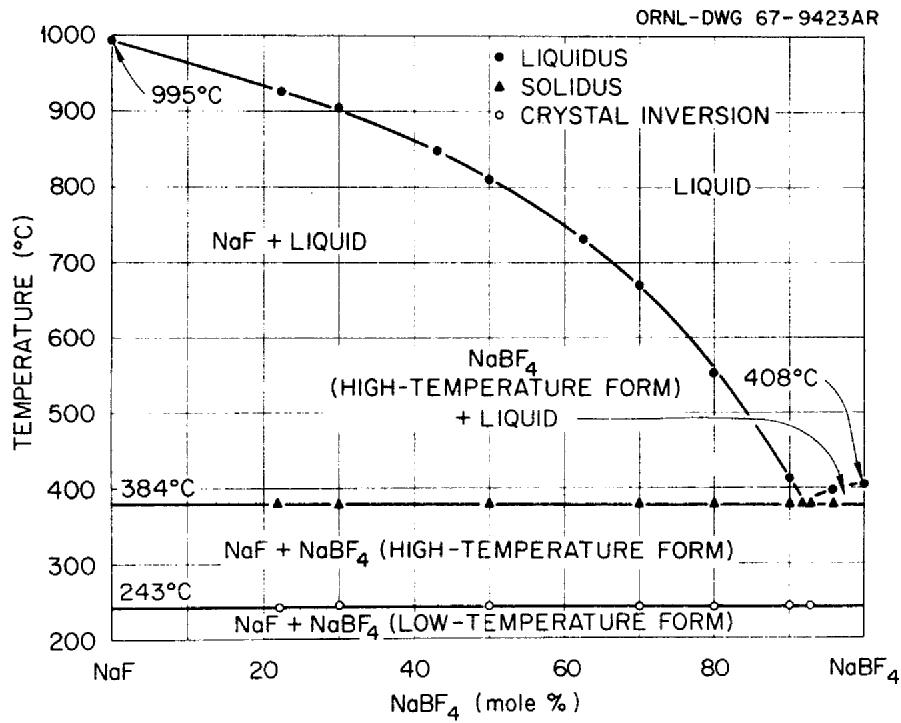  
Fig. A.l. Phase diagram for the system NaF-NaBF $_4$ .

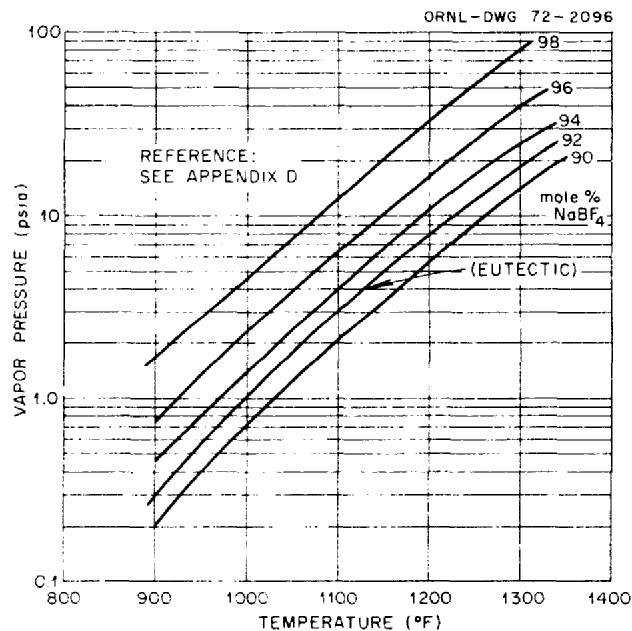  
Fig. A.2. $\mathbf{BF}_3$ partial pressure vs temperature for NaF- $\mathbf{NaBF}_4$ mixtures.

# Appendix B

# REFERENCE DRAWINGS*

ORNL Dwg. No.

D-48942

D-48944

D-2-02-054-9779

D-2-02-054-9780

D-2-02-054-9783

D-2-02-054-9784

D-2-02-054-9785

D-HH-Z-41778

Q-1512A-1.RD

SK-JWK-11-20-68

B-2-02-054-1926

B-2-02-054-1927

D-2-02-054-7440

# Title

Flow Diagram for Fluoroborate Circulation Test

Elementary Electric Schematic for Fluoroborate Circulation Test

Flow Diagram Be Molten Salt PKP-1 Pump Test Loop

Alarm Schematic

Electric Heater Layout

Thermocouple Layout

Gas Control Cabinet

Capillary Restrictor

Thermal Conductivity Cell Power Supply

Resistance Type Level Indicator

Fluid Line for Freeze Valve

Air Tube for Freeze Valve

Sample Device

# Appendix C

# MATERIAL SPECIFICATIONS

# C.1 ${\mathrm{{NaBF}}}_{4}$

The sodium fluoroborate used in the PKP fluoroborate circulation test was received under Order No. 33Y-63903, April 10, 1967, from the Harshaw Chemical Company. The vendor gives (memo of 5-12-67) the chemical analysis as follows (wt %):

NaBF 99.08 Ca 0.01

0.025 Fe 0.023

Pb 0.004 Water insoluble <0.01

Si 0.01 H O 0.01

# C.2 NaF

The sodium fluoride used was cp grade obtained from Laboratory Stores.

# C.3 BF

The $\mathbf{BF}_3$ was purchased from J. T. Baker Chemical Company under Order No. 79S-1266, August 28, 1967. Our specification was as follows:

BF3 minimum, 99.7% v/v

Maximum impurities, $\%$ v/v

Air or noncondensables 0.65

$\mathrm{SO}_{2}$ 0.001

SO 0.001

SiF 0.02

We did not analyze for impurities at ORNL. We did, however, make a test at the facility in an attempt to determine if there was any water or hydroxyl compounds in the $\mathrm{BF}_3$ . The test consisted in passing several liters of the $\mathrm{BF}_3$ through a dry-ice trap and then analyzing the trap contents using the Karl Fischer method. No evidence of water was found.

# Appendix D

DERIVATION OF EQUATION FOR CALCULATION OF $\mathsf{BF}_3$ PARTIAL PRESSURE

From Ref. 6:

$$
Q _ {p} = \left(P _ {b}\right) \left(\frac {1 - f}{f}\right), \tag {1}
$$

where $f =$ mole fraction $\mathrm{NaBF}_4$ , $Q_p =$ equilibrium quotient, and $P_b =$ partial pressure of $\mathrm{BF}_3$ . Rearranging:

$$
P _ {b} = \left(\frac {f}{1 - f}\right) \left(Q _ {p}\right). \tag {2}
$$

Also, from Ref. 5, $Q_{p}$ varies with temperature:

$$
Q _ {p} = \exp (C - \frac {B}{T}). \tag {3}
$$

Then

$$
P _ {b} = \left(\frac {f}{1 - f}\right) \left[ \exp (C - \frac {B}{T}) \right]. \tag {4}
$$

For a 92-8 mix:

$$
\left(\frac {f}{1 - f}\right) = \left(\frac {0 . 9 2}{0 . 0 8}\right) = 1 1. 5, \tag {5}
$$

and

$$
P _ {b} = 1 1. 5 \left[ \exp \left(C - \frac {B}{T}\right) \right] \tag {6}
$$

also

$$
\ln P _ {b} = 2. 4 4 2 + C - \frac {B}{T}. \tag {7}
$$

From Ref. 5:

$$
\log \left(\mathrm {P} _ {\mathrm {b}}, \mathrm {m m H g}\right) = 9. 0 2 4 - \frac {5 9 2 0}{\mathrm {T} ^ {\circ} \mathrm {K}} , \tag {8}
$$

but

$$
\ln P _ {b} = 2. 3 0 3 \log P _ {b} = 2 0. 7 8 2 - \frac {1 3 , 6 3 3}{T ^ {\circ} K} = 2 0. 7 8 2 - \frac {2 4 , 5 4 0}{T ^ {\circ} R}; \tag {9}
$$

also

$$
\ln \left(P _ {b}, m m H g\right) = \ln \left(P _ {b}, p s i\right) - \ln 5 1. 7 = \ln \left(P _ {b}, p s i\right) - 3. 9 4 5 5. \tag {10}
$$

Then

$$
\ln \left(\mathrm {P} _ {\mathrm {b}}, \mathrm {p s i}\right) = 1 6. 8 3 7 - \frac {2 4 , 5 4 0}{\mathrm {T} ^ {\circ} \mathrm {R}}. \tag {11}
$$

Comparing Eqs. (7) and (11):

$$
2. 4 4 2 + C = 1 6. 8 3 7 \text {a n d} C = 1 4. 3 9 5; B = 2 4, 5 4 0.
$$

Substituting in Eq. (4):

$$
P _ {b}, \text {p s i} = \left(\frac {f}{1 - f}\right) \left[ \exp (1 4. 3 9 5 - \frac {2 4 , 5 4 0}{T ^ {\circ} R}) \right]. \tag {12}
$$

# Appendix E

# FREEZE-THAW STRESS TEST

As the salt temperature is being increased, there is an abrupt solid-state expansion (density decrease) of about $15\%$ when the temperature reaches $469^{\circ}\mathrm{F}$ . This phenomenon introduces the threat of damaging stresses in salt-filled components if the salt is cooled below the transition temperature and then reheated.

A bench test was run to study the effect of variations in heating technique. A 2-in.-ID by 18-in.-long Pyrex glass tube was filled with the fluoroborate eutectic mixture to a depth of about 8 in. Heat was furnished by a Calrod helix whose inside diameter was about $1/4$ in. larger than the outside diameter of the glass tube, so that heat transmission was largely by radiation. An aluminum foil reflector surrounded the assembly. Thermocouples were used to indicate the surface temperature of the heater and the salt temperature on the tube center line about 2 in. from the bottom. The test assembly was then operated through three thermal cycles during which the salt was melted and then refrozen. In all three heatups, the heater temperature $(T_{\mathrm{h}}$ in Fig. E.l) was controlled at from 75 to $300^{\circ}\mathrm{F}$ above the salt melting temperature, and in all three cases the melting was accomplished without difficulty. Then a fourth heatup was made wherein the heater temperature was controlled below the melting point of the salt. In this case, when the salt temperature $T_{\mathrm{s}}$ registered about $455^{\circ}\mathrm{F}$ , the Pyrex tube suddenly shattered.

The conclusion is that the poor thermal conductivity of the frozen salt causes a steep temperature gradient, and, where the heater temperature is above the melting point, a film of liquid salt forms at the salt container interface before the bulk salt temperature reaches the solid phase transition point. The liquid film serves to provide an expansion space to protect the container during the phase transition of the bulk salt. The results of this test suggest that, whenever the salt temperature is raised through the solid phase transition point, mechanical stresses can be minimized by proper control of heater temperature. It will be necessary to consider other factors, however, such as system

geometry and the probability and possible effects of shifting and packing of salt crystals, before one can properly assess the solid phase transition problem.

ORNL-DWG72-2097

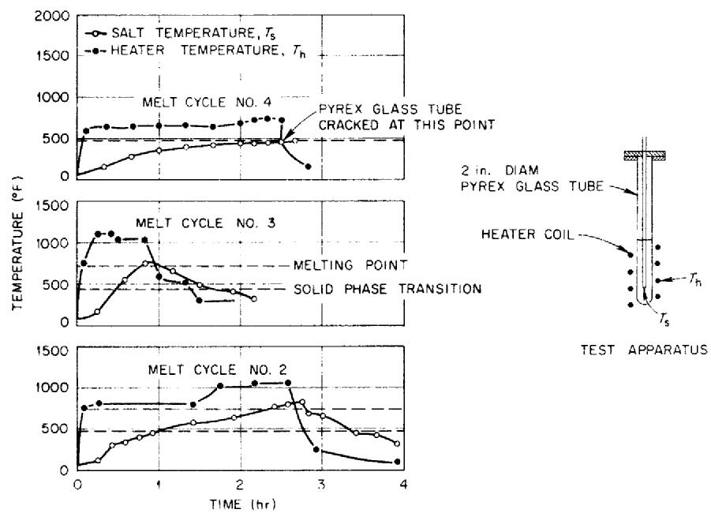  
Fig. E.l. Data from fluoroborate freeze-thaw stress test.

A

# Internal Distribution

1. R. F. Apple   
2. S.E.Beall   
3. M. Bender   
4. E. S. Bettis   
5. E. G. Bohlmann   
6. R.B.Briggs   
7. S. Cantor   
8. E. L. Compere   
9. W.B.Cottrell

10-13. J. L. Crowley

14. F. L. Culler   
15. J.R. Engel   
16. A. P. Fraas   
17. R.B.Gallaher   
18. W.R.Grimes

19-23. A. G. Grindell

24. R. H. Guymon   
25. P. N. Haubenreich   
26. R.E.Helms   
27. H.W.Hoffman   
28. W.R.Huntley   
29. W. H. Jordan   
30. P. R. Kasten   
31. J. W. Koger   
32. A. I. Krakoviak   
33. J. W. Krewson   
34. M. I. Lundin   
35. R. N. Lyon   
36. R.E. MacPherson   
37. H. E. McCoy   
38. H.C.McCurdy

39. L. E. McNeese   
40. J. R. McWherter   
41. H. J. Metz   
42. A. S. Meyer   
43. A. J. Miller   
44. R. L. Moore   
45. A.M.Perry   
46. R.C.Robertson   
47. M. W. Rosenthal   
48. H. C. Savage

49-52. Dunlap Scott

53. J.H.Shaffer   
54. M.R.Sheldon   
55. M. J. Skinner

56-58. A. N. Smith

59. I. Spiewak   
60. R. D. Stulting   
61. D. A. Sundberg   
62. E. H. Taylor   
63. R.E.Thoma   
64. D. B. Trauger   
65. A. M. Weinberg   
66. G. D. Whitman   
67. L. V. Wilson   
68. Gale Young   
69. H.C.Young

70-71. Central Research Library   
72. Y-12 Document Reference Section   
73-76. Laboratory Records Department   
77. Laboratory Records Department (RC)

# External Distribution

78. A. Agostinelli, Worthington Corporation, Harrison, N.J. 07029   
79-80. C. E. Anthony, Electro-Mechanical Division, Westinghouse Electric Corporation, Box 217, Cheswick, Pa. 15024   
81. F. F. Antunes, Ingersoll-Rand Company, Cameron Engineering Division, Phillipsburg, N.J. 08865   
82. R. G. Barrett, Foster Wheeler, Livingston, N.J. 07039   
83-84. R. N. Bowman, Pump Division, Bingham-Willamette Company, 2800 N.W. Front Avenue, Portland, Ore. 97210   
85. A. H. Church, Mechanical Engineering Department, New York University, Bronx, N.Y. 10400

86-87. Gary Clasby, Byron Jackson Pumps, Inc., P.O. Box 2017, Terminal Annex, Los Angeles, Calif. 90054   
88. D. F. Cope, RDT, SSR, AEC, ORNL   
89. V. R. Degner, Rocketdyne Division, North American Aviation, Canoga Park, Calif. 91303   
90. A. R. DeGrazia, RDT, USAEC, Washington, D.C. 20545   
91. D. Elias, RDT, USAEC, Washington, D.C. 20545   
92. J. R. Fox, USAEC, Washington, D.C. 20000   
93. A. Giambusso, USAEC, Washington, D.C. 20000   
94. F. C. Gilman, Pump and Heat Transfer Division, Worthington Corporation, Harrison, N.J. 07029   
95. R. Gordon, Aerojet-General, Azusa, Calif. 91702   
96. C. W. Grennan, Colt Industries, Chandler Evans Control Systems Division, West Hartford, Conn. 06100   
97. Norton Haberman, USAEC, Washington, D.C. 20000   
98. F. G. Hammitt, The University of Michigan, Ann Arbor, Mich. 48103   
99. M. J. Hartmann, NASA-Lewis Research Center, Cleveland, Ohio 44100   
.00.C.H.Hauser,NASA-Lewis Research Center, Cleveland, Ohio 44100   
101. J. W. Holl, Pennsylvania State University, Garfield Thomas Water Tunnel, Ordnance Research Laboratory, University Park, Pa. 16802   
.02. Kermit Laughon, USAEC, OSR, ORNL   
03. Liquid Metal Engineering Center, c/o Atomics International, P.O. Box 309, Canoga Park, Calif. 91303 (Attention: R.W. Dickinson)   
104-105. T. W. McIntosh, USAEC, Washington, D.C. 20000   
106. D. C. Reemsnyder, NASA-Lewis Research Center, Cleveland, Ohio 44100   
107. M. A. Rosen, DRDT, USAEC, Washington, D.C. 20000   
108. Research and Technical Support Division, ORO   
109. M. Shaw, USAEC, Washington, D.C. 20000   
110. W. L. Smalley, USAEC, Oak Ridge Operations   
111. W. A. Spraker, Engineering Research Division, Scott Paper Company, Philadelphia, Pa. 19100   
112. H. A. Stahl, Cameron Division, Ingersoll-Rand Company, Phillipsburg, N.J. 08865   
113. B. Sternlicht, Mechanical Technology, Inc., Latham, N.Y. 12100   
114. G. M. Wood, Pratt and Whitney Aircraft Corporation, East Hartford, Conn. 06100   
115-132. Manager, Technical Information Center, AEC   
133-134. Technical Information Center (AEC)   
135-137. Director of Division of Reactor Licensing, Washington, D.C. 20545   
138-139. Director of Division of Reactor Standards, Washington, D.C. 20545