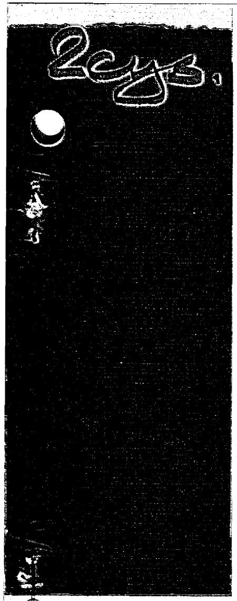

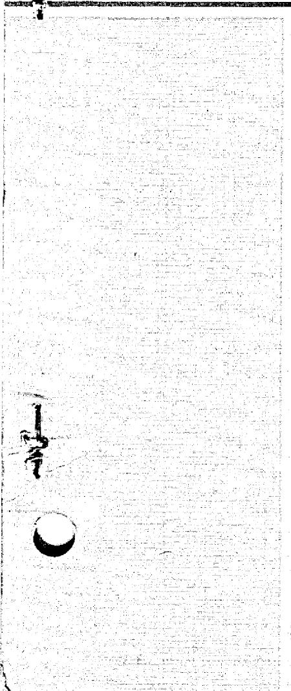

# ENGINEERING DEVELOPMENT STUDIES FOR MOLTEN-SALT BREEDER REACTOR PROCESSING NO. 10

L. E. McNeese

MASTER

OAK RIDGE NATIONAL LABORATORY

OPERATED BY UNION CARBIDE CORPORATION • FOR THE U.S. ATOMIC ENERGY COMMISSION

This report was prepared as an account of work sponsored by the United States Government. Neither the United States nor the United States Atomic Energy Commission, nor any of their employees, nor any of their contractors, subcontractors, or their employees, makes any warranty, express or implied, or assumes any legal liability or responsibility for the accuracy, completeness or usefulness of any information, apparatus, product or process disclosed, or represents that its use would not infringe privately owned rights.

Contract No. W-7405-eng-26

CHEMICAL TECHNOLOGY DIVISION

ENGINEERING DEVELOPMENT STUDIES FOR MOLTEN-SALT BREEDER REACTOR PROCESSING NO. 10

L. E. McNeese

December 1972

# NOTICE

This report was prepared as an account of work sponsored by the United States Government. Neither the United States nor the United States Atomic Energy Commission, nor any of their employees, nor any of their contractors, subcontractors, or their employees, makes any warranty, express or implied, or assumes any legal liability or responsibility for the accuracy, completeness or usefulness of any information, apparatus, product or process disclosed, or represents that its use would not infringe privately owned rights.

OAK RIDGE NATIONAL LABORATORY

Oak Ridge, Tennessee 37830

operated by

UNION CARBIDE CORPORATION

for the

U.S. ATOMIC ENERGY COMMISSION

Reports previously issued in this series are as follows:

ORNL-TM-3053 Period ending December 1968

ORNL-TM-3137 Period ending March 1969

ORNL-TM-3138 Period ending June 1969

ORNL-TM-3139 Period ending September 1969

ORNL-TM-3140 Period ending December 1969

ORNL-TM-3141 Period ending March 1970

ORNL-TM-3257 Period ending June 1970

ORNL-TM-3258 Period ending September 1970

ORNL-TM-3259 Period ending December 1970

# CONTENTS

Page SUMMARIES y

1. INTRODUCTION. 1   
2. FROZEN-WALL FLUORINATOR DEVELOPMENT: EXPERIMENTS ON INDUCTION HEATING IN A CONTINUOUS FLUORINATOR SIMULATION. 2

2.1 Modification of Power Generation and Transmission Systems. 2   
2.2 Experimental Results 4

3. SEMICONTINUOUS REDUCTIVE EXTRACTION EXPERIMENTS IN A MILD-STEEL FACILITY. 12

3.1 Replacement of the Salt Feed-and-Catch Tank. 12   
3.2 Preparation for Mass Transfer Experiment ZTR-1 13   
3.3 Mass Transfer Experiment ZTR-1 15   
3.4 Variation of Reductant Inventory in the Bismuth Phase in the Treatment Vessel. 16   
3.5 Operation of the Argon Purification System 19

4. DEVELOPMENT OF THE METAL TRANSFER PROCESS: INSPECTION OF EXPERIMENT MTE-2. 21

4.1 Description of Equipment 21   
4.2 Inspection of Equipment. 23

5. DEVELOPMENT OF THE METAL TRANSFER PROCESS: AGITATOR TESTS FOR EXPERIMENT MTE-3. 34

5.1 Description of Equipment 34   
5.2 Experimental Results 40

6. DISTRIBUTION OF RADIUS BETWEEN LiCl and Li-Bi SOLUTIONS 46

6.1 Description of Equipment 46   
6.2 Experimental Results 47

7. DEVELOPMENT OF MECHANICALLY AGITATED SALT-METAL CONTACTORS. 52

7.1 Studies for Determination of Limiting Agitator Speeds.. 53   
7.2 Determination of Metal Flow Rate Across Contactor Partition. 57   
7.3 Conclusions. 59

# CONTENTS (continued)

Page

8. ANALYSIS OF MULTICOMPONENT MASS TRANSFER BETWEEN MOLTEN SALTS AND LIQUID BISMUTH DURING COUNTERCURRENT FLOW IN PACKED COLUMNs. 61

8.1 Mathematical Models. 61   
8.2 Calculated Mass Transfer Rates for the Case of Binary Exchange with Uniform Bulk Concentrations. 64

8.2.1 Effect of Diffusion Coefficients of Transferring Ions in Electrolyte Phase 65   
8.2.2 Effect of Individual Mass Transfer Coefficient in Electrolyte Phase 67   
8.2.3 Effect of Individual Mass Transfer Coefficient in Solvent Phase 67   
8.2.4 Effect of Equilibrium Constant. 70   
8.2.5 Effect of Concentration of Nontransferring Ions in the Electrolyte Phase. 70

8.3 Calculated Mass Transfer Rates in an Extraction Column Having Nonuniform Bulk Concentrations. 73

8.3.1 Binary Exchange 74   
8.3.2 Multicomponent Exchange 78

8.4 Summary. 81

9. ENGINEERING STUDIES OF URANIUM OXIDE PRECIPITATION. 83

9.1 Description of Facility. 83   
9.2 Precipitator Vessel Design 85

10. STUDY OF THE PURIFICATION OF SALT BY CONTINUOUS METHODS 90

10.1 Tests for Determining the Presence of Suspended Iron Particles in Salt Samples 90   
10.2 Tests of Various Sampler Types. 92   
10.3 Correlation of Flooding Data. 93

11. REFERENCES. 95

# SUMMARIES

FROZEN-WALL FLUORINATOR DEVELOPMENT: EXPERIMENTS ON INDUCTION HEATING IN A CONTINUOUS FLUORINATOR SIMULATION

Twenty-one additional runs were made in the continuous fluorinator simulator to determine heat generation rates in nitric acid, in the pipes surrounding the acid column, and in the induction coil. Three additional induction coil designs were tested, and the effect of bubbles in the acid on the heat generation rate was determined. Results of the tests established conditions that will allow induction heating to be used in a continuous fluorinator experiment in which the fluorinator vessel is protected from corrosion by a layer of frozen salt. Equations were developed for predicting heat generation rates in the molten salt, the induction coil, and the fluorinator vessel. These equations predict a high efficiency for heating molten salt in a fluorinator for one of the four coil designs tested.

# SEMICONTOINUOUS REDUCTIVE EXTRACTION EXPERIMENTS IN A MILD-STEEL FACILITY

The new salt feed-and-catch tank was installed in the system, and iron oxide was partially removed from it and from the system by contacting the equipment with hydrogen. Reductant was added to the bismuth, about 20 liters of salt (72-16-12 mole $\%$ LiF-BeF $_2$ -ThF $_4$ ) was charged to the system to replace salt that had been discarded with the original salt feed-and-catch tank, and both phases were circulated through the system in order to complete the removal of oxides. After the addition of a small amount of zirconium to restore the system inventory to about 15 g, both phases were treated with a $30\%$ HF--H $_2$ stream in order to remove oxides from the salt.

About 1 g-equiv of reductant, in the form of thorium and Li-Bi alloy, was added to the treatment vessel for the purpose of establishing a zirconium distribution coefficient value in the range of 1 to 5. After the bismuth and salt had been transferred to their respective feed tanks, $97_{\mathrm{Zr}}$ tracer was added to the salt. Mass transfer experiment ZTR-1 was

then carried out using bismuth and salt flow rates of 216 ml/min and 99 ml/min, respectively. Counting of the flowing-stream samples showed that no transfer of the $^{97}\mathrm{Zr}$ tracer had occurred. The reductant that had been added to establish the proper $\mathsf{D}_{\mathsf{Zr}}$ value had apparently been oxidized by HF and $\mathsf{FeF}_2$ which were present in the salt in the treatment vessel.

# DEVELOPMENT OF THE METAL TRANSFER PROCESS: INSPECTION OF EXPERIMENT MTE-2

The equipment used for metal transfer process experiment MTE-2, completed previously, was disassembled and inspected. Some blistering and cracking of the 20-mil-thick nickel aluminide coating had occurred during the 2370-hr period that the vessel had been held at $650^{\circ}\mathrm{C}$ . The vessel was sectioned in a manner such that the salt and bismuth phases could be observed. The salt and bismuth phases appeared to be clean, and the interfaces were free of contamination. A black material which covered the vessel wall in the fluoride compartment is thought to be a mixture of salt and finely divided bismuth.

Deposits containing unusually high concentrations of rare earths were observed on the lip and overflow spout of the Li-Bi alloy container and in the bottom layer of the Th-Bi solution. The total quantities of rare earths in these deposits were only 5 to $10\%$ of the rare-earth inventories in the system.

The inside of the carbon steel vessel appeared to be in good condition except for corrosion on items that were constructed of thin carbon steel. The carbon steel pump, which used bismuth check valves, was in good condition at the completion of the experiments (i.e., after being operated to circulate a total of 702 liters of LiCl).

# DEVELOPMENT OF THE METAL TRANSFER PROCESS: AGITATOR TESTS FOR EXPERIMENT MTE-3

Equipment was constructed in order to test the shaft seal design that is proposed for use in metal transfer experiment MTE-3. The system will also allow us to measure the extent to which bismuth is entrained

in salt in a mechanically agitated system, and to evaluate a vapor-deposited tungsten coating as a means for protecting carbon steel from corrosion by molten salt and bismuth.

Several shaft seals were tested for various time periods at agitator speeds ranging from 150 to 750 rpm. It was found that the seal life could be increased and that the seal leakage rate was decreased considerably by lubricating the seal with mineral oil. A seal design which allowed satisfactory operation for 71 days was judged to be acceptable for use in experiment MTE-3.

Unfiltered salt samples taken during a $745$ -hr period in which salt and bismuth were mechanically agitated showed that the concentration of bismuth in the salt increased from 8 ppm to 200 ppm as the agitator speed was increased from 150 rpm to 750 rpm. During this period, the concentration of nickel in the bismuth increased from 20 ppm to 1000 ppm, which indicated that the bismuth had penetrated the tungsten coating on the interior of the test vessel. Inspection of the coating after completion of the test revealed cracks in the coating in a number of places. Also, it appeared that the coating had not been applied over the entire surface of the drain line at the base of the test vessel. It was concluded that protection of a vessel from attack by bismuth via a tungsten coating would be difficult because of the tendency for such a coating to crack.

# DISTRIBUTION OF RADIUM BETWEEN LiCl AND Li-Bi SOLUTIONS

Data on the distribution of radium between molten LiCl and Li-Bi solutions containing 13 to 35 mole $\%$ lithium were obtained previously during metal transfer experiment MTE-2. Additional data were obtained by diluting a portion of the Li-Bi solution from the experiment (containing radium) and equilibrating the resulting solution with LiCl at $650^{\circ}\mathrm{C}$ . All of the radium distribution data could be correlated well in the manner used previously for correlating distribution data for a large number of elements if radium was assumed to be divalent in the LiCl phase. It was found that the distribution characteristics for radium

# viii

are quite similar to those of the divalent rare-earth and alkaline-earth fission products (Sm, Eu, Sr, and Ba); in fact, the data for radium and barium are almost identical.

# DEVELOPMENT OF MECHANICALLY AGITATED SALT-METAL CONTACTORS

Efforts involving the development of mechanically agitated salt-metal contactors of the Lewis cell type were continued. Preliminary tests were carried out in contactors of several sizes and with different agitator configurations in order to determine the factors that will limit the agitator speed in stirred-interface contactors. The agitator speed was found to be limited by the transfer of the low-density (water) phase via entrainment in the circulating high-density (mercury) phase. The limiting agitator speed was essentially independent of the size and shape of the contactor but was strongly dependent on the agitator diameter. A test made with a low-melting alloy and water, which resulted in a density difference of 7.1 rather than 12.6, indicated that the limiting agitator speed is not highly dependent on the difference in densities of the two liquid phases. It is believed that entrainment of salt in the bismuth in metal transfer experiment MTE-3 will occur at essentially the same agitator speed as was observed with the mercury-water system (300 rpm), and that the experiment should be operated initially with agitator speeds well below this value.

Two tests were carried out for determining the rate at which bismuth circulates between the two sides of a compartmented salt-metal contactor containing a captive bismuth phase. These tests, in which mercury and water were used rather than bismuth and salt, indicated mercury flow rates of 11.2 and 19.3 liters/min for agitators (speed, 195 rpm in each case) having straight and canted blades respectively. It was concluded that the bismuth circulation rate in metal transfer experiment MTE-3 will be adequate and much greater than the minimum desired value of 0.5 liter/min.

# ANALYSIS OF MULTICOMPONENT MASS TRANSFER BETWEEN MOLTEN SALTS AND LIQUID BISMUTH DURING COUNTER-CURRENT FLOW IN PACKED COLUMN

The transfer of materials between a molten salt and liquid bismuth results in a condition where the fluxes of the transferring ions are dependent on both concentration gradients and electrical potential gradients. This greatly complicates the mass transfer process and makes the design of continuous reductive extraction columns difficult. Calculations were completed for both binary and multicomponent mass transfer in order to determine the conditions under which the presence of an electric potential gradient significantly alters the mass transfer rate. Conditions which typify molten-salt--bismuth and aqueous-organic systems were examined.

The effect of the electric potential gradient was found to be of greater importance when the electrolyte is a molten salt than when it is an aqueous solution. In the latter case, the nontransferring coions redistribute in the electrolyte phase in a manner which suppresses the effect of the electric potential gradient. However, it was shown that significant errors in calculated mass transfer rate values will result under some operating conditions in both cases.

Two cases involving reductive extraction of uranium from a molten fluoride salt phase into a liquid bismuth phase containing reductant indicate that neglect of the effect of an electric potential gradient probably causes essentially no error in calculated mass transfer rates for reductive extraction operations of interest in MSBR processing.

# ENGINEERING STUDIES OF URANIUM OXIDE PRECIPITATION

Studies of the chemistry of protactinium and uranium oxide precipitation have indicated that oxide precipitation may be an attractive alternative process to fluorination--reductive extraction for isolating protactinium and removing uranium from the fuel salt of an MSBR. An experimental facility has been designed and equipment is being installed in order to study the kinetics of uranium oxide precipitation, to investigate the size distribution and settling characteristics of oxide precipitate, and to gain experience with oxide precipitation systems.

The experimental facility will allow for batch precipitation studies to be made in a 4-in.-diam vessel containing approximately 2 liters of 72-16-12 mole % LiF-BeF $_2$ -ThF $_4$ salt that also contains UF $_4$ at an initial concentration of about 0.3 mole%. Oxide will be supplied to the precipitator in the form of a water-argon gas mixture that will be introduced through a 1-in.-diam draft tube to promote contact of the salt and oxide. The salt will be decanted to a receiver vessel after allowing the oxide to settle for a short time. The facility also includes a system for supplying hydrogen-HF gas mixtures that will be used for converting oxides to fluorides at the conclusion of an experiment. The off-gas system includes caustic scrubbers for removing HF from the precipitator off-gas stream in order that additional information relative to the extent of precipitation of oxides can be obtained.

# STUDY OF THE PURIFICATION OF SALT BY CONTINUOUS METHODS

Salt purification studies were continued on the continuous reduction of iron fluoride by countercurrent contact of the salt (72.0-14.4-13.6 mole $\%$ LiF-BeF $_2$ -ThF $_4$ ) with hydrogen in a packed column. Tests carried out to investigate the possibility that iron particles in the molten salt might be the cause of occasional high iron analyses showed that iron particles are not present. Sampling tests with various sampler designs showed that iron particles, if present, do not remain in the salt during one pass through the experimental system; that iron analyses below 100 ppm are unreliable with sample sizes of $1\text{g}$ or less; and that salt samples taken in nickel samplers are more subject to iron contamination during removal than samples taken in copper samplers. Comparison of flooding data taken during the countercurrent flow of molten salt and argon indicate that flooding occurs at throughput values below those predicted by the Sherwood correlation.

# 1. INTRODUCTION

A molten salt breeder reactor (MSBR) will be fueled with a molten fluoride mixture that will circulate through the blanket and core regions of the reactor and through the primary heat exchangers. We are developing processing methods for use in a close-coupled facility for removing fission products, corrosion products, and fissile materials from the molten fluoride mixture.

Several operations associated with MSBR processing are under study. The remaining parts of this report discuss:

(1) experiments conducted in a simulated continuous fluorinator for studying induction heating in molten salt,   
(2) experiments conducted in a mild-steel reductive extraction facility to increase our understanding of the rate at which materials are extracted from molten salt into bismuth in a packed column,   
(3) the results of inspection of equipment used in experiment MTE-2 for demonstrating the metal transfer process for the removal of rare earths from MSBR fuel carrier salt,   
(4) results of agitator tests carried out for evaluating various shaft seals for use in metal transfer experiment MTE-3,   
(5) studies on the distribution of radium between LiCl and Li-Bi solutions,   
(6) development of mechanically agitated salt-metal contactors,   
(7). analysis of multicomponent mass transfer between molten salts and liquid bismuth during countercurrent flow in packed columns,   
(8) design of a facility for conducting engineering studies related to the precipitation of uranium oxide from molten fluoride mixtures, and   
(9) studies of the purification of salt by continuous methods.

This work was carried out in the Chemical Technology Division during the period January through March 1971.

# 2. FROZEN-WALL FLUORINATOR DEVELOPMENT: EXPERIMENTS ON INDUCTION HEATING IN A CONTINUOUS FLUORINATOR SIMULATION

J.R.Hightower, Jr.

An experiment to demonstrate the usefulness of layers of frozen salt for protection against corrosion in a continuous fluorinator requires an internal heat source that is not subject to corrosion by the molten salt. High-frequency induction heating has been proposed for this purpose, and the estimated performance of a frozen-wall fluorinator having an induction coil embedded in the frozen salt near the fluorinator wall has indicated that such a method may be acceptable. However, there are uncertainties associated with the effect of bubbles in the molten salt and with the amount of heat that will be generated in the metal walls of the fluorinator. Equipment has been installed for studying heat generation in a simulated frozen-wall fluorinator containing provisions for induction heating. In the simulation a 31 wt.% HNO₃ solution, which has electrical properties similar to those of molten salts, is being used as a substitute for molten salt in a fluorinator vessel. We have previously reported results for the first eight experiments with the earlier induction heating coil design. During this report period, experimental work on induction heating in the fluorinator simulation was completed. Twenty-one additional runs were carried out in order to test three other induction coil designs. Relations were derived for predicting the rates of heat generation in the molten salt, the induction coil, and the pipe wall in a fluorinator having frozen-wall corrosion protection.

# 2.1 Modification of Power Generation and Transmission Systems

The electrical diagram showing the rf power generation and transmission systems for the induction heating experiment is shown in Fig. 1. The generator, a Thermonic Model 1400 oscillator, is rated at $25\mathrm{kW}$ , operates at a nominal frequency of $400\mathrm{kHz}$ , and develops a terminal voltage of about $13,000\mathrm{V}$ (rms). The terminals of the generator are connected to the primary side of an oil-filled rf step-down transformer; this arrangement reduces the voltage to approximately one-sixth that

ORNL DWG. 71-3813

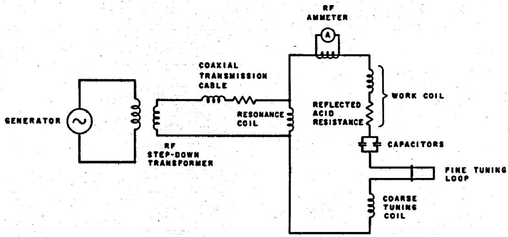

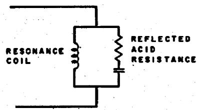  
EQUIVALENT CIRCUIT   
Fig. 1. Electrical Diagram for Induction Heating Experiments.

of the input in order to not exceed the voltage ratings of the coaxial transmission cables. The coaxial cables (Model T-20-D and Model T-10-D made by L. C. Miller Company) are connected in series and allow transmission of power to a point about 30 ft from the generator. During the current report period, the 10-ft segment (Model T-10-D) of the cable was replaced with a 5-ft-long coaxial conductor. This conductor was made of 3/8-in.-diam copper tubing enclosed within 1/2-in.-diam polyethylene tubing, which was, in turn, placed inside 3/4-in.-diam copper tubing. The new section of the transmission line operated satisfactorily.

In order to obtain a high current through the induction coil and to minimize the current in the coaxial cable, additional inductances and capacitances were incorporated into the circuit with the induction coil to form a parallel RLC resonant circuit. Two capacitors (General Electric, Cat. No. 19F234), each having a capacitance of $0.0105\mu \mathrm{F}$ , were used. These capacitors were rated for a maximum current of 196 A at $540\mathrm{kHz}$ and a maximum voltage of $5500\mathrm{V}$ . For the induction heating coils tested, it was possible to achieve conditions near resonance by substituting coils of different sizes for the resonance and coarse-tuning coils (see Fig. 1). Resonance was then approached more closely by adjusting the slide-bar on the fine-tuning loop. It was not possible to obtain precisely resonant conditions because the operating frequency of the generator was affected by each tuning adjustment. However, with the circuit adjusted as close to resonance as possible, we were able to drive up to 250 A through one induction coil (Coil III) with a current of only 190 A in the coaxial cable. When the resonant circuit was not used and the coaxial cable was connected directly to the induction coil leads, we could drive only about 160 A through the induction coil.

# 2.2 Experimental Results

To date, 29 runs have been made with the continuous fluorinator simulation to determine heat generation rates in the nitric acid, in the pipe surrounding the acid, and in the four induction coils. Each induction coil had a length of 5 ft and an inside diameter of 5.6 in.,

and was made of a number of smaller coil sections connected in parallel electrically. The characteristics of the individual induction coil designs are shown in Table 1. Coil IV was chosen as the best design because it produced the highest heat generation rate in the nitric acid for a given current in the induction coil.

Table 1. Characteristics of Coils Tested in Continuous Fluorinator Simulation   

<table><tr><td>Coil</td><td>Material</td><td>No. of Small Sections</td><td>Coil Conductor Diameter (in.)</td><td>Length of Small Section (in.)</td><td>No. of Turns in Small Section</td><td>Adjacent Sections Wound</td></tr><tr><td>I</td><td>Monel</td><td>17</td><td>1/4</td><td>3</td><td>6-1/4</td><td>Opposing</td></tr><tr><td>II</td><td>Stainless Steel</td><td>18</td><td>3/8</td><td>3</td><td>6</td><td>Assisting</td></tr><tr><td>III</td><td>Stainless Steel</td><td>18</td><td>3/8</td><td>3</td><td>6</td><td>Opposing</td></tr><tr><td>IV</td><td>Copper</td><td>10</td><td>1/4</td><td>4</td><td>11-3/4</td><td>Opposing</td></tr></table>

Table 2 gives the experimentally determined heat generation rates in the acid, coil, and simulated vessel wall, along with the run conditions. Coil currents ranging from 100 to 250 A and oscillator frequencies ranging from 390 to $426\mathrm{kHz}$ were used in these experiments. Heat generation rates as high as 1559 W were developed in the acid.

The experimentally determined heat generation rates were used to calculate correction factors for use with design equations that were derived for induction coils having idealized geometries. The design equations, which define these correction factors, are listed below. The rate of heat generation in liquid inside an induction coil is given by the relation

$$
P _ {\ell} = k \left\{0. 3 8 1 8 \left(\frac {n I _ {\mathrm {T O T}}}{N}\right) ^ {2} \left(\frac {a}{p _ {\ell}}\right) ^ {4} \frac {L}{g _ {\ell}} \right\}, \tag {1}
$$

Table 2. Results of Heat Generation Measurements   

<table><tr><td rowspan="2">Run No.</td><td rowspan="2">Coil</td><td rowspan="2">Average Acid Temp. (°C)</td><td rowspan="2">Total Coil Current (A)</td><td rowspan="2">Oscillator Freq. (kHz)</td><td rowspan="2">Gas Holdup</td><td colspan="3">Heat Generation Rate (W)</td></tr><tr><td>Acid</td><td>Pipe</td><td>Coil</td></tr><tr><td>CFS-1</td><td>I</td><td>24.1</td><td></td><td>412</td><td>0</td><td>242</td><td>140</td><td></td></tr><tr><td>2</td><td>I</td><td>24.6</td><td>130</td><td>412</td><td>0</td><td>409</td><td>167</td><td></td></tr><tr><td>3</td><td>I</td><td>26.5</td><td>150</td><td>412</td><td>0</td><td>316</td><td>279</td><td>1442</td></tr><tr><td>4</td><td>I</td><td>25.6</td><td>100</td><td>412</td><td>0</td><td>141</td><td>116</td><td></td></tr><tr><td></td><td></td><td>28.1</td><td>150</td><td>412</td><td>0</td><td>378</td><td>263</td><td></td></tr><tr><td></td><td></td><td>29.1</td><td>150</td><td>412</td><td>0</td><td>383</td><td>309</td><td></td></tr><tr><td>5</td><td>I</td><td>26.7</td><td>160</td><td>412</td><td>0</td><td>448</td><td>308</td><td></td></tr><tr><td>6</td><td>I</td><td>46.5</td><td>150</td><td>412</td><td>0</td><td>393</td><td>282</td><td></td></tr><tr><td>7</td><td>I</td><td>28.9</td><td>150</td><td>412</td><td>0</td><td>377</td><td>273</td><td>1356</td></tr><tr><td></td><td></td><td>26.6</td><td>120</td><td>412</td><td>0</td><td>235</td><td>178</td><td>870</td></tr><tr><td>8</td><td>I</td><td>51.4</td><td>150</td><td>412</td><td>0</td><td>402</td><td>275</td><td>1442</td></tr><tr><td>9</td><td>II</td><td>21.9</td><td>140</td><td>402</td><td>0</td><td>201</td><td>128</td><td>1179</td></tr><tr><td>10</td><td>II</td><td>19.6</td><td>165</td><td>393</td><td>0</td><td>195</td><td>206</td><td>1327</td></tr><tr><td></td><td></td><td>20.3</td><td>189</td><td>390</td><td>0</td><td>227</td><td>253</td><td>1094</td></tr><tr><td>11</td><td>II</td><td>17.4</td><td>200</td><td>400</td><td>0</td><td>207</td><td>304</td><td>1946</td></tr><tr><td>12</td><td>II</td><td>19.3</td><td>200</td><td>422</td><td>0</td><td>370</td><td>313</td><td>2335</td></tr><tr><td>13</td><td>II</td><td>18.5</td><td>160</td><td>422.5</td><td>0</td><td>&gt;250</td><td>201</td><td>1253</td></tr><tr><td></td><td></td><td></td><td>160</td><td>422.5</td><td>0</td><td></td><td></td><td>1282</td></tr><tr><td></td><td></td><td>21.3</td><td>200</td><td>422.5</td><td>0</td><td>&gt;466</td><td>338</td><td>2061</td></tr><tr><td></td><td></td><td></td><td>200</td><td>422.5</td><td>0</td><td></td><td></td><td>2083</td></tr><tr><td></td><td></td><td></td><td>200</td><td>422.5</td><td>0</td><td></td><td></td><td>1946</td></tr><tr><td>14</td><td>II</td><td>14.9</td><td>150</td><td>402,3</td><td>0</td><td>215</td><td>166</td><td>1150</td></tr><tr><td>15</td><td>III</td><td>15.7</td><td>149</td><td>402.3</td><td>0</td><td>370</td><td>220</td><td></td></tr><tr><td>16</td><td>III</td><td>18.5</td><td>150</td><td>402.8</td><td>0</td><td>360</td><td>318</td><td>1374</td></tr><tr><td>17</td><td>III</td><td>18.5</td><td>150</td><td>402.8</td><td>0.130</td><td>365</td><td>254</td><td>1408</td></tr><tr><td>18</td><td>III</td><td>19.3</td><td>150</td><td>403.8</td><td>0.171</td><td>325</td><td>235</td><td>1202</td></tr><tr><td>19</td><td>III</td><td>19.0</td><td>150</td><td>402.8</td><td>0.180</td><td>304</td><td>188</td><td>1099</td></tr><tr><td>20</td><td>III</td><td>19.0</td><td>149</td><td>402.8</td><td>0</td><td>412</td><td>186</td><td>1030</td></tr><tr><td>21</td><td>III</td><td>20.0</td><td>149</td><td>402.8</td><td>0</td><td>382</td><td>204</td><td>1195</td></tr><tr><td>22</td><td>III</td><td>22.2</td><td>250</td><td>424.8</td><td>0</td><td>1134</td><td>626</td><td>3606</td></tr><tr><td>23</td><td>III</td><td>20.9</td><td>250</td><td>426.1</td><td>0.17</td><td>976</td><td>688</td><td>3366</td></tr><tr><td>24</td><td>III</td><td>24.9</td><td>249</td><td>425.8</td><td>0.107</td><td>1159</td><td>599</td><td>3457</td></tr><tr><td>25</td><td>III</td><td>25.3</td><td>252</td><td>426.0</td><td>0.106</td><td>1292</td><td>976</td><td>3617</td></tr><tr><td>26</td><td>III</td><td>24.8</td><td>241</td><td>425.9</td><td>0</td><td>1243</td><td>533</td><td>3434</td></tr><tr><td>27</td><td>III</td><td>23.3</td><td>241</td><td>425.3</td><td>0.167</td><td>1080</td><td>601</td><td>3228</td></tr><tr><td>28</td><td>IV</td><td>29.7</td><td>115</td><td>416.6</td><td>0</td><td>1559</td><td>530</td><td>962</td></tr><tr><td>29</td><td>IV</td><td>27.2</td><td>119</td><td>442.1</td><td>0.164</td><td>1378</td><td>560</td><td>962</td></tr></table>

where

$$
\begin{array}{l} P _ {l} = \text {h e a t g e n e r a t i o n r a t e i n l i q u i d}, W, \\ n = \text {a v e r a g e n u m b e r o f t u r n s p e r m e t e r o v e r l e n g t h o f c o i l ,} m ^ {- 1}, \\ N = \text {n u m b e r o f s m a l l c o i l s e c t i o n s}, \\ a = \text {r a d i u s} m, \\ L = \text {l e n g t h o f c o i l}, m, \\ \end{array}
$$

$$
\begin{array}{l} p _ {k} = \left(2 \pi f g _ {k} u _ {k}\right) ^ {- 1 / 2}, \\ f = f r e q u e n c y, H z, \\ \end{array}
$$

$$
\begin{array}{l} g _ {\ell} = \text {s p e c i f i c c o n d u c t i v i t y o f l i q u i d}, \Omega^ {- 1} m ^ {- 1}, \\ \mu_ {\xi} = \text {m a g n e t i c p e r m e a b i l i t y o f t h e l i q u i d , N A} ^ {- 2}, \\ I _ {T O T} = \text {t o t a l c o i l c u r r e n t (r m s)}, A, \\ k = \text {c o r r e c t i o n} \\ \end{array}
$$

Equation (1) is based on an approximate relation for the rate of heat generation in an infinitely long cylinder positioned inside an infinitely long induction coil, and is valid for $(\mathrm{a} / \mathrm{p}_{\ell}) \leq 1.4$ .

The rate at which heat is generated in the pipe surrounding the coil is given by the relation

$$
P _ {p} = k _ {p} \left\{\sqrt {2} \pi \left(\frac {n I _ {\mathrm {T O T}}}{N}\right) ^ {2} \left(\frac {a _ {p}}{P _ {p}}\right) \frac {L}{g _ {p}} \right\}, \tag {2}
$$

where

$$
\begin{array}{l} P _ {n} = \text {h e a t g e n e r a t i o n r a t e i n p i e}, W, \\ g _ {p} ^ {P} = \text {s p e c i f i c c o n d u c t i v i t y o f p i e}, \Omega^ {- 1} m ^ {- 1}, \\ a _ {n} = \text {i n s i d e r a d i u s o f p i e} \\ p _ {p} ^ {P} = (2 \pi f g _ {p} \mu_ {p}) ^ {- 1 / 2}, \\ \mu_ {p} = \text {m a g n e t i c p e r m e a b i l i t y o f p i e}, N A ^ {- 2}, \\ k _ {p} = \text {c o r r e c t i o n f a c t o r , d i m e n s i o n l e s s}, \\ \end{array}
$$

and $\mathbf{I}_{\mathrm{TOT}}$ , n, N, L, and f are defined above. Equation (2) is valid only for $(\frac{\mathbf{a}}{\mathbf{p}} / \frac{\mathbf{p}}{\mathbf{p}}) > 10$ .

The rate at which heat is generated in the induction coil is given by the relation

$$
P _ {c} = K _ {1} \frac {b N _ {T} ^ {2}}{N _ {s}} \left(\frac {f _ {1} \rho_ {c}}{d _ {c} t _ {c}}\right) ^ {1 / 2} I _ {\text {T O T L}} ^ {2}, \tag {3}
$$

where

$P_{c} =$ heat generation rate in coil, W.

$\mathbf{b} =$ inside diameter of coil, m,

$\mathbf{d}_{\mathbf{c}} =$ conductor diameter, m,

$\ell_{c} =$ length of small coil section, m,

$\mathbf{N}_{\mathbf{T}} =$ number of turns in small coil section,

$N_{s} =$ number of small coilsections,

$\rho_{c} =$ specific resistivity of coil metal, $\Omega -m,$

$f_{1} = \text{frequency, kHz}$

$K_{1} = \text{proportionality constant,} (\Omega / \mathrm{kHz} \cdot \mathrm{m}^{3})^{1/2}$ ,

and $\mathbf{I}_{\mathrm{TOT}}$ and $\mathbf{L}$ are defined above.

The effect of bubbles in the nitric acid on the heat generation rate was investigated with coils III and IV. Eight runs were made with air flow rates up to 2.16 scfm, which produced bubble volume fractions in the acid as high as $18\%$ . In the range of bubble volume fractions examined, the value of the correction factor $\mathbf{k}$ , defined by Eq. (1), varied approximately linearly with the bubble volume fraction as shown in Fig. 2; this variation can be represented by the relation

$$
\mathrm {k} = \mathrm {k} _ {0} (1 - 1. 0 7 9 \varepsilon), \tag {4}
$$

where

$\mathbf{k} =$ correction factor, defined by Eq. (1),

$\mathbf{k}_0 = \mathrm{constant}$

$\varepsilon =$ bubble volume fraction.

The effect of bubbles in the liquid on the rate of heat generation is slight, as would be expected if the bubbles remained near the center of the liquid zone.

Values for $\mathbf{k}_0, \mathbf{k}_p$ , and $\mathbf{K}_1$ , defined by Eqs. (4), (2), and (3), respectively, were determined for the four induction coils tested (see Table 3). The values of the constants for coil II are smaller than the corresponding constants for the other coils; the largest relative variation occurs in the values of $\mathbf{k}_0$ , which is proportional to the heat generation rate in the liquid. The low heat generation rate with this induction

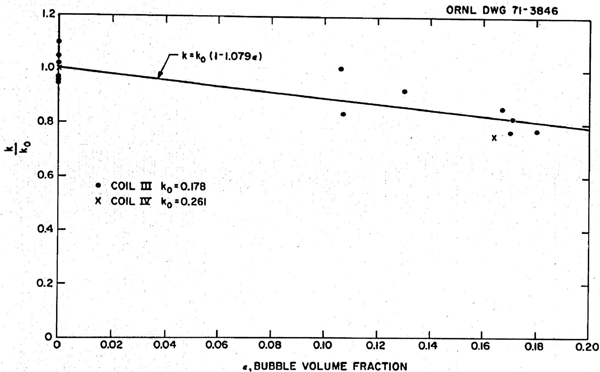  
Fig. 2. Effect of Bubble Volume Fraction on Correction Coefficient for Calculating Heat Generation Rate in Nitric Acid.

Table 3. Correction Factors for Heat Generation Rate Equations   

<table><tr><td>Coil</td><td>k0</td><td>kp</td><td>K1 = (Ω/kHz·m3)1/2</td></tr><tr><td>I</td><td>0.130</td><td>0.624</td><td>1.915 x 10-9</td></tr><tr><td>II</td><td>0.089</td><td>0.447</td><td>1.755 x 10-9</td></tr><tr><td>III</td><td>0.178</td><td>0.623</td><td>1.885 x 10-9</td></tr><tr><td>IV</td><td>0.261</td><td>0.586</td><td>2.15 x 10-9</td></tr></table>

coil design is apparently the result of having all of the small coil sections wound in the same direction since the remaining characteristics of the coil are similar to those for the other coils. Coil II would require the largest current in order to produce a given heat generation rate in molten salt; however, it might have a high efficiency for heating the salt if the diameter of the molten region were sufficiently large.

The value of $\mathbf{k}_0$ for coil I was smaller than that for coil III, although the two coils have essentially the same design and comparable values were observed for the other constants. This variation in $\mathbf{k}_0$ values is probably due to changes in experimental technique and operating conditions incorporated after tests with coil I were carried out. The new technique consisted in using alcohol-in-glass thermometers to measure the acid temperatures, since the temperatures indicated by thermocouples used in the runs with coil I were affected to some extent by the rf power generation. Also, the coil designs tested after coil I resulted in higher heat generation rates in the acid which, in turn, led to smaller relative errors in the measured heat generation rates in the acid,

The difference between the $\mathbf{k}_0$ value for coil IV and the $\mathbf{k}_0$ values for coils I and II is probably due, in large part, to the different spacing of the small coil sections. Coil IV had 4-in.-long small coil sections, with 11.7 turns in each section (see Table 1), and the sections were separated by a space of 2 in. in which turns were not present.

The smaller sections in the other three coils were placed closer together so that the coil turns were spaced uniformly over the length of the acid column; the total number of turns was about the same for each coil. In the case of coils I and III this spacing compressed the magnetic field between each of the small coil sections, thereby effecting a decrease in the axial component of the field. It is the axial component that provides the proper eddy currents for heat generation.

Although any one of the four coils could be used to generate heat in the proposed fluorinator, coil IV would require the lowest coil current to produce the required heating and, for this reason, would be the most desirable. Calculations have shown that, for a 5-in.-diam molten-salt zone, a 5.56-in.-ID coil made from $1/4$ -in. nickel tubing (using a coil IV design in which each small section has 9.5 turns over a 3.75-in. length, with a 2.25-in. space between small sections), and a 6-9/16-in.-ID nickel fluorinator vessel, an efficiency of heating the salt (with no bubbles) of about $49\%$ would be achieved with a total current of less than 150 A. With coil III, the efficiency of heating the salt would be about $58\%$ , but a coil current of 267 A would be required.

# 3. SEMICONTINUOUS REDUCTIVE EXTRACTION EXPERIMENTS IN A MILD-STEEL FACILITY

B. A. Hannaford C. W. Kee L. E. McNeese

We have continued operation of a facility in which semicontinuous reductive extraction experiments can be carried out in a mild-steel system.4 Initial work with the facility was directed toward obtaining data on the hydrodynamics of the countercurrent flow of molten salt and bismuth in a 0.82-in.-ID, 24-in.-long column packed with $1/4$ -in. molybdenum Raschig rings. We were able to show that flooding data obtained with this column are in agreement with predictions from a correlation based on studies of the countercurrent flow of mercury and aqueous solutions in packed columns. We have carried out several experiments for determining the mass transfer performance of the packed column in which a salt stream containing $\mathrm{UF}_4$ was countercurrently contacted with bismuth containing reductant over a range of operating conditions.6,7 It was found that the rate of uranium transfer to the bismuth was controlled by the diffusive resistance in the salt film under conditions such that the concentration of reductant in the bismuth remained high throughout the column. The extraction data could be correlated in terms of the height of an overall transfer unit based on the salt phase. In order to measure mass transfer rates under more closely controlled conditions where the controlling resistance is not in the salt phase, preparations were begun for experiments in which the rate of exchange of zirconium isotopes will be measured between salt and bismuth phases otherwise at chemical equilibrium. Difficulty was encountered at the beginning of the first run of this type because of a salt leak in the vicinity of the salt feed-and-catch vessel.8

# 3.1 Replacement of the Salt Feed-and-Catch Tank

A new salt feed-and-catch tank of the initial design was fabricated and installed in the system. Thermal insulation was removed from all transfer lines to allow their inspection, and lines that were more than

moderately oxidized were replaced. The salt transfer line from the feed tank to the salt jack-leg was rerouted to a point ll in. higher than in the original design in order to improve control of the salt feed rate and to prevent the backflow of bismuth into the salt feed tank during column upsets.

After its installation, the new salt feed-and-catch tank was stress relieved by the same technique used for the original feed-and-catch tanks; that is, the rate of heating to the operating temperature $(650^{\circ}\mathrm{C})$ was maintained at less than $60^{\circ}\mathrm{C/hr}$ . The bismuth feed-and-catch tank, which had been allowed to cool during the time required to fabricate and install the new salt tank, was heated to the operating temperature $(550^{\circ}\mathrm{C})$ at the same controlled rate. Both the salt and bismuth feed-and-catch tanks were subjected to a pressure-proof test at the operating temperature after frozen bismuth seals had been established in the freeze valves in order to isolate the feed tanks (rated at 50 psig) from the receiver tanks (rated at 25 psig). After the pressure tests had been successfully completed, the salt feed-and-catch tank and the newly installed salt-transfer lines were contacted with a hydrogen stream for 13 hr at $600^{\circ}\mathrm{C}$ in order to remove accumulations of iron oxide from the internal surfaces of the system.

# 3.2 Preparation for Mass Transfer Experiment ZTR-1

After the system had been treated with hydrogen for removal of most of the iron oxide, it was necessary to (1) add reductant to the bismuth phase, (2) increase the salt inventory in the system to about 20 liters, and (3) circulate the salt and bismuth phases through the system in order to remove impurities that might have been introduced during the maintenance operations. It was also necessary to increase the zirconium inventory in the system, to remove impurities from the salt phase by hydrofluorination, and finally, to add a sufficient amount of reductant to the bismuth phase to produce a zirconium distribution ratio of about 1. These operations are discussed in the remainder of this section.

A 103-g quantity of thorium was suspended in the bismuth phase in the treatment vessel in a perforated container as described earlier7 in

order to increase the reductant concentration in the bismuth to about 0.002 equiv per g-mole of bismuth. During dissolution of the thorium, the treatment vessel was held at $650^{\circ}\mathrm{C}$ , and argon was fed to the draft tube in the vessel at the rate of 2.5 std ft $^3$ /hr. Only 5 g of thorium remained undissolved after a period of 41 hr; analyses of bismuth samples for uranium and thorium showed that about $80\%$ of the thorium had dissolved during the first 24 hr. About 18 liters of salt (72-16-12 mole $\%$ LiF-BeF $_2$ -ThF $_4$ ) was then charged to the treatment vessel in order to replace salt that had been discarded when the original salt feed-and-catch tank was replaced. The salt and bismuth phases were equilibrated in the treatment vessel for about 20 hr before they were transferred to their respective feed tanks. Bismuth and salt were then circulated through the system in order to complete the removal of oxides that had not been removed from the internal surfaces of the system after the previous treatment with hydrogen. In addition, column pressure drop measurements were made during a period when only salt was flowing through the column. The observed pressure drop was about 2 in. H $_2$ O at the salt flow rate of 70 ml/min, which is in agreement with data obtained soon after the column was installed. It was concluded that the flow characteristics of the column had not changed during runs made to date.

The zirconium mass transfer experiments require that a significant quantity of zirconium be present in the salt and bismuth phases to ensure that only a negligible change will occur in the zirconium distribution ratio during the transfer of $^{97}\mathrm{Zr}$ tracer from the salt to the bismuth phase. A 5.2-g quantity of Zircaloy-2 was dissolved in the bismuth to increase the zirconium inventory of the system to about 15 g.

The salt and bismuth were then contacted in the treatment vessel with a $30\%$ HF--hydrogen stream having a flow rate of about 16 std ft³/hr at $650^{\circ}\mathrm{C}$ in order to remove oxide (from the salt) that might have accumulated during the previous transfer of the salt and bismuth through the facility. Treatment of the salt and bismuth with the $\mathrm{HF - H_2}$ stream was interrupted after about 2 hr by a restriction caused by deposition of material on the sintered-Monel filter in the off-gas stream from the treatment vessel. The filter, which has an external surface area of

about 20 in. $^{2}$ , is used for removing particulates which would otherwise cause restrictions in valve ports in the off-gas system. The filter was removed and replaced by a 4-in.-diam, 8-in.-long cylinder of compacted copper mesh. Analyses of the black solids removed from the Monel filter showed that the material consisted primarily of carbon, along with substantial amounts of thorium, uranium, and lithium. After the treatment with $\mathrm{HF - H_2}$ , the salt and bismuth were contacted with argon at about 3 std ft $^{3}$ /hr for a 20-hr period in order to remove HF from the salt. The bismuth and salt were subsequently sampled, and a perforated basket containing 48 g of thorium metal was suspended in the bismuth phase. After a period of 66 hr at a temperature of about $620^{\circ}\mathrm{C}$ , only 25 g of the thorium had dissolved. In order to add reductant to the bismuth phase more rapidly, 240 g of Li-Bi alloy containing 1.75 wt % lithium was added to the treatment vessel. The total quantity of reductant added during these periods was about 1 g-equiv. The resulting zirconium distribution ratio should have been about 5 if it is assumed that all of the added reductant was present in the bismuth as uranium, zirconium, thorium, and lithium. However, the results of experiment ZTR-1, described in the following section, indicate that this assumption is not valid.

# 3.3 Mass Transfer Experiment ZTR-1

At the conclusion of a 22-hr equilibration period which followed the final addition of reductant to the treatment vessel, the salt was transferred to the salt feed tank. The transfer of bismuth from the treatment vessel was only about $50\%$ complete when a failure of the transfer line inside the vessel at the weld which joins the molybdenum tubing to the mild-steel transfer line made it necessary to cease this operation. The affected portion of the transfer line was replaced at a later date; however, the intended duration of experiment ZTR-1 was reduced in order that the run could be carried out with the smaller amount of bismuth that was available in the bismuth feed tank.

A 6.7-mg quantity of $96\mathrm{ZrO}_2$ that had been irradiated for 12 hr at a thermal neutron flux of about 2 x $10^{14}$ neutrons cm $^{-2}$ sec $^{-1}$ was

transferred to a 0.75-in.-diam steel capsule after an 18-hr decay period to facilitate addition of the $^{97}\mathrm{Zr}$ tracer to the salt phase. Periodic salt samples taken after immersion of the capsule indicated that mixing of the tracer with the salt phase was complete after 2 hr. In order to verify that most of the tracer had entered the salt phase, the steel addition capsule was counted for $^{97}\mathrm{Zr}$ activity. The counting results for the bulk salt and for the capsule showed that greater than $99\%$ of the tracer had been transferred to the salt phase.

The volumetric flow rates for bismuth and salt during experiment ZTR-1 were 216 and $99\mathrm{ml / min}$ respectively; these values are equivalent to about $90\%$ of the combined column flow capacity at flooding. Seven sets of flowing stream samples were taken over a 29-min period. Counting of the $^{97}\mathrm{Nb - }^{97}\mathrm{Zr}$ activities in the samples showed that no measurable transfer of $^{97}\mathrm{Zr}$ tracer from the salt to the bismuth phase had occurred during the experiment. It was later found that the lack of transfer was due to an unexpectedly low distribution coefficient for zirconium, which resulted in essentially no zirconium being present in the bismuth phase. Wet-chemical analyses of post-run, equilibrated samples for lithium and uranium implied a zirconium distribution coefficient value of about 0.001. A more precise value (0.023) was obtained by counting the samples for $^{97}\mathrm{Nb - }^{97}\mathrm{Zr}$ activity. It was concluded that essentially all of the reductant that had been added to the system had been consumed by one or more side reactions, for example, the reduction of $\mathrm{FeF}_2$ in the salt phase to metallic iron, or the reaction of reductant with HF that was desorbed from the graphite crucible. It is also possible that a fraction of the lithium in the Li-Bi alloy reacted with air or water vapor during its addition to the treatment vessel.

# 3.4 Variation of Reductant Inventory in the Bismuth Phase in the Treatment Vessel

During this report period, we observed a considerably greater variation in the reductant inventory in the bismuth phase in the treatment vessel than had been expected; consequently, we have begun to give additional attention to this subject. Reductant can be removed from the

bismuth phase by a number of side reactions, including: (1) reaction of reductant with materials in the salt phase such as $\mathsf{FeF}_2$ , HF, or oxygen-containing compounds; and (2) reaction of reduced metals (uranium, thorium, zirconium) with the graphite crucible in the treatment vessel. Information related to the variation of reductant inventory in the bismuth phase, as well as the inventory of uranium in the system, will be reported here and in future reports covering work in this experimental facility so that the phenomena responsible for the observed effects can be identified.

Data on the variation of inventories of reductant, uranium, and zirconium during this report period are summarized in Table 4. At the beginning of the period, the treatment vessel contained 17.7 liters of bismuth and 1.4 liters of salt (72-16-12 mole % LiF-BeF $_2$ -ThF $_4$ ). After a 118-day period in which the salt and bismuth were held in the treatment vessel, the reductant inventory in the bismuth had decreased from 0.80 g-equiv to 0.058 g-equiv. The average rate of decrease in reductant concentration during this period this period was 0.26 meq/hr. The addition of 1.69 g-equiv of thorium metal to the bismuth phase resulted in approximately the expected change in the reductant concentration in the bismuth based on uranium and zirconium analyses. Following the addition of salt to the system to increase the salt volume to about 21.5 liters, samples taken from the treatment vessel showed that the reductant inventory had decreased slightly to 1.33 g-equiv; a decrease was expected because of the probability of introducing small amounts of oxidants during the addition of salt to the system. Subsequently, the salt and bismuth phases were circulated through the system (run HR-13) in order to remove oxides which may have been introduced during the installation of new carbon steel lines and equipment. Analyses of bismuth samples showed that about half of the reductant was removed from the bismuth during this operation. Next, zirconium metal (0.23 g-equiv) was dissolved in the bismuth phase in order to achieve the desired zirconium inventory in the system. Following this addition, the salt and bismuth were contacted with an HF- $\mathsf{H}_2$ mixture. At this point, the salt phase should have contained all of the uranium and

Table 4. Summary of Reductant, Uranium, and Zirconium Inventory Data for Treatment Vessel   

<table><tr><td rowspan="2">Operation Sequence</td><td colspan="3">Salt Phase</td><td colspan="4">Bismuth Phase</td><td colspan="2">Combined Phases</td></tr><tr><td>Total Salt Wt (g)</td><td>Uranium Inventory (g-equiv)</td><td>Zirconium Inventory (g-equiv)</td><td>Total Bi Wt (g)</td><td>Uranium Inventory (g-equiv)</td><td>Zirconium Inventory (g-equiv)</td><td>Total Reductanta (U, Zr, Th, Li) (g-equiv)</td><td>Uranium (g-equiv)</td><td>Zirconium (g-equiv)</td></tr><tr><td>1. Material remaining in treatment vessel at time of salt feed tank failure</td><td>4,760</td><td>0.152</td><td>0.0313</td><td>171,200</td><td>0.601</td><td>0.10</td><td>0.80</td><td>0.753</td><td>0.13</td></tr><tr><td>2. Following 118-day equilibration period</td><td>4,760</td><td>0.702a</td><td>0.13a</td><td>171,200</td><td>0.058</td><td>~0a</td><td>0.058</td><td>0.76a</td><td>0.13a</td></tr><tr><td>3. Following addition of 1.69 g-equiv of Th reductant</td><td>4,760</td><td>0.003a</td><td>~0a</td><td>171,200</td><td>0.757</td><td>0.16</td><td>1.65</td><td>0.76</td><td>0.16</td></tr><tr><td>4. Following addition of 67,800 g of LiF-BeF2-ThF4(72-16-12 mole%) containing 0.114 equiv of Zr</td><td>72,560</td><td>0.061</td><td>0.007a</td><td>171,200</td><td>0.700</td><td>0.24a</td><td>1.33</td><td>0.760</td><td>0.24a</td></tr><tr><td>5. Following equilibration run HR-13</td><td>63,670</td><td>0.337</td><td>0.092a</td><td>168,250</td><td>0.435</td><td>0.152a</td><td>0.74</td><td>0.772</td><td>0.24a</td></tr><tr><td>6. Following addition of 0.23 g-equiv of Zr and HF-H2treatment</td><td>63,670</td><td>0.76b</td><td>0.47a</td><td>168,250</td><td>~0a</td><td>~0a</td><td>~0</td><td>0.76a</td><td>0.47a</td></tr><tr><td>7. Following addition of 1.04 g-equiv of (Th + Li) reductant</td><td>63,670</td><td>0.76b</td><td>0.47a</td><td>168,250</td><td>~0a</td><td>~0a</td><td>~0</td><td>0.763</td><td>0.47a</td></tr><tr><td>8. Following tracer experiment ZTR-1</td><td>63,670</td><td>0.72</td><td>0.62</td><td>168,250</td><td>&lt;0.003</td><td>~0a</td><td>~0</td><td>0.72</td><td>0.62</td></tr></table>

aInferred value based on material balance and/or equilibrium considerations. The best value for uranium inventory was taken to be 0.76 g-equiv.   
bChemical analysis resulted in inventory in one phase equal to 0.76 g-equiv $\pm 4\%$ this value was taken to be the more accurate measure.

zirconium, and samples showed a uranium concentration in the salt that was within about $4\%$ of the expected value. We then added to the bismuth a quantity of reductant (0.43 g-equiv of thorium, 0.61 g-equiv of lithium) theoretically sufficient to produce a zirconium distribution coefficient of about 5, in the absence of reductant-consuming side reactions. However, analyses of bismuth and salt before and after tracer experiment ZTR-1 showed that the reductant had been consumed almost entirely before the experiment was performed, as discussed earlier.

The material balance for uranium throughout the report period was excellent, as shown in Table 4; the zirconium balance was satisfactory in view of the greater difficulty encountered in analyzing samples for zirconium at low concentrations.

# 3.5 Operation of the Argon Purification System

The argon purification system, described earlier, $^{4}$ was modified by the addition of a parallel purification system (Englehard Deoxo Purifiers, Models D and C in series). The purpose of this modification was to evaluate the effectiveness of Englehard units relative to that of the regular purification train, which consists of a bed of molecular sieves followed by a bed of uranium turnings at $650^{\circ}\mathrm{C}$ .

The Delphi trace oxygen analyzer indicated an oxygen concentration of 3.6 ppm in the argon stream leaving the Deoxo units, as compared with a value of 1.6 ppm measured in the argon stream leaving the regular purification train. The comparison was not completely conclusive, however, because of the possibility of slight air inleakage and the possibility of catalyst poisoning in the Deoxo units. The Delphi analyzer had also shown symptoms indicative of silver cathode poisoning, although it had been restored to service by heating the cathode grids to $800^{\circ}\mathrm{C}$ in air to remove suspected surface contamination. Recurring failure of the Delphi analyzer militated against our obtaining a reliable comparison of the two purification systems. Prior to the first evidence of maloperation, the Delphi analyzer indicated that the regular purification system was reducing the oxygen level from about 0.75 ppm in the inlet argon stream to about 0.2 ppm in the outlet stream.

Measurements of the same argon streams showed water contents of $< 0.1 \, \text{ppm}$ ; the concentrations were usually $< 0.01 \, \text{ppm}$ . It was observed, however, that the water concentration indicated by each of the Panametrics probes tended to diminish over a period of many weeks. This suggested that the calibration was shifting downscale with time, since a new probe installed in the same location would generally indicate a significantly higher concentration (i.e., 2 ppm vs 0.01 ppm).

Despite the difficulties experienced in measuring the level of oxygen and water in the purified argon, the concentrations were established to lie within limits which were acceptably low.

# 4. DEVELOPMENT OF THE METAL TRANSFER PROCESS: INSPECTION OF EXPERIMENT MTE-2

E. L. Youngblood L. E. McNeese

It has been found that rare earths distribute selectively into molten LiCl from bismuth solutions containing rare earths and thorium, and an improved rare-earth removal process based on this observation has been devised.9 Work that will demonstrate all phases of the improved rare-earth removal method, which is known as the metal transfer process, is presently under way.

We previously $^{10}$ carried out an engineering experiment (MTE-1) for studying the removal of rare earths from single-fluid MSBR fuel salt by this process. During the experiment, approximately $50\%$ of the lanthanum and $25\%$ of neodymium originally present in the fluoride salt were removed at about the expected rate. Surprisingly, however, the lanthanum and neodymium removed from the fluoride salt did not accumulate in the Li-Bis solution used for removing these materials from LiCl. It is believed that reaction of impurities in the system with the rare earths caused this unexpected behavior.

A second engineering experiment (MTE-2) was recently completed. $^{11,12}$ A brief description of the equipment used for this experiment and the results of an inspection carried out after completion of the experiment are presented in the remainder of this section.

# 4.1 Description of Equipment

Experiment MTE-2 was performed in a vessel constructed of 6-in. sched 40 carbon steel pipe. The outside of the vessel was spray coated with a 20-mil thickness of nickel aluminide for protection against oxidation. The vessel, shown schematically in Fig. 3, was divided into two compartments by a partition (constructed of 1/4-in.-thick carbon steel plate) that extended to within 1/2 in. of the bottom of the vessel. The two compartments were interconnected by a 2-in.-deep pool of bismuth that was saturated with thorium. One compartment contained a 3.6-in.-deep pool of fluoride salt (72-16-12 mole % LiF-BeF $_2$ -ThF $_4$ to which 7 mCi

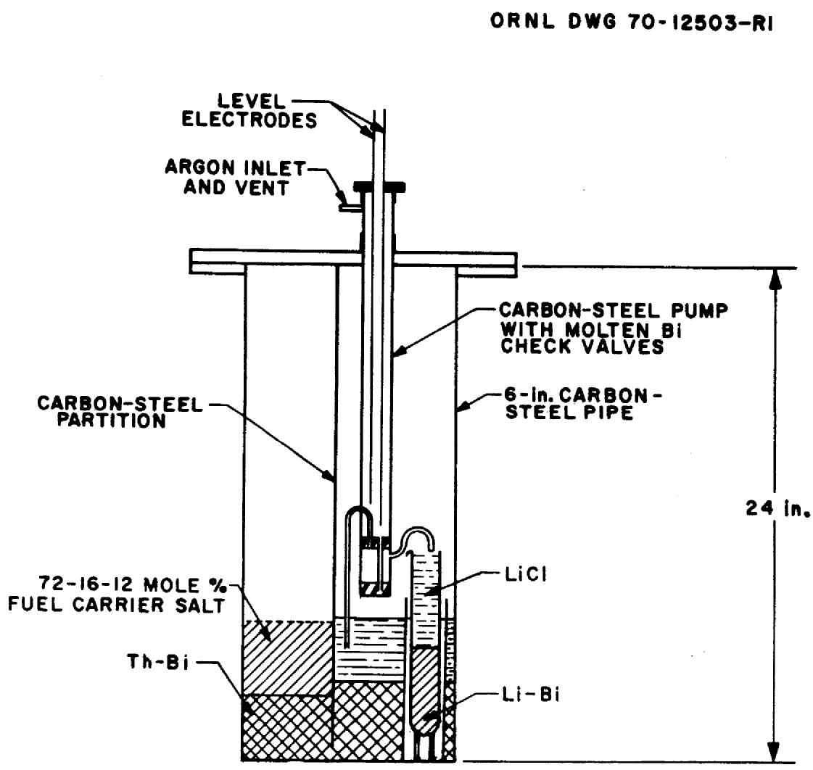  
Fig. 3. Carbon Steel Vessel Used for Metal Transfer Experiment MTE-2.

of $^{147}\mathrm{Nd}$ and sufficient $\mathrm{LaF}_3$ were added to produce a 0.3 mole $\%$ concentration) above the Th-Bi phase. The other compartment contained a 4.2-in.-deep pool of molten LiCl above the Th-Bi phase. The LiCl compartment also contained a cup (1.94 in. in diameter, 8.25 in. high) which was initially filled to a depth of 4 in. with a 35 at. $\%$ Li-Bi solution. The cup was constructed of 0.03l-in.-thick carbon steel sheet metal and was held in place by a holder made of 2-in. sched 40 carbon steel pipe. Alumina spacers were used to electrically insulate the cup from the holder.

During operation, LiCl was circulated through the cup containing the Li-Bi solution via a pump constructed of 1-1/2-in.-diam carbon steel pipe (0.083-in. wall thickness). The pump used molten bismuth as check valves.[9] During the 3.3-month period in which the experiment was in operation, 702 liters of LiCl was circulated through the cup containing the Li-Bi solution. Gas-lift sparge tubes were used in both compartments of the vessel and in the cup containing the Li-Bi solution to improve contact between the salt and metal phases. The sparge tubes were constructed of 1/4-in. carbon steel tubing which was placed inside 3/8-in. tubing as shown in Fig. 4. Thermowells, constructed of 1/4-in.-diam carbon steel tubing, extended into the salt and bismuth phases for temperature measurements. The lower section of the vessel was maintained at the operating temperature (650 to $660^{\circ}\mathrm{C}$ ) by an 8-kW furnace. The upper 6 in. of the vessel was wrapped with a cooling coil through which water was circulated in order to maintain the flange at about $100^{\circ}\mathrm{C}$ .

The equipment performed satisfactorily during operation. At the completion of the experiment, the vessel was cooled to room temperature, with the salt and bismuth phases in place, and was cut apart for inspection.

# 4.2 Inspection of Equipment

The vessel was removed from the furnace and the exterior of the vessel, shown in Fig. 5, was visually inspected. Some blistering and cracking of the 20-mil-thick nickel aluminide coating had occurred during the 2370-hr period that the vessel had been held at about $650^{\circ}\mathrm{C}$ . However,

ORNL DWG 70-898ORI

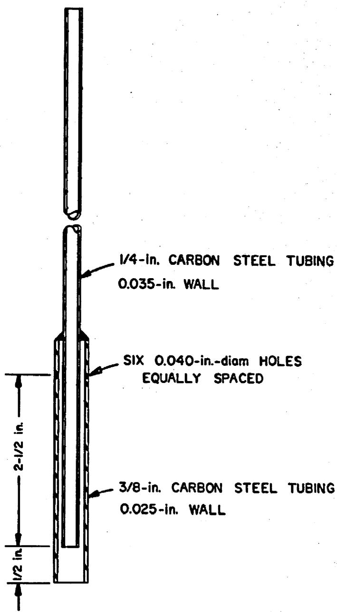  
Fig. 4. Gas-Lift Sparge Tube Used for Metal Transfer Experiment MTE-2.

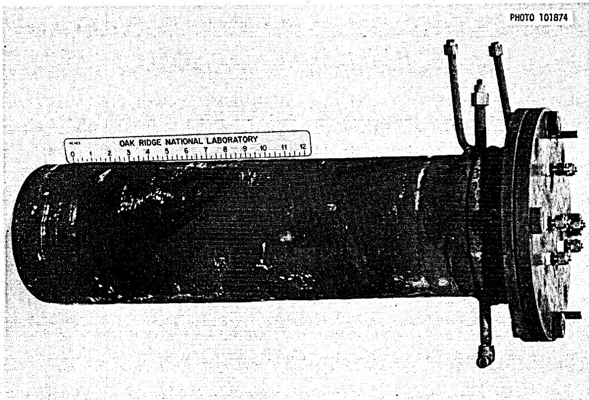  
Fig. 5. Photograph Showing External Air Oxidation of the Exterior of the Carbon Steel Vessel Used for Experiment MTE-2. The exterior of the vessel had been coated with 20 mils of nickel aluminide to retard air oxidation.

the external oxidation that had occurred did not cause difficulty with the experiment.

To facilitate inspection of its interior, the vessel was cut in such a manner that the lower ll in. on each side of the partition could be removed to expose the salt and metal phases. A view of the fluoride compartment is shown in Fig. 6. The fluoride salt and Th-Bi phases appeared to be clean and free from any accumulation of material at the salt-metal interface; however, the vapor region of the fluoride compartment was covered with a black powder having the composition (by weight) of: $2.4\%$ Li, $2.2\%$ Be, $70.2\%$ Bi, $1.1\%$ Th, $0.02\%$ Fe, and $19.9\%$ F. The deposit was greatest (about 1/8 in. thick) in the cooler portions of the compartment near the upper flange. Some of the powder had also discolored the surfaces of the salt that had contacted the vessel wall. The black powder is thought to be a mixture of salt and metallic bismuth that had been entrained into the gas space by the argon sparge.

A view of the LiCl compartment (with some of the LiCl removed) and the Li-Bi container is shown in Fig. 7. The vapor region in the LiCl compartment was covered with a white powder consisting of LiCl containing $0.6 \, \text{wt} \, \%$ Bi. This material is believed to have resulted from vaporization and from entrainment of LiCl and smaller amounts of bismuth in the argon stream fed to the gas spargers. The LiCl and Th-Bi phases appeared to be clean, with no accumulation of impurities at the salt-metal interface as had been seen in metal transfer experiment MTE-1.[2]

There were only two areas in the system where deposits containing unusually high concentrations of rare earths were found. A 1/8-in.-thick layer of gray material (shown in Fig. 8) had deposited on the lip and overflow spout of the Li-Bi container. This deposit had the following composition (by weight): $23\%$ LiCl, $59\%$ Bi, $10\%$ La, and $2\%$ Th. The lanthanum contained in the deposit was equal to 5 to $10\%$ of the lanthanum inventory in the system. The mechanism by which the material was deposited on the rim of the lithium-bismuth cup has not been determined; however, it may have resulted from the Li-Bi solution wetting the container wall and subsequently flowing up it. The lanthanum could then

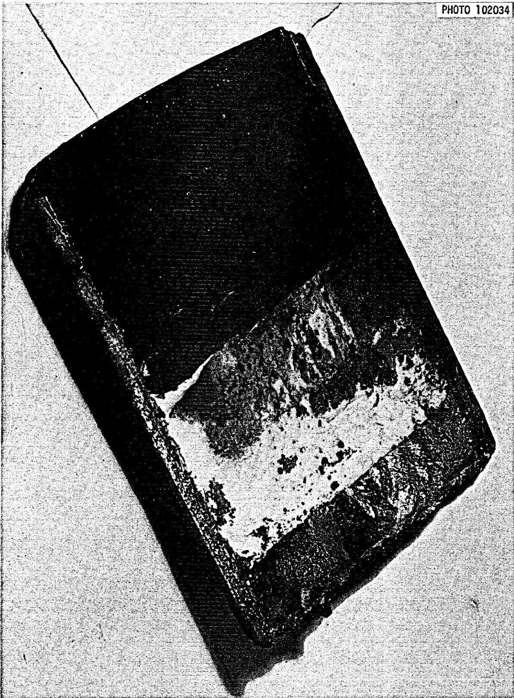  
Fig. 6. Salt and Bismuth Phases from the Fluoride Salt Compartment on Completion of Metal Transfer Experiment MTE-2.

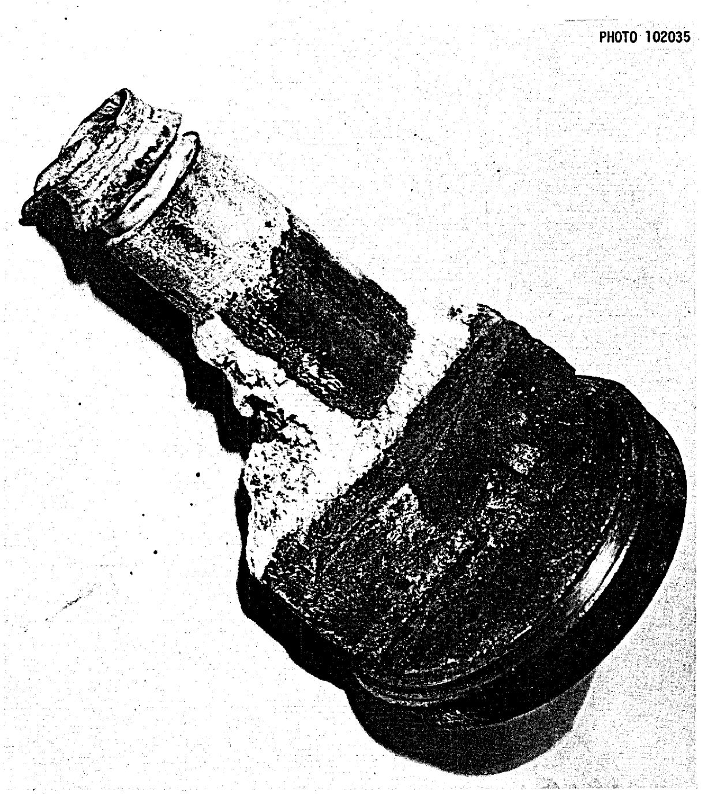  
Fig. 7. View of LiCl Compartment Following Metal Transfer Experiment MTE-2.

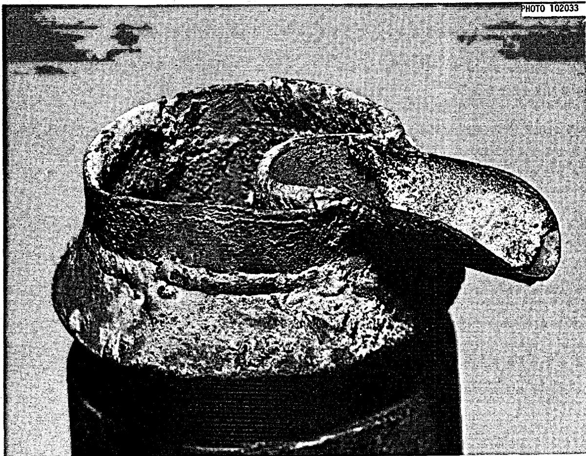  
Fig. 8. View of Upper Section of the Li-Bi Container Showing Metallic Deposit on the Rim After Completion of Metal Transfer Experiment MTE-2.

have been deposited from the LiCl that was in contact with the metal film. The lanthanum concentration in the bottom layer of the Th-Bi solution was approximately eight times higher than that observed in filtered samples taken during the run; however, this does not represent a significant fraction of the total lanthanum in the system. The bottom layer of the Th-Bi phase also contained 20 wt $\%$ thorium and is assumed to have been a mixture of thorium bismuthide particles and bismuth. The higher lanthanum concentration in this material is not surprising since it has been shown previously $^{13}$ that rare earths distribute preferentially to the solid phase via formation of compounds of the type ThLaBi $_y$ .

Inspection of the carbon steel vessel interior revealed little evidence of corrosion, as shown in Figs. 6 and 7. However, some corrosion did occur on the cup that contained the Li-Bi solution, and on thermowells and sparge tubes. All of these items were constructed of thin carbon steel. The corrosion of the Li-Bi cup occurred mainly at the salt-metal interface. A crack and a 5/8-in.-diam hole had developed in the vicinity of the interface and had allowed a portion of the Li-Bi solution to run into the holder. Data from the experiment indicate that the hole had developed after about two months of operation; however, it did not cause serious difficulty since the Li-Bi solution was contained in the holder and did not mix with the other phases in the experiment. The lower portions of the carbon steel sparge tubes and thermowells that were in contact with the salt and bismuth phases during the experiment are shown in Fig. 9. The sparge tubes in both the fluoride salt and the LiCl compartments were severely corroded, particularly in the area near the salt-bismuth interface. The 3/8-in.-diam tubing was absent from the sparge tube that was removed from the fluoride salt compartment. The sparge tube from the Li-Bi vessel and the thermowells were less severely corroded. The corrosion observed on the carbon steel components is thought to be due mainly to mass transfer of iron due to a thermal gradient in the bismuth phase. Iron has a solubility of about 80 ppm in bismuth at $650^{\circ}\mathrm{C},$ and thermal gradients in the experiment could cause iron to be dissolved in hot areas and deposited in cold areas.

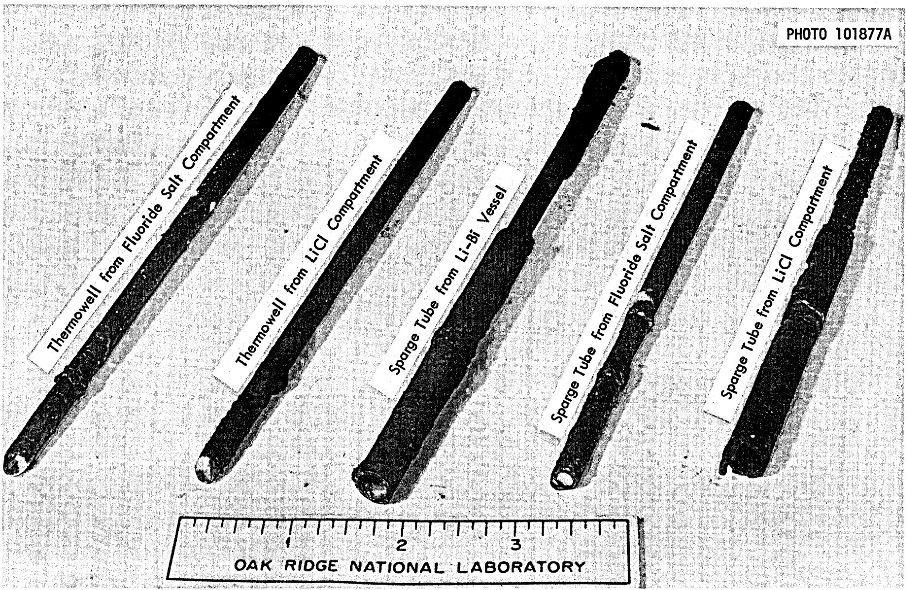  
Fig. 9. Carbon Steel Sparge Tubes and Thermowells Removed After Completion of Metal Transfer Experiment MTE-2.

The carbon steel pump, which used bismuth check valves, was in good condition at the completion of the experiment. Figure 10 shows a view of the lower portion of the pump after it had been sectioned to show the bismuth check valves. Little evidence of corrosion could be found by visual examination of the pump. There was no appreciable loss of bismuth from the check valves by its entrainment in the LiCl during the experiment. The bismuth in the top check valve contained 130 ppm of Li, less than 50 ppm of Th, and less than 20 ppm of La after 702 liters of LiCl had been circulated through the pump.

While carbon steel is not being considered as a material of construction for an MSBR processing plant, it appears to be suitable for use in experiments such as MTE-2, where a limited amount of corrosion is acceptable.

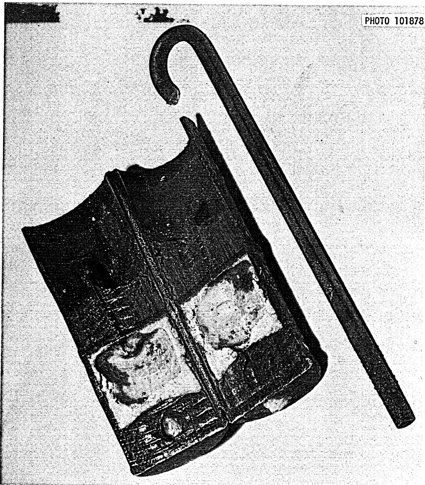  
Fig. 10. Lower Portion of the Carbon Steel Pump Used in Metal Transfer Experiment MTE-2. The pump has been sectioned to show the bismuth check valves.

# 5. DEVELOPMENT OF THE METAL TRANSFER PROCESS: AGITATOR TESTS FOR EXPERIMENT MTE-3

E. L. Youngblood W. F. Schaffer, Jr.

Mechanical agitators will be used to promote contact of the salt and metal phases in metal transfer experiment MTE-3, which is currently being designed and constructed.[15] The shaft seals for the agitators must be capable of operating in a dry argon atmosphere and must have a low leakage rate in order to prevent air and moisture from entering the experiment. Equipment has been constructed in order to test the shaft seal design that is proposed for use in metal transfer experiment MTE-3. The system will also allow us to measure the extent to which bismuth is entrained in salt in a mechanically agitated system and to evaluate a vapor-deposited tungsten coating as a means for protecting carbon steel from corrosion by molten salt and bismuth.

# 5.1 Description of Equipment

Figure 11 shows the test equipment before installation of the electrical heaters and thermal insulation. The agitator drive assembly (shown in Fig. 12) consisted of a $1 - 1 / 4$ -in.-diam stainless steel shaft held in position by two ball bearings that were separated by a distance of $4$ in. After passing through the ball bearings, the shaft diameter was reduced to $1$ in.; the shaft passed through two Bal-Seals (product of Bal-Seal Engineering Co.) before entering the test vessel. The seals were constructed of graphite-impregnated Teflon and were spring-loaded in order to hold the sealing surface against the shaft. The portion of the shaft that was in contact with the seals was plated with chromium and polished to a $10-$ to $12-\mu \mathrm{in}$ . Surface that would produce satisfactory sealing. The region between the two seals was pressurized with argon in order to reduce the rate of air inleakage past the seals. A $4$ -in.-long cooling water jacket was located below the shaft seal as a means of protecting the seals from damage by heat from the lower portion of the system (which operates at $650^{\circ} \mathrm{C}$ ). A thermowell was provided for measuring the temperature in the vicinity of the seals.

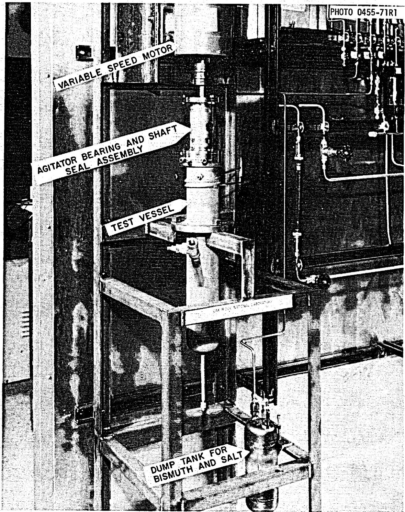  
Fig. 11. Agitator Test System Used for Testing the Shaft Seal Proposed for Use in Metal Transfer Experiment MTE-3.

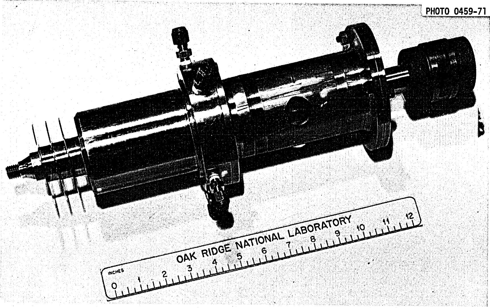  
Fig. 12. Agitator Drive Unit and Seal Assembly.

The agitator used for the test, shown in Fig. 13, was machined from a single bar of molybdenum. The agitator shaft was 12.31 in. long and had a diameter of 0.5 in. Separate blade assemblies were located in the salt and bismuth phases. Each assembly had a diameter of 1.12 in. and a height of 0.5 in.; each blade was 0.13 in. thick. The upper end of the agitator was threaded to facilitate its attachment to the drive unit.

The vessel used to contain the salt and bismuth for the agitator test was constructed of 3-in. sched 80 carbon steel pipe (ASTM A 106 Grade B). A standard pipe cap was used for the bottom of the vessel. The overall length of the vessel was 20.8 in. Four baffles (3 in. long, 1/2 in. wide) were welded to the inside of the vessel beginning at a point 2-1/4 in. above the bottom of the vessel. A 1/4-in. sched 40 pipe was attached to the side of the vessel to allow sampling of the salt and bismuth phases, and a 1/4-in. pipe was attached to the bottom to allow the salt and bismuth to drain from the vessel. The lower 10 in. of the vessel interior was coated with tungsten in order to evaluate the effectiveness of this type of coating for reducing corrosion in systems containing bismuth.

In applying the tungsten coating, the inside of the vessel was first plated with nickel (approximately 1 mil thick) by electrodeposition. The nickel layer was bonded to the vessel by maintaining the vessel in vacuum at $800^{\circ}\mathrm{C}$ for $4\mathrm{hr}$ . Heaters were then installed on the vessel, and the tungsten coating was vapor deposited from a $\mathsf{H}_2\mathsf{-WF}_6$ mixture.[16] The temperature of the vessel varied from about 400 to $650^{\circ}\mathrm{C}$ along its length during the coating operation; consequently, the coating thickness varied from $0.004$ to 0.020 in., with the thickest deposit being located near the bottom of the vessel. Figure 14 shows a view of the interior of the vessel after the coating had been applied. Examination of the coating with a borescope revealed no obvious signs of cracking or blistering.

The exterior of the carbon steel vessel was spray coated with a 20-mil layer of nickel aluminide in an effort to retard air oxidation. However, before the nickel aluminide was applied, half of the vessel was first sprayed with stainless steel to determine whether such a coating would provide improved protection against oxidation. During operation,

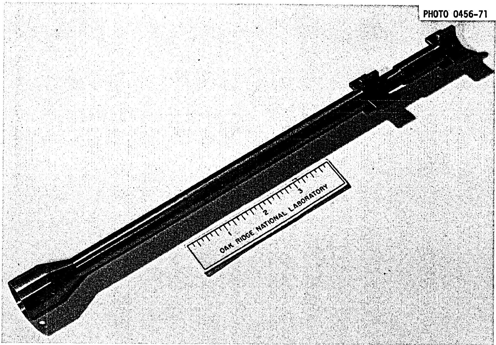  
Fig. 13. Molybdenum Agitator.

PHOTO 0458-71

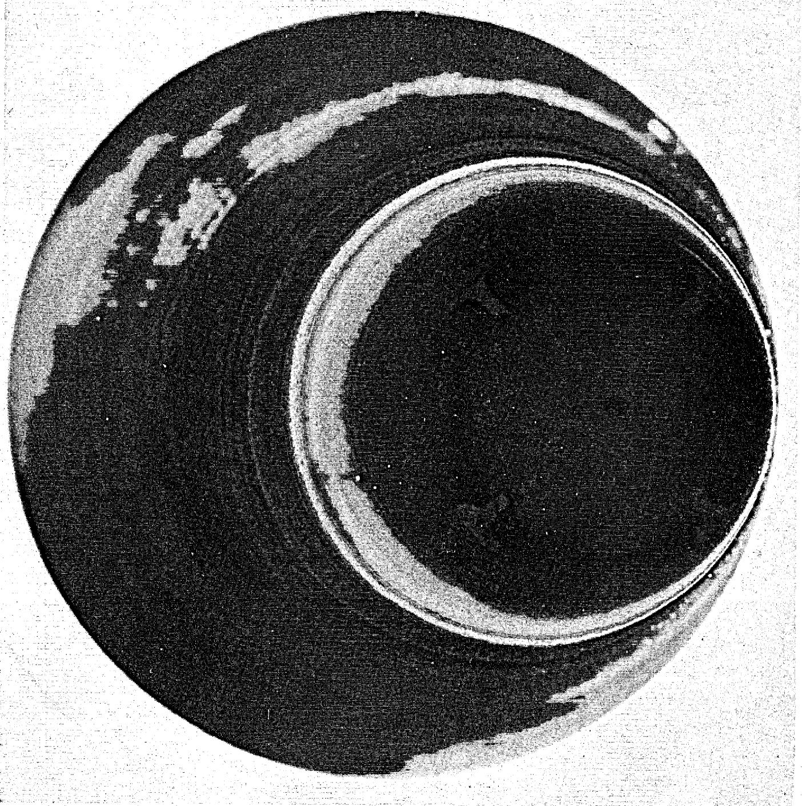  
Fig. 14. Inside of Test Vessel Showing Tungsten Coating.

the lower section of the vessel was heated with tubular electric heaters. The upper section of the equipment was equipped with a cooling coil in order to maintain the shaft seal temperature at about $50^{\circ}\mathrm{C}$ . The agitator was driven by a 1/4-hp variable-speed motor that was coupled directly to the drive unit.

# 5.2 Experimental Results

The shaft seals used in the first test were Bal-Seal No. R304A-(SZ)G120. The agitator was initially operated at 200 rpm for 100 hr with no salt or bismuth in the system. During the first 50-hr period the vessel was held at room temperature; during the remaining 50 hr, temperatures for the vessel and the seal were maintained at $650^{\circ}\mathrm{C}$ and about $50^{\circ}\mathrm{C}$ respectively. Throughout the test, the seal leakage rate was determined by pressurizing the region between the two seals with argon and measuring the rate of decrease in pressure when the argon supply was shut off. The seal leakage rate during the first 100 hr, as measured at 1 atm and ambient temperature, was about $3\mathrm{cm}^3/\mathrm{hr}$ . The internal pressure in the region between the seals was 15 to 20 psig initially.

After the initial testing of the seal, $3549\mathrm{~g}$ of purified bismuth and $915\mathrm{~g}$ of fluoride salt (72-16-12 mole $\%$ LiF- $\mathsf{BeF}_2$ -ThF $_4$ to which 0.3 mole $\%$ LaF $_3$ had been added) were charged to the system. The salt-bismuth interface was located at a point about 1 in. above the lower agitator blades, and the salt-gas interface was located about 1 in. above the upper agitator blades. During the following one-month period, the agitator speed was increased stepwise from 150 to 750 rpm; the salt and bismuth phases were maintained at $650^{\circ}\mathrm{C}$ . The operating time at each speed is summarized in Table 5. During most of the test period, the seal leakage rate remained constant at about $10\mathrm{~cm}^3/\mathrm{hr}$ ; however, near the end of this period it increased to greater than $100\mathrm{~cm}^3/\mathrm{hr}$ .

After a total operating period of 845 hr, the salt and bismuth were drained from the system and the seals were removed for inspection. The upper seal was found to be badly deteriorated, while the Teflon had worn through to the spring in some areas. The lower seal, although slightly worn, appeared to be in good condition. Evaluation of various

Table 5. Operating Time During Tests of Bal-Seal No. R304A-(SZ)G120 Shaft Seals   

<table><tr><td>Agitator Speed (rpm)</td><td>Operating Time (hr)</td></tr><tr><td colspan="2">No Salt or Bismuth in System</td></tr><tr><td>200</td><td>100</td></tr><tr><td colspan="2">Salt and Bismuth in System</td></tr><tr><td>150</td><td>50</td></tr><tr><td>200</td><td>48</td></tr><tr><td>300</td><td>148</td></tr><tr><td>500</td><td>360</td></tr><tr><td>750</td><td>139</td></tr><tr><td>Total</td><td>845</td></tr></table>

seals was continued without the use of salt and bismuth in the system. Short tests were made at agitator speeds of 100 to 500 rpm using Bal-Seals having a light expander spring; however, these seals leaked excessively and were replaced with Bal-Seals (No. R3-6A-(1.000)G) having a moderate expander spring and a thicker cross section than the seals used initially. The leakage rate using these seals was satisfactory, and testing was continued at ambient temperature for 70 days using agitator speeds of 150 to 300 rpm. During the first 31 days of operation, the rate gradually increased from $0.3\mathrm{cm}^3/\mathrm{hr}$ to $2\mathrm{cm}^3/\mathrm{hr}$ . At that time, $1\mathrm{cm}^3$ of mineral oil was injected into the region between seals to determine whether this would reduce the seal leakage rate and increase the seal life. After the oil had been injected, the leakage rate decreased to $0.05\mathrm{cm}^3/\mathrm{hr}$ . During the next 24 days of operation, however, it gradually increased to $0.4\mathrm{cm}^3/\mathrm{hr}$ . A second injection of $1\mathrm{cm}^3$ of oil between the seals resulted in a decrease in the leakage rate to $0.02\mathrm{cm}^3/\mathrm{hr}$ , and confirmed that the use of oil is effective in reducing the seal leakage rate.

After 71 days of operation the seals were removed for inspection. Although both seals showed some wear, a sufficient wall thickness remained to allow a considerably longer operating time. Based on these test results, it was determined that this type of seal is acceptable for use in metal transfer experiment MTE-3.

At intervals throughout the period during which salt and bismuth were present in the system, unfiltered samples of the salt phase were taken to determine the extent of bismuth entrainment in the salt. Also, unfiltered bismuth samples were taken for nickel and iron analyses in order to determine whether the tungsten coating was intact. During the test, the bismuth content of the salt increased from 8 ppm to 101 ppm as shown in Table 6; however, there was no indication that large quantities of bismuth were being entrained in the salt. The purified bismuth charged to the experiment contained 10 ppm of iron and less than 20 ppm of nickel. During the test the concentration of nickel in the bismuth increased to about 1000 ppm (shown in Table 6), which indicated that the bismuth had penetrated the tungsten coating. The concentration of iron in the bismuth phase increased from 20 ppm to 50 ppm (the approximate solubility of iron in bismuth at $650^{\circ}\mathrm{C}$ during the test. The tungsten and molybdenum concentrations in the bismuth remained below 20 ppm and 10 ppm, respectively, throughout the test.

After completion of the agitator test, the equipment was disassembled for inspection (see Fig. 15). During operation, the vessel and agitator had been maintained at 500 to $650^{\circ}\mathrm{C}$ for a period of 1150 hr, and salt and bismuth had been present in the system for 1005 hr. Visual examination revealed no evidence of corrosion. The portion of the agitator submerged in the bismuth phase had been wet by the bismuth. Also, droplets of salt and bismuth could be seen clinging to the agitator shaft at points above the salt surface. The upper portions of the shaft and the drive unit were covered with a black material that may have formed as the result of decomposition of oil from the shaft seals.

The tungsten coating on the inside of the vessel was examined by members of the Metals and Ceramics Division.[17] The nickel plate and tungsten coating were found to be intact and adherent in two samples taken

Table 6. Analyses of Salt and Bismuth Samplesa Taken During the MTE-3 Agitator Test   

<table><tr><td>Operating Timeb (hr)</td><td>Max. Agitator Speed (rpm)</td><td>Bismuth Conc. in Salt Phase (ppm)</td><td>Nickel Conc. in Bi Phase (ppm)</td><td>Iron Conc. in Bi Phase (ppm)</td></tr><tr><td>79</td><td>200</td><td>8</td><td>500</td><td>20</td></tr><tr><td>246</td><td>300</td><td>48</td><td>--</td><td>--</td></tr><tr><td>414</td><td>500</td><td>39</td><td>500</td><td>30</td></tr><tr><td>702</td><td>750</td><td>101</td><td>1000</td><td>50</td></tr></table>

aAll samples were unfiltered.   
bThe agitator had been operated continuously for at least 24 hr at the indicated speed before salt and metal phase samples were taken.

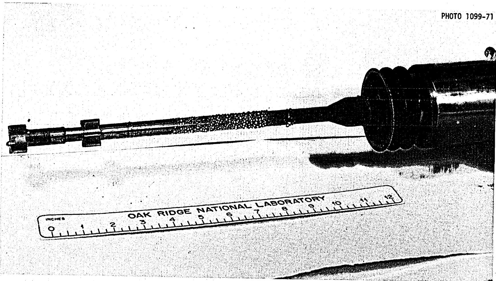  
Fig. 15. Agitator After Completion of Test.

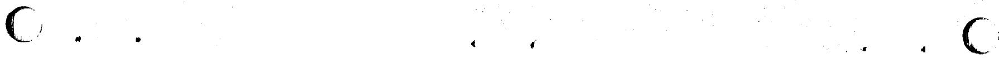

77

from the main vessel. However, cracks in the coating were noted in several places, and there was evidence that bismuth had penetrated these cracks and had attacked the nickel substrate. The cracks are thought to be the result of thermal cycling since the coefficients of thermal expansion of the tungsten coating and iron vessel are considerably different. In samples taken from the $1/4$ -in. drain line at the bottom of the vessel, the tungsten coating was not in contact with the metal substrate and the nickel layer was absent. The carbon steel was also attacked to a depth of about 2 mils in that area. Although the nickel and tungsten coatings were fairly adherent in the $1/4$ -in. sample line attached to the side of the vessel, numerous cracks were found in the tungsten coating. It was concluded from examination of the vessel that complete protection of a vessel of this type from exposure to bismuth by tungsten coating will be difficult because of the tendency of such a coating to crack. However, although considerable dissolution of the nickel coating had occurred, attack on the carbon steel base metal was relatively minor in the samples examined.

The nickel aluminide coating on the exterior of the vessel appeared to be in good condition after the test; however, the vessel was not held at elevated temperature for a sufficiently long period to determine whether the use of the stainless steel coating under the nickel aluminide on half of the vessel was beneficial.

6. DISTRIBUTION OF RADIUS BETWEEN LiCl AND Li-Bi SOLUTIONS

E. L. Youngblood L. E. McNeese

Radium is present at tracer levels in metal transfer process experiments as a decay product of thorium. Radium would be expected to have distribution characteristics similar to those for divalent rare-earth fission products (Sm and Eu) and alkaline-earth fission products (Sr and Ba). Thus, it is of interest to obtain information concerning the behavior of radium in metal transfer systems.

Data relative to the distribution of radium between molten LiCl and lithium-bismuth solutions containing from 13 to 35 mole $\%$ lithium, obtained during metal transfer experiment MTE-2, were reported previously. After the completion of metal transfer experiment MTE-2, a portion of the Li-Bis solution from the experiment (containing radium) was diluted with bismuth and contacted with purified LiCl at $650^{\circ}\mathrm{C}$ in order to obtain additional distribution data for radium at lower concentrations of lithium in bismuth. These data are discussed in the remainder of this section.

# 6.1 Description of Equipment

The distribution coefficient measurements were made in a 12-in.-high vessel constructed of 2-1/8-in.-diam carbon steel tubing. A thermowell and a gas-lift sparge tube, also constructed of carbon steel, were installed in the vessel for temperature measurement and for contacting the salt and metal phases. The carbon steel vessel containing the LiCl and Li-Bi phases was enclosed in a heated, 4-in.-diam stainless steel vessel which was maintained under an argon atmosphere. Samples of the salt and metal phases could be taken by the method described previously.[18] Before the LiCl and the Li-Bi solution containing radium were charged to the system, the carbon steel vessel and bismuth were contacted with hydrogen at $650^{\circ}\mathrm{C}$ for 12 hr to remove oxide impurities. The LiCl was purified in a separate vessel by contact with bismuth that had been saturated with thorium at $650^{\circ}\mathrm{C}$ .

Initially, $272.4\mathrm{~g}$ of Li-Bi solution from metal transfer experiment MTE-2 was charged to the system along with $484.0\mathrm{~g}$ of purified bismuth and $97.0\mathrm{~g}$ of purified LiCl. The system was then heated to $650^{\circ}\mathrm{C}$ and maintained at that temperature during the subsequent operations. Samples were taken periodically of the LiCl and Li-Bi phases for determination of the radium concentrations in the phases. The radium content of the samples was determined by counting the 0.9-MeV gamma radiation emitted by the $^{228}\mathrm{Ac}$ after a decay period of about $24\mathrm{hr}$ to ensure that the $^{228}\mathrm{Ac}$ (half-life, 6.13 hr) was in secular equilibrium with the $^{228}\mathrm{Ra}$ .

# 6.2 Experimental Results

Samples of the LiCl and Li-Bi phases were taken 23 hr and 70 hr after the temperature of the system had reached $650^{\circ}\mathrm{C}$ . The concentration of lithium in the Li-Bi solution was then lowered by the addition of 193.0 g of purified bismuth, and additional measurements were made over a period of 408 hr. Distribution coefficients* were calculated from the data obtained. The results are given in Table 7.

In previous studies of the distribution of materials between fluorides, chlorides or bromides, and bismuth solutions, Ferris et al.19,20 have determined that distribution coefficient data can be correlated in terms of the lithium concentration in the bismuth phase according to the following relation:

$$
\log D _ {M} = n \log D _ {L i} + \log K _ {M}, \tag {5}
$$

where

$$
\begin{array}{l} D _ {M} = \text {d i s t r i b u t i o n} \\ = \mathrm {X} _ {\mathrm {M} (\mathrm {B i})} / \mathrm {X} _ {\mathrm {M} (\mathrm {s a l t})}, \\ \end{array}
$$

$$
X _ {M (B i)} = \text {c o n c e n t r a t i o n} M \text {i n b i s m u t h p h a s e , m o l e f r a c t i o n ,}
$$

$$
\begin{array}{l} \begin{array}{l} X _ {M (s a l t)} = \text {c o n c e n t r a t i o n o f h a l i d e o f m a t e r i a l M i n h a l i d e s a l t , m o l e} \\ \text {f r a c t i o n ,} \end{array} \\ n = \text {v a l e n c e o f m a t e r i a l M i n h a l i d e s a l t}, \\ D _ {L i} = \text {d i s t r i b u t i o n c o e f f i c i e n t f o r l i t h i u m}, \\ K _ {M} = \text {c o n s t a n t d e p e n d e n t o n m a t e r i a l M .} \\ \end{array}
$$

Table 7. Data for Radium Distribution Between LiCl and Lithium-Bismuth Solutions at $650^{\circ}\mathrm{C}$   

<table><tr><td rowspan="2">Equilibration Time (hr)</td><td rowspan="2">Lithium Conc. in Bismuth Phase (mole fraction)</td><td colspan="2">Radium Content</td><td rowspan="2">Distribution Coefficient</td></tr><tr><td>LiCl Phase (counts min-1g-1)</td><td>Li-Bi Phase (counts min-1g-1)</td></tr><tr><td>23</td><td>0.05</td><td>24.0</td><td>764</td><td>0.15</td></tr><tr><td>70</td><td>0.049</td><td>19.6</td><td>803</td><td>0.12</td></tr><tr><td></td><td colspan="3">193.0 g of bismuth added to the Li-Bi phase</td><td></td></tr><tr><td>96</td><td>0.032</td><td>12.2</td><td>736</td><td>0.08</td></tr><tr><td>239</td><td>0.035</td><td>13.0</td><td>784</td><td>0.08</td></tr><tr><td>408</td><td>0.035</td><td>12.4</td><td>821</td><td>0.07</td></tr></table>

Thus, at a given temperature, a plot of the logarithm of the distribution coefficient for radium vs the logarithm of the mole fraction of lithium in the bismuth phase should give a straight line having a slope equal to the valence of radium in the LiCl phase. Figure 16 shows radium distribution data from this experiment and previously reported data from metal transfer experiment MTE-2, along with the line having a slope of 2 that best fits the data. It is seen that the distribution data can be correlated quite satisfactorily by assuming that radium is divalent in the LiCl phase.

It should be noted that only about $30\%$ of the distribution data from metal transfer experiment MTE-2 is based on LiCl samples taken from the Li-Bi alloy container, while the remainder is based on samples taken from the main LiCl pool. We believe that the LiCl and Li-Bi phases in the Li-Bi container were essentially at equilibrium at all times; however, during the early stages of the experiment, the main LiCl pool and the Li-Bi phase would not have been at equilibrium with respect to the distribution of radium. For this reason, the data based on LiCl samples from the Li-Bi alloy container and from the main LiCl pool during the latter part of the experiment were weighted more heavily in correlating the information than data based on LiCl samples taken from the main LiCl pool early in the experiment. The distribution coefficient data for radium at $650^{\circ}\mathrm{C}$ in the LiCl--Li-Bi system can be represented by the following relation:

$$
\log D = 2 \log N _ {L i} + 1. 7 5 7, \tag {6}
$$

where

$$
D = \text {r a d i u m}
$$

$$
N _ {L i} = \text {t h e m o l e f r a c t i o n o f l i t h u i m i n t h e b i s m u t h p h a s e}.
$$

A comparison of the relation summarizing the radium distribution data and previously reported distribution data $^{20,21}$ for Sm, Eu, Ba, and Sr is shown in Fig. 17. As expected, the distribution characteristics for radium are quite similar to those of the divalent rare-earth and alkaline-earth fission products; in fact, the data for radium and barium are almost identical.

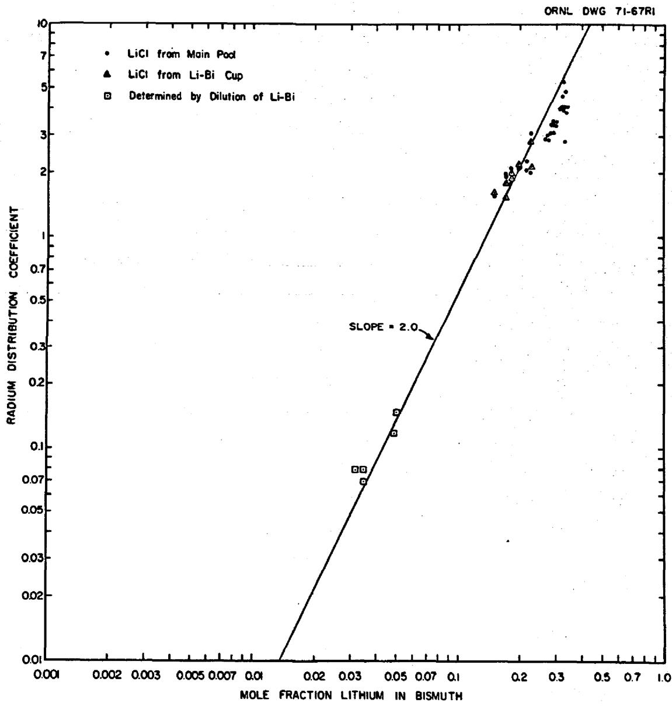  
Fig. 16. Variation of Radium Distribution Coefficient Between Molten LiCl and Bismuth Phases with Changes in Concentration of Lithium in the Bismuth.

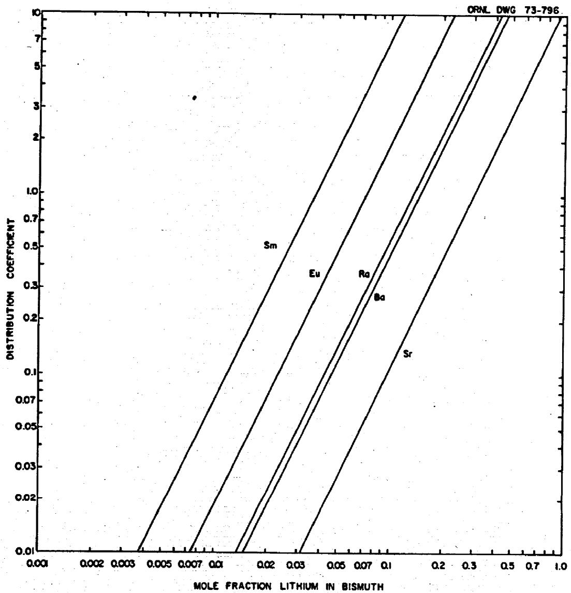  
Fig. 17. Variation of the Distribution Coefficients for Sr, Ba, Ra, Eu, and Sm in the LiCl-Bi Alloys with Changes in the Concentration of Lithium in the Bismuth Area.

# 7. DEVELOPMENT OF MECHANICALLY AGITATED SALT-METAL CONTACTORS

H. O. Weeren L. E. McNeese

As reported previously, $^{22}$ a program has been initiated for the development of mechanically agitated salt-metal contactors as an alternative to packed column contactors presently under consideration for MSBR processing systems. After brief experimentation with several contactor types using mercury and aqueous solutions, it was decided that the Lewis type contactor $^{23,24}$ has the greatest potential for achieving acceptable mass transfer rates with minimum dispersion of the salt and metal phases. This is an important factor since entrainment of bismuth in processed fuel salt that is returned to the reactor cannot be tolerated. The Lewis contactor has two agitators -- one in the salt phase and one in the bismuth phase -- that are located well away from the salt-metal interface. These agitators are operated in a manner such that the phases are mixed as vigorously as possible without dispersing one in the other.

A review of the literature23 revealed the existence of considerable data concerning mass transfer coefficients in aqueous-organic systems in Lewis cell contactors having agitator diameters of 2 to 4 in. and indicated that the mass transfer coefficient is strongly dependent on both the speed and the diameter of the agitator. However, before Lewis cell contactors can be designed and evaluated for salt-metal systems, it will be necessary to obtain data for larger contactors, as well as hydrodynamic and mass transfer rate data for systems having physical properties that more closely resemble the salt-bismuth system.

During this report period, data were obtained on (1) the maximum agitator speed that can be used with a mercury-water system before entrainment of water in the mercury is observed, and (2) the rate of circulation of mercury between the two compartments of a stirred-interface contactor of the type being considered for the metal transfer process.[15] Results from these studies are summarized in the remainder of this section.

# 7.1 Studies for Determination of Limiting Agitator Speeds

Preliminary tests were carried out in contactors of several sizes and with different agitator configurations in order to determine the factors that will limit the agitator speed in stirred-interface contactors. The contactors used in these tests contained two compartments and were of the type shown schematically in Fig. 18. Aqueous solutions and mercury or a low-melting alloy were used to simulate molten salt and bismuth during the studies. It was found that the common factor that limited the agitator speed was the transfer of water between the two compartments via entrainment in the circulating metal phase. For a given contactor and agitator configuration, this phenomenon was found to begin at a definite agitator speed; below this speed, no entrainment was observed. The tests were carried out in compartmented, cylindrical contactors having diameters of 5.5 and 10 in. and in a compartmented, rectangular contactor measuring $12 \times 24$ in. In each case, the vessel contained no baffles and a single four-bladed paddle was used in the metal phase on one side of the contactor.

The limiting agitator speed was found to be essentially independent of the size and shape of the contactor vessel but strongly dependent on the diameter of the agitator. Data obtained during these studies are summarized in Fig. 19, where it is seen that the allowable agitator speed is inversely proportional to the $1.43$ power of the agitator diameter. Since the Lewis correlation24,25 indicates that the mass transfer coefficient is dependent on the agitator diameter to the 3.7 power, it appears that at speeds slightly below the limiting agitator speed the mass transfer coefficient will be dependent on the agitator diameter to the 0.94 power. Thus, it should be advantageous to operate a contactor having the largest possible agitator diameter.

It should be noted that the data shown in Fig. 19 are valid only for the operating conditions under which they were obtained. The use of baffles, canted agitator blades rather than straight blades, an agitator on each side of a contactor, or other changes in the cell design could make a considerable difference in the limiting agitator speed. The

ORNL DWG. 73-2545RI

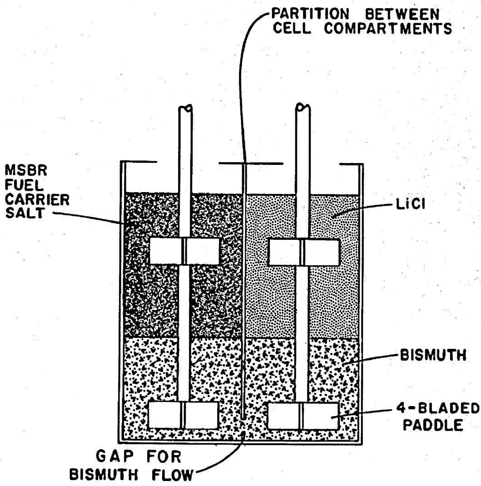  
Fig. 18. Proposed Contactor Design for Metal Transfer Experiment.

ORNL 73-2544R2

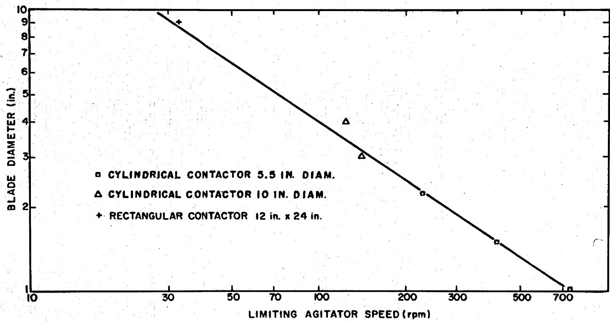  
Fig. 19. Correlation of Limiting Agitator Speed with Blade Diameter in Several Contactors.

following observations relative to this point were noted during the studies:

(1) The limiting agitator speed was relatively independent of the vertical position of the paddle in the mercury phase as long as the paddle was located well below the mercury-water interface. However, when the paddle was located near the interface, the limiting speed was decreased appreciably.   
(2) The limiting agitator speed was appreciably higher when the bismuth phase in each compartment of the contactor was agitated than when the bismuth in only one compartment was agitated. For example, the difference in limiting agitator speeds for a 3-in.-diam agitator blade was about 60 rpm. The limiting agitator speed was essentially unaffected by the degree of agitation of the aqueous phase.   
(3) The size of the opening below the partition that separated the two contactor compartments could be increased from 0.25 in. to 0.75 in. without appreciably affecting the limiting agitator speed. On the other hand, the limiting agitator speed was reduced considerably as the separation distance was increased above 0.75 in.   
(4) The use of baffles or the location of the agitator at an off-center position increased the limiting agitator speed. This effect was more important with small-diameter agitators, where the variation in limiting agitator speed was about $30\%$ , than with large-diameter agitators, where the difference was only about $10\%$ .   
(5) When the agitator blades were canted rather than being vertical and when the direction of rotation was such that the agitator lifted the mercury phase, a considerably higher agitator speed could be attained without entrainment of water between the two compartments of the contactor. The limiting agitator speed under these conditions was about twice that shown in Fig. 19 for both 1.5- and 3-in.-diam agitators, but was only about

$10\%$ higher than the value shown for a 9-in.-diam agitator. The limiting agitator speed was found to be affected significantly and unpredictably by baffles in the contactor.

A test was carried out using a low-melting alloy (Cerrolow 105) and water in a heated contactor having a diameter of 5.5 in. in order to determine the effect of changes in the properties of the liquid phases on the contactor performance. The alloy (42.9-21.7-8.0-5.0-18.3-4.0 wt % Bi-Pb-Sn-Cd-In-Hg) has a specific gravity of 8.1 and a liquidus temperature of about $38^{\circ}\mathrm{C}$ . At an operating temperature of $60^{\circ}\mathrm{C}$ , the limiting agitator speed was essentially identical to the limiting speed observed with the mercury-water system. Thus, it appears that the limiting agitator speed is not highly dependent on the difference in densities of the two liquid phases. This observation increases our confidence in predicting the performance of a bismuth-salt system at $650^{\circ}\mathrm{C}$ by extrapolating data obtained with a mercury-water system.

It was concluded that these data constitute sufficient information for designing the salt-metal contactor for experiment MTE-3 and for suggesting the limiting agitator speed to be used with molten salt and bismuth in the contactor at $650^{\circ}\mathrm{C}$ . It is believed that entrainment of salt in the bismuth will occur at essentially the same agitator speed as was observed with the mercury-water system (300 rpm) and that experiment MTE-3 should be operated initially with agitator speeds well below this value.

# 7.2 Determination of Metal Flow Rate Across Contactor Partition

Proper operation of the salt-metal contactor proposed for use with metal transfer experiment MTE-3 will require a bismuth circulation rate of 0.5 liter/min or higher between the two parts of the contactor. Two tests were carried out with agitator speeds of 195 rpm to obtain data relative to this point.

In the first test, the agitator consisted of a four-bladed paddle having vertical blades; in the second test, the blades were canted at $45^{\circ}$ in a manner such that the mercury was lifted toward the metal surface.

During each test, only one side of the contactor cell was agitated. The experimental technique consisted of temporarily preventing circulation of mercury between the two halves of the contactor, establishing a temperature differential between the mercury pools in the two compartments, and allowing resumption of the circulation of metal between the compartments. The rate of change of the temperature of the mercury in one compartment was then measured in order to determine the rate of mercury flow between the compartments. Results of previous tests had shown that the rate of conductive heat transfer across the contactor partition and the rate of heat loss to the surroundings were negligible as compared with the rate of convective heat transfer resulting from circulation of the mercury phase between the two compartments.

A mathematical analysis was carried out to aid in interpretation of the experimental measurements made for the purpose of determining the rate of flow of mercury between the two contactor compartments. In making the analysis, the following assumptions were made:

(1) Only mercury is present in the contactor.   
(2) Equal quantities of mercury are present in the two compartments.   
(3) The mercury in compartment 1 is initially at temperature $\mathbf{T}_{\mathrm{H}}$ , and the temperature in compartment 2 is at temperature $\mathbf{T}_{\mathrm{L}}$ .   
(4) Mercury circulates between the two compartments at a constant rate.

A heat balance on the mercury in compartment 1 yields the relation

$$
V _ {\rho} C _ {p} \frac {d T _ {1}}{d t} = F \rho C _ {p} T _ {2} - F \rho C _ {p} T _ {1}, \tag {7}
$$

where

V = volume of mercury in each compartment, cm³,

$\rho =$ density of mercury, $\mathrm{g / cm^3}$

$C_p =$ heat capacity of mercury, cal/g $^{\circ}$ C,

$\mathbf{T}_{1} =$ temperature of mercury in compartment 1 at time t, $^\circ \mathrm{C}$

$\mathbf{T}_{2} =$ temperature of mercury in compartment 2 at time t, $^\circ \mathrm{C}$

$\mathbf{t} = \mathbf{\Delta}$ time,sec,

$\mathbf{F} =$ mercury flow rate, $\mathbf{g} / \mathrm{sec}$

Since the rate at which heat is exchanged with the surroundings is negligible, a heat balance on the mercury in both compartments yields the relation

$$
\mathrm {V} \rho \mathrm {C} _ {\mathrm {p} 1} + \mathrm {V} \rho \mathrm {C} _ {\mathrm {p} 2} = \mathrm {V} \rho \mathrm {C} _ {\mathrm {p} H} + \mathrm {V} \rho \mathrm {C} _ {\mathrm {p} L}. \tag {8}
$$

Combination of Eqs. (7) and (8) yields the relation

$$
\frac {\mathrm {d} \mathrm {T} _ {1}}{\mathrm {d t}} = \frac {\mathrm {F}}{\mathrm {V}} \left(\mathrm {T} _ {\mathrm {H}} + \mathrm {T} _ {\mathrm {L}} - 2 \mathrm {T} _ {1}\right), \tag {9}
$$

which has the solution

$$
\frac {2 \mathrm {T} _ {\mathrm {L}} - \mathrm {T} _ {\mathrm {H}} - \mathrm {T} _ {\mathrm {L}}}{\mathrm {T} _ {\mathrm {H}} - \mathrm {T} _ {\mathrm {L}}} = e ^ {- \frac {2 \mathrm {F t}}{\mathrm {V}}} \tag {10}
$$

The first test was carried out using a 3-in.-diam straight-bladed paddle on only one side of the contactor. The paddle was located 0.75 in. from the bottom of the contactor vessel and was operated at the speed of 195 rpm. The mercury in one side of the contactor was heated to $30.5^{\circ}\mathrm{C}$ , and the mercury in the other compartment was cooled to $26^{\circ}\mathrm{C}$ . Seven seconds after the flow of mercury was resumed, the temperature of the mercury in the heated side of the contactor had decreased to $29^{\circ}\mathrm{C}$ . The resulting mercury flow rate, calculated from Eq. (4), for this condition was 19.3 liters/min. The estimated uncertainty in this value is $\pm 60\%$ .

The second test was carried out in the same vessel under similar conditions except that the blades of the agitator were canted at $45^{\circ}$ . One side of the contactor was heated to $32.5^{\circ}\mathrm{C}$ , and the other was cooled to $29.5^{\circ}\mathrm{C}$ . Twelve seconds after flow was resumed, the mercury in the heated side appeared to have reached the equilibrium temperature. A mercury flow rate of 11.2 liters/min was calculated on this basis; however, the estimated uncertainty in this value is large.

# 7.3 Conclusions

It is concluded that sufficient data are available to establish the design of the proposed contactor for metal transfer experiment MTE-3 and to suggest appropriate operating limits with salt-bismuth systems at

$650^{\circ}\mathrm{C}$ . Mass transfer coefficients remain to be determined under conditions that more closely resemble a salt-metal system; however, the hydrodynamic performance of stirred interface contactors is now partially understood. For a given vessel size, the maximum degree of agitation (and hence the highest mass transfer rates) can be obtained by using the largest practical agitator blade, canted agitator blades, and no baffles. For such a vessel, the degree of agitation that can be achieved will be limited by carry-over of the light phase between the contactor compartments. Carry-over will probably occur in the salt-bismuth system at the approximate agitator speed observed with the mercury-water system (300 rpm). Therefore, agitator speeds well below this value should be used initially for metal transfer experiment MTE-3.

# 8. ANALYSIS OF MULTICOMPONENT MASS TRANSFER BETWEEN MOLTEN SALTS AND LIQUID BISMUTH DURING COUNTERCURRENT FLOW IN PACKED COLUMN

C.P.Tung J.S.Watson

Reductive extraction, an important operation in the removal of protactinium and rare earths from MSBR fuel salt, involves the exchange of metal ions in the salt phase with neutral (reduced) metal atoms in the bismuth phase. Since no net electric current flows between the salt and metal phases, the rate at which metal ions are reduced must equal the rate at which metal atoms are oxidized (taking into consideration differences in the charges of the ions involved). In the bismuth phase, the fluxes of the transferring atoms are dependent only on concentration gradients. In the salt phase, however, electric potential gradients are generated near the salt-metal interface as the result of differences in the mobilities and/or charges of the various diffusing ions. This results in a condition where the fluxes of the transferring ions are dependent on both concentration gradients and electric potential gradients. These effects greatly complicate the mass transfer process and make difficult the design of continuous (differential) reductive extraction columns. We have previously $^{25}$ carried out a mathematical analysis of mass transfer during reductive extraction processes to aid in understanding the results from present and proposed experiments in packed columns and to aid in using these data for design of larger reductive extraction systems. During this report period, calculations were completed for both binary and multicomponent mass transfer preparatory to determining the conditions under which the presence of an electric potential gradient significantly alters the mass transfer rate. In the remainder of this section, examples are given for cases that represent either molten-salt--bismuth or aqueous-organic systems.

# 8.1 Mathematical Models

The mathematical model being considered represents a modification of the two-film model frequently used for solvent extraction applications.

One liquid phase is considered to be an electrolyte (molten salt or an aqueous solution), while the other is considered to be a solvent (bismuth or an organic phase). The behavior of materials in the solvent phase is similar in the two cases in that the transferring components are assumed to be present in an uncharged or neutral state. However, the behavior of materials in the electrolyte phase differs for the two cases. In representing a molten salt, it was assumed that the concentration of electrolyte coions (ions which have a charge opposite to that of the transferring ions) is constant throughout the electrolyte phase since the equivalent volumes of the fluorides or chlorides of interest are essentially equal. In representing an aqueous phase, it was assumed that the concentration of coions varies across the electrolyte film adjacent to the solvent-electrolyte interface. In each case, there was no net transfer of coions across the solvent-electrolyte interface.

As shown previously, $^{25}$ the rates at which components transfer between an aqueous phase and an organic phase are defined by the relations

$$
J _ {s i} = \frac {D _ {s i}}{\delta_ {s}} \left(c _ {s i I} - c _ {s i B}\right), \tag {11}
$$

$$
J _ {e i} = - D _ {e i} \left[ \operatorname {g r a d} C _ {e i} + \frac {Z _ {i} C _ {e i} F}{R T} \operatorname {g r a d} \phi \right], \tag {12}
$$

$$
J _ {e i} = J _ {s i}, \tag {13}
$$

$$
\sum_ {i} ^ {\infty} J _ {e i} Z _ {i} = \sum_ {i} ^ {\infty} J _ {s i} Z _ {i} = 0, \tag {14}
$$

$$
\frac {C _ {\mathrm {e i}}}{C _ {\mathrm {s i}}} \left(\frac {C _ {\mathrm {s r}}}{C _ {\mathrm {e r}}}\right) ^ {Z _ {\mathrm {i}} / Z _ {\mathrm {r}}} = Q _ {\mathrm {i}}, \tag {15}
$$

$$
\frac {\mathrm {F}}{\mathrm {R T}} \operatorname {g r a d} \phi = - \frac {\sum_ {\mathrm {i}} ^ {\mathrm {J} _ {\mathrm {e i}} \mathrm {Z} _ {\mathrm {i}}}}{\sum_ {\mathrm {i}} ^ {\mathrm {Z} _ {\mathrm {i}} ^ {2} \mathrm {C} _ {\mathrm {e i}} + \mathrm {Z} _ {\mathrm {y}} ^ {2} \mathrm {C} _ {\mathrm {y}}}} \quad , \tag {16}
$$

where

$\mathbf{J} =$ flux of transferring component,

$D =$ diffusion coefficient of transferring component,

$\delta =$ thickness of solvent or electrolyte film adjacent to solvent-electrolyte interface,

$C =$ concentration of component in solvent or electrolyte,

$C_{\mathbf{siB}} =$ concentration of component i in the solvent phase,

$C_{\text{sil}}$ = concentration of component i in the solvent phase at the solvent-electrolyte interface,

Z = valence (electric charge) of ion,

$\phi =$ electric potential in electrolyte film,

$\mathbf{F} =$ Faraday constant,

$\mathbf{R} =$ gas constant,

T = absolute temperature, and

$Q =$ equilibrium constant.

The subscript i refers to the $i$ th transferring component, the subscript r refers to a reference transferring component, and the subscripts e and s denote the electrolyte and solvent phases respectively.

Similarly, the rates at which components transfer between a molten salt and a bismuth phase are defined by Eqs. (1)-(5), and the relation

$$
\frac {F}{R T} \operatorname {g r a d} \phi = - \frac {\sum_ {i} \frac {J _ {e i} Z _ {i}}{D _ {e i}}}{\sum_ {i} Z _ {i} ^ {2} C _ {e i}}. \tag {17}
$$

In presenting the calculated mass transfer rate data for the molten-salt--bismuth and the aqueous-organic systems, the transfer rates will

be normalized to the transfer rate that would be observed under the same conditions in the absence of electric potential effects. The rates at which components transfer between an electrolyte and a solvent phase in the absence of electric potential effects are defined by Eqs. (1)-(5) and the following relation:

$$
J _ {e i} = - D _ {e i} \operatorname {g r a d} C _ {e i}. \tag {18}
$$

# 8.2 Calculated Mass Transfer Rates for the Case of Binary Exchange with Uniform Bulk Concentrations

The extent to which an electric potential gradient alters the rates at which components transfer between electrolyte and solvent phases having uniform bulk concentrations depends upon (1) the valences of the transferring and nontransferring ions in the electrolyte phase, (2) the diffusion coefficients of the transferring components in the electrolyte and solvent phases, (3) the resistance to transfer of components through the electrolyte and solvent films adjacent to the electrolyte-solvent interface, (4) the equilibrium constants for the transferring components, (5) the relative concentrations of the transferring components in the electrolyte and solvent phases, (6) the concentration of nontransferring ions in the electrolyte phase, and (7) the behavior of the nontransferring ions.

Because of the large number of variables involved, it is not possible to portray in a simple manner the complete solution to the set of equations that defines the effect of the electric potential gradient on the rates at which components transfer between the electrolyte and solvent phases. Instead, results for selected cases involving two transferring components will be given in order to show the importance of the various factors. In each case, the rate at which a component transfers between a solvent and an aqueous or molten salt phase in the presence of an electric potential gradient will be compared to the rate at which the component would transfer in the absence of an electric potential gradient. In the remainder of this chapter, the term relative flux value (RFV) will be used to denote the ratio of the flux of a transferring component in

the presence of an electric potential gradient to the flux in the absence of an electric potential gradient.

In all cases involving binary exchange with uniform bulk concentrations, the valences of the transferring and nontransferring ions were assumed to be unity. The concentrations of components 1 and 2 in the solvent phase were assumed to be 0.1 and $0.05\mathrm{g - mole / cm}^3$ , respectively, and the concentrations of components 1 and 2 in the electrolyte phase were assumed to be 0.05 and $0.01\mathrm{g - mole / cm}^3$ .

# 8.2.1 Effect of Diffusion Coefficients of Transferring Ions in Electrolyte Phase

The effect of the diffusion coefficients of the transferring ions in the electrolyte phase during binary exchange is shown in Fig. 20, where the RFV (for either component) is given as a function of the ratio of the diffusion coefficient of component 1 in the electrolyte phase to the diffusion coefficient of component 2 in the electrolyte phase. In obtaining these results, the equilibrium constant was assumed to be unity, and the thickness of the solvent film was assumed to be negligible (negligible resistance to transfer in the solvent film). It should be noted that the RFV is affected by the relative values of the diffusion coefficients for the transferring species except in the case where the diffusion coefficients (as well as the valences) are equal. The effect of an electric potential gradient on the mass transfer rate is greater in the case of a uniform concentration of coions in the electrolyte phase (molten salt solution) than for the case of a nonuniform concentration of coions in the electrolyte phase (aqueous solution) because the mobile coions in the aqueous electrolyte distribute across the electrolyte film in a manner which suppresses or reduces the effect of the electric potential gradient. If the ratio of the diffusion coefficient for component 1 to that of component 2 is 0.25, neglect of the effect of an electric potential gradient would result in errors in the calculated mass transfer rate of 23 and $50\%$ for aqueous and molten salt electrolyte phases respectively.

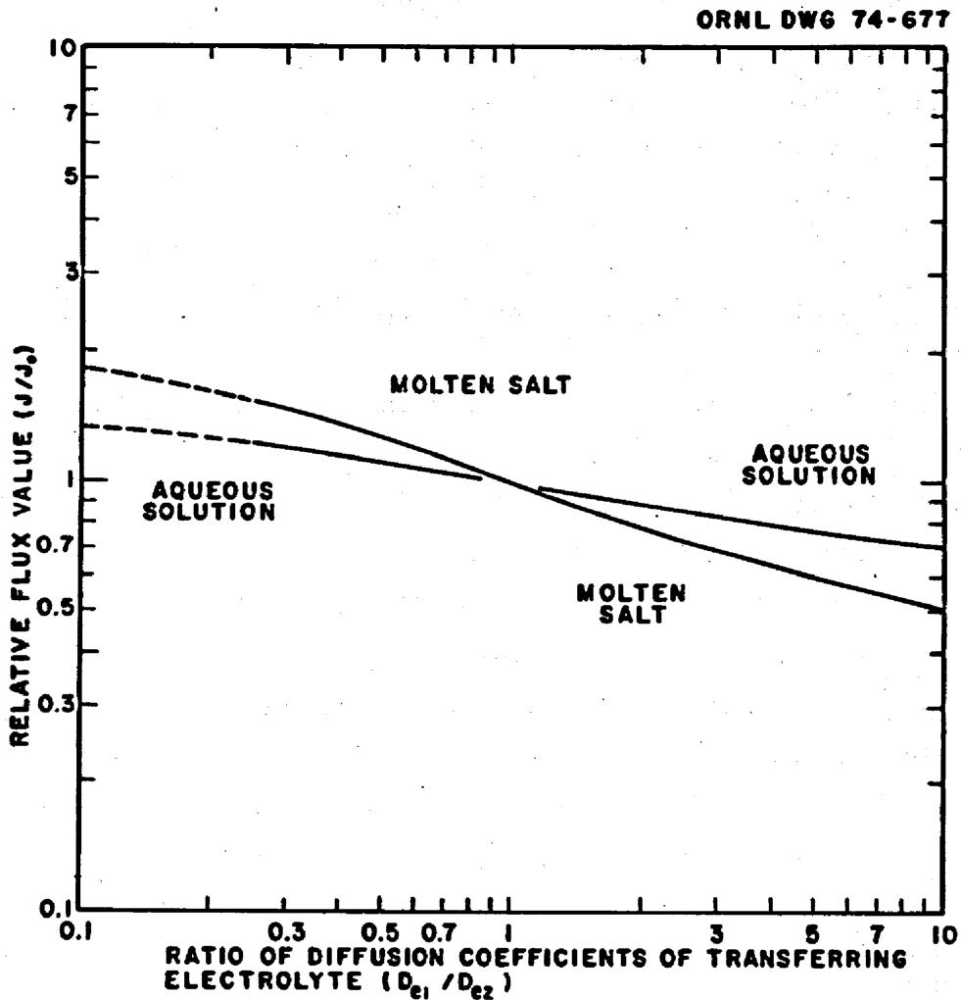  
Fig. 20. Effect on Relative Values of Diffusion Coefficients for Transferring Ions in Electrolyte Phase on Relative Flux Value. The resistance to mass transfer in the solvent phase was negligible (zero film thickness in solvent phase).

# 8.2.2 Effect of Individual Mass Transfer Coefficient in Electrolyte Phase

The effect of the individual mass transfer coefficient in the electrolyte phase is shown in Fig. 21, where the RFV (for either component) is given as a function of the ratio of the individual mass transfer coefficient for component 1 in the electrolyte phase to the individual mass transfer coefficient of component 2 in the electrolyte phase. The mass transfer coefficients for components 1 and 2 in the solvent phase were assumed to be equal to the mass transfer coefficient of component 2 in the electrolyte phase. The equilibrium constant was assumed to be unity. The error caused by neglect of the effect of an electric potential gradient is greater in the case of the molten salt electrolyte than in the case of an aqueous electrolyte and becomes significant for the case where the individual mass transfer coefficient for component 1 in the electrolyte phase is small relative to the other individual mass transfer coefficient values.

# 8.2.3 Effect of Individual Mass Transfer Coefficient in Solvent Phase

The effect of the individual mass transfer coefficient in the solvent phase is shown in Fig. 22, where the RFV (for either component) is given as a function of the ratio of the individual mass transfer coefficient for component 1 or 2 in the solvent phase (assumed to be equal) to the individual mass transfer coefficient for component 2 in the electrolyte phase. In obtaining these results, it was assumed that the equilibrium constant was unity and that the ratio of the individual mass transfer coefficient for component 1 in the electrolyte phase to that for component 2 was equal to 5.

When the transfer coefficient in the solvent film is very high, as on the right side of Fig. 22, the transfer rate is controlled by the resistance in the electrolyte film. As in the earlier cases, the effects of an electric potential gradient are more evident in the case of a molten salt electrolyte than in the case of an aqueous electrolyte. At very high values of the solvent film transfer coefficient, mass transfer resistance is solely in the electrolyte film, and the influence of an

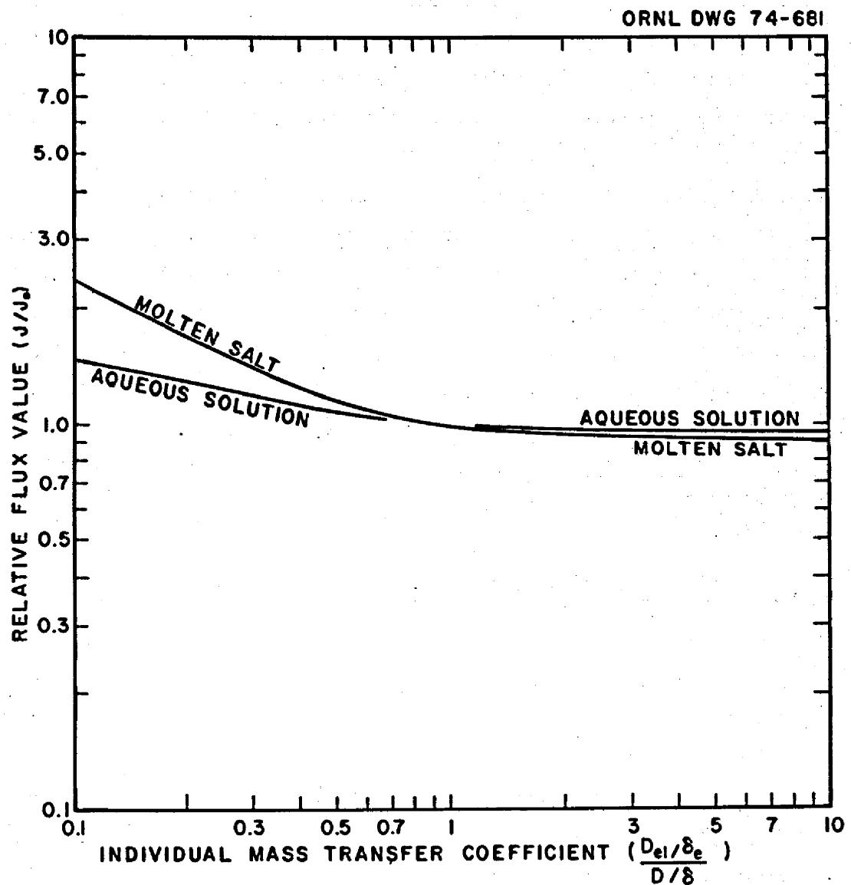  
Fig. 21. Effect of Individual Mass Transfer Coefficient for Component 1 in the Electrolyte Phase on Relative Flux Value. The individual mass transfer coefficient for component 2 in the electrolyte phase was assumed to be equal to the individual mass transfer coefficients for components 1 and 2 in the solvent phase.

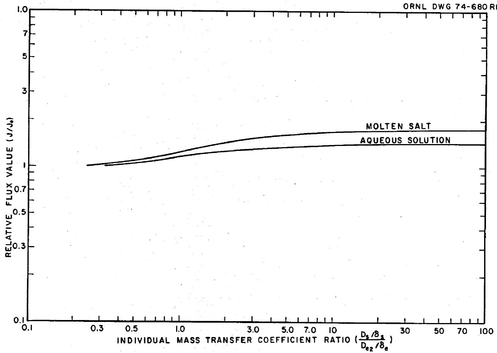  
Fig. 22. Effect of Individual Mass Transfer Coefficient for Component 1 or 2 in Solvent Phase on Relative Flux Value. The individual mass transfer coefficients in the solvent phase were assumed to be equal. The ratio of the mass transfer coefficient in the electrolyte phase for component 1 to that for component 2 was assumed to be 5.

electric potential gradient approaches an asymptotic value. As the solvent phase transfer coefficient decreases, the effects of electric fields decrease since the transfer rate is no longer controlled by the electrolyte film. Eventually, for very low values of the solvent film transfer coefficient (left side of Fig. 22), the transfer rate is controlled by the film resistance in the solvent and is not significantly affected by electric fields.

# 8.2.4 Effect of Equilibrium Constant

The effect of the equilibrium constant on the RFV is shown in Fig. 23. In obtaining these results, it was assumed that the individual mass transfer coefficients in the solvent phase were equal to the individual mass transfer coefficient for component 2 in the electrolyte phase. It was also assumed that the individual mass transfer coefficient for component 2 in the electrolyte phase was five times that for component 1. Changes in the equilibrium constant result in changes in the interfacial concentrations in both phases. For very small values for the equilibrium constant, the equilibrium concentrations of the transferring species on the solvent side of the interface become small relative to the concentrations on the electrolyte side of the interface. In this case, the resistance to transfer between the phases is principally in the solvent film; the electric potential gradient has essentially no effect, as shown in the left-hand portion of Fig. 23. For high values of the equilibrium constant, the primary resistance to mass transfer is in the electrolyte film and the effect of the electric potential gradient becomes important.

# 8.2.5 Effect of Concentration of Nontransferring Ions in the Electrolyte Phase

The effect of the concentration of nontransferring ions in the electrolyte phase during binary exchange is shown in Fig. 24, where the RFV is given as a function of the fraction of the electrolyte concentration that cannot exchange between the phases. In making these calculations, the bulk concentrations of the transferring ions in the electrolyte and solvent phases remained constant at the values given earlier, and the

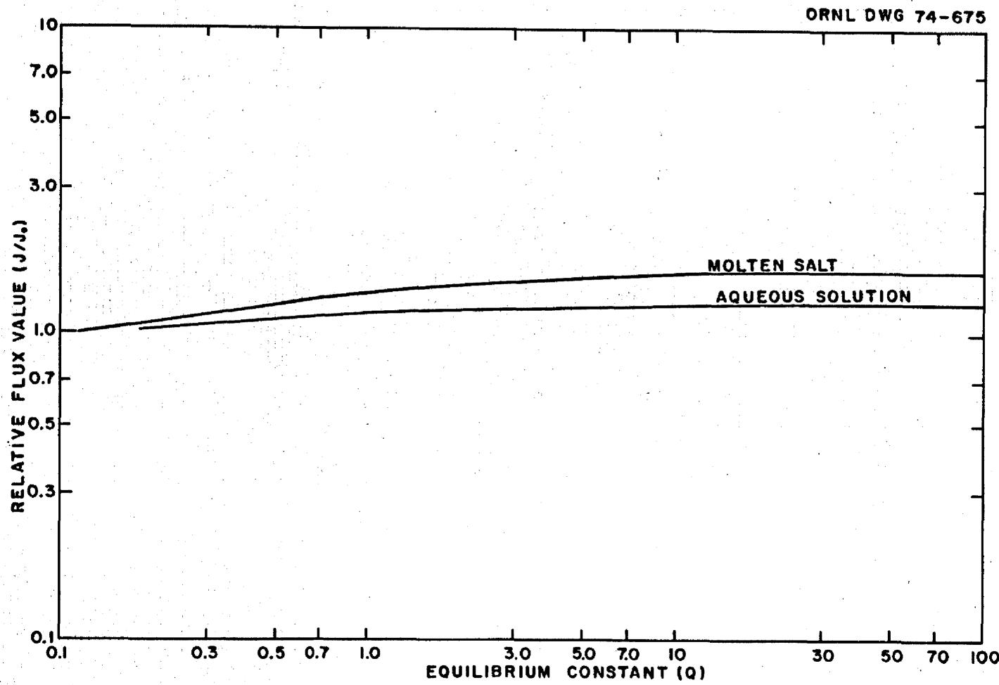  
Fig. 23. Effect of Equilibrium Constant on Relative Flux Value. The individual mass transfer coefficients in the solvent phase were assumed to be equal to the individual mass transfer coefficient for component 2 in the electrolyte phase. The individual mass transfer coefficient in the electrolyte phase for component 2 was assumed to be five times that for component 1.

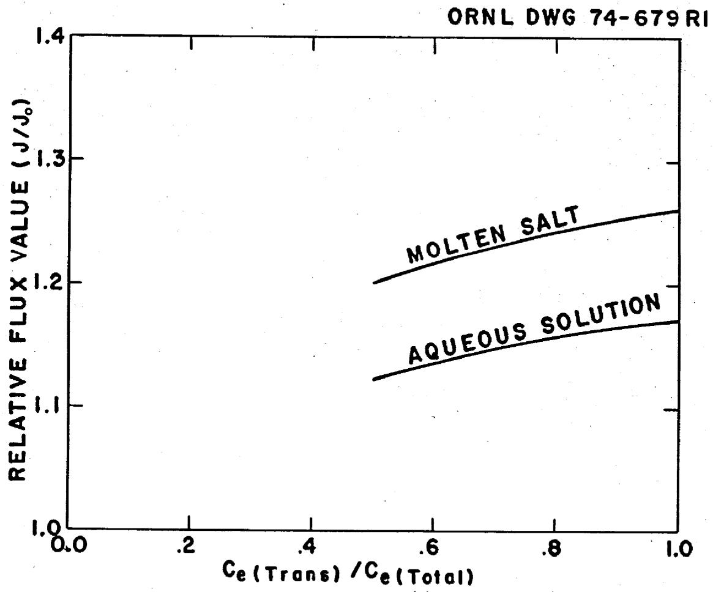  
Fig. 24. Effect of Concentration of Nontransferring Ion on Relative Flux Value.

bulk concentration of a nontransferring component in the electrolyte phase was varied in a manner which produced nontransferring ion fraction values ranging from 0 to 0.5. The valence of the nontransferring ion was +1. As in the case of the coion, the value of the diffusion coefficient of the nontransferring ion is unimportant. The nontransferring ion behaves as a supporting electrolyte (as does the coion) and suppresses the effect of the electric potential gradient.

As shown in Fig. 24, the RFV value decreases steadily as the concentration of the nontransferring ion (relative to the total electrolyte concentration) is increased. As in the earlier cases, the effect of the electric potential gradient is more pronounced in the case where the electrolyte is a molten salt solution than in the case where the electrolyte is an aqueous solution.

# 8.3 Calculated Mass Transfer Rates in an Extraction Column Having Nonuniform Bulk Concentrations

The rates at which components transfer between the solvent and electrolyte phases in a packed column involve many independent variables, and no attempt will be made to show the effect of each of these variables. Instead, results will be presented for two operating conditions. The first is a simple binary exchange process in which the electrolyte that enters one end of the column contains component 1 but not component 2, while the solvent that enters the opposite end of the column contains component 2 but not component 1. Results are presented for the cases of an aqueous electrolyte and a molten salt electrolyte, and for the case where there is no effect of an electric potential gradient. The second operating condition considered corresponds to an actual reductive extraction operation involving a molten fluoride mixture and liquid bismuth containing reductant. In this case, four cations are considered $(\mathrm{Li}^{+}, \mathrm{Be}^{2+}, \mathrm{Th}^{4+}$ , and $\mathrm{U}^{3+})$ . However, only $\mathrm{Li}^{+}$ , $\mathrm{Th}^{4+}$ , and $\mathrm{U}^{3+}$ are allowed to transfer between the electrolyte and solvent phases. Results are presented for the case where the electrolyte is a molten salt and for the case where there is no effect of an electric potential gradient.

# 8.3.1 Binary Exchange

Table 8 shows the operating conditions for the case of binary exchange in a packed column. The valences of the transferring ions and the coion were assumed to be unity. The equilibrium constant for the transferring ions was assumed to be unity. It was assumed that the column was of such length that the total interfacial area between the solvent and electrolyte phases was $2000\mathrm{cm}^2$ .

Table 8. Operating Conditions for the Case of Binary Exchange in a Packed Column   

<table><tr><td rowspan="2">Quantity</td><td colspan="2">Phase</td></tr><tr><td>Electrolyte</td><td>Solvent</td></tr><tr><td>Flow rate, cm3/sec</td><td>50</td><td>50</td></tr><tr><td>Film thickness, cm</td><td>2 x 10-4</td><td>1 x 10-4</td></tr><tr><td>Inlet concentrations, g-mole/cm3</td><td></td><td></td></tr><tr><td>Component 1</td><td>2 x 10-3</td><td>0</td></tr><tr><td>Component 2</td><td>0</td><td>1 x 10-3</td></tr><tr><td>Diffusion coefficients, cm2/sec</td><td></td><td></td></tr><tr><td>Component 1</td><td>1 x 10-5</td><td>2 x 10-5</td></tr><tr><td>Component 2</td><td>1 x 10-6</td><td>4 x 10-5</td></tr></table>

In making the calculations, the column was divided into 50 axial increments of equal length and the electrolyte film in a given increment of column length was divided into 20 increments of equal thickness. Calculated values for the concentration profiles for the two transferring components are shown in Figs. 25-27 for the cases where the electrolyte phase consists of an aqueous solution or a molten-salt solution and for the case where the electric potential gradient has no effect. The concentrations of the transferring ions have been normalized to their maximum values to facilitate presentation of the results.

It is apparent from Fig. 27 that an electric potential gradient has the effect of decreasing the rate at which materials transfer between

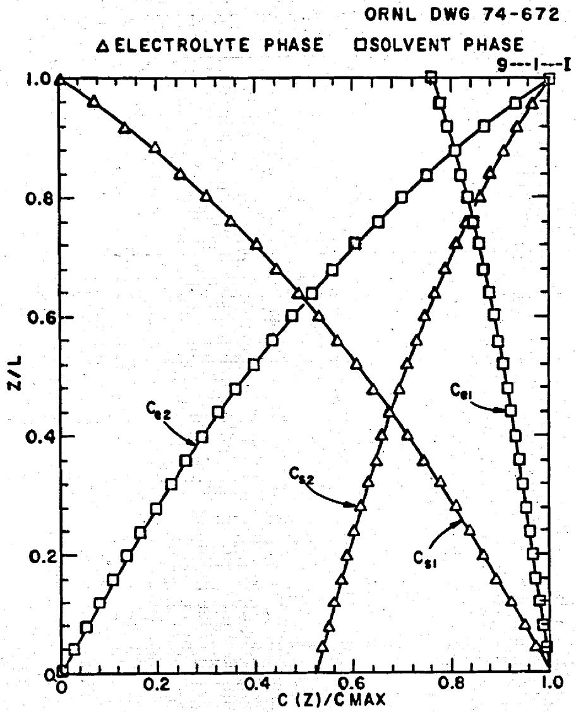  
Fig. 25. Concentration Profiles for the Case of Binary Exchange in a Packed Column Where the Electrolyte Phase Is an Aqueous Solution.

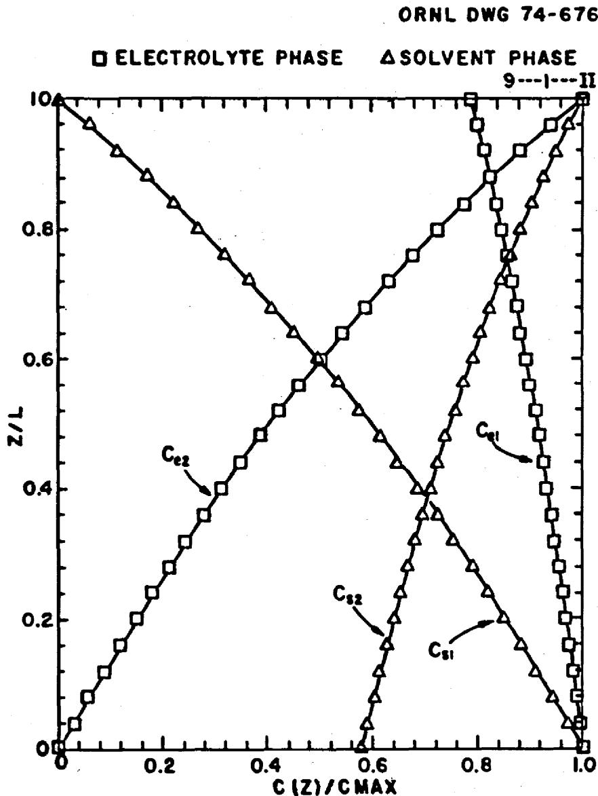  
Fig. 26. Concentration Profiles for the Case of Binary Exchange in a Packed Column Where the Electrolyte Phase Is a Molten-Salt Solution.

ORNL DWG 74-658

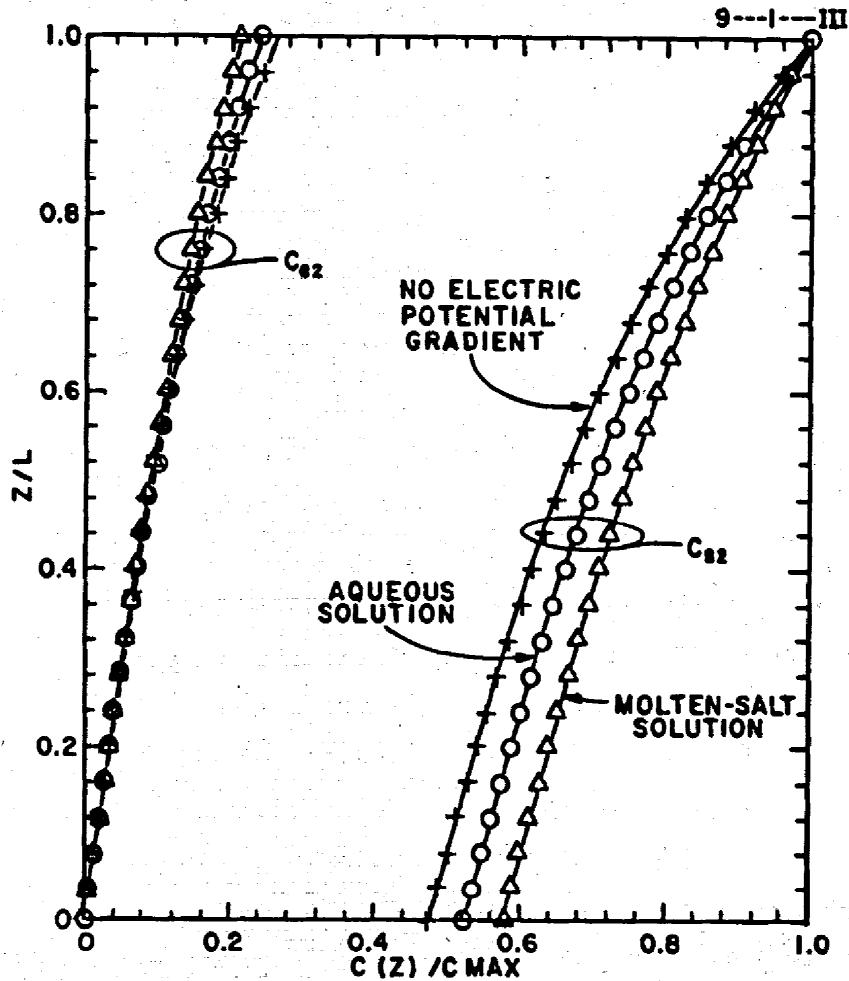  
O CASE I △ CASE II + NO ELECTRIC   
Fig. 27. Comparison of Concentration Profiles for Component 2 for the Case of Binary Exchange in a Packed Column. Results are shown for the cases where the electrolyte is an aqueous solution or a molten-salt solution, and for the case where the effects of the electric potential gradient are not significant.

the electrolyte and solvent phases, and that this effect is more pronounced when the electrolyte is a molten-salt solution. For the latter case, the calculated value for the extent to which component 2 transfers from the solvent to the electrolyte is seen to be in error by about $24\%$ if the effect of the electric potential gradient is not considered. For the case where the electrolyte is an aqueous solution, the corresponding error is about $14\%$ .

# 8.3.2 Multicomponent Exchange

Table 9 gives the operating conditions for two cases involving multicomponent exchange in a packed column. The conditions for these cases correspond to reductive extraction involving the transfer of uranium, thorium, and lithium between a molten fluoride salt phase (71.7-16-12-0.3 mole % LiF-BeF $_2$ -ThF $_4$ -UF $_3$ ) and liquid bismuth containing reductant. Although only four cations ( $Li^+$ , $Be^{2+}$ , $U^{3+}$ , and $Th^{4+}$ ) are considered here, calculational methods and computer programs which have the capability of considering up to ten cations have been developed. Two elements (Be and F), assumed to be present in the salt phase as $Be^{2+}$ and $F^-$ , do not transfer to the bismuth phase. In each of the cases, the solvent phase (bismuth) that enters the column contains no uranium. In one case, the solvent contains lithium (1 mole %) but no thorium; in the other, the solvent contains thorium (1 mole %) but no lithium. The column length is such that the total interfacial area between the molten salt and bismuth phases is $2000 \, \text{cm}^3$ .

The calculated concentration profiles for the two cases are shown in Figs. 28 and 29. In both cases, the salt and bismuth phases were essentially in equilibrium with respect to lithium and thorium near the bismuth inlet. There were no significant differences between the results obtained when the effect of an electric potential gradient was considered and when it was neglected. This result is not surprising, however, since the low concentration of reductant (Li and Th) in the solvent phase dictates that the mass transfer rates are controlled primarily by the resistance to transfer in the solvent phase. Also, uranium is a minor component in the electrolyte (molten salt) phase, and the coions act as a

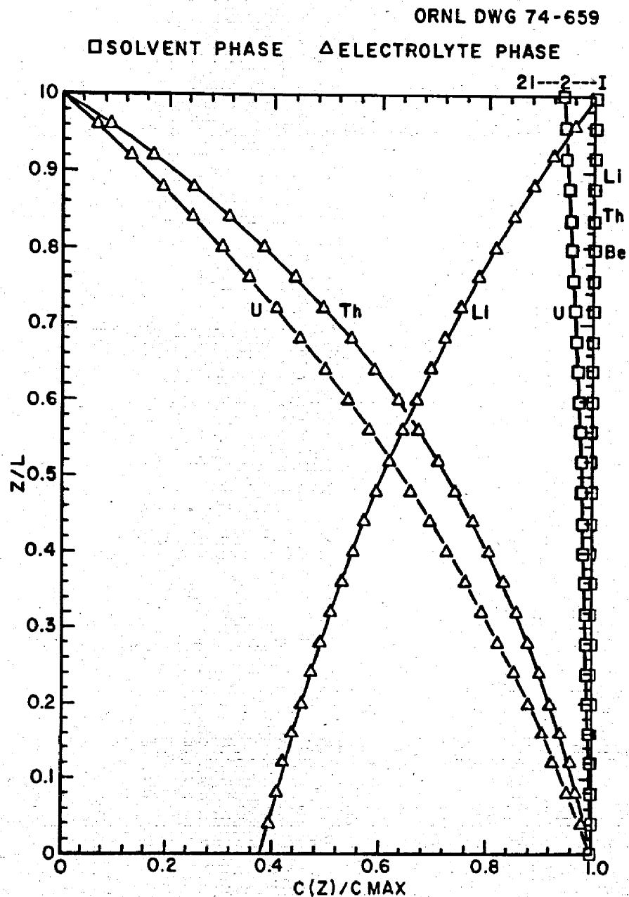  
Fig. 28. Concentration Profiles for U, Th, Li, and Be in the Molten Salt and Bismuth Phases in a Packed Column. The bismuth phase entering the column contained only lithium at the concentration of 1 mole%.

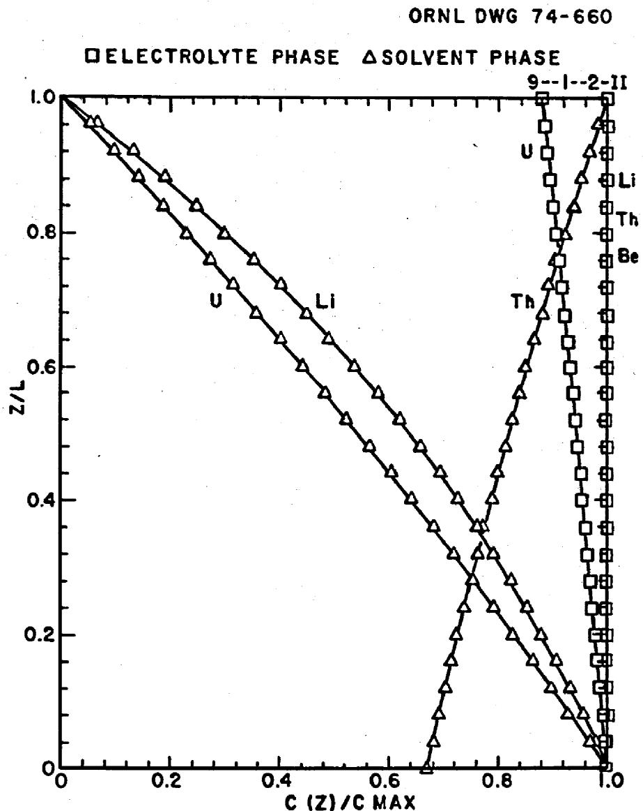  
Fig. 29. Concentration Profiles of U, Th, Li, and Be in the Molten Salt and Bismuth Phases in a Packed Column. The bismuth phase entering the column contained only thorium at the concentration of 1 mole %.

Table 9. Operating Conditions for the Cases of Multicomponent Exchange in a Packed Column   

<table><tr><td rowspan="2">Quantity</td><td colspan="2">Phase</td></tr><tr><td>Electrolyte</td><td>Solvent</td></tr><tr><td>Flow rate, cm3/sec</td><td>50</td><td>50</td></tr><tr><td>Film thickness, cm</td><td>1 x 10-3</td><td>1 x 10-3</td></tr><tr><td>Inlet concentrations, g-mole/cm3</td><td></td><td></td></tr><tr><td>Li</td><td>3.745 x 10-2</td><td>4.6 x 10-5a</td></tr><tr><td>Be</td><td>8.637 x 10-3</td><td>0</td></tr><tr><td>Th</td><td>6.627 x 10-3</td><td>4.6 x 10-5a</td></tr><tr><td>U</td><td>1.560 x 10-4</td><td>0</td></tr><tr><td>Diffusion coefficients, cm2/sec</td><td></td><td></td></tr><tr><td>Li</td><td>3 x 10-5</td><td>3 x 10-5</td></tr><tr><td>Be</td><td>---</td><td>---</td></tr><tr><td>Th</td><td>1 x 10-5</td><td>1 x 10-5</td></tr><tr><td>U</td><td>2 x 10-5</td><td>2 x 10-5</td></tr></table>

$^\mathrm{a}$ Only lithium (or thorium) was present in the inlet solvent.

supporting electrolyte which suppresses the effect of an electric potential gradient.

# 8.4 Summary

A mathematical analysis has been carried out and computer programs have been developed which allow determination of the importance of the electric potential gradient that is generated in an electrolyte during the transfer of materials between an electrolyte and a solvent phase. The effect of the electric potential gradient was found to be of greater importance when the electrolyte is a molten salt than when it is an aqueous solution. In the latter case, the nontransferring coions redistribute in the electrolyte phase in a manner which suppresses the effect of the electric potential gradient. However, it was shown that

significant errors in calculated mass transfer rate values will result under some operating conditions in both cases.

Two cases involving reductive extraction of uranium from a molten fluoride salt phase into a liquid bismuth phase containing reductant indicate that neglect of the effect of an electric potential gradient probably causes essentially no error in calculated mass transfer rates for reductive extraction operations of interest in MSBR processing.

# 9. ENGINEERING STUDIES OF URANIUM OXIDE PRECIPTATION

M.J.Bell\* L.E.McNeese

Studies of the chemistry of protactinium and uranium oxide precipitation by Baes et al. have indicated that oxide precipitation may be an attractive alternative process to fluorination--reductive extraction for isolation of protactinium and removal of uranium from the fuel salt of an MSBR.[26,27] Calculations made by Bell and McNeese indicate that protactinium removal times of 3 to 5 days can be obtained for a reasonable range of flowsheet variables, and that uranium removal efficiencies of greater than $99\%$ can be realized with relatively few equilibrium stages.[28,29] Engineering studies of uranium oxide precipitation are planned in order to study the kinetics of uranium oxide precipitation, to investigate the size distribution and settling characteristics of the oxide precipitate, and to gain experience with oxide precipitation systems. During this report period, an experimental facility was designed and installation of equipment was initiated. The facility is described in the remainder of this section.

# 9.1 Description of Facility

A schematic diagram of the major components of the proposed oxide precipitation facility is shown in Fig. 30. This facility will allow batch precipitation studies to be made in a vessel containing approximately 2 liters of 72-16-12 mole $\%$ LiF-BeF $_2$ -ThF $_4$ salt that has an initial UF $_4$ concentration of about 0.3 mole $\%$ . Oxide will be supplied to the precipitator in the form of a water-argon gas mixture that will be introduced through a draft tube to promote contact of the salt and oxide. The method proposed for separation of the salt and oxide phases is decantation of the salt to a receiver vessel after the oxide has been allowed to settle for a short period. The facility also includes a system for supplying hydrogen-HF gas mixtures that will be used for converting the oxides to fluorides at the conclusion of an experiment.

ORNL DWG 72-64

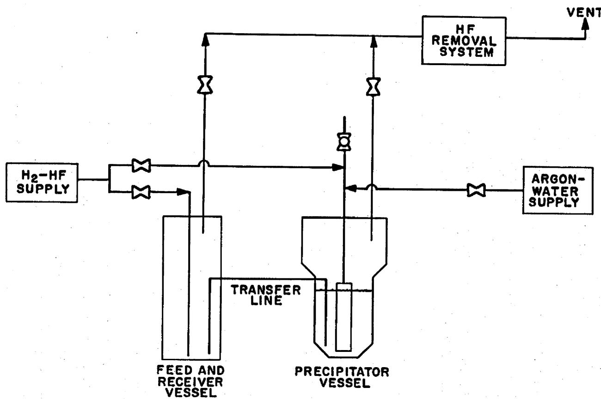  
Fig. 30. Conceptual Design of a Single-Stage Uranium Oxide Precipitation Facility.

The off-gas system includes caustic scrubbers for removing HF from the gas streams in order that information relative to the extent of oxide precipitation can be obtained by collecting the HF evolved by the precipitation process. Ball valves on both the feed and precipitator vessels provide a means for obtaining samples of salt and oxide.

# 9.2 Precipitator Vessel Design

In order to obtain information applicable to the design of the precipitator vessel, the experimental system was simulated using sand and water initially, and then iron powder and a glycerol-water solution, in place of oxide and salt; air was employed as the sparge gas. A 1-in.-diam draft tube was placed in a 4-in.-diam glass pipe, and the effects of the distance between the bottom of the draft tube and the bottom of the vessel, as well as the shape of the vessel bottom, on the degree of mixing of the solids were determined. It was observed that only the solids located immediately beneath the draft tube were entrained in the circulating liquid, and that the system performed most effectively when the bottom of the draft tube was positioned within a few millimeters of the bottom of the vessel. When the draft tube was raised as little as $1/4$ in. from the bottom, mixing performance became very poor. It was also observed that, if the solids were allowed to settle around the bottom of the draft tube, difficulty was sometimes experienced in resuming circulation of the solid material.

The precipitator vessel that was designed as the result of these observations is described in Table 10 and shown in Fig. 31. The lower part of the vessel, in which the salt is contained, is a section of 4-in. sched 40 low-carbon nickel pipe. The bottom of the vessel is machined from a 4-in.-diam low-carbon nickel bar and is tapered at $45^{\circ}$ in order to direct the solids under a draft tube that is used to promote contact of the salt and oxide. The draft tube is constructed of a section of 1-in. sched 40 nickel pipe that is welded to the gas inlet tube. The inlet tube also supports a baffle that is used to prevent large quantities of salt from being carried into the upper part of the vessel. The upper part of the vessel is constructed of a section of

Table 10. Materials Used for Construction of the Precipitator Vessel   

<table><tr><td>Part No.</td><td>Item</td><td>Material</td></tr><tr><td>1</td><td>6-in. sched 40 x 6-in. pipe</td><td>&quot;L&quot; Nickel</td></tr><tr><td>2</td><td>1/4-in. plate rolled to fit</td><td>&quot;L&quot; Nickel</td></tr><tr><td>3</td><td>4-in. sched 40 x 12-1/2-in. pipe</td><td>&quot;L&quot; Nickel</td></tr><tr><td>4</td><td>4-in.-diam x 1-3/4-in. circular bar machined as shown</td><td>&quot;L&quot; Nickel</td></tr><tr><td>5</td><td>6-5/8-in.-diam x 1/2-in. plate</td><td>&quot;L&quot; Nickel</td></tr><tr><td>6</td><td>1-in. sched 40 x 11-1/2-in. pipe</td><td>&quot;L&quot; Nickel</td></tr><tr><td>7</td><td>1/2-in. 20 BWG tubing</td><td>&quot;L&quot; Nickel</td></tr><tr><td>8</td><td>3/8-in. 20 BWG tubing</td><td>&quot;L&quot; Nickel</td></tr><tr><td>9</td><td>1-1/4-in. diam x 1/2-in. circular bar machined as shown</td><td>&quot;L&quot; Nickel</td></tr><tr><td>10</td><td>Calrod heaters</td><td>--</td></tr><tr><td>11</td><td>Insulation--2-in. minimum thickness</td><td>Fiberfrax</td></tr><tr><td>12</td><td>5-in.-diam x 1/8-in. plate</td><td>&quot;L&quot; Nickel</td></tr><tr><td>13</td><td>5-1/2-in.-diam x 1/8-in. plate</td><td>&quot;L&quot; Nickel</td></tr><tr><td>14</td><td>4-in.-diam x 1/8-in. plate</td><td>&quot;L&quot; Nickel</td></tr></table>

ORNL DWG 72-6853R1

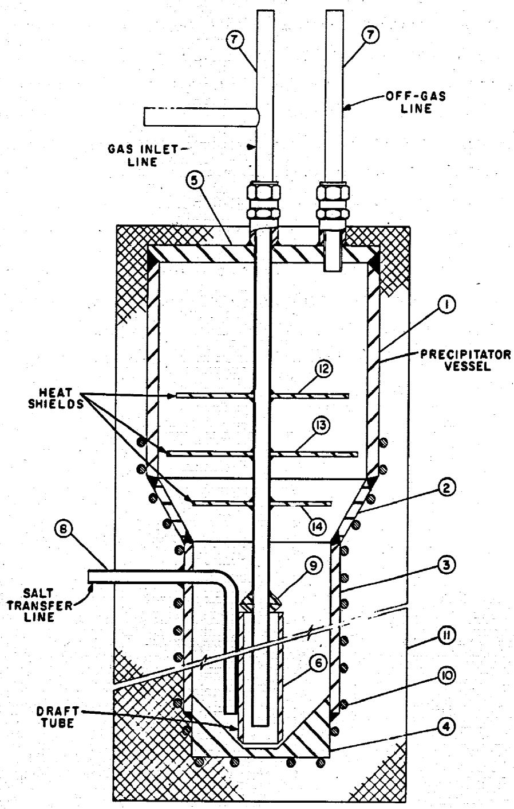  
Fig. 31. Schematic Diagram of the Precipitator Vessel for a Single-Stage Uranium Oxide Precipitation Facility. The numbers correspond to the materials list shown in Table 10.

6-in. sched 40 low-carbon nickel pipe and serves as a deentrainment section. Nickel plates welded to the draft tube in this section of the vessel serve as heat shields and flow diverters. The gas inlet tube is used to introduce either argon-water mixtures or hydrogen-HF mixtures into the vessel and, in addition, functions as one of the sampling nozzles. The upper end of this tube is fitted with a 1/2-in. nickel-plated ball valve through which samples of the salt and oxide are obtained. The vessel is heated with tubular resistance heaters and insulated with 3 in. of Fiberfrax. Nozzles on the upper flange of the vessel are used for thermowells, an off-gas line, and service lines for introducing salt to the vessel. The nozzles are described in more detail in Table ll.

The feed-and-receiver tank was fabricated from a 19-in.-long section of 4-in. sched 40 low-carbon nickel pipe and has heads made from 1/2-in. nickel plate. It also is heated with tubular resistance heaters and is insulated with 3 in. of Fiberfrax. The equipment is being installed in a hood in Bldg. 3541.

Table 11. Nozzle Schedule for Precipitator Vessel   

<table><tr><td>Nozzle</td><td>Service</td><td>Number of Nozzles</td><td>Description</td><td>Material</td></tr><tr><td>A</td><td>Gas and sample inlet</td><td>1</td><td>1/2-in. tube x 1/2-in. pipe</td><td>Monel</td></tr><tr><td>B</td><td>Thermowells</td><td>2</td><td>1/2-in. tube x 1/2-in. pipe</td><td>Monel</td></tr><tr><td>C</td><td>Gas vent</td><td>1</td><td>1/2-in. tube x 1/2-in. pipe</td><td>Monel</td></tr><tr><td>D</td><td>Salt transfer</td><td>1</td><td>3/8-in. tubing</td><td>&quot;L&quot; Nickel</td></tr></table>

# 10. STUDY OF THE PURIFICATION OF SALT BY CONTINUOUS METHODS

# R. B. Lindauer

We have previously described equipment for studying the purification of salt by continuous methods.30 Initial work with this system was directed at the measurement of the flooding rates in a 1.25-in.-diam, 7-ft-long column packed with $1/4$ -in. nickel Raschig rings. Flooding data were obtained during the countercurrent flow of molten salt (66-34 mole $\%$ LiF-BeF $_2$ ) and hydrogen or argon.31 The objective of the present work is to study the continuous reduction of iron fluoro-ride in molten salt by countercurrent contact of the salt with hydrogen in a packed column. We have previously reported on two iron fluoridereduction runs that were carried out at $700^{\circ}\mathrm{C}$ with salt having the composition 66-34 mole $\%$ LiF-BeF $_2$ (ref. 32) and nine runs that were carried out at $700^{\circ}\mathrm{C}$ with salt having the composition 72.0-14.4-13.6 mole $\%$ LiF-BeF $_2$ -ThF $_4$ .33

Iron analyses from samples taken during the last series of nine iron fluoride reduction runs have shown considerable scatter (Fig. 32). Also shown in this figure are the analyses for ten samples taken after the last reduction run when the soluble iron (fluoride) concentration should have remained constant. Suspected reasons for the inconsistencies are: presence of iron particles suspended in the salt, contamination of the sample during analysis, and analytical difficulties at low iron concentrations. Several tests were carried out during this report period in order to resolve these questions; the results and conclusions are discussed in the remainder of this chapter.

# 10.1 Tests for Determining the Presence of Suspended Iron Particles in Salt Samples

Tests were made to investigate the possibility that iron particles, suspended in the molten salt, might be the cause of the occasional high iron analyses such as those after runs 4, 10, and 11 reported previously.[30] It is believed that any metal particles which were suspended in the salt would deposit on metal specimens suspended in the salt. Therefore,

ORNL DWG 74-661

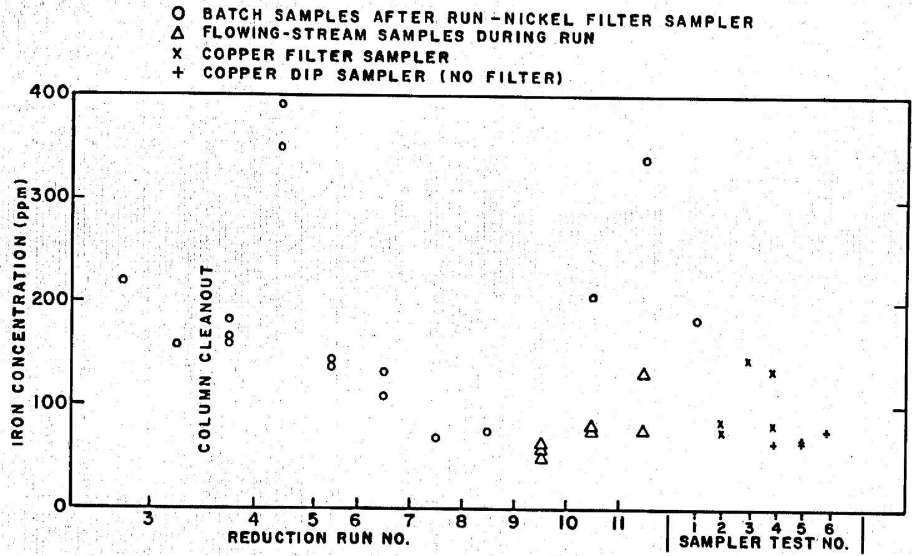  
Fig. 32. Iron Analyses During Recent Iron Fluoride Reduction Runs and Sampler Tests.

specimens of nickel were suspended in the salt in the feed tank at varying depths for 5 to 15 min. Leaching these specimens with HCl dissolved a negligible amount of iron. To further substantiate the absence of iron particles in the salt, four dip (unfiltered) samples were taken. The iron concentrations in these samples ranged from 65 to 75 ppm, which is equivalent to the concentration in the filtered samples having the lowest iron content. Such results show conclusively that iron particles are not suspended in the salt.

# 10.2 Tests of Various Sampler Types

The samplers used during the iron fluoride reduction runs carried out to date have consisted of $1/4$ -in.-OD nickel samplers to which a porous metal filter is attached. The sample size is about $1\mathrm{g}$ . Removal of the salt sample from these samplers (via a steel tubing cutter followed by crushing) is somewhat difficult and provides a possible source of iron contamination. Therefore, following the last reduction run, both filtered and nonfiltered samples were taken in copper samplers, some of which allow removal of a larger $(4 - g)$ sample. The copper tubing is more easily crushed, and samples are less likely to be contaminated with iron during this operation. Averages of the iron concentrations for the samples taken after run 11 are shown in Table 12.

Table 12. Average Reported Iron Concentrations for Various Sampler Types   

<table><tr><td>Type of Sampler</td><td>Average Iron Conc. (ppm)</td><td>Number of Samples</td></tr><tr><td>1/4-in.-diam Ni (filtered)</td><td>262</td><td>2</td></tr><tr><td>1/4-in.-diam Cu (filtered)</td><td>109</td><td>2</td></tr><tr><td>3/8-in.-diam Cu (filtered)</td><td>102</td><td>3</td></tr><tr><td>3/8-in.-diam Cu (unfiltered)</td><td>68</td><td>4</td></tr></table>

The following conclusions have been drawn from these data:

(1) If particles of iron are produced during the reduction of iron fluoride in the column, the iron does not remain suspended in the salt for one pass through the system (column, piping, receiver tank).   
(2) Iron analyses below 100 ppm are unreliable with sample sizes of 1 g or less.   
(3) Samples taken with nickel samplers are more subject to contamination during removal than are samples from copper samplers.

# 10.3 Correlation of Flooding Data

Typical flow data obtained in the present 1.25-in.-diam, 7-ft-long packed column are compared in Fig. 33 with a flooding velocity correlation developed by Sherwood. $^{34}$ The following nomenclature is used in the figure:

$$
\begin{array}{l} G _ {L} = \text {m a s s v e l o c i t y o f s a l t}, \mathrm {l b / h r} \cdot \mathrm {f t} ^ {2}, \\ G _ {v} = \text {m a s s v e l o c i t y o f g a s}, \mathrm {l b / h r} \cdot \mathrm {f t} ^ {2}, \\ a _ {v} = f t ^ {2} / f t ^ {3} o f p a c k i n g, \\ \mu_ {L} = \text {s a l t v i s c o s i t y}, c P, \\ \varepsilon = \text {p a c k i n g} \\ g _ {c} = \text {s t a n d a r d g r a v i t a t i o n a l c a c e l e r a t i o n , f t - l b / l b} _ {\mathrm {F}} \cdot h r ^ {2}, \\ \rho_ {L} = \text {g a s d e n s i t y}, l b / f t ^ {3}, \\ \rho_ {y} = \text {s a l t d e n s i t y}, 1 b / f t ^ {3}. \\ \end{array}
$$

The liquid deentrainment section at the top of the column had insufficient capacity to permit flooding of the column without danger of plugging the column gas outlet with salt, and these data represent near-maximum flow rates at which the column was still operable. However, the operating conditions are believed to be sufficiently close to flooding conditions to determine that actual flooding conditions would fall significantly below values predicted by the Sherwood correlation.

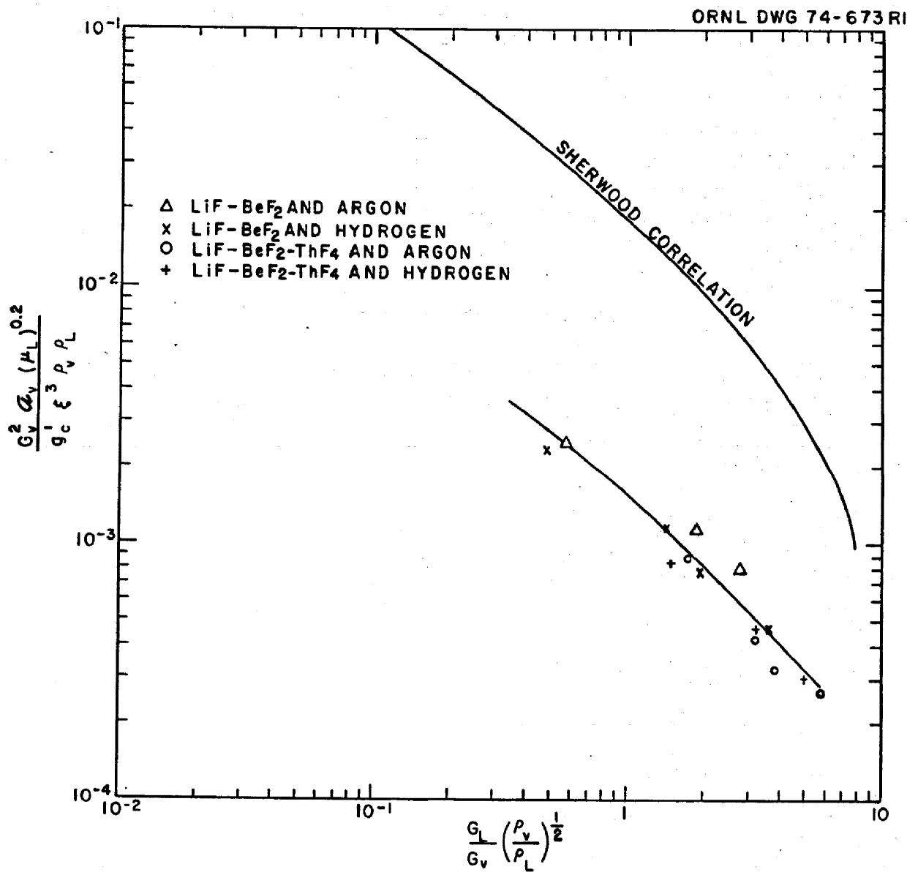  
Fig. 33. Comparison of Actual Column Data with Sherwood Flooding Correlation.

# 11. REFERENCES

1. L. E. McNeese, Engineering Development Studies for Molten-Salt Breeder Reactor Processing No. 7, ORNL-TM-3257 (February 1972), pp. 16-29.   
2. L. E. McNeese, Engineering Development Studies for Molten-Salt Breeder Reactor Processing No. 8, ORNL-TM-3258 (May 1972), pp. 24-30.   
3. L. E. McNeese, Engineering Development Studies for Molten-Salt Breeder Reactor Processing No. 9, ORNL-TM-3259 (December 1972), pp. 30-32.   
4. L. E. McNeese, Engineering Development Studies for Molten-Salt Breeder Reactor Processing No. 1, ORNL-TM-3053 (November 1970), pp. 1-14.   
5. L. E. McNeese, Engineering Development Studies for Molten-Salt Breeder Reactor Processing No. 6, ORNL-TM-3141 (December 1971), pp. 73-79.   
6. L. E. McNeese, Engineering Development Studies for Molten-Salt Breeder Reactor Processing No. 7, ORNL-TM-3257 (February 1972), pp. 52-58.   
7. L. E. McNeese, Engineering Development Studies for Molten-Salt Breeder Reactor Processing No. 8, ORNL-TM-3258 (May 1972), pp. 64-89.   
8. L. E. McNeese, Engineering Development Studies for Molten-Salt Breeder Reactor Processing No. 1, ORNL-TM-3053 (November 1970), p. 6.   
9. L. E. McNeese, Engineering Development Studies for Molten-Salt Breeder Reactor Processing No. 5, ORNL-TM-3140 (October 1971), pp. 2-15.   
10. L. E. McNeese, Engineering Development Studies for Molten-Salt Breeder Reactor Processing No. 7, ORNL-TM-3257 (February 1972), pp. 29-46.   
11. L. E. McNeese, Engineering Development Studies for Molten-Salt Breeder Reactor Processing No. 8, ORNL-TM-3258 (May 1972), pp. 58-63.   
12. L. E. McNeese, Engineering Development Studies for Molten-Salt Breeder Reactor Processing No. 9, ORNL-TM-3259 (December 1972), pp. 167-95.   
13. F. J. Smith, J. Less-Common Metals 29, 73-79 (1972).   
14. J. A. Lane, H. G. MacPherson, and F. Maslan, Fluid Fuel Reactors, p. 728, Addison-Wesley Publishing Co., Inc., Reading, Mass., 1958.   
15. L. E. McNeese, Engineering Development Studies for Molten-Salt Breeder Reactor Processing No. 9, ORNL-TM-3259 (December 1972), pp. 196-204.   
16. J. I. Federer, ORNL, personal communication, March 1971.   
17. J. R. DiStefano and J. I. Federer, ORNL, personal communication, February 1972.

18. L. E. McNeese, Engineering Development Studies for Molten-Salt Breeder Reactor Processing No. 8, ORNI-TM-3258 (May 1972), p. 61.   
19. L. M. Ferris et al., MSR Program Semiann. Progr. Rept. Feb. 28, 1970, ORNL-4548, p. 289.   
20. L. M. Ferris et al., MSR Program Semiann. Progr. Rept. Aug. 31, 1970, ORNL-4622, p. 204.   
21. D. M. Moulton and J. H. Shaffer, MSR Program Semiann. Progr. Rept. Feb. 28, 1970, ORNL-4548, p. 171.   
22. L. E. McNeese, Engineering Development Studies for Molten-Salt Breeder Reactor Processing No. 9, ORNL-TM-3259 (December 1972), pp. 205-15.   
23. J. B. Lewis, Chem. Eng. Sci. 3, 248-59 (1954).   
24. J. B. Lewis, Chem. Eng. Sci. 3, 260-78 (1954).   
25. L. E. McNeese, Engineering Development Studies for Molten-Salt Breeder Reactor Processing No. 9, ORNL-TM-3259 (December 1972), pp. 238-50.   
26. R. G. Ross, C. E. Bamberger, and C. F. Baes, Jr., MSR Program Semiann. Progr. Rept. Aug. 31, 1970, ORNL-4622, pp. 92-95.   
27. C. E. Bamberger and C. F. Baes, Jr., J. Nucl. Mater. 35, 177 (1970).   
28. M. J. Bell and L. E. McNeese, MSR Program Semiann. Progr. Rept. Aug. 31, 1970, ORNL-4622, pp. 202-8.   
29. M. J. Bell and L. E. McNeese, MSR Program Semiann. Progr. Rept. Feb. 28, 1971, ORNL-4676, pp. 237-40.   
30. L. E. McNeese, Engineering Development Studies for Molten-Salt Breeder Reactor Processing No. 6, ORNL-TM-3141 (December 1971), pp. 59-72.   
31. L. E. McNeese, Engineering Development Studies for Molten-Salt Breeder Reactor Processing No. 7, ORNL-TM-3257 (February 1972), pp. 46-52.   
32. L. E. McNeese, Engineering Development Studies for Molten-Salt Breeder Reactor Processing No. 8, ORNL-TM-3258 (May 1972), pp. 97-106.   
33. L. E. McNeese, Engineering Development Studies for Molten-Salt Breeder Reactor Processing No. 9, ORNL-TM-3259 (December 1972), pp. 256-57.   
34. A. S. Foust et al., Principles of Unit Operations, p. 270, Wiley, New York, 1960.

# INTERNAL DISTRIBUTION

1. C. F. Baes, Jr.   
2. C. E. Bamberger   
3. M. R. Bennett   
4. E. S. Bettis   
5. R. E. Blanco   
6. J. O. Blomeke   
7. E. G. Bohlmann   
8. J. Braunstein   
9. M. A. Bredig   
10. R. B. Briggs   
11. H. R. Bronstein   
12. R. E. Brooksbank   
13. K. B. Brown   
14. J. Brynestad   
15. S. Cantor   
16. D. W. Cardwell   
17. W. L. Carter   
18. H. D. Cochran, Jr.   
19. W.H.Cook   
20. R. M. Counce   
21. J. L. Crowley   
22. F. L. Culler   
23. J. M. Dale   
24. J.H.DeVan   
25. J. R. DiStefano   
26. W.P.Eatherly   
27. J.R. Engel   
28. D. E. Ferguson   
29. L. M. Ferris   
30. L. O. Gilpatrick   
31. J. C. Griess   
32. W. R. Grimes   
33. R.H.Guymon   
34. B. A. Hannaford   
35. J. R. Hightower, Jr.   
36. B.F.Hitch   
37. R.W. Horton

38. W.R.Huntley   
39. C.W.Kee   
40. A. D. Kelmers   
41. J.A. Klein   
42. W.R.Laing   
43. R. E. MacPherson   
44. H. E. McCoy

45-63. L.E.McNeese

64. A. P. Malinauskas   
65. A. S. Meyer   
66. R. L. Moore   
67. J. P. Nichols   
68. H. Postma   
69. M. W. Rosenthal   
70. A. D. Ryom   
71. H. C. Savage   
72. W. F. Schaffer, Jr.   
73. C. D. Scott   
74. M. J. Skinner   
75. F. J. Smith   
76. G.P. Smith   
77. I. Spiewak   
78. Martha Stewart   
79. O. K. Tallent   
80. L. M. Toth   
81. D. B. Trauger   
82. W. E. Unger   
83. J. S. Watson   
84. R. G. Wymer   
85. E. L. Youngblood

86-87. Central Research Library   
88. Document Reference Section   
89-91. Laboratory Records   
92. Laboratory Records, RC   
93. Y-12 Document Reference Section   
94. ORNL Patent Office

# EXTERNAL DISTRIBUTION

95. D. F. Cope, USAEC, RDT Site Office, ORNL, Oak Ridge, Tennessee 37830   
96. Deslonde R. deBoisblanc, Ehsaco Services, 2 Rector Street, New York, New York 10006   
97. K. O. Laughon, USAEC, RRD, Washington, DC 20545   
98. C. L. Matthews, USAEC, RDT Site Office, ORNL, Oak Ridge, Tennessee 37830   
99. T. A. Nemzek, Director, USAEC, RRD, Washington 20545

100. D. J. Royer, Continental Oil Co., Ponca City, Oklahoma 74601   
101. A. M. Weinberg, Institute for Energy Analysis, Post Office Box 117, Oak Ridge, Tennessee 37830   
102. E. A. Womack, USAEC, RRD, Washington, DC 20545   
103-104. TIC, Oak Ridge, Tennessee   
105. Research and Technical Support Division, AEC, ORO