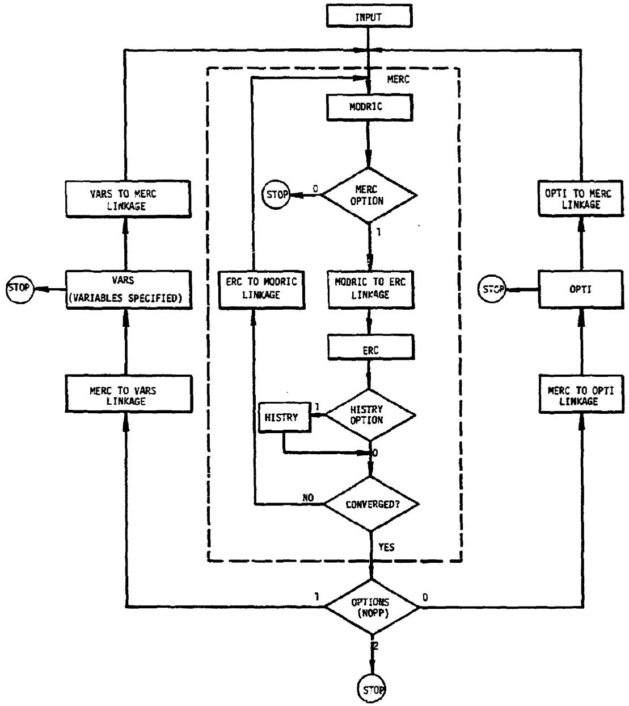
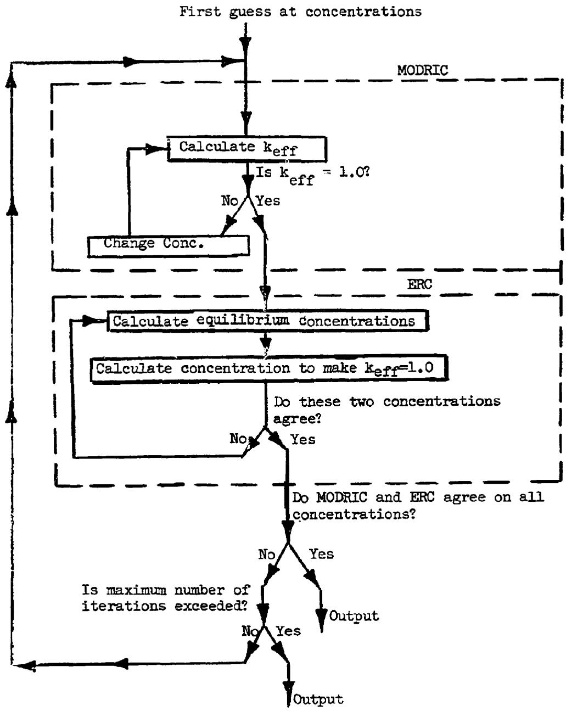
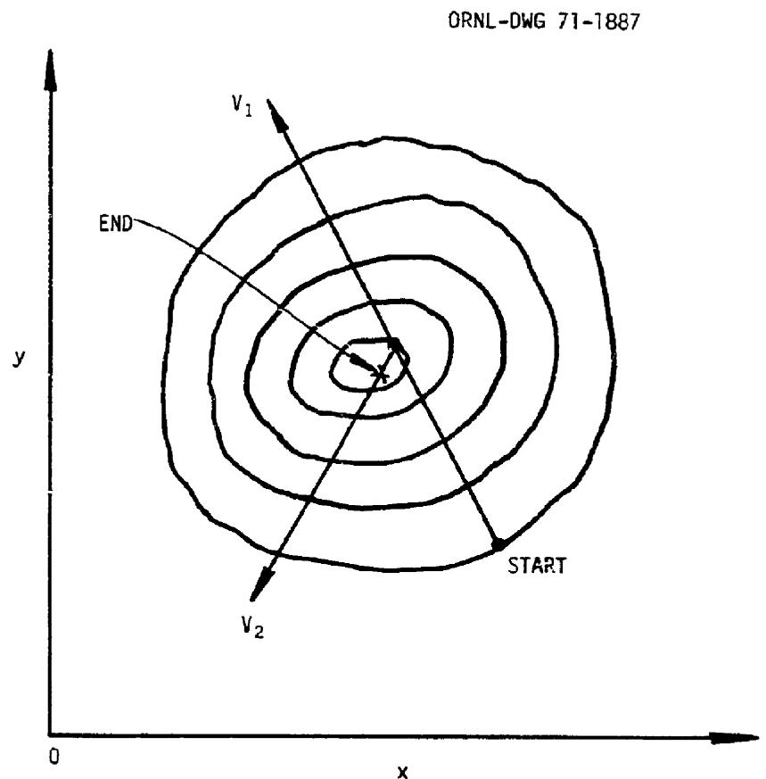
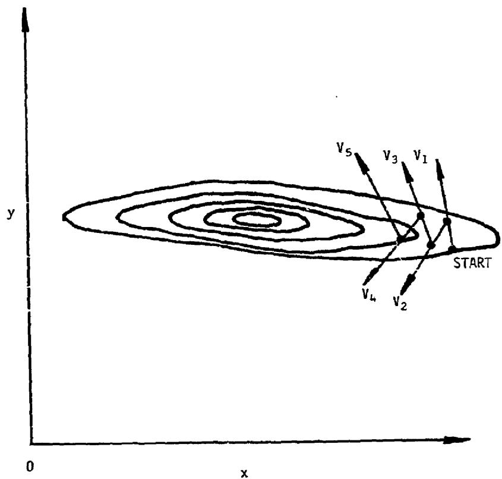
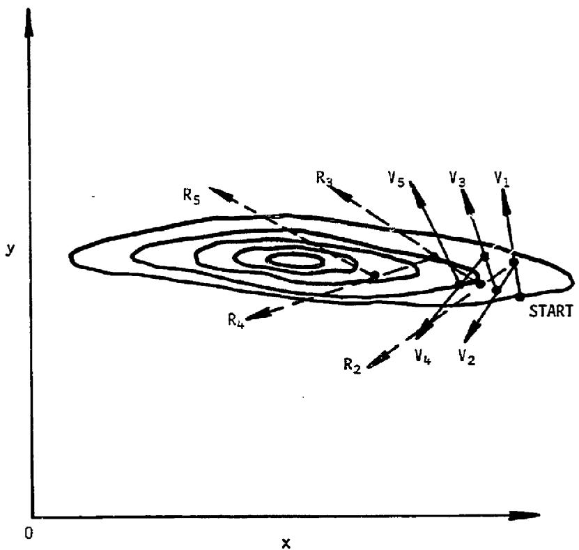
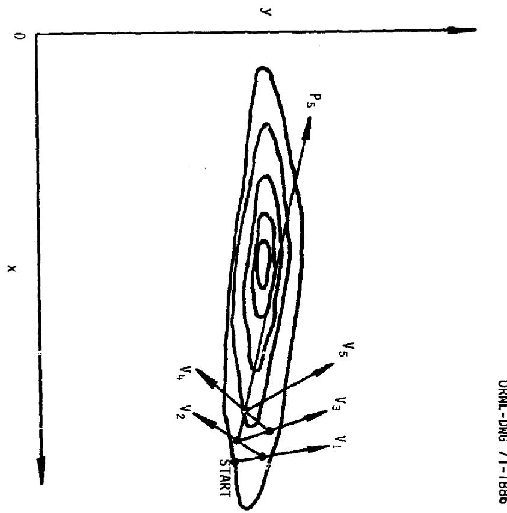
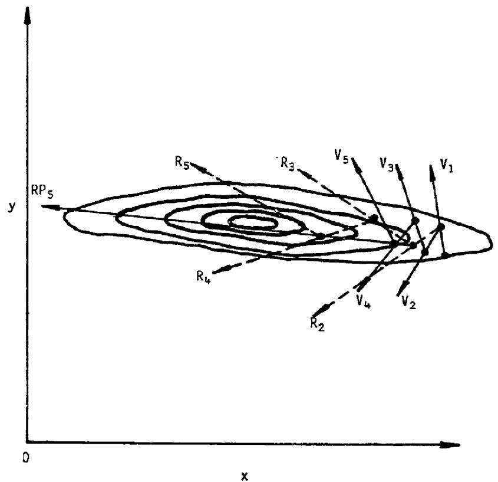

Contract No. W-7405-eng-26

Reactor Division

ROD: A NUCLEAR AND FUEL-CYCLE ANALYSIS CODE FOR CIRCULATING-FUEL REACTORS

H. F. Bauman   
G. W. Cunningham, III   
J. L. Lucius   
H. T. Kerr   
C.W.Craven, Jr.

This report was prepared as an account of work sponsored by the United States Government. Neither the United States nor the United States Atomic Energy Commission, nor any of their employees, nor any of their contractors, subcontractors, or their employees, makes any warranty, express or implied, or assumes any legal liability or responsibility for the accuracy, completeness or usefulness of any information, apparatus, product or process disclosed, or represents that its use would not infringe privately owned rights.

SEPTEMBER 1971

OAK RIDGE NATIONAL LABORATORY

Oak Ridge, Tennessee

operated by

UNION CARBIDE CORPORATION

for the

U. S. ATOMIC ENERGY COMMISSION

# CONTENTS

Page   
Foreword v   
Abstract vii   
Acknowledgments ix   
Computer Code Abstract xi

1. Introduction 1.1   
2. The History of ROD 2.1   
3. The Functions of the ROD Program 3.1   
4. Input Description 4.1 Section A. MODRIC 4.3 Section B. ERC 4.18 Section C. Fission Product and Delayed Neutron Data 4.29 Section D. OPTI 4.3   
5. Discussion of Input 5.1   
6. User Information 6.1  
Control Cards 6.1  
Cross-Section Tape 6.2  
ROD Subroutines 6.5   
7. Theory 7.10  
MODRIC-ERC 7.12  
Two-Dimensional Synthesis 7.63  
OPTI 7.74  
HISTORY 7.15   
8. Sample Problem 8.1  
9. References 9.1  
Appendix A. The ERC Equations  A.1  
Appendix B. Basic MODRIC Equations  B.1  
Appendix C. Fission-Product Treatment  C.1  
Appendix D. The Processing Study Option  D.1

# FOREWORD

The evolutionary nature of the ROD program (see Section 2, The History of ROD) has led to certain practical limitations on the information presented in this report. We have described the uses for which the program was intended, the theory and methodology employed, and rather completely the information required for applying the program. We have not attempted a comprehensive description of the programming itself.

vii

# ABSTRACT

ROD (Reactor Optimum Design) is a computer code for simultaneously optimizing the core design and performing the fuel-cycle analysis for circulating-fuel reactors. It consists of a multigroup diffusion calculation, including multiple thermal groups with neutron upscatter, in one-dimension or in two-dimensional synthesis, combined with an equilibrium fuel-cycle calculation. Cross sections in the CITATION format are required. The equilibrium calculation is a detailed model of the fuel cycle, including the effects of processing and of nuclear transmutation and decay. Fuel-cycle costs and fission-product concentrations are calculated, the fission products by an independent calculation from internally stored two-group cross sections. Special features of ROD are an optimization routine based on the gradient-projection method, a flux-plotting option, and a subprogram for simple time-dependent calculations based on reaction rates from the main program.

Keywords: breeding performance, computer codes, fluid-fueled reactors, fuel-cycle costs, nuclear analysis, optimizations, conceptual design, cores, delayed neutrons, equilibrium, fission products, neutron flux, parametric studies, processing, time dependent.

# ACKNOWLEDGMENTS

A number of persons, not excluding the authors of this report, have made significant contributions to the development of the ROD code. H. F. Bauman and H. T. Kerr have been the principle users of ROD and have guided its development from the user's standpoint. The theoretical development has been the work of L. G. Alexander, T. W. Kerlin, and C. W. Craven, Jr. The programming was done by J. L. Lucius and G. W. Cunningham. Sections of pre-existing programs which have been incorporated into ROD (see Chapter 2, The History of ROD) were written by J. Replogle, W. T. Kephart, M. J. Bell, and R. S. Carlsmith.

# COMPUTER CODE ABSTRACT

1. Name: ROD

2. Computer for Which Code is Designed: The code is designed for computers in the IBM-360 series which have directly addressable storage of 300 thousand words or more.

3. Problems Solved: For nuclear reactors the code solves the eigenvalue problem with or without a critical concentration search for one dimension or for a two-dimensional synthesis, giving flux and fission-density distributions. It performs a fuel-cycle analysis, including costs, for circulating-fuel reactors, either at equilibrium, for continuous processing, or time-dependent (by assuming a separable time-dependence) for batch or continuous processing. The equilibrium problem may be solved for up to three independent fuel or fertile streams. The equilibrium concentrations for the fuel-chain nuclides and up to 200 fission-product nuclides are obtained. The optimum values of selected core-design and fuel-cycle parameters may be obtained, based on the maximization of a selected function related to the reactor performance.

4. Method of Solution: The neutronics calculation is performed by a multigroup, one-dimensional or synthetic two-dimensional diffusion calculation, including multiple thermal groups with neutron upscatter. The equilibrium calculation uses the reaction rates from the diffusion calculation to determine the equilibrium concentrations of the fuel-chain nuclides. The concentrations of the fission products are obtained from a self-contained two-group calculation. An iterative process is continued until the diffusion and equilibrium calculations converge on a common set of nuclide concentrations. The optimization is based on the gradient-projection method. The time-dependent calculation (optional) uses average reaction rates from the main calculation to calculate the concentrations of the principle fuel nuclides as a function of time.

5. Restrictions on Complexity of the Problem: The major limiting values which restrict the complexity of a problem are 15 energy groups,

including four thermal groups, 30 nuclides per region, 10 regions per dimension, 2 dimensions, 50 nuclides in the equilibrium calculation, 200 fission products, and 20 optimization variables.

6. Typical Machine Time: The running time on the IBM 360/75 varies widely depending on the type of problem. Single cases require from about one minute for a one-dimensional problem with six groups (5 fast, 1 thermal) to about 5 minutes for a two-dimensional synthesis problem with 9 groups (5 fast, 4 thermal). Cases run as part of a series (as in an optimization) run in a half to a third the time required for a single case (because they are started with the flux distribution from the previous case). An optimization with five variables, nine groups, in one dimension runs in about an hour.   
7. Unusual Features of the Program: The ability to closely model the behavior of a circulating-fuel reactor, including such factors as the loss of delayed neutrons from fuel circulating outside the core, is an unusual feature of the program. Others are the availability of routines for optimization and for flux plotting.   
8. Related and Auxiliary Programs: The code is designed to use a microscopic cross-section tape generated by the code XSDRN.   
9. Status: ROD is in production use at ORNL on the IBM 360/75 and 360/91.   
10. Machine Requirements: About 300 thousand words of core storage and three I/O devices excluding input-output and system requirements are needed by the program. Two additional I/O devices, for auxiliary output and flux-plotting, are optional. Plotting requires a CALCOMP CRT plotter.   
ll. Programming Language Used: FORTRAN IV.   
12. Operating System: IBM 05/360 with FORTRAN H compiler.   
13. Programming Information: The program consists of about 6000 FORTRAN statements. Arrays of fixed dimensions are provided for all data within the program, which requires about 300 thousand 4-byte words of core storage.   
14. Users Information: The code and report may be obtained through the Argonne Code Center at Argonne National Laboratory.

# xii

# 15. References:

1. H. F. Bauman et al., ROD: A Nuclear and Fuel-Cycle Analysis Code for Circulating-Fuel Reactors, USAEC Report ORNL-TM-3359, Oak Ridge National Laboratory.   
2. N. M. Greene and C. W. Craven, Jr., XSDRN: A Discrete Ordinates Spectral Averaging Code, USAEC Report ORNL-TM-2500, Oak Ridge National Laboratory, July 1969.

H. F. Bauman  
G. W. Cunningham, III  
J. L. Lucius  
H. T. Kerr  
C. W. Craven, Jr.

Oak Ridge National Laboratory  
P. O. Box Y  
Oak Ridge, Tennessee 37830

# CHAPTER 1

# INTRODUCTION

The Rod (Reactor Optimum Design) code is unique among reactor analysis codes in two respects; it was developed for the core design and fuel-cycle analysis of circulating-fuel reactors; and it incorporates a package for the optimization of certain design parameters. It is limited to one-dimensional, or a synthesis of two one-dimensional, neutron diffusion calculations, and is therefore suited for conceptual design studies of reactors rather than the detailed calculation of a given core geometry.

Circulating-fuel reactors, which include the aqueous homogeneous and the molten-salt reactor types, are different in several characteristics from fixed-fuel reactors. The fuel is perfectly mixed so that its composition at a given time is the same everywhere in the system. However, there may be more than one fluid stream, as when a fertile stream is used as a blanket, or the fuel may be circulated through a fixed moderator, as in the molten-salt reactor, so that the overall core composition may be different in different core zones. Circulating-fuel reactors are usually designed for continuous processing of the fuel to remove fission products and to adjust the fissile concentration. In many designs, the fuel reaches an equilibrium composition in a relatively short time. The calculation of the reactor performance at equilibrium is then a most important consideration. Finally, in circulating-fuel reactors, delayed neutrons emitted from the fuel circulating outside the core, as in a heat exchanger, are largely lost to the chain reaction and must be accounted for in the reactor neutron balance. The ROD code has been designed to take all of these factors into account.

ROD also includes a subprogram for nonequilibrium calculations, designed to calculate an average performance for a reactor over some interval of time (e.g., a reactor lifetime), either with batch fuel processing or with continuous processing. This option may also be used to calculate the average performance of a reactor in the interval from start-up until equilibrium is established. The method uses average reaction rates from a space-energy dependent calculation to calculate the time-dependent concentrations of the most important nuclides. This is, of

course, an approximation, in that space-energy and time-dependent effects are not considered simultaneously.

The optimization package in ROD is based on the gradient-projection method, or the method of steepest ascent. It will very a given set of parameters (e.g., core dimensions, processing cycle times) within limits, in a series of cases to search out the values of the parameters which maximize the value of a given objective function (e.g., the breeding ratio, the inverse of the fuel-cycle cost). Optimization may be used in combination with a parameter survey; for example, the effect of a given parameter can be determined with other parameters adjusted to their optimum values for each case, rather than merely held fixed at some arbitrary value.

# CHAPTER 2

# THE HISTORY OF ROD

The ROD code was not "written" but rather "evolved". Parts of ROD were written, put together, taken apart, and revised by a number of people over a long period of time. A code with the scope and versatility of ROD could probably not have been attained without this long period of development. However, the evolutionary character of ROD has resulted almost inevitably in some disadvantages, chiefly that the input and output lack a consistent format, that many sections of the code have not been described by their authors except in the original FORTRAN, that parts of it are seldom used or obsolete, and that the program has become complex and difficult to change. Fortunately, the code was considerably unified in adapting it for the IBM System 360 computers in 1968.

In the beginning (in the 1950's) fluid-fuel reactor calculations were made with the one-dimensional diffusion-theory code GNU, written in machine language at General Motors Corporation, and ERC (for equilibrium reactor calculation), an equilibrium code written in FORTRAN at ORNL. In 1960, GNU was replaced by MODRIC, $^{1}$ also a one-dimensional diffusion-theory code, but written in FORTRAN, which made modification of the program more practical. At this time, of course, the neutronic and equilibrium calculations were performed separately.

The moment of conception for ROD came in 1961 when J. L. Lucius, under the direction of L. G. Alexander and T. W. Kerlin, joined MODRIC and ERC into a single code called MERC.<sup>2</sup> In this combination, a neutron diffusion calculation alternated with an equilibrium calculation, so that reaction rates were supplied from the diffusion calculation to the equilibrium calculation, and new equilibrium concentrations were supplied to the succeeding diffusion calculation until both converged on a single set of concentrations. This process is still the heart of the ROD calculation.

Over the next few years the code was expanded and improved. The fission-product treatment in ERC was expanded to treat first 75 and later 125 nuclides. The number of fuel streams for which equilibrium could be calculated was increased from two to three. A provision was added for calculating the withdrawal of fuel at a final concentration beyond the

equilibrium burnup - useful in calculating certain solid-fuel cores such as a pebble-bed. A two-dimensional synthesis was developed, by C. W. Craven, Jr., in which a two-dimensional calculation was synthesized from two one-dimensional calculations; for example, a cylindrical core from an axial and a radial calculation.

In 1964, T. W. Kerlin suggested that the most efficient method for finding the set of parameters which gave the best performance in a particular core design was to use a computerized optimization technique. About this same time, W. L. Kephart at the Oak Ridge Gaseous Diffusion Plant had developed an optimization code (unpublished) based on the gradient-projection method.<sup>3</sup> We decided to link MERC with the optimization package; the results was a combined code called OPTIMERC. Development of OPTIMERC continued through 1965 and it was used extensively for molten-salt reactor calculations through mid-1968.

The OPTIMERC code had one major operational fault, which was that the entire program would not fit into the core of the IBM 7090 computer in use at that time. During a calculation, therefore, information was continually stored and retrieved from magnetic tape. This resulted in long running times - up to 2 or 3 hr for complex optimization problems - and frequent job failures because of tape input-output errors.

The IBM 360 Model 75, which became available at ORNL in 1967, seemed ideal for a large program like OPTIMERC because of its large core capacity. To take full advantage of the new computer, however, it was necessary to reprogram OPTIMERC to eliminate much of the information handling. We decided not only to reprogram OPTIMERC for the Model 75, but to take this opportunity to integrate better the various parts of the program, and to enlarge the capacity of the code to handle larger problems.

The programming of the new code, which was named ROD (for Reactor Optimum Design), was undertaken by G. W. Cunningham, under the direction of J. L. Lucius and the guidance of C. W. Craven, Jr., H. T. Kerr, and H. F. Bauman. The important new features of the ROD code were:

i. All operations, after reading of the cross-section information, are contained in core.

2. Multiple thermal groups (with upscatter) are permitted.   
3. Two-dimensional synthesis is performed by energy groups.   
4. ERC was expanded:

a) up to four materials are permitted, of which three may be treated as fuel streams,   
b) the maximum number of nuclides in the equilibrium calculation was expanded from 25 to 50,   
c) the maximum number of fission-product nuclides was expanded from 125 to 200.

5. Standard optimization variables and objective function were built-in (no programming required).   
6. A standard CITATION cross-section tape is read.   
7. Cross-section sets are assigned by region; up to five cross-section sets are permitted.

At about this time, M. J. Bell, of the ORNL Chemical Technology Division, needed a method for calculating in detail the effects of the processing removal of various fission products from a molten-salt reactor. He used the basic ROD calculation, but substituted his own subroutine for the calculation of the fission-product absorptions. This treatment is now an option in ROD. Its use is limited to single cases (i.e., optimization is precluded).

In 1970, an option was added to ROD to permit the calculation of the average performance of a reactor over one or more batch processing cycles. It is based on a zero-dimension, one-group, time-dependent code (unpublished) written by R. S. Carlsmith in 1966, which we expanded and revised for inclusion in ROD. Called HISTORY, it takes reaction rates from the diffusion calculation to calculate the concentrations of the important fuel nuclides as a function of time. The time-weighted average concentrations are then supplied to the next diffusion calculation, and this iterative process continued until there is no further change in the average concentrations.

This brief history of ROD shows how it has grown and developed over a period of years, and we can only assume that further additions and improvements will be made. Some future developments that have already been suggested are:

1. Replacing MODRIC with ORNL's latest diffusion code, CITATION, which would permit finite-difference two-dimensional calculations.   
2. Reprogramming of the "solid-fuel" option (which was not included in the conversion of OPTIMERC to ROD).   
3. The standardization of the input format and the elimination of dual nuclide-identifications.

Since some of these changes, and others not yet conceived, may be made in the future, this report has been organized so far as possible into independent chapters.

# CHAPTER 3

# THE FUNCTIONS OF THE ROD PROGRAM

The ROD program consists of four principal parts called MODRIC, ERC, OPTI, and HISTORY. The functions of these parts, as well as several important options, are described in this section. A flow diagram of the program is given in Fig. 3.1.

MODRIC is the neutronics section of the code. It is a multigroup, one-dimensional or synthesis two-dimensional, diffusion-theory calculation. It can perform a criticality search, or simply solve the eigenvalue problem. It can be run independently, without preparing input data for the other sections of the code. The main output of MODRIC is the critical concentrations and the flux and fission density distributions.

ERC calculates the equilibrium composition of the reactor and performs the economics calculations. It requires reaction rates from MODRIC and in turn supplies nuclide concentrations for the next MODRIC iteration. Iterations between MODRIC and ERC proceed until the calculations converge on a common set of nuclide concentrations.

ERC calculates the equilibrium concentrations of the principle fuel nuclides, for which reaction rates are obtained from MCDRIC, and also the concentrations of up to 200 fission-product nuclides, for each of which it makes a two-group calculation based on a thermal cross section and a resonance integral. The two-group cross-section data, along with fission yields, are stored in a separate section of the data deck known as "permanent data."

The 250 ERC nuclides may be divided into as many as ten groups for processing, each with its own processing equation in each stream. Cost data may be supplied for any of the principle nuclides from which the various components of the fuel-cycle cost are calculated. Most of the ROD output is assembled in the ERC section, including the neutron balance, fissile inventory, breeding ratio, fuel yield, and feed and production rates for the principle nuclides.

OPTI is an optimization package, based on the gradient-projection method. It controls the running of a series of cases, in which certain reactor parameters may be varied systematically within limits, in order

ORNL-DWG 71-1884

  
Fig. 3.1. Flow of the ROD Program.

to find, within some tolerance, the set of parameters which gives a maximum value of a prescribed objective function. Parameters which may be varied by OPTI include region thicknesses and fuel volume fractions, the boundary position between adjoining regions, processing cycle times, and, in HISTORY, the time in a batch cycle that the feed is switched from one fissile fuel to another. The objective function is a sum of the following components, each of which may be weighted with an optional constant coefficient, including zero: breeding ratio, fuel yield, reciprocal fuel-cycle cost, reciprocal discounted fuel cost, specific power, an inverse function of the maximum fast flux, and a function of the breeding gain and the specific power called the conservation coefficient.

HISTORY is a subprogram which can calculate the concentrations of the principle fuel nuclides as a function of time, rather than just at equilibrium. It uses reaction rates obtained from MODRIC-ERC (MERC), and supplies time-weighted average nuclide concentrations to the next iteration of MERC. The iteration process proceeds until MERC and HISTORY converge on a common set of concentrations. The HISTORY option is designed to calculate the average performance of a reactor during a batch processing cycle, or over a reactor lifetime of several processing cycles. It calculates the discounted fuel cost, based on a present-worth calculation of all purchases and sales of fissile fuel and carrier materials, over the lifetime of the reactor for a specified discount rate. It also provides useful information on the feed and production rates and inventories of the principle fuel nuclides as a function of time. Its main limitation is that the space-energy calculation is considered independent of time; which results in some lack of rigor in the burnup calculation. ROD-HISTORY, therefore, should not be considered as a substitute for more sophisticated burnup codes.

Among the main options available in ROD, perhaps the most useful is the "variables specified" option. This is a provision in the OPTI section of the code to control the running of a series of cases in which any of the standard optimization parameters ("variables") are preset to any desired values. After the base case, essentially the only data required are the values of those parameters which are to be changed from the

preceding case, since all other data are held fixed. Furthermore each case is started with the flux and fission density distribution from a previous case, which gives, typically, a factor of 3 or 4 saving in computation time over the running of an identical series of cases independently.

The output options are very important. So much output is potentially available from the (typically) 60 or 70 cases of an optimization problem that we have devised an elaborate system for selecting output. The cases are divided into four categories as follows:

1. A base case (the first case run).   
2. The final or optimum case from an optimization; or the "variables specified" cases when this option is selected.   
3. The final case from each optimization cycle (gradient projection).   
4. Intermediate cases in an optimization.

The output itself is divided into 29 segments, any or none of which may be selected for each type of case above. In addition, an input edit of 15 segments is available. Two independent sets of output may be specified for any problem. The first, or "detailed" output, can include any or all of the edit options. The second, or "short" output, can include most of the edit options except some of the infrequently required tables. Either set may be omitted.

Finally, an option is available for flux plotting. It is included in the output options by type of case as described above. The plotting information is recorded on magnetic tape for use on a CRT (cathode ray tube) plotter. The fluxes for any or all energy groups may be selected for plotting on either a linear or logarithmic scale.

# CHAPTER 4

# INPUT DESCRIPTION

The input for ROD is divided into four main sections:

A. MODRIC, including HISTORY   
B. ERC   
C. Fission product and delayed neutron data   
D. OPTII

The input description is given as concisely as possible. Items marked by an asterisk are discussed in greater detail in the following section, "Discussion of Input." The numbers following the variable name, where given, are suggested values for the data. These are intended to be helpful to users with little or no experience with ROD, and may not be appropriate for every case.

The input instructions are intended to be self-explanatory; however, the following introduction may be helpful.

The diffusion calculation is one-dimensional, along a line such as a reactor axis or radius. The reactor composition must be specified for the various regions along each line of computation. The results of the calculation are applied to a three-dimensional volume, usually in spherical or cylindrical geometry. For 2-D synthesis calculations, in particular, it is necessary to specify the composition of the subregions of the reactor that are not along an axis or radius of calculation. Usually a number of subregions are of the same composition; for example, axial, radial, and "corner" blanket subregions may all have the same composition. A superregion is a set of subregions all of the same composition. The superregion composition is specified by assigning a volume fraction for each material to that superregion.

A material is defined by its nuclide composition. There are two classes of materials; those of fixed composition, such as a graphite moderator or a Hastelloy-N structural material, and those of composition determined by the feed, processing, and nuclear reaction rates of the system. The latter materials are referred to as streams; a fuel stream for a molten-salt reactor, for example, typically consists of the carrier salt nuclides, the fissile and fertile nuclides, and the fission-product nuclides.

The program limitations on the number of materials, regions, and other input parameters are summarized in Table 4.1.

Table 4.1. Program Limits for ROD Input Parameters   

<table><tr><td colspan="2">Limits in MODRIC</td></tr><tr><td>Number of materials</td><td>4</td></tr><tr><td colspan="2">Note: The first three materials may be treated as streams (with processing).</td></tr><tr><td>Number of nuclides, per region</td><td>30</td></tr><tr><td>Number of search nuclides</td><td>30</td></tr><tr><td>Number of energy groups</td><td>15</td></tr><tr><td>Number of space dimensions</td><td>2</td></tr><tr><td>Number of regions, per dimension</td><td>10</td></tr><tr><td>Number of superregions</td><td>20</td></tr><tr><td colspan="2">Limits in ERC</td></tr><tr><td>Number of principal nuclides</td><td>50</td></tr><tr><td>Number of fission-product nuclides</td><td>200</td></tr><tr><td colspan="2">Limits in OPTI</td></tr><tr><td>Number of variables</td><td>20</td></tr></table>

# Section A. MODRIC

Card Number, Description, and Format

A-1 Title (18A4).   
A-2 Comment (18A4).   
A-3 Program control (F2.C,I2,II).

<table><tr><td>Column</td><td>Name</td><td>Suggested
Value</td><td>Description</td></tr><tr><td rowspan="3">1-2</td><td rowspan="3">FLIP</td><td></td><td>Dimension option</td></tr><tr><td></td><td>&gt;0 Two-dimensional synthesis</td></tr><tr><td></td><td>≤0 One dimension</td></tr><tr><td>34</td><td>MAX3P</td><td>5</td><td>Maximum number of MODRIC-ERC iterations per
case</td></tr><tr><td rowspan="3">5</td><td rowspan="3">MERC</td><td></td><td>MODRIC only option</td></tr><tr><td></td><td>&gt;0 MODRIC and ERC</td></tr><tr><td></td><td>=0 MODRIC only</td></tr><tr><td colspan="4">Cards A-4 to 7. Output options for detailed printout. See Table
4.2. The detailed output may be omitted by means of a dummy control
card (refer to Chapter 6).</td></tr><tr><td colspan="4">A-4 Base case (case zero), (50I1).</td></tr><tr><td colspan="4">A-5 Final case in an optimization; variables specified cases (50I1).</td></tr><tr><td colspan="4">A-6 Final case in each optimization cycle (50I1).</td></tr><tr><td colspan="4">A-7 Intermediate cases in an optimization (50I1).</td></tr><tr><td colspan="4">Cards A-8 to 11. Output options for short printout. (Same as cards
A-4 to 7.) To omit short printout, leave cards A-8 to 11 blank.</td></tr><tr><td colspan="4">A-12 Convergence information.* (2I3,6E10.4,I10)</td></tr><tr><td>1-3</td><td>NRFLX</td><td></td><td>Not used</td></tr><tr><td rowspan="3">4-6</td><td rowspan="3">NRFLXN</td><td>1</td><td>Flux normalization</td></tr><tr><td></td><td>=1 Normalize dimension 1 true flux to
dimension 2</td></tr><tr><td></td><td>=0 Do not normalize as above</td></tr></table>

Table 4.2. Output Options   
Enter 1 where output is desired. Otherwise enter 0 or leave blank.   

<table><tr><td>Column
on
Card</td><td>Output Table Controlled</td></tr><tr><td>1a</td><td>MODRIC data by group, region, and dimension. Usually omitted.</td></tr><tr><td>2a</td><td>Macroscopic cross sections and homogenized atom densities by
region after each criticality search. Usually omitted.</td></tr><tr><td>3a</td><td>MODRIC data by region and dimension. Usually omitted.</td></tr><tr><td>4a</td><td>Normalized 2-D synthesis MODRIC data by nuclide, region and
dimension after each MODRIC pass. Usually omitted.</td></tr><tr><td>5a</td><td>Data supplied as input to ERC. Atom densities and reaction
rates by nuclide and material.</td></tr><tr><td>6</td><td>k-effective and upscattering data by iteration. Usually
omitted.</td></tr><tr><td>7</td><td>The main ERC output table and neutron balance. Atom dens-
sities, inventories, and feed and production rates by nuclide
and material.</td></tr><tr><td>8</td><td>Fission product atom densities and absorptions by nuclide.</td></tr><tr><td>9</td><td>Atom densities supplied to MODRIC each MERC iteration.
Usually omitted.</td></tr><tr><td>10</td><td>Region thicknesses and other region information. (This table
is also obtained in option 21.)</td></tr><tr><td>11</td><td>Volumes, total and by material, by super region.</td></tr><tr><td>12</td><td>Processing information.</td></tr><tr><td>13</td><td>MODRIC neutron balance by group and dimension.</td></tr><tr><td>14</td><td>Neutron absorptions and productions by region and dimension.</td></tr><tr><td>15a</td><td>Macroscopic cross sections by group, region, and dimension.</td></tr><tr><td>16</td><td>Homogenized atom densities by region and dimension.</td></tr><tr><td>17a</td><td>MODRIC fluxes and fission densities. Specify for &quot;MODRIC
only&quot; runs.</td></tr><tr><td>18</td><td>Normalized point fluxes and fission density distribution.</td></tr><tr><td>19a</td><td>Exercise option to plot fluxes.</td></tr><tr><td>20b</td><td>Table of optimization data. Usually omitted.</td></tr><tr><td>21b</td><td>Region thicknesses and other region information. Super-
region volume fractions.</td></tr></table>

Table 4.2 (contd)   

<table><tr><td>Column
on
Card</td><td>Output Table Controlled</td></tr><tr><td>22b</td><td>Objective function output summary and optimization variables used.</td></tr><tr><td>23</td><td>Edit of data supplied to the HISTORY subprogram.</td></tr><tr><td colspan="2">Note: Options 24 to 38 control the edit of input information. These options are ignored except when specified for the base case (case zero).</td></tr><tr><td>24</td><td>Initial atom densities by material.</td></tr><tr><td>25</td><td>MODRIC control and search information.</td></tr><tr><td>26</td><td>Cross-section listing. Enter the specified integer to obtain one of the following four options:</td></tr><tr><td></td><td>0 No output</td></tr><tr><td></td><td>1 Title of each cross-section set</td></tr><tr><td></td><td>2 Title and list of nuclides in each cross-section set</td></tr><tr><td></td><td>3a Complete listing of each cross-section set</td></tr><tr><td>27</td><td>Energy group boundary table.</td></tr><tr><td>28</td><td>Dimension information.</td></tr><tr><td>29a</td><td>Initial fission density distribution.</td></tr><tr><td>30</td><td>Initial homogenized atom densities by region.</td></tr><tr><td>31</td><td>ERC input card edit.</td></tr><tr><td>32</td><td>Nuclide correspondence table.</td></tr><tr><td>33</td><td>Subregion--super region correspondence. (The &quot;picture&quot; of the reactor.)</td></tr><tr><td>34</td><td>Super region volume fractions.</td></tr><tr><td>35a</td><td>Permanent data. (Atomic mass, beta decay constant, two-group cross sections, fission yield, by nuclide.)</td></tr><tr><td>36</td><td>Delayed neutron data.</td></tr><tr><td>37a</td><td>Source and recycle-fraction data by material.</td></tr><tr><td>38</td><td>HISTORY input edit.</td></tr></table>

4.6

Table 4.2 (contd)   

<table><tr><td>Column
on
Card</td><td>Output Table Controlled</td></tr><tr><td colspan="2">Note: 
Option 
HISTORY 
k 
eff 
by iteration may be specified on card A-18.</td></tr><tr><td>39</td><td>Atom densities, inventories, eigenvalues, and conversion ratios.</td></tr><tr><td>40</td><td>Cumulative purchases.</td></tr><tr><td>41</td><td>Incremental purchases.</td></tr><tr><td>42</td><td>Neutron absorptions and productions.</td></tr><tr><td>43</td><td>Costs.</td></tr><tr><td>50a</td><td>ERC output for non-converged nuclides by iteration. Used only for study of ERC convergence.</td></tr></table>

$^{\text{a}}$ Option not available for short printout.   
bOption not available for base case.   
cERC output every pass may be specified on card B-1.

4.7

7-16 FDGVJL

Factor for true flux and fission power density calculation. Enter:

One-dimension:

Sphere 1.0

Cylinder Overall height

Slab Product of overall lengths of second and third sides

Two-dimension:

Slab-cylinder 2.0

Slab-slab Overall length of third side

17-26 CnCSO 2.0

Factor by which the convergence criteria are tightened for base case.

27-36 CNOT1 2.0

Factor by which the convergence criteria are loosened for the first MERC iteration.

37.46 CDELT 1.0E-05

The convergence requirement on the change of upscatter acceleration treatment from iteration to iteration.

47-56 CT0L 1.OE-O4

The tolerance on the upscatter acceleration treatment approach to unity.

57-66 CP1C0N 1.2

Factor which limits the change in dc/dk in the criticality search.

67-76 NTEXT 3

The minimum number of MODRIC iterations required after the upscatter treatment has converged.

Cards A-13 to 17 control the flux plotting option. If no flux plots are required, these cards may be left blank. The symbols used to designate the neutron energy groups are given in Table 4.3.

A-13 Flux plot control (4I5,4E10.4).

1-5 IWADFP Not used

6-10 IGRID Grid options:

= 1 Linear   
= 2 Semilog, space-coordinate logarithmic   
$= 3$ Semilog, flux logarithmic   
$= 4\log -10g$

Table 4.3. Symbols Used in Flux Plots   

<table><tr><td>Symbol</td><td>Neutron Energy Group</td></tr><tr><td>.</td><td>1, 11</td></tr><tr><td>①</td><td>2, 12</td></tr><tr><td>Δ</td><td>3, 13</td></tr><tr><td>+</td><td>4, 14</td></tr><tr><td>×</td><td>5, 15</td></tr><tr><td>◇</td><td>6</td></tr><tr><td>Y</td><td>7</td></tr><tr><td>*</td><td>8</td></tr><tr><td>区</td><td>9</td></tr><tr><td>☆</td><td>10</td></tr></table>

4.9

<table><tr><td>11-15</td><td>IPTLIN</td><td>Point-line options:</td></tr><tr><td></td><td></td><td>= 0 Points only</td></tr><tr><td></td><td></td><td>= 1 Line only</td></tr><tr><td></td><td></td><td>= 2 Points and line</td></tr><tr><td></td><td></td><td>= 3 Histogram</td></tr><tr><td>16-20</td><td>NPRNG</td><td>Range options:</td></tr><tr><td></td><td></td><td>= 0 Range determined by data extrema</td></tr><tr><td></td><td></td><td>= 1. Range specified in next four fields</td></tr><tr><td>21-30</td><td>XMINN</td><td>Minimum of space-coordinate range</td></tr><tr><td>31-40</td><td>XMAXX</td><td>Maximum of space-coordinate range</td></tr><tr><td>41-50</td><td>YMINN</td><td>Minimum of flux range</td></tr><tr><td>51-60</td><td>YMAXX</td><td>Maximum of flux range</td></tr></table>

A-14,1-36 Plot title (9A4).

A-15,1-36 Space-coordinate axis label $(9A4)$ .

A-16,1-36 Flux axis label (9A4).

A-17 Groups to be plotted (16I2).

1-2 NoGPS Total number of groups to be plotted.

3-4 NPLTGP(I) Remaining fields identical. Enter group number of each group to be plotted.

Cards A-18 to 34 are for input to the HISTORY subprogram. If HISTORY is not used, these cards may be left blank.

A-18 HISTRY control information (6I5,3OX,E10.4).

<table><tr><td>1-5</td><td>ISTRY</td><td>Activate HISTRY subprogram.</td></tr><tr><td></td><td></td><td>&gt;0 Yes</td></tr><tr><td></td><td></td><td>=0 No</td></tr></table>

6-10 KLIM 30 Limit on K iterations.

<table><tr><td>11-15</td><td>KEUG</td><td>0</td><td>Printout, K by iteration.</td></tr><tr><td></td><td></td><td></td><td>&gt; 0. Yes</td></tr><tr><td></td><td></td><td></td><td>= 0 No</td></tr></table>

<table><tr><td>16-20</td><td>NV</td><td>Activate converter-breeder option.* = 0 Not activated
When keff is greater than 1.0:</td></tr></table>

<table><tr><td>21-25</td><td>NCY</td><td>Number of batch processing cycles.</td></tr><tr><td>26-30</td><td>NFS</td><td>Second feed key nuclide number.* (Ignored when SWCH is zero.)</td></tr><tr><td>61-70</td><td>SWCH</td><td>Time, full-power months, of switch to second feed. Zero for no second feed.</td></tr><tr><td colspan="3">A-19 HISTORY data (8E10.4).</td></tr><tr><td>1-10</td><td>TMAX</td><td>Time, full-power months per cycle.</td></tr><tr><td>11-20</td><td>DT 0.05</td><td>Time step, months.</td></tr><tr><td>21-30</td><td>XPR 240</td><td>Number of time steps per normal data period.*</td></tr><tr><td>31-40</td><td>PUR</td><td>Feed options:
= 0 235U feed, Th fertile
&gt; 0 Pu feed, Th fertile
&lt; 0 Low enriched U feed</td></tr><tr><td>41-50</td><td>TAU</td><td>Time constant for 233Pa removal, if any; fraction removed per second.</td></tr><tr><td>51-60</td><td>THMX</td><td>Maximum atom density of fertile nuclide if fertile-buildup option is used.* Otherwise zero.</td></tr><tr><td>61-70</td><td>SHIFT 7.0</td><td>The number of data printouts before the frequency of output shifts from twelve times normal to normal.*</td></tr><tr><td>71-80</td><td>TOLK 0.0001</td><td>Tolerance on keff.</td></tr><tr><td colspan="3">A-19.1 Carrier cost control information* (6I5).</td></tr><tr><td>1-5</td><td>NS</td><td>The number of carrier nuclides for which costs are specified in ERC. Zero to five permitted.</td></tr></table>

6-10 NSC(二)

Remaining fields identical. Enter the ERC number of each carrier nuclide for which a cost is specified.

A-20 Control of the restarting atom densities (after the first cycle) (14F5.1)

Enter a restart factor for each nuclide in order.

1.0 If the nuclide is recovered and recycled.

0.0 Otherwise.

The above entries apply to the fertile nuclide if its atom density is held constant throughout the cycle. If it is allowed to deplete during the cycle, enter:

-2.0 If it is recovered and recycled.

-1.0 Otherwise.

A-21 to 34 HISTORY nuclide information.* One card for each nuclide (4E10.4,2X,AS).

1-10 CSP(I)

Initial atom density for nuclide I.

11-20 FRM(I)

Feed fractions for feed nuclides. Otherwise 0.0.

21-30 FRS(I)

Feed fractions for second feed, if any.

31-40 SL(I)

Removal fraction for sale, if any.

43-50 DENT(I)

Nuclide identification.

This ends the HISTRY data section.

A-35 designates a series of cards of identical format on which the initial atom density of each nuclide in each material is entered.

A-35 Atom densities by material (I2,5(I3,E11.4)).

1-2 MX

Material number.*

3-5 IH(I)

MODRIC nuclide number (NPET).

6-16 TEMP(I)

Atom density (atom/bn-cm) in material (RHT). Must be non-zero.

Remaining pairs of fields identical. Use as many cards as required for each material. Enter the material number in the I2 field on each card.

A-36 Blank card.

A-37 Material names (8A4).

1-3 H0lMAT Name of material 1.

Remaining fields identical. Enter names of materials in order. A-38 designates a series of cards, one for each region level in dimension 1, in order, on which the super region number is entered for each subregion of the reactor. These cards create a 2-D "picture" of the super-region distribution in the reactor. For 2-D problems in cylindrical geometry, by convention, the axial dimension is 1 and the radial dimension is 2.

A-38 Super-region subregion correspondence (picture).* (I3,3X,10I3).

1-3 L Region level in dimension 1.

4-6 Blank

7-9 NTEMP(K) Super-region number assigned to subregion defined by region levels $(\mathbf{L},\mathbf{K})$ , where K is the region level in dimension 2.

Other fields identical. Enter in order of K up to number of region levels in dimension 2.

A-39 Blank card

A40 designates a series of cards, one for each super region, in order, on which the volume fraction of each material is entered. A40 Volume fractions of materials in each super region (I2,2A4,4E7.4).

1-2 Super-region number.

3-10 HOLVOL Super-region name.

11-17 VFS(M,J) Volume fraction of material M.

Remaining fields identical. Enter volume fractions in order by material. Note: The volume fraction of the last material X is set by the code so that the volume fractions sum to 1.0 in each super region.

A41 Group structure.* (3I2)

1-2 NG Total number of energy groups

34 NETH Group number of the last epithermal group.

5-6 NTH Group number of the last thermal group.

A42 MODERIC convergence information.* (I10,2E10.4,5I10).

1-10 ICON Convergence options:

$$
\begin{array}{l} = 1 \text {o n} k _ {\text {e f f}} \\ = 2 \text {o n f i s s i o n d e n s i t y} \\ = 3 \text {o n b o t h} \\ \end{array}
$$

11-20 EPS1 3.0E-05 Convergence requirement on keff in successive iterations.

21-30 EPS2 3.0E-04 Convergence requirement on fission density in successive iterations.

3140 ITMAX 300 Maximum number of MODRIC iterations allowed.

41-50 IFD Not used

51-60 I#o Not used

61-70 NXΦPT 1 Perform criticality search:

$$
\begin{array}{l} = 1 \text {Y e s} \\ = 0 \text {N o} \\ \end{array}
$$

71-80 MAXOPT 100 Maximum number of optimization cases (may not exceed 200).

When no criticality search is specified, omit cards A-43 and 44.

A43 MODRIC search information.* (I10,3E10.4,15).

1-10 ICH = 3 Search on atom density.

Note: No other MODRIC search options are used in ROD.

11-20 RMD 1.0 Desired $\mathbf{k}_{\mathrm{eff}}$

21-30 XX 3.0 Initial estimate of dc/dk, fractional change in atom density of search nuclides per unit change in k.*

31-40 EPSL 1.0E-04 Tolerance for $\mathbf{k}_{\mathrm{eff}}$

4145 MS The material altered by the criticality search.

A44 Criticality search nuclides.* (24I3).

1-3 NSE Total number of search nuclides.

4-6 NPC(L) Remaining fields identical. Enter the MODRIC number of each search nuclude.

Use an additional card (same format) if needed.

Cards A-45 to 54 specify information for dimension 1.

A-45 Two-dimensional synthesis information.* (4012). May be left blank for a 1-D case.

1-2 KORE(LD) Core region number.

34 IR3C(I, LD) Ten identical fields. Enter numbers of regions, in order, to which core region buckling from other dimension is to be applied.

23-24 MTAB(I, ID) Ten identical fields. Enter numbers of regions, in order, to which transverse leakage is to be distributed.

A-46 designates a series of cards, one for each region, in order, on which the region information is entered.

A46 Region information (2X,2A4,E10.3,3I5).

3-10 AME Region name.

ll-20 THICK Region thickness, cm.

21-25 MESH Number of mesh spaces.*

26-30 NXS ROD order number of cross section set to be applied in region. (Limited to integers 1 through 5).

31-35 NF Region contains fissile material.*

$$
\begin{array}{l} = 0 \text {N o} \\ = 1 \text {Y e s} \\ \end{array}
$$

A47 Blank card

A48 Shell thickness.* (7(I3,E7.4)). If no shells are specified, use a blank card.

1-3 IH(I) Region number to the inside of the shell.

4-10 TEMP(I) Shell thickness, cm.

Remaining pairs of fields identical. Enter region numbers and shell thicknesses in order. End data with a blank field. Use an additional card if needed.

A49 designates a series of cards on which the boundary conditions are specified by energy group, one card for each set of boundary conditions, in order by groups. If the same boundary conditions apply to all groups, only one card is required. The constants $a$ , $b$ , and $c$ apply to the origin, or inner boundary, and $d$ , $e$ , and $f$ to the outer boundary. Appropriate values for the constants may be selected from Table 4.4.

Table 4.4. Boundary Condition Constants   

<table><tr><td rowspan="2">Boundary Condition</td><td colspan="3">Constant</td></tr><tr><td>a or d</td><td>b or e</td><td>c or f</td></tr><tr><td>Reflected, current zero</td><td>0.0</td><td>1.0</td><td>0.0</td></tr><tr><td>No return current, extrapolation distance = 2.13D</td><td>0.94</td><td>1.0</td><td>0.0</td></tr><tr><td>No return current, extrapolation distance = 2.0D</td><td>1.0</td><td>1.0</td><td>0.0</td></tr><tr><td>Flux zero</td><td>1.0</td><td>0.0</td><td>0.0</td></tr></table>

A49 Boundary conditions (212,16,6E10.4).

<table><tr><td>1-2</td><td>IL</td><td>Group number of highest energy group for
which boundary conditions apply.</td></tr><tr><td>3-4</td><td>IU</td><td>Group number of lowest energy group for
which boundary conditions apply.</td></tr><tr><td>5-10</td><td>KCK</td><td>Not used</td></tr><tr><td>11-20</td><td>TEMP(1)</td><td>a (refer to Table 4.2).</td></tr><tr><td>21-30</td><td>TEMP(2)</td><td>b</td></tr><tr><td>31-40</td><td>TEMP(3)</td><td>c</td></tr><tr><td>41-50</td><td>TEMP(4)</td><td>d</td></tr><tr><td>51-60</td><td>TEMP(5)</td><td>e</td></tr><tr><td>61-70</td><td>TEMP(6)</td><td>f</td></tr></table>

A-50 designates a series of cards on which are entered the attenuation coefficients for shells between regions, if any. If all coefficients are to be 1.0, or if no shells are specified, use a blank card.

A-50 Shell attenuation coefficients by energy group (3(2I2,2E8.4)).

1-2 IS(L) Group

3-4 IH(L) Region inside of shell.

5-12 TEMP(L) g (refer to Eq. B.9, Appendix B)

13-20 TEMH(L) h (refer to Eq. B.10, Appendix B)

Remaining groups of four fields identical. Enter coefficients in order by group and region. End data with a blank field.

A-51 Geometry, buckling, and initial fission density distribution options (3I2).

1-2 IPPTLD) Geometry option:

=1Slab   
$= 2$ Cylinder   
= 3 Sphere

34 IBoPT(LD) 2 Buckling option:

= 1 Group and region dependent   
= 2 Independent of group and region   
= 3 Input by group and region

Note: The buckling option is ignored in

spherical geometry, or when the 2-D synthesis is specified.

5-6 IFPT(LD) 2 Initial fission density distribution:

=1 Flat   
= 2 Cosine

Omit card A-52 unless buckling option 1 was selected. Omit for sphere and 2-D synthesis.

A-52 Buckling option 1.* (3E10.4).

1-10 TWD(LD) Gamma

11-20 YH(LD) y or h, cm

21-30 Z(LD) Z, cm

Card A-53. Omit for sphere. Blank for 2-D synthesis.

A-53 Buckling option 2 (E10.4). Omit unless option 2 was selected.

1-10 BSQ(LD)

Value for buckling.

Card A-54. Omit for sphere, 2-D synthesis.

A-54 Buckling option 3 (7E10.4). Omit unless option 3 was selected.

Enter 'bucklings in order by group and region.

For a two-dimensional synthesis, repeat cards A-45 to 54 with information for dimension 2. Otherwise, this ends the dimension information.

A-55 designates a series of cards on which the ERC nuclide number is indicated for each MODRIC nuclide, by material. Requires at least one card per material. Use as many cards as needed. Nuclides may be entered in any order. Fields may be left blank where convenient. Omit A-55 for "MODRIC only" runs.

A-55 MODRIC-ERC nuclide number correspondence (I2,10(I3,IX,I3)).

1-2 J

Material number.

3-5 NTEMP(I)

ERC nuclide number.*

7-10 IDTEMP(I)

MODRIC nuclide number.

Remaining pairs of fields identical. Fields may be left blank.

A-56 Blank card. Omit for "MODRIC only".

A-57 Blank card. Omit for "MODRIC only".

A-58 Cross section set assignment.* (5I3).

1-3 NXoDR(I)

Set number of cross section set on CITATION tape to be stored in core.

Remaining fields identical. Up to five cross section sets may be stored for use in the ROD calculation. The order in which they are specified establishes the ROD order lumber for card A46.

For MODRIC only, end the data here.

# Section B. ERC

The card number in the ERC section not only identifies the input, but is also an integer variable, entered in columns 1 to 3 on each card, which defines the format for the data on that card. This allows the data cards in this section to be assembled in any order, and, although they are usually arranged in sequence, no error is introduced by misplacing a card within the section.

# B-1 ERC data (3X,9I5).

<table><tr><td>Column</td><td>Name</td><td>Suggested Value</td><td>Description</td></tr><tr><td>1-3</td><td>KARD</td><td>001</td><td></td></tr><tr><td>4-8</td><td>L/D</td><td>0</td><td>Output by MERC iteration option.* = 0 Normal &gt; 0 Output options 7, 9, and 38-43, if specified, printout for each MERC iteration.</td></tr><tr><td>9-13</td><td>NEW</td><td></td><td>Not used</td></tr><tr><td>14-18</td><td>MAX</td><td>40</td><td>Maximum number of ERC iterations.</td></tr><tr><td>19-23</td><td>189</td><td></td><td>Not used</td></tr><tr><td>24-28</td><td>IFP∅</td><td>2</td><td>Fission product option (refer to Appendix 3). = 0 Cmit fission product calculation = 1 All fission product nuclides calculated in ERC. = 2 Normal. Reaction rates for selected fission products may be calculated in MODRIC.*</td></tr><tr><td>29-33</td><td>IRE</td><td></td><td>ERC number of fission product reference element.*</td></tr><tr><td>34-38</td><td>NR∅1</td><td></td><td>Not used</td></tr><tr><td>39-43</td><td>N∅PP</td><td></td><td>ROD options: = 0 Optimization = 1 Variables specified = 2 Base case only.* = -1 Processing study option.*</td></tr></table>

44.8 NWPCV Processing cost option.*

> C Volume 'basis

$\leqslant 0$ Other

B-2 ERC convergence and other data (3X,6E10.4).

1-3 KARD 002

4-13 CONVEG 1.0E-04 Convergence, ERC atom densities.

14-23 B26 0.5 Atom density damping/forcing coefficient.*

24-33 B27 2.0 Limit on change of atom density per iteration.*

3443 P Reactor power, Mw(thermal).

44-53 F36 Plant factor.*

54-63 E36 Thermal efficiency.

B-3 ERC residence times and other data (3X,6E10.4).

1-3 KARD 003

4-13 GK53 Fission-product resonance integral.

14-23 AK Not used

24-33 B55 Fuel residence time, in core, sec. (For loss of delayed neutrons calculation.)

34-43 B56 Fuel residence time, out of core, sec.

44-53 B57 0.4 Scaling factor for processing plant capital cost.*

54-63 WINT Interest rate, fraction per annum.

B-4 Tolerance for MERC convergence and other data (3X,3E10.4).

1-3 KARD 004

4-13 W7 Fission-product thermal spectrum factor.\*

14-23 SEPS 1.0E-03 Tolerance for MERC convergence.

24-33 UPLTJ 1.01 Limiting factor for change of the recycle fraction per iteration.*

Cards B-5 to 7 are currently not activated.

B-8 Transverse dimension factor (3X,E10.4). Omit for sphere or 2-D synthesis.

1-3 KARD 008

4-13 FUDGE Transverse dimension factor: Cylinder - overall height, cm

# 4.20

Slab - product of second and third overall lengths, $\mathbf{cm}^2$ .

Cards B-9 to 13 specify the processing information. In the B-9 and B-10 series, one card is required for each material to be processed as a stream.

B-9 Processing data (3X,3I5).

1-3 KARD CO9

4.8 J Material number.

9-13 NTIME Number of processing cycle times to be defined for material J (limit 10).

14-18 NPGEQ Number of processing equations to be defined for material J (limit 10).

Card B-10 may be emitted if all times are in days.

B-10 Time units (3X, I5, 10A4).

1-3 KARD 01G

4-3 J Material number.

9-12 TUNITS(1) DAYS The first time is the master cycle time which must be given in days.

Other fields identical. Enter units for processing times i._ order.

Only the following entries are permitted:

SECS

MINS

HOUR

DAYS

YEAR

Card B-11 designates a series of cards, one for each processing time for each material stream on which time and cost information are entered. Cards may be omitted for times not being used, without changing the "number of times" or card B-9.

B-11 Processing cycle times (3X,2I3,2E10.4).

1-3 KARD 011

4-6 J Material number.

7-9 NT Time number.

10-19 GPTIME Processing cycle time, in units specified on card B-10.* Enter full-capacity operating time, not calendar time.

20-29 WPCV(J, NT) Processing cost factor, volume basis.* (Zero permitted.)

B-12 designates a series of cards, one for each processing equation, on which the times used in each equation are indicated by entering 1.0 in the proper positions.

B-12 Processing equations.* (3X,2I3,10F6.0).

1-3 KARD 012   
4-6 J Material number.   
7-9 K Processing equation number.

Remaining ten fields identical. Enter 1.0 in each field corresponding to a cycle time to be used in the processing equation.

(Time)

10-15 (1)   
16-21 (2)   
22-27 (3)   
28-33 (4)   
34-39 (5)   
40-45 (6)   
46-51 (7)   
52-57 (8)   
58-63 (9)   
64-69 (10)

Card B-13 designates a series of cards, one for each processing equation, on which the group of nuclides to be treated by each equation may be given a keyword identification.

B-13 Processing nuclide group names (3X,2I3,3A4).

1-3 KARD 013

4-6 J Material number.

7-9 K Number of the processing equation.

10-21 HøLpGE Keyword name of the nuclide group to be treated by the equation.

Cards B-14 to 19 are currently not activated.

B-20 designates a series of cards, one for each material to be treated as a stream.

B-20 Stream data (3X,I3,4E1O.4,I1O,E1O.4).

1-3 KARD 020

4-6 J Material number.

7-16 SPIVEV External volume, ft3.*

17-26 (J) Not used

27-36 $\mathbf{STEP}(\mathbf{J})$ Holdup time in the processing plant, days.\*

37-46 STR(J) Operating time on reserve fuel, days.*

47-56 NW1(J) 0 Withdrawal option:

= O Fluid fuel   
= 1 Solid fuel. (Note: The solid fuel

option is currently not activated.)

57-66 XE21(J) A fixed poison fraction (used for xenon).*

B-21 designates a series of cards, one for each group of contiguous nuclides for which information is identical, for which nonstandard values of the following data are to be entered. (Omit for nuclides for which standard values apply.)

<table><tr><td></td><td>Name</td><td>Std. Value</td></tr><tr><td>Fraction processed per cycle</td><td>E(I,J)</td><td>1.0</td></tr><tr><td>Fraction removed in processing</td><td>SCE(I,J)</td><td>1.0</td></tr><tr><td>Fraction recycle to same stream (J=JD)</td><td>RCF(I,J,JD)</td><td>1.0</td></tr><tr><td>Fraction recycled to other streams (J≠JD)</td><td>RCF(I,J,JD)</td><td>0.0</td></tr></table>

B-21 Removal and recycle data* (3X,I2,2I3,I1,2E8.4,I2,4E7.4).

1-3 KARD 021

4-5 J Material number.

6-8 I First nuclide for which data applies.

9-11 I1 Last nuclide for which data applies.

12 MESCE E and SCE data control:

= O Use standard values.   
$= 1$ Read values from following two fields.

13-20 DUM1 Enter E(I,J), fraction processed per cycle.

21-23 DUM2 Enter SCE(I,J), fraction removed, or lost in recycling.

29-30 NRCF Recycle fraction control:

= O Use standard values.   
= 1 Read from next four fields.

31-37 DUM(1) Recycle fraction to material 1.

38.44 DUM(2) Recycle fraction to material 2.

45-51 DUM(3) Recycle fraction to material 5.

52-58 DUM(4) Recycle fraction to material 4.

B-22 designates a series of cards, one for each principal nuclide in each material treated as a stream, on which the feed, atom density, and recycle options are entered. The options are listed in Table 4.5. Cards may be omitted for nuclides for which all data are zero.

B-22 Feed, atom density, and recycle options.* (3X,2I5,F7.3,I3,5X,3I5).

1-3 KARD 033

4-6 J Material number.

7-9 I ERC nuclide number.

10-16 Q(I,J) Special feed rate or atom density

17-19 IUM specifications. See Table 4.5

25-29 M655(I, Feed option (Q). J)

30-34 N(I,J) Atom density option (N).

35-39 J655(I, Recycle option (J).

B-23 designates a series of cards, one for each principal nuclide, on which are entered data required for the material balance.

B-23 ERC material balance data (3X,713,2E10.3,2A4,13).

1-3 KARD 025

4-6 I ERC nuclide number.

7-9 IP(I,1) Processing source nuclide number.*

10-12 IP(I,2) Processing source nuclide number.

13-15 IT(I,1) Transmutation source nuclide number.

16-18 IT(I,2) Transmutation source nuclide number.

Table 4.5. Feed, Atom Density, and Recycle   
Options, Card B-22   

<table><tr><td>Option
Number</td><td>Description</td></tr><tr><td colspan="2">Feed Options:</td></tr><tr><td>0</td><td>No feed.</td></tr><tr><td>1</td><td>Feed rate calculated by ERC to maintain the equilibrium or critical concentration.</td></tr><tr><td>2</td><td>Feed rate specified as input. Enter (kg/day) in the form ±0.yyy.xx in columns 11-19, where xx is the exponent for the data yyy.</td></tr><tr><td>3</td><td>Feed rate proportional to the feed rate of another nuclide. Enter in the form ±xx.yyy±zz in columns 10-19, where: xx = the reference feed nuclide ±.yyy±zz = the ratio of the feed rate of nuclide I to that of the reference feed nuclide.</td></tr><tr><td colspan="2">Atom Density Options:</td></tr><tr><td>0</td><td>Atom density held constant.</td></tr><tr><td>1</td><td>Equilibrium atom density calculated by ERC.</td></tr><tr><td>2</td><td>Critical atom density calculated by ERC. This option permitted for one nuclide only.</td></tr><tr><td>3</td><td>Atom density adjusted by ERC to keep reaction rate constant.</td></tr><tr><td>4</td><td>Special 238J option. Calculates the average atom density of 238J over the reactor lifetime for startup with 235U feed. Enter in the form ±xx.yyy±zz in columns 10-19, where: xx = the core lifetime, calendar years. ±yyy±zz = the ratio of 238U to 235U in the feed. Refer to Eq. (A.32), Appendix A. Specific for 235U as ERC nuclide 5.</td></tr><tr><td>5</td><td>Specifies a pseudo-nuclide representing the loss of delayed neutrons.</td></tr><tr><td>6</td><td>Specifies a pseudo-nuclide for the fixed poison fraction.</td></tr><tr><td>7</td><td>Specifies a pseudo-nuclide representing the lumped fission products.</td></tr></table>

Table 4.5 (contd)

Option Number

Description

# Recycle Fraction Options:

Recycle fractions held constant.

The following options allow ERC to calculate the recycle fractions for the fuel nuclides for a breeder reactor in which excess fuel may be produced for sale. In each case, any remaining fuel from materials 1, 2, and 3 is recycled to material 1.

1 Specifies the key nuclide for the sale of excess fuel, if any, based on the composition of material 1.   
2 Specifies the key nuclide for the sale of excess fuel, if any, based on the mixed composition of materials 1, 2, and 3.   
5 Specifies the key nuclide for the sale of excess fuel, if any, based on the composition of material 3.   
1. Specifies the key nuclide for the sale of excess fuel, if any, based on the mixed composition of materials 2 and 3.   
5 Specifies a nuclide to be sold in proportion to the key nuclide in option 1.   
6 Specifies a nuclide to be sold in proportion to the key nuclide in option 2.   
7 Specifies a nuclide to be solid in proportion to the key nuclide in option 3.   
S Specifies a nuclide to be sold in proportion to the key nuclide in option 4.

19-21 ID(I,1) Decay source nuclide number.

22-24 ID(I,2) Decay source nuclide number.

25-34 AMASS(I) Atomic mass of nuclide I.

35.44 AMBA(I) Beta decay constant for nuclide I.

45-52 HOLL Nuclide name.

53-55 NPGFNI(I) Number of processing group.*

B-24 designates a series of cards, one for each nuclide, in each material, for which cost data are assigned.

B-24 Value of materials (3X,213,3E10.4).

1-3 KARD 024

4-6 J Material number.

7-9 I ERC nuclide number.

10-19 Wl(I,J) Value of nuclide I in materials 1, 2, and 3 in the reactor system. The value assigned to nuclide I in material 1 is automatically assigned in materials 2 and 3 also.*

20-29 W3(I,J) Unit processing cost, $/kg (non-zero for weight-basis calculation only).*

30-39 W4(I,J) Processing unit capital cost factor (non-zero for capital cost basis calculation only).*

40-49 W5(I,J) Value of nuclide I in material J as feed material. Assign for each material.

B-25 designates a series of cards, one for each nuclide for which an interest rate different from that entered on card B-3 is speci-field for the calculation of an inventory charge. Omit if none are different.

B-25 Interest rates (3X,13,E1C.4).

1-3 KARD 025

4-6 I ERC nuclide number.

7-16 W2(I) Interest rate, fraction per year.

Cards B-26 to 28 are currently not activated.

B-29 List fertile nuclides (3X,23I3).

1-3 KARD 029   
4-6 I22N1

Remaining fields identical. Enter the ERC nuclide numbers designating the fertile nuclides for the breeding ratio calculation. Refer to Eq. (A.37), Appendix A.

B-30 List fissile precursors (3X,23I3).

1-3 KARD 030   
4-6 I22N2

Remaining fields identical. Enter the ERC nuclide numbers of fissile precursors, for example, $^{233}\mathrm{Pa}$ .

B-31 List fissile nuclides for breeding ratio (3X,23I3).

1-3 KARD 031   
4-6 I22D

Remaining fields identical. Enter the ERC nuclide numbers designating the fissile nuclides for the breeding ratio calculation.

B-32 List fissile nuclide for mean eta (3X,23I3).

1-3 KARD 032   
4-6 123D

Remaining fields identical. Enter the ERC nuclide numbers designating the fissile nuclides for the mean eta calculation. Refer to Eq. (A.38), Appendix A.

B-35 List fissile nuclides and precursors for inventory (3X,23I3).

1-3 KARD 033   
4-6 129N

Remaining fields identical. Enter the ERC nuclide numbers designating the fissile nuclides and precursors for the fissile inventory calculation. Refer to Eq. (A.45), Appendix A.

3-34 List fissile nuclides and precursors for processing loss (3X,23I3).

1-3 KARD 034   
4-6 L30N

Remaining fields identical. Enter the ERC nuclide numbers designating the fissile nuclides and precursors for the processing loss calculation (numerator). Refer to Eq. (A.46), Appendix A.

B-35 List fissile nuclides for processing loss (3X,23I3).

1-3

XARD

035

4-6

L3OD

Remaining fields identical. Enter the ERC nuclide numbers designating the fissile nuclides (only) for the processing loss calculation (denominator).

Card B-36 is currently not activated.

B-37 List fissile nuclides for fixed poison fraction (3X,2313).

1-3

KBD

037

46

N21L

Remaining fields identical. Enter the ERC nuclide numbers designating the fissile nuclides (only) for the fixed poison-fraction calculation. Refer to Eq. (A.34), Appendix A.

B-36 Blank card. This ends ERC data Section B.

# Section C. Fission Product and Delayed Neutron Data

This section contains the fission yields, two-group cross sections, and transmutation and decay chain data for up to 200 fission-product nuclides. It is referred to as permanent data, because, once set up, it may be used for the calculation of any thermal reactor. However, the processing group number has been superimposed on the permanent data in this section, and this would be expected to change with the processing method employed. Finally, the last six cards in this section contain the data for six groups of delayed neutron precursors.

C-1 Fissionable nuclide correspondence (6I3).

Fields may be left blank for nuclides not being used. Specific for ERC numbers in the range of 1 to 13.

1-3 NFPYS(1) ERC nuclide number for $^{232}\mathrm{Th}$ .   
4-6 NFPYS(2) ERC nuclide number for $^{233}\mathrm{U}$ .   
7-9 N?PYS(3) ERC nuclide number for 235J.   
10-12 NFPYS(4) ERC nuclide number for 236U.   
13-15 NFPYS(5) ERC nuclide number for $^{239}\mathrm{Pu}$ .   
15-18 NFPYS(6) ERC nuclide number for $^{241}\mathrm{Pu}$ .

C-2 designates a group of up to 200 cards, one for each fission-product nuclide. End the fission-product data with a blank card.

Fission-product permanent data (5I3,E9.1,8E6.1,2A4,T8O,I1).

1-3 I ERC nuclide number (starting with 5l).

4-6 IT1 Transmutation source nuclide number.

7-9 IT2 Transmutation source nuclide number.

10-12 ID1 Decay source nuclide number.

13-15 ID2 Decey source nuclide number.

16-24 BDECAY Beta decay constant.

25-30 SA2200 Absorption cross section (2200 m/sec).

31-36 RESINT Resonance integral.

37-42 YT(1) Fission yield from $^{232}\mathrm{Th}$ .

43-48 YT(2) Fission yield from $^{233}\mathrm{U}$ .

49-54 YT(3) Fission yield from $^{235}\mathrm{U}$ .

55-60 YT(4) Fission yield from $^{238}\mathrm{U}$ .

61-66 YT(5) Fission yield from $^{239}\mathrm{Pu}$ .

67-72 YT(6) Fission yield from $^{241}\mathrm{Pu}$ .

73-79 H011 Nuclide name.

So NPG Processing group number.

C-3 designates a group of six cards, one for each delayed neutron group.

C-3 Delayed neutron data (I2,7E10.4).

1-2 I Delayed neutron group.

3-12 AMA3(I) Decay constant.

13-22 YT(1) Delayed neutron fraction for $^{232}\mathrm{Th}$ .

23-32 YT(2) Delayed neutron fraction for 23J.

33-42 YT(3) Delayed neutron fraction for $^{255}\mathrm{U}$ .

43-52 YT(4) Delayed neutron fraction for $^{238}\mathrm{U}$ .

53-62 YT(5) Delayed neutron fraction for $^{239}\mathrm{Pu}$ .

63-72 YT(6) Delayed neutron fraction for ${}^{241}\mathrm{Pu}$ .

This ends data Section C. It is the end of the data for running

a single case; that is, when the optimization or variables specified options are not required.

# Se-tion D. OPTI

The data for optimization or for the variables specified option are entered in this section. When these options are not required, this section may be omitted.

The coefficients for the standard terms of the objective function are entered on card D-1. The value of each coefficient determines the weight of each objective in the optimization. Terms that need not be considered in a particular optimization may be given zero coefficients.

D-1 Objective function coefficients.* (7E10.4).

1-10 0EC1 Coefficient for breeding ratio.

11-20 0BC2 Coefficient for fuel yield.

21-30 0BC3 Coefficient for reciprocal of fuel-cycle cost.

3140 0BC4 Coefficient for reciprocal of fuel specific inventory.

41-50 0BC5 Coefficient for the group one (damage) fast flux factor.

51-60 0BC6 Coefficient for the conservation coefficient.

61-70 0BC7 Coefficient for the reciprocal of discounted fuel cost (from HISTORY).

D-2 Allowable flux (E10.4).

1-10 FLXALW The allowable group 1 (fast) flux. Must be none-zero if the coefficient of the flux factor (card D-1) is non-zero.

Cards D-3 to 5 form a set; one such set is required for each variables-specified case. The independent variables which may be specified (that is, assigned fixed values) or optimized are given in Table 4.6. They include region thicknesses, the volume fractions of each material in each superregion, the locations of region boundaries, processing cycle times, and the time at which feeds may be switched in a HISTORY cycle.

Table 4.6. Types of Variables   

<table><tr><td rowspan="2">Description</td><td rowspan="2">Type Number</td><td colspan="3">Indices</td></tr><tr><td>1</td><td>2</td><td>3</td></tr><tr><td>Region thickness</td><td>1</td><td>Region</td><td>Dimension</td><td>None</td></tr><tr><td>Volume fraction</td><td>2</td><td>Material</td><td>Super region</td><td>None</td></tr><tr><td>\( \text{Boundary}^a \)</td><td>9</td><td>Region</td><td>Dimension</td><td>None</td></tr><tr><td>Processing cycle time</td><td>10</td><td>Material</td><td>Time number</td><td>None</td></tr><tr><td>Feed switch time</td><td>11</td><td>None</td><td></td><td></td></tr></table>

aOmit cards D-3 to 5 for optimization.

D-3 Number of variables (215).

1-5 NVSPC Case number.   
6-10 NVAR Number of variables specified for given case.

D-4 Case information (I5,E10.i,I5).

1-5 MAX35 MERC iteration limit for case.   
6-15 HELP Factor by which all convergence criteria are multiplied for case.

16-20 NSET Control of initial flux, fission density distribution, and atom densities:

= O Taken from previous case   
$>$ 0 Taken from base case.

D-5 designates a group of cards, one for each variable whose value is to be changed from the preceding case. The number of cards in this group must equal IVAR on card D-3.

Note: A card "D-9, optimization variable" is compatible in format and may be used as a D-5 card. The fields containing optimization information are not read at this point.

D-5 Specified variable (4I3,10X,E10.4,40X,2A4).

1-3 ITYPE(I) Variable type number (see Table 4.6).

4-6 INDX1(I) First subscript.

7-9 INDX2(I) Second subscript.

10-12 INDX3(I) Third subscript, if any.

23-32 XB(I) Specified value for variable.

73-30 HOLPT Name of variable.

End the variables-specified data with a blank card. This ends the data deck for a variables-specified run.

D-6 Number of OPTI cycles (I3).

1-3 MAXCYC 10 Maximum number of optimization cycles (gradient projections).*

D-7 OPTI control (315,E5.0,5E10.4).

1-5 N Number of OPTI variables.*

6-10 KNTVEC -1 Vector count for parallel-tarrent acceleration method.

$= -1$ New case. (No other options activated)

11-15 NHΦI.D O Number of cycles a variable is held at a limit (zero permitted).*

16-20 CMK +1.0 Ascent/descent control.

$= -1.0$ to maximize objective function

$= -1.0$ to minimize objective function

21-30 ALPHA 0.05 Fraction of range each variable is moved to calculate derivatives.

3140 BETA 0.10 Fraction of range that the controlling variable is moved in the initial step along a vector.

1.50 SF1 1.1 Step factor by which BETA is multiplied after each successful step.

Step tolerance; a lower limit on the fractional improvement in the objective function required for a step to be considered successful.

# 4.34

<table><tr><td>61-70</td><td>PER</td><td>0.003</td><td>Cycle tolerance; a lower limit on the fractional improvement in the objective function per cycle required for continuation of the optimization.</td></tr></table>

D-3 OPTI control (I5,2E10.4,I5).

1-5 NORED Bypass the reduced-step option:

= 1 Yes   
= O No

<table><tr><td>6-15</td><td>REDAB</td><td>2.0</td><td>Factor by which ALPHA and BETA are reduced in the reduced-step option.</td></tr></table>

16-25 ALPLIM 0.02 Minimum ALPHA permitted.\*

<table><tr><td>26-30</td><td>KAFLSM</td><td>C</td><td>Activate end-effect option l. Ridge-analysis factor reduced when derivative is negative.*</td></tr></table>

= 1 Yes   
$= 0$ No

<table><tr><td>31-35</td><td>INTV</td><td>0</td><td>Activate end-effect option 2. Variables with negative derivatives restrained after an unsuccessful first step. Interval scan omitted.</td></tr></table>

$= 1$ No   
= 0 Yes

D-9 designates a group of cards, one for each variable, on which the starting value and range are entered. The number of cards in this group must equal $N$ on card D-7.

D-9 Optimization variable* (kI3,3E10.4,25X,F5.0,2A4).

<table><tr><td>1-3</td><td>TYPE(I)</td><td>Variable type number. (Refer to Table 4.6).</td></tr></table>

4-6 INDX1(I) First subscript.   
7-9 INDX2(I) Second subscript.

10-12 INDX3(I) Third subscript, if any.

13-22 XL(I) Minimum value (lower limit of range).

23-32 XB(I) Initial value.

33.4.2 XH(I) Maximum value (upper limit of range).

63-72 SLEPAC 1.0 Initial value of ridge-analysis factor.

(I)

Must be non-zero and not greater than

1.0. Usually 1.0.

This ends the ROD data for an optimization run.

This ends the input description.

# CHAPTER 5

# DISCUSSION OF INPUT

Many of the features of ROD require more exposition than is appropriate for the preceding section, "Description of Input". Such items, which have been marked with asterisks in the description, are discussed in this section. Each discussion is keyed to the appropriate input card number.

# A-l2 Convergence Information

Refer to card A-2 for a discussion of the convergence criteria.

# A-15 HISTORY Control Information

Converter-breeder option. At the beginning of a batch processing cycle, a converter reactor may have a temporary excess of fissile material, because fission-product poisoning has been reduced to zero and fissile material (e.g., $^{233}\mathrm{U}$ ) may be available from precursors (e.g., $^{233}\mathrm{Pa}$ ) produced in the previous cycle. HISTORY normally "sells" any excess fissile material. The converter-breeder option provides the following alternatives, which apply when $\mathbf{k}_{\mathrm{eff}}$ exceeds 1.0:

1. Shut off the criticality search. This allows the excess fissile to be retained in the system, thus delaying the point at which fissile feed must again be resumed. This expedient introduces a small error in the fissile balance, (because $\mathbf{k}_{\text{eff}}$ is greater than 1.0) but may be the best alternative when $\mathbf{k}_{\text{eff}}$ only slightly exceeds 1.0 for a short time.   
2. Withdraw feed in the criticality search. Note, however, that it is usually not practical to withdraw feed from an actual reactor.   
3. Withdraw, in the criticality search, uranium nuclides in the proportions present in the fuel stream. This simulates withholding some of the uranium separated from the fuel at the end of a cycle, and feeding it back as needed during the following cycle, before resuming normal feed. The simulation is imperfect in that the instantaneous fuel composition is used rather than the composition at the end of the cycle. This alternative is recommended when considerable excess fuel is available at the beginning of a cycle.

Second feed. For reactors with plutonium feed, where uranium is recovered at the end of a cycle but plutonium is not, there is an advantage in switching to a uranium feed near the end of the cycle. To activate this option, enter the time in the cycle at which the feed is to be switched and specify the ERC number of the key nuclide of the second feed (e.g., 5, for $^{235}\mathrm{U}$ , for enriched uranium as second feed). Also specify the feed fractions for the second feed on cards A-21 to 34.

# A-19 HISTORY Data

Frequency of output. The frequency of output is determined by specifying the number of timesteps in a data storage interval. A frequency of once or twice a year is adequate for most of a typical cycle. However, the fuel composition usually changes rapidly at the beginning of a cycle, and the program provides for 12 times the normal frequency of output at the beginning of a cycle, that is, data once or twice a month. SHIFT specifies the total number of printouts at the higher frequency (starting with the first at time zero).

Fertile buildup option. Certain fuel cycles are characterized by a fissile inventory which starts at a high level and decreases. One then has the option of starting with a lower fissile and fertile inventory and adding fertile material with time instead of removing fissile. To exercise this option, specify the final fertile atom-density desired as THMX, and enter a smaller atom-density for the initial value.

# A-19.1 HISTORY Carrier Cost Control Information

Fuel carrier cost data are usually part of the ERC input. The carrier cost in HISTORY is calculated from the ratio, carrier cost per kilogram of thorium purchased, which is calculated from ERC data as follows:

$$
\begin{array}{l} \sum_ {I = 1, N S} (S I (M, 1) * W I (M, 1)) \\ S C R = \frac {M = N S C (I)}{S I (1 , 1)} + W I (1, 1) \end{array}
$$

where

$$
S C R = t h e \text {c a r r i e r}
$$

$\mathbf{SI}(\mathbf{M},\mathbf{l}) =$ the inventory of carrier nuclide M in material 1,

SI(1,1) = the inventory of thorium in material 1,

$\mathbf{W1}(\mathbf{I}, \mathbf{l}) =$ the cost per kilogram assigned to each nuclide,

$\mathbf{NSC}(\mathbb{I}) =$ the ERC numbers of the carrier nuclides specified on card A-19.1.

# A-21 HISTORY Nuclide Information

The HISTORY subprogram is set up for a specific configuration of the ERC data as follows:

Nuclides 1 to 12 in order are: $^{232}\mathrm{Th}$ , $^{233}\mathrm{Pa}$ , $^{233}\mathrm{U}$ , $^{234}\mathrm{U}$ , $^{235}\mathrm{U}$ , $^{236}\mathrm{U}$ , $^{237}\mathrm{U}$ , $^{238}\mathrm{U}$ , $^{239}\mathrm{Pu}$ , $^{240}\mathrm{Pu}$ , $^{241}\mathrm{Pu}$ , and $^{242}\mathrm{Pu}$ .

HISTORY nuclide 13, fixed absorbers, corresponds to the summation of ERC nuclides 13 to 50, except 25.

HISTORY nuclide 14, fission products, corresponds to the summation of ERC nuclides 25 (lumped fission products), 229 (149Sm), and 231 (151Sm).

# A-35 Atom Densities by Material

By convention, the fuel stream is material 1, the fertile stream, if any, is material 2, and the moderator, if any, is the last material specified.

# A-36 Super Region Subregion Correspondence

The "super region" was conceived as a convenient method of indicating the distribution of materials (that is, the volume fractions) in regions of the 2-D reactor that do not lie on one of the calculational axes. It is convenient to assign subregions of identical composition the same super region number. (The same form of data is followed for a 1-D reactor, although the form then has no special utility.)

# A:1 Group Structure

When only one thermal group is indicated, the upscatter treatment is shut off. We have noted that the use of multiple thermal groups with upscatter, although valuable in certain cases, results in increased running time by a facto: $^{\star}2$ or more.

# A42,43 MODRIC Convergence and Search Information

A certain balance in the convergence requirements of the various sections of the code is essential to the efficient functioning of ROD. It is convenient to use EPSL, the tolerance for $\mathbf{k}_{\text{eff}}$ , as a reference. Experience has shown that the ratio of the value of a given convergence criterion to that selected for EPSL should be about as indicated in Table 5.1. The recommended absolute value of EPSL of $1.0 \times 10^{-4}$ is adequate for most single or "variables specified" cases, and gives results for the breeding ratio and fissile inventory consistent to about one part per thousand. It is sometimes necessary to tighten the convergence criteria for difficult optimization problems, because the direction of the optimization depends on the ratio of the results of two very similar cases, and therefore may be very sensitive to slight imprecision in the individual cases.

Table 5.1. Recommended Balance Among Convergence Criteria   

<table><tr><td>Input Card Number</td><td>Name</td><td>Description</td><td>Recommended Ratio to EPSL</td></tr><tr><td>A-43</td><td>EPSL</td><td>Tolerance for keff</td><td>1.0</td></tr><tr><td>A-42</td><td>EPS1</td><td>Convergence on keff</td><td>0.3</td></tr><tr><td>A-42</td><td>EPS2</td><td>Convergence on fission density</td><td>3.0</td></tr><tr><td>A-12</td><td>CTPL</td><td>Tolerance, upscatter acceleration</td><td>1.0</td></tr><tr><td>A-12</td><td>CDELT</td><td>Convergence, upscatter acceleration</td><td>0.1</td></tr><tr><td>B-2</td><td>CøNVEG</td><td>Convergence, ERC atom densities</td><td>1.0</td></tr><tr><td>B-4</td><td>SEPS</td><td>Tolerance, MERC balance</td><td>10.0</td></tr></table>

The balance between tightness of convergence and the running time is critical for optimizations. When the convergence criteria are set tight enough (say, $10^{-5}$ for EPSL) to get very precise derivative calculations, the running times become long. If set too loose (say, $10^{-3}$ for EPSL) the derivative calculations may become so imprecise as to direct an optimization

vector in a false direction. Optimizations usually run most efficiently at moderately tight convergence (near $10^{-4}$ for EPSL).

Two "tricks" are employed in ROD to save running time (refer to card A-12). We have found that optimization runs can be made efficiently with relatively looser convergence when the convergence is tighter for the base case. This gives a firm starting flux distribution for the first optimization case, whereas otherwise the flux distribution may tend to change over the first few cases even though the convergence criteria are satisfied. The other trick is to loosen the convergence slightly for the first MERC iteration, since it is wasteful for the diffusion calculation to be tightly converged until it has received a set of altered concentrations from ERC. To accommodate this provision, we want to prevent MERC from stopping with a fortuitous balance while MODRIC and ERC are not converged, the program requires a minimum of two MERC iterations per case.

# A-43 MODRIC Search Information

The value of $\frac{\mathrm{d}C}{\mathrm{d}k}$ , the ratio of change in composition to change in $k_{\text{eff}}$ , is highly dependent on the reactor composition. The best guide for selecting an initial value is to look at the final value calculated in a similar case (given as CPI in the output).

# A44 Criticality Search Nuclides

It is usually more efficient to specify as search nuclides all the nuclides in the fissile chain rather than just the main fuel nuclide. Specifically, those nuclides whose concentrations tend to vary with the concentration of the fuel nuclide should be included as search nuclides, while those nuclides which tend to reach an equilibrium concentration independent of the fuel nuclide should not be included. If such "independent" nuclides are treated as search nuclides, they tend to cause the calculation to oscillate between MODRIC and ERC. Suspect this effect if more than three MERC iterations are required for convergence.

# A-45 Two-Dimensional Synthesis Information

The two-dimensional synthesis is described in Chapter 7, p. 7.6.

By convention, for a 2-D synthesis in cylindrical geometry, dimension 1 is axial and dimension 2 is radial.

In the 2-D synthesis, there is a provision for adjusting the flux in the core to take into account neutrons which leave the core in the transverse direction. The region specified as "core" can only be the center region of the reactor. The computed net flow of neutrons out of this region (by group) determines a buckling for the calculation of transverse "leakage" in the other dimension. The leakage neutrons may be distributed in proportion to the absorptions in as many regions as may be desired. These are the "transverse leakage distribution" regions and should always include the core region.

# A46 Region Information

A reasonable number of mesh spaces per region might range from 5 for a small region to 50 for a large region. Avoid large differences in the size of a mesh interval from one region to the next. The running time is not very sensitive to the number of mesh spaces, and is moderately affected by the number of regions.

The fission-density distribution is calculated over all regions specified as containing fissile material.

A48 and 50 Shell Thicknesses and Attenuation Coefficients

If desired, regions may be separated by "shells" in which the neutron current may be attenuated (refer to Appendix B).

# A-52 Buckling Option 1

This option calculates the buckling by group and region from the equations:

Slab:

$$
B ^ {2} = \left(\frac {\pi}{y + \gamma D}\right) ^ {2} + \left(\frac {\pi}{z + \gamma D}\right) ^ {2}
$$

Cylinder:

$$
B ^ {2} = \left(\frac {\pi}{h + D}\right) ^ {2},
$$

where

$y, z, h =$ perpendicular dimensions of the reactor,

$\gamma =$ constant for calculating the extrapolation distance,

$D =$ diffusion coefficient, a function of group and region.

# A-55 MODRIC-ERC Nuclide Number Correspondence

The fissionable nuclides (for which fission yields are given on card C-2) must be assigned ERC nuclide numbers in the range 1 to 13.

# A-58 Cross-Section Set Assignment

For many calculations the use of a single cross-section set weighted for the average flux-spectrum is adequate. However, for cases in which the flux-spectrum effects are different in different regions of the reactor, cross sections appropriate to the various spectra can be prepared and assigned to the different regions.

# B-1 ERC Data

A "MERC iteration" is one pass through MODRIC and ERC. Typically two or three MERC iterations are required for convergence. Normally, output is obtained for only the final iteration. For the purpose of code development, some of the ERC and HISTRY output may be obtained each iteration.

The fission-product reference element must correspond to an artificial element in MODRIC which has cross sections for a $1 / v$ absorber with $\sigma_{\mathrm{a}}^{2200} = 1.0$ .

Some of the important fission products (e.g., $^{149}\mathrm{Sm}$ ) may be included explicitly in the multigroup diffusion calculation, if desired. To do this, select fission product option 2, list the nuclides in the MODRIC-ERC correspondence table, and include them on the cross-section tape. Such nuclides are edited separately by material in the second part of the ERC output table (output option 7), but are included in the lumped fission products in the preceding summary neutron balance.

Base-case only option. When this option is specified the program will stop after running the base case (case zero) even when the data deck is otherwise set up for the optimization or variables-specified options. It may be used to check the base case before proceeding with, say, a long optimization run.

The processing study option substitutes a more sophisticated fission-product treatment for that normally used in ERC. It is described in Appendix D.

Three processing cost options are available (refer to card B-24). For molten-salt reactors, the processing cost depends mainly on the volume of salt stream processed, and is, therefore, usually calculated on the "volume basis."

# B-2 ERC Convergence and Other Data

The atom-density damping/forcing coefficient is a factor by which the calculated change in atom density per iteration is multiplied. It is usually set less than 1.0 to dampen cycling of the atom densities from iteration to iteration.

The limit on the change in atom density permitted per iteration is used to help prevent cycling and to prevent atom densities from becoming negative. The limit is in effect for each ERC iteration after the first.

The plant factor is defined as the anticipated energy production as a fraction of the energy that would be produced if the plant were operated continuously at full power.

# B-3 ERC Residence Times and Other Data

The capital cost of a processing plant is assumed to be proportional to its capacity raised to a fractional power called the scaling factor.

# B-4 Tolerance for MERC Convergence and Other Data

The fission-product thermal spectrum factor is defined as follows:

$$
w = \frac {1}{\Delta u _ {F} \frac {\pi}{4} (\frac {2 9 8}{T + 2 7 3})},
$$

where

$$
\Delta u _ {f} = \text {l e t h a r g y w i d t h o f f a s t e n e r g y g r o u p s},
$$

$$
T = t e m p e r a t u r e, ^ {\circ} C.
$$

The limiting factor for change of the recycle fraction is used to dampen oscillations in ERC, and is applied in each iteration after the first.

# B-ll Processing Cycle Times

A processing cycle time is the time required to process one system volume of a material. Processing may consist of several steps, and each step can have its own cycle time. Usually the cost of processing can be related to one or two main steps, and these may have a processing cost factor, volume basis, assigned to them, as follows:

$$
P C V _ {n, j} = U _ {n, j} \frac {(1 - S F)}{t _ {n , j}},
$$

where

PCV = processing cost factor, volume basis,

$n =$ number of processing cycle time associated with a given processing step,

$\mathbf{j} =$ material number,

$U =$ unit processing cost, dollars per cubic foot of material j, for processing step n in a reference plant,

$t =$ throughput, cubic feet of material $j$ processed per day in step $n$ in the reference plant,

SF = scaling factor. The capital cost of a processing plant is assumed to be proportional to its capacity raised to a fractional power, the scaling factor.

Processing cycle time 1 is used as a reference cycle time for calculating the material holdup in the processing plant. Refer to Eq. (A.40), Appendix A.

# B-12 Processing Equations

The removal rate of any nuclide in ERC is calculated for each material stream by the processing equation to which it is assigned. The removal rate is calculated from the cycle times for the processing steps in which it is removed. The cycle times that apply to each group equation are indicated on the processing equation card by entering a 1.0 in the position corresponding to the number of each cycle time. For example, if the nuclides in processing group one are removed from material one in processing steps 2 and 4, the card for material one processing equation one should

have 1.0 entered in fields 2 (col. 16-21) and 4 (col. 28-33), which correspond to cycle times 2 and 4; the other fields are left blank.

# B-20 Stream Data

The code calculates the volume of each material in the reactor core. However, in a circulating-fuel reactor, a considerable volume of the fuel stream is outside the core in piping and heat exchangers. To allow the code to calculate the true reactor inventories and inventory costs, the amount of such external volume for each stream may be entered here.

In addition, if the stream is processed, the holdup time in the processing plant may be entered. The volume of the holdup is then calculated as a function of the reactor volume and the ratio of the holdup time to the reference processing cycle time (processing cycle time 1).

Reserve fuel. If the reactor requires a fissile feed, a fuel reserve sufficient to feed the reactor for some period of time may be included in the inventory. This is calculated from the net burnup (burnup less production) of the feed nuclide (see Eq. A.43, Appendix A.

Fixed poison fraction. The strong fission-product poison $^{135}\mathrm{Xe}$ may be treated as a special case in molten-salt reactors. It is insoluble in the salt, and is either removed by gas stripping or is absorbed by the graphite moderator. Its true removal efficiency is not easily determined. The problem has been side-stepped by assigning a removal efficiency of 1.0 to the gas-stripping process, and adding a fixed poison-fraction to allow for the holdup of xenon in the moderator.

# B-21 Removal and Recycle Data

The "removal efficiency" in processing may be defined as the product of E, the fraction processed per cycle, and SCE, the fraction removed (or lost, for nuclides which are recycled). Normally the removal efficiency is 1.0, and E and SCE are automatically assigned the value of 1.0. This value is not appropriate for all nuclides, however, and other values may be assigned on cards B-21. Some examples are:

(a) Nuclides which are recycled (either back to the stream from which they were removed, or to another stream) such as the uranium nuclides.

They may be assigned an SCE of 0.0, or a small non-zero value representing the fraction lost per cycle in processing.

(b) Nuclides which are only partially removed by processing. An appropriate removal fraction may be assigned.   
(c) Nuclides which are removed in smaller side streams taken from another processing step. They may be assigned the appropriate processing fraction. (Alternatively, such nuclides may be placed in separate processing groups, to which independent processing cycle times can be assigned.)   
(d) To simulate batch processing. E values greater than 1.0 may be assigned to groups of fission products to simulate the greater removal in batch processing compared to continuous processing for the same cycle time. E values less than 1.0 may be assigned to nuclides such as the plutoniums, when, because of decreasing concentrations during a cycle, their removal at the end of a batch cycle is less than would be obtained by continuous removal (based on their average concentrations and the average carrier discard rate).

Recycle fraction. Any nuclide which, wholly or partially, is not removed in processing, presumably remains in its original stream and is returned to the reactor. In the calculation this is considered recycle to the same stream, and the recycle fraction for a stream to itself is automatically set at 1.0. Similarly, the recycle fraction from one stream to another stream is automatically set at 0.0.

Sometimes it is essential to recycle certain nuclides from one stream to another, as in the case of a reactor with a separate fertile stream, or blanket. The key to the high performance of such reactors is in the transfer of the fissile material bred in the fertile stream to a fuel stream. Nuclides to be so transferred must be assigned ERC nuclide numbers in the range 1 to 25, and their recycle fractions set appropriately on cards B-21. The permitted values for the recycle fractions are 1.0 and 0.0. The lumped fission products may not be transferred.

# B-22 Feed, Atom-Density, and Recycle Options

ERC works best when one nuclide, usually the most important fuel nuclide, is selected as the "key nuclide" for these options. It is normally assigned feed option 1, atom-density option 2, and one of the

recycle key-nuclide options 1 to 4. It is also usually a criticality-search nuclide in MCDRIC. This selection allows MERC to either feed or sell the key nuclide, as required, as MERC converges on a solution.

For a reactor with a breeding ratio near 1.0, we might wish to sell one nuclide if the reactor were a breeder, and feed another nuclide if it were not. In theory, MERC could do this, but in practice, because of imbalance in ERC, it may sell one fuel nuclide while feeding the other. We recommend that a preliminary case be run to determine the breeding ratio, and the key nuclide then be selected accordingly.

When the HISTORY option is used, atom-density option 2 (criticality) may be specified for the key nuclide, but option 0 should be specified for the other nuclides in the fertile-fissile chain. This will hold the atom densities fixed in ERC at the time-averaged values obtained from HISTORY.

# B-23 ERC Material-Balance Data

Any nuclide for which one of the non-zero recycle options was specified (card B-22) must be specified as its own processing source. In addition, $^{233}\mathrm{Pa}$ should be specified as a processing source for $^{233}\mathrm{U}$ , assuming that $^{233}\mathrm{U}$ formed by the decay of $^{233}\mathrm{Pa}$ in the processing plant is returned to the reactor. The processing group number determines the processing equation applied to a given nuclide in each material. Note that the processing equations are material-dependent while the processing group assignments are not. The number of processing groups is limited to ten. The reference processing cycle time is applied to all nuclides for which no processing group number is specified.

# B-24 Value of Materials

The value of each material may be specified (for the purpose of computing inventory and replacement costs) by assigning a value to one or more nuclides in that material. A different value may be assigned to a nuclide in the system from the value assigned to the same nuclide as feed material. This allows, for example, that $^{235}\mathrm{U}$ be assigned a higher value as feed material than as a part of the fuel stream, where it is contaminated with $^{236}\mathrm{U}$ .

Three options are available for computing processing costs. One, based on the volume of material processed, has already been discussed. The others are the weight-basis option, based on the weight of some nuclide or nuclides processed, and the capital-cost-basis option, based on the unit capital cost of the processing plant. (Refer to Eq. A.60, Appendix A). The options are selected merely by making the appropriate coefficient non-zero.

The processing unit-capital-cost factor is defined, for a reference processing plant, as follows:

$$
U = \frac {(C) (i)}{Q ^ {S}},
$$

where

$U =$ unit capital cost factor,

C = capital investment, $,

$\mathbf{i} =$ interest rate,

$Q =$ throughput of nuclide I, kg/day,

s = scaling factor (refer to card B-3).

D-1 Objective-Function Coefficients

The standard equation for the objective function is:

$$
0 = a E + b Y + c / M + d / I + e F + f C + g / D,
$$

where

$0 =$ objective function,

a,b,c,d,e,f,g = coefficients,

B = breeding ratio,

Y = fuel yield, percent of fissile inventory per year,

M = fuel-cycle cost, mills/kwhr,

I = specific inventory, kg fissile/MW(thermal),

$\mathbf{F} =$ flux factor,

$$
- \frac {F _ {a} - F _ {m}}{1 0 ^ {1 4}}
$$

$F_{a} =$ allowable group-1 flux; input on card D-2,

5.14

$F_{m} = a$ maximum group-1 point flux in the core, calculated in MERC.

When $(F_{\mathbf{a}} - F_{\mathbf{m}}) \geqslant 0$ , $F$ is set to zero.

$\mathbf{C} =$ conservation coefficient,

$$
\frac {1 0 0 (\mathrm {B} - 1)}{\mathrm {I} ^ {2}},
$$

D = discounted fuel cost (from HISTORY), in mills/kwhr.

# D-2 Allowable Flux

The allowable group-1 flux may be specified as required to limit the fast-neutron damage to the materials in the core. Whenever the allowable flux is exceeded, the flux factor, a negative term, reduces the value of the objective function. The net effect is to shift the optimum to that set of conditions which gives the highest performance consistent with a peak flux exceeding the allowable flux by some margin which depends on the relative weight given the flux factor.

# D-6 Number of OPTI Cycles

The number of OPTI cycles (gradient projections) should be set to stop the run before the running-time limit is exceeded. An OPTI cycle, or gradient projection, consists of the calculation of derivatives to determine a gradient vector, the taking of steps along the vector, and the calculation of the maximum of the objective function along the vector. When a run is stopped in the middle of a cycle, the information generated for that cycle is wasted. Specifying zero as the number of cycles will halt the calculation at the end of the base case.

# D-7 OPTI Control

Although 20 OPTI variables are allowed, there are good reasons for holding the number of variables as small as possible. The most obvious is to save running time. Less obvious but perhaps more important is a certain decrease in precision as the number of variables is increased. This may be explained as follows: As steps are taken along a vector, we can think of the variables one by one reaching their optimum values

and continuing on beyond, until the variables beyond their optima are balanced by those that have not reached their optima, and the objective function reaches its maximum. The greater the number of variables, the more likely that some of them will stop at some distance from their true optima. This effect can be countered by tightening the convergence criteria and reducing the step size, but, of course, at the expense of increasing the running time.

When a variable reaches one of its limiting values, it may be held there for any specified number of optimization cycles. During these cycles, no derivative is calculated for the held variable and it does not affect the size of step of the other variables.

# D-3 OPTI Control

The minimum ALPHA is the mechanism which halts the step-reduction procedure. If a step reduction would result in an ALPHA less than the minimum, the reduction is not permitted and the optimization is terminated. The minimum ALPHA determines the "fineness" to which the optimum is located. In reactor calculations there is little incentive to locate the optimum with great precision, and the step reduction is often bypassed, or held to one reduction by the choice of minimum ALPHA.

End-effect options. The end-effect is described in Chapter 7, p.7.15. End-effect option 1 applies a reduction in the ridge-analysis factor whenever the derivative is negative, as well as whenever it changes sign. When this option is used, it may be advantageous to select initial values for the variables such that the initial derivatives are likely to be positive.

End-effect option 2 is applied only after a normal first step has been unsuccessful. This must occur at least once at the end of every optimization. The variables with negative derivatives are then restrained (by a factor of 0.01) and steps are started along a vector determined essentially by the positive derivatives. The interval scan is omitted. Often, successful steps can be taken along the new vector. In general, we recommend the activation of end-effect option 2.

# D-9 Optimization Variable

The sensitivity of an optimization to a given variable is influenced by the range assigned that variable. The step factors ALPHA and BETA are defined as fractional factors of the range; therefore, when the range is large, the steps will be large and the resulting change in the objective function is likely to be large. The optimization works best when the change in the objective function is about the same for each variable - that is, when the "derivatives" are of roughly the same magnitude. Often this is not the case. When the optimization is dominated by one or two variables, the "ridge effect" may result; that is, the path of the optimization jumps back and forth across a "ridge" as the value of the dominant variable is alternately too high and too low. The "parallel tangent" and "ridge-analysis" techniques are used in OPTI to get around the ridge effect (see Chapter 7), but the optimization must run several cycles to accumulate the information required for these techniques. When the user knows from experience that a given variable will tend to dominate, the sensitivity of the optimization to this variable can be reduced by giving it a small range compared to the range of other variables. However, a small range is not always practical. The range should be large enough to include, with high probability, the optimum value of the variable (otherwise the entire run could be wasted). When the range cannot practically be reduced, the sensitivity to a given variable may be reduced by assigning it a fractional initial ridge-analysis factor. The ridge-analysis factor is applied to both derivative and vector-step calculations.

Frozen variable. If the minimum and maximum values of a variable are set equal to its initial value, it becomes a "frozen" variable. No derivatives or other calculations are made for frozen variables. The frozen variable has two uses:

(1) To remove a variable from the optimization, perhaps just for a particular run, without removing it from the edit of the variables.   
(2) To satisfy the requirement that the region thicknesses on either side of a boundary variable be variables, without increasing the number of active variables.

# 6.1

# CHAPTER 6

# USER INFORMATION

# Control Cards

Typical control cards for running ROD on the ORNL IBM 360/75 or 360/91<sup>a</sup> computers are:

```go
//HFBQ JOB(12073),Y-12 9104-2 H BAUMAN,MSGLEVEL=1,
//CLASS=F,TYPRUN=HCLD,REGION=1536K
//ROD EXEC LINKNGO,PARN.LINK='LIST',REGION.GO=1536K
//LINK.FT33F001 DD UNIT=TAPE9,LABEL=(,NL),VOLUME=SER=33,b
//DISP=(OLD,PASS),b
//DCB=(RECFM=PBS,LRECL=80,BLKSIZE=3200)b
//LINK.SYSIN DD =
INCLUDE FT33F001
*/
//GO.FT09F001 DD SYSOUT=A,DCB=(RECFM=FBA,LRECL=133,BLKSIZE=3458),c
//SPACE=(3458,(2000),RLSE)c
//GO.FT08F001 DD SYSOUT=A,DCB=(RECFM=FBA,LRECL=133,BLKSIZE=3458),
//SPACE=(3458,(600),RLSE)
//GO.FT01F001 DD UNIT=SYSDA,SPACE=(TRK,(27)),DCB=(RECFM=F,BLKSIZE=80)
//GO.FT02F001 DD UNIT=TAPE9,LABEL=(,NL),VOLUME=SER=2,DISP=OLD,
//DCB=(RECFM=VB,LRECL=3600,BLKSIZE=3604)
//GO.CRTTAPE DD UNIT=TAPE9,LABEL=(,NL),DISP=OLD,VOLUME=SER=4d
//GO.FT10F001 DD *
*/
// 
```

To crit detailed output, replace these two cards with the following:

//GO.FTO9F001 DD Duiy

d. For plotting only. Otherwise, omit this card so that no plotting tape will be mounted.

The input/output devices are listed in Table 6.1. ROD requires a minimum core region allocation of 1200K bytes (300K words).

Table 6.1. Input/Output Devices Used for the ROD Program   

<table><tr><td>Logical Number</td><td>Stepname·ddname</td><td>Use</td></tr><tr><td>1</td><td>G∅.FT01F001</td><td>Disk-scratch</td></tr><tr><td>2</td><td>G∅.FT02F001</td><td>Tape or disk - cross section library</td></tr><tr><td>4</td><td>G∅.CRTTAPE</td><td>Tape, for plotting, 9 track</td></tr><tr><td>8</td><td>G∅.FT08F001</td><td>Auxiliary output</td></tr><tr><td>9</td><td>G∅.FT09F001</td><td>Standard output</td></tr><tr><td>10</td><td>G∅.FT10F001</td><td>Standard input</td></tr><tr><td>33</td><td>LINK.FT33F001</td><td>Tape or disk for ROD</td></tr></table>

# Cross-Section Tape

The cross-section tape used by ROD is in the same format as that used by the code CITATION.<sup>3</sup> This binary tape is normally prepared by the code XSDRN<sup>4</sup> but may be prepared from cards using the CITATION auxiliary program.

The format for a cross-section set on the tape is given in Table 6.2.

The n,2n reaction, if any, is included in the fission cross section as follows:

$$
\sigma_ {f} ^ {*} = \sigma_ {f} ^ {\text {t r u e}} + \sigma_ {n, 2 n},
$$

$$
\overline {{v \sigma_ {f} ^ {*}}} = \overline {{v \sigma_ {f} ^ {\text {t r u e}}}} + 2. 0 \times \sigma_ {n, 2 n},
$$

$$
\overline {{\nu^ {*}}} = \frac {\overline {{\nu \sigma_ {f} ^ {*}}}}{\sigma_ {f} ^ {*}},
$$

where $\sigma_{\mathrm{p}}^{\#}$ and $\overline{\nu}^{\#}$ are reported on the cross-section tape.

Table 6.2. Format of the ROD Cross-Section Tape   

<table><tr><td>Record Number</td><td>Variable Name</td><td>Description</td></tr><tr><td>1</td><td>(TPTIT(I),I=1,18)</td><td></td></tr><tr><td></td><td>TPTIT</td><td>72 character title for set</td></tr><tr><td>2</td><td>NTYPE,NTAPE,NGT,NDS,NUS</td><td></td></tr><tr><td></td><td>NTYPE</td><td>Not used</td></tr><tr><td></td><td>NTAPE</td><td>Number of nuclides in set</td></tr><tr><td></td><td>NGT</td><td>Number of energy groups in set</td></tr><tr><td></td><td>NDS</td><td>Not used</td></tr><tr><td></td><td>NUS</td><td>Not used</td></tr><tr><td>3</td><td>(FUS(I),I=L,NGT),(ET(I),I=1,NGT),(EM(I),I=1,NGT)</td><td></td></tr><tr><td></td><td>FUS</td><td>Fission source distribution function by group</td></tr><tr><td></td><td>ET</td><td>Upper energy of each discrete group (eV)</td></tr><tr><td></td><td>EM</td><td>Mean energy of each discrete group (eV), that is, the energy corresponding to the midpoint lethargy of the group</td></tr><tr><td colspan="3">Repeat records 4 and 5 for each nuclide.</td></tr><tr><td>4</td><td>NID,N2,N3,N4,N5,(AME(I),I=1,6),(TAB(I),I=1,60)</td><td></td></tr><tr><td></td><td>NID</td><td>Nuclide number</td></tr><tr><td></td><td>N2</td><td>Not used</td></tr><tr><td></td><td>N3</td><td>Not used</td></tr><tr><td></td><td>N4</td><td>Not used</td></tr><tr><td></td><td>N5</td><td>Not used</td></tr><tr><td></td><td>AME</td><td>24 character nuclide name</td></tr><tr><td></td><td>TAB</td><td>Not used</td></tr></table>

Table 6.2 (contd)   

<table><tr><td>Record Number</td><td>Variable Name</td><td>Description</td></tr><tr><td>5</td><td>(ALA(IG),FISS(IG),ALTR(IG),FNUS(IG),DUMMY,IG=1,NGT),((FMU(IG,L),L=1,NGT,IG=1,NGT)</td><td></td></tr><tr><td></td><td>ALA(IG)</td><td>Absorption cross section for group IG</td></tr><tr><td></td><td>FISS(IG)</td><td>Fission cross section for group IG</td></tr><tr><td></td><td>ALTR(IG)</td><td>Transport cross section for group IG</td></tr><tr><td></td><td>FNUS(IG)</td><td>Neutrons/fission for group IG</td></tr><tr><td></td><td>DUMMY</td><td>Not used</td></tr><tr><td></td><td>FMU(IG,L)</td><td>Total scattering from groupIG to group L</td></tr><tr><td>6</td><td>NEND</td><td></td></tr><tr><td></td><td>NEND</td><td>Closure record (=-1)</td></tr><tr><td colspan="3">As many sets as desired may be included on the tape, but only five may be used by the code for any given case.</td></tr></table>

The $^9\mathrm{Be}(n,\alpha)$ cross section is treated specifically by MODRIC nuclides number 4 and 70 so that the buildup of $^6\mathrm{Li}$ from $^9\mathrm{Be}$ may be treated explicitly. For $^9\mathrm{Be}$ (MODRIC nuclide number 4) the group 1 absorption cross section on the tape is given by

$$
\sigma_ {a} ^ {4} (1) = \sigma_ {n, a} ^ {4} (1) + \sigma_ {n, z n} ^ {4} (1).
$$

We say that

$$
\sigma_ {a} ^ {4} (1) = \sigma_ {n, 2 n} ^ {4} (1)
$$

and create a MODRIC nuclide number 70 such that

$$
\sigma_ {a} ^ {7 0} (1) = \sigma_ {n, \alpha} ^ {4} (1).
$$

The cross-section tape must have nuclides number 4 and 70 on it, in that order, where the cross sections listed for nuclide 70 are all zero.

# ROD Subroutines

The subroutines in ROD, with their function and the location from which they are called, are given in Table 6.3.

Table 6.3. The ROD Subroutines   

<table><tr><td>Subroutine</td><td>Called From</td><td>Description</td></tr><tr><td></td><td colspan="2">A. Input and Calculation Subroutines</td></tr><tr><td>MAIN</td><td></td><td>Control calculation.</td></tr><tr><td>ZERO</td><td>MAIN</td><td>Zeroes common.</td></tr><tr><td>SPLIT</td><td></td><td>General input.</td></tr><tr><td>PART2</td><td>SPLIT</td><td>Diffusion calculation input.</td></tr><tr><td>RPCS1</td><td>MAIN</td><td>Processes microscopic cross section tape.</td></tr><tr><td>CIN</td><td>MAIN</td><td>Equilibrium calculation input.</td></tr><tr><td>BTM∅D</td><td>ERC∅UT</td><td>Converts the equilibrium material densities to the form used by the diffusion calculation. (Entry point in CIN)</td></tr><tr><td>MOD8C</td><td>MAIN</td><td>Diffusion calculation.</td></tr><tr><td>CRSCH</td><td>MOD8C</td><td>Criticality search.</td></tr><tr><td>RCSHN</td><td>D∅ALL,MOD8C</td><td>Performs a geometry-dependent region boundary correction on flux and fission density integrations.</td></tr><tr><td>SAMMY</td><td>MOD8C</td><td>Calculates k-effective for two-dimensional synthesis.</td></tr><tr><td>ERCP</td><td>MAIN,MOD8C</td><td>Argument = 0:Calculates absorptions, fissions, and neutrons produced by nuclide and region. Argument = 9:Two-dimensional synthesis; normalizes dimension one results to dimension two, and sets up the linkage between the diffusion calculation and equilibrium calculation.</td></tr><tr><td>D∅ALL</td><td>MAIN,MOD8C PART2</td><td>Argument = 2:Computes region densities from material densities. Argument = 3:Modifies densities after criticality search. Argument = -3:Corrects macroscopic cross sections after criticality search. Argument = 5:Calculates a complete set of macroscopic cross sections. Argument = 6:Calculates mesh and region boundaries.</td></tr></table>

Table 6.3 (contd)   

<table><tr><td>Subroutine</td><td>Called From</td><td>Description</td></tr><tr><td></td><td></td><td>Argument = 7: Fission density normalization.</td></tr><tr><td>ERCM</td><td>MAIN</td><td>Equilibrium calculation.</td></tr><tr><td>CYCL8</td><td>ERCM</td><td>Recycle calculation.</td></tr><tr><td>ERCOUT</td><td>ERCM</td><td>Fuel-cycle and economics calculations.</td></tr><tr><td>HISTORY</td><td>ERCOUT</td><td>Time-dependent calculation.</td></tr><tr><td>ALID∅</td><td>ERCM,MAIN</td><td>Argument = 1: Performs the linkage to the optimization routine. Calculates the objective function.</td></tr><tr><td></td><td></td><td>Argument = 2: Performs the linkage from the optimization routine back to the diffusion-equilibrium calculation. Assures that the super region volume fractions sum to unity by modifying the final material (moderator) volume fraction. Recalls the diffusion volume fractions. Performs the boundary variable manipulation.</td></tr><tr><td></td><td></td><td>Argument = 3: Calculates the region volumes and the equilibrium material volumes. Treats the processing equations by calculating removal efficiencies.</td></tr><tr><td>WLKEEP</td><td>MAIN</td><td>Optimization routine.</td></tr><tr><td>FLUX</td><td>MAIN</td><td>Calculates true flux and average fission power density.</td></tr><tr><td>∅OUTSET</td><td>WLKEEP</td><td>Controls the output options in optimization.</td></tr><tr><td>EPSILON</td><td>MAIN</td><td>Multiplies all convergence epsilons by an input constant (variables-specified cases only).</td></tr><tr><td>TIGHT</td><td>MAIN</td><td>Divides all convergence epsilons by an input constant.</td></tr><tr><td>SLACK</td><td>MAIN</td><td>Multiplies all convergence epsilons by an input constant.</td></tr><tr><td>BELL</td><td>MAIN</td><td>Interfaces a special fission-product treatment.</td></tr><tr><td>SET</td><td>MAIN</td><td>Stores a set of material densities, fluxes, and fission densities for use at a later time.</td></tr></table>

Table 6.3 (contd)   

<table><tr><td>Subroutine</td><td>Called From</td><td>Description</td></tr><tr><td>RESET</td><td>MAIN</td><td>Restores the previously saved material densities, fluxes, and fission densities. (Entry point in SET)</td></tr><tr><td>BOUND</td><td>ALLD∅</td><td>Changes region thicknesses when the bound-ary variable option has been specified for an optimization or variables-specified case.</td></tr><tr><td>FIXQ</td><td>CIN</td><td>Input processing routine.</td></tr><tr><td>BLOCKDATA</td><td></td><td>Initializes C COMM/PRESENT/.</td></tr><tr><td></td><td></td><td>B. Edit Subroutines</td></tr><tr><td>ED01</td><td>SPLIT</td><td>Edits nuclide number correspondence table.</td></tr><tr><td>ED02</td><td>SPLIT</td><td>Edits super region subregion correspondence.</td></tr><tr><td>ED03</td><td>ALLD∅,SPLIT</td><td>Edits super region volume fractions.</td></tr><tr><td>ED04</td><td>ALLD∅,MAIN</td><td>Edits region thickness, mesh spaces, cross-section set, whether fissionable, distance to start of region, and distance to end of region.</td></tr><tr><td>ED05</td><td>MAIN</td><td>Edits super region volumes and material volumes.</td></tr><tr><td>ED07</td><td>MAIN,MØDSC</td><td>Edits macroscopic cross sections.</td></tr><tr><td>ED08</td><td>MAIN</td><td>Edits the material densities after the equilibrium calculation.</td></tr><tr><td>ED09</td><td>MAIN,MØDSC</td><td>Edits homogenized region densities.</td></tr><tr><td>ED10</td><td>MAIN</td><td>Edits processing information.</td></tr><tr><td>ED12</td><td>MAIN</td><td>Edits group neutron balance.</td></tr><tr><td>ED13</td><td>ERCP,MAIN</td><td>Edits absorptions, neutrons produced, and fissions by nuclide and region.</td></tr><tr><td>ED14</td><td>MAIN</td><td>Edits optimization summary table.</td></tr><tr><td>ED15</td><td>MAIN</td><td>Edits total region absorptions, neutrons produced, fissions, and ratio of productions to absorptions.</td></tr><tr><td>ED16</td><td>MAIN</td><td>Edits forward leakage, transverse leakage, absorption, fission, and neutrons produced by region.</td></tr></table>

Table 6.3 (contd)   

<table><tr><td>Subroutine</td><td>Called From</td><td>Description</td></tr><tr><td>ED17</td><td>SPLIT</td><td>Edits plotting input options.</td></tr><tr><td>ED18</td><td>SPLIT</td><td>Edits diffusion calculation convergence and control information.</td></tr><tr><td>ED20</td><td>MAIN</td><td>Edits true flux, fission density, and average fission power density.</td></tr><tr><td>ED21</td><td>ED22,ERC\(\phi\)UT</td><td>Edits short summary table of the equilib-rium calculation results. The table includes breeding ratio, eta, yield, fuel-cycle cost, fissile inventory and process-ing losses.</td></tr><tr><td>ED22</td><td>ERC\(\phi\)UT</td><td>Edits equilibrium calculation summary table.</td></tr><tr><td>ED22E</td><td>ERC\(\phi\)UT</td><td>Edits equilibrium calculation summary table. (Entry point in ED22)</td></tr><tr><td>ED23</td><td>ERC\(\phi\)UT</td><td>Edits fission-product densities and absorp-tions for material one only.</td></tr><tr><td>ED24</td><td>ERCP</td><td>Edits input to equilibrium calculation from diffusion calculation. The table includes densities, absorp-tions, neutrons produced, and fissions by nuclide and material.</td></tr><tr><td>ED25</td><td>WLKEP</td><td>Edits input for an optimization case.</td></tr><tr><td>ED26</td><td>MAIN</td><td>Edits input for a variables-specified case.</td></tr><tr><td>ED27</td><td>ERC\(\phi\)UT</td><td>Edits input to HISTORY from MERC.</td></tr><tr><td>C\(\phi\)UT</td><td>CIN</td><td>Edits input for ERC.</td></tr><tr><td>G\(\phi\)NE</td><td>WLKEP</td><td>Edits debugging information for opti-mization.</td></tr><tr><td>DIVID</td><td>MAIN</td><td>Controls case heading printout.</td></tr><tr><td>FHLPR</td><td>DIVID</td><td>Prints case heading.</td></tr><tr><td>B\(\phi\)CK</td><td></td><td>Initializes C\(\phi\)M\(\phi\)N/LETTER/. Stores characters to be printed.</td></tr><tr><td>DATA</td><td></td><td></td></tr><tr><td>HIS\(\phi\)UT</td><td>HISTORY</td><td>Edits results from HISTORY.</td></tr></table>

Table 6.3 (contd)   

<table><tr><td>Subroutine</td><td>Called From</td><td>Description</td></tr><tr><td colspan="3">C. Plotting Subroutines</td></tr><tr><td>SETPLT</td><td>MAIN</td><td>Initializes plotting package.</td></tr><tr><td>ELXPLT</td><td>MAIN</td><td>Sets up the fluxes to be plotted.</td></tr><tr><td>ADDTIT</td><td>FLXPLT</td><td>Puts additional heading on plots.</td></tr><tr><td>PLTTRM</td><td>MAIN</td><td>Terminates plotting.</td></tr><tr><td>GEOPLT</td><td>Never called</td><td>Dummy subroutine.</td></tr><tr><td>∅PTPLT</td><td>MAIN</td><td>Dummy subroutine</td></tr><tr><td>BPL∅T5</td><td>FLXPLT</td><td></td></tr><tr><td>BLAB</td><td>BPL∅T</td><td></td></tr><tr><td>XY</td><td>BPL∅T</td><td></td></tr><tr><td>LG</td><td>BPL∅T</td><td></td></tr><tr><td>TITLE</td><td>BPL∅T</td><td></td></tr><tr><td>LINE</td><td>BPL∅T</td><td></td></tr><tr><td>LINSCL</td><td>BPL∅T</td><td></td></tr><tr><td>HIST</td><td>BPL∅T</td><td></td></tr><tr><td>CRIGRD</td><td>BPL∅T</td><td></td></tr><tr><td>RANGE</td><td>BPL∅T</td><td></td></tr><tr><td colspan="3">D. Additional System Subroutines and Functions Required</td></tr><tr><td>AL∅G</td><td>BPL∅T,RPCS1</td><td>Natural logarithm function.</td></tr><tr><td>AL∅G10</td><td>CRTGRD</td><td>Common Logarithm function.</td></tr><tr><td>C∅S</td><td>PART2</td><td>Cosine function.</td></tr><tr><td>CRTa</td><td>BPL∅T,CRTGRD, HIST,LINE, PLTTRM,SETPLT, TITLE</td><td></td></tr><tr><td>CRTNUMa</td><td>ADDTIT,LG,XY</td><td></td></tr><tr><td>CRTSYMa</td><td>ADDTIT,BPI∅T, LG,LINE,TITLE</td><td></td></tr><tr><td>EXP</td><td>ERCM,MAIN</td><td>Exponential function.</td></tr></table>

Table 6.3 (contd)   

<table><tr><td>Subroutine</td><td>Called From</td><td>Description</td></tr><tr><td>ICLOCK</td><td>CIN,ERCM, ERCOUT,MAIN, M0D8C,WLKEP</td><td>Returns CPU time in hundredths of seconds.</td></tr><tr><td>IDAY</td><td>DIVID</td><td>Returns the date as S EBCDIC characters.</td></tr><tr><td>SLITE</td><td>MAIN,PART2</td><td>Alters status of sense lights.</td></tr><tr><td>SLITET</td><td>MAIN</td><td>Tests and records status of sense lights.</td></tr><tr><td>SQRT</td><td>HISTORY</td><td>Square root function.</td></tr></table>

aPlotting routines for a CALCOmp model 835 cathode-ray tube plotter.

# CHAPTER 7

# THEORY

# MODRIC-ERC

MODRIC is a typical neutron-diffusion-theory code. It allows 50 neutron energy groups with downscattering from a group to any of the following ten groups. It has been modified in ROD, where only 15 energy groups are permitted, but where a multiple-thermal group treatment with upscatter has been added.

It will perform concentration searches on specified elements. The output consists of critical concentrations, group macroscopic cross sections, normalized nuclear events (absorptions, fission, leakage, etc.) by region and group, absorptions and fissions by material and region, group flux distributions, and fission density distributions. The basic MODRIC equations are given in Appendix B.

Basically, ERC solves two main equations. They are:

$$
V _ {j} \frac {d N _ {i j}}{d t} = Q _ {i j} ^ {f} + R _ {i j} + F _ {i j} + T _ {i j} + D _ {i j}
$$

$$
- \mathrm {N} _ {i j} \left(t _ {i j} + d _ {i j} + q _ {i j} - r _ {i j}\right) = 0, \tag {7.1}
$$

$$
\begin{array}{l} \left[ N _ {i j} ^ {s} - N _ {i j} ^ {s - 1} \right] \nu_ {i} \sum_ {k} C _ {i j k} ^ {f} = \sum_ {i j k} N _ {i j} ^ {s - 1} C _ {i j k} ^ {a} \\ - \sum_ {i j k} N _ {i j} ^ {s - 1} c _ {i j k} ^ {f} v _ {i}, \tag {7.2} \\ \end{array}
$$

Equation (7.2) is just the conservation requirement, saying that enough fissile material must be added (or removed) in iteration $s$ to overcome the neutron production deficiency (or excess) in iteration $(s - 1)$ . These are inner iterations in ERC. The terms are defined as:

$$
\begin{array}{l} V _ {j} = \text {v o l u m e o f s t r e a m j , c m} ^ {3}, \\ N _ {i j} = \text {a t o m s o f n u c l i d e i p e r b a r n c m o f s t r e a m j}, \\ t = \text {t i m e}, \sec , \\ \end{array}
$$

$$
\begin{array}{l} Q _ {i j} = \text {f e e d r a t e o f n u c l i d e i i n t o s t r e a m j , a t o m s / s e c}, \\ \begin{array}{l} R _ {i j} = \text {r a t e o f p r o d u c t i o n o f n u c l i d e i i n s t r e a m j d u e t o r e c l e c} \\ \hskip 1 4. 2 2 6 3 7 8 p t \text {r o m o t h e r s t r e a m s , a t o m s / s e c ,} \end{array} \\ \begin{array}{l} F _ {i j} = \text {r a t e o f p r o d u c t i o n o f f i s s i o n f r a m g e n t i i n s t r e a m j ,} \\ \text {a t o m s / s e c ,} \end{array} \\ \begin{array}{l} \mathrm {T} _ {i j} = \text {r a t e o f p r o d u c t i o n o f n u c l i d e i i n s t r e a m j d u e t o n e u n t r o n} \\ \text {a b s o r p t i o n s i n o t h e r n u c l i d e s , a t o m s / s e c ,} \end{array} \\ D _ {i j} = \text {r a t e o f p r o d u c t i o n o f n u c l i d e i i n s t r e a m j d u e t o r a d i o -} \\ \begin{array}{l} t _ {i j} = \text {r a t e c o e f f i c i e n t f o r l o s s o f n u c l i d e i i n s t r a m} j \text {b e c a u s e} \\ \text {o f n e u t r o n c a p t u r e , a t o m s / s e c / a t o m / b a r n c m ,} \end{array} \\ \begin{array}{l} d _ {i j} = \text {r a t e c o e f f i c i e n t f o r l o s s o f n u c l i d e i i n s t r e a m j b e c a u s e} \\ \text {o f r a d i o a c t i v e d e c a y , a t o m s / s e c / a t o m / b a r n c m ,} \end{array} \\ \begin{array}{l} q _ {i j} = \text {r a t e c o e f f i c i e n t f o r l o s s o f n u c l i d e i i n s t r e a m j b e c a u s e} \\ \text {o f p r o c e s s i n g r e m o v a l , a t o m s / s e c / a t c o m / b a r n c m ,} \end{array} \\ \begin{array}{l} r _ {i j} = \text {r a t e c o e f f i c i e n t f o r p r o d u c t i o n o f n u c l i d e i i n s t r e a m j} \\ \text {b e c a u s e o f r e c y c l e f r o m s t r e a m j , a t o m s / s e c / a t o m / b a r n c m ,} \end{array} \\ \nu_ {i} = \text {n e u t r o n s p r o d u c e p e r f i s s i o n i n n u c l i d e i ,} \\ C _ {i j k} ^ {f} = \text {r e a c t i o n r a t e c o e f f i c i e n t , n u m b e r o f f i s s i o n s i n n u c l i d e i p e r a t o m / b a r n c m i n s t r e a m j i n r e g i o n k p e r f i s s i o n n e u t r o n b o r n i n r e c t a r o r}, \\ C _ {i j k} ^ {a} = \text {r e a c t i o n r a t e c o e f f i c i e n t , n u m b e r o f a b s o r p t i o n s i n n u c l i d e} \\ \end{array}
$$

Subscripts:

$$
\begin{array}{l} i = n u c l i d e, \\ j = \text {s t r e a m}, \text {o r} \\ k = \text {r e g i o n}. \\ \end{array}
$$

The use of stream and region indexes allows reactors with two or more streams in the same region to be analyzed.

The sequence of computations goes as follows. MODRIC, with trial values of the $\mathbf{N}_{ij}$ , calculates absorption rates which are converted (in ERC) to the reaction rate coefficients, $C_{ijk}$ . These are used in Eq. (7.1), with specified feed and removal rates, to calculate new values of the $\mathbf{N}_{ij}$ . Equation (7.2) then indicates the adjustment to be made in the concentration of a key fissile nuclide in order to restore the balance between neutron productions and losses. Since this new concentration is no longer consistent with the solution of Eq. (7.1), an adjustment in feed rate, $Q_{ij}$ , or removal rate coefficient, $q_{ij}$ , must be made and Eq. (7.1) solved again for a new set of $\mathbf{N}_{ij}$ 's, which are then tested again in Eq. (7.2). This sequence of computations is indicated in Fig. 7.1. Note that an essential step in the ERC inner iteration, not shown on Fig. 7.1, is the adjustment of $Q_{ij}$ or $q_{ij}$ , by application of a single equation from the coupled set, Eq. (7.1) with the adjusted $\mathbf{N}_{ij}^{\mathrm{s}}$ obtained from Eq. (7.2), prior to the next complete solution of the system of equations, Eq. (7.1), with the revised feed or removal rate.

The equilibrium concentration calculations in ERC use reaction rate coefficients $\left(\mathbf{C}_{ijk}\right)$ obtained from an earlier MODRIC calculation. However, the initial concentrations used in the MODRIC calculation will not, in general, agree with the equilibrium concentrations computed by ERC. This new set of concentrations will alter the neutron spectrum and flux distribution, thereby changing the reaction rate coefficients. Therefore, it is necessary to repeat the MODRIC criticality calculation with the latest value for the estimated concentrations to get new reaction rate coefficients. This process is repeated until the MODRIC and ERC concentrations converge.

The reaction rate coefficients $\left(\mathbf{C}_{ijk}\right)$ used in ERC are spectrum-averaged cross sections which are available directly from MODRIC. The MODRIC calculation gives $A_{ik}$ and $\nu F_{ik}$ , the absorptions and neutron productions in nuclide i in region k, normalized to 1.0 total neutron produced. The distribution of nuclear events between multiple streams in a region is accomplished by introducing the stream volume fractions, $f_{jk}$ , in this manner:

  
Fig. 7.1. MERC Flow Diagram.

$$
A _ {i j k} = a _ {i k} \cdot \left(\frac {\text {a t o m s o f i i n s t r e a m j i n r e g i o n k}}{\text {a t o m s o f i i n r e g i o n k}}\right), \tag {7.3}
$$

$$
\nu_ {i} F _ {i j k} = \nu_ {i} F _ {i k} \cdot \left(\frac {\text {a t o m s o f i i n s t r e a m j i n r e g i o n k}}{\text {a t o m s o f i i n r e g i o n k}}\right). \tag {7.4}
$$

The multiplying factor in each term is

$$
\left(\frac {\text {a t o m s o f i i n s t r e a m j i n r e g i o n k}}{\text {a t o m s o f i i n r e g i o n k}}\right) = \frac {\mathrm {N} _ {\mathrm {i j}} \mathrm {f} _ {\mathrm {j k}}}{\sum_ {\mathrm {j}} \mathrm {N} _ {\mathrm {i j}} \mathrm {f} _ {\mathrm {j k}}}, \tag {7.5}
$$

where the units on these factors are

$$
N _ {i j} = \frac {\text {a t o m s o f i i n s t r e a m j}}{\text {b a r n c m o f s t r e a m j}}, \tag {7.6}
$$

$$
f _ {j k} = \frac {\mathrm {c m} ^ {3} \text {o f s t r a m j i n r e g i o n k}}{\mathrm {c m} ^ {3} \text {o f r e g i o n k}}. \tag {7.7}
$$

The nuclide, stream, and region dependent absorption and production terms are automatically transferred from the MODRIC link to the ERC link of the MERC calculation. ERC obtains the reaction rate coefficients (intensive quantities) from the absorption and production terms (extensive quantities) by dividing by $\mathbf{N}_{ij}$ , the stream concentration

$$
C _ {i j k} ^ {a} = \frac {A _ {i j k}}{N _ {i j}}, \tag {7.8}
$$

$$
\nu_ {i} C _ {i j k} ^ {F} = \frac {\nu_ {i} F _ {i j k}}{N _ {i j}}. \tag {7.9}
$$

The absolute reaction rate coefficient $(\bar{C}_{ijk})$ is obtained in the ERC calculation using the total neutron production rate as determined by the reactor power

$$
\overline {{C}} _ {i j k} ^ {a} = C _ {i j k} ^ {a} \times 3. 1 \times 1 0 ^ {1 6} P \bar {\nu} \times 1 0 ^ {- 2 4}, \tag {7.10}
$$

where

3.1 $\times 10^{16} =$ number of fissions/sec/megawatt,

$\mathbf{P} =$ power level in megawatts,

$\overline{\nu} =$ average number of neutrons produced per fission $=$

$$
\frac {\sum_ {i j k} \mathrm {N} _ {i j} c _ {i j k} ^ {f} v _ {i}}{\sum_ {i j k} \mathrm {N} _ {i j} c _ {i j k} ^ {f}}. \tag {7.11}
$$

A similar argument applies for the fission reaction rate.

The ERC equations, including those for calculation of inventories and fuel-cycle costs, are given in Appendix A.

# Two-Dimensional Synthesis

The two-dimensional synthesis in ROD is based on the assumption that for a symmetrical cylindrical reactor, the shape of the flux distribution in the axial direction everywhere is well represented by the flux distribution along the axis, and similarly that the shape of the flux distribution in the radial direction everywhere is well represented by a radial flux distribution at the midplane. The complete spatial flux distribution may then be inferred from two one-dimensional calculations, one along the axis and the other along a radius at the midplane.

The two-dimensional synthesis is implemented in the MODRIC section of ROD as follows:

Starting from an assigned initial flux distribution (e.g., cosine), a new set of fluxes and neutron reaction rates is calculated, for the first neutron energy group, along the reactor axis. At each region boundary, the net transport of neutrons (for the group) across the boundary is calculated. The user may select an appropriate boundary (e.g., that of the core region) where a buckling is calculated for use in the second dimension.

Still for the first energy group, a new set of fluxes and reaction rates is calculated for the radial dimension. The radial fluxes are normalized to the axial dimension. The buckling obtained from the first dimension may be applied to specified regions to calculate the transverse leakage or net transport of neutrons transverse to the line of calculation.

The reactions of these neutrons are assigned to the various nuclides and regions in proportion to the reaction rates obtained for specified regions selected from the first dimension (the transverse leakage distribution regions). At the same time the net forward transport of neutrons across each boundary is calculated, from which an appropriate boundary may be selected for the calculation of a buckling to be used in the first dimension.

MODRIC then performs the same calculations for each of the remaining energy groups in turn. The reactions from the axial and radial calculations including the transverse distribution reactions are summed and normalized to give the required fission rate. MODRIC iterations are continued until the flux, fission density, and $\mathbf{k}_{\mathrm{eff}}$ convergence criteria are met.

# OPTI

The optimization routine (OPTI) is based on the method of steepest ascent. It permits up to 20 reactor parameters to be varied, within limits, in order to find a maximum (or minimum) in a specified objective function, calculated from the MERC output (see Chapter 5, paragraph D-1). It requires two links with MERC; one to transmit the values of the variables to MERC at the start of the calculation, and another to calculate and return to OPTI the resulting value of the objective function.

Starting values, and ranges, defined by upper and lower limits, are supplied for each variable. OPTI transmits the starting values to MERC, which runs a base-point case and returns the base-point result (value of the objective function). OPTI then changes the first variable by a small increment (ALPHA, a specified fraction of the range) and obtains a new objective function result from MERC to approximate the (partial) derivative of the objective function with respect to the first variable:

$$
\frac {\Delta 0}{\Delta \mathrm {X} _ {i}} \approx \frac {\Delta 0}{\Delta \mathrm {X} _ {i}}, \tag {7.12}
$$

where

$0 =$ objective function,

$X_{i} =$ variable i.

By this method, derivatives are calculated for each variable in turn. The derivatives determine the direction of a vector (in hyperspace) originating at the base point and extending in the direction of the most rapid increase in the objective function, that is, the path of steepest ascent. OPTI now changes the values of all the variables simultaneously in order to take steps along this vector. The variable with the largest derivative is changed by a unit, (BETA, a specified fraction of its range), while each of the other variables is changed by a fraction of a unit, determined by the ratio of its derivative to the largest derivative. At the end of each step, a new value for the objective function is obtained from MERC. OPTI compares this value with the previous one; if it is greater, by a specified increment, OPTI proceeds with another step; if not, a parabola is fitted to the last three points along the vector, and the maximum of the parabola is taken as a new base point. If the value of the objective function at the maximum of the parabola does not exceed the value for the last successful step, the parabolic fit is rejected and the last successful step is taken as the new base point.

Additional optimization cycles, like the one just described, are started from each new base point, until the increase in the objective function in the last cycle is less than a specified increment, or until no successful step is found in the cycle. OPTI can then declare the last base point to be the optimum, and terminate the search, or can reduce the size of the increments (ALPHA and BETA) and carry the search further.

Reducing the size of the increments increases the precision of the optimization; in particular, the finite-difference approximation to the derivative approaches the true value as the increment ALPHA approaches zero. In practice, the precision of the optimization is limited by the precision of the calculation of the objective function; e.g., in ROD, by the precision of the MERC calculation. The increments must not be reduced to the point that the vector calculations founder in the imprecision of the reactor calculations.

The steepest ascent method works very well for regular response surfaces; however, in many practical problems the response surface forms a sharp ridge; the steepest ascent method is notoriously inefficient for such cases, because the path of the search tends to zig-zag back and forth across the ridge. However, acceleration methods have been developed which handle such problems fairly well. Two acceleration methods available in OPTI are the "parallel tangent" method and a method invented in the development of OPTIMERC called the "ridge analysis" method.

Consider, for simplicity, a two-variable problem, so that the response surface can be represented by a contour map in which the x and y coordinates are the two variables, expressed as fractions of their range, and the contour height is the value of the objective function. For the case of a regular response surface, the maximum, or peak, is surrounded by nearly circular contours as shown in Fig. 7.2, so that a vector indicating the path of steepest ascent points toward the maximum. But suppose that the contours are elliptically elongated, forming a sharp ridge, as shown in Fig. 7.3. A vector indicating the direction of steepest ascent from any random point (except on the ridge) now points across the crest of the ridge rather than toward the peak. Consequently, the search path tends to zig-zag back and forth across the ridge, gradually working up toward the peak (vectors $V_{1}$ to $V_{6}$ , Fig. 7.3).

The "ridge analysis" method is based on the observation that the derivative, $\frac{\mathrm{d}O}{\mathrm{d}Y}$ , with respect to a dominating variable will change sign every time a vector crosses a ridge. If the $Y$ component of the succeeding vector is decreased by a suitable factor every time $\frac{\mathrm{d}O}{\mathrm{d}Y}$ changes sign, the $X$ component becomes relatively more important and the vectors $(R_2$ to $R_4$ , Fig. 7.4) tend to follow the ridge.

The "parallel tangent" method is based on the observation that alternate base points tend to line up along a ridge. When this is so, a vector determined by two alternate base points will point toward the peak (vector $\mathbf{P}_5$ , determined by base points $\mathbf{V}_2$ and $\mathbf{V}_4$ , Fig. 7.5).

Both methods may be used simultaneously (vector $\mathbf{R}\mathbf{F}_5$ , determined by base points $\mathbf{R}_2$ and $\mathbf{R}_4$ , Fig. 7.6).

The ridge-analysis method is "free", that is, it does not require that additional cases be calculated. The parallel-tangent method, since

  
Fig. 7.2. Path of Hypothetical Optimization for a Regular Response Surface.

ORNL-DWG 71-1888

  
Fig. 7.3. Path of Hypothetical Optimization for a Ridged Response Surface.

ORNL-DWG 71-1885

  
Fig. 7.4. Path of Hypothetical Optimization Employing the Ridge-Analysis Technique.

  
Fig. 7.5. Path of Hypothetical Optimization Employing the Parrelet-Tangent Technique.

ORNL-DWG 71-2566

  
Fig. 7.6. Path of Hypothetical Optimization Employing the Ridge-Analysis and Parallel-Tangent Techniques Simultaneously.

it employs an "extra" (P) vector not in the normal series, requires that at least one additional case be calculated to determine whether any successful steps can be taken along the P vector.

In ROD, the ridge-analysis method is used in calculating every vector after the first, and the parallel-tangent method is used to calculate "RP" vectors after every normal vector following the third. Experience has shown that the RP vectors, although much of their work may have already been done by the ridge-analysis method, are successful often enough to justify using both methods together.

Another phenomenon, the "end effect", occurs as the optimum is approached. It occurs because the approximation to the derivative is one-sided; that is, the increment is taken in only one (the positive) direction. If a variable is at about its optimum value, increasing or decreasing its value can only give a poorer result; therefore, the one-sided approximation to the derivative becomes negative as the optimum is approached, whereas the true derivative would approach zero. Toward the end of the optimization, often all the derivatives but one have become negative. The presence of one positive derivative means that one variable, at least, must have a more favorable value; it may be, however, that no successful step is found. This can occur when the variables with negative derivatives are actually at about their optima, so that stepping in either the positive or negative direction would be unfavorable. As the variable with the positive derivative is stepped toward its optimum, the others step off their optima, and the net effect is an unsuccessful step. There are several theoretical solutions to this problem; the most obvious is to use a two-sided approximation to the derivative. However, this would double the number of cases required to calculate derivatives. We have elected to provide two options that require no additional cases. The first is to apply the reduction in the ridge-analysis factor whenever the derivative is negative (in addition to whenever it changes sign). Thus variables with consistently negative derivatives are restrained more and more as the optimization proceeds. The other is to limit the movement of variables with negative derivatives (by a factor of 0.01) after a normal first step along a vector has been unsuccessful. This is done

instead of the interval scan described below. The procedure is bypassed when the derivatives are either all negative or all positive.

Another procedure in OPTI, called the interval scan, is used when the first step along a vector is unsuccessful. It runs one or more cases along the vector in the interval between the base point and the first step, starting a factor of 0.6 from the base, to test whether the optimum might lie in this interval. If one or more successful steps are taken in this interval, the usual parabolic fit is applied; if not, the cycle is considered unsuccessful.

# HISTORY

The premise of the HISTORY code is that a great amount of useful information can be obtained from a simple time-dependent reactor calculation when a good set of average reaction rates are available for the principle nuclides in the fertile-fissile chain. HISTORY can give an approximation to the time-dependent fuel-cycle analysis of a reactor, adequate for many purposes (e.g., conceptual design studies) where the effort of a full space-energy-time dependent calculation may not be justified.

HISTORY solves the time-dependent material-balance equations for the chain of 12 nuclides beginning with $^{232}\mathrm{Th}$ and ending with $^{242}\mathrm{Pu}$ . All other neutron absorbers are lumped together into two groups; the fixed absorbers, mainly moderator, core structure, and fuel carrier nuclides, and the fission products. The fission products may be treated either as a fixed poison, or as a poison which builds-in as a parabolic function during the cycle.

The first step in HISTORY is a criticality search. The initial $\mathbf{k}_{\mathrm{eff}}$ is adjusted so that $\mathbf{k}_{\mathrm{eff}}$ will average 1.0 over each time step. Various nuclides or mixtures of nuclides may be designated for feed or for sale (depending on whether or not the reactor is breeding at the given time-step). After the critical concentrations are determined, the concentrations of the other nuclides at the end of the time-step are calculated from the material-balance equations. The above calculations are repeated for as many time-steps as specified over the reactor cycle. For the case

of batch processing, the reactor lifetime may be divided into several batch processing cycles. HISTORY calculates atom densities, inventories, neutron absorptions and productions, and purchases or sales for each nuclide as a function of time. The time-averaged atom densities are calculated and returned to MERC for the next iteration.

The fuel and carrier costs are calculated by the discounted cash flow method.

# CHAPTER 9

# REFERENCES

1. J. Replogle, MODRIC - A One-Dimensional Diffusion Code, USAEC Report K-1520, Oak Ridge Gaseous Diffusion Plant (Sept. 6, 1962).   
2. L. G. Alexander et al., The MERC-1 Equilibrium Reactor Code, USAEC Report ORNL-TM-347, Oak Ridge National Laboratory (Apr. 22, 1961).   
3. J. R. Copper and W. L. Kephart, Some Improvements in the Gradient Search Method of Optimization, USAEC Report K-DP-1063, Oak Ridge Gaseous Diffusion Plant (December 1965).   
4. T. B. Fowler and D. R. Vondy, Nuclear Reactor Core Analysis Code: CITATION, USAEC Report ORNL-TM-2496, Oak Ridge National Laboratory (July 1969).   
5. N. M. Greene and C. W. Craven, Jr., XSDRN: A Discrete Ordinates Spectral Averaging Code, USAEC Report ORNL-TM-2500, Oak Ridge National Laboratory (July 1969).   
6. R. Q. Wright, BPL0T, A Generalized Fortran Plot Package for the IBM 36C, TIDBITS, Vol. 4, No. 6, June 1968.

APPENDICES

# A. 1

# Appendix A

# THE ERC EQUATIONS

# Subscripts

<table><tr><td>Name</td><td>Description</td></tr><tr><td>I</td><td>Nuclide number</td></tr><tr><td>J</td><td>Material number</td></tr><tr><td>JD</td><td>Number of material from which recycled</td></tr><tr><td>IP</td><td>Nuclide number, processing source</td></tr><tr><td>IT</td><td>Nuclide number, transmutation source</td></tr><tr><td>ID</td><td>Nuclide number, decay source</td></tr><tr><td>ISTAR</td><td>Nuclide number of reference feed nuclide</td></tr><tr><td>L</td><td>Delayed neutron group number</td></tr></table>

# Input Variables (in order of appearance in equations)

<table><tr><td>Name</td><td>Description</td></tr><tr><td>P</td><td>Power, MW(th)</td></tr><tr><td>CIMI</td><td>Initial atom density in material stream, atoms/barn cm</td></tr><tr><td>MATS</td><td>Number of materials</td></tr><tr><td>E</td><td>Fraction processed</td></tr><tr><td>SCE</td><td>Fraction removed or lost in processing</td></tr><tr><td>GPTIME</td><td>Processing cycle time</td></tr><tr><td>Y</td><td>Fission product yield</td></tr><tr><td>M655</td><td>Feed option</td></tr><tr><td>Q</td><td>Feed rate, kg/day</td></tr><tr><td>AMASS</td><td>Atomic weight</td></tr><tr><td>AMBA</td><td>Decay constant</td></tr><tr><td>N</td><td>Atom-density option</td></tr><tr><td>BETA</td><td>Delayed neutron fraction</td></tr><tr><td>AMA3</td><td>Delayed neutron decay constant</td></tr><tr><td>B55</td><td>Residence time, in core, sec</td></tr><tr><td>B56</td><td>Residence time, out of core, sec</td></tr><tr><td>XE21</td><td>Fixed poison fraction</td></tr></table>

# A. 2

<table><tr><td>Name</td><td>Description</td></tr><tr><td>L22N1</td><td>Array, nuclide numbers of fertile nuclides</td></tr><tr><td>L22N2</td><td>Array, nuclide numbers of fissile precursor nuclides</td></tr><tr><td>L22D</td><td>Array, nuclide numbers of fissile nuclides</td></tr><tr><td>L23D</td><td>Array, nuclide numbers of fissile nuclides</td></tr><tr><td>L29N</td><td>Array, nuclide numbers of fissile nuclides</td></tr><tr><td>L30N</td><td>Array, nuclide numbers of fissile and fissile precursor nuclides</td></tr><tr><td>L30D</td><td>Array, nuclide numbers of fissile nuclides</td></tr><tr><td>N21L</td><td>Array, nuclide numbers of fissile nuclides</td></tr><tr><td>TP</td><td>Holdup time in processing plant, days</td></tr><tr><td>TR</td><td>Operating time on reserve fuel, days</td></tr><tr><td>F36</td><td>Plant factor</td></tr><tr><td>E36</td><td>Thermal efficiency</td></tr><tr><td>W1</td><td>Value, in system, $/kg</td></tr><tr><td>W2</td><td>Interest rate, fraction per year</td></tr><tr><td>W3</td><td>Unit processing cost, weight basis, $/kg</td></tr><tr><td>W4</td><td>Processing plant unit cost, $</td></tr><tr><td>WNEW</td><td>Processing cost, reference, volume basis</td></tr><tr><td>B57</td><td>Scaling factor</td></tr><tr><td>W5</td><td>Value of feed, $/kg</td></tr></table>

# Computed Variables

<table><tr><td>Name</td><td>Defining Equation</td><td>Description</td></tr><tr><td>F</td><td>1</td><td>Fission rate, fissions/sec × 1024</td></tr><tr><td>CIM</td><td>2,25,26, 29-35</td><td>Atom density in material stream, atoms/barn-cm</td></tr><tr><td>CAP</td><td>3</td><td>Neutron capture rate</td></tr><tr><td>CA</td><td></td><td>Neutron absorption rate</td></tr><tr><td>CF</td><td></td><td>Neutron fission rate</td></tr><tr><td>B</td><td>4</td><td>Total neutron absorptions</td></tr><tr><td>VM</td><td>5</td><td>Mean nu</td></tr><tr><td>CN</td><td></td><td>Neutron production rate</td></tr><tr><td>FVB</td><td>6</td><td>Neutron balance, neutrons produced per absorption</td></tr><tr><td>S16</td><td>7</td><td>Total neutrons produced</td></tr><tr><td>R</td><td>8</td><td>External recycle rate (recycle to material from other materials)</td></tr><tr><td>V</td><td></td><td>Material volume, cm3</td></tr><tr><td>SDC</td><td></td><td>Discharge concentration (SDC = CIM for fluid-fuel reactors)</td></tr><tr><td>RCF</td><td></td><td>Recycle fraction</td></tr><tr><td>TS</td><td></td><td>=GPTIME(1). Reference processing cycle time, days</td></tr><tr><td>FISS</td><td>9</td><td>Fission product source</td></tr><tr><td>CR94</td><td>10,12,13, 27,28</td><td>Processing source (internal recycle)</td></tr><tr><td>FRATE</td><td>11,14-16</td><td>Feed rate, atoms/sec</td></tr><tr><td>TRSK</td><td>24</td><td>Capture sink</td></tr><tr><td>BDS</td><td>17</td><td>Decay sink</td></tr><tr><td>PRS</td><td>18</td><td>Processing sink</td></tr><tr><td>D</td><td>19</td><td>Decay source</td></tr><tr><td>TRAS</td><td>20-23</td><td>Transmutation source</td></tr><tr><td>FFFS</td><td>36</td><td>Fraction of fissions in material 1</td></tr><tr><td>BR</td><td>37</td><td>Breeding ratio</td></tr><tr><td>ETA</td><td>38</td><td>Mean eta</td></tr><tr><td>SI</td><td>39</td><td>Inventory in reactor system, kg</td></tr><tr><td>PI</td><td>40,41</td><td>Inventory in processing plant, kg</td></tr><tr><td>RSI</td><td>42,43</td><td>Inventory in reserve, kg</td></tr><tr><td>TØTI</td><td>44</td><td>Inventory total, kg</td></tr><tr><td>FISSI</td><td>45</td><td>Total fissile inventory, kg</td></tr><tr><td>PL</td><td>46</td><td>Fissile loss in processing as fraction of burnup</td></tr><tr><td>YIELD</td><td>47</td><td>Fissile yield, percent of fissile inventory per year</td></tr><tr><td>FRTE</td><td>48</td><td>Feed rate, by material, kg/day</td></tr><tr><td>FRTEI</td><td>49</td><td>Feed rate, total, kg/day</td></tr><tr><td>PDRTE</td><td>50</td><td>Production rate, by material, kg/day</td></tr><tr><td>PDRAI</td><td>51</td><td>Production rate, total, kg/day</td></tr><tr><td>PCRTE</td><td>52</td><td>Processing rate, by material, kg/day</td></tr><tr><td>FCRTEI</td><td>53</td><td>Processing rate, total, kg/day</td></tr><tr><td>PE36</td><td>54</td><td>Power, electrical, MW</td></tr><tr><td>FCIC</td><td>55</td><td>Inventory charges, by material, mills/kwhr(e)</td></tr><tr><td>FCICI</td><td>56</td><td>Inventory charges, total, mills/kwhr(e)</td></tr><tr><td>RC</td><td>51,58</td><td>Replacement charges, by material, mills/kwhr(e)</td></tr><tr><td>RCI</td><td>59</td><td>Replacement charges, total, mills/kwhr(e)</td></tr><tr><td>PC</td><td>60</td><td>Processing charges, by material, mills/kwhr(e)</td></tr><tr><td>PCI</td><td>61</td><td>Processing charges, total, mills/kwhr(e)</td></tr><tr><td>SV</td><td></td><td>Material volume, ft3</td></tr><tr><td>STS</td><td></td><td>Processing cycle time, days</td></tr><tr><td>PCR</td><td>62</td><td>Production credit, by material, mills/kwhr(e)</td></tr><tr><td>PCRI</td><td>63</td><td>Production credit, total, mills/kwhr(e)</td></tr><tr><td>FCC</td><td>64</td><td>Fuel-cycle cost, mills/kwhr(e)</td></tr><tr><td>ANDX</td><td>65</td><td>Neutron absorptions, by material</td></tr><tr><td>ANDI</td><td>66</td><td>Neutron absorptions, total, normalized to ETA</td></tr><tr><td>RPIV</td><td>67</td><td>Neutron captures, total, normalized to ETA</td></tr><tr><td>CPIV</td><td>68</td><td>Fissions, total, normalized to ETA</td></tr><tr><td>TOTALI</td><td>69</td><td>Total inventory, kg</td></tr><tr><td>RSIV</td><td>70</td><td>Processing removal rate, kg/day</td></tr><tr><td>CALC</td><td>71-74</td><td>Calculated value for recycle fraction</td></tr><tr><td>BCD</td><td>75</td><td>Processing source (external recycle)</td></tr><tr><td>A1</td><td>76</td><td>Decay source</td></tr><tr><td>A2</td><td>77</td><td>Decay and removal sink</td></tr><tr><td>A3</td><td>78</td><td>Burnup</td></tr><tr><td>A4</td><td>79</td><td>Transmutation source</td></tr><tr><td>A</td><td>80</td><td>Net sink</td></tr></table>

Equations in ERCM

Fission rate

$$
F = P * 3. 1 E - 8 \tag {A.1}
$$

$$
A. 5
$$

Atom density

$$
\operatorname {C I M} (I, J) = \operatorname {C I M I} (I, J) \quad \text {a l l} I, J \tag {A.2}
$$

Capture rate

$$
\operatorname {C A P} (I, J) = \operatorname {C A} (I, J) - \operatorname {C F} (I, J) \quad I \leqslant 5 0 \tag {A.3}
$$

Total neutron absorptions

$$
B = \sum_ {J = 1} ^ {M A T S} \sum_ {I = 1} ^ {N 2 0 0} C I M (I, J) * C A (I, J) \tag {A.4}
$$

Mean nu

$$
\mathrm {V M} = \frac {\sum_ {J = 1} ^ {\mathrm {M A T S}} \sum_ {I = 1} ^ {2 0} \operatorname {C I M} (I , J) * \operatorname {C N} (I , J)}{\sum_ {J = 1} ^ {\mathrm {M A T S}} \sum_ {I = 1} ^ {2 0} \operatorname {C I M} (I , J) * \operatorname {C F} (I , J)} \tag {A.5}
$$

Neutron balance

$$
F V B = F * V M / B \tag {A.6}
$$

Total neutrons produced

$$
S 1 6 = \sum_ {J = 1} ^ {M A T S} \sum_ {I = 1} ^ {5 0} C I M (I, J) * C N (I, J) \tag {A.7}
$$

External recycle rate

$$
\begin{array}{l} R [ I, J ] = \sum_ {J P = 1} ^ {\text {M A T S}} \sum_ {I P C = I P (I, 1)} ^ {I P (I, 2)} \frac {((V (J P) * S D C (I P C , J P)) * E (I P C , J P))}{I P C \neq 0} (1. 0 - S C E (I P C, J P)) \\ \left. * \operatorname {R C F} (\operatorname {I P C}, \operatorname {J P}, \operatorname {J})\right) / \operatorname {T S} (\operatorname {J P}) \tag {A.8} \\ \end{array}
$$

for IPC/1

IPC=I and JP≠J

Fission product source

$$
\begin{array}{l} \operatorname {F I S S} (I, J) = \operatorname {F V B} ^ {*} \sum_ {I J = 1} ^ {1 3} \operatorname {C I M} (I J, J) * \operatorname {C F} (I J, J) * \Upsilon (I, J) \\ I > 2 1 \text {e x c e p t .} 2 4 \tag {A.9} \\ \end{array}
$$

Feed rate and processing source equations:

For M655(I,J) = 0

$$
\operatorname {C R} 9 ^ {4} (I, J) = 0. 0 \tag {A.10}
$$

$$
F R A T E (I, J) = 0. 0 \tag {A.I1}
$$

For M655(I,J) = 1

If $\mathbf{IP}(I + 1,1) = I$

or

$$
I F \quad I P (I + 1, 2) = I \quad C R 9 4 (I, J) = 0. 0 \tag {A.12}
$$

If $\mathbb{P}(\mathbf{I} + 1,1) \neq \mathbf{I}$ and $\mathbb{P}(\mathbf{I} + 1,2) \neq \mathbf{I}$

$$
\operatorname {C R 9 4} (I, J) = V (J) * E (I, J) * (1. 0 - \operatorname {S C E} (I, J)) * R C F (I, J, J) / T S (J) \tag {A.13}
$$

$$
\begin{array}{l} F R A T E (I, J) = C I M (I, J) * \left(\text {T R S K} (I, J) + B D S (I, J) + P R S (I, J) - C R 9 4 (I, J)\right) \\ - (\mathrm {R} (\mathrm {I}, \mathrm {J}) + \mathrm {F I S S} (\mathrm {I}, \mathrm {J}) + \mathrm {T R A S} (\mathrm {I}, \mathrm {J}) + \mathrm {D} (\mathrm {I}, \mathrm {J})) \tag {A.14} \\ \end{array}
$$

For M655(I,J) = 2

$$
F R A T E (I, J) = (Q (I, J) / \text {A M A S S} (I)) * 6. 9 7 1 0 6 4 8 E - 3 \tag {A.15}
$$

For M655(I,J) = 3

$$
F R A T E (I, J) = Q (I, J) * F R A T E (I S T A R (I, J), J) \tag {A.16}
$$

Beta decay sink coefficient

$$
\overline {{B D S (I , J)}} = V (J) * A M B A (I) \tag {A.17}
$$

Processing removal sink coefficient

$$
\operatorname {P R S} (\mathbf {I}, \mathbf {J}) = \mathrm {V} (\mathbf {J}) * \mathrm {E} (\mathbf {I}, \mathbf {J}) / \mathrm {T S} (\mathbf {J}) \tag {A.18}
$$

Beta decay source rate

$$
D (I, J) = V (J) * \sum_ { \begin{array}{l} I D 1 = I D (I, l) \\ I D 1 \neq 0 \end{array} } ^ {I D (I, 2)} C I M (I D 1, J) * A M B A (I D 1) \tag {A.19}
$$

Transmutation source rate

$$
\operatorname {T R A S} (I, J) = \operatorname {F V B} * \sum_ {\substack {I T l = I T (I, l) \\ I T l \neq 0}} ^ {I T (I, 2)} \operatorname {C I M} (I T l, J) * \operatorname {C A P} (I T l, J) \quad (A. 2 0)
$$

$$
\operatorname {T R A S} (I, J) = \overline {{F V B}} * \sum_ {\substack {I T l = I T (I, l) \\ I T l \neq 0}} ^ {I T (I, 2)} \operatorname {C I M} (I T l, J) * C A (I T l, J) \quad (A. 2 1)
$$

$$
\operatorname {T R A S} (2 2 3, J) = \operatorname {F V B} ^ {*} \operatorname {C I M} (2 2 2, J) * \operatorname {C A} (2 2 2, J) * 0. 4 7 \tag {A.22}
$$

$$
\operatorname {T R A S} (2 2 4, J) = \operatorname {F V B} ^ {*} \operatorname {C I M} (2 2 2, J) * \operatorname {C A} (2 2 2, J) * 0. 5 3 \tag {A.23}
$$

Transmutation sink coefficient

$$
\operatorname {T R S K} (I, J) = \operatorname {F V B} ^ {*} \operatorname {C A} (I, J) \tag {A.24}
$$

Atom-density equations:

For $\mathbf{N}(\mathbf{I},\mathbf{J}) = 0$

$$
\operatorname {C I M} (\mathbf {I}, \mathbf {J}) = \operatorname {C I M} (\mathbf {I}, \mathbf {J}) \tag {A.25}
$$

For $\mathbf{N}(\mathbf{I},\mathbf{J}) = \mathbf{1}$

If M655(I,J) = 1

$$
\operatorname {C I M} (I, J) = \frac {\text {F R A T E} (I , J) + R (I , J) + F I S S (I , J) + T R A S (I , J) + D (I , J)}{\operatorname {T R S K} (I , J) + B D S (I , J) + P R S (I , J) - C R 9 4 (I , J)} \tag {A.26}
$$

If M655(I,J) $\neq 1$

If $\mathbf{IP}(\mathbf{I} + \mathbf{I},\mathbf{I}) = \mathbf{I}$

or

$$
\text {I f} \quad \mathbb {P} (\mathrm {I} + 1, 2) = \mathrm {I} \quad \operatorname {C R 9 4} (\mathrm {I}, \mathrm {J}) = 0. 0 \tag {A.27}
$$

# A.8

$$
I f \quad I P (I + 1, 1) \neq I \text {a n d} I P (I + 1, 2) \neq I
$$

$$
\operatorname {C R 9 4} (I, J) = \frac {V (J) * E (I , J) * (1 . 0 - S C E (I , J)) * R C F (I , J , J)}{T S (J)} \tag {A.28}
$$

$$
\operatorname {C I M} (I, J) = \frac {\text {F R A T E} (I , J) + R (I , J) + F I S S (I , J) + T R A S (I , J) + D (I , J)}{\operatorname {T R S K} (I , J) + B D S (I , J) + P R S (I , J) - C R 9 4 (I , J)} \tag {A.29}
$$

$$
\text {F o r} \mathbb {N} (I, J) = 2
$$

$$
\operatorname {C I M} (I, J) = \operatorname {C I M} (I, J) + \frac {\sum_ {J J = 1} ^ {M A T S} \sum_ {I I = 1} ^ {N 2 0 0} \operatorname {C I M} (I I , J J) * C A (I I , J J) - \sum_ {J J = 1} ^ {M A T S} \sum_ {I I = 1} ^ {5 0} \operatorname {C I M} (I I , J J) * C N (I I , J J)}{\operatorname {C N} (I , J)} \tag {A.30}
$$

$$
F o r N (I, J) = 3
$$

$$
\operatorname {C I M} (I, J) = B ^ {*} \operatorname {C I M} (I, J) \tag {A.31}
$$

$$
F o r \mathbf {N} (\mathbf {I}, \mathbf {J}) = 4
$$

$$
\left(\text {O p t i o n} \quad 2 3 5 _ {U} \text {o n l y}\right)
$$

$$
A 3 1 = C I M (3, J) * C A (3, J)
$$

$$
A 5 1 = C I M (5, J) * C A (5, J)
$$

$$
A 1 1 = \operatorname {C I M} (1, J) * \operatorname {C A} (1, J)
$$

$$
A 4 1 = C I M (4, J) * C A (4, J)
$$

$$
A 2 1 = C I M (2, J) ^ {*} C A (2, J)
$$

$$
F 3 1 = C I M (3, J) * C F (3, J)
$$

$$
F 5 1 = C I M (5, J) * C F (5, J)
$$

$$
F A \phi 1 6 = \frac {A 3 1 + A 5 1 - A 1 1 - A 4 1 + A 2 1 + A 2 1}{(F 3 1 + F 5 1) * V (J)}
$$

$$
U A I = 3. 4 5 2 E - 5 * P * F 3 6 * Q (I, J) * F A \phi 1 6
$$

$$
U B 2 = \frac {0 . 8 6 3 E \perp * P * F 3 6 * C A (I , J)}{V (J)}
$$

$$
\mathbf {T A R} = \mathbf {I S T A R} (\mathbf {I}, \mathbf {J})
$$

$$
B T L = U B 2 ^ {*} T A R
$$

$$
\text {E X 1} = \frac {1 . 0 - \text {E X P} (- \text {B T 1})}{\text {B T 1}}
$$

$$
U A B = \frac {U A 1}{U B 2}
$$

$$
E I B = U A B - (Q (I, J) * (C I M I (3, J) + C I M I (5, J))
$$

$$
\operatorname {C I M} (I, J) = \operatorname {U A B} - (\operatorname {E X 1} * \operatorname {E I B}) \tag {A.32}
$$

For $\mathbb{N}(\mathbb{I},\mathbb{J}) = 5$

(delayed neutron nuclide)

$$
\begin{array}{l} \operatorname {C I M} (I, J) = \frac {1}{B * C A (I , J)} * \sum_ {M = 1} ^ {M A T S} \left[ \sum_ {K = 1} ^ {1 3} \operatorname {C I M} (K, M) * C N (K, M) \right. \\ * \sum_ {L = 1} ^ {6} \frac {\text {B E T A} (K , L) * (1 . 0 - \text {E X P} (- \text {A M A 3} (L) * \text {B 5 5})) * (1 . 0 - \text {E X P} (- \text {A M A 3} (L) * \text {B 5 6}))}{\text {A M A 3} (L) * \text {B 5 5} * (1 . 0 - \text {E X P} (- \text {A M A 3} (L) * (\text {B 5 5} + \text {B 5 6})} \tag {A.33} \\ \end{array}
$$

For $\mathbf{N}(\mathbf{I},\mathbf{J}) = 6$

(fixed poison fraction)

$$
\operatorname {C I M} (I, J) = \frac {\text {X E 2 l} (J) * \sum_ {K = N 2 L (1)} ^ {N 2 L (N 2 L K)} \operatorname {C I M} (K , J) * C A (K , J)}{E * C A (I , J)} \tag {A.34}
$$

For $\mathbf{N}(\mathbf{I},\mathbf{J}) = 7$

(lumped fission product)

$$
\begin{array}{l} \sum_ {\text {I I} = 5 1} ^ {2 5 0} \operatorname {C I M} (\text {I I}, J) * \operatorname {C A} (\text {I I}, J) \\ \operatorname {C I M} (\text {I}, J) = \frac {\operatorname {I N E} (\text {I I} , J) = 0}{\text {B} * \operatorname {C A} (\text {I} , J)} \end{array} \tag {A.35}
$$

$\mathrm{INE}(\mathrm{II}, \mathrm{J}) \neq 0$ for fission products treated specifically in MODRIC.

# Equations in ERCOUT

Fraction of fission in material 1 (fuel)

$$
\text {F F F S} = \frac {\sum_ {I = 1} ^ {N 5 0} \operatorname {C I M} (I , 1) * \operatorname {C F} (I , 1)}{\sum_ {J = 1} ^ {N 5 0} \sum_ {I = 1} ^ {N 5 0} \operatorname {C I M} (I , J) * \operatorname {C F} (I , J)} \tag {A.36}
$$

Breeding ratio

$$
\mathrm {E R} = \frac {\sum_ {\mathrm {J} = 1} ^ {\mathrm {M A T S}} \left[ \sum_ {\mathrm {K} = \mathrm {L} 2 2 \mathrm {N} 1 (1)} ^ {\mathrm {L} 2 2 \mathrm {N} 1 (\mathrm {K} 2 2 \mathrm {N} 1)} \mathrm {C I M} (\mathrm {K} , \mathrm {J}) * \mathrm {C A P} (\mathrm {K} , \mathrm {J}) - \sum_ {\mathrm {K} = \mathrm {L} 2 2 \mathrm {N} 2 (1)} ^ {\mathrm {L} 2 2 \mathrm {N} 2 (\mathrm {K} 2 2 \mathrm {N} 2)} \mathrm {C I M} (\mathrm {K} , \mathrm {J}) * \mathrm {C A} (\mathrm {K} , \mathrm {J}) \right]}{\sum_ {\mathrm {J} = 1} ^ {\mathrm {M A T S}} \sum_ {\mathrm {K} = \mathrm {L} 2 2 \mathrm {D} (1)} ^ {\mathrm {L} 2 2 \mathrm {D} (\mathrm {K} 2 2 \mathrm {D})} \mathrm {C I M} (\mathrm {K}, \mathrm {J}) * \mathrm {C A} (\mathrm {K}, \mathrm {J})}
$$

Mean eta

$$
\mathrm {E T A} = \frac {\mathrm {B}}{\sum_ {J = 1} ^ {\mathrm {M A T S}} \sum_ {K = 1} ^ {\mathrm {L 2 3 D (K 2 3 D)}} \mathrm {C I M} (K , J) * \mathrm {C A} (K , J)} \tag {A.38}
$$

Material inventory in kg

$$
\operatorname {S I} (I, J) = \frac {\operatorname {C I M} (I , J) * V (J) * \operatorname {A M A S S} (I)}{6 0 2 . 3} \quad \begin{array}{l} I = 1, 1 6 \\ J = 1, \text {M A T S} \end{array} \tag {A.39}
$$

Processing inventory in kg

$$
\mathrm {P I} (I, J) = \frac {\mathrm {S D C} (I , J) * V (J) * E (I , J) * T P (J) * A M A S S (I)}{\mathrm {T S} (J) * 6 0 2 . 3} \quad \begin{array}{l l} I & = 1, 1 6 \\ J & = 1, \text {M A T S} \end{array} \tag {A.40}
$$

Exception:

$$
I = 2 \text {a n d} I P (3, 1) = 2 \text {o r} I P (3, 2) = 2
$$

$$
P I (2, J) = \frac {S D C (2 , J) * V (J) * E (2 , J) * A M A S S (2)}{A M B A (2) * T S (J) * 6 0 2 . 3} \tag {A.41}
$$

A. 11

$$
\begin{array}{l} \text {S I (I , J)} = 0. 0 \\ \text {P I (I , J)} = 0. 0 \end{array} \quad \begin{array}{l} \text {I} = 1 7, \mathrm {N} 2 0 0 \\ \text {J} = 1, \text {M A T S} \end{array}
$$

Reserve inventory in kg

$$
\operatorname {R S I} (I, J) = 0. 0 \quad I = 1, N 2 0 0 \quad \text {i f} N (I, J) \neq 2 \tag {A.42}
$$

$$
J = 1, M A T S
$$

$$
\text {I f} \quad \mathrm {N} (\mathrm {I}, \mathrm {J}) = 2
$$

$$
\operatorname {R S I} (I, J) = \frac {\mathrm {F} * \operatorname {V M} * \left[ \begin{array}{l} \frac {\operatorname {I X} / 0}{\operatorname {I T} (I , 2)} \\ \operatorname {C I M} (I , J) * \operatorname {C A} (I , J) - \sum_ {I X = I T (I , 1)} \operatorname {C I M} (I X , J) * \operatorname {C A P} (I X , J) \end{array} \right]}{\mathrm {B} * 6 0 2 . 3}
$$

$$
* \mathrm {A M A S} * 1. 1 * \mathrm {T R} (\mathrm {J}) \tag {A.43}
$$

Total inventory in kg

$$
\mathrm {T} \emptyset \mathrm {T I} (\mathrm {I}, \mathrm {J}) = \mathrm {S I} (\mathrm {I}, \mathrm {J}) + \mathrm {P I} (\mathrm {I}, \mathrm {J}) + \mathrm {R S I} (\mathrm {I}, \mathrm {J}) \tag {A.44}
$$

Fissionable inventory in kg

$$
F I S S I = \sum_ {J = 1} ^ {\text {M A T S}} \sum_ {K = I 2 9 N (1)} ^ {I 2 9 N (K 2 9 N)} \mathrm {S I} (K, J) + \mathrm {P I} (K, J) + \mathrm {R S I} (K, J) \tag {A.45}
$$

Processing losses

$$
\mathrm {P L} = \frac {\sum_ {\mathrm {J} = 1} ^ {\mathrm {M A T S}} \frac {\mathrm {V} (\mathrm {J})}{\mathrm {T S} (\mathrm {J})} * \sum_ {\mathrm {K} = \mathrm {L} 3 \mathrm {O N} (\mathrm {1})} ^ {\mathrm {L} 3 \mathrm {O N} (\mathrm {K} 3 \mathrm {O N})} \mathrm {S D C} (\mathrm {K}, \mathrm {J}) * \mathrm {E} (\mathrm {K}, \mathrm {J}) * \mathrm {S C E} (\mathrm {K}, \mathrm {J})}{\frac {\mathrm {F} ^ {*} \mathrm {V M}}{\mathrm {B}} * \sum_ {\mathrm {J} = 1} ^ {\mathrm {M A T S}} \sum_ {\mathrm {K} = \mathrm {L} 3 \mathrm {O D} (\mathrm {1})} ^ {\mathrm {L} 3 \mathrm {O D} (\mathrm {K} 3 \mathrm {O D})} \mathrm {C I M} (\mathrm {K}, \mathrm {J}) * \mathrm {C A} (\mathrm {K}, \mathrm {J})} \tag {A.46}
$$

Yield

$$
Y I E L D = \frac {3 7 . 8 * V M * P * F 3 6 * (B R - 1 . 0 - P L)}{E T A * F I S S I} \tag {A.47}
$$

Feed rate in kg/day

$$
\mathrm {F R T E} (\mathrm {I}, \mathrm {J}) = \mathrm {F R A T E} (\mathrm {I}, \mathrm {J}) * \mathrm {A M A S S} (\mathrm {I}) * 1 4 3. 4 5 0 1 \quad \begin{array}{l l} \mathrm {I} = 1, \mathrm {N} 5 0 & (\mathrm {A}. 4 8) \\ \mathrm {J} = 1, \mathrm {M A T S} \end{array}
$$

A. 12

$$
\operatorname {F R T E I} (I) = \sum_ {J = 1} ^ {\text {M A T S}} \operatorname {F R T E} (I, J) \quad I = 1, N 5 0 \tag {A.49}
$$

Production rate in kg/day

$$
\begin{array}{l} P D R T E (I, J) = \frac {S D C (I , J) * V (J) * E (I , J) * (1 . 0 - S C E (I , J)) * A M A S S (I) * 1 4 3 . 4 5 0 1}{T S (J)} \\ * \prod_ {J P = 1} ^ {3} (1. 0 - R C F (I, J, J P)) \quad I = 1, N > 0 \quad (A. 5 0) \\ \end{array}
$$

$$
\mathrm {P D R A I} (I) = \sum_ {J = 1} ^ {\mathrm {M A T S}} \mathrm {P D R T E} (I, J) \quad I = 1, N 5 0 \tag {A.51}
$$

Processing rate in kg/day

$$
\operatorname {P C R T E} (I, J) = \frac {\operatorname {S D C} (I , J) * V (J) * E (I , J) * A M A S S (I) * 1 4 3 . 4 5 0 1}{T S (\bar {J})} \tag {A.52}
$$

$$
I = 1, N 5 0
$$

$$
J = 1, M A T S
$$

$$
\operatorname {F C R T E I} (I) = \sum_ {J = 1} ^ {\text {M A T S}} \operatorname {P C R T E} (I, J) \quad I = 1, 5 0 \tag {A.53}
$$

Power, electrical

$$
P E 3 6 = P * E 3 6 \tag {A.54}
$$

Inventory charges in mills/kwhr(e)

$$
\operatorname {F C I C} (I, J) = \frac {0 . 1 1 4 E - 3 * T O T I (I , J) * W 1 (I , J) * W 2 (I)}{P E 3 6 * F 3 6} \tag {A.55}
$$

$$
I = 1, N 5 0
$$

$$
J = 1, M A T S
$$

$$
\operatorname {F C I C I} (I) = \sum_ {J = 1} ^ {\text {M A T S}} \operatorname {F C I C} (I, J) \quad I = 1, N 5 0 \tag {A.56}
$$

Replacement charges in mills/kwhr(e)

$$
\operatorname {R C} (I, J) = \frac {0 . 0 4 1 7 * \text {F R T E} (I , J) * W 5 (I , J)}{\text {P E 3 6}} \quad \text {i f M 6 5 5} (I, J) \neq 0 \tag {A.57}
$$

$$
\operatorname {R C} (I, J) = 0. 0 \quad \text {i f} M 6 5 5 (I, J) = 0 \quad I = 1, N 5 0 \quad J = 1, M A T S \tag {A.58}
$$

$$
\operatorname {R C I} (I) = \sum_ {J = 1} ^ {\text {M A T S}} \operatorname {R C} (I, J) \quad I = 1, N 5 0 \tag {A.59}
$$

Processing costs in mills/kwhr

$$
\begin{array}{l} \mathrm {P C} (I, J) = \frac {\mathrm {P C R T E} (I , J) * W 3 (I , J) * 0 . 0 4 1 7}{\mathrm {P E} 3 6} \\ + \frac {W 4 (I , J) * (P C R E (I , J) * F 3 6) * * B 5 7 * 0 . 1 1 4 E - 3}{P E 3 6 * F 3 6} \\ + \frac {\operatorname {W N E W} (\mathrm {I} , \mathrm {J}) * 0 . 0 4 1 7}{\operatorname {P E} 3 6} * \left[ \frac {\operatorname {S V} (\mathrm {J}) * \mathrm {E} (\mathrm {I} , \mathrm {J})}{\operatorname {S T S} (\mathrm {J})} \right] * * B 5 7 \tag {A.60} \\ I = 1, N 5 0 \\ J = 1, M A T S \\ \end{array}
$$

$$
\operatorname {P C I} (I) = \sum_ {J = 1} ^ {\text {M A T S}} \operatorname {P C} (I, J) \quad I = 1, N 5 0 \tag {A.61}
$$

Production credits in mills/kwhr(e)

$$
\operatorname {P C R} (I, J) = \frac {0 . 0 4 1 7 * P D R T E (I , J) * W _ {1} (I , J)}{P E 3 6} \quad \begin{array}{l l} I = - 1, N 5 0 \\ J = 1, M A T S \end{array} \tag {A.62}
$$

$$
\operatorname {P C R I} (I) = \sum_ {J = 1} ^ {\text {M A T S}} \operatorname {P C R} (I, J) \quad I = 1, N 5 0 \tag {A.63}
$$

A. 14

Fuel-cycle costs in mills/kwhr(e)

$$
F C C = \sum_ {J = 1} ^ {M A T S} \sum_ {I = 1} ^ {N 5 0} F C I C (I, J) + R C (I, J) + P C (I, J) - P C R (I, J) \tag {A.64}
$$

Neutron absorptions

$$
\begin{array}{l} \operatorname {A N D X} (\mathrm {I}, \mathrm {J}) = \operatorname {C I M} (\mathrm {I}, \mathrm {J}) * \operatorname {C A} (\mathrm {I}, \mathrm {J}) (A.65) \\ \text {A N D I} (I) = \text {E T A} * \sum_ {J = 1} ^ {\text {M A T S}} \text {A N D X} (I, J) (A.66) \\ \end{array}
$$

Neutron captures

$$
\operatorname {R P I V} (I) = \operatorname {E T A} * \sum_ {J = 1} ^ {\text {M A T S}} \operatorname {C I M} (I, J) * \operatorname {C A P} (I, J) \tag {A.67}
$$

Fissions

$$
\operatorname {C P I V} (I) = E T A * \sum_ {J = 1} ^ {\text {M A T S}} \operatorname {C I M} (I, J) * C F (I, J) \tag {A.68}
$$

Total inventory

$$
\mathrm {T} \emptyset \mathrm {T A L I} (\mathrm {I}) = \sum_ {\mathrm {J} = 1} ^ {\mathrm {M A T S}} \mathrm {S I} (\mathrm {I}, \mathrm {J}) + \mathrm {P I} (\mathrm {I}, \mathrm {J}) + \mathrm {R S I} (\mathrm {I}, \mathrm {J}) \tag {A.69}
$$

Processing removal rate, kg/day

$$
\operatorname {R S I V} (I) = \sum_ {J = 1} ^ {\text {M A T S}} \operatorname {S D C} (I, J) * V (J) * E (I, J) * \operatorname {S C E} (I, J) * \operatorname {A M A S S} (I) * 1 4 3. 4 5 0 1 / \operatorname {T S} (J) \tag {A.70}
$$

Equations in CYC18

Recycle fractions

$$
\text {I f} \quad \mathrm {C A L C} \geqslant 1. 0
$$

$$
\operatorname {R C F} (I, 1, 1) = 1. 0
$$

$$
\operatorname {R C F} (I, 1, 2) = 0. 0
$$

$$
\operatorname {R C F} (I, 1, 3) = 0. 0
$$

$$
\operatorname {R C F} (I, 2, 1) = 1. 0
$$

$$
\operatorname {R C F} (I, 2, 2) = 0. 0
$$

$$
\operatorname {R C F} (I, 2, 3) = 0. 0
$$

$$
\operatorname {R C F} (1, 3, 1) = 1. 0
$$

$$
\operatorname {R C F} (1, 3, 2) = 0. 0
$$

$$
\operatorname {R C F} (1, 3, 3) = 0. 0
$$

$$
I f \quad C A L C <   1. 0
$$

$$
M 6 5 5 (I, J) = 0
$$

$$
I f J 6 5 5 (I, J) = 1
$$

$$
\operatorname {R C F} (I, 1, 1) = \text {C A L C}
$$

$$
\operatorname {C A L C} = \frac {\operatorname {A} (\mathrm {I} , 1) - \operatorname {B C D} (\mathrm {I} , 2) - \operatorname {B C D} (\mathrm {I} , 3)}{\operatorname {B C D} (\mathrm {I} , 1)} \tag {A.71}
$$

$$
I f J 6 5 5 (I, J) = 2
$$

$$
\operatorname {R C F} (I, 1, 1) = \text {C A L C}
$$

$$
\operatorname {R C F} (1, 2, 1) = \text {C A L C}
$$

$$
\operatorname {R C F} (1, 3, 1) = \text {C A L C}
$$

$$
\text {C A L C} = \frac {\mathrm {A} (\mathrm {I} , \mathrm {I})}{(\mathrm {B C D} (\mathrm {I} , \mathrm {I}) + \mathrm {B C D} (\mathrm {I} , 2) + \mathrm {B C D} (\mathrm {I} , 3))} \tag {A.72}
$$

$$
I f J 6 5 5 (I, J) = 3
$$

$$
\operatorname {R C F} (I, 3, 1) = \text {C A L C}
$$

$$
\operatorname {C A I C} = \frac {\operatorname {A} (\mathrm {I} , 1) - \operatorname {B C D} (\mathrm {I} , 1) - \operatorname {B C D} (\mathrm {I} , 2)}{\operatorname {B C D} (\mathrm {I} , 3)} \tag {A.73}
$$

$$
I f J 6 5 5 (I, J) = 4
$$

$$
\operatorname {R C F} (\mathbf {I}, 2, 1) = \text {C A L C}
$$

$$
\operatorname {R C F} (1, 3, 1) = \text {C A L C}
$$

$$
\text {C A L C} = \frac {\mathrm {A} (\mathrm {I} , 1) - \mathrm {B C D} (\mathrm {I} , 1)}{\mathrm {B C D} (\mathrm {I} , 2) - \mathrm {B C D} (\mathrm {I} , 3)} \tag {A.74}
$$

# Processing source

$$
\operatorname {B C D} (I, J) = \sum_ {\substack {I A l = I P (I, 1) \\ I A l \neq 0}} \frac {S D C (I A l , J) * V (J) * E (I A l , J) * (1 . 0 - S C E (I A l , J))}{T S (J)} \tag{A.75}
$$

A. 16

Decay source

$$
A l (I, 1) = \sum_ {\substack {I D I = I D (I, 1) \\ I D I \neq 0}} ^ {I D (I, 2)} C I M (I D I, 1) * V (1) * A M E A (I D I) \tag{A.76}
$$

Decay and removal sink

$$
A 2 (I, l) = V (l) * \left[ C I M (I, l) * A M B A (I) + \frac {S D C (I , l) * E (I , l)}{T S (l)} \right] \tag {A.77}
$$

Burnup

$$
A 3 (I, 1) = C A (I, 1) * C I M (I, 1) \tag {A.78}
$$

Transmutation source

$$
A _ {4} (I, 1) = \sum_ {\substack {I T l = I T (I, 1) \\ I T l \neq 0}} ^ {I T (I, 2)} C I M (I T l, 1) * C A P (I T l, 1) \tag{A.79}
$$

Net sink

$$
A (I, 1) = F V B ^ {*} (A 3 - A 4) - A 1 + A 2 \tag {A.80}
$$

# B.1

# Appendix B

# BASIC MODRIC EQUATIONS

The following description of the basic MODRIC equations is taken from Ref. 1.

The diffusion equation which describes the neutron flux $\phi (\mathbf{r},\mathbf{g})$ at a point $\mathbf{r}$ in the reactor within the energy group $\mathbf{g}$ has the form:

$$
\nabla^ {2} \phi (\mathbf {r}, \mathbf {g}) + R (\mathbf {r}, \mathbf {g}) \phi (\mathbf {r}, \mathbf {g}) + S (\mathbf {r}, \mathbf {g}) = 0, \tag {B.1}
$$

where

$$
R (r, g) = \frac {\sum_ {a} ^ {g} + \sum_ {i = g + 1} ^ {g + 1 0} U _ {i} ^ {g}}{- D} - E ^ {2}, \tag {B.2}
$$

$$
S (r, g) = \frac {x _ {g} ^ {f} (r) + \sum_ {i = g - 1 0} ^ {g - 1} \Delta u _ {i} U _ {g} ^ {i} \phi (r , i)}{D (\Delta u _ {g})}. \tag {.3}
$$

For the geometries here $\nabla^2\phi \equiv \phi'' + \frac{\rho}{r}\phi'$ , where

$$
\begin{array}{l} p = 0 \text {f c r a s l a b}, \\ = 1 \text {f o r a c y l i n e r}, \\ = 2 \text {f o r a s p h e r e .} \\ \end{array}
$$

In order to state the problem in its entirety, it is convenient to change the notation so that the dependence of the variables and parameters on a particular energy group is omitted. Thus, the diffusion equation can be written:

$$
\phi^ {\prime \prime} (\mathbf {r}) + \frac {\rho}{r} \phi^ {\prime} (\mathbf {r}) + R (\mathbf {r}) \phi (\mathbf {r}) + S (\mathbf {r}) = 0. \tag {B.4}
$$

The boundary conditions at the origin ( $r = 0$ ) and the outer boundary\* $(\mathbf{r} = \mathbb{R}_{\mathbb{N}})$ are:

# B.2

$$
a \phi (0) + 2 b D \phi^ {\prime} (0) = c, \tag {B.5}
$$

$$
\mathrm {d} \phi (\mathrm {R} _ {\mathrm {N}}) + 2 \mathrm {e D} \phi^ {\prime} (\mathrm {R} _ {\mathrm {N}}) = \mathrm {r}, \tag {B.6}
$$

where a, b, c, d, e, and f are parameters which can vary with the energy group.

Another type of boundary condition occurs between regions at radius $R_{I}$ . This takes the following form for an interface with no shell:

$$
[ \phi (\mathrm {R} _ {\mathrm {T}}) - 2 \mathrm {D} \phi^ {\prime} (\mathrm {R} _ {\mathrm {T}}) ] _ {-} = [ \phi (\mathrm {R} _ {\mathrm {T}}) - 2 \mathrm {D} \phi^ {\prime} (\mathrm {R} _ {\mathrm {T}}) ] _ {+}, \tag {B.7}
$$

$$
\left[ \phi \left(\mathrm {R} _ {\mathrm {I}}\right) + 2 \mathrm {D} \phi^ {\prime} \left(\mathrm {R} _ {\mathrm {I}}\right) \right] _ {-} = \left[ \phi \left(\mathrm {R} _ {\mathrm {I}}\right) + 2 \mathrm {D} \phi^ {\prime} \left(\mathrm {R} _ {\mathrm {I}}\right) \right] _ {+}, \tag {B.8}
$$

where the - and + signs refer to values at the left and right of the interface respectively. An interface with a shell is a subregion from $\mathbb{R}_I$ to $\mathbb{R}_J$ with attenuation of the neutron currents given by the following:

$$
\operatorname {G R} _ {I} ^ {\rho} \left[ \phi \left(\mathrm {R} _ {I}\right) - 2 \mathrm {D} \phi^ {\prime} \left(\mathrm {R} _ {I}\right) \right] = \mathrm {R} _ {J} ^ {\rho} \left[ \phi \left(\mathrm {R} _ {J}\right) - 2 \mathrm {D} \phi^ {\prime} \left(\mathrm {R} _ {I}\right) \right] _ {+}, \tag {B.9}
$$

$$
R _ {I} ^ {\phi} \left[ \phi \left(R _ {I}\right) + 2 D \phi^ {\prime} \left(R _ {I}\right) \right] _ {-} = H R _ {J} ^ {\phi} \left[ \phi \left(R _ {J}\right) + 2 D \phi^ {\prime} \left(R _ {J}\right) \right] _ {+}. \tag {B.10}
$$

Again, $G$ and $H$ can vary with energy group. The - and + signs refer to values to the left of $R_I$ and the right of $R_J$ respectively. We can use Eqs. (B.9) and (B.10) for the special case of no shell by setting $R_I = R_J$ . For continuity of the flux and current across the interface, $G = H = 1$ , but this is not necessary if desired otherwise.

# Nomenclature

$r$ = Radial distance for a cylinder or sphere, longitudinal distance through a slab   
g = Lethargy group index   
$\phi (\mathbf{r},\mathbf{g}) =$ Neutron flux per unit lethargy at distance r in group g   
$\sum_{a}^{g}$ = Macroscopic absorption cross section* for group g   
$\mathbf{U}_{\mathbf{i}}^{\mathbf{g}}$ = Macroscopic scattering cross section* for heavy elements from group g to group i   
$\Sigma_{\mathbf{f}}^{\mathbf{g}}$ = Macroscopic fission cross section* in group g multiplied by the neutrons/fission   
B² = Transverse buckling   
D = Diffusion coefficient*   
$\Delta u_{g}$ = Lethargy width of group g   
Xg = Fraction of fission neutrons emitted in group g   
$\mathbf{f}(\mathbf{r})$ Fission density at distance $\mathbf{r}$   
$\mathbf{R}(\mathbf{r}, \mathbf{g}) =$ Removal term in diffusion equation   
$\mathbf{S}(\mathbf{r}, \mathbf{g}) =$ Source term in diffusion equation

# Appendix C

# FISSION PRODUCT TREATMENT*

The fission-product reaction rate coefficient is obtained by reference to a specified standard absorber:

$$
C ^ {F P} = C ^ {R} \frac {\bar {\sigma} ^ {F P}}{\bar {\sigma} ^ {R}}, \tag {C.1}
$$

where

$\mathbb{C}^{\mathrm{FP}} =$ fission-product reaction rate coefficient,   
$\mathbf{C}^{\mathbb{R}} =$ reference material reaction rate coefficient,   
$\bar{\sigma}^{FP} =$ effective fission-product absorption cross section,   
$\bar{\sigma}^{\mathbb{R}} =$ effective reference material absorption cross section.

The effective cross section ratio is obtained from a two-group formulation:

$$
\frac {\bar {\sigma} ^ {F P}}{\bar {\sigma} ^ {R}} = \frac {\left(\sigma_ {1} \phi_ {1} / \phi_ {2} + \sigma_ {2}\right) ^ {F P}}{\left(\sigma_ {1} \phi_ {1} / \phi_ {2} + \sigma_ {2}\right) ^ {R}}, \tag {c.2}
$$

where

$$
\sigma_ {1} = \text {f a s t a b s o r p t i o n c r o s s s e c t i o n} = \frac {\int_ {0} ^ {u _ {\mathrm {t h}}} \sigma_ {a} (u) d u}{u _ {\mathrm {t h}}} = \frac {(R I) _ {a}}{u _ {\mathrm {t h}}},
$$

$\bar{\sigma}_{2} =$ absorption cross section averaged over the thermal flux,

$\phi_{1} =$ fast flux,

$\phi_{\Xi} =$ average thermal flux.

For a two-group treatment, all neutrons removed from the fast group must either be absorbed or leak from the reactor while thermal:

$$
\Sigma_ {R _ {1}} \phi_ {1} = \Sigma_ {a _ {2}} \phi_ {2} + D B ^ {2} \phi_ {2}. \tag {c.3}
$$

Ignoring leakage,

c.2

$$
\frac {\phi_ {1}}{\phi_ {2}} = \Sigma_ {\mathbf {a} _ {2}} / \Sigma_ {\mathbf {R} _ {1}}. \tag {C.4}
$$

Also,

$$
\sigma_ {2} = \tau \sigma_ {a} ^ {2 2 0 0}, \tag {C.5}
$$

where

$$
\begin{array}{l} f = \text {t h e r m a l s p e c t r u m f a c t o r} = \sqrt {\left(\frac {\pi}{4}\right) \left(\frac {2 9 8}{T + 2 7 3}\right)} \text {f o r a M a x w e l l -} \\ \text {B o l t z m a n n d i s t r i b u t i o n ,} \end{array}
$$

$$
\sigma_ {a} ^ {2 2 0 0} = 2 2 0 0 \mathrm {m} / \mathrm {s} \text {a b s o r p t i o n c r o s s s e c t i o n}.
$$

Substituting Eqs. (C.2), (C.4), and (C.5) into (C.1) gives

$$
C ^ {F P} = C ^ {R} \left[ \frac {\left(K (R I) + \sigma_ {a} ^ {2 2 0 0}\right) ^ {F P}}{\alpha} \right], \tag {c.6}
$$

where

$$
K = \frac {\sum_ {a _ {2}}}{\sum_ {R _ {1}} f \Delta u},
$$

$$
\alpha = (K (R I) + \sigma_ {a} ^ {2 2 0 0}) ^ {R}.
$$

K is calculated as follows:

$$
\mathbf {K} = \mathbf {W S},
$$

$$
W = \frac {1}{f \Delta u} = \text {i n p u t}
$$

$$
S = \Sigma_ {a _ {2}} / \Sigma_ {R _ {1}} = \text {v a l u e a t a m o s t a t i c a l l y c a l c u l a t e d b y M O D R I C f o r t h e}
$$

The nuclear constants for a $1 / \nu$ absorber with a 2200 m/s cross section of 1.0 barns are built into the code. Therefore, the reference element must correspond to an artificial element in MODRIC which has cross sections for a $1 / \nu$ absorber with $\sigma_{\mathrm{a}}^{2200} = 1.0$ .

Certain important fission products may be calculated explicitly by the multigroup diffusion calculation in MODRIC, using fission product option 2. Cross sections for such nuclides must be provided in the usual format on the cross section tape.

# Appendix D

# THE PROCESSING STUDY OPTION

# An Alternative Calculation of Fission-Product Poisoning

For some applications it is necessary to compute the fission-product poisoning using a model other than the first-order removal process considered in the ERC calculations. An option has been provided in RCD with which it is possible to call a subroutine, named BELL, to be supplied by the user, to perform an alternative calculation of the lumped fission-product poisoning (refer to card B-1). If this option is designated, equilibrium concentrations will be computed in the ERC calculation for only those nuclides treated explicitly in the MODRIC diffusion calculation. When both the diffusion and equilibrium calculations have converged to within the specified limits for a given value of the lumped fission-product concentration, the program will call subroutine BELL to obtain a new estimate of the lumped fission-product concentration. This subroutine is called with the following argument list: SUBROUTINE BELL (CfNC, ABSRC, BR, Y, BAL, PS, SV, RIFAC, ALPHA, FCC, CfNCFP, ETA). The variables CfNC and ABSRC are each dimensioned for fifty values in the calling program and contain, using the ERC numbering system, the atom densities, in atoms/barn-cm, and the relative absorption rates per unit atom density, absorption/(fissile absorption-atm/barn-cm), for the ERC principle nuclides. The definitions of the remaining variables are:

BR = breeding ratio,

Y = fuel yield, percent per annum,

BAL = ratio of two previous iterations of the converged equilibrium calculation,

P8 = reactor thermal power, MW,

SV = fuel salt volume, ft $^3$ ,

RIFAC = resonance integral factor, flux per unit lethargy/thermal flux,

ALPHA = spectrum-averaged neutron cross section for a 1/v absorber whose 2200 m/sec cross section is 1.0 barn, barns,

$\mathsf{FCC} =$ fuel-cycle cost, mills/kwhr(e),

CONCFP = new value of lumped fission-product concentration computed by subroutine BELL, atoms/barn-cm,

ETA = effective value of $\eta \epsilon$ , neutrons produced/fissile absorption.

With the exception of the variable C°NCFP, the values of all the arguments are computed by ROD for use by subroutine BELL. BELL uses the information in the argument list, and an independent set of fission yields, decay schemes, thermal neutron cross sections, and resonance integrals to compute the fission-product inventories and poisoning for a given set of processing conditions. The individual fission-product poisonings are summed, and this lumped fission-product poisoning is used to compute the concentration of the reference $1 / \nu$ absorber which would produce the same poisoning. This concentration is the value of the variable C°NCFP which is returned to the calling program in ROD. The diffusion and equilibrium calculations are repeated using the new value of the lumped fission-product concentration, and the process is continued until the lumped fission-product concentration from two successive iterations converges to within a predetermined relative error. At this point the entire process may be repeated for another set of processing conditions, or the calculations may be terminated. When using this option to calculate the poisoning by the lumped fission products it is necessary to remove the permanent fission product data from the ERC input and to specify atom-density option O on ERC input card B-22 for the lumped fission-product nuclide. This specifies that the value of the lumped fission-product concentration is not to be changed in the equilibrium calculation.