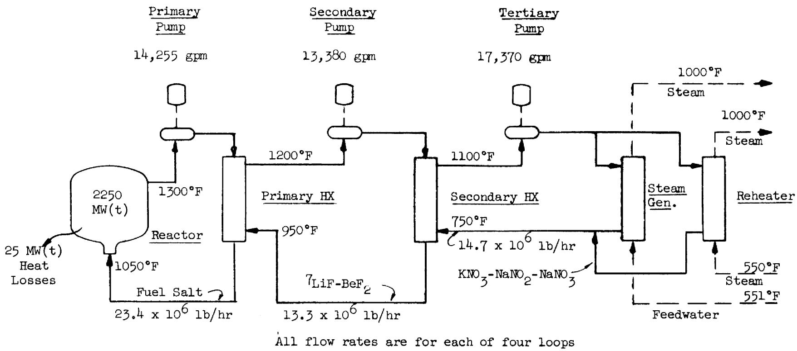
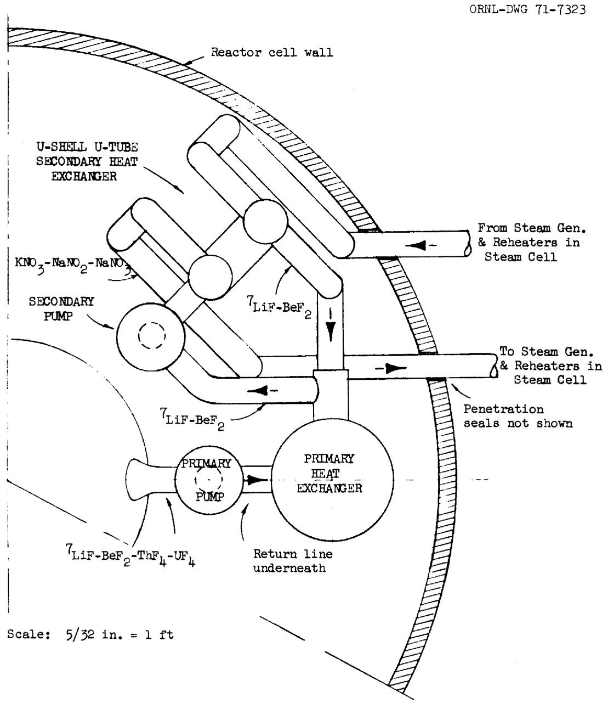

ORNL-TM-3428

Contract No. W-7405-eng-26

REACTOR DIVISION

ESTIMATED COST OF ADDING A THIRD SALT-CIRCULATING SYSTEM FOR CONTROLLING TRITIUM MIGRATION IN THE 1000-MW(e) MSBR

Roy C. Robertson

JULY 1971

This report was prepared as an account of work sponsored by the United States Government. Neither the United States nor the United States Atomic Energy Commission, nor any of their employees, nor any of their contractors, subcontractors, or their employees, makes any warranty, express or implied, or assumes any legal liability or responsibility for the accuracy, completeness or usefulness of any information, apparatus, product or process disclosed, or represents that its use would not infringe privately owned rights.

OAK RIDGE NATIONAL LABORATORY

Oak Ridge, Tennessee

Operated by

UNION CARBIDE CORPORATION

for the

U.S. ATOMIC ENERGY COMMISSION

#

A

# CONTENTS

Page

Abstract 1

Summary and Conclusions 2

1. Introduction 5   
2. Description of MSBR Modified with Third Loops 7   
3. Heat Transfer Equipment 9   
4. Salt-Circulating Pumps 21   
5. Salt Inventory Costs 24

# LIST OF TABLES

Table 1. Summary of Cost Items Affected by Modifying MSBR Reference Design to Include Third Salt-Circulating Loops 3   
Table 2. Selected Properties of the MSBR Molten Salts -ll   
Table 3. Material Costs Used in Estimates 12   
Table 4. Primary Heat Exchangers 13   
Table 5. Secondary Heat Exchangers 15   
Table 6. Steam Generators 17   
Table 7. Steam Reheaters 19   
Table 8. Reheat Steam Preheaters 20   
Table 9. Revised Reference Design Costs for Heat Transfer Equipment, in $1000 21   
Table 10. Estimated Direct Cost of Installed Heat Transfer Equipment per Square Foot of Surface 22   
Table 11. Estimated Design Data and Allowances for Installed Costs of Salt-Circulating Pumps 23   
Table 12. Estimated Pumping Power Requirements and Worth of Improved Efficiency of Modified MSBR Cycle 23   
Table 13. Estimated Salt Inventory Costs 25   
Table 14. Estimated Volume of LiF-BeF₂ Salt in Secondary System of Modified MSBR 26

# LIST OF FIGURES

Fig. 1. Schematic Flowsheet of l000-MW(e) MSBR Power Station as Modified with Addition of Third Loops to Trap $^3\mathsf{H}$

# LIST OF FIGURES (Conta.)

Page

Fig. 2. MSBR Reactor Cell Layout Indicating Possible Location for Secondary Heat Exchanger and Pump 10

Roy C. Robertson

# ABSTRACT

Controlling tritium migration to the steam system of the 1000-MW(e) reference design MSBR power station by interposing a KNO₃-NaNO₂-NaNO₃ salt-circulating system to chemically trap the tritium would add about $13 million to the total of $206 million now estimated as the cost of the reference plant if Hastelloy N is used to contain the $^7\mathrm{LiF - BeF}_2$ salt employed to transport heat from the fuel salt to the nitrate-nitrite salt, and about $10 million if Incoloy could be used. The major expenses associated with the modification are the costs of the additional heat exchangers ($9 million), the additional pumps ($5 million), and the $^7\mathrm{LiF - BeF}_2$ inventory ($4.8 million). Some of the expense is offset by elimination of some equipment from the feedwater system ($2 million), through use of less expensive materials in the steam generators and reheaters (about $2 million), and through an improved thermal efficiency of the plant (worth about $1 million). In addition to acting as an effective tritium trap the third circulating system would make accidental mixing of the fuel and secondary salts of less consequence and would simplify startup and operation of the MSBR. A simplified flowsheet for the modified plant, a cell layout showing location of the new equipment, physical properties of the fluids, design data and cost estimates for the new and modified equipment are presented.

KEY WORDS - *MSBR + *tritium + *capital cost + conceptual design + loop + coolants + heat exchangers + pumps + power costs + fuel-cycle costs + steam system.

# SUMMARY AND CONCLUSIONS

Controlling tritium migration to the steam system of the 1000-MW(e) reference design MSBR power station by interposing salt-circulating loops to chemically trap the tritium would add 4 to $6 \%$ to the total plant cost. The net increase in capital cost of the plant, including indirect costs, is about $\$ 13$ million if Hastelloy N is used to contain the 'LiF-BeF $_2$ salt employed as the heat transport fluid in the secondary system, and about $\$ 10$ million if Incoloy could be used. These increases would apply to a cost for the reference design plant now estimated at about $\$ 206$ million (based on early 1970 costs). Addition of the loops would increase the power production costs by 0.2-0.3 mills/kWhr, making the total cost about 5.5 mills/kWhr.

As shown in the cost summary, Table 1, the major portion of the cost of modifying the design is due to the additional heat exchangers and pumps required, and to the relatively high cost of the $7Li$ -bearing secondary salt. There were also increases in the cost of the primary heat exchangers and in the fuel-salt inventory. However, the added third loops use a nitrate-nitrite heat transport salt which permits savings in the material costs in the steam generators and reheaters. Use of this salt also permits reductions in the feedwater and cold reheat steam temperatures, and through changes in the steam system flow-sheet and the auxiliary electric load, produces a reduction of costs equivalent to a plant investment of about $800,000. Credit for these savings was taken in the net costs mentioned above.

In addition to serving as an effective tritium trap, the third loops offer other important advantages over the reference design. These are features which, in general, could not have cost credits assigned. For example, the similarity of the fuel and secondary salts makes mixing due to leaks in the primary heat exchanger of far less consequence than in the reference design. Startup and operation of the MSBR would be simplified because of changes that could be made in the steam system flowsheet.

Table 1. Summary of Cost Items Affected by Modifying MSBR Reference Design to Include Third Salt-Circulating Loops (in $1000)   

<table><tr><td></td><td>Rev. Reference Design MSBR</td><td>Modified MSBR with Third Loops</td></tr><tr><td colspan="3">A. With Hastelloy N secondary system</td></tr><tr><td colspan="3">Revised equipment:</td></tr><tr><td>Primary heat exchangers (see Table 4)</td><td>$8,660</td><td>$9,880</td></tr><tr><td>Steam generators (see Table 6)</td><td>7,230</td><td>6,192</td></tr><tr><td>Steam reheaters (see Table 7)</td><td>1,565</td><td>1,216</td></tr><tr><td>Coolant salt pumps (see Table 11)</td><td>4,400</td><td>2,750</td></tr><tr><td>Coolant salt piping allowance</td><td>1,900</td><td>1,500</td></tr><tr><td>Coolant salt drain tank</td><td>800</td><td>800</td></tr><tr><td>Coolant salt inventory cost</td><td>500</td><td>135</td></tr><tr><td>Auxiliary boiler allowance</td><td>3,000</td><td>2,500</td></tr><tr><td colspan="3">New equipment:</td></tr><tr><td>Secondary heat exchanger (see Table 5)</td><td></td><td>6,883</td></tr><tr><td>Secondary pumps (see Table 11)</td><td></td><td>3,800</td></tr><tr><td>Secondary salt drain tank</td><td></td><td>800</td></tr><tr><td>Secondary system piping allowance</td><td></td><td>375</td></tr><tr><td>Accessory electrical for secondary system</td><td></td><td>200</td></tr><tr><td colspan="3">Eliminated equipment:</td></tr><tr><td>Reheat steam preheaters (see Table 8)</td><td>1,056</td><td></td></tr><tr><td>Pressure-booster pumps</td><td>650</td><td></td></tr><tr><td>Mixing chambers</td><td>80</td><td></td></tr><tr><td>Total direct construction cost, in $1000</td><td>$29,841</td><td>$37,031</td></tr><tr><td>Difference in direct construction costs</td><td></td><td>$7,190</td></tr><tr><td>Difference in total cost with added indirect costs of 33%</td><td></td><td>$9,563</td></tr><tr><td>\( ^7LiF-BeF_2 \) inventory cost (see Tables 13 and 14)</td><td></td><td>4,800</td></tr><tr><td>Credit for resale value of \( ^7LiF-BeF_2 \)</td><td></td><td>-239</td></tr><tr><td>Credit for improved plant efficiency (see Table 12)</td><td></td><td>-817</td></tr><tr><td>Net estimated capital cost of adding third loops</td><td></td><td>$13,300</td></tr><tr><td>Changes in power production cost:</td><td colspan="2">mills/kWhr</td></tr><tr><td>Net cost of adding third loops, at 13.7% FC</td><td colspan="2">+0.187</td></tr><tr><td>LiF-BeF2inventory, at 13.2% FC</td><td colspan="2">+0.090</td></tr><tr><td>Credit for resale LiF-BeF2, at 13.2% FC</td><td colspan="2">-0.005</td></tr><tr><td>Credit for improved efficiency, at 13.7% FC</td><td colspan="2">-0.015</td></tr><tr><td>Increase in fuel-cycle cost</td><td colspan="2">+0.013</td></tr><tr><td>Net increase in cost of power</td><td colspan="2">+0.27 mills/kWhr</td></tr><tr><td>B. With Incoloy secondary system</td><td></td><td></td></tr><tr><td>All items in modified MSER not affected by use of Incoloy rather than Hastelloy N in secondary circulating loop, from Part A, above.</td><td colspan="2">$19,893</td></tr><tr><td>Cost of items in which Incoloy is substituted for Hastelloy N:</td><td></td><td></td></tr><tr><td>Primary heat exchangers.(see Table 4)</td><td colspan="2">8,661</td></tr><tr><td>Secondary salt piping allowance</td><td colspan="2">225</td></tr><tr><td>Secondary heat exchangers (see Table 5)</td><td colspan="2">5,879</td></tr><tr><td></td><td colspan="2">$34,658</td></tr><tr><td>Cost of revised reference design, from Part A</td><td colspan="2">-29,841</td></tr><tr><td>Difference in direct construction costs</td><td colspan="2">$4,817</td></tr><tr><td>Difference in total cost with indirect costs of 33% added</td><td colspan="2">$6,407</td></tr><tr><td>7LiF-BeF2inventory cost (see Tables 13 and 14)</td><td colspan="2">4,800</td></tr><tr><td>Credit for resale value of 7LiF-BeF2</td><td colspan="2">-239</td></tr><tr><td>Credit for improved plant efficiency (see Table 12)</td><td colspan="2">-817</td></tr><tr><td>Net estimated cost of adding third loops</td><td colspan="2">$10,200</td></tr><tr><td>Changes in power production cost:</td><td colspan="2">mills/kWhr</td></tr><tr><td>Net cost adding third loops, at 13.7% FC</td><td colspan="2">+0.125</td></tr><tr><td>LiF-BeF2inventory, at 13.2% FC</td><td colspan="2">+0.090</td></tr><tr><td>Credit for resale LiF-BeF2, at 13.2% FC</td><td colspan="2">-0.005</td></tr><tr><td>Credit for improved efficiency, at 13.7% FC</td><td colspan="2">-0.015</td></tr><tr><td>Increase in fuel-cycle cost</td><td colspan="2">+0.013</td></tr></table>

# 1. INTRODUCTION

Tritium formed in the MSBR fuel salt must be prevented from reaching the steam system. The problem is difficult because of the relative ease with which hydrogen diffuses through most metals at MSBR operating temperatures. Studies are being made at ORNL of several different methods of tritium control; of these, the introduction of a third salt-circulating system to chemically trap the tritium between the secondary salt and the steam system is the only one well within present technology and, on the basis of present knowledge, offers assured confinement of the tritium. It is possibly one of the most expensive of the control methods being considered, however, and raises the question as to whether its use would add prohibitively to the cost of a molten-salt reactor power station.

This study evaluates the various cost factors involved in adding the third salt-circulating system to the 1000-MW(e) MSBR reference design described in ORNL-4541. The cost estimating methods follow those used in that report. The costs of modifying the reference design include the capital cost of the extra equipment, the salt inventories, and also reflect the cost effects of the new designs for the heat transfer equipment made necessary by the use of heat transfer fluids different from those used in the reference concept. (The calculations for the new and modified heat exchangers were made by C. E. Bettis et al., using essentially the same computer programs as were used in the reference design.) The cost estimates also take credit for the equipment not needed in the feedwater system of the modified plant and for the improved thermal efficiency of the station, as explained below.

The reference MSBR design uses circulating sodium fluoroborate, NaF-NaBF₄, to transport heat to the steam generators and reheaters, whereas the modified design uses a nitrate-nitrite heat transfer salt, KNO₃-NaNO₂-NaNO₃ (known commercially as "Hitec"), to heat the steam equipment. This has five important advantages: (1) any hydrogen diffusing into the salt

would combine with the oxygen and subsequently be drawn off as steam and collected, forming an effective tritium trap; (2) the salt is not corrosive to less expensive materials of construction, allowing Incoloy 800, or a similar material, to be substituted for the Hastelloy N used in the reference design; (3) its low melting temperature of $288^{\circ}\mathrm{F}$ permits use of conventional feedwater and cold reheat temperatures in the steam system and eliminates the need for the reheat steam preheaters, the pressure-booster pumps and mixing chambers used in the reference design; (4) startup of the system is simplified and the auxiliary boiler probably does not need to be a supercritical-pressure unit as in the reference plant; and (5) the salt has a low cost of only about 15 cents/lb. The salt does not react exothermically with water and it has good flow and heat transfer properties.

The modified design would use a $^7\mathrm{LiF - BeF}_2$ salt to transport heat from the fuel salt to the nitrate-nitrite salt. With the exception of the uranium and thorium components, this salt is the same as the fuel salt, and thus a leak in the primary heat exchanger would be of far less consequence than in the reference design where dissimilar salts would mix. The $^7\mathrm{LiF - BeF}_2$ is not corrosive to materials less expensive than Hastelloy N, provided that no moisture is present. One cost estimate in this study has been made using Hastelloy N for the secondary system and another using Incoloy. Due to the lithium-7 content, the cost of the salt is relatively high -- about $\$ 12/$ lb. Its resale value at the end of the 30-year plant life has been taken into account, although the effect is not great.

The reference MSBR design consists of a single reactor supplying heat to four primary circulating loops, each containing a salt-circulating pump and a heat exchanger. The coolant-salt system contains four loops, with each containing a salt-circulating pump, four steam generators and two reheaters. This arrangement was not altered in the modified design, although there was some adjustment of the temperatures. The interposed salt-circulating system would consist of four loops, each containing a circulating pump and a heat exchanger. The following terminology has been adopted.

<table><tr><td>Fuel salt to 7LiF-BeF2heat exchanger</td><td>-- Primary heat exchanger</td></tr><tr><td>LiF-BeF2to KNO3-NaNO2-NaNO3exchanger</td><td>-- Secondary heat exchanger</td></tr><tr><td>KNO3-NaNO2-NaNO3to steam exchangers</td><td>-- Steam generator or steam reheater</td></tr><tr><td>Fuel-salt circulating pump</td><td>-- Primary pump</td></tr><tr><td>LiF-BeF2circulating pump</td><td>-- Secondary pump</td></tr><tr><td>KNO3-NaNO2-NaNO3circulating pump</td><td>-- Tertiary pump</td></tr></table>

This study is primarily concerned with evaluating the cost effects of adding the third salt-circulating loops. The concept was not carried further than to indicate general feasibility and to provide a basis for cost estimates. No effort was made toward optimization.

In comparing the cost of the MSBR modified with the third loops to the reference design cost estimates, it was necessary to make some revisions to the latter as reported in ORNL-4541. The heat transfer equipment design data have undergone two relatively recent revisions. The first was made in time to be tabulated with the design data in the latest distributed draft of the report, but, because of the extensive changes required and the fact that at the time the influence on costs appeared to be small, the cost estimates were not adjusted accordingly. The second revision, which applied only to the primary heat exchanger, was made just in time for the data to be changed before the report was printed, but, again, the cost estimates could not be revised. All of the revisions tended to increase costs, however, and when the cost estimates were revised in this study it was found that in aggregate they amounted to about $4 million, including the indirect charges. The total capital cost of the reference design MSBR is thus about$ 206 million rather than the $202 million given in ORNL-4541. Both amounts are based on the early 1970 value of the dollar.

# 2. DESCRIPTION OF MSBR MODIFIED WITH THIRD LOOPS

A simplified flowsheet for the 1000-MW(e) MSBR station as modified to include the third salt-circulating loops is shown in Fig. l. It can be noted that the temperatures have been adjusted from those used in the reference design and that there were corresponding changes in the mass

  
Fig. 1. Schematic Flowsheet of 1000-MW(e) MSBR Power Station as Modified with Addition of Third Loops to Trap $^3\mathrm{H}$ .

flow rates of the salts. The flow quantities shown on the flowsheet are for each of the four circulating loops.

The secondary heat exchangers and the associated LiF-BeF $_3$ pumps can be arranged in the reactor cell without changing the dimensions of the containment structure, as indicated in Fig. 2. The layout provides relatively short piping between the primary and secondary heat exchangers to keep the lithium-7 inventory low. No major changes would be required in the salt piping to the steam generators and reheaters. On this basis, the cost estimates for the modified system do not include any expenses for modification of the building or cell structure.

# 3. HEAT TRANSFER EQUIPMENT

The physical properties of interest for the fuel and heat-transport salts are given in Table 2. (Sodium fluoroborate has been included for comparison, although not used in the modified MSBR system.)

The costs of the heat transfer equipment were based on the estimated weights of the various shapes of materials used in fabrication, and on a unit price which reflects the costs of fabrication, inspection, transportation, and installation ready for use. The total installed costs of Hastelloy N and Incoloy 800, as used in this study, are listed in Table 3. As in the reference design, the base prices of materials can be determined with relatively good certainty, but the additions to provide the total installed cost greatly overshadow the basic material cost in importance and also involve considerable intuitive judgment. As a rough check on the reasonableness of the cost estimates, the costs per square foot of heat transfer surface are compared in Table 10.

# 1. Primary Heat Exchangers

The cost estimate for the primary heat exchangers in the reference design, as reported in ORNL-4541, has been changed from $7.3 million to about $8.7 million to reflect the revisions to the design data, as indicated in Table 4. The cost increase is also due to adding in the cost of the baffles and to inclusion of the double-pipe coolant-salt nozzles, which had previously been assumed to be covered by the piping cost

  
Fig. 2. MSR Reactor Cell Layout Indicating Possible Location for Secondary Heat Exchanger and Pump. (One of four loops is shown.)

Table 2. Selected Properties of the MSBR Molten Salts   

<table><tr><td></td><td>\( ^7\text{LiF-BeF}_2 \)-ThF4-UF4</td><td>NaF-NaBF4</td><td>\( ^7\text{LiF-BeF}_2 \)</td><td>KNO3-NaNO2-NaNO3</td></tr><tr><td>Composition, mole %</td><td>71.7-16-12-0.3</td><td>92.8</td><td>66.34</td><td>\( 44.2-48.9-6.9^a \)</td></tr><tr><td>Molecular weight, approximate</td><td>64</td><td>104</td><td>33</td><td>84</td></tr><tr><td>Density, lb/ft3 at 1000°F</td><td>212</td><td>117</td><td>124</td><td>105</td></tr><tr><td>Viscosity, lb/ft-hr at 1000°F</td><td>41</td><td>3</td><td>29</td><td>3</td></tr><tr><td>Specific heat, Btu/lb-°F</td><td>0.32</td><td>0.36</td><td>0.57</td><td>0.37</td></tr><tr><td>Thermal conductivity, Btu/ft-hr-°F</td><td>0.67 to 0.68</td><td>0.23</td><td>0.58</td><td>0.33</td></tr><tr><td>Estimated cost, $/lb</td><td>57.00</td><td>0.50</td><td>12.00</td><td>0.15</td></tr><tr><td colspan="5">Circulation required per loopbfor 556-MW(t) heat load:</td></tr><tr><td>lb/hr</td><td>\( 23.4 \times 10^6 \)</td><td>\( 18.3 \times 10^6 \)</td><td>\( 13.3 \times 10^6 \)</td><td>\( 14.7 \times 10^6 \)</td></tr><tr><td>gpm</td><td>14,260</td><td>\( 19,500^c \)</td><td>13,380</td><td>17,370</td></tr><tr><td>Liquidus temperature, °F</td><td>930</td><td>725</td><td>850</td><td>288</td></tr></table>

aEutectic composition.   
b Based on properties at average temperatures in MSBR system.   
${}^{\mathrm{c}}$ Based on ${250}^{ \circ  }\mathrm{F}\Delta \mathrm{t}$ in modified MSBR.

Table 3. Material Costs Used in Estimates   

<table><tr><td></td><td>Hastelloy N</td><td>Incoloy</td></tr><tr><td>Tubes, 3/8 in. diam</td><td>$30/lb</td><td>$28/lb</td></tr><tr><td>1/2 in. diam and larger</td><td>20</td><td>17</td></tr><tr><td>Shells and liners</td><td>10</td><td>7</td></tr><tr><td>Heads</td><td>15</td><td>12</td></tr><tr><td>Baffles</td><td>15</td><td>12</td></tr><tr><td>Rings</td><td>20</td><td>18</td></tr><tr><td>Tubesheets</td><td>20</td><td>18</td></tr><tr><td>Downcomers, large nozzles</td><td>15</td><td>12</td></tr><tr><td>Miscellaneous nozzles, etc.</td><td>20</td><td>18</td></tr></table>

aIncludes cost of material, fabrication, transportation, inspection, and installation ready for use.

allowance. It was also found that the inside diameter of the shell stated in ORNL-454l applied to the inner liner rather than to the outer shell.

The design data for the primary heat exchangers as modified to use LiF-BeF₃ on the shell side are also shown in Table 4. These design data have not been recalculated using the May 1971 revisions to the computer program (see Introduction), but the effects of the changes could be estimated by using their influence on the reference design primary heat exchanger costs as a guide, as follows: tubes (+6.4%), shell and liner (+8.7%), heads (-1.4%), rings (-1.0%), downcomers, U-bends and baffles (+4.1%).

The tubes and other portions of the primary heat exchanger in contact with the fuel salt must be constructed of Hastelloy N. This was also true in the reference design for the portions in contact with the sodium fluoroborate salt. In the modified design, however, consideration

Table 4. Primary Heat Exchangers   

<table><tr><td></td><td>Revised Reference Design MSBR</td><td>Modified MSBR With Third Loop</td></tr><tr><td>Capacity, MW(t), each of four units</td><td>556</td><td>556</td></tr><tr><td>Fuel salt temperatures, in-out, °F</td><td>1300-1050</td><td>1300-1050</td></tr><tr><td>Coolant salt temperature, in-out, °F</td><td>850-1150</td><td>950-1200</td></tr><tr><td>Coolant salt</td><td>NaF-NaBF4</td><td>LiF-BeF2</td></tr><tr><td>Tube size (enhanced), OD x wall thickness, in.</td><td>3/8 x 0.035</td><td>3/8 x 0.035</td></tr><tr><td>Number of tubes</td><td>5803</td><td>6312</td></tr><tr><td>Length of tubes, ft</td><td>24.4</td><td>25.5</td></tr><tr><td>Heat transfer area, ft2</td><td>13,916</td><td>15,789</td></tr><tr><td>Liner, ID x thickness, in.</td><td>67.6 x 2.5</td><td>70.3 x 2.5</td></tr><tr><td>Shell, ID x thickness, in.</td><td>73.6 x 1/2</td><td>76.3 x 1/2</td></tr><tr><td>Pressure drops: tube side, psi</td><td>130</td><td>130</td></tr><tr><td>shell side, psi</td><td>116</td><td>118</td></tr><tr><td>Head thickness, in.</td><td>3/4</td><td>3/4</td></tr><tr><td>Number of baffles, disc and doughnut, 3/8 in. thick</td><td>21</td><td>34</td></tr><tr><td>Overall heat transfer coefficient, Btu/hr-ft3-°F</td><td>785</td><td>672-944</td></tr></table>

A. Material costs with Hastelloy N tubes and shell (in $1000):   

<table><tr><td>Tubes, at $30/lb</td><td>$ 2,457</td><td>$ 2,970</td></tr><tr><td>Shells, at $10/lb</td><td>414</td><td>487</td></tr><tr><td>Liners, at $10/lb</td><td>1,959</td><td>2,308</td></tr><tr><td>Heads, at $15/lb</td><td>141</td><td>150</td></tr><tr><td>Rings and tube sheets, at $20/lb</td><td>2,823</td><td>2,911</td></tr><tr><td>Downcomers, baffles, and double-pipe coolant nozzles, at $15/lb</td><td>666</td><td>854</td></tr><tr><td>Installation allowance</td><td>200</td><td>200</td></tr><tr><td>Total for four units</td><td>$ 8,660</td><td>$ 9,880</td></tr></table>

(continued)

Table 4 (continued)   

<table><tr><td></td><td>Revised Reference Design MSBR</td><td>Modified MSBR With Third Loop</td></tr><tr><td colspan="3">B. Material costs with Hastelloy N tubes and Incoloy shell (in $1000):</td></tr><tr><td>Tubes, at $30/lb</td><td></td><td>$ 2,970</td></tr><tr><td>Shells, at $8/lb</td><td></td><td>350</td></tr><tr><td>Liners, at $8/lb</td><td></td><td>1,658</td></tr><tr><td>Heads, at $15/lb</td><td></td><td>150</td></tr><tr><td>Hastelloy N rings and tubesheets, at $20/lb</td><td></td><td>1,907</td></tr><tr><td>Incoloy rings, at $17/lb</td><td></td><td>812</td></tr><tr><td>Downcomer, at $12/lb</td><td></td><td>126</td></tr><tr><td>Double-pipe coolant nozzles, at $12/lb</td><td></td><td>65</td></tr><tr><td>Baffles, at $12/lb</td><td></td><td>424</td></tr><tr><td>Installation allowance</td><td></td><td>200</td></tr><tr><td>Total</td><td></td><td>$ 8,661</td></tr></table>

can be given to use of less expensive materials in the shell side of the system, provided that no moisture is present. The more conservative approach is to use Hastelloy N for all portions of the secondary system, and this is the basis for the cost estimates shown in Part A of Tables 1, 4, and 5. Since there has been noteworthy success in excluding water from salt systems, however, it may be practical to use Incoloy, or a similar material, in the secondary system. The estimated costs in this case are shown in Part B of Tables 1, 4, and 5. It will be noted that use of Incoloy would save about $3 million in total costs when indirect charges are included.

# 2. Secondary Heat Exchangers

The secondary heat exchangers in the modified MSBR plant are envisioned as U-shell and U-tube types, arranged vertically in the reactor cell, as indicated in Fig. 2. The design data were generated on the basis of four units with $3/8$ -in.-OD tubing. The arrangement was not

Table 5. Secondary Heat Exchangers   

<table><tr><td></td><td>Modified MSBR With Third Loop</td></tr><tr><td>Capacity, each of four units, MW(t)</td><td>556</td></tr><tr><td>LiF-BeF2(tubes) temperatures, in-out, °F</td><td>1200-950</td></tr><tr><td>KNO3-NaNO2-NaNO3(shell) temperatures, in-out, °F</td><td>750-1100</td></tr><tr><td>Tube size (not enhanced), OD x wall thickness, in.</td><td>3/8 x 0.035</td></tr><tr><td>Number of tubes</td><td>5989</td></tr><tr><td>Length of tubes, ft</td><td>44</td></tr><tr><td>Heat transfer surface, ft2</td><td>25,665</td></tr><tr><td>Pressure drops: tube side, psi</td><td>79.2</td></tr><tr><td>shell side, psi</td><td>79.6</td></tr><tr><td>Shell, ID x wall thickness, in.</td><td>61.5 x 1/2</td></tr><tr><td>Number of baffles, crosscut, 3/8 in. thick</td><td>33</td></tr><tr><td>Tubesheet thickness, in.</td><td>3</td></tr><tr><td>Head thickness, in.</td><td>3/4</td></tr><tr><td>Overall heat transfer coefficient, Btu/hr-ft3-°F</td><td>505</td></tr></table>

A. Material cost with Hastelloy N tubes and Incoloy shell (in $1000):

<table><tr><td>Tubes, at $30/lb</td><td>$ 4,542</td></tr><tr><td>Shell, at $8/lb</td><td>483</td></tr><tr><td>Tubesheet, at $20/lb</td><td>458</td></tr><tr><td>Heads, at $15/lb</td><td>102</td></tr><tr><td>Baffles, at $12/lb</td><td>1,018</td></tr><tr><td>Nozzles, etc., at $20/lb</td><td>80</td></tr><tr><td>Installation allowance</td><td>200</td></tr><tr><td>Total for four units</td><td>$ 6,883</td></tr></table>

B. Material cost with Incoloy shell and tubes (in $1000):

<table><tr><td>Tubes, at $27/lb</td><td>$ 3,670</td></tr><tr><td>Shell, at $8/lb</td><td>483</td></tr><tr><td>Tubesheets, at $18/lb</td><td>370</td></tr><tr><td>Heads, at $12/lb</td><td>78</td></tr><tr><td>Baffles, at $12/lb</td><td>1,018</td></tr><tr><td>Nozzles, etc., at $18/lb</td><td>65</td></tr><tr><td>Installation allowance</td><td>200</td></tr><tr><td>Total for four units</td><td>$ 5,879</td></tr></table>

optimized, however, and although sufficient for cost-estimating purposes, there are indications that further study may be needed. For example, the calculated shell diameter of over 60 in. is questionable for the U-shell configuration. The tube size needs optimizing in that the $3/8$ -in.-OD tubing is needed to minimize the LiF-BeF $_2$ inventory and surface requirements, but it is relatively expensive compared to larger sizes (see Table 3). Consideration could be given to use of eight units rather than four, and to use of straight-tube designs, although space in the cell is somewhat limited.

As previously discussed, there is a possible option in selecting materials to be used on contact with the LiF-BeF $_2$ salt. Part A of Table 5 shows the estimated direct cost of the secondary heat exchangers if constructed with Hastelloy N tubes and heads, and Part B indicates the cost if Incoloy is used for these parts.

# 3. Steam Generators

The cost estimate for the steam generators in the reference design was changed from $6.3 million to$ 7.2 million to reflect the revisions in the design data. The principal differences were due to an increase in the number and length of the tubes and an increase in the thickness of the tube sheets used in the cost estimate. The data and costs are shown in Table 6.

The design data and the estimated cost of the steam generators for the modified MSBR system using $\mathrm{KNO_3 - NaNO_2 - NaNO_3}$ on the shell side are also shown in Table 6. The lower total cost of the units for the modified design is primarily due to use of Incoloy rather than Hastelloy N. It may be noted that the steam generators are designed for $555^{\circ}\mathrm{F}$ entering feedwater rather than the $551^{\circ}\mathrm{F}$ temperature called for in the flow-sheets. A technicality in the computer program made it necessary to revise the number, but since the total amount of heat to be transferred was not altered, the only sacrifice to accuracy was relatively small velocity effects.

Table 6. Steam Generators   

<table><tr><td></td><td>Revised Reference Design MSBR</td><td>Modified MSBR With Third Loop</td></tr><tr><td colspan="3">For each of 16 units:</td></tr><tr><td>Capacity, MW(t)</td><td>121</td><td>121</td></tr><tr><td>Type</td><td>U-shell, U-tube</td><td>U-shell, U-tube</td></tr><tr><td>Major material of construction</td><td>Hastelloy N</td><td>Incoloy 800</td></tr><tr><td>Heat transport salt (shell side)</td><td>NaF-NaBF4</td><td>KNO3-NaNO3-NaNO3</td></tr><tr><td>Salt temperatures, in-out, °F</td><td>1150-850</td><td>1100-750</td></tr><tr><td>Feedwater temperature, °F</td><td>700</td><td>555</td></tr><tr><td>Steam temperature out, °F</td><td>1000</td><td>1000</td></tr><tr><td>Steam pressure, psia</td><td>3625</td><td>3625</td></tr><tr><td>Tube size, OD x wall thickness, in.</td><td>1/2 x 0.077</td><td>1/2 x 0.077</td></tr><tr><td>Number of tubes</td><td>393</td><td>341</td></tr><tr><td>Tube length, ft</td><td>76</td><td>99</td></tr><tr><td>Heat transfer surface, ft2</td><td>3929</td><td>4428</td></tr><tr><td>Shell, ID x wall thickness, in.</td><td>18.3 x 3/8</td><td>17 x 3/8</td></tr><tr><td>Number of baffles (3/8 in. thick)</td><td>18</td><td>28</td></tr><tr><td>Head (spherical) thickness, in.</td><td>4</td><td>4</td></tr><tr><td>Pressure drops: tube side, psi</td><td>152</td><td>125</td></tr><tr><td>shell (salt)</td><td>61</td><td>90</td></tr><tr><td>side, psi</td><td></td><td></td></tr><tr><td>Overall U, Btu/hr-ft2-°F</td><td>-</td><td>655</td></tr><tr><td colspan="3">Material costs (all 16 units):</td></tr><tr><td>Tubes: Cost, $/lb</td><td>(20)</td><td>(17)</td></tr><tr><td>Total cost ($1000)</td><td>$ 3,803</td><td>$ 3,269</td></tr><tr><td>Shells: Cost, $/lb</td><td>(10)</td><td>(8)</td></tr><tr><td>Total cost ($1000)</td><td>1,046</td><td>910</td></tr><tr><td>Heads: Cost, $/lb</td><td>(15)</td><td>(12)</td></tr><tr><td>Total cost ($1000)</td><td>565</td><td>406</td></tr><tr><td>Tubesheets: Cost, $/lb</td><td>(20)</td><td>(18)</td></tr><tr><td>Total cost ($1000)</td><td>1,016</td><td>821</td></tr><tr><td>Misc.: Cost, $/lb</td><td>(20)</td><td>(18)</td></tr><tr><td>Total cost ($1000)</td><td>320</td><td>306</td></tr><tr><td>Installation allowance</td><td>480</td><td>480</td></tr><tr><td>Total cost ($1000)</td><td>$ 7,230</td><td>$ 6,192</td></tr></table>

# 4. Steam Reheaters

The estimated cost of the steam heaters in the reference design was revised from $1.7 million to$ 1.6 million to correspond to the revised design data, as shown in Table 7. Although the revised unit has more surface, the previously used price of Hastelloy N tubing did not reflect the lower unit price of 3/4-in.-OD tubing as compared to 3/8-in.-OD tubing.

The design data and estimated cost of the modified reheaters using $\mathrm{KNO}_3$ - $\mathrm{NaNO}_2$ - $\mathrm{NaNO}_3$ on the shell side are also shown in Table 7. Using Incoloy rather than Hastelloy N accounted for the reduction in cost to $1.2 million. It will be noted that the unit is designed for $550^{\circ}\mathrm{F}$ entering cold reheat temperature, as taken directly from the high-pressure turbine exhaust.

# 5. Reheat Steam Preheaters

Reheat steam preheaters were used in the reference design to heat the high-pressure turbine exhaust from $550^{\circ}\mathrm{F}$ to $650^{\circ}\mathrm{F}$ before the steam entered the reheaters to avoid possible problems of coolant-salt freezing. The cost of the preheaters was underestimated in the reference design report because the thickness of the spherical heads was used in the calculations as 1/2-in. rather than the correct value of 2-1/2 in. Further, the material costs assumed for the Croloy in the reference design appeared too low. The revised cost estimate for the preheaters is now $924,000, as shown in Table 8.

The preheater design was not optimized. Use of 3/8-in. tubes may involve a cost penalty, and some improvement in costs might be obtained if the number of units was increased.

The modified MSBR with the third loops added to trap tritium does not require use of preheaters because of the low liquidus temperature of the nitrate-nitrite salt.

# 6. General Effects of Revising and Modifying the Heat Transfer Equipment

The total cost effects of revising the design data for the heat transfer equipment in the reference design are summarized in Table 9. The net increase of about \(4 million (including indirect charges)

Table 7. Steam Reheaters   

<table><tr><td></td><td>Revised Reference Design MSBR</td><td>Modified MSBR With Third Loop</td></tr><tr><td colspan="3">For each of 8 units:</td></tr><tr><td>Capacity, MW(t)</td><td>36.6</td><td>36.6</td></tr><tr><td>Major material of construction</td><td>Hastelloy N</td><td>Incoloy 800</td></tr><tr><td>Heat transport salt</td><td>NaF-NaBF4</td><td>KNO3-NaNO2-NaNO3</td></tr><tr><td>Salt temperatures, in-out, °F</td><td>1150-850</td><td>1100-750</td></tr><tr><td>Steam temperature in, °F</td><td>650</td><td>550</td></tr><tr><td>Steam temperature out, °F</td><td>1000</td><td>1000</td></tr><tr><td>Entrance steam pressure, psia</td><td>580</td><td>580</td></tr><tr><td>Tube size, OD × wall thickness, in.</td><td>3/4 × 0.035</td><td>3/4 × 0.035</td></tr><tr><td>Number of tubes</td><td>400</td><td>696</td></tr><tr><td>Tube length</td><td>30</td><td>28</td></tr><tr><td>Heat transfer surface, ft2</td><td>2376</td><td>2520</td></tr><tr><td>Shell, ID × wall thickness, in.</td><td>21.2 × 0.5</td><td>21 × 0.5</td></tr><tr><td>Number of disc and doughnut baffles</td><td>21 &amp; 21</td><td>30 &amp; 29</td></tr><tr><td>Head thickness, in.</td><td>0.5</td><td>0.5</td></tr><tr><td>Pressure drops: tube side, psi</td><td>30</td><td>40</td></tr><tr><td>shell side, psi</td><td>60</td><td>90</td></tr><tr><td>Overall U, Btu/hr-ft2-°F</td><td>306</td><td>340</td></tr><tr><td colspan="3">Material costs (all 8 units):</td></tr><tr><td rowspan="2">Tubes: $/lb cost, in $1000</td><td>$(20)</td><td>$(17)</td></tr><tr><td>590</td><td>465</td></tr><tr><td rowspan="2">Shells: $/lb cost, in $1000</td><td>(10)</td><td>(8)</td></tr><tr><td>327</td><td>210</td></tr><tr><td rowspan="2">Tubesheets: $/lb cost, in $1000</td><td>(20)</td><td>(18)</td></tr><tr><td>146</td><td>115</td></tr><tr><td rowspan="2">Heads: $/lb cost, in $1000</td><td>(15)</td><td>(12)</td></tr><tr><td>72</td><td>52</td></tr><tr><td rowspan="2">Baffles: $/lb cost, in $1000</td><td>(15)</td><td>(12)</td></tr><tr><td>151</td><td>109</td></tr><tr><td rowspan="2">Nozzles, etc: $/lb cost, in $1000</td><td>(20)</td><td>(18)</td></tr><tr><td>80</td><td>65</td></tr><tr><td>Installation allowance</td><td>200</td><td>200</td></tr><tr><td>Total cost, in $1000</td><td>$1,566</td><td>$1,216</td></tr></table>

Table 8. Reheat Steam Preheaters   

<table><tr><td></td><td>Revised Reference Design MSBR</td></tr><tr><td colspan="2">For each of 8 units:</td></tr><tr><td>Capacity, MW(t)</td><td>12.3</td></tr><tr><td>Major material of construction</td><td>Croloy</td></tr><tr><td colspan="2">Shell-side conditions:</td></tr><tr><td>Heated steam entrance temperature, °F</td><td>551</td></tr><tr><td>Entrance pressure, psia</td><td>595</td></tr><tr><td colspan="2">Tube-side conditions:</td></tr><tr><td>Heating steam entrance temperature, °F</td><td>1000</td></tr><tr><td>Entrance pressure, psia</td><td>3600</td></tr><tr><td>Tube size, OD x wall thickness, in.</td><td>3/8 x 0.065</td></tr><tr><td>Number of tubes</td><td>603</td></tr><tr><td>Tube length, ft</td><td>13.2</td></tr><tr><td>Heat transfer surface, ft²</td><td>781</td></tr><tr><td>Shell, ID x wall thickness, in.</td><td>20-1/4 x 7/16</td></tr><tr><td>Overall U, Btu/hr-ft³-°F</td><td>162</td></tr><tr><td>Head thickness, in.</td><td>2-1/2</td></tr><tr><td colspan="2">Material costs (all 8 units), in $1000:</td></tr><tr><td>Tubes, at $18/lb</td><td>$ 252</td></tr><tr><td>Shells, at $8/lb</td><td>88</td></tr><tr><td>Heads, at $10/lb</td><td>296</td></tr><tr><td>Tubesheets, at $18/lb</td><td>323</td></tr><tr><td>Nozzles, etc., at $18/lb</td><td>72</td></tr><tr><td>Installation allowance</td><td>25</td></tr><tr><td></td><td>$ 1,056</td></tr></table>

Table 9. Revised Reference Design Costs for Heat Transfer Equipment (in $1000)   

<table><tr><td></td><td>Reference MSBR Designa</td><td>Revised Reference Design Costsb</td></tr><tr><td>Primary heat exchangers</td><td>$ 7,347</td><td>$ 8,660</td></tr><tr><td>Steam generators</td><td>6,270</td><td>7,230</td></tr><tr><td>Reheaters</td><td>1,668</td><td>1,565</td></tr><tr><td>Reheat steam preheaters</td><td>135</td><td>924</td></tr><tr><td></td><td>$ 15,420</td><td>$ 18,379</td></tr><tr><td colspan="2">Increase in reference design direct costs</td><td>$ . 2,959</td></tr><tr><td colspan="2">Increase in total cost, including indirects</td><td>$ . 3,935</td></tr><tr><td colspan="2">Reference design total costa</td><td>202,654</td></tr><tr><td colspan="2">Total revised reference design cost</td><td>$ 206,589</td></tr></table>

aAs listed in ORNL-4541.   
bFor Hastelloy N fuel and coolant-salt systems.

results in raising the total estimated plant cost of the reference design MSBR plant from about $202 million to $206 million.

Use of Incoloy rather than Hastelloy N for the portions of the secondary system in contact with LiF-BeF2 would save about $1.6 million in the total cost (including indirect charges) of the primary heat exchangers, about $1.3 million for the secondary heat exchangers, and about $200,000 for the secondary salt piping, for a total savings of about $3 million.

The costs of the heat transfer equipment on a square foot basis are compared in Table 10. While the values are not particularly conclusive, they indicate that the estimated costs are generally within reason for this type of nuclear power station equipment.

# 4. SALT-CIRCULATING PUMPS

Since salt-circulating pumps of the size required for the 1000-MW(e) MSR station have never been fabricated, the cost-estimating method used

Table 10. Estimated Direct Cost of Installed Heat Transfer Equipment per Square Foot of Surface   

<table><tr><td></td><td>Revised Reference Design MSBR</td><td>Modified MSBR With Third Loop</td></tr><tr><td colspan="3">Primary heat exchangers</td></tr><tr><td>Hastelloy N tubes and shell</td><td>$ 155</td><td>$ 147</td></tr><tr><td>Hastelloy N tubes and Incoloy shell</td><td>-</td><td>129</td></tr><tr><td colspan="3">Secondary heat exchangers</td></tr><tr><td>Hastelloy N tubes and shell</td><td></td><td>67</td></tr><tr><td>Hastelloy N tubes and Incoloy shell</td><td></td><td>43</td></tr><tr><td>Steam generators</td><td>115</td><td>76</td></tr><tr><td>Steam reheaters</td><td>82</td><td>54</td></tr><tr><td>Reheat steam preheaters</td><td>149</td><td>none</td></tr></table>

in this study and in the reference design report is based on published costs of similar pumps (as adjusted for capacity and head requirements), on MSRE pump cost experience, and on the basis of considerable intuitive judgment. Table ll indicates the pumping requirements which served as a basis for assuming allowances for the pump costs in the modified MSBR plant.

Use of the third circulating salt system would add four pumps of about 2700 hp each, would reduce the power requirements of another set of four pumps from 3200 hp to 1800 hp each, and would eliminate the need for the two 6000-hp each pressure-booster pumps in the feedwatersystem. As shown in Table 12, the connected load of the pump motors is reduced by a total of about 5,400 kW(e) in the modified system. If it is assumed that all the pumping energy is usefully converted to heat, about 5,400 kW(t) is thus not available in the modified system for conversion into electric power at the average overall plant efficiency of 44.4%. The net savings in auxiliary electric load is thus about 3,000 kW(e). With power worth 5.3 mills/kWhr, and 80% plant factor, this amounts to about $111,000/year. At 13.7% fixed charges, the savings is equivalent to a plant investment of about $817,000. Credit for this has been taken in Parts A and B of Table 1.

Table ll. Estimated Design Data and Allowances for Installed Costs of Salt-Circulating Pumps   

<table><tr><td rowspan="2"></td><td rowspan="2">Fuel-SaltPumps</td><td rowspan="2">Secondary-Salt PumpRef. MSBR</td><td colspan="2">Modified MSBR</td></tr><tr><td>Secondary-Salt Pump</td><td>Tertiary-Salt Pump</td></tr><tr><td colspan="5">For each of 4 pumps:</td></tr><tr><td>Actual capacity, gpm</td><td>14,255</td><td>18,768</td><td>13,380</td><td>17,372</td></tr><tr><td>Nominal capacity, gpm</td><td>16,000</td><td>20,000</td><td>16,000</td><td>20,000</td></tr><tr><td>Average salt density, lb/ft3</td><td>208</td><td>117</td><td>124</td><td>105</td></tr><tr><td>Estimated total head, ft3</td><td>150</td><td>300</td><td>230</td><td>300</td></tr><tr><td>Estimated horsepower</td><td>2360</td><td>3210</td><td>1800</td><td>2680</td></tr><tr><td>Cost allowance, in $1000,for total of 4 pumps</td><td>$3300</td><td>$4400</td><td>$2750</td><td>$3800</td></tr></table>

${}^{a}$ Estimate based on calculated ${\Delta p}$ ’s in heat transfer equipment.   
bCost assumed to be in proportion to capacity and horsepower requirement.

Table 12. Estimated Pumping Power Requirements and Worth of Improved Efficiency of Modified MSBR Cycle   

<table><tr><td></td><td>Reference MSBR</td><td>Design</td><td>Modified MSBR With Third Loops</td></tr><tr><td colspan="4">Total pumping power, kW(e):</td></tr><tr><td>Pressure-booster pumps</td><td>9,200</td><td></td><td>none</td></tr><tr><td>Fuel-salt pumps</td><td>7,039</td><td></td><td>7,039</td></tr><tr><td>Secondary-salt pumps</td><td>9,575</td><td></td><td>5,369</td></tr><tr><td>Tertiary-salt pumps</td><td>none</td><td></td><td>7,994</td></tr><tr><td></td><td>28,814</td><td></td><td>20,402</td></tr><tr><td>Savings in pump power with modified system, kW(e)</td><td></td><td>5,400</td><td></td></tr><tr><td>Difference in heat inputs to systems from pump work, kW(t)</td><td></td><td>5,400</td><td></td></tr><tr><td>Electric power potential of 5,400 kW(t) at 44.4% thermal efficiency, kW(e)</td><td></td><td>2,400</td><td></td></tr><tr><td>Net savings in power with modified cycle, kW(e)</td><td></td><td>3,000</td><td></td></tr><tr><td>Capital cost worth of 3,000 kW(e) at 80% plant factor, 13.7% fixed charges, and power worth 5.3 mills/kWhr</td><td></td><td>$817,000</td><td></td></tr></table>

# 5. SALT INVENTORY COSTS

The modified primary heat exchangers will contain about 56 ft³ more fuel salt than those used in the reference design, as indicated in Table 13. On the basis of the $57/lb fuel-salt cost used in ORNL-4541, this amounts to an additional investment of $671,000 for the MSBR plant. Following the procedures used in the reference report, however, this capital cost is not included in the plant capital cost but in the fuel-cycle cost. This would increase the fuel-cycle cost by about 0.013 mills/kWhr. (In both the reference and the modified plant designs it was assumed that the cleanup costs for the fuel salt at the end of the 30-year plant life would be great enough to make it have essentially no resale, or "scrap" value.)

The estimated price of the nitrate-nitrite salt used in the modified design is 15 cents/lb as compared to 50 cents/lb for the sodium fluoroborate used in the reference design. Both of these salts are assumed to have no resale value at end of the useful life of the plant.

As shown in Table 14, the estimated volume of the LiF-BeFa used in the secondary system is about 3200 ft3. Almost three-fourths of this is in the shell-side of the primary heat exchangers. Using the same prices as in ORNL-4541, where 7Li is assumed to cost $120/kg, and 7LiF and BeFa to cost $16.50 and $7.50/lb, respectively, the estimated cost of 7LiF-BeFa is about $12/lb. The total estimated cost of the secondary salt inventory is about $4,800,000, as shown in Table 13. It is assumed that the salt will last the lifetime of the plant without reprocessing or replacement costs. At the end of 30 years it is assumed that the salt will have a resale value of 50%, or $6/lb. (The salt could be used as the secondary coolant in another MSBR or as the carrier to make up new batches of fuel salt.) The present worth of $2,400,000 thirty years hence at 8% interest is $239,000, and credit for this has been taken in Table 1.

Table 13. Estimated Salt Inventory Costs   

<table><tr><td></td><td>Reference Design MSBR</td><td>Modified MSBR With Third Loops</td></tr><tr><td>Fuel salt</td><td>\( ^7LiF-BeF_2-ThF_4-UF_4 \)</td><td>\( ^7LiF-BeF_2-ThF_4-UF_4 \)</td></tr><tr><td>Total volume,\( ^a ft^3 \)</td><td>2200</td><td>2256</td></tr><tr><td>Total weight, lb</td><td>457,000</td><td>469,000</td></tr><tr><td>Total \( cost^b \)</td><td>$23,533,000</td><td>$24,204,000</td></tr><tr><td>Resale value after 30 yr</td><td>0</td><td>0</td></tr><tr><td>Secondary salt</td><td>NaF-NaBF4</td><td>\( ^7LiF-BeF_2 \)</td></tr><tr><td>Total volume, ft3</td><td>8400</td><td>\( 3200^c \)</td></tr><tr><td>Total weight, lb</td><td>1,000,000</td><td>397,000</td></tr><tr><td>Average cost, $/lb</td><td>$0.50</td><td>\( \$12^d \)</td></tr><tr><td>Total cost</td><td>$500,000</td><td>$4,800,000</td></tr><tr><td>Resale value after 30 yr</td><td>0</td><td>$2,400,000</td></tr><tr><td>Present worth, at 8%</td><td></td><td>$239,000</td></tr><tr><td>Tertiary salt</td><td></td><td>\( KNO_3-NaNO_2-NaNO_3 \)</td></tr><tr><td>Total volume, ft3</td><td></td><td>\( 8400^e \)</td></tr><tr><td>Total weight, lb</td><td>none</td><td>900,000</td></tr><tr><td>Average cost, $/lb</td><td></td><td>$0.15</td></tr><tr><td>Total cost</td><td></td><td>$135,000</td></tr><tr><td>Resale value after 30 yr</td><td></td><td>0</td></tr></table>

aIncludes 480 ft in chemical processing plant.   
b Based on fertile salt cost of about $57/lb and an average inventory value of $31/lb in the chemical plant.   
cSee Table 11.   
$^d$ Based on $^7$ Li at $\$120/kg$ , $^7$ LiF at $\$16.50/lb$ , BeF $_3$ at $\$7.50/lb$ .   
eAssumed to have same volume as reference design secondary system.

Table 14. Estimated Volume of LiF-BeF $_2$ Salt in Secondary System of Modified MSBR   

<table><tr><td colspan="2">Primary heat exchanger volumes</td><td></td></tr><tr><td>Shell, ft3per unit</td><td>+ 762 ft3</td><td></td></tr><tr><td>Head, ft3per unit</td><td>+ 13</td><td></td></tr><tr><td>Tubes, ft3per unit</td><td>- 123</td><td></td></tr><tr><td>Liner, ft3per unit</td><td>- 95</td><td></td></tr><tr><td>Downcomer</td><td>- 5</td><td></td></tr><tr><td>Baffles</td><td>- 17</td><td></td></tr><tr><td>90° outlet bends</td><td>+ 19</td><td></td></tr><tr><td>Net volume one unit</td><td>554 ft3</td><td></td></tr><tr><td>Total volume 4 units</td><td></td><td>2,216 ft3</td></tr><tr><td colspan="2">Secondary heat exchanger volumes (tube side)</td><td></td></tr><tr><td>Tubes</td><td>133 ft3</td><td></td></tr><tr><td>Head allowance</td><td>20</td><td></td></tr><tr><td>Volume in one unit</td><td>153 ft3</td><td></td></tr><tr><td>Total volume in 4 units</td><td></td><td>612</td></tr><tr><td colspan="2">Secondary salt piping volumes</td><td></td></tr><tr><td>Volume of 35-ft 20-in. pipe per unit, for total 4 units</td><td></td><td>306</td></tr><tr><td>Drain tank heel allowance</td><td></td><td>66</td></tr><tr><td>Total estimated volume of salt</td><td></td><td>3,200 ft3</td></tr></table>

# INTERNAL DISTRIBUTION

1. J. L. Anderson   
2. C.F.Baes   
3. H.F.Bauman   
4. S. E. Beall   
5. C. E. Bettis   
6. E. S. Bettis   
7. F. F. Blankenship   
8. E. G. Bohlmann   
9. H. I. Bowers   
10. R. B. Briggs   
ll. S. Cantor   
12. W. L. Carter   
13. C. W. Collins   
14. E. L. Compere   
15. D. F. Cope, AEC-SSR   
16. W.B.Cottrell   
17. S.J.Ditto   
18. W.P.Eatherly   
19. J. R. Engel   
20. A. P. Fraas   
21. W. K. Furlong   
22. W.R.Grimes   
23. A. G. Grindell   
24. P. N. Haubenreich   
25. R.E.Helms   
26. E.C.Hise   
27. H. W. Hoffman   
28. P. R. Kasten   
29. R.J.Kedl   
30. S. S. Kirslis   
31. J. W. Koger   
32. R. B. Korsmeyer   
33. Kermit Laughon, AEC-OSR   
34. M. I. Lundin   
35. R. N. Lyon   
36. H. G. MacPherson   
37. R. E. MacPherson   
38. A. P. Malinauskas   
39. H. E. McCoy

40. H. C. McCurdy   
41. H. A. McLain   
42. L. E. McNeese   
43. J. R. McWherter   
44. A. S. Meyer   
45. A. J. Miller   
46. R. L. Moore   
47. M. L. Myers   
48. E. L. Nicholson   
49. A. M. Perry   
50. T. W. Pickel

51-60. R.C.Robertson

61. M. W. Rosenthal   
62. A. W. Savolainen   
63. Dunlap Scott   
64. J. H. Shaffer   
65. W.H.Sides   
66. M. J. Skinner   
67. A. N. Smith   
68. O. L. Smith   
69. I. Spiewak   
70. R. A. Strehlow   
71. D. A. Sundberg   
72. J. R. Tallackson   
73. R. E. Thoma   
74. D. B. Trauger   
75. H. L. Watts   
76. J. R. Weir   
77. M. E. Whatley   
78. G. D. Whitman   
79. J. C. White   
80. R.P.Wichner   
81. L. V. Wilson

82-83. Central Research Library

84. Document Reference Section, Y-12 Library

85-86. Laboratory Records

87. Laboratory Records, RC

# EXTERNAL DISTRIBUTION

88-89. Division of Technical Information Extension

90. Laboratory and University Division, ORO

91-93. Director, Division of Reactor Licensing

94-95. Director, Division of Reactor Standards

96. A. R. DeGrazia, AEC-DRDT, Washington   
97. D. Elias, AEC-DRDT, Washington   
98. N. Haberman, AEC-DRDT, Washington

# EXTERNAL DISTRIBUTION (contd.)

99-100. T. W. McIntosh, AEC-DRDT, Washington

101. J. Neff, AEC-DRDT, Washington   
102. R. M. Scoggins, AEC-DRDT, Washington   
103. M. Shaw, AEC-DRDT, Washington   
104. M. J. Whitman, AEC-DRDT, Washington