RECEIVED BY DTIE NOV 3 1971

XENON BEHAVIOR IN THE MOLTEN SALT REACTOR EXPERIMENT

J.R.Engel

R.C.Steffy

This report was prepared as an account of work sponsored by the United States Government. Neither the United States nor the United States Atomic Energy Commission, nor any of their employees, nor any of their contractors, subcontractors, or their employees, makes any warranty, express or implied, or assumes any legal liability or responsibility for the accuracy, completeness or usefulness of any information, apparatus, product or process disclosed, or represents that its use would not infringe privately owned rights.

Contract No. W-7405-eng-26

REACTOR DIVISION

XENON BEHAVIOR IN THE MOLTEN SALT REACTOR EXPERIMENT

J. R. Engel

R.C.Steffy

# NOTICE

This report was prepared as an account of work sponsored by the United States Government. Neither the United States nor the United States Atomic Energy Commission, nor any of their employees, nor any of their contractors, subcontractors, or their employees, makes any warranty, express or implied, or assumes any legal liability or responsibility for the accuracy, completeness or usefulness of any information, apparatus, product or process disclosed, or represents that its use would not infringe privately owned rights.

OCTOBER 1971

OAK RIDGE NATIONAL LABORATORY

Oak Ridge, Tennessee

operated by

UNION CARBIDE CORPORATION

FOR THE

U.S. ATOMIC ENERGY COMMISSION

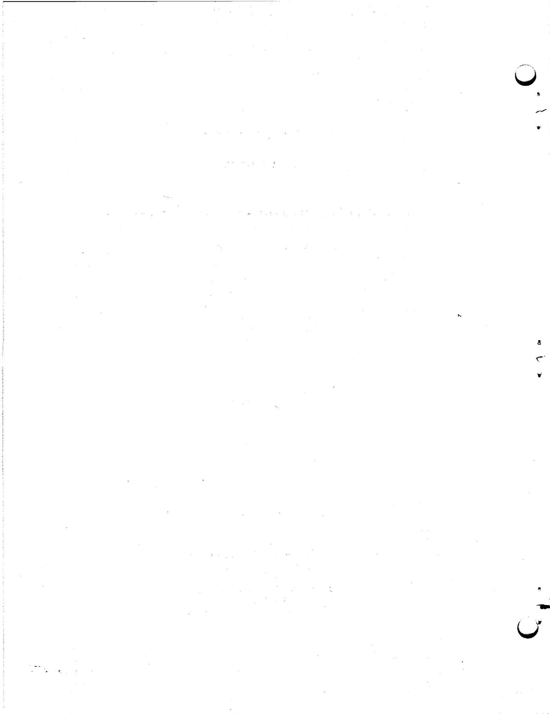

# TABLE OF CONTENTS

Page

ABSTRACT 1

INTRODUCTION 2

PROCESSES AFFECTING $^{135}$ XE IN MOLTEN-SALT REACTORS 3

PREDICTIONS BEFORE MSRE OPERATION 6

OBSERVATIONS DURING MSRE OPERATION 7

DEVELOPMENT OF MATHEMATICAL MODELS OF MSRE 135XE AND COVER-GAS BEHAVIOR 30

ANALYSIS OF MSRE COVER GAS AND $^{135}$ XE BEHAVIOR 51

DISCUSSION OF RESULTS 91

CONCLUSIONS 95

ACKNOWLEDGMENT 97

REFERENCES 98

APPENDIX 101

DISTRIBUTION

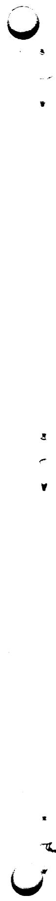

XENON BEHAVIOR IN THE MOLTEN SALT REACTOR EXPERIMENT

J. R. Engel R. C. Steffy*

# ABSTRACT

Since molten salt reactors are based on a circulating fluid fuel, the possibility exists for continuous removal of $^{135}\mathrm{Xe}$ (by gas-liquid contacting) as a means of improving their breeding performance. A reasonably detailed understanding of the xenon behavior in such reactors is essential for accurate prediction of the removal capability. The xenon poisoning in the Molten Salt Reactor Experiment (MSRE) was extensively studied in an effort to develop an understanding of the behavior mechanisms.

Xenon poisoning calculations made prior to the operation of the MSRE were based on a mathematical model that neglected any effects of cover-gas solubility in the salt. These calculations reproduced reasonably well the observed steady-state poisoning as a function of circulating void fraction when an insoluble cover gas, argon, was used but they did not adequately describe the transient behavior. In addition they did not predict the very low xenon poisoning that was observed at low void fractions with a more soluble cover gas, helium.

A more detailed mathematical model which allowed inclusion of cover-gas solubility effects was developed in an effort to better describe the observed results. This model successfully described the different poisoning effects with helium and argon at low void fractions but it required the use of mass transport and xenon stripping parameters that differed significantly from the predicted values. These calculations also failed to describe adequately the transient observations.

A comparison of calculated and observed effects suggests that 1) circulating bubbles may strongly influence the transport of xenon from the fluid to graphite, and 2) both the gas transport and stripping processes may be affected by operation at power. As a consequence, additional investigations would be desirable to further elucidate the behavior of noble gases in molten-salt reactor systems.

# INTRODUCTION

The Molten Salt Reactor Experiment (MSRE) was in nuclear operation from June 1, 1965 to December 12, 1969. During that time the reactor generated 13,172 equivalent fullpower hours of energy at power levels up to 7.4 Mw. The reactor system and the overall operating experience have been extensively described in the open literature. (Refs. 1 - 4). This report deals with a specific aspect of that experience, the behavior of xenon-135.

Because the fuel is a circulating fluid, the mobility of all the fuel constituents, including the fission products, is an important consideration in the overall performance of molten-salt systems. This mobility is especially important for the noble-gas fission products because they, typically, have very low solubilities in molten salts and because some, notably $^{135}\mathrm{Xe}$ , are significant neutron absorbers. Thus, the potential for continuous and rapid removal of the gaseous fission products offers the possibility of reducing both the circulating fission-product inventory and the neutron losses to $^{135}\mathrm{Xe}$ . Although neither of these considerations was of major significance in the MSRE, the behavior of $^{135}\mathrm{Xe}$ was studied extensively in an effort to develop an understanding of the mechanisms involved. Such an understanding is essential to the reliable prediction of xenon behavior in other MSR designs.

The purpose of this report is to provide a basis for discussion and then to describe the xenon behavior observed in the MSRE. Since significant differences were found when different cover gases (helium or argon) were used for the salt, this aspect of the behavior will receive considerable attention. We then develop a mathematical model and discuss the results of parametric studies whose objective was a consistent description of all the observed phenomena. Finally some conclusions are drawn about the apparent xenon behavior and suggestions are offered for experimental investigations that may further elucidate this behavior.

# PROCESSES AFFECTING $^{135}\mathrm{Xe}$ IN MOLTEN-SALT REACTORS

Although many of the xenon behavior processes are the same in a molten salt reactor as in any other reactor, the fact that the fuel is not confined within discrete, impervious elements in the core introduces some significant differences. The basic processes for production and removal of $^{135}\mathrm{Xe}$ are outlined in Fig. 1.

The majority of the $^{135}\mathrm{Xe}$ that is produced results from the decay of the 6.7-hr half-life precursor $^{135}\mathrm{I}$ . At least some of this iodine is produced by the decay of $^{135}\mathrm{Te}$ whose behavior in molten-salt systems is not completely defined. However, because of its short (29 sec) half-life, Te has very little effect on the 135 chain. Thus, since iodine has essentially no tendency to leave the salt, the $^{135}\mathrm{Xe}$ that is produced directly from $^{135}\mathrm{I}$ is formed in the circulating salt, at a uniform rate around the entire fuel loop. As indicated on Fig. 1, only about $70\%$ of the $^{135}\mathrm{I}$ decays lead directly to $^{135}\mathrm{Xe}$ and the remainder produce the metastable form, $^{135}\mathrm{Mx}$ . Although the occurrence of this isomer is unimportant in reactors where all the fission products are confined within fuel elements, it has potential significance in fluid fuel systems, particularly if there are other xenon behavior mechanisms with time constants that are short relative to the 16-min. half-life of the isomer. (Fig. 1 indicates one such mechanism: transfer from the fuel salt into the offgas system. Not shown, but also possible, is transport into the graphite pores.) The significance of the 16-minute isomer is also somewhat dependent on its neutron absorption cross section. Although there are no data available on the cross section of $^{135}\mathrm{Mx}$ (Ref. 7), it is presumed to be negligible in comparison to that of $^{135}\mathrm{Xe}$ .

The $^{135}\mathrm{Xe}$ that is not produced by the iodine decay scheme is produced directly from fission. Literature reports of the fraction of the total $^{135}\mathrm{Xe}$ yield that is produced directly in $^{233}\mathrm{U}$ fission range from 3.8% (Ref. 8) to 18% (Ref. 9). This fraction would be expected to have almost no effect on steady-state xenon poisoning but it could significantly affect the transient behavior following major changes in power level.

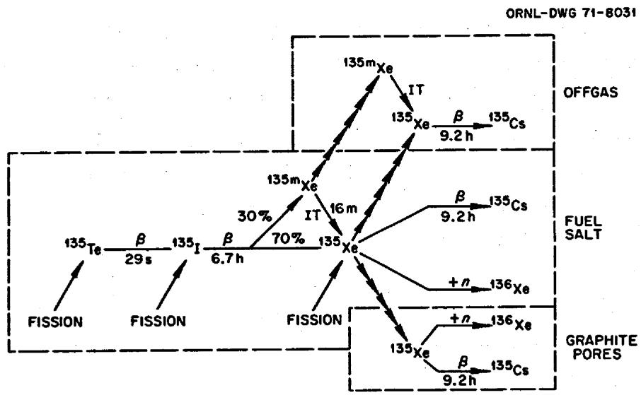  
Fig. 1. Processes Affecting Xenon Poisoning in a Molten-Salt Reactor.

Once the $^{135}\mathrm{Xe}$ has been formed, it is subject to the same decay and neutron absorption processes as in any other reactor. Some difference is introduced by the fact that xenon in the circulating fluid is exposed to a different average neutron flux than the xenon in the graphite. However, a more important complication is the additional path for xenon removal by stripping into the offgas system. The reduction in xenon poisoning that can be achieved depends upon the extent to which stripping can be made to compete with the other loss terms. In principle, xenon can either be stripped directly from the circulating salt into the offgas or it can transfer to circulating bubbles and be removed by a bubble exchange process. Thus, the details of these two processes, as well as the rate of xenon mass transfer between bubbles and liquid are important in describing the overall xenon behavior. In addition, any xenon that is transported to the unclad graphite must be dealt with separately because the xenon inventory in the graphite is not available for stripping. This process depends upon the mass transfer from the fluid to the graphite surface and on the porosity (storage volume) and permeability (accessibility of that volume) of the graphite itself.

Another mechanism of potential significance is an abnormal out-of-core holdup of xenon, either in gas pockets or on solid surfaces. Operation of the MSRE showed that there were no significant gas pockets in the loop except at the reactor access nozzle and the gas exchange with that region appeared to be too slow to exert much influence on xenon. Holdup in corrosion-product scales was shown to be significant in an aqueous system because of iodine adsorption on the scale. However, there was no corrosion-product scale in the MSRE and no tendency for iodine to leave the salt. Xenon sorption on surface active particles that are held out of circulation (possibly in foam in the pump bowl) may also be possible but will not be considered in this analysis.

# PREDICTIONS BEFORE MSRE OPERATION

Accurate description of the xenon behavior in the MSRE was an early objective of the project so a considerable part of the reactor development effort was directed toward this goal. The fuel circulating pump was extensively tested in both water11 and molten-salt12 loops to evaluate its hydraulic characteristics, gas stripping and cover-gas entrainment.

Additional gas stripping tests were performed on a mockup. $^{13}$ A full scale water mockup of the reactor vessel was used to study core flow patterns, $^{14}$ partly as an aid to evaluating mass transfer processes in the loop. The MSRE graphite was subjected to a variety of tests $^{15,16}$ some of which provided data on porosity and permeability which were directly applicable to the xenon problem. To support these separate studies, an experiment was performed with the MSRE, prior to nuclear operation, in which krypton was injected into the system and then purged out. $^{17}$ The objective of all this work was to provide sufficient data on the various mechanisms so that reasonable predictions could be made of the xenon poisoning.

A mathematical model was constructed to use the available information to predict steady-state $^{135}\mathrm{Xe}$ poisoning in the MSRE. $^{17}$ Since the development tests had indicated that there would be a significant fraction of undissolved cover gas (1 to 2 vol. %) circulating with the salt, this model included the mass transfer of xenon between salt and bubbles and the effects of bubble stripping. However, early operation of the MSRE with molten salt indicated that there would be essentially no circulating bubbles under normal operating conditions. $^{18}$ Consequently, xenon poisoning calculations were made for a variety of circulating void fractions, including zero.

In addition to the treatment of circulating voids, several other approximations and assumptions made for this model are important. The solubility of the reactor cover gas (helium) in molten salt was neglected. With this assumption it was then quite reasonable to treat the entire fuel loop as a single well-stirred tank. The production of $^{135}\mathrm{Xe}$ was assumed to be uniform around the loop and was confined to the salt phase. That is, formation by decay of $^{135}\mathrm{Mx}$ was neglected and the direct fission yield

was combined with the iodine decay term. Since only steady-state conditions were considered, this simplification had almost no effect on the results. Xenon distribution in the graphite and the resultant poisoning were treated in a detailed (72 region) nuclear model of the core that also included the radial xenon distribution within individual graphite bars. However, mass transfer of xenon to the graphite was assumed to occur only from the salt; direct transfer from bubbles to graphite was not allowed.

The parameter values used and the results obtained from calculations with this model are described in detail in Ref. 17. Figure 2 shows one set of results in which the circulating void fraction was treated as an independent variable. This figure illustrates the monotonic decrease in poisoning with increasing void fraction that was typical of the results obtained. (Note that in Figure 2 the xenon poisoning is in terms of poison fraction, neutron absorptions in $^{195}\mathrm{Xe}$ /absorption in $^{235}\mathrm{U}$ . Subsequent results will use the xenon reactivity effect, $\% \delta \mathrm{k / k}$ , since this can be compared more readily with measured values. For the MSRE, the reactivity effect of a poison was approximately 0.8 times the poison fraction.)

# OBSERVATIONS DURING MSRE OPERATION

The behavior of xenon in the MSRE was observed throughout the operation of the reactor. The primary tool for these observations was the system reactivity balance $^{19,20}$ which was calculated every 5 min by an on-line computer while the reactor was in operation. This computation was developed to provide a real-time monitor of the reactor system for unexpected changes in nuclear reactivity. It included calculations of all the known reactivity changes from a reference state as functions of time, temperature, power, and fuel loading. All the calculated effects, along with the observed control-rod poisoning were summed and any deviation from zero could be regarded either as an anomaly or an error in one or more of the calculated terms. Initially, the only large term in the reactivity balance with a significant uncertainty was the xenon poisoning. Subsequently, the accuracy of the other terms was shown by results at zero power with no

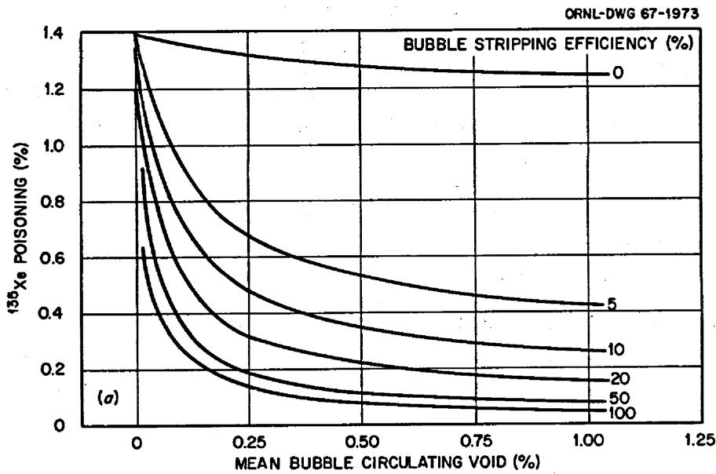  
Fig. 2. Predicted $^{135}\mathrm{Xe}$ Poison Fraction in the MSRE with Circulating Bubbles at 7.5 MW(t).

xenon present. $^{20}$ This information, along with other evidence that no anomalous effects were present, allowed us to evaluate the actual xenon poisoning not only at steady state but also during transients produced by changes in the reactor power level and other operating parameters. During those parts of the operation when there were no (or almost no) circulating voids, reactivity balances at power were sufficient to define the xenon poisoning. However, when the circulating void fraction was significant, additional data were required at zero power with no xenon present to permit separation of the direct reactivity effect of the bubbles.

Although most of the xenon poisoning data were extracted from reactivity-balance results some supplementary data were obtained from samples of the reactor offgas. Since both $^{134}\mathrm{Xe}$ and $^{196}\mathrm{Xe}$ are stable fission products with insignificant neutron absorption cross sections, a comparison of the fission-yield ratio for these isotopes with the actual isotopic ratio in the offgas provides a measure of the neutron absorptions in $^{195}\mathrm{Xe}$ . Such comparisons were made for several samples isolated under steady-state conditions but the results were too scattered to contribute significantly to the detailed analysis of xenon behavior. The results did, however, confirm that the conclusions drawn from the reactivity balances were not grossly in error.

Another technique that was attempted was direct measurement of the $^{135}\mathrm{Xe}$ concentration in the reactor offgas at the fuel-pump outlet using remote gamma-ray spectrometry. When the reactor was operated at high power the radiation level from the offgas line was so high that considerable shielding had to be inserted between the source and detector to obtain manageable pulse counting rates. The effect of this shielding on the efficiency of the detector system at the energy of the principal $^{195}\mathrm{Xe}$ gamma ray (249.65 kev) introduced sufficient uncertainty to completely obscure the results. At lower power levels, residual xenon from previous high-power operation had a similar effect. While this technique appears to offer some promise for studying xenon behavior, additional development would be required beyond that which was available on the MSRE.

# Circulating Voids

Although this report is concerned primarily with the behavior of xenon, that behavior is so strongly affected by circulating voids that a summary of the experience with voids is presented to provide a basis for further discussion. A detailed description of the void behavior may be found in Ref. 21.

During the early operation of the MSRE, both in prenuclear tests and the zero-power experiments, there was no evidence of circulating gas bubbles under normal conditions. However, voids were observed when the system temperature and fuel-pump level were reduced to abnormally low values. Evidence for the presence of circulating voids began to appear after a few months of operation at power. A series of pressure-release tests on the fuel loop in July 1966 confirmed that some voids were then present even at normal system conditions. Various interpretations of the early data indicated void fractions as high as 2 to 3 vol. $\%$ [18,22] However, as more data were obtained and evaluated we concluded that the normal void fraction in the reactor core was quite low - in the range of 0.02 to 0.04 vol. $\%$ [23,24]. Once it became established, the circulating void fraction remained relatively constant throughout the $^{295}\mathrm{U}$ operation of the reactor. * Significant variations could, however, be induced by changes in system temperature, overpressure, and fuel-pump level. The changes were identified by their reactivity effects [25] and by changes in the neutron-flux noise spectrum. [26] The results of one series of void-fraction measurements based on reactivity effects are summarized in Table 1. Because of uncertainties in the absolute magnitude of the void fraction, the values shown are changes from the minimum void fraction that was attained. In general, the void fractions increased with decreasing temperature and increasing pressure. Although these measurements did not show any dependence on fuel-pump level, the associated noise measurements indicated higher void fractions at lower levels.

Table 1   
Effect of Operating Conditions on Core Void Fraction   
In MSRE with $^{235}\mathrm{U}$ Fuel   

<table><tr><td>Fuel Pump 
Overpressure 
(psig)</td><td>Reactor Outlet 
Temperature 
(°F)</td><td>Fuel Pump 
Level Range 
(in.)</td><td>Change from Min. b 
Core Void Fraction b 
(Vol %)</td></tr><tr><td>5</td><td>1225</td><td>5.6 - 6.2</td><td>0</td></tr><tr><td>5</td><td>1210</td><td>5.3 - 6.1</td><td>0.03</td></tr><tr><td>5</td><td>1180</td><td>5.3 - 5.7</td><td>0.11</td></tr><tr><td>9</td><td>1225</td><td>5.6 - 6.2</td><td>0</td></tr><tr><td>9</td><td>1210</td><td>5.3 - 6.0</td><td>0.04</td></tr><tr><td>9</td><td>1195</td><td>5.3 - 5.9</td><td>0.10</td></tr><tr><td>9</td><td>1180</td><td>5.3 - 5.6</td><td>0.18</td></tr><tr><td>3</td><td>1225</td><td>5.6 - 6.2</td><td>0</td></tr><tr><td>3</td><td>1180</td><td>5.3 - 5.8</td><td>0.10</td></tr></table>

Helium cover gas; 1189 rpm fuel-pump speed.   
$b_{\text{Based on reactivity effect at zero power.}}$

After recovery of the $^{235}\mathrm{U}$ mixture from the fuel salt and the addition of $^{233}\mathrm{U}$ , the system behavior with regard to circulating voids changed markedly: the nominal core void fraction went to 0.5 to 0.7 vol.%. This change, along with other observations prompted a more detailed study of the void behavior. Some early experiments indicated that, of the parameters available for change in the MSRE, the circulating void fraction was most sensitive to changes in fuel-pump speed. Consequently this approach was used to vary the void fraction. Figure 3 shows the effect of pump speed on the void fraction for both flush and $^{233}\mathrm{U}$ -fuel salts with helium and argon as the system cover gas. Although we never observed circulating voids in the flush salt (with helium cover gas) during the $^{235}\mathrm{U}$ phase of the operation, this salt did develop voids with only a small increase in fuel pump speed (to 1240 rpm). The different void fractions obtained with helium and argon apparently reflect the lower solubility of argon in molten salt. That is, for a given rate of gas ingestion at the fuel pump, a larger fraction of the argon would be expected to remain undissolved. The core void fraction remained relatively stable around 0.5 vol.% for most of the $^{233}\mathrm{U}$ operation. However, small variations apparently did occur which had measurable effects on the xenon poisoning. The inability to precisely define the system void fraction under all operating conditions added considerable uncertainty to the measurement of xenon poisoning as a function of void fraction.

One other aspect of the behavior of circulating voids in the MSRE that will be referred to later is the rate at which the circulating void fraction could be changed, particularly in the direction of a lower value. On several occasions, excess circulating voids were introduced by pressure-release tests or by other system perturbations and, in every case, these voids subsequently disappeared at a rate which indicated a bubble stripping efficiency of 50 to $100\%$ on the streams passing through the pump bowl.

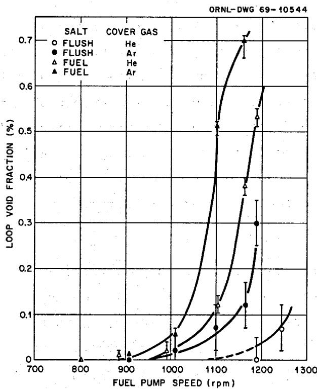  
Fig. 3. Effect of Fuel-Pump Speed on Void Fraction in Fuel Loop.

# Xenon Poisoning with $^{235}$ U Fuel

Since the early operations at the MSRE had indicated that there were no circulating voids, the xenon poisoning was predicted on that basis. Calculations using the model described above showed that, at full power (7.4 Mw), the poisoning would amount to about $1.08\% \delta \mathrm{k} / \mathrm{k}$ . When the reactor was first operated at power, the reactivity-balance results indicated that the actual xenon poisoning would be much less than had been anticipated. At that time, attempts to use the reactivity balance as an anomaly detector were deferred (at least during xenon transient conditions) and the results were used to evaluate the xenon effect. Although this use of the reactivity balance required the assumption that no anomalous effects occurred along with the xenon changes, the experience during conditions of steady xenon poisoning supported its validity.

# Steady-State Values

The first measurements of steady-state xenon poisoning at power levels of 5 Mw or greater were obtained in April and May 1966. These values and their associated power levels are listed in Table 2. On the surface, the early values appear to be inconsistent because the highest power is associated with the lowest xenon value. Little significance was attached to these differences because of the very large difference between the expected and observed values and because we had not yet established full confidence in the reactivity balance. The results were valid, however, and the differences are at least qualitatively explainable. We have already shown that small differences in system temperature and pressure cause significant variations in the circulating helium void fraction and will show subsequently that, with helium cover gas, a higher core void fraction leads to higher xenon poisoning. Both of the first two values were obtained under conditions that tended to increase the void fraction (i.e. lower temperature at 5 Mw and higher overpressure at 6.7 Mw) so it appears likely that the different values are attributable to void-fraction variations. This explanation is contingent upon the existence of circulating voids which was not demonstrated until July, 1966. However, there appears

# Table 2

Early Measurements of Steady State $^{135}$ Xe Poisoning In MSRE with $^{235}$ U Fuel   

<table><tr><td>Date</td><td>Power Level (Mw)</td><td>Xenon Poisoning (% δk/k)</td></tr><tr><td>4/28/66</td><td>5</td><td>0.32</td></tr><tr><td>5/15/66</td><td>6.7</td><td>0.35</td></tr><tr><td>5/25/66</td><td>7.2</td><td>0.30</td></tr></table>

to be little doubt that some voids were present at the time these xenon data were obtained.

After routine power operation of the reactor had been established, the full-power steady-state xenon poisoning was between 0.26 and $0.28\%$ $\delta k / k$ for most of the $^{235}\mathrm{U}$ operation.\* A significant deviation from this condition occurred during the last major period of that operation, Run 14. Although much of this run was spent in studying the xenon poisoning under different reactor conditions, measurements at standard conditions consistently showed values of 0.34 to $0.35\%$ $\delta k / k$ . Another difference in the system behavior accompanied this change; the rate of salt transfer from the pump bowl to the overflow tank dropped from $-1$ lb/hr, a value that had persisted for several months, to only $1/2$ lb/hr. We suspect that both changes are related to a change in the behavior of voids in the system but there was no direct evidence for such a change.

# Correlations

Although the reactivity balance was used to obtain data on xenon poisoning, the primary function of this calculation was to provide a real-time monitor of the reactor operation for possible anomalous reactivity effects. Therefore, it was necessary to incorporate an accurate calculation of the actual xenon behavior, both steady-state and transient, in the balance. Since the model used for the initial predictions was felt to be basically sound, we used this model to correlate the experimental data. The results of these correlations were then adapted to the on-line computer. Some simplification of the nuclear representation of the core was required to fit the calculation into the on-line system but this did not affect the principal characteristics of the model.

Earlier development work had established probable values for many of the parameters in the model and these values were adopted. However, there were two parameters, circulating void fraction and bubble-stripping efficiency, which were not well established for the MSRE so the effects of these two quantities were studied in some detail. * We found that the steady-state xenon poisoning, as well as many aspects of the transient behavior could be described by adjusting only these two parameters. Furthermore, the steady-state poisoning could be described about equally well by a high circulating void fraction (0.5 to 1.0 vol %) with low bubble-stripping efficiency (10 to 15%) or a low void fraction (0.1 to 0.15 vol %) with a high stripping efficiency (50 to 100%). However, these two sets of values led to different overall distributions of the xenon. When the void fraction was high, a major part of the poisoning was due to xenon in the bubbles but, at low void fractions, the xenon in the graphite was the major contributor. This difference led to significant differences in the calculated xenon transient behavior, particularly for the xenon removal transients following a power reduction. With most of the poisoning due to xenon in the graphite, the continued production from iodine decay in the salt and

transfer to the graphite after the reduction in power (and burnout in the core) tended to produce a peak in the xenon transient. Then, after the xenon in the fluid had been depleted by stripping, xenon diffused out of the graphite and was stripped so that rate of change in poisoning was more rapid than it would have been if only radioactive decay were operative. As the poisoning shifted toward the circulating fluid, with increasing void fraction, the xenon peak tended to disappear from the decay transient. In addition, the low stripping efficiency required to match the steady-state poisoning slowed the rate of decrease in xenon poisoning.

When the observed transients were compared to the calculations, we found good agreement with the low-void-fraction, high-efficiency curves. Figure 4 shows one example of the quality of fit that was obtained. Furthermore, the void fraction appeared to be consistent with other, independent observations. Consequently, this model, using a 0.15 vol % void fraction and a 50% bubble stripping efficiency was used for the on-line xenon calculations. These calculations produced good results through Run 12 of the $^{235}\mathrm{U}$ operation (August, 1967). It will be recalled, however, that this model did not treat cover-gas solubility effects, nor did it provide for variations in the circulating void fraction with reactor operating conditions. Thus the empirical fit to the xenon poisoning was applicable only to the specific reactor conditions under which it was established. Although this limitation was clearly recognized when the calculation was developed, the sensitivity of the reactor xenon poisoning to system conditions was unknown until actual measurements were made in Run 14 with $^{235}\mathrm{U}$ fuel and still later with $^{233}\mathrm{U}$ fuel.

# Effects of Operating Parameters

A subject that was investigated extensively in the MSRE was the correlation between the core void fraction and the neutron-flux noise spectrum.[26] One objective of that work was to develop neutron noise analysis as a diagnostic tool for measuring the void fraction. A series of special tests was performed in reactor Run 14 to further this effort. The tests involved operation of the system at various temperatures, overpressures, and fuel-pump levels, first at near-zero power (no xenon) so that the reactivity

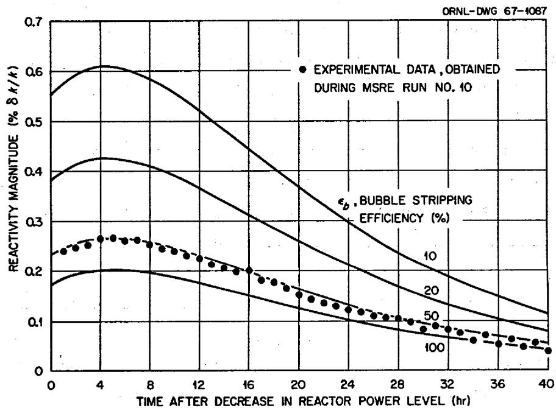  
Fig. 4. Effect of Bubble Stripping Efficiency on Transient Decay of $^{135}\mathrm{Xe}$ Reactivity. Step decrease in power level from 7.4 MW to 0; vol % circulating bubbles, 0.15.

balance could be used to measure the void fraction, and then at 5 Mw to measure the noise spectrum. The effects of the operating parameters on void fraction have already been discussed. However, when the reactor was at power, additional reactivity differences were observed which, because of their reversibility and time constants, could only be attributed to changes in xenon poisoning.

Figure 5 shows the effect of the nominal core void fraction on xenon poisoning at $5\mathrm{Mw}$ , without regard for the changes in operating parameters that were made to vary the void fraction. Although there is considerable scatter in the data, the trend toward greater xenon poisoning at higher void fractions is clearly evident. There are several possible reasons for the scatter but these have not been evaluated quantitatively. First, the measurements of nominal void fraction and xenon poisoning were separated in time and we have no direct assurance that a given set of operating conditions always produced precisely the same core void fraction. Second, the void-fraction measurement is subject to considerable uncertainty in this range because of the small reactivity differences involved (0.02% $\delta\mathrm{k} / \mathrm{k}$ for a void-fraction change of 0.1 vol%). And, finally, we have ignored the fact that different combinations of parameter values were used to obtain the void fractions (cf. Table 1) so the direct effects of these parameters on the xenon behavior are included in the data scatter. Thus, while Fig. 4 illustrates an important aspect of the xenon behavior in MSRE, it does not provide an adequate basis for modification of the xenon model.

# Xenon Poisoning with $^{293}\mathrm{U}$ Fuel

Possibly the most significant difference in the MSRE operation with $^{23}$ U fuel, as regards the xenon behavior, was the drastically different volume fraction of circulating voids under standard conditions. As indicated earlier, the void fraction changed from 0.05 vol % or less, with $^{23}$ U fuel, to about 0.5 vol %. The precise reason for this shift has not been established but it may have been caused by different physical properties (density and, possibly, surface tension and viscosity) of the two salt mixtures. It has also been suggested that an accumulation of insoluble

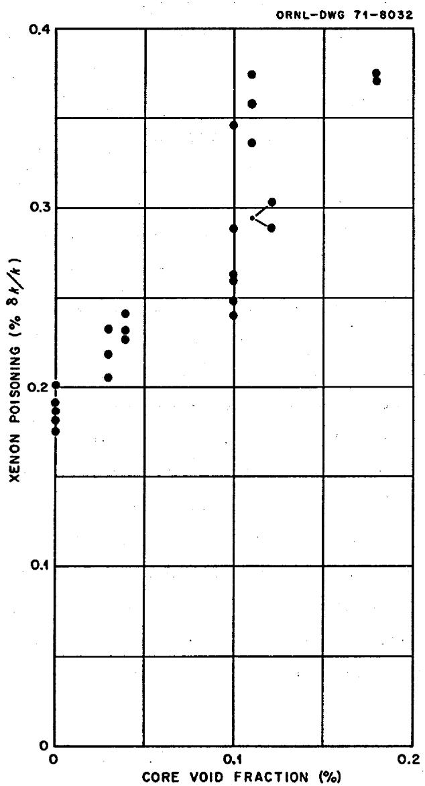  
Fig. 5. Effect of Core Void Fraction on MSRE Steady-State Xenon Poisoning at 5 MW with $^{235}\mathrm{U}$ Fuel.

metallic particles - fission and corrosion products - into a "scum" on the surface of the salt pool in the pump bowl could have contributed to the change in void behavior. In any event, this change ultimately led to a complete reinvestigation of the xenon problem.

The first step in this investigation was to establish the behavior of the voids as such. This was greatly facilitated by the installation of a variable-frequency generator to supply power to run the fuel pump at different speeds* and preliminary measurements were made of the effect of fuel-pump speed on the core void fraction with helium cover gas. We then attempted to measure the steady-state xenon poisoning at various void fractions. The void fraction was adjusted by regulating the pump speed and the reactor power was held to 7 Mw. This allowed us to make all the measurements at one reactor outlet temperature (1210°F) without reaching undesirable temperatures in other parts of the system. In addition, the system overpressure and fuel-pump level were restricted to narrow ranges. The results of these xenon poisoning measurements are shown in Figure 6. Considerable uncertainty must be assigned to the void fractions between 0.1 and 0.3 vol %. These points were obtained with the variable-frequency drive running near, but not at, its maximum speed capability and difficulty was encountered in controlling the speed precisely. The extreme sensitivity of the void fraction to pump speed in this region (cf Fig. 3) probably caused the void fraction to wander during the tests.

The early data on void fraction and xenon poisoning were obtained in March 1969, during Run 17, the first period of high-power operation with $^{23}$ U fuel. These data were used to adjust parameter values in the existing, on-line xenon calculation to provide better steady-state xenon values. Two sets of parameters were developed for use with high and very low void fractions. As reactor operation continued, it became apparent that this approach did not adequately describe the xenon behavior. Then, a scheduled reactor shutdown in June, 1969 added another dimension to the xenon problem.

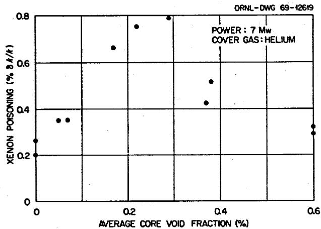  
Fig. 6. Effect of Core Void Fraction on Steady-State Xenon Poisoning (Measured in March 1969).

One of the operations planned for the shutdown was a replacement of corrosion and surveillance specimens in the reactor core. Since this operation required opening of the reactor primary loop, the normal procedure called for filling the loop with argon to help prevent intrusion of air and moisture during the replacement. On this particular occasion the introduction of argon was started $\sim 2$ hr before the reactor power was reduced. For several days prior to the shutdown, the reactor had been operating at reduced fuel-pump speed (and slightly reduced power - $7\mathrm{Mw}$ ) to minimize the circulating void fraction. (The off-design operation was adopted to prevent aggravation of a restriction in the reactor offgas system which was also scheduled for correction during the shutdown.) As argon replaced the normal helium cover gas, there was a substantial decrease in the nuclear reactivity of the system. This decrease was later shown to be associated with a marked difference in xenon poisoning, at low void fractions, with the two cover gases.

When reactor operation was resumed, in August 1969, an extensive series of experiments was performed to elucidate the circulating void behavior at various fuel-pump speeds with both helium and argon cover gases and to evaluate the xenon poisoning with both gases. By that time, also, the speed-control problems with the variable-frequency power supply had been largely corrected so that the data at intermediate void fractions were more reliable. These data provided the principal basis for the reevaluation of the xenon behavior in the MSRE. However, the data collection continued into September and the reactor operation was terminated on December 12, 1969. Consequently, the revised analysis described in this report was not used during the reactor operation.

The effects of fuel-pump speed and cover gas on the circulating void fraction have already been discussed (see Fig. 3). The measured effect of the core void fraction on xenon poisoning with $^{293}\mathrm{U}$ fuel at $5\mathrm{Mw}^{*}$ is shown

in Fig. 7. The results with helium cover gas show essentially the same behavior as those obtained earlier with this combination. In addition, the results are at least qualitatively similar to those obtained with $^{235}\mathrm{U}$ fuel at low void fractions. In contrast, the results with argon cover gas show a significantly different behavior at the lower void fractions. These data appear to demonstrate the monotonic decrease in poisoning with increasing void fraction that was predicted by the model which neglected cover-gas solubility. However, it should be noted that there is a significant gap between the point shown at zero void fraction and the next data point. In addition there is some uncertainty about the void fraction at which the first point should be plotted.

During the collection of the xenon data, as in all reactor operations, there was some variation in the fuel-pump level because of salt transfer to the overflow tank. And, while the level effect was small, if there was any tendency for voids to be present in the core, that tendency was enhanced at the lower salt levels. Figure 8 shows the progress of a xenon build-in transient as a function of time after a power increase from $10\mathrm{kw}$ to $5\mathrm{Mw}$ . This test was performed with argon cover gas while the fuel-pump speed was $800\mathrm{rpm}$ . The reactor outlet temperature and system overpressure were at their normal values, $1210^{\circ}\mathrm{F}$ and 5 psig respectively. At normal pump-bowl salt levels, these conditions corresponded to zero void fraction in the core. Also shown in this figure is the indicated salt level in the fuel pump bowl. It may be noted that, as the salt level decreases toward 6 in. (relative to an arbitrary zero reference), there is a change in the shape of the xenon curve. At about this same time, 25-30 hours into the transient, the neutron noise, as indicated by an analog instrument that recorded the average (RMS) level between 0.6 and $1.4\mathrm{Hz}$ (Ref. 31) began to increase. By the time some of the salt was returned to the pump bowl (at $44\mathrm{hr}$ ), the noise level had increased by a factor of 2, suggesting a small but steady increase in the core void fraction. The noise decreased somewhat, but not to its original level, when the salt level in the pump bowl was raised and then increased again with decreasing salt level. The apparent variation in void fraction with salt level indicated by the neutron noise was qualitatively consistent with previous experience at other pump speeds and salt

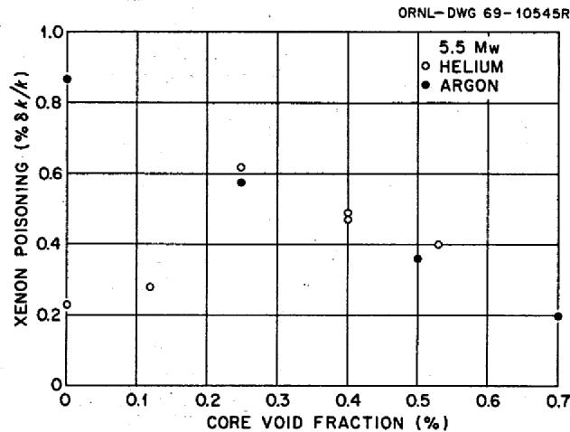  
Fig. 7. Effect of Core Void Fraction on Steady-State Xenon Poisoning (Measured in August-September 1969).

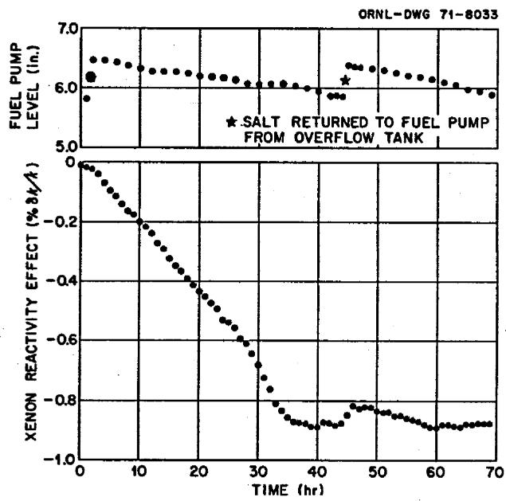  
Fig. 8. Xenon Buildup Transient with Argon Cover Gas and Low Circulating Void Fraction.

levels. Figure 7 shows clearly a decrease in the magnitude of the xenon reactivity effect that followed the increase in salt level and a subsequent increase in poisoning as the salt level dropped. A somewhat similar occurrence had been observed about a week earlier with the fuel pump operating at $900~\mathrm{rpm}$ . However, in the earlier case the salt-level effect on the xenon was partly obscured by a change that was made in the gas purge rate through the pump bowl.

Although the events just described are not readily subject to quantitative evaluation, they strongly suggest that the xenon behavior with decreasing void fraction was similar for both helium and argon cover gases. The major difference appears to have been in the value of the decreasing void fraction at which the xenon poisoning curve began to turn down and in the extent of the decrease in poisoning. Figure 9 shows what now appears to be a better representation of the effect of core void fraction on xenon poisoning in the MSRE with argon cover gas. The shaded area at low void fractions is intended to show only the region in which the xenon poisoning apparently varied, rather than to indicate the precise nature of the variation.

Aside from the special experiments performed to evaluate xenon poisoning, routine observations were made of the xenon effect throughout the $^{233}\mathrm{U}$ operation. As was the case in the $^{235}\mathrm{U}$ operation, variations were observed in the steady-state xenon poisoning that could not be assigned to known changes in the operating conditions. Table 3 shows some of the values that were observed at full power and otherwise nominally standard conditions. Minor deviations from the standard 5-psig overpressure did occur but these do not appear to account for the xenon changes. It seems more likely that minor changes in the fuel-salt properties allowed the void fraction to wander enough to vary the xenon poisoning. The nature and magnitude of the changes required to produce the observed variations is unknown.

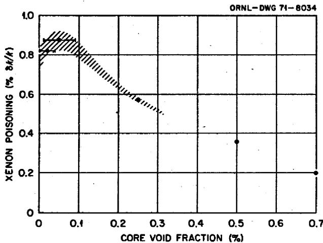  
Fig. 9. Adjusted Variation of Steady-State Xenon Poisoning with Argon Void Fraction.

# Table 3

Full-Power Xenon Poisoning

During $^{233}\mathrm{U}$ Operation

<table><tr><td>Date</td><td>Xenon Poisoning (% δk/k)</td></tr><tr><td>2/21/69</td><td>0.36</td></tr><tr><td>2/25/69</td><td>0.36</td></tr><tr><td>4/15/69</td><td>0.32</td></tr><tr><td>4/18/69</td><td>0.40</td></tr><tr><td>10/6/69</td><td>0.51</td></tr><tr><td>10/20/69</td><td>0.39</td></tr><tr><td>11/29/69</td><td>0.44</td></tr><tr><td>12/11/69</td><td>0.45</td></tr></table>

# DEVELOPMENT OF MATHEMATICAL MODELS OF MSRE

# 135XE AND COVER-GAS BEHAVIOR

The approximations and assumptions made in earlier mathematical models to describe xenon behavior in the MSRE were discussed earlier. Since the net effect on the overall results was not obvious, we included a large number of individual mechanisms in the model to be described in an effort to see if particular aspects of the observed xenon behavior could be related to specific mechanisms.

Although we were concerned primarily with the fate of xenon, it was a basic premise of this approach that the xenon behavior was dependent on the behavior of the cover gas. Thus, it was necessary to include in the xenon model a description of the cover-gas conditions around the loop. This description could be computed within the xenon model for the cases where an insoluble cover gas was assumed. However, when significant cover-gas solubility was allowed, the non-linear cover-gas behavior was computed separately and the results used as input for the xenon calculations. In this section we describe first the xenon model and then the model used to compute the cover-gas conditions.

# Xenon Model

As a first step toward increasing the flexibility of the xenon model, the fuel loop which previously had been treated as a single, well-stirred tank was divided into several regions. This made it possible to consider the approximate effects of short term dynamic mechanisms such as the compression and expansion of circulating gas bubbles as well as gas dissolution in and evolution from the liquid. In addition, the core region was subdivided into 4 radial regions to allow for different rates of mass transfer due to the radial profile of fuel salt velocity through the core. This subdivision also permitted a radial breakdown of the xenon

burnout and poisoning effects. There was no subdivision in the axial direction but axial effects were accounted for by using average neutron fluxes and nuclear importances for each radial region.

Figure 10 shows schematically the subdivision of the reactor loop that was used for the mathematical description and the material flow-paths that were considered. The subscripted variables within each block refer to the concentrations of $^{195}\mathrm{I}$ , $^{195}\mathrm{Xe}$ , and $^{195}\mathrm{Mx}$ that are applicable to each region. In general, a time-dependent material-balance equation of the form

$$
\frac {d X _ {i}}{d t} = \sum_ {j = 1} ^ {2 4} A _ {i j} X _ {j}, \quad i = 1, \dots . 2 4
$$

was written for each dependent variable in each region of the model. The resultant set of 24 linear, first-order differential equations could then be solved for either the steady-state solution vector or the time dependent behavior, as required. In the sections to follow, we discuss the mechanisms and terms that were included in these equations. However, the final equations with all their repetitive terms are relegated to the appendix. They are printed on fold-out sheets so that the interested reader may have them beside the text for ease in following their development. The form in which the equations are presented was selected in an effort to make the various mechanisms more readily apparent. It should be recognized that this is neither the most compact form attainable nor the one required for their solution by a computer.

# Pump Bowl

As indicated by Fig. 10, three regions were used to describe the xenon behavior in the pump bowl: the gas space above the liquid, the liquid phase, and a separate gas phase to represent bubbles that enter from the main loop and return to that loop without losing their identity (i.e. are not stripped).

The major xenon inputs to the pump-bowl gas space are the bubbles stripped from the salt flow through the bowl and direct mass transfer from

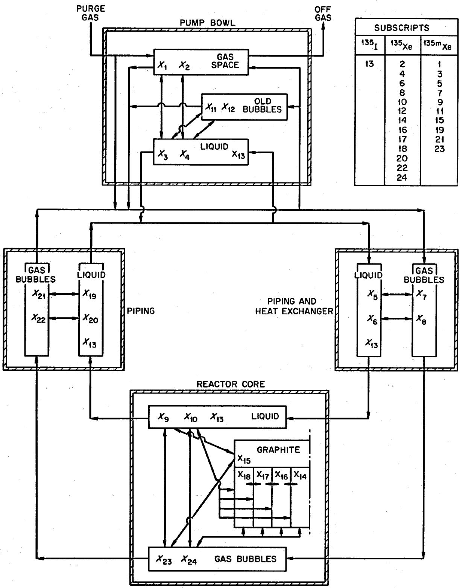  
Fig. 10. Lumped-Parameter Model for Xenon Calculations.

the liquid pool. An additional source term for $^{135}\mathrm{Xe}$ is provided by the decay of $^{135}\mathrm{mXe}$ already in the gas space. Since iodine is presumed to remain entirely in the salt phase, it does not contribute to the xenon sources for this region. The salt flow through the pump bowl is composed of the actual stripper flow plus the leakage or "fountain" flow around the pump shaft. These flows are treated separately in the model and separate bubble-stripping efficiencies are assignable to each. The actual xenon inputs are thus defined by the gas inventory in the preceding region, the flow rates, and the stripping efficiencies.

Direct transfer of xenon from the liquid pool to the gas space is described as a mass-transfer process in this model. That is, for $^{135}\mathrm{mXe}$

$$
\mathrm {S} _ {1} = \mathrm {h} _ {\mathrm {b}} \mathrm {A} _ {\mathrm {c}} \left(\mathrm {X} _ {3} - \mathrm {H R T X} _ {1}\right), ^ {*}
$$

and the comparable term for $^{135}\mathrm{Xe}$ is obtained by replacing $\mathbf{X}_3$ and $\mathbf{X}_1$ by $\mathbf{X}_4$ and $\mathbf{X}_2$ , respectively. Since this mass transfer process is not well defined, we arbitrarily assigned it the same coefficient that was used for gas-liquid transfers in the remainder of the system. The effect on the xenon balance of variations in the rate of mass transfer was examined by varying the effective transfer area, $A_c$ . This area was probably quite large (tens of square feet) because of the agitation and cover-gas carry-under produced by the spray ring. However, the extent to which the gas that is carried under (but not ingested into the circulating loop) mixes with the gas above the salt probably depends strongly on the amount and stability of the foam in the pump bowl.[31] The presence or absence of a scum of non-wetted, noble-metal fission products on top of the liquid[32] could also be expected to have some effect. Another factor that very likely influences xenon stripping is the evolution of cover-gas from the salt. If a significant amount of cover gas can dissolve in the salt in the loop, there will be tendency for that gas to escape from solution while the salt is in the pump bowl which, in turn, may affect the xenon escape rate. All of these effects are lumped together in the choice of

a value for $A_{c}$ . Thus this approach fails to distinguish between several factors that are capable of influencing the liquid stripping but it does retain the dependence of the overall process on the xenon concentration in the gas space. The net efficiency of the liquid stripping process is easily extracted from the results by comparing the xenon concentrations in the salt streams entering and leaving the pump bowl with that in the gas phase.

The xenon sinks for the pump-bowl gas space are radioactive decay, the cover-gas purge to the offgas system, and cover gas ingestion into the fuel loop. The first two mechanisms are completely defined by the region concentrations, the decay constants and the net cover-gas purge rate. However, the amount of cover gas that is drawn from the gas space into the fuel loop must be extracted from a cover-gas material balance. For a soluble cover gas, the total gas phase flow may be determined by a separate calculation that includes consideration of the gas in solution in the salt. Of this total gas phase flow, part is unstripped gas that simply passes through the pump bowl without mingling with that in the gas space. (The xenon in these "old bubbles" is treated separately below.) The volumetric flow rate of old bubbles into the loop is defined by the flow rate from the loop and the bubble stripping efficiency, along with consideration of the bubble size and the manner in which that size is attained.

In general, as bubbles approach the pump, they have been reduced from their original size by compression and cover-gas dissolution in the salt. Some of this size reduction (all of it for an insoluble cover gas) is recovered by expansion as the bubbles return to the lower pressure in the pump bowl. In this treatment we have assumed that all the bubbles have been restored to their original diameter by the time they are returned to the loop. For a soluble cover gas, there are two mechanisms

that could contribute to this size restoration: agglomeration with other old bubbles and growth by entry of cover gas from the fuel salt. These two mechanisms represent extremes of the range of possible effects on the xenon behavior so, both are examined. (Merger of the bubbles with gas from the pump-bowl gas space to increase their size has an effect between these two extremes.) If the size restoration of the old bubbles is allowed to occur only by agglomeration with other old bubbles, the flow rate of this stream to the loop is the same as the unstripped part of the flow rate from the loop. Then the flow rate from the pump bowl gas space into the loop is

$$
F = \Psi_ {3} \left(F _ {s} + F _ {f}\right) - \Psi_ {1 9} \frac {p _ {1 9}}{p _ {3}} \left[ F _ {s} \left(1 - \varepsilon_ {s}\right) + F _ {f} \left(1 - \varepsilon_ {f}\right) \right] - F _ {e},
$$

where the first term on the right represents the total gas phase flow into the loop and the second term is the contribution to that flow from the old bubbles. If the old bubbles return to their original size by collecting cover gas from the salt, the old bubbles contribute more to the total flow and

$$
F = \Psi_ {3} \left(F _ {s} + F _ {f}\right) - \Psi_ {3} \left[ F _ {s} \left(1 - \varepsilon_ {s}\right) + F _ {f} \left(1 - \varepsilon_ {f}\right) \right] - F _ {e},
$$

or

$$
F = \Psi_ {s} \left(F _ {s} \varepsilon_ {s} + F _ {f} \varepsilon_ {f}\right) - F _ {e}.
$$

It may be noted that if the cover gas is insoluble

$$
\Psi_ {1 9} \frac {\mathrm {p} _ {1 9}}{\mathrm {p} _ {3}} = \Psi_ {3}
$$

and the two expressions are equivalent. In each of the above equations for $F$ , the final term allows for the direct ingestion of clean purge gas before it has an opportunity to mix with any of the other gas in the pump bowl. It has been suggested that at high void fractions (high rates of gas ingestion) the gas flow from the bubbler level elements may be drawn directly into the loop.

The principal difference between the two approximations to the behavior of old bubbles is in the effect on the xenon concentration in those bubbles, which is discussed below. The effect on the flow of pump-bowl

cover gas into the loop is small except at high bubble stripping efficiencies with a soluble cover gas. Even at these conditions, the effect on $F$ can be approximated with the first expression by increasing the size of the term $F_{e}$ . Consequently we used the first expression to describe the gas flow into the loop from the pump-bowl gas space.

Equations 1 and 2, Appendix A, are the final rate equations for the concentrations of $^{135}\mathrm{Me}$ and $^{135}\mathrm{Xe}$ , respectively, in the pump bowl gas space. In these equations, as in all equations in the set, the region volume is included in the terms on the right-hand side to convert the absolute rates discussed above to rates of concentration change.

The treatment of the liquid region in the pump bowl is largely typical of the treatment of all the liquid regions. That is, there are xenon source terms from liquid flow in, from decay of $^{195}\mathrm{I}$ and, in the case of $^{195}\mathrm{Xe}$ , from decay of $^{195}\mathrm{M}\mathrm{Xe}$ . The sink terms include liquid flow out, xenon decay and mass transfer to the gas phase. Since the gas in the pump bowl is treated as two separate regions, cover gas and old bubbles, two separate expressions are required to describe the mass transfer. The two expressions use the same value for the mass transfer coefficient but they are otherwise independent. That is, the direction of xenon transport (to or from the liquid) is defined within each expression by the magnitude of the relevant concentrations. The rate equations for $^{195}\mathrm{M}\mathrm{Xe}$ and $^{195}\mathrm{Xe}$ in the pump-bowl liquid are Eqs. 3 and 4.

The treatment of the old gas bubbles in the pump bowl has largely been established by the preceding discussion of the cover-gas space. The primary xenon source for this region is the inflow of unstripped bubbles* which is defined, as before, by the inventory in the last upstream region, the flow rates and the assigned stripping efficiencies. The flow rate of xenon into this region due to the flow of unstripped bubbles is:

$$
\Psi_ {1 9} \left[ F _ {s} \left(1 - \varepsilon_ {s}\right) + F _ {f} \left(1 - \varepsilon_ {f}\right) \right].
$$

However, this is an absolute rate so it is necessary to consider the volume of the bubble region in order to establish the effect of the xenon input on the region concentration. This volume depends upon the choice of the mechanism for restoration of the bubble size. If only agglomeration with other old bubbles is allowed, the volume is readily obtained from the entering bubble concentration and the liquid volume in the pump bowl. That is

$$
V _ {1 1} = \Psi_ {1 9} \frac {p _ {1 9}}{p _ {3}} \left[ \frac {F _ {s} (1 - \varepsilon_ {s}) + F _ {f} (1 - \varepsilon_ {f})}{F _ {s} + F _ {f}} \right] V _ {3}.
$$

If the unstripped bubbles maintain their individual identities and grow by absorbing cover gas, the region volume follows from the number concentration of the bubbles and their ultimate size. (In this lumped-parameter approximation, the bubbles are assumed to reach their final size immediately upon entering the pump bowl.) Since bubbles are assumed to maintain their identities in the loop, the number concentration in the salt stream entering the pump bowl is defined by the total rate of gas ingestion into the loop and the reference bubble diameter. The total number of unstripped bubbles that remain in the salt in the pump bowl is then given by

$$
\mathrm {N} _ {1 1} = \frac {\Psi_ {s}}{1 / 6} \mathrm {d} _ {\mathrm {R}} ^ {3} \left[ \frac {\mathrm {F} _ {\mathrm {s}} (1 - \mathrm {E} _ {\mathrm {s}}) + \mathrm {F} _ {\mathrm {f}} (1 - \mathrm {E} _ {\mathrm {f}})}{\mathrm {F} _ {\mathrm {s}} + \mathrm {F} _ {\mathrm {f}}} \right] \mathrm {V} _ {3}.
$$

The total volume occupied by these bubbles (which now also have the reference diameter) is

$$
V _ {1 1} ^ {\prime} = \Psi_ {3} \left[ \frac {F _ {s} (1 - E _ {s}) + F _ {f} (1 - E _ {f})}{F _ {s} + F _ {f}} \right] V _ {3}.
$$

The entire term for xenon flow into this region is then either

$$
\left[ \frac {F _ {s} + F _ {f}}{V _ {s}} \right] X _ {2 1 (2 2)}
$$

or

$$
\frac {\Psi_ {1 9} \cdot \frac {\mathrm {P} _ {1 9}}{\mathrm {p} _ {3}} \left(\mathrm {F} _ {\mathrm {S}} + \mathrm {F} _ {\mathrm {f}}\right)}{\Psi_ {3} \mathrm {V} _ {3}} \mathrm {X} _ {2 1 (2 2)}
$$

depending on the mode of bubble behavior that is assumed.

The xenon sink terms for the unstripped bubbles in the pump bowl are the gas flow out to the loop and radioactive decay. As we indicated earlier, the absolute magnitude of the gas flow rate of old bubbles back to the fuel loop depends on the mechanisms that are allowed for the bubbles. This absolute rate was required to obtain the net cover-gas flow rate in Eqs. 1 and 2. However, the time constant for gas flow out of this region, or the fractional rate of throughput, is of interest here and this is presumed to be defined by the liquid flow rate and the volume of the liquid pool in the pump bowl. Hence, the term that describes the effect of the exit gas flow on the xenon concentration in the old bubbles is independent of the assumed bubble behavior.

The concentration of xenon in the old bubbles depends on the mass transfer between them and the pump bowl liquid. Thus, if these bubbles grow by agglomeration, the surface area for mass transfer tends to decrease but the xenon concentration (driving force for mass transfer) tends to remain high. Conversely if the bubbles grow by absorbing cover gas, their number remains constant and the surface area increases while the xenon concentration decreases. The areas for mass transfer under these two alternatives are readily obtained from the region volumes and the reference bubble diameter. However, it should be noted that the quantity of interest is the time rate of change of xenon concentration within this region. Thus, the absolute mass transfer term, which is a function of bubble area, is divided by the volume of the same bubbles. Consequently, with either alternative, the mass transfer term is reduced to a product of the bubble mass transfer coefficient and the surface-to-volume ratio of the bubbles.

Since spherical bubbles are assumed, the latter factor is simply the constant, $6 / d_{R}$ .

Equations 11 and $12^{\star}$ describe the overall xenon behavior in this region of the pump bowl for the assumption that agglomeration of the unstripped bubbles occurs. Since the changes required for the alternative assumption about bubble behavior have been described, the second form of these equations is omitted.

# Piping -- Pump to Reactor Core

The entire section from the fuel pump to the reactor core, including the primary heat exchanger, was treated as a single unit in this analysis. This region also includes the salt downcomer in the reactor vessel and part of the lower head. Two pairs of equations were required, one pair for the liquid phase and one for the gas phase. Since the heat exchanger was not treated separately, the effects of changing temperatures around the loop on factors such as gas density, gas solubility, and mass transfer coefficient are neglected in this model. Most of the xenon data were accumulated with the reactor at 5 MW where the temperature spread in the primary loop was only $25^{\circ}\mathrm{F}$ so the neglect of such effects probably has little effect on the comparison of calculated and observed xenon behavior.

The xenon behavior in the liquid phase of this region is described by Eqs. 5 and 6. The general treatment for a liquid phase has already been discussed and this same treatment was applied to the region in question. The only distinctive feature in this particular region is that the incoming salt originates in two regions, the main loop and the pump bowl, with different xenon concentrations. Thus two terms are required to define the xenon source associated with salt flow in.

The treatment of the gas phase (Eqs. 7 and 8) is somewhat simpler than in the pump bowl in that there are no gas exchange processes to be considered. Although gas enters the region at three xenon concentrations from three sources, this is readily accounted for in the three source terms. Xenon exchange with the salt phase by mass transfer is represented by a single term in each equation.

# Reactor Core

Several equations are required to describe the phenomena in the reactor core. This is due partly to the introduction of neutron-flux dependent effects but primarily to the presence of the graphite subregions.

The liquid phase (Eqs. 9 and 10) is again treated as a single region but with an additional source term to account for direct $^{135}\mathrm{Xe}$ production from fission and a sink term for the burnup of $^{135}\mathrm{Xe}$ . It is assumed in this that all of the direct production is $^{135}\mathrm{Xe}$ (no $^{135}\mathrm{mXe}$ ) and that the neutron absorption cross section for $^{135}\mathrm{mXe}$ is negligible. In the case of $^{135}\mathrm{mXe}$ , the mass transfer between the salt and graphite is described by a single term on the assumption that the effect of this isomer is small enough that small errors in describing it will have little influence on the overall result. The mass transfer coefficient used is that normally assigned to the bulk (98%) of the graphite. The use of 4 regions to describe the concentration of $^{135}\mathrm{Xe}$ in the graphite dictated the use of 4 terms to represent the mass transfer of this isotope into the graphite. This breakdown also permitted the application of a different mass transfer coefficient to the central graphite region where the fluid-flow velocity is higher.

Equation 13 describes the behavior of $^{135}\mathrm{I}$ in the entire reactor loop. It is included here because the entire iodine source is treated as direct production from fission in the core. Since the half life of iodine (6.7 h) is very long compared to the transit time for salt in the fuel loop (26 sec), only a single iodine concentration is computed for use in all regions of the model. The volume in which the iodine is dispersed is the entire salt volume in the loop.

Five equations (14 through 18) are used to describe the xenon concentration in the graphite. As indicated earlier, only a single concentration is used for $^{195}\mathrm{Me}$ while four regional concentrations are computed for $^{195}\mathrm{Xe}$ . Equation 15 deals with $^{195}\mathrm{Me}$ while Eqs. 14, 16, 17, and 18 treat the $^{195}\mathrm{Xe}$ in the 4 graphite regions. Both isotopes are presumed to enter the graphite by direct flow of cover gas into the graphite as well as by mass transfer from the salt. The salt mass transfer terms have already been discussed in connection with the core liquid phase. The entry of

cover gas into the graphite is treated as an exchange process in which circulating gas bubbles that enter the graphite are replaced by an equal number of bubbles at the xenon concentration near the graphite surface. The gas flow into the graphite is apportioned in the same way as the fluid flow through the core. The only sink term for $^{135}\mathrm{mXe}$ in the graphite is its radioactive decay while both decay and burnout are included for $^{135}\mathrm{Xe}$ .

In principle, the sink terms within the graphite lead to a radial concentration profile in each stringer that has a minimum at the center. If the stringers are regarded as cylinders the radial profile at steady state is described by

$$
C (r) = C _ {R} \frac {I _ {o} (\beta r)}{I _ {o} (\beta R)},
$$

where:

$\mathbf{C}_{\mathbb{R}} =$ xenon concentration at the graphite surface,

R = equivalent radius of the stringer,

$\mathbf{I}_{\mathbf{o}} =$ zero-order modified Bessel function of the first kind, and

$$
\beta^ {2} = \frac {\varepsilon}{D _ {G}} (\phi \sigma + \lambda).
$$

The average radial concentration, still at steady state, is given by

$$
\overline {{C}} = \frac {2}{\beta R} \frac {I _ {1} (\beta R)}{I _ {0} (\beta R)} C _ {R}.
$$

Thus, for the steady state condition, it does not add significantly to the complexity of the problem to describe the xenon exchange mechanisms with the fluid in terms of the surface concentration and the internal mechanisms (burnout, decay, poisoning) in terms of the average concentration. The factors required to include this effect are not shown in the equations but they were added to the computer program for the steady-state calculations. Earlier studies had indicated that, for the materials

and conditions in the MSRE, the xenon profile in the graphite stringers had a negligible effect on the overall results. The same conclusion was reached in this study.

Some allowance was made in the model for radial diffusion of $^{135}\mathrm{Xe}$ between the major graphite regions. Since this process was expected to have only a minor effect on the overall results, it was given a relatively superficial treatment. A diffusion-type expression was used with the effective graphite area between adjoining regions and the center-to-center distance between them.

The xenon concentrations in gas bubbles in the core are described by Eqs. 23 and 24. The mechanisms associated with the various terms have all been discussed previously and these discussions will not be repeated here. It should be noted, however, that the possibility of complete dissolution of the cover-gas bubbles was allowed for the core region in this model. (Non-zero void fractions were required in all the other regions.) When this condition was attained, these equations were eliminated and the remaining 22 equations, which then completely defined the system, were solved.*

# Piping -- Reactor Core to Pump

The usual conditions assumed for the xenon calculations included cover-gas bubbles in the core region. In these cases, the treatment of the piping from the core back to the fuel pump was essentially the same as in the other piping region discussed previously; the only difference is that here only one term was required to describe the gas flow into the region. The equations that define the xenon behavior in this section are Eqs. 19 and 20 for the liquid and Eqs. 21 and 22 for the gas. However, when complete bubble dissolution was allowed in the core, a different source term was required for flow into the gas region. In such cases it was postulated that the specified void fraction developed spontaneously

in the piping section and that an arbitrary fraction of the xenon inventory in the salt appeared with the bubbles. A further requirement was that the new bubbles appear at the same number concentration that existed in the remainder of the system. The xenon flows into the liquid region were then reduced by the amount of the flow into the gas region. Although this process is not very realistic from a physical standpoint, it provides a reasonable approximation when used in a lumped-parameter model. The modified equations to deal with this special situation are shown as Eqs. 19a through 22a.

# Nuclear Considerations

Although the primary purpose of this report is to examine the effects of a variety of non-nuclear parameters on the xenon behavior, nuclear burnup of $^{135}\mathrm{Xe}$ is a significant mechanism in this overall behavior. In addition, the principal comparison between calculated and observed behavior is made on the basis of the reactivity effect of the xenon. Therefore, it is necessary to use at least an internally consistent treatment of the nuclear effects in the model. The absolute accuracy of this treatment is of relatively minor importance because any errors simply produce changes in scale that are only slightly affected by the choice of other parameters. As we will show later, the pattern of xenon behavior is defined largely by the non-nuclear parameters so comparisons of these patterns do not depend heavily on the nuclear model.

Xenon Burnup - Burnup is assumed to depend only on the average concentration and effective neutron absorption cross section of the xenon and the average neutron flux in any particular core region. That is, local variations in flux due to the presence of the xenon are neglected. Published values33 of the effective cross section and average flux in the MSRE with $^{239}\mathrm{U}$ fuel were used in this model. Since the fluid phases (liquid and gas) were each treated as single regions in the core, the core averaged neutron fluxes were used directly. However, regionally averaged fluxes were required for the various graphite regions. These values were obtained from the radial distribution of the thermal flux at the core midplane and the region radii defined for the xenon model with normalization to the overall average flux.

Reactivity Effect - The reactivity effect of xenon is defined by the following equation:

$$
\left(\delta k / k\right) _ {X e} = \alpha \bar {X} \sigma_ {a} ^ {X e},
$$

$\alpha =$ the reactivity coefficient for a neutron absorber

$\overline{\mathbf{X}} =$ the overall, importance-averaged concentration of $^{195}\mathrm{Xe}$ , and

$\sigma_{a}^{xe}$ = the effective xenon absorption cross section.

The value of $\alpha$ for the $^{233}\mathrm{U}$ fuel loading was taken as -174 for this study. $^{34}$ For the MSRE core, in which the graphite volume fraction is 0.775, the average concentration is given by

$$
\begin{array}{l} \overline {{X}} = 0. 2 2 5 \left[ \left(1 - \Psi_ {9}\right) X _ {1 0} + \Psi_ {9} X _ {2 4} \right] + \frac {0 . 7 7 5}{\Psi_ {G}} \left[ I _ {1 4} X _ {1 4} + I _ {1 6} X _ {1 6} + \right. \\ \left. \left. I _ {1 7} X _ {1 7} + I _ {1 6} X _ {1 6} \right] \right. \\ \end{array}
$$

where

$\Psi_{G} =$ the graphite void fraction and

I = the relative nuclear importances of the graphite regions. Because of the similarity of the neutron flux shapes with the $^{235}\mathrm{U}$ and $^{239}\mathrm{U}$ fuels, relative importances that had previously been evaluated for the $^{235}\mathrm{U}$ loading $^{35}$ and the same geometry were used.

# Bubble Models

Throughout the foregoing discussion of xenon behavior, the volume of undissolved cover gas in each liquid region of the model was treated as a known quantity. For the case of a totally insoluble gas, the void fractions and the bubble surface areas are completely specified by selecting a core void fraction and a reference bubble diameter. Variations in the void fraction around the loop are produced only by differences in the total

pressure in the various regions and these are known. Thus, for an insoluble cover gas, the factors describing the void fraction were incorporated in the xenon calculations themselves. However, when mass transfer of cover gas between the gas and liquid phases occurs, the void fraction in a given region depends on a number of variables: gas solubility, residence time, mass transfer coefficient, bubble area, and concentrations. Since the equations required to treat the cover-gas conditions are nonlinear, it was expedient to calculate separately the void conditions and then use those results in the xenon calculations. Furthermore, we were concerned primarily with the xenon behavior at established void-fractions so only the steady-state void conditions were calculated.

The lumped parameter model, Fig. 11, used to describe the cover-gas conditions used essentially the same loop regions that were used in the xenon model. However, the existence of fewer behavior mechanisms for the cover gas, along with the need to deal with only one gas, considerably simplified the mathematical treatment. In the pump bowl we assumed that all bubbles drawn into the circulating loop were of the same reference size. (The same assumption was used in the xenon model.) Since the cover gas concentration, or partial pressure, in these bubbles was defined by the system overpressure, bubbles of unstripped cover gas from the loop were identical with new bubbles from the gas space and directly ingested purge gas. Therefore, only one region was required to describe the gas in the pump. In the liquid region it was apparent that the dominant term for stripping dissolved gas was the contacting with the cover-gas region so only one mass-transfer term was used. The assumption in the core that any cover-gas transport (by mass transfer or direct flow) into the graphite was balanced by an equivalent flow back to the fluid in the core completely eliminated the graphite from consideration in the steady-state analysis of the cover gas conditions. The discussion, below, of the equations used to calculate the bubble conditions follows the same general course as that for the xenon equations. However, the subscript numbering system was changed to conform to the smaller number of variables in this model.

Briefly stated, the model is required to compute the void fraction in each of three regions of the loop from an assumed void fraction, or rate

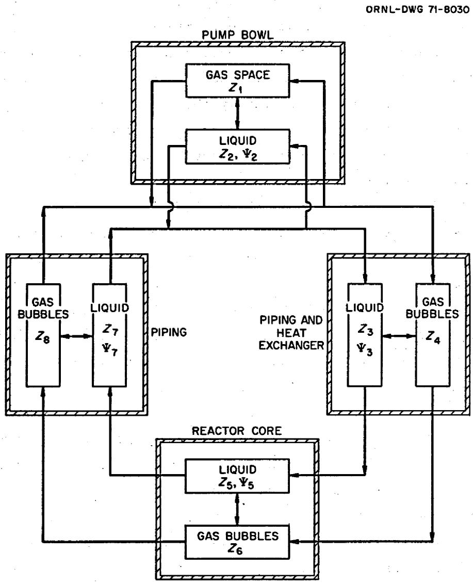  
Fig. 11. Lumped-Parameter Model for Cover-Gas Calculations.

of cover-gas ingestion in the pump bowl. Since these void fractions depend on the amount of gas dissolved in the liquid, the gas concentrations in the four liquid regions are also dependent variables. The gas concentrations in the bubbles were treated as known quantities. Thus, we have 7 interdependent variables which require 7 material balance equations for a complete description. Equations 25 through 31 were used for this purpose. In general, each term is written as a combination of constant coefficients times a function of the dependent variables. The number of terms containing two dependent variables is an indication of the degree of nonlinearity of the equations.

Equation 25 describes the time rate of change of cover-gas concentration in the liquid in the pump bowl. The first term is the source due to liquid flow into the region while the second term represents the liquid flow out. The final term represents the rate at which cover gas is stripped from the liquid into the gas space across a surface area, $A_{c}$ , defined by the agitation in the pump bowl. Mass transfer between the liquid and old or unstripped bubbles was neglected since the driving force for such transfer would be the same as for transfer to the gas space and the available area was much smaller. In this region, as in all liquid regions, the appropriate volume is the volume of liquid in it. In the pump bowl, this is defined by the amount of foaming or agitation rather than by the rate of gas ingestion into the loop. Hence this volume was allowed to be independent of the void fraction in the stream returning to the loop. In the other liquid regions, the total volume is fixed by the region size and an adjustment must be made for the void fractions that exist there.

Equation 26 describes the conditions in the first liquid region downstream from the pump. Two terms are required to differentiate between inflow from the main loop and inflow from the pump bowl; the third term represents flow out. The mass-transfer term depends on the area that is available and this area is expressed in terms of the void fraction as described below.

Throughout this treatment we assume that each bubble in the loop maintains its individual identity at all times. Then the number concentration

of bubbles in the circulating fluid is defined by the rate of gas ingestion and the reference bubble size:

$$
N ^ {1} = \frac {\Psi_ {2}}{1 / 6 \pi d _ {R} ^ {3}}.
$$

The total bubble area in any region is then

$$
\mathbf {A} _ {\mathbf {i}} = \mathbf {N} ^ {\prime} \pi d _ {\mathbf {i}} ^ {2} \mathbf {V} _ {\mathbf {i}}
$$

or

$$
A _ {1} = \frac {6 \Psi_ {2} d _ {1} ^ {2} v _ {1}}{d _ {R} ^ {3}}
$$

However, at constant $\mathbf{N}^{\prime}$

$$
\frac {d _ {1} ^ {3}}{d _ {R} ^ {3}} = \frac {\Psi_ {1}}{\Psi_ {2}}
$$

or

$$
d _ {1} = d _ {R} \left(\Psi_ {1} / \Psi_ {2}\right) ^ {\frac {1}{3}}.
$$

Then substitution into the expression for $A_{1}$ leads to

$$
A _ {1} = 6 / d _ {R} \Psi_ {2} ^ {\frac {1}{3}} \Psi_ {1} ^ {\frac {2}{3}} V _ {1}.
$$

Since the final equations are written in terms of concentration, the region volume cancels out in the final expression.

The next two equations, 27 and 28, treat the remaining two liquid regions in the same way as those already discussed.

The remaining equations (29, 30, and 31) describe the void fractions in the three regions of the fuel loop. In each case the first term (two

terms in Eq. 29) represents the flow of undissolved gas into the region and the next term represents the flow out. The final term in each equation describes the mass transfer between the gas and liquid phases.

We indicated earlier that the cover gas concentrations or partial pressures within the bubbles are regarded as known quantities. This implies that the gas pressure inside a bubble is a function of the liquid static pressure only. In general, the total pressure inside a bubble is the liquid static pressure plus a contribution due to the surface tension of the liquid.* That is:

$$
p _ {b} = p _ {\ell} + \frac {4 \sigma_ {\ell}}{d _ {b}}.
$$

For the MSRE fuel salt, the surface-tension effect is $\sim 0.4$ psia on a 10-mil diameter bubble and $\sim 4$ psia on a 1-mil bubble. Thus, for very small bubbles, the driving force for mass transfer out of (or, the resistance to mass transfer into) the bubble increases sharply with decreasing diameter and very small bubbles tend to dissolve completely. Such dissolution would tend to supersaturate the liquid and cause other, larger bubbles to grow in size. This process may impose a lower limit on the size of the bubbles that can circulate with the salt. However, the effect on the overall void behavior is small. For the initial bubble sizes considered in this analysis (around 10 mils), by the time the bubbles have been sufficiently reduced in size by dissolution for the surface tension effect to become important, so little gas inventory remains in the bubbles that its transfer to the liquid has a negligible effect on the liquid concentration. Therefore, in cases where bubbles exist in all regions of the model, the surface tension effect on cover gas bubbles is neglected. Complete dissolution is, however, still allowed in the xenon model where it must be treated as a special case anyway.

# Solution of Equations

Computerized procedures for solving the above systems of equations were largely available. The purpose of this section is simply to indicate the general methods and programs used to obtain the required solutions.

Steady-state solutions for the non-linear equations used to describe the behavior of a soluble cover gas were obtained with a pseudo Gauss-Seidel technique.* The typical computing time required to obtain a solution was 1 sec on the IBM 360/75. No transient solutions were obtained for these equations since each xenon calculation was made for a fixed void fraction.

Two types of solutions were obtained for the xenon equations. Steady-state solutions were adequate for most of the xenon parameter studies; these were obtained with the aid of an ORNL library subroutine MATQ\*\* which solves the simultaneous, linear algebraic equations that result from the assumption of steady state. The time required for such solutions was typically 2 sec on the IBM 360/75. Xenon buildup and removal transients were calculated with MATEXP.\* Normally, the transient was calculated for 40 hr in time increments of 0.015 min. These solutions required about 4 min of computer time on the IBM 360/91. Because of this long computing time, only a limited number of transients was calculated. The results of each xenon calculation, steady-state or transient, were converted to reactivity within the computer programs.

One of the more time-consuming tasks associated with the use of the above computer programs was the calculation of the individual terms in the coefficient matrix for the xenon equations. A computer subroutine was written to calculate the coefficients from the various input parameters. This subroutine also made the necessary conversions from the various engineering units used with the input parameters to a consistent set of

metric units. Thus, the problem could be specified in familiar (but mixed) units without the need for multiple manual conversions. This routine produced a coefficient matrix that could be used by either MATQ or MATEXP, as required.

# ANALYSIS OF MSRE COVER GAS AND 135XE BEHAVIOR

The mathematical models described in the preceding chapter were used in an extensive calculational study to see what combinations of the various mechanisms and parameter values were required to calculate xenon behavior modes like those observed in the MSRE. Of particular interest in this regard was the very large difference in the variation of the steady-state xenon poisoning with core void fraction when argon was substituted for helium as the system cover gas. Consequently, a large part of the study was aimed at describing this phenomenon. In addition to the steady-state calculations, we performed a number of xenon transient calculations to try to verify the results of the steady-state correlations.

In the ensuing sections of this chapter, following a general discussion of the parameter variations that were allowed, we describe first the calculated variation in the cover-gas void fraction around the MSRE fuel loop when solubility effects are included. In addition to supplying needed input for the xenon calculations, these results provided a basis for restricting the ranges of some parameters. We found, for example, that the initial bubble diameter (within a reasonable range) and the salt-to-bubble mass transfer coefficient had little effect on the void fractions in the rest of the loop for a given core void fraction. Consequently the xenon calculations were all made for void fractions established for 10-mil bubbles with a mass transfer coefficient of 2 ft/hr.

With the cover gas behavior established, we proceed with a discussion of the steady-state $^{135}\mathrm{Xe}$ calculations. The first step is to show that, for similar parameter values and an insoluble cover gas, the model that we have developed gives essentially the same results as those predicted by earlier models. We then show that simply adding cover-gas solubility effects to these parameters, even with wide variations in bubble stripping,

is inadequate to describe the observed steady-state $^{135}\mathrm{Xe}$ poisoning with helium cover gas. At this point we introduce an additional mechanism for xenon transport to the graphite and show that this mechanism, along with what appear to be reasonable xenon stripping parameters, produces results that fit the reactor experience with both helium and argon cover gas.

The final section of this chapter describes the results of xenon transient calculations. One purpose of the transients was to see if parameter values that appeared to describe the observed steady-state xenon poisoning could also describe the observed transient behavior. These calculations were regarded as further tests of the adequacy of both the model and the parameter values. The transient calculations also provided a means for separating the effects of some of the parameters. It was found that some parameters which had almost no effect on the steady-state results could significantly affect the transients.

# System Parameters

The various physical parameters required to describe the xenon behavior have already been discussed, at least implicitly, in the development of the mathematical equations. However, the model was developed in a way that would permit its application to systems other than the MSRE. Therefore, many of the quantities that are required as input parameters are defined by the physical description of the MSRE and the operating conditions. Additional parameters are fixed by the physical properties of the materials involved and the mechanisms that are considered. These considerations still leave a number of parameters that can be allowed to vary over relatively wide ranges in the calculations. It was clear that purely arbitrary selection of even these parameter values would be capable of describing any and all xenon results. Therefore, restrictions were imposed on the selection of values. For parameters that were allowed to vary with void fraction, the basic principles involved in the variation were applied equally to the calculations with both cover gases. All parameters were required to vary smoothly with the void fraction. That is, discontinuities or reversals in functional dependencies were avoided. Table 4 lists all the parameters that were involved in this study. Most of these quantities were

Table 4   
Parameters Used to Calculate Xenon Behavior in MSRE   

<table><tr><td>Definition</td><td>Units</td><td>Value</td></tr><tr><td colspan="2">Fixed Parameters</td><td>(Range)</td></tr><tr><td>Absolute pressure in model region:</td><td></td><td></td></tr><tr><td>1</td><td>psia</td><td>19.7</td></tr><tr><td>3</td><td>&quot;</td><td>19.7</td></tr><tr><td>5</td><td>&quot;</td><td>46.1</td></tr><tr><td>9</td><td>&quot;</td><td>37.9</td></tr><tr><td>14 through 18</td><td>&quot;</td><td>37.9</td></tr><tr><td>19</td><td>&quot;</td><td>32.7</td></tr><tr><td>Fluid volume in model region</td><td></td><td></td></tr><tr><td>1</td><td>ft3</td><td>1.5</td></tr><tr><td>3</td><td>&quot;</td><td>3.2</td></tr><tr><td>5</td><td>&quot;</td><td>28.8</td></tr><tr><td>9</td><td>&quot;</td><td>25.0</td></tr><tr><td>19</td><td>&quot;</td><td>13.5</td></tr><tr><td>Gas volume in model region:a</td><td></td><td></td></tr><tr><td>14</td><td>ft3</td><td>0.137</td></tr><tr><td>15</td><td>&quot;</td><td>6.918</td></tr><tr><td>16</td><td>&quot;</td><td>1.133</td></tr><tr><td>17</td><td>&quot;</td><td>1.916</td></tr><tr><td>18</td><td>&quot;</td><td>3.732</td></tr><tr><td>Fluid Flow Rates</td><td></td><td></td></tr><tr><td>Total salt flow</td><td>gpm</td><td>1200</td></tr><tr><td>Salt through spray ring</td><td>&quot;</td><td>50</td></tr><tr><td>Salt fountain flow</td><td>&quot;</td><td>15</td></tr><tr><td>Gas purge of pump bowl</td><td>l/min</td><td>8.08</td></tr><tr><td>Fractional salt flow rate through region:</td><td></td><td></td></tr><tr><td>14</td><td>-</td><td>0.0198</td></tr><tr><td>16</td><td>-</td><td>0.1673</td></tr><tr><td>17</td><td>-</td><td>0.277</td></tr><tr><td>18</td><td>-</td><td>0.5395</td></tr><tr><td>Salt-to-graphite surface area in region:</td><td></td><td></td></tr><tr><td>14</td><td>ft2</td><td>30.1</td></tr><tr><td>15 (total)</td><td>&quot;</td><td>1520</td></tr><tr><td>16</td><td>&quot;</td><td>248.8</td></tr><tr><td>17</td><td>&quot;</td><td>421.0</td></tr><tr><td>18</td><td>&quot;</td><td>820.0</td></tr></table>

${}^{a}$ Based on 10% accessible void volume in graphite.

(continued)

Table 4   

<table><tr><td>Definition</td><td>Units</td><td>Value</td></tr><tr><td></td><td></td><td>(Range)</td></tr><tr><td colspan="3">Graphite-to-graphite surface area between regions:</td></tr><tr><td>14 and 16</td><td>ft2</td><td>4.5</td></tr><tr><td>16 and 17</td><td>&quot;</td><td>10.8</td></tr><tr><td>17 and 18</td><td>&quot;</td><td>15.9</td></tr><tr><td>Direct fission yield of 135Xe b,c</td><td>atoms/Mw-Sec</td><td>3.437 x 1014</td></tr><tr><td>Direct fission yield of 135I b,c</td><td>&quot;</td><td>1.567 x 1015</td></tr><tr><td>Fraction of 135I decays to 135mXeC</td><td>-</td><td>0.3</td></tr><tr><td>Fraction of 135I decays to 135XeC</td><td>-</td><td>0.7</td></tr><tr><td colspan="3">Decay half-life of:</td></tr><tr><td>135I</td><td>min</td><td>402</td></tr><tr><td>135mXe</td><td>&quot;</td><td>15.3</td></tr><tr><td>135Xe</td><td>&quot;</td><td>552.</td></tr><tr><td colspan="3">Burnup Coefficient for 135Xe in Region:</td></tr><tr><td>9 (salt or voids)</td><td>(mw sec)-1</td><td>4.75 x 10-6</td></tr><tr><td>14 (graphite)</td><td>&quot;</td><td>5.76 x 10-6</td></tr><tr><td>16 &quot;</td><td>&quot;</td><td>7.29 x 10-6</td></tr><tr><td>17 &quot;</td><td>&quot;</td><td>6.47 x 10-6</td></tr><tr><td>18 &quot;</td><td>&quot;</td><td>3.09 x 10-6</td></tr><tr><td colspan="3">Reactivity Coefficient of 135Xe in Region:</td></tr><tr><td>9 (salt or voids)d</td><td>(δk/k) (atom/cc)</td><td>-0.517 x 10-16</td></tr><tr><td>14 (graphite void space)a</td><td>&quot;</td><td>-0.791 x 10-16</td></tr><tr><td>16 (graphite void space)a</td><td>&quot;</td><td>-0.669 x 10-17</td></tr><tr><td>17 (graphite void space)a</td><td>&quot;</td><td>-0.699 x 10-17</td></tr><tr><td>18 (graphite void space)a</td><td>&quot;</td><td>-0.334 x 10-17</td></tr><tr><td>Henry&#x27;s Law Constant for Xenon</td><td>moles/cc-atm</td><td>3 x 10-9</td></tr><tr><td>Henry&#x27;s Law Constant for Helium</td><td>&quot;</td><td>1.26 x 10-7</td></tr><tr><td>Loop temperature</td><td>°F</td><td>1200</td></tr><tr><td>Graphite diffusion coefficientc</td><td>ft2/hr</td><td>10-4 - 10-7</td></tr></table>

(continued)

Table 4   

<table><tr><td>Definition</td><td>Units</td><td>Value</td></tr><tr><td></td><td></td><td>(Range)</td></tr><tr><td>Effective Radial Distance Between Regions</td><td></td><td></td></tr><tr><td>14 and 16</td><td>in.</td><td>5.95</td></tr><tr><td>16 and 17</td><td>&quot;</td><td>7.4</td></tr><tr><td>17 and 18</td><td>&quot;</td><td>7.95</td></tr><tr><td>Variable Parameters</td><td></td><td></td></tr><tr><td>Mass Transfer Coefficient, salt to gas</td><td>ft/hr</td><td>1 - 15</td></tr><tr><td>Mass Transfer Coefficient, salt to graphite in bulk of core</td><td>ft/hr</td><td>0.01 - 0.18</td></tr><tr><td>Mass Transfer Coefficient, salt to graphite in central core region (14)</td><td>ft/hr</td><td>0.06 - 1.14</td></tr><tr><td>Area for Mass Transfer from Salt to Cover Gas in Pump Bowl</td><td>ft2</td><td>0 - 700</td></tr><tr><td>Reference Bubble Diameter</td><td>in.</td><td>0.005 - 0.020</td></tr><tr><td>Core Void Fractione</td><td>%</td><td>0.02 - 0.7</td></tr><tr><td>Bubble Stripping Efficiency for:</td><td></td><td></td></tr><tr><td>Spray Ring Flow</td><td>%</td><td>0 - 100</td></tr><tr><td>Fountain Flow</td><td>%</td><td>0 - 100</td></tr><tr><td>Direct Bubble Flow to Graphite</td><td>l/min</td><td>0 - 2.7</td></tr><tr><td>Clean Cover Gas Flow into Loop</td><td>l/min</td><td>0 - 0.6</td></tr><tr><td>Reactor Power</td><td>Mw</td><td>0.01 - 8</td></tr></table>

$e_{\text{Void}}$ fractions in other regions were calculated to be consistent with that in the core.

used as direct input to the computer programs. However, some of the values were combined to reduce the total amount of input required. The first part of the table lists those parameters that were fixed, or at least limited to narrow ranges for most of the calculations. The second part includes those parameters whose values were manipulated in the course of the calculations. In both cases the values or ranges of values are listed with the parameters. Some of the parameter ranges are quite wide and many calculations were made which failed to produce the desired results. In the following sections we will describe only those results that best illustrate the conclusions.

# Cover Gas Calculations

As we indicated in the development of the equations for the cover-gas model, the purpose of these calculations was to define the circulating void fractions in the various regions of the xenon model. Since these calculations are significant only for a soluble gas, this section deals only with the conditions for helium cover gas. (In this study the reactor results with argon were compared to computations made with an insoluble cover gas, for which the void fractions were evaluated within the xenon model itself.)

The helium void fractions in various regions of the system model are best described in terms of the ingested void fraction; that is, the void fraction in the salt returning to the circulating loop from the pump bowl. This quantity was varied from 0.05 to $1.5\%$ . Other parameters of interest were the initial size of the bubbles, the rate of helium stripping from the liquid in the pump bowl, and the coefficient for mass transfer between the bubbles and the liquid. It may be noted that bubble stripping efficiencies are immaterial because, in a single gas model, all the bubbles have the same composition and all are presumed to enter the loop at the same size.

Figure 12 shows the calculated void fractions in the three regions of the circulating loop as a function of the ingested void fraction for three initial bubble sizes. These curves were calculated for a fixed mass transfer coefficient between bubbles and liquid in the loop. Since the liquid stripping is represented as a mass transfer process with the same gas-liquid mass transfer coefficient that is used for bubbles in the loop,

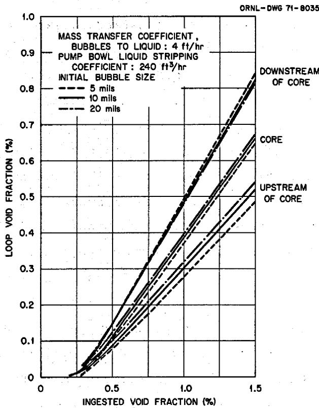  
Fig. 12. Calculated Helium Void Fractions in MSRE Loop - Effect of Ingested Bubble Size.

the significant parameter in the pump bowl is the product of that coefficient and the effective interfacial area. This product is designated as the pump bowl liquid stripping coefficient, a constant for Fig. 12. This figure illustrates that the circulating void fraction is relatively insensitive to bubble size, at least for the conditions that prevailed in the MSRE. This is due at least partly to the fact that, as the fluids travel around the loop, the mass transfer changes from dissolution of gas in the liquid to evolution of gas from the liquid. Thus, the gas and liquid are never very far from an equilibrium condition.

The most significant feature of these curves is their displacement to the right of imaginary straight lines, with similar asymptotic slopes, that pass through the origin. The lines through the origin would describe the behavior of an insoluble gas so, the displacement is a measure of the amount of helium dissolved in the salt. Such helium dissolution tends to concentrate any xenon ingested with the bubbles and thus reduces the capacity of the bubbles to accept xenon from the salt. This effect tends to become more important at low void fractions where most of the ingested gas dissolves.

It may be noted that, although the curves are nearly straight over most of the range, they all break toward the origin at very low void fractions. This bending reflects a limitation in the model which allows bubbles to exist at all diameters. If the effect of liquid surface tension on the bubbles had been included, the curves would have intersected the abscissa at the point where complete dissolution occurred. Thus, this model does not accurately predict the amount of gas that must be ingested to attain very small void fractions. However, for the values considered, the surface tension effect becomes significant only for very low void fractions as illustrated by the following example.

The calculation for 10-mil bubbles predicts a void fraction of $0.088\%$ in the region upstream of the core when the ingested void fraction is $0.5\%$ . This reduction in void fraction implies a bubble size of 5.6 mils in that region for which the effect of surface tension on the internal bubble pressure is 0.71 psi. The helium concentrations are such that the driving force for gas dissolution is 7 psi. Hence, inclusion of the surface-tension

effect would have changed the driving force by only $-10\%$ . These and other similar figures indicate that the calculated helium void fractions are reasonable for core void fractions down to 0.05 to $0.1\%$ . At lower values, the calculation tends to underestimate the amount of helium that must be ingested to achieve a given void fraction in the core.

Figures 13 and 14 show the effects on the circulating void fractions produced by variations in the coefficient for mass transfer between the liquid and bubbles in the loop. The results are shown on separate figures to avoid some of the line intersections near the origin. These results are for a single initial bubble size and a fixed stripping coefficient in the pump bowl. Although there is little dependence on mass transfer coefficient in two of the regions, the effect is quite pronounced in the region just upstream of the core. This results not only from the closer approach to equilibrium with the higher coefficient but also from a shift in the equilibrium void fraction. As would be expected, the higher mass transfer coefficient allows better helium stripping from the liquid (and the development of a higher void fraction) in the region downstream of the core. Some of this liquid is then subjected to further stripping in the pump bowl. Then, when the two liquid streams are merged to enter the region upstream of the core, the liquid has a greater capacity to accept helium from the bubbles, which leads to a lower equilibrium void fraction in that region for a given rate of gas ingestion.

Figures 15 and 16 show the effects of changing the rate of gas stripping in the pump bowl. (Again, two figures are used to present the results for the three regions only in the interest of clarity.) These figures show that the void fractions are far more sensitive to changes in stripping than to either of the other two parameters considered. This sensitivity is due primarily to the greater capacity of the liquid to accommodate gas after it has been more thoroughly stripped in the pump bowl.

The liquid stripping rates used to produce these curves were defined in terms of a mass transfer coefficient and an effective interfacial area. However, other authors (Ref. 17) have described this general process in terms of a "stripping efficiency." This efficiency is defined as the ratio of the change in gas concentration experienced by the salt flowing through

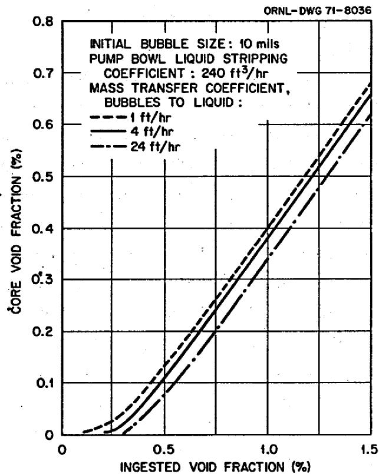  
Fig. 13. Calculated Helium Void Fractions in MSRE Core - Effect of Mass Transfer Coefficient.

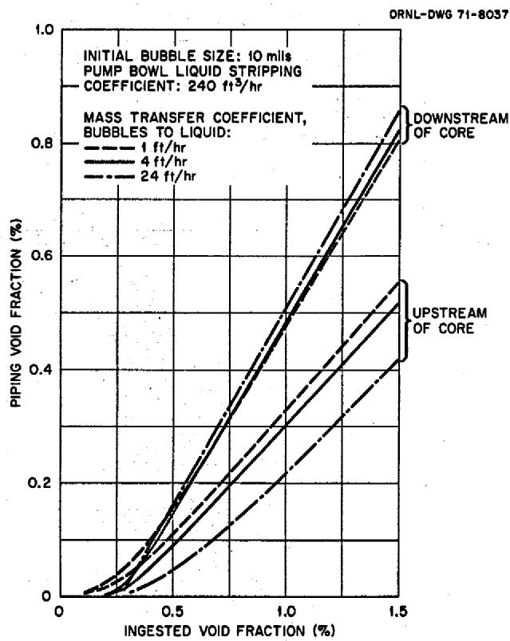  
Fig. 14. Calculated Helium Void Fractions in MSRE Piping - Effect of Mass Transfer Coefficient.

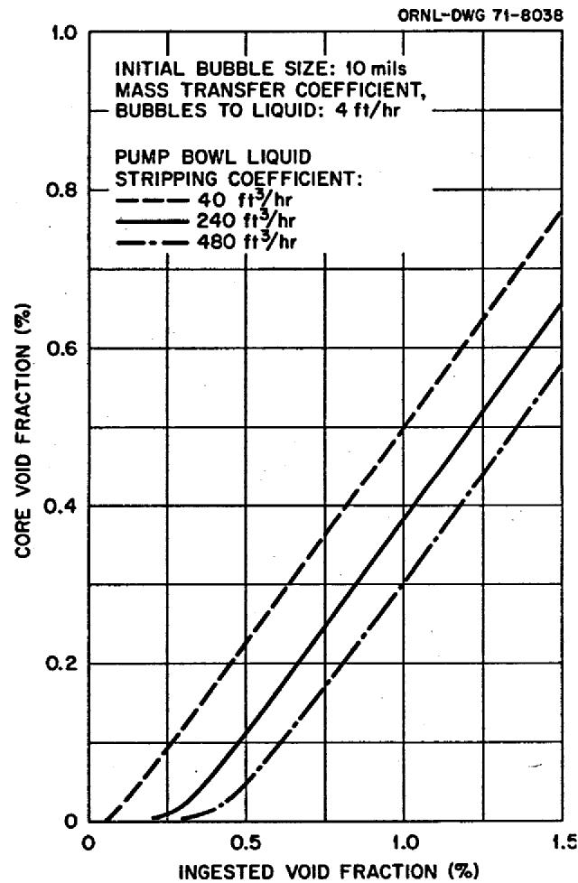  
Fig. 15. Calculated Helium Void Fractions in MSRE Core - Effect of Pump-Bowl Liquid Stripping.

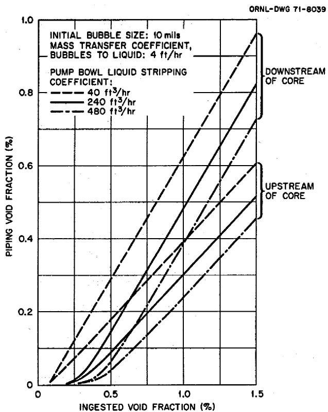  
Fig. 16. Calculated Helium Void Fractions in MSRE Piping - Effect of Pump-Bowl Liquid Stripping.

the pump bowl to the change that would occur if equilibrium were established between the gas and liquid phases. Since the calculations of the void fractions also produced liquid concentrations for each of the regions, such stripping efficiencies are readily extracted from the results. The correlation between the stripping coefficients employed in these calculations and the net liquid stripping efficiencies for helium are shown in Table 5. Some minor variation in stripping efficiency with void fraction was evident at each value of the stripping coefficient. However, the variations are small enough to be entirely attributed to precision limits in the calculations.

Table 5   
Comparison of Liquid Stripping Coefficients And Stripping Efficiencies for Helium   

<table><tr><td>Liquid Stripping
Coefficient
(ft3/hr)</td><td>Stripping
Efficiency
(%)</td></tr><tr><td>40</td><td>7.1 - 7.2</td></tr><tr><td>240</td><td>30.7 - 30.9</td></tr><tr><td>480</td><td>47.0 - 47.2</td></tr></table>

Several intermediate conclusions may be drawn from the calculations of helium void fractions in the MSRE:

1. The calculational model appears to give reasonable results down to core void fractions of 0.05 to 0.1 vol.%   
2. For core void fractions below about $0.05\%$ , the neglect of liquid surface tension effects on the bubbles leads to an underestimate of the amount of gas that must be ingested to establish a given void fraction.   
3. For the range of bubble sizes believed to exist in the MSRE (5 to 20 mils), the effect of bubble size on the void fractions around the loop is small enough to be neglected for most purposes.   
4. For the expected values of mass transfer coefficient between bubbles and liquid (2 to 6 ft/hr), the void fractions in the core are nearly independent of the mass transfer coefficient.   
5. The void fractions around the loop do depend rather heavily on the amount of liquid stripping that is postulated to occur in the pump bowl.

# Steady State Xenon Calculations

A large number of calculations was performed to see if the steady state xenon poisoning observed in the MSRE could be duplicated by the model described in this report. Of primary interest were the variations with core void fraction and the differences between helium and argon cover gas. These calculations took the form of parameter studies in which selected parameters were varied, more-or-less arbitrarily, to determine their effects. As a result of these calculations, which ultimately reproduced the observed behavior reasonably well, we were able to identify some parameters and postulated mechanisms that appear to be quite significant in the overall description.

The parameter studies were made by first postulating mechanisms and functional dependences of these mechanisms on the core void fraction. Then calculations of the xenon poisoning were made to see how the results were affected. Because of the trial-and-error nature of this approach, many combinations were tried that added very little to the final result. It

would not further the objective of this report to discuss all of the unsuccessful trials. However, some of these will be described in order to show the kinds of effects that were obtained.

The first calculations that were performed assumed an insoluble cover gas and the results were compared to the reactor experience with argon cover gas. In the absence of other information, mechanisms and parameter values were assigned that were similar to those used in earlier studies. More specifically, bubble diameters around 10 mils were assumed with low efficiencies (10% or less) for bubble stripping in the pump bowl. Since liquid stripping efficiencies in the range of 7 to 15% had been projected, liquid stripping coefficients around $160 ft^3/hr$ were used. (These coefficients produced reasonable efficiencies and the effective interfacial areas required in the pump bowl appeared to be in the right range for the measured pump-bowl void fractions.) The mass transfer coefficient between bubbles and salt was set at 4 ft/hr. The only mechanism for transport of xenon from the circulating fluid to the graphite was assumed to be mass transfer from the liquid. The mass transfer coefficients of 0.06 ft/hr for the bulk of the graphite and 0.35 ft/hr for graphite in the central core region were the same as those recommended by Kedl.[17] No direct ingestion of clean cover gas into the circulating loop was allowed. All of the remaining computational parameters were set to the nominal values implied by the operating conditions and the design of the MSRE.

Figure 17 shows a comparison between the observed xenon poisoning with argon cover gas and one set of values calculated for an insoluble gas with the parameters enumerated above. For these particular calculations, the reference bubble diameter was fixed at 10 mils for all core void fractions. The bubble stripping efficiency was assumed directly proportional to the core void fraction and was assigned a value of $10\%$ when the core void fraction was $0.7\%$ . The liquid stripping coefficient in the pump bowl varied from $160 ft^3/hr$ at a core void fraction of $0.05\%$ to $186 ft^3/hr$ at $0.7\%$ ; the values were assumed proportional to the fuel pump speed required to produce the various void fractions. These results, and others using slightly modified bubble stripping efficiencies and liquid stripping coefficients, indicated that essentially any desired degree of agreement

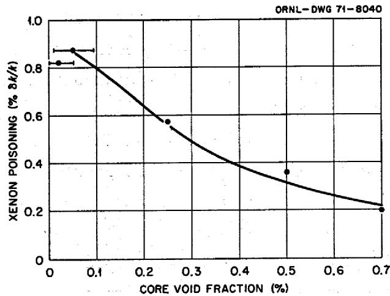  
Fig. 17. Calculated and Observed Steady-State Xenon Poisoning with Argon Cover Gas - Low Bubble Stripping Efficiency.

between the observed and calculated poisoning values could be obtained by "properly selecting" the values of these two parameters. The conclusion indicated by the results is entirely consistent with earlier conclusions about the variation in xenon poisoning with void fraction when the cover gas is insoluble. This conclusion is that no special mechanisms, models, or parameters are required to describe this condition.

There remains, however, one point of difference between these results and the overall reactor experience - the bubble stripping efficiencies. As we indicated earlier, excess bubbles were removed from the MSRE circulating loop with efficiencies near $100\%$ . If, as seems reasonable, the sizes of the circulating bubbles were determined by the action of the pump impeller, similar stripping efficiencies could be expected to apply to the xenon calculations. Then, if the bubble stripping leads to a true exchange between the circulating bubbles and the cover gas, the stripping efficiencies required in the calculation are inconsistent with those observed in the reactor. On the other hand, if the liquid surface in the pump bowl is covered by a "foam" in which the gas-phase xenon concentration is much higher than that in the rest of the gas space, the same high rate of bubble exchange would produce a much smaller change in the average xenon concentration in the circulating bubbles. Such an effect would give the appearance of a low xenon stripping efficiency. The reactor data with argon cover gas do not allow us to distinguish between these possibilities.

Since the behavior differences with argon and helium cover gases appeared to offer the best possibility for resolving the xenon behavior in the reactor, additional calculations were made with loop void fractions characteristic of both gases. For the helium cases we used void fractions obtained for 10-mil bubbles with a gas-to-liquid mass transfer coefficient of 4 ft/hr and a pump-bowl liquid stripping coefficient of 240 ft³/hr. The xenon and bubble behavior mechanisms were required to follow the same general patterns for both cover gases.

Some calculations were performed to see if the two characteristic behavior modes could be reproduced by manipulating only the bubble stripping efficiency and the liquid stripping coefficient. In these calculations the only mechanism for xenon transport to the graphite was, again, mass transfer from the liquid. In general, all of these calculations (for both

cover gases) showed the monotonic decrease in steady-state xenon poisoning with increasing void fraction that was characteristic of the insoluble cover gas model. Some distortion in this pattern could be obtained by allowing higher bubble stripping efficiencies at lower helium void fractions but, the large peak in the poisoning curve could not be attained as long as the bubble stripping efficiency was required to vary as a smooth function of the void fraction. Figure 18 compares the observed behavior in the MSRE with the results of one set of calculations in which the bubble stripping efficiency for helium was allowed to vary drastically with the core void fraction. The stripping efficiency (superimposed on the xenon poisoning plot) was computed as a constant plus a steeply decaying exponential. Since the results of this extreme variation failed to even approach the observed xenon behavior, it seems reasonable to conclude that the reactor effects were not produced by changes in the stripping efficiency alone.

The results of a large number of calculations indicated that the mechanism with the greatest capability for affecting the xenon poisoning at low void fractions was the xenon transport to the graphite. This process also appeared capable of producing the differences between helium and argon with a consistent treatment of both gases. Accordingly, it was postulated that xenon transport to the graphite was composed of mass transfer from the liquid plus a contribution from circulating bubbles interacting with the walls of the fuel passages. It was evident from the cover-gas calculations that, for a given initial bubble size, the helium bubbles in the core at low void fractions would be much smaller than argon bubbles. Thus, if mass transport by bubble interraction were important and the rate of interaction was a function of bubble size, the rate of xenon transport to the graphite at low void fractions would be much lower with helium cover gas than with argon.

To test the hypothesis of bubble interaction, a number of calculations were made in which the xenon mass transfer coefficient from liquid to graphite, the rate of bubble interaction with the graphite, and the bubble stripping efficiency were all varied, more-or-less independently. In addition various forms of the functional dependence of bubble interaction

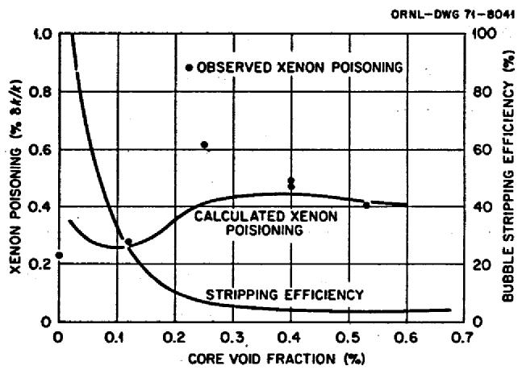  
Fig. 18. Calculated and Observed Steady-State Xenon Poisoning with Helium Cover Gas - Widely Variable Bubble Stripping Efficiency.

on bubble size were tried. For each set of calculations, the same criteria for bubble behavior in the loop were applied to both helium and argon.

As these calculations were being made, it became apparent that some differences in bubble stripping efficiency between helium and argon would improve the agreement with the reactor data. The possibility of such a difference was rationalized on the basis of the liquid behavior in the pump bowl. Because of the helium solubility, the salt entering the pump bowl from the loop would contain more dissolved helium than could be maintained at the pump-bowl pressure and some outgassing would occur. If this effect produced a blanket of xenon-rich foam over the salt, the apparent stripping efficiency for helium bubbles would be reduced. Since argon was treated as an insoluble gas, the effect would apply only to helium. Therefore, lower bubble stripping efficiencies were used for helium and the loss in efficiency was made a function of the difference between the void fraction in the salt entering the pump bowl and that in the salt returning to the loop. (It could be argued that the difference in the helium concentrations in the liquid streams would be a more logical measure of the degree of gas blanketing but, the efficiency reduction is basically arbitrary and any attempt to define it precisely is unrealistic; the functional dependence is merely a calculational convenience.)

A somewhat similar rationalization was applied to the liquid stripping process. It was postulated that the escape of helium from solution in the pump bowl liquid might enhance the rate of xenon stripping. Therefore, the liquid stripping coefficients for xenon in helium were allowed to exceed those for argon.

Figure 19 shows the results of a set of calculations in which all of these factors were included. The agreement with the observed steady-state data is good everywhere except at core void fractions near $0.1\%$ with helium cover gas. However, the disagreement in this area may be less than is implied by Fig. 19 because other reactor data (cf. Figs. 5 and 6) showed a more rapid increase in xenon poisoning with increasing void fraction.

Although a reasonable correlation was obtained between the calculated and observed quantities, the parameter values required to produce the correlation were, in some cases, quite different from those that have been

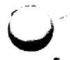

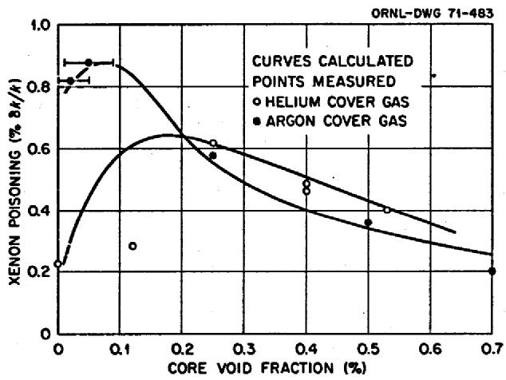  
Fig. 19. Calculated and Observed Steady-State Xenon Poisoning with Helium and Argon Cover Gases - Best Fit.

used previously. Some of the more important parameters that were independent of the circulating void fraction are listed in Table 6. The reference bubble diameter and the coefficient for mass transfer between the bubbles and liquid are within the range of the anticipated values. On the other hand the liquid stripping coefficients led to higher stripping efficiencies than were predicted17 and the mass transfer coefficients to the graphite are lower than the predicted values17 by a factor of 6. With argon cover gas, the apparent liquid stripping efficiency varied from $17\%$ at the lowest core fractions to about $38\%$ at a core void fraction of $0.6\%$ . With helium cover gas, this efficiency was about $30\%$ and essentially independent of the core void fraction. These values are probably close enough to the expected efficiencies to be credible. The discrepancy in the mass transfer coefficient is considerably greater than the usual uncertainty in predicting such quantities and there is no basis for adopting the lower value except that it appears to permit better correlation of the observed results. There is, however, some basis for expecting somewhat lower liquid-graphite mass transfer in the MSRE than would be predicted in other systems.

The mass transfer process was described in the calculations as a product of the coefficient and a driving potential based on xenon concentrations in the salt and graphite. The internal heat generation in the fuel and the laminar flow conditions in most of the core resulted in a temperature distribution in the salt $^{38}$ in each channel such that the lowest temperature was at the center of the channel. Since xenon has a large positive temperature coefficient of solubility in salt, the liquid immediately adjacent to the graphite would have a higher xenon solubility than the rest of the liquid and the higher solubility would tend to reduce the driving froce for xenon transfer into the graphite. This effect was not examined in detail but it does not appear to be large enough to account for all of the difference between the originally predicted transfer rate and that required to match the observed steady-state poisoning.

In addition to the parameters just described, the bubble stripping efficiencies and the rates of bubble interaction with the core graphite were deliberately varied with void fraction in the calculations. Figure 20 shows graphically the values that were used to produce the xenon poisoning

# Table 6

Constant Parameter Values Used to Correlate Calculated and Observed Steady-State Xenon Poisoning in MSRE   

<table><tr><td rowspan="2">Parameter</td><td colspan="2">Value</td></tr><tr><td>Argon Cover Gas</td><td>Helium Cover Gas</td></tr><tr><td>Reference bubble diameter (mils)</td><td>10</td><td>10</td></tr><tr><td>Mass Transfer Coefficient (ft/hr)</td><td></td><td></td></tr><tr><td>Bubbles-to-Liquid</td><td>4</td><td>4</td></tr><tr><td>Liquid-to-graphite in most graphite</td><td>0.01</td><td>0.01</td></tr><tr><td>Liquid-to-graphite in central core region</td><td>0.063</td><td>0.063</td></tr><tr><td>Pump bowl liquid stripping coefficient (ft3/hr)</td><td>100</td><td>240</td></tr></table>

results of Fig. 19. The bubble stripping efficiency for argon was computed as a linear function of the total void fraction ingested into the circulating loop from the pump bowl. Because of the insoluble gas treatment for argon, the void fraction at any point in the fuel loop is also a linear function of the ingested void fraction and the plot of stripping efficiency against core void fraction is a straight line. The same linear function of ingested void fraction was used as a basis for the helium bubble stripping efficiencies but the individual quantities were reduced to from 36 to $61\%$ of their nominal values to account for the postulated gas blanketing of the pump-bowl liquid. When the results are plotted against the core void fraction, a (nonuniform) translation toward the abscissa occurs which distorts the curve to the shape shown in Fig. 20. The nominal rate of bubble interaction was chosen (by an iterative process of empirical optimization) to

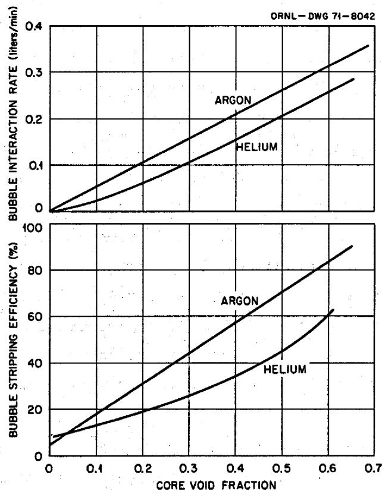  
Fig. 20. Parameter Values Used in Xenon Calculations for Best Fit.

cause $1.14\%$ of the bubbles with a diameter of 8.4 mils to collide with the walls of the fuel channels. (An insoluble gas bubble whose diameter is 10 mils in the pump bowl has a diameter of 8.4 mils at the core pressure.) The bubble collision probability was also assumed to vary linearly with bubble volume. Thus, for argon cover gas, the fraction of bubbles interacting with the graphite was independent of the void fraction and the total rate of gas flow became a linear function of core void fraction. For helium, where dissolution has a significant effect on bubble size, the gas flow rate to the graphite is lower at low and intermediate void fractions.

It is clear from the results shown in Fig. 19 that xenon transport to the graphite from the bubbles had a major effect on the net xenon poisoning that was calculated. The magnitude of this effect was examined in a series of calculations in which only that one parameter was changed. Figures 21 and 22 show, for helium and argon cover gas, respectively, the poisoning that was obtained when xenon transport from bubbles directly to the graphite was eliminated from the previous calculations. In each figure, the appropriate curve from Fig. 19 is reproduced to provide a direct comparison. These results show that, except at very low helium void fractions, most of the poisoning was due to xenon transported to the graphite by bubbles.

In addition to providing information about the net xenon poisoning, the steady state calculations indicated the relative distribution of that poisoning among the gas bubbles, liquid, and graphite in the reactor core. This distribution, as we will show later, has a significant effect on the xenon transient behavior, especially for xenon removal transients.

Figure 23 compares the fraction of the total xenon poisoning due to xenon in the graphite for the two sets of system parameters used to calculate the steady-state results shown for argon cover gas in Figs. 17 and 19. Although both sets of calculations reproduced the observed results reasonably well, the first set (Fig. 17) allowed only xenon mass transfer from the liquid to the graphite and required low bubble stripping efficiencies while the second set (Fig. 19) allowed bubble interaction with the graphite and required higher bubble stripping efficiencies. Both calculations resulted in about the same xenon distribution at low void fractions but the bubble interaction mechanism led to much higher contributions from the graphite at the higher void fractions.

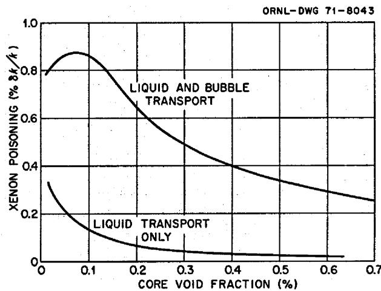  
Fig. 21. Effect of Xenon Transport to Graphite by Helium Bubbles.

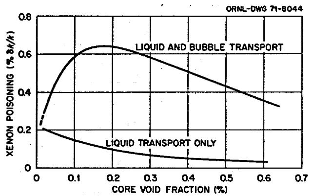  
Fig. 22. Effect of Xenon Transport to Graphite by Argon Bubbles.

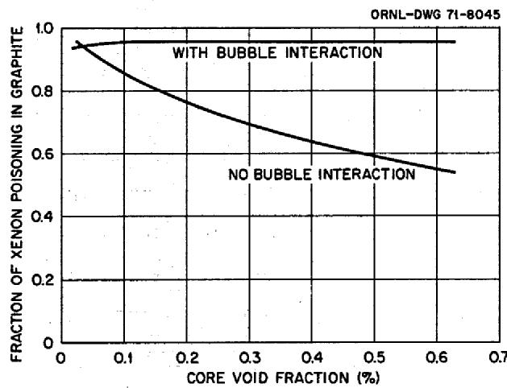  
Fig. 23. Effect of Xenon Transport by Bubbles on Core Xenon Distribution.

Although the principal objective of these calculations was to see what mechanisms and parameter values could produce xenon poisoning results like those observed in the reactor, some information was also gained about the effects of other parameters. In the discussion of bubble stripping it was noted that two extreme behavior modes could be assumed for the gas that was added to unstripped bubbles to restore their original sizes prior to reingestion. At one extreme was the assumption that the unstripped bubbles are restored by agglomeration so that the additional gas was characterized by the average xenon concentration in the pump-bowl gas space. This assumption appeared to be the least controversial so it was used for most of the computations, including those which produced the results shown in Fig. 19. At the other extreme was an assumption that the additional gas required was clean helium. The effect of the latter assumption was examined by applying it to the calculations for helium cover gas just described. Figure 24 shows a comparison of the two sets of xenon poisoning results. Also shown on this figure is the absolute rate of clean helium ingestion (at pump-bowl temperature and pressure) that resulted from the assumed behavior. It is clear from these results that the rate of ingestion of clean helium at the pump suction, either directly or by growth of unstripped bubbles, could have been manipulated in the calculational model to significantly modify the values of other parameters needed to match the observed xenon behavior. However, it did not appear that the ingestion of cover gas alone could produce the major difference between helium and argon.

Earlier in this report we indicated that some ambiguities still exist in the nuclear data for xenon. For purposes of this study the most significant questions were the direct yield of $^{135}\mathrm{Xe}$ from fission of $^{233}\mathrm{U}$ and the neutron absorption cross section of $^{135}\mathrm{Mx}$ . Although neither of these quantities was expected to have a large effect on the steady-state xenon poisoning, some calculations were performed to see what the effects might be. Two values were selected for the direct yield of $^{135}\mathrm{Xe}$ : 18% and 3.6%, respectively of the total yield (6.16%) from $^{233}\mathrm{U}$ fission. Since the calculational model neglected the neutron cross section of $^{135}\mathrm{Mx}$ , the effect of this cross section was simulated by adjusting the branching ratio for

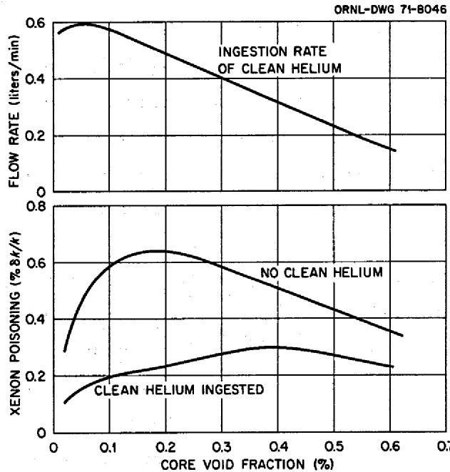  
Fig. 24. Effect of Clean Cover-Gas Ingestion on Steady-State Xenon Poisoning, Helium Cover Gas.

135I decays to $^{135}\mathrm{Xe}$ and $^{135}\mathrm{Mx}$ . Table 7 compares the results that were obtained for one set of bubble parameters. Although the parameters used to describe the physical processes in the reactor were not precisely the same as those discussed earlier, the relative effects of the nuclear properties would not be expected to change. It is clear from these results that the lack of precise nuclear data for the 135-mass chain has an insignificant effect on the description of the steady-state xenon poisoning.

One of the approaches that has been suggested for reducing the xenon poisoning in molten salt reactors is the development of a graphite with a substantially greater resistance to xenon diffusion than that used in the MSRE. Since it was easy to vary this parameter in the steady-state calculations, some results were produced to evaluate the importance of the xenon diffusion coefficient in graphite. These results also showed the effect of uncertainties in this parameter on the calculated xenon behavior in the MSRE. The diffusion coefficient for xenon appears in two general areas in the mathematical model: in the description of xenon migration between the major graphite regions in the core and in the description of the radial xenon profile within individual moderator pieces. Because of the low order of importance of the first process, only the effects in the moderator pieces were examined. Xenon poisoning calculations were made as a function of the void fraction of bubbles in the core for several values of the xenon diffusion coefficient in graphite ranging down to $10^{-7}$ ft²/hr (2.6 x 10⁻⁶ cm²/sec). The results at each void fraction were then normalized to values obtained for a flat xenon profile (infinite diffusion coefficient) in the moderator pieces. The xenon poisoning, relative to the normalization standard, is shown as a function of diffusion coefficient in Fig. 25 for helium cover gas. (The results with argon cover gas were essentially the same.) The range of values at each diffusion coefficient reflects the influence of xenon stripping, with the upper end of the range corresponding to low core void fractions or relatively poor xenon stripping. Thus, for poor stripping, the graphite diffusivity must be very low to prevent xenon transport to the moderator. On the other hand, if an efficient xenon stripping process is available, it can compete effectively with graphite that has a much higher diffusivity.

# Table 7

Effect of $^{135}\mathrm{Xe}$ Nuclear Properties on Steady State Xenon Poisoning   

<table><tr><td>Fraction of Total 135Xe Yield Produced Directly From 233U Fission</td><td>Fraction of 135I Decays that Produce 135Mx</td><td>Calculated Steady State; Xenon Reactivity Effect</td></tr><tr><td>(%)</td><td>(%)</td><td>(% δk/k)</td></tr><tr><td>18*</td><td>30*</td><td>-0.276</td></tr><tr><td>3.6</td><td>30</td><td>-0.275</td></tr><tr><td>18</td><td>1</td><td>-0.280</td></tr><tr><td>3.6</td><td>1</td><td>-0.279</td></tr></table>

\*Nominal value.

Diffusion coefficients for helium at $23^{\circ}\mathrm{C}$ have been reported $^{39}$ for several samples of MSRE graphite. These values, when converted to xenon at $1200^{\circ}\mathrm{F}$ give diffusion coefficients that range from $3 \times 10^{-7}$ to $2 \times 10^{-4} \mathrm{ft}^{2} / \mathrm{hr}$ for surface samples and from $1 \times 10^{-6}$ to $9 \times 10^{-4} \mathrm{ft}^{2} / \mathrm{hr}$ for interior samples. The averages of 20 samples are $2.3 \times 10^{-5} \mathrm{ft}^{2} / \mathrm{hr}$ for surface material and $1.3 \times 10^{-4} \mathrm{ft}^{2} / \mathrm{hr}$ for interior material. Within this range, the value used for the graphite diffusion coefficient has little effect on the calculated steady-state xenon poisoning. Nevertheless, the results discussed above include the effect of the xenon distribution in the graphite. However, we did not include it in the transient calculations.

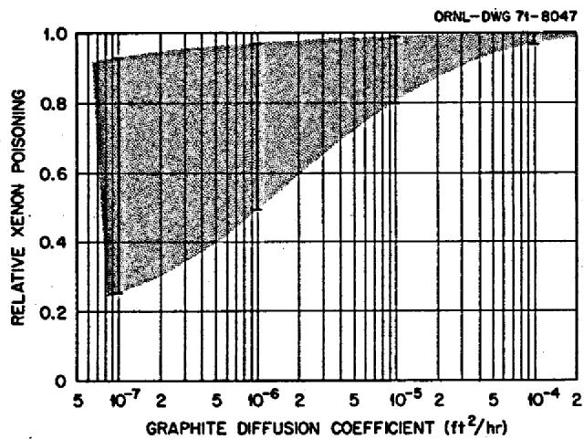  
Fig. 25. Effect of Graphite Diffusion Coefficient on Steady-State Xenon Poisoning, Helium Cover Gas.

# Transient Xenon Calculations

In addition to satisfactorily describing the steady-state xenon poisoning in the reactor, a model that represents the actual physical processes correctly should also describe the transient behavior that follows a change in reactor power level. The preceding discussion of the steady-state calculations shows that, for at least some situations, significantly different combinations of parameter values and mechanisms produced comparable overall results, but the inclusion of direct xenon transport from bubbles to the graphite produced a significant difference in the xenon distribution at high core void fractions. In an effort to evaluate this mechanism and other parameter values, some transient calculations were performed. Ideally, if a sufficient variety of reactor xenon transients were available for comparison and if the various models were sufficiently flexible, it should be possible to deduce mechanisms and parameter values that satisfy all conditions. However, only a few xenon transients were recorded for the reactor under a limited variety of conditions. In addition, the calculation of a large number of transients for different input parameters was impractical. As a consequence, we did not succeed in clearly identifying all the mechanisms and parameters required to match the MSRE experience. However, the calculations did illustrate some important features of the xenon behavior and showed some of the deficiencies of the postulated mechanisms.

The transient most commonly encountered in the reactor operation was the buildup of the xenon poisoning following a rapid increase in reactor power from near zero to several megawatts. The controlling parameters in such a transient appear to be the half-lives of the iodine and xenon and the xenon burnup coefficient. Consequently, this type of transient is relatively insensitive to variations in the parameters that were of interest in this study. In addition, the parameters that were considered in the steady-state analyses produced comparable xenon distributions as well as comparable poisoning effects at low core void fractions. Consequently, we did not calculate any xenon buildup transients at low void fractions; other types of transients seemed more likely to show differences due to the choice of parameters. Figure 26 shows the first $40\mathrm{hr}$ of a

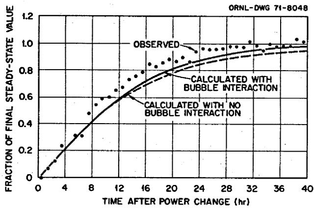  
Fig. 26. Comparison of Calculated and Observed Xenon Buildup Transients in MSRE, Helium Cover Gas with 0.53 vol % Voids in Core.

xenon buildup transient following a rapid increase in reactor power from 10 kw to 5.5 Mw with helium cover gas and a core void fraction of about 0.53 vol %. Also shown are two calculated transients for different parameter values. (Since the calculations did not lead to precisely the same steady-state values, the data for the transients were normalized to their respective steady-state values to emphasize the shapes of the curves.) For one of the calculations (dashed curve) no direct xenon transport from bubbles to graphite was allowed and the nominal coefficient for xenon mass transfer from liquid to graphite was used - 0.06 ft/hr in the major core regions. These parameters required a bubble stripping efficiency of $4\%$ and showed 0.57 of the total xenon poisoning in the graphite at steady state. For the second calculation, $0.94\%$ of the gas flowing through the core was allowed to interact with the graphite and the coefficient for xenon mass transfer from liquid to graphite was reduced by a factor of 6. This led to a bubble stripping efficiency of $61\%$ with 0.95 of the total xenon poisoning in the graphite. These parameters are similar to those used to calculate the steady-state poisoning shown in Fig. 19. The differences in the calculated transients are quite small and neither rises as rapidly as the observed transient.

From previous studies of xenon transients in the MSRE,[40] it appeared that better discrimination could be obtained with xenon removal transients. Therefore, two sets of removal transients were computed for parameter values that produced high-power, steady-state results close to those observed in the reactor. For one set, Figure 27, the calculations were compared to a reactor transient observed after a shutdown from $5.5\mathrm{Mw}$ to $10\mathrm{kw}$ with helium cover gas and a core void fraction of $0.53\mathrm{vol}\%$ . The parameter values for the calculations, both with and without bubble interaction were the same as those described above for the buildup transient. The results are again normalized to their respective steady-state values at the high power level.

Both of the calculated curves show a peak in the xenon poisoning after the power reduction. This peak is associated with the continued production of $^{135}\mathrm{Xe}$ by decay of $^{135}\mathrm{I}$ in the salt and the transport of that xenon to the graphite. Thus, as the graphite contribution to the total

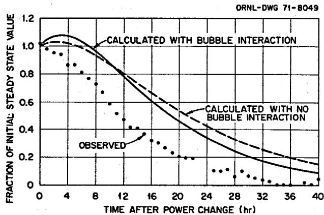  
Fig. 27. Comparison of Calculated and Observed Xenon Removal Transients, Helium Cover Gas with $0.53\%$ Voids in Core.

xenon poisoning increases, this peak tends to increase, both in magnitude and duration. This seems to suggest that parameters which allow very poor xenon transport to the graphite at high void fractions, and thereby attribute most of the poisoning to xenon in the circulating fluid, might better describe the transient behavior. However, such parameters also require very low stripping rates to describe the steady-state poisoning and these stripping rates produced transients that were much slower than those observed in the reactor. This is illustrated by the more "stretched out" shape of the transient in which no bubble interaction with the graphite was allowed. It was also noted that faster rates of exchange between xenon in the graphite and that in the fluid tended to reduce the peak in the poisoning curve. In these cases, however, the stripping efficiencies required to match the steady-state results were so high that the rate of decrease of the poisoning after the peak was considerably faster than was observed in the reactor.

The second comparison between calculated and observed xenon removal transients, Fig. 28, was made for a reactor test in which the cover gas was argon and the core void fraction was about $0.7 \, \text{vol\%}$ . When no bubble interaction was allowed, the xenon parameters used were the same as those that produced the correlation shown in Fig. 17; $10\%$ for the bubble stripping efficiency and $0.06 \, \text{ft/hr}$ for the xenon mass transfer coefficient from liquid to graphite. With bubble interaction the xenon parameters were the same as those used for Fig. 19. The calculated curves show many of the same features as those in Fig. 27. In this case, however, when no bubble interaction was allowed, the poisoning contribution from xenon in the graphite was small enough that the peak in the curve was completely eliminated. This curve also shows the very slow removal of xenon that was projected for this condition. When bubble interaction with the graphite was added, the poisoning peak reappeared because the overall xenon distribution was again shifted toward the graphite. Once the peak was passed, the higher stripping efficiency used in that calculation produced a rate of xenon removal that was close to the observed rate.

In addition to the computations to examine the effects of the xenon transport parameters on the transient behavior, some calculations were

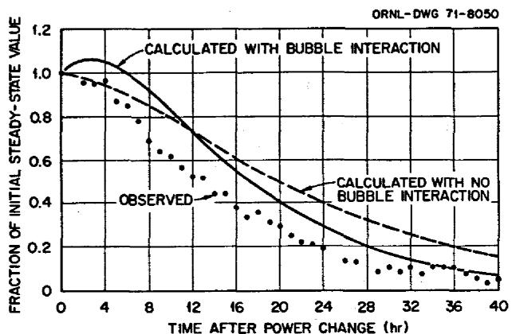  
Fig. 28. Comparison of Calculated and Observed Xenon Removal Transients, Argon Cover Gas with $0.7 \text{ vol}\%$ Voids in Core.

performed to study the effects of the direct xenon yield and decay scheme. The xenon transport parameters for these calculations were very similar to those used for the transients with argon cover gas and bubble interaction with the graphite. However, the rate of bubble flow to the graphite was lower by a factor of 2.3 in these calculations. Figure 29 compares a xenon removal transient using the nominal direct yield of $^{135}\mathrm{Xe}$ (18% of total) with one in which only 3.6% of the xenon yield came directly from fission. (Changing the branching ratio for $^{135}\mathrm{I}$ decay to simulate a high cross section for $^{135}\mathrm{mXe}$ had essentially no effect on the shape of the transient.) The higher peak in the transient curve for the lower direct yield results from the higher rate of $^{135}\mathrm{Xe}$ production after the power reduction and the migration of some of that xenon into the graphite. The higher peak in the nominal curve, relative to the comparable curve in Fig. 28 reflects the lower rate of exchange between xenon in the graphite and that in the fluid. That is, the xenon in the graphite stays there longer and so delays the influence of the stripping parameters.

# DISCUSSION OF RESULTS

In the studies reported here we have examined the effects of a number of system parameters on the calculated behavior of $^{135}\mathrm{Xe}$ in the MSRE. The goal of this effort was to see if the behavior observed during reactor operation could be predicted by a model that included the effects of cover-gas solubility in the fuel salt with reasonable values for other parameters. Significant deviations from the nominally predicted xenon stripping and mass transfer effects were postulated in an effort to reproduce the differences in xenon poisoning that were observed with soluble and insoluble cover gases. Although we achieved reasonable success in describing the steady-state xenon poisoning with both helium and argon cover gas, we could not adequately describe the transient behavior. The nature of the various results that were obtained provides some insight into the kinds of processes that may have been important in the MSRE.

The calculations using previously accepted transport mechanisms and parameter values showed again that the steady-state results with argon

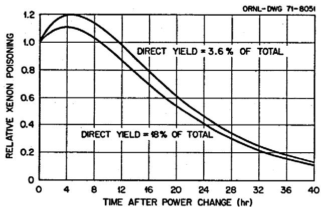  
Fig. 29. Effect of Direct $^{135}\mathrm{Xe}$ Yield on Xenon Poisoning Transient.

cover gas could be readily duplicated. However, such calculations required the use of bubble stripping efficiencies that were much lower than the bubble removal rates that were observed in the reactor when excess bubbles were present. It is, of course, conceivable that the bubble stripping efficiency for xenon might be much lower than the rate at which a new void distribution is approached. This would be the case if, for example, stripped bubbles were replaced by bubbles containing an abnormally high xenon concentration because of the existence of a "foam" blanket on the salt surface in the pump. There is evidence from observations in the pump bowl that some kind of foam layer was indeed present; however, its characteristics are not well defined and any conclusions about its effect on the xenon behavior would be highly speculative. When the low stripping rates required for these steady-state results were applied to transient calculations with high argon void fractions, they produced decreases in the xenon poisoning that were much slower than those observed in the reactor after power reductions. The transient response for a given stripping efficiency would have been faster if a larger fraction of the total xenon poisoning had been associated with the circulating fluid; i.e. less xenon in the graphite. This condition would be favored by a lower coefficient for xenon mass transfer from the liquid to the graphite. However, such a shift would require still lower stripping efficiencies to describe the steady-state results. Thus, it appears that xenon transport rates to graphite and stripping efficiencies like those used in earlier analyses could not describe the transient behavior at high void fractions, even for an insoluble cover gas.

One conceivable way in which the original parameter values could be made to approach the observed results at high void fractions would be to make the stripping efficiency dependent on the reactor power level. If the stripping efficiency were extremely low with the reactor at power (and the rate of mass transfer to the graphite were also lower than predicted) most of the xenon poisoning would be associated with the fluid and the poisoning would build up rapidly to its steady-state value. Then, if higher stripping rates prevailed at very low powers, rapid removal of the xenon would result. This hypothetical situation might be achieved if some short-lived material were present in the salt that had the capability of

holding xenon in the fluid in such a way as to make it unavailable for stripping or transport to the graphite. Since there appeared to be no firm basis for postulating the condition just described, this approach was not pursued in the xenon analysis.

Even if power-dependent changes in stripping efficiency were postulated to explain the total xenon behavior at high argon void fractions, we found that we could not describe the poisoning that was observed with helium cover gas. Inclusion of the helium solubility effects and wide variations in xenon stripping as a function of void fraction modified the calculated poisoning but we could not match the observed results. It appeared that some process of variable xenon transport to the graphite, in addition to the relatively constant mass transfer from the liquid, would most likely be capable of describing the observed effects of circulating voids on the xenon poisoning. The requirements on this process were that it contribute very little to the total xenon poisoning when the gas bubbles in the core salt were small and substantially more when larger bubbles were present at the same void fraction. Incorporation of an additional transport mechanism with this property, along with a reduction in the coefficient for xenon mass transfer from the liquid to graphite made it possible to describe the steady-state poisoning with both helium and argon cover gas in one self-consistent approach. The poisoning difference between the two cover gases at low void fractions resulted from lower xenon transport to the graphite from helium bubbles which were reduced in size by dissolution in the salt. (Xenon transport to the graphite may not be the only process that could produce this difference but the graphite appeared to offer the only reservoir with sufficient xenon storage capability to account for high poisoning levels that were observed with argon at low void fractions.) In this study we described the additional xenon transport process in terms of interaction of gas bubbles with the graphite mass. Actual collision of bubbles with the walls is physically unrealistic but other mechanisms that involve bubble nucleation on the walls41 have been suggested that are physically more palatable and would have the same

net result. Furthermore, there is some evidence in the MSRE experience that gas bubbles did tend to collect on core surfaces.*

Although the use of a bubble transport process for xenon led to a better description of the steady-state poisoning as a function of void fraction, it did not produce satisfactory transient results at high void fractions. The transients indicated that this approach tended to shift the xenon distribution too much toward the graphite. Better agreement could have been obtained if the bubble transport process had become relatively less effective at the higher void fractions. However, this possibility was not pursued in the analysis.

# CONCLUSIONS

The successful, extended operation of the MSRE provided a valuable demonstration of the operating characteristics of a molten-salt reactor. One of the more advantageous of these characteristics is the ability to effectively remove noble-gas fission products – notably $^{135}\mathrm{Xe}$ – with relatively little effort. This removal reduces the total inventory of fission products in the primary loop and also the reactivity loss to $^{135}\mathrm{Xe}$ poisoning. Depending on the cover gas and the volume fraction of circulating voids that were maintained in the fuel loop, the xenon poisoning in the MSRE was reduced by a factor of 2 to 6 below the values that would have prevailed with no gas stripping.

Although some aspects of the xenon behavior (e.g. strong dependence on circulating void fraction) were expected, the reactor results showed that the total behavior was not accurately predicted. In particular, the sensitivity of the xenon poisoning to the choice of cover gas had not been predicted. Subsequent analyses of the operating results were partially

successful in describing the observed xenon behavior but also revealed some areas of continuing uncertainty. We found that solubility effects were important with helium cover gas but that these effects alone apparently could not explain the xenon poisoning differences between helium and argon at low core void fractions. In attempting to describe the reactor results we found it necessary to postulate bubble and liquid stripping efficiencies in the pump bowl that were substantially higher than predicted values and liquid-to-graphite mass transfer coefficients that were much lower. In addition it appeared that circulating voids strongly influenced the rate of xenon mass transport to the graphite in a way that depended on both the bubble fraction and bubble size. It also appeared that some argument could be made for changes in stripping efficiency with reactor power level. The differences between predicted parameter values and those postulated in this study suggest that additional effort to develop a better quantitative understanding of bubble effects in mass transport and gas stripping would be of value.

Since the good breeding performance of conceptual designs of large molten-salt reactors depends on effective $^{135}\mathrm{Xe}$ removal, the ability to accurately predict xenon poisoning is important in the design and evaluation of future reactors. Some of the questions raised by the MSRE study for which accurate and reliable answers would be useful in making such predictions are the following:

1. What are the solubility characteristics of various fission-product gases and cover gases in potential molten-salt fuel mixtures?   
2. How and to what extent do circulating bubbles affect the mass transport of xenon from the fluid to graphite? What is the effect of bubble size on this process?   
3. What is the effect of heat generation in the fluid on mass transfer to graphite?   
4. What are the effective rates of xenon mass transfer from liquid salt to circulating bubbles and how are these influenced by dissolution and evolution of cover gas?   
5. Is there any basis for expecting an effect of power level on xenon removal, e.g. through generation of materials that affect the gas transport processes?

# ACKNOWLEDGMENT

The assistance provided by R. J. Kedl in the formulation of the mathematical descriptions, in the provision of parameter values, and in reviewing the manuscript is gratefully acknowledged.

# REFERENCES

1. R. C. Robertson, MSRE Design and Operations Report, Part I, Description of Reactor Design, ORNL-TM-728, (January 1965).   
2. P. N. Haubenreich, "Molten Salt Reactor Progress," Nucl. Eng. Int'1., 14 (155): pp. 325-329, (April 1969).   
3. P. N. Haubenreich and M. W. Rosenthal, "Molten Salt Reactors," Science Journal, 5 (6): pp. 41-46, (June 1969).   
4. Paul N. Haubenreich and J. R. Engel, "Experience with the Molten-Salt Reactor Experiment," Nucl. Appl. & Tech., 8 (2): pp. 118-136, (Feb. 1970).   
5. A. Houtzeel and F. F. Dyer, A Study of Fission Products in the Molten Salt Reactor Experiment by Gamma Spectrometry, ORNL-TM-3151, in preparation.   
6. Reactor Chemistry Division Ann. Progr. Rept., Dec. 31, 1965, ORNL-3913, pp. 38-40.   
7. M. K. Drake, National Neutron Cross Section Center, Brookhaven National Laboratory, personal communication to J. R. Engel, Nov. 19, 1970.   
8. L. L. Bennett, Recommended Fission Product Chains for Use in Reactor Evaluation Studies, ORNL-TM-1658 (Sept. 26, 1966).   
9. C. B. Bigham, A. Okazaki, and W. H. Walker, "The Direct Yield of Xe-135 in the Fission of U-233, U-235, Pu-239, and Pu-241," Trans. Am. Nuc. Soc. 8 (1): p. 11 (June 1965).   
10. W. D. Burch, Measurement of Xenon Poisoning in the HRT, ORNL-TM-228 (April 19, 1962).   
11. P. G. Smith, Water Test Development of the Fuel Pump for the MSRE, ORNL-TM-79 (March 27, 1962).   
12. P. G. Smith, Development of Fuel- and Coolant-Salt Centrifugal Pumps for the Molten Salt Reactor Experiment, ORNL-TM-2987 (October 1970).   
13. J. R. Waggoner and F. N. Peebles, Stripping Rates of Carbon Dioxide from Water in Spray Type Liquid-Gas Contactors, EM 65-3-1, University of Tennessee (Thesis), (March 1965).   
14. MSR Program Semiann. Progr. Rept., Jan. 31, 1963, ORNL-3419, pp. 27-28.

15. MSR Program Semiann. Progr. Rept., July 31, 1964, ORNL-3708, pp. 373-389.   
16. MSR Program Semiann. Progr. Rept., Feb. 28, 1965, ORNL-3812, pp. 76-80.   
17. R. J. Kedl and A. Houtzeel, Development of a Model for Computing $^{135}\mathrm{Xe}$ Migration in the MSRE, ORNL-4069, (June 1967).   
18. MSR Program Semiann. Progr. Rept., Aug. 31, 1965, ORNL-3872, pp. 22-23.   
19. J. R. Engel and B. E. Prince, The Reactivity Balance in the MSRE, ORNL-TM-1796, (March 10, 1967).   
20. B. E. Prince, J. R. Engel, and C. H. Gabbard, Reactivity Balance Calculations and Long Term Reactivity Behavior with $^{235}\mathrm{U}$ in the MSRE, ORNL-4674, (in preparation).   
21. J. R. Engel, P. N. Haubenreich, and A. Houtzeel, Spray, Mist, Bubbles, and Foam in the Molten Salt Reactor Experiment, ORNL-TM-3027 (June 1970).   
22. MSR Program Semiann. Progr. Rept., Aug. 31, 1966, ORNL-4037, pp. 22-24.   
23. MSR Program Semiann. Progr. Rept., Feb. 28, 1967 ORNL-4119, pp. 17-18.   
24. J. C. Robinson and D. N. Fry, Determination of the Void Fraction in the MSRE Using Small Induced Pressure Perturbations, ORNL-TM-2318 (Feb. 6, 1969).   
25. MSR Program Semiann. Progr. Rept., Feb. 29, 1968, ORNL-4254, pp. 4-6.   
26. D. N. Fry, R. C. Kryter, and J. C. Robinson, Measurement of Helium Void Fraction in the MSRE Fuel Salt Using Neutron-Noise Analysis, ORNL-TM-2315, (Aug. 27, 1968).   
27. R. J. Kedl, The Migration of a Class of Fission Products (Noble Metals) in the MSRE, ORNL-TM Report, in preparation.   
28. MSR Program Semiann. Progr. Rept., Feb. 28, 1969, ORNL-4396, pp. 16-21.   
29. C. H. Gabbard, Reactor Power Measurement and Heat Transfer Performance in the Molten Salt Reactor Experiment, ORNL-TM-3002 (May, 1970).   
30. MSR Program Semiann. Progr. Rept., Feb. 28, 1970, ORNL-4548, pp. 65-66.

31. MSR Program Semiann. Progr. Rept., Aug. 31, 1969, ORNL-4449, pp. 10-11.   
32. MSR Program Semiann. Progr. Rept., Aug. 31, 1970, ORNL-4622, pp. 2-4.   
33. MSR Program Semiann. Progr. Rept., Aug. 31, 1967, ORNL-4191, pp. 55-58.   
34. B. E. Prince, personal communication to R. C. Steffy, April 25, 1969.   
35. S. J. Ball and T. W. Kerlin, Stability Analysis of the Molten Salt Reactor Experiment, ORNL-TM-1070, p. 68, (December 1965).   
36. S. J. Ball and R. K. Adams, /MATEXP $^o$ / A General Purpose Digital Computer Program for Solving Ordinary Differential Equations by the Matrix Exponential Method, ORNL-TM-1933, (August 30, 1967).   
37. MSR Program Semiann. Progr. Rept., Feb. 28, 1970, ORNL-4548, pp. 37-38.   
38. J. R. Engel and P. N. Haubenreich, Temperatures in the MSRE Core During Steady-State Power Operation, ORNL-TM-378, (Nov. 5, 1962).   
39. R. B. Evans III, J. L. Rutherford, and A. P. Malinauskas, Gas Transport in MSRE Moderator Graphite, II Effects of Impregnation, III Variation of Flow Properties, ORNL-4389, p. 52, (May 1969).   
40. MSR Program Semiann. Progr. Rept., Feb. 28, 1967, ORNL-4119, pp. 86-94.   
41. R. P. Wischner, personal communication to J. R. Engel, March 19, 1971.

# APPENDIX A

Equations to Describe Xenon and Cover Gas Behavior

# Nomenclature

X1 = 135mXe concentration in pump bowl gas space, atoms/cm³

Xe concentration in pump bowl gas space, atoms/cm³

X₃ = 135mXe concentration in pump bowl liquid, atoms/cm³

Xe concentration in pump bowl liquid, atoms/cm³

X5 = 135mXe concentration in heat exchanger liquid, atoms/cm³

Xe concentration in heat exchanger liquid, atoms/cm³

X, = $^{135}\mathrm{m}$ Xe concentration in heat exchanger bubbles, atoms/cm³

Xe = 195 Xe concentration in heat exchanger bubbles, atoms/cm³

Xe concentration in core liquid, atoms/cm³

$\mathbf{X}_{10} = \mathbf{^{195}Xe}$ concentration in core liquid, atoms/cm³

X11 = 135mXe concentration in unstripped bubbles in pump bowl, atoms/cm³

X12 = 135Xe concentration in unstripped bubbles in pump bowl, atoms/cm³

$\mathbf{X}_{13} = \mathbf{I}^{135}\mathbf{I}$ concentration in fuel salt, atoms/cm³

X14 = 135Xe concentration in graphite pores (central region), atoms/cm³

X15 = 135mXe concentration in graphite pores (whole core), atoms/cm³

Xe concentration in graphite pores (2nd region), atoms/cm³

X17 = 193Xe concentration in graphite pores (3rd region), atoms/cm³

Xe concentration in graphite pores (outer region), atoms/cm³

X19 = 135mXe concentration in piping liquid, atoms/cm³

Xe concentration in piping liquid, atoms/cm³

X21 = 135mXe concentration in piping bubbles, atoms/cm³

Xe concentration in piping bubbles, atoms/cm³   
$\mathbf{X}_{23} = \mathbf{135m}\mathbf{Xe}$ concentration in core bubbles, atoms/cm³   
Xe concentration in core bubbles, atoms/cm³   
time, min.   
A area, ft²   
$\lambda =$ radioactive decay constant, $\min^{-1}$   
$\varepsilon$ = bubble stripping efficiency   
V = region volume, ft3   
$\Psi = \text{void fraction}$   
F = flow rate, salt or gas, gpm or l/min   
H = Henry's law constant, moles/cm³-atm   
K = universal gas constant, cm³-atom/mole-°K   
T = absolute temperature, ${}^{\circ}\mathbf{K}$   
K = decay fraction   
h = mass transfer coefficient, ft/hr   
p = pressure, psia   
P = power, Mw   
Y = direct fission yield, atoms/Mw-min   
$\Phi =$ volume-averaged neutron capture coefficient, $(Mw - min)^{-1}$   
$\mathbf{d}$ = bubble diameter, in.   
$\mathbf{D}_{\mathbf{G}}$ = diffusion coefficient for xenon in graphite, ft²/hr   
$\mathbf{r}$ = radial distance, in.   
B = fraction of xenon inventory transferred from liquid to nucleated bubbles   
Z = cover gas concentration, atoms/cm³   
N = number of bubbles, $\mathbf{cm}^{-3}$   
$\mathbf{N}^{\prime}$ = number concentration of bubbles in liquid, $\mathrm{cm}^{-3}$

# Subscripts

Note: Number subscripts, when applied to quantities other than X as defined above, refer to properties of the region in which the variable X with the same subscript may be found. For example, $\mathrm{VF}_{\mathfrak{s}}$ is the cover-gas void fraction in the region containing $\mathbf{X}_{\mathfrak{p}}$ , i.e. the core fluid. Double subscripts refer to properties common to two regions. Thus $\mathbf{A}_{14}$ is the graphite surface area within region 14 while $\mathbf{A}_{14,16}$ is the graphite interfacial area between the two regions 14 and 16.

X 135 Xe

m 135mXe

135I

g salt-to-graphite

gc salt-to-graphite in central core region

b salt-to-gas bubbles

1 loop

s spray ring

f fountain flow

c cover gas

e ingested purge gas

R reference condition

y cover gas

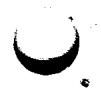

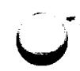

# EQUATIONS FOR XENON MODEL

$$
- \frac {h _ {g} A _ {1 7}}{V _ {9} (1 - \Psi_ {9})} \left(X _ {1 0} - H _ {X} R T X _ {1 7}\right) - \frac {h _ {g} A _ {1 8}}{V _ {9} (1 - \Psi_ {9})} \left(X _ {1 0} - H _ {X} R T X _ {1 8}\right)
$$

1. $\frac{\mathrm{d}\mathbf{X}_1}{\mathrm{d}t} = \frac{\Psi_{19}}{\mathbf{V}_1} (\mathbf{F}_{\mathrm{s}}\epsilon_{\mathrm{s}} + \mathbf{F}_{\mathrm{f}}\epsilon_{\mathrm{f}})\mathbf{X}_{21} + \frac{\mathbf{h}_{\mathrm{b}}\mathbf{A}_{\mathrm{c}}}{\mathbf{V}_1} (\mathbf{X}_3 - \mathbf{H}_{\mathrm{x}}\mathbf{R}\mathbf{T}\mathbf{X}_1) - \lambda_{\mathrm{m}}\mathbf{X}_1 - \frac{\mathbf{F}_{\mathrm{c}}}{\mathbf{V}_1}\mathbf{X}_1 - \left\{\Psi_{3}(\mathbf{F}_{\mathrm{s}} + \mathbf{F}_{\mathrm{f}}) - \Psi_{19}\frac{\mathbf{p}_{19}}{\mathbf{p}_{3}} [\mathbf{F}_{\mathrm{s}}(1 - \epsilon_{\mathrm{s}}) + \mathbf{F}_{\mathrm{f}}(1 - \epsilon_{\mathrm{f}})] - \mathbf{F}_{\mathrm{e}}\right\} \frac{\mathbf{X}_1}{\mathbf{V}_1}$   
2. $\frac{\mathrm{d}X_2}{\mathrm{d}t} = \frac{\Psi_{19}}{V_1}\left(F_s\epsilon_s + F_f\epsilon_f\right)X_{22} + \frac{h_bA_c}{V_1} (X_4 - H_xRTX_2) + \lambda_mX_1 - \lambda_XX_2 - \frac{F_c}{V_1} X_2 - \left\{\Psi_3(F_s + F_f) - \Psi_1, \frac{p_{19}}{p_3} [F_s(1 - \epsilon_s) + F_f(1 - \epsilon_f)] - F_e\right\} \frac{X_2}{V_1}$   
3. $\frac{\mathrm{d}X_3}{\mathrm{d}t} = \frac{F_s + F_f}{V_3(1 - \Psi_3)} X_{19} + K_m\lambda_lX_{13} - \frac{F_s + F_f}{V_3(1 - \Psi_3)} X_3 - \lambda_mX_3 - \frac{h_bA_c}{V_3(1 - \Psi_3)} (X_3 - H_xRTX_1) - \frac{h_bA_{11}}{V_3(1 - \Psi_3)} (X_3 - H_xRTX_{11})$   
4. $\frac{\mathrm{d}X_4}{\mathrm{d}t} = \frac{F_s + F_f}{V_3(1 - \Psi_3)} X_{20} + K_x\lambda_lX_{13} + \lambda_mX_3 - \frac{F_s + F_f}{V_3(1 - \Psi_3)} X_4 - \lambda_xX_4 - \frac{h_bA_c}{V_s(1 - \Psi_3)} (X_4 - H_xRTX_2)\left| - \frac{h_bA_{11}}{V_3(1 - \Psi_3)} (X_4 - H_xRTX_{12})\right|$   
5. $\frac{\mathrm{d}X_{5}}{\mathrm{d}t} = \frac{F_{\varrho} - F_{s} - F_{f}}{V_{s}(1 - \Psi_{s})} X_{19} + \frac{F_{s} + F_{f}}{V_{s}(1 - \Psi_{s})} X_{3} + K_{m}\lambda_{I}X_{13} - \frac{F_{\varrho}}{V_{s}(1 - \Psi_{s})} X_{5} - \lambda_{m}X_{5} - \frac{h_{b}A_{5}}{V_{s}(1 - \Psi_{s})} (X_{5} - H_{x}RTX_{7})$   
6. $\frac{\mathrm{d}X_6}{\mathrm{d}t} = \frac{F_{\varrho} - F_s - F_f}{V_5(1 - \Psi_5)} X_{20} + \frac{F_s + F_f}{V_5(1 - \Psi_5)} X_4 + K_x\lambda_lX_{13} + \lambda_mX_5 - \frac{F_{\varrho}}{V_5(1 - \Psi_5)} X_6 - \lambda_XX_6 - \frac{h_bA_s}{V_5(1 - \Psi_5)} (X_6 - H_xRTX_8)$   
7. $\frac{\mathrm{d}X_7}{\mathrm{d}t} = \frac{\Psi_{19}(F_\varrho - F_\varsigma - F_\mathrm{f})}{V_\varsigma\Psi_\varsigma} X_{21} + \left\{\Psi_3(F_s + F_f) - \Psi_{19}\frac{p_{19}}{p_3} [F_s(1 - \epsilon_s) + F_f(1 - \epsilon_f)] - F_e\right\}\frac{X_1}{V_\varsigma\Psi_\varsigma} +\frac{\Psi_{19}(p_{19} / p_3)}{V_\varsigma\Psi_\varsigma} [F_s(1 - \epsilon_s) + F_f(1 - \epsilon_f)]X_{11} + \frac{h_bA_5}{V_\varsigma\Psi_\varsigma} (X_5 - H_XRTX_7) - \frac{F_\varrho}{V_\varsigma} X_7 - \lambda_mX_7$   
8. $\frac{\mathrm{d}\mathbf{X}_8}{\mathrm{d}t} = \frac{\Psi_{19}(\mathbf{F}_0 - \mathbf{F}_s - \mathbf{F}_f)}{\mathbf{V}_5\Psi_5}\mathbf{X}_{22} + \left\{\Psi_3(\mathbf{F}_s - \mathbf{F}_f) - \Psi_{19}\frac{p_{19}}{p_3} [F_s(1 - \epsilon_s) + F_f(1 - \epsilon_f)] - F_e\right\} \frac{\mathbf{X}_2}{\mathbf{V}_5\Psi_5} +\frac{\Psi_{19}(p_{19} / p_3)}{\mathbf{V}_5\Psi_5} [F_s(1 - \epsilon_s) + F_f(1 - \epsilon_f)]\mathbf{X}_{12} + \frac{\mathrm{h_bA_5}}{\mathbf{V}_5\Psi_5} (\mathbf{X}_6 - \mathbf{H}_x\mathbf{RTX}_8) + \lambda_m\mathbf{X}_7 - \frac{\mathbf{F}_0}{\mathbf{V}_5}\mathbf{X}_8 - \lambda_x\mathbf{X}_8$   
9. $\frac{\mathrm{d}X_{9}}{\mathrm{d}t} = \frac{F_{\varrho}}{V_{9}(1 - \Psi_{9})} X_{5} + K_{m}\lambda_{I}X_{13} - \frac{F_{\varrho}}{V_{9}(1 - \Psi_{9})} X_{9} - \lambda_{m}X_{9} - \frac{h_{b}A_{9}}{V_{9}(1 - \Psi_{9})} (X_{9} - H_{x}\mathrm{RTX}_{23}) - \frac{h_{g}A_{15}}{V_{9}(1 - \Psi_{9})} (X_{9} - H_{x}\mathrm{RTX}_{15})$   
10. $\frac{\mathrm{d}X_{10}}{\mathrm{d}t} = \frac{F_9}{V_9(1 - \Psi_9)} X_6 + K_x\lambda_I X_{13} + \lambda_m X_9 + \frac{Y_x P}{V_9(1 - \Psi_9)} - \frac{F_9}{V_9(1 - \Psi_9)} X_{10} - \lambda_x X_{10} - \Phi_{10} P X_{10} - \frac{h_b A_9}{V_9(1 - \Psi_9)} (X_{10} - H_x R T X_{24}) - \frac{h_{gc} A_{14}}{V_9(1 - \Psi_9)} (X_{10} - H_x R T X_{14}) - \frac{h_g A_{16}}{V_9(1 - \Psi_9)} (X_{10} - H_x R T X_{16})$   
11. $\frac{\mathrm{d}X_{11}}{\mathrm{d}t} = \frac{F_s + F_f}{(p_{19} / p_3)V_3} X_{21} - \frac{F_s + F_f}{V_3} X_{11} - \lambda_m X_{11} + \frac{6h_b}{d_R} (X_3 - H_xRTX_{11})$   
12. $\frac{\mathrm{d}\mathbf{X}_{12}}{\mathrm{d}t} = \frac{\mathbf{F_s} + \mathbf{F_f}}{(\mathbf{p}_{19} / \mathbf{p}_3)\mathbf{V}_3}\mathbf{X}_{22} + \lambda_{\mathrm{m}}\mathbf{X}_{11} - \frac{\mathbf{F_s} + \mathbf{F_f}}{\mathbf{V}_3}\mathbf{X}_{12} - \lambda_{\mathrm{x}}\mathbf{X}_{12} + \frac{6\mathrm{h_b}}{\mathrm{d_R}} (\mathbf{X}_4 - \mathbf{H}_x\mathbf{RTX}_{12})$   
13. $\frac{\mathrm{d}\mathbf{X}_{\mathbf{1}3}}{\mathrm{d}t} = \frac{\mathbf{Y}_{\mathbf{I}}\mathbf{P}}{\mathbf{V}_{\mathbf{Q}}} -\lambda_{\mathbf{I}}\mathbf{X}_{\mathbf{1}3}$   
14. $\frac{\mathrm{dX}_{14}}{\mathrm{d}t} = \frac{\mathrm{h}_{\mathrm{gcA}_{14}}}{\mathrm{V}_{14}} (\mathrm{X}_{10} - \mathrm{H}_{\mathrm{x}}\mathrm{RTX}_{14}) + \frac{\mathrm{F}_{\mathrm{c},\mathrm{g}}\mathrm{F}_{\mathrm{g},14}}{\mathrm{V}_{14}\mathrm{F}_{\mathrm{g}}} (\mathrm{X}_{24} - \mathrm{X}_{14}) + \lambda_{\mathrm{m}}\mathrm{X}_{15} - \lambda_{\mathrm{x}}\mathrm{X}_{14} - \Phi_{14}\mathrm{PX}_{14} - \frac{\mathrm{D}_{\mathrm{G}}\mathrm{A}_{14,16}}{\mathrm{V}_{14}\mathrm{r}_{14,16}} (\mathrm{X}_{14} - \mathrm{X}_{16})$

15. $\frac{\mathrm{d}X_{15}}{\mathrm{d}t} = \frac{\mathrm{h_gA_{15}}}{\mathrm{V_{15}}} (X_9 - H_XRTX_{15}) + \frac{\mathrm{F_{c,g}}}{\mathrm{V_{15}}} (X_{23} - X_{15}) - \lambda_mX_{15}$   
16. $\frac{\mathrm{d}\mathbf{X}_{16}}{\mathrm{d}t} = \frac{\mathrm{h}_{\mathrm{g}}\mathbf{A}_{16}}{\mathbf{V}_{16}} (\mathbf{X}_{10} - \mathbf{H}_{\mathrm{x}}\mathbf{RT}\mathbf{X}_{16}) + \frac{\mathbf{F}_{\mathrm{c,g}}\mathbf{F}_{\mathrm{2,16}}}{\mathbf{V}_{16}\mathbf{F}_{\mathrm{2}}} (\mathbf{X}_{24} - \mathbf{X}_{16}) + \lambda_{\mathrm{m}}\mathbf{X}_{15} - \lambda_{\mathrm{x}}\mathbf{X}_{16} - \Phi_{16}\mathbf{PX}_{16} - \frac{\mathbf{D}_{\mathrm{G}}\mathbf{A}_{14,16}}{\mathbf{V}_{16}\mathbf{r}_{14,16}} (\mathbf{X}_{16} - \mathbf{X}_{14}) - \frac{\mathbf{D}_{\mathrm{G}}\mathbf{A}_{16,17}}{\mathbf{V}_{16}\mathbf{r}_{16,17}} (\mathbf{X}_{16} - \mathbf{X}_{17})$   
17. $\frac{\mathrm{d}X_{17}}{\mathrm{d}t} = \frac{\mathrm{h}_{\mathrm{g}}A_{17}}{\mathrm{V}_{17}} (\mathrm{X}_{10} - \mathrm{H}_{\mathrm{x}}\mathrm{RTX}_{17}) + \frac{\mathrm{F}_{\mathrm{c},\mathrm{g}}\mathrm{F}_{\mathrm{k},17}}{\mathrm{V}_{17}\mathrm{F}_{\mathrm{q}}} (\mathrm{X}_{24} - \mathrm{X}_{17}) + \lambda_{\mathrm{m}}\mathrm{X}_{15} - \lambda_{\mathrm{x}}\mathrm{X}_{17} - \Phi_{17}\mathrm{PX}_{17} - \frac{\mathrm{D}_{\mathrm{G}}A_{16,17}}{\mathrm{V}_{17}\Gamma_{16,17}} (\mathrm{X}_{17} - \mathrm{X}_{16}) - \frac{\mathrm{D}_{\mathrm{G}}A_{17,18}}{\mathrm{V}_{17}\Gamma_{17,18}} (\mathrm{X}_{17} - \mathrm{X}_{18})$   
18. $\frac{\mathrm{d}\mathbf{X}_{18}}{\mathrm{d}t} = \frac{\mathrm{h_gA_{18}}}{\mathrm{V}_{18}} (\mathbf{X}_{10} - \mathbf{H_xRTX_{18}}) + \frac{\mathrm{F_{c,g}F_{2,18}}}{\mathrm{V}_{18}\mathrm{F_{Q}}} (\mathbf{X}_{24} - \mathbf{X}_{18}) + \lambda_{\mathrm{m}}\mathbf{X}_{15} - \lambda_{\mathrm{x}}\mathbf{X}_{18} - \Phi_{18}\mathrm{P}\mathbf{X}_{18} - \frac{\mathrm{D_G A_{17,18}}}{\mathrm{V}_{18}\mathrm{I}_{17,18}} (\mathbf{X}_{18} - \mathbf{X}_{17})$   
19. $\frac{\mathrm{d}X_{19}}{\mathrm{d}t} = \frac{F_{\varrho}}{V_{19}(1 - \Psi_{19})} X_{9} + K_{m}\lambda_{I}X_{13} - \frac{F_{\varrho}}{V_{19}(1 - \Psi_{19})} X_{19} - \lambda_{m}X_{19} - \frac{h_{b}A_{19}}{V_{19}(1 - \Psi_{19})} (X_{19} - H_{x}RTX_{21})$   
19a. $\frac{\mathrm{d}X_{19}}{\mathrm{d}t} = \frac{F_2(1 - B)}{V_{19}(1 - \Psi_{19})} X_9 + K_m\lambda_lX_{13} - \frac{F_2}{V_{19}(1 - \Psi_{19})} X_{19} - \lambda_mX_{19} - \frac{h_bA_{19}}{V_{19}(1 - \Psi_{19})} (X_{19} - H_xRTX_{21})$   
20. $\frac{\mathrm{d}\mathbf{X}_{20}}{\mathrm{d}t} = \frac{\mathbf{F}_{\varrho}}{\mathbf{V}_{19}(1 - \Psi_{19})}\mathbf{X}_{10} + \mathbf{K}_{\mathbf{x}}\lambda_{\mathbf{I}}\mathbf{X}_{13} + \lambda_{\mathbf{m}}\mathbf{X}_{9} - \frac{\mathbf{F}_{\varrho}}{\mathbf{V}_{19}(1 - \Psi_{19})}\mathbf{X}_{20} - \lambda_{\mathbf{x}}\mathbf{X}_{20} - \frac{\mathbf{h}_{\mathbf{b}}\mathbf{A}_{19}}{\mathbf{V}_{19}(1 - \Psi_{19})} (\mathbf{X}_{20} - \mathbf{H}_{\mathbf{x}}\mathbf{RTX}_{22})$   
20a. $\frac{\mathrm{dX}_{20}}{\mathrm{d}t} = \frac{\mathrm{F}_{\varrho}(1 - \mathrm{B})}{\mathrm{V}_{19}(1 - \Psi_{19})}\mathrm{X}_{10} + \mathrm{K}_{x}\lambda_{\mathrm{I}}\mathrm{X}_{13} + \lambda_{\mathrm{m}}\mathrm{X}_{9} - \frac{\mathrm{F}_{\varrho}}{\mathrm{V}_{19}(1 - \Psi_{19})}\mathrm{X}_{20} - \lambda_{\mathrm{x}}\mathrm{X}_{20} - \frac{\mathrm{h}_{\mathrm{b}}\mathrm{A}_{19}}{\mathrm{V}_{19}(1 - \Psi_{19})} (\mathrm{X}_{20} - \mathrm{H}_{\mathrm{x}}\mathrm{RTX}_{20})$   
21. $\frac{\mathrm{d}\mathbf{X}_{21}}{\mathrm{d}t} = \frac{\Psi_{9}\mathbf{F}_{2}}{\mathbf{V}_{19}\Psi_{19}}\mathbf{X}_{23} + \frac{\mathbf{h}_{b}\mathbf{A}_{19}}{\mathbf{V}_{19}\Psi_{19}}\left(\mathbf{X}_{19} - \mathbf{H}_{x}\mathbf{RTX}_{21}\right) - \frac{\mathbf{F}_{2}}{\mathbf{V}_{19}}\mathbf{X}_{21} - \lambda_{m}\mathbf{X}_{21}$   
21a. $\frac{\mathrm{d}\mathbf{X}_{21}}{\mathrm{d}t} = \frac{\mathbf{F}_{\varrho}\mathbf{B}}{\mathbf{V}_{19}\Psi_{19}}\mathbf{X}_{9} + \frac{\mathbf{h}_{\mathfrak{b}}\mathbf{A}_{19}}{\mathbf{V}_{19}\Psi_{19}} (\mathbf{X}_{19} - \mathbf{H}_{\mathbf{x}}\mathbf{R}\mathbf{T}\mathbf{X}_{21}) - \frac{\mathbf{F}_{\varrho}}{\mathbf{V}_{19}}\mathbf{X}_{21} - \lambda_{\mathfrak{m}}\mathbf{X}_{21}$   
22. $\frac{\mathrm{d}\mathbf{X}_{22}}{\mathrm{d}t} = \frac{\Psi_9\mathbf{F}_9}{\mathbf{V}_{19}\Psi_{19}}\mathbf{X}_{24} + \frac{\mathrm{h_bA}_{19}}{\mathbf{V}_{19}\Psi_{19}} (\mathbf{X}_{20} - \mathbf{H_xRTX_{22}}) + \lambda_{\mathrm{m}}\mathbf{X}_{21} - \frac{\mathbf{F}_9}{\mathbf{V}_{19}}\mathbf{X}_{22} - \lambda_{\mathrm{x}}\mathbf{X}_{22}$   
22a. $\frac{\mathrm{dX}_{22}}{\mathrm{d}t} = \frac{\mathrm{F}_{\varrho}\mathrm{B}}{\mathrm{V}_{19}\Psi_{19}}\mathrm{X}_{10} + \frac{\mathrm{h}_{\mathrm{b}}\mathrm{A}_{19}}{\mathrm{V}_{19}\Psi_{19}} (\mathrm{X}_{20} - \mathrm{H}_{\mathrm{x}}\mathrm{RTX}_{22}) + \lambda_{\mathrm{m}}\mathrm{X}_{21} - \frac{\mathrm{F}_{\varrho}}{\mathrm{V}_{19}}\mathrm{X}_{22} - \lambda_{\mathrm{x}}\mathrm{X}_{22}$   
23. $\frac{\mathrm{d}\mathbf{X}_{23}}{\mathrm{d}t} = \frac{\Psi_5\mathbf{F}_9}{\mathbf{V}_9\Psi_9}\mathbf{X}_7 + \frac{\mathbf{h}_b\mathbf{A}_9}{\mathbf{V}_9\Psi_9}(\mathbf{X}_9 - \mathbf{H}_x\mathbf{R}\mathbf{T}\mathbf{X}_{23}) - \frac{\mathbf{F}_9}{\mathbf{V}_9}\mathbf{X}_{23} - \lambda_m\mathbf{X}_{23} - \frac{\mathbf{F}_{c,g}}{\mathbf{V}_9\Psi_9}(\mathbf{X}_{23} - \mathbf{X}_{15})$   
24. $\frac{\mathrm{d}\mathbf{X}_{24}}{\mathrm{d}t} = \frac{\Psi_5\mathbf{F}_9}{\mathbf{V}_9\Psi_9}\mathbf{X}_8 + \frac{\mathrm{h_bA_9}}{\mathrm{V}_9\Psi_9}(\mathbf{X}_{10} - \mathbf{H}_x\mathrm{RTX}_{24}) + \lambda_{\mathrm{m}}\mathbf{X}_{23} - \frac{\mathbf{F}_3}{\mathbf{V}_9}\mathbf{X}_{24} - \lambda_x\mathbf{X}_{24} - \Phi_{10}\mathrm{PX}_{24} - \frac{\mathbf{F}_{c,g}\mathbf{F}_{\varrho,14}}{\mathbf{V}_9\Psi_9\mathbf{F}_{\varrho}}(\mathbf{X}_{24} - \mathbf{X}_{14}) - \frac{\mathbf{F}_{c,g}\mathbf{F}_{\varrho,16}}{\mathbf{V}_9\Psi_9\mathbf{F}_{\varrho}}(\mathbf{X}_{24} - \mathbf{X}_{16}) - \frac{\mathbf{F}_{c,g}\mathbf{F}_{\varrho,17}}{\mathbf{V}_9\Psi_9\mathbf{F}_{\varrho}}(\mathbf{X}_{24} - \mathbf{X}_{17}) - \frac{\mathbf{F}_{c,g}\mathbf{F}_{\varrho,18}}{\mathbf{V}_9\Psi_9\mathbf{F}_{\varrho}}(\mathbf{X}_{24} - \mathbf{X}_{18})$

25. $\frac{\mathrm{d}Z_2}{\mathrm{d}t} = \frac{\mathrm{F_s} + \mathrm{F_f}}{\mathrm{V}_2}\left(1 - \frac{\mathrm{p_7}}{\mathrm{p_3}}\Psi_7\right)\mathrm{Z_7} - \frac{(\mathrm{F_s} + \mathrm{F_f})[1 - (\mathrm{p_2 / p_3})\Psi_2]}{\mathrm{V}_2}\mathrm{Z_2} - \frac{\mathrm{h_bA_c}}{\mathrm{V}_2} (\mathrm{Z_2} - \mathrm{H_cRTZ_1})$   
26. $\frac{\mathrm{d}Z_3}{\mathrm{d}t} = \left(\frac{F_{\varrho} - F_{s} - F_{f}}{V_{3}}\right)\frac{[1 - (p_{7} / p_{3})\Psi_{7}]}{(1 - \Psi_{3})} Z_{7} + \frac{(F_{s} + F_{f})[1 - (p_{2} / p_{3})\Psi_{2}]}{V_{3}}\frac{Z_{2}}{(1 - \Psi_{3})} -\frac{F_{\varrho}}{V_{3}} Z_{3} - \frac{6}{\mathrm{d}_{R}} h_{b}\Psi_{2}^{1 / 3}\frac{(Z_{3} - H_{c}\mathrm{RTZ}_{4})}{(1 - \Psi_{3})}\Psi_{3}^{2 / 3}$   
27. $\frac{\mathrm{d}Z_5}{\mathrm{d}t} = \frac{F_{\mathbb{Q}}}{V_5}\frac{(1 - \Psi_3)}{(1 - \Psi_5)} Z_3 - \frac{F_{\mathbb{Q}}}{V_5} Z_5 - \frac{6}{\mathrm{d}_R} h_{\mathrm{b}}\Psi_2^{1 / 3}\frac{(Z_5 - H_{\mathrm{c}}RTZ_6)}{(1 - \Psi_5)}\Psi_5^{2 / 3}$   
28. $\frac{\mathrm{d}Z_{7}}{\mathrm{d}t} = \frac{\mathrm{F}_{\varrho}}{\mathrm{V}_{7}}\frac{(1 - \Psi_{5})}{(1 - \Psi_{7})}\mathrm{Z}_{5} - \frac{\mathrm{F}_{\varrho}}{\mathrm{V}_{7}}\mathrm{Z}_{7} - \frac{6}{\mathrm{d}_{\mathrm{R}}}\mathrm{h}_{\mathrm{b}}\Psi_{2}^{1 / 3}\frac{(\mathrm{Z}_{7} - \mathrm{H}_{\mathrm{c}}\mathrm{RTZ}_{8}}{(1 - \Psi_{7})}\Psi_{7}^{2 / 3}$   
29. $\frac{\mathrm{d}\Psi_{3}}{\mathrm{d}t} = \frac{(\mathrm{F}_{\mathrm{f}} - \mathrm{F}_{\mathrm{s}} - \mathrm{F}_{\mathrm{f}})\mathrm{Z}_{8}}{\mathrm{V}_{3}\mathrm{Z}_{4}}\Psi_{7} + \frac{(\mathrm{F}_{\mathrm{s}} + \mathrm{F}_{\mathrm{f}})\Psi_{2}\mathrm{Z}_{1}}{\mathrm{V}_{3}\mathrm{Z}_{4}} -\frac{\mathrm{F}_{\mathrm{f}}}{\mathrm{V}_{3}}\Psi_{3} + \frac{(6 / \mathrm{d}_{\mathrm{R}})h_{\mathrm{b}}\Psi_{2}^{1 / 3}}{\mathrm{Z}_{4}} (\mathrm{Z}_{3} - \mathrm{H}_{\mathrm{c}}\mathrm{RTZ}_{4})\Psi_{3}^{2 / 3}$   
30. $\frac{\mathrm{d}\Psi_{5}}{\mathrm{d}t} = \frac{\mathrm{F}_{\mathrm{Q}}\mathrm{Z}_{4}}{\mathrm{V}_{5}\mathrm{Z}_{6}}\Psi_{3} - \frac{\mathrm{F}_{\mathrm{Q}}}{\mathrm{V}_{5}}\Psi_{5} + \frac{(6 / \mathrm{d}_{\mathrm{R}})\mathrm{h}_{\mathrm{b}}\Psi_{2}^{1 / 3}}{\mathrm{Z}_{6}} (\mathrm{Z}_{5} - \mathrm{H}_{\mathrm{c}}\mathrm{RTZ}_{6})\Psi_{5}^{2 / 3}$   
31. $\frac{\mathrm{d}\Psi_{7}}{\mathrm{d}t} = \frac{\mathrm{F}_{\mathrm{Q}}\mathrm{Z}_{6}}{\mathrm{V}_{7}\mathrm{Z}_{8}}\Psi_{5} - \frac{\mathrm{F}_{\mathrm{Q}}}{\mathrm{V}_{7}}\Psi_{7} + \frac{(6 / \mathrm{d}_{\mathrm{R}})\mathrm{h}_{\mathrm{b}}\Psi_{2}^{1 / 3}}{\mathrm{Z}_{8}} (\mathrm{Z}_{7} - \mathrm{H}_{\mathrm{c}}\mathrm{RT}\mathrm{Z}_{8})\Psi_{7}^{2 / 3}$

# INTERNAL DISTRIBUTION

1. J. L. Anderson

2. C.F.Baes

3. H.F.Bauman

4. S.E.Beal1

5. M. Bender

6. C.E.Bettis

7. E. S. Bettis

8. D. S. Billington

9. F. F. Blankenship

10. R. Blumberg

11. E. G. Bohlmann

12. C.J.Borkowski

13. G.E. Boyd

14. R.B.Briggs

15. S. Cantor

16. W. L. Carter

17. R.H.Chapman

18. F.H.Clark

19. E. L. Compere

20. W.H.Cook

21. J.W.Cooke

22. D.F.Cope,AEC-OSR

23. L. T. Corbin

24. W.B.Cottrell

25. J. L. Crowley

26. F. L. Culler

27. J.R.Distefano

28. S.J.Ditto

29. F.F.Dyer

30. W.P.Eatherly

31-40. J.R.Engel

41. D. E. Ferguson

42. L.M.Ferris

43. A. P. Fraas

44. J.H.Frye

45. W. K. Furlong

46. C. H. Gabbard

47. R.B.Gallaher

48. W. R. Grimes

49. A. G. Grindell

50. R.H.Guymon

51. P.H.Harley

52. W.O.Harms

53. P.N.Haubenreich

54. H.W.Hoffman

55. W.R.Huntley

56. W.H.Jordan

57. P.R.Kasten

58. R.J.Ked1

59. M. T. Kelley

60. C. R. Kennedy

61. T.W.Kerlin

62. H.T.Kerr

63. J. J. Keyes

64. S. S. Kirslis

65. J.W.Koger

66. H. W. Kohn

67. R. B. Korsmeyer

68. A. I. Krakoviak

69. T. S. Kress

70. Kermit Laughon, AEC-OSR

71. M. I. Lundin

72. R.N.Lyon

73. H. G. MacPherson

74. R.E. MacPherson

75. A.P.Malinauskas

76. H.E.McCoy

77. H.C.McCurdy

78. D. L. McElroy

79. H.A.McLain

80. L.E.McNeese

81. J. R. McWherter

82. A. S. Meyer

83. A.J.Miller

84. R. L. Moore

85. J.P.Nichols

86. E. L. Nicholson

87. T. S. Noggle

88. L.C.Oakes

89. A.M.Perry

90. H. B. Piper

91. C. B. Pollock

92. B. E. Prince

93. G. L. Ragan

94. R.C.Robertson

97. M. W. Rosenthal

98. J. Roth

99. J.P.Sanders

00. Dunlap Scott

01. J.H.Shaffer

102. M.R.Sheldon   
103. M.J.Skinner   
104. A. N. Smith   
105. O. L. Smith   
106. I. Spiewak   
107. R.A. Strehlow   
108. D. A. Sundberg   
109. J.R.Tallackson   
110. E.H.Taylor   
111. R.E.Thoma

112. D.B.Trauger   
113. J. S. Watson   
114. A.M.Weinberg   
115. J.R.Weir   
116. M.E.Whatley   
117. J.C. White   
118. G.D.Whitman   
119. R.P.Wichner   
120. L.V.Wilson   
121. Gale Young   
122. H.C.Young

123-124. Central Research Library

125. Y-12 Document Reference Section

126-127. Laboratory Records Department

128. Laboratory Records (RC)

# EXTERNAL DISTRIBUTION

129-130. T.W.McIntosh,AEC,WashingtonD.C. 20545

131. H. M. Roth, AEC-ORO, Oak Ridge, Tenn. 37830   
132. Milton Shaw, AEC, Washington D. C. 20545   
133. W. L. Smalley, AEC-ORO, Oak Ridge, Tenn. 37830

134-135. Division of Technical Information Extension (DTIE)

136. Laboratory and University Division, ORO   
137. R. C. Steffy, Jr., TVA, 303 Power Building, Chattanooga, Tenn. 37401   
138. A. Houtzeel, TNO , 176 Second Ave., Waltham, Mass. 02154

139-141. Director of Division of Reactor Licensing, Washington D. C. 20545   
142-143. Director of Division of Reactor Standards, Washington D. C. 20545   
144-148. Executive Secretary, Advisory Committee on Reactor Safeguards, Washington, D. C. 20545