ORNL-TM-3488

Contract No. W-7405-eng-26

METALS AND CERAMICS DIVISION

MASS TRANSFER BETWEEN HASTELLOY N AND HAYNES ALLOY No. 25 IN A MOLTEN SODIUM FLUOROBORATE MIXTURE

J. W. Koger and A. P. Litman

This report was prepared as an account of work sponsored by the United States Government. Neither the United States nor the United States Atomic Energy Commission, nor any of their employees, nor any of their contractors, subcontractors, or their employees, makes any warranty, express or implied, or assumes any legal liability or responsibility for the accuracy, completeness or usefulness of any information, apparatus, product or process disclosed, or represents that its use would not infringe privately owned rights.

OCTOBER 1971

OAK RIDGE NATIONAL LABORATORY Oak Ridge, Tennessee operated by UNION CARBIDE CORPORATION for the U.S. ATOMIC ENERGY COMMISSION

# CONTENTS

Page

Abstract 1

Introduction 1

Experimental Details 4

Loop Fabrication 4

Salt Preparation 4

Loop Operations 5

Test Results 6

Haynes Alloy No. 25 Samples 6

Hastelloy N Specimens 11

Salt Analysis 16

Summary of Test Results 17

Discussion 17

Prior Studies 17

Corrosion Mechanisms 19

Significance of Haynes Alloy No. 25 in the Hastelloy N

Test System 23

Conclusions 25

Acknowledgments 25

# ABSTRACT

The compatibility of Haynes alloy No. 25 and Hastelloy N with fused $\mathrm{NaBF}_4 - 8$ mole % NaF was determined in the range 605 to $460^{\circ}\mathrm{C}$ . The cobalt-base alloy was inadvertently incorporated in the Hastelloy N thermal convection loop and was exposed to the fluoroborate salt mixture for 3660 hr.

The Haynes alloy No. 25 suffered damage by selective leaching of cobalt and chromium, which migrated to the Hastelloy N. The mechanism of corrosive attack was activity-gradient and temperature-gradient mass transfer. Haynes alloy No. 25 is more susceptible to attack by the fluoroborate mixture than Hastelloy N. The presence of the small amount of Haynes alloy No. 25 in the system did not compromise later experiments on the monometallic Hastelloy N system. Penetration of deposited cobalt corresponded to a diffusivity of $5.6 \times 10^{-15} \mathrm{~cm}^2/\mathrm{sec}$ in Hastelloy N at $465^{\circ}\mathrm{C}$ .

# INTRODUCTION

Two thermal convection loops, NCL-13 and -14, began operation in October 1967 to determine the compatibility of standard and titanium-modified Hastelloy N alloys² with NaBF₄ -8 mole % NaF salt, a candidate secondary coolant for molten-salt reactors. The loops, which are pictured in Fig. 1, operated with maximum temperatures of $605^{\circ}\mathrm{C}$ and induced temperature differences of $145^{\circ}\mathrm{C}$ .

Both the heated and cooled sections of the loops contained removable Hastelloy N specimens. These specimens were withdrawn periodically along with salt samples to follow corrosion processes as a function of time. After some 4000 hr of operation, the Hastelloy N specimens in the hottest and coldest regions of the loops were removed and subjected to detailed metallurgical analysis. Portions of the specimens were

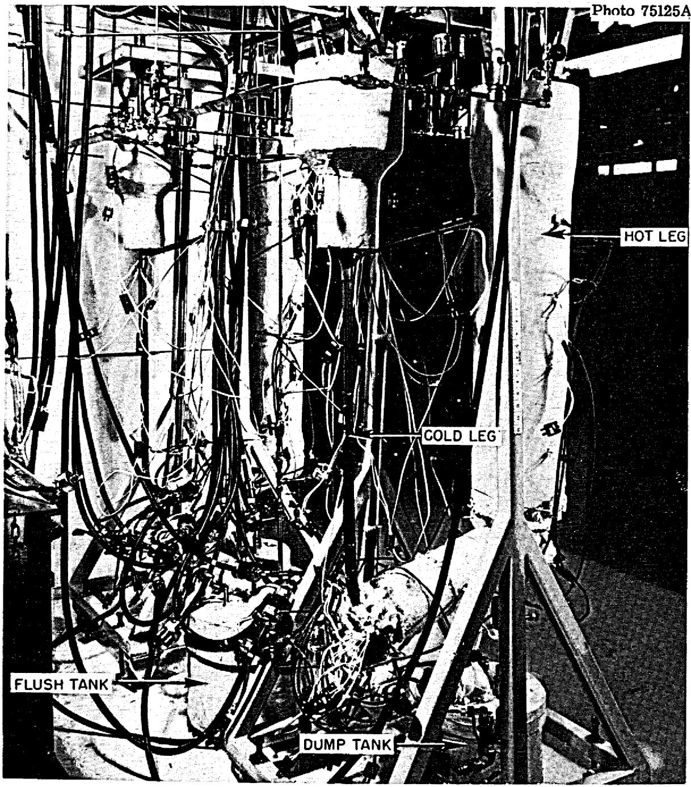  
Fig. 1. Hastelloy N Natural Circulation Loops NCL-13 and -14, Containing NaBF4-8 mole % NaF at a Maximum Temperature of $605^{\circ}\mathrm{C}$ with a Temperature Difference of $145^{\circ}\mathrm{C}$ .

sent for microprobe analysis to determine possible composition gradients due to mass transfer. Initial results showed that a large amount of cobalt had deposited on both the hot and cold leg specimens. The source of the cobalt was traced to the 1/8-in.-diam rods that held the removable specimens. These rods were determined to be Haynes alloy No. 25 rather than the specified Hastelloy N. Further investigation revealed that the source of the Haynes alloy No. 25 was a misidentified storage carton. The specimen hanger rods were replaced with Hastelloy N and the experiments were continued.

We have taken advantage of the situation to obtain information on the corrosion of cobalt- and nickel-base alloys simultaneously exposed to a molten fluoroborate salt. Further details on the compatibility of Hastelloy and other alloys with fluoroborate salts have been reported.3-11

3J. M. Koger and A. P. Litman, Compatibility of Hastelloy N and Croloy 9M with $\mathrm{NaBF}_4$ - $\mathrm{NaF}$ - $\mathrm{KBF}_4$ (90-6 mole %) Fluoroborate Salt, ORNL-TM-2490 (April 1969).   
4J. W. Koger and A. P. Litman, Catastrophic Corrosion of Type 304 Stainless Steel in a System Circulating Fused Sodium Fluoroborate, ORNL-TM-2741 (January 1970).   
5J. W. Koger and A. P. Litman, Compatibility of Fused Sodium Fluoroborates and $\mathbf{BF}_3$ Gas with Hastelloy N Alloys, ORNL-TM-2978 (June 1970).   
6J. W. Koger and A. P. Litman, MSR Program Semiann. Progr. Rept. Feb. 29, 1968, ORNL-4354, pp. 221-25.   
7J. W. Koger and A. P. Litman, MSR Program Semiann. Progr. Rept. Aug. 31, 1968, ORNL-4344, pp. 264-66 and 285-89.   
8J. W. Koger and A. P. Litman, MSR Program Semiann. Progr. Rept. Feb. 28, 1969, ORNL-4369, pp. 246-53.   
9J. W. Koger and A. P. Litman, MSR Program Semiann. Progr. Rept. Aug. 31, 1969, ORNL-4449, pp. 200-208.   
10J. W. Koger, MSR Program Semiann. Progr. Rept. Feb. 28, 1970, ORNL-4548, pp. 242-52 and 265-72.   
11J. W. Koger, MSR Program Semiann. Progr. Rept. Aug. 31, 1970, ORNL-4622, pp. 168-78.

# EXPERIMENTAL DETAILS

The test devices used in the experiments were thermal convection loops in a harp configuration, with surge tanks atop each leg for sample and specimen access. The flow was generated by the difference in density of the salt in the hot and cold legs of the loop, and the salt flow velocity was approximately 7 ft/min.

# Loop Fabrication

The loops were fabricated from 0.606-in.-ID Hastelloy N tubing with a 0.072-in. wall thickness. The annealed material, heat 5097, was TIG welded to Specifications PS-23 and PS-25 and inspected to MET-WR-200 specification. The finished loop was stress relieved at $880^{\circ}\mathrm{C}$ for 8 hr in hydrogen.

# Salt Preparation

The fluoroborate salt mixture used in the test program was furnished by the Fluoride Processing Group of the Reactor Chemistry Division, and its composition before test is given in Table 1. To mix and purify the salt, the raw materials were first heated in a nickel-lined vessel to $150^{\circ}\mathrm{C}$ under vacuum and held for 15 hr. Then the salt was heated to $500^{\circ}\mathrm{C}$ , agitated with helium for a few hours, and transferred to the fill vessel. At $600^{\circ}\mathrm{C}$ , the $\mathrm{BF}_3$ pressure is approximately 200 torr.

Table 1. Salt Analysis Before Test   

<table><tr><td>Element</td><td>Content (%)</td><td>Element</td><td>Content (ppm)</td></tr><tr><td>Na</td><td>21.9</td><td>Cr</td><td>19</td></tr><tr><td>B</td><td>9.57</td><td>Ni</td><td>28</td></tr><tr><td>F</td><td>68.2</td><td>Fe</td><td>223</td></tr><tr><td></td><td></td><td>O</td><td>459</td></tr><tr><td></td><td></td><td>Mo</td><td>&lt; 10</td></tr><tr><td></td><td></td><td>Co</td><td>&lt; 10</td></tr></table>

# Loop Operations

The loops were heated by pairs of clamshell heaters placed end to end, with the input power controlled by silicon controlled rectifier units and the temperature controlled by a current proportioning controller. The loop temperatures were measured by Chromel vs Alumel thermocouples that had been spot welded to the outside of the tubing, covered by a layer of quartz tape, and then covered with stainless steel shim stock. Tubular electric heaters controlled by variable autotransformers furnished the heat to the cold leg portions of the loops.

Before filling with salt, the loops were degreased with ethyl alcohol, dried, and then heated to $150^{\circ}\mathrm{C}$ under vacuum to remove any traces of moisture. A helium mass spectrometer leak detector was used to check for leaks in the system.

The procedure for filling the loops consisted of heating the loop, the salt pot, and all connecting lines to approximately $550^{\circ}\mathrm{C}$ and applying helium pressure to the salt supply vessel to force the salt into the loop. Air was continuously blown on freeze valves leading to the dump and flush tanks to provide a positive salt seal.

All fill lines exposed to the fluoroborate salt were Hastelloy N. All temporary connections from fill line to loop were made with stainless steel compression fittings.

The first charge of salt was held for 24 hr in the loops at the maximum operation temperature and then dumped. This flush salt charge was intended to remove surface oxides or other impurities left in the loops. The loops were then refilled with fresh salt, and operation began. Once the loop was filled, the heaters on the cold legs of the loops were turned off. As much insulation was removed as necessary to obtain the proper temperature difference by exposing the cold leg to ambient air. Helium cover gas of $99.998\%$ purity and under slight pressure (approx 5 psig) was maintained over the salt in the loops during operation.

Each loop contained 14 Hastelloy N specimens $0.75 \times 0.38 \times 0.030$ in., each with a surface area of 0.55 in. $^{2}$ ( $3.5\mathrm{~cm}^{2}$ ). Seven specimens were attached at different vertical positions on $1/8$ -in. rods (later found to be Haynes alloy No. 25). This array could be placed into or removed

from the loops during operation by means of a double ball valve arrangement. One rod was inserted in the hot leg and another in the cold leg of each loop. The surface area of the rod exposed to the salt was one-ninth that of the loop. The composition of the Hastelloy N loop tubing is compared with the nominal composition of Haynes alloy No. 25 in Table 2.

Table 2. Alloy Compositions   

<table><tr><td rowspan="2">Alloy</td><td colspan="8">Content, wt %</td></tr><tr><td>Ni</td><td>Mo</td><td>Cr</td><td>Fe</td><td>Co</td><td>W</td><td>Si</td><td>Mn</td></tr><tr><td>Hastelloy N</td><td>70.8</td><td>16.5</td><td>6.9</td><td>4.5</td><td>0.1</td><td>0.1</td><td>0.4</td><td>0.5</td></tr><tr><td>Haynes Alloy No. 25</td><td>9.0</td><td>0.5</td><td>19.0</td><td>1.0</td><td>53.0</td><td>14.0</td><td>0.3</td><td>0.5</td></tr></table>

The loops were operated at a maximum temperature of $605^{\circ}\mathrm{C}$ and a temperature difference of $145^{\circ}\mathrm{C}$ , with the Hastelloy N specimens and Haynes alloy No. 25 rod exposed to the salt for 3660 hr.

# TEST RESULTS

Preliminary results of analyses from rods and specimens of both loops (NCL-13 and -14) were identical. Thus, we completed detailed analyses only on the materials from NCL-13.

# Haynes Alloy No. 25 Samples

After 3660 hr of salt exposure and discovery of the material mixup, samples of the 1/8-in. Haynes alloy No. 25 specimen holder rods were taken from various positions and analyzed in detail. Figure 2 shows the locations of the Hastelloy N specimens, the Haynes alloy No. 25 rod, and the portions removed for analysis.

Figure 3 shows the as-polished and the etched microstructures of the Haynes alloy No. 25 rod (sample 3) located at the top of the hot leg $(598^{\circ}\mathrm{C})$ . Three characteristics are apparent from examination of all the microstructure: (1) about $0.2\mathrm{mil}$ of thickness of the material was

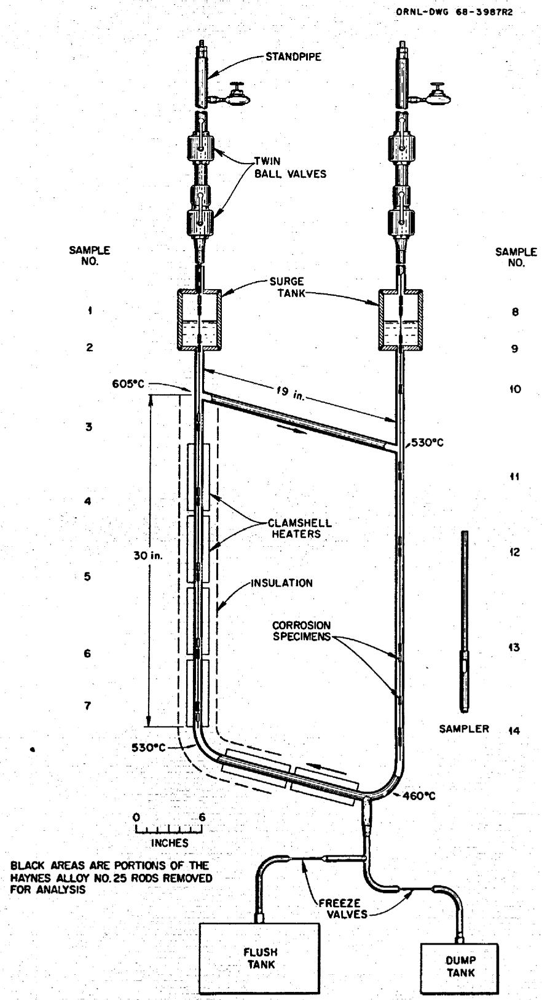  
Fig. 2. Thermal Convection Loop and Salt Sampler, Including Location of Metal Specimens and the Temperature Profile.

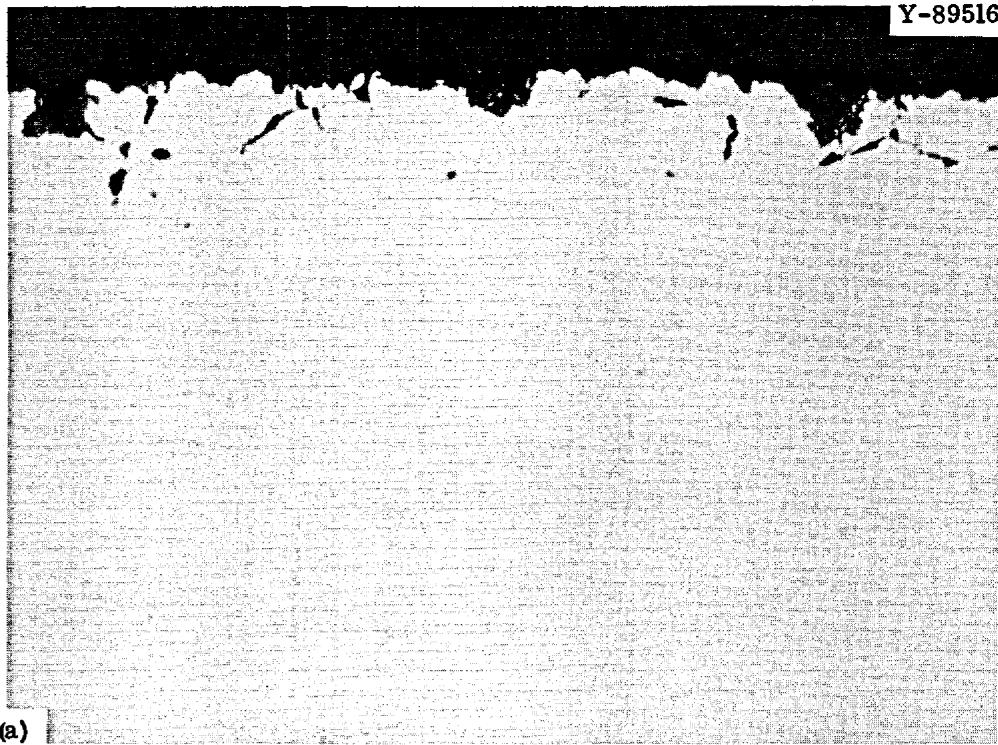

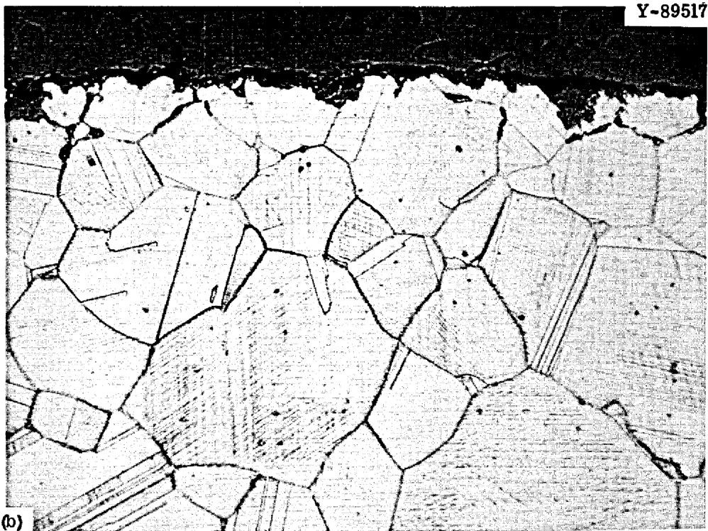  
Fig. 3. Microstructure of Haynes Alloy No. 25 Exposed to $\mathrm{NaBF}_4 - 8$ mole % NaF at $598^{\circ}\mathrm{C}$ in NCL-13 for 3660 hr. $500\times$ . (a) As-polished. (b) Etched with hydrochloric acid and hydrogen peroxide.

lost, (2) corrosion products had deposited, and (3) there was some attack along the grain boundaries (seen in the as-polished sample). The largest pit (not shown) was about 2 mils deep.

Figure 4 shows the metallographic appearance of Sample 1, which was exposed to $\mathrm{BF}_3$ gas at $604^{\circ}\mathrm{C}$ in the hot leg surge tank. The upper portion of the figure shows the area of maximum attack, where about 8 mils of metal was removed and other material was deposited. The lower portion of the figure is indicative of most of the sample, with about 1 mil of attack and some deposited material.

Samples 1 and 8 (see Fig. 2), exposed only to $\mathrm{BF}_3$ gas in the upper portions of the surge tanks, were noticeably darker than the other samples. The difference in surface character of the materials exposed to the gas and the liquid salt is seen in Fig. 5. The Haynes alloy No. 25 rod was analyzed by x-ray fluorescence to determine relative concentrations of Co, Cr, W, Ni, and Fe. The fluorescence results were compared against as-received Haynes alloy No. 25 which was assigned the composition given in Table 2. The results, which represent a surface zone 3 to 5 mils deep, are given in Table 3 along with the temperature of the salt at each position of the rod. Note that the concentration of tungsten in all samples is unchanged from the before-test level of $14\%$ . Thus, the tungsten concentration was used as a standard in the analysis.[12] Samples 1 and 8 showed a significant loss of chromium, from about 19 to about 4 weight units, and cobalt, from 53 to 20 and 45 weight units, respectively. Sample 1, at the highest temperature, $604^{\circ}\mathrm{C}$ , experienced the greatest loss of material. Samples 2, 9, and 10, which were exposed to relatively stagnant salt in the surge tanks above the loop, all lost chromium and cobalt.

Samples 3 through 7 and 11 through 14 were exposed to circulating salt at various temperatures. Sample 3, at the hottest position, $598^{\circ}\mathrm{C}$ , lost nickel, cobalt, and chromium. Samples, 4, 5, 6, and 7 of the hot

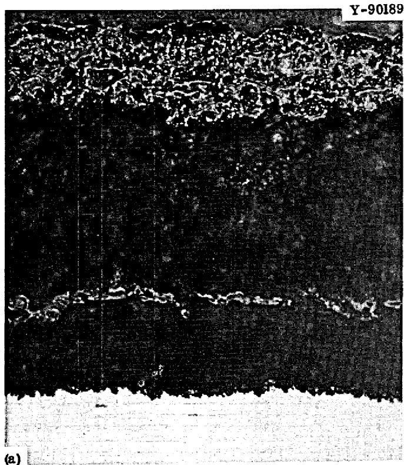

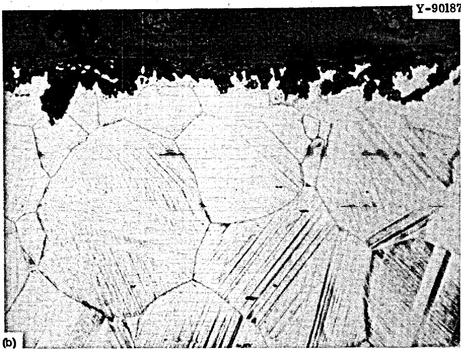  
Fig. 4. Microstructure of Haynes Alloy No. 25 Exposed to $\mathrm{BF}_3$ Gas at $604^{\circ}\mathrm{C}$ in NCL-13 for 3660 hr. $500\times$ . (a) Area of greatest attack. (b) Remainder of sample. Etchant is hydrochloric acid and hydrogen peroxide.

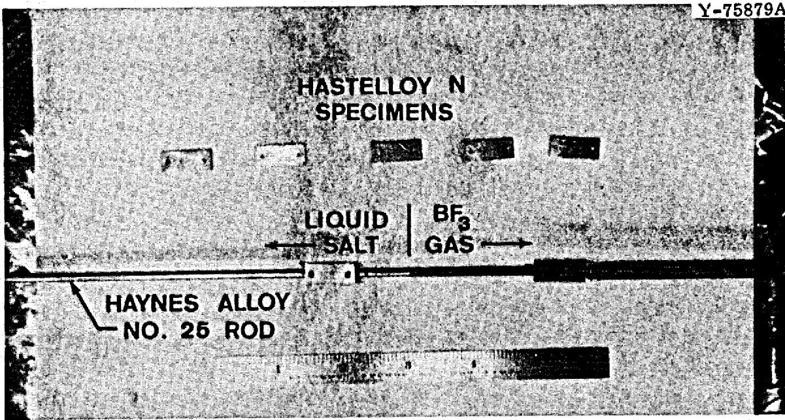  
Fig. 5. Haynes Alloy No. 25 Rod and Hastelloy N Specimens Exposed to $\mathrm{NaBF}_4 - 8$ mole % NaF and $\mathrm{BF}_3$ Gas at 500 to $605^{\circ}\mathrm{C}$ in NCL-13 for 24 hr.

leg lost cobalt and chromium and gained nickel. Sample 11 in the cold leg is much like Sample 7 from the hot leg; both were exposed at about the same temperature. However, Sample 12 was exposed to a slightly lower temperature, $487^{\circ}\mathrm{C}$ , and the analyzed area was almost all nickel and tungsten. Samples 13 and 14, which were exposed at nearly identical temperatures, showed an increase in iron and nickel and decrease in cobalt and chromium concentrations compared to before test.

# Hastelloy N Specimens

Figure 6 shows etched and as-polished microstructures of the Hastelloy N specimen from the hottest position $(604^{\circ}\mathrm{C})$ . The edge exposed during test was more heavily attacked by the metallographic etchant than was the underlying base metal. This faster etching response is apparently due to chromium depletion of the alloy. Figure 7 is the as-polished microstructure of the Hastelloy N specimen in the coldest position $(465^{\circ}\mathrm{C})$ . A uniform deposit of approximately 0.25 mil is apparent on the surface of the specimen.

Electron microprobe studies revealed that the thin layers on the edge of the hottest and coldest Hastelloy N specimens contained

Table 3. Temperature, Position, and Composition of Haynes Alloy No. 25 Samples   

<table><tr><td rowspan="2">Samplea</td><td rowspan="2">Positionb</td><td rowspan="2">Temperature (°C)</td><td colspan="5">Absolute Amount of Each Element in the Fluoresced Areac</td></tr><tr><td>W</td><td>Ni</td><td>Fe</td><td>Cr</td><td>Co</td></tr><tr><td>Before</td><td>Unexposed Haynes Alloy No. 25</td><td></td><td>14</td><td>9</td><td>1</td><td>19</td><td>53</td></tr><tr><td>1</td><td>Hot leg surge tank vapor phase (BF3 and He)</td><td>604</td><td>14</td><td>11</td><td>2</td><td>3</td><td>20</td></tr><tr><td>2</td><td>Hot leg surge tank</td><td>604</td><td>14</td><td>11</td><td>1</td><td>1</td><td>7</td></tr><tr><td>3</td><td>Hot leg</td><td>598</td><td>14</td><td>6</td><td>1</td><td>14</td><td>30</td></tr><tr><td>4</td><td>Hot leg</td><td>579</td><td>14</td><td>10</td><td>1</td><td>10</td><td>25</td></tr><tr><td>5</td><td>Hot leg</td><td>560</td><td>14</td><td>12</td><td>1</td><td>4</td><td>25</td></tr><tr><td>6</td><td>Hot leg</td><td>538</td><td>14</td><td>13</td><td>1</td><td>9</td><td>29</td></tr><tr><td>7</td><td>Hot leg</td><td>524</td><td>14</td><td>20</td><td>3</td><td>7</td><td>30</td></tr><tr><td>8</td><td>Cold leg surge tank vapor phase (BF3 and He)</td><td>538</td><td>14</td><td>9</td><td>3</td><td>4</td><td>45</td></tr><tr><td>9</td><td>Cold leg surge tank</td><td>538</td><td>14</td><td>12</td><td>2</td><td>5</td><td>23</td></tr><tr><td>10</td><td>Tubing between surge tank and cold leg</td><td>538</td><td>14</td><td>13</td><td>1</td><td>5</td><td>20</td></tr><tr><td>11</td><td>Cold leg</td><td>516</td><td>14</td><td>20</td><td>1</td><td>5</td><td>24</td></tr><tr><td>12</td><td>Cold leg</td><td>487</td><td>14</td><td>21</td><td>1</td><td>1</td><td>4</td></tr><tr><td>13</td><td>Cold leg</td><td>476</td><td>14</td><td>26</td><td>4</td><td>5</td><td>41</td></tr><tr><td>14</td><td>Cold leg</td><td>465</td><td>14</td><td>23</td><td>4</td><td>8</td><td>41</td></tr></table>

Samples 2, 9, and 10 in nonflowing salt.   
bAll samples exposed to molten salt, unless noted.   
${}^{\mathrm{c}}$ Based on 100 weight units for unexposed sample and referred against as-received Haynes alloy No. 25 as standard.

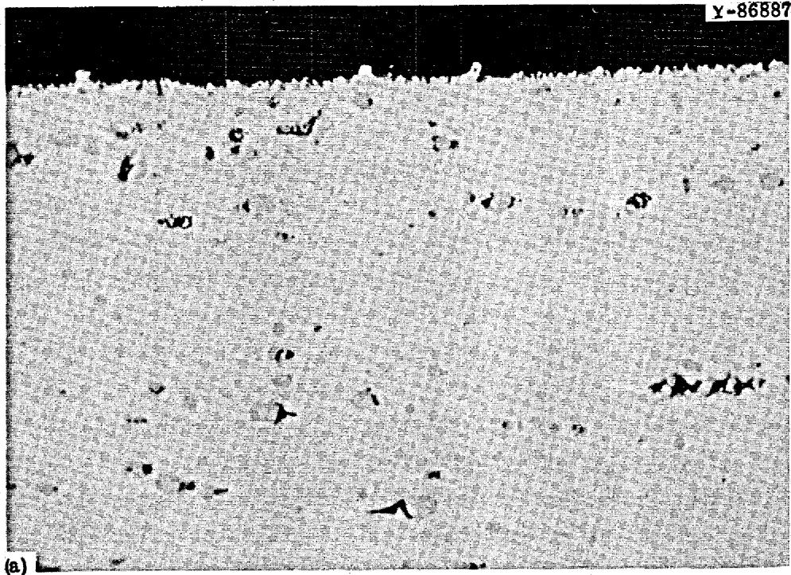

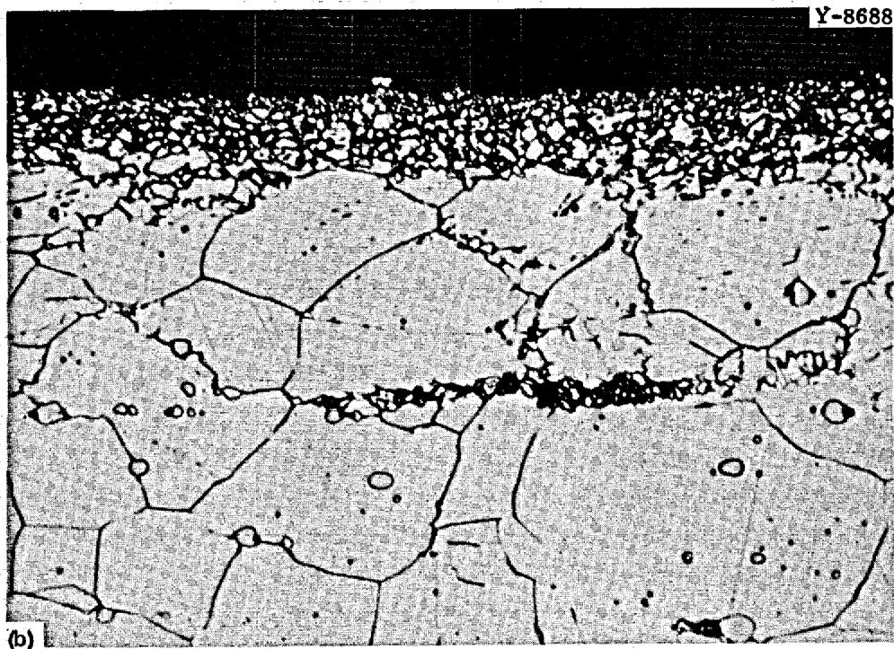  
Fig. 6. Microstructure of Standard Hastelloy N Exposed to $\mathrm{NaBF}_4 - 8$ mole % NaF at $604^{\circ}\mathrm{C}$ in NCL-13 for 3660 hr. $1000\times$ . (a) As polished. (b) Etched with glyceria regia.

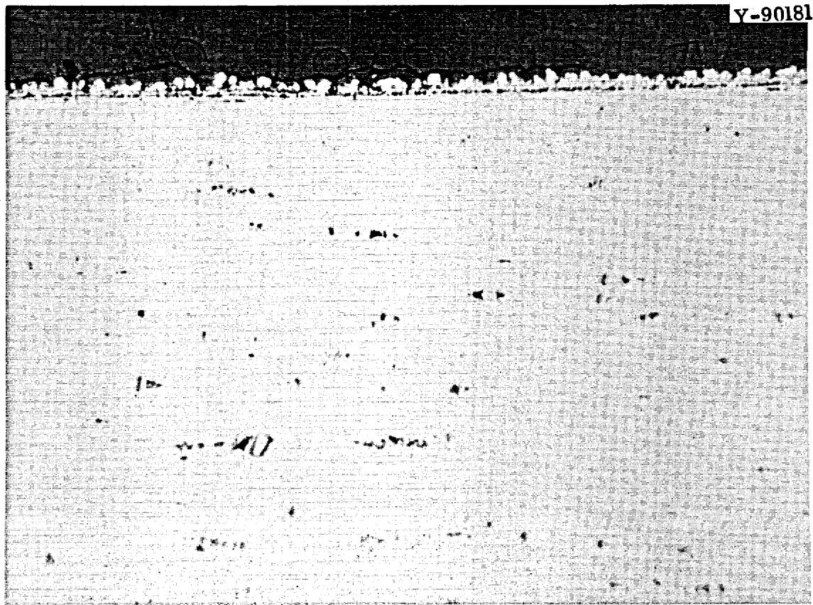  
Fig. 7. Microstructure of Standard Hastelloy N Exposed to $\mathrm{NaBF}_4$ -8 mole % NaF at $465^{\circ}\mathrm{C}$ in NCL-13 for 3660 hr. As-polished, $500\times$

appreciable cobalt. There was an average of 1.8 wt $\%$ Co in a band $6\mu \mathrm{m}$ thick on the hot leg specimen and 7.3 wt $\%$ Co in a band of the same thickness on the cold leg specimen. These results were substantia-. ted by qualitative x-ray fluorescence measurements, which showed more cobalt than iron (approx $5 \%$ ) in a band near the surface. Laser spectro-. graphic analysis showed substantial cobalt at depths less than $20~{\mu\mathrm{m}}$ into the material. The amount of cobalt in the Hastelloy N specimen located at the bottom of the cold leg (approx $465^{\circ}C)$ was determined as a function of position by microprobe and is given in Fig. 8. A cobalt composition gradient in hot leg specimens, obtained by the microprobe, was not well defined and will be discussed later.

Using the penetration curve of Fig. 8, we determined the diffusion coefficient of cobalt in Hastelloy N. A constant surface concentration of cobalt was assumed to integrate Fick's second law,

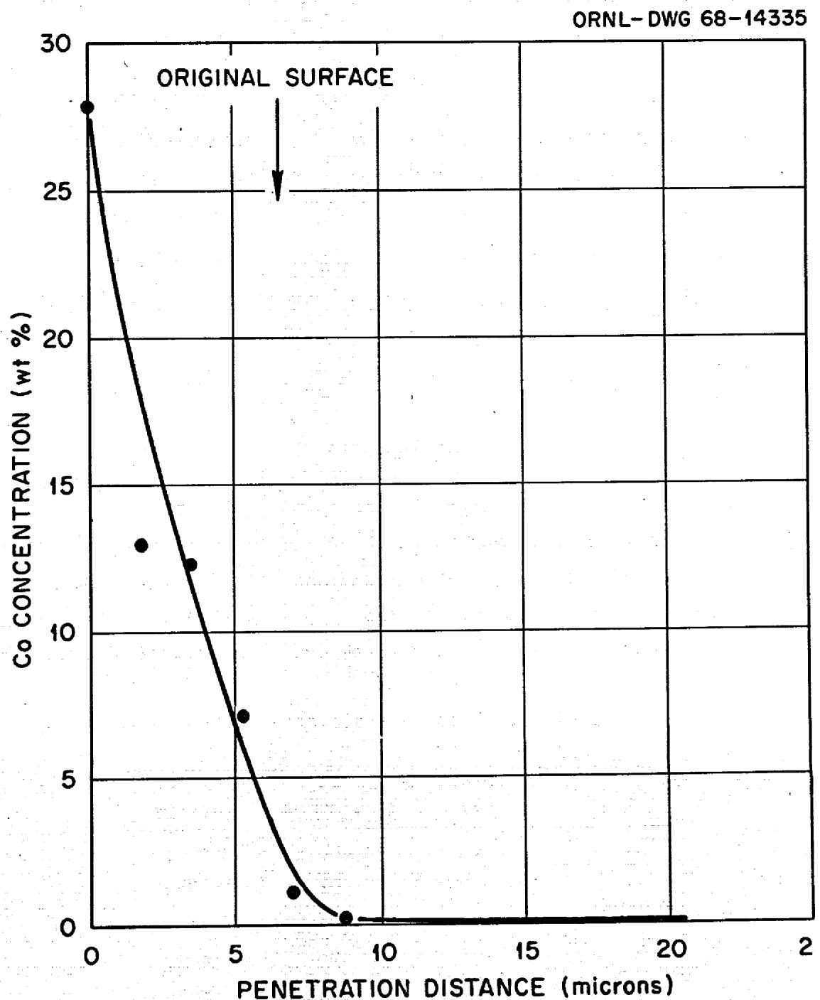  
Fig. 8. Cobalt Gradient Produced in Standard Hastelloy N at $465^{\circ}\mathrm{C}$ .

$$
\frac {\partial C}{\partial t} = D \frac {\partial^ {2} C}{\partial x ^ {2}},
$$

which relates concentration to time and distance. The appropriate solution in this case is

$$
c - c _ {0} = \left(c _ {S} - c _ {0}\right) [ 1 - \operatorname {e r f} (x / 2 \sqrt {D t}) ],
$$

where $C =$ cobalt concentration at a distance $x$ centimeters below the surface after diffusion has occurred for $t$ sec,

$\mathbf{C}_{\mathbf{S}} =$ surface concentration,

$C_0 =$ initial cobalt concentration in the Hastelloy N, and

D = diffusion coefficient, $\mathrm{cm}^2/\mathrm{sec}$ .

The diffusivity of cobalt in Hastelloy N was calculated to be $5.6 \times 10^{-15} \, \text{cm}^2/\text{sec}$ at $465^{\circ}\text{C}$ .

# Salt Analysis

After test, less than 50 ppm Co was found in the salt. The significance of this is discussed in the next section. Table 4 shows the composition of the salt after circulation for 4200 hr. Comparison with the salt analysis before test (Table 1) shows increases in the chromium concentration from 19 to 232 ppm and iron from 223 to 314 ppm.

Table 4. Salt Analysis After Test   

<table><tr><td>Element</td><td>Content (%)</td><td>Element</td><td>Content (ppm)</td></tr><tr><td>Na</td><td>21.0</td><td>Co</td><td>&lt; 50</td></tr><tr><td>B</td><td>9.29</td><td>Cr</td><td>232</td></tr><tr><td>F</td><td>68.6</td><td>Fe</td><td>314</td></tr><tr><td></td><td></td><td>Mo</td><td>&lt; 20</td></tr><tr><td></td><td></td><td>Ni</td><td>&lt; 25</td></tr><tr><td></td><td></td><td>O</td><td>497</td></tr><tr><td></td><td></td><td>H2O</td><td>800</td></tr></table>

# SUMMARY OF TEST RESULTS

The chemical and metallurgical analyses show that chromium and cobalt were leached from the Haynes alloy No. 25 at all test temperatures. Although the percentage of chromium lost was greater than that of cobalt, the total mass of chromium lost was less. The cobalt and chromium migrated to the Hastelloy N specimens and loop piping. There was also some evidence of highly localized nickel transfer from the hot section to the cold section of the Haynes alloy No. 25 rod. Iron deposited on the Haynes alloy No. 25 in the cold section and was probably supplied by the leaching of iron from the Hastelloy N loop piping by the salt. Attack of Haynes alloy No. 25 by $\mathrm{BF}_3$ in the vapor phase as evidenced by loss of alloy constituents was less severe than the salt corrosion. However, more discoloration and surface roughening were noted on the samples exposed to the gas. The Haynes alloy No. 25 suffered much more damage than the Hastelloy N in the vapor phase. Haynes alloy No. 25 appears to be more susceptible to attack by the fluoroborate mixture than Hastelloy N.

DISCUSSION

Prior Studies

Past work13 at ORNL measured the chemical corrosion of various materials under the conditions experienced during the fluorination of molten-salt fuels in the Fluoride Volatility Process. The salt used was equimolar NaF-ZrF4 containing 0 to 5 mole % UF4. Several cobalt-containing alloys were tested at 600 ± 100°C, and the behavior of those with less than 20 wt % Co was similar to that of Hastelloy N. However, as the cobalt content exceeded 20 wt %, the alloys showed a much greater degree of attack than Hastelloy N.

In a recent test $^{14}$ at ORNL, samples of various materials including Hastelloy N, Haynes alloy No. 25, and graphite were placed in the vapor and lizuid zones of a vacuum distillation experiment that used a LiF-BeF $_2$ -ZrF $_4$ salt. The temperature ranged from 500 to $1000^{\circ}\mathrm{C}$ over a period of 4300 hr in the molten salt and 900 to $1025^{\circ}\mathrm{C}$ for more than 300 hr in the vapor. The Haynes alloy No. 25 was the most heavily corroded of the metals tested and was also brittle at the end of the test. Fracture of one Haynes alloy No. 25 specimen caused a loss of some of the other specimens during the experiment. Figure 9 shows the Haynes alloy No. 25 specimens before and after test.

$^{14}$ J. R. Hightower, Jr., and L. E. McNeese, Low-Pressure Distillation of Molten Fluoride Mixtures: Nonradioactive Tests for the MSRE Distillation Experiment, ORNL-4434, pp. 30-33 (January 1971).

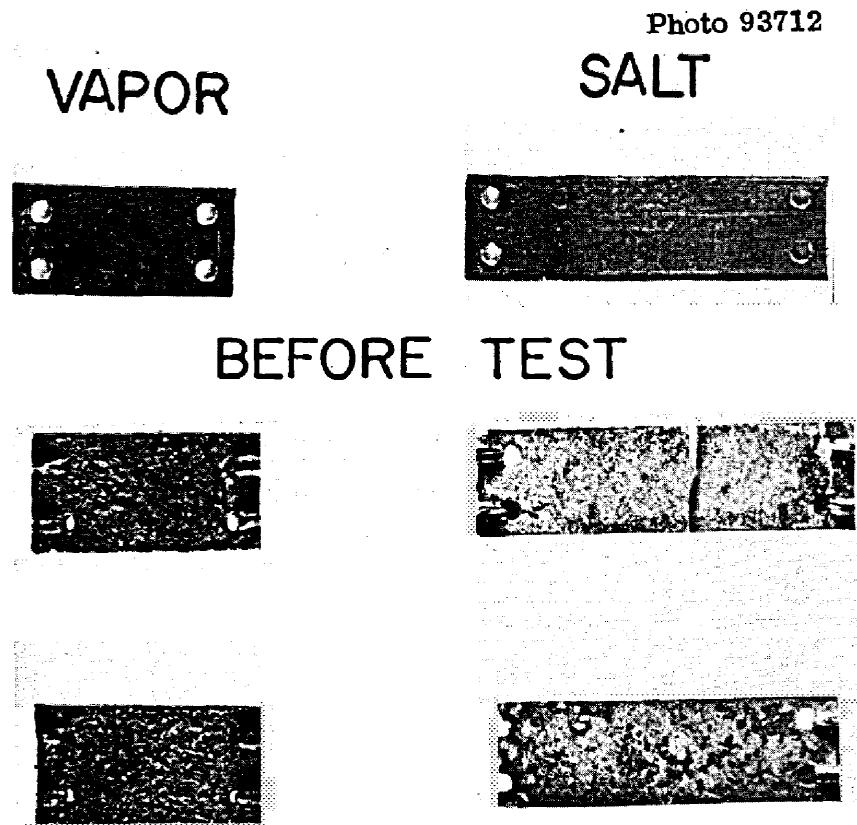  
AFTER TEST   
Fig. 9. Haynes Alloy No. 25 Specimens Before and After Test in the Vapor and Liquid Phases of a LiF-BeF $_2$ Salt. In vapor 300 hr at 900 to $1025^{\circ}\mathrm{C}$ and in liquid 4300 hr at 500 and $1000^{\circ}\mathrm{C}$ .

Thus, in other studies where both Hastelloy N and high cobalt alloys were exposed to molten fluorides under highly oxidizing conditions, Hastelloy N was much more corrosion resistant.

# Corrosion Mechanisms

In polythermal flowing salt systems, corrosion commonly involves temperature-gradient mass transfer. Figure 10 shows a schematic of this process. For monometallic systems, the constituents of the salt or impurities may react with one or more constituents of the loop material to form salt-soluble compounds. For example, the following reactions may occur in a salt containing $\mathrm{UF_4}$ and $\mathrm{FeF_2}$ exposed to Hastelloy N:

$$
\mathrm {U F} _ {4} + \mathrm {C r} \rightarrow \mathrm {C r F} _ {2} + \mathrm {U F} _ {3}, \tag {1}
$$

$$
\mathrm {F e F} _ {2} + \mathrm {C r} \rightarrow \mathrm {C r F} _ {2} + \mathrm {F e}. \tag {2}
$$

The equilibrium constant of corrosion reaction (1) is temperature dependent. Thus, when the salt is forced to circulate through a tempera-ture gradient, products from the reverse reaction may deposit in the cooler regions of the system. Since the equilibrium constant for the chemical reaction increases with increasing temperature, the chemical activity or concentration of the attacked element in the container material will decrease at high temperatures and increase at low temperatures; that is, in the hotter regions the alloy surface becomes depleted and metal from the interior of the wall diffuses toward the surface, and in the colder regions the alloy surface becomes enriched with the diffusing metal. There is, of course, an intermediate temperature at which the initial surface composition of the structural metal and the attacked element is in equilibrium with the salt. If the temperature dependence of the mass transfer reaction is small, the rate of metal removal from the salt

ORNL-DWG 67-6800R

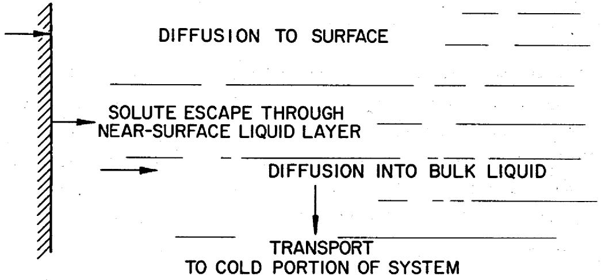  
HOT SECTION

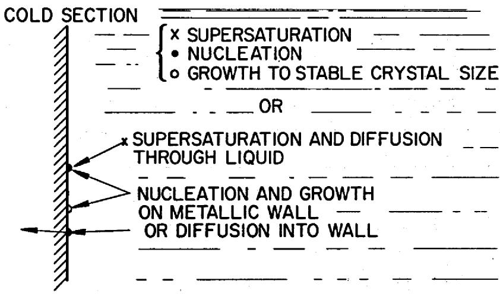  
Fig. 10. Temperature-Gradient Mass Transfer.

stream by deposition in the cold region will be controlled by the rate at which the metal diffuses into the cold region wall. Many examples of temperature-gradient mass transfer by fluoroborate salt systems contained in Hastelloy N were cited in the introduction.

In the system under study - Haynes alloy No. 25-Hastelloy N-fluoroborate salt - an additional mass-transfer mechanism is present which is termed dissimilar-alloy or activity gradient mass transfer. While this has been studied in detail for several alkali metal systems, little

work has been done in molten salts. Mass transfer of this type requires the presence of different alloys in the same fluid and is not contingent on the presence of a temperature gradient. Figure 11 shows a schematic of this process. The sequence of events in dissimilar-alloy mass transfer involves removal of an element from one material and deposition on a second material; that is, movement from a region of high activity to one of low activity. Examples of dissimilar metal interactions are common in niobium and type 316 stainless steel systems exposed simultaneously to sodium-potassium alloy15 and in the other alkali metal systems.16 As might be suspected when the opportunity for both forms of mass transfer arises, as in the case at hand, corrosion interactions become very complicated.

In the present studies, chromium and cobalt were removed from the Haynes alloy No. 25 by reaction with salt and were deposited on the Hastelloy N. This occurred because of the smaller concentration of those elements (lower activity) in the Hastelloy N. This activity gradient mechanism would have occurred without a temperature gradient. However, the effect of the temperature gradient was also evidenced by heavier deposition of chromium and cobalt on the colder Hastelloy N surfaces.

As mentioned earlier, no large cobalt concentration gradient could be obtained from the Hastelloy N hot leg specimens, and more cobalt was found on the cold leg specimens than in the hot leg. Thus, it appears that the net result of the cobalt depositing on the Hastelloy N due to the activity gradient mechanism and the cobalt mass transfer due to the temperature gradient mechanism was a continued depletion of cobalt from the Hastelloy N in the hot section and a deposition in the cold section. This depletion could occur if most of the cobalt that transferred from the Haynes alloy No. 25 did so initially. Chromium behaved in the same manner in the hot leg. In an all Hastelloy N system, a chromium gradient is usually expected in the hot leg because of the chromium

Fig. 11. Dissimilar-Alloy Mass Transfer.   
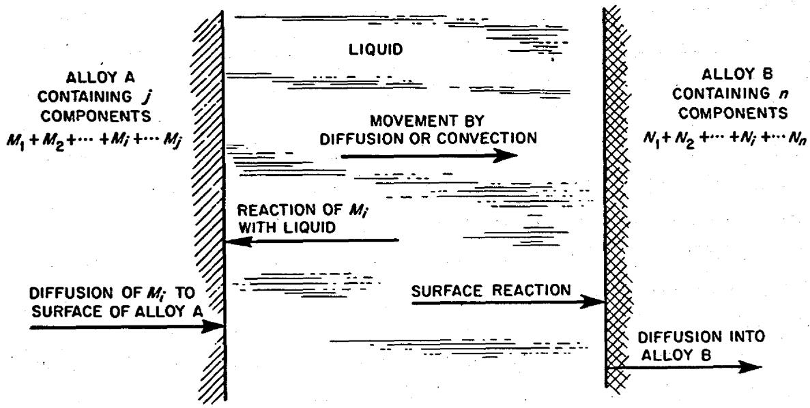  
DRIVING FORCE FOR THE TRANSFER OF ANY COMPONENT $M_{i}$ IS THE DIFFERENCE IN CHEMICAL POTENTIAL OF $M_{i}$ IN ALLOY A COMPARED WITH ALLOY B.

removal. However, this gradient may not be as large as expected and may disappear if the chromium diffuses to the surface as fast as it is removed and possible even at a slightly higher rate.[17] However, the chromium gradient was almost completely masked in this system for the above reasons and by the chromium deposition from the Haynes alloy No. 25 back to the hot leg. As mentioned earlier, the microstructure (Fig. 8) does show evidence of some depletion at the edge of the specimen, but the overall chromium composition of the specimen showed little change. Nickel and iron, if removed from the Hastelloy N, would be predicted to deposit on the Haynes alloy No. 25 by virtue of the activity gradient mechanism. This was not observed experimentally, although the effects may have been swamped by the greater rate of chromium and cobalt transfer.

# Significance of Haynes Alloy No. 25 in the Hastelloy N Test System

The solid line at Fig. 12 shows the time dependence of experimental weight changes of Hastelloy N specimens exposed to salt in loop NCL-13. Note that all specimens showed a net weight gain during the first 200 hr. As mentioned earlier, in temperature-gradient mass-transfer systems specimens in hot portions of the loop are expected to lose weight while those in the cold section should gain weight. However, after this initial period of weight gain the samples in the hot leg started losing weight, while the cold leg specimens continued to gain weight. This initial weight gain lends credence to the idea that most of the cobalt that transferred from the Haynes alloy No. 25 did so initially. It is noted that our experimental weight changes reflected this deposition from the Haynes alloy No. 25. The actual weight loss in an all Hastelloy N system would be larger and the actual weight gain would be smaller. Thus, a constant factor was calculated and subtracted from all our weight changes, resulting in the dotted line. This constant factor was calculated using an iterative trial-and-error method to obtain a mass balance on the system fitting the following equation:

$$
\Delta W _ {\text {s y s t e m} \text {l o s s}} = \Delta W _ {\text {s y s t e m} \text {g a i n}} + \Delta C _ {\text {s a l t}},
$$

where

$$
\begin{array}{l} \Delta W _ {\text {s y s t e m}} \text {l o s s} = \text {w e i g h t l o s s f o r s p e c i m e n s a n d l o o p c o m p o n e n t s}, \\ \Delta W _ {\text {s y s t e m g a i n}} = \text {w e i g h t g a i n f o r s p e c i m e n s a n d c o m p o n e n t s}, \\ \Delta C _ {\text {s a l t}} = \text {c o n t e n t c h a n g e i n s a l t}. \\ \end{array}
$$

This exercise also allowed us to conclude that our mass-transfer rate would not have been excessive if the cobalt alloy had not been in the system. The reason that the weight changes due to Haynes alloy No. 25 were so small was that its surface area exposed to the sale is one-ninth that of the Hastelloy N. Recent work has shown that these weight

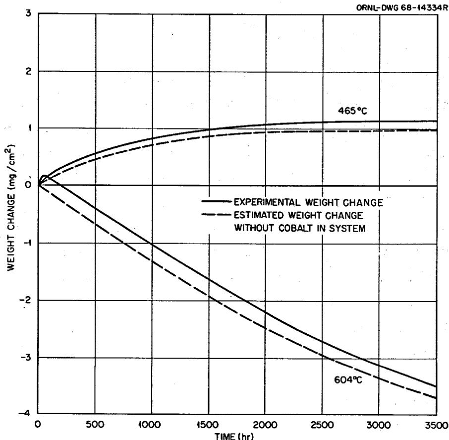  
Fig. 12. Weight Changes as a Function of Operating Time of Hastelloy N Hot-Leg and Cold-Leg Specimens Exposed to $\mathrm{NaBF}_4 - 8$ mole % NaF at 604 and $465^{\circ}\mathrm{C}$ , Respectively, in NCL-13.

differences have not substantially affected any later reaction-rate constants calculated for fluoride salt from corrosion studies in this system.[18]

18J. W. Koger and A. P. Litman, MSR Program Semiann. Progr. Rept. Feb. 29, 1968, ORNL-4354, pp. 221-25.

# CONCLUSIONS

1. Haynes alloy No. 25 in the fluoroborate salt-Hastelloy N alloy test system suffered damage by loss of significant amounts of cobalt and chromium, which migrated to the Hastelloy N by virtue of activity-gradient and temperature-gradient mass transfer.   
2. Haynes alloy No. 25 is more susceptible than Hastelloy N to attack by the fluoroborate mixture.   
3. Because of the relatively small amount of Haynes alloy No. 25 in the system (one-ninth the surface area of Hastelloy N), the early presence of this material did not compromise, beyond the normal $10\%$ variation in quantitative data, experiments on the present monometallic Hastelloy N system.

# ACKNOWLEDGMENTS

It is a pleasure to acknowledge that E. J. Lawrence supervised construction and operation of the test loops. We are also indebted to H. E. McCoy, Jr., and J. H. Devan for constructive review of the manuscript.

Special thanks are extended to the Metallography Group, especially H. R. Gaddis, H. V. Mateer, T. J. Henson, and R. S. Crouse, and to the Analytical Chemistry Division, especially Harris Dunn and Cyrus Feldman, Graphic Arts Department, and the Metals and Ceramics Division Reports Office for invaluable assistance.

# INTERNAL DISTRIBUTION

1-3. Central Research Library   
4-5. ORNL - Y-12 Technical Library Document Reference Section

6-15. Laboratory Records Department

16. Laboratory Records, ORNL RC   
17. ORNL Patent Office

18-19. MSRP Director's Office (Y-12)

20. G. M. Adamson, Jr.   
21. J. L. Anderson   
22. R.F.Apple   
23. C.F.Baes   
24. S.E.Beall   
25. E. S. Bettis   
26. F. F. Blankenship   
27. E. G. Bohlmann   
28. G. E. Boyd   
29. R. B. Briggs   
30. S. Cantor   
31. O. B. Cavin   
32. Nancy C. Cole   
33. W.H.Cook   
34. R. S. Crouse   
35. J. L. Crowley   
36. F. L. Culler   
37. J.H.DeVan   
38. J. R. DiStefano   
39. S. J. Ditto   
40. W. P. Eatherly   
41. J. R. Engel   
42. D. E. Ferguson   
43. L. M. Ferris   
44. J. H Frye, Jr.   
45. L. O. Gilpatrick   
46. W. R. Grimes   
47. A. G. Grindell   
48. R. H. Guymon

49. W. O. Harms   
50. P. N. Haubenreich   
51. R.E. Helms   
52. T. T. Henson

53-55. M.R.Hill

56. W.R.Huntley   
57. H. Inouye   
58. J. J. Keyes   
-68. J.W.Koger   
69. A. I. Krakoviak   
70. E. J. Lawrence   
71. M. I. Lundin   
72. R.E. MacPherson   
73. W. R. Martin   
74. H. V. Mateer   
75. H. E. McCoy, Jr.   
76. C. J. McHargue   
77. A. S. Meyer   
78. L. E. McNeese   
79. R. L. Moore   
80. F. H. Neill   
81. E. L. Nicholson   
82. P. Patriarca   
83. A. M. Perry   
84. Dunlap Scott   
85. J.H.Shaffer   
86. G.M.Slaughter   
87. R.E.Thoma   
88. D. B. Trauger   
89. G. M. Watson   
90. A. M. Weinberg   
91. J. R. Weir, Jr.   
92. M. E. Whatley   
93. J.C. White   
94. Gale Young

# EXTERNAL DISTRIBUTION

95-96. E. G. Case, Director, Division of Reactor Standards, AEC, Washington, DC 20545   
97-98. D. F. Cope, RDT, SSR, AEC, Oak Ridge National Laboratory   
99. A. R. DeGrazia, AEC, Division of Reactor Development and Technology, Washington, DC 20545   
100-104. Executive Secretary, Advisory Committee on Reactor Safeguards, AEC, Washington, DC 20545   
105. J. E. Fox, AEC, Division of Reactor Development and Technology, Washington, DC 20545

106. Norton Haberman, AEC, Division of Reactor Development and Technology, Washington, DC 20545   
107. Kermit Laughon, RDT, OSR, AEC, Oak Ridge National Laboratory   
108-109. A. P. Litman, AEC, Division of Space Nuclear Systems, Washington, DC 20545   
110-111. T. W. McIntosh, AEC, Division of Reactor Development and Technology, Washington, DC 20545   
112. H. G. McPherson, University of Tennessee, Knoxville, TN 37916   
113-114. Peter A. Morris, Director, Division of Reactor Licensing, AEC, Washington, DC 20545   
115. J. F. Neff, AEC, Division of Reactor Development and Technology, Washington, DC 20545   
116. Sidney Siegel, Atomics International, P.O. Box 309, Canoga Park, CA 91304   
117. M. Shaw, AEC, Division of Reactor Development and Technology, Washington, DC 20545   
118. Laboratory and University Division, AEC, Oak Ridge Operations   
119-120. Division of Technical Information Extension