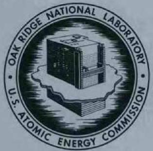
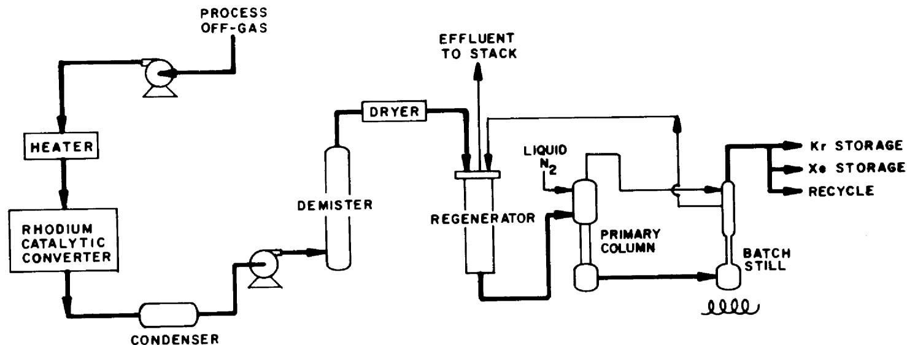
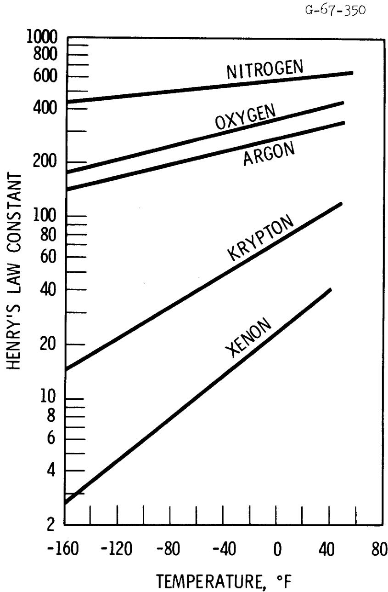
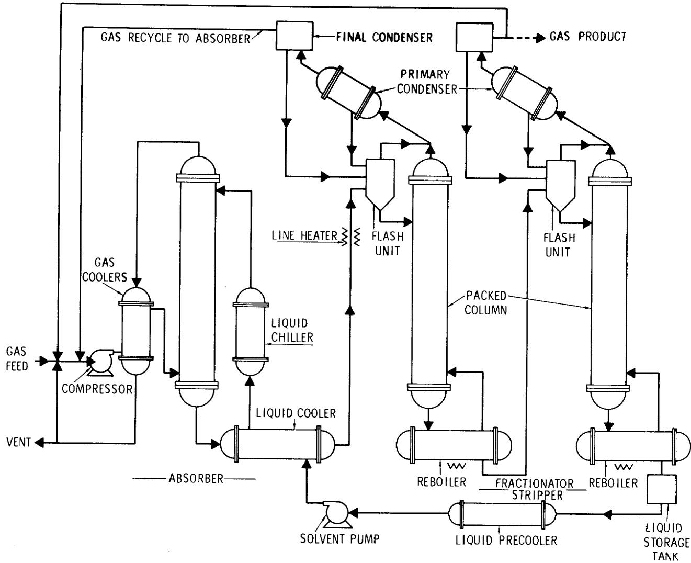
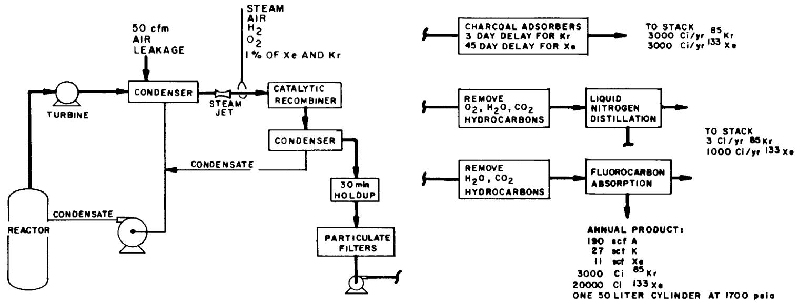
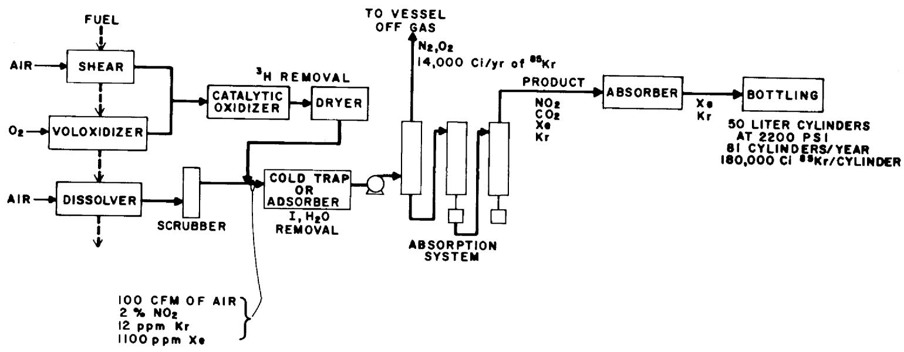
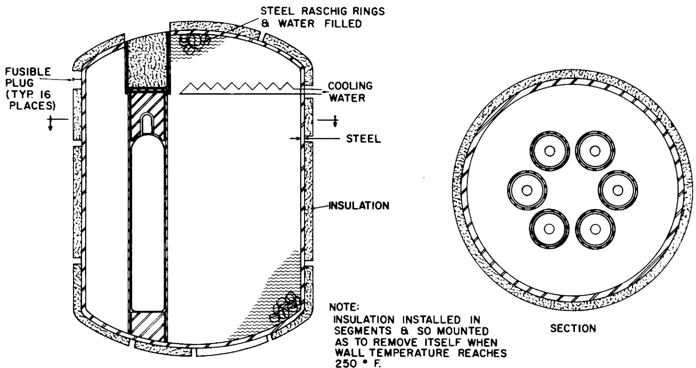

# OAK RIDGE NATIONAL LABORATORY

operated by

UNION CARBIDE CORPORATION • NUCLEAR DIVISION

for the

UNION CARBIDE

U.S. ATOMIC ENERGY COMMISSION

3445605145312

ORNL-TM-3515

${4y} \leq  {38}$

STATUS OF NOBLE GAS REMOVAL AND DISPOSAL

J. P. Nichols

F. T. Binford

OAK RIDGE NATIONAL LABORATORY

CENTRAL RESEARCH LIBRARY

DOCUMENT COLLECTION

LIBRARY LOAN COPY

DO NOT TRANSFER TO ANOTHER PERSON

If you wish someone else to see this

document, send in name with document

and the library will arrange a loan.

UCN-7969

# CAUTION

This document has not been given final patent clearance and the dissemination of its information is only for official use. No release to the public shall be made without the approval of the Law Department of Union Carbide Corporation, Nuclear Division.

NOTICE This document contains information of a preliminary nature

and was prepared primarily for internal use at the Oak Ridge National

Laboratory. It is subject to revision or correction and therefore does

not represent a final report.

This report was prepared as an account of work sponsored by the United States Government. Neither the United States nor the United States Atomic Energy Commission, nor any of their employees, nor any of their contractors, subcontractors, or their employees, makes any warranty, express or implied, or assumes any legal liability or responsibility for the accuracy, completeness or usefulness of any information, apparatus, product or process disclosed, or represents that its use would not infringe privately owned rights.

Contract No. W-7405-eng-26

CHEMICAL TECHNOLOGY DIVISION

STATUS OF NOBLE GAS REMOVAL AND DISPOSAL

J. P. Nichols

F. T. Binford*

*Operations Division

AUGUST 1971

OAK RIDGE NATIONAL LABORATORY

Oak Ridge, Tennessee

operated by

UNION CARBIDE CORPORATION

for the

U.S. ATOMIC ENERGY COMMISSION

# CONTENTS

# Abstract 1

1. Introduction 1   
2. Effects of Releases of Noble Gases to the Atmosphere 3   
3. Review of Processes for Holdup and Recovery 9

3.1 Charcoal Adsorption at Ambient Temperature 9   
3.2 Cryogenic Adsorption 11   
3.3 Cryogenic Distillation 11   
3.4 Selective Absorption 12   
3.5 Permselective Membranes 13   
3.6 Clathrate Precipitation 13

4. Cryogenic Distillation Process 14   
5. Fluorocarbon Adsorption Process 16   
6. Conceptual Systems for Recovery of Noble Gases 20

6.1Boiling Water Reactors 20   
6.2 Fuel Reprocessing Plant 22   
6.3 Summary of Conceptual Disposition of Noble Gases at Nuclear Facilities 24

7. Shipment of Noble Gases 26   
8. Methods for Long-Term Storage 28

8.1 Storage of Cylinders in Surface Volumes 28   
8.2 Burial of Cylinders 30   
8.3 Injection into Porous Underground Formations 30   
8.4 Relatively Unfavorable Storage Methods 30

9. Conclusions 31   
10. References 32

J. P. Nichols

F. T. Binford

# ABSTRACT

Currently, noble gas fission products generated by the nuclear power industry are discharged to the atmosphere following interim holdup for decay of short-lived species. The resultant off-site radiation exposures have been small as compared with current guidelines for population exposure. Recovery of these gases will begin in the near future, however, as a result of stated policies of maintaining radioactive releases to the environment at the lowest practical levels.

Several processes are available or under development for recovery of these gases from off-gas streams of nuclear reactors or fuel reprocessing plants. Processes that incorporate selective adsorption on low-temperature charcoal and cryogenic distillation have been demonstrated at the Idaho Chemical Processing Plant. A process utilizing selective absorption in fluorocarbons is undergoing engineering development at the Oak Ridge Gaseous Diffusion Plant.

Initially, it is probable that the recovered noble fission product gases will be collected under high pressure in gas cylinders. These cylinders probably will be shipped to a large, remote site and stored under conditions that will promote long-term integrity of the cylinders. A longer-term possibility for encapsulation, which would tend to enhance containment during shipping and storage, is the sealing of gases as small bubbles or individual molecules within solids. Longer-term possibilities for storage include injection of the gases into deep underground formations.

# 1. INTRODUCTION

The purpose of this paper will be to review the status of technology of systems for minimizing the release to the atmosphere of radioisotopes of krypton and xenon that are produced by fission. Isotopes of krypton and xenon are relatively difficult to confine in the nuclear power industry because they occur in gaseous form, are chemically inert, and are relatively insoluble in water.

Currently, all of the noble gas fission products generated within nuclear power reactors are discharged ultimately to the atmosphere following interim holdup for decay of short-lived radionuclides. The experience has been that greater than $99\%$ of the gases are released when the spent reactor fuel is chopped up and dissolved at a spent fuel reprocessing plant. Since the fuel is stored at least 150 days before reprocessing, however, the only noble gas radionuclide of significance in the effluent is ${}^{86}\mathrm{Kr}$ - which has a half life of 10.74 years. A small fraction of the noble gases, generally less than $1\%$ of the total, is released at nuclear power plants as a result of fission of "tramp uranium" on the surfaces of fuel elements and minor leakage from fuel rods. In pressurized water reactors it has been feasible to provide for holdup of these gases for one to two months before discharge; after these times, only ${}^{86}\mathrm{Kr}$ and ${}^{133}\mathrm{Xe}$ - which has a half life of 5.27 days - contribute significantly to the radioactivity of the effluent. In boiling water reactors it has been economically undesirable to provide for gas holdup times greater than about 30 min because of the appreciable leakage of gas into the system through the steam condenser; the gaseous effluent from a BwR, therefore, contains short-lived isotopes of xenon and krypton in addition to the ${}^{86}\mathrm{Kr}$ and ${}^{133}\mathrm{Xe}$ .

The radiation exposures resulting from the release of noble gas fission products from reactors and reprocessing plants to the atmosphere have been small as compared with current guidelines for population exposure.1-4 However, in continuing observance of the policy that radiation exposures should be maintained "as low as practicable," the AEC has funded development of systems for minimizing the release of noble gas nuclides to the atmosphere. Some of these systems, particularly those for enhanced holdup of noble gases, have attained a status of technology that is acceptable for commercial application. Other systems, particularly those directed toward long-term isolation of $^{85}\mathrm{Kr}$ from the biosphere, are in an advanced stage of development.

The following will review briefly the processes that are available or under development for holdup or recovery of noble gases and present preliminary concepts of methods for use in handling and disposal of the recovered gases.

# 2. EFFECTS OF RELEASES OF NOBLE GASES TO THE ATMOSPHERE

A very simple model has been developed to provide a rough estimate of the worldwide population exposure that would result from continued release of noble gas fission products from multiple sources. This model assumes that the exposure within relatively short times after release can be described by the Gaussian plume dispersion model and that later exposures would result from steady circulation of the fixed volume of air in the northern hemisphere.

Assuming that the radioactive gas is released at ground level (which tends to overestimate exposures near a given source), the Gaussian plume dispersion model predicts that the exposure in air at ground level under constant meteorological conditions is:

$$
x (x, y) = \frac {Q e ^ {- \lambda x / u} e ^ {- y ^ {2} / 2 \sigma_ {y} ^ {2}}}{\pi u \sigma_ {y} \sigma_ {z}}, \tag {1}
$$

where

$Q =$ quantity of curies released over a short term (or constant source strength in Ci/yr)

$\mathbf{u} =$ wind speed, $\mathrm{m / yr}$

$\sigma_{y} =$ horizontal dispersion coefficient, m

$\sigma_{z} =$ vertical dispersion coefficient, m

$\mathbf{x} =$ downwind radial distance from source, m

$y =$ distance crosswind from source, m

$\lambda =$ radioactive decay constant, $\mathbf{y}\mathbf{r}^{-1}$

$\chi (x,y) =$ ground level exposure, $\mathrm{Ci - yr / m^3}$ (or concentration, $\mathrm{Ci / m^3}$

for a constant source)

The population exposure - considering a first phase of dispersion and a second phase of transport in the troposphere - is estimated as

$$
E = 2 K \int_ {0} ^ {D} \int_ {0} ^ {\infty} P (x, t) x (x, y) d y d x + \frac {K Q A}{V} \int_ {D / u} ^ {T} P (x, t) e ^ {- \lambda t} d t, \tag {2}
$$

where

K = dose rate (predominantly to skin) per unit of concentration

$$
\cong 2. 0 \times 1 0 ^ {6} (\text {r e m / y r}) / (\mathrm {C i / m} ^ {3}) \text {f o r} ^ {8 5} \mathrm {K r} \text {a n d} ^ {1 3 3} \mathrm {X e}
$$

$\mathbb{P}(\mathbf{x},t) =$ surface density of population as a function of radial distance

from the source and time since initial release of the gas

A = surface area of the northern hemisphere

$$
\tilde {\equiv} 2. 5 \times 1 0 ^ {1 4} \mathrm {m} ^ {2}
$$

V = volume of air in the troposphere of the northern hemisphere

converted to sea level pressure $\cong 1.9 \times 10^{18} \mathrm{~m}^3$

D = radial downwind distance at which the initial dispersion is

essentially complete (to be determined), m

T = time since initial release of the gas, yr

E = population dose, man-rems, incurred within time T > D/u

following the initial release (or man-rems/yr for a constant

source)

At this point, we will make the further simplifying assumption that the surface density of population in the northern hemisphere is spatially uniform but increases with time.

$$
P (x, y, t) = P _ {o} e ^ {+ \lambda p t} \tag {3}
$$

In early 1970, the estimated world population was 3,550,000,000 persons, of whom approximately $94\%$ reside in the northern hemisphere.5,6 It has been projected that the world population will double in the next 40 years.6

$$
\begin{array}{l} P _ {0} = (3. 5 5 \times 1 0 ^ {9}) (0. 9 4) / (2. 5 \times 1 0 ^ {1 4}) = 1. 3 \times 1 0 ^ {- 6} \text {p e r s o n s} / \mathrm {m} ^ {2} \\ \lambda_ {p} = \ln 2 / 4 0 = 0. 0 1 7 3 3 \text {y e a r s} ^ {- 1} \\ \end{array}
$$

We will assume further that the dispersion under long-term averaged conditions may be represented by the following formulations for dispersion coefficients.

$$
\begin{array}{l} \sigma_ {y} = 0. 0 5 x \\ \sigma_ {z} = 0. 7 \sqrt {x} \\ \end{array}
$$

By making the above substitutions in Eq. (2) and performing the integrations, we obtain

$$
\begin{array}{l} E = \frac {K Q P _ {o} e ^ {\lambda p N} \sqrt {2}}{0 . 7 \sqrt {u} \sqrt {\lambda - \lambda_ {p}}} \text {e r f} \sqrt {\frac {(\lambda - \lambda_ {p}) D}{u}} \\ + \frac {\mathrm {K Q P} _ {\mathrm {O}} e ^ {\lambda_ {\mathrm {p}} N} _ {\mathrm {A}}}{V} \left[ \frac {e ^ {- (\lambda - \lambda_ {\mathrm {p}}) \frac {D}{u}} - e ^ {- (\lambda - \lambda_ {\mathrm {p}}) T}}{\lambda - \lambda_ {\mathrm {p}}} \right], \tag {4} \\ \end{array}
$$

where $N$ is the time in years between 1970 and the initial release.

The first term represents exposure during initial dispersion; the second term represents the subsequent long-term exposure.

If we temporarily assume that there is no appreciable change in radioactivity or population density through time $T$ , this equation reduces to

$$
E = \frac {K Q P _ {O} e ^ {\lambda p ^ {N}} 2 \sqrt {2 D}}{0 . 7 u \sqrt {\pi}} + \frac {K Q P _ {O} A e ^ {\lambda p ^ {N}} (T - D / u)}{V}. \tag {5}
$$

We may now estimate the value of $D$ on the basis that this is the downwind distance such that the rate of exposure in the dispersion phase becomes equal to the rate of exposure after lateral and vertical dispersion are complete.

$$
\frac {d}{d t} \left[ \frac {\mathrm {K Q P} _ {\mathrm {O}} e ^ {\lambda p ^ {\mathrm {N}}} 2 \sqrt {2 D}}{0 . 7 u \sqrt {\pi}} \right] = \frac {\mathrm {K Q P} _ {\mathrm {O}} e ^ {\lambda p ^ {\mathrm {N}} A}}{V} \tag {6}
$$

Utilizing $\frac{\mathrm{d}D}{\mathrm{d}t} = u = \frac{D}{t}$

$$
D = \left[ \frac {V \sqrt {2}}{0 . 7 A \sqrt {\pi}} \right] ^ {2} = 7 5 \times 1 0 ^ {6} \text {m e t e r s}. \tag {7}
$$

Thus, D represents about 1.9 trips around the earth, and the corresponding time is about 78 days for a typical global wind transport speed of $40 \, \text{km/hr}$ .

Using the above value of D, we may now construct several simplifications of Eq. (4). The estimated population dose resulting from the release of a quantity of $^{85}\mathrm{Kr}$ (or the dose rate resulting from release at a constant rate) is:

$$
\begin{array}{l} E = \frac {K Q P _ {O} e ^ {\lambda p N} 2 \sqrt {2 D}}{0 . 7 u \sqrt {\pi}} + \frac {K Q P _ {O} A e ^ {\lambda p N}}{V} \left[ \frac {1 - e ^ {- (\lambda - \lambda_ {p}) T}}{\lambda - \lambda_ {p}} \right] \\ = Q e ^ {\lambda p N} \left[ 0. 0 0 1 5 + 0. 0 7 2 \left(1 - e ^ {- 0. 0 4 7 2 1 T}\right) \right]. \tag {8} \\ \end{array}
$$

The total exposure from a "puff" release (or the maximum exposure rate from a constant source) is:

$$
E = 0. 0 7 4 Q e ^ {\lambda p ^ {N}} \text {m a n - r e m}. \tag {9}
$$

For $^{133}\mathrm{Xe}$ , which decays essentially completely during the dispersion phase, the exposure (or exposure rate) is:

$$
\begin{array}{l} E = \frac {K Q P _ {o} e ^ {\lambda p ^ {N}} \sqrt {2}}{0 . 7 \sqrt {u _ {\lambda}}} \\ = 0. 0 0 0 4 0 5 Q e ^ {\lambda p ^ {N}} \tag {10} \\ \end{array}
$$

If $W_{\mathbb{N}} = \int Q e^{-\lambda t} dt$ is the number of curies that have accumulated in the troposphere of the northern hemisphere through a given year and $Q_{\mathbb{N}}$ is the incremental number of curies of $^{85}\mathrm{Kr}$ that are released in that year, the population exposure in the year is:

$$
E = e ^ {\lambda P ^ {N}} \left[ 0. 0 0 1 5 Q _ {n} + 0. 0 0 3 4 W _ {N} \right]. \tag {11}
$$

Table 1 illustrates the application of these results to estimation of the average population exposure that would result from quantitative release of $^{133}\mathrm{Xe}$ and $^{85}\mathrm{Kr}$ from hypothetical nuclear reactors and fuel reprocessing plants.

A more pertinent example of the application of these results - the primary purpose of this exercise - is in projecting the population exposure rate that might result from continued release of all of the $^{85}\mathrm{Kr}$ that is formed in projected power reactors. These results are shown in Table 2.

The projections of installed nuclear power in the world are basically those of Spinrad, $^{7}$ with the exception that his projections for Asia have been increased in proportion to 1970 population (from 1075 to 1815 million

Table 1. Estimates of the Worldwide Population Exposure Resulting from Unrestrained Release of Noble Gases from Reactors and Spent Fuel Reprocessing Plants   

<table><tr><td></td><td colspan="2">1000 MW(e) Nuclear Reactorsa</td><td>1500-Tons/Year Reprocessing Plant</td></tr><tr><td>Delay Time Before Release</td><td>30 min</td><td>45 days</td><td>150 days</td></tr><tr><td>Assumed Release Rate</td><td></td><td></td><td></td></tr><tr><td>85Kr, Ci/year</td><td>3000</td><td>3000</td><td>14,000,000</td></tr><tr><td>133Xe, Ci/year</td><td>1,000,000</td><td>3000</td><td>-</td></tr><tr><td>Population Exposure Rate, man-rems/year</td><td></td><td></td><td></td></tr><tr><td>1 year operation</td><td>420b</td><td>16</td><td>67,000</td></tr><tr><td>15 year operation</td><td>520</td><td>115</td><td>530,000</td></tr><tr><td>30 year operation</td><td>570</td><td>170</td><td>780,000</td></tr></table>

aAssumes release of about 0.67% of the core inventory each year, or about 1% of the total noble gas that is formed.   
b The estimated population exposure rate within 50 miles of the site is approximately 50 man-rems/year. This estimate of close-in population dose rate is probably low, however, since most reactors are sited in regions that have higher population surface density than the assumed average of 13 persons/km² (34 persons/square mile).

Table 2. Estimates of Population Dose in the Northern Hemisphere That Would Result from Quantitative Release of $^{85}\mathrm{Kr}$ Produced in Nuclear Reactors   

<table><tr><td></td><td>1970</td><td>1975</td><td>1980</td><td>1985</td><td>1990</td><td>1995</td><td>2000</td></tr><tr><td colspan="8">Installed Nuclear Capacity</td></tr><tr><td>U.S., GW(e)</td><td>6.1</td><td>63</td><td>149</td><td>281</td><td>481</td><td>788</td><td>1294</td></tr><tr><td>World, GW(e)</td><td>24</td><td>125</td><td>353</td><td>827</td><td>1660</td><td>2900</td><td>4500</td></tr><tr><td>Percent LMFBR&#x27;s</td><td></td><td></td><td></td><td></td><td>7.7</td><td>31.5</td><td>58.7</td></tr><tr><td>Thermal Efficiency</td><td>0.325</td><td>0.325</td><td>0.325</td><td>0.325</td><td>0.332</td><td>0.353</td><td>0.378</td></tr><tr><td>Average Capacity Factor</td><td>0.714</td><td>0.754</td><td>0.761</td><td>0.754</td><td>0.742</td><td>0.716</td><td>0.700</td></tr><tr><td>Ci of 85Kr/Mw(d(th)</td><td>0.342</td><td>0.342</td><td>0.342</td><td>0.342</td><td>0.340</td><td>0.332</td><td>0.323</td></tr><tr><td colspan="8">85Kr Produced Annually</td></tr><tr><td>U.S., megacuries</td><td>1.68</td><td>18.3</td><td>43.6</td><td>81.5</td><td>134</td><td>194</td><td>284</td></tr><tr><td>World, megacuries</td><td>6.59</td><td>36.3</td><td>103</td><td>240</td><td>461</td><td>713</td><td>988</td></tr><tr><td>Total 85Kr Accumulated in Northern Hemisphere, MCi</td><td>55</td><td>116</td><td>339</td><td>901</td><td>2070</td><td>3870</td><td>6280</td></tr><tr><td>Relative Population</td><td>1.0</td><td>1.09</td><td>1.19</td><td>1.30</td><td>1.41</td><td>1.54</td><td>1.68</td></tr><tr><td>Population Dose, millions of man-rem</td><td>0.20</td><td>0.49</td><td>1.6</td><td>4.4</td><td>11</td><td>22</td><td>38</td></tr><tr><td>Average Dose Rate, mrem/year</td><td>0.055</td><td>0.13</td><td>0.37</td><td>0.96</td><td>2.2</td><td>4.0</td><td>6.4</td></tr></table>

persons - a factor of 1.69) in order to account approximately for nuclear power growth in Mainland China. All nuclear power is assumed to be generated in the northern hemisphere. The projections of nuclear power generating capacity in the United States were based upon a recent study (Case 43) with the Oak Ridge Systems Analysis Code, which allowed for competition between fossil steam plants, light-water reactors, and Liquid Metal Fast Breeder Reactors (assumed to be commercially available after 1985). The worldwide generation rate of $^{85}\mathrm{Kr}$ was based upon the fraction of LMFBR's, average thermal efficiency, average capacity factor, and curies/Mw(d(th) that were determined in the U.S. study.

These results indicate that continued release of $^{85}\mathrm{Kr}$ through the year 2000 would cause skin dose rates from $^{85}\mathrm{Kr}$ exposure that are about $5\%$ of the dose rate that is a consequence of natural background radiation.

# 3. REVIEW OF PROCESSES FOR HOLDUP AND RECOVERY

Table 3 presents a summary of the development status and pertinent features of processes that are potentially applicable for holdup or recovery of krypton and xenon from gaseous effluents.[8,9]

# 3.1 Charcoal Adsorption at Ambient Temperature

The adsorption of noble gases on charcoal or molecular sieves at ambient temperatures is the process that has been studied most extensively. $^{10,11}$ This process is effective for interim holdup of xenon and krypton because selective adsorption and desorption cause these gases to move much more slowly through a packed bed than the air or other carrier gas. This process is not suitable for recovery of krypton and xenon since it does not provide for withdrawal of a concentrated product. The primary disadvantage of room temperature adsorption is that very large bed volumes are required to provide appreciable holdup. Also, a fire hazard exists from the use of charcoal, which has low thermal conductivity, in an environment that includes oxygen and heat production by radioactive decay. The use of molecular sieves, typically inorganic zeolite-type (metal aluminosilicate) materials, avoids the fire problem

Table 3. Processes for Holdup or Recovery of Noble Gases   

<table><tr><td>Process</td><td>Development Status</td><td>Comments</td></tr><tr><td>Ambient-temperature adsorption (charcoal or molecular sieves)</td><td>Holdup systems in reactors</td><td>Simple flow system. Very large beds. Fire hazard.</td></tr><tr><td>Cryogenic adsorption (charcoal or silica gel)</td><td>Production recovery system at ICPP</td><td>Small beds, batchwise. High refrigeration costs. Fire, explosion hazards.</td></tr><tr><td>Cryogenic distillation (liquid nitrogen)</td><td>Production recovery system at ICPP</td><td>Small size, continuous. High concentration factors. Explosion hazards.</td></tr><tr><td>Selective absorption (fluorocarbons)</td><td>&quot;Cold&quot; recovery pilot plant</td><td>Small size, continuous. Effects of contaminants, radiation, corrosion?</td></tr><tr><td>Permselective membranes</td><td>Laboratory studies</td><td>Simple flow system. High operating costs? Radiation damage?</td></tr><tr><td>Clathrate precipitation</td><td>Laboratory studies</td><td>Slow precipitation, high pressure. Radiation degradation of solid.</td></tr></table>

but the materials are expensive and require the use of beds that are two to four times larger than charcoal beds having comparable holdup.

The ambient-temperature adsorption process has been used in a number of U.S. research reactors and has been in use since 1966 in the KRB reactor in Germany, which is a GE-designed BWR. Another power reactor in Germany has used this system since 1968, and a third German reactor using this system is due to come on line late this year. The German company (AEG) that markets the system can furnish a charcoal system that will reduce the radioactivity of BWR effluent by a factor of 2000 by providing three days of holdup for krypton and 70 days for xenon.[11] Such a system for an 1100-MW(e) BWR requires five charcoal tanks, each 6 to 9 ft in diameter and 50 ft long. Somewhat smaller and less bulky charcoal adsorption systems that provide radioactivity reduction factors up to 200 are offered by General Electric in this country.

# 3.2 Cryogenic Adsorption

Adsorption on charcoal at liquid nitrogen temperatures permits the use of a small adsorption bed and is adaptable for recovery of krypton and xenon by a process of temperature cycling. $^{12,13}$ This process for recovery of krypton and xenon was demonstrated on a large scale at the Idaho Chemical Processing Plant (ICPP) about 15 years ago. Because the beds are cooled and heated alternatively, the refrigeration costs were very high. Other disadvantages are the fire hazard and the possibility of explosion of hydrocarbons, nitrogen oxides, and ozone (produced by irradiation of oxygen). The system also requires prior removal of gases that would freeze at liquid nitrogen temperatures and plug the adsorbers. The disadvantages of this system are such that it cannot be recommended for recovery of krypton and xenon, but the process does have potential application for interim holdup of the effluent gases from a reactor.

# 3.3 Cryogenic Distillation

Cryogenic distillation provides an effective, continuous, small-size system for separation of gases based upon their relative volatility. $^{13-15}$ This type of process is used commercially for isolation of the components

of air and is being used intermittently to remove radioactive xenon and krypton from an off-gas stream at ICPP. The process is capable of recovering krypton and xenon in a relatively pure form suitable for direct bottling in gas cylinders. A serious concern in this process, particularly when applied to a fuel reprocessing plant, is the explosion hazard that results from the presence of ozone or mixtures of liquid oxygen with hydrocarbons and nitrogen oxides.

Union Carbide Corporation, Linde Division, presently has a contract to supply cryogenic distillation systems to Philadelphia Electric for $99.9\%$ recovery of noble gases from the effluent of three BWR units at their proposed Limerick station. In addition, Air Products has designed a cryogenic distillation system for use in the Newbold Island plant of the New Jersey Public Service and Gas System.[14]

Cryogenic distillation is considered to be one of the two most promising processes for krypton and xenon recovery and will be discussed in more detail later.

# 3.4 Selective Absorption

The study of the separation of noble gases from air streams by adsorption in (or extraction by) chlorofluoromethanes has progressed to the nonradioactive pilot plant stage at the Oak Ridge Gaseous Diffusion Plant.[16,17] The system is versatile, continuous, and adaptable to scaleup. It also appears to be considerably less subject to fire and explosion than the previous processes. Primary questions that remain to be resolved in further development work relate to the tolerance of the system to contaminants in the off-gas streams, the effects of radiation damage on the solvent, and corrosion problems that may result from the evolution of fluorine and chlorine. This is the other process that is considered to be promising for recovery of krypton and xenon from reactors and reprocessing plants and will, also, be discussed later in greater detail.

# 3.5 Permselective Membranes

The permselective membrane process for recovery of krypton and xenon from air has been investigated on the laboratory scale at ORNL. This process, which is based upon selective permeation of gases through silicone rubber membranes, operates at ambient temperatures but requires differential pressures across the 1.7-mil-thick membranes of as much as 150 psi. The process requires many stages for effective separation. A workable large-scale process would require the development of a method for packaging the membranes to densities of several hundreds of square feet of active membrane area per cubic foot of volume. The economic viability of the process would require very large production of membranes in order to substantially reduce the price of the membrane material below the present value of $10 per square foot. Some questions with respect to the radiation stability of the membranes for some reactor applications also remain. The ORNL development work on this process has been curtailed in favor of the fluorocarbon absorption process.

# 3.6 Clathrate Precipitation

The precipitation of noble gases from organic solvents as solid clathrates has been investigated on a laboratory scale. $^{9,19}$ The process requires prior absorption of the krypton and xenon in an organic liquid at a pressure of about 1000 psi. The solid clathrates form very slowly, even at these high pressures, and are known to be decomposed by radiation and temperature. These clathrates, as well as all of the known compounds of krypton, are unstable at temperatures higher than about $50^{\circ}\mathrm{C}$ . At present this process can be regarded as little more than a laboratory phenomenon. In the future it may have application to the solidification of krypton and xenon for storage.

# 4. CRYOGENIC DISTILLATION PROCESS

Figure 1 presents a description and the basis for the cryogenic distillation system that is used at the ICPP for recovery of krypton and xenon from a dissolver off-gas stream. The equipment consists of a gas pretreatment train, a regenerative heat exchanger, the primary distillation column, and a batch distillation column that is used intermittently for product purification. The off-gas, at a rate of about 20 scfm, is first passed through a catalytic converter at a temperature of about $1000^{\circ}\mathrm{F}$ to decompose nitrogen oxides and hydrocarbons and to convert $\mathbf{H}_{2}$ to water. Most of the water is removed in a condenser. The gas is then compressed to about 30 psig; remaining traces of water and $\mathrm{CO}_{2}$ are removed in a demister, absorber bed, and switching regenerative heat exchanger; and the resultant gas is fed to the primary column. The column has a diameter varying from 2.5 to 6 in. and an overall height of 7 ft. Liquid nitrogen, introduced at the top of the column, flows downward through the sieve plates, condensing and absorbing the higher boiling components of the gas. The effluent gas cools the condenser of the batch still, recycles through the regenerator, and passes to the stack. Bottoms from the column are transferred several times per day until there is sufficient volume to make a run for purification of the contained krypton and xenon in the batch still.

The lower part of the figure presents relative boiling and freezing points of the various gases that are present in the off-gas stream. These particular data apply at atmospheric pressure; all of the boiling points are displaced toward higher temperatures at the pressure of 30 psig. The still is operated at a temperature of about $80^{\circ}\mathrm{K}$ (about $-300^{\circ}\mathrm{F}$ ), at which nitrogen is liquid and relatively volatile. Hydrogen, if present, is considerably more volatile and is distilled out the top of the column. Argon and oxygen, if present, concentrate in the bottom of the column as a liquid. All of the other gases, normally being solid, hopefully occur in sufficiently low concentration that they are dissolved in the liquid nitrogen - argon - oxygen solution at the bottom of the column. Obviously, all significant quantities of water, $\mathrm{CO}_{2}$ , nitrogen oxides, and hydrocarbons must be removed from the inlet gas to prevent

  
Fig. 1. Cryogenic Distillation System for Recovery of Kr and Xe.

<table><tr><td></td><td>BOILING</td><td>POINT</td><td>(FREEZING</td><td>POINT) °K</td></tr><tr><td>H2O</td><td>373(273)</td><td>Xe</td><td>165(161)</td><td>CH4III (90)</td></tr><tr><td>NO2</td><td>294(262)</td><td>O3</td><td>163(80)</td><td>O290(50)</td></tr><tr><td>CO2</td><td>194(194)</td><td>NO</td><td>121(109)</td><td>A87(84)</td></tr><tr><td>C2H2</td><td>189(192)</td><td>Kr</td><td>120(104)</td><td>N277(63)</td></tr><tr><td>N2O</td><td>184(182)</td><td></td><td></td><td>H220(14)</td></tr></table>

plugging of the column. It is particularly important that hydrogen and solid forms of acetylene, other hydrocarbons, nitrogen oxides, and ozone not be allowed to accumulate in the still since these materials have been the source of violent explosions in commercial air liquefaction plants.

At the ICPP these hazards are minimized by a high-quality system for purification of the entering gas and frequent transfer to the batch still to minimize the accumulation of objectional species. The accumulation of potentially explosive concentrations of ozone from irradiation of oxygen is a possibility, however. This problem would conceivably be eliminated by removal of the oxygen in a pretreatment device.

Finally, it should be noted that the ICPP plant has not directly demonstrated the attributes of sustained, and highly efficient, operation of the type that is desired for recovery of krypton and xenon at a reactor or reprocessing plant. The equipment has been operated in campaigns not exceeding about 1.5 months in duration, and the Kr-Xe recovery has generally been less than $90\%$ . The reactor operator would prefer to have a system that offers the potential of maintenance-free operation for about one year, and Kr-Xe recovery of $99.9\%$ or greater appears to be a reasonable goal at both reactors and reprocessing plants. The system does offer the potential of high recovery and reliability as evidenced by the announcement that two utilities plan to incorporate such a system in their power plants.

# 5. FLUOROCARBON ADSORPTION PROCESS

The fluorocarbon absorption process takes advantage of the relative solubilities of gases in the solvent. Figure 2 shows the dependence of the temperature on the Henry's law constant of several gases in dichlorodifluoromethane, a typical solvent for use in the process that is commonly known by the trade name of Freon-12 or UCON-12. The constant has units of atmospheres of overpressure of the gas per mole fraction of gas dissolved in the solvent. The figure shows that both the solubilities and the potential separation factors increase with decreasing temperature.

  
Fig. 2. Relative Solubilities of Gases in Refrigerant-12.

There is very little experimental data on the solubility of the variety of other gases that will be encountered in applications at nuclear facilities. On the basis of theoretical considerations, however, it may be estimated that $\mathsf{N}_2\mathsf{O}$ , $\mathsf{NO}_2$ , and $\mathsf{CO}_2$ have solubilities similar to krypton and xenon but that $\mathsf{CH}_4$ , $\mathsf{NO}$ , and $\mathsf{H}_2$ will have solubilities in the range of, or less than, those of $\mathsf{Ar}$ , $\mathsf{N}_2$ , and $\mathsf{O}_2$ .

Figure 3 presents a schematic flow diagram of the process that is used in the cold pilot plant. The entering gas is compressed to about 500 psia, cooled to about $-4^{\circ}\mathrm{F}$ , and contacted countercurrently with the liquid solvent in a packed absorber column. The least-soluble gases (including nitrogen and oxygen) exit from the top of the column, exchange heat with the feed gas, and are discharged to the atmosphere. The solvent from this column - loaded with krypton, xenon, and other soluble gases - is routed by pressure difference into a packed fractionating column that is operated at about $30^{\circ}\mathrm{F}$ and 45 psia. At the lower pressure and higher temperature, solvent vapor is recycled in the column between the reboiler and condenser, driving the remaining slightly soluble gases in a recycle back to the feed stream and concentrating the more soluble gases, including krypton and xenon, in the liquid solvent flowing down the column.

The enriched solvent is routed - again by pressure difference - from the reboiler of the fractionator to a stripper column that is operated at a temperature of about $12^{\circ}\mathrm{F}$ and a pressure of about 30 psig. Krypton, xenon, and other soluble gases are vaporized in the stripper and may be collected as a concentrated product. Essentially pure solvent, suitable for recirculation to the absorber, is collected in the reboiler of the stripper.

The pilot plant equipment is designed for an inlet air flow of 20 scfm. The absorber and fractionator columns have diameters of 3 in. and heights of 10 ft. The stripper column is 6 in. in diameter by 8 ft tall. In tests with various concentrations of natural krypton and xenon in air, the system has recovered greater than $99.9\%$ of these noble gases in a gas stream that has less than 0.001 times the flow rate of the feed stream.

DWG.NO.G-68-520

  
Fig. 3. Krypton-Xenon Absorption Process Pilot Plant Schematic Flow Diagram.

The preliminary results of the pilot plant tests with this system are very encouraging. The indications are that the process is safe from the point of view of explosion and fire and can be operated for sustained periods at high efficiency with low maintenance requirements. The process is not yet ready for commercial applications, however. Further development work is necessary to determine the disposition of contaminant gases in the process and the effects of radiation degradation of the solvent. Radiation damage of the solvent, particularly in the high radiation fields of reactor applications, may generate fluorine and chlorine that could cause corrosion problems. It is clear that the feed gas must be substantially free of water in order to avoid freezeout and the formation of HF and HCl. The tolerance of the system to impurities such as $\mathrm{NO}_2$ will be a major consideration in developing the necessary devices for pretreatment of gas streams in a reprocessing plant. Work directed toward the resolution of all of these questions presently is in progress.

# 6. CONCEPTUAL SYSTEMS FOR RECOVERY OF NOBLE GASES

This section will present very preliminary concepts of flowsheets that might be used for removal of krypton and xenon from the effluents of power reactors $^{20,21}$ and fuel reprocessing plants. $^{22}$

# 6.1 Boiling Water Reactors

Figure 4 presents concepts of systems for holdup or recovery of krypton and xenon in a 1000-MW(e) Boiling Water Reactor, assuming, very pessimistically, that $1\%$ of the total noble gas fission products produced in the reactor are released to the off-gas. The effluent from the reactor is assumed to consist of steam; hydrogen and oxygen from radiolytic decomposition of the cooling water; and 50 cfm of air, which contributes about three times as much krypton and xenon from natural sources as is assumed to be released from the fuel. Pretreatment of this off-gas stream would conceivably consist of catalytic recombination of $\mathrm{H}_{2}$ and $\mathrm{O}_{2}$ , condensation of the steam, a 30-min holdup for decay of the short-lived isotopes, and filtration to remove particles - especially the solid species of Sr, Rb, Cs, and Ba that are formed from decay of the Kr and Xe.

  
Fig. 4. Conceptual Systems for Holdup or Recovery of Noble Gases from a 1000-MW(e) BWR.

A room-temperature charcoal holdup bed for this reactor, providing 3 days of decay for krypton and 45 days for xenon, would conceivably reduce the radioactivity of the gas by a factor of more than 1000 and would limit the annual release of $^{85}\mathrm{Kr}$ and $^{133}\mathrm{Xe}$ to about 3000 curies each.

A liquid nitrogen distillation system for this reactor, assumed to provide for $99.9\%$ recovery of the krypton and xenon, would limit the annual release to the atmosphere to about 3 curies of ${}^{85}\mathrm{Kr}$ and 1000 curies of ${}^{133}\mathrm{Xe}$ . It is assumed that oxygen (together with $\mathrm{H}_2\mathrm{O}$ and $\mathrm{CO}_{2}$ ) would be removed from the feed gas such that the product accumulated over a year would contain about $20\%$ krypton plus xenon in argon. The annual product from this system could be bottled in a 50-liter gas cylinder at a pressure of about 1700 psia.

The fluorocarbon absorption system would also require prior removal of $\mathrm{H}_2\mathrm{O}$ and $\mathrm{CO}_{2}$ - but not oxygen - and could conceivably achieve the same recovery of noble gases and produce a product that also contains about $20\%$ noble gases in argon.

While we have no definitive estimates on the costs of the systems pictured here, it is likely that the cryogenic distillation system would have higher capital and operating costs than the fluorocarbon absorption system because of the assumed requirement for removal of oxygen and the higher refrigeration costs associated with operation at lower temperature. On the other hand, the absorption system has the disadvantage that we know relatively less about it.

# 6.2 Fuel Reprocessing Plant

Figure 5 presents a conceptual design of a system for $99.9\%$ recovery of ${}^{85}\mathrm{Kr}$ from the off-gas of a fuel reprocessing plant that has capacity of 5 metric tons of spent fuel per day (i.e., capability of servicing about fifty 1000-MW(e reactors). Conceptually, the off-gas would first be treated in a system that is being developed at ORNL, which would provide for recovery of tritium and greatly enhance recovery of iodine. The process equipment would also be tightly sealed to maintain the off-gas

ORNL DWG 71-6244

  
Fig. 5. Fluorocarbon Absorption System for Noble Gas Recovery in a 5 Ton-Per-Day Reprocessing Plant.

rate from the dissolver and other head-end operations at the relatively low rate of 100 scfm. About $99\%$ of the tritium, together with most of the iodine and noble gases, would be evolved during shearing of the fuel and "voloxidation" - a process step in which the chopped fuel is contacted with oxygen for about $4\mathrm{hr}$ at a temperature of about $500^{\circ}\mathrm{C}$ . Off-gases from these steps would be oxidized in a catalyst bed, dried for removal of HTO, and combined with the scrubbed gases from the dissolver that would contain most of the rest of the radioiodine. These gases would then be passed into a cold trap or adsorber bed for removal of iodine and water.

Conceivably, the dried gases would then be suitable as feed to the fluorocarbon absorption system. The discharge to the vessel off-gas for the next hierarchy of iodine removal treatment (but no more removal of $^{85}\mathrm{Kr}$ prior to discharge to the atmosphere) would contain $\mathbf{N}_2$ , $\mathbf{O}_2$ , and 0.1% of the $^{85}\mathrm{Kr}$ from the fuel - corresponding to an annual release of about 14,000 Ci/year. The product from the absorption system, primarily $\mathrm{NO}_2$ and $\mathrm{CO}_2$ with small concentrations of krypton and xenon, could be scrubbed for removal of $\mathrm{NO}_2$ and $\mathrm{CO}_2$ and then bottled to produce approximately 81 50-liter gas cylinders per year, each having a gas pressure of about 2200 psi and a $^{85}\mathrm{Kr}$ content of 180,000 curies.

# 6.3 Summary of Conceptual Disposition of Noble Gases at Nuclear Facilities

Table 4 summarizes the conceptual disposition of noble gases at power and reprocessing plants that are assumed to recover $99.9\%$ of the noble gases that enter the off-gas streams. BWRs and PWRs would conceivably release approximately the same annual quantity of krypton and xenon, while the reprocessing plant - which serves 50 reactors and releases $99\%$ of the total gas - would release about 5000 times as much ${}^{85}\mathrm{Kr}$ as a single 1000-MW(e) reactor. The PWR would conceivably produce only about one-fourth as many gas cylinders as the BWR because the noble gases would not be mixed with krypton and xenon from natural sources.

There is relatively little incentive to produce a krypton-xenon product at a reactor that is more concentrated than that illustrated

Table 4. Conceptual Disposition of Noble Gases for Planning of Storage or Disposal Facilities   

<table><tr><td></td><td>1000-MW(e) BWR</td><td>1000-MW(e) PWR</td><td>1300-metric ton/yr Fuel Recovery Plant</td></tr><tr><td colspan="4">Release to Atmosphere</td></tr><tr><td>85Kr, curies</td><td>3</td><td>3</td><td>14,000</td></tr><tr><td>133Xe, curies</td><td>1,000</td><td>1,000</td><td>4</td></tr><tr><td>Gas Cylinders per Year</td><td>1</td><td>1/4</td><td>81</td></tr><tr><td colspan="4">Content of a Cylinder</td></tr><tr><td>Pressure, psia</td><td>1,700</td><td>1,700</td><td>2,200</td></tr><tr><td>Argon, scf</td><td>190</td><td>190</td><td>-</td></tr><tr><td>Krypton, scf</td><td>27</td><td>4</td><td>56</td></tr><tr><td>Xenon, scf</td><td>11</td><td>35</td><td>515</td></tr><tr><td>85Kr, curies</td><td>3,000</td><td>10,700</td><td>180,000</td></tr><tr><td>133Xe, curies</td><td>20,000</td><td>20,000</td><td>40</td></tr><tr><td>Thermal power, watts</td><td>26</td><td>39</td><td>290</td></tr></table>

here because the generation of only about one cylinder per year is quite manageable. The relatively pure Kr-Xe produced from the reprocessing plant could conceivably be concentrated further by removal of the nonradioactive xenon, but this would only serve to compound the problem of heat removal and make the gas more hazardous to handle. The 50-liter gas cylinder containing this concentrated Kr-Xe mixture would require the shielding equivalent of about 2 in. of steel.

The cylinders might conceivably be stored at the reactor or reprocessing plant site for periods of months to years in a sealed compartment of a water-filled canal. The water would provide for isolation of cylinders, shielding, and heat dissipation. Air from a small-volume containment zone above the water could be recycled through the recovery system in the event of a leak in one or more of the cylinders.

# 7. SHIPMENT OF NOBLE GASES

Since it is very unlikely that each power and reprocessing plant would have suitable facilities to provide storage of the gas for the period of 100 to 200 years that is required for decay of the $^{85}\mathrm{Kr}$ to insignificant levels, it is probable that the gas would eventually be shipped off-site to a repository that is either operated or licensed by the AEC.

A variety of methods that would promote safety in shipment of concentrated noble gases have been considered.[19,23] The preliminary conclusion of these studies was that the gas can be shipped safely, using current technology, in cylinders within casks that are patterned after those that currently exist for shipment of other nuclear materials. It is probable that a few types of heavy-wall cylinders will become standard for shipment of krypton and xenon in order to facilitate the sharing of shipping containers and handling of cylinders at a storage site. Methods for dispersing the gas in solid materials may be developed later as a further means of enhancing their containment during shipment.[19]

A current concept of a container for shipment of six cylinders of noble gas is depicted in Fig. 6. Cylinders inside the cask are surrounded

ORNL-DWG-71-3839

  
Fig. 6. Conceptual Design of Noble Gas Shipping Cask.

by water and steel raschig rings. The rings provide a cushion against impact. The water, together with the self-removing insulation, would lengthen the period of exposure to a fire required to cause release of gas from the bottles.

The type of shipping container depicted here has very low potential for release of noble gas in conceivable accidents. It should also be noted that $^{85}\mathrm{Kr}$ is among the least hazardous of the radioactive materials. The type of accident that would be required to rupture a cylinder - severe impact followed by a fire of long duration - would probably disperse the gas sufficiently such that there would be no detectable radiation exposures.

# 8. METHODS FOR LONG-TERM STORAGE

Methods that have been considered for storage of the noble gas for the 100 to 200 years that are required for $^{85}\mathrm{Kr}$ decay are summarized in Table 5.

# 8.1 Storage of Cylinders in Surface Volumes

Based upon current technology, one practical method for storage of the noble gas would involve the storage of gas cylinders in an air- or water-cooled vault at a large and remote government-owned site. The vault would contain provisions to protect the cylinders from corrosion and to isolate them from credible internal and external forces. Eventually, it would probably be necessary to provide a system for recovery of any krypton that may leak from the cylinders into the ventilation system of the vault.

This type of storage, although it requires a relatively high degree of surveillance, is probably most acceptable for the near term. Cylinders could be maintained in a fully retrievable condition for a relatively long time while other storage procedures that require less surveillance activity are being investigated.

Table 5. Methods for Long-Term Storage or Disposal of Noble Gas Wastes

# Favorable

1. Storage of cylinders in surface vaults.   
2. Burial of cylinders.   
3. Injection into porous underground formations.

# Unfavorable

1. Controlled release to atmosphere at remote sites.   
2. Nuclear transmutation.   
3. Disposal in space.

# 8.2 Burial of Cylinders

The storage of cylinders within deep, grouted holes in a suitable geologic formation is a method that should be considered for longer-term application. This concept will require development work to assure that the cylinders are protected from corrosion, that the holes are well-sealed, and that the diffusion of any leaked gas will be sufficiently slow to provide for appreciable decay of the $\mathtt{85Kr}$ .

# 8.3 Injection into Porous Underground Formations

A disposal method for noble gases that has been considered in some detail involves injecting the gas into porous underground formations.[24-27] An acceptable formation for this purpose would have to be overlain with a capping formation of very low permeability; be free of cracks, fractures, and unsealed drill holes; and be located in a zone of low seismic risk. These considerations are sufficiently restrictive and the necessary geologic proofs are sufficiently time-consuming and expensive to lead to the conclusion that this method is of somewhat longer range application than the storage of cylinders in vaults.

# 8.4 Relatively Unfavorable Storage Methods

The controlled release of the recovered noble gases to the atmosphere at a remote site is not considered an acceptable method of disposal since it would not resolve the envisaged problem of long-term buildup of $^{85}\mathrm{Kr}$ in the troposphere.

The transmutation of $^{85}\mathrm{Kr}$ to nonradioactive $^{86}\mathrm{Kr}$ by neutron capture is technically infeasible at present because of the very low neutron capture cross section of $^{85}\mathrm{Kr}$ . Pure $^{85}\mathrm{Kr}$ would be destroyed by neutron capture in a power reactor at a rate of less than $1\%$ per year. This is considerably less than the rate of transmutation by radioactive decay.

It is theoretically possible, through the introduction of a 0.3-MeV gamma ray, to convert ${}^{85}\mathrm{Kr}$ to its short-lived isomer ${}^{85\mathrm{m}}\mathrm{Kr}$ , which decays principally to stable ${}^{85}\mathrm{Rb}$ . Such a process, which would require an

environment at near absolute zero temperatures and copious production of gamma rays with precisely the correct energy to effect the transition, is not feasible within the current limits of technology.

Finally, disposal into the sun would require the development of booster systems that are considerably more reliable and inexpensive than those that presently exist or can be foreseen.

# 9. CONCLUSIONS

In conclusion, there are two processes in an advanced state of development that appear to be capable of reliably recovering up to $99.9\%$ of xenon and krypton from effluents of reactors and fuel processing plants. Commercial companies who have experience with liquid air plants and are familiar with the work at ICPP can now design a cryogenic distillation system, particularly for use on a reactor, that has high probability of success. It may be advisable to incorporate features such as $\mathrm{O}_2$ removal to minimize the possibility of ozone explosions. Much of the required development work and proof testing on the system could be done within the year or more that would be required to place the system in operation.

A fluorocarbon absorption system can also be designed today, particularly for use on a reactor, that has good probability of success. A system designed today, however, would probably incorporate much conservatism in order to compensate for unknowns with respect to the required pretreatment of gas, radiation damage, and corrosion effects. Many of the uncertainties will be resolved in the continuing development program at the ORGDP.

It will probably be worthwhile to wait a few years before installing a system for recovery of xenon and krypton from a reprocessing plant, pending the development of low flow off-gas systems that would also have capability for recovery of tritium, and greatly enhanced recovery of iodine.

Initially, most of the recovered noble gas may be shipped within cylinders to a remote site. The cylinders would probably be stored there in vaults in a retrievable fashion, pending development work on storage systems that require less surveillance.

# 10. REFERENCES

1. U.S. Joint Congressional Committee on Atomic Energy, Environmental Effects of Producing Electric Power - Proceedings of Hearings, pp. 254, 1527-1544, 1696, 1715, Washington, D.C. (1969-1970).   
2. Lester Rogers and Carl C. Gamertsfelder, U.S. Regulations for the Control of Releases of Radioactivity to the Environment in Effluents from Nuclear Facilities, IAEA-SM-14618 (Aug. 10-14, 1970).   
3. ORNL Staff, Siting of Fuel Reprocessing Plants and Waste Management Facilities, ORNL-4451 (July 1970).   
4. "AEC Formulates 'As Low As Practicable' Numbers," Nucleonics Week (May 27, 1961).   
5. The 1971 World Almanac (1971).   
6. "Population Crisis," Hearings Before the Subcommittee on Foreign Aid Expenditures, Part 2, pp. 479-482, U.S. Government Printing Office (Jan. 31, 1968).   
7. B. I. Spinrad, "The Role of Nuclear Power in Meeting World Energy Needs," Environmental Aspects of Nuclear Power Stations; Proceedings New York, Aug. 10-14, 1970, International Atomic Energy Agency (1971).   
8. F. G. Welfare et al., The Oak Ridge Systems Analysis Code (ORSAC) User's Manual, ORNL-TM-3223 (June 1971).   
9. G. W. Keilholtz, "Removal of Radioactive Noble Gases from Off-Gas Streams," Nuclear Safety 8(2), 155-160 (Winter 1966-1967).   
10. Cyril M. Slansky, H. K. Peterson, and V. G. Johnson, "Nuclear Power Growth Spurs Interest in Fuel Plant Waste," Environmental Science and Technology, Vol. 3, 446-451 (May 1969).   
11. "A Radiation Decay Factor of 2000 for Charcoal Filters," Nucleonics Week (June 10, 1971).   
12. E. Wirsing, Jr., L. P. Hatch, and B. F. Dodge, Low Temperature Adsorption of Krypton on Solid Adsorbents, BNL-50254 (June 1970).   
13. C. L. Bendixsen and G. F. Offutt, Rare Gas Recovery Facility at the Idaho Chemical Processing Plant, IN-1221 (April 1969).

14. "Cryogenics Challenges Charcoal for BWR Off-Gas; 2 Utilities Buying It," Nucleonics Week (May 20, 1971).   
15. J. M. Holmes, Oak Ridge National Laboratory, unpublished data (1971).   
16. J. R. Merriman, M. J. Stephenson, J. H. Pashley, D. I. Dunthorn, "Removal of Radioactive Krypton and Xenon from Contaminated Off-Gas Streams," Proceedings of the Eleventh AEC Air Cleaning Conference, CONF-700816, Vol. 1, pp. 175-203 (December 1970).   
17. M. J. Stephenson, J. R. Merriman, D. I. Dunthorn, Experimental Investigation of the Removal of Krypton and Xenon from Contaminated Gas Streams by Selective Absorption in Fluorocarbon Solvents: Phase I Completion Report, K-1780 (Aug. 17, 1970).   
18. R. H. Rainey, W. L. Carter, and S. Blumkin, Completion Report - Evaluation of the Use of Permselective Membranes in the Nuclear Industry for Removing Radioactive Xenon and Krypton from Various Off-Gas Streams, ORNL-4522 (April 1971).   
19. W. E. Clark and R. E. Blanco, Encapsulation of Noble Fission Product Gases in Solid Media Prior to Transportation and Storage, ORNL-4473 (February 1970).   
20. R. A. Loose and J. A. Battaglia, "Design Considerations in PWR Waste Processing Systems," AIChE 69th National Meeting (May 16-19, 1971).   
21. R. H. Jason and J. E. Ward, "Nuclear Waste Management Practices and Trends," American Power Conference (Apr. 21-23, 1970).   
22. O. O. Yarbro, D. J. Crouse, and G. I. Cathers, "Iodine Behavior and Control in Processing Plants for Fast Reactor Fuels," Proceedings of the Eleventh AEC Air Cleaning Conference, CONF-700816, Vol. 2, pp. 551-566 (December 1970).   
23. J. O. Blomeke and J. J. Perona, Management of Noble-Gas Fission-Product Waste from Reprocessing Spent Fuels, ORNL-TM-2677 (Nov. 21, 1969).   
24. D. G. Jacobs, "Behavior of Radioactive Gases Discharged to the Ground," Nuclear Safety 8(2), pp. 175-178 (Winter 1966-1967).   
25. P. C. Reist, "The Disposal of Waste Radioactive Gases in Porous Underground Media," Nuclear Applications 3(10), pp. 474-480 (August 1967).   
26. J. B. Robertson, Behavior of Xenon 133 Gas After Injection Underground, ID0-22051 (July 1969).   
27. K. E. Cowser et al., Health Phys. Div. Ann. Progr. Rept. July 31, 1967, ORNL-4168, pp. 43-45.

INTERNAL DISTRIBUTION   
EXTERNAL DISTRIBUTION   

<table><tr><td>1.</td><td>R. G. Affel</td><td>13-32.</td><td>J. P. Nichols</td></tr><tr><td>2.</td><td>F. T. Binford</td><td>33.</td><td>D. B. Trauger</td></tr><tr><td>3.</td><td>R. E. Blanco</td><td>34.</td><td>W. E. Unger</td></tr><tr><td>4.</td><td>J. O. Blomeke</td><td>35.</td><td>A. M. Weinberg</td></tr><tr><td>5.</td><td>A. L. Boch</td><td>36.</td><td>O. O. Yarbro</td></tr><tr><td>6.</td><td>R. S. Carlsmith</td><td>37-38.</td><td>Central Research Library</td></tr><tr><td>7.</td><td>K. E. Cowser</td><td>39.</td><td>Document Reference Section</td></tr><tr><td>8.</td><td>F. L. Culler</td><td>40-57.</td><td>Laboratory Records</td></tr><tr><td>9.</td><td>D. E. Ferguson</td><td>58.</td><td>Laboratory Records-RC</td></tr><tr><td>10.</td><td>J. M. Holmes</td><td>59.</td><td>ORNL Patent Office</td></tr><tr><td>11.</td><td>W. H. Jordan</td><td>60-61.</td><td>DTIE</td></tr><tr><td>12.</td><td>W. C. McClain</td><td></td><td></td></tr></table>

62. R. L. Philippone, AEC-ORNL RDT Site Office.   
63. W. M. Culkowski, AEC-ORO ATDL.

# AEC Washington

64. C. B. Bartlett, WSM   
65. W. G. Belter, OEA   
66. R.B.Chitwood,DML   
67. J. A. Erlewine, GM   
68. C. C. Gamertsfelder, DRPS   
69. N. Haberman, RDT   
70. W.H.McVey,RDT   
71. A. F. Perge, WSM   
72. W.H. Regan, RDT   
73. H. Schneider, RDT   
74. H. F. Soule, WSM   
75. T. R. Workinger, DML

76. R. I. Newman, Allied Chemical Nuclear Products, Inc., P.O. Box 35, Florham Park, New Jersey 07932.   
77. R. G. Barnes, General Electric Company, 175 Curtner Avenue, San Jose, California 95125.   
78. W. H. Lewis, Vice President, Nuclear Fuel Services, Inc., 6000 Executive Blvd., Suite 600, Rockville, Maryland 20852.   
79. Carl R. Cooley, WADCO, Inc., P.O. Box 1970, Richland, Washington 99352.   
80. B. C. Rusche, E. I. du Pont de Nemours & Co., Savannah River Laboratory, Aiken, South Carolina 29801.   
81. R. E. Tomlinson, Atlantic Richfield Hanford Co., Attention: Document Control, P.O. Box 250, Richland, Washington 99352.   
82. D. S. Webster, Argonne National Laboratory, 9700 South Cass Avenue, Argonne, Illinois 60439.   
83. Eugene V. Benton, Research Professor, Univ. of San Francisco, San Francisco, California 94117.   
84. R. Johnson, Environmental Radiation Branch-NERHL, 109 Holton St., Winchester, Massachusetts 01890.   
85. H. Ettinger, Los Alamos Scientific Laboratory, P.O. Box 1663, Los Alamos, New Mexico 87544.

86. John Brandt, Ruder & Finn, Inc., 110 East Fifty-Ninth Street, New York, N.Y. 10022.   
87. I. Hasegawa, Sumitomo Shohi America, Inc., 345 Park Avenue, New York, N.Y. 10022.   
88. B. C. Winkler, Atomic Energy Board, Private Bag 256, Pretoria Republic of South Africa.   
89. Zentralstelle fur Atomkernenergie-Dokumentation, D 7501 LEOPOLDSHAFEN, West-Germany.   
90. Joe Heck, Linde Division, Union Carbide Corporation, N.F.R.C.C. (Bldg. 11), P. O. Box 44, Tonawanda, New York 14150.   
91. J. M. Smith, Tennessee Valley Authority, River Oaks Building, Muscle Shoals, Alabama 35600.   
92. Ronnie Kitts, Tennessee Valley Authority, 319 Robinson St. SW, Decatur, Alabama 35601.   
93. J. H. Nordahl, Atlantic Richfield Hanford Co., P.O. Box 370, Richland, Washington 99352.   
94. Merril Eisenbud, New York University Medical Center, Inst. of Environmental Medicine, 550 First Ave., New York, N.Y. 10016.   
95-96. Carol Maltz, The Health Physics Society, 16th Annual Meeting July 12-16, 1971, Communications/Charles Yulish Assoc., 229 Seventh Ave., New York, N.Y. 10011.   
97. Laboratory and University Div., ORO, AEC.