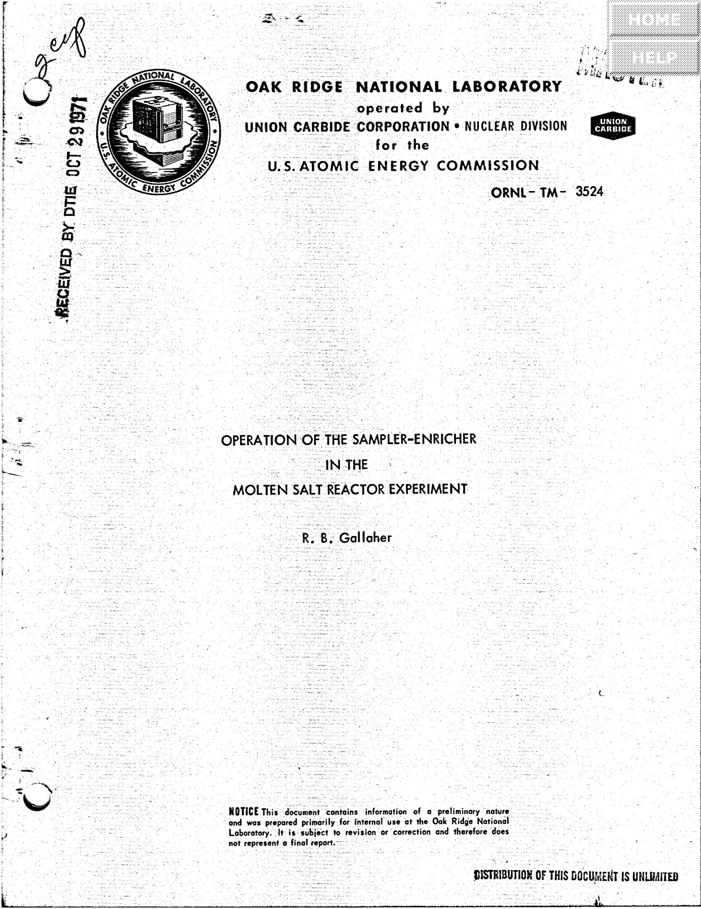

This report was prepared as an account of work sponsored by the United States Government. Neither the United States nor the United States Atomic Energy Commission, nor any of their employees, nor any of their contractors, subcontractors, or their employees, makes any warranty, express or implied, or assumes any legal liability or responsibility for the accuracy, completeness or usefulness of any information, apparatus, product or process disclosed, or represents that its use would not infringe privately owned rights.

ORNL-TM-3524

Contract No. W-7405-eng-26

Reactor Division

OPERATION OF THE SAMPLER-ENRICHER

in the

MOLTEN SALT REACTOR EXPERIMENT

R. B. Gallaher

This report was prepared as an account of work sponsored by the United States Government, Neither the United States nor the United States Atomic Energy Commission, nor any of their employees, nor any of their contractors, subcontractors, or their employees, makes any warranty, express or implied, or assumes any legal liability or responsibility for the accuracy, completeness or usefulness of any information, apparatus, product or process disclosed, or represents that its use would not infringe privately owned rights.

OCTOBER 1971

OAK RIDGE NATIONAL LABORATORY

Oak Ridge, Tennessee

operated by

UNION CARBIDE CORPORATION

for the

U.S. ATOMIC ENERGY COMMISSION

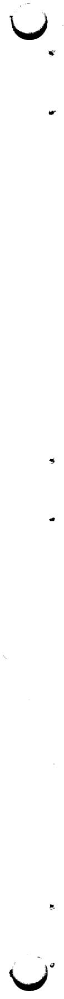

# Contents

# Page

Abstract 1

Introduction 1

Design Criteria 2

Description 3

Equipment 3

Capsules 6

Instrumentation 8

Operating Procedures 9

Sampling 11

Enriching 12

Operating Experience 13

Sample Capsules 13

Drive Unit 14

Manipulator 22

Operational and Maintenance Valves 26

Access Port 29

Removal Valve. 31

Removal Seal 31

Lighting and Viewing 33

Vacuum Pumps 33

Electric Penetrations and Wiring 33

Instrumentation. 35

Summary 36

References. 37

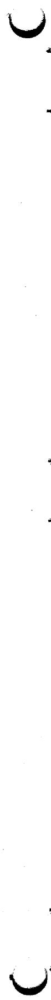

# Operation of the Sampler-Enricher in the Molten Salt Reactor Experiment

R. B. Gallaher

# Abstract

The sampler-enricher for the Molten-Salt Reactor experiment was designed to remove 10-g samples and to add 90-g increments of uranium to the pump bowl. During the five-year service life the equipment was used to isolate 593 samples and to make 152 fuel additions. It was still operable when the reactor was shut down. The major maintenance jobs involved the manipulator boots and the capsule drive unit. The boots were changed 17 times. The drive unit was replaced once and repaired four other times. There were some minor repairs. No excessive release of gaseous or particulate matter occurred during operation or maintenance of the equipment.

Keywords: MSRE, fluid-fueled reactors, fused salts, fuels, sampling, loading, refueling, on-line, equipment, instrumentation, remote maintenance, containment, closures, manipulator.

# Introduction

The Molten-Salt Reactor Experiment was conducted to demonstrate the engineering and technical feasibility of high-temperature, circulating fuel reactors. The experiment served as a test of (1) the compatibility of the fluoride salt with the structural material and the graphite moderator and (2) the stability of the salt during extended operation in a high-radiation field. Results were inferred in part from analysis of samples of the circulating salt obtained while the reactor was operating at power.

The method selected for sampling was to lower a small capsule into the salt reservoir in the fuel-pump bowl. Two streams of fuel salt, having a combined flow rate of about 65 gpm, flowed from the circulating loop through this region.1 Salt volume in this reservoir, which served as the expansion volume for the fuel loop, was about 30 gallons. Thus, a sample from this region should be representative of the salt in the main

circulating stream. The sample was removed from the reactor and sent to a high-radiation level analytical laboratory for chemical and isotopic analysis.

Since the sampling system provided a ready access to the fuel stream, it was also used to add uranium to replace the material that was consumed by fissioning and to overcome the decrease in reactivity resulting from the buildup of fission-product poisons in the system. Poison material also could be added, if needed, for reactivity control, using the equipment even in the event of a complete loss of electric power.

Removing samples of highly radioactive salt from the circulating stream of an operating reactor presented some difficult design problems. Operators had to be protected from excessive exposure to radiation and from gaseous fission products. The sample and the reactor system had to be protected at all times from contamination by air and water. This report presents a brief description of the mechanical design and operating procedures and a discussion of the major maintenance problems encountered for each of the various components during the five years that the sampler-enricher was operated.

# Design Criteria

The following criteria were used in designing the sampler-enricher.2

1. Failure of any one component must not result in a massive leak of radioactivity to the atmosphere. Two barriers were required between any source of radioactivity greater than 1000 curies and the atmosphere.   
2. An inert atmosphere was required at all times in the sampling equipment and around the sample until it was delivered to the analytical laboratory.   
3. The release of contamination to the atmosphere, both gaseous and particulate matter, must be less than the limits imposed by laboratory radiation safety standards.   
4. The equipment must be capable of isolating three samples per day (one per shift).   
5. Anticipated operating life was one year or about 1,000 sampling cycles.

6. The design pressure was 50 psig for primary containment areas and 40 psig for secondary containment areas. Design temperature was $100^{\circ}\mathrm{F}$ .   
7. Replacement of each individual component must be possible, if replacement were desired or needed.   
8. Each enriching capsule must add about $90\mathrm{g}$ of $\mathbf{235U}$ to the system, the amount needed for about one week of full power operation.

# Description

# Equipment

The MSRE Design and Operations Report3 covers the design specifications for the sampler-enricher system and describes each component in detail. How the various components fulfilled the containment and the mechanical requirements for sampling and for adding enriching salt to the reactor is discussed in the following paragraphs.

Figure 1 is a schematic diagram of the sampler-enricher. Note that both primary and secondary containment barriers of the reactor had to be penetrated to reach into the fuel salt from the operating area. In order to assure that there were always at least two barriers between the fuel system and atmosphere and between the sample and atmosphere, the equipment was compartmentalized. Adjacent compartments or areas were separated by buffered, double-sealed barriers. The pressure of the buffer gas was used to define when a barrier was closed.

For ease of identification, containment areas were classified as follows. Portions that were part of, or opened directly to, the primary system were designed as 1A, 1B, and 1C. Secondary containment areas, such as the valve box, were designated as 2A and 2B. The outer compartment which was secondary containment during certain phases of the operating procedure was designated as 3A.

The system consisted of a transfer tube which connected the two-compartment dry box (see Fig. 1) to the gas space of the pump bowl. The capsule, which was connected to the drive unit cable by a special latch, was lowered through the transfer tube into a guide cage beneath the salt surface in the pump bowl. It was then pulled up through the tube and two

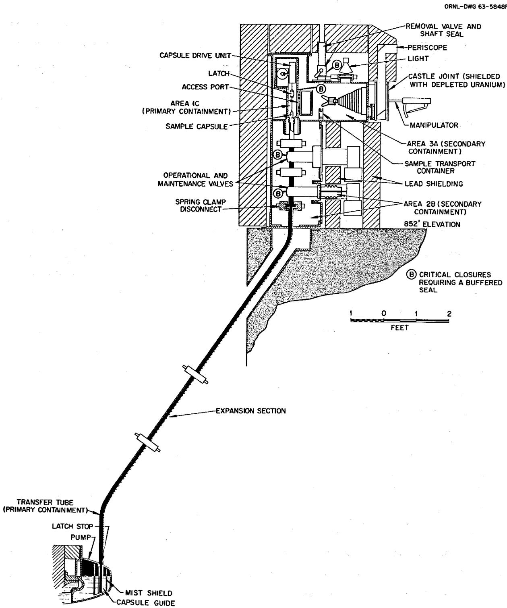  
Fig. 1. Sampler-Enricher Schematic.

gate valves into the inner compartment (1C) of the shielded dry box. Using a simple one-handed manipulator and a periscope, the capsule was disconnected from the latch and moved through an access port to a transport container located in the outer compartment (3A). After purging the dry box, a removal tool was inserted through a ball valve and the transport container was pulled up into a lead-shielded transfer cask. The transfer cask was placed in a sealed container bolted to the frame of a truck and was moved to the high-radiation level analytical chemistry facility located in the X-10 area of ORNL.

There were three barriers in the sampler-enricher. A system of interlocks permitted only one to be opened at a time. The barriers were (1) the operational valve and the maintenance valve which separated 1C from the pump bowl (1A); (2) the access port which separated 1C from 3A; and (3) the removal valve which provided access to 3A from the operating area.

At the time the capsule was in the transport cask at the sampler awaiting shipment to the analytical laboratory, the two barriers for the sample were the sealed transport container and the high-bay area of the building which was classified as a containment area. The truck used to deliver the sample was brought into the building through an air lock. The transport container and the sealed container on the truck provided the required double containment when the sample left the reactor building.

An exhaust hood, connected to the building ventilation system, was located above the sampler-enricher next to the transport cask to provide controlled venting of any gaseous activity that might escape from the dry box as the sample was being withdrawn. Also, the top of the sampler shield was classified as a contaminated zone, "C Zone," to prevent spreading any particulate matter that might be released during sampling to other locations.

A vacuum pump connected to 1C and 3A was used to remove gaseous fission products and atmospheric contamination from the dry box. The pump discharge was connected to the auxiliary charcoal bed. Areas where little or no radioactive gases were anticipated were connected to another vacuum pump for purging atmospheric contamination. These areas were

(1) the volume between the two manipulator boots, (2) the cover over the operator end of the manipulator arm, and (3) the volume between the removal valve and the removal seal.

# Capsules

Ten-Gram Sample Capsule - About 10 grams of salt was required for routine chemical analysis. A copper capsule used to isolate this size of sample is shown in Fig. 2. The capsule was $3/4$ in. in diameter by 1.6 in. long with hemispherical top and bottom. Salt entered through two windows whose location determined the quantity that was trapped. The solid metal top provided sufficient weight to assure that the capsule would be submerged in the salt. A key was attached to the top of the capsule by a loop of 1/32-in.-diam stranded-steel rope, which provided the flexibility necessary for the sample assembly to pass through the two 15-in.-radius bends in the transfer tube. The key locked the assembly to the latch on the drive unit cable.

Before use copper capsules were hydrogen fired at $1200^{\circ}\mathrm{F}$ for two hours to remove surface contaminants and the oxide film, since oxide interfered with the uranium analysis. After firing, the capsules were stored and assembled in an inert atmosphere.

Enriching Capsules - Figure 2 also shows an enriching capsule assembly. The capsule was fabricated from 3/4-in. by 0.035-in.-wall nickel tubing. The bottom was spun shut on a 3/8-in. radius. A solid top was welded in place. The capsule was 6-3/8 in. long and contained about $120\mathrm{g}$ of enriching salt (90 g of ${}^{235}\mathrm{U}$ ). The holes, shown in the photograph, were drilled after the capsule was filled and just prior to use. Only the interior of the capsules was cleaned by hydrogen firing before the salt was loaded. The exterior was cleaned of dirt and grease just before use.

Miscellaneous Capsule Types - During the operating life of the reactor, the sampler-enricher was used for many other purposes besides taking 10-gram samples and adding enriching salt. In all cases, except one, the dimensions of capsules for special tests were equal to or less than those of the enriching capsules. The one exception was used prior to power

PHOTO 87144

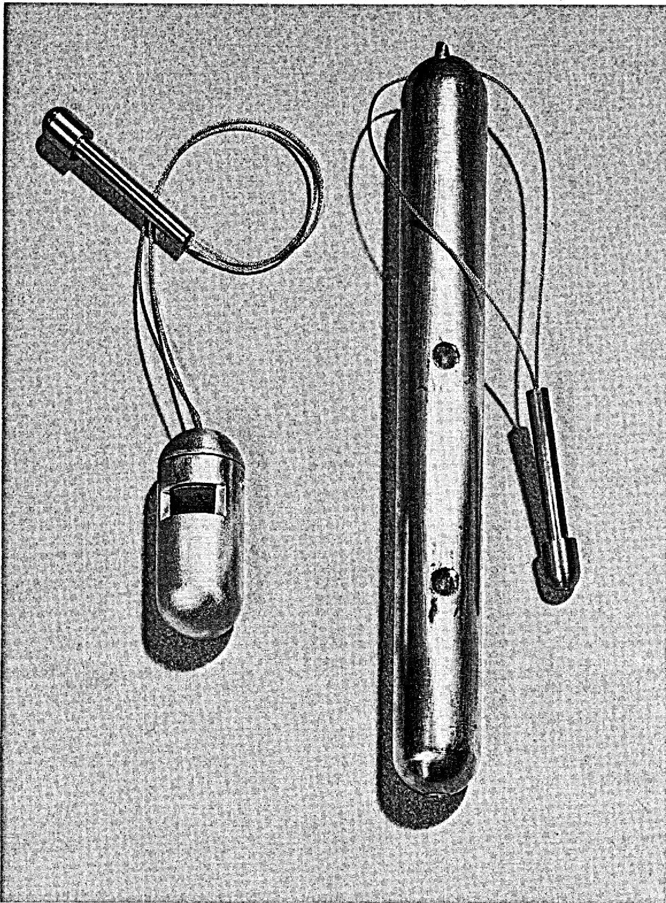  
Fig. 2. Ten-gram Sample Capsule (left) Enriching Capsule (right).

operation and could be handled with very little shielding. Maximum capsule dimensions were limited by the inside dimensions of the transfer container and by the radius of curvature of the transfer tube. Special designs included capsules for exposing graphite to the salt and to the gas in the pump bowl, dissolving various types of metal in the salt, trapping gas samples, taking 25 and $50\mathrm{g}$ salt samples, measuring salt surface tension, etc.

# Instrumentation

A complete description of and specifications for the instrumentation for the sampler-enricher is given in the MSRE Design and Operations Report.4,5 A brief discussion is given below for a few major components.

The gas pressure in the buffer zones between the two sealing surfaces of the barrier that separated the various compartments was used as the indication that a barrier was sufficiently tight to provide containment. This gas pressure was monitored by a transducer located in the gas supply line as near the buffer zone as geometric restraints would permit. The signal from the transducer was used in the interlock circuit and was monitored by a recorder. When a barrier was open, the flow of gas from the buffer zone resulted in a pressure drop across a flow restriction located in the line upstream of the transducer resulting in a low buffer pressure. The pressure drop was about 0.8 psi per cc/min of gas flow. When a barrier was closed and sealed, the pressure was essentially the same as the buffer gas supply or 40 psig. Before a barrier could be opened, the buffer gas in each of the other two barriers had to be at least a specified minimum pressure, thus assuring that the leak rate from the buffer zone through the seals was less than a predetermined amount.

The drive unit cable was driven by a gear so that one revolution of the drive unit shaft produced a positive 8-in. movement of the cable. Two torque transmitters connected mechanically to the shaft of the drive unit and electrically to matching torque transmitters on a position indicator mounted on the control board monitored the amount of cable that was extended into the transfer tube. One pair of transmitters was calibrated

to indicate the number of feet and the other pair to indicate the number of inches of cable that had been inserted. One revolution of the inch indicator hand was equal to a movement of one foot of cable.

Two sets of radiation detectors were installed. One set on the exhaust line from 1C and 3A monitored the radiation level in the gas being exhausted from these areas. They were also used to follow the effect of purging the area with clean gas. The other set was used to detect a release of gaseous activity to the building ventilation system or back diffusion of activity through the buffer gas lines from the sampler toward the panel board. In case of a high-activity indication, these detectors caused several solenoid valves to close, blocking all lines that might contain contaminated gas.

All penetrations into 3A and 1C were either seal-welded or were double-sealed with a leak-detector line attached between the seals. The leak-detector system pressure was maintained above the equipment maximum pressure so that any leakage would be from the buffer zone, thus guarding against the release of activity to the operating area and of the diffusion of oxygen and water into the dry box.

Figure 3 shows part of the instrument cabinet and the dry box prior to the installation of the shielding.

# Operating Procedures

Every engineer and technician on the operating crew at the reactor was trained in the use of the sampler-enricher. A special sampling crew was not used. Check lists were provided the operators, giving in detail all actions necessary for each step. Except for checking the initial condition of the equipment and for placing the unit on standby, which required only one man, a two-man crew was used. One operated the equipment while the other read the check list and observed that the proper action was taken. The time each step was taken was recorded on the check list along with the operator's initials and any pertinent comments on the operation. During the withdrawal of the sample from 3A, three operators and an HP man were required. The third operator used damp cloths to

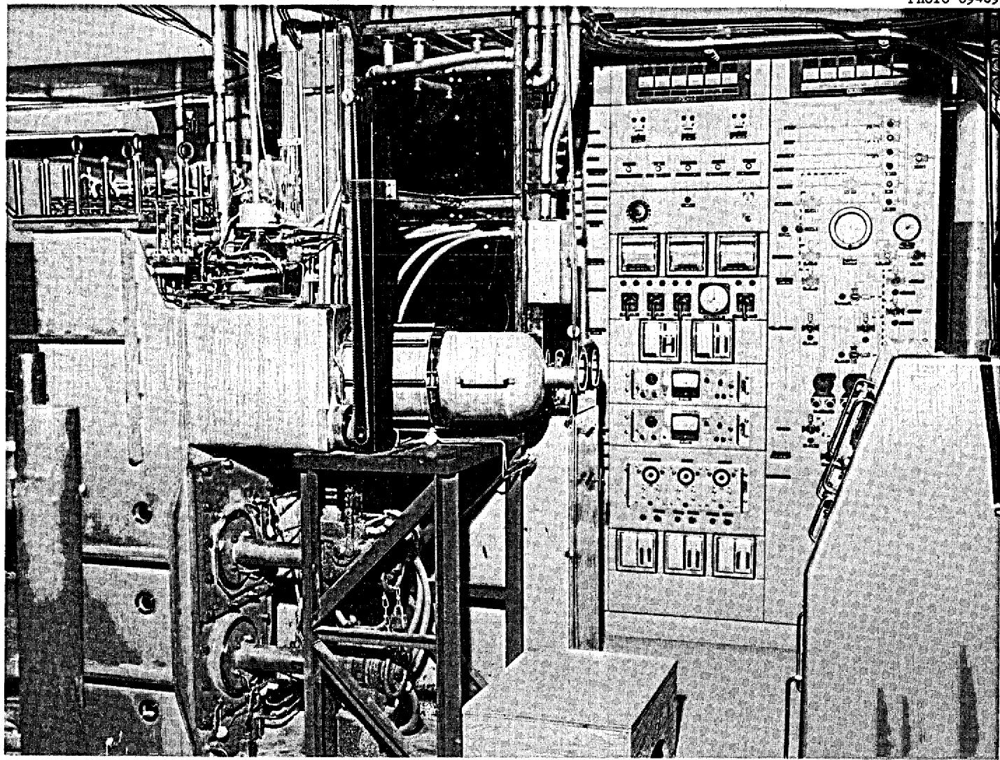  
PHOTO 69409  
Fig. 3. Sampler-Enricher Before Installation of Shielding.

clean the surface of the removal tool as it was being withdrawn. A sampling sequence is outlined in the following discussion.

# Sampling

A capsule assembly was assembled in a glove box and put in the transport container. The transport container was lowered through the removal seal and removal valve onto the fixture located on the floor of 3A that held the bottom section in place. The top of the transport container was disengaged from the bottom and withdrawn so that the removal valve could be closed.

Next, the access port was opened so that the capsule could be attached to the latch on the drive unit cable. The manipulator was used for lifting the capsule from the bottom of the transport container and for inserting the key into the latch. The access port was then closed. 1C was evacuated to remove air that might have been introduced with the capsule. After the pressure of 1C was adjusted with helium to match that of the pump bowl, the operational and maintenance valves were opened and the capsule was lowered 17 ft 5 in. to reach the pump bowl level. The capsule remained in the salt for one minute to allow it to heat and fill. It was then withdrawn 18 in. into a vertical section of the transfer tube and held 10 minutes to allow the salt to solidify to prevent spilling while moving through the sloping section of the tube. After the sample was withdrawn into 1C, the operational and maintenance valves were closed.

At this point the atmosphere in area 1C contained a high concentration of radioactive gas that had come from the pump bowl and from the sample. The area was purged with helium for 30 minutes, then evacuated and refilled with clean helium.

The access port was opened so that the capsule could be detached from the latch by lifting the key slightly and rotating it forward and upward with the manipulator. The capsule was placed in the bottom section of the transport container. During handling, the operator could see whether the capsule contained salt. The access port was then closed.

After opening the removal valve, the top of the transport container was lowered over the bottom piece which held the sample, and the two pieces were sealed together. The removal seal prevented air from reaching

the sample and gaseous activity from being released to atmosphere during this operation. The sample was withdrawn from 3A into the transfer cask. During the withdrawal, the tee-handle extension of the transport container was wiped with damp cloths to remove particulate contamination from its surface. Also, the removal valve was closed before the transport container was moved past the removal seal. After disconnecting the tee-handle, the transport container was locked into the transfer cask. The cask was placed in two plastic bags and then clamped and sealed inside the can on the sample truck. It was delivered to the high-radiation level analytical laboratory for analysis.

# Enriching

Using this same equipment, enriching salt $(\mathrm{UF}_4 - \mathrm{LiF})$ was added to the reactor. Enrichments could be made with the reactor operating at full power.

For the initial fueling of the reactor with $^{235}\mathrm{U}$ the capsules were stored in a vault at the reactor site until they were needed. Just prior to use, holes were drilled through the metal side walls and into the bottom so that the melted enriching salt could flow from the capsule into the pump bowl.

The procedure for adding enriching salt to the reactor was similar to that for isolating a sample, except for a few variations. During enriching a full capsule was inserted and an empty capsule was withdrawn. The radiation level of the enriching salt was sufficiently low to allow direct handling of the capsule with care exercised to prevent spreading uranium contamination. This required that the necessary drilling and weighings of the capsule be done in a glove box located near the sampler-enricher. Empty capsules were sent to the high radiation level laboratory for final weighing since the activity level was much too high $(>1,000\mathrm{R/hr}$ at 3 in.) to allow handling in the glove box.

When $^{233}\mathrm{U}$ and Pu were added to the reactor, the same type of capsules were used. However, the preparation procedure prior to moving the capsule into the sampler-enricher had to be modified. The $^{233}\mathrm{U}$ capsules had to be handled in a shielded facility, cell G of the Thorium Uranium

Recycle Facility, because of the 222 ppm of $^{232}\mathrm{U}$ in the feed and its associated radiation. The capsules were filled, drilled, and loaded into shielded carriers remotely and then transported to the reactor site. The radiation level was about 1 R/hr at 3 inches for these capsules.

For the Pu additions the capsules were drilled before loading.' Then the holes were sealed with Zr foil. Pu in powder form was packed into the capsule. In the pump bowl the fuel salt dissolved the Zr allowing the Pu to be released to the flowing stream. Handling of the Pu required extra care to prevent the spread of alpha contamination.

# Operating Experience

During the five-year period that the reactor was operated, 593 sampling cycles and 152 fuel enrichments were made. The equipment was still in operating condition when the reactor system was shut down. Important operating experiences for each of the major components are recorded in the following sections.

# Sample Capsules

Normal operating procedures called for the operator to test the proper attachment of the capsule to the drive unit latch by gently pulling on the wire ropes of the capsule with the manipulator. On one occasion the wire pulled free of the key during this check. The operator was able to retain possession of the capsule and lift it into 3A. The key remained in the latch and was removed later. Following this experience the material for the top of the capsule was changed from copper to nickel-plated iron, so that a magnet could be used to retrieve an assembly that might be accidentally dropped in 1C. The key was also fabricated from nickel-plated iron for the same reason.

Capsules were actually dropped a few times and recovered with the magnet. While the capsule was being attached to the latch, the operational valve was closed so a dropped capsule fell only about 15 inches below the access port opening to the gate of the valve. On two occasions, noted later in the report, a capsule was dropped into the pump bowl during periods of abnormal operation when the operational and maintenance valves

were open. No extensive attempt was made to recover the first capsule at the time it was lost. After the second one was lost, a magnet was attached to the drive unit and lowered into the pump bowl while the access port remained open. The reactor was drained and the pump bowl was cooled during the initial part of the recovery attempt. The magnet was moved up and down in the pump bowl by lifting and lowering the cable with the manipulator, giving the operator a feel for what was happening. A microphone located on the pump was connected to a speaker at the sampler so that sounds in the pump could be heard. Many attempts were made to recover the missing capsules. Once when the magnet was retrieved, the top of the first capsule was recovered. Based on feel and sound the second capsule could be lifted a few inches in the pump bowl but was not recovered.9 It is believed to have moved between the mist shield and the guide cage, preventing retrieval. A mockup showing this situation with a magnet inserted is shown in Fig. 4.

# Drive Unit

The latch attached to the end of the drive unit cable operated satisfactorily for about a year. It then started binding in the lower bend of the transfer tube. A new latch with a smaller diameter was installed. Later this latch was replaced with another one of similar dimensions, which was fabricated of 430 stainless steel instead of 304 stainless steel so that it was magnetic. The drive unit assembly is shown in Fig. 5.

One of the bevel gears connecting the cable drive unit to its motor started slipping on its shaft in December 1968 after 15 months of use. The gear was secured to the shaft by two set screws, but the repeated stress placed on the unit while attaching the capsule and checking it probably loosened the screws and caused the gear to slip on the shaft. Also, just prior to this difficulty, a key had jammed in the latch. Extra strain was applied to the drive unit while trying to remove the key from the latch with the manipulator. Slipping was first noticed while attempting to free the key.

To repair the gearing, the lC assembly was lifted above the top of 3A. This required draining the reactor and removing two top shielding

PHOTO 92581

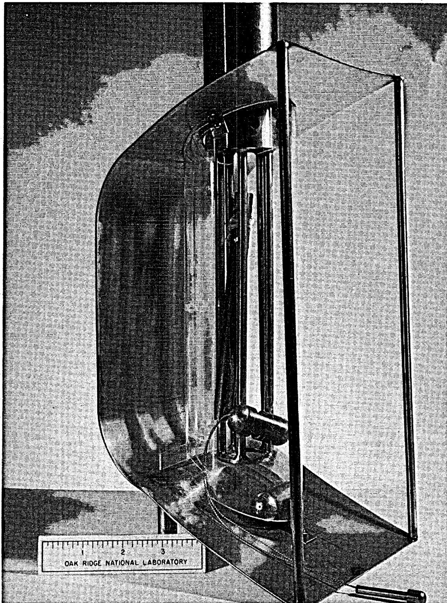  
Fig. 4. Mock-up Fuel Pump Bowl Section Showing Dropped Capsules and Magnet.

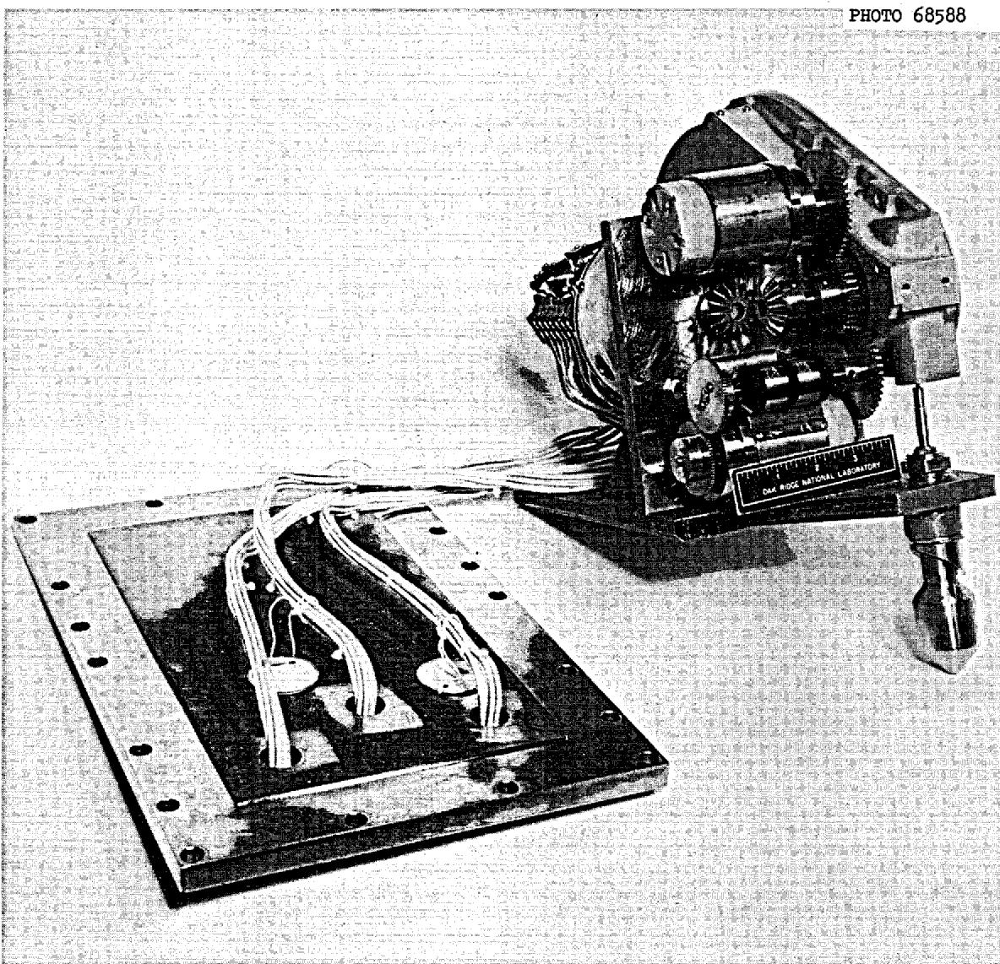  
Fig. 5. Drive Unit Assembly.

blocks to reach the bolts of the flange located at the lower end of 1C. Next, a 3-in.-diam hole was drilled through the 1/2-in.-thick wall of the drive unit box at a point adjacent to the gears. When the motor was operated, the gear on the drive unit was observed to slip on its shaft. Using a long-handled wrench, both set screws were tightened, but the gear still slipped. It was then welded to the shaft. Both set screws on the mating gear on the motor shaft were tightened and locking screws were installed to hold them in place. A plug was then welded over the hole in the containment box. At the start of this repair operation the radiation level at the gears was $45\mathrm{R / hr}$ . At the outside of the containment box where the hole was drilled it was $27\mathrm{R / hr}$ .

Limit switches for the drive unit motor were actuated by a nut moving along a threaded shaft. When the gearing slipped, the motor was operated in the withdraw direction too far allowing the nut to become disengaged from the threads on the shaft. When the motor direction was reversed, the nut failed to engage the threads again. As a result of this, the upper and lower limit switches and the 4-in. permissive switch for the operational and maintenance valves were bypassed for the remaining life of the drive unit.

Standard gears were used in the drive unit assembly. The design clearances for these gears resulted in a hysteresis in the position indicator readings. The inch hand reading varied about $1/2$ in. from insertion to withdrawal direction. The foot indicator varied $3/4$ ft so that the operator had to mentally compensate for the differences to be certain of the exact location of the capsule. All positions specified in instructions referred to the inserting mode.

For obtaining some special types of samples, the distance from the latch stop to the salt surface in the pump bowl had to be known accurately so that the capsule could be stopped at a specified distance from the salt surface. The position indicator distance readings were reproducible to $< 1/4$ in. Thus the capsules could be accurately positioned during sampling.

On at least five occasions the latch and capsule assembly failed to go down the transfer tube properly. It stopped in the lower part of 1C or in one of the gate valves at the exit of 1C. When this happened, the

drive unit cable coiled up in 1C forming kinks which prevented it from withdrawing properly. As initially installed there was no way of telling when the latch failed to move into the transfer tube. Only when the position indicator hands moved unevenly during the withdrawal was a malfunction indicated.

The first time this happened the loops that formed in the cable were untangled by repeated short insertions and withdrawals. After all of the cable was successfully withdrawn and the operational and maintenance valves were closed, the cable was extended into 3A for visual examination. Two bends were found and straightened.

On two other occasions the position indicator hands did not operate smoothly and no sample was obtained. No damage was found to the cable and no definite reason for hanging was discovered. It was possible, however, for the capsule to be retained in either of the openings between the two seals for the gate in the valves.

The fourth time the latch hung, a kink in the cable jammed in the narrow passage that connected the access port area and the drive unit box stalling the drive motor so that it would not operate in either direction. In an effort to untangle the unit without draining the reactor the operational and maintenance valves were carefully closed by hand so that the access port could be opened for visual examination of the cable. When the operator pulled the cable from 1C into 3A with the manipulator, the latch and capsule were missing. The operational valve had sheared the cable when it was closed.9 Calculations made later indicated that an 8-lb force on the hand wheel of the valve was sufficient to shear the cable. The latch dropped through the transfer tube and rested on the latch stop. The sudden stop snapped the wire rope holding the capsule allowing it to fall to the bottom of the pump bowl.10,11 The latch was retrieved during a four-week maintenance effort. Figure 6 shows the recovery tooling and containment. Figure 7 shows the latch and key after removal from transfer line. One unsuccessful attempt was made to recover the capsule. A new 1C assembly including a new drive unit was installed.

The fifth time the drive unit malfunctioned no attempt was made to close the operational valve as we did not want to chance cutting the cable again. The reactor was drained so that the access port could be

PHOTO 88999

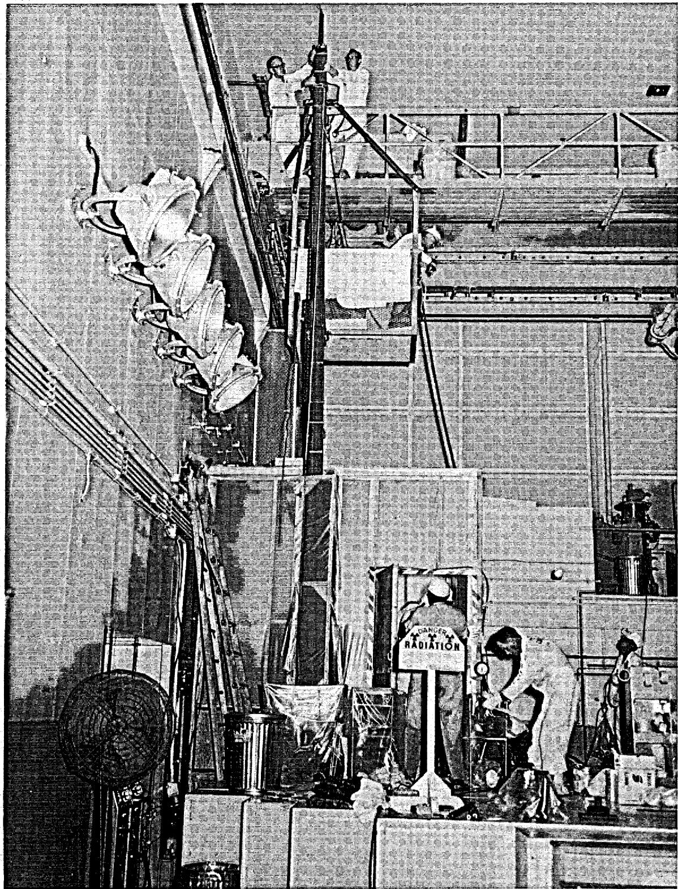  
Fig. 6. Tools and Tent Used During Recovery of Lost Latch.

PHOTO 89000

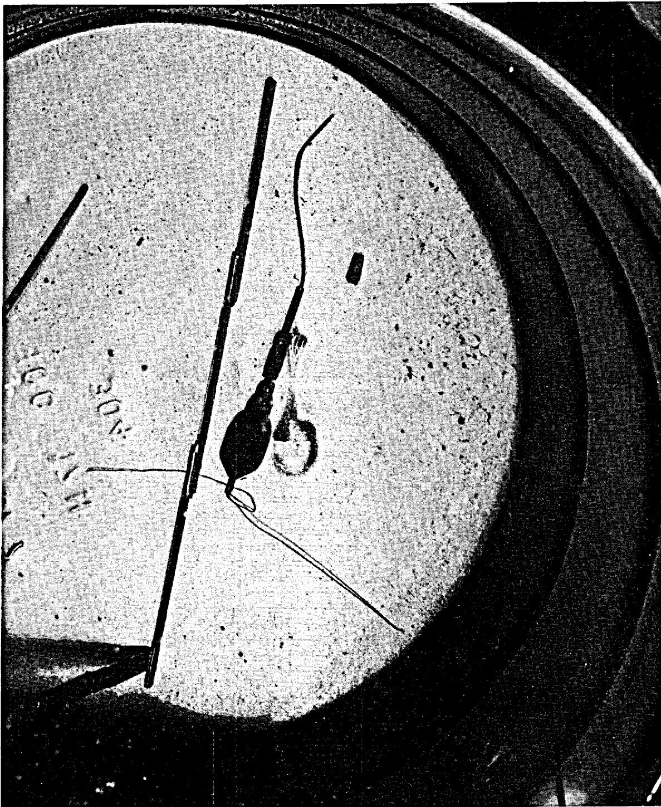  
Fig. 7. Latch and Key After Removal from Transfer Line.

opened to observe the condition of the cable. This was the first opportunity for a visual inspection of this type of trouble. The capsule was seen lying on its side on the lower ledge of the access port opening. The latch was above and behind it. The cable formed many coils. The normal position of the capsule when attached to the latch was about four inches below the place where it was observed. No explanation was found for its observed location. While attempting to grasp the capsule with the manipulator, the operator brushed against one of the coils of cable shifting the position of all parts. The latch fell on its side allowing the key to slip out of it and the capsule to drop into the pump bowl.[12] The capsule recovery attempt with magnets was described in a prior section.

While the reactor was drained a proximity switch, shown in Fig. 8, was mounted on the transfer tube between the maintenance valve and the floor of the containment box. This unit could detect the movement of the magnetic latch past this point, thus indicating that the capsule and latch had indeed entered the transfer tube. This switch was obtained immediately after the fourth hangup occurred and was awaiting a reactor shutdown for installation when the fifth hangup occurred. Several malfunctions were detected by the switch and were corrected before difficulties occurred.

# Manipulator

The manipulator (Fig. 9) required more maintenance than any other component of the sampler-enricher. The two-ply polyurethane boots which sealed the arm to the wall of 3A had to be replaced 17 times or an average of 3-1/2 times a year. After standard maintenance procedures were established, the estimated cost per change was $1,800.[13]

During design the plastic boots were recognized as a potentially weak member that might rupture under the 40-psi design pressure conditions. Therefore, a cover was kept over the operator end of the arm except during periods when the manipulator was in use. The cono-seal flange that sealed the cover to area 3A was easy to open, but awkward to close because of the crowded conditions around the flange location.

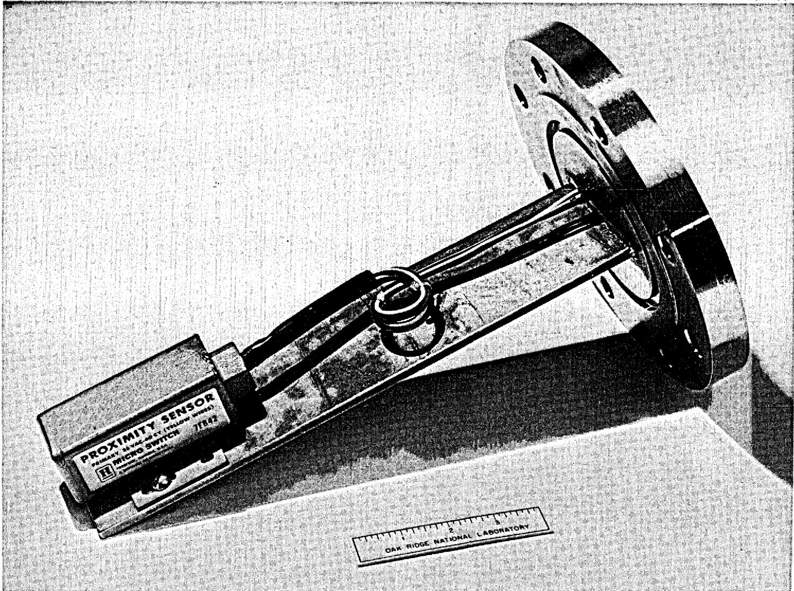  
Fig. 8. Proximity Switch Assembly.

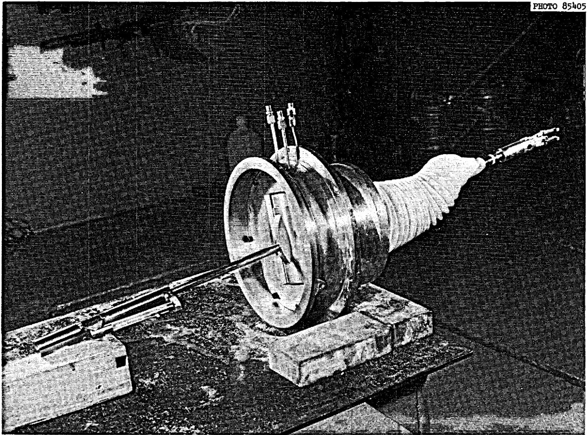  
Fig. 9. Manipulator Assembly Without Cover.

Improvements in boot design were made throughout the operating period. The first major modification was the addition of steel rings to the convolutions of the inner boot. This prevented the boot from collapsing against the arm when there was a pressure differential across the boot with the higher pressure in 3A. When the boot collapsed, movement of the arm abraded and pinched the plastic. Also, friction made the in-and-out movement of the manipulator difficult.

When the differential pressure was in the opposite direction, two problems arose from the ballooning of the boots. Some of the steel rings in the inner boot slipped out of the convoluations. The displaced rings pinched holes in the boot after a period of use. During early sampling cycles prior to operating the reactor at power, the pressure differential blew the boots off their flange on 3A. Improved clamping arrangements prevented this from recurring. Also, a differential pressure switch was installed to protect against excessive pressure differentials in the direction that caused ballooning.

Different thicknesses of the polyurethane plastic were tried. Ease of manipulation varied inversely with the thickness. However, failures occurred more frequently with thin-walled material. Therefore, the heavier-walled material was used to reduce maintenance requirements.

The polyurethane yellowed with time in the high-radiation field that occurred in 3A. Light was absorbed by the dark surface, resulting in a low level of illumination inside the equipment. To counterbalance this effect, the outer boot was spray-coated with a white plastic (Haplon) that did not yellow and which also increased the strength of the material. Radiation level inside 3A was $>100$ R/hr.

Three other types of failure occurred. After installation of the rings, the rough surfaces on the rings punctured the boot when excessive pressure occurred in area 3A. After this, weld joints were filed smooth. Once the outer boot was snagged on the lower part of the transport container, tearing the boot. The third type of failure resulted from airborne particles that were embedded in the plastic during fabrication at the manipulator shop. These particles loosened with continued use leaving pin-holes through the wall. Visual examination of each new boot prior to installation reduced this type of failure.

The manipulator hand contained eight pinned joints. When the hand was assembled, the joint clearances were small (0.001 to 0.003 in.). The fingers were adjusted to close tightly. After use, the joints loosened so that the fingers did not touch over part of their length. Also on a few occasions the arm and hand were used to apply much more pressure than normally needed, which bent the fingers and the arm. A bent arm would not slide through the bearing in the shield plug freely.

# Operational and Maintenance Valves

The Stellarite-faced gates of the operation and maintenance valves were lapped until they fitted against the Stellarite-faced seats located on each side. Before installation in the sampler, the leak rate from the buffer zone across both seals was $< 1$ cc/min at 40 psi pressure differential for each valve. During use a small amount of foreign material accumulated on the upper face (see Fig. 10) of the gates, increasing the leak rate. After the first fun and before power operation, the gates were cleaned by wiping them with a damp cloth. The leak rate then decreased to less than 1 cc/min again, but gradually increased with use as dirt particles accumulated again. After power operation, the high-radiation level prevented recleaning. Initial plans called for the use of only the operational valve during normal operations, with the maintenance valve as a backup in case the operational valve failed and for use during periods of maintenance on other components of the sampler. Both valves were used routinely as an added precaution against the accidental release of gaseous activity from the pump bowl.

Special ring-joint spring-clamp disconnects $^{14}$ developed at ORNL for remote maintenance usage were chosen for the valves. Figure 11 shows the operational valve with the flanges and a pair of spring clamps. For this application each flange half was fabricated individually using a set of master gages as guides instead of the previously used method of machining two halves to match each other. The change was necessary to permit replacement of components. When the new LC assembly was installed, a new flange half was mated with a used one for the first time. A leaktight $(<10^{-4}$ cc He/sec) joint was obtained.

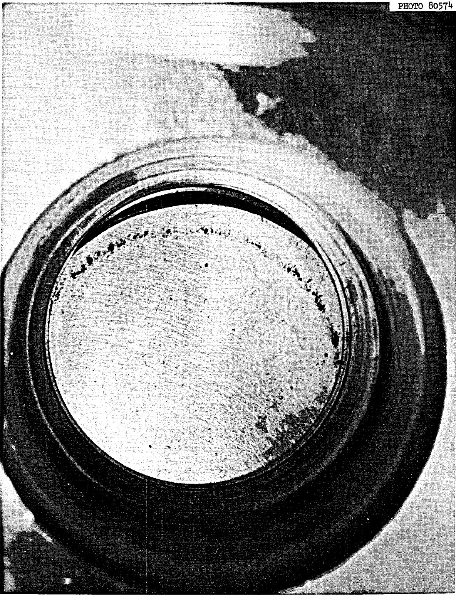  
Fig. 10. Dirt on Gate of the Operational Valve.

PHOTO 68481

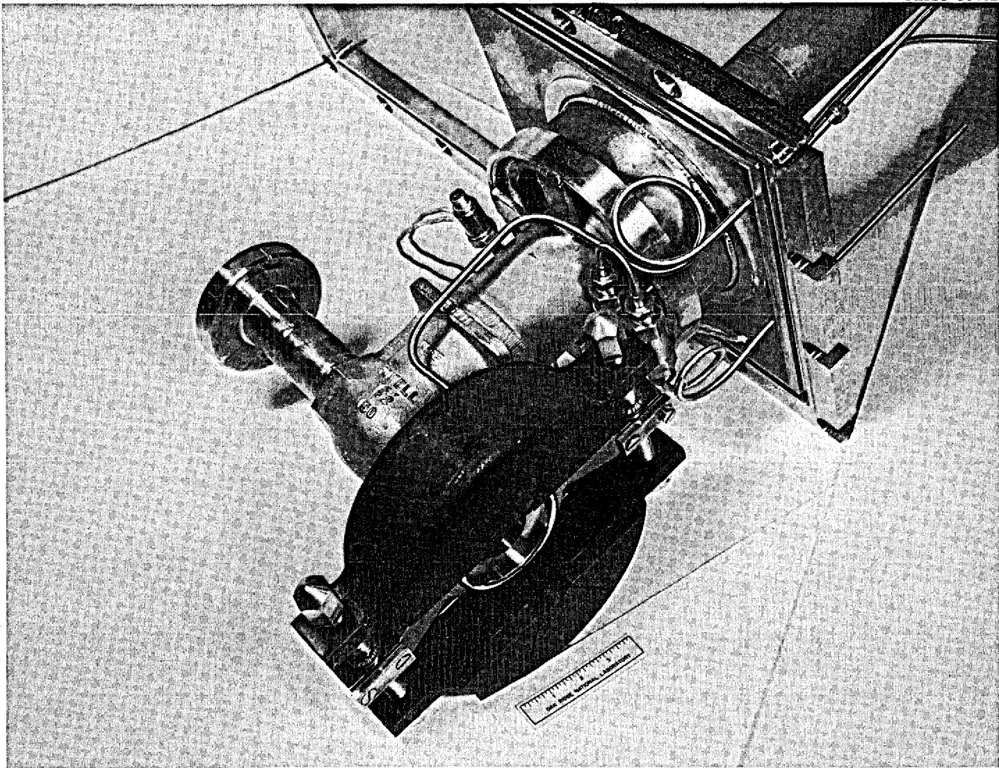  
Fig. 11. Operational Valve Assembly.

# Access Port

Six pneumatically controlled Knu-Vise clamps were used to close and seal the access port. This required three clamps to be activated at one time to close the port and the other three to move 15 seconds later to seal its opposite side. The piston rod of the activating cylinders did not always move freely through its elastomer O-ring. Some types of lubrication applied to the seals did not function as well in the dry helium atmosphere as in air. Friction sometimes caused failure of one or more of the Knu-Vises to lock in the closed position or to open. In either case the manipulator was used to help the clamp to move. A knob added to the locking link provided a gripping surface for the manipulator.

Figure 12 shows a 1C assembly.

When lC was pressure checked at 48 psig after installation, the load on each clamp was about 270 pounds. For the configuration used, the clamps were rated for a load of about 300 pounds. The loading that occurred during pressure testing loosened the link pins slightly and reduced the pressure exerted on the gasket, thus increasing the leak rate through the seals. Prior to installation of the lC assembly, the access port leak rate was less than 1 cc/min at 40 psi differential. After use, it increased by more than a factor of ten.

The hinge pins for the access port were held in place by a cotter key through a hole in either end of the pin. The top key of the lower pin fell out allowing the pin to drop free of the upper part of the spring-loaded hinge. Using only the manipulator the hinge was reassembled. Then a new cotter key was inserted through the 0.100-in.-diam hole in the pin and was bent to lock it in place.

On the second area 1C assembly, the Knu-Vise clamps were modified so that they could be semi-remotely adjusted to increase the pressure on the gasket while installed. However, the radiation level in 3A was so high (more than $100\mathrm{R/hr}$ at the manipulator port) that very little adjusting was done.

During one sampler-enricher maintenance period when the access port, the operational valve, and the maintenance valve were all open with the reactor at 1/2-psig pressure, a small quantity of radioactive gas was

PHOTO 88903

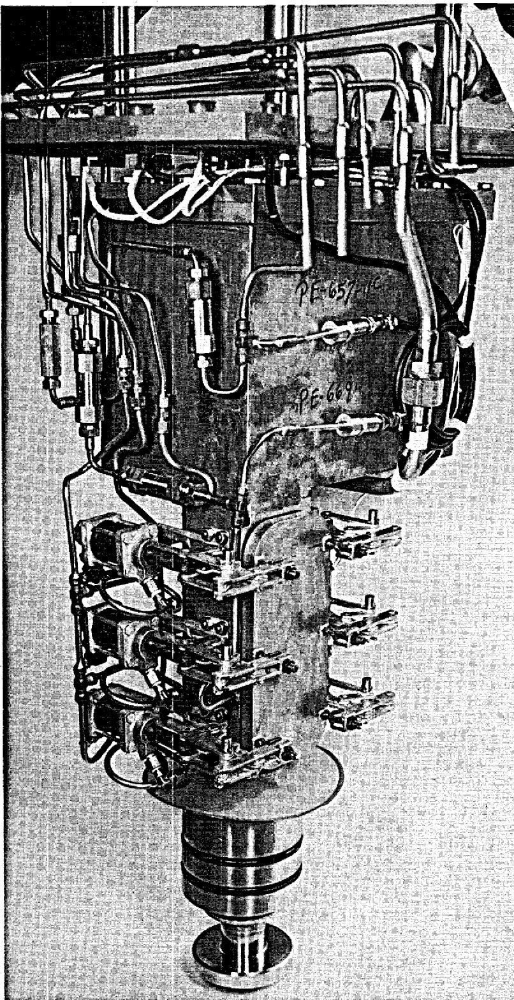  
Fig. 12. 1C Assembly with Access Port Closed.

released to the building ventilation system. The gas leaked past the 0-ring seal on one of the Knu-Vise cylinder rods. After this incident, a small charcoal trap was installed in the vent line from the cylinders and a valve in the line was left closed except during use of the access port. No further releases were detected.

# Removal Valve

The Teflon body and stem seals in the ball valve (removal valve) located above 3A showed little or no detectable radiation damage. Some leakage from the buffer zone to the atmospheric side of the valve resulted when particles on top of the ball caught on the seals when the ball was rotated. Pressure on the body seals was adjusted several times without removing the valve from the system. Also, the upper seal was replaced once.

The mounting bracket for the air cylinder operator was not sturdy enough to prevent movement of the cylinder on the valve body which limited the maximum torque that could be applied to the ball by the cylinder. However, the crowded conditions in this region prevented tightening the bracket bolts without removing several components. A top view of this area is shown in Fig. 13.

When purchased, there were no position indicator switches on the valve assembly to show when the valve was opened or closed. Switches and an activating arm were subsequently installed. These worked satisfactorily until one switch failed. There was insufficient clearance for replacement without removing the valve assembly. This would have required at least two days. The other switch became inoperative later. The valve was then used with buffer gas pressure as an indication of whether the valve was open or closed.

# Removal Seal

The removal seal, located above the removal valve, was successful in preventing the release of a measurable quantity of radioactive gas to the atmosphere when the transport container was being inserted or removed from 3A. It also prevented water vapor and oxygen from entering 3A. The

PHOTO 81698

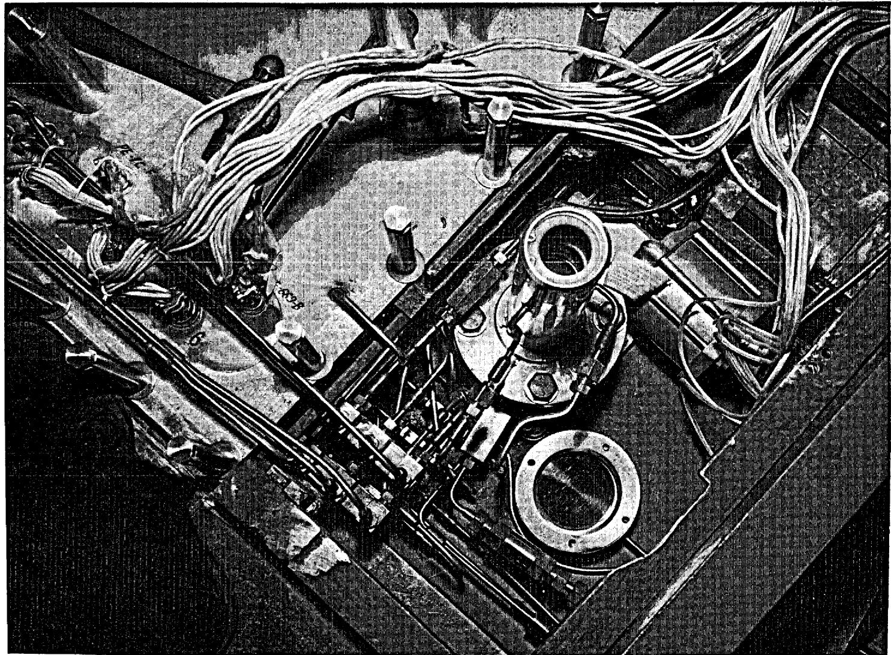  
Fig. 13. Top View Showing Removal Valve Area.

transport container was lubricated with silicon vacuum grease to reduce O-ring friction, but this increased the particulate contamination problems. Only one replacement of the O-rings and nylon guide was required to reduce the spread of particulate contamination. This was done while performing other maintenance work on the removal valve.

# Lighting and Viewing

The 100-watt light bulb failed only one time and was replaced one other time. Replacement was possible without opening 3A to atmosphere but did require removing two pieces of shielding.

The Plexiglas lens at the illuminator port was shaped to reflect a beam of light on the latch assembly when the access port was open. The 4-in.-long plug had to be changed several times because of radiation-induced darkening. The 1/2-in.-thick port at the periscope was only changed once. It did not turn yellow as rapidly as the thicker illuminator port lens.

# Vacuum Pumps

Two vacuum pumps (Cono Hyvac) were used in the off-gas system. The discharge of one pump which was exposed to helium containing gaseous fission products was connected to the auxiliary charcoal bed. The shaft seal in this pump was improperly installed as received and had to be replaced after a few months of operation. The belt was also replaced once. Just a few months prior to shutdown, the unit was replaced rather than repaired because of the radiation level and contamination associated with it. No radiation damage was apparent to the oil. Because of space limitation the oil level in the pump was hard to determine. Once the pump failed to operate properly because the oil level was too low. Oil was added several times. Figure 14 shows the two pumps. The one on the right was the one exposed to contamination.

# Electric Penetrations and Wiring

Several difficulties were encountered with the electrical penetrations and the wiring. Four- and eight-pin receptacles (Physical Sciences Corp.) were used for electrical penetrations of the containment vessels.

PHOTO 69408

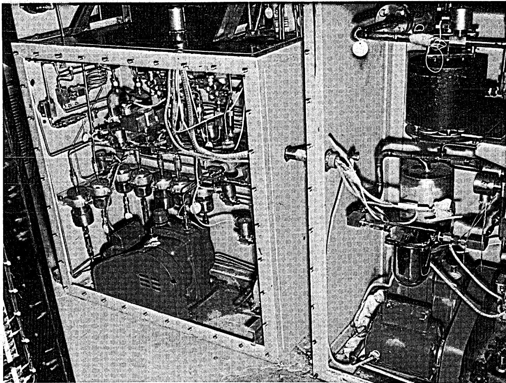  
Fig. 14. Hot Vacuum Pump (Right) Cold Vacuum Pump (Left).

Once three wires on a receptacle came loose from their pins. After reconnecting the wires, epoxy resin was poured around the assembly to strengthen the connection and to increase the electrical insulation between adjacent leads. This was done at all electrical penetrations.

On another occasion the motor jumper cable between the 3A penetration and 1C penetration grounded to the metal walls inside 3A. A hole was drilled through the 3A cover plate at a location above the receptacle in 1C for these wires. The grounded wire group was unplugged from the 1C penetration and a new jumper cable was installed from a pipe cap containing a new penetration to the 1C receptable, bypassing the damaged wiring.

While the cap was being welded to the 3A cover plate, the welding machine was connected to a building ground. A stray current passed through an adjacent receptacle blowing all eight pins out of it. The damaged piece was removed. The wire bundle was recovered from the floor of 3A and attached to a new unit. Then the new receptacle was welded in place, being sure this time that the welding machine was grounded close to the point of welding.

# Instrumentation

Special soft-seated solenoid valves were used which had low-leak rates through the seats even with a 40-psi pressure gradient on either side of the valve. The 1/2-in. valves used in the off-gas system gave trouble mainly from foreign particles (metal chips) becoming embedded in the seat after installation. This occurred during the initial period of operation. Near the end of the operation the leak rates started increasing in several valves probably from radiation damage (hardening) to the plastic seats. Several coil failures occurred on the 1/4-in. valves. These could be replaced without removing the valves.

Commercial-grade 3-way solenoid valves were used in the gas lines to the access port gas cylinders. These had a much higher failure rate than the special valves but were easily replaced. Failure presented no hazard, only inconvenience.

The strain-gage type pressure transducers gave satisfactory service. The one in the removal valve buffer pressure system was located near the

illuminator. It was temperature sensitive so that the output shifted when the power to the light bulb was varied, since this changed the temperature of the transducer. Thermal insulation was placed around the instrument to reduce temperature variations.

# Summary

The sampler-enricher was used to isolate routine and special salt and gas samples, to make minor changes in the salt chemistry, to perform special tests in the pump bowl, to add enriching salt during periods of full power operation, and was designed to add poison to the fuel under emergency conditions. The equipment was used by the reactor operating crew, not specialized operators. All sampling and maintenance activities were performed without the release of gaseous or particulate activity that exceeded laboratory safety limits. No person received an excessive dose of radiation from activities associated with the equipment even though radiation levels inside the equipment were high (<100 R/hr).

Necessary maintenance work on the equipment was performed. The manipulator boots and the capsule drive unit required the most attention, part of which could be attributed to the use by many different operators instead of a special crew. Work on the drive unit required a reactor shutdown to meet containment criteria. All other maintenance could be performed with the reactor operating. When the reactor was deactivated, the equipment was in operating condition.

# References

1. R. C. Robertson, MSRE Design and Operations Report, Part I, Description of Reactor Design, USAEC Report ORNL-TM-728, p. 141, Oak Ridge National Laboratory, January 1965.   
2. R. B. Gallaher, MSRE Sampler-Enricher System Proposal, USAEC Report ORNL-CF-61-5-120, Oak Ridge National Laboratory, May 24, 1961.   
3. R. C. Robertson, MSRE Design and Operations Report, Part I, Description of Reactor Design, USAEC Report ORNL-TM-728, pp. 244-274, Oak Ridge National Laboratory, January 1965.   
4. J. R. Tallackson, MSRE Design and Operations Report, Part II A, Nuclear and Process Instrumentation, USAEC Report ORNL-TM-729, Oak Ridge National Laboratory, February 1968.   
5. J. R. Tallackson, MSRE Design and Operations Report, Part II B (to be published).   
6. MSR Program Semiann. Progr. Rept. Aug. 31, 1968, ORNL-4344, pp. 311-317.   
7. MSR Program Semiann. Progr. Rept. Aug. 31, 1969, ORNL-4449, pp. 245-246.   
8. R. B. Gallaher, Recovery of Capsule from Sampler-Enricher, internal memorandum MSR-66-24, July 18, 1966.   
9. MSRE Staff, MSRE Sampler-Enricher, An Account of Recent Difficulties and Remedial Action, internal memorandum, MSR-67-73, Sept. 8, 1967.   
10. R. W. Derby to M. W. Rosenthal and B. L. Greenstreet, Separation of Sample Cable and Capsule, Sept. 6, 1967.   
11. R. W. Derby to M. W. Rosenthal and B. L. Greenstreet, Test of Sample Cable, Sept. 11, 1967.   
12. P. N. Haubenreich and MSRE Staff, An Account of Difficulties with the Sampler-Enricher that Led to a Second Capsule Being Left in the Pump Bowl, internal memorandum, MSR-68-125, Sept. 3, 1968.   
13. Private communication with M. Richardson, May 26, 1970.   
14. P. P. Holz, Ring-Joint Spring-Clamp Disconnect, ORNL-CR-61-7-92, Oak Ridge National Laboratory, July 14, 1961.

# Internal Distribution

<table><tr><td>1.</td><td>J. L. Anderson</td><td>39.</td><td>W. H. Jordan</td></tr><tr><td>2.</td><td>R. F. Apple</td><td>40.</td><td>P. R. Kasten</td></tr><tr><td>3.</td><td>C. F. Baes</td><td>41.</td><td>M. T. Kelley</td></tr><tr><td>4.</td><td>S. E. Beall</td><td>42.</td><td>J. J. Keyes</td></tr><tr><td>5.</td><td>M. Bender</td><td>43.</td><td>S. S. Kirslis</td></tr><tr><td>6.</td><td>E. S. Bettis</td><td>44.</td><td>A. I. Krakoviak</td></tr><tr><td>7.</td><td>D. S. Billington</td><td>45.</td><td>Kermit Laughon, AEC-OSR</td></tr><tr><td>8.</td><td>F. F. Blankenship</td><td>46.</td><td>M. I. Lundin</td></tr><tr><td>9.</td><td>R. Blumberg</td><td>47.</td><td>R. N. Lyon</td></tr><tr><td>10.</td><td>E. G. Bohlmann</td><td>48.</td><td>H. G. MacPherson</td></tr><tr><td>11.</td><td>C. J. Borkowski</td><td>49.</td><td>R. E. MacPherson</td></tr><tr><td>12.</td><td>G. E. Boyd</td><td>50.</td><td>H. E. McCoy</td></tr><tr><td>13.</td><td>R. B. Briggs</td><td>51.</td><td>H. C. McCurdy</td></tr><tr><td>14.</td><td>E. L. Compere</td><td>52.</td><td>L. E. McNeese</td></tr><tr><td>15.</td><td>D. F. Cope, AEC-OSR</td><td>53.</td><td>A. S. Meyer</td></tr><tr><td>16.</td><td>W. B. Cottrell</td><td>54.</td><td>A. J. Miller</td></tr><tr><td>17.</td><td>J. L. Crowley</td><td>55.</td><td>R. L. Moore</td></tr><tr><td>18.</td><td>F. L. Culler</td><td>56.</td><td>E. L. Nicholson</td></tr><tr><td>19.</td><td>J. R. Distefano</td><td>57.</td><td>A. M. Perry</td></tr><tr><td>20.</td><td>S. J. Ditto</td><td>58-59.</td><td>M. W. Rosenthal</td></tr><tr><td>21.</td><td>W. P. Eatherly</td><td>60.</td><td>Dunlap Scott</td></tr><tr><td>22.</td><td>J. R. Engel</td><td>61.</td><td>M. R. Sheldon</td></tr><tr><td>23.</td><td>D. E. Ferguson</td><td>62.</td><td>M. J. Skinner</td></tr><tr><td>24.</td><td>L. M. Ferris</td><td>63.</td><td>I. Spiewak</td></tr><tr><td>25.</td><td>A. P. Fraas</td><td>64.</td><td>D. A. Sundberg</td></tr><tr><td>26.</td><td>J. H. Frye</td><td>65.</td><td>R. E. Thoma</td></tr><tr><td>27.</td><td>C. H. Gabbard</td><td>66.</td><td>D. B. Trauger</td></tr><tr><td>28-32.</td><td>R. B. Gallaher</td><td>67.</td><td>G. M. Watson</td></tr><tr><td>33.</td><td>W. R. Grimes</td><td>68.</td><td>A. M. Weinberg</td></tr><tr><td>34.</td><td>A. G. Grindell</td><td>69.</td><td>J. R. Weir</td></tr><tr><td>35.</td><td>R. H. Guymon</td><td>70.</td><td>M. E. Whatley</td></tr><tr><td>36.</td><td>P. H. Harley</td><td>71.</td><td>J. C. White</td></tr><tr><td>37.</td><td>P. N. Haubenreich</td><td>72.</td><td>G. D. Whitman</td></tr><tr><td>38.</td><td>H. W. Hoffman</td><td>73.</td><td>Gale Young</td></tr></table>

74-75. Central Research Library

76. Y-12 Document Reference Section

77-79. Laboratory Records Department

80. Laboratory Records (RC)

# External Distribution

81. David Elias, AEC, Washington, D. C. 20545   
82. R. Jones, AEC, Washington, D. C. 20545   
83-84. T. W. McIntosh, AEC, Washington, D. C. 20545   
85. H. M. Roth, AEC-ORO, Oak Ridge, TN 37830   
86. M. Shaw, AEC, Washington, D. C. 20545   
87. W. L. Smalley, AEC-ORO, Oak Ridge, TN 37830   
88-89. Division of Technical Information Extension (DTIE)   
90. Laboratory and University Division, ORO   
91-93. Director of Division of Reactor Licensing, Washington, D. C. 20545   
94-95. Director of Division of Reactor Standards, Washington, D. C. 20545   
96-100. Executive Secretary, Advisory Committee on Reactor Safeguards, Washington, D. C. 20545   
101. A. Houtzeel, TNO, 176 Second Ave., Waltham, Mass. 02154   
102. R.C.Steffy, Jr., TVA, 303 Power Building Chattanooga, TN 37401