ORNL-TM-3528

Contract No. W-7405-eng-26

Reactor Division

SOLUTION OF THE EQUATION DESCRIBING THE INTERFACE BETWEEN TWO FLUIDS FOR THE VOLUME AND PRESSURE WITHIN ATTACHED, SESSILE SHAPED, BUBBLES AND DROPS

J. W. Cooke

AUGUST 1971

This report was prepared as an account of work sponsored by the United States Government. Neither the United States nor the United States Atomic Energy Commission, nor any of their employees, nor any of their contractors, subcontractors, or their employees, makes any warranty, express or implied, or assumes any legal liability or responsibility for the accuracy, completeness or usefulness of any information, apparatus, product or process disclosed, or represents that its use would not infringe privately owned rights.

OAK RIDGE NATIONAL LABORATORY

Oak Ridge, Tennessee

Operated by

UNION CARBIDE CORPORATION

for the

U. S. ATOMIC ENERGY COMMISSION


# CONTENTS

Abstract 1   
Introduction 1   
Derivation of the Interfacial Equation 2   
Numerical Solution of the Interfacial Equation 5   
Computer Program 7   
Solution of the Differential Equation 7   
Solution for h/a and V/a³ versus β and φ . . . . . . . . . . . . . 7   
Solution for h/a and V/a³ versus β and r/a 8   
Solution for $\overline{\mathbf{h}} / \mathbf{a}$ and $\overline{\mathbf{V}} / \mathbf{a}^3$ versus r/a 8   
Range, Running Time, and Accuracy 10   
Results 10   
Discussion of Results 17   
Estimation of the Accuracy 17   
Comparison with Previous Results 17   
Conclusions 21   
References 21   
Nomenclature 22   
Appendices 25   
A. Parametric Crossplots 27   
B. Tabulated Results 33   
C. Computer Program 43


J. W. Cooke

# ABSTRACT

A numerical computer program was written to solve the equation describing the interface between two immiscible fluids to obtain the shape, size, volume, and pressure of attached bubbles and droplets. These relationships are important to the study of three-phase heat transfer, superheat, critical constants, and interfacial energies. Previous solutions have been obtained with limited accuracy for a restricted number and range of variables. The present results are given in both graphical and tabular form for a wide range and number of parameters, and the computer program is included so that an even broader range and number of variables, as well as specific values, can be obtained as required. In particular, an expression for the maximum-bubble-pressure was derived which is considerably more accurate over a wider range than previous expressions.

Keywords. Surface tension, interfacial tension, bubbles, drops, contact angle, maximum-bubble-pressure, fluid-vapor interface.

# INTRODUCTION

A knowledge of relationships among volume, pressure, shape, and size of attached bubbles and droplets are important in the study of boiling and condensing heat transfer, superheat and critical point phenomena, mass transfer studies, and in the measurement of contact angles and surface tension. These relationships can be obtained from the solution of the second-order, nonlinear differential equation describing the interface between two fluids. This equation has been solved by perturbation analysis for very small bubble sizes by Rayleigh and Schrödinger, by numerical hand calculations for a wide range of discrete drop shapes by Bashforth and Adams, and by numerical computer calculations for droplet volumes and heights by Baumeister and Hamill. However, the Rayleigh-Schrödinger solution is no longer used extensively because of concern regarding its accuracy; and the Bashforth and Adams (as well as the

Baumeister and Hamill) solutions were obtained for a limited number and range of variables.

In order to check the accuracy and to extend the usefulness of the above solutions, a numerical computer program was written to solve the interfacial equation. The subject program solves the interfacial equation for any value of the dimensionless shape parameter, $\beta$ , for positive values of the term $6Z$ (sessile drops or above-attached bubbles) and extends the previous solutions for $\phi > 180$ degrees. The solution not only provides the dimensionless X, Z, $\phi$ coordinates describing the profiles of the interface, but also gives the bubble volume within and the pressure difference across the interface as a function of profile shape and, in addition, the maximum pressure difference across the interface for a given radius of attachment (which is required for the calculation of the surface tension by the maximum-bubble-pressure technique).

This report describes the derivation of the interfacial equation, its numerical solution, and the computer program employed. The results and an estimation of their accuracy are presented and compared with the previous solutions.

# DERIVATION OF THE INTERFACIAL EQUATION

At the interface separating two immiscible fluids (usually a liquid and its vapor), a force imbalance exists which results in an interfacial tension. The tension is a force per unit length pulling uniformly in all directions tangent to the interface. Neglecting gravitational forces, a force balance on an infinitesimal segment of a free surface is shown in Fig. 1-a. The surface is bowed by a uniform differential pressure, $P$ , where $r_1$ and $r_2$ are the principal radii of curvature. The force balance would thus be:

$$
P \Delta x \Delta z = 2 \gamma \left(\Delta x \frac {\Delta z}{2 r _ {1}} + \Delta z \frac {\Delta x}{2 r _ {2}}\right), \tag {1}
$$

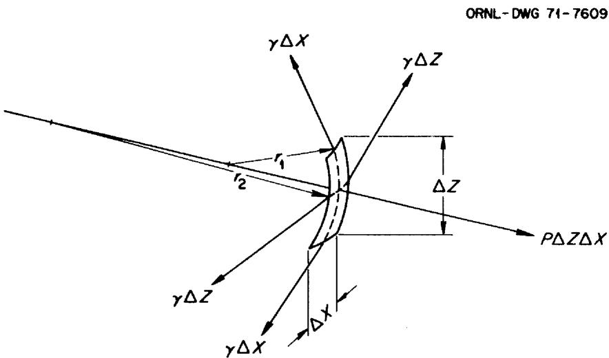  
(a)

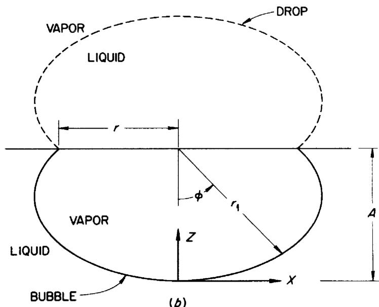  
Fig. 1. Schematic View of a Sessile-Type Drop and Bubble and the Force Balance on an Infinitesimal Surface Element.

or

$$
P = \gamma \left(\frac {1}{r _ {1}} + \frac {1}{r _ {2}}\right). \tag {2}
$$

If gravitational forces are present, the influence of the differential fluid density, $\rho$ , must be considered. For an interface assumed to be symmetrical about an axis of revolution, the force balance equation for the bubble shown in Fig. 1-b will be

$$
P - \gamma \left(\frac {1}{r _ {1}} + \frac {1}{r _ {2}}\right) - \frac {\rho g}{g _ {c}} (A - z) = 0, \tag {3}
$$

where $\rho = \rho_{\mathrm{L}} - \rho_{\mathrm{V}}$ . At the origin, $r_1 = r_2 \equiv b$ and thus

$$
P = \frac {2 \gamma}{b} + A \frac {\rho g}{g _ {c}}. \tag {4}
$$

Furthermore, with $r_1 = x / \sin \phi$ , Eq. (3) becomes

$$
\frac {2 \gamma}{b} + \frac {\rho g z}{g _ {c}} - \gamma \left(\frac {\sin \phi}{x} + \frac {1}{r _ {2}}\right) = 0. \tag {5}
$$

A similar derivation for the drop shown in Fig. 1-b would also result in Eq. (5). This equation can now be made dimensionless with respect to $b$ , and after rearranging:

$$
\frac {1}{R} + \frac {\sin \phi}{X} = 2 + \beta Z, \tag {6}
$$

where

$$
\beta \equiv \frac {g \rho b ^ {2}}{\gamma g _ {\mathrm {c}}} \tag {7}
$$

and

$$
R = \frac {r _ {2}}{b}, \quad X = \frac {x}{b}, \quad \text {a n d} Z = \frac {z}{b}.
$$

Equation (6) can be transposed into Cartesian coordinates by substituting

$$
\frac {1}{R} \equiv \frac {\mathrm {d} ^ {2} Z / \mathrm {d} X ^ {2}}{\left[ 1 + (\mathrm {d} Z / \mathrm {d} X) ^ {2} \right] ^ {3 / 2}}
$$

and

$$
\sin \phi \equiv \frac {\mathrm {d Z} / \mathrm {d X}}{\left[ 1 + (\mathrm {d Z} / \mathrm {d X}) ^ {2} \right] ^ {1 / 2}}
$$

to obtain

$$
\frac {d ^ {2} Z}{d X ^ {2}} + \left[ 1 + \left(\frac {d Z}{d X}\right) ^ {2} \right] \frac {d Z}{X d X} = (2 + \beta Z) \left[ 1 + \left(\frac {d Z}{d X}\right) ^ {2} \right] ^ {3 / 2}, \tag {8}
$$

which is a second-order nonlinear differential equation, with boundary conditions:

$$
\begin{array}{l} X = 0; \quad Z = 0 \\ X = O; \quad d Z / X d X = 1 \\ \end{array}
$$

Although Eq. (8) cannot be solved analytically in terms of ordinary functions, its numerical solution is described in the next section.

# NUMERICAL SOLUTION OF THE INTERFACIAL EQUATION

Equation (6) can be rearranged to read

$$
R = \frac {1}{2 + \beta Z - (\sin \phi) / X} \tag {9}
$$

and by definition:

$$
\begin{array}{l} \begin{array}{l} \frac {\mathrm {d} \phi}{\mathrm {d} \phi} \equiv 1, \end{array} \\ \frac {\mathrm {d} \mathbf {X}}{\mathrm {d} \phi} \equiv \mathrm {R} \cos \phi = \mathbf {F} (\mathrm {X}, \mathrm {Z}, \phi), (10) \\ \frac {\mathrm {d} Z}{\mathrm {d} \phi} = R \sin \phi = G (X, Z, \phi) (11) \\ \end{array}
$$

As long as $\beta Z > 0$ , R will always be finite.

A numerical technique of fourth-order accuracy developed by Runge-Kutta was selected to solve the set of simultaneous Eqs. (9), (10), and (11); the iterative equations describing this technique are:

$$
\mathrm {X} _ {\mathrm {n} + 1} = \mathrm {X} _ {\mathrm {n}} + \frac {1}{6} \left(\mathrm {k} _ {\mathrm {o}} + 2 \mathrm {k} _ {1} + 2 \mathrm {k} _ {2} + \mathrm {k} _ {3}\right) + 0 (\Delta \phi) ^ {5}, \tag {12}
$$

$$
Z _ {n + 1} = Z _ {n} + \frac {1}{6} \left(m _ {0} + 2 m _ {1} + 2 m _ {2} + m _ {3}\right) + O (\Delta \phi) ^ {5}, \tag {13}
$$

$$
\phi_ {n + 1} = \phi_ {n} + \Delta \phi ,
$$

where

$$
k _ {o} = \Delta \phi F \left(X _ {n}, Z _ {n}, \Delta \phi\right),
$$

$$
k _ {1} = \triangle \phi F \left(X _ {n} + \frac {1}{2} k _ {0}, Z _ {n} + \frac {1}{2} m _ {0}, \phi + \frac {1}{2} \triangle \phi\right),
$$

$$
k _ {2} = \triangle \phi F \left(X _ {n} + \frac {1}{2} k _ {1}, Z _ {n} + \frac {1}{2} m _ {1}, \phi + \frac {1}{2} \triangle \phi\right),
$$

$$
k _ {3} = \Delta \phi F \left(X _ {n} + k _ {2}, Z _ {n} + m _ {2}, \phi + \Delta \phi\right),
$$

$$
m _ {o} = \Delta \phi G (X _ {n}, Z _ {n}, \Delta \phi),
$$

$$
m _ {1} = \triangle \phi G \left(X _ {n} + \frac {1}{2} k _ {o}, Z _ {n} + \frac {1}{2} m _ {o}, \phi + \frac {1}{2} \triangle \phi\right),
$$

$$
m _ {2} = \Delta \phi G \left(X _ {n} + \frac {1}{2} k _ {1}, Z _ {n} + \frac {1}{2} m _ {1}, \phi + \frac {1}{2} \Delta \phi\right),
$$

$$
m _ {3} = \triangle \phi G \left(X _ {n} + k _ {2}, Z _ {n} + m _ {2}, \phi + \triangle \phi\right),
$$

and where the symbol $O(\Delta \phi)^5$ represents a term which is small, of the order $(\Delta \phi)^5$ , when $\Delta \phi$ is small.

Equations (12) and (13) are of a form that can be readily transformed into a computer program.

# COMPUTER PROGRAM

The computer program for the solution of the interfacial equation and for the calculation of the various output parameters is listed in Appendix C. The program consisted of four parts which are discussed below.

Solution of the Differential Equation. Two subroutines in both single and double precision and consisting of four iteration loops were written to solve Eqs. (12) and (13). The subroutines RHOS and RHOD calculate the values of R and supply the values of the functions F and G to the subroutines RUNGKS and RUNGKD. These latter subroutines calculate the values of the coefficients $\mathbf{k}_i$ and $\mathbf{m}_i$ and the new values of X, Z, and $\phi$ for reintroduction in RHOS and RHOD to continue the iterative procedure. The iteration procedure is initiated by equating X, Z, and $\phi$ to zero and R to one.

Solution for $\mathrm{h / a}$ and $\mathrm{V / a^3}$ versus $\beta$ and $\phi$ . The pressure and volume within the attached bubble are calculated from $X$ , $Z$ , and $\phi$ . The pressure relation is given by Eq. (4) and can be simplified by using Eq. (7) and the definition of the specific cohesion,

$$
a ^ {2} \equiv \frac {2 \gamma g _ {c}}{\rho g}, \tag {14}
$$

to obtain

$$
h / a = \sqrt {2 / \beta} + Z _ {r} \sqrt {\beta / 2}, \tag {15}
$$

where

$$
Z _ {r} = Z (x = r) = A,
$$

and

$$
\mathrm {h} = \mathrm {g} _ {\mathrm {c}} \mathrm {P} / \rho \mathrm {g}.
$$

The volume relation can be obtained from the integration of

$$
d \left(\frac {V}{b ^ {3}}\right) = \pi X ^ {2} d Z, \tag {16}
$$

where $X$ and $dZ$ can be obtained from Eq. (6). Integrating the resulting equation by parts gives the relationship:

$$
\frac {v}{b ^ {3}} = \frac {\pi x ^ {2}}{\beta} \left[ 2 + \beta z - \frac {2 \sin \phi}{x} \right]. \tag {17}
$$

Upon substituting Eqs. (6), (14), and (15) into Eq. (17), the final

expression for the dimesionless volume is obtained:

$$
\frac {V}{a ^ {3}} = \pi \frac {r}{a} \left[ \binom {r} {- a} \binom {h} {- a} - \sin \phi \right], \tag {18}
$$

where

$$
\begin{array}{l} \frac {r}{a} = X _ {r} \sqrt {\theta / 2} \end{array}
$$

is the dimensionless radius of attachment.

Solution for $\mathrm{h / a}$ and $\mathrm{V / a^3}$ versus $\beta$ and $\mathbf{r / a}$ . To obtain the pressure and volume within attached bubbles for a given radius of attachment from the numerical solutions $X, Z, \phi$ , of the interfacial equation, several conditional "IF" statements were required. The interrelationship of $\mathrm{h / a}$ , $\beta$ , $\mathbf{r / a}$ , and $\phi$ are shown schematically in Fig. 2. The iterative solution of the interfacial equation proceeds along constant $\delta$ lines for given steps of $\Delta \phi$ . A conditional check is made to note the intersection of the given $\mathbf{r / a}$ curve (denoted by $\square$ ), and the values at the point of crossing are determined by linear interpolation. Since $\mathbf{r / a}$ is multi-valued, an additional check is necessary to note when the increasing values of $\mathbf{r / a}$ start to decrease at $\phi = n\pi / 2$ , $n = 1, 5, \ldots$ (denoted by $\circ$ ), or when decreasing values start at $\phi = n\pi / 2$ , $n = 3, 7, \ldots$ . In this manner, solutions for many values of $\mathbf{r / a}$ can be obtained for a given value of $\beta$ .

Solutions for $\overline{\mathsf{h}}/\mathsf{a}$ and $\overline{\mathsf{V}}/\mathsf{a}^3$ versus $\mathsf{r}/\mathsf{a}$ . These solutions were somewhat more difficult to obtain than those described above since it was necessary to increment $\beta$ as well as $\phi$ . Both of the conditional checks described above for crossing a given value of $\mathsf{r}/\mathsf{a}$ and a change from increasing to decreasing $\mathsf{r}/\mathsf{a}$ values were required as well as a check for the change from increasing to decreasing values of $\mathsf{h}/\mathsf{a}$ (denoted by $\triangle$ in Fig. 2).

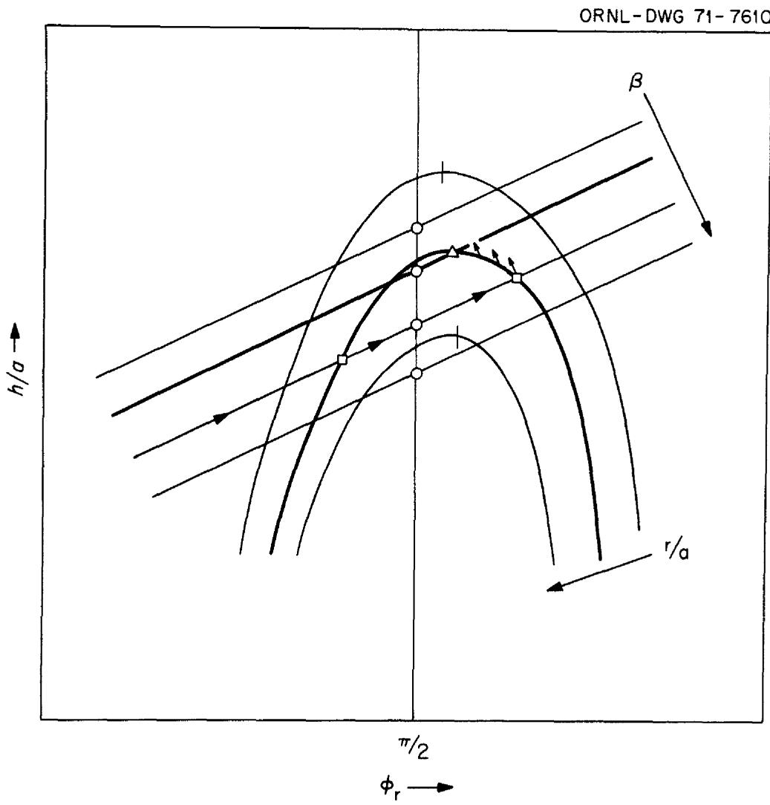  
Fig. 2. Schematic Representation of the Relationships Between h/a, β, r/a, and φr.

For a given value of $\beta$ , $h/a$ is a multi-valued function so that the choice of increasing or decreasing $\beta$ to approach $\overline{h}/a$ must be carefully considered. Furthermore, the direction of approach to $\overline{h}/a$ along the given value of $r/a$ must also be carefully considered. To insure the most trouble-free solution over the entire $h/a$ versus $\phi$ field, a decremental approach from right to left (as shown by the arrows in Fig. 2) was chosen.

To reduce the number of iterations required to locate $\overline{h} / a$ , an estimate of the value of $\beta$ is calculated from equations fitted to a few preliminary results. The initial $\beta$ value is then decremented along first a coarse grid, and finally along an extra fine grid to obtain the final solution using double precision.

# Range, Running Time, and Accuracy

The ranges of the computer program as presently written are $0 < \phi < 360^\circ$ , $0.1 \leq r / a \leq 2.0$ , and $0.02 \leq \beta \leq 150$ ; however, these can be easily extended at some sacrifice of either the running time or accuracy. The average running time for the program to obtain a value of $\overline{h} / a$ for a given value of $r / a$ is approximately 10 seconds on the IBM 360-91 Computer system. The average running time for the other programs is considerably shorter per solution.

An estimate of the accuracy (to be given later) was obtained by comparing the values of $h / a$ as a function of $\phi$ for various values of $\beta$ , $\Delta \phi$ , and for single and double precision.

The results of the computer solution are discussed in the next section.

# RESULTS

The results in both tabular and graphical form are presented in this section and in the Appendix.

The profile of a bubble for $\beta = 0.8$ is shown in Fig. 3. The profile is shown extended to $\phi = 360^{\circ}$ , which would be possible if a suitable

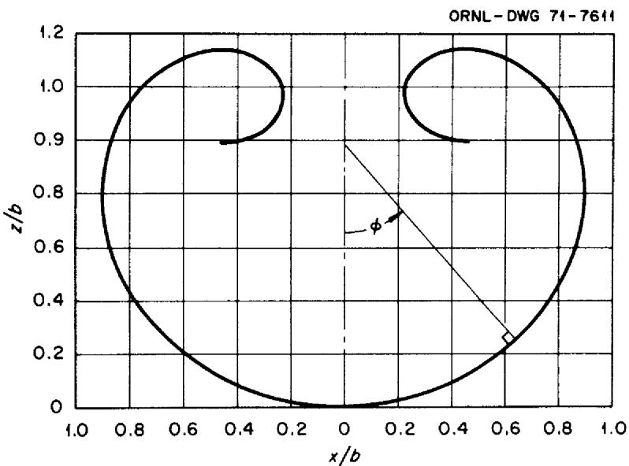  
Fig. 3. Profile of a Bubble with $\beta = 0.8$ for $0^{\circ} \leq \phi \leq 360^{\circ}$ .

form of attachment were provided, and the center of bouvancy were to remain on the $z$ axis.

A tabulation of $\beta$ , $x/b$ , $z/b$ , $h/a$ , and $V/a^3$ for various values of $\phi$ are presented in Tables B.1 through B.6 (in Appendix B). Plots of $h/a$ and $V/a^3$ versus $\phi$ for various $r/a$ are shown in Figs. 4 and 5, respectively. Figure 4 clearly shows the attainment of a maximum value of $h/a$ ( $h/a$ ) for a given radius of attachment. (This is the basis of the maximum-bubble-pressure technique for the measurement of surface tension.) In addition, there is a minimum value of $h/a$ as well as a maximum value for $V/a^3$ .

The values of $\overline{\mathbf{h}}/\mathbf{a}$ and the corresponding values of $\overline{\mathbf{V}}/\mathbf{a}^3$ , $\overline{\beta}$ , $\overline{\phi}$ , $\overline{\mathbf{x}}/\mathbf{b}$ , $\overline{\mathbf{z}}/\mathbf{b}$ for various values of $\mathbf{r}/\mathbf{a}$ are given in Table 1, and various cross-plots of these variables are given in Figs. A.1 through A.4 (Appendix A). These plots show that both $\overline{\mathbf{h}}/\mathbf{a}$ and $\overline{\phi}_{\mathbf{r}}$ approach asymptotic values of $\sqrt{2}$ and $180^\circ$ , respectively. Thus, the maximum pressure difference $(\overline{\mathbf{h}}/\mathbf{a})$ that a large tube can sustain will be very nearly independent of tube diameter.

A least-squares, polynomial fit of the computer solutions for various formulations of $\overline{\mathbf{h}}/\mathbf{a}$ and $\mathbf{r} / \mathbf{a}$ were made. The forumlation that gave the best fit was

$$
\begin{array}{r l r} \frac {\mathrm {a}}{\overline {{\mathrm {h}}}} & \frac {\mathrm {a}}{\mathrm {r}} & = \mathrm {f} \left( \begin{array}{l l} \mathrm {a} & \mathrm {r} \\ \frac {\mathrm {r}}{\overline {{\mathrm {h}}}} & \mathrm {a} \end{array} \right) \end{array} , \tag {19}
$$

which is of the same form as the perturbation solutions of Rayleigh-Schrodinger. For this reason, Eq. (19) was fitted to the data of Table 1 by the relationship:

$$
F (y) = \frac {f (y) - i _ {0} + i _ {1} y + i _ {2} y ^ {2}}{y ^ {3}} = i _ {3} + i _ {4} y + i _ {5} y ^ {2} + \dots , \tag {20}
$$

where $i_0, i_1,$ and $i_2$ are the coefficients of the Rayleigh-Schrodinger solution and $i_3, i_4, i_5, \ldots$ were determined by the least-squares procedure and are listed in Table 2.

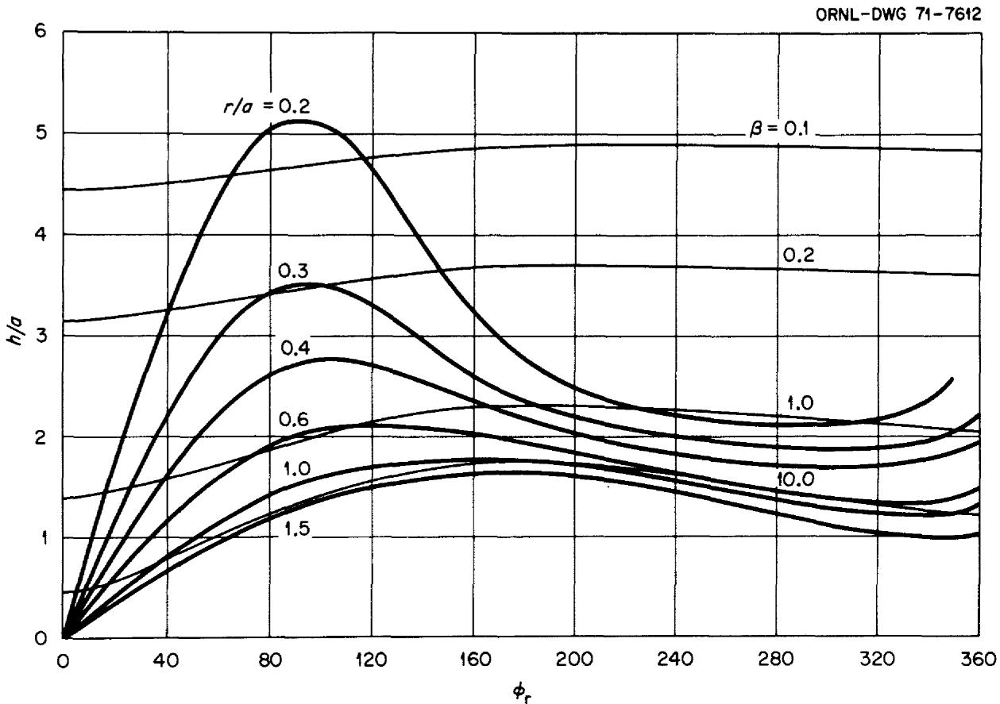  
Fig. 4. Variation of the Dimensionless Pressure Difference, h/a, as a Function of $\phi_{\mathrm{r}}$ for Various Values of $\beta$ and the Dimensionless Radius of Attachment, r/a.

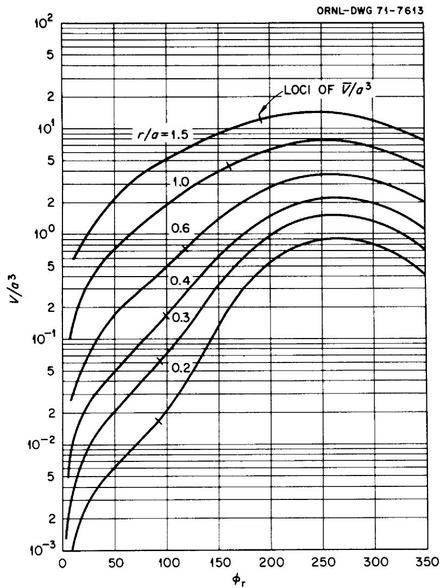  
Fig. 5. Variation of the Dimensionless Volume, $\mathrm{V} / \mathrm{a}^3$ , as a Function of $\phi_{\mathrm{r}}$ for Various Values of the Dimensionless Radius of Attachment, $r / a$ .

Table 1. Maximum Values of the Pressure (h/a) and Corresponding Values of the Size, Shape, and Volume of Bubbles as a Function of the Radius of Attachment (r/a)   

<table><tr><td>r/a</td><td>φ</td><td>β</td><td>x/b</td><td>z/b</td><td>h/a</td><td>V/a3</td></tr><tr><td>0.12</td><td>90.646</td><td>0.0290810</td><td>0.995156</td><td>0.999705</td><td>8.413519</td><td>0.003651</td></tr><tr><td>0.14</td><td>90.795</td><td>0.0397216</td><td>0.993412</td><td>0.998120</td><td>7.236465</td><td>0.005806</td></tr><tr><td>0.16</td><td>91.427</td><td>0.0521086</td><td>0.991243</td><td>1.00397</td><td>6.357323</td><td>0.008787</td></tr><tr><td>0.18</td><td>91.906</td><td>0.0662774</td><td>0.988791</td><td>1.00649</td><td>5.676507</td><td>0.012624</td></tr><tr><td>0.20</td><td>92.411</td><td>0.082286</td><td>0.986012</td><td>1.00865</td><td>5.134652</td><td>0.017439</td></tr><tr><td>0.22</td><td>92.906</td><td>0.100192</td><td>0.982929</td><td>1.00988</td><td>4.693892</td><td>0.023404</td></tr><tr><td>0.24</td><td>93.420</td><td>0.120066</td><td>0.979526</td><td>1.01064</td><td>4.328985</td><td>0.030656</td></tr><tr><td>0.26</td><td>93.945</td><td>0.141985</td><td>0.975814</td><td>1.01077</td><td>4.022445</td><td>0.039323</td></tr><tr><td>0.28</td><td>94.488</td><td>0.166037</td><td>0.971786</td><td>1.01039</td><td>3.761790</td><td>0.049570</td></tr><tr><td>0.30</td><td>95.474</td><td>0.192565</td><td>0.966824</td><td>1.01574</td><td>3.537926</td><td>0.062105</td></tr><tr><td>0.325</td><td>96.472</td><td>0.229022</td><td>0.960416</td><td>1.01752</td><td>3.299450</td><td>0.080293</td></tr><tr><td>0.350</td><td>97.476</td><td>0.269500</td><td>0.953463</td><td>1.01785</td><td>3.097815</td><td>0.101911</td></tr><tr><td>0.375</td><td>98.987</td><td>0.315035</td><td>0.944859</td><td>1.02327</td><td>2.925744</td><td>0.128876</td></tr><tr><td>0.400</td><td>100.225</td><td>0.365084</td><td>0.936222</td><td>1.02319</td><td>2.777713</td><td>0.158475</td></tr><tr><td>0.425</td><td>101.985</td><td>0.421688</td><td>0.925568</td><td>1.02746</td><td>2.649595</td><td>0.197373</td></tr><tr><td>0.450</td><td>103.483</td><td>0.483756</td><td>0.914990</td><td>1.02640</td><td>2.538105</td><td>0.239818</td></tr><tr><td>0.475</td><td>104.821</td><td>0.551689</td><td>0.904402</td><td>1.02173</td><td>2.440625</td><td>0.286173</td></tr><tr><td>0.50</td><td>107.164</td><td>0.631617</td><td>0.889730</td><td>1.02464</td><td>2.355273</td><td>0.346254</td></tr><tr><td>0.55</td><td>111.986</td><td>0.822982</td><td>0.857398</td><td>1.02159</td><td>2.214232</td><td>0.501889</td></tr><tr><td>0.60</td><td>117.488</td><td>1.072133</td><td>0.819487</td><td>1.00938</td><td>2.104842</td><td>0.708170</td></tr><tr><td>0.65</td><td>123.990</td><td>1.407182</td><td>0.774913</td><td>0.986809</td><td>2.019914</td><td>0.987762</td></tr><tr><td>0.70</td><td>130.993</td><td>1.853431</td><td>0.727151</td><td>0.950582</td><td>1.953875</td><td>1.347727</td></tr><tr><td>0.75</td><td>137.489</td><td>2.414075</td><td>0.682654</td><td>0.902832</td><td>1.902104</td><td>1.768822</td></tr><tr><td>0.80</td><td>140.664</td><td>2.977900</td><td>0.655617</td><td>0.853059</td><td>1.860445</td><td>2.136163</td></tr><tr><td>0.90</td><td>152.491</td><td>4.841565</td><td>0.578448</td><td>0.742939</td><td>1.798649</td><td>3.270626</td></tr><tr><td>1.00</td><td>158.492</td><td>7.100181</td><td>0.530738</td><td>0.648972</td><td>1.753511</td><td>4.356567</td></tr><tr><td>1.10</td><td>162.989</td><td>10.070060</td><td>0.490221</td><td>0.567348</td><td>1.718720</td><td>5.521721</td></tr><tr><td>1.20</td><td>165.994</td><td>13.866110</td><td>0.455742</td><td>0.497922</td><td>1.690847</td><td>6.736407</td></tr><tr><td>1.30</td><td>167.994</td><td>18.715220</td><td>0.424972</td><td>0.438376</td><td>1.667904</td><td>8.005399</td></tr><tr><td>1.40</td><td>169.991</td><td>25.16100</td><td>0.394711</td><td>0.385323</td><td>1.648640</td><td>9.386485</td></tr><tr><td>1.50</td><td>171.489</td><td>33.48783</td><td>0.366575</td><td>0.339160</td><td>1.632205</td><td>10.839000</td></tr><tr><td>1.60</td><td>172.494</td><td>44.16429</td><td>0.340486</td><td>0.299033</td><td>1.618007</td><td>12.356187</td></tr><tr><td>1.70</td><td>173.488</td><td>58.14618</td><td>0.315285</td><td>0.263383</td><td>1.605608</td><td>13.971941</td></tr><tr><td>1.80</td><td>173.998</td><td>75.94175</td><td>0.292110</td><td>0.232455</td><td>1.594682</td><td>15.640580</td></tr><tr><td>1.90</td><td>174.987</td><td>99.7358</td><td>0.268978</td><td>0.204340</td><td>1.584975</td><td>17.453834</td></tr><tr><td>2.00</td><td>175.489</td><td>130.1581</td><td>0.247919</td><td>0.180031</td><td>1.576295</td><td>19.314144</td></tr></table>

Table 2. Coefficients for the Polynomial Equations   
Fitted to the Computer Solution   

<table><tr><td>Coefficients</td><td>Eq. (19)</td><td>Eq. (21)</td></tr><tr><td>i0</td><td>1.00000</td><td>-0.00090</td></tr><tr><td>i1</td><td>-0.66667</td><td>1.04439</td></tr><tr><td>i2</td><td>-0.66667</td><td>-0.47175</td></tr><tr><td>i3</td><td>0.03230</td><td>1.43283</td></tr><tr><td>i4</td><td>-5.52833</td><td>-4.59801</td></tr><tr><td>i5</td><td>61.19134</td><td>5.38228</td></tr><tr><td>i6</td><td>-351.38141</td><td>-2.73720</td></tr><tr><td>i7</td><td>1099.76625</td><td>0.51837</td></tr><tr><td>i8</td><td>-1930.93994</td><td></td></tr><tr><td>i9</td><td>1913.36384</td><td></td></tr><tr><td>i10</td><td>-1003.22519</td><td></td></tr><tr><td>i11</td><td>216.93848</td><td></td></tr></table>

The main disadvantage of Eq. (19) is that an iterative procedure is necessary to calculate a/h. A simpler formulation, but less accurate, was also fitted to the computer results:

$$
\frac {a}{h} = f \left(\frac {r}{a}\right). \tag {21}
$$

The coefficients for the polynomial fit of Eq. (21) are also listed in Table 2.

The accuracy of these two polynomial fits is discussed in the next section.

# DISCUSSION OF RESULTS

An estimate of the accuracy of the computer results and comparisons with previous results are presented in this section.

Estimation of the Accuracy. Results were obtained for $h/a$ versus $\phi$ for $\beta = 0.1$ and $100.0$ with three values of $\Delta \phi = 1^\circ$ , $1/2^\circ$ , and $1/4^\circ$ using both single and double precision. There was no change in $h/a$ (to the seventh decimal place) as $\Delta \phi$ was decreased from $1^\circ$ to $1/4^\circ$ when double precision was used for $\beta = 0.1$ and only $0.00008\%$ change for $\beta = 100.0$ . The single precision results are plotted in Fig. 6, where the percent difference is with reference to the double precision, $\Delta \phi = 1/4^\circ$ , values. As can be seen, an interval less than $\Delta \phi = 1^\circ$ decreased the accuracy of the results because of rounding errors when single precision was used.

Except for the maximum pressure results listed in Table 1, all the tabulated results were computed using single precision and interval $\Delta \phi = 1^{\circ}$ . The values listed in Table 1 were calculated using double precision and are good to at least the seventh decimal place. The other tabulated results are good to at least the fifth decimal place.

Comparison with Previous Results. As anticipated, the careful, tedious hand calculations of Bashforth and Adams (which required a number of years to complete) were in good agreement (to the fifth decimal place) with the present computer solution. Trouble, however, develops when the Bashforth and Adams tables are singly and doubly interpolated to apply

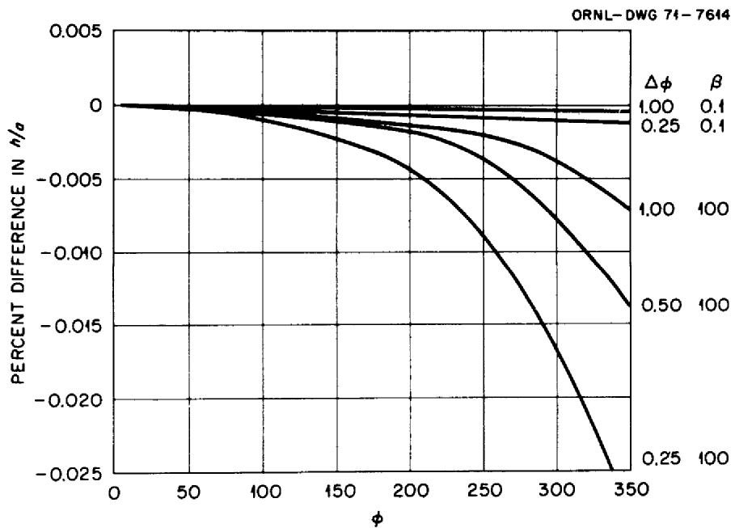  
Fig. 6. Comparison of the Single Precision Results for h/a with the Double Precision, $\Delta \phi = 1/4$ , Values as a Function of $\phi$ , $\Delta \phi$ , and $\beta$ .

their results to practical calculations. Sudgen, $^{10}$ "by careful interpolation" of Bashforth's tables, constructed a table for calculating surface tension by the maximum-bubble-pressure method. (This table is the one most often referred to in current literature on surface tension.) The percent difference between our solution and Sudgen's as a function of $r/a$ is shown in Fig. 7. The maximum difference is -0.1%.

Although an error of $0.1\%$ can be neglected for some studies at elevated temperatures (where other errors are more significant), this magnitude of error can be significant for many measurements made at room temperature, where theoretical studies of small changes in the molecular structure of the interface are being conducted. Furthermore, this error can be magnified by as much as 20 times when the two tube, differential technique is used to measure surface tension.

To be particularly noted in Fig. 7 is that the Rayleigh-Schrödinger solution is in better agreement with the computer solution than Sudgen's results all the way from $0 \leq r/a \leq 0.45$ . This range of $r/a$ covers a large portion of the surface tension studies that have been conducted in the past. In fact, the Rayleigh-Schrödinger equation is in error by less than $1.05\%$ all the way to $r/a = 1.0$ . Thus, this much simpler analytic solution can be used in many cases where precise surface tension values are not needed.

Also shown in Fig. 7 are the deviations of Eqs. (19) and (21) from the computer solutions. Equation (19) agrees to within $\pm 0.05\%$ all the way to $r / a = 1.5$ . The simpler Eq. (21) agrees to within $\pm 0.07\%$ from $0.2 \leq r / a \leq 1.5$ ; but Schrödinger's equation is recommended for $r / a < 0.2$ . The main disadvantages of Eqs. (19) and (21) is that double precision should be used in their solution, especially at the larger values of $r / a$ .

Baumeister and Hamill presented their results as plots of droplet volumes and heights as functions of droplet radii and contact angles. In this form, their results could not be conveniently compared with the present results. In addition, their results were given to only the third significant figure.

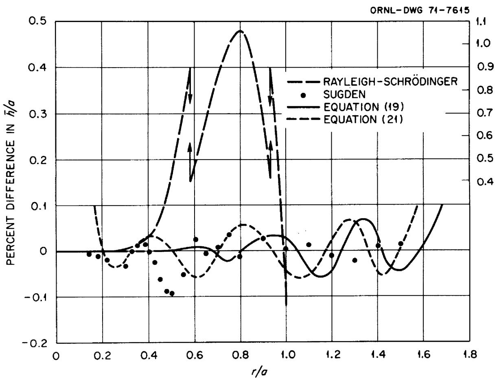  
Fig. 7. Deviations of Previous Solutions and Present Polynomial Equations from the Present Computer Solution of the Maximum-Bubble Pressure.

# CONCLUSIONS

A computer program was written to solve the second-order, nonlinear, differential equation describing the axially symmetric interface between two immiscible fluids. The present solution is limited to sessile-shaped drops and bubbles; the solution for pendant-shaped drops and bubbles requires a different approach and will be given in a later report. All of the present results are accurate to at least the fifth decimal place with some results accurate to the seventh decimal place.

The results are presented in a form that is useful in the analysis of boiling and condensing heat transfer, superheat, critical constants, and in the measurements of contact angles and surface tension. In addition, these results may be of use in the design of equi-stressed shells for containment vessels (i.e., above-ground water tanks, under-water storage of liquids and gases, lighter-than-air ballons, and submerged marine laboratories). The computer program is listed so that a wider range and number of variables can be obtained as desired.

# REFERENCES

1. F. Kreith, Principles of Heat Transfer, pp. 308-437, International Textbook Company, Scranton, Pennsylvania, 1st ed., 1959.   
2. J. A. Edwards and H. W. Hoffman, Superheat Correlation for Boiling Alkali Metals, Proceedings of the Fourth International Heat Transfer Conference, Versailles, September 1970 (under the book title "Heat Transfer 1970"), Elsevier Publishing Company, Amsterdam, Netherlands, 1970.   
3. A. V. Grosse, The Relationship Between the Surface Tension and Energies of Liquid Metals and Their Critical Temperatures, J. Inorg. Nucl. Chem., 24:147-156 (1962).   
4. D. W. G. White, Theory and Experiment in Methods for the Precision Measurement of Surface Tension, Trans. ASME, 55: 757 (1962).   
5. Lord Rayleigh, On the Theory of the Capillary Tube, Proc. Roy. Soc., 92 (Series A): 184-195 (1915).   
6. Erwin Schrödinger, Notizüber den Kapillardruck in Gasblasen, Ann. Physik., 46: 413-418 (1915)

7. F. Bashforth and J. C. Adams, An Attempt to Test the Theories of Capillary Action by Comparing the Theoretical and Measured Forms of Drops of Fluids, University Press, Cambridge, Massachusetts, 1883.   
8. K. J. Baumeister and T. D. Hamill, Liquid Drops: Numerical and Asymptotic Solutions of their Shapes, NASA-TN-D-4779, National Advisory Committee for Aeronautics, September 1968.   
9. F. B. Hildebrand, Introduction to Numerical Analysis, pp. 236-239, McGraw-Hill, New York, 1956.   
10. S. Sugden, The Determination of Surface Tension from Maximum Pressure in Bubbles, J. Chem. Soc., 1: 858-866 (1922).

# NOMENCLATURE

A distance from the origin to the plane of attachment, cm

a² specificcohesion $\equiv 2\gamma g_{c} / \rho g$ ，cm²

b radius of curvature at the vertex of the bubble, cm

g local acceleration due to gravity, cm/sec²

dimensional constant, dyne.sec²/g.cm

pressure differential across interface, cm of fluid with density $\rho$

$\overline{\mathsf{h}}$ maximum value of h for given value of r/a, cm of fluid with density $\rho$

i coefficients of polynomial equations

k coefficients of numerical equations

coefficients of numerical equations

P pressure differential across interface, dyne/cm²

r radius of circle of attachment, cm

r/a dimensionless radius of attachment

$r_1, r_2$ principal radii of curvature of the interface, cm

R dimensionless value of $\mathbf{r}_2$ $r_2 / b$

V volume enclosed by the interface, $\mathbf{cm}^3$

$\overline{\mathbf{V}}$ volume enclosed by the interface for a given value of $r / a$ at $h / a = \overline{h} /a, cm^3$   
x horizontal coordinate, cm   
$\overline{\mathbf{x}}$ value of $\mathbf{x}$ for a given value of $r / a$ at $h / a = \overline{h} /a$ ,cm   
X dimensionless x, $\mathbf{x} / \mathbf{b}$   
X value of X at $x = r$   
y independent variable in polynomial equation   
z vertical coordinate, cm   
$\overline{z}$ value of $z$ for a given value of $r / a$ at $h / a = \overline{h} /a$ ,cm   
Z dimensionless z, $\mathbf{z} / \mathbf{b}$   
Zr value of Z at $\mathbf{x} = \mathbf{r}$

# Greek Letters

$\beta$ dimensionless parameter $\equiv g\rho b^{3} / g_{c}\gamma = 2(b / a)^{2}$   
$\overline{\beta}$ value of $\beta$ for a given $r / a$ at $h / a = \overline{h} /a$   
interfacial tension, dyne/cm   
$\phi$ angle between axis of revolution and the normal to the surface   
$\phi_{\mathbf{r}}$ value of $\phi$ at the radius of attachment   
$\overline{\phi}_{r}$ value of $\phi_{r}$ for a given $r / a$ at $h / a = \overline{h} /a$   
positive density difference between the two fluids, $\mathrm{g/cm^3}$

#

#

APPENDICES


# A. PARAMETRIC CROSSPLOTS

Various crossplots of the parameters shown in Figs. 4 and 5 are given in Figs. A.1, A.2, and A.3. The maximum bubble radius as a function of the angle $\phi_{\mathrm{r}}$ for various radii of attachment is shown plotted in Fig. A.4. For $\phi_{\mathrm{r}} < 90^{\circ}$ , the maximum bubble radius would be the radius of attachment. Also shown in Fig. A.4 is the loci of the maximum bubble radius where the maximum bubble pressure is reached.

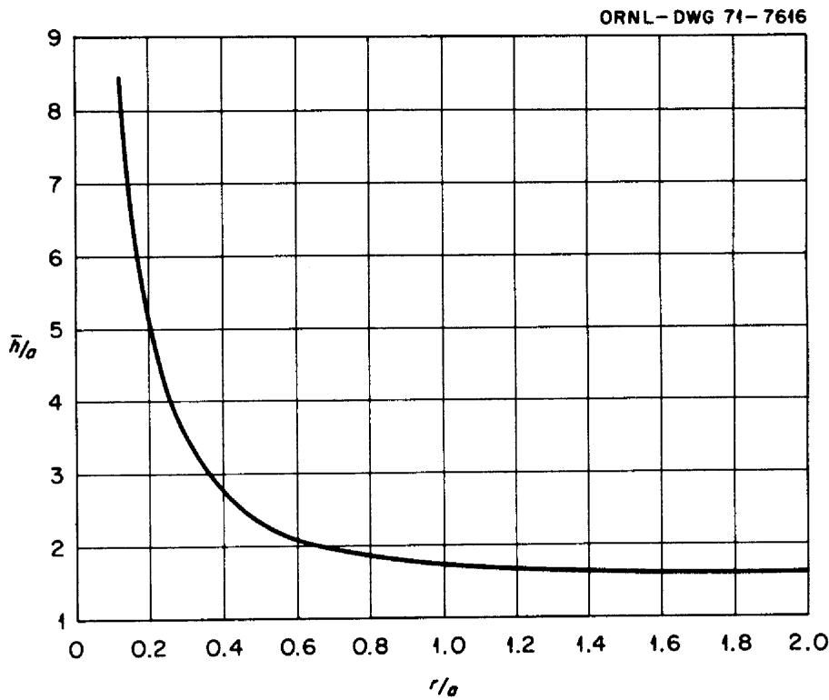  
Fig. A.l. Dimensionless Maximum-Pressure-Difference Across the Interface Separating Two Fluids as a Function of the Dimensionless Radius of Attachment.

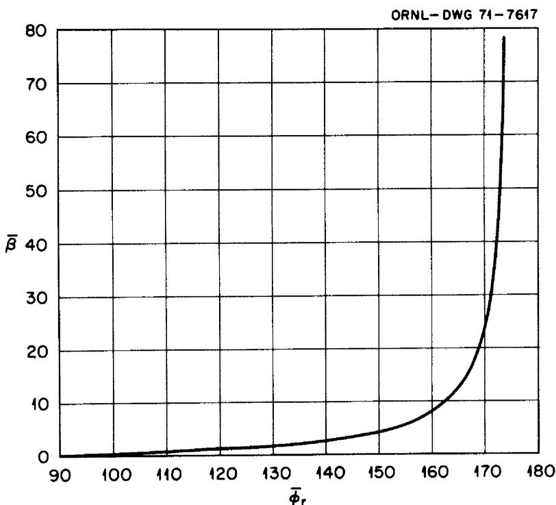  
Fig. A.2. The Value of the Parameter $\beta$ at $h / a = \overline{h} /a$ as a Function of $\phi_{r}$ .

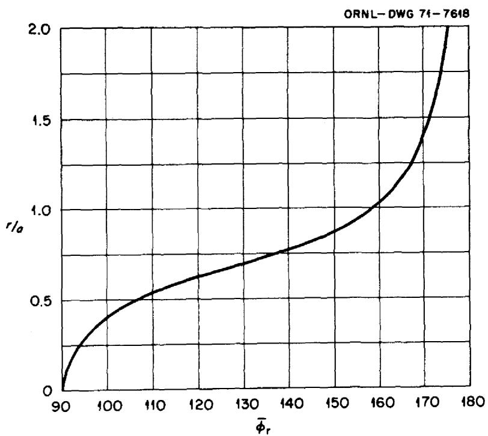  
Fig. A.3. The Dimensionless Radius of Attachment as a Function of $\phi_{\mathrm{r}}$ at $h / a = \overline{h} /a$ .

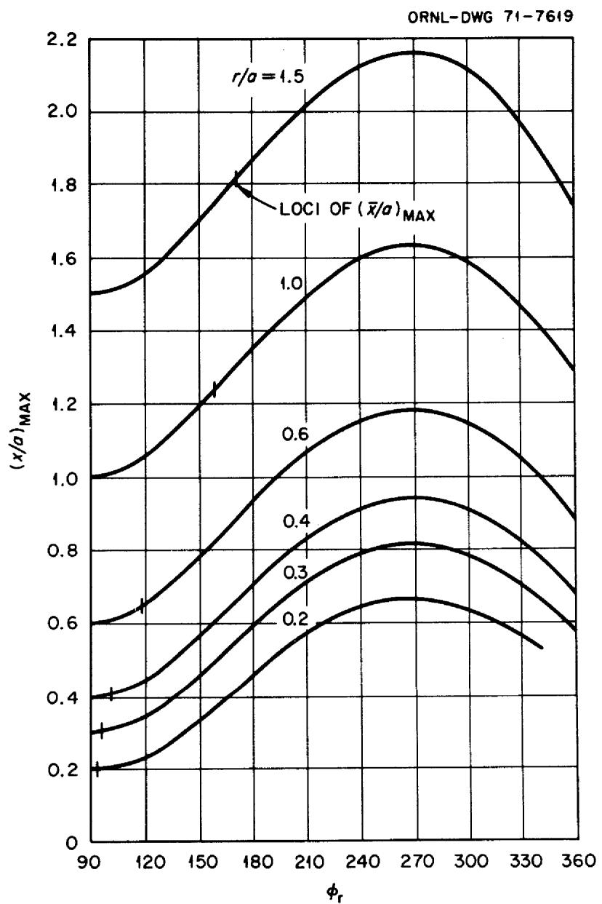  
Fig. A.4. Maximum Radius of a Bubble (x/a at $\phi = 90^{\circ}$ ) as a Function of $\phi_{\mathrm{r}}$ for Various Radii of Attachment (r/a). For $\phi_{\mathrm{r}} < 90^{\circ}, (\mathrm{x / a})_{\max} = \mathrm{r / a}$ .

# B. TABULATED RESULTS

The computer results for the size, shape, pressure, and volume of attached bubbles and drops for given radii of attachment are listed in Table B.1 through B.6. The Results are arranged in ascending values of $\phi_{\mathrm{r}}$ .

$\mathbf{r} / \mathbf{a} = 0.2$

Table B.1. Size, Shape, Pressure, and Volume of Bubbles and Drops with a Given Radius of Attachment   

<table><tr><td>β</td><td>φr</td><td>x/b</td><td>z/b</td><td>h/a</td><td>V/a³</td></tr><tr><td>30.00</td><td>2.99</td><td>0.05168</td><td>0.00135</td><td>0.26341</td><td>0.00030</td></tr><tr><td>18.00</td><td>3.86</td><td>0.06667</td><td>0.00225</td><td>0.34009</td><td>0.00042</td></tr><tr><td>8.00</td><td>5.80</td><td>0.10000</td><td>0.00505</td><td>0.51009</td><td>0.00063</td></tr><tr><td>5.50</td><td>7.00</td><td>0.12061</td><td>0.00734</td><td>0.61519</td><td>0.00077</td></tr><tr><td>4.00</td><td>8.21</td><td>0.14142</td><td>0.01013</td><td>0.72143</td><td>0.00090</td></tr><tr><td>3.50</td><td>8.78</td><td>0.15119</td><td>0.01158</td><td>0.77125</td><td>0.00096</td></tr><tr><td>2.90</td><td>9.66</td><td>0.16609</td><td>0.01400</td><td>0.84731</td><td>0.00106</td></tr><tr><td>2.30</td><td>10.86</td><td>0.18650</td><td>0.01765</td><td>0.95144</td><td>0.00119</td></tr><tr><td>2.00</td><td>11.66</td><td>0.20000</td><td>0.02317</td><td>1.02032</td><td>0.00128</td></tr><tr><td>1.80</td><td>12.30</td><td>0.21082</td><td>0.02262</td><td>1.07556</td><td>0.00135</td></tr><tr><td>1.50</td><td>13.49</td><td>0.23094</td><td>0.02717</td><td>1.17823</td><td>0.00149</td></tr><tr><td>1.10</td><td>15.81</td><td>0.26968</td><td>0.03727</td><td>1.37604</td><td>0.00175</td></tr><tr><td>0.95</td><td>17.05</td><td>0.29019</td><td>0.04327</td><td>1.48078</td><td>0.00189</td></tr><tr><td>0.80</td><td>18.63</td><td>0.31623</td><td>0.05161</td><td>1.61378</td><td>0.00207</td></tr><tr><td>0.66</td><td>20.59</td><td>0.34816</td><td>0.06295</td><td>1.77694</td><td>0.00229</td></tr><tr><td>0.58</td><td>22.04</td><td>0.37139</td><td>0.07194</td><td>1.89569</td><td>0.00247</td></tr><tr><td>0.50</td><td>23.84</td><td>0.40000</td><td>0.08399</td><td>2.04200</td><td>0.00268</td></tr><tr><td>0.46</td><td>24.92</td><td>0.41703</td><td>0.09166</td><td>2.12910</td><td>0.00281</td></tr><tr><td>0.42</td><td>26.17</td><td>0.43644</td><td>0.10089</td><td>2.22841</td><td>0.00296</td></tr><tr><td>0.38</td><td>27.62</td><td>0.45883</td><td>0.11220</td><td>2.34306</td><td>0.00313</td></tr><tr><td>0.34</td><td>29.35</td><td>0.48507</td><td>0.12636</td><td>2.47745</td><td>0.00334</td></tr><tr><td>0.30</td><td>31.46</td><td>0.51640</td><td>0.14463</td><td>2.63801</td><td>0.00361</td></tr><tr><td>0.25</td><td>34.87</td><td>0.56569</td><td>0.17662</td><td>2.89087</td><td>0.00405</td></tr><tr><td>0.23</td><td>36.59</td><td>0.58977</td><td>0.19386</td><td>3.01458</td><td>0.00427</td></tr><tr><td>0.21</td><td>38.60</td><td>0.61721</td><td>0.21486</td><td>3.15569</td><td>0.00455</td></tr><tr><td>0.19</td><td>40.99</td><td>0.64889</td><td>0.24102</td><td>3.31872</td><td>0.00489</td></tr><tr><td>0.17</td><td>43.91</td><td>0.68599</td><td>0.27474</td><td>3.51007</td><td>0.00531</td></tr><tr><td>0.15</td><td>47.60</td><td>0.73030</td><td>0.31993</td><td>3.73910</td><td>0.00585</td></tr><tr><td>0.14</td><td>49.86</td><td>0.75593</td><td>0.34889</td><td>3.87195</td><td>0.00622</td></tr><tr><td>0.13</td><td>52.51</td><td>0.78446</td><td>0.38410</td><td>4.02025</td><td>0.00664</td></tr><tr><td>0.12</td><td>55.69</td><td>0.81650</td><td>0.42796</td><td>4.18731</td><td>0.00719</td></tr><tr><td>0.11</td><td>59.65</td><td>0.85280</td><td>0.48479</td><td>4.37771</td><td>0.00792</td></tr><tr><td>0.10</td><td>64.87</td><td>0.89443</td><td>0.56306</td><td>4.59804</td><td>0.00898</td></tr><tr><td>0.09</td><td>72.70</td><td>0.94281</td><td>0.68614</td><td>4.85960</td><td>0.01079</td></tr><tr><td>0.0828</td><td>84.85</td><td>0.98295</td><td>0.88466</td><td>5.09473</td><td>0.01444</td></tr><tr><td>β</td><td>φ</td><td>x/b</td><td>z/b</td><td>h/a</td><td>V/a³</td></tr><tr><td>0.0828</td><td>95.17</td><td>0.98295</td><td>1.05331</td><td>5.12905</td><td>0.01878</td></tr><tr><td>0.09</td><td>107.58</td><td>0.94281</td><td>1.24471</td><td>4.97809</td><td>0.02660</td></tr><tr><td>0.10</td><td>115.80</td><td>0.89443</td><td>1.35781</td><td>4.77575</td><td>0.03445</td></tr><tr><td>0.11</td><td>121.43</td><td>0.85280</td><td>1.42604</td><td>4.59845</td><td>0.04173</td></tr><tr><td>0.12</td><td>125.82</td><td>0.81650</td><td>1.47280</td><td>4.44324</td><td>0.04890</td></tr><tr><td>0.13</td><td>129.46</td><td>0.78446</td><td>1.50654</td><td>4.30642</td><td>0.05606</td></tr><tr><td>0.14</td><td>132.59</td><td>0.75593</td><td>1.53162</td><td>4.18487</td><td>0.06328</td></tr><tr><td>0.15</td><td>135.34</td><td>0.73030</td><td>1.55053</td><td>4.07611</td><td>0.07058</td></tr><tr><td>0.17</td><td>140.07</td><td>0.68599</td><td>1.57565</td><td>3.88935</td><td>0.08542</td></tr><tr><td>0.19</td><td>144.07</td><td>0.64889</td><td>1.58951</td><td>3.73435</td><td>0.10060</td></tr><tr><td>0.21</td><td>147.60</td><td>0.61721</td><td>1.59609</td><td>3.60326</td><td>0.11610</td></tr><tr><td>0.23</td><td>150.78</td><td>0.58977</td><td>1.59777</td><td>3.49067</td><td>0.13189</td></tr><tr><td>0.25</td><td>153.70</td><td>0.56569</td><td>1.59596</td><td>3.39269</td><td>0.14794</td></tr><tr><td>0.34</td><td>164.94</td><td>0.48507</td><td>1.56461</td><td>3.07046</td><td>0.22259</td></tr><tr><td>0.38</td><td>169.34</td><td>0.45883</td><td>1.54451</td><td>2.96739</td><td>0.25668</td></tr><tr><td>0.42</td><td>173.53</td><td>0.43644</td><td>1.52274</td><td>2.87998</td><td>0.29109</td></tr><tr><td>0.46</td><td>177.57</td><td>0.41703</td><td>1.50000</td><td>2.80452</td><td>0.32574</td></tr><tr><td>0.58</td><td>189.15</td><td>0.37139</td><td>1.42956</td><td>2.62679</td><td>0.43005</td></tr><tr><td>0.66</td><td>196.74</td><td>0.34816</td><td>1.38256</td><td>2.53500</td><td>0.49949</td></tr><tr><td>0.70</td><td>200.55</td><td>0.33806</td><td>1.35938</td><td>2.49453</td><td>0.53405</td></tr><tr><td>0.80</td><td>210.35</td><td>0.31623</td><td>1.30143</td><td>2.40423</td><td>0.61955</td></tr><tr><td>0.90</td><td>220.90</td><td>0.29814</td><td>1.24333</td><td>2.32476</td><td>0.70350</td></tr><tr><td>1.00</td><td>233.12</td><td>0.28284</td><td>1.18282</td><td>2.25059</td><td>0.78543</td></tr><tr><td>1.10</td><td>250.16</td><td>0.26968</td><td>1.11197</td><td>2.17306</td><td>0.86409</td></tr><tr><td>1.10</td><td>289.74</td><td>0.26968</td><td>1.01358</td><td>2.10009</td><td>0.85531</td></tr><tr><td>1.00</td><td>306.55</td><td>0.28284</td><td>1.00345</td><td>2.12376</td><td>0.77164</td></tr><tr><td>0.90</td><td>318.54</td><td>0.29814</td><td>1.01038</td><td>2.16850</td><td>0.68854</td></tr><tr><td>0.80</td><td>328.88</td><td>0.31623</td><td>1.02769</td><td>2.23111</td><td>0.60513</td></tr></table>

$$
r / a = 0. 3
$$

Table B.2. Size, Shape, Pressure, and Volume of Bubbles and Drops with Given Radius of Attachment   

<table><tr><td>β</td><td>φr</td><td>x/b</td><td>z/b</td><td>h/a</td><td>V/a³</td></tr><tr><td>30.0</td><td>4.55</td><td>0.07746</td><td>0.00307</td><td>0.27011</td><td>0.00165</td></tr><tr><td>18.0</td><td>5.87</td><td>0.10000</td><td>0.00509</td><td>0.34859</td><td>0.00215</td></tr><tr><td>12.0</td><td>7.20</td><td>0.12247</td><td>0.00764</td><td>0.42700</td><td>0.00264</td></tr><tr><td>8.0</td><td>8.83</td><td>0.15000</td><td>0.01145</td><td>0.52291</td><td>0.00325</td></tr><tr><td>5.5</td><td>10.66</td><td>0.18091</td><td>0.01672</td><td>0.63076</td><td>0.00393</td></tr><tr><td>4.0</td><td>12.53</td><td>0.21213</td><td>0.02303</td><td>0.73967</td><td>0.00464</td></tr><tr><td>3.5</td><td>13.41</td><td>0.22678</td><td>0.02640</td><td>0.79085</td><td>0.00496</td></tr><tr><td>2.9</td><td>14.77</td><td>0.24914</td><td>0.03194</td><td>0.86891</td><td>0.00547</td></tr><tr><td>2.3</td><td>16.63</td><td>0.27975</td><td>0.04045</td><td>0.97588</td><td>0.00618</td></tr><tr><td>2.0</td><td>17.87</td><td>0.30000</td><td>0.04663</td><td>1.04663</td><td>0.00667</td></tr><tr><td>1.8</td><td>18.88</td><td>0.31623</td><td>0.05197</td><td>1.10340</td><td>0.00745</td></tr><tr><td>1.7</td><td>19.45</td><td>0.32540</td><td>0.05512</td><td>1.13547</td><td>0.00727</td></tr><tr><td>1.5</td><td>20.76</td><td>0.34641</td><td>0.06271</td><td>1.20901</td><td>0.00779</td></tr><tr><td>1.25</td><td>22.85</td><td>0.37947</td><td>0.07579</td><td>1.32483</td><td>0.00861</td></tr><tr><td>1.2</td><td>23.35</td><td>0.38730</td><td>0.07908</td><td>1.35225</td><td>0.00881</td></tr><tr><td>1.1</td><td>24.46</td><td>0.40452</td><td>0.08662</td><td>1.41264</td><td>0.00925</td></tr><tr><td>1.0</td><td>25.74</td><td>0.42426</td><td>0.09574</td><td>1.48191</td><td>0.00977</td></tr><tr><td>0.95</td><td>26.46</td><td>0.43529</td><td>0.10110</td><td>1.52063</td><td>0.01005</td></tr><tr><td>0.9</td><td>27.24</td><td>0.44721</td><td>0.10704</td><td>1.56252</td><td>0.01038</td></tr><tr><td>0.8</td><td>29.05</td><td>0.47434</td><td>0.12135</td><td>1.65789</td><td>0.01113</td></tr><tr><td>0.7</td><td>31.28</td><td>0.50709</td><td>0.14017</td><td>1.77323</td><td>0.01206</td></tr><tr><td>0.66</td><td>32.32</td><td>0.52223</td><td>0.14943</td><td>1.82662</td><td>0.01250</td></tr><tr><td>0.58</td><td>34.79</td><td>0.55709</td><td>0.17222</td><td>1.94970</td><td>0.01358</td></tr><tr><td>0.5</td><td>37.92</td><td>0.60000</td><td>0.20334</td><td>2.10167</td><td>0.01499</td></tr><tr><td>0.46</td><td>39.86</td><td>0.62554</td><td>0.22365</td><td>2.19240</td><td>0.01588</td></tr><tr><td>0.42</td><td>42.13</td><td>0.65465</td><td>0.24857</td><td>2.29609</td><td>0.01695</td></tr><tr><td>0.38</td><td>44.87</td><td>0.68825</td><td>0.27994</td><td>2.41618</td><td>0.01829</td></tr><tr><td>0.34</td><td>48.25</td><td>0.72761</td><td>0.32082</td><td>2.55764</td><td>0.02000</td></tr><tr><td>0.3</td><td>52.62</td><td>0.77460</td><td>0.37669</td><td>2.72788</td><td>0.02236</td></tr><tr><td>0.25</td><td>60.61</td><td>0.84853</td><td>0.48659</td><td>3.00046</td><td>0.02715</td></tr><tr><td>0.23</td><td>65.36</td><td>0.88465</td><td>0.55577</td><td>3.13731</td><td>0.03036</td></tr><tr><td>0.21</td><td>72.20</td><td>0.92582</td><td>0.65884</td><td>3.29956</td><td>0.03559</td></tr><tr><td>0.195</td><td>81.53</td><td>0.96077</td><td>0.80327</td><td>3.45338</td><td>0.04423</td></tr><tr><td>β</td><td>φ</td><td>x/b</td><td>z/b</td><td>h/a</td><td>V/a³</td></tr><tr><td>0.1925</td><td>95.40</td><td>0.96694</td><td>1.01465</td><td>3.53793</td><td>0.06203</td></tr><tr><td>0.21</td><td>108.40</td><td>0.92582</td><td>1.19288</td><td>3.47260</td><td>0.08758</td></tr><tr><td>0.23</td><td>115.90</td><td>0.88465</td><td>1.27945</td><td>3.38272</td><td>0.10864</td></tr><tr><td>0.25</td><td>121.34</td><td>0.84853</td><td>1.33222</td><td>3.29944</td><td>0.12796</td></tr><tr><td>0.3</td><td>131.17</td><td>0.77460</td><td>1.40212</td><td>3.12503</td><td>0.17414</td></tr><tr><td>0.34</td><td>137.09</td><td>0.7276</td><td>1.42704</td><td>3.01374</td><td>0.21045</td></tr><tr><td>0.38</td><td>142.08</td><td>0.68825</td><td>1.43800</td><td>2.92095</td><td>0.24666</td></tr><tr><td>0.42</td><td>146.46</td><td>0.65465</td><td>1.44035</td><td>2.84223</td><td>0.28285</td></tr><tr><td>0.46</td><td>150.41</td><td>0.62554</td><td>1.43727</td><td>2.77443</td><td>0.31905</td></tr><tr><td>0.50</td><td>154.05</td><td>0.60000</td><td>1.43052</td><td>2.71526</td><td>0.35524</td></tr><tr><td>0.58</td><td>160.65</td><td>0.55709</td><td>1.41014</td><td>2.61634</td><td>0.42743</td></tr><tr><td>0.66</td><td>166.63</td><td>0.52223</td><td>1.38465</td><td>2.53620</td><td>0.49919</td></tr><tr><td>0.7</td><td>169.45</td><td>0.50709</td><td>1.37088</td><td>2.50133</td><td>0.53471</td></tr><tr><td>0.8</td><td>176.18</td><td>0.47434</td><td>1.33487</td><td>2.42538</td><td>0.62303</td></tr><tr><td>0.9</td><td>182.56</td><td>0.44721</td><td>1.29805</td><td>2.36147</td><td>0.70984</td></tr><tr><td>1.0</td><td>188.74</td><td>0.42426</td><td>1.26124</td><td>2.30604</td><td>0.79517</td></tr><tr><td>1.1</td><td>194.79</td><td>0.40452</td><td>1.22489</td><td>2.25680</td><td>0.87863</td></tr><tr><td>1.2</td><td>200.82</td><td>0.38730</td><td>1.18910</td><td>2.21206</td><td>0.96038</td></tr><tr><td>1.5</td><td>219.70</td><td>0.34641</td><td>1.08403</td><td>2.09350</td><td>1.19399</td></tr><tr><td>1.7</td><td>234.58</td><td>0.32540</td><td>1.01218</td><td>2.01784</td><td>1.33856</td></tr><tr><td>1.7</td><td>304.88</td><td>0.32540</td><td>0.83893</td><td>1.85810</td><td>1.29849</td></tr><tr><td>1.2</td><td>337.48</td><td>0.38730</td><td>0.87818</td><td>1.97123</td><td>0.91837</td></tr><tr><td>1.1</td><td>343.30</td><td>0.40452</td><td>0.89730</td><td>2.01386</td><td>0.84032</td></tr><tr><td>1.0</td><td>349.15</td><td>0.42426</td><td>0.92136</td><td>2.06571</td><td>0.76142</td></tr><tr><td>0.9</td><td>355.15</td><td>0.44721</td><td>0.95155</td><td>2.12903</td><td>0.68168</td></tr></table>

$$
r / a = 0. 4
$$

Table B.3. Size, Shape, Pressure, and Volume of Bubbles and Drops with Given Radius of Attachment   

<table><tr><td>β</td><td>φR</td><td>x/b</td><td>z/b</td><td>h/a</td><td>V/a³</td></tr><tr><td>30.0</td><td>6.17</td><td>0.10328</td><td>0.00548</td><td>0.27941</td><td>0.00533</td></tr><tr><td>18.0</td><td>7.98</td><td>0.13333</td><td>0.00912</td><td>0.36068</td><td>0.00692</td></tr><tr><td>12.0</td><td>9.79</td><td>0.16330</td><td>0.01372</td><td>0.44187</td><td>0.00850</td></tr><tr><td>8.0</td><td>12.02</td><td>0.20000</td><td>0.02063</td><td>0.54126</td><td>0.01047</td></tr><tr><td>5.5</td><td>14.54</td><td>0.24121</td><td>0.03019</td><td>0.65309</td><td>0.01270</td></tr><tr><td>4.0</td><td>17.13</td><td>0.28284</td><td>0.04173</td><td>0.76612</td><td>0.01504</td></tr><tr><td>3.5</td><td>18.35</td><td>0.30237</td><td>0.04787</td><td>0.81926</td><td>0.01613</td></tr><tr><td>2.9</td><td>20.24</td><td>0.33218</td><td>0.05808</td><td>0.90040</td><td>0.01786</td></tr><tr><td>2.3</td><td>22.86</td><td>0.37300</td><td>0.07385</td><td>1.01170</td><td>0.02030</td></tr><tr><td>2.0</td><td>24.63</td><td>0.40000</td><td>0.08546</td><td>1.08546</td><td>0.02196</td></tr><tr><td>1.8</td><td>26.06</td><td>0.42164</td><td>0.09548</td><td>1.14468</td><td>0.02332</td></tr><tr><td>1.5</td><td>28.78</td><td>0.46188</td><td>0.11589</td><td>1.25507</td><td>0.02594</td></tr><tr><td>1.25</td><td>31.84</td><td>0.50596</td><td>0.14108</td><td>1.37644</td><td>0.02897</td></tr><tr><td>1.1</td><td>34.23</td><td>0.53936</td><td>0.16228</td><td>1.46875</td><td>0.03139</td></tr><tr><td>1.0</td><td>36.17</td><td>0.56569</td><td>0.18038</td><td>1.54176</td><td>0.03341</td></tr><tr><td>0.8</td><td>41.32</td><td>0.63246</td><td>0.23257</td><td>1.72823</td><td>0.03897</td></tr><tr><td>0.66</td><td>46.69</td><td>0.69631</td><td>0.29255</td><td>1.90883</td><td>0.04512</td></tr><tr><td>0.58</td><td>50.97</td><td>0.74278</td><td>0.34404</td><td>2.04222</td><td>0.05041</td></tr><tr><td>0.5</td><td>56.89</td><td>0.80000</td><td>0.41997</td><td>2.20998</td><td>0.05828</td></tr><tr><td>0.46</td><td>60.93</td><td>0.83406</td><td>0.47434</td><td>2.31263</td><td>0.06413</td></tr><tr><td>0.42</td><td>66.32</td><td>0.87287</td><td>0.54940</td><td>2.43395</td><td>0.07262</td></tr><tr><td>0.38</td><td>74.69</td><td>0.91766</td><td>0.66956</td><td>2.58601</td><td>0.08785</td></tr><tr><td>0.36</td><td>97.25</td><td>0.94281</td><td>0.98565</td><td>2.77520</td><td>0.14837</td></tr><tr><td>0.38</td><td>105.99</td><td>0.91766</td><td>1.09093</td><td>2.76968</td><td>0.18416</td></tr><tr><td>0.42</td><td>115.44</td><td>0.87287</td><td>1.18463</td><td>2.72505</td><td>0.23502</td></tr><tr><td>0.46</td><td>121.96</td><td>0.83406</td><td>1.23412</td><td>2.67701</td><td>0.27950</td></tr><tr><td>0.5</td><td>127.16</td><td>0.80000</td><td>1.26371</td><td>2.63185</td><td>0.32143</td></tr><tr><td>0.58</td><td>135.45</td><td>0.74278</td><td>1.12924</td><td>2.55291</td><td>0.40169</td></tr><tr><td>0.66</td><td>142.15</td><td>0.69631</td><td>1.29953</td><td>2.48730</td><td>0.47925</td></tr><tr><td>0.7</td><td>145.12</td><td>0.67612</td><td>1.29854</td><td>2.45854</td><td>0.51723</td></tr><tr><td>0.8</td><td>151.82</td><td>0.63246</td><td>1.28804</td><td>2.39577</td><td>0.61073</td></tr><tr><td>0.9</td><td>157.75</td><td>0.59628</td><td>1.27074</td><td>2.34315</td><td>0.70194</td></tr><tr><td>1.0</td><td>163.17</td><td>0.56569</td><td>1.24977</td><td>2.29794</td><td>0.79124</td></tr><tr><td>1.1</td><td>168.21</td><td>0.53936</td><td>1.22692</td><td>2.25831</td><td>0.87839</td></tr><tr><td>β</td><td>φ</td><td>x/b</td><td>z/b</td><td>h/a</td><td>V/a³</td></tr><tr><td>1.2</td><td>172.98</td><td>0.51640</td><td>1.20312</td><td>2.22293</td><td>0.96372</td></tr><tr><td>1.25</td><td>175.29</td><td>0.50596</td><td>1.19105</td><td>2.20652</td><td>1.00587</td></tr><tr><td>1.5</td><td>186.20</td><td>0.46188</td><td>1.13075</td><td>2.13396</td><td>1.20846</td></tr><tr><td>1.7</td><td>194.51</td><td>0.43386</td><td>1.08367</td><td>2.08375</td><td>1.36230</td></tr><tr><td>2.0</td><td>206.81</td><td>0.40000</td><td>1.01557</td><td>2.01557</td><td>1.57998</td></tr><tr><td>2.5</td><td>229.01</td><td>0.35777</td><td>0.90542</td><td>1.90671</td><td>1.90695</td></tr><tr><td>2.5</td><td>310.00</td><td>0.35777</td><td>0.71442</td><td>1.69317</td><td>1.81377</td></tr><tr><td>2.0</td><td>331.06</td><td>0.40000</td><td>0.73401</td><td>1.73401</td><td>1.47971</td></tr><tr><td>1.7</td><td>342.67</td><td>0.43386</td><td>0.76316</td><td>1.78825</td><td>1.27326</td></tr><tr><td>1.5</td><td>350.54</td><td>0.46188</td><td>0.79225</td><td>1.84081</td><td>1.13175</td></tr></table>

$\mathbf{r} / \mathbf{a} = 0.6$

Table B.4. Size, Shape, Pressure, and Volume of Bubbles and Drops with Given Radius of Attachment   

<table><tr><td>β</td><td>φr</td><td>x/b</td><td>z/b</td><td>h/a</td><td>V/a³</td></tr><tr><td>60.0</td><td>6.98</td><td>0.11094</td><td>0.00647</td><td>0.21801</td><td>0.01748</td></tr><tr><td>30.0</td><td>9.75</td><td>0.15492</td><td>0.01266</td><td>0.30724</td><td>0.02813</td></tr><tr><td>18.0</td><td>12.64</td><td>0.20000</td><td>0.02120</td><td>0.39692</td><td>0.03656</td></tr><tr><td>12.0</td><td>15.54</td><td>0.24495</td><td>0.03198</td><td>0.48658</td><td>0.04515</td></tr><tr><td>8.0</td><td>19.17</td><td>0.30000</td><td>0.04838</td><td>0.59676</td><td>0.05604</td></tr><tr><td>5.5</td><td>23.35</td><td>0.36181</td><td>0.07133</td><td>0.72131</td><td>0.06879</td></tr><tr><td>4.0</td><td>27.72</td><td>0.42426</td><td>0.09970</td><td>0.84811</td><td>0.08255</td></tr><tr><td>3.5</td><td>29.83</td><td>0.45356</td><td>0.11501</td><td>0.90807</td><td>0.08935</td></tr><tr><td>2.9</td><td>33.16</td><td>0.49827</td><td>0.14101</td><td>1.00025</td><td>0.10029</td></tr><tr><td>2.3</td><td>37.95</td><td>0.55950</td><td>0.18242</td><td>1.12813</td><td>0.11668</td></tr><tr><td>2.0</td><td>41.31</td><td>0.60000</td><td>0.21408</td><td>1.21407</td><td>0.12865</td></tr><tr><td>1.8</td><td>44.15</td><td>0.63246</td><td>0.24231</td><td>1.28397</td><td>0.13910</td></tr><tr><td>1.7</td><td>45.82</td><td>0.65079</td><td>0.25954</td><td>1.32394</td><td>0.14544</td></tr><tr><td>1.5</td><td>49.88</td><td>0.69282</td><td>0.30298</td><td>1.41709</td><td>0.16135</td></tr><tr><td>1.25</td><td>57.15</td><td>0.75895</td><td>0.38608</td><td>1.57014</td><td>0.19222</td></tr><tr><td>1.2</td><td>59.11</td><td>0.77460</td><td>0.40935</td><td>1.60808</td><td>0.20112</td></tr><tr><td>1.1</td><td>63.92</td><td>0.80904</td><td>0.46757</td><td>1.69516</td><td>0.22420</td></tr><tr><td>1.0</td><td>70.86</td><td>0.84853</td><td>0.55331</td><td>1.80546</td><td>0.26115</td></tr><tr><td>1.0</td><td>110.89</td><td>0.84853</td><td>0.97076</td><td>2.10065</td><td>0.61473</td></tr><tr><td>1.1</td><td>119.62</td><td>0.80904</td><td>1.01944</td><td>2.10444</td><td>0.74147</td></tr><tr><td>1.2</td><td>126.22</td><td>0.77460</td><td>1.04278</td><td>2.09873</td><td>0.85283</td></tr><tr><td>1.25</td><td>129.07</td><td>0.75895</td><td>1.04934</td><td>2.09449</td><td>0.90534</td></tr><tr><td>1.5</td><td>140.75</td><td>0.69282</td><td>1.05581</td><td>2.06906</td><td>1.14754</td></tr><tr><td>1.7</td><td>148.28</td><td>0.65079</td><td>1.04488</td><td>2.04798</td><td>1.32506</td></tr><tr><td>1.8</td><td>151.67</td><td>0.63246</td><td>1.03679</td><td>2.37679</td><td>1.40998</td></tr><tr><td>2.0</td><td>157.90</td><td>0.60000</td><td>1.01784</td><td>2.01784</td><td>1.57280</td></tr><tr><td>2.3</td><td>166.26</td><td>0.55950</td><td>0.98579</td><td>1.98964</td><td>1.80255</td></tr><tr><td>3.0</td><td>183.08</td><td>0.48990</td><td>0.90845</td><td>1.92912</td><td>2.28289</td></tr><tr><td>3.5</td><td>193.87</td><td>0.45356</td><td>0.85574</td><td>1.88796</td><td>2.58703</td></tr><tr><td>4.0</td><td>204.25</td><td>0.42426</td><td>0.80597</td><td>1.84692</td><td>2.86294</td></tr><tr><td>6.0</td><td>258.64</td><td>0.34641</td><td>0.60326</td><td>1.62222</td><td>3.68271</td></tr><tr><td>6.0</td><td>281.23</td><td>0.34641</td><td>0.55639</td><td>1.54104</td><td>3.59171</td></tr><tr><td>4.0</td><td>332.13</td><td>0.42426</td><td>0.55032</td><td>1.48537</td><td>2.56096</td></tr><tr><td>3.0</td><td>351.28</td><td>0.48990</td><td>0.59863</td><td>1.54966</td><td>2.03835</td></tr></table>

$\mathrm{r / a} = 1.0$

Table B.5. Size, Shape, Pressure, and Volume of Bubbles and Drops with Given Radius of Attachment   

<table><tr><td>β</td><td>φr</td><td>x/b</td><td>z/b</td><td>h/a</td><td>V/a³</td></tr><tr><td>60.0</td><td>13.46</td><td>0.18257</td><td>0.01914</td><td>0.28739</td><td>0.17182</td></tr><tr><td>30.0</td><td>19.24</td><td>0.25820</td><td>0.03877</td><td>0.40835</td><td>0.24755</td></tr><tr><td>18.0</td><td>25.24</td><td>0.33333</td><td>0.06585</td><td>0.53089</td><td>0.32807</td></tr><tr><td>16.0</td><td>26.91</td><td>0.35355</td><td>0.07454</td><td>0.56438</td><td>0.35097</td></tr><tr><td>12.0</td><td>31.60</td><td>0.40825</td><td>0.10137</td><td>0.65655</td><td>0.41635</td></tr><tr><td>8.0</td><td>40.18</td><td>0.50000</td><td>0.15888</td><td>0.81776</td><td>0.54200</td></tr><tr><td>6.5</td><td>45.96</td><td>0.55470</td><td>0.20262</td><td>0.91998</td><td>0.63182</td></tr><tr><td>5.5</td><td>51.73</td><td>0.60302</td><td>0.24929</td><td>1.01642</td><td>0.72663</td></tr><tr><td>4.5</td><td>61.02</td><td>0.66667</td><td>0.32813</td><td>1.15886</td><td>0.89237</td></tr><tr><td>4.0</td><td>69.09</td><td>0.70711</td><td>0.39734</td><td>1.26903</td><td>1.05200</td></tr><tr><td>3.7</td><td>77.81</td><td>0.73522</td><td>0.46919</td><td>1.37338</td><td>1.24390</td></tr><tr><td>3.7</td><td>103.15</td><td>0.73522</td><td>0.63176</td><td>1.59450</td><td>1.95007</td></tr><tr><td>4.0</td><td>113.93</td><td>0.70711</td><td>0.67052</td><td>1.65536</td><td>2.32888</td></tr><tr><td>4.5</td><td>125.33</td><td>0.66667</td><td>0.69002</td><td>1.70170</td><td>2.78302</td></tr><tr><td>5.5</td><td>140.90</td><td>0.60302</td><td>0.68546</td><td>1.73973</td><td>3.48414</td></tr><tr><td>6.5</td><td>152.52</td><td>0.55470</td><td>0.66411</td><td>1.75195</td><td>4.05442</td></tr><tr><td>8.0</td><td>166.51</td><td>0.50000</td><td>0.62550</td><td>1.75100</td><td>4.76824</td></tr><tr><td>10.0</td><td>181.82</td><td>0.44721</td><td>0.57493</td><td>1.73279</td><td>5.54361</td></tr><tr><td>16.0</td><td>220.40</td><td>0.35355</td><td>0.44901</td><td>1.62354</td><td>7.13667</td></tr><tr><td>20.0</td><td>253.01</td><td>0.31623</td><td>0.36935</td><td>1.48421</td><td>7.66733</td></tr><tr><td>20.0</td><td>286.54</td><td>0.31623</td><td>0.32147</td><td>1.33281</td><td>7.19870</td></tr><tr><td>16.0</td><td>316.08</td><td>0.35355</td><td>0.31169</td><td>1.23514</td><td>6.05930</td></tr><tr><td>10.0</td><td>348.47</td><td>0.44721</td><td>0.35006</td><td>1.22997</td><td>4.49208</td></tr></table>

Table B.6. Size, Shape, Pressure, and Volume of Bubbles and Drops with Given Radius of Attachment   
$\mathrm{r / a} = 1.5$   

<table><tr><td>β</td><td>φr</td><td>x/b</td><td>z/b</td><td>h/a</td><td>V/a³</td></tr><tr><td>100.0</td><td>21.00</td><td>0.21213</td><td>0.03058</td><td>0.35762</td><td>0.83884</td></tr><tr><td>80.0</td><td>23.69</td><td>0.23717</td><td>0.03859</td><td>0.40220</td><td>0.94928</td></tr><tr><td>60.0</td><td>27.71</td><td>0.27386</td><td>0.05210</td><td>0.46793</td><td>1.11632</td></tr><tr><td>40.0</td><td>34.97</td><td>0.33541</td><td>0.08054</td><td>0.58381</td><td>1.42593</td></tr><tr><td>30.0</td><td>41.80</td><td>0.38730</td><td>0.11119</td><td>0.68884</td><td>1.72815</td></tr><tr><td>24.0</td><td>48.69</td><td>0.43301</td><td>0.14478</td><td>0.79022</td><td>2.04596</td></tr><tr><td>20.0</td><td>56.13</td><td>0.47434</td><td>0.18271</td><td>0.89402</td><td>2.40649</td></tr><tr><td>18.0</td><td>61.81</td><td>0.50000</td><td>0.21185</td><td>0.96887</td><td>2.69503</td></tr><tr><td>16.0</td><td>70.85</td><td>0.53033</td><td>0.25677</td><td>1.07982</td><td>3.18127</td></tr><tr><td>18.0</td><td>124.73</td><td>0.50000</td><td>0.39672</td><td>1.52349</td><td>6.89629</td></tr><tr><td>20.0</td><td>133.98</td><td>0.47434</td><td>0.39444</td><td>1.56354</td><td>7.66084</td></tr><tr><td>24.0</td><td>148.02</td><td>0.43301</td><td>0.38033</td><td>1.60617</td><td>8.85724</td></tr><tr><td>30.0</td><td>163.84</td><td>0.38730</td><td>0.35409</td><td>1.62959</td><td>10.20717</td></tr><tr><td>50.0</td><td>200.61</td><td>0.30000</td><td>0.27914</td><td>1.59568</td><td>12.93770</td></tr><tr><td>64.0</td><td>222.48</td><td>0.26517</td><td>0.23868</td><td>1.52697</td><td>13.97587</td></tr><tr><td>80.0</td><td>255.04</td><td>0.23717</td><td>0.19292</td><td>1.37824</td><td>14.29483</td></tr><tr><td>80.0</td><td>284.50</td><td>0.23717</td><td>0.16827</td><td>1.22238</td><td>13.20281</td></tr><tr><td>64.0</td><td>313.14</td><td>0.26517</td><td>0.16132</td><td>1.08935</td><td>11.13856</td></tr><tr><td>50.0</td><td>330.62</td><td>0.30000</td><td>0.16778</td><td>1.03892</td><td>9.65580</td></tr><tr><td>32.0</td><td>354.65</td><td>0.37500</td><td>0.19654</td><td>1.03617</td><td>7.76366</td></tr></table>

# C. COMPUTER PROGRAM

The Fortran listing of the computer program for solving the interfacial equation and computing the various parameters presented in this report is given in Table C.1. The ranges of $\phi, \theta$ , and $r/a$ can be easily extended at some sacrifice of either the running time or the accuracy. Other parameters, such as maximum drop height and radius as a function of drop volume and contact angle, can be obtained either by modifying one of the MAIN subroutines or by adding another routine.

Table C.1. Computer Program   
```csv
C SOLUTION OF INTERFACIAL EQ. FOR THE PRESS. AND VOL.  
C WITHIN ATTACHED BUBBLE. CASE 1-ATTACHED ABOVE (POSITIVE BETA)  
C  
    IMPLICIT REAL*8(D), REAL*4(A-C, E-H, O-Z)  
    DIMENSIONA(4), B(4), C(4), D(4), E(8), R(4), G1(10), P(4)  
    DIMENSIONDA(4), DB(4), DC(4), DZ(4), DE(8), DP(4), DR(4)  
    9 FORMAT(I1,I2)  
    11 READ 9,I,N3  
    IF (I-1)401,10,501  
C  
C. SOLUTION AT MAX. PRESS FOR GIVEN VALUES OF R/A (=G)  
C  
    300 FORMAT(F15.7)  
    10 CONTINUE  
    DO 201 N4=1,N3  
    READ300,G  
C ESTIMATE OF INITIAL BETA  
    IF(G.GE.0.099 AND G.LT.0.4)GOTO1001  
    IF(G.GE.0.39 AND G.LT.0.8)GOTO1002  
    IF(G.GE.0.79 AND G.LT.3.01)GOTO1003  
    1001 BETA=.11175-.92434*G+3.92521*G**2.  
    GOTO301  
1002 BETA=2.87267-12.78143*G+16.40021*G**2.  
    GOTO301  
1003 BETA=16.30443-49.43188*G+40.54628*G**2.  
    GOTO301  
C COURSE BETA GRID  
    301 BETA=BETA+0.1*BETA  
    N20=0  
    P(2)=0  
    58 BETA=BETA-.01*BETA  
    CALL MAINS(A,B,C,Z,E,H,J,P,BETA,G,R)  
    IF(P(1)-P(2))59,59,60  
    60 P(2)=P(1)  
    N20=N20+1  
    GOTO58  
    59 IF(N20-1)301,301,57  
    57 PRINT 50,BETA,H  
    PRINT 100  
    PRINT 200,E(8),E(6),E(7),R(1),P(1),V  
    BETA=BETA+.02*BETA  
    P(2)=0  
C FINE BETA GRID  
    65 BETA=BETA-.001*BETA  
    CALL MAINS(A,B,C,Z,E,H,J,P,BETA,G,R)  
    IF(P(1)-P(2))61,61,62  
    62 P(2)=P(1)  
    GOTO65 
```

Table C.1 (Continued)

```csv
61 PRINT 50,BETA,H  
PRINT 100  
PRINT 200,E(8),E(6),E(7),R(1),P(1),V  
BETA=BETA+.002*BETA  
DP(2)=0  
C EXTRA FINE BETA GRID WITH DOUBLE PRECISION  
DBETA=BETA  
DG=G  
66 DBETA=DBETA-.0001*DBETA  
CALL MAIND(DA,DB,DC,DZ,DE,DH,J,DP,DBETA,DG,DR)  
IF(DP(1)-DP(2))63,63,64  
64 DP(2)=DP(1)  
GOT066  
63 DV=3.14159265*DG *(DP(1)*DG -DSIN(DE(5)))  
DE(4)=DE(1)*57.29577957  
DE(8)=DE(5)*57.29577957  
PRINT 50,DBETA,DH  
50 FORMAT(1H2,6HBETA=E15.7,6X,3HH=E15.7//)  
100 FORMAT(1HO,5X,3HPHI,8X,3HX/B,13X,3HZ/B,13X,3HR/A,13X,3HH/113X,4HV/A3)  
200 FORMAT(1H,OP1F9.3,1P5E16.7)  
PRINT100  
PRINT200,DE(8),DE(6),DE(7),DG,DP(1),DV  
201 CONTINUE  
GOTO 11  
C  
C SOLUTION FOR GIVEN VALUES OF BETA AND R/A=(G1)  
C  
400 FORMAT(8F10.7)  
401 CONTINUE  
DO 202 N4=1,N3  
READ 400,BETA,(G1(I),I=1,8)  
CALL MAINIS(A,B,C,Z,E,H,J,P,BETA,G1,R)  
202 CONTINUE  
GOTO 11  
C  
C SOLUTION FOR GIVEN VALUES OF BETA AT INTERVALS (N1) OF PHI  
C  
501 CONTINUE  
DO 203 N4=1,N3  
READ 500,BETA,N1,N2  
500 FORMAT(F10.7,2I4)  
CALL MAIN2S(A,B,C,Z,E,H,J,P,BETA,G,R,N1,N2)  
203 CONTINUE  
GOTO 11  
END  
C 
```

Table C.1 (Continued)   
```csv
SUBROUTINE MAINS(A,B,C,Z,E,H,J,P,BETA,G,R)  
C IMPLICIT REAL*8(D),REAL*4(A-C,E-H,O-Z)  
DIMENSIONA(4),B(4),C(4),Z(4),E(8),P(4),R(4)  
H=0.1745329E-01  
E(6)=0.  
J=3  
E(1)=0.  
E(2)=0.  
E(3)=0.  
N1=1  
R(2)=0.  
DO150M=1,360  
CALL RUNGKS(A,B,C,Z,E,H,J,BETA,G,P)  
R(1)=E(2)*SORT(BETA/2.0)  
GOTO(4,5),N1  
4 IF(G-R(1))5,3,3  
3 IF(R(1)-R(2))8,8,10  
5 IF(G-R(1))1,6,7  
1 N1=2  
10 R(2)=R(1)  
E(5)=E(1)  
E(6)=E(2)  
E(7)=E(3)  
150 CONTINUE  
7 F=(G-R(2))/R(1)-R(2))  
E(5)=F*(E(1)-E(5))+E(5)  
E(6)=F*(E(2)-E(6))+E(6)  
E(7)=F*(E(3)-E(7))+E(7)  
6 P(1)=SQRT(2./BETA)+E(7)*SQRT(BETA/2.)  
GOTO9  
8 P(1)=1.0  
P(2)=2.0  
9 RETURN  
END  
C  
C  
C  
C  
C  
C  
C  
C  
C  
C  
C  
C  
C  
C  
C  
C
C
C
C
C
C
C
C
C
C
C
C
C
C
C
C
C
C
C
C
C
C
C
C
C
C
C
C
C
C
C
C
C
C
C
C
C
C
C
C
C
C
C
C
C
C
C
C
C
C
C 
```

Table C.1 (Continued)   
```javascript
DO150M=1,720CALL RUNGKD(DA,DB,DC,DZ,DE,DH,J,DBETA,DG,DP)DR(1)=DE(2)*DSQRT(DBETA/2.0)GOTO(4,5),N14 IF(DG-DR(1))5,150,1505 IF(DG-DR(1))1,6,71 DR(2)=DR(1)DE(5)=DE(1)DE(6)=DE(2)DE(7)=DE(3)N1=2150 CONTINUE7 DF=(DG-DR(2))/(DR(1)-DR(2))DE(5)=DF*(DE(1)-DE(5))+DE(5)DE(6)=DF*(DE(2)-DE(6))+DE(6)DE(7)=DF*(DE(3)-DE(7))+DE(7)6 DP(1)=DSQRT(2./DBETA)+DE(7)*DSQRT(DBETA/2.)RETURNENDCCSUBROUTINE MAINIS(A,B,C,Z,E,H,J,P,BETA,G1,R)IMPLICIT REAL\*8(D),REAL\*4(A-C,E-H,O-Z)DIMENSIONA(4),B(4),C(4),Z(4),E(8),P(4),R(4),G1(10)H=0.8726646E-02E(6)=0.J=3R(2)=0.E(1)=0.E(2)=0.E(3)=0.N2=1N1=1I=1DO 150 M=1,720CALL RUNGKS(A,B,C,Z,E,H,J,BETA,G1,P)R(1)=E(2)*SQRT(BETA/2.0)GOTO(4,5,22),N14IF(G1(I)-R(1))7,6,33IF(R(1)-R(2))10,10,14010 I=I-15 N2=-1N1=2IF(G1(I)-R(1))20,6,720 IF(R(1)-R(2))140,21,21 
```

Table C.1 (Continued)   
```csv
22 N2=1  
N1=3  
IF(G1(I)-R(1))7,6,140  
7 F=(G1(I)-R(2))/(R(1)-R(2))  
E(1)=F*(E(1)-E(5))+E(5)  
E(2)=F*(E(2)-E(6))+E(6)  
E(3)=F*(E(3)-E(7))+E(7)  
6 P(1)=SQRT(2./BETA)+E(3)*SQRT(BETA/2.)  
V=3.14159265*G1(I)*(P(1)*G1(I)-SIN(E(1)))  
E(4)=E(1)*57.29577957  
50 FORMAT(1H2,6HBETA=E15.7,6X,3HH=E15.7///)  
PRINT 50,BETA,H  
PRINT 100  
PRINT 200,E(4),E(2),E(3),G1(I),P(1),V  
200 FORMAT(1H,OP1F9.3,IP5E16.7)  
100 FORMAT(1HO,5X,3HPHI,8X,3HX/B,13X,3HZ/B,13X,3HR/A,13X,3HH/A,113X,4HV/A3)  
I=I+N2  
IF(I-8)130,130,3  
130 IF(I-1)9,140,140  
140 R(2)=R(1)  
E(5)=E(1)  
E(6)=E(2)  
E(7)=E(3)  
150 CONTINUE  
9 RETURN  
END  
C  
C  
C  
SUBROUTINE MAIN2S(A,B,C,Z,E,H,J,P,BETA,G,R,N1,N2)  
C  
IMPLICIT REAL*8(D),REAL*4(A-C,E-H,O-Z)  
DIMENSIONA(4),B(4),C(4),Z(4),E(8),P(4),R(4)  
101 FORMAT(1HO,5X,3HPHI,8X,3HX/B,13X,3HZ/B,13X,3HR/A,13X,3HH/A,113X,4HV/A3)  
50 FORMAT(1H1,5HBETA=E15.7,6X,2HH=E15.7///)  
200 FORMAT(1H,OP1F9.3,IP5E16.7)  
H=0.1745329E-01  
PRINT 50,BETA,H  
PRINT 101  
E(6)=0.  
J=3  
N2=N2/N1  
N3=.1746E-01/H  
N1=N3*N1  
E(1)=0.  
E(2)=0.  
E(3)=0.  
DO 150 M=1,N2 
```

Table C.1 (Continued)   
```csv
DO 100 N=1,N1CALL RUNGKS(A,B,C,Z,E,H,J,BETA,G,P)  
100 CONTINUEG=E(2)*SQRT(BETA/2.0)E(6)=E(2)E(7)=E(3)P(1)=SQRT(2./BETA)+E(7)*SQRT(BETA/2.)V=3.141593*G*(P(1)*G-SIN(E(1)))E(4)=E(1)*57.29577957PRINT 200,E(4),E(6),E(7),G,P(1),V  
150 CONTINUERETURNEND  
C  
C  
C  
C  
SUBROUTINERUNGDDA,DB,DC,DZ,DE,DH,J,DBETA,DG,DP)  
C  
IMPLICIT REAL*8(D),REAL*4(A-C,E-H,O-Z)DIMENSIONDA(4),DB(4),DC(4),DZ(4),DE(8),DP(4),DR(4)DA(1)=DH*0.1666666667DA(2)=DH*0.33333333333DA(3)=DA(2)DA(4)=DA(1)DB(4)=O.DB(1)=DH*0.5DB(2)=DB(1)DB(3)=DHDO2OI=1,JDC(I)=O.  
20 DZ(I)=DE(I)DO30K=1,4CALL RHOD(DA,DB,DC,DZ,DE,DH,J,DBETA,DG,DP)DZ(1)=1.D050I=1,JDC(I)=DC(I)+DA(K)*DZ(I)  
50 DZ(I)=DE(I)+DB(K)*DZ(I)  
30 CONTINUEDC(1)=DHDO60I=1,J  
60 DE(I)=DE(I)+DC(I)RETURNEND  
C  
C  
C  
SUBROUTINE RHOD(DA,DB,DC,DZ,DE,DH,J,DBETA,DG,DP)  
C  
IMPLICIT REAL*8(D),REAL*4(A-C,E-H,O-Z)DIMENSIONDA(4),DB(4),DC(4),DZ(4),DE(8),DP(4),DR(4) 
```

Table C.1 (Continued)   
```txt
IF(DZ(1))70,75,70  
70 DRH=1.0/(2.0+DBETA*DZ(3)-DSIN(DZ(1))/DZ(2))  
GOTO76  
75 DRH=1.0  
76 DZ(2)=DRH*DCOS(DZ(1))  
DZ(3)=DRH*DSIN(DZ(1))  
RETURN  
END  
C  
C  
C  
C  
C  
C  
C  
C  
C  
C  
C  
C  
C  
C  
C  
C  
C  
C  
C  
C  
C  
C  
C  
C  
C  
C  
C  
C
C
C
C
C
C
C
C
C
C
C
C
C
C
C
C
C
C
C
C
C
C
C
C
C
C
C
C
C
C
C
C
C
C
C
C
C
C
C
C
C
C
C
C
C
C
C
C
C
C
C
```

# INTERNAL DISTRIBUTION

1. G. G. Alexander   
2. N. G. Anderson   
3. C.F.Baes   
4. C.J. Barton   
5. M. S. Bautista   
6. S.E.Beall   
7. E. S. Bettis   
8. F. F. Blankenship   
9. G. E. Boyd   
10. J. Braustein   
ll. M.A.Bredig   
12. R. B. Briggs   
13. H. R. Bronstein   
14. R. D. Bundy, K-25   
15. S. Cantor   
16. R.H.Chapman   
17. S. J. Claiborne, Jr.   
18. E. L. Compere

19-28. J.W.Cooke

29. W. B. Cottrell   
30. J. L. Crowley   
31. F. L. Culler   
32. J.H.DeVan   
33. A. S. Dworkin   
34. D. M. Eissenberg   
35. A. P. Fraas   
36. D. E. Ferguson   
37. M. H. Fontana   
38. H.A.Freidman   
39. W.K. Furlong   
40. C. H. Gabbard   
41. R. B. Gallaher   
42. W.R.Gambill   
43. L. O. Gilpatrick   
44. W. R. Grimes   
45. A. G. Grindell   
46. W.O.Harms   
47. P. N. Haubenreich   
48. B.F.Hitch

49-50. H.W.Hoffman

51. C.C.Hurtt   
52. P. R. Kasten   
53. R.J.Kedl   
54. J. J. Keyes, Jr.   
55. G.J.Kidd, Jr., K-25   
56. S.S. Kirslis   
57. O.H.Klepper   
58. J.W.Koger   
59. J. O. Kolb   
60. R. B. Korsmeyer

61. A. I. Krakoviak   
62. T. S. Kress   
63. J. W. Krewson   
64. M. E. Lackey   
65. M. E. LaVerne   
66. C. G. Lawson   
67. G.H.Llewellyn   
68. D. B. Lloyd   
69. M. I. Lundin   
70. R. N. Lyon   
71. R.E. MacPherson   
72. T. H. Mauney   
73. H.C. McCurdy   
74. D. L. McElroy   
75. H. A. McLain   
76. L.E.McNeese   
77. J.R.McWherter   
78. A. J. Miller   
79. W.R.Mixon   
80. R. L. Moore   
81. L.F.Parsley   
82. A. M. Perry   
83. J. Pidkowicz   
84. J. D. Redmon   
85. D. M. Richardson   
86. G. D. Robbins   
87. K. A. Romberger   
88. M. W. Rosenthal   
89. R.G. Ross   
90. G. Samuels   
91. J.P. Sanders   
92. W. K. Sartory   
93. H. C. Savage   
94. Dunlap Scott   
95. J.H.Shaffer   
96. Myrtleen Sheldon   
97. J. D. Sheppard   
98. M. J. Skinner   
99. I. Spiewak   
OO. D.A. Sunberg   
Ol. R. E. Thoma   
02. D. G. Thomas   
03. D. B. Trauger   
O4. M. L. Tobias   
05. J. L. Wantland   
06. J. S. Watson   
07. C. F. Weaver   
08. G. D. Whitman   
09. R. P. Wichner   
10. M. M. Yarosh

111. J.P.Young   
112. H.C.Young

113-114. Central Research Library   
115. Y-12 Document Research Section   
116-117. Laboratory Records   
118. Laboratory Records - Record Copy

# EXTERNAL DISTRIBUTION

119-121. Director, Division of Reactor Licensing, AEC, Washington   
122-123. Director, Division of Reactor Standards, AEC, Washington   
124-125. Division of Technical Information Extension (DTIE)

126. Laboratory and University Division, AEC, ORO   
127. D.F.Cope, RDT Site Office, ORNL   
128. A.R. DeGrazia, AEC, Washington   
129. Ronald Feit, AEC, Washington   
130. Norton Haberman, AEC, Washington   
131. Kermit Laughon, RDT Site Office, ORNL

132-133. T. W. McIntosh, AEC, Washington   
134. R. M. Scroggins, AEC, Washington

135-139. Executive Secretary, Advisory Committee on Reactor Safeguards, AEC, Washington