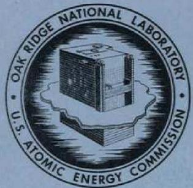
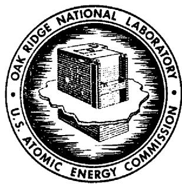
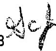

# OAK RIDGE NATIONAL LABORATORY

operated by

UNION CARBIDE CORPORATION $\cdot$ NUCLEAR DIVISION

for the

U.S. ATOMIC ENERGY COMMISSION

ORNL-TM-3548

THE LONG-TERM HAZARD OF RADIOACTIVE WASTES PRODUCED BY THE ENRICHED URANIUM, Pu-238U, AND 233U-Th FUEL CYCLES

M. J. Bell and R. S. Dillon

This report was prepared as an account of work sponsored by the United States Government. Neither the United States nor the United States Atomic Energy Commission, nor any of their employees, nor any of their contractors, subcontractors, or their employees, makes any warranty, express or implied, or assumes any legal liability or responsibility for the accuracy, completeness or usefulness of any information, apparatus, product or process disclosed, or represents that its use would not infringe privately owned rights.

# OAK RIDGE NATIONAL LABORATORY

operated by

UNION CARBIDE CORPORATION • NUCLEAR DIVISION

for the

U.S. ATOMIC ENERGY COMMISSION

ORNL-TM-3548

THE LONG-TERM HAZARD OF RADIOACTIVE WASTES PRODUCED BY THE ENRICHED URANIUM, Pu-238U, AND 233U-Th FUEL CYCLES

M. J. Bell and R. S. Dillon

Contract No. W-7405-eng-26

CHEMICAL TECHNOLOGY DIVISION

THE LONG-TERM HAZARD OF RADIOACTIVE WASTES PRODUCED BY THE ENRICHED URANIUM, Pu-238U, AND 233U-Th FUEL CYCLES

M. J. Bell and R. S. Dillon*

NOVEMBER 1971

*Present address: AECOP, Oak Ridge, Tennessee.

OAK RIDGE NATIONAL LABORATORY

Oak Ridge, Tennessee 37830

operated by

UNION CARBIDE CORPORATION

for the

U.S. ATOMIC ENERGY COMMISSION

# CONTENTS

Page

Abstract 1

1. Introduction 1   
2. Reactor Operating Conditions and High-Level-Waste Radionuclide Inventories 2   
3. Hazard as a Function of Age of High-Level Waste 5   
4. Long-Term Relative Hazards of High-Level Waste 11   
5. Isotopic Dilution of High-Level Wastes 14   
6. Relative Hazard of Transuranium Wastes 16   
7. References 18   
Appendix 19

THE LONG-TERM HAZARD OF RADIOACTIVE WASTES PRODUCED BY THE ENRICHED URANIUM, Pu-238U, AND 233U-Th FUEL CYCLES

M. J. Bell and R. S. Dillon

# ABSTRACT

An evaluation has been made of the long-term hazards of "high-level" and "alpha" radioactive wastes generated by irradiation of three fuels representative of those which will be used to generate electrical power in the next several decades. In this evaluation the composition and radioactivity of the wastes generated by typical LWR, LMFBR, and molten-salt breeder reactors utilizing the enriched uranium, Pu-238U, and 233U-Th fuel cycles, respectively, have been computed for times up to 30 million years after discharge.

The volumes of water necessary to dilute the various types of high-level waste to the radiation concentration guides (RCG) for ingestion in unrestricted areas have been computed as a function of age of the waste. It was found that the volumes required to dilute the three types of waste were similar when evaluated at the same age and exposure. The volume of water necessary to dilute any of the three wastes aged 1000 years and the associated salt in the proposed Federal Repository to the RCG for unrestricted uses is less than that required to dilute the same amount of uranium ore tailings to the RCG. The high-level waste deposited in the Federal Repository will result in an alpha activity of less than $10\mu \mathrm{Ci} / \mathrm{kg}$ at 10,000 years after burial when averaged over the total mass of the Repository.

The hazard of a number of types of waste contaminated to $10~\mu \mathrm{Ci} / \mathrm{kg}$ (the upper limit assumed for surface burial) of initial parent alpha activity was also calculated as a function of time, and the time of maximum relative hazard was determined. Transuranium or alpha wastes contaminated to this level will present a maximum ingestion hazard similar to naturally occurring uranium ores.

# 1. INTRODUCTION

High-level and alpha wastes generated in nuclear fuel cycles for production of electrical power will contain isotopes which remain radioactive for millions of years. The "high-level" wastes are principally the fission-product concentrates that arise from the recovery of fissile and fertile materials from spent fuel. Typically, however, these wastes

contain a variety of actinides that are made from transmutation of fuel material and, in addition, quantities of uranium, thorium, and plutonium that are not economically recoverable for recycle. "Alpha" wastes - materials contaminated with substantial concentrations of long-lived alpha emitters - are produced primarily in plants for preparation of nuclear fuel materials.

Significant variations will occur in the compositions of the wastes generated by various reactor concepts because of differences between types of fuel, neutron energy spectra and flux level, and length of irradiation, as well as efficiency of utilization of fuel. Calculations have been made, as a function of decay time, of the compositions and radioactivities of the wastes generated by typical light water reactors (LWRs), liquid metal cooled fast breeder reactors (IMFBRs), and molten-salt breeder reactors (MSBRs), which are representative of enriched $^{235}\mathrm{U}$ , $^{239}\mathrm{Pu}$ , and $^{233}\mathrm{U}$ fuels. These radioactivities have been used, along with the radiation concentration guides for ingestion in unrestricted areas given in the Code of Federal Regulations (10 CFR 20), to evaluate the relative hazard of the wastes. The compositions of 460 fission products and 80 actinide elements and their decay products were included in the calculations, which were performed with the ORIGEN isotope generation and decay code. $^{1,2}$

The authors wish to acknowledge the assistance of H. C. Claiborne, J. O. Blomeke, and J. P. Nichols in reviewing this report and for their helpful suggestions in the course of the work.

# 2. REACTOR OPERATING CONDITIONS AND HIGH-LEVEL-WASTE RADIONUCLIDE INVENTORIES

The quantities present at time of processing in wastes resulting from 33,000 MWd of exposure in typical LWRs, LMFBRs, and MSBRs are given in Table 1 for those nuclides found to be of importance in the evaluation of the long-term safe disposal of radioactive wastes. The LWR considered has been described in ref. 3. It is fueled with $3.3\%$ enriched uranium and is operated at an average specific power of 30 MW/metric ton of heavy metal charged to the reactor to a burnup of 33,000 MWd/metric ton. The fuel is assumed to be processed at 150 days after discharge, with removal of $99.5\%$ of the uranium and plutonium for recycle.

Table 1. Quantities (Kilograms) of Long-Lived Hazardous Nuclides Present at Time of Processing for 33,000 MWd of Exposure in Reactors Utilizing the Enriched Uranium, Pu-238U, and 233U-Th Fuel Cycles   

<table><tr><td>Isotope</td><td>Half-Life</td><td>Enriched Uraniuma</td><td>Pu-238Ub</td><td>233U-Thc</td></tr><tr><td>90Sr</td><td>27.7 y</td><td>0.54</td><td>0.302</td><td>0.918</td></tr><tr><td>129I</td><td>1.7 x 107y</td><td>0.231</td><td>0.211</td><td>0.35</td></tr><tr><td>232Th</td><td>1.41 x 1010y</td><td></td><td></td><td>244</td></tr><tr><td>233Pa</td><td>27.0 d</td><td></td><td></td><td>0.0042</td></tr><tr><td>233U</td><td>1.62 x 105y</td><td></td><td></td><td>0.0167</td></tr><tr><td>234U</td><td>2.47 x 105y</td><td>1.15 x 10-5</td><td>1.36 x 10-4</td><td>0.0041</td></tr><tr><td>235U</td><td>7.1 x 108y</td><td>0.04</td><td>0.00745</td><td>0.0011</td></tr><tr><td>236U</td><td>2.39 x 107y</td><td>0.0226</td><td>5.52 x 10-4</td><td>0.0011</td></tr><tr><td>238U</td><td>4.51 x 109y</td><td>4.72</td><td>4.38</td><td></td></tr><tr><td>237Np</td><td>2.14 x 106y</td><td>0.483</td><td>0.128</td><td>0.0317</td></tr><tr><td>238Pu</td><td>86.4 y</td><td>8.4 x 10-4</td><td>0.00534</td><td>0.303</td></tr><tr><td>239Pu</td><td>24,390 y</td><td>0.0265</td><td>0.288</td><td>0.0037</td></tr><tr><td>240Pu</td><td>6580 y</td><td>0.0107</td><td>0.0997</td><td>1.1 x 10-4</td></tr><tr><td>241Pu</td><td>13.2 y</td><td>0.0050</td><td>0.026</td><td>5.67 x 10-6</td></tr><tr><td>242Pu</td><td>3.79 x 105y</td><td>0.0017</td><td>0.016</td><td></td></tr><tr><td>241Am</td><td>433 y</td><td>0.0446</td><td>0.472</td><td></td></tr><tr><td>243Am</td><td>7950 y</td><td>0.0925</td><td>0.249</td><td></td></tr><tr><td>242Cm</td><td>163 d</td><td>0.00582</td><td>0.0188</td><td></td></tr><tr><td>244Cm</td><td>18.1 y</td><td>0.0278</td><td>0.0145</td><td></td></tr></table>

a3.3% enriched uranium irradiated at an average specific power of 30 MW/metric ton to a burnup of 33,000 MWd/metric ton in a typical PWR. Processing at 150 days after discharge.   
bLWR discharge Pu and depleted U irradiated in core and blanket of AI Reference Oxide LMFBR at an average specific power of 58 MW/metric ton to a burnup of 33,000 MWD/metric ton. Processing at 30 days after discharge.   
cReference MSBR equilibrium fuel cycle with continuous chemical processing by fluorination-reductive extraction and the metal transfer process.

The LMFBR considered was the Atomics International Reference Oxide Design. $^{3-5}$ The mixed fuel discharged from the core and blankets of this reactor has been irradiated to an average burnup of 33,000 MW/d/metric ton of heavy metal charged to the reactor at an average specific power of 58.2 MW/metric ton. The fuel is assumed to be processed at 30 days after discharge with a $99.5\%$ recovery of uranium and plutonium.

The MSBR is a fluid fuel reactor that operates on the Th-233U fuel cycle. The present concept employs fluorination-reductive extraction of the fuel salt to isolate 233Pa outside the reactor core with a 10-day removal time. This chemical processing step is also responsible for removing plutonium and a number of fission products from the fuel salt on a 10-day cycle. Strontium, barium, and the rare-earth fission products are removed from the fuel salt by an extraction process called the metal transfer process with removal times ranging from 16 to 51 days. In addition, salt containing thorium is discarded to waste on a 4200-day cycle. This mode of operation, which results in thorium utilization of only $13.7\%$ , makes fairly inefficient use of fertile material relative to the LWR and LMFBR concepts. The reference MSBR has a yield of $3.2\%$ of the reactor fissile inventory per year, and it was assumed that $1/2\%$ of the uranium removed from the reactor for sale was lost to waste. Also, high-level wastes are removed from the system in batches every 220 days following fluorination to recover uranium which might be present in the waste streams. It was assumed that $1/2\%$ of the uranium in the waste streams was not recovered by the fluorination, and that all the 233Pa which remained at the end of the 220 days was lost with the fission product waste.

It should be noted that the LMFBR and MSBR are advanced concepts with thermal efficiencies of 40 to $45\%$ , while typical PWRs achieve thermal efficiencies of about $32\%$ . Consequently, an LWR generating the same electrical energy as an LMFBR or an MSBR will produce 25 to $40\%$ more waste than that given in Table 1 or in subsequent tables since they are all based on 33,000 MWD of heat production.

# 3. HAZARD AS A FUNCTION OF AGE OF HIGH-LEVEL WASTE

The composition, radioactivity, and hazard of the three types of waste were computed as a function of age for times up to 30 million years. Tables 2-4 show the radioactivity of a number of isotopes of special interest as a function of age. In these tables, the actinides are grouped according to their decay chains, so that it is easier to observe daughters building up and gradually reaching equilibrium as their precursors decay.

Table 5 presents the values used for the RCG for the isotopes found to be most important in determining the long-term hazard.

A measure of the ingestion hazard associated with a radionuclide is the quantity of water required to dilute the nuclide to the RCG for unrestricted use of the water; the larger the amount of water required, the greater the hazard. The volumes of water required for the three types of wastes are shown in Table 6, and the isotope which is the principal hazard at a given time is shown in parentheses. The fission product $^{90}\mathrm{Sr}$ is the principal ingestion hazard for the first few hundred years and the hazards are about the same for the three types of wastes. In the first 30 to 300 years after disposal, the measure of hazard associated with the wastes decreased from around $10^{11}$ cubic meters of water to around $3 \times 10^{8}$ cubic meters, due primarily to the decay of $^{90}\mathrm{Sr}$ . For the period 300 to 3000 years after disposal, the $^{233}\mathrm{U}$ fuel waste is somewhat less hazardous than the others due to the absence of transplutonium isotopes. The hazard associated with all the wastes rises slightly at about a quarter of a million years after disposal, which is due to peaking of the $^{226}\mathrm{Ra}$ activity. The hazard associated with the $^{233}\mathrm{U}$ fuel wastes diminishes less quickly than the other wastes due to the presence of the relatively large amount of $^{232}\mathrm{Th}$ , the parent of the isotope $^{228}\mathrm{Ra}$ (which is the predominant hazard in this waste after $10^{6}$ years).

Table 2. Typical Radioactivity (Curies) of Long-Term Hazardous Nuclides in Waste from a Thermal Reactor Fueled with Enriched Uranium as a Function of Age for 33,000 MWD Exposure   

<table><tr><td rowspan="2">Nuclide</td><td colspan="6">Age of Waste (years)</td></tr><tr><td>\( 10^2 \)</td><td>\( 10^3 \)</td><td>\( 10^4 \)</td><td>\( 10^5 \)</td><td>\( 10^6 \)</td><td>\( 10^7 \)</td></tr><tr><td>90 Sr</td><td>6480</td><td>\( 1.5 \times 10^{-6} \)</td><td></td><td></td><td></td><td></td></tr><tr><td>\( 129\mathrm{I} \)</td><td>0.038</td><td>0.038</td><td>0.038</td><td>0.038</td><td>0.036</td><td>0.025</td></tr><tr><td>241Am</td><td>145</td><td>34.4</td><td>\( 1.9 \times 10^{-5} \)</td><td></td><td></td><td></td></tr><tr><td>243Am</td><td>17.6</td><td>16.3</td><td>7.2</td><td>\( 2.09 \times 10^{-3} \)</td><td></td><td></td></tr><tr><td>\( 239\mathrm{Pu} \)</td><td>1.68</td><td>2.06</td><td>4.06</td><td>0.57</td><td></td><td></td></tr><tr><td>234U</td><td>0.022</td><td>0.042</td><td>0.041</td><td>0.032</td><td>\( 4.0 \times 10^{-3} \)</td><td>\( 1.6 \times 10^{-3} \)</td></tr><tr><td>\( 226\mathrm{Ra} \)</td><td>\( 1.7 \times 10^{-7} \)</td><td>\( 5.3 \times 10^{-5} \)</td><td>\( 2.65 \times 10^{-3} \)</td><td>0.021</td><td>\( 5.2 \times 10^{-3} \)</td><td>\( 2.3 \times 10^{-3} \)</td></tr><tr><td>Total β-curies</td><td>33,900</td><td>37</td><td>27.1</td><td>15.5</td><td>4.0</td><td>0.13</td></tr><tr><td>Total α curies</td><td>276</td><td>61</td><td>14.9</td><td>2.2</td><td>2.4</td><td>0.15</td></tr></table>

Table 3. Typical Radioactivity (Curies) of Long-Term Hazardous Nuclides in Waste from a Fast Reactor Fueled with Pu and $^{238}\mathrm{U}$ as a Function of Age for 33,000 Mwd Exposure   

<table><tr><td rowspan="2">Nuclide</td><td colspan="6">Age of Waste (years)</td></tr><tr><td>\( 10^2 \)</td><td>\( 10^3 \)</td><td>\( 10^4 \)</td><td>\( 10^5 \)</td><td>\( 10^6 \)</td><td>\( 10^7 \)</td></tr><tr><td>\( ^{90}Sr \)</td><td>3.62 x \( 10^3 \)</td><td>8.27 x \( 10^{-7} \)</td><td></td><td></td><td></td><td></td></tr><tr><td>\( ^{129}I \)</td><td>0.035</td><td>0.035</td><td>0.035</td><td>0.034</td><td>0.033</td><td>0.023</td></tr><tr><td>\( ^{241}Am \)</td><td>1.39 x \( 10^3 \)</td><td>356</td><td>4.33 x \( 10^{-4} \)</td><td></td><td></td><td></td></tr><tr><td>\( ^{243}Am \)</td><td>47.4</td><td>43.7</td><td>19.3</td><td>5.62 x \( 10^{-3} \)</td><td></td><td></td></tr><tr><td>\( ^{239}Pu \)</td><td>17.8</td><td>18.5</td><td>21.0</td><td>2.31</td><td></td><td></td></tr><tr><td>\( ^{234}U \)</td><td>0.0847</td><td>0.187</td><td>0.183</td><td>0.142</td><td>0.0127</td><td>0.0015</td></tr><tr><td>\( ^{226}Ra \)</td><td>6.29 x \( 10^{-7} \)</td><td>2.22 x \( 10^{-4} \)</td><td>1.17 x \( 10^{-2} \)</td><td>0.0931</td><td>0.0181</td><td>0.0021</td></tr><tr><td>Total \( β^*curies \)</td><td>31,400</td><td>68.5</td><td>42.2</td><td>17.1</td><td>4.2</td><td>0.29</td></tr><tr><td>Total \( αcuries \)</td><td>1760</td><td>446</td><td>50.2</td><td>5.1</td><td>3.2</td><td>0.17</td></tr></table>

Table 4. Typical Radioactivity (Curies) of Long-Term Hazardous Nuclides in Waste from a Thermal Reactor Fueled with $^{233}\mathrm{U}$ and Th as a Function of Age for 33,000 MWD of Operation   

<table><tr><td rowspan="2">Nuclide</td><td colspan="6">Age of Waste (years)</td></tr><tr><td>\( 10^2 \)</td><td>\( 10^3 \)</td><td>\( 10^4 \)</td><td>\( 10^5 \)</td><td>\( 10^6 \)</td><td>\( 10^7 \)</td></tr><tr><td>\( ^{80}Sr \)</td><td>11,000</td><td>\( 2.5 \times 10^{-6} \)</td><td></td><td></td><td></td><td></td></tr><tr><td>\( ^{129}I \)</td><td>0.057</td><td>0.057</td><td>0.057</td><td>0.057</td><td>0.055</td><td></td></tr><tr><td>\( ^{231}Pa \)</td><td>0.661</td><td>0.649</td><td>0.535</td><td>0.078</td><td>\( 1.01 \times 10^{-6} \)</td><td>\( 1.00 \times 10^{-6} \)</td></tr><tr><td>\( ^{233}Ra \)</td><td>0.635</td><td>0.649</td><td>0.535</td><td>0.078</td><td>\( 1.01 \times 10^{-6} \)</td><td>\( 1.00 \times 10^{-6} \)</td></tr><tr><td>\( ^{234}U \)</td><td>1.02</td><td>1.87</td><td>1.82</td><td>1.41</td><td>0.113</td><td>\( 3 \times 10^{-11} \)</td></tr><tr><td>\( ^{226}Ra \)</td><td>\( 2.06 \times 10^{-5} \)</td><td>\( 2.50 \times 10^{-3} \)</td><td>0.118</td><td>0.926</td><td>0.167</td><td>\( 3 \times 10^{-11} \)</td></tr><tr><td>\( ^{232}Th \)</td><td>0.0266</td><td>0.0266</td><td>0.0266</td><td>0.0266</td><td>0.0266</td><td>0.0266</td></tr><tr><td>\( ^{228}Ra \)</td><td>0.0266</td><td>0.0266</td><td>0.0266</td><td>0.0266</td><td>0.0266</td><td>0.0266</td></tr><tr><td>\( ^{237}Np \)</td><td>0.022</td><td>0.022</td><td>0.022</td><td>0.022</td><td>0.016</td><td>\( 8.8 \times 10^{-4} \)</td></tr><tr><td>\( ^{233}U \)</td><td>0.199</td><td>0.198</td><td>0.190</td><td>0.129</td><td>0.0028</td><td>\( 8.8 \times 10^{-4} \)</td></tr><tr><td>\( ^{229}Th \)</td><td>0.039</td><td>0.050</td><td>0.132</td><td>0.136</td><td>0.0029</td><td>\( 8.9 \times 10^{-4} \)</td></tr><tr><td>\( ^{225}Ra \)</td><td>0.037</td><td>0.050</td><td>0.132</td><td>0.136</td><td>0.0029</td><td>\( 8.9 \times 10^{-4} \)</td></tr><tr><td>Total \( β^-curies \)</td><td>44,400</td><td>17.7</td><td>16.7</td><td>13.2</td><td>4.4</td><td>0.24</td></tr><tr><td>Total \( α^-curies \)</td><td>2360</td><td>11</td><td>9.6</td><td>12.9</td><td>2.1</td><td>0.22</td></tr></table>

Table 5. The RCGs Used in Evaluating the Ingestion Hazards from Radionuclides (from 10 CFR 20, Table II, Column 2)   

<table><tr><td>Nuclide</td><td>Half-Life</td><td>RCG (Ci/m3)</td></tr><tr><td>90Sr</td><td>27.7 y</td><td>3 x 10-7</td></tr><tr><td>129I</td><td>1.7 x 107y</td><td>6 x 10-8</td></tr><tr><td>223Ra</td><td>11.4 d</td><td>7 x 10-7</td></tr><tr><td>225Ra</td><td>14.8 d</td><td>6 x 10-7</td></tr><tr><td>226Ra</td><td>1620 d</td><td>3 x 10-8</td></tr><tr><td>228Ra</td><td>6.7 y</td><td>3 x 10-8</td></tr><tr><td>229Th</td><td>7340 y</td><td>2 x 10-6</td></tr><tr><td>230 Th</td><td>8 x 104 y</td><td>2 x 10-6</td></tr><tr><td>232Th</td><td>1.41 x 1010 y</td><td>2 x 10-6</td></tr><tr><td>231Pa</td><td>3.25 x 104 y</td><td>9 x 10-7</td></tr><tr><td>233Pa</td><td>27.0 d</td><td>1 x 10-4</td></tr><tr><td>233U</td><td>1.62 x 105y</td><td>3 x 10-5</td></tr><tr><td>234U</td><td>2.47 x 105y</td><td>3 x 10-5</td></tr><tr><td>235U</td><td>7.1 x 108y</td><td>3 x 10-5</td></tr><tr><td>236U</td><td>2.39 x 107y</td><td>3 x 10-5</td></tr><tr><td>238U</td><td>4.51 x 109y</td><td>4 x 10-5</td></tr><tr><td>237Np</td><td>2.14 x 106y</td><td>3 x 10-6</td></tr><tr><td>238Pu</td><td>86.4 y</td><td>5 x 10-6</td></tr><tr><td>239Pu</td><td>24,390 y</td><td>5 x 10-6</td></tr><tr><td>240Pu</td><td>6580 y</td><td>5 x 10-6</td></tr><tr><td>241Pu</td><td>13.2 y</td><td>2 x 10-4</td></tr><tr><td>242Pu</td><td>3.79 x 105y</td><td>5 x 10-6</td></tr><tr><td>241Am</td><td>433 y</td><td>4 x 10-6</td></tr><tr><td>243Am</td><td>163 d</td><td>4 x 10-6</td></tr></table>

Table 6. Volume of $\mathsf{H}_2\mathsf{O}$ (Cubic Meters) Required to Dilute Wastes Resulting from 33,000 MWd of Exposure of Enriched $^{235}\mathrm{U},$ $^{239}\mathrm{Pu},$ and $^{233}\mathrm{U}$ Fuels to Levels Permitted for Unrestricted Use (RCG from 10 CFR 20, Table II, Column 2)   

<table><tr><td>Age of Waste (years)</td><td colspan="2">236Ua</td><td colspan="2">239Pu b</td><td colspan="2">233Uc</td></tr><tr><td>30</td><td colspan="2">1.26 x 1011 (90 Sr)</td><td colspan="2">7.22 x 1010 (90 Sr)</td><td colspan="2">2.11 x 1011 (90 Sr)</td></tr><tr><td>100</td><td colspan="2">2.24 x 1010 (90 Sr)</td><td colspan="2">1.32 x 1010 (90 Sr)</td><td colspan="2">3.75 x 1010 (90 Sr)</td></tr><tr><td>300</td><td colspan="2">2.00 x 108 (90 Sr)</td><td colspan="2">3.93 x 108 (241Am)</td><td colspan="2">3.76 x 108 (90 Sr)</td></tr><tr><td>1,000</td><td colspan="2">1.55 x 107 (241Am)</td><td colspan="2">1.09 x 108 (241Am)</td><td colspan="2">4.72 x 106 (223Ra and 228Ra)</td></tr><tr><td>3,000</td><td colspan="2">6.53 x 106 (243Am)</td><td colspan="2">2.24 x 107 (243Am)</td><td colspan="2">5.06 x 106 (223Ra and 228Ra)</td></tr><tr><td>10,000</td><td colspan="2">4.26 x 106 (239Pu)</td><td colspan="2">1.26 x 107 (243Am)</td><td colspan="2">9.34 x 106 (226Ra)</td></tr><tr><td>30,000</td><td colspan="2">2.44 x 106 (239Pu)</td><td colspan="2">6.88 x 106 (239Pu)</td><td colspan="2">2.2 x 107 (226Ra)</td></tr><tr><td>100,000</td><td colspan="2">2.14 x 106 (226Ra)</td><td colspan="2">5.74 x 106 (226Ra)</td><td colspan="2">4.45 x 107 (226Ra)</td></tr><tr><td>300,000</td><td colspan="2">2.38 x 106 (226Ra)</td><td colspan="2">5.81 x 106 (226Ra)</td><td colspan="2">4.68 x 107 (226Ra)</td></tr><tr><td>1,000,000</td><td colspan="2">1.58 x 106 (129I)</td><td colspan="2">2.03 x 106 (129I)</td><td colspan="2">9.42 x 106 (226Ra)</td></tr><tr><td>3,000,000</td><td colspan="2">9.93 x 105 (129I)</td><td colspan="2">9.53 x 105 (129I)</td><td colspan="2">1.80 x 106 (228Ra)</td></tr><tr><td>10,000,000</td><td colspan="2">5.28 x 105 (129I)</td><td colspan="2">4.88 x 105 (129I)</td><td colspan="2">1.56 x 106 (228Ra)</td></tr><tr><td>30,000,000</td><td colspan="2">2.57 x 105 (129I)</td><td colspan="2">2.38 x 105 (129I)</td><td colspan="2">1.20 x 106 (228Ra)</td></tr></table>

2.0 x 108 = volume of water (cubic meters) required to reduce ingestion hazard of the corresponding amount of uranium ore (7900 tons of ore containing 0.17% U).   
1.1 x 10⁷ = volume of water (cubic meters) that results from dissolving the salt required to store waste equivalent to 33,000 MWd exposure to a terminal concentration of 500 ppm.   
1.07 x $10^6$ = approximate volume of water (cubic meters) required to reduce ingestion hazard potential of the corresponding amount of earth containing naturally occurring U + Th in equilibrium with their daughters at the average concentration in the earth's crust.   
$^{\text{a}}$ Reference PWR fueled with $3.3\%$ enriched U, operated at a specific power of 30 MW/metric ton of heavy metal charged to reactor. Processing losses of $1/2\%$ of U and Pu to waste are assumed.   
bAI Reference Oxide LMFBR mixed core and blankets fueled with LWR discharge Pu and diffusion plant tails. Average specific power of blend is 58.2 MW/metric ton of heavy metal charged to reactor. Processing losses of $1 / 2\%$ of U and Pu to waste are assumed.   
${}^{c}$ Reference MSER with continuous protactinium isolation on a 10-day cycle and rare-earth removal by the metal transfer process. Thorium is discarded on a 4200-day cycle, and $1/2\%$ of excess uranium is assumed to be lost to waste (see text).

# 4. LONG-TERM RELATIVE HAZARD OF HIGH-LEVEL WASTE

The isotopes $^{226}\mathrm{Ra}$ and $^{238}\mathrm{Ra}$ are the predominant alpha-emitting radionuclides for ages greater than 100,000 years. These isotopes occur in nature as daughters of $^{238}\mathrm{U}$ and $^{232}\mathrm{Th}$ and, if they are sufficiently dilute in the waste, will present a hazard similar to those of naturally occurring uranium and thorium deposits. In the proposed Federal Repository in bedded salt, the waste equivalent to 33,000 Mw.d of exposure may be assumed to be associated with about 5500 metric tons of salt and 2400 tons of shale. This is based on the current design of the high-level facility of the Repository, assuming that the accumulated waste from $3.2 \times 10^{9} \mathrm{Mw.d(t)}^{*}$ of exposure is dispersed in the 900-acre by 300-ft-thick section of the bedded salt. Since the LWR or IMFBR waste from 33,000 Mw.d(t) of exposure will have a volume and a mass of about 3.3 ft $^{3}$ and 140 kg, respectively, the salt bed serves to dilute the wastes by approximately a factor of 37,000 in volume and 56,000 in weight. (The dilution would not be as great for the present MSBR concept because of the larger quantity of waste generated per 33,000 Mw.d of operation.) This dilution results in an average $^{238}\mathrm{U}$ concentration in the bedded layer of salt and shale of less than 1 ppm by weight for the $^{235}\mathrm{U}$ and $^{239}\mathrm{Pu}$ wastes, and an average $^{232}\mathrm{Th}$ concentration of 30 ppm by weight for the $^{233}\mathrm{U}$ fuel wastes. The amount of $^{234}\mathrm{U}$ which is present in the waste initially, plus that which is produced by decay of $^{242}\mathrm{Cm}$ and $^{238}\mathrm{Pu}$ , is well above that which would be in equilibrium with 1 ppm of naturally occurring $^{238}\mathrm{U}$ . The quantities of $^{234}\mathrm{U}$ which ultimately occur in the wastes correspond to those which would be in equilibrium with 15, 54, and 680 wt ppm $^{238}\mathrm{U}$ in the bedded layer of salt and shale for the wastes from $^{235}\mathrm{U}$ , $^{239}\mathrm{Pu}$ , and $^{233}\mathrm{U}$ fuels, respectively.

The average concentrations of uranium and thorium in the earth's crust are 6 and 12 ppm, respectively, and the volume of water required to reduce the ingestion hazard of the corresponding mass of earth (7900 metric tons) containing these concentrations of uranium and thorium in

equilibrium with their daughters is $1.07 \times 10^{6} \mathrm{~m}^{3}$ (see Appendix). The hazard associated with the LWR type waste (the predominant type in the Repository) is only a factor of four higher 10,000 years after disposal, and the hazards from the other wastes are about an order of magnitude higher. However, the hazard associated with the $^{233}\mathrm{U}$ fuel waste rises again as the $^{236}\mathrm{Ra}$ concentration increases. The presence of $^{236}\mathrm{Ra}$ and $^{228}\mathrm{Ra}$ in high concentrations in the waste from the $^{233}\mathrm{U}-\mathrm{Th}$ system is the result of the absence of a step for recycling plutonium and the assumed inefficient use of thorium in the present reprocessing schemes. If the processing flowsheets are improved to eliminate these two problems, the $^{233}\mathrm{U}$ fuel wastes would remain very similar to the $^{235}\mathrm{U}$ and $^{239}\mathrm{Pu}$ wastes at ages greater than 10,000 years.

Other thermal reactor concepts employing the Th-233U fuel cycle are the High Temperature Gas Cooled Reactor (HTGR) and the Light Water Breeder Reactor (LWBR). The wastes produced by these reactors would be similar to MSBR wastes since the higher $^{90}\mathrm{Sr}$ concentrations would be present initially, since 238Pu will not be separated from the waste and recycled, and because efficient recycle of the relatively inexpensive thorium is not envisioned at present. Wastes from 235U fuels aged 30 years have a thermal power $64\%$ higher than 239Pu wastes of the same burnup, and wastes aged 100 years have a thermal power $46\%$ greater. Since the peak temperatures in the mine are reached at about 50 years after burial, the higher heat generation rate from 233U fuel wastes will require a greater spacing between waste cans, with a subsequent increase in cost. The burial cost of the waste is a small fraction of the fuel cycle cost, however.

An alternative method of assessing the relative hazard of the radioactive wastes is to compare them with naturally occurring radioactive surface deposits. The southwestern United States has uranium ore reserves containing $0.2\%$ $\mathrm{U}_{3}\mathrm{O}_{8}$ or greater, totaling almost 50 million tons. In the year 1968, domestic production of $\mathrm{U}_{3}\mathrm{O}_{8}$ totaled over 12,000 tons, indicating that some 6 million tons of such ore were processed and a corresponding amount of uranium ore tailings was disposed of. The volume of water required to dilute the radionuclides contained in 7900 metric tons of uranium ore tailings to the RCG for unrestricted use of the water is

2.0 x $10^{8}$ m³. Consequently, the ingestion hazard associated with a quantity of uranium ore and uranium ore tailings equal to the amount of salt and shale associated with 33,000 MWd of waste is greater than that associated with any of the three high-level wastes aged 1000 years.

Another method of assessing the relative hazard of a radioactive waste is to compare it with the hazard of naturally radioactive monazite sand. Thorium and uranium are present in the mineral monazite which occurs in beach sand in some areas of India, Brazil, Malaysia, and the southeastern United States. Beach sands in Malagasy Republic average 2 to $2.5\%$ monazite, the monazite containing $8.8\%$ $\mathrm{ThO_2}$ and $0.41\%$ $\mathrm{U_3O_8}$ . Monazite sands found on the southeast coast of the United States average $3.1\%$ $\mathrm{ThO_2}$ and $0.47\%$ $\mathrm{U_3O_8}$ . To reduce the ingestion hazard from radioactivity in these two sands for a mass equivalent to the waste and associated salt in the proposed Federal Repository will require about $6 \times 10^7$ and $2 \times 10^7$ m³ of water for the Malagasy and United States sands, respectively. Hence, dissolving the buried $^{235}\mathrm{U}$ or $^{233}\mathrm{U}$ fuel wastes aged in the range of 1000 to 3000 years, along with the associated salt, would present a hazard similar to dissolving the radium from the same mass of monazite-containing beach sand (noting, of course, that monazite sand is among the least soluble of naturally occurring materials).

Another consideration with respect to the disposal of high-level radioactive wastes in bedded salt is that to dissolve the waste for a 33,000 MWd exposure and associated salt to a potable concentration of 500 ppm NaCl by weight would require $1.1 \times 10^{7} \mathrm{~m}^{3}$ of water. Thus, $^{235}\mathrm{U}$ and $^{233}\mathrm{U}$ fuel wastes aged 3000 years, if diluted to drinking water concentration in NaCl, would be below the radiation concentration guide for ingestion by the general population. Hence, if the salt mine is dissolved some thousands of years in the future with sufficient water to dilute the radionuclides to the RCG and the dissolved materials find their way to drinking water supplies, the water would be unacceptable as drinking water because of its sodium chloride content.

# 5. ISOTOPIC DILUTION OF HIGH-LEVEL WASTES

It has been suggested that a radioactive isotope may be disposed of without further dilution provided that it is diluted to an acceptable specific activity with an adequate quantity of the stable element in the same chemical form and if the diluted material is also acceptable on the basis of external hazard and chemical toxicity. Consideration has been given to this dilution method for reducing the ingestion hazard associated with the high-level wastes. Table 7 lists the isotopes which present the greatest hazard at a given age of the waste, their radioactivities, and the quantities of stable elements which would be required to dilute the wastes below the maximum permissible specific activities given in ref. 9. In ref. 9 it is assumed that the isotope $^{90}\mathrm{Sr}$ must be diluted with stable strontium, rather than another bone-seeking element (such as Ca), but that the elements americium and plutonium may be diluted with rare earths. It is also assumed that an "acceptably low" level of specific activity is the value such that, if a person were to assimilate the element (or chemically similar species) only from the source of interest, the body burden of the radioisotope would not exceed the maximum permissible body burden for occupational exposure. Using these assumptions it can be calculated that 432 metric tons of stable strontium are required to dilute the $^{90}\mathrm{Sr}$ in 100-year-old $^{235}\mathrm{U}$ waste resulting from 33,000 Mw d of exposure to an acceptably low specific activity. Since each 33,000 Mw d of waste is associated with 8000 metric tons of salt and shale, a concentration of $5\%$ by weight stable strontium would be required throughout the salt mine, which would be impractical. The concept may prove feasible for diluting waste aged 300 years, since only 3 metric tons of stable strontium would be required for each 33,000 Mw d exposure.

If it is assumed that the behavior of americium and plutonium in the body is similar to that of rare earths, then 49 and 5.7 metric tons, respectively, of rare-earth elements are required to be added to the wastes to eliminate the ingestion hazards from $^{241}\mathrm{Am}$ and $^{239}\mathrm{Pu}$ . Also, if 250 g of stable iodine is added to each 33,000 MWd of waste, the ingestion hazard from $^{129}\mathrm{I}$ becomes acceptable for occupational exposure.

Table 7. Mass of Stable Carrier Required to Dilute Radioisotopes in ${}^{236}\mathrm{U}$ Fuel High- Level Waste to Maximum Permissible Specific Activity in the Environment   

<table><tr><td>Age (years)</td><td>Isotope</td><td>Radioactivity (Ci/33,000 MwD)</td><td>Carrier</td><td>Critical Organ</td><td>Maximuma Permissible Specific Activity (Ci/metric ton)</td><td>Mass of Carrier Required to Dilute to Specific Activity (metric tons)</td></tr><tr><td>100</td><td>90 Sr</td><td>6480</td><td>Sr</td><td>Bone</td><td>15</td><td>432</td></tr><tr><td>300</td><td>90 Sr</td><td>46.7</td><td>Sr</td><td>Bone</td><td>15</td><td>3.1</td></tr><tr><td>1,000</td><td>241Am</td><td>34.4</td><td>rare earth</td><td>Bone</td><td>0.7</td><td>49</td></tr><tr><td>10,000</td><td>239Pu</td><td>4.06</td><td>rare earth</td><td>Bone</td><td>0.71</td><td>5.7</td></tr><tr><td>100,000</td><td>226Ra</td><td>0.021</td><td>b</td><td>Bone</td><td>b</td><td>-</td></tr><tr><td>1,000,000</td><td>129I</td><td>0.036</td><td>I</td><td>Thyroid</td><td>80c</td><td>4.5 x 10-4</td></tr></table>

a National Academy of Sciences-National Research Council, Publication 985, Disposal of Low-Level Radioactive Waste into Pacific Coastal Waters, Washington, D. C., 1967.   
bInadequate biological data to apply the specific activity concept to 226 Ra.   
cCalculated from data given in International Commission on Radiation Protection, Report of Committee II on Permissible Dose for Internal Radiation (1959), Pergamon Press, Oxford, 1960.

# 6. RELATIVE HAZARD OF TRANSURANIUM WASTES

For disposal in the Federal Repository, Godbee and Nichols10 have proposed a lower limit for transuranium or "alpha" waste of $10~\mu \mathrm{Ci} / \mathrm{kg}$ of initial parent alpha activity. Alpha wastes (which mostly arise from fuel fabrication) of lower activity are to be disposed of by surface burial. To evaluate the hazards associated with surface burial of alpha wastes, an investigation was made of the relative ingestion and inhalation hazards of a number of isotopes and mixtures of isotopes expected to be present. Table 8 compares the radioactive properties of uranium and thorium in the average earth's crust, uranium ore, and uranium ore tailings with those of a number of transuranium wastes contaminated to an initial parent alpha activity of $10~\mu \mathrm{Ci} / \mathrm{kg}$ . Shown in the table are the properties at the time of isolation of the parents and at the time of maximum ingestion hazard. At the time of maximum hazard, the wastes present an ingestion hazard similar to uranium ore tailings although their total activities, thermal powers, and inhalation hazards are about an order of magnitude greater than uranium ore tailings. The maximum ingestion hazard resulting from an initial parent alpha activity of $10~\mu \mathrm{Ci} / \mathrm{kg}$ of either natural uranium or natural thorium is larger by an order of magnitude than any of the other wastes considered. For some transuranium materials, $^{238}\mathrm{Pu}$ , $^{242}\mathrm{Cm}$ , and $^{244}\mathrm{Cm}$ , the maximum ingestion hazard is associated with the initial $10~\mu \mathrm{Ci} / \mathrm{kg}$ of parent alpha activity. The ingestion hazard associated with low-level plutonium wastes contaminated to a specific activity of $10~\mu \mathrm{Ci} / \mathrm{kg}$ is appreciably less than that associated with a kilogram of uranium ore tailings, and the ingestion hazard associated with plutonium wastes is comparable to the maximum hazard associated with other alpha wastes contaminated to the same initial specific activity. The ingestion hazards for various wastes are sufficiently similar that a criterion based on total alpha activity alone, regardless of isotopic composition, may be sufficient for classifying transuranium or alpha wastes.

Table 8. Comparison of Radioactive Properties of Naturally Occurring Thorium and Uranium Deposits with the Assumed Lower Limit for Classification as Transuranium Waste (10 μCi/kg)   

<table><tr><td rowspan="2">Source</td><td rowspan="2">Alpha Activity of Parents (μCi/kg)</td><td rowspan="2">Time Since Isolation of Parents (y)</td><td colspan="2">Total Activity (μCi/kg)</td><td rowspan="2">Thermal Power (μW/kg)</td><td colspan="2">Cubic Meters of Water or Air at RCGa per Kilogram Dissolved or Suspended</td></tr><tr><td>Beta</td><td>Alpha</td><td>Waterb</td><td>Airb</td></tr><tr><td colspan="8">Average Earth Crustc</td></tr><tr><td>U</td><td>0.0021</td><td>4.5 x 109</td><td>0.012</td><td>0.016</td><td>0.00058</td><td>0.091 (226Ra)</td><td>31,300 (230Th)</td></tr><tr><td>Th</td><td>0.0013</td><td>4.5 x 109</td><td>0.0052</td><td>0.0078</td><td>0.00030</td><td>0.045 (228Ra)</td><td>9,250 (228Th)</td></tr><tr><td>Total</td><td>0.0034</td><td>4.5 x 109</td><td>0.017</td><td>0.024</td><td>0.00088</td><td>0.136 (228Ra)</td><td>41,000 (230Th)</td></tr><tr><td>Uranium Ored</td><td>0.59</td><td>4.5 x 109</td><td>3.5</td><td>4.7</td><td>0.16</td><td>25.6 (226Ra)</td><td>8.8 x 106(230Th)</td></tr><tr><td>Uranium Tailingse</td><td>0.029</td><td>4.5 x 109</td><td>3.5</td><td>4.1</td><td>0.15</td><td>25.6 (226Ra)</td><td>8.6 x 106(230Th)</td></tr><tr><td>Natural U</td><td>10</td><td>0</td><td>0</td><td>10.0</td><td>0.27</td><td>0.292 (234U)</td><td>2.90 x 106(238U)</td></tr><tr><td>Natural U</td><td>10</td><td>106</td><td>57.1</td><td>76.2</td><td>2.76</td><td>433 (226Ra)</td><td>1.5 x 106(230Th)</td></tr><tr><td>Natural Th</td><td>10</td><td>0</td><td>0</td><td>10.0</td><td>0.24</td><td>5.0 (232Th)</td><td>1 x 107(232Th)</td></tr><tr><td>Natural Th</td><td>10</td><td>25</td><td>40.0</td><td>60.0</td><td>2.31</td><td>346 (228Ra)</td><td>7.1 x 107(228Th)</td></tr><tr><td>LWR Pu f</td><td>10</td><td>0</td><td>470</td><td>10</td><td>0.34</td><td>4.4 (241Pu)</td><td>3.1 x 108(241Pu)</td></tr><tr><td>LWR Pu</td><td>8.6</td><td>30g</td><td>114</td><td>20.4</td><td>0.68</td><td>5.23 (241Am)</td><td>2.3 x 108(238Pu)</td></tr><tr><td>238Pu</td><td>10</td><td>0</td><td>0</td><td>10</td><td>0.33</td><td>2.0 (238Pu)</td><td>1.4 x 108(238Pu)</td></tr><tr><td>236Pu</td><td>10</td><td>0</td><td>0</td><td>10</td><td>0.35</td><td>h</td><td>h</td></tr><tr><td>236Pu</td><td>0.0068</td><td>30g</td><td>0.63</td><td>1.89</td><td>0.075</td><td>0.23 (224Ra)</td><td>1.9 x 106(228Th)</td></tr><tr><td>242Cm</td><td>10</td><td>0</td><td>0</td><td>10</td><td>0.37</td><td>0.498 (242Cm)</td><td>2.5 x 106(242Cm)</td></tr><tr><td>244Cm</td><td>10</td><td>0</td><td>0</td><td>10</td><td>0.35</td><td>0.143 (244Cm)</td><td>3.3 x 107(244Cm)</td></tr><tr><td>232U</td><td>10</td><td>0</td><td>0</td><td>10</td><td>0.32</td><td>0.33 (232U)</td><td>1.1 x 107(232U)</td></tr><tr><td>232U</td><td>9.1</td><td>10g</td><td>18.1</td><td>54.3</td><td>2.14</td><td>6.6 (224Ra)</td><td>5.6 x 107(228Th)</td></tr><tr><td>233U</td><td>10</td><td>0</td><td>0</td><td>10</td><td>0.29</td><td>0.333 (233U)</td><td>2.5 x 106(233U)</td></tr><tr><td>233U</td><td>8.8</td><td>3 x 104g</td><td>25.7</td><td>51.8</td><td>1.96</td><td>18.9 (225Ra)</td><td>1.1 x 108(229Th)</td></tr><tr><td>93% 235U</td><td>10</td><td>0</td><td>0</td><td>10</td><td>0.27</td><td>0.330 (235U)</td><td>2.5 x 106(235U)</td></tr><tr><td>93% 235U</td><td>10</td><td>106g</td><td>40.0</td><td>69.8</td><td>2.6</td><td>36 (223Ra)</td><td>3.8 x 108(231Pa)</td></tr><tr><td>237Np</td><td>10</td><td>0</td><td>0</td><td>10</td><td>0.29</td><td>3.33 (237Np)</td><td>1 x 108(237Np)</td></tr><tr><td>237Np</td><td>9.1</td><td>3 x 105g</td><td>29.8</td><td>50.3</td><td>1.86</td><td>18.3 (225Ra)</td><td>1.8 x 108(237Np)</td></tr></table>

${}^{a}$ Based on radiation concentration guides for continuous exposure in unrestricted areas (1OCFR20,Table II).   
bThe principal contributor to the hazard is shown in parentheses.   
Assumes U and Th concentrations of 6 and 12 ppm, respectively.   
${}^{\mathrm{d}}$ Assumes ore containing 0.17% U.   
e Uranium ore tailings are assumed to have $5 \%$ of the original uranium but all of the radioactive daughters.   
$^{\mathrm{f}}$ Pu is assumed to have isotopic composition of $1\%$ 238Pu, $59\%$ 239Pu, $24\%$ 240Pu, $12\%$ 241Pu, and $4\%$ 242Pu.   
$g_{\text{Time}}$ since isolation of parents at which maximum ingestion hazard occurs.   
hRCG values are not defined for 236Pu.

# 7. REFERENCES

1. D. E. Ferguson et al., Chem. Technol. Div. Ann. Progr. Rept. May 31, 1969, ORNL-4422, p. 89.   
2. M. J. Bell, ORIGEN - The ORNL Isotope Generation and Decay Code, ORNL-4628 (in preparation).   
3. M. J. Bell, Heavy Element Composition of Spent Power Reactor Fuels, ORNL-TM-2897 (May 1970).   
4. K. Buttrey, O. R. Hillig, P. M. Magee, and E. H. Ottewitte, Liquid Metal Fast Breeder Reactor - Task Force Fuel Cycle Study, NAA-SR-MEMO-12604 (January 1968).   
5. Staff of the Chemical Technology Division of ORNL, Aqueous Processing of LMFBR Fuels - Technical Assessment and Experimental Program Definition, ORNL-4436 (June 1970).   
6. M. W. Rosenthal et al., MSBR Program Semiann. Progr. Rept., February 28, 1971, ORNL-4676.   
7. F. L. Culler, J. O. Blomeke, and W. G. Belter, "Current Developments in Long-Term Radioactive Waste Management," paper A/CONS/49/P839, presented at the Fourth United Nations Conference on the Peaceful Uses of Atomic Energy in Geneva, Switzerland, Sept. 6-16, 1971.   
8. U.S. Bureau of Mines, Bulletin 630, Mineral Facts and Problems, 1965 ed., "Thorium," pp. 947-959.   
9. National Academy of Sciences-National Research Council, Publication 985, Disposal of Low Level Radioactive Waste into Pacific Coastal Waters, Washington, D. C., 1962.   
10. H. W. Godbee and J. P. Nichols, Sources of Transuranium Solid Waste and Their Influence on the Proposed National Radioactive Waste Repository, ORNL-TM-3277 (January 1971) (Official Use Only).

# APPENDIX

# RADIOACTIVITY IN EQUILIBRIUM WITH NATURALLY OCCURRING URANIUM AND THORIUM AND THE ASSOCIATED INGESTION AND INHALATION HAZARD

Table A.1. Radioactivity and Volumes of Air and Water (Cubic Meters) Potentially Contaminated to RCG by Radioactive Daughters in Equilibrium with 1.0 g of $^{232}\mathrm{Th}$   

<table><tr><td>Nuclide</td><td>Radioactivity (μCi)</td><td>Ingestion Hazard (cubic meters of water)</td><td>Inhalation Hazard (cubic meters of air)</td></tr><tr><td>232Th</td><td>0.109</td><td>0.0547</td><td>1.09 x 10^5</td></tr><tr><td>228Ra</td><td>0.109</td><td>3.65</td><td>1.09 x 10^5</td></tr><tr><td>228Ac</td><td>0.109</td><td>1.22 x 10^-3</td><td>1.82 x 10^2</td></tr><tr><td>228Th</td><td>0.109</td><td>0.0156</td><td>5.47 x 10^5</td></tr><tr><td>224Ra</td><td>0.109</td><td>0.0547</td><td>5.47 x 10^5</td></tr><tr><td>220Rn</td><td>0.109</td><td>a</td><td>1.09 x 10^1</td></tr><tr><td>216Po</td><td>0.109</td><td>a</td><td>a</td></tr><tr><td>212Pb</td><td>0.109</td><td>5.47 x 10^-3</td><td>1.82 x 10^2</td></tr><tr><td>212Bi</td><td>0.109</td><td>2.73 x 10^-4</td><td>3.65 x 10^1</td></tr><tr><td>212Po</td><td>0.070</td><td>a</td><td>a</td></tr><tr><td>208Tl</td><td>0.039</td><td>a</td><td>a</td></tr><tr><td>Total</td><td>1.09</td><td>3.78</td><td>7.71 x 10^5</td></tr></table>

aRCG not available; isotope is ignored in calculation of hazard.

Table A.2. Radioactivity and Volumes of Air and Water   
(Cubic Meters) Potentially Contaminated to RCG by Radioactive   
Daughters in Equilibrium with 1.0 g of Natural Uranium   

<table><tr><td>Nuclide</td><td>Radioactivity (μCi)</td><td>Ingestion Hazard (cubic meters of water)</td><td>Inhalation Hazard (cubic meters of air)</td></tr><tr><td>238U</td><td>0.331</td><td>8.27 x 10-3</td><td>1.1 x 105</td></tr><tr><td>234Th</td><td>0.331</td><td>1.65 x 10-2</td><td>331</td></tr><tr><td>234Pa</td><td>3.31 x 10-3</td><td>a</td><td>a</td></tr><tr><td>234mpa</td><td>0.331</td><td>a</td><td>a</td></tr><tr><td>234U</td><td>0.331</td><td>1.10 x 10-2</td><td>8.27 x 104</td></tr><tr><td>230Th</td><td>0.331</td><td>0.165</td><td>4.13 x 106</td></tr><tr><td>226Ra</td><td>0.331</td><td>11.0</td><td>1.65 x 105</td></tr><tr><td>222Rn</td><td>0.331</td><td>a</td><td>110</td></tr><tr><td>218Po</td><td>0.331</td><td>a</td><td>a</td></tr><tr><td>214Pb</td><td>0.331</td><td>a</td><td>a</td></tr><tr><td>214Bi</td><td>0.331</td><td>a</td><td>a</td></tr><tr><td>214Po</td><td>0.331</td><td>a</td><td>a</td></tr><tr><td>210Pb</td><td>0.331</td><td>3.31</td><td>8.27 x 104</td></tr><tr><td>210Bi</td><td>0.331</td><td>8.27 x 10-3</td><td>1.65 x 103</td></tr><tr><td>210Po</td><td>0.331</td><td>0.473</td><td>4.73 x 104</td></tr><tr><td>235U</td><td>0.0154</td><td>5.15 x 10-4</td><td>3.86 x 103</td></tr><tr><td>231Th</td><td>0.0154</td><td>7.72 x 10-5</td><td>0.39</td></tr><tr><td>231Pa</td><td>0.0154</td><td>0.0172</td><td>3.86 x 105</td></tr><tr><td>227Ac</td><td>0.0154</td><td>7.72 x 10-3</td><td>1.93 x 105</td></tr><tr><td>227Th</td><td>0.0152</td><td>7.61 x 10-4</td><td>2.54 x 103</td></tr><tr><td>223Fr</td><td>2.2 x 10-4</td><td>a</td><td>a</td></tr><tr><td>223Ra</td><td>0.0154</td><td>0.0221</td><td>1.93 x 103</td></tr><tr><td>219Rn</td><td>0.0154</td><td>a</td><td>a</td></tr><tr><td>215Po</td><td>0.0154</td><td>a</td><td>a</td></tr><tr><td>211Pb</td><td>0.0154</td><td>a</td><td>a</td></tr><tr><td>211Bi</td><td>0.0154</td><td>a</td><td>a</td></tr><tr><td>211Po</td><td>4.6 x 10-5</td><td>a</td><td>a</td></tr><tr><td>207Tl</td><td>0.0154</td><td>a</td><td>a</td></tr><tr><td>Total</td><td>4.8</td><td>15.1</td><td>5.21 x 106</td></tr></table>

${}^{a}$ RCG is not specified; isotope is ignored in calculation of hazard.

# INTERNAL DISTRIBUTION

1. R. G. Affel

2-26. M.J.Bell

27. F. T. Binford

28. R. E. Blanco

29-33. J.O.Blomeke

34. A. L. Boch

35. R. S. Carlsmith

36. H. C. Claiborne

37. K. E. Cowser

38. F. L. Culler

39. R.S. Dillon (AECOP)

40. D. E. Ferguson

41. J. M. Holmes

42. W. H. Jordan

43. P. R. Kasten

44. W. C. McClain

45. L. E. McNeese

46-55. J.P.Nichols

56. A. M. Perry

57. M. W. Rosenthal

58. D. B. Trauger

59. W.E.Unger

60. A. M. Weinberg

61. 0. 0. Yarbro

62-63. Central Research Library

64. Document Reference Section

65-84. Laboratory Records

85. Laboratory Records-RC

86. ORNL Patent Office

87-88. DTIE

# EXTERNAL DISTRIBUTION

89. R. L. Philippone, AEC-ORNL RDT Site Office.   
90. D. F. Cope, AEC-ORNL RDT Site Office.

AEC Washington

91. C. B. Bartlett, WMT   
92. W. G. Belter, OEA   
93. R. B. Chitwood, DML   
94. C. C. Gamertsfelder, DRPS   
95. N. Haberman, RDT   
96. W. H. McVey, RDT   
97. A. F. Perge, WMT   
98. W. H. Regan, RDT   
99. H. Schneider, RDT   
100. H.F.Soule, WMT   
101. T. R. Workinger, DML