ORNL-TM-3579

Contract No. W-7405-eng-26

CHEMICAL TECHNOLOGY DIVISION

DESIGN AND COST STUDY OF A

FLUORINATION--REDUCTIVE EXTRACTION--METAL

TRANSFER PROCESSING PLANT FOR THE MSBR

W. L. Carter

E. L. Nicholson

MAY 1972

OAK RIDGE NATIONAL LABORATORY

Oak Ridge, Tennessee 37830

operated by

UNION GARBIDE CORPORATION

for the

U.S. ATOMIC ENERGY COMMISSION

# CONTENTS

Abstract 1

Summary. 2

Scope of the Design Study. 6

The Molten Salt Breeder Reactor. 8

Reactor Plant 8

Fuel Salt 8

Equilibrium Composition of the MSBR 12

Behavior of Fission Products and Fuel Salt Components

in Processing. 12

The Fluorination--Reductive Extraction--Metal Transfer Process 15

Fluorination. 18

Protactinium Extraction and Isolation 19

Protactinium Isolation System. 19

Rare Earth Extraction and Metal Transfer. 21

Metal Transfer to LiCl 24

Rare Earth Stripping 22

Chemical Reactions in Reductive Extraction and Metal

Transfer 22

Fuel Reconstitution 23

Metal Reduction and Bismuth Removal. 23

Filtration and Valence Adjustment. 24

Gas Recycle 24

Halogen Removal. 24

Noble Metal and Noble Gas Removal. 25

Waste Accumulation. 25

Fluoride Salt Waste. 25

Waste From Gas Recycle System. 25

Process Losses. 28

Fluoride Salt Waste. 30

KOH Scrubber Waste 30

Hydrogen Discard 31

Design and Cost Estimate 31

Capital Cost of the Plant. 34

Process Piping. 43

Process Instrumentation 44

Cell Electrical Connections 44

Thermal Insulation. 45

Radiation Monitoring. 45

Sampling Stations 45

Fluorine Plant. 46

# iv

Indirect Costs. 46

Construction Overhead. 46

Engineering and Inspection Charge. 47

Taxes and Insurance. 47

Contingency. 47

Interest During Construction 48

Fuel Cycle Cost. 48

Capital Cost Versus Plant Size 48

Cost Estimate for a 3.33-Day Fuel Cycle Time. 54

Process Piping 58

Process Instrumentation. 58

Cell Electrical Connections. 59

Thermal Insulation 59

Radiation Monitoring 59

Sampling Stations. 59

Fluorine Plant 59

Indirect Costs 59

Needed Development, Uncertainties and Alternatives 60

Materials of Construction 60

Continuous Fluorination 60

Bismuth Removal from Salt 61

Instrumentation for Process Control 61

Noble and Seminoble Metal Behavior. 62

Operational and Safety Considerations 63

Acknowledgment 63

References 63

Appendixes 65

Appendix A: Economic Comparison of Process Gas Systems

for the MSBR Processing Plant 66

Once-Through Process Cycle 69

Gas Recycle System 71

Fuel Cycle Cost Comparison 73

Appendix B: Useful Data for the MSBR and Processing Plant. 75

Appendix C: Steady State Concentrations in the Metal

Transfer System 77

Appendix D: Flowsheet of the Fluorination--Reductive

Extraction--Metal Transfer Process [1000-MW(e) MSBR]. 79

# DESIGN AND COST STUDY OF A FLUORINATION--REDUCTIVE EXTRACTION--METAL TRANSFER PROCESSING PLANT FOR THE MSBR

W. L. Carter E. L. Nicholson

# ABSTRACT

A preliminary design study and cost estimate were made for an integrated processing plant to continuously treat irradiated LiF-BeF₂-ThF₄-UF₄ fuel salt from a 1000-MW(e) single-fluid, molten-salt breeder reactor. The salt is treated by the fluorination--reductive extraction--metal transfer process to recover and recycle uranium and carrier salt, to isolate 233Pa for decay, and to concentrate fission products in waste media. For a plant that processes the active inventory (1683 ft³) of reactor fuel on a 10-day cycle the direct costs were estimated to be $21 million and indirect costs were $15 million for a total investment of $36 million. Allowances for site, site preparation, and buildings plus facilities shared with the reactor are not included since these costs are included in the overall cost of the power station. The net fuel cycle cost for processing on a 10-day cycle at 80% plant factor was estimated to be 1.1 mills/kWhr; this includes credit for a 3.3%/yr yield of bred fuel. The capital investment was not strongly influenced by processing rate. A plant to process the 1000-MW(e) reactor on a 3.3-day cycle was estimated to cost $48 million.

A 0.9-gpm stream of fuel salt flows directly from the reactor to the processing plant, and, after about 30 minutes holdup for decay of short-lived fission products, the salt flows to a fluorinator where approximately $95\%$ of the uranium is removed. The salt is then contacted with bismuth containing metallic lithium reductant to extract $^{233}\mathrm{Pa}$ and the remaining uranium, which are hydrofluorinated from the bismuth into a captive salt phase and held for $^{233}\mathrm{Pa}$ decay. The U- and Pa-free salt is treated in a second extractor with additional Bi-Li solution to remove most of the rare earth fission products which are isolated via the metal transfer operation in Bi-Li alloys and held for decay. Finally, the rare earths are hydrofluorinated into a waste salt for disposal.

Fuel salt is reconstituted by reducing recycle $\mathbf{U}\mathbf{F}_{6}$ from the fluorinator directly into the purified LiF-BeF $_2$ -ThF $_4$ carrier. Gaseous reaction products (HF and excess H $_2$ ) from $\mathbf{U}\mathbf{F}_{6}$ reduction are treated to remove volatile fission products and recycled. A portion of the HF is electrolyzed to provide F $_2$ for fluorination.

Reductive extraction and metal transfer operations are carried out at about $640^{\circ}\mathrm{C}$ ; fluorination and hydrofluorination can be conducted at 550-600°C. Molybdenum is the assumed construction material for vessels that contained molten bismuth and bismuth-salt mixtures; Hastelloy N was used for vessels containing only molten fluoride salt.

Keywords: Fluoride Salt Processing, MSBR, Reductive Extraction Process, Metal Transfer Process, Fluorination, Fuel Cycle Cost, Capital Cost, Fused Fluoride Salts, Chemical Processing, Fission Product Heat Generation, Process Design, Bismuth, Molybdenum, Protactinium

# SUMMARY

An essential objective of the design and developmental effort on a molten salt breeder reactor (MSBR) is a satisfactory and economic reprocessing method for the irradiated fuel. As processing development advances in the laboratory and on an engineering scale, it is informative to relate the conceptual process to the operation of the reactor and to the cost of producing power. We have made a preliminary design and cost estimate for a processing plant that uses the fluorination--reductive extraction--metal transfer process to determine capital investment and fuel cycle costs. Our study was for an integrated processing facility for treating irradiated LiF-BeF $_2$ -ThF $_4$ -UF $_4$ fuel from a single-fluid, 1000-MW(e) MSBR on a 10-day cycle. The estimated capital and fuel cycle costs are:

<table><tr><td>Capital Costs</td><td>103 $</td></tr><tr><td>Direct costs</td><td>20,568</td></tr><tr><td>Indirect costs</td><td>15,046</td></tr><tr><td>Total plant investment</td><td>35,614</td></tr></table>

<table><tr><td>Fuel Cycle Costs (80% plant factor)</td><td>mills/kWhr</td></tr><tr><td>Fixed charges</td><td>0.696</td></tr><tr><td>Reactor inventory (fissile)</td><td>0.328</td></tr><tr><td>Reactor inventory (nonfissile)</td><td>0.061</td></tr><tr><td>Processing plant inventory (fissile)</td><td>0.029</td></tr><tr><td>Processing plant inventory (nonfissile)</td><td>0.012</td></tr><tr><td>Operating charges</td><td>0.079</td></tr><tr><td></td><td>1.205</td></tr></table>

<table><tr><td>Production Credit (3.27%/yr fuel yield)</td><td>-0.089</td></tr><tr><td>Net Fuel Cycle Cost</td><td>1.116</td></tr></table>

The costs are for installed process equipment, piping, instrumentation, thermal insulation, electrical supply, sampling stations, and various auxiliary equipment including pumps, electrical heaters, refrigeration system, and process gas supply and purification systems. The estimate does not include site, site preparation, and building costs or the cost of facilities and equipment shared with the reactor plant; these costs are included in the overall cost of the power station. Installed spare equipment and redundant cooling circuits for fail-safe design are also not included. Molybdenum was the assumed construction material for all equipment that contained bismuth or bismuth-salt mixtures; Hastelloy N was used for vessels that contained only molten salt.

Irradiated fuel is removed continuously from the reactor and held about 30 minutes for decay of short-lived fission products (see Fig. 1). Most of the uranium is then removed by fluorination and is quickly recycled by reduction with hydrogen into previously processed salt that is returning to the reactor. The salt is then contacted in an extraction column with bismuth containing about 0.2 at.% lithium metal and 0.25 at.% thorium metal reductants to extract protactinium, zirconium, and the remaining uranium. The uranium- and protactinium-free salt flows to a second extraction column where a large portion of the rare earths, alkali earths, and alkali metal fission products are extracted by further contact with Bi-Li reductant. Some thorium is also extracted. The salt is then reconstituted with recycle and makeup uranium, treated to remove entrained bismuth, corrosion products, and suspended particulates. The $\mathrm{U}^{3+}/\mathrm{U}^{4+}$ concentration ratio is adjusted and the salt is returned to the reactor.

The bismuth effluent from the first extraction column is hydrofluorinated in the presence of recirculating LiF-ThF $_4$ -ZrF $_4$ -PaF $_4$ salt to oxidize $^{233}$ Pa, uranium, and zirconium to soluble fluorides which dissolve in the salt; unused lithium and thorium reductants also transfer to the salt. The clean bismuth receives makeup reductant and returns to the process. Protactinium-233 is isolated from the rest of the process in the salt phase and held for decay. To avoid a large uranium inventory, the protactinium decay salt is fluorinated on a one-day cycle, and,

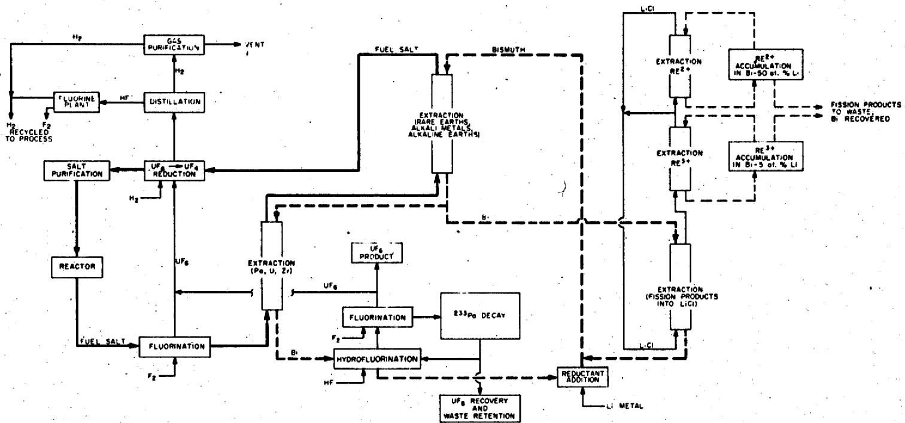  
ORNL DWG 72-140   
Fig. 1. Conceptual Flow Diagram for Processing a Single-Fluid MSBR by the Fluorination--Reductive Extraction--Metal Transfer Process.

every 220 days, about 25 ft³ of the salt is withdrawn, held for $^{233}$ Pa decay, fluorinated, and discarded to purge accumulated fission products, LiF, ThF₄, and some corrosion products. The F₂-UF₆ stream from this fluorinator contains uranium of the highest isotopic purity in the processing plant; therefore, a portion of this stream is withdrawn to remove excess uranium above that required to refuel the reactor.

Fission products removed from the carrier salt in the second extraction column are transferred from Bi-Li solution to molten lithium chloride; however, the distribution coefficient for thorium between LiCl and Bi-Li solution is much lower than that of the rare earths and very little thorium transfers. The lithium chloride circulates in a closed loop, and is treated in two steps to isolate the rare earths and alkaline earths. The entire LiCl stream is contacted with Bi-5 at.% Li alloy to strip trivalent rare earths into the metal; about two percent of this treated stream is then stripped with Bi-50 at.% Li alloy to remove divalent rare earths and alkaline earths. Alkali metals (rubidium, cesium) remain in the lithium chloride and are removed by occasionally discarding a small volume of the salt. Fission products build up in the two Bi-Li alloys and are purged periodically by hydrofluorinating relatively small volumes of each alloy in the presence of a molten waste salt.

Large fractions of some classes of fission products (noble gases, noble and seminoble metals) are presumed to be removed from the fuel salt in the reactor, and, for these, the processing plant is not designed to handle the MSBR's full production. Noble gases are sparged from the circulating fuel in the reactor with inert gas on a 50-sec cycle, and noble and seminoble metals are expected to plate out on reactor and heat exchanger surfaces on a relatively short cycle. A removal cycle time of 2.4 hours was used for this study. Since this cycle is short compared to 10-day processing cycle time, only about $0.1\%$ of these metals are removed in the processing plant. Halogenous fission products are volatilized in fluorination and are removed from the process gas by scrubbing with aqueous caustic solution after uranium has been recovered.

The capital cost for the fluorination--reductive extraction--metal transfer processing plant is not strongly affected by throughput. The

direct, indirect, and total plant investments were $28.5 million, $20.041 million, and $48.541 million respectively for a plant to process a 1000-MW(e) MSBR on a 3.33-day cycle. The scale factor for capital cost versus throughput is 0.28 for a range of processing cycle times from 3 to 37 days.

Although considerable knowledge has been gained in recent years on processing molten fluoride salts, the current concept still has a number of major uncertainties and problem areas that must be resolved to prove its practicability. From a chemical standpoint, the process is fundamentally sound; however, engineering problems are difficult. A basic problem is a material for containing bismuth and bismuth-salt mixtures; molybdenum has excellent corrosion resistance, but the technology for fabricating complex shapes and systems is undeveloped. Graphite is a possible alternate material, however, its use introduces design and fabrication difficulties particularly in joint design and porosity.

Fluorination of a flowing salt stream has been demonstrated but establishing and maintaining a protective layer of frozen salt on the fluorinator walls has not been demonstrated except in a fluorination simulation.

Complete removal of entrained bismuth from molten salt, and satisfactory high-temperature instrumentation for process control are yet to be developed and demonstrated. Experimental data from the MSRE indicate that noble metal fission products will deposit on reactor surfaces as we have assumed in this study; if this is not the case, there will be a considerable effect on processing plant design in facilities for handling these additional fission products.

# SCOPE OF THE DESIGN STUDY

This design and cost study was made to estimate the cost of processing irradiated $\mathrm{LiF - BeF_2 - ThF_4 - UF_4}$ fuel of a 1000-MW(e) molten-salt breeder reactor. The processing plant is an integrated facility that shares common services and maintenance equipment with the reactor and power conversion plant. Fuel is treated continuously by the fluorination--reductive extraction--metal transfer process.

Our costs are based upon preliminary design calculations of each major item of process equipment. A sufficient study was made of all process operations to establish the geometry, heat transfer surface, material of construction, coolant requirement, and other features that influenced operability and cost of the equipment. No plant layouts or designs of auxiliary equipment were made. Auxiliary items such as pumps, sampling stations, reagent purification systems, etc., were identified by size and number in relatively broad categories from flowsheet requirements and a general knowledge of the overall plant layout. The costs of major equipment items were estimated on the basis of unit cost per pound of fabricated material for the required shapes, for example, plate, tubing, pipe, flanges, etc. The costs of conventional auxiliary equipment and off-the-shelf items were estimated from previously developed molten salt reactor project information.

Estimated costs for major and auxiliary equipment were the basis for other direct costs that could not be determined without detailed designs and equipment layouts. Cost for piping, instrumentation, insulation, etc., were estimated by taking various percentages of the installed equipment costs. The applied factors were obtained from previous experience in chemical processing plant design and construction.

The study does not include allowances for site, site preparation, buildings, and facilities shared with the reactor plant. These costs are identified with the overall cost of the power station and it is not practicable to prorate them over various sections of the installation. Facilities and equipment for treating the reactor off-gas are usually considered to be part of the reactor system and their cost was not included. Furthermore, our study was not sufficiently detailed to determine the required duplication of equipment for continuity of operations, nor did we make a thorough safety analysis that could result in additional cost, especially with regard to redundant and fail-safe coolant circuits. A more detailed study than ours might also show that additional equipment is needed to treat fuel and/or reactor coolant salt in case of accidental cross contamination.

For consistency with the cost study for the reference molten-salt breeder reactor, $^{1}$ we have based our costs on the 1970 value of the dollar. Private ownership of the plant is assumed. Interest on borrowed money for the three-year construction period is taken at $8\%$ per year; no escalation of costs during construction is taken into account. Costs of site, buildings, facilities and services, and reactor off-gas treatment may be found in reference $\mathbf{\ddot{I}}$ .

# THE MOLTEN SALT BREEDER REACTOR

# Reactor Plant

The processing plant of this study treats irradiated fuel from the 1000-MW(e) reference molten salt breeder reactor described by Robertson. The single-fluid reactor is fueled with $^{233}\mathrm{UF}_4$ in a carrier of molten $^7\mathrm{LiF - BeF}_2 - \mathrm{ThF}_4$ (72-16-12 mole %); about 0.3 mole % $^{233}\mathrm{UF}_4$ is required for criticality. The molten fuel is circulated at high velocity in closed loops consisting of the reactor core and primary heat exchangers (Fig. 2) where fission energy is transferred to a secondary coolant salt for the production of supercritical steam at $1000^{\circ}\mathrm{F}$ and 3600 psia. Fissioning uranium in the core heats the salt to about $1300^{\circ}\mathrm{F}$ ; this temperature is reduced to about $1050^{\circ}\mathrm{F}$ in the primary heat exchangers from which the salt returns to the core to repeat the cycle. A sidestream of salt flows continuously through the fuel-salt drain tank, and a very small portion (0.87 gpm) of this stream is routed continuously to the processing plant for treatment. Processed salt is returned to the drain tank and then to the reactor.

A few pertinent data about the MSBR are given in Table 1.

# Fuel Salt

In a single-fluid MSBR the fertile material (thorium) is carried in the fuel stream, and bred fuel is produced in the fuel salt. Most of the bred fuel is burned to produce power; however, excess $^{233}\mathrm{U}$ amounting to about $3.27\%$ of the reactor inventory is produced each year and is recovered in the chemical processing plant.

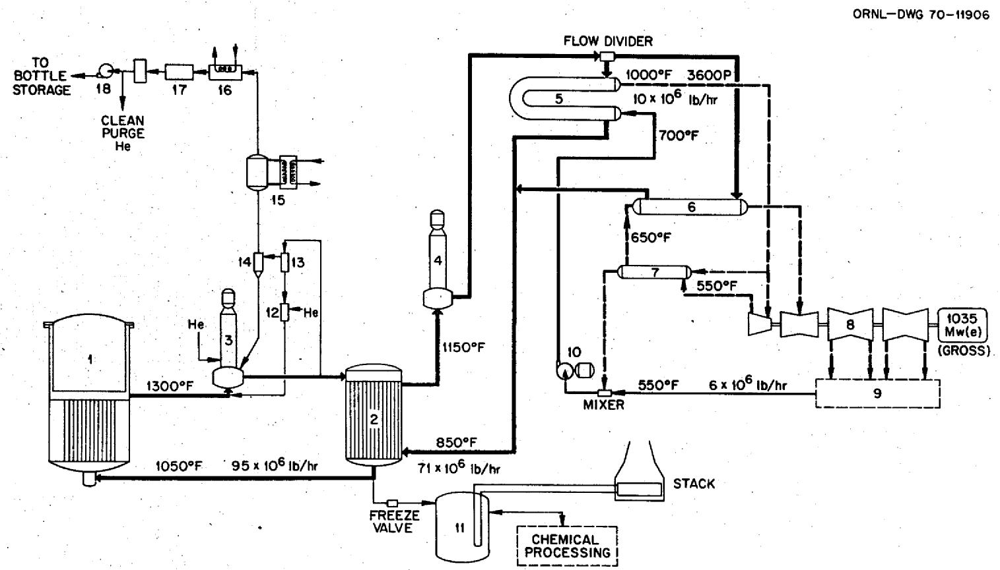  
Fig. 2. Simplified Flow Diagram of MSBR System. (1) Reactor, (2) Primary heat exchanger, (3) Fuel-salt pump, (4) Coolant-salt pump, (5) Steam generator, (6) Steam reheater, (7) Reheat steam preheater, (8) Steam turbine-generator, (9) Steam condenser, (10) Feedwater booster pump, (11) Fuel-salt drain tank, (12) Bubble generator, (13) Gas separator, (14) Entrainment separator, (15) Holdup tank, (16) $47$ -hr Xe holdup charcoal bed, (17) Long-delay charcoal bed, (18) Gas cleanup and compressor system.

# Reactor Plant

Table 1. Selected Data for the Molten Salt Breeder Reactor ${}^{a}$   

<table><tr><td>Gross fission heat generation</td><td>2250 MW(t)</td></tr><tr><td>Gross electrical generation</td><td>1035 MW(e)</td></tr><tr><td>Net electrical output</td><td>1000 MW(e)</td></tr><tr><td>Net overall thermal efficiency</td><td>44.4%</td></tr><tr><td>Reactor vessel</td><td>22.2 ft ID x 20 ft high</td></tr><tr><td>Construction material for reactor vessel and heat exchanger</td><td>Hastelloy N</td></tr><tr><td>Moderator</td><td>Graphite (bare)</td></tr><tr><td>Fissile uranium inventory</td><td>1346 kg</td></tr><tr><td>Breeding ratio</td><td>1.06</td></tr><tr><td>Fuel yield</td><td>3.27%/year</td></tr><tr><td>Doubling time, compounded continuously at 80% plant factor</td><td>22 years</td></tr></table>

# Fuel Salt

<table><tr><td>Components</td><td>LiF-BeF2-ThF4-UF4</td></tr><tr><td>Composition</td><td>71.7-16.0-12.0-0.3 mole %</td></tr><tr><td>Liquidus temperature</td><td>~930°F (499°C)</td></tr><tr><td>Isotopic enrichment in 7Li</td><td>99.995%</td></tr><tr><td>Volume in primary systemb</td><td>1720 ft3</td></tr><tr><td>Processing cycle time</td><td>10 days</td></tr></table>

A thermal-neutron reactor must be processed rather rapidly for both fission product and $^{233}\mathrm{Pa}$ removal if the reactor is to maintain favorable breeding characteristics, and a significant advantage of the MSBR is the ease of withdrawing fuel for processing. The moderately high absorption cross section and large equilibrium inventory ( $\sim 102\mathrm{kg}$ ) of $^{233}\mathrm{Pa}$ make this nuclide a significant neutron poison and require that its removal rate by processing be about four (or more) times its decay rate, that is, a cycle time of about 10 days. In this system the processing plant is an integral part of the installation, and irradiated fuel can flow easily from the primary reactor circuit to the processing plant (Fig. 1). Treated fuel is returned in a similar manner. The processing cycle time is determined from an economic balance between the cost of processing and the credit from increased fuel yield. The cycle time for this study (10 days) might not be the optimum because it was fixed to give the MSBR favorable nuclear performance without prior knowledge of the processing cost.

Contaminants in the reactor fuel can be grouped into three broad categories with respect to their influence on processing plant design: $^{12}$ (1) volatile fission products, (2) soluble fission and corrosion products, and (3) fission products that have an affinity for surfaces in the reactor system. The first group includes the noble gases which are removed from the reactor primary system on about a 50-sec cycle by sparging the circulating fuel with an inert gas. Therefore, these gases are only a minor consideration in the design of the processing plant. Experimental evidence suggests that portions of the noble metal fluorides might also be removed by sparging, but the data are inconclusive in establishing the magnitude of this effect. The second group of fission products has the most effect on processing plant design because their only means of removal is by processing the fuel salt. These fission products include primarily the halogens, alkali metals, alkaline earths, and rare earths; protactinium (as $\mathrm{PaF_4}$ ) is also soluble and a very important nuclide in processing plant design because of its high specific decay heat (50.8 w/g) and large equilibrium inventory. The third group includes the noble and seminoble metals which appears to attach themselves to surfaces in the reactor circuit. These metals are called "noble" because they are

noble with respect to the materials of construction of the reactor and are normally in the reduced state in this system. The effective cycle time for this removal is not definitely known but is believed to be about 2.4 hr, the removal time used in this study. This group of fission products accounts for about $30\%$ of the total fission product decay heat, hence noble metals could become an important factor in processing plant design if their removal in the reactor is not as efficient as we have assumed, or if they build up deposits that occasionally break away and enter the processing plant.

# Equilibrium Composition of the MSBR

The equilibrium composition of the 1000-MW(e) MSBR has been calculated by Bell² for use in this study and the results are given in Table 2. The fission product values are the sum of individual values for every isotope of the particular fission product. At equilibrium, $\beta + \gamma$ heat generation by fission products is 91.9 MW, which is $4.08\%$ of the total thermal power.

Protactinium is processed on a 10-day cycle and held for decay in the processing plant. The $^{233}\mathrm{Pa}$ inventory distribution between the reactor and the processing plant is $20.6\mathrm{kg}$ and $81.8\mathrm{kg}$ respectively.

Most of the fission products are removed from the fuel salt by several mechanisms, and the processing cycle time for each given in the table is for the dominant removal process. However, all removal processes were considered in computing the equilibrium composition, for example, neutron absorption, plating out on reactor surfaces, extraction in the processing plant, fuel salt discard, or any other applicable method.

# BEHAVIOR OF FISSION·PRODUCTS AND FUEL SALT COMPONENTS IN PROCESSING

Fission products and fuel component behavior in the fluorination--reductive extraction--metal transfer process is more easily explained by associating groups of elements with the principal operation for their

Carrier Salt: LiF-BeF $_2$ -ThF $_4$

79-16-12 mole %   
Cycle Time for Salt Through   
Processing Plant: 10 days   
Reactor Thermal Power: 2252 MW   
Fuel Salt Volume: 1683 ft³   
Breeding Ratio: 1.0637

<table><tr><td rowspan="2">Element</td><td rowspan="2">Processing Cycle Time</td><td colspan="4">Fission Products</td></tr><tr><td>Orans/cm3</td><td>Beta Watts/cm3</td><td>Gamma Watts/cm3</td><td>β + γ Watts/cm3</td></tr><tr><td>SiH</td><td>50 sec</td><td>4.08360 x 10-14</td><td>4.50620 x 10-14</td><td>0.0</td><td>4.50620 x 10-14</td></tr><tr><td>Zn</td><td>2.4 hr</td><td>2.74881 x 10-12</td><td>3.43824 x 10-10</td><td>3.15231 x 10-10</td><td>3.75347 x 10-9</td></tr><tr><td>Ge</td><td>2.4 hr</td><td>8.98404 x 10-12</td><td>4.30895 x 10-8</td><td>1.62267 x 10-8</td><td>5.93163 x 10-8</td></tr><tr><td>Ge</td><td>2.4 hr</td><td>7.07115 x 10-10</td><td>5.32699 x 10-8</td><td>2.45637 x 10-8</td><td>7.78336 x 10-8</td></tr><tr><td>As</td><td>2.4 hr</td><td>5.76132 x 10-10</td><td>1.40259 x 10-3</td><td>3.25438 x 10-4</td><td>1.72803 x 10-3</td></tr><tr><td>Se</td><td>2.4 hr</td><td>2.03324 x 10-8</td><td>2.34497 x 10-2</td><td>1.60351 x 10-3</td><td>2.50532 x 10-3</td></tr><tr><td>Er</td><td>10 days</td><td>5.09811 x 10-7</td><td>1.48250 x 10-1</td><td>4.53979 x 10-2</td><td>1.93648 x 10-2</td></tr><tr><td>Kr</td><td>50 sec.</td><td>2.74746 x 10-9</td><td>3.41011 x 10-2</td><td>1.63905 x 10-2</td><td>5.04915 x 10-2</td></tr><tr><td>Rb</td><td>10 days</td><td>2.17168 x 10-7</td><td>1.72154 x 10-1</td><td>5.83752 x 10-2</td><td>2.30530 x 10-1</td></tr><tr><td>Sr</td><td>16 days</td><td>2.41455 x 10-8</td><td>6.83795 x 10-2</td><td>7.9946 x 10-2</td><td>1.48324 x 10-1</td></tr><tr><td>Y</td><td>10 days</td><td>2.61858 x 10-5</td><td>1.35111 x 10-1</td><td>7.90656 x 10-2</td><td>2.14176 x 10-1</td></tr><tr><td>Zr</td><td>10 days</td><td>6.68950 x 10-6</td><td>1.55792 x 10-2</td><td>1.78074 x 10-3</td><td>1.73599 x 10-2</td></tr><tr><td>Nb</td><td>2.4 hr</td><td>6.26768 x 10-3</td><td>6.55444 x 10-2</td><td>3.57730 x 10-2</td><td>1.01317 x 10-2</td></tr><tr><td>Mo</td><td>2.4 hr</td><td>3.69109 x 10-7</td><td>1.26249 x 10-2</td><td>1.44136 x 10-2</td><td>2.70385 x 10-2</td></tr><tr><td>Tc</td><td>2.4 hr</td><td>1.40352 x 10-8</td><td>1.88519 x 10-2</td><td>1.40781 x 10-2</td><td>3.29300 x 10-2</td></tr><tr><td>Ru</td><td>2.4 hr</td><td>1.66304 x 10-7</td><td>6.85229 x 10-4</td><td>3.13669 x 10-4</td><td>9.98897 x 10-4</td></tr><tr><td>Rh</td><td>2.4 hr</td><td>3.64718 x 10-9</td><td>6.01472 x 10-4</td><td>2.65475 x 10-4</td><td>8.66947 x 10-4</td></tr><tr><td>Pd</td><td>2.4 hr</td><td>6.63236 x 10-9</td><td>2.48215 x 10-4</td><td>1.26855 x 10-5</td><td>2.60901 x 10-4</td></tr><tr><td>Ag</td><td>2.4 hr</td><td>9.61034 x 10-10</td><td>2.80540 x 10-4</td><td>7.14535 x 10-5</td><td>3.51994 x 10-4</td></tr><tr><td>Cd</td><td>2.4 hr</td><td>1.84528 x 10-9</td><td>1.41829 x 10-4</td><td>8.04375 x 10-5</td><td>2.22267 x 10-4</td></tr><tr><td>In</td><td>2.4 hr</td><td>1.96374 x 10-10</td><td>8.05530 x 10-4</td><td>7.80937 x 10-4</td><td>1.58647 x 10-3</td></tr><tr><td>Sn</td><td>2.4 hr</td><td>5.33362 x 10-8</td><td>3.64733 x 10-2</td><td>4.48932 x 10-3</td><td>4.09626 x 10-2</td></tr><tr><td>Sb</td><td>2.4 hr</td><td>7.05005 x 10-8</td><td>1.11958 x 10-1</td><td>1.82056 x 10-2</td><td>1.30164 x 10-1</td></tr><tr><td>Te</td><td>2.4 hr</td><td>2.99511 x 10-7</td><td>6.64000 x 10-2</td><td>1.42928 x 10-2</td><td>8.06928 x 10-2</td></tr><tr><td>I</td><td>10 days</td><td>4.56947 x 10-8</td><td>1.02468 x 10-1</td><td>6.55365 x 10-2</td><td>1.68024 x 10-1</td></tr><tr><td>Xe</td><td>50 sec</td><td>5.94758 x 10-9</td><td>3.38396 x 10-2</td><td>7.76081 x 10-4</td><td>3.46156 x 10-2</td></tr><tr><td>Cs</td><td>10 days</td><td>6.35421 x 10-6</td><td>9.54023 x 10-2</td><td>3.82642 x 10-2</td><td>1.33666 x 10-1</td></tr><tr><td>Ba</td><td>16 days</td><td>1.63160 x 10-8</td><td>6.77094 x 10-2</td><td>1.61180 x 10-3</td><td>6.93212 x 10-2</td></tr><tr><td>La</td><td>21 days</td><td>3.49987 x 10-8</td><td>8.02147 x 10-2</td><td>5.67829 x 10-2</td><td>1.36948 x 10-1</td></tr><tr><td>Ce</td><td>16 days</td><td>9.67732 x 10-8</td><td>3.32484 x 10-2</td><td>5.12100 x 10-3</td><td>3.83694 x 10-2</td></tr><tr><td>Pr</td><td>30 days</td><td>3.41094 x 10-8</td><td>2.86306 x 10-2</td><td>1.27302 x 10-2</td><td>4.13608 x 10-2</td></tr><tr><td>Nd</td><td>30 days</td><td>1.11061 x 10-4</td><td>3.32523 x 10-3</td><td>6.80195 x 10-4</td><td>4.00542 x 10-3</td></tr><tr><td>Pm</td><td>29 days</td><td>1.19068 x 10-8</td><td>1.9832 x 10-3</td><td>1.05748 x 10-3</td><td>3.00580 x 10-3</td></tr><tr><td>Sn</td><td>27 days</td><td>1.17938 x 10-8</td><td>1.57257 x 10-4</td><td>1.7180 x 10-8</td><td>1.74441 x 10-4</td></tr><tr><td>Eu</td><td>51 days</td><td>2.46931 x 10-8</td><td>2.95250 x 10-8</td><td>6.97780 x 10-8</td><td>9.93030 x 10-5</td></tr><tr><td>Gd</td><td>30 days</td><td>2.57869 x 10-7</td><td>7.77752 x 10-7</td><td>1.48335 x 10-7</td><td>9.26088 x 10-7</td></tr><tr><td>Tb</td><td>30 days</td><td>8.04549 x 10-9</td><td>5.27005 x 10-8</td><td>1.39630 x 10-8</td><td>6.66635 x 10-8</td></tr><tr><td>Dy</td><td>30 days</td><td>6.32113 x 10-10</td><td>1.73535 x 10-10</td><td>3.06505 x 10-11</td><td>2.04186 x 10-10</td></tr><tr><td>Ho</td><td>30 days</td><td>1.59144 x 10-12</td><td>5.27681 x 10-12</td><td>8.66869 x 10-18</td><td>5.27682 x 10-12</td></tr><tr><td>Er</td><td>30 days</td><td>3.18597 x 10-13</td><td>0.0</td><td>0.0</td><td>0.0</td></tr><tr><td></td><td></td><td>4.49749 x 10-4</td><td>1.36011</td><td>5.68318 x 10-1</td><td>1.92842</td></tr></table>

(Continued)

Table 2. (Continued)   

<table><tr><td colspan="3">Fuel Components</td></tr><tr><td>Nuclide</td><td>Grams/cm3</td><td>Amount in Reactor Fuel Circuit (kg)</td></tr><tr><td>a38Th</td><td>1.4572</td><td>69,450</td></tr><tr><td>a38Pu</td><td>4.3226 x 10-4</td><td>20.6a</td></tr><tr><td>a38U</td><td>3.7433 x 10-7</td><td>0.018</td></tr><tr><td>a38U</td><td>2.5805 x 10-2</td><td>1230</td></tr><tr><td>a38U</td><td>9.3183 x 10-3</td><td>444</td></tr><tr><td>a38U</td><td>2.4315 x 10-8</td><td>116</td></tr><tr><td>a38U</td><td>2.5200 x 10-3</td><td>120</td></tr><tr><td>a38U</td><td>4.7592 x 10-6</td><td>0.227</td></tr><tr><td>a38Np</td><td>3.6116 x 10-4</td><td>17.2</td></tr><tr><td>a38Np</td><td>1.3338 x 10-6</td><td>0.063</td></tr><tr><td>a38Pu</td><td>4.3420 x 10-6</td><td>0.207</td></tr><tr><td>a38Pu</td><td>5.3161 x 10-9</td><td>0.0025</td></tr></table>

For removal on a 10-day cycle.

removal. This relationship is shown in Table 3. All chemical species in the fuel salt can be divided into twelve groups, the members of each group having similar behavior in the processing plant. The primary removal operation is the dominant process for the group; whereas, the secondary removal operation is a downstream operation designed for removal of a different group but also effective in removing components of a previously removed group.

Noble gases, seminoble metals, and noble metals have only a small influence on processing plant design because of their fast removal rate in the reactor. However, soluble daughters of these nuclides will probably reenter the fuel salt and be removed in the processing plant. Noble gases are sorbed from the inert sparge gas and retained for decay on charcoal beds in the reactor off-gas circuit that is removed from the processing plant. Decay times are sufficient to decontaminate the gas from all krypton and xenon isotopes except $^{85}\mathrm{Kr}$ , which has a 10.76-yr half life. Krypton-85 is concentrated and stored in cylinders by routing a sidestream of the carrier gas through either a cryogenic operation or the more recently developed hydrocarbon sorption process.

There are small concentrations of heavy elements (neptunium and protactinium) formed by neutron capture and decay. These elements are easily extracted and will be held in the $^{233}\mathrm{Pa}$ decay tank. Neptunium can be fluorinated from the salt but not as easily as uranium; therefore, we can expect part of the neptunium to behave like uranium and be returned to the reconstituted fuel.

# THE FLUORINATION--REDUCTIVE EXTRACTION--METAL TRANSFER PROCESS

A simplified flowsheet of the fluorination--reductive extraction--metal transfer process is shown in Fig. 3. The plant can be divided into six areas each of which is characterized by its primary process operation: fluorination, protactinium extraction and isolation, rare earth extraction and metal transfer, fuel reconstitution, gas recycle, and waste accumulation. Fuel salt flows quickly through the plant so that there is minimal holdup of salt and uranium.

Table 3. Removal Methods for Fission Products and Fuel Components in Processing MSBR Fuel   

<table><tr><td>Chemical Group</td><td>Components</td><td>Primary Removal Operation</td><td>Secondary Removal Operation</td></tr><tr><td>Noble gases</td><td>Kr and Xe; present in salt as elements</td><td>Sparging with inert gas in reactor fuel circuit</td><td>Purged in fluorinators and purge columns due to sparging action of F2and H2</td></tr><tr><td>Seminoble metalsa</td><td>Zn, Ga, Ge, As, Se</td><td>Plating out on surfaces in reactor vessel and heat exchangers</td><td>Reduction by Bi-Li alloy in reductive extraction; SeF6volatilised in fluorinator</td></tr><tr><td>Noble metals</td><td>Nb, Mo, Tc, Ru, Rh, Pd, Ag, Cd, In, Sn, Sb, Te; present in salt in reduced state</td><td>Plating out on surfaces in reactor vessel and heat exchangers</td><td>Nb, Mo, Tc, Ru, Rh, Sb, and Te have volatile fluorides and are removed in fluorinators; Pd, Ag, Cd, In, and Sn reduced by Bi-Li alloy in reductive extraction</td></tr><tr><td>Uranium</td><td>a33U, a34U, a35U, a36U, a37U; present in salt as fluorides</td><td>Volatilization in primary flu- orinator; recovered and recy-cled to reactor</td><td>Reductive extraction with Bi-Li alloy in Pa extraction column followed by volatilization in secondary fluorinator</td></tr><tr><td>Halogens</td><td>Br and I; present in salt as bromides and iodides</td><td>Volatilisation in primary flu- orinator followed by isolation in KOH solution</td><td></td></tr><tr><td>Zirconium and protactinium</td><td>Zr and a33Pa; present in salt as fluorides</td><td>Reductive extraction with Bi-Li alloy in Pa extraction column followed by isolation in Pa decay salt</td><td></td></tr><tr><td>Corrosion products</td><td>Ni, Fe, Cr; present in salt as fluorides</td><td>Reductive extraction with Bi-Li alloy in Pa extraction column followed by isolation in Pa decay salt</td><td>Reduction to metallic particulates by Hg in reduction column followed by filtration</td></tr><tr><td>Trivalent rare earthsb</td><td>Y, La, Ce, Pr, Nd, Pm, Qd, Tb, Dy, Ho, Er; present in salt as fluorides</td><td>Reductive extraction with Bi-Li alloy in rare earth ex-tractionation column; metal transfer via LiCl to isolation in Bi-5 at.% Li solution</td><td>Fuel salt discard</td></tr><tr><td>Divalent rare earths</td><td>Sm and Eu; present in salt as fluorides</td><td>Reductive extraction with Bi-Li alloy in rare earth ex-tractionation column; metal transfer via LiCl to isolation in Bi-50 at.% Li solution</td><td>Fuel salt discard</td></tr><tr><td>Alkaline earths</td><td>Sr and Ba; present in salt as fluorides</td><td>Reductive extraction with Bi-Li alloy in rare earth ex-tractionation column; metal transfer via LiCl to isolation in Bi-50 at.% Li solution</td><td>Fuel salt discard</td></tr><tr><td>Alkali metals</td><td>Rb and Cs; present in salt as fluorides</td><td>Reductive extraction with Bi-Li alloy in rare earth ex-tractionation column; accumulation in LiCl</td><td>Fuel salt discard</td></tr><tr><td>Carrier salt</td><td>Li, Be, Th; present as fluorides</td><td>Fuel salt discard to remove excess Li added in reductive extraction units</td><td></td></tr></table>

aMore recent information suggests that Zn, Ge, Ge and As may not be in reduced state in this system and plate out on surfaces; however, in this study they were treated as if they did plate out.   
b. Yttrium is not a rare earth but its behavior is analogous.

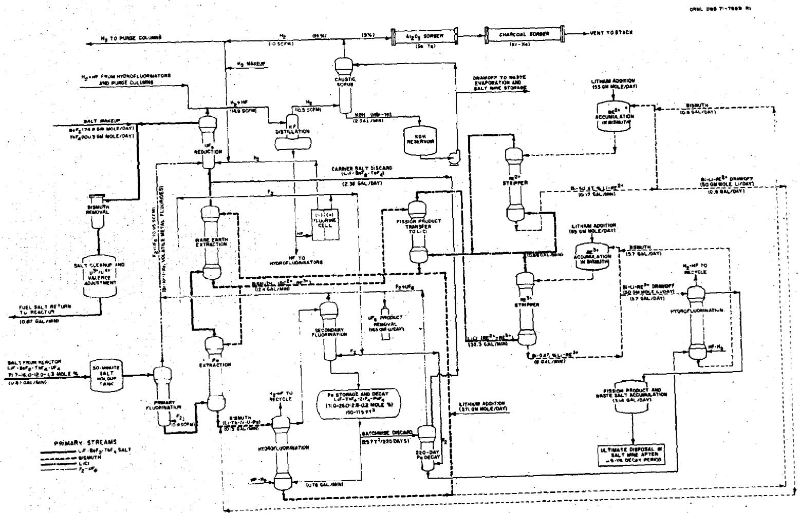  
Fig. 3. Flow Diagram of the Fluorination--Reductive Extraction--Metal Transfer Process. Values apply to processing a 1000-MW(e) MSBR on a 10-day cycle.

# Fluorination

Irradiated fuel salt from the MSBR enters the processing plant at about 0.87 gal/min and is held for about 30 minutes to allow the decay heat generation rate to drop from about 54.6 to $12.6\mathrm{kW / ft^3}$ . (See the detailed flowsheet in Appendix D for material and energy balance data.) The salt then flows to a fluorinator where about $95\%$ of the uranium is volatilized at about $550^{\circ}\mathrm{C}$ as $\mathrm{UF_6}$ . The fluorinator must be protected from catastrophic attack by the $\mathbf{F}_2$ -molten salt mixture by a layer of frozen salt on wetted surfaces of the unit. Salt leaves the fluorinator and enters a similar column, which is also protected by frozen salt, where hydrogen gas reacts with dissolved fluorine and $\mathrm{UF_6}$ to produce HF and $\mathrm{UF_4}$ respectively. The hydrogen also strips HF from the salt, preventing corrosion of downstream equipment.

The fluorinator is also the primary removal unit for the halogens, which are oxidized to volatile $\mathsf{BrF}_5$ and $\mathsf{IF}_5$ . Certain noble and semi-noble metals, namely, Se, Mo, Tc, Ru, Sb, and Te, are converted to volatile fluorides by fluorine and are removed with the uranium. However, as stated above, the equilibrium amounts of these metals in the salt are small because of the 2.4-hr removal time in the reactor. Residual Kr and Xe are removed by the stripping action of $\mathsf{F}_2$ in the fluorinator and $\mathsf{H}_2$ in the purge column.

The principal reactions are:

In the fluorinator

2 $\mathbf{U}\mathbf{F}_{4} + \mathbf{F}_{2}\rightarrow 2\mathbf{U}\mathbf{F}_{5}$   
2 $\mathbf{U}\mathbf{F}_{6} + \mathbf{F}_{2} \rightarrow 2\mathbf{U}\mathbf{F}_{6}$   
2 Br- + 5. F2 → 2 BrF6 + 2e   
2 $\mathbf{I}^{-} + 5\mathbf{F}_{2}\rightarrow 2\cdot \mathbf{IF}_{5} + 2\mathbf{e}^{-}$

$$
\mathrm {N M} ^ {\circ} + 3 \mathrm {F} _ {2} \rightarrow (\mathrm {N M}) \mathrm {F} _ {6} \quad (\mathrm {N M} = \text {n o b l e m e t a l})
$$

The last equation illustrates a typical noble metal reaction. The behavior of all noble and seminoble metals is not completely understood, and other oxidation states might be present.

In the purge column

$$
\begin{array}{l} \mathrm {F} _ {2} + \mathrm {H} _ {2} \rightarrow 2 \mathrm {H F} \\ 2 \mathrm {U F} _ {5} + \mathrm {H} _ {2} \rightarrow 2 \mathrm {U F} _ {4} + 2 \mathrm {H F} \\ \end{array}
$$

# Protactinium Extraction and Isolation

The salt stream, containing about $5\%$ of the uranium and all of the protactinium, enters the bottom of a packed extraction column and is contacted with a countercurrent stream of bismuth containing about 0.2 at. $\%$ lithium and 0.25 at. $\%$ thorium reductants. Protactinium and uranium are reduced by lithium and thorium and extracted into the bismuth; fission product zirconium, the remaining noble and seminoble metals, and corrosion products are also extracted. Salt leaving the top of the extraction column is essentially free of uranium and protactinium.

The reductive extraction column operates at about $640^{\circ}\mathrm{C}$ with a salt/ metal flow ratio around 6.7/1. Extraction is essentially complete for the affected nuclides. Thorium can be extracted into the metal as shown in the third equation below. However, operating conditions are fixed to minimize the extraction of thorium, and, since thorium is a reductant for protactinium and uranium, it is partially returned to the salt phase. The principal reactions occurring in the protactinium extraction column are:

$$
\begin{array}{l} \mathrm {P a F} _ {4} (\text {s a l t}) + 4 \mathrm {L i} (\mathrm {B i}) \rightarrow 4 \mathrm {L i F} (\text {s a l t}) + \mathrm {P a} (\mathrm {B i}) \\ \mathrm {U F} _ {4} (\text {s a l t}) + \mathrm {l} _ {4} \operatorname {L i} (\mathrm {B i}) \rightarrow \mathrm {l} _ {4} \operatorname {L i F} (\text {s a l t}) + \mathrm {U} (\mathrm {B i}) \\ \mathrm {T h F} _ {4} (\text {s a l t}) + 4 \mathrm {L i} (\mathrm {B i}) \rightarrow 4 \mathrm {L i F} (\text {s a l t}) + \mathrm {T h} (\mathrm {B i}) \\ \mathrm {U F} _ {4} (\text {s a l t}) + \mathrm {T h} (\mathrm {B i}) \rightarrow \mathrm {T h F} _ {4} (\text {s a l t}) + \mathrm {U} (\mathrm {B i}) \\ \mathrm {P a F} _ {4} (\text {s a l t}) + \mathrm {T h} (\mathrm {B i}) \rightarrow \mathrm {T h F} _ {4} (\text {s a l t}) + \mathrm {P a} (\mathrm {B i}) \\ \mathrm {Z r F} _ {4} (\text {s a l t}) + \downarrow \mathrm {L i} (\mathrm {B i}) \rightarrow \downarrow \mathrm {L i F} (\text {s a l t}) + \mathrm {Z r} (\mathrm {B i}) \\ \end{array}
$$

Corresponding reactions between $\mathrm{BeF_2}$ and Li(Bi) or Th(Bi) do not occur. As shown in the above reactions, reductive extraction increases the LiF content of the carrier salt. The excess is removed by discarding a small amount of the carrier in a later operation.

# Protactinium Isolation System

The metal stream from the reductive extraction column enters a hydrofluorinator where all nuclides dissolved in the bismuth are oxidized to fluorides with HF gas at about $640^{\circ}\mathrm{C}$ in the presence of LiF- $\mathrm{ThF_4 - }$ $\mathrm{ZrF_4 - PaF_4}$ (71.00-25.97-2.84-0.19 mole %) salt. The oxidized materials transfer to the salt. A minuscule stream (0.6 gal/day) of Bi-Li alloy

from the divalent rare earth accumulation system also enters the hydrofluorinator. Fission products and lithium in this stream are also converted to fluorides which transfer to the salt. A clean bismuth stream leaves the hydrofluorinator. Part of it is reconstituted with lithium reductant and returned to the rare earth removal system; the remainder is made into Bi-50 at. % Li alloy for the divalent rare earth accumulation system.

The protactinium isolation system consists of a $150\text{-ft}^3$ volume of $\mathrm{LiF - ThF_4 - ZrF_4 - PaF_4}$ salt circulating in a closed loop consisting of the hydrofluorinator, fluorinator, purge column, and $^{233}\mathrm{Pa}$ decay tank. The system has no direct communication with areas of the plant handling fuel salt, making it an effective safeguard against the accidental return of large quantities of $^{233}\mathrm{Pa}$ or fission products to the reactor. At equilibrium about $81.8\mathrm{kg}^{233}\mathrm{Pa}$ , which is $80\%$ of the plant inventory, is in the $^{233}\mathrm{Pa}$ isolation system. This system is the largest source of decay heat, generating about $4.1\mathrm{MW}$ of $^{233}\mathrm{Pa}$ decay heat and $1.7\mathrm{MW}$ of fission product decay heat.

Steady state concentrations are established for the components of the system by regulating their removal rate. Uranium is removed by fluorinating the salt immediately upon leaving the hydrofluorinator, most of the $\mathrm{UF_6}$ being sent directly to the $\mathrm{UF_6}$ reduction unit for recombination with fuel carrier salt. Excess uranium above that needed to refuel the reactor is withdrawn at this point. The entire volume of salt is fluorinated on a one-day cycle so that the uranium inventory is about that from one day's decay of the $^{233}\mathrm{Pa}$ inventory ( $\sim 2.6$ kg U).

The volume of salt in the protactinium decay system slowly increases due to the addition of fission products, lithium, and thorium in the hydrofluorinator. The volume is allowed to build up to 175 ft³; then a 25-ft³ batch is withdrawn and the cycle is repeated. The calculated cycle time is 220 days. This periodic discard of salt purges fission products and establishes the composition of the system. Discarded salt is held for $^{233}\mathrm{Pa}$ decay, fluorinated, and sent to waste.

# Rare Earth Extraction and Metal Transfer

Uranium- and protactinium-free salt from the protactinium extraction column enters the bottom of a second extraction column and is contacted with Bi-0.2 at. % Li-0.25 at. % Th alloy to extract some of the rare earths, alkaline earths, and alkali metals. Effective cycle times (see Table 2) range from about 16 days for barium, strontium, and cerium to 51 days for europium; the effective cycle time for all elements is about 25 days. Thus, extraction efficiencies range from 20 to $60\%$ for individual elements. About 2.4 gal/day of the treated salt is discarded to maintain a lithium balance on the system, $\mathrm{BeF}_2$ -ThF₄ makeup is added, and the salt is sent to the UF₆ reduction unit for fuel reconstitution. Excess lithium enters the carrier salt in the reductive extraction operations.

# Metal Transfer to LiCl

The bismuth stream containing fission products flows to another packed column where it is contacted with LiCl at about $640^{\circ}\mathrm{C}$ . Fission products transfer from the metal to the salt. Although some thorium is extracted from the fluoride salt with the rare earths, only a very small amount of thorium transfers to the chloride salt; thus, large separation factors are achieved between thorium and rare earths. Separation factors for $\mathrm{Th} / \mathrm{RE}^{3+}$ and $\mathrm{Th} / \mathrm{RE}^{2+}$ are as large as $10^{4}$ and $10^{3}$ respectively.[13] The LiCl salt is a captive volume of 20 ft³; fission products build up to steady state concentrations determined by their decay rates and removal rates in the two rare earth strippers. It is believed that the alkali metals, rubidium and cesium, will remain in the LiCl salt, and a 15-yr discard cycle has been assumed to purge these fission products.

At steady state, the LiCl salt contains about 0.31 at. % rubidium, 4.36 at. % cesium, 0.29 at. % divalent rare earths and alkaline earths, and 0.0001 at. % trivalent rare earths. The heat generation is about $15.2 \, \text{kW/ft}^3$ .

# Rare Earth Stripping

Rare earths and alkaline earths are continuously stripped from LiCl by passing the salt countercurrent to Bi-Li alloys containing high Li concentrations in two packed columns as shown in Fig. 3. The entire salt stream flows through one contactor in which trivalent rare earths and a small amount of divalent rare earths are stripped into Bi-5 at. % Li alloy by reduction with lithium. About two percent of the salt from this column is diverted to a second column where divalent rare earths and alkaline earths are stripped into Bi-50 at. % lithium alloy. The divalent species are more difficult to strip and require the higher lithium concentration. Salt streams from the two columns are recombined and returned to the primary extractor, completing the cycle.

Trivalent fission products are held for decay in the metal and sent to waste by semicontinuously hydrofluorinating small batches of the Bi-Li-fission product solution in the presence of waste salt. The divalent nuclides are purged via the protactinium decay system by periodically hydrofluorinating batches of the metal in the presence of the circulating protactinium decay salt. This mode of operation also serves to add lithium to the protactinium decay salt, a necessary requirement to maintain an acceptably low-melting composition (liquidus temperature $\sim 568^{\circ}\mathrm{C}$ ). Equilibrium concentrations of $\mathsf{RE}^{3+}$ and $\mathsf{RE}^{2+}$ in bismuth of the trivalent stripper system are about 0.46 at. % and 0.013 at. % respectively; corresponding values in the divalent stripper system are about 0.19 at. % and 0.96 at.%. About 27 ft³ of Bi-5 at. % lithium alloy and 18 ft³ of Bi-50 at. % lithium alloy are required to reduce heat generation to tolerable rates which, at steady state, are 40.8 kW/ft³ and 23.5 kW/ft³ respectively.

# Chemical Reactions in Reductive Extraction and Metal Transfer

We can more easily understand the reductive extraction--metal transfer process by summarizing the reactions that occur at each step. Using a trivalent rare earth as an example, we obtain for

# Reductive Extraction:

$$
R E ^ {3 +} (f u e l s a l t) + 3 L i (B i) \xrightarrow {\text {B i - 0 . 2 a t .} \% L i} 3 L i ^ {+} (f u e l s a l t) + R E (B i)
$$

Metal Transfer to LiCl:

$$
R E (B i) + 3 L i ^ {+} (\text {c h l o r i d e s a l t}) \xrightarrow {\text {L i C l s a l t}} 3 L i (B i) + R E ^ {3 +} (\text {c h l o r i d e s a l t})
$$

Stripping into Bi-Li Alloy:

$$
\begin{array}{l} \mathrm {R E} ^ {3 +} (\text {chloride salt}) + 3 \mathrm {Li} (\mathrm {Bi}) \xrightarrow {\mathrm {Bi} - 5 \text {at .} \% \mathrm {Li}} 3 \mathrm {Li} ^ {+} (\text {chloride salt}) + \\ \mathrm {R E} (\mathrm {Bi}) \end{array}
$$

Hydrofluorination to Waste:

$$
\begin{array}{l} \mathrm {R E (B i)} + 3 \mathrm {H F (g a s)} \xrightarrow {\text {w a s t e s a l t}} \mathrm {R E ^ {3 +} (w a s t e s a l t)} + 3 \mathrm {F ^ {-} (w a s t e s a l t)} + \\ 1. 5 \mathrm {H _ {2}} \end{array}
$$

Other fission products are similarly transferred. If we add the above reactions, we find that the net effect is to transfer a $\mathsf{RE}^{3+}$ atom from the fuel salt to a waste fluoride salt and to add three lithium atoms to the fuel salt. Also 1.5 molecules of $\mathsf{H}_{2}$ gas are produced.

# Fuel Reconstitution

After removal of rare earths, the fuel salt is reconstituted with recycled uranium in the reduction column. The $\mathrm{UF_6 - F_2}$ mixture is absorbed in $\mathrm{UF_4}$ -bearing salt and contacted with hydrogen reductant at about $600^{\circ}\mathrm{C}$ forming $\mathrm{UF_4}$ directly in the molten salt. Wetted surfaces of the column are protected from corrosive attack by a layer of frozen salt. Gaseous reaction products, primarily hydrogen and hydrogen fluoride, are contaminated by small amounts of volatile fission products, principally compounds I, Br, Se, and Te. It is believed that most of the volatile noble metal fluorides accompanying the $\mathrm{UF_6}$ will be reduced to metals in the reduction column and remain in the salt. However, the fluorides of I, Br, Se, and Te will probably be reduced to HI, HBr, $\mathrm{H_2Se}$ , and $\mathrm{H_2Te}$ , compounds that are very volatile. The gas is treated to remove fission products and recycled.

Small amounts of noble gases, formed by decay in the processing plant, would be removed from the salt at this point.

# Metal Reduction and Bismuth Removal

Reconstituted fuel salt flows to a second gas/liquid contactor where it is treated with hydrogen gas to reduce corrosion products to metals, to reduce some of the $\mathrm{UF_4}$ to $\mathrm{UF_3}$ , and to strip any residual HF from the

salt. Since there might be entrained bismuth in the salt, the stream is passed through a bed of nickel wool for bismuth removal. Bismuth must be removed before fuel enters the reactor circuit because of its reactivity with nickel-base alloys of which the reactor is constructed.

# Filtration and Valence Adjustment

Reduced metal particulates are filtered from the salt and, if necessary, a further treatment with hydrogen reductant is made to obtain the proper $\mathrm{U}^{3+}/\mathrm{U}^{4+}$ ratio. The salt then enters a feed tank, which holds about a 30-min supply of fuel, where occasional samples are taken for laboratory analysis. The processed fuel then returns to the reactor.

# Gas Recycle

Process gases used in MSBR salt processing are treated to remove fission products and recycled. Mixtures of $\mathsf{H}_{2}$ -HF from the $\mathsf{UF}_{6}$ reduction column, sparge columns, and hydrofluorinators are compressed to about two atmospheres pressure and cooled to liquefy HF which is then distilled at essentially total reflux to separate more volatile fission product compounds (primarily HI, HBr, and probably $\mathsf{H}_{2}\mathsf{Se}$ and $\mathsf{H}_{2}\mathsf{Te}$ ) from hydrogen fluoride. The condenser for the still is kept at $-40^{\circ}\mathsf{C}$ to minimize the loss of hydrogen fluoride. A portion of the HF is recycled to the hydrofluorinators and the remainder is electrolyzed in a fluorine cell to make $\mathsf{F}_{2}$ and $\mathsf{H}_{2}$ , which are reused in the fluorinators and sparge columns respectively.

# Halogen Removal

The hydrogen stream containing the volatile fission products passes through a potassium hydroxide scrub solution to remove hydrogen bromide, hydrogen iodide, and the equilibrium quantity of hydrogen fluoride. Selenium and tellurium compounds are not expected to react with the caustic solution, but pass out with the effluent hydrogen. About 20 ft³ of solution is required to maintain a tolerable specific heat generation rate, which, at steady state, is about 210 kW, primarily from iodine decay. The solution is recycled through the scrub column until the KOH concentration decreases from 10M to 0.5M; then it is evaporated to a solid waste and stored.

# Noble Metal and Noble Gas Removal

Most of the hydrogen stream is dried in regenerative silica gel units and recycled to the $\mathrm{UF_6}$ reduction column. However, about five percent is withdrawn to purge volatile selenium and tellurium compounds and noble gases. The stream passes through granular, activated alumina for sorption of selenium and tellurium (probably $\mathrm{H}_{2}\mathrm{Se}$ and $\mathrm{H}_{2}\mathrm{Te}$ ) and through charcoal for sorption of krypton and xenon. The purified hydrogen is vented to the stack.

# Waste Accumulation

# Fluoride Salt Waste

Most of the waste is withdrawn from the process at four points and accumulated as a molten fluoride salt in retention tanks. Two of the streams are Bi-Li alloy solutions containing divalent and trivalent rare earths, and two are fluoride salt streams, one from the $^{233}\mathrm{Pa}$ decay system and one from barren fuel carrier discard. The divalent rare earths are hydrofluorinated into the $^{233}\mathrm{Pa}$ decay salt semiconductively and removed when 25 ft³ batches of the salt are discarded and combined with fuel carrier salt discard. The trivalent rare earths are hydrofluorinated into combined protactinium discard salt and fuel carrier discard. The total waste volume is about 92.5 ft³ every 220 operating days. The batch is then fluorinated to recover traces of uranium that might have entered the waste from a process inefficiency, and sent to a waste accumulation tank. Waste is accumulated for six batches (about 4.5 calendar years) and set aside to decay an additional 9 years before permanent disposal.

The composition and heat generation in a filled waste tank is given in Table 4, and a decay curve for the fission products is shown in Fig. 4.

# Waste From Gas Recycle System

Wastes generated in the gas recycle system come from the neutralization of fission product bromine and iodine in KOH solution, the sorption of selenium and tellurium compounds on activated alumina, and

Table 4. Composition and Heat Generation in 1000-MW(e) MSBR Fluoride Waste   

<table><tr><td>Waste volume</td><td>= 554.8 ft3</td></tr><tr><td>Liquidus temperature</td><td>≈ 625°C</td></tr><tr><td rowspan="2">Accumulation time</td><td>= 1320 operating days</td></tr><tr><td>= 1650 calendar days</td></tr><tr><td>Molar density</td><td>= 1580 g mole/ft3</td></tr></table>

<table><tr><td></td><td>Mole %</td><td>Heat Generationa(watts/ft3)</td></tr><tr><td>LiF</td><td>73.8</td><td></td></tr><tr><td>BeF2</td><td>11.3</td><td></td></tr><tr><td>ThF4</td><td>13.4</td><td></td></tr><tr><td>Divalent rare earth and alkaline earth fluorides (Sr, Ba, Sn, Eu)</td><td>0.2</td><td>45.2</td></tr><tr><td>Trivalent rare earth fluoridesb(Y, La, Ce, Pr, Nd, Pm, Gd, Tb, Dy, Ho, Er)</td><td>0.7</td><td>1924</td></tr><tr><td>ZrF4</td><td>0.6</td><td>15.2</td></tr><tr><td>Noble and seminoble metal fluorides (Zn, Ga, Ge, As, Se, Nb, Mo, Te, Ru, Rh, Pd, Ag, Cd, In, Sn, Sb, Te)</td><td>0.009</td><td>28.3</td></tr><tr><td>Other fission products</td><td>negligible</td><td></td></tr></table>

Heat generation at completion of filling period.   
b. Yttrium is included because it behaves like a trivalent rare earth.

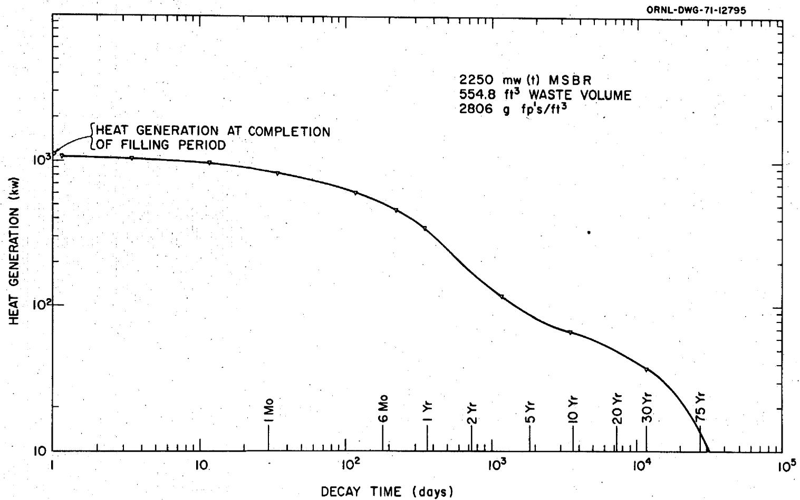  
Fig. 4. Heat Generation by Fission Products in Waste Tank. The waste tank is filled by adding the waste in 6 batches of 92.5 ft³ each. A batch of waste salt is added every 220 operating days (275 calendar days).

accumulation of miscellaneous fission products in the electrolyte of the fluorine cell. The latter two wastes are small, and only infrequent changing of the alumina and electrolyte is required. However, about 20 ft³ of caustic solution must be evaporated to a solid residue every 34 days. Condensate from the evaporation is reused to make fresh KOH solution. A 45-day decay period is necessary before evaporation so that intolerable temperatures in the cake can be avoided. The waste is evaporated and shipped in the largest permissible container (2 ft OD x 10 ft long)¹¹ for salt mine storage, thus minimizing the cost of cans, shipment, and mine storage. About 2.1 cans of waste are produced per year.

The curves in Fig. 5 show heat generation in the KOH scrubber solution during fission product accumulation and subsequent decay. The equilibrium heat generation is about $210\mathrm{kW}$ , reached in about 1000 hours of on-stream operation. The composition of material in the reservoir at completion of the 34-day accumulation period is given in Table 5.

Table 5. Composition of Caustic Scrubber Solution in Gas Recycle System   
Accumulation time = 34 days  
Volume = 20 ft³   

<table><tr><td></td><td>Mole % (water-free basis)</td></tr><tr><td>KOH</td><td>5.0</td></tr><tr><td>KF</td><td>94.7</td></tr><tr><td>KI</td><td>0.06</td></tr><tr><td>Xe2</td><td>0.11</td></tr><tr><td>CsF</td><td>0.06</td></tr><tr><td>KBr</td><td>0.02</td></tr><tr><td>Kr2</td><td>0.0009</td></tr></table>

aNoble gases from decay of bromine and iodine assumed to remain in solution.

# Process Losses

Loss of fissile material from the fluorination--reductive extraction--metal transfer process can be made as small as desired without any modifications to the conceptual design. Referring to the process flowsheet

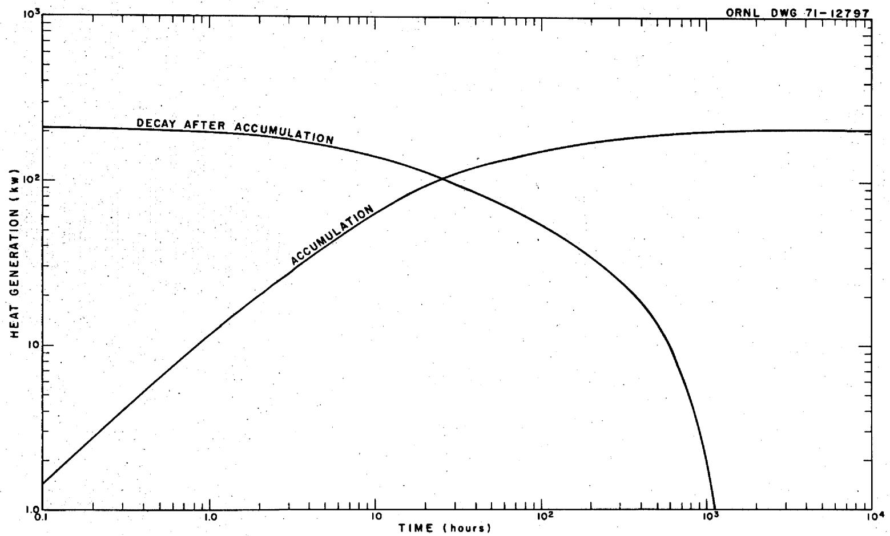  
Fig. 5. Heat Generation in KOH Scrubber Solution of Gas Recycle System.

(Fig. 3), it is seen that only three waste streams routinely leave the plant--a fluoride waste salt from the large retention tanks, the evaporator residue from the KOH scrubber, and the hydrogen discard stream from the gas recycle system. The only one of these waste areas into which very small amounts of uranium and/or protactinium normally flow is the large fluoride salt waste tank.

# Fluoride Salt Waste

The 220-day holdup of combined $^{233}\mathrm{Pa}$ decay salt and carrier salt discard allow about $99.6\%$ of the $^{233}\mathrm{Pa}$ to decay, and the subsequent batch fluorination can recover all but about $1 \mathrm{ppm}^{233}\mathrm{U}$ in the salt without difficulty. There are about $10,023 \mathrm{~kg}$ of waste salt in the batch so that the $^{233}\mathrm{U}$ remaining is approximately 10 grams. Undecayed $^{233}\mathrm{Pa}$ is an additional $45 \mathrm{~g}$ , making about $55 \mathrm{~g}$ of unrecovered fissile material in the salt sent to waste retention. Since the excess $^{233}\mathrm{U}$ production is about $165 \mathrm{~g/day}$ , the unrecovered material ( $55 \mathrm{~g}/220$ days) represents only $0.15\%$ of the breeding gain. However, the waste salt is held in the large retention tank for 9 years after filling before shipment to permanent disposal. At the end of this time (13.5 years) the salt can be fluorinated again to recover all but $1 \mathrm{ppm}^{233}\mathrm{U}$ from the batch. Thus, only about $60 \mathrm{~g}^{233}\mathrm{U}$ would remain in the final waste, being an insignificant loss of about $0.0074\%$ of the breeding gain.

# KOH Scrubber Waste

The probability of uranium loss via the KOH scrubber--evaporator waste is extremely small. Before $\mathsf{UF}_6$ can reach the caustic scrubber it must pass through three unit operations in series that are very effective at removing $\mathsf{UF}_6$ : first, the primary $\mathsf{UF}_6$ -to- $\mathsf{UF}_4$ reduction unit must fail to function properly thereby allowing $\mathsf{UF}_6$ to enter the gas recycle system; secondly, NaF sorbers, installed as a safeguard against such a malfunction, would have to be ineffective at trapping the $\mathsf{UF}_6$ ; and thirdly, any $\mathsf{UF}_6$ in the gas after the NaF sorbers would remain in the bottoms of the HF still and be trapped in the electrolyte in the fluorine cell. Since discarded electrolyte is routed through the fluoride salt waste system, described above, any uranium in the salt would be recovered by fluorination.

# Hydrogen Discard

There is practically no opportunity for $\mathbf{U}\mathbf{F}_{6}$ to leave the plant in the hydrogen discard stream. In order to reach this point $\mathbf{U}\mathbf{F}_{6}$ would have to pass through all the gas treating operations described above plus additional sorbers for trapping selenium and tellurium fission products and noble gases.

# DESIGN AND COST ESTIMATE

The first step in preparing the cost estimate was to define the sequence of operations that constitute the flowsheet as shown in Fig. 3. and in more detail on the drawings in Appendix D. These operations were based upon laboratory and small-scale engineering data for batchwise performance of the various unit processes, and it was assumed that the steps could be successfully operated on a continuous flow basis. Parametric studies3 were made to determine the breeding performance of the MSBR for various ways of operating the processing plant, and from this work basic conditions for the flowsheet were established. The computations did not necessarily determine the optimum economic processing cycle since that presupposed knowledge of processing costs. A computer program4 was used to calculate material and energy balances for each process operation, giving the basic data for equipment design.

A preliminary, highly simplified design was made for each major equipment item in order to establish its size, geometry, heat transfer surface, and special features from which the amounts of materials required for the vessel could be calculated. Materials of construction were selected using the general criteria that all vessels containing bismuth would be constructed of molybdenum and that vessels containing only molten fluoride salt would be made of Hastelloy N. In other areas, particularly for auxiliary equipment, nickel, stainless steel, and mild steel were used. The time schedule for the cost estimate did not permit us to make thorough studies of each vessel, and, for expediency, certain shortcuts were adopted to preclude making lengthy stress and heat transfer calculations. The principal time-saving assumptions were:

Small tanks, columns, and vessels to be made of 3/8-in. plate; larger ones of 1/2-in. plate

Heat exchanger tubing to be 1/2-in. OD x 16 gauge for all vessels

Overall heat transfer coefficients to be in range 50-200 Btu/hr-f $t^2$ -F depending on fluids and whether natural or forced convection

Annular space in jacketed vessels to be a nominal one-inch thickness

Density, thermal conductivity, and specific heat values for process fluids to be average values rather than temperature dependent

Freeboard volume standardized at $25\%$ of required process volume for tanks with fluctuating levels and $10\%$ for tanks with constant levels

Number of nozzles and thickness and number of supports and baffles for heat exchanger bundles estimated from a cursory examination of the vessel diameter and length

All heat exchanger bundles to be U-tube construction

The cost of each installed vessel was estimated using the unit costs for materials given in Table 6. A single price of $200/pound was used for all molybdenum structural shapes. The fabrication of molybdenum into conventional shapes and vessels is extremely difficult and is not current technology; the $200/pound figure represents a "best guess" of the cost.

Unit costs of Hastelloy N were taken from the conceptual design study1 of the 1000-MW(e) MSBR power plant and are, therefore, characteristic of the fabrication of large vessels. In our case, components are generally small and intricately constructed, factors that are conducive to higher unit costs. However, we believed that refining the costs was unjustified in view of other uncertainties in the estimate.

Our study did not contain a sufficiently detailed design for directly estimating the cost of all items in the plant. For the cost of some items, for example, piping, instrumentation, insulation, and electrical connections, we estimated charges by taking various percentages of the installed equipment cost. In using this procedure the high cost of molybdenum equipment was taken into account by not using as large a percentage on the molybdenum equipment costs as was used for nonmolybdenum

Table 6. Unit Costs of Installed Equipment   

<table><tr><td>Hastelloy N, Nickel, and Stainless Steel</td><td>$/1b</td></tr><tr><td>Plate</td><td>13</td></tr><tr><td>Flanges</td><td>10</td></tr><tr><td>Heads</td><td>20</td></tr><tr><td>Pipe</td><td>25</td></tr><tr><td>Tube</td><td>30</td></tr><tr><td>Nozzles, tube sheets, baffles</td><td>25</td></tr><tr><td>Molybdenum</td><td></td></tr><tr><td>Cost for all structural shapes</td><td>200</td></tr><tr><td>3/8 in. Raschig rings</td><td>35</td></tr></table>

equipment. Auxiliary equipment items were estimated by determining quantities and sizes (e.g., pumps, heaters, gas supply stations, samplers, etc.) and using available cost data from other areas of the MSR program. Parallel lines of equipment for improved operating reliability were not included except that gas compressors were duplicated because diaphram lifetimes are known to be very short. Also two spare high level waste storage tanks were included. No allowances were made for safety related features such as redundant cooling circuits, prevention of liquid metal coolant-salt reactions, etc. No facilities are provided for cleaning up fuel salt should it become contaminated by $\mathrm{NaBF_4}$ coolant or vice versa, nor is there equipment for processing routine (possibly contaminated) liquid waste that originates in the reactor system.

The results of our study are summarized in Tables 7, 8, and 9; these tables divide the equipment into three types--molybdenum, Hastelloy N, and auxiliary equipment respectively. The total installed cost of molybdenum process vessels is $4,578,750; about 65% of this cost is for the three largest vessels, which are the lithium chloride extraction column and the two large reservoirs for Bi-Li alloy in the rare earth isolation system. Hastelloy N process equipment costs $3,091,370. The most costly items are the 233Pa decay tank ($710,490), which has a heat duty of about 5.9 Mw, and the three waste tanks, which cost $466,600 each.

The auxiliary equipment of Table 9 costs $2,486,290. These items are essential for startup and/or smooth operation of the plant. In several cases the costs were computed for entire systems which consisted of a number of individual operations. The costs were estimated from data for similar systems and no flow diagrams or design calculations were made.

# CAPITAL COST OF THE PLANT

A summary of our cost study is given in Table 10. We estimated direct costs for the fabricated and installed equipment of $20.568 million and indirect costs of $15.046 million for a total plant investment of

Fuel Cycle Time = 10 days

Reactor Power = 1000 MW(e)

Table 7. Description of Molybdenum Process Equipment   

<table><tr><td>Equipment Item and Principal Function</td><td>Description</td><td>Heat Transfer Surfacea (ft2)</td><td>Fission Product Heat Generation Rateb (kW)</td><td>NaK Coolant Flowc (gpm)</td><td>Inventory</td><td>Installed Cost ($)</td></tr><tr><td rowspan="3">a33Pa EXTRACTION COLUMN--packed column Bi/salt contactor for extracting a33Pa, U, and Zr from salt into Bi-Li alloy</td><td rowspan="3">6 in. ID x 10 ft packed section; 8 in. ID x 1 ft enlarged ends; cooling tubes in packing</td><td rowspan="3">14.7</td><td>9.2</td><td rowspan="3">3.4</td><td>19 g U</td><td>127,670</td></tr><tr><td rowspan="2">0.62 (a33Pa)</td><td>26</td><td>0.99 ft3 salt</td></tr><tr><td>0.30 ft5 Bi</td><td></td></tr><tr><td rowspan="2">RARE EARTH EXTRACTION COLUMN--packed column Bi/salt contactor for extracting rare earths, alkali metals, and alkaline earths from salt into Bi-Li alloy</td><td rowspan="2">7 in. ID x 6 ft packed section; 12 in. ID x 16 in. enlarged ends; cooling tubes in packing</td><td rowspan="2">14.2</td><td rowspan="2">9.5</td><td rowspan="2">3.2</td><td>2.37 ft3 salt</td><td>119,400</td></tr><tr><td>0.85 ft3 Bi</td><td></td></tr><tr><td rowspan="4">BISMUTH DUMP TANK--reservoir to hold Bi-Li alloy upon dump of extraction columns</td><td rowspan="4">1.6 ft ID x 4.8 ft; shell-and-tube construction</td><td rowspan="4">12.9</td><td>13.0</td><td rowspan="4">4.5</td><td>98.5 g U</td><td>151,100</td></tr><tr><td rowspan="3">4.0 (a33Pa)</td><td>78 g a33 Pa</td><td></td></tr><tr><td>8 ft3 Bi</td><td></td></tr><tr><td>(on dump only)</td><td></td></tr><tr><td rowspan="2">LiCl EXTRACTION COLUMN--packed column Bi/LiCl contactor for metal transfer of fission products from Bi/Li alloy into LiCl</td><td rowspan="2">14.5 in. ID x 6 ft packed section; 20.5 in. ID x 2 ft enlarged ends; cooling tubes in packing</td><td rowspan="2">225</td><td rowspan="2">149.8</td><td rowspan="2">52.3</td><td>9.78 ft3 LiCl</td><td>509,790</td></tr><tr><td>2.74 ft3 Bi</td><td></td></tr><tr><td rowspan="2">RS+ STRIPPER--packed column Bi/LiCl contactor for stripping trivalent rare earths from LiCl into Bi-5 at. % Li alloy</td><td rowspan="2">13.75 in. ID x 2 ft packed section; 20.5 in. ID x 2 ft enlarged ends; cooling tubes in packing</td><td rowspan="2">227</td><td rowspan="2">151.5</td><td rowspan="2">53.0</td><td>6.13 ft3 LiCl</td><td>377,780</td></tr><tr><td>2.0 ft3 Bi</td><td></td></tr><tr><td rowspan="2">RS+ STRIPPER--packed column Bi/LiCl contactor for stripping divalent rare earths and alkaline earths from LiCl into Bi-50 at. % Li alloy</td><td rowspan="2">1.75 in. ID x 4 ft packed section; 1 in. ID x 1 ft enlarged ends; completely enclosed in Hastelloy N jacket; cooling tubes in enlarged end sections</td><td>4.3</td><td rowspan="2">4.8</td><td rowspan="2">1.7</td><td>0.22 ft3 LiCl</td><td>26,300 (Mo)</td></tr><tr><td>4.3 (jacket)</td><td>0.07 ft3 Bi</td><td>4,630 (Hast N)</td></tr><tr><td rowspan="2">RS+ BISMUTH RESERVOIR--tank for holding Bi-5 at. % Li alloy and trivalent rare earths</td><td rowspan="2">2.9 ft ID x 8.75 ft; shell-and-tube construction</td><td rowspan="2">1230</td><td rowspan="2">1230</td><td rowspan="2">4.31</td><td>27 ft3 Bi</td><td>1,684,560</td></tr><tr><td>12.6 kg' Li</td><td></td></tr><tr><td rowspan="2">RS+ BISMUTH DRAWOFF TANK--gauge tank for batchwise removal of Bi-Li alloy containing fission products to be hydrofluorinated into waste salt</td><td rowspan="2">13.9 in. ID x 67 in; shell-and-tube construction; completely jacketed with Hastelloy N</td><td>38.5</td><td rowspan="2">61.8</td><td rowspan="2">21.6</td><td>4.55 (at drawoff only)</td><td>152,400 (Mo)</td></tr><tr><td>23.3 (jacket)</td><td>(at drawoff only)</td><td>7,530 (Hast N)</td></tr><tr><td rowspan="2">RS+ BISMUTH RESERVOIR--tank for holding Bi-50 at. % Li alloy and divalent fission products</td><td rowspan="2">2.3 ft ID x 6.8 ft; shell-and-tube construction</td><td rowspan="2">4.35</td><td rowspan="2">4.34</td><td rowspan="2">152</td><td>18 ft3 Bi</td><td>797,690</td></tr><tr><td>18 ft3 Bi</td><td></td></tr><tr><td rowspan="2">RS+ BISMUTH DRAWOFF TANK--gauge tank for batch-wise removal of Bi-Li alloy containing divalent fission products to be hydrofluorinated into Pa decay salt</td><td rowspan="2">14.4 in. ID x 5 ft; shell-and-tube construction; completely jacketed with Hastelloy N</td><td>37.1</td><td rowspan="2">56</td><td rowspan="2">19.6</td><td>4.4 ft3 Bi</td><td>146,200 (Mo)</td></tr><tr><td>21.1 (jacket)</td><td>(at drawoff only)</td><td>6,720 (Hast N)</td></tr><tr><td rowspan="3">BISMUTH SURGE TANK--tank for flow and level control in Pa extraction column</td><td rowspan="3">6 in. ID x 21 in.; Mo cooling coil brazed on outside</td><td rowspan="3">2.8</td><td rowspan="3">2.2</td><td rowspan="3">2.0</td><td>66 g U</td><td>13,510</td></tr><tr><td>14.4 g a33 Pa</td><td></td></tr><tr><td>0.17 ft3 Bi</td><td></td></tr><tr><td>(Continued)</td><td></td><td></td><td></td><td></td><td></td><td></td></tr><tr><td rowspan="2">a33Pa HYDROFLUORINATOR--packed column Bi/salt/HF contactor for oxidizing a33Pa, U, Zr, and REa+ from Bi into Pa decay salt</td><td rowspan="2">8 in. ID x 5 ft packed section; 16 in. ID x 2 ft enlarged ends; cooling tubes inside column also completely jacketed with Hastelloy N</td><td>19.7</td><td>38</td><td>25.0</td><td>2080 g a33Pa</td><td>178,960 (Mo)</td></tr><tr><td>24.9 (jacket)</td><td>103 (a33Pa)</td><td></td><td>236 g U</td><td>10,230 (Hast N)</td></tr><tr><td rowspan="2">WASTE HYDROFLUORINATOR--tank for batchwise contact of Bi/waste salt/HF to oxidize REa+ from Bi into salt</td><td rowspan="2">15.7 in. ID x 59 in.; shell-and-tube construction; Hastelloy N Jacket on straight side</td><td>92.2</td><td>168</td><td>73.8</td><td>2 ft3 salt</td><td>225,900 (Mo)</td></tr><tr><td>21.0 (jacket)</td><td></td><td></td><td>2.3 ft3 B1</td><td>5,910 (Hast N)</td></tr><tr><td rowspan="2">BISMUTH SKIMMER--tank for separating Bi-Li alloy from LiCl upon dump of metal transfer system</td><td rowspan="2">13.4 in. ID x 40 in.; Hastelloy N Jacket on sides and bottom</td><td>2.7 (jacket)</td><td>0.7</td><td>0.6</td><td>2.7 ft3 B1 (upon dump only)</td><td>67,430 (Mo)</td></tr><tr><td></td><td></td><td></td><td></td><td>2,610 (Hast N)</td></tr><tr><td rowspan="2">Total for process vessels</td><td></td><td></td><td></td><td></td><td></td><td>4,578,750 (Mo)</td></tr><tr><td></td><td></td><td></td><td></td><td></td><td>37,630 (Hast N)</td></tr><tr><td>AUXILIARY HEAT EXCHangers--units installed in bismuth pipe lines for temperature control of streams entering or leaving process vessels (9 required)</td><td>Small shell-and-tube heat exchangers</td><td>3.0</td><td></td><td></td><td></td><td>90,000</td></tr><tr><td>BISMUTH PUMPS--pumps for Bi-Li alloy (5 required)</td><td>10.1 to 0.2 gpm; 20-ft B1 head</td><td></td><td></td><td></td><td></td><td>125,000</td></tr><tr><td>BISMUTH PUMPS--pumps for Bi-Li alloy (4 required)</td><td>8 to 15 gpm 20-ft B1 head</td><td></td><td></td><td></td><td></td><td>120,000</td></tr><tr><td>Total for process vessels and auxiliary Mo equipment</td><td></td><td></td><td></td><td></td><td></td><td>4,913,750</td></tr></table>

${}^{a}$ Values refer to area of 3/8-in. OD x 0.065 in. wall cooling tubes; area of jacket is denoted by "(jacket)".   
bValues refer to fission product decay heat unless otherwise designated such as $(^{233}\mathrm{Pa})$   
cIn some equipment, other coolants than NaK are used; if so, it is so designated.

Fuel Cycle Time = 10 days  
Reactor Power = 1000 MW(e)

Table 8. Description of Hastelloy N Process Equipment   

<table><tr><td>Equipment Item and Principal Function</td><td>Description</td><td>Heat Transfer Surfacea (ft2)</td><td>Fission Product Heat Generation Rateb (kW)</td><td>NaK Coolant Flowc (gpm)</td><td>Inventory</td><td>Installed Cost ($)</td></tr><tr><td>FEED TANK--vessel for receiving irradiated fuel salt from reactor and holding 30 min for fission product decay</td><td>16.75 in. ID x 6 ft; shell-and-tube construction</td><td>15.6</td><td>13.22.4 (233Pa)</td><td>5.5</td><td>1,380g U47 g 3.86 ft3 salt</td><td>12,390</td></tr><tr><td>PRIMARY FLUORINATOR--salt/Fscontactor for removing about 95% of U, Br, and I from fuel salt</td><td>6.5 in. ID x 12 ft fluorination section; all wetted surfaces protected by -1/2-in.-thick layer of frozen salt on wall; 17 in. ID x 2 ft enlarged top; completely jacketed</td><td>29.3 (jacket)</td><td>12.10.94 (233Pa)17.9 (reaction heat)</td><td>54.8</td><td>903g U18 g 1.52 ft3 salt</td><td>35,590</td></tr><tr><td>PURGE COLUMN--salt/H2contactor for reducing F2and UF2dissolved in salt</td><td>6.5 in. x '2 ft gas/liquid contact section; 17 in. ID x 2 ft enlarged top; all wetted surfaces protected by ~ 1/2-in.-thick layer of frozen salt on wall; completely jacketed</td><td>29.3 (jacket)</td><td>11.10.94 (233Pa)</td><td>10.6</td><td>8618 g</td><td>35,590</td></tr><tr><td>SALT SURGE TANK--vessel for flow control between purge column and 233Pa extraction column</td><td>9.3 in. ID x 2 ft; shell-and-tube construction</td><td>7.9</td><td>1.880.41 (233Pa)</td><td>1.9</td><td>388 g ft3 salt</td><td>4,590</td></tr><tr><td>SALT SURGE TANK--vessel for flow control between Pa extraction column and rare earth extraction column</td><td>9.3 in. ID x 2 ft; shell-and-tube construction</td><td>5.5</td><td>3.68</td><td>1.3</td><td>0.67 ft3 salt</td><td>4,590</td></tr><tr><td>SALT MAKEUP TANK--vessel for dissolution of BeF2-ThF4makeup salt</td><td>9.75 in. ID x 19.5 in.; jacketed vessel equipped with agitator</td><td>6.0 (jacket)</td><td>1.79</td><td>0.6</td><td>0.67 ft3 salt</td><td>8,530 (tank)20,000 (agitator)</td></tr><tr><td>SALT DISCARD TANK--vessel for holding 3-day batch of discarded fuel salt</td><td>10.4 in. ID x 21 in, completely jacketed tank</td><td>6.2 (jacket)</td><td>2.5</td><td>0.9</td><td>0.95 ft3 salt (on drawoff only)</td><td>7,390</td></tr><tr><td>UF2REDUCTION COLUMN--salt/UF6/F2/H2contactor for reducing UF6 to UF4directly into molten salt; also converts excess F2to HF</td><td>9.5 in. ID x 12 ft gas/liquid contact section; 13.5 in. ID x 2 ft enlarged top; all wetted surfaces protected by ~1/2-in.-thick layer of frozen salt; completely jacketed</td><td>36.6 ft3 (jacket)</td><td>6.3</td><td>11.1</td><td>1650g U2.09 ft3 salt</td><td>34,510</td></tr><tr><td>STRUCTURAL AND NOBLE METAL REDUCTION COLUMN--salt/H2contactor for reducing metallic ions to metals</td><td>8 in. ID x 12 ft gas/liquid contact section; 12 in. ID x 2 ft enlarged top; completely jacketed</td><td>29 (jacket)</td><td>6.7</td><td>2.4</td><td>3080g U2.65 ft3 salt</td><td>37,960</td></tr><tr><td>SALT SURGE TANK--vessel for flow control in reduction column</td><td>9.75 in. ID x 19.5 in.; completely jacketed</td><td>6.0 (jacket)</td><td>1.7</td><td>0.6</td><td>761g U0.67 ft3 salt</td><td>7,030</td></tr><tr><td>BISMUTH TRAP--vessel packed with Ni wool for removing entrained Ni from salt (2 required)</td><td>5 in. ID x 50 ft pipe with interior perforated car-tridge to hold Ni wool; completely jacketed</td><td>65.6 (jacket)</td><td>14.6</td><td>5.1</td><td>7310g U6.36 ft3 salt</td><td>83,790</td></tr><tr><td>(Continued)</td><td></td><td></td><td></td><td></td><td></td><td></td></tr><tr><td>Equipment Item and Principal Function</td><td>Description</td><td>Heat Transfer Surface® (ft2)</td><td>Fission Product Heat Generation Rate® (kW)</td><td>NaK Coolant Flow® (gpm)</td><td>Inventory</td><td>Installed Cost ($)</td></tr><tr><td rowspan="2">SALT CLEANUP FILTER--porous metal filter for removing metal particulates formed in noble metal reduction column (2 required)</td><td rowspan="2">15 in. ID x 3 ft; contains porous Ni filter; completely jacketed and contains cooling tubes</td><td>3.1</td><td>11.2</td><td>3.9</td><td>5870 g U</td><td>30,400</td></tr><tr><td>13.7 (jacket)</td><td></td><td></td><td>5.1 ft3 salt</td><td></td></tr><tr><td rowspan="2">REACTOR FEED TANK--vessel for 30-minute salt holdup to allow sampling before salt returns to reactor</td><td rowspan="2">1.5 ft ID x 3 ft; completely jacketed</td><td rowspan="2">19.2 (jacket)</td><td rowspan="2">7.2</td><td rowspan="2">2.5</td><td>4020 g U</td><td>19,840</td></tr><tr><td>3.5 ft3 salt</td><td></td></tr><tr><td>SALT DUMP TANK--tank to receive fuel salt upon dump of primary salt loop</td><td>2.7 ft ID x 8 ft; shell-and-tube construction</td><td>364</td><td>2385 (s55Pa)</td><td>85</td><td>33 ft3 salt (only on dump)</td><td>69,400</td></tr><tr><td>LICL RESERVOIR AND DUMP TANK--vessel for holding LICL inventory as well as LICL from extraction column on system dump</td><td>2.4 ft ID x 7.2 ft; shell-and-tube construction</td><td>460</td><td>306</td><td>107</td><td>20 ft3 LiCl (22.7 ft3 on dump)</td><td>84,470</td></tr><tr><td>LICL WASTE TANK--tank for storage of LICl sent to waste</td><td>1.6 ft ID x 7.2 ft; shell-and-tube construction</td><td>230</td><td>153</td><td>53.5</td><td>10 ft3 LiCl</td><td>38,780</td></tr><tr><td>Hg-HF COOLER--heat exchanger to cool Hg-HF gas from UF6 reduction column</td><td>1.5 ft x 4 ft; finned tubes inside shell</td><td>27</td><td>0.160.18 (sensible heat in gas)</td><td>8.8 sofm air</td><td></td><td>15,470</td></tr><tr><td>100°C NaF TRAP--sorption bed to catch UF6 that might not be reduced in UF6 reduction column (2 required)</td><td>8 in. ID x 6 ft; finned tubes inside shell; NaF inside tubes</td><td>31.8</td><td>6.4</td><td>1.6</td><td></td><td>20,760</td></tr><tr><td>STILL FEED CONDenser--heat exchanger for condensing HF-HI-HER mixture at -40°C for feed to HF still</td><td>21 in. ID x 4 ft; finned tubes inside shell</td><td>14.2</td><td>0.331.38 (sensible heat)</td><td>0.5 ton Freon</td><td></td><td>17,120</td></tr><tr><td>HF STILL--packed column for distilling volatile fission products (HI, HBr, SeF6, TeF6) from HF solution</td><td>1 in. ID x 15 ft packed section; 4 in. ID x 1 ft still pot; completely jacketed</td><td>5.3 (jacket)</td><td>0.12</td><td>0.3</td><td></td><td>6,560</td></tr><tr><td>HF CONDenser--heat exchanger for condensing HF at -40°C from HF still</td><td>17.5 in. ID x 4 ft finned tubes inside shell</td><td>6.0</td><td>0.170.13 (latent heat)</td><td>0.1 ton Freon</td><td></td><td>13,300</td></tr><tr><td>KOH SORBER--absorption column for scrubbing recycle Hg gas with 10M KOH to remove HF, HI and HBr</td><td>5.6 in. ID x 6 ft packed section; 7 in. ID x 1 ft enlarged top</td><td>13.6</td><td>8.6</td><td>2.9 (water)</td><td></td><td>17,690</td></tr><tr><td>KOH RESERVOIR--accumulator for fission product I and Br in 10M KOH solution (3 required)</td><td>1.7 ft ID x 10 ft; shell-and-tube construction</td><td>244</td><td>210</td><td>71.7 (water)</td><td></td><td>43,860</td></tr><tr><td>GAS COOLER--heat exchanger to cool recycle Hg to 0°C to remove moisture</td><td>7.5 in. ID x 5 ft; shell-and-tube construction</td><td>10.9</td><td>0.160.17 (latent heat)</td><td>0.1 ton Freon</td><td></td><td>9,140</td></tr><tr><td>COLD TRAP--heat exchanger kept at -40°C to freeze moisture from recycle Hg (2 required)</td><td>6 in. ID x 10 ft; finned tubes inside shell</td><td></td><td>0.029</td><td>0.01 ton Freon</td><td></td><td>16,840</td></tr><tr><td>SILICIA GEL DRYER--sorber for removing last traces of moisture from recycle Hg (2 required)</td><td>4 in. ID x 5 ft; regener- ative bed</td><td></td><td></td><td></td><td></td><td>6,240</td></tr><tr><td>ALIMCNA SORBER--activated alumina bed for sorbing SeF6 and TeF6 from Hg discard stream</td><td>26 in. ID x 4.6 ft; Al3O3in annular space; cooling tubes inside and outside annulus</td><td>4.8</td><td>13.0</td><td>1.8 (water)</td><td></td><td>31,390</td></tr><tr><td>Nak EXPANSION TANK--vessel for volumetric expansion of Nak in coolant circuit for Fa decay tank (Continued)</td><td>1.6 ft ID x 6.5 ft; SS 304</td><td></td><td></td><td></td><td></td><td>10,210</td></tr><tr><td>Equipment Item and Principal Function</td><td>Description</td><td>Heat Transfer Surfacea (ft2)</td><td>Fission Product Heat Generation Rateb (kW)</td><td>NaK Coolant Flowc (gpm)</td><td>Inventory</td><td>Installed Cost ($)</td></tr><tr><td>NaK EXPANSION TANK--vessel for volumetric expansion of NaK in coolant circuit for RE+ bismuth system</td><td>1.3 ft ID x 5.2 ft; SS 304</td><td></td><td></td><td></td><td></td><td>6,380</td></tr><tr><td>NaK EXPANSION TANK--vessel for volumetric-expansion of NaK in coolant circuit for RE+ bismuth system</td><td>10.8 in. ID x 3.6 ft; SS 304</td><td></td><td></td><td></td><td></td><td>3,190</td></tr><tr><td>NaK EXPANSION TANK--vessel for volumetric expansion of NaK in coolant circuit for fluorinators</td><td>7.5 in. ID x 2.6 ft; SS 304</td><td></td><td></td><td></td><td></td><td>2,810</td></tr><tr><td>NaK EXPANSION TANK--vessel for volumetric expansion of NaK in coolant circuit for extraction columns, Bi trap, and cleanup filters</td><td>6.1 in. ID x 2.1 ft; SS 304</td><td></td><td></td><td></td><td></td><td>1,780</td></tr><tr><td>NaK EXPANSION TANK--vessel for volumetric expansion of NaK in coolant circuit for LiCl system</td><td>11.6 in. ID x 3.9 ft; SS 304</td><td></td><td></td><td></td><td></td><td>6,100</td></tr><tr><td>NaK EXPANSION TANK--vessel for volumetric expansion of NaK coolant circuit for fuel salt dump tank</td><td>5.7 in. ID x 2.9 ft; SS 304</td><td></td><td></td><td></td><td></td><td>3,570</td></tr><tr><td>SALT SURGE TANK--vessel for level and flow control at Pa hydrofluorinator</td><td>8 in. ID x 2 ft; completely jacketed</td><td>5.0</td><td>5.2</td><td>2.5</td><td>1 g U g a33Pa ft3 salt</td><td>5,220</td></tr><tr><td>SECONDARY FLUORINATOR--salt/F2contactor for removing U from Pa decay salt</td><td>5.5 in. ID x 10 ft gas/liquid contact section; 10 in. ID x 1 ft enlarged top; all wetted surfaces protected by ~1/2-in.-thick layer of frozen salt; completely jacketed</td><td>18.7</td><td>9.5</td><td>60.8</td><td>g U g a33Pa ft3 salt</td><td>23,270</td></tr><tr><td>PURGE COLUMN--salt/H2contactor for reducing F2and UF8dissolved in Pa decay salt</td><td>5.5 in. ID x 10 ft gas/liquid contact section; 10 in. ID x 1 ft enlarged top; all wetted surfaces protected by ~1/2-in.-thick layer of frozen salt; completely jacketed</td><td>18.7</td><td>9.5</td><td>60.5</td><td>g U g a33Pa ft3 salt</td><td>23,270</td></tr><tr><td>233Pa DECAY TANK--vessel for isolation and decay of 233Pa, also accumulator for Zr and RE+ fission products</td><td>3.73 ft ID x 18.7 ft; shell-and-tube construction; jacketed</td><td>4204</td><td>1743</td><td>2470</td><td>2615 g U g a33Pa ft3 salt (variable volume)</td><td>710,490</td></tr><tr><td>220-DAY 233Pa DECAY TANK--vessel for holding waste salt from Pa decay tank for 233Pa decay, also accumulates trivalent rare earths and fuel salt discard</td><td>25 in. -ID x 10 ft bottom section; 4 ft ID x 6.4 ft enlarged top section; shell-and-tube construction; jacketed bottom section</td><td>1477</td><td>249</td><td>370</td><td>45 g U g a33Pa ft3 salt (variable volume)</td><td>113,150</td></tr><tr><td>WASTE FLUORINATOR--salt/F2contactor for removing last traces of U from waste salt; batchwise operation</td><td>2.32 ft ID x 4.6 ft gas/liquid contact section; 2.83 ft ID x 2 ft enlarged top; top and bottom sections jacketed</td><td>55.3</td><td>139</td><td>244</td><td>18.5 ft3 salt</td><td>44,510</td></tr><tr><td>Equipment Item and Principal Function</td><td>Description</td><td>Heat Transfer Surfacea(ft2)</td><td>Fission Product Heat Generation Rateb(kw)</td><td>NaK Coolant Flowc(gpm)</td><td>Inventory</td><td>Installed Cost ($)</td></tr><tr><td>WASTE TANK--accumulator for all fluoride waste streams; holds waste for fission product decay (3 required)</td><td>6.2 ft ID x 22 ft shell-and-tube construction; filled batchwise over 4.5-yr period</td><td>835</td><td>1114</td><td>490</td><td>555 ft3salt (filled)</td><td>1,399,800</td></tr><tr><td>20°C NaF BED--sorber for UF6 withdrawn as product</td><td>4 in. ID x c ft sorber section filled with NaF pellets</td><td></td><td></td><td></td><td></td><td>4,360</td></tr><tr><td></td><td></td><td></td><td></td><td></td><td></td><td>3,091,370</td></tr></table>

${}^{a}$ Values refer to area of 3/5-in. OD x C.065 in. wall cooling tubes; area of jacket is denoted by "(jacket)".   
bValues refer to fission product decay heat unless otherwise designated such as $(^{233}\mathrm{Pa})$   
cIn some equipment, other coolants than NaK are used; if so, it is so designated.

0

#

Table 9. Description of Auxiliary Equipment   

<table><tr><td>Equipment Item</td><td>Description and Function</td><td>Installed Cost ($)</td></tr><tr><td>Electric Heaters</td><td>Resistance elements embedded in ceramic; heat for vessels and lines</td><td>542,190</td></tr><tr><td>Auxiliary Heat Exchangers</td><td>Assorted sizes for temperature control of NaK coolant; 25 required</td><td>250,000</td></tr><tr><td>Refrigeration System</td><td>10-Ton system for cold traps</td><td>3,800</td></tr><tr><td>NaK Purification System</td><td>Oxide removal unit operating continuously on sidestream of NaK</td><td>10,000</td></tr><tr><td>SiO2Supply and Removal System</td><td>Equipment for drying SiO2pellets, charging to unit in cell and removing from cell</td><td>10,000</td></tr><tr><td>Al2O3Supply and Removal System</td><td>Equipment for charging Al2O3to TeF6+ SeF6trap and removal</td><td>10,000</td></tr><tr><td>F2Disposal System</td><td>Equipment for reacting discarded F2with H2followed by sorption in KOH</td><td>5,000</td></tr><tr><td>H2Disposal System</td><td>Final cleanup of discarded H2before going to stack</td><td>8,000</td></tr><tr><td>Inert Gas System</td><td>Inert gas supply and cleanup system for process vessels</td><td>100,000</td></tr><tr><td>UF6Product Withdrawal Station</td><td>Equipment for removing UF6from process and putting into cylinders</td><td>7,500</td></tr><tr><td>Inert Gas System for Cell</td><td>Continuously recirculating inert atmosphere for cell; O2, F2, and HF removal</td><td>175,000</td></tr><tr><td>F2, HF, and H2Supply Systems</td><td>Purification of makeup process gases</td><td>3,000</td></tr><tr><td>Lithium Metal Handling Equipment</td><td>Equipment for receiving, storing, and adding Li metal to process streams</td><td>15,000</td></tr><tr><td>BeF2+ ThF4Addition System</td><td>Facilities for storing and preparing makeup salt</td><td>10,000</td></tr><tr><td>Coolant (NaK) Pumps</td><td>Electromagnetic pumps for circulating NaK in the several coolant circuits; 15 required</td><td>736,000</td></tr><tr><td>Process Salt Pumps</td><td>Pumps for fluoride carrier salt, waste salt, and LiCl; 13 required</td><td>270,000</td></tr><tr><td>KOH Pump</td><td>Recirculation of KOH through sorber in gas treating system</td><td>800</td></tr><tr><td>Compressors</td><td>Compressors for use in H2, HF, and F2gas systems; 22 required</td><td>330,000</td></tr><tr><td></td><td></td><td>2,486,290</td></tr></table>

Reactor Fuel Volume = 1683 ft³  
Fuel Cycle Time = 10 days

Table 10. Capital Cost of a Fluorination--Reductive Extraction-- Metal Transfer Processing Plant for a 1000-MW(e) MSBR   

<table><tr><td></td><td>103 $</td></tr><tr><td>Installed Molybdenum Process Equipment</td><td>4579</td></tr><tr><td>Installed Molybdenum Pumps</td><td>245</td></tr><tr><td>Installed Molybdenum Heat Exchangers</td><td>90</td></tr><tr><td>Installed Molybdenum Piping</td><td>1474</td></tr><tr><td>Installed Hastelloy N, Stainless Steel, and Nickel Equipment</td><td>3091</td></tr><tr><td>Installed Hastelloy N Jackets on Molybdenum Vessels</td><td>38</td></tr><tr><td>Installed Auxiliary Equipment</td><td>2486</td></tr><tr><td>Process Piping (other than molybdenum piping)</td><td>2342</td></tr><tr><td>Process Instrumentation</td><td>2711</td></tr><tr><td>Cell Electrical Connections</td><td>494</td></tr><tr><td>Thermal Insulation</td><td>588</td></tr><tr><td>Radiation Monitoring</td><td>150</td></tr><tr><td>Sampling Stations</td><td>1275</td></tr><tr><td>Fluorine Plant</td><td>1005</td></tr><tr><td>Total Direct Cost</td><td>20568</td></tr><tr><td>Construction Overhead</td><td>4114</td></tr><tr><td>Engineering and Inspection</td><td>3790</td></tr><tr><td>Taxes and Insurance</td><td>864</td></tr><tr><td>Contingency</td><td>2836</td></tr><tr><td>Subtotal</td><td>32172</td></tr><tr><td>Interest During Construction</td><td>3442</td></tr><tr><td>Total Plant Investment</td><td>35614</td></tr></table>

$35.614 million. These costs do not include the cost of site, site preparation, buildings, and facilities shared with the reactor plant such as heat sinks, maintenance equipment, and emergency cooling. The cost of these facilities were estimated by Robertson1 and are included in the design and cost study of the 1000-MW(e) MSBR.

Items of direct cost that were not obtained from preliminary designs were estimated as percentages of the installed equipment cost. The percentages were based upon previous experience in the design of radiochemical plants. Piping, instrumentation, electrical connections, and insulation costs were estimated in this way. Charges for radiation monitoring devices, sampling stations, and a remotely operated fluorine plant were estimated from other information. The discussion below describes our method of finding these costs.

# Process Piping

Piping costs for a remotely operated processing plant are normally in the range \( \frac{40}{10} \) to \( 50\% \) of the cost of installed process equipment. We estimated the costs separately for molybdenum, Hastelloy N, and auxiliary piping, choosing factors of \( 30\%, 50\%, \) and \( \frac{40}{10} \) respectively. The low percentage value was used for molybdenum because of the relatively small amount of this piping and the uncertainty in the base price (\(200/1b) chosen for molybdenum. The calculated costs are:

Mo piping costs = [(cost of installed Mo process equipment) + (cost of Mo pumps) + cost of Mo heat exchangers)] (0.30)

$$
\begin{array}{l} = [ \$ 4, 5 7 8, 7 0 0 + 2 4 5, 0 0 0 + 9 0, 0 0 0 ] (0. 3 0) \\ = \$ 1,474,100 \\ \end{array}
$$

Hastelloy N piping cost = [cost of installed Hastelloy N equipment] (0.50)

$$
\begin{array}{l} = [ \$ 3, 0 9 1, 0 0 0 + 3 8, 0 0 0 ] (0. 5 0) \\ = \$ 1, 5 6 4, 5 0 0 \\ \end{array}
$$

Auxiliary piping cost = [(cost of installed auxiliary equipment) - (cost of electric heaters)] (0.40)

$$
\begin{array}{l} = [ \$ 2, 4 8 6, 2 9 0 - 5 4 2, 1 9 0 ] (0. 4 0) \\ = \$ 7 7 7, 6 4 0 \\ \end{array}
$$

# Process Instrumentation

Process instrumentation refers to devices for monitoring and controlling the operation of the plant through measurements of flowrates, temperatures, pressures, concentrations, liquid levels, or other pertinent quantities. Generally the instrumentation cost is about $30\%$ of the installed equipment cost. Instrumentation cost for molybdenum equipment was charged at $10\%$ of the installed equipment cost. The lower percentage allows for the inordinately high cost of fabricated molybdenum vessels. Heater instrumentation was charged at only $15\%$ of the installed heater cost because such instrumentation is straightforward. We determined the cost as follows:

Instrumentation cost for Hastelloy N equipment

$$
\begin{array}{l} = \left[ \left(\text {c o s t} \quad \text {o f} \quad \text {i n s t a l l e d H a s t e l l o y N e q u i p m e n t}\right) + \left(\text {c o s t} \quad \text {o f} \quad \text {H a s t e l l o y N p i p i n g}\right) \right] (0. 3 0) \\ = [ \$ 3, 0 9 1, 0 0 0 + 3 8, 0 0 0 + 1, 5 6 4, 5 0 0 ] \tag {0.30} \\ = \mathbb {S} 1, \mathbb {L} 0 8, 0 0 0 \\ \end{array}
$$

Instrumentation cost for auxiliary equipment

$$
\begin{array}{l} = \left[ \left(\text {c o s t} \quad \text {o f} \quad \text {i n s t a l l e d} \quad \text {a u x i l i a r y} \quad \text {e q u i m p e n t}\right) - \left(\text {c o s t} \quad \text {o f} \quad \text {e l e c t r i c} \quad \text {h e a t e r s}\right) \right] (0. 3 0) \\ = [ \$ 2, 4 8 6, 2 9 0 - 5 4 2, 1 9 0 ] \tag {0.30} \\ = \$ 583,200 \\ \end{array}
$$

Instrumentation cost for heaters

$$
\begin{array}{l} = [ \text {c o s t} \quad \text {o f} \quad \text {h e a t e r s} ] (0.15) \\ = [ \$ 5 4 2, 1 9 0 ] (0.15) \\ = \$ 81,300 \\ \end{array}
$$

Instrumentation cost for Mo equipment

$$
\begin{array}{l} = \left[ \left(\text {c o s t} \text {o f} \text {M o e q u i p m e n t}\right) + \left(\text {c o s t} \text {o f} \text {M o p u p m s}\right) + \left(\text {c o s t} \text {o f} \text {M o} \text {h e a t e x c h a n g e r s}\right) + \left(\text {c o s t} \text {o f} \text {M o p i p i n g}\right) \right] (0. 1 0) \\ = [ \$ 4, 5 7 8, 7 5 0 + 2 4 5, 0 0 0 + 9 0, 0 0 0 + 1, 4 7 4, 1 0 0 ] (0. 1 0) \\ = \$ 638,800 \\ \end{array}
$$

Total cost of instrumentation = $2,711,300

# Cell Electrical Connections

These connections are the power receptacles and leads inside the processing area for supplying power to heaters, electric motors, and instruments. The cost was taken to be $5\%$ of Hastelloy N and auxiliary equipment and piping costs plus $1.5\%$ of molybdenum equipment and piping costs.

Cost of cell electrical connections

$$
\begin{array}{l} = \left[ \left(\text {c o s t} \text {o f H a s t e l l o y N e q u i p m e n t a n d p i n g}\right) + \left(\text {c o s t o f a u x i l i - i a r y e q u i m p e n t a n d p i n g}\right) \right] (0. 0 5) + \left[ \text {c o s t o f M o e q u i p m e n t a n d p i n g} \right] (0. 0 1 5) \\ = \left[ \begin{array}{l} \\ 3, 0 9 1, 0 0 0 + 3 8, 0 0 0 + 1, 5 6 4, 5 0 0 + 2, 4 8 6, 2 9 0 + 7 7 7, 6 4 0 \end{array} \right] (0. 0 5) + [ \begin{array}{l} \\ 4, 5 7 9, 0 0 0 + 2 4 5, 0 0 0 + 9 0, 0 0 0 + 1, 4 7 4, 1 0 0 \end{array} ] (0. 0 1 5) \\ = \$ 4 9 3, 7 0 0 \\ \end{array}
$$

# Thermal Insulation

The thermal insulation cost for a chemical processing plant is usually about $5 \%$ of the equipment and piping costs. We calculated the cost of insulation for Hastelloy N and auxiliary equipment in this way; however, we excluded the costs of the cell inert gas system, fluorine and hydrogen supply system, and inert gas blanket system since this equipment does not need insulation. Also we used only $50 \%$ of the piping cost $\$ 388,820$ ) for auxiliary equipment because it was estimated that only about one- half of this piping would need insulation. For insulation on molybdenum equipment we factored the equipment and piping costs at $3.5 \%$ .

Cost of thermal insulation.

$$
\begin{array}{l} = \left[ \begin{array}{l} (\text {c o s t} \text {o f H a s t e l l o y N e q u i p m e n t}) + (\text {c o s t} \text {o f H a s t e l l o y N p i n g)} + \\ (\text {c o s t} \text {o f a u x i l i a r y e q u i m p e n t}) + (\text {c o s t} \text {o f a u x i l i a r y p i n g}) - \\ (\text {c o s t} \text {o f i n e r t g a s b l a n k e t s y s t e m}) - (\text {c o s t} \text {o f c e l l i n e r t g a s} \\ \text {s y s t e m}) - (\text {c o s t} \text {o f F _ {2}} \text {a n d H _ {2} s u p p l y s y s t e m}) ] (0. 0 5) + (\text {c o s t} \text {o f M o e q u i p m e n t}) + (\text {c o s t} \text {o f M o p i n g}) ] (0. 0 3 5) \end{array} \right. \\ = \left[ \begin{array}{l} 3, 0 9 1, 0 0 0 + 3 8, 0 0 0 + 1, 5 6 4, 5 0 0 + 2, 4 8 6, 2 9 0 + 3 8 8, 8 2 0 - \\ 1 0 0, 0 0 0 - 1 7 5, 0 0 0 - 3, 0 0 0 ] (0. 0 5) + [ 4, 9 1 3, 7 5 0 + 1, 4 7 4, 1 0 0 ] \\ (0. 0 3 5) \end{array} \right. \\ = \$ 588,100 \\ \end{array}
$$

# Radiation Monitoring

Radiation monitoring equipment refers to instruments for environmental monitoring inside the processing cell. The cost of these instruments was estimated to be $150,000.

# Sampling Stations

A flowsheet review of plant operations indicated that salt and bismuth samples will be needed at eighteen places and gas samples at fifteen places to ensure proper control over the plant. Each sample station is a shielded, instrumentated facility designed for remotely securing and

transmitting samples without contaminating either the process or the environment. Several sampling points would be in each station to minimize shielding costs and containment problems. Our estimate of the cost is based upon designs of similar installations for engineering experiments and for MSRE installations. We estimated the cost of liquid samplers to be $50,000 each and gas samplers to be $25,000 each for a total cost of $1,275,000.

# Fluorine Plant

The cost of manufacturing fluorine and hydrogen on site by electrolyzing recycled hydrogen fluoride was compared with the cost of purchasing these gases and disposing of unused excess as waste. Our supplementary cost study (Appendix A) showed that once-through operation contributed about 0.11 mills/kWhr to the fuel cycle charge for the cost of waste containers, shipping, salt mine disposal, fluorine, other chemicals, and capital equipment. On the other hand, the corresponding fuel cycle charge for recycle operation including the fluorine plant was about 0.02 mills/kWhr.

We have estimated the capital cost of a remotely operated fluorine plant to be $1.005 million; the cost includes labor, materials, piping, and instrumentation.[6] The plant is designed to produce 148 lbs F₂/day, which allows about fifty percent utilization in the fluorinators. Hydrogen output of the plant is used in UF₆ reduction and salt sparging.

# Indirect Costs

Indirect costs include construction overhead, engineering and inspection charges, taxes and insurance, contingency, and interest during construction. These costs were obtained as described below.

# Construction Overhead

On the basis of past experience for the cost of chemical processing plants this cost was taken as $20\%$ of the total direct cost and equal to $\$4.114$ million.

# Engineering and Inspection Charge

This charge was computed by the guidelines of NUS-531, which was written specifically for reactor plants but was used in this study. Plant engineering charges are based upon the total direct costs of the installation, which is $152.3 million for the reactor plant plus $20.568 million for the processing plant. The specified charge is 5.3% of the direct cost of the processing plant.

In addition, the cost guide specifies that a premium be added to the above amount to account for the "novel" feature of the design. This charge is also a function of the direct cost and for this plant is $2,700,000. Although the use of a "novel" design surcharge rather than the lower "proven" design charge of $1,600,000 appears to violate the condition that the cost estimate was to be for a plant based on developed MSBR technology, it is our opinion that the complexity of the plant is such that the higher premium will be required.

The total engineering charge

$$
\begin{array}{l} = (\mathbb {S} 2 0, 5 6 8, 0 0 0) \left(\overline {{0}}, 0 5 3\right) + 2, 7 0 0, 0 0 0 \\ = \$ 3,790,000 \\ \end{array}
$$

# Taxes and Insurance

This account covers property and all-risk insurance, state and local property taxes on the site and improvements during the construction period, and sales taxes on purchased materials. Using NUS-531 as a guide and taking the total direct cost of the installation as a basis, the charge rate was found to be $4.2\%$ . For taxes and insurance the cost is $(\$ 20,568,000)\) ( $0.042$ ) = \\(863,800.

# Contingency

The contingency charge was taken as $20\%$ of the total direct cost minus the cost of molybdenum components. We felt that the $\$ 200/$ pound charge for fabricated molybdenum equipment already contained a sufficient contingency factor.

Contingency charge = [(total direct cost) - (cost of Mo equipment) -

(cost of Mo pumps) - (cost of Mo heat ex

changers) - (cost of Mo pipe)] (0.20)

[ = [20,568,000 - 4,579,000 - 245,000 - 90,000 - ]

1,474,000] (0.20)

= $2,836,000

# Interest During Construction

It was assumed that the processing plant would be built concurrently with the reactor plant over a three-year construction period. The interest rate on borrowed money was taken at 8%/year, and the total amount to be borrowed during this time is the total of direct and indirect costs equal to $32,172,000. Over a three-year period at a rate of 8%/year, the interest charge is equivalent to 10.7% of the total borrowed money or$ 3,442,400.

# FUEL CYCLE COST

Inventory and use charges were valued at the unit costs given in Table 11; inventory, net worth, operating charges, and fuel cycle costs are given in Table 12. The gross fuel cycle cost is 1.21 mills/kWhr; about $58\%$ of this cost is contributed by fixed charges on the processing plant and another $32\%$ by the reactor inventory. The fuel yield of $3.27\%/\text{yr}$ gives a production credit of about 0.09 mills/kWhr which is slightly more than the operating charges of about 0.08 mills/kWhr. The net fuel cycle cost is about 1.12 mills/kWhr.

# CAPITAL COST VERSUS PLANT SIZE

The usefulness of a cost estimate is greatly enhanced if the capital cost can be related to plant throughput so that the most economic operation of the reactor system can be determined. In this case we have a power station of predetermined size [1000-MW(e)] so that, strictly speaking, cost-versus-throughput data will apply only to a single 1000-MW(e) MSBR. With these data, parametric studies of the reactor plant-processing plant complex can be made to find the optimum throughput and the lowest

Table 11. Basic Costs for Calculating Inventory and Operating Charges   

<table><tr><td>Item</td><td>Unit Cost</td></tr><tr><td>233U</td><td>13 $/g</td></tr><tr><td>235U</td><td>11.20 $/g</td></tr><tr><td>233Pa</td><td>13 $/g</td></tr><tr><td>234U</td><td>no charge</td></tr><tr><td>236U</td><td>no charge</td></tr><tr><td>LiFa</td><td>15 $/lb</td></tr><tr><td>BeF2</td><td>7.50 $/lb</td></tr><tr><td>ThF4</td><td>6.50 $/lb</td></tr><tr><td>LiCl</td><td>15 $/lb</td></tr><tr><td>Li metala</td><td>0.12 $/g</td></tr><tr><td>Bi</td><td>6 $/lb</td></tr><tr><td>HF</td><td>0.41 $/lb</td></tr><tr><td>F2b</td><td>5.00 $/lb</td></tr><tr><td>H2</td><td>1.44 $/lb</td></tr><tr><td>KOH (45 wt.% solution)</td><td>0.04 $/lb</td></tr><tr><td>Waste shippingc</td><td>0.052 $/ton-mile</td></tr><tr><td>Salt mine storaged</td><td>4590 $/container</td></tr></table>

aIsotopic composition $\geqslant 99.995$ at.%7Li.   
bFluorine cost not needed for finding costs in Table 12; used in computations of Appendix A.   
Rail shipment.   
${}^{\mathrm{d}}$ Based on heat generation rate $= {360}\mathrm{\;w}/\mathrm{{ft}}$ of container length. Data from "Siting of Fuel Reprocessing Plants and Waste Management Facilities," ORNL-4451, pp. 6-47, Table 6.9 (July 1970).

Fuel Cycle Time = 10 days

Plant Factor = 80%

Table 12. Net Worth and Fuel Cycle Cost for a 1000 MW(e) MSBR   

<table><tr><td></td><td></td><td>Value ($)</td><td></td></tr><tr><td>Processing plant</td><td>35,614,000</td><td>0.6962</td><td></td></tr><tr><td colspan="4">Reactor Inventorya at 13.2%/year</td></tr><tr><td colspan="4">Amount (kg)</td></tr><tr><td>LiF</td><td>47,460</td><td>1,569,600</td><td>0.0296</td></tr><tr><td>BeF2</td><td>19,070</td><td>315,250</td><td>0.0059</td></tr><tr><td>ThF4</td><td>93,720</td><td>1,342,940</td><td>0.0253</td></tr><tr><td>233U</td><td>1,223</td><td>15,899,000</td><td>0.2995</td></tr><tr><td>235U</td><td>112</td><td>1,254,400</td><td>0.0236</td></tr><tr><td>233Pa</td><td>20.57b</td><td>267,410</td><td>0.0050</td></tr><tr><td></td><td></td><td>20,648,600</td><td>0.3889</td></tr><tr><td colspan="4">Processing Plant Inventory at 13.2%/year</td></tr><tr><td>LiF</td><td>4,583</td><td>151,570</td><td>0.0028</td></tr><tr><td>BeF2</td><td>372</td><td>6,160</td><td>0.0001</td></tr><tr><td>ThF4</td><td>16,240</td><td>232,670</td><td>0.0044</td></tr><tr><td>233U</td><td>33.5</td><td>435,500</td><td>0.0082</td></tr><tr><td>235U</td><td>1.7</td><td>19,040</td><td>0.0004</td></tr><tr><td>233Pa</td><td>81.84</td><td>1,063,920</td><td>0.0200</td></tr><tr><td>LiCl</td><td>1,016</td><td>33,600</td><td>0.0006</td></tr><tr><td>Bismuth</td><td>15,920</td><td>210,600</td><td>0.0040</td></tr><tr><td></td><td></td><td>2,153,060</td><td>0.0405</td></tr><tr><td colspan="4">Operating Charges</td></tr><tr><td colspan="4">Amount (kg/year)</td></tr><tr><td>7Li metal</td><td>999</td><td>119,940</td><td>0.0171</td></tr><tr><td>BeF2 makeup</td><td>1,026</td><td>16,970</td><td>0.0024</td></tr><tr><td>ThF4 makeup</td><td>9,020</td><td>129,260</td><td>0.0184</td></tr><tr><td>HF makeup</td><td>920</td><td>3,530</td><td>0.0005</td></tr><tr><td>H2 makeup</td><td>561</td><td>1,307</td><td>0.0002</td></tr><tr><td>KOH makeup</td><td>2,723</td><td>240</td><td>0.0001</td></tr><tr><td>Waste disposal</td><td></td><td>87,000</td><td>0.0124</td></tr><tr><td>Payroll</td><td></td><td>200,000</td><td>0.0285</td></tr><tr><td></td><td></td><td>558,247</td><td>0.0796</td></tr><tr><td colspan="3">Gross Fuel Cycle Cost</td><td>1.2052</td></tr><tr><td colspan="4">Production Credit (3.27%/year fuel yield)</td></tr><tr><td rowspan="2">233U</td><td>Amount (kg/year)</td><td>Income ($/year)</td><td></td></tr><tr><td>48.18</td><td>626,340</td><td>-0.0894</td></tr><tr><td colspan="3">Net Fuel Cycle Cost</td><td>1.1158</td></tr></table>

R. C. Robertson, ed., "Conceptual Design Study of a Single-Fluid Molten-Salt Breeder Reactor," ORNL-4541, pp. 180, Table D.2 (June 1971).   
bInventory of $^{233}\mathrm{Pa}$ is for equilibrium on a 10-day processing cycle. Above reference gives $^{233}\mathrm{Pa}$ inventory as $7\mathrm{kg}$ , which is for equilibrium on a 3-day cycle.

fuel cycle cost. Another way of decreasing fuel cycle cost is to associate a larger power plant, for example, two or more 1000-MW(e) MSBR's, with a single processing facility; however, such a consideration was beyond the scope of this study.

We chose to estimate the capital cost of the fluorination--reductive extraction--metal transfer processing plant for a throughput that is three times the rate used above, corresponding to a 3.33-day processing cycle for the 1000-MW(e) MSBR. The shorter cycle time was selected because it was believed that, at cycle times longer than 10 days, the breeding gain would be adversely affected by higher parasitic neutron losses to $^{233}\mathrm{Pa}$ . Our estimated capital cost is given in Table 13. Direct costs are $\$28.5$ million, and indirect costs are $\$20.04$ million for a total investment of $\$48.54$ million.

Capital costs for the plant for a 10-day (0.874 gal/min) processing cycle and the plant for a 3.33-day (2.62 gal/min) processing cycle are plotted in Fig. 6, and a straight line is drawn between the points. The curve is extrapolated to cover processing rates from 3 gal/min to 0.24 gal/min (cycle times = 3 to 37 days). Below a rate of 0.24 gal/min, the curve is drawn horizontally at a capital cost of $25 million. It was felt that $25 million probably represents a lower limit for the cost of a plant of the present design.

The cost-versus-throughput line has a slope of 0.28 which indicates that the capital cost is not strongly affected by throughput. However, the economic advantage in fuel cycle cost of processing a 1000-MW(e) MSBR on longer or shorter cycle times than 10 days has not been calculated. It is apparent though that lower fuel cycle costs can be obtained by processing several 1000-MW(e) MSBR's in one processing plant. Although this is undoubtedly true, the curve of Fig. 6 is not an accurate representation of the cost of processing several reactors because the additional radioactivity that would be handled by the plant would increase the cost above that shown.

Reactor fuel volume = 1683 ft³.  
Fuel cycle time = 3.33 days

Table 13. Capital Cost of a Fluorination--Reductive Extraction-- Metal Transfer Processing Plant for a 1000 MW(e) MSBR   

<table><tr><td></td><td>10^3 $</td></tr><tr><td>Installed Molybdenum Process Equipment</td><td>6,474</td></tr><tr><td>Installed Molybdenum Pumps</td><td>474</td></tr><tr><td>Installed Molybdenum Heat Exchangers</td><td>90</td></tr><tr><td>Installed Molybdenum Piping</td><td>2,112</td></tr><tr><td>Installed Hastelloy N, Stainless Steel, and Nickel Equipment</td><td>4,127</td></tr><tr><td>Installed Hastelloy N jackets on Molybdenum Vessels</td><td>45</td></tr><tr><td>Installed Auxiliary Equipment</td><td>3,581</td></tr><tr><td>Process Piping (other than Mo Piping)</td><td>3,215</td></tr><tr><td>Process Instrumentation</td><td>3,692</td></tr><tr><td>Cell Electrical Connections</td><td>494</td></tr><tr><td>Thermal Insulation</td><td>827</td></tr><tr><td>Radiation Monitoring</td><td>150</td></tr><tr><td>Sampling Stations</td><td>1,275</td></tr><tr><td>Fluorine Plant</td><td>1,944</td></tr><tr><td>Total Direct Cost</td><td>28,500</td></tr><tr><td>Construction Overheada</td><td>5,700</td></tr><tr><td>Engineering and Inspectionb</td><td>4,582</td></tr><tr><td>Taxes and Insurancec</td><td>1,197</td></tr><tr><td>Contingencyd</td><td>3,870</td></tr><tr><td>Subtotal</td><td>43,849</td></tr><tr><td>Interest During Construction</td><td>4,692</td></tr><tr><td>Total Plant Investment</td><td>48,541</td></tr></table>

${}^{a}{20}\%$ of total direct cost   
b5.2% of total direct cost + "novel" design premium of $3.1 million   
$c_{4.2\%}$ of total direct cost   
d20% of total direct cost minus cost of Mo components

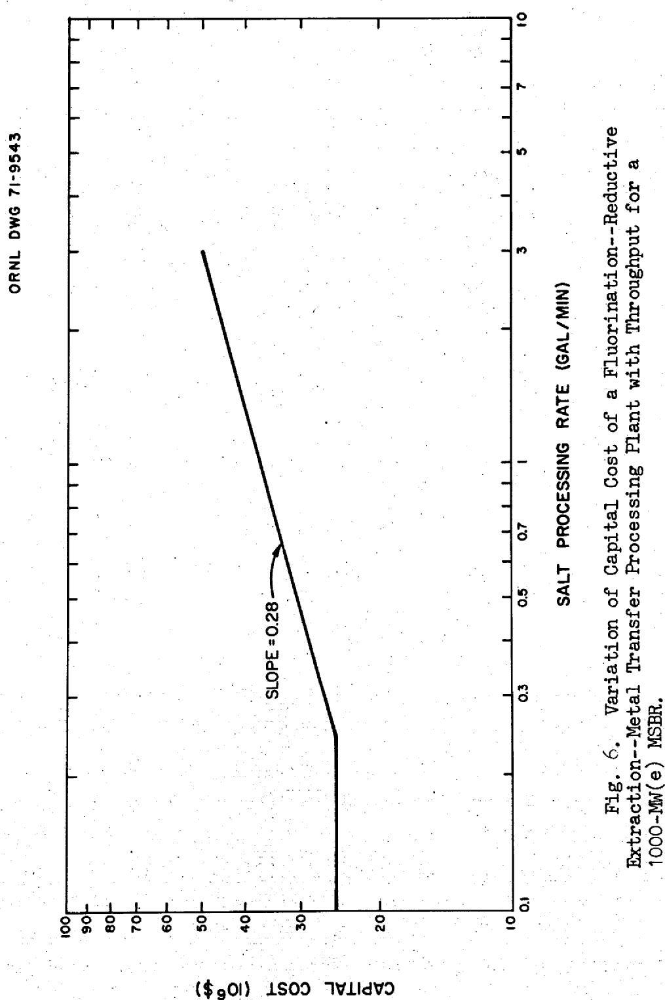

# Cost Estimate for a 3.33-Day Fuel Cycle Time

A complete redesign of the processing plant was not attempted to obtain the capital cost at the greater throughput. However, the cost of each item of equipment listed in Tables 7, 8, and 9 was recomputed by the following general procedures:

Redesign and estimate the cost of a few vessels that are typical of the several types of equipment, e.g., tanks with internal heat exchange surface, columns with frozen salt on walls, liquid/liquid contactors with internal heat exchange surface, etc. Compare the cost of the redesigned vessel with its counterpart in the 10-day cycle case and determine a scale factor from the relationship

$$
\frac {C _ {2}}{C _ {1}} = \left(\frac {R _ {2}}{R _ {1}}\right) ^ {n}
$$

where $n =$ scale factor

$C_2 =$ fabricated vessel cost for 3.33-day cycle

$C_1 =$ fabricated vessel cost for 10-day cycle

$R_{2} =$ flow rate through processing plant for 3.33-day cycle

$R_{1} =$ flow rate through processing plant for 10-day cycle

Determine the fabricated cost of the remaining vessels by using the appropriate scale factor, the previously calculated cost for the 10-day cycle case, and the above equation.

Scale factors for individual pieces of equipment were in the range 0.52 to 0.82, however, a number of items had a scale factor equal to zero because their sizes were independent of processing rate. Typical examples of vessels having zero scale factor are the $^{233}\mathrm{Pa}$ decay tank, the divalent rare earth accumulator, and the trivalent rare earth accumulator. Thus the overall scale factor (0.28) for the plant is considerably below the value of about 0.6 customarily associated with chemical plants.

Installed costs for molybdenum, Hastelloy N, and auxiliary equipment are given in Tables 14, 15, and 16. An overall scale factor was determined for each group of equipment by comparing the total costs from the above tables with the corresponding total from Tables 7, 8, and 9. It was found that the molybdenum equipment scaled by a factor of 0.31, Hastelloy N equipment by a factor of 0.26, and the auxiliary equipment by a factor of 0.33. These factors were used to determine some of the direct costs given below.

Fuel cycle time = 3.33 days

Reactor power = 1000-MW(e)

Table 14. Installed Cost of Molybdenum Process Equipment   

<table><tr><td>Item</td><td>Installed Cost ($)</td></tr><tr><td>233Pa Extraction Column</td><td>252,400</td></tr><tr><td>Rare Earth Extraction Column</td><td>236,050</td></tr><tr><td>Bismuth Dump Tank</td><td>372,310</td></tr><tr><td>LiCl Extraction Column</td><td>1,256,120</td></tr><tr><td>RE3+ Stripper</td><td>930,090</td></tr><tr><td>RE2+ Stripper</td><td>51,990 (Mo)</td></tr><tr><td></td><td>8,200 (Hast N)</td></tr><tr><td>RE3+ Bismuth Reservoir</td><td>1,684,580</td></tr><tr><td>RE3+ Bismuth Drawoff Tank</td><td>152,540 (Mo)</td></tr><tr><td></td><td>7,530 (Hast N)</td></tr><tr><td>RE2+ Bismuth Reservoir</td><td>797,690</td></tr><tr><td>RE2+ Bismuth Drawoff Tank</td><td>146,200 (Mo)</td></tr><tr><td></td><td>6,720 (Hast N)</td></tr><tr><td>Bismuth Surge Tank</td><td>26,710</td></tr><tr><td>233Pa Hydrofluorinator</td><td>208,490 (Mo)</td></tr><tr><td></td><td>11,920 (Hast N)</td></tr><tr><td>Waste Hydrofluorinator</td><td>225,900 (Mo)</td></tr><tr><td></td><td>5,910 (Hast N)</td></tr><tr><td>Bismuth Skimmer</td><td>133,310 (Mo)</td></tr><tr><td></td><td>5,160 (Hast N)</td></tr><tr><td>Total for Mo Process Equipment</td><td>6,474,380 (Mo)</td></tr><tr><td></td><td>45,440 (Hast N)</td></tr><tr><td>Auxiliary Heat Exchangers</td><td>90,000</td></tr><tr><td>Bismuth Pumps</td><td>473,830</td></tr><tr><td>Total for Mo Auxiliary Equipment</td><td>563,830</td></tr></table>

Fuel cycle time = 3.33 days

Reactor power = 1000-MW(e)

Table 15. Installed Cost of Hastelloy N Process Equipment   

<table><tr><td>Item</td><td>Installed Cost ($)</td></tr><tr><td>Feed Tank</td><td>30,500</td></tr><tr><td>Primary Fluorinator</td><td>63,030</td></tr><tr><td>Purge Column</td><td>63,030</td></tr><tr><td>Salt Surge Tank</td><td>11,300</td></tr><tr><td>Salt Surge Tank</td><td>11,300</td></tr><tr><td>Salt Makeup Tank</td><td>50,530</td></tr><tr><td>Salt Discard Tank</td><td>9,640</td></tr><tr><td>UF6 Reduction Column</td><td>61,120</td></tr><tr><td>Structural and Noble Metal Reduction Column</td><td>67,230</td></tr><tr><td>Salt Surge Tank</td><td>12,450</td></tr><tr><td>Bismuth Trap (2 required)</td><td>148,390</td></tr><tr><td>Salt Cleanup Filter (2 required)</td><td>53,910</td></tr><tr><td>Reactor Feed Tank</td><td>35,140</td></tr><tr><td>Salt Dump Tank</td><td>170,860</td></tr><tr><td>LiCl Reservoir and Dump Tank</td><td>84,470</td></tr><tr><td>LiCl Waste Tank</td><td>38,780</td></tr><tr><td>H2-HF Cooler</td><td>38,090</td></tr><tr><td>100°C NaF Trap (2 required)</td><td>51,110</td></tr><tr><td>Still Feed Condenser</td><td>42,150</td></tr><tr><td>HF Still</td><td>11,620</td></tr><tr><td>HF Condenser</td><td>32,740</td></tr><tr><td>KOH Sorber</td><td>25,370</td></tr><tr><td>KOH Reservoir (3 required)</td><td>43,860</td></tr><tr><td>Gas Cooler</td><td>22,500</td></tr><tr><td>Cold Trap (2 required)</td><td>41,460</td></tr><tr><td>Silica Gel Dryer (2 required)</td><td>11,050</td></tr><tr><td>Alumina Sorber</td><td>31,390</td></tr><tr><td>NaK Expansion Tank</td><td>10,210</td></tr><tr><td>NaK Expansion Tank</td><td>6,380</td></tr><tr><td>NaK Expansion Tank</td><td>3,190</td></tr><tr><td>NaK Expansion Tank</td><td>4,980</td></tr><tr><td>NaK Expansion Tank</td><td>3,150</td></tr><tr><td>NaK Expansion Tank</td><td>6,100</td></tr><tr><td>NaK Expansion Tank</td><td>6,320</td></tr><tr><td>Salt Surge Tank</td><td>5,220</td></tr><tr><td>Secondary Fluorinator</td><td>33,370</td></tr><tr><td>Purge Column</td><td>33,370</td></tr><tr><td>233Pa Decay Tank</td><td>710,490</td></tr><tr><td>220-Day 233Pa Decay Tank</td><td>169,720</td></tr><tr><td>Waste Fluorinator</td><td>57,550</td></tr><tr><td>Waste Tank (3 required)</td><td>1,809,940</td></tr><tr><td>20°C NaF Bed</td><td>4,360</td></tr><tr><td>Total for Hastelloy N Process Equipment</td><td>4,127,370</td></tr></table>

Table 16. Installed Cost for Auxiliary Equipment   
Fuel cycle time = 3.33 days  
Reactor power = 1000-MW(e)   

<table><tr><td>Item</td><td>Installed Cost ($)</td></tr><tr><td>Electric Heaters</td><td>762,320</td></tr><tr><td>Auxiliary Heat Exchangers</td><td>300,000</td></tr><tr><td>Refrigeration System</td><td>5,760</td></tr><tr><td>NaK Purification System</td><td>10,000</td></tr><tr><td>SiO2Supply and Removal System</td><td>19,340</td></tr><tr><td>Al2O3Supply and Removal System</td><td>10,000</td></tr><tr><td>F2Disposal System</td><td>5,000</td></tr><tr><td>H2Disposal System</td><td>8,000</td></tr><tr><td>Inert Gas Blanket System</td><td>100,000</td></tr><tr><td>UF6Product Withdrawal Station</td><td>7,500</td></tr><tr><td>Inert Gas System for Cell</td><td>175,000</td></tr><tr><td>F2, H2, and HF Supply Systems</td><td>3,000</td></tr><tr><td>Lithium Metal Handling Equipment</td><td>20,400</td></tr><tr><td>BeF2+ ThF4Addition System</td><td>13,600</td></tr><tr><td>Coolant (NaK) Pumps</td><td>979,620</td></tr><tr><td>Process Salt Pumps</td><td>523,730</td></tr><tr><td>Compressors</td><td>638,220</td></tr><tr><td>Total for Auxiliary Equipment</td><td>3,581,490</td></tr></table>

# Process Piping

Piping costs were calculated as explained above for the plant operating on a 10-day processing cycle.

$$
\begin{array}{l} \text {M o p i p i n g c o s t} = \left[ \left(\text {c o s t o f i n s t a l l e d M o p r o c e s s e q u i m p e n t}\right) + \left(\text {c o s t o f M o p u p m s}\right) + \left(\text {c o s t o f M o h e a t e x c h a n g e r s}\right) \right] (0. 3 0) \\ = [ \$ 6, 4 7 4, 4 0 0 + 4 7 3, 8 0 0 + 9 0, 0 0 0 ] (0. 3 0) \\ = \$ 2,111,500 \\ \end{array}
$$

$$
\begin{array}{l} \text {H a s t e l l o y N p i p i n g c o s t} = [ \text {c o s t o f i n s t a l l e d H a s t e l l o y N e q u i p - m e n t} ] (0. 5 0) \\ = [ \mathbb {S} 4, 1 2 7, 3 7 0 + 4 5, 4 4 0 ] (0. 5 0) \\ = \mathbb {S} 2, 0 8 6, 4 0 0 \\ \end{array}
$$

$$
\begin{array}{l} \text {A u x i l a r y p i n g c o s t} = \left[ \begin{array}{l} (\text {c o s t o f i n s t a l l e d a u x i l i a r y e q u i m p e n t}) - \\ (\text {c o s t o f e l e c t r i c h e a t e r s}) \end{array} \right] (0. 4 0) \\ = [ \$ 3, 5 8 1, 4 9 0 - 7 6 2, 3 2 0 ] (0. 4 0) \\ = \$ 1, 1 2 7, 7 0 0 \\ \end{array}
$$

# Process Instrumentation

We assumed that instrumentation cost for the 3.33-day cycle plant could be scaled upward from the corresponding cost for the 10-day cycle plant by the scaling factors found above for the three types of equipment. Thus

$$
C _ {3. 3 3} = C _ {1 0} \left[ \frac {R _ {3 . 3 3}}{R _ {1 0}} \right] ^ {n}
$$

where the subscripts refer to the value for the 3.33-day cycle and 10-day cycle. The ratio of the plant throughputs is 3.

Instrumentation cost for Hastelloy N equipment

$$
\begin{array}{l} = \$ 1, 4 0 8, 0 0 0 (3) ^ {0. 2 6} \\ = \$ 1, 8 7 4, 0 5 0 \\ \end{array}
$$

Instrumentation cost for auxiliary equipment

$$
\begin{array}{l} = \$ 583,200 (3) ^ {0. 3 3} \\ = \$ 838,060 \\ \end{array}
$$

$$
\begin{array}{l} \text {I n s t r i n u m a t i o n} \\ = \mathbb {S} 8 1, 3 0 0 \\ \end{array}
$$

Instrumentation cost for Mo equipment

$$
\begin{array}{l} = \$ 638,800 (3) ^ {0. 3 1} \\ = \$ 8 9 8, 1 5 0 \\ \end{array}
$$

Total instrumentation cost for 3.33-day-cycle plant = $3,691,560.

# Cell. Electrical Connections

The cost of cell electrical connections was taken to be $493,700, the same as for the processing plant operating on the 10-day cycle.

# Thermal Insulation

The cost of thermal insulation was calculated using a scale factor of 0.31.

$$
\begin{array}{l} \text {T h e r m a l i n s u l a t i o n c o s t} = \$ 588,100 (3) ^ {0. 3 1} \\ = \$ 826,870 \\ \end{array}
$$

# Radiation Monitoring

The cost of environmental monitoring equipment should not be affected by processing rate. Therefore, the cost was taken as $150,000, the same as estimated for the 10-day cycle plant.

# Sampling Stations

The number of sampling stations was not considered to be a function of throughput. The charge is \(1,275,000 for eighteen liquid samplers and fifteen gas samplers.

# Fluorine Plant

In estimating the cost for the higher throughput, the fluorine plant was treated as conventional chemical plant equipment even though it is a remotely operated facility, and the cost was scaled upward by the 0.6 power applied to the throughput ratio.

$$
\begin{array}{l} F _ {2} \text {p l a n t c o s t} = \$ 1, 0 0 4, 9 0 0 (3) ^ {0. 6} \\ = \$ 1, 9 4 3, 5 0 0 \\ \end{array}
$$

# Indirect Costs

Indirect costs were calculated by the procedure discussed above for the 10-day cycle plant.

# NEEDED DEVELOPMENT, UNCERTAINTIES AND ALTERNATIVES

There are sufficient laboratory and engineering data to show that chemical principles for the fluorination--reductive extraction--metal transfer process are fundamentally sound. Except for fluorination, most of the development has been in relatively small-scale experiments, and design studies which, in addition to giving encouraging results, have identified problem areas. The more important problem areas and uncertainties are discussed below.

# Materials of Construction

The most basic problem to this process is that of a material for containing molten bismuth or bismuth-salt mixtures. Molybdenum has excellent corrosion resistance to both phases but is a very difficult metal to fabricate. For example, in making welded joints the heat-affected zone becomes very brittle due to recrystallization, and ductility can be restored only by cold working which is normally not practical on fabricated equipment. Considerable progress has been made in the making of molybdenum shapes and joints, and, in time, we feel that fabrication technology will be perfected. The task will be difficult even for small molybdenum equipment, and, for large items that are required in parts of this plant, the job is formidable. However, molybdenum equipment will almost surely be expensive.

Graphite is being considered as a possible alternate material of construction. Also it may be possible to apply molybdenum coatings to a more easily fabricated material such as a nickel-base alloy. Tungsten coatings would also be satisfactory.

# Continuous Fluorination

Fluorination of molten salts for uranium recovery has been successfully demonstrated on several occasions $^{7,9,9,10}$ in batchwise, pilot plant operations, and the development of a continuous method is in progress. Successful continuous fluorination depends upon maintaining a protective frozen salt layer on wetted surfaces of the fluorinator to

prevent catastrophic corrosion. Establishing and maintaining this protective coating is a developmental problem that must be solved. The solution is complicated by the difficulty of simulating an internal heat source in the nonradioactive salt of an engineering test. Experimental results have been encouraging, and the frozen-wall fluorinator should be practical to build and operate.

# Bismuth Removal From Salt

Nickel-base alloys are rapidly corroded by molten bismuth, and vessels that normally contain only salt, including the reactor vessel and primary heat exchangers, must be protected from chronic or recurring exposure to the metal entrained in salt. A cleanup device for the salt stream, consisting of a vessel packed with nickel wool, exists only in concept, and its effectiveness cannot be evaluated until tolerance limits for bismuth in salt have been determined as well as suitable analytical methods for detecting low concentrations (≤1 ppm Bi) in salt. The magnitude of bismuth entrainment cannot be completely assessed until bismuth-salt contactors have been developed and tested, and cleanup measures could be mandatory for the salt stream from each contractor if bismuth entrainment is unacceptable. The allowable bismuth concentration in salt will almost surely be quite low, and it is believed that bismuth-salt separation after each contact will be sharp. If not, a dependable and practicable bismuth removal method must be developed.

# Instrumentation for Process Control

The continuous interchange of salt between the reactor and processing plant requires quick and reliable analytical techniques for salt composition, uranium and protactinium content, and $\mathrm{U}^{3+}/\mathrm{U}^{4+}$ ratio. If on-line methods are not developed, laboratory analyses could be used, but these are slow, involve the hazard and expense of sample handling, and require holdup tanks with additional inventory at the sample points. Similarly, on-line monitoring of reductive extraction and metal transfer operations by readings on the salt and/or bismuth phases would allow firm process control; however, we believe that these operations can be properly conducted without sophisticated instrumentation.

Accidental loss of fissile material from the fluorination--reductive extraction--metal transfer process is extremely unlikely. Maloperations in all units except $\mathsf{UF}_6$ reduction will either return uranium and protac-tinium to the reactor in the recycle salt or divert each into an area where fission products are accumulated for disposal. Malfunction in the $\mathsf{UF}_6$ reduction operation could route $\mathsf{UF}_6$ toward the $\mathsf{H}_{2}$ -HF recycle system, and adequate monitoring and traps must be provided to prevent such an occurrence. The process already includes means of recovering fissile values from waste salt since all waste is held for decay and fluorinated before ultimate disposal.

Some, but not all, process instrumentation is required to function in a $600^{\circ}$ to $640^{\circ}$ C environment. This condition will undoubtedly necessitate a development program for instrument components, for example, sensors and transducers.

# Noble and Seminoble Metal Behavior

Noble and seminoble metals constitute about 20.3 wt. % and 1.6 wt. % respectively of all fission products and account for 25.2% and 2.06% of the fission product decay energy at equilibrium. The behavior of these fission products in the MSBR is not fully understood; however, data from MSRE operation indicate that they are probably removed by attaching themselves to reactor surfaces and/or leaving with the inert sparge gas. Our treatment of the flowsheet is based on this premise, and we have designed the processing plant to handle only a small amount of noble and seminoble metals. Most noble and seminoble metals have volatile fluorides and would be removed in fluorination. If the behavior is not as assumed and large amounts of noble and seminoble metals enter the processing plant, extensive redesign of the gas recycle and salt cleanup systems would be required. Heat removal problems would be more severe and additional treatment would be required to remove reduced noble metal particulates from the reconstituted fuel salt. A better understanding of the behavior of this class of fission products in the reactor system is very important.

# Operational and Safety Considerations

When operational and safety considerations for the processing plant are examined in detail, it will probably be found that their influence on equipment design will be appreciable. There is a volume heat source due to decaying radioactive nuclides in practically every vessel in the plant, requiring continuous cooling and fail-safe systems. In some vessels, high heat removal rates are required because concentrations of the radionuclides are relatively high. A critical design analysis is necessary for every potentially dangerous area to ascertain the consequences of abnormal operation, especially in regard to interruptions in coolant flow.

# ACKNOWLEDGMENT

During this study we had many helpful discussions with L. E. McNeese concerning flowsheet details and process analysis. On several occasions, we enlisted the aid of M. J. Bell and his MATADOR program to compute reactor and processing plant performance for different modes of operation. We thank R. C. Robertson and M. L. Myers of the Reactor Division for basic cost data on materials of construction and for instructing us in accounting procedures to put this estimate on the same basis as the reference 1000 MW(e) MSBR. We also appreciate the efforts of Robert E. McDonald, A. C. Schaffhauser, and James R. Distefano of the Metals and Ceramics Division in estimating the cost of molybdenum.

# REFERENCES

1. R. C. Robertson (Ed.), Conceptual Design Study of a Single-Fluid Molten-Salt Breeder Reactor, ORNL-4541 (June 1971).   
2. M. J. Bell, ORNL, personal communication of unpublished data (February 1971).   
3. M. J. Bell, ORNL, MATADOR computer program, unpublished data.   
4. W. L. Carter, ORNL, BUNION computer program, unpublished data.

5. J. H. Pashley, Oak Ridge Gaseous Diffusion Plant, personal communication (April 1971).   
6. NUS Corporation, Guide for Economic Evaluation of Nuclear Reactor Plant Designs, NUS-531 (January 1969), p. C-4.   
7. W. H. Carr, "Volatility Processing of the ARE Fuel," Chem. Engr. Symp. Ser., 56 (28), 57-61 (1960).   
8. Chem. Technol. Div. Ann. Progr. Rept. June 30, 1962, ORNL-3314, pp. 39-45.   
9. W. H. Carr et al., Molten-Salt Fluoride Volatility Pilot Plant: Recovery of Enriched Uranium From Aluminum-Clad Fuel Elements, ORNL-4574 (April 1971).   
10. R. B. Lindauer, Processing of the MSRE Flush and Fuel Salts, ORNL-TM-2578 (August 1969).   
11. Staff of the Oak Ridge National Laboratory, Siting of Fuel Reprocessing Plants and Waste Management Facilities, ORNL-4451, pp. 6-44 to 6-47 (July 1970).   
12. W. R. Grimes, "Molten-Salt Reactor Chemistry," Nucl. Appl. Technol. 8 (2), 137-55 (1970).   
13. M. W. Rosenthal et al., "Recent Progress in Molten-Salt Reactor Development," At. Energy Rev. 2 (3), (1971).

APPENDIXES

# Appendix A: Economic Comparison of Process Gas Systems for the MSBR Processing Plant

Gases used in processing MSBR fuel salt are fluorine for removing uranium from the salt, hydrogen fluoride for oxidizing metals dissolved in bismuth to fluorides for extraction into salt, and hydrogen for reducing $\mathrm{UF_6}$ to $\mathrm{UF_4}$ and for sparging fuel salt after fluorination. In addition a considerable amount of $\mathrm{UF_6}$ is handled in fluorination and reduction. The principal reactions of the process gases are:

Fluorination

$$
\mathrm {U F} _ {4} + \mathrm {F} _ {2} \quad \rightarrow \mathrm {U F} _ {6}
$$

Reduction

$$
\begin{array}{l} \mathrm {U F} _ {6} + \mathrm {H} _ {2} \quad \rightarrow \mathrm {U F} _ {4} + 2 \mathrm {H F} \\ \mathrm {F} _ {2} + \mathrm {H} _ {2} \rightarrow 2 \mathrm {H F} \\ \end{array}
$$

Hydrofluorination

$$
\begin{array}{l} \mathrm {P a} (\mathrm {B i}) + \mathrm {L H F} \rightarrow \mathrm {P a F} _ {4} (\text {s a l t}) + 2 \mathrm {H} _ {2} \\ U (B i) + L H F \rightarrow U F _ {4} (s a l t) + 2 H _ {2} \\ F P (B i) + x H F \quad \rightarrow (F P) F _ {x} (s a l t) + (x / 2) H _ {2} \\ \end{array}
$$

Sparging

$$
\begin{array}{l} 2 \mathrm {U F} _ {5} + \mathrm {H} _ {2} \rightarrow 2 \mathrm {U F} _ {4} + 2 \mathrm {H F} \\ \mathrm {F} _ {2} + \mathrm {H} _ {2} \rightarrow 2 \mathrm {H F} \\ \end{array}
$$

The net effect of the first, second, and fourth operations is to consume $\mathbf{H}_2$ and $\mathbf{F}_2$ while making HF, whereas, the third operation consumes HF and produces $\mathbf{H}_2$ . Since the amount of HF consumed in hydrofluorination is much smaller than the amount produced in the other operations, the processing plant must dispose of the excess hydrogen fluoride either as waste or by conversion to hydrogen and fluorine for recycle. The first alternative requires the purchase of the three gases plus the cost of converting large quantities of contaminated hydrogen fluoride to a solid waste for salt mine storage; the second alternative requires the installation of a remote fluorine plant with a considerably smaller makeup and waste disposal cost.

The two choices for treating the process gases were studied to determine the more economic method. The simplified flow diagrams in Figs. A-1 and A-2 show the processing steps and the mass flow rates of reactant and product gases. In each diagram fluorine utilization in fluorinators is taken as $50\%$ ; hydrogen fluoride utilization in hydrofluorinators and hydrogen utilization in the reduction column are taken as $10\%$ .

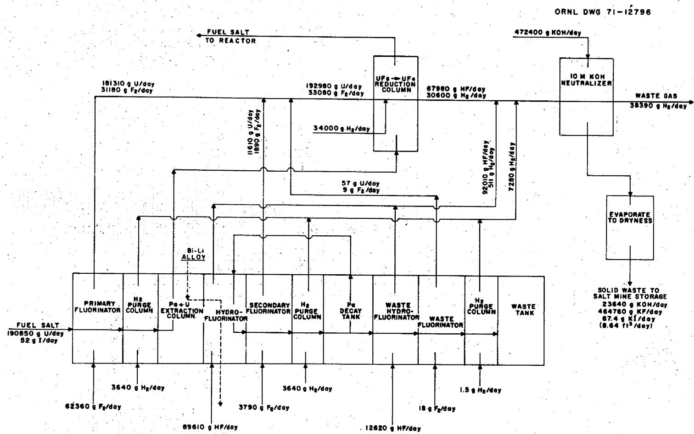  
Fig. A-1. Once-Through Cycle for Gases in Processing Plant for MSBR Fuel Process Requirements of $\mathbf{H}_2$ , $\mathbf{F}_2$ , and HF are Purchased; Excess Amounts After Use are Converted to Solid Waste for Disposal. Uranium, in the gas stream as $\mathbf{U}\mathbf{F}_6$ , is quantitatively returned to the salt in the reduction column. Values show requirements for a 1000-MW(e) MSBR.

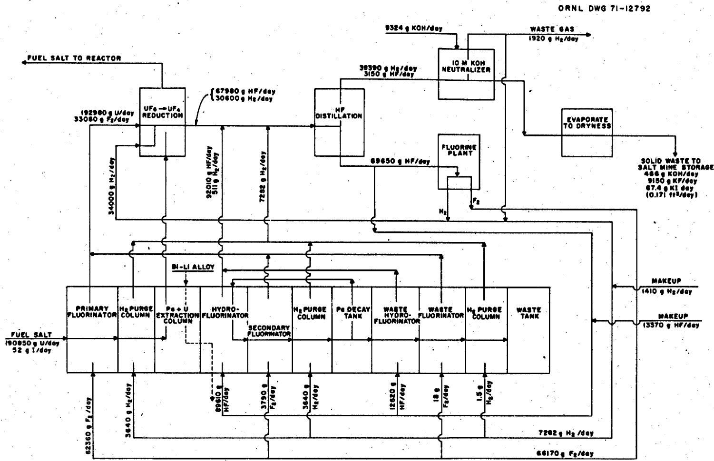  
Fig. A-2. Recycle of Gases in Processing Plant for MSBR Fuel Reaction Product HF is Electrolyzed to Furnish $\mathbf{H}_2$ and $\mathbf{F}_2$ for Recycle to Process Operations; a Small Amount of $\mathbf{H}_2$ and HF is Not Recoverable and is Replaced with Makeup. Uranium, in the gas stream as $\mathbf{U}\mathbf{F}_{\mathfrak{e}}$ , is quantitatively recovered in the reduction column. Values show requirements for a 1000-MW(e) MSBR.

Fission product contamination in the gas stream is primarily from iodine and to a less extent from bromine. Small amounts of noble gases and volatile noble metals are present, but, as explained earlier, the short removal time for these nuclides in the reactor greatly limits the quantity. Heat generation in the neutralized waste is due almost entirely to iodine and daughter products.

Since this cost study was for comparison purposes, only major elements of the cost were considered. For example, piping instrumentation, insulation, auxiliary equipment, etc. were not included in the estimate. The study was limited to comparing the costs of major pieces of equipment, consumed chemicals, and waste disposal.

# Once-Through Process Cycle

In the once-through treatment (Fig. A-1), gases from the reduction column, hydrofluorinators, and purge columns flow into a caustic neutralizer containing aqueous KOH where hydrogen fluoride and halogen fission products are removed. Hydrogen leaves the neutralizer, passes through alumina and charcoal beds for removal of small amounts of volatile noble metals and noble gases, and exhausts to the atmosphere. Five neutralizers, each holding about 135 ft³ of 10 M KOH solution, are needed. One tank is on-stream for a 100-hr cycle while the neutralized contents of the remaining tanks are in various stages of fission product decay. The batchwise cycle is necessary to allow decay before the solution is evaporated to dryness. At the end of the 100-hr reaction period the fission product decay energy is 153 kW; this decays rather quickly as shown by the curves of Fig. A-3. The KOH concentration is reduced from 10 M to 0.5 M in the 100-hr period.

After 400-hours decay the aqueous solution is evaporated to a solid waste residue in 24-in. D x 10-ft-long/waste containers. Condensate is reused to make fresh KOH solution. If the waste container is held about 32 days, its heat emission is sufficiently low to qualify the can for salt mine storage at the minimum cost of $300 per can.[11]

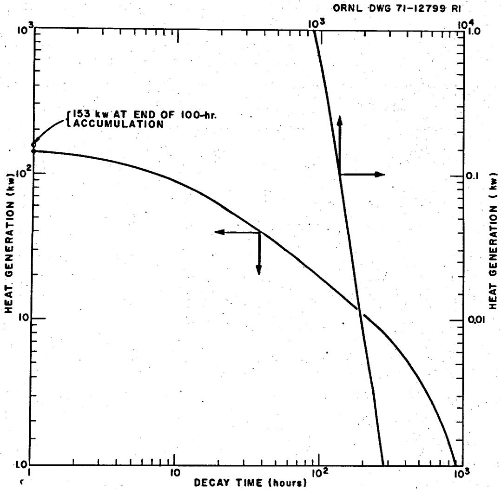  
Fig. A-3. Fission Product Heat Generation Rate in KOH Neutralizer. Solution volume = 135 ft³

The 24-in. D x 10-ft-long/can is the largest permissible can for storage in a salt mine, and the usable length, excluding nozzles, lifting bails, etc., is approximately 8 ft. About 8.64 ft³ solid waste is produced each day, hence, for operation at 80% plant factor, 105 cans must be sent to permanent storage each year.

# Gas Recycle System

In the recycle system (Fig. A-2), gases from the reduction column, purge columns, and hydrofluorinators are compressed to about 2 atm pressure and chilled to $-40^{\circ}\mathrm{C}$ to condense hydrogen fluoride from the $\mathsf{H}_2$ -HF mixture. Some of the fission products, primarily volatile compounds of I, Br, Se, and Te, are expected to condense to a large extent with the hydrogen fluorine. These compounds are more volatile than hydrogen fluorine and can be separated by distilling the mixture at low temperature at about 2 atm pressure. Vapor pressure data are shown in Fig. A-4. The overhead condenser is kept at $-40^{\circ}\mathrm{C}$ so that hydrogen fluoride loss with the noncondensable gases is minimal. Part of the liquid hydrogen fluoride flows from the still to an electrolytic cell to regenerate $\mathsf{H}_2$ and $\mathsf{F}_3$ ; the remainder is recycled to the hydrofluorinators.

The $\mathrm{H}_{2}$ -rich gas from the distillation column is bubbled through a caustic scrubber similar to the one used in the once-through system to remove halides. The gas is dried in regenerative silica gel sorbers and recycled to the reduction and purge columns. About $5\%$ of the hydrogen is removed from the system on each cycle to purge selenium and tellurium by sorption on activated alumina and noble gases by sorption on charcoal.

The neutralization system consists of a scrubber column and three, $20\text{-ft}^3$ reservoirs for 10 M KOH. Each reservoir is on-stream for 34 days until the concentration is reduced to 0.5 M KOH; the heat generation rate attains equilibrium at about 210 kW (see Fig. 5, page 29). The spent solution is set aside for fission product decay for 45 days before being evaporated to dryness in 24-in. D x '0-ft-long waste containers. The volume of solid waste produced is 4.83 ft3 every 34 days, requiring only 2.07 waste containers per year for reactor operation at 80% plant factor.

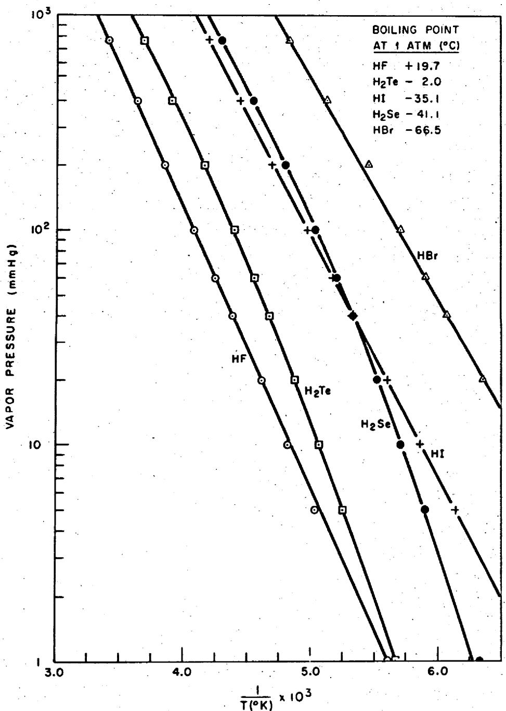  
Fig. A-4. Vapor Pressure--Temperature Relationships for HF, HI, HBr, $\mathsf{H}_2\mathsf{Se}$ and $\mathsf{H}_2\mathsf{Te}$ .

The waste container needs to be held only about nine days after the final batch is evaporated in order to qualify for the minimum interment cost of $300. This cost is for a maximum heat evolution of 30 w/ft of container.

# Fuel Cycle Cost Comparison

Costs for the two gas treatment methods were compared by examining only the items for which there would be a significant cost differential. Preliminary designs were made of major equipment items, and installed costs were estimated. The costs of chemicals were calculated from the requirements shown on the flowsheets, Figs. A-1 and A-2.

In the case of the once-through gas cycle, the costs of purchased gases were calculated in two ways. One calculation was made for the purchase of all required fluorine, hydrogen, and hydrogen fluoride from outside sources. In the second case, hydrogen fluoride and some hydrogen were purchased, and fluorine and hydrogen were manufactured on-site from HF in a nonradioactive fluorine plant. For complete gas recycle operation, only the equilibrium hydrogen fluoride lost in the noncondensable gas from distillation and that consumed in hydrofluorination are purchased. The required hydrogen makeup is equivalent to that discarded less the hydrogen produced in hydrofluorination.

The costs of the two methods for treating the gases are compared in Table A-1. The once-through gas cycle costs about 0.115 mills/kWhr and is almost five times more expensive than the recycle system, due primarily to the higher charges for waste disposal and purchased fluorine. The most significant charge in the recycle system is the amortization of the remote fluorine plant. A small reduction in cost can be made in the once-through gas cycle when fluorine and hydrogen are manufactured on-site from hydrogen fluoride, however, the fuel cycle cost is still four times that of the recycle system.

On the basis of this comparison, the gas recycle system was selected for the MSBR fuel reprocessing flowsheet.

Fuel cycle time = 10 days

Reactor power = 1000 MW(e)

Plant factor = 80%

Table A-1. Fuel Cycle Costs for Two Methods of Treating Process Gases in MSBR Fuel Processing   

<table><tr><td></td><td colspan="3">Fuel Cycle Cost (mills/kWhr)</td></tr><tr><td></td><td colspan="2">Once-Through Gas Cycle</td><td>Gas Recycle</td></tr><tr><td></td><td>Case 1a</td><td>Case 2b</td><td></td></tr><tr><td>Waste Disposal</td><td></td><td></td><td></td></tr><tr><td>Waste containers</td><td>0.0485</td><td>0.0485</td><td>0.0009</td></tr><tr><td>Shipping</td><td>0.0050</td><td>0.0050</td><td>0.0001</td></tr><tr><td>Carriers</td><td>0.0022</td><td>0.0022</td><td>0.0004</td></tr><tr><td>Salt mine storage</td><td>0.0045</td><td>0.0045</td><td>0.0001</td></tr><tr><td></td><td>0.0602</td><td>0.0602</td><td>0.0015</td></tr><tr><td>Equipment and Chemicals</td><td></td><td></td><td></td></tr><tr><td>KOH tanks</td><td>0.0124</td><td>0.0124</td><td>0.0013</td></tr><tr><td>Fluorine plant</td><td></td><td>0.0098</td><td>0.0196</td></tr><tr><td>Fluorine</td><td>0.0304</td><td></td><td></td></tr><tr><td>Hydrogen</td><td>0.0055</td><td>0.0050</td><td>0.0002</td></tr><tr><td>Hydrogen fluoride</td><td>0.0026</td><td>0.0044</td><td>0.0005</td></tr><tr><td>Potassium hydroxide</td><td>0.0038</td><td>0.0038</td><td>0.0001</td></tr><tr><td>HF distillation equipment</td><td></td><td></td><td>0.0007</td></tr><tr><td></td><td>0.0547</td><td>0.0354</td><td>0.0224</td></tr><tr><td>Total</td><td>0.1149</td><td>0.0956</td><td>0.0239</td></tr></table>

aAll gases purchased.   
Hydrogen fluoride and some $\mathbf{H}_{2}$ purchased; $\mathbf{F}_{2}$ and the remaining $\mathbf{H}_{2}$ made on-site from hydrogen fluoride in nonradioactive fluorine plant.

# Appendix B: Useful Data for the MSBR and Processing Plant

Table B-1 summarizes data from reactor physics calculations, properties of process fluids, and heat generation data for various areas of the processing plant.

Table B-1. Useful Data for the MSBR and Processing Plant   

<table><tr><td colspan="3">Reactor Facts (MATADOR calculations by M. J. Bell)</td></tr><tr><td>Thermal power</td><td>2250 MW</td><td></td></tr><tr><td>Fission product production</td><td>2.355 kg/day</td><td></td></tr><tr><td>Fission products entering processing plant</td><td>2.143 kg/day</td><td></td></tr><tr><td>Noble gases removed in reactor</td><td>0.621 kg/day</td><td></td></tr><tr><td>Noble metals removed in reactor</td><td>0.471 kg/day</td><td></td></tr><tr><td>Seminoble metals removed in reactor</td><td>0.036 kg/day</td><td></td></tr><tr><td>Fission products removed in processing plant</td><td>1.226 kg/day</td><td></td></tr><tr><td>233Pa produced</td><td>2.59 kg/day</td><td></td></tr><tr><td>Breeding ratio</td><td>1.0637</td><td></td></tr><tr><td>233Pa inventory in reactor at equilibrium</td><td>20.57 kg</td><td></td></tr><tr><td>233Pa inventory in processing plant at equilibrium</td><td>81.84 kg</td><td></td></tr><tr><td colspan="3">Molar Densities at 640°C (g moles/ft3)</td></tr><tr><td>LiF-BeF2-ThF4(72-16-12 mole %)</td><td>1467</td><td></td></tr><tr><td>LiF-BeF2-ThF4-UF4-FP&#x27;s (equilibrium composition)</td><td>1489</td><td></td></tr><tr><td>LiCl</td><td>995</td><td></td></tr><tr><td>Bismuth</td><td>1298</td><td></td></tr><tr><td>Bi-50 at.% Li</td><td>1336</td><td></td></tr><tr><td>Bi-5 at.% Li</td><td>1323</td><td></td></tr><tr><td>LiF-ThF4-ZrF4-PaF4(71-26-2.8-0.2 mole %)</td><td>1192 (at 600°C)</td><td></td></tr><tr><td colspan="3">Liquidus Temperature (°C)</td></tr><tr><td>LiF-BeF2-ThF-UF4(71.7-16.0-12.0-0.3 mole %)</td><td>499</td><td></td></tr><tr><td>LiCl</td><td>614</td><td></td></tr><tr><td>Bismuth</td><td>271</td><td></td></tr><tr><td>LiF-ThF4-ZrF4-PaF4(71-26-2.8-0.2 mole %)</td><td>568</td><td></td></tr><tr><td>NaK (78-22 wt.%)</td><td>-11</td><td></td></tr><tr><td colspan="3">Inventory in Processing Plant</td></tr><tr><td>Fuel salt</td><td>33.7 ft3</td><td></td></tr><tr><td>Bismuth</td><td>58.4 ft3</td><td></td></tr><tr><td>LiCl</td><td>20 ft3</td><td></td></tr><tr><td>NaK</td><td>200 ft3</td><td></td></tr><tr><td>7Li in Bi-50 at.% Li alloy</td><td>84.2 kg</td><td></td></tr><tr><td>7Li in Bi-5 at.% Li alloy</td><td>12.5 kg</td><td></td></tr><tr><td>233Pa decay salt</td><td>150-175 ft3</td><td></td></tr><tr><td colspan="3">Heat Generation in Processing Plant (kW)</td></tr><tr><td></td><td>Fission Products</td><td>233 Pa</td></tr><tr><td>Fuel salt circuit8(33.7 ft3)</td><td>238</td><td>5</td></tr><tr><td>Bismuth in extraction columns and surge tanks (8 ft3)</td><td>13</td><td></td></tr><tr><td>233Pa decay system salt (150-175 ft3)</td><td>1800</td><td>4150</td></tr><tr><td>LiCl (20 ft3)</td><td>456</td><td></td></tr><tr><td>Bi-50 at.% Li alloy (27 ft3)</td><td>439</td><td></td></tr><tr><td>Bi-5 at.% Li alloy (18 ft3)</td><td>1382</td><td></td></tr><tr><td>Waste tank (555 ft3, no decay)</td><td>1114</td><td></td></tr><tr><td>KOH solution (20 ft3, no decay)</td><td>210</td><td></td></tr><tr><td>Al2O3bed (2.5 ft3)</td><td>13</td><td></td></tr><tr><td></td><td>5665</td><td>4155</td></tr></table>

${}^{a}$ Salt in feed tank,fluorinator,purge column,extraction columns,reduction column,salt cleanup units,and reactor feed tank.

# Appendix C: Steady State Concentrations in the Metal Transfer System

The metal-transfer system consists of captive bismuth and lithium chloride phases that circulate in closed loops, receiving fission products on one side of the loop and transferring them to a second phase at the other side. Throughout the system the donor and acceptor fluids operate with steady state concentrations of all metals being transferred, the equilibria depending upon the distribution characteristics of each species and the purge rate from the acceptor fluid. This system has been carefully analyzed by Bell,[2] and his data are given in Fig. C-1.

The purge of fission products from the Bi-5 at. % Li reservoir is shown as a continuous 5.669 gal/day stream. Making the rate continuous was a convenience for calculations; in actual practice the withdrawal of such a small amount would be batchwise on perhaps a two-day cycle. Similarly, the indicated withdrawal from the Bi-50 at. % Li reservoir would probably be on a 30-day cycle.

The divalent rare earths, designated $\mathbf{RE}^{2+}$ in the figure, include Sr, Ba, Sm, and Eu. Trivalent rare earth, designated $\mathbf{RE}^{3+}$ , include Y, La, Ce, Pm, Nd, Pr, Gd, Tb, Dy, Ho, and Er.

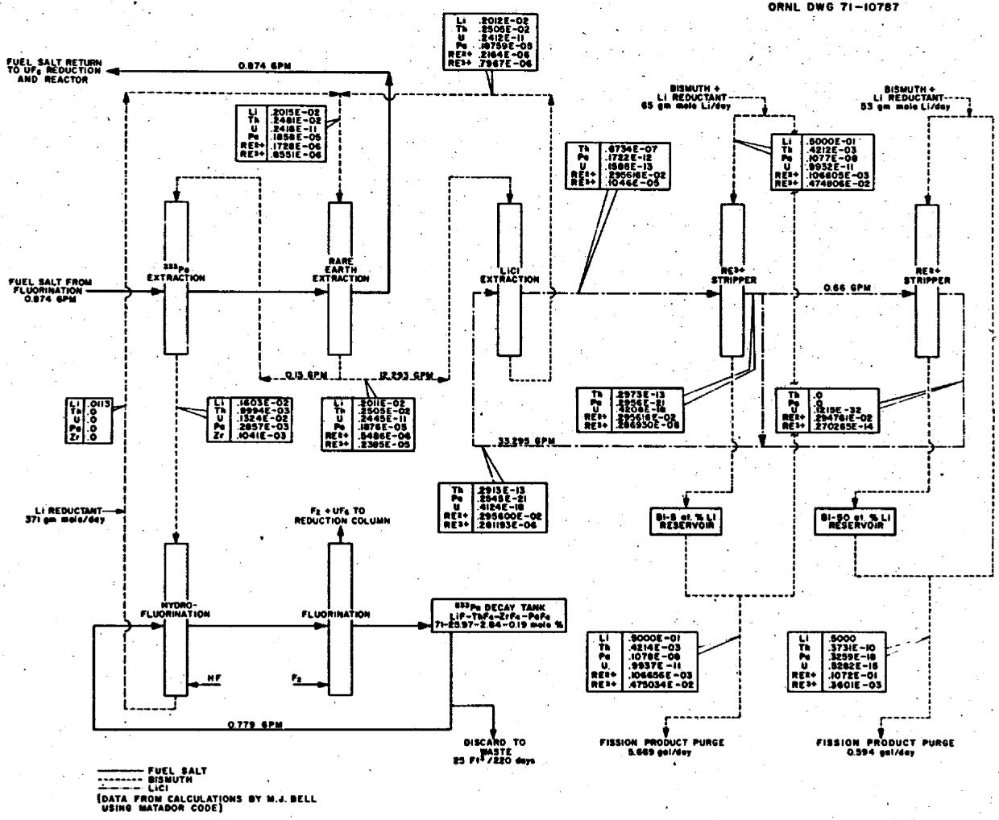  
Fig. C-1. Calculated Equilibrium Concentrations (atom fraction) In Metal Transfer System.

# Appendix D: Flowsheet of the Fluorination--Reductive Extraction--Metal Transfer Process [1000-MW(e) MSBR]

The attached flowsheets [Dwgs. No. F12173-CD-173E and No. F-12173-CD-174E] give pertinent material and energy balance data for processing the reference MSBR on a 10-day cycle. During the course of the design and cost study, significant design improvements in the original concept of the plant became apparent. As these changes were made to the flow-sheet, it was not always possible to fully investigate effects upon other areas of the plant because of the urgency to complete the cost study on schedule. Thus, the reader might not always obtain a satisfactory material balance in specific areas of the flowsheet; however, the authors believe that such inconsistencies are minor and do not affect the results or conclusions of this study.

Although the drawings do not show engineering features with respect to instrumentation, coolant flow, auxiliary piping, service lines, etc., these items were included in the cost estimate. Equipment and vessels for startup, shutdown, and standby operation of the plant were also included in the cost, however, they are not shown.

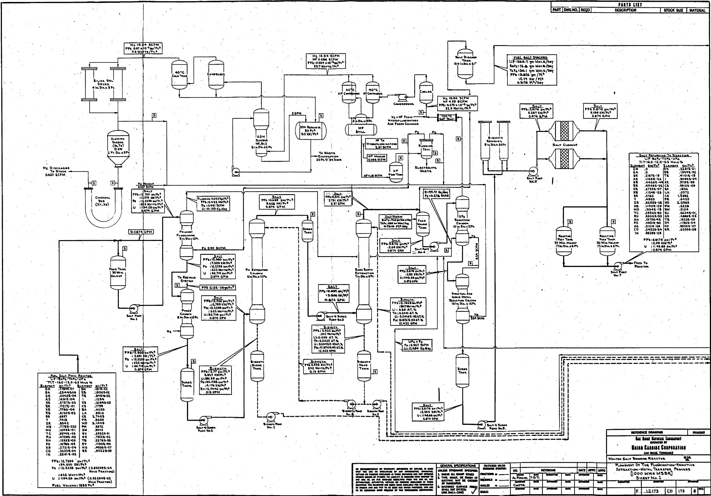

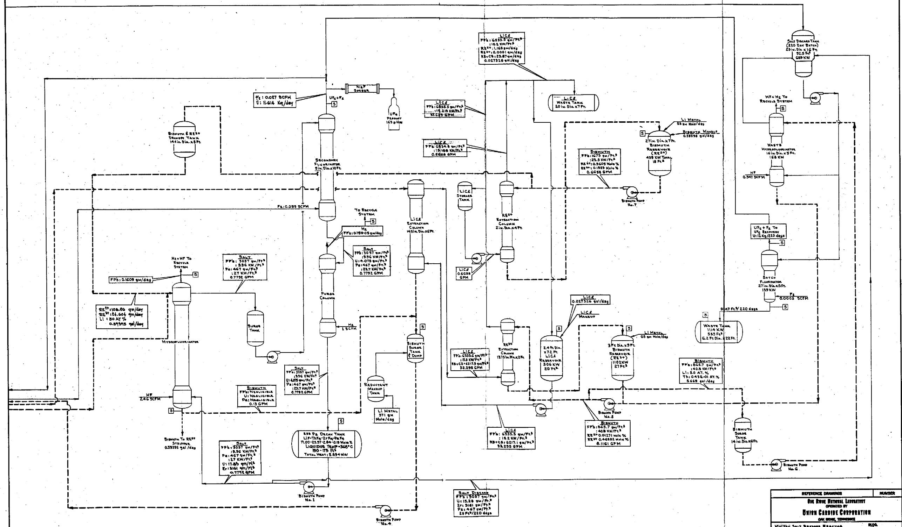

<table><tr><td rowspan="9" colspan="2">NO REPRESENTATION OF INFORMATION, DRAFTED OR SUPPLIED, IS BASE ON THE USE OR DEVELOPMENT OF ANY INFORMATION. APPLICABLE FROM THIS PAGE (NOT INCLUDED IN THESE PRINTS OF OTHERS). NO LIMITATION IS ASSUMES WITH RESPECT TO THE USE OF, OR FOR COMPLIANT REGULATORY OF THE USE OF ANY INFORMATION, APPROSIMATE, APPROVED, ACCEPTED AS PART OF A PROCESS REGULATED IN TERMS OF THIS SHEET AND ANTIENOMA. THE EXHIBIT AND THE EXHIBIT ARE NOT ON THE USE OF ANY PERSON, ANYTHING ELSE, AND ARE TO BE REDESCRIBED UNDER CONTROL OF THE PARENTAGE CONTINUING.</td><td rowspan="9" colspan="4">REVISIONS</td><td rowspan="9">DATE</td><td rowspan="9">APPD</td><td rowspan="9">APPD</td><td rowspan="9" colspan="4">Flow of Statement of The Formulation/Reproductive
Extraction-Metal Transfer Process
[1000 Mw MSB]
SHEET No.2</td></tr><tr><td></td></tr><tr><td></td></tr><tr><td></td></tr><tr><td></td></tr><tr><td></td></tr><tr><td></td></tr><tr><td></td></tr><tr><td></td></tr></table>

# DISTRIBUTION

1. J. L. Anderson   
2. C. F. Baes   
3. H.F.Bauman   
4. S. E. Beall   
5. M. J. Bell   
6. M. Bender   
7. M. R. Bennett   
8. C. E. Bettis   
9. E. S. Bettis   
10. E. G. Bohlmann   
11. G. E. Boyd   
12. R. B. Briggs   
13. W. L. Carter   
14. C. W. Collins   
15. E. L. Compere   
16. W. H. Cook   
17. D. F. Cope, AEC-OSR   
18. F. L. Culler, Jr.   
19. A. R. DeGrazia, AEC-Wash.   
20. J. R. Distefano   
21. S. J. Ditto   
22. W. P. Eatherly   
23. J. R. Engel   
24. D. E. Ferguson   
25. I. M. Ferris   
26. W. K. Furlong   
27. C. H. Gabbard   
28. W. R. Grimes   
29. A. G. Grindell   
30. Norton Haberman, AEC-Wash.   
3. B. A. Hannaford   
32. P. N. Haubenreich   
33. J. R. Hightower   
34. W. H. Jordan   
35. P. R. Kasten   
36. C.W.Kee   
37. J. J. Keyes   
38. Kermit Laughon, AEC-OSR   
39. R. B. Lindauer

L0. M. I. Lundin   
41. H. G. MacPherson   
42. R. E. MacPherson   
43. H. E. McCoy   
44. H. A. McLain

45-54. L. E. McNeese

55. A. S. Meyer   
56. R. L. Moore   
57. A. J. Moorehead   
58. E. L. Nicholson   
59. A. M. Perry   
60. G. L. Ragan   
61. R.C.Robertson

62-63. M. W. Rosenthal

64. H. M. Roth, AEC-ORO

65. W. F. Schaffer

66. Dunlap Scott

67. J.H.Shaffer

68. M. Shaw, ABC-Wash.

69. M. J. Skinner

70. F. J. Smith

71. J. R. Tallackson

72. O. K. Tallent

73. R. E. Thoma

74. D. B. Trauger

75. W. E. Unger

76. A. M. Weinberg

77. J. R. Weir

78. M. E. Whatley

79. J. C. White

80. W. M. Woods

81. Gale Young

82. E. L. Youngblood

-34. Central Research Library

85-86. Document Reference Section

87-89. Laboratory Records

90. Laboratory Records (IRD-RC)

91-92. Technical Information Center, OR