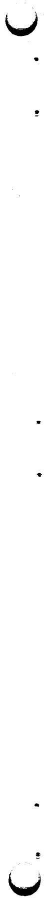
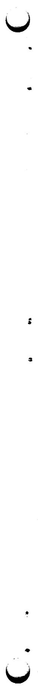

ORNL-TM-3595

Contract No. W-7405-eng-26

Reactor Division

INDEXED ABSTRACTS OF SELECTED REFERENCES ON MOLTEN-SALT REACTOR TECHNOLOGY

D. W. Cardwell and P. N. Haubenreich

# NOTICE:

This report was prepared as an account of work sponsored by the United States Government, Neither the United States nor the United States Atomic Energy Commission, nor any of their employees, nor any of their contractors, subcontractors, or their employees, makes any warranty, express or implied, or assumes any legal liability or responsibility for the accuracy, completeness or usefulness of any information, apparatus, product or process disclosed, or represents that its use would not infringe privately owned rights.

DECEMBER 1971

OAK RIDGE NATIONAL LABORATORY

Oak Ridge, Tennessee 37830

operated by

UNION CARBIDE CORPORATION

FOR THE

U. S. ATOMIC ENERGY COMMISSION


# TABLE OF CONTENTS

Page

ABSTRACT 1

INTRODUCTION 3

LIST OF ABSTRACTS. 3

KEYWORD INDEX. 169

CATEGORY INDEX 197

INDEX OF AUTHORS 205

# ACKNOWLEDGMENTS

The authors express their appreciation to Ruth Hofstra, John A. Carpenter, and A. F. Joseph of the ORNL Mathematics Division for providing technical guidance and programming required for file formatting, computer entry and automated printout of the MSR publication abstracts contained in this report. Appreciation is also expressed to Annabel Legg who prepared all text material for computer entry on our magnetic tape typewriter/converter and to various staff members of the Molten Salt Reactor Program who developed the abstracts and assigned keywords.

# INDEXED ABSTRACTS OF SELECTED REFERENCES ON MOLTEN-SALT REACTOR TECHNOLOGY

D. W. Cardwell and P. N. Haubenreich

# ABSTRACT

Abstracts are given for 321 reports and articles which provide an introduction to MSR technology and describe major developments since 1960. Three indexes are provided: by keyword, by author, and by subject category.

# INTRODUCTION

This document contains abstracts of 321 selected reports and papers which collectively provide a good, basic introduction to molten-salt reactor technology and describe major developments in the field since the initiation of the MSRE in 1960. As an aid in locating specific information, three indexes are provided: by keyword, by author, and by subject category.

The abstracts and indexes, prepared and printed by a computer, were taken from the file of the Molten-Salt Reactor Information System (MSRIS). This is a growing file in the IBM-360 computer at ORNL, which can be searched in various ways from remote terminals. A report is now being prepared to describe MSRIS and how to use it.

# LIST OF ABSTRACTS

In the pages which follow, abstracts are listed in the alphabetical order of their primary subject categories. Each appears only once, even though its subject may extend into several other categories. Therefore to find all abstracts having information on a particular subject, it is necessary to use the category index.

Each entry in this list consists of the abstract itself plus certain other information about the reference. The first line is an identification number, assigned when the reference was added to the MSRIS file. The three letters in this number identify the primary subject category. If the material in the document extends significantly into another category, this is shown in the last line of the entry. Authors, title, and originating organization are listed on separate lines, then the document identification, date of publication and numbers of pages, figures, and references are given. Following the abstract is a list of keywords, with the most significant marked by asterisks.


# Category A Molten-Salt Reactor Programs

AAX67003

Briggs BB

SUMMARY OF THE OBJECTIVES, THE DESIGN, AND A PROGRAM CF DEVELOPMENT OF MOITEN-SALT EREEDER REACTORS

Oak Ridge National Laboratory, Tenn.

ORNL-TM-1851 (June 1967), 84 F, 20 fig, 13 ref.

Molten-salt thermal breeder reactors are characterized by low specific inventory, moderate breeding gain with low fuel cycle cost, and high efficiency for converting heat into electricity. Studies indicate they should be able to produce electricity in 1000-Mw (e) stations at a ccst that is as low or lower than projected for advanced converter reactors or fast breeder power stations. The fuel utilization characteristics compare favorably with those of fast breeders. The present status of the breeder technology is being demonstrated in successful operation of the MSRE. A two-region Molten-Salt Breeder Experiment to demonstrate all the basic technology for full-scale breeders is proposed as the next step in the development. Design and construction of the MSBE would be accompanied by a program of fuels, materials, fuel reprocessing, and engineering development. Development, construction, and startup of the breeder reactor is estimated to take about eight years and to cost about $125 million.

*development + *MSRP + *plans + *reviews + fuel cycle ccsts + MSBE +MSBR + natural resources + performance + power costs + technology

AAX670004

Carter WL + Whatley ME

FUEL AND EIANKET PROCESSING DEVELOPMENT FOR MOLTEN SALT BREEDER REACTORS

Cak Ridge National Laboratory, Tenn.

ORNL-TM-1852 (June 1967) 52 p, 10 fig, 13 ref.

This document describes the fuel and blanket processes for the MSBR, giving the current status of the technology and outlining the needed development. It is concluded that the principal needs are to develop the vacuum distillation and protactinium removal operations, which have been demonstrated in the laboratory but not on an engineering scale. A program to develop continuous fluoride volatility, liquid-phase reduction-reconstitution, improved xenon control, and special instrumentation should also be a major developmental effort. An estimate of manpower and cost for developing MSBR fuel and fertile processes indicates that it will require 288 many years of effort over a 6-year period at a total cost of about $18,000,000.

* development + *MSBR + *processing + blanket + costs + distillation + fuels + protactinium

AAX67C005

Grimes WR

CHEMICAL RESEARCH AND DEVELOPMENT FCR MOLTEK-SALT EFEECER

# Category A Molten-Salt Reactor Programs

AAX67C005 *Continued* REACTCES

Oak Ridge National Laboratory, Tenn.

CRNL-TM-1853 (June 1967), 140 p, 26 fig, 69 ref.

Results cf chemical research and development for molten salt reactors are summarized. These results indicate that LiF-BeF2-UF4 mixtures are feasible fuels for thermal breeder reactors. Such mixtures show satisfactcry phase behavior, they are compatible with Hastelloy N and moderator graphite, and they appear to resist radiation and tolerate fission prduct accumulation. Mixtures of LiF-BeF2-ThF4 similarly appear suitable as blankets for such machines. Several possible secondary coolant mixtures are available; NaF-NaEF4 systems seem, at present, to be the most likely possibility. Gaps in the technology are presented along with the accomplishments, and an attempt is made to define the information (and the research and development program) needed before an MSBR can be operated with confidence.

*chemistry + *development + *MSRP + *research + *reviews + compatibility + fissicn products + fluorides + fluoroborates + molten salts + plans + two-fluid reactcr OTHER CATEGORIES: CXX

AX670006

McCoy HE + Weir JR

MATERIALS DEVELOPMENT FOR MOLTEN-SALT BREEDER REACTORS
Oak Ridge National Laboratory, Tenn.

ORNL-TM-1854 (June 1967), 88 p, 28 fig, 63 ref.

The materials development program is described for a two-region MSER with a uranium-bearing fluoride fuel salt, a thorium-bearing fluoride blanket salt, and a lower melting fluoride coolant salt. The primary structural materials are graphite and modified Hastelloy N. Individual fuel cells will be graphite tubes, which must withstand 10(23rd) neutrons/sq-cm and have very low permeability to gases and mclten salts. Available graphites and their properties are described in detail. A program for obtaining and evaluating improved graphites is proposed. A program is described in detail for developing modified Hastelloy N, which will be used in all parts of the system except the core. Brazing alloys and a reasonable joint design have been developed for a joint between the graphite tubes and the modified Hastelloy N. Needed inspection techniques are considered. (This report is one of a set of 9 on development programs required for an MSER.)

modified Hastelloy N + graphite + *development + *materials + inspection + *MSRP + brazing + compatibility + mechanical properties + ccsts + reviews + *MSFP + *plans OTHER CATEGORIES: ECX + FCX

AAX67C007

# Category A Molten-Salt Reactor Programs

AAX670007 *Ccontinued*  
Scott D + Grindell AG  
COMPONENTS AND SYSTEMS DEVELOPMENT FCR MOLTEN SALT EFFECER REACTCS

Oak Ridge National Laboratory, Tenn.  
ORNL-TM-1855 (June 1967), 56 p, 5 fig, 5 tab, 19 ref.  
Studied thermal Molten-Salt Breeder Reactors to identify important design and development problems. The purpose was to organize these problems into a program which would produce components for use in a Molten-Salt Breeder Experiment. The reference-design concept is a two-region two-fluid system with the fuel salt separated from the blanket salt by graphite tubes. The energy produced in the reactor fluid is transferred to a secondary c coolant-salt circuit, which couples the reactor to a supercritical steam cycle. The specific development problems to be studied include the reactor core and heat exchanger hydraulics, pumps for the three salt systems, heat transfer in the heat exchangers and boiler-superheater, mechanical valves for salt-flow control, c control rcd and drive, pressure relief in coolant system, cell insulation and heaters, and the cover-gas.

*components + *development + *MSBR + *MSRF + *plans + *reviews + control-rod drives + control rods + ccores + heaters + heat exchangers + hydraulics + pumps + steam systems + two-fluid reactor + valves + thermal insulation CHER CATEGRIES: HXX

AAX67C008  
Tallackson JR + Moore RL + Ditto SJ  
INSTRUMENTATION AND CONTROLS DEVELOPMENT FCR KOLTEN-SALT BREEDER REACTORS  
Oak Ridge National Laboratory, Tenn.  
ORNL-TM-1856 (May 1967), 36 p, 2 ref.

Instrumentation used in the MSRE is a good basis for development of the instrumentation for large molten-salt breeder reactors. The development would involve primarily the testing and improvement of existing instrument components and systems. New or much improved devices are required for measuring flows and pressures of molten salts in the fuel and blanket circulating systems. No problems are foreseen that should delay the design or construction of a breeder reactor experiment. An estimate of costs of developing MSR instruments is given.

*development + *instrumentation + *MSBR + *systems + components + control + flcw measurement + MSBR + MSFP + plans + measurement + radiation measurement + temperature measurement + weigh cell OTHER CATEGCFIES: JXX

AAK67C009

# Category A Molten-Salt Reactor Programs

AAX67009 *Ccontinued*

Ferry AM

PHYSICS PROGRAM FOR MOLTEN-SALT BREEDEF REACTCRS

Cak Ridge National Laboratory, Tenn.

ORNL-TM-1857 (June 1967) 40 p, 4 fig, 11 ref.

The sources of possible error in estimates of breeding performance of a Mclten-Salt Breeder Reactor are discussed. Uncertainties in cross sections may contribute an uncertainty of about plus or minus 0.026 in breeding ratio. Other sources of error may arise from assumptions regarding behavior of fission products, or from inadequacies in methods of computation. A reactor physics development program is outlined which should provide a sound basis for design of a reactor experiment. The prcgram includes theoretical investigation of system dynamic characteristics, evaluation of alternate core designs, development of computational methods, cross-section evaluation, development of computer codes and experimental physics. Prcgram manpower requirements and costs are estimated. (This report is one of a set of nine on development programs required for an MSBR.)

MSBR + *breeding performance + *nuclear analysis +

*cross sections + computer codes + rare earths +

fission products + *MSRP + dynamic characteristics +

neutron yield + costs + *plans + stability + #design data +

calculations + methods

OTHER CATEGORIES: BXX

AAX670010

Kasten PR

SAFETY PRCGHAM FOB MOLTEN-SALT BREEDER REACTORS

Oak Ridge National Laboratory, Tenn.

ORNL-TM-1858 (June 1967) 42 p. 6 fig. 3 ref.

Investigations required in determining the safety characteristics of MSBR power plants are outlined, and the safety features of the major plant systems are described. Reactivity additions which need detailed study include those associated with net fuel addition to the core region, graphite behavior, changes in fluid flow conditions, and control rod movement. Reactivity coefficients which require evaluation include these associated with temperature, voids, pressure, fuel concentration, and graphite concentration. The integrity of plant containment under reactivity incident conditions and, also under circumstances where reactivity itself is not involved, needs to be evaluated. Stability analysis of the reactor plant is required. Physical behavior of materials and of equipment under MSB conditions, as they relate to reactor safety, need to be determined experimentally. To delineate and resolve the basic safety problems associated with MSBR systems, about $1.3 million is required over

# Category A

# Molten-Salt Reactor Programs

AAX67C010 *Ccontinued*

a period of about eight years, with most of the effort (\(0.9 million) occurring during the first four years. (This report is one of a set of nine cn development programs required for an MSBR.)

*MSRP + *safety + *analysis + *plans + reactivity + MSER + accidents + ccsts + containment + stability + dynamic characteristics + off-gas systems + processing CHER CATEGRIES: FGX

AAX67C011

Blumberg 6

MAINTENANCE DEVELOPMENT FCR MCLTEN-SALT BREEDER REACTCBS

Cak Ridge National Laboratory, Tenn.

ORNL-TM-1859 (June 1967), 18 p, 1 fig, 6 ref.

The maintenance system of the proposed molten-salt breeder reactors will be based upon the technology in use and experience gained from the Molten-Salt Reactor Experiment. The unit replacement scheme, long-handled tools, movable maintenance shields, and the means for handling ccnta mated equipment will be similar for many operations. The techniques must be improved and extended and new techniques must be developed for maintaining some of the larger, more radioactive components of the breeder reactors. Remote welding is needed for major component replacement. Methods must be available for replacing the core and for the repair of heat exchanger. Finally, a general development and design surveillance program will be required. These programs are described and their cost is estimated. (This report is one of a set of 9 on development programs required for an MSBR.)

*maintenance + *MSBR + *plans + development + MSRE +

remote welding

OTHER CATEGORIES: KEE

ABX580001

MacPherson HG

MOLTEN-SALT REACTORS

Cak Ridge National Laboratory, Tenn.

Part II of Fluid-Fuel Reactors, Addison-Wesley (1958), pp. 563-697.

The early history and 1958 development status of molten-salt reactors is covered in 7 chapters of this book, prepared for the second Geneva Conference. Chapter topics include chemistry, materials, nuclear aspects, heat-transfer equipment, the Aircraft Reactor Experiment, and a conceptual design of a power reactor. The concept presented has a core and blanket, with no moderator other than the LiF-BeF2 carrier salt.

*ARE + *development + *MSRP + *reviews + *technology +

chemistry + corrosion + Hastelloy N + inconels +

# Category A Molten-Salt Reactor Programs

ABX5800C1 *Continued* molten salts

ABX64C004

Briggs RB

MOLTEN-SALT POWER REACTORS AND THE RCIE OF THE MSFE IN THEIF DEVELOPMENT (PART OF MSRP SEMIANN PROG REPT 7/31/64)

Oak Ridge National Laboratory, Tenn.

ORNL-3708 (Nov. 1964), pp 3-21, 7 fig, 8 ref.

ORNL studies show the mclten-salt reactor to be the most promising thermal-neutron thorium-U233 breeder concept. In this paper, a compact 500-MWe two-fluid breeder with graphite tubes separating fuel and fertile salts is described and its processing and economics are discussed. The MSRE was authorized in 1960 tc investigate chemistry, materials, engineering and operation of the MSR concept. Success with the MSRE should lead to construction of a converter reactor that could be modified to become a breeder.

*MSRP + *two-fluid reactor + breeding performance + design + development + economics + MSBR + MSRE + plans + reviews

ABx670049

MacPherson HG

MOLTEN-SAIT REACTOR SHOWS MOST PROMISE TO CONSERVE NUCLEAR FUELS

Cak Ridge National Laboratory, Tenn.

Power Engineering 71, 1 and 2 (Jan and Feb 1967), 7 p, 6 fig, 6 ref.

The MSBR promises tc combine simplified fuel recycle and stable fuel in a high-performance thermal breeder having low power costs. The present concept of an MSER has fuel and fertile salts separated by graphite in a 14-ft reactor vessel. MSRE experience has shown molten salt reactors to be practical. A 50-MWe two-fluid breeder is suggested as the next step.

*breeding performance + *economics + *MSBR +

*natural resources + conceptual design + experience + MSRE + plans + reviews

ABX680035

MacPherson HG

MOLTEN-SALT REACTORS

Cak Ridge National Laboratory, Tenn.

Proc. Intl. Conf. on Constructive Uses of Atomic Energy, Washington, Nov. 1968, pp. 111-121, 7 fig. 4 ref.

Experiments on feasibility of molten salts as reactor fuels started in 1947 in the aircraft reactor program. The concept now features molten fluoride salt containing UF4 and ThF4 circulated through a graphite ccre. Advantages

# Category A Molten-Salt Reactor Programs

```txt
ABX680035 *Continued* of low-pressure, high-temperature, fluid fuel (rcote safety and economy. Research and development have concentrated on materials, compatibility, components and the MSRE. Recent advances include improved materials and simplified processing. Conceptual design studies of one-fluid molten-salt breeder reactors indicate good breeding performance and low power costs. *MSRP + *reviews + breeding performance + costs + development + MSBR + safety + technology 
```

ABX69C007   
Haubenreich FN $^+$ Rosenthal MW   
MOLTEN-SALT REACTORS   
Cak Ridge National Laboratory, Tenn.   
Science Jounal 5 (6) (June 1969), 6 p, 5 fig, 4 ref. Breeder reactors are needed to keep power costs down as uranium prices rise. Development emphasis is on fast breeders, which promise high gain. Thermal breeders must have fast processing to remove protactinium and poisons to achieve moderate gain, but fissile material investments can be low. The fluid-fuel molten-salt reactor with on-site processing promises low fuel cycle cost and acceptable doubling times. MSF development dates back to 1948 and includes successful operation of the MSRE at 650 deg C for over three years. The molten-salt breeder concept is now a graphite ccre with circulating salt ccontaining both uranium and thorium, processed by reductive extraction into bismuth.   
\*breeding performance \*economics \*electrical power \*MSBR \*natural resources \*reviews \*experience \* fuel cycle costs \*MSRE \*MSRF \* processing

```txt
ABX690056 Rosenthal MW + Robertson RC + Bettis ES MCLTEN-SAIT BRFEDER REACTORS Oak Ridge National Laboratory, Tenn. Nucl. Engrg. Int. Vol. 14, No. 156 (May 1969), pp. 42c-425, 5 fig. This article explains how molten-salt reactors cfter low-cost power now and in the future because of good breeding performance and inherent advantages cf nclter-salt fuel. Brief descriptions are given or MSBF materials, core design, components, and processing scheme. After discussing MSR maintenance, safety, and costs, the authors conclude with an outline of work required to develop a large commercial MSBR. *MSRP + *reviews + breeding performance + components + costs + development + MSBR + safety + technology 
```

ABX700054

# Category A Molten-Salt Reactor Programs

ABX700054 \*Continued\*

Rosenthal MW + Kasten PR + Briggs PB

MOLTEK-SAIT REACTORS -- HISTORY, STATUS, AND POTENTIAL

Oak Ridge National Laboratory, Tenn.

Nucl. Appl. Tech. 8, 107 (Feb. 1970), 11 p, 3 fig, 18 ref.

Molten-salt breeder reactors being developed at CENL promise safe, low-cost power while extending resources of fissicnable material. MSR technology, developing since 1947, was adequate for successful construction and operation of the MSRF which showed that circulating molten fuel is practical, that fluoride salts are stable under reactor conditions, and that cccrcsion is very low. The simple fuel processing necessary for a converter was demonstrated in the MSRF. Processing methods being developed should permit MSR's in which UF4 and ThF4 are combined in a single salt flowing through a graphite moderator to operate as economical breeders. Initial startup can be with U-235, U-233, or Pu-239. Construction costs should be about the same as light-water reactors and fuel costs should be much lower. Achievement of eccentric MSR's requires development and construction of several . MSR plants of increasing size.

*MSRP + *reviews + ARE + breeding performance +

capital costs + design + development • fuel cycle ccsts +

MSBR + materials + processing + safety + technology

ABX700055

Shaw M + Landis JW + Laney RV + Rosenthal RW + Layman WH

U. S. SURVEY: REACTOR DEVELOPMENT PROGRAM

United States Atomic Energy Commission

Nucl. Eng. Int. Vol. 15, No. 173 (Nov. 1970), pp. £99-9C4.

4 fig.

In the U.S.A. there was proliferation of reactor concepts in the 1950's eliminations in the 1960's; development efforts are now concentrated on 6 concepts: Light Water, Liquid Metal-cooled Fast Breeder, Light Water Freeder, Molten-Salt Ereeder, High-Temperature Gas, and Gas-Cocled Fast Breeder. This article covers the development status of each. The molten-salt reactor program, since the conclusion of the MSRE, includes: design studies, reactor systems and equipment development, chemical processing, materials, and chemistry.

*AEC + *development + *electrical power + *reactors +

*reviews + foreign

ABX710020

Grenon M + Geist JJ

LES REACTEURS A SELS FONCUS

Euratcm

Energie Nucleaire, Vol. 13, No. 2 (Mar.-Apr. 1971)

pp. 86-93, 1C fig.

# Category A Molten-Salt Reactor Programs

ABX710020 \*Continued\*

This article (in French) appears in a series on chemical sciences. The authors, formerly involved in the Euratcm-USAEC exchange on molten-salt reactors, introduce the MSR as a potential breeder worthy of multinational consideration. They describe the concept, early development, recent progress, problems, advantages and possible future development. (An English translation, ORNI-tr-2508, is available from ORNL.)

*development + *economics + *MSBR + *MSFP +

breeding performance + foreign + reviews

ACA65C004

Haubenreich PN

MOLTEN-SALT REACTOR EXPERIMENT (PART.1 MSRE FFOGE. FFFT.

2/28/65)

Oak Ridge National Laboratory, Tenn.

ORNL-3812 (June 1965), pp. 5-60, 17 fig, 29 ref.

Construction of the salt systems and clcsely associated ancillary systems was completed and full-time prenuclear testing began in September. After leak-testing, purging and heating of the salt systems, flush salt and coolant salt were loaded. Transfers and circulation fclllwed. Testing showed the need for modification of radiator doors, freeze-valve air supplies and controls, thermal shield water piping and some ccoling air control valves. Krypton-85 was injected into the fuel system tc test removal mechanisms.

*construction + *experience + *MSRE + *startup + *testing +

drying + freeze valves + kryfton + loading + molten salts +

thermal insulation

OTHER CATEGORIES: MXX + KAB

ACA650010

Haubenreich PN

MOLTEN-SAIT REACTOR EXPERIMENT (PART 1 MSRP PROGR. REPT.

8/31/65)

Cak Ridge National Laboratory, Tenn.

CRNL-3872 (Dec. 1965), pp. 7-78, 34 fig. 4C re:f.

Prenuclear testing with flush salt was completed in March after 1000 hours of salt circulation. In preparation for low-power nuclear operation, nuclear instruments, the fuel sampler-enricher and one layer of the reactor cell roof blocks were installed and reactor operators received additional training. Fuel carrier salt containing depleted uranium was loaded and circulated for 10 days in May before additions of enriched U-235 began, first into the drain tanks, then through the pump bowl. Criticality was reached on June 1 at very near the predicted loading. Subsequent small additions of U-235 permitted calibration of the control rods and measurement of reactivity ccoefficients and

# Category A Molten-Salt Reactor Programs

ACA650010 \*Continued\*

provided enough reactivity to operate for several months at power. Zero-power measurements and dynamics tests were completed in July and final preparations for high-power operation were started.

*criticality + *experience + *MSRE + *operation +

*startup + control rods + dynamics tests + loading +

measurement + rolten salts + reactivity + operators +

training + testing

OTHER CATEGORIES: MXX + KAB

ACA660008

Haukenreich PN

MOLTEN-SAIT REACTOR EXPERIMENT (PART 1 MSRP PROGR. REPT. 2/28/66)

Cak Ridge National Laboratory, Tenn.

CRNL-3936 (June 1966), pp. 7-92, 41 fig, 43 ref.

Preparations for high-power operation were completed.

These included modifying coolant line archcr sleeves,

replacing radiator doors, inspecting fuel pump internal

measuring salt piping stresses, heat treating the reactor vessel, sealing and testing secondary containment.

installing new core specimens, improving insulation on the

radiator enclosure, and further training of operators.

Nuclear operation resumed in December and tests at powers up to 1 MW verified predicted dynamic behavior. The

power ascension was interrupted at 1 MW when valves and

filters in the fuel off-qas system plugged. Investigation

revealed radiation - polymerized decompositicn rcducts of

oil that had leaked into the fuel pump bowl.

*experience + *MSRE + *operation + analysis + containment +

control rcds + dynamics tests + heat treatments +

off - gas systems + piping + pumps + remote mairtenance +

stability + startup + stress + testing

OTHER CATEGORIES: MXX + KAB + KBA

ACA66C014

Haubenreich PN

MOLTEN-SALT REACTOR EXPERIMENT (PART 1 MSRP FEGGE. FEET.

8/31/66)

Oak Ridge National Laboratory, Tenn.

ORNL-4037 (Jan. 1967), pp. 1-94, 24 fig, 35 ref.

Power ascension was resumed in April after a large, efficient filter assembly was installed to protect the fuel system pressure control valve from oil decomposition products. Full power of 7.5 MW (limited by heat removal capability) was reached in May. Tests at each stage verified predictions except that xenon stripping was more effective and heat transfer from the radiator was lower than expected. Restrictions at the fuel off-gas charcoal bed inlets developed but were cleared by backblwing.)

# Category A Molten-Salt Reactor Programs

# ACA660014 *Continued*

Operation was interrupted briefly by electrical failures in a component cooling pump and the fuel sampler, a false indication of containment cell leakage, and failure of a drive coupling on a main blower. Huk and blades of a main blower shattered on July 17, forcing a shutdown. Flaws were found in the hubs of the other blower and the spare and procurement of new blowers was started. The delay was used to remove core specimens, alter the radiator dcor seals, install equipment to handle radiolytic gas from the thermal shield, repair leaky cell c coolers, and remove the off-gas particle trap for examination. Flush salt got into some gas lines when the fuel pump was accidentally overfilled, and this was melted out by temporary heaters.

*experience + *MSRE + *maintenance + *operation + analysis • blowers + components + cracks + failures + filters + fission products + heat transfer + off-gas systems + radiolysis + remote maintenance + samplers + startup OTHER CATEGORIES: MXX + KAB + KBA

ACA670016

Haubenreich PN

MOLTEN-SAIT REACTOR EXPERIMENT (PART 1 MSRP PROGR. REPI. 2/28/67)

Cak Ridge National Laboratory, Tenn.

ORNL-4119 (July 1967), pp. 1-94, 36 fig., 42 ref.

Replacement blowers were received in October and operation was resumed after a 12-week shutdown. A restriction which appeared in the off-gas line at the fuel pump bowl was temporarily relieved by heating, but had to be cleared mechanically in November. After a successful 30-day run at full power, the reactor was shut down in January to inspect the blowers and to replace air line disconnects in the reactor cell whose leakage had interfered with measurement of containment cell leakage. At the same time the fuel off-gas filter assembly was replaced with two parallel particle traps of improved design. (In the first particle traps, expansion of some parts tended to throttle the flow upon heating by fresh fission products.) A comprehensive reactivity balance (including automatic computation at frequent intervals by the on-line computer) became operational and unexplained reactivity changes from the beginning of operation were shown to be only $C.05\%$ . Full-power operation was resumed and continued through February.

\*experience + \*MSRE + \*operation + analysis + blowers + off-gas systems + reactivity + remote maintenance + disconnects   
OTHER CATEGCRIFS: MXX $^+$ KAE $^+$ KBA

ACA67C023

# Category A Molten-Salt Reactor Programs

ACA67C023 *Continued*

Haubenreich FN

MOLTEN-SALT REACTOR EXPERIMENT (PART 1 MSRE SEMIANN FCGG REPT 8/31/67)

Oak Ridge National Laboratory, Tenn.

ORNL-4191 (Dec. 1967), pp 13-62, 33 fig. 25 ref.

Run 11 continued for 102 days, over $90\%$ at full power, before a scheduled shutdown May 10. Makeup U-235, added at power for the first time, mixed in 2 minutes. The new offgas particle trap worked well, but the charcoal bed inlets occasionally plugged. A main blower bearing had to be replaced during the run. During the May-June shutdown, core specimens were replaced. A remote gamma spectrometer was tested and used to scan the primary heat exchanger. Minor maintenance was also done and annual tests were completed. The next run was 42 days at full power, with emphasis on beryllium additions and fuel sampling. Shutdown came after the fuel sampler cable tangled and was severed. Iccls were developed and the latch was retrieved, but not the capsule. Operations analysis included long-term reactivity effects, thermocouple drift, and salt heat transfer. In preparation for replacement of the uranium in the fuel with U-233, neutronic characteristics with this fissile material were calculated.

*experience + *maintenance + *MSRE + *operation + analysis +

bearings + components + gamma spectrometry + heat transfer +

off - gas systems + performance + reactivity +

remote maintenance + reactivity + temperature measurement +

uranium-233 + samplers

OTHER CATEGORIES: MXX + KAE + MEX + MEC

ACA68C012

Haubenreich FN

MOLTEN-SALT REACTOR EXPERIMENT (PART 1 MSRE SEMIAND FECG

REPT 2/29/68)

Oak Ridge National Laboratory, Tenn.

ORNL-4254 (Aug. 1968), 49 p, 35 fig, 32 ref.

Early in the period the fuel sampler was reinstalled and full-power operation resumed. After the startup was interrupted to repair a component coling pump, there was 6 months without a fuel drain. Fuel circulation was stopped 2 days in November for work on the sampler and during a xenon experiment at low power a rearing was replaced on a main flower. Otherwise nc equipment problem interfered with operation. Operation at various fuel levels, temperatures and pressures showed effects on xenon stripping, neutron noise, and gas in the access nozzle. Reactivity balances showed slight drift (0.1%) over the long run. An offgas sampler was installed downstream of the charcoal beds. The

# Category A Molten-Salt Reactor Programs

ACA68C012 *Continued*

freeze flange thermal cycle test, stopped after 10J cycles, was resumed. Analyses of system dynamics with the proposed U-233 fuel predicted safe and stable operation.

*experience + *maintenance + *MSRE + *operation + analysis +

bearings + components + dynamic characteristics +

noise analysis + off-gas systems + reactivity +

uranium-233 + xenon + samplers + freeze flanges

CHER CATEGCRIES: MXX + KAE ● MEX + MEC

ACA68C019

Haubenreich PN

MOLTEN-SALT REACTOR EXPERIMENT (PART 1 MSRF SEMIANN FRCG REET 8/31/68)

Oak Ridge National Laboratory, Tenn.

ORNL-4344 (Feb. 1969), pp. 1-52, 28 fig, 43 ref.

A 6-month run, ending in March, concluded coperacn with

U-235 after 900n equivalent full-power hours. After

shutdown, gamma-spectrometric measurements were made on the

fuel system, core specimens were replaced, the fuel offgas

line was cleared and two heaters from the primary heat

exchanger were repaired. All 15 rod-scram relays were

replaced and 3 of the new relays failed. A capsule dropped

in the fuel sampler could not be retrieved, but did not

prevent fuel sampling. The on-site processing equipment was

readied for removal of the uranium from the salt. After

testing, the sulfur dioxide reaction system icr disposal of

excess fluorine was abandoned in favor of reaction with a

caustic solution. In August the flush salt and the fuel

salt were fluorinated, efficiently recovering the U as the

hexafluoride. Corrosion products were precipitated and

filtered in the final step before U-233 loading.

Theoretical analyses of U-233 operation, including refined

calculation of delayed neutron effects, showed that the

system would be quite stable. After 26E test thermal cycles

of the prototype freeze flange, a crack was found at the

alignment stub.

*experience + *flucrination + *maintenance + *MSFE + *operation +

analysis + dynamic characteristics + freeze flanges +

samplers + uranium-233 + cff-gas systems

OTHER CATEGORIES: MXX + KAE + MEX + MEC + LHX

ACA69C021

Haubenreich FN

MOLTEN-SALT REACTOR EXPERIMENT (PART 1 MSBP SEMIANN FECG FEET

2/28/69)

Oak Ridge National Laboratory, Tenn.

ORNL-4396 (Aug. 1969) pp. 1-47, 32 fig, 40 ref.

The MSRE began nuclear operation with U-233 in September and

was brought to full power in January. Criticality was

attained by adding $33\mathrm{kg}$ of U, as the UF4-LiF eutectic, to

the carrier salt frcm which the original U-235 had been

# Category A Molten-Salt Reactor Programs

# ACA690021 *Continued*

stripped. Startup tests included measurements of rod worth and reactivity coefficients, dynamics tests, and noise analysis. When beryllium metal was added to adjust the reducing power of the salt, the entrained cover gas increased from less than 0.1 vol % to 0.6 vol %, apparently due to slight changes in the physical properties of the salt. During the power ascension, small perturbations in nuclear power were seen. Analysis indicated they were due to gas in the core, and they did not occur when gas entrainment was reduced by slowing the fuel pump. Before the power ascension, the fuel offgas line was cleared of a restriction. Shortly afterward a loose gear in the fuel sampler forced a 3-week shutdown, during which time a control-rod drive was serviced. Thermal cycle testing of the prototype freeze flange continued and test-stand operation of a fuel pump with a deeper towl (Mark-2) began.

*experience + *maintenance + *MSRE + operation + analysis +

control rods + dynamics tests + freeze flanges +

off-gas systems + reactivity + uranium-233 + ncise analysis

OTHER CATEGORIES: MXX + KAB + MDX + MEC

ACA690028

Haubenreich PN

MOLTEK-SALT REACTOR EXPERIMENT (PART 1 MSRP SEMIANN PROG REPORT 8/31/69)

Cak Ridge National Laboratory, Tenn.

CRNL-4449 (Feb. 1970), pp. 1-38, 19 fig. 37 ref.

High-power operation with U-233, which began in January, continued until a scheduled shutdown on June 1. There were few equipment problems other than restrictions in the offgas lines, and the reactor was critical $95\%$ of the time from January to June. Fuel samples were taken periodically to measure U-233 capture-to-fission ratio and to study fuel chemistry. Tests continued on the behavior of cover gas and xenon in the fuel system at various circulation rates. Continuous indicators of reactor pressure and neutron noise levels were installed and used. During the shutdown, a new core specimen array was installed, a stiff control rod was replaced, rod drives were repaired, and the cifgas lines were cleared. A remote gamma-ray spectrometer was used to measure fission-product distributions with the salt drained and during the startup. Annual containment tests concluded the 10-week shutdown. Operation resumed with experiments comparing argon and helium as cover gases. Component development work included extension of the frctctype freeze flange thermal cycle test through 400 cycles, and operation of the Mark-2 fuel pump with a high salt level to reduce entrainment.

\*experience + \*maintenance + \*MSRE + \*operation + analysis + control rcds + cover gas + freeze flanges + gamma spectrometry + noise analysis + off-gas systems + uranium-233 + xercr OTHER CATEGORIES: MXX + KAB + MDX + MEC

# Category A Mclten-Salt Reactor Programs

ACA700021 *Continued*

Hauenreich PN

MOLTEN-SALT REACTOR EXPERIMENT (PART 1, MSRP SEMIANN PROG REPI 2/28/70)

Cak Ridge National Laboratory, Tenn.

ORNL-4548 (Auq. 1970), pp. 1-40, 14 fig., 49 re:f.

Nuclear operation of the RSRE was concluded on 1ec. 12, 1969. Principal activities during the final runs were studies of xenon stripping and tritium distribution, and sampling to determine fission product behavior. A remote gamma-ray spectrometer was also used during both operation and shutdown to observe fission product distributions.

After the final shutdown the reactor was placed in standby, awaiting later examination. A small leak near a freeze valve during the shutdown released some fission products into the containment cell. Refined analyses of reactivity calculations and long-term behavior confirmed the good agreement. The prototype freeze flange undergoing thermal cycle testing was inspected after 470 cycles, then was run on to 540 cycles before the test was discontinued.

* experience + *MSRE + *operation + analysis + freeze flanges +

gamma spectrometry + leaks + noise analysis + reactivity + tritium + xenon

CHER CATEGCIES: MXX + KAB + MDX

ACA70C035

Haubenreich FN

MOLTEN-SALT REACTOR EXPERIMENT (PART 1 MSRE SEMIANN FRCG REFT 8/31/70)

Oak Ridge National Laboratory, Tenn.

CRNL-4622 (Jan. 1971), pp. 1-6, 3 fig. 12 ref.

The MSRE remained shut down, awaiting pcstcperation examination. Procedures and tools were prepared.

Specimens were cut from the coolant system figuring.

Analysis of data taken with the remote gamma spectrometer during the final runs suggested that 'ncble-metal' fission products quickly migrate, as extremely small particles, to metal surfaces or salt-gas interfaces. Existing data on radiolytic fluorine evolution from frozen salt indicate that evolution from the MSRE fuel in storage is easily prevented. MSRE component development ended with termination of pump endurance tests.

MSRE + analysis + experience + radiolysis + fluorine +

examinations

OTHER CATEGORIES: MXX + CFX

ACA710028

Haucenreich PN

MOLTEN-SAIT REACTOR EXPERIMENT (PART I, MSRP SEMIANN PROG REPT 2/26/71)

Cak Ridge National Laboratory, Tenn.

ORNL-4676 (Aug. 1971), pp. 1-20, 16 fig, 16 ref.

# Category A Molten-Salt Reactor Programs

# ACA710028 *Continued*

Portions of the fuel system were removed for examination as planned. Control rods, rod thimbles and one moderator bar were taken out and the interior of the reactor vessel was viewed. The fuel sampler cage was cut cut and the purp bowl viewed. Portions of 6 heat exchanger tubes were removed through a hole cut in the shell. The salt leak was found at a freeze valve and the section was cut out. Conditions in the reactor were generally very good. A test showed the coolant flowmeter had been reading high and the reactor heat balance should have been 7.6 MW at full power.

\*examinations + \*MSRE + ccres + cutting tools + experience + flow measurement + heat exchangers + heat balance + purps + remote maintenance   
OTHER CATEGORIES: MFX

# ACB66009

(Staff Report)

MSBR DESIGN STUDIES (CHAP 6, MSRP SEMIANN FECG REFT 2/28/66)

Cak Ridge National Laboratory, Tenn.

ORNL-3936 (June 1966) pp 172-192, 7 fig. 4 ref.  
A reference design concept is described for a 1000-MW € two-fluid MSBR with fuel and coolant salts separated by graphite tubes in a 14-ft reactor vessel. Flowsheet, layouts of the radioactive systems, and processing by flucride volatility and distillation are presented. Also reported are calculated nuclear performance and costs.  
*conceptual design + *MSBR + *two-fluid reactor + breeding performance + costs + flowsheets + layout + processing

# ACB660015

Briqgs RB

MCLTEN-SAIT BRFEDER REACTOR STUDIES (PART 3 MSRP SEMIANN PROG REPT 8-31-66)

Cak Ridge National Laboratory, Tenn.

ORNL-4037 (Jan. 1967), pp. 207-237, 10 fig. 5 ref. Design study work for the two-region, two-fluid 1000 MW (e) MSBF included adoption of a modular concept, using four small reactors to facilitate maintenance, and revision of the primary heat exchangers to use bent tubes rather than bellows. Nuclear performances with and without Fa removal are compared. Steam system efficiencies and costs for 700 deg F feedwater are compared to a 580 deg F system. Performance data for other reactor types are presented, including a lead-cocled MSBR, and eipthermal breeder, and a converter with the fertile and fissile materials in a single stream. Salt processing for the fuel and blanket salts is described. The two systems are similar, the salt being fluorinated, the cff-qas sorbed, and the uranium tetrafluoride recovered by cold-trapping. A vacuum still

# Category A Mclten-Salt Reactor Programs

ACB660015 \*Continued\*

separates the rare earths from the remaining salt. Concepts for continuous stills and fluorination units are described. Liquid-metal extraction and reductive precipitation are suggested as alternative methods.

*MSBR + *progress report + *conceptual design + *processing +

*heat exchangers + *steam systems + *protactinium +

*performance + breeding performance + electrical power +

thermal power + heat transfer + fuel cycle costs +

flowsheets + thermodynamics + design criteria +

*modular design + *lead cooling + *two-fluid reactor +

\*steam cycle

OTHER CATEGORIES: IAC

ACB67C017

Briggs BB

MOLTEN-SALT BREEDER REACTOR DESIGN STUDIES (PART 3 MSEE SEMIANN ERCG FEET, 2-28-67)

Oak Ridge National Laboratory, Tenn.

ORNL-4119 (July 1967), pp. 174-214, 21 fig, 6 ref.

Design study of the two-region, two-fluid 10CC MW(e) MSBR continued. The 250 MW(e) reactor module has a vessel 12 ft diameter with 4-in. diam graphite balls between the core elements and the reflector. The revised primary heat exchangers have the long-shaft salt circulating pumps located above the units. The effect on reactivity of fissile concentration and fuel-volume fracticr in the neutron flux distribution is explored. An off-gas system flowsheet is presented and the required gas injection and removal system discussed. The effect of xenon removal on the poison fraction was calculated. Processing of the salts in a continuous flucrinator with salt-protected walls may be adequate protection against corrosion. The relative volatility of the rare earths was investigated and the equations for buildup of non-volatiles on vaporizing surfaces are presented.

*MSBR + *progress report + *conceptual design + *processing +

* pumps + *heat exchangers + *reactor vessel + *replacement +

*void fractions + *volume fractions + performance +

graphite + blanket + flucrination + corrosion protection +

volatility + xenon + off-gas systems + *modular design +

*two-fluid reactor

OTHER CATEGORIES: IAC

ACB67C024

Briggs RB

MSBR DESIGN AND DEVELOPMENT (FAET 2 MSF SEMIANN FRCG FEPT 8-31-67)

Oak Ridge National Laboratory, Tenn.

ORNL-4191 (Dec 1967), pp 63-101, 23 fig. 6 ref.

Design study of the two-fluid, twc-region, 1CCC Mw(e) MSBR

# Category A Molten-Salt Reactor Programs

# ACB670024 \*Continued\*

using four 250 MW(e) reactor modules involved new cell layouts to accommodate stresses in piping and pedestal-mounted equipment due to thermal expansions. The reactor cell wall construction was studied in mcre detail. The core graphite was rearranged to better accommodate dimensional changes due to neutron irradiation. More detailed drawings and data on the fuel and blanket-salt heat exchangers are presented. Reactor performance was evaluated in terms of the average ccre power density, optimized mainly on the basis of yield, and the fuel-cycle cost estimated. The useful life of the graphite as a function of the neutron flux is estimated from the Dcunreay Fast Reactor data. Flux-flattening is discussed and the temperature coefficients of reactivity calculated. The xencn-135 pbesgraphiteipfcstedalcDeaedpaedtapreheat genetheieip blanket and coolant-salt pumps are outlined, particularly with regard to the molten-salt journal bearing.

*MSBR + *progress report + *conceptual design + *fuels + *heat exchangers + *xenon + *graphite + *stress + thermal effects + bearings + breeding performance + design data + expansion + fuel cycle costs + mass transfer + neutron flux + neutron fluence + parametric studies + shrinkage + void fractions + volume fractions + development + radiation damage + *modular design + *two-fluid reactor OTHER CATEGORIES: IAC

ACB680013

Briggs RB

MSBR DESIGN ANC DEVELOPMENT (PART 2: MSRP SEMIANN PROG REPT 2-29-68)

Cak Ridge National Laboratory, Tenn.

CRNL-4254 (Aug. 1968), pp. 51-87, 22 fig, 1C ref. A single fluid concept was adopted for the two-region 2000-MW(e) MSBR study reference design because it eliminated the graphite-tc-metal joints in the two-fluid concept and because means for chemical processing of a single salt now appeared to be available. Flow diagrams and new plant layouts for the single-fluid system are presented. Drawings and design data for the single reactor vessel, the core graphite elements, and the salt drain tank are included. Tabulated data of reactor physics calculations indicate almost as qccd a performance as for the two-fluid reactor. The effect of use of cated graphite on the two-fluid reactor xencn-135 poison fraction is reported. A conceptual design is shown for a single-fluid MSBR fuel-salt pump, which does nct require a salt-lubricated tearing as in the two-fluid concept. A salt-bearing experimental test loop and prcgram are described, however. Femote maintenance problems in an MSBR plant are discussed. Preliminary

# Category A Mclten-Salt Reactor Programs

```c
ACB680013 *Continued*  
results cf analcg ccomputer studies of the dynamics of the two-fluid MSR are presented.  
*MSBR * *progress report * *conceptual design *  
*single-fluid reactors * performance * layout * jcints *  
flowsheets * data * reactor vessel * cores * graphite *  
fuel cycle * neutron physics * coatings * xencn * lumps *  
Dynamingschabete dingtesesf raderop maintenance *  
OTHER CATEGORIES: IAE 
```

```txt
ACB68C02C Briggs RB MSBR DESIGN AND DEVELOPMENT (FAET 2 MSEE SEEIANN EBCG FEPT 8-31-68) 
```

```txt
Cak Ridge National Laboratory, Tenn.  
ORNL-4344 (Feb 1969) pp 53-108, 32 fig, 15 tables, 19 ref.  
The single-fluid 1000 MW(e) reference plant uses a confinement building to permit replacement of the reactor core as an assembly. As shown on new flowsheet and layout drawings, the revised reactor has graphite spheres in the blanket and graphite control rods at the center. Details of a revised primary heat exchanger are presented. Neutron physics calculations for the revised concept were improved. Preliminary calculations for a 100-200 MW(t) MSR are reported. The MSBR Xe-135 poison as function of bubble stripping and graphite sealing was calculated and cccepts for a bubble generator and gas separator described. The MSBR pumping requirements and first operation of the sodium flucrborate test loop are discussed, as were the requirements for a steam generator test facility. Analyses of the dynamic response of the MSR system (and the steam generator) indicates general feasibility. Neutrcn decay after shutdown was calculated. Resistance thermometers possibly can be used in the MSR. Test equipment for measuring heat transfer properties of the salt are described and data given for thermal conductivity and heat capacity. Test equipment and first data on simulated mass transfer of xenon to bubbles are covered. 
```

```c
*MSBR + *progress report + *conceptual design + *reactors +
*heat exchangers + *pumps + *MSBE + steam generators +
*control + *temperature measurement + *physical properties +
*gas injection + *gas separation + *performance +
*heat transfer + bubbles + mass transfer +
thermal conductivity + specific heat + structures +
maintenance + graphite + control rods + neutrons physics +
xenon + fluoroborates + cresses + reactor vessel +
single-fluid reactors + test facilities + vuid fractions +
primary salt • materials testing + instrumentation + piping +
spheres + containment
OTHER CATEGORIES: IAD 
```

ACB690022

# Category A Molten-Salt Reactor Programs

ACB690022 *Continued*

Briggs RB

MSBR DESIGN AND DEVELOPMENT (PART 2 MSRP SEMIANN PRCG REPT 2-28-69)

Cak Ridge National Laboratory, Tenn.

ORNL-4396 (Aug. 1969) pp 49-128, 57 fig, 26 tables, 5C ref. Design studies of the single-fluid 1000 MW (e) MSEE continued with emphasis on the reactor core and vessel design, flow and temperature distributions, fission-product distribution in the systems, krypton and xenon purging, and the off-gas system heating loads. The diameter of the reactor cell was increased and the cell wall ccstruction studied in more detail. Changes in the central core dimensions resulted in increased graphite life. Reactor afterheat sources, temperature distributions in graphite core and reflector and in reactor vessel are flctted. Development work includes methods for bubble generation and gas separation in fuel-salt system. Distribution of roble metal fission products is tabulated. Improved values were obtained for thermal conductivity of the fuel salt and an experimental loop to confirm heat transfer relationships has furnished preliminary data. Opera icn cf the sodium fluorocarbonate test loop is described. A successful remotely-operated orbital welder for piping is reported. The controls system studies continued. Preliminary drawings and descriptions of the MSEE are included.

*MSBR + *progress report + *conceptual design + *reactors +

*MSBE + *heat exchangers + *pumps + *steam generatoris +

*physical properties + *ccntrol + *gas injection +

*gas separation + *performance + *heat transfer + *cells +

*test facilities ◆ thermal insulation ◆ bubbles ◆

mass transfer + thermal conductivity + structures +

welding + maintenance + ccores + reactor vessel +

noble metals + fission products + neutron physics + xencn +

kryptcn + fluoroborates + decay + heat + graphite +

\*steam systems

OTHER CATEGORIES: IAD

ACB690029

Briggs RB

MSBR DESIGN AND DEVELOPMENT (PART 2 MSRP SEMIANN PROG REPT 8-31-69)

Cak Ridge National Laboratory, Tenn.

CRNL-4449 (Feb. 1970) pp 39-95, 41 fig, 12 tables, 38 ref. Conceptual study of a single-fluid 1000 MW (e) reference design MSBE is essentially complete. Principal design data are tabulated. The plant layout was revised to include a domed confinement building which provides missile protection and acts as containment during maintenance. A waste storage cell is also provided. Seismic disturbances were considered in the design. Layout drawings are shown for all building

# Category A Molten-Salt Reactor Programs

ACB69C029 \*Continued\*

levels. The primary drain tank was revised tc use a lithium-beryllium fluoride salt-to-water-to-air cooling system. Nuclear calculations were refined tc include effect of plant size and tc consider alternate reactor designs. Gamma and neutron heating was calculated for the reference design geometry and also for an MSBE with spherical vessel. The industrial program to develop a steam generator is discussed. Results of operation of the sodium fluoroborate test are reported. The requirements for the MSBE salt pump test stand are covered. Results of heat transfer and salt physical property studies are reported in some detail. The mass transfer test facility is completed and experimental work started.

*MSBR + *progress report + *conceptual design + *MSEE +

* pumps + *steam generators + *drain tanks +

* physical properties + *heat transfer + *test facilities +

*performance + *containment + *cells + mass transfer +

structures + welding + maintenance + *control +

neutron physics + gas injection + gas separation +

single- fluid reactors + primary salt + thermal conductivity +

capture + absorption + earthquakes + dynamic characteristics +

radiation heating + layout + flowsheets + data +

waste disposal

OTHER CATEGORIES: IAD

ACB700022

Briggs RB

MSBR DESIGN AND DEVELOPMENT (PART 2 MSRP SEMIANN PROG REPT

2-28-70)

Cak Ridge National Laboratory, Tenn.

ORNL-4548 (Aug. 1970) pp 41-92, 25 fig, 15 tables, 32 ref.

Studies of the reference design for 1000 MW(e) single-fluid MSER were completed and the first draft of a report circulated. Principal design data are presented. Studies are being made of first-generation types of wclten-salt reactors that would have poorer performance but would require less development, including a large MSRE type and a spherical reactor with graphite ball bed. A primary heat exchanger with bayonet tubes is ccompared tc the reference design exchanger. The tritium distribution in a 1000 MW(e) MSBF was estimated and the efectiveness of varicus methods of reducing the arcunts reaching the steam system were calculated. The nuclear physics calculations were refined, including estimates of the control rod worth. The steam generator development program is discussed and further tests from the sodium fluoroborate test loop reported. The pump test stand is described and the remotely-coperated orbital welder for piping discussed in some detail. Simulation studies of dynamic response cf MSBR controls systems are presented. Development work was continued on

# Category A Molten-Salt Reactor Programs

```txt
ACB700022 *Continued* gas bubble generation and separation from the fuel salt. Better values for the thermal conductivity of the salt and for heat transfer relationships were obtained from the experimental results.  
*MSBR + *progress report + *conceptual design + *MSEE + *pumps + *steam generators + *converters + *physical properties + *heat transfer + *test facilities + *performance + *control + welding + mass transfer + thermal conductivity + maintenance + neutron physics + gas injection + gas separation + dynamic characteristics + graphite + spheres + *tritium + development + components  
OTHER CATEGORIES: IAC 
```

```txt
ACB70C036 Briggs BB MSBR DESIGN AND DEVELOPMENT (FAET 2 MSFE SEMIANN FECG FEPT 8-31-70) 
```

```txt
Oak Ridge National Laboratory, Tenn. 
```

```txt
ORNL-4622 (Jan. 1971) pp. 7-59, 43 fig, 11 tables, 35 ref. With completion of the report draft on the single-fluid MSBR, ORNL directed major attention to MSRF technical problems but some studies continued on a demonstration plant and plans progressed for an industrial study of a large MSR station. Flowsheets and layout drawings are shown for a 300 MW(e) demonstration plant with low enough power density for the graphite to not require replacement. The primary heat exchangers are mounted horizontally to permit maintenance from the side, and detailed afterheat studies on an empty exchanger are reported. The drain tank uses a natural convection NaK cooling system. Nuclear physics studies continued on cores of low power density and for Th concentrations in the 10-18 mole % range with fuel cycle costs and yields tabulated. Eatch processing was also considered. Capture cross section ratics fcr alpha fcr U-235 were determined experimentally. Fubble generator and gas separator testing is reported. Plans progressed for industrial study of a steam generator. The sodium fluoroborate loop testing included water injection with incnclusive results. Remote welder development emphasized consistently good welds without direct observation cr manual adjustment. Partial load steady-state behavior of MSR was studied. Heat transfer tests and investigaticr cf thermophysical properties continued. Data on transfer coefficients to helium tubles are reported. *MSBR + *MSBE + *progress report + *conceptual design + *physical properties + *gas separation + *heat transfer + *test facilities + *industrial studies + *performance + *neutron physics + *welding + mass transfer + reactors + heat exchangers + drain tanks + structures + layout + maintenance + control + decay + fission products + 
```

Accession Number ACB700022 to ACE7C0C36

# Category A Molten-Salt Reactor Programs

```txt
ACB700036 *Continued*  
graphite + pumps + containment + earthquakes + fluoroborates + bubbles + gas separation + components + development  
OTHER CATEGORIES: IAC 
```

```txt
ACB710029   
Briggs RB   
MSBR DESIGN AND DEVELOPMENT (FAET II, MSRP SEPIANN IFCG REPT 2/28/71) 
```

```txt
Oak Ridge National Laboratory, Tenn.  
CRNL-4676 (Aug. 1971), pp 21-72, 27 fig, 52 ref.  
Conceptual design of a 1000-MW MSBR was completed and design studies of a large, 300-MWe demonstration reactor were started. Flowsheets, layouts and component design data for this reactor are presented. Conceptual design of a high-power-density, 150-MWth, molten-salt breeder experiment (MSBE) also was pursued to define development requirements. Development efforts focussed on ccclant system technology and the removal and hadling of gaseous fission products from the fuel. Plans progressed for industrial studies of steam generators and a 1000-MW MSBF plant. 
```

```txt
*conceptual design + *development + *MSFE + *MSBF + analysis + converters + coolants + design data + flowsheets + gas separation + industrial studies + progress report + steam generators + tritium OTHER CATEGORIES: HEX + IAD + IAE 
```

```txt
ACC650006  
Lindauer RB  
FUEL PROCESSING (PART 7 MSRP PROG REPT 2/28/65)  
Oak Ridge National Laboratory, Tenn.  
CRNL-3812 (June 1965), pp. 169-171, 2 fig.  
The design, procurement and construction of the MSRE fuel processing system were essentially completed except for the salt sampler and the uranium absorption equipment. An electrolytic hygrometer is being tested for in-line monitoring of the removal of oxide from molten salt by treatment with hydrcen and hydrogen fluoride. Initial results are encouraging, but they indicate that hydrogen fluoride will have to be completely removed from the gas that is bypassed to the analyzer. Study of methods for the removal of volatilized chromium fluoride from the offgas stream during fluorination of molten salt has begun. Some data have been obtained for the sorption of chromium trifluoride on sodium fluoride pellets at 4C deg C.  
*MSRE + *processing + *construction + absorption + corrosion products + design + hydrogen compounds + oxides + sodium fluoride + uranium  
OTHER CATEGORIES: LHX + MBX 
```

ACC650012

# Category A Molten-Salt Reactor Programs

ACC650012 *Continued*

Lindauer RB

FUEL PROCESSING (PART 7 MSRP PROG REPT 6/31/65)

Oak Ridge National Laboratory, Tenn.

ORNL-3872 (December 1965), p 152, 3 ref.

Construction of the MSRF fuel-processing system was completed, the system was tested, and the flush salt was processed for oxide removal. Operation of the plant was generally satisfactory, and about 115 ppm of oxide was removed from the salt in reducing the concentration to about 50 ppm.

*MSRE + *oxides + *processing + construction + operation +

plant

OTHER CATEGORIES: LHX + MCD

ACC66C010

(Staff Report)

MOLTEN-SALT REACTOR PROCESSING STUDIES (Part 7 MSEE Frogr. Rept 2/28/66)

Oak Ridge National Laboratory, Tenn.

CRNL-3936 (June 1966) pp. 193-211, 10 fig. 6 ref.

A close-coupled facility for processing the fuel and fertile streams will be an integral part of an MSBF system. Fuel will be processed on a 40-day cycle. Uranium will be flucrinated from the carrier salt which will then be recovered from fission products by distillation. relative volatilities between lithium and rare earths have been measured to be 0.001 to 0.04 at 900 to 1C5C deg C. Uranium hexafluoride will be absorbed in fuel salt containing uranium tetrafluoride and then reduced with hydrogen. Flucrinator corrosicn can probably be eliminated by a layer of frozen salt on the wall. Experimental work with a small countercurrent contincus fluorinator gave recoveries of 90 to 96% of the uranium. Volatile chromium flucrides can be trapped with negligible uranium losses on sodium fluoride beds. A preliminary design study of the above facility has illuminated problems among which is handling high-heat-generating materials. The fixed capital cost for the conceptual plant was $5.3 million; the salt inventory cost was $0.196 million, and the direct operating cost was $787,790 per year.

*MSBR + *processing + corrosion protection + costs + design + distillation + fluorination + lithium + rare earths + sodium flucride + uranium + volatility two-fluid reactor  
OTHER CATEGORIES: LJX

ACC660016

(Staff Report)

MCLTEN-SAIT REACTOR PROCESSING STUDIES (PART 5 MSRP PROG REPT 8/31/66)

# Category A Molten-Salt Reactor Programs

ACC66C016 \*Continued\*   
Cak Ridge National Laboratory, Tenn.   
ORNL-4037 (January 1967), pp. 227-237, 4 fig, 2 ref. The MSER processing plant would use cycle times cf 40 days for the fuel salt and 20 days for the fertile salt. Using a recirculating equilibrium still relative vclatilities have been obtained which are a factor of 5C lower than using a c cold-finger technique. Uranium recoveries exceeding $99\%$ have been attained with continuous fluorinators only 48 in. high. Ccrrcsicn protection by means of a frozen wall is being studied. Studies continued on alternative processing methods to replace vacuum distillation. Tests were made with the reduction-coprecipitation process using beryllium and with the liquid-metal extraction process using solutions of lithium in bismuth.

*MS3R + *processing + beryllium + bismuth + distillation + flowsheets + fluorination + lithium + reductive extraction process + volatility + corrosion protection OTHER CATEGORIES: LJX

ACC670018  
(Staff Report)  
MOLTEN-SAIT REACTOR PROCESSING STUDIES (PART 10 MSRP PROG REPT 2/28/67)

Cak Ridge National Laboratory, Tenn.  
ORNL-4119 (July, 1967), pp. 204-213, 5 fig, 2 ref.  
Studies on the flucrination-distillation flowsheet for MSBR processing continued. Fluorination studies with nonprotected systems using 1-in.-diam towers have demonstrated steady state recoveries up to $99.9\%$ of the uranium with fluorine utilization of $15\%$ . Studies on column protection involve the construction of a 5-in.-diam. nickel tower with provision to generate heat fluxes tc create a frozen wall of salt. Relative volatilities measured at 1000 deg C and 0.5 mm mercury pressure were 3 x 10(-3rd), 3 x 10(-4th), 6 x 1C(-4th) and 2 x 10(-4th) for cerium, lanthanum, neodymium and samarium trifluorides with respect to lithium fluoride. Equipment is being fabricated for the distillation of 48 liters of MSRF fuel salt after removal of the uranium by fluorination.

*MSBR + *processing + distillation + fluorination +fuels + MSFE + rare earths + uranium + volatility

ACC670025  
(Staff Report)  
MOLTEN-SALT PROCESSING AND PREPARATICN (PART 6 MSEE FFCG REPT 8/31/67)  
Oak Ridge National Laboratory, Tenn.  
CRNL-4191 (December 1967), pp 239-253, 6 fig. 10 ref. Most of the effort in this period was on the distillation

Accession Number ACC660016 to ACC670025

# Category A Molten-Salt Reactor Programs

# ACC670025 \*Continued\*

step in the fluorination-distillation flowsheet. Relative volatilities of rare earth fluorides were measured using both an equilibrium still and the transpiration method. Data from the two methods is in good agreement. Equipment for demonstration cf vacuum distillation using MSRE fuel salt is being installed in a test facility for non-radioactive experiments before operation with MSRE salt. A computer code has been prepared to provide information on fission product heat generation. An alternative process to distillation, reductive extraction of rare earths using lithium reductant in bismuth is being studied. Modifications are being made to the MSRF fuel processing facility to permit uranium recovery by flucreration after only 35 days decay. Design and equipment fabrication is in progress for preparing $40\mathrm{kg}$ cf uranium-233 as the uranium-lithium fluoride eutectic for replacement of the present MSRF uranium fuel.

*MSBR + *processing + *distillation + volatility + rare earths + reductive extraction process + MSRE + uranium-233 + fluorination + lithium + bismuth CHER CATEGORIES: LCA

ACC680014

(Staff Report)

MOLTEN SALT PROCESSING AND PREPARATION (PART 1 MSRP PROG REPT 2/29/68)

Cak Ridge National Laboratory, Tenn.

ORNL-4254 (August 1968) pp. 241-277, 18 fig., 18 ref.

Distribution coefficients were measured for uranium, thorium and rare earths between molten fluoride salts and lithium-bismuth solutions. Calculations were made for the isolation of protactinium from a single-fluid MSBR. Studies are underway on protecting a continuous fluorinator from corrosion by freezing a layer of salt or the vessel wall. Relative volatility measurements were made for uranium, rubidium, ceesium and zirconium fluorides with respect to lithium fluoride. Four non-radioactive test runs were made with fuel carrier salt in the distillation unit to be used with the MSRE fuel salt. Reductive extraction processes for protactinium removal were evaluated. Small scale fluorination tests were made with simulated MSFF fuel salt. Preparation of the uranium-233 fuel concentrate for the MSRE is underway. Decay heat from fission products and protactinium has been calculated for a 2COC-Mw single-region MSR.

*MSBR + *Processing + distillation • distribution +
fluorination + MSRE + rare earths +
reductive extraction process + protactinium + thorium +
uranium + uranium-233 + vclatility

ACC680021

# Category A Molten-Salt Reactor Programs

ACC680021 \*Continued\*

(Staff Report)

MOLTEK SAIT PROCESSING AND PREPARATION (PART 6 MSEE FRCG REPT 8/31/68)

Oak Ridge National Laboratory, Tenn.

CRNL-4344 (February 1969), pp. 291-326, 22 figs, 13 ref.

Measurement of distribution coefficients for the reductive extraction process continued. The solubility of protactinium and thorium in bismuth was determined. Simulated molten salt-liquid bismuth ccontacti studies were started with mercury and water. Equipment is being installed for semicontinuous experiments on reductive extraction. A series of experiments was concluded which demonstrated the feasibility of a frozen salt wall for corrosion protection during fluorination. Equipment is being installed at the MSRE for demonstration of fuel salt distillation. Relative volatility measurements were made with thorium fluoride. Preparation of the uranium-233 fuel concentrate for the MSRE was completed using the two-step process. Development of this process is described. Final laboratory tests were made on several steps in the process for recovery of uranium from the MSRE (described in Part 1 of this report).

*MSBR + *processing + corrosion protection + distillation +

distribution + fluorination + protactinium +

reductive extraction process + MSRE + thorium + uranium +

uranium-233 + volatility

ACC690023

(Staff Report)

MOLTEN-SALT PROCESSING AND PREPARATION (PART 6 MSRP PROG REPT 2/28/69)

Cak Ridge National Laboratory, Tenn.

ORNL-4396 (August 1969) pp. 270-299, 25 fig., 33 ref.

The proposed reductive extraction processing flowsheet for a single-fluid MSBR is described. Protactinium and rare-earth removal is included. A computer code has been developed to perform the necessary material balance calculations. The measurement of distribution coefficients for the reductive extraction process ccontinued. The mutual solubilities of nickel and thorium in bismuth were determined. Experiments were carried out using quartz electrolytic cells. Preliminary testing of equipment for semi-continuous experiments on reductive extraction has begun. Data is reported on mercury-water tests in columns to simulate molten-salt-liquid-bismuth. Ccd testing of the distillation unit at the MSRE was completed prior to distilling a portion of the MSRE fuel salt.

*MSBR + *processing + bismuth + computer codes +

distillation + distribution + electrolysis + flowsheets +

protactinium + reductive extraction process + MSHE +

solubility + thorium

# Category A Mclten-Salt Reactor Programs

ACC69C023 *Ccontinued*

OTHER CATEGORIES: LKX

ACC69C030

(Staff Report)

MOLTEN-SALT PROCESSING AND PREPARATION (PART 6 MSEE FFCG REPT 8/31/69)

Oak Ridge National Laboratory, Tenn.

CRNI-4449 (Feb. 1970) pp. 214-246, 27 fig. 26 ref.

Measurement of distribution coefficients in xclten saltmetal systems continued and data is presented for transuranium elements, rare earths and thorium. The solubility of plutonium fluoride was measured in lithium-beryllium fluoride salt. Flowsheet analyses were made of protactinium isclation, rare-earth removal, thorium stripping, fission product concentrations and heat generation rates. Four runs were made with the semi-continuous system for contacting kismutt with xclten salt. Electrolytic cell and salt-metal contactor development continued. Axial mixing was studied in both packed and bubble ccolumns. Abcut 11 liters of the MSFE fuel carriers salt was distilled. Design studies were carried cut (n: (1) beat transfer through the frozen salt walls of an electrolytic cell, (2) a continuous salt purification system and (3) plutonium capsules for refueling the MSFE.

*MSBR + *processing + bismuth + columns + design + distillation + distribution + electrolysis + flowsheets + heat transfer + MSRE + plutonium + protactinium + reductive extraction process + solubility + rare earths + thorium

ACC700023

(Staff Report)

MOLTEK-SALT PROCESSING ANI PREPARATION (PART 6 MSEP PRCG REPT 2/26/70)

Oak Ridge National Laboratory, Tenn.

ORNL-4548 (August 1970) pp. 277-332, 42 fig, 33 ref. A new processing flowsheet for a single-fluid MSEF is described. Electrolytic cells are eliminated by the use of a metal transport process for removing rare earths and fluorination followed by reductive extraction for protactinium isolation. Distribution of thorium and rare earths between lithium chloride and bismuth is being studied in support of the metal transfer process. Four more runs were made with the semicontinuous system for contacting bismuth with molten salt. Equipment is being prepared for a demonstration of the metal transport process. Contactor and electrolytic cell development is continuing. Data from the distillation of MSRE fuel carrier salt is presented. Material and energy balance calculations and calculations on the effect of chemical processing on

# Category A Molten-Salt Reactor Programs

```txt
ACC700023 *Continued* nuclear performance were made for the MSBF processing plant. Installation of continuous salt purification equipment is in progress. Specially designed capsules were loaded with plutonium fluoride and added to the MSRE fuel salt. *MSBR + *processing + bismuth + columns + design + distillation + distribution + electrolysis + flowsheets + metal transfer process + MSRE + plutonium + rare earths + reductive extraction process OTHER CATEGORIES: LKX 
```

```txt
ACC700037  
(Staff Report)  
MOLTEN-SALT PROCESSING ANI PREPARATION (PART 5, MSRP SEMIANN PROG REPT 8/31/70)  
Oak Ridge National Laboratory, Tenn.  
ORNL-4622 (Jan. 1971), pp 199-224, 2C fig, 27 ref.  
Calculations were made for a flowsheet using fluorination-reductive extraction for Pa isolation and metal-transfer for rare-earth removal. Calculations were also made on removal of uranium by oxide precipitation. More data were obtained on distribution of rare earths and thorium between bismuth solutions and mclten salts. Engineering development included operation of the flow-through reductive-extraction facility, tests on performance of packed columns with two liquids differing widely in density, demonstration of the metal-transfer process, and experiments with electrolytic cells. Tests of a continuous salt purification system were started.  
*development + *experiment + *MSBR + *processing + bismuth + chlorides + columns + data + distribution + electrolysis + flowsheets + fluorination + metal transfer process + oxide precipitation + process + reductive extraction process 
```

```txt
ACD650007  
(Staff Report)  
RADIATIC CHEMISTRY (CHAP 5, MSRP SEMIANN PROG REPI 2/28/65)  
Oak Ridge National Laboratory, Tenn.  
ORNL-3812 (June 1965), pp 87-120, 25 fig, 5 ref.  
In-hole capsule tests in the MTR were completed and post-irradiation examinations at CRNI were practically finished. Early tests had showed effects of fluorine evolution. Later tests, which included gas connections and external heating during reactor shutdown, proved that the fuel was stable, with no fluorine evolution, under operating conditions. (Radiolysis of ccld salt had produced the gaseous fluorine.) Examination of salt, graphite and INOR-8 from the capsules slowed tc radiation-induced incompatibility. 
```

```txt
*examinations + *in-pile tests + *radiclysis + 
```

# Category A Molten-Salt Reactor Programs

ACD65C007 *Continued*  
capsules + compatibility + fluorine + graphite + Hastelloy N + rolten salts + progress report

ACD650011  
(Staff Report)  
CHEMISTRY (CHAP 6, MSRP SEMIANN PROG REPT 8/31/65)  
Oak Ridge National Laboratory, Tenn.

CRNL-3872 (Dec. 1965), pp 111-151, 16 fig, 40 ref. Analyses of MSF salts during precritical testing, U-235 loading, and zero-power experiments showed that purity was maintained and corrosion was very low. Vapor pressures, HF solubility, and iodine removal in LiF-BeF2 systems were determined. Phase relations in the NaF-NaBF4 system and viscosity of NaBF4 were determined. (This system is suggested as an inexpensive, lower-melting breeder coolant.) Preparations were made for studying Pa oxide precipitation. Efforts continued to improve analytical methods for MSF salts and cover gas.

\*analytical chemistry $^+$ \*chemistry $^+$ \*experience $^+$ \*MSFE $^+$ \*progress report $^+$ data $^+$ experiment $^+$ glucrides $^+$ fluorocborates $^+$ iodire $^+$ molten salts $^+$ oxides $^+$ precipitation $^+$ protactinium OTHER CATEGORIES: MCD $^+$ CXX $^+$ DXX

ACD650013  
(Staff Report)  
RADIATIC CHEMISTRY (CHAP 5, MSRP SEMIANN PROG REPT 8/31/65)  
Oak Ridge National Laboratory, Tenn.  
CRNL-3872 (Dec. 1965), pp 106-110, 2 fig, 2 ref.  
Design and development progressed on an in-pile rclter-salt experiment to go in the CRR. It consists of a compact thermal-circulation loop of INOR-8 including a 2-inch graphite ccre and 85 cc of fuel salt.  
description + development + in-pile tests

ACD660011  
(Staff Report)  
CHEMISTRY (CHAF 5, MSRP SEMIANN PROG REPT 2/28/66)  
Oak Ridge National Laboratory, Tenn.  
CRNL-3936 (June 1966), pp 122-171, 25 fig, 32 ref.  
Improved analytical methods applied to MSRE fuel samples showed nc anomalies and excellent purity. Flugging material in the offgas line proved to be oil decupposition products. Studies cf physical chemistry of molten fluoride and the chemistry of Pa and fission product extraction continued. The latter included distillation, reductive extraction into liquid metals and oxide precipitation. Fabrication progressed on a molten-salt loop to go in the ORR.

*analytical chemistry + *chemistry + *experience + *MSFE +

Accession Number ACD6500C7 to ACD66CC11

# Category A Molten-Salt Reactor Programs

ACD66C011 *Ccntued* data + distillation + in-pile tests + liquid metals + molten salts + off-gas systems + oxides + precipitation + protactinium + rare earths + reduction OTHER CATEGORIES: MCD + DXX + ICA + IDA + CXX

ACD660017  
(Staff Report)  
CHEMISTRY (CHAF 7, MSRP SEMIANN PROG REPT 8/31/66)  
Oak Ridge National Laboratory, Tenn.  
ORNL-4037 (Aug. 1966), pp 134-200, 24 fig. 42 ref.

The table of contents is as follows. Behavior cf Fuel and Coolant Salts in MSBE. Physical Chemistry cf Fluoride Melts; Viscosity and Density of Molten Beryllium Fluoride; Transpiration Studies in Support of the Vacuum Distillation Process; Estimated Thermophysical Properties cf MSBR Coclant Salt. Separation in Molten Fluorides: Extraction of Rare Earths from Molten Fluorides into Molten Metals; Removal of Rare Earths from Molten Fluorides by Simultaneous Precipitation with UF3; Removal cf Protactinium from Molten Fluorides by Oxide Precipitation; Extraction of Protactinium from Molten Fluorides into Molten Metals; Protactinium Studies in the High-Alpha Molten-Salt Laboratory. Radiation Chemistry: Xenon Diffusicn and Possible Formation cf Cesium Carbide in an MSEF; Fission Product Ebehavior in the MSRE. Development and Evaluation of Analytical Methods for Mclten-Salt Reactors: Determination of Oxide in Radioactive MSRE Samples; Spectrcbctcmetric Studies cf Molten-Salt Reactor Fuels; Voltammetric and Chronopotentiometric Studies cf Uranium in Mclten LiF-BeF2-ZrF4; In-Line test Facility; Analysis of Helium Blanket Gas. Development and Evaluation of Equipment and Procedures for Analyzing Radioactive MSER Salt Samples: Samples Analyses: Quality-Control Program.

*analytical chemistry + *beryllium fluoride + *capsules +
*experiment + *fission products + *graphite +
*hydrocarbons + *MSRE + *noble metals + *oxides +
*physical properties + *rare earths + *xenon + actirides +
analysis + behavior + borcn trifluoride + carbides + cells +
circulation + compatibility + concentration + cores +
corrosion + corrosion products + cover gas + decay +
density + deposition + diagrams + dissolving + distillation +
electrical properties + ertrainment + equilibrium +
examinations + fission + fluorides + fluorocorates +
gamma radiation + gamma spectrometry + gases + Hastelloy N +
inert gases + lithium fluoride + molten salts +
oxide precipitation process + phase equilibria +
progress report + protactinium + protactinium flucrides +
rare gases + research + sampling + specific heat +
uranium fluorides + vapor pressure + viscosity

ACD67C019

# Category A Molten-Salt Reactor Programs

ACD67C019 *Ccontinued*

(Staff Report)

CHEMISTRY (CHAP. 7, MSRP SEMIANN, FEOGR. REPT. 2/28/67)

Oak Ridge National Laboratory, Tenn.

ORNL-4119, (July 1967), pp. 118-166, 13 fig, 39 ref.

The following topics are included in the table of contents: Chemistry of the MSRE, Fuel salt cccpcsitcn and purity, MSRE fuel circuit corrosion, Extent of UF4 reduction during MSRE Fuel preparation, Adjustment cf the UF3 concentration in the MSRE fuel salt, Fission product behavior in the MSRE, Long-term surveillance specimens, Uranium analyses of graphite specimens, Fuel salt samples, Effect of operating conditions. Effect of beryllium additions, Pump bowl volatilization and plating tests, Uranium cn pump bowl metal specimens, Freeze valve capsule experiments, Special pump bowl tests, General discussion of fissicn product behavior, Physical chemistry of fluoride melts, The oxide chemistry of LiF-BeF2-2rF4 mistures, Sclubilities cf SmF3 and Ndf3 in Molten LiF-BeF2 (66-34 mole %), Possible MSBR blanket-salt mixtures, Separations in molten fluorides, Removal of rare earths from molten fluorides by precipitation on solid UF3, Extraction of protactinium from molten fluorides into molten metals, Extraction of rare earths from mclten flucrides into molten metals, Protactinium studies in the high-alpha molten-salt laboratory, Preliminary study of the system LiF-ThF4-PaF4, Development and Evaluation of analytical methods for molten-salt reactors, Determinations of oxide in MSRE salts, Determination of U(3+)/U(4+) ratios in radioactive fuel by a hydrogen reduction method, EMR measurements on the Nickel-Nickel(II) couple in Molten fluorides, Studies of the anodic uranium wave in molten LiF-BeF2-ZrF4, Spectrophotometric studies of molten-salt reactor fuels, Analytical chemistry analyses of radioactive MSRE fuels, Sample analyses, Quality cctrc1 prcgram.

*analysis + *analytical chemistry + *cells + *chemistry +

*fuels + *graphite + *notle metals + *cxides +

*protactinium + *protactinium fluorides +

*reductive extraction process + *sampling +

*surveillance + beryllium fluoride + bismuth + capsules +

chemical properties + chemical reactions + compatibility +

concentration + ccrrcsion + ccrrosion products +

electrolysis + gamma spectrometry + hot cells +

in-pile tests + liquid metals + lithium fluoride +

materials + materials testing + metals + mcltytdenu +

MSRE ‑ nickel ‑ nickel alloys ‑ progress report ‑

care earths + secondary salts + testing +

thorium fluorides + uranium fluorides + zirconium fluoride

OTHER CATEGORIES: CXX + IXX + MCD

ACD67C020

# Category A Molten-Salt Reactor Programs

ACD67C020 \*Continued\*   
(Staff Report)   
CONVECTION LOOP IN ORR (CHAP. 8, MSEP SEMIANN. PROGR. REPT. 2/28/67)   
Cak Ridge National Laboratory, Tenn.   
ORNL-4119 (July 1967), pp. 167-173, 0 fig. 4 ref. Irradiation of the first molten salt corvection lcof experiment in the Oak Ridge Research Reactor was terminated Aug. 8, 1966, after development cf 1.1 x 1C(16) fissics/cc (0.27% U-235 burnup) in the LiF-EeF2-2r F4-UF4 (65.16-28.57-4.90-1.36 mole %) fuel. Average fuel power densities of up to 105 w/cc were attained in the core, which was made of MSRE Grade graphite. The table of contents for the report on these experiments csortains the following topics: Objectives and description, First loop experiment, In-pile irradiation assembly, Operations, Chemical analysis cf salt, Corrosion, Fission products, Nuclear heat and neutron flux, Hot-cell examination of components, Evaluation cf system performance, Heaters, Coolers, Temperature control, Sampling and addition, Salt circulation, Second in-pile irradiation assembly, Operation.\*experiment + \*fission products + \*gamma radiatian + \*graphite + \*Hastelloy N + \*leaks + noble metals + thermal convection + actinides + analysis + beryllium fluoride + circulation + compatiblity + cores + corrosion - decay + dismantling + examinations + fissicn + fluorides + molten salts + gamma spectrometry + hot cells + lithium fluoride + materials testing $^+$ MSKE + progress report + radiatian damage + research + sampling + stress + stress rupture + uranium fluorides + uraniuur-235

```txt
ACD67C026   
Grimes WR   
CHEMISTRY (PART 3, MSRP SEMIANN. PROGR. REPT. 8/31/67)   
Oak Ridge National Laboratory, Tenn.   
CRNL-4191 (Dec. 1967), pp. 102-175, 39 fig, 66 ref. Sampling of the MSRE fuel and coolant salts is described and the analyses are interpreted. Results from examinations of metal and graphite surveillance specimens from the core and of specimen exposed tc pump bawl gases are presented. The fact that metallic fission products appear in the cover gas prompted a study of the chemistry and volatilization behavior of the little-known intermediate valence fluorides or molybdenum. Oxide flucride equilibria in fuel systems was studied in a research for separation processes. Phase behavior, decomposition pressure and corrosiveness of flurocoborate coolants is described. Recovery cf prctactinium and removal of fission products by reductive extraction is discussed. Developmental studies in analytical chemistry directed primarily to improvements in analyses of 
```

# Category A Molten-Salt Reactor Programs

```txt
ACD67C026 *Ccntinued* radioactive samples of fuel for oxide and uranium trifluoride and for impurities in helium offgas from the MSRE.  
*analytical chemistry + *boron trifluoride + *coolants + *corrosion + *fission products + *fluorocoborates + *molten salts + *graphite + *cxides + *rare earths + *reductive extraction process + analysis + behavior + beryllium fluoride + bismuth • blanket + capsules + cells + chemical reactions + chemistry + chromium + ccompatibility + cores + ccrosion prducts + cover gas + decomposition + distribution + equilibrium + equipment + experiment + fissile materials + gas analysis + gases + helium + hot cells + hydrocarbons + impurities + inert gases + inventories + irradiation + liquidus + materials + materials testing + mists + molybdenum + MSRE + off-gas systems + oxide precipitation process + phase equilibria + physical properties + protactinium + protactinium fluorides + radiclysis + rare gases + reduction + sampling + solubility + solidus + spectrophotcmetry + stability + surveillance + testing + thorium + thorium fluorides + uranium + uranium flucrides + vapor pressure  
OTHER CATEGORIES: CXX + LXX + MCD 
```

```txt
ACD67C027  
Bohlmann EG  
IRRADIATION EXPERIMENTS (PART 4, MSRE SEMIANN. FBCGE. FEPT. 3/31/67) 
```

```txt
Oak Ridge National Laboratory, Tenn.  
ORNL-4191 (Dec. 1967) pp. 176-195, 10 fig, 7 ref.  
A second thermal convection in-pile lcof ccontaining fission fuel was terminated when a crack developed in the core outlet pipe. The crack was caused by radiatian embrittlement of the Hastelloy N and stresses encountered during a reactor setback. Sufficient operating time bad, however, been achieved to produce fissicn product concentration levels equivalent to equilibriun in a breeder; therefore an exhaustive evaluation of the experiment is presented. 
```

\*fission products $^+$ \*gamma radiation $^+$ \*graphite $^+$ \*Hastelloy N $^+$ \*in-pile tests $^+$ \*nackle metals $^+$ \*thermal ccvection $^+$ actinides $^+$ analysis $^+$ analytical chemistry $^+$ beryllium fluoride $^+$ circulation $^+$ compatibility $^+$ ccres $^+$ ccrrosicn $^+$ corrosion products $^+$ decay $^+$ dismantling $^+$ embrittlement $^+$ examinations $^+$ experiment $^+$ fission $^+$ fluorides $^+$ molten salts $^+$ gamma spectrometry $^+$ hot cells $^+$ leaks $^+$ lithium fluoride $^+$ materials testing $^+$ molybdenum $^+$ MSBE $^+$ progress report $^+$ radiation damage $^+$ rare earths $^+$ research $^+$ sampling $^+$ stress $^+$ stress rupture $^+$ uranium fluorides

ACD680015

# Category A Molten-Salt Reactor Programs

ACD680015 \*Continued\*   
Grimes WR   
CHEMISTRY (PART 3, MSRP SEMIANN. PROGR. REPT. 2/29/68)   
Oak Ridge National Laboratory, Tenn.   
ORNL-4254 (Aug. 1968), pp. 88-173. 55 fig, 102 ref. The chemistry of the MSRE is discussed from the stand point of fuel composition and purity, corrosion chemistry, and isotopic composition of the uranium in the fuel. Fission product behavior in the fuel and in the cover gas is described. Results on fission products found cr samples of graphite and metal from the core are given. Other topics are "Proton Reaction Analysis for Lithium and Flucrine in MSR Graphite" and "Surface Phenomena in Molten Salts". Items pertaining to the physical chemistry of molten salts are the thermodynamics of LiF-EeF2 melts from EMF measurements, and electrical properties cf melts. The chemistry cf silica in LiF-EeF2 melts is presented. A Molten Salt Chemistry Information Center is described. Synthesis and properties of molyldenum and nicbiuflucrides is discussed. Reprocessing of fuel by reductive extraction into molten bismuth is described, with special emphasis on prctactinium recovery. The behavior of Bf3 and fluoroborate mixtures is examined from the standpint of phase relations, non-ideality, thermodynamics, corrosion and compatibility.   
actinides $^+$ beryllium $^+$ beryllium fluoride $^+$ bubbles $^+$ capsules $^+$ cells $^+$ concentration $^+$ coolants $^+$ corrcsic $^+$ cover gas $^+$ decomposition $^+$ distribution $^+$ electrical properties $^+$ electrical conductivity $^+$ electrolysis $^+$ equilibrium $^+$ examinations $^+$ experiment $^+$ fissile materials $^+$ fuel preparation $^+$ cama spectra metrory $^+$ Hastelloy N $^+$ heat transfer $^+$ hot cells $^+$ hydrofluorination $^+$ hydrogen $^+$ in-pile tests $^+$ interfacial tension $^+$ irradiation $^+$ liquidus $^+$ lithium fluoride $^+$ materials $^+$ mists $^+$ MSRE $^+$ off-gas systems $^+$ oxide precipitation process $^+$ oxides $^+$ oxidation $^+$ phase equilibria $^+$ progress report $^+$ protactinium $^+$ protactinium fluorides $^+$ rare gases $^+$ reaction rates $^+$ reduction $^+$ research $^+$ sampling +   
sodium fluoride $^+$ solubility $^+$ specific heat +   
test facilities $^+$ testing $^+$ thermal properties $^+$ thorium $^+$ thorium flucrides $^+$ uranium $^+$ uranium fluorides +   
vapor pressure $^+$ viscosity $^+$ volatility +   
zirconium fluoride $^+$ *bismuth +   
*boron trifluoride $^+$ *chemical properties +   
*chemical reactions $^+$ *chemistry $^+$ *compatibility +   
*corrosion products $^+$ *fluorides $^+$ *fluorocolorates +   
*molten salts $^+$ *graphite $^+$ *noble metals +   
*physical properties $^+$ *processing $^+$ *rare earths +   
*reductive extraction process   
OTHER CATEGORIES: CXX + MCD

ACD68C016

# Category A Molten-Salt Reactor Programs

ACD68C016 *Continued*

Bohlmann FG

IRRADIATION EXPERIMENTS (PART 4, MSRP SEMIANN. FRCG. FEET.

2/29/68)

Oak Ridge National Laboratory, Tenn.

ORNL-4254 (Aug. 1968) pp. 174-182, 2 fig. 8 ref.

The isotope balance on a second in-pile convection loop containing fissioning fuel is given. Fission product behavior is described. In this loop the fuel wetted the graphite, presumably because of trace amounts of moisture present in the helium used in loading, sampling and draining. Accordingly a study was made of the effect of moisture on the wetting of graphite by MSRE carrier salt. Also presented is a design for a third in-pile molten salt convection loop.

actinides + cells + compatibility + cover gas +

experiment + fissile materials + fluorides + fuels +

gas analysis + gases + inert gases + laboratory equipment +

materials • noble metals + MSRE + sampling + *chemistry +

*examinations + *fissicn products + *molten salts +

*graphite + *in-pile tests + *thermal ccvection

ACD68C022

Grimes WB

CHEMISTRY (PART 3, MSRP PROGR. REPT. 8/31/68)

Cak Ridge National Laboratory, Tenn.

ORNL-4344 (Aug. 1968) pp. 109-199, 57 Fig. 134 Ref.

MSRE chemistry topics include Feasibility of Fueling with PuF3, Burnup, High Temperature Fuel-Graphite Compatibility, and Examination of a Corroded Sample Capsule. Fissior Product Behavior is discussed in connection with Specimens from the Core, Analyses for Li and F, and Surface Phenomena in Molten Salts. Items under Physical Chemistry of Molten Salts include Molybdenum Fluoride Chemistry, Alkali Flucroborates, Physical Properties of ThF4-containing Melts, Electrochemical Studies, Spectroscopy, Oxide Chemistry, and the Chemistry of Silica in LiF-EeF2. Fuel Reprocessing was studied in experiments on the Reductive Extraction of Pa and of Rare Earths into Bismuth. Analytical Studies included oxide determination, U(3+) and total reducing power, U(5+) in LiF-EeF2-ZrF4, Ni(o)/Ni(+) couple, Cr(2+), Hot Cell Spectrophotometer, Spectra of U(5+) and U(6+), a Gas Chromatograph for the Oft-gas system, Hydrocarbons in MSRE Helium, Gamma Spectroscopy, Fission Product Penetration in Graphite, U-235 Analyses, and Determination of U.

*analytical chemistry + *bismuth + *chemical properties +

*chemical reactions + *chemistry + *compatibility +

*corrcsicn products + *fissicn products + *fluorides +

*fluoroborates + *molten salts + *graphite +

* physical properties + * processing +

# Category A Molten-Salt Reactor Programs

```txt
ACD68C022 *Continued*
*reductive extraction process + *solubility +
*surveillance + beryllium + beryllium fluoride + bubbles +
burnup + capsules + carbides + cells + chromium +
concentration + coolants + corrosion + cover gas +
density + distribution + electrical properties +
electrical conductivity + electrolysis + equilibrium +
examinations + expansion + experiment + fissile materials +
fuel preparation + gamma spectrometry + Hastelloy N +
heat transfer + hot cells + hydrofluorination + hydrcgen +
hydrogen compounds + interfacial tension + liquidus +
lithium fluoride + materials + mists + MSRE +
noble metals + off-gas systems +
oxide precipitation process + oxides + oxidation +
phase equilibria + plutonium fluorides + precipitation +
progress report + protactinium + protactinium flucrides +
rare earths + rare gases + reaction rates + reduction +
research + sampling + sodium fluoride + solidus +
specific heat + spectrophotometry + test facilities +
testing + thermal conductivity + thermal properties +
thorium + thorium fluorides + uranium + uranium fluorides +
vapor pressure + viscosity + volatility +
zirconium fluoride
OTHER CATEGORIES: CXX + DXX + MCD 
```

```txt
ACD68C023   
Bohlmann EG   
IRRADIATION EXPERIMENTS (PART 4, MSFF FROGb. FEPT. 8/31/68)   
Cak Ridge National Laboratory, Tenn.   
ORNL-4344 (Aug. 1968), pp. 20C-210, 1 fig, 8 ref. Examinations of the graphite from an CFE convection loop showed the salt had wetted the graphite, ccontrary tc previous experiences in very dry inert gases. Subsequent laboratory studies show that extremely minute concentrations of water (approximately 1 ppm) promote wetting at points of three phase contact of salt, graphite and gas. A second Hastelloy-N capsule containing NaBF4-NaF (92-8 mole %) was irradiated for 1460 hr at 600 deg C in three successive spent HFIR fuel elements; nc deleterious effects were observed. Fluorine due to the delayed neutrons by B-10F3 + N to LiF + alpha + F2 was deemed to be tolerably low. The jumper section of the MSRE off-gas line, 2 ft downstream from the pump bcwl, was recovered for examination. All internal surfaces were covered with a thin, soctlike film, and no other deposits were found. A group of fissicn products, largely "noble metals" (Mc, Ru, Ag, Te) were present in quantities several hundred times the amounts expected from the inventory of salt present in the deposit; this substantiated earlier observations that metals cculd be transferred in the off-gas. 
```

# Category A Molten-Salt Reactor Programs

ACD680023 *Continued*

*boror trifluoride + *fission products + *fluoroborates +
*in-pile tests + *noble metals + *off-gas systems +
* wetting + behavior + capsules + chemical reactions +
chemistry + compatibility + coolants + corrcsion +
cover gas + delayed neutrons + molten salts +
gamma radiation + gamma sources + gases + hydrocarbons +
inert gases + inventories + materials + materials testing +
mists + MS&E + radiation damage + radiolysis + rare gases +
sodium fluoride + testing + uranium + uranium fluorides
OTHER CATEGORIES: MCC

ACD69C024

Grimes WR

CHEMISTRY (PART 3. MSRP PROGE. REFT. 2/28/69)

Cak Ridge National Laboratory, Tenn.

ORNL-4396 (Feb. 1969), pp. 129-196, 32 fig., 122 ref.

MSRE chemistry topics include the uranium material balance, corrosion, adjustment of U(3+) / Sigma U, and foaming behavior. Fission product dispositicr in the MSRE is described under Examination of Graphite frcm the Core, Distribution of Fission Products, Fissicn Product Inventory, Off-gas Analyses, and Material Recovered from the cff-gas line. Also the formation of aerosols from the MSRE was studied extensively in a hot cell; additionally tracer level studies were also made. The chemistry of the fluorides of Nb, Mo and Ru was studied by mass spectroscopy. Under Physical Chemistry of Molten Salts are 15 items dealing with such topics as CeF3 (a standin fcr FuF3) solubility, Zone Melting, Phase Relations, Sclubility of Th(c) in LiF-ThF4, Densities, Crystal Structure, Spectroscopy in a Diamond-Windowed Cell, Distribution of U(4+) between fuel and (U-Th)C2 Solid Solution, Reference Electrodes, Concentration Cells, Electrical Cconductance. Chemistry in support of fuel reprocessing deals with reductive extraction of Zr, U, Pa, rare earths, and Th. Analytical Chemistry is represented by Determination of Oxide and Oxidation State, Eaf, Voltametric, and Spectrographic Studies, Wetting Behavior, Contaminants in Blanket Gas from NaEF4 tests, and the Determination of Bi in MSRP Salts.

*analytical chemistry + *tismuth + *chemical properties +

*chemical reactions + *chemistry + *corrosion products +

* examinations + *fission products + *fluorides +

*fluoroborates + *molten salts + *graphite + *liquidus +

* *materials + *noble metals + *phase €quilitria +

* *processing + *reduction + *reductive extraction process +

*solidus + *solubility + *surveillance +

actinides + beryllium flucride +

beryllium oxide + blanket + boron trifluoride + bubbles +

+ carbon + capsules + cells + ccompatibility + concentration +

# Category A Molten-Salt Reactor Programs

```txt
ACD69C024 *Continued*
coolants + cover gas + density + deposition + diagrams +
distribution + electrical conductivity + electrolysis +
equilibrium + experiment + foaming + freezing +
fuel preparation + fuels + gamma spectrometry +
gas analysis + gases + hydrofluorination + hydrogen +
hydrogen compounds + inert gases + in-pile tests +
interfacial tension + ions + laboratory equipment +
lithium fluoride + melting + metal transfer process +
mists + MSFE + off-gas systems +
oxide precipitation process + oxides + oxidation +
physical properties + plutonium fluorides +
potassium fluorides + precipitation + protactinium +
protactinium fluorides + potassium fluorides +
precipitation + protactinium fluorides +
rare earths + rare gases + reaction rates + sampling +
secondary salts + sodium fluoride + spectrophotometry +
surface tension + thorium + thorium fluorides +
uranium + uranium fluorides + volatility + zirconium +
zirconium fluoride
OTHER CATEGORIES: CXX + DXX + MCD 
```

ACD690025   
Bohlmann EG   
IRRADIATICN EXPERIMENTS (PART 4, MSRP SEMIANN PROG REPI 2/28/69)   
Cak Ridge National Laboratory, Tenn.   
CRNL-4396 (Aug.1969),p 210. The program of in-pile molten-salt loops was suspended. Laboratory experiments showed that the wetting cf graphite that was seen in the ORF molten-salt loop was probably caused by traces of moisture in the gas used tc transfer salt.   
experiment $\clubsuit$ graphite $^+$ inert gases $^+$ in-pile tests $^+$ molten salts $^+$ progress report $^+$ wetting

```txt
ACD690031  
Grimes WR  
CHEMISTRY (PART 3, MSRP PROGR. REPT. 8/31/69)  
Oak Ridge National Laboratory, Tenn.  
ORNL-4449 (Aug. 1969), pp. 96-163, 29 fiq, 10E ref.  
MSRE Chemistry topics include the composition of the fuel, plutonium material balance, and gas f behaviour. Fission product behavior is deduced from surveillance specimens from laboratory studies of metal fission product chemistry. A measurement of the surface tension of the fuel in the reactor is presented. Chemical and physical properties of alkali fluoroborates are given under 10 topic headings. Topics relating to the Physical Chemistry of Molten Salts include phase relations, heterogeneous equilibria, liquidus temperature, solubility of thorium, U(3+) / U(4+) 
```

# Category A Molten-Salt Reactor Programs

ACD690031 \*Continued\*

ratic, spectrum of UF3, concentration cells, electrical conductance, viscosity, and density. Items cf interest in connection with fuel reprocessing are the reductive extraction of Pa, rare earths and thorium, and also the separation of zirconium as a platinide. In connection with analytical chemistry, there is oxide determination and removal, U(3+) / U(4+) determination, electroanalytical studies, spectral studies, hot cell spectrphctcetry, and bismuth determination.

*analytical chemistry + *chemical properties +
*chemical reactions + *chemistry + *coclants +
*fission products + *fluorides + *fluoroborates +
*molten salts + *graphite + *physical properties +
*surveillance + beryllium +
beryllium fluoride + bismuth + boron trifluoride +
bubbles + cells + concentration + corrosion products +
cover gas + density + distribution +
electrical conductivity + equilibrium + examinations +
fuel preparation + gamma spectrometry + helium +
hot cells + hydrofluorination + hydrogen + impurities +
inert gases + interfacial tension + kinetic equations +
liquids + lithium fluoride + materials + melting +
metal transfer process + noble metals +
oxide precipitation process + oxides + phase equilibration +
plutonium fluorides + potassium fluorides + precipitation +
protactinium + protactinium fluorides + rare earths +
rare gases + reaction rates + reduction +
reductive extraction process + research + sampling +
sodium fluoride + solidus + solubility +
spectrophotometry + surface tension + testing +
thorium fluorides + uranium fluorides + viscosity +
void fractions + zirccnium
OTHER CATEGORIES: CXX + LXX + MCD

ACD70C024

Grimes WR

CHEMISTRY (PART 3, MSRP PROGR. REFT. 2/28/70)

Cak Ridge National Laboratory, Tenn.

ORNL-4548 (Feb. 1970), pp. 93-187, 50 fig., 153 ref.

MSRE chemistry topics discussed are corrosicn, appearance of Nb-95 in the fuel salt, isotopic composition of U and Pu, and surface tension and wetting behavior. Fission product behavior was demonstrated by samples from the core and from the pump bcwl. Laboratory studies of the metals that are fission products are presented. Fourteen topics are discussed under Physical Chemistry of Molten Salts and six under Properties of the Alkali Flucrbocrates. These include the oxide chemistry of Pu in molten fluorides, and the solubility of the corrosicn product, Na3CrF6, in flucrborate melts. Basic chemistry work in support of

# Category A Molten-Salt Reactor Programs

ACD70C024 \*Continued\*

fuel reprocessing included distribution of Ce, Eu, and Sr between bismuth and LiCl, and 7 other topics related to reductive extraction. The following analytical chemistry topics are presented: Determination of Oxide in MSRE Salt, Determination of U(3+) / Sigma U(4+) Ratios, Spectral Studies, Tritium in the Effluent Gases cf the MSRE, Reference Electrodes in Molten Fluorides, Removal of Oxide from NaBF4, Volatile AlCl3 Complexes.

*chemical properties + *chemical reactions + *chemistry + concentration + *coolants + *corrosion +

* fission prducts + *flucrides + *fluoroborates +

* molten salts + *graphite + *materials + *oxides +

* physical properties + * progress report + * rare earths +

*surveillance + *tritium +

analytical chemistry + barium + bismuth + compatibility +

cesium + corrosion products + cover gas + distributici +

electrical conductivity + equilibrium + fuels + hydrogen +

ions + lithium chloride + lithium fluoride + measurement +

liquidus + metal transfer process + MSRF + noble metals +

oxide precipitation process + phase equilibria +

plutonium + plutonium flucrides + reaction rates +

reductive extraction process + research +

sampling + secondary salts + sodium fluoride + solidus +

solubility + specific heat + spectrccphotometry +

surface tension + technolcqy + testing + thorium fluorides +

uranium fluorides + uranium-232 • uranium-233 + uranium-235

OTHER CATEGORIES: CXX + DXX + MCD

ACD70C038

Grimes WR

CHEMISTRY (PART 3, MSRP SEMIANN PRCG FEET 8/31/70)

Cak Ridge National Laboratory, Tenn.

ORNL-4622 (Aug. 1970), pp 60-118, 35 fig, 143 ref.

Fission product behavior in the MSRE is analyzed in terms of age of the products, time of exposure for short exposures, surface roughness, flow conditions, and the comparison of deposition on graphite with that on metal. A possible mechanism for "smokes" of metallic fission products is advanced. The chemistry of molyldenum and nicbiun flucrides is treated. Various properties of alkali fluoroborates, including tritium retention were measured.

Phase relations, Pu solubility, oxide chemistry, entropies and conductances were investigated. Fissicr product separation studies were expanded to include chemistry of molten chlorides. Analytical methods bei studied include electrochemistry, studies of NaFF4, coolant salt, and in-line analyses.

*analysis + *analytical chemistry + #bismuth +

*boron trifluoride + *chemical properties +

*chemical reactions + *chemistry + *coolants + *deposition +

# Category A Molten-Salt Reactor Programs

```txt
ACD700038 *Continued*
*electrical conductivity + *fission products + *fluorides +
*fluoroborates + *graphite + molten salts + *rcble metals +
*oxides + *processing + *physical properties + *rare earths +
*reductive extraction process + *solubility +
*surveillance + *thermodynamics + actinides +
beryllium + beryllium fluoride + capsules + cells +
compatibility + concentration + corrosion + diagrams +
distribution + electrical properties + entrainment +
equilibrium + examinations + experiment + fissile materials +
fuel preparation + gamma spectrometry + gases + Hastelcy N +
hydrogen compounds + inert gases + inventories +
irradiation + liquidus + lithium fluoride + materials +
measurement + mists + molybdenum + MSRE + off-gas systems +
oxide precipitation process + oxidation + phase equilibria +
primary salt + progress report + protactinium +
protactinium fluorides + rare earths + reaction rates +
reduction + sampling + sodium fluoride + spectrophotometry +
test facilities + testing + thermal properties + thermium flucrides +
uranium + uranium fluorides +
vapor pressure + volatility + zirconium fluoride 
```

```txt
ACE65008  
(Staff Report)  
METALLURGY (Chap. 4 MSRP Prog. Rept. 2/28/65)  
Cak Ridge National Laboratory, Tenn.  
ORNL-3812 (June 1965), pp. 63-86, 13 fig, 12 ref.  
Reaction of Hastelloy N with impure nitrogen apparently gave a protective oxide film. Plugs were welded to seal the MSRE heat exchanger after four tubes had been removed. Welds in Hastelloy N showed reasonably good creep and tensile properties. In a poorly weldable heat silicon and aluminum concentrated in a grain-boundary eutectic. Brazing allcys were sought for joints between various refractory metals and graphite or Hastelloy N. Density, gas evolution, and porosity were measured on ESEE graphite. Oxidation accelerated by thermal cycling led to a crack in a Hastelloy N bayonet tube in a development test. Plans for Hastelloy N creep measurements in the ORR and the MSRF surveillance rig are described.  
drain tanks + sealing + cracks + tungsten + tantalum + alloys + compatibility + corrosion + creep + development + ductility + embrittlement + equipment + examinations + failures + microstructure + brazing + graphite + Hastelloy N + heat treatments + impurities + in-pile tests + inspection + irradiation + joints + materials + materials testing + mechanical properties + metallcgraphy + metallurgy + metals + wclbdenum + nitrogen + progress report + radiation damage + rupture + stress rupture + surveillance + testing + welding  
OTHER CATEGORIES: EAX + FEX + GEX 
```

ACE65C014

# Category A Molten-Salt Reactor Programs

ACE650014 \*Continued\*   
(Staff Report)   
METALIURY (Chap. 4 MSRP Prog Rept. 8/31/65)   
Oak Ridge National Laboratory, Tenn.   
ORNL-3872 (Dec. 1965), pp 81-105, 20 fig. 11 ref. Molten fluorides were circulated in looIs cf Hastello N and type 304 stainless steel, and molten lead in several steels and Nb- $1 \%$ Zr. The MSRE surveillance rig is described. Irradiation creep of graphite is discussed for advanced reactors. Creep of Hastelloy N is reported as affected by thermal and mechanical treatments, prior irradiation, and simultaneous irradiation. Welding airmelted but not vacuum-melted Hastelloy N impaired strength and ductility. Autoradiography and microprcbe analysis showed intermetallic precipitation in Hastelloy N.   
precipitation $^+$ modified Hastelloy N $^+$ alloys $^+$ compatibility $^+$ corrcsion $^+$ creep $^+$ development $^+$ ductility $^+$ embrittlement $^+$ examinations $^+$ failures $^+$ fluorides $^+$ molten salts $^+$ microstructure $^+$ graphite $^+$ Hastelloy N $^+$ heat treatments $^+$ impurities $^+$ in-pilc tests $^+$ inspection $^+$ iron alloys $^+$ irradiation $^+$ joints $^+$ lead $^+$ liquid metals $^+$ loop $^+$ mass transfer $^+$ materials $^+$ materials testing $^+$ mechanical properties $^+$ metallography $^+$ metallurgy $^+$ metals $^+$ progress report $^+$ radiation damage $^+$ rupture $^+$ stainless steels $^+$ stress rupture $^+$ surveillance $^+$ testing $^+$ thermal convection $^+$ welding   
OTHER CATEGORIES: ECX + FBX + GXX

```txt
ACE660012
(Staff Report)
METALIUGGY (Chap. 4 MSRP Prog. Rept. 2/28/66)
Oak Ridge National Laboratory, Tenn.
CRNL-3936 (June 1966), pp. 95-121, 18 fig. 10 ref.
Molten lead was circulated in NB-1% Zr and in a chromium-
molybdenum steel; mclten fluorides in Hastelloy N and type
304 stainless steel. MSRF surveillance specimens were
examined after prenuclear operation. Irradiation darkened
grain boundaries of Hastelloy N kut did not induce reaction
with nitrogen. Development of graphite-to-Hastelloy N
brazed joints included pressure testing with mclten
flucrides. Procurement, characterization, and MSR
requirements of graphite are described. Irradiation
decreased rupture life and creep ductility of Hastelloy N.
Effects of pre- and postirradiation heat treatments or
tensile properties cf Hastelloy N are shown. Attempts were
made to improve adverse mechanical properties cf Hastelloy N
welds. 
```

```javascript
alloys + compatibility + corrosion + creep + density + development + ductility + electrical conductivity + embrittlement + equipment + examinations + expansic + failures + fluorides + mclten salts + microstructure + 
```

# Category A Molten-Salt Reactor Programs

```txt
ACE660012 *Continued* brazing • graphite + Hastelcy N + heat treatments + impurities + in-pile tests + inspection + ircr allcys + irradiation + joints + lead + liquid metals + loop + mass transfer + materials + materials testing + mechanical properties + metallography + metallurgy + metals + molybdenum + nitrogen + physical properties + rrecurement + progress report + radiacn damage + rupture + specifications + stainless steels + stress rupture + surveillance + testing + thermal convection + welding + tensile properties OTHER CATEGORIES: EXX + FXX + GXX 
```

```txt
ACE660018  
Adamson GM  
MSRP MATERIALS (Chap. 6 MSRP Prog. Rept 8/31/66)  
Oak Ridge National Laboratory, Tenn.  
ORNL-4037 (Jan. [967], pp. 97-133, 33 fig. 20 re 
```

```txt
Mechanical damage from unequal expansion of graphite and Hastelloy N required revision and replacement of the MSRE surveillance rig. Aluminum alloy from a blower failure was removed from the MSRE radiator; simulated tests showed no damage of aluminum to Hastelcy N. Graphite studies included characterization of several grades, measurement of creep under irradiation at 700 and 10CO deg C, brazing to molybdenum and Hastelloy N, and molten-salt corrosion of brazed joints. Observations on Hastelcy N include gccd weldability with titanium modifications but poor with zirconium, postirradiation ductility improved by titanium additions but not tungsten or niobium, and extension of creep studies to 982 deg C. Molten flucrides were circulated in loops of Hastelloy N, type 304 stainless steel, and NE-1% Zr clad with type 446 stainless steel, and Croloy 9M. A Croly 9M loop circulating lead plugged aud was examined. 
```

heat exchangers $\clubsuit$ lead $^+$ zirconium $^+$ tungsten $^+$ iron alloys $^+$ aluminum $^+$ alloys $^+$ brazing $^+$ corrosicn protection $^+$ columns $^{\bullet}$ compatibility $^+$ corrosion $^+$ creep $^+$ density $^+$ development $^+$ distillation $^+$ electrical conductivity $^+$ embrittlement $^+$ ductility $^+$ equipment $^+$ examinations $^+$ expansion $^+$ failures $^+$ fluorides $^+$ molten salts $^+$ fluorocborates $^+$ graphite $^+$ Hastelloy N $^+$ heat treatments $^+$ in-pile tests $^+$ inspection $^+$ irradiacion $^+$ jcints $^+$ lccf $^+$ mass transfer $^+$ materials $^+$ materials testing. measurement $^+$ mechanical properties $^+$ metallcgraphy $^+$ metallurgy $^+$ metals $^+$ modified Hastelloy N $^+$ molybdenum $^+$ MSRE $^+$ physical properties $^+$ procurement $^+$ progress report $^+$ radiation damage $^+$ reliability $^+$ rupture $^+$ stainless steels $^+$ stress rupture $^+$ surveillance $^+$ testing $^+$ alloy composition $^+$ welding $^+$ liquid metals COTHER CATEGORIES: EXX + FXX + GXX

ACE67C021

# Category A Molten-Salt Reactor Programs

ACE67C021 *Continued*

Cook WH + McCoy HE + Kennedy CR + Werner WJ + Litmar AP + Canonicc DA + Haseltine DM

MOLTEN-SALT REACTOR PROGRAM MATERIALS (Chap. 6 MSRP Prcq. Rept. 2/28/67)

Cak Ridge National Laboratory, Tenn.

ORNL-4119 (July 1967), pp. 95-117, 2C fig. 11 ref.

The first Hastelloy N surveillance specimens were removed from the MSRE, and tensile properties, particularly ductility, are shown as functions of temperature and strain rate. Hastelloy N was unaffected by contact with aluminum. MSBR graphite studies included requirements, studies of prospective grades, irradiation plans, and brazing to Hastelloy N. Loops are described to study ccircsion cf Hastelloy N, stainless-steel-clad niobium-1% zirconium, and type 304L stainless steel in mclten salts.

aluminum + brazing + compatibility + corrosion +

embrittlement + ductility + examinations + fluorides +

mclten salts + flucrbcrites + graphite + Hastelloy N +

heat treatments + in-pile tests + irradiation + lccg +

mechanical properties + metallography + MSFF +

progress report + stainless steels ‑ surveillance ‑ testing

OTHER CATEGORIES: EDX + FBX + GAX

ACE670028

McCoy HE + Weir JR

MATERIALS DEVELOPMENT (Part 5 MSRP Prog. Rept. 8/31/67)

Oak Ridge National Laboratory, Tenn.

CRNL-4191 (Dec. 1967), pp 196-238, 37 fig, 24 ref.

Creep and microstructural results are given for Hastelloy N MSRE surveillance specimens; microstructures include weld metal and modified alloys. Other Hastelloy N studies include aging modified alloy, weldability of zirconium-modified alloys, precipitate morphology, residual welding stress, corrosion by molten salts, tellurium compatibility, titanium diffusion, and compatibility with graphite. Graphite studies include procurement, physical and mechanical characterization, fabrication, coating with molybdenum, gas impregnation, and start of HF15 irradiation. Molten salt corrosion is type 3C4 I stainless steel, Crocly 9M, and a graphite-to-molybdenum brazed joint were also studied.

diffusion + iron albcys + zirconium + elasticity +

alloys + brazing + carbides + catings + compatibility +

corrosion + creep + density + deposition + development +

electrical conductivity + embrittlement + ductility +

equipment + examinations + fabrication + failures +

fluorides + molten salts + fluoroborates + graphite +

Hastelloy N + heat treatments + impregnation +

in-pile tests + inspection + irradiation + joints + lcop +

mass transfer + materials + materials testing +

# Category A Mclten-Salt Reactor Programs

ACE67C028 *Continued*

measurement + mechanical properties + metallography +

metals + modified Hastellcy N + molybdenum + FSRE +

physical properties + precipitation + procurement +

progress report + radiation damage + reliability +

rupture + sealing + stainless steels + stress rupture +

surveillance + testing + ally composition + welding +

X-rays

OTHER CATEGORIES: EXX + FXX + GXX

ACE680017

McCoy HE + Weir JR

MATERIALS DEVELOPMENT (Part 5 MSRP Prog. Rept. 2/29/68)

Oak Ridge National Labcratcry, Tenn.

CBNL-4254 (Aug. 1968), pp. 183-240, 43 fig, 33 ref.

Hastelloy N investigations include creep of MSRF surveillance specimens, effect of strain rate on ductility of irradiated and control specimens, creep or mcdified alloy, electron microsccopy of effects of silicon and titanium on precipitate morphology, titanium diffusion, weld stresses, weld development, oxidation, and corrosion of standard and modified alloys by varicus wclten salts. Graphite studies include procurement, density, microstructure, increase in porosity by oxidaticr, x-ray diffraction, gas impregnation, sealing with mclybdenu, ultrasonic measurement cf elastic properties, and brazing to molybdenum and Hastelloy N. Also studied were irradiation of brazing alloys, ultrasonic inspection of brazed joints, and electrical resistivity cf mcdified Hastelloy N.

alloys + brazing + carbides + coatings + compatibility +

corrosion + creep + density + deposition + development +

electrical conductivity + embrittlement + ductility +

equipment + examinations + fabrication + failures +

fluorides + molten salts + fluorokorates + graphite +

Hastellicy N + heat treatments + impregnation +

in-pile tests + inspection + irradiation + joints + lccg +

mass transfer + materials + materials testing + measurement +

mechanical properties + metallography + metallurgy + metals +

modified Hastelloy N + mclybdenum + ESEE + oxidation +

physical properties + precipitation + procurement +

progress report + radiation damage + reliability +

remote welding + rupture + sealing + stainless steels +

stress rupture + surveillance + testing +

alloy composition + welding + x-rays + tensile properties

OTHER CATEGORIES: EXX + FXX + GXX

ACE680024

McCoy HE + Weir JR

MATERIALS DEVELOPMENT (Part 5 MSRP Prog. Rept. 8/31/66)

Oak Ridge National Laboratory, Tenn.

# Category A Molten-Salt Reactor Programs

ACE680024 \*Continued\*

ORNL-4344 (Feb. 1969), pp. 211-290, 62 fig, 32 ref. Graphite and Hastelloy N surveillance specimens were removed from the MSRE and replaced; creep tests were run on removed Hastelloy N and two modified alloys. Effects on several grades of graphite include procurement, density, resistivity, permeability, bend testing, x-ray diffraction, gas impregnation, sealing with molybdenum, HFIF irradiation, and small-angle x-ray scattering. Effects of titanium content and irradiation temperature on creep, effect of aging on tensile properties, weldability, and steel salt corrosion were studied on modified Hastelloy N. Standard Hastelloy N studies included resistance to salts and air, transition joints with graphite, mechanical properties of welds in irradiated specimens, and fluted tubing. Precipitate morpholcgies were studied in both. Other corrosion studies included Haynes alloy No. 25 in fluorocborates, stainless steel, and a chemical separation still. Bearing coatings were studied by x-ray diffraction.

alloys + bearings + brazing + carbides + cermets +
coatings + columns + compatibility + corrosion + creeg +
density + deposition + development + distillation +
electrical conductivity + embrittlement + ductility +
cobalt + equipment + examinations + expansion +
fabrication + failures + fluorides + mclten salts +
fluorocborates + graphite + hafnium + Hastelloy N +
heat treatments + impregnation + in-pile tests +
inspection + irradiation + joints + loop + mass transfer +
materials + materials testing + measurement +
mechanical properties + metallography + metallurgy + metals +
modified Hastelloy N + molybdenum + MSRE + oxidaticr +
physical properties + precipitation + procurement +
progress report + radiation damage + reliability +
remote welding + rupture + sealing + stainless steels +
stress rupture + surveillance + testing +
alloy composition + welding + x-rays + tensile properties
OTHER CATEGORIES: FXX + FXX + GXX

ACE69026

Eatherly WE + McCoy HE + Weir JR

MATERIALS DEVELOPMENT (PART 5, MSRP SEMIANN FFCG FEET 2/28/69)

Oak Fidge National Laboratory, Tenn.

ORNL-4396 (Aug. 1969), pp. 211-268, 54 fig, 44 ref.

Magnetic particles from the MSRE pump bcwl were quite diverse as shown by microprobe analysis and metallography. Graphite topics include radiation damage fundamentals, binder chemistry, hct pressing, physical characterization, thermal conductivity, x-ray diffraction, electronic microscopy, gas impregnation, and irradiation in HFIR. Creep of modified Hastelloy N was studied as affected by

# Category A Molten-Salt Reactor Programs

ACE690026 \*Continued\*

titanium and carbon contents, aging, and irradiation at various temperatures. Electron microscopcy identified the carbide precipitates formed in Hastelloy N and various modifications. Corrosion in varicus molten salts and in air and welding stresses were measured for Hastelloy N. Molten fluoride corrosion was compared for Hastelloy N, the modified alloy, and stainless steel. Other studies include brazing Hastelloy N to graphite, brazing molybdenum, corrosicn of TZM by fluorides, and thermal cycling of bearing materials.

alloy composition + bearings + bismuth + compatibility +
coolants + corrosion + creep + defects + development +
ductility + embrittlement + examinations + expansion +
fabrication + failures + ferroalloys + fluorides +
fluorborates + forming + microstructure +
graphite + heat treatments +
impregnation + impurities + Hastelloy N + in-pile tests +
iron alloys + irradiation + mass transfer + materials +
mechanical properties + metallography + metallurgy +
metals + modified Hastelloy N + molten salts + MSRE +
molybdenum + physical properties + processing +
procurement + progress report + radiation damage + rupture +
sealing + stainless steels + stress + surveillance +
test facilities + testing + welding + brazing + x-rays

ACE69C032

Eatherly WE + McCoy HE + Weir JR  
MATERIAL DEVELOPMENT (PART 5, MSRP SEMIANN ERCG FEET €/31/6 S)  
Cak Ridge National Laboratory, Tenn.  
ORNL-4449 (Feb. 1970), pp 165-213, 4€ fig, 22 ref.

Preliminary examination of graphite and Hastelloy N surveillance specimens from the MSRE and tensile results on the Hastelley N are reported. Graphite studies include x-ray diffraction determination of anisctropy, electron microscopy, gas impregnation, irradiation effects to high fluences, and interpretation of radiatian damage. For titanium-modified Hastelloy N, creep was studied as affected by titanium content and aging, and tensile properties were related statistically to several variables. Combinations among Ti, Ef, Nt, and Y additions improved postirradiation ductility; titanium plus hafnium was test. Commercial heats are often inferior to laboratory-melted Hastelloy N modifications. Electron microscopy trace the improvements to formation of MC-type carbides. Other studies include compatibility of Hastelloy N with coolant salts and other fluids, depositing tungsten, brazing molybdenum, and remecte welding.

bismuth + coatings + compatibility + coolaents + corrcsion + creep + defects + density + deposition + development + ductility + embrittlement + equipment + examinations +

# Category A Molten-Salt Reactor Programs

```txt
ACE690032 *Continued*
expansion + fabrication + failures + fluorides +
fluoroborates + forming + microstructure +
graphite + hafniun + heat treatments +
impregnation + impurities + Hastelloy N + in- tile tests +
irradiation + mass transfer + materials +
mechanical properties + metallography + metallurgy + metals +
modified Hastelloy N + mclten salts + MSRE + molybdenum +
physical properties + procurement + progress report +
radiation damage + reliability + remote maintenance +
research + rupture + sealing + steam generators + stress +
surveillance + test facilities + testing + tungsten +
brazing + x-rays 
```

ACE70C025

Weir JR + McCoy HE

MATERIALS DEVELOPMENT (PART 5, MSRF SEMIANN FECG FEET

2/28/70)

Oak Ridge National Laboratory, Tenn.

ORNL-4548 (Aug. 1970), pp 188-276, 83 fig, 45 ref.

```txt
Microstructural changes and creep properties were studied on Hastelloy N surveillance specimens from the MSRE. Graphite studies include electron damage; density, resistivity, and permeability of promising grades; hot and isostatic pressing; thermal conductivity measurement; x-ray diffraction; electron microscopy; gas impregnation; irradiation; and lifetime calculation. Effects cf aqing, irradiation, and composition on mechanical properties, electron miscroscopy, weldability, and corriscn by varicus rolten salts were studied for modified Hastelloy N. Back extrusion, welding, and brazing cf molybderum, compatibility cf alloys with bismuth, coating with tungsten, and oxidation of steels were studied in support cf fuel reprocessing. Also reported are progress in remote welding, failure analysis of loop components, and compatibilit testing cf bearings. 
```

```ini
alloy composition + bearings + tismuth + coatings +
compatibility + coolants + corrosion + creep + defects +
deposition + development + embrittlement + examinations +
expansion + fabrication + failures + ferroalloys +
fluorides + fluoroborates + forming + microstructure +
graphite + hafnium + heat treatments +
impregnation + impurities + Hastelloy N + in-pile tests +
iron alloys + irradiation + mass transfer + materials +
mechanical properties + metallography + metallurgy +
metals + mcdified Hastelloy N + molten salts + MSFF +
molybdenum + physical properties + procurement +
progress report + pyccarbon + radiation damage +
remote maintenance + rupture + sealing + stainless steels +
steam generators + stress + surveillance + test facilities +
testing + tungsten + welding + brazing 
```

ACE70C039

# Category A Molten-Salt Reactor Programs

ACE70C039 *C continued*

Weir JR

MATERIALS DEVELOPMENT1 (PART 4 MSRP EBCGE. FEET., 8/31/70)

Cak Ridge National Laboratory, Tenn.

ORNL-4622 (Jan. 1971) pp. 119-198, 75 fig., 51 ref.

Tubing and thermocouple wells from the SFE coolant circuit showed very little corrosion. Graphite development included procurement of new grades, determination of density, resistivity, anisotropy, and microstructure, characterization of pitch, building thermal conductivity apparatus, pore sealing, and irradiation effects on density, porosity, and pore seals. Investigations of Hastelloy N modifications include effects of titanium content and aging on hardness, tensile properties, creep, and postirradiation creep, postirradiation creep of alloys containing various combinations of Ti, Nb, and Fe, weldability, creep or commercially melted alloys, and microstructure. Lccf studies of corrosion included type 304I stainless steel, Hastelloy N and several mcdified alloys exposed to fuel, blanket, and coolant salts. The electron microprobe was used to study the ccrcsicn of Hastelloy N by power plant steam, and study was started on a duplex steam-generator tube made cf Incclcy 80C and Nickel 28C. Development of processing equipment included back-extrusion, welding, and brazing cf polybderum components, compatibility of Mo, TZM, Nb, RE-1% Zr, Ta, T-111, graphite, FE-5% Mo, and brazed joints in Mc with molten bismuth, and deposition of coatings by reduction of MoF6 and WF6 vapcrs and MoF6 dissolved in molten fluorides.

brazing + creep + compatibility + contactors + density +
deposition + ductility + electrical conductivity +
examinations + fabrication + fluorides + fluoroborates +
bismuth + graphite + hardness + Hastelcy N +
heat exchangers + heat treatments + impregnation + iron +
irradiation + loop + molybdenum + modified Hastelcy N +
nickel + procurement + prcgress report + stainless steels +
steam generators + tantalum + thermal ccductivity +
welding + alloy compcsiticn + microstructure + molten salts
niobium • tensile properties
OTHER CATEGORIES: EXX + FCX + GXX

ACx640008

(Staff Report)

MOLTEN-SAIT REACTOR PROGRAM SEMIANNUAL PROGRESS REPORT FOR PERIOD ENDING JANUARY 31, 1964

Cak Ridge National Laboratory, Tenn.

ORNL-3626 (July 1964), 166 p.

Status and progress are reported. Contents are abstracted and filed in 5 parts: MSRE, Metallurgy, Radiation Chemistry, Chemistry, and Fuel Processing.

# Category A

# Molten-Salt Reactor Programs

ACX64C008 *Continued*

MSRP + progress report

ACX64C014

(Staff Report)

MOLTEN-SALT REACTOR PROGRAM SEMIANNUAL EROGFESS FEECFT

FOR PERICC ENDING JULY 31, 1964

Oak Ridge National Laboratory, Tenn.

ORNL-3708 (Nov. 1964), 395 p.

This report is a review in depth rather than a report of 6 months' progress. It is a clection of papers given at an information meeting at CENL, August 18-19, 1964, near the end of MSRF construction. The papers cover the background and report the status of the technology of molten-salt thermal-breeder reactors as of mid-1964. Separate abstracts are filed for each of 16 papers.

MSRP + progress report + reviews + technology

OTHER CATEGORIES: AEX

ACX65C003

(Staff Report)

MOLTEN- SALT REACTOR PROGRAM SEMIANNUAL ERCGREESE EECFT FOR

PERIOD ENDING FEBRUARY 28, 1965

Oak Ridge National Laboratory, Tenn.

ORNI-3812 (June, 1965), 176 p.

Status and progress are reported. Contents are abstracted

and filed in 5 parts: MSRE, Metallurgy, Radiation

Chemistry, Chemistry, and Fuel Processing.

MSRP $\bullet$ prcgress report

ACX650009

(Staff Report)

MOLTEN-SAIT REACTOR PROGRAM SEMIANNUAL PROGRESS REPORT FOR PERIOD ENDING AUGUST 31, 1965

Oak Ridge National Laboratory, Tenn.

ORNL-3872 (Dec. 1965), 156 p.

Status and progress are reported. Contents are abstracted

and filed in 5 parts: MSRE, Metallurgy, Radiation

Chemistry, Chemistry, and Fuel Processing.

MSRP + progress report

ACX66007

(Staff Report)

MOLTEN-SALT REACTOR PROGRAM SEMIANNUAL EROGFESS EECET FOR PERICC ENDING FFRUARY 28, 1966

Oak Ridge National Laboratory, Tenn.

CRNL-3936 (June, 1966), 216 p.

Status and progress are reported. Contents are abstracted and filed in 5 parts: MSRF, Metallurgy, Chemistry,

MSBF Design Studies, and MSR Processing Studies.

MSRP + prcgress report

ACX660013

# Category A Molten-Salt Reactor Programs

```txt
ACX66C013 *Continued*
(Staff Report)
MOLTEN-SALT REACTOR PROGRAM SEMIANNUAL PROGRESS REPORT FOR FERIOD ENDING AUGUSI 31, 1966
Cak Ridge National Laboratory, Tenn.
ORNL-4037 (Jan. 1967), 242 p.
Status and progress are reported. Contents are abstracted and filed in 5 parts: MSRE, MSRP Materials, Chemistry, MSBR Design Studies, and MSR Processing Studies
MSRP + progress report 
```

```txt
ACX67C015  
(Staff Report)  
MOLTEN-SALT REACTOR PROGRAM SEMIANNUAL PROGRESS FEECET FOR PERIOD ENDING FEERUAY 28, 1967  
Oak Ridge National Laboratory, Tenn.  
ORNL-4119 (July 196p), 219 p.  
Status and progress are reported. Contents are abstracted and filed in 6 parts: MSFE, Materials, Chemistry, In-Pile Loops, MSBR Design Studies, and MSR Processing Studies  
MSRP + progress report 
```

```txt
ACX670022  
(Staff Report)  
MOLTEN-SALT REACTOR PROGRAM SEMIANNUAL PROGRESS REPORT FOR PERIOD ENDING AUGUS 31, 1967  
Cak Ridge National Laboratory, Tenn.  
ORNL-4191 (Dec. 1967), 260 p.  
Status and progress are reported in six parts with these titles: Molten-Salt Reactor Experiment, MSR Design and Development, Chemistry, Molten-Salt Irradiation Experiments, Materials Development, and Molten-Salt Processing and Preparation. Separate abstracts are filed for each part.  
MSRP + progress report 
```

```txt
ACX68C011  
(Staff Report)  
MOLTEN-SALT REACTOR PROGRAM SEMIAnnual FRCGFESS FEFCFT FOR PERICl ENDING FEERUARY 29, 1968  
Oak Ridge National Laboratory, Tenn.  
CRNL-4254 (Aug. 1968), 282 p.  
Status and progress are reported in six parts with these titles: Molten-Salt Reactor Experiment, MSBR Design and Development, Chemistry, Molten-Salt Irradiation Experiments, Materials Development, and Molten-Salt Processing and Preparation. Separate abstracts are filed for each part.  
MSRP + progress report 
```

```txt
ACX680018  
(Staff Report)  
MOLTEN-SALT REACTOR PROGRAM SEMIANNUAL PROGRESS REPORT FOR 
```

# Category A Molten-Salt Reactor Programs

```txt
ACX680018 *Continued*
PERIOD ENDING AUGUST 31, 1968
Cak Ridge National Laboratory, Tenn.
CRNL-4344 (Feb. 1969), 333 p.
Status and progress are reported in six parts with
these titles: Molten-Salt Reactor Experiment, MSBR
Design and Development, Chemistry, Molten-Salt Irradiation
Experiments, Materials Development, and Molten-Salt
Processing and Preparation. Separate abstracts are
filed for each part.
MSRP + progress report 
```

```txt
ACX690020  
(Staff Report)  
MOLTEN-SAIT REACTOR PROGRAM SEMIANNUAL PROGRESS REPORT FOR PERIOD ENDING FEBRUARY 28, 1969  
Cak Ridge National Laboratory, Tenn.  
ORNL-4396 (Aug. 1969), 307 p.  
Status and progress are reported in six parts with these titles: Molten-Salt Reactor Experiment, MSR Design and Development, Chemistry, Molten-Salt Irradi. Experiments, Materials Development, and Molten-Salt Processing and Preparation. Separate abstracts are filed for each part.  
MSRP + progress report 
```

```txt
ACX690027  
(Staff Report)  
MOLTEN-SALT REACTOR PROGRAM SEMIANNUAL IRCGFESS FEECFT FOR PERICD ENDING AUGUST 31, 1969  
Oak Ridge National Laboratory, Tenn.  
CRNL-4449 (Feb. 1970), 252 p.  
Status and progress are reported in six parts with these titles: Molten-Salt Reactor Experiment, MSBR Design and Development, Chemistry, Molten-Salt Irradiation Experiments, Materials Development, and Molter-Salt Processing and Preparation. Separate abstracts are filed for each part except Irradiation Experiments, where there was no activity.  
MSRP + progress report 
```

```txt
ACX70C018  
(Staff Report)  
MOLten-SALT REACTOR PROGRAM SEMIANNUAL ERCGFRESS FEECFT FOR PERIOD ENING FEERUARY 28, 1970  
Oak Ridge National Laboratory, Tenn.  
ORNL-4548 (Aug. 1970), 338 p.  
Status and progress are reported in six parts with these titles: Molten-Salt Reactor Experiment, MSBK Design and Development, Chemistry, Molten-Salt Irradiation Experiments, Materials Development, and Molter-Salt 
```

# Category A Molten-Salt Reactor Programs

ACX70C018 *Continued* Processing and Preparation. Separate abstracts are filed for each part except Irradiation Experiments, where there was no activity.

MSRP + progress report

ACX700034

(Staff Report)

MOEDENPSRITCRECING ABGURM35F1ANUAL PROGRESS REPORT

Oak Ridge National Laboratory, Tenn.

CRNI-4622 (Jan. 1971), 230 p. Status and progress are reported in five parts with these titles: Molten-Salt Reactor Experiment, MSR Design and Development, Chemistry, Materials Development, and Molten-Salt Processing and Preparation. Separate abstracts are filed for each part.

MSRP + pprogress report

ACX710027

(Staff Report)

MOLTEN-SAIT REACTCR PROGRAM SEMIANNUAL PROGRESS REPORT FOR PERIOD ENDING FEBRUARY 28, 1971

Cak Ridge National Laboratory, Tenn.

ORNL-4676 (Aug. 1971), 277 p. Status and progress are reported in five parts with these titles: Molten-Salt Reactor Experiment, MSEE Design and Development, Chemistry, Materials Development, and Molten-Salt Processing and Preparation. Separate abstracts are filed for each part.

MSRP + progress report

ADX640021

Kasten PR

THE MCSEL REACTOR CONCEPT

Kernforschungsanlage Julich, Germany

Proc. 3rd Int. Conf. in Peaceful Uses of Atomic Energy, Geneva, (Aug. 31 - Sept. 9 1964), Vol. 6, pp. 363-369, 1 fig. 23 ref.

The Mclten Salt Epithermal (MOSEL) reactor ccrcct features a core fluid cf UF4-NaF-BeF2 and a blanket fluid of ThF4-NaF-BeF4 separated by nickel alloy tubes. Processing is by fluclide vvolatility. Parasitic absorption of neutrons (predominantly epithermal) is moderate and breeding ratios between 1.08 - 1.22 appear attainable. The core concentration is about 300 g fissile/liter and fissile inventory ccost is a major item. Nevertheless power ccosts appear reasonable..

*breeding performance + *conceptual design + *roten salts +

*reactors + costs + foreign + glucrination + Hastelloy N +

inconnels + inventories + neutron spectra + nickel +

# Category A Mclten-Salt Reactor Programs

ADX640021 \*Continued\*

sodium fluoride

CHER CATEGCRIES: IAF

ADX67C046

Gat U

COOLING CONCEPTS FOR A COMPACT MOSEI (FCLTEN SALT) FECTOR

Kernforschungsanlage Julich, Germany

Nucl. Enqrg. and Design 5 (1967), pp. 113-122, 10 fig, 23 ref.

This review of engineering possibilities of the MCS FL

reactor considers cooling by direct contact cf salt and molten lead, either internally or externally to the ccr

Internal cooling reduces the fuel inventory and fuel cycle costs but concentrates engineering problems in the core zone.

*conceptual design + *lead cooling + *reactors + cores +

foreign + heat transfer + inventories

OTHER CATEGORIES: IAF

ADX690063

Jensen RJ + Swanscn E

UTILITY AFFILICATION CF MOLTEN-SALT BREEDER REACTOR

Northern States Power Co, Minneapolis + Black and Veatch, Kansas City

Proc. American Power Conf. 31 (1969). pp. 222-230, 5 fig. 7 ref.

The MSBR concept, supported by the successful MSFE, is under study by utilities as a contender with fast breeders for long-range power. Its low breeding ratio is offset by low fissile inventory and it can use U-233, U-235, cr Pu as initial fuel. On-site processing is required. A schedule for 1976 startup of a 30C- to 500-MW prototype is presented.

*electrical power + *industry + *MSER + *prototypes +

*utilities + architect-engineering + breeding performance +

converters + economics + natural resources

# Category B Reactor Analysis

BAX68C006

Perry AM

INFLUENCE OF NEUTRON DATA IN THE DESIGN OF CHER TYEES OF POWER REACTOFS

Oak Ridge National Laboratory, Tenn.

ORNL-TM-2157 (March 1968), 23 p, 5 fig, 10 ref.

This report was presented at the Second Conference on Neutron Cross Sections and Technology, Washington, March 4-7, 1968. The effects of cross-section uncertainties on estimates of breeding performance and of power cost for a molten-salt breeder reactor are shown to be small. Uncertainty in breeding ratio due to cross-section uncertainties is less than plus cr minus C.C2, and the uncertainty in power costs is less than plus or minus 0.3 mills/kwhr (e). Similarly small effects are shown for the high-temperature gas-cooled reactor. The need for further refinements in nuclear data is related primarily to the calculation of temperature coefficients of reactivity.

*breeding performance + *cross sections + *design data +

\*errors $^+$ MSER $^+$ nuclear analysis $^+$ power ccsts $^+$ (reactivity $^+$ reactors $^+$ thorium $^+$ uranium-233

OTHER CATEGORIES: BFX

BAX700008

Kasten PR + Craven CW + Wright RC

CROSS-SECTION AND NUCLEAR-CONSTANT DATA FOR HEAVY METAL NUCLIDES (FUELS)

Cak Ridge National Laboratory, Tenn.

ORNL-TM-2851 (Rev.) (Apr. 1970) 21 p, 18 fig, 0 ref.

Cross sections and nuclear constants of fissile and fertile materials and cf higher isotopes are summarized in graphical form, based on ENDF/B data. The resulting figures permit visual appreciation of nuclear data in present use, and relative comparison of data for the different fissile, fertile, and higher-isotope materials. Nuclides considered are Th-232, U-236, Pa-233, Np-239, U-233, U-235, Eu-239, Fu-241, U-234, U-236, Pu-240, and Fu-242. The revision differs from the original report only in the quality of reproduction of graphs.

*neutron physics + *cross sections + *neutrcn yield +

fissicn + absorption + *fissile materials + thorium +

uranium + plutonium + neptunium + *data + isotopes +

capture + *fertile materials

BBX670012

Carlsmith RS + Bennett LL + Edison GE + Gift EH + Thomas WE + Welfare FG

REVIEW OF MOLTEN SALT REACTOR PHYSICS CALCUIATICS

Cak Ridge National Laboratory, Tenn.

# Category B Reactor Analysis

BBX670012 *Continued*

ORNL-TM-1946 (Aug. 1967) 59 p, 13 fig, 41 ref.

A set of calculations was made to check the reactivity and breeding ratio of the reference design of a two-region, two-fluid MSER. The review covered cross section selection, fission product treatment, multigroup cell calculations, two-dimensional reactor criticality calculations, equilibrium depletion calculations and startup depletion calculations. Insofar as possible, the cross sections and calculations methods were made independent of those used previously. The reference composition gave a k(eff) of 0.95. This discrepancy was traced to use of a low value for thorium resonance integral in previous calculations. When the reactor was made critical by the addition of $14\%$ more U-233, the breeding ratio was 1.062 compared with 1.054 in the previous calculations. Reoptimization of the composition would probably decrease this difference in breeding ratio.

*calculations + MSEF + *two-fluid reactor +

*breeding performance + reactivity + burnup +

criticality + cross sections + fissicn products +

computer codes + nuclear analysis + *design data +

*errors + *reviews + thorium

OTHER CATEGORIES: BFX

EFX680009

Perry AM + Smith OL + Kerr HT

NEW DEVELOPMENTS IN MSR PHYSICS

Oak Ridge National Laboratory, Tenn.

Summary of paper presented at ANS winter Meeting,

Washington, D. C., Nov. 10-15, 1968, ANS Transactions 11,

(2) 619, 2 p.

Developments which permit separation of protactinium and fission products from MSR fuel and from each other raise the possibility of a single-fluid MSEF. The fluid which contains uranium and thorium is made to function as both fuel and fertile material by adjusting the degree of neutron moderation that occurs in various regions at a zoned ccre. Zoned cores have higher yields and lower fuel inventories than uniform cores. Power costs can be reduced 0.1 tc 0.3 mils/kwh (e) below those for comparable uniform cores.

Temperature coefficients of reactivity in zoned-ccresingle-fluid reactors are such that dynamic characteristics are expected to be acceptable. (Freprints of this paper are not available but similar, and more recent, data are presented in Nucl. Appl. and Tech. 8, 208 (Feb. 1970). See BFX700016.)

*MSBR + *single-fluid reactors + *breeding performance + reactivity + dynamic characteristics + specific inventory + nuclear analysis + neutron physics + blanket + moderator + fuel cycle costs

BFX700016

# Category B Reactor Analysis

BFX70C016 *Cctinued*

Perry AM + Bauman HF

REACTOR PHYSICS AND FUEL CYCLE ANALYSES

Cak Ridge National Laboratory, Tenn.

Nucl. Appl. Tech. 8, (2) 208 (Feb. 1970), 12 F, 12 fig. 5 ref.

General nuclear characteristics, breeding performance and fuel-cycle costs are discussed for a reference design, single-fluid MSBR operating on a thorium -- uranium-233 fuel cycle with full chemical processing. This design has a breeding ratio near 1.06 specific fissile inventory of $1.5\mathrm{kg / Mw(e)}$ , fuel doubling time of 20 yr, and a fuel cycle cost near 0.7 mil/kwh(e). Either enriched uranium cis plutonium may be used as a startup fuel. If chemical processing for Pa isolation and rare-earth removal is omitted, the design has a conversion ratio of 0.8 to 0.9. The fuel cycle cost penalty for operation as a converter is around 0.1 mil/kwh(e)

*MSBR + *single-fluid reactors + *fuel cycle costs +

*breeding performance + nuclear analysis + thorium +

uranium- 233 + plutonium + processing + specific invertecy +

rare earths + ncble metals + fission products +

rare gases + protactinium

BFX70C056

Carlsmith FS + Lane JA

POWER REACTORS FOR THE FUTURE -- AN EVALUATICN

Cak Ridge National Laboratory, Tenn.

Proc. American Power Conf. Vol. 32 (1970) pp. 98-104,

4 fig, 16 ref.

A review by the AEC of the U.S. civilian nuclear power program consisted of two phases: determination of the characteristics of varicus reactor types and simulation of optimal growth patterns using these reactors. This paper reports on the first phase including uranium, thorium and plutonium usage, separative work requirements, and capital, operating, fuel, and total power costs for 70 fueling variations in 7 reactor concepts. The figures reported are those that were available in 1967. An MSER with 1.1 kg/MWe specific inventory, 1.07 breeding ratio and capital costs around those for light-water reactors had a total power cost slightly lower than any other reactor.

*breeding performance + *power costs + *reactors + AEC +

capital ccsts + economics + fuel cycle costs +

optimizations + natural resources

EGX67C045

(Staff Report)

SAFETY STUDIES FOR MSBR (PART 5 NUCL SAFEY ERCG ANN FECG

REFT 12/31/67)

Oak Ridge National Laboratory, Tenn.

# Category B Reactor Analysis

BGX670045 *Continued*  
ORNL-4228 (April 1968), pp. 287-307, 8 fig, 8 ref.  
These studies, the first reported as part of the Safety Program, are aimed at information needed for safety criteria for MSBR's. Indications are that MSBR systems have favorable inherent safety and stability characteristics, that fission-prduct behavior strongly influences emergency cooling requirements, and that MSBR materials are compatible.  
*analysis + *design criteria + *MSBR + *safety + afterheat • compatibility + deposition + fissionprducts + molten salts + reactivity + stability + dynamic characteristics

# Category C Reactor Chemistry

CAX68C032

Thoma RE

CHEMICAL FEASIBILITY OF. FUELING MOLTEN SAIT REACTORS WITH PUF3

Oak Ridge National Laboratory, Tenn.

ORNL-TM-2256 (June 1968), 37 p, 5 fig, 20 ref.

The feasibility of starting molten salt reactors with PuF3 was evaluated with respect to chemical compatibility within fuel systems and to removal of plutonium from the fuel by chemical reprocessing after Pu-239 burncut. Compatibility within reactor containment systems is moderately well-assured but requires confirmation of FuF3 solubility and oxide tolerance before tests can be made using the MSRE. Although separation of plutcrium and protactinium in the chemical reprocessing plant, as would be desirable in a large breeder reactor, has not yet been demonstrated, conceptual designs of processes for effecting such separations are available for development.

*chemistry + *compatibility + *dissolving + *fuels + *plutonium fluorides + *primary salt + *processing +

*separations + actinides + beryllium fluoride + carriers • chemical properties + concentrator +

corrosion + fluorides + graphite + Hastelloy K +lithium fluoride + oxides + physical properties

reactors + replacement + stability + thorium fluorides + uranium fluorides

OTHER CATEGORIES: LDA

CAX690052

Fredricksen JA + Gilpatrick LC + Barton CJ

SOLUBILITY CF CERIUM TRIFLUORIDE IN MOLTEN MIXTURES OF LIF, BEF2, AND THF4

Cak Ridge National Laboratory, Tenn.

ORNL-TM-2335 (Jan. 1969), 25 p. 9 fig, 7 ref.

The Solubility of CeF3 was determined at various temperatures in six mixtures of LiF, BeF2, ThF4 of the type that may be used to fuel a molten salt breeder reactor. Comparison of earlier data on the solubility of PuF3 and CeF3 in fluoride solvents makes it possible to predict that the solubility of PuF3 in single-region fuel compositions at reactor operating temperatures will be more than adequate. The solubility data as a function of solvent composition were best correlated by a model that assumes BeF2 to be complexed as the BeF4 (2-) ion and ThF4 as the ThF5 (1-) ion.

*beryllium fluoride + *dissolving + *fluorides +

*liquidus + *lithiur flucride + *phase equilibria +

*plutonium fluorides + *rare earths + *solubility +

*thorium fluorides + actinides + chemistry + compatibility +

fissile materials + fuels + mixtures + MSBE • MSBR +

replacement + solidus

CAX690053

# Category C Reactor Chemistry

CAX690053 \*Continued\*   
McDuffie HF $^+$ McCoy HE $^+$ Robertson EC $^+$ Scott D $^+$ Thoma RF   
ASSESSMENT OF MOLTEN SALTS AS INTERMEDIATE CCCLANTS FCF   
LMFERS   
Oak Ridge National Laboratory, Tenn.   
ORNL-TM-2696 (Sept. 1969), 29 p, 7 fig, 23 ref. Several molten salts were considered as intermediate   
coolants for LMFBR's. Included were flucride, chloride,   
carbonate, nitrate-nitrite and fluoroborate salts.   
Chemical reactions that could occur between sodium and   
flucrcborates lead to the conclusion that carbonates might be a better choice for LMFBR's. Use cf carbonates avoids the safety cconsiderations and related costs that arise from the reactions of sodium with water if steam generator fails and with air if a coolant pipe ruptures. In the absence of these safety considerations, sodium is clearly supericr tc the molten salts as an intermediate   
coolant for LMFER's because the lower thermal conductivity and higher viscosity of the salts would result in higher equipment costs.

```txt
*carbonates + *chemical properties + *chemical reactions +
*chlorides + *coolants + *fluorides + *flucrctorates +
*liquid metals + *LMFBR + *NaK + *physical properties +
*secondary salts + accidents + afterheat +
applications + behavior + borcn trifluoride + compatibility +
concentration + containment + corrosion + deccmpcsitic +
density + economics + emergency cooling + failures +
heat exchangers + heat transfer + leakage + leaks +
liquidus + lithium chloride + lithium fluoride + mixtures +
phase equilibria + potassium fluorides + safety +
sodium fluoride + solidus + specific heat + stability +
steam generators + thermal conductivity + viscosity
OTHER CATEGORIES: CCX + CEX 
```

CAX690061   
Thoma RE $^+$ Ricci JE   
FRACTIONAL CRYSTALLIZATION REACTIONS IN THE   
SYSTEM LiF-BeF2-ThF4   
Oak Ridge National Laboratory, Tenn.   
ORNL-TM-2596 (July 1969), 33 p, 16 fig, 9 ref. Equilibrium and non-equilibrium crystallization reactions in the system LiF-BeF2-ThF4 are analyzed in relation to their potential application tc molten salt reactcr fuel reprocessing. Heterogeneous equilibria in the temperature range from the liquidus at 59C deg C to the sclidus at 350 deg C are described quantitatively and in detail by means of ten typical isothermal sections and by three temperature-composition sections. The implications of metastable fractionation in this temperature interval are discussed as a possible feed control step in reductive

# Category C Reactor Chemistry

CAX69C061 \*Continued\*

extraction reprocessing of molten salt breeder reactor fuels.

crystallization + data + fluorides + freezing +

measurement + processing + separations

CAX710023

Maien JC + Smith FJ + Ferris IM

SOLUBILITY OF FLUTONIUM TRIFLUORICE IN MOLTEN 2 LITHIUM

FLUCRIDE-BERYLLIUM FLUORIDE

Cak Ridge National Laboratory, Tenn.

J. Chem. and Eng. Data, 12 (Jan. 1971), 2 p, 1 fig, 7 ref.

The solubility of plutonium trifluoride in rclter 2 lithium

flucride- beryllium fluoride was determined over the

temperature range of 55C-660 deg C. The results can be

expressed by the least-squares equation: log S(mole $\pmb{x}$

plutonium trifluoride) = 3.2305 - 3096/1 (deg K). The

solid phase present at equilibrium was probably pure

plutonium trifluoride.

* molten salts + actinides + fluorides +

*plutonium fluorides + *solubility + MSRE

CCx680033

Kohn HW

BUBBLES, DECES, AND ENTRAINMENT IN MOLTEN SALIS

Oak Ridge National Laboratory, Tenn.

ORNL-TM-2373 (Dec. 1968), 21 p. 5 fig. 42 ref.

The author describes production of droplets from

splashes and bursting bubbles and reports experiments with

molten salts which showed that jet drops could

preferentially remove a surface film. He cccncludes that

this phenomenon could ccontribute to removal of metallic

fission products from the fuel salt in the MSRE pump bowl.

* bubbles + *entrainment + *fission products + *molten salts +

*gas injection + *gas separation + *interfacial tension +

* mists + *MSRE + *noble metals + *surface tension +

beryllium fluoride + chemistry + circulation + cccver gas +

experiment + fissile materials + fluorides + foaming +

fuels + gases + inert gases + lithium fluoride +

molybdenum + off- gas systems + fumes + sprays +

viscosity + void fractions

OTHER CATEGORIES: CFX + CJX

CCx680038

Cantor S

PHYSICAL FRCFEETIES OF MSR FUEL, COOLANI, AND FLUSH SALIS

Oak Ridge National Laboratory, Tenn.

ORNL-TM-2316 (Aug. 1968), 49 p, 2 fig, 49 re f.

Experimental values or estimates are given for properties of seven salts of interest for MSBR's. Prcipities include viscosity, thermal conductivity, electrical

# Category C Reactor Chemistry

CCX68C038 *Continued*
conductivity, phase transition behavior, specific heat,
heat of fusion, density, expansivity, compressibility,
vapor pressure, surface tension, and gas solubilities.
*data + * fluorides + *fluoroborates + *physical properties +
density + solubility + specific heat + surface tensicr +
thermal ccductivity + viscosity

CDX670035  
Malinauskas AP + Rutherfeld JI + Evans(III) RE  
GAS TRANSECRT IN MSRE MODERATOR GRAPHIE. I. REVIEW OF THEORY AND COUNTERDIFFUSION EXPERIMENTS  
Cak Ridge National Laboratory, Tenn.  
ORNL-4148 (Sept. 1967), 39 p, 7 fig, 6 ref.

The authors develop equations describing gas transport in porcus media. The experimental findings are limited but significant. Under MSRF conditions it appears quite justifiable to ignore normal diffusion effects in gas transport computations so that all the caseus-diffusion information necessary to correlate fission-product-migration data can be gained through simple permeability measurements. The more complex interdiffusion experiments are not required. Thus a complete flow-practice survey of all MSRE moderator materials can be performed with a minimum expenditure of time and effort.

*diffusion + *fission products + *gas flow + *graphite + *MSRE + *xenon + analysis + behavior + concentricr + deposition + design criteria + distribution + films + fluids + inert gases + materials + measurement + moderators + physical properties + rare earths + testing CHER CATEGRIES: FEX

CEX640018 Blankenship FF EFFECTS OF RADIATION ON THE COMPATIBILITY CF MSRE MATERIALS (PART CF MSRE SEMIANN PROG REPT 7/31/64) Oak Ridge National Laboratory, Tenn.

CRNL-3708 (Nov. 1964), pp 252-287, 16 fig, 4 ref. Capsules containing fuel salt, graphite, INCF-8 and molybdenum were irradiated in the MTR and later examined at CRNL. Enhanced attack and other anomalous effects appeared to be due to fluorine that was produced by radiolysis of frozen salt at low temperature. Much of this article is concerned with investigation of this phenomenon. Typical radiolytic yield of fluorine trcm frczer fuel salt was 0.02 molecules per 100 ev absorbed energy. Internal recombination was sufficient to prevent any evclution of gaseous fluorine at temperatures above about 80 deg C. capsules + compatibility + experiment + fluorine + graphite + in-pile tests + irradiation + materials + molten salts + molybdenum + MSRF + radiolysis +

# Category C Reactor Chemistry

CEX640018 *Continued*

recoation

C1x700010

Habenreich PN

FLUORINE FRODUCTION AND RECOMEINATION IN FROZEN MSR SALIS AFTER REACTOR OPERATION

Cak Ridge National Laboratory, Tenn.

ORNL-TM-3144 (Sept. 1970) 36 f, 9 fig, 12 ref.

Exposure of capsules of MSR fuel salts in the MTR between 1961 and 1964 showed that when the salt was chilled below about 80 deg C, F2 was produced by radiolysis at a rate of 0.02 molecules/10C ev. Other experiments confirmed the radiclysis of frozen salt and provided data on the effect of temperature on recombination. The data on yield and recombination have recently been reviewed and used in answering questions involved in storing and disposing of irradiated salt from the MSR and future molten-salt reactors. The energy source in the MSR salt is low enough that no fluorine evolution is expected for over a year after heating tc induce recombination. Salt from a high-power MSR can be stored in bare cans with no fluorine evolution if the surcurdings are kept at abcut 200 deg F.

*fluorine + *molten salts + *radiolysis + *stcrage +

* *waste disposal + afterheat + analysis + experiment +

heat transfer + MSRE + primary salt + reaction rates +

recombination

CXX640020

Grimes WR

CHEMICAL BASIS FCF MOLTEN-SALT REACTORS (PART OF MS&P SEMIANN PROG REPT 7/31/64)

Cak Ridge National Laboratory, Tenn.

ORNL-3708 (Nov. 1964), pp. 214-251, 29 ref.

Requirements of high-temperature fluid-fuel reactors are best met by mixtures of fluorides including UF4 and ThF4, which have low vapor pressure, good heat transfer properties, little parasitic adsorption of neutrons, and immunity tc radiation damage. The selection and characteristics of MSRF fuel and coolant salts are discussed.

chemistry + coolants + fluorides + fuels + mclten salts +

MSRE + MSRP + phase equilibria + physical properties +

reviews

CXX70C049

Grimes WB

MOLTEN-SALT REACTOR CHEMISTRY

Cak Ridge National Laboratory, Tenn.

Nucl. Appl. Tech. 8, 137 (Feb. 1970) 19 p, 8 fig, 58 ref.

Accession Number CEX640018 to Cxx700049

# Category C Reactor Chemistry

CXX700049 *Continued*

Considerations leading to the choice of MSR fuel compositions are discussed under the headings: Phase Behavior Among Fluorides, Oxide Fluoride Phase Bevacir, MSRE and MSBR Fuel Compsitics and Choice of Coolant. Physical properties of fuels and coolant are tabulated. In connection with the chemical compatibility of MSR materials, topics included are: Thermodynamic Data for Molten Fluorides, Oxidation (Corrosion) of Metal and Compatibility of Graphite with Fluorides. Chemical behavior in the MSR is discussed in terms of Behavior of the Fuel Components, the Corrcsicn Products and the Fission Products. Separations chemistry is treated in terms of Separation cf Protactinium and of Fission Products by several methods including Reduction. While much research and development remain to be accomplished, it is demonstrated that there is no fundamental chemical difficulty with design and operation of a single-fluid molten salt breeder system.

*behavior + *bismuth + *chemical properties +
*chemical reactions + *chemistry + *compatibility +
*coolants + *corrosion + *corrosion products +
*equilibrium + *fission products + *fluorides +
*fluoroborates + *fuels + *graphite + *MSFE +
*noble metals + *oxide precipitation process + *cxides +
*protactinium fluorides + *separations + actinides +
beryllium fluoride + beryllium oxide + boron trifluoride +
chromium + components + concentration + density +
deposition + dissolving + experiment + fissile materials +
gases + Hastelloy N + liquid metals + liquidus +
lithium fluoride + mass transfer + melting + mists + MSFE +
MSBR + phase equilibria + physical properties +
primary salt + protactinium + radiation damage +
rare earths + rare gases + reaction rates + fuel cycle +
sampling + single-fluid reactors + solidus + solubility +
thermal conductivity + thorium fluorides +
uranium flucrides + uranium-235 + vapor pressure +
viscosity + zirconium fluoride

# Category E Graphite

EBX69C039

Greenstreet WL + Smith JE + Yahr GT + Valachovic RS

THE MECHANICAL BEHAVIOR OF ARTIFICIAL GEAFHITES AS

FORTRAYED BY UNIAXIAL TESTS

Oak Ridge National Laboratory, Tenn.

ORNL-TM-2727 (Dec. 1969), 46 p, 27 fig. 5 ref.

Tensile and compressive stress-strain curves were measured and combined with previous measurements to show behavior of several specimens of reactor-grade graphite, principally AGOT, under several conditions of cyclic loading and unloading. Hysteresis was considerable but diminished on successive cycles, becoming very small after several cycles.

graphite + compressive properties + fatigue +

tensile properties + testing

EBX700041

Yahr GT

DETERMINATICN CF RELATIVE THERMAL RuptURE RESISTANCES OF GRAPHITES

Cak Ridge National Laboratory, Tenn.

ORNL-4467 (Jan. 1970), 47 p, 18 fig. 42 ref.

Polycrystalline graphite has remarkable resistance to thermal-stress-induced fracture. Nevertheless, selection of a particular grade of graphite for certain applications must include consideration of this property. Currently the type and grade of graphite are often selected on the basis of elastic analyses, since thermal shock tests are too expensive for screening devices. This report describes a test rapid and economical enough for screening candidate materials. Thin disks of graphite are heated at the center with an inert-gas shielded-arc nonconsumable electrode welder, each at a different, but constant, power level. The minimum power input to the welder that will consistently cause the graphite to fracture is determined. The graphite that requires the highest power level to produce a fracture is the one most resistant to thermal shock. This test ranked 21 grades, cr types, of graphite. An appendix contains mechanical and thermal properties of the specimens, obtained from the literature for determination of figures of merit ratings of rcral shck resistance. None of the standard figures or merit gave reliable predictions.

*graphite + elasticity + experiment + physical properties +

*rupture + *thermal effects + *testing +

thermal properties + thermal shock

EBX700042

Dergunov NN + Barbancv VN + Kurakin VM + Zaitsev GG +

Strokov $\cdot$ VI + Abrakhimuv U

SHORT-TERM STRENGTH, CREEP, AND DUCTILITY CF GRAHITE AT

# Category E Graphite

EBX70C042 *Cntinued* 300 TC 3500 DEG K Not given.

LA-4462-TR (Sept. 1970), 5 p, 4 fig, 10 ref.

A facility and procedure for studying the tensile, impact, and compressive strengths, creep and ductility of graphite at temperatures from 300 to 3500 deg K are described. Experimental data on the mechanical characteristics and variations of the creep rate and ductility of three grades of graphite differing in grain size in this temperature are presented. The tensile and compressive properties depended in a complex fashion on grain size, temperature, and orientation; the coarse-grained material was weakest. At about 3000 deg K, the tensile behavior changed from brittle tc ductile and the temperature dependence of creep increased greatly. This document is a translation of Paper No. 5 in the Transactions of the Fifth All-Union Scientific-Technical Conference, Kiev, Ukrainian SSR, December 1967.

creep + ductility + *graphite + experiment + *equipment + microstructure + tensile properties + compressive properties

EBX70C043

Fontana A + Winand R

STUDY OF THE WETTABILITY OF GRAFTHE BY DIFFEFFENT MCLTEN SCDIUM-FLUCRIDE-ZIRCONIUM TETRAFLUORIDE-ZIRCONIUM DIOXIDE MIXTURES IN THE PRESENCE OF VARICUS GASECUS ATMCSEHFES Universite Libre de Eruxelles, Belgium

J. Nucl. Mater. 35, 87 (Apr. 1970), 5 p, 4 fig, 5 ref.

The wettability of graphite at 1050 deg C by nclten sodium fluoride containing up to $25\%$ zirconium fluoride and $3.75\%$ zirconium oxide was studied by observing the contact angle of drops of the molten salt under a hct-stage micrcscpe in the presence of different gases. The wettability of graphite by these mixtures become less as the ZrF4 content was increased and the ZrO2 content reduced. The wettability of graphite by zirconia-free mixtures increased when an argon atmosphere was replaced by CO2, while for mixtures containing ZrC2 the change of atmosphere had no effect. CF4 and CO did not appear to have any significant influence on the wettability cf graphite by the mixtures examined. Polished graphite surfaces were much less well wetted by NaF-ZrF4-ZrC2 mixtures than machined graphite surfaces. (auth)

wetting + graphite + oxides + molten salts

ECX710011

Chang SJ + Carpenter JA + Altcm DW VISCOELASTIC ANALYSIS OF IRRADIATED GRAPHITE WITH VARIABLE CREEP COEFFICIENTI

Cak Ridge National Laboratory, Tenn.

# Category E Graphite

ECX710011 \*Continued\*

ORNL-TM-3242 (May 1971), 31 p, 5 fig. 3 ref.

This report is an addendum to ORNI-TM-2407 concerning a method of stress analysis for irradiated graphite which may be used for MSBR core design. To provide a refined analysis, the present method includes the effect of a variable creep coefficient which is caused by the nonuniform temperature distribution. It is assumed that the temperature dependence of the elastic response of the material is approximated to be inversely proportional to the creep rate. It is shown that the problem reduces to the solution of several associated (fictitious) elastic problems which have a common elastic modulus inversely proportional to the creep rate of the irradiated graphite. Numerical examples in the previous report were recalculated based on the present theory. It shows, for large dose values, an improvement to the previous method. A computer program is written for the purpose and can include the previous solution as a special case.

stress + analysis + graphite + radiation damage + elasticity + MSTER + creep

EDX64C016

Cook WH

MSRE GRAPHITE (IN MSRP PROGR. REPT., 7/31/64)

Cak Ridge National Laboratory, Tenn.

ORNL-3708 (Nov. 1964), pp. 373-389, 10 fiq, 18 ref.

The graphite purchases for the MSRE, grade CGE, is a new nuclear graphite that is basically an extruded petroleum coke bonded with coal tar pitch heated to 2800 deg C. Low permeation is obtained through a series of impregnations and heat treatments. The final heat treatment was at 2800 deg C or higher. Experimental equipment and processes were used on a commercial scale for the first time. The graphite was produced as a 2-1/2-in.-square x 72-in.-long bars, which were machined to the required shapes. The average bulk density is 1.86 grams per cubic centimeter. Its matrix is not permeated by sclten salts under conditions more severe than those expected in the MSRE. It exceeded all the requirements specified for the MSRE except that it had longitudinal cracks. Tests indicated that the cracks should not have any significant adverse effect on the operation of the MSRE. The shrinkage of the graphite at 350 to 475 deg C under exposures between 0.60 x 10 (20th) to 1.40 x 10 (20th) neutrons/sq-cm (E greater than 2.9 MeV) indicated that this should not create any important adverse effects on the operation of the MSRE.

*graphite + *MSRE + cracks + density + elasticity + examinations + fabrication + inspection + intrusion + irradiation + physical properties + progress report +

# Category E Graphite

EDX640016 *Continued*
procurement + reviews + specific heat + specifications +
thermal conductivity + heat treatments + tensile properties +
flexural properties + compressive properties + microstructure
OTHER CATEGORIES: ACE

EDX68C031  
Kasten FR + Bettis ES + Cook WH + Fatherly WP +  
Holmes DK + Kedl RJ + Kennedy CR + Kirslis SS +  
McCoy HE + Perry AM + Robertson RC + Scott D +  
Strehlow RA

GRAPHITE BEHAVIOR AND ITS EFFECTS ON MSBR PERFORMANCE
Oak Ridge National Laboratory, Tenn.
ORNL-TM-2136 (Feb. 1968), 97 p. 22 fig. 43 ref.
Graphite behavior under MSBR conditions is reviewed and its influence on MSBR performance estimated. The depcsition of fissicn products on graphite does not appear to be large (10 to 35 % of the noble-metal fissicn products based on MSRE experience). Taking into account graphite replacement every two years, fission product deposition reduces the MSBR breeding ratio by about 0.002. Also, it appears that xenon poisoning can be kept at a 0.5% fraction poisoning level by using pyrolytic carbon as a pore impregnant tc seal the surface and/or by efficient gas stripping of the fuel salt fluid by injection and removal of helium bubbles.
Published in slightly abbreviated form in Nucl. Eng.
Design 9, 157-95 (1969).

+MSBR + *graphite + *reviews + irradiation + mechanical properties + creep + development + breeding performance + xenon

EDX690051  
Kasten PR + Bettis LS + Cckk WH + Eatherly WF +  
Holmes CK + Kedl RJ + Kennedy CR + Kirslis SS +  
McCoy HE + Perry AM + Rcbertson RC + Scott I +  
Strehlow FA

GRAPHITE BEHAVIOR AND ITS EFFECTS ON MSER PERFORMANCE
Cak Ridge National Laboratory, Tenn.

Nucl. Enq. Design 9, 157 (Feb. 1969), 39 p. 18 fig, 40 ref. Graphite behavior under MSBR conditions is reviewed and its influence on MSBR performance estimated. The deposition of fission products on graphite does not appear to be large (10 to $35\%$ of the noble-metal fission products based on MSRE experience). Taking into account graphite replacement every two years, fission product deposition reduces the MSBR breeding ratio by about 0.002. Also, it appears that xenon poisoning can be kept at a $0.5\%$ fraction poisoning level by using pyrolytic carbon as a pore impregnant to seal the surface and/or by efficient gas stripping of the fuel salt fluid by injection and removal of helium bubbles. Published with somewhat more detail as CRNL-IM-2316.

# Category E Graphite

EDX69C051 *Cntinued*

*MSBR + *graphite + *reviews + irradiation + mechanical properties + creep + development + breeding performance + xenon

EXX70C048

Engle GB + Price RJ + Eokros JC + White JL RESEARCH ON GRAPHITE -- THREE-YEAR SUMMARY FEICET May 15, 1967, through May 14, 1970 Gulf General Atomic, San Diego, Calif.

GA-9975 (June 1, 1970), 111 p. 36 1iq. 47 ref. A detailed summary is given cf work at GGA related to the formation, properties, and irradiation performance of graphite; other forms of carbon were studied to complement work on graphite. The seven main topics are Morphology of the Carbcnaceous Mesophase Fcmed in the Pyrolysis of Coal-Tar Pitch, Catalytic Graphitization of Pyrclytic Carbons, Petroleum Cokes, and Graphites, Characterization of Graphites, Model Materials, Annealing of Irradiated Pyrclytic Carbons, Highly Oriented Graphites, and Artificial Commercial Graphites. Reports giving more detail are listed.

carbon + coke + creep + density + expansion + fabrication + graphite + irradiation + physical properties + pyrocarbon + thermal conductivity + x-rays + lattice + heat treatments + microstructure

# Category F Hastelloy N and Related Allicys

FAX62C004

DeVan JH + Evans(III) RB

CORROSION BEHAVIOR OF REACTOR MATERIALS IN FLUCRICE SALT MIXTURES

Oak Ridge National Laboratory, Tenn.

ORNL-TM-328 (Sept. 1962), 35 p, 10 fig, 12 ref.

The report discusses (1) corrosion experiments dealing with fluoride salts in support of the MSRE, and (2) analytical methods employed to interpret corrosicn and mass-transfer behavior. The products of corrosion are soluble in the molten salt; accordingly passivation is precluded and corrosion depends directly on the thermodynamic driving force of the corrosion reactions. Compatibility, therefore, demands salt constituents that are not appreciably reduced by useful structural alloys and container materials whose components are near thermodynamic equilibrium with the salt medium. Utilizing information gained in cccrcsicn testing of commercial alloys and in fundamental interpretations of the corrosion process, ORNL developed a high-strength nickel-base alloy containing $17\%$ Mo, $7\%$ Cr, and $5\%$ Fe. Several long-term corrosion loops and in-pile capsule tests completed with this alloy demonstrate the excellent corrosion resistance to fluoride salt mixtures at high temperatures. Thermodynamic methods are presented for predicting corrosion rates. Radiotracer studies confirmed the cccrcsicn model. Also published as pp. 557-579 in Corrosion of Reactor Materials, IAEA, Vienna, 1962, Vol. II.

alloys + compatibility + *corrosion + *development +

fluorides + *Hastelloy N + locp + nickel + fuels +

thermodynamics + molten salts

OTHER CATEGORIES: FBD

FAX620005

Devan JH + Evans (III) PB

CORROSION BEHAVIOR OF REACTOR MATERIALS IN FLUCORIDE SALT MIXTURES

Cak Ridge National Laboratory, Tenn.

Corrosion of Reactor Materials, Vol. II (Proc. Conf.

June 4-8, 1962) IAEA, Vienna, p. 557, 23 p, 10 fig, 12 ref. This paper covers the same material as OrNL-TM-328 (FAX6200C4).

alloys + compatibility + *corrosion + *development +

fluorides + *Hastelloy N + locp + nickel + fuels +

thermodynamics + *molten salts

OTHER CATEGORIES: FBD

FAX690035

Devan JH

EFFECT OF ALICYING ADDITICS ON CORROSION BEHAVIOR OF NICKEL-MOLYBLENUM ALLOYS IN FUSED FLUCRINE MIXTURES

# Category F Hastelloy N and Related Allicys

FAX690035 *Continued*  
Cak Ridge National Laboratory, Tenn.  
ORNL-IM-2021 Vcl. 1 (May 1969), 45 p, 13 fig, 16 ref.  
Corrosion properties of nickel-molybdenum alloys with various solid-solution strengthening additions were tested in thermal convection loops, which circulated salt mixtures between 815 and 650 deg C. The alloys contained 17 to 20% Mo and various percentages cf Cr, Al, Ti, V, Fe, Nb, and W. Loops or individual alloys were exposed to the salt mixture NaF-LiF-KF-UF4 (11.2-45.3-41.0-2.5 mole %) for 500 and 1000 hr. The corrosion susceptibility of alloying additives increased in this crder: Fe, Nb, V, Cr, W, Ti, and Al. Metallographic examinations showed relatively light attack for all alloys except those containing combined aluminum and titanium or aluminum and chromium. A nickel-base alloy containing 17% Mo, 7% Cr, and 5% Fe, designated Hastelloy N, had the test combination of strength and corrosion resistance among the compositions tested.

alloys + compatibility + corrosion + development +
fluorides + fuels + molten salts + Hastelloy N + lccf +
nickel alloys + alloy composition
OTHER CATEGORIES: FED

FAX69C045
DeVan JH
EFFECT OF ALLOYING ADDITIcNS CN CORCSCICN EEHAVICE CF
NICKEI-MCLYBLENUM ALLOYS IS FUSED FLUORIDE MIXTURES
Oak Ridge National Laboratory, Tenn.
ORNL-TM-2021 Vol. 1 (May 1969), 45 p, 13 fig, 16 ref.
Corrosic properties of nickel-molybdenum alloys with
various solid-solution strengthening additions were tested
in thermal convection loops, which circulated salt mixtures
between 815 and 650 deg C. The alloys contained 17 tc 20%
Mc and various percentages of Cr, Al, Ti, V, Fe, Ni, and W.
Loops of individual alloys were exposed to the salt mixture
NaF-LiF-KF-UF4 (11.2-45.3-41.0-2.5 mole %) for 5CC and
1COC hr. The corrosion susceptibility of alloying
additions increased in this order: FE, NB, V, Cr, W, Ti,
and Al. Metallographic examinations showed relatively light
attack for all alloys except those containing ccombined
aluminum and titanium cr aluminum and chromium. A nickel-
base alloy containing 17% Mo, 7% Cr, and 5% Fe, desig rated
Hastelloy N, had the best ccombination of strength and
corrosion resistance among the compositions tested.
compatibility + corrosion + development + fluorides +
fuels + Hastelloy N + loop
OTHER CATEGORIES: FBD

FBA660020

# Category F Hastelcy N and Related Alloys

FBA660020 \*Continued\*

McCoy HE

STUDIES OF THE CARBON DISTRIBUTION IN HASTELLCY N Oak Ridge National Laboratory, Tenn.

ORNL-TM-1353 (Feb. 1966), 24 p, 14 fig, 6 ref.

A small heat of Hastelcy N was prepared in which a portion of the carbon atoms were tagged as carbcn-14. The response to heat treatment was studied to determine whether the changes in mechanical properties culd be correlated with the observed changes in the carton distribution. Although marked segregation resulted, the changes in mechanical properties did not appear to be related. A second objective was to determine whether the relatively large precipitate particles in this alloy were carbides. These precipitates, in both their stringer (low-temperature) and lamellar (high-temperature) forms, were found to be as low in carbon as the matrix or lower. It is hypothesized that the other alloying elements reduce the solubility of molybdenum i n nickel so that the precipitate is basically nickel-mclybdenum intermetallic compounds. *heat treatments + welding + *metallography + *Hastelcy N + carbon + mechanical properties + *microstructure

FBA680029

Gehlbach RE + McCoy HE

PHASE INSTAPILITY IN HASTELLOY N

Oak Ridge National Laboratory, Tenn.

Int. Sym. on Structural Stability in Superallicys, Seven Springs, Pa., Sept. 4-6, 1968, Vol. II, pp 346-366. Available from Dr. John Radavich, AIME High-Temperature Allicys Committee, Micrcnet Laboratories, West Lafayette, Ind., 21 F, 14 fig, 0 ref.

Though Hastelloy N is basically a solid-solutier alloy, thermoechnical treatments change its mechanical properties and microstructure. Identifying and characterizing precipitates involved microscopy, extraction replication, x-ray diffraction, and electron probe micranalysis. Chemical analysis with a microprobe attachment for the electron microscope and electron diffraction were employed to identify individual particles, agglomerates, and grain-boundary films on extraction replicas without interference from the matrix. The microstructure is characterized by stringers of massive primary precipitates of the Ni3Mc3C type. Exposure between 500 and 1000 deg C precipitates particles of the Ni2Mo4C type in the grain boundaries. In air-melted heats with $0.6\%$ Si, the precipitates are enriched in silicon and are not dissolved at high temperatures but melt and transform tc a nncarbide phase. In vacuum-melted heats with low silicon contents, carbides go into solid solution. The only precipitates that form in

# Category F Hastellicy N and Related Alloys

FBA680029 *Continued* air-melted alloys at as high as 1180 deg C are the Ni3(Mo,Cr) 3(C,Si) and Ni2 (Mo,Cr)4 (C,Si) types. The amount and behavior are highly silicon dependent; this impurity stabilizes the particles. The delta-NiO intermetallic is probably responsible for the increased embrittlement at high annealing temperatures. heat treatments + Hastelloy N + precipitation + micstructure

FBB65C018  
Donnelly FG  
TUBE PLUGGING IN THE MOLTEN-SALT REACTCS EXEFFIMENT  
PRIMARY HEAT EXCHANGER  
Oak Ridge National Laboratory, Tenn.  
CRNL-TM-1023 (Feb. 1965) 11 p, 6 fig, 4 ref.

To reduce the pressure drop through the shell side of the MSRE primary heat exchanger, it was decided to remove four of the outer U-tubes. This required sealing the eight tube stubs produced. A plug design and seal welding procedure were developed to assure a high-integrity seal between the molten fuel salt on the shell side and the ccclart salt on the tube side of the heat exchanger. The plugs had a slight interference fit (0.000C to C.CC2 in.) with the tubes and were machined for edge-welding. The plug material was Hastelloy N, as was the entire heat exchanger. The tube end was manually welded to the plug with a gastunsten-arc torch. The conditions were adjusted to provide weld metal penetration equivalent to at least the thickness of the tube wall. Visual, dye-penetrant, and radiographic examinations of the welds gave every indication that high-integrity welds had been made that would successfully isolate the fuel salt from the ccolant salt during the planned operation of the heat exchanger. fabrication + Hastelloy N + heat exchangers + MSRE + welding OTHER CATEGORIES: HCX

FBB66C021  
Gilliland FG + Venard JT  
ELEVATED TEMPERATURE MECHANICAL PROPERTIES CF WELDS IN A Ni-Mo-Cr-Fe ALLOY  
Oak Ridge National Laboratory, Tenn.  
ORNL-TM-1341 (Jan. 1966), 35 p, 18 fig, 6 ref.  
The contents of this IM appear in Welding J. (N. Y.) 45, 103-s-11C-s (1966) AC FBB660022.  
*Hastelloy N + *welding + heat treatments + creep + ductility + tensile properties  
OTHER CATEGORIES: FEC

FBB66C022  
Gilliland FG + Venard JT  
ELEVATED TEMPERATURE MECHANICAL PROPERTIES CF WEILS IN A

Accession Number FBA680029 to FBB66CC22

# Category F Hastelloy N and Related Allicys

FBB66C022 *cntinued*

Ni-Mo-Cr-Fe ALLOY

Oak Ridge National Laboratory, Tenn.

Welding J. (N. Y.) 45, 103-s (Mar. 1966), 8 p, 18 fig, 6 ref.

Tensile tests cn transverse weld samples of Hastelloy N in the as-welded and annealed conditions show a gccd combination of strength and ductility from 70 to 1800 deg F. Tensile properties of these compare favorably with those of the base metal. Stress relieving at 1600 deg F for 2 hr lowered the tensile yield strength. Creep-rupture tests at 2200, 1300, and 1500 deg F showed significant improvement in strength and ductility at 1300 deg F from stress relief in hydrogen. In creep-rupture behavior, both as-welded and stress-relieved specimens were as good as the base metal. The nil-ductility temperature, as determined by simulated heat-affected zone thermal cycle tests was 2300 deg F. Reasonable recovery of mechanical properties followed a simulated welding cycle with a 2300 deg F maximum temperature. The contents of this paper also appear as CRNL-TM-1341, AC-FEE660022.

* Hastelloy N + *welding + heat treatments + creep +

ductility + tensile properties

OTHER CATEGORIES: FBC

FBB690040

McCoy HE + Cancnico DA

PREIRRACIATION AND POSTIRRADIATION MECHANICAL PROPERTIES

OF HASTELLOY N WELDS

Cak Ridge National Laboratory, Tenn.

ORNL-TM-2483 (Mar. 1969), 43 F, 20 fig, 16 ref.

Welds were made by the TIG process in several heats of Hastelloy N. The mechanical properties of transverse weld samples and the base metal were ccompared in tensile tests over the range of 75 to 1600 deg F and in creep tests at 1200 deg F. The as-fabricated welds exhibited lower fracture strains than the base metal under all test conditions, but the properties of the welds were improved markedly by post-weld heat treatments. The postirradiation tensile and creep properties of the welds and base metal at elevated temperatures were about the same, although the properties were widely different before irradiation. Mechanical properties of all specimens tested are tabulated in an Appendix. The same material without the appendix is published in Welding J. (N. Y.) 48, 203-s-211-s (1969), AC-FBB690041.

*Hastelloy N + *welding + creep + ductility + *irradiation + tensile properties

OTHER CATEGORIES: FEE

FBB690041

McCoy HE + Canonico CA

# Category F Hastelloy N and Related Allicys

FBB690041 *Continued*

PREIRFADIATION AND POSTIRRADIATION MECHANICAL PROPERTIES OF HASTELLOY N WELDS

Oak Ridge National Laboratory, Tenn.

Welding J. (N.Y.) 48, 203-s (May 1969), 9 p., 18 fig. 16 ref. This paper presents the same material as CFNL-TM-2483 (FBE690040) except that it does not include the append which lists the properties of all specimens.

*Hastelloy N + *welding + creep + ductility + *irradiation + tensile properties
OTHER CATEGORIES: FEE

FBB70C028

McCoy HE + Gunkel RW + Slaughter GM

TENSILE PROPERTIES OF HASTELLCY N WELDED AFTEF IREGAIATION Cak Ridge National Laboratory, Tenn.

ORNL-TM-2858 (Apr. 1970), 24 F, 7 fig, 8 ref.

Fusion welds affecting $75\%$ of the cross section were made in small tensile samples 0.125 in. in diameter) of Hastelloy N irradiated to thermal fluences up to 9.4 x 10 (20th) neutrons/sq-cm. All of the unirradiated samples and $67\%$ of the irradiated samples were satisfactorily welded by a specialized technique. Surface contamination is suspected to cause the unsuccessful welds in the irradiated samples. The welded irradiated samples generally had as good tensile properties at 25 and 650 deg C as the irradiated base metal. The weld metal defrmed appreciably at 650 deg C and made a significant contribution to the overall fracture strain. The fracture location in the irradiated samples tested at 650 deg C shifted from the weld metal to the base metal following the post-weld anneal of 8 hr at 870 deg C. Porosity near the fusicer line of the irradiated samples probably resulted from helium bubbles, but this did not seem to affect the location of the fracture.

welding + irradiation + Hastelloy N • ductility +

tensile properties

FBB700031

Cepolina AG + Cancnicc DA

THE MEASUREMENT OF RESIDUAL STRESSES

Oak Ridge National Laboratory, Tenn.

ORNL-TM-3113 (Cct. 1970) 32 p, 12 fig, 16 ref.

A modification of the Sachs 'boring-out' method for determining residual stresses permits determination of the distribution of stresses and their levels over extremely short increments of distances. This technique was used for measuring residual stresses in gas tungsten-arc welds made in Hastelloy N. Circular welds 6 in. ir diameter were simultaneously deposited on both flat faces of a 1/2-in.-thick plate, 12 in. in diameter. The maximum tangential residual stress was found to be about 5C,000 psi and was

# Category F Hastelcy N and Related Alloys

FBB700031 *Continued*  
not particularly affected by either the shielding gas or heat input. Stress relieving at 160C deg F fcr 4.5 hr proved to be the optimum heat treatment and reduced the tangential residual stress to abcut 500C psi. Lowering of the maximum residual stress to about 10,000 psi was achieved at 1400 deg F after 6 hr; however, lower temperatures even for times as long as 100 hr only reduced the maximum residual stress by abcut 25%.  
Hastelloy N + stress + heat treatments + testing

FBC590001
Carlscn RG
FATIGUE STUDIES OF INOR-8
Battelle Memorial Institute, Columbus, Chio
BMI-1354 (June 1959), 16 p, 8 fig, 1 ref.
The temperature and frequency dependence of fatigue properties of Hastelloy N were determined by rctating-beam fatigue tests. Stress-l lifetime data were obtained for temperatures of 1100, 1300, and 1500 F, and cyclic frequencies of 100, 600, and 3000 cpm. The fatigue strength decreased with increasing temperature. No appreciable frequency effect was found up to 1300 F.
At 1500 F, the fatigue strengths of specimens tested 600 and 3000 cpm were equal, while the fatigue strength at 100 cpm was substantially lower. A critical frequency is associated with each temperature, above which frequency has no effect, but below which fatigue strength decreases with decreasing frequency. Fatigue strength was higher for finer grained material.

Hastelloy N + microstructure + fatigue

FBC61C001   
Swindeman FW   
THE MECHANICAL PROPERTIES OF INOR-8   
Cak Ridge National Laboratory, Tenn.   
ORNL-2780 (Jan. 1961), 76 p, 45 fig, 20 ref. Tensile, creep, and relaxation tests were performed or INOR-8. (This is the alloy later called Hastelloy N.) The mechanical properties are summarized and discussed in relation to the composition, microstructure, and environment. The results indicate that the minimum strength properties of INOR-8 are sufficient to permit the use of workable design stresses up to 13CO deg F, although certain areas are pointed cut where additional information is desirable.   
Hastelcy N + creep + ductility + heat treatments + tensile properties + alloy composition

FBC64017 McCoy HE

# Category F Hastelcy N and Related Alloys

FBC640017 *Continued*

INFLUENCE OF SEVERAL METALLURGICAL VARIABLES ON THE TENSILE PROPERTIES OF HASTELLOY N

Oak Ridge National Laboratory, Tenn.

ORNL-3661 (Aug. 1964), 63 p, 35 fig, 10 ref.

The tensile properties of Hastelloy X were measured after various heat treatments. One vacuum-melted ard four air-melted heats were studied. The vacuum-melted material exhibited good ductility after all heat treatments.

Annealing the air-melted material to temperatures in excess of 2150 deg F significantly reduced the minimum fracture strain. Holding at about 1600 deg F for an extended period recovered the fracture ductility. Aging in the 110C to 120C deg F range material that had been previously annealed at 2150 deg F significantly reduced the ductility. These changes in ductility occurred with very small changes in tensile strength. These effects can be explained in terms of the fcrmation of a brittle grain boundary layer along which a crack can propagate easily at elevated temperatures. Interrupting the continuity of this layer by overaging or cold working recovers good fracture ductility. The formation of this layer is associated with the presence of trace alloying elements.

Hastelloy N + heat treatments + ductility + metallography + tensile properties

FBC65C017

Venard JT

TENSILE AND CREEP PROPERTIES CF INCR-8 FOR THE MCLTN-SALT REACTCR EXPERIMENT

Oak Ridge National Laboratory, Tenn.

ORNL-TM-1017 (Feb. 1965), 22 p, 19 fig, 6 ref.

Tensile and creep-rupture testing has been carried out on three heats of Hastelloy N selected frcu tbcse used for the MSRE. The primary aim was to collect strength information representative of the construction material ard tc compare the data on these commercial heats with that from early experimental heats. The data reported are ultimate tensile strength, $0.2\%$ off-set yield strength, elongation, and reduction in area from room temperature to 982 deg C (1800 deg F). Creep-rupture behavior was investigated at 493, 7C4, and 816 deg C (1100, 1300, and 1500 deg F). In general, the commercial MSRE construction material shows greater strength and ductility than did earlier heats.

Additional confidence in the MSRE design strength values is thus in crder.

*Hastelloy N + creep + ductility + MSRE + tensile properties + alloy composition

FBD690036

Koger JW + Litran AP

# Category F Hastelloy N and Related Alcys

FBD69C036 \*Continued\*

COMPATIBILITY CF HASTELLOY N AND CROLOY 9M WITH NaBF4-NaF-KBF4 (90-4-6 mole %) FIUCFCEOHATE SALT Cak Ridge National Laboratory, Tenn.

ORNL-TM-2490 (Apr. 1969), 41 F, 20 fig. 15 ref.

The compatiblity of relatively impure (greater than 3000 ppm impurities) NaBF4-NaF-KEF4 (90-4-6 mole %) tested with Hastelloy N and Crocloy 9M was tested in natural circulation loops at a maximum temperature of 605 deg C with a temperature difference of 145 deg C. The Crocloy 9M-loop was completely plugged after 1440 br and the Hastelloy N loop was three-quarters plugged after 8760 hr (one year). All major alloying elements mass transferred as the result of nonselective attack by virtue of the initial oxygen and water contamination of the salt. Saturation concentrations of 700 ppm Fe and 470 ppm Cr were determined for the flucircrate salt at 460 deg C. Initially, soluble metal flucride compounds formed in the hot leg. The reverse reaction in the cold leg causes the metal to deposit and to diffuse into the cold leg. This continues until an equilibrium concentration of cne cr more metal fluorides is reached in the salt at the cold-leg temperature and these compounds start depositing cr the equilibrum constant of the reaction changes so much with temperature that the pure metal is deposited.

*iron alloys + *Hastelloy N + compatibility + *corrosion + *fluoroborates + *impurities + mass transfer + solubility + coolants + thermal convection + molten salts
OTHER CATEGORIES: GEX

FBE650015

Martin WR + Weir JR

EFFECT OF ELEVATED TEMPERATURE IRRADIATION ON THE STRENGTH AND DUCTILITY OF THE NICKEL-EASE ALLOY HASTELLOY N

Oak Ridge National Laboratory, Tenn.

ORNL-TM-1005 (Feb. 1965), 17 p, 7 fiq, 17 ref. The contents of this TM are the same as an article with the same title in the April, 1965 Nuclear Applications, which see.

*Hastelloy N + ductility + *tensile properties + irradiation
OTHER CATEGORIES: FBC

FBE650016

Martin WR + Weir JR

EFFECT OF ELEVATED TEMPERATURE IRRADIATION ON THE STRENGTH AND DUCTILITY OF THE NICKEL-BASE ALICY HASTELICY N Cak Ridge National Laboratory, Tenn.

Nucl. Appl. 1: 160 (1965) 8 p, 6 fig. 20 ref.

The tensile properties of Hastelcy N have been determined after irradiation at 600 deg C to 7 x 10(20th) n/sq-cm (E greater than 1 MeV) and 9 x 10(20th) n/sq-cm (thermal). The

# Category F Hastelloy N and Related Allicys

FBE650016 *Continued*

strength and ductility were determined for the range 20 to 900 deg C. The stress-strain relationship is not affected by irradiation at 700 deg C. Ductility, as measured by the true uniform and fracture strains, is reduced for deformation temperatures of 500 deg C and above. The loss in ductility results in a reduction in the true tensile strength, especially in intergranular failure, such as low strain rates and elevated temperature. Fost irradiation annealing does not improve ductility. These data are compatible with helium generation from the (n, alpha) reaction of boron as the cause of low ductility. (Also published as ORNL-TM-1005.)

*Hastelloy N + ductility + *tensile properties + irradiation
OTHER CATEGORIES: FBC

PBE660019

Martin WR + Weir JR

PCSTIFRADIATION CREEP AND STRESS RUPTURE OF HASTELLCY N

Oak Ridge National Laboratory, Tenn.

ORNL-TE-1515 (June 1966) 31 p, 12 fig, 15 ref.

The contents of this TH are the same as an article with the same title in the March 1967 Nuclear Applications, which see.

*Hastelloy N + *creep + ductility + irradiation +

microstructure

OTHER CATEGORIES: FEC

FBE67C029

Martin WR + Weir JB

POSTIRRADIATION CREEP AND STRESS RUTFURE OF HASTELICY M

Cak Ridge National Laboratory, Tenn.

Nucl. Appl. 3, 167 (Mar. 1967), 11 p, 10 fig, 17 ref.

The creep ductilities of irradiated Hastelicy N at 650 deg C have been determined at several neutron exposures. Elevated-temperature irradiation embrittlement greatly reduces the stress-rupture strength as measured in pcstirradiation uniaxial stress tests. The reduction in ductility to values as low as $C.4\%$ is due to an irradiation effect related to the process of intergranular fracture. Intergranular cracks, once fccmed, propagate with greater ease in the irradiated alloy as compared with a sample exposed to a lesser radiation exposure. (Also published as CRNL-TM-1515.)

*Hastelloy N + *creep + ductility + irradiation + microstructure

OTHER CATEGORIES: FBC

FBE670030

McCoy HE + Weir JR

IN- AND EX-REACTOR STRESS-RUPTURE PROPERTIES OF HASTEILLOY N TUBING Oak Ridge National Laboratory, Tenn.

# Category F Hastelcy N and Related Alloys

FBE670030 \*Continued\*

ORNL-TM-1906 (Sept. 196p), 27 p, 14 fig, 28 ref.

The stress-rupture properties of two heats of Hastellcy N tubing have been determined at 760 deg C in the irradiated and unirradiated conditions. Irradiation reduced the rupture life and the rupture strain but produced no detectable effects on the creep rate. Small variations in behavior of tubular specimens tested during irradiation and small rod specimens tested after irradiation are explained on the basis of differences in stress states and sizes of test sections. The effects of irradiation are rationalized on the basis of the behavior of helium which is fccmed in the metal as a result of the reaction of boron-10 with thermal neutrons. (Also published with some condensation in Nuclear Applications (MSRIS Accession FEE6ECC25).

Hastelloy N + creep + ductility + irradiation OTHER CATEGORIES: FBC

FBE670031

McCoy HE

AN EVALUATICN CF THE MOLTEN SALT REACTOR EXPERIMENT HASTELLOY N SURVEILLANCE SPECIMENS -- FIRST GECUP

Cak Ridge National Laboratory, Tenn.

ORNL-TM-1997 (Nov. 1967), 57 p, 35 fig, 12 ref. Gives test results on the effect of various variables (temperature, strain rate, prestrain, etc.) on the tensile ductility of irradiated and unirradiated Hastelloy N. Specimens removed from the MSEE after 7823 MWh had been at 645 deg C for 4800 and accumulated 1.3 x 10(20th) neutrons/sq-cm (thermal). The high-temperature ductility was reduced similarly to that observed for the same materials in the ORR in helium. No corrosion was observed, but a 1 to 2 mil carbon-rich layer was noted where specimens touched graphite

*MSRE + *surveillance + *Hastelloy N + *compatibility + fluorides + creep + corrosion + irradiation + tensile properties + tensile properties

FBE680025

McCoy HE + Weir JR

STRESS-RUFTURE PROPERTIES OF IRRADIATED AND UNIRRADIATED HASTELLOY N TUBES

Cak Ridge National Laboratory, Tenn.

Nucl. Appl. 4, 96 (Feb. 1968), 9 p, 6 fig, 24 ref.

The stress-rupture properties of two heats cf Hastellcy N tubing have been determined at 76C deg C in the irradiated and unirradiated reaction of boron-10 with thermal neutrons. (Reported in more detail in ORNL-TM-19C6.)

Hastelloy N + creep + ductility + irradiation  
OTHER CATEGORIES: FEC

FBE68C026

McCoy HE

EFFECTS OF IRRADIATION ON THE MECHANICAL PROPERTIES CF TWO VACUUM-

# Category F

# Hastelcy N and Related Alloys

FBE680026 *Continued*

MELTED HEATS OF HASTELLCY N

Cak Ridge National Laboratory, Tenn.

ORNL-TM-2043 (Jan. 1968), 43 p, 24 fig, 18 ref.

The mechanical behavior of two vacuum-melted heats cf Hastelloy N was tested at 650 and 760 deg C. The material was subjected to several thermal-mechanical treatments and then irradiated at 650 and 760 deg C to a thermal dose of 2.3 x 10 (20th) neutrons/sq-cm. The results are compared with those for unirradiated specimens that were given a similar thermal treatment. The various thermal-mechanical treatments had some relatively small effects on the tensile properties of unirradiated material, but the creep properties were very similar. The primary effects of irradiation were reductions in the creep-rupture life and the rupture ductility in both creep and tensile tests. These observations are explained on the basis of helium production in the metal by the boron-10 (n, alpha) transmutation.

* Hastelloy N + creep + ductility + heat treatments +

tensile properties + irradiation

OTHER CATEGORIES: FBC

FBE690034

McCoy HE

AN EVALUATION CF THE MOLTEN-SALT REACTOR EXPERIMENT

HASTELLOY N SURVEILLANCE SPECIMENS -- SECCNI GFCUE

Cak Ridge National Laboratory, Tenn.

ORNL-TM-2359 (Feb. 1969), 69 F, 45 fig, 22 ref.

Two rods of standard Hastelloy N from the surveillance position outside the core vessel were exposed to nitrogen plus 2 to $5 \%$ oxygen for $11,000 \mathrm{hr}$ . The alloy was compatible with this environment, showing only superficial oxidation and no nitriding. These samples were expcsed to a thermal fluence cf $1.3 \times 10^{(19 \mathrm{th})}$ neutrons/sq-cm, and both tensile and creep tests showed significant changes in mechanical properties, particularly the strain at fracture. These changes are in good agreement with those tcr material irradiated in helium in the CRB. Two rods of modified Hastelloy N containing small additions cf titanium and zirccnium from the ccre with a thermal fluence of $4.1 \times 10^{(20 \mathrm{th})}$ neutrons/sq-cm, showed slightly improved postirradiation mechanical properties and acceptable corrosion resistance.

*MSRE + *surveillance + *Hastelloy N + *modified Hastelloy N +

*compatibility + nitrogen + oxygen + fluorides + creeg +

rupture + cccrosion + irradiation + irradiation +

tensile properties + microstructure

OTHER CATEGORIES: FCE

FBE690044

McCoy HE

# Category F Hastelloy N and Related Allicys

FBE69C044 *Continued*

VARIATION OF THE MECHANICAL PROPERTIES OF IRRADIATED HASTELLOY N WITH STRAIN RATE

Cak Ridge National Laboratory, Tenn.

J. Nucl. Mater. 31, 67 (May 1969), 19 p, 12 fig, 44 ref.

The postirradiation mechanical properties of several heats of Hastelloy N, both vacuum- and air-melted, have been measured after exposure to thermal fluences cf 2 to $6 \times 10(20\mathrm{th})$ neutrons/sq-cm. At strain rates normally encountered in tensile tests, the fracture strain is quite sensitive to strain rate in the range of 500 tc 650 deg C. At 650 deg C a minimum fracture strain was observed at a strain rate of approximately 0.1% hour; the strain increased rapidly with increasing strain rate and increased gradually with decreasing strain rate. Although the fracture strains at high strain rates differed significantly for test temperatures of 650 and 760 deg C, the strains were the same under creep conditions. A titanium-modified alloy showed improved resistance to irradiation damage. Qualitative explanations are given for each of these observations.

irradiation + Hastelloy N + mcdifiej Hastelloy N +

ductility + creep + tensile properties + alloy ccompsition

OTHER CATEGORIES: FBC

FBE700027

McCoy HE

AN EVALUATION OF THE MOLTEN-SALT REACTOR EXPERIMENT HASTELLCY N SURVEILLANCE SPECIMENS -- THIRD GECUE

Cak Ridge National Laboratory, Tenn.

ORNL-TM-2647 (Jan. 1970), 88 p, 56 fig. 8 ref.

We examined the third group of hastelley N surveillance samples from the MSRE. Standard Hastelloy N was exposed in the core to a thermal of 9.4 x 10(20th) neutrons/sq-cm over 15,289 hr at 650 deg C and outside the reactor vessel to 2.6 x 10(19th) neutrons/sq-cm over 20,789 hr at 650 deg C. The former samples were exposed to the fuel salt and the latter to nitrogen plus 2 to 5% oxygen. The material seemed quite compatible with both environments. Pcstirradiation tests showed that the fracture strain was reduced at 25 deg C and above 500 deg C. The reduction at 2n deg C is likely due to carbide precipitation and that above 50C deg C is due to helium from boron-10(n,alpha). Accumulated results allow us to follow changes in fracture strain with thermal fluence from 1.3 x 10(19th) to 9.4 x 10(20th) neutrons/sq-cm. Two heats of modified Hastelloy N were irradiated in the ccre to a thermal fluence cf 5.3 x 10(20th) neutrons/sq-cm over 9789 hr at 650 deg C. The postirradiation properties were better than those of standard Hastelloy N.

*MSRE + *surveillance + *Hastelloy N + *modified Hastelloy N +

*compatibility + nitrogen + oxygen + fluorides + creep +

corrosion + irradiation + tensile properties + microstructure

# Category F Hastellicy N and Related Alloys

FBE700027 *Continued* OTHER CATEGORIES: FCE

FBE710017 McCoy HE + Gehlbach RE INFLUENCE CF IRRADIATION TEMPERATURE ON THE CREEP-RUPTURE PROPERTIES OF HASTELLOY N Oak Ridge National Laboratory, Tenn.

Nucl. Technol. 11, 45 (May 1971), 16 p, 17 fig, 15 ref. The variation of the postirradiation creep-rupture properties with irradiation temperature has been determined for air- and vacuum-melted Hastelloy K. The air-melted material was high in silicon and formed a stable carbide of the M6C type. The properties of this material were not dependent upon the irradiation temperature over the range studied. The vacuum-melted alloys formed a M2C-type carbide whose size and morphology depended markedly upon the irradiation temperature. When the carbides were finely dispersed by irradiation at about 65C deg C, the postirradiation properties were equivalent to those of the air-melted material. Irradiation at abcut 76C deg C resulted in coarser dispersions of the M2C carbide and inferior postirradiation properties.

creep + ductility + Hastelloy N + irradiation + thermal effects + alloy composition + microstructure + carbides  
OTHER CATEGORIES: FCE

FBE71C018 McCoy HE AN EVALUATION OF THE MOLTEN-SALT REACTCE EXEFFIMENT HASTEILCY N SURVEILLANCE SPECIMENS -- FOURTH GROUP Oak Ridge National Laboratory, Tenn.

ORNL-TM-3036 (March 1971), 91 p, 67 fig, 14 ref. Two heats of standard Hastelloy N were removed from the core of the MSRE after 22,533 hr at 650 deg C, a thermal fluence of 1.5 x 10(21) neutrons per square centimeter, and a fast fluence (greater than 50 keV) of 1.1 x 10(21) neutrons per square centimeter. The mechanical properties have systematically deteriorated with increasing fluence. However, the change in properties is due to the helium produced by the B-10(n,alpha) Li-7 transmutation and can be reduced by changes in chemical composition. Some heats with modified ccompsiticn have been exposed to the core of the MSRE and show improved resistance to irradiation. The corrosion of the Hastelloy N has been largely due to the selective removal of chromium. The rates of回收 are much as predicted from the measured diffusion rate of chromium. Other superficial structure modifications have been observed, but they likely result from carbide precipitation along slip bands that were formed during

# Category F Hastelcy N and Related Alloys

```txt
FBE710018 *Continued*  
machining.  
modified Hastelloy N + MSRF + surveillance + corrosicn + creep + ductility + fluorides + Hastelloy N + irradiation + alloy composition + molten salts + microstructure + tensile properties  
OTHER CATEGORIES: FEC + FBC + FCE 
```

```txt
FBX64015 Taboada A METALLURGICAL DEVELOPMENTS (IN MSRF FECGR. BEIT., 7/31/64) Cak Ridge National Laboratory, Tenn. ORNL-3708 (Nov. 1964), pp. 330-372, 27 fig, 8 ref. Metallurgical developments in support of the MSFF show that Hastelloy N is satisfactory. Physical, tensile, creep, and fatigue properties are given. Compatibility is excellent with circulating molten fluorides, graphite ir wclten fluorides, and air to 1800 deg F. Fabrication is described, including a complex heat exchanger. Anrealing is needed after cold work, and attention to composition is required to ensure weldability. Irradiation causes some loss of tensile strength and ductility. Inconel-clad gadolinia-alumina control rod elements were fabricated. 
```

```txt
* Hastelloy N + brazing + ceramics + compatibility +
control rods + corrosion + creep + density + ductility +
electrical conductivity + elasticity + erosion +
expansion + fabrication + fluorides + graphite +
heat exchangers + heat treatments + inconels + irradiation +
joints + loop + machining + melting + casting +
metallography + MSRE + oxidation + physical properties +
procurement + progress report + rare earths + reviews +
specific heat + specifications + surveillance + testing +
thermal conductivity + welding + microstructure +
tensile properties + fatigue + molten salts
OTHER CATEGORIES: ACE 
```

```txt
FCC69048
Sessions CE + Lundy TS
DIFFUSION OF TITANIUM IN MODIFIED HASTELLOY N
Cak Ridge National Laboratory, Tenn.
ORNL-TM-2392 (Jan. 1969), 24 F, 7 fig, 13 ref.
Diffusion coefficients of titanium-44 in titarius-modified
Hastelloy N were determined over the range 80 to
1250 deg C by serial sectioning by latheing cr grinding and
counting by gamma-spectrscopy. The data were fitted tc
D = (15.3 plus or minus 2.2) exp (-73,000 plus or minus
3300/ET) sq-cm/sec. Results were used to predict the
maximum loss by diffusion of titanium from the alloy in a
typical molten-salt breeder reactor at 700 deg C.
Expected increases cf titanium in the mclten salt are no
more than 5 to 10 ppm for two years cf coperaticr, based on 
```

# Category F

# Hastelcy N and Related Alloys

FCC690048 \*Continued\* a simplified diffusion model. Also published as J. Nucl. Mater. 31, 316-22 1969).   
diffusion $^+$ titanium $^+$ modified Hastelloy N   
FCC69C049   
Sessions CE $^+$ Lundy TS   
DIFFUSION OF TITANIUM IN MODIFIED HASTEILLOY N   
Cak Ridge National Laboratory, Tenn.   
J. Nucl. Mater. 31, 316 (July 1969), 7 p, 5 fig, 13 ref. Diffusion coefficients of titanium-44 in titanium- modified Hastelley N were determined over the range of 800 to 1250 deg C by serial sectioning by latheing cr grinding and cunting by gamma-spectroscopy. The data were fitted to D = (15.3 plus or minus 2.2) exp(-73,CCC plts or minus 33CO/RT) sq-cm/sec. Results were used to predict the maximum loss by diffusion of titanium from the alloy in a typical molten-salt breeder reactor at 700 deg C. Expected increases of titanium in the molten salt are no more than 5 to 10 ppm for two years of operation, based on a simplified diffusion model. Also published as CFNL-TK-2392.   
diffusion $^+$ titanium $^+$ modified Hastelloy N

FCC70C040

Sessions CE

INFLUENCE OF TITANIUM ON THE HIGH-TEMPERATURE DEFECATION AND FRACTURE EHEVIAIOR OF SOME NICKEL BASED ALLOYS (THESIS)

Oak Ridge National Laboratory, Tenn.

CRNL-4561 (July 1970), 189 p, 44 fig, £8 ref.  
Adding $0.5\%$ titanium to nickel- $12\%$ molybdenum- $7\%$ chromium- $0.06\%$ carbon decreased the creep rate, increased stress-rupture life and ductility. Increasing carbon from 0.0C3 to $0.3\%$ increased rupture life and decreased creep rate four orders of magnitude and increased ductility threefold for varicus stresses. Fracture at 650 deg C changed from intergranular at low carbcr tc mixed trans- and intergranular at high carbon for similar heat treatments. Increasing titanium up tc $1.2\%$ favored formation of an MC-type carbide during aging at 650 and 760 deg C rather than the M2C that fccs at lower titanium. A heavy distribution of MC at grain boundaries resulted in superior ductility in both creep and tensile tests, presumably by reducing grain-tcurdary shearing and limiting growth of cracks. When alloys with $1.2\%$ titanium were solution annealed at 1260 deg C and aged, MC carbides precipitated on dislocations, causing growth of stacking faults, which increased strength but impaired ductility. Small titanium additions improved ductility of pure nickel at 600 deg C.

*modified Hastelloy N + *creep + nickel + *ductility +

*heat treatments + carbides + precipitation + microstructure € +

# Category F Hastelloy N and Related Allicys

FCC70C040 \*Continued\*

*alloy composition

OTHER CATEGORIES: FCA

FCC700044

Sessions CE

INFLUENCE CF TITANUM ON THE HIGH-TEMPERATURE DEFORMATION AND FRACTURE BEHAVIOR OF SOME NICKEL-EASEL ALLCYS

Cak Ridge National Laboratory, Tenn.

Scripta Met. 4, 795 (Oct. 1970), 4 p, 1 ref.

This publication is an abstract of report ORNI-4561 (MSRIS Accession FCC700040).

*modified Hastelloy N + *creep + nickel + *ductility +

*heat treatments + carbides + precipitation +

microstructure + *alloy ccomposition

FCC710010

Sessions CE + Stansbury EE

THERMAL STABILITY OF TITANIUM-MODIFIED EASTELLOY N AT 650 and 760 DEG C

Cak Ridge National Laboratory, Tenn.

ORNL-TM-3321 (July 1971), 43 p, 17 fig. 19 ref.

The influence of small titanium additives on the thermal stability cf Ni-12% Mo-7% Cr-0.07% C was investigated. The mechanical properties at 650 deg C (tensile tests at 0.002/min strain rate and creep tests at 40,000 psi stress) were measured for four heats of this alloy with titanium contents from 0.15 to 1.2%. Solution annealing temperatures were 1177 or 1260 deg C, and subsequent precipitation heat treatments were conducted at 650 and 760 deg C. Titanium increases the stability cf a complex MC-type carbide. At low titanium levels the MC carbide is stable at 650 deg C but is unstable at 760 deg C, where an M2C-type carbide is precipitated, resulting in inferior properties. For the higher titanium concentrations the MC carbide is stable cr aging at 760 deg C and results in excellent properties after a solution anneal at 1177 deg C. However, high-titanium alloys are significantly less ductile if they are solution annealed at 1260 deg C and aged at either 650 cr 760 deg C. The heat with the lowest carbon content (0.04% C) was most resistant tc property changes cr aging up to 10,000 hr at bctt 65C and 76C deg C.

*modified Hastelloy N + *development + *alloy composition +

*heat treatments + aging + creep + ductility +

microstructure + tensile properties + carbides +

thermal effects

FCD71C016

Evans (III) FE + Koger JW + DeVan JH

CORROSION IN POLYTHERMAL LOOP SYSTEMS II. A SOLID-STATE

DIFFUSICN MECHANISM WITE AND WITHOUT LIQUID FILM EFFECTS

# Category F Hastelcy N and Related Alloys

FCD710016 \*Continued\*

Oak Ridge National Laboratory, Tenn.

ORNL-4575, Vol. II (June 1971) 74 p. 16 fig. 49 ref.

The corrosion of alloys exposed to nonisothermal circulating liquids is important in systems with liquid coolants or cocant-fuel combinations. Mathematical descriptions were developed to explain transport of constituents of alloys. This report specializes to cases in which solid-state diffusion in the alloy dominates the corrosion. Equations are derived for both transient and steady-state cases; transients are negligible.

Applicability is demonstrated by comparison of predicted values with experimental results for two systems. The first involves hot- to cold-zone transfer of nickel in Inconel 600 pumped loops circulating sodium. Actual corrosion is much higher than predicted; this suggests that the true corrosion reaction overrides a slow diffusion process. The second system is transfer of chromium in Hastelloy N thermal convection loops with melten salt. Three examples are considered; (1) corrosion at all points, transfer to salt only; (2) hot-to-cold-zone transfer; and (3) cld-to-hot-zone transfer. Early Cr-51 tracer experiments (example 1) suggest that solid-state diffusion applies to certain molten-salt systems.

*correction + *models + *diffusion + analysis +

computer codes + coolant loops ‑ fluorides † Hastelcy N †

inconnels + liquid metals + loop + mass transfer +

mathematics + sodium + models

OTHER CATEGORIES: GCX

FCE690043

McCoy HE + Weir JR

DEVELOPMENT OF A TITANIUM-MODIFIED EASTELLOY N WITH

IMPROVED RESISTANCE TO FADIATION DAMAGE

Cak Ridge National Laboratory, Tenn.

Irradiation Effects in Structural Alloys for Thermal and Fast Reactors, ASTM STP 457, Am. Soc. for Testing and Materials, 1969, p. 290, 22 p, 11 fig, 19 ref.

The effects of neutron irradiation on the high-temperature mechanical properties of Hastelloy N are generally that the creep-rupture life and ductility are reduced. The ductility is a strong function of the strain rate and shows a minimum at a minimum creep rate of about 0.1%/hour.

The resistance to radiation damage can be enhanced greatly by adding titanium. The postirradiation creep-rupture ductility and strength rise sharply as the titanium content is increased above $0.3\%$ . Postirradiation creep-rupture tests at 650 C cn specimens irradiated to a thermal fluence of 5 x 10(20th) neutrons/sq-cn indicate that a ductility minimum still exists as a function of strain rate. However, the minimum strain is 3 to $5\%$ as compared with

# Category F Hastelloy N and Related Allicys

FCE69C043 *Continued*
0.5% for the standard alloy. In-reactor creep-rupture tests indicated the same improved properties.
irradiation + ductility + creep + Hastelloy N +
modified Hastelloy N + alloy composition

FCE71C004  
McCoy HE  
INFLUENCE OF TITANIUM, ZIRCONIUM, AND HAFNIUM ADDITICNS ON THE RESISTANCE CF MODIFIED FASTELLOY N TO IRRADATION DAMAGE AT HIGH TEMPERATURE - EHASE I  
Cak Ridge National Laboratory, Tenn.

ORNL-TH-3064 (Jan. 1971), 146 p, 117 fig, 12 ref. The influence of small additions cf Ti, Zr, and Hf cn the mechanical properties of a modified Hastelloy N with the nominal composition Ni- $12\%$ Mo- $7\%$ Cr- $0.2\%$ Mn- $0.5\%$ C is described. Test results are from numercus, small, laboratory melts and several 100-lb melts from commercial vendors. Additions of Ti, Zr, and Hf improved the properties of the alloy both unirradiated and after irradiation. Irradiation temperature had a marked effect upon the properties of all alloys investigated. Generally, good properties were observed when the irradiation temperature was 650 deg C or less and poor when the temperature was 700 deg C or higher. We attributed this large effect of irradiation temperature to coarsening of the carbide structure at the higher temperature. modified Hastelloy N + irradiation + microstructure + creep + ductility + tensile properties + alloy compcition OTHER CATEGORIES: FCC

FCX690033   
McCoy HE $^+$ Weir JR $^+$ Beatty RI $^+$ Cook WH $^+$ Kennedy CF $^+$ Litman AF $^+$ Gehlbach RE $^+$ Sessions CE $^+$ Kcger JW MATERIALS FOR MOLTEN-SALT REACTORS   
Cak Ridge National Laboratory, Tenn.   
ORNL-TM-2511 (May 1969), 43 p, 13 fig, 33 ref. The contents of this TM are the same as an article in the Feb. 1970 Nuclear Applications, which see. MSRE $^+$ \*graphite $^+$ Hastelloy N $^+$ \*modified Hastelcy N $^+$ alloy composition $^+$ mechanical properties $^+$ sealing $^+$ fluoroborates $^+$ corrosion $^+$ compatibility $^+$ iron alloys $^+$ *reviews $^+$ progress report   
OTHER CATEGORIES: EIX $^+$ FCX

FCX70C026  
McCoy HE + Beatty RL + Cook WH + Gehltach RE + Kennedy CR + Koger JW + Litman AP + Sessions CE + Weir J5  
NEW DEVELOPMENTS IN MATERIALS FOR MOLTEN-SALT REACTORS  
Oak Ridge National Laboratory, Tenn.  
Nucl. Appl. Tech. 8, 156 (Feb. 1970), 14 p. 13 fig. 34 ref.

# Category F Hastelloy N and Related Allicys

FCX700026 *Continued*

Operating experience with the Molten-Salt Reactor Experiment (MSRE) has demonstrated the excellent compatibility of the graphite-Hastelloy N-fluoride salt system at 650 deg C. Several improvements in materials are needed for a molten-salt breeder reactor with a basic plant life of 30 years; specifically, (1) Hastelloy N with improved resistance to embrittlement by thermal neutrons, (2) graphite with better dimensional stability in a fast neutron flux, (3) graphite that is sealed to obtain very low surface permeability, and (4) a secondary coclant that is inexpensive and has a melting point of about 400 deg C. A brief description is given of work in progress to satisfy each of these requirements. Significant improvements are being made in each area. (This paper was also published as CRNL-TM-2511.)

MSRE + graphite + Hastelloy N + modified Hastelley N + alloy composition + mechanical properties + sealing + molten salts + fluoroborates + corrosion + compatibility + iron alloys + reviews + progress report CHER CATEGRIES: EDX + FCX

FXX69C047

McCoy HE

THE INOR- E STORY

Cak Ridge National Laboratory, Tenn.

Review (Oak Ridge National Laboratory) 3, 35 (Fall 1969)

15 p, 9 fig.

Semitechnical language reviews the development of Hastelloy N, and describes the current program to improve irradiation stability. Studies of compatibility with molten fluorides, oxidation resistance, strength and fabricability led tc the basic nickel-base alloy containing 15-18% Mo, 6-8% Cr, 5% Fe, 1% Mn, and 1% Si. Mcre recent studies of microstructure and mechanical properties as influenced by irradiation show the need for reducing siliccn and molybdenum and adding small amounts of titanium, hafniu, and niobiu.

reviews + Hastelloy N + mcdified Hastelloy N + development + alloy composition

OTHER CATEGORIES: FCX

# Category G Materials Other than Hastelloy N and Graphite

GAX670033

Stiegler JO + Weir JR

EFFECTS OF IRRADIATION ON EUCTILITY

Oak Ridge National Laboratory, Tenn.

Chap. 11, p. 311 in Ductility, Papers Presented at a Seminar of the American Society for Metals Oct 14-15, 1967, ASM, Metals Park, Ohio, 1968, 32 p, 19 fig, 58 ref.

The mechanisms and effects of radiation damage to metals are presented, with emphasis on effects on tensile elongation. Displacement cascades from fast neutrons and transmutation effects, including the introduction of helium, are treated. Many examples show effects of several variables. Most results are shown for type 304 stainless steel, including titanium-modified material. Some results are given for Hastelloy N, molybdenum, and tungsten. Electricon micrographs show bubbles and other damage. Also published as CRNI-TM-2019, AC-GAF680028.

*ductility + *stainless steels + Hastelloy K + molytdenum + tungsten + *irradiation + tensile properties + micstructure OTHER CATEGORIES: FBE

GAX680028

Stiegler JO + Weir JA

EFFECTS CF IRRADIATION ON EUCTILITY

Oak Ridge National Laboratory, Tenn.

ORNL-TM-2019 (Jan. 1968), 55 p, 19 fig, 58 ref.

The mechanisms and effects of radiation damage to metals are presented, with emphasis on effects on tensile elongation. Displacement cascades from fast neutrons and transmutation effects, including the introduction of helium, are treated. Many examples show effects of several variables. Most results are shown for type 304 stainless steel, including titanium-modified material. Some results are given for Hastelloy N, molybdenum, and tungsten. Electr c micrographs show bubbles and other damage. Also published as pp. 311-342 in Ductility. Papers presented at a Seminar of the American Society fcr Metals Cct 14-15, 1967, ASM, Metals Park, Chio, 1968, AC-GA670033.

*ductility + *stainless steels + Hastelloy b + molyldenum + tungsten + *irradiation + tensile properties + microstructure OTHER CATEGORIES: FBE

GAX700045

Koger JW + Litran AP

CATASTROPHIC CCRCESION OF TYPE 304 STAINLESS STEEL IN A SYSTEM CIRCULATING FUSED SODIUM FIUCFCBGRATE

Cak Ridge National Laboratory, Tenn.

ORNL-IM-2741 (Jan. 1970), 22 F, 5 fiq, 12 ref.

A type 304 stainless steel liquid level prcbe ccntacted sodium fluorocborate containing 8 mole $\mathbb{X}$ sodium fluoride in an Inconel 600 pump loop at cconstant temperatures in the range 54C to 690 deg C for 192 hr. The probe exhibited

# Category G

# Materials Other than Hastelloy N and Graphite

GAX70C045 *Continued*

heavy attack, evidence by severe leaching cf chromium, iron, manganese, and silicon from the alloy. Equivalent uniform attack was about 4 mils/day. Corrosion of the stainless steel, which is inferior to nickel-base alloys in fused fluorides, became catastrophic in this system due to dissimilar-metal effects.

inconels + stainless steels + corrosion + fluoroborates + liquid level measurement + loop + molten salts

GCX610002

Adamson GM + Crouse RS + Manly WD

INTERIM REPORT ON CORROSICN BY ZIRCCNIUM-BASE FLUCFIEES

Cak Ridge National Laboratory, Tenn.

ORNL-2338 (Jan. 1961), 60 p, 34 fig, 3 ref.

The mixture NaF-ZrF4-UF4 (50-46-4 mole %), was circulated in thermal convection loops for 500 to 500C hr at a hot-leg temperature of 1500 deg F. In Inconel-600 loops, subsurface voids were formed by selective leaching of chromium. After 500 hr of operation the voids were found to depths of about 10 mils, and the depth increased about 4 mils/1COC hr. The effects of time, hot-leg temperature, temperature drop, fluoride purity, lccp size and shape, and inhibitors on the depth of corrosion were studied. The attack was reduced when a portion of the uranium was trivalent. A few tests were carried out in loops constructed from nickel, stainless steels, ircn, Hastelloy B, molybdenum, and niobium. A limited amount of work was done on Inconel loops circulating alkali-metal-base mixtures (NaF, LiF, KF, UF4) with portions of the uranium in the trivalent state. Reduced attacks were found.

*corrosion + *fluorides + *inconels + iron + metallography + molybdenum + thermal convection + loop + nickel + stainless steels + *rolten salts + niobium

G CX680030

McCoy HE + McElroy DL

ELECTFICAL RESISTIVITY ANOMALY IN NICKEL-BASE ALLOYS

Oak Ridge National Laboratory, Tenn.

Trans.ASM (Am.Soc.Metals) 61,730 (Dec.1968),12 p.

16 fig, 17 ref.

The electrical resistivity of eight nickel-base alloys containing iron, chromium, and molybdenum was measured to 1000 C. Alloys with more than 50 wt % Ni showed a rapid increase in resistivity between 400 and 600 C and a decreasing resistivity from about 600 tc 1000 C. For these alloys the resistivity below 600 C can be changed by annealing and by cold working. The resistivity cf alloys with less than 50 wt % Ni increased with temperature with a slope decrease between 400 and 600 C. The effects of annealing and cold working were relatively minor for these

# Category G Materials Other than Hastelloy N and Graphite

GCX68C030 *Continued* alloys. The resistivity variations do not uniquely depend on any one alloying constituent although there is a weak correlation with the total nickel content. Electron microscope results indicate that these changes may be associated with short-range order. electrical conductivity + nickel + inconels + Hastelloy N + heat treatments

GDX69C042  
Koger JW + Litman AP  
COMPATIBILITY OF MOLYBDENUM-BASE ALICY TZM WITH LITHIUM FLUCRIDE-EERYLLIUM FLUORICE-THORIUM FLUORIDE-URANIUM (IV) FLUCRIDE (68-20-11.7-0.3 mcle %) AT 1100 deg C  
Oak Ridge National Laboratory, Tenn.

ORNL-TM-2724 (Dec. 1969), 16 p, 2 fig, 9 ref. The TZM alloy (Mo-0.5% Ti-0.08% 2r-0.02% C) showed very little attack by the fused salt (LiF-BeF1-ThF4-CF4, 68-20-11.7-0.3 mole %) at 1100 deg C for 1011 hr. Corrosion manifested itself as leaching of titanium and possibly zirccnium from the alloy. The TZM alloy exposed to the salt partially recrystallized, while that exposed to the vapor did nct. This recrystallization was attributed to the removal of titanium and zirccnium. On the basis of this single test the magnitude and mechanism of corrosion indicate no serious problems for long-term use of TZM in the vacuum distillation processing scheme for the Molten Salt Breeder Reactor. However, the strength properties of the TZM alloy would approach those of unalloyed molybdenum as salt exposure increased; this is not considered a problem now.

compatibility + corrosion + molyldenum + precessing + distillation + equipment + capsules + MSBR + molten salts

GDX710025  
Nicholson EL  
CCNCEETUAI DESIGN AND DEVELOPMENT PROGRAM FOR THE MOLYBDENUM REDUCTIVE EXTRACNIC EQUIPMENT TEST STAND  
Cak Ridge National Laboratory, Tenn.  
ORNL-CF-71-7-2 (July 1971), 45 p, 5 fig, 24 ref.

Reductive extraction reprocessing of mclten-salt breeder reactor fuel requires that the fuel salt be contacted with molten bismuth containing lithium and thorium metals (as reducing agents) in order to remove protactinium and rare earths from the fuel salt. Bismuth is extremely corrosive to the usual materials of construction for molten salt systems, but molybdenum appears to have adequate corrosion resistance. To date, difficulties in fabrication of molybdenum have ruled against its use for vessels for engineering-scale experiments but development work in progress indicates that equipment for reductive extraction

# Category G Materials Other than Hastelloy N ard Graphite

# GDX710025 *Ccontinued*

reprocessing can now be fabricated from this material. A small packed column, representative of a typical equipment unit in reductive extraction reprocessing, will be built of molybdenum and operated for metallurgical and chemical engineering evaluation in a versatile test stand in which this and future molybdenum components may be tested. This report describes the conceptual designs of the test stand and molybdenum equipment and discusses the fabrication and process development work that will be required before the equipment can be designed and built. A brief summary of the state of the art of molybdenum metallurgy is also included.

*conceptual design + *reductive extraction process + *extraction columns + *molybdenum + *fabrication + *bismuth + molten salts + *test facilities + *SBF + development + plans + materials OTHER CATEGORIES: LDB

# GFX660023

Tolson GM + Taboada A  
A STUDY OF IEAL AND LEAD-SALT CORROSION IN IHERMAL-CONVECTION LOOPS

Cak Ridge National Laboratory, Tenn.

ORNL-TM-1437 (Apr. 1966) 19 p, 10 fig, 5 ref. Thermal-convection loop tests of several structural alloys were operated using circulating molten lead. Screening tests included carbon steel between 900 and 1100 deg F. type 410 stainless steel between 910 and 1210 deg F. Croloy 2-1/4 under both conditions, and nicbium $1\%$ zirccnium between 1000 and 1400 deg F. Two lops contained surge tanks in which fluoride salts, $\mathrm{Nb - 1\%}$ Zr alloy, and graphite were placed in contact with the lead to determine the compatibility of these materials in a direct-cooled lead system. All of the steel lops terded tc plug in the cold regions because denticric crystals of iron and chromium formed. The hot-leg attack consisted of general surface removal, with a few large pits extending to a greater depth. The Nb- $1\%$ Zr alloy showed no measurable attack; however, nicbium crystals were found in the ccd leg of a loop that operated 5000 br.

compatibility + *thermal convection + *corrosion + *iron + linings + *lead + liquid metals + *mass transfer + secondary systems + *stainless steels + coolants

# GGx670034

Tolson GM + Taboada A
MSRE CONTECL ELEMENTS: MANUFACTURE, INSPECTION, DRAWINGS,
AND SPECIFICATIONS

Cak Ridge National Laboratory, Tenn.

ORNL-4123 (July 1967) 53 f, 8 fig. 7 ref. The control elements for the Molten Salt Reactor are

Category G Materials Other than Hastelloy N ard Graphite

GGX67C034 *Continued*

Gd2C3-Al2O3 bushings canned in Inconel. The lecrt includes material selection and development of fabrication methods. The can was made from fully inspected Inccnel closed by four TIG welds. The Gd203-Al2C3 bushings were made by conventional pressing and sintering methods after a special prereaction step was used. The bushings were given thermal shock tests, weighed, dimensionally inspected, and given a final visual inspection for chips or cracks. As-built drawings, specifications, and manufacturing procedures are included. By methods described in this report, 160 MSRE control rod elements were manufactured.

welding + specifications + rare earths + MS&E + nickel alloys + inconels + *fabrication + *control rods + ceramics

Gxx68039

Metzger GE

SURVEY OF STRUCTURAL MATERIALS FOR THE MOITEN SALT EXPERIMENTAL (MCSEL) REACTOR

Wright-Patterson Air Force Base, Chio.

Nucl. Eng. and Design, Vol. 7, No. 1, (Jan. 1968). Survey of metal-base structural materials for use in molten lead and fluoride salts at temperatures between 500 and 1000 deg C. The mechanical properties, fabrication and corrosion properties are considered with respect to the Molten Salt Experimental MOSEL Reactor Concept.

*alloy compositicn + *ccnverters + lead cooling + corrosion + fabrication + mechanical properties + molten salts + niobium + tantalum

# Category H Reactor Component Development

HAX70C050

Kedl FJ

FLUID DYNAMIC STUDIES OF THE MOITEN-SAIT REACTOR EXEFFIMENT CCHF

Oak Ridge National Laboratory, Tenn.

ORNL-TM-3229 (Nov. 19, 1970), 33 p, 16 fig, 1C ref.

In the MSRE reactor vessel, fluid fuel was circulated at 1200 gpm down through an annular region and up through 1140 passages in the graphite core. The core design was based on preliminary tests in a one-fifth scale model, followed by detailed measurements with water solutions in a full-scale mockup of the reactor vessel and internals. This report describes the models, the testing, and the data from which velocity, pressure drop and flow patterns are deduced. It also describes how the measurements were extrapolated to molten salt at 1200 deg F in the actual reactor. The few observations possible in the reactor were consistent with the predicted behavior.

cores + design + development + flow measurement +

fluid flow + MSRE + reactcr vessel + models

HBX620006

Smith PG

WATER TEST DEVELOPMENT OF THE FUEL PUMP FOR THE MSRE

Oak Ridge National Laboratory, Tenn.

ORNL-TM-79 (March 1962), 47 p, 19 fig. € ref.

A vertical-shaft, sump-type centrifugal pump with overhung impeller, of conventional hydraulic design was specified for circulating molten salts in the MSFE. This report describes water tests of a prototype, including hydraulics and the performance of a spray device for stripping gas from the circulating liquid.

*development + *MSRE + *prototypes + *pumps + components +

design + hydraulics + testing

OTHER CATEGORIES: MAB

HBX670042

Smith PG

EXPERIENCE WITH HIGH-TEMPERATURE CENTRIFUGAL PUMPS IN NUCLEAR REACTORS AND THEIR APPLICATIONT C ECLITEN-SAIT THEMAL BREEFER REACTORS

Oak Ridge National Laboratory, Tenn.

CRNL-TM-1993 (Sept. 1967) 44 p, 12 fig, 8 tab, 24 ref.

Design features, development problems, and operating experience were compiled for liquid-metal- and molten-salt-circulating pumps used in various nuclear reactors and test facilities. The compilation was made to determine problem areas and select combinations of features for the pumps required by each of the three wclten-salt systems. The short-shaft pump is favored for the coolant-salt system because of reliability, the lncg

# Category H Reactor Component Development

HBX670042 *Continued*

shaft for fuel and blanket salt systems because it provides greater thermal and radiation protection tc the drive motor.

*design + *development + *liguid metals + *molten salts +

* pumps + *reviews + MSER + two-fluid reactor

HBX69C058

Grindell AG • McGlothlan CK

CONCEPTUAL SYSTEM DESIGN DESCRIPTION OF THE SALT FUME TEST

STAND FCR THE MOLTEN SALT EREFDER EXPERIMENT

Oak Ridge National Laboratory, Tenn.

ORNL-TM-2043 (Aug. 1969) 53 p, 7 fig. 9 tab.

A stand is required to test the salt pumps for the Molten Salt Freeeder Experiment (MSBE). It will be designed to accommodate pumps having capacities ranging from 3000 to 7000 gpm and operating with salt of specific gravities to 3.5 at discharge pressures to 400 psig and temperatures to 1300 deg F nurnally and to 1400 deg F for short times. Both the drive-motor electrical supply and the heat removal system for the loop will be designed for 1500 hp.

Preventive measures to protect personnel and equipment from the hazardous effects of a salt leak will be taken.

*description + *MSBF + *pumps + *test facilities + design +

development + molten salts + plans + testing

HBX690059

Wilson LV + Grindell AG

PRELIMINAFY SYSTEMS DESIGN DESCRIPTION (TITLE I DESIGN) OF THE SALT PUMP TEST STANI FOR THE MOLTEN SALT BREEDER EXPERIMENT

Cak Ridge National Laboratory, Tenn.

ORNL-TM-2780 (Dec. 1969), 100 p, figs, tabs.

The preliminary system design description and the Title I design calculations of the test stand are presented. Descriptions, functions, and design requirements for components and subsystems are provided. The principles of operation of the test stand, the safety precautions, and the maintenance philosophy are discussed. The Quality-Assurance Program Plan is being prepared.

*description + *MSEE + *pumps + *test facilities +

design + development + mclten salts + plans +

quality assurance

EBX70C012

Smith PG

DEVELOPMENT OF FUEL- AND COOLANT-SALT CENTIFUGAL FUMES FOR THE MSRE

Oak Ridge National Laboratory, Tenn.

CRNL-TM-2987 (Oct 1970), 50 p, 18 fig. 15 ref.

The two salt pumps in the MSRE are vertical-shaft sump pumps with overhung impeller and cil-lubricated bearings.

# Category H Reactor Component Development

HBX70C012 *Continued*

The fuel pump delivers 1200 qpm and the coolant pump 800 qpm of salt at 1000 - 1200 deg F. The fuel pump is designed for remote replacement of the motor cr entire rctary element and includes in the pump tank a spray device for removing xenon from the circulating fuel. A replacement fuel pump with larger tank and longer shaft was developed but rever installed. This report describes the development, testing with molten salts and performance in the MSRE.

*development + *MSRE + *pumps + components + design + experience + hydraulics + maintenance + molten salts + testing

CHER CATEGCRIES: MAB

HCX68C037

Kedl BJ + McGlothlan CK

TUBE VIBRATION IN MSRE PRIMARY HEAT EXCHANGER

Cak Ridge National Laboratory, Tenn.

ORNL-TM-2C98 (Jan. 1968) 43 p, 8 fig, 4 tab, 16 ref.

The primary heat exchanger for the Mclten Salt Reactor Experiment was completed in 1963. Preoperational tests with water revealed excessive tube vibration and high fluid pressure drop on the shell side of the exchanger. Modifications were made to correct these deficiencies. From January 1965 through November 1967 the heat exchanger has operated for about 14,000 hrs in molten salt without indications of leakage or change in performance.

\*design + \*development + \*heat exchangers + \*TSE + experience + hydraulics + testing + vibration OTHER CATEGORIES: MAB

HCX710022

Bettis CE + Crowley WK + Nelms HA + Fickel TW + Simon-Tov M + Stoddart WC

COMPUTER PROGRAMS FOR MSBR HEAT EXCHANGERS

Cak Ridge National Laboratory, Tenn.

ORNL-TM-2815 (April 1971), 158 p, 7 fig, 22 ref.

Three programs were developed to make design calculations for the beat exchangers for molten-salt reactors. The programs are: for the primary heat exchangers, PRIME; for the reheaters, RETEX; and for the steam generator-superheaters, SUPEX. Each type of exchanger is described, the basic equations used in each analysis are given, and the logic used in each program is discussed briefly in this report. The programs developed were used in designing the four 556 MW primary exchangers, eight 36.6 MW reheaters, and sixteen 121 MW steam generator superheaters. All are basically baffled shell and tube exchangers; the steam generator superheater is a U-tube, U-shell exchanger. Flow diagrams, lists or input required and output received, complete program listings, and the nomenclature for the

# Category H Reactor Component Development

HCX710022 *Ccontinued*

programs as well as example computer input and output for the exchangers described are appended.

*computer codes + *heat exchangers + *MSBR + primary salt +

secondary salts + steam generators + steam cycle + stress +

thermal properties + analysis + fluid flow +

conceptual design + design data + expansion +

single-fluid reactors + fluoroborates + vibration +

Hastelloy N

OTHER CATEGORIES: HDX

HFX62C007

Richardson M

DEVELOPMENT OF FREEZE VALVE FCR USE IN FSRE

Cak Ridge National Laboratory, Tenn.

ORNL-TM-128 (Feb. 1962), 24 F, 8 fig., 2 ref.

Early in the MSRE development program three types of devices were tested for blocking flow in small salt lines by freezing a plug in a restricted section. After 10C

test cycles, one design was chosen for further development and testing.

development + freeze valves + MSRE + prototypes +

testing

OTHER CATEGORIES: MAB

HIX660026

Hitch BF + Ross RG + McDuffie HF

TESTS OF VARIOUS PARTICLE FILTERS FOR REMOVAL OF OIL MISTS

AND HYDROCARBON VAPOB

Cak Ridge National Laboratory, Tenn.

ORNL-TM-1623 (Sept. 1966) 27 F, 9 fig, 3 tab.

Various filter and adsorbent materials were examined for possible use in the removal of oil mists and hydrocarbon vapors. A controlled flow of oil was injected into a heated nickel reaction vessel to cause vaporization and some cracking of the oil. Helium flowing through the reaction vessel carried the cil mist and hydrocarbon vapor through a filter system. Filter effectiveness was determined by the use of a combination of felted metal rifers and ceramic fibers in a configuration proposed for use in the MSRE. Granulated charcoal removed hydrocarbon vapors (C-6 and above) in a manner consistent with the established adsorption isotherms for this material.

*development + *filters + *off-gas systems + adsorption +

charcoal + components + filtration + hydrocarbons +

materials + mists + MSRF + testing

HXX64C019

Scott D

COMPONENT DEVELOPMENT IN SUPPORT OF MSRE (EART OF MSEE

SEMIANN FROG REPT 7/31/64)

# Category H Reactor Component Development

HXX640019 \*Continued\*

Oak Ridge National Laboratory, Tenn.

ORNL-3708 (Nov. 1964), pp 167-190, 24 fig.

Development and operation of prototype units for evaluation of performance and maintainability are described in this paper. Included are the core hydraulic mockup, the heat exchanger hydraulic tests, electric heaters, freeze flanges, freeze valves, control rods and drives, and the fuel sampler-enricher.

components + development + maintenance + MSRE +

prototypes + testing

OTHER CATEGORIES: MAD

# Category I Reactor Design

IAA650024

Alexander LG + Carter WL + Craven CW + Janney CB + Van Winkle B

MOLTEN-SALT CONVERTER REACTOR -- DESIGN STUDY AND CCST ESTIMATES FOR A 1000-MWE STATION

Oak Ridge National Laboratory, Tenn.

ORNI-TM-1060 (Sept. 1965), 348 p, 45 fig, 112 ref. In 1961-1962 a study was made of a molten-salt converter reactor based on technology to be demonstrated in the MSBR. The ccconceptual design is a one-fluid reactor with cylindrical graphite moderator elements in a 20-ft reactor vessel. Ten cu ft of salt (of 2500 cu ft) is removed daily for recovery and recycle of uranium in a central plant serving many such reactors. With highly enriched U-235 feed the equilibrium conversion ratio is 0.90. Estimated power costs encourage continued effort on molten-salt reactors.

*conceptual design + *converters + *costs + breeding performance + design data + economics + fluorination + MSFP + plans

IAA66C030

Kasten FR + Bettis ES + Eauman HF + Carter WL + McDonald WB + Rcbertson RC + Westsik JH SUMMARY OF MOLTEN-SALT BRFEDER REACTOR DESIGN STUDIES Oak Ridge National Laboratory, Tenn.

CONF-66-524 (Proc. 2nd Int. Thorium Fuel Cycle Sympcsium, Gatlinburg, May 3-6, 1966), pp. 41-63, 7 fig, 4 ref. This paper discusses molten-salt reactor technology and presents a conceptual design, breeding performance, and cost estimates for a two-region, two-fluid MSBR with graphite tubes in the core. (A more detailed presentation is in CRNL-3996, IAA660025.)

*conceptual design + *MSBR + *two-fluid reactor + breeding performance + capital costs + economics + flowsheets + processing + protactinium + thorium

IAB67C043

Briqqs FB

EFFECTS OF IRRADIATION ON THE SERVICE LIKE THE MOLTEN-SAIT FEACTOR EXPERIMENT

Oak Ridge National Laboratory, Tenn.

ANS Trans. 10(1), (June 1967), pp. 166-167. Thermal neutron irradiation adversely affects the high-temperature stress-rupture life of the Hastelloy that was used in the MSRE. An allowance was made in the design for damaging effects of irradiation, but the much better understanding of the effects, obtained during the years the reactor was being built, indicated that the allowance might not be sufficient and that the service life of the reactor should be reevaluated. Concluded that the reactor vessel

# Category I Reactor Design

IAB670043 \*Continued\*

would have a minimum service life of 20,00C hr.

*analysis + *Hastelloy N + *MSRE + *operation +

*radiation damage + *stress rupture + design + limits +

plans + reactor vessel

OTHER CATEGORIES: MAA

IAC66C024

Kasten FR + Bettis ES + Eauman HF + Carter WL +

McDonald WB + Robertson RC + Westsik JH

SUMMAFY CF MOLTEN-SALT ERFECER REACTOR DESIGN STUDIES

Oak Ridge National Laboratory, Tenn.

ORNL-TM-1467 (March 1966), 31 p, 7 fig, 11 tables, 4 ref.

A preliminary report on the conceptual design studies of a two-fluid two-region molten-salt thermal-breeder reactor power station cf 1000 MWh(e) capacity. A much more detailed report on the same studies was subsequently published as ORNL-3996, MSRIS accession IAC660025, which see.

* MSBR + *conceptual design + *performance + *power ccsts +

reactors + containment + structures + molten salts +

processing + neutron physics + *two-fluid reactor

IAC66cc25

Kasten PR + Eettis ES + Robertson RC

DESIGN STUDIES OF 1000-MW(e) ECITEN-SALT BREECER REACTCES

Cak Ridge National Laboratory, Tenn.

ORNL-3996 (Aug. 1966), 150 p, 43 fig, 52 tables, 3C ref.

Design and evaluation studies were made of a two-region molten-salt thermal-breeder reactor which uses fuel and blanket salts separated by the walls of graphite tubing, which acts as the moderator. A ccolant salt transports the heat from the primary heat exchangers to steam generators and reheaters. The reference design fuel salt is LiF-BeF2-UF4 (68.3-31.2-0.5 mole %), the blanket salt is LiF-ThF4-BeF2 (71.0-27.0-2.0 mcle %), and the ccclant salt is NaF-NaBF4 (61.1-38.9 mole %). On-site fuel recycle processing was assumed, with flucride volatility and vacuum distillation employed for the fuel salt and direct protactinium-removal processing used for the blanket salt. Estimated power cost is about 2.7 mills/kWhr, the specific inventory about 0.7 kg/kW(e), the fuel doubling time about 13 yrs and the estimated fuel-cycle ccost is 0.35 mills/kWhr. General flowsheets and conceptual designs for the reactor, primary heat exchangers, salt circulating pumps and steam generators are presented. Cost and performance estimates are also given. Several alternate designs are briefly described: (a) a modified primary heat exchanger design; (b) a system using 580 deg F rather than 7CC deg F feedwater; (c) a modular concept using four small reactors rather than one large reactor; (d) an MSBR creringating without Pa removal in the chemical processing plant; (e) a concept

# Category I Reactor Design

# IAC66025 \*Continued\*

in which the fuel salt is cooled by direct contact with circulating molten lead; (f) a single-stream core-breeder with direct Pa removal; (g) a lead-cooled reactor without graphite moderator operating in the intermediate-to-fast range (10 to 20 kev), and (h), a graphite-moderated single-region, single-fluid converter reactor.

*two-fluid reactor + *MSER + *conceptual design +
*performance + *power costs + *capital equipment +
*neutron physics + reactors + pumps +
heat exchangers + steam generators + steam systems +
off-gas systems + fuels + blanket + coolants +
physical properties + breeding performance +
fuel cycle costs + protactinium + lead + converters +
cooling

# IAC700047

Robertson RC + Briggs RB + Smith OL + Bettis FS TWO-FLUID MOLTEN-SALT BREEDER REACTOR DESIGN STUDY (STATUS AS CP JANUARY 1, 1968).

Oak Ridge National Laboratory, Tenn.

CRNL-4528 (Aug. 1970), 80 p, 44 fig, 30 tables, 45 ref.
The January 1, 1968 status of the conceptual design study of a 100C MW(e) MSBR power station employing separate fuel and blanket salts in the reactor is reportec. The requirements for Hastelloy N, the graphite moderator and reflector, and for the fissile, fertile and heat-transport salts are discussed and the properties of the available materials are tabulated. The selected fuel salt is LiF-BeF2-UF4 (68.5-31.3-0.2 mole %), the blanket salt is LiF-ThF4-BeF2 (11-27-2 mole %) and the coolant salt is NaEF4-NaF (92-8 mole %). (The lithium is separated Li-7.) Conceptual designs are presented for the reactors, pumps, primary heat exchangers, drain tanks and steam-generating equipment. Flowsheets are given for the main systems, but the off-gas, afterheat removal, fuel-processing, and steam-power systems are described only in sufficien detail to indicate feasibility and to estimate costs. The reference design, with a power density of 20 kw/liter and an estimated graphite life of 8 years, has a breeding rate of 1.06, a specific power of 1.77 MW(t)/kq, and a fuel yield of 4.07%/year. The dimensions of the four reactor vessels are about 14 ft D x 20 ft high. The estimated construction cost of the power station is about $141/kw (1968 prices) and, based on 14.7% fixed charges and 80% plant factor, the estimated power production cost is about 4 mills/kwh. The estimated fuel-cycle cost is 0.7 mills/kwh.

\*two-fluid reactor $^+$ \*MSBR $^+$ \*conceptual design $^+$ \*performance $^+$ \*power costs $^+$ \*capital equipment $^+$ \*neutron physics $^+$ reactors $^+$ control rcds $^+$ drain tanks $^+$ heat exchangers $^+$ structures $^+$ steam generators $^+$ pumps $^+$

# Category I Reactor Design

IAC70C047 *Continued* steam systems + off-gas systems + containment + nclten salts + coolants + physical properties + graphite + neutron flux + breeding performance + fission products + noble metals + fuel cycle costs + afterheat

IAC700051  
Bettis ES + Robertson RC  
THE DESIGN AND PERFORMANCE FEATURES OF A SINGLE-FLUID MOLTEN-SALT BREEDER REACTOR  
Oak Ridge National Laboratory, Tenn.

Nucl. Appl. Tech. 8, 190 (Feb. 1970), 18 p, 9 fig, 5 ref. A conceptual design has been made of a single-fluid 1C00 MW (€) MSBR power station. The reactor vessel is 22 ft in diam x 20 ft high, of Hastelloy N, with graphite moderator and reflector. The fuel is U-233 carried in a LiF-BeF2-ThF4 mixture which is molten above 930 deg F. With continuous chemical processing to isolate protactinium and remove fission products, conversion of thorium to U-233 exceeds fissile burnup. The estimated fuel yield is $3.3\%$ per year. The estimated construction cost of the station is comparable to PWR total construction costs. The power production cost, including fuel-cycle and graphite replacement costs, with private utility financing, is estimated to be less than that for present-day light-water reactors, largely due to the low fuel-cycle ccost and high plant thermal efficiency. After some engineering development, such a plant appears feasible and practical. (Companicn papers in the same issue discuss the status of material development, fuel processing, and potential of the MSBR concept.)

*MSBR + *conceptual design + *performance + *power costs +
*capital equipment + *materials + *processing +
*fuel cycle costs + plant + reactors +
heat exchangers + pumps + off-gas systems +
steam systems + maintenance

IAC71C013  
Robertson FC (editor)  
CONCEPTUAL DESIGN STUDY OF A SINGLE-FIUID MCLTEN-SAIT BREEDER REACTCE

Oak Ridge National Laboratory, Tenn.  
ORNL-4541 (Feb. 1971), 192 p, 92 fig, €2 tables, 129 ref.  
Conceptual design cf a 1000-EW(e) molten-salt thermal breeder reactor power station indicates that such a plant is technically feasible and economically attractive. The plant operates on the Th - U-233 cycle, using a fuel salt of the composition LiF-BeF2-ThF4-UF4 (71.7-16.C-12.C-(C.3 mole %). The salt is pumped through a 22-ft diam x 2C ft high graphite-moderated and reflected reactor vessel and then through primary heat exchangers where it is cooled

# Category I Reactor Design

# IAC71C013 \*Continued\*

from 1300 deg F to 1050 deg F. The ccre graphite is replaced by remote maintenance procedures at 4-yr intervals. The chief material of construction for the salt systems is Hastelcy N improved by additives to increase the resistance to irradiation damage. Tritium, Xe and Kr are sparged from the circulating fuel salt by helium bubbles. An off-gas system removes the fissicn-products for storage and decay and recycles the helium. A 1-qpm side stream of fuel salt is continuously processed to remove Pa-233, recover the bred U-233, and to adjust the fissile content. Heat is transported from the four primary heat exchangers by a circulating coolant salt, NaFF4-NaF (92-8 mole %), to steam generators and reheaters supplying a 3500 psia 1000 deg F/1000 deg F steam turbine. The specific inventory of the plant is 1.5 kg fissile/MW(€), the breeding ratio is 1.06 and the annual yield is abcut 3.3%. The net thermal efficiency is 44%, and the estimated capital cost is about the same as for a light-water nuclear power station. The fuel-cycle cost is about 0.8 mills/kWhr. Flowsheets and conceptual designs of the major components are presented. Cost and performance estimates are tabulated. The principal design uncertainties are in areas of tritium confinement, fuel-salt processing, graphite and Hastelcy N behavior under irradiation, suitability of coolant salt, maintenance procedures, and the behavior of fissicn-product particulates.

*MSBR + *conceptual design + *performance + *lower ccsts + *capital equipment + coolants + physical properties + graphite + Hastelloy N + reactors + cores + control rcds + drain tanks + heat exchangers + structures + pumps + steam generators + steam systems + off-gas systems + containment + neutrcr flux + processing + breeding performance + fission products + noble metals + fuel cycle costs + afterheat + bubbles + gas separation + helium + maintenance + control + instrumentation + freeze valves + sites + heat generation

# IAC710014

# Robertson RC

ESTIMATED CCST OF ADDING A THIRD SALT-CIRCULATING SYSTEM FOR CONTROLLING TRITIUM MIGRATION IN THE 1000-MW (e) MSBR Cak Fidge National Laboratory, Tenn.

ORNL-TM-3428 (July 1971), 26 p, 2 fig. 1 ref.

Controlling tritium migration to the steam system of the 1000-MW(e) reference design MSEE power station by interposing a KNO3-NaNO2-NaNO3 salt-circulating system to chemically trap the tritium would add about $13 million to the total of $206 million now estimated as the cost of the reference plant if Hastelloy N is used to contain the

# Category I Reactor Design

# IAC710014 \*Continued\*

LiF-BeF2 salt employed to transport heat from the fuel salt to the nitrate-nitrite salt, and about $1C million if Incclcy could be used. The major expenses associated with the modification are the costs of the additional heat exchangers ($9 million), the additional pumps ($5 million), and the LiF-BeF2 inventory ($4.8 million). Sce cf the expense is offset by elimination of some equipment from the feedwater system ($2 million), through use of less expensive materials in the steam generators and reheaters (about $2 million), and through an improved thermal efficiency of the plant (worth about $1 million). In addition to acting as an effective tritium trap the third circulating system would simplify startup and operation of the MSBR. A simplified flowsheet for the modified plant, a cell layout showing location of the new equipment, physical properties of the fluids, design data and cost estimates for the new and modified equipment are presented. *MSBR + *tritium + *capital ccsts + conceptual design + loop + coolants + heat exchangers + pumps + power ccsts + fuel cycle costs + steam systems

# IAD700052

Bettis ES + Bauman HF

MOLTEK-SAIT CCNVETER REACTORS

Oak Ridge National Laboratory, Tenn.

Power Engrg. Vol. 74 No. 8, 42 (Aug 197C) 3 F, 2 fig.

Development of rapid fuel-salt processing and longer-lived graphite is needed before molten-salt breeder reactor power stations are built. The molten-salt converter reactor, however, is generally within present technology; the graphite would last the lifetime of the plant and the occasional fuel processing would involve only the well-proven fluoride vclatility process. The breeding ratio would be about 0.84, but the fuel-cycle cost would be only about 0.8 mills/kwh and the construction costs are expected to be attractively low. The reactor design receiving the most study is the type used successfully in the MSHE: a vessel filled with reflector and dcderator graphite having salt flow passages formed by grooves in the faces of the pieces. A pebble-bed type cf converter reactor has a structure that easily accommodates dimensional changes in the graphite and the shapes are economical to manufacture, but the salt-to-graphite ratio in the core is higher than desired. Thermal reactors operating on the Th - U-233 cycle are more efficient than those using the U-238 - Pu-239 cycle, but Pu can be used efficiently for startup and makeup fuel. Construction of a molten-salt converter reactor would lead to low-power in the near term, provide a market for the Fu produced in light-water reactors, and give injectus to

# Category I Reactor Design

IAD700052 *Continued* development of the molten-salt breeder reactor which will be needed to assure low cost power in the future. *conceptual design + *performance + MSEE + MSEE + *fuel cycle costs + *materials + plutonium + *converters

IAE70C059   
McWherter JF   
MOLTEN SALT BREEDER EXPERIMENT DESIGN EASES   
Cak Ridge National Laboratory, Tenn.   
ORNL-TM-3177 (Nov. 1970), 54 f, 15 fig, 12 ref. The design bases for the MSBE are based on information from the MSRE and the reference plant design of a 1OCC MW(e) single-fluid MSBR. Calculations indicate that a 150 MW (thermal) reactor is a reasonable size that meets the project objectives for the MSBE. The primary salt for the MSBF contains both the fissile (U-233) and the fertile (Th) material. The heat generated in the primary system is transferred by a secondary salt lcop to the steam generators. Provisions are made in the MSBE core to permit exposure of removable graphite samples at conditions similar tc those expected in the MSBE. The pumps and heat exchangers in the MSBE are similar tc those prccsed for the MSBR.

conceptual design + design + design criteria + design data + graphite + irradiation + materials testing + MSBE + MSEF + reactors + test facilities

IAF67C047 Taube M + Mielcarski M + Poturaj-Gutniak S + Kowalew A NEW BOILING SALT FAST BREEDER REACTCF CCNCEPTS Inst. of Nuclear Research, Warsaw, Poland Nucl. Engrq. and Design 5 (1967), pp. 109-112, 1 fig, 30 ref. Use of molten chlorides in homogeneous-core fast breeder reactors is envisioned. In the SAWA reactor concept the core is filled with a molten mixture of NaCl-AlCl3-UCl3-PuCl3. Heat is removed by boiling in the core, producing AlCl3 vapor. The WARS concept uses UCl3 and PuCl3 in a mixture of NaCl and KCl, with boiling mercury removing the heat. *boiling + *cores + *conceptual design + *reactors + breeding performance + chlorides + fast neutrons + foreign + mercury + molten salts

IAF670048 Taube M + Kowalew A + Poturaj-Gutniak S + Mielcarski K C N Z E T I O N D E R S A L Z S I F D E R E F A K T O R E N S A W A U N D W A R S Inst. of Nuclear Research, Warsaw, Poland Kernenergie 10 (1967), pp. 184-186, 12 ref. Fast breeder reactors with homogeneous cores cf molten chlorides are not impossible: twc ccnccepts have been

# Category I Reactor Design

```txt
IAF670048 *Continued*
envisioned. In the SAWA reactor concept the core is filled
with a molten mixture of NaCl-AlCl3-UC13-PuCl3. Heat is
removed by boiling in the core, producing AlCl3 vapor.
The WARS concept uses UCl3 and PuCl3 in a mixture of
NaCl and KCl, with boiling mercury removing the heat.
(This article, in German, is very similar to one in
English: IAF670047.)
*boiling + *cores + *conceptual design + *reactors +
breeding performance + chlorides + fast neutrons +
foreign + mercury + mclten salts 
```

IAP690014   
Perry AM   
A HIGH-YIFID MCLTEN-SALT FURST REACTOR   
Oak Ridge National Laboratory, Tenn.   
Proceedings of the National Topical Meeting on Fast Burst Reactors, Albuquerque, N. Mex., Jan. 28-30, 1969, Conf-690102, 387, 15 p, 11 fig, 3 ref. A pulsed molten-salt reactor appears capable of producing neutron fluences of 10(16th) nvt in neutron-irradiation specimens in single bursts with widths cf less than 1 msec. A reactor design is presented which achieves these goals, using as fuel lithium-uranium fluoride (73-27 rcle %) eutectic salt. Neutronic, mechanical, and hydraulic analyses of the reactor are discussed.   
\*molten salts $^+$ \*reactors $^+$ neutron spectra $^+$ nuclear analysis $^+$ neutron fluence $^+$ \*materials testing $^+$ \*irradiation $^+$ fuels $^+$ excursions $^+$ neutron sources $^+$ neutron physics $^+$ description $^+$ \*conceptual design $^+$ experiment $^+$ fast neutrons

```txt
IBA710005 Tallackson JR THERMAL RADIATI ON TRANSFER OF AFTER HEAT IN MSBR HEAT EXCHANGERS 
```

```txt
Cak Ridge National Laboratory, Tenn.  
ORNL-TM-3145 (March 1971), 108 p. 43 fig. 28 ref.  
About 40 percent of the noble-metal fission products are expected to deposit on metal surfaces in the fuel loop of an MSR, predominantly in the heat exchangers. The rcrmal means of afterheat removal is continued circulation of the salts, but the design must permit afterheat removal from the heat exchangers entirely by radiative heat transfer without compromising containment. Steady-state temperature profiles in 5 'reference design' heat exchangers ranging in size from 94 MW (t) to 565 MW (t) were computed. The transients following a drain were estimated for the largest and smallest heat exchangers. The maximum temperatures, occurring 3 to 4 hrs after shutdown, were estimated to be about 2100 deg F and 1800 deg F in the 565-MW and 94-MW 
```

# Category I Reactor Design

```txt
IBA710005 *Continued*  
units respectively. The calculated temperatures are believed to be conservatively high. Elucidation of the two outer shells from the 'reference design' exchangers would reduce steady-state temperatures by 200 deg F tc 300 deg F. It is concluded that MSER heat exchangers with ratings of 500 - 600 MW (t) can be designed tc accommodate safely this worst case afterheat situation.  
accidents + afterheat + ccoling + design +  
radiation heating + heat exchangers + heat transfer + MSBE +  
MSBR + noble metals  
OTHER CATEGORIES: HCX 
```

```txt
IBB67C039  
(Staff Report)  
DESIGN STUDY OF A HEAT-EXCHANGE SYSTEM FOR CNE MSEE CONCEET 
```

```txt
Oak Ridge National Laboratory, Tenn.  
CRNL-TM-1545 (Sept. 1967), 201 p. 9 fig. 12 tab, 4C ref.  
A system is described which uses five types of heat exchangers to transfer the heat generated in the reactor core of one concept of a 1000 MW(e) MSBF to the supercritical steam needed to drive a turbine for the generation of electrical power. The two major design approaches reported here are for flow circuits in which heat is transferred from the mclten core fuel and fertile blanket salts to the molten coolant salt and then to the supercritical fluid. The Case-A system involves relatively high fuel- and blanket-salt pressures in the reactor core. These pressures are reduced in the Case-B system by reversal of the flows of the fuel and blanket salts through the reactor core and the respective pumps and exchangers, while the operating pressures of the coolant-salt system are raised above those in the Case-A system. The criteria used, assumptions made, relationships employed, and the results obtained in the design for each of the five types of exchangers used in these cases are reported. The resulting design for the Case-B heat-exchange system and the exchangers appears to be the most workable one. 
```

\*design $^+$ \*heat exchangers $^+$ \*steam generators $^+$ \*two-fluid reactor $^+$ blanket $^+$ components $^+$ ccomputer ccdes $^+$ molten salts $^+$ MSBR $^+$ steam cycle CHER CATEGCRIES: IEC

```txt
IBB71C015  
Fraas AF  
A NEW APPROACH TO THE DESIGN OF STEAM GENEFATCS FCF  
MOITEN SAIT REACTOR POWER PLANTS  
Oak Ridge National Laboratory, Tenn.  
ORNL-TM-2953 (June 1971), 69 p, 25 fig, 20 ref.  
A new type of steam generator has been devised to meet the special requirements of high-temperature liquid-metal and 
```

Accession Number IBA710005 to IEB710C15

# Category I Reactor Design

# IBB710015 \*Continued\*

molten-salt reactor systems. The basic design concept is such that boiling heat transfer instabilities and their attendant severe thermal stresses are avoided even for a temperature difference of as much as 100 deg F between the feedwater and the high-temperature liquid, thus giving good control characteristics even under startup conditions. This is accomplished by employing a vertical reentry tube geometry with the feedwater entering the bcttcf the inner small diameter tube (approximately 1/4 in. diam) through which it flows upward until evaporated tc dryress. The slightly superheated steam emerging from the top cf the small central tube then flows back downward through the annulus between the central tube and the outer tube. A portion of the heat transferred from the high-temperature liquid tc the superheated steam in the annulus is in turn transferred to the water boiling in the central tube. Design studies indicate that this type of boiler not only avoids thermal stress and salt freezing prcbems but it also qives a relatively compact and inexpensive construction. Further, it appears tc make pscible a simple plant ccontrcl system with exceptionally good plant response to changes in load demand.

*stear generators + *design + steam systems + control

IED680036

Peebles FN

REMOVAL OF XENCN-135 FROM CIRCULATING FUEL SALT OF THE MSBR

BY MASS TRANSFER TO HELIUM BUBBIES

Cak Ridge National Laboratory, Tenn.

ORNL-TM-2245 (July 1968), 33 F, 8 fig, 2 tab, 21 ref.

Removal of dissolved xenon-135 by mass transfer tc helium bubbles offers an attractive means of controlling the xenon-135 poison level in molten salt breeder reactors. To provide necessary engineering information for evaluation of the proposed method, the existing data cn rates cf mass transfer to gas bubbles were reviewed. Father extensive literature references point to reliable equations for prediction of mass transfer rates to single bubbles rising in stationary liquids under the two extreme cases of a rigid bubble interface and cf a perfectly mobile bubble interface. In general, experimental data are available which support these predictions. No reliable criterion for predicting the transition from one type behavior tc another is available.

* bubbles + * mass transfer + * xenon + analysis + data +

design + models + MSR + reviews

OTHER CATEGORIES: HEX

# Category J Instrumentation and Controls

JAA710009

Chang SI

A SYSTEMATIC PROCEDURE FOR DETERMINING SYSTEM FAFAMETIFS BY PERFCOMANCE INDEX MINIMIZATION (THESIS)

Oak Ridge National Laboratory, Tenn.

ORNL-TM-3311 (May 1971), 97 p, 8 fig, 19 ref.

A method was developed for determining optimum control system parameters by performance index minimization. The controller parameters appearing in a mathematical model of the system are optimized by adjusting them in such a manner as to minimize certain integral measures or the difference between the actual and desired output response. The minimization is performed according to an optimization scheme known as the steepest descent procedure by a computer code written for the IBM-360. The techniques were used to solve several problems in order to demonstrate the validity and practicality of the methods. The problems included control parameter optimization for a nineteenth-order model of the Molten Salt Breeder Reactor. The method easily found the optimum controller parameters for this system in only 5 minutes of computer time.

control + design + MSER + computer codes

JAB69C018

Sides WH

MSBR CONTROL STUDIES

Cak Ridge National Laboratory, Tenn.

ORNL-TM-2489 (June, 1969) 43 F, 16 fig, 7 ref.

A preliminary study was made of the dynamics and control of a 100C Mw(e), single-fluid MSEF by an analog computer simulation. An abbreviated, lumped-parameter model was used. The control system included a steam temperature controller and a simplified version of the MSRE reactor temperature control system. The results of the study indicate a need for a variable speed, secondary-salt pump for close control of the steam temperature. During severe transients, considerable care must be taken in designing the control system if freezing or overheating of the salts is to be avoided.

*MSBR + *control + *dynamic characteristics + *simulation + analog systems + analysis + behavior + computers + excursions + instrumentation + plant + stability + systems CHER CATEGRIES: BCX

JAB70C017

Sides WH

CONTROL STUDIES OF A 1000-Mw(e) MSBR

Oak Ridge National Laboratory, Tenn.

ORNL-TM-2927 (May, 1970) 46 p. 16 fig. 7 ref.

Preliminary studies of the dynamics and control of a 1000-Mw(e), single-fluid MSBR were continued. Previous

# Category J Instrumentation and Controls

JAB700017 *Continued*  
studies were reported in CRNL-TM-2489, MSBF Control Studies, W. H. Sides, Jr. An analog simulation of an expanded lumped-parameter model was used. Steam temperature control was accomplished by applying the load demand signal directly to the reactor cutlet temperature controller as well as to the steam generators. *MSBR + *control + *dynamic characteristics + *simulation + analog systems + analysis + behavior + computers + excursions + instrumentation + plant + stability + systems OTHER CATEGORIES: BCX

JAB710008  
Sides WH  
MSBR CONTFOL STUDIES: ANALOG SIMULATION PROGRAM  
Oak Ridge National Laboratory, Tenn.  
ORNL-TM-3102 (May 1971), 29 p, 8 fig. 6 ref.

An analog computer simulation of the proposed 1CCC-MW MSER was devised and preliminary studies were made of dynamics and control. This report describes the reactor plant model and the computer simulation. The analog simulation of the plant consisted of a lumped-parameter heat transfer model for the core, primary heat exchanger, and steam generator; a two-delayed-neutron-group model of the circulating-fuel nuclear kinetics with temperature reactivity feedbacks; and the external control system. So that the model would have the maximum dynamic range, the system differential equations were not linearized, and as a result the model was severely limited spatially to minimize the number of equations. In addition, the pressure in the water side of the steam generator, as well as in the rest of the plant, and the physical properties of the salts and water were taken to be time invariant. The temperature of the feedwater to the steam generators was also held constant. Results and conclusions are given in ORNI-TM-2927 (MSRIS accession JAB700C17).

MSBR + control + simulacion + dynamic characteristics +

analog systems + computers

OTHER CATEGORIES: JBX

JCX690019 Clark FH + Burke OW DYNAMIC ANALYSIS OF A SALT SUPERCRITICAL WATER HEAT EXCHANGER AND THROTTLE CSED WITH ESEE Cak Ridge National Laboratory, Tenn. ORNL-TM-2405 (Jan. 1969), 42 p, 24 fig, 6 tables, 3 ref. A linearized, coarse space mesh model cf a salt-supercritical water heat exchanger and the downstream throttle was simulated on analog computers. The effects on certain output quantities of changes in certain input quantities were noted. The output quantities were

# Category J Instrumentation and Controls

JCX690019 *Continued* heat-exchanger water outlet temperature and pressure, salt outlet temperature, and enthalpy output. The input quantities were heat-exchanger water inlet temperature and pressure, salt inlet temperature, salt velocity, and throttle setting. Changes were studied only around design steady state.

*heat exchangers + analysis + dynamic characteristics +
computers + steam systems + feedback + MSBR + analog systems +
mathematics + stability + models + coolants + heat transfer +
secondary salts + secondary systems + simulation
OTHER CATEGORIES: JAE

JDX67C037 Russell JA + Knowles CG DESCRIPTION OF FACILITY RADIATION AND CCNTAMINATION SYSTEMS INSTALLED IN THE MOLTEN-SALT REACTOR EXPERIMENT BLDG. 7503 Oak Ridge National Laboratory, Tenn.

ORNL-TM-1127 (Rev. 1) (August 1967), 23 p. 7 fig.  
A radiation monitoring system continuously and automatically determines the conditions in the entire facility and records this information at a central control panel. When preset values are exceeded, audible and visual alarms inside and outside of the building area are actuated. Beta-Gamma constant air monitors scurd caution alarms at 100 counts/min and high level alarms at 400C counts/min. The gamma monitrons sound bell's at 7.5 mE/hr. Building evacuation alarms are actuated from coincidence modules. This report describes the system and briefly discusses operating experience. An earlier version of this document was issued in May 1965.

*environment + *instrumentation + *MSRE +
*radiation measurement + contamination + monitors +
sampling + stack + off-gas systems
OTHER CATEGORIES: MAC

JDX690060  
Bauman, CD  
FISSICN-PROUCT MONITORING IN HIGH-TEMPERATURE GAS-COCLED REACTORS

Cak Ridge National Laboratory, Tenn.  
ORNL-TM-2791 (Dec. 1969), 33 p. 5 fig. 1 tab, 41 ref.  
The report proposes the development of an instrumentation system capable of identifying and measuring the accumulation of fission products in high-temperature gas-ccluded reactor (HTGR) coolant loop circuits and loop components. Discussed is the applicability of ionization chambers, beta and gamma spectrometers, charged-wire precipitators, Cerenkov detectors, filters, diffusion tubes, thermal gradient tubes, depotsition tubes, and impactors as plateout monitors. It is recommended that the deposition-tuke and gamma-spectrometer systems be further developed as component

# Category J Instrumentation and Controls

```txt
JDX69C060 *Continued*
plateout monitors and tested first in a high-temperature gas
loop and then in reactor service.
*development + *fission products + *instrumentation +
*off-gas systems + components + coolant loops + HTGF +
plans + testing + monitors
OTHER CATEGORIES: IBD 
```

```txt
JEX650020  
Engel JR  
APPLICATION OF AN ON-LINE DIGITAL COMPUTER TO A REACTOR EXPERIMENT 
```

```txt
Cak Bidge National Laboratory, Tenn.  
ANS Trans. 8(2), (1965), pp. 585-586.  
The MSRE uses an on-line digital computer for acquiring and analyzing data. 273 analog process signals are scanned every 5 sec. These are stored on magnetic tape every 10 min. Alarms are taken from 171 signals. A number of calculations using current reactor data are performed periodically and on demand. Summaries of the calculations are recorded by typewriters. The Bunker-Ramc Mcdel-340 computer can supply data for processing by other computers.  
*data acquisition systems + * MSRE + computers +  
data processing + instrumentation + operation + plans  
OTHER CATEGORIES: MAC 
```

JFX660027   
Moore RL   
CLOSED-CIRCUIT TELEVISION VIEWING IN MAINTENANCE OF RADIOACTIVE SYSTEMS AT CRNI   
Oak Ridge National Laboratory, Tenn.   
ANS Trans. 9(2), (1966), pp. 530-531. Discusses the development of television camera systems for viewing remote maintenance operations at reactors. (A later, more detailed reference on this subject is JAC67C036.)   
description $^+$ equipment $^+$ MSRF $^+$ remote maintenance $^+$ viewing devices   
OTHER CATEGORIES: KEA $^+$ MEE

```txt
JFX67C036   
Moore RI   
CLOSED-CIRCUIT TELEVISION VIEWING IN MAINTENANCE CF RADIOACTIVE SYSTEMS AT ORNL   
Oak Ridge National Laboratory, Tenn.   
ORNL-TM-2032 (Nov. 1967), 13 p, 7 fig. This report discusses factors affecting the use of closed-circuit television in radicative systems, then describes equipment used for closed-circuit television viewing at the Homogeneous Reactor Test and at the MSRE. The results cf a radiation test of a miniature, 
```

# Category J Instrumentation and Controls

JFX67C036 *Continued*  
radiation-resistant television camera are also presented.  
*instrumentation + *MSRE + *remote maintenance + viewing devices + equipment + glass + maintenance + manipulators + optics + in-pile tests  
OTHER CATEGORIES: KEA

# Category K Operation and Maintenance

KBB690006

Holz PP

FEASIBILITY STUDY OF REMOTE CUTTING AND WELDING FOR NUCLEAR PLANT MAINTENANCE

Oak Ridge National Laboratory, Tenn.

ORNL-TM-2712 (Nov. 1969), 53 p. 13 fig, 21 ref. Remote cutting and welding are p c t e n t i a l l y v a l u a b l e in the maintenance of radioactive portions of reactors, particularly if the system is designed to explicit these techniques. CRNI has started to adapt an orbital cut-and-weld system (developed for the Air Force) tc permit c completely remote work applications. This report describes factors involved in radioactive system maintenance, summarizes some previous work on remote maintenance development, and explains how the automated orbital cutting and welding machinery system may overcome problems that have been encountered in nuclear repair work. Progress of the ORNI study is summarized, including descriptions of the prototype equipment and the results of machining and welding tests. The report describes additional requirements for development to pr c vide fully remote operations and c c t r o l s and proposes a l c n q r a n g e program for development of a complete system fcr rad i c a tive system equipment replacement by cutting and welding.

*maintenance + *reactors + *remote welding + cutting tccls + development

# Category L Fuel Preparation and Processing

LAX690010

Chandler JM + Bolt SE

PREPAFATICN CF ENRICHING SALT (LITHIUM-7 URANIUM-233

TETRAFLUORIDE) FOR REFUELING THE MCLTEN SALT REACTS

Cak Ridge National Laboratory, Tenn

ORNL-4371 (March 1969), 73 p, 24 fig. 6 ref.

The Molten Salt Reactor Experiment has been refueled with an enriching salt concentrate. Its preparation in a shielded call cf the Thorium-Uranium Recycle Facility at CRNL was required because of the high uranium-232 content (222 ppm) cf the uranium-233. A two-step process was used in which the uranium oxide was reduced to uranium dioxide by treatment with hydrogen and converted to uranium tetrafluoride by hydrofluorination. Lithium fluoride was added and the eutectic was formed by fusing the components. The eutectic was purified by treatment with hydrogen, which reduced the corrcsion products to metal and subsequently allowed their removal by filtration. The quality of the product was well within the requirements established for the MSEE. The fuel concentrate, containing 39 kg cf uranium (91.4% uranium-233), was packaged in nine containers of various sizes (0.5 to 7 kg of uranium) for addition to the reactor fuel drain tank and in 45 enrichment capsules, each containing 96 g of uranium, for addition to the bowl of the fuel circulating pump. The fuel was shipped in shielded carriers to the MSRE to accommodate the reactor enrichment schedule.

* fuel preparation + *uranium- 233 + corrosion products +

filtration + fluorides + hydrofluorination + hydrcgen +

lithium flucride + MSRE + uranium-232

CTHE CATEGCRIS: MCD

LAX70C013

Chandler JM + Eolt SE

URANIUM-233-BEARING SALT PREPARATION FOR THE PSFE

Cak Ridge National Laboratory, Tenth.

Nuclear Applications and Technology, Dec. 1970, 16 p, 5 fig, 2 ref.

The MSRE has been refueled with an enriching salt concentrate, lithium-7 fluoride - uranium-233 tetrafluoride (73-27 mcle %). Sixty-three kilograms cf this was prepared in a shielded cell in the Thorium-Uranium Recycle Facility at Oak Ridge National Laboratory. The preparation process involved reducing uranium trioxide to uranium dicide by treatment with hydrogen, converting the uranium dioxide to uranium tetrafluoride by hydroflucrination, and fusing the uranium tetrafluoride with lithium fluoride. Its preparation in a shielded cell was required because of the high uranium-232 ccontent (222 ppm) of the uranium. The product salt, containing 39 kg cf uranium (91.4% uranium-233) was lcw in oxide content (50 ppm) and the

# Category L

# Fuel Preparation and Processing

LAX700013 *Continued*

concentration of the corrosion products, chromium, iron, and nickel, was minimal at less than $0.5\%$ tctal. (Abstractor's note: This work was reported in CRNI-4371. See LGX6900100.)

\*fuel preparation $^+$ \*MSRE $^+$ \*uranium-233 +

corrosion products + hydrcfluorination + lithium fluoride + reduction + uranium-232

OTHER CATEGORIES: MCD

IAX710019

Shaffer JH

PREPAFATICN AND HANDLING OF SALT MIKTURES FOR THE MOLTEN-SALT REACTOR EXPERIMENT

Cak Ridge National Laboratory, Tenn.

ORNL-4616 (Jan. 1971), 41 p, 30 fig, 36 ref.

A molten mixture of LiF, BeF2, ZrF4, and UF4 served as the circulating fuel for the Molten-Salt Reactor Experiment. Its secondary coolant for transferring heat to an air-cooled radiator was a molten mixture of LiF and BeF2. A third mixture that was chemically identical to the coolant mixture was used in place of the fuel for prenuclear operations and subsequently to flush the reactor core after a fuel drain. Approximately 26,00C lb of these fused fluoride mixtures were prepared from component fluoride salts and loaded into the reactor facility by ORNL's Reactor Chemistry Division. Techniques for handling molten fluorides and their production process for attaining high chemical purity were developed and applied simultaneously with the development of the molten-salt nuclear reactor concept. The plans and operations which were part of the fueling of the MSRE are described.

* molten salts + *procurement + *production +

hydrofluorination + MSRE + loading + beryllium fluoride +

lithium fluoride + uranium fluorides + zirccnium fluoride

L8x68027

Mailen JC + Cathers GI

FLUORINATION OF FALLING DROPIETS CF MCITEN FIUCRIDE SALT AS A MEANS CF RECOVERING URANIUM AND PLUTONIUM

Oak Ridge National Laboratory, Tenn.

ORNL-4224 (November 1968) 21 p, 7 riq, 10 ref.

A flucrination method in which molten-fluoride droplets fall countercurrently through fluorine was devised for the recovery of uranium and plutonium from molten fluoride salts. Advantages over methods in which fluorine is bubbled through the salt are: (1) higher removal rates for both uranium and plutonium, (2) lower ccrcsicn rates since the molten salt does not contact the vessel wall,

(3) possibility of continuous operation, and (4) minimal corrcsion-product contamination of the flucrinated salt.

# Category L Fuel Preparation and Processing

# IBX680027 *Continued*

Experimental equipment was developed, and small-scale fluorinations were made using several salt sclutics. From this data it was calculated that, by using a 5-ft-long fluorination column at 650 deg C, $99.9\%$ of the uranium can be removed from 100-micron-diameter droplets cf MSBR fuel. With an 11-ft-1cng tower at 640 deg C, $99\%$ of the plutonium can be removed from 100-micron-diameter droplets of salt. In similar experiments using salt droplets containing protactinium-231, no protactinium was fluorinated, even at temperatures as high as 613 deg C.

*columns + *fluorination + corrosion + corrcsion + products + molten salts + MSBR + plutonium + protactinium + uranium

# ICA670014

# McNeese LE

CONSIDERATICNS CF LOW PRESSURE DISTILLATION AND ITS APPLICATION TO PROCESSING CF MOITEN-SALT EBEFEDE REACTCR FUELS

Oak Ridge National Laboratory, Tenn.

CRNL-TM-1730 (March 1967), 46 p, 12 fig, 10 ref.

Distillation at low pressure was examined as a method for removing rare earth fluorides from the fuel stream of an MSBR. It was concluded that distillation allows adequate rare earth fluoride removal with the simultaneous recovery of more than $99.5\%$ of the fuel salt. Characteristics of equilibrium and molecular distillation were noted and expressions for the relative volatility of rare earth fluorides were derived for these types of distillation. Expressions for the separation potential of several modes of distillation were derived and reported rare earth fluoride relative vclatilities were shown to allow a great deal of latitude in still design and operational mode. It was concluded that a single contact stage such as a well mixed liquid pool provides adequate rare earth fluoride removal and that rectification is not required. The buildup of rare earth fluorides at the vaporization surface was shown to seriously reduce the effectiveness of a distillation system. Liquid circulation was shown to be an effective means for preventing this buildup.

\*distillation + \*molten salts + fuels + MSBR + rare earths + volatility

# ICA680008

# Hightcwcr JR + McNeese LE

MEASUREMENT OF THE RELATIVE VOLATILITIES OF FLUORIDES OF CERIUM, LANTHANUM, PRAESODYMIUM, NECDYMIUM, SAMAFIUM, EURCIPIUM, BARIUM, STRONTIUM, YTRIUM, AND ZIRCONIUM IN MIXTURES OF LITHIUM-FLUCRIDE AND EERYLILIUM-FLUCFIIE

Oak Ridge National Laboratory, Tenn.

ORNL-TM-2058 (Jan. 1968, 43 p, 8 fig, 9 ref.

One step in processing the fuel stream of a ncltem

# Category L Fuel Preparation and Processing

```txt
ICA680008 *Continued*
salt breeder reactor is removal of rare earth fission
product fluorides from the lithium fluoride-beryllium
fluoride carrier salt by low pressure distillation.
For designing the distillation system we have measured
relative volatilities of the fluorides of cerium, lanthanum,
praesodium, neodymium, samarium, europium, barium,
strontium, ytium, and zirconium with respect to lithium
fluoride, the major component. The measurements were
made using a recirculating equilibrium still operated
at 1000 deg C and at pressure from 0.5 to 1.5 mm mercury.
Errors from several sources were estimated and shown
to be small.
*distillation + *rare earths + beryllium fluoride +
equilibrium + fission products + lithium fluoride +
measurement + MSBR + processing + volatility 
```

ICA690037   
Smith FJ $^+$ Ferris LM $^+$ Thcmpscn CT   
LIQUID-VAECR EQUILIBRIA IN LITHIUM FLUORIDE-BERYLLICM FLUORIDE AND LITHIUM FLUCRIDE-BERYLLIUM FIUCHICE-THCFIUM FLUCRIDE SYSTEMS

```txt
Oak Ridge National Laboratory, Tenn.  
CRNL-4415 (June, 1969) 18 p, 4 fig, 21 ref.  
Liquid-vapor equilibrium data for several lithium flucride-beryllium fluoride and lithium fluoride-beryllium flucride-thorium fluoride systems were obtained by the transpiration method over the temperature range of 900 to 1050 deg C. Relative volatilities, effective activity ccoefficients, and apparent partial pressures are tabulated for the major components, as well as for sclutes such as uranium tetrafluoride, zirccnium tetrafluoride, caesium fluorid, rubidium fluorid, and some rare-earth flucrides. The values are in reasonable agreement with those reported in the literature. Results of this study show that distillation may not be feasible as a primary separations method in the processing of single-fluid MSBR fuels. 
```

```txt
*equilibrium + *volatility + beryllium fluoride + distillation + lithium fluoride + MSBR + rare earths + separations + thorium flucrides 
```

ICB680007   
Carter WL $^+$ Lindauer RB $^+$ McNeese IE   
DESIGN CP AN ENGINEERING-SCALE, VACUUM DISTILLATION EXPERIMENT FOR MOLTEN-SALT REACTOR FUEL   
Cak Ridge National Laboratory, Tenn.   
ORNL-TM-2213 (Nov. 1968), 133 p. 43 fig, 14 ref. Experimental equipment has teen cesigned tcr an engineeringscale demonstration of vacuum distillation of moltensalt reactor fuel. The distillation is carried out at about 1000 deg C and 1-mm mercury to separate carrier

# Category L Fuel Preparation and Processing

ICB680007 \*Continued\*

salt from less volatile fission products, primarily the rare earths. The experiment is designed for either continuous salt feeding or for batchwise operation. Sampling of the distillate furnishes data on the separation between salt and fission products as a function of still bottoms concentration. The equipment consists of a 48-liter feed tank, a 12-liter still, a 10-in. diam x 51-in. condenser, a 48-liter receiver, plus associated temperature, pressure and level control instrumentation. All vessels and parts contacted by molten salt are made of Hastelloy N. The unit is heated by shell-type, ceramic heaters. About $90\%$ of the experimental program will be devoted to nonradioactive operation using mixtures of lithium, beryllium, zirconium, and selected rare earth fluorides. The experiment will be concluded by distilling a 48-liter batch of uranium-free spent fuel from the MSRE.

*distillation + *molten salts + beryllium fluoride + Hastelloy N + lithium fluoride + MSRE + rare earths + zirconium fluoride

ICB710007

Hightower JR + McNeese LE

LCW- PRESSURE DISTILLATION OF MOLTEN FLUORIDE MIXTURES:

NONRADIOACTIVE TESTS FOR THE MSRE DISTILLATICN EXEFFIMENT Cak Ridge National Laboratory, Tenn.

ORNL-4434 (January 1971), 52 p, 16 fig, 10 ref.

Equipment built to demonstrate the low-pressure distillation of a 48-liter batch of irradiated fuel salt from the MSRE consisted of a feed tank, a 12-liter, one-stage still reservoir, a condenser, and a condensate receiver. The equipment was tested in 1968 by processing six 48-liter batches of nonradioactive IiF-EeF2-ZrF4-NdF3 (65-30-5-0.3 mole %) at 1000 deg C. A distillation rate of 1.5 cu-ft of salt per day per square root of vaporization surface was achieved in the nonradioactive tests. Evidences of concentration polarization and/or entrainment were noted in some runs but not in others. Automatic operation was easily maintained in each run, although certain deficiencies in the liquid-level measuring devices were noted. Condensation cf volatile salt components in the vacuum lines and metal deposition in the feed line to the still pot are problems needing further attention. These results showed that use of distillation in MSER fuel salt processing is feasible and that the test equipment was satisfactory for use with radioactive material from the MSRE.

distillation + entrainment + fluorides + processing +

molten salts + rare earths + liquid level measurement +

beryllium fluoride + lithium fluoride + zirconium fluoride +

# Category L

# Fuel Preparation and Processing

ICB710007 *Continued*

MSRE + separations + testing

LCC710024

Hightover JR + McNeese LE + Hannaford EA + Cochran FD

LCW PRESSURE DISTILLATION OF A PORTION OF THE FUEL CARRIER

SALT FROM THE MOLTEN SALT REACTOR EXPERIMENT

Cak Ridge National Laboratory, Tenn.

ORNL-4577 (August 1971), 56 p, 17 fig, 10 ref.

High-temperature low-pressure distillation cf irradiated MSRE fuel carrier salt was demonstrated. Twelve liters of this salt was distilled in 23 hr with still pct temperatures of $90\text{C}-980$ deg C and condenser pressures of 0.1-0.8 torr. Eleven condensate samples taken during the run were analyzed for Li, Be, Zr, CS-137, ZR-95, CE-144, EM-147, FU-155, Y-91, SR-90, and SR-89. Effective relative volatilities, with respect to LiF, for Be and Zr agreed with values measured previously. Effective relative volatilities for the slightly volatile materials Ce, Y, and Sr were much higher than previously measured values. The high values are believed to be the result of sample contamination, although concentration polarization may have also been a contributor. The effective relative volatility fcr CS-137 was only $20\%$ , cr less, cr previously measured value; no explanation of this discrepancy is available. Although the effective relative volatilities for the lanthanides were higher than anticipated, the values observed would still allow adequate recovery of LiF-7 from waste salt streams by distillation.

*distillation + *experience + *molten salts + *MSRE +

beryllium fluoride + cesium + entrainment + fluorides +

processing + rare earths + liquid level measurement +

lithium fluoride + zirccnium fluoride + separations +

operation + volatility

OTHER CATEGORIES: LIX

IDA690012

Perris LM

SCME ASPECTS OF THE THERMODYNAMICS OF THE EXTRACTION OF

URANIUM, THORIUM, AND RARE EARTHSC FCEK MCITEN LITEIUM

FLUCRIDE-EERYLLIUM FLUORIDE INTO LIQUID LITHIUM-BISMCTH

SOLUTIONS

Cak Ridge National Laboratory, Tenn.

ORNL-IM-2486 (March 1969), 17 p, 18 ref.

Expressions for the equilibrium distribution cf uranit, thorium, lanthanum, and other solutes between lithium fluoride-beryllium fluoride solutions and lithium-bismuth solutions at 600 to 700 deg C were calculated, using thermodynamic data from the literature. The results obtained experimentally for uranium were in reasonably good agreement with the calculated values. However,

# Category I Fuel Preparation and Processing

```txt
LDA690012 *Continued* the results for thorium and lanthanum reflect the high degree of uncertainty that exists in the available thermodynamic data for these solutes. It is cccluded, therefore, that an accurate measure of the relative extractability of the various solutes can be obtained only by experimental means. beryllium fluoride + bismuth + distribution + equilibrium + lithium + lithium fluoride + rare earths + thorium + uranium + *reductive extraction process + *design data OTHER CATEGORIES: CBX 
```

IDA690013   
Malien JC $^+$ Ferris LM $^+$ Ncgueira ED   
ESTIMATE CF THE SOLUBILITY OF PROTACTINIUM IN LIQUID BISMUTH   
Oak Ridge National Laboratory, Tenn.   
Inorg.Nucl.Chem.Letters,5 (1969)pp 869-872,8 ref. The solumbility of protactinium in bismuth was determined to be about 1200 ppm at 500 deg C.The method used was the extraction of protactinium from lithium-beryllium fluoride into bismuth at 600 deg C under conditics such that the concentrations of other metals in bismuth was very low and then cooling to 500 deg C and sampling.   
solumbility $^+$ protactinium $^+$ bismuth $^+$ molten salts

```txt
IDA690038  
Dahlke O + Gans W + Knacke O + Muller F  
DISSOCIATION PFESSURE OF BISMUTH IN THE SYSTEM: BISMUTH-THORIUM  
Technischen Hochschule, Aachen and Kernforschungsanlage, Julich, Germany 
```

```txt
Z. Metallk., 60(5) (1969) pp. 464-468, 5 fig. 8 ref. ORNL-tr-2218 The dissociation pressure of tismuth in the system bismuth-thorium was determined using the effusicon method due tc Knudsen between 600 and 140 deg C. Isothermal dissociation curves and x-ray diagrams corroborated the compounds thorium dibismuthide and trithorium tetrabismuthide which do not form solid solutics. The suprposed compound dithorium bismuthide was not found using measurements of the partial pressure. *bismuth + thorium + reductive extraction process CHER CATEGCRIES: CEX 
```

```txt
LDA70C014  
Schilling CE + Ferris LM  
THE SOLUBILITY OF THORIUM IN LIQUID EISMUTH  
Cak Ridge National Laboratory, Tenn.  
Journal of the Less-Common Metals, 20 (1970) pp. 150-159.  
1 fig. 12 ref.  
The solubility of thorium in dismuth was determined over the 
```

# Category I Fuel Preparation and Processing

LDA70C014 *Ccontinued* temperature range 450 - 900 degrees C, using a filtration technique. Data obtained using mild steel equipment can be represented by the expression: log S(pFm Th) = 7.7C85 - 3852/T(deg K). Several data points were obtained using molybdenum apparatus. These values are in gccd agreement with those determined in mild steel. *solubility + thorium + bismuth + filtration + *data

IDA700015   
Smith FJ $^+$ Ferris LM   
MUTUAL INTEFACTCNS OF THORIUM, NICKEL AND BISMUTH IN Th-Ni-Bi SOLUTIONS   
Cak Ridge National Laboratory, Tenn.   
J.Incry.Nucl.Chem.32 (1970)pp 2863-2868,2 fig.8 ref. Thorium and nickel,dissolved in liquid bismuth,were found to interact with each cther and with the solvent to form a solid ternary compound cf the apparent composition thoriumnickel-2 bismuth.This interaction was studied at 50 deg intervals,cver the temperature range of 550-700 deg C.At each temperature studied,the joint solubility cf thorium and nickel could be expressed as a mole fraction product. S $=$ mole fraction thorium x mole fractionn nickel.The variation of the sclubility with temperature can be expressed as log S $= 1$ .115-6397/T (deg K).The standard free energy cf formation of ThNi2Bi was estimated to le -51 kcal/mole at 65C deg C.   
\*solubility $^+$ thorium $^+$ nickel $^+$ bismuth $^+$ \*data   
OTHER CATEGORIES: CBX

IDA700046 Ferris LM + Mailon JC + Lawrence JJ + Smith FJ + Noqueira FD EQUILIBRIUM DISTRIBUTION CF ACTINIDE AND IANTEANICE ELEMENTS BETWEEN MOLTEN FLUCRIDE SALTS AND LIQUID BISMUTH SOLUTIONS Oak Ridge National Laboratory, Tenn. J. Inorganic Nucl. Chem., 32, (1970) pp. 2019-2035, S fig. 21 ref.

The equilibrium distributions of several actinide and lanthanide elements between liquid bismuth solutions and a variety of lithium fluoride-containing nclten flucride salts were determined between 500 and 700 deg C. At each temperature, the distribution coefficients (rcle fraction in bismuth phase divided by mole fraction in salt) obey the relationship $\mathbf{D} = (\mathbf{LnLi})\mathbf{K}(\mathbf{1st})$ in which $\mathbf{r}$ is the valence of the element in the salt phase. Over the range of conditions investigated, thorium, protactinium and zirccricum existed as tetravalent species in the salt; uranium, lepturium, plutonium, americium, curium, californium, lanthanum, and neodymium were trivalent; and europium was divalent. The distribution behavior of each element was affected by salt

Accession Number LDA70C014 to LDA7CCC46

# Category I Fuel Preparation and Processing

```txt
LDA70C046 *Continued*
composition and temperature. Values cf log K(1st) increased
regularly with decreasing temperature. With lithium
fluoride-beryllium fluoride-thorium fluoride (72-16-12
mole %) as the salt phase, the values of log K91st) at
600 deg C for the trivalent actinide elements varied
systematically with atomic number, and passed through a
minimum near Z = 96 (curium).
*distribution + actinides + beryllium fluoride + biswuth +
lithium fluoride + protactinium fluorides + rare earths +
thorium fluorides + zirconium fluoride 
```

LGX650002   
McNeese LE $^+$ Scott CE   
RECONSTITUTION OF MSR FUEL BY REDUCING URANIUM HEXAFLUCRIDE GAS TO URANIUM TETRAFLUORIDE IN A MOLIEN SALT Oak Ridge National Laboratory, Tenn   
OBNL-TM-1051 (March 11, 1965), 15 p, 5 fig, 7 ref The direct reduction cf uranium hexafluoride to uranium tetrafluoride in a molten salt is proposed as a step in the purification of fuel salt from a molten salt reactor. This step would replace the cventional method of reduction in which uranium hexofluoride is reduced to uranium tetrafluoride power in a hydricenflucrine flame. Reduction of the uranium hexafluoride in a molten salt will result in a shorter and cre direct process for fuel salt purification. The reduction is to be effected in two steps which consist cf absorption of uranium hexafluoride into a molten salt containing uranium tetrafluoride and of reduction cf the resulting intermediate fluorides to uranium tetrafluoride with hydrogen. Experimental data on the abscpticr step are presented and information concerning the reduction of intermediate fluorides is considered.   
\*hydrcgen $^+$ \*reduction + absorption + chemical reactions + fluorine $^+$ molten salts $^+$ hydrogen $^+$ uraniur flucrides

```txt
LHX69C011  
Lindauer FE + McGlothlan CK  
DESIGN, CONSTRUCTION, AND TESTING CF A LARGE FOLTEN-SALT FILTER  
Oak Ridge National Laboratory, Tenn.  
ORNL-TM-2478 (March 1969), 35 p, 9 fig, 12 ref.  
The Molten Salt Reactor Experiment uses mixtures of fluoride salts as fuel. Routine on-site processing of these molten salts results in formation of corrosion products. This report describes development, design, construction, installation, and testing of a large salt filter to remove these corrosion products. The filter is designed to remove approximately 15 kilograms of corrosion products from 9000 kilograms of flush and fuel salt at a temperature 
```

# Category L Fuel Preparation and Processing

IRX690011 \*Continued\* of 1200 deg F.

*filters + *MSFE + construction + ccrcsion products + design + development + fluorides + testing

LIX650023

Lindauer RB

MSRE DESIGN AND OPERATIONS REPORT, PART VII, FUEL HANDLING AND PROCESSING PLANT

Oak Ridge National Laboratory, Tenn.

ORNL-TM-907 (May 1965), 96 p. 20 fig. 8 ref.

The on-site plant is designed to remove oxides from the salts by treatment with H2-HF mixtures and uranium as UF6 by treatment with fluorine. The report includes plant description, safety analyses, and procedures. (A revision covering changes in equipment and plans, issued in 197, is filed as LIA670013.)

*MSRE + *processing + equipment + flowsheets + fluorination + hydrogen + hydrogen compcunds + operation + oxides + plans + plant + safety  
OTHER CATEGORIES: MAA

LIX67C013

Lindauer FP

MSRE DESIGN AND OPERATIONS REFOCT, FART VII, FUEL HANILING AND FRCESSING PLANT

Oak Ridge National Laboratory, Tenn

CRNL-TM-907 Revised (Dec. 1967), 65 p, 19 fig, 7 ref. Flowsheets and equipment for the MSRE fuel Processing Plant are described. The plant is designed to remove oxides from the flush and fuel salts by treatment with hydrcgen-hydrcgen fluoride gas mixtures and to recover uranium by fluorination. Consequences of the maximum credible accident are described in addition to the expected radiation levels during processing.

*MSRE + *processing + accidents + equipment + flowsheets + fluorination + hydrogen + hydrogen compounds + operation + plant + safety + uranium OTHER CATEGORIES: MAA

LIX69C008

Lindauer FB

PROCESSING OF THE MSRE FLUSH AND FUEI SALTS

Cak Ridge National Laboratory, Tenn.

ORNL-TM-2578 (Aug. 1969), 75 p, 25 fig, 12 ref. The MSRE Fuel Processing Plant, shakedown tests of equipment and procedures, and the uranium recovery operation are described. The MSRE flush and fuel salt batches were flucrinated to recover 6.5 and 2.16 kg of uranium, respectively. Known losses during processing were less than $0.1\%$ . Gross beta and gamma decontamination

# Category I Fuel Preparation and Processing

```txt
LIX69C008 *Ccntinued*  
factors of 1.2 x 10 (9th) and 8.6 x 10 (8th) were ctbaired.  
Corrosion averaged about 0.1 mil/hr. The corrosion product fluorides were reduced and filtered tc prcvide a carrier salt having a lower concentration cf metallic contaminants than the original carrier salt.  
*MSRE + *processing + corrosion + decontamination + filtration + fluorination + losses + operation + plant + uranium  
OTHER CATEGORIES: MCD 
```

```txt
IX690009
Chandler JM + Lindauer RB
PREPARATION AND PROCESSING OF MSRE FUEL
Oak Ridge National Laboratory, Tenn.
CONF-69081 (August 1969), Symposium on Reprocessing of
Nuclear Fuels, Nuclear Metallurgy Volume 15, Ames, Iowa,
August 25-27, 1969, pp. 97-120, 8 fig. 4 ref.
The MSRE has been refueled with an enriching salt
concentrate, lithium-7 fluoride-uranium-233 tetrafluoride
(73-27 mole %), which was prepared in a shielded cell in the
Thorium-Uranium Recycle Facility at CB&L. The preparation
process involved reducing uranium tricide (uranium-232
content, 222 ppm) tc uranium dioxide by treatment with
hydrogen, converting the dioxide to tetrafluoride by
hydroflucrination, and fusing the tetrafluoride with
lithium-7 fluoride. The original MSRE fuel salt, which
contained 220 kg of uranium (35% uranium-235), was
flucrinated to volatilize the uranium as the hexafluoride
which was absorbed on sodium flucride. The uranium was
decontaminated from fission products by a factor of almost
ten to the ninth. Fluorine utilization averaged 39%.
Corrosion products were removed from the barren carrier salt
by reduction and filtration. Corrosion rates for surfaces
exposed to flucrine during fluorination averaged 0.1 mil/hr
for 47 hours. 
```

*fuel preparation + *MSRF + *processing + decontamination + filtration + hydrofluorination + hydrogen + lithium fluorid+ reduction + sodium fluoride + uranium fluorides OTHER CATEGORIES: LAX $^+$ XCD

```txt
IJX660006  
Scott CD • Carter WL  
PRELIMINAFY DESIGN STUDY OF A CONTINUOUS FLUORINATION-VACUUM-DISTILLATION SYSTEM FOF REGENEFATIAG FUEL AND FERTILE STREAMS IN A MSER  
Oak Ridge National Laboratory, Tenn.  
CRNI-3791 (Jan. 1966), 123 p, 31 fig, 39 ref. 
```

```txt
A preliminary design and engineering evaluation is made of a conceptual plant for treating the fuel and fertile streams of a 1000 MWe MSBR. The requirements are to recover unburned fuel and fused salts from the fuel 
```

# Category L

# Fuel Preparation and Processing

# LJX660006

# *Continued*

stream and the bred uranium and fused salts from the fertile stream. Decontamination must be sufficient for attractive breeding. Plant capacity is 15 cu ft/day of fuel salt and 105 cu ft/day of fertile salt. The fuel stream is purified by fluorination and distillation. Volatile fission product fluorides are removed by sorption on sodium fluoride. The fertile stream is flucrinated to remove bred uranium sufficiently fast to keep a low concentration in the blanket. The chief ccclusics of this study are that this process can be engineered with a normal amount of development work and that integration of the processing and reactor facilities is of primary importance in lowering the processing ccst. The ccst of the processing plant contributes about 0.2 mil/kwh to the fuel cycle cost.

*design + *MSBR + *processing + blanket + costs +

decontamination + distillation + fluorination +

fuel cycle costs + sodium fluoride + uranium +

\*two-fluidreactor

# 1JX660032

Whatley ME + Carter WL + Lindauer RB + McNeese LE +

Scott CD + Hightower JR

ENGINEERING DEVELOPMENT OF ON-SITE PROCESSING FCF

MOLTEK-SALT ERFECFR REACTORS

Oak Ridge National Laboratory, Tenn.

CONF-66-524 (Proc. 2nd Int. Thorium Fuel Cycle Sympcsiuu,

Gatlinburg, May 3-6, 1966), pp. 653-669, 9 fig., 4 ref.

A processing scheme is described for a two-fluid MSBR.

The fuel stream is fluorinated to recover uranium and distilled to recover lithium. The blanket salt (LiF-7hF4)

is fluorinated to recover bred U-233.

*conceptual design + *distillation + *fluorination +

*processing + costs + flowsheets + molten salts + MSBR +

thorium

# IJX670032

Carter WL + Whatley ME

FUEL AND ELANKET PROCESSING DEVELOPMENT FOR MOLTEN SALT BREEDER REACTORS

Cak Ridge National Laboratory, Tenn.

ORNL-TH-1852 (June 1967) 52 p, 10 fig, 13 ref.

This document describes the fuel and blanket processes for the two-fluid MSBR, giving the 1967 status of the technology and outlining the needed development. It is concluded that the principal needs are to develop the vacuum distillation and protactinium removal operations, which have been demonstrated in the laboratory but not on an engineering scale. A program to develop cctinucus fluoride volatility, liquid-phase reduction-reconstitution, improved xenon control, and special instrumentation should

# Category L Fuel Preparation and Processing

LJX670032 *Continued*

also be a major developmental effort. An estimate of manpower and cost for developing MSBR fuel and fertile processes indicates that it will require 288 many years of effort over a 6-year period at a total cost of about $18,000.

*development + *MSBR + *processing + blanket + ccsts +

distillation + fuels + prctactinium + two-fluid reactor

IX620003

Carter WL + Milford RP + Stockdale WG

DESIGN STUDIES AND COST ESTIMATES OF TWO FLUORIDE

VOLATILITY PLANTS

Cak Ridge National Laboratory, Tenn.

ORNL-TM-522 (Oct. 10, 1962), 81 p, 25 fig, 16 ref Studies are made for 1.2 cu ft/day and 12 cu ft/day plants processing fuel from a 1000-MWE one-region fused salt converter reactor. Two conditions were considered for the smaller plant: (1) retention of the waste salt for protactinium-233 decay and recovery by a second fluorination and (2) discard cf all protactinium-233 as waste after the first fluorination. The larger plant was considered only for the case of protactinium decay and recovery. With protactinium recovery, the capital cost is $25,750,000 for the larger plant and $12,556,000 for the smaller plant. Operating cost is $2,241,000 for the larger plant and $1,103,000 for the smaller plant. With protactinium discard the capital cost is $10,188,000 for the smaller plant. Processing consists of fluorination, abscrticn on sodium fluoride, condensation in cold traps, reduction in a hydrogen-fluorine flame, dissolution in makeup salt and recycle to the reactor.

*capital costs + *converters + *operating costs + *processing +

absorption + design + mclten salts + protactinium + reactors +

sodium fluoride + volatility

OTHER CATEGORIES: LJX

LKX700030

McNeese LE

ENGINEERING DEVELOPMENT STUDIES FOR MOLTEN-SALT BREEDER REACTOR PROCESSING NO. 1

Cak Ridge National Laboratory, Tenn.

ORNL-TM-3053 (Nov. 1970), 85 p, 9 fiq. 24 ref.

Several operations associated with MSBR processing are under study. This report describes: (1) a recently completed facility for semi-continuous engineering experiments on reductive extraction, (2) experiments related to the development of electrolytic cells for use with molten salt and bismuth, (3) consideration of selective crystallization of thorium bismuthide from bismuth-thorium-rare earth solutions as a means for separating thorium fcc the rare

# Category I Fuel Preparation and Processing

LKX70C030 *Continued*  
earths, and (4) a computer code that calculates the nuclear, chemical, and physical processes occurring in the fuel stream of an MSBR. This work was carried out in the Chemical Technology Division during the period October through December 1968.  
*development + *processing + *MSBR + bismuth + computer codes + contactors + electrolysis + rare earths + reductive extraction process + thorium

IKX710001  
McNeese LE  
ENGINEERING DEVELOPMENT STUDIES FOR MOLTEN-SALT BREEDER REACTOR PROCESSING No. 2

Oak Ridge National Laboratory, Tennr. ORNL-TH-3137 (Jan. 1971) 102 p, 50 fig, 5 ref.

Several operations associated with MSBR processing are under study. This report describes (1) a proposed reductive-extraction flowsheet for a single fluid MSER, (2) material-balance calculations that show the effects of the removal times for zirccnium, alkali metals and alkaline earths, europium, and protactinium on reactor performance and that indicate the magnitudes of the heat generation and mass flows associated with the reactor off-gas, (3) calculated results showing the steady-state performance of a protactinium isolation system, (4) an evaluation of the use of the protactinium isolation system to limit the uranium concentration in the blanket of a single-fluid MSBR, (5) calculations to predict the steady-state performance of a rare-earth removal system based on reductive extraction, (6) preliminary testing of the semicontinuous reductive-extraction facility, (7) experiments related to the development of electrolytic cells for use with molten salt and bismuth, and (8) installation of equipment at the MSRE for demonstrating low-pressure distillation of molten salt using irradiated MSER fuel carrier salt. This work was carried out by the Chemical Technology Division during the period January - March 1969.

*development + *processing + *MSBR + bismuth + electrolysis + heat generation + MSBF + protactinium + rare earths + reductive extraction process + zirconium

IXX660031 Blankenship FF CHEMICAL SEPARATIONS IN MOLTEN FLUORIDES Oak Ridge National Laboratory, Tenn. CONF-660524 (Proc. 2nd Int. Thorium Fuel Cycle Sympcsiu, Gatlinburg, May 3-6, 1966), pp. 647-652, 8 ref. There are several favorable reactions in mclten flucride systems that would permit rapid removal of fission products. Xenon and krypton are only slightly soluble and transfer into any gas phase. Iodine can be removed by sparging with

# Category I Fuel Preparation and Processing

LXX66C031 *Ccontinued*

a mixture of H2 and HF. Rare earths can be separated by distillation, by reduction to insoluble intermetallic beryllides in the salt, or by reduction and extraction into molten Li-Bi alloys. Protactinium can be removed by oxide precipitation.

*chemistry + *fission prcducts + *molten salts +

*separations + beryllium + chemical reactions +

distillacion + experiment + icodeine + oxides + processing +

protactinium + rare earths + reductive extraction process

LXX70C029

Whatley ME + McNeese LE + Carter WL + Ferris LM + Nicholscn EL

ENGINEERING DEVELOPMENT OF THE MSBR FUEL RECYCLE

Oak Ridge National Laboratory, Tenn.

Nucl. Appl. Tech. 8, 170 (Feb. 1970), 9 p. 5 fig, 16 ref.

The MSBR being developed at CENI requires continuous processing of the fuel salt, lithium flucride-beryllium flucride-thorium fluoride (72-16-12 mole %) containing approximately 0.3 mole % uranium-233 tetrafluorcide. The reactor and processing plant are planned as an integral system. The main functions of the processing plant will be to isolate protactinium-233 from the neutron flux and to remove the rare-earth fission products. The method being developed involves the selective chemical reduction of the various components into liquid bismuth solutics at approximately 600 deg C, utilizing multistage counter-current extraction. Protactinium, which is easily separated from uranium, thorium, and the rare earths, would be trapped in the salt phase in a storage tank located between two extraction contactors and allowed to decay to uranium-233. Rare earths would be similarly separated from thorium; however this operation will be more difficult because the separation factors are lower. Electructlytic cells would be used to introduce reductant into the bismuth phase at the cathode and to return extracted materials to the salt phase at the anode.

*development + *engineering + *MSBR + *processing +

bismuth + chemical reactions + extraction columns +

fission products + flowsheets + fuel cycle + molten salts +

MSBR + preprocessing + separations +

reductive extraction process

OTHER CATEGORIES: LDX

1xx710021

McNeese LE

ENGINEERING DEVELOPMENT STUDIES FOR MSER PROCESSING Nc. 3

Oak Ridge National Laboratory, Tenn.

CRNL-TM-3138 (May 1971), 97 p, 35 fig. 13 ref.

This report describes (1) calculated steady-state performance of a protactinium isclaticn system for

# Category L Fuel Preparation and Processing

Ixx710021 \*Continued\*

reactors fueled with uranium or plutonium; (2) material-balance calculations showing the effect of fission product removal times on reactor performance; (3) experiments on reductive extraction in a mild-steel flcw-through facility; (4) a simulation of a flow control system for the semicontinuous reductive extraction system; (5) development of electrolytic cells for use with molten salt and bismuth; (6) an analysis of the transfer of materials in electrolytic cells; (7) measurement of axial dispersion in packed columns using immiscitle liquids having large density differences; (8) calculated heat generation rates and temperatures in a protactinium extraction ccolumn; and (9) lcw-pressure distillation of irradiated MSEF fuel carrier salt.

\*distillation + \*processing + \*protactinium + \*reductive extraction process $^+$ bismuth $^+$ electrclysis $^+$ extraction columns $^+$ fission products $^+$ heat generation $^+$ molten salts $^+$ MSRE $^+$ plutonium $^+$ uranium OTHER CATEGORIES: LDX $^+$ ICC

1xx710026

McNeese LE

ENGINEERING DEVELOPMENT STUDIES FOR MSBR PROCESSING NC. 4 Oak Ridge National Laboratory, Tenn.

ORNL-TM-3139 (Aug. 1971), 124 p, 67 fig, 16 r∈f.

This report describes (1) experiments on the hydrodynamics of packed column operation, carried out in a mild-steel reductive extraction facility, (2) measurement of axial dispersion in packed columns in which immiscible fluids leaving large density differences are flowing countercurrently, (3) a simplified method for estimating the effect of axial dispersion on countercurrent column performance, (4) estimates of the effect of axial dispersion in packed column contactors used for MSBR processing, (5) measurements of axial dispersion coefficients in an open bubble column, (6) experiments related to the development of electrolytic cells for use with wclten salt and bismuth, (7) the design and installation of the Flow Electrolytic Cell Facility, (8) the calibration of an orifice-head pct flowmeter for use with the Flow Electrolytic Cell Facility, (9) the development of an induction type of bismuth-salt interface detector, and (10) calculations regarding the removal of ThF4 from molten-salt streams by reductive extraction.

*extraction columns + *processing + bismuth + dispersion +
electrolysis + flow measurement + liquid level measurement +
molten salts + reductive extraction process +
thorium fluorides

# Category M MSRF

MAC68C034

Tallackson JB

NUCLEAR AND PROCESS INSTRUMENTATICN -- PART IIA, MSFF DESIGN ANC OPERATICNS REPORT

Oak Ridge National Laboratory, Tenn.

ORNL-TM-729 (Feb. 1968), 397 p, 180 fig, 102 ref.

The first part of this document gives a general description of the entire MSRE instrumentation and control system including control of auxiliary equipment and the instrument power system. Considerations which influenced the design are also discussed and the physical layout of the instrumentation system is described. The second part is a detailed description of the safety instrumentation and nuclear control systems. Included are neutrkr instruments, safety circuits, control-rod system, and the heat load control. Also described are the instruments and interconnections of the radiation and contamination monitoring system, process radiation monitors, and the data logger-computer system.

*design + *design criteria + *instrumentation + *MSRE +

*radiation measurement + *safety + computers + control +

control rods + control-rod drives +

data acquisition systems + electrical circuits +

health physics + monitors + off-gas systems

OTHER CATEGORIES: JBX

MAD690004

Gabbard CH

DESIGN AND CONSTRUCTION OF CORE IRRADIATION-SPECIMEN ARRAY

FOR MSRE RUNS 19 and 20

Cak Ridge National Laboratory, Tenn.

ORNL-IM-2743 (Dec. 22, 1969) 23 p, 7 fig, 0 ref.

A new MSRE core specimen array was designed and fabricated to replace the type of metallurgical surveillance specimen array that was used in the MSRE through Run 16. The main purpose of the new array is to measure the capture-to-absorption ratio of uranium-233 and to determine the effects of salt velocity, turbulence, and surface finish on the deposition of fission products on graphite and on Hastelloy N. Two additional test specimens were included, one cf pyrolytic graphite to determine if there is permeation of fuel salt or its constituents into the graphite and one of Hastelloy M to expose a series of electron microscope screens in a trapped gas pocket.

*MSRE + *irradiation + design + fabrication + *uranium-233 +

cross sections + fissicn frcducts + adsorption + graphite +

*Hastelloy N + surveillance + pyrocarbcn + intrusion

OTHER CATEGORIES: MBX

MAX650019

# Category M MSRE

MAX650019 \*Continued\*

Robertson RC

MSRE DESIGN AND OPERATIONS REPORT, PART I, DESCRIPTION OF REACTOR DESIGN

Oak Ridge National Laboratory, Tenn.

ORNL-TM-728 (Jan. 1965), 567 p, 112 fig, 61 tables, 176 ref.

This report is one of a series describing the MSRE. The reactor and other major components and systems are fully described and detailed flowsheets show process data and instrumentation for both the main and auxiliary systems. The fuel salt was LiF-BeF2-ZrF4-UF4 and the coolant salt used to transport heat from the primary heat exchanger to the air-cooled radiator (heat sink) was LiF-EeF2.

All parts of the systems in contact with the salts were fabricated of standard Hastelloy K. Operating temperatures for the fuel salt were 1175 deg F to 1225 deg F, and for the coolant salt were 1025 deg F to 1100 deg F. A drain tank, cooled by boiling water in thimblcs, was used to store the fuel salt. The site facilities, building services, containment cells and other structures, and the varicus reactor system electrical circuits, are also described. (Nuclear calculations, operational procedures, performance data, and maintenance aspects are given in companion reports ORNL-TM-729, 73C, 731, 732, 733, 90E, 909, 910, and 911.)

*MSRE + *design + reactors + heat exchangers + pumps + off-gas systems + drain tanks + graphite + Hastelloy N + processing + molten salts + experiment + temperature measurement + thermal shield + absorbers + electrical circuits + freeze valves + liquid level measurement + sampling + flowsheets + instrumentation + maintenance OTHER CATEGORIES: IAB

MBX640003

McDonald WB

MSRE DESIGN AND CCNSTRUCTION (PART OF MSRP SEMIANN PROCG REPORT 7/31/64)

Cak Ridge National Laboratory, Tenn.

ORNL-3708 (Nov. 1964), pp. 22-82, 44 fig.

This paper gives a brief description of the MSEE design and considerable detail (including 35 photographs) of cccmponent fabrication and installation, which was nearing completion at the time of writing in August, 1964.

*construction + *MSRE + ccomponents + description +

fabrication + progress report

OTHER CATEGORIES: MAB

MBX700002

Webster BH

QUALITY-ASSURANCE PRACTICES IN CONSTRUCTION AND MAINTENANCE OF THE

# Category M MSRE

```txt
MBX700002 *Continued*
MOLTEN-SALT REACTOR EXPERIMENT
Cak Ridge National Laboratory, Tenn.
ORNL-TM-2999 (June 1970), 106 p, 4 fig.
The MSRE was built at ORNL to demonstrate the practicality of the molten-salt reactor concept. Site construction and installation of auxiliary systems were by outside contractors, while the primary reactor systems were installed by ORNL forces. Design, procurement, construction, and maintenance followed ASME codes, ORNL practices, and special procedures developed for the MSRE by the ORNL Reactor Division group primarily responsible for quality assurance. This report describes the program, the problems that were encountered, and the lessons that were learned. Four years of reliable operation of the MSRE proved the success of the quality-assurance program.
*MSRE + quality assurance + construction + inspection + maintenance + procedures + testing + welding
OTHER CATEGORIES: MEX 
```

```txt
MCA660001   
Guyon RH + Haubenreich PN + Engel JR   
MSRE DESIGN AND OPERATIONS REFORT PART XI, TEST FRCGRAM   
Cak Ridge National Laboratory, Tenn.   
ORNL-TM-911 (Nov. 1966) 84 p, 0 fiq, 2 ref. The test program for operation of the MSRE with U-235 fuel is divided intc 4 major phases: precritical testing, initial critical measurements; low-power measurements, and reactor capability investigations. Within each phase individual tests are briefly described to define the objectives and general procedures to be followed. Internal Test Memcs are identified which contain detailed procedures and check lists used in performing the tests.   
*MSRE + *plans + *testing + *operation + primary system + secondary systems + containment + components + experiment + surveillance + procedures   
OTHER CATEGORIES: KAE 
```

```txt
MCA68C004  
Engel JF  
MSRE DESIGN AND OPERATIONS REPORT, PART XI-A, TEST IFCGFM  
FOR URANUM-233 OPERATION  
Oak Ridge National Laboratory, Tenn.  
ORNL-TM-2304 (Sept. 1968), 18 p, 1 fig, 9 ref.  
General plans for operating the MSRE with uranium-233 fuel are outlined. The equipment and procedure for loading highly radioactive uranium-233 are described. Experiment plans include measurement of the initial critical loading, control-rod calibration, evaluation of temperature, fuel concentration and power coefficients of reactivity, power calibration, control-system tests, and dynamics tests. Continued reactor operation will permit study 
```

# Category M MSRE

```txt
MCA680004 *Continued* of the reactivity behavior, noise analysis, measurement of the capture-to-fission ratio fcr uranium 233, and additional investigation of salt, uranium, fission-product, and materials behavior. *MSRE + *plans + *uranium-233 + *operation + dynamic characteristics + fuels + stability + reactivity + *surveillance + *loading + criticality + *experiment + chemistry + materials + fission products + nuclear analysis  
OTHER CATEGORIES: KAB 
```

MCB650021   
Smith AN   
MSRE DESIGN AND OPERATIONS REPORT, PART IX, SAFETY PROCEDURES AND EMERGENCY PIANS   
Oak Ridge National Laboratory, Tenn.   
ORNL-TM-909 (June 1965),46 p.16 fiq.3 ref. Contains brief description of basic plan, emergency philosophy, organization and responsibilities, emergency procedures, description of possible local emergencies and plans of action, and background information.   
MSRE $^+$ operation $^+$ plans $^+$ procedures $^+$ safety

```txt
MCB650022   
Guymon RH   
MSRE DESIGN AND OPERATIONS REPORT, PART VIII, OPERATING PROCEDURES (VOL. I)   
Cak Ridge National Laboratory, Tenn.   
ORNL-IM-9C8 (Vcl. I), (Dec. 1965), 478 p. Contains brief training material, description of auxiliary systems (electrical, air, water, ventilation, etc.), and complete startup check list for each system.   
MSRE + operation + operators + procedures + startup 
```

MCB660029   
Guymon RH   
MSRE DESIGN AND OPERATIONS REPORT. Part VIII, OPERATING PROCEDURES (VOL II)   
Cak Ridge National Laboratory   
ORNL-IM-908 (Vcl II). (Jan. 1966), 539 p. Contains procedures for reactor startup, fuel sampling, instrument calibration and heat balances, response to unusual operating cconditions, routine observations, reactor shutdown, shutdown operations, maintenance. Includes checklists for various operations.   
MSRE $^+$ operation $^+$ plans $^+$ procedures

```txt
MCB69C054 Guymon EH + Haubenreich PN OPERATING SAFETY LIMITS FCR THE MSRE 
```

# Category M MSRF

MCB69C054 *Cntinued*

Cak Ridge National Laboratory, Tenn.

ORNL-TM-733 (3rd revision) (July 1969), 11 p.

This document prescribes limits for parameters describing the operating conditions of the MSRE. It covers all items directly related to the health and safety of the public. Selected items affecting only the safety of the operators and the protection of the Experiment against disabling accidents are also included. Earlier editions were issued in April 1965, August 1965, and September 1966.

*MSRE + *operation + *safety limits + procedures + safety

CTHER CATEGRIES: KAB

MCB71C012

Guymon RH

MSRE PROCEDURES FOR THE PERIOD BETWEEN EXAMINATION AND ULTIMATE DISPOSAL (PHASE III OF DECOMMISSION PROGRAM)

Oak Ridge National Laboratory, Tenn.

CRNL-TM-3253 (Feb. 1971), 41 p. 3 fig. 9 ref.

This document describes the condition of the MSFF and specifies procedures to be followed after the post-operation examinations and before the ultimate disposal of the fissile and radioactive material in the reactor. The fuel salt will be kept frozen in the sealed drain tanks, within secondary containment whose only opening is through filters to a stack. Surveillance will consist of remote monitoring and daily visits by x-10 plant personnel. Personnel access will be controlled by the security fence around the reactor building. The MSFE Procedures specify remedial actions for abnormal conditions. Also specified are procedures and responsibilities for maintenance, modifications, and removal of surplus equipment.

MSRE + procedures + storage + surveillance + administration + containment + flowsheets + maintenance + operation + plans + testing

MCC660005

Ball SJ

SIMULATCRS FCR TRAINING MOLTEN-SALT REACTOR EXPERIMENT OPERATORS

Cak Ridge National Laboratory, Tenn.

ORNL-TM-1445 (Apr. 5, 1966), 25 p, 11 fig, 4 ref. Two on-site reactor kinetics simulators were developed for training operators of the Molten-Salt Reactor Experiment (MSRE) in nuclear startup and power-level operating procedures. Both simulators were set up on general purpose, portable electronic Associates, Inc., TR-10 analog computers and were connected to the reactor control and instrumentation system. The training program was successfully completed. Also, the reactor

# Category M ESRE

```txt
MCC660005 *Continued* control and instrumentation system, the operating procedures, and the rod and radiator-docr drives were checked out. Screw minor modifications were made to the system as a result of the experience with these simulators. analog systems + *MSRF + *training + simulation + *operators + startup + testing 
```

MCC670044   
Guymon RH   
MSRE -- TRAINING, PREPARATION FOR OPERATION AND OPERATING TECHNIQUES   
Cak Ridge National Laboratory, Tenn.   
Suppl. to ANS Trans (10), Conf. on Reactor Cp. Exp. July 1967), p.35. Three periods cf training were given: Initial (system familiarity prior tc checkout), Frecritical (A simulator was hooked to actual controls and instrument readcuts), and Pre-power (more simulator work, operation of power systems). Operations procedures and practices are also discussed.   
MSRE $^+$ operators $^+$ procedures $^+$ training

```txt
MCD680010   
Haubenreich PN + Engel JR   
RECENT EXPERIENCE WITH THE MOLTEN-SALT REACTOR EXPERIMENT   
Oak Ridge National Laboratory, Tenn.   
Summary of paper presented at ANS Winter Meeting,   
Washington D.C.Ncv.10-15,1968.ANS Transactions 11 (2)   
619.1 p. Operating experience with U-235 fuel in the MSFF is described.From initial criticality in June 1,1965 to March 1968,the reactor was critical 11,515 hr and generated 9005 equivalent full-power hours cf energy at power levels tc 8 M.The shutdown in March 1968 was to permit changeover tc U-233 fuel. Operation with U-235 demonstrated system reliability and materials compatibility. Inforrnation was collected on fission-product behavior, nuclear characteristics, and reactivity behavici. Operating difficulties were associated with a very small oil leak in the fuel circulating pump, the fuel sampler, air-line disconnects, and secondary cooling blowers. Some remote-. maintenance techniques were demonstrated.(A convenient summary of MSRE operating experience through June 1969 is published in Nucl.Appl.Tech.8,118 (Feb.1970).See MCD700001.) 
```

```c
*MSRE + *operation + *experience + *uranium-235 +
reactivity + components + fission products + fuels +
rare cases + maintenance
OTHER CATEGORIES: KAE 
```

HCD69C017

# Category M MSRE

MCD69C017 *Continued*  
Engel JR + Habenreich PN  
OPERATION OF THE MOLTEN SALT REACTOR EXPERIMENT WITH U-233 FUEI

Oak Ridge National Laboratory, Tenn.  
Summary of paper presented at ANS Conference on Reactor Operating Experience, San Juan, Puerto Rico, Oct. 1-3, 1969. ANS Transactions, 12 (Suppl), 10, 2 p, 3 ref. The MSRE was operated for 3000 equivalent full-power hours from September, 1968 through September, 1969 with U-233 fuel. Static and dynamic characteristics of the reactor were essentially as predicted. Special fuel samples were taken to evaluate U-233 integral cross-section ratics in an MSR spectrum. Experiments were conducted to measure cover-gas entrainment in the fuel loop and its effect on fissionproduct stripping. Fission-product distribution was studied with a remote gamma-ray spectrometer. Small amounts of plutonium fluoride were added to the fuel. Fuel chemistry and materials compatibility studies ccontinued to show good system behavior. (Freprints of the full paper (25 p, 8 fig, 14 ref) are available from the authors; similar material is presented in Nucl. Appl. Tech. 8, 118 (Feb. 1970). See MCD700001.)

*MSRE + *operation + *experience + fuels + *uranium-233 +
*plutonium + *nuclear analysis + dynamic characteristics +
reactivity + fission products + buttes + cross sections +
corrosion + gamma spectrmeetry + inert gases + noble metals +
rare gases + control rods + pumps + off-gas systems + helium +
argon + cover gas + void fractions
OTHER CATEGORIES: KAB

MCD69C055  
Haubenreich PN  
MOLTEN-SALT REACTOR PROGRESS  
Cak. Ridge National Laboratory, Tenn.  
Nucl. Engrg. Int. Vol. 14, No. 155 (April 1969), pp. 325-329, 3 fig.  
This article touches briefly on earlier MS technology development, then describes the MSRE and its operating experience. (A more recent, lengthier paper along the same lines is in the Feb. 1970 Nucl. Appl. Tech.)  
*experience + *MSRE + *operation + design + MSRP + startup  
OTHER CATEGORIES: KAE

MCD690062  
Blumberg F + Dyer FF + Houtzeel A  
MSRE USES REMOTE GAMMA SPECTRCMETRY FCR FISSICN FECIUCT  
DEFCSITICN STUDIES  
Oak Ridge National Laboratory, Tenn.  
ANS Trans. 12(2) (Dec. 1969), p. 842.

Accession Number MCD690017 to MCD69CC62

# Category M MSRE

MCD69C062 *Continued*

Describes adaptation of gamma ray spectroscopy and remote handling tc investigate fission product behavior in inaccessible portions of MSRE system. Enabled study cf deposition of fission products on metal surfaces of the system where heat removal is of particular importance. Equiprent consisted of GE(Li) diode detector placed at the exit of a one-eighth-inch by 12-in.-long aperture and a 400-channel analyzer.

\*design + \*gamma spectrometry + \*MSRE + analysis + deposition + experience + fission products + operaticr + remot€ maintenance OTHER CATEGORIES: JDX + MCE

MCD70C001

Haubenreich PN + Engel JR  
EXPERIENCE WITH THE MOLTEK-SAIT REACTOR EXPERIMENT  
Cak Ridge National Laboratory, Tenn.

Nucl. Appl. Tech. 8: 118 (1970) 19 p, 6 fig, 16 ref. The MSRE is an 8-Mw (th) reactor in which molten flucride salt at 1200 degrees F circulates through a core of graphite bars. Its purpose was to demonstrate the practicality of key features of molten-salt power reactors. Operation with U-235 in the fuel salt amounted to 9000 equivalent full-power hours between June 1965 and March 1968. At the end of a 15-week demonstration of reliability the reactor was shut down and the U-235 was stripped from the salt in on-site fluorination equipment. U-233 was added to the salt and operation was resumed in October 1968. Cver 2500 EFEH has been produced with U-233 through July 1969. The MSRE has shown that salt handling in an operating reactor is quite practical, the salt chemistry is well-behaved, there is practically no corrosion, the nuclear characteristics are very close to predictions, and the system is dynamically stable. Containment of fission products has been excellent, component performance has been good, and maintenance of radioactive ccomponents has been accomplished safely and without unreasonable delay.

\*experience $^+$ \*MSRE $^+$ \*maintenance $^+$ \*operation + cccponents +   
descripncn $^+$ flucrinacion $^+$ performance $^+$ reactivity $^+$ reliability   
OTHER CATEGORIES: KAB $^+$ MEC

MDA620001

Fngel JR + Haubenreich PN

TEMPEFATURES IN THE MSRE CORE DURING STEADY-STATE POWER OPERATION

Cak Ridge National Laboratory, Tenn. ORNL-TM-378 (Nov. 5, 1962) 58 p, 14 fig, 8 ref.

# Category M MSRE

MDA620001 *Continued*  
Overall fuel and graphite temperature distributions were calculated for a detailed hydraulic and nuclear representation of the MSRE fueled with highly enriched uranium-235. These temperature distributions were importance and volume weighted to obtain nuclear and bulk mean temperatures for both materials. At the design power level of 10 Mw, with the reactor inlet and outlet temperatures at 1175 deg F and 1225 deg F, respectively, the nuclear mean fuel temperature is 1213 deg F. The bulk average temperature of the fuel in the reactor vessel (excluding the volute) is 1198 deg F. For the same conditions and with no fuel permeation, the graphite nuclear and bulk mean temperatures are 1257 deg F and 1226 deg F, respectively. Fuel permeation of 2% of the graphite volume raises these values to 1264 deg F and 1231 deg F, respectively. Power coefficients of reactivity are calculated under various assumptions of system temperature control.  
*analysis + *MSRE + *cores + *reactivity + fluid flow + heat generation + neutron flux + nuclear analysis + thermal effects + calculations

MDA620002
Prince BE + Engel JR
TEMPERATURE AND REACTIVITY COEFFICIENT AVERAGING IN THE MSRE
Oak Ridge National Laboratory, Tenn.
CRNL-TM-379 (Oct. 15, 1962) 26 p, 6 fig, 5 ref.
Use is made of the concept of 'nuclear average temperature'
to relate the spatial temperature profiles in fuel and
graphite attained during high power operation of the MSRE
to the neutron multiplication constant. Based on two-group
perturbation theory, temperature weighting functions for
fuel and graphite are derived, from which the nuclear
average temperatures may be calculated. Similarly,
importance-averaged temperature coefficients of reactivity
are defined. The values of the coefficients calculated for
the MSRE were -4.4 x 10 (-5th) deg F for the fuel and -7.3 x
10 (-5th) for the graphite. These values refer to a reactor
fueled with salt which does not contain thermic. They were
about 5% larger than the values obtained from a cne-region,
homogeneous reactor model, thus reflecting the variation in
the fuel volume fraction throughout the reactor and the
effect of the control rod thimbles on the flux profiles.
*MSRE + *nuclear analysis + *reactivity + *thermal effects +
models + neutron physics + calculations + methods
OTHER CATEGORIES: EEX

MDA630002  
Haubenreich FN  
INHERENT NEUTRON SOURCE IN CLEAN MSFE FUEI SAIT

# Category M MSRF

MDA63C002 \*Continued\*   
Cak Ridge National Laboratory, Tenn.   
ORNL-TM-611 (Aug. 1963), 17 p. 6 ref. Alpha particles from uranium interact with beryllium and flucrine tc prcduce an inherent source of neutrons in the MSRE fuel salt. The spontaneous fissicr scurce is relatively insignificant. Calculations are described which predict an inherent source of 3 tc 5 x 1C(5th) neutrons/sec in the 25 cu ft of salt in the MSEE core. calculations $^+$ MSRE $^+$ neutron sources $^+$ fuels $^+$ molten salts

```txt
MDA64C001 Engel JR + Haubenreich PN + Prince ER MSRE NEUTRON SOURCE REQUIREMENTS Cak Ridge National Laboratory, Tenn. ORNL-TM-935 (Sept. 1964), 37 p., 11 fi 
```

```txt
The alpha-n source inherent in the uranium-235 fuel salt meets all the safety requirements for a neutron source in the MSRE. Subcritical flux distributions were calculated to determine the combination of external source strength and detector sensitivity required for mcnitcring the reactivity. If more sensitive detectors than the servodriven fission chambers are installed in the instrument shaft to monitor the filling operation, the calculations indicate that the required source strength can be reduced from 4 x 10(7th) n/sec to 7 x 10(6th) n/sec. An antimony-beryllium source with an initial strength cf 4 x 10(8th) n/sec would still produce 7 x 10(6th) n/sec one year after installation. Abstractor's note: The external source ultimately selected for use in MSRE was americium-curium-beryllium. 
```

\*calculations $^+$ neutron sources $^+$ \*MSRE $^+$ safety $^+$ neutron flux $^+$ nuclear analysis

```txt
MDA640002  
Engel JR + Prince BE  
CRITICALITY FACTORS IN MSRF FUEL STORAGE AND DRAIN TANKS  
Oak Ridge National Laboratory, Tenn.  
ORNL-TM-759 (Sept. 1964), 18 p. 3 fig. 3 ref. 
```

```txt
Calculations indicate that there is no danger in the fuel storage or drain tanks with uranium-235 fuel salt of normal concentration even if the salt is frozen and cooled to 20 deg C and the tank is submerged in water, provided the uranium remains evenly dispersed in the salt. If segregation of the uranium occurs during freezing and all the uranium accumulates in a region near the center of a tank, criticality will occur at 2C deg C fcr concentrations factors of 4 or more. Criticality can be avoided by keeping the salt molten or by dividing the fuel charge among two or more tanks before it is allowed to freeze. 
```

```txt
*calculations + *criticality + *freezing + *fuels + 
```

# Category M MSRE

MDA640002 *Continued*

uranium- 235 + *drain tanks + storage + density +

phase equilibria + *MSRF + nuclear analysis

OTHER CATEGORIES: BGX

MDA640006

Haubenreich PN + Engel JR + Prince BE + Claiborne HC MSRE DESIGN AND OPERATIONS REPORT PART III -- NUCLEAR ANALYSIS Oak Ridge National Laboratory, Tenn.

ORNL-IM-730 (Feb. 1964), 199 p, 63 fig, 52 ref.

Early calculations of effects of core size and fuel-to-graphite ratio had determined the core design. This report describes the calculated nuclear characteristics of the MSRE with 3 fuel compositions. Cne had thorium and highly enriched U-235; a second, highly enriched U-235 and no thorium; and a third, $35\%$ enriched U-235 and no thorium, all in a carrier salt of lithium, beryllium and zirconium fluorides. Calculated quantities include critical loadings, fluxes, temperature distributions, temperature coefficients, delayed neutron effects, ccntrol rcd worth, dynamics, and neutron sources.

*MSRE + *nuclear analysis + control rods + criticality + delayed neutrons + heat generation + neutron flux + reactivity + shielding

OTHER CATEGORIES: BBX + BCX

MDA640007

Beall SE + Haubenreich PN + Lindauer RE + Tallackson JF

MSRE DESIGN AND OPERATIONS REPORT, PART V -- REACTOR SAFETY ANALYSIS REPORT

Cak Ridge National Laboratory, Tenn.

ORNL-TM-732 (Aug. 1964), 300 p, 109 fig. 50 ref.

The MSRE is described with emphasis on component design, instrumentation and controls, site, layout, and containment. Plans and staff for startup and operation are outlined. Three different fuel compositions and a power level of 10 MW were considered. Nuclear incidents that conceivably could cause damage are analyzed and it is concluded that none could breach the containment. The secondary containment design is shown to be adequate even if all the fuel were spilled in the cell.

*analysis + *MSRE + *safety + accidents + containment +

control + instrumentation

OTHER CATEGORIES: BGX + JEX

MDA65C001

Ball SJ + Kerlin TW

STABILITY ANALYSIS OF THE MOLTEN-SAIT REACTCE EXEFFIMENT

Cak Ridge National Laboratory, Tenn.

ORNL-TM-1070 (Dec. 1965), 80 F, 23 fig, 20 ref.

A detailed analysis shows that the Mclten-Salt Reactor Experiment is inherently stable with uranium-235 fuel.

# Category M MSRE

# MDA650001 *Continued*

It has sluggish transient response at low power, but this creates no safety or operational problems. The study included analysis of the transient response, frequence response, and pole configuration. The effects of changes in the mathematical model for the system and in the characteristic parameters were studied. A systematic analysis was also made to find the set of parameters, within the estimated uncertainty range of the design values, that gives the least stable condition. The system was found to be inherently stable for this condition, as well as for the design condition. Comparisons are made with previous models which underestimated stability. Reasons are given to explain the increase in stability with increasing power level.

*MSRE + *stability + *dynamic characteristics + *uranium-235 + analysis + nuclear analysis • calculations + *models OTHER CATEGORIES: BCX

# MDA660003

# Prince BE

PERICD MEASUREMENTS ON THE MOLTEN SALT REACTOR EXPERIMENT DURING FUEL CIRCULATION: THEORY AND EXPERIMENT Cak Ridge National Laboratory, Tenn.

ORNL-TM-1626 (Oct. 1966), 36 F, 8 fig, 10 ref.

A theory of period dependence on the fuel circulation is developed from the general space-dependent reactor kinetics equations. A procedure for computer evaluation of the resulting inhour-type equation is presented, together with numerical results relating the reactivity to the observed asymptotic period, both with the fuel circulating and with it stationary. The calculated reactivity difference between the time-independent flux conditions for the noncirculating and the circulating fuel states is in close agreement with the value inferred from the MSRE rod calibration experiments. Rod-tump period measurements made with the fuel circulating were converted to differential rod worth by use of this model. These results are compared with similar rod sensitivity measurements made with the fuel stationary. The rod sensitivities measured under these two conditions agree favorably, within the limits of precision of the period measurements. Due to the prcblef of maintaining adequate precision, however, the period-rod sensitivity measurements provide a less conclusive test of the theoretical model than the reactivity difference between the time-independent flux conditions.

\*analysis + \*circulation + \*dynamics tests + \*experiment + \*MSRE + control rods + criticality + delayed reutrcns + experience + mcdels + reactivity + startup + uranium-235 CHER CATEGOFIES: ECX + MDC

MDA66C004

# Category M MSRE

MDA66C004 *Cntinued*

Engel JR + Haubenreich PN + Ball SJ

ANALYSIS OF FILLING ACCIDENTS IN MSFE

Cak Ridge National Laboratory, Tenn

ORNL-TM-497 (Aug. 1966), 41 p, 14 fig, 2 ref.

Whenever the MSRF is shut down, the fuel salt is drained from the core. Then, during a normal startup, the graphite and the fuel are preheated and the control rods are positioned so that the reactor remains subcritical while it is being filled. Certain abscmal circumstances could result in criticality and a power excursion in the partially filled core. Varicus postulated incidents were surveyed and the worse case was analyzed in detail. This case involved selective freezing in the drain tanks to concentrate the uranium in the molten salt fraction. Physical restrictions on the fill rate and safety actions of control rods and gas control valves limited the calculated power and temperature excursions so that any damage to the reactor would be prevented. Abstractor's note: It was subsequently shown that the degree of uranium concentration required for a serious filling accident cannot be attained by partial freezing of the salt. Protective circuits and administrative procedures to prevent abncial fills were retained.

*MSRE + *accidents + *analysis + *freezing + excursicrs +

\*simulatcn $^+$ \*nuclear analysis

CTHER CATEGCRIFS: BGX

MDA67C038

Haubenreich FN

SAFETY ASPECTS OF THE MSRE

Cak Ridge National Laboratory, Tenn.

Nucl. Safety Vcl. 8 Nc. 3 (1967) pp. 226-235, 2 fig., 12 ref.

Fluid-fuel and solid-fuel reactors, although similar in ultimate containment requirements, differ in the kinds of accidents that can cause system damage. Some fluid fuels are susceptible to segregation, and filling accidents are more likely, but afterheat is more easily handled. The surviving fluid-fuel concept, the molten-salt reactor, is being developed into a thermal treeder. The MSRE, in which molten fluoride salts circulate at 1200 deg F, is a step in that development. Safety analyses and experience have shown the MSRE to be safe, and no serious problems are expected in designing safe molten-salt treeder reactors.

*accidents + *MSRE + *reviews + *safety + afterheat +

analysis + containment + experience

OTHER CATEGORIES: BGX

MDA670040

Kedl RJ + Hcutzeel A

# Category M MSRE

MDA670040 \*Continued\*

DEVELOPMENT OF A MODEL PCR COMPUTING XE-135 MIGRATION IN THE MSRE

Oak Ridge National Laboratory, Tenn.

ORNL-4069 (June, 1967), 77 p., 22 fig. 3 tab., 21 ref.

The report deals primarily with developing a model for computing the migration of Xe-135 in the MSRE and with experiments conducted to establish the model. A preoperational experiment was run in the MSRE with Kr-85 tracer, and many of the gas-transport constants were inferred from the results. Equivalent transport constants for calculating the Xe-135 migration gave a poisoning of about $1.4\%$ without circulating bubbles and well below $1\%$ with bubbles. Preliminary measurements made on the critical reactor show xenon poisoning of C.3 to C.4%. Since physical measurements confirm that there are bubbles in the system, the conclusion is drawn that the computation model, the krypton experiment, and reactor operation agree.

\*analysis + \*mass transfer + \*models + \*MSRE + \*xencn + computer codes + diffusicon + graphite + krypton OTHER CATEGORIES: BFX + IBA

HDA670041

Kedl RJ

A MODEL FCR COMPUTING THE MIGRATION OF VERY SHORT LIVED NOBLE GASES INTO MSRE GRAPHITE  
Cak Ridge National Laboratory, Tenn.

ORNL-TM-1810 (July 1967), 26 p. 4 fig. 1 tab, 6 ref.

A model describing the migration of very short-lived noble gases from the fuel salt to the graphite in the MSRE CORE was developed. From the migration rate, the model computes (with certain limitations) the daughter-product distribution in graphite as a function of reactor operational history. Noble-gas daughter-product concentrations (EA-14C, CE-141, SR-69, and Y-91) were measured in graphite samples removed from the MSRE core after 780C MWbr of power operation. Concentrations of these isotopes computed with this model compare favorably with measured values.

\*analysis + \*experience + \*fission products + \*graphite + \*mass transfer + \*MSRF + computer codes + diffusicon + krypton + cclten salts + xenon CHER CATEGIES: IEA

MDA68C003

Haubenreich FN + Engel JR + Gabbard CH + Guymacn RH + Prince BE

MSRE DESIGN AND OPERATIONS REPORT PART V-A, SAFETY ANALYSIS OF OPERATION WITH U-233

Cak Fidge National Laboratory, Tenn.

ORNL-TM-2111 (Feb. 1968), 80 p, 24 fig, 36 ref.

This report presents data and analyses that support

# Category M MSRE

MDA680003 *Continued*

the conclusion that it is safe to load and operate the MSRE with uranium-233. It summarizes pertinent experience with the MSRE and new information on materials through December, 1967. Procedures for producing, hardling and loading enrichirq salt are described and their safety assessed. The nuclear characteristics of the reactor with U-233 fuel are presented and the possibility of breach of the primary containment due to credible nuclear incidents is reexamined taking into account the different dynamics characteristics, the action of the safety system and the condition of the salt system after two years of operation.

\*analysis $\clubsuit$ \*MSRE $^+$ \*safety $^+$ \*uranium-233 $^+$ containment $^+$ dynamic characteristics $^+$ engineered safeguards $^+$ excursions $^+$ fuel preparation $^+$ Hastelloy N $^+$ loading $^+$ radiation damage $^+$ reactivity OTHER CATEGORIES: BGX

MDA690001

Steffy RC

INHERENT NEUTRCN SOURCE IN MSRE WITH CLEAN U-233 FUEL

Oak Ridge National Laboratory, Tenn.

CRNL-IM-2685 (Aug. 10, 1969) 22p, 2 fig, 11 ref.

After about three years of nuclear operation, the MSRF fuel, enriched U-235, was replaced with a U-233 fuel mixture. In this new mixture there are quantities of U-232, U-233, and U-234. Each of these, along with the U-232 decay chain, is a strong alpha emitter and interacts with fluorine, beryllium, and lithium to produce neutrons. This neutron source is time-dependent because of the buildup of U-232 daughters, and at the time of reaching criticality with the U-233 fuel, the neutron source in the MSRE core was about 4 x 10(8th) neutron/sec, primarily from the reactions Be9 (Alpha,N)C12 and F19 (Alpha,N)Na22. Alpha-N reactions with lithium will produce less than 3 x 10(6th) neutrons/sec. Spontaneous fission will produce less than 1C(2rd) neutrons/sec.

*MSRE + *neutron sources + *fuels + *uranium-233 +
*uranium-232 + decay + beryllium + fluorine + lithium +
calculations

MDA69C002

Steffy RC • Wood FJ

THEORETICAL DYNAMIC ANALYSIS CF THE MSFE WITH U-233 FUEL Cak Ridge National Laboratory, Tenn.

ORNL-TM-2571 (July, 1969) 42 p. 17 fig. 11 ref.

A study undertaken to characterize the dynamics of the U-233 fueled MSRE prior to operation revealed that the system is inherently asymptotically stable at all

# Category M MSRE

MDA690002 *Continued*

power levels above zero. The motivation for these studies was the expected difference between the MSRE dynamic response with U-233 fuel and with U-235 fuel because of the smaller delayed-neutron fraction of U-233. An existing system model, previously verified for U-235 fuel, was modified for use in this work. The reactor system response to reactivity perturbations is rapid and nonoscillatory at high power, and it becomes sluggish and oscillatory at lower powers. These characteristics were determined by three methods:

(1) transient-response analyses, including a check of the validity of the linear model, (2) a frequency-response and sensitivity study, (3) stability analyses, both by inspection of the system eigenvalues and application of the recently developed, modified Mikhailov criterion.

*MSRE + *dynamic characteristics + *stakility + *ecdels + *uranium-233 + fuels + nuclear analysis + reactivity + delayed neutrons + computer codes + mixing + calculations + methods

OTHER CATEGORIES: BCX

MDA690005

Burke CW + Clark FH

ANALYSIS OF TRANSIENTS IN THE MSRE SYSTEM WITH UMANIUP-233 FUEI

Oak Ridge National Laboratory, Tenn.

CRNL-4397 (June 1969), 47 p, 19 fig. 4 ref. The uranium-233 fueled MSRE system was simulated on the CFNL analog computer. The simulated system was used to evaluate the existing MSRE control and safety systems when used on the uranium-233 fueled system. The pertinent results and conclusions were as follows: (1) The safety system will limit the 'startup accident' so that the peak power will be $100\mathrm{kw}$ . (2) A quantity of uranium-233 sufficient to cause a reactivity change of approximately $-1\%$ delta K/K when precipitated cut of the fuel at some point in the system external to the core could be swept back into the ccre in a concentrated form without causing excessive core damage. (3) The existing controller will control the uranium-233 fueled system in a stable manner; however, an increased velocity feedback gain will be required.

analysis + dynamic characteristics + computers + feedback + MSRE + analog systems + stability + mathematics + models + simulation + control + reactivity + safety + startup + heat transfer + contro 1 rd s + uranium-233 + accidents + control-rod drives + delayed neutrons + dynamics tests + excursions + kinetic equations

MDA700006

# Category M MSRE

MDA700006 *Continued* Ulrich WC

AN EXTENDED HYDRAULIC MODEL OF THE MSRE CIRCULATING FUEL SYSTEM (IHESIS)

Cak Ridge National Laboratory, Tenn. ORNL-TM-3007 (June 1970) 53 p, 6 fig, 14 ref.

The hydraulic portion of a combined hydraulic-neutronic mathematical model for determining the effects of helium gas entrained in the circulating fuel salt of the MSRE on the neutron flux-to-pressure frequency response was extended to include effects due to the fuel pump and helium cover-gas system. By comparing the computed results with experimental data, it was concluded that pressure perturbations introduced by the fuel pump were the main source of the naturally occurring neutron flux fluctuations in the frequency range of one to a few cycles per second. It was also noted that the amplitude of the neutron flux-to-pressure frequency-response function was directly proportional to the pressure in the fuel-pump bowl; however, further work will be required before completely satisfactory results are obtained from the extended model. Recommendations are proposed which should prove useful in future modeling of similar hydraulic systems.

*MSRE + *models + *hydraulics + *dynamic characteristics + *measurement + reactivity + computer codes + hydrodynamics + primary system + nuclear analysis + cover gas + calculations OTHER CATEGORIES: MDC

MDA700007

Bell MJ

CALCULATED RADIOACTIVITY OF MSRE FUEL SALT Oak Ridge National Laboratory, Tenn.

CRNI-TM-2970 (May 1970) 21 p, 0 fig. 8 ref. 12 tables. Calculations have been made of the inventory and radioactivity of the fission products and transuranium isotopes present in the MSRE fuel salt. The calculations included operation with both U-235 and U-233 fuels, the effect of stripping of noble gases, and fluorination of the fuel salt after the period of U-235 operation. Results are presented which give the inventory and radioactivity of individual isotopes in the salt up to January 1, 1975. After storage for 5 years, the gamma-ray shielding required for shipping fuel is determined by thalium-208 and neutrons from uranium-232 daughters produce the controlling radiation dcse through a lead shield.

*MSRE + *fission products + *isotopes + storage + fuels + decay + uranium-235 + uranium-233 + uranium-232 + disposal + processing + shielding + *inventories + rare cases + radioactivity + calculations

MDA700032

# Category M MSRE

MDA700032 *Continued*

Robinson JC

ANALYTICAL DETERMINATION OF THE NEUTRON FLUX-TO-PRESSURE

FREQUENCY: APPLICATION TO THE MCITEK-SAIT FEACTCE

EXPERIMENT

Oak Ridge National Laboratory, Tenn.

Nucl. Sci. and Eng. 42(3), 382-396 (December 197C), 15 F.

7 fig, 2 tables, 18 ref.

The neutron flux-to-pressure frequency response for a molten-salt-fueled reactor with a small amount cf gas entrained in the mclten salt was determined analytically. The one-dimensional conservation equations describing the flow of the compressible molten-salt gas mixture and the one-group neutron diffusion equations were written in the linearized perturbed form, and Laplace transformation in time was performed. The coupled set of equations describing the conservation of mass for the molten salt, conservation of mass for the gas, and conservation of momentum for the salt-gas mixture (the hydraulic equations) was solved by employing matrix exponential techniques. The remaining equations were solved by more conventional schemes. The matrix exponential technique was selected to obtain a solution for the hydraulic equations over the techniques normally employed (nodal or medial) for stability studies in boiling water systems because the validity of the solution is independent of the frequency of interest, and the total number of simultaneous equations required to be solved for application of boundary conditions (closing the flow loop) is small. Results from the computed neutron flux-tpressure frequency response for the molten-salt-fueled reactor under study show that the shape of the mcdulus of the frequency response for frequencies below 1 to 2 cycles/sec is independent of the void fraction (volumefraction occupied by the gas), and the magnitude of the modulus of the frequency response is proportional to the void fraction. Therefore, we conclude that the amount of void in the system can be inferred by comparing the analytical frequency response with an experimental frequency response. (This conclusion was verified and is reported in the following paper.)

MSRE + bubbles + dynamic characteristics + noise analysis +

void fractions

MDA71C003

Kerlin TW + Fall SJ + Steffy RC

THEORETICAL DYNAMICS ANALYSIS OF THE MCITEN-SAIT REACTCE

EXPERIMENT

Oak Ridge National Laboratory, Tenn.

Nuclear Technology, Feb. 1971, 15 p, 24 fig. 12 ref.

The dynamic characteristics of the MSFF were calculated for

operation with U-235 and U-233 fuels. The analysis

# Category M MSRE

MDA710003 *Continued*

included calculation of the transient response for reactivity perturbations, frequency response for reactivity perturbations, stability and sensitivity to parameter variations. The calculations showed that the system dynamic behavior is satisfactory for both fuel loadings.

MSRE + dynamic characteristics + feedback +

kinetic equations + simulation + stability

MDB700003

Gabbard CH

REACTOR PCWER MEASUREMENT AND HEAT TRANSFER PERFORMANCE IN THE MOLTEN SALT REACTOR EXPERIMENT

Cak Ridge National Laboratory, Tennessee

ORNL-TM-3C02 (May 1970) 32 p, 6 fig, 16 ref.

The operating power of the MSRE as determined by a heat balance on the fuel and coolant salt systems, was 8.0 MW. Changes in the isotopic composition of uranium and plutonium in the fuel salt indicated a power lower by about 7 - 10%. Attempts to resolve this discrepancy have been inconclusive. The coolant salt flow rate was found to be the only potential source of significant error in the heat balance. A calibration check of the instruments is planned. The heat-removal capabilities of the fuel-salt tc coolant-salt heat exchanger and coolant-salt tc air radiator were below the predictions of the original design calculations. In the case cf the primary heat exchanger, the overestimate was due to the use of erroneous, estimated physical property data. In the case of the radiator, the overestimate in the design was only partially explained by the improper selection cf an air 'film' temperature. There was no decrease in heat transfer capability cf the two heat exchangers over more than 3 years of operation.

*MSRE + *heat balance + *heat transfer + *heat exchangers +

molten salts + *performance + *operation + reactors +

*experience + *flow measurement + isotopes + analysis +

* thermal power + components + reviews + design + design data +

physical properties + thermal properties + instrumentation +

specific beat + heat balance

MDB700033

Robinson JC + Fry DN

EXPERIMENTAL NEUTRON FLUX-TO-PRISSURE FREQUENCY RESPONSE FOR

THE MOLTEN-SALT REACTOR EXPERIMENT: DETEERNATICN CF VCII

FRACTION IN FUEL SALT

Oak Ridge National Laboratory, Tenn.

Nucl. Sci. and Eng. 42(3), 397-405 (Dec. 1970), 9 F, 10 fig.

1 table, 14 ref.

Small pressure perturbations were introduced into the primary fuel pump bowl of the MSRE operating at its nominal power of 8 MW(th). The experimental neutron flux-to-

# Category M MSRE

# MDB700033 *Continued*

pressure frequency response was then obtained from a crosspower and auto-power spectral density analysis of the resulting signals from a neutron-sensitive ionization chamber and a pressure transducer. By comparing the frequency dependence of the experimental frequency response determined for the reactor operating at power with the frequency response determined from analysis of mathematical models, the selection of the more appropriate boundary condition set from a choice of two possible boundary condition sets was possible. Then the analytical frequency response was fitted by the least-squares method to the experimental frequency response to obtain the vcid fraction in the mclten salt fuel. A void fraction of 0.61 plus or minus $0.04\%$ was determined from the frequency response; this value compares favorably with a value of 0.6 plus or minus $0.1\%$ determined by other techniques. Conclusions are that the analytical model leads to acceptable results for the neutron flux-tc-pressure frequency response and that properly designed dynamic tests involving small reactivity perturbations (introduced by means other than rcd motion) can be used to extract specific nuclear parameters for a nuclear system operation at power.

MSRE + bubbles + dynamic characteristics + dynamics tests + measurement + noise analysis + void fractions  
OTHER CATEGORIES: MCD

# MDB71C002

Kerlin TW + Ball SJ + Steffy RC + Buckner MR  
EXPERIENCES WITH DYNAMIC TESTING METHODS AT THE MCITEN-SALT REACTOR EXPERIMENT

Oak Ridge National Laboratory, Tenn.

Nuclear Technology, Feb. 1971, 15 p, 19 fig, 13 ref.

A series of reactivity-to-power frequency response measurements was made on the Molten-Salt Reactor Experiment. This was done for U-233 and U-235 fuels, for a range of operating power levels, at several points in the system operating history, and for several different test procedures. A comparison of experimental results with prior theoretical predictions confirmed the validity of the theoretical predictions. The test program included measurements using the pseudorandom binary sequence, pseudorandom ternary sequence, n-sequence, and the multifrequency binary sequence.

MSRE + dynamic characteristics + dynamics tests + feedback + noise analysis + stability + experience  
OTHER CATEGORIES: MCD

# MDC66C002

Kerlin TW + Ball SJ

EXPERIMENTAL DYNAMIC ANALYSIS OF THE MCITEK-SALT BEACTC

# Category M MSRF

MDC66C002 *Cntinued* EXPERIMENT

Oak Ridge National Laboratory, Tenn.  
ORNL-TM-1647 (Oct. 13, 1966), 58 p, 29 fig, 25 ref.  
Dynamics tests were performed on the uranium-235 fueled MSRE for the full range of operating power levels to determine the power-to-reactivity frequency response. Three types of input disturbances were used: the pseudoc-random binary reactivity input, the pulse reactivity input, and the step reactivity input. The frequency response of the uncontrolled reactor system displayed resonant behavior in which the frequency of oscillation and the damping increased with increasing power level. Measured periods of natural oscillation ranged from thirty minutes at 75 KW to two minutes at 7.5 MW. These oscillations were lightly damped at low power, but strongly damped at higher power. The measured results generally were in good agreement with predictions. The main conclusion is that the system has no operational stability problems and that the dynamic characteristics are essentially as predicted.

*MSRE + *dynamics tests + *dynamic characteristics +
*experiment + measurement + *stability + testing +
reactivity + thermal power + procedures + analysis + methods
OTHER CATEGORIES: BCX

MDC670001
Engel JR + Prince BE
THE REACTIVITY BALANCE IN THE MSRE
Oak Ridge National Laboratory, Tennessee
CRNL-TM-1796 (Mar. 10, 1967) 54 p, 16 fig, 15 ref.
Experience with a reactivity balance calculation is described for approximately 1 year of MSRE power operation with uranium-235 fuel. Computations were performed every 5 minutes by an on-line digital computer. Results were used initially to evaluate xenon poisoning in the reactor and subsequently tc mcnitter for arcalous reactivity changes. Sensitivity for detecting short-term changes in fuel composition is 1C times greater than chemical analysis. No significant long-term drift in reactivity is observed at zero power with no xenon present. A more detailed and comprehensive report of the theoretical base and the entire experience with uranium-235 fuel is presented in CFNI-4674, accession number MDC710006.

*MSRE + *reactivity + *experience + *xenon +
*nuclear analysis + operation + data processing + bubbles +
control rcds + rare earths + models + fission products +
fuels + uranium-235
OTHER CATEGORIES: BBX

MDC670002

# Category M MSRE

```txt
MDC670002 *Continued*
Engel JR + Prince BE
THE REACTIVITY BALANCE IN THE MSRE
Oak Ridge National Laboratory, Tenn.
Abstract of paper presented at the Thirteenth Annual Meeting
of the American Nuclear Society, San Diego, Calif.,
June 11-15, 1967, American Nuclear Society Transactions
10(1), p 337
Experience with a reactivity balance calculation is
described for approximately 1 year of MSRE power operation
with uranium-235 fuel. This abstract (and preprint
of paper) is a synopsis of ORNI-TM-1796, same title,
accession number MCC670001.
*MSRE + *reactivity + *experience + *xenon +
*nuclear analysis + operation + data processing + bubbles +
control rods + rare earths + models + fission products +
fuels + uranium-235 
```

```txt
MDC680002 Prince BE + Ball SJ + Engel JF + Haubenreich FN + Kerlin TW ZERO-ELOWE PHYSICS EXPERIMENTS ON TFE MOLTEN-SALI REACTOR EXPERIMENT 
```

```txt
Cak Ridge National Laboratory, Tenn. ORNL-4233 (Feb. 1968), 60 f., 24 fig, 25 ref. This report describes the techniques and results of a program of experiments designed to measure the important neutronic characteristics of the MSRE, under conditions of negligible nuclear heat generation. The program includes the initial critical U-235 loading, the control rod calibration (period-differential worth and rod drop-integral worth measurements), determinations of the reactivity loss due to fuel circulation, the 'static' reactivity coefficients of excess U-235 concentration and isothermal core temperature, the fuel salt temperature reactivity coefficient, the pressure effects on reactivity, and a series of system dynamics tests (frequency response, transient flow, and neutron flux noise measurements). These measurements, carried out in June 1965, form much of the experimental baseline for evaluation of the nuclear operation at full power with U-235 fuel. The report includes discussions of the comparisons of the measurement results with the corresponding neutronic characteristics calculated from theoretical models. 
```

```txt
*analysis + *criticality + *dynamics tests + *experiment + *MSRE + *reactivity + *uranium-235 + circulation + control rods + delayed neutrons + experience + mcdels + startup  
OTHER CATEGORIES: KAE + MCD 
```

```txt
MDC68C005 Fry DK + Kryter FC + Robinson JC 
```

# Category M MSRE

MDC680005 \*Continued\*

MEASUREMENT OF HELIUM Void FRACTIGN IN THE MSFE FUEI SALT

USING NEUTECN-NOISE ANALYSIS

Oak Ridge National Laboratory, Tenn.

CRNL-TM-2315 (Aug. 1968), 32 p, 10 fig, 17 ref.

Investigations were made at the MSRE during power operation with uranium-235 fuel to determine if the amount of helium gas in the fuel salt culd be measured using neutron noise analysis. The neutron power spectral density (NPSC) was measured at different reactor operating conditions and compared with analytical model predictions of the NPSD for the same conditions. Results showed that the principal source of small neutron density fluctuation observed in the MSRE is helium bubbles circulating in the fuel salt. The measurements showed that NPSD in the frequency range from 0.5 to 2 cps varied as the square of helium void fraction as predicted by the model, and that the minimum void fraction was more nearly zero than the previously accepted value of $C.1\%$ . It is concluded that changes in the circulating void fraction can be inferred with good sensitivity directly from neutron noise measurements, and, consequently, NPS can complement and enhance the value of the MSRE reactivity balance calculations.

*analysis + *experience + *models + *MSRE + *noise analysis +

\*reactivity $^+$ \*void fractions $^+$ dynamic characteristics $^+$ experiment $^+$ uranium-235

OTHER CATEGORIES: MCD

MDC690003

Robinson JC + Fry DN

DETERMINATION OF THE VOID FRACTION IN THE MSEE USING SMALL INDUCED FESSURE PERTUREATIONS

Oak Ridge National Laboratory, Tenn.

ORNL-TM-2318 (Feb. 1969), 58 p., 11 fig., 22 ref.

With the MSRE operating at 5 kw, sawtooth pressure perturbations were introduced into the fuel-lumbr bowl to determine the arcnt of helium gas entrained in the circulating fuel. The pressure and neutron flux signals were simultaneously amplified and recorded on magnetic tape. Then the signals were analyzed using auto-power spectral density, cross-power spectral density, cross-correlation, and direct Fourier transform techniques to obtain the neutron-flux-tpressure frequency-response function. An analytical model, developed previously to aid in the interpretation of the fluctuations of the neutron flux in an unperturbed system, was used to infer from the experimental data the amount of helium void (interpreted as a void fraction) entrained in the fuel salt. A description cf the analytical

# Category M MSRE

MDC690003 *Continued*

model and its experimental verification are included in this report. The void fraction was determined to be between 0.023 and $0.045\%$ . The uncertainty of this inference is attributed to assumptions made in the model. (Abstractor's note: This work was subsequently reported in Nucl. Sci. & Tech., see MDB700CC9.)

\*analysis + \*dynamics tests + \*experiment + \*models + \*MSRE + \*reactivity + \*void fractions + dynamic characteristics + experience + uranium-235 + pressure + theory OTHER CATEGORIES: MCD

HDC690015

Fry DN + Kryter RC + Robinson JC  
ANALYSIS CF NEUTECN NOISE IN A MOLTEN SALT REACTOR OPERATING AT POWER

Cak Ridge National Laboratory, Tenn.

Summary of paper presented at ANS Annual Meeting, Seattle, Wash., June 15-19, 1969, ANS Transactions 12(1), 299, 2 p. 1 fig. 5 ref.

Neutron flux noise in the MSRE was studied by Fourier analysis of an ionization chamber signal over the frequency range from 0.1 to 15 cycle/sec. Measurements at various operating conditions and cross correlations with other reactor signals showed marked changes with changes in the circulating void fraction and a high degree of correlation between neutron flux noise and pressure noise. It appears that cross correlation of neutron and pressure noise offers a non-perturbing method of determining the circulating void fraction with the reactor operating at lower. (This work is described in detail in GRNI-TM-2315. See MRC680005.)

*MSRE + *noise analysis + *void fractions + measurement + neutron flux + helium + ccver gas
OTHER CATEGORIES: MCD

MDC69C016

Robinson JC + Fry EN THE FREQUENCY RESPONSE OF THE NEUTRON FIUX TO FRESSUFF IN A CIRCULATING FUEL REACTOR - ANALYTICAL AND EXPERIMENTAL Oak Ridge National Laboratory, Tenn.

Summary of paper presented at ANS Annual Meeting, Seattle, Wash., June 15-19, 1969, ANS Transactions 12 (1) 252, 2 p, 3 ref.

An analytical model was developed to compute the neutron-flux-to-pressure frequency response in a reactor fuelled with circulating molten salt. Since entrained cover gas makes the circulating fluid compressible, pressure perturbations induce reactivity, and hence neutron flux, perturbations. Analysis indicated that the neutron-flux-to-pressure frequency response is proportional to the

# Category M MSRE

MDC690016 \*Continued\*

circulating void fraction in the frequency range from 0.01 to 0.1 cycle/sec. Sawtooth pressure perturbations were impcsed on the MSRE at full power and the frequency response was measured. Experimental data were best fitted with a circulating void fraction of $0.04\%$ . (A detailed discussion of the model and experimental results is presented in ORNL-TE-2318. See MDC-690003.)

*MSRE + *dynamic characteristics + *turtles + *mcdels +

\*nuclear analysis + experiment + measurement +

*void fractions + cover gas + helium + calculations

OTHER CATEGORIES: MCD

MDC700004

Steffy RC

FREQUENCY RESPONSE TESTING OF THE MOLTEN SALT REACTOR EXPERIMENT (THESIS)

Cak Ridge National Laboratory, Tenn.

ORNL-TM-2823 (Mar. 1970) 118 p, 27 fig. 31 ref.

Tests to determine the neutron flux-tc-reactivity frequency response were performed on the MSFE with the reactor at various power levels between zero and full power and with the reactor fueled with a U-235 fuel mixture and a U-233 fuel mixture. Test patterns employed were pseudorandom binary sequences (PRBS) and pseudorandom ternary sequences (PRTS) of various sequence lengths and minimum-pulse-duration times. In some tests reactivity (control-rod position) was forced to follow the test pattern, and in other tests the neutron flux was forced to follow the test pattern. The experimental results were analyzed by several different methods and the results were compared. The frequency response of the uncontrolled reactor system was found to be in good agreement with theoretical predictions for both the U-235 and U-233 fuel loadings. There were no indications of response characteristics that might cause control or safety problems. Advantages and disadvantages of various testing and analytical methods are discussed.

*MSRE + *dynamic characteristics + *measurement + *experiment +

*testing + reactivity + ccputer codes + data processing +

nuclear analysis + *analysis + control rods +

control- rcd drives + computers + data acquisition systems +

methods

OTHER CATEGORIES: MCD

HDC700005

Steffy RC

EXPERIMENTAL DYNAMIC ANALYSIS OF THE MSRE WITH U-233 FUEL

Oak Ridge National Laboratory, Tenn.

CRNL-TM-2997 (April 1970), 28 p, 10 fig. 11 ref.

During the startup with U-233 fuel, tests showed that the system time response to stop changes in reactivity, the

# Category M MSRE

MDC700005 *Continued*

flux-to-reactivity frequency response, and the outlet temperature-to-power frequency response agreed favorably with theoretical predictions. Time-response tests 1, 5, and 8 Mw verified the prediction that, although after a perturbation the reactor returned to its original power level more rapidly when the initial power was high than when it was low, the system was load-following at all significant power levels. Flux-to-reactivity frequency response was effectively measured using periodic pseudorandom binary and ternary sequences. As predicted, for the MSRE, the degree of stability increased with increasing power level.

*analysis + *dynamic characteristics + *dynamics tests +

*experiment + *MSRE + *reactivity + *stability + experience +

models + uranium-233 + methods

OTHER CATEGORIES: MCD

MEA640005

Blumberg R

REMOTE MAINTENANCE OF THE MSRE (PART OF MSRP SEMIANN PROG

REPT 7/31/64)

Cak Ridge National Laboratory, Tenn.

ORNL-3708 (Nov. 1964), pp. 190-200, § fig., § ref.

Maintainability was a primary consideration in the design and planning of the MSRE. Components that will become radioactive were designed and located so that they can be disconnected by the use of long-handled tools inserted through a work shield set up on top of the containment cell. Large items will be disconnected this way, then will be removed by a crane operated from a shielded control room. The work shield, tools, remote viewing equipment, and procedures have been developed and tested.

* maintenance + *MSRE + *plans + design + development +

equipment + procedures + shielding + tools

OTHER CATEGORIES: MEB + KBA

MEB660028

Blumberg R

MAINTENANCE OF RADIOACTIVE SYSTEMS AND COMPONENTS AT THE MSRE

Oak Ridge National Laboratory, Tenn.

ANS Trans 9 (2) (1966), p. 530.

Maintenance operations are performed at MSEE with long tools manipulated through access holes provided in a portable shield. Experience has been good. (A later, more detailed reference on this subject is MEC700053.)

experience + MSRE + procedures + remote maintenance + tcols

OTHER CATEGORIES: KBA

MEB680001

Blumberg R + Hise EC

MSRE DESIGN AND OPERATIONS REPORT, PART X - MAINTENANCE

# Category M MSRE

MEB680001 \*Continued\*   
EQUIPMENT AND PROCEDURES   
Cak Ridge National Laboratory, Tenn.   
ORNL-TM-910 (June 1968), 80 p, 26 fig, 3 ref. A record of the methods developed for maintaining the radicative portions of the MSRE is presented. The maintenance system utilizes long-handled tccls operated through a movable shield for most of the in-cell manipulations. For some radioactive transfer and setup tasks that cannot be handled otherwise, a crane that is operated remotely from a shielded ccntrol rcom is used. Overall descriptions are given of the components and the methods of maintenance. Some detailed procedures, written from the standpont of the people who perform the work, are also presented. Reference material that will be useful when detailed information is required is included.   
\*maintenance $^+$ \*MSRE $^+$ \*plans $^+$ design $^+$ development \*   
equipment $^+$ procedures $^+$ shielding $^+$ tocols

MEC70C053   
Haubenreich PN $^+$ Blumberg R $^+$ Richardson M   
MAINTENANCE OF THE MOLTEN-SAIT REACTCF EXPERIMENT   
Cak Ridge National Laboratory, Tenn.   
Paper, ANS 197C Winter Meeting, Washington, Nov. 1970, 29 p.8 fig.8 ref. The MSRE was designed for maintenance of radicative systems by simple tools inserted through a portable shield. This system proved practical for radioactive maintenance and inspection jots arising in 5 years cf MSRE operation. Delays in the program due to maintenance were not excessive and activity releases and personnel exposures were minimal. This paper, given at a special session on Maintenance of Radioactive Systems describes the MSRE design for maintenance, lists jobs done, and discusses the experience. Copies are available from MSRp Director's Office, GRNI; a summary is in ANS Trans. Vol. 13, No. 2, p. 789.   
\*design $^+$ \*experience $^+$ \*MSRE $^+$ \*remote maintenance \* tools $^+$ contamination $^+$ examinations $^+$ equipment $^+$ healtht physics $^+$ maintenance $\clubsuit$ performance $^+$ reliability $^+$ shielding   
OTHER CATEGORIES: KBA $^+$ MEA

MPX700020  
Haubenreich PN + Richardscn M  
PLANS FOR ECST-OPERATION EXAMINATION OF THE MOLTEN-SALT REACTOR EXPERIMENT  
Cak Ridge National Laboratory, Tenn.  
ORNL-TM-2974 (April 1970), 30 p, 0 fig, 3 ref.  
In December 1969, after more than 4 successful years, the

# Category M MSRE

MFX70C020 \*Continued\*

nuclear operation of the MSRE was concluded and the plant was placed in standby. Work planned for early in FY-1971 includes removal of some core graphite; viewing inside the reactor vessel and inside the fuel-pump bowl, inspection of portions of the salt piping, the offgas charcoal bed, the coolant salt pump, and the control rods; and testing the coolant salt flowmeter. Each study is justified by its benefit to the Molten-Salt Reactor Program. Procedures and tools are available for some jobs; for others, they are currently being developed.

decommissioning + examinations + MSRE + plans + reacte maintenance

# Category N Miscellaneous

NXX590002

(Staff Report)

REPORT CF THE FLUID-FUEL REACTORS TASK FORCE

United States Atomic Energy Commission CRDT

TID-8507 (Feb. 1959), 188 p, 7 fig.

A critical evaluation was made of the 3 fluid-fuel concepts under development by the USAEC: aquicus hrccgerecus, molten-salt, and liquid-metal-fuel. The task force concluded that all 3 could breed in the thorium-U-233 cycle, with the AHR having the greatest potential gain. Maintenance was identified as the most important factor influencing the practicability of any of the three. The molten-salt reactor was judged to have the highest probability of achieving technical feasibility.

* AEC + *development + *plans + *reactors +

breeding performance + fuels + LMR + maintenance + MSER + optimizations + reviews

OTHER CATEGORIES: AEX

NXX63001

Voznick HE + Uhl VW

MOLTEN SALT FOR HEAT TRANSFER

Atlantic Research Corp + Irexel Institute of Technology

Chem. Engrq. Vcl. 70, 129 (May 27, 1963) 8 p, 4 fig. 37 ref.

Heat-transfer salt (HTS) composed of $40\%$ sodium nitrite, $7\%$ sodium nitrate and $53\%$ potassium nitrate has been used widely since 1937 fcr heating and cooling in the petroleum and chemical industries. HTS is inexpensive, has good heat transfer properties, has a very low vapor pressure and is non-toxic. The freezing point of dry HTS is 29C deg F, and is depressed by water in the salt. HTS is not highly reactive with air, but a blanket of steam or inert gas is recommended. Carbon steel is satisfactory tc 85C deg F, with stainless steel recommended for applications to 1100 deg F. HTS is commercially available from several sources and at least two firms manufacture complete heat transfer systems using this salt. Pumps up tc 17,000 gpm, valves, and steam generators up to 20 MW are in service.

*coolants + *molten salts + *beat exchangers +

*heat transfer + *heat treatments + *nitrates +

*physical properties + *safety + *secondary salts +

*steam generators + *thermal conductivity +

accidents + applications +

bearings + behavior + compatibility + components +

containers + ccrosicn + cover gas + density +

experience + failures + flanges + fluids +

freezing + inert gases + liquidus + materials +

melting + NaK + piping + pumps + reviews +

specific heat + stability + thermal insulation +

tubing + valves + vapor pressure + viscosity

NXX69C046

# Category N Miscellaneous

NXX69C046 \*Continued\*

(Staff Report)

THE USE OF THORIUM IN NUCLEAR FCWER REACTORS

United States Atomic Energy Commission DRDT

WASH-1097 (June 1969), 144 p, 28 fig, 65 ref.

This report identifies the factors involved in thorium utilization and describes the status as of mid-1968. It was prepared under the direction of DFDI by a task force from industry, national laboratories and the EEC, and contains a fcrewword by CRDT Director M. Shaw. The report treats first the general features of the thorium cycle (resources, nuclear characteristics of thorium and U-233 in thermal- and fast-neutron spectra). Then it discusses thorium utilization in specific reactor types: high-temperature gas-cocled, molten-salt, light-water, and heavy-water thermal reactors and a fast reactor. The MSBR considered is a single-fluid breeder with reductive extraction processing for Pa and rare earths. No conclusion as to the relative merits of various reactor types is explicitly presented.

reviews + thorium + uranium- 233 + breeding performance +

natural resources + development + MSER

CHER CATEGRIES: AEX

NXX69C057

(Staff Report)

COST-BENEFIT ANALYSIS OF THE U.S. BFEEDER FEACTCF FECGFAM

United States Atomic Energy Commission DRDT

WASH-1126 (Apr. 1969), 98 p. 8 fig.

This report weighs the quantifiable benefits of breeder reactors against the costs incurred by the government in their development. A model of the U.S. electrical power economy was used to compare cases without a breeder and with the LMFR plus converters. Large benefit/ccst ratios for LMFBR development were found in all cases.

Development of a parallel breeder was also considered and appeared desirable under most sets of assumptions. The light-water breeder, the molten-salt breeder and the gas-cooled fast breeder are mentioned as candidates for development.

* economics + *electrical power + *optimizations +

*reactors + AEC + LMPER + MSER + power costs

NXX70C011

Bond VP

EVALUATION CF FOTENTIAL HAZARIS FROM TRITIUM WATER

Brookhaven National Laboratory, N.Y.

Paper IAEA SM 146/13, IAEA Symposium on Environmental Aspects of Nuclear power Stations, New York, Aug. 10-14, 1970, 21 p, 44 ref.

This paper analyses possible biological effects of tritium, reviewing from theoretical and experimental standpoints all

# Category N Miscellaneous

# NXX700011 *Continued*

factors involved. Factors conceivably increasing toxicity are considered in detail. These include selective concentration (actually discrimination) in the human body, and possible effects due to incorporation into nucleules such as DNA. Conclusions are: these factors do not significantly increase the dose expected from tritium in the environment or effects of that dose; a dose of radiation from tritium has the same radiobiological nearing as the same dose of x-rays; the ICRP-AEC max permissible body burden of 1000 microcuries is quite cconservative; the MPC fcr water is cconservative by a large factor. Anticipated population exposure from reactcr-produced HTO is very small compared to that fcrm existing HTC and other sources of radiation.

*health physics + *tritium + beta decay + concentration + environment + reactors + reviews + safety + wastes

NXX70C057

Deoniqi DE

A SIMULATION OF THE UNITED STATES FCWEE ECCNCEY

Pacific Northwest Laboratory, Washington

Proc. American Power Conf., Vol. 32 (1970), pp. 105-115, 10 fig, 3 ref.

A comprehensive simulation of a typical U.S. utility system was made and the optimal growth pattern, using fccsill-fuel plants and various reactor types, was calculated using projected availability dates, fuel utilization performance, and ccosts estimated in 1967. In the case where all reactor types were allowed, by the year 2010 over half of the capacity was in mclten-salt converter reactors using excess plutonium from fast breeders.

*electrical power + *economics + *natural resources +

*reactors + *optimizations + *systems + converters +

power costs + simulation

CTHER CATEGCRIES: BFX

NXX70C058

(Staff Report)

POTENTIAL NUCLEAR POWER GROWTH PATTERNS

United States Atomic Energy Commission DRDT

WASH-1098 (Dec. 1970) 249 F, 33 fig.

This report describes the development and application of a model of the U.S. electrical power economy by the Systems Analysis Task Force, whose activities centered at the Pacific Northwest Laboratories. Input data, including costs appropriate for 1967, were provided by other task forces established by DRDT to evaluate various reactor concepts. Most consideration was given to combinations of a few reactor types considered most likely to be developed in the U. S. In the one case in which the competition included all reactor types, over half of the reactors built

# Category N Miscellaneous

```txt
NXX70C058 *Ccontinued* after the year 2000 were plutonium-fueled molten-salt converters (Fig. 6.9).  
*economics + *electrical power + *optimizations + reactors + AEC + capital costs + converters + fuel cycle + fuel cycle costs + LMRER + MSR + natural resources + power costs 
```

```txt
NXX700060  
(Staff Report)  
REPORT OF THE FFI REACTOR ASSESSMENT PANEL  
Edison Electric Institute, N.Y.  
EEI Publication 70-30 (April 1970), 53 p, 14 fig, 7 ref.  
A panel of 6 utility executives (plus a working group) reviewed power reactor developments and suggested the direction, priorities, financial requirements, and timing of utility involvement. Major emphasis on the IMFBR is indicated. With regard to molten-salt reactors, the panel concludes that they promise low costs in the future, but the current lack of a supplier and the small scale of AFC development deter utility involvement.  
*development + *electrical power + *reactors + *utilities + costs + energy + industry + FTGR + LMFBR + LWBR + MSBR + natural resources + power costs + processing + reviews 
```

# KEYWORD INDEX

The reviewers who prepared the abstracts for MSRIS had a list of about 600 keywords from which to select a set for each abstract. In the pages which follow are listed the keywords that were actually used, each followed by the identification numbers of the abstracts to which that keyword was assigned.

The user of this index should be aware of a peculiarity of the listing: all keywords beginning with a capital letter (Hastelloy N, for example) are listed after all the other keywords. This is a consequence of the preparation and print-out of the index by the computer.



The Following Index States The Key Term And Gives References To Each Article Which Was Keyed To It   

<table><tr><td colspan="2">absorbers</td><td colspan="2">analysis</td></tr><tr><td>MAX65C019</td><td></td><td>AAX670010</td><td>IAB670043</td></tr><tr><td>absorption</td><td></td><td>ACA660008</td><td>IBD 680036</td></tr><tr><td>ACB690029</td><td>LGX650002</td><td>ACA66C014</td><td>JAB 690018</td></tr><tr><td>ACC65C006</td><td>LKX620003</td><td>ACA670016</td><td>JAB 700017</td></tr><tr><td>BAX700008</td><td></td><td>ACA670023</td><td>JCX690019</td></tr><tr><td>accidents</td><td></td><td>ACA680012</td><td>MCD690062</td></tr><tr><td>AAX670010</td><td>MDA660004</td><td>ACA66C019</td><td>MDA 620001</td></tr><tr><td>CAX69C053</td><td>MDA670038</td><td>ACA650021</td><td>MIA 640007</td></tr><tr><td>IBA710005</td><td>MDA690005</td><td>ACA690028</td><td>MCA 650001</td></tr><tr><td>LIX670013</td><td>NXX630001</td><td>ACA7C0021</td><td>MDA 660003</td></tr><tr><td>MDA64C007</td><td></td><td>ACA700035</td><td>MIA 660004</td></tr><tr><td>actinides</td><td></td><td>ACB710029</td><td>MDA 670038</td></tr><tr><td>ACD66C017</td><td>ACD700038</td><td>ACD660017</td><td>MCA 670040</td></tr><tr><td>ACD670020</td><td>CAX680032</td><td>ACD670019</td><td>MDA 670041</td></tr><tr><td>ACD670027</td><td>CAX690052</td><td>ACD67C02C</td><td>MDA 680003</td></tr><tr><td>ACD68C015</td><td>CA X710023</td><td>ACD670026</td><td>MCA 690005</td></tr><tr><td>ACD680016</td><td>CXX700049</td><td>ACD67C027</td><td>MDB 700003</td></tr><tr><td>ACD69C024</td><td>LDA700046</td><td>ACD700038</td><td>MDC 660002</td></tr><tr><td>administration</td><td></td><td>BGX67C045</td><td>MDC 680002</td></tr><tr><td>MCB710012</td><td></td><td>CDX670035</td><td>MCC 680005</td></tr><tr><td>adsorption</td><td></td><td>CLX700010</td><td>MDC 690003</td></tr><tr><td>HIX660026</td><td>MAD690004</td><td>ECX710011</td><td>MDC 700004</td></tr><tr><td>afterheat</td><td></td><td>FCD710016</td><td>MCC 700005</td></tr><tr><td>BGX670045</td><td>IAC710013</td><td>HCX71C022</td><td></td></tr><tr><td>CAX69C053</td><td>IBA710005</td><td>analytical chemistry</td><td></td></tr><tr><td>CIX700010</td><td>MDA670038</td><td>ACD65C011</td><td>ACD 680022</td></tr><tr><td>IAC 700047</td><td></td><td>ACD660011</td><td>ACD 690024</td></tr><tr><td>aging</td><td></td><td>ACD66C017</td><td>ACD 690031</td></tr><tr><td>PCC 71001C</td><td></td><td>ACD670019</td><td>ACD 700024</td></tr><tr><td>alloy composition</td><td></td><td>ACD670026</td><td>ACD 700038</td></tr><tr><td>ACE660018</td><td>FBE710017</td><td>ACD67C027</td><td></td></tr><tr><td>ACE67C028</td><td>FBE710018</td><td>applications</td><td></td></tr><tr><td>ACE680017</td><td>FCC700040</td><td>CAX65C0053</td><td>NXX630001</td></tr><tr><td>ACE68C024</td><td>FCC700044</td><td>architect-engineering</td><td></td></tr><tr><td>ACE690026</td><td>FCC710010</td><td>ADX65C063</td><td></td></tr><tr><td>ACE700025</td><td>FCE690043</td><td>argon</td><td></td></tr><tr><td>ACE700039</td><td>FCE710004</td><td>MCD69C017</td><td></td></tr><tr><td>FAX69C035</td><td>FCX690033</td><td>barium</td><td></td></tr><tr><td>FBC610001</td><td>FCX700026</td><td>ACD7C0024</td><td></td></tr><tr><td>FBC65C017</td><td>FXX690047</td><td>bearings</td><td></td></tr><tr><td>FBE690044</td><td>GXX680039</td><td>ACA670023</td><td>ACE 680024</td></tr><tr><td>alloys</td><td></td><td>ACA680012</td><td>ACE 690026</td></tr><tr><td>ACE650008</td><td>ACE680017</td><td>ACB67C024</td><td>ACE 700025</td></tr><tr><td>ACE65C014</td><td>ACE680024</td><td>ACB6E0013</td><td>NXX 630001</td></tr><tr><td>ACE66C12</td><td>FA X620004</td><td>behavior</td><td></td></tr><tr><td>ACE660018</td><td>FAX620005</td><td>ACD66C017</td><td>CXX 700049</td></tr><tr><td>ACE67C028</td><td>FA X690035</td><td>ACD670026</td><td>JAB 690018</td></tr><tr><td>aluminum</td><td></td><td>ACD6E0023</td><td>JAB 700017</td></tr><tr><td>ACE66C018</td><td>ACE670021</td><td>CAX690053</td><td>NXX 630001</td></tr><tr><td>analog systems</td><td></td><td>CDX670035</td><td></td></tr><tr><td>JAB690018</td><td>JCX690019</td><td>beryllium</td><td></td></tr><tr><td>JAB700017</td><td>MCC660005</td><td>ACC660016</td><td>ACD 680022</td></tr><tr><td>JAB710008</td><td>MDA690005</td><td>ACD6E0C15</td><td>ACD 690031</td></tr><tr><td>beryllium</td><td></td><td>ACE660012</td><td>ACE690032</td></tr><tr><td>*Continued*</td><td></td><td>ACE6€0018</td><td>ACE700025</td></tr><tr><td>ACD700038</td><td>MDA690001</td><td>ACE670021</td><td>ACE700039</td></tr><tr><td>LXX660031</td><td></td><td>ACE67C028</td><td>FBX640015</td></tr><tr><td>teryllium fluoride</td><td></td><td>ACE680017</td><td></td></tr><tr><td>ACD660017</td><td>CAX690052</td><td>breeding performance</td><td></td></tr><tr><td>ACD€7C019</td><td>CCX680033</td><td>AAX670009</td><td>BEX670012</td></tr><tr><td>ACD670020</td><td>CXX700049</td><td>ABX640004</td><td>BFX680009</td></tr><tr><td>ACD€7C026</td><td>LAX710019</td><td>ABX670049</td><td>BEX700016</td></tr><tr><td>ACD670027</td><td>LCA680008</td><td>ABX6EC035</td><td>BFX700056</td></tr><tr><td>ACD€8C015</td><td>LCA690037</td><td>ABX690007</td><td>EDX680031</td></tr><tr><td>ACD680022</td><td>LCB680007</td><td>ABX69C056</td><td>EDX690051</td></tr><tr><td>ACD€9C024</td><td>LCB710007</td><td>ABX700054</td><td>IAA€50024</td></tr><tr><td>ACD690031</td><td>LCC710024</td><td>ABX71C02C</td><td>IAA660030</td></tr><tr><td>ACD7C0C038</td><td>LDA690012</td><td>ACE660009</td><td>IAC660025</td></tr><tr><td>CAX680032</td><td>LDA700046</td><td>ACB6€0015</td><td>IAC700047</td></tr><tr><td>teryllium oxide</td><td></td><td>ACE670024</td><td>IAC710013</td></tr><tr><td>ACD690024</td><td>CXX700049</td><td>ACB6EC013</td><td>IAF670047</td></tr><tr><td>beta decay</td><td></td><td>ADX640021</td><td>IAF670048</td></tr><tr><td>NXX70C011</td><td></td><td>ADX690063</td><td>NXX590002</td></tr><tr><td>bismuth</td><td></td><td>BAX6EC0C6</td><td>NXX690046</td></tr><tr><td>ACC6€0C16</td><td>ACE7C0025</td><td>bubbles</td><td></td></tr><tr><td>ACC670025</td><td>ACE700039</td><td>ACB6€002C</td><td>IAC710013</td></tr><tr><td>ACC€9C0023</td><td>CXX700049</td><td>ACE690022</td><td>IED€80036</td></tr><tr><td>ACC690030</td><td>GDX710025</td><td>ACB7C0036</td><td>MCD690017</td></tr><tr><td>ACC7C0C023</td><td>LDA690012</td><td>ACD680015</td><td>MCA700032</td></tr><tr><td>ACC700037</td><td>LDA690013</td><td>ACD6€0022</td><td>MDB700033</td></tr><tr><td>ACD€7C019</td><td>LDA690038</td><td>ACD690024</td><td>MIC670001</td></tr><tr><td>ACD670026</td><td>LDA700014</td><td>ACD690031</td><td>MDC670002</td></tr><tr><td>ACD€8C015</td><td>LDA7C0015</td><td>CCX680033</td><td>MIC690016</td></tr><tr><td>ACD680022</td><td>LDA7C0046</td><td>turnup</td><td></td></tr><tr><td>ACD690024</td><td>LKX7C0030</td><td>ACD680022</td><td>BEX670012</td></tr><tr><td>ACD690031</td><td>LKX710001</td><td>calculusns</td><td></td></tr><tr><td>ACD700024</td><td>LXX700029</td><td>AAX670009</td><td>MCA€50001</td></tr><tr><td>ACD700038</td><td>LXX710021</td><td>BBX67C012</td><td>MDA690001</td></tr><tr><td>ACE69C026</td><td>LXX710026</td><td>MCA620001</td><td>MCA€90002</td></tr><tr><td>ACE690032</td><td></td><td>MDA62C002</td><td>MDA700006</td></tr><tr><td>blanket</td><td></td><td>MDA630002</td><td>MCA700007</td></tr><tr><td>AAX670004</td><td>IAC660025</td><td>MDA64C00C1</td><td>MDC690016</td></tr><tr><td>ACB€7C017</td><td>IBB670039</td><td>MDA64C0C2</td><td></td></tr><tr><td>ACD€7C026</td><td>LJX660006</td><td>capital costs</td><td></td></tr><tr><td>ACD690024</td><td>LJX670032</td><td>ABX7C0054</td><td>IAC710014</td></tr><tr><td>BFX€8C009</td><td></td><td>BFX700056</td><td>LKX€20003</td></tr><tr><td>blowers</td><td></td><td>IAA6€0C3C</td><td>NXX700058</td></tr><tr><td>ACA€6C014</td><td>ACA670016</td><td>capital equipment</td><td></td></tr><tr><td>boiling</td><td></td><td>IAC660025</td><td>IAC700051</td></tr><tr><td>IAP€7C047</td><td>IAP670048</td><td>IAC700047</td><td>IAC710013</td></tr><tr><td>boron trifluoride</td><td></td><td>capsules</td><td></td></tr><tr><td>ACD€6€0C17</td><td>ACD690031</td><td>ACD650007</td><td>ACD€80023</td></tr><tr><td>ACD670026</td><td>ACD700038</td><td>ACD660017</td><td>ACD€90024</td></tr><tr><td>ACD680015</td><td>CAX690053</td><td>ACD67C019</td><td>ACD700038</td></tr><tr><td>ACD€8C023</td><td>CXX700049</td><td>ACD670026</td><td>CEX640018</td></tr><tr><td>ACD690024</td><td></td><td>ACD6€0015</td><td>GDX€90042</td></tr><tr><td>trazing</td><td></td><td>ACD680022</td><td></td></tr><tr><td>AAX670006</td><td>ACE680024</td><td>capture</td><td></td></tr><tr><td>ACE€5C008</td><td>ACE690026</td><td>ACB690029</td><td>EAX700008</td></tr></table>

<table><tr><td>carbides</td><td></td><td></td><td>ACC7C0037</td><td>IAF670047</td></tr><tr><td>ACD660C17</td><td>FBE710017</td><td></td><td>CAX690053</td><td>IAF670048</td></tr><tr><td>ACD680022</td><td>FCC700040</td><td>chromium</td><td></td><td></td></tr><tr><td>ACE67C028</td><td>FCC700044</td><td></td><td>ACD670026</td><td>CXX700049</td></tr><tr><td>ACE680017</td><td>FCC710010</td><td></td><td>ACD6EC022</td><td></td></tr><tr><td>ACE680024</td><td></td><td>circulation</td><td></td><td></td></tr><tr><td>carbon</td><td></td><td></td><td>ACD660017</td><td>CCX680033</td></tr><tr><td>ACD690024</td><td>FBA660020</td><td></td><td>ACD670020</td><td>MCA660003</td></tr><tr><td>EXX700046</td><td></td><td></td><td>ACD670027</td><td>MDC680002</td></tr><tr><td>carbonates</td><td></td><td>coatings</td><td></td><td></td></tr><tr><td>CAX690053</td><td></td><td></td><td>ACE680013</td><td>ACE680024</td></tr><tr><td>carriers</td><td></td><td></td><td>ACE67C028</td><td>ACE690032</td></tr><tr><td>CAX680032</td><td></td><td></td><td>ACE680017</td><td>ACE700025</td></tr><tr><td>casting</td><td></td><td>cokalt</td><td></td><td></td></tr><tr><td>FBX64C015</td><td></td><td></td><td>ACE680024</td><td></td></tr><tr><td>cells</td><td></td><td>ccke</td><td></td><td></td></tr><tr><td>ACB690022</td><td>ACD680016</td><td></td><td>EXX700048</td><td></td></tr><tr><td>ACB690029</td><td>ACD680022</td><td>columnss</td><td></td><td></td></tr><tr><td>ACD66C017</td><td>ACD690024</td><td></td><td>ACC690030</td><td>ACE660018</td></tr><tr><td>ACD670019</td><td>ACD690031</td><td></td><td>ACC7C0023</td><td>ACE680024</td></tr><tr><td>ACD67C026</td><td>ACD700038</td><td></td><td>ACC700037</td><td>LEX680027</td></tr><tr><td>ACD680015</td><td></td><td>compatibility</td><td></td><td></td></tr><tr><td>ceramics</td><td></td><td></td><td>AAX670005</td><td>ACE690032</td></tr><tr><td>FBX640015</td><td>GGX670034</td><td></td><td>AAX67C006</td><td>ACE700025</td></tr><tr><td>cermets</td><td></td><td></td><td>ACD650007</td><td>ACE700039</td></tr><tr><td>ACE680024</td><td></td><td></td><td>ACD660017</td><td>BGX670045</td></tr><tr><td>cesium</td><td></td><td></td><td>ACD67C019</td><td>CAX680032</td></tr><tr><td>ACD700024</td><td>LCC710024</td><td></td><td>ACD670020</td><td>CAX690052</td></tr><tr><td>charcoal</td><td></td><td></td><td>ACD670026</td><td>CAX690053</td></tr><tr><td>HIX66C026</td><td></td><td></td><td>ACD670027</td><td>CIX640018</td></tr><tr><td>chemical properties</td><td></td><td></td><td>ACD680015</td><td>CXX700049</td></tr><tr><td>ACD670019</td><td>ACD700024</td><td></td><td>ACD6EC016</td><td>FAX620004</td></tr><tr><td>ACD680C15</td><td>ACD7C0038</td><td></td><td>ACD680022</td><td>FAX620005</td></tr><tr><td>ACD680022</td><td>CAX680032</td><td></td><td>ACD6EC0023</td><td>FAX690035</td></tr><tr><td>ACD69C024</td><td>CAX690053</td><td></td><td>ACD690024</td><td>FAX690045</td></tr><tr><td>ACD690031</td><td>CXX700049</td><td></td><td>ACD7C0024</td><td>FBD690036</td></tr><tr><td>chemical reactions</td><td></td><td></td><td>ACD700038</td><td>FEE670031</td></tr><tr><td>ACD670019</td><td>ACD700024</td><td></td><td>ACE6500CE</td><td>FBE690034</td></tr><tr><td>ACD67C026</td><td>ACD700038</td><td></td><td>ACE650014</td><td>FEE700027</td></tr><tr><td>ACD680015</td><td>CAX690053</td><td></td><td>ACE660012</td><td>FEX640015</td></tr><tr><td>ACD680022</td><td>CXX700049</td><td></td><td>ACE66C018</td><td>FCX690033</td></tr><tr><td>ACD680023</td><td>LGX650002</td><td></td><td>ACE670021</td><td>FCX700026</td></tr><tr><td>ACD690024</td><td>LXX660031</td><td></td><td>ACE670028</td><td>GDX690042</td></tr><tr><td>ACD690031</td><td>LXX7C0029</td><td></td><td>ACE680017</td><td>GFX660023</td></tr><tr><td>chemistry</td><td></td><td></td><td>ACE6EC024</td><td>NXX630001</td></tr><tr><td>AAX67C005</td><td>ACD690031</td><td></td><td>ACE690026</td><td></td></tr><tr><td>ABX580001</td><td>ACD7C0024</td><td>components</td><td></td><td></td></tr><tr><td>ACD650011</td><td>ACD700038</td><td></td><td>AAX6700C7</td><td>HBX700012</td></tr><tr><td>ACD66C011</td><td>CAX680032</td><td></td><td>AAX670008</td><td>HIX660026</td></tr><tr><td>ACD670019</td><td>CAX690052</td><td></td><td>ABX69C056</td><td>HXX640019</td></tr><tr><td>ACD67C026</td><td>CCX680033</td><td></td><td>ACA660014</td><td>IEB670039</td></tr><tr><td>ACD680015</td><td>CXX640020</td><td></td><td>ACA67C023</td><td>JDX690060</td></tr><tr><td>ACD68C016</td><td>CXX7C0049</td><td></td><td>ACA680012</td><td>MEX640003</td></tr><tr><td>ACD680022</td><td>LXX660031</td><td></td><td>ACB7C0022</td><td>MCA660001</td></tr><tr><td>ACD680023</td><td>MCA680004</td><td></td><td>ACE700036</td><td>MCD680010</td></tr><tr><td>ACD690024</td><td></td><td></td><td>CXX7C0049</td><td>MCD700001</td></tr><tr><td>chlorides</td><td></td><td></td><td>HEX620006</td><td>MIB700003</td></tr></table>

<table><tr><td>components</td><td></td><td>CAX690053</td><td>MDA 670038</td></tr><tr><td>*Continued*</td><td></td><td>IAC6€0024</td><td>MDA 680003</td></tr><tr><td>NXX€3C001</td><td></td><td>contamination</td><td></td></tr><tr><td>compressive properties</td><td></td><td>JDX670037</td><td>MEC 700053</td></tr><tr><td>EBX69C039</td><td>EDX640016</td><td>control</td><td></td></tr><tr><td>EBX700042</td><td></td><td>AAX670008</td><td>JAA 710009</td></tr><tr><td></td><td></td><td>ACE680020</td><td>JAB€90018</td></tr><tr><td>AAX670009</td><td>LKX700030</td><td>ACB690022</td><td>JAB 700017</td></tr><tr><td>ACC69C023</td><td>MDA670040</td><td>ACE690029</td><td>JAB 710008</td></tr><tr><td>BBX67C012</td><td>MDA670041</td><td>ACE700022</td><td>MAC 680034</td></tr><tr><td>FCD710016</td><td>MDA690002</td><td>ACB7C0036</td><td>MDA 640007</td></tr><tr><td>HCX71C022</td><td>MDA700006</td><td>IAC710013</td><td>MCA€90005</td></tr><tr><td>IBB670039</td><td>MDC700004</td><td>IBB710015</td><td></td></tr><tr><td>JAA 71C009</td><td></td><td>control rods</td><td></td></tr><tr><td>computers</td><td></td><td>AAX670007</td><td>MAC 680034</td></tr><tr><td>JAB€9C018</td><td>JEX650020</td><td>ACA650010</td><td>MCD690017</td></tr><tr><td>JAB700017</td><td>MAC680034</td><td>ACA660008</td><td>MDA 640006</td></tr><tr><td>JAB710008</td><td>MDA690005</td><td>ACA690021</td><td>MDA 660003</td></tr><tr><td>JCX€9C019</td><td>MDC7C0004</td><td>ACA690028</td><td>MCA€90005</td></tr><tr><td>concentration</td><td></td><td>ACB6€002C</td><td>MDC 670001</td></tr><tr><td>ACD66C017</td><td>ACD7C0038</td><td>FBX640015</td><td>MCC670002</td></tr><tr><td>ACD670019</td><td>CAX680032</td><td>GGX670034</td><td>MDC 680002</td></tr><tr><td>ACD680015</td><td>CAX690053</td><td>IAC7C0047</td><td>MDC 700004</td></tr><tr><td>ACD€80022</td><td>CDX670035</td><td>IAC710013</td><td></td></tr><tr><td>ACD690024</td><td>CXX700049</td><td>control-rod drives</td><td></td></tr><tr><td>ACD€9C031</td><td>NXX700011</td><td>AAX670007</td><td>MCA€90005</td></tr><tr><td>ACD700024</td><td></td><td>MAC6€0034</td><td>MDC 700004</td></tr><tr><td>conceptual design</td><td></td><td>converters</td><td></td></tr><tr><td>ABX670049</td><td>HCX710022</td><td>ACB7C0022</td><td>IAC 660025</td></tr><tr><td>ACB€6C009</td><td>TAA650024</td><td>ACE710029</td><td>IAD700052</td></tr><tr><td>ACB660015</td><td>TAA660030</td><td>ADX690063</td><td>LKK 20003</td></tr><tr><td>ACB670017</td><td>IAC660024</td><td>GXX€0C039</td><td>NXX700057</td></tr><tr><td>ACB€7C024</td><td>IAC660025</td><td>IAA650024</td><td>NXX 700058</td></tr><tr><td>ACB680013</td><td>IAC700047</td><td>coclant locps</td><td></td></tr><tr><td>ACB€8002C</td><td>IAC7C0051</td><td>PCE710016</td><td>JEX 690060</td></tr><tr><td>ACB690022</td><td>IAC710013</td><td>ccolants</td><td></td></tr><tr><td>ACB€9C029</td><td>IAC710014</td><td>ACE710029</td><td>CAX 690053</td></tr><tr><td>ACB700022</td><td>IAD700052</td><td>ACD67C026</td><td>CXX640020</td></tr><tr><td>ACB700036</td><td>IAE700059</td><td>ACD680015</td><td>CXX 700049</td></tr><tr><td>ACB710029</td><td>IAF670047</td><td>ACD6€0C022</td><td>PBD 690036</td></tr><tr><td>ADX€4C021</td><td>IAF670048</td><td>ACD680023</td><td>GFX 660023</td></tr><tr><td>ADX670046</td><td>IAF690014</td><td>ACD69C024</td><td>IAC 660025</td></tr><tr><td>GDX71C025</td><td>LJX660032</td><td>ACD690031</td><td>IAC700047</td></tr><tr><td>construction</td><td></td><td>ACD7C0024</td><td>IAC 710013</td></tr><tr><td>ACA€5C004</td><td>LHX690011</td><td>ACD700038</td><td>IAC 710014</td></tr><tr><td>ACC650006</td><td>MEX640003</td><td>ACE690026</td><td>JCX 690019</td></tr><tr><td>ACC650012</td><td>MEX7C0002</td><td>ACE69C032</td><td>NXX630001</td></tr><tr><td>contactors</td><td></td><td>ACE700025</td><td></td></tr><tr><td>ACE700039</td><td>LKX700030</td><td>cooling</td><td></td></tr><tr><td>containers</td><td></td><td>IAC660025</td><td>IEA 710005</td></tr><tr><td>NXX630001</td><td></td><td>cores</td><td></td></tr><tr><td>containment</td><td></td><td>AAX670007</td><td>ACDE70020</td></tr><tr><td>AAX670010</td><td>IAC700047</td><td>ACA71C0028</td><td>ACDE 670026</td></tr><tr><td>ACA€6C008</td><td>IAC710013</td><td>ACE6€0C013</td><td>ACDE 670027</td></tr><tr><td>ACB€8C02C</td><td>MCA660001</td><td>ACE680020</td><td>ALEX 670046</td></tr><tr><td>ACB690029</td><td>MCB710012</td><td>ACB69C022</td><td>HAX 700050</td></tr><tr><td>ACB700036</td><td>MDA640007</td><td>ACD660017</td><td>IAC 710013</td></tr></table>

<table><tr><td>cores</td><td></td><td></td><td>ACD6E0023</td><td>MDC 690016</td></tr><tr><td>*Continued*</td><td></td><td></td><td>ACD690024</td><td>NXX 630001</td></tr><tr><td>IAF670047</td><td>MDA620001</td><td colspan="3">cracks</td></tr><tr><td>IAF670048</td><td></td><td>ACA6E0014</td><td colspan="2">EDX640016</td></tr><tr><td>corrosion</td><td></td><td>ACE650008</td><td colspan="2"></td></tr><tr><td>ABX580001</td><td>CXX700049</td><td>creep</td><td colspan="2"></td></tr><tr><td>ACD660017</td><td>FAX620004</td><td>ACE650008</td><td colspan="2">FECE610001</td></tr><tr><td>ACD670019</td><td>FAX620005</td><td>ACE650014</td><td colspan="2">FBC 650017</td></tr><tr><td>ACD67C02C</td><td>FAX690035</td><td>ACE660012</td><td colspan="2">FEE660019</td></tr><tr><td>ACD670026</td><td>FAX690045</td><td>ACE66C018</td><td colspan="2">FBE670029</td></tr><tr><td>ACD67C027</td><td>FBD690036</td><td>ACE670028</td><td colspan="2">FEE670030</td></tr><tr><td>ACD680015</td><td>FBE670031</td><td>ACE6E0017</td><td colspan="2">FBE670031</td></tr><tr><td>ACD680022</td><td>FBE690034</td><td>ACE680024</td><td colspan="2">FEE680025</td></tr><tr><td>ACD680023</td><td>FBE700027</td><td>ACE69C026</td><td colspan="2">FBE680026</td></tr><tr><td>ACD70C024</td><td>FBE710018</td><td>ACE690032</td><td colspan="2">FEE690034</td></tr><tr><td>ACD700038</td><td>FBX640015</td><td>ACE7C0025</td><td colspan="2">FBE690044</td></tr><tr><td>ACE65C008</td><td>FCD710016</td><td>ACE700039</td><td colspan="2">FEE700027</td></tr><tr><td>ACE650014</td><td>FCX690033</td><td>EBX7C0042</td><td colspan="2">FBE710017</td></tr><tr><td>ACE66CC12</td><td>FCX700026</td><td>ECX710011</td><td colspan="2">FEE710018</td></tr><tr><td>ACE660018</td><td>GAX700045</td><td>EDX6E0031</td><td colspan="2">FBX640015</td></tr><tr><td>ACE67C021</td><td>GCX610002</td><td>EDX690051</td><td colspan="2">FCC700040</td></tr><tr><td>ACE670028</td><td>GDX690042</td><td>EXX7C0048</td><td colspan="2">FCC700044</td></tr><tr><td>ACE68C017</td><td>GPX660023</td><td>FBB660021</td><td colspan="2">FCC710010</td></tr><tr><td>ACE680024</td><td>GXX680039</td><td>FBB66C022</td><td colspan="2">FCE690043</td></tr><tr><td>ACE69C026</td><td>LBX680027</td><td>FEE690040</td><td colspan="2">FCE710004</td></tr><tr><td>ACE690032</td><td>LIX690008</td><td>FBB65C041</td><td colspan="2"></td></tr><tr><td>ACE70C025</td><td>MCD690017</td><td>criticality</td><td colspan="2"></td></tr><tr><td>CAX680032</td><td>NXX630001</td><td>ACA65001C</td><td colspan="2">MDA640006</td></tr><tr><td>CAX69C053</td><td></td><td>BEX670012</td><td colspan="2">MCA660003</td></tr><tr><td>corrosion products</td><td></td><td>MCA6E00C4</td><td colspan="2">MDC 680002</td></tr><tr><td>ACC65C006</td><td>ACD690031</td><td rowspan="2">cross sections</td><td colspan="2"></td></tr><tr><td>ACD660017</td><td>ACD700024</td><td colspan="2"></td></tr><tr><td>ACD670019</td><td>CXX700049</td><td>AAX67C0C9</td><td colspan="2">BBX670012</td></tr><tr><td>ACD67C026</td><td>LAX690010</td><td>BAX680006</td><td colspan="2">MAD690004</td></tr><tr><td>ACD670027</td><td>LAX700013</td><td>BAX7C00C8</td><td colspan="2">MCD690017</td></tr><tr><td>ACD68C015</td><td>LEX680027</td><td>crystallization</td><td colspan="2"></td></tr><tr><td>ACD680022</td><td>LHX690011</td><td>CAX65C061</td><td colspan="2"></td></tr><tr><td>ACD69C024</td><td></td><td>cutting tools</td><td colspan="2"></td></tr><tr><td>corrosion protection</td><td></td><td>ACA710028</td><td colspan="2">KBB690006</td></tr><tr><td>ACB67C017</td><td>ACC680021</td><td>data</td><td colspan="2"></td></tr><tr><td>ACC660010</td><td>ACE660018</td><td>ACB6E0013</td><td colspan="2">CAX690061</td></tr><tr><td>ACC6E0C16</td><td></td><td>ACE690029</td><td colspan="2">CCX 680038</td></tr><tr><td>costs</td><td></td><td>ACC7C0037</td><td colspan="2">IBD680036</td></tr><tr><td>AAX67C004</td><td>ACC660010</td><td>ACD650011</td><td colspan="2">LEA700014</td></tr><tr><td>AAX670006</td><td>ADX640021</td><td>ACD660011</td><td colspan="2">LDA700015</td></tr><tr><td>AAX670009</td><td>IAA650024</td><td>BAX7C00CE</td><td colspan="2"></td></tr><tr><td>AAX67C01C</td><td>LJX660006</td><td colspan="3">data acquisition systems</td></tr><tr><td>ABX680035</td><td>LJX660032</td><td>JEX65C02C</td><td colspan="2">MDC 700004</td></tr><tr><td>ABX69C056</td><td>LJX670032</td><td>MAC680034</td><td colspan="2"></td></tr><tr><td>ACB660009</td><td>NXX700060</td><td>data processing</td><td colspan="2"></td></tr><tr><td>gas</td><td></td><td>JEX650020</td><td colspan="2">MDC 670002</td></tr><tr><td>ACA690028</td><td>ACD690031</td><td>MDC67C00C1</td><td colspan="2">MDC 700004</td></tr><tr><td>ACD66C017</td><td>ACD700024</td><td>decay</td><td colspan="2"></td></tr><tr><td>ACD67C026</td><td>CCX680033</td><td>ACE690022</td><td colspan="2">ACD670027</td></tr><tr><td>ACD680015</td><td>MCD690017</td><td>ACB7C0C36</td><td colspan="2">MDA690001</td></tr><tr><td>ACD680016</td><td>MDA700006</td><td>ACE660017</td><td colspan="2">MCA700007</td></tr><tr><td>ACD680022</td><td>MDC690015</td><td>ACD67C02C</td><td colspan="2"></td></tr><tr><td>decommissioning</td><td></td><td>design criteria</td><td colspan="2"></td></tr><tr><td>MFX700020</td><td></td><td>ACB660015</td><td colspan="2">IAE 700059</td></tr><tr><td>decomposition</td><td></td><td>BGX670045</td><td colspan="2">MAC680034</td></tr><tr><td>ACD670026</td><td>CAX690053</td><td>CDX670035</td><td colspan="2"></td></tr><tr><td>ACD680015</td><td></td><td>design data</td><td colspan="2"></td></tr><tr><td>decontamination</td><td></td><td>AAX670009</td><td colspan="2">HCX710022</td></tr><tr><td>LIX690008</td><td>LJX660006</td><td>ACE670024</td><td colspan="2">IAA650024</td></tr><tr><td>LIX690009</td><td></td><td>ACB710029</td><td colspan="2">IAE 700059</td></tr><tr><td>defects</td><td></td><td>BAX680006</td><td colspan="2">LDA 690012</td></tr><tr><td>ACE690026</td><td>ACE700025</td><td>BEX670012</td><td colspan="2">MCB700003</td></tr><tr><td>ACE690032</td><td></td><td>development</td><td colspan="2"></td></tr><tr><td>delayed neutrons</td><td></td><td>AAX670003</td><td colspan="2">EDX680031</td></tr><tr><td>ACD680023</td><td>MDA690002</td><td>AAX670004</td><td colspan="2">EDX690051</td></tr><tr><td>MDA640006</td><td>MDA690005</td><td>AAX67C005</td><td colspan="2">FAX620004</td></tr><tr><td>MDA660003</td><td>MDC680002</td><td>AAX670006</td><td colspan="2">FAX620005</td></tr><tr><td>density</td><td></td><td>AAX67C007</td><td colspan="2">FAX690035</td></tr><tr><td>ACD66CC17</td><td>ACE700039</td><td>AAX670008</td><td colspan="2">FAX690045</td></tr><tr><td>ACD680022</td><td>CAX690053</td><td>AAX670011</td><td colspan="2">FCC 710010</td></tr><tr><td>ACD690024</td><td>CCX680038</td><td>ABX580001</td><td colspan="2">FXX690047</td></tr><tr><td>ACD690031</td><td>CXX7C0049</td><td>ABX640004</td><td colspan="2">GDX 710025</td></tr><tr><td>ACE660012</td><td>EDX640016</td><td>ABX68C035</td><td colspan="2">HAX700050</td></tr><tr><td>ACE66C01E</td><td>EXX700048</td><td>ABX690056</td><td colspan="2">HEX 620006</td></tr><tr><td>ACE670028</td><td>FBX640015</td><td>ABX7C0054</td><td colspan="2">HBX670042</td></tr><tr><td>ACE680017</td><td>MDA640002</td><td>ABX700055</td><td colspan="2">HEX 690058</td></tr><tr><td>ACE680024</td><td>NXX630001</td><td>ABX710020</td><td colspan="2">HBX690059</td></tr><tr><td>ACE69C032</td><td></td><td>ACE670024</td><td colspan="2">HEX 700012</td></tr><tr><td>deposition</td><td></td><td>ACB680013</td><td colspan="2">HCX680037</td></tr><tr><td>ACD660017</td><td>ACE700025</td><td>ACE700022</td><td colspan="2">HIX 620007</td></tr><tr><td>ACD690024</td><td>ACE700039</td><td>ACB700036</td><td colspan="2">HIX 660026</td></tr><tr><td>ACD700038</td><td>BGX670045</td><td>ACB710029</td><td colspan="2">HXX640019</td></tr><tr><td>ACE67C0028</td><td>CDX67C035</td><td>ACC700037</td><td colspan="2">JIX 690060</td></tr><tr><td>ACE680017</td><td>CXX700049</td><td>ACD650013</td><td colspan="2">KBB 690006</td></tr><tr><td>ACE680024</td><td>MCD690062</td><td>ACE650008</td><td colspan="2">LHX 690011</td></tr><tr><td>ACE690032</td><td></td><td>ACE65C014</td><td colspan="2">LJX 670032</td></tr><tr><td>descripcn</td><td></td><td>ACE660012</td><td colspan="2">LKX 700030</td></tr><tr><td>ACD650013</td><td>JFX660027</td><td>ACE66C018</td><td colspan="2">LKX 710001</td></tr><tr><td>HBX69C05E</td><td>MBX640003</td><td>ACE67C0028</td><td colspan="2">LXX 700029</td></tr><tr><td>HBX69C059</td><td>MCD7C0001</td><td>ACE680017</td><td colspan="2">MEFA 640005</td></tr><tr><td>TAF690014</td><td></td><td>ACE68C024</td><td colspan="2">MEB 680001</td></tr><tr><td>design</td><td></td><td>ACE690026</td><td colspan="2">NXX 590002</td></tr><tr><td>ABX640004</td><td>IBB670039</td><td>ACE69C032</td><td colspan="2">NXX 690046</td></tr><tr><td>ABX70C054</td><td>IBB710015</td><td>ACE7C0025</td><td colspan="2">NXX 7C0060</td></tr><tr><td>ACC65C006</td><td>IBD680036</td><td>diagrams</td><td colspan="2"></td></tr><tr><td>ACC660010</td><td>JAA710009</td><td>ACD66C017</td><td colspan="2">ACD 700038</td></tr><tr><td>ACC69C03C</td><td>LHX690011</td><td>ACD690024</td><td colspan="2"></td></tr><tr><td>ACC700023</td><td>LJX660006</td><td>diffusion</td><td colspan="2"></td></tr><tr><td>HAX70005C</td><td>LKX620003</td><td>ACE670028</td><td colspan="2">FCD710016</td></tr><tr><td>HBX620006</td><td>MAC680034</td><td>CDX67C035</td><td colspan="2">MDA 670040</td></tr><tr><td>HBX67C042</td><td>MAD690004</td><td>FCC690048</td><td colspan="2">MCA 670041</td></tr><tr><td>HBX690058</td><td>MAX650019</td><td>FCC69C049</td><td colspan="2"></td></tr><tr><td>HBX69C059</td><td>MCD690055</td><td>disconnects</td><td colspan="2"></td></tr><tr><td>HBX700012</td><td>MCD690062</td><td>ACA670016</td><td colspan="2"></td></tr><tr><td>HCX68C037</td><td>MDB7C0003</td><td>dismantling</td><td colspan="2"></td></tr><tr><td>IAB670043</td><td>MEA640005</td><td>ACD67C020</td><td colspan="2">ACD 670027</td></tr><tr><td>IAE 70C059</td><td>MEB680001</td><td>dispersion</td><td colspan="2"></td></tr><tr><td>IBA710005</td><td>MEC700053</td><td>LXX710026</td><td colspan="2"></td></tr><tr><td>disposal</td><td></td><td>AAX670010</td><td colspan="2">MCA680003</td></tr><tr><td>MDA700007</td><td></td><td>ACA6€0012</td><td colspan="2">MDA 690002</td></tr><tr><td>dissolving</td><td></td><td>ACA6€0019</td><td colspan="2">MCA690005</td></tr><tr><td>ACD66C017</td><td>CAX690052</td><td>ACE680013</td><td colspan="2">MCA700006</td></tr><tr><td>CAX680032</td><td>CXX700049</td><td>ACB690029</td><td colspan="2">MDA 700032</td></tr><tr><td>distillation</td><td></td><td>ACE700022</td><td colspan="2">MIA 710003</td></tr><tr><td>AAX670004</td><td>ACE680024</td><td>BFX6€00C9</td><td colspan="2">MDB 700033</td></tr><tr><td>ACC66C01C</td><td>GDX690042</td><td>BGX67C045</td><td colspan="2">MCE710002</td></tr><tr><td>ACC660016</td><td>LCA670014</td><td>JAB690018</td><td colspan="2">MCC660002</td></tr><tr><td>ACC670018</td><td>LCA680008</td><td>JAB7C0017</td><td colspan="2">MDC 680005</td></tr><tr><td>ACC67C025</td><td>LCA690037</td><td>JAB710008</td><td colspan="2">MDC 690003</td></tr><tr><td>ACC680014</td><td>LCB680007</td><td>JCX690019</td><td colspan="2">MDC 690016</td></tr><tr><td>ACC680021</td><td>LCB710007</td><td>MCA680004</td><td colspan="2">MDC 700004</td></tr><tr><td>ACC690023</td><td>LCC710024</td><td>MCD690017</td><td colspan="2">MDC 700005</td></tr><tr><td>ACC69C03C</td><td>LJX660006</td><td>dynamics tests</td><td colspan="2"></td></tr><tr><td>ACC700023</td><td>LJX660032</td><td>ACA650010</td><td colspan="2">MDB 710002</td></tr><tr><td>ACD66C011</td><td>LJX670032</td><td>ACA660008</td><td colspan="2">MCC660002</td></tr><tr><td>ACD660017</td><td>LXX660031</td><td>ACA69C021</td><td colspan="2">MDC 680002</td></tr><tr><td>ACE66C018</td><td>LXX710021</td><td>MDA660003</td><td colspan="2">MCC690003</td></tr><tr><td>distribution</td><td></td><td>MDA69C005</td><td colspan="2">MDC 700005</td></tr><tr><td>ACC680014</td><td>ACD680022</td><td>MDE700033</td><td colspan="2"></td></tr><tr><td>ACC680021</td><td>ACD690024</td><td>earthquakes</td><td colspan="2"></td></tr><tr><td>ACC690023</td><td>ACD690031</td><td>ACB690029</td><td colspan="2">ACB 700036</td></tr><tr><td>ACC69C03C</td><td>ACD7C0024</td><td>economics</td><td colspan="2"></td></tr><tr><td>ACC700023</td><td>ACD700038</td><td>ABX640004</td><td colspan="2">CAX690053</td></tr><tr><td>ACC700037</td><td>CDX670035</td><td>ABX670049</td><td colspan="2">IAA650024</td></tr><tr><td>ACD670026</td><td>LDA690012</td><td>ABX690007</td><td colspan="2">IAA 660030</td></tr><tr><td>ACD680015</td><td>LDA7C0046</td><td>AE710020</td><td colspan="2">NXX690057</td></tr><tr><td>drain tanks</td><td></td><td>ADX69C0063</td><td colspan="2">NXX700057</td></tr><tr><td>ACB69C029</td><td>IAC710013</td><td>BFX700056</td><td colspan="2">NXX 700058</td></tr><tr><td>ACB700036</td><td>MAX650019</td><td>elasticity</td><td colspan="2"></td></tr><tr><td>ACE650008</td><td>MDA640002</td><td>ACE67C028</td><td colspan="2">EDX640016</td></tr><tr><td>IAC70C047</td><td></td><td>EBX700041</td><td colspan="2">FEX 640015</td></tr><tr><td>drying</td><td></td><td>ECX710011</td><td colspan="2"></td></tr><tr><td>ACA65C004</td><td></td><td>electrical circuits</td><td colspan="2"></td></tr><tr><td>ductility</td><td></td><td>MAC6€0034</td><td colspan="2">MAX650019</td></tr><tr><td>ACE65C008</td><td>FBC650017</td><td>electrical conductivity</td><td colspan="2"></td></tr><tr><td>ACE650014</td><td>FBE650015</td><td>ACD6€0015</td><td colspan="2">ACE660018</td></tr><tr><td>ACE66C012</td><td>FBE650016</td><td>ACD680022</td><td colspan="2">ACE670028</td></tr><tr><td>ACE660018</td><td>FBE660019</td><td>ACD69C024</td><td colspan="2">ACE680017</td></tr><tr><td>ACE67C021</td><td>FBE670029</td><td>ACD690031</td><td colspan="2">ACE680024</td></tr><tr><td>ACE670028</td><td>FBE670030</td><td>ACD7C0024</td><td colspan="2">ACE700039</td></tr><tr><td>ACE68C017</td><td>FBE680025</td><td>ACD700038</td><td colspan="2">FEX 640015</td></tr><tr><td>ACE680024</td><td>FBE680026</td><td>ACE6€0012</td><td colspan="2">GCX680030</td></tr><tr><td>ACE69C026</td><td>FBE690044</td><td>electrical power</td><td colspan="2"></td></tr><tr><td>ACE690032</td><td>FBE710017</td><td>ABX69C007</td><td colspan="2">NXX690057</td></tr><tr><td>ACE700039</td><td>FBE710018</td><td>AE700055</td><td colspan="2">NXX 700057</td></tr><tr><td>EBX700042</td><td>FBX640015</td><td>ACB6€0015</td><td colspan="2">NXX 700058</td></tr><tr><td>FBB66C021</td><td>FCC7C0040</td><td>ADX690063</td><td colspan="2">NXX 700060</td></tr><tr><td>FBB660022</td><td>FCC700044</td><td>electrical properties</td><td colspan="2"></td></tr><tr><td>FBB69C040</td><td>FCC710010</td><td>ACD660017</td><td colspan="2">ACD680022</td></tr><tr><td>FBB69C041</td><td>FCE69C043</td><td>ACD6€0015</td><td colspan="2">ACD 700038</td></tr><tr><td>FBB7C028</td><td>FCE710004</td><td>electrolysis</td><td colspan="2"></td></tr><tr><td>FBC610001</td><td>GAX670033</td><td>ACC69C023</td><td colspan="2">ACD 670019</td></tr><tr><td>FBC64C017</td><td>GA X680028</td><td>ACC69C030</td><td colspan="2">ACD 680015</td></tr><tr><td>dynamic characteristics</td><td></td><td>ACC7C0023</td><td colspan="2">ACD 680022</td></tr><tr><td>AAX67C009</td><td>MDA650001</td><td>ACC700037</td><td colspan="2">ACD690024</td></tr><tr><td>electrolysis</td><td></td><td>ACD690031</td><td colspan="2">EDX€40016</td></tr><tr><td>*Continued*</td><td></td><td>ACD7C0038</td><td colspan="2">MEC700053</td></tr><tr><td>LKX70003C</td><td>LXX710021</td><td>ACE650008</td><td colspan="2">MFX700020</td></tr><tr><td>LKX710001</td><td>LXX710026</td><td>ACE65C014</td><td colspan="2"></td></tr><tr><td>embrittlement</td><td></td><td>excursions</td><td colspan="2"></td></tr><tr><td>ACD670027</td><td>ACE670028</td><td>IAF65C014</td><td colspan="2">MDA€60004</td></tr><tr><td>ACE650008</td><td>ACE680017</td><td>JAE690018</td><td colspan="2">MCA€80003</td></tr><tr><td>ACE650014</td><td>ACE680024</td><td>JAB7C0017</td><td colspan="2">MDA€90005</td></tr><tr><td>ACE66C012</td><td>ACE690026</td><td>expansion</td><td colspan="2"></td></tr><tr><td>ACE660018</td><td>ACE690032</td><td>ACB67C024</td><td colspan="2">ACE690032</td></tr><tr><td>ACE67C021</td><td>ACE700025</td><td>ACD680022</td><td colspan="2">ACE700025</td></tr><tr><td>emergency cooling</td><td></td><td>ACE66C0012</td><td colspan="2">EXX700048</td></tr><tr><td>CAX69C053</td><td></td><td>ACE660018</td><td colspan="2">FEX€40015</td></tr><tr><td>energy</td><td></td><td>ACE680024</td><td colspan="2">HCX710022</td></tr><tr><td>NXX700060</td><td></td><td>ACE69C026</td><td colspan="2"></td></tr><tr><td>engineered safeguards</td><td></td><td>experience</td><td colspan="2"></td></tr><tr><td>MDA680003</td><td></td><td>ABX67C049</td><td colspan="2">MCD€80010</td></tr><tr><td>engineering</td><td></td><td>AX690007</td><td colspan="2">MCD€90017</td></tr><tr><td>LXX700029</td><td></td><td>ACA65C004</td><td colspan="2">MCD€90055</td></tr><tr><td>entainment</td><td></td><td>ACA650010</td><td colspan="2">MCD€90062</td></tr><tr><td>ACD660017</td><td>LCB710007</td><td>ACA660008</td><td colspan="2">MCD700001</td></tr><tr><td>ACD700038</td><td>LCC710024</td><td>ACA66C0014</td><td colspan="2">MDA660003</td></tr><tr><td>CCX680033</td><td></td><td>ACA670016</td><td colspan="2">MCA€70038</td></tr><tr><td>environment</td><td></td><td>ACA67C023</td><td colspan="2">MDA€7C041</td></tr><tr><td>JDX67C037</td><td>NXX700011</td><td>ACA680012</td><td colspan="2">MIB700003</td></tr><tr><td>equilibrium</td><td></td><td>ACA680019</td><td colspan="2">MDB710002</td></tr><tr><td>ACD660017</td><td>ACD700024</td><td>ACA65C021</td><td colspan="2">MDC€70001</td></tr><tr><td>ACD67C026</td><td>ACD700038</td><td>ACA690028</td><td colspan="2">MIE€70002</td></tr><tr><td>ACD680015</td><td>CXX700049</td><td>ACA7C0021</td><td colspan="2">MDC€80002</td></tr><tr><td>ACD680022</td><td>LCA680008</td><td>ACA700035</td><td colspan="2">MIE€80005</td></tr><tr><td>ACD690024</td><td>LCA690037</td><td>ACA710028</td><td colspan="2">MDC€90003</td></tr><tr><td>ACD69C031</td><td>LDA690012</td><td>ACD650011</td><td colspan="2">MDC700005</td></tr><tr><td>equipment</td><td></td><td>ACD660011</td><td colspan="2">MEB€60028</td></tr><tr><td>ACD67C026</td><td>GDX690042</td><td>HEX700012</td><td colspan="2">MEC700053</td></tr><tr><td>ACE650008</td><td>JFX660027</td><td>HCX680037</td><td colspan="2">NXX€30001</td></tr><tr><td>ACE660012</td><td>JFX670036</td><td>LCC710024</td><td colspan="2"></td></tr><tr><td>ACE66C018</td><td>LIX650023</td><td>experiment</td><td colspan="2"></td></tr><tr><td>ACE670028</td><td>LIX670013</td><td>ACC7C0037</td><td colspan="2">EBX700041</td></tr><tr><td>ACE680017</td><td>MEA640005</td><td>ACD650011</td><td colspan="2">EEX700042</td></tr><tr><td>ACE680024</td><td>MEB680001</td><td>ACD66C017</td><td colspan="2">IAF€90014</td></tr><tr><td>ACE69C032</td><td>MEC700053</td><td>ACD670020</td><td colspan="2">LXX€60031</td></tr><tr><td>EBX700042</td><td></td><td>ACD67C026</td><td colspan="2">MAX€50019</td></tr><tr><td>erosion</td><td></td><td>ACD670027</td><td colspan="2">MCA€60001</td></tr><tr><td>FBX640015</td><td></td><td>ACD66C015</td><td colspan="2">MCA€80004</td></tr><tr><td>errors</td><td></td><td>ACD66E0016</td><td colspan="2">MCA€60003</td></tr><tr><td>BAX680006</td><td>EBX670012</td><td>ACD680022</td><td colspan="2">MCC€60002</td></tr><tr><td>examinations</td><td></td><td>ACD69C024</td><td colspan="2">MDC680002</td></tr><tr><td>ACA700035</td><td>ACE660012</td><td>ACD690025</td><td colspan="2">MCC€80005</td></tr><tr><td>ACA710028</td><td>ACE660018</td><td>ACD7C0038</td><td colspan="2">MDC€90003</td></tr><tr><td>ACD65C007</td><td>ACE670021</td><td>CCX680033</td><td colspan="2">MCC€90016</td></tr><tr><td>ACD660017</td><td>ACE670028</td><td>CEX64C018</td><td colspan="2">MDC700004</td></tr><tr><td>ACD67C02C</td><td>ACE680017</td><td>CIX700010</td><td colspan="2">MEC700005</td></tr><tr><td>ACD670027</td><td>ACE680024</td><td>CXX7C0049</td><td colspan="2"></td></tr><tr><td>ACD680015</td><td>ACE690026</td><td>extraction columns</td><td colspan="2"></td></tr><tr><td>ACD680016</td><td>ACE690032</td><td>GDX710025</td><td colspan="2">LXX710021</td></tr><tr><td>ACD68C022</td><td>ACE700025</td><td>LXX700029</td><td colspan="2">LXX710026</td></tr><tr><td>ACD69C024</td><td>ACE700039</td><td></td><td colspan="2"></td></tr></table>

<table><tr><td>fabrication</td><td></td><td></td><td>ACD670027</td><td>LXX 700029</td></tr><tr><td>ACE670028</td><td>EXX700048</td><td></td><td>ACD6€0016</td><td>LXX 710021</td></tr><tr><td>ACE68C017</td><td>FBB650018</td><td></td><td>ACD680022</td><td>MAD690004</td></tr><tr><td>ACE680024</td><td>FBX640015</td><td></td><td>ACD6€0023</td><td>MCA 680004</td></tr><tr><td>ACE69C026</td><td>GDX710025</td><td></td><td>ACD690024</td><td>MCD680010</td></tr><tr><td>ACE690032</td><td>GGX670034</td><td></td><td>ACD69C031</td><td>MCD 690017</td></tr><tr><td>ACE700025</td><td>GXX680039</td><td></td><td>ACD700024</td><td>MCD690062</td></tr><tr><td>ACE700039</td><td>MAD690004</td><td></td><td>ACD7C0038</td><td>MDA 670041</td></tr><tr><td>EDX640016</td><td>MBX640003</td><td></td><td>BBX670012</td><td>MCA 700007</td></tr><tr><td>failures</td><td></td><td></td><td>BFX7C0016</td><td>MDC 67C001</td></tr><tr><td>ACA66C014</td><td>ACE680024</td><td></td><td>BGX670045</td><td>MDC 670002</td></tr><tr><td>ACE650008</td><td>ACE690026</td><td>flanges</td><td></td><td></td></tr><tr><td>ACE650014</td><td>ACE690032</td><td></td><td>NXX6300C1</td><td></td></tr><tr><td>ACE66C012</td><td>ACE700025</td><td>flexural properties</td><td></td><td></td></tr><tr><td>ACE660018</td><td>CAX690053</td><td></td><td>EDX640016</td><td></td></tr><tr><td>ACE67C028</td><td>NXX630001</td><td>flow measurement</td><td></td><td></td></tr><tr><td>ACE680017</td><td></td><td></td><td>AAX670008</td><td>LXX 710026</td></tr><tr><td>fast neutrons</td><td></td><td></td><td>ACA710028</td><td>MCB 700003</td></tr><tr><td>IAF670047</td><td>IAF690014</td><td></td><td>HAX7C005C</td><td></td></tr><tr><td>IAF67C048</td><td></td><td>flowsheets</td><td></td><td></td></tr><tr><td>fatigue</td><td></td><td></td><td>ACB6€00C9</td><td>ACC 700037</td></tr><tr><td>EBX69C039</td><td>FBX640015</td><td></td><td>ACE660015</td><td>IAA660030</td></tr><tr><td>PBC590001</td><td></td><td></td><td>ACB680013</td><td>LIX 650023</td></tr><tr><td>feedback</td><td></td><td></td><td>ACB69C029</td><td>LIX 670013</td></tr><tr><td>JCX69C019</td><td>MDA710003</td><td></td><td>ACE710029</td><td>LJX 660032</td></tr><tr><td>MDA690005</td><td>MDB710002</td><td></td><td>ACC6€0016</td><td>LXX 700029</td></tr><tr><td>ferroalloys</td><td></td><td></td><td>ACC690023</td><td>MAX 650019</td></tr><tr><td>ACE690026</td><td>ACE700025</td><td></td><td>ACC69C003C</td><td>MCB 710012</td></tr><tr><td>fertile materials</td><td></td><td></td><td>ACC7C0023</td><td></td></tr><tr><td>BAX7CC008</td><td></td><td>fluid flow</td><td></td><td></td></tr><tr><td>films</td><td></td><td></td><td>HAX7C0050</td><td>MDA 620001</td></tr><tr><td>CDX67C035</td><td></td><td></td><td>HCX710022</td><td></td></tr><tr><td>filters</td><td></td><td>fluids</td><td></td><td></td></tr><tr><td>ACA660014</td><td>LHX690011</td><td></td><td>CDX670035</td><td>NXX 630001</td></tr><tr><td>HIX66C0026</td><td></td><td>flucrides</td><td></td><td></td></tr><tr><td>filtration</td><td></td><td></td><td>AAX67C005</td><td>ACE 700039</td></tr><tr><td>HIX6€0026</td><td>LIX690008</td><td></td><td>ACD650011</td><td>CAX 680032</td></tr><tr><td>LAX690010</td><td>LIX690009</td><td></td><td>ACD6€0017</td><td>CAX690052</td></tr><tr><td>LDA7C0014</td><td></td><td></td><td>ACD670020</td><td>CAX 690053</td></tr><tr><td>fissile materials</td><td></td><td></td><td>ACD67C027</td><td>CAX 690061</td></tr><tr><td>ACD67C026</td><td>BAX7C0008</td><td></td><td>ACD680015</td><td>CAX 710023</td></tr><tr><td>ACD680015</td><td>CAX690052</td><td></td><td>ACD680016</td><td>CCX 680033</td></tr><tr><td>ACD680016</td><td>CCX680033</td><td></td><td>ACD6€0022</td><td>CCX 680038</td></tr><tr><td>ACD6€0022</td><td>CXX700049</td><td></td><td>ACD690024</td><td>CXX 640020</td></tr><tr><td>ACD700038</td><td></td><td></td><td>ACD69C031</td><td>CXX 700049</td></tr><tr><td>fission</td><td></td><td></td><td>ACD700024</td><td>FAX 620004</td></tr><tr><td>ACD660017</td><td>ACD670027</td><td></td><td>ACD7C0036</td><td>FAX 620005</td></tr><tr><td>ACD67C02C</td><td>BAX7C0008</td><td></td><td>ACE650014</td><td>FAX 690035</td></tr><tr><td>fission products</td><td></td><td></td><td>ACE660012</td><td>FAX 690045</td></tr><tr><td>AAX670005</td><td>CCX680033</td><td></td><td>ACE6€0018</td><td>FBE 670031</td></tr><tr><td>AAX67C005</td><td>CDX670035</td><td></td><td>ACE670021</td><td>FEE690034</td></tr><tr><td>ACA660014</td><td>CXX700049</td><td></td><td>ACE67C028</td><td>FBE 700027</td></tr><tr><td>ACB690022</td><td>IAC7C0047</td><td></td><td>ACE680017</td><td>FEE 710018</td></tr><tr><td>ACB700036</td><td>IAC710013</td><td></td><td>ACE6€0024</td><td>FBX 640015</td></tr><tr><td>ACD66C017</td><td>JDX690060</td><td></td><td>ACE690026</td><td>FCD 710016</td></tr><tr><td>ACD670020</td><td>LCA680008</td><td></td><td>ACE690032</td><td>GCX 610002</td></tr><tr><td>ACD67C026</td><td>LXX660031</td><td></td><td>ACE700025</td><td>LAX 690010</td></tr></table>

<table><tr><td>fluorides</td><td></td><td>CXX7C0049</td><td>NXX700058</td></tr><tr><td>*Continued*</td><td></td><td>fuel cycle costs</td><td></td></tr><tr><td>LCB710007</td><td>LHX690011</td><td>AAX67C003</td><td>IAC660025</td></tr><tr><td>LCC710024</td><td></td><td>ABX690007</td><td>IAC700047</td></tr><tr><td>fluorination</td><td></td><td>ABX7C0054</td><td>IAC700051</td></tr><tr><td>ACA680019</td><td>ADX640021</td><td>ACE660015</td><td>IAC710013</td></tr><tr><td>ACB670017</td><td>IAA650024</td><td>ACB670024</td><td>IAC710014</td></tr><tr><td>ACC660010</td><td>LBX680027</td><td>BFX6E00C9</td><td>IAD700052</td></tr><tr><td>ACC66C016</td><td>LIX650023</td><td>BFX700016</td><td>LJX660006</td></tr><tr><td>ACC670018</td><td>LIX670013</td><td>BFX7C0056</td><td>NXX700058</td></tr><tr><td>ACC67C025</td><td>LIX690008</td><td>fuel preparation</td><td></td></tr><tr><td>ACC680014</td><td>LJX660006</td><td>ACD6E0015</td><td>LAX690010</td></tr><tr><td>ACC68C021</td><td>LJX660032</td><td>ACD680022</td><td>LAX700013</td></tr><tr><td>ACC700037</td><td>MCD700001</td><td>ACD65C024</td><td>LIX690009</td></tr><tr><td>fluorine</td><td></td><td>ACD690031</td><td>MCA680003</td></tr><tr><td>ACA700035</td><td>CLX700010</td><td>ACD7C0038</td><td></td></tr><tr><td>ACD65C007</td><td>LGX650002</td><td>fuels</td><td></td></tr><tr><td>CEX640018</td><td>MDA690001</td><td>AAX67C004</td><td>IAC660025</td></tr><tr><td>fluorcborates</td><td></td><td>ACC670018</td><td>IAF690014</td></tr><tr><td>AAX670005</td><td>ACE670028</td><td>ACD670019</td><td>LCA670014</td></tr><tr><td>ACB68C02C</td><td>ACE680017</td><td>ACD6E0016</td><td>LJX670032</td></tr><tr><td>ACB69C022</td><td>ACE680024</td><td>ACD690024</td><td>MCA680004</td></tr><tr><td>ACB700036</td><td>ACE690026</td><td>ACD7C0024</td><td>MCD680010</td></tr><tr><td>ACD65C011</td><td>ACE690032</td><td>CAX680032</td><td>MCD690017</td></tr><tr><td>ACD660017</td><td>ACE700025</td><td>CAX69C052</td><td>MDA630002</td></tr><tr><td>ACD67C026</td><td>ACE7C0039</td><td>CCX680033</td><td>MCA640002</td></tr><tr><td>ACD680015</td><td>CAX690053</td><td>CXX640020</td><td>MDA690001</td></tr><tr><td>ACD68C022</td><td>CCX680038</td><td>CXX700049</td><td>MDA690002</td></tr><tr><td>ACD680023</td><td>CXX700049</td><td>FAX6200C4</td><td>MDA700007</td></tr><tr><td>ACD690024</td><td>FBD690036</td><td>FAX620005</td><td>MDC670001</td></tr><tr><td>ACD690031</td><td>FCX690033</td><td>FAX65C035</td><td>MDC670002</td></tr><tr><td>ACD7C024</td><td>FCX7C0026</td><td>FAX690045</td><td>NXX590002</td></tr><tr><td>ACD700038</td><td>GAX700045</td><td>gamma radiation</td><td></td></tr><tr><td>ACE66C018</td><td>HCX710022</td><td>ACD660017</td><td>ACD670027</td></tr><tr><td>ACE670021</td><td></td><td>ACD67C002C</td><td>ACD680023</td></tr><tr><td>foaming</td><td></td><td>gamma sources</td><td></td></tr><tr><td>ACD690024</td><td>CCX680033</td><td>ACD6E0023</td><td></td></tr><tr><td>foreign</td><td></td><td>gamma spectrometry</td><td></td></tr><tr><td>ABX700055</td><td>ADX670046</td><td>ACA67C023</td><td>ACD680015</td></tr><tr><td>ABX71C02C</td><td>IAF670047</td><td>ACA69C028</td><td>ACD680022</td></tr><tr><td>ADX64C021</td><td>IAF670048</td><td>ACA700021</td><td>ACD690024</td></tr><tr><td>forming</td><td></td><td>ACD6E0017</td><td>ACD690031</td></tr><tr><td>ACE69C026</td><td>ACE700025</td><td>ACD670019</td><td>ACD700038</td></tr><tr><td>ACE690032</td><td></td><td>ACD67C02C</td><td>MCD690017</td></tr><tr><td>freeze flanges</td><td></td><td>ACD670027</td><td>MCD690062</td></tr><tr><td>ACA680012</td><td>ACA690028</td><td>gas analysis</td><td></td></tr><tr><td>ACA680019</td><td>ACA700021</td><td>ACD670026</td><td>ACD690024</td></tr><tr><td>ACA690021</td><td></td><td>ACD6E0016</td><td></td></tr><tr><td>freeze valves</td><td></td><td>gas flow</td><td></td></tr><tr><td>ACA650004</td><td>IAC710013</td><td>CDX67C035</td><td></td></tr><tr><td>HFX62C007</td><td>MAX650019</td><td>gas injection</td><td></td></tr><tr><td>freezing</td><td></td><td>ACB6E002C</td><td>ACB700022</td></tr><tr><td>ACD69C024</td><td>MDA660004</td><td>ACE690022</td><td>CCX680033</td></tr><tr><td>CAX690061</td><td>NXX630001</td><td>ACB690029</td><td></td></tr><tr><td>MDA640002</td><td></td><td>gas separation</td><td></td></tr><tr><td>fuel cycle</td><td></td><td>ACE680020</td><td>ACB690029</td></tr><tr><td>ACB680013</td><td>LXX700029</td><td>ACB6SC022</td><td>ACB700022</td></tr></table>

<table><tr><td>gas separation</td><td></td><td></td><td>ACA710028</td><td>HCX710022</td></tr><tr><td>*Continued*</td><td></td><td></td><td>ACB660015</td><td>IAC660025</td></tr><tr><td></td><td>ACB700036</td><td>CCX680033</td><td>ACB67C017</td><td>IAC700047</td></tr><tr><td></td><td>ACB700036</td><td>IAC710013</td><td>ACB670024</td><td>IAC700051</td></tr><tr><td></td><td>ACB710029</td><td></td><td>ACB680020</td><td>IAC710013</td></tr><tr><td>gases</td><td></td><td></td><td>ACB690022</td><td>IAC710014</td></tr><tr><td></td><td>ACD660017</td><td>ACD690024</td><td>ACB7C0036</td><td>IBA710005</td></tr><tr><td></td><td>ACD67C026</td><td>ACD700038</td><td>ACE660018</td><td>IEB670039</td></tr><tr><td></td><td>ACD680016</td><td>CCX680033</td><td>ACE700039</td><td>JCX690019</td></tr><tr><td></td><td>ACD680023</td><td>CXX700049</td><td>CAX65C053</td><td>MAX650019</td></tr><tr><td>glass</td><td></td><td></td><td>FBE650018</td><td>MDB700003</td></tr><tr><td></td><td>JFX670036</td><td></td><td>FBX64C015</td><td>NXX630001</td></tr><tr><td>graphite</td><td></td><td></td><td>heat generation</td><td></td></tr><tr><td></td><td>AX670006</td><td>ACE680024</td><td>IAC710013</td><td>MDA€20001</td></tr><tr><td></td><td>ACB67C017</td><td>ACE690026</td><td>LKX7100C1</td><td>MDA640006</td></tr><tr><td></td><td>ACB67C024</td><td>ACE690032</td><td>LXX710021</td><td></td></tr><tr><td></td><td>ACB680013</td><td>ACE700025</td><td>heat transfer</td><td></td></tr><tr><td></td><td>ACB68002C</td><td>ACE700039</td><td>ACA660014</td><td>ACD680022</td></tr><tr><td></td><td>ACB690022</td><td>CAX680032</td><td>ACA67C023</td><td>ADX670046</td></tr><tr><td></td><td>ACB700022</td><td>CDX670035</td><td>ACE660015</td><td>CAX690053</td></tr><tr><td></td><td>ACB700036</td><td>CEX64Q018</td><td>ACB68C02C</td><td>CLX700010</td></tr><tr><td></td><td>ACD650007</td><td>CXX700049</td><td>ACB690022</td><td>IEA710005</td></tr><tr><td></td><td>ACD660017</td><td>FBX690039</td><td>ACB69C029</td><td>JCX690019</td></tr><tr><td></td><td>ACD67C019</td><td>EBX700041</td><td>ACB700022</td><td>MIA690005</td></tr><tr><td></td><td>ACD670020</td><td>EEX700042</td><td>ACB7C0036</td><td>MDB700003</td></tr><tr><td></td><td>ACD67C026</td><td>EBX700043</td><td>ACC690030</td><td>NXX630001</td></tr><tr><td></td><td>ACD670027</td><td>ECX710011</td><td>ACD68C015</td><td></td></tr><tr><td></td><td>ACD680015</td><td>EDX640016</td><td>heat treatments</td><td></td></tr><tr><td></td><td>ACD680016</td><td>EDX680031</td><td>ACA66C008</td><td>FBA660020</td></tr><tr><td></td><td>ACD680022</td><td>EDX690051</td><td>ACE65C014</td><td>FEA680029</td></tr><tr><td></td><td>ACD690024</td><td>EXX700048</td><td>ACE66C012</td><td>FBB660021</td></tr><tr><td></td><td>ACD690025</td><td>FBX640015</td><td>ACE660012</td><td>FBB660022</td></tr><tr><td></td><td>ACD690031</td><td>FCX690033</td><td>ACE66C018</td><td>FBB700031</td></tr><tr><td></td><td>ACD70C024</td><td>FCX700026</td><td>ACE670021</td><td>FEC610001</td></tr><tr><td></td><td>ACD700038</td><td>IAC700047</td><td>ACE67C028</td><td>FBC640017</td></tr><tr><td></td><td>ACE650008</td><td>IAC710013</td><td>ACE680017</td><td>FEE680026</td></tr><tr><td></td><td>ACE650014</td><td>IAE700059</td><td>ACE68C024</td><td>FBX640015</td></tr><tr><td></td><td>ACE66C012</td><td>MAD690004</td><td>ACE690026</td><td>FCC700040</td></tr><tr><td></td><td>ACE660018</td><td>MAX650019</td><td>ACE69C032</td><td>FCC700044</td></tr><tr><td></td><td>ACE67C021</td><td>MDA670040</td><td>ACE700025</td><td>PCC710010</td></tr><tr><td></td><td>ACE670028</td><td>MDA670041</td><td>ACE7C0039</td><td>GCX680030</td></tr><tr><td></td><td>ACE680017</td><td></td><td>EDX640016</td><td>NXX€30001</td></tr><tr><td>hafnium</td><td></td><td></td><td>EXX7C0048</td><td></td></tr><tr><td></td><td>ACE680024</td><td>ACE700025</td><td>heaters</td><td></td></tr><tr><td></td><td>ACE690032</td><td></td><td>AAX67C007</td><td></td></tr><tr><td>hardness</td><td></td><td></td><td>helium</td><td></td></tr><tr><td></td><td>ACE700039</td><td></td><td>ACD670026</td><td>MCD€90017</td></tr><tr><td>health physics</td><td></td><td></td><td>ACE69C031</td><td>MEC690015</td></tr><tr><td></td><td>MAC680034</td><td>NXX700011</td><td>IAC710013</td><td>MEC690016</td></tr><tr><td></td><td>MEC700053</td><td></td><td>hot cells</td><td></td></tr><tr><td>heat</td><td></td><td></td><td>ACD670019</td><td>ACD680015</td></tr><tr><td></td><td>ACB690022</td><td></td><td>ACD67C02C</td><td>ACD680022</td></tr><tr><td>heat balance</td><td></td><td></td><td>ACD670026</td><td>ACD690031</td></tr><tr><td></td><td>ACA71C028</td><td>MDB700003</td><td>ACD670027</td><td></td></tr><tr><td></td><td>MDB700003</td><td></td><td>hydraulics</td><td></td></tr><tr><td>heat exchangers</td><td></td><td></td><td>AAX670007</td><td>HEX700012</td></tr><tr><td></td><td>AAX670007</td><td>HCX680037</td><td>HBX6200C6</td><td>HCX680037</td></tr></table>

<table><tr><td colspan="2">hydraulics</td><td colspan="2">inert gases</td></tr><tr><td colspan="2">*Continued*</td><td>ACD660017</td><td>ACD 690031</td></tr><tr><td colspan="2">MDA700006</td><td>ACD67C026</td><td>ACD 700038</td></tr><tr><td colspan="2">hydrocarbons</td><td>ACD680016</td><td>CCX 680033</td></tr><tr><td>ACD660017</td><td>ACD680023</td><td>ACD680023</td><td>CDX 670035</td></tr><tr><td>ACD670026</td><td>HIX660026</td><td>ACD690024</td><td>MCD 690017</td></tr><tr><td colspan="2">hydrodynamics</td><td>ACD650025</td><td>NXX630001</td></tr><tr><td colspan="2">MDA 7C0006</td><td colspan="2">inspection</td></tr><tr><td colspan="2">hydrofluorination</td><td>AAX67C006</td><td>ACE 670028</td></tr><tr><td>ACD680015</td><td>LAX690010</td><td>ACE650008</td><td>ACE 680017</td></tr><tr><td>ACD680022</td><td>LAX700013</td><td>ACE650014</td><td>ACE 680024</td></tr><tr><td>ACD690024</td><td>LAX710019</td><td>ACE66C012</td><td>EDX 640016</td></tr><tr><td>ACD690031</td><td>LIX690009</td><td>ACE660018</td><td>MEX 700002</td></tr><tr><td colspan="2">hydrogen</td><td colspan="2">instrumentation</td></tr><tr><td>ACD680015</td><td>LGX650002</td><td>AAX670008</td><td>JFX 650020</td></tr><tr><td>ACD680022</td><td>LGX650002</td><td>ACB680020</td><td>JFX 670036</td></tr><tr><td>ACD690024</td><td>LIX650023</td><td>IAC710013</td><td>MAC 680034</td></tr><tr><td>ACD690031</td><td>LIX670013</td><td>JAB690018</td><td>MAX 650019</td></tr><tr><td>ACD700024</td><td>LIX690009</td><td>JAB7C0017</td><td>MDA 640007</td></tr><tr><td>LAX69001C</td><td></td><td>JDX670037</td><td>MCE 700003</td></tr><tr><td colspan="2">hydrogen compounds</td><td colspan="2">JDX69C06C</td></tr><tr><td>ACC 65C006</td><td>ACD700038</td><td colspan="2">interfacial tension</td></tr><tr><td>ACD680022</td><td>LIX650023</td><td>ACD680015</td><td>ACD 690031</td></tr><tr><td>ACD69C024</td><td>LIX670013</td><td>ACD680022</td><td>CCX 680033</td></tr><tr><td colspan="2">impregnation</td><td colspan="2">ACD69C024</td></tr><tr><td>ACE67C028</td><td>ACE690032</td><td colspan="2">intrusion</td></tr><tr><td>ACE680017</td><td>ACE700025</td><td>EDX64C016</td><td>MAD 690004</td></tr><tr><td>ACE68C024</td><td>ACE7C0039</td><td colspan="2">inventories</td></tr><tr><td>ACE690026</td><td></td><td>ACD670026</td><td>ADX 640021</td></tr><tr><td colspan="2">impurities</td><td>ACD680023</td><td>AIX 670046</td></tr><tr><td>ACD670026</td><td>ACE690026</td><td>ACD7C0036</td><td>MDA 700007</td></tr><tr><td>ACD69C031</td><td>ACE690032</td><td colspan="2">iodine</td></tr><tr><td>ACE65C008</td><td>ACEF700025</td><td>ACD650011</td><td>LXX 660031</td></tr><tr><td>ACE650014</td><td>FED690036</td><td colspan="2">icns</td></tr><tr><td>ACE66C012</td><td></td><td>ACD690024</td><td>ACD 700024</td></tr><tr><td colspan="2">in-pile tests</td><td colspan="2">iron</td></tr><tr><td>ACD65C007</td><td>ACE660012</td><td>ACE700039</td><td>GFX 660023</td></tr><tr><td>ACD650013</td><td>ACE660018</td><td>GCX610002</td><td></td></tr><tr><td>ACD660011</td><td>ACE670021</td><td colspan="2">iron alloys</td></tr><tr><td>ACD67C015</td><td>ACE670028</td><td>ACE650014</td><td>ACE 700025</td></tr><tr><td>ACD670027</td><td>ACE680017</td><td>ACE66C012</td><td>FBD 690036</td></tr><tr><td>ACD680015</td><td>ACE680024</td><td>ACE660018</td><td>FCX 690033</td></tr><tr><td>ACD680016</td><td>ACE690026</td><td>ACE67C028</td><td>FCX 700026</td></tr><tr><td>ACD68C023</td><td>ACE690032</td><td>ACE690026</td><td></td></tr><tr><td>ACD690024</td><td>ACE700025</td><td colspan="2">irradiation</td></tr><tr><td>ACD69C025</td><td>CEX640018</td><td>ACD670026</td><td>ACE690032</td></tr><tr><td>ACE650008</td><td>JFX670036</td><td>ACD6EC015</td><td>ACE 700025</td></tr><tr><td>ACE65C014</td><td></td><td>ACD700038</td><td>ACE 700039</td></tr><tr><td colspan="2">inconels</td><td>ACE650008</td><td>CEX640018</td></tr><tr><td>ABX580001</td><td>GA X700045</td><td>ACE650014</td><td>EEX 640016</td></tr><tr><td>ADX640021</td><td>GCX610002</td><td>ACE660012</td><td>EDX 680031</td></tr><tr><td>FBX640015</td><td>GCX680030</td><td>ACE66C018</td><td>EDX 690051</td></tr><tr><td>FCD 710016</td><td>GGX670034</td><td>ACE670021</td><td>EXX 700048</td></tr><tr><td colspan="2">industrial studies</td><td>ACE67C028</td><td>FBB 690040</td></tr><tr><td>ACB 700036</td><td>ACB710029</td><td>ACE680017</td><td>FEB 690041</td></tr><tr><td colspan="2">industry</td><td>ACE680024</td><td>FBB 700028</td></tr><tr><td>ADX 690063</td><td>NXX70006C</td><td>ACE69C026</td><td>FBE 650015</td></tr><tr><td>irradiation</td><td></td><td>ACD670019</td><td>CXX 700049</td></tr><tr><td>*Continued*</td><td></td><td>ACE650014</td><td>FCD 710016</td></tr><tr><td>FBE650016</td><td>FBE710017</td><td>ACE660012</td><td>GFX 660023</td></tr><tr><td>FBE660019</td><td>FBE710018</td><td>ACE660018</td><td>HBX 670042</td></tr><tr><td>FBE670029</td><td>FBX640015</td><td>liquids</td><td></td></tr><tr><td>FBE670030</td><td>FCE690043</td><td>ACD690031</td><td></td></tr><tr><td>FBE670031</td><td>FCE710004</td><td>liquidus</td><td></td></tr><tr><td>FBE680025</td><td>GAX670033</td><td>ACD670026</td><td>ACD700038</td></tr><tr><td>FBE680026</td><td>GAX680028</td><td>ACD6EC015</td><td>CAX690052</td></tr><tr><td>FBE690034</td><td>IAE700059</td><td>ACD680022</td><td>CAX 690053</td></tr><tr><td>FBE690034</td><td>IAF690014</td><td>ACD690024</td><td>CXX700049</td></tr><tr><td>FBE690044</td><td>MAD690004</td><td>ACD700024</td><td>NXX 630001</td></tr><tr><td>FBE700027</td><td></td><td>lithium</td><td></td></tr><tr><td>isotopes</td><td></td><td>ACC660010</td><td>LDA 690012</td></tr><tr><td>BAX700008</td><td>MDB700003</td><td>ACC6EC016</td><td>MDA 690001</td></tr><tr><td>MDA 700007</td><td></td><td>ACC670025</td><td></td></tr><tr><td>joints</td><td></td><td>lithium chloride</td><td></td></tr><tr><td>ACB680013</td><td>ACE670028</td><td>ACD7C0024</td><td>CAX 690053</td></tr><tr><td>ACE650008</td><td>ACE680017</td><td>lithium fluoride</td><td></td></tr><tr><td>ACE650014</td><td>ACE680024</td><td>ACD6EC0017</td><td>CCX680033</td></tr><tr><td>ACE6EC012</td><td>FBX640015</td><td>ACD670019</td><td>CXX 700049</td></tr><tr><td>ACE660018</td><td></td><td>ACD67C02C</td><td>LAX690010</td></tr><tr><td>kinetic equations</td><td></td><td>ACD670027</td><td>LAX 700013</td></tr><tr><td>ACD690031</td><td>MDA710003</td><td>ACD6EC015</td><td>LAX 710019</td></tr><tr><td>MDA 690005</td><td></td><td>ACD680022</td><td>LCA 680008</td></tr><tr><td>krypton</td><td></td><td>ACD690024</td><td>LCA 690037</td></tr><tr><td>ACA650004</td><td>MDA670040</td><td>ACD650031</td><td>LCB 680007</td></tr><tr><td>ACB690022</td><td>MDA670041</td><td>ACE700024</td><td>LCB 710007</td></tr><tr><td>laboratory equipment</td><td></td><td>ACD7C0038</td><td>LCC 710024</td></tr><tr><td>ACD680016</td><td>ACD690024</td><td>CAX680032</td><td>LDA 690012</td></tr><tr><td>lattice</td><td></td><td>CAX690052</td><td>LDA 700046</td></tr><tr><td>EXX700048</td><td></td><td>CAX690053</td><td>LIX690009</td></tr><tr><td>layout</td><td></td><td>loading</td><td></td></tr><tr><td>ACB660009</td><td>ACB690029</td><td>ACA6500C4</td><td>MCA 680004</td></tr><tr><td>ACB 68C013</td><td>ACB700036</td><td>ACA650010</td><td>MCA 680003</td></tr><tr><td>lead</td><td></td><td>LAX710019</td><td></td></tr><tr><td>ACE650014</td><td>GPX660023</td><td>loop</td><td></td></tr><tr><td>ACE660012</td><td>IAC660025</td><td>ACE650014</td><td>FAX 620005</td></tr><tr><td>ACE66C018</td><td></td><td>ACE660012</td><td>FAX 690035</td></tr><tr><td>lead cooling</td><td></td><td>ACE66EC018</td><td>FAX 690045</td></tr><tr><td>ACB 66C015</td><td>GXX680039</td><td>ACE670021</td><td>FEX 640015</td></tr><tr><td>ADX670046</td><td></td><td>ACE670028</td><td>FCD 710016</td></tr><tr><td>leakage</td><td></td><td>ACE68C017</td><td>GAX 700045</td></tr><tr><td>CAX 69C053</td><td></td><td>ACE680024</td><td>GCX 610002</td></tr><tr><td>leaks</td><td></td><td>ACE7CC039</td><td>IAC 710014</td></tr><tr><td>ACA700021</td><td>ACD670027</td><td>FAX620004</td><td></td></tr><tr><td>ACD670020</td><td>CAX690053</td><td>losses</td><td></td></tr><tr><td>limits</td><td></td><td>LIX690008</td><td></td></tr><tr><td>IAB670043</td><td></td><td>machining</td><td></td></tr><tr><td>linings</td><td></td><td>FEX640015</td><td></td></tr><tr><td>GFX660023</td><td></td><td>maintenance</td><td></td></tr><tr><td>liquid level measurement</td><td></td><td>AAX670011</td><td>ACA 690028</td></tr><tr><td>GAX700045</td><td>LXX710026</td><td>ACA66EC014</td><td>ACB 680013</td></tr><tr><td>LCB71C007</td><td>MAX650019</td><td>ACA67C023</td><td>ACB 680020</td></tr><tr><td>LCC71C024</td><td></td><td>ACA680012</td><td>ACB 690022</td></tr><tr><td>liquid metals</td><td></td><td>ACA6EC019</td><td>ACB 690029</td></tr><tr><td>ACD66C011</td><td>CAX690053</td><td>ACA690021</td><td>ACB 700022</td></tr><tr><td>maintenance</td><td></td><td>ACE660018</td><td>MDC 660002</td></tr><tr><td>*Continued*</td><td></td><td>ACE670028</td><td>MJC690015</td></tr><tr><td>ACB700036</td><td>MEX700002</td><td>ACE660017</td><td>MDC 690016</td></tr><tr><td>HBX700012</td><td>MCB710012</td><td>ACE680024</td><td>MJC700004</td></tr><tr><td>HXX640019</td><td>MCD680010</td><td>CAX65C061</td><td></td></tr><tr><td>IAC7CC051</td><td>MCD700001</td><td colspan="2">mechanical properties</td></tr><tr><td>IAC710013</td><td>MEA640005</td><td>AAX670006</td><td>ACE690026</td></tr><tr><td>JFX67C036</td><td>MEB680001</td><td>ACE650008</td><td>ACE690032</td></tr><tr><td>KBB690006</td><td>MEC700053</td><td>ACE65C014</td><td>ACE700025</td></tr><tr><td>MAX65C019</td><td>NXX590002</td><td>ACE660012</td><td>EDX680031</td></tr><tr><td>manipulators</td><td></td><td>ACE660018</td><td>EDX690051</td></tr><tr><td>JFX67C036</td><td></td><td>ACE670021</td><td>FEA660020</td></tr><tr><td>mass transfer</td><td></td><td>ACE670028</td><td>FCX690033</td></tr><tr><td>ACB670024</td><td>ACE680024</td><td>ACE680017</td><td>FCX700026</td></tr><tr><td>ACB68002C</td><td>ACE690026</td><td>ACE680024</td><td>GXX680039</td></tr><tr><td>ACB690022</td><td>ACE690032</td><td colspan="2">melting</td></tr><tr><td>ACB69C029</td><td>ACE700025</td><td>ACD690024</td><td>FEX640015</td></tr><tr><td>ACB700022</td><td>CXX700049</td><td>ACD69C031</td><td>NXX630001</td></tr><tr><td>ACB70C036</td><td>FBD690036</td><td>CXX700049</td><td></td></tr><tr><td>ACE650014</td><td>FCD710016</td><td colspan="2">mercury</td></tr><tr><td>ACE66C012</td><td>GFX660023</td><td>IAF670047</td><td>IAF670048</td></tr><tr><td>ACE660018</td><td>IBD680036</td><td colspan="2">metal transfer process</td></tr><tr><td>ACE67C028</td><td>MDA670040</td><td>ACC700023</td><td>ACD690031</td></tr><tr><td>ACE680017</td><td>MDA670041</td><td>ACC7C0037</td><td>ACD700024</td></tr><tr><td>materials</td><td></td><td>ACD690024</td><td></td></tr><tr><td>AAX670006</td><td>ACE660018</td><td colspan="2">metallography</td></tr><tr><td>ABX700054</td><td>ACE670028</td><td>ACE650008</td><td>ACE690026</td></tr><tr><td>ACD670019</td><td>ACE680017</td><td>ACE650014</td><td>ACE690032</td></tr><tr><td>ACD67C026</td><td>ACE680024</td><td>ACE660012</td><td>ACE700025</td></tr><tr><td>ACD680015</td><td>ACE690026</td><td>ACE66C018</td><td>FBA660020</td></tr><tr><td>ACD68C016</td><td>ACE690032</td><td>ACE670021</td><td>FEC640017</td></tr><tr><td>ACD680022</td><td>ACE700025</td><td>ACE670028</td><td>FBX640015</td></tr><tr><td>ACD680023</td><td>CDX670035</td><td>ACE680017</td><td>GCX610002</td></tr><tr><td>ACD690024</td><td>CEX640018</td><td>ACE66C024</td><td></td></tr><tr><td>ACD69C031</td><td>GDX710025</td><td colspan="2">metallurgy</td></tr><tr><td>ACD700024</td><td>HIX660026</td><td>ACE65C008</td><td>ACE680024</td></tr><tr><td>ACD700038</td><td>IAC700051</td><td>ACE650014</td><td>ACE690026</td></tr><tr><td>ACE650008</td><td>IAD700052</td><td>ACE66C0012</td><td>ACE690032</td></tr><tr><td>ACE650014</td><td>MCA680004</td><td>ACE660018</td><td>ACE700025</td></tr><tr><td>ACE660012</td><td>NXX630001</td><td>ACE66C0017</td><td></td></tr><tr><td>materials testing</td><td></td><td colspan="2">metals</td></tr><tr><td>ACB680020</td><td>ACE660012</td><td>ACD67C019</td><td>ACE680017</td></tr><tr><td>ACD67C019</td><td>ACE660018</td><td>ACE65C008</td><td>ACE680024</td></tr><tr><td>ACD67C02C</td><td>ACE670028</td><td>ACE650014</td><td>ACE690026</td></tr><tr><td>ACD670026</td><td>ACE680017</td><td>ACE66C0012</td><td>ACE690032</td></tr><tr><td>ACD67C027</td><td>ACE680024</td><td>ACE660018</td><td>ACE700025</td></tr><tr><td>ACD680023</td><td>IAE700059</td><td>ACE67C028</td><td></td></tr><tr><td>ACE65C008</td><td>IAF690014</td><td colspan="2">methods</td></tr><tr><td>ACE650014</td><td></td><td>AAX67C009</td><td>MDC 660002</td></tr><tr><td>mathematics</td><td></td><td>MDA620002</td><td>MEC700004</td></tr><tr><td>PCD710016</td><td>MDA690005</td><td>MDA65C002</td><td>MDC 700005</td></tr><tr><td>JCX69C19</td><td></td><td colspan="2">microstructure</td></tr><tr><td>measurement</td><td></td><td>ACE650008</td><td>ACE700025</td></tr><tr><td>AAX670008</td><td>CDX670035</td><td>ACE65C014</td><td>ACE700039</td></tr><tr><td>ACA65C01C</td><td>LCA680008</td><td>ACE660012</td><td>EEX700042</td></tr><tr><td>ACD700024</td><td>MDA700006</td><td>ACE690026</td><td>EDX64C016</td></tr><tr><td>ACD70C038</td><td>MDB700033</td><td>ACE690032</td><td>EXX700048</td></tr><tr><td>microstructure</td><td></td><td>ACD6€0017</td><td>G CX610002</td></tr><tr><td>*Continued*</td><td></td><td>ACD670020</td><td>G CX690042</td></tr><tr><td>FBA660020</td><td>FEE7 100 18</td><td>ACD670026</td><td>G DX 710025</td></tr><tr><td>FBA680029</td><td>FBX6400 15</td><td>ACD670027</td><td>G XX680039</td></tr><tr><td>FBC590001</td><td>FCC700040</td><td>ACD680015</td><td>H EX 670042</td></tr><tr><td>FBE660019</td><td>FCC700044</td><td>ACD6€0016</td><td>HBX690058</td></tr><tr><td>FBE67C029</td><td>FCC710010</td><td>ACD680022</td><td>HEX 690059</td></tr><tr><td>FBE690034</td><td>FCE710004</td><td>ACD6€0023</td><td>HBX700012</td></tr><tr><td>FBE700027</td><td>GAX670033</td><td>ACD690024</td><td>I AC660024</td></tr><tr><td>FBE710017</td><td>GAX680028</td><td>ACD690025</td><td>I AC700047</td></tr><tr><td>mists</td><td></td><td>ACD690031</td><td>I AP670047</td></tr><tr><td>ACD670026</td><td>ACD700038</td><td>ACD7C0024</td><td>I AF 670048</td></tr><tr><td>ACD68C015</td><td>CCX680033</td><td>ACD7C0036</td><td>I AF 690014</td></tr><tr><td>ACD680022</td><td>CXX700049</td><td>ACE650014</td><td>I EB670039</td></tr><tr><td>ACD680023</td><td>HIX660026</td><td>ACE6€0012</td><td>LAX710019</td></tr><tr><td>ACD69C024</td><td></td><td>ACE660018</td><td>LEX 680027</td></tr><tr><td>mixing</td><td></td><td>ACE67C0021</td><td>LCA 670014</td></tr><tr><td>MDA 69C002</td><td></td><td>ACE670028</td><td>LCB680007</td></tr><tr><td>mixtures</td><td></td><td>ACE680017</td><td>LCB 710007</td></tr><tr><td>CAX690052</td><td>CAX690053</td><td>ACE6€0024</td><td>LCC 710024</td></tr><tr><td>models</td><td></td><td>ACE690026</td><td>LCA 690013</td></tr><tr><td>FCD710016</td><td>MDA690005</td><td>ACE690032</td><td>LGX650002</td></tr><tr><td>FCD710016</td><td>MDA700006</td><td>ACE700025</td><td>LJX 660032</td></tr><tr><td>HAX700050</td><td>MDC670001</td><td>ACE7CC039</td><td>LKX 620003</td></tr><tr><td>IBD68C036</td><td>MDC670002</td><td>ADX640021</td><td>LXX 660031</td></tr><tr><td>JCX690019</td><td>MDC680002</td><td>BGX670045</td><td>LXX 700029</td></tr><tr><td>MDA62C002</td><td>MDC680005</td><td>CAX710023</td><td>LXX 710021</td></tr><tr><td>MDA650001</td><td>MDC690003</td><td>CCX6€0033</td><td>LXX 710026</td></tr><tr><td>MDA66C003</td><td>MDC690016</td><td>CEX640018</td><td>MAX 650019</td></tr><tr><td>MDA670040</td><td>MDC700005</td><td>CLX7C0010</td><td>MDA 630002</td></tr><tr><td>MDA69C002</td><td></td><td>CXX640020</td><td>MCA 670041</td></tr><tr><td>moderators</td><td></td><td>EBX7C0043</td><td>MDB 700003</td></tr><tr><td>BFX68C009</td><td>CDX670035</td><td>PAX620004</td><td>NXX 630001</td></tr><tr><td>modified Hastelloy N</td><td></td><td>mcltyldenum</td><td></td></tr><tr><td>AAX67C006</td><td>FBE700027</td><td>ACD670019</td><td>ACE690032</td></tr><tr><td>ACE650014</td><td>FEF710018</td><td>ACD670026</td><td>ACE700025</td></tr><tr><td>ACE660018</td><td>FCC690048</td><td>ACD67C027</td><td>ACE700039</td></tr><tr><td>ACE670028</td><td>FCC690049</td><td>ACE700038</td><td>CCX 680033</td></tr><tr><td>ACE680017</td><td>FCC700040</td><td>ACE6€00C8</td><td>CEX640018</td></tr><tr><td>ACE680024</td><td>FCC700044</td><td>ACE660012</td><td>GAX 670033</td></tr><tr><td>ACE690026</td><td>FCC710010</td><td>ACE6€0018</td><td>GAX 680028</td></tr><tr><td>ACE69C032</td><td>FCE690043</td><td>ACE670028</td><td>GCX 610002</td></tr><tr><td>ACE700025</td><td>FCE710004</td><td>ACE6€0017</td><td>GDX 690042</td></tr><tr><td>ACE700039</td><td>FCX690033</td><td>ACE680024</td><td>GEX 710025</td></tr><tr><td>FBE690034</td><td>FCX700026</td><td>ACE6SC026</td><td></td></tr><tr><td>FBE69C044</td><td>FXX690047</td><td>monitors</td><td></td></tr><tr><td>modular design</td><td></td><td>JDX67C037</td><td>MAC 680034</td></tr><tr><td>ACB660015</td><td>ACB670024</td><td>JDX690060</td><td></td></tr><tr><td>ACB670017</td><td></td><td>natural resources</td><td></td></tr><tr><td>molten salts</td><td></td><td>AAX670003</td><td>NXX 690046</td></tr><tr><td>AAX670005</td><td>FAX620005</td><td>ABX67C049</td><td>NXX 700057</td></tr><tr><td>ABX58C001</td><td>FAX690035</td><td>ABX69C007</td><td>NXX 700058</td></tr><tr><td>ACA65C004</td><td>FBD690036</td><td>ADX690063</td><td>NXX 700060</td></tr><tr><td>ACA650010</td><td>FEF710018</td><td>BFX7C0056</td><td></td></tr><tr><td>ACD65C007</td><td>FBX640015</td><td>neptunium</td><td></td></tr><tr><td>ACD650011</td><td>FCX700026</td><td>BAX7C00C8</td><td></td></tr><tr><td>ACD66C011</td><td>GAX7C0045</td><td></td><td></td></tr></table>

# Keyword Index

<table><tr><td>neutrn fluence</td><td></td><td>AAX670009</td><td>MDA 640002</td></tr><tr><td>ACB670024</td><td>IAF690014</td><td>BAX680006</td><td>MDA 640006</td></tr><tr><td>neutron flux</td><td></td><td>BBX670012</td><td>MDA 650001</td></tr><tr><td>ACB670024</td><td>MDA640001</td><td>BFX680009</td><td>MDA 660004</td></tr><tr><td>IAC700047</td><td>MDA640006</td><td>BFX700016</td><td>MDA 690002</td></tr><tr><td>IAC710013</td><td>MDC690015</td><td>IAF690014</td><td>MDA 700006</td></tr><tr><td>MDA 620001</td><td></td><td>MCA680004</td><td>MDC 670001</td></tr><tr><td>neutron physics</td><td></td><td>MCD690017</td><td>MDC 670002</td></tr><tr><td>ACB680013</td><td>BFX680009</td><td>MDA620001</td><td>MDC 690016</td></tr><tr><td>ACB680020</td><td>IAC660024</td><td>MDA620002</td><td>MDC 700004</td></tr><tr><td>ACB690022</td><td>IAC660025</td><td>MDA640001</td><td></td></tr><tr><td>ACB690029</td><td>IAC700047</td><td>off-gas systems</td><td></td></tr><tr><td>ACB700022</td><td>IAF690014</td><td>AAX67001C</td><td>ACD 680023</td></tr><tr><td>ACB700036</td><td>MDA620002</td><td>ACA660008</td><td>ACD 690024</td></tr><tr><td>BAX700008</td><td></td><td>ACA660014</td><td>ACD 700038</td></tr><tr><td>neutron sources</td><td></td><td>ACA670016</td><td>CCX 680033</td></tr><tr><td>IAF690014</td><td>MDA640001</td><td>ACA670023</td><td>HIX 660026</td></tr><tr><td>MDA 63C002</td><td>MDA690001</td><td>ACA660012</td><td>IAC 660025</td></tr><tr><td>neutron spectra</td><td></td><td>ACA680019</td><td>IAC 700047</td></tr><tr><td>ADX640021</td><td>IAF690014</td><td>ACA690021</td><td>IAC 700051</td></tr><tr><td>neutron yield</td><td></td><td>ACA690028</td><td>IAC 710013</td></tr><tr><td>AAX670009</td><td>BAX700008</td><td>ACB67C017</td><td>JDX 670037</td></tr><tr><td>nickel</td><td></td><td>ACD66C011</td><td>JCX 690060</td></tr><tr><td>ACD67C019</td><td>FCC7C0040</td><td>ACD670026</td><td>MAC 680034</td></tr><tr><td>ACE700039</td><td>FCC700044</td><td>ACD66E0015</td><td>MAX 650019</td></tr><tr><td>ADX640021</td><td>GCX610002</td><td>ACD680022</td><td>MCD 690017</td></tr><tr><td>FAX 620004</td><td>GCX68003C</td><td>operating costs</td><td></td></tr><tr><td>FAX 62C005</td><td>LDA7C0015</td><td>LKX620003</td><td></td></tr><tr><td>nickel alloys</td><td></td><td>operation</td><td></td></tr><tr><td>ACD 67C019</td><td>GGX670034</td><td>ACA650010</td><td>LIX 690008</td></tr><tr><td>FAX 690035</td><td></td><td>ACA660008</td><td>MCA 660001</td></tr><tr><td>niobium</td><td></td><td>ACA66C014</td><td>MCA 680004</td></tr><tr><td>ACE700039</td><td>GXX680039</td><td>ACA670016</td><td>MCB 650021</td></tr><tr><td>GCX610002</td><td></td><td>ACA670023</td><td>MCB 650022</td></tr><tr><td>nitrates</td><td></td><td>ACA680012</td><td>MCB 660029</td></tr><tr><td>NXX630001</td><td></td><td>ACA6EC019</td><td>MCB 690054</td></tr><tr><td>nitrogen</td><td></td><td>ACA69C021</td><td>MCB 710012</td></tr><tr><td>ACE650008</td><td>FEE690034</td><td>ACA690028</td><td>MCD 680010</td></tr><tr><td>ACE660012</td><td>FBE700027</td><td>ACA7C0021</td><td>MCD 690017</td></tr><tr><td>noble metals</td><td></td><td>ACC650012</td><td>MCD 690055</td></tr><tr><td>ACB690022</td><td>ACD690031</td><td>IAB67C043</td><td>MCD 690062</td></tr><tr><td>ACD 66CC17</td><td>ACD700024</td><td>JEX65C02C</td><td>MCD 700001</td></tr><tr><td>ACD 67C019</td><td>ACD7C0038</td><td>LCC710024</td><td>MLB 700003</td></tr><tr><td>ACD 670020</td><td>EFX700016</td><td>LIX65E0023</td><td>MDC 670001</td></tr><tr><td>ACD 67C027</td><td>CCX680033</td><td>LIX670013</td><td>MEC 670002</td></tr><tr><td>ACD 680015</td><td>CXX700049</td><td>operators</td><td></td></tr><tr><td>ACD 680016</td><td>IAC7C0047</td><td>ACA650010</td><td>MCC 660005</td></tr><tr><td>ACD 680022</td><td>IAC710013</td><td>MCB65C022</td><td>MCC 670044</td></tr><tr><td>ACD 680023</td><td>IBA710005</td><td>optics</td><td></td></tr><tr><td>ACD 690024</td><td>MCD690017</td><td>JFX67C036</td><td></td></tr><tr><td>noise analysis</td><td></td><td>optimizations</td><td></td></tr><tr><td>ACA680012</td><td>MDB700033</td><td>BFX7CC056</td><td>NXX 700057</td></tr><tr><td>ACA 69CC21</td><td>MDB710002</td><td>NXX5900C2</td><td>NXX 700058</td></tr><tr><td>ACA 69C028</td><td>MDC680005</td><td>NXX690057</td><td></td></tr><tr><td>ACA700021</td><td>MDC690015</td><td>oxidation</td><td></td></tr><tr><td>MDA 70C032</td><td></td><td>ACD680015</td><td>ACD 690024</td></tr><tr><td>nuclear analysis</td><td></td><td>ACD680022</td><td>ACD 700038</td></tr><tr><td>oxidation</td><td></td><td>ACE660012</td><td>I AC660025</td></tr><tr><td>*Continued*</td><td></td><td>ACE660018</td><td>I AC700047</td></tr><tr><td>ACE680017</td><td>FBX640015</td><td>ACE67C028</td><td>I AC710013</td></tr><tr><td>ACE680024</td><td></td><td>ACE680017</td><td>MCE700003</td></tr><tr><td colspan="2">oxide precipitation process</td><td>ACE680024</td><td>NXX630001</td></tr><tr><td>ACC700037</td><td>ACD690024</td><td>piping</td><td></td></tr><tr><td>ACD660017</td><td>ACD690031</td><td></td><td>ACA66C008</td></tr><tr><td>ACD670026</td><td>ACD700024</td><td></td><td>ACE680020</td></tr><tr><td>ACD680015</td><td>ACD700038</td><td>plans</td><td></td></tr><tr><td>ACD680022</td><td>CXX700049</td><td></td><td>AAX670003</td></tr><tr><td></td><td></td><td></td><td>JAB670043</td></tr><tr><td>oxides</td><td></td><td>AAX67C005</td><td>JDX690060</td></tr><tr><td>ACC65C006</td><td>ACD690024</td><td></td><td>AAX670006</td></tr><tr><td>ACC650012</td><td>ACD690031</td><td></td><td>AAX670007</td></tr><tr><td>ACD650011</td><td>ACD700024</td><td></td><td>AAX67C008</td></tr><tr><td>ACD66C011</td><td>ACD7C0038</td><td></td><td>AAX670009</td></tr><tr><td>ACD660017</td><td>CAX680032</td><td></td><td>AAX67001C</td></tr><tr><td>ACD67C019</td><td>CXX7C0049</td><td></td><td>AAX670011</td></tr><tr><td>ACD670026</td><td>EBX700043</td><td></td><td>ABX640004</td></tr><tr><td>ACD680015</td><td>LIX650023</td><td></td><td>ABX670049</td></tr><tr><td>ACD680022</td><td>LXX660031</td><td></td><td>GDX710025</td></tr><tr><td></td><td></td><td></td><td>MEB680001</td></tr><tr><td>oxygen</td><td></td><td>HEX690058</td><td>M FX 700020</td></tr><tr><td>FBE690034</td><td>FBE700027</td><td></td><td>HBX69C059</td></tr><tr><td>parametric studies</td><td></td><td>IAA650024</td><td></td></tr><tr><td>ACB67C024</td><td></td><td>plant</td><td></td></tr><tr><td>performance</td><td></td><td>ACC650012</td><td>LIX650023</td></tr><tr><td>AAX67C003</td><td>IAC660024</td><td></td><td>IAC700051</td></tr><tr><td>ACA670023</td><td>IAC660025</td><td></td><td>JAB690018</td></tr><tr><td>ACB66C015</td><td>IAC700047</td><td></td><td>JAE700017</td></tr><tr><td>ACB670017</td><td>IAC700051</td><td></td><td>plutcnium</td></tr><tr><td>ACB680013</td><td>IAC710013</td><td></td><td>ACC690030</td></tr><tr><td>ACB680020</td><td>IAD700052</td><td></td><td>ACC7C0023</td></tr><tr><td>ACB69C022</td><td>MCD700001</td><td></td><td>ACD700024</td></tr><tr><td>ACB690029</td><td>MDB700003</td><td></td><td>BAX7C0008</td></tr><tr><td>ACB700022</td><td>MEC700053</td><td></td><td>BFX700016</td></tr><tr><td>ACB700036</td><td></td><td>plutcnium flucrides</td><td></td></tr><tr><td>phase equilibria</td><td></td><td>ACD680022</td><td>CAX680032</td></tr><tr><td>ACD660017</td><td>ACD700038</td><td></td><td>ACD69C024</td></tr><tr><td>ACD67C026</td><td>CAX690052</td><td></td><td>ACD69C031</td></tr><tr><td>ACD680015</td><td>CAX690053</td><td></td><td>ACD700024</td></tr><tr><td>ACD680022</td><td>CXX640020</td><td></td><td>potassium flucrides</td></tr><tr><td>ACD69C024</td><td>CXX700049</td><td></td><td>ACD690024</td></tr><tr><td>ACD690031</td><td>MDA640002</td><td></td><td>ACD69C024</td></tr><tr><td>ACD7C024</td><td></td><td>power costs</td><td></td></tr><tr><td>physical properties</td><td></td><td>AAX67C003</td><td>I AC710013</td></tr><tr><td>ACB68C02C</td><td>ACE690026</td><td></td><td>BAX680006</td></tr><tr><td>ACB69C022</td><td>ACE690032</td><td></td><td>BFX700056</td></tr><tr><td>ACB690029</td><td>ACE700025</td><td></td><td>IAC66C024</td></tr><tr><td>ACB70C022</td><td>CAX680032</td><td></td><td>IAC660025</td></tr><tr><td>ACB700036</td><td>CAX690053</td><td></td><td>IAC7C0047</td></tr><tr><td>ACD66C017</td><td>CCX680038</td><td></td><td>IAC700051</td></tr><tr><td>ACD670026</td><td>CDX670035</td><td></td><td>precipitation</td></tr><tr><td>ACD680015</td><td>CXX640020</td><td></td><td>ACD650011</td></tr><tr><td>ACD680022</td><td>CXX700049</td><td></td><td>ACD66C0011</td></tr><tr><td>ACD69C024</td><td>EBX700041</td><td></td><td>ACD680022</td></tr><tr><td>ACD690031</td><td>FDX640016</td><td></td><td>ACD69C024</td></tr><tr><td>ACD700024</td><td>EXX7C0048</td><td></td><td>ACD690024</td></tr><tr><td>ACD700038</td><td>FBX640015</td><td></td><td>ACD69C031</td></tr><tr><td>precipitation</td><td></td><td>ACE660015</td><td>ACE680017</td></tr><tr><td>*Continued*</td><td></td><td>ACB67C017</td><td>ACE680024</td></tr><tr><td>FCC700044</td><td></td><td>ACE670024</td><td>ACE690026</td></tr><tr><td>pressure</td><td></td><td>ACB6E0013</td><td>ACE690032</td></tr><tr><td>MDC690003</td><td></td><td>ACE680020</td><td>ACE700025</td></tr><tr><td>primary salt</td><td></td><td>ACB690022</td><td>ACE700039</td></tr><tr><td>ACB680020</td><td>CLX700010</td><td>ACE65C029</td><td>ACX640008</td></tr><tr><td>ACB690029</td><td>CXX700049</td><td>ACE700022</td><td>ACX640014</td></tr><tr><td>ACD700038</td><td>HCX710022</td><td>ACB7C0036</td><td>ACX650003</td></tr><tr><td>CAX680032</td><td></td><td>ACE710029</td><td>ACX650009</td></tr><tr><td>primary system</td><td></td><td>ACD650007</td><td>ACX660007</td></tr><tr><td>MCA660001</td><td>MDA700006</td><td>ACD650011</td><td>ACX660013</td></tr><tr><td>procedures</td><td></td><td>ACD660017</td><td>ACX670015</td></tr><tr><td>MBX700002</td><td>MCB710012</td><td>ACD67C019</td><td>ACX670022</td></tr><tr><td>MCA660001</td><td>MCC670044</td><td>ACD670020</td><td>ACX680011</td></tr><tr><td>MCB650021</td><td>MDC660002</td><td>ACD67C027</td><td>ACX680018</td></tr><tr><td>MCB65C022</td><td>MEA640005</td><td>ACD680015</td><td>ACX690020</td></tr><tr><td>MCB660029</td><td>MEB660028</td><td>ACD6E0022</td><td>ACX690027</td></tr><tr><td>MCB69C054</td><td>MEB680001</td><td>ACD690025</td><td>ACX700018</td></tr><tr><td>processing</td><td></td><td>ACD7C0024</td><td>ACX700034</td></tr><tr><td>AAX670004</td><td>GDX690042</td><td>ACD700038</td><td>ACX710027</td></tr><tr><td>AAX670010</td><td>IAA660030</td><td>ACE650008</td><td>EDX640016</td></tr><tr><td>ABX690007</td><td>IAC660024</td><td>ACE65C014</td><td>PBX640015</td></tr><tr><td>ABX700054</td><td>IAC700051</td><td>ACE660012</td><td>FCX690033</td></tr><tr><td>ACB660009</td><td>IAC710013</td><td>ACE6E0C018</td><td>FCX700026</td></tr><tr><td>ACB66C015</td><td>LCA680008</td><td>ACE670021</td><td>MEX640003</td></tr><tr><td>ACB670017</td><td>LCB710007</td><td>ACE67C028</td><td></td></tr><tr><td>ACC65C006</td><td>LCC710024</td><td>protactinium</td><td></td></tr><tr><td>ACC650012</td><td>LIX650023</td><td>AAX67C004</td><td>ACD690031</td></tr><tr><td>ACC6E0C1C</td><td>LIX670013</td><td>ACE660015</td><td>ACD700038</td></tr><tr><td>ACC660016</td><td>LIX690008</td><td>ACC6E0014</td><td>BFX700016</td></tr><tr><td>ACC67C018</td><td>LIX690009</td><td>ACC680021</td><td>CXX700049</td></tr><tr><td>ACC670025</td><td>LJX660006</td><td>ACC65C023</td><td>IAA66C030</td></tr><tr><td>ACC68C014</td><td>LJX660032</td><td>ACC690030</td><td>IAC660025</td></tr><tr><td>ACC680021</td><td>LJX670032</td><td>ACD65C011</td><td>LBX680027</td></tr><tr><td>ACC69C023</td><td>LKX620003</td><td>ACD660011</td><td>LXA690013</td></tr><tr><td>ACC690030</td><td>LKX700030</td><td>ACD6E0C017</td><td>LJX670032</td></tr><tr><td>ACC700C23</td><td>LKX710001</td><td>ACD670019</td><td>LXX620003</td></tr><tr><td>ACC700037</td><td>LXX660031</td><td>ACD67C026</td><td>LXX710001</td></tr><tr><td>ACD680015</td><td>LXX700029</td><td>ACD680015</td><td>LXX660031</td></tr><tr><td>ACD680022</td><td>LXX700029</td><td>ACD6E0C022</td><td>LXX710021</td></tr><tr><td>ACD69C024</td><td>LXX710021</td><td>ACD690024</td><td></td></tr><tr><td>ACD700038</td><td>LXX710026</td><td>protactinium flucrides</td><td></td></tr><tr><td>ACE69C0026</td><td>MAX650019</td><td>ACD660017</td><td>ACD690024</td></tr><tr><td>BFX700016</td><td>MDA700007</td><td>ACD67C019</td><td>ACD690031</td></tr><tr><td>CAX68C032</td><td>NXX7C0060</td><td>ACD670026</td><td>ACD700038</td></tr><tr><td>CAX690061</td><td></td><td>ACD6E0015</td><td>CXX700049</td></tr><tr><td>procurement</td><td></td><td>ACD680022</td><td>LDA700046</td></tr><tr><td>ACE660012</td><td>ACE690032</td><td>ACD65C024</td><td></td></tr><tr><td>ACE6C018</td><td>ACE700025</td><td>prototypes</td><td></td></tr><tr><td>ACE67C028</td><td>ACE7C0039</td><td>ADX690063</td><td>HFX620007</td></tr><tr><td>ACE680017</td><td>FDX640016</td><td>HBX6200C6</td><td>HXX640019</td></tr><tr><td>ACE68C024</td><td>FBX640015</td><td>fumps</td><td></td></tr><tr><td>ACE690026</td><td>LAX710019</td><td>AAX67C007</td><td>ACB670024</td></tr><tr><td>production</td><td></td><td>ACA660008</td><td>ACB680013</td></tr><tr><td>LAX710019</td><td></td><td>ACA71C028</td><td>ACB680020</td></tr><tr><td>progress report</td><td></td><td>ACE67C017</td><td>ACB690022</td></tr></table>

<table><tr><td>pumps</td><td></td><td></td><td>ACD700038</td><td>MCD670002</td></tr><tr><td>*Continued*</td><td></td><td></td><td>rare gases</td><td></td></tr><tr><td>ACB690029</td><td>IAC660025</td><td></td><td>ACD660017</td><td>ACD690031</td></tr><tr><td>ACB700022</td><td>IAC700047</td><td></td><td>ACD670026</td><td>BFX700016</td></tr><tr><td>ACB700036</td><td>IAC700051</td><td></td><td>ACD680015</td><td>CXX700049</td></tr><tr><td>CCX680033</td><td>IAC710013</td><td></td><td>ACD660022</td><td>MCD680010</td></tr><tr><td>HBX620006</td><td>IAC710014</td><td></td><td>ACD680023</td><td>MCD690017</td></tr><tr><td>HBX670042</td><td>MAX650019</td><td></td><td>ACD690024</td><td>MDA700007</td></tr><tr><td>HBX690058</td><td>MCD690017</td><td colspan="2">reaction rates</td><td></td></tr><tr><td>HBX690059</td><td>NXX630001</td><td>ACD660015</td><td>ACD700024</td><td></td></tr><tr><td>HBX700012</td><td></td><td>ACD680022</td><td>ACD700038</td><td></td></tr><tr><td>pyrocarbon</td><td></td><td>ACD690024</td><td>CLX700010</td><td></td></tr><tr><td>ACE700025</td><td>MAD690004</td><td>ACD690031</td><td>CXX700049</td><td></td></tr><tr><td>EXX700048</td><td></td><td colspan="2">reactivity</td><td></td></tr><tr><td>quality assurance</td><td></td><td>AAX670010</td><td>MDA620001</td><td></td></tr><tr><td>HBX690059</td><td>MBX700002</td><td>ACA650010</td><td>MCA620002</td><td></td></tr><tr><td>radiation damage</td><td></td><td>ACA670016</td><td>MDA640006</td><td></td></tr><tr><td>ACB670024</td><td>ACE680017</td><td>ACA670023</td><td>MCA660003</td><td></td></tr><tr><td>ACD670020</td><td>ACE680024</td><td>ACA670023</td><td>MDA680003</td><td></td></tr><tr><td>ACD670027</td><td>ACE690026</td><td>ACA660012</td><td>MDA690002</td><td></td></tr><tr><td>ACD680023</td><td>ACE690032</td><td>ACA690021</td><td>MDA690005</td><td></td></tr><tr><td>ACE650008</td><td>ACE700025</td><td>ACA700021</td><td>MDA700006</td><td></td></tr><tr><td>ACE650014</td><td>CXX700049</td><td>BAX680006</td><td>MDC660002</td><td></td></tr><tr><td>ACE660012</td><td>ECX710011</td><td>BBX670012</td><td>MDC670001</td><td></td></tr><tr><td>ACE660018</td><td>IAB670043</td><td>BFX680009</td><td>MDC670002</td><td></td></tr><tr><td>ACE670028</td><td>MDA680003</td><td>BGX670045</td><td>MDC680002</td><td></td></tr><tr><td>Radiation heating</td><td></td><td>MCA680004</td><td>MDC680005</td><td></td></tr><tr><td>ACB690029</td><td>IBA710005</td><td>MCD66001C</td><td>MDC690003</td><td></td></tr><tr><td>radiation measurement</td><td></td><td>MCD650017</td><td>MDC700004</td><td></td></tr><tr><td>AAX670008</td><td>MAC680034</td><td>MCD700001</td><td>MDC700005</td><td></td></tr><tr><td>JDX670037</td><td></td><td colspan="2">reactor vessel</td><td></td></tr><tr><td>radioactivity</td><td></td><td>ACE670017</td><td>ACB690022</td><td></td></tr><tr><td>MDA700007</td><td></td><td>ACB66EC013</td><td>HAX700050</td><td></td></tr><tr><td>radiolysis</td><td></td><td>ACB68002C</td><td>IAB670043</td><td></td></tr><tr><td>ACA66C014</td><td>ACD680023</td><td colspan="2">reactors</td><td></td></tr><tr><td>ACA700035</td><td>CEX640018</td><td>ABX700055</td><td>IAE700059</td><td></td></tr><tr><td>ACD65C007</td><td>CLX700010</td><td>ACE680020</td><td>IAF670047</td><td></td></tr><tr><td>ACD670026</td><td></td><td>ACB690022</td><td>IAF670048</td><td></td></tr><tr><td>rare earths</td><td></td><td>ACE700036</td><td>IAF690014</td><td></td></tr><tr><td>AAX670009</td><td>FFX700016</td><td>ADX640021</td><td>KBB690006</td><td></td></tr><tr><td>ACC66C01C</td><td>CAX690052</td><td>ADX670046</td><td>LXX620003</td><td></td></tr><tr><td>ACC67C018</td><td>CDX670035</td><td>BAX680006</td><td>MAX650019</td><td></td></tr><tr><td>ACC670025</td><td>CXX700049</td><td>BFX700056</td><td>MDB700003</td><td></td></tr><tr><td>ACC680014</td><td>FBX640015</td><td>CAX680032</td><td>NXX590002</td><td></td></tr><tr><td>ACC690030</td><td>GGX670034</td><td>IAC660024</td><td>NXX690057</td><td></td></tr><tr><td>ACC700023</td><td>LCA670014</td><td>IAC660025</td><td>NXX700011</td><td></td></tr><tr><td>ACD660011</td><td>LCA680008</td><td>IAC700047</td><td>NXX700057</td><td></td></tr><tr><td>ACD66C017</td><td>LCA690037</td><td>IAC700051</td><td>NXX700058</td><td></td></tr><tr><td>ACD670019</td><td>LCB680007</td><td>IAC710013</td><td>NXX700060</td><td></td></tr><tr><td>ACD67C026</td><td>LCB710007</td><td colspan="2">recombination</td><td></td></tr><tr><td>ACD670027</td><td>LCB710024</td><td>CEX640018</td><td>CLX700010</td><td></td></tr><tr><td>ACD68C015</td><td>LDA690012</td><td colspan="2">reduction</td><td></td></tr><tr><td>ACD680022</td><td>LDA700046</td><td>ACD660011</td><td>ACD690031</td><td></td></tr><tr><td>ACD69C024</td><td>LKX700030</td><td>ACD670026</td><td>ACD700038</td><td></td></tr><tr><td>ACD690031</td><td>LKX710001</td><td>ACD6EC015</td><td>LAX700013</td><td></td></tr><tr><td>ACD70C024</td><td>LXX660031</td><td>ACD680022</td><td>LGX650002</td><td></td></tr><tr><td>ACD700038</td><td>MDC670001</td><td>ACD69C024</td><td>LIX690009</td><td></td></tr></table>

<table><tr><td colspan="2">reductive extraction process</td><td colspan="2">rupture</td></tr><tr><td>ACC660016</td><td>ACD690031</td><td>ACE650008</td><td>ACE680024</td></tr><tr><td>ACC670025</td><td>ACD700024</td><td>ACE650014</td><td>ACE690026</td></tr><tr><td>ACC680014</td><td>ACD700038</td><td>ACE660012</td><td>ACE690032</td></tr><tr><td>ACC680021</td><td>GDX710025</td><td>ACE660018</td><td>ACE700025</td></tr><tr><td>ACC690023</td><td>LDA690012</td><td>ACE670028</td><td>EBX700041</td></tr><tr><td>ACC690030</td><td>LDA690038</td><td>ACE680017</td><td>FEE690034</td></tr><tr><td>ACC700023</td><td>LXX700030</td><td>safety</td><td></td></tr><tr><td>ACC700037</td><td>LXX710001</td><td>AAX670010</td><td>MCB650021</td></tr><tr><td>ACD670019</td><td>LXX660031</td><td>ABX680035</td><td>MCB690054</td></tr><tr><td>ACD670026</td><td>LXX700029</td><td>AEX690056</td><td>MCA640001</td></tr><tr><td>ACD680015</td><td>LXX710021</td><td>ABX7C0054</td><td>MDA640007</td></tr><tr><td>ACD680022</td><td>LXX710026</td><td>BGX670045</td><td>MCA670038</td></tr><tr><td>ACD690024</td><td></td><td>CAX690053</td><td>MDA680003</td></tr><tr><td>reliability</td><td></td><td>LIX650023</td><td>MIA690005</td></tr><tr><td>ACE660018</td><td>ACE690032</td><td>LIX67C013</td><td>NXX630001</td></tr><tr><td>ACE67C028</td><td>MCD700001</td><td>MAC680034</td><td>NXX700011</td></tr><tr><td>ACE680017</td><td>MEC700053</td><td>safety limits</td><td></td></tr><tr><td>ACE680024</td><td></td><td>MCB650054</td><td></td></tr><tr><td>remote maintenance</td><td></td><td>samplers</td><td></td></tr><tr><td>ACA660008</td><td>JFX660027</td><td>ACA660014</td><td>ACA680012</td></tr><tr><td>ACA66C014</td><td>JFX670036</td><td>ACA670023</td><td>ACA680019</td></tr><tr><td>ACA67C016</td><td>MCD690062</td><td>sampling</td><td></td></tr><tr><td>ACA670023</td><td>MEB660028</td><td>ACD66C017</td><td>ACD690024</td></tr><tr><td>ACA710028</td><td>MEC7C0053</td><td>ACD670019</td><td>ACD690031</td></tr><tr><td>ACE690032</td><td>MFX700020</td><td>ACD67C020</td><td>ACD700024</td></tr><tr><td>ACE700025</td><td></td><td>ACD670026</td><td>ACD700038</td></tr><tr><td>remote welding</td><td></td><td>ACD670027</td><td>CXX700049</td></tr><tr><td>AAX67C011</td><td>ACE680024</td><td>ACD680015</td><td>JLX670037</td></tr><tr><td>ACE680017</td><td>KEE690006</td><td>ACD680016</td><td>MAX650019</td></tr><tr><td>replacement</td><td></td><td>ACD6EC022</td><td></td></tr><tr><td>ACB67C017</td><td>CAX690052</td><td>sealing</td><td></td></tr><tr><td>CAX680032</td><td></td><td>ACE650008</td><td>ACE690032</td></tr><tr><td>Research</td><td></td><td>ACE670028</td><td>ACE700025</td></tr><tr><td>AAX670005</td><td>ACD680022</td><td>ACE680017</td><td>FCX690033</td></tr><tr><td>ACD66CC17</td><td>ACD690031</td><td>ACE680024</td><td>FCX700026</td></tr><tr><td>ACD67C02C</td><td>ACD7C0024</td><td>ACE690026</td><td></td></tr><tr><td>ACD670027</td><td>ACE690032</td><td>secondary salts</td><td></td></tr><tr><td>ACD680015</td><td></td><td>ACD670019</td><td>HCX710022</td></tr><tr><td>reviews</td><td></td><td>ACD65C024</td><td>JCX690019</td></tr><tr><td>AAX67C003</td><td>EDX640016</td><td>ACC700024</td><td>NXX630001</td></tr><tr><td>AAX670005</td><td>EDX680031</td><td>CAX690053</td><td></td></tr><tr><td>AAX670006</td><td>EDX690051</td><td>secondary systems</td><td></td></tr><tr><td>AAX67C007</td><td>FBX640015</td><td>GFX660023</td><td>MCA660001</td></tr><tr><td>ABX580001</td><td>FCX690033</td><td>JCX69C019</td><td></td></tr><tr><td>ABX64C004</td><td>FCX7C0026</td><td>separations</td><td></td></tr><tr><td>ABX670049</td><td>FXX690047</td><td>CAX680032</td><td>LCB710007</td></tr><tr><td>ABX68C035</td><td>HBX670042</td><td>CAX690061</td><td>LCC710024</td></tr><tr><td>ABX690007</td><td>TED680036</td><td>CXX7C0049</td><td>LXX660031</td></tr><tr><td>ABX69C056</td><td>MDA67C038</td><td>LCA690037</td><td>LXX700029</td></tr><tr><td>ABX700054</td><td>MDE700003</td><td>shielding</td><td></td></tr><tr><td>ABX700055</td><td>NXX590002</td><td>MDA640006</td><td>MEB680001</td></tr><tr><td>ABX710020</td><td>NXX630001</td><td>MDA7C00C7</td><td>MEC700053</td></tr><tr><td>ACX64C014</td><td>NXX690046</td><td>KEA640005</td><td></td></tr><tr><td>BBX670012</td><td>NXX700011</td><td>shrinkage</td><td></td></tr><tr><td>CXX64002C</td><td>NXX7C0060</td><td>ACE670024</td><td></td></tr></table>

<table><tr><td colspan="3">simulation</td><td colspan="2">CCX6EC033</td></tr><tr><td>JAB69C018</td><td>MDA660004</td><td>stability</td><td></td><td></td></tr><tr><td>JAB700017</td><td>MDA690005</td><td></td><td>AAX670009</td><td>MCA680004</td></tr><tr><td>JAB71C008</td><td>MDA710003</td><td></td><td>AAX670010</td><td>MCA650001</td></tr><tr><td>JCX690019</td><td>NXX700057</td><td></td><td>ACA66C0CE8</td><td>MDA690002</td></tr><tr><td>MCC66C005</td><td></td><td></td><td>ACD670026</td><td>MCA690005</td></tr><tr><td>single-fluid reactors</td><td></td><td></td><td>BGX67C045</td><td>MDA710003</td></tr><tr><td>ACB68C013</td><td>BFX700016</td><td></td><td>CAX680032</td><td>MIB710002</td></tr><tr><td>ACB680020</td><td>CXX700049</td><td></td><td>CAX690053</td><td>MDC660002</td></tr><tr><td>ACB690029</td><td>HCX710022</td><td></td><td>JAB65C018</td><td>MDC700005</td></tr><tr><td>BFX68C009</td><td></td><td></td><td>JAB700017</td><td>NXX630001</td></tr><tr><td>sites</td><td></td><td></td><td>JCX65C019</td><td></td></tr><tr><td>IAC71C013</td><td></td><td>stack</td><td></td><td></td></tr><tr><td>sodium</td><td></td><td></td><td>JDX67C037</td><td></td></tr><tr><td>FCD71C016</td><td></td><td>stainless steels</td><td></td><td></td></tr><tr><td>sodium fluoride</td><td></td><td></td><td>ACE65C014</td><td>ACE700025</td></tr><tr><td>ACC65C006</td><td>ACD700024</td><td></td><td>ACE660012</td><td>ACE700039</td></tr><tr><td>ACC660010</td><td>ACD700038</td><td></td><td>ACE660018</td><td>GAX670033</td></tr><tr><td>ACD680015</td><td>ADX640021</td><td></td><td>ACE67C021</td><td>GAX680028</td></tr><tr><td>ACD68C022</td><td>CAX690053</td><td></td><td>ACE670028</td><td>GAX700045</td></tr><tr><td>ACD680023</td><td>LIX690009</td><td></td><td>ACE68C017</td><td>GCX610002</td></tr><tr><td>ACD690024</td><td>LJX660006</td><td></td><td>ACE680024</td><td>GFX660023</td></tr><tr><td>ACD690031</td><td>LKX620003</td><td></td><td>ACE69C026</td><td></td></tr><tr><td>solidus</td><td></td><td>startup</td><td></td><td></td></tr><tr><td>ACD670026</td><td>ACD700024</td><td></td><td>ACA65C004</td><td>MCC660005</td></tr><tr><td>ACD68C022</td><td>CAX690052</td><td></td><td>ACA65C01C</td><td>MCD690055</td></tr><tr><td>ACD69C024</td><td>CAX690053</td><td></td><td>ACA660008</td><td>MDA660003</td></tr><tr><td>ACD690031</td><td>CXX700049</td><td></td><td>ACA66C014</td><td>MDA690005</td></tr><tr><td>solubility</td><td></td><td></td><td>MCE650022</td><td>MDC680002</td></tr><tr><td>ACC690023</td><td>CAX690052</td><td>steam cycle</td><td></td><td></td></tr><tr><td>ACC69C03C</td><td>CAX710023</td><td></td><td>ACE660015</td><td>IEB670039</td></tr><tr><td>ACD670026</td><td>CCX680038</td><td></td><td>HCX710022</td><td></td></tr><tr><td>ACD68C015</td><td>CXX700049</td><td>steam generators</td><td></td><td></td></tr><tr><td>ACD680022</td><td>FBD690036</td><td></td><td>ACB68C02C</td><td>CAX690053</td></tr><tr><td>ACD69C024</td><td>LDA690013</td><td></td><td>ACE690022</td><td>HCX710022</td></tr><tr><td>ACD690031</td><td>LDA700014</td><td></td><td>ACB69C029</td><td>IAC660025</td></tr><tr><td>ACD700024</td><td>LDA700015</td><td></td><td>ACE700022</td><td>IAC700047</td></tr><tr><td>ACD700038</td><td></td><td></td><td>ACB71C029</td><td>IAC710013</td></tr><tr><td>specific heat</td><td></td><td></td><td>ACE690032</td><td>IEB670039</td></tr><tr><td>ACB680020</td><td>CCX680038</td><td></td><td>ACE7C0025</td><td>IIBB710015</td></tr><tr><td>ACD66C017</td><td>EDX640016</td><td></td><td>ACE7C0039</td><td>NXX630001</td></tr><tr><td>ACD68C015</td><td>FBX640015</td><td>steam systems</td><td></td><td></td></tr><tr><td>ACD680022</td><td>MDB700003</td><td></td><td>AAX67C007</td><td>IAC700051</td></tr><tr><td>ACD7C0024</td><td>NXX630001</td><td></td><td>ACE660015</td><td>IAC710013</td></tr><tr><td>CAX690053</td><td></td><td></td><td>ACB69C022</td><td>IAC710014</td></tr><tr><td>Specific inventory</td><td></td><td></td><td>IAC660025</td><td>IEB710015</td></tr><tr><td>BFX68C009</td><td>EFX700016</td><td></td><td>IAC7C0047</td><td>JCX690019</td></tr><tr><td>specifications</td><td></td><td>storage</td><td></td><td></td></tr><tr><td>ACE66C0012</td><td>FBX640015</td><td></td><td>CLX7C001C</td><td>MDA640002</td></tr><tr><td>EDX64C016</td><td>GGX670034</td><td></td><td>MCE710012</td><td>MCA700007</td></tr><tr><td>spectrophotometry</td><td></td><td>stress</td><td></td><td></td></tr><tr><td>ACD670026</td><td>ACD690031</td><td></td><td>ACA66C0CE8</td><td>ACE690032</td></tr><tr><td>ACD68C022</td><td>ACD700024</td><td></td><td>ACE670024</td><td>ACE700025</td></tr><tr><td>ACD69C024</td><td>ACD700038</td><td></td><td>ACD67C02C</td><td>ECX710011</td></tr><tr><td>spheres</td><td></td><td></td><td>ACD670027</td><td>PEB700031</td></tr><tr><td>ACB680020</td><td>ACB700022</td><td></td><td>ACE69C026</td><td>HCX710022</td></tr><tr><td>sprays</td><td></td><td></td><td></td><td></td></tr></table>

<table><tr><td colspan="2">stress rupture</td><td>FBC61C001</td><td>GAX€70033</td></tr><tr><td>ACD€7C02C</td><td>ACE660018</td><td>FBC640017</td><td>GAX€80028</td></tr><tr><td>ACD67C027</td><td>ACE670028</td><td>FBC650017</td><td></td></tr><tr><td>ACE650008</td><td>ACE680017</td><td>test facilities</td><td></td></tr><tr><td>ACE€50014</td><td>ACE680024</td><td>ACE680020</td><td>ACE€90026</td></tr><tr><td>ACE660012</td><td>IAE670043</td><td>ACB690022</td><td>ACE€90032</td></tr><tr><td>structures</td><td></td><td>ACE690029</td><td>ACE700025</td></tr><tr><td>ACB680020</td><td>IAC660024</td><td>ACB7C0022</td><td>GDX710025</td></tr><tr><td>ACB€90022</td><td>IAC700047</td><td>ACE7C0036</td><td>HEX€90058</td></tr><tr><td>ACB€90029</td><td>IAC710013</td><td>ACD680015</td><td>HEX€90059</td></tr><tr><td>ACB700036</td><td></td><td>ACD6EC022</td><td>IAE700059</td></tr><tr><td>surface tension</td><td></td><td>ACD700038</td><td></td></tr><tr><td>ACD690024</td><td>CCX680033</td><td>testing</td><td></td></tr><tr><td>ACD€90031</td><td>CCX680038</td><td>ACA650004</td><td>CDX670035</td></tr><tr><td>ACD700024</td><td></td><td>ACA65C01C</td><td>EBX€90039</td></tr><tr><td>surveillance</td><td></td><td>ACA660008</td><td>BEX700041</td></tr><tr><td>ACD670019</td><td>ACE680024</td><td>ACD67C019</td><td>FBB700031</td></tr><tr><td>ACD€7CC26</td><td>ACE690026</td><td>ACD67C026</td><td>FEX€40015</td></tr><tr><td>ACD€8C022</td><td>ACE690032</td><td>ACD680015</td><td>HEX€20006</td></tr><tr><td>ACD690024</td><td>ACE700025</td><td>ACD680022</td><td>HBX€90058</td></tr><tr><td>ACD€90031</td><td>FBE670031</td><td>ACD680023</td><td>HEX700012</td></tr><tr><td>ACD700024</td><td>FBE690034</td><td>ACD690031</td><td>HCX680037</td></tr><tr><td>ACD700038</td><td>FBE7C0027</td><td>ACD700024</td><td>HEX€20007</td></tr><tr><td>ACE650008</td><td>FBE710018</td><td>ACD7C0038</td><td>HIX660026</td></tr><tr><td>ACE€5C014</td><td>FBX640015</td><td>ACE650008</td><td>HXX€40019</td></tr><tr><td>ACE660012</td><td>MAD690004</td><td>ACE65C014</td><td>JDX€90060</td></tr><tr><td>ACE€6C01E</td><td>MCA660001</td><td>ACE660012</td><td>LCB710007</td></tr><tr><td>ACE670021</td><td>MCA680004</td><td>ACE6EC018</td><td>LHX€90011</td></tr><tr><td>ACE€7C028</td><td>MCB710012</td><td>ACE670021</td><td>MEX700002</td></tr><tr><td>ACE680017</td><td></td><td>ACE67C028</td><td>MCA660001</td></tr><tr><td>systems</td><td></td><td>ACE680017</td><td>MCB710012</td></tr><tr><td>AAX670008</td><td>JAB700017</td><td>ACE6EC024</td><td>MCC660005</td></tr><tr><td>JAB€9C018</td><td>NXX700057</td><td>ACE6SC026</td><td>MIC660002</td></tr><tr><td>tantalum</td><td></td><td>ACE690032</td><td>MIC700004</td></tr><tr><td>ACE650008</td><td>GXX680039</td><td>ACE7C0025</td><td></td></tr><tr><td>ACE7C039</td><td></td><td>theory</td><td></td></tr><tr><td>technology</td><td></td><td>MDC69C003</td><td></td></tr><tr><td>AAX€7C003</td><td>ABX700054</td><td>thermal conductivity</td><td></td></tr><tr><td>ABX580001</td><td>ACD700024</td><td>ACB€8C020</td><td>CCX680038</td></tr><tr><td>ABX68C035</td><td>ACX640014</td><td>ACE690022</td><td>CXX700049</td></tr><tr><td>ABX690056</td><td></td><td>ACB6SC029</td><td>EDX€40016</td></tr><tr><td>temperature measurement</td><td></td><td>ACE700022</td><td>EXX700048</td></tr><tr><td>AAX670008</td><td>ACB68002C</td><td>ACD680022</td><td>FBX€40015</td></tr><tr><td>ACA67C023</td><td>MAX650019</td><td>ACE7C0039</td><td>NXX630001</td></tr><tr><td>tensile properties</td><td></td><td>CAX690053</td><td></td></tr><tr><td>ACE660012</td><td>FBE650015</td><td>thermal ccvecticp</td><td></td></tr><tr><td>ACE680017</td><td>FBE650016</td><td>ACD670020</td><td>ACE€60012</td></tr><tr><td>ACE680024</td><td>FBE670031</td><td>ACD67C027</td><td>FBD690036</td></tr><tr><td>ACE700035</td><td>FBE670031</td><td>ACD680016</td><td>GCX€10002</td></tr><tr><td>EBX690039</td><td>FBE680026</td><td>ACE65C014</td><td>GFX€60023</td></tr><tr><td>EBX700042</td><td>FBE690034</td><td>thermal effects</td><td></td></tr><tr><td>EDX640016</td><td>FBE690044</td><td>ACB€7C024</td><td>FCC710010</td></tr><tr><td>FBB€6C021</td><td>FBE7C0027</td><td>EBX700041</td><td>MCA€20001</td></tr><tr><td>FBB660022</td><td>FBE710018</td><td>FBE710017</td><td>MDA620002</td></tr><tr><td>FBB€9C04C</td><td>FBX640015</td><td>thermal insulation</td><td></td></tr><tr><td>FBB690041</td><td>FCC710010</td><td>AAX67C007</td><td>ACB€90022</td></tr><tr><td>FBB70002E</td><td>FCE710004</td><td>ACA650004</td><td>NXX€30001</td></tr><tr><td colspan="2">thermal power</td><td>ACB660015</td><td>IAC700047</td></tr><tr><td>ACB66015</td><td>MDC66002</td><td>ACE670017</td><td>IEB670039</td></tr><tr><td>MDB700003</td><td></td><td>ACB670024</td><td>LJX660006</td></tr><tr><td>thermal properties</td><td></td><td>ACC66010</td><td>LJX670032</td></tr><tr><td>ACD680015</td><td>EBX700041</td><td>BEX670012</td><td></td></tr><tr><td>ACD680022</td><td>HCX710022</td><td>uranium</td><td></td></tr><tr><td>ACD700038</td><td>MDB700003</td><td>ACC650006</td><td>ACD690024</td></tr><tr><td>thermal shield</td><td></td><td>ACC660010</td><td>ACD700038</td></tr><tr><td>MAX650019</td><td></td><td>ACC670018</td><td>EAX700008</td></tr><tr><td>thermal shock</td><td></td><td>ACC680014</td><td>LBX680027</td></tr><tr><td>EBX700041</td><td></td><td>ACC66EC021</td><td>LDA690012</td></tr><tr><td>thermodynamics</td><td></td><td>ACD670026</td><td>LIX670013</td></tr><tr><td>ACB660015</td><td>FAX620004</td><td>ACD66EC015</td><td>LIX690008</td></tr><tr><td>ACD700038</td><td>FAX620005</td><td>ACD680022</td><td>LJX660006</td></tr><tr><td>thorium</td><td></td><td>ACD66EC023</td><td>LXX710021</td></tr><tr><td>ACC680014</td><td>BBX670012</td><td>uranium fluorides</td><td></td></tr><tr><td>ACC680021</td><td>EFX700016</td><td>ACD66EC017</td><td>ACD690031</td></tr><tr><td>ACC690023</td><td>IAA660030</td><td>ACD670019</td><td>ACD700024</td></tr><tr><td>ACC690030</td><td>LDA690012</td><td>ACD67C02C</td><td>ACD700038</td></tr><tr><td>ACD67C026</td><td>LDA690038</td><td>ACD670026</td><td>CAX680032</td></tr><tr><td>ACD680015</td><td>LDA700014</td><td>ACD67C027</td><td>CXX700049</td></tr><tr><td>ACD68C022</td><td>LDA700015</td><td>ACD680015</td><td>LAX710019</td></tr><tr><td>ACD690024</td><td>LJX660032</td><td>ACD66EC022</td><td>LGX650002</td></tr><tr><td>ACD700036</td><td>LKX7C0030</td><td>ACD680023</td><td>LIX690009</td></tr><tr><td>BAX680006</td><td>NXX690046</td><td>ACD650024</td><td></td></tr><tr><td>BAX7C0008</td><td></td><td>uranium-232</td><td></td></tr><tr><td>thorium fluorides</td><td></td><td>ACD7C0024</td><td>MDA690001</td></tr><tr><td>ACD67C019</td><td>ACD7C0038</td><td>IAX690010</td><td>MCA700007</td></tr><tr><td>ACD670026</td><td>CAX680032</td><td>LAX700013</td><td></td></tr><tr><td>ACD680015</td><td>CAX690052</td><td>uranium-233</td><td></td></tr><tr><td>ACD68C022</td><td>CXX700049</td><td>ACA670023</td><td>LAX700013</td></tr><tr><td>ACD690024</td><td>LCA690037</td><td>ACA6EC012</td><td>MAD690004</td></tr><tr><td>ACD690031</td><td>LDA7C0046</td><td>ACA680019</td><td>MCA680004</td></tr><tr><td>ACD700024</td><td>LXX710026</td><td>ACA65C021</td><td>MCD690017</td></tr><tr><td>titanium</td><td></td><td>ACA690028</td><td>MCA680003</td></tr><tr><td>FCC690048</td><td>FCC690049</td><td>ACC670025</td><td>MDA690001</td></tr><tr><td>tools</td><td></td><td>ACC6EC0014</td><td>MCA690002</td></tr><tr><td>MEA64C005</td><td>MEB680001</td><td>ACC680021</td><td>MCA690005</td></tr><tr><td>MEB660028</td><td>MEC700053</td><td>ACD7C0024</td><td>MDA700007</td></tr><tr><td>training</td><td></td><td>BAX680006</td><td>MCC700005</td></tr><tr><td>ACA650010</td><td>MCC670044</td><td>BFX7C0016</td><td>NXX690046</td></tr><tr><td>MCC66C005</td><td></td><td>IAX690010</td><td></td></tr><tr><td>tritium</td><td></td><td>uranium-235</td><td></td></tr><tr><td>ACA700021</td><td>ACD700024</td><td>ACD670020</td><td>MCA700007</td></tr><tr><td>ACB700022</td><td>IAC710014</td><td>ACD7C0024</td><td>MDC67C0001</td></tr><tr><td>ACB71C029</td><td>NXX700011</td><td>CXX700049</td><td>MCC67C0002</td></tr><tr><td>tubing</td><td></td><td>MCD6EC010</td><td>MDC680002</td></tr><tr><td>NXX63C001</td><td></td><td>MDA640002</td><td>MCC680005</td></tr><tr><td>tungsten</td><td></td><td>MDA650001</td><td>MDC690003</td></tr><tr><td>ACE650008</td><td>ACE700025</td><td>MDA66C003</td><td></td></tr><tr><td>ACE66C018</td><td>GAX67C033</td><td>utilities</td><td></td></tr><tr><td>ACE690032</td><td>GAX680028</td><td>ADX69C0063</td><td>NXX7C0060</td></tr><tr><td>two- fluid reactor</td><td></td><td>valves</td><td></td></tr><tr><td>AAX670005</td><td>HBX670042</td><td>AAX670007</td><td>NXX630001</td></tr><tr><td>AAX67C007</td><td>IAA660030</td><td>vapor pressure</td><td></td></tr><tr><td>ABX640004</td><td>IAC660024</td><td>ACD660017</td><td>ACD680015</td></tr><tr><td>ACB660009</td><td>IAC660025</td><td>ACD67C0026</td><td>ACD680022</td></tr><tr><td>vapor pressure</td><td></td><td>ACE680024</td><td>EXX 700048</td></tr><tr><td>*Continued*</td><td></td><td>xenon</td><td></td></tr><tr><td>ACD700038</td><td>NXX630001</td><td>ACA680012</td><td>CEX 670035</td></tr><tr><td>CXX700049</td><td></td><td>ACA690028</td><td>EDX680031</td></tr><tr><td>vibration</td><td></td><td>ACA700021</td><td>EXX 690051</td></tr><tr><td>HCX680037</td><td>HCX7 10022</td><td>ACB670017</td><td>IBD 680036</td></tr><tr><td>viewing devices</td><td></td><td>ACE670024</td><td>MCA 670040</td></tr><tr><td>JFX660027</td><td>JFX670036</td><td>ACE680013</td><td>MCA 670041</td></tr><tr><td>viscosity</td><td></td><td>ACB680020</td><td>MDC 670001</td></tr><tr><td>ACD660017</td><td>CCX680033</td><td>ACE690022</td><td>MIC 670002</td></tr><tr><td>ACD680015</td><td>CCX680038</td><td>ACD660017</td><td></td></tr><tr><td>ACD680022</td><td>CXX700049</td><td>zirconium</td><td></td></tr><tr><td>ACD690031</td><td>NXX630001</td><td>ACD690024</td><td>ACE670028</td></tr><tr><td>CAX690053</td><td></td><td>ACD690031</td><td>LKX 710001</td></tr><tr><td>void fractions</td><td></td><td>ACE660018</td><td></td></tr><tr><td>ACB67C017</td><td>MDA7C0032</td><td>zirconium fluoride</td><td></td></tr><tr><td>ACB670024</td><td>MDB700033</td><td>ACD67C019</td><td>LAX 710019</td></tr><tr><td>ACB68002C</td><td>MDC680005</td><td>ACD680015</td><td>LCB680007</td></tr><tr><td>ACD690031</td><td>MDC690003</td><td>ACD680022</td><td>LCB 710007</td></tr><tr><td>CCX680033</td><td>MDC690015</td><td>ACD690024</td><td>LCC 710024</td></tr><tr><td>MCD690017</td><td>MDC690016</td><td>ACD7C0038</td><td>LDA 700046</td></tr><tr><td>volatility</td><td></td><td>CXX700049</td><td></td></tr><tr><td>ACB670017</td><td>ACD680022</td><td>AEC</td><td></td></tr><tr><td>ACC66C01C</td><td>ACD690024</td><td>AEX700055</td><td>NXX 690057</td></tr><tr><td>ACC660016</td><td>ACD700038</td><td>BFX7C0056</td><td>NXX 700058</td></tr><tr><td>ACC670018</td><td>LCA670014</td><td>NXX590002</td><td></td></tr><tr><td>ACC670025</td><td>LCA680008</td><td>ARE</td><td></td></tr><tr><td>ACC680014</td><td>LCA690037</td><td>ABX580001</td><td>AEX 700054</td></tr><tr><td>ACC680021</td><td>LCC710024</td><td>Fastelloy N</td><td></td></tr><tr><td>ACD680015</td><td>LKX620003</td><td>ABX580001</td><td>FEA680029</td></tr><tr><td>volume fractions</td><td></td><td>ACD6500C7</td><td>FBB 650018</td></tr><tr><td>ACB67C017</td><td>ACB670024</td><td>ACD660017</td><td>FEB660021</td></tr><tr><td>waste disposal</td><td></td><td>ACD670020</td><td>FBB 660022</td></tr><tr><td>ACB690029</td><td>CLX700010</td><td>ACD670027</td><td>FBB 690040</td></tr><tr><td>wastes</td><td></td><td>ACD680015</td><td>FEB 690041</td></tr><tr><td>NXX700011</td><td></td><td>ACD6E0022</td><td>FBB 7C0028</td></tr><tr><td>weigh cell</td><td></td><td>ACD700038</td><td>FEB 700031</td></tr><tr><td>AAX670008</td><td></td><td>ACE6500C8</td><td>FBC 590001</td></tr><tr><td>welding</td><td></td><td>ACE650014</td><td>FEC 610001</td></tr><tr><td>ACB69C022</td><td>ACE700025</td><td>ACE660012</td><td>FEC 640017</td></tr><tr><td>ACB690029</td><td>ACE700039</td><td>ACE6E0018</td><td>FBC 650017</td></tr><tr><td>ACB7C022</td><td>FBA660020</td><td>ACE670021</td><td>FED 690036</td></tr><tr><td>ACB700036</td><td>FBB650018</td><td>ACE670028</td><td>FBE 650015</td></tr><tr><td>ACE65C008</td><td>FBB660021</td><td>ACE680017</td><td>FEE 650016</td></tr><tr><td>ACE650014</td><td>FBB660022</td><td>ACE6E0C24</td><td>FBE 660019</td></tr><tr><td>ACE66C012</td><td>FBB690040</td><td>ACE690026</td><td>FEE 670029</td></tr><tr><td>ACE660018</td><td>FBB690041</td><td>ACE690032</td><td>FBE 670030</td></tr><tr><td>ACE67C028</td><td>FBB700028</td><td>ACE700025</td><td>FEE 670031</td></tr><tr><td>ACE680017</td><td>FBX640015</td><td>ACE7C0039</td><td>FBE 680025</td></tr><tr><td>ACE68C024</td><td>GGX670034</td><td>ADX40021</td><td>FEE 680026</td></tr><tr><td>ACE690026</td><td>MBX700002</td><td>CAX6E0032</td><td>FBE 690034</td></tr><tr><td>wetting</td><td></td><td>CXX700049</td><td>FEE 690044</td></tr><tr><td>ACD680023</td><td>EEX700043</td><td>FAX6200C4</td><td>FBE 700027</td></tr><tr><td>ACD69C025</td><td></td><td>FAX6200C5</td><td>FEE 710017</td></tr><tr><td>x-rays</td><td></td><td>FAX690035</td><td>FEE 710018</td></tr><tr><td>ACE670028</td><td>ACE690026</td><td>FAX69C045</td><td>FBX640015</td></tr><tr><td>ACE680017</td><td>ACE690032</td><td>FBA660020</td><td>FCD 710016</td></tr></table>

<table><tr><td colspan="3">Hastelloy N</td><td>ACC6EC0021</td><td>LJX660032</td></tr><tr><td colspan="3">*Continued*</td><td>ACC690023</td><td>LJX670032</td></tr><tr><td></td><td>FCE690043</td><td>RCX710022</td><td>ACC690030</td><td>LKX700030</td></tr><tr><td></td><td>FCX690033</td><td>IAB670043</td><td>ACC7C0023</td><td>LKX710001</td></tr><tr><td></td><td>FCX700026</td><td>IAC710013</td><td>ACC700037</td><td>LXX700029</td></tr><tr><td></td><td>FXX690047</td><td>LCB680007</td><td>ADX650063</td><td>LXX700029</td></tr><tr><td></td><td>GAX670033</td><td>MAD69004</td><td>BAX680006</td><td>NXX590002</td></tr><tr><td></td><td>GAX680028</td><td>MAX650019</td><td>BBX67C012</td><td>NXX690046</td></tr><tr><td></td><td>GCX68003C</td><td>MDA680003</td><td>BFX680009</td><td>NXX690057</td></tr><tr><td>HTGR</td><td></td><td></td><td>BFX7C0016</td><td>NXX700058</td></tr><tr><td></td><td>JDX69006C</td><td>NXX7C0060</td><td>BGX670045</td><td>NXX700060</td></tr><tr><td>IMFBR</td><td></td><td></td><td>MSRE</td><td></td></tr><tr><td></td><td>CAX690053</td><td>NXX700058</td><td>AAX670008</td><td>ACE680017</td></tr><tr><td></td><td>NXX690057</td><td>NXX7C0060</td><td>AAX67C011</td><td>ACE680024</td></tr><tr><td>LMR</td><td></td><td></td><td>ABX640004</td><td>ACE690026</td></tr><tr><td></td><td>NXX590002</td><td></td><td>ABX67C0049</td><td>ACE690032</td></tr><tr><td>LWBR</td><td></td><td></td><td>ABX690007</td><td>ACE700025</td></tr><tr><td></td><td>NXX700060</td><td></td><td>ACA650004</td><td>CAX710023</td></tr><tr><td>MSBE</td><td></td><td></td><td>ACA650010</td><td>CCX680033</td></tr><tr><td></td><td>AAX670003</td><td>CAX690052</td><td>ACA66C008</td><td>CDX670035</td></tr><tr><td></td><td>ACB68C02C</td><td>HBX690058</td><td>ACA660014</td><td>CEX640018</td></tr><tr><td></td><td>ACB690022</td><td>HBX690059</td><td>ACA670016</td><td>CLX700010</td></tr><tr><td></td><td>ACB690029</td><td>IAE700059</td><td>ACA670023</td><td>CXX640020</td></tr><tr><td></td><td>ACB700022</td><td>IEA710005</td><td>ACA66C0012</td><td>CXX700049</td></tr><tr><td></td><td>ACB70C03C</td><td></td><td>ACA680019</td><td>CXX700049</td></tr><tr><td>MSBR</td><td></td><td></td><td>ACA650021</td><td>EDX640016</td></tr><tr><td></td><td>AAX67C003</td><td>CAX690052</td><td>ACA690028</td><td>FBB650018</td></tr><tr><td></td><td>AAX670004</td><td>CXX700049</td><td>ACA7C0021</td><td>FBC650017</td></tr><tr><td></td><td>AAX67C006</td><td>ECX710011</td><td>ACA700035</td><td>FEE670031</td></tr><tr><td></td><td>AAX670007</td><td>EDX680031</td><td>ACA710028</td><td>FBB690034</td></tr><tr><td></td><td>AAX67C008</td><td>EDX690051</td><td>ACE710029</td><td>FEE700027</td></tr><tr><td></td><td>AAX670009</td><td>GDX690042</td><td>ACC650006</td><td>FBE710018</td></tr><tr><td></td><td>AAX67C01C</td><td>GDX710025</td><td>ACC650012</td><td>FEX640015</td></tr><tr><td></td><td>AAX670011</td><td>HPX670042</td><td>ACC67C0018</td><td>FCX690033</td></tr><tr><td></td><td>ABX64C004</td><td>HCX710022</td><td>ACC670025</td><td>FCX700026</td></tr><tr><td></td><td>ABX670049</td><td>IAA660030</td><td>ACC6EC0014</td><td>GGX67C034</td></tr><tr><td></td><td>ABX68C035</td><td>IAC660024</td><td>ACC680021</td><td>HAX700050</td></tr><tr><td></td><td>ABX690007</td><td>IAC660025</td><td>ACC69C023</td><td>HBX620006</td></tr><tr><td></td><td>ABX69C056</td><td>IAC7C0047</td><td>ACC690030</td><td>HEX700012</td></tr><tr><td></td><td>ABX700054</td><td>IAC700051</td><td>ACC7C0023</td><td>HCX680037</td></tr><tr><td></td><td>ABX71002C</td><td>IAC710013</td><td>ACD650011</td><td>HEX620007</td></tr><tr><td></td><td>ACB66C009</td><td>IAC710014</td><td>ACD6EC011</td><td>HIX66C026</td></tr><tr><td></td><td>ACB66C015</td><td>IAD700052</td><td>ACD660017</td><td>HXX640019</td></tr><tr><td></td><td>ACB670017</td><td>IAF700059</td><td>ACD67C019</td><td>IAB670043</td></tr><tr><td></td><td>ACB67C024</td><td>IBA710005</td><td>ACD670020</td><td>IAD700052</td></tr><tr><td></td><td>ACB680013</td><td>IBB670039</td><td>ACD67C0026</td><td>JDX670037</td></tr><tr><td></td><td>ACB68002C</td><td>IBD680036</td><td>ACD670027</td><td>JEX650020</td></tr><tr><td></td><td>ACB690022</td><td>JAA710009</td><td>ACD6EC015</td><td>JFX660027</td></tr><tr><td></td><td>ACB69C029</td><td>JAB690018</td><td>ACD680016</td><td>JEX670036</td></tr><tr><td></td><td>ACB700022</td><td>JAB700017</td><td>ACD6EC0022</td><td>LAX690010</td></tr><tr><td></td><td>ACB700036</td><td>JAB710008</td><td>ACD680023</td><td>LAX700013</td></tr><tr><td></td><td>ACB710029</td><td>JCX690019</td><td>ACD6SC024</td><td>LAX710019</td></tr><tr><td></td><td>ACC66C01C</td><td>LBX680027</td><td>ACD7C0024</td><td>LCB680007</td></tr><tr><td></td><td>ACC660016</td><td>LCA670014</td><td>ACD7C0038</td><td>LCB710007</td></tr><tr><td></td><td>ACC67C018</td><td>LCA680008</td><td>ACE660018</td><td>LCC710024</td></tr><tr><td></td><td>ACC670025</td><td>LCA690037</td><td>ACE67C021</td><td>LHX690011</td></tr><tr><td></td><td>ACC68C014</td><td>LJX660006</td><td>ACE670028</td><td>LIX650023</td></tr></table>

MSE

*Continued*

LIX670013

LIX69008

LIX690009

LKX71C001

Lxx710021

MAC68C034

MAD690004

MAX650019

MBX640003

MBX700002

MCA660001

MCA€80004

MCB650021

MCB650022

NCB660029

NCB690054

HCB710012

MCC66005

MCC670044

MCD€8001C

NCD690017

MCD690055

MCD690062

MCD70C001

MDA620001

MDA660003

MDA660004

EDA670038

EDA670040

EDA670041

MDA680003

MDA690001

MDA690002

MDA690005

MDA700006

MDA700007

MDA700032

MDA710003

MDB700003

MDE700033

MDB710002

MDC660002

MDC670001

MDC670002

NDC680002

MDC680005

HDC690003

MEC690015

MDC690016

MDC700004

#

MDA6200C2

MDA630002

MDA6400C1

MDA640002

MDA64C0C6

MDA640007

MDA6500C1

MDC700005

MEAG40005

M8B660028

AAX€70008

AAX€70011

AEX€40004

ACx650003

ACX€50009

ACX660007

ACX660013

ACX670015

ACX€70022

ACX680011

ACX€80018

ACX690020

ACX€90027

ACX700018

ACX700034

ACX710027

CXX€40020

IAA 650024

MCDE90055

NXX€30001

# CATEGORY INDEX

The category structure used in the MSRIS appears in outline form on the next three pages, followed by the index.

The significance of the letter X, which does not appear in the outline but does appear in category designations elsewhere, requires some explanation.

There are two meanings or uses of the letter X. One is simply as a "filler." For various reasons associated with the computer, every category designation, whether it be the primary category in the identification number or an "other category" in the last line of the entry, must have exactly 3 letters. Thus for category N, which is not subdivided, every abstract is designated NXX. Similarly, all abstracts falling into second-order categories which are not subdivided have X as the last letter in their category designation (ABX700054, for example).

The other use of X is to denote a general or broad treatment. This is the meaning if X appears in place of the letters for established second- or third-order categories. To illustrate, MAX690019 is a comprehensive description of the MSRE design (category MA) which discusses general considerations and embraces information in third-order categories MAA, MAB, MAC, and MAD.

A Molten-Salt Reactor Programs

AA MSRP - Plans and Organizations

AB MSRP - Technical Summaries

AC MSRP - Progress Reports

ACA MSRE

ACB Large MSR's

ACC Salt Processing

ACD Chemistry

ACE Materials

AD MSR Activities Outside MSRP

B Reactor Analysis

BA Nuclear Data

BB Static Neutronics

BC Dynamics

BD Thermal Effects

BE Activation, Radiation and Shielding

BF Fuel Cycle and Economics

BG·Safety

BH Computer Programs

C Reactor Chemistry

CA Phase Relations

CB Thermodynamics and Equilibria

CC Physical Properties

CD Rates and Diffusion

CE Corrosion Reactions

CF Fission Product Behavior

CG Tritium Behavior

CH Oxide Behavior

CI Crystal Studies

CJ Surface Effects

CK Electrochemistry

CL Radiolysis

D Analytical Chemistry

E Graphite

EA Fabrication

EB Unirradiated Properties

EC Irradiation Effects

ED Applications

F Hastelloy N and Related Alloys

FA Alloys Leading to Hastelloy N

FB Standard Hastelloy N

FBA Microstructure

FBB Fabrication

FBC Mechanical and Physical Properties

FBD Corrosion

FBE Radiation Damage

FC Modified Hastelloy N

FCA Microstructure

FCB Fabrication

FCC Mechanical and Physical Properties

FCD Corrosion

FCE Radiation Damage

G Materials Other Than Hastelloy N and Graphite

GA Stainless Steels

GB Steels other than Stainless

GC Nickel and Ni-Base Alloys other than Hastelloy N

GD Molybdenum and Mo-Base Alloys

GE Brazing Alloys

GF Other Metals

GG Nuclear Control Materials

# Subject Categories in MSRIS (continued)

H Reactor Component Development

HA Core

HB Pumps

HC Heat Exchangers

HD Steam Generators

HE Gas Injection and Removal

HF Valves

HFA Freeze Valves

HFB Mechanical Valves

HG Flanges

HH Heaters

HI Other Components

I Reactor Design

IA Reactor Plant

IAA Early Molten-Salt Reactors

IAB MSRE

IAC One-Fluid MSBR (Reference Design)

IAD Other Thermal Molten-Salt Reactors

IAE MSBE

IAF Fast and Epithermal Molten-Salt Reactors

IB Systems

IBA Fuel

IBB Coolant

IBC Steam

IBD Gas

IBE Containment

J Instrumentation and Controls

JA General

JAA Instrument Development

JAB Plant Control

JB Nuclear Control and Plant Safety

JC Process

JD Radiation and Contamination Monitoring

JE Data Collection and Analysis

JF Communication and Surveillance

JG Electrical and Pneumatic Systems

K Operation and Maintenance

KA Operation

KAA ARE

KAB MSRE

KAC Other Molten-Salt Systems

KB Maintenance

KBA MSRE Maintenance

KBB Other Molten-Salt and Radioactive Systems

# Subject Categories in MSRIS

# (continued)

# L Fuel Preparation and Processing

LA Salt Procurement and Preparation   
LB Fluorination   
LC Distillation

LCA Experimental Basis

LCB Engineering Development

LCC Operating Experience

LD Reductive Extraction

LDA Experimental Basis

LDB Engineering Development

LE Metal Transfer

LEA Experimental Basis

LEB Engineering Development

LF Oxide Precipitation   
LFA Experimental Basis   
LFB Engineering Development   
LG Adsorption and Reduction   
LH Salt Purification   
LI MSRE Salt Processing   
LJ Plants for Two-Fluid MSBR   
LK Plants for One-Fluid MSBR

# M MSRE

MA Design

MAA Plant

MAB Major Component

MAC Instrumentation and Controls

MAD Auxiliary Systems and Components

MB Construction

MC Operation

MCA Program

MCB Procedures

MCC Training

MCD Experience

MD Analysis

MDA Theoretical

MDB System Performance

MDC Nuclear Performance

ME Maintenance

MEA Principles

MEB Procedures

MEC Experience

MF Decommissioning

N Miscellaneous

The Following Index States The Category And Gives References To Each Article Which Was Keyed To It   

<table><tr><td>AAX</td><td></td><td></td><td></td><td>ACX6400C8</td><td>ACX680011</td></tr><tr><td></td><td>AAX670003</td><td>AAX670008</td><td></td><td>ACX640014</td><td>ACX680018</td></tr><tr><td></td><td>AAX670004</td><td>AAX670009</td><td></td><td>ACX6500C3</td><td>ACX690020</td></tr><tr><td></td><td>AAX670005</td><td>AAX670010</td><td></td><td>ACX650009</td><td>ACX690027</td></tr><tr><td></td><td>AAX670006</td><td>AAX670011</td><td></td><td>ACX6600C7</td><td>ACX700018</td></tr><tr><td></td><td>AAX670007</td><td></td><td></td><td>ACX660013</td><td>ACX700034</td></tr><tr><td>ABX</td><td></td><td></td><td></td><td>ACX670015</td><td>ACX710027</td></tr><tr><td></td><td>ABX580001</td><td>ABX700054</td><td></td><td>ACX670022</td><td></td></tr><tr><td></td><td>ABX640004</td><td>ABX700055</td><td>ADX</td><td></td><td></td></tr><tr><td></td><td>ABX67C049</td><td>ABX710020</td><td></td><td>ADX640021</td><td>ADX690063</td></tr><tr><td></td><td>ABX680035</td><td>ACX640014</td><td></td><td>ADX67C046</td><td></td></tr><tr><td></td><td>ABX69C007</td><td>NXX590002</td><td>BAX</td><td></td><td></td></tr><tr><td></td><td>ABX690056</td><td>NXX690046</td><td></td><td>BAX6EC00C6</td><td>BAX700008</td></tr><tr><td>ACA</td><td></td><td></td><td>BBX</td><td></td><td></td></tr><tr><td></td><td>ACA650004</td><td>ACA680019</td><td></td><td>BBX67C012</td><td>MDA640006</td></tr><tr><td></td><td>ACA65C01C</td><td>ACA690021</td><td></td><td>MDA62002</td><td>MCC670001</td></tr><tr><td></td><td>ACA660008</td><td>ACA690028</td><td>BCX</td><td></td><td></td></tr><tr><td></td><td>ACA66C014</td><td>ACA700021</td><td></td><td>JAB690018</td><td>MDA660003</td></tr><tr><td></td><td>ACA670016</td><td>ACA700035</td><td></td><td>JAB7C0017</td><td>MDA690002</td></tr><tr><td></td><td>ACA67C023</td><td>ACA710028</td><td></td><td>MDA640006</td><td>MCC660002</td></tr><tr><td></td><td>ACA680012</td><td></td><td></td><td>MDA6500C1</td><td></td></tr><tr><td>ACB</td><td></td><td></td><td>BFX</td><td></td><td></td></tr><tr><td></td><td>ACB660009</td><td>ACB690022</td><td></td><td>BAX6EC00C6</td><td>BFX700056</td></tr><tr><td></td><td>ACB66C015</td><td>ACB690029</td><td></td><td>BEX670012</td><td>MDA670040</td></tr><tr><td></td><td>ACB670017</td><td>ACE700022</td><td></td><td>BFX6EC00C9</td><td>NXX700057</td></tr><tr><td></td><td>ACB67C024</td><td>ACB7C0036</td><td></td><td>BFX700016</td><td></td></tr><tr><td></td><td>ACB680013</td><td>ACB710029</td><td>BGX</td><td></td><td></td></tr><tr><td></td><td>ACB68C02C</td><td></td><td></td><td>AAX670010</td><td>MDA660004</td></tr><tr><td>ACC</td><td></td><td></td><td></td><td>BGX67C045</td><td>MDA670038</td></tr><tr><td></td><td>ACC650006</td><td>ACC680014</td><td></td><td>MDA640002</td><td>MDA680003</td></tr><tr><td></td><td>ACC650012</td><td>ACC680021</td><td></td><td>MDA64C0C7</td><td></td></tr><tr><td></td><td>ACC66C01C</td><td>ACC690023</td><td>EXX</td><td></td><td></td></tr><tr><td></td><td>ACC660016</td><td>ACC690030</td><td></td><td>AAX670009</td><td></td></tr><tr><td></td><td>ACC67C018</td><td>ACC700023</td><td>CAX</td><td></td><td></td></tr><tr><td></td><td>ACC670025</td><td>ACC700037</td><td></td><td>CAX6EC032</td><td>CAX690061</td></tr><tr><td>ACD</td><td></td><td></td><td></td><td>CAX690052</td><td>CAX710023</td></tr><tr><td></td><td>ACD650007</td><td>ACD680015</td><td></td><td>CAX6SC053</td><td></td></tr><tr><td></td><td>ACD65C011</td><td>ACD680016</td><td>CBX</td><td></td><td></td></tr><tr><td></td><td>ACD650013</td><td>ACD680022</td><td></td><td>LDA65C012</td><td>LDA700015</td></tr><tr><td></td><td>ACD66C011</td><td>ACD680023</td><td></td><td>LDA690038</td><td></td></tr><tr><td></td><td>ACD660017</td><td>ACD690024</td><td>CCX</td><td></td><td></td></tr><tr><td></td><td>ACD67C019</td><td>ACD690025</td><td></td><td>CAX690053</td><td>CCX680038</td></tr><tr><td></td><td>ACD670020</td><td>ACD690031</td><td></td><td>CCX6EC033</td><td></td></tr><tr><td></td><td>ACD67C026</td><td>ACD700024</td><td>CDX</td><td></td><td></td></tr><tr><td></td><td>ACD670027</td><td>ACD700038</td><td></td><td>CDX670035</td><td></td></tr><tr><td>ACE</td><td></td><td></td><td>CEX</td><td></td><td></td></tr><tr><td></td><td>ACE650008</td><td>ACE680024</td><td></td><td>CAX65C053</td><td>CEX640018</td></tr><tr><td></td><td>ACE65C014</td><td>ACE690026</td><td>CFX</td><td></td><td></td></tr><tr><td></td><td>ACE660012</td><td>ACE690032</td><td></td><td>ACA7C0035</td><td>CCX680033</td></tr><tr><td></td><td>ACE66C018</td><td>ACE7C0025</td><td>CJX</td><td></td><td></td></tr><tr><td></td><td>ACE670021</td><td>ACE700039</td><td></td><td>CCX6EC033</td><td></td></tr><tr><td></td><td>ACE67C028</td><td>EDX640016</td><td>CIX</td><td></td><td></td></tr><tr><td></td><td>ACE680017</td><td>FBX640015</td><td></td><td>CLX7C001C</td><td></td></tr><tr><td>ACX</td><td></td><td></td><td></td><td></td><td></td></tr><tr><td>CXX</td><td></td><td></td><td></td><td>FBE650015</td><td>FBE690044</td></tr><tr><td></td><td>AAX67C005</td><td>ACD680022</td><td></td><td>FBE650016</td><td>FEE700027</td></tr><tr><td></td><td>ACD650011</td><td>ACD690024</td><td></td><td>FBE66C019</td><td>FBE710017</td></tr><tr><td></td><td>ACD66C011</td><td>ACD690031</td><td></td><td>FBE670029</td><td>FEE710018</td></tr><tr><td></td><td>ACD670019</td><td>ACD700024</td><td></td><td>FBE67C03C</td><td>GAX670033</td></tr><tr><td></td><td>ACD67C026</td><td>CXX640020</td><td></td><td>FBE670031</td><td>GAX680028</td></tr><tr><td></td><td>ACD680015</td><td>CXX700049</td><td></td><td>FBE66E0025</td><td></td></tr><tr><td>DXX</td><td>ACD650011</td><td>ACD680022</td><td></td><td>FBX</td><td>ACE650008</td></tr><tr><td></td><td>ACD66C011</td><td>ACD690024</td><td></td><td>ACE650014</td><td>FEX640015</td></tr><tr><td></td><td>ACD670019</td><td>ACD690031</td><td>FCA</td><td></td><td></td></tr><tr><td></td><td>ACD67C026</td><td>ACD700024</td><td></td><td>FCC700040</td><td></td></tr><tr><td>EAX</td><td>ACE65C008</td><td></td><td>FCC</td><td>FCC690048</td><td>FCC700044</td></tr><tr><td>EBX</td><td>CDX67C035</td><td>EBX700042</td><td></td><td>FCC690049</td><td>FCC710010</td></tr><tr><td></td><td>EBX690039</td><td>EBX700043</td><td>FCD</td><td>FCC700040</td><td>FCE710004</td></tr><tr><td></td><td>EBX70C041</td><td></td><td></td><td>FCD710016</td><td></td></tr><tr><td>ECX</td><td>ACE650014</td><td>FCX690033</td><td></td><td>FBE690034</td><td>FEE710018</td></tr><tr><td></td><td>ECX710011</td><td>FCX700026</td><td></td><td>FBE7C0027</td><td>FCE690043</td></tr><tr><td>EDX</td><td></td><td></td><td></td><td>FEE710017</td><td>FCE710004</td></tr><tr><td></td><td>AAX670006</td><td>EDX690051</td><td>FCX</td><td></td><td></td></tr><tr><td></td><td>ACE67C021</td><td>FCX690033</td><td></td><td>AAX670006</td><td>FCX700026</td></tr><tr><td></td><td>EDX640016</td><td>FCX700026</td><td></td><td>ACE7C0039</td><td>PXX69C047</td></tr><tr><td></td><td>EDX68C031</td><td></td><td></td><td>FCX690033</td><td></td></tr><tr><td>EXX</td><td>ACE66C012</td><td>ACE680024</td><td></td><td>ACE660012</td><td>ACE680017</td></tr><tr><td></td><td>ACE660018</td><td>ACE700039</td><td></td><td>ACE66C018</td><td>ACE680024</td></tr><tr><td></td><td>ACE67C028</td><td>FXX700048</td><td></td><td>ACE670028</td><td>FXX690047</td></tr><tr><td></td><td>ACE680017</td><td></td><td>GAX</td><td></td><td></td></tr><tr><td>FAX</td><td>FAX620004</td><td>FAX690035</td><td></td><td>ACE670021</td><td>GAX680028</td></tr><tr><td></td><td>FAX62C0C5</td><td>FAX690045</td><td>GEX</td><td></td><td>GAX700045</td></tr><tr><td>FBA</td><td>FBA66C02C</td><td>PBA680029</td><td>GCX</td><td>FBD69C036</td><td></td></tr><tr><td>FBB</td><td>FBB65C018</td><td>FBB690041</td><td></td><td>FCD710016</td><td>GCX680030</td></tr><tr><td></td><td>FBB660021</td><td>FBB700028</td><td>GDX</td><td>GCX610002</td><td></td></tr><tr><td></td><td>FBB66C022</td><td>FBB700031</td><td></td><td>GDX690042</td><td>GCX710025</td></tr><tr><td></td><td>FBB690040</td><td></td><td>GEX</td><td></td><td></td></tr><tr><td>FBC</td><td>FBB660021</td><td>FBE660019</td><td>GFX</td><td>ACE650008</td><td></td></tr><tr><td></td><td>FBB66C022</td><td>FBE670029</td><td></td><td>GFX660023</td><td></td></tr><tr><td></td><td>FBC590001</td><td>FBE67003C</td><td>GGX</td><td></td><td></td></tr><tr><td></td><td>FBC610001</td><td>FBE680025</td><td></td><td>GGX670034</td><td></td></tr><tr><td></td><td>FBC640017</td><td>FBE680026</td><td>GXX</td><td></td><td></td></tr><tr><td></td><td>FBC65C017</td><td>FBE690044</td><td></td><td>ACE650014</td><td>ACE680017</td></tr><tr><td></td><td>FBE650015</td><td>FBE710018</td><td></td><td>ACE660012</td><td>ACE680024</td></tr><tr><td></td><td>FBE65C016</td><td></td><td></td><td>ACE660018</td><td>ACE700039</td></tr><tr><td>FBD</td><td></td><td></td><td></td><td>ACE67C028</td><td>GXX680039</td></tr><tr><td></td><td>FAX62C004</td><td>FAX690045</td><td>HAX</td><td></td><td></td></tr><tr><td></td><td>FAX620005</td><td>FED690036</td><td></td><td>HAX7C005C</td><td></td></tr><tr><td></td><td>FAX690035</td><td>FBE710018</td><td>HEX</td><td></td><td></td></tr><tr><td>FBE</td><td></td><td></td><td></td><td>HBX62C0C6</td><td>HBX690059</td></tr><tr><td></td><td>FBB69C04C</td><td>FBE680026</td><td></td><td>HEX670042</td><td>HEX700012</td></tr><tr><td></td><td>FBB690041</td><td>FEE690034</td><td></td><td>HBX690058</td><td></td></tr><tr><td rowspan="2">HCX</td><td>FBB650018</td><td>HCK710022</td><td>JFX</td><td>JFX650020</td><td></td></tr><tr><td>HCX680037</td><td>IBA710005</td><td></td><td>JFX660027</td><td>JFX€70036</td></tr><tr><td>HDX</td><td>HCX71C022</td><td></td><td>JXX</td><td>AAX670008</td><td></td></tr><tr><td>HEX</td><td>ACB71C029</td><td>IBD680036</td><td>KAB</td><td>ACA650004</td><td>ACA700021</td></tr><tr><td>HFX</td><td>HFX€20007</td><td></td><td></td><td>ACA65C01C</td><td>MCA660001</td></tr><tr><td>HIX</td><td>HIX660026</td><td></td><td></td><td>ACA660008</td><td>MCA680004</td></tr><tr><td>HXX</td><td>AAX67C007</td><td>HXX640019</td><td></td><td>ACA660014</td><td>MCB690054</td></tr><tr><td>IAA</td><td>IAA650024</td><td>IAA660030</td><td></td><td>ACA690021</td><td>MCD680002</td></tr><tr><td>IAB</td><td>IAB67C043</td><td>MAX650019</td><td>KBA</td><td>ACA65C028</td><td></td></tr><tr><td>IAC</td><td>ACB660015</td><td>IAC660025</td><td></td><td>ACA66C008</td><td>JFX670036</td></tr><tr><td></td><td>ACB670017</td><td>IAC700047</td><td></td><td>ACA660014</td><td>MFA640005</td></tr><tr><td></td><td>ACB67C024</td><td>IAC700051</td><td></td><td>ACA67C016</td><td>MEB660028</td></tr><tr><td></td><td>ACB700036</td><td>IAC710013</td><td>KBB</td><td>JFX660027</td><td>MEC700053</td></tr><tr><td></td><td>IAC66C024</td><td>IAC710014</td><td></td><td>AAX670011</td><td>KEB690006</td></tr><tr><td>IAD</td><td>ACB680013</td><td>ACB700022</td><td></td><td>IAX690010</td><td>LAX710019</td></tr><tr><td></td><td>ACB680020</td><td>ACE710029</td><td></td><td>LAX7C0013</td><td>LIX690009</td></tr><tr><td></td><td>ACB69C022</td><td>IAD7C0052</td><td>IBX</td><td>LBX6E0027</td><td></td></tr><tr><td></td><td>ACB690029</td><td></td><td>ICA</td><td>ACC67C025</td><td>LCA680008</td></tr><tr><td>IAE</td><td>ACB710029</td><td>IAE700059</td><td></td><td>ACD660011</td><td>LCA690037</td></tr><tr><td>IAF</td><td>ADX640021</td><td>IAF670048</td><td></td><td>LCA67C014</td><td></td></tr><tr><td></td><td>ADX67C046</td><td>IAP690014</td><td>ICE</td><td>LCB6E00C7</td><td>LCB710007</td></tr><tr><td></td><td>IAF670047</td><td></td><td>ICC</td><td>LCC71C024</td><td>LXX710021</td></tr><tr><td></td><td>IBA710005</td><td>MDA670041</td><td></td><td>LDA66C011</td><td>LDA690038</td></tr><tr><td></td><td>MDA67C4C</td><td></td><td>IDA</td><td>ACD66C011</td><td>LDA700014</td></tr><tr><td>IBB</td><td>IBB67C039</td><td>IBB710015</td><td></td><td>CAX680032</td><td>LDA700015</td></tr><tr><td>IBC</td><td>IBB67C039</td><td></td><td></td><td>LDA65C012</td><td>LDA700015</td></tr><tr><td>IBD</td><td>IBD68C036</td><td>JDX69006C</td><td>LDB</td><td>IDA690013</td><td>LCA700046</td></tr><tr><td>JAA</td><td>JAA71C009</td><td></td><td>LDX</td><td>GDX710025</td><td></td></tr><tr><td>JAB</td><td>JAB69C018</td><td>JAB710008</td><td></td><td>IXX700029</td><td>LXX710021</td></tr><tr><td></td><td>JAB700017</td><td>JCX690019</td><td>LHX</td><td>LGX650002</td><td></td></tr><tr><td>JBX</td><td>JAB710008</td><td>MDA640007</td><td></td><td>ACA680019</td><td>ACC650012</td></tr><tr><td></td><td>MAC68C034</td><td></td><td>IIX</td><td>ACC650006</td><td>LHX690011</td></tr><tr><td>JCX</td><td>JCX69C015</td><td></td><td></td><td>LCC710024</td><td>LIX690008</td></tr><tr><td>JDX</td><td>JDX67C037</td><td>MCD690062</td><td>IJX</td><td>IXX65C013</td><td>LIX690009</td></tr><tr><td></td><td>JDX690060</td><td></td><td></td><td>ACC6E001C</td><td>LJX66C006</td></tr><tr><td></td><td></td><td></td><td></td><td>ACC660016</td><td>LJX660032</td></tr><tr><td colspan="2">Page 204</td><td>Category</td><td colspan="3">Index</td></tr><tr><td colspan="2">LJX*Continued*</td><td></td><td></td><td colspan="2">LIX65C0CS</td></tr><tr><td></td><td>LJX670032</td><td>LKX620003</td><td></td><td>MDA620001</td><td>MDA670040</td></tr><tr><td>LKX</td><td></td><td></td><td></td><td>MDA620002</td><td>MDA670041</td></tr><tr><td></td><td>ACC690023</td><td>LKX700030</td><td></td><td>MDA63C0C2</td><td>MDA680003</td></tr><tr><td></td><td>ACC700023</td><td>LKX710001</td><td></td><td>MDA640001</td><td>MDA690001</td></tr><tr><td></td><td>LKX620003</td><td></td><td></td><td>MDA64C002</td><td>MDA690002</td></tr><tr><td>LXX</td><td></td><td></td><td></td><td>MDA640006</td><td>MDA690005</td></tr><tr><td></td><td>LXX660031</td><td>LXX710021</td><td></td><td>MDA64C0C7</td><td>MDA700006</td></tr><tr><td></td><td>LXX70C029</td><td>LXX710026</td><td></td><td>MDA650001</td><td>MDA700007</td></tr><tr><td>MAA</td><td></td><td></td><td></td><td>MDA66C003</td><td>MDA700032</td></tr><tr><td></td><td>IAB670043</td><td>LIX670013</td><td></td><td>MDA660004</td><td>MDA710003</td></tr><tr><td></td><td>LIX650023</td><td></td><td></td><td>MDA67C038</td><td></td></tr><tr><td>MAB</td><td></td><td></td><td>MDE</td><td></td><td></td></tr><tr><td></td><td>HBX620006</td><td>HFX620007</td><td></td><td>MCD69C062</td><td>MDB700033</td></tr><tr><td></td><td>HBX700012</td><td>MBX640003</td><td></td><td>MDE700003</td><td>MCB710002</td></tr><tr><td></td><td>HCX680037</td><td></td><td>MDC</td><td></td><td></td></tr><tr><td>MAC</td><td></td><td></td><td></td><td>MDA660003</td><td>MDC680005</td></tr><tr><td></td><td>JDX670037</td><td>MAC680034</td><td></td><td>MDA7C00C6</td><td>MDC690003</td></tr><tr><td></td><td>JEX65C02C</td><td></td><td></td><td>MDC660002</td><td>MDC690015</td></tr><tr><td>MAD</td><td></td><td></td><td></td><td>MDC6700C1</td><td>MDC690016</td></tr><tr><td></td><td>HXX640019</td><td>MAD690004</td><td></td><td>MDC670002</td><td>MDC700004</td></tr><tr><td>MAX</td><td></td><td></td><td></td><td>MDC6E0002</td><td>MDC700005</td></tr><tr><td></td><td>MAX65C019</td><td></td><td>FDX</td><td></td><td></td></tr><tr><td>MBX</td><td></td><td></td><td></td><td>ACA67C023</td><td>ACA690021</td></tr><tr><td></td><td>ACC65C006</td><td>MBX700002</td><td></td><td>ACA680012</td><td>ACA690028</td></tr><tr><td></td><td>MAD690004</td><td>MBX700002</td><td></td><td>ACA6E0019</td><td>ACA700021</td></tr><tr><td></td><td>MBX64C003</td><td></td><td>MEA</td><td></td><td></td></tr><tr><td>MCA</td><td></td><td></td><td></td><td>MEA6400CS</td><td>MEC700053</td></tr><tr><td></td><td>MCA66C001</td><td>MCA680004</td><td>MEB</td><td></td><td></td></tr><tr><td>MCB</td><td></td><td></td><td></td><td>JFX6E0027</td><td>MEB660028</td></tr><tr><td></td><td>MCB650021</td><td>MCB690054</td><td></td><td>MEA640005</td><td>MEB680001</td></tr><tr><td></td><td>MCB650022</td><td>MCE710012</td><td>MEC</td><td></td><td></td></tr><tr><td></td><td>MCB66C029</td><td></td><td></td><td>ACA670023</td><td>ACA690028</td></tr><tr><td>MCC</td><td></td><td></td><td></td><td>ACA6E0012</td><td>MCD700001</td></tr><tr><td></td><td>MCC66C005</td><td>MCC670044</td><td></td><td>ACA680019</td><td>MEC700053</td></tr><tr><td>MCD</td><td></td><td></td><td></td><td>ACA6S0021</td><td></td></tr><tr><td></td><td>ACC65C012</td><td>MCD680010</td><td>FFX</td><td></td><td></td></tr><tr><td></td><td>ACD650011</td><td>MCD690017</td><td></td><td>ACA710026</td><td>MFX7C0020</td></tr><tr><td></td><td>ACD66C011</td><td>MCD690055</td><td>FXX</td><td></td><td></td></tr><tr><td></td><td>ACD670019</td><td>MCD690062</td><td></td><td>ACA65C00C4</td><td>ACA680012</td></tr><tr><td></td><td>ACD67C026</td><td>MCD700001</td><td></td><td>ACA650010</td><td>ACA680019</td></tr><tr><td></td><td>ACD680015</td><td>MDE700033</td><td></td><td>ACA6E0C0E</td><td>ACA690021</td></tr><tr><td></td><td>ACD680022</td><td>MDB710002</td><td></td><td>ACA660014</td><td>ACA690028</td></tr><tr><td></td><td>ACD680023</td><td>MDC680002</td><td></td><td>ACA67C016</td><td>ACA700021</td></tr><tr><td></td><td>ACD69C024</td><td>MDC680005</td><td></td><td>ACA670023</td><td>ACA700035</td></tr><tr><td></td><td>ACD690031</td><td>MDC690003</td><td>NXX</td><td></td><td></td></tr><tr><td></td><td>ACD700024</td><td>MDC690015</td><td></td><td>NXX590002</td><td>NXX700011</td></tr><tr><td></td><td>LAX690010</td><td>MDC690016</td><td></td><td>NXX63C0C1</td><td>NXX700057</td></tr><tr><td></td><td>LAX700013</td><td>MDC700004</td><td></td><td>NXX690046</td><td>NXX700058</td></tr><tr><td></td><td>LIX690008</td><td>MDC700005</td><td></td><td>NXX69C057</td><td>NXX700060</td></tr></table>

INDEX OF AUTHORS



Following Is A List Of Authors Whose Documents Have Been Abstracted In This Publicaticr   

<table><tr><td colspan="2">(Staff Report)</td><td colspan="2">Bettis CE</td></tr><tr><td>ACB66009</td><td>ACX640014</td><td>HCX710022</td><td></td></tr><tr><td>ACC660010</td><td>ACX650003</td><td>Bettis ES</td><td></td></tr><tr><td>ACC660016</td><td>ACX650009</td><td>ABX690056</td><td>IAC660025</td></tr><tr><td>ACC670018</td><td>ACX660007</td><td>EDX6EC031</td><td>IAC700047</td></tr><tr><td>ACC670025</td><td>ACX660013</td><td>EDX690051</td><td>IAC700051</td></tr><tr><td>ACC680014</td><td>ACX670015</td><td>IAA66003C</td><td>IAD700052</td></tr><tr><td>ACC680021</td><td>ACX670022</td><td>IAC660024</td><td></td></tr><tr><td>ACC690023</td><td>ACX680011</td><td>Blankenship FF</td><td></td></tr><tr><td>ACC690030</td><td>ACX680018</td><td>CEX640018</td><td>LXX660031</td></tr><tr><td>ACC700023</td><td>ACX690020</td><td>Blunterg R</td><td></td></tr><tr><td>ACC700037</td><td>ACX690027</td><td>AAX670011</td><td>MEB660028</td></tr><tr><td>ACD650007</td><td>ACX700018</td><td>MCD65C062</td><td>MEB680001</td></tr><tr><td>ACD650011</td><td>ACX700034</td><td>MEA640005</td><td>MEC700053</td></tr><tr><td>ACD650013</td><td>ACX710027</td><td>Bohlmann EG</td><td></td></tr><tr><td>ACD660011</td><td>BGX670045</td><td>ACD670027</td><td>ACD680023</td></tr><tr><td>ACD660017</td><td>IEB670039</td><td>ACD6EC016</td><td>ACD690025</td></tr><tr><td>ACD670019</td><td>NXX590002</td><td>Bokros JC</td><td></td></tr><tr><td>ACD670020</td><td>NXX690046</td><td>EXX7CC048</td><td></td></tr><tr><td>ACE65C00E</td><td>NXX690057</td><td>Bolt SE</td><td></td></tr><tr><td>ACE650014</td><td>NXX700058</td><td>LAX650010</td><td>LAX700013</td></tr><tr><td>ACE66CC12</td><td>NXX7C006C</td><td>Bond VF</td><td></td></tr><tr><td>ACX640008</td><td></td><td>NXX7C0011</td><td></td></tr><tr><td>Abrakhimuv U</td><td></td><td>Briqgs BE</td><td></td></tr><tr><td>EBX700042</td><td></td><td>AAX67C0C3</td><td>ACB690022</td></tr><tr><td>Adamscn GM</td><td></td><td>ABX64C0C4</td><td>ACB690029</td></tr><tr><td>ACE66C01E</td><td>GCX610002</td><td>ABX700054</td><td>ACB700022</td></tr><tr><td>Alexander IG</td><td></td><td>ACB660015</td><td>ACB700036</td></tr><tr><td>IAA65C024</td><td></td><td>ACE670017</td><td>ACB710029</td></tr><tr><td>Altom DW</td><td></td><td>ACB67C024</td><td>IAB670043</td></tr><tr><td>ECX71C011</td><td></td><td>ACE680013</td><td>IAC700047</td></tr><tr><td>Ball SJ</td><td></td><td>ACB680020</td><td></td></tr><tr><td>MCC660005</td><td>MDB710002</td><td>Buckner MR</td><td></td></tr><tr><td>MDA65C001</td><td>MDC660002</td><td>MDE710002</td><td></td></tr><tr><td>MDA660004</td><td>MDC680002</td><td>Burke OW</td><td></td></tr><tr><td>MDA71C003</td><td></td><td>JCX690019</td><td>MDA690005</td></tr><tr><td>Barbanov VN</td><td></td><td>Cancnico DA</td><td></td></tr><tr><td>EBX70C042</td><td></td><td>ACE670021</td><td>FEB690041</td></tr><tr><td>Barton CJ</td><td></td><td>FBB690040</td><td>FBB700031</td></tr><tr><td>CAX690052</td><td></td><td>Cantor S</td><td></td></tr><tr><td>Bauman HF</td><td></td><td>CCX680038</td><td></td></tr><tr><td>BFX700016</td><td>IAC660024</td><td>Carlsmith BS</td><td></td></tr><tr><td>IAA66C3C</td><td>IAD7C0052</td><td>BBX670012</td><td>BEX700056</td></tr><tr><td>Bauman, CD</td><td></td><td>Carlson RG</td><td></td></tr><tr><td>JDX69C06C</td><td></td><td>FBC590001</td><td></td></tr><tr><td>Beall SF</td><td></td><td>Carpenter JA</td><td></td></tr><tr><td>MDA640007</td><td></td><td>ECX71C011</td><td></td></tr><tr><td>Beatty RL</td><td></td><td>Carter WI</td><td></td></tr><tr><td>FCX690033</td><td>FCX700026</td><td>AAX6700C4</td><td>LJX660006</td></tr><tr><td>Bell MJ</td><td></td><td>IAA650024</td><td>LJX660032</td></tr><tr><td>MDA700007</td><td></td><td>IAA66C03C</td><td>LJX670032</td></tr><tr><td>Bennett LL</td><td></td><td>IAC660024</td><td>LKX620003</td></tr><tr><td>BBX67C012</td><td></td><td>LCE680007</td><td>LXX700029</td></tr><tr><td colspan="4">Page 208 Personal Author Index</td></tr><tr><td>Cathers GI</td><td></td><td>Engle GB</td><td></td></tr><tr><td>LBX680027</td><td></td><td>EXX700048</td><td></td></tr><tr><td>Cepolina AG</td><td></td><td>Evans(III) RB</td><td></td></tr><tr><td>FBB700031</td><td></td><td>CDX670035</td><td>FAX 620005</td></tr><tr><td>Chandler JM</td><td></td><td>FAX620004</td><td>FCD 710016</td></tr><tr><td>LAX690010</td><td>LIX690009</td><td>Ferris LM</td><td></td></tr><tr><td>LAX700013</td><td></td><td>CAX710023</td><td>LCA700014</td></tr><tr><td>Chang SI</td><td></td><td>LCA690037</td><td>LDA 700015</td></tr><tr><td>JAA710009</td><td></td><td>IDA690012</td><td>LCA700046</td></tr><tr><td>Chang SJ</td><td></td><td>LDA690013</td><td>LXX 700029</td></tr><tr><td>ECX710011</td><td></td><td>Fontana A</td><td></td></tr><tr><td>Claiborne HC</td><td></td><td>EEX700043</td><td></td></tr><tr><td>MDA640006</td><td>·</td><td>Fraas AP</td><td></td></tr><tr><td>Clark FH</td><td></td><td>IBB710015</td><td></td></tr><tr><td>JCX690019</td><td>MDA690005</td><td>Fredricksen JA</td><td></td></tr><tr><td>Cochran HD</td><td></td><td>CAX690052</td><td></td></tr><tr><td>LCC710024</td><td></td><td>Fry DN</td><td></td></tr><tr><td>Cook WH</td><td></td><td>MDE700033</td><td>MDC690015</td></tr><tr><td>ACE670021</td><td>EDX690051</td><td>MDC660005</td><td>MDC 690016</td></tr><tr><td>EDX640016</td><td>FCX690033</td><td>MDC69003</td><td></td></tr><tr><td>EDX680031</td><td>FCX700026</td><td>Gabbard CH</td><td></td></tr><tr><td>Craven CW</td><td></td><td>MAD690004</td><td>MDB 700003</td></tr><tr><td>BAX700008</td><td>IAA650024</td><td>MDA680003</td><td></td></tr><tr><td>Crouse BS</td><td></td><td>Gans W</td><td></td></tr><tr><td>GCX610002</td><td></td><td>IDA690038</td><td></td></tr><tr><td>Crowley WK</td><td></td><td>Gat U</td><td></td></tr><tr><td>HCX710022</td><td></td><td>ADX670046</td><td></td></tr><tr><td>Dahlke C</td><td></td><td>Gehlacktach RE</td><td></td></tr><tr><td>LDA690038</td><td></td><td>FBA680029</td><td>FCX 690033</td></tr><tr><td>Deonigi DE</td><td></td><td>FBE710017</td><td>FCX 700026</td></tr><tr><td>NXX700057</td><td></td><td>Geist JJ</td><td></td></tr><tr><td>Dergunov NN</td><td></td><td>AEX710020</td><td></td></tr><tr><td>EBX700042</td><td></td><td>Gift EH</td><td></td></tr><tr><td>Devan JH</td><td></td><td>BEX670012</td><td></td></tr><tr><td>FAX620004</td><td>FAX690045</td><td>Gilliland RG</td><td></td></tr><tr><td>FAX620005</td><td>FCD710016</td><td>FEE660021</td><td>FEB660022</td></tr><tr><td>FAX690035</td><td></td><td>Gilpatrick LO</td><td></td></tr><tr><td>Ditto SJ</td><td></td><td>CAX690052</td><td></td></tr><tr><td>AAX670008</td><td></td><td>Greenstreet WL</td><td></td></tr><tr><td>Donnelly RG</td><td></td><td>EEX690039</td><td></td></tr><tr><td>FBB650018</td><td></td><td>Greencn M</td><td></td></tr><tr><td>Dyer FF</td><td></td><td>AEX710020</td><td></td></tr><tr><td>MCD690062</td><td></td><td>Grimes WR</td><td></td></tr><tr><td>Eatherly KP</td><td></td><td>AAX670005</td><td>ACD690031</td></tr><tr><td>ACE690026</td><td>EDX680031</td><td>ACD670026</td><td>ACD 700024</td></tr><tr><td>ACE690032</td><td>EDX690051</td><td>ACD680015</td><td>ACD 700038</td></tr><tr><td>Edison GE</td><td></td><td>ACD680022</td><td>CXX 640020</td></tr><tr><td>BBX670012</td><td></td><td>ACD690024</td><td>CXX 700049</td></tr><tr><td>Engel JR</td><td></td><td>Grindell AG</td><td></td></tr><tr><td>JEX650020</td><td>MDA640001</td><td>AAX670007</td><td>HBX 690059</td></tr><tr><td>MCA66001</td><td>MDA640002</td><td>HEX690058</td><td></td></tr><tr><td>MCA680004</td><td>MDA640006</td><td>Gunkel FW</td><td></td></tr><tr><td>MCD680010</td><td>MDA660004</td><td>FBB700028</td><td></td></tr><tr><td>MCD690017</td><td>MDA680003</td><td>Guymon FH</td><td></td></tr><tr><td>MCD700001</td><td>MDC670001</td><td>MCA660001</td><td>MCB 690054</td></tr><tr><td>MDA620001</td><td>MDC670002</td><td>MCE650022</td><td>MCB710012</td></tr><tr><td>MDA620002</td><td>MDC680002</td><td>MCB660029</td><td>MCC 670044</td></tr><tr><td>Guymon RH</td><td></td><td>MCA710003</td><td>MEC680002</td></tr><tr><td>*Continued*</td><td></td><td>MDB7100C2</td><td></td></tr><tr><td>MDA680003</td><td></td><td>Kerr HT</td><td></td></tr><tr><td>Hannaford EA</td><td></td><td>BFX680009</td><td></td></tr><tr><td>LCC710024</td><td></td><td>Kirslis SS</td><td></td></tr><tr><td>Haseltine DM</td><td></td><td>EDX680031</td><td>EX690051</td></tr><tr><td>ACE670021</td><td></td><td>Knacke O</td><td></td></tr><tr><td>Haubenreich PN</td><td></td><td>IDA690038</td><td></td></tr><tr><td>ABX690007</td><td>MCB690054</td><td>Knowles DG</td><td></td></tr><tr><td>ACA65C004</td><td>MCD680010</td><td>JDX670037</td><td></td></tr><tr><td>ACA650010</td><td>MCD690017</td><td>Koger JW</td><td></td></tr><tr><td>ACA660008</td><td>MCD690055</td><td>FBD690036</td><td>FCX700026</td></tr><tr><td>ACA660014</td><td>MCD700001</td><td>FCD710016</td><td>GAX700045</td></tr><tr><td>ACA67C016</td><td>MDA620001</td><td>FCX690033</td><td>GEX690042</td></tr><tr><td>ACA670023</td><td>MDA630002</td><td>Kohn HW</td><td></td></tr><tr><td>ACA68C012</td><td>MDA640001</td><td>CCX680033</td><td></td></tr><tr><td>ACA680019</td><td>MDA640006</td><td>Kowalew A</td><td></td></tr><tr><td>ACA69C021</td><td>MDA640007</td><td>IAF670047</td><td>IAP670048</td></tr><tr><td>ACA690028</td><td>MDA660004</td><td>Kryter RC</td><td></td></tr><tr><td>ACA700021</td><td>MDA670038</td><td>MDC680005</td><td>MDC690015</td></tr><tr><td>ACA700035</td><td>MDA680003</td><td>Kurakin VM</td><td></td></tr><tr><td>ACA710028</td><td>MDC680002</td><td>EBX700042</td><td></td></tr><tr><td>CLX700010</td><td>MEC700053</td><td>Landis JW</td><td></td></tr><tr><td>MCA66C001</td><td>MPX7C0020</td><td>ABX700055</td><td></td></tr><tr><td>Hightower JF</td><td></td><td>Lane JA</td><td></td></tr><tr><td>LCA68C008</td><td>LCC710024</td><td>BFX700056</td><td></td></tr><tr><td>ICB710007</td><td>LJX660032</td><td>Laney RV</td><td></td></tr><tr><td>Hise EC</td><td></td><td>AEX700055</td><td></td></tr><tr><td>MEB680001</td><td></td><td>Lawrence JJ</td><td></td></tr><tr><td>Hitch BF</td><td></td><td>ICA700046</td><td></td></tr><tr><td>HIX660026</td><td></td><td>Layman WH</td><td></td></tr><tr><td>Holmes DK</td><td></td><td>ABX700055</td><td></td></tr><tr><td>EDX680031</td><td>EDX690051</td><td>Lindauer RE</td><td></td></tr><tr><td>Holz PP</td><td></td><td>ACC650006</td><td>LIX670013</td></tr><tr><td>KBB690006</td><td></td><td>ACC6EC012</td><td>LIX6900J8</td></tr><tr><td>Houtzeel A</td><td></td><td>ICE6EC0C7</td><td>LIX690009</td></tr><tr><td>MCD69C062</td><td>MDA670040</td><td>IHX690011</td><td>LJX660032</td></tr><tr><td>Janney DB</td><td></td><td>LIX6EC023</td><td>MDA640007</td></tr><tr><td>IAA65C024</td><td></td><td>Iitman AF</td><td></td></tr><tr><td>Jensen RJ</td><td></td><td>ACE67C021</td><td>FCX700026</td></tr><tr><td>ADX69C063</td><td></td><td>FBD690036</td><td>GAX700045</td></tr><tr><td>Kasten FR</td><td></td><td>FCX690033</td><td>GDX690042</td></tr><tr><td>AAx670010</td><td>EDX690051</td><td>Lundy TS</td><td></td></tr><tr><td>ABX7C0054</td><td>IAA660030</td><td>FCC690048</td><td>FCC690049</td></tr><tr><td>ACX640021</td><td>IAC660024</td><td>MacPherson HG</td><td></td></tr><tr><td>BAX7C0008</td><td>IAC660025</td><td>ABX580001</td><td>AEX680035</td></tr><tr><td>EDX680031</td><td></td><td>ABX67C049</td><td></td></tr><tr><td>Kedl RJ</td><td></td><td>Malien JC</td><td></td></tr><tr><td>EDX680031</td><td>HCX680037</td><td>CAX710023</td><td>LDA690013</td></tr><tr><td>EDX69C051</td><td>MDA67C04C</td><td>LEX6EC027</td><td>LCA700046</td></tr><tr><td>HAX7C05C</td><td>MDA67C041</td><td>Malinauskas AE</td><td></td></tr><tr><td>Kennedy CE</td><td></td><td>CDX670035</td><td></td></tr><tr><td>ACE67C021</td><td>FCX690033</td><td>Manly WD</td><td></td></tr><tr><td>EDX680031</td><td>FCX700026</td><td>GCX6100C2</td><td></td></tr><tr><td>EDX69C051</td><td></td><td>Martin WF</td><td></td></tr><tr><td>Kerlin TW</td><td></td><td>FBE65C015</td><td>FBE660019</td></tr><tr><td>MDA650001</td><td>MDC660002</td><td>FEE650016</td><td>FEE670029</td></tr><tr><td>McCoy HE</td><td></td><td>BAX680006</td><td>ELX690051</td></tr><tr><td>AAX670006</td><td>FEC640017</td><td>BFX6EC0C9</td><td>IAF690014</td></tr><tr><td>ACE67C021</td><td>FBE670030</td><td>BFX700016</td><td></td></tr><tr><td>ACE670028</td><td>FEE670031</td><td>Pickel TW</td><td></td></tr><tr><td>ACE680017</td><td>FBE680025</td><td>HCX710022</td><td></td></tr><tr><td>ACE680024</td><td>FEE680026</td><td>Poturaj-Gutniak S</td><td></td></tr><tr><td>ACE69C026</td><td>FBE690034</td><td>IAF670047</td><td>IAF670048</td></tr><tr><td>ACE690032</td><td>FEE690044</td><td>Price RJ</td><td></td></tr><tr><td>ACE700025</td><td>FBE700027</td><td>EXX700048</td><td></td></tr><tr><td>CAX690053</td><td>FEE710017</td><td>Prince BE</td><td></td></tr><tr><td>EDX680031</td><td>FBE710018</td><td>MDA620002</td><td>MDA680003</td></tr><tr><td>EDX690051</td><td>FCE690043</td><td>MDA64C0C1</td><td>MDC670001</td></tr><tr><td>FBA66C02C</td><td>FCE710004</td><td>MDA640002</td><td>MIC670002</td></tr><tr><td>FBA680029</td><td>FCX690033</td><td>MDA64C0C6</td><td>MDC680002</td></tr><tr><td>FBB69C04C</td><td>FCX700026</td><td>MDA660003</td><td></td></tr><tr><td>FBB690041</td><td>FXX690047</td><td>Ricci JE</td><td></td></tr><tr><td>FBB7CC02E</td><td>GCY680030</td><td>CAX690061</td><td></td></tr><tr><td>McDonald WB</td><td></td><td>Richardscn M</td><td></td></tr><tr><td>IAA66003C</td><td>MBX640003</td><td>HFX620007</td><td>MFX700020</td></tr><tr><td>IAC660024</td><td></td><td>MEC700053</td><td></td></tr><tr><td>McDuffie HF</td><td></td><td>Robertson RC</td><td></td></tr><tr><td>CAX69C053</td><td>HIX660026</td><td>ABX690056</td><td>IAC660025</td></tr><tr><td>McElroy DI</td><td></td><td>CAX65C053</td><td>IAC700047</td></tr><tr><td>GCX68C03C</td><td></td><td>EDX680031</td><td>IAC700051</td></tr><tr><td>McGlothlan CK</td><td></td><td>EDX690051</td><td>IAC710014</td></tr><tr><td>HBX690058</td><td>LHX690011</td><td>IAA66C03C</td><td>MAX650019</td></tr><tr><td>HCX68C037</td><td></td><td>IAC660024</td><td></td></tr><tr><td>McNeese LF</td><td></td><td>Robertson RC (editcl)</td><td></td></tr><tr><td>LCA67CC14</td><td>LJX660032</td><td>IAC710013</td><td></td></tr><tr><td>LCA680008</td><td>LKX7C0030</td><td>Rtinson JC</td><td></td></tr><tr><td>LCB680007</td><td>LKX710001</td><td>MDA7C0032</td><td>MDC690003</td></tr><tr><td>LCB71C007</td><td>LXX7C0029</td><td>MDE700033</td><td>MIC690015</td></tr><tr><td>LCB710024</td><td>LXX710021</td><td>MDC680005</td><td>MDC690016</td></tr><tr><td>LGX65C002</td><td>LXX710026</td><td>Fosenthal EW</td><td></td></tr><tr><td>McWherter JF</td><td></td><td>ABX65C0C7</td><td>ABX700054</td></tr><tr><td>IAE70CC5C</td><td></td><td>ABX690056</td><td>AEX700055</td></tr><tr><td>Metzger GF</td><td></td><td>Ross RG</td><td></td></tr><tr><td>GXX68C039</td><td></td><td>HIX66C026</td><td></td></tr><tr><td>Mielcarski M</td><td></td><td>Russell JA</td><td></td></tr><tr><td>IAF670047</td><td>IAP670048</td><td>JDX67C037</td><td></td></tr><tr><td>Milford RP</td><td></td><td>Futherford JL</td><td></td></tr><tr><td>LKX620003</td><td></td><td>CDX67C035</td><td></td></tr><tr><td>Moore RL</td><td></td><td>Schilling CE</td><td></td></tr><tr><td>AAX670008</td><td>JFX670036</td><td>LDA7C0014</td><td></td></tr><tr><td>JFX66CC27</td><td></td><td>Scott CD</td><td></td></tr><tr><td>Muller F</td><td></td><td>LGX65C0C2</td><td>LJX660032</td></tr><tr><td>LDA69C03E</td><td></td><td>IJX660006</td><td></td></tr><tr><td>Nelms HA</td><td></td><td>Scott D</td><td></td></tr><tr><td>HCX710022</td><td></td><td>AAX67C0C7</td><td>EDX690051</td></tr><tr><td>Nicholson EL</td><td></td><td>CAX690053</td><td>HXX640019</td></tr><tr><td>GDX710025</td><td>LXX700029</td><td>EDX680031</td><td></td></tr><tr><td>Nogueira ED</td><td></td><td>Sessions CE</td><td></td></tr><tr><td>LDA690013</td><td>LCA700046</td><td>FCC65C048</td><td>FCC710010</td></tr><tr><td>Peebles FN</td><td></td><td>FCC65C049</td><td>FCX690033</td></tr><tr><td>IBD680036</td><td></td><td>FCC7C0040</td><td>FCX700026</td></tr><tr><td>Perry AM</td><td></td><td>FCC7C044</td><td></td></tr><tr><td>AAX67C005</td><td>EDX680031</td><td></td><td></td></tr><tr><td>Shaffer JH</td><td></td><td>BBX67C012</td><td></td></tr><tr><td>LAX71C019</td><td></td><td>Thompson CT</td><td></td></tr><tr><td>Shaw M</td><td></td><td>LCA690037</td><td></td></tr><tr><td>ABX700055</td><td></td><td>Tolson GM</td><td></td></tr><tr><td>Sides WH</td><td></td><td>GFX66C023</td><td>GGX670034</td></tr><tr><td>JAB69C018</td><td>JAB710008</td><td>Uhl VW</td><td></td></tr><tr><td>JAB700017</td><td></td><td>NXX630001</td><td></td></tr><tr><td>Siman-Tov M</td><td></td><td>Ulrich WC</td><td></td></tr><tr><td>HCX710022</td><td></td><td>MDA7CC00C6</td><td></td></tr><tr><td>Slaughter GM</td><td></td><td>Valachovic RS</td><td></td></tr><tr><td>FBB700028</td><td></td><td>EBX69C039</td><td></td></tr><tr><td>Smith AN</td><td></td><td>Van Winkle R</td><td></td></tr><tr><td>MCB65C021</td><td></td><td>IAA650024</td><td></td></tr><tr><td>Smith FJ</td><td></td><td>Venard JT</td><td></td></tr><tr><td>CAX71C023</td><td>LDA700015</td><td>FBE660021</td><td>FEC650017</td></tr><tr><td>LCA690037</td><td>LDA700046</td><td>FBB66C022</td><td></td></tr><tr><td>Smith JE</td><td></td><td>Voznick HE</td><td></td></tr><tr><td>EBX690039</td><td></td><td>NXX6300C1</td><td></td></tr><tr><td>Smith OL</td><td></td><td>Webster EH</td><td></td></tr><tr><td>BFX680009</td><td>IAC7C0047</td><td>MEX700002</td><td></td></tr><tr><td>Smith PG</td><td></td><td>Weir JR</td><td></td></tr><tr><td>HBX62C006</td><td>HBX7C0012</td><td>AAX670006</td><td>FEE660019</td></tr><tr><td>HBX670042</td><td></td><td>ACE67C028</td><td>FBE670029</td></tr><tr><td>Stansbury EE</td><td></td><td>ACE680017</td><td>FEE670030</td></tr><tr><td>FCC710010</td><td></td><td>ACE68C024</td><td>FBE680025</td></tr><tr><td>Steffy RC</td><td></td><td>ACE69C026</td><td>FCE690043</td></tr><tr><td>MDA69C001</td><td>MDB710002</td><td>ACE690032</td><td>FCX690033</td></tr><tr><td>MDA690002</td><td>MDC700004</td><td>ACE7C0025</td><td>FCX700026</td></tr><tr><td>MDA71C003</td><td>MDC7C0005</td><td>ACE700039</td><td>GAX670033</td></tr><tr><td>Stiegler JC</td><td></td><td>FBE65C015</td><td>GAX680028</td></tr><tr><td>GAX67C033</td><td>GAX680028</td><td>FBE650016</td><td></td></tr><tr><td>Stockdale WG</td><td></td><td>Welfare FG</td><td></td></tr><tr><td>LKX62C003</td><td></td><td>BEX670012</td><td></td></tr><tr><td>Stoddart WC</td><td></td><td>Werner WJ</td><td></td></tr><tr><td>HCX710022</td><td></td><td>ACE67C021</td><td></td></tr><tr><td>Strehlow RA</td><td></td><td>Westsik JH</td><td></td></tr><tr><td>EDX680031</td><td>EDX690051</td><td>IAA66C03C</td><td>IAC660024</td></tr><tr><td>Strokov VI</td><td></td><td>Whatley WE</td><td></td></tr><tr><td>EBX700042</td><td></td><td>AAX67C00C4</td><td>LJX670032</td></tr><tr><td>Swanson E</td><td></td><td>LJX66C032</td><td>LXX700029</td></tr><tr><td>ADX69C063</td><td></td><td>White JI</td><td></td></tr><tr><td>Swindeman RW</td><td></td><td>EXX7C004E</td><td></td></tr><tr><td>PBC61C001</td><td></td><td>Wilson IV</td><td></td></tr><tr><td>Taboada A</td><td></td><td>HBX65C059</td><td></td></tr><tr><td>FBX64C015</td><td>GGX670034</td><td>Winand F</td><td></td></tr><tr><td>GFX66C023</td><td></td><td>EBX7C043</td><td></td></tr><tr><td>Tallackson JR</td><td></td><td>Wood PJ</td><td></td></tr><tr><td>AAX670008</td><td>MAC680034</td><td>MDA65C0C2</td><td></td></tr><tr><td>IBA71C005</td><td>MDA640007</td><td>Wright FG</td><td></td></tr><tr><td>Taube M</td><td></td><td>BAX7C00CE</td><td></td></tr><tr><td>IAF67C047</td><td>IAF67C048</td><td>Yahr GT</td><td></td></tr><tr><td>Thoma RE</td><td></td><td>EBX65C039</td><td>EBX700041</td></tr><tr><td>CAX68C032</td><td>CAX690061</td><td>Zaitsev GG</td><td></td></tr><tr><td>CAX690053</td><td></td><td>EBX7C0042</td><td></td></tr></table>

# Internal Distribution

1. W.B.Cottrell   
2. H.C.McCurdy   
3. A.J.Miller   
4. M. R. Sheldon   
5. D. A. Sundberg   
6. G. D. Whitman

7-8. Central Research Library   
9. Y-12 Document Reference Section

10-239. Laboratory Records Department

240. Laboratory Records Department (RC)

# External Distribution

241. D. F. Cope, Atomic Energy Commission, RDT, Oak Ridge, TN 37830   
242. Merson Booth, USAEC, DRDT, Washington D. C. 20545   
243. A. R. DeGrazia, USAEC, DRDT, Washington D. C. 20545   
244. David Elias, USAEC, DRDT, Washington D. C. 20545   
245. Ronald Feit, USAEC, DRDT, Washington D. C. 20545   
246. J.E.Fox,USAEC,DRDT.WashingtonD.C. 20545   
247. Norton Haberman, USAEC, DRDT, Washington D. C. 20545   
248. P. A. Halpine, USAEC, DRDT, Washington D. C. 20545   
249. W. H. Hannum, USAEC, DRDT, Washington D. C. 20545   
250. R. Jones, USAEC, DRDT, Washington D. C. 20545   
251. J. Neff, USAEC, DRDT, Washington D. C. 20545   
252. T. G. Schlieter, USAEC, DRDT, Washington D. C. 20545   
253. R. M. Scroggins, USAEC, DRDT, Washington D. C. 20545   
254. F. N. Watson, USAEC, DRDT, Washington D. C. 20545   
255. M. J. Whitman, USAEC, DRDT, Washington D. C. 20545

256-258. Director of Division of Reactor Licensing, Washington D. C. 20545   
259-260. Director of Division of Reactor Standards, Washington D. C. 20545   
261-265. Executive Secretary, Advisory Committee on Reactor Safeguards, Washington D. C. 20545   
266-267. Division of Technical Information Extension (DTIE)   
268. Laboratory and University Division, ORO   
269. R. C. Steffy, Jr., TVA, 303 Power Building, Chattanooga, Tenn. 37401   
270. A. Houtzeel, TNO, 176 Second Ave., Waltham, Mass. 02154