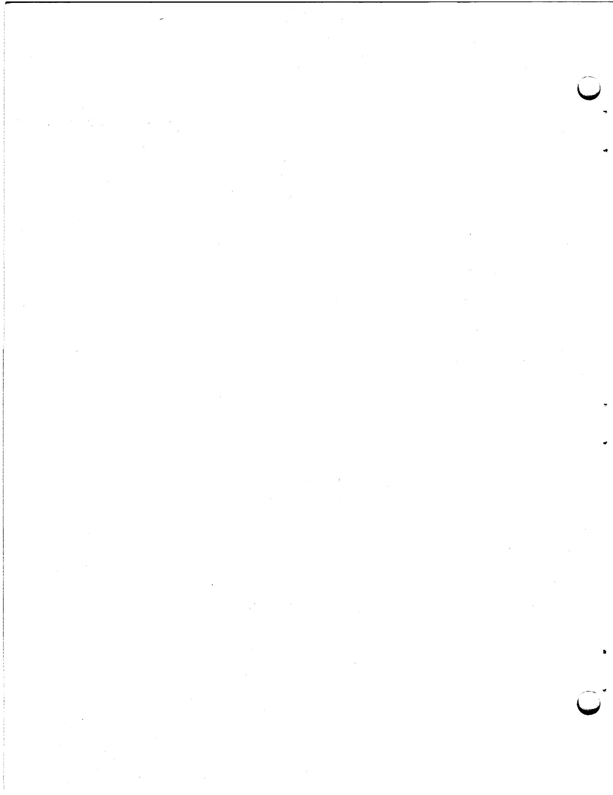
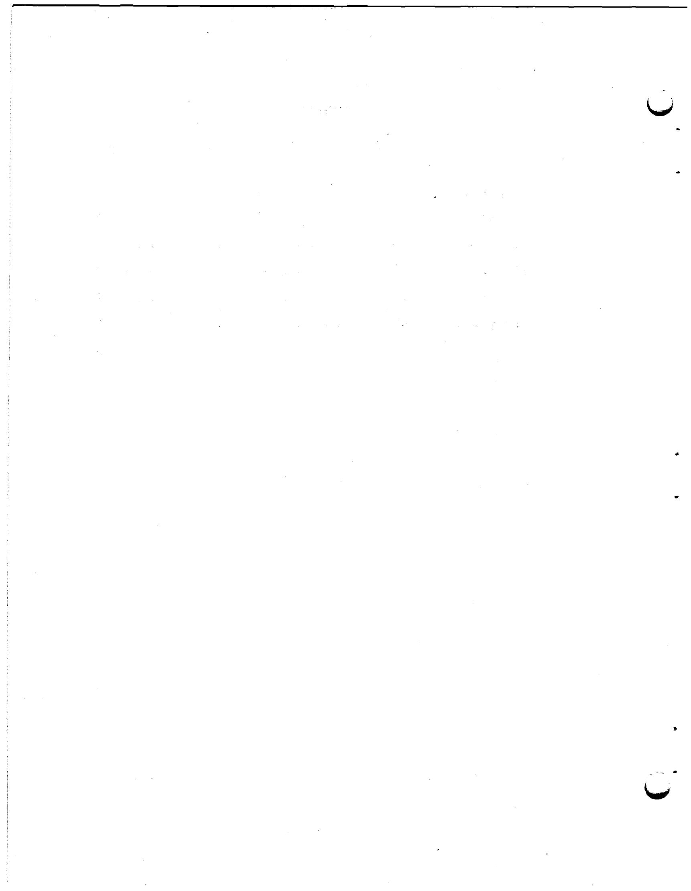
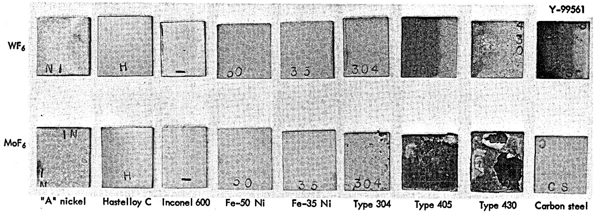
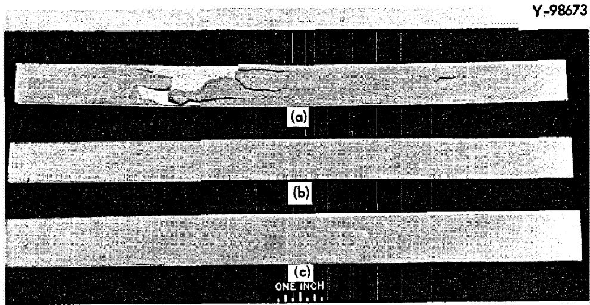
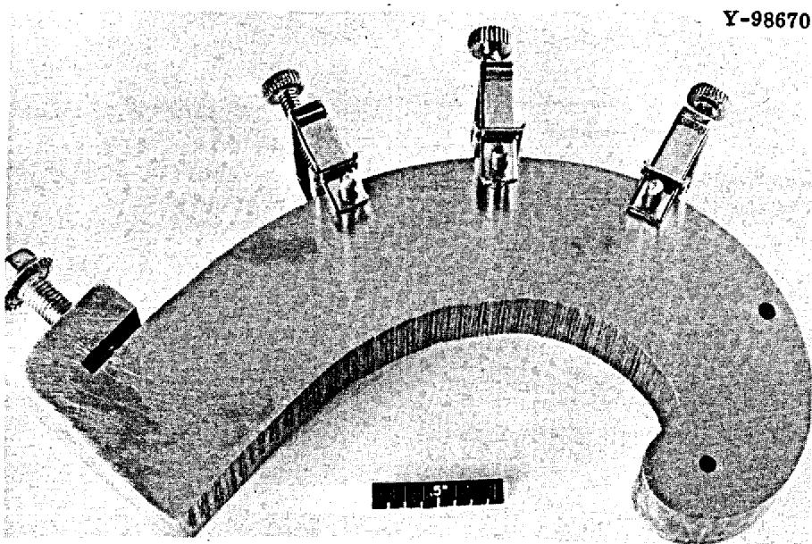
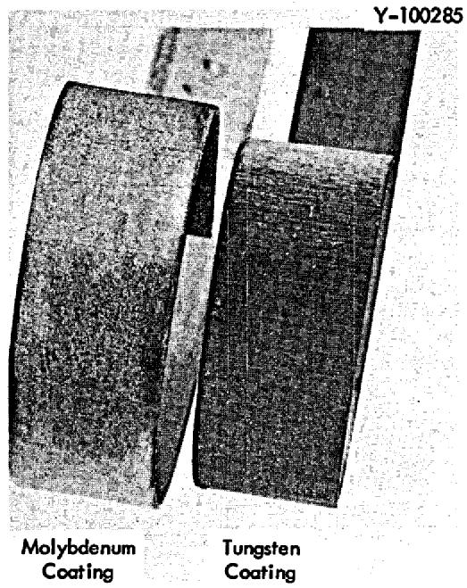
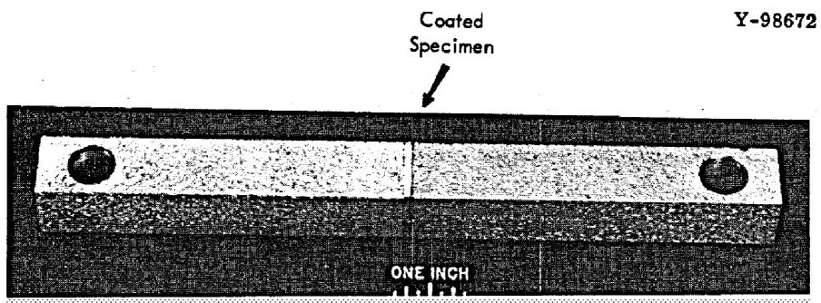
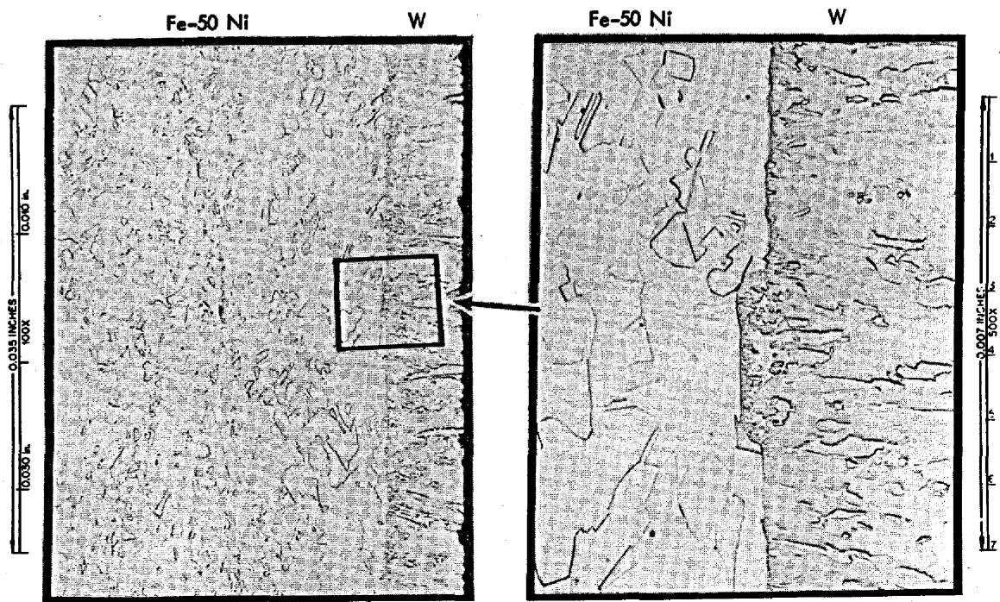

A STUDY OF THE ADHERENCE OF TUNGSTEN AND MOLYBDENUM COATINGS

J. I. Federer and L. E. Poteat

THIS DOCUMENT CONFIRMED AS UNCLASSIFIED

CLASSIFIED DIVISION OF CLASSIFICATION BY 0 H K A   
${9A} + {k\alpha }{D}_{1}{l}_{1}$

DATE

This report was prepared as an account of work sponsored by the United States Government. Neither the United States nor the United States Atomic Energy Commission, nor any of their employees, nor any of their contractors, subcontractors, or their employees, makes any warranty, express or implied, or assumes any legal liability or responsibility for the accuracy, completeness or usefulness of any information, apparatus, product or process disclosed, or represents that its use would not infringe privately owned rights.

ORNL-TM-3609

[\text{Cov} - {720410}\cdots 3]

Contract No. W-7405-eng-26

METALS AND CERAMICS DIVISION

A STUDY OF THE ADHERENCE OF TUNGSTEN AND MOLYBDENUM COATINGS

J. I. Federer and L. E. Poteat

Paper to be presented at the Third International Conference on Chemical Vapor Deposition, Salt Lake City, Utah, April 24-27, 1972, to be published in proceedings of meeting

DECEMBER 1971

# -NOTICE

This report was prepared as an account of work sponsored by the United States Government. Neither the United States nor the United States Atomic Energy Commission, nor any of their employees, nor any of their contractors, subcontractors, or their employees, makes any warranty, express or implied, or assumes any legal liability or responsibility for the accuracy, completeness or usefulness of any information, apparatus, product or process disclosed, or represents that its use would not infringe privately owned rights.

OAK RIDGE NATIONAL LABORATORY Oak Ridge, Tennessee 37830 operated by UNION CARBIDE CORPORATION for the U.S. ATOMIC ENERGY COMMISSION

# CONTENTS

Page

Abstract 1

Introduction 1

Coating Technique 1

Materials 2

Substrate Reactions 2

Preliminary Coating Results 3

Coating Adherence 5

Thermal Cycle Tests 5

Bend Tests 6

Tensile Tests 7

Conclusions 9

Acknowledgments 10

References 10

J. I. Federer and L. E. Poteat

# ABSTRACT

Tungsten and molybdenum coatings on iron- and nickel-base alloys are being investigated as a potential solution to the corrosion problem in Molten Salt Breeder Reactor reprocessing equipment. The adhesion of coatings applied by hydrogen reduction of $\mathsf{WF}_6$ and $\mathsf{MoF}_6$ has been evaluated. Displacement reactions between iron and chromium in the iron-base alloys and the $\mathsf{WF}_6$ and $\mathsf{MoF}_6$ prevented adhesion of the coatings. A thin nickel plate diffusion bonded to the iron-base alloys minimized side reactions and solved the adhesion problem. Both tungsten and molybdenum coatings remained intact after repeated thermal cycling between 25 and $600^{\circ}\mathsf{C}$ and during a spiral bend test. Tungsten coatings had tensile bond strengths up to 35,000 psi.

# INTRODUCTION

The purpose of this study was to develop a corrosion-resistant coating for Molten Salt Breeder Reactor fuel reprocessing equipment. The reprocessing scheme involves the extraction of uranium, protactinium, and rare-earth fission products from the molten fluoride salt fuel at 500 to $700^{\circ}\mathrm{C}$ with liquid bismuth containing lithium and thorium as reductants. The desired characteristics of the material of construction of the reprocessing equipment include fabricability, strength, resistance to air oxidation, and resistance to attack by liquid bismuth-lithium-thorium solution and molten fluoride salts. Alloys based on iron and nickel have many of the properties required for this application, but lack resistance to mass transfer in bismuth. On the other hand, tungsten and molybdenum, and certain alloys of these metals are resistant to corrosion by liquid bismuth, but are much more difficult to fabricate. A potential solution to this problem would be coatings of corrosion-resistant tungsten or molybdenum on the more easily fabricated iron- and nickel-base alloys.

In order to investigate this potential solution, tungsten and molybdenum coatings were deposited on several iron- and nickel-base alloy substrates. The adherence of the coatings to the substrates was evaluated by thermal cycling tests, bend tests, and tensile tests to determine their suitability for protecting the substrates.

# COATING TECHNIQUE

Tungsten and molybdenum coatings were deposited by hydrogen reduction of $\mathsf{WF}_6$ and $\mathsf{MoF}_6$ , respectively. Deposition temperatures were typically 500 to $600^{\circ}\mathsf{C}$ for tungsten and 800 to $900^{\circ}\mathsf{C}$ for molybdenum at a pressure of 5 to 10 torr. The specimens were coupons (3/4 by 2 in.) or strips (3/4 by 10 in.). These were positioned on edge in a furnace-heated tube and coated on both surfaces.

# MATERIALS

The substrate materials included in this study are shown in Table 1. These materials are representative of the numerous iron- and nickel-base alloys of commercial importance. The average coefficients of thermal expansion over the temperature range 25 to $600^{\circ}\mathrm{C}$ are compared with tungsten and molybdenum in Table 1. The closest match in thermal expansion between coating and substrate is obtained with the iron-nickel alloys, followed closely by the ferritic stainless steels (types 405, 430, and 442), while the greatest mismatch is obtained with type 304 stainless steel. At the outset of this study, the difference in thermal expansion between coating and substrate was considered to be a critical factor influencing adherence.

Table 1. Materials Included in Coating Study   

<table><tr><td rowspan="2">Materials</td><td colspan="5">Nominal Composition, %</td><td rowspan="2">α
(μ-in. in-1 °C-1)</td></tr><tr><td>Fe</td><td>Cr</td><td>Ni</td><td>W</td><td>Mo</td></tr><tr><td>Steel</td><td>99+</td><td></td><td></td><td></td><td></td><td>14.5</td></tr><tr><td>Type 304 stainless steel</td><td>74</td><td>18</td><td>8</td><td></td><td></td><td>18.5</td></tr><tr><td>Type 405 stainless steel</td><td>88</td><td>12</td><td></td><td></td><td></td><td>11.2</td></tr><tr><td>Type 430 stainless steel</td><td>84</td><td>16</td><td></td><td></td><td></td><td>11.2</td></tr><tr><td>Type 442 stainless steel</td><td>80</td><td>20</td><td></td><td></td><td></td><td>11.7</td></tr><tr><td>Fe-35% Ni</td><td>65</td><td></td><td>35</td><td></td><td></td><td>10.0</td></tr><tr><td>Fe-40% Ni</td><td>60</td><td></td><td>40</td><td></td><td></td><td>10.0</td></tr><tr><td>Fe-45% Ni</td><td>55</td><td></td><td>45</td><td></td><td></td><td>10.0</td></tr><tr><td>Fe-50% Ni</td><td>50</td><td></td><td>50</td><td></td><td></td><td>10.0</td></tr><tr><td>Nickel</td><td></td><td></td><td>99+</td><td></td><td></td><td>13.3</td></tr><tr><td>Hastelloy C</td><td>5</td><td>15</td><td>58</td><td>4</td><td>16</td><td>13.3</td></tr><tr><td>Inconel 600</td><td>9</td><td>16</td><td>75</td><td></td><td></td><td>15.3</td></tr><tr><td>Monela</td><td>1.5</td><td></td><td>67</td><td></td><td></td><td>17.8</td></tr><tr><td>Hastelloy N</td><td>5</td><td>7</td><td>70</td><td></td><td>16</td><td>14.1</td></tr><tr><td>Tungsten</td><td></td><td></td><td></td><td>100</td><td></td><td>4.6</td></tr><tr><td>Molybdenum</td><td></td><td></td><td></td><td></td><td>100</td><td>5.9</td></tr></table>

aAlso contains $30\%$ Cu.

# SUBSTRATE REACTIONS

The primary reactions of interest are those resulting in deposition of tungsten and molybdenum coatings by hydrogen reduction of $\mathsf{WF}_6$ and $\mathsf{MoF}_6$ , but reactions between components of the substrate and $\mathsf{WF}_6$ or $\mathsf{MoF}_6$ are also possible. The standard free energy of reaction of several possible reactions is shown in Table 2. The values in Table 2 indicate that displacement reactions between $\mathsf{WF}_6$ and iron, chromium, and nickel are all thermodynamically favorable, especially those leading to the formation of $\mathsf{FeF}_3$ and $\mathsf{CrF}_3$ . Similarly, in reactions involving $\mathsf{MoF}_6$ and the substrate, formation of $\mathsf{FeF}_3$ and $\mathsf{CrF}_3$ is thermodynamically favored. These secondary reactions are believed to be important factors controlling adherence of the coatings, as will be described.

Table 2. Substrate Reactions   

<table><tr><td></td><td>Temperature (°C)</td><td>\( \Delta {F}^{ \circ  } \) (kcal)</td></tr><tr><td>\( {\mathrm{{WF}}}_{6} + 3{\mathrm{H}}_{2} \rightarrow  \mathrm{W} + 6\mathrm{{HF}} \)</td><td>600</td><td>-138</td></tr><tr><td>\( {\mathrm{{MoF}}}_{6} + 3{\mathrm{H}}_{2} \rightarrow  \mathrm{{Mo}} + 6\mathrm{{HF}} \)</td><td>800</td><td>-54</td></tr><tr><td>\( {\mathrm{{WF}}}_{6} + \mathrm{{Fe}} \rightarrow  {\mathrm{{WF}}}_{4} + {\mathrm{{FeF}}}_{2} \)</td><td>600</td><td>-86</td></tr><tr><td>\( {\mathrm{{WF}}}_{6} + 2\mathrm{{Fe}} \rightarrow  \mathrm{W} + 2{\mathrm{{FeF}}}_{3} \)</td><td>600</td><td>-130</td></tr><tr><td>\( {\mathrm{{WF}}}_{6} + \mathrm{{Cr}} \rightarrow  {\mathrm{{WF}}}_{4} + {\mathrm{{CrF}}}_{2} \)</td><td>600</td><td>-98</td></tr><tr><td>\( {\mathrm{{WF}}}_{6} + 2\mathrm{{Cr}} \rightarrow  \mathrm{W} + 2{\mathrm{{CrF}}}_{3} \)</td><td>600</td><td>-190</td></tr><tr><td>\( {\mathrm{{WF}}}_{6} + \mathrm{{Ni}} \rightarrow  {\mathrm{{WF}}}_{4} + {\mathrm{{NiF}}}_{2} \)</td><td>600</td><td>-72</td></tr><tr><td>\( {\mathrm{{MoF}}}_{6} + \mathrm{{Fe}} \rightarrow  {\mathrm{{MoF}}}_{4} + {\mathrm{{FeF}}}_{2} \)</td><td>800</td><td>+11</td></tr><tr><td>\( {\mathrm{{MoF}}}_{6} + 2\mathrm{{Fe}} \rightarrow  \mathrm{{Mo}} + 2{\mathrm{{FeF}}}_{3} \)</td><td>800</td><td>-22</td></tr><tr><td>\( {\mathrm{{MoF}}}_{6} + \mathrm{{Cr}} \rightarrow  {\mathrm{{MoF}}}_{4} + {\mathrm{{CrF}}}_{2} \)</td><td>800</td><td>-4</td></tr><tr><td>\( {\mathrm{{MoF}}}_{6} + 2\mathrm{{Cr}} \rightarrow  \mathrm{{Mo}} + 2{\mathrm{{CrF}}}_{3} \)</td><td>800</td><td>-82</td></tr><tr><td>\( {\mathrm{{MoF}}}_{6} + \mathrm{{Ni}} \rightarrow  {\mathrm{{MoF}}}_{4} + {\mathrm{{NiF}}}_{2} \)</td><td>800</td><td>+25</td></tr></table>

# PRELIMINARY COATING RESULTS

Smooth tungsten coatings were obtained with a $\mathrm{H}_2 / \mathrm{WF}_6$ ratio in the range of 5 to 10. In the case of molybdenum coatings, the ratio had to be between 3 and 6. At lower ratios than 3 the substrates were attacked by $\mathrm{MoF}_6$ , and at higher ratios than 6 the coatings were nonuniform in thickness with a rough crystalline surface.

A visual assessment of the adherence of tungsten-coated specimens indicated that the coating was not adherent to carbon steel or the stainless steels. In fact, the coating cracked and separated from these materials during cooling from the deposition temperature. On the other hand, the coating was adherent to nickel, the iron-nickel alloys, and the nickel-base alloys. These early results showed a strong dependence of adherence on the composition of the substrate, and we suspected that the displacement reactions discussed in the previous section were responsible. A black powder occurred at the interface between nonadherent tungsten coatings and the substrates. This powder, which was identified as tungsten by x-ray diffraction, evidently prevented adhesion of the coating. Although no fluoride compounds were found, they may not have been present in sufficient amount to be detected.

Two tests were then performed to further evaluate the possibility of displacement reactions. Samples of various substrates were exposed to $\mathsf{WF}_6$ and to $\mathsf{MoF}_6$ at $900^{\circ}\mathsf{C}$ in the absence of hydrogen. Figure 1 shows the appearance of the samples. No reaction with $\mathsf{WF}_6$ was visually detected on the nickel, Hastelloy C, Inconel 600, Fe-50% Ni, and Fe-35% Ni samples. The other samples had a non-adherent tungsten coating which varied in luster from bright to gray. Samples exposed to $\mathsf{MoF}_6$ reacted more extensively. Again, no reaction could be visually detected on the nickel, Hastelloy C, and Inconel 600 samples, but all the other samples had nonadherent molybdenum coatings. These results definitely showed that $\mathsf{WF}_6$ and $\mathsf{MoF}_6$ undergo displacement reactions with iron-base alloys, but react much less, if at all, with nickel and nickel-base alloys.

Subsequently, we applied a 0.001-in.-thick nickel coating to several stainless steel specimens by electrodeposition, then bonded the nickel to the stainless steel by heating to $800^{\circ}\mathrm{C}$ in hydrogen. Afterwards, a 0.005-in.-thick coating of tungsten was applied to the specimens by chemical vapor deposition (CVD). The beneficial effect of the nickel underlayer on the adherence of the tungsten coating to type 430 stainless steel is shown in Fig. 2. The tungsten coating

  
Fig. 1. Reaction of $\mathsf{WF}_6$ and $\mathsf{MoF}_6$ with Iron- and Nickel-Base Alloys at $900^{\circ}\mathsf{C}$ .

  
Fig. 2. Typical Tungsten-Coated Specimens. (a) Type 430 stainless steel; coating cracked and separated. (b) Type 430 stainless steel; nickel-plated prior to coating. (c) Inconel 600.

cracked and separated from the specimen without the nickel underlayer, but was adherent to the specimen having the nickel underlayer. The Inconel 600 specimen, a nickel-base alloy, did not require a nickel underlayer for an adherent tungsten coating.

These preliminary results showed that tungsten coatings were adherent to nickel, the nickel-base alloys Inconel 600 and Hastelloy C, Fe-35% Ni, and Fe-50% Ni, and that a thin layer of electroplated nickel on stainless steels prevented or minimized displacement reactions which result in nonadherent coatings. The nickel layer, to be effective, had to be bonded to the substrate; bonding was accomplished by heating to about $800^{\circ}\mathrm{C}$ for a few minutes in hydrogen.

These results are in agreement with those of Bryant who related the adherence of tungsten coatings to the tendency of the substrate to react with $\mathsf{WF}_6$ to form fluoride compounds more stable than HF.1 Bryant found that tungsten coatings were adherent to molybdenum, copper, nickel, and cobalt in the temperature range 325 to $1290^{\circ}\mathrm{C}$ , but were not adherent to iron and chromium below about $1000^{\circ}\mathrm{C}$ .

# COATING ADHERENCE

In order to qualify as a corrosion-resistant coating, the coatings must be adherent to the substrates under stress. The adherence of tungsten coatings to various substrates was evaluated by thermal cycle tests, bend tests, and tensile tests. Molybdenum coatings were also subjected to the bend test.

# THERMAL CYCLE TESTS

Coated specimens for thermal cycle tests were Hastelloy C and Inconel 600 (10 × 0.875 × 0.073 in.) and nickel-plated type 304 and 430 stainless steels (10 × 0.75 × 0.042 in.). A 0.005-in.-thick coating of tungsten had been deposited on these specimens at 550°C, 5 torr, and a H₂/WF₆ ratio of 10. The specimens were inserted into the hot zone of a 600°C furnace tube, equilibrated for 15 min, then moved into the water-cooled zone (about 25°C) of the tube and equilibrated for 15 min. Visual and dye-penetrant inspection revealed no cracks in the coatings after 5 and 10 cycles. After 25 cycles a few cracks

were observed in the coating on one end of the type 304 stainless steel specimen, but the coating remained intact. No cracks, blisters, or separation of the coating were observed on the other specimens. After 50 cycles no other changes were observed in any of the specimens.

A 4-in.-long section of a $43/8$ -in.-ID Monel vessel that had been coated on the inner surface with a 0.010-in.-thick layer of tungsten was also thermal cycled between 25 and $600^{\circ}\mathrm{C}$ . After 25 cycles the coating was intact with no evidence of cracks or separation. The section was distorted out of round apparently due to the difference in thermal expansion between tungsten and Monel. Another 4-in.-long section was cycled 10 times between 25 and $1000^{\circ}\mathrm{C}$ . Substantially more distortion occurred in this case and the coating cracked in regions of greatest distortion; however, the coating did not spall. The distortion that occurred in the cylindrical sections is evidence of the adhesion between the coating and Monel substrate.

# BEND TESTS

Coated specimens were bent on the spiral bending jig shown in Fig. 3. The construction of the spiral jig has been discussed by Edwards.2 The equation of the spiral is $r = ae^{\theta /2}$ , where $r$ is the radius vector, $\theta$ is the angle of rotation, and $a$ is a constant. The radius of curvature, $\rho$ , is related to $r$ by the expression $\rho = br$ , where $b$ is another constant. The angle $\theta$ at which a crack formed in the coating could be determined from the jig, which was graduated in degrees. The radius of curvature could then be calculated. In this test the specimens were bent at an ever-decreasing radius of curvature down to a minimum radius of about $1/2$ in. Initially, the bend test was construed as a screening test. Lacking prior knowledge we expected that the coatings would be more adherent to some substrates than to others, and that the variation in adherence could be measured in terms of the radius of curvature at which separation of the coating occurred. The coatings were almost all so adherent, however, that very little differentiation between specimens was possible.

  
Fig. 3. Spiral Bending Jig.

Specimens for the bend test were 10 in. long by $3/4$ in. wide, coated on both sides. These were bent by hand at room temperature to conform to the curvature of the bending jig. Then the location of cracks in the coating was observed with the aid of a dye penetrant. Numerous lateral cracks occurred in the coatings, and the spacing between cracks decreased as the radius of curvature decreased. Although the coatings cracked during bending, only six coatings spalled. Spalling occurred only at the minimum radius of curvature, and, in four of the six cases, the specimens had been plated with Ni-8% P by the electroless process instead of being electroplated with nickel. Figure 4 shows typical cracks, but no spalling, in coatings on Inconel 600 specimens.

  
Fig. 4. Inconel 600 Bend Specimens Showing Cracks in the Coatings.

The radius of curvature at which the first crack occurred in the coating is shown in Table 3. The results are arranged so that substrates of the same thickness can be compared on the basis of coating type and coating thickness. Several slight trends in the data can be detected: (1) for a constant substrate thickness the radius of curvature at the first crack decreased with decreasing coating thickness; (2) for a constant coating thickness the radius of curvature decreased with decreasing substrate thickness; (3) for a given substrate and coating thickness molybdenum cracked at a smaller radius of curvature than tungsten; (4) electroplated nickel underlayers provided greater adherence than electroless nickel; and (5) tungsten coatings were less adherent to Hastelloy C than to Inconel 600.

# TENSILE TESTS

The bond strength between tungsten coatings and various substrates was further evaluated by tensile tests. Specimens coated on both sides were cut into $3/4$ by $3/4$ in. squares, then brazed between steel pull bars so that a tensile force could be applied perpendicular to the coating-substrate interface. A tensile test specimen is shown in Fig. 5. Brazing was accomplished by placing a 0.002-in.-thick sheet of copper between the surfaces to be joined, then loading the joint to about 500 psi. This assembly was induction heated to the

Table 3. Results of Bend Tests of Tungsten and Molybdenum Coated Specimens   

<table><tr><td rowspan="2">Substrate Material</td><td rowspan="2">Thickness Before Coating (in.)</td><td rowspan="2">Coating Thickness (in.)</td><td colspan="2">Radius of Curvature at First Crack, in.</td></tr><tr><td>Tungsten</td><td>Molybdenum</td></tr><tr><td>Hastelloy C</td><td>0.063</td><td>0.005</td><td>4.1</td><td></td></tr><tr><td>Inconel 600</td><td>0.063</td><td>0.005</td><td>4.2</td><td></td></tr><tr><td>Type 304 stainless steel (Ni)</td><td>0.063</td><td>0.004</td><td>4.1a,b</td><td>1.7a,b</td></tr><tr><td>Type 430 stainless steel (Ni)</td><td>0.063</td><td>0.004</td><td>4.1a,b</td><td>2.4a,b</td></tr><tr><td>Type 304 stainless steel (Ni)</td><td>0.063</td><td>0.002</td><td></td><td>0.9c</td></tr><tr><td>Type 430 stainless steel (Ni)</td><td>0.063</td><td>0.002</td><td></td><td>&lt;0.4c</td></tr><tr><td>Hastelloy C</td><td>0.032</td><td>0.008</td><td>3.2b</td><td></td></tr><tr><td>Inconel 600</td><td>0.032</td><td>0.006</td><td>3.1b</td><td></td></tr><tr><td>Hastelloy C</td><td>0.032</td><td>0.005</td><td>2.6b</td><td></td></tr><tr><td>Inconel 600</td><td>0.032</td><td>0.005</td><td>2.7,</td><td>2.6, 2.4d</td></tr><tr><td>Type 304 stainless steel (Ni)</td><td>0.032</td><td>0.003</td><td>1.5c</td><td></td></tr><tr><td>Type 430 stainless steel (Ni)</td><td>0.032</td><td>0.003</td><td>2.5c</td><td></td></tr><tr><td>Inconel 600</td><td>0.032</td><td>0.002</td><td></td><td>0.7</td></tr></table>

aNickel underlayer applied by the electroless method; contained 8% P.   
bCoating spalled at a radius of curvature of about 1 in.   
cElectroplated with nickel.   
d No cracks observed in the coating.

  
Fig. 5. Tensile Test Specimen.

brazing temperature in about 3 min, then rapidly cooled. Initially, the cross-sectional area of the specimens was 0.56 in.². When the limiting load (10,000 lb) of the jaws of the tensile machine was applied to an area of 0.56 in.² the stress was 17,800 psi. If the specimens sustained this stress, the cross-sectional area was usually decreased by machining so that the specimens could be stressed to a higher value.

The results of tensile tests on tungsten-coated specimens are shown in Table 4. The Hastelloy C specimen was not tested to failure after sustaining a stress of 17,800 psi. The Inconel 600, Fe-35% Ni, and Fe-50% Ni specimens each sustained a stress of 33,300 psi, but later fractured at 17,800, 36,800, and 35,500 psi, respectively, when the cross-sectional area was reduced.

Table 4. Results of Tensile Tests on Tungsten-Coated Specimens   

<table><tr><td>Substrate</td><td>Cross-Sectional Area(in.2)</td><td>Maximum Stress(psi)</td><td>Location of Fracture</td></tr><tr><td>Hastelloy C</td><td>0.563</td><td>17,800</td><td>No fracture</td></tr><tr><td rowspan="2">Inconel 600(a)</td><td>0.563</td><td>17,800</td><td>No fracture</td></tr><tr><td>0.300</td><td>33,300</td><td>No fracture</td></tr><tr><td>(b)</td><td>0.143</td><td>17,800</td><td>Braze and coating</td></tr><tr><td rowspan="2">Fe-35% Ni(a)</td><td>0.563</td><td>17,800</td><td>No fracture</td></tr><tr><td>0.300</td><td>33,300</td><td>No fracture</td></tr><tr><td>(b)</td><td>0.146</td><td>36,800</td><td>Coating</td></tr><tr><td rowspan="2">Fe-50% Ni(a)</td><td>0.563</td><td>17,800</td><td>No fracture</td></tr><tr><td>0.300</td><td>33,300</td><td>No fracture</td></tr><tr><td>(b)</td><td>0.156</td><td>35,500</td><td>Coating</td></tr><tr><td rowspan="2">Type 304 stain-less steel (Ni)(a)</td><td>0.563</td><td>17,800</td><td>No fracture</td></tr><tr><td>0.144</td><td>22,400</td><td>Braze and coating</td></tr><tr><td rowspan="2">Type 430 stain-less steel (Ni)(a)</td><td>0.563</td><td>17,800</td><td>No fracture</td></tr><tr><td>0.143</td><td>22,300</td><td>Braze and coating</td></tr><tr><td rowspan="2">Type 430 stain-less steel (Ni)(a)</td><td>0.563</td><td>17,800</td><td>No fracture</td></tr><tr><td>0.141</td><td>17,300</td><td>Braze and coating</td></tr></table>

aFirst retest of specimen after decreasing the cross-sectional area because of a 10,000 lb load limit on the jaws of the tensile machine.   
bSecond retest of specimen after another decrease in the cross-sectional area.

Types 304 and 430 stainless steel specimens finally fractured at about 17,000 and 22,000 psi after first sustaining a stress of 17,800 psi. In the two iron-nickel specimens the fracture occurred only in the coating, but in the other specimens the fracture also involved the copper braze metal. In the latter cases we were not able to determine whether fracture originated in the coating or in the braze metal. Our results were insufficient to precisely determine the bond strength, since the strength was probably affected by the quality of the braze joint and by cracks in the coating inadvertently caused by cutting the specimens to size for the tests. Figure 6 shows the coating substrate interface for a typical specimen. The high bond strength obtained in tensile tests is probably related to the cleanliness and lack of porosity at the interface.

# CONCLUSIONS

The results of this study allow the following conclusions. Tungsten and molybdenum coatings adhere tenaciously to nickel and nickel-base alloys as demonstrated by thermal cycle, bend, and tension tests. Coatings measuring about 0.005 in. thick would be expected to remain intact during repeated thermal cycling between 25 and $600^{\circ}\mathrm{C}$ and when bent to a radius of curvature as small as $1/2$ in. In addition, bond strengths should be about 20,000 psi or higher.

Y-100328

  
Fig. 6. Tungsten Coating on Fe-50% Ni Alloy.

Tungsten and molybdenum coatings are not adherent to stainless steels because of secondary substrate reactions; however, equivalent adherence can be obtained by nickel plating the stainless steels prior to coating.

# ACKNOWLEDGMENTS

The authors gratefully acknowledge the assistance of other members of the Oak Ridge National Laboratory staff: E. R. Turnbull, deposition experiments; C. W. Dollins, tensile tests; M. D. Allen, metallography; R. M. Steele, x-ray diffraction; W. R. Laing, chemical analyses; and C. B. Pollock, J. R. DiStefano, and W. R. Martin for critical review and helpful discussions.

# REFERENCES

1. W. A. Bryant, "The Adherence of Chemically Vapor Deposited Coatings," pp. 409-421 in Chemical Vapor Deposition 2nd Intern. Conf., ed. by J. M. Blocher, Jr., and J. C. Withers, The Electrochemical Society, New York, 1970.   
2. J. Edwards, "Spiral Bending Test for Electrodeposited Coatings," Trans. Inst. Met. Finishing 35, 101-106 (1958).

# INTERNAL DISTRIBUTION

1-3. Central Research Library

40. A. G: Grindell

4. ORNL - Y-12 Technical Library Document Reference Section

41. P. N. Haubenreich  
44. M. R. Hill

5-14. Laboratory Records Department

45. H. Inouye

15. Laboratory Records, ORNL RC

46. J. J. Keyes

16. ORNL Patent Office

47. J. W. Koger

17. G. M. Adamson, Jr.

48. M. I. Lundin

18. J. L. Anderson

49. H. G. MacPherson

19. C. F. Baes

50. R. E. MacPherson

20. E. S. Bettis

51. W. R. Martin

21. E. G. Bohlmann

52. H. E. McCoy

22. G. E. Boyd

53. L. E. McNeese

23. R. B. Briggs

54. R. L. Moore

24. F. L. Culler

55. E. L. Nicholson

25. J. E. Cunningham

56. A. M. Perry/J. R. Engel

26. J. H. Devan

61. L. E. Poteat

27. J. R. DiStefano

62. M. W. Rosenthal

28. S. J. Ditto

63. A. C. Schaffhauser

29. R. G. Donnelly

64. Dunlap Scott

30. W. P. Eatherly

65. R.E.Thoma

31-35. J. I. Federer

66. D. B. Trauger

36. D. E. Ferguson

67. J. R. Weir

37. L. M. Ferris

68. M. E. Whatley

38. J. H Frye, Jr.

69. J. C. White/A. S. Meyer

39. W. R. Grimes

70. Gale Young

# EXTERNAL DISTRIBUTION

71. R. E. Anderson, Space Nuclear Systems Office, AEC, Washington, DC 20545   
72. S. V. Arnold, Army Materials and Mechanics Research Center, Watertown Arsenal, Watertown, MA 02172   
73. G. M. Ault, NASA, Lewis Research Center, 21000 Brookpark Road, Cleveland, OH 44135   
74. R. D. Baker, Los Alamos Scientific Laboratory, P.O. Box 1663, Los Alamos, NM 87544   
75. R. W. Buckman, Westinghouse, Astronuclear Laboratory, P.O. Box 10864, Pittsburgh, PA 15230   
76. T. Bustard, Hitman Associates, 9190 Redbranch Road, Columbia, MD 21043   
77-78. E. G. Case, Director, Division of Reactor Standards, AEC, Washington, DC 20545   
79. W. T. Cave, Mound Laboratory, P.O. Box 32, Miamisburg, OH 45342   
80. D. F. Cope, RDT, SSR, AEC, Oak Ridge National Laboratory

81. Defense Materials Information Center, Battelle Memorial Institute, 505 King Avenue, Columbus, OH 43201   
82. A. R. DeGrazia, RDT, AEC, Washington, DC 20545   
83. David Elias, RDT, AEC, Washington, DC 20545   
84-88. Executive Secretary, Advisory Committee on Reactor Safeguards, AEC, Washington, DC 20545   
89. Ronald Feit, RDT, AEC, Washington, DC 20545   
90. J. E. Fox, RDT, AEC, Washington, DC 20545   
91. D. H. Gurinsky, Brookhaven National Laboratory, 29 Cornell Avenue, Upton, Long Island, NY 11973   
92. Norton Haberman, RDT, AEC, Washington, DC 20545   
93. G. N. Hatsopolous, Thermo Electron Corporation, 85 First Avenue, Waltham, MA 02154   
94. J. R. Hawthorne, Naval Research Laboratory, Code 6390, Department of the Navy, Washington, DC 20360   
95. E. E. Hoffman, Nuclear Systems Programs, General Electric Company, P.O. Box 15132, Cincinnati, OH 45215   
96. W. R. Holman, Lawrence Radiation Laboratory, P.O. Box 808, Livermore, CA 94550   
97. H. Jaffe, Space Nuclear Systems Office, AEC, Washington, DC 20545   
98. C. E. Johnson, Space Nuclear Systems Office, AEC, Washington, DC 20545   
99. R. Jones, RDT, AEC, Washington, DC 20545   
100. Haruo Kato, Bureau of Mines, Albany Metallurgy Research Center, P.O. Box 70, Albany, OR 97321   
101. Kermit Laughon, RDT, AEC, Oak Ridge National Laboratory   
102. G. Linkous, Teledyne Isotopes, 110 W. Timonium Road, Timonium, MD 21093   
103. A. P. Litman, Space Nuclear Systems Office, AEC, Washington, DC 20545   
104. P. Lustig, NASA, Lewis Research Center, 21000 Brookpark Road, Cleveland, OH 44135   
105. J. J. Lynch, NASA Headquarters, Code RN, 600 Independence Avenue, Washington, DC 20545   
106. I. Machlin, Bureau of Naval Weapons, Department of the Navy, Washington, DC 20360   
107. C. L. Matthews, RDT, AEC, OSR, Oak Ridge National Laboratory   
108. D. J. Maykuth, Battelle Memorial Institute, 505 King Avenue, Columbus, OH 43201   
109-110. T. W. McIntosh, RDT, AEC, Washington, DC 20545   
111. J. F. Mondt, Jet Propulsion Laboratory, 4800 Oak Grove Drive, Pasadena, CA 91103   
112-114. Peter A. Morris, Director, Division of Reactor Licensing, AEC, Washington, DC 20545   
115. W. Mott, Division of Isotopes Development, AEC, Washington, DC 20545   
116. J. Neff, RDT, AEC, Washington, DC 20545   
117. M. V. Nevitt, Argonne National Laboratory, 9700 S. Cass Avenue, Argonne, IL 60439   
118. E. C. Norman, RDT, AEC, Washington, DC 20545   
119. I. Perlmutter, Air Force Materials Laboratory, Wright-Patterson Air Force Base, OH 45433

120. J. A. Powers, Space Nuclear Systems Office, AEC, Washington, DC 20545   
121. L. Price, Space Nuclear Systems Office, AEC, Washington, DC 20545   
122. N. E. Promisel, Bureau of Naval Weapons, Department of the Navy, Washington, DC 20360   
123. N. T. Saunders, NASA, Lewis Research Center, 21000 Brookpark Road, Cleveland, OH 44135   
124. F. C. Schwenk, Space Nuclear Systems Office, AEC, Washington, DC 20545   
125. R. J. Schwinghamer, George C. Marshall Space Flight Center, Huntsville, AL 35812   
126. L. C. Shaheen, Thermo Electron Corporation, 85 First Avenue, Waltham, MA 02154   
127. M. Shaw, RDT, AEC, Washington, DC 20545   
128. Sidney Siegel, Atomics International, P.O. Box 309, Canoga Park, CA 91304   
129. J. M. Simmons, RDT, AEC, Washington, DC 20545   
130. M. T. Simnad, Gulf General Atomic, P.O. Box 608, San Diego, CA 92112   
131. D. Stoner, Westinghouse, Astronuclear Laboratory, P.O. Box 10864, Pittsburgh, PA 15236   
132. C. O. Tarr, Space Nuclear Systems Office, AEC, Washington, DC 20545   
133. Technical Library, Los Alamos Scientific Laboratory, P.O. Box 1663, Los Alamos, NM 87544   
134. Technical Library, Westinghouse, Atomic Power Division, P.O. Box 355, Pittsburgh, PA 15230   
135. G. Tummins, Climax Molybdenum Company, Ann Arbor, MI 48103   
136. R. E. Vallee, Mound Laboratory, P.O. Box 32, Miamisburg, OH 45342   
137. A. Van Echo, RDT, AEC, Washington, DC 20545   
138. M. J. Whitman, RDT, AEC, Washington, DC 20545   
139. Laboratory and University Division, AEC, Oak Ridge Operations   
140-141. Division of Technical Information Extension