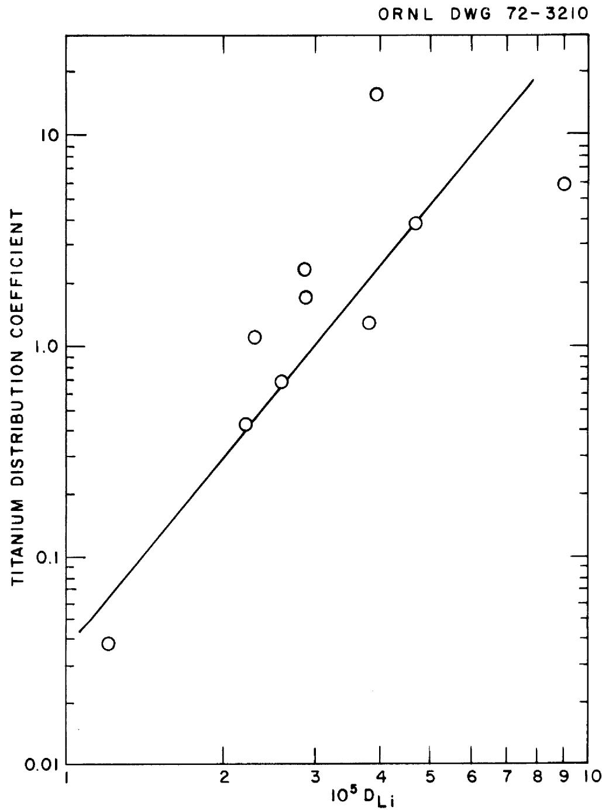

ORNL-TM- 3763

# ESTIMATED BEHAVIOR OF TITANIUM IN MSBR CHEMICAL PROCESSING SYSTEMS

L. M. Ferris

This report was prepared as an account of work sponsored by the United States Government. Neither the United States nor the United States Atomic Energy Commission, nor any of their employees, nor any of their contractors, subcontractors, or their employees, makes any warranty, express or implied, or assumes any legal liability or responsibility for the accuracy, completeness or usefulness of any information, apparatus, product or process disclosed, or represents that its use would not infringe privately owned rights.

Contract No. W-7405-eng-26

CHEMICAL TECHNOLOGY DIVISION

Chemical Development Section B

ESTIMATED BEHAVIOR OF TITANIUM IN MSBR CHEMICAL PROCESSING SYSTEMS

L. M. Ferris

APRIL 1972

# -NOTICE

This report was prepared as an account of work sponsored by the United States Government. Neither the United States nor the United States Atomic Energy Commission, nor any of their employees, nor any of their contractors, subcontractors, or their employees, makes any warranty, express or implied, or assumes any legal liability or responsibility for the accuracy, completeness or usefulness of any information, apparatus, product or process disclosed, or represents that its use would not infringe privately owned rights.

OAK RIDGE NATIONAL LABORATORY

Oak Ridge, Tennessee 37830

operated by

UNION CARBIDE CORPORATION

for the

U.S. ATOMIC ENERGY COMMISSION

# CONTENTS

Page Abstract 1

1. Introduction 1   
2. Thermodynamic Treatment 2   
3. Leaching of Titanium from Titanium-Modified Hastelloy into MSBR Fuel Salt 4   
4. Estimated Behavior of Titanium During Fluorination of MSBR Fuel Salt 5   
5. Behavior of Titanium in Reductive Extraction Processing 6   
6. Estimated Behavior of Titanium During Hydrofluorination 9   
7. Behavior of Titanium in Oxide Precipitation Processes 13   
8. Acknowledgments 13   
9. References 14

#

# ESTIMATED BEHAVIOR OF TITANIUM IN MSBR CHEMICAL PROCESSING SYSTEMS

L. M. Ferris

# ABSTRACT

Available thermodynamic information was used to estimate the behavior of titanium in a fluorination--reductive extraction flowsheet for processing MSER fuel salt. It was first shown that titanium is likely to be leached from a titanium-modified Hastelloy N containment vessel into a LiF-BeF $_2$ -ThF $_4$ -UF $_4$ fuel salt at $600^{\circ}\mathrm{C}$ . The primary reaction would probably be $3\mathrm{UF}_4(\mathrm{d}) + \mathrm{Ti}(\mathrm{Hastelloy}) = \mathrm{TiF}_3(\mathrm{d}) + 3\mathrm{UF}_3(\mathrm{d})$ . The estimates showed that, during fluorination, TiF $_3$ would be oxidized to TiF $_4$ . A large fraction of the TiF $_4$ would be expected to volatilize during fluorination. Any titanium not volatilized by fluorination would be present in the salt that enters the reductive extraction step. Experimental data confirmed the prediction that titanium would be practically quantitatively extracted from the salt in this step. It was also shown that titanium can be transferred from a bismuth phase to a salt phase by oxidation with gaseous HF, and that HF is not a sufficiently strong oxidant to convert TiF $_3$ to TiF $_4$ .

KEY WORDS: *MSBR, *Processing, *Modified Hastelloy N, *Titanium, fused salts, fluorination, reductive extraction process.

# 1. INTRODUCTION

Hastelloy N (68% Ni--17% Mo--7% Cr--5% Fe) was used1 for the containment vessel and other metallic components in the Molten-Salt Reactor Experiment (MSRE). However, use of a modified Hastelloy containing up to 2 wt % titanium is being considered1 for molten-salt breeder reactors (MSBRs) since an alloy of this type is expected to be more resistant to radiation embrittlement than Hastelloy N.2 In the event that a suitable alloy is developed, it is of interest to know what extent titanium will be leached from the alloy into the molten salt and, if the extent of

leaching is significant, how titanium will behave in an MSBR chemical processing system. The present reference flowsheet $^{2,3}$ for chemically processing an MSBR involves, first, fluorinating the salt to remove uranium as $\mathrm{UF}_6$ and, then, contacting the resultant salt with liquid bismuth containing about 0.002 mole fraction each of lithium and thorium to remove protactinium by reductive extraction. The rare earths remain in the salt during these process steps and are removed in a subsequent metal transfer process. Protactinium and other elements extracted into bismuth will subsequently be transferred to a salt phase by hydrofluorination of the bismuth in the presence of the salt. The purpose of this report is to estimate the behavior of titanium both in the reactor system and in the various chemical processing steps. The estimates, which were made using the general thermodynamic treatment developed by Baes, $^{4}$ could be compared, in some cases, directly with experimental results.

# 2. THERMODYNAMIC TREATMENT

$\mathrm{Baes}^4$ has summarized a large amount of equilibrium data involving molten $\mathrm{LiF - BeF}_2$ solutions in terms of standard half-cell potentials $(E^{\circ})$ referred to the reaction $\mathrm{HF(g)} + \mathrm{e}^{-} = \mathrm{F}^{-}(d) + 1 / 2\mathrm{H}_{2}(\mathrm{g})$ , for which $E^{\circ}$ is defined as zero at all temperatures; (g) and (d) denote gaseous and dissolved species, respectively. The standard state for most solutes is the hypothetical unit mole fraction ideal solution in $\mathrm{LiF - BeF}_2$ (66.7-33.3 mole%). The exceptions are LiF, $\mathrm{BeF}_2$ , $\mathrm{Be}^{2+}$ , $\mathrm{Li}^+$ , and $\mathrm{F}^-$ ; the activity of each of these species is defined as unity in the reference salt composition. With $\mathrm{LiF - BeF}_2$ (66.7-33.3 mole%) as the standard state, the activity coefficients for solutes are unity, whereas $\gamma_{\mathrm{LiF}} = 1.5$ and $\gamma_{\mathrm{BeF}_2} = 3$ ,

The potential for a complete reaction is obtained by algebraically adding the necessary half-cell reaction potentials. For example, at $600^{\circ}\mathrm{C}$ the equilibrium of pure crystalline chromium metal with $\mathsf{U}^{4+}$ dissolved in $\mathsf{LiF - BeF}_2$ (66.7-33.3 mole %) can be expressed as the algebraic sum of the two half-cell reactions:

$$
\operatorname {C r} _ {(c)} = \operatorname {C r} ^ {2 +} + 2 e ^ {-}; \quad E ^ {\circ} = 0. 4 \mathrm {V} \tag {1}
$$

$$
2 U ^ {4 +} + 2 e ^ {-} = 2 U ^ {3 +}; \quad E ^ {\circ} = - 1. 1 4 6. V \tag {2}
$$

$$
\mathrm {C r} (\mathrm {c}) + 2 \mathrm {U} ^ {4 +} = \mathrm {C r} ^ {2 +} + 2 \mathrm {U} ^ {3 +}; \quad \mathrm {E} ^ {\circ} = - 0. 7 4 6 \mathrm {V} \tag {3}
$$

The standard free energy change for reaction (3) is:

$$
\Delta G ^ {\circ} = - z F E ^ {\circ} = (- 2. 3 R T) \log K, \tag {4}
$$

in which $z$ is the number of faradays, $F$ is the Faraday constant, $R$ is the gas constant, $T$ is the absolute temperature, and $K$ is the equilibrium constant. For our purposes, we will assume that $E^0$ values (and $K$ 's derived from them) are the same in $LiF-BeF_2-ThF_4$ (72-16-12 mole %), the composition of the MSBR carrier salt, as they are in $LiF-BeF_2$ (66.7-33.3 mole %). All estimates included in this report were made at $600^{\circ}C$ .

The electrochemical behavior of titanium species in molten fluoride salts has been studied voltammetrically by Manning. From this work, Manning estimates the following at $600^{\circ}\mathrm{C}$ :

$$
\mathrm {T i} ^ {3 +} + 3 / 2 \mathrm {N i} _ {(c)} = \mathrm {T i} _ {(c)} + 3 / 2 \mathrm {N i} ^ {2 +}; \quad E ^ {\circ} = - 1. 8 \pm 0. 1 \mathrm {V} \tag {5}
$$

$$
\mathrm {T i} ^ {4 +} + 1 / 2 \mathrm {N i} _ {(c)} = \mathrm {T i} ^ {3 +} + 1 / 2 \mathrm {N i} ^ {2 +}; \quad \mathrm {E} ^ {\circ} = 0. 2 \pm 0. 0 5 \mathrm {V} \tag {6}
$$

Combining Eq. (5) with

$$
3 / 2 \mathrm {N i} ^ {2 +} + 3 \mathrm {e} ^ {-} = 3 / 2 \mathrm {N i} _ {\left(\mathrm {c}\right)} \quad ; \quad \mathrm {E} ^ {\circ} = 0. 3 6 8 \mathrm {V} \tag {7}
$$

yields

$$
\mathrm {T i} ^ {3 +} + 3 \mathrm {e} ^ {-} = \mathrm {T i} _ {(c)} \quad ; \quad \mathrm {E} ^ {\circ} = - 1. 4 3 \pm 0. 1 \mathrm {V}. \tag {8}
$$

Similarly, from Eqs. (6) and (7) we obtain:

$$
\mathrm {T i} ^ {3 +} = \mathrm {T i} ^ {4 +} + e ^ {-}; \quad E ^ {\circ} = - 0. 5 6 8 \pm 0. 0 5 \mathrm {V}. \tag {9}
$$

Use of Eqs. (8) and (9), along with values of $\mathbb{E}^{\circ}$ for other appropriate half-cell reactions, allows estimation of the behavior of titanium in a molten-salt reactor system and in the associated chemical processing plant.

# 3. LEACHING OF TITANIUM FROM TITANIUM-MODIFIED HASTELLOY INTO MSBR FUEL SALT

The question of whether titanium will be leached from a modified Hastelloy into an MSBR fuel salt at a significant rate is a difficult one to answer since the overall rate of leaching would depend both on the rate at which titanium diffuses to the surface of the alloy and on the oxidizing power of the salt. Of the species present in the salt, $\mathrm{U}^{4+}$ is the most likely oxidant for titanium. The reaction would probably be:

$$
\mathrm {T i} _ {\left(\mathrm {c}\right)} + 3 \mathrm {U} ^ {4 +} = 3 \mathrm {U} ^ {3 +} + \mathrm {T i} ^ {3 +}; \quad \mathrm {E} ^ {\circ} = 0. 2 8 6 \pm 0. 1 \mathrm {V}, \tag {10}
$$

for which $\log K = 4.94 \pm 1.7$ , since the reaction producing $\mathrm{Ti}^{4+}$ , given below, is thermodynamically much less favorable:

$$
\mathrm {T i} (\mathrm {c}) + 4 \mathrm {U} ^ {4 +} = 4 \mathrm {U} ^ {3 +} + \mathrm {T i} ^ {4 +}; \quad \mathrm {E} ^ {\circ} = - 0. 2 8 2 \pm 0. 1 5 \mathrm {V}. \tag {11}
$$

The value of log K for reaction (11) is $-6.5 \pm 3$ . Comparison of the E° for reaction (10) with that of reaction (3) confirms earlier predictions8 that titanium would be much more reactive than chromium to oxidants in the fuel salt. Despite the fact that the thermodynamic driving force for the leaching of titanium from a modified Hastelloy N is much greater than that for the leaching of chromium, it is nearly impossible to estimate the thermodynamic activity of titanium at the surface of the alloy. Not only will the concentration of titanium in the bulk alloy be less than one-third of that of chromium (about $2\%$ vs $7\%$ ) but also the diffusion coefficient for titanium in Hastelloy N is about a factor of 10 lower

than that for chromium. $^{7}$ Thus, the titanium activity at the Hastelloy surface at a given time should be considerably lower than the chromium activity. Only direct experimentation can show whether the activity is low enough to offset the large driving force represented by the $E^{\circ}$ for reaction (10).

An experimental study conducted several years ago by DeVan and Evans8 provided evidence that titanium might be leached from Hastelloy N at a higher rate than chromium. In their studies, cast alloys of Ni--17% Mo containing up to 8 wt % of an additive were made into tubing from which thermal convection loops were fabricated. These loops were exposed to NaF-LiF-KF-UF4 (11,2-45.3-41.0-2.5 mole %) for 500 and 1000 hr. The hot-zone temperature of each loop was 815°C, and the cold-zone temperature was 650°C. After each test, the salt was chemically analyzed for the additive. The corrosion susceptibilities (i.e., the amount leached) of the additives increased in the following order: iron < niobium < vanadium < chromium < tungsten < titanium < aluminum. With the exception of tungsten and niobium, the susceptibilities increased in the same order as did the thermodynamic stabilities of the fluoride compounds of the respective elements. It is significant to note that the rate of leaching was much higher during the 500-hr period than during the 1000-hr period. This result suggests that nearly steady-state conditions were established within the first 500 hr.

# 4. ESTIMATED BEHAVIOR OF TITANIUM DURING FLUORINATION OF MSBR FUEL SALT

In this and the ensuing sections, it will be assumed that titanium is present in measurable concentrations in MSBR fuel salt that enters the chemical processing plant. As noted in Sect. 1, the first chemical processing step is fluorination of the salt to remove uranium as UF $_6$ . Fluorination should result in the quantitative oxidation of Ti $^{3+}$ to Ti $^{4+}$ :

$$
\mathrm {T i} ^ {3 +} + 1 / 2 \mathrm {F} _ {2 (\mathrm {g})} = \mathrm {T i} ^ {4 +} + \mathrm {F} ^ {-}; \quad \mathrm {E} ^ {\circ} = 2. 3 0 \pm 0. 1 \mathrm {V}, \tag {12}
$$

for which $\log K = 13 \pm 1$ . Reaction (12) can also be written as:

$$
\mathrm {T i F} _ {3 (\mathrm {d})} + 1 / 2 \mathrm {F} _ {2 (\mathrm {g})} = \mathrm {T i F} _ {4 (\mathrm {d})}. \tag {13}
$$

Since the boiling point of $\mathrm{TiF_4}$ is only about $284^{\circ}\mathrm{C},$ it is probable that a significant fraction of the titanium would be removed from the salt as $\mathrm{TiF_4}$ during fluorination and would accompany evolved $\mathrm{UF_6}$ to the fuel reconstitution step. An example of the inherent tendency of $\mathrm{TiF_4}$ to volatilize from fluoride melts is provided by the experience of Manning et al. $^{10}$ They found that, after $\mathrm{K_2TiF_6}$ was added to molten LiF-NaF-KF or $\mathrm{LiF - BeF_2 - ZrF_4}$ solutions at $550^{\circ}\mathrm{C}$ , $\mathrm{TiF_4}$ volatilized from the melt and condensed on cooler parts of the system.

# 5. BEHAVIOR OF TITANIUM IN REDUCTIVE EXTRACTION PROCESSING

Any titanium not removed during fluorination will be present in the salt that enters the reductive extraction step $^{2,3}$ for protactinium isolation. In this step, the salt is contacted with a liquid bismuth stream containing about 0.002 mole fraction each of lithium and thorium. Protactinium, residual uranium from the fluorination step, zirconium, and some of the noble-metal fission products are transferred to the bismuth phase in this step.

The extraction into liquid bismuth of a solute $\mathbf{MF}_n$ , present in low concentration in molten LiF-containing salts, can be expressed as the general reaction:

$$
\mathrm {M F} _ {\mathrm {n} (\mathrm {d})} + \mathrm {n L i} _ {(\mathrm {B i})} = \mathrm {M} _ {(\mathrm {B i})} + \mathrm {n L i F} (\mathrm {d}) \quad , \tag {14}
$$

in which (d) and (Bi) denote the salt and bismuth phases, respectively. This reaction is the sum of the half-reactions

$$
M ^ {n +} + n e ^ {-} = M \tag {15}
$$

$$
n L i = n L i ^ {+} + n e ^ {-}. \tag {16}
$$

The standard potential for reaction (14), i.e. the algebraic sum of the potentials for reactions (15) and (16), is related to the equilibrium constant as follows:

$$
K = \frac {a _ {M} a _ {L i F} ^ {n}}{a _ {M F n} a _ {L i} ^ {n}} = e ^ {\left(n F E ^ {\circ} / R T\right)} \tag {17}
$$

in which a is activity and the other symbols are as defined previously. By letting $\mathbf{a} = \mathbf{N}\gamma$ (where $\mathbf{N}$ is mole fraction and $\gamma$ is an activity coefficient) and by defining the distribution coefficient for a given element as $D_{\mathrm{M}} = N_{\mathrm{M}} / N_{\mathrm{MF}_{\mathrm{n}}}$ , it was shown by Ferris11 that

$$
\begin{array}{l} \log K _ {M} ^ {\prime} = \log D _ {M} - n \log D _ {L i} = (n F E ^ {\circ} / 2. 3 R T) + n \log (\gamma_ {L i} / \gamma_ {L i F}) \\ - \log \left(\gamma_ {\mathrm {M}} / \gamma_ {\mathrm {L i F}}\right) \quad . \tag {18} \\ \end{array}
$$

With LiF-BeF $_2$ (66.7-33.3 mole %) as the salt phase, Baes $^4$ defined $\gamma_{\mathrm{LiF}} = 1.5$ and $\gamma_{\mathrm{MF}_n} = 1$ . Thus,

$$
\log K _ {M} ^ {\prime} = \left(n F E ^ {\circ} / 2. 3 R T\right) + n \log \gamma_ {L i} - n \log (1. 5) - \log \gamma_ {M}; \tag {19}
$$

or, at $600^{\circ}C$

$$
\log \mathrm {K} _ {\mathrm {M}} ^ {\prime} = n (5. 7 7 3) \mathrm {E} ^ {\circ} - 0. 1 7 6 n + n \log \gamma_ {\mathrm {L i}} - \log \gamma_ {\mathrm {M}}. \tag {20}
$$

In order to calculate $\log \mathrm{K_M}$ for a given element, we obviously need values of the activity coefficients $\gamma_{\mathrm{Li}}$ and $\gamma_{\mathrm{M}}$ that are referred to the pure metals as the standard state, in addition to the appropriate $\mathbf{E}^{\circ}$ values. Values of $\mathbf{E}^{\circ}$ for a large number of solutes are available from Baes; those for titanium species were estimated by Manning. Values of $\gamma_{\mathrm{Li}}$ and $\gamma_{\mathrm{M}}$ for several solutes were taken from the literature and were summarized by Ferris et al. These values of $\gamma_{\mathrm{Li}}$ and $\gamma_{\mathrm{M}}$ are for very dilute solutions of M in liquid bismuth. No information on the activity

coefficient of titanium in liquid bismuth could be found in the literature. Thus we will assume that $\gamma_{\mathrm{Ti}}$ is equal to $\gamma_{\mathrm{Zr}}$ . Workers at Brookhaven National Laboratory obtained13 $\gamma_{\mathrm{Zr}} = 0.012$ at $700^{\circ}\mathrm{C}$ . If we assume that the excess chemical potential $\mu_{\mathrm{Zr}}^{\mathrm{E}} = (2.3\mathrm{RT})$ log $\gamma_{\mathrm{Zr}}$ does not change throughout the temperature range $600 - 700^{\circ}\mathrm{C}$ , we can calculate $\log \gamma_{\mathrm{Zr}} = \log \gamma_{\mathrm{Ti}} = -2.1 \pm 1$ at $600^{\circ}\mathrm{C}$ .

From the above sources, we obtain $E^{\circ} = 1.224 \pm 0.1 \mathrm{~V}$ at $600^{\circ} \mathrm{C}$ for the reaction

$$
\mathrm {T i F} _ {3 (d)} + 3 \mathrm {L i} _ {(c)} = 3 \mathrm {L i F} (d) + \mathrm {T i} (c) \tag {21}
$$

and, using Eq. (20), estimate log $\mathrm{K}_{\mathrm{Ti}}^{'}3^{+} = 10.4 \pm 2$ with LiF-BeF $_2$ (66.7-33.3 mole %) as the salt phase. Table 1 compares this value and the values for other selected solutes with values obtained experimentally using LiF-BeF $_2$ -ThF $_4$ (72-16-12 mole %) as the salt phase. The values of log $\mathrm{K}_{\mathrm{Zr}}'$ and log $\mathrm{K_U}$ are those measured earlier by Ferris et al., $^{14}$ whereas the value of log $\mathrm{K}_{\mathrm{Ti}}'$ was determined in the course of the present work. Note that the values of log $\mathrm{K_M}$ obtained for LiF-BeF $_2$ -ThF $_4$ (72-16-12 mole %) are somewhat higher than those calculated for LiF-BeF $_2$ (66.7-33.3 mole %).

Table 1. Comparison of Values of log ${\mathrm{K}}_{\mathrm{M}}^{\prime }$ Calculated for LiF-BeF ${}_{2}$ (66.7-33.3 mole %) with Those Determined Experimentally at ${600}^{ \circ  }\mathrm{C}$ for LiF-BeF ${}_{2}$ -ThF ${}_{4}$ (72-16-12 mole %)   

<table><tr><td>M</td><td>n</td><td>log γM</td><td>E°(V)</td><td>calculated forLiF-BeF2(66.7-33.3 mole %)</td><td>Measured withLiF-BeF2-ThF4(72-16-12 mole %)</td></tr><tr><td>Li</td><td>1</td><td>-4.13</td><td>-</td><td>-</td><td>-</td></tr><tr><td>Zr</td><td>4</td><td>-2.1</td><td>1.226</td><td>13.2 ± 1</td><td>14.7 ± 0.3</td></tr><tr><td>U</td><td>3</td><td>-3.87</td><td>1.143</td><td>10.7 ± 1</td><td>11.1 ± 0.2</td></tr><tr><td>Ti</td><td>3</td><td>-2.1</td><td>1.224</td><td>10.4 ± 2</td><td>13.6 ± 0.4</td></tr></table>

The experiment to determine the value of $\log \mathrm{K}_{\mathrm{Tj}}$ was conducted using the general procedure outlined previously. $^{14}$ This experiment was initiated by simultaneously hydrofluorinating, in a molybdenum crucible, $\mathrm{LiF - BeF_2 - ThF_4 - CsF}$ (71.7-15.9-12-0.4 mole %) and bismuth containing dissolved titanium. This treatment resulted not only in the transfer of the titanium to the salt phase but also in the removal of oxide from the system. With the system at $600^{\circ}\mathrm{C}$ , thorium was added in increments to effect the reductive extraction of titanium from the salt into the bismuth phase. At least $2^{4}$ hr was allowed for equilibration after each thorium addition before filtered samples of the respective phases were removed for analysis. The salt and metal samples were analyzed for titanium by a colorimetric method; the lithium concentration in the metal phase was determined by flame photometry.

Data from this experiment are summarized in Table 2, and a plot of log $\mathrm{D_{Ti}}$ vs $\log \mathrm{D_{Li}}$ is shown in Fig. 1. The scatter in data points precludes determination of the value of n. However, thermodynamic considerations (Sect. 6) strongly indicate that n should be 3 (and not 4). The value of $\log \mathrm{K_{Ti}^{\prime}3^{+}} = 13.6 \pm 0.4$ is the mean of the values calculated from each data point. This value is somewhat higher than the estimated value (Table 1); however, the agreement is good, considering the uncertainties in the thermodynamic quantities used. Furthermore, the experimentally determined value of $\log \mathrm{K_{Ti}^{\prime}3^{+}}$ is consistent with the results of an earlier experiment by Moulton et al.,[15] which indicated that $\log \mathrm{K_{Ti}^{\prime}3^{+}}$ should be greater than $\log \mathrm{K_{U}3^{+}}$ . In their experiment, it was found that titanium dissolved in bismuth did not effect detectable reduction of either $\mathrm{U}^{3+}$ or $\mathrm{Pa}^{4+}$ from $\mathrm{LiF - BeF_2 - ThF_4}$ (72-16-12 mole %) at 600 to $700^{\circ}\mathrm{C}$ .

During the chemical processing of MSBR fuel salt, it appears certain that titanium, if present in the salt entering the reductive extraction step, will be quantitatively extracted into the bismuth stream along with protactinium and other easily reduced species.

# 6. ESTIMATED BEHAVIOR OF TITANIUM DURING HYDROFLUORINATION

In the reference MSBR chemical processing method, $^{2,3}$ the bismuth phase from the reductive extraction step used to isolate protactinium would be treated with an $\mathrm{HF - H_2}$ mixture in the presence of a salt phase

Table 2. Distribution Coefficients and Values of log ${\mathrm{K}}_{\mathrm{{Ti}}}^{\prime }3 +$ Obtained at ${600}^{ \circ  }\mathrm{C}$ from Measurements of the Equilibrium Distribution of Titanium Between Molten LiF-BeF ${}_{2} - {\mathrm{{ThF}}}_{4} - \mathrm{{CsF}}$ (71.7-15.9-12-0.4 mole %) and Liquid Bismuth Solutions   

<table><tr><td>Sample</td><td>106NLi</td><td>105DLi</td><td>DTi</td><td>log K&#x27;Ti3+</td></tr><tr><td>3</td><td>8.73</td><td>1.218</td><td>0.038</td><td>13.3</td></tr><tr><td>6</td><td>16.0</td><td>2.226</td><td>0.435</td><td>13.6</td></tr><tr><td>7</td><td>18.7</td><td>2.604</td><td>0.695</td><td>13.6</td></tr><tr><td>8</td><td>16.6</td><td>2.310</td><td>1.06</td><td>13.9</td></tr><tr><td>9</td><td>27.4</td><td>3.822</td><td>1.31</td><td>13.4</td></tr><tr><td>10</td><td>20.8</td><td>2.898</td><td>1.76</td><td>13.8</td></tr><tr><td>11</td><td>20.5</td><td>2.856</td><td>2.33</td><td>14.0</td></tr><tr><td>12</td><td>33.7</td><td>4.704</td><td>3.88</td><td>13.6</td></tr><tr><td>13</td><td>65.0</td><td>9.072</td><td>5.94</td><td>12.9</td></tr><tr><td>14</td><td>28.3</td><td>3.948</td><td>15.7</td><td>14.4</td></tr></table>

  
Fig. 1. Equilibrium Distribution of Titanium Between Molten LiF-BeF $_2$ -ThF $_4$ -CsF (71.7-15.9-12-0.4 mole %) and Liquid Bismuth Solutions at $600^{\circ}\mathrm{C}$ .

to oxidize protactinium and other elements present in order to effect their dissolution in the salt phase. Since titanium could be one of the elements initially present in the bismuth phase, its behavior during hydrofluorination is of interest.

The reaction of primary interest is:

$$
3 \mathrm {H F} (\mathrm {g}) + \mathrm {T i} (\mathrm {c}) = 3 / 2 \mathrm {H} _ {2 (\mathrm {g})} + \mathrm {T i F} _ {3 (\mathrm {d})}; \quad \mathrm {E} ^ {\circ} = 1. 4 3 \pm 0. 1 \mathrm {V}, \tag {22}
$$

for which $\log K = 25 \pm 2$ at $600^{\circ}C$ . Despite the fact that the activity coefficient for titanium in liquid bismuth is of the order of $10^{-2}$ , thermodynamic considerations led us to expect titanium to be easily hydrofluorinated from a bismuth phase into a molten fluoride salt phase. This expectation was confirmed (at least under one set of conditions) in the initial phase of the experiment described in Sect. 5. In this experiment, bismuth and $\mathrm{LiF - BeF_2 - ThF_4 - CsF}$ (71.7-15.9-12-0.4 mole %), contained in a molybdenum crucible, were simultaneously hydrofluorinated at $600^{\circ}C$ to remove oxides from the system. After sparging with purified argon, sufficient titanium metal was added to give a titanium concentration of 2500 wt ppm in the bismuth phase. Analysis of a sample of this phase confirmed that all the titanium was dissolved in the bismuth. The two-phase system was then sparged at $600^{\circ}C$ for about 20 hr with $\mathrm{HF - H_2}$ (50-50 mole %). Analyses of the respective phases showed that all of the titanium had been transferred to the salt phase during the hydrofluorination period.

Gaseous HF does not appear to be a sufficiently strong oxidant to convert $\mathrm{Ti}^{3+}$ to $\mathrm{Ti}^{4+}$ ; consequently, hydrofluorination of a bismuth-salt system should leave the titanium in the salt as $\mathrm{TiF}_3$ . This conclusion is based on the following estimate at $600^{\circ}\mathrm{C}$ :

$$
\mathrm {T i} ^ {3 +} + \mathrm {H F} _ {(g)} = 1 / 2 \mathrm {H} _ {2 (g)} + \mathrm {T i} ^ {4 +} + \mathrm {F} ^ {-}; \quad \mathrm {E} ^ {\circ} = - 0. 5 9 \pm 0. 0 5 \mathrm {V}, \tag {23}
$$

for which $\log K = -3.3 \pm 0.3$ . Since the activity coefficients for the solutes are defined as unity, the expression for the equilibrium constant for reaction (23) will give:

$$
\left(\mathrm {N} _ {\mathrm {T i}} 4 + / \mathrm {N} _ {\mathrm {T i}} 3 +\right) = \mathrm {K} \left(\mathrm {p} _ {\mathrm {H F}} / \mathrm {p} _ {\mathrm {H} _ {2}} ^ {1 / 2}\right). \tag {24}
$$

Expressing the partial pressures in atmospheres, we find that, even with nearly pure HF as the gas phase, the equilibrium concentration of $\mathrm{Ti}^{4+}$ is extremely low as compared with the $\mathrm{Ti}^{3+}$ concentration:

<table><tr><td>pHF/pH2</td><td>NTi4+/NTi3+</td></tr><tr><td>1</td><td>0.0004</td></tr><tr><td>10</td><td>0.002</td></tr><tr><td>100</td><td>0.005</td></tr></table>

# 7. BEHAVIOR OF TITANIUM IN OXIDE PRECIPITATION PROCESSES

Oxide precipitation is being studied as an alternative to fluorination--reductive extraction for isolating protactinium and subsequently removing uranium from MSBR fuel salt. $^{16}$ Protactinium would be precipitated as $\mathrm{Pa}_{2}0_{5}$ ; $^{17,18}$ consequently, the salt would have to be treated with an oxidant such as HF to convert $\mathrm{Pa}^{4+}$ to $\mathrm{Pa}^{5+}$ prior to the precipitation step. As shown in Sect. 6, HF is not a sufficiently strong oxidant to convert $\mathrm{Ti}^{3+}$ to $\mathrm{Ti}^{4+}$ . No information could be found in the literature on the behavior of $\mathrm{Ti}^{3+}$ in molten fluoride salts containing dissolved oxide. Experimental work would be required to determine this behavior.

Some information on the apparent solubility of $\mathrm{TiO_2}$ in fluoride melts is available. Mailen $^{19}$ had indications that $\mathrm{TiO_2}$ was less soluble than $\mathrm{UO_2}$ in $\mathrm{LiF - BeF_2 - ThF_4}$ (72-16-12 mole %) at $600^{\circ}\mathrm{C}$ . Similarly, Bamberger and Baes $^{30}$ equilibrated $\mathrm{TiO_2}$ with $\mathrm{LiF - BeF_2 - ThF_4}$ (72-16-12 mole %) at $600^{\circ}\mathrm{C}$ . The equilibrium titanium concentration in the salt was about 40 wt ppm, which is lower than the solubility of $\mathrm{UO_2}$ in this salt.

# 8. ACKNOWLEDGMENTS

The author thanks J. F. Land for conducting the experimental portion of this work. Analyses were provided by the group of W. R. Laing, ORNL Analytical Chemistry Division,

# 9. REFERENCES

1. H. E. McCoy et al., Nucl. Appl. Technol. 8(2), 156 (1970).   
2. L. E. McNeese, MSR Program Semiann. Progr. Rept. Feb. 28, 1971, ORNL-4676, p. 234.   
3. W. L. Carter, E. L. Nicholson, and L. E. McNeese, MSR Program Semiann. Progr. Rept. Aug. 31, 1971, ORNL-4728, p. 179.   
4. C. F. Baes, Jr., "The Chemistry and Thermodynamics of Molten Salt Reactor Fuels," in Nuclear Metallurgy, Vol. 15, ed. by P. Chiotti, CONF-690801 (1969), p. 617.   
5. D. L. Manning, ORNL, personal communication, Nov. 19, 1971.   
6. W. R. Grimes, Nucl. Appl. Technol. 8(2), 137 (1970).   
7. H. E. McCoy, ORNL, personal communication, Feb. 22, 1972.   
8. J. H. Devan and R. B. Evans III, "Corrosion Behavior of Reactor Materials in Fluoride Salt Mixtures," in Corrosion of Reactor Materials, Vol. II, p. 557, IAEA, Vienna, 1962.   
9. C. D. Hodgman (ed.), Handbook of Chemistry and Physics, 36th ed., p. 614, Chemical Rubber Publishing Co., Cleveland, 1954.   
10. D. L. Manning, F. R. Clayton, and G. Mamantov, in Anal. Chem. Div. Research and Development Summary - Dec. 1971, ORNL-CF-72-1-11 (Jan. 6, 1972), p. 14.   
11. L. M. Ferris, Some Aspects of the Thermodynamics of the Extraction of Uranium, Thorium, and Rare Earths from Molten LiF-BeF $_2$ into Liquid Li-Bi Solutions, ORNL-TM-2486 (March 1969).   
12. L. M. Ferris, J. C. Mailen, and F. J. Smith, "Estimated Free Energies of Formation of Some Lanthanide and Actinide Halides at $600^{\circ}$ - $800^{\circ}$ C Using Molten Salt-Liquid Metal Distribution Coefficient Data," J. Inorg. Nucl. Chem. 34, 491 (1972).   
13. R. H. Wiswall, Jr., and J. J. Egan, Thermodynamics of Solutions of Actinides and Fission Products in Bismuth, BNL-6033 (1962).   
14. L. M. Ferris, J. C. Mailen, J. J. Lawrence, F. J. Smith, and E. D. Nogueira, J. Inorg. Nucl. Chem. 32, 2019 (1970).   
15. D. M. Moulton, J. H. Shaffer, and W. R. Grimes, MSR Program Semiann. Progr. Rept. Feb. 28, 1970, ORNL-4548, p. 176.

16. M. J. Bell and L. E. McNeese, MSR Program Semiann. Progr. Rept. Feb. 28, 1971, ORNL-4676, p. 237.   
17. R. G. Ross, C. E. Bamberger, and C. F. Baes, Jr., MSR Program Semiann. Progr. Rept. Aug. 31, 1970, ORNL-4622, p. 92.   
18. O. K. Tallent and F. J. Smith, MSR Program Semiann. Progr. Rept. Aug. 31, 1971, ORNL-4728, p. 196.   
19. J. C. Mailen, ORNL, unpublished results.   
20. C. E. Bamberger and C. F. Baes, Jr., MSR Program Semiann. Progr. Rept. Feb. 28, 1970, ORNL-4548, p. 140.

#

一

# INTERNAL DISTRIBUTION

1. C. F. Baes, Jr.   
2. C. E. Bamberger   
3. S. E. Beall   
4. M. J. Bell   
5. M. R. Bennett   
6. E. S. Bettis   
7. R. E. Blanco   
8. F. F. Blankenship   
9. G. E. Boyd   
10. R. B. Briggs   
11. R. E. Brooksbank   
12. K. B. Brown   
13. W. L. Carter   
14. F. L. Culler   
15. J. R. Distefano   
16. W.P.Eatherly   
17. D. E. Ferguson   
18. L. M. Ferris   
19. J.H.Frye   
20. W. R. Grimes   
21. A. G. Grindell   
22. B. A. Hannaford   
23. P. N. Haubenreich   
24. J. R. Hightower   
25. C. W. Kee   
26. S. S. Kirslis   
27. R. B. Lindauer

28. H. E. McCoy   
29. L. E. McNeese   
30. J. P. Nichols   
31. E. L. Nicholson   
32. A. M. Perry   
33. M. W. Rosenthal   
34. W. F. Schaffer   
35. Dunlap Scott   
36. J.H.Shaffer   
37. M. J. Skinner   
38. F.J. Smith   
39. O. K. Tallent   
40. E. H. Taylor   
41. R.E.Thoma   
42. D. B. Trauger   
43. H. O. Weeren   
44. A. M. Weinberg   
45. J. R. Weir   
46. M.E.Whatley   
47. J. C. White   
48. W. M. Woods   
49. R. G. Wymer   
50. E. L. Youngblood

51-52. Central Research Library

53-55. Document Reference Section

56-58. Laboratory Records

59. Laboratory Records (LRD-RC)

# EXTERNAL DISTRIBUTION

60. J. A. Accairri, Continental Oil Co., Ponca City, Oklahoma 74601   
61. R. M. Bushong, UCC, Carbon Products Division, 12900 Snow Road, Parma, Ohio 44130   
62. D. F. Cope, USAEC, RDT Site Office (ORNL)   
63. C. B. Deering, Black & Veatch, P. O. Box 8405, Kansas City, Missouri 64114   
64. A. R. DeGrazia, USAEC, RDT, Washington, D. C. 20545   
65. Delonde R. deBoisblanc, Evasco Services, Inc., 2 Rector Street, New York, New York 10006   
66. D. Elias, RDT, USAEC, Washington, D. C. 20545   
67. Norton Haberman, RDT, USAEC, Washington, D. C. 20545   
68. T. R. Johnson, Argonne National Laboratory, 9700 South Cass Avenue, Argonne, Illinois 60439   
69. Kermit Laughon, USAEC, RDT Site Office (ORNL)   
70-71. T. W. McIntosh, USAEC, Washington, D. C. 20545   
72. E. H. Okrent, Jersey Nuclear Co., Bellevue, Washington 98004   
73. R. D. Pierce, Argonne National Laboratory, 9700 South Cass Avenue, Argonne, Illinois 60439   
74. J. Roth, Combustion Engineering Inc., Prospect Hill Road, Windsor, Connecticut 06095   
75. M. Shaw, USAEC, Washington, D. C. 20545   
76. N. Srinivasan, Head, Fuel Reprocessing Division, Bhabba Atomic Research Center, Trombay, Bombay 74, India   
77. C. L. Storrs, Combustion Engineering Inc., Prospect Hill Road, Windsor, Connecticut 06095   
78. B. L. Tarmy, Esso Research and Engineering Co., P. O. Box 101, Florham Park, New Jersey 07932   
79. J. R. Trinko, Ehsaco Services, Inc., 2 Rector Street, New York, New York 10006   
80. Laboratory and University Division, ORO   
81-82. Technical Information Center, Oak Ridge