# HYBRID COMPUTER SIMULATION OF THE MSBR

O. W. Burke

# ABSTRACT

A hybrid computer simulation model of the reference 1000 MW(e) MSBR was developed. The model simulates the plant from the nuclear reactor through the steam throttle at the turbine. The simulation model is being used to determine the dynamic characteristics of the plant as well as to discover the problems associated with the control of the plant.

This report was prepared as an account of work sponsored by the United States Government. Neither the United States nor the United States Atomic Energy Commission, nor any of their employees, nor any of their contractors, subcontractors, or their employees, makes any warranty, express or implied, or assumes any legal liability or responsibility for the accuracy, completeness or usefulness of any information, apparatus, product or process disclosed, or represents that its use would not infringe privately owned rights.

# CONTENTS

Page

1. Introduction 4   
2. Description of Computer 4   
3. Description of MSBR System 5   
4. Development of the Computer Model of the Plant 6

4.1 Steam Generator Model 6   
4.2 The Analog Computer Model of the System Exclusive of the Steam Generator 16

5. Results of Simulation Exercises 33   
6. References 43   
7. Appendix 44

7.1 A: Development of Computer Model 44   
7.2 B: Steam Generator Equation Variables 66

# -NOTICE

This report was prepared as an account of work sponsored by the United States Government, Neither the United States nor the United States Atomic Energy Commission, nor any of their employees, nor any of their contractors, subcontractors, or their employees, makes any warranty, express or implied, or assumes any legal liability or responsibility for the accuracy, completeness or usefulness of any information, apparatus, product or process disclosed, or represents that its use would not infringe privately owned rights.

# 1. INTRODUCTION

In order to get a "feel" for the dynamic behavior of the MSBR plant as well as to discover the plant control problems and their solutions, it was imperative that a simulation model of the plant be developed.

Due to the highly nonlinear nature of the once-through steam generator, it was deemed necessary to have a highly detailed model of this part of the system. Consequently, the model of the steam generator was implemented on the hybrid computer. The reactor kinetics, core heat generation and heat transfer, primary heat exchanger heat transfer, piping lags, system controllers, etc., were simulated on the analog computer. The two computers were interfaced to form a unified simulation model of the system.

# 2. DESCRIPTION OF COMPUTER*

The ORNL analog-hybrid computer was used in the simulation. It consists of the new hybrid computer and the older analog computer. The hybrid computer consists of a PDP-10 digital computer and an AD-4 analog computer. The PDP-10 was manufactured by the Digital Equipment Corporation, Maynard, Mass., and the AD-4 was manufactured by Applied Dynamics, Inc., Ann Arbor, Mich. Essentially all of the older analog computer equipment was manufactured by Electronic Associates, Inc., Long Branch, N. J.

The PDP-10 digital computer is a 36-bit word machine with a fast memory storage capacity of 32K words.

The AD-4 analog computer is a solid state, $\pm 100\mathrm{V}$ reference machine. The mode switching is accomplished in 1 microsec. It contains patchable logic components

and the interface for communicating with the PDP-10 digital machine. The interface contains an analog to digital converter (ADC) with a 32-channel multiplexer. It also has 20 digital to analog converters (DACs), 12 of which are the multiplying type. The AD-4 has 60 integrators, approximately 100 other amplifiers, 48 digital coefficient units, 68 servo-set potentiometers, 12 hand-set potentiometers, and 16 multipliers. The patchable logic consists of gates, flip-flops, registers, counters, etc.

The older analog equipment consists of 58 integrators, 102 other amplifiers, 250 hand-set potentiometers, 12 quarter-square multipliers, 15 servo-multipliers, 10 ten-segment diode function generators, 4 transport lag devices, etc.

# 3. DESCRIPTION OF MSBR SYSTEM

The proposed 1000 MW(e) MSBR plant consists of a 2250 MW (t), graphite moderated, molten salt reactor, 4 shell and tube primary heat exchangers, and 16 shell and tube supercritical steam generators. The reactor core is made up of two zones. The central zone is $\sim 14.4$ ft in diameter and $\sim 13$ ft high with a primary salt fraction of 0.13. The outer zone is an annular region $\sim 1.25$ ft thick having a salt volume fraction of 0.37.

The molten salt fuel flows, at a constant rate, upward through the passages in the graphite core in a single pass and then to the tube side of four vertical, single pass, primary heat exchangers. The salt temperature entering the core is $1050^{\circ}\mathrm{F}$ and that at the core exit is $1300^{\circ}\mathrm{F}$ .

The heat generated in the primary salt in the core is transferred from the tube side of the primary heat exchangers to a countercurrent secondary salt passing through the shell side. The secondary salt flows in a closed secondary loop to the horizontal supercritical

steam generators. The four secondary loops (one for each primary heat exchanger) are independent of each other, with each loop flowing to four steam generators. The temperature of the secondary salt entering the steam generators is $1150^{\circ}\mathrm{F}$ and on leaving the steam generators its temperature is $850^{\circ}\mathrm{F}$ . The secondary salt flow rate can be changed by changing the pump speed.

The shell-and-tube supercritical steam generators are countercurrent, single-pass, U-tube exchangers $\sim 77$ ft in length and 18 in. in diameter. Feedwater enters the steam generators at $700^{\circ}\mathrm{F}$ and $\sim 3770$ psia pressure, when operating at design point steady state. At design point, the exit steam conditions are $1000^{\circ}\mathrm{F}$ and $\sim 3600$ psia pressure.

A flow diagram of the MSBR plant is shown in Fig. 1. The interesting physical constants are listed in Table 1, and the plant parameters are listed in Table 2.

# 4. DEVELOPMENT OF THE COMPUTER MODEL OF THE PLANT

As previously stated, the hybrid computer is used to simulate the steam generator in some detail. The older analog computer is used to simulate the rest of the system.

Since the programming techniques for the two above-mentioned computers are quite different in some respects, the hybrid model of the steam generator shall be discussed apart from the analog model of the rest of the system.

# 4.1 Steam Generator Model

The mathematical model of the steam generator consists of the differential equations expressing the conservation of mass, momentum, and energy of the water and secondary salt. In this model, the variation in the density of the secondary salt was neglected and

Fig. 1. Flow Diagram of MSBR Plant. The quantities shown are totals for the entire plant.   
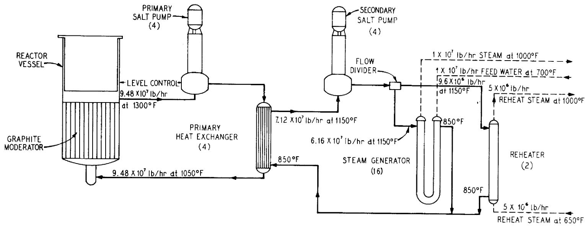  
GRNL-06.79-663

Table 1. Physical Constants   
A. Properties of Materials   

<table><tr><td></td><td>CpBtu lb-1°F-1</td><td>ρIb/ft3</td><td>kBtu hr-1°F-1 ft-1</td></tr><tr><td>Primary Salt</td><td>0.324</td><td>207.8 at 1175°F</td><td>-----</td></tr><tr><td>Secondary Salt</td><td>0.360</td><td>117 at 1000°F</td><td>-----</td></tr><tr><td>Steam</td><td></td><td></td><td></td></tr><tr><td>726°F</td><td>6.08</td><td>22.7</td><td>-----</td></tr><tr><td>750°F</td><td>6.59</td><td>11.4</td><td>-----</td></tr><tr><td>850°F</td><td>1.67</td><td>6.78</td><td>-----</td></tr><tr><td>1000°F</td><td>1.11</td><td>5.03</td><td>-----</td></tr><tr><td>Hastelloy-N</td><td></td><td></td><td></td></tr><tr><td>1000°F</td><td>0.115</td><td>548</td><td>9.39</td></tr><tr><td>1175°F</td><td>0.129</td><td>-----</td><td>11.6</td></tr><tr><td>Graphite</td><td>0.42</td><td>115</td><td>-----</td></tr></table>

B. Reactor Core   

<table><tr><td></td><td colspan="2">Central Zone</td><td>Outer Zone</td></tr><tr><td>Diameter, ft</td><td colspan="2">14.4</td><td>16.9</td></tr><tr><td>Height, ft</td><td colspan="2">13</td><td>13</td></tr><tr><td>Salt volume fraction</td><td colspan="2">0.132</td><td>0.37</td></tr><tr><td>Fuel</td><td colspan="2">233U</td><td></td></tr><tr><td>Graphite-to-salt heat transfer coefficient, Btu hr-1 ft-2 °F-1</td><td colspan="2">1065</td><td></td></tr><tr><td>Temperature coefficients of reactivity, °F-1primary salt</td><td rowspan="2" colspan="2">-1.789 × 10-5+1.305 × 10-5</td><td></td></tr><tr><td>graphite</td><td></td></tr><tr><td>Thermal neutron lifetime, sec</td><td colspan="2">3.6 × 10-4</td><td></td></tr><tr><td colspan="4">Delayed neutron constants, β = 0.00264</td></tr><tr><td>i</td><td>βi</td><td>λi(sec-1)</td><td></td></tr><tr><td>1</td><td>0.00102</td><td>0.02446</td><td></td></tr><tr><td>2</td><td>0.00162</td><td>0.2245</td><td></td></tr></table>

C. Heat Exchangers   

<table><tr><td></td><td>Primary Heat Exchanger</td><td colspan="2">Steam Generator</td></tr><tr><td>Length, ft</td><td>18.7</td><td colspan="2">72</td></tr><tr><td>Triangular tube pitch, in.</td><td>0.75</td><td colspan="2">0.875</td></tr><tr><td>Tube OD, in.</td><td>0.375</td><td colspan="2">0.50</td></tr><tr><td>Wall thickness, in.</td><td>0.035</td><td colspan="2">0.077</td></tr><tr><td>Heat transfer coefficients, Btu hr-1 ft-2 °F-1</td><td></td><td>Steam Outlet</td><td>Feedwater Inlet</td></tr><tr><td>tube-side-fluid to tube wall</td><td>3500</td><td>3590</td><td>6400</td></tr><tr><td>tube-wall conductance</td><td>3963</td><td>1224</td><td>1224</td></tr><tr><td>shell-side-fluid to tube wall</td><td>2130</td><td>1316</td><td>1316</td></tr></table>

Table 2. Plant Parameters (Design Point)   

<table><tr><td colspan="3">Reactor Core</td></tr><tr><td>Heat flux</td><td colspan="2">7.68 x 109Btu/hr [2250 Mw(th)]</td></tr><tr><td>Primary salt flowrate</td><td colspan="2">9.48 x 107lb/hr</td></tr><tr><td>Steady state reactivity, ρo</td><td colspan="2">0.00140</td></tr><tr><td>External loop transit time of primary salt</td><td colspan="2">6.048 sec</td></tr><tr><td></td><td>Zone I</td><td>Zone II</td></tr><tr><td>Heat generation</td><td>1830 Mw(th)</td><td>420 Mw(th)</td></tr><tr><td>Salt volume fraction</td><td>0.132</td><td>0.37</td></tr><tr><td>Active core volume</td><td>2117 ft3</td><td>800 ft3</td></tr><tr><td>Primary salt volume</td><td>279 ft3</td><td>296 ft3</td></tr><tr><td>Graphite volume</td><td>1838 ft3</td><td>504 ft3</td></tr><tr><td>Primary salt mass</td><td>58,074 lb</td><td>61,428 lb</td></tr><tr><td>Graphite mass</td><td>212,213 lb a</td><td>58,124 lb</td></tr><tr><td>Number of graphite elements</td><td>1466</td><td>553</td></tr><tr><td>Heat transfer area</td><td>30,077 ft2</td><td>14,206 ft2</td></tr><tr><td>Average primary salt velocity</td><td>~4.80 ft/sec</td><td>~1.04 ft/sec</td></tr><tr><td>Core transit time of primary salt</td><td>2.71 sec</td><td>12.5 sec</td></tr></table>

<table><tr><td colspan="3">Primary Heat Exchanger (total for each of four exchangers, tube region only)</td></tr><tr><td>Secondary salt flow rate</td><td>1.78 x 10^7 lb/hr</td><td></td></tr><tr><td>Number of tubes</td><td>6020</td><td></td></tr><tr><td>Heat transfer area</td><td>11,050 ft^2</td><td></td></tr><tr><td>Overall heat transfer coefficient</td><td>993 Btu hr^-1 ft^-2 °F^-1</td><td></td></tr><tr><td>Tube metal volume</td><td>30 ft^3</td><td></td></tr><tr><td>Tube metal mass</td><td>16,020 lb</td><td></td></tr><tr><td></td><td>Primary salt (tube side)</td><td>Secondary salt (shell side)</td></tr><tr><td>Volume</td><td>57 ft^3</td><td>295 ft^3</td></tr><tr><td>Mass</td><td>11,870 lb</td><td>34,428 lb</td></tr><tr><td>Velocity</td><td>10.4 ft/sec</td><td>2.68 ft/sec</td></tr><tr><td>Transit time</td><td>1.80 sec</td><td>6.97 sec</td></tr></table>

<table><tr><td colspan="3">Steam Generator (total for each of 16 steam generators, tube region only)</td></tr><tr><td>Steam flowrate</td><td>7.38 x 10^5 lb/hr</td><td></td></tr><tr><td>Number of tubes</td><td>434</td><td></td></tr><tr><td>Heat transfer area</td><td>4,102 ft^2</td><td></td></tr><tr><td>Tube metal volume</td><td>22 ft^3</td><td></td></tr><tr><td>Tube metal mass</td><td>12,203 lb</td><td></td></tr><tr><td></td><td>Steam (tube side)</td><td>Secondary salt (shell side)</td></tr><tr><td>Volume</td><td>20 ft^3</td><td>102 ft^3</td></tr><tr><td>Mass</td><td>235 lb</td><td>11,873 lb</td></tr><tr><td>Transit time</td><td>1.15 sec</td><td>9.62 sec</td></tr><tr><td>Average velocity</td><td>~62.8 ft/sec</td><td>7.50 ft/sec</td></tr></table>

hence only the conservation of energy is considered for the secondary salt. The equations, written in one space dimension, $x$ , (the direction of water flow) and time, $t$ , are as follows:

Conservation of mass (water)

$$
\frac {\partial \rho}{\partial t} + \frac {\partial}{\partial x} (\rho v) = 0; \tag {1}
$$

Conservation of momentum (water)

$$
\frac {\partial (\rho v)}{\partial t} + \frac {\partial}{\partial x} \left(\rho v ^ {2}\right) = - \frac {k \partial p}{\partial x} - c v ^ {2}; \tag {2}
$$

Conservation of energy (water)

$$
\frac {\partial}{\partial t} (\rho h) + \frac {\partial}{\partial x} (\rho h v) = k _ {1} H (\theta - T); \tag {3}
$$

Conservation of energy (salt)

$$
\frac {\partial \theta}{\partial t} + V _ {s} \frac {\partial \theta}{\partial x} = \frac {H k _ {2}}{\rho_ {s p} c} (T - \theta). \tag {4}
$$

The equations of state for water:

$$
\begin{array}{l} T = T (p, h) \\ \rho = \rho (p, h). \\ \end{array}
$$

The definitions of the variables used in the above equations are as follows:

T = water temperature, °F,   
$=$ water density, $1\mathrm{\;b}/{\mathrm{{ft}}}^{3}$ ,

$\mathbf{v}$ $=$ water velocity, ft/sec,   
p = water pressure, lb/in²,   
$c =$ coefficient of friction,   
$k =$ constant used to make units consistent,   
h = specific enthalpy of water, Btu/lb,   
H = heat transfer coefficient, salt to water, Btu/sec-ff²-°F,   
$k_{1} = \frac{r}{2}$ ratio of the surface area of a tube to the water volume in the tube, ft $^{-1}$ ,   
$k_{2} = \frac{1}{2}$ ratio of the surface area of a tube to the salt volume adjacent to the tube, ft $^{-1}$ ,   
$p_{s} = \text{salt density (assumed constant), } lb/ft^{3}$   
$c_{p} =$ specific heat of salt at constant pressure, $\mathsf{Btu / lb - }^{\circ}\mathsf{F}$ (assumed constant),   
$\theta$ = salt temperature, ${}^{\circ}\mathsf{F},$   
$\mathsf{V}_{s} = \mathsf{s}\mathsf{a}\mathsf{l}\mathsf{t}\mathsf{v}\mathsf{o}\mathsf{l}\mathsf{o}\mathsf{i}\mathsf{c}\mathsf{y},\mathsf{f}\mathsf{t}/\mathsf{s}\mathsf{e}\mathsf{c}.$

It was determined in previous work<sup>2</sup> that a continuous-space, discrete-time model is most satisfactory for this steam generator simulation. By a judicious choice of the direction of integration in space, of the various dependent variables, an initial value problem can be formed. Since the water enthalpy, $h$ , and the water pressure, $P$ , are known at the water entrance end of the exchanger (left end), these variables will be integrated from left to right. For the same reason, the water velocity (it can be calculated at the throttle) and the salt temperature will be integrated from right to left.

The critical flow at the throttle is expressed by the following nonlinear relationship among the system variables at a point just before the throttle:

$$
\rho v = M \left(\frac {A _ {T}}{A _ {T , 0}}\right) \left(\frac {p}{1 + b _ {T}}\right),
$$

where $A_T$ is the instantaneous value of the throttle opening, $A_{T,0}$ the initial steady state value, $M$ the critical flow constant, and $b$ an empirical constant (assumed to be equal to 0 in this simulation).

$A_{T,0}$ is taken as 1.0 and $A_T$ is varied as a function of time during transients.

By simplification of Eqs. (1), (2), (3), and (4), and using the backwards differ-encing scheme for the time derivative, the following ordinary differential equations are generated.

$$
\begin{array}{l} \frac {d p}{d x} = - \frac {\rho v}{k} \frac {d v}{d x} - \frac {c v ^ {2}}{k} - \frac {\rho}{k} \frac {(v - v _ {k})}{\Delta t}; \\ \frac {d h}{d x} = \frac {1}{\rho v} [ k _ {1} H (\theta - T) ] - \frac {h - h _ {k}}{v \Delta t}; \\ \frac {d v}{d x} = - \frac {v}{\rho} \frac {d \rho}{d x} - \frac {\rho - \rho_ {k}}{\rho \Delta t}; \\ \frac {d \theta}{d x} = + \frac {H k _ {2} (T - \theta)}{\rho_ {s p s}} - \frac {\theta - \theta_ {k}}{v _ {s} \Delta t}. \\ \end{array}
$$

In the above equations, the nonsubscripted variables are the ones being iterated for the values at the end of the $(k + 1)$ time increment, while the variables with the $k$ subscripts represent their values at the end of the $k^{th}$ time increment. The time increment is represented by $\Delta t$ .

Since the $\mathbf{v}$ and $\theta$ equations are being integrated from right to left, they must be transformed using a different space variable. Let $y = L - x$ , where $L$ is the total length of the steam generator in the $x$ direction. The new $\mathbf{v}$ and $\theta$ equations become:

$$
\begin{array}{l} \frac {d v}{d y} = \frac {v (y)}{\rho} \frac {d \rho}{d y} + \frac {\rho - \rho k}{\rho \Delta t}; \\ \frac {d \theta}{d y} = \frac {H k _ {2} (T - \theta)}{\rho_ {s} c _ {p} V _ {s} (y)} - \frac {\theta - \theta_ {k}}{V _ {s} (y) \Delta t}. \\ \end{array}
$$

In the hybrid program developed from the above equations, the integrations are performed on the AD-4 analog computer. The digital computer calculates the terms of the differential equations, provides control for the calculation, and provides storage. The AD-4 patchable logic is used in the problem control circuitry as communication linkages between the digital computer and the AD-4 analog computer. The patchable logic, along with BCD counters, is also used for problem timing and time synchronization between the digital computer and the AD-4 analog computer.

The thermodynamic properties of water are stored in the digital computer as two-dimensional tables. An interpolation routine is used to develop values from the numbers in the tables.

The calculational procedure for a time step, $\Delta t$ , is as follows:

The current values of the water temperature, $T$ , and water pressure, $p$ , at the water entrance end (left end) of the steam generator are read and stored in the digital computer. The current value of the secondary salt temperature, $\theta$ , at the salt entrance

end (right end) of the steam generator is read from the continuous time analog model and is stored in the digital computer. The secondary salt velocity, $V_{s}$ , and the throttle valve position, $A_{T}$ , are also read from the continuous time analog model and their values are stored in the digital computer.

The terms of the dh/dx and dp/dx equations are calculated by the digital computer, using the values of the variables at the left end of the steam generator. The values of these terms as well as the values of the initial conditions of h and p are set on the coefficient devices representing them on the AD-4 analog computer. This coefficient device setting is implemented by a command from the digital computer. Upon a command from the digital computer, the h and p integrators on the AD-4 computer start integrating in x. While the integration is proceeding, the digital computer is calculating the differential equation terms for the next space node (a space node is 1 foot long). When the digital calculations have been completed, the digital computer interrogates the AD-4 computer, through the patchable logic, as to whether or not its integrations have reached the end of the node. Upon getting an affirmative answer, the digital computer reads and stores the values of p and h from their integrators on the AD-4 computer. These integrators are in the hold mode at this time, having been placed in this mode by a logic signal from a BCD counter signifying that the end of a node has been reached. The digital computer sets the coefficient devices to their newly calculated values and starts the integrators to integrating over the next node. This procedure is repeated for each spatial node until the right-hand end of the steam generator is reached.

With a procedure identical to that above, and with the current values of $p$ and $h$ , the salt temperature and water velocity differential equations are integrated from right to left. When the right to left integrations have proceeded to the left boundary, they are halted.

The left to right integration of $p$ and $h$ is repeated, using the current values of $p$ , $h$ , $v$ , and $\theta$ . The right to left integration of $v$ and $\theta$ is repeated, etc., until the convergence is satisfactory.

In actuality, the convergence was experimentally determined to be satisfactory after five iterations and this number was used in the program. A definite number of iterations is dictated by the fact that time synchronization must be maintained between the discrete time steam generator model and the continuous time model of the remainder of the system.

The time allotted for a time step, $\Delta t$ , is set on a BCD counter such that the counter will give out a logic signal signifying the end of the time step.

At the end of the fifth iteration, the digital computer starts interrogating the AD-4 computer to see if the allotted $\Delta t$ time has elapsed. When the digital computer gets an affirmative answer, it reads and stores the current values of the appropriate variables from the continuous time model and another time step calculation is started. Of course, this procedure is repeated for as long as the simulation is in operation.

It was experimentally determined that the calculational stability was not good for time steps very much less than 0.5 sec. As a consequence, a $\Delta t$ of 0.5 sec was used.

It was also experimentally determined that the completion of five iterations required in excess of 8 sec. As a result, 10 sec of computer time was made the equivalent of 0.5 sec of real system time. The continuous time model was time scaled accordingly (machine time = 20 times real system time). The sampling rate of the continuous time model was, therefore, once each 10 sec. This means that the values of variables generated in the continuous

time model and used in the discrete time steam generator model are sampled once each 10 sec of machine time, which corresponds to 0.5 sec in real system time. In a like manner, the variables generated in the discrete time steam generator model and used in the continuous time model of the remainder of the system are updated once each 10 sec in machine time.

The Fortran source program for the digital portion of the simulation is included as Appendix B. The AD-4 analog and patchable logic circuits are shown in Fig. 2.

# 4.2 The Analog Computer Model of the System Exclusive of the Steam Generator

The computer model of the reactor, primary heat exchanger, piping, etc., is a continuous time, lumped parameter, model similar to those traditionally used on analog computers. The heat flow model is shown in Fig. 3.

# 4.2.1 The Nuclear Kinetics Model

Experience has shown that for the rather mild transients for which this model is intended, a two-delay-group nuclear kinetics model is adequate.3 That this is a circulating fuel reactor adds to the complication of the model.

The nuclear kinetics equations are as follows:

$$
\frac {d P}{d t} = \frac {(\rho - \beta)}{\Lambda} P + \lambda_ {1} C _ {1} + \lambda_ {2} C _ {2};
$$

$$
\frac {d C _ {1}}{d t} = \frac {\beta_ {1}}{\Lambda} P - \lambda_ {1} C _ {1} - \frac {C _ {1}}{\tau_ {c}} + \frac {e ^ {- \lambda_ {1} \tau_ {1}}}{\tau_ {c}} C _ {1} (t - \tau_ {1});
$$

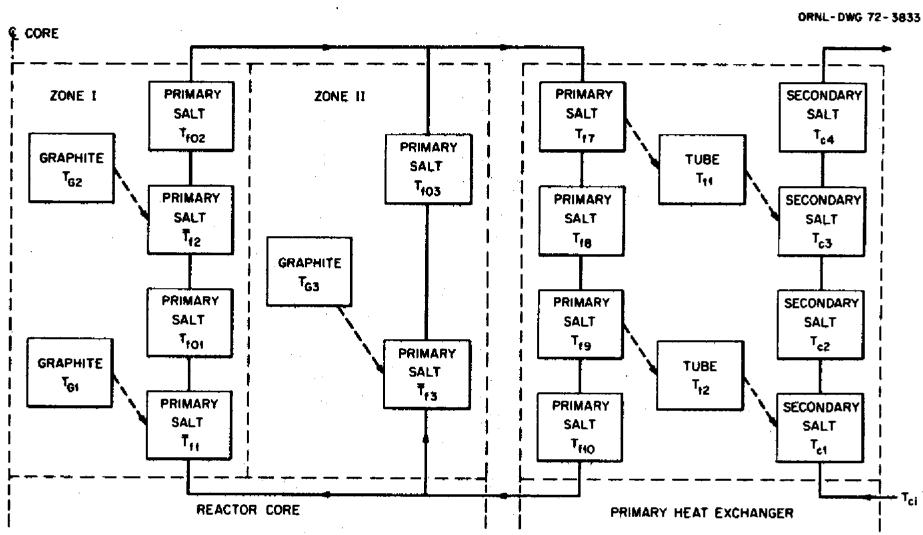  
Fig. 2. Lumped-Parameter Model of MSBR Core and Heat Exchanger.

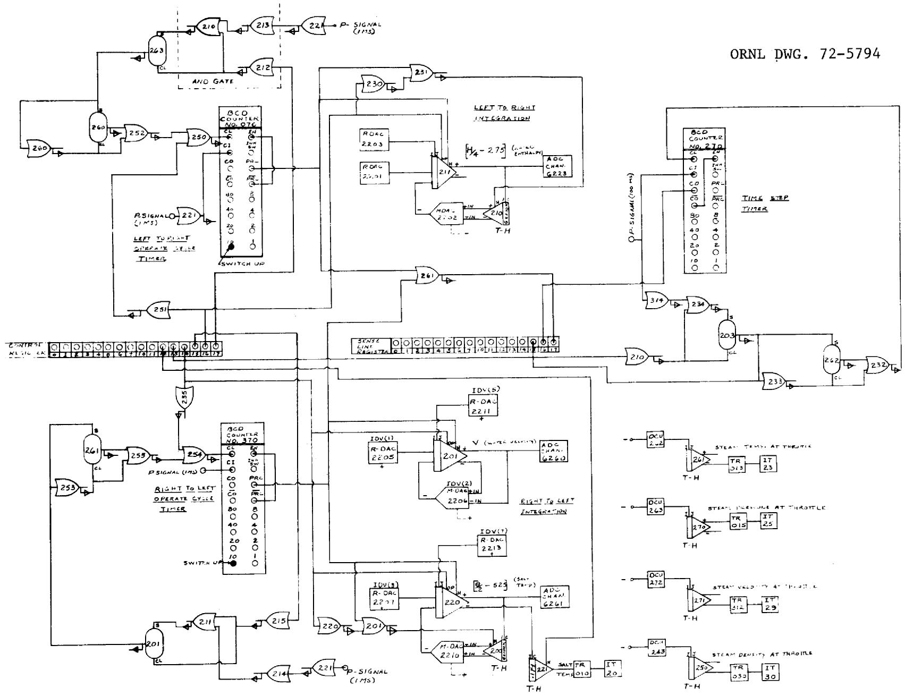  
Fig. 3. Patching Schematics for the AD-4 Computer.

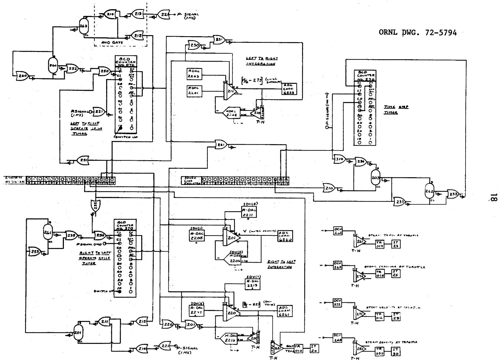  
Fig. 3. Patching Schematics for the AD-4 Computer.

$$
\frac {d C _ {2}}{d t} = \frac {\beta_ {2}}{\Lambda} P - \lambda_ {2} C _ {2} - \frac {C _ {2}}{\tau_ {c}} + \frac {e ^ {- \lambda_ {2} \tau_ {1}}}{\tau_ {c}} C _ {2} (t - \tau_ {1}); \tag {9}
$$

where

P = the nuclear power level,

$\rho$ =reactivity,

$\beta$ = total delayed neutron fraction,

$\Lambda$ = mean neutron lifetime,

$\lambda_{1} =$ decay constant for delayed neutron group No. 1,

$C_{1} =$ delayed neutron precursor concentration of group No. 1,

$\lambda_{2} =$ decay constant for delayed neutron group No. 2,

$C_2 =$ delayed neutron precursor concentration of group No. 2,

$\beta_{1} =$ delayed neutron fraction for group No. 1,

$\beta_{2} =$ delayed neutron fraction for group No. 2,

$\tau_{c} =$ reactor core resident time of the circulating fuel,

$\tau_{1} =$ resident time of the circulating fuel in the loop external to the core.

In the model, the fuel salt flow rate is assumed constant; therefore, $\tau_{c}$ and $\tau_{l}$ are constants.

The development of the computer model of the reactor kinetics from the above equations is shown in some detail in Appendix A.

# 4.2.2 The Reactor Core Heat Transfer Model

In the simulation model, core zone 1 contains two graphite lumps, and core zone 2 contains one graphite lump. There are two fuel salt lumps adjacent to each graphite lump. The outlet temperature of the first adjacent fuel salt lump (in the direction of salt flow) is used as the average fuel salt temperature in the equations describing the heat transfer between a graphite lump and the fuel salt lumps adjacent to it.

The typical heat balance equation for core graphite heat generation and heat transfer is as follows:

$$
M _ {g i} C _ {p g} \frac {d T _ {g i}}{d t} = h _ {f g} A _ {g i} \left(\bar {T} _ {f i} - T _ {g i}\right) + K _ {g i} P,
$$

where

Mgi = the mass of graphite in the i th lump, Ib,   
C pg = graphite heat capacity, Btu/lb-°F,   
Tgi = the average graphite temperature in the ith graphite lump, ${}^{\circ}\mathsf{F},$   
$h_{fg} =$ the overall heat transfer coefficient between the graphite and the fuel salt, $\text{Btu/ft}^2 -\circ \text{F - sec},$   
A gi = the heat transfer area between the graphite in the i<sup>th</sup> lump and the fuel adjacent to it, ft<sup>2</sup>,   
$\overline{T}_{fi} =$ the average temperature of the fuel salt adjacent to the graphite in the $i^{\text{th}}$ graphite lump, ${}^{\circ}\mathsf{F}$   
$K_{gi} =$ the fraction of total fission power that is produced in the $i^{th}$ graphite lump,   
P = total fission power produced by the reactor, Btu/sec.

The typical heat balance equations for the generation and transfer of heat in the core fuel adjacent to the $i^{\text{th}}$ graphite lump are:

$$
M _ {f i} C _ {p f} \frac {d \bar {T} _ {f i}}{d t} = F _ {i} C _ {p f} \left(T _ {i, i n} - \bar {T} _ {f i}\right) + h _ {f g} A _ {f i} \left(T _ {g i} - \bar {T} _ {f i}\right) + K _ {f i} P
$$

and

$$
M _ {f i} C _ {p f} \frac {d T _ {f o i}}{d t} = F _ {i} C _ {p f} \left(\bar {T} _ {f i} - T _ {f o i}\right) + h _ {f g} A _ {f i} \left(T _ {g i} - \bar {T} _ {f i}\right) + K _ {f i} P,
$$

where

$M_{\text{fi}} = \text{one-half the mass of the fuel salt adjacent to the graphite in the } i^{\text{th}}$ graphite lump, lb,

Cpf = fuel salt heat capacity, Btu/lb-°F,

$F_{i}$ = fuel salt mass flow rate adjacent to the $i^{\text{th}}$ graphite lump, lb/sec,

T, in = the fuel salt temperature as it enters the i graphite lump, F,

$A_{fi} = \text{one-half the heat transfer area of the } i^{\text{th}}\text{graphite lump, } ft^{2}$ ,

$K_{\text{fi}} = \text{one-half the fraction of the total fission power that is generated in the fuel salt}$ adjacent to the $i^{th}$ graphite lump,

Tfoi = the fuel salt temperature at the salt discharge end of the i graphite lump, ${}^{\circ}\mathsf{F}$

The detailed development of these equations into the time and magnitude scaled computer equations is shown in Appendix A.

# 4.2.3 Piping Lag Equations

The piping lags between the reactor core and the primary heat exchanger shall be considered the same in both directions. They will be treated as first order lags, implying perfect mixing. The resulting equations are as follows:

$$
\frac {d T _ {x i n}}{d t} = \frac {1}{T _ {x}} \left(T _ {R O} - T _ {x i n}\right),
$$

and

$$
\frac {d T _ {f i n}}{d t} = \frac {1}{\tau_ {x}} \left(T _ {f l 0} - T _ {f i n}\right),
$$

where

$\mathsf{T}_{\mathsf{x}\mathsf{i}\mathsf{n}} =$ fuel salt temperature at the primary heat exchanger inlet, ${}^{\circ}\mathsf{F},$

$\tau_{\mathbf{x}} =$ fuel salt residence time in piping between the reactor core and the primary heat exchanger, sec,

$T_{RO} = \text{average fuel salt temperature at reactor core outlet, } {}^{\circ}F,$

Tfin = fuel salt temperature at reactor core inlet, ${}^{\circ}\mathsf{F},$

$T_{f10} =$ fuel salt temperature at the primary heat exchanger outlet, $^\circ F$ .

# 4.2.4 Primary Heat Exchanger Equations

For the simulation, the primary heat exchanger is broken up into two primary salt lumps, two tube metal lumps, and two secondary salt lumps. Each of the primary and secondary salt lumps is divided into two identical half lumps, and the outlet temperature of the first half lump is used as the average temperature in the heat transfer equations.

Since the secondary salt mass flow rate can be changed by changing the circulating pump speed, the heat transfer coefficient between the tube wall and the secondary salt will vary with salt mass flow rate. As an approximation, the heat transfer coefficient was considered to be proportional to the secondary salt mass flow rate raised to the 0.6 power.

The typical heat balance equations for the primary salt in the primary heat exchanger are as follows:

$$
M _ {f i} C _ {p f} \frac {d T _ {f i}}{d t} = F _ {x} C _ {p f} [ T _ {f (i - 1)} - T _ {f i} ] + h _ {f p} A _ {f x} (T _ {t j} - T _ {f i})
$$

and

$$
M _ {f (i + 1)} C _ {p f} \frac {d T _ {f (i + 1)}}{d t} = F _ {x} C _ {p f} [ T _ {f i} - T _ {f (i + 1)} ] + h _ {f p} A _ {f x} (T _ {t j} - T _ {f i});
$$

where

$$
\begin{array}{l} i = 7 \text {w h e n} i = 1, \text {a n d} i = 9 \text {w h e n} i = 2, \\ \begin{array}{r l} M _ {f i} & = M _ {f (i + 1)} = \text {o n e - f o u r t h t h e t o t a l p r i m a r y s a l t m a s s i n t h e p r i m a r y h e a t e x c h a n g e r ,} \\ & \quad \quad \quad \quad \quad \quad \quad \quad \quad \quad \quad \quad \quad \quad \quad \quad \quad \quad \quad \quad \quad \quad \quad \quad \quad \quad \quad \quad \quad \quad \quad \quad \quad \quad \quad \quad \quad \quad \quad \quad \quad \quad \quad \quad \quad \quad \quad \quad \quad \quad \end{array} \\ C _ {p f} = \text {t h e h e a t c a p a c i t y o f t h e p r i m a r y s a l t , B t u / l b . -} ^ {\circ} F, \\ F _ {x} = \text {p r i m a r y s a l t m a s s f l o w r a t e i n t h e p r i m a r y h e a t e x c h a n g e r , l b / s e c ,} \\ \begin{array}{r l} h _ {f p} & = \text {t h e o v e r a l l h e a t t r a n s f e r c o e f f i c i e n t b e t w e e n t h e p r i m a r y s a l t a n d t h e h e a t e x c h a n g e r} \\ & \text {t u b e w a l l , B t u / f t ^ {2} - s e c - ① F ,} \end{array} \\ \begin{array}{r l} A _ {f x} & = \text {o n e - f o u r d h t h e t o t a l h e a t t r a n s f e r a r e a b e t w e e n t h e p r i m a r y s a l t a n d t h e p r i m a r y} \\ & \quad \text {h e a t e x c h a n g e r t u b e s , f t} ^ {2}, \end{array} \\ T _ {t i} = \text {t h e a v e r a g e t e m p e r a t u r e o f t h e t u b e w a l l m e t a l i n t h e j} ^ {\text {t h}} \text {l u m p}, ^ {\circ} F. \\ \end{array}
$$

The heat balance equations for the primary heat exchanger tube metal are the following:

$$
M _ {T} C _ {T} \frac {d T _ {t 1}}{d t} = h _ {f p} A _ {T} (T _ {f 7} - T _ {t 1}) - h _ {T C} A _ {T} (T _ {t 1} - T _ {C 3})
$$

and

$$
M _ {T} C _ {T} \frac {d T _ {t 2}}{d t} = h _ {f p} A _ {T} (T _ {f 9} - T _ {t 2}) - h _ {T C} A _ {T} (T _ {t 2} - T _ {C 1});
$$

where

$M_T = \text{mass of tube metal in lump number one} = \text{one-half the total tube metal mass in the primary heat exchanger}, \text{lb},$

$C_{T} =$ the heat capacity of the tube metal in the primary heat exchanger, $\mathrm{Btu / lb - }^{\circ}\mathrm{F},$ $T_{\dagger 1} =$ the average temperature of the tube metal in lump number one, ${}^{\circ}\mathsf{F},$

$A_{T} =$ the heat transfer area between the primary salt and the tube walls in any tube metal lump, ft²,

$h_{TC} =$ the overall heat transfer coefficient between the secondary salt and the tube walls in the primary heat exchanger, $\text{Btu/ft}^2\text{-sec}^{-\circ}\text{F}$ (this is a variable in the equation),

$\mathsf{T}_{\mathsf{C3}} =$ the secondary salt temperature at the outlet of secondary salt lump three, ${}^{\circ}\mathsf{F}$

The heat balance equations for the secondary salt in the primary heat exchanger are the following:

$$
M _ {c} C _ {p c} \frac {d T _ {c 1}}{d t} F _ {c} C _ {p c} \left(T _ {c i n} - T _ {c l}\right) + h _ {T c} A _ {c} \left(T _ {t 2} - T _ {c l}\right);
$$

$$
M _ {c} C _ {p c} \frac {d T _ {c 2}}{d t} = F _ {c} C _ {p c} \left(T _ {c 1} - T _ {c 2}\right) + h _ {T c} A _ {c} \left(T _ {t 2} - T _ {c 1}\right);
$$

$$
M _ {c} C _ {p c} \frac {d T _ {c 3}}{d t} = F _ {c} C _ {p c} \left(T _ {c 2} - T _ {c 3}\right) + h _ {T c} A _ {c} \left(T _ {t 1} - T _ {c 3}\right);
$$

and

$$
M _ {c} C _ {p c} \frac {d T _ {c 4}}{d t} = F _ {c} C _ {p c} \left(T _ {c 3} - T _ {c 4}\right) + h _ {T c} A _ {c} \left(T _ {t 1} - T _ {c 3}\right);
$$

where

$$
M _ {c} = \text {o n e - f o u r t h t h e t o t a l s e c o n d a r y s a l t m a s s i n t h e p r i m a r y h e a t e x c h a n g e r , l b ,}
$$

$$
C _ {p c} = \text {t h e h e a t c a p a c i t y o f t h e s e c o n d a r y s a l t , B t u / l b - ^ {\circ} F},
$$

$$
\begin{array}{r l} T _ {c i} & = \text {t h e t e m p e r a t u r e o f t h e s e c o n d a r y s a l t a t t h e o u t l e t o f t h e i} ^ {\text {t h}} \text {s e c o n d a r y s a l t l u m p}, \\ & \quad \circ F, \end{array}
$$

$$
\begin{array}{r l} F _ {c} & = \text {t h e m a s s f l o w r a t e o f t h e s e c o n d a r y s a l t i n t h e p r i m a r y h e a t e x c h a n g e r , l b / s e c} \\ & \text {(t h i s i s a v a r i a b l e)}, \end{array}
$$

$$
T _ {\text {c i n}} = \text {t h e s e c o n d a r y s a l t t e m p e r a t u r e a s i t e n t e r s t h e p r i m a r y h e a t e x c h a n g e r ,} ^ {\circ} F,
$$

$$
\begin{array}{l} A _ {c} = \text {o n e - f o u r t h} \\ & \text {t h e t o t a l h e a t t r a n s f e r a r e a b e t w e e n t h e s e c o n d a r y s a l t a n d t h e p r i m a r y} \\ & \text {h e a t e x c h a n g e r t u b e s , f t} ^ {2}, \end{array}
$$

$$
h _ {T C} = \text {t h e o v e r a l l h e a t t r a n s f e r c o e f f i c i e n t b e t w e e n t h e m e t a l t u b e s a n d t h e s e c o n d a r y}
$$

The heat balance equations for the secondary salt in the primary heat exchanger are as follows:

$$
M _ {c i} C _ {p c} \frac {d T _ {c i}}{d t} = F _ {c} C _ {p c} \left[ T _ {c (i - 1)} - T _ {c i} \right] + h _ {T c} A _ {c} \left(T _ {t j} - T _ {c i}\right)
$$

and

$$
M _ {c i} C _ {p c} \frac {d T _ {c (i + 1)}}{d t} = F _ {c} C _ {p c} [ T _ {c i} - T _ {c (i + 1)} ] + h _ {T c} A _ {c} (T _ {t i} - T _ {c i});
$$

where

$$
\begin{array}{l} i = 1 \text {w h e n} i = 2, \text {a n d} i = 3 \text {w h e n} i = 1, \\ M _ {c i} = \text {o n e - f o u r t h} \\ C _ {p c} = \text {t h e h e a t c a p a c i t y o f t h e s e c o n d a r y s a l t , B t u / I b - ^ {\circ} F}, \\ \begin{array}{r l} F _ {c} & = \text {s e c o n d a r y s a l t m a s s f l o w r a t e i n t h e p r i m a r y h e a t e x c h a n g e r , l b / s e c (t h i s i s a} \\ & \text {v a r i a b l e i n t h e s i m u l a t i o n)}, \end{array} \\ T _ {c i} = \text {a v e r a g e s e c o n d a r y s a l t t e m p e r a t u r e i n t h e i} ^ {\text {t h}} \text {l u m p}, ^ {\circ} F, \\ \begin{array}{r l} A _ {c} & = \text {o n e - f o u r t h} \\ & \text {t h e t h e t o t a l h e a t t r a n s f e r a r e a b e t w e e n t h e s e c o n d a r y s a l t a n d t h e t u b e} \\ & \text {w a l l s i n t h e p r i m a r y h e a t e x c h a n g e r , f t ^ {2}}. \end{array} \\ \end{array}
$$

The development of the computer equations for the primary heat exchanger is shown in Appendix A.

The patching diagram for the old analog computer is shown in Fig. 4.

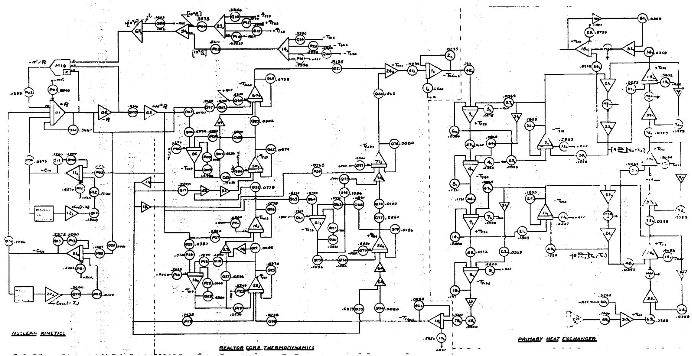  
ORNL DWG. 72-5793   
Fig. 4. Patching Schematics for the Old Analog Computer.

# 4.2.5 System Controllers

Probably the most important thing to be considered in the automatic control of the system is that of avoiding freezing of the primary or secondary salt. Of course, the steam conditions at the turbine throttle must also be closely controlled. Previous studies have shown that it is impossible to realize both of the above objectives without adding auxiliary devices to the system. Two possible solutions have been suggested. One is to add a secondary salt bypass line and mixing valve around the primary heat exchanger so that a controlled portion of the secondary salt can be bypassed while the steam temperature at the throttle is controlled. The other proposed scheme is to use the salt system as it is and to allow the steam temperature to change freely in the steam generator and then attenuate it to the desired temperature for the turbine.

In this simulation, the steam attemperation scheme was assumed.

Three controllers were incorporated into the simulation.

# 4.2.5.1 Reactor Outlet Temperature Controller

This controller was essentially the same as that described by W. H. Sides, Jr., in ORNL-TM-3102. The reactor outlet temperature set point, $T_{ro}$ , was proportional to the plant load demand. The set point equation was the following:

$$
T _ {r o S E T} = 2 5 0 P _ {d e m a n d} + 1 0 5 0,
$$

where $P_{\text{demand}}$ is the fraction of full load demand.

Since the scaled variables are $P_s$ and $T_{ros}$ , where $P_s = 0.08P$ and $T_{ros} = \frac{1}{20} T_{ro}$ , the scaled equation is:

$$
T _ {r o s S E T} = 0. 1 5 6 2 5 P _ {s _ {d e m a n d}} + 5 2. 5 0.
$$

The reactor power level set point was proportional to the difference between the outlet temperature set point and the measured reactor inlet temperature. The scaled equation is as follows:

$$
P _ {s S E T} = 6. 4 \left(T _ {\text {r o s} S E T} - T _ {\text {f i n s}}\right).
$$

A reactor power level error was obtained by taking the difference between the power set point value and the measured value (from neutron flux). The resulting equation is

$$
\epsilon = P _ {s} - P _ {s} \text {S E T}.
$$

This power level error, $\varepsilon$ , was the input signal to a control rod servo described by the second order transfer function:

$$
T (S) = \frac {G \omega^ {2}}{S ^ {2} + 2 S \omega S + \omega^ {2}} = \frac {0 (S)}{\epsilon (S)},
$$

where $G$ is the controller gain, $\omega$ is the bandwidth, $S$ is the damping factor, and $O(S)$ is the Laplace transform of the servo output, $\frac{d p}{dt}$ .

In this simulation, the bandwidth was $5\mathrm{Hz}$ and the damping factor was 0.5. The gain of the controller, $G$ , was such that for $|\varepsilon| = 1\%$ of full power, the control rod reactivity change rate was about $0.01\% / \sec$ ; that is,

$$
\frac {d p _ {c}}{d t} = 0.01 \% / \sec ,
$$

where $\rho_{c}$ is the control reactivity.

For power level errors in excess of $1\%$ of full power, the rate of change of reactivity was limited to $0.01\%/\mathrm{sec}$ .

# 4.2.5.2 Secondary Salt Flow Controller

The secondary salt flow rate controller forced the flow rate to follow the load demand in a programmed manner. The programmed flow rate is that required to prevent the salt systems from approaching their respective freezing points. The program was deduced from a series of steady state calculations performed by W. H. Sides, Jr.<sup>4</sup>

Since, in the simulation, we are assuming that the salt density is constant, a change in the salt velocity is equivalent to a change in the salt flow rate. The programmed equation is

$$
\text {v e l o c i t y f r a c t i o n} = 0. 8 7 5 \text {l o a d f r a c t i o n} + 0. 1 2 5.
$$

In the simulation, a velocity fraction of one is equal to 80 volts and a load fraction of one is also equal to 80 volts. The equation becomes:

$$
\text {v e l o c i t y} = 0. 8 7 5 \text {l o a d f r a c t i o n} + 1 0. 0.
$$

# 4.2.5.3 Steam Pressure Controller

The steam pressure controller was used to control the steam pressure at the turbine throttle. The pressure sensor was assigned a time lag with a time constant of 0.1 sec. The pressure was changed by changing the speed of the feedwater pump.

The simple proportional controller equation is

$$
G _ {P} \left(P _ {r} S E T - P _ {r}\right) = \frac {d P _ {r}}{d t}.
$$

The gain, $G_p$ , was such that a pressure error of $1\%$ of design point pressure would cause the inlet pressure to be changed at a rate of 3.6 psi/sec.

The controllers were simulated on the old analog computer. The wiring schematics are shown in Fig. 5.

ORNL DWG. 72-5792

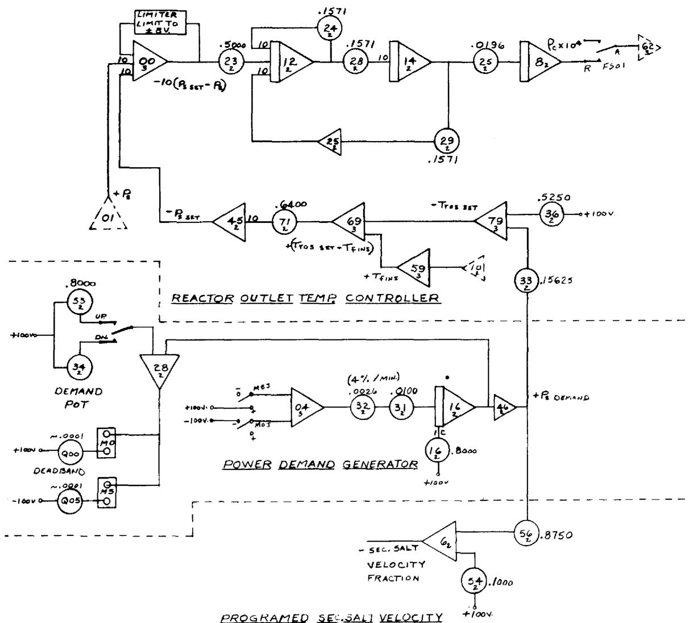

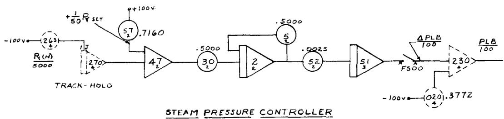  
Fig. 5. Patching Schematics for the Simulation of the System Controllers.

# 5. RESULTS OF SIMULATION EXERCISES

The severity of the transients that can be run on this simulation model is somewhat limited by the nature of the steam generator model (the calculational time step is 0.5 sec).

The transients were run in order to determine the system response times, the rates of change of temperatures, and whether the salt temperatures approached the freezing points.

The conditions and results for the transients that were run were as follows:

# 1. Steady State Part Loads

The purpose of these computer runs was to determine the values of the system variables when operating at various fractions of full load. The system controllers were in operation as the load demand was changed from one level to another.

The load demand was changed by changing the turbine throttle opening. The area of the throttle opening was changed in increments of $10\%$ of design point throttle area. The range of throttle openings covered was from the design point opening down to $30\%$ of design point opening. The percentage of throttle area turned out to be very nearly the same as the percentage of load for each case.

Probably the thing of most interest was whether either the primary or secondary salt approached its respective freezing point for these part load operations. The results of interest are shown in Fig. 6.

It is evident that the temperatures in both salt systems are well above their respective freezing points (930°F for the primary salt and 725°F for the secondary salt).

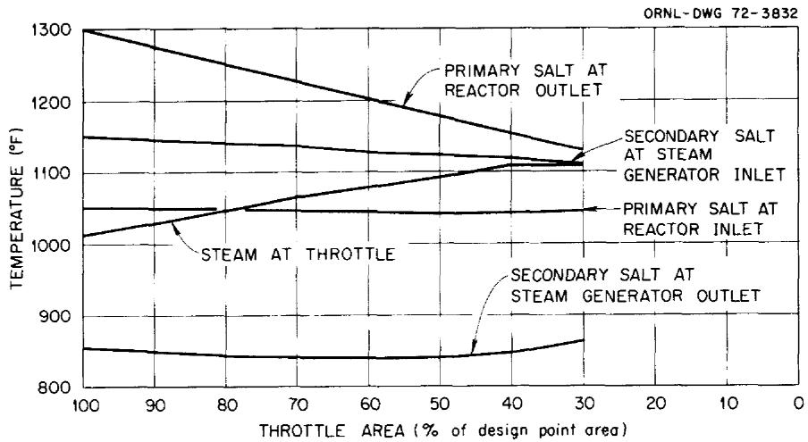  
Fig. 6. Temperatures in the MSBR System for Part Load Operation.

# 2. Rapid Change in Load Demand

A number of fast changes in load demand were run in order to observe the resulting system response. The rates of change of the system temperatures were of interest. The secondary salt temperature at the steam generator outlet changed at a rate of approximately $4.5^{\circ}\mathrm{F} / \mathrm{sec}$ for the case when the load demand was ramped from full load to $40\%$ full load in 1-2/3 sec. The results of the case where the load demand was ramped from $100\%$ to $40\%$ in 3 sec are shown in Fig. 7.

# 3. Changes in Secondary Salt Flow Rate

In order to observe the system response to a change in secondary salt flow rate, the secondary salt flow rate was reduced from full flow to $75\%$ of full flow on a 5-sec ramp. The results are shown in Fig. 8.

# 4. Step Changes in Nuclear Fission Power Level

Step increases and decreases in nuclear fission power were implemented in order to observe the system response to same. The system response to a step change in nuclear fission power from full power to $75\%$ power is shown in Fig. 9.

# 5. Changes in Reactivity

As a rough approximation of inserting two safety rods (each worth $-1.5\%$ in $\delta k / k$ ), $-3\%$ $\delta k / k$ was ramped in in 15 sec. The results are shown in Fig. 10.

As a rough approximation of a fuel addition accident, $+0.2\% \delta k / k$ was ramped in in 1.5 sec. The results are shown in Fig. 11.

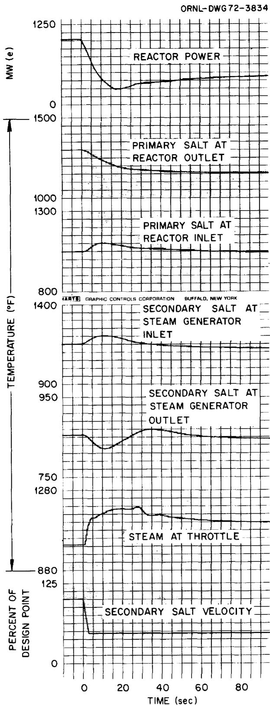  
Fig. 7. System Response to a Ramp Change in Load Demand from 100 to $40\%$ in 3 sec.

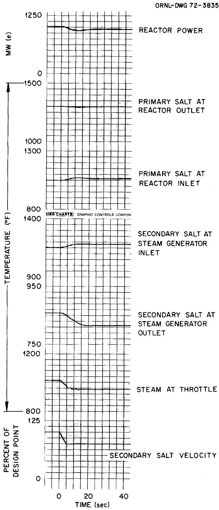  
Fig. 8. System Response to a Ramp Change in Secondary Salt Flow Rate from 100 to $75\%$ in 5 sec.

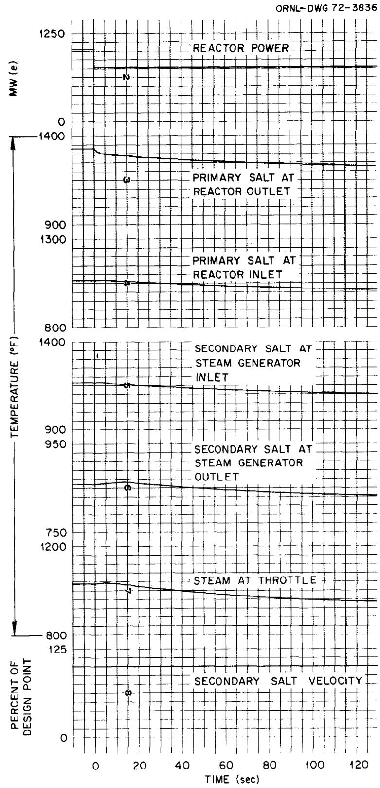  
Fig. 9. System Response to a Step Change in Nuclear Fission Power from 100 to $75\%$ .

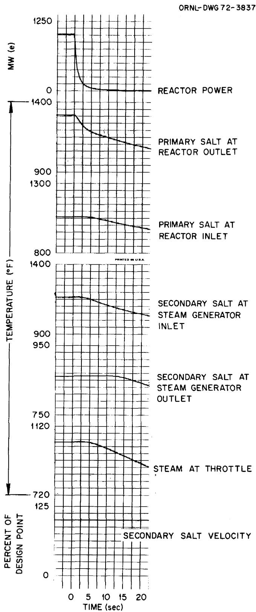  
Fig. 10. System Response to Insertion of Two Safety Rods.

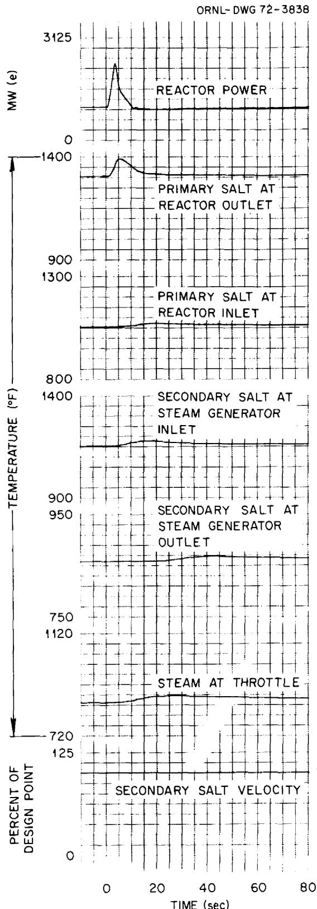  
Fig. 11. System Response to a Ramp addition of $0.2\% \delta k / k$ in 1.5 sec.

6. Uncontrolled Increasing Load Demand

An uncontrolled load demand accident was simulated by increasing the load demand from $30\%$ load to full load at a rate of $40\%$ full load per minute (ten times normal rate).

The results are shown in Fig. 12.

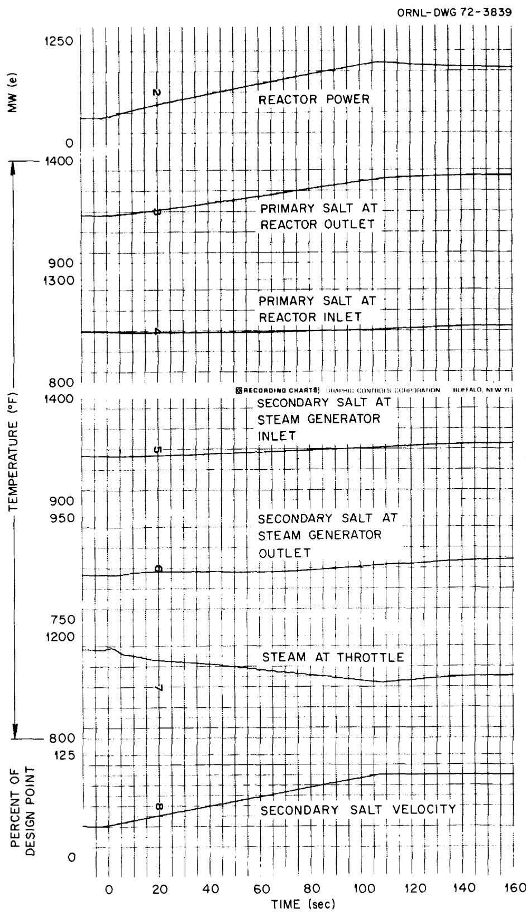  
Fig. 12. System Response to a Ramp Change in Load Demand from 30 to $100\%$ Load at a Rate of $40\%$ of Full Load per min.

# References

1. Robertson, R. C., et al., Conceptual Design of a Single-Fluid Molten Salt Breeder Reactor, ORNL-4541 (June 1971).   
2. Sanathanan, C. K., and Sandberg, A. A., University of Illinois, Chicago, Ill., and Clark, F. H., Burke, O. W., and Stone, R. S., ORNL, Transient Analysis and Design Evaluation of a Once-Through Steam Generator with the Aid of a Hybrid Computer.   
3. MacPhee, J., The Kinetics of Circulating Fuel Reactors, Nucl. Sci. Eng. 4, 588-97 (1958).   
4. Sides, W. H., Jr., Control Studies of a 1000-Mw(e) MSBR, ORNL-TM-2927 (May 1970).  
Sides, W. H., Jr., MSBR Control Studies: Analog Simulation Program, ORNL-TM-3102 (May 1971).  
Sides, W. H., Jr., MSR-70-56, August 21, 1970.

# 7. APPENDIX

# 7.1 A: Development of Computer Model

# 7.1.1 The All-Analog Model

The all-analog model represents the nuclear reactor, the primary heat exchanger, and the interconnecting piping. The primary, or fuel, salt flows at a constant rate; and the secondary, or coolant, salt flows at a variable rate. The heat transfer coefficient between the primary heat exchanger tubes and the secondary salt was considered to be proportional to the secondary salt mass flow rate raised to the .6 power. The piping time lag for the primary salt between the reactor and the primary heat exchanger is 2.124 sec. The same time lag was used for the return flow to the reactor.

The reactor kinetics model has two weighted groups of delayed neutrons.

# 7.1.1.1 Nuclear Kinetics Model

$$
\frac {d P}{d t} = \frac {(\rho - \beta)}{\Lambda} P + \lambda_ {1} C _ {1} + \lambda_ {2} C _ {2};
$$

$$
\frac {d C _ {1}}{d t} = \frac {\beta_ {1}}{\Lambda} P - \lambda_ {1} C _ {1} - \frac {C _ {1}}{\tau_ {c}} + \frac {e ^ {- \lambda_ {1} \tau_ {1}}}{\tau_ {c}} C _ {1} (t - \tau_ {1});
$$

$$
\frac {d C _ {2}}{d t} = \frac {\beta_ {2}}{\Lambda} P - \lambda_ {2} C _ {2} - \frac {C _ {2}}{\tau_ {c}} + \frac {e ^ {- \lambda_ {2} \tau_ {l}}}{\tau_ {c}} C _ {2} (t - \tau_ {l}).
$$

Using the values listed in Tables 1 and 2 and Fig. 1, the above equations become:

$$
\frac {d P}{d t} = \frac {\rho}{0 . 0 0 0 3 6} P - \frac {0 . 0 0 2 6 4}{0 . 0 0 0 3 6} P + 0. 0 2 4 4 6 C _ {1} + 0. 2 2 4 5 C _ {2};
$$

$$
\frac {d P}{d t} = 2. 7 7 7 \times 1 0 ^ {3} \rho P - 7. 3 3 3 P + 0. 0 2 4 4 6 C _ {1} + 0. 2 2 4 5 C _ {2};
$$

$$
\frac {d C _ {1}}{d t} = \frac {0 . 0 0 1 0 2}{0 . 0 0 0 3 6} P - 0. 0 2 4 4 6 C _ {1} - \frac {1}{3 . 5 7} C _ {1} + \frac {e ^ {- (. 0 2 4 4 6) (6 . 0 5)}}{3 . 5 7} C _ {1} (t - \tau_ {1});
$$

$$
\frac {d C _ {1}}{d t} = 2. 8 3 3 3 P - 0. 3 0 4 5 6 C _ {1} + 0. 2 4 1 6 C _ {1} (t - \tau_ {1});
$$

$$
\frac {d C _ {2}}{d t} = \frac {0 . 0 0 1 6 2}{0 . 0 0 0 3 6} P - 0. 2 2 4 5 C _ {2} - \frac {1}{3 . 5 7} C _ {2} + \frac {e ^ {- (0 . 2 2 4 5) (6 . 0 5)}}{3 . 5 7} C _ {2} (t - \tau_ {1});
$$

$$
\frac {d C _ {2}}{d t} = 4. 5 P - 0. 5 0 4 5 5 C _ {2} + 0. 0 7 2 0 4 C _ {2} (t - \tau_ {1}).
$$

Use $P = 1000 \, MW(e)$ at steady state, design point and calculate the design point values for $C_1$ and $C_2$ . At steady state, design point:

$$
\frac {d C _ {1}}{d t} = 0 = 2. 8 3 3 3 (1 0 0 0) - 0. 3 0 4 5 6 C _ {1} (0) + 0. 2 4 1 6 C _ {1} (0),
$$

since, at steady state, $C_1(0) = C_1(t - \tau_1)(0)$ .

$$
C _ {1} (0) = 4 5, 0 0 0 \mathrm {M W}.
$$

Likewise:

$$
\begin{array}{l} \frac {d C _ {2}}{d t} = 0 = 4. 5 (1 0 0 0) - 0. 5 0 4 5 5 C _ {2} (0) + 0. 0 7 2 0 4 C _ {2} (0); \\ C _ {2} (0) = 1 0, 4 0 4 \mathrm {M W}. \\ \end{array}
$$

Since we do not expect to use the model to go to power levels very much exceeding 1000 MW(e), we shall use the calculated values of $C_1(0)$ and $C_2(0)$ as indicators for purposes of magnitude scaling $C_1$ and $C_2$ . Let

$$
\begin{array}{l} C _ {1 (\max .)} = 1 \times 1 0 ^ {5} M W, \\ C _ {2 (\max .)} = 2 \times 1 0 ^ {4} M W, \\ \end{array}
$$

and

$$
P _ {\text {(m a x .)}} = 1 2 5 0 \mathrm {M W}.
$$

The corresponding machine variables are $(10^{-3}C_{1}), (5 \times 10^{-3}C_{2})$ , and (.08P) respectively.

Write the magnitude scaled nuclear kinetics equations with the time scale equal to real system time. Let $C_{1s} = 10^{-3}C_1$ , $C_{2s} = 5 \times 10^{-3}C_2$ , and $P_s = .08P$ .

$$
\begin{array}{l} \frac {d P _ {s}}{d t} = 2. 7 7 7 \times 1 0 ^ {3} p P _ {s} - 7. 3 3 3 P _ {s} + (. 0 8) (0. 0 2 4 4 6) (1 0 ^ {3}) C _ {1 s} + \frac {(. 0 8) (.. 2 2 4 5) (1 0 ^ {3})}{5} C _ {2 s}; \\ \frac {d P _ {s}}{d t} = 2. 7 7 7 \times 1 0 ^ {3} \rho P _ {s} - 7. 3 3 3 P _ {s} + 1. 9 5 7 C _ {1 s} + 3. 5 9 2 C _ {2 s}; \\ \end{array}
$$

$$
\frac {d C _ {1 s}}{d t} = \frac {(2 . 8 3 3 3) (1 0 ^ {- 3})}{. 0 8} P _ {s} - 0. 3 0 4 5 6 C _ {1 s} + 0. 2 4 1 6 C _ {1 s} (t - \tau_ {1});
$$

$$
\frac {d C _ {1 s}}{d t} = 0. 0 3 5 4 P _ {s} - 0. 3 0 4 5 6 C _ {1 s} + 0. 2 4 1 6 C _ {1 s} (t - \tau_ {l});
$$

$$
\frac {d C _ {2 s}}{d t} = \frac {(4 . 5) (5 \times 1 0 ^ {- 3})}{. 0 8} P _ {s} - 0. 5 0 4 6 C _ {2 s} + 0. 0 7 2 0 4 C _ {2 s} (t - \tau_ {1});
$$

$$
\frac {d C _ {2 s}}{d t} = 0. 2 8 1 3 P _ {s} - 0. 5 0 4 6 C _ {2 s} + 0. 0 7 2 0 4 C _ {2 s} (t - \tau_ {1}).
$$

Calculate $\rho_{0}$ , the reactivity required to offset the effect of the delayed neutrons lost in the loop external to the core, for design point steady state operation.

$$
\frac {d P}{d t} = 0 = 2. 7 7 7 \times 1 0 ^ {3} _ {\rho_ {o}} (1 0 0 0) - 7. 3 3 3 (1 0 0 0) + 0. 0 2 4 4 6 (4 5, 0 0 0)
$$

$$
+ 0. 2 2 4 5 (1 0, 4 0 4);
$$

$$
\rho_ {o} = 0. 0 0 1 4 0 3.
$$

# Temperature Coefficients of Reactivity

There are two reactor core zones with vastly different power densities. Zone 1 produces $79\%$ of the total fission power while zone 2 produces $15\%$ of the total fission power. The remaining $6\%$ of the fission power is produced in the annulus, plenums, etc. These are very low power density regions that are not included in the simulation model; therefore, their contributions to the temperature coefficient of reactivity are relatively unimportant and they will be ignored in the simulation. The average temperature to be used in

determining the effective reactivity change due to core temperature changes shall be a weighted average of the average temperatures of the various regions. As an approximation, the weighting factor for a given region shall be proportional to the fraction of total fission power produced in that region.

The equation for the fuel salt weighted average temperature, $T_{favg}$ , is as follows:

$$
T _ {f a v g.} = \left(\frac {\overline {{T}} _ {f 1} + \overline {{T}} _ {f 2}}{2}\right) (. 7 9) + (\overline {{T}} _ {f 3}) (. 1 5);
$$

$$
T _ {f a v g. s} = \left(\bar {T} _ {f 1 s} + \bar {T} _ {f 2 s}\right) (0. 3 9 5) + \bar {T} _ {f 3 s} (0. 1 5).
$$

The fuel salt weighted average temperature at design point, steady state, $T_{favg}(0)$ , is calculated as follows:

$$
\begin{array}{l} T _ {f a v g.} (0) = \left[ \frac {\overline {{\mathbf {T}}} _ {f 1 s} (0) + \overline {{\mathbf {T}}} _ {f 2 s} (0)}{2} \right] (2 0) (. 7 9) + [ \overline {{\mathbf {T}}} _ {f 3 s} (0) ] (2 0) (. 1 5); \\ = \left(\frac {5 5 . 4 9 + 6 2 . 1 1}{2}\right) (2 0) (. 7 9) + (5 8. 8) (2 0) (. 1 5); \\ T _ {f a v g}. (0) = 9 2 9 + 1 7 6. 4 = 1 1 0 5. 4 ^ {\circ} F. \\ \end{array}
$$

The equation for calculating the reactivity change as a result of fuel salt temperature changes is as follows:

$$
p _ {f} = \left[ T _ {f a v g.} - T _ {f a v g.} (0) \right] \alpha_ {f},
$$

where $\alpha_{\mathrm{f}} =$ the temperature coefficient of reactivity for the fuel salt, $(\partial K / K) / ^{\circ}F$

$$
p _ {f} = \left(T _ {f a v g}. - 1 1 0 5. 4\right) (- 1. 7 8 9 \times 1 0 ^ {- 5});
$$

$$
\rho_ {f} = \left(T _ {f a v g. s} - 5 5. 2 7\right) (- 1. 7 8 9 \times 1 0 ^ {- 5}) (2 0);
$$

$$
\rho_ {f} = \left(T _ {f a v g. s} - 5 5. 2 7\right) (- 3. 5 7 8 \times 1 0 ^ {- 4}).
$$

For the graphite:

$$
T _ {g a v g.} (0) = \left(\frac {T _ {g 1} + T _ {g 2}}{2}\right) (. 7 9) + T _ {g 3} (. 1 5);
$$

$$
T _ {g a v g. s} (0) = \left(T _ {g 1 s} + T _ {g 2 s}\right) (. 3 9 5) + 0. 1 5 T _ {g 3 s};
$$

$$
T _ {g a v g. s} (0) = (5 6. 2 8 + 6 2. 9) (. 3 9 5) + 0. 1 5 (5 9. 1 9);
$$

$$
T _ {g a v g.} (0) = 4 7. 0 8 + 8. 8 8 = 5 5. 9 6.
$$

$$
\rho_ {g} = \left[ T _ {g a v g.} - T _ {g a v g.} (0) \right] \alpha_ {g};
$$

$$
\rho_ {g} = \left[ T _ {g a v g. s} - T _ {g a v g. s} (0) \right] \alpha_ {g};
$$

$$
\rho_ {g} = \left(T _ {g a v g. s} - 5 5. 9 6\right) \left(1. 3 0 5 5 5 5 \times 1 0 ^ {- 5}\right) (2 0);
$$

$$
\rho_ {g} = \left(T _ {g a v g. s} - 5 5. 9 6\right) \left(2. 6 1 1 \times 1 0 ^ {- 4}\right).
$$

The scaled equations are:

$$
[ 1 0 ^ {4} p _ {f} ] = (T _ {f a v g. s} - 5 5. 2 7) (- 3. 5 7 8);
$$

$$
[ 1 0 ^ {4} _ {\rho g} ] = (T _ {g a v g. s} - 5 5. 9 6) (2. 6 1 1).
$$

The chosen time scaling was such that 20 sec of computer time was equivalent to 1 sec of system time.

The resulting machine equations are the following:

$$
\frac {d P _ {s}}{d \tau} = \frac {2 . 7 7 7 \times 1 0 ^ {3}}{2 0} \rho_ {o} P _ {s} + \frac {2 . 7 7 7 \times 1 0 ^ {3}}{2 0} \rho P _ {s} - \frac {7 . 3 3 3}{2 0} P _ {s} + \frac {1 . 9 5 7}{2 0} C _ {1 s} + \frac {3 . 5 9 2}{2 0} C _ {2 s},
$$

where $\tau = 20t$

$$
\frac {d P _ {s}}{d \tau} = 1 3 8. 8 5 \rho_ {o s} P _ {s} + 1 3 8. 8 5 \rho P _ {s} - 0. 3 6 6 7 P _ {s} + 0. 0 9 7 9 C _ {1 s} + 0. 1 7 9 6 C _ {2 s}.
$$

Likewise:

$$
\frac {d C _ {1 s}}{d \tau} = 0. 0 0 1 7 7 P _ {s} - 0. 0 1 5 2 C _ {1 s} + 0. 0 1 2 0 8 C _ {1 s} (t - \tau_ {1});
$$

$$
\frac {d C _ {2 s}}{d \tau} = 0. 0 1 4 0 6 5 P _ {s} - 0. 0 2 5 2 3 C _ {2 s} + 0. 0 0 3 6 C _ {2 s} (t - \tau_ {l}).
$$

# 7.1.1.2 The Reactor Core Heat Transfer Model

# 7.1.1.2.1 Graphite Heat Transfer Equations

$$
M _ {g l} C _ {p g} \frac {d T _ {g l}}{d t} = h _ {f g} A _ {g l} \left(\bar {T} _ {f l} - T _ {g l}\right) + K _ {g l} P,
$$

where $P$ is in Btu/sec.

$$
1 M W (t) = 9 4 8. 6 6 6 7 B t u / \sec .
$$

Since the plant efficiency is such that 2250 MW(t) results in 1000 MW(e),

$$
1 M W (e) = 2. 2 5 M W (t) = 2. 2 5 (9 4 8. 6 6 6 7) B t u / \sec = 2 1 3 4. 5 B t u / \sec .
$$

In the above equation, if we express $P$ in terms of $MW(e)$ , we have:

$$
\begin{array}{l} \frac {d T _ {g l}}{d t} = \frac {h _ {f g} A _ {g l}}{M _ {g l} C _ {p g}} \left(\bar {T} _ {f l} - T _ {g l}\right) + \frac {2 1 3 4 . 5}{M _ {g l} C _ {p g}} K _ {g l} P; \\ K _ {g 1} = 0. 0 3 2 9 3 3; \\ \frac {d T _ {g 1}}{d t} = \frac {(0 . 2 9 5 8 3) (1 5 , 0 3 9)}{(1 0 6 , 1 0 6 . 5) (0 . 4 2)} \left(\bar {T} _ {f 1} - T _ {g 1}\right) + \frac {(2 1 3 4 . 5) (0 . 0 3 2 9 3 3)}{(1 0 6 , 1 0 6 . 5) (0 . 4 2)} P; \\ \frac {d T _ {g l}}{d t} = 0. 0 9 9 8 3 \left(\overline {{T}} _ {f l} - T _ {g l}\right) + 0. 0 0 1 5 7 7 P. \\ \end{array}
$$

Let $P_{s} = 0.08P$ and $T_{is} = T_{i} / 20$ .

$$
\begin{array}{l} \frac {d T _ {g l s}}{d t} = . 0 9 9 8 3 \left(\overline {{T}} _ {f l s} - T _ {g l s}\right) + \frac {. 0 0 1 5 7 7}{(2 0) (. 0 8)} P _ {s}; \\ \frac {d g l s}{d t} = 0. 0 9 9 8 3 \left(\bar {T} _ {f l s} - T _ {g l s}\right) + 0. 0 0 0 9 8 6 P _ {s}. \\ \end{array}
$$

Let computer time, $\tau$ , equal 20t.

$$
\frac {d T _ {g l s}}{d \tau} = \frac {0 . 0 9 9 8 3}{2 0} \left(\bar {T} _ {f l s} - T _ {g l s}\right) + \frac {0 . 0 0 0 9 8 6}{2 0} P _ {s};
$$

$$
\frac {d T _ {g l s}}{d \tau} = 0. 0 0 4 9 9 \left(\overline {{T}} _ {f l s} - T _ {g l s}\right) + 0. 0 0 0 0 4 9 3 P _ {s}.
$$

In a like manner:

$$
\frac {d T _ {g 2 s}}{d \tau} = 0. 0 0 4 9 9 \left(\bar {T} _ {f 2 s} - T _ {g 2 s}\right) + 0. 0 0 0 0 4 9 3 P _ {s};
$$

$$
\frac {d T _ {g 3 s}}{d \tau} = 0. 0 0 8 6 1 \left(\bar {T} _ {f 3 s} - T _ {g 3 s}\right) + 0. 0 0 0 0 4 1 5 5 P _ {s}.
$$

7.1.1.2.2 Fuel Salt Equations Describing the Generation and Transfer of Heat in the Reactor Core

Core Zone 1. --

$$
M _ {f 1} C _ {p f} \frac {d \bar {T} _ {f l}}{d t} = F _ {1} C _ {p f} \left(T _ {f i n} - \bar {T} _ {f l}\right) + h _ {f g} A _ {f l} \left(T _ {g l} - \bar {T} _ {f l}\right) + K _ {f l} P,
$$

where

P is expressed in Btu/sec (thermal),

$$
M _ {f 1} = 1 / 4 \text {f u e l m a s s i n c o r e z o n e} 1 = 5 8, 0 7 4 / 4 \mathrm {l b} = 1 4, 5 1 8. 5 \mathrm {l b},
$$

$$
F _ {1} = \text {f u e l s a l t m a s s f l o w r a t e i n c o r e z o n e 1} = 5 8, 0 7 4 \mathrm {l b} / 2. 7 1 \sec = 2 1, 4 3 0 \mathrm {l b} / \sec ,
$$

$$
A _ {f 1} = 1 / 4 \text {o f c o r e z o n e l h e a t t r a n s f e r a r e a} = 3 0, 0 7 7 / 4 f t ^ {2} = 7 5 1 9. 2 5 f t ^ {2},
$$

$$
K _ {f 1} = 0. 1 7 8 1.
$$

$$
\frac {d \overline {{T}} _ {f 1}}{d t} = \frac {2 1 4 3 0}{1 4 5 1 8 . 5} (T _ {f i n} - \overline {{T}} _ {f 1}) + \frac {(0 . 2 9 5 8 3) (7 5 1 9 . 2 5)}{(1 4 , 5 1 8 . 5) (0 . 3 2 4)} (T _ {g l} - \overline {{T}} _ {f l}) + \frac {(. 1 7 8 1) (2 1 3 4 . 5)}{(1 4 , 5 1 8 . 5) (0 . 3 2 4)} P,
$$

where $\mathbf{P}$ is expressed in $MW(e)$ .

The unscaled equation is:

$$
\frac {d \overline {{T}} _ {f 1}}{d t} = 1. 4 7 6 \left(T _ {\text {f i n}} - \overline {{T}} _ {f 1}\right) + 0. 4 7 2 9 \left(T _ {g 1} - \overline {{T}} _ {f 1}\right) + 0. 0 8 0 8 1 5 P.
$$

Allowing temperature maximums of $2000^{\circ}\mathrm{F}$ and a power maximum of 1250 MW(e), we have magnitude scaled variables of $\mathbf{T}_{\mathbf{i}} / 20$ and .08P. Let $\mathbf{T}_{\mathbf{i}}\mathbf{s} = \mathbf{T}_{\mathbf{i}} / 20$ and $\mathbf{P}_{\mathbf{s}} = .08\mathbf{P}$ .

$$
\frac {d \overline {{T}} _ {f l s}}{d t} = 1. 4 7 6 \left(T _ {f i n s} - \overline {{T}} _ {f l s}\right) + 0. 4 7 2 9 \left(T _ {g l s} - \overline {{T}} _ {f l s}\right) + \frac {. 0 8 0 8 1 5}{(2 0) (0 . 0 8)} P _ {s}.
$$

The magnitude scaled equation is:

$$
\frac {d \overline {{T}} _ {f 1 s}}{d t} = 1. 4 7 6 \left(T _ {f i n s} - \overline {{T}} _ {f 1 s}\right) + 0. 4 7 2 9 \left(T _ {g l s} - \overline {{T}} _ {f l s}\right) + 0. 0 5 0 5 P _ {s}.
$$

Let machine time = twenty times real system time;

$$
\tau = 2 0 t.
$$

$$
\frac {d \bar {T} _ {f l s}}{d \tau} = \frac {1 . 4 7 6}{2 0} \left(T _ {f i n s} - \bar {T} _ {f l s}\right) + \frac {0 . 4 7 2 9}{2 0} \left(T _ {g l s} - \bar {T} _ {f l s}\right) + \frac {. 0 5 0 5}{2 0} P _ {s}.
$$

The time and magnitude scaled equation is:

$$
\frac {d \bar {T} _ {f 1 s}}{d \tau} = 0. 0 7 3 8 \left(T _ {\text {f i n s}} - \bar {T} _ {f 1 s}\right) + 0. 0 2 3 6 \left(T _ {g 1 s} - \bar {T} _ {f 1 s}\right) + 0. 0 0 2 5 2 5 P _ {s}.
$$

The equations for the other three fuel salt lumps in core zone 1 are developed in a like manner and the resulting equations are as follows:

$$
\frac {d T _ {f 0 1 s}}{d t} = 1. 4 7 6 \left(\bar {T} _ {f 1 s} - T _ {f 0 1 s}\right) + 0. 4 7 2 9 \left(T _ {g 1 s} - \bar {T} _ {f 1 s}\right) + 0. 0 5 6 4 P _ {s};
$$

$$
\frac {d T _ {f 0 1 s}}{d \tau} = 0. 0 7 3 8 \left(\bar {T} _ {f 1 s} - T _ {f 0 1 s}\right) + 0. 0 2 3 6 \left(T _ {g 1 s} - \bar {T} _ {f 1 s}\right) + 0. 0 0 2 8 2 P _ {s};
$$

$$
\frac {d \overline {{T}} _ {f 2 s}}{d t} = 1. 4 7 6 \left(T _ {f 0 1 s} - \overline {{T}} _ {f 2 s}\right) + 0. 4 7 2 9 \left(T _ {g 2 s} - \overline {{T}} _ {f 2 s}\right) + 0. 0 5 6 4 P _ {s};
$$

$$
\frac {d \bar {T} _ {f 2 s}}{d \tau} = 0. 0 7 3 8 \left(T _ {f 0 1 s} - \bar {T} _ {f 2 s}\right) + 0. 0 2 3 6 \left(T _ {g 2 s} - \bar {T} _ {f 2 s}\right) + 0. 0 0 2 8 2 P _ {s};
$$

$$
\frac {d T _ {f 0 2 s}}{d t} = 1. 4 7 6 \left(\bar {T} _ {f 2 s} - T _ {f 0 2 s}\right) + 0. 4 7 2 9 \left(T _ {g 2 s} - \bar {T} _ {f 2 s}\right) + 0. 0 4 8 6 3 P _ {s};
$$

$$
\frac {d T _ {f 0 2 s}}{d \tau} = 0. 0 7 3 8 \left(\bar {T} _ {f 2 s} - T _ {f 0 2 s}\right) + 0. 0 2 3 6 \left(T _ {g 2 s} - \bar {T} _ {f 2 s}\right) + 0. 0 0 2 4 3 2 P _ {s}.
$$

Core Zone 2. --

$$
M _ {f 3} C _ {p f} \frac {d \bar {T} _ {f 3}}{d t} = F _ {3} C _ {p f} \left(T _ {f i n} - \bar {T} _ {f 3}\right) + h _ {f g} A _ {f 3} \left(T _ {g 3} - \bar {T} _ {f 3}\right) + K _ {f 3} P,
$$

where $P$ is expressed in Btu/sec (thermal),

$$
\begin{array}{l} M _ {f 3} = 1 / 2 \text {f u e l m a s s i n c o r e z o n e 2} = 1 / 2 \times 6 1, 4 2 8 \mathrm {l b} = 3 0, 7 1 4 \mathrm {l b}, \\ F _ {3} = \text {f u e l s a l t m a s s f l o w r a t e i n c o r e z o n e 2} = 6 1, 4 2 8 \mathrm {l b} / 1 2. 5 \sec = 4 9 1 4. 2 4 \mathrm {l b} / \sec , \\ A _ {f 3} = 1 / 2 \text {h e a t t r a n s f e r a r e a i n c o r e z o n e 2} = 1 / 2 \times 1 4 2 0 6 f t ^ {2} = 7 1 0 3 f t ^ {2}, \\ K _ {f 3} = 0. 0 8 6 3. \\ \frac {d \bar {T} _ {f 3}}{d t} = \frac {4 9 1 4 . 2 4}{3 0 , 7 1 4} \left(T _ {f i n} - \bar {T} _ {f 5}\right) + \frac {(0 . 2 9 5 8 3) (7 1 0 3)}{(3 0 , 7 1 4) (. 3 2 4)} \left(T _ {g 3} - \bar {T} _ {f 3}\right) + \frac {(0 . 0 8 6 3) (2 1 3 4 . 5)}{(3 0 7 1 4) (. 3 2 4)} P ; \\ \frac {d \bar {T} _ {f 3}}{d t} = 0. 1 6 0 0 \left(T _ {\text {f i n}} - \bar {T} _ {f 3}\right) + 0. 2 1 1 2 \left(T _ {g 3} - \bar {T} _ {f 3}\right) + 0. 0 1 8 5 1 P. \\ \end{array}
$$

For the reason previously stated, use the magnitude scaled variables:

$$
\begin{array}{l} T _ {i s} = T _ {i} / 2 0 \text {a n d} P _ {s} = . 0 8 P. \\ \frac {d \bar {T} _ {f 3 s}}{d t} = 0. 1 6 0 0 \left(T _ {f i n s} - \bar {T} _ {f 3 s}\right) + 0. 2 1 1 2 \left(T _ {g 3 s} - \bar {T} _ {f 3 s}\right) + \frac {0 . 0 1 8 5 1}{(2 0) (. 0 8)} P _ {s}; \\ \frac {\mathrm {d} \bar {T} _ {\mathrm {f} 3 \mathrm {s}}}{\mathrm {d} t} = 0. 1 6 0 0 \left(T _ {\text {f i n s}} - \bar {T} _ {\mathrm {f} 3 \mathrm {s}}\right) + 0. 2 1 1 2 \left(T _ {\mathrm {g} 3 \mathrm {s}} - \bar {T} _ {\mathrm {f} 3 \mathrm {s}}\right) + 0. 0 1 1 5 7 P _ {\mathrm {s}}; \\ \tau = 2 0 t. \\ \end{array}
$$

$$
\frac {d \bar {T} _ {f 3 s}}{d \tau} = \frac {0 . 1 6 0 0}{2 0} \left(T _ {f i n s} - \bar {T} _ {f 3 s}\right) + \frac {0 . 2 1 1 2}{2 0} \left(T _ {g 3 s} - \bar {T} _ {f 3 s}\right) + \frac {0 . 0 1 1 5 7}{2 0} P _ {s};
$$

$$
\frac {d \overline {{T}} _ {f 3 s}}{d \tau} = 0. 0 0 8 0 (T _ {f i n s} - \overline {{T}} _ {f 3 s}) + 0. 0 1 0 5 6 (T _ {g 3 s} - \overline {{T}} _ {f 3 s}) + 0. 0 0 0 5 7 9 P _ {s}.
$$

The equations for the second half of fuel lump number 3 were developed in a like manner. The resulting equations were as follows:

$$
\frac {d T _ {f 0 3 s}}{d t} = 0. 1 6 0 0 \left(\overline {{T}} _ {f 3 s} - \overline {{T}} _ {f 0 3 s}\right) + 0. 2 1 1 2 \left(T _ {g 3 s} - \overline {{T}} _ {f 3 s}\right) + 0. 0 1 1 3 6 P _ {s};
$$

$$
\frac {d T _ {f 0 3 s}}{d \tau} = 0. 0 0 8 0 \left(\bar {T} _ {f 3 s} - T _ {f 0 3 s}\right) + 0. 0 1 0 5 6 \left(T _ {g 3 s} - \bar {T} _ {f 3 s}\right) + 0. 0 0 0 5 6 8 P _ {s}.
$$

The temperature of the salt at the reactor core outlet can be calculated by weighting the outlet temperatures of the salt in zones 1 and 2 proportional to their respective mass flow rates.

$$
\begin{array}{l} W F _ {1} = \text {w e i g h t i n g f a c t o r i n z o n e l} \\ = \frac {2 1 , 4 3 0 \mathrm {l b} / \sec}{2 1 , 4 3 0 \mathrm {l b} / \sec + 4 9 1 4 \mathrm {l b} / \sec} = \frac {2 1 , 4 3 0}{2 6 , 3 4 4} = 0. 8 1 3 5. \\ \end{array}
$$

$$
W F _ {2} = \frac {4 9 1 4 \mathrm {l b / s e c}}{2 6 , 3 4 4 \mathrm {l b / s e c}} = 0. 1 8 6 5.
$$

Let $T_{ROs} = T_{RO} / 20 =$ magnitude scaled temperature of the fuel salt at the reactor core outlet.

$$
T _ {R 0} = 0. 8 1 3 5 T _ {f 0 2} + 0. 1 8 6 5 T _ {f 0 3};
$$

$$
T _ {R O s} = 0. 8 1 3 5 T _ {f 0 2 s} + 0. 1 8 6 5 T _ {f 0 3 s}.
$$

# 7.1.1.3 Piping Lag Equations

The primary salt residence time in the piping between the reactor core and the primary heat exchanger inlet is 2.125 sec. The piping lag will be approximated by a first order lag, indicating perfect mixing. The first order lag equation is as follows:

$$
\frac {d T _ {\text {x i n}}}{d t} = \frac {1}{2 . 1 2 5} \left(T _ {R 0} - T _ {\text {x i n}}\right).
$$

The magnitude and time scaled equation is:

$$
\frac {d T _ {x i n s}}{d \tau} = 0. 0 2 3 5 \left(T _ {R O s} - T _ {x i n s}\right).
$$

The residence time in the piping carrying the primary salt from the primary heat exchanger to the reactor was considered to be the same as that in the opposite direction; namely, 2.125 sec. The resulting first order lag equation is:

$$
\frac {d T _ {\text {f i n s}}}{d \tau} = 0. 0 2 3 5 \left(T _ {\text {f l 0 s}} - T _ {\text {f i n s}}\right).
$$

# 7.1.1.4 Primary Heat Exchanger Model

# 7.1.1.4.1 Primary Salt Equations

$$
\begin{array}{l} M _ {f 7} C _ {p f} \frac {d T _ {f 7}}{d t} = F _ {x} C _ {p f} \left(T _ {x i n} - T _ {f 7}\right) + h _ {f p} A _ {f x} \left(T _ {t 1} - T _ {f 7}\right); \\ M _ {f 7} = M _ {f 8} = M _ {f 9} = M _ {f 1 0} = \frac {1 1 8 7 0 \mathrm {I b}}{4} = 2 9 6 7. 5 \mathrm {I b}; \\ F _ {x} = \frac {1 1 , 0 7 0 l b}{1 . 8 s e c} = 6 5 9 4 l b / s e c; \\ A _ {f x} = \frac {1 1 , 0 5 0}{4} f t ^ {2} = 2 7 6 2. 5 f t ^ {2}. \\ \end{array}
$$

The resistance to heat flow from the tubes into the primary salt was considered to be the film resistance plus $\frac{1}{2}$ the tube wall resistance.

$$
\begin{array}{l} \text {F i l m r e s i s t a n c e} = \frac {1}{3 5 0 0} B t u / h r - f t ^ {2} - ^ {\circ} F = 0. 0 0 0 2 8 5 7 \frac {h r - f t ^ {2} - ^ {\circ} F}{B t u}. \\ \text {T u b e w a l l r e s i s t a n c e} = \frac {1}{3 9 6 3} B t u / h r - f t ^ {2} - ^ {\circ} F = 0. 0 0 0 2 5 2 3 \frac {h r - f t ^ {2} - ^ {\circ} F}{B t u}. \\ 1 / 2 \text {w a l l r e s i s t a n c e} = \frac {0 . 0 0 0 2 5 2 3}{2} = 0. 0 0 0 1 2 6 2. \\ \text {T o t a l} R _ {T I} = 0. 0 0 0 4 1 1 9. \\ \end{array}
$$

$$
h _ {f p} = \frac {1}{R _ {T 1}} \times \frac {1}{3 6 0 0} = 0. 6 7 4 3 8 b t u / s e c - f t ^ {2} - o F
$$

$$
\frac {\mathrm {d} T _ {\mathrm {f 7}}}{\mathrm {d} t} = \frac {6 5 9 4}{2 9 6 7 . 5} (T _ {\mathrm {x i n}} - T _ {\mathrm {f 7}}) + \frac {(0 . 6 7 4 3 8) (2 7 6 2 . 5)}{(2 9 6 7 . 5) (. 3 2 4)} (T _ {\mathrm {f 1}} - T _ {\mathrm {f 7}}).
$$

Use scaled variables $T_{i} / 20$ .

Let $T_{is} = T_i / 20$ .

$$
\frac {d T _ {f 7 s}}{d t} = 2. 2 2 2 \left(T _ {x i n s} - T _ {f 7 s}\right) + 1. 9 3 8 \left(T _ {t 1 s} - T _ {f 7 s}\right).
$$

The machine timed equation is:

$$
\frac {d T _ {f 7 s}}{d \tau} = \frac {2 . 2 2 2}{2 0} \left(T _ {x i n s} - T _ {f 7 s}\right) + \frac {1 . 9 3 8}{2 0} \left(T _ {t 1 s} - T _ {f 7 s}\right);
$$

$$
\frac {d T _ {f 7 s}}{d \tau} = 0. 1 1 1 \left(T _ {x i n s} - T _ {f 7 s}\right) + . 0 9 6 9 \left(T _ {t 1 s} - T _ {f 7 s}\right).
$$

The following equations are developed using the same approach:

$$
\frac {d T _ {f 8}}{d t} = 2. 2 2 2 \left(T _ {f 7} - T _ {f 8}\right) + 1. 9 3 8 \left(T _ {f 1} - T _ {f 7}\right);
$$

$$
\frac {d T _ {f 8 s}}{d t} = 2. 2 2 2 \left(T _ {f 7 s} - T _ {f 8 s}\right) + 1. 9 3 8 \left(T _ {f 1 s} - T _ {f 7 s}\right);
$$

$$
\begin{array}{l} \frac {d T _ {f 8 s}}{d \tau} = 0. 1 1 1 1 (T _ {f 7 s} - T _ {f 8 s}) + 0. 0 9 6 9 (T _ {f 1 s} - T _ {f 7 s}); \\ \frac {d T _ {f 9}}{d t} = 2. 2 2 2 \left(T _ {f 8} - T _ {f 9}\right) + 1. 9 3 8 \left(T _ {t 2} - T _ {f 9}\right); \\ \frac {d T _ {f 9 s}}{d t} = 2. 2 2 2 \left(T _ {f 8 s} - T _ {f 9 s}\right) + 1. 9 3 8 \left(T _ {t 2 s} - T _ {f 9 s}\right); \\ \frac {d T _ {f 9 s}}{d \tau} = 0. 1 1 1 1 (T _ {f 8 s} - T _ {f 9 s}) + 0. 0 9 6 9 (T _ {t 2 s} - T _ {f 9 s}); \\ \frac {d T _ {f 1 0}}{d t} = 2. 2 2 2 \left(T _ {f 9} - T _ {f 1 0}\right) + 1. 9 3 8 \left(T _ {t 2} - T _ {f 9}\right); \\ \frac {d T _ {f 1 0 s}}{d t} = 2. 2 2 2 \left(T _ {f 9 s} - T _ {f 1 0 s}\right) + 1. 9 3 8 \left(T _ {t 2 s} - T _ {f 9 s}\right); \\ \frac {d T _ {f 1 0 s}}{d \tau} = 0. 1 1 1 1 (T _ {f 9 s} - T _ {f 1 0 s}) + 0. 0 9 6 9 (T _ {t 2 s} - T _ {f 9 s}). \\ \end{array}
$$

# 7.1.1.4.2 Tube Wall Heat Transfer

$$
\begin{array}{l} M _ {T} C _ {T} \frac {d T _ {t 1}}{d t} = h _ {f p} A _ {T} \left(T _ {f 7} - T _ {t 1}\right) - h _ {T c} A _ {T} \left(T _ {t 1} - T _ {c 3}\right); \\ M _ {T} = \frac {1 6 , 0 2 0 l b}{2} = 8, 0 1 0 l b. \\ \end{array}
$$

$$
\begin{array}{l} C _ {T} = 0. 1 2 9 B t u / l b - ^ {\circ} F. \\ h _ {f p} = 0. 6 7 4 3 8 (\text {p r e v i o u s c a l c u l a t i o n}). \\ A _ {T} = \frac {1 1 , 0 5 0 f t ^ {2}}{2} = 5 5 2 5 f t ^ {2}. \\ \end{array}
$$

The resistance to heat flow from the tube walls to the secondary salt is comprised of the film resistance and one half the tube wall resistance.

Since the secondary salt flow rate is variable, $h_{Tc}$ will be variable also. In this model, $h_{Tc}$ is proportional to the secondary salt mass flow rate raised to the .6 power.

For design point, steady state conditions,

$$
\begin{array}{l} h _ {T c} = h _ {T c, 0} = \frac {1}{\frac {1}{2 1 3 0} + \frac {1}{3 9 6 3 \times 2}} = \frac {1}{. 0 0 0 4 6 9 5 + . 0 0 0 1 2 6 2} = \frac {1}{. 0 0 0 5 9 5 7} \\ = 1 6 7 8. 7 \mathrm {B t u} / \mathrm {h r} - \mathrm {f t} ^ {2} - ^ {\circ} \mathrm {F} \\ = 0. 4 6 6 3 B t u / \sec - f t ^ {2} - ^ {\circ} F \\ \end{array}
$$

The variable used in the equations shall be $\left[0.8\frac{h_{Tc}}{h_{Tc,0}}\right]$ .

$$
\begin{array}{l} \frac {d T _ {t 1}}{d t} = \frac {(. 6 7 4 3 8) (5 5 2 5)}{(8 0 1 0) (. 1 2 9)} \left(T _ {f 7} - T _ {t 1}\right) - \frac {(. 4 6 6 3) (5 5 2 5)}{(8 0 1 0) (. 1 2 9) (. 8)} \left[ . 8 \frac {h _ {T c}}{h _ {T c , 0}} \right] \left(T _ {t 1} - T _ {c 3}\right); \\ \frac {d T _ {f 1}}{d t} = 3. 6 0 6 \left(T _ {f 7} - T _ {f 1}\right) - 3. 1 1 6 6 \left[ 8 \frac {h _ {T c}}{h _ {T c , 0}} \right] \left(T _ {f 1} - T _ {c 3}\right); \\ \end{array}
$$

$$
\begin{array}{l} \frac {\mathrm {d} T _ {t 1 s}}{\mathrm {d} t} = 3. 6 0 6 \left(T _ {f 7 s} - T _ {t 1 s}\right) - 3. 1 1 6 6 \left[ . 8 \frac {h _ {T c}}{h _ {T c , 0}} \right] \left(T _ {t 1 s} - T _ {c 3 s}\right); \\ \frac {d T _ {t 1 s}}{d \tau} = 0. 1 8 0 3 \left(T _ {f 7 s} - T _ {t 1 s}\right) - 0. 1 5 5 8 \left[ . 8 \frac {h _ {T c}}{h _ {T c , 0}} \right] \left(T _ {t 1 s} - T _ {c 3 s}\right). \\ \end{array}
$$

Similarly:

$$
\begin{array}{l} \frac {d T _ {t 2}}{d t} = 3. 6 0 6 \left(T _ {f 9} - T _ {t 2}\right) - 3. 1 1 6 6 \left[ . 8 \frac {h _ {T c}}{h _ {T c , 0}} \right] \left(T _ {t 2} - T _ {c 1}\right); \\ \frac {d T _ {t 2 s}}{d t} = 3. 6 0 6 \left(T _ {f 9 s} - T _ {t 2 s}\right) - 3. 1 1 6 6 \left[ . 8 \frac {h _ {T c}}{h _ {T c , 0}} \right] \left(T _ {t 2 s} - T _ {c 1 s}\right); \\ \frac {d T _ {t 2 s}}{d \tau} = 0. 1 8 0 3 \left(T _ {f 9 s} - T _ {t 2 s}\right) - 0. 1 5 5 8 \left[ 8 \frac {h _ {T c}}{h _ {T c , 0}} \right] \left(T _ {t 2 s} - T _ {c l s}\right). \\ \end{array}
$$

7.1.1.4.3 Secondary Salt Equations

$$
\begin{array}{l} M _ {c 1} C _ {p c} \frac {d T _ {c 1}}{d t} = F _ {c} C _ {p c} \left(T _ {c i n} - T _ {c l}\right) + h _ {T c} A _ {c} \left(T _ {t 2} - T _ {c l}\right); \\ M _ {c 1} = \frac {3 4 , 4 2 8 l b}{4} = 8 6 0 7 l b. \\ \end{array}
$$

Since the secondary salt flow rate is a variable, $F_{c}$ and $h_{Tc}$ will be variables. For steady state, design point conditions,

$$
F _ {c} = F _ {c, 0} = 1. 7 8 \times 1 0 ^ {7} l b / h r = 4 9 4 4 l b / s e c ,
$$

and

$$
h _ {T c} = h _ {T c, 0} = 0. 4 6 6 3 B t u / \sec - f t ^ {2} - ° F
$$

$$
A _ {c} = \frac {1 1 0 5 0 f t ^ {2}}{4} = 2 7 6 2. 5 f t ^ {2}.
$$

The variables $\left[.8\frac{F_c}{F_{c,0}}\right]$ and $\left[.8\frac{h_{Tc}}{h_{Tc,0}}\right]$ shall be used in the model.

$$
\frac {d T _ {c l}}{d t} = \frac {F _ {c , 0} C _ {p c}}{M _ {c l} C _ {p c} (. 8)} \left[ . 8 \frac {F _ {c}}{F _ {c , 0}} \right] \left(T _ {c i n} - T _ {c l}\right) + \frac {h _ {T c , 0} A _ {c}}{M _ {c l} C _ {p c} (. 8)} \left[ . 8 \frac {h _ {T c}}{h _ {T c , 0}} \right] \left(T _ {t 2} - T _ {c l}\right);
$$

$$
\frac {d T _ {c l}}{d t} = \frac {(4 9 4 4)}{(8 6 0 7) (. 8)} \left[ . 8 \frac {F _ {c}}{F _ {c , 0}} \right] \left(T _ {c i n} - T _ {c l}\right) + \frac {(. 4 6 6 3) (2 7 6 2 . 5)}{(8 6 0 7) (. 3 6 0) (. 8)} \left[ . 8 \frac {h _ {T c}}{h _ {T c , 0}} \right] \left(T _ {t 2} - T _ {c l}\right);
$$

$$
\frac {d T _ {c 1}}{d t} = 0. 7 1 8 0 \left[ . 8 \frac {F _ {c}}{F _ {c , 0}} \right] \left(T _ {c i n} - T _ {c l}\right) + 0. 5 1 9 7 \left[ . 8 \frac {h _ {T c}}{h _ {T c , 0}} \right] \left(T _ {f 2} - T _ {c l}\right);
$$

$$
\frac {d T _ {c l s}}{d t} = 0. 7 1 8 0 \left[ . 8 \frac {F _ {c}}{F _ {c , 0}} \right] \left(T _ {c i n s} - T _ {c l s}\right) + 0. 5 1 9 7 \left[ . 8 \frac {h _ {T c}}{h _ {T c , 0}} \right] \left(T _ {t 2 s} - T _ {c l s}\right);
$$

$$
\frac {d T _ {c l s}}{d \tau} = 0. 0 3 5 9 \left[ . 8 \frac {F _ {c}}{F _ {c , 0}} \right] \left(T _ {c i n s} - T _ {c l s}\right) + 0. 0 2 5 3 \left[ . 8 \frac {h _ {T c}}{h _ {T c , 0}} \right] \left(T _ {f 2 s} - T _ {c l s}\right).
$$

Similarly:

$$
\frac {d T _ {c 2}}{d t} = 0. 7 1 8 0 \left[ . 8 \frac {F _ {c}}{F _ {c , 0}} \right] \left(T _ {c 1} - T _ {c 2}\right) + 0. 5 1 9 7 \left[ . 8 \frac {h _ {T c}}{h _ {T c , 0}} \right] \left(T _ {t 2} - T _ {c l}\right);
$$

$$
\frac {d T _ {c 2 s}}{d t} = 0. 7 1 8 0 \left[ . 8 \frac {F _ {c}}{F _ {c , 0}} \right] \left(T _ {c 1 s} - T _ {c 2 s}\right) + 0. 5 1 9 7 \left[ . 8 \frac {h _ {T c}}{h _ {T c , 0}} \right] \left(T _ {t 2 s} - T _ {c l s}\right);
$$

$$
\frac {d T _ {c 2 s}}{d \tau} = 0. 0 3 5 9 \left[ . 8 \frac {F _ {c}}{F _ {c , 0}} \right] \left(T _ {c l s} - T _ {c 2 s}\right) + 0. 0 2 5 3 \left[ . 8 \frac {h _ {T c}}{h _ {T c , 0}} \right] \left(T _ {t 2 s} - T _ {c l s}\right);
$$

$$
\frac {d T _ {c 3}}{d t} = 0. 7 1 8 0 \left[ . 8 \frac {F _ {c}}{F _ {c , 0}} \right] \left(T _ {c 2} - T _ {c 3}\right) + 0. 5 1 9 7 \left[ . 8 \frac {h _ {T c}}{h _ {T c , 0}} \right] \left(T _ {t 1} - T _ {c 3}\right);
$$

$$
\frac {d T _ {c 3 s}}{d t} = 0. 7 1 8 0 \left[ . 8 \frac {F _ {c}}{F _ {c , 0}} \right] \left(T _ {c 2 s} - T _ {c 3 s}\right) + 0. 5 1 9 7 \left[ . 8 \frac {h _ {T c}}{h _ {T c , 0}} \right] \left(T _ {t 1 s} - T _ {c 3 s}\right);
$$

$$
\frac {d T _ {c 3 s}}{d \tau} = 0. 0 3 5 9 \left[ . 8 \frac {F _ {c}}{F _ {c , 0}} \right] \left(T _ {c 2 s} - T _ {c 3 s}\right) + 0. 0 2 5 3 \left[ . 8 \frac {h _ {T c}}{h _ {T c , 0}} \right] \left(T _ {f l s} - T _ {c 3 s}\right);
$$

$$
\frac {d T _ {c 4}}{d t} = 0. 7 1 8 0 \left[ . 8 \frac {F _ {c}}{F _ {c , 0}} \right] \left(T _ {c 3} - T _ {c 4}\right) + 0. 5 1 9 7 \left[ . 8 \frac {h _ {T c}}{h _ {T c , 0}} \right] \left(T _ {f 1} - T _ {c 3}\right);
$$

$$
\frac {d T _ {c 4 s}}{d t} = 0. 7 1 8 0 \left[ . 8 \frac {F _ {c}}{F _ {c , 0}} \right] \left(T _ {c 3 s} - T _ {c 4 s}\right) + 0. 5 1 9 7 \left[ . 8 \frac {h _ {T c}}{h _ {T c , 0}} \right] \left(T _ {t 1 s} - T _ {c 3 s}\right);
$$

$$
\frac {\mathrm {d} T _ {c 4 s}}{\mathrm {d} \tau} = 0. 0 3 5 9 \left[ . 8 \frac {F _ {c}}{F _ {c , 0}} \right] \left(T _ {c 3 s} - T _ {c 4 s}\right) + 0. 0 2 5 3 \left[ . 8 \frac {h _ {T c}}{h _ {T c , 0}} \right] \left(T _ {f 1 s} - T _ {c 3 s}\right).
$$

7.2 B: Fortran Source Program for MSBR Steam Generator Simulation*

# 7.2.1 Program

C MSBR STEAM GENERATOR SIMULATION DIMENSION THETA(100),V(100),T(100),P(100),WMU(100),CW(100),PR(100)   
1, $\mathbf{u}(100),\mathbf{D}(100),\mathbf{R}\mathbf{E}(100),\mathbf{D}\mathbf{K}(100),\mathbf{T}\mathbf{H}\mathbf{T}\mathbf{A}\mathbf{K}(100),\mathbf{V}\mathbf{K}(100),\mathbf{C}(100),\mathbf{H}\mathbf{K}(100)$ DIMENSION IX(100) DIMENSION PL(100),HL(100),VL(100),THETAL(100) COMMUN IR, IW IR=2 IW=5 READ (IR,3000) N

3000 F#MAT(15) CALL MSBR(N,THETA,V,T,P,WMU,CW,PR,H,D,RE,DK,THETAK,VK,C,HK,IX,PL,H IL,VL,THETAL) CALL EXIT END SUBROUTINE MSBR(N,THETA,V,T,P,WMU,CW,PR,H,D,RE,DK,THETAK,VK,C,HK,I

IX,PL,HL,VL,THETAL)   
COMMUN IR, IW DIMENSION IAR(2),IDV(7),IDV1(4) DIMENSION THETA(N),V(N),T(N),P(N),WMU(N),CW(N),PR(N),H(N),D(N),RE(   
IN),DK(N),THETAK(N),VK(N),C(N),HK(N) DIMENSION IX(N) DIMENSION PL(N),HL(N),VL(N),THETAL(N) DIMENSION TABH(30,6),TABD(120,6),TABT(120,6) DIMENSION TABMU(18,2),TABK(18,2),TABPR(18,2) DIMENSION ILB(3)，IDH(3)，IVTHET(2)，IDH1(2) DIMENSION IOUTA(4)，IOUTV(4) CALL INITA(IE,O) CALL INMUX(IE,O) CALL RUN(IE) READ(IR,3OO)IT

C M IS THE N0. OF ITERATIONS PER TIME STEP. READ(IR,300) M

300 FFORMAT(15)  
CALL TSCAL(IE,IT)  
READ(IR,IO5) DX,DT,PK,PKF   
105 FORTMAT(2F6.2,2F10.5)  
READ(IR,106) HSF,SPH   
106 FOrmat(2F6.2)  
READ(IR, 107) IMDAC, IADH   
107 FOrmat(216) READ (IR,IO3) HKl,HK2,HK3,C0N1,RKl,THETLB,VLB   
103 F#MAT(7F10.2)  
READ(IR,110) CFCØN, SFV, RK2, SFVS   
110 FORTMAT(3F10.2,F10.7)  
READ (IR,120) IADV   
120 FFORMAT(16)  
READ (IR,122) IRDAC,IMDAC1   
122 FOrmat(2IB)

C READ IN TABLE VALUES.

*See Sect. 7.2.2 for definition of variables.

READ(IR,101) TABD

READ(IR,IO1) TABT

101 FÖRMA(T(1OF8.2)

READ(IR,100) TABH

100 F#MAT(10P8.2)  
READ(IR,104) TABMU  
READ(IR,104) TABK  
READ(IR,104) TABPR

104 FOrmat(1OF8.2)

C READ IN TABLE LIMITS.  
READ (IR,102) TMINH,TMAXH,DELTH,NTH,PMINH,PMAXH,DELPH,NPH  
READ (IR,102) HMIND,HMAXD,DELHD,NHD,PMIND,PMAXD,DELPD,NPD  
READ (IR,102) TMINM,TMAXM,DELTM,NTM,PMINM,PMAXM,DELPM,NPM  
READ (IR,102) TMINK,TMAXK,DELTK,NTK,PMINK,PMAXK,DELPK,NPK  
READ (IR,102) TMINP,TMAXP,DELTP,NTP,PMINP,PMAXP,DELPP,NPP  
READ (IR,102) HINT,HMAXT,DELTT,NTT,PMINT,PMAXT,DELPT,NPT

102 FORTMAT(3F8.2,I6,3F8.2,I5)

C READ INITIAL GUESSES F0R VALUES OF VARIABLES. READ(IR,108) H

108 FFORMAT(10F8.1)  
READ(IR,108) P  
READ(IR,108) THETA  
READ(IR,108) V

C SET UP ADDRESSES F0R OUTPUTTING VALUES OF VARIABLES

C FROM THE ANALOG COMPUTER. READ(IR,109) I0UTA

109 FORTMAT(4I6)

C INITIALIZE C0EFF. DEVICE SETTING ROUTINES. CALL ADDR(IADH, IADHD)  
CALL ADDR(IADV, IADVD)  
CALL PREB1(IADHD, IDH, 3)  
CALL PREB2(IADHD, IDH1, 2)  
CALL PREB3(IADVD, IDV, 7)  
CALL PREB4(IADVD, IDV1, 4)

C PUT ANALOG CCOMPUTER LEFT TO RIGHT INTEGRATORS IN IC MODE. CALL SETWD(O,O) ALF=.5

C KT IS THE TIME STEP COUNT VARIABLE. $\mathrm{KT} = 0$

C START TIME STEP TIMER AT NEXT P SIGNAL PIP. 2003 CALL SETWD(0,48) $\mathrm{KT} = \mathrm{KT} + 1$

C READ VALUES OF PLB,TLB,AND VS FROM ANALOG AMPLIFIERS. CALL ADDR(6220,IAB1) CALL SCANH(IAB1,ILB,3)

C HAS TIME STEP TIMER COUNTER STARTED COUNTING? 3005 IF(ITEST(IE,O,13)) 3005,3005,3006

3006 PLB=ILB(1) TLB=ILB(2)*1.E-1 VS=ILB(3)*1.E-4

C READ THE THROTTLE SETTING AND THE SALT TEMP. AT THE RIGHT BOUNDARY

CALL ADDR(6262,IAB3) CALL SCANH(IAB3,IAR,2)

C CHECK TLB AND PLB AGAINST THE RANGE OF TABH. IF (PLB.GE.PMINH.AND.PLB.LE.PMAXH.AND.TLB.GE.TMINH.AND.TLB.LE.TMAXH

1) GO TO 1!  
WRITE(IW,IO)

10 F0RMAT(IX,'EITHER PLB OR TLB,OR BOTH,IS OUT OF RANGE OF TABH.） STOP THE PROGRAM GO TO 99

C GET VALUE OF H AT LEFT BOUNDARY, HLB, FROM H(P,T), TABH.

11CALL TERCP2(TABH,TLB,PLB,HLB,TMINH,TMAXH,DELTH,NTH,PMINH,PMAXH,DELP

IH,NPH)

HLBS=(HLB-1100)*25.

XYHLBS-.5

IDH(3)=IFIX(XY)

H0=HK2*VS**0.60

C GET DENSITY AT LEFT BOUNDARY, DLB, FROM D(P,H) TABLE, TABD.

IF(PLB,GE,PMIND,AND,PLB,LE,PMAXD,AND,HLB,GE,HMIND,AND,HLB,LE,HMAXD

1）G0T021

WRITE(IW.20)

20 FFORMAT(IX, 'EITHER PLB OR HLB, OR BOTH, IS OUT OF RANGE OF TABLE.')

GTO99

21 CALL TERP2(TABD,HLB,PLB,DLB,HMIND,HMAXD,DELHD,NHD,PMIND,PMAXD,DELP

D.NPD)

C CHECK RANGE OF VISCOSITY TABLE, TABMU, AND GET VISCOSITY VALUE AT

C LEFT BOUNDARY, WMULB.

IF(PLB,GE.PMINM.AND.PLB,LE.PMAXM.AND.TLB,GE.TMINM.AND.TLB,LE.TMAXM

1) G0 T0 31

WRITE(IW,30)

30 FOrmat(1x, 'EITHER PLB OR TLB, OR BOTH, IS OUT OF RANGE OF TABMU.

GTO99

31 CALL TERP2(TABMU,TLB,PLB,WMULB,TMINM,TMAXM,DELTM,NTM,PMINM,PMAXM,D

1ELPM.NPM)

IF(PLB,GE,PMINK,AND,PLB,LE,PMAXK,AND,TLB,GE,TMINK,AND,TLB,LE,TMAXK

1）GTO51

WRITE(IW,40)

40 FOrmat(IX,EITHER PLB OR TLB,OR BOTH,IS OUT OF RANGE OF TABK.)

G0 T0 99

51 CALL TERP3(TABK, TABPR, TLB, PLB, CWLB, PRLB, TMINK, TMAXK, DELTK, NTK, PMIN

1K, PMAXK, DELPK, NPK)

C SAVE VALUES OF P,H,V,AND THETA FOR NEXT TIME STEP CALCULATION.

D0 331 IK=1,N

PL（IK）=P（IK）

331 HL（IK）=H（IK）

D0 401 LL=1,N

VL（LL）=V（LL）

401 THETAL (LL) = THETA (LL)

C KI IS ITERATION COUNT VARIABLE.

KI=0

C START ITERATION

1000 KI=KI+1

IF(KT-1) 66,66,67

66 IF(KI-1) 67,65,67

65 VLB=20.25

C CALCULATE THE REYNOLDS NO. AT THE LEFT BOUNDARY,RELB.

67 RELB=CON1*DLB*VLB/WMULB

C CALCULATE THE INSIDE FILM HEAT TRANSFER COEFFICIENT AT THE LEFT B0 UNDARY,

C HILB

HILB=HK1*CWLB*RELB**0.923*PRLE**0.613

C CALCULATE THE OVERALL HEAT TRANSFER COEFFICIENT AT THE LEFT BOUNDARY, HTCLB.

HTCLB $\equiv$ HILB\*H0\*HK3/(HILB\*H0+HILB\*HK3+HO\*HK3)

C CALCULATE THE COMPONENTS OF THE DERIVATIVE OF ENTHALPY AT THE LEF

T BOUNDA

C RY, DH1LB AND DH2LB.

IF(KT-1) 77,75,77

75 PHLB=HLB

77 DH1LB=25. $(\mathrm{RKL}^{*}\mathrm{HTCLB / DLB}^{*}(\mathrm{THETLB - TLB}) + (\mathrm{PHLB - 1100.}) / \mathrm{DT}) / \mathrm{VLB}}$ IP(KI-M)150,151,151   
151 PHLB=HLB   
150 DH1LBS=DH1LE $XY = DH1LBS + .5$ IDH(1)=IFIX(XY) DH2LB=-1.O/(VLB*DT) DH2LBS=DH2LB\*1.E4 XY=DH2LBS-.5 IDH(2)=IFIX(XY)   
C SET H DERIVATIVE DACS WITH AN UPDATE CODE OF ZERO. CALL DACU(IE,IMDAC,O) CALL DACU(IE,IADH,O) CALL SETBB!   
C PUT THE LEFT TO RIGHT INTEGRATORS IN THE OP MODE AND START   
C THE BCD COUNTER. CALL SETWD(O,34) D0 15 I=1,N   
C CALCULATE P FOR PRESENT SPACE INCREMENT AND H DERIVATIVE F OR NEXT   
SPACE   
C INIncrement WHILE ANALOG IS INTEGRATING OVER THE PRESENT SPACE INCRE   
MENT. IF(P(I).GE.PMIND.AND.P(I).LE.PMAXD.AND.H(I).GE.HMIND.AND.H(I).LE.H)   
IMAXD)G0 T0 61 WRITEIW,6O) I,KT,KI   
60 F#MAT(IX,EITHER P(I)OR H(I),OR BOTH,IS OUT OF RANGE OF TABDF 10R I $^{\prime \prime},$ I4,'KT $^{\prime \prime},$ IIO,'KI $^{\prime \prime},$ I4) WRITEIW,8OOoP(I),H(I)   
8OOo F#MAT(IX,P(I)=',F8.2,' H(I)=',F8.2) GO TO 99   
61 CALL TERP3(TABD,TABT,H(I),P(I),D(I),T(I),HMIND,HMAXD,DELHD,NHD,PMI   
0 IND,PMAXD,DELPD,NPD) IF(P(I).GE.PMINM.AND.P(I).LE.PMAXM.AND.T(I).GE.TMINM.AND.T(I).LE.T   
0 IMAXM) G0 T0 71 WRITEIW,7O) I,KT,KI   
70 F#MAT(IX,EITHER P(I)OR T(I),OR BOTH,IS OUT OF RANGE OF TABMU 10R I $^{\prime \prime},$ I4,'KT $^{\prime \prime},$ IIO,'KI $^{\prime \prime},$ I4) GO TO 99   
71 CALL TERP2(TABMU,T(I),P(I),WMU(I),TMINM,TMAXM,DELTM,NTM,PMINM,PMAX   
0 IMAXM) G0 T0 71 WRITEIW,7O) I,KT,KI   
70 F#MAT(IX,EITHER P(I)OR T(I),OR BOTH,IS OUT OF RANGE OF TABMU 10R I $^{\prime \prime},$ I4,'KT $^{\prime \prime},$ IIO,'KI $^{\prime \prime},$ I4) GO TO 99   
91 CALL TERP3(TABK,TABPR,T(I),P(I),CW(I),PR(I),TMINK,TMAXK,DELTK,NIK,   
0 IPMINK,PMAXK,DELPK,NPK) HI=HK1\*CW(I)\*RE(I)\*\*.923\*PR(I)\*\*.613 HTC=HI\*H0\*HK3/(HI\*H0+HI\*HK3+H0\*HK3) IF(KT-1) 93,92,93   
92 HK(I)=H(I)   
93 CONTINUE DH1=25.\*(RKI\*HTC/D(I)*(THETA(I)-T(I))+(dK(I)-11OO.)/DT)/V(I) DH1S=DH1   
XY=DHIS+.5 IDH1(1)=IFIX(XY)

$\begin{array}{rl}&{\mathrm{D}\mathbf{H}2=-1.\mathrm{O}/(\mathrm{V}(\mathrm{I})^{*}\mathrm{DT})}\\&{\mathrm{D}\mathbf{H}2\mathbf{S}=\mathbf{D}\mathbf{H}2^{*}\mathbf{1}. \mathbf{E}\mathbf{4}}\\&{\mathrm{XY}=\mathrm{D}\mathbf{H}2\mathbf{S}-.5}\\&{\mathrm{LDH}(2)=\mathrm{IF}\mathbf{IX}(\mathbf{X}\mathbf{Y})}\\&{\mathrm{CALCULATE P(I)}}\\&{\mathrm{IF(I-1)}53,52,53}\\&{\mathrm{52 IF(KT-1)}72,54,72}\\&{\mathrm{54 VKLB=VLB}}\\&{\mathrm{72 P(I)}=-\mathrm{DLB}^{*}\mathrm{VLB}^{*}\mathrm{DX}/\mathrm{PK}^{*}((\mathrm{V(I)}-\mathrm{VLB})/\mathrm{DX}+(\mathrm{VLB}-\mathrm{VKLB})/\mathrm{DT}+\mathrm{PKF}^{*}\mathrm{VLB})+\mathrm{PLB}}\\&{\mathrm{G0 T0 12}}\\&{\mathrm{53 IF(KT-1)}73,78,73}\\&{\mathrm{76 VK(I-1)}=\mathrm{V(I-1)}}\\&{\mathrm{73 P(I)}=-\mathrm{D(I-1)}^{*}\mathrm{V(I-1)}^{*}\mathrm{DX}/\mathrm{PK}^{*}((\mathrm{V(I)}-\mathrm{V(I-1)})/\mathrm{DX}+(\mathrm{V(I-1)}-\mathrm{VK(I-1)})/\mathrm{DT}+\mathrm{PK}}\\&{\quad\quad\quad\quad\quad\quad\quad\quad\quad\quad\quad\quad\quad\quad\quad\quad\quad\quad\quad\quad\quad\quad\quad\quad\quad\quad\quad\quad\quad\quad\quad\quad\quad\quad\quad\quad\quad\quad\quad\quad\quad\quad\quad\quad\quad\quad\quad\quad\quad\quad\quad \end{array}$ 0 $1F^{*}V(I - 1)) + P(I - 1)$ C CHECK ANALOG COMPUTER FOR HOLD MODE.   
12 IF(ITEST(IE,O,15)) 12,12,13   
13 CONTINUE   
C RESET CLEAR BIT ,BIT15. CALL SETWD(O,34)   
C READ ENTHALPY AT I'TH X STATION. CALL ADDR(6223,IAB2) CALL SCANH(IAB2,IH,I) H(I)=1100.+IH*4.E-2   
1201 IF(KI-M) 33,32,32   
32 HK(I)=H(I)   
33 CONTINUE   
C SET C0EFFICIENT DEVICES F0R NEXT SPACE INCREMENT. CALL SETBB2   
C PUT THE LEFT TO RIGHT INTEGRATORS IN THE O#P MODE. CALL SETWD(O,35)   
15 CONTINUE   
C GO TO ANALOG IC MODE ON THE LEFT TO RIGHT INTEGRATORS. CALL SETWD(O,32)   
C GET WEIGHTED VALUES F0R H AND P. D0 333IK=1,N ST0R=P(IK) P(IK)=ALF*P(IK)+(1.-ALF)*PL(IK) PL(IK)=ST0R ST0R=H(IK) H(IK)=ALF*H(IK)+(1.-ALF)*HL(IK)   
333 HL(IK)=ST0R   
C DO RIGHT TO LEFT INTEGRATION USING CALCULATED VALUES OF H AND P.   
C GET VALUE OF DENSITY AT RIGHT HAND END OF STEAM GENERATOR. IF(P(N).GE.PMIND.AND.P(N).LE.PMAXD.AND.H(N).GE.HMIN.DND.H(N).LE.H 1MAXD) G0 TO 201 WRITE (IW,2OO) N,N   
200 FORMAT(IX,EITHER P(',I2,'') OR H(',I2,''), OR BOTH, ARE OUT OF RANG 1E OF TABD.) G0 TE 99   
201 CALL TERP3(TABD,TABT,H(N),P(N),D(N),T(N),HMIND,HMAXD,DELHD,NHD,PMI   
0 IND.PMAXD.DELPD.NPD)   
C CALCULATE THE STEAM VELOCITY AT THE THROTTLLE. AT=IAR(1)*1.E-4 VT=CFCON*P(N)/D(N)*AT SVT=VT*1.E2*SFV XY=SVT+.5 IDV(5)=IFIX(XY) V(N)=VT   
C CALCULATE THE DERIVATIVES OF WATER VELOCITY AND SALT TEMP. AT   
C RIGHT BOUNDARY. IF(P(N-1).GE.PMIND.AND.P(N-1).LE.PMAXD.AND.H(N-1).GE.HMIN.AND.H(N

1-1).LE.HMAXD) G0 T0 211 WRITE(1W,21O)

210 F#RATIX, EITHER P(N-1) OR H(N-1), OR BOTH, IS OUT OF RANGE OF TA

IBD. G0 T0

211 CALL TERP2(TABD,H(N-1),P(N-1),HMIND,HMAXD,DELHD,NHD,PMIND,P

MAXD,DELPD,NPD) DV2RB=(D(N-1)-D(N))/(D(N)*DX)*1.E4 IF(DV2RB) 2527,2526,2526

2526 XY=DV2RB+.5 G0 T0 2528

2527 XY=DV2RB-.5

2528 $\mathbf{IDV}(2) = \mathbf{IFIX}(\mathbf{XY})$ $\mathbf{IF}(\mathbf{kT - 1})\quad 202,202,203$

202 $\mathbf{DK}(\mathbf{N}) = \mathbf{D}(\mathbf{N})$

203 DVIRB=SFV*(D(N)-DK(N))/(D(N)*DT)*1.E4 IF(DVRB) 2529,2530,2530

2530 XY=DV1RB+.5 G0 T0 2531

2529 $\mathbf{X}\mathbf{Y} = \mathbf{D}\mathbf{V}\mathbf{1}\mathbf{R}\mathbf{B} - .\mathbf{5}$

2531 $\mathbf{IDV}(1) = \mathbf{IF}\mathbf{IX}(\mathbf{XY})$ IF(KI-M) 205,204,204

204 DK(N) = D(N)

205 CONTINUE
IDV(7)=(IAR(2)*1.E-1-1050.)*.5E2
THETA(N)=IAR(2)*1.E-1
IF(T(N).GE.TMINM.AND.T(N).LE.TMAXM.AND.P(N).GE.PMINM.AND.P(N).LE.P

MAXM)G0T0221 WRITE(IW,220)

220 F#MAT(IX'EITHER T(N) OR P(N), OR BOTH, IS OUT OF RANGE OF TABMU. 1') GTO99

221 CALL TERP2(TABMU,T(N),P(N),WMURB,TMINM,TMAXM,DELTM,NTM,PMINM,PMAXM

1,DELPM,NPM)

IF(P(N).GE.PMINK.AND.P(N).LE.PMAXK.AND.T(N).GE.TMINK.AND.T(N).LE.T

IMAXK)G0T0231 WRITE(IW,230)

230 F#MAT(IX, 'EITHER P(N) OR T(N), OR BOTH, IS OUT OF RANGE OF TABK')

G0 T6 99

231 CALL TERP3(TABK, TABPR, T(N), P(N), CWRB, PRRB, TMINK, TMAXK, DELTK, NTK, PM

LINK.PMAXK.DELPK.NPK)

RERB=CON1*D(N)*VT/WMURB  
HIRB=HK1*CWRB*RERB**,923*PRRB**,613  
HTCRB=HIRB*H0*HK3/(HIRB*H0+HIRB*HK3+H0*HK3)  
Z=(HTCRB*RK2+1/DT)/VS  
IF(KT-1) 232,232,233

232 THEK1 = IAR(2)*1. E-1

233 DTIRB=(HTCRB\*RK2\*T(N)+THETK1/DT)\*50./VS-Z\*.525E5 IF(KI-M) 235,234,234

234 THEK1 = IAR(2)*1. E-1

235 DTIRBS=DTIRB*SFVS IF(DTIRBS) 2532,2533,2533

2533XY=DT1RBS+.5 G0T0 2534

2532 XY=DTIRBS-.5

2534 DT2RB=Z\*1.E4 DT2RBS=DT2RB\*SFVS YZ=DT2RBS+.5

```csv
IDV(3)=IFIX(XY)  
IDV(4)=IFIX(YZ)  
IDV(6)=1000  
CALL DACU(IE,IRDAC,O)  
CALL DACU(IE,IMDACI,O)  
C SET IC AND DERIVATIVE DACS FOR SALT TEMP. AND WATER VELOCITY.  
CALL SETBB3  
C PUT THE RIGHT TO LEFT INTEGRATORS IN THE OP MODE AND START BCD CQU  
NTER.  
CALL SETWD(O,40)  
C CALCULATE DERIVATIVES OF THETA AND V FOR NEXT X INCREMENT.  
D0 115 J=1,N-1  
L=N-J  
IF(L-1) 303,303,302  
302 IF(P(L-1).GE.PMIND.AND.P(L-1).LE.PMAXD.AND.H(L-1).GE.HMIN.DAN.H(L-1).LE.HMAXD) G0 T0 241  
WRITE(IW,240) L,KT,KI  
240 FFORMAT(IX,EITHER P(L) OR H(L), OR BOTH, IS OUT OF RANGE OF TABD F  
G0 L=',I4,'KT=',IIO,'KI=',I4)  
WRITE(IW,9000) P(L),H(L)  
9000 FFORMAT(IX,'P(L)=',F8.2,'H(L)=',F8.2)  
WRITE(IW,9050) (P(L),H(L),L=1,N)  
9050 FFORMAT(2F12.2)  
G0 T0 99  
241 CALL TERP3(TABD,TABT,H(L-1),P(L-1),D(L-1),T(L-1),HMIND,HMAXD,DELHD  
G0 NHD,PMIND,PMAXD,DELPD,NPD)  
DV2=(D(L-1)-D(L+1))/(D(L)*2*DX)*1.E4  
G0 T0 304  
303 DV2=(DLB-D(L+1))/(D(L)*2*DX)*1.E4  
304 IDVI(2)=IFIX(DV2)  
IF(KT-1) 236,236,237  
236 DK(L)=D(L)  
237 DV1=SFV*(D(L)-DK(L))/(D(L)*DT)*1.E2  
IF(DVI) 2535,2536,2536  
2536 XY=DVI+.5  
G0 T0 2537  
2535 XY=DV1-.5  
2537 IDVI(1)=IFIX(XY)  
IF(KI-M) 239,238,238  
238 DK(L)=D(L)  
239 CONTINUE  
IP(T(L).GE.TMINM.AND.T(L).LE.TMAXM.AND.P(L).GE.PMINM.AND.P(L).LE.P  
G0 T0 251  
250 FFORMAT(IX,'EITHER P(I) OR T(I), OR BOTH, IS OUT OF RANGE OF TABMU  
IFOR I=',I4,'KT=',IIO,'KI=',I4)  
G0 T0 99  
251 CALL TERP2(TABMU,T(L),P(L),WMU(L),TMINM,TMAXM,DELTM,NTM,PMINM,PMAXM)  
IM,DELPM,NPM)  
IP(P(L).GE.PMINK.AND.P(L).LE.PMAXK.AND.T(L).GE.TMINK.AND.T(L).LE.T  
G0 T0 251  
250 FFORMAT(IX,'EITHER P(I) OR T(I), OR BOTH, IS OUT OF RANGE OF TABK F  
IFOR I=',I4,'KT=',IIO,'KI=',I4)  
G0 T0 99  
261 CALL TERP3(TABK,TABPR,T(L),P(L),CW(L),PR(L),TMINK,TMAXK,DELTK,NTK, 
```

```csv
HI=HK1\*CW(L)\*RE(L)\*\*.923\*PR(L)\*\*.613  
HTC=HI\*H0\*HK3/(HI\*H0+HI\*HK3+H0\*HK3)  
Z=(HTC\*RK2+1/DT)/VS  
IF(KT-1) 262,262,263  
262 THETAK(L)=THETA(L)  
263 DT1=(HTC\*RK2\*T(L)+THETAK(L)/DT)\*50./VS-Z\*.525E5  
265 DT1S=DT\*SFVS  
IF(DT1S) 2538,2539,2539  
2539 XY=DT1S+.5  
G0 T0 2540  
2538 XY=DT1S-.5  
2540 DT2=Z\*1.E4  
DT2S=DT2\*SFVS  
YZ=DT2S+.5  
IDVI(3)=IFIX(XY)  
IDVI(4)=IFIX(YZ)  
C CHECK ANALOG CCOMPUTER F0R H0LD M0DE.  
266 IF(ITEST(I,E,O,15)) 266,266,267  
267 CONTINUE  
C RESET CLEAR BIT,BIT 15.  
CALL SETWD(O,40)  
C READ THE SALT TEMP. AND THE WATER VELOCITY AT X STATION L.  
CALL ADDR(626O,IAB4)  
CALL SCANH(IAB4,IVTHET,2)  
V(L)=IVTHET(1)*1.E-2/SFV  
THETA(L)=IVTHET(2)*2.E-2+1050.  
IF(KI-M) 269,268,268  
268 THETAK(L)=THETA(L)  
VK(L)=V(L)  
269 CONTINUE  
C SET COEFFICIENT DEVICES F0R NEXT SPACE INCREMENT.  
CALL SETBB4  
C PUT THE RIGHT TO LEFT INTEGRATORS IN THE 0P MODE.  
CALL SETWD(O,44)  
115 CONTINUE  
C LET INTEGRATION PROCEED WITH DERIVATIVES AT STATION 1,T0 GET  
C VALUES AT LEFT BOUNDARY.  
C CHECK F0R INTEGRATOR H0LD M0DE.  
243 IF(ITEST(I,E,O,15)) 243,243,244  
244 CALL ADDR(626O,IAB4)  
CALL SCANH(IAB4,IVTHET,2)  
VLB=IVTHET(1)*1.E-2/SFV  
THETLB=IVTHET(2)*2.E-2+1050.  
IF(KI-M) 152,153,153  
153 VKLB=VLB  
C GO TO H0LD M0DE ON SALT TEMP. T-H AMPLIFIER.  
CALL SETLI(IE,O,1O,O)  
C READ THE VALUES OF T(N),P(N),V(N),ANDD(N),AND SET THEIR  
C VALUES ON T-H AMPLIFIERS.  
TEMP0=T(N)*5.O  
IOUTV(1)=IFIX(TEMP0)  
POUT=POIN\*2.O  
IOUTV(2)=IFIX(POUT)  
VOUT=V(N)*5O.  
IOUTV(3)=IFIX(VOUT)  
DOUT=D(N)*1.E3  
IOUTV(4)=IFIX(DOUT)  
D0 3111 L=1,4  
3111 CALL STIND(I,E,IOUTA(L),IOUTV(L))  
152 CONTINUE  
D0 600 LL=1,N  
ST0R=V(LL)  
V(LL)=ALF\*V(LL)+(1.-ALF)\*VL(LL)  
VL(LL)=ST0R  
ST0R=THETA(LL)  
THETA(LL)=ALF\*THETA(LL)+(1.-ALF)\*THETAL(LL) 
```

600 THEVAL $(\mathbb{L}\mathbb{L}) = \mathbb{S}\mathbb{T}\mathbb{O}\mathbb{R}$ C IF LESS THAN M'TH ITERATION, GO TO NEXT ITERATION.   
C IF M'TH ITERATION, WAIT FOR END OF TIME STEP.   
C RESET DELTA T TIMER AND PROCEED WITH NEXT TIME STEP. IF(KI-M) 1000,2000,2000   
2000 KX= ITEST(IE,O,14)   
C HAS TIME STEP TIMER TIMED OUT? IF(ITEST(IE,O,14)) 2002,2002,2001   
2001 WRITE(IW,2010)   
2010 FFORMATIX,'THECOMPUTERTIMEREQUIREDPERTIMESTEPEXCEEDS THE DELTA T ALLOWED.) GTO99   
C WAIT FOR TIME STEP TIMER TO TIMEOUT.   
2002 IF(ITEST(IE,O,14)) 2002,2002,2004   
C PUT SALT TEMP.T-H AMPLIFIER IN TRACK MODE.   
2004 CALL SETLI(IE,O,IO,I)   
GTO2003   
99 RETURN   
END SUBROUTINE TERP2(TAB,X,Y,VAL,X1,XN,DX,NX,Y1,YN,DY,NY) DIMENSION TAB(NX,NY) CALL FRACl(X1,XN,DX,IX,FRX,X) CALL FRACl(Y1,YN,DY,IX,FRY,Y) VAL=TAB(IX,IY)*(1.-FRX)*(1.-FRY)+TAB(IX,IY+1)*(1.-FRX)*FRY+TAB(IX+   
8 11,IV)\*Frx\* (1.-PRY)+TAB(IX+1,IY+1)\*Frx\*FRY RETURN   
END SUBROUTINE FRACl(X1,XN,DX,IX,FRX,X) DUNIT=(X-X1)/DX IX=IFIX(DUNIT)+1 FRX=DUNIT+1.-IX RETURN   
END SUBROUTINE TERP3(TB1,TB2,X,Y,VL1,VL2,X1,XN,DX,NX,Y1,YN,DY,NY) DIMENSION TB1(NX,NY),TB2(NX,NY) CALL FRACl(X1,XN,DX,IX,FRX,X) CALL FRACl(Y1,YN,DY,IX,FRY,Y) A1=(1.-FRX)\* (1.-FRY) A2=FRX\* (1.-FRY) A3=FRX\*FRY A=FRY\* (1.-FRX) VL1=TBI(IX,IY)\*A1+TB1(IX+1,IY)\*A2+TB1(IX+1,IY+1)\*A3+TB1(IX,IY+1)\*A   
8 VL2=TB2(Ix,IY)\*A1+TB2(IX+1,IY)\*A2+TB2(IX+1,IY+1)\*A3+TB2(IX,IY+1)\*A   
8 RETURN   
END

```txt
TITLE SETBBI  
ENTRY SETBBI  
EXTERNAL VALU1, ADDRS1, NSEQ1 
```

SETBB1: O

M0VN 1,NSEQ1

DATAO 700,[22]

DATA0 704,@ADDRSI

DATAO 700,[33]

JBF2: DATA0 704, @VALU1

A0JL 1,JBF2

DATA0 700, [30]

DATA704,[7]

JRA 16,(16)

END

TITLE SETBB2

ENTRY SETBB2

EXTERN VALU2, ADDRS2, NSEQ2

SETBB2: O

MVDN 1,NSEQ2

DATAO 700,[22]

DATA0 704,@ADDRS2

DATA0 700, [33]

JBF2: DATA0 704, @VALU2

A0JL 1,JBF2

DATAO 700, [30]

DATAO 704, [7]

JRA 16,(16)

END

TITLE SETBB3

ENTRY SETBB3

EXTERN VALU3,ADDRS3,NSEQ3

SETBB3: O

MOVN 1,NSEQ3

DATAO 700, [22]

DATA0 704,@ADDRS3

DATAO 700,[33]

JBF2: DATA0 704,@VALU3

A0JL 1,JBF2

DATAO 700,[30]

DATAO 704, [7]

JRA 16,(16)

END

TITLE SETBB4

ENTRY SETBB4

EXTERN VALU4,ADDRS4,NSEQ4

SETBB4: O

MvN 1,NSEQ4

DATAD 700,[22]

DATA6 704, @ADDRS4

DATAO 700, [33]

```asm
JBF2: DATAO 704, @VALU4  
A0JL 1, JBF2  
DATAO 700, [30]  
DATAO 704, [7]  
JRA 16, (16)  
END  
TITLE PREB1  
ENTRY PREB1  
EXTERNAL ARGTRN  
INTERN VALU1, ADDRS1, NSEQ1  
PREF1: O  
MOVEM 1, SAV+1  
MOVEM 0, SAV  
MOVE 0, @2(16)  
MOVEM 0, NSEQ1#  
JSR ARGTRN  
JUMP 0, 0  
ADD 1, NSEQ1  
HRRM 1, ADDRS1  
JSR ARGTRN  
JUMP 0, 1  
ADD 1, NSEQ1  
HRRM 1, VALU1  
MOVE 0, SAV  
MOVE 1, SAV+1  
JRA 16, 3(16)  
SAV: BLOCK 2  
VALU1: OOOOO1000000  
ADDRS1: OOOOO1000000  
END  
TITLE PREB2  
ENTRY PREB2  
EXTERNAL ARGTRN  
INTERN VALU2, ADDRS2, NSEQ2  
PREF2: O  
MOVEM 1, SAV+1  
MOVEM 0, SAV  
MOVE 0, @2(16)  
MOVEM 0, NSEQ2#  
JSR ARGTRN  
JUMP 0, 0  
ADD 1, NSEQ2  
HRRM 1, ADDRS2  
JSR ARGTRN  
JUMP 0, 1  
ADD 1, NSEQ2  
HRRM 1, VALU2  
MOVE 0, SAV  
MOVE 1, SAV+1  
JRA 16, 3(16) 
```

```txt
SAV: BLOCK 2  
VALU2: OOOOO1000000  
ADDRS2: OOOOO1000000  
END  
TITLE PREB3  
ENTRY PREB3  
EXTERN ARGTRN  
INTERN VALU3, ADDRS3, NSEQ3  
PREF3: O  
MVOEM 1, SAV+1  
MOVEM O, SAV  
MOVE O, @2 (16)  
MOVEM O, NSEQ3#  
JSR ARGTRN  
JUMP O, O  
ADD 1, NSEQ3  
HRRM 1, ADDRS3  
JSR ARGTRN  
JUMP O, I  
ADD 1, NSEQ3  
HRRM 1, VALU3  
MOVE O, SAV  
MOVE 1, SAV+1  
JRA 16, 3 (16)  
SAV: BLOCK 2  
VALU3: OOOOO1000000  
ADDRS3: OOOOO1000000  
END  
TITLE PREB4  
ENTRY PREB4  
EXTERN ARGTRN  
INTERN VALU4, ADDRS4, NSEQ4  
PREF4: O  
MOVEM 1, SAV+1  
MOVEM O, SAV  
MOVE O, @2 (16)  
MOVEM O, NSEQ4#  
JSR ARGTRN  
JUMP O, O  
ADD 1, NSEQ4  
HRRM 1, ADDRS4  
JSR ARGTRN  
JUMP O, I  
ADD 1, NSEQ4  
HRRM 1, VALU4  
MOVE O, SAV  
MOVE 1, SAV+1  
JRA 16, 3 (16)  
SAV: BLOCK 2  
VALU4: OOOOO1000000  
ADDRS4: OOOOO1000000  
END 
```

# 7.2.2 Steam Generator Equation Variables

ALF Weighting variable.

AT Area of steam throttle opening, normalized to a value of 1.0 for design point.

C Coefficient of friction.

CFCON Normalization constant in the steam throttle equation.

CON1 Normalization constant used in the Reynolds number formula.

CW Coefficient of friction of water.

CWLB Coefficient of friction of water at the left boundary.

CWRB Coefficient of friction of water at the right boundary.

D Water density.

DELHD Spacing of enthalpy points in TABD.

DELPD Spacing of pressure points in TABD.

DELPH Spacing of pressure points in TABH.

DELPK Spacing of pressure points in TABK.

DELPM Spacing of pressure points in TABMU.

DELPP Spacing of pressure points in TABPR.

DELPT Spacing of pressure points in TABT.

DELTH Spacing of temperature points in TABH.

DELTK Spacing of temperature points in TABK.

DELTM Spacing of temperature points in TABMU.

DELTP Spacing of temperature points in TABPR.

DELTT Spacing of enthalpy points in TABT.

DH1 Terms of dH/dX not containing H.

DH1S Analog computer scaled value of DH1.

DH1LB DH1 at left boundary.

DH1LBS Analog computer scaled value of DH1LB.

DH2 Terms of dH/dX containing H (feedback).

DH2S Analog computer scaled value of DH2.

DH2LB DH2 at left boundary.

DH2LBS Analog computer scaled value of DH2LB.

DK Water density for the immediately preceding time step.

DLB Water density at the left boundary.

DOUT Water density at the water outlet of the steam generator.

DT Length of time in each calculational time step.

DT1 Terms of d(THETA)/dX not containing THETA.

DT1S Analog computer scaled value of DT1.

DT1RB DT1 at right boundary.

DT1RBS Analog computer scaled value for DT1RB.

DT2 Terms of d(THETA)/dX containing THETA (feedback).

DT2S Analog computer scaled value for DT2.

DT2RB DT2 at right boundary.

DT2RBS Analog computer scaled value for DT2RB.

DV1 Terms of dV/dX not containing V.

DV2 Terms of dV/dX containing V (feedback).

DV1RB DV1 at right boundary.

DV1RBS Analog computer scaled value for DV1RB.

DX Distance in the direction of water flow, $X$ , between coefficient update stations.

H Water enthalpy.

The film heat transfer coefficient on the inside of the tube wall.

HILB HI at left boundary.

HIRB HI at right boundary.

HK The value of $H$ for the immediately preceding time step.

HK1 Constant used in calculation of HI.

HK2 Constant used in calculation of HO.

HK3 Heat transfer coefficient of tube wall.

HL The value of $H$ for the immediately preceding time step.

HLB H at left boundary.

HLBS Analog computer scaled value for HLB.

HMAXD The maximum value of H in TABD.

HMAXT The maximum value of H in TABT.

HMIND The minimum value of H in TABD.

HMINT The minimum value of H in TABT.

HO The film heat transfer coefficient on the outside tube wall.

HSF Scale factor for DH1.

HTC The overall heat transfer coefficient (salt to water).

HTCLB HTC at left boundary.

HTCRB HTC at right boundary.

IAR An array of values read from the analog computer.

IDH An array of values to be set on specified coeff. devices on the analog computer.

IDH1 An array of values to be set on specified coefficient devices on the analog computer.

IDV An array of values to be set on specified coefficient devices on the analog computer.

IDVI An array of values to be set on specified coeff. devices on the analog computer.

ILB An array of values read from the analog computer (PLB, TLB, and VS).

IOUTA An array of analog computer addresses.

IOUTV An array of values to be read from the analog computer, using the addresses in IOUTA.

IR The device number of the reading device.

IT The code number used to set the analog computer time scale.

IVTHET An array of values to be read from the analog computer.

IW The device number of the output device.

KI Iteration count variable.

KT Time step count variable.

KX Dummy variable.

M Number of iterations per time step.

N Number of coefficient update stations in the X direction.

NHD Number of enthalpy grid points in TABD.

NPD Number of pressure grid points in TABD.

NPH Number of pressure grid points in TABH.

NPK Number of pressure grid points in TABK.

NPM Number of pressure grid points in TABMU.

NPP Number of pressure grid points in TABPR.

NPT Number of pressure grid points in TABT.

NTH Number of temperature grid points in TABH.

NTK Number of temperature grid points in TABK.

NTM Number of temperature grid points in TABMU.

NTP Number of temperature grid points in TABPR.

NTT Number of enthalpy grid points in TABT.

P Water pressure.

PHLB H at the left boundary for the immediately preceding time step.

PK Constant in dP/dX.

PKF Constant in dP/dX.

PL Water pressure value for the immediately preceding time step.

PLB Water pressure at the left boundary.

PMAXD Maximum pressure in TABD.

PMAXH Maximum pressure in TABH.

PMAXK Maximum pressure in TABK.

PMAXM Maximum pressure in TABMU.

PMAXP Maximum pressure in TABPR.

PMAXT Maximum pressure in TABT.

PMIND Minimum pressure in TABD.

PMINH Minimum pressure in TABH.

PMINK Minimum pressure in TABK.

PMINM Minimum pressure in TABMU.

PMINP Minimum pressure in TABPR.

PMINT Minimum pressure in TABT.

PR Prandtl number.

PRLF Prandtl number at left boundary.

PRRB Prandtl number at right boundary.

POUT Water pressure at steam generator outlet.

RE Reynolds number.

RELB Reynolds number at left boundary.

RERB Reynolds number at right boundary.

RK1 Constant.

RK2 Constant.

SFH Scale factor for H.

SFV Scale factor for throttle area.

SFVS Scale factor for VS.

SVT Scaled throttle area.

T Water temperature.

TABD Table expressing water density as a function of P and H.

TABH Table expressing water enthalpy as a function of P and T.

TABK Table expressing thermal conductivity of water as a function of P and T.

TABMU Table expressing viscosity of water as a function of P and T.

TABPR Table expressing the Prandtl number of water as a function of P and T.

TABT Table expressing water temperature as a function of P and H.

TEMPO Water temperature at steam generator outlet.

THETA Secondary salt temperature.

THETAK Secondary salt temperature at the immediately preceding time step.

THETK1 Secondary salt temperature at the left boundary for the immediately preceding time step.

THETLB Secondary salt temperature at the left boundary.

TLB Water temperature at the left boundary.

TMAXH Maximum temperature in TABH.

TMAXK Maximum temperature in TABK.

TMAXM Maximum temperature in TABMU.

TMAXP Maximum temperature in TABPR.

TMINH Minimum temperature in TABH.

TMINK Minimum temperature in TABK.

TMINM Minimum temperature in TABMU.

TMINP Minimum temperature in TABPR.

V Water velocity.

VK Water velocity value for the immediately preceding time step.

VKLB VK at left boundary.

VLB Water velocity at left boundary.

VOUT Water velocity at steam generator outlet (water).

VS Secondary salt velocity.

VT Water velocity at throttle.

WMU Water viscosity.

WMULB Water viscosity at left boundary.

WMURB Water viscosity at right boundary.

$\therefore m = \frac{3}{11}$

# INTERNAL DISTRIBUTION

I. J. L. Anderson   
2. C. F. Baes   
3. S. J. Ball   
4. H. F. Bauman   
5. S. E. Beall   
6. M. Bender   
7. C. E. Bettis   
8. E. S. Bettis   
9. E. G. Bohlmann   
10. R. S. Booth   
11. C. J. Borkowski   
12. G.E. Boyd   
13. R. B. Briggs   
14-18. O.W.Burke   
19. O. B. Cavin   
20. N. E. Clapp, Jr.   
21. F. H. Clark   
22. D. F. Cope   
23. J. L. Crowley   
24. F. L. Culler   
25. J. R. Distefano   
26. S. J. Ditto   
27. W. P. Eatherly   
28. J. R. Engel   
29. D. E. Ferguson   
30. L. M. Ferris   
31. W. R. Grimes   
32. A. G. Grindell   
33. P. N. Haubenreich   
34. R. E. Helms   
35. W. H. Jordan   
36. P. R. Kasten

37. T. W. Kerlin   
38. J. J. Keyes   
39. Kermit Laughon   
40. M. I. Lundin   
41. H. G. McPherson   
42. R. E. McPherson   
43. H. E. McCoy   
44. H. A. McLain   
45. L. E. McNeese   
46. J. R. McWherter   
47. R. L. Moore   
48. E. L. Nicholson   
49. L. C. Oakes   
50. A. M. Perry   
51. T.W. Pickel

52-53. M. W. Rosenthal

54. G. S. Sadowski   
55. Dunlap Scott   
56. W. H. Sides, Jr.   
57. M. J. Skinner   
58. R. S. Stone   
59. J. R. Tallockson   
60. R.E.Thoma   
61. D. B. Trauger   
62. A. M. Weinberg   
63. J. R. Weir   
64. J. C. White--A. S. Meyer

65-66. Central Research Library   
67. Document Reference Section   
68-69. Laboratory Records Department   
70. Laboratory Records, ORNL R.C.

# EXTERNAL DISTRIBUTION

71. John F. Cox, Nuclear Department, Foster Wheeler Corporation, 110 South Orange Avenue, Livingston, N. J. 07039   
72. C. B. Deering, Black and Veatch Engineers, 1500 Meadowlake Parkway, Kansas City, Missouri 64114   
73. Ronald Feit, Instrumentation and Control Branch, Division of Reactor Development and Technology, U. S. Atomic Energy Commission, Washington, D. C. 20545   
74. George McCright, Black and Veatch Engineers, 1500 Meadowlake Parkway, Kansas City, Missouri 64114   
75-76. T. W. McIntosh, Division of Reactor Development and Technology, U. S. Atomic Energy Commission, Washington, D. C. 20545

77. H. G. O'Brien, Tennessee Valley Authority, 210A Union Building, Knoxville, Tennessee 37902   
78. M. Shaw, Division of Reactor Development and Technology, U. S. Atomic Energy Commission, Washington, D. C. 20545   
79. C. S. Walker, Tennessee Valley Authority, Union Building, Knoxville, Tennessee 37902   
80. J. R. Trinko, Evasco Services Incorporated, 2 Rector Street, New York, N. Y. 10006   
81. Research and Technical Support Division, AEC, ORO   
82-83. Division of Technical Information Extension