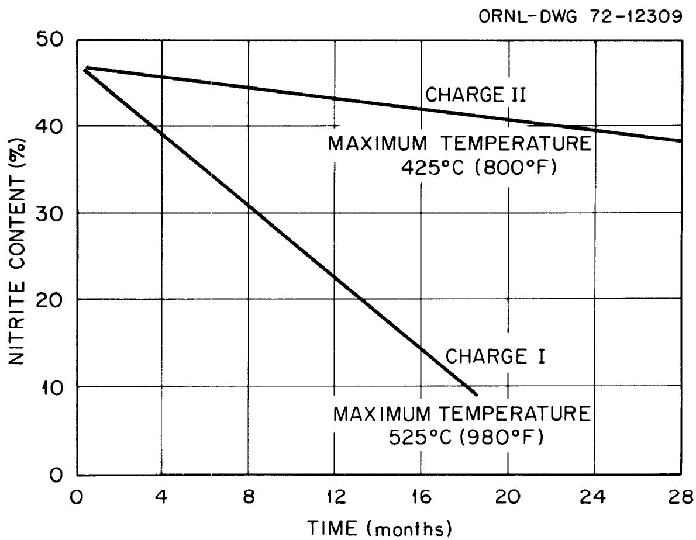
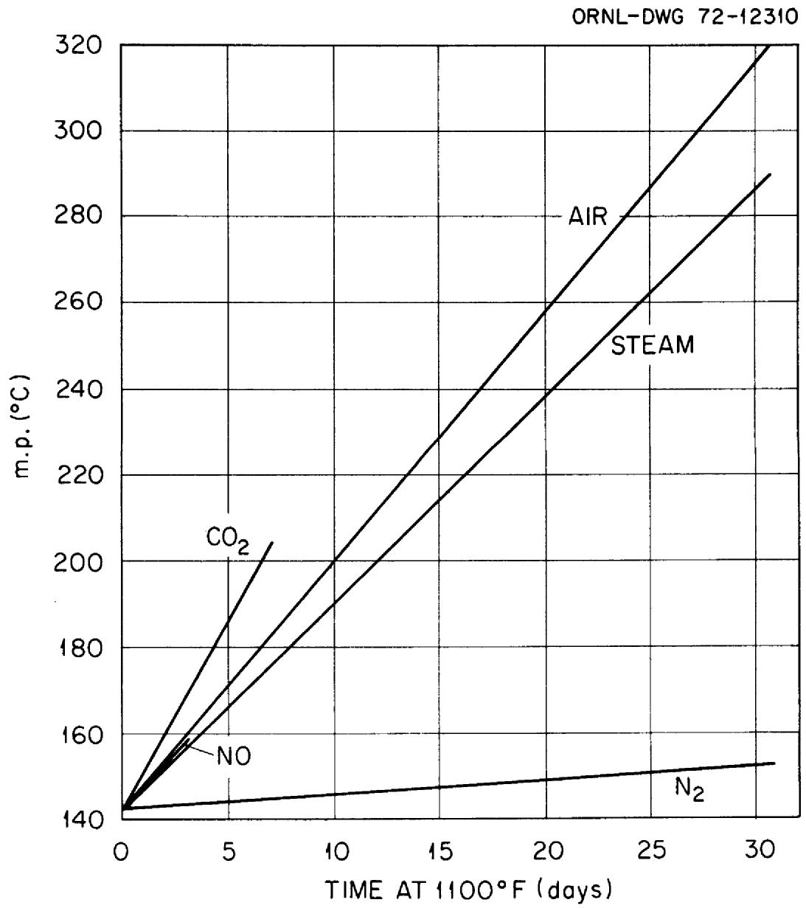
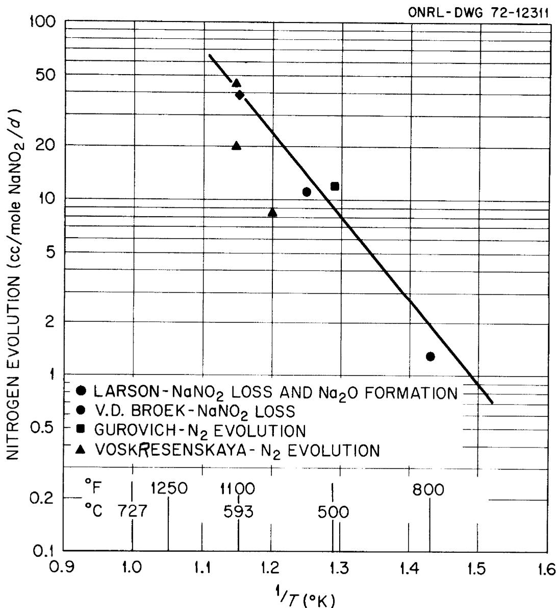
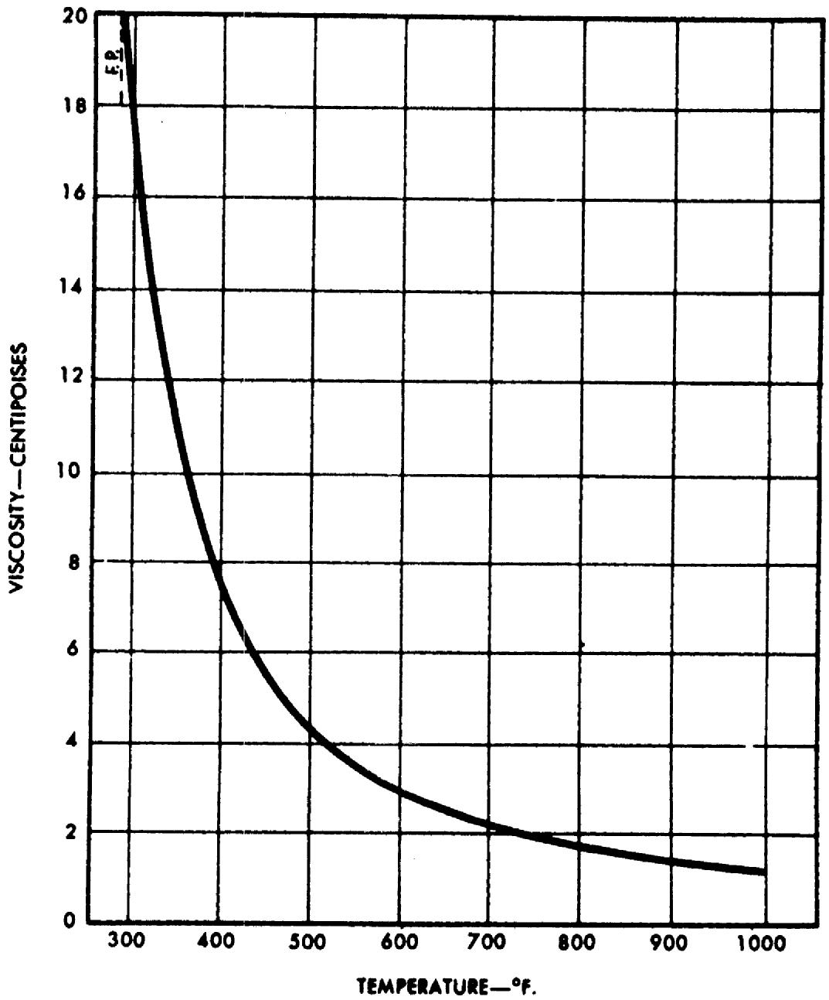
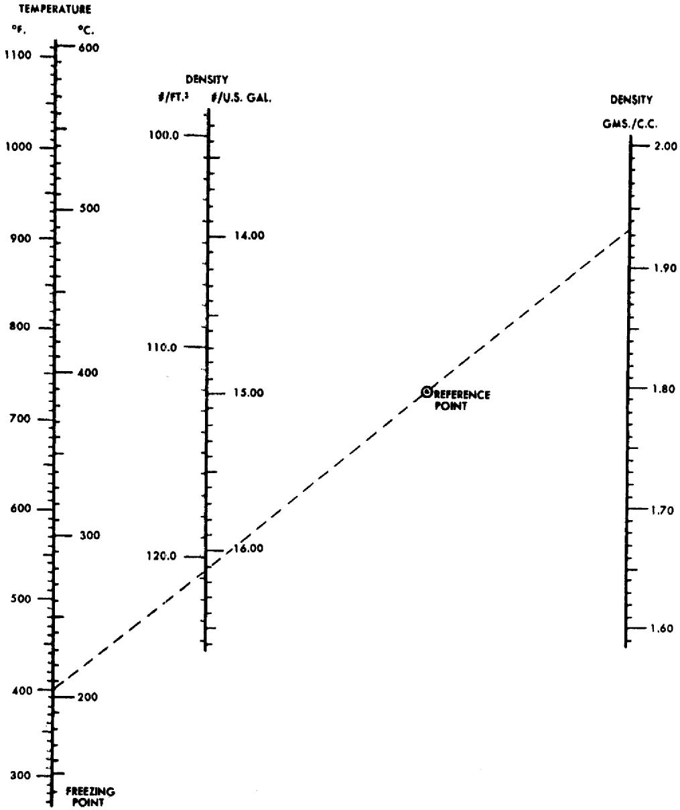
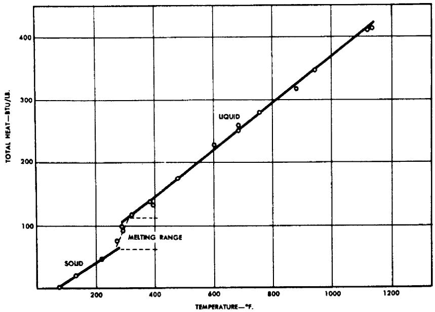

# HEAT TRANSFER SALT FOR

# HIGH TEMPERATURE STEAM GENERATION

E. G. Bohlmann

MASTER

DISTRIBUTION OF THIS DOCUMENT IS UNINFORM

OAK RIDGE NATIONAL LABORATORY

OPERATED BY UNION CARBIDE CORPORATION • FOR THE U.S. ATOMIC ENERGY COMMISSION

This report was prepared as an account of work sponsored by the United States Government. Neither the United States nor the United States Atomic Energy Commission, nor any of their employees, nor any of their contractors, subcontractors, or their employees, makes any warranty, express or implied, or assumes any legal liability or responsibility for the accuracy, completeness or usefulness of any information, apparatus, product or process disclosed, or represents that its use would not infringe privately owned rights.

Contract No. W-7405-eng-26

Reactor Chemistry Division

HEAT TRANSFER SALT FOR HIGH TEMPERATURE STEAM GENERATION

E. G. Bohlmann

DECEMBER 1972

# -NOTICE

This report was prepared as an account of work sponsored by the United States Government, Neither the United States nor the United States Atomic Energy Commission, nor any of their employees, nor any of their contractors, subcontractors, or their employees, makes any warranty, express or implied, or assumes any legal liability or responsibility for the accuracy, completeness or usefulness of any information, apparatus, product or process disclosed, or represents that its use would not infringe privately owned rights.

OAK RIDGE NATIONAL LABORATORY

Oak Ridge, Tennessee 37830

operated by

UNION CARBIDE CORPORATION

for the

U.S. ATOMIC ENERGY COMMISSION

# CONTENTS

Page

ABSTRACT AND SUMMARY. 1

INTRODUCTION. 3

COMPOSITION AND STABILITY 4

CORROSION 16

PHYSICAL PROPERTIES 23

Freezing Point 23

Viscosity. 23

Electrical Resistivity 23

Density. 26

Thermal Conductivity 26

Heat Transfer Coefficient. 26

Thermal Expansion. 28

Specific and Latent Heat 28

Efficiency 28

SAFETY PRECAUTIONS. 31

Principal Hazards. 31

Combustion Hazards 31

APPENDIX A. 35

APPENDIX B. 37

REFERENCES. 39

E. G. Bohlmann

# ABSTRACT AND SUMMARY

A literature review and canvass of vendors reveals no experience and sparse, short term data bearing on the possible use of heat transfer salt (HTS - 40% NaNO $_2$ , 7% NaNO $_3$ , 53% KNO $_3$ ) at temperatures $>1000^{\circ}$ F. Stability data found indicate that in a steam generator loop running with a maximum temperature of $1100^{\circ}$ F about 0.5% of the NaNO $_2$ would decompose per day according to the overall reaction

$$
5 \mathrm {N a N O} _ {2} \rightarrow 3 \mathrm {N a N O} _ {3} + \mathrm {N a} _ {2} \mathrm {O} + \mathrm {N} _ {2}.
$$

In the size loop envisioned for a Molten Salt Breeder Reactor (MSBR) the nitrogen produced would amount to $3400\mathrm{ft}^3/\mathrm{d}$ .

Austenitic stainless steels are recommended materials of construction above $850^{\circ}\mathrm{F}$ and short term test data suggest high nickel alloys like Incoloy, and Inconel would also be suitable. I would infer that Hastelloy-N would be resistant also.

A tertiary HTS steam generator loop would provide an effective barrier to transfer of tritium formed in an MSBR to the steam generator. The tertiary loop is required to eliminate the possibility of a violent moderator graphite - HTS reaction. However, projected use in an MSBR at temperatures to $\sim 1100^{\circ}\mathrm{F}$ would require a substantial development program directed at stability and/or composition re-adjustment and verification of materials compatibility. Thus, the presence of appreciable $\mathrm{Na_2O}$ and/or $\mathrm{NaOH}$ , depending on steam leakage, at such temperatures might appreciably alter the corrosion picture.

An industrial installation for drying NaOH was operated one and one half years with a maximum temperature of $980^{\circ}\mathrm{F}$ without difficulties due to corrosion or stability. The salt loop was constructed of ASTM 106 Grade A steel.

# INTRODUCTION

It is estimated that a molten salt breeder reactor will produce $\sim 2500$ $\mathrm{C_i}$ $^3\mathrm{T}$ per day. Transfer of appreciable percentages of this $^3\mathrm{T}$ to the steam generator system must be prevented to avoid resultant contamination and containment problems. A substantial barrier to such transfer would be provided by the use of heat transfer salt - HTS (Na-K, nitrite-nitrate mixture) in the reactor steam generator circuit. The HTS would be expected to block the tritium transfer in several ways:

1. Conversion of hydrogen to water by the reactions: (Cf Appendix A).

$$
\begin{array}{l} a. \quad N a N O _ {3} + H _ {2} \rightarrow N a N O _ {2} + H _ {2} O \quad \Delta F = - 4 4 k c a l \\ b. \quad H _ {2} + 1 / 2 O _ {2} ^ {*} \rightarrow H _ {2} O \quad \Delta F = - 4 6 k c a l \\ \text {F r o m N a N O} _ {3} \rightleftarrows \mathrm {N a N O} _ {2} + 1 / 2 \mathrm {O} _ {2} \\ \end{array}
$$

2. HTS systems are compatible with steam (used as inert cover gas in industrial applications1) so the water formed in 1 would not be corrosive to the steam generator tubing, thereby eliminating that possible alternate tritium transport mechanism.

3. The tritiated water could be stripped from the HTS as required.

4. Protective oxides, which inhibit tritium diffusion, are formed on alloys in contact with HTS. $^{2}$

Originally, consideration was given to the substitution of the HTS for the fluoroborate secondary coolant. However, the probability of a violent interaction $^{3,4}$ between the HTS and the graphite moderator (see section, Safety Precautions) in the event of contact during an accident eliminated this possibility. Such a violent interaction has been confirmed by an investigation carried out by Bamberger and Ross (Cf. Appendix B). Use of HTS as the secondary coolant would also necessitate extensive demonstration of compatibility with the very high radiation intensities in the primary heat exchanger.

An alternate possibility is the use of HTS in a separate, tertiary steam generator loop; $^7\mathrm{LiF - BeF}_2$ , or 92 NaBF₄-8NaF, would be used in the secondary loop. Increased cost would make this approach untenable were it not for other positive considerations. These include:

1. The low, $288^{\circ}\mathrm{F}$ , melting point of HTS makes possible significant simplification of the steam system; cheaper alloys would also be useable.   
2. Steam leaks into HTS will not enhance corrosion as it would in $92\mathrm{NaBF}_4 - 8\mathrm{NaF}$ or other fluoride coolants. Assuming all the water leaking into the fluoroborate participates, $\sim 5$ moles/h is equivalent to 1 mpy (uniform) for the entire secondary loop of an MSBR.   
3. Use of $^7\mathrm{LiF - BeF}_2$ in the secondary loop would eliminate poisoning of the fuel by leakage of secondary salt into the fuel; minor reverse leakage would also be more tolerable since the secondary loop could be included in the reactor cell. A substantially cheaper alternate might be NaF-ZrF₄ which has a reasonably low cross section and which probably is removable by the presently considered fuel processing methods.

Robertson5 has estimated the added cost of a third HTS loop, taking into account savings due to the above and other considerations. He concluded, "Addition of the $(\mathrm{L}_2\mathrm{B}$ and HTS) loops would increase the power production costs by 0.2 - 0.3 mills/kwhr, making the total cost about 5.5 mills/kwhr." The added capital cost amounted to 10 to 13 million dollars (206 total) depending on whether Incoloy 800 could be substituted for Hastelloy N in the secondary loop.

While this estimated increased cost was not favorable to the third loop approach to tritium control, this survey of the "state of the art" as regards use of HTS under MSBR conditions was also conducted. At first blush it appeared that the widespread industrial experience would minimize the development required for such adaptation; unfortunately the survey showed such optimism was not well founded.

# COMPOSITION AND STABILITY

Heat transfer salt was developed by duPont in the thirties for use in the chemical and petroleum process industries, notably the Houdry catalytic cracking and refining units. The usual weight $\%$ composition is $40\mathrm{NaNO}_2$ , $7\mathrm{NaNO}_3$ , $53\mathrm{KNO}_3$ which melts at $288^{\circ}\mathrm{F}$ ; the melting point is not greatly affected by appreciable alterations as shown in Table 1.

Table 1* - The Freezing Points of $\mathsf{NaNO}_2$ - $\mathsf{NaNO}_3$ - $\mathsf{KNO}_3$ Mixtures   

<table><tr><td>% NaNO2by wt.</td><td>% NaNO3by wt.</td><td>% KNO3by wt.</td><td>Freezing Point °F</td></tr><tr><td>100</td><td>0</td><td>0</td><td>540</td></tr><tr><td>50</td><td>0</td><td>50</td><td>282</td></tr><tr><td>44</td><td>3</td><td>53</td><td>284</td></tr><tr><td>42</td><td>3</td><td>55</td><td>287</td></tr><tr><td>40</td><td>0</td><td>60</td><td>289</td></tr><tr><td>40</td><td>7</td><td>53</td><td>288 (&quot;HTS&quot;)</td></tr><tr><td>38.5</td><td>11</td><td>50.5</td><td>293</td></tr><tr><td>38</td><td>6</td><td>56</td><td>292</td></tr><tr><td>35</td><td>7</td><td>58</td><td>311</td></tr><tr><td>34</td><td>13</td><td>53</td><td>305</td></tr><tr><td>34</td><td>3</td><td>63</td><td>328</td></tr><tr><td>30</td><td>20</td><td>50</td><td>305</td></tr><tr><td>30</td><td>10</td><td>60</td><td>312</td></tr><tr><td>30</td><td>0</td><td>70</td><td>333</td></tr><tr><td>0</td><td>100</td><td>0</td><td>586</td></tr><tr><td>0</td><td>0</td><td>100</td><td>633</td></tr></table>

*Table II, page 375, from Ref. 1.

Apparently the technology grew "like Topsy," as regards both composition and materials of construction, out of many years experience with salt baths used in heat treating and cleaning metals.

Presumably because of this and proprietary considerations, there is a paucity of quantitative data on stability and corrosion in the open and vendor literature; this in spite of widespread use in substantial quantities - one Houdry unit used $\sim 10^{6}$ lb. Low cost (still $15\text{‰}/1$ b) and tractability under "rough and ready" handling also may have contributed.

At the time of its introduction the low, $288^{\circ}\mathrm{F}$ , melting point was a major advantage since it was below the temperature at which steam was available in most plants. The need for steam jackets and tracers, design

for complete gravity drainage, and other freeze-melt problems, however, gave the competitive nod to organics like "Dowtherm" for temperatures below $700^{\circ}\mathrm{F}$ . A patented European development available under license in the U.S. by American Hydrotherm Corp.,7,8 eliminates these problems by "salt dilution." This involves adding sufficient water to the salt at startup and starting at $500^{\circ}\mathrm{F}$ on cooldown-to keep the salt in solution at ambient ( $^\circ$ 50°F) temperature. The water is gradually flashed off at 200 - 500°F while circulating through the system; this eliminates the severe thermal shock of starting circulation at $500^{\circ}\mathrm{F}$ in a cold system or need for provision of an alternate preheat capability. Ten pilot plant and thirty-two plant size systems of this kind have been in operation since 1961 or are now under construction. American Hydrotherm claims a $20\%$ saving on capital costs for the use of salt dilution instead of dry salt,7 with no resultant materials or handling problems. A point by point comparison by American Hydrotherm9,10 of "Dowtherm A" with HTS using salt dilution indicates substantially lower costs for the latter. The dilution process also eliminates problems which may be caused by increases in melting point due to oxidation of nitrite to nitrate or formation of relatively insoluble $\mathrm{Na_2CO_3}$ from pickup of $\mathrm{CO_2}$ .8 J. Alexander, Jr., and S. G. Hindin11 have published detailed studies of the freezing points of the system sodium and potassium nitrites and nitrates and the effects of impurities on them. Commercially used measures for countering these effects also discussed included:

1. Use of hydrogen treatment in a bypass adsorption tower to reduce excess nitrate to nitrite.*   
2. Addition of concentrated $\mathrm{HNO}_3$ or gaseous $\mathrm{NO}_2$ to convert hydroxides and carbonates to nitrates and nitrites.   
3. Cold trap use to reduce carbonate levels.

Sodium hydroxide is formed by the reaction of the $\mathrm{Na}_2\mathrm{O}$ thermal decomposition product of HTS with water.

Various attempts to find definitive data on thermal stability at elevated temperatures were fruitless in spite of vendor and open literature recommendations for use to 1000 and $1100^{\circ}\mathrm{F}$ . These efforts are well characterized by one lead which reported successful use of HTS at temperatures as high as 1200 - $1300^{\circ}\mathrm{F}$ . A couple of phone calls located my original informant's source but produced the usual disclaimer. The use at such temperatures was occasional and involved only several pounds of HTS, which gave no trouble "if changed frequently." When asked what happened to the HTS, the reply was, "It gets pretty lumpy ....fast."

Up to $\sim 850^{\circ}\mathrm{F}$ widespread experience indicates HTS is stable in carbon steel systems even when operated with air access to the system. Slow oxidation of nitrite to nitrate and carbonate formation may increase the freezing point slowly, but these changes apparently do not result in any difficulties. Thus, Crowley and Helms trip report16 gives the composition

<table><tr><td></td><td>%</td></tr><tr><td>NaNO3</td><td>9.28</td></tr><tr><td>NaNO2</td><td>30.3</td></tr><tr><td>KNO3</td><td>48.7</td></tr><tr><td>K2CO3*</td><td>3.38</td></tr><tr><td>KC1</td><td>0.27</td></tr><tr><td></td><td>Σ91.93</td></tr></table>

* Alexander and Hindin11 indicate $\mathrm{Na}_2\mathrm{CO}_3$ would be more likely.

for bulk salt after an indeterminate period of operation (probably $>2$ years). The system has remained in operation with this salt charge since April 1967 ( $\sim$ 24000 h @ $800^{\circ}\mathrm{F}$ maximum) with no requirement for composition adjustment; new salt is added only to make up for losses. Helms also reports17 8 years use of the same batch of "Hitec" at a maximum bulk salt temperature of $843^{\circ}\mathrm{F}$ without observable deterioration; air access was prevented by nitrogen blanketing in this application. Vendor literature recommends such nitrogen, or steam, blanketing13,14 above $850^{\circ}\mathrm{F}$ , but contacts with vendor personnel uncovered no experience at such temperatures.

Data for the rate of disappearance of nitrite are given by W. H. v.d. Broek18 for heat transfer salt used in finishing (drying to $\sim 100\%$ ) NaOH.

In this application the composition

48% KNO3   
49% NaNO2   
3% Na2CrO4

was used. The addition of chromate is reported (ca. 1940)19 to inhibit decomposition of the nitrite to nitrate and oxide but Rottenberg (1957)3 states that the claims had not been established. Paul Larson12 also indicated that duPont had not found such additions either harmful or beneficial; but some users insisted on making them. W. H. v.d. Broek18 showed nitrite decrease rates graphically for 1 1/2 and 2 1/2 year periods of operation at maximum temperatures of 980 and $800^{\circ}\mathrm{F}$ respectively as shown in Fig. 1. Unfortunately only the plots for nitrite loss were given, so it is not possible (no analyses) to determine how the two possible reactions

1) $2\mathrm{NaNO}_2 + \mathrm{O}_2(\mathrm{air}) \rightarrow 2\mathrm{NaNO}_3$   
2) $5\mathrm{NaNO}_{2} \xrightarrow[\Delta]{\rightarrow} 3\mathrm{NaNO}_{3} + \mathrm{Na}_{2}\mathrm{O} + \mathrm{N}_{2}$

contributed to the observed changes. Also, during the high temperature operation, concern about the pump caused the system to be opened to the atmosphere frequently; this was minimized during the second run at $800^{\circ}\mathrm{F}$ . Still another factor may have contributed to the rapid loss of nitrite at $980^{\circ}\mathrm{F}$ ; it is reported $^{20}$ that the decomposition of alkali nitrate - nitrite mixtures is catalyzed by iron above $520^{\circ}\mathrm{C}$ , and the system described by v.d. Broek was made of carbon steel. Stainless steel does not catalyze decomposition of alkali nitrate - nitrite mixtures even at $800^{\circ}\mathrm{F}$ . $^{21}$

Some laboratory studies in 316 stainless steel containers have been carried out at $1100^{\circ}\mathrm{F}$ .12 Figure 2 shows the effect of various blanket gases on the melting point of "Hitec;" "melting point" in HTS parlance refers to the temperature at which any solid phase appears. Reactions considered significant in the decomposition of nitrate - nitrite mixtures (the sodium salts are indicated because they are less stable)21 include:

Fig. 1. Nitrite Decomposition in Industrial Process Loop Using HTS*   
  
*Per W. H. v.d. Broek, see Ref. 18.

  
Fig. 2. Effect of Various Blanket Gases on HTS m.p. (See Ref. 12)

$$
\mathrm {N a N O} _ {3} \quad \rightleftarrows \quad \mathrm {N a N O} _ {2} + \frac {1}{2} \mathrm {O} _ {2} \tag {1}
$$

$$
2 \mathrm {N a N O} _ {2} \rightarrow \mathrm {N a} _ {2} \mathrm {O} + \mathrm {N} _ {2} \mathrm {O} _ {3} \tag {2}
$$

$$
\mathrm {N a N O} _ {2} + \mathrm {N} _ {2} \mathrm {O} _ {3} \rightarrow \mathrm {N a N O} _ {3} + 2 \mathrm {N O} \tag {3}
$$

$$
\mathrm {N a N O} _ {2} + 2 \mathrm {N O} \rightarrow \mathrm {N a N O} _ {3} + \mathrm {N} _ {2} \mathrm {O} \tag {4}
$$

$$
\mathrm {N a N O} _ {2} + \mathrm {N} _ {2} \mathrm {O} \quad \mathrm {N a N O} _ {3} + \mathrm {N} _ {2} \tag {5}
$$

The formation of $\mathrm{Na_2CO_3}$ and/or NaOH from reactions of carbon dioxide or water with the $\mathrm{Na_2O}$ formed in (2) account for the melting point increases with air, steam, and carbon dioxide blankets. Conversion of the nitrite to nitrate by reactions (4) and (5) probably accounts for the rapid increase in melting point with NO as the blanket gas. Reactions (2) thru (5) produce the rise under nitrogen, again through conversion of nitrite to nitrate. This is indicated by analysis of a salt mixture after six weeks under nitrogen at $1100^{\circ}\mathrm{F}$ which showed the composition to be that given in Table 2, with a melting point of $329^{\circ}\mathrm{F}$ .12

Table 2. Change in "Hitec" Composition After Six Weeks at $1100^{\circ}\mathrm{F}$   

<table><tr><td colspan="3">% Composition</td></tr><tr><td>Compound</td><td>Original</td><td>Final</td></tr><tr><td>NaNO3</td><td>7</td><td>18</td></tr><tr><td>NaNO2</td><td>40</td><td>28</td></tr><tr><td>KNO3</td><td>53</td><td>52</td></tr><tr><td>Na2O</td><td>--</td><td>2</td></tr></table>

Analysis of gas evolved gave $98.5\%$ $\mathbf{N}_2$ and $1.5\%$ $\mathbf{N}_2\mathbf{O}$

Gurovich and Shtokman $^{22}$ and Voskresenskaya and Berul $^{23}$ also conducted laboratory investigations of HTS stability at temperatures $>1000^{\circ}\mathrm{F}$ and found appreciable nitrogen evolution.

The studies from which decomposition data are available are summarized in Table 3. After an initial period, the generally accepted overall

Table 3. Long Term Decomposition Studies of Heat Transfer Salt   

<table><tr><td>Author &amp; Ref. No.</td><td>Temp. °F</td><td>Type System</td><td>Wt. HTS Used g</td><td>Exposure Time</td><td>Original NaNO2NaNO3</td><td>Composition KNO3</td><td>Na2CrO4</td><td>Observations</td><td>Equivalent* rate of N2evolution (cc/mole NaNO2/d)</td></tr><tr><td>Larson, 12</td><td>1100</td><td>316 ss autoclave</td><td>1000</td><td>42 d</td><td>40</td><td>7</td><td>53</td><td>-</td><td>Final composition: 28% NaNO2, 2% Na2O</td></tr><tr><td rowspan="3">v.d. Broek, 18</td><td>980</td><td></td><td></td><td>18 mo</td><td></td><td></td><td></td><td></td><td>Final composition: 10% NaNO2</td></tr><tr><td rowspan="2">800</td><td rowspan="2">ASTM A106 industrial process (circulating loop)</td><td>Very large</td><td></td><td>49</td><td></td><td>48</td><td>3</td><td rowspan="2">Final composition: 38% NaNO2</td></tr><tr><td></td><td>30 mo</td><td></td><td></td><td></td><td></td></tr><tr><td>Gurovich &amp; Shtokman 22</td><td>934</td><td>Steel (.09C, 0.9Cr, 0.24V, 0.4Mo) autoclave</td><td>145</td><td>30 d</td><td>40</td><td>7</td><td>53</td><td>-</td><td>10 cc N2/d after 5 d</td></tr><tr><td rowspan="3">Voskresenskaya &amp; Berul&#x27; 23</td><td>1040</td><td>Ag autoclave</td><td>50</td><td>30.8 d</td><td>40</td><td>7</td><td>53</td><td>-</td><td>0.09 g N2evolved</td></tr><tr><td>1112</td><td>Ag autoclave</td><td>50</td><td>10 d</td><td>40</td><td>7</td><td>53</td><td>-</td><td>0.07 g N2evolved</td></tr><tr><td>1112</td><td>18Cr 25N1 2S1 steel autoclave</td><td>25</td><td>10.2 d</td><td>40</td><td>7</td><td>53</td><td>-</td><td>0.08 g N2evolved</td></tr></table>

\*Assuming over-all reaction is $5\mathrm{NaNO}_2\rightarrow 3\mathrm{NaNO}_3 + \mathrm{Na}_2\mathrm{O} + \mathrm{N}_2$

decomposition reaction is

$$
5 \mathrm {N a N O} _ {2} \rightarrow 3 \mathrm {N a N O} _ {3} + \mathrm {N a} _ {2} \mathrm {O} + \mathrm {N} _ {2}.
$$

This stoichiometry was used to calculate the nitrogen evolution rate from the results reported by the experimenters; the rate was necessarily assumed to be constant, although Voskresenskaya and Berul $^{23}$ and others indicate it decreases with time. The calculated $\mathbf{N}_2$ evolution rates are those given in the final column in Table 3 and are plotted in Figure 3. Considering the disparate conditions of the several investigations the results are pleasantly consistent although more data would be helpful in more firmly removing the possibility of coincidence. The two low points due to Voskresenskaya and Berul' are for the experiments performed in silver; they and other investigators reported lower decomposition rates in noble metal containers than in carbon and alloy steels. The data due to v.d. Broek are of particular interest; recall that they were obtained from HTS in use in an industrial process loop (dewatering NaOH) and the only temperatures given were the maximums in the loop. Thus the average temperatures were appreciably lower and the data should fall below those from the isothermal studies of Larson and Gurovich and Shtokman - as they do. The consistency in all these studies suggests that the measured decomposition rates may be reasonably accurate for an engineering operation.

If one accepts then that these data may be considered reasonably representative of the tertiary loop as envisioned by Robertson5 (maximum temperature $1100^{\circ}\mathrm{F}$ ), a decomposition rate of about 40 cc $\mathrm{N}_2$ /mole $\mathrm{NaNO}_2/\mathrm{d}$ would be anticipated. For the $9 \times 10^{5}$ lb of HTS ( $40\%$ $\mathrm{NaNO}_2$ ) in the tertiary loop, this amounts to 4200 moles ( $3400\mathrm{ft}^3$ ) $\mathrm{N}_2/\mathrm{d}$ . The nitrite loss would amount to 21,200 ( $2200\mathrm{lb}$ ) moles per day; i.e., $1.0\%$ /d.

Extrapolation to temperatures above $1100^{\circ}\mathrm{F}$ is questionable since various workers[23,24] report nitrogen oxides are also evolved above $600^{\circ}\mathrm{C}$ . These were short term studies, however, and it may be that the evolution of oxides of nitrogen would not continue after a period, as happened in the longer term studies at lower temperatures. Voskresenskaya and Berul[23] also reported substantial attack on the containers in some of their experiments, unlike other experimenters. When this occurred with high Cr alloys, appreciable amounts of chromate were found in the melts.

  
Fig. 3. Rate of Nitrogen Evolution from HTS vs Temperature

Voskresenskaya and Berul $^{23}$ also present data showing the rate of nitrogen evolution as a function of nitrite concentration. These data, interpolated from a small graph and given in Table 4, are only indicative, but they are consistent with other observations. This suggests that a mixture consisting of $8\%$ $\mathrm{NaNO}_2$ , $42\%$ $\mathrm{NaNO}_3$ and $50\%$ $\mathrm{KNO}_3$ might result in lower $\mathbf{N}_2$ evolution rates. The sodium nitrate-sodium nitrite ratio was chosen on the basis of Freeman's $^{25}$ observation that the ratio (under one atmosphere of oxygen) is 5.9 at $600^{\circ}\mathrm{C}$ . Curiously, no observer mentions the evolution of oxygen from the usual mixtures at such temperatures. Alexander and Hindin's $^{11}$ data indicate a melting point of $\sim 420^{\circ}\mathrm{F}$ for such a mixture, still adequately low for simplification of the steam cycle.

Apparently the equilibrium

$$
\mathrm {N a N O} _ {3} \leftrightarrow \mathrm {N a N O} _ {2} + \frac {1}{2} \mathrm {O} _ {2}
$$

is substantially shifted to the left in HTS; Freeman's data indicate $\mathsf{P}_{\mathsf{O}_2}$ would be about 0.3 atm at $600^{\circ}\mathrm{C}$ for the usual mixture. Presumably, however, the equilibrium would shift to the right as the percent nitrate is increased, with resultant evolution of oxygen. Perhaps a mechanism change also occurs and the oxygen appears as the oxides of nitrogen observed by some observers $^{24,25}$ at temperatures $>1100^{\circ}\mathrm{F}$ .

Table 4. Rate of Nitrogen Evolution vs $\mathsf{NaNO}_2$ Concentration at $550^{\circ}\mathsf{C}^{*}$   

<table><tr><td colspan="2">% Composition</td><td rowspan="2">cc N2/100g NaNO2/hr</td></tr><tr><td>NaNO2</td><td>KNO3</td></tr><tr><td>100</td><td>0</td><td>360</td></tr><tr><td>80</td><td>20</td><td>135</td></tr><tr><td>60</td><td>40</td><td>15</td></tr><tr><td>40</td><td>60</td><td>8</td></tr><tr><td>20</td><td>80</td><td>5</td></tr></table>

*These were short term (to 20 h) studies and are therefore only indicative.

# CORROSION

As with thermal stability, corrosion data are sparse, and then only from relatively short term tests. Considerable experience has demonstrated acceptable, economic performance with no apparent necessity for quantitative, long term corrosion data. The vendors recommend against use of carbon steel above $850^{\circ}\mathrm{F}$ ; at lower temperatures it gives excellent, long term service.[3,13,16] Rottenberg[3] gives the following description of how troubles can arise in a poorly designed maloperated, direct fired heater,

"The main danger is, as usual, overheating in the stagnant film at heating surfaces. The danger is accentuated in this case by the ability of HTS to detach particles of rust and scale from the inside of the plant and deposit it as sludge at the bottom. Even more important is the fact that with gross overheating, at local temperatures above $700^{\circ}\mathrm{C}$ , a new reaction sets in with the rapid breakdown of nitrate to oxygen, nitrogen, and oxide. In the presence of a mild steel surface, the oxygen combines with it in a thermite type reaction which is self-sustaining and rapidly burns through the metal. No reaction takes place with stainless steel. In plants operating at high bulk temperatures heating sections should be constructed of stainless steel to obviate this danger."

In the operation described previously, however, v.d. Broek $^{18}$ observed no corrosion of the system during 1 l/2 years of operation with a maximum temperature of $980^{\circ}\mathrm{F}$ . The heater section and the rest of the heat transfer loop were made of carbon steel (ASTM A106) with nickel and "Incoloy" at the interfaces in the NaOH concentrator. Conventional use of nickel and nickel alloys for materials of construction in caustic concentrators using heat transfer salt $^{26}$ and v.d. Broek's experience indicate good compatibility for these materials to $\sim 1000^{\circ}\mathrm{F}$ . Other qualitative assessments of corrosion by heat transfer salt during extended operating periods are summarized in Table 5.

Miscellaneous corrosion data are shown in Table 6, taken from the "Hitec" pamphlet.13 While no experimental details are provided, it is probable that the results are from quite short term (a few hundred hours) tests. The two period tests at $1058^{\circ}\mathrm{F}$ indicate the corrosion rates of the highly alloyed materials decrease with time. Note, however, that Inconel was an exception in spite of the excellent results at $1000^{\circ}\mathrm{F}$ and for nickel at $1100^{\circ}\mathrm{F}$ . Similar results are shown by data furnished by J. Friedman27 which are presented in Table 7. The relatively short

Table 5. Qualitative Assessments of Corrosion by Heat Transfer Salt   

<table><tr><td>Alloy</td><td>Time yr.</td><td>Temp. °F</td><td>Blanket Gas</td><td>System</td><td>Comment</td><td>Ref.</td></tr><tr><td rowspan="3">ASTM-A-285 Grade C Carbon Steel</td><td>3</td><td>800</td><td>Air</td><td>Circulating</td><td>No noticeable corrosion</td><td>27</td></tr><tr><td>3</td><td>785-800</td><td>Limited Air</td><td>Circulating</td><td>No noticeable corrosion</td><td>27</td></tr><tr><td>2.5</td><td>875</td><td>Steam</td><td>Circulating</td><td>No noticeable corrosion</td><td>27</td></tr><tr><td>347 SS</td><td>1.3</td><td>1050</td><td>Air</td><td>Heat Treat Bath</td><td>Negligible corrosion</td><td>27</td></tr><tr><td>347 SS</td><td>2</td><td>1000</td><td>Steam</td><td>Circulating</td><td>No noticeable corrosion</td><td>27</td></tr><tr><td>Seamless Stainless Tubing</td><td>0.8</td><td>930-1020</td><td>?</td><td>Circulating</td><td>No visible attack</td><td>13</td></tr></table>

TABLE 6   

<table><tr><td rowspan="4">Metals</td><td colspan="6">CORROSION OF METALS BY &quot;HITEC&quot;</td></tr><tr><td colspan="6">Corrosion Rate, Inches Penetration Per Month</td></tr><tr><td>612°F.</td><td>785°F.</td><td>850°F.</td><td>1000°F.</td><td>1058°F.</td><td>1100°F.</td></tr><tr><td></td><td></td><td></td><td></td><td>1st Period</td><td>2nd Period</td></tr><tr><td>Steel-open hearth (ASME # S-17)</td><td>—</td><td>—</td><td>0.0003</td><td>0.001 to 0.002</td><td>—</td><td>0.01 to 0.05</td></tr><tr><td>Alloy steels</td><td></td><td></td><td></td><td></td><td></td><td></td></tr><tr><td>15-16% chromium iron</td><td>—</td><td>—</td><td>—</td><td>0.0000</td><td>—</td><td>—</td></tr><tr><td>&quot;Alcrosil&quot; # 3</td><td>—</td><td>—</td><td>0.0002</td><td>0.001</td><td>—</td><td>0.002 to 0.006</td></tr><tr><td>&quot;Alcrosil&quot; # 5</td><td>—</td><td>—</td><td>0.0002</td><td>0.0005</td><td>—</td><td>0.001 to 0.002</td></tr><tr><td>Stainless steels</td><td></td><td></td><td></td><td></td><td></td><td></td></tr><tr><td>Type 304</td><td>—</td><td>—</td><td>—</td><td>0.0007</td><td>—</td><td>—</td></tr><tr><td>Type 304L</td><td>—</td><td>—</td><td>—</td><td>0.0006</td><td>—</td><td>—</td></tr><tr><td>Type 309 (annealed)</td><td>0.00002</td><td>0.00001</td><td>0.0000</td><td>—</td><td>0.00110</td><td>0.00064</td></tr><tr><td>Type 309 Cb</td><td>—</td><td>—</td><td>—</td><td>—</td><td>0.00156</td><td>0.00094</td></tr><tr><td>Type 310</td><td>—</td><td>—</td><td>—</td><td>—</td><td>0.00117</td><td>0.00077</td></tr><tr><td>Type 316</td><td>—</td><td>—</td><td>—</td><td>0.0000</td><td>—</td><td>—</td></tr><tr><td>Type 321</td><td>—</td><td>—</td><td>—</td><td>—</td><td>0.00111</td><td>0.00056</td></tr><tr><td>Type 347</td><td>—</td><td>—</td><td>—</td><td>0.0004</td><td>0.00109</td><td>0.00068</td></tr><tr><td>Type 446</td><td>—</td><td>—</td><td>—</td><td>—</td><td>0.00146</td><td>0.00072</td></tr><tr><td>Inconel</td><td>—</td><td>—</td><td>—</td><td>0.0000</td><td>0.00153</td><td>0.00151</td></tr><tr><td>Carpenter 20</td><td>—</td><td>—</td><td>—</td><td>—</td><td>0.00097</td><td>0.00059</td></tr><tr><td>&quot;Hastelloy&quot; B</td><td>0.00011</td><td>0.000003</td><td>—</td><td>—</td><td>—</td><td>—</td></tr><tr><td>Monel</td><td>—</td><td>—</td><td>—</td><td>0.0001</td><td>—</td><td>—</td></tr><tr><td>Bronze</td><td>0.00006</td><td>0.00008</td><td>0.0001</td><td>—</td><td>—</td><td>—</td></tr><tr><td>Phosphorized Admiralty</td><td>0.00006</td><td>0.00005</td><td>0.0001</td><td>—</td><td>—</td><td>—</td></tr><tr><td>Copper</td><td>—</td><td>—</td><td>—</td><td>0.03</td><td>—</td><td>—</td></tr><tr><td>Nickel</td><td>—</td><td>—</td><td>—</td><td>—</td><td>—</td><td>0.00025</td></tr></table>

Table 7. Resistance of Steels to Molten High Temperature Eutectic Salt at 900 and ${1100}^{ \circ  }\mathrm{F}$   

<table><tr><td rowspan="2">Quality and Cast No.</td><td rowspan="2">Testing Time in Hours</td><td colspan="2">900°F - 482°C</td><td colspan="2">1100°F - 593°C</td></tr><tr><td>Loss in Wt.a MGMS/CM2</td><td>Extrapolatedb Penetration at 1 year</td><td>Loss in Wt.a MGMS/CM2</td><td>Extrapolatedb Penetration at 1 year</td></tr><tr><td rowspan="3">MILD STEEL</td><td>24</td><td>2.0</td><td></td><td>21.4</td><td></td></tr><tr><td>100</td><td>3.6</td><td>7.1</td><td>39.6</td><td>31.7</td></tr><tr><td>500</td><td>21.0</td><td></td><td>-</td><td></td></tr><tr><td rowspan="3">ESSHETECML</td><td>24</td><td>2.9</td><td></td><td>9.8</td><td></td></tr><tr><td>100</td><td>3.3</td><td>2.4</td><td>14.0</td><td>9.2</td></tr><tr><td>500</td><td>9.2</td><td></td><td>-</td><td></td></tr><tr><td rowspan="3">ESSHETECRM.2</td><td>24</td><td>2.0</td><td></td><td>9.2</td><td></td></tr><tr><td>100</td><td>3.1</td><td>2.74</td><td>13.9</td><td>10.4</td></tr><tr><td>500</td><td>11.0</td><td></td><td>29.3</td><td>18.5</td></tr><tr><td rowspan="3">ESSHETECRM.5</td><td>24</td><td>1.5</td><td></td><td>4.1</td><td></td></tr><tr><td>100</td><td>2.4</td><td>2.3</td><td>8.0</td><td>6.3</td></tr><tr><td>500</td><td>9.3</td><td></td><td>17.2</td><td>14.7</td></tr><tr><td rowspan="3">RED FOX (Type 321 SS)</td><td>24</td><td>0.3</td><td></td><td>2.7</td><td></td></tr><tr><td>100</td><td>0.3</td><td>0.5</td><td>4.0</td><td></td></tr><tr><td>500</td><td>1.9</td><td></td><td>10.1</td><td>7.4</td></tr><tr><td rowspan="3">SILVER FOX (Type 316 SS)</td><td>24</td><td>NIL</td><td></td><td>2.2</td><td></td></tr><tr><td>100</td><td>NIL</td><td>0.03</td><td>3.5</td><td></td></tr><tr><td>500</td><td>0.1</td><td></td><td>4.8</td><td>3.8</td></tr></table>

aThe loss in weight was determined after descaling in sodium hydride.   
bAssumes adherence to parabolic rate law.

term data presented are consistent with parabolic rate law behavior — mils penetration $= k\sqrt{t}$ ; the extrapolated penetrations at one year are calculated from the data using this expression. The alloy compositions tested are given in Table 8.

The "Hitec" pamphlet13 (page 10) indicates copper is useable at moderate temperatures (to $600^{\circ}\mathrm{F}$ ), but corrodes rapidly at higher temperatures - 30 mils/mo at $1000^{\circ}\mathrm{F}$ , see Table 6. Rottenberg3 indicates, "Copper, aluminum, magnesium, and their alloys are all attacked more or less rapidly and should not be allowed to come into contact with HTS." (See additional comment on aluminum and magnesium under Safety Precautions.)

The presence of sulfate is said to be deleterious to the low alloy steels like CML and CRM2 (see Table 8), and Rottenberg states, "the corrosive action of HTS is greatly affected by the presence of oxide and hydroxide." Insolubles, like carbonate, may lead to erosion or localized overheating problems. The oxide and hydroxide effects would require investigation since temperatures of interest in MSBR's presumably would produce appreciable oxide which would be converted to hydroxide by any steam leakage.

Table 8. Analysis and Heat Treatment of Materials   

<table><tr><td rowspan="2">Quality and Cast No.</td><td colspan="7">Analysis Per Cent</td><td rowspan="2">Original Heat Treatment</td></tr><tr><td>C</td><td>Mn</td><td>Si</td><td>Ni</td><td>Cr</td><td>Mo</td><td>Ti</td></tr><tr><td>Mild Steel</td><td>0.116</td><td>0.44</td><td>0.24</td><td></td><td></td><td></td><td></td><td>700°C 1 Hr. AC</td></tr><tr><td>ESSHETE CML</td><td>0.074</td><td>0.53</td><td>0.54</td><td></td><td>0.92</td><td>0.52</td><td></td><td>920°C 1 Hr. FC</td></tr><tr><td>ESSHETE CRM.2</td><td>0.114</td><td>0.48</td><td>0.24</td><td></td><td>2.26</td><td>1.01</td><td></td><td>920°C 1 Hr. FC</td></tr><tr><td>ESSHETE CRM.5</td><td>0.069</td><td>0.48</td><td>0.30</td><td></td><td>5.03</td><td>0.56</td><td></td><td>920°C 1 Hr. FC</td></tr><tr><td>RED FOX (Type 321 SS)</td><td>0.047</td><td>1.73</td><td>0.60</td><td>8.56</td><td>18.44</td><td>-</td><td>0.42</td><td>1050°C 1 Hr. AC</td></tr><tr><td>SILVER FOX (Type 316 SS)</td><td>0.05</td><td>1.66</td><td>0.37</td><td>11.26</td><td>17.28</td><td>2.79</td><td></td><td>1100°C 1 Hr. AC</td></tr></table>

# PHYSICAL PROPERTIES

Table 9, compiled by Robertson, $^{5}$ compares several salts useable in MSBR's. Hitec compares favorably with the other two coolant salts.

The remainder of this section, and the subsequent one on Safety Precautions is taken from the "Hitech" pamphlet.13 Figure and Table numbers are those used in the pamphlet.

"Freshly prepared "Hitec" is a white, granular solid; in the molten state, it has a pale yellow color. It is a eutectic mixture of inorganic salts having the following composition:

<table><tr><td>Potassium Nitrate</td><td>53%</td></tr><tr><td>Sodium Nitrite</td><td>40%</td></tr><tr><td>Sodium Nitrate</td><td>7%</td></tr></table>

# Freezing Point

"The freezing point of fresh "Hitec" is $288^{\circ}\mathrm{F}$ , and it can therefore be melted readily by plant steam at a pressure as low as 50 psig. The presence of a small amount of moisture sharply reduces the freezing point, and in order to determine the freezing point accurately, it is recommended that the salt be melted and dried by heating at about $480^{\circ}\mathrm{F}$ . Driving off water vapor in this manner may cause effervescence or frothing, depending on the amount of moisture present, and it is recommended that suitable precautions be taken to protect personnel from spattering by the hot, molten salt.

# Viscosity

"The viscosity of molten "Hitec" was measured over the temperature range from 300 to $820^{\circ}\mathrm{F}$ , and these data were extrapolated to $1000^{\circ}\mathrm{F}$ with an accuracy believed sufficient for design purposes. The experimental points and extrapolated curve are shown in the graph of viscosity versus temperature, Figure 6.

# Electrical Resistivity

"The electrical resistivity of molten "Hitec" is 1.7 ohms per cu.cm. This value is approximately midway between that of water, $25 \times 10^{6}$ ohms per cu.cm., and that of mercury, $95.9 \times 10^{-6}$ ohms per cu.cm.

Table 9. Selected Properties of the MSBR Molten Salts   

<table><tr><td></td><td>\( ^7\text{LiF-BeF}_2 \)-ThF4-UF4</td><td>NaF-NaBF4</td><td>\( ^7\text{LiF-BeF}_2 \)</td><td>KNO3-NaNO2-NaNO3</td></tr><tr><td>Composition, mole %</td><td>71.7-16-12-0.3</td><td>92-8</td><td>66-34</td><td>44.2-48.9-6.9a</td></tr><tr><td>Molecular weight, approximate</td><td>64</td><td>104</td><td>33</td><td>84</td></tr><tr><td>Density, lb/ft3at 1000°F</td><td>212</td><td>117</td><td>124</td><td>105</td></tr><tr><td>Viscosity, lb/ft-hr at 1000°F</td><td>41</td><td>3</td><td>29</td><td>3</td></tr><tr><td>Specific heat, Btu/lb-°F</td><td>0.32</td><td>0.36</td><td>0.57</td><td>0.37</td></tr><tr><td>Thermal conductivity, Btu/ft-hr-°F</td><td>0.67 to 0.68</td><td>0.23</td><td>0.58</td><td>0.33</td></tr><tr><td>Estimated cost, $/lb</td><td>57.00</td><td>0.50</td><td>12.00</td><td>0.15</td></tr><tr><td colspan="5">Circulation required per loopbfor 556-MW(t) heat load:</td></tr><tr><td>1b/hr</td><td>23.4 x 106</td><td>18.3 x 106</td><td>13.3 x 106</td><td>14.7 x 106</td></tr><tr><td>gpm</td><td>14,260</td><td>19,500c</td><td>13,380</td><td>17,370</td></tr><tr><td>Liquidus temperature, °F</td><td>930</td><td>725</td><td>850</td><td>288</td></tr></table>

aEutectic composition.   
${}^{\mathrm{b}}$ Based on properties at average temperatures in MSBR system.   
${}^{\mathrm{c}}$ Based on ${250}^{ \circ  }\mathrm{F}\Delta \mathrm{t}$ in modified MSBR.

  
Fig. 6. Viscosity of Liquid HITEC

# Density

"The density-temperature relationship for molten "Hitec" is presented in the alignment chart of Figure 7. By drawing a straight line from the desired point on the temperature scale through the reference point, density can be read from the chart in grams per cu.cm., pounds per cu.ft., or pounds per U.S. gallon.

# Thermal Conductivity

"Thermal conductivity measurements on "Hitec" heat transfer salt have been reported by W. D. Powers, ANP Quarterly Progress Report, September 30, 1957, ORNL-2387 (Classified). A value of 0.35 B.T.U./(hr.) (sq.ft.) ( $^\circ F$ ./ft.) independent of temperature in the range from 468 to $689^\circ F$ was obtained using a parallel-plate, variable sample gap apparatus such as that described in ASME paper 56-SA-31 by C. F. Lucks and H. W. Deem. Battelle Memorial Institute, in a similar apparatus, extended the temperature range and obtained a value of 0.33 B.T.U./(hr.) ( $^\circ F$ ./ft.) independent of temperature in the range from 400 to $900^\circ F$ . (private communication from H. W. Hoffman, Oak Ridge National Laboratory and Battelle Memorial Institute).

"An earlier Russian article by Vargaftik, Neimark, and Oleshchuck which appeared in the Bulletin of the V.T.I., September 1952, No. 9 had reported values in the temperature range from 302 to $932^{\circ}\mathrm{F}$ which ranged from 0.26 to 0.17 B.T.U./(hr.) (sq.ft.) ( $^\circ$ F./ft.).

# Heat Transfer Coefficient

"Heat transfer coefficients (h) for "Hitec" flowing in turbulent motion inside horizontal circular, iron pipes have been determined over the temperature range of 580 to $960^{\circ}\mathrm{F}$ at linear velocities up to 6 feet per second. Details of this experimental work are published in Transactions of American Institute of Chemical Engineers 36, 371 (1940). Data on the thermal conductivity of "Hitec" were lacking, and the experimental results, therefore, were correlated in terms of the function $\frac{hD}{\mu 0.4}$ . Since the publication of this work, additional determinations of the heat transfer coefficient were reported by H. W. Hoffman and S. I. Cohen in a paper entitled Fused Salt Heat Transfer - Part III: Forced-

Fig. 7. Density of Liquid HITEC   
  
NOTE: TO FIND DENSITY, DRAW A STRAIGHT LINE FROM DESIRED POINT ON TEMPERATURE SCALE THROUGH THE REFERENCE POINT.

Convection Heat Transfer in Circular Tubes Containing the Salt Mixture $\mathrm{NaNO}_2$ - $\mathrm{NaNO}_3$ - $\mathrm{KNO}_3$ , ORNL-2433 (1957). The latter work apparently utilized a more accurate apparatus than that used in the earlier determinations. The data was correlated using the Colburn j function, $\left(\frac{\mathrm{h}}{\mathrm{CpG}}\right)\left(\frac{\mathrm{Cp}\mu}{\mathrm{k}}\right)^{2/3}$ . Hoffman and Cohen report that the variables ranged as follows:

Reynolds modulus $(\mathbf{N}_{\mathrm{Re}})$ , $\frac{\mathrm{DG}}{\mu}$ 4850-24,710

Prandtl modulus $(\mathbf{N}_{\mathbf{Pr}})$ , Cpu 4.2-9.1

Average fluid temperature 552-828°F.

Heat flux 62,800-194,500

B.T.U./hr.-ft.2

Under these conditions, the heat transfer coefficient varied from 800 to 2900 B.T.U./(hr.) (sq.ft.) $(^{\circ}\mathrm{F})$ . In heat transfer applications, "Hitec" behaves as a normal fluid and the standard correlations may be used in designing heat exchange equipment.

# Thermal Expansion

"The coefficient of linear thermal expansion for solid "Hitec", measured by the Dilatometer method of ASTM-D696-44, is $2.85 \times 10^{-5}$ per $^\circ \mathrm{F}$ . The coefficient of cubical thermal expansion for liquid "Hitec" is $2.016 \times 10^{-4}$ per $^\circ \mathrm{F}$ . (private communication from H. W. Hoffman, Oak Ridge National Laboratory).

# Specific and Latent Heat

"The total heat of "Hitec" was measured calorimetrically over the temperature range of 70 to $1100^{\circ}\mathrm{F}$ . The slopes of the total heat-temperature lines, Figure 8, indicated that the specific heat of solid "Hitec" is 0.32 and that of the melt 0.373 calories per gram per ${}^{\circ}\mathrm{C}$ (or B.T.U. per pound per ${}^{\circ}\mathrm{F}$ ). Latent heat of fusion appeared to be approximately 20 calories per gram (35 B.T.U. per pound).

# Efficiency

"The efficiency of "Hitec" heat transfer salt is well illustrated by a direct comparison to hot air, or flue gas, on a performance basis.

Such a comparison is given in Table I, and the details of the calculations used to obtain these data are given in the previously cited article appearing in Transactions of American Institute of Chemical Engineers 36, 371 (1940).

  
Fig. 8

# TABLEI

# COMPARISON OF "HITEC" AND AIR AS HEAT TRANSFER FLUIDS

Basis of Comparison:

Fluid Conduit: 1" I.D. Tubes

Average Fluid Temperature: $800^{\circ}\mathrm{F}$

Pressure Drop due to Friction: 3.5 lbs. / (sq.in.)/100 ft. of tubing

Difference between inlet and outlet fluid temperatures: $50^{\circ}\mathrm{F}$

# "HITEC"

<table><tr><td></td><td>at 3 atm.press.</td><td>at 10 atm.press.</td></tr><tr><td>Press. drop./100 ft.</td><td>3.5 lbs./sq.in.</td><td>3.5 lbs./sq.in.</td></tr><tr><td>Lbs./hr./tube</td><td>6000</td><td>185</td></tr><tr><td>Heat carrying capacity/tube</td><td>111,900 B.T.U./hr.</td><td>2310 B.T.U./hr.</td></tr><tr><td>No. of 1&quot; tubes required to transfer 111,900 B.T.U./hr. at 50°F. temperature difference.</td><td>1</td><td>48½</td></tr><tr><td>Total lbs./hr.</td><td>6000</td><td>8970</td></tr><tr><td>Theoretical HP required to overcome friction.</td><td>0.014</td><td>24.1</td></tr><tr><td>Individual coefficient of heat transfer.</td><td>858</td><td>28</td></tr></table>

# SAFETY PRECAUTIONS

# Principal Hazards

"The principal hazards associated with "Hitec" are those which apply to any operation involving the use of liquids at elevated temperatures. Adequate precautions should be taken to protect operating personnel from burns in case of equipment failure. There is a lesser danger that "Hitec," by supporting the combustion of other materials, may escalate an existing fire hazard. Similarly, there is a danger that prolonged contact of "Hitec" with human skin may cause dermatitis. Finally, "Hitec" should not be ingested by operating personnel in more than trace amounts because of the sodium nitrite which it contains.

"'Hitec' itself liberates no toxic vapors, but adequate ventilation should be supplied to remove products of combustion due to accidental or process contamination of the "Hitec" system. Although the combustion products of most organic compounds are principally carbon dioxide and water, traces of highly toxic gases such as carbon monoxide, oxides of nitrogen, etc., may also be present. It is reported that, in instances where a process utilizing "Hitec" generates steam, operating personnel complain of a salty taste after being in the area for a period of time, particularly when the weather is humid. Adequate ventilation will relieve this condition.

# Combustion Hazards

"Although "Hitec" itself is nonflammable, it will support the combustion of other materials, and salt units should not be located in the vicinity of wooden construction. Similarly, contamination of the work area with "Hitec" may increase any fire hazard created by the presence of combustible materials. These problems may be minimized by washing the work area regularly with water and by substituting non-flammable materials for combustible materials. For example, sand rather than sawdust should be used for clean-up, diking, etc. A number of tests have been carried out to estimate the hazards associated with the accidental contact of flammable materials with hot, molten "Hitec," but

since it is impossible to anticipate all conditions under which this product may be used, it is recommended that the user carry out additional tests before undertaking any novel applications.

"Combustible vapors generally react relatively slowly with "Hitec" and escape before combustion is complete. Gasoline vapors, high in unsaturated compounds, were bubbled through the molten salt for two hours at $1100^{\circ}\mathrm{F}$ , and over $90\%$ of the gasoline was recovered unchanged. The reaction between "Hitec" and ammonia was also studied under similar conditions, and less than $50\%$ of the ammonia reacted with the "Hitec" over a two-hour period at $1100^{\circ}\mathrm{F}$ . In both cases, changes in the salt were minor.

"Flammable liquids tend to vaporize rapidly in contact with molten "Hitec" and burn at the surface in the same manner as they might be ignited on any hot surface. Crude oil, for example, burned in a similar manner on the surface of "Hitec" at $1150^{\circ}\mathrm{F}$ . and on the surface of molten lead at the same temperature. Motor gasoline, cracked gasoline, gas oil, and crude oil mixed with sulfur were released below the surface of an open container of "Hitec" at $1100^{\circ}\mathrm{F}$ . In all cases, the hydrocarbons vaporized and burned, and in the cases of crude oil and gasoline, there was considerable spattering of hot salt due to the rapid, sub-surface vaporization of the liquids. Again, there was little change in the salt composition, indicating that the principal reactions were between the vaporized hydrocarbons and the air above the salt bath.

"Combustible solids, such as wood, coke, paper, plastics, cyanides, chlorates, ammonium salts, and active metals, such as aluminum and magnesium, offer somewhat greater hazards. Magnesium, except as an alloying agent in low concentration, must not come in contact with "Hitec." Heat treatment of aluminum parts in molten "Hitec" is a common and safe practice when suitable precautions are taken, as discussed in "Potential Hazards in Molten Salt Baths for Heat Treatment of Metals," Research Report No. 2, The National Board of Fire Underwriters (1946), 85 John Street, New York 7, New York. Thus, we strongly recommend that before attempting to use "Hitec" in this type application the potential hazards as discussed in the reference article be reviewed.

"In these cases it is possible for the solid combustible materials to remain in contact with the hot salt until they are completely oxidized,

and large volumes of combustion gases can be formed rapidly beneath the salt surface. This could, of course, result in rupture of equipment or violent spattering of hot salt.

"Violent combustion resulted when ground petroleum coke was held beneath the surface of "Hitec" at $1150^{\circ}\mathrm{F}$ , and in contact with iron, a thermite-like reaction took place. Similarly, mixtures of fine aluminum and iron filings reacted with "Hitec" at $1000^{\circ}\mathrm{F}$ . with the evolution of enough heat to burn through a nickel crucible.

"Finely divided charcoal flared up and burned vigorously when placed on the surface of "Hitec" at $1200^{\circ}\mathrm{F}$ , but grease burned quietly under the same conditions. When an oxygen-balanced mixture of "Hitec" and paraffin was heated rapidly to $1100^{\circ}\mathrm{F}$ , the paraffin merely volatilized and burned, leaving the salt practically unchanged. However, an 80/20 mixture of "Hitec" and nylon burned vigorously at $750^{\circ}\mathrm{F}$ , and subsequent analysis indicated the oxidizing salts had taken part in this reaction, as they had in the case of the coke held beneath the salt surface.

"All attempts to detonate "Hitec" or mixtures of "Hitec" with combustible products, such as paraffin, petroleum, nylon, and topped Houdry condensate, at $375^{\circ}\mathrm{F}$ . and 25 inches of mercury vacuum, were unsuccessful using either a No. 8 blasting cap or 0.5 lb. of blasting gelatin as the initiator. The salt was similarly insensitive at $1100^{\circ}\mathrm{F}$ . Attempts to detonate oxygen-balanced mixtures of "Hitec" and either finely divided charcoal or topped Houdry concentrate by heating the mixtures vigorously under confinement were also unsuccessful. It was estimated that pressures as high as 18,000 psi were attained during these tests.

"Water from spray sprinklers or low-velocity fog nozzles will not penetrate the surface of molten "Hitec" sufficiently to cause dangerous spattering, and this type of fire protection is recommended for oil-fired units and for processes involving combustible materials. Carbon dioxide and approved dry-powder type fire extinguishers can be used satisfactorily to extinguish fires in the vicinity of a salt unit, but vaporizing liquid (carbon tetrachloride), foam, and aqueous types, other than sprinklers or low-velocity fog types, should not be used. An adequate supply of clean, dry sand is useful for slagging and diking to confine the spread of escaped molten salt.

"If, for some reason, water is introduced into a unit containing "Hitec," the heat input should be kept low until all the water has been evaporated, and the system should be vented adequately in order to release the steam which is formed."

# APPENDIX A

November 4, 1970

To: W.R.Grimes

From: S. Cantor

Subject: The Reaction, $\mathrm{H}_{2}(\mathbf{g}) + (\mathrm{Na},\mathrm{K})\mathrm{NO}_{3}(\mathbf{\ell})\rightleftharpoons (\mathrm{Na},\mathrm{K})\mathrm{NO}_{2}(\mathbf{\ell}) + \mathrm{H}_{2}\mathrm{O}(\mathbf{g})$

I concur with the conclusion of Ed Bohlmann, namely, that the equilibrium, given above can prevent tritium from reaching the feed water and steam of a molten-salt reactor.

The basic data and considerations are as follows:

Nominal Composition of HTS

$$
\begin{array}{l} \mathrm {K N O} _ {3} - \mathrm {N a N O} _ {2} - \mathrm {N a N O} _ {3} \quad 5 3 - 4 0 - 7 \text {w e i g h t} \\ 49 - 44 - 7 \text {mole} \\ \end{array}
$$

HTS is a reciprocal system:

$$
\mathrm {K N O} _ {3} (\ell) + \mathrm {N a N O} _ {2} (\ell) \xrightarrow {\downarrow} \mathrm {K N O} _ {2} (\ell) + \mathrm {N a N O} _ {3} (\ell)
$$

Assuming that nitrate ion is larger than nitrite ion, this equilibrium is shifted somewhat to the left (the "large-large, small-small" rule in reciprocal systems). The ratio of activities, $\mathrm{KNO}_3 / \mathrm{KNO}_2$ and $\mathrm{NaNO}_2 / \mathrm{NaNO}_3$ would, therefore, be greater than unity.

Three equilibria to consider are:

(i) $\mathrm{KNO}_3(\ell)\stackrel {\rightharpoonup}{\geq}\mathrm{KNO}_2(\ell) + 1 / 2\mathrm{O}_2(\mathrm{g}),\quad \Delta \mathrm{G}_{\mathrm{T}}^{\circ}(\mathrm{kcal}) = 27.6 - 24.4(\mathrm{T} / 1000)$

$$
\text {R e f .} - R. F. \text {B a r t h o l o m e w , J . P h y s . C h e m . 7 0 , 3 4 4 2 (1 9 6 6) .}
$$

(ii) $\mathrm{NaNO}_3(\lambda) \neq \mathrm{NaNO}_2(\lambda) + 1/2\mathrm{O}_2(\mathrm{g}), \Delta G_{\mathrm{T}}^{\circ}(\mathrm{kcal}) = 24.0 - 24.0(\mathrm{T}/1000)$

$$
\text {R e f . - E . S . F r e e m a n , J . P h y s . C h e m . 6 0 , 1 4 8 7 (1 9 5 6) .}
$$

$$
\begin{array}{l} \text {F r e e m a n ' s d a t a r e r o w k e d b y L . E . G a s t w i r t a n d E . F . J o h n s o n ,} \\ \text {M A T T - 9 8 , A u g . 1 9 6 1 , p . 1 5 7 .} \end{array}
$$

(iii) $\mathrm{H}_{2}(\mathrm{~g}) + 1 / 2\mathrm{O}_{2}(\mathrm{~g}) \rightleftharpoons \mathrm{H}_{2}\mathrm{O}(\mathrm{~g}), \Delta \mathrm{G}_{\mathrm{T}}^{\circ}(\mathrm{kcal}) = -58.9 + 13.1(\mathrm{T} / 1000)$

$$
\text {R e f . -} O. \text {K u b a s c h e w s k i , E . L . E v a n s , a n d C . B . A l c o c k ,}
$$

$$
\text {M e t a l l u r g i c a l T h e r m o c h e m i s t r y , 4 t h E d i t i o n (1 9 6 7) , p . 4 2 4 .}
$$

Combining (i) and (iii),

(iv) $\mathrm{H}_2 + \mathrm{KNO}_3 \rightleftharpoons \mathrm{KNO}_2 + \mathrm{H}_2\mathrm{O}, \quad \Delta G^\circ (\mathrm{kcal}) = -31.3 - 11.3(\mathrm{T} / 1000)$

$$
\mathrm {a t} 8 7 3 ^ {\circ} \mathrm {K}, \mathrm {K} = 2. 0 6 \times 1 0 ^ {1 0} = \frac {\mathrm {p} _ {\mathrm {H} _ {2} \mathrm {O}} \mathrm {a} _ {\mathrm {K N O} _ {2}}}{\mathrm {p} _ {\mathrm {H} _ {2}} \mathrm {a} _ {\mathrm {K N O} _ {3}}}
$$

Guessing that $a_{\mathrm{KNO}_2} / a_{\mathrm{KNO}_3} = 0.1$ , then $p_{\mathrm{H}_2} = 5 \times 10^{-12} p_{\mathrm{H}_2\mathrm{O}}$ .

Assuming that $\mathfrak{p}_{\mathrm{H_2}}$ should be less than $10^{-13}$ atm, then $\mathfrak{p}_{\mathrm{H_2O}} \leq .02$ atm is tolerable.

Similarly when we combine (ii) and (iii),

(v) $\mathrm{H}_{2} + \mathrm{NaNO}_{3} \rightleftharpoons \mathrm{NaNO}_{2} + \mathrm{H}_{2}\mathrm{O}, \quad \Delta G^{\circ}(\mathrm{kcal}) = -34.9 - 10.9(\mathrm{T} / 1000)$

also at $873^{\circ}\mathrm{K}, \quad \mathrm{K} = 1.30 \times 10^{11} = \frac{\mathrm{p}_{\mathrm{H}_2\mathrm{O}} \mathrm{a}_{\mathrm{NaNO}_2}}{\mathrm{p}_{\mathrm{H}_2} \mathrm{a}_{\mathrm{NaNO}_3}}$

Now assuming that $\frac{a_{NaNO_2}}{a_{NaNO_3}} = 7$ (the mole fraction ratio when HTS is initially constituted), then

$$
p _ {H _ {2}} = 5. 4 \times 1 0 ^ {- 1 1} p _ {H _ {2} O}
$$

Thus at $873^{\circ}\mathrm{K}$ , equilibrium (v) rather than (iv) fixes the tolerable $\mathsf{p}_{\mathsf{H}_2\mathsf{O}}$ . Again, supposing that $\mathsf{p}_{\mathsf{H}_2}$ should be less than $10^{-13}$ atm, then $\mathsf{p}_{\mathsf{H}_2\mathsf{O}}$ should be maintained at less than $2\times 10^{-3}$ atm.

Finally, please note that the equilibrium constant for reaction (v) increases with decreasing temperature. For instance, at $800^{\circ}\mathrm{K}$ , the equilibrium constant $= 8.25 \times 10^{11}$ , which for $\mathsf{a}_{\mathsf{NaNO}_2} / \mathsf{a}_{\mathsf{NaNO}_3} = 7$ , means that the tolerable $\mathsf{p}_{\mathsf{H}_2\mathsf{O}}$ is a factor of 6 higher than at $873^{\circ}\mathrm{K}$ .

# S. Cantor

SC:mp

cc: E. G. Bohlmann

# APPENDIX B

Reactions of HITEC with Graphite and with 72-16-12 (1iF-BeF $_2$ -ThF $_4$ ) Salt

C. E. Bamberger and R. G. Ross*

A batch of $50\mathrm{g}$ of HITEC was prepared by melting the analytical grade components $\left(\mathrm{NaNO}_2, \mathrm{NaNO}_3, \mathrm{KNO}_3\right)$ in a quartz tube under argon. After melting, argon was bubbled through the liquid for 15 minutes (in order to remove any significant amount of moisture); the melt was cooled under flowing argon and stored in a dessicator.

In the first experiment a 10 g portion of HITEC was melted in an open quartz tube giving a liquid layer of $3/4$ depth. A piece of $4.5\mathrm{g}$ of "MSRE" graphite hanging from a platinum wire was dipped briefly (30 to 120 sec) into the melt at successive increasing temperatures and the visible signs of reaction were noted. Following is a listing of the observations. It made no difference whether the quartz tube was open to the atmosphere or was blanketed by flowing argon.

# No graphite introduced

$340^{\circ}\mathrm{C}$ : Very small bubbles formed in the bulk of the melt which on raising did not seem to disturb the surface of the liquid. The bubbles were so small that they were observed only by means of a catheter-meter.

# Graphite in the Melt

$340^{\circ}C$ : Large bubbles formed at the interface.   
$440^{\circ} \mathrm{C}$ : Faster evolution of large bubbles at the interface, the melt remained clear yellow.   
490°C: The melt became black 10-20 sec. after the graphite was introduced. The formation of bubbles was more vigorous than before. After removing the graphite the melt cleared up in ca. 5 minutes.

$545^{\circ}C$ : The melt became black again, then the melt started foaming vigorously and after approximately 45 seconds the graphite piece became suddenly incandescent. At this point a sharp rise of temperature was recorded. The graphite was removed and after approximately 10 minutes the melt cleared up again. The experiment was terminated.

The experiment was repeated and the reactions were recorded on 16 mm movie film, the only difference being that the melt was heated rapidly to $440^{\circ}\mathrm{C}$ and then to $550^{\circ}\mathrm{C}$ . The observations were the same as above but the time required for the incandescence of the graphite was ca. 2 minutes. After removal and cooling the graphite used in both experiments was washed and examined visually; it revealed a high degree of pitting and enhancement of the cracks that were initially present.

In a third experiment, approximately 9 g each of HITEC and 72-16-12 (LiF-BeF $_2$ -ThF $_4$ ) salt were loaded into a quartz tube (the HITEC at the bottom) and were gradually heated. At $250^{\circ}\mathrm{C}$ the molten HITEC bubbled at the interface with the lumps of fluoride salt and became cloudy-white, then completely opaque. In the range $350 - 410^{\circ}\mathrm{C}$ a large amount of yellow-brownish gas was evolved. The lumps of salt were no longer visible. At $430^{\circ}\mathrm{C}$ vigorous foaming occurred which displaced liquid and suspended material upwards. The experiment was terminated. Upon cooling, the solids were digested in hot water and repeatedly washed prior to analyzing the residue by x-ray diffraction. The results indicated the presence of $\mathrm{ThO_2}$ (major phase), BeO and LiF. (A few unidentified lines were also present.)

This could be interpreted to be the result of reactions such as

$$
\begin{array}{l} \mathrm {T h F} _ {4} (d) + 2 \mathrm {N O} _ {3} ^ {-} + 2 \mathrm {N O} _ {2} ^ {-} > \mathrm {T h O} _ {2} (c) + 4 \mathrm {F} ^ {-} + 2 \mathrm {N} _ {2} \mathrm {O} _ {4} (\mathrm {g}) \\ \mathrm {B e F} _ {2} (\mathrm {d}) + \mathrm {N O} _ {3} ^ {-} + \mathrm {N O} _ {2} ^ {-} \quad \stackrel {\rightleftarrows} {\rightleftarrows} \mathrm {B e O} (\mathrm {c}) + 2 \mathrm {F} ^ {-} + \mathrm {N} _ {2} \mathrm {O} _ {4} (\mathrm {g}) \quad (\text {o r} 2 \mathrm {N O} _ {2} (\mathrm {g})) \\ \end{array}
$$

From what is known of the oxide chemistry of U(IV) there is no doubt that $\mathrm{UO_2}$ would be the first insoluble phase to form if fuel salt is contacted by HITEC.

# References

1. H. P. Voznick and V. W. Uhl, "Molten Salt for Heat Transfer," Chem. Engrg. 70, 129 (May 27, 1963).   
2. Arminio Conte and Serge Casadio, "Potentiodynamic Study of the Behavior of Various Metals in Molten Alkali Nitrates," Ricera Scientifica, 36(6), 433 (1966).   
3. P. A. Rottenberg, "Heat Transfer Media for Use at Elevated Temperatures," Trans. Instn. Chem. Engrs. 35, 25 (1957).   
4. R. H. Newton and H. G. Shimp, Trans. Am. Inst. Chem. Engrs., 41, 197 (1945).   
5. R. C. Robertson, "Estimated Cost of Adding a Third Salt-Circulating System for Controlling Tritium Migration in the 1000 MW(e) MSBR," ORNL-TM-3428 (July 1971).   
6. W. E. Kirst, M. W. Nagle, and J. B. Castner, "A New Heat Transfer Medium for High Temperatures," Trans. Am. Inst. Chem. Engrs. 36, 371 (1940).   
7. Alfred Bruhn, "Capital Costs Trimmed by 20% by Heat Transfer Process," Chemical Processing 33(8), 15-30 (Aug. 1970).   
8. J. Friedman and A. A. Bruhn, "Diluted Salt Transfers Heat," Oil and Gas J. 68, 76 (1970).   
9. Private communication available from the author or American Hydrotherm, See Ref. 14.   
10. "U.S. Heat Transfer Systems Get a European Challenger," Chem. Engrg. 77, 26 (Nov. 30, 1970).   
11. J. Alexander, Jr., and S. G. Hindin, "Phase Relations in Heat Transfer Salt Systems," Ind. and Engrg. Chem. 39, 1044 (Aug. 1947).   
12. Paul Larson (phone conversations), E. I. duPont de Nemours and Co., Explosive Dept., Res. & Devel. Div., Technical Service Section, Eastern Laboratory, Gibbstown, New Jersey 08027.   
13. "DuPont Hitec Heat Transfer Salt," E. I. duPont de Nemours and Co., Explosives Dept., Chem. Products Sales Div., Wilmington, Del. 19898.   
14. "Hydrotherm Molten Salt Heat Transfer System," American Hydrotherm Corp., 470 Park Ave. South, New York, N. Y. 10016.

15. V. W. Uhl and H. P. Voznick, "High Temperature Heating Media," Chem. Engrg. Progress 59(5), 33 (May 1963).   
16. J. L. Crowley and R. E. Helms, "Visit to Hooker Chem. Corp. of Niagara Concerning Their Use of "Hitec" (HTS) Salt," MSR-70-94, Dec. 2, 1970.   
17. R. E. Helms, "E. I. duPont de Nemours and Company and Their Use of "Hitec" (HTS) Salt," MSR 71-24, March 1, 1971.   
18. W. H. v.d. Broek, private communication to J. R. McWherter, paper presented at Royal Netherlands Institution of Engineers on operating experience with HTS by W. H. v.d. Broek.   
19. J. M. Michel, U.S. Patents: 2,166,364; 2,196,153; 2,245,155.   
20. K. Leschewski and W. Degenhard, "The Chemical Changes of Molten Alkali Nitrates at Temperatures Between $460^{\circ}$ and $600^{\circ}\mathrm{C}$ ," Berichte der Deutsche Chemie Gesellschaft, 72B, 1763 (1939).   
21. E. S. Freeman, "The Kinetics of the Thermal Decomposition of Potassium Nitrate and of the Reaction Between Potassium Nitrite and Oxygen," J. Am. Chem. Soc. 79, 838 (1957).   
22. E. I. Gurovich and G. P. Shtokman, "Corrosion Activity of a Nitrate-Nitrite Molten Mixture," Zh. Prikl. Khim. 30, 1547 (1957).   
23. N. K. Voskresenskaya and S. I. Berul', "Thermal Stability of a Low-Melting Mixture of Nitrites and Nitrates of Sodium and Potassium," Zhurnal Neorganicheskoi Khimii, Vol. I, No. 8, 1956, pp. 1867-1876.   
24. Larry L. Anderson and George Richard Hill, "Corrosion of Zirconium and Zircaloy-2 in Fused $\mathrm{KNO}_3$ - $\mathrm{NaNO}_2$ - $\mathrm{NaNO}_3$ ," Electrochem. Technology 4(3-4), 157-162 (1966).   
25. Eli S. Freeman, "The Kinetics of the Thermal Decomposition of Sodium Nitrate and of the Reaction Between Sodium Nitrite and Oxygen," Thermal Decomposition of Sodium Nitrate 60, 1487 (1956).   
26. C. C. Van Soye, "Concentrator Breaks Heat Barrier," Chem. Engrg. 66, 98 (Sept. 21, 1959).   
27. Private communication: Joel Friedman, American Hydrotherm Corp., 470 Park Ave. South, New York, N. Y. 10016.

# Internal Distribution

R. G. Affel

C. E. Bamberger

H. F. Bauman

S. E. Beall

H. R. Beatty

M. Bender

C. E. Bettis

E. S. Bettis

R. E. Blanco

F. F. Blankenship

J. O. Blomeke

R. Blumberg

E. G. Bohlmann (20)

G. E. Boyd

J. Braunstein

M. A. Bredig

R. B. Briggs

H. R. Bronstein

R. E. Brooksbank

S. Cantor

W. L. Carter

O. B. Cavin

C. J. Claffey

F. H. Clark

C. W. Collins

E. L. Compere

W.H.Cook

J. W. Cooke

J. L. Crowley

F. L. Culler

R. J. DeBakker

J. H. Devan

J. R. DiStefano

S. J. Ditto

F. A. Doss

A. S. Dworkin

W. P. Eatherly

J. R. Engel

D. E. Ferguson

L. M. Ferris

A. P. Fraas

J. H. Frye

E. L. Fuller

L. C. Fuller

C. H. Gabbard

L. O. Gilpatrick

W. R. Grimes

A. G. Grindell

R. H. Guymon

B. A. Hannaford

T. H. Harley

W. O. Harms

P. N. Haubenreich

R. E. Helms

P. W. Hembree

D. M. Hewett

J. R. Hightower

E.C.Hise

B. F. Hitch

H.W.Hoffman

D. K. Holmes

P. P. Holz

W. R. Huntley

P. R. Kasten

R.J.Ked1

C.W.Kee

C. R. Kennedy

J. J. Keyes

S. S. Kirslis

J. A. Klein

J. W. Koger

A. I. Krakoviak

T. S. Kress

J. W. Krewson

Kermit Laughon, AEC-OSR

J. A. Lenhard

K. H. Lin

R. B. Lindauer

E. L. Long

M. I. Lundin

R. N. Lyon

H. G. MacPherson

R. E. MacPherson

W. R. Martin

C. L. Matthews, AEC-OSR

H. E. McCoy

H. F. McDuffie

D. L. McElroy

C. J. McHargue

H. A. McLain

L. E. McNeese

A. P. Malinauskas

G. Mamantov

H. J. Metz

A. S. Meyer

R. L. Moore

F. H. Neill

J. P. Nichols

E. L. Nicholson

S.M.Ohr

P. Patriarca

A. M. Perry

T. W. Pickel

H. B. Piper

C. B. Pollock

B. E. Prince

A. S. Quist

G. L. Ragan

G. D. Robbins

R. C. Robertson

M. W. Rosenthal (3)

R. G. Ross

J. P. Sanders

H. C. Savage

W. F. Schaffer

Dunlap Scott

H. E. Seagren

R. L. Senn

J. H. Shaffer

W. H. Sides

M. J. Skinner

A. N. Smith

G.P. Smith

O. L. Smith

I. Spiewak

R. A. Strehlow

J. R. Tallackson

O. K. Tallent

R. E. Thoma

L. M. Toth

D. B. Trauger

W.E.Unger

C. F. Weaver

A. M. Weinberg

J. R. Weir

W. J. Werner

M. E. Whatley

J. C. White

R.P.Wichner

W. M. Woods

H. C. Young

J. P. Young

E. L. Youngblood

Central Research Library (2)

Document Reference Section

Laboratory Records (3)

Laboratory Records (LRD-RC)

Division of Technical Information Extension (2)

Research and Development Division, ORO (1)

# External Distribution

A. A. Bruhn, American Hydrotherm Corp., 470 Park Ave., S., New York, N. Y. 10016.

Joel Friedman, American Hydrotherm Corp., 470 Park Ave., S., New York, N. Y. 10016.

P. A. Larson, E. I. duPont de Nemours & Co., Eastern Lab., Paulsboro, New Jersey.

A. B. Palmer, E. I. duPont de Nemours & Co., Wilmington, Delaware.

M. Shaw, AEC-Washington.

MSRP Program Manager, AEC-Washington.