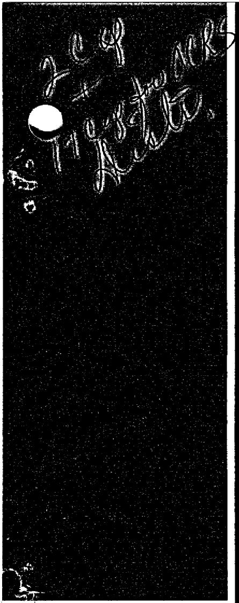

# DESIGN STUDIES OF A MOLTEN-SALT REACTOR DEMONSTRATION PLANT

E. S. Bettis

L. G. Alexander

H. L. Watts

MASTER

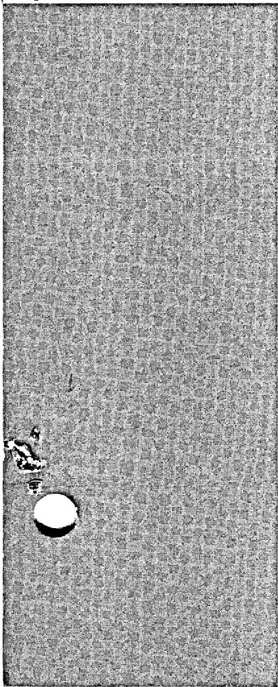

OAK RIDGE NATIONAL LABORATORY

OPERATED BY UNION CARBIDE CORPORATION • FOR THE U.S. ATOMIC ENERGY COMMISSION

This report was prepared as an account of work sponsored by the United States Government. Neither the United States nor the United States Atomic Energy Commission, nor any of their employees, nor any of their contractors, subcontractors, or their employees, makes any warranty, express or implied, or assumes any legal liability or responsibility for the accuracy, completeness or usefulness of any information, apparatus, product or process disclosed, or represents that its use would not infringe privately owned rights.

ORNL-TM-3832

Contract No. W-7405-eng-26

Reactor Division

DESIGN STUDIES OF A MOLTEN-SALT REACTOR

DEMONSTRATION PLANT

E. S. Bettis, L. G. Alexander,

H. L. Watts

Molten-Salt Reactor Program

JUNE 1972

# NOTICE

This report was prepared as an account of work sponsored by the United States Government. Neither the United States nor the United States Atomic Energy Commission, nor any of their employees, nor any of their contractors, subcontractors, or their employees, makes any warranty, express or implied, or assumes any legal liability or responsibility for the accuracy, completeness or usefulness of any information, apparatus, product or process disclosed, or represents that its use would not infringe privately owned rights.

NOTICE This document contains information of a preliminary nature and was prepared primarily for internal use at the Oak Ridge National Laboratory. It is subject to revision or correction and therefore does not represent a final report.

OAK RIDGE NATIONAL LABORATORY

Oak Ridge, Tennessee 37830

operated by

UNION CARBIDE CORPORATION

for the

U. S. ATOMIC ENERGY COMMISSION

# CONTENTS

Page

List of Figures iv   
List of Tables V   
Abstract 1   
Summary 1   
Introduction 3   
General Description 5   
Primary System 10   
Reactor 10   
Primary Heat Exchanger 26   
PrimaryPumps 32   
Secondary Circuits 33   
Tertiary Salt Circuit 35   
Steam System 37   
Reactor Building 38   
Cell Heating and Cooling 39   
Drain Tank System 45   
Off-Gas System 57   
Control Rods 60   
Instrumentation 61   
Maintenance 62   
Performance 62

1 1   
4 1 1   
x 1 1   
5 + 1

__________

__________

__________

__________

__________

__________

__________

__________

__________

__________

__________

__________

__________

__________

__________

__________

__________

__________

__________

__________

__________

__________

__________

__________

__________

#

__________

__________

__________

__________

__________

# LIST OF FIGURES

Page

Fig. 1. Simplified Flowsheet for 300-MW(e) Molten-Salt Demonstration Reactor   
Fig. 2. Reactor Vessel Elevation 12   
Fig. 3. Reactor Vessel Plan 13   
Fig. 4. Axial Reflector Mounting 15   
Fig. 5. Reflector Attachment 17   
Fig. 6. Reactor Core and Reflector Plan 19   
Fig. 7. Core Cell Plan 20   
Fig. 8. Core Peripheral Cell Plan 21   
Fig. 9. Bottom Graphite Grid 23   
Fig. 10. Graphite Collar 24   
Fig. 11. Core Orificing and Tie Plates 25   
Fig. 12. Control Rod Cell 27   
Fig. 13. Primary Heat Exchanger 30   
Fig. 14. Primary Heat Exchanger Head Closure Detail 31   
Fig. 15. Reactor Building Elevation 40   
Fig. 16. Reactor Building Plan 41   
Fig. 17. Reactor Cell and Heat Exchanger Cell Elevation 42   
Fig. 18. Drain Tank Cell Elevation 43   
Fig. 19. Primary Heat Exchanger Support 44   
Fig. 20. Drain Tank Plan 48   
Fig. 21. Drain Tank Elevation 49   
Fig. 22. Drain Tank Heat Sink 52   
Fig. 23. Drain Valve 53   
Fig. 24. Drain Tank Jet Pump Assembly 55

Page

Fig. 25. Processing and Storage Tank Plan 58   
Fig. 26. Processing and Storage Tank Elevation 59

# LIST OF TABLES

Table 1. Axial Reflector Hydraulic Data 16   
Table 2. MSDR Primary Heat Exchanger Design Data 28   
Table 3. Physical Properties of the Fuel and Coolant Salts Used in the MSDR 29   
Table 4. MSDR Secondary Heat Exchanger Design Data 34   
Table 5. Steam Generating Data 37   
Table 6. Heater Design Data for MSDR Containment Cells 46   
Table 7. Cell Cooling System 47   
Table 8. Dump Tank Heat Sink Data 50   
Table 9. Lifetime Averaged Performance of a 750-MW(t) Molten-Salt Demonstration Reactor 63

# DESIGN STUDIES OF A MOLTEN-SALT REACTOR

# DEMONSTRATION PLANT

E. S. Bettis, L. G. Alexander, H. L. Watts

# ABSTRACT

The MSDR, a 350-MW(e) Molten-Salt Reactor Demonstration Reactor, is based on technology much of which was demonstrated by the MSRE. The cylindrical vessel (26 ft diam by 26 ft high) houses a matrix of graphite slabs forming salt passages having a volume fraction in the core of $10\%$ . The flow of fuel salt is distributed so that the temperature rise along any path is the same - from 1050 to $1250^{\circ}\mathrm{F}$ . In the primary exchanger, heat is transferred to barren carrier salt (in at $900^{\circ}\mathrm{F}$ , out at $1100^{\circ}\mathrm{F}$ ). In the secondary exchanger, heat is transferred to a stream of Hitec salt (in at $800^{\circ}\mathrm{F}$ , out at $1000^{\circ}\mathrm{F}$ ). The Hitec oxidizes tritium to tritiated water which is removed and disposed of. The Hitec generates steam at $900^{\circ}\mathrm{F}$ , $2^{4}00$ psi in a boiler, superheater, and reheater. Electricity is produced at an overall efficiency of $36.6\%$ . Soluble fission products are removed by discarding the carrier salt every 8 years after recovery of the uranium by fluorination. Volatile fission products are removed by sparging the fuel salt with helium bubbles in the reactor primary system. The fuel cycle cost was estimated to 0.7 mill/kWhr for inventory, 0.3 mill/kWhr for replacement, and 0.1 mill/kWhr for processing, giving a total of 1.1 mills/kWhr.

# SUMMARY

The purpose of this study was to describe a semi-commercial-scale molten-salt reactor and power plant that would be based on the technology, much of which was demonstrated by the Molten-Salt Reactor Experiment. The plant was designed to produce 350 electrical megawatts. The nuclear conversion ratio is about 0.9, and the specific power is about 0.5 MW(e) per kilogram fissile.

The reactor consists of a cylindrical vessel about 26 ft in diameter and about 26 ft high filled with a matrix of graphite slabs forming flow passages 0.142 in. thick by 9-3/8 in. wide and with a volume fraction in

the core of about $10\%$ . The reflectors consist of graphite slabs cooled by a small flow of fuel salt. Flow through the core and reflectors is regulated by orifices so that the temperature rise of the fuel, with minor exceptions, along any flow path is approximately the same.

The fuel salt consists of a mixture of the fluorides of $^{7}\mathrm{Li}$ , beryllium, thorium, and uranium (initially $^{235}\mathrm{U}$ ). Salt leaving the reactor at $1250^{\circ}\mathrm{F}$ flows through the tubeside of a shell-and-tube exchanger where heat is transferred to a secondary salt stream composed of barren carriers salt. The fuel salt exits at $1050^{\circ}\mathrm{F}$ and is recirculated to the reactor.

Secondary salt enters the exchanger at $900^{\circ}\mathrm{F}$ and leaves at $1100^{\circ}\mathrm{F}$ . It flows to a secondary exchanger, also shell-and-tube, where the heat is transferred to a tertiary salt stream, a mixture of $\mathrm{KNO}_3$ , $\mathrm{NaNO}_3$ , and $\mathrm{NaNO}_2$ known as Hitec. The purpose of the Hitec loop is to trap tritium formed in the reactor and which diffuses through the exchangers in the direction of the steam system. Tritium is oxidized by the Hitec to tritiated water, which is readily removed for safe disposal. The Hitec enters the exchanger at $800^{\circ}\mathrm{F}$ and leaves at $1000^{\circ}\mathrm{F}$ .

The heat exchangers are arranged so that, after the removal of shield plugs, the heads may be removed and leaky tubes may be plugged off by remotely manipulated equipment.

Heat is transferred from the Hitec to water in the steam generator which consists of a boiler, a superheater, and a reheater, all shell-and-tube types. Steam at $900^{\circ}\mathrm{F}$ and 2400 psi is produced which, after being expanded through high, intermediate, and low-pressure turbines, generates electricity with an overall efficiency of $36.6\%$ .

In the event that there is an interruption in the generation of power, the reactor is drained through a freeze valve into a drain tank provided with an NaK cooling system. The NaK system dumps heat to a free-flowing water stream by thermal convection. Hence, the system is reliable even when all power fails.

Xenon and other noble gases are removed from the fuel stream by sparging it with helium in a bubble generator located in a bypass loop from pump discharge to pump inlet. After contacting the salt to absorb noble gases, the bubbles are removed in a centrifugal gas separator. Following a holdup of about 6 hours in the drain tank, the gases pass

through a particle trap for removal of solids. About half the gas is recycled to the bubble generator. The other half is routed to a cleanup system consisting of charcoal beds where the effective holdup time is about 90 days, allowing for almost complete decay of radioactivity. The effluent is recycled to pump shaft seals and other purge points.

Removal of fission products from the fuel stream is effected by discarding carrier salt every 8 years after fluorination to recover uranium. The spent salt is stored for future recovery when a complete molten-salt processing plant is available.

Although the main control of the reactor consists in adjusting the concentration of fissile uranium in the fuel salt, auxiliary control is achieved by means of 6 cruciform control rods loaded with $\mathtt{B_4C}$ and clad with Hastelloy N.

Fuel Cycle Costs   

<table><tr><td>Inventory</td><td>Mills/kWhr</td></tr><tr><td>Fissiles</td><td>0.62</td></tr><tr><td>Salt</td><td>0.07</td></tr><tr><td>Replacement</td><td></td></tr><tr><td>Fissiles</td><td>0.18</td></tr><tr><td>Salt</td><td>0.13</td></tr><tr><td>Total</td><td>1.0</td></tr><tr><td>Processing (estimated)</td><td>0.1</td></tr><tr><td>Total fuel cycle cost</td><td>1.1</td></tr></table>

# INTRODUCTION

The primary objective of the Molten-Salt Reactor Program at ORNL is to develop a high-performance thermal breeder reactor that utilizes a molten salt fuel and breeds on the thorium-233U fuel cycle. Conceptual designs for such reactors have been studied for several years. A reference design for a 1000-MW(e) plant and the uncertainties that must be resolved to achieve a commercial thermal breeder plant were described

recently in report ORNL-4541 and in Nuclear Applications and Technology. $^{1,2}$ The Molten-Salt Reactor Experiment (MSRE) $^{3}$ - a 7.5-MW(t) reactor - was operated from December 1964 to December 1969 to demonstrate the feasibility and investigate some aspects of the chemistry, engineering, and operation of molten-salt reactors. Although successful operation of the MSRE was a notable achievement, the power density was low, the heat was rejected to air, and the experiment lacked many other complexities of a power breeder plant. The next step in the Program plan for developing the breeder is the construction of a Molten-Salt Breeder Experiment (MSBE). $^{4}$

The MSBE would be a 150-MW(t) reactor that would have all the technical features of a high-performance breeder. The maximum temperature $(1300^{\circ}\mathrm{F})$ and peak power density (114 W/cc) would be as high or higher than in the reference breeder design. Supercritical steam would be generated in the reactor steam supply system, and the plant would have the fuel reprocessing facilities required for a breeder. The purpose of the MSBE would be to demonstrate on an intermediate scale the solutions to all the technical problems of a high-performance Molten-Salt Breeder Reactor (MSBR).

An alternative approach to the development of a commercial MSBR has also evoked interest. This approach emphasizes more rapid attainment of commercial size but more gradual attainment of high performance. The step beyond the MSRE is construction of a 300-MW(e) Molten-Salt Demonstration Reactor (MSDR). The purpose of the MSDR would be to

demonstrate the molten-salt reactor concept on a semi-commercial scale while requiring little development of basic technology beyond that demonstrated in the MSRE.

The objective of the study reported here was to prepare a conceptual design of an MSDR plant. The overall engineering design of the plant and the details of some aspects of the design are described in this report. Basic information on chemistry, materials, neutron physics, and fuel reprocessing was reported recently in ORNL-4541 and is not repeated here. The problem to which this study was addressed concerns design of a first-of-a-kind reactor plant which could be built with a minimum of development and from which higher performance breeder plants could evolve. Concepts which could not be used in future breeder plants were to be avoided.

Two major simplifications were made in the design of this demonstration plant as compared to the design of the breeder plants. First, the MSDR has only such chemical processing as was demonstrated in the MSRE and has no provision for removing fission product poisons on a short time cycle. This results in a much less complicated chemical processing plant, although it means that the reactor has a breeding ratio less than one and is therefore a converter. The second major simplification is that the power density was made low enough for the graphite core to last the 30-year design lifetime of the plant, thus simplifying the reactor vessel and eliminating the equipment for replacing the core. Other areas of design were also simplified by the very low power density of the reactor as will be noted in the description of the plant that follows.

We believe that the design described here represents a molten-salt reactor plant which is feasible to build, will produce a significant amount of electrical power, and would be a major step toward a useful family of breeder reactors.

# GENERAL DESCRIPTION

This plant is designed to produce 750 thermal megawatts in a single-fluid molten-salt reactor. Thorium in the primary, or fuel, salt is converted to fissile uranium. Because of the simplified salt processing, the conversion ratio is of the order of 0.9. The heat generated in the

reactor is transported to the primary heat exchangers as the salt is circulated through the reactor and heat exchangers by the primary pumps. Figure 1 is a simplified flow diagram of the system. In the primary heat exchangers the primary salt gives up its heat to the secondary salt which is circulated between the primary and secondary heat exchangers by the secondary salt pumps. The secondary salt has the same composition $\left(^{7}\mathrm{LiF - BeF}_{2}\right)$ as the primary carrier salt. Since it contains no fissile or fertile material, it is very much less radioactive than the primary salt.

The secondary salt is cooled in the secondary heat exchanger by a third molten salt which circulates between the secondary heat exchangers and the steam generating equipment. This third salt is a eutectic mixture of nitrite and nitrate salts (KNO₃-NaNO₂-NaNO₃). The primary purpose of this third salt loop is to capture tritium which is generated in the primary salt and diffuses through the heat exchange surfaces of the primary and secondary systems and into the third salt system. It would migrate into the steam system if this third salt, having oxygen available to tie up the tritium, were not present. The nitrite-nitrate salt cannot be used as a secondary coolant for reasons that will be discussed later.

The steam system is conventional. It has high-, intermediate-, and low-pressure turbines, coupled to a generator, which take steam from the steam generator-superheaters, and reheaters at a temperature of $900^{\circ}\mathrm{F}$ . The high-pressure turbine throttle pressure is 2400 psia. The boilers and superheaters are of the once-through type with recirculation of water through the boiler for flexibility in control. The condenser, deaerator, water treatment, and feedwater heater chains are conventional and will not be described. The steam conditions were chosen somewhat arbitrarily as being suitable for a first-of-a-kind plant.

One of the essential auxiliary systems for a molten-salt reactor is the cover-gas system for the primary salt circuit. Since salt must be kept free from oxygen, an inert atmosphere (helium) must be maintained in the gas space associated with the fuel-salt system. Many of the fission products are volatile and these highly radioactive gases must be cooled, stored, contained, and safely disposed of by either radioactive

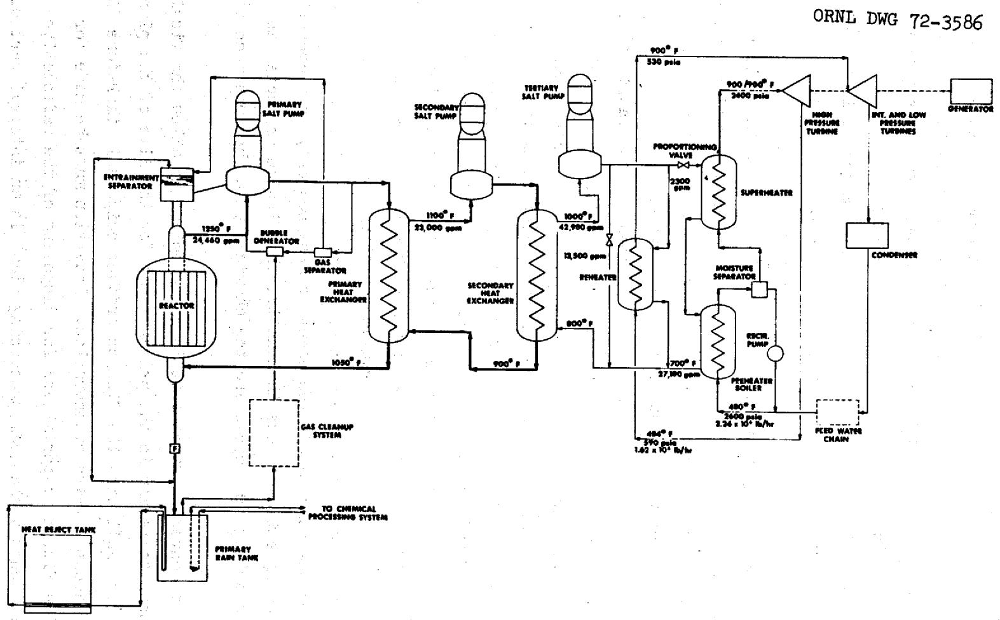  
Fig. 1. Simplified Flowsheet for 300-MW(e) Molten-Salt Demonstration Reactor.

decay or permanent storage. This off-gas system, which will be described in detail later, must have a guaranteed heat removal system, fission product absorber system, pressure regulating system, and means of separating liquid (salt) entrainment. The off-gas system is quite involved and must have an extremely high degree of dependability - a requirement that makes a certain amount of redundancy necessary.

A second auxiliary system which is extremely important is the after-heat removal system. Because the fuel can be drained from the molten-salt reactor and because of the low power density, there is no need for an emergency core cooling system, but the drain tank for the primary salt must have a cooling system that is positive and independent of the power supply or operating machinery, if possible. The afterheat removal system is thus one of the essential auxiliary systems.

The fact that there are no solid fuel elements to be fabricated, loaded, reprocessed, and refabricated makes the molten-salt reactor unique. Many advantages accrue from this fact, but it also makes necessary an on-site chemical processing plant for maintaining the salt in a clean and operating condition. This chemical processing plant is another auxiliary system which is essential to the plant. When a molten-salt reactor is to be used as a breeder, the chemical processing system becomes relatively involved. In addition to keeping the salt clean and low in oxygen, and adjusting the uranium inventory, the fission product poisons must be removed from the primary system on a fairly short time cycle. If, on the other hand, the plant is designed only as a converter having a breeding ratio of less than unity, the fission products can be removed on a long time cycle and the chemical plant becomes much more simple.

Even in a converter reactor it is uneconomical to allow the fission product poisons to remain in the primary salt for the life of the plant. The fuel carrier salt with the fission product poisons is therefore discarded after about 8 years of operation. Provision must be made for recovering the fissile material and for disposing of the radioactive carrier salt. Such a chemical processing plant is an integral part of this reactor power plant design. The processes involved are those which were used successfully to process the salt in the MSRE.

A nuclear power plant requires other auxiliary systems such as control, instrumentation, and safety systems. Basic and inherent safety features of the molten-salt reactor permit the safety system to be considerably less complicated than it is for some nuclear reactors. Because of the necessity to bring the reactor to a temperature above the melting point of the molten salt before the system can be loaded, a startup heating system is required.

The MSDR plant is housed in two buildings, the reactor building and the turbine building. Since the latter is a conventional mill-type structure, little effort was put into designing a building for this part of the plant.

Considerable attention was given to design of the reactor building. It consists of a cylindrical shell with a hemispherical top. Containment integrity is provided by a 1/2-in.-thick steel liner, completely surrounded by concrete. The concrete is for biological shielding as well as providing strength for resisting tornadic winds and missiles, in accordance with the accepted standards for design of reactor buildings.

One unique feature of the reactor building shown in this report is that it is supported by a large circumferential concrete ring, with about one-third of the structure hanging from this ring below grade and two-thirds of the building extending above the support ring. It was felt that this building configuration would have better seismic resistance than one which totally extended above the support. Obviously this feature is not mandatory and the design of a particular reactor building would depend on the topography, geology, and seismology of the site.

The cylindrical part of the building contains all the radioactive systems and components, such as the reactor, primary and secondary heat exchangers, off-gas system, chemical processing plant, and primary drain tank. The cells for this equipment have a sealed steel containment in addition to the building containment. On the thick concrete ring, but outside the building containment, are located the steam generator cells, the control room, and water-cooled heat sinks that provide for afterheat removal.

# PRIMARY SYSTEM

# Reactor

The reactor is one of the simplest components in the entire plant due to the basic simplicity of the circulating fuel concept. In previous molten-salt concepts the reactor has not been fully described. For this reason the mechanical design of the reactor is given a more thorough treatment in this report. Other parts of the plant have received a much more cursory treatment since these items have been more fully discussed in previous design studies. There is little heat transfer that takes place within the reactor itself, the fission heat being transported outside the reactor vessel by the circulating fuel salt. The only heat transferred within the reactor vessel is that produced by gamma and neutron heating of the graphite and the vessel walls. By making the power density of the reactor low, the graphite will not undergo excessive radiation damage during the life of the plant. Hence, the reactor tank can be an all-welded vessel. Also, since the vapor pressure of the fuel salt is low even at high operating temperatures, the reactor need not operate at a high pressure and the walls can be relatively thin. The temperature coefficient of expansion of graphite is only about one-third that of the Hastelloy of which the vessel is made, however, and this requires some design ingenuity to prevent the differential expansion from causing problems when the reactor is brought to temperature.

The reactor consists of a cylindrical vessel, with dishes heads, which is filled with a matrix of graphite slabs that form flow passages for the fuel salt. The inner surface of the vessel is lined with an average thickness of 2-1/2 ft of graphite as a reflector. This reflector conserves neutrons by reducing leakage to a very low value and thereby also reduces the amount of radiation reaching the vessel wall. The reflector is attached to the vessel so that it moves with the vessel as they expand during heatup.

The internal structure of the reactor is made up of the core matrix, the axial and radial graphite reflectors, and two internal metal dished heads which locate and support the graphite of the axial reflectors.

Figure 2 is an elevation of the reactor vessel showing the internal graphite structure. Figure 3 is a plan view of the reactor vessel.

It is important to maintain controlled flow passages in the reactor vessel and to regulate the flow so as to get a uniform temperature rise in all flow passages as the salt flows through the reactor. Since the power distribution is non-uniform, this requires different velocities of salt in the various flow passages. It is also desirable to minimize cross flow and to have axial flow from bottom to top of the reactor core. The flow in the reflector and along the vessel wall should be straight through from bottom to top.

The graphite should be mounted within the core in a manner that will preserve the geometry of the flow passages, yet, at the same time, accommodate the dimensional changes due to temperature differences and radiation damage in the graphite. The factor of about $3 \times 10^{-6}$ in./in./°F difference in thermal expansion between graphite and Hastelloy must also be taken care of in the design. A further limitation is that graphite, of the required grade, cannot be made in large monolithic blocks.

The reflector should have a minimum salt volume in it in order to keep the fission rate low. Ideally, only such salt as is necessary to cool the reflector should be present. This makes it desirable to have a few large pieces of graphite in the reflector rather than many small pieces. For this reason the graphite of the reflector is laminated of smaller pieces cemented together, baked, and machined to shape after baking. The low flux encountered in the reflector permits this fabrication technique to be used. By this lamination procedure, blocks of the correct size and shape for the axial and radial reflector sections are made up from graphite slabs approximately 2 in. thick by 12 in. wide and from 4 ft to 21 ft in length.

In order to control the unavoidable gaps that result from the expansion of the vessel relative to the graphite, both radial and axial reflector blocks are attached to the vessel and move with it while the core matrix remains stationary. The method of accomplishing this will become evident in the description of the reflectors that follows.

Modified dished heads having a flat center area and an overall size slightly smaller than the vessel heads are used to hold the graphite

ORNL DWG 72-2829

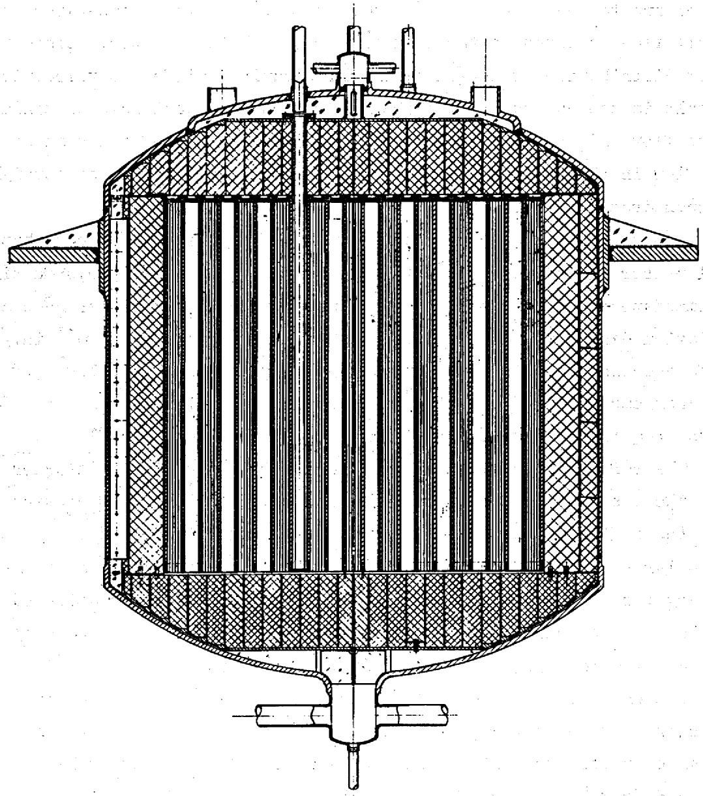  
Fig. 2. Reactor Vessel Elevation.

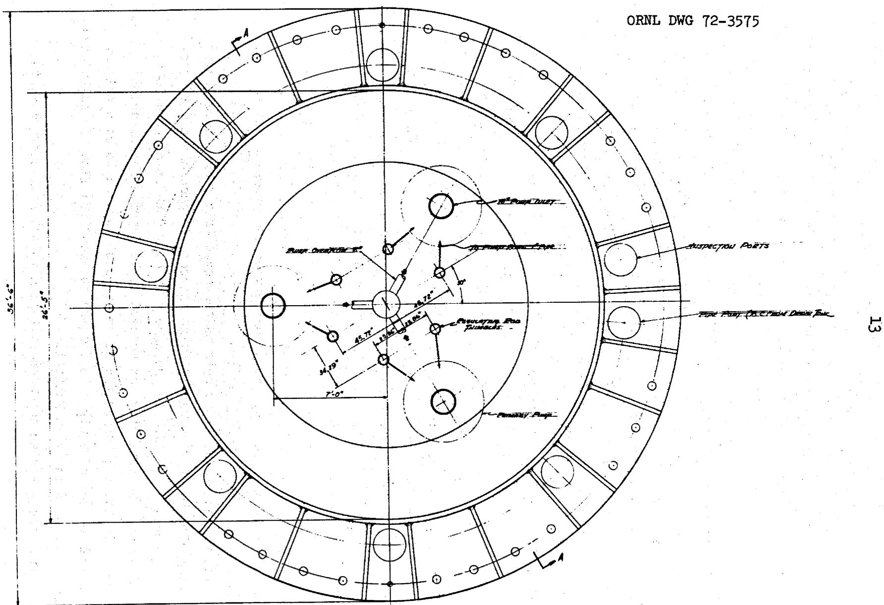  
Fig. 3. Reactor Vessel Plan.

of the axial reflectors. Top and bottom heads are exactly alike and have ribs welded on their convex surfaces to form bearing surfaces that fit against the reactor vessel heads. The concave surfaces of these heads are machined to form concentric rings having flat "lands" or surfaces about 12 in. wide to which graphite sectors are attached. The graphite sectors, having radii corresponding to the radius of the ring to which they fasten, are mounted on these heads with gaps of varying widths between the concentric rings formed by the graphite. Spaces equal to the gap width between rings are also left between the ends of adjacent graphite sectors in each ring as they are assembled on the head.

The method of mounting the sectors on the heads is shown in Fig. 4. Three holes are drilled in each graphite sector from the center of the surface that is to be in contact with the head. One is at the center of the sector and one is near the end. Into these holes are placed Hastelloy plugs 2 in. in diameter by 4 in long. These plugs are are drilled and tapped axially for $3/4$ -in. cap screws. They also have $3/4$ -in.-diam transverse holes at a distance of 3 in. from the tapped end. The graphite sectors have horizontal holes so that $3/4$ -in.-diam pins inserted through those holes will pass through the transverse holes in the metal plugs and fix them in the graphite. Holes in the heads permit the graphite sectors to be fixed to the heads by cap screws that engage the metal plugs in the graphite. The holes for the screws that engage the plugs in the ends of the graphite sectors are slightly over-size to permit differential expansion between the graphite and the metal head.

The widths of the slots between the concentric rings of reflector were computed to provide salt flow to the core in accordance with the radial power distribution in the core. In making these computations, the $\Delta P$ across the reflector was assumed to be 5 psi. The $\Delta P$ across the holes in the head under the slots was also assumed to be 5 psi and the number of holes required to furnish the required flow was calculated with the results shown in Table 1.

After the graphite has been installed in the reflector head, the complete bottom assembly is lowered into the reactor vessel. Working through the bottom hole in the vessel, the center gussets of the

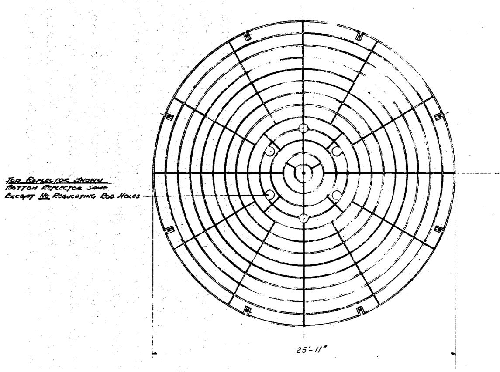  
ORNL DWG 72-4030

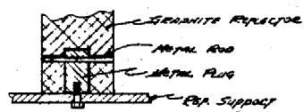  
GAPHYS AUCNDS DETAIL   
Fig. 4. Axial Reflector Mounting.

Table 1. Axial Reflector Hydraulic Data.   

<table><tr><td>Rings from Center</td><td>Slot Width (in.)</td><td>Velocity (fps)</td><td>Number of l-In. Holes per Ring</td></tr><tr><td>2</td><td>0.14</td><td>5.1</td><td>23</td></tr><tr><td>3</td><td>0.22</td><td>6.6</td><td>18</td></tr><tr><td>4</td><td>0.25</td><td>7.1</td><td>36</td></tr><tr><td>5</td><td>0.24</td><td>6.9</td><td>51</td></tr><tr><td>6</td><td>0.24</td><td>7.1</td><td>63</td></tr><tr><td>7</td><td>0.22</td><td>6.9</td><td>71</td></tr><tr><td>8</td><td>0.20</td><td>6.8</td><td>76</td></tr><tr><td>9</td><td>0.16</td><td>6.2</td><td>62</td></tr><tr><td>10</td><td>0.16</td><td>6.2</td><td>63</td></tr><tr><td>11</td><td>0.11</td><td>5.4</td><td>43</td></tr><tr><td>12</td><td>0.07</td><td>4.6</td><td>28</td></tr><tr><td>13</td><td>0.03</td><td>1.2</td><td>4a</td></tr><tr><td>14</td><td>0.02</td><td>0.7</td><td>1a</td></tr></table>

Substitute many small holes for equivalent area.

reflector head are welded to matching overlapping gussets in the vessel head, rigidly attaching the reflector head to the vessel at the center.

The periphery of the reflector head has 8 slots which permit it to be lowered into the vessel, the slots sliding over the 8 vertical ribs on the cylindrical wall. After having been lowered into position the reflector head is pinned at these 8 points, tying the head to the vessel but permitting radial expansion as the pins move in radial slots in the ribs. Figure 5 shows this method of attachment.

The radial reflector is made up of laminated blocks of two different shapes, plus some odd-shaped filler blocks used to wedge the reflector to the vessel wall. The outer reflector is made up of laminated wedges about 10 ft long and about 3 ft high. These wedges are machined to fit the vessel wall at the 8 places where they are installed around the inside vessel perimeter. By fitting each wedge approximately 1/16 in.

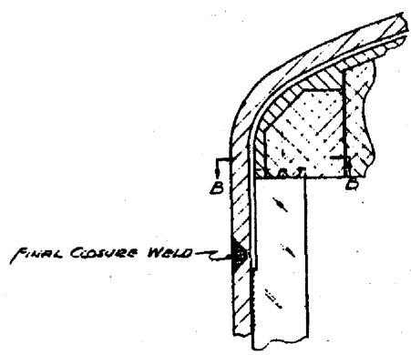  
TOP REACTOR INSTALLATION

ORNL DWG 72-3580

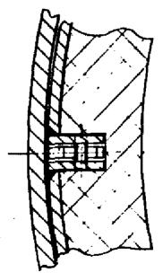  
Section B-B

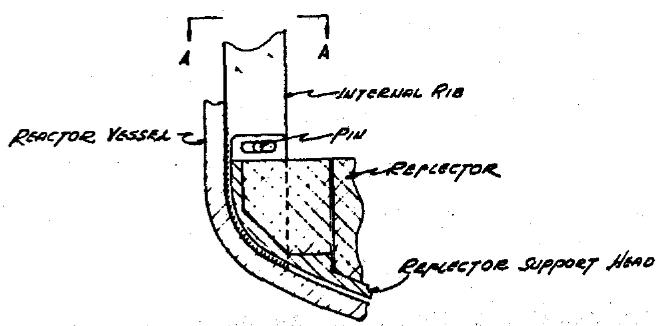  
BOTTOM REFLECTOR INSTALLATION

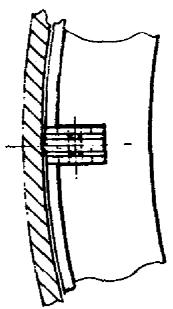  
VIEW A-A   
Fig. 5. Reflector Attachment.

from the wall, any out-of-roundness of the vessel is accommodated. When all pieces have been put into place, a retaining "T" iron is fixed to the vertical metal ribs and wedging pieces of graphite are inserted behind the "T" iron. Thus the outer reflector is made to move out with the vessel wall as it expands. Figure 6 is a plan view of the core which shows the reflector graphite as well as the reactor core matrix.

The inner layer of reflector is made up of columns of graphite approximately 1 ft wide by 2 ft thick by 21 ft long. These blocks are also laminated from slabs similar to those used elsewhere in the core. These vertical blocks are doweled into the bottom axial reflector pieces, but the dowels are loose enough to permit the columns to float up from the axial reflector while still being tied to it radially. The columns are installed with 1/8-in. gaps between columns and the back wedges and between adjacent columns. Also the bottom edge of each block has a 2-in. by 1/4-in. slot machined on it to provide flow access to the vertical slot should any block fail to float when the reactor is full of salt.

At the top of these columns there are horizontal slabs of graphite approximately 1 in. thick by 3 in. wide by about 2-1/2 ft long. These slabs fit in milled slots and plug the gaps between columns at the top. They are doweled to one of the columns and to the wedge of graphite adjacent to the tank wall in order to provide orificing and tie the columns to the wedges at the top to maintain the desired location of the columns. The slabs rest against the top reflector when the reactor is filled with salt, and they provide a 1/4-in.-thick salt plenum over the radial reflector graphite.

The core matrix is made up of a square array of slabs approximately 1-3/4 in. by 9-3/8 in. in cross section. These slabs are stacked in square cells approximately 11-1/2 in. by 11-1/2 in. The slabs are separated by dowels which provide vertical flow passages approximately 0.142 in. wide running from bottom to top of the core. The plan arrangement of the core is shown in Fig. 7 and Fig. 8. In addition to the slabs, there are posts approximately 2-1/2 in. square that define the corners of the cells. These posts have 6-in. dowels 1-1/4 in. in diameter on the bottom end which fit into holes in the corners of a graphite "egg crate" grid that rests on the bottom axial reflector. This grid defines

ORNL DWG 72-2826

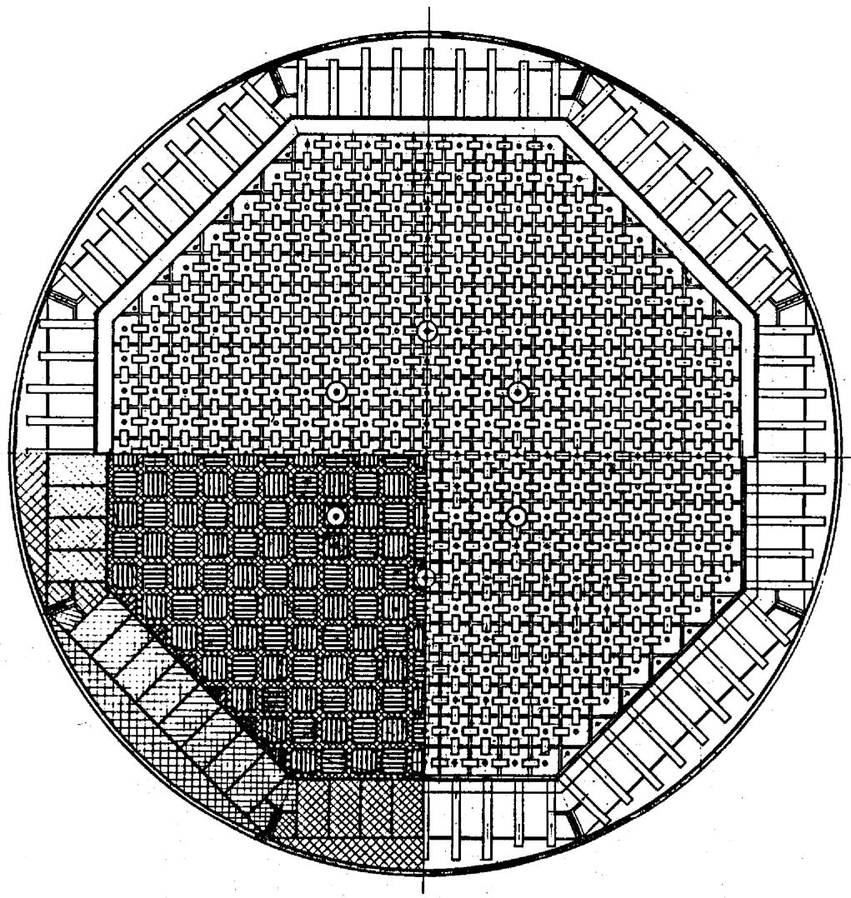  
Fig. 6. Reactor Core and Reflector Plan.

ORNL DWG 72-2830

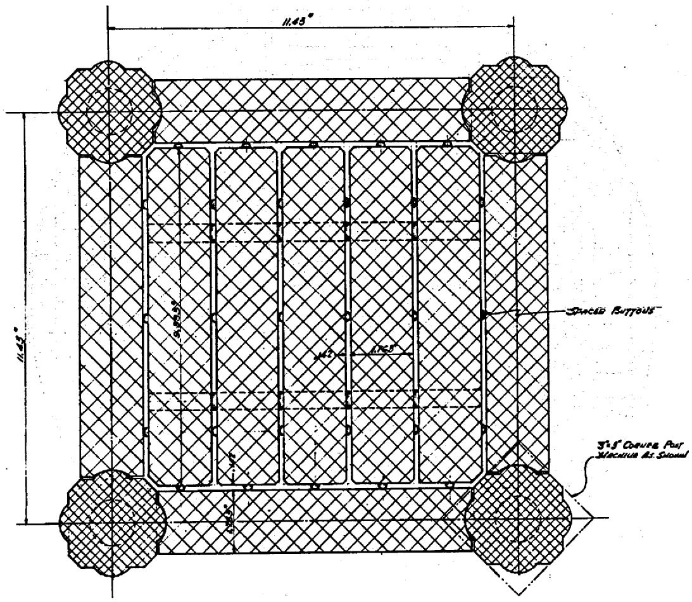  
Fig. 7. Core Cell Plan.

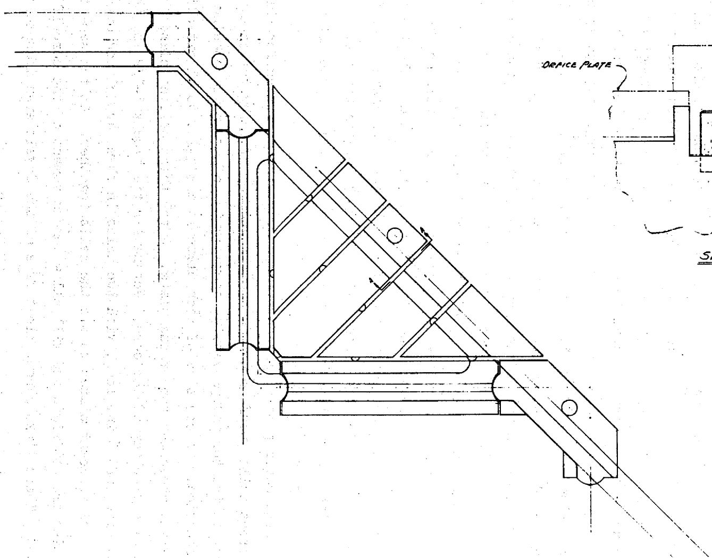  
ORNL DWG 72-3577

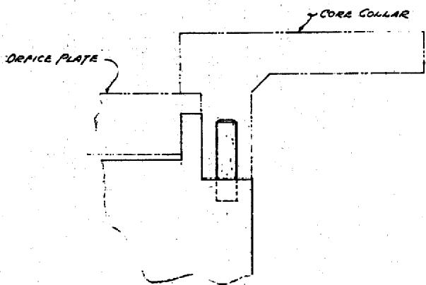  
SECT. A-4   
Fig. 8. Core Peripheral Cell Plan.

the core and prevents accumulation of radial expansion tolerances in any region of the core. Figure 9 is a detail of the grid.

Around the top of the core is a graphite "collar" which prevents spreading of the vertical core pieces into the annulus between the core and reflector. This annulus, approximately 0.75 in. wide, results from the differential expansion between the metal vessel and the graphite. The collar also blocks this annulus to prevent excessive flow in this path of low pressure drop. Flow from the annulus has to cross through the radial slots in the reflector and out the exit slots above the wedge reflector pieces. Figure 10 is a detail of this collar structure.

The graphite core is assembled in the vessel and then orifice plates are put on top of the core to make the core flow match the radial power distribution. These flat plates are approximately 11-1/2 in. by 11-1/2 in. by 1-1/2 in., with undercut edges to fit down into the cells formed by the vertical posts. These plates have no intentional gaps and are fitted as closely as tolerances permit. Resting on top of the cell side plates, they leave a 1/8-in. gap between their underside and the top of the five slabs making up the cell structure. Short dowels on the underside of the plates prevent the slabs from floating up and closing this gap. In the center of each plate is an orifice. The diameter of this hole is 2.05 in. for the center cells and 0.74 in. for the peripheral cells, with intermediate cells having holes of diameter proportional to the radial power distribution.

These cover plates, in addition to providing orificing for the different cells, perform an additional function of tying the core together at the top and preventing accumulation of expansion opening in one location. On one side of each plate is a $3/4$ -in. dowel extending $1 - 1/2$ in. above the top of the plate. After these orifice plates have been placed on top of the core, rectangular tie blocks $1 - 1/2$ in. thick, 3 in. wide, and 6 in. long, with two holes in them, are placed over the dowels of adjacent plates to tie the cells together. At the same time, the ties are not rigid and will allow some movement of the core if needed. These links cannot float free of the dowels even if some cell or cells stick and do not float to the underside of the top axial reflector. Figure 11 shows the orificing and tying of the graphite.

ORNL DWG 72-3579

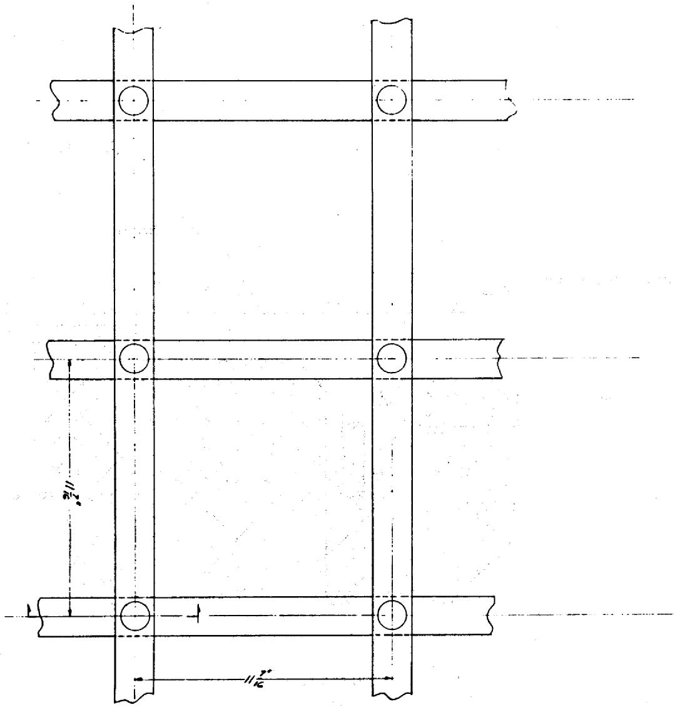

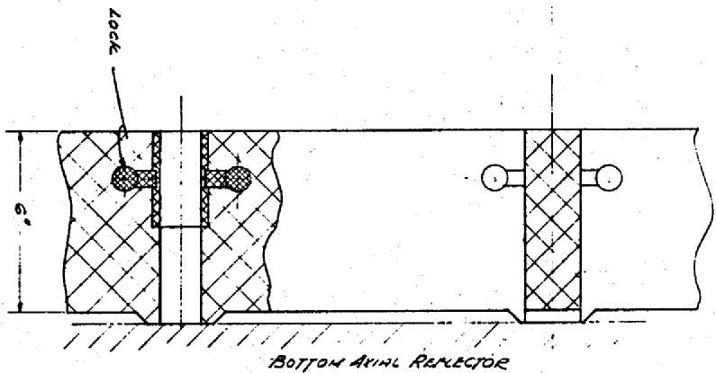  
Fig. 9. Bottom Graphite Grid.

ORNL DWG 72-2828

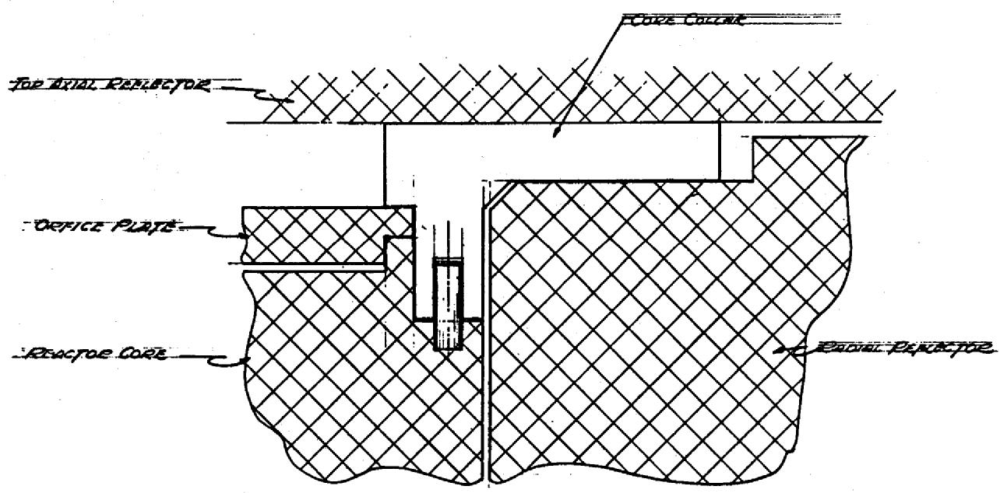  
Fig. 10. Graphite Collar.

ORNL DWG 72-2827

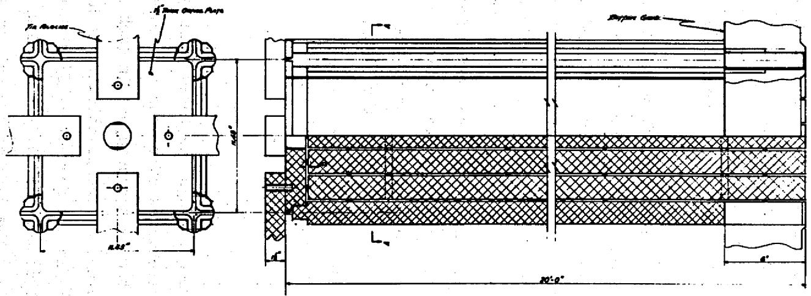  
Fig. 11. Core Orificing and Tie Plates.

Six cells in the core are different from the other 375 cells. These contain the sockets into which the six control rods are inserted. They are made up of solid square prisms, laminated out of the core slabs, and bored and machined according to the design shown in Fig. 12. These blocks are made in sections as long as practical to machine, and the sections are then joined to make a continuous cylindrical hole into which each control rod is inserted. The holes are 7 in. in diameter and have a $1/2$ in. orifice in the bottom to permit proper flow of salt to the channel.

The control rods are cruciform in shape and 6-1/2 in. wide. This provides a 1/4-in. radial clearance between the rod and the hole into which each is inserted. The rods are made of 1/8-in. Hastelloy N enclosing a 1/2-in. filler of boron carbide. When fully inserted, the rods extend to within 3 ft of the bottom of the core. When fully withdrawn, the bottoms of the rods are just within the top reflector.

Pipe extensions around the control rod extensions penetrate the top of the reactor cell shielding and the control rod drive mechanisms are located outside the reactor cell on top of the shielding. The rods will have to be replaced periodically as the high flux will destroy the ductility of the Hastelloy. One rod is sufficient to shut down the reactor, and only one rod will be used at any one time for control of the reactor.

# Primary Heat Exchanger

Primary salt is pumped through the three primary loops by threesalt pumps. Each pump discharges salt into two primary heat exchangers in parallel. There are two heat exchangers in each leg in order to make the fabrication of these units more practical. Each exchanger is about 26 in. in diameter and is in the form of a "U" with a tube length of about 30 ft. Each has 1368 tubes of 0.375 in. OD with a wall thickness of 0.035 in. Table 2 gives the data on the primary heat exchangers. Table 3 gives the physical properties of the salt on which the design of the heat exchangers is based. Figure 13 is a view of the heat exchanger and Fig. 14 shows the detail of the head closure.

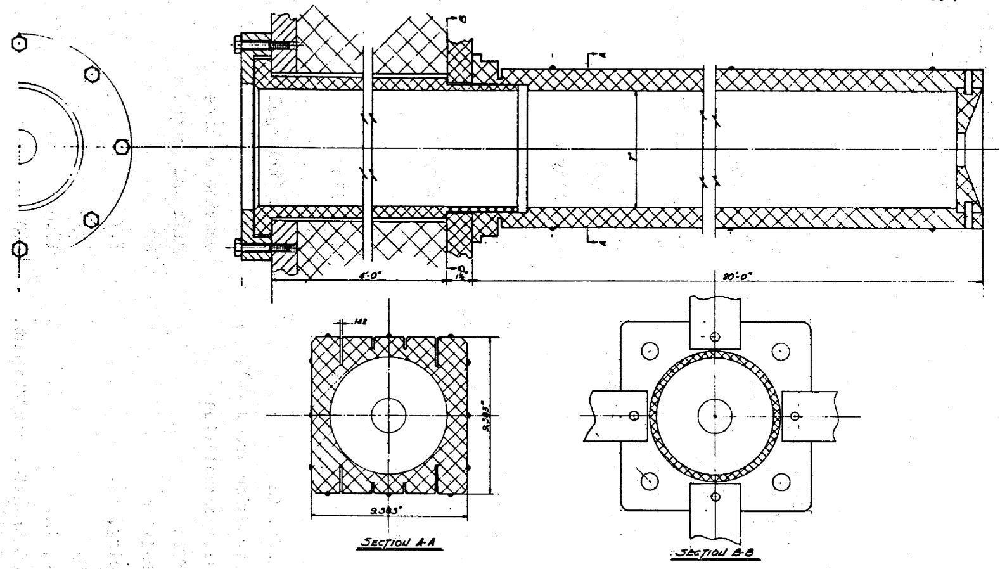  
ORNL DWG 72-3576   
Fig. 12. Control Rod Cell.

Table 2. MSDR Primary Heat Exchanger Design Data   

<table><tr><td>Type</td><td>U-tube, U-shell, countercurrent, one-pass shell and tubes with disk-and-doughnut baffles</td></tr><tr><td>Rate of heat transfer per unit</td><td></td></tr><tr><td>MW</td><td>125</td></tr><tr><td>Btu/hr</td><td>4.3 × 108</td></tr><tr><td>Tube-side conditions</td><td></td></tr><tr><td>Hot fluid</td><td>Fuel salt</td></tr><tr><td>Entrance temperature, °F</td><td>1250</td></tr><tr><td>Exit temperature, °F</td><td>1050</td></tr><tr><td>Pressure drop across exchanger, psi</td><td>127</td></tr><tr><td>Mass flow rate, lb/hr</td><td>6.6 × 108</td></tr><tr><td>Shell-side conditions</td><td></td></tr><tr><td>Cold fluid</td><td>Coolant salt (2 LiF-BeF2)</td></tr><tr><td>Entrance temperature, °F</td><td>900</td></tr><tr><td>Exit temperature, °F</td><td>1100</td></tr><tr><td>Pressure drop across exchanger, psi</td><td>115</td></tr><tr><td>Mass flow rate, lb/hr</td><td>3.7 × 108</td></tr><tr><td>Tube material</td><td>Hastelloy N</td></tr><tr><td>Tube OD, in.</td><td>0.375</td></tr><tr><td>Tube thickness, in.</td><td>0.035</td></tr><tr><td>Tubesheet-to-tubesheet distance, ft</td><td>30</td></tr><tr><td>Shell material</td><td>Hastelloy N</td></tr><tr><td>Shell thickness, in.</td><td>0.5</td></tr><tr><td>Shell ID, in.</td><td>26.32</td></tr><tr><td>Tubesheet material</td><td>Hastelloy N</td></tr><tr><td>Number of tubes</td><td>1368</td></tr><tr><td>Pitch of tubes, in.</td><td>0.672 (triangular)</td></tr><tr><td>Total heat transfer area, ft2</td><td>4024</td></tr><tr><td>Basis for area calculation</td><td>Outside of tubes</td></tr><tr><td>Type of baffle</td><td>Disk and doughnut</td></tr><tr><td>Number of baffles</td><td>47</td></tr><tr><td>Baffle spacing, in.</td><td>7.7</td></tr><tr><td>Disk OD, in.</td><td>19.0</td></tr><tr><td>Doughnut ID, in.</td><td>18.6</td></tr><tr><td>Overall heat transfer coefficient, U, Btu hr-1 ft-2</td><td>700</td></tr><tr><td>Volume of fuel salt in tubes, ft3</td><td>20.8</td></tr></table>

Table 3. Physical Properties of the Fuel and Coolant Salts Used in the MSDR   

<table><tr><td colspan="2">Fuel Salt</td></tr><tr><td>Composition</td><td>LiF-BeF3-ThF4-UF4(71.5-16.0-12.0-0.5 mole %)</td></tr><tr><td>Density, lb/ft3</td><td>236.3 - 2.33 x 10-3T (°F)</td></tr><tr><td>Viscosity, lb hr-1 ft-1</td><td>0.2637 exp 7362/459.7 + T (°F)</td></tr><tr><td>Specific heat, Btu lb-1 (°F)-1</td><td>0.32</td></tr><tr><td>Thermal conductivity, Btu hr-1 ft-1 (°F)-1</td><td>0.75</td></tr><tr><td colspan="2">LiF-BeF3 Coolant Salt</td></tr><tr><td>Composition</td><td>7LiF-BeF2(66-34 mole %) (99.99 + %)7Li)</td></tr><tr><td>Density, lb/ft3</td><td>138.68 - 1.456 x 10-3T (°F)</td></tr><tr><td>Viscosity, lb hr-1 ft-1</td><td>0.2806 exp 6759/459.7 + T (°F)</td></tr><tr><td>Specific heat, Btu lb-1 (°F)-1</td><td>0.57</td></tr><tr><td>Thermal conductivity, Btu hr-1 ft-1 (°F)-1</td><td>0.58</td></tr><tr><td colspan="2">Nitrate-Nitrate Coolant Salt</td></tr><tr><td>Composition (eutectic)</td><td>KNO3-NaNO2-NaNO3(44-49-7 mole %)</td></tr><tr><td>Density, lb/ft3</td><td>130.6 - 2.54 x 10-3T (°F)</td></tr><tr><td>Viscosity, lb hr-1 ft-1</td><td>0.1942 exp 3821.6/459.7 + T (°F)</td></tr><tr><td>Specific heat, Btu lb-1 (°F)-1</td><td>0.37</td></tr><tr><td>Thermal conductivity, Btu hr-1 ft-1 (°F)-1</td><td>0.33</td></tr></table>

ORNL DWG 71-5032

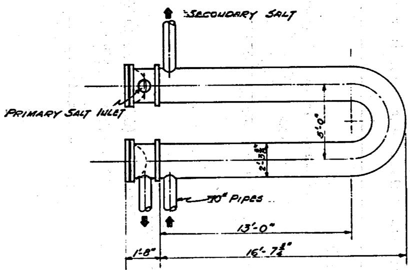  
Fig. 13. Primary Heat Exchanger.

Heat Transfer Rate - 125 MW

No. Tubes - 1968.

Tube Size - 0.0.a.0.05 woll

Tube Pitch - .67

ORNL DWG 72-3584

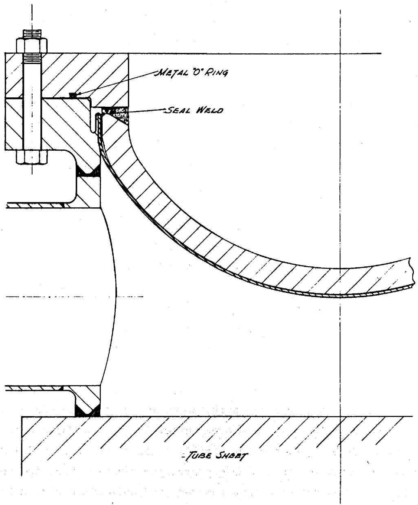  
Fig. 14. Primary Heat Exchanger Head Closure Detail.

The heat exchangers are mounted horizontally, one leg of the "U" being under the other. The tubesheet ends of the exchanger are accessible through a hole in the cell wall by removing a shield plug from the hole. The head is flanged and bolted with metal "O"-ring seals backed up by a thin seal weld. This permits relatively easy removal of the heads for plugging a tube in the event of a leak.

# Primary Pumps

Sump-type centrifugal pumps for circulating molten salts have been employed for many years in experimental rigs and have been used successfully in two molten-salt reactors, the ARE5 and the MSRE. These molten-salt pumps are described in the literature,6 and that material will not be repeated here.

In the MSDR the pumps are mounted symmetrically on the top of the reactor vessel. Each pump is submerged in a tank that has excess gas volume to accommodate expansion of the salt. This volume communicates with the primary system by a 6-in. line from each pump bowl to the center dome in the top of the reactor vessel. During normal operation, flow down these lines returns the fountain purge flow from each pump to the top head of the reactor. The pump suction line communicates with the pump sump through a small leakage path in order to drain the sump when the primary system is drained.

Each pump has a capacity of 8100 gpm and develops a 150-ft head. In order to purge xenon from the salt, about $10\%$ of the flow from each pump is bypassed directly from pump outlet to inlet. The bypass line contains a bubble generator for admitting gas to the salt and a bubble stripper for removing gas. The gas stripper removed about two volumes of salt with each volume of gas removed, and this mixed stream is directed into the drain tank. A venturi in this line is provided with

a l-in. connection to the gas space in the pump bowl. This arrangement makes it possible to mix the pump seal purge gas with the stripped gas and to send it to the drain tank and thence into the off-gas system. This line also serves as a syphon break to prevent draining the system through the gas separator discharge line in the case of a stopped pump in any of the primary circuits.

In addition to providing the primary salt flow and the bypass flow, a line from each pump discharge is manifolded into a line which drives two jet pumps in the drain tank. Each of these lines has a ball check valve inserted in it upstream of the manifold. The jet pumps in the drain tank return the entrained liquid in the gas separator discharge to the primary circuit, as will be described in the discussion of the drain tank.

# SECONDARY CIRCUITS

Heat from each primary circuit is transferred to a secondary salt system. The salt in each secondary loop is circulated through the shells of the primary heat exchangers and the tubes of the secondary heat ex-changers by a pump similar to the primary pump. The secondary circuit is designed to contain a relatively small volume of salt.

The salt used in the secondary loop is $^7 \text{LiF - BeF}_2$ (66-34 mole%). Although it would be possible to use a different salt in the secondary circuit, it was believed that the advantages occurring from using the $^7 \text{LiF - BeF}_2$ salt justifies its use in the first demonstration plant. By using this salt, any primary heat exchanger leak will be much less troublesome than if a different secondary salt were used. Also, the $\text{LiF - BeF}_2$ salt will remain nonradioactive, except for very short-lived activities, and thus maintenance of the secondary heat exchangers will be less complicated.

There are two secondary heat exchangers per secondary loop. These are "U"-tube exchangers of the same design as the primary exchangers. Because of the differences in the salt heat transfer properties, they are slightly larger than the primary exchangers. Table 4 gives the design data for these exchangers.

It may be noted that the secondary circuit isolates the primary circuit from the rest of the system. Because of the sensitivity of the

Table 4. MSDR Secondary Heat Exchanger Design Data   

<table><tr><td>Type</td><td>U-tube, U-shell counter-current, one-pass shell and tubes with disk-and-doughnut baffles</td></tr><tr><td>Rate of heat transfer per unit</td><td></td></tr><tr><td>MW</td><td>125</td></tr><tr><td>Btu/hr</td><td>4.3 x 108</td></tr><tr><td>Tube-side conditions</td><td></td></tr><tr><td>Hot fluid</td><td>2LiF-BeF2salt</td></tr><tr><td>Entrance temperature, °F</td><td>1100</td></tr><tr><td>Exit temperature, °F</td><td>900</td></tr><tr><td>Pressure drop across exchanger, psi</td><td>80</td></tr><tr><td>Mass flow rate, lb/hr</td><td>3.7 x 106</td></tr><tr><td>Shell-side conditions</td><td></td></tr><tr><td>Cold fluid</td><td>Hitec</td></tr><tr><td>Entrance temperature, °F</td><td>700</td></tr><tr><td>Exit temperature, °F</td><td>1000</td></tr><tr><td>Pressure drop across exchanger, psi</td><td>80</td></tr><tr><td>Mass flow rate, lb/hr</td><td>3.8 x 106</td></tr><tr><td>Tube material</td><td>Hastelloy N</td></tr><tr><td>Tube OD, in.</td><td>0.375</td></tr><tr><td>Tube thickness, in.</td><td>0.035</td></tr><tr><td>Tubesheet-to-tubesheet distance, ft</td><td>37.5</td></tr><tr><td>Shell material</td><td>Hastelloy N</td></tr><tr><td>Shell thickness, in.</td><td>0.5</td></tr><tr><td>Shell ID, in.</td><td>30.5</td></tr><tr><td>Tubesheet material</td><td>Hastelloy N</td></tr><tr><td>Number of tubes</td><td>1604</td></tr><tr><td>Pitch of tubes, in.</td><td>0.7188 (triangular)</td></tr><tr><td>Total heat transfer area, ft2</td><td>5904</td></tr><tr><td>Basis for area calculation</td><td>Outside of tubes</td></tr><tr><td>Type of baffle</td><td>Disk and doughnut</td></tr><tr><td>Number of baffles</td><td>52</td></tr><tr><td>Baffle spacing. in.</td><td>8.6</td></tr><tr><td>Disk OD, in.</td><td>22.0</td></tr><tr><td>Doughnut ID, in.</td><td>21.6</td></tr><tr><td>Overall heat transfer coefficient, U, Btu hr-1 ft-2</td><td>500</td></tr><tr><td>Volume of 2LiF-BeF2 salt in tubes, ft3</td><td>30.5</td></tr></table>

primary salt to oxygen, this is a desirable, if not necessary, feature. Also, the secondary and tertiary salt circuits provide a double barrier between the low-pressure fuel-salt system and the relatively high-pressure steam system.

# TERTIARY SALT CIRCUIT

The primary purpose of the tertiary salt circuit is to provide a tritium trap to prevent diffusion of tritium from the primary circuit into the steam system via the circulating salt systems. The tertiary circuit uses a eutectic mixture of $\mathrm{KNO_3 - NaNO_2 - NaNO_3}$ (44.2-48.9-6.9 mole %), which has the commercial name of "Hitec." The oxygen in this salt combines with the tritium to form tritiated water, which can be recovered from the system.

Although the primary function of the tertiary salt loop is to trap tritium, it also has certain advantages which offset, at least to a degree, the complication of the additional pumps and heat exchangers required for the third loop. The advantages derive chiefly from the fact that the liquidus temperature of the nitrite-nitrate eutectic is $288^{\circ}\mathrm{F}$ , which relieves considerably the possible problems of salt freeze-up in the steam generators. An additional advantage concerns the fact that water will simply vaporize from the nitrite-nitrate salt and the consequences of a steam leak are thus much less severe. In fact, this salt could possibly be used with steam as a cover gas.

The nitrite-nitrate salt cannot be used as a secondary coolant because it would react with the primary salt to precipitate thorium and uranium oxides in the event of a primary heat exchanger leak. There is the additional danger of a reaction with the graphite of the core should nitrite-nitrate eutectic get into the primary system.

The nitrite-nitrate salt will remain nonradioactive, except for some tritium, and thus the tertiary loop can penetrate the building containment. This permits the location of all the steam system equipment outside the containment and makes it accessible for direct maintenance. It also removes the possibility of a pressure rise within the containment due to a leak in the steam system.

The corrosion resistance to Hitec is a consequence of the establishment of a passivating film on the containment metal. Cheaper

materials can be used for the piping and steam-generating equipment of this loop than is required in the primary and secondary systems. It is intended to make the secondary exchangers out of 316 stainless steel because of the secondary salt in the tubes. The shells and piping, however, could be made of Croloy. The tertiary pumps could also be fabricated of Croloy.

As previously mentioned, the low melting point $(228^{\circ}\mathrm{F})$ of the Hitec permits the feedwater to enter the boiler at temperatures that are in line with current steam plant practice. Since the wall $\Delta t$ must be held to a reasonable value ( $< 200^{\circ}\mathrm{F}$ ), the salt temperature at the exit of the boiler must be of the order of $700^{\circ}\mathrm{F}$ if the feedwater enters at about $500^{\circ}\mathrm{F}$ . This $700^{\circ}\mathrm{F}$ salt cannot be returned to the secondary heat exchanger because the freezing point of the secondary salt is $856^{\circ}\mathrm{F}$ . To avoid this low temperature and still maintain an acceptable $\Delta t$ across the tubes in the boiler, a bypass stream of hot tertiary salt is mixed with the cool $(700^{\circ}\mathrm{F})$ salt to raise the temperature of the mixture to an acceptable level before returning it to the secondary heat exchanger. The total flow in the tertiary system is about $40,500\mathrm{gpm}$ . Of this, 27,000 gpm flows through the steam generating equipment and is cooled to $700^{\circ}\mathrm{F}$ . The bypass loop mixes $13,500\mathrm{gpm}$ of $1000^{\circ}\mathrm{F}$ salt with the $27,000\mathrm{gpm}$ $700^{\circ}\mathrm{F}$ stream and raises its temperature to $800^{\circ}\mathrm{F}$ before it enters the secondary heat exchanger. A throttle valve in this bypass line permits temperature control for partial loading and transient conditions.

Data on the decomposition and corrosion of Hitec are insufficient to be absolutely certain of the highest temperature that is allowable and the type of cover gas required over the salt. It is intended to limit the temperature to $1000^{\circ}\mathrm{F}$ and to provide an $\mathbf{N}_{2}$ overpressure until more experience is gained. Indications are that a temperature of $1100^{\circ}\mathrm{F}$ is tolerable, and, if this is verified, steam conditions for a moltensalt plant could be significantly improved. A report, ORNL-TM-3777, which is in preparation, will present the known information on Hitec temperature limitations.

# STEAM SYSTEM

The steam system conditions at the turbine throttle were chosen to be $900^{\circ}\mathrm{F} / 2400$ psi with $900^{\circ}\mathrm{F}$ reheat, but the steam system was not specially designed or optimized for the demonstration plant. Steam flows and temperatures are shown on the simplified flowsheet of Fig. 1.

The steam generating equipment is, of course, quite different from that in a fossil-fired plant in that the heat is extracted from a circulating molten salt. On a completely arbitrary basis the steam load for the turbine-generator is divided between 6 boiler units, 6 superheater units, and 6 reheater units. All these units are heated by the three salt circuits comprising the tertiary salt system of the plant. The boilers are divided into two units each simply because this results in units of a size more easily handled. The entire steam circuit is a once-through system where both the water and salt sides of the preheater, boiler, and superheater are in series.

Feedwater from the conventional feedwater chain enters the tube side of a U-tube preheater at a temperature of $480^{\circ}\mathrm{F}$ and a pressure of 2600 psi. It passes from this unit first into a similar U-tube boiler and from that into the U-tube superheater. These three units each have 100 tubes in shells about 12 in. ID. Additional data are given in Table 5.

Table 5. Steam Generating Data   

<table><tr><td>Unit</td><td>No. of Tubes</td><td>Length (ft)</td><td>Diameter (in.)</td><td>Wall (in.)</td><td>Steam ΔP (psi)</td><td>Salt ΔP (psi)</td><td>Duty (Btu/hr)</td></tr><tr><td>Preheater</td><td>100</td><td>32.7</td><td>0.5</td><td>0.050</td><td>7.2</td><td>23.8</td><td>51 x 106</td></tr><tr><td>Boiler</td><td>100</td><td>32</td><td>0.5</td><td>0.050</td><td>17.6</td><td>23.8</td><td>68 x 106</td></tr><tr><td>Superheater</td><td>100</td><td>34.8</td><td>0.5</td><td>0.050</td><td>73.8</td><td>23.8</td><td>57 x 106</td></tr><tr><td>Reheater</td><td>160</td><td>43.5</td><td>0.5</td><td>0.050</td><td>60</td><td>34</td><td>7.2 x 106</td></tr></table>

At the side-stream exit of the boiler section there is a bypass through a recirculator pump to the inlet of the preheater. This bypass is for the purpose of control for partial load operation and for such

contingencies as a breaker trip from full load. The shell sides of all these units (preheater, boiler, superheater) are also connected in series so that the $1000^{\circ}\mathrm{F}$ tertiary salt flows countercurrent to the water and exits from the preheater at $700^{\circ}\mathrm{F}$ at design load.

The steam generating cells are outside the reactor containment building but are closely adjacent to provide close coupling. The interiors of the steam cells are not heated like the reactor cell, but heaters and insulation are installed on the piping and components. All steam and water lines are run from each piece of equipment in the steam cells from manifolds, stop valves, etc., located outside the steam cells. The rupture discs on the tertiary salt system for relieving steam pressure in the event of a leak are installed in the steam cells in order to contain the salt within the cell.

The turbine-generator is shown as a tandem unit with one high-pressure, one intermediate-pressure, and two low-pressure casings on one shaft driving a single generator unit. The specific turbine-generator has not been designated. As has been stated, the usual extraction points and conventional feedwater handling are employed. No effort has been made to detail the regenerative feedwater heating system or other aspects of the steam system.

# REACTOR BUILDING

The reactor building follows what has come to be a rather traditional containment structure. Basically it is a cylindrical reinforced concrete structure with a hemispherical dome. A sealed steel membrane, $1/2$ in. thick, lines the entire building and provides the containment. The concrete provides protection against missiles resulting from tornadic winds. The building is about 150 ft tall and about 112 ft in diameter.

The building is suspended from a large concrete ring about 176 ft in outside diameter and about 8 ft thick. This arrangement gives a low center of gravity to the building. Although seismic analyses have not been made, it is believed that this method of construction may be more stable to a seismic disturbance. The same basic design of the building could be used if subsequent analyses or considerations related to a particular site indicate that the building should be set on a foundation

at the bottom of the structure. Figures 15 and 16 show the elevation and plan of the reactor building. The steam cells are appended symmetrically outside the containment and rise from the concrete ring. Also mounted on the ring and external to the containment are the three water tanks which provide the heat sink for the drain tank cooling system. The control room is also built on this ring outside the containment building.

Inside the reactor building are the cells containing the radioactive portions of the plant. There are 5 sealed cells which have a common atmosphere: the reactor cell, the 3 heat exchanger cells, and the drain tank cell. These cells have water-cooling coils embedded in the concrete walls with water plena at the ends of the cells for removing the heat that leaks through the thermal insulation. Each cell is completely lined with a 1/2-in.-thick $30^{\frac{1}{4}}$ stainless steel membrane which seals the cells from the remainder of the building. Penetrations into the cells have been kept to a minimum and the interconnecting sleeves between cells have bellows which permit differential movement between the membranes of the various cells. These sleeves provide the necessary passages for the salt piping. Figure 17 is an elevation of the reactor cell and one of the 3 heat exchanger cells. Figure 18 is an elevation and plan of the drain tank cell.

The reactor is hung from a ledge by means of a large flange near the top of the vessel. This is seen in the elevation section of the building, Fig. 15. In the heat exchanger cells all units are mounted from a superstructure rising from the floor of the cell. This mounting method is shown in Fig. 19. The drain tank sits on the floor of the drain tank cell, the load being carried through a skirt and 8 lugs which transmit the load through the seal membrane and insulation to the concrete bottom of the cell.

# CELL HEATING AND COOLING

All 5 cells are heated by circulating the cell atmosphere (mostly nitrogen) over electrical heaters. The circulation is accomplished by 3 large blowers, each of which discharges 32,500 cfm of gas at a temperature of $1050^{\circ}\mathrm{F}$ into the reactor cell. The reactor cell has 4 gas outlets, one to each heat exchanger cell and one into the drain tank

ORNL DWG 72-3578

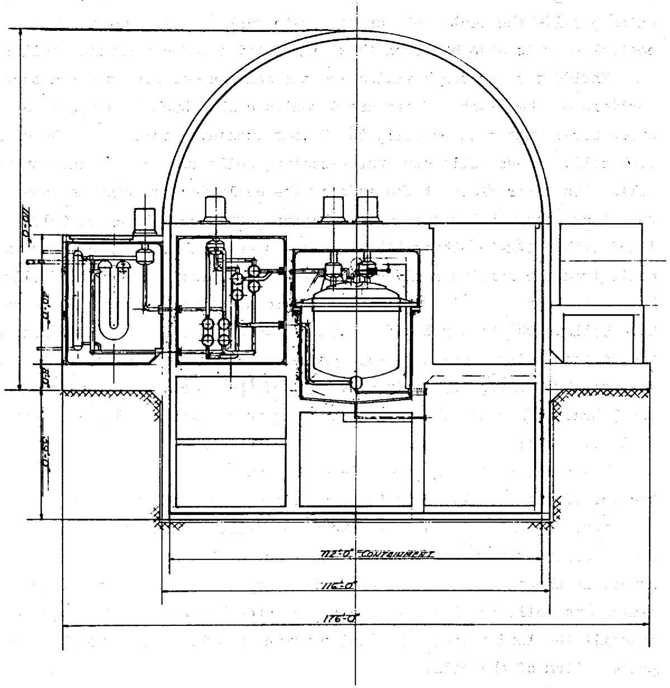  
Fig. 15. Reactor Building Elevation.

ORNL DWG 72-3581

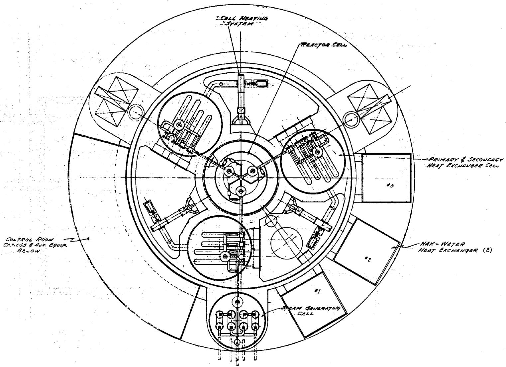  
Fig. 16. Reactor Building Plan.

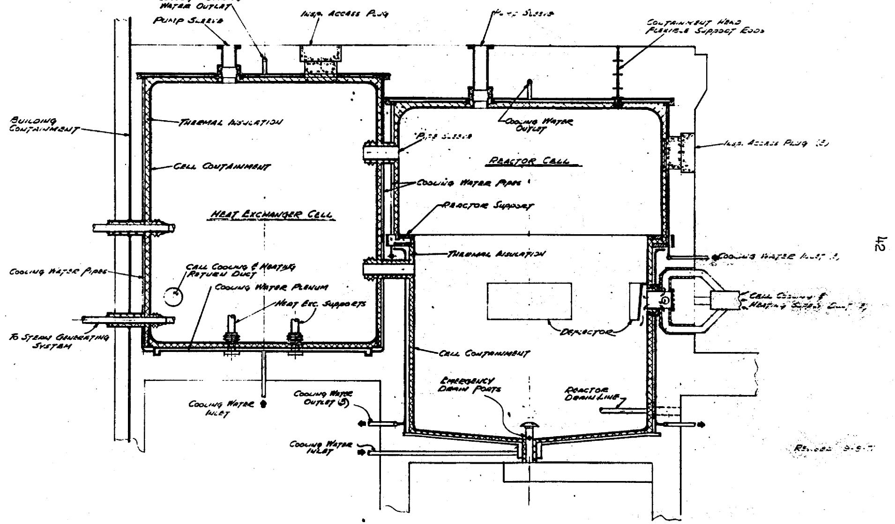  
PHOTO 79084  
Fig. 17. Reactor Cell and Heat Exchanger Cell Elevation.

PHOTO 79090

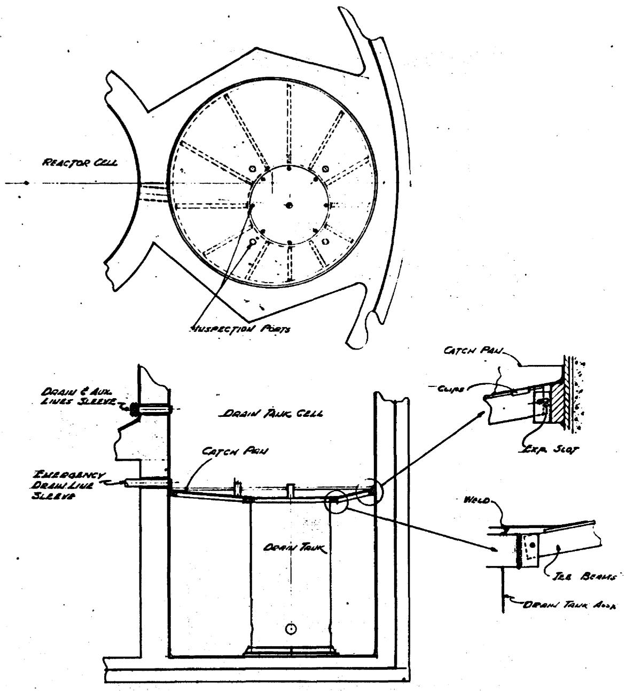  
Fig. 18. Drain Tank Cell Elevation.

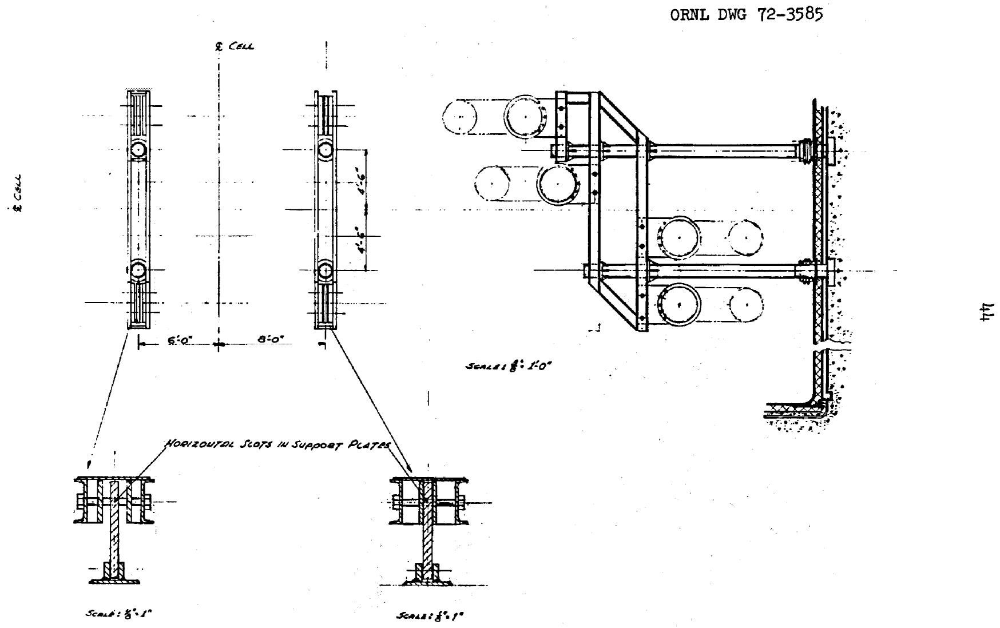  
Fig. 19. Primary Heat Exchanger Support.

cell. Return ducts from each of these cells to the blower suction make a closed circulation system which is part of the cell containment. Pertinent data for this cell heating system are shown in Table 6.

Heating the cells by forced circulation greatly reduces the number of cell penetrations necessary when compared to heating by space heaters in the cells. In addition to heating, it is desirable to cool the cells at times. The data for cooling, using the same circulation system, are shown in Table 7. The circulation duct is divided into two sections, and a simple butterfly type damper directs the air through either the heater section or the cooling section.

The electric heaters and the reentrant tube cooling water units each fit into thimbles which are welded into the top of the duct. In each case (heating or cooling), heat transfer is by radiation. Neither the heaters nor the water piping penetrate the ducting so that repairs can be made without breaking the containment.

# DRAIN TANK SYSTEM

One of the most important systems in the molten-salt reactor plant is the fuel-salt drain tank with its cooling system and provisions for gas holdup. (It is somewhat analogous to the emergency core cooling system of a solid fuel reactor.) It provides automatic removal of the afterheat in the event of a failure of the main circulation system. Also during normal operation the volatile fission products and the stripping gas are held up for about 6 hours in the drain tank. The decay heat from this operation is removed by the natural convection cooling system.

The drain tank consists of two separate tanks. The primary tank sits inside a secondary tank, or "crucible." The drain tank has a flat top with thimbles located in a symmetrical pattern. Sixty units of 6 tubes each cover the top of the drain tank. Figure 20 is a plan view showing the arrangement of these thimbles with the cooling headers in place. Figure 21 is an elevation of the drain tank. In order to stabilize these thimbles against seismic shock, they are interlocked at the bottom in such a way as to allow differential axial movement but no individual vibration. The 360 thimbles, therefore, act together

Table 6. Heater Design Data for MSDR Containment Cells   

<table><tr><td>Estimated normal containment heat loss (total), kW</td><td>600</td></tr><tr><td>Design heat loss, kW</td><td>1200</td></tr><tr><td>Number of heater cells</td><td>3</td></tr><tr><td>Capacity of each heater cell, kW</td><td>400</td></tr><tr><td>Circulating gas</td><td>N3</td></tr><tr><td>Gas inlet-outlet temperatures at heaters, °F</td><td>1000-1100</td></tr><tr><td>Gas flow rate through each heater cell, cfm</td><td>32,500 (at 1050°F)</td></tr><tr><td>Heater element</td><td>1-in.-OD cartridge with
Incoloy 800 cladding</td></tr><tr><td>Heater length, ft</td><td>3</td></tr><tr><td>Number of heater elements per heater cell</td><td>150</td></tr><tr><td>Heater element arrangement per heater cell</td><td>12 rows of 12 or 13
elements on 3-in. Δ pitch</td></tr><tr><td>Pressure drop in circulating gas, in. H2O</td><td>9.6</td></tr><tr><td>Heater cell width and depth, ft</td><td>3.25 x 2.6</td></tr><tr><td>Thermal conductivities for cell wall (k), Btu hr-1 ft-1 (°F)-1
1/2-in. stainless steel cell liner</td><td>12.4</td></tr><tr><td>5-in.-thick fiber glass cell insulation</td><td>0.034</td></tr><tr><td>Prestressed concrete with 2-in. sched 40</td><td>1.12 (concrete)</td></tr><tr><td>carbon-steel water cooling pipes on 6 in. centers located 4 in.
from inside concrete face</td><td>25.9 (steel)</td></tr><tr><td>Assumed heat transfer coefficient in water pipes, Btu hr-1 ft-2 (°F)-1</td><td>7.9</td></tr><tr><td>Maximum concrete temperature, °F</td><td>150</td></tr></table>

Table 7. Cell Cooling System   

<table><tr><td>Initial heat rate, Btu/hr</td><td>3.5 × 108</td></tr><tr><td>Number of cooler cells</td><td>3</td></tr><tr><td>Number of thimbles per cell</td><td>225</td></tr><tr><td>Length of thimbles, ft</td><td>4</td></tr><tr><td>Diameter of thimbles, in.</td><td>2</td></tr><tr><td>Pitch of tubes in square array, in.</td><td>3</td></tr><tr><td>Temperature of cooling water, °F</td><td>225</td></tr><tr><td>Gas flow rate per cell, cfm</td><td>32,500</td></tr><tr><td>ΔP across thimbles, in. H2O</td><td>10</td></tr><tr><td>Emissivity of thimble</td><td>0.7</td></tr><tr><td>Volume of gas to be cooled, ft3</td><td>150,000</td></tr><tr><td>Temperature N2at start, °F</td><td>1000</td></tr><tr><td>Temperature N2after 2.75 hr, °F</td><td>740</td></tr><tr><td>Temperature reactor at start, °F</td><td>1000</td></tr><tr><td>Temperature reactor after 2.75 hr, °F</td><td>998</td></tr></table>

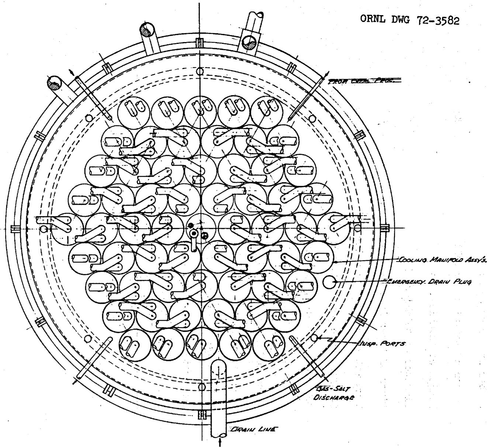  
Fig. 20. Drain Tank Plan.

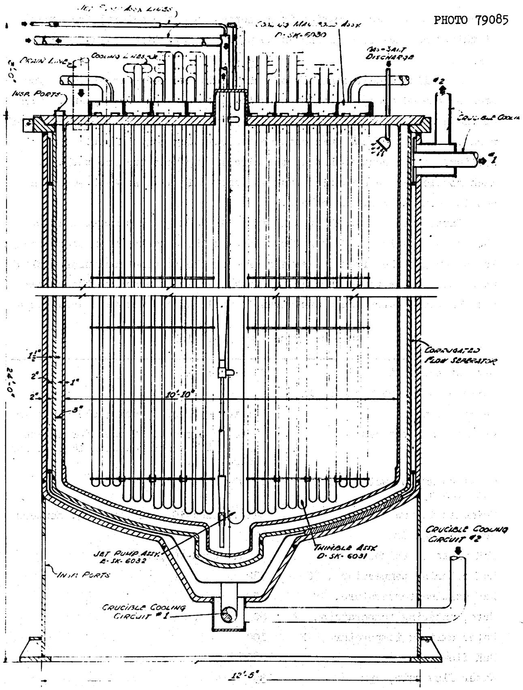  
Fig. 21. Drain Tank Elevation.

as a unit as far as vibration is concerned, and the natural frequency of this structure is high enough to provide protection against earthquake damage.

A cooling module consists of a manifold and 6 reentrant tubes for each of the 60 groups of thimbles which penetrate the drain tank. Each of these cooling modules is connected by two 4-in. pipes to a section of pipe in the water heat dump outside the building containment. These cooling modules contain NaK as the circulating heat transport fluid. Each module has an expansion tank and shut-off valve so that each can act independently of the others.

Three water tanks 25 ft x 25 ft x 12 ft deep are located outside the reactor building. Water flows through these tanks in an open circuit. The water is taken from the same source as the turbine condenser cooling water and, after going through the tanks, it is returned to the stream. Data on these water tanks are given in Table 8, and the tank arrangement

Table 8. Dump Tank Heat Sink Data   

<table><tr><td>Size of tank, ft</td><td>25 x 25 x 12</td></tr><tr><td>Depth of water over tubes, ft</td><td>5</td></tr><tr><td>Number of tubes</td><td>576 for each of 2 tanks; 672 for third</td></tr><tr><td>Arrangement of tubes</td><td>48 tubes per row, 12 rows for 2 tanks, and 48 tubes per row with 14 rows for third tank.</td></tr><tr><td>Total volume of water for all tanks, ft3</td><td>12,920</td></tr><tr><td>Thimbles in row</td><td>3-in. sched-10 pipe on 6-in. centers</td></tr><tr><td>Row spacing, in.</td><td>12</td></tr><tr><td>NaK pipes in thimbles</td><td>2-in. sched-40 pipe</td></tr><tr><td>NaK entering temperature, °F</td><td>532</td></tr><tr><td>NaK exiting temperature, °F</td><td>450</td></tr><tr><td>Water entering temperature, °F</td><td>80</td></tr><tr><td>Water exiting temperature, °F</td><td>100</td></tr><tr><td>NaK flow rate, gpm</td><td>2800</td></tr><tr><td>Water flow rate, gpm</td><td>39</td></tr></table>

is shown in Fig. 22. Two of the 3 tanks are sufficient to provide cooling under maximum heat load conditions. Heat is transferred from the drain tank to the NaK, and from the NaK to the water by radiation. Thus the NaK has a double barrier between it and the contents of the drain tank and also between it and the water in the cooling water tanks.

The crucible in which the drain tank is suspended is a double-walled tank. It is also cooled by NaK, having its own independent lines to the water tanks. The crucible cools the drain tank walls by radiative transfer.

The drain tank connects with the primary system in three completely different ways in order to perform the three distinctly different functions for which it is used. The first of these functions is to provide a receptacle into which the primary salt may be drained whenever it is necessary for any reason to remove the salt from the primary system. A 6-in. line runs from the bottom of the reactor in a generally horizontal direction into the drain tank pit. At this point a drain valve is installed and a vertical line connects the drain valve to the drain tank.

The drain valve is a critical part of the system since it operates but infrequently and yet must operate when required. To provide some redundancy, the drain valve is bypassed by a rupture disc valve which can be used in an emergency if the drain valve fails to open. Both the drain valve and the rupture disc valve are replaceable by remote maintenance methods after the primary system is drained. The drain valve is a combination mechanical valve - freeze valve. As shown in Fig. 23, the poppet does not seal mechanically but relies on a frozen salt film to seal. This seal is frozen by circulation of a coolant in the body of the poppet. It is thawed by circulation of hot fluid. The poppet is actuated by a positive electric drive and the movement is sealed by a bellows which cannot be contacted by salt but only by the cover gas.

The second use for the drain tank is one which is extremely unlikely but nevertheless must be provided for safety considerations. If there is any leak of primary salt from the primary system, the salt must be put into the drain tank. Therefore, the reactor cell, heat

ORNL DWG 72-3583

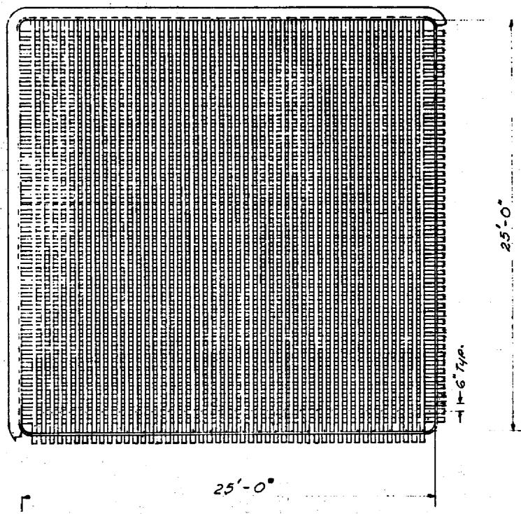

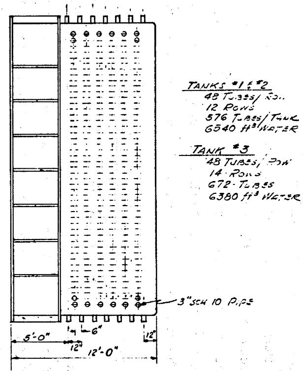  
Fig. 22. Drain Tank Heat Sink.

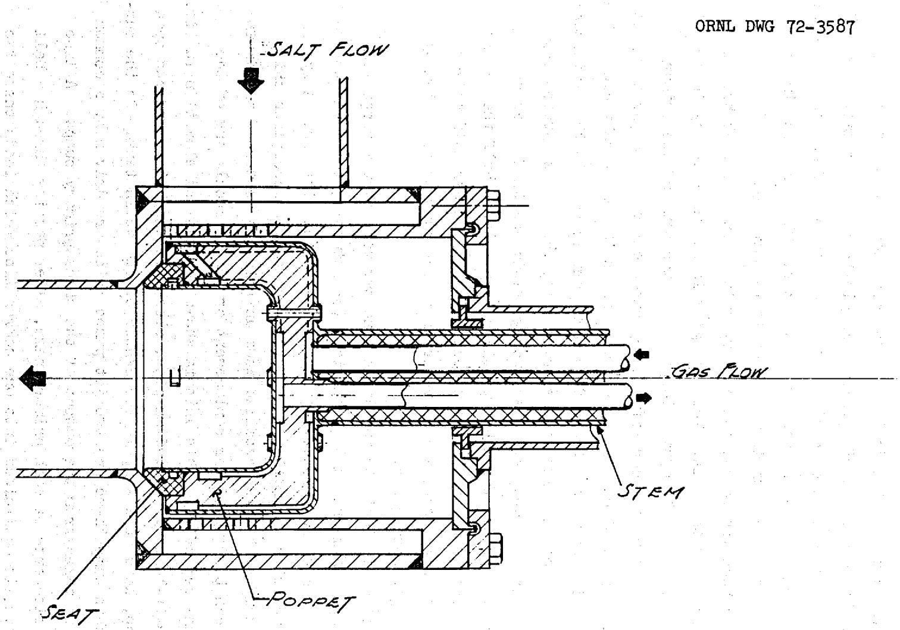  
Fig. 23. Drain Valve.

exchanger cells, and the salt piping above the drain tank cell are equipped with catch pans which communicate with the drain tank through a rupture disc in the top of the tank.

The third use of the drain tank concerns the holdup of the fission gases and the separation of entrained liquid from these gases. About 8 MW of heat from these fission products must be disposed of and the drain tank cooling system is used to dissipate this heat. This is a continuous function of the drain tank while the plant is in operation.

As has been mentioned, the primary salt is sparged with helium to remove xenon from the salt. This sparging is accomplished by introducing gas bubbles into a salt bypass loop around each pump of the primary circuit. In this bypass a centrifugal separator extracts the gas from the salt. The separator constantly extracts about 10 gpm of salt along with the gas. This two-phase stream from each pump is sent to the drain tank where, because of the size of the drain tank, the salt separates from the gas by gravity, and, after an average residence time of about 6 hours, the gas passes through a particle trap. About half the gas is returned directly to the bubble generator and the other half passes through a cleanup system and is returned to the pump purge system by means of a gas compressor.

The flow of liquid to the drain tank may vary over a range from 0 to about 32 gpm. A means must be provided for returning this salt to the primary system without returning any of the radioactive gas. A system of jet pumps with automatic flow control is used to accomplish this. This jet pump system is installed as a unit in the center of the drain tank and can be removed for replacement or repair should any of the unit become defective. This unit is shown in plan and elevation in Fig. 24. A 19-ft-long by 6-in.-diam pipe, closed at the bottom end and open at the top, acts as a sump in the center of the drain tank. On the outside of this sump there are two jet pumps which are driven by a common salt source taken from the output of the three primary pumps. A line from the discharge of each primary pump, after passing through a ball check valve, is manifolded into one common line which feeds these two jet pumps.

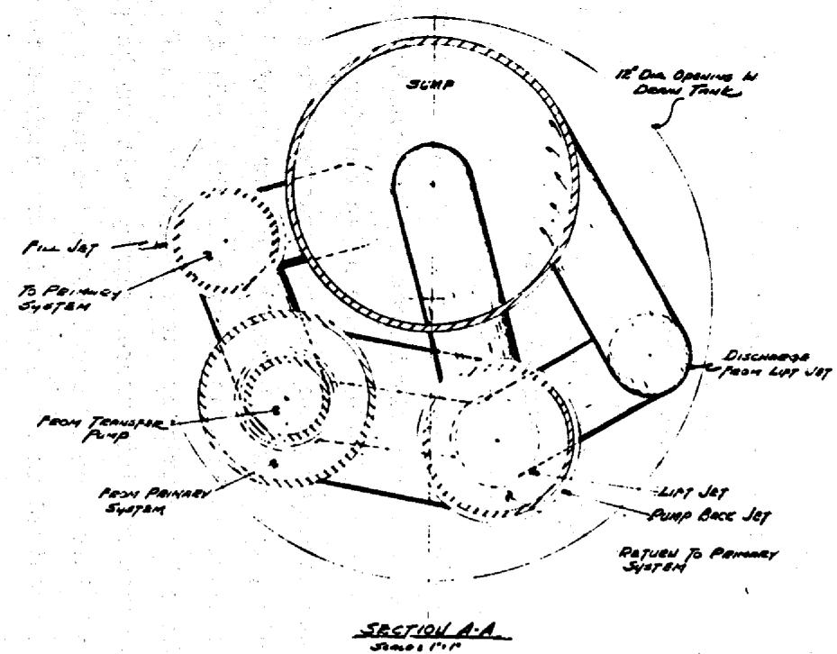

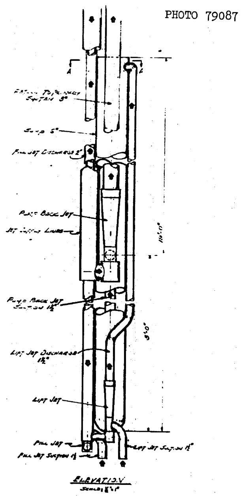  
Fig. 24. Drain Tank Jet Pump Assembly.

One of the jet pumps has its suction in a small sump in the bottom of the drain tank and discharges tangentially into the 6-in.-diam sump near the top. This pump has a capacity greater than the flow of liquid into the tank so it keeps the drain tank sump empty. Because the capacity of the pump exceeds the liquid flow, this pump at times pumps gas, but the gas simply discharges back into the drain tank atmosphere.

The second jet pump is located about midway up the 6-in.-diam sump and sucks out of the bottom of this pipe. The discharge of this pump goes into one of the pump bowls of the primary system. The jet pump suction can change from about plus 14 ft to a minus 5 ft. Therefore, the pump discharges salt at a rate proportional to the suction head and this rate can be anything between 0 and $32\mathrm{gpm}$ . Thus only liquid and never hot gas is returned to the primary system. This automatic regulation takes care of the liquid pumpback for all conditions of operation.

A third jet pump is mounted with this assembly, but it is used only for filling the primary system or for transferring the contents of the drain tank to the chemical processing cell. This operation is described below, along with the chemical processing system.

Because this plant is operated as a converter having a breeding ratio less than unity, the chemical processing required is very much less involved than that required for a breeder. Three things are required of the chemical treatment: First, means must be provided for removing oxygen from the primary or secondary salt in case either becomes contaminated. Second, when the fuel salt has accumulated enough fission products to cut significantly into the neutron economy, this salt must be replaced with uncontaminated carrier salt. The uranium must be extracted for return to the reactor before the old salt is discarded. Third, there must be provision for storing the discarded carrier salt, at least as long as cooling of this salt is required. In addition to these three primary functions there is a further requirement for a storage facility where primary salt may be placed if it is necessary to do maintenance of any kind on the drain tank. Since this storage tank is required in any event, it was decided to use it as the chemical processing tank for fluorination of the primary salt to remove uranium.

The cooling system for the storage tank can be quite simple since the salt can be held in the drain tank until the heat rate is of the order of 1 MW. This situation exists after approximately 30 days of cooling. The 1 MW can be successfully transferred from the surface of the storage tank by radiation to the NaK-cooled jacket surrounding the storage tank.

After removal of the uranium, the contaminated carrier salt must be put into disposable cans. These cans, about 2 ft in diameter by 10 ft long, are placed in tanks located in an annulus around the top part of the storage tank. Figures 25 and 26 are plan and elevation of the storage tank and the disposable cans. These cans have interconnecting 1-in. lines so that salt can be transferred to them from the storage tank by gas pressure. After cooling, the lines can be cut and welded, sealing the spent salt permanently in the disposable cans. After the cans have been sealed they can be stored under the reactor in the storage vault or transported to salt mines or other permanent storage facility. New cans can be installed by direct maintenance once the full cans have been removed from the location.

# OFF-GAS SYSTEM

Helium is used as a cover gas over the primary and secondary salt. It is also used as a purge, flowing inward around the pump seals, and as a sparge for removing xenon from the primary salt. This gas system is a closed system, and storage and cleanup equipment must be provided.

The bubble injection and separation and the holdup of the gas in the drain tank have already been described. When the gas leaves the drain tank it goes to one of two particle traps. These traps can be isolated by valves for removal from the system for repair. The purpose of these particle traps is to catch the solid daughters and granddaughters of the noble gases and also such noble metal particles as are carried by the gas as it leaves the drain tank. These particle traps have adequate size to accumulate solid particles for about three months before excessive pressure drop would require replacement of the trap. To remove the heat generated by these particles, the traps have NaK cooling. The heat load is of the order of $400\mathrm{kW}$ . These particle traps have not been

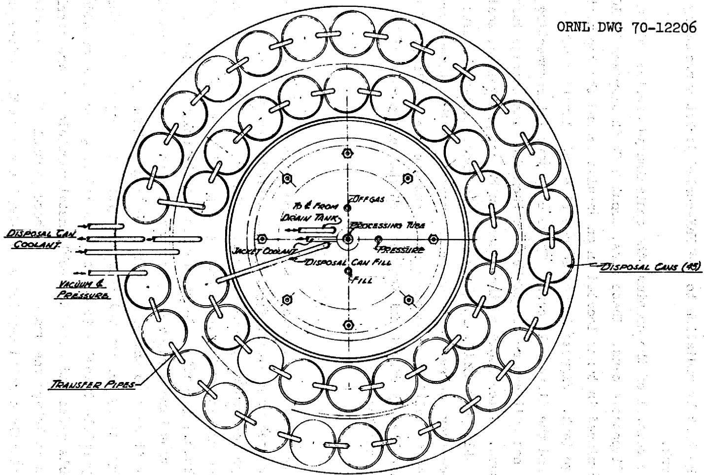  
Fig. 25. Processing and Storage Tank Plan.

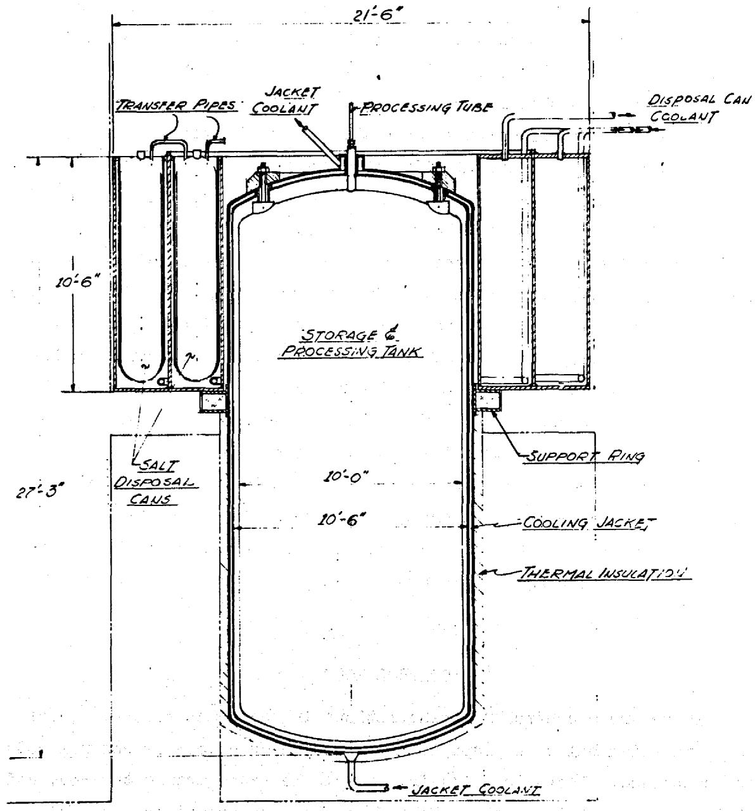  
Fig. 26. Processing and Storage Tank Elevation.

designed since the exact calculations on which a design is based have not been made. Past experience with MSRE shows that the design is not complex and the configuration does not present a problem.

The gas line downstream of the particle trap divides into two equal branches. About 1 cfm of the gas goes directly to the bubble generators in each of the three pump bypass lines. When this gas is removed by the bubble separators, it recirculates to the drain tank, through the particle trap, and to the bubble generators again. This gas is very radioactive, the only loss in radioactivity being that which has decayed in the approximately 6-1/2 hr transit time for the loop.

The other gas stream from the particle trap enters one of two charcoal absorber beds. The two beds are valved so that either can be used. It is imperative that the krypton and xenon in this part of the gas be held up for 90 days because it must be essentially clean before it goes to the gas compressor and storage tank for recirculation to the pump seals. The head end section of the holdup bed is cooled by NaK while the downstream sections of the bed can be cooled by natural convection of the gas atmosphere in the off-gas cell. These beds are in the form of calandria with the charcoal surrounding the tubes. The actual design of the charcoal beds, as in the case of the particle trap, has not been done. Again, there has been enough experience with such absorber beds at ORNL to show that they are feasible and are not excessively large. For details concerning gas cleanup systems, reference is made to ORNL-4541 (ref. 6).

# CONTROL RODS

There are 6 control rod penetrations in the reactor core. These are 7-in.-diam holes in graphite blocks in which cruciform control rods are suspended. There is a 1/4-in. radial clearance around the rod, and it is free to rotate in the hole. Salt flows up around the control rod at a velocity of about 7.5 fps and keeps it cool. A control rod is made of up to 1/2 in. of B4C clad with a 1/8-in. thickness of Hastelloy N. Each control rod is worth about $3\% \Delta K / K$ and any one rod will shut the reactor down.

Each rod is suspended on a Hastelloy cable which is taken up on a 12-in.-diam drum driven through a worm gear drive. The motor is outside the reactor cell shielding, but the winch and cable are located within the containment. The motor and drive is also enclosed and a positive gas pressure is maintained to produce inleakage around the drive seal. A spring loaded monitor cable attached to a synchro provides position indication for the rod. One end of the cable is attached to the top of the rod and by actuation of the synchro gives remote indication of the rod position at all times. This cable is not strong enough to support the rod; therefore, it cannot prevent the rod from falling into place.

The control rod has a finite life and so must be replaced after it has received a fluence of about $10^{21}$ neutrons/cm². The redundancy furnished by the 6 rods makes it possible to hang the rods on cable without providing a positive drive for rod insertion. A magnetic clutch can be provided between the winch and the gear drive if it is desirable to drop the rod instead of relying on the slower insertion provided by the drive mechanism.

# INSTRUMENTATION

Instrumentation for the plant has received little attention since it probably poses few problems that are different from other nuclear plants. One exception is that the reactor is so heavily reflected that for initial startup a fission chamber will probably have to be inserted in one of the control rod sockets in order to get a good enough signal in the initial criticality run. The nuclear instrumentation should not be more complicated than for other nuclear plants for the reactor has a prompt negative temperature coefficient, and the very large heat capacity of the primary system prevents rapid temperature excursions. A thorough study of the control and safety instrumentation must be done. It appears that the instrumentation required will not exceed the existing art.

# MAINTENANCE

A circulating-fuel nuclear reactor is inherently a highly radioactive system, and the radioactivity is more dispersed than it is under normal conditions in a solid-fuel reactor. For this reason, all maintenance on the primary circuit must be done by remote means. By designing the MSDR to operate at a low enough power density so that graphite replacement is unnecessary, the maintenance is greatly simplified. Also by designing the heat exchangers so that tubes can be plugged, the maintenance is made more practical.

Experience with the MSRE showed that remote maintenance of the radioactive equipment and systems of a small molten-salt reactor is feasible and practical. The techniques and types of tools successfully employed there should be satisfactory for many of the remote maintenance operations on the MSDR, but they will have to be adapted for handling the larger and heavier equipment and piping. New tools will have to be developed for such operations as remote cutting and welding of piping and plugging of heat exchanger tubes. Experience with the development of automatic cutting and welding equipment at ORNL indicates that these more difficult operations can be accomplished.

# PERFORMANCE

A summary of the nuclear data with fuel cycle costs is shown in Table 9. No credit was taken for reclaiming the discarded carrier salt after it is removed from the reactor. This salt has some very valuable constituents in the $^{7}\mathrm{Li}$ and beryllium and when molten-salt reactors come into general use it is probable that this salt could be reclaimed at an economic benefit.

It is also almost certain that future reactor plants could utilize supercritical steam systems and realize the improved efficiencies of these systems. As has been stated, this "first-of-a-kind" demonstration plant was designed on a conservative basis.

The question of plant safety has not been treated here. Certainly safety considerations were of prime concern in the design study described in this report, but the subject is so important as to merit separate

Table 9. Lifetime Averaged Performance of a 750-MW(t) Molten-Salt Demonstration Reactor   

<table><tr><td>Identification</td><td>A38</td></tr><tr><td>Description</td><td></td></tr><tr><td>Dimensions, cm</td><td></td></tr><tr><td>Core, radius</td><td>340</td></tr><tr><td>Plenum-annulus, thickness</td><td>2.54</td></tr><tr><td>Reflector, thickness</td><td>75.9</td></tr><tr><td>Salt volume fractions</td><td></td></tr><tr><td>Core</td><td>0.10</td></tr><tr><td>Plenum-annulus</td><td>1.0</td></tr><tr><td>Reflector</td><td>0.01</td></tr><tr><td>Composition of carrier salt, mole %</td><td></td></tr><tr><td>LiF</td><td>67</td></tr><tr><td>BeF2</td><td>23</td></tr><tr><td>ThF4</td><td>10</td></tr><tr><td>Core moderator ratio, atoms C/Th</td><td>277</td></tr><tr><td>Plant factor</td><td>0.8</td></tr><tr><td>Thermal efficiency, %</td><td>36.6</td></tr><tr><td>Core life, efp years</td><td>24</td></tr><tr><td>Processing, batch cycle time, efp years</td><td>6</td></tr><tr><td>Fuel enrichment, 235U, %</td><td>93</td></tr><tr><td>Volume of fuel salt, ft3</td><td></td></tr><tr><td>Reactor (spherical model)</td><td>760</td></tr><tr><td>Piping and heat exchangers</td><td>320</td></tr><tr><td>Total</td><td>1080</td></tr><tr><td>Performance</td><td></td></tr><tr><td>Conversion ratio, lifetime averageda</td><td>0.88</td></tr><tr><td>Fuel cycle costs, b mills/kWhr</td><td></td></tr><tr><td>Inventory</td><td></td></tr><tr><td>Fissile</td><td>0.62</td></tr><tr><td>Salt</td><td>0.071</td></tr><tr><td>Replacement</td><td></td></tr><tr><td>Fissile</td><td>0.18</td></tr><tr><td>Salt</td><td>0.13</td></tr><tr><td>Total fuel cost</td><td>1.0</td></tr><tr><td>Processing cost, estimated</td><td>0.1</td></tr><tr><td>Total fuel cycle cost</td><td>1.1</td></tr><tr><td>Lifetime fissile material balance, kg</td><td></td></tr><tr><td>Initial inventory</td><td>710</td></tr><tr><td>Further purchases</td><td>940</td></tr><tr><td>Recovery at end of life</td><td>700</td></tr><tr><td>Net fuel requirement</td><td>950</td></tr></table>

${}^{a}$ Assuming a processing loss of fissile uranium of ${0.01}\%$ per cycle.

bFrom a present-worth calculation of fissile, fertile, and carrier salt purchases and/or sales over the reactor lifetime, compounded quarterly at a discount rate of 0.07 per annum. Inventory charge rate 0.132. Fissile nuclide value in $\$ /kg$ , 11.9 for $^{235}$ U, and 13.8 for $^{233}$ U.

study. An in-depth safety study of the molten-salt concept is in progress and will be the subject of an extensive report.

# DISTRIBUTION

# ORNL-TM-3832

1-209. MSRP Distribution D

210. W. B. Cottrell

211. H. C. McCurdy

212. A. J. Miller

213. M. Sheldon

214. D. A. Sundberg

215. G. D. Whitman

# US-AEC

216. D. F. Cope, ORO-SSR   
217. D. Elias, RDT, Washington, D. C.   
218. N. Haberman, RDT, Washington, D. C.   
219. W. H. Hannum, RDT, Washington, D. C.   
220. J. Neff, RDT, Washington, D. C.   
221. M. J. Whitman, RDT, Washington, D. C.   
222-223. Director, Division of Reactor Licensing, Washington, D. C.   
224-225. Director, Division of Reactor Standards, Washington, D. C.   
226-227. Executive Secretary, Advisory Committee on Reactor Safeguards, Washington, D. C.   
228. Research and Technical Support Division, ORO   
229-230. Technical Information Center

# Industry

231. J. A. Acciarri, Continental Oil Co., Fonca City, OK   
232. R. M. Bushong, Carbon Products Division, UCC, P. O. Box 6116, Cleveland, OH 44101   
233. G. C. Clasby, Byron Jackson, P. O. Box 2017, Terminal Annex, Los Angeles, CA 90054   
234-236. D. R. deBoisblanc, Evasco Services Inc., Two Rector Street, New York, NY 10006   
237. B. Deering, Black & Veatch, P. O. Box 8405, Kansas City, MO 64114   
238. Bernard Mong, Babcock and Wilcox, P. O. Box 1260, Lynchburg, VA 24505   
239. T. K. Roche, Cabot Corp., Kokomo, IN 46901   
240. A. E. Swanson, Black & Veatch, P. O. Box 8405, Kansas City, MO 64114