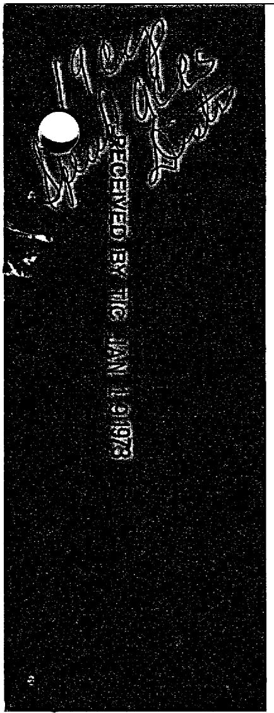

# DESIGN AND OPERATION OF A

# FORCED-CIRCULATION CORROSION TEST

# FACILITY (MSR-FCL-1) EMPLOYING HASTELLOY N

# ALLOY AND SODIUM FLUOROBORATE SALT

W. R. Huntley

P.A.Gnadt

# MASTER

DISTRIBUTION OF THIS DOCUMENT IS UNLIMITED

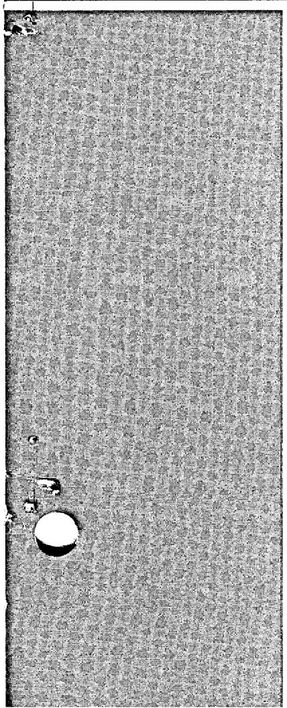

# OAK RIDGE NATIONAL LABORATORY

OPERATED BY UNION CARBIDE CORPORATION • FOR THE U.S. ATOMIC ENERGY COMMISSION

This report was prepared as an account of work sponsored by the United States Government. Neither the United States nor the United States Atomic Energy Commission, nor any of their employees, nor any of their contractors, subcontractors, or their employees, makes any warranty, express or implied, or assumes any legal liability or responsibility for the accuracy, completeness or usefulness of any information, apparatus, product or process disclosed, or represents that its use would not infringe privately owned rights.

Contract No. W-7405-eng-26

Reactor Division

DESIGN AND OPERATION OF A FORCED-CIRCULATION CORROSION TEST FACILITY (MSR-FCL-1) EMPLOYING HASTELLOY N ALLOY AND SODIUM FLUOROBORATE SALT

W.R.Huntley P.A.Gnadt

# NOTICE

This report was prepared as an account of work sponsored by the United States Government. Neither the United States nor the United States Atomic Energy Commission, nor any of their employees, nor any of their contractors, subcontractors, or their employees, makes any warranty, express or implied, or assumes any legal liability or responsibility for the accuracy, completeness or usefulness of any information, apparatus, product or process disclosed, or represents that its use would not infringe privately owned rights.

JANUARY 1973

OAK RIDGE NATIONAL LABORATORY

Oak Ridge, Tennessee 37830

operated by

UNION CARBIDE CORPORATION

for the

U.S. ATOMIC ENERGY COMMISSION

MASTER

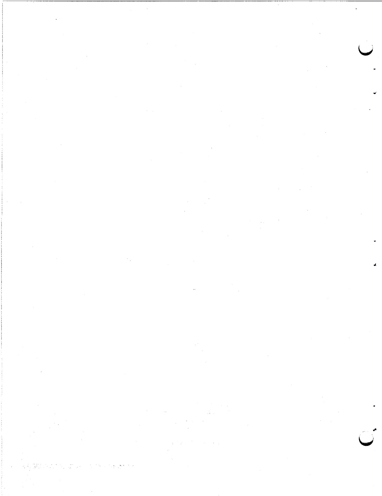

# CONTENTS

ACKNOWLEDGMENT V

ABSTRACT 1

1. INTRODUCTION 1   
2. DESIGN AND FABRICATION 2

2.1 Design Criteria 2   
2.2 General Design Information 4   
2.3 Detailed Design and Fabrication 9

2.3.1 Heater 9   
2.3.2Cooler 9   
2.3.3 Salt pump 12   
2.3.4 Salt sampler 14   
2.3.5 BFsystem 17   
2.3.6 Fill and drain tank 19   
2.3.7 Corrosion specimen design 19   
2.3.8 Electrical system 19   
2.3.9 Instrumentation and control 22

2.4 Quality Assurance 23

3. OPERATING EXPERIENCE 24

3.1 Heat Transfer Performance of Sodium Fluoroborate 27   
3.2 BF Handling 29   
3.3 Salt Pump Operation 36   
3.4 Corrosion Specimen Removal 41   
3.5 Salt Sampling 44   
3.6 Summary of Corrosion Results 45

CONCLUSIONS 45   
RECOMMENDATIONS 47   
APPENDIX A. MSR-FCL-1 FLOWSHEET 49   
APPENDIX B. MSR-FCL-1 CONTROL SYSTEM DESCRIPTION AND OPERATING  
PROCEDURES FOR UNATTENDED OPERATION 51  
APPENDIX C. MSR-FCL-1 SALT SAMPLING PROCEDURE 63

# ACKNOWLEDGMENT

The fabrication and operation of the test loop were the joint responsibility of the ORNL Metals and Ceramics Division and the ORNL Reactor Division. The authors wish to thank the many personnel who aided in the design, installation, operation, and postoperational examination of this test.

Special thanks are extended to the following personnel who were instrumental in the success of the experiment.

H. E. McCoy, Metals and Ceramics Division, and R. E. MacPherson, Reactor Division, for their guidance of the test program.   
J. W. Koger, Metals and Ceramics Division, for metallurgical analysis throughout the program.   
H. C. Savage, Reactor Chemistry Division, for guidance of loop operation during the latter portion of the test period and for the Control System Description of Appendix B.   
E. J. Breeding, R. D. Stulting, and L. C. Fuller, Reactor Division, for their contribution to the detailed design of the system.

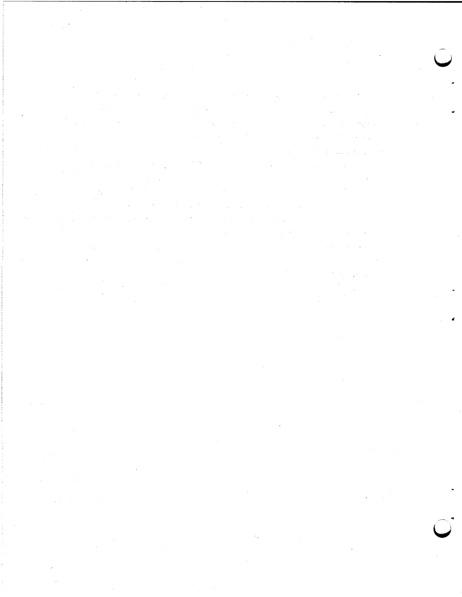

# DESIGN AND OPERATION OF A FORCED-CIRCULATION CORROSION TEST FACILITY (MSR-FCL-1) EMPLOYING HASTELLOY IN ALLOY AND SODIUM FLUOROBORATE SALT

W.R.Huntley P.A.Gnadt

# ABSTRACT

A forced-circulation loop (MSR-FCL-1) was assembled and operated to evaluate the compatibility of standard Hastelloy N with sodium fluoroborate-sodium fluoride eutectic $(\mathrm{NaBF}_4 - 8$ mole $\%$ NaF) coolant salt at operating conditions expected in the Molten-Salt Reactor Experiment coolant circuit. The salt velocity in $1/2$ -in.-OD, $0.042$ -in.-wall tubing was nominally 10 fps. Hastelloy N corrosion specimens were exposed to the circulating salt at temperatures of 950, 1030, and $1090^{\circ}\mathrm{F}$ . The test has operated more than 10,000 hr at these conditions and tests are continuing. This report is mainly concerned with the design, fabrication, and operation of the facility. Special problems related to accommodating the $\mathrm{BF}_3$ vapor pressure of the salt were resolved, and the sodium fluoroborate demonstrated heat transfer characteristics that could be approximated by conventional correlations such as the Dittus-Boelter equation. Corrosion rates generally decreased with operating time; for example, the lowest corrosion rate observed for the $1090^{\circ}\mathrm{F}$ corrosion specimens during a 2900-hr test interval was equivalent to 0.0003 in. of uniform material removal per year.

Keywords: molten salt, corrosion, sodium fluoroborate, Hastelloy N, design, operation, centrifugal pump, mass transfer, heat transfer, MSRE, unattended operation.

# 1. INTRODUCTION

The sodium fluoroborate $(\mathrm{NaBF}_4 - 8$ mole $\%$ NaF) salt mixture is of interest as a coolant for the secondary circuit of molten-salt reactors because of its low cost ( $\sim$ 0.50/lb) and relatively low melting point $(725^{\circ}\mathrm{F})$ . Screening tests in thermal-convection loops indicate no serious problems due to reactions between the salt and the proposed reactor containment material, Hastelloy N.

The forced-circulation loop described here (MSR-FCL-1) represents a more sophisticated test of the compatibility of the candidate salt and Hastelloy N. High coolant velocities were used, and the design thermal gradient was applied to the system. The results from this test will assist in the evaluation of the corrosion resistance of the Hastelloy N containment material and the mass transfer interactions of the containment material and salt. Detailed metallurgical results will be presented separately.

# 2. DESIGN AND FABRICATION

# 2.1 Design Criteria

The MSR-FCL-1 test was designed to evaluate the use of sodium fluoroborate2 salt in contact with Hastelloy N alloy containment material at conditions simulating the secondary-coolant (high-temperature side of the steam generator) circuit of molten-salt reactors. One objective of the test was to develop the technology associated with the new salt by using it in a relatively complex operating system.

The $\mathrm{BF}_3$ vapor pressure of the sodium fluoroborate salt is higher (e.g., $141\mathrm{mmHg}$ at the maximum loop temperature of $1090^{\circ}\mathrm{F}$ ) than the vapor pressure of other salts developed for use in molten-salt reactors. Accommodating the $\mathrm{BF}_3$ vapor pressure of the salt at elevated temperature in MSR-FCL-1 was a major design problem, since $\mathrm{BF}_3$ is a noxious gas and a design to provide adequate ventilation for personnel protection was required.

An existing system design3 was used as a basis for MSR-FCL-1. Centrifugal pumps, air blowers, electrical transformers, and miscellaneous control equipment used in previous corrosion tests of this type were

available. The reuse of the available instrument and control design and the existing equipment resulted in a system of limited flexibility; however, these design features had been previously tested and funds were only available for minimum redesign and fabrication of new equipment. The hydraulic characteristics of the existing pump were a specific limiting factor on loop performance.

The facility was originally designed to operate for 10,000 hr and to provide a maximum bulk fluid salt temperature of $1125^{\circ}\mathrm{F}$ , a bulk fluid $\Delta T$ of $275^{\circ}\mathrm{F}$ at a velocity of 7 l/4 fps (3 gpm), and a total heat input of 94 kW. However, the loop was not operated at these conditions. After the original design was completed and before the loop fabrication was complete, the test conditions were changed to more nearly match the temperature profile of the coolant circuit of the Molten-Salt Reactor Experiment (MSRE), which was then operating. This modification to program plans was a prelude to the proposed introduction of sodium fluoroborate into the secondary-coolant circuit of the MSRE. The test facility was operated at a maximum bulk fluid temperature of $1090^{\circ}\mathrm{F}$ , a bulk fluid $\Delta T$ of $140^{\circ}\mathrm{F}$ at a velocity of 10 fps (4 gpm), and a total heat input of 53 kW.

Corrosion specimens were introduced into the system at appropriate locations to obtain accurate weight change, chemistry change, and metallographic data. Periodic removal and reinsertion of the specimens were specified at approximately 2000-hr intervals. Salt sampling at approximately 500-hr intervals was specified to permit chemical analyses necessary for characterization of corrosion processes occurring during operation.

Protective instrumentation and an auxiliary power supply were provided in an attempt to prevent accidental freezing of the salt due to loss of normal electrical supply or a pump stoppage. Originally this protective system was to be continuously monitored by facility operators; however, evening and night shift operator coverage was discontinued during the latter part of the operating period, and the facility had to be modified for unattended operation.

# 2.2 General Design Information

A simplified schematic drawing of the test loop is shown in Fig. 1, and an isometric drawing of the equipment is shown in Fig. 2. A complete flowsheet is included as Appendix A. Sodium fluoroborate is discharged downward from the salt pump (model LFB) at a temperature of $950^{\circ}\mathrm{F}$ and at a flow rate of $4\mathrm{gpm}$ . The salt enters the first of two heat input sections and is heated to $1030^{\circ}\mathrm{F}$ ; flows over three Hastelloy N metallurgical specimens; continues through the second heat input section, where the bulk fluid temperature is increased to $1090^{\circ}\mathrm{F}$ ; and flows over three additional metallurgical specimens before being cooled in a heat exchanger to $950^{\circ}\mathrm{F}$ . The cooled salt then flows over two more metallurgical specimens before returning to the inlet of the pump.

The salt inventory is stored in a sump tank located below the primary piping system. A high-purity helium gas blanket is maintained above the salt surfaces in this tank and in the pump to minimize salt contamination. A dip leg in the sump tank allows the liquid salt to be forced by helium overpressure into the circulating system. The sump tank is designed to contain approximately twice the salt volume to be circulated. A freeze valve serves to isolate the salt in the circulating system from the sump tank inventory. This valve consists of a cooling air line installed around the 1/4-in.-OD, 0.035-in.-wall tubing connecting the sump tank to the circulating system. Piping of the circulating system is principally 1/2-in.-OD by 0.042-in.-wall Hastelloy N tubing.

No direct flow measuring equipment is provided in the circulating-salt system; provisions are made to measure the flow calorimetrically. Three calibrated Chromel-Alumel thermocouples are installed at both the inlet and exit of one of the heater sections. By determining the thermal losses from this section at several temperature levels with no salt in the system, it is possible to obtain the net electrical heat input during operation. Flow rates can then be calculated from the net electrical power input and the observed temperature rise in the salt as it passed through the heater.

Engineering parameters of the system are shown in Table 1, and composition and physical properties of sodium fluoroborate are shown in Table 2.

ORNL-DWG 68-2797R2

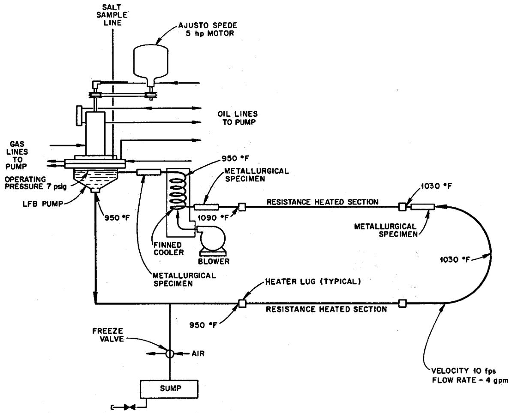  
Fig. 1. Simplified schematic of molten-salt corrosion test loop.

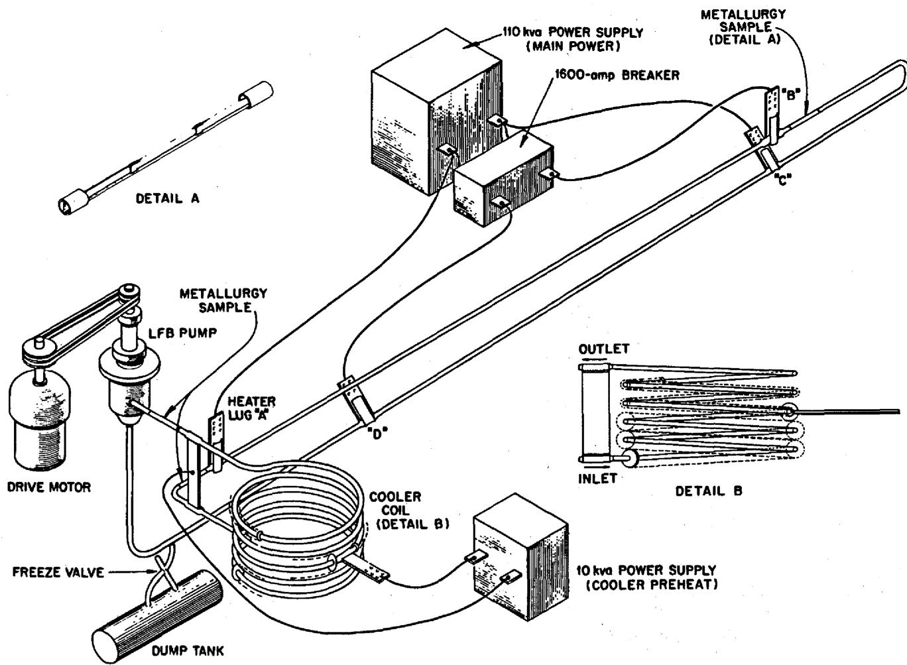  
ORNL-LR-DWG 6470RA   
Fig. 2. Molten-salt corrosion testing loop and power supplies.

Based on actual operating conditions

Table 1. Selected engineering data for MSR-FCL-1   

<table><tr><td colspan="2">Materials, temperatures, and velocities</td></tr><tr><td>Tubing and specimens</td><td>Standard Hastelloy N</td></tr><tr><td>Nominal tubing size</td><td>1/2 in. OD, 0.042 in. wall</td></tr><tr><td>Total tubing length</td><td>57 ft</td></tr><tr><td>Bulk fluid temperature (max)</td><td>1090°F</td></tr><tr><td>Bulk fluid temperature (min)</td><td>950°F</td></tr><tr><td>Bulk fluid ΔT</td><td>140°F</td></tr><tr><td>Flow rate</td><td>4 gpm</td></tr><tr><td>Liquid velocity</td><td>10 fps</td></tr><tr><td colspan="2">Cooler heat transfer</td></tr><tr><td>Heat load at finned cooler</td><td>180,900 Btu/hr (~53 kW)</td></tr><tr><td>Liquid Reynolds number</td><td>45,000</td></tr><tr><td>Liquid film heat transfer coefficient</td><td>~2000 Btu hr-1ft-2(°F)-1</td></tr><tr><td>Length of finned 1/2-in.-OD cooler coil</td><td>26 ft</td></tr><tr><td>Coolant air flow</td><td>995 cfm</td></tr><tr><td>Coolant air ΔT</td><td>185°F</td></tr><tr><td colspan="2">Pumping requirements</td></tr><tr><td>System ΔP at 4 gpm</td><td>57.5 psi (65 ft)</td></tr><tr><td>Required pump speed</td><td>5000 rpm</td></tr><tr><td colspan="2">Salt inventory being circulated</td></tr><tr><td>Volume in pump bowl</td><td>85 in.3</td></tr><tr><td>Volume in tubing</td><td>46 in.3</td></tr><tr><td>Total volume</td><td>131 in.3</td></tr><tr><td>Total weight</td><td>8.81 lb</td></tr><tr><td colspan="2">Miscellaneous</td></tr><tr><td>Surface to volume ratio for circulating salt</td><td>7 in.2/in.3</td></tr><tr><td>Volume of dump tank</td><td>274 in.3</td></tr></table>

The possibility of leakage of $\mathrm{BF}_3$ gas through the rotating mechanical face seal of the pump or from the valves and fittings in the pump seal oil lines exists. To protect personnel from this noxious gas, a ventilated cabinet is provided to enclose the LFB pump and the gas system. An induced draft blower exhausts the air from the cabinet through ducts to the roof of the building.

Table 2. Composition and physical properties of sodium fluoroborate   

<table><tr><td colspan="2">Composition (mole %)</td></tr><tr><td>NaBF4</td><td>92</td></tr><tr><td>NaF</td><td>8</td></tr><tr><td>Approximate molecular weight</td><td>104</td></tr><tr><td>Approximate melting point (°F)</td><td>725</td></tr><tr><td>Vapor pressure, a log10 P (mm Hg) = 9.024 - 10,656 / T (°R)</td><td></td></tr><tr><td>At 1090°F</td><td>140</td></tr><tr><td>At 950°F</td><td>29</td></tr><tr><td>Densityb (1b/ft3) = 141.4 - 0.0247t (°F)</td><td></td></tr><tr><td>At 1090°F</td><td>114.4</td></tr><tr><td>At 1020°F</td><td>116.2</td></tr><tr><td>At 950°F</td><td>117.9</td></tr><tr><td>Viscosityb (1b ft-1hr-1) = 0.2121 exp 4032/T (°R)</td><td></td></tr><tr><td>At 1090°F</td><td>2.86</td></tr><tr><td>At 1020°F</td><td>3.23</td></tr><tr><td>At 950°F</td><td>3.7</td></tr><tr><td>Heat capacityc [Btu lb-1(°F)-1]</td><td>0.360</td></tr><tr><td>Thermal conductivityd [Btu hr-1ft-1(°F)-1]</td><td></td></tr><tr><td>At 1090°F</td><td>0.23</td></tr><tr><td>At 1020°F</td><td>0.235</td></tr><tr><td>At 950°F</td><td>0.24</td></tr></table>

$^{\mathrm{a}}$ S. Cantor et al., Physical Properties of Molten-Salt Reactor Fuel, Coolant, and Flush Salt, ORNL-TM-2316, p. 33 (August 1960).   
bS. Cantor, MSR Program Semiannu. Progr. Rep. Aug. 31, 1969, ORNL-4449, pp. 145-47.   
cA. S. Dworkin, MSR Program Semiannu. Progr. Rep. Feb. 29, 1968, ORNL-4254, p. 168.   
dJ. W. Cooke, MSR Program Semiannu. Progr. Rep. Aug. 31, 1969, ORNL-4449, p. 92.

In addition, a sheet-metal enclosure is provided around the salt piping and heat exchanger to protect operating personnel from gross liquid leakage. The system piping is considered sufficiently reliable to preclude the need for special exhaust ventilation from this enclosure for protection against $\mathsf{BF}_3$ leakage. Favorable ventilation conditions exist in the test area, which has a 50-ft-high ceiling and continuous exhaust ventilation.

The test loop is shown in Fig. 3 during installation of the heaters and thermocouples. Figure 4 shows the completed installation.

# 2.3 Detailed Design and Fabrication

# 2.3.1 Heater

The heat input into the salt is accomplished by resistance heating two sections of the system piping, each approximately 105 in. long. Voltage is applied between two lugs attached to the ends of each heated length of pipe. Control is common to both of the heat input sections (see Fig. 2).

# 2.3.2 Cooler

Heat is removed from the system by a heat exchanger composed of an air-cooled, 26-ft-long, 19-in.-diam coil of $\frac{1}{2}$ -in.-OD by 0.042-in.-wall tubing to which $\frac{1}{16}$ -in.-thick circular nickel fins are attached (see Fig. 3). These fins are brazed to the tubing with Coast Metals 52 furnace braze alloy. The finned coil is inside a sheet-metal housing which serves as the cooling air duct.

The salt side pressure drop, as limited by the capacity of the salt pump, prohibits the use of a longer heat exchanger coil. Variations in fin diameter and spacing are used to provide a higher heat flux at the hot end of the cooler. This geometry creates a flattened salt wall temperature profile which makes possible maximum heat removal without cooling the wall at the cold end of the unit below the $725^{\circ}\mathrm{F}$ melting point of the salt. [This feature was important during the design stages, when the expected drop in the bulk fluid temperature was from 1125 to $850^{\circ}\mathrm{F}$ . It

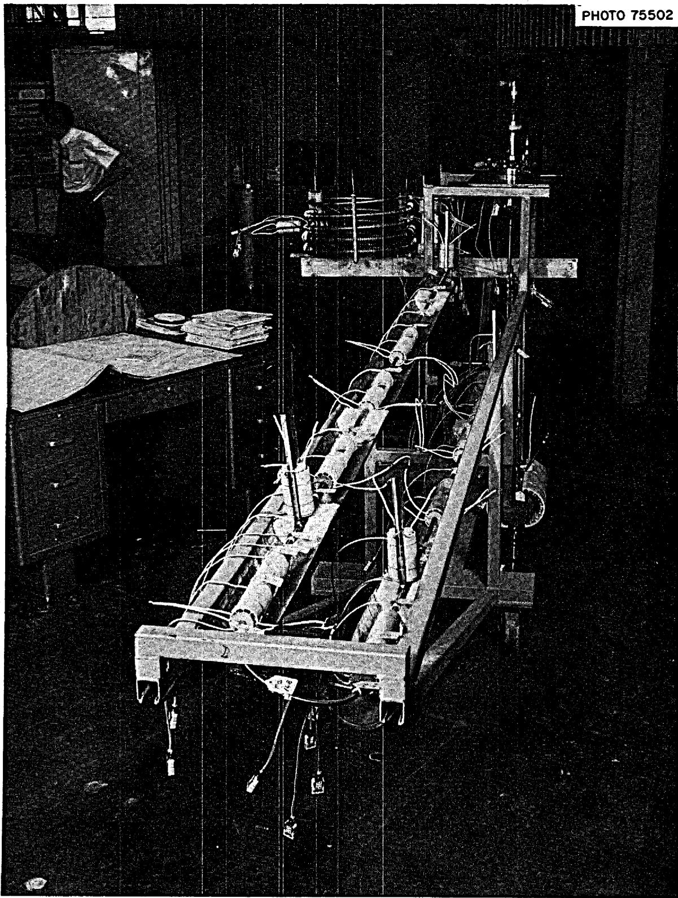  
Fig. 3. Test loop assembly during installation of heaters and thermocouples.

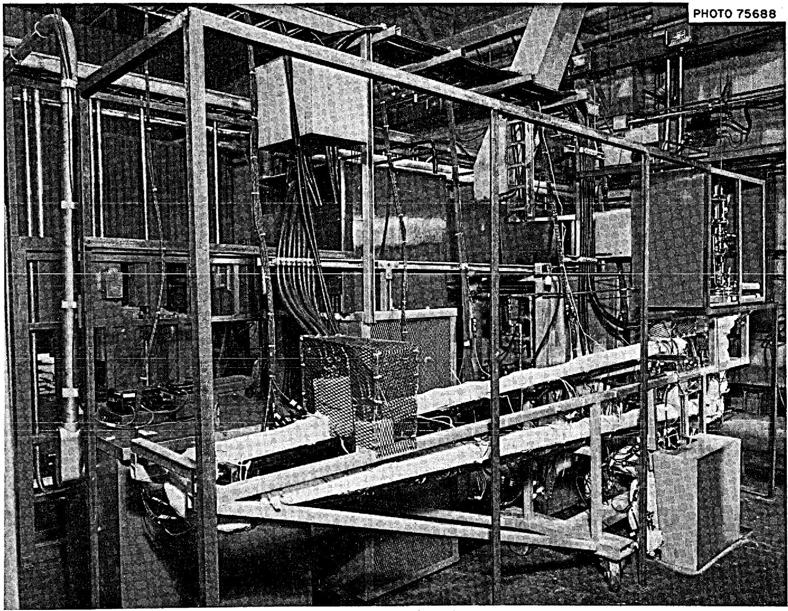  
Fig. 4. Corrosion test loop installed in test stand.

became less important when the proposed operating conditions were changed to simulate the Molten-Salt Reactor Experiment coolant circuit temperature profile (1090-950°F).]

The cooler is resistance heated during preheating of the loop. This resistance heat system is also used to keep the salt above the melting point during loss of normal building power. Hastelloy N lugs are installed at the inlet, midpoint, and exit of the coil for attachment of three electrical leads. The lugs project through holes in the air duct to give access to the electrical connections. During a loss of normal power the voltage is supplied to the central lug of the coil from a diesel-generator unit used for emergency electrical supply.

A hinged door, provided on the air exit side of the cooler housing, is closed to reduce the heat losses during preheating and is equipped to close automatically during a power outage. The top side of this door and the four sides of the air plenum are insulated with Johns Manville Kaowool thermal insulation to further reduce the heat losses. This insulation is also used to plug the holes where the electrical lugs penetrate the air duct.

Air to the cooler is supplied through appropriate ducting by a model 200-A-1 American blower with a 3-hp 1725-rpm motor which provides a maximum air flow of 3200 cfm air through the ductwork. However, in normal operation the air flow required is about 1000 cfm. A throttling damper is provided to regulate the flow.

Selected engineering data on the actual performance of the cooler are shown in Table 1, along with other engineering parameters of the system.

# 2.3.3 Salt pump

The salt pump, model LFB, used in this corrosion test is shown in Fig. 5. It is a centrifugal sump pump designed at ORNL and features a downward discharge. The pump has an overhung vertical shaft, two grease-sealed ball bearings, and an oil-lubricated mechanical face seal above the salt liquid level and just below the lower ball bearing. Shaft and seal cooling are provided by oil which flows downward through the hollow

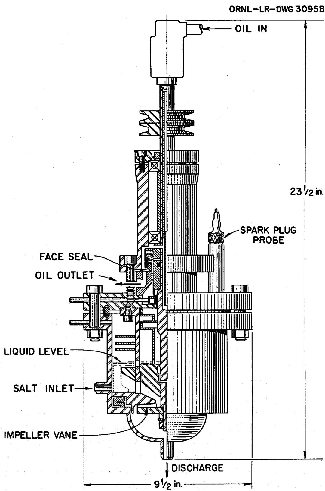  
Fig. 5. Molten-salt pump (model LFB).

shaft through a rotary seal. The oil leaves through holes in the shaft located just above the top side of the mechanical face seal. The pump requires a gas purge as described in Section 2.3.5. Pump performance data taken with water are shown in Fig. 6. The model LFB salt pump was selected for this particular test since several pumps were available and over 400,000 cumulative hours of successful operation had been experienced in many previous applications at Oak Ridge National Laboratory. The head capability of the pump is somewhat lower than desired, and the acceptance of this limitation resulted in a maximum liquid velocity of 10 fps.

The pump tank contains the only free liquid surface in the circulating system during normal operation with the dump tank isolated by a freeze valve. The pump is located at the highest point in the flow circuit, and the pump tank acts as a liquid expansion volume. The liquid level in the tank is indicated by two spark plug probes which have Hastelloy N extensions welded to the center electrodes to make contact with the liquid salt at preset elevations. A salt sampling apparatus is provided at the pump tank, as described in Section 2.3.4.

# 2.3.4 Salt sampler

A cross section of the molten-salt sampler is shown in Fig. 7. It is used to remove salt samples from the pump tank at approximately 500-hr intervals during the test program. (The test loop operation is not interrupted during sampling.) The sampler consists of a dip tube with a small copper bucket attached on the lower end which is lowered into the molten salt in the pump tank. Vacuum and inert-gas back-filling connections are provided so that the sampler assembly can be attached to or removed from the pump tank without contaminating the salt inventory. A Swagelok fitting with Teflon ferrules acts as the packing gland on the $1/4$ -in.-OD dip tube. The Swagelok nut is loosened, as required, to permit raising or lowering of the dip tube. The original bucket design had a capacity of about $2\mathrm{g}$ of sodium fluoroborate. A second separate compartment which holds about $0.5\mathrm{g}$ was added later to provide a separate sample for an oxygen analysis.

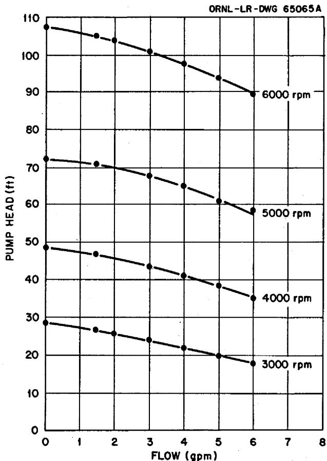  
Fig. 6. Performance characteristics of the LFB salt pump in water.

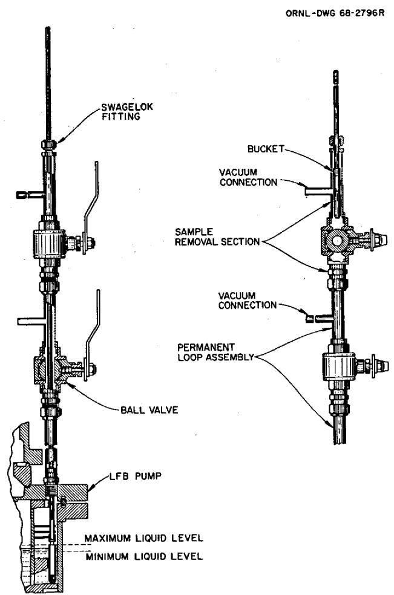  
Fig. 7. Cross section of a molten-salt sampling device.

# 2.3.5 BFsystem

A relatively complex tubing system is provided to supply He-BF₃ mixtures for use in purging shaft seal oil leakage from the salt pump. A simplified schematic of the system is shown in Fig. 8, and the complete system is shown in the flowsheet of Appendix A. Special pressure regulators from Matheson Company with chemically coated nickel bodies and Monel diaphragms are used on gas cylinders containing BF₃. These materials are used to resist attack by HF in case of moisture contamination of the BF₃ gas. All gaskets, valve packings, or soft valve seats were of Teflon or Kel-F, which are also resistant to attack by HF. A standard 200-ft³ capacity gas cylinder supplies a gas flow of about 80 cc/min to the reference side of a thermal conductivity cell; the gas flow then continues on to the pump. The gas flow to the pump is used to purge seal oil leakage from a catch basin and carry it to an oil trap, from which the oil can be drained manually as required. The gas flow then returns to the thermal conductivity cell, where a comparative measurement is made to detect any change of BF₃ concentration in the helium.

It was originally thought that a $3\%$ mixture of $\mathrm{BF}_3$ and helium (for a $950^{\circ}\mathrm{F}$ pump bowl temperature) would be necessary for the purge flow through the seal oil leakage catch basin of the salt pump. This requirement was brought about by the fact that the seal oil leakage catch basin and the gas space above the salt level in the pump are interconnected, and thus a possible path for loss of $\mathrm{BF}_3$ from the salt is created. The use of a purge-gas mixture having the same composition as the gas in the pump bowl would preclude removal of $\mathrm{BF}_3$ and a resultant change in salt composition. However, it was found in actual operation, as discussed in Section 3.2, that the use of He- $\mathrm{BF}_3$ mixture was unnecessary. Since the loss of $\mathrm{BF}_3$ from the pump in a pure helium purge was too low to justify the complications attending $\mathrm{BF}_3$ addition, a pure helium purge was used throughout most of the test.

Most of the seal purge system is fabricated of 1/4-in.-OD by 0.035-in.-wall copper tubing. Brass compression fittings are used extensively. Check valves are used to preclude $\mathbf{BF}_3$ backflow into helium supply lines or backflow of atmospheric moisture into the $\mathbf{BF}_3$ -He vent lines.

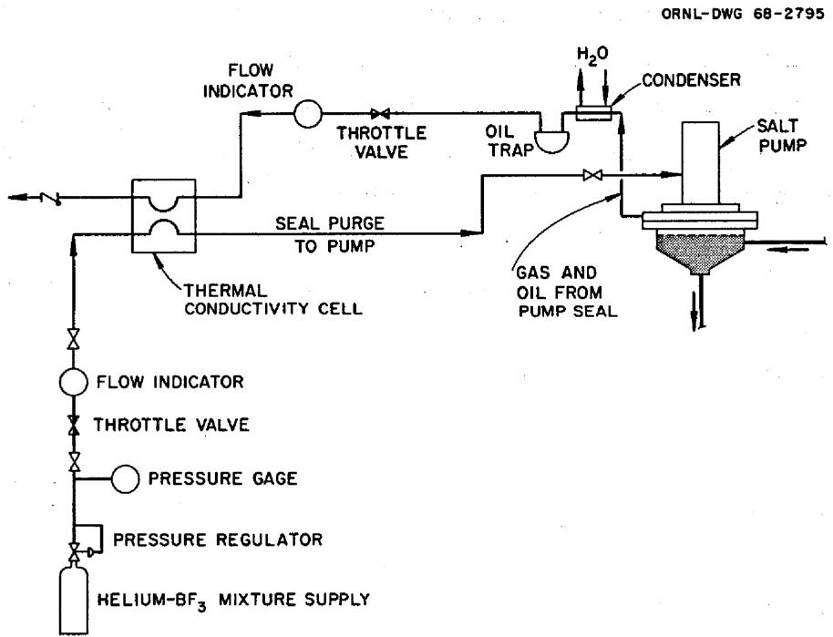  
Fig. 8. Molten-salt forced-circulation corrosion loop - simplified schematic - LFB pump seal purge system.

# 2.3.6 Fill and drain tank

The fill and drain tank is fabricated from a 23 3/16-in. length of Hastelloy N, 5-in., sched-40 pipe with 1/2-in.-thick flat heads. The five pipe risers located on the cylindrical surface of the tank provide for salt addition and removal, spark plug level indication, and gas pressurization. A drain line is provided at the bottom of the tank as an additional path for salt removal. The tank is electrically insulated from ground to prevent the flow of electrical current from the main loop tubing, which is resistance heated during certain periods of off-normal operation.

# 2.3.7 Corrosion specimen design

Corrosion specimens (see Fig. 1) are used to monitor corrosion rates at the points of maximum, minimum, and intermediate bulk fluid temperatures. The Hastelloy N specimens are approximately 2 5/8 in. long, 0.250 in. wide, and 0.030 in. thick. A total of eight specimens are mounted in the three locations. Details of the corrosion specimens design and mounting arrangement are shown in Fig. 9. The specimens are mounted on the Hastelloy N stringers, inserted into the 1/2-in. tubing, and tack welded into position. The section of 1/2-in. tubing containing the specimens is then butt welded into the system piping.

# 2.3.8 Electrical system

The electrical power system is shown schematically in Fig. 10. Power is supplied to the test facility from a 460-V, three-phase, delta-connected building supply. A separate connection from a diesel-generator provides emergency power to some of the equipment in the event of a failure to the normal building supply.

Upon failure of the normal supply voltage, the diesel-generator is automatically started, and an automatic transfer switch connects the emergency power supply to the facility. When normal power becomes available, the automatic switch returns the system load to this supply.

The heat input for normal operation is provided by two resistance-heated sections. Voltage is supplied to these sections through a

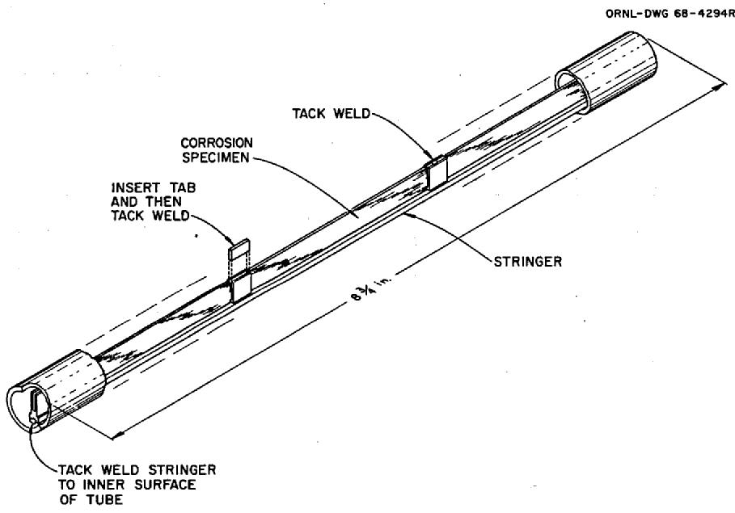  
Fig. 9. Molten-salt test loop corrosion specimens.

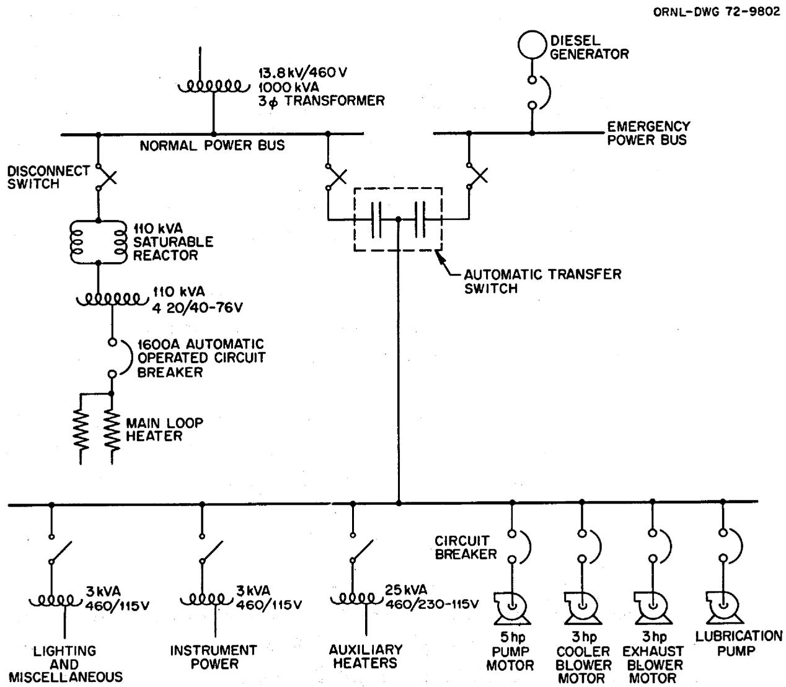  
Fig. 10. Schematic of electrical power system.

saturable reactor, which in turn supplies a 110-kVA high-current transformer. Temperature is controlled on these sections by a variation in the impedance of the saturable reactor.

During normal operation the circuit breaker, shown in Fig. 2, is closed and the electrical potential is applied between the two sets of lugs (A&B, C&D). This circuit breaker is opened manually to permit preheating of the piping system (except cooler) and is automatically opened to provide heat to all the system piping (except cooler) under emergency conditions. When the circuit breaker is open, the electrical potential is applied between lugs A and C, and the resulting two parallel electrical resistance heating circuits keep the system temperature above the freezing point of the salt. Power measuring instrumentation is provided to determine the heat input to the system.

A separately controlled resistance-heated circuit is provided for preheating the cooler. When normal power is lost, automatic controls also apply electric potential to this section of piping to prevent freezing of the salt.

Additional electric supply sources are provided for the salt pump motor, lube oil pumps, the cooler blower motor, the $\mathrm{BF}_3$ cubicle exhaust blower, instrument power, and miscellaneous lighting and auxiliaries.

# 2.3.9 Instrumentation and control

The salt pump is driven by a 5-hp 440-V motor connected to a variable-speed magnetic clutch. The clutch output torque is delivered to the pump by V-belts. The speed of the coupled units is regulated by varying the supply voltage to the magnetic coupling. The normal supply is from an electronic unit furnished with the magnetic clutch. In the event of the loss of the normal clutch control voltage, the loop is automatically placed in a standby (preheat) condition.

Pump speed is measured by a tachometer built into the magnetic clutch, and alarms are provided for low and high speed. The pump speed is checked with a "Strobe" light at the beginning of each test run to insure that the desired speed is obtained.

The loop temperatures are controlled by a Leeds and Northrup "Speedomax-H" controller, which senses changes in loop temperature and

transmits a signal to the saturable reactor to increase or decrease voltage applied to the two resistance-heated sections of the piping.

Controls are also provided to close the outlet damper on the radiator air duct, stop the blower motor and the salt pump, and transfer the main heat input to the preheat mode in the event of any of the following off-normal conditions:

1. low clutch speed,   
2. salt high temperature,   
3. salt low temperature,   
4. loss of normal power to the facility,   
5. low lube oil flow to the salt pump.

Bypass switches are provided around most of these instruments to facilitate startup and to provide a means of testing the workability of the control system during normal operation.

# 2.4 Quality Assurance

Although the design of the salt circulating system was essentially the same as had been used on a previous program, it was reviewed by the ORNL Pressure Vessel Review Committee.

Complete histories of the Hastelloy N used in the pressure-containing portion of the loop were documented, except for the salt pump, which had been fabricated and assembled in accordance with ORNL Reactor Division Standard Procedures in force at the time. Although records of the materials or welding were not available, the administrative procedures in effect at the time of fabrication provided assurance of the integrity of the pump. Since many of these pumps had been operated and hundreds of thousands of hours of experience with this type of equipment had been accumulated, it was felt that the reliability of the units was sufficiently established to warrant their use without complete documentation.

The inspection of the materials used to fabricate the salt-containing portions of the system other than the pump included ultrasonic tests and dye-penetrant checks in accordance with ORNL Metals and Ceramics Division specifications MET-NDT 1 through 4.

Welding of components and assembly into the system were conducted in accordance with Metals and Ceramics Division specification PS-23, -25, and -35, which include welder qualification procedures, weld joint design, and welding parameter limitations. Welds were inspected by x-ray examination and dye-penetrant methods stated in Metals and Ceramics Division specification MET-WR 200 and 201.

Material and cleaning requirements invoked during fabrication included degreasing with perchloroethylene vapor, followed by water and alcohol rinses. Before each part was welded into the system, it was again wiped with an alcohol-soaked cloth. Both the part and the cleaning cloth were visually examined for evidence of foreign material.

All cleanliness, material, and weld inspections were made by personnel other than those having the responsibility for fabrication and assembly. Weld reports, which included the inspections and materials certifications, are on file with the Inspection Engineering Department.

Helium leak tests were made on the completed piping assembly prior to installation of the pump rotary assembly into the pump bowl. Leak testing was done in accordance with ORNL Inspection Engineering Quality Assurance Procedure 7. No detectable leaks were observed.

All wiring was given a terminal-to-terminal check prior to energizing. Each control function was checked manually to insure that the protective schemes were operating properly prior to filling of the system.

Operational procedures, including abnormal condition procedures, were prepared to assist the operators. A complete description of the operation of the control system was prepared (see Appendix B), and training sessions were conducted for the personnel.

# 3. OPERATING EXPERIENCE

The test loop has been operated for 10,335 hr at design conditions for an additional 1135 hr at off-design temperature. A chart of the operating history is shown in Fig. 11. For most of this time the system was operated at $1090^{\circ}\mathrm{F}$ maximum bulk fluid temperature and $950^{\circ}\mathrm{F}$ minimum bulk fluid temperature. Figure 12 is a typical temperature profile of the system. The inner wall temperatures are estimated from heat transfer calculation.

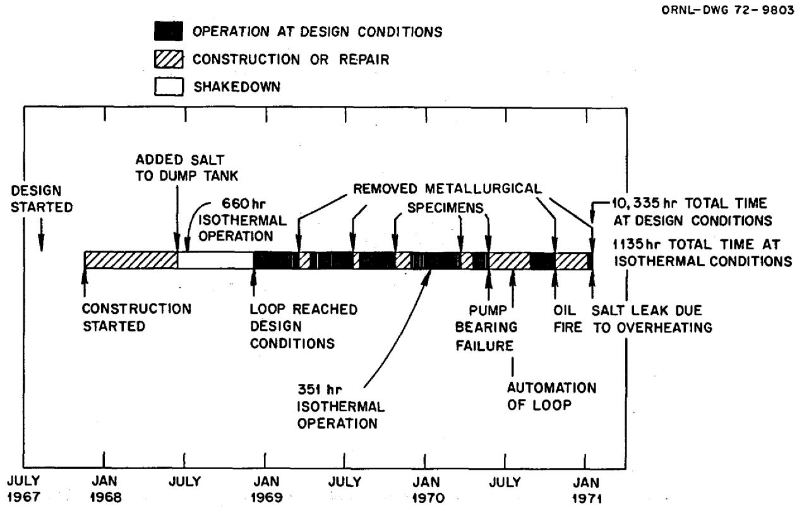  
Fig. 11. Operating history of test loop.

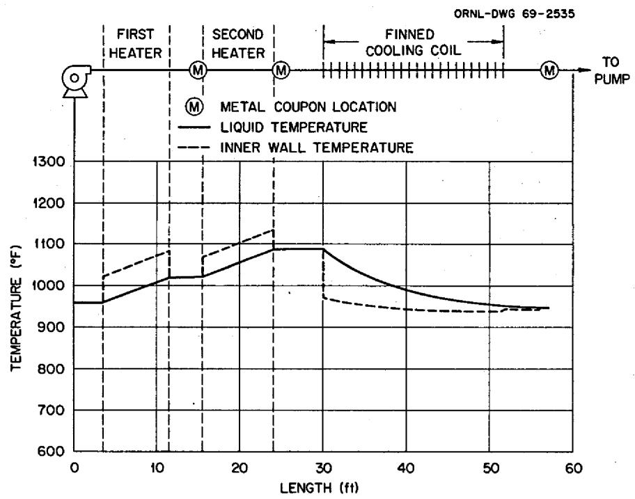  
Fig. 12. Temperature profile of molten-salt forced-circulation corrosion loop, MSR-FCL-1, at typical operating conditions.

After raising the sodium fluoroborate from the sump tank into the salt piping proper and establishing the freeze valve, the system is started. The salt pump is started and the speed is adjusted to approximately 5000 rpm. The main power is transferred to the two resistance-heated piping sections by closing the circuit breaker, and the loop temperature is increased by adjusting the temperature controller. The system differential temperature is established by starting the blower and adjusting the damper in the air system duct. For the initial startup a flushing charge of salt was run in the salt piping for 478 hr, after which it was discarded and the working charge of salt was installed.

The reliability of the system during the initial 10,000 hr of operation was very good, but after this time several difficulties were encountered. A pump bearing failure occurred, resulting in damage to the pump impeller. Chips were rubbed from the impeller and deposited in the salt piping. Extensive repairs to remove these chips from the loop piping were necessary. In addition, fatigue failure of an oil line resulted in an oil fire, requiring extensive repairs. Subsequently, the loop piping was ruptured during an inadvertent overheating transient caused by a defective control thermocouple and an operator error during the replacement of the thermocouple. Table 3 lists the interruptions that occurred during the operation period, over half of which (15) were due to problems with component auxiliaries such as the pump rotary oil seal and drive motor and the blower shaft bearings. Replacement bearings in the blower and blower drive motor were required about every six months.

# 3.1 Heat Transfer Performance of Sodium Fluoroborate

Since no published heat transfer data were available for the sodium fluoroborate salt, the heat transfer characteristics of sodium fluoroborate were measured in the MSR-FCL-1. Provisions for these heat transfer measurements were not part of the original design criteria, and the tests were made with existing instrumentation which was not highly sophisticated. Also considerable uncertainty existed in available physical property data, particularly on viscosity and thermal conductivity; so the absolute accuracy of results obtained is questionable.

Table 3. MSR-FCL-1 operational interruptions   

<table><tr><td>Item</td><td>Number of failures</td></tr><tr><td>Rotary oil seal (Deublin) leakage</td><td>5</td></tr><tr><td>Salt pump bearing failures</td><td>3</td></tr><tr><td>Drive motor and clutch problems</td><td>6</td></tr><tr><td>Air blower bearings</td><td>2</td></tr><tr><td>Instrument malfunctions</td><td>6</td></tr><tr><td>Electrical system difficulties</td><td>4</td></tr><tr><td>Oil line fatigue failure at pump rotary seal</td><td>1</td></tr><tr><td>Other mechanical problems</td><td>2</td></tr><tr><td>Total</td><td>29</td></tr></table>

The heat transfer data were obtained in one of the resistance-heated sections of the loop piping. This section was 105 in. in length and 0.410 in. in inside diameter. The tubing inside diameter was determined by micrometers, and wall thickness measurements were made with a model 14 Bronson Vidi-gage. The flow rate through the tubing was measured calorimetrically by observing the power input and the temperature rise of the salt. Heat losses at various temperature levels had been determined previously. The specific heat data for the salt presented in Table 2 was among the better defined physical property data and had an uncertainty of $\pm 2\%$ . The flow velocity was calculated using salt density data with an uncertainty of $5\%$ . Power input measurements were made with instruments of $\pm 0.5\%$ accuracy.

The temperature measurements were made with 1/16-in.-OD stainless-steel-sheathed, insulated-junction, Chromel-Alumel thermocouples. Bulk fluid temperatures at the heater inlet and exit were each measured by three calibrated thermocouples. Ten thermocouples located along the 105-in. length were used to obtain the wall temperature in the heated region.

All thermocouples were electrically insulated from the tubing wall to preclude an electrical path along the stainless steel sheaths, since all portions of the piping were above ground potential during resistance heating. Two layers of quartz tape provided electrical isolation from the piping and also served to thermally insulate the thermocouples from the pipe wall. The ends of the thermocouples were installed in a $180^{\circ}$ arc around the quartz-tape-covered tube and held in place with a band of shimstock spot welded to itself. Two inches of "Hi-Temp" diatomaceous earth formed the thermal insulation for the piping. The detail on thermocouple installation is presented to emphasize that the configuration was not ideal for accurate temperature measurement. The error between insulated thermocouples and thermocouples installed directly on the pipe wall was later determined to be less than $10^{\circ}\mathrm{F}$ . The overall $\Delta T$ from pipe wall to bulk fluid ranged up to $100^{\circ}\mathrm{F}$ , so the thermocouple error of $10^{\circ}\mathrm{F}$ represents about a $10\%$ uncertainty.

Performance data were obtained at heater inlet temperatures from 974 to $1060^{\circ}\mathrm{F}$ and heater exit temperatures from 1038 to $1170^{\circ}\mathrm{F}$ . The Reynolds modulus ranged from 5500 to 51,400, and heat fluxes ranges from 15,750 to 160,000 Btu $\mathrm{hr}^{-1}\mathrm{ft}^{-2}$ . The measured heat transfer coefficients ranged from 267 to 2130 Btu $\mathrm{hr}^{-1}\mathrm{ft}^{-2}(\mathrm{^\circ F})^{-1}$ . The data obtained correlated well with the Dittus-Boelter equation as shown in Fig. 13 (using recently determined physical property values from Table 2). Although no statistical analysis has been made, it is estimated that the error in the measurements is less than $20\%$ . These heat transfer data constituted the first demonstration that sodium fluoroborate performs as an ordinary heat transfer fluid.

# 3.2 $\mathbf{BF}_3$ Handling

The LFB salt pump was designed to operate with approximately 80 cc/ min of helium purge through the pump shaft seal region to remove traces of oil leaking through the rotating face seal (see Fig. 5). The vapor pressure of the $\mathrm{NaBF_4}$ component of the salt mixture, as shown in Fig. 14, produces a $\mathrm{BF_3}$ partial pressure above the salt level in the pump bowl. Since the helium purge tends to carry some of the $\mathrm{BF_3}$ out of the system,

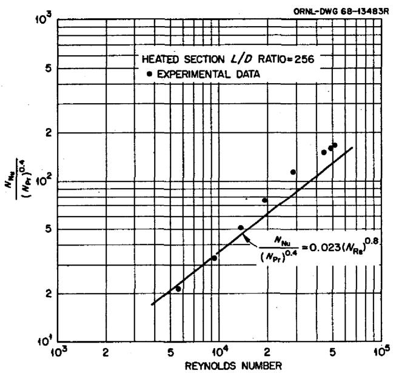  
Fig. 13. Heat transfer characteristics of $\mathrm{NaBF}_4$ -NaF (92-8 mole %) flowing in 0.410-in.-ID tube.

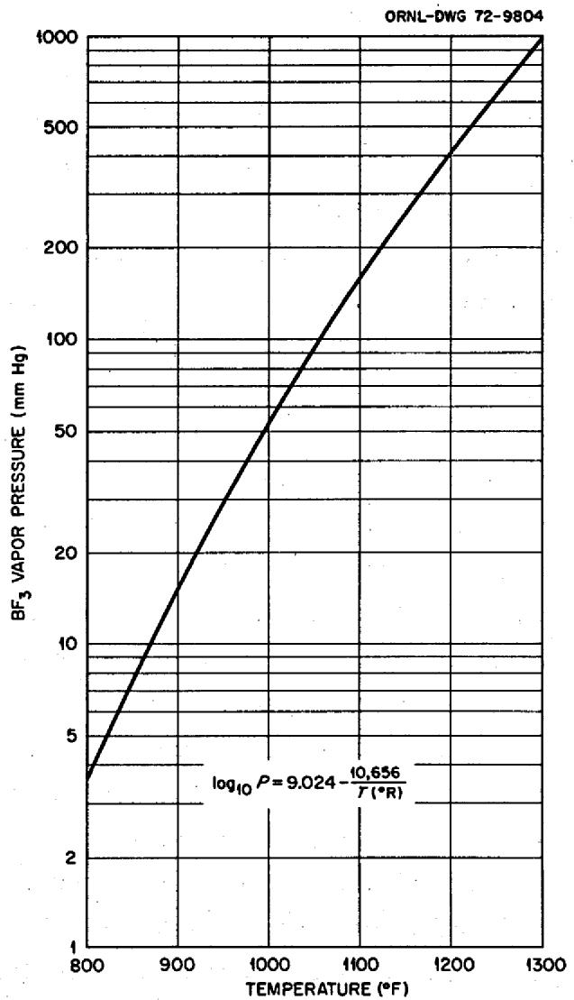  
Fig. 14. Vapor pressure of $\mathrm{NaBF}_4$ -NaF (92-8 mole %). (From ORNL-TM-2316.)

it is possible to change the salt composition by gradual depletion of the volatile constituent. As indicated by the $\mathrm{NaBF_4}$ -NaF phase diagram (Fig. 15), the freezing point of the salt mixture changes drastically with a change in composition near the eutectic. Therefore this problem needed further consideration.

The helium purge, as originally installed, was through the seal region of the pump, which was loosely coupled through an annulus around the pump shaft to the helium gas space above the salt level in the pump bowl. It was assumed that $\mathrm{BF}_3$ vapors from the salt mixture would diffuse up the shaft annulus into the seal region and be carried away by the purge gas. To avoid the problem of $\mathrm{BF}_3$ depletion in the salt mixture, a system was installed to permit blending $\mathrm{BF}_3$ into the helium purge to produce a $\mathrm{BF}_3$ concentration in the purge gas equivalent to the concentration in the pump bowl. Thus, no net loss of $\mathrm{BF}_3$ in the system would occur.

The possibility of chemical interaction of the $\mathbf{BF}_3$ in the purge gas with the oil in the seal region also had to be considered, and preliminary tests were run to see if a problem existed. The amount of $\mathbf{BF}_3$ in helium required to sustain the $92 - 8\%$ salt mixture was calculated to be $1\%$ , with a pump bowl temperature of $850^{\circ}\mathrm{F}$ , or $3\%$ with the pump at $950^{\circ}\mathrm{F}$ . Mixtures of these two gases were prepared by adding the proper amount of $\mathbf{BF}_3$ to bottles containing helium; however, confirmatory analyses for the concentration of $\mathbf{BF}_3$ in helium were unsuccessful. Checks with commercial suppliers of mixed gases revealed that there were no economical methods for determining the $\mathbf{BF}_3$ concentrations in helium in the 1 to $3\%$ range. The $\mathbf{BF}_3$ gas adsorbs on the walls of analytical equipment, resulting in gross inaccuracies in analytical results. Attempts at confirmatory analysis were abandoned, and the concentrations were assumed to be those predicted by the mixing calculations based on volume, temperatures, and pressures.

Tests were conducted to examine the effect of mixtures of 1 and $3\%$ $\mathrm{BF_3}$ in helium of the Gulfspin 35 pump oil under conditions which would simulate its use in the pump seal-oil purge system. The results for the $1\% \mathrm{BF}_3$ mixture indicated that the seal leakage oil would not be affected deleteriously by contact with the mixture. Some discoloration and an increase in acidity were noted in the oil after only a few hours of exposure to the gas mixture; however, viscosity changes over a long

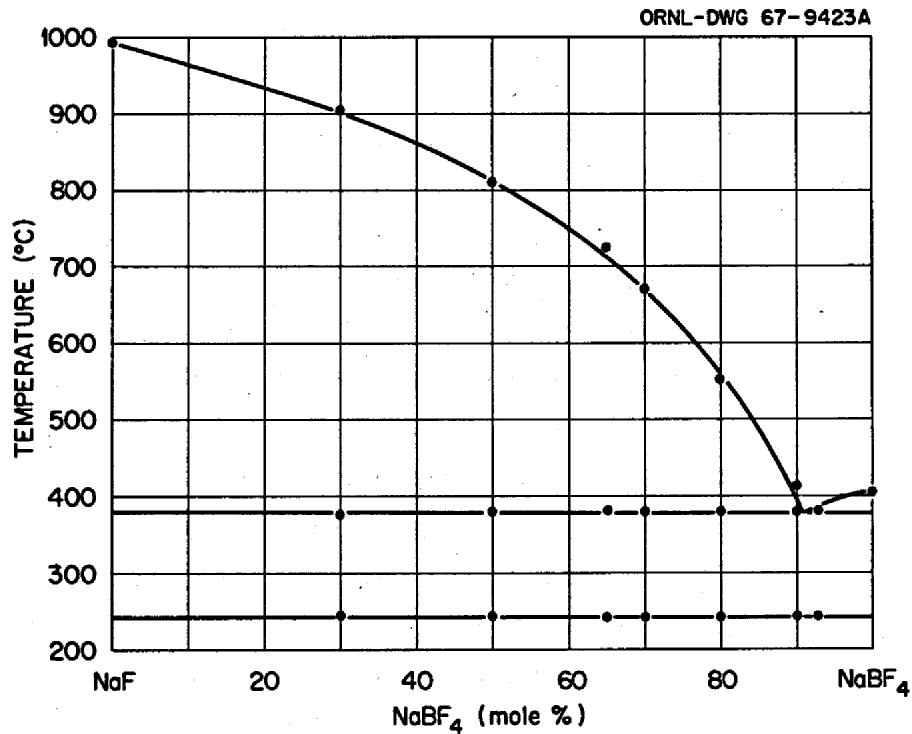  
Fig. 15. The system NaF-NaBF $_4$ .

period gave no reason to suspect that the small passages of the pump seal purge system would become plugged with degraded oil.

Results of two separate room-temperature tests of approximately one week's duration using the $3\%$ $\mathrm{BF}_3$ mixture with an oil leakage flow rate of 10 cc/day and a gas flow rate of 80 cc/min indicated that the seal oil purge line would probably become plugged during loop operation; thus use of this $3\%$ mixture for purging was abandoned. A black sludge, formed in the test setup which simulated the pump catch basin, eventually plugged a 1/8-in.-diam port (see Fig. 16). In these tests the oil removed from the test apparatus was extremely acidic, with a pH from 1.0 to 1.5.

Attempts to determine the composition of the oil sludge were unsuccessful. Infrared spectrophotometric examination indicated that traces of water were probably removed from the piping system by the sparging gas and that the acid formed by the $\mathrm{BF}_3$ -water reaction had attacked one or more of the ingredients of the oil to form the sludge. The $\mathrm{BF}_3$ also produced, either as products of degradation or by direct addition to some component or components, new materials not found in unexposed oil. No further effort was made to characterize the degraded oil.

To eliminate $\mathrm{BF}_3$ in the seal purge stream and the resulting oil degradation, the purge route through the pump bowl was changed to provide a pure helium purge gas flow down the pump shaft. It was thought that by providing this purge, helium could be used to remove the leakage oil from the oil catch basin in the pump and the helium flow down the shaft would deter (except for back diffusion) the $\mathrm{BF}_3$ vapor from reaching the oil. This purge path required the addition of a new outlet gas line from the pump bowl and a new line for $\mathrm{BF}_3$ addition into the pump bowl. The $\mathrm{BF}_3$ addition was required since the helium flow down the shaft and across the $\mathrm{BF}_3$ vapor space in the pump would carry off $\mathrm{BF}_3$ vapors in even greater quantities than had been anticipated with the purge only through the face seal region. After one day of operation the outlet line from the pump vapor space plugged with reaction products from the salt, oil, and $\mathrm{BF}_3$ .

As an expedient, a decision was made to return to the original design for purging the pump seal with no $\mathrm{BF_3}$ addition to the purge stream. The helium was connected to the pump seal purge line, and the effluent was carefully monitored for $\mathrm{BF_3}$ contamination. Measurements from the thermal

PHOTO 75900

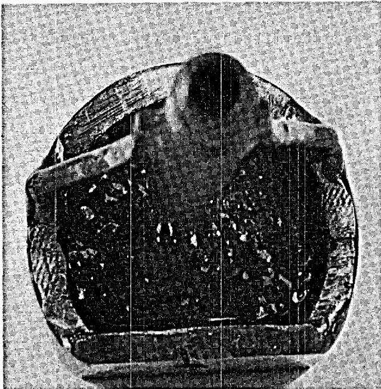

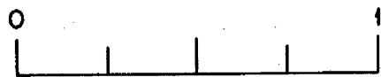  
INCHES   
Fig. 16. Sludge formation from polymerization of Gulfspin 35 oil after one week's exposure of $3\%$ $\mathrm{BF}_3$ -He mixture at room temperature.

conductivity cell indicated that the helium gas (80 cm³/min) leaving the pump oil catch basin was contaminated with approximately 0.08% BF₃. This indicated that the amount of BF₃ removed from the NaBF₄ salt during the scheduled 10,000-hr operation would not significantly alter the salt composition. Had the BF₃ depletion been significantly high, plans were to replenish the BF₃ by intermittent gas additions to the salt.

During calibration of a thermal conductivity cell which was to be used to measure the concentration of $\mathrm{BF}_3$ in the effluent line from the seal purge line, a 1/4-in.-OD copper tubing vent line plugged. A $3\%$ mixture of $\mathrm{BF}_3$ in helium had been purged through the conductivity cell and vented to atmosphere in a ventilation system. Reaction products of moist air and $\mathrm{BF}_3$ completely sealed the end of the tube and stopped the seal purge (see Fig. 17). An acidic solution was found in the vertical line immediately adjacent to the discharge end of the tube, evidently formed when the $\mathrm{BF}_3$ gas came in contact with moisture in the air. Acid was also formed on the ventilation hood in the vicinity of the $\mathrm{BF}_3$ -He vent. Enough acid was present to form droplets on the lower edge of the hood, which demonstrated that a suitable $\mathrm{BF}_3$ "scrubber" is required for future systems where long-term, reliable venting of significant $\mathrm{BF}_3$ concentrations must be maintained.

The low $\mathsf{BF}_3$ concentration in the helium purge from the final configuration of the shaft seal purge system resulted in little acid accumulation at the gas purge line outlet. Inversion of the purge line outlet port and the addition of a bucket-type catch basin helped to reduce the plugging problem at the end of the purge line. No accumulation of acid on the air exhaust ducts was visible, but acid reaction products were noted at the end of the purge line. As the buildup of these products was noted, the open end of the copper tubing was either cleaned or cut off.

# 3.3 Salt Pump Operation

The major problems to be resolved by the use of the model LFB pump in this test program involved (1) the effect of the $\mathrm{BF}_3$ partial pressure on the oil in the seal leakage catch basin and (2) the bearing and oil seal performance at 5000 rpm for sustained periods of operation. The

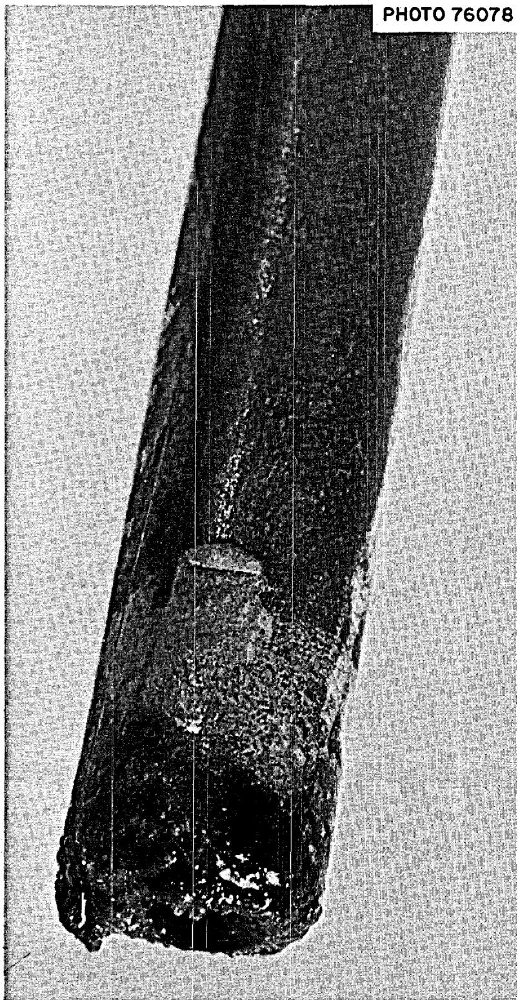  
Fig. 17. Typical plugging formation where $\mathrm{BF}_3$ -He mixtures are vented to atmosphere.

problems relating to $\mathrm{BF}_3$ reactions with the Gulfspin 35 oil in the pump are described in Section 3.2. In addition the bearing and seal lifetime was a point of concern since a pump of this type had not been used in applications requiring thousands of hours of operation at the relatively high speed of $5000~\mathrm{rpm}$ . A series of identical pumps had been operated at speeds around $3000~\mathrm{rpm}$ and had demonstrated adequate reliability during about $450,000~\mathrm{hr}$ of operation.[4]

Normal operation conditions for the pump were as follows:

Salt inlet temperature, $^\circ \mathrm{F}$ 950

Salt flow rate, gpm 4

Pump speed, rpm 5000

Coolant oil Gulfspin-35

Coolant oil temperature, ${}^{\circ}\mathrm{F}$ 110

Pump tank pressure, psig 7.0

Pump tank cover gas Helium

Purge gas for seal leakage Helium

Purge gas flow rate, cc/min 80

The pump was removed for routine maintenance at approximately 2000-hr intervals to install new bearings. These bearings have a relatively short lifetime expectancy of about 4000 hr at 5000 rpm. Normally this maintenance period coincided with removal of the corrosion specimens from the loop piping. However, three bearing failures occurred during operation despite the bearing replacement schedule.

The polymerization of oil in the catch basin by reaction with $\mathbf{BF}_3$ was no problem during the 2000-hr operating periods. The leaking seal oil was darkened by contact with the $\mathbf{BF}_3$ and a black coating formed on the bottom of the catch basin, but no significant plugging occurred. This could be a problem, however, in a system where periodic removal and cleaning are not possible or perhaps where higher $\mathbf{BF}_3$ concentrations are present. The seal oil catch basin at the conclusion of a typical 2000-hr run is shown in Fig. 18.

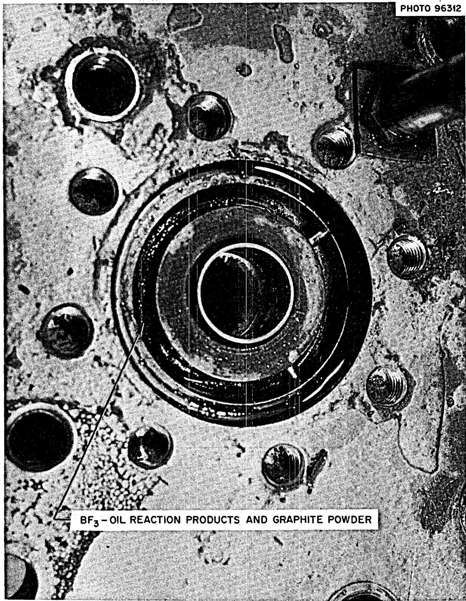  
Fig. 18. Typical appearance of the seal oil catch basin of the salt pump after 2000 hr operation (model LFB pump).

The seal oil leakage rate has averaged approximately 1 cc/day (see Table 4). The leakage rates were higher than average during short periods near the end of the test, for reasons that were not discernible.

Table 4. Seal oil leakage rates in salt pump   

<table><tr><td>Date leakage was removed</td><td>Approximate days of operation</td><td>Leakage ratea (cc/day)</td></tr><tr><td>12-9-68</td><td>13</td><td>3.5</td></tr><tr><td>12-18-68</td><td>9</td><td>2.2</td></tr><tr><td>2-14-69</td><td>58</td><td>0.34</td></tr><tr><td>3-25-69</td><td>39</td><td>0.51</td></tr><tr><td>7-22-69</td><td>104</td><td>0.17</td></tr><tr><td>10-22-69</td><td>80</td><td>0.27</td></tr><tr><td>12-17-69</td><td>38</td><td>1.05</td></tr><tr><td>1-29-70</td><td>43</td><td>0.81</td></tr><tr><td>4-24-70</td><td>66</td><td>0.58</td></tr><tr><td>10-16-70</td><td>51</td><td>0.90</td></tr><tr><td>10-19-70</td><td>3</td><td>20.0</td></tr><tr><td>1-11-71</td><td>4</td><td>24.0</td></tr><tr><td>1-12-71</td><td>1</td><td>30.0</td></tr></table>

aAverage leak rate $= 1$ cc/day.

The seal leakage oil is highly acidic due to its contact with $\mathrm{BF}_3$ ; tests with litmus paper showed a pH of 1 to 1.5. Analytical results of oil samples revealed small amounts of dissolved boron.

The mechanical face seal appeared in good condition upon disassembly at the end of each operating period. Although there were no indications of impending trouble, the seal was changed as a precautionary measure during each pump maintenance cycle. The upper bearing normally showed evidence of loss of most of its internal lubricant (grease); the lower

bearing usually appeared in excellent condition, but both bearings were replaced routinely. The upper bearing is affected by the drive belt tension and operates under a heavier radial load then the lower bearing. The condition of the upper bearing was ample evidence that when the salt pump is belt driven, operation at 5000 rpm for 2000-hr periods was a maximum practical service limit.

The sodium fluoroborate drained easily from the rather complex geometry of the salt pump. Normal draining procedure consisted in circulating the salt at $1000^{\circ}\mathrm{F}$ and turning the pump at about 1000 rpm as the liquid level was lowered. Typical appearance of the salt-wetted portions of the pump after a 2000-hr test period is shown in Figs. 19 and 20. The white deposits are traces of frozen sodium fluoroborate salt.

# 3.4 Corrosion Specimen Removal

Corrosion specimens are normally removed for examination at approximately 2000-hr intervals, but when operating problems were encountered they were removed more frequently. The salt inventory was drained into the sump tank, and the piping was cooled to room temperature prior to specimen removal. An argon purge flow was maintained through the loop during specimen removal to minimize air contamination of the inner surfaces of the remaining piping. Tubing cutters were used to remove the tubing that contained the specimens. Immediately after the specimens were removed, the open ends of the piping were sealed to allow slight argon pressurization of the system while the specimens were cleaned and inspected.

The specimen stringers were retrieved from the tubing after grinding the tack weld which joined them to the inner tubing surface. The grinding was done carefully so that the specimens could be reinstalled in the same tubing from which they were recovered. The specimens were cleaned of residual salt droplets by placing them in warm distilled water for about 1 hr followed by ethyl alcohol washings and air drying. Specimen weights were then measured and weight changes calculated.

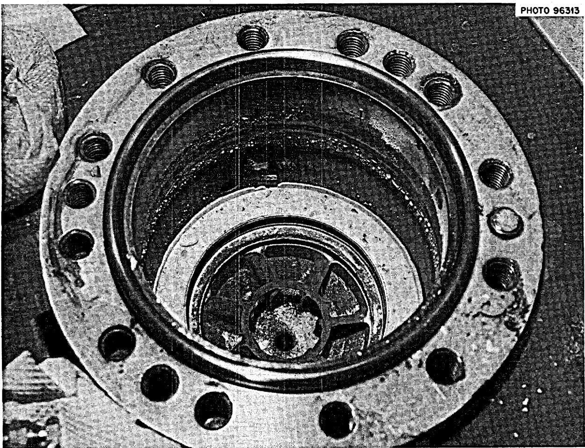  
Fig. 19. Appearance of the salt pump bowl after draining salt at $1000^{\circ}\mathrm{F}$ at conclusion of 2000-hr run (model LFB pump).

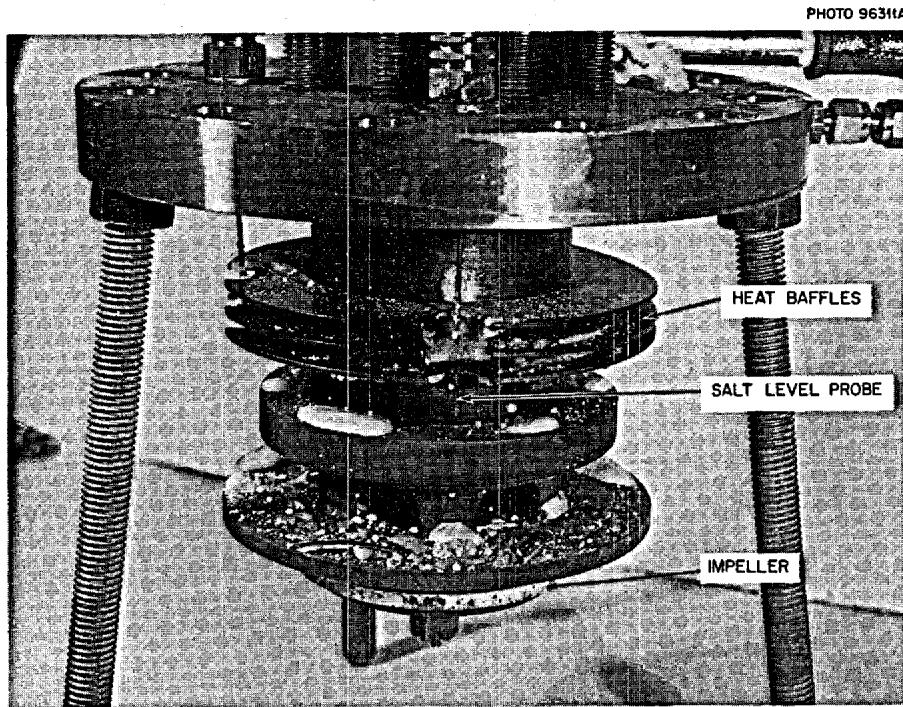  
Fig. 20. Typical salt deposits remaining on support structure and heat baffles of LFB pump after draining salt at $1000^{\circ}\mathrm{F}$ at conclusion of 2000-hr run.

# 3.5 Salt Sampling

Salt samples were taken at the start of the test and at about 500-hr intervals thereafter. The salt was analyzed prior to operation in MSR-FCL-1 (Table 5); the original salt charge contained high concentrations of metallic impurities (Fe, Ni, Cr, Mo). The changes in concentration of these impurities have been rather erratic with time, probably due to inadvertent moisture contamination of the salt inventory. Some general trends were observed in the salt analyses after several thousand hours of operation. For example, the chromium concentration increased from 66 to $\sim 250$ ppm and thereafter remained at that general level, the iron concentration dropped from 407 ppm and remained at about 70 ppm, and the nickel and molybdenum concentrations were reduced to less than 10 ppm.

Table 5. Analysis of sodium fluoroborate salt prior to operation in MSR-FCL-1   

<table><tr><td>Na</td><td>21.8%</td></tr><tr><td>B</td><td>9.14%</td></tr><tr><td>F</td><td>67.9%</td></tr><tr><td>Cr</td><td>66 ppm</td></tr><tr><td>Fe</td><td>407 ppm</td></tr><tr><td>Ni</td><td>53 ppm</td></tr><tr><td>Mo</td><td>41 ppm</td></tr><tr><td>H2O</td><td>~400 ppma</td></tr><tr><td>O2</td><td>~400 ppm</td></tr></table>

aAnalysis questionable.

A cross-sectional view of the salt sampler is shown in Fig. 7. A copper bucket is attached to the lower end of the sampler assembly, and the assembly is then attached to a hydrogen furnace so the bucket is in the heated zone, and the bucket is fired in hydrogen at $1100^{\circ}\mathrm{F}$ for 30 min. After firing, the bucket is protected at all times by an argon atmosphere while being moved to the test stand. The sampler container and holder is

attached to a Swagelok coupling on the pump tank riser. The volume between the two closed ball valves is evacuated and back filled with helium at least four times before the ball valves are opened to lower the sample bucket into the pump tank. The bucket is held below the liquid surface for several minutes to insure filling, after which it is raised above the lower ball valve and allowed to cool for 30 min. It is then withdrawn to a position above the upper ball valve, and the valve is closed. The top portion of the assembly, including the upper ball valve, is disengaged, and the sample is removed from this assembly within a dry box. The detailed sampling procedure is given in Appendix C.

# 3.6 Summary of Corrosion Results

The weight changes of the corrosion specimens in MSR-FCL-1 are plotted in Fig. 21 for the entire operating period. The corrosion rate gradually decreased during the first 9500 hr of operation.

The specimens operating at the highest temperature $(1090^{\circ}\mathrm{F})$ showed the greatest weight loss, which was equivalent to a uniform metal removal rate of 0.001 in./year after 9500 hr. The lowest corrosion rate occurred during a 2900-hr period (6700 to 9600 hr), when the weight loss rate was equivalent to 0.0003 in./year. Corrosion rates would probably be reduced if more highly purified salt were used.

Operation difficulties after 9600 hr resulted in an undetermined amount of air and moisture inleakage to the salt system. The drastic effects of this inleakage are shown by the sharp increase in the weight change at a salt exposure time of 10,000 hr. This behavior is similar to that experienced in a thermal convection test loop when wet air came in contact with the salt due to a defective cover gas line.

# CONCLUSIONS

A materials compatibility loop was assembled and operated for 10,000 hr to investigate corrosion of Hastelloy N by sodium fluoroborate.

Automatic controls adequate to prevent damage to the system due to upsets during unattended periods of operation were developed and applied.

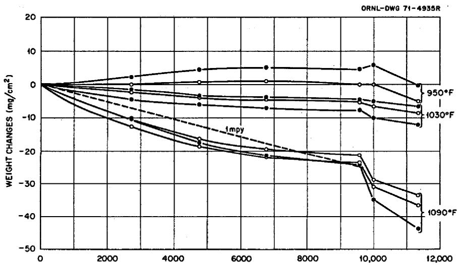  
Fig. 21. Weight changes of removable standard Hastelloy N specimens in flowing sodium fluoroborate (MSR-FCL-1).

Corrosion specimens and salt samples were routinely removed for analysis.

An existing salt pump design and available components were successfully adapted for salt circulation. Operation of the salt pump, model LFB, at 5000 rpm for 2000-hr periods is a maximum practical service condition for the grease-lubricated bearings when the pump is belt driven.

Degradation of the salt pump seal leakage oil due to contact with low concentrations of $\mathbf{BF}_3$ has not been a problem at a salt temperature of $950^{\circ}\mathbf{F}$ during 2000-hr operating periods. In the LFB pump geometry, diffusion of $\mathbf{BF}_3$ vapors from the pump bowl gas space to the seal region is sufficiently restricted that the $\mathbf{BF}_3$ concentration does not become critical. Thus purge flows to prevent this diffusion are not necessary. This results in a greatly simplified purge gas system.

Heat transfer performance of the sodium fluoroborate agrees well with standard heat transfer correlations.

Sodium fluoroborate exhibits good drainability at about $1000^{\circ}\mathrm{F}$ .

In well-ventilated areas relatively simple ventilation and shielding enclosures may be used for low-temperature $\mathsf{BF}_3$ tubing and gas panels because of the visual warning provided by the "white smoke" which forms from the reaction of $\mathsf{BF}_3$ with moist air.

Sodium fluoroborate is easily contaminated by air when in the molten state, and great care to prevent air inleakage is required in all phases of operation.

The corrosion rate of Hastelloy N specimens at $1090^{\circ}\mathrm{F}$ averaged about 0.001 in./year during 9500 hr of operation and was reduced to about 0.0003 in./year during the last uninterrupted 2900 hr of operation. The corrosion rate increased sharply with air inleakage.

# RECOMMENDATIONS

A new system design should be provided for future tests to achieve improved pump capability and reliability, higher salt flow velocity, and a more flexible, rapid specimen removal technique.

Future tests should be designed to allow corrosion specimen removal without dumping the salt inventory. This would prevent dilution

of the circulating salt inventory with the salt remaining in the dump tank and simplify interpretation of the corrosion processes.

The design of future salt corrosion test loops should provide an emergency heating system which will allow the pump to be stopped without subsequent freezing of the salt.

A suitable $\mathbf{BF}_3$ "scrubber" must be developed for future sodium fluoroborate pump systems, so that $\mathbf{BF}_3$ vent lines can be operated for long periods without plugging, acid formation, or back diffusion of water vapor into the salt system.

The effect of sodium fluoroborate purity on corrosion rate should be determined in future pumped corrosion test facilities. Techniques for controlled purification of the salt will be required.

Appendix A

MSR-FCL-1 FLOWSHEET

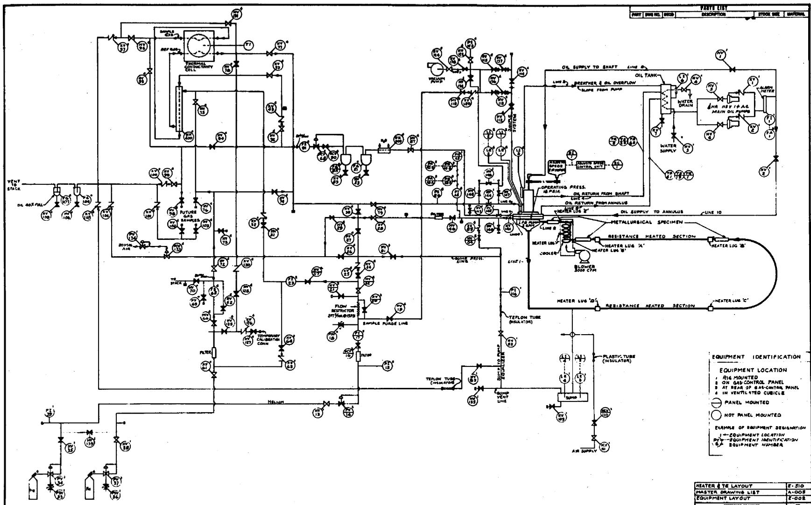

<table><tr><td rowspan="3"></td><td>1</td><td>A</td><td>B</td><td>C</td><td>D</td><td>E</td><td>F</td><td>G</td><td>H</td><td>I</td><td>J</td><td>K</td><td>L</td><td>M</td><td>N</td><td>O</td><td>P</td><td>Q</td><td>R</td><td>S</td><td>T</td></tr><tr><td>4</td><td>A</td><td>B</td><td>C</td><td>D</td><td>E</td><td>F</td><td>G</td><td>H</td><td>I</td><td>J</td><td>K</td><td>L</td><td>M</td><td>N</td><td>O</td><td>P</td><td>Q</td><td>R</td><td>S</td><td>T</td></tr><tr><td>3</td><td>A</td><td>B</td><td>C</td><td>D</td><td>E</td><td>F</td><td>G</td><td>H</td><td>I</td><td>J</td><td>K</td><td>L</td><td>M</td><td>N</td><td>O</td><td>P</td><td>Q</td><td>R</td><td>S</td><td>T</td></tr></table>

# Appendix B

# MSR-FCL-1 CONTROL SYSTEM DESCRIPTION AND OPERATING PROCEDURES FOR UNATTENDED OPERATION

# CONTROL SYSTEM DESCRIPTION

# Introduction

The control system of MSR-FCL-1 was revised during July and August 1970 to permit unattended operation of the loop during evening and night shift periods. This description is intended to assist in the operation of the loop and to provide guidance in the event of any difficulties encountered during operation.

The automatic control system is designed to transfer the loop operation from "design," or normal, conditions to "isothermal," or standby, conditions in the event design limits are exceeded or a malfunction of equipment occurs.

The principal changes in the control system are (1) the circulating pump is shut off in the event of an alarm condition, (2) loss of pump lube and cooling oil flow is included as an alarm condition that will transfer the loop to "isothermal," or standby, condition, and (3) a control was added to automatically provide the proper amount of heat to maintain the salt inventory molten with the pump off.

# Normal Operation

In the normal (design) mode of operation, two sections of piping between the pump discharge and cooler inlet are heated by direct resistance heat. This heat is removed in the finned cooler to provide a temperature difference in the circuit. An LFB pump circulates the molten salt, and a constant speed blower with a manually adjusted damper provides air flow for heat removal from the finned cooler. During normal operation the following conditions exist:

1. salt is circulating in the loop and the pump is on;   
2. the pump lubricating and cooling oil is flowing;   
3. the two direct-resistance-heated sections are supplied with sufficient power to provide the desired temperature rise in the salt;

4. the air blower is on and the cooler housing door (top of cooler housing) is open to provide sufficient cooling to reduce salt temperatures to desired level;   
5. the cooler direct resistance heater is off.

# Standby Operation

The loop is preheated by direct resistance heating during standby operation except in the pump bowl section and the dump tank region, which are heated by Calrod electric heaters. Direct resistance heat for normal and standby operation is applied through three separate control systems. The two main heater sections (used for normal operation) are supplied from one control system, and resistance heating of the entire loop (used for standby operation) is controlled by a second control system. The cooler is preheated by the third separate resistance heat control system. During normal (design) operation this heat will not be applied. With a loss of salt circulation, the cooler heater circuit and loop resistance heater circuit along with the pump bowl heat will maintain the salt inventory above the freezing point. During standby operation the following conditions exist:

1. salt is not circulating; the pump is off (Note: the pump may be operated, if desired, if the alarm interlock relay is manually bypassed);   
2. the pump lubricating and cooling oil is flowing;   
3. the loop direct resistance heater is energized with the circuit arranged to heat the entire loop except the cooler;   
4. the cooler direct resistance heater is on;   
5. the air blower is off and the cooler housing door is closed.

# Automatic Transfer from Normal to Standby Conditions

A 1600-A circuit breaker installed in the main resistance heat supply transformer secondary provides a means of transferring from high power (normal) operation to standby operation. The following alarms will transfer the loop from normal to standby conditions:

1. high loop temperature,

2. low loop temperature,   
3. low pump speed,   
4. low lube oil flow (10 sec delay before transfer).

# Emergency Power System

An automatic transfer is made to the diesel-generator bus in the event of a building power outage. The design includes a time delay, so that for an outage of less than 2 sec, the loop will continue on $\Delta T$ operation. For an outage of over 2 sec, the diesel generator in the base-ment (which will have started immediately upon a power failure) will be timed in to provide control power, resistance heat to the loop, resistance heat to the cooler, pump power, lube oil motor power, pump bowl heat, dump tank heat, and drain line heat.

# OPERATING PROCEDURES

# Initial Startup and Preheat

Refer to flowsheet, Dwg. 10486-R-001, Rev. 3, for valve locations and functions.

1. Caution: Start oil pumps before applying heat to the system to prevent accidental overheating of the bearing and seals within the LFB pump.

The two lubricating and cooling oil pumps are started by start switches (labeled Nos. 1 and 2) in the magnetic amplifier cabinet. The pumps are in parallel in the oil circuit, and either or both pumps can be turned on. With the control switch in the "off" or "preheat" position, the pumps can be started or stopped by the "start" switches. With the control switch in the "on" or "automatic" position, operation of the lube oil pumps is controlled by the lube oil flow switch. On loss of oil flow the standby pump will be automatically started.

2. Preheat the main loop by manually closing the 400-A fused safety switch supplying the main resistance heater. The 1600-A circuit breaker is open. Set bypass switches 13, 14, 15, 16, 17, 18, and 22 in the

"preheat" position. The dc supply to the saturable reactor is "on" through the magnetic amplifier. Set the potentiometer supplying power to the saturable reactor at $\sim 10$ on the potentiometer dial.

3. Preheat the cooler by closing the 30-A fused safety switch supplying the cooler resistance heater circuit. Automatic closing of the contactor "CR" in this circuit is permitted through NC contact R8-6. Bypass switch 16 (cabinet 2) should be closed ("down" position) manually to prevent shutdown of cooler heater when relay R8 is energized.

4. Close the 60-A fused safety switch supplying variable transformers through the 15-kVA transformer. This energizes all auxiliary heating circuits.

a. Close the fused safety switch labeled "Emergency Power Supply" to complete the circuit for diesel power if a building power failure occurs.

b. Heat dump tank to $\sim 900^{\circ}\mathrm{F}$ . (The dump tank heat should be turned on $\sim 12$ hr before startup, as the tank heats very slowly.)

c. Heat the drain line (except the freeze valve) to $\sim 800^{\circ}\mathbf{F}$ .

5. Pressurize the loop with helium to $\sim 3$ psig.

a. Close the 30-A fused safety switch to the normal clutch supply excitation.

b. Close contact push-button, closing the pump starter and also feeding the clutch. Selector switch "SS" is set at "off." Relay R5 is closed.

c. Adjust the pump speed to $\sim 500$ rpm (cabinet 1).

d. Set the low pump speed alarm at 400 rpm.

6. The pump seal purge should be flowing through the thermal conductivity cell at $\sim 80$ cc/min.

7. After all loop temperatures are at 850 to $1200^{\circ}\mathrm{F}$ , position valves for the loop filling operation as follows. Be sure all heater lug temperatures are at least $900^{\circ}\mathrm{F}$ . The valve position shown will allow pressurizing the dump tank from one of the helium cylinders, while the second cylinder is used to maintain loop purge gas flow and pressure.

<table><tr><td>Open</td><td colspan="2">Closed</td></tr><tr><td>HV 13</td><td>HV 19</td><td>HV 30</td></tr><tr><td>HV 16</td><td>HV 20</td><td>HV 46</td></tr><tr><td>HV 24</td><td>HV 21</td><td>HV 81</td></tr><tr><td>HV 35</td><td>HV 22</td><td>HV 83</td></tr><tr><td>HV 82</td><td>HV 26</td><td>HV 84</td></tr><tr><td></td><td>HV 27</td><td>HV 117</td></tr><tr><td></td><td>HV 28</td><td>HV 139</td></tr></table>

8. Adjust the flow through FI 17 by opening HV 21 to $\sim 0.2$ ft³/hr.   
9. Close IV 21.   
10. Thaw the freeze plug by closing HCV 110 and turning up the heat on the fill line (Variac 8, panel 3).   
11. Open HV 22 and HV 81 to pressurize the dump tank slowly to push salt into loop. Dump tank pressure of $\sim 5$ psi above loop is required for loop fill. (PI 116 is located in pump enclosure.)   
12. Slow the gas flow to sump by closing HCV 16 when the lower pump probe light comes on.   
13. Close HCV 16 when the top pump probe light comes on.   
14. Close HV 24.   
15. Open HV 26 slightly to drop the salt level until the top probe light goes off.   
16. Close HV 26.   
17. Turn off Variac 8 and start air flow through the freeze valve by opening HCV 110.   
18. When the freeze valve is frozen, open HV 26 to vent the dump tank to $\sim 4$ psig.   
19. Close HV 81, 26, and 82.   
20. Check the pump seal purge and the thermal conductivity cell recorder.   
21. Blower and damper control permissive relay R8 is now energized by manually closing switch 15 ("down" position). When the relay is closed, it seals itself in through contact R8-3, paralleling switch 15. In order to permit shutdown of the blower and damper on long-time loss of power, switch 15 is now opened manually ("up" or normal operating position). The cooler blower main control power (switch and breaker on the breaker rack) should be off to prevent blower startup until needed.

22. Increase the pump speed to the desired level. For $4\mathrm{gpm}$ ( $\sim 10$ fps) a speed of $4800$ to $5000$ is adequate. Check pump for excessive operational noise, vibration, or a possible oil leak in the rotary union.   
23. With the loop temperatures above $950^{\circ}\mathrm{F}$ , manually close the 1600-A breaker (located on the east side of the loop enclosure) and slowly increase the main resistance heat potentiometer to $\sim 80\%$ and turn off the cooler heater by placing switch 16 in the operate (up) position.   
24. When loop temperatures start increasing, turn on the cooler blower using the start switch and the breaker on the breaker rack. The sliding damper on the blower intake should be closed.   
25. Open the door on the top of the cooler housing and engage the solenoid, which will hold the door open.   
26. Open the sliding damper a little at a time as required to adjust the loop temperature to the desired level. Lock the damper in the final position for long-term operation.   
27. Place all bypass switches (1 through 18, and 22) in the operate or automatic position.   
28. Place the building alarm switch (No. 23) in the "up" position to activate the building alarm and signal to the plant shift supervisor (PSS).   
29. Make final adjustments on the temperature controller (TIC-1, cabinet 2) and the blower damper, as required, to obtain the desired temperatures on the metallurgical specimens.

# Main Transformer - How to Control

The power to the main power supply is controlled by direct current on a saturable reactor. With the potentiometer adjustment knob (Mag. Amp. Cab.) at zero, there is still some dc current in the reactor which gives what is called "dc leakage current" to the heater section. If the Pyr-o-vane controller cuts off dc completely, as evidenced by the main power supply alarm light coming on, there is still available what is termed "minimum leakage current" to the heater section.

Should the temperature reach the set point of the Pyr-o-vane, the dc will be cut off and the loop transferred to isothermal conditions.

Resistance heat will be reapplied as soon as temperature has dropped below the set point. Therefore, the Pyr-o-vane gives "on-off" control of temperature should a high-temperature alarm condition occur.

When an alarm condition has occurred and the loop has been transferred to the standby condition, power for resistance heating of the entire loop is controlled through the second potentiometer (Mag. Amp. Cab.), which must be preset to deliver the correct amount of power to keep loop temperatures above the salt liquidus temperature $(725^{\circ}\mathrm{F})$ but below $\sim 1200^{\circ}\mathrm{F}$ . The correct setting for the isothermal heat is determined during startup and is indicated on the potentiometer scale.

# Position of Control Switches During Normal Operation

The following list of switches and controls includes a brief explanation of each as to its function and position during normal operation.

Note: The "up" position is the proper position for all switches during normal operation with a $\Delta T$ , except switch 22, which is down or in the "automatic" position.

# 1. Control Cabinet No. 1

a. Switches 1 through 12 are alarm silence switches associated with each of the 12 alarm lights. These switches are for acknowledging the alarm condition and will silence the bell only. Whenever any of these switches are in the "down" (acknowledge) position, the blinker light will be on.   
b. Clutch supply selector switch ("SB") will be in the "off" position to give normal power supply to the clutch. The auxiliary clutch supply is disconnected.   
c. Switch 20, the building and plant shift supervisor (PSS) alarm bypass, should be in the "up" position to allow building and PSS signal.   
d. Switch 21, the loop containment air flow alarm, has been removed. This alarm now is located on the "Tigerman" annunciator, and this switch is no longer needed.   
e. Switch 22, during normal operation, should be in "automatic" (down) position to allow pump shutoff for high and low temperature and

low pump speed. On "test" position the switch prevents stopping of the pump automatically except on loss of oil flow.

# 2. Control Cabinet No. 2

a. Switch 13, the low-temperature automatic-operation bypass, will be left in open or "operate" position. When closed, it prevents automatic operations due to low temperature. Note: This does not bypass the audible and visible alarms.

b. Switch 14, the automatic operation bypass switch, will be left in "operate" position. In "test" position it will prevent any of the automatic actions from taking place and is to be placed in "test" position only when testing the various alarm circuits and during actual "preheating" or "thawing" of the loop.

c. Switch 15, the automatic operation relay reset, will be left in the closed or "operate" position to allow automatic operation in the event of an alarm condition. The switch is placed in "operate" position soon after startup of a loop to allow seal-in of relay 8, which directly performs the automatic operation. Thereafter, it will be used only to "reset" the automatic operation circuits (after the cause for same has been cleared and the loop is ready to go back on $\Delta \mathbb{T}$ ).

d. Switch 16, the cooler heater control switch, will be left in open or "operate" position. This allows relay action to supply resistance heat to the cooler in the vent of an alarm condition requiring it. On "preheat" position it will allow heat to be applied to the cooler without an alarm condition.

e. Switch 17, the main resistance heater switch, will be left in the "operate" or closed position. This will allow the 1600-A breaker to trip during an alarm condition. In "preheat" position it will prevent tripping of the breaker automatically.

f. Switch 18, the low-speed and low-temperature reset, will be left on closed or "operate" position. This serves as a reset for either the low-temperature or the low-clutch-speed alarm. When the switch is reset after a low-clutch-speed alarm, it will automatically place the clutch supply back on the normal supply, provided it is available. When reset after low-temperature alarm, it will reset the alarm relay only.

g. Switch 19 is not in use.   
h. A summary table of the switch positions is presented in Table B.1.

# Heater and Gas Controls During Normal Operation

1. The cooler heat control variable transformer will be preset during startup to provide sufficient heat to the cooler to prevent freezing. This setting (indicated on front dial) should be changed only if the cooler heater circuit is in use and an adjustment of cooler temperatures is necessary.   
2. The cooler preheat voltage meter gives an indication of the voltage across the cooler lugs during application of power to the cooler coil. It is the only positive indication of power being applied (other than temperatures) to the coil.   
3. The loop resistance heat control (the potentiometer in the Mag. Amp. Cab.) will be preset during startup to provide sufficient heat to the loop piping (except cooler) to prevent freezing if the loop is automatically transferred to isothermal or standby. The proper setting is indicated on the potentiometer dial.   
4. The catch basin flowmeter should have a slight bleed of helium ( $\sim 80$ cc/min) as indicated by the flow indicator, FI 91, in the $\mathrm{BF}_3$ cubicle.   
5. The pump pressure should be between 6 and 8 psig (the pressure recorder is in the pressure recorder cabinet).   
6. The dump tank pressure should be between 3 and 4 psig.   
7. The equalizer and vent valves should be closed (HV 84 and HV 83).

# Abnormal Conditions

# 1. Switch Positions During Standby

During standby (preheat), switches 17, 18, and 19 are open ("down" position), as shown by the operation of alarm light L11. During "operate," all three switches are closed ("up" position) and the light is off.

Table B.1. Control switch list   

<table><tr><td rowspan="2">Number</td><td rowspan="2">Description</td><td rowspan="2">Location</td><td colspan="2">Position</td></tr><tr><td>Normal operation</td><td>Preheat operation</td></tr><tr><td>1</td><td>Shuts off loss of normal clutch supply alarm</td><td>Control cab. 1</td><td>Up</td><td>Down</td></tr><tr><td>2</td><td>No longer in use</td><td></td><td></td><td></td></tr><tr><td>3</td><td>Shuts off low-clutch-speed alarm</td><td>Control cab. 1</td><td>Up</td><td>Down</td></tr><tr><td>4</td><td>Shuts off loss of power to pump motor alarm</td><td>Control cab. 1</td><td>Up</td><td>Down</td></tr><tr><td>5</td><td>Shuts off loss of main power alarm</td><td>Control cab. 1</td><td>Up</td><td>Down</td></tr><tr><td>6</td><td>Shuts off blower alarm</td><td>Control cab. 1</td><td>Up</td><td>Down</td></tr><tr><td>7</td><td>Shuts off loop high-temp. alarm</td><td>Control cab. 1</td><td>Up</td><td>Down</td></tr><tr><td>8</td><td>Shuts off loop low-temp. alarm</td><td>Control cab. 1</td><td>Up</td><td>Down</td></tr><tr><td>9</td><td>Shuts off Low lube flow alarm</td><td>Control cab. 1</td><td>Up</td><td>Down</td></tr><tr><td>10</td><td>Shuts off loss of cooler power alarm</td><td>Control cab. 1</td><td>Up</td><td>Down</td></tr><tr><td>11</td><td>Monitors switches 17, 18, 19</td><td>Control cab. 1</td><td>Up</td><td>Down</td></tr><tr><td>12</td><td>Monitors switches 13, 14, 15, 16</td><td></td><td>Up</td><td>Down</td></tr><tr><td>13</td><td>Low-temperature control bypass</td><td>Control cab. 2</td><td>Up</td><td>Down</td></tr><tr><td>14</td><td>Time delay relay test switch</td><td>Control cab. 2</td><td>Up</td><td>Down</td></tr><tr><td>15</td><td>Reset for preheat transfer control</td><td>Control cab. 2</td><td>Up</td><td>Down</td></tr><tr><td>16</td><td>Cooler preheat control circuit</td><td>Control cab. 2</td><td>Up</td><td>Down</td></tr><tr><td>17</td><td>Trip circuit bypass for main circuit breaker</td><td>Control cab. 2</td><td>Up</td><td>Down</td></tr><tr><td>18</td><td>Permits low-temperature and low-pump-speed operation</td><td>Control cab. 2</td><td>Up</td><td>Down</td></tr><tr><td>20</td><td>Building and PSS alarm bypass</td><td>Control cab. 1</td><td>Up</td><td>Down</td></tr><tr><td>21</td><td>No longer in use</td><td></td><td></td><td></td></tr><tr><td>22</td><td>Permits pump operation at high and low temperatures</td><td>Control cab. 1</td><td>Down</td><td>Up</td></tr></table>

Switch 11 must be "off" during "preheat" to shut off bell and flasher. When closed during "operate," switch 11 will permit the bell and flasher to function should any of the three switches be opened manually (human error).

During "preheat," switches 13, 14, 15, and 16 are closed ("down" position), as shown by the operation of alarm light L 12. During "operate," all four switches are open ("up" position) and the light is off. Switch 12 must be "off" during "preheat" to shut off the bell and flasher. When closed during "operate," switch 12 will permit the bell and flasher to function in event any of the four switches should be closed manually (human error).

# 2. Pump Speed Low

Low pump speed will cause the following actions automatically:   
a. The pump ac motor, and thus the circulating pump, is stopped.   
b. The blower is stopped.   
c. The door on top of cooler housing is closed.   
d. The 1600-A breaker is opened, and the loop is resistance heated around entire circuit except for the cooler coil.   
e. The power supply to the main loop resistance heater is switched from the main loop heat control mode to the isothermal heat control mode, which is preset to provide the reduced heat to the loop, as required, on loss of salt circulation.   
f. The resistance heat to the cooler coil is turned on.   
g. A signal is transmitted to the Plant Shift Superintendent's (PSS) office.

# 3. Loop Temperature High

A high loop temperature will cause the same actions as described in 2, above.

# 4. Loop Temperature Low

A low-temperature alarm will cause the same actions as in 2, above.

5. High or Low Loop Heater Power

High or low loop heater power will give local, building, and PSS alarms only.

6. High or Low Loop Pressure

High or low loop pressure will give local, building, and PSS alarm only.

7. Loss of Pump Lube Oil Flow

If the pump lube oil flow falls below a preset value, the second oil pump will be started automatically. If flow is not returned within 10 sec, the ac pump drive motor (and thus the salt circulating pump) is stopped.

# Appendix C

# MSR-FCL-1 SALT SAMPLING PROCEDURE

1. Install the sample bucket in the sample holder (Ref. Dwg. 10486R008E.   
2. Fire sample bucket at lower end of sample tube in the Reactor Chemistry furnace at $600^{\circ}\mathrm{C}$ for 30 min under hydrogen gas. Be sure to light the hydrogen vent on the furnace during firing.   
3. Lift the sample bucket out of the furnace to just below first ball valve; let it cool under an argon gas purge for 30 min.   
4. Lift the sample bucket above top ball valve (HV 114) and close the valve to isolate the bucket with 10 psig of argon over pressure. Close gas valve HV 137. Remove the sample holder assembly from the furnace.   
5. Install the sample holder assembly on the pump sample line.   
6. Set the gas valves in the following order (Ref. Flowsheet Dwg. 10486R001E): open HV 61 (for pump purge); open HV 13; open PV 14 fully; open HCV 16, 19; close HV 20, 21, 22, 119.   
7. Set the vacuum valves in the following order: close HV 132, turn on the vacuum pump, open HV 122, 124, 138, 115, 113, 136. Pump the system down to HV 137 and ball valve 112.   
8. Close HV 138 (vacuum valve).   
9. Open HV 119. Pressurize the system with helium to HV 137 and ball valve HV 112.   
10. Open HV 114 and HV 137.   
11. Close HV 119 (gas valve).   
12. Open HV 138 (vacuum valve).   
13. Alternately pressurize the system with helium and pump the system down with a Welch mechanical vacuum pump at least four times.   
14. Close HV 138 and open HV 119.   
15. Open HV 112 (lower ball valve) and push the sampler to the bottom of the pump bowl; leave it in this position for 5 to 10 min.   
16. Lift the sampler above HV 112 (lower ball valve) and close valve HV 112.

17. Let the sample cool for about 30 min.   
18. Close HV 119; open HV 138 (pump on the sample to remove $\mathbf{BF}_3$ gas).   
19. Close HV 138; open HV 119; lift the sample above HV 114 and close HV 114; close HV 136, 113, 137, 115, 119. Tighten the Swagelok fitting on the push rod.   
20. Remove the sample holder at the Swagelok fitting between HV 114 and 112 and between HV 115 and 137.   
21. Close HV 13.   
22. Deliver the sample to Metals and Ceramics personnel for analysis.

# Internal Distribution

1. J. L. Anderson   
2. C. F. Baes   
3. S. E. Beall   
4. C. E. Bettis   
5. E.S. Bettis   
6. E. G. Bohlmann   
7. C. J. Borkowski   
8. G. E. Boyd   
9. E. J. Breeding   
10. R. B. Briggs   
11. D. L. Clark   
12. J.W.Cooke   
13. W.B.Cottrell   
14. J. I. Crowley   
15. J. H. Devan   
16. J.R. Distefano   
17. S. J. Ditto   
18. W.P.Eatherly   
19. D. E. Ferguson   
20. L. M. Ferris   
21. A. P. Fraas   
22. L. C. Fuller   
23. C. H. Gabbard

24-27. P.A.Gnadt

28. W.R.Grimes   
29. A. G. Grindell   
30. R.H.Guymon   
31. W. O. Harms   
32. P. N. Haubenreich   
33. R.E.Helms   
34. H. W. Hoffman

35-39. W.R.Huntley

40. W. H. Jordan   
41. P. R. Kasten   
42. J. J. Keyes   
43. J. W. Koger   
44. A. I. Krakoviak

45. M. I. Lundin   
46. T. S. Lundy   
47. R. N. Lyon   
48. R.E. MacPherson   
49. H. E. McCoy   
50. H.C.McCurdy   
51. C. K. McGlothlan   
52. L. E. McNeese   
53. J. R. McWherter   
54. H. J. Metz   
55. A. S. Meyer   
56. A. J. Miller   
57. R. L. Moore   
58. E. L. Nicholson   
59. A. M. Perry   
60. R. C. Robertson

61-62. M. W. Rosenthal

63. H. C. Savage   
64. Dunlap Scott   
65. J.H.Shaffer   
66. M.R.Sheldon   
67. M. J. Skinner   
68. A. M. Smith   
69. A. N. Smith   
70. I. Spiewak   
71. R. D. Stulting   
72. D. A. Sundberg   
73. R.E.Thoma   
74. J.R.Weir   
75. M. E. Whatley   
76. G. D. Whitman   
77. L. V. Wilson   
78. Gale Young   
79. H. C. Young

80-81. Central Research Library   
82. Y-12 Document Reference Section   
83-86. Laboratory Records Department   
87. Laboratory Records (RC)

# External Distribution

88. D. F. Cope, RDT, SSR, AEC, ORNL   
89. David Elias, USAEC, Washington, D.C. 20000   
90. Norton Haberman, USAEC, Washington, D.C. 20000   
91. Kermit Laughon, USAEC, OSR, ORNL

92. T. W. McIntosh, USAEC, Washington, D.C. 20000   
93. M. Shaw, USAEC, Washington, D.C. 20000   
94-96. Directorate of Licensing, USAEC, Washington, D.C. 20545   
97-98. Directorate of Regulatory Standards, USAEC, Washington, D.C. 20545   
99-115. Manager Technical Information Center, AEC, for ACSR   
116. Research and Technical Support Division, AEC, ORO   
117-118. Technical Information Center, AEC