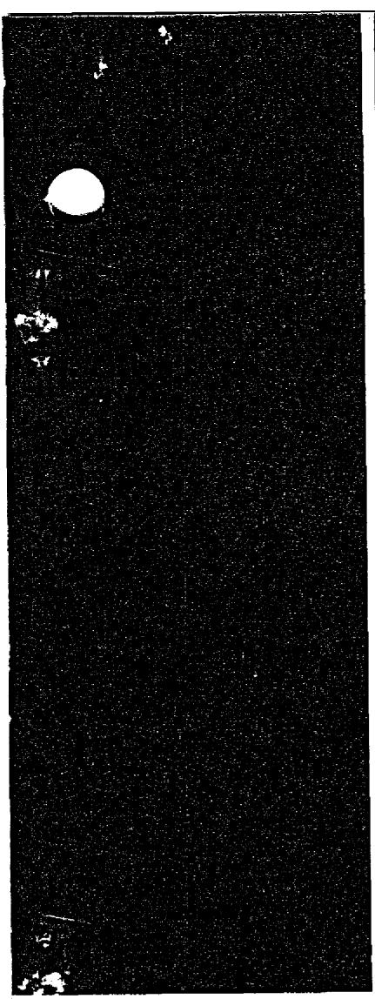

RECEIVED BY TIC OCT 09

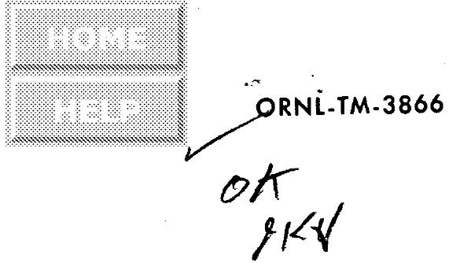

# CORROSION AND MASS TRANSFER

# CHARACTERISTICS OF $\mathsf{NaBF}_4$ NaF (92-8 mole %) IN HASTELLOY N

J.W.Koger

THIS DOCUMENT CONFIRMED AS UNCLASSIFIED

DIVISION OF CLASSIFICATION

BY 9H kaln I a m b.

ATTRIBUTION OF THIS DOCUMENT IS UNLIMITED

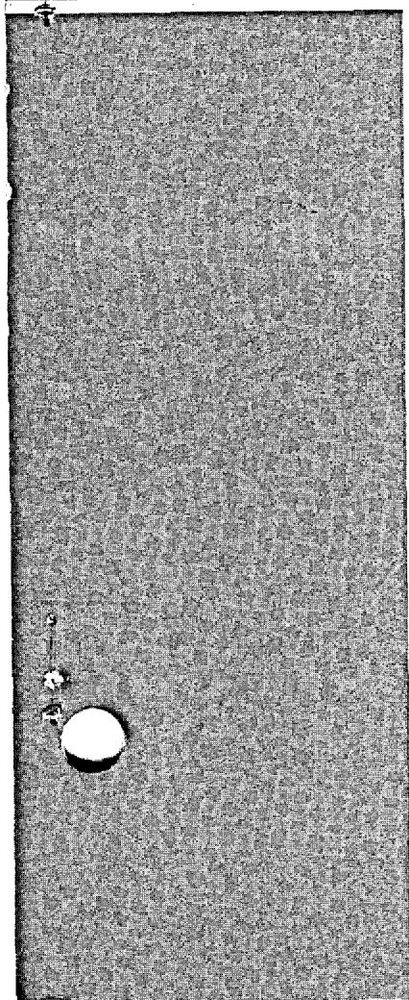

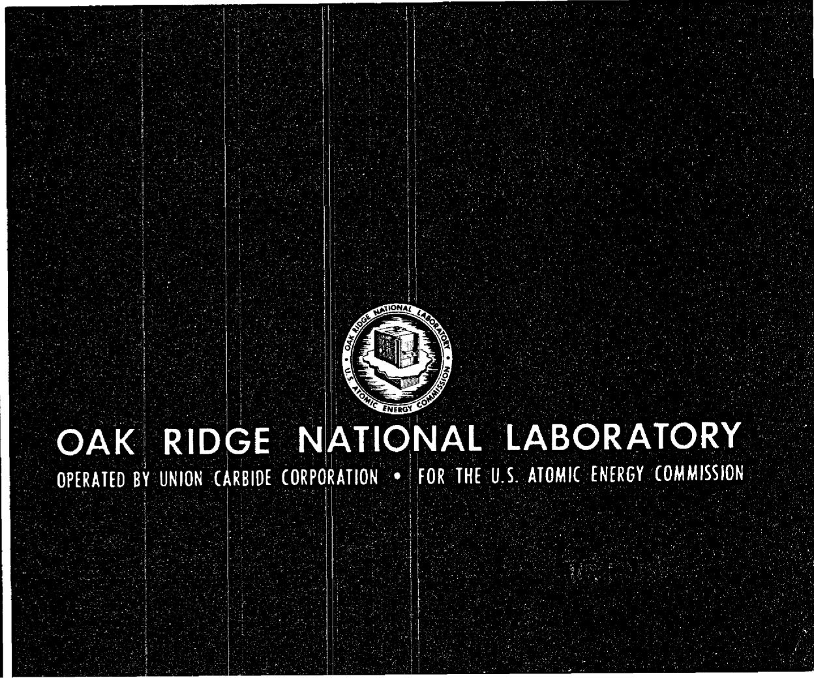

This report was prepared as an account of work sponsored by the United States Government. Neither the United States nor the United States Atomic Energy Commission, nor any of their employees, nor any of their contractors, subcontractors, or their employees, makes any warranty, express or implied, or assumes any legal liability or responsibility for the accuracy, completeness or usefulness of any information, apparatus, product or process disclosed, or represents that its use would not infringe privately owned rights.

Contract No. W-7405-eng-26

METALS AND CERAMICS DIVISION

CORROSION AND MASS TRANSFER CHARACTERISTICS OF $\mathrm{NaBF}_4$ -NaF (92-8 mole %)

IN HASTELLOY N

J. W. Koger

# NOTICE

This report was prepared as an account of work sponsored by the United States Government. Neither the United States nor the United States Atomic Energy Commission, nor any of their employees, nor any of their contractors, subcontractors, or their employees, makes any warranty, express or implied, or assumes any legal liability or responsibility for the accuracy, completeness or usefulness of any information, apparatus, product or process disclosed, or represents that its use would not infringe privately owned rights.

# OCTOBER 1972

NOTICE This document contains information of a preliminary nature and was prepared primarily for internal use at the Oak Ridge National Laboratory. It is subject to revision or correction and therefore does not represent a final report.

OAK RIDGE NATIONAL LABORATORY

Oak Ridge, Tennessee 37830

operated by

UNION CARBIDE CORPORATION

for the

U.S. ATOMIC ENERGY COMMISSION

# CONTENTS

<table><tr><td></td><td>Page</td></tr><tr><td>Abstract</td><td>1</td></tr><tr><td>Introduction</td><td>1</td></tr><tr><td>Experimental Procedure</td><td>6</td></tr><tr><td>Equipment</td><td>6</td></tr><tr><td>Salt Preparation</td><td>8</td></tr><tr><td>Analyses</td><td>11</td></tr><tr><td>Operation and Results</td><td>11</td></tr><tr><td>Thermal Convection Loops NCL-13, NCL-13A, and NCL-14</td><td>11</td></tr><tr><td>Loop NCL-17</td><td>20</td></tr><tr><td>Loop NCL-20</td><td>27</td></tr><tr><td>FCL-1 Pump Loop</td><td>28</td></tr><tr><td>Runs 1 and 2</td><td>32</td></tr><tr><td>Run 3</td><td>37</td></tr><tr><td>Installation and Testing of Cold Finger During Run 3</td><td>38</td></tr><tr><td>Run 4</td><td>40</td></tr><tr><td>Run 5</td><td>42</td></tr><tr><td>Run 6</td><td>45</td></tr><tr><td>Run 7</td><td>48</td></tr><tr><td>Salt Chemistry</td><td>53</td></tr><tr><td>Purification</td><td>53</td></tr><tr><td>Analytical Chemistry</td><td>54</td></tr><tr><td>Discussion</td><td>54</td></tr><tr><td>Theory</td><td>54</td></tr><tr><td>Equations</td><td>61</td></tr><tr><td>Kinetics</td><td>62</td></tr><tr><td>Solid-State Diffusion Control</td><td>66</td></tr><tr><td>Solution Controlling</td><td>67</td></tr><tr><td>Experimental Data</td><td>68</td></tr><tr><td>Diffusion Calculations</td><td>70</td></tr><tr><td>Summary</td><td>76</td></tr><tr><td>Conclusions</td><td>78</td></tr><tr><td>Acknowledgment</td><td>79</td></tr></table>

# IN HASTELLOY N

J. W. Koger

# ABSTRACT

A series of corrosion experiments in thermal convection and pump loops designed to test the compatibility of fused $\mathrm{NaBF}_4$ -8 mole % NaF with Hastelloy N has shown the extreme effect of impurities on the system mass transfer. The difficulty in keeping the melt sufficiently pure was also illustrated. Kinetic considerations showed that the mass transfer process is controlled either by solid-state diffusion or by the solution rate, depending on the amount of impurities allowed to enter the salt. The mass transfer behavior is very similar to that for the $\mathrm{Cr - UF_4}$ corrosion reaction (material removal in the hot section and deposition in the cold section), the differences being that alloy constituents other than chromium participate in the process and that the reaction rates are different. Because of these differences, the effective diffusion rate controlling the hot leg attack is larger than that obtained in typical diffusion experiments for chromium in Hastelloy N.

Titanium-modified Hastelloy N with less chromium and iron shows a greater resistance to attack in a fluoroborate salt with 500 ppm oxide impurity than does standard Hastelloy N. Its corrosion rate is doubled by increasing the oxide concentration to 1500 ppm. Average corrosion rates were low for all systems tested.

# INTRODUCTION

The successful development and operation of the molten salt reactor experiment (MSRE) have led to the present program for development of a molten salt breeder reactor (MSBR). In the MSRE the heat transferred from the fuel salt to the coolant salt was rejected to an air-cooled radiator. In the MSBR a secondary coolant will be required to remove heat from the fuel in the primary heat exchanger and transport this heat to supercritical steam at quite low temperatures.

This secondary coolant should have low viscosity and density and high heat capacity and thermal conductivity to permit use of acceptable heat exchangers, coolant pumps, and steam generators. The melting point must be low enough to meet the heat transfer temperature requirements, and the vapor pressure must be low at the temperature of operation. The salt must also be easily remelted, with no precipitation of high-melting compounds during cooling. The coolant must be commercially available in high purity, and the price should not be prohibitive. In nuclear systems the coolant must be stable under the radiation that it encounters. We also must consider the result of accidental mixing of the coolant fluid and steam and select a coolant in which the effects of this mixing will be minimized. Last but not least, the coolant must be compatible with the container materials of the system.

It now appears that the best choice for the MSBR secondary coolant is the eutectic mixture of 8 mole % NaF in $\mathrm{NaBF}_4$ , with a melting point1 of $385^{\circ}\mathrm{C}$ ( $725^{\circ}\mathrm{F}$ ) as shown in Fig. 1. The salt is quite inexpensive

$^{1}$ C. J. Barton, L. V. Gilpatrick, H. Insley, and T. N. McVay, *MSR Program Semiann. Progr. Rept.* Feb. 29, 1968, ORNL-4254, p. 166.

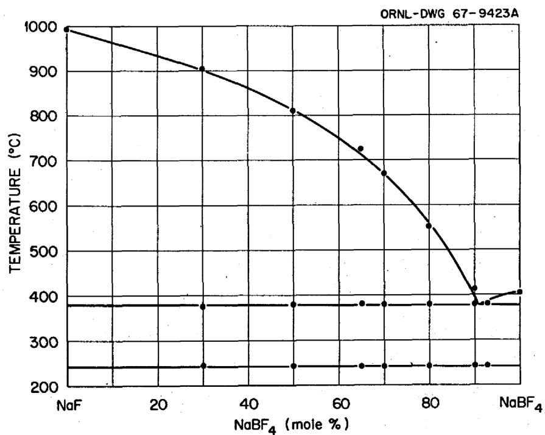  
Fig. 1. The System NaF-NaBF $_4$ .

(< $0.50/1b). At elevated temperatures the fluoroborates show an appreciable equilibrium pressure of gaseous BF₃; however, at the proposed maximum temperature of the MSBR secondary coolant (621°C) the pressure is only 252 torr. The equilibrium pressure² above a melt of NaBF₄-8 mole % NaF is given as a function of temperature by

$$
\log \mathrm {P} _ {\text {t o r r}} = 9. 0 2 4 - 5 9 2 0 / \mathrm {T} (^ {\circ} \mathrm {K}).
$$

Table 1 contains some of the pertinent physical properties for this mixture at temperatures of interest. Other possibilities for secondary coolants, such as fluorides, chlorides, and liquid metals, are discussed elsewhere.3 Before our compatibility tests4,5 with the sodium fluoro-borate mixture, little was known or reported about its corrosive behavior in the molten state.

Because of its appreciable vapor pressure at temperatures of interest, $\mathrm{BF}_3$ corrosion is of importance also. In corrosion experiments with gaseous $\mathrm{BF}_3$ , it was rapidly attacked by traces of moisture to give hydroxyfluoboric acid (HBF $_3$ OH) and HF. Also $\mathrm{BF}_3$ and glass reacted at an appreciable rate just above $200^{\circ}\mathrm{C}$ . Under the conditions of those experiments, $\mathrm{BF}_3$ did not appreciably attack a wide variety of metals or alloys examined at temperatures up to $200^{\circ}\mathrm{C}$ .

Table 1. Some Properties of the Mixture ${\mathrm{{NaBF}}}_{4} - 8$ mole % NaF   

<table><tr><td>Approximate melting point, °C</td><td>384</td></tr><tr><td>Vapor pressure at 621°C, torr</td><td>252</td></tr><tr><td>Density, a g/cm3:</td><td></td></tr><tr><td>at τ°C</td><td>ρ = 2.252 - 7.11 × 10-4τ</td></tr><tr><td>at 621°C</td><td>1.82</td></tr><tr><td>at 538°C</td><td>1.87</td></tr><tr><td>at 455°C</td><td>1.93</td></tr><tr><td>Viscosity, b centipoise:</td><td></td></tr><tr><td>at T°K</td><td>η = 0.0877 exp(2240/T)</td></tr><tr><td>at 621°C</td><td>1.1</td></tr><tr><td>at 538°C</td><td>1.4</td></tr><tr><td>at 455°C</td><td>1.9</td></tr><tr><td>Heat Capacity: c</td><td></td></tr><tr><td>c_p = 0.360 cal g-1°C-1</td><td></td></tr><tr><td>Thermal Conductivity: d</td><td></td></tr><tr><td>at 621°C:K = 0.0039 W cm-1°C-1</td><td></td></tr><tr><td>at 538°C:K = 0.0041 W cm-1°C-1</td><td></td></tr><tr><td>at 455°C:K = 0.0043 W cm-1°C-1</td><td></td></tr><tr><td>Latent Heat of Fusion = 31 cal/g</td><td></td></tr></table>

aS. Cantor, MSR Program Semiann. Progr. Rept. Aug. 31, 1969, ORNL-4449, p. 14.   
bS. Cantor, MSR Program Semiann. Progr. Rept. Aug. 31, 1969, ORNL-4449, p. 145.   
cA. S. Dworkin, MSR Program Semiann. Progr. Rept. Feb. 29, 1968, ORNL-4254, p. 168.   
dJ. W. Cooke, MSR Program Semiann. Progr. Rept. Aug. 31, 1969, ORNL-4449, p. 92.

All metal components of the MSRE in contact with molten salt were made of Hastelloy $^{7}$ N (formerly called INOR-8). Two decades of corrosion testing $^{8-15}$ and experience $^{16-19}$ with the MSRE have demonstrated the excellent compatibility of Hastelloy N and graphite with fluoride salts containing LiF, $\mathrm{BeF}_2$ , $\mathrm{UF}_4$ , and $\mathrm{ThF}_4$ . Hastelloy N, perhaps with some modification of composition, is quite likely to be the primary containment material for MSBR. Thus, it was of great interest to the molten salt program to determine the compatibility of the fluoroborate salt mixture with Hastelloy N and related alloys. Of special interest is temperature-gradient mass transfer, which must always be considered where corrosion in a heat exchanger is possible. Corrosion and deposition processes in flowing nonisothermal systems are interdependent, and each exerts considerable influence over the extent and characteristics of the other. Therefore, a performance analysis of a nonisothermal system must consider these processes as complementary and equal in significance to the overall system behavior. This paper is an up-to-date, open-ended report on these studies.

7Hastelloy N is the trade name of Cabot Corporation for a nickel-base alloy containing $16\%$ Mo, $7\%$ Cr, $5\%$ Fe, and $0.057\%$ C.   
8L. S. Richardson, D. C. Vreeland, and W. D. Manly, Corrosion by Molten Fluorides: Interim Report for September 1952, ORNL-1491 (April 20, 1953).   
G. M. Adamson, R. S. Crouse, and W. D. Manly, Interim Report on Corrosion by Alkali-Metal Fluorides: Work to May 1, 1953, ORNL-2337 (March 20, 1959).   
$^{10}$ G. M. Adamson, R. S. Crouse, and W. D. Manly, Interim Report on Corrosion by Zirconium-Base Fluorides, ORNL-2338 (Jan. 3, 1961).   
11W. B. Cottrell, T. E. Crabtree, A. L. David, and W. G. Piper, Disassembly and Postoperative Examination of the Aircraft Reactor Experiment, ORNL-1868 (April 2, 1958).   
$^{12}$ W. D. Manly, G. M. Adamson, Jr., J. H. Coobs, J. H. Devan, D. A. Douglas, E. E. Hoffman, and P. Patriarca, Aircraft Reactor Experiment-Metallurgical Aspects, ORNL-2349, pp. 2-24 (Dec. 20, 1957).   
$^{13}$ W. D. Manly, J. H. Coobs, J. H. Devan, D. A. Douglas, H. Inouye, P. Patriarca, T. K. Roche, and J. L. Scott, "Metallurgical Problems in Molten Fluoride Systems," Progr. Nucl. Energy Ser. IV 2: 164-79 (1960).

# EXPERIMENTAL PROCEDURE

# Equipment

In corrosion studies the thermal convection loop represents an intermediate stage of sophistication and complexity between simple capsule tests and a full-scale engineering pump loop experiment. It is particularly suited to small-scale tests that involve temperature-gradient mass transfer. The flow of the liquid is caused by its variation in density with temperature. The development of a modified thermal convection loop has permitted important strides in obtaining basic corrosion information. The thermal convection loop used in this work and shown in Fig. 2 permits unrestricted access to specimens and salt at any time without significantly disturbing loop operation or introducing air contamination. Access is provided by twin ball valve arrangements atop both the hot and cold legs of the loops. The molten salt sampling device illustrated in Fig. 3 was used in our thermal loops and can also

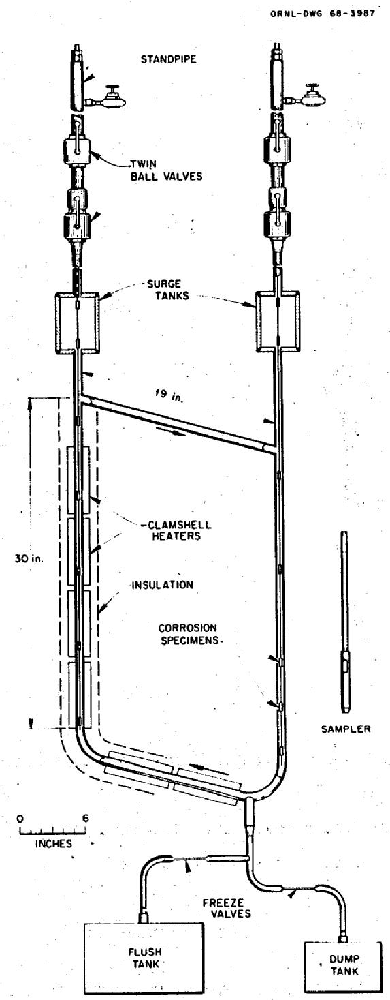  
Fig. 2. MSRP Natural Circulation Loop and Salt Sampler.

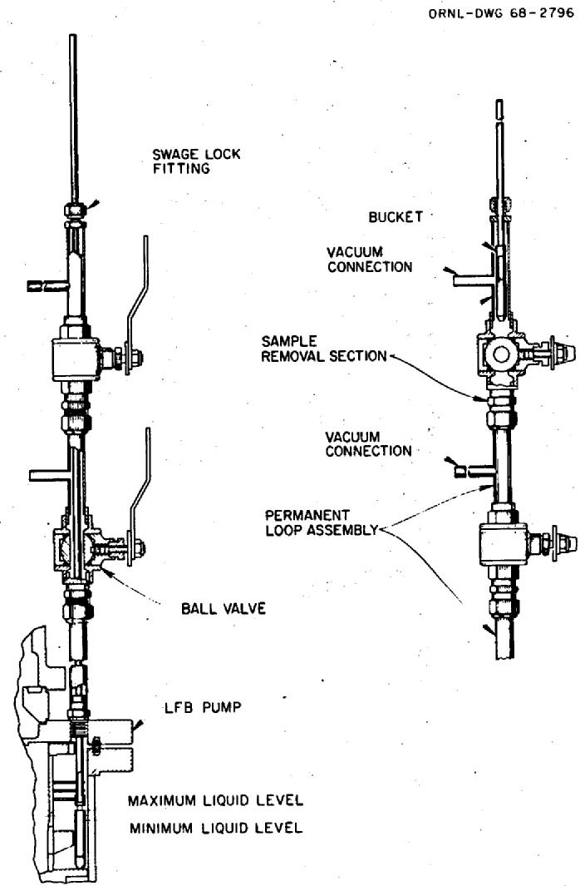  
Fig. 3. Molten Salt Sampling Device.

be used in pumped loops. Typical thermal convection loops in operation are shown in Fig. 4.

A forced convection loop was also used to evaluate the fluoroborate salt mixture and will be described later.

# Salt Preparation

The salt for these tests was processed by the Fluoride Processing Group of the Reactor Chemistry Division. Very pure (> 99.9%) starting materials were evacuated to about 380 torr, heated to $150^{\circ}\mathrm{C}$ in a vessel lined with nickel, and then held for about 15 hr under these conditions.

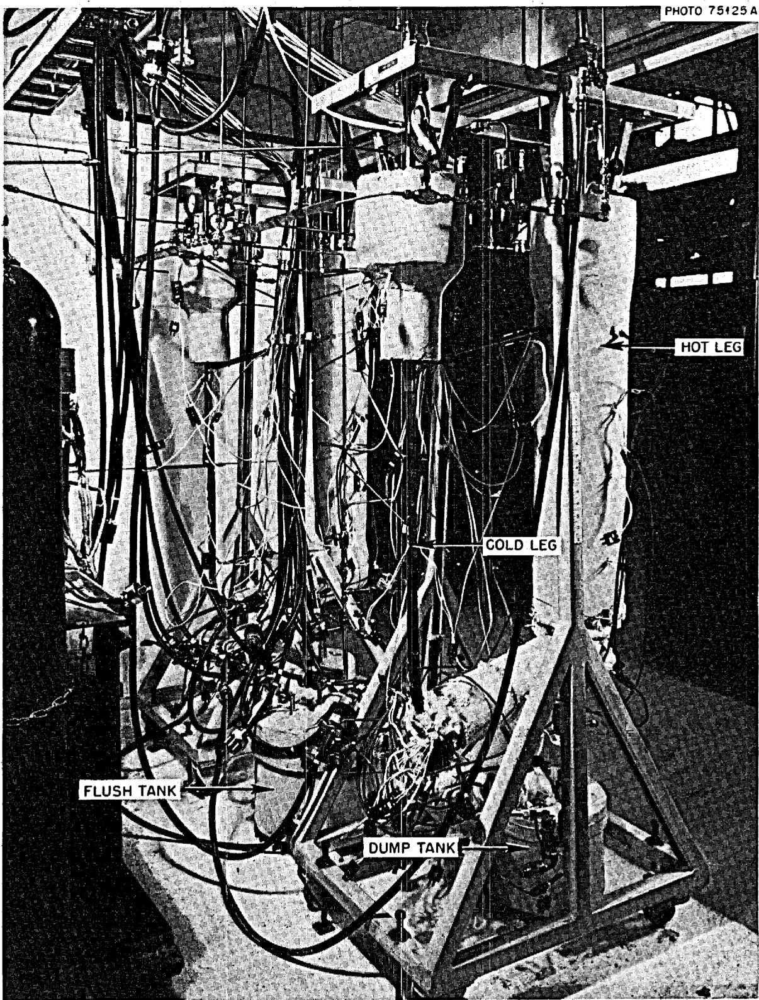  
Fig. 4. Thermal Convection Loops in Operation.

If the rise in pressure was not excessive (indicating no volatile impurities), the salt was heated to $500^{\circ}\mathrm{C}$ while still under vacuum and agitated for a few hours with bubbling helium. It was then transferred to the fill vessel and from it forced into the loops with helium pressure. In the case of the pumped loop the salt was transferred initially into a dump tank and then into the loop tubing.

The hot portion of each thermal convection loop was heated by sets of clamshell heaters, with the input power controlled by silicon controlled rectifiers (SCR units) and the temperature controlled by a Leeds and Northrup Speedomax H series 60 type CAT controller. The loop temperatures were measured by Chromel-P vs Alumel thermocouples spot welded to the outside of the tubing, covered first by quartz tape and then by stainless steel shim stock.

Each loop was degreased with ethyl alcohol, heated to $150^{\circ}\mathrm{C}$ under vacuum to remove moisture, and leak checked before filling with salt. All lines from the fill tank to the loop that were exposed to the fluoroborate salt were of the same material as the loop and were cleaned and tested in the same manner as the loop. All temporary line connections were made with stainless steel compression fittings.

Each loop was filled by heating it, the salt pot, and all connecting lines to at least $530^{\circ}\mathrm{C}$ and applying helium pressure to the salt pot to force the salt into the loop. Air was continuously blown on the freeze valves leading to the dump and flush tanks to provide a positive salt seal. Tubular electric heaters controlled by variable autotransformers heated the cold-leg portions. Once the loop was filled the heaters were turned off, and the proper temperature difference was obtained by removing some insulation to expose portions of the cold leg to ambient air.

The first charge of salt was circulated under a small temperature difference $(20^{\circ}\mathrm{C})$ for 24 hr and dumped. This flush removed surface oxides and other possible impurities. The loops were then refilled with new salt and put into operation. A helium cover gas under slight positive pressure (about 5 psig) was maintained over the salt in the loops during operation.

# Analyses

Several methods can be used to obtain quantitative data from a temperature-gradient mass transfer experiment relating to the kinetics of mass transfer, the thermodynamics of the process, or both. The most obvious and easiest to obtain are weight change measurements on specimens and liquid analyses. The weight changes allow the calculation of mass transfer rates in both legs. We may also analyze specimens and loop tubing with a microprobe to determine composition gradients, x-ray fluorescence to determine the surface composition, and spectrochemistry to determine overall composition. Standard metallographic examination is also helpful to determine the extent of attack or void formation in the hot leg or the amount of deposit in the cold leg.

# OPERATION AND RESULTS

The results of tests of the fluoroborate salt mixture in two thermal convection loops and in a series of capsule tests have already been reported.[20,21] In addition, four other thermal convection loops and one pumped loop have been operated. These latter tests are described below, and results of all the tests are reviewed.

# Thermal Convection Loops NCL-13, NCL-13A, and NCL-14

Thermal convection loops NCL-13 and NCL-14 (constructed of standard Hastelloy N) were started at the same time under the identical conditions of $605^{\circ}\mathrm{C}$ maximum temperature and a temperature difference of $145^{\circ}\mathrm{C}$ . These operating conditions were those proposed for the coolant circuit of the MSRE. During circulation each loop $(0.75\text{-in. - OD} \times 0.072\text{-in. - wall}$ tubing) contained about $2.7\mathrm{kg}$ of salt that contacted $1740~\mathrm{cm}^2$ (270 in. $^2$ )

of surface and traveled 254 cm around the harp. Typical flow under the above conditions was 7 ft/min. Loop NCL-13 contained standard Hastelloy N specimens, while loop NCL-14 had titanium-modified Hastelloy N suspended in the salt stream. The compositions of these alloys are given in Table 2. The modified alloy is being considered because of its superior mechanical properties under radiation at elevated temperature.

Table 2. Composition of Hastelloy N Alloys   

<table><tr><td rowspan="2">Alloy</td><td colspan="7">Content, wt %</td></tr><tr><td>Ni</td><td>Mo</td><td>Cr</td><td>Fe</td><td>Si</td><td>Mn</td><td>Ti</td></tr><tr><td>Standard Hastelloy N</td><td>70</td><td>17.2</td><td>7.4</td><td>4.5</td><td>0.6</td><td>0.54</td><td>0.02</td></tr><tr><td>Titanium-modified Hastelloy N</td><td>78</td><td>13.6</td><td>7.3</td><td>&lt; 0.1</td><td>&lt; 0.01</td><td>0.14</td><td>0.5</td></tr></table>

The weight changes measured for the specimens in NCL-13 and NCL-14 showed an increase in mass transfer rate between 3500 and $4300\mathrm{hr}$ of exposure to the salt (Fig. 5). This was accompanied by perturbations in salt composition. Analyses of the circulating salts from these loops showed that the oxide content increased to above 2000 ppm (from initially less than 1000 ppm), and the nickel and molybdenum contents exceeded 100 ppm (from below 25 ppm). Also, the chromium and iron contents increased "normally" with time, as shown in Fig. 6.

After 4700 hr of operation, the helium gas regulator that provided the overpressure to NCL-13 failed and caused a surge of gas to the loop, stopping the salt flow. Circulation of the salt could not be resumed until a vacuum was pulled on the loop, which we believe removed a gas pocket. Shortly after circulation was restored, an electrical short, which eventually burned out a heater, occurred and heated the bottom of the hot leg to $870^{\circ}\mathrm{C}$ (1600°F). This disrupted the flow and caused a loss of $\mathrm{BF}_3$ from the loop, which changed the salt composition and plugged all the gas lines. The loop was drained of all salt, and plugged lines were replaced or unplugged. Other necessary repairs to the loop were made, and the loop was filled with new salt. The loop was then designated as NCL-13A.

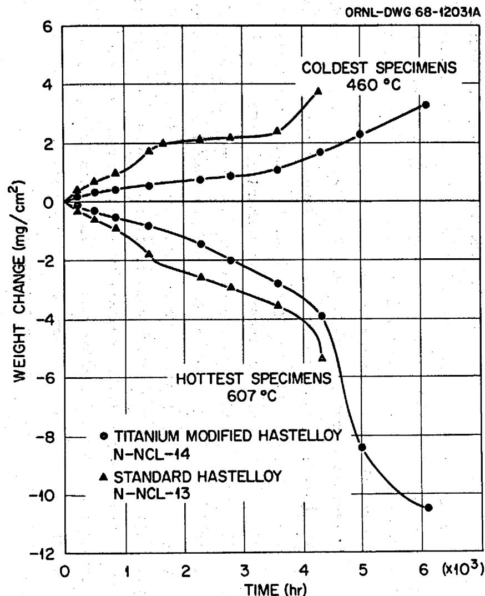  
Fig. 5. Weight Change Versus Time for Standard and Titanium-Modified Hastelloy N Specimens in NCL-13 and NCL-14 Exposed to Fluoroborate Salt at Various Temperatures.

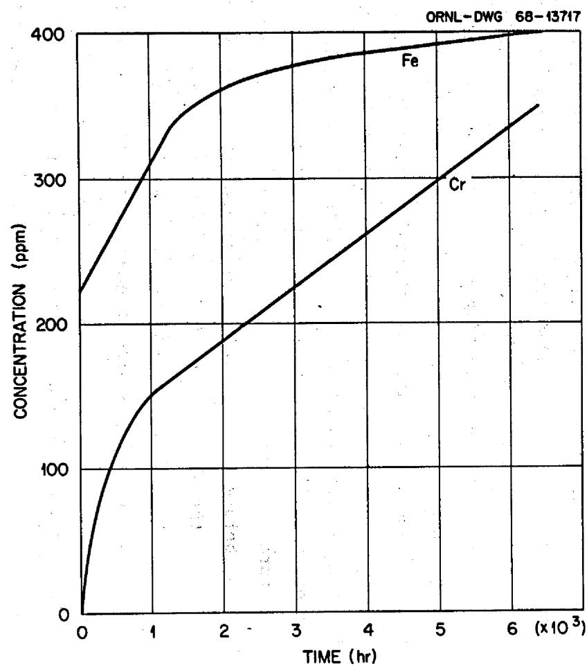  
Fig. 6. Average Concentrations of Iron and Chromium in the Fluoroborate Salt in NCL-13 and NCL-14.

After new fluoroborate salt was added to loop NCL-13A, circulation could not be achieved. We concluded that previous overheating of the loop had caused $\mathrm{BF}_3$ to evolve and had made the salt much richer in NaF. This in turn caused the higher melting NaF to segregate in the loop. To bring the composition back to normal, we added $\mathrm{BF}_3$ gas to the melt through the surge tank. The initial amounts of gas were dissolved in the salt, and additions continued until a slight overpressure built up over the salt. (No devices were available to measure the amount of $\mathrm{BF}_3$ gas added.) Circulation of the salt was then attempted and was successful. Only a small temperature difference $(55^{\circ}\mathrm{C})$ was obtained at first. Further additions of $\mathrm{BF}_3$ as before lowered the temperature of the salt in the cold leg and increased the temperature difference to about $125^{\circ}\mathrm{C}$ . Since more $\mathrm{BF}_3$ did not cause immediate changes and did not appear to dissolve in the salt, the additions of gas were stopped. The loop has since operated satisfactorily.

Loops NCL-13A and NCL-14 have now operated for two and three years, respectively. Figure 7 gives the weight changes of specimens at various temperatures as functions of operating time. The overall corrosion rates at the maximum temperature, $605^{\circ}\mathrm{C}$ , are 0.5 and 0.7 mil/year for loops NCL-13A and NCL-14, respectively. The attack is general, and actual measurements of specimens show changes in thickness agreeing with those calculated from weight changes. We will now discuss the circumstances that have affected the mass transfer conditions.

The air leaks in loops NCL-13A and NCL-14 occurred at various mechanical joints in the system, such as ball valves, level probes, and pressure gages, all located in the cover gas space above the circulating salt. We had gained extensive experience with similar mechanical joints before testing fluoroborate salt mixtures and had encountered no leakage problems. Therefore, the frequency of leaks in these two fluoroborate loops strongly suggests that the $\mathrm{BF}_3$ atmosphere in these tests has deteriorated our mechanical seals. We are currently investigating the chemical nature of the $\mathrm{BF}_3$ to determine any possible contaminants which might have caused such deterioration. Despite the known problems of air leakage, these loops have operated for over two years with the fluoroborate salt, and the overall corrosion rate is within acceptable limits.

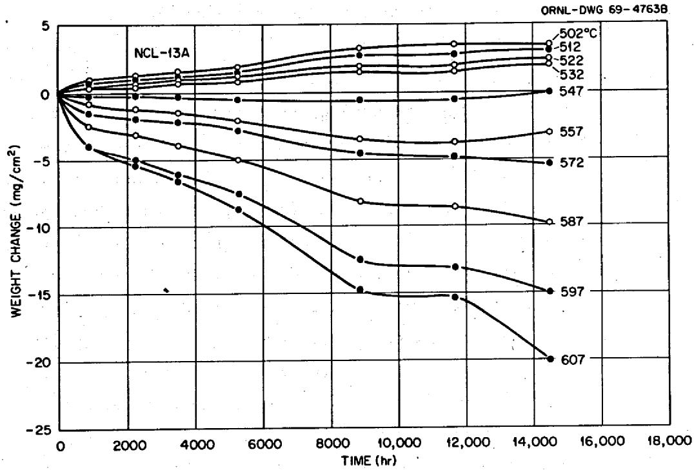

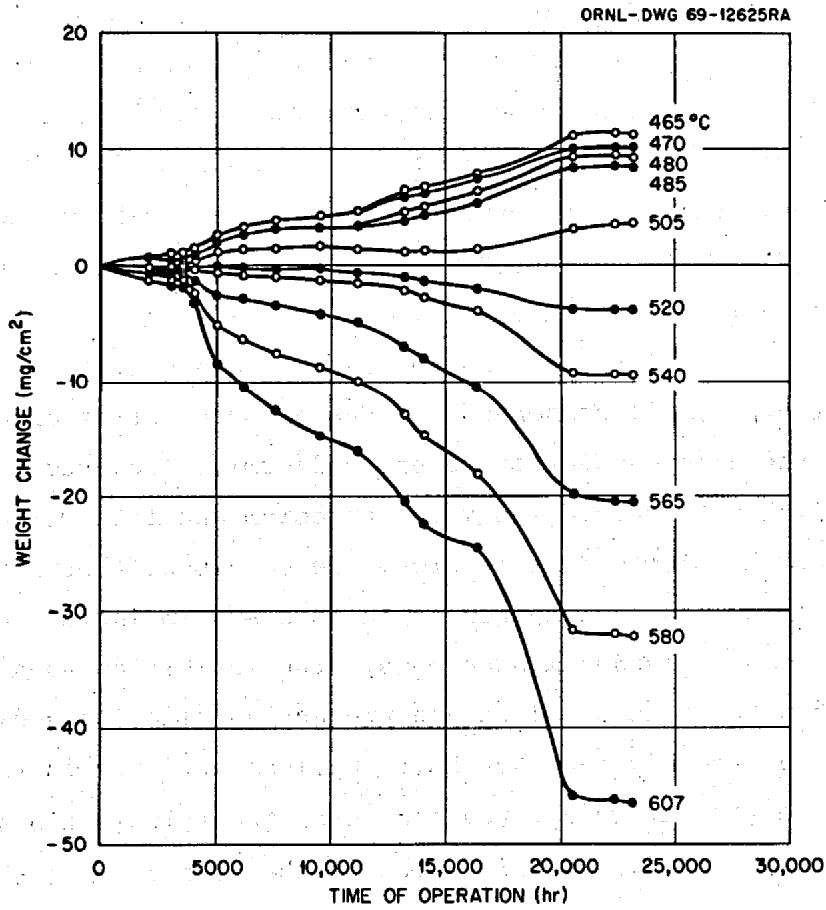  
Fig. 7. Weight Change Versus Time for Standard Hastelloy N Specimens in NCL-13A and Titanium-Modified Hastelloy N Specimens in NCL-14 Exposed to Fluoroborate Salt at Various Temperatures.

We also used loop NCL-14 to determine the corrosion properties of pure Cr, Fe, Mo, and Nickel 280 (commercially pure nickel with $\mathrm{Al}_{2}\mathrm{O}_{3}$ added as a grain refiner) at $600^{\circ}\mathrm{C}$ in the fluoroborate mixture. As a consequence of the air leaks discussed above, the oxide content of the salt in loop NCL-14 was at an abnormally high level and indicated fairly strongly oxidizing conditions. We initially examined the pure metal specimens after a 234-hr exposure. On removal, we found that the chromium and iron specimens had completely disintegrated. The molybdenum specimen showed no weight change, and the nickel specimen showed a slight weight gain. The chromium and iron specimens were replaced, and a second experiment was conducted for 23 hr. Again, the molybdenum specimen did not change weight, and the nickel specimen showed a slight weight gain. Very little of the chromium specimen remained, and the weight loss of the iron specimen was $40\mathrm{mg/cm}^2$ (70 mils/year). Close examination of the chromium specimen showed it to be coated with a black reaction layer about 0.015 in. thick. Laser spectroscopy of the outer surface of the black material showed iron and boron as major constituents and sodium and chromium as minor constituents. However, x-ray diffraction of the bulk coating showed it to be over $90\%$ $\mathrm{NaBF}_4$ . This black coating has been observed on Hastelloy N specimens exposed to impure $\mathrm{NaBF}_4 - 8$ mole % NaF in the past,[22] but in these cases it was too thin or too adherent to remove and identify.

Attack of Hastelloy N by impure fluoroborate salt tends to be nonselective; that is, all components of Hastelloy N suffer oxidation, and surfaces of the alloy appear to recede uniformly. However, in this experiment with pure metals, only the chromium and iron were noticeably attacked, the chromium more than iron. We conclude, therefore, that the pure chromium and iron specimens in this system inhibited the attack of the nickel and molybdenum specimens. The inhibition apparently is much less when chromium and iron are present as alloying additions in Hastelloy N, presumably because their chemical activity in the alloy is too low or the rate at which they can enter the salt is too slow, being limited by solid-state diffusion in the alloy. When the

oxidation potential of the salt is reduced, however, as would be the case in a purer fluoroborate salt, attack of Hastelloy N becomes more selective, and the buffering effect of chromium may become more important. In loop tests of nickel-molybdenum alloys containing Fe, Nb, or W, DeVan observed $^{23}$ that the concentration of these elements in FLINAK $^{24}$ salt was lowered by the presence of chromium in the alloy. These observations suggest that the incorporation of an active metal such as chromium would effectively inhibit attack in a Hastelloy N-fluoroborate circuit.

Figure 8 shows optical and scanning electron micrographs of specimens from the hot and cold leg of NCL-13. These specimens were exposed to $\mathrm{NaBF}_4 - 8$ mole % NaF for 4180 hr at 580 and $476^{\circ}\mathrm{C}$ . The hot-leg specimen lost $3.3\mathrm{mg/cm}^2$ , and the cold-leg specimen gained $3.2\mathrm{mg/cm}^2$ . The surface of the hot-leg specimen, as seen in Fig. 8 (left) has been attacked nonuniformly and is heavily contoured. Figure 8 (right) shows that the cold-leg specimen is coated with a discontinuous deposit, which is essentially analyzed as Hastelloy N slightly enriched in nickel and molybdenum.

The dumped salt from NCL-13 was chemically analyzed, and the results are given in Table 3. The Cr, Fe, Ni, Mo, O, and $\mathrm{H}_2\mathrm{O}$ contents of the salt all showed large increases. Increases in the nickel and molybdenum content of the salt often indicate the onset of stronger oxidizing conditions, usually due to increased water or oxygen content. Thus the most obvious explanation of the composition changes and increased weight changes was contamination by water, which produced HF, which in turn attacked all the constituents of the container material. This was substantiated by the discovery of a faulty helium line common to both loops. This line admitted air.

Loop NCL-14 initially operated about 3500 hr with the oxide content in the salt between 500 and 1000 ppm. During that period the weight changes were small and predictable as a function of time. Wet air then

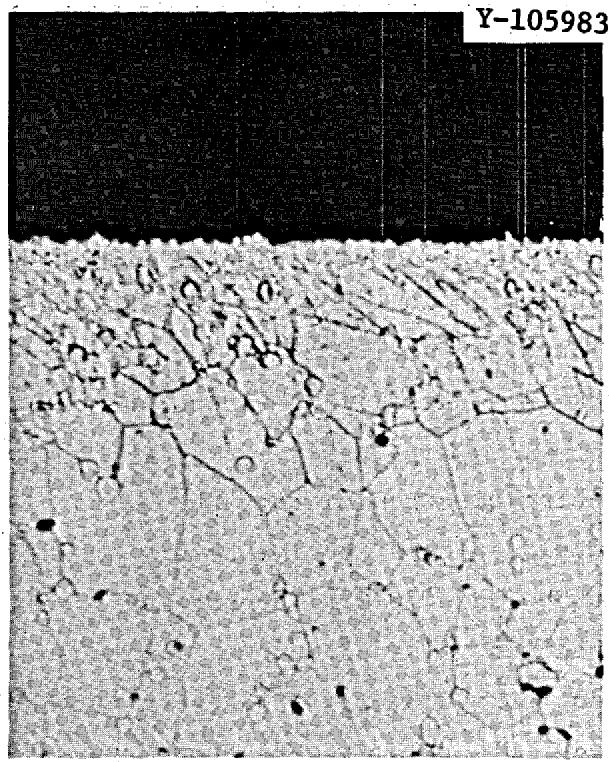

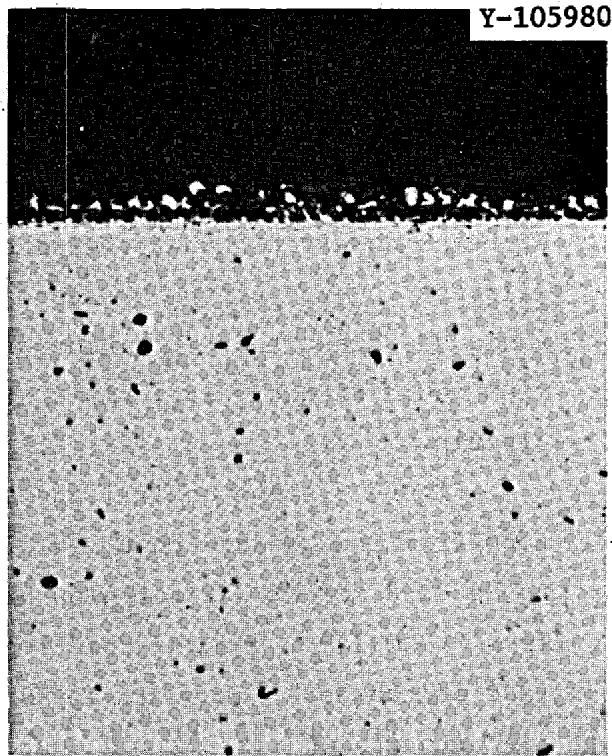

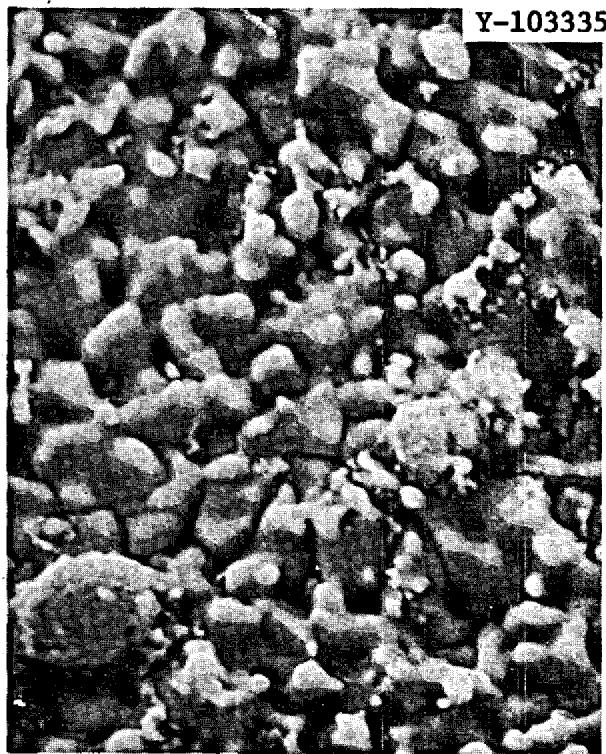

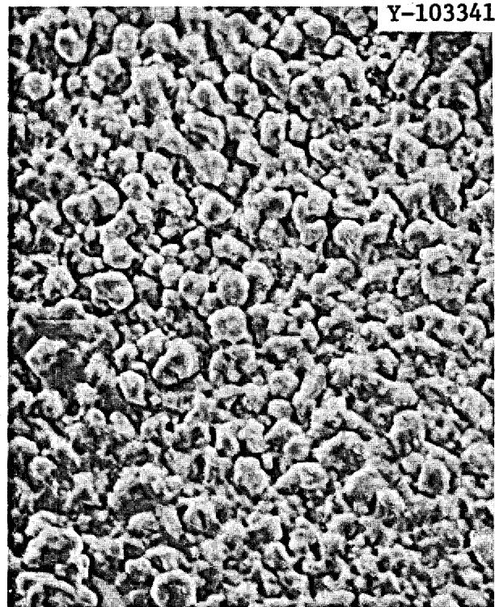  
Fig. 8. Hastelloy N Specimens from NCL-13 Exposed to $\mathrm{NaBF}_4$ -8 mole % NaF for 4180 hr. Left: in hot leg at $580^{\circ}\mathrm{C}$ ; weight loss $3.3\mathrm{mg/cm}^2$ . Right: in cold leg at $476^{\circ}\mathrm{C}$ ; weight gain $3.2\mathrm{mg/cm}^2$ . Top: optical micrographs at $500\times$ , etched with glyceria regia. Bottom: scanning electron micrographs at $3000\times$ (left) and $1000\times$ .

Table 3. Chemical Analyses of Fluoroborate Salt in NCL-13   

<table><tr><td rowspan="2">Sample</td><td colspan="5">Content, ppm</td><td colspan="3">Content, wt %</td></tr><tr><td>Cr</td><td>Fe</td><td>N1</td><td>Mo</td><td>O</td><td>Na</td><td>B</td><td>F</td></tr><tr><td>Salt before loop operation</td><td>19</td><td>223</td><td>28</td><td>&lt; 10</td><td>459</td><td>21.9</td><td>9.51</td><td>68.2</td></tr><tr><td>Dumped salt circulated for 4700 hr</td><td>348</td><td>650</td><td>95</td><td>125</td><td>3000</td><td>21.7</td><td>9.04</td><td>67.0</td></tr></table>

came in contact with the salt through the defective gas line, and the water content and corrosion rate increased dramatically. During the next 5000 hr the oxide content of the salt decreased, and the corrosion rate again decreased as a function of time. The maximum rate of weight loss during this 5000-hr period was about $1.5 \times 10^{-3} \, \text{mg cm}^{-2} \, \text{hr}^{-1}$ (0.65 mil/year). This corrosion rate is double that measured during the earlier operating period.

The concentration of impurities in the salt in loop NCL-14 is given as a function of operating time in Fig. 9. The second change in corrosion rate, at some time between 11,000 and 13,000 hr, was due to a leaking standpipe ball valve. This last intake of impurities illustrates a continuing problem of detection (other than the obvious after-the-fact increase of impurities and corrosion rate), since the loop overpressure did not change significantly. Apparently moisture from the air effuses into the relatively moisture-free atmosphere of the loop (equalization of partial pressure) without the need for a gradient in overall pressure. In this last corrosion rate increase period the analyzed oxide content of the salt increased from 1300 to 4500 ppm. The ball valve was repaired, and the loop continued to operate.

As we have shown, abrupt increases in the slope of the weight change curves (increased rates of gain and loss) indicated changes in the oxidation potential of the salt, which were caused by inadvertent air leaks into the system. These slope changes were accompanied by increases in Cr, Ni, Fe, and Mo contents in the salt, which would indicate general attack of the alloy. Under conditions where external impurities did not

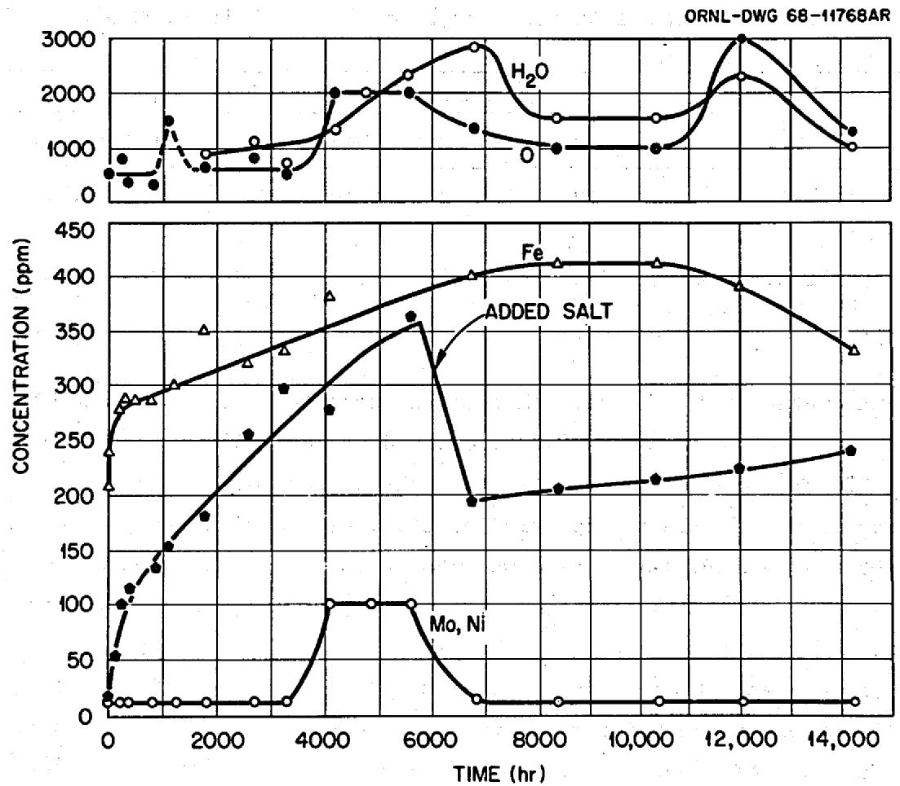  
Fig. 9. Variation of Impurity Contents with Time in $\mathrm{NaBF}_4 - 8$ mole % NaF Thermal Convection Loop NCL-14.

enter the loops, chromium was the only element removed from the alloy, and corrosion rates during these periods fell to as low as 0.08 mil/year.

# Loop NCL-17

Loop NCL-17, constructed of commercial Hastelloy N with removable specimens in each leg, is being operated to determine the effect of steam inleakage in a fluoroborate salt-Hastelloy N circuit. The maximum temperature is $607^{\circ}\mathrm{C}$ with a temperature difference of $107^{\circ}\mathrm{C}$ . This experiment has run for over 10,000 hr and is continuing in order to provide information on the immediate and long-range corrosion of the system after steam injection. The loop was operated for 1050 hr, the specimens were removed and weighed, and steam was forced into the flowing salt system through a

16-mil hole in a closed 1/4-in. Hastelloy N tube, simulating a leaking heat exchanger. Steam was forced into the system until the pressure of the cover gas began to increase, thus indicating that no more steam was soluble in the salt. Figure 10 shows the weight changes and temperatures for the specimens in NCL-17. As usual, the changes depend on temperature, and the rates decrease with time after an initial rapid rate. The corrosion rate appears to have stabilized, and no plugging conditions have been noted. Figure 11 shows the specimens from the loop 424 hr after exposure to steam. The specimens with the etched appearance have lost weight, and those that are darkened have gained weight.

For the last 3500 hr of operation, as shown in Table 4, the concentrations of impurity constituents in the salt (Fe, Cr, Ni, Mo, and O) remained relatively constant. The present chromium level is about 320 ppm. The results of this test show that the Hastelloy N system

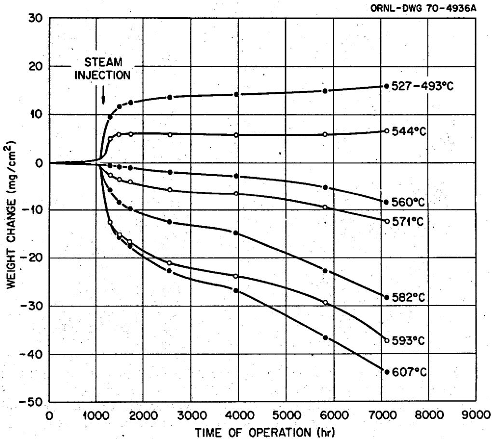  
Fig. 10. Weight Change Versus Time for Hastelloy N Specimens in NCL-17 Exposed to $\mathrm{NaBF}_4 - 8$ mole % NaF at Various Temperatures.

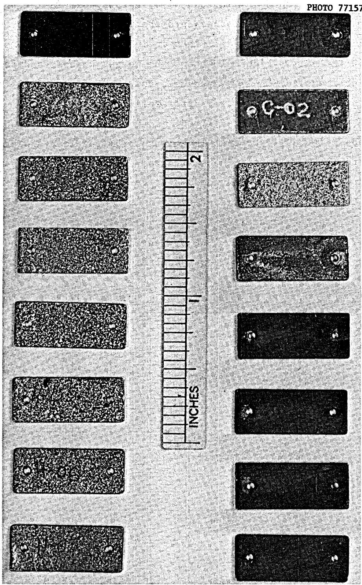  
Fig. 11. Hastelloy N Specimens from NCL-17 Exposed to $\mathrm{NaBF}_4 - 8$ mole % NaF. Specimens were exposed to salt for 1050 hr before steam injection and for 424 hr after steam injection. The specimens on the left were in the hot leg, and those on the right were in the cold leg. Specimens with the etched appearance lost weight, and the darkened specimens gained weight.

Table 4. Concentration of Impurities in NCL-17 Salt   

<table><tr><td rowspan="2">Salt</td><td rowspan="2">Circulation Time (hr)</td><td colspan="5">Concentration in Salt, ppm</td></tr><tr><td>Cr</td><td>Fe</td><td>Ni</td><td>Mo</td><td>O</td></tr><tr><td></td><td>48</td><td>56</td><td>211</td><td>8</td><td>5</td><td></td></tr><tr><td></td><td>1179</td><td>82</td><td>204</td><td>&lt; 5</td><td>&lt; 5</td><td>630</td></tr><tr><td></td><td>1180</td><td></td><td></td><td>Added steam</td><td></td><td></td></tr><tr><td></td><td>1182</td><td>109</td><td>222</td><td>51</td><td>71</td><td>1400</td></tr><tr><td></td><td>1468</td><td>243</td><td>303</td><td>74</td><td>56</td><td>1900</td></tr><tr><td></td><td>1973</td><td>259</td><td>341</td><td>9</td><td>8</td><td></td></tr><tr><td></td><td>2880</td><td>320</td><td>375</td><td>11</td><td>12</td><td>3600</td></tr><tr><td></td><td>4324</td><td>310</td><td>356</td><td>15</td><td>3</td><td>3600</td></tr><tr><td></td><td>6239</td><td>317</td><td>362</td><td>11</td><td>&lt; 2</td><td>3500</td></tr></table>

containing fluoroborate salt can tolerate inleakage of steam and, once the leak is repaired, can continue to operate without extensive damage even if the salt is not repurified.

Figure 12 shows micrographs of the specimens in the hottest and coldest positions. The attack seen in the hot leg is general, as expected for impurity-controlled mass transfer processes. Micrometer measurements show a loss of about 1 mil from specimen surfaces at the maximum temperature position. In Fig. 12(b) we see a large amount (about 2 mils) of deposited material. This material has been analyzed with an electron beam microprobe, and Table 5 gives the results for the substrate and the deposit. These results show that very little chromium has deposited. The nickel and molybdenum concentrations reached maxima of 74 and 56 ppm, respectively, 288 hr after the steam addition, decreased, and quickly leveled off to about 10 ppm each. From the microprobe evidence much of the nickel and molybdenum apparently deposited in the cold leg, although not in the same ratio as they exist in Hastelloy N. One may conclude that under highly oxidizing conditions, during which large weight changes occur (NCL-14 during the air leak and NCL-17 after steam inleakage), most of the changes are attributable to the movement of the

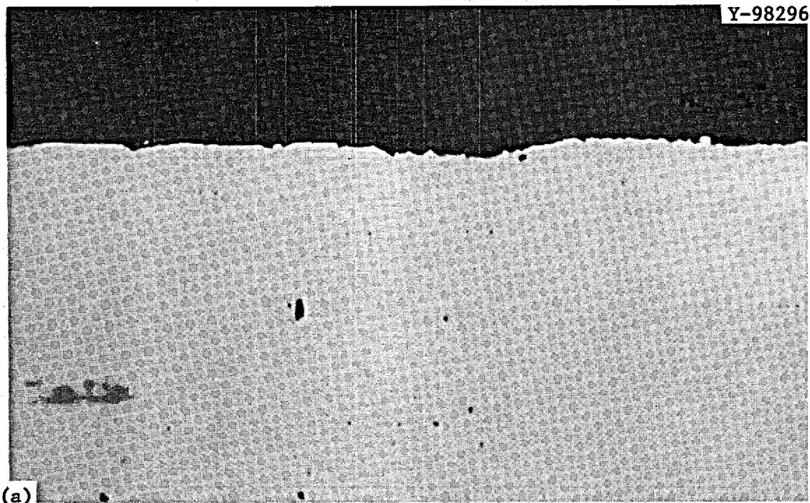

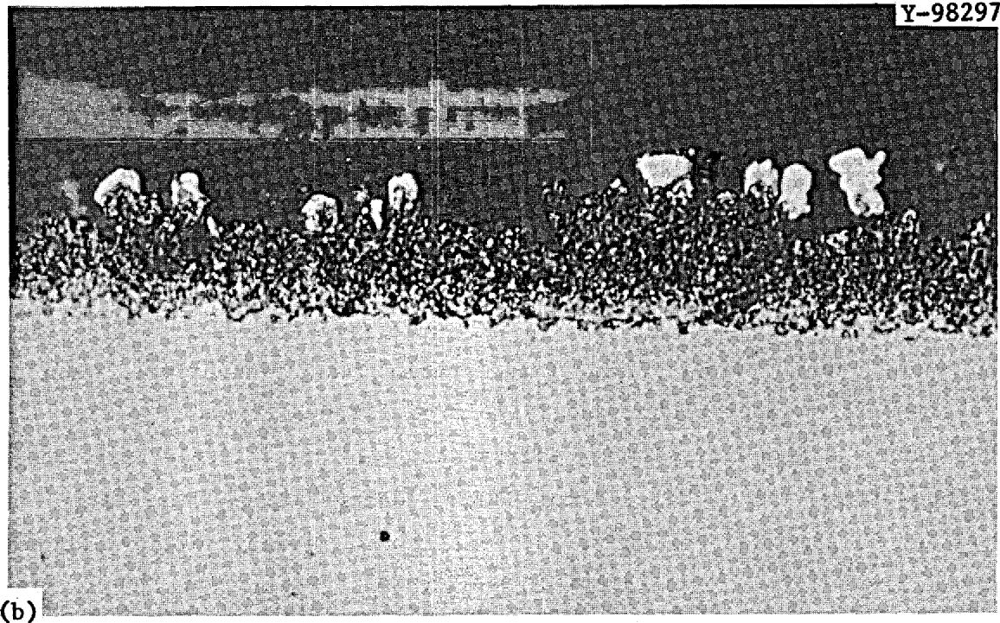  
Fig. 12. Microstructure of Standard Hastelloy N Exposed to $\mathrm{NaBF}_4 - 8$ mole % NaF in NCL-17 for 3942 hr. Steam was injected into salt after 1054 hr. (a) $607^{\circ}\mathrm{C}$ , weight loss $26.8\mathrm{mg/cm}^2$ , as polished; (b) $495^{\circ}\mathrm{C}$ , weight gain $14.8\mathrm{mg/cm}^2$ , as polished. A relatively spongy surface layer on this sample is about 2 mils thick. $500\times$ .

Table 5. Microprobe Analysis of Specimen in Coldest Position (493°C) in Loop NCL-17 Exposed to Fluoroborate Salt for 4000 hr; Steam Injected into Salt 1000 hr after Beginning of Run   

<table><tr><td rowspan="2">Element</td><td colspan="2">Composition,a wt %</td></tr><tr><td>Substrate</td><td>Deposit</td></tr><tr><td>Ni</td><td>73.7</td><td>34.8</td></tr><tr><td>Mo</td><td>14.3</td><td>30.6</td></tr><tr><td>Cr</td><td>6.8</td><td>&lt; 0.5</td></tr><tr><td>Fe</td><td>3.8</td><td>2.9</td></tr><tr><td>P</td><td></td><td>3.0b</td></tr><tr><td>Undetermined</td><td></td><td>~ 30</td></tr></table>

$^{\mathbf{a}}$ Corrected for absorption, secondary fluorescence, and atomic number effects.   
bThin layer close to sample surface.

normally stable nickel and molybdenum. Any increased chromium removal from the hot leg is noted only as an increase in the chromium concentration in the salt. The phosphorus found in the deposit was apparently from a phosphate impurity in the steam.

Figure 13 shows optical and scanning electron micrographs of specimens from the hot and cold leg of NCL-17. The specimens at 593 and $500^{\circ}\mathrm{C}$ were exposed to the salt for 1050 hr, and then steam was injected into the loop. The specimens then remained in the loop for an additional 9000 hr. The total weight loss of the hot-leg specimen was $40.9\mathrm{mg/cm}^2$ , and the weight gain of the cold leg was $16.0\mathrm{mg/cm}^2$ . In Fig. 13 (top left) we see that the surface has receded uniformly, although a Widmanstätten precipitate was left in relief [Fig. 13 (lower left)]. Figure 13 (top right) shows a dark deposit on the cold-leg specimen, and the deposit exhibits a layered structure when viewed from above [Fig. 13 (lower right)].

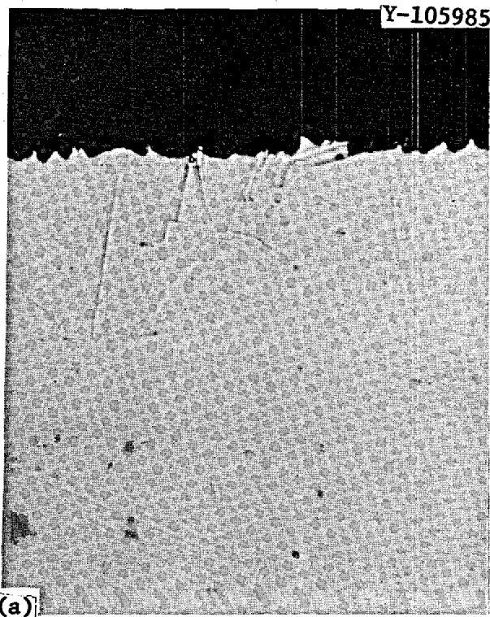

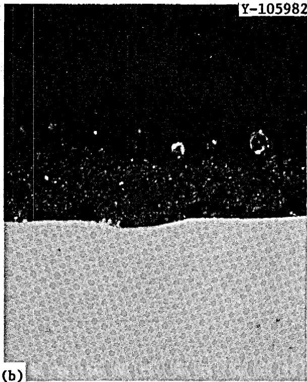

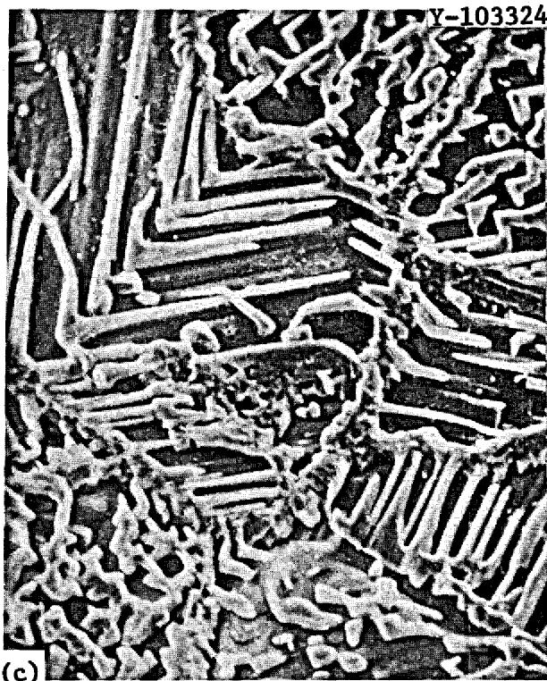

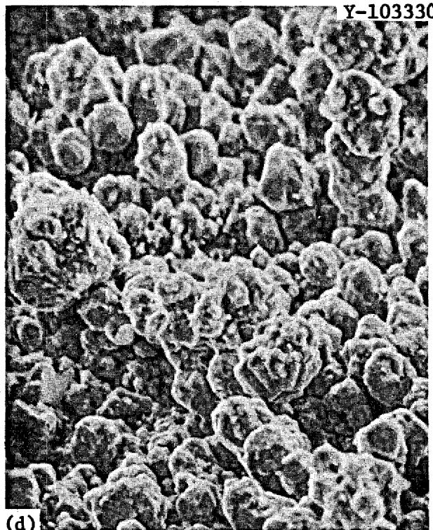  
Fig. 13. Hastelloy N Specimens from NCL-17 Exposed to $\mathrm{NaBF}_4$ -8 mole % NaF for 10,050 hr (1050 hr before Steam Addition). Left: in hot leg at $593^{\circ}\mathrm{C}$ ; weight loss $40.9\mathrm{mg/cm}^2$ . Right: in cold leg at $500^{\circ}\mathrm{C}$ ; weight gain $16.0\mathrm{mg/cm}^2$ . Top: optical micrographs at $500\times$ , etched with glyceria regia Bottom: scanning electron micrographs at $1000\times$ .

In loop NCL-20, constructed of standard Hastelloy N with removable specimens in each leg, the fluoroborate coolant salt has circulated for 12,000 hr. The salt used was especially pure (see Table 6). The loop is being operated at temperature conditions very near those proposed for the maximum $(687^{\circ}\mathrm{C})$ and minimum $(387^{\circ}\mathrm{C})$ salt-metal temperature (primary heat exchanger and steam generator, respectively) of the MSBR secondary circuit. Forced air cooling (as opposed to ambient air cooling used on other thermal-convection loops) is used on the lower half of the cold leg, and the practical operating temperatures obtained were $687^{\circ}\mathrm{C}$ maximum and about $437^{\circ}\mathrm{C}$ minimum: a temperature difference of $250^{\circ}\mathrm{C}$ . This difference is thought to be the largest obtained at ORNL in a molten-salt thermal-convection loop, and the maximum temperature is the highest for fluoroborate salt in a loop. Table 6 gives the corrosion results for this experiment. The corrosion rates are the lowest yet attained with a fluoroborate mixture and confirm the importance of salt purity on compatibility with structural materials. The low concentrations of chromium and oxide in the salt are also indicative of low corrosion rates. Figure 14 shows weight changes of the specimens as functions of time and temperature.

Table 6. Weight Change of Specimen at $687^{\circ}\mathrm{C}$ and Impurity Content of Salt of NCL-20   

<table><tr><td rowspan="2">Time (hr)</td><td rowspan="2">Weight Loss (mg/cm2)</td><td rowspan="2">Incremental Corrosion Rate (mils/year)a</td><td colspan="3">Chemical Analysis, ppm</td></tr><tr><td>Cr</td><td>Fe</td><td>O</td></tr><tr><td>0</td><td></td><td></td><td>58</td><td>227</td><td>500</td></tr><tr><td>624</td><td>0.3</td><td>0.19</td><td>90</td><td>198</td><td>550</td></tr><tr><td>1460</td><td>0.7</td><td>0.18</td><td>99</td><td>110</td><td>590</td></tr><tr><td>2586</td><td>1.0</td><td>0.15</td><td>109</td><td>104</td><td>470</td></tr><tr><td>3784</td><td>1.7</td><td>0.17</td><td>131</td><td>91</td><td>670</td></tr></table>

Assuming uniform loss.

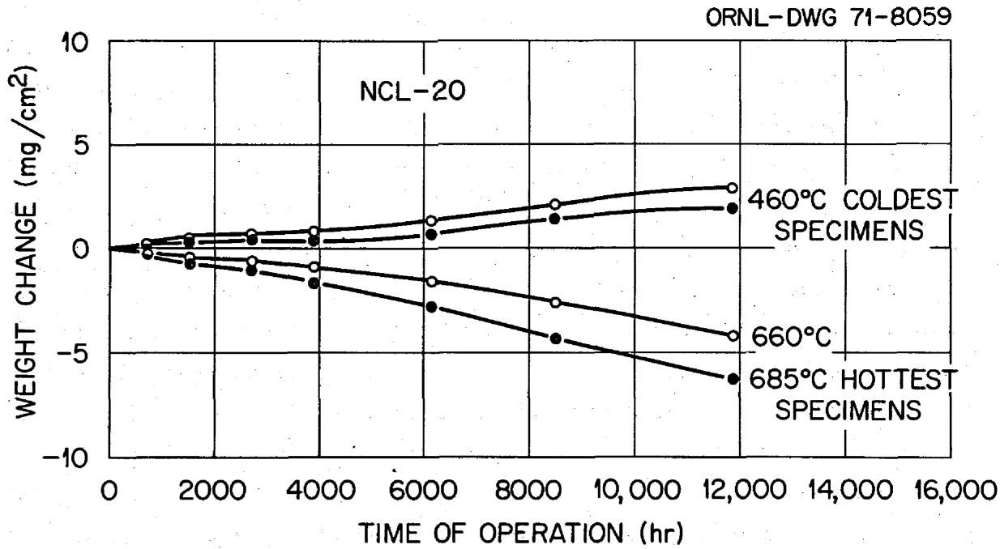  
Fig. 14. Weight Changes of Removable Standard Hastelloy N Specimens in Flowing Sodium Fluoroborate (NCL-20).

# FCL-1 Pump Loop

The MSR-FCL-1 forced-circulation loop operated for over 11,000 hr (7 runs) to test the compatibility of standard Hastelloy N with $\mathrm{NaBF}_4 - 8$ mole % NaF coolant salt at temperatures and flow rates similar to those that existed in the MSRE coolant circuit. Salt velocity in the 1/2-in.-OD $\times 0.042$ -in.-wall Hastelloy N loop was nominally 10 fps and was limited by the use of an available pump. The salt in the loop was heated by electrical resistance and cooled by a finned, air-cooled heat exchanger. A schematic of the loop is given in Fig. 15. Figure 16 is a typical temperature profile of the system; this profile was based on a computer plot of the temperature information from the test loop and on heat transfer calculations that estimate the inner wall temperatures. The maximum and minimum salt temperatures of the loop are 588 and $510^{\circ}\mathrm{C}$ . Hastelloy N corrosion test specimens were exposed to the circulating salt at three temperatures, 510, 555, and $588^{\circ}\mathrm{C}$ . A typical set of specimens is shown schematically in Fig. 17. One of the main drawbacks to this loop was that the salt had to be drained from the loop and the loop tubing had to

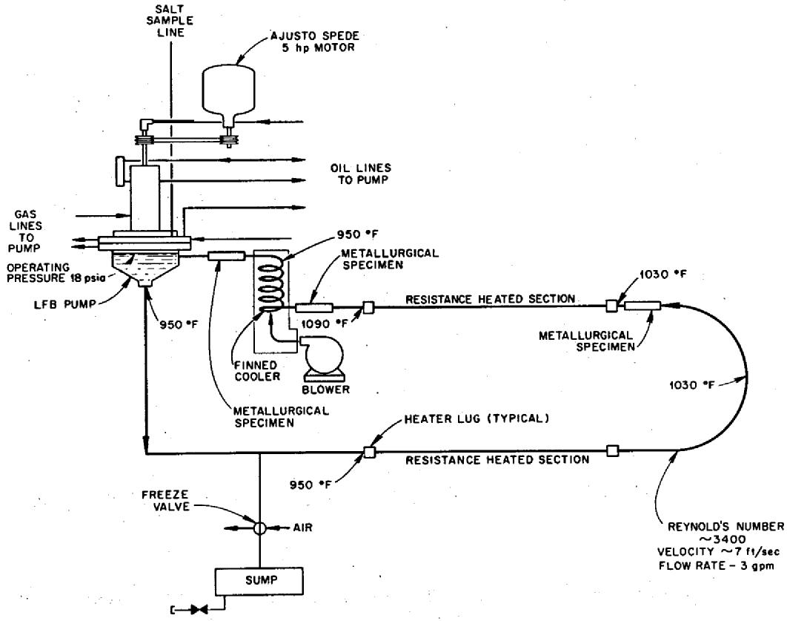  
Fig. 15. Schematic of MSR-FCL-1.

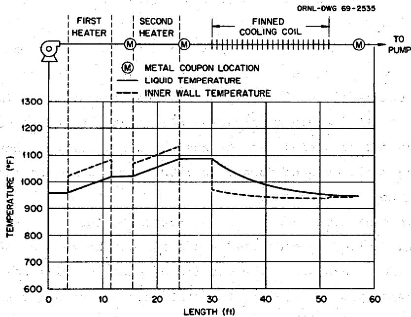  
Fig. 16. Temperature Profile of Molten-Salt Forced-Convection Corrosion Loop, MSR-FCL-1, at Typical Operating Conditions.

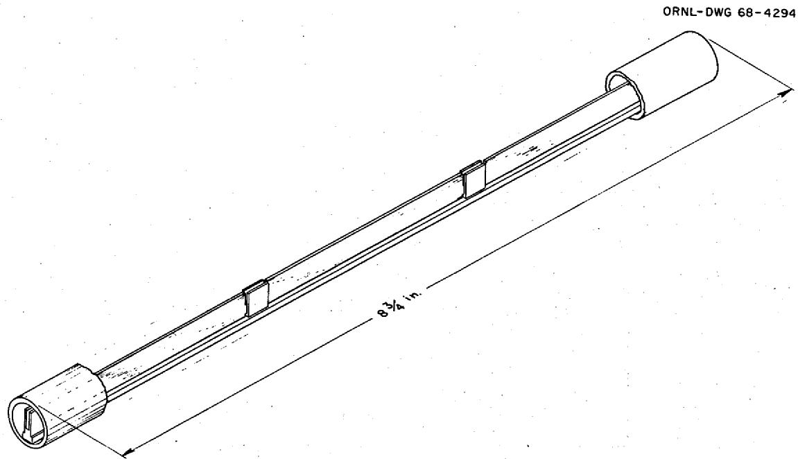  
Fig. 17. Specimen in Molten Salt Corrosion Forced-Convection Loop.

be cut to remove the specimens. This, of course, necessitated welding to replace the specimens and resulted in a fairly long turnaround time between runs.

After 659 hr of shakedown operation under various conditions and the initial 2082 hr of operation at design conditions a bearing failed in the LFB centrifugal pump. The pump rotary element was removed, and a new bearing was installed. To take advantage of this unscheduled downtime, portions of the loop piping and the corrosion specimens were removed for metallographic examination and weight change measurements. This first operating period was designated run 1. It was then decided that the loop would be shut down each 2000 hr for pump-bearing replacement and specimen examination.

The operating times and corrosion rates for the first five runs are summarized in Table 7, and Fig. 18 shows the weight changes of specimens as measured after each run. The details of each run will be discussed in the following pages. It is noted that the mass transfer rates were higher in the pump loop than in thermal-convection loops circulating salt of equal purity. Thus, a velocity effect is suspected.

Table 7. Average Weight Change of Specimens in MSR-FCL-1   

<table><tr><td rowspan="2">Run</td><td colspan="2">Total Salt Exposure Time, hr</td><td colspan="3">Average Specimen Weight Change at Indicated Temperature, mg/cm2</td><td colspan="2">Corrosion Rate at 588°C Assuming Uniform Loss,a mils/year</td></tr><tr><td>Design Conditions</td><td>Isothermal Conditions</td><td>510°C</td><td>555°C</td><td>588°C</td><td>Overall</td><td>Incremental</td></tr><tr><td>1</td><td>2082</td><td>659</td><td>+1.1</td><td>-2.7</td><td>-11.1</td><td>1.6</td><td>1.6</td></tr><tr><td>2</td><td>4088</td><td>667</td><td>+2.5</td><td>-4.2</td><td>-17.3</td><td>1.4</td><td>1.2</td></tr><tr><td>3</td><td>6097</td><td>667</td><td>+3.1</td><td>-5.2</td><td>-21.0</td><td>1.2</td><td>0.7</td></tr><tr><td>4</td><td>8573</td><td>1018</td><td>+2.1</td><td>-5.8</td><td>-23.1</td><td>0.9</td><td>0.3</td></tr><tr><td>5</td><td>8995</td><td>1068</td><td>+2.5</td><td>-7.9</td><td>-31.9</td><td>1.2</td><td>7.2</td></tr></table>

${}^{a}$ Based on total salt exposure time.

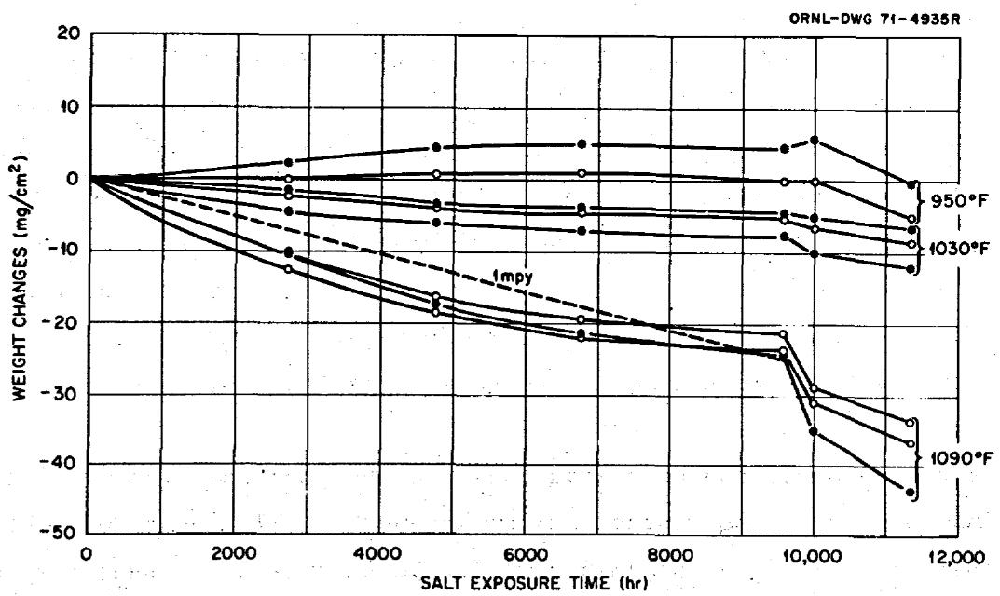  
Fig. 18. Weight Changes of Removable Standard Hastelloy N Specimens in Flowing Sodium Fluoroborate in Pumped Loop MSR-FCL-1. A 1-mil/year corrosion rate is included for comparison.

# Runs 1 and 2

Figure 19 shows micrographs of specimens from each location after 2082 and 4088 hr (run 2) of design operation. In (a) and (b) it is clear that the attack at $588^{\circ}\mathrm{C}$ , the highest salt temperature, occurred primarily at the intersections of the grain boundaries with the surface. At $555^{\circ}\mathrm{C}$ , as the weight changes indicated, much less attack has occurred [(c) and (d)]. For $510^{\circ}\mathrm{C}$ , the lowest salt temperature, a metallic deposit is visible [(e) and (f)] along the surface in the as-polished condition. This deposit occurs under steady-state conditions and was shown by electron microprobe analysis to have the approximate composition of Hastelloy N; no salt-like deposit was observed. Figure 20 shows the surface of the specimens at 588 and $510^{\circ}\mathrm{C}$ . Note the smoothness of the surface of the specimen that has been attacked and the deposit on the specimen in the cold region.

Samples of loop tubing were periodically removed and examined metallographically for comparison with the weight-change specimens. The behavior was similar, as shown in Fig. 21. The attack concentrated at the intersections of the grain boundaries with the surface, and deposits were seen in the cold region. The tubing had a much smaller grain size than the specimens; from this one might anticipate a greater corrosion rate for the tubing. No difference could be seen between tubing exposed under the heaters and tubing at the same temperature but not under the heaters.

Examination of the pump (Fig. 22) and the pump bowl (Fig. 23) did not disclose any gross contamination; however, small amounts of a green material were found on the pump bowl at the salt level. After the bowl was washed with water to remove the salt, very fine, whisker-like, green crystals were also found in the bottom of the pump bowl (Fig. 24). A large piece of mixed green material and white salt (< 1 g total weight) was analyzed and identified; Table 8 shows the composition. These results are equivalent to 55 wt % NaBF₄, 30 wt % Na₃CrF₆, and smaller amounts of iron, nickel, and molybdenum fluorides. The presence of the green corrosion product and the level of chromium concentration in the salt indicate that we reached the saturation concentration of chromium

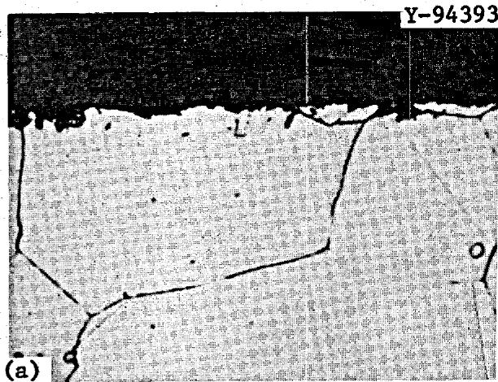

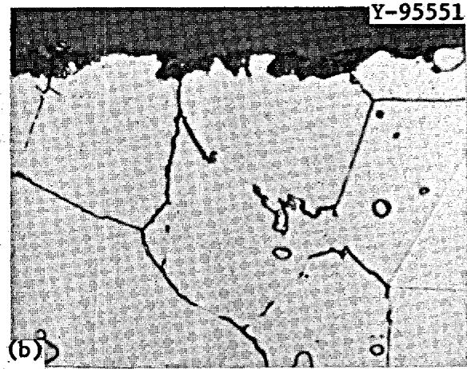

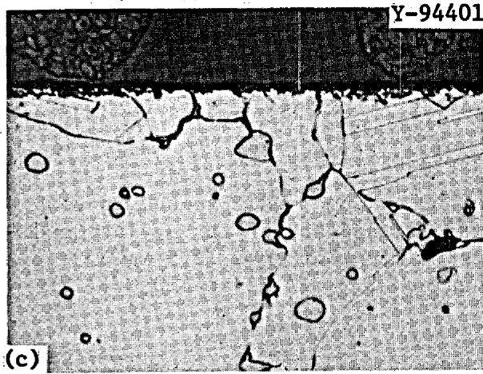

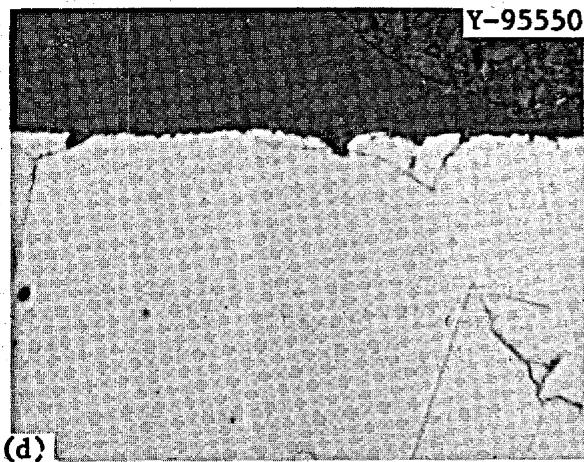

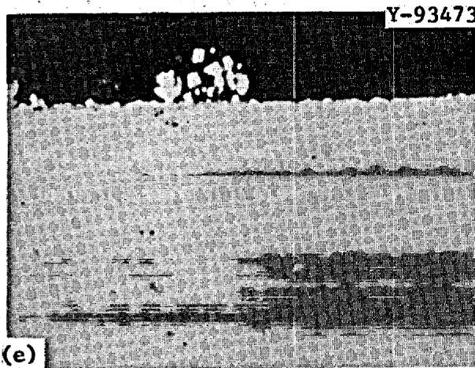

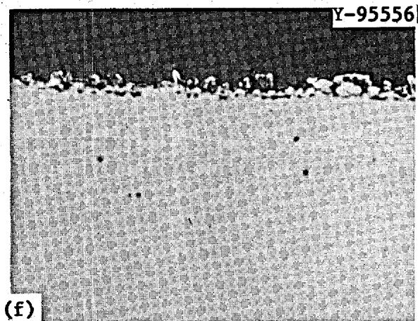  
Fig. 19. Standard Hastelloy N Specimens from MSR-FCL-1, Exposed to $\mathrm{NaBF}_4$ -8 mole % NaF for the Indicated Times and Temperatures and for an Additional 659 to 667 hr at Varying Conditions. (a) $588^{\circ}\mathrm{C}$ , 2082 hr, weight loss $12.5\mathrm{mg/cm}^2$ , etched with glyceria regia, $500\times$ . (b) $588^{\circ}\mathrm{C}$ , 4088 hr, weight loss $18\mathrm{mg/cm}^2$ . (c) $555^{\circ}\mathrm{C}$ , 2082 hr, weight loss $3.0\mathrm{mg/cm}^2$ . (d) $555^{\circ}\mathrm{C}$ , 4088 hr, weight loss $4\mathrm{mg/cm}^2$ . (e) $510^{\circ}\mathrm{C}$ , 2082 hr, weight gain $2.2\mathrm{mg/cm}^2$ , as polished. (f) $510^{\circ}\mathrm{C}$ , 4088 hr, weight gain $4\mathrm{mg/cm}^2$ .

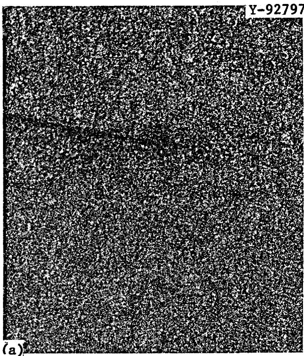

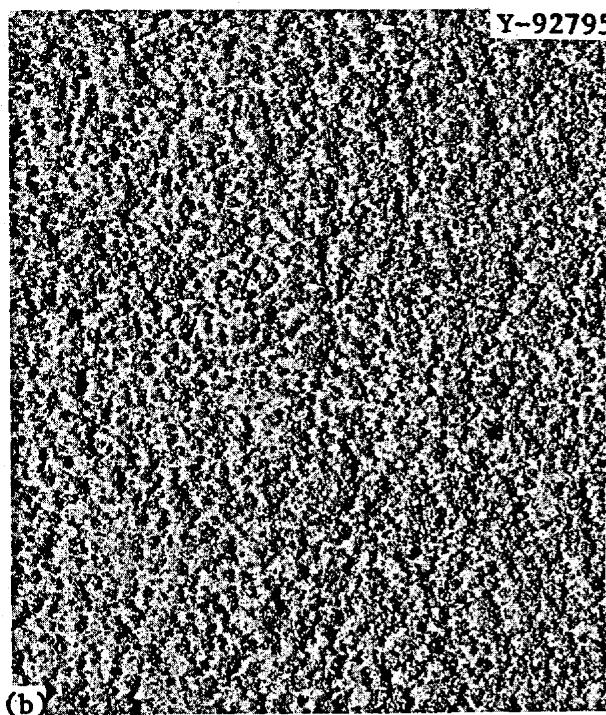  
Fig. 20. Surface of Standard Hastelloy Specimens Exposed in Loop MSR-FCL-1 for 2082 hr at Design Conditions (and 659 hr at Varying Conditions). $45 \times$ . (a) Smooth surface on specimen that lost $12.5 \, \text{mg/cm}^2$ at $588^\circ \text{C}$ . (b) Deposit on specimen that gained $2.2 \, \text{mg/cm}^2$ at $510^\circ \text{C}$ .

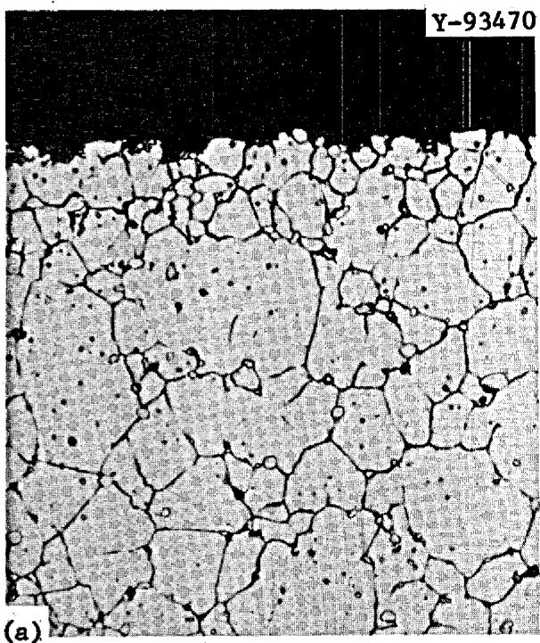

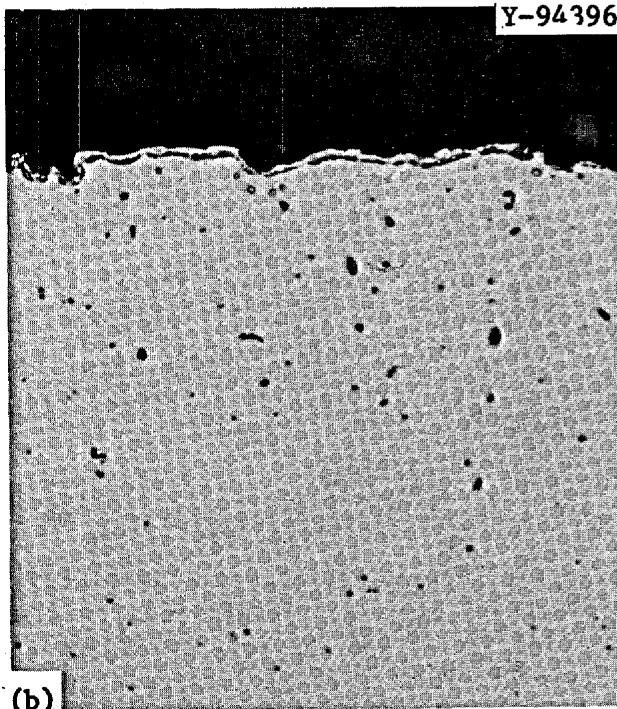  
Fig. 21. Standard Hastelloy N Loop Tubing from MSR-FCL-1 Exposed to $\mathrm{NaBF}_4 - 8$ mole % NaF for 2082 hr at Design Conditions. $500\times$ . (a) Tubing exposed at $588^{\circ}\mathrm{C}$ . Etched with glyceria regia. (b) Tubing exposed at $510^{\circ}\mathrm{C}$ . As polished.

PHOTO 96311

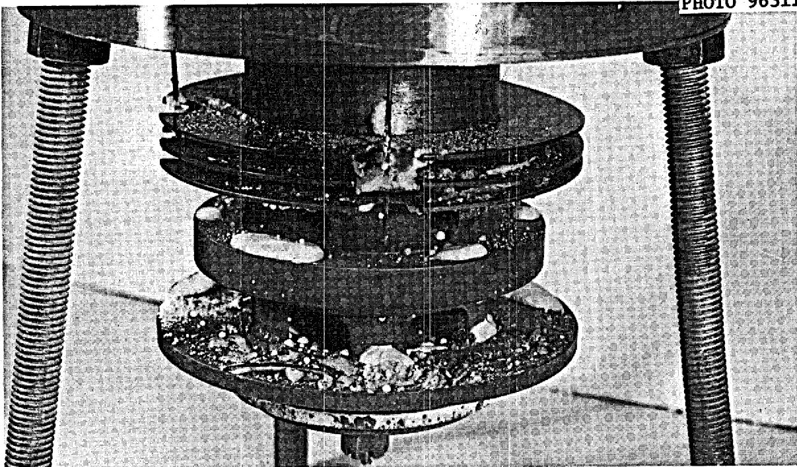  
Fig. 22. Pump Impeller from Loop MSR-FCL-1. This impeller operated in $\mathrm{NaBF}_4 - 8$ mole % NaF for 659 hr under variable conditions and 4088 hr of normal operation at $510^{\circ}\mathrm{C}$ .

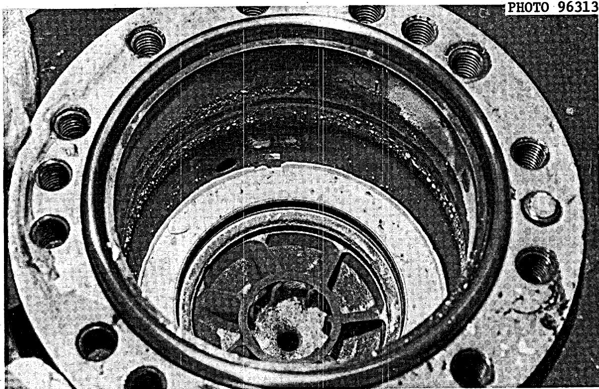  
Fig. 23. Pump Bowl from Loop MSR-FCL-1. The pump operated in $\mathrm{NaBF}_4 - 8$ mole % NaF for 659 hr under variable conditions and 4088 hr of normal operation at $510^{\circ}\mathrm{C}$ .

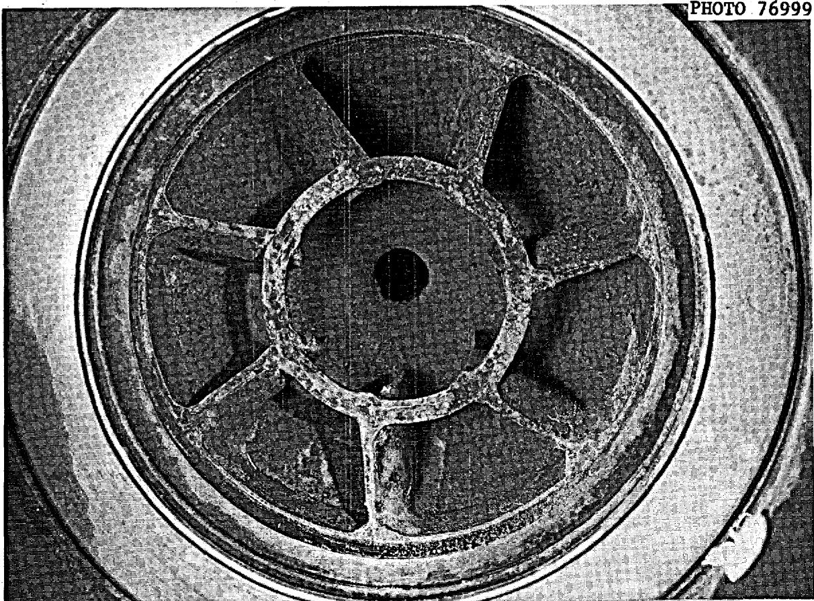  
Fig. 24. Inside of Pump Bowl from Loop MSR-FCL-1 After Being Washed with Water to Remove Salt, Showing Crystalline Residue. The pump operated in $\mathrm{NaBF}_4 - 8$ mole $\%$ NaF for 659 hr under variable conditions and 4088 hr of normal operation at $510^{\circ}\mathrm{C}$ .

Table 8. Chemical Composition of Green Deposit Removed from the Pump Bowl After Run 2   

<table><tr><td>Element</td><td>Concentration, wt %</td></tr><tr><td>Cr</td><td>6.14</td></tr><tr><td>Fe</td><td>0.26</td></tr><tr><td>Ni</td><td>0.30</td></tr><tr><td>Mo</td><td>0.022</td></tr><tr><td>Na</td><td>21.6</td></tr><tr><td>B</td><td>4.56</td></tr><tr><td>F</td><td>57.0</td></tr></table>

corrosion product in the pump bowl during the test. No indication of fluoride deposit or plugging in any other part of the system has been seen.

# Run 3

Figure 25 shows micrographs of specimens in MSR-FCL-1 after more than 6000 hr salt exposure (3 runs). Uniform attack is seen on the specimens exposed to salt at 588 and $555^{\circ}\mathrm{C}$ , with the rougher surface seen on the higher temperature sample. In (c) the mounting material removed some of the deposit on the cold-leg specimen, but portions can still be seen.

Visual examination of the pump and pump bowl after run 3 showed no obvious corrosion. None of the green $\mathrm{Na}_3\mathrm{CrF}_6$ corrosion product that had been observed previously was present.

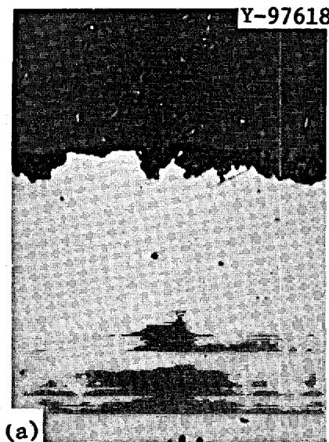

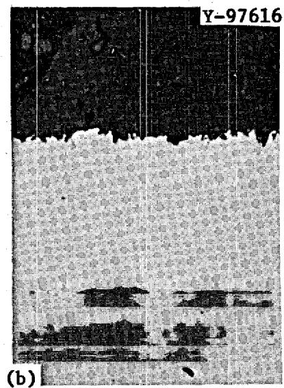

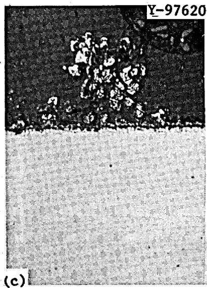  
Fig. 25. Standard Hastelloy N Specimens from MSR-FCL-1, Exposed to $\mathrm{NaBF}_4 - 8$ mole % NaF for 667 hr under Variable Conditions and 6097 hr at Design Conditions. As polished, $500 \times$ . (a) Exposed at $588^{\circ} \mathrm{C}$ , weight loss $21.4 \mathrm{mg/cm}^2$ . (b) Exposed at $555^{\circ} \mathrm{C}$ , weight loss $4.7 \mathrm{mg/cm}^2$ . (c) Exposed at $510^{\circ} \mathrm{C}$ , weight gain $5.0 \mathrm{mg/cm}^2$ . The light material away from the surface of the sample is part of the surface deposit that became separated from the sample during mounting.

# Installation and Testing of Cold Finger During Run 3

During run 3 a cold-finger corrosion product trap, shown in Fig. 26 and similar in design to one previously used $^{25}$ in sodium fluoroborate test loop PKP-1, was inserted into the salt in the pump bowl in an attempt to induce preferential deposition of corrosion products from the salt circulating in the loop. Such deposition had been observed on the cold finger in loop PKP-1. Gross deposition is always possible in a temperature-gradient system, and we feel that this cold-finger device is a likely component to prevent this problem.

The cold finger used in MSR-FCL-1 is a closed-end nickel cylinder, 1 3/4 in. long × 3/8 in. OD, with a 0.070-in.-thick wall. It is cooled by an argon-water mixture injected into it and then discharged to the atmosphere. The metal wall temperature is measured and recorded by two 0.020-in.-OD sheathed, ungrounded Chromel vs Alumel thermocouples inserted in two 1-in.-deep axial holes (0.023 in. diam) in the 0.070-in.-thick wall of the cold finger.

25A. N. Smith, P. G. Smith, and R. B. Gallaher, MSR Program Semiann. Progr. Rept. Feb. 28, 1969, ORNL-4396, p. 102.

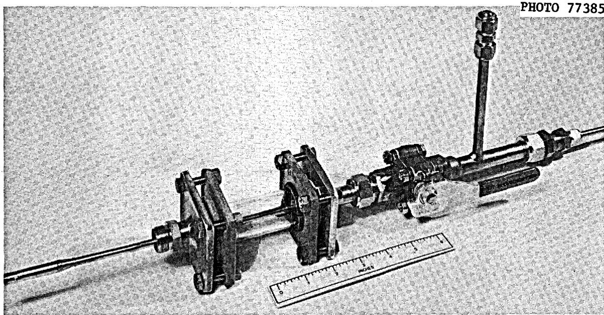  
Fig. 26. Cold-Finger Corrosion Product Trap for MSR-FCL-1.

Eight tests were made in which the cold finger was inserted into the salt in the pump bowl of the loop and cooled to temperatures ranging from 493 to $140^{\circ}\mathrm{C}$ . The duration of the tests ranged from 1.5 to 5.3 hr. The temperature of the salt in the pump bowl was $510^{\circ}\mathrm{C}$ .

In contrast to the deposits of material containing $\mathrm{Na}_{3}\mathrm{CrF}_{6}$ , which had been found $^{26}$ on a cold finger in PKP-1 loop at metal wall temperatures of 400, 460, and $477^{\circ}\mathrm{C}$ , no significant deposit of any kind was seen on the cold-finger tests in loop MSR-FCL-1. Even in the three tests where indicated wall temperatures were below the salt liquidus temperature $(385^{\circ}\mathrm{C})$ , the surface of the cold finger was essentially clean, as visually observed when it was withdrawn into a sight glass. Occasionally, small patches (1/8 to 1/4 in. across) of white material, estimated to be a few mils thick, were seen on the surface.

The cold finger was then installed in the PKP-1 fluoroborate loop in an attempt to duplicate the previous cold-finger test results of that loop. The chromium concentration of the fluoroborate salt in loop PKP-1 is about 500 ppm, while that in MSR-FCL-1 is about 250 ppm. Two tests were run in which the indicated cold-finger wall temperature was about $150^{\circ}\mathrm{C}$ (salt temperature in the pump bowl was $548^{\circ}\mathrm{C}$ ). Test times were 1 and 4.5 hr. No deposition on the cold finger was seen after withdrawal into a sight glass. Tests at higher temperatures were not made because of temperature control difficulties with the cold finger.

Since the cold finger previously used in the PKP-1 loop contained grooves on the outside surface, the lower half of the surface of the MSR-FCL-1 cold finger was scored with file marks about 0.010 in. deep, and a third test run at about $150^{\circ}\mathrm{C}$ lasting 6 1/2 hr was made in the PKP-1 loop. In this run a deposit was obtained. Generally, the entire surface of the cold finger was covered with a white deposit, with an overlay of bright green material on the lower half of the cold finger. The cold finger was allowed to stand overnight under a helium atmosphere, and by this time the deposit had begun to separate from the cold-finger surface. While the cold finger was moved for photographing, the entire

deposit spalled off, leaving a clean metal surface. The total deposit weight was 1.63 g, of which 1.26 g was mostly green material (complete separation was not possible). Chemical analysis of the green material disclosed 2.93 wt % Cr, 1.03 wt % Fe, 370 ppm Ni, and < 500 ppm Mo, with the remainder Na, B, and F. Stoichiometric calculations indicated 11 mole % Na $_3$ CrF $_6$ , 4 mole % Na $_3$ FeF $_6$ , and the remainder a mixture of NaBF $_4$ and NaF.

Subsequent operation of the cold finger at the same conditions in loop MSR-FCL-1 did not produce a deposit. On the basis of these tests we concluded that a wetting problem exists with the salt and that a grooved or roughened surface is required to obtain a deposit. We then tried various designs to improve adherence of the deposit to the cold finger and to lessen the probability of accidental removal during withdrawal from the pump bowl.

# Run 4

After run 4 when the pump had been removed, we found approximately $50\mathrm{g}$ of intermixed white and green material on the pump liner above the liquid level. Analysis of a small portion of this material showed about equal amounts of NaF and $\mathrm{NaBF_4}$ , with $4300~\mathrm{ppm}$ Cr, which we assume to be in the form of $\mathrm{Na}_3\mathrm{CrF}_6$ . We do not know the conditions that caused the deposition of the corrosion product in the pump liner.

Specimens in the coldest part of the system gained weight during the first three runs and then lost a small amount of weight during run 4. Thickness measurements of these specimens disclosed that the upstream end had reduced in thickness compared with the middle and downstream end. Specimens at other locations in the loop (555 or $588^{\circ}\mathrm{C}$ ) showed similar but smaller thickness variations. Figure 27 shows a specimen at $588^{\circ}\mathrm{C}$ after run 4 and clearly illustrates the heavier attack at the upstream end. Changes in specimen thickness are summarized in Table 9, and they are quite consistent with the changes calculated from weight measurements.

Figure 28 shows micrographs of specimens from MSR-FCL-1 after run 4 (9600 hr total exposure to the fluoroborate mixture). The left micrograph shows the surface of the specimen at the hottest position $(588^{\circ}C)$ .

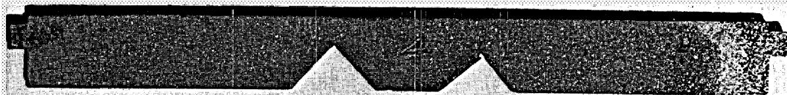  
Fig. 27. Hastelloy N Specimen 4 from MSR-FCL-1 Exposed to $\mathrm{NaBF}_4 - 8$ mole % NaF at $588^{\circ}\mathrm{C}$ for 9600 hr (Through Run 4). Flow is to the left.

Table 9. Average Thickness Change of Specimens After 9600 hr Total Exposure to $\mathsf{NaBF}_4$ -8 mole % NaF in MSR-FCL-1   

<table><tr><td>Specimen
Temperature
(℃)</td><td>Average Thickness
Change
(mils)</td></tr><tr><td>588</td><td>-1.25</td></tr><tr><td>555</td><td>-0.75</td></tr><tr><td>510</td><td>+1.0a</td></tr></table>

aDiscounting upstream end of sample, thickness increase is +2.5 (see text).

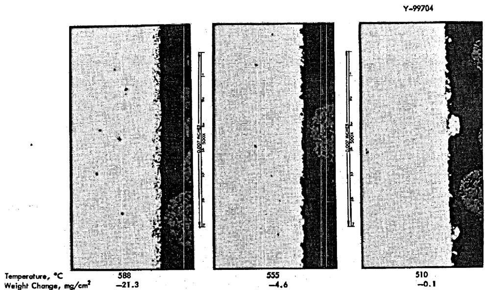  
Fig. 28. Hastelloy N Specimens from MSR-FCL-1 Exposed to $\mathsf{NaBF}_4 - 8$ mole $\%$ NaF for 9600 hr (4 Runs).

Average weight losses of the specimens are $21.3\mathrm{mg/cm}^2$ . Microprobe analysis disclosed a concentration gradient of chromium and iron for a distance of 0.6 mil. There is less than 1.0 wt $\%$ Cr and only 1.0 wt $\%$ Fe 0.4 mil into the specimen. This depleted area is represented by the darkened area extending from the surface for approximately 0.5 mil. The center micrograph shows the surface of a specimen at $555^{\circ}\mathrm{C}$ . The average weight loss of these specimens was $4.6\mathrm{mg/cm}^2$ . Microprobe analysis of these specimens disclosed only a small concentration gradient for a distance of 0.1 mil. This follows from the small amount of attack seen on the specimen. The micrograph to the right shows the deposit on the surface of the specimens at $510^{\circ}\mathrm{C}$ . The average weight loss of the specimen is $0.1\mathrm{mg/cm}^2$ , but this overall loss stems from a great deal of corrosion on the leading edge and is not indicative of the whole specimen. Microprobe analysis of this surface showed a large amount of iron and a little more nickel than usual. This situation existed for a distance of 0.5 mil, after which the concentrations of both elements approached that of the matrix. The average deposit is only 0.2 mil thick; thus, it appears that portions of the deposit have diffused in. Prior evidence in deposit study had disclosed similar findings.

# Run 5

Run 5 was terminated after $422\mathrm{hr}$ of operation at design conditions when the pump bearings failed. This failure allowed the pump impeller to contact the impeller housing, abrading the impeller. Metal particles from the impeller were seen in the salt left in the pump bowl after dumping. Accordingly, the pump was removed from the loop, and at the same time we removed the corrosion test specimen assemblies. This allowed us to clean the loop piping by flushing with demineralized water. A total of $3.31\mathrm{g}$ of Hastelloy N particles was recovered from the loop. The loop was dried by air purging, and the corrosion specimen assemblies and pump were reinstalled. A nickel filter with $40 - \mu \mathrm{m}$ pores was also installed in the dump tank line to filter any metal particles from the salt being returned to the loop.

During the scheduled loop shutdown at the end of run 4, we had enlarged the access port in the pump bowl from $1/2-$ to $3/4$ -in. diam

(maximum size possible in the pump bowl) to provide more flexibility in the design and operation of cold-finger devices. With the enlarged access port we were able to insert a 5/8-in.-OD cold finger with circumferential grooves that had been previously used in another circulating fluoroborate loop (PKP-1) and on which significant deposits of salt containing $\mathrm{Na}_3\mathrm{CrF}_6$ had been obtained.

Several tests were made during run 5 with this cold finger at temperatures between 150 and $420^{\circ}\mathrm{C}$ . The cold finger was inserted below the liquid surface in the pump bowl for periods of 5 to 6 hr for each test. The salt temperature in the pump bowl was approximately $516^{\circ}\mathrm{C}$ . Small deposits with a light-green color (indication of corrosion product $\mathrm{Na}_{3}\mathrm{CrF}_{6}$ ) were occasionally seen on the cold finger when it was withdrawn into the sight glass above the pump bowl. However, such deposits usually dropped off immediately. Apparently any slight vibration is enough to knock most of the deposited material loose before the cold finger can be pulled all the way out of the pump bowl.

The weight changes of Hastelloy N specimens in loop MSR-FCL-1 are compared in Table 7 for each of five test runs. The corrosion rate decreased steadily over the first four runs and, at the conclusion of run 4, had dropped to $0.3\mathrm{mil/hr}$ at the point of maximum temperature $(588^{\circ}\mathrm{C})$ . However, the corrosion rate during run 5 was higher than in any of the preceding runs.

Although the increased rate of attack during run 5 is undoubtedly associated with operating difficulties encountered during the run, we have not pinpointed the specific causes. Increased corrosion is normally accompanied by an increase in impurities in the salt; however, we did not see any significant impurity changes during run 5. Because of the nature of the last pump-bearing failure, we were not able to take a salt sample from the loop before shutdown in our normal manner. Thus a sample was taken from the dump tank after the loop had been shut down. However, because of dilution there was no assurance that the sample was representative of the salt that had circulated in the loop.

Figure 29 shows specimens 2 (555°C), 4 (588°C), and 8 (510°C) at the end of run 5. Note the change in appearance of specimen 4 between run 4 (Fig. 27) and run 5 (Fig. 29). The etched appearance of specimen 4 after

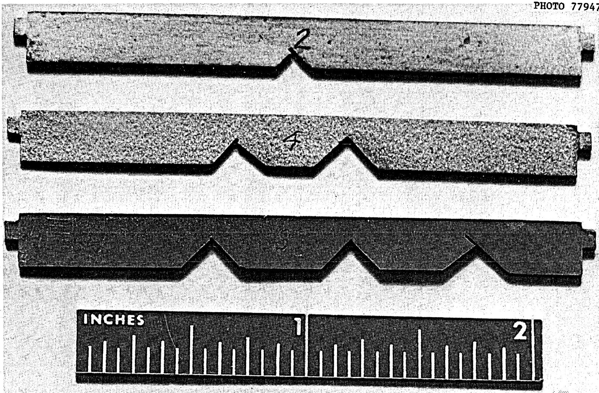  
Fig. 29. Hastelloy N Specimens from MSR-FCL-1 Exposed to $\mathrm{NaBF}_4 - 8$ mole % NaF for 10,000 hr Total (Through Run 5). From top to bottom the temperatures were 555, 588, and $510^{\circ}\mathrm{C}$ .

run 5 is typical of the appearance of Hastelloy N specimens in thermal convection loop NCL-17 (see previous section, Fig. 13) after extreme oxidizing conditions had been created by intentional steam inleakage and large amounts of mass transfer had occurred.

# Run 6

The sixth run was abruptly terminated after 1241 hr, when oil from a broken pump cooling oil line ignited on contact with the pump bowl and adjacent piping. We extinguished the fire and turned off all loop heaters, which allowed the salt to freeze in the loop piping. Figure 30 shows the pump bowl and pump with no apparent damage after the fire. The material in the beaker is salt and corrosion products left in the pump bowl.

We replaced the electrical wiring, thermocouples, and service piping necessary to melt the salt in the loop piping and transfer it to the drain tank. This was the first time that we had attempted to melt salt in the entire loop circuit, although salt had been melted in the cooling coil without difficulty on several occasions. Normally when the loop is placed in standby condition, the salt circulation is stopped,

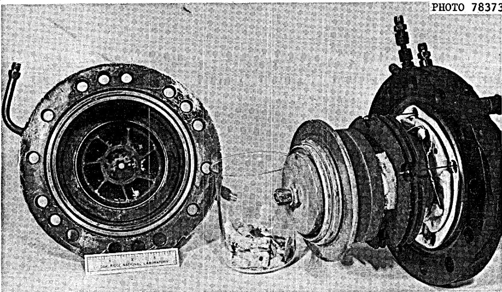  
Fig. 30. Standard Hastelloy N Pump from MSR-FCL-1. Impeller exposed to $\mathrm{NaBF}_4 - 8$ mole % NaF 1319 hr; baffles exposed 11,371 hr. Outside of the pump was exposed to oil fire.

the main loop heaters are turned off, and sufficient heat is supplied to the loop to maintain the loop circuit above the salt liquidus temperature, $385^{\circ}\mathrm{C}$ . During the attempted melting, the main loop piping (1/2-in. $-\mathrm{OD} \times 0.042$ -in. -wall Hastelloy N) ruptured at a point near the U-bend in the loop and adjacent to one of the metallurgical specimen holders, as shown in Fig. 31. After the rupture, we froze the salt in the loop as quickly as possible by turning off all loop heaters. However, approximately $77\mathrm{g}$ salt was lost from the loop. Before the rupture the salt in the bowl and cooling coil section of the main loop had been melted without difficulty, the main loop piping had reached temperatures varying between 371 and $482^{\circ}\mathrm{C}$ around the loop circuit, and the drain line temperatures were above $426^{\circ}\mathrm{C}$ .

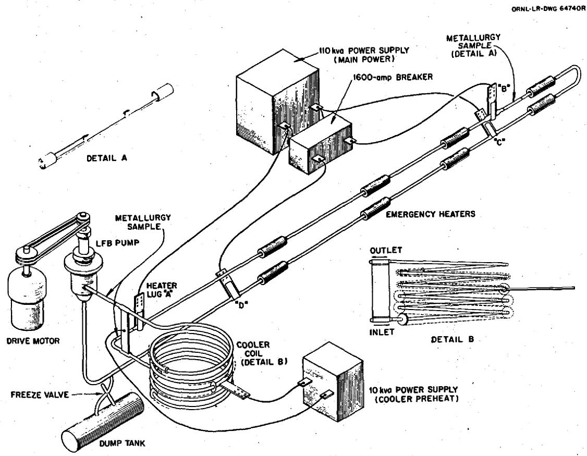  
Fig. 31. Molten-Salt Corrosion Testing Loop MSR-FCL-1 and Power Supplies Showing Points of Rupture in Runs 6 and 7.

In reviewing the loop melting procedure to determine the cause of the rupture, we concluded that uneven thicknesses of thermal insulation caused considerable variation in the temperatures. In particular, the temperatures under the clamshell emergency heaters (where the thermal insulation was about 1 in. thick, compared to about 2 in. on the remainder of the tubing) were about $80^{\circ}\mathrm{C}$ below temperatures in the more heavily insulated sections of tubing. Thus, the salt in the ruptured area melted but was not able to expand properly because of frozen salt plugs under the emergency heaters. Another problem was the difficulty in controlling the rate of heatup of the main loop by resistance heating. Even though the lowest setting on the loop heater was used, we still had to turn off the heater supply power for short periods to maintain temperature control.

We removed the metallurgical specimen assembly and ruptured section of tube and replaced it with new tubing. Figure 32 shows the ruptured section of tubing. Measurements of the outside diameter of the remaining loop tubing were made and compared with the original outside diameter to determine if excessive permanent strain had occurred at other locations.

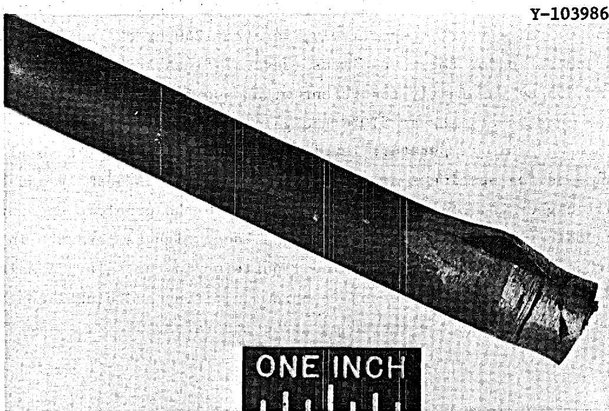  
Fig. 32. Tube Ruptured During Salt Melting after Run 6, Loop MSR-FCL-1.

Generally all measurements were in the range of 0.500 to 0.505 in., as compared to the original diameter of 0.500 in.

The tubing that surrounded the specimens was removed after run 6 (11,371 hr) and examined by both optical metallography and scanning electron microscopy. Figure 33 shows the tubing exposed to salt at 588 and $555^{\circ}\mathrm{C}$ . In the optical micrograph of Fig. 33(a) the surface roughening (some salt is still in place) can be seen, and the attack at the grain boundaries is noted. In the scanning electron micrograph we can see the delineation of the grains. Figure 33(b) shows much less attack at $555^{\circ}\mathrm{C}$ . Figure 34 shows the tubing downstream of the cooler in the coldest position $(510^{\circ}\mathrm{C})$ of the loop. The deposit is easily seen in the optical micrograph and is seen in the scanning micrograph to be in the form of nodules. The upper portion of Fig. 34(c) shows a side view of the nodular deposits.

After the oil fire that ended run 6 and the subsequent rupture of the tubing during the attempt to melt the salt from the loop, the corrosion specimens were removed, weighed, and examined. Surprisingly, weight was lost by all specimens. The weight loss rates found for specimens exposed to the salt at 588 and $555^{\circ}\mathrm{C}$ were (assuming uniform losses) about 1.9 and 0.5 mils/year, respectively, for the 1240 hr of run 6. The corrosion rate ratio for these specimens (several times greater loss at $588^{\circ}\mathrm{C}$ than at $555^{\circ}\mathrm{C}$ ) was fairly consistent with past findings. However, in earlier runs, specimens at $510^{\circ}\mathrm{C}$ had gained weight. For this time period specimens at this temperature level lost material at the rate of 1.9 mils/year, the same as for specimens at $588^{\circ}\mathrm{C}$ . This weight loss anomaly and the overall higher weight losses are attributed to the problems encountered during this run and probably attest to a local high temperature in the colder section along with oxidizing impurities in the salt. A salt analysis showed small increases in chromium, iron, and nickel contents, all of which reflect the increased corrosion rates.

# Run 7

After repairs we returned the loop to design conditions for the start of run 7, circulating the same $\mathrm{NaBF}_4 - 8$ mole % NaF coolant salt used since the start of loop operation.

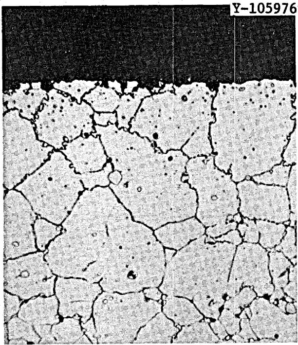

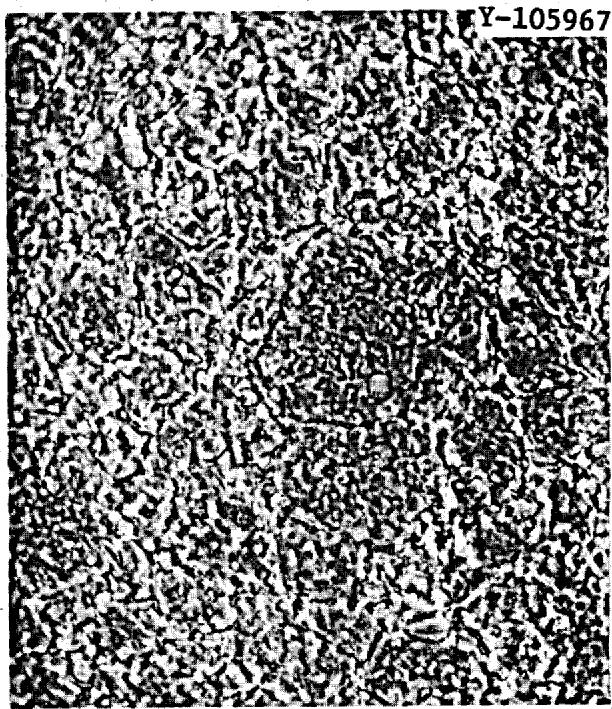

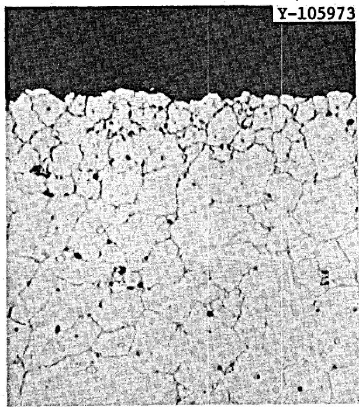

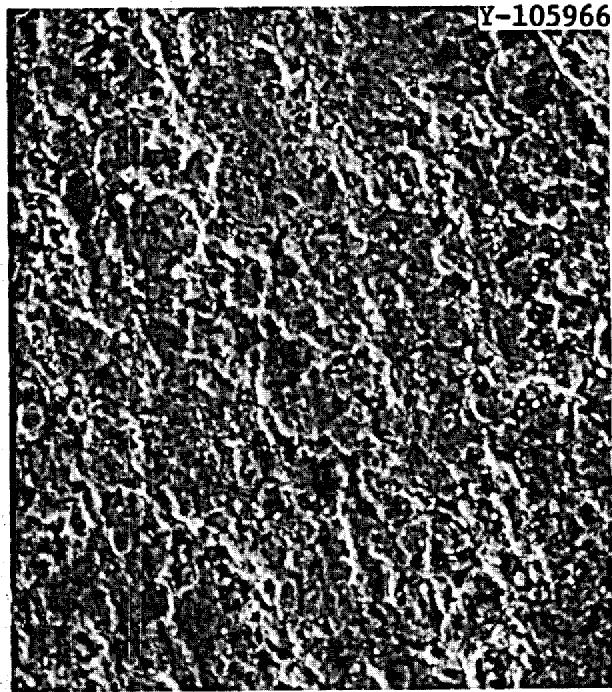  
Fig. 33. Hastelloy N Tubing from MSR-FCL-1 Exposed to $\mathrm{NaBF}_4 - 8$ mole % NaF for 11,371 hr. Left: optical micrographs, $500\times$ . Right: scanning electron micrographs, $1000\times$ . Top: at $588^{\circ}\mathrm{C}$ and bottom at $555^{\circ}\mathrm{C}$ during design operation.

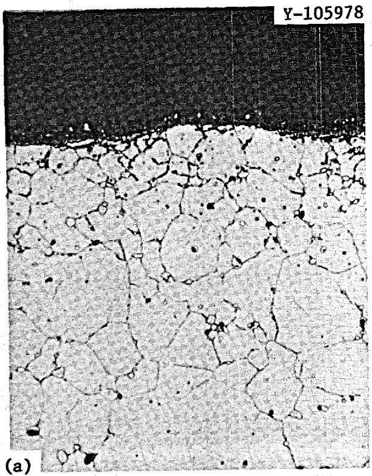

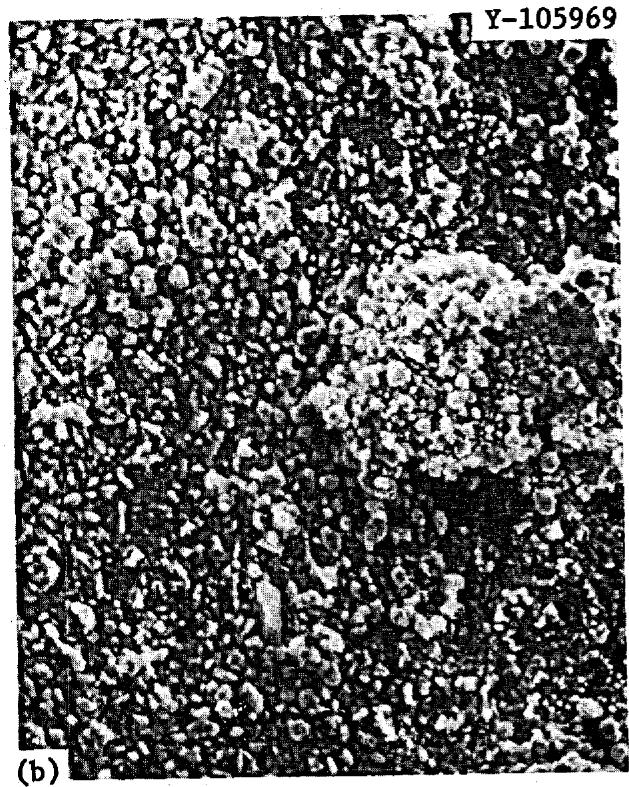

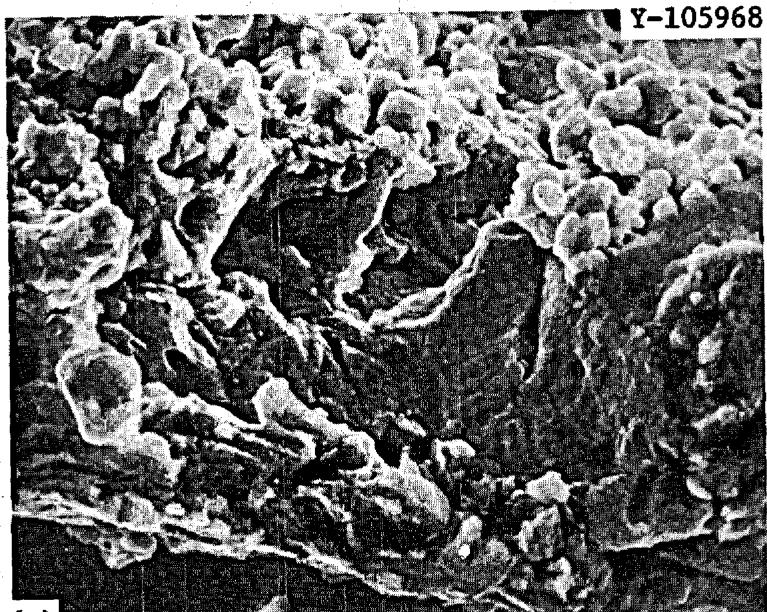  
(c)   
Fig. 34. Hastelloy N Tubing from MSR-FCL-1 Exposed to $\mathrm{NaBF}_4$ -8 mole % NaF at $510^{\circ}\mathrm{C}$ for 11,371 hr. (a) Optical micrograph, $500\times$ . (b) Scanning electron micrograph, $1000\times$ . (c) Scanning electron micrograph, $3000\times$ , taken with the specimen tilted to give a side view.

During run 7 while repairs were .under way on the loop high-temperature protective instrumentation, an operating error resulted in a portion of the loop tubing being heated above $1100^{\circ}\mathrm{C}$ . This caused one failure of the loop tubing adjacent to one of the electrical power input lugs (see Fig. 31) and also about 12 in. downstream. Part of the salt in the loop (about 2 liters) was discharged into the loop secondary containment. Temperatures were immediately reduced and the facility was shut down. At about $1100^{\circ}\mathrm{C}$ the strength of Hastelloy N is very low, and the salt vapor pressure approaches 1000 psi. The salt boiled locally, and overheating could have reduced the tube strength until rupture occurred. Local melting of the tubing was also evidenced. At the time of failure the loop had accumulated 10,335 hr of operation at design conditions (101 hr during run 7). The tube failure is shown in Fig. 35.

Following the rupture of the loop tubing that ended run 7, the corrosion test specimens were again removed for weighing and metallurgical examination. The specimens adjacent to the ruptured area (hottest section under normal conditions, $588^{\circ}\mathrm{C}$ ) were badly warped and partially fused to the tube wall. Thus, only metallographic analysis was possible. The specimens in the intermediate zone ( $555^{\circ}\mathrm{C}$ ) appeared to be unharmed. The average weight loss for these specimens was $1.3\mathrm{mg/cm}^2$ in the 101 hr of run 7. Expected loss for these specimens in 100 hr would be approximately $0.1\mathrm{mg/cm}^2$ . Thus, if we attribute the balance of the corrosion to just the period of the temperature excursion (to about $1000^{\circ}\mathrm{C}$ ), the loss rate was $1.2\mathrm{mg/cm}^2$ in 2.5 min or 10,000 mils/year (10 in./year).

Weight losses were also found for the specimens downstream of the cooler. Although the specimens were adjacent, one specimen lost $0.3\mathrm{mg/cm}^2$ and the other $3.0\mathrm{mg/cm}^2$ . Again the severity of the overheating was evident. Certainly a large part of these losses may be attributed to moisture contamination of the salt and air oxidation after the loop rupture. Nonetheless, the corrosion rate was quite high.

The loop is now being modernized and prepared for additional service.

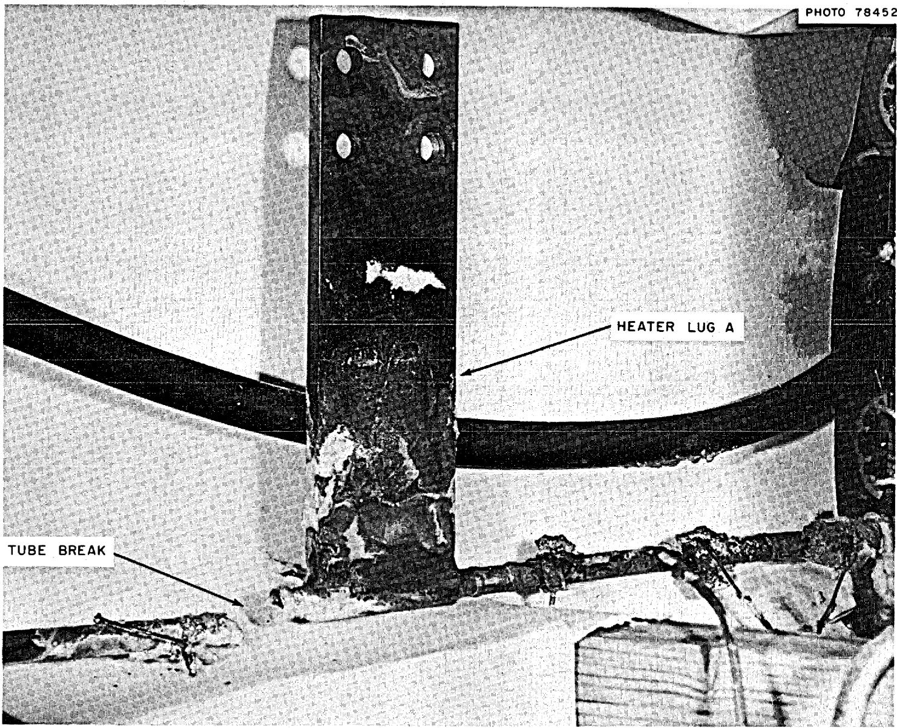  
Fig. 35. Tube Rupture Caused By Overheating During Run 7, Loop MSR-FCL-1.

# SALT CHEMISTRY

# Purification

With the realization that the fluoroborate salt is easily contaminated with oxygen and water-type impurities and that corrosion increases with the amount of these impurities, we have attempted, in close cooperation with R. F. Apple and A. S. Meyer, of the Analytical Chemistry Division, to purify the fluoroborate in a manner that could be adapted to a large system.

In the method that gave favorable results, a mixture of He, $\mathbf{BF}_3$ , and HF (purified with fluorine) was passed through the fluoroborate at $454^{\circ}\mathrm{C}$ . A schematic of the process is given in Fig. 36. The gas mixture was passed for 15 hr into a Hastelloy N vessel containing the impure (about 2000 ppm $\mathbf{H}_2\mathbf{O}$ ) fluoroborate salt (2.7 kg) at $480^{\circ}\mathrm{C}$ . The exit gas entered a solution of 10 vol % pyridine in methyl alcohol. At the completion of the purification process titration of this solution with Karl Fischer reagent to the dead-stop end point indicated that about 600 ppm $\mathbf{H}_2\mathbf{O}$ was removed. Chemical analysis disclosed that the oxygen content decreased from 1700 to 1400 ppm and that the $\mathbf{H}_2\mathbf{O}$ content changed

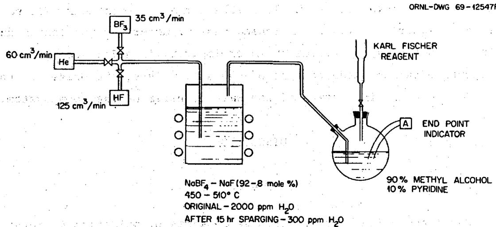  
Fig. 36. System for Removing Water from Coolant Salt.

from 2000 to 300 ppm. Changes in the $\mathbf{BF}_3$ content of the salt appeared to be minimal. Further work is planned using a nickel vessel to eliminate corrosion products resulting from the reaction of HF with Hastelloy N.

# Analytical Chemistry

Over the last few years, we have been concerned over the behavior of water in molten fluoride salts. Water in these salts has implications for both corrosion and tritium removal. In corrosion work, we have long recognized the need for analyses that would allow us to distinguish between water and (1) compounds that contain $\mathbf{H}^+$ ions, (2) compounds which contain $0^{2-}$ ions, and (3) HF (highly corrosive). In the past, a complementary indication of mass transfer (besides weight changes and metal analysis of the salt) was the analysis for $\mathbf{H}_2\mathbf{O}$ and $\mathbf{O}_2$ in the salt. On the basis of our tritium injection experiment[27] and work in the Analytical Chemistry and Reactor Chemistry Divisions, we now feel that the results of the water determinations included many other constituents of the salts, including oxides. Thus, a result indicating a large amount of water really only showed a corresponding amount of oxide. The lack of water in the salt is completely reasonable because all the hydrogen in impurity compounds that enter the salt would eventually cause oxidation of the metal wall and would in turn be reduced to hydrogen gas, which would diffuse out of the loop (the corrosion equations will be discussed later). However, increased mass transfer (weight losses and gains by specimens) by virtue of water impurity is still accompanied by an increase in the oxide content of the salt. Thus, the oxide content is still somewhat indicative of the mass transfer of the loop system.

# DISCUSSION

# Theory

Metal corrosion by salt mixtures consists of oxidation of metal constituents to their fluorides, which are soluble in the melt and hence

do not form a protective film. This electrochemical-type attack is therefore limited only by the thermodynamic potential for the oxidation reaction and is selective, removing the least noble constituent, which in the case of Hastelloy N is chromium. Possible corrosion reactions involving impurities in the melt may be written as

$$
2 H F + C r \rightleftharpoons H _ {2} + C r F _ {2},
$$

$$
\mathrm {N i F} _ {2} + \mathrm {C r} \rightleftharpoons \mathrm {N i} + \mathrm {C r F} _ {2},
$$

$$
\mathrm {F e F} _ {2} + \mathrm {C r} \rightleftharpoons \mathrm {N i} + \mathrm {C r F} _ {2}.
$$

Although the reaction product is written as $\mathrm{CrF}_2$ , the actual species in the melt is unknown. Chromium(II) is possibly unstable in the fluoroborate melt, since the only corrosion product isolated and identified is $\mathrm{Na}_3\mathrm{CrF}_6$ . Table 10 illustrates the thermodynamic stability of the fluoride compounds in question.

Table 10. Relative Thermodynamic Stabilities of Fluoride Compounds   

<table><tr><td rowspan="2"></td><td rowspan="2">Element</td><td rowspan="2">Most Stable Fluoride Compound</td><td colspan="2">Standard Free Energy of Formation (kcal/g-atom F)</td></tr><tr><td>at 800°C</td><td>at 600°C</td></tr><tr><td rowspan="4">Structural metals</td><td>Cr</td><td>CrF2</td><td>-72</td><td>-77</td></tr><tr><td>Fe</td><td>FeF2</td><td>-66</td><td>-69</td></tr><tr><td>Ni</td><td>NiF2</td><td>-59</td><td>-63</td></tr><tr><td>Mo</td><td>MoF5</td><td>-57</td><td>-58</td></tr><tr><td rowspan="6">Diluent salts</td><td>Li</td><td>LiF</td><td>-120</td><td>-125</td></tr><tr><td>Na</td><td>NaF</td><td>-110</td><td>-115</td></tr><tr><td>K</td><td>KF</td><td>-108</td><td>-113</td></tr><tr><td>Be</td><td>BeF2</td><td>-103</td><td>-100</td></tr><tr><td>Zr</td><td>ZrF4</td><td>-92</td><td>-96</td></tr><tr><td>B</td><td>BF3</td><td>-86</td><td>-88</td></tr><tr><td rowspan="3">Active salts</td><td rowspan="2">U</td><td>UF4</td><td>-92</td><td>-94</td></tr><tr><td>UF3</td><td>-93</td><td>-96</td></tr><tr><td>Th</td><td>ThF4</td><td>-99</td><td>-102</td></tr></table>

In an isothermal system, immediately after immersion in the fused salt system and before thermodynamic equilibrium has been fully established, the electrode potential of the metal has a much higher electro-negative value than the redox potential of the surrounding medium. As a result, reduction of the oxidizer commences which takes place along with the corrosion of the metal. As the corrosion products accumulate the metal's electrode potential shifts in the positive direction, whereas the redox potential moves toward the negative side. Equilibrium occurs when the potentials are equal. Since we are dealing with corrosion in a nonisothermal system (i.e., a heat exchanger), the mechanism of interest to us is temperature-gradient mass transfer. A schematic of this process is given in Fig. 37. In a loop that contains salt with $\mathrm{UF_4}$ and no corrosion products, all points of the loop initially experience a loss of chromium by the reaction

$$
2 \mathrm {U F} _ {4} + \mathrm {C r} = \mathrm {C r F} _ {2} + 2 \mathrm {U F} _ {3}.
$$

As the corrosion-product concentration in the salt is increased, equilibrium with respect to the corrosion reaction is eventually reached at the point of lowest temperature of the system. At regions of higher temperature, a driving force for the corrosion reaction still exists. Thus, the corrosion-product concentration will continue to increase and the equilibrium temperature will begin to increase from the coldest temperature. At this stage, chromium is returned to the walls of the coldest point of the system. The rise in corrosion-product concentration in the circulating salt continues until the amount of chromium returning to the walls exactly balances the amount of chromium entering the system in the hot-leg regions in the same interval. Under these conditions, the two positions of the loop at equilibrium with the salt, which are termed the "balance points," do not shift measurably with time. Thus, a quasi-steady-state situation is eventually achieved, whereby chromium is transported at very low rates and under conditions of a fixed chromium surface concentration at any given loop position. At this point the chromium removal is controlled by the solid-state diffusion rate of chromium in Hastelloy N. Table 11 illustrates the small

ORNL-DWG 67-6800R

HOT SECTION

DIFFUSION TO SURFACE

SOLUTE ESCAPE THROUGH

NEAR-SURFACE LIQUID LAYER

DIFFUSION INTO BULK LIQUID

TRANSPORT

TO COLD PORTION OF SYSTEM

COLD SECTION

x SUPERSATURATION   
- NUCLEATION   
GROWTH TO STABLE CRYSTAL SIZE

OR

SUPERSATURATION AND DIFFUSION

THROUGH LIQUID

NUCLEATION AND GROWTH

ON METALLIC WALL

OR DIFFUSION INTO WALL

Fig. 37. Temperature-Gradient Mass Transfer.

Table 11. Chromium Transfer from Hastelloy N with Surface Concentration Reduced to Zero   

<table><tr><td rowspan="2">Temperature (℃)</td><td colspan="2">Diffusion Coefficienta</td><td rowspan="2">Time (hr)</td><td colspan="2">Depth of Chromium Gradientb</td></tr><tr><td>DCr (cm2/sec)</td><td></td><td>(cm)</td><td>(mils)</td></tr><tr><td rowspan="2">650</td><td rowspan="2">2 × 10-14</td><td>4,000</td><td>1.5</td><td>0.6</td><td></td></tr><tr><td>16,000</td><td>3</td><td>1.2</td><td></td></tr><tr><td rowspan="4">850</td><td rowspan="4">2 × 10-12</td><td>256,000 (30 years)</td><td>12</td><td>4.7</td><td></td></tr><tr><td>4,000</td><td>12</td><td>4.7</td><td></td></tr><tr><td>16,000</td><td>18</td><td>7.1</td><td></td></tr><tr><td>256,000 (30 years)</td><td>70</td><td>27</td><td></td></tr></table>

aBy surface activity measurements and microprobe traces after 250-and 500-hr exposures.   
bChromium concentration within $95\%$ of initial concentration in Hastelloy N (about 7 wt $\%$ ).

amount of chromium that will be removed if oxidizing conditions are minimal and solid-state diffusion is controlling.

There should be very little corrosion of Hastelloy N by pure molten $\mathrm{NaBF}_4$ or NaF, such as is seen for LiF or $\mathrm{BeF}_2$ ; thus we attribute the mass transfer to other sources. We have shown several examples of inadvertent air (moisture) inleakage and the concomitant increase in mass transfer. This was also illustrated in NCL-17, where steam was added. The corrosion reactions in the sodium fluoroborate salt mixture have not been well established but can be expected to be reasonably represented by the following equations:

$$
\begin{array}{l} \mathrm {H} _ {2} \mathrm {O} + \mathrm {N a B F} _ {4} \rightleftharpoons \mathrm {N a B F} _ {3} \mathrm {O H} + \mathrm {H F}, \\ \mathrm {N a B F} _ {3} \mathrm {O H} \rightleftharpoons \mathrm {N a B O F} _ {2} + \mathrm {H F}, \\ 6 \mathrm {H F} + 2 \mathrm {C r} + 6 \mathrm {N a F} \rightleftharpoons 2 \mathrm {N a} _ {3} \mathrm {C r F} _ {6} + 3 \mathrm {H} _ {2} (\text {a n d s i m i l a r r e a c t i o n s w i t h}) \\ 3 0 _ {2} + 4 \mathrm {C r} \rightleftharpoons 2 \mathrm {C r} _ {2} \mathrm {O} _ {3}, \\ \mathrm {C r} _ {2} \mathrm {O} _ {3} + 3 \mathrm {N a B F} _ {4} + 6 \mathrm {N a F} \rightleftharpoons 2 \mathrm {N a} _ {3} \mathrm {C r F} _ {6} + 3 \mathrm {N a B O F} _ {2}, \\ \mathrm {F e F} _ {2} + \mathrm {C r} \rightleftharpoons \mathrm {C r F} _ {2} + \mathrm {F e} (\text {a n d s i m i l a r r e a c t i o n s w i t h n i c k e l a n d} \\ \end{array}
$$

The next result is that water reacts with sodium fluoroborate to produce hydrogen fluoride and oxide ions or an oxygen-containing complex in the salt. The hydrogen fluoride reacts with the constituents of Hastelloy N to bring metal ions into solution in the salt and to release hydrogen. It is not known if the oxide in solution can corrode Hastelloy N, but oxygen in air can react with Hastelloy N to produce metal oxides. These metal oxides dissolve in the melt to form metal ions and oxide ions in solution. Metal ions in solution in the salt react with and displace less noble constituents of the Hastelloy N. Highly oxidizing conditions (presence of HF) can bring all the constituents into solution. As the salt becomes less oxidizing the more noble metals in solution react with less noble alloy constituents until only chromium ions are present in the salt in important quantities. This movement of chromium is governed primarily by the rate of diffusion of chromium in the Hastelloy N.

Assuming that $\mathrm{H}_2\mathrm{O}$ (or HF) causes the mass transfer in sodium fluoroborate and on the basis that 1 mole of $\mathrm{H}_2\mathrm{O}$ is required to corrode 1 mole of metal we have calculated the amount of water required to cause known amounts of corrosion on several of our systems (Table 12). For NCL-17, in the 1054-hr operation before steam addition, $41\mathrm{mg}$ $\mathrm{H}_2\mathrm{O}$ would have been required to cause the $137\mathrm{mg}$ metal removed, leaving 75 ppm oxide in the salt. At the end of 10,000 hr after steam addition $23\mathrm{g}$ of metal had been removed. This would have required $6.3\mathrm{g}$ $\mathrm{H}_2\mathrm{O}$ and would have resulted in 13,800 ppm oxide in the salt. Since we have never measured this much oxide in the salt, this material must deposit. The amount of water required to produce the corrosion seen in NCL-20 is small but has continued to increase with time. This can mean several things. One, there is a constant inleakage in our test systems or, two, there are impurities present in the salt, which continually cause corrosion. The first possibility is quite plausible because we have seen faulty gas regulators, which can leak undetected for quite a long time. As for the second possibility, the $\mathrm{Fe}^{\mathrm{n+}}$ concentration in the salt has decreased over 120 ppm, which would result in the removal of only $350\mathrm{mg}$ of chromium from the Hastelloy N. This still leaves about $600\mathrm{mg}$ that we might attribute to water-caused corrosion.

Table 12. Calculated Amount of Water Necessary to Remove Experimentally Determined Amount of Metal in Different Loop Systems   

<table><tr><td>Time (hr)</td><td>Total Material Removed From Hot Leg After A Given Time (mg)</td><td>Corrosion Rate At Position of Highest Temperature (mils/year)</td><td>H2O Required To Remove Total Material (mg)</td><td>Oxide Resulting From Reaction (mg)</td></tr><tr><td colspan="5">NCL-17</td></tr><tr><td>1,054a</td><td>137</td><td>0.22</td><td>41</td><td>200</td></tr><tr><td>239</td><td>3,320</td><td>19.4</td><td>996</td><td>5,000</td></tr><tr><td>424</td><td>4,150</td><td>13.6</td><td>1,245</td><td>6,000</td></tr><tr><td>663</td><td>4,700</td><td>9.9</td><td>1,410</td><td>7,000</td></tr><tr><td>1,474</td><td>6,090</td><td>5.8</td><td>1,827</td><td>9,000</td></tr><tr><td>2,888</td><td>7,200</td><td>3.5</td><td>2,160</td><td>12,800</td></tr><tr><td>4,756</td><td>9,960</td><td>2.9</td><td>2,988</td><td>15,000</td></tr><tr><td>6,030</td><td>12,700</td><td>2.9</td><td>3,810</td><td>19,000</td></tr><tr><td>9,006</td><td>14,400</td><td>2.2</td><td>4,320</td><td>21,600</td></tr><tr><td>10,178</td><td>23,000</td><td>3.1</td><td>6,900</td><td>35,000</td></tr><tr><td colspan="5">NCL-20</td></tr><tr><td>3,898</td><td>349</td><td>0.17</td><td>105</td><td>525</td></tr><tr><td>6,173</td><td>615</td><td>0.19</td><td>185</td><td>925</td></tr><tr><td>8,501</td><td>923</td><td>0.20</td><td>277</td><td>1,400</td></tr><tr><td colspan="5">NCL-13A</td></tr><tr><td>958</td><td>1,380</td><td>1.6</td><td>414</td><td>2,070</td></tr><tr><td>2,225</td><td>1,890</td><td>0.95</td><td>567</td><td>2,850</td></tr><tr><td>3,545</td><td>2,340</td><td>0.74</td><td>672</td><td>3,360</td></tr><tr><td>5,339</td><td>3,030</td><td>0.64</td><td>909</td><td>4,550</td></tr><tr><td>11,680</td><td>5,300</td><td>0.51</td><td>1,590</td><td>8,000</td></tr><tr><td>14,495</td><td>7,030</td><td>0.54</td><td>2,109</td><td>10,550</td></tr><tr><td>16,843</td><td>11,500</td><td>0.76</td><td>3,450</td><td>17,250</td></tr><tr><td colspan="5">FCL-1</td></tr><tr><td>2,741</td><td>11,790</td><td>1.7</td><td>3,540</td><td>17,700</td></tr><tr><td>4,747</td><td>17,690</td><td>1.5</td><td>5,310</td><td>26,500</td></tr><tr><td>6,756</td><td>21,620</td><td>1.3</td><td>6,486</td><td>32,000</td></tr><tr><td>9,600</td><td>23,580</td><td>0.96</td><td>7,074</td><td>35,000</td></tr><tr><td>10,000</td><td>35,370</td><td>1.4</td><td>10,611</td><td>53,000</td></tr><tr><td>11,472</td><td>42,250</td><td>1.4</td><td>12,675</td><td>63,500</td></tr></table>

${}^{a}$ Before steam addition,all other times of loop NCL-17 after steam addition.

# Equations

The experimental weight changes of specimens in the hot and cold portions of the polythermal systems are functions of time at a given temperature and are expressed by the equation

$$
W = a t ^ {b}, \tag {1}
$$

where

W = weight change in milligrams per square centimeter of surface area,

a = constant,

$\mathbf{t} =$ time in hours,

$\mathbf{b} =$ kinetic time constant.

The actual weight loss per unit time is a function of temperature and is represented by the Arrhenius relation

$$
\frac {\mathrm {d} W}{\mathrm {d} t} = \mathrm {A} \exp (- Q / \mathrm {R T}), \tag {2}
$$

where

$\frac{\mathrm{d}W}{\mathrm{d}t} =$ weight change in milligrams per square centimeter of surface area per unit time,

A = constant,

$\mathbf{R} = \mathbf{gas}$ constant,

$\mathbf{T} =$ absolute temperature in ${}^{\mathrm{a}}\mathbf{K}$

$\mathbf{Q} =$ activation energy.

From Fick's second law of diffusion, one can develop the equation

$$
\frac {\Delta M}{A _ {z}} = 2 \rho_ {a} X _ {a} \left(1 - \frac {K _ {P}}{K _ {T}}\right) \left(\frac {D t}{\pi}\right) ^ {1 / 2},
$$

where

$\Delta \mathbf{M} =$ weight of material transported,

$\mathbf{A}_{\mathbf{z}} =$ internal peripheral area of loop tubing,

$\rho_{a} =$ density of original alloy,

$\mathbf{X}_{\mathbf{a}} =$ initial chromium concentration,

$\mathbf{K}_{\mathbf{p}} =$ equilibrium constant at the balance point,

$\mathbf{K}_{\mathrm{T}} =$ equilibrium constant at the absolute temperature $\mathbf{T}$

$\mathbf{D} =$ diffusion coefficient of chromium in alloy, and

$\mathbf{t} = \mathbf{\Delta}$ time.

This equation describes the mass transfer that can occur in a temperature-gradient system. The use of equations of this type is given in a paper by Evans, Koger, and DeVan.[28] Of importance is the fact that at the balance point no material is transported, at temperatures above the balance point material is transported away, and at temperatures below the balance point material is brought in. The equation was originally considered only for diffusion-controlled processes such as the corrosion reaction between chromium and $\mathrm{UF_4}$ , but we see in our plots of weight change versus position that balance points exist even when solid-state diffusion is not controlling (Figs. 38, 39, 40, and 41). Thus the same mass transfer theory holds for our impurity-controlled reactions.

The material deposited in the cold leg during the normal operation of the loop is metallic, generally nickel and molybdenum. Plugging-type deposits, usually resulting when the solubility of a metal fluoride in the salt is exceeded, have been found to be mixed or complex fluorides such as $\mathrm{Na}_3\mathrm{CrF}_6$ , $\mathrm{NaFeF}_3$ , $\mathrm{NaNiF}_3$ . This report does not include discussions of condition of saturation of any components. Most of the material retained in the salt is chromium with some iron, both in the form of fluorides.

# Kinetics

According to prevailing concepts of reaction mechanisms, a reaction such as the corrosion of a solid material by a fused salt occurs as a sequence of steps. The combined effect of these steps determines the net rate of the reaction. However if, as is common, one step is

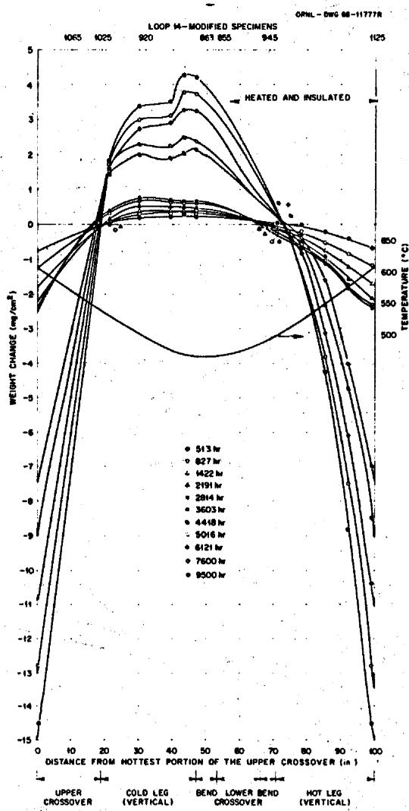  
Fig. 38. Weight Change as Function of Position (Temperature) for Titanium-Modified Hastelloy N Exposed to Sodium Fluoroborate Salt in Loop NCL-14.

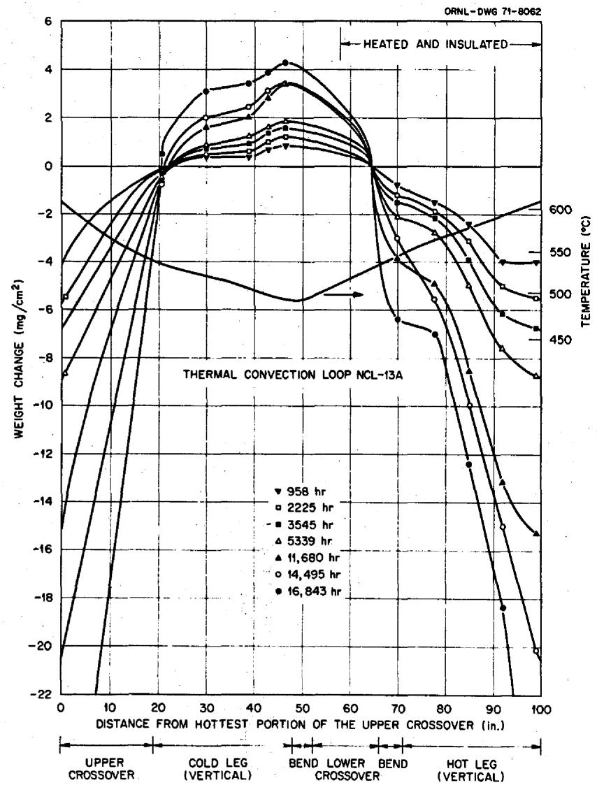  
Fig. 39. Weight Change as Function of Position (Temperature) for Hastelloy N Exposed to Sodium Fluoborate Salt in Loop NCL-13A.

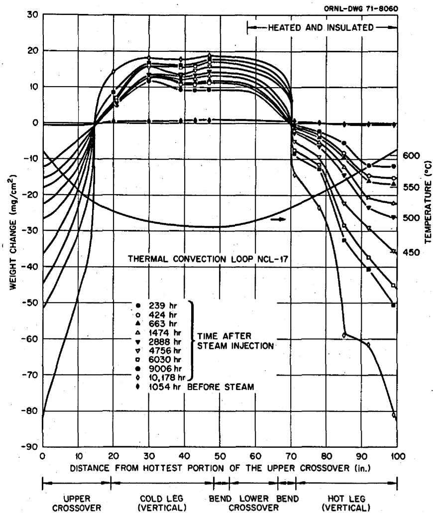  
Fig. 40. Weight Change as Function of Position (Temperature) for Hastelloy N Exposed to Sodium Fluoborate Salt in Loop NCL-17.

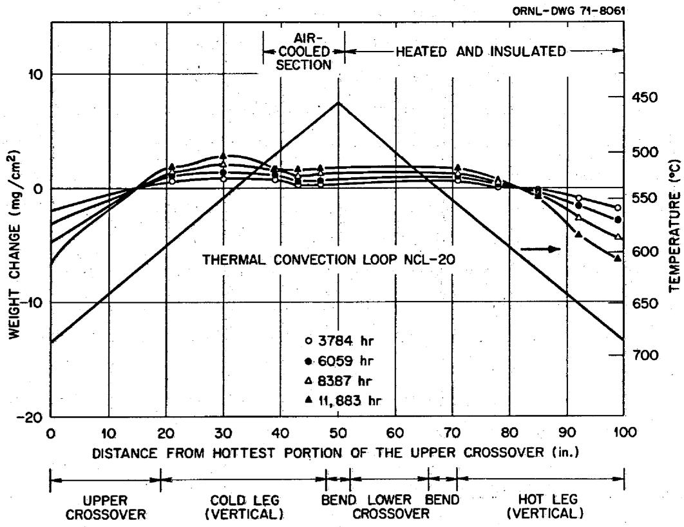  
Fig. 41. Weight Change as Function of Position (Temperature) for Hastelloy N Exposed to Sodium Fluoborate Salt in Loop NCL-20.

significantly slower than the others, the rate of the entire reaction is governed by the slowest step.

It is convenient to break up the dissolution process in the hot leg into four separate steps:

1. diffusion of the attacked elements through the matrix of the alloy to the surface,   
2. migration of the oxidizing species from the salt to the surface,   
3. oxidation of the metal to a dissolved fluoride,   
4. migration of the oxidized metal to the flowing salt.

In cases where the slow step involves a diffusion process (volume diffusion in a solid), the reaction is termed diffusion-controlled and is governed by the laws of diffusion kinetics. Alternately, if a boundary-region process (solution) constitutes the slow step, the rate of the overall reaction is determined by the kinetics of that process.

The rate of formation of the corrosion product fluoride should be included in this analysis, but experimental data relating to its formation and the effect of impurities are lacking.

If the diffusion step is rate controlling, then no velocity effect would be seen. However, if step 2 was slowest and was controlling, the process would be velocity dependent. At a certain critical velocity (possibly even that of the salt in natural circulation loops), the path for step 2 would become short and step 3 would control. Above this critical velocity, no velocity dependence would again be seen. Step 4, like step 2, would be velocity dependent. Thus, experiments in systems with different salt velocities could help to determine the rate-controlling mechanism.

In this work, we will consider the possibilities of solid-state diffusion and solution control.

# Solid-State Diffusion Control

A form of Fick's second law can be used for the weight loss in this case

$$
W = A C \sqrt {D t}, \tag {4}
$$

where

$W =$ weight change,

$C =$ concentration change of diffusing substance,

$\mathbf{D} =$ solid state diffusion coefficient,

$\mathbf{t} = \mathbf{\nabla}$ time,

A = constant.

If Eq. (4) applies, $\mathbf{b}$ of Eq. (1) is theoretically equal to $1/2$ .

The diffusion coefficient follows the Arrhenius relationship

$$
D = D _ {0} \exp (- D _ {S} / R T), \tag {5}
$$

where

$\mathbf{D}_0$ is constant and

$D_{S}$ is the effective activation energy for diffusion in the alloy.

If we differentiate Eq. (4) and substitute Eq. (5) for $D$ , we obtain

$$
\frac {\mathrm {d} W}{\mathrm {d} t} = \frac {A C}{2} \sqrt {D _ {0} / t} \exp (- D _ {S} / 2 R T),
$$

showing that the theoretical activation energy for the corrosion reaction is half that for diffusion:

$$
Q _ {\text {t h e o}} = D _ {s} / 2. \tag {6}
$$

# Solution Controlling

The following type of equation is used29 to describe solution attack controlled by liquid diffusion in a thermal gradient system

$$
\frac {\mathrm {d} W}{\mathrm {d} t} = 0. 0 2 3 \mathrm {d} ^ {- 0 \cdot 2} \mathrm {V} ^ {0 \cdot 8} \mathrm {D} _ {\mathrm {L}} ^ {0 \cdot 6} \mu^ {- 0 \cdot 4} \mathrm {S} \rho , \tag {7}
$$

where

$$
V = \text {v e l o c i t y},
$$

$$
\mu = \text {k i n e m a t i c v i s c o s i t y},
$$

$$
D _ {L} = \text {d i f f u s i o n c o e f f i c i e n t i n t h e l i q u i d},
$$

$$
d = d i a m e t e r o f p i e,
$$

$$
\rho = \text {d e n s i t y}
$$

$$
S = \text {s o l u b i l i t y}
$$

The diffusion coefficient can be expressed by the Stokes-Einstein relation

$$
D _ {L} = \frac {k T}{6 \pi X \eta_ {0}} \exp (- Q _ {V} / R T), \tag {8}
$$

where

$$
\begin{array}{l} k = \text {B o l t z m a n n c o n s t a n t}, \\ n _ {0} = \text {c o n s t a n t}, \\ X = \text {r a d i u s} \\ Q _ {V} = \text {a c t i v a t i o n e n e g y f o r v i s c o s i t y}. \\ \end{array}
$$

The kinematic viscosity can be expressed as

$$
\mu = \eta_ {0} \exp (- Q _ {\mathrm {v}} / \mathrm {R T}) / \rho , \tag {9}
$$

and the solubility as

$$
S = S _ {0} \exp (- \Delta H / R T), \tag {10}
$$

where $S_0$ is a constant and $\Delta H$ is the heat of solution. From the temperature dependence on $\frac{dW}{dt}$ in Eq. (7) after substitution using Eqs. (8), (9), and (10), we can obtain for the theoretical heat of activation of corrosion

$$
Q _ {\text {t h e o}} = Q _ {\mathbf {v}} + \operatorname {R T} (0. 6 + 1. 4 \frac {\mathrm {T}}{\rho} \frac {\mathrm {d} \rho}{\mathrm {d T}}) + \Delta H. \tag {11}
$$

Comparing Eq. (11) with experiment29 shows that at least $80\%$ of $Q_{\text{theo}}$ is the value of $\Delta H$ , the heat of solution of the corrosion product in the fluid. Thus we take

$$
Q _ {\text {t h e o}} = 1. 2 5 \Delta H.
$$

For this system $\mathsf{b}_{\text{theo}} = 1$ .

# Experimental Data

The heats of solution of $\mathsf{FeF}_2$ and $\mathsf{NiF}_2$ in molten fluoride salt are about 12 and 8 kcal/mole, respectively. $^{30}$ The average value 10 kcal/mole will be used for $\Delta H$ . A value of 60 kcal/mole will be used for the effective activation energy, $D_{\mathrm{s}}$ , for volume self-diffusion for iron and chromium. Table 13 compares the $Q_{\text{theo}}$ and $b_{\text{theo}}$ for the two proposed corrosion mechanisms with experimental values of Q and b for the specimens in the systems that lost material. Values are given for the coolant salt at two different impurity levels.

One might imagine that at the beginning of a mass transfer experiment diffusion of the elements through the matrix would not play a large part

Table 13. Rate Expressions for Material Removed in Coolant Salt NaBF4-8 mole % NaF   

<table><tr><td rowspan="2">Material</td><td rowspan="2">Oxide Content Of Salt (ppm)</td><td rowspan="2">Tempera-ture (℃)</td><td colspan="2">Weight Change Constantsa</td><td colspan="2">Temperature Dependenceb</td></tr><tr><td>a</td><td>b</td><td>A</td><td>Q, cal/mole</td></tr><tr><td rowspan="3">Ti-modified Hastelloy N</td><td rowspan="3">500</td><td>604</td><td>0.0036</td><td>0.7</td><td>8 × 104</td><td>32,200</td></tr><tr><td>579</td><td>0.0025</td><td>0.7</td><td></td><td></td></tr><tr><td>555</td><td>0.00032</td><td>0.9</td><td></td><td></td></tr><tr><td rowspan="3">Standard Hastelloy N</td><td rowspan="3">500</td><td>604</td><td>0.13</td><td>0.37</td><td>3 × 104</td><td>29,900</td></tr><tr><td>579</td><td>0.16</td><td>0.30</td><td></td><td></td></tr><tr><td>555</td><td>0.063</td><td>0.35</td><td></td><td></td></tr><tr><td rowspan="4">Ti-modified Hastelloy N</td><td rowspan="4">1500</td><td>604</td><td>0.0085</td><td>0.75</td><td>1 × 105</td><td>32,200</td></tr><tr><td>579</td><td>0.007</td><td>0.75</td><td></td><td></td></tr><tr><td>555</td><td>0.00015</td><td>0.1</td><td></td><td></td></tr><tr><td>524</td><td>0.000055</td><td>1.35</td><td></td><td></td></tr><tr><td colspan="7">Theoretical Values</td></tr><tr><td colspan="4">Diffusion control</td><td>0.5</td><td></td><td>30,000</td></tr><tr><td colspan="4">Solution rate control</td><td>1</td><td></td><td>12,500</td></tr></table>

aConstants for equation W = atb, where W = weight change, mg/cm²; t = time, hr.   
bConstants for equation $\frac{\mathrm{dW}}{\mathrm{dt}} = \mathrm{A}\exp (-\mathrm{Q} / \mathrm{RT})$

in the process since the material which is to be removed is already at the surface. Thus, step 2, 3, or 4 might be controlling. After the initial fast portion of the reaction the corrosion rate generally levels out. At this time, the diffusion of the elements to the surface would control. Thus, the calculated overall rate would appear to be of mixed control. When a velocity effect is noted, as is thought to occur in MSR-FCL-1, then it can be assumed that enough impurities are controlling the corrosion reactions to cause solution rate control of the entire process.

Although the proposed corrosion mechanisms are usually first considered for material removal, they may also be used for the deposition in the

cold leg of the system. The temperature dependence is reversed, the largest deposition occurs at the highest temperature, which causes a change in sign of the activation energy. Table 14 gives the experimental values of Q and b for the systems which gained weight. The kinetic constants of one group, titanium-modified alloy and fluoroborate salt with 1500 ppm oxide, corresponds to solid-state diffusion control, but the value of the others are in mixed agreement.

# Diffusion Calculations

Weight change rate constants based on diffusion control were calculated for loops NCL-13 and NCL-14 after 2500 hr with the following equation:

$$
\Delta W _ {\text {l o s s}} = C \sqrt {4 D t / \pi}, T > 5 2 0 \pm 1 5 ^ {\circ} C,
$$

where

C = concentration of Fe + Cr in Hastelloy N, g/cm³,

$\mathbf{D} =$ diffusion coefficient, $\mathrm{cm^2 / sec}$

$\mathbf{t} = \mathbf{\Delta}$ time,sec.

By using the weight changes and the combined iron and chromium concentration for the loop specimens, almost identical D values were obtained for the standard and modified Hastelloy N. This is quite significant, since the iron content of titanium-modified Hastelloy N is negligible. Thus D, or in reality a rate constant $\mathbf{K}_1$ , is independent of the concentration of chromium, iron, and other diffusing species. The weight change, however, is quite sensitive to the total concentration of the migrating elements. Confirmation of this hypothesis is evident when $\mathbf{K}_1$ is compared with $\mathbf{D}_{\mathbf{Cr}}$ in Hastelloy N.[31,32] For loops NCL-13 and

Table 14. Rate Expressions for Material Deposited from Coolant Salt NaBF₄-8 mole % NaF   

<table><tr><td rowspan="2">Material</td><td rowspan="2">Oxide Content of Salt (ppm)</td><td rowspan="2">Tempera-ture (°C)</td><td colspan="2">Weight Change Constantsa</td><td colspan="2">Temperature Dependenceb</td></tr><tr><td>a</td><td>b</td><td>A</td><td>Q, cal/mole</td></tr><tr><td rowspan="3">Ti-modified Hastelloy N</td><td rowspan="3">500</td><td>460</td><td>0.0085</td><td>0.6</td><td>9 × 10-7</td><td>8,240</td></tr><tr><td>482</td><td>0.0069</td><td>0.6</td><td></td><td></td></tr><tr><td>527</td><td>0.0056</td><td>0.6</td><td></td><td></td></tr><tr><td rowspan="3">Standard Hastelloy N</td><td rowspan="3">500</td><td>460</td><td>0.17</td><td>0.33</td><td>4 × 10-8</td><td>14,400</td></tr><tr><td>482</td><td>0.13</td><td>0.33</td><td></td><td></td></tr><tr><td>527</td><td>0.088</td><td>0.33</td><td></td><td></td></tr><tr><td rowspan="3">Ti-modified Hastelloy N</td><td rowspan="3">1500</td><td>460</td><td>0.007</td><td>0.65</td><td>2.9 × 10-12</td><td>28,800</td></tr><tr><td>482</td><td>0.0052</td><td>0.65</td><td></td><td></td></tr><tr><td>527</td><td>0.0016</td><td>0.65</td><td></td><td></td></tr></table>

aConstants for equation W = atb; where W = weight change, mg/cm²; t = time, hr.   
bConstants for equation $\frac{\mathrm{dW}}{\mathrm{dt}} = \mathrm{A}\exp (+\mathrm{Q} / \mathrm{RT})$

NCL-14 at $607^{\circ}\mathrm{C}$ $\mathbf{K}_1 = 5 \times 10^{-12} \, \mathrm{cm}^2/\mathrm{sec}$ , while the literature value for $\mathbf{D}_{\mathbf{Cr}}$ at $607^{\circ}\mathrm{C}$ is $5 \times 10^{-14} \, \mathrm{cm}^2/\mathrm{sec}$ . The appropriate Arrhenius relation constants are $\mathbf{D}_0 = 6.068 \times 10^{-5} \, \mathrm{cm}^2/\mathrm{sec}$ and $\mathbf{Q} = 41.48 \, \mathrm{kcal/mole}$ .

The effect of impurity oxide content in fluoroborate salt on weight losses of the Hastelloy N alloys at 555 and $604^{\circ}\mathrm{C}$ is given in Fig. 42. The data show that titanium-modified alloys lose less weight than the standard Hastelloy N for exposure in fluoroborate salt containing 500 ppm $\mathrm{H}_2\mathrm{O}$ impurity at temperatures between 555 and $604^{\circ}\mathrm{C}$ . However, at the same temperatures the titanium-modified alloy exposed to fluoroborate salt containing 1500 ppm oxide shows a greater weight loss than either alloy exposed to the 500 ppm oxide salt.

The actual average weight loss rate was calculated for several alloy-salt combinations and plotted in Fig. 43 against the inverse of the absolute temperature. Also included in Fig. 43 are weight loss rates calculated from

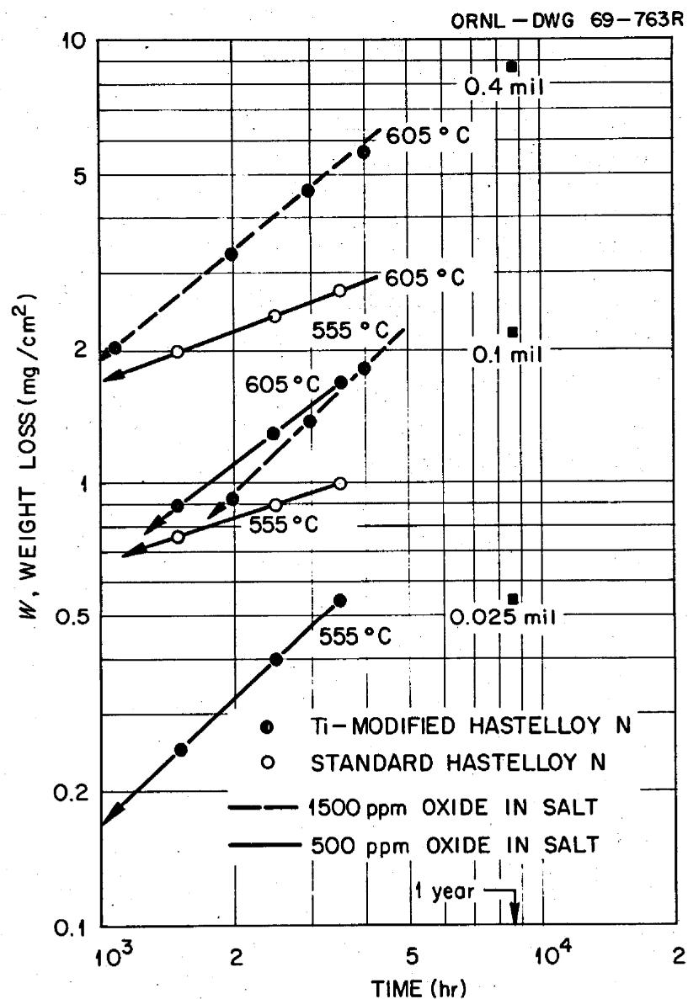  
Fig. 42. Weight Loss for Hastelloy N Alloys in Sodium Fluoroborate Coolant Salts.

$$
W = \left(C _ {0} - C _ {s}\right) \sqrt {4 D t / \pi},
$$

where:

W = weight loss in milligrams per square centimeter of surface area,

D = the diffusion coefficient in square centimeters per second, t = time in seconds,

$C_{s}$ and $C_{o} =$ the concentration maintained at surface and the initial uniform concentration, respectively, in milligrams per cubic centimeter.

ORNL-DWG 69-762R2

- TYPE 304L STAINLESS STEEL   
Ti-MODIFIED HASTELLOYN   
STANDARD HASTELLOY N   
$\times$ CALCULATED-ALLOY CONTAINS $7 \%$ Cr   
+ CALCULATED-ALLOY CONTAINS 18% Cr

FUEL SALT

$\triangle \diamond$ FLUOROBORATE COOLANT SALT

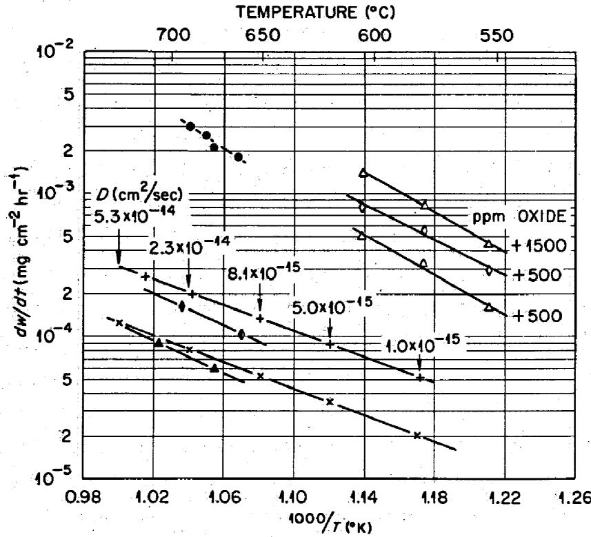  
Fig 43. Arrhenius-Type Plot for Corrosion of Materials in Fluoride Salts.

For this calculation we assumed $C_{s} = 0$ , that all weight loss was the removal of chromium, and that this removal was controlled by the diffusion of chromium to the surface. The chromium diffusion coefficient32 in Hastelloy N was used in the calculation.

An extrapolation of the graphs of Fig. 43 shows that both fluoroborate salts (500 and 1500 ppm oxide impurity) are more aggressive than the fuel salt to the Hastelloy N alloys. Also, it appears that identical rates would be found for the type 304L stainless steel-fuel salt combination and the titanium-modified Hastelloy N-fluoroborate salt (500 ppm oxide impurity).

It would be expected, if the solid-state diffusion mechanism controlled, that the calculated rates of Fig. 43 based on diffusion coefficients would be identical to the experimental rates. However, results of only the titanium-modified Hastelloy N-fuel salt system coincided with the calculated values. Incidentally, fuel salts were used in the earlier experiments that showed that the rate was controlled by the diffusion coefficient of chromium in the alloy.[33] Thus, we have shown that another mechanism besides chromium solid-state diffusion is controlling the process for several of the metal-salt systems investigated here.

The weight losses of the specimens exposed to the fluoroborate salt and the value calculated for $600^{\circ}\mathrm{C}$ and 4000 hr are compared in Table 15. It is noted that the experimental losses are greater than those calculated. As has been discussed earlier, the impurities in the fluoroborate salt appear to be very important because of the formation of HF, which is strongly oxidizing and will attack all the constituents of the Hastelloy N alloys. However, in the salt containing 500 ppm oxide impurity the titanium-modified alloy showed smaller weight losses than the standard alloy, again because of its lack of iron. In the salt with 1500 ppm oxide impurity more HF was available for attack, and the weight losses were higher, since measurable amounts of nickel and molybdenum were removed from the alloy. An increase in nickel and molybdenum concentrations is often noted in the salt analyses under these conditions. The amount of attack is approximately doubled. Because of the large amounts of nickel and molybdenum in the alloys very little differences in the weight losses of the standard and titanium-modified alloys will be noted when large amounts of HF are available for attack. It is also believed that this HF attack is responsible for the mixed kinetics noted earlier.

Table 15. Effect of Impurities on Hastelloy N Corrosion by Fluoroborate Coolant Salt for 4000 hr at $600^{\circ}\mathrm{C}$   

<table><tr><td>Material</td><td>Weight Loss (mg/cm2)</td><td>Concentration Oxide (ppm)</td></tr><tr><td>Ti-modified Hastelloy N</td><td>5.7</td><td>1500</td></tr><tr><td>Standard Hastelloy N</td><td>2.9</td><td>500</td></tr><tr><td>Ti-modified Hastelloy N</td><td>1.9</td><td>500</td></tr><tr><td>Calculated Using DCr = 2.0 × 10-15cm2/sec and Cs = 0.07</td><td>0.2</td><td></td></tr></table>

With respect to the deposition process, it is obvious that the calculated rate includes only the weight changes that occur from the deposition on the surface. The amount of the diffusion into the metal is not measured. However, during the straight-line portion of deposition with time, on which the kinetic calculations are based, it was theorized that the rate at which the metal deposited is the same as the rate at which it diffuses into the container wall. In time the weight gains would continue, the amount of deposited material on the surface would remain essentially constant, and a chromium gradient would appear in the colder sections. All experimental findings do support these suppositions.

The kinetic calculations for the weight-gain portion of the mass transfer show a mixed control between solid-state diffusion and solution rate. Analogous to the behavior in the hot leg, in the cold leg the weight gains could be first solution-rate controlled and later, as the process slows down, be controlled by the diffusion. Thus, the overall effect would be mixed control. As theorized earlier it still appears that the action in the cold leg controls the mass transfer process for the entire system.

In liquid metal systems, the simple approach to the mass transfer problem is the statement that the weight loss rate is a function of the difference in the solubility of the dissolved metal at the temperatures

of interest. The proportionality constant may be related to the diffusion coefficient of the metal in the liquid if diffusion is the controlling step or may be related to another factor concerning some process occurring at the interface if the rate of solution is controlling. However, many additional models have been required to explain all the experimental findings. The most ticklish problems involve the possible effect of oxygen on the solubility of certain metals in liquid metals, the velocity effect, and the downstream effect. Similar problems exist in the fused fluoride salt systems. In the salt systems, we can make the general statement that the corrosion rate in fuel salts is a function of the chromium and iron contents of the alloy. In the fluoroborate salts, the rate is a function of the alloy composition and the impurity level of the salt. The proportionality constant for both cases is a function of temperature and can be found experimentally. As in liquid metal systems, the rate controlling mechanisms are not entirely clear cut but are functions of many variables.

Although the corrosion of these systems has been widely discussed, it should be pointed out that the weight loss rates are quite low.

# SUMMARY

Our data on mass transfer in the fluoroborate salt mixture points out that impurities such as water and oxygen strongly affect the fluoride oxidation potential of this salt. However, we do not yet completely know the chemical forms taken by these impurities upon entering the salt. Corrosion rates show a marked increase following an air or steam leak into the fluoroborate salt. Once the leak has been detected and corrected, the corrosion rate drops sharply. Analyses of the salt shows an increase in oxide level as the corrosion rate increases; the explanation for this behavior is that moisture reacts with the salt to produce HF and compounds (oxides and hydroxides) that analyze as oxides by the present techniques. The HF causes rapid oxidation of the containment material and is used up in the process. The compounds that analyze as water and oxygen remain but have only a minor effect on corrosion rate. Kinetic considerations showed that the mass transfer process is between solid-state diffusion

control and solution control, probably depending on the amount of impurities allowed to enter the salt. The mass transfer behavior is very similar to that seen for the chromium- $\mathrm{UF_4}$ corrosion reaction, the difference being that other alloy constituents (beside chromium) participate in the process and the reaction rates are different. We have also shown the difficulty in keeping the fluoroborate salt mixture free of moisture-type impurities but feel that this can be done by exercising sufficient care.

Except for certain periods of the fluoroborate tests, the overall corrosion rates have been relatively small. Thermal-convection loop NCL-14 has operated successfully for over two years and the pump loop MSR-FCL-1 nearly one year with the fluoroborate mixture. Comparison of the rates experienced by NCL-13A, NCL-14, and MSR-FCL-1, all circulating the sodium fluoroborate mixture, indicates a velocity effect on the mass transfer (Table 16). We believe that the effect of velocity on corrosion in this system is a function of declining importance as the purity level of the salt improves. The impurity effect per se has been discussed in detail previously. Because of the importance of the impurities on the corrosion of Hastelloy N by fluoroborate, efforts have begun on methods of purifying the salt. Also to be considered are better methods for analyzing and identifying the impurities. At some purity level, perhaps 200 to 400 ppm oxide as analyzed, solid-state diffusion of chromium in the Hastelloy N will likely control corrosion, as it does in the fuel salts. This is most important, since it suggests that an entire MSBR of either the one- or two-fluid variety can be operated with none of the main circulating channels suffering more than a few tenths of a mil per year corrosion attack. Experimental proof of this is one of our major near-term goals.

Table 16. Comparison of Corrosion Rates for Standard Hastelloy N in MSR Systems After More Than 5000 hr Operation   

<table><tr><td>Loop Designation</td><td>Salt Type</td><td>Maximum Temperature (℃)</td><td>Temperature Difference (℃)</td><td>Velocity (fps)</td><td>Equivalent Corrosion Rate (mils/year)</td></tr><tr><td>NCL-13A</td><td>\(Coolanta^a\)</td><td>605</td><td>145</td><td>0.1</td><td>0.6</td></tr><tr><td>NCL-14</td><td>\(Coolanta^a\)</td><td>605</td><td>145</td><td>0.1</td><td>0.55</td></tr><tr><td>MSR-FCL-1</td><td>\(Coolanta^a\)</td><td>588</td><td>78</td><td>10</td><td>1.2</td></tr><tr><td>NCL-16</td><td>\(Fuel^b\)</td><td>705</td><td>170</td><td>0.1</td><td>0.04</td></tr><tr><td>NCL-15A</td><td>\(Blanket^c\)</td><td>675</td><td>55</td><td>0.1</td><td>0.03</td></tr><tr><td>NCL-18</td><td>\(Fertil-\_d\ Fissile\)</td><td>705</td><td>170</td><td>0.1</td><td>0.05</td></tr></table>

$\mathbf{a}\mathrm{NaBF}_{4}$ NaF (92-8 mole $\%$ ), 1000 ppm oxide.   
bLiF-BeF2-UF4 (65.5-34.0-0.5 mole %), < 200 ppm oxide.   
$\mathbf{c}_{\mathrm{LiF - BeF_2 - ThF_4}}$ (73-2-25 mole $\%$ ), $< 200$ ppm oxide.   
$\mathrm{d}_{\mathrm{LiF - BeF_2 - ThF_4 - UF_4}}$ (68-20-11.7-0.3 mole %), < 200 ppm oxide.

# CONCLUSIONS

1. The corrosion rate is a function of the alloy composition and impurity level of the salt.   
2. Because of the corrosive nature of the $\mathrm{BF}_3$ in an impure state and because it is present in appreciable quantities over the melt, leaks in mechanical portions of the systems can easily occur.   
3. Kinetic considerations disclose that the weight change rates are controlled by a mixture of solid-state diffusion and solution rate.   
4. The effective diffusion rate that controls the hot-leg attack is larger than the volume diffusion coefficients obtained in typical diffusion experiments.   
5. The mass transfer behavior (weight losses in hot leg, weight gains in cold leg, steady balance points) is very similar to that seen for the chromium- $\mathrm{UF}_4$ corrosion reaction.

6. Titanium-modified Hastelloy N with less chromium and iron shows a greater resistance to attack in a fluoroborate salt with 500 ppm oxide impurity than standard Hastelloy N.   
7. The corrosion rate of titanium-modified Hastelloy N in fluoroborate salt with 1500 ppm oxide impurity is double that found in salt with 500 ppm oxide.   
8. Corrosion rates were relatively low for all systems tested.

# ACKNOWLEDGMENT

It is a pleasure to acknowledge that E. J. Lawrence supervised construction and operation of the thermal convection loops and was responsible for the weight change measurements of all the corrosion specimens. We also recognize P. A. Gnadt and W. R. Huntley of the Reactor Division for operation and design of the pump loop. We thank A. P. Litman for his invaluable assistance through part of this work. We are also indebted to H. E. McCoy, Jr., J. H. Devan, T. S. Lundy, and J. V. Cathcart for constructive review of the manuscript.

Special thanks are extended to the Metallography group, especially H. R. Gaddis, C. E. Zachery, H. V. Mateer, T. J. Henson, and R. S. Crouse and to the Analytical Chemistry Division, particularly Cyrus Feldman and H. W. Dunn, the Graphic Arts Department, the Metals and Ceramics Division Reports Office, and particularly S. Peterson, for invaluable assistance.

# INTERNAL DISTRIBUTION

# (113 copies)

(3) Central Research Library

ORNL - Y-12 Technical Library

Document Reference Section

(10) Laboratory Records Department

Laboratory Records, ORNL RC

ORNL Patent Office

(2) MSRP Director's Office (Y-12)

G.M. Adamson, Jr.

J. L. Anderson

R. F. Apple

C. F. Baes

S. E. Beall

E. S. Bettis

F. F. Blankenship

E. G. Bohlmann

G. E. Boyd

R. B. Briggs

S. Cantor

J. V. Cathcart

O. B. Cavin

N. C. Cole

R. S. Crouse

J. L. Crowley

F. L. Culler

J. E. Cunningham

J.M.Dale

J. H. Devan

J. R. DiStefano

S.J.Ditto

H. W. Dunn

W. P. Eatherly

J. R. Engel

C. Feldman

D. E. Ferguson

L. M. Ferris

A. P. Fraas

J. H Frye, Jr.

H. R. Gaddis

L. O. Gilpatrick

P. A. Gnadt

R. J. Gray

W. R. Grimes

A. G. Grindell

R. H. Guymon

W. O. Harms

P. N. Haubenreich

R. E. Helms

T. J. Henson

(3) M. R. Hi11

W. R. Huntley

H. Inouye

P. R. Kasten

J. J. Keyes

(10) J. W. Koger

A. I. Krakoviak

T. S. Kress

W.R.Laing

E. J. Lawrence

M. I. Lundin

T. S. Lundy

R. E. MacPherson

D. L. Manning

W. R. Martin

H. V. Mateer

H. E. McCoy, Jr.

C. J. McHargue

B. McNabb

L. E. McNeese

A. S. Meyer

R. L. Moore

F. H. Neil1

E. L. Nicholson

P. Patriarca

A. M. Perry

C. B. Pollock

H.C.Savage

D. Scott

J. L. Scott

J. H. Shaffer

G. M. Slaughter

D. Sood

R. E. Thoma

D. B. Trauger

G.M.Watson

A. M. Weinberg

J.R.Weir, Jr.

M. E. Whatley

J.C. White

G. Young

J. P. Young

C. E. Zachary

# EXTERNAL DISTRIBUTION

# (38 copies)

AEC DIVISION OF REACTOR DEVELOPMENT AND TECHNOLOGY, Washington, DC 20545

A. R. DeGrazia

J. E. Fox

N. Haberman

(2) T. W. McIntosh

J. F. Neff

M. Shaw

AEC DIVISION OF REACTOR LICENSING, Washington, DC 20545

(3) P. A. Morris

AEC DIVISION OF REACTOR STANDARDS, Washington, DC 20545

(2) E. G. Case

AEC DIVISION OF SPACE NUCLEAR SYSTEMS, Washington, DC 20545

A. P. Litman

AEC MSBR PROGRAM, Washington, DC 20545

(2) Program Manager

AEC OAK RIDGE OPERATIONS, P. O. Box E, Oak Ridge, TN 37830

Research and Technical Support Division

AEC-RDT SITE REPRESENTATIVES, Oak Ridge National Laboratory, P. O. Box X, Oak Ridge, TN 37830

D. F. Cope

K. Laughon

TECHNICAL INFORMATION CENTER, Office of Information Services, P. O. Box 62, Oak Ridge, TN 37830

(2) Manager

(17) Manager (for transmittal to members of ACRS)

UNIVERSITY OF TENNESSEE, Department of Nuclear Engineering, Knoxville, TN 37916

H. G. MacPherson