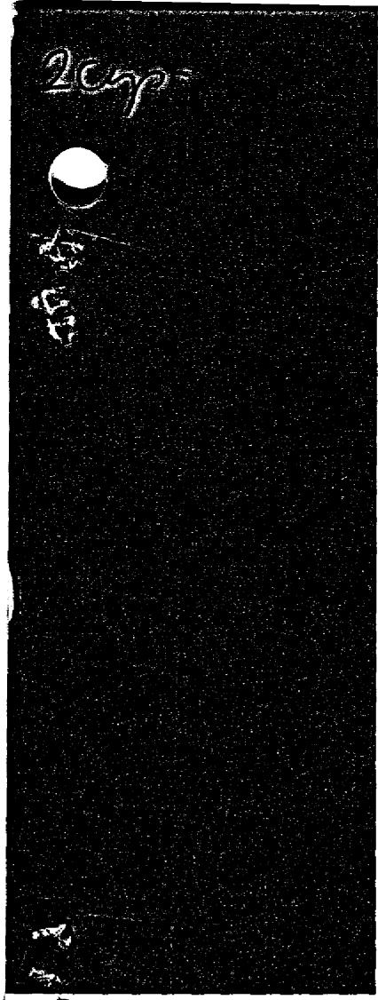

21.824

# THE MIGRATION OF A CLASS OF FISSION PRODUCTS (NOBLE METALS) IN THE MOLTEN-SALT REACTOR EXPERIMENT

R. J. Kedl

MASTER

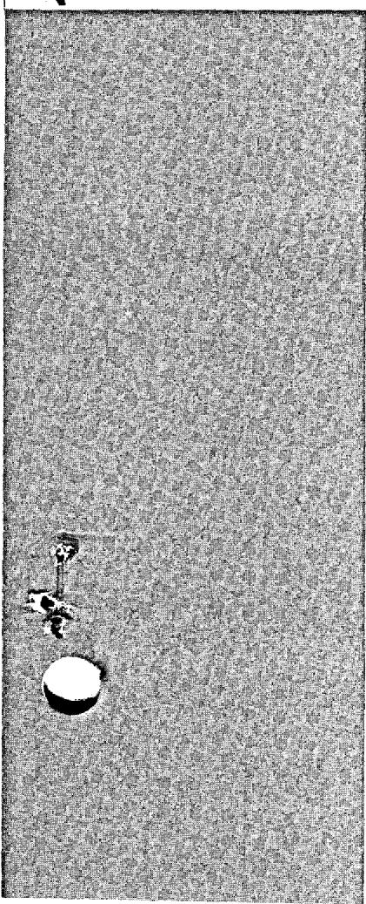

OAK RIDGE NATIONAL LABORATORY

OPERATED BY UNION CARBIDE CORPORATION • FOR THE U.S. ATOMIC ENERGY COMMISSION

解得

Distribution of this copyright is protected by the U.S. Copyright Clearance Center (CCC), 222 Rosewood Drive, Danvers, MA 01796

This report was prepared as an account of work sponsored by the United States Government. Neither the United States nor the United States Atomic Energy Commission, nor any of their employees, nor any of their contractors, subcontractors, or their employees, makes any warranty, express or implied, or assumes any legal liability or responsibility for the accuracy, completeness or usefulness of any information, apparatus, product or process disclosed, or represents that its use would not infringe privately owned rights.

# -NOTICE

This report was prepared as an account of work sponsored by the United States Government. Neither the United States nor the United States Atomic Energy Commission, nor any of their employees, nor any of their contractors, subcontractors, or their employees, makes any warranty, express or implied, or assumes any legal liability or responsibility for the accuracy, completeness or usefulness of any information, apparatus, product or process disclosed, or represents that its use would not infringe privately owned rights.

ORNL-TM-3884

Contract No. W-7405-eng-26

Reactor Division

THE MIGRATION OF A CLASS OF FISSION PRODUCTS (NOBLE METALS) IN THE MOLTEN-SALT REACTOR EXPERIMENT

R.J.Kedl

Molten-Salt Reactor Program

December 1972

OAK RIDGE NATIONAL LABORATORY

Oak Ridge, Tennessee 37830

operated by

UNION CARBIDE CORPORATION

For the

U.S. ATOMIC ENERGY COMMISSION

MASTER

TABLE OF CONTENTS   

<table><tr><td colspan="2">Page</td></tr><tr><td>FOREWORD</td><td>v</td></tr><tr><td>ABSTRACT</td><td>vi</td></tr><tr><td>1. INTRODUCTION</td><td>1</td></tr><tr><td>2. DESCRIPTION OF THE MSRE</td><td>2</td></tr><tr><td>2.1 General Description</td><td>2</td></tr><tr><td>2.2 Description of the Reactor</td><td>5</td></tr><tr><td>2.3 Description of the Fuel Pump</td><td>9</td></tr><tr><td>3. FISSION PRODUCT EXPERIENCE IN THE MSRE</td><td>14</td></tr><tr><td>3.1 General Fission Product Disposition</td><td>14</td></tr><tr><td>3.2 Fission Product Disposition Measurements</td><td>17</td></tr><tr><td>3.2.1 Fuel Salt and Gas Phase Samples</td><td>17</td></tr><tr><td>3.2.2 Gamma Spectrometry of the Primary Heat Exchanger</td><td>19</td></tr><tr><td>3.2.3 Core Surveillance Samples</td><td>21</td></tr><tr><td>3.3 The Difference Between the 235U and 233U Runs</td><td>23</td></tr><tr><td>4. ANALYTICAL MODEL</td><td>29</td></tr><tr><td>4.1 Physical Basis of Model</td><td>29</td></tr><tr><td>4.2 Analytical Model</td><td>31</td></tr><tr><td>4.2.1 Generation from Fission</td><td>32</td></tr><tr><td>4.2.2 Generation from Decay of Precursor</td><td>32</td></tr><tr><td>4.2.3 Decay Rate</td><td>33</td></tr><tr><td>4.2.4 Deposition Rate on Heat Exchanger</td><td>33</td></tr><tr><td>4.2.5 Deposition Rate on Graphite</td><td>33</td></tr><tr><td>4.2.6 Deposition Rate on Rest of Fuel Loop</td><td>33</td></tr><tr><td>4.2.7 Deposition Rate on Liquid-Gas Interfaces</td><td>34</td></tr><tr><td>4.2.8 Equation for CS</td><td>34</td></tr><tr><td>4.2.9 Noble Metals on Solid Surfaces</td><td>35</td></tr><tr><td>4.2.10 Noble Metals on Liquid-Gas Interfaces</td><td>36</td></tr></table>

# 5. RESULTS FROM THE MSRE

5.1 Introduction 38   
5.2 Comparison of Measured Deposition on Heat 38  
Exchanger to Theoretical   
5.3 Comparison of Measured Deposition on Core Surveillance 43 Samples to Theoretical   
5.4 Comparison of Fuel Salt Samples with C   
5.5 Comparison of Gas Samples with $\mathbf{C}^{\mathrm{S}}$ 61   
5.6 Time Constant for Noble Metals on Interfaces 65   
5.7 Miscellaneous Noble Metal Observations 68

5.7.1 Laminar Flow Core Surveillance Sample 68   
5.7.2 Noble Metal Distribution in the MSRE 70

# 6. CONCLUSIONS AND RECOMMENDATIONS

Conclusions 73   
Recommendations 74

# 7. REFERENCES

APPENDIX A 79   
APPENDIX B 81

Page

# FOREWORD

The behavior of the "noble metal" fission products in the fuel salt is a subject of major importance to the design of molten-salt reactors. A considerable amount of data bearing on the subject was obtained from operation of the Molten-Salt Reactor Experiment. All or part of the data has been studied with various degrees of thoroughness by many people with different backgrounds and different viewpoints. Unfortunately, the chemical and physical situations in the reactor were complex and the data obtained are not very accurate or consistent. Consequently, no one has developed an explanation of the detailed behavior of noble metals that is acceptable to a majority of the knowledgeable observers. It is generally agreed that most of the fission products from niobium through tellurium are reduced to metals in the fuel salt, that they migrate to metal and graphite surfaces and to salt-gas interfaces, and that they adhere to the surfaces with varying degrees of tenacity. The details of the processes involved and the manner in which the noble metal particles may be affected by other processes in the reactor are subjects of frequent debate in which opinions vary widely. This report describes the author's interpretation of the data and explanation of some aspects of the operation of the reactor. Although others would analyze the data differently and would reach different conclusions concerning some of the mechanics, we believe that publication of this report will provide information helpful to the design of molten-salt reactor systems and to the development of a better understanding of the behavior of fission products in those systems.

# ABSTRACT

The Molten-Salt Reactor Experiment (MSRE) is a fluid-fueled experimental nuclear reactor; consequently, fission products are dispersed throughout the entire fuel circulation system. One group of fission products, referred to as noble metals, exists in the fuel salt in the reduced metallic state. They are insoluble and unwet by salt. They deposit on surfaces exposed to salt such as the Hastelloy N piping and the moderator graphite. They apparently accumulate in a stable form on the liquid-gas interface in the fuel pump. The amounts of noble metals on these surfaces and on other deposition sites have been measured. These measurements have been analyzed within the framework of mass transfer theory. The analysis has been found to correlate the data from these sources in a unified manner. It is therefore concluded that the noble metals do migrate in accordance with mass transfer theory, although some parameters still remain unevaluated. A hypothesis is presented to explain some of the dramatic differences in reactor operating characteristics between the $^{235}\mathrm{U}$ and $^{233}\mathrm{U}$ runs. It is recommended that additional noble metal deposition experiments be conducted in a circulating salt loop.

Keywords: Fission Products + Noble Metals + Mass Transfer + MSRE + Experience + Bubbles + Foaming + Mist + Physical Properties + Entrainment + Off-Gas System + Void Fractions + Corrosion Products + Fluid Flow

# 1. INTRODUCTION

The goal of the Molten-Salt Reactor Program at Oak Ridge National Laboratory is to develop the technology for an efficient power producing, thermal-breeding (based on the Th-233U cycle) nuclear reactor for commercial use. The fuel in a molten-salt breeder reactor is fluid, and consists of $\mathrm{UF_4}$ and $\mathrm{ThF_4}$ dissolved in a carrier salt mixture of LiF and $\mathrm{BeF_2}$ . The liquidus temperature ranges from 800 to $940^{\circ}\mathrm{F}$ , depending on the exact carrier salt composition, with the nominal reactor operating temperature being $\sim1200^{\circ}\mathrm{F}$ . The fuel salt is pumped through a graphite-moderated core and then through a heat exchanger where it transfers heat to a secondary salt system, which then generates steam in another heat exchanger. One of the unique features of this concept is that the fuel is in the liquid state. This gives rise to many advantages, the principal one being potentially very low fuel cycle cost. The fluid fuel also creates a few liabilities, one of which is that the fission products are spread throughout the entire fuel loop and other hydraulically connected regions (e.g., off-gas system, dump tanks, etc.).

A 7.3-MW(t) experimental reactor based on this concept was built and operated at Oak Ridge National Laboratory. This reactor, the Molten-Salt Reactor Experiment (hereafter called the MSRE), first went critical in June 1965. Nuclear operations were terminated in December 1969. Being an experimental reactor, it was subjected to a good deal of testing and observation. One of the principal efforts was to determine the distribution of the various fission products in the fuel loop and connected regions. This information is critical in the design of large central power stations [1000 MW(e)] where the heat generated by fission products is substantial.

Fission products in molten fuel salt can be grouped into three principal types where the mechanics of migration is the distinguishing feature - (1) salt seekers, (2) noble gases, and (3) noble metals. The salt-seeking fission products (which include Sr, Y, Zr, I, Cs, Ba, and Ce) are the best behaved. They are soluble in a fuel salt and remain with the fuel salt in inventory amounts. The noble gases are Kr and Xe. A great

deal of work has been done to understand noble gas migration, particularly $^{135}\mathrm{Xe}$ because of its thermal neutron cross section of over $10^{6}$ barns. The third group, the so-called "noble metals," Nb, Mo, Ru, Sb, and Te, is the subject of this report. The noble metals are reduced by the $\mathrm{UF}_3$ in the fuel salt, and therefore exist in salt in the metallic state. They are insoluble in fuel salt and are unwet by it. Because of their incompatibility with salt they migrate to various surfaces (graphite and Hastelloy N) and adhere to them. They apparently also migrate to gas-liquid interfaces and adhere to these in a stable manner. Noble metals have been found and measured in fuel salt samples and gas phase samples on the surfaces of Hastelloy N and graphite surveillance specimens in the core, and on the fuel loop and heat exchanger surfaces. In this report we shall present a theory of noble metal migration based on conventional mass transfer concepts. We shall then analyze data from the above mentioned samples and measurements in the framework of this theory, and show that noble metals apparently do migrate from the fuel salt to their various depositories in accordance with the theory. A major thesis of this analysis is that noble metals migrate and adhere to liquid-gas interfaces. As such, they apparently have properties similar to insoluble surface active agents. This idea will be used to explain many of the observations on fission product behavior in the reactor. It will also be used to suggest an explanation for the rather dramatic difference in reactor operating characteristics between runs made with $^{235}\mathrm{U}$ and $^{233}\mathrm{U}$ fuels.

# 2. DESCRIPTION OF THE MSRE

# 2.1 General Description

The purpose of the MSRE was to demonstrate, on a pilot plant scale, the safety, reliability, and maintainability of a molten-salt reactor. The operating power level was 7.3 MW(t). Because of its small size and other considerations, it was not intended to be a breeder, and no thorium was added to the fuel. The fuel consisted of $\mathrm{UF_4}$ and $\mathrm{UF_3}$ dissolved in a mixture of LiF, $\mathrm{BeF_2}$ , and $\mathrm{ZrF_4}$ . Its composition and physical properties are given in Table 2.1. All fuel loop components are constructed from

Table 2.1. MSRE Fuel Salt Composition and Physical Properties   
Composition - LiF, BeF2, ZrF4, UF4 (65.0, 29.1, 5.0, 0.9 mole %) Liquid type - Newtonian   

<table><tr><td></td><td>English Units</td><td>Metric Units</td></tr><tr><td>Liquidus temperature</td><td>813°F</td><td>434°C</td></tr><tr><td>Properties at 1200°F (650°C)</td><td></td><td></td></tr><tr><td>Density</td><td>141 lb/ft3</td><td>2.3 g/cm3</td></tr><tr><td>Specific heat</td><td>0.47 Btu/1b •°F</td><td>2.0 × 103J/kg •°C</td></tr><tr><td>Thermal conductivity</td><td>0.83 Btu/hr • ft •°F</td><td>1.43 W/m •°C</td></tr><tr><td>Viscosity</td><td>19 lb/ft • hr</td><td>28 kg/h • m</td></tr><tr><td>Vapor pressure</td><td>&lt;0.1 mm-Hg</td><td>&lt;1 × 10-4bar</td></tr></table>

${}^{a}0.3$ mole $\% {}^{235}\mathrm{U}$ and 0.6 mole $\% {}^{238}\mathrm{U}$ .

Hastelloy N, which is essentially unwet by fuel salt under normal operating conditions. The nominal operating temperature was $1200^{\circ}\mathrm{F}$ with a $40^{\circ}\mathrm{F}$ temperature change across the core and primary heat exchanger.

Figure 2.1 is a schematic flow diagram of the MSRE, which will be described briefly here. More detailed descriptions of the reactor and the concept are available in Refs. 1, 2, and 3. The fuel loop consisted essentially of a centrifugal pump, a heat exchanger, and the reactor vessel. The nominal flow rate was $1200\mathrm{gpm}$ . The heat exchanger was a conventional U-tube type with the fuel salt on the shell side. Heat was transferred to a secondary coolant salt that in turn dumped it to the atmosphere via a large radiator. During periods of shutdown, the fuel salt was drained into either of two drain tanks. In addition, a third drain tank contained a load of flush salt for rinsing the fuel loop prior to any maintenance that was required. Note the use of freeze flanges in the primary and secondary salt loops for easy disconnection of main components should they need replacement, and also the use of freeze valves in the drain lines. Off-gas from the pump bowl passed through a volume holdup, charcoal beds, and then absolute filters before it was discharged up the stack. Characteristics of the reactor core and fuel pump influenced the

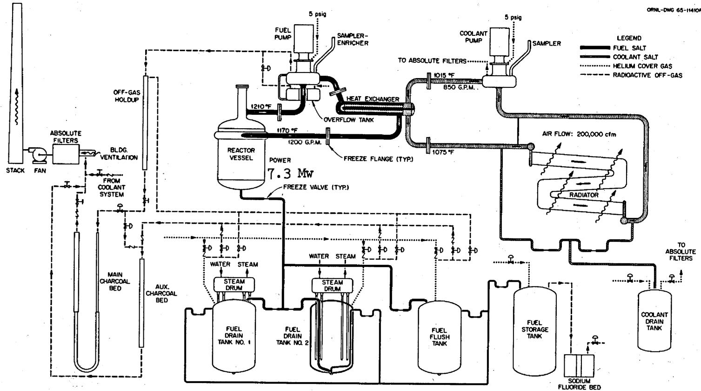  
FIGURE 2.1. SCHEMATIC FLOW DIAGRAM OF THE MSRE

mechanics of noble metal fission product migration, so they will be described in somewhat more detail in the following sections.

The MSRE went critical June 1, 1965, and nuclear operations were terminated December 12, 1969. The reactor was critical for a total of 17,655 hr. Figure 2.2 is a brief historical outline of the MSRE's power operation. Note particularly that for the first 2 l/2 years the reactor was operated with $^{235}\mathrm{U}$ fuel. The fuel was chemically processed and the $^{235}\mathrm{U}$ replaced with $^{233}\mathrm{U}$ . Then for the last 1 l/2 years, the reactor was operated with $^{233}\mathrm{U}$ fuel. Most of the results presented in this report will be from data obtained during the $^{233}\mathrm{U}$ runs.

# 2.2 Description of the Reactor

A detailed view of the MSRE core and reactor vessel is shown in Figure 2.3. Fuel salt entered the reactor vessel through a flow distribution volute near the top of the vessel. It then flowed down through a l-in.-thick annular passage bounded by the reactor vessel and reactor core can and into the lower vessel plenum. The fuel then passed up through the graphite moderator region and out the top outlet pipe. The moderator assembly was composed of graphite stringers about 5 ft long and 2 in. square. The stringers had grooves cut longitudinally in the four faces, so that when the stringers were stacked together vertically, the grooves formed the fuel channels. The graphite was grade CGB (trade name of Union Carbide Corporation). It was unclad, in intimate contact with the fuel, and unwet by fuel salt under normal MSRE operating conditions. In the bulk of the fuel channels (95 percent of them), the fuel salt velocity was about 0.7 ft/sec, yielding a Reynolds number of about 1000. The entrance to the fuel channels through the moderator support grid structure was rather tortuous and turbulence was generated that persisted for some distance up into the fuel channels. Nevertheless, the flow is thought to have been essentially laminar in most of the length of the fuel channel.

Located near the center line of the core in a square array was an arrangement of three control rods and one surveillance specimen holder. Details of the specimen holder are shown in Figure 2.4. It was positioned vertically in the reactor and extended the entire height of the moderator region. At times when the reactor was shut down and drained, the

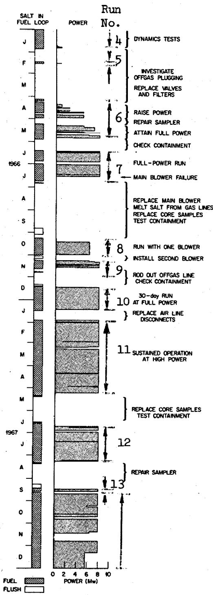

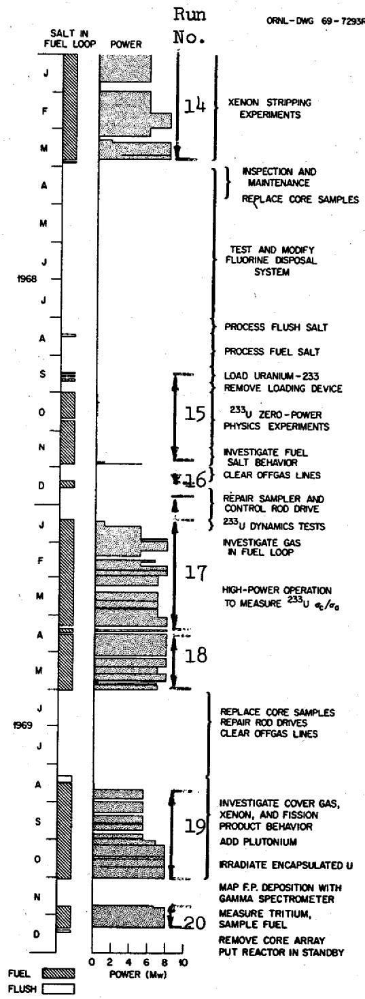  
FIGURE 2.2. HISTORICAL OUTLINE OF MSRE'S OPERATION

ORNL-LR-DWG 61097R1A

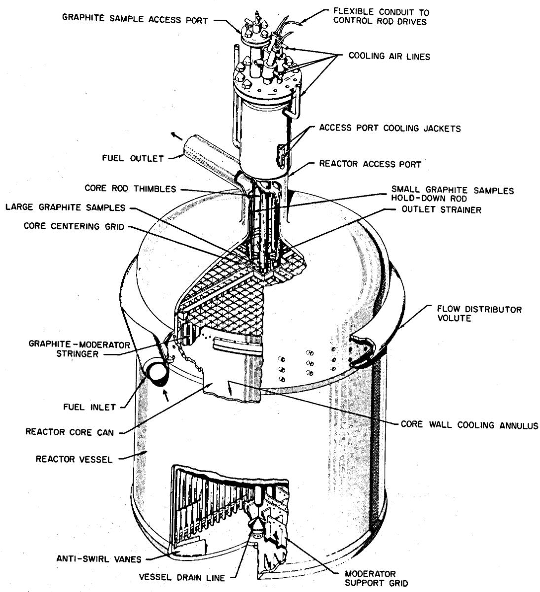  
FIGURE 2.3. MSRE CORE AND REACTOR VESSEL

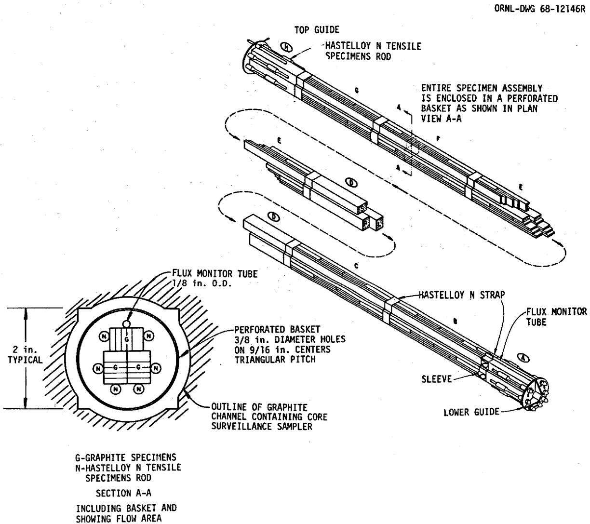  
FIGURE 2.4. MSRE CORE SURVEILLANCE SPECIMENS

AND CROSS SECTION OF FLOW GEOMETRY

surveillance specimen holder was removed from the core and taken to a hot cell where the samples could be removed. Samples consisted of graphite specimens, Hastelloy-N rods for tensile strength tests, and Hastelloy-N flux monitor tubes. The specimen assembly was made so that only part of the samples need to be removed, and the remaining samples along with new replacements could be reinserted into the reactor for further irradiation. Fission product deposition measurements were then made on the graphite and Hastelloy-N specimens, which had been removed from the sample holder.

# 2.3 Description of the Fuel Pump

The fuel pump turned out to be a very important component in understanding noble metal migration in the MSRE. A detail drawing of the pump is shown in Figure 2.5. Its rated capacity is $1200\mathrm{gpm}$ of fuel salt at 48.5 ft of head. The volute is completely enclosed in another vessel referred to as the pump bowl, which served a variety of purposes. It contained the only free liquid surface in the system and therefore served as an expansion volume for salt. It also contained the $^{135}\mathrm{Xe}$ stripping system, a salt level indicator, and the fuel salt sampling facility. The fuel expansion capacity of the pump bowl was more than adequate for the normal operating ranges of the MSRE, but was not adequate for some postulated accident conditions. Therefore, the pump bowl was provided with an overflow tank that would fill if the salt level in the pump bowl reached the level of the overflow pipe. The normal operating helium pressure in the pump bowl, which was also the pump suction pressure, was about 5 psig.

The xenon stripper was a gas-liquid contacting device. A toroidal spray ring containing many small holes (146 - 1/8 in. holes, and 145 - 1/16 in. holes), sprayed the salt through the gas phase. The salt flow, which resulted in a mean jet velocity of 7.2 ft/sec, was estimated (not measured) to be at a rate of about 50 gpm. The xenon rich cover gas was purged from the pump bowl by a continuous flow of clean helium from (1) the pump shaft purge, (2) two bubbler level indicators, and (3) the reference pressure line purge for the bubblers. The purge gas then went to the off-gas system described earlier. The overflow tank also had a bubbler level indicator and its purge also went to the off-gas system.

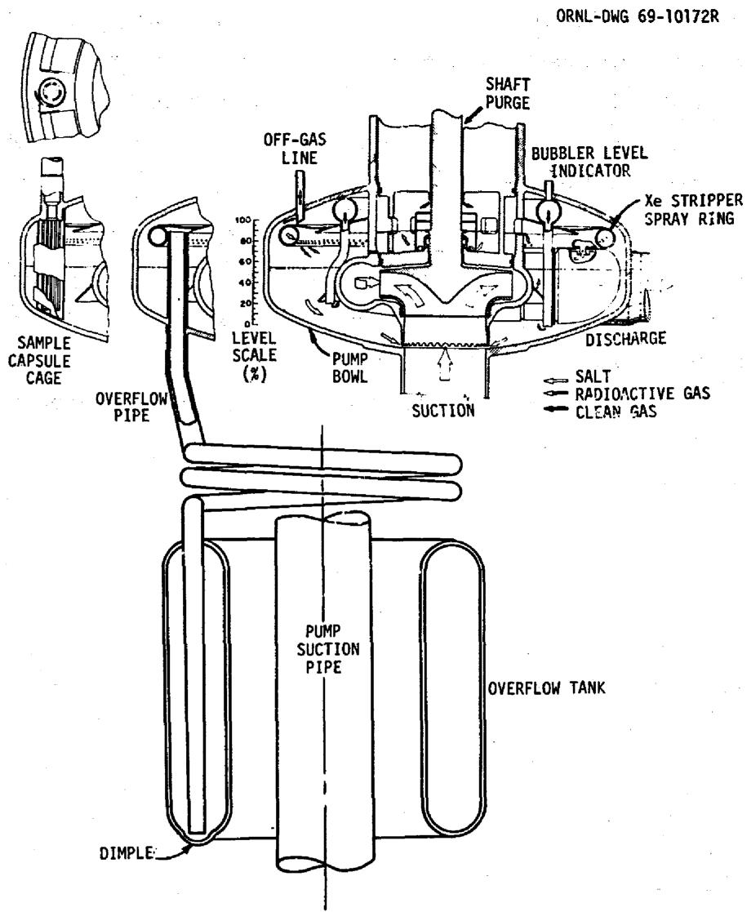  
FIGURE 2.5. MSRE FUEL PUMP AND OVERFLOW TANK

The spray jets impinging on the salt surface generated large amounts of helium bubbles and fluid turbulence in the pump bowl. These bubbles manifested themselves in several ways in the operation of the MSRE. In one sense their presence was unfortunate because it complicated the understanding of many observations in the reactor, but in another sense it was fortunate because it led to the suggestion of efficient ways of removing fission products (particularly noble gases, but possibly also noble metals) from future molten-salt reactor systems.

Let us examine the behavior of gas bubbles in the salt in the pump bowl by first considering the carryunder of bubbles. Note from Figure 2.5 that there are two bubblers and they are at different depths. By difference in reading between the bubblers, one can deduce information on the average fluid density between them. Void fractions as high as 18 percent were measured in this region. $^{(4)}$ Certainly most of the bubbles were large and would rise to the surface, but some of them were small and would be carried down into the pump suction to circulate with the fuel salt. Estimates of the size of the small bubbles indicate they were less than 0.010 in. in diameter. The amounts of bubbles circulating with fuel salt could be estimated by analysis of (1) level changes in the pump bowl, (2) nuclear reactivity balances in the core, (3) sudden pressure release tests, (4) small induced pressure perturbations, and (5) other less direct observations. The general conclusion from these analyses is that the volume fraction of circulating bubbles in the fuel loop during the $^{235}\mathrm{U}$ runs was 0.0002 to 0.00045, $^{(4,5)}$ and the void fraction during the $^{233}\mathrm{U}$ runs was 0.005 and 0.006. $^{(4)}$ A hypothesis is presented in Section 3.3 to explain this rather large change in circulating void fraction between the $^{235}\mathrm{U}$ and $^{233}\mathrm{U}$ runs. The same hypothesis is used to explain the difference in overflow rates discussed next.

Now consider the bubbles that rise to the surface in the pump bowl. There are strong indications that they produced a froth with a high liquid content on the salt surface. For instance, there was a constant flow of fuel salt from the pump bowl to the overflow tank even though the indicated salt level in the pump bowl was well below the overflow pipe. Periodically this salt was forced back into the pump bowl by pressurizing the overflow tank with helium. This transfer must have been due to

froth flowing over the lip of the overflow pipe, or to a mist of salt drifting into the overflow pipe, or to both. Overflow rates during the $^{235}\mathrm{U}$ runs ranged from 0.4 to 1.5 lb/hr. During the $^{233}\mathrm{U}$ runs they ranged from 4 to 10 lb/hr with excursions up to 70 lb/hr. $^{(4)}$ A simple comparison indicates that a rain of "more than the hardest torrential downpour" ${}^{(4)}$ would have been required to match the lowest overflow rate during the $^{233}\mathrm{U}$ runs. A reasonable conclusion is that froth with a high liquid content flowing down the overflow pipe accounted for the high overflow rates. There may also have been mist in the pump bowl. It is well known that the mechanical action of a high velocity jet impinging on a liquid surface will generate a mist. Bursting bubbles are also known to produce mist. There are physical indications from the reactor that a mist was present in the pump bowl. For example, the off-gas line plugged periodically which was probably due to freezing of salt from a mist. Strips of metal suspended in the gas phase of the pump bowl were covered with small droplets when retrieved (see Figure 4 of Ref. 4). Later when we discuss the analysis of gas samples taken from the pump bowl, we will explain the results by theorizing that a salt mist was probably being sampled.

A facility was provided for taking salt samples from the bowl of the fuel pump. This sampling facility was used for a variety of purposes including (1) taking fuel salt samples, (2) taking gas phase samples, (3) adding uranium to the fuel salt, (4) adding chemicals to the fuel salt to control its oxidation-reduction state, and (5) exposing materials to fuel salt for short periods of time. The sampling facility was quite complex, and included a dry box, isolation valves, remote handling gear, shielding, instrumentation, etc. A detailed description of the entire facility is not necessary for the purposes of this report, and only the sample station in the pump bowl is shown in Figure 2.6. Note that the sample station is enclosed by an overlapping shield arrangement. It was desired to take the salt and gas samples under rather quiescent conditions, and this shield was intended to prevent the mist, foam, and fluid turbulence generated by the spray ring from penetrating too aggressively into the sampling region. The shield does not, however, prevent free movement of salt through the sample region. The overlapping portion of the shield is not closed, and also, the shield is elevated off the

ORNL-DWG 67-10766R

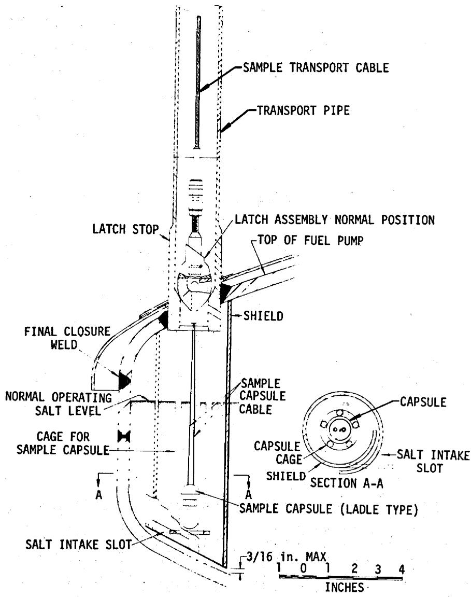  
FIGURE 2.6. PUMP BOWL SAMPLE STATION

bottom of the pump bowl. The sample capsule shown is typical of the first kind of capsules used in the MSRE. It is referred to as a "ladle capsule." It is simply a container with open ports in the side. During normal sampling, it was lowered with the sample transport cable until it was well below the salt surface. After filling, it was lifted out of the salt and suspended for a period of time a short distance up in the transport pipe in order to freeze the salt. It was then withdrawn, isolated from the fuel system, and taken to a hot cell for analysis. During the sampling period, a small purge of helium was maintained down the transport pipe. Fig. 2.7 shows other sample capsules used which will be described later.

# 3. FISSION PRODUCT EXPERIENCE IN THE MSRE

# 3.1 General Fission Product Disposition

In this section we will discuss in a qualitative way the general disposition of fission products in the MSRE, and the techniques used to measure this disposition. The emphasis will be on noble metals. We will also discuss the rather dramatic differences in the reactor operating characteristics when fueled with $^{235}\mathrm{U}$ and $^{233}\mathrm{U}$ , and propose a reason for this difference.

A systematic way of classifying fission products in the MSRE, based on their migrational characteristics, is as follows:

(1) salt seekers,   
(2) noble gases, and   
(3) noble metals.

As a group and under normal MSRE operating conditions, the salt seekers are the best behaved of all fission products. Examples of salt seekers are Sr, Y, Zr, I, Cs, Ba, Ce and Nd. Unless affected by migrational characteristics of their precursors, they remain dissolved in the fuel salt in inventory quantities. Consider the following generalized beta decay scheme of fission products:

(2) (1) (1) (1) (1) (4) (3) Kr → Rb → Sr → Y → Zr → Nb → Mo →   
(3) (3) (3) (3) (3) (4) (1) $\mathrm{Te} \rightarrow \mathrm{Ru} \rightarrow \mathrm{Rh} \rightarrow \mathrm{Pd} \rightarrow \mathrm{Ag} \rightarrow \mathrm{Cd} \rightarrow \mathrm{In} \rightarrow$

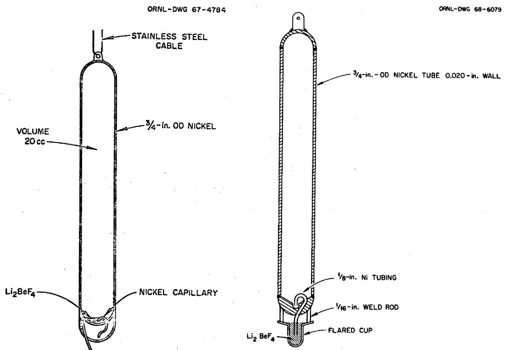  
(a) Two Modifications of Freeze Valve Capsules

ORNL-DWG 70-6758

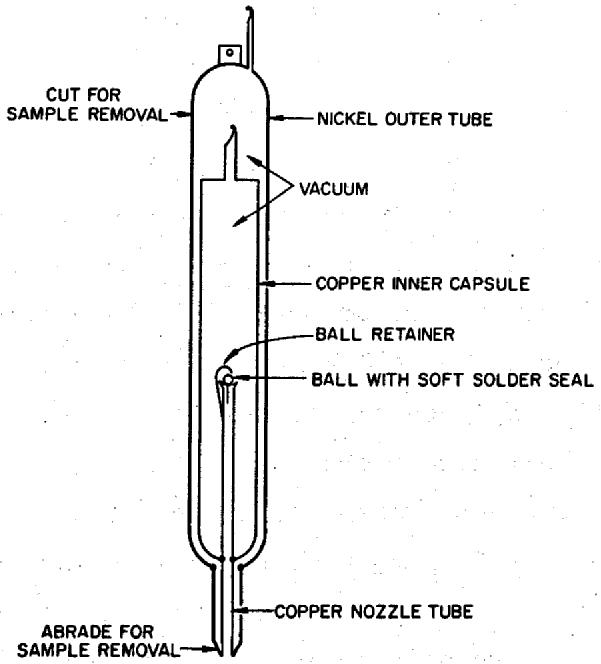  
(b) Double-Wall Freeze Valve Capsule   
FIGURE 2.7. FREEZE VALVE SAMPLE CAPSULES

(3) (3) (3) (1) (2) (1) (1) Sn → Sb → Te → I → Xe → Cs → Ba →   
(1) (1) (1) (1) La → Ce → Pr → Nd →

where (1) - salt seeker,

(2) - noble gas,   
(3) - noble metal, and   
(4) - noble metal or salt seeker depending on oxidation-reduction state of fuel salt.

Note that Kr (a noble gas) is a precursor of Rb, Sr, Y and Zr (salt seekers) and also that Xe (a noble gas) is a precursor of Cs, Ba, La and Ce (salt seekers). Also note that Sb and Te (noble metals) are precursors of I (a salt seeker). The behavior of precursors of salt seekers may dramatically affect the ultimate disposition of the salt seekers themselves. For instance $^{95}\mathrm{Zr}$ has a yield of about 6.2 percent but its precursor, $^{95}\mathrm{Kr}$ , has a yield of only 0.007 percent and is very short lived. Therefore any migrational tendency of the $^{95}\mathrm{Kr}$ will have little effect on the $^{95}\mathrm{Zr}$ . Indeed the complete $^{95}\mathrm{Zr}$ inventory was found in the fuel salt.(6) As opposed to this, consider the salt seeker $^{137}\mathrm{Cs}$ with a cumulative yield of 6.15 percent. Most of its yield comes from the decay of $^{137}\mathrm{Xe}$ that has a yield of about 6.0 percent and a half life of 3.9 min. Xenon can be transferred to the off-gas system and also can diffuse into the porous structure of the graphite. Accordingly, only 80 to 90 percent of the $^{137}\mathrm{Cs}$ inventory was found in the fuel salt(6) and significant quantities were found deep inside the graphite where it deposited upon decay of its precursor.\* (7,8) In conclusion, the salt seeking fission products are well behaved and remain dissolved in the circulating fuel salt in inventory quantities except when influenced by the behavior of their precursors.

There are only two noble gas fission products, Kr and Xe. They appear, however, in over 30 mass number decay chains and therefore significantly affect the general fission product disposition. Notable among these fission products is $^{135}\mathrm{Xe}$ with its large thermal neutron

cross section of $3 \times 10^{6}$ barns. Because of $^{135}\mathrm{Xe}$ , a great deal of work has gone into quantitatively understanding noble gas migration in the MSRE. This work has been reported in the semiannual reports and other documents. The noble gases, particularly xenon, are very insoluble in fuel salt; therefore, they are readily transported into any available gas phase such as the circulating bubbles, the gas space in the pump bowl, and the pores of the moderator graphite.

The third group of fission products is the so-called "noble metals." They are reduced by $\mathrm{UF}_3$ in the fuel salt and exist in the reactor environment in the metallic state, hence the name. Examples are Mo, Ru, Ag, Sb, Te and sometimes Nb. If the fuel salt is in a well reduced state, then the Nb exists as a noble metal, but if the fuel is more oxidized, it exists as a salt seeker. Noble metals have been found throughout the entire reactor fuel salt loop. They have been found in large quantities in fuel salt and gas phase samples from the pump bowl. They have been found in large quantities on the Hastelloy-N and graphite-core surveillance samples, and on the primary heat exchanger tube surfaces and loop piping surfaces. They have been found at various locations in the off-gas system. In this report we will look quantitatively at the noble metals in these depositories, within the framework of mass transfer theory, and try to develop a unified model of noble metal migration in the MSRE.

# 3.2 Fission Product Disposition Measurements

# 3.2.1 Fuel Salt and Gas Phase Samples

Three types of capsules were used to obtain fuel salt samples from the MSRE pump bowl sample station, and these are shown in Figures.2.6 and 2.7. Numerous other sampling devices were used for special tests but only those illustrated were used on a routine basis. The ladle capsule is the simplest and was the first used for sampling fuel salt. This capsule is illustrated in Figure 2.6 in the process of taking a salt sample. It is simply a small container with open ports on the side to allow salt to enter. During the course of fuel salt sampling from the reactor, it was found that a mist of salt, which was heavily contaminated with noble metals, existed over the salt pool. Presumably this mist was generated by

the mechanical action of the spray impinging on the salt surface and by bursting bubbles. When the ladles were lowered to take a salt sample, the mist adhered to the capsule and grossly contaminated the sample. "Freeze valve" capsules, which had previously been developed for taking gas samples, were therefore used to take salt samples in the hope of alleviating this problem. Two modifications of these freeze valve capsules are shown in Figure 2.7a. Each capsule contains a vacuum which is held by a frozen salt seal around the capillary entrance tube. The salt seal is designed to melt after a delay time long enough to allow the capsule to be completely submerged in fuel salt before it opens. The inside surface of the capsule is therefore not contaminated with the salt mist when taking a fuel salt sample. Freeze valve capsules for taking salt samples were used first in run 14. The noble metal concentration measured in salt from these capsules was generally about two orders of magnitude less than in salt from the ladle capsules. Note that in both modifications of the freeze valve capsule, the sealing salt remains inside the capsule, and puddles over the capillary nozzle. When taking gas phase samples, the capsule is lowered into the pump bowl until the valve thaws and the sample is taken, then it is withdrawn to a cooler region so the salt puddle may again freeze and contain the sample. These freeze valve capsules did not exclude mist and scum on the salt surface from adhering to the outside surfaces of the capsule. During capsule processing the outside surfaces were always well leached to remove this material. Nevertheless, the question of transfer of contamination from the outside surface to the inside materials during chemical processing always remained. This worry led to the development of the double walled, freeze valve capsule shown in Figure 2.7b. It is basically a freeze valve capsule but it is doubly contained, and can be used for salt or gas phase sampling. During processing, the nozzle and top of the outer container are cut through. The inner capsule containing the sample then falls away from the outer container and is free from mist and scum. There was little difference in the measured noble metal concentration between samples taken with freeze valve and with double-walled freeze valve capsules.

These three kinds of capsules were routinely used for taking fuel salt and gas phase samples. In the analytical work presented in this report, only data from the freeze valve and double-walled freeze valve capsules will be used, and they will be used with equal weight. Ladle samples will not be used because of the problem of mist and scum contamination. On all plots that follow, the data points will specify whether the capsule was a freeze valve or a double-walled freeze valve type. Another point to note is the difference in volume of the two capsule types. The freeze valve capsule when full holds 50 to 60 grams of fuel salt, but the double-walled capsule when full holds only $14$ to 15 grams. During the sampling procedure, a purge of helium was maintained down the sample transport pipe. This should make little difference to the salt samples but could be a significant parameter for the gas samples. The helium purge varied from 575 to 75 standard $\mathrm{cm}^3/\mathrm{min}$ depending on the sample. All samples were taken with the higher purge rate before sample 19-16; after that the salt samples had the higher purge rate and the gas samples the lower purge rate.

Only four freeze valve samples of fuel salt were taken during the $^{235}\mathrm{U}$ runs (during run 14) but many freeze valve and double-walled freeze valve samples were taken during the $^{233}\mathrm{U}$ runs. The $^{233}\mathrm{U}$ runs will therefore be discussed most extensively. Many ladle samples of salt were taken during the $^{233}\mathrm{U}$ runs because they continued to give good results on salt-seeking fission products. Both the salt and gas samples were analyzed radiochemically. This technique was used to determine both the identification and the amount of the isotopes present.

# 3.2.2 Gamma Spectrometry of the Primary Heat Exchanger

The amounts of certain noble metal fission products deposited on the primary heat exchanger tube surfaces were measured by gamma ray spectrometry. The technique consisted of looking at a spot on the heat exchanger with a collimated detector and measuring the gamma energy spectrum emitted from that spot. The resulting spectra were used to identify and measure quantitatively the fission products present.

The first gamma scans were made after run 14 (last $^{235}\mathrm{U}$ run) and were, to an extent, exploratory in nature; i.e., an attempt was made to see if

specific fission product information could be extracted quantitatively from the tremendous amount of background gamma radiation emitted by an operating reactor system. Briefly, the equipment consisted of a highly collimated lithium-drifted germanium diode detector that was coupled to a 400 channel analyzer to determine the energy spectra. All scans were taken with the reactor shut down and either drained or filled with flush salt. The equipment was mounted on a portable maintenance shield, so gamma scans could be taken at many locations on the heat exchanger. All together about 100 spectra were determined. Most of these were from the heat exchanger but a few were from other components. The equipment was calibrated so that the measured count rate could be reduced to atoms of fission product per unit area of tube surface. Data processing was done by hand and was quite tedious. It was possible to isolate quantitatively four noble metals from a typical spectrum (99Mo, 103Ru, 132Te, and 95Nb). More details of the equipment and procedures can be obtained from Ref. 10. At the end of the experiment it was concluded that the quality of the data and its potential applications were sufficiently promising to warrant improving the system and repeating the experiments during later runs.

After considerable equipment and calibration procedure improvement, the gamma spectrometry measurements were repeated after run 19 ( $233\mathrm{U}$ ). An improved Ge(Li) detector and a 4096 channel analyzer were used. Data processing was done with a computer program developed for this purpose. Precise alignment was achieved by use of a laser beam and surveyor's transit. Altogether some 1000 spectra were measured, many of which were taken with the reactor at different power levels (a few watts to full power). Another 400 spectra were taken for calibration purposes. Details of the equipment, calibration procedures, and data analysis can be obtained from Ref. 11. Gamma spectra were obtained from other fuel loop components besides the heat exchanger, such as the pump bowl, off-gas line, and main loop piping. The principal intent of the experiment, however, was to measure fission product deposition quantitatively in the primary heat exchanger. This was the only component for which an absolute calibration of the detector was made. Therefore, these are the only data that will be analyzed in this report. The principal spectra of the primary heat exchanger were obtained after run 19, although some

preliminary data were taken after run 18. The data were taken with the reactor shut down and drained. Altogether, quantitative information was obtained for 10 noble metal isotopes from these data. Figure 3.1 is typical of the kind of data obtained from this experiment. It shows the amount of $^{132}\mathrm{Te}$ per square centimeter of tube surface plotted against a longitudinal representation of the heat exchanger. The total range in concentration is from $0.3 \times 10^{12}$ to $0.75 \times 10^{12}$ disintegrations/min- $\mathrm{cm}^2$ . The higher value seems to be associated with the baffle plates and their windows, whereas the lower value is associated with the crossflow part of the heat exchanger. In this report the lower value was considered to be most representative of the heat exchanger and, as an example, $0.3 \times 10^{12}$ disintegrations/min- $\mathrm{cm}^2$ was chosen for $^{132}\mathrm{Te}$ . The quality of data from the gamma scans after run 14 were not nearly as good as shown in Figure 3.1, and a sort of weighted average of all the data was used.

# 3.2.3 Core Surveillance Samples

The core surveillance specimens were briefly described (see Sect. 2.2) and illustrated (see Figure 2.4) earlier. Periodically, when the reactor was shut down and drained, all graphite and Hastelloy-N specimens were removed and the amounts of fission products deposited on the surfaces and the interior of some were measured. Radiochemical techniques were used to determine the identity and amount of the isotopes present. Unfortunately, the fluid dynamic conditions in the surveillance specimen holder are not well known because the flow passages are so complicated. These fluid dynamic difficulties are discussed in detail in Appendix B where we estimate the mass transfer coefficient. Briefly, let us just say that the surveillance specimens feature inside corners, outside corners, fluid entrance and exit regions, and possible stagnation areas. Superimposed on these is a flow that is only marginally turbulent (Re ≈ 3000). These difficulties were a result of the many different kinds and geometries of specimens that had to be incorporated into a very confined space. The measured noble metal deposition data on graphite that will be analyzed in this report came from the surfaces exposed to fuel salt, although some noble metals were also found on the inside surfaces that presumably were

FIGURE 3.1. MSRE HEAT EXCHANGER   
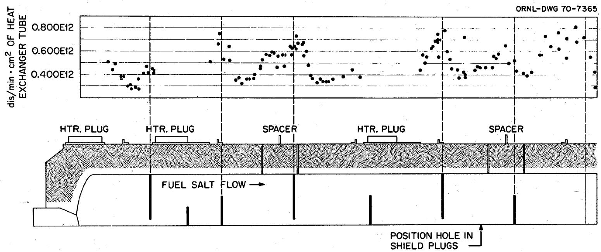  
FISSION PRODUCT DEPOSITION; 132 Te(1)

not exposed to salt. The measured noble metal deposition data on Hastelloy N came from the dosimetry wires. Noble metal deposition measurements were also made on the perforated Hastelloy N cage but these will not be analyzed because of the almost impossible job of estimating the mass transfer coefficient. In Appendix B, the mass transfer coefficient to both the graphite and the Hastelloy N is estimated to be about 0.25 ft/hr. There is a significant uncertainty associated with this value for the reasons described above. The mass transfer coefficient from the fuel salt to the heat exchanger surfaces is a much better known number than to the surveillance specimens. Figures 3.2 and 3.3 show typical data obtained from these specimens.

# 3.3 The Difference Between the $^{235}\mathrm{U}$ and $^{233}\mathrm{U}$ Runs

Following run 14 the $^{235}\mathrm{U}$ fuel was removed from the carrier salt (and flush salt) and the reactor was refueled with $^{233}\mathrm{U}$ . Chemical processing of the salt was done at the MSRE site, and the process is discussed in detail in Ref. 12. The basic process was fluorination of the fuel salt and removal of the uranium as a volatile fluoride. The corrosion rate on the process tank during processing was high and has been estimated to be about 0.1 mil/hr. The tank was constructed of Hastelloy N and the corrosion products were NiF₂, FeF₂, and CrF₂. Following the fluorination step, it was therefore necessary to remove the corrosion products from the salt. This was done by reduction with hydrogen and zirconium powder and subsequent filtration. Removal of $^{235}\mathrm{U}$ from the salt was essentially complete. The carrier salt was then returned to the reactor system and loaded with $^{233}\mathrm{U}$ . Run 15, the first $^{233}\mathrm{U}$ run, was concerned with the zero-power physics experiments with this new fuel.

During run 15 a significant change in operating characteristics of the reactor occurred and persisted until the reactor was permanently shut down. During the $^{235}\mathrm{U}$ runs, the volume fraction of circulating bubbles in the fuel loop was determined to be between 0.0002 and 0.00045 (see Ref. 5), and the overflow rate from the pump bowl to the overflow tank ranged from 0.4 to 1.5 lb/hr, with essentially no overflow excursions following beryllium additions. Beryllium was periodically added to the fuel salt, primarily to reduce some $\mathrm{UF_4}$ to $\mathrm{UF_3}$ and control the oxidation state of the fuel. During the $^{233}\mathrm{U}$ runs the volume fraction of circulating bubbles

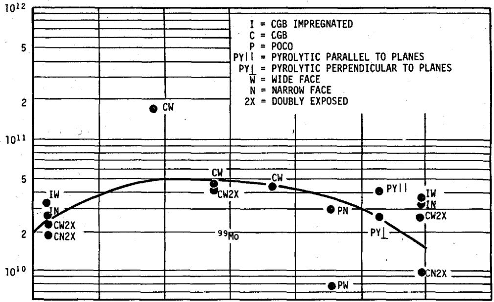  
DEPOSITION (dpm/cm²)

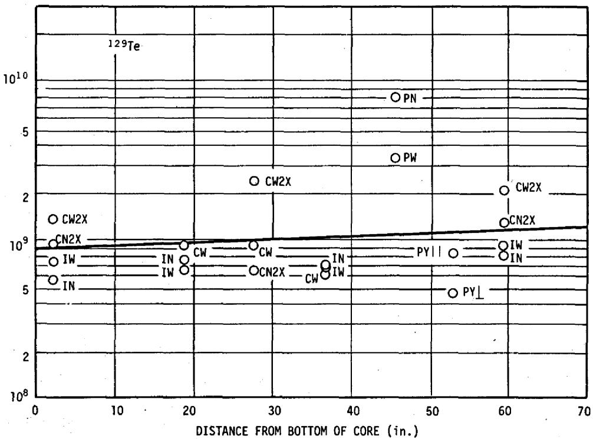  
FIGURE 3.2. DEPOSITION OF $99_{\text{MO AND}}$ $129_{\text{TE}}$ ON GRAPHITE CORE SURVEILLANCE SPECIMENS

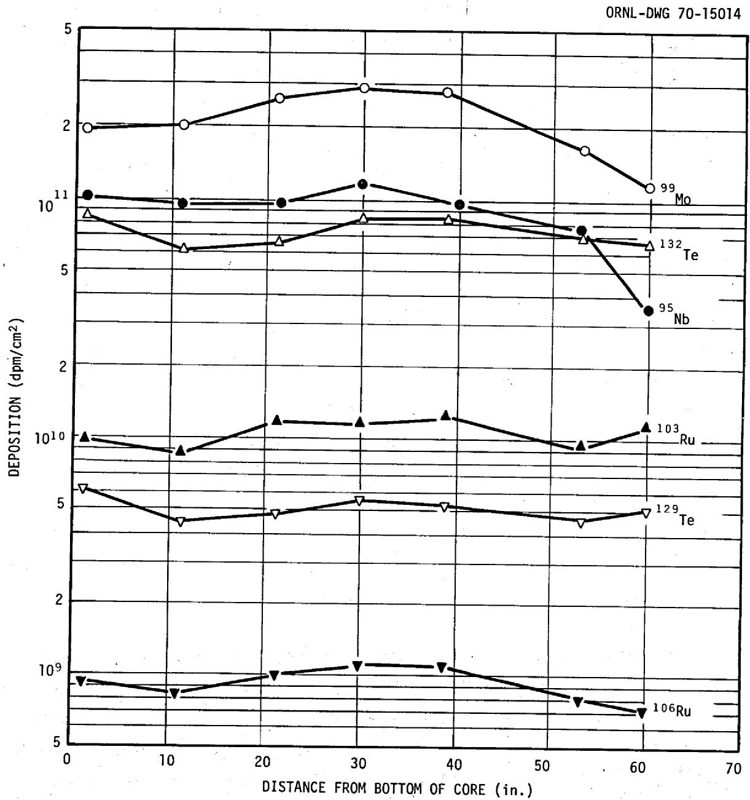  
FIGURE 3.3. DEPOSITION OF $99_{\text{MO}}$ , $132_{\text{TE}}$ , $129_{\text{TE}}$ , $103_{\text{RU}}$ , $106_{\text{RU}}$ , AND $95_{\text{ZR}}$ ON HASTELLOY N CORE SURVEILLANCE SPECIMENS AFTER 32,000 MW HRS

in the fuel loop was 0.005 to 0.006, and the overflow rate ranged from 4 to 10 lb/hr with excursions up to 70 lb/hr following a beryllium addition. The mean circulating void fraction had gone up by a factor of about 20 and the overflow rate had gone up by a factor of about 10 in the $^{233}\mathrm{U}$ runs as compared to the $^{235}\mathrm{U}$ runs. Reference $\frac{4}{4}$ provides a detailed discussion of these operating variables and others. The composition of the fuel salt remained nominally the same for both fuels, although the uranium concentration was reduced from 0.9 mole percent to about 0.2 mole percent primarily because the $^{233}\mathrm{U}$ was not diluted with $^{238}\mathrm{U}$ . This resulted in a lowering of salt density by 3 to 4 percent. Other physical properties (viscosity, surface tension, etc.) might be expected to change an equivalently small amount. The rate of bubble injection from the pump bowl to the loop, and the overflow rate are certainly functions of these variables. In my opinion, the change in reactor operational parameters is much too great to be explained by such small changes in physical properties. Actually, there is evidence that the bubble ingestion phenomenon was near a threshold region. This was indicated by a steep change in void fraction when the pump speed was changed a small amount.* It has been speculated that the small changes in physical properties were coupled in some way to the ingestion threshold to yield the high void fractions during the $^{233}\mathrm{U}$ runs. $^{(4)}$ This suggestion may account for part of the increased void fraction, however, I believe that it accounts for only a small amount of the increase.

The question then is - Why the difference in the above parameters when fueled with $^{235}\mathrm{U}$ and $^{233}\mathrm{U}$ . A clue is given during the initial history of the $^{233}\mathrm{U}$ runs. Prior to the start of run 15, flush salt was circulated in the fuel loop for about 40 hr. There was no abnormal behavior during this period. Both the circulating void fraction and the overflow rate were consistent with what had been expected from past operating history. The flush salt was drained and the fuel salt was added. Circulation was started and again no abnormal behavior was noted. After about 14 hr of

circulation, a beryllium rod was added for the purpose of reducing part of the $\mathbf{U}^{4 + }$ to $\mathbf{U}^{3 + }$ . About 2 hr later, the salt level in the pump bowl began to rise indicating increased bubble ingestion into the fuel loop. When it peaked out, the circulating void fraction was about 0.5 percent. A short time later the overflow rate apparently went up to a higher than normal value ( $\sim$ 4 lb/hr). Detailed records are not available because the data logger was not fully operable during this period. When the beryllium rod was removed after 12 hr of exposure to salt, 10.1 grams of beryllium had been dissolved. The circulating void fraction and overflow rate remained high for 10 hr of circulation until the fuel salt was drained into the dump tanks. The above occurred before the reactor went critical with $^{233}\mathrm{U}$ .

A suggested explanation for this behavior is as follows. During the early operational history of run 15, the fuel salt was in a more oxidized state than expected.(13) The direct evidence that these fluorides were there and that the fuel oxidized is as follows:

(1) The corrosion rate on the fuel loop was high during run 15.   
(2) During the $^{235}\mathrm{U}$ runs, $^{95}\mathrm{Nb}$ behaved as a noble metal. During the initial $^{233}\mathrm{U}$ runs, it behaved as a salt seeking fission product, indicating the fuel was much more oxidized. (14)   
(3) When the beryllium capsule was removed from the salt, a thick crust was found on the nickel cage enclosing the capsule. The crust was predominantly salt, but the residue after extracting the salt was predominantly iron with small amounts of nickel and chromium. (13) Similar crusts were found on other beryllium capsules added during run 15. The perforated capsule for beryllium additions during the $^{235}\mathrm{U}$ runs usually came out of the pump bowl relatively clean and did not have iron deposits.

The beryllium then, rather than reducing the uranium in the fuel, apparently reduced the iron and nickel corrosion product fluorides to the metallic state and they formed a scum on the surface of the fuel salt in the pump bowl. A hypothesis of this analysis is that the floating scum possesses many properties of insoluble surface active agents. One characteristic of such surface active materials is that they enhance froth stability, and an effect would be produced in the pump bowl much like in a froth floatation chamber. It was suggested earlier that a

mechanism involving heavy froth must be resorted to to explain the high overflow rates experienced during the $^{233}\mathrm{U}$ runs. Another effect of surface active agents is in the size of the bubbles generated. Development work with bubble generating devices (15,16) in the form of a venturi or jet pump has shown that considerably smaller bubbles are generated when a surface active material is present than when absent. It is unclear whether they are actually generated smaller or whether the presence of surface active agents prevents their coalescence in the immediate vicinity of their generation. The result, however, is that they are considerably smaller. Now to extrapolate to the MSRE, one would say that with reduced corrosion products acting as surface active materials in the pump bowl, more small bubbles were generated during the $^{233}\mathrm{U}$ runs than the $^{235}\mathrm{U}$ runs. The smaller the bubbles, the better their chance of being swept into the fuel loop by the under flow. This then would be a mechanistic hypothesis to explain the higher circulating void fractions and pump bowl overflow rates during the $^{233}\mathrm{U}$ runs. Of course, it must be shown that surface active materials existed in the pump bowl and fuel loop for all the $^{233}\mathrm{U}$ runs. Although regular salt sampling capsules came out of the reactor fairly clean, the beryllium addition capsules continued to show deposits of Fe and Ni in varying amounts during the remainder of the $^{233}\mathrm{U}$ runs. In addition, magnets were periodically lowered into the pump bowl in an effort to recover free metallic particles. They did recover these materials although the quantities were small, less than a gram; however, it doesn't take a large amount of surface active materials to have a dramatic effect on surface behavior.

The physical state or stability of the froth in the pump bowl will be referred to several times in this report, particularly with regard to the differences in its state between the $^{235}\mathrm{U}$ and $^{233}\mathrm{U}$ runs. In common usage a froth or foam, such as the foam on a glass of beer, often implies a high degree of stability. In terms of bubble lifetime, the mean life of a bubble in a head of beer is orders of magnitude greater than in pure water. I do not intend to suggest an increase in bubble stability in the pump bowl anything like this, rather that the increase in bubble stability between the $^{235}\mathrm{U}$ and $^{233}\mathrm{U}$ runs was relatively minor. Let us see if we can extract something meaningful regarding bubble lifetimes in

the pump bowl. At steady state the bubble generation rate must equal the bubble destruction rate. The bubble generation rate was determined by the rate of gas carryunder from the xenon stripper salt spray. One might expect that the carryunder was more or less constant for the $^{235}\mathrm{U}$ and $^{233}\mathrm{U}$ runs; at least we will assume this to be the case. We will also assume that the bubble bursting rate is proportional to the total volume of gas bubbles in the salt. This neglects many variables which are certainly important, such as bubble size, depth of froth, salt drainage from the bubble swarm, etc., nevertheless, in the interests of continuing with this discussion, the assumption probably isn't too bad. If it is true then at steady state, we have

# Bubble Generation Rate = λV

where $V$ is the total volume of gas entrained and $\lambda$ is the "bursting constant" for the bubbles. The bubble half life would be 0.693/λ. Note that within these assumptions at a constant bubble generation rate, if the bubble half life is doubled, then the total volume of gas entrained by the salt would also be doubled. The froth height in the pump bowl would then increase a corresponding amount. A mechanism like this, with an increase in bubble lifetime of this magnitude, could easily account for the higher overflow rates experienced during the $^{233}U$ runs. Note particularly that doubling or even tripling bubble lifetimes represents a rather mild increase in bubble stability compared to more common notions.

This, then is a description of the differences in operating characteristics between the $^{235}\mathrm{U}$ and $^{233}\mathrm{U}$ runs in the MSRE, and a suggested hypothesis to explain the differences. The essentials of this hypothesis, that noble metals and reduced corrosion products will adhere to liquid-gas interfaces, will be referred to many times in the following sections.

# 4. ANALYTICAL MODEL

# 4.1 Physical Basis of Model

For reasons already discussed, and for others which will become apparent in the section on RESULTS FROM THE MSRE, one might expect that the transport of noble metals from the fuel salt to the various surfaces

where they deposit is controlled by the laws of mass transfer. Let us review briefly the behavior of noble metal fission products and fuel salt in the MSRE as follows:

1. Noble metals are born as ions from fission and decay of their precursor, but become atoms very quickly. They are homogeneously dispersed in the salt.   
2. Noble metals are unstable in fuel salt; i.e., they are present in the reduced metallic state and are quite insoluble. They may even be unwet by salt. Massive metal objects display contact angles in the range of $90 - 150^{\circ}$ . (17)   
3. Noble metals deposit on Hastelloy N and graphite surfaces, and large amounts are found there.   
4. They also deposit on liquid-gas interfaces, and we infer that they display some of the properties of surface active agents. This concept has been used to explain the differences in $^{235}\mathrm{U}$ and $^{233}\mathrm{U}$ operation of the MSRE, and will be used to explain many of the results observed later.   
5. Fuel salt is known to behave as a conventional Newtonian fluid. For instance, the primary heat exchanger was designed using conventional heat transfer correlations and the measured overall heat transfer coefficient was in good agreement with the design value. One would expect the same degree of success in estimating mass transfer coefficients since the transport phenomenon is the same in both cases. One must always be wary, of course, because sometimes physical and chemical phenomena come into play that complicate the simple approach.

The above points constitute the essential requirements for a material to transport through the fluid boundary layer and deposit on the surfaces according to the laws of mass transfer. Development work from other reactor systems has shown that, if the chemistry of the fission products permits, they will be transported according to these laws. See, for example, Refs. 18 through 21. It would therefore seem fruitful to attack the noble metal migration question in the MSRE within the framework of mass transfer theory in its simplest form and let the results speak for themselves.

# 4.2 Analytical Model

First, we must write a rate balance on the noble metals in fuel salt where they are born. The conditions of this rate balance are as follows. Note from the generalized beta decay chain from Sect. 3.l that noble metals appear in groups and we have a situation where noble metals can decay into noble metals. Note also from the generalized decay scheme that each noble metal grouping may start off with a salt seeking precursor. The analytical model will therefore consider the last salt seeking precursor of the noble metal chain. We must do this primarily because of $^{95}\mathrm{Nb}$ whose precursor is $^{95}\mathrm{Zr}$ with a half life of 65 days. The analytical model must be for the unsteady state. This is because the MSRE, being an experimental reactor, had a quite erratic power history. Seldom did any of the longer lived isotopes reach steady state. The model will consider the entire fuel loop to be a "well stirred pot." One might expect this assumption to be adequate because the fuel circuit time around the loop is about 25 seconds and the isotopes we will be dealing with have half lives ranging from hours to years. A better indication of the adequacy of this assumption would be to compare the fuel circuit time to the computed residence time of a noble metal atom in salt before it deposits on a surface. In Appendix B, it is shown that the longest residence time (expressed as the half life of noble metals in fuel salt) is twice the loop circuit time. Lastly, it is assumed that all noble metals migrate independently of each other, even when of the same chemical species.

Consistent with all the considerations discussed above, we can now write a rate balance on the noble metals associated with fuel salt where they are born. The equation in words is as follows where the units of each term is atoms/time.

$$
\begin{array}{l} V \frac {d C ^ {S}}{d t} = \text {g e n e r a t i o n r a t e f r o m f i s s i o n + g e n e r a t i o n r a t e f r o m} \\ - \text {d e c a y r a t e - d e p o s i t i o n r a t e o n g r a p h i t e} \\ - \text {d e p o s i t i o n r a t e o n h e a t e x c h a n g e r} \tag {1} \\ - \text {d e p o s i t i o n r a t e o n r e s t o f f u e l l o o p} \\ - \text {d e p o s i t i o n r a t e o n l i q u i d - g a s i n t e r f a c e s (b u b b l e s)}. \\ \end{array}
$$

See Appendix A for the Nomenclature. The two generation terms are functions of the reactor power history and yields of the specific isotopes involved. The decay rate is a function of the concentration of each specific noble metal and its decay constant. All the other terms are deposition rates and are functions of the surface area, mass transfer coefficient and the concentration potential. The deposition rates on the graphite in the core and on the heat exchanger have been listed separately. The rest of the loop is lumped into one term. Deposition on bubbles has also been listed as a separate term because of its importance. Each term will now be evaluated separately and the equation will be integrated over time.

# 4.2.1 Generation from Fission

The generation rate direct from fission is simply as follows:

$$
\text {G e n e r a t i o n} = \mathrm {y P} \tag {2}
$$

# 4.2.2 Generation from Decay of Precursor

A rate balance on the last soluble precursor before decaying into a noble metal will be

$$
V \frac {d C ^ {P S}}{d t} = y ^ {P} P - \lambda^ {P} C ^ {P S} V \tag {3}
$$

Integrating and evaluating at the boundary condition

$$
C ^ {p s} = C _ {o} ^ {p s} a t t = 0 \tag {4}
$$

we get

$$
C ^ {p s} = \frac {y ^ {p _ {P}}}{\lambda^ {p _ {V}}} + (c _ {o} ^ {p s} - \frac {y ^ {p _ {P}}}{\lambda^ {p _ {V}}}) e ^ {- \lambda^ {p _ {t}}} \tag {5}
$$

The generation rate from decay of the precursor will be

$$
\begin{array}{l} \text {G e n e r a t i o n} = \lambda^ {\mathrm {p}} \mathrm {V C} ^ {\mathrm {p s}} \tag {6} \\ = y ^ {p} + \left(\lambda^ {p} v C _ {o} ^ {p s} - y ^ {p} p\right) e ^ {- \lambda^ {p} t} \\ \end{array}
$$

# 4.2.3 Decay Rate

The decay rate of each noble metal is simply as follows:

$$
\text {D e c a y r a t e} = \lambda \mathrm {V C} ^ {\mathrm {S}} \tag {7}
$$

# 4.2.4 Deposition Rate on Heat Exchanger

Written in the framework of mass transfer theory, the deposition rate of noble metals on the heat exchanger surfaces can be expressed as follows:

$$
\text {D e p o s i t i o n r a t e o n h e a t e x c h a n g e r} = \mathrm {h} ^ {\mathrm {h e}} \mathrm {A} ^ {\mathrm {h e}} \left(\mathrm {C} ^ {\mathrm {s}} - \mathrm {C} ^ {\mathrm {s i}}\right) \tag {8}
$$

At this point it will be necessary to make an assumption concerning $C^{\text{si}}$ (the concentration of noble metal in the fuel salt at the fluid-solid interface). We will assume that all solid surfaces involved (Hastelloy N and graphite) behave as an infinite sink; i.e., if a noble metal atom migrates through the fluid boundary layer and contacts the surface, it will stick there forever. This is, of course, one of the unknowns in this analysis. The result of this assumption is that $C^{\text{si}}$ effectively becomes zero, and the equation reduces to

$$
\text {D e p o s i t i o n r a t e o n h e a t e x c h a n g e r} = \mathrm {h} ^ {\mathrm {h e}} \mathrm {A} ^ {\mathrm {h e}} \mathrm {C} ^ {\mathrm {s}} \tag {9}
$$

# 4.2.5 Deposition Rate on Graphite

By reasoning similar to that above we can arrive at the equation for deposition of noble metals on the core graphite as follows:

$$
\text {D e p o s i t i o n r a t e o n g r a p h i t e} = \mathrm {h} ^ {\text {g r a}} \mathrm {A} ^ {\text {g r a}} \mathrm {C} ^ {\mathrm {s}} \tag {10}
$$

We have again assumed a sticking fraction of 1.0.

# 4.2.6 Deposition Rate on Rest of Fuel Loop

Again by reasoning similar to that above, we arrive at the equation for the deposition of noble metals on the rest of the fuel loop (all Hastelloy N).

$$
\text {D e p o s i t i o n r a t e o n r e s t o f f u e l l o o p} = \sum (\mathrm {h A}) ^ {\text {r e s t o f f u e l l o o p}} \mathrm {C} ^ {\mathrm {s}} (1 1)
$$

# 4.2.7 Deposition Rate on Liquid-Gas Interfaces

As noted before, there are small bubbles circulating with the fuel salt. Their amount is small but the product of their surface area and mass transfer coefficient is higher than the same product for all the rest of the solid loop surfaces combined. Even if the sticking fraction to a bubble is low, their effects will still be quite strong. If we assume that noble metals deposit on liquid-gas interfaces in accordance with the mass transfer theory and that the sticking fraction is 1.0, we again arrive at a similar equation for the rate of migration to bubbles.

Deposition rate on liquid-gas interfaces (bubbles) = h $^{\text{bubble}}$ A $^{\text{bubble}}$ C $^{\text{s}}$ (12) Later we will deduce that the effective sticking fraction to bubbles is less than unity.

# 4.2.8 Equation for $C^S$

Now the individual generation rate terms and decay and deposition rate terms are substituted into the original rate balance around the fuel salt; Eq. (1), and the equation is integrated. The constant of integration is evaluated at the boundary condition

$$
C ^ {S} = C _ {0} ^ {S} \quad a t t = 0 \tag {13}
$$

This will yield the equation for the concentration $(C^S)$ of a noble metal in the fuel salt at any time (t). This equation is as follows:

$$
\begin{array}{l} C ^ {s} = \frac {P (y ^ {p} + y)}{V X} + \left(\frac {\lambda^ {p} C _ {o} ^ {p s} - y ^ {p p} / V}{X - \lambda^ {p}}\right) e ^ {- \lambda^ {p} t} + \left[ C _ {o} ^ {s} - \frac {P (y ^ {p} + y)}{V X} \right. \tag {14} \\ \left. - \left(\frac {\lambda^ {p} C _ {o} ^ {p s} - y ^ {p p} / V}{x - \lambda^ {p}}\right) \right] e ^ {- X t} \\ \end{array}
$$

where

$$
X = \lambda + \frac {h ^ {\text {g r a}} A ^ {\text {g r a}}}{V} + \frac {h ^ {\text {h e}} A ^ {\text {h e}}}{V} + \frac {\sum (h A) ^ {\text {r e s t o f l o o p}}}{V} + \frac {h ^ {\text {b u b}} A ^ {\text {b u b}}}{V} \tag {15}
$$

This equation can be carried through the power history of the reactor. If the power level is changed, then the value of $C^s$ preceding the power change will be the initial condition $(C_0^s)$ at the new power level. Also note that

X has units of time $^{-1}$ , and is the theoretical rate constant for migration of noble metals from the fuel salt to their sinks.

# 4.2.9 Noble Metals on Solid Surfaces

Now that we have an expression for the concentration of noble metals in fuel salt as a function of time and the power history of the reactor, we can compute the amount of noble metals deposited on any surface in the reactor. To do this we must again set up an unsteady state rate balance for that surface as we did for the fuel salt. The same assumptions and considerations hold true here as they did for the fuel salt. In addition, we will assume there is no interaction between the bubbles and solid surfaces; i.e., the only source of noble metals for the surfaces is directly from the salt. The rate balance is as follows where the units of each term is atoms/time-unit area.

$$
\frac {d C ^ {m}}{d t} = \text {D e p o s i t i o n R a t e - D e c a y R a t e} \tag {16}
$$

The individual term are as follows:

$$
\text {D e p o s i t i o n R a t e} = \mathrm {h} ^ {\mathrm {m}} \mathrm {C} ^ {\mathrm {s}} \tag {17}
$$

$$
\text {D e c a y R a t e} = \lambda C ^ {m} \tag {18}
$$

Substituting we have

$$
\frac {\mathrm {d} \mathrm {C} ^ {\mathrm {m}}}{\mathrm {d} t} = \mathrm {h} ^ {\mathrm {m}} \mathrm {C} ^ {\mathrm {S}} - \lambda \mathrm {C} ^ {\mathrm {m}} \tag {19}
$$

Now, substituting the value of $C^S$ determined in the previous section (Eq. 14), integrating over time, and evaluating the constant of integration at

$$
C ^ {m} = C _ {0} ^ {m} \quad a t t = 0 \tag {20}
$$

we get

$$
\begin{array}{l} C ^ {m} = \frac {h ^ {m} P (y ^ {p} + y)}{\lambda V X} + \frac {h ^ {m} \left(\lambda^ {p} C _ {o} ^ {p s} - y ^ {p} P / V\right) e ^ {- \lambda^ {p} t}}{(x - \lambda^ {p}) (\lambda - \lambda^ {p})} + \frac {h ^ {m}}{\lambda - x} \left[ c _ {o} ^ {s} - \frac {P (y ^ {p} + y)}{V X} \right. \tag {21} \\ \left. - \frac {\lambda^ {p} C _ {o} ^ {p s} - y ^ {p p} / V}{x - \lambda^ {p}} \right] e ^ {- X t} + \left\{C _ {o} ^ {m} - \frac {h ^ {m} P (y ^ {p} + y)}{\lambda V X} - \frac {h ^ {m} (\lambda^ {p} C _ {o} ^ {p s} - y ^ {p p} / V)}{(X - \lambda^ {p}) (\lambda - \lambda^ {p})} \right. \\ \left. - \frac {h ^ {m}}{\lambda - X} \left[ c _ {o} ^ {s} - \frac {p (y ^ {p} + y)}{V X} - \frac {\lambda^ {p} c _ {o} ^ {p s} - p ^ {p} p / V}{X - \lambda_ {p}} \right] \right\} ^ {- \lambda t} \\ \end{array}
$$

This then is the equation for the concentration of a noble metal isotope on a surface at any time as a function of power. It can be carried through the power history of the reactor just as the equation for $C^S$ . The equation is applicable to any noble metal isotope and to any solid surface in the reactor (Heat Exchanger, Graphite in the Core, Core Surveillance Specimens, etc.) by proper choice of the mass transfer coefficient.

# 4.2.10 Noble Metals on Liquid-Gas Interfaces

The principal difference between deposition on a solid surface treated above and the liquid-gas surface treated in this section is the sink terms once the noble metal has reached the surface. In the case of the solid surface, the only sink term considered was decay. In the case of a liquid-gas interface, migration of noble metals to the off-gas system represents another sink term that must be considered.

Later on in the analysis of results from the MSRE we will want to consider the entire gas phase in the fuel loop as a well mixed pot. The entire gas phase will consist of bubbles circulating in the loop, the gas phase in the pump bowl and also part of the gas phase in the overflow tank. The gas phase is defined to include the liquid-gas interface, so that noble metals attached to the interface will be considered as part of the gas phase. The reasons will become more apparent later on, but for now let us just say that it will be necessary to find a process by which noble metals are removed from the reactor system gas phase as defined above with a rather low rate constant. For example, noble metals transported to the off-gas system or the drain tanks would be considered as removed from the gas phase as defined above. At any rate we will again write an unsteady state rate balance around the gas phase. The same assumptions and considerations are still applicable as in the rate balance around the fuel salt. This time, however, instead of using concentration units (atoms/vol), we will use total inventory units (atoms) in the gas phase. The rate balance is as follows:

$$
\begin{array}{l} \frac {\mathrm {d} I}{\mathrm {d} t} = \text {M i g r a t i o n r a t e t o b u b b l e s - d e c a y r a t e} \tag {22} \\ - \text {m i g r a t i o n} \\ \end{array}
$$

The individual terms are as follows.

$$
\text {M i g r a t i o n r a t e t o b u b b l e s - h} ^ {\text {b u b}} \mathrm {A} ^ {\text {b u b}} \mathrm {C} ^ {\mathrm {S}} \tag {23}
$$

$$
\text {D e c a y r a t e} = \lambda I \tag {24}
$$

$$
M i g r a t i o n \quad r a t e \quad t o \quad \text {o f f - g a s} \quad \text {s y s t e m} - \quad Z I \tag {25}
$$

The transfer of noble metals from the pump bowl to the off-gas system is dealt with in a very generally way. We simply defined a rate constant (Z) which says that the rate of transfer is proportional to the total amount of a noble metal isotope. Now, substituting the individual terms into the rate balance, then substituting the value of $C^S$ from the fuel salt analysis (Eq. 14), integrating over time and evaluating the constant of integration at

$$
I = I _ {0} \text {a t} t = 0, \tag {26}
$$

we get

$$
\begin{array}{l} I = \frac {h ^ {b} A ^ {b} P \left(y ^ {p} + y\right)}{V X (\lambda + z)} + \frac {h ^ {b} A ^ {b}}{(\lambda + z - \lambda^ {p})} \left(\frac {\lambda^ {p} C _ {o} ^ {p s} - y ^ {p} p / V}{x - \lambda^ {p}}\right) ^ {- \lambda^ {p}} \tag {27} \\ + \frac {h ^ {b} A ^ {b}}{(\lambda + z - x)} \left[ C _ {o} ^ {p s} - \frac {P (y ^ {p} + y)}{V X} - \frac {\lambda^ {p} C _ {o} ^ {p s} - y ^ {p} P / V}{x - \lambda^ {p}} \right] e ^ {- X t} \\ + \left\{I _ {0} - \frac {h ^ {b} A ^ {b} P (y ^ {p} + y)}{V X (\lambda + z)} - \frac {h ^ {b} A ^ {b}}{(\lambda + z - \lambda^ {p})} \frac {\lambda^ {p} C _ {o} ^ {p s} - y ^ {p} P / V}{x - \lambda^ {p}}\right) \\ - \frac {h ^ {b} A ^ {b}}{(\lambda + z - x)} \left[ C _ {o} ^ {p s} - \frac {P (y ^ {p} + y)}{V X} - \frac {\lambda^ {p} C _ {o} ^ {p s} - y ^ {p} p / v}{x - \lambda^ {p}} \right] \Bigg \} e ^ {- (\lambda + z) t} \\ \end{array}
$$

This then is the equation for the total amount of a noble metal isotope in the gas phase of the fuel loop as a function of time and the power history of the reactor, and the rate constant (z) for noble metal transfer to the off-gas system or dump tanks.

# 5. RESULTS FROM THE MSRE

# 5.1 Introduction

The general approach in the analysis of noble metal migration in the MSRE will be as follows. First, we will compare the measured to theoretical concentration of noble metals found on the primary heat exchanger by gamma spectrometry. This measurement technique gave quantitative results for the greatest number of noble metal isotopes. The measurements were made in situ, so there can be no question of contamination or problems associated with hot cell processing. Also the fluid dynamic conditions in this conventional U tube heat exchanger are fairly well known. This comparison then is quite good and seems to put the analytical model on a firm foundation. We will then look at the core surveillance samples and show how they generally confirm the results from the heat exchanger. Then we will look at the fuel salt and gas phase samples. After each one of these comparisons, observations will be made on the nature of noble metal migration. We will then make a rather crude attempt to quantify the hypothesis that noble metals accumulate in the pump bowl and determine rate constants for removal of noble metals from the pump bowl to the off-gas system to see if they are physically reasonable. As noted previously, most of the analysis will be for measurements made during the $^{233}\mathrm{U}$ operation (runs 15-20), although some data are available for the $^{235}\mathrm{U}$ operation (run 1-14).

# 5.2 Comparison of Measured Deposition on Heat Exchanger to Theoretical

The theoretical amount of each noble metal isotope deposited on the surface of the heat exchanger tubes was computed with Eq. 21, and compared to the measured amount as determined by gamma spectrometry. The measured values following Run 14 were obtained from Ref. 10 and after runs 18 and 19 from Ref. 11. Recall that the equipment and techniques used to determine fission product deposition after run 14 were less sophisticated than used after runs 18 and 19, therefore, the data following run 14 are less certain than the newer data. The parameters used to calculate the theoretical amount (e.g., mass transfer coefficients, isotope parameters, etc.) are evaluated and tabulated in Appendix B. The computed concentration on the heat exchanger takes into account the entire power history of the reactor. The only sink term for noble metals attached to the heat

exchanger is decay. It should be noted that periodically the fuel loop is cleaned out by circulating flush salt for a short period of time. The computed concentration assumes that this process does not leach noble metals from the surfaces. Some of the gamma spectra following run 14 were made with and without flush salt in the loop and they indicate this assumption to be true. The theoretical amounts of noble metals on the heat exchanger were computed on the basis that they do not adhere to liquid-gas interfaces. Then, by comparison of the computed amounts with the measured amounts, conclusions of a qualitative nature will be drawn to the effect that noble metals apparently adhere to liquid-gas interfaces.

The results of this comparison are shown in Figure 5.1 where the ratio of measured to computed amounts on the heat exchanger is plotted against the noble metal half life. First let us look at the curve measured during $233_{\mathrm{U}}$ operation. These measurements were made with the improved gamma spectrometry equipment and are judged to be the best. The following observations can be made.

1. The curve is made up from 10 isotopes; 3 - rutheniums, 3 - telluriums, 2 - antimonies, 1 - molybdenum and 1 - niobium, some of which are duplicated measurements. They seem to be rather tightly grouped around the line, except perhaps $^{132}\mathrm{Te}$ and $^{103}\mathrm{Ru}$ . One would conclude therefore that each noble metal isotope migrates as a function of its own concentration in salt and is not influenced by other elemental species of noble metals or even isotopic species of the same element.   
2. Note that the curve is a straight line and has a slope very close to zero, i.e., noble metal migration is not an unaccounted-for function of its own half life. It is important to note at this time, because later we will see that this is not true for the fuel salt and gas phases samples.   
3. Because the slope of the line is almost zero and because of the tight grouping of data around this line, some credence must be given to the hypothesis that noble metals migrate according to the simplest form of mass transfer theory. The good correlation also speaks well for the quality of the gamma spectrometry data. Something is still missing, however, because the measured to theoretical concentration ratio is considerably less than unit for the $^{233}\mathrm{U}$ run determinations, and this will be discussed shortly.

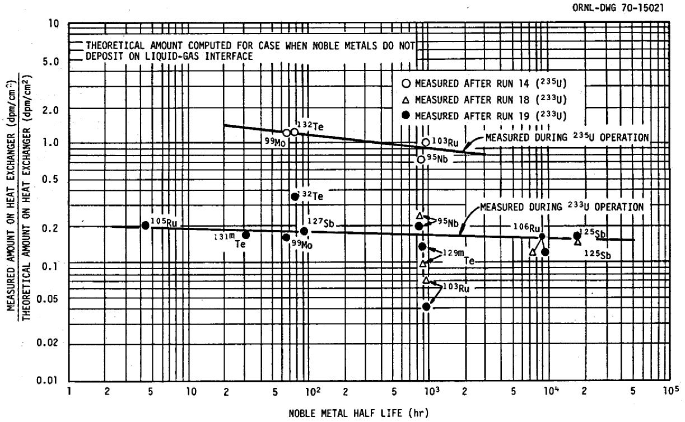  
FIGURE 5.1. COMPARISON OF THE MEASURED TO THEORETICAL AMOUNTS OF NOBLE METALS ON THE PRIMARY HEAT EXCHANGER

4. Note the good agreement between $^{95}\mathrm{Nb}$ and the other noble metals. It was pointed out previously that $^{95}\mathrm{Nb}$ sometimes behaves as a salt seeking fission product and sometimes as a noble metal, depending on the oxidation-reduction state of the fuel salt. The fuel was in a reduced state at the end of runs 18 and 19 so this $^{95}\mathrm{Nb}$ behavior is as expected.

Now consider the data measured during the $^{235}\mathrm{U}$ operation. The same observations and conclusions can, in general, be made for this curve, but on a lesser scale because there are fewer isotopes involved. The magnitude of the measured to calculated ratio is different and is in the vicinity of 1.0. Again note the good agreement between $^{95}\mathrm{Nb}$ and the other noble metals. The fuel salt was generally in a more reduced state during the $^{235}\mathrm{U}$ operation and $\mathrm{Nb}$ behaved as a noble metal.

Now - why is the magnitude of the measured to theoretical concentration ratio on the tube surface close to unity when measured after run 14 (last $^{235}\mathrm{U}$ run) and 0.15 - 0.20 when measured during runs 18 and 19 ( $^{233}\mathrm{U}$ runs)? As noted in section 3.3, there was a dramatic difference in operational characteristics of the MSRE when operating with $^{235}\mathrm{U}$ and $^{233}\mathrm{U}$ . The difference was most apparent in the amount of bubbles circulating with the fuel salt. As noted earlier the void fraction of bubbles during the $^{235}\mathrm{U}$ runs was 0.02 - 0.045%, while during the $^{233}\mathrm{U}$ runs, it was 0.5 to 0.6%, up by a factor of about 20. The theoretical amount in the denominator of the ordinate of Figure 5.1 is computed assuming that noble metals do not adhere to liquid-gas interfaces (circulating bubbles). It has been hypothesized that noble metals do deposit on these interfaces, so the bubbles will compete with the heat exchanger as a noble metal depository. If this concept is included in the calculation, then the computed amount on the heat exchanger will diminish and the value of the ordinate will increase. It is also assumed that there is no interaction between the bubbles and the heat exchanger surfaces, so if a noble metal atom migrates to a bubble, it is no longer available to deposit on the heat exchanger. Since the fuel salt contained many times more bubbles during the $^{233}\mathrm{U}$ runs than the $^{235}\mathrm{U}$ runs, including bubbles in the calculation, the $^{233}\mathrm{U}$ curve will move up much more than the $^{235}\mathrm{U}$ curve. Qualitatively then this will explain the difference in elevation of the two curves. Quantitatively, it is a bit more difficult, because using the best

estimated values of bubble surface area and mass transfer coefficient (see Appendix B), both curves are pushed upward parallel to themselves to a value considerably greater than unity. If the empirical but nevertheless mechanistic "sticking fraction" is brought into the calculation, we can again bring both curves down to a value very close to unity. The sticking fraction is defined as that fraction of atoms that contact the interface and adhere to it. If the sticking fraction of noble metals to solid surfaces is maintained at unity, then a sticking fraction to liquid-gas interfaces of 0.1 - 0.2 is required to bring the value at the ordinate of both curves close to unity.

A sticking fraction of noble metals to a liquid-gas interface considerably less than 1.0 was not expected. For instance (22), noble metals were found in significant quantities in helium passed over the surface of quiescent molten fuel salt samples in a hot cell experiment. The vapor pressure of noble metals is diminishingly small at these temperatures and cannot possibly account for the concentrations observed. The individual noble metal atoms or very small clusters of them, are apparently spontaneously expelled from the surface. Considerations of the interfacial energies involved indicate this to be possible. (23) Therefore, one would expect a sticking fraction to bubbles of unity. A rationalization of this apparent paradox is as follows. An observation from the reactor is that many of the smaller bubbles circulating with the fuel salt completely dissolve in the higher pressure part of the fuel loop. (24,25) This observation is a result of an analysis to explain the 135 Xe poisoning effects observed in the reactor. Note that the surface tension of molten salt is quite high, about 200 dynes/cm. When a bubble is pressurized by the pump and begins to dissolve, its diameter decreases. The internal pressure above ambient, as generated by the surface tension (4σ/d) becomes quite high (0.8 psi for 0.005 in. bubble) and further enhances the dissolution rate. This continues to the limit and the bubble dissolves. The process is very rapid and analysis indicates only a few seconds are required. If this bubble contained some noble metals before it dissolved, we would end up with a noble metal cluster associated with the salt again, rather than a bubble. Qualitatively then, here is a mechanism where the

the sticking fraction of noble metal atoms to a liquid-gas interface can be unity but where it actually appears to be less than unity. Possibly other mechanisms could also be devised.

Conclusions. The conclusion from examination of noble metal deposition on the primary heat exchanger as determined by gamma spectrometry, is that noble metals apparently do migrate and deposit on these surfaces in accordance with the laws of mass transfer in the simplest form. Deposition on liquid-gas interfaces (bubbles) must be included in the calculation to force the calculated concentration to equal the measured concentration on the tubes. The exact mechanism of noble metal deposition on liquid-gas interfaces is not known and had to be handled in a semiquantitative way involving apparent sticking fractions to bubbles. Essentially these same conclusions will be reached after each analysis section in this report.

# 5.3 Comparison of Measured Deposition on Core Surveillance Samples to Theoretical

The theoretical amount of each noble metal isotope deposited on the surface of the graphite and the Hastelloy-N core surveillance samples was computed and compared to the measured amount. The measured values were obtained from semiannual reports.[26, 27, 28 and 29] The same introductory remarks are applicable here as in the first paragraph of the last section. Most important, recall that the theoretical amount will be computed on the basis that noble metals do not deposit on liquid-gas interfaces. The mass transfer coefficient was estimated in Appendix B to be about 0.25 ft/hr for both the graphite and Hastelloy-N. The uncertainty in this number is considerable.

The results of this comparison are shown in Figure 5.2 for the graphite specimens and Figure 5.3 for the Hastelloy-N specimens. Again, the ratio of the measured to theoretical amount is plotted against the noble metal half life. In drawing lines through the data, no weight was given to the $^{95}\mathrm{Nb}$ points for reasons to be discussed later. The following observations can be made:

MEASURED AMOUNT OF GRAPHITE SPECIMEN $(\mathrm{dpm} / \mathrm{cm}^2)$ THEORETICAL AMOUNT ON GRAPHITE SPECIMEN $(\mathrm{dpm} / \mathrm{cm}^2)$

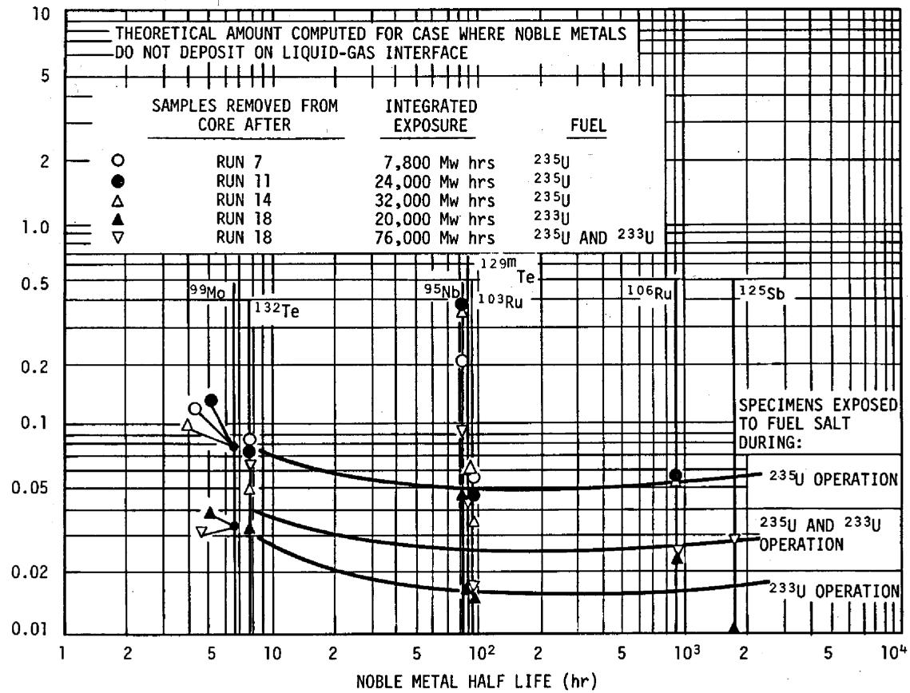  
FIGURE 5.2. COMPARISON OF THE MEASURED TO THEORETICAL AMOUNTS OF NOBLE METALS ON THE GRAPHITE CORE SURVEILLANCE SPECIMENS

ORNL-DWG 70-15015

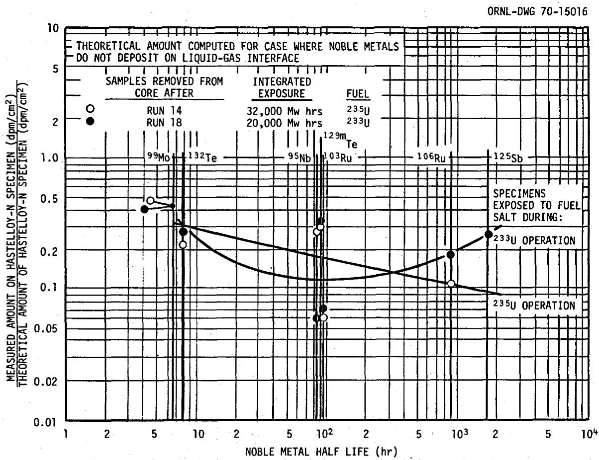  
FIGURE 5.3. COMPARISON OF THE MEASURED TO THEORETICAL AMOUNTS OF NOBLE METALS ON THE HASTELLOY-N CORE SURVEILLANCE SPECIMENS (DOSIMETER TUBES)

1. Three different sets of graphite samples (Figure 5.2) were exposed to fuel salt during only the $^{235}\mathrm{U}$ operations. All three are consistent with each other and the data points are rather tightly grouped around a single line. An exception is $^{95}\mathrm{Nb}$ which lies well above the line. Recall that the fuel salt was in a reduced state during the $^{235}\mathrm{U}$ operations and $^{95}\mathrm{Nb}$ behaved as a noble metal and would therefore be expected to fall on the line. More will be said about this below.   
2. One set of graphite samples was exposed to fuel salt during only $233_{\mathrm{U}}$ operations. This curve falls below and parallel to the previous curve for $235_{\mathrm{U}}$ operation. This is consistent with observations of noble metals in the heat exchanger in the last section and the same conclusions can be drawn.   
3. The curves for graphite may have a significant slope at the low half life end which is not consistent with the gamma spectrometry data from the heat exchanger. The slope seems to be zero however for half lives over about 500 hours. This will be discussed further below.   
4. The relative elevation of the curves through the deposition data on the Hastelloy-N surveillance samples (Figure 5.3) do not confirm the previous observations from the heat exchanger and graphite. There is however more scatter in the data.   
5. Concerning the absolute value of the measured to theoretical ratio of the noble metal concentration. An overall average of the $^{233}\mathrm{U}$ line for Hastelloy-N (Figure 5.3) seems to agree with the previous value from the heat exchanger, however, the data from the $^{235}\mathrm{U}$ runs do not agree.   
6. The measured to theoretical concentration ratio for all the graphite samples seems to fall somewhat below the data from the heat exchanger and Hastelloy-N samples. There are two explanations for this. First, inadequate knowledge of the mass transfer coefficient, although this probably isn't enough to account for the entire discrepancy. Second, the more plausible explanation is that the sticking fraction for graphite is less than unity. More will be said about this below.

Let us consider some of the above discrepancies with graphite and see if we can bring them into line with previous observations and conclusions from the heat exchanger analysis. First let us hypothesize that the noble metal sticking fraction to graphite is less than unity. We have

noted that this is likely in observation number 6 above. This will be confirmed more directly in Section 5.7 when we look at the results of a special laminar flow core surveillance test during the last MSRE operational period. Now, there is evidence $^{(30)}$ that Nb forms a stable carbide with graphite under MSRE operating conditions. The graphite could therefore act as an infinite sink for Nb, i.e., its sticking fraction could be unity. An effective sticking fraction of $^{95}\mathrm{Nb}$ to graphite of unity, and a sticking fraction of the other noble metals of less than unity, would explain the $^{95}\mathrm{Nb}$ points being so much higher than the other noble metals in Figure 5.2. In fact, the ratio between the curves and the $^{95}\mathrm{Nb}$ data cluster could be a direct measure of the sticking fraction of the other noble metals relative to $^{95}\mathrm{Nb}$ . We can carry this discussion one step further. $^{99}\mathrm{Nb}$ (half life = 2.4 min) is a precursor of $^{99}\mathrm{Mo}$ . Its half life is high enough so that it is a significant migrating species in this decay chain. If then, amounts of $^{99}\mathrm{Nb}$ migrate to the graphite with a sticking fraction of unity and decay into $^{99}\mathrm{Mo}$ , the measured amounts of $^{99}\mathrm{Mo}$ would also be relatively higher than the other noble metals. Therefore, the left side of the curves in Figure 5.2, which are controlled to an extent by $^{99}\mathrm{Mo}$ , might tend to be higher than the other noble metals. Another effect that must be considered is that during the final week of run 18, the fuel pump was operated at a slightly reduced speed. The principal effect was that during this period the circulating void fraction was more equivalent to the $^{235}\mathrm{U}$ runs than the $^{233}\mathrm{U}$ runs. Since there were fewer bubbles, one might expect that during this period the noble metal deposition rate on solid surfaces would be greater. Since the time period was relatively short, it would elevate only the low half life end of the curve. This last point may also help explain why the short half life end of the $^{233}\mathrm{U}$ curve for deposition on Hastelloy-N (Figure 5.3) is higher than expected.

Conclusion. The conclusions then, from examination of noble metal deposition data from the core surveillance samples, is that they generally confirm the conclusions arrived at after examination of the heat exchanger in Section 5.2. It appears that the sticking fraction of noble metals to graphite is less than unity. We have had to form a hypothesis to explain the behavior of Nb.

# 5.4 Comparison of Fuel Salt Samples with $C^S$

The theoretical amount of each noble metal isotope contained in the fuel salt (Eq. (14) in Section 4.2) was computed and compared to the measured amount in the fuel salt samples. Again the theoretical amount was computed on the basis that noble metals do not deposit on liquid-gas interfaces. The measured and computed concentration differed by 1-4 orders of magnitude, the measured concentration always being higher. In an attempt to resolve this discrepancy, the measured-to-theoretical concentration ratio was plotted against the fraction of its total capacity that each sample capsule was filled. These plots seem to be unique and are shown in Figures 5.4 through 5.9 for $^{103}\mathrm{Ru}$ , $^{106}\mathrm{Ru}$ , $^{99}\mathrm{Mo}$ , $^{129}\mathrm{m}$ , $^{132}\mathrm{Te}$ , and $^{95}\mathrm{Nb}$ , respectively. The kind of sample, freeze valve or double-wall freeze valve, is distinguished on the plots. Recall that a freeze valve capsule contains 50-60 grams of salt then full and a double wall freeze valve capsule holds about 15 grams of salt when full. Ladle sample data are not included on these plots for reasons pointed out in Section 3.2. All reported freeze valve capsule data are on these plots except those taken at zero power. It is a characteristic of the analytical model that the noble metal concentration in salt goes to zero shortly after the reactor power goes to zero. The measured to theoretical concentration ratio would therefore approach infinity if any noble metals at all were measured in the sample. The following observations can be made about these curves.

1. All curves, except that for $95\mathrm{Nb}$ , behave in a similar manner. For samples that were mostly empty, the measured to theoretical concentration ratio is orders of magnitude higher than for those samples that were mostly full.   
2. $^{95}\mathrm{Nb}$ is being carried along for comparison, since it can behave either as a noble metal or a salt seeking fission product, depending on the oxidation-reduction state of the salt. Many of the reported $^{95}\mathrm{Nb}$ concentrations in fuel salt are negative. This is because the reported $^{95}\mathrm{Nb}$ concentration was extrapolated back from the time of measurement to the time of sampling. $^{95}\mathrm{Zr}$ with a 65-day half life is a precursor of $^{95}\mathrm{Nb}$ , and therefore it must also be counted. The back calculation in time is sensitive and a small error in the $^{95}\mathrm{Zr}$ concentration measurement

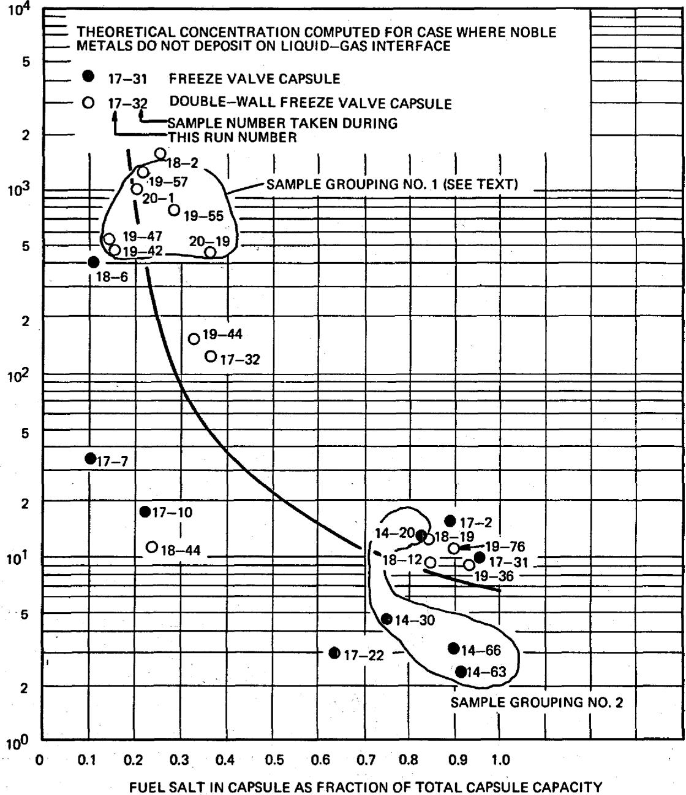  
MEASURED CONCENTRATION IN SALT (dpm/g-salt) THEORETICAL CONCENTRATION IN SALT (dpm/g-salt)   
FIGURE 5.4. COMPARISON OF THE MEASURED $^{103}\mathrm{RU}$ CONCENTRATION IN FUEL SALT TO THE THEORETICAL CONCENTRATION

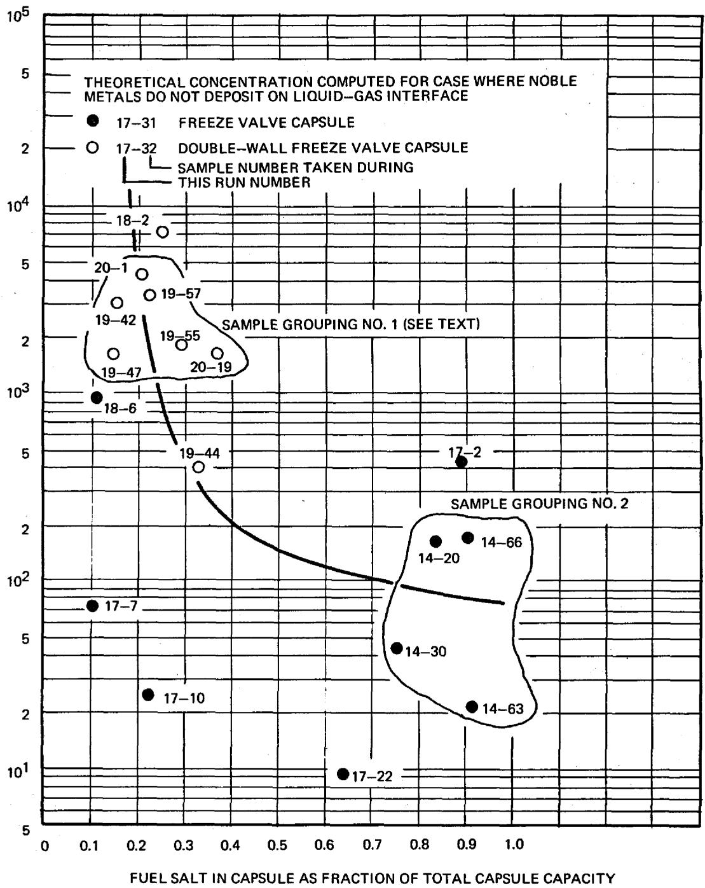  
MEASURED CONCENTRATION IN SALT (dpm/g-salt) THEORETICAL CONCENTRATION IN SALT (dpm/g-salt)   
FIGURE 5.5. COMPARISON OF MEASURED RU CONCENTRATION IN FUEL SALT TO THE THEORETICAL CONCENTRATION

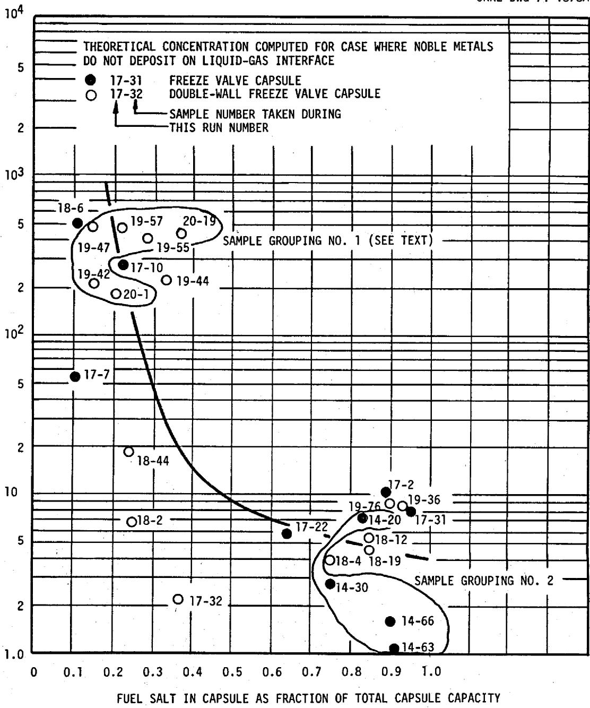  
MEASURED CONCENTRATION IN SALT (dpm/g-salt)   
THEORETICAL CONCENTRATION IN SALT (dpm/g-salt)   
FIGURE 5.6. COMPARISON OF THE MEASURED $^{99}\mathrm{MO}$ CONCENTRATION IN FUEL SALT TO THE THEORETICAL CONCENTRATION

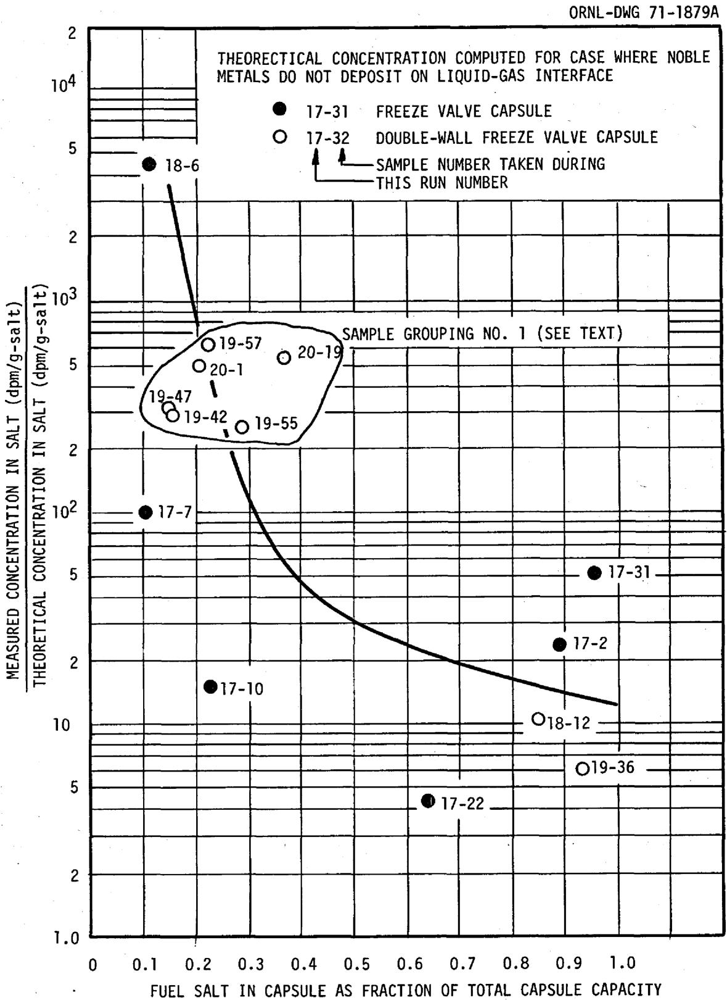  
FIGURE 5.7. COMPARISON OF THE MEASURED $^{129m}$ TE CONCENTRATION IN FUEL SALT TO THE THEORETICAL CONCENTRATION

ORNL-DWG 71-1880A

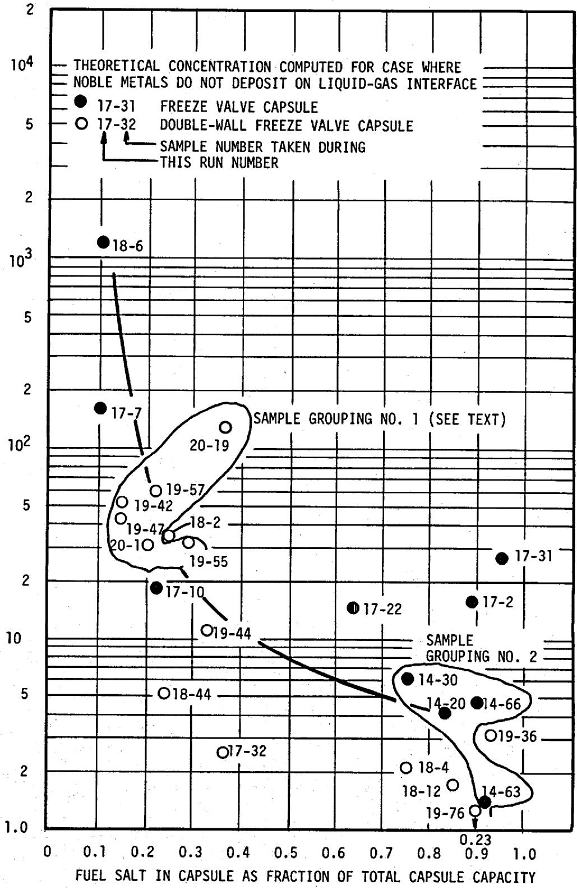  
MEASURED CONCENTRATION IN SALT (dpm/g-salt) THEORETICAL CONCENTRATION IN SALT (dpm/g-salt)   
FIGURE 5.8. COMPARISON OF THE MEASURED $^{132}$ TE CONCENTRATION IN FUEL SALT TO THE THEORETICAL CONCENTRATION

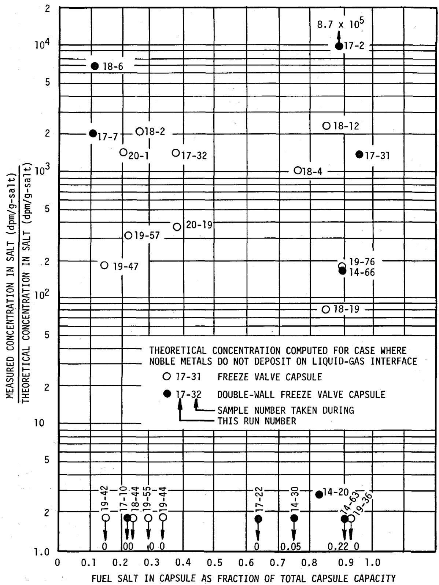  
FIGURE 5.9. COMPARISON OF THE MEASURED $^{95}$ NB CONCENTRATION IN FUEL SALT TO THE THEORETICAL CONCENTRATION

can result in a negative $^{95}\mathrm{Nb}$ concentration. The shotgun pattern and also the disappearance and reappearance of $^{95}\mathrm{Nb}$ in Figure 5.9 is apparently related in some way to the fuel salt fluctuating between the oxidized and reduced state.

3. The sample capsules showing the highest ratio of measured to theoretical concentration are mostly empty. The circled cluster of samples labeled as Sample Grouping No. 1 are representative of this end of the curve. They are all double-wall freeze valve samples. They contain 2-5 grams of salt but if they were full they would hold 14-15 grams.

4. Conversely, the samples showing the lowest measured to theoretical concentration ratio are full. The circled cluster labeled Sample Grouping No. 2 is used to represent this end of the curve. This group represents the only freeze valve sample taken during the $^{235}\mathrm{U}$ runs. In taking samples, these capsules were filled from $75\%$ to $90\%$ of capacity.

5. The samples are internally consistent; i.e., the concentration of each noble metal isotopes is practically always either high or low in any individual sample. This is illustrated by the circled clusters of data points referred to as Sample Grouping No. 1 and Sample Grouping No.

2. Each grouping on each figure encompasses the same samples. Notice how consistently tight each grouping is. Sample Grouping No. 1 represents the high and of the curve and Sample Grouping No. 2 represents the lower end of the curve.

6. One might make the observation that the curves seem to be approaching a low value of the measured to theoretical concentration ratio at high sample weights. Particularly the shorter lived isotopes $(^{99}\mathrm{Mo}$ and $^{132}\mathrm{Te})$ almost seem to be approaching a value of unity (measured concentration = theoretical concentration). This observation is not warranted. Recall that the theoretical concentration is computed for the case that noble metals do not deposit on liquid-gas interfaces.

We have hypothesized in previous sections and later in this section that they must deposit on these interfaces. If this depository is included in the calculation then the computed concentration will be reduced and the measured to theoretical concentration ratio will be increased accordingly. The uncertainties associated with this term are so great (particularly the sticking fraction) that we cannot go into any detailed

analysis of it. Let us only say that if we did include this term in the calculation, then the data points in Figures 5.4 - 5.8 could rise more or less uniformly by as much as a factor of 5 during the $^{235}\mathrm{U}$ operation (stick fraction to bubbles = 1.0) and a good deal more for the $^{233}\mathrm{U}$ operation.

How can we explain these curves in a manner consistent with previous observations and conclusions on noble metal migration? We have already hypothesized that noble metals deposit on liquid-gas interfaces (circulating bubbles), and data from the heat exchanger and core surveillance samples seem to confirm this. Many qualitative observations discussed in section 3 also confirm this hypothesis. Presumably the bubbles would carry the noble metal atoms or small clusters of them to the pump where they would collect on the large amount of liquid-gas interface available in this region. The small clusters could then coalesce into larger clusters and eventually form a scum floating on the salt. Let us hypothesize that these noble metal clusters have properties similar to insoluble surface active agents and that the pump bowl is behaving in a manner similar to a froth flotation chamber. This suggestion has been made before.(31, 32) It has been suggested in Section 3.3 of this report that noble corrosion products and fission products accumulating in the pump bowl and displaying the properties of insoluble surface active agents are responsible for the differences between the $^{235}\mathrm{U}$ and $^{233}\mathrm{U}$ operating characteristics of the MSRE. As a matter of fact, flotation of reduced Fe, Ni and Cr from fuel salt has been demonstrated in a test tube scale laboratory experiment.(32) Froth flotation is a common unit operation in the ore processing industries. The fundamental requirements for a flotation process to work are:(33)

1. The solid phase must be insoluble in the liquid phase.   
2. The gas-liquid-solid contact angle must be greater than zero (the solid only partially wet by the liquid).   
3. The solid particles must be small enough so that their sheer mass will not sink them below the surface (gravity forces < surface tension forces).

The noble metals (and noble corrosion products from the chemical reprocessing) satisfy these conditions. They are insoluble in fuel salt. Contact angles are reported in the range of $90 - 105^{\circ}$ . (17) They are mostly unwet and in a range for good flotation. Particle diameters of materials obtained from the gas phase over salt samples have been estimated by various techniques. These diameters, thought to be indicative of noble metal particle diameters, range from a few angstroms to a few microns. The lower end of the range possibly represents the diameter of individual particles where the upper end is associated with flocks of particles. The uncertainty of effective particle diameter is unimportant since the entire range falls in a region of good flotation. As noted in Section 3.3, the property of surfactants that is significant to this analysis is that they enhance bubble stability and also result in smaller bubbles being generated in the pump bowl. It would not seem unreasonable then, that small bubbles are present in the salt sampling pool either as a fairly stable froth floating on the salt or as very small bubbles drifting with the salt or both. These bubbles would be high in noble metal content (on their surface). When a freeze valve capsule thaws and draws its sample, it would be getting a greater or lesser amount of gas with the salt, depending on the situation in the salt pool at that time. If it took in a large amount of gas, the capsule would be mostly empty but have a high noble metal content (as for instance Sample Grouping No. 1 on Figures 5.4 - 5.8). If it took in a small amount of gas, it would be full and relatively low in noble metal content (as Sample Grouping No. 2 on the same figures). This then is the suggested explanation for the curves in Figures 5.4 - 5.8. Note that if this hypothesis is true, then even the least contaminated samples, represented by Sample Grouping No. 2, are still not representative of the fuel salt.

One might expect to be able to correlate the condition of the salt sample (high or low noble metal concentration) with some other measurable operating variables of the reactor, for instance, overflow rate, circulating void fraction, etc. An attempt was made to do this, however, the MSRE being an experimental reactor, was subjected to a great many perturbations (power level changes, reductant and oxidant additions, pump speed changes, draining and flushing the fuel loop, cover gas changes, etc), most of which would be expected to effect the condition of the sample, and we were unable to extract any obvious correlations.

The intercal consistency of the samples allows us to carry the analysis one step further. As noted in Observation No. 5, the concentrations of all noble metal isotopes are usually consistent in an individual sample (either high or low). This is illustrated by Sample Grouping No. 1 and No. 2 in Figures 5.4 - 5.8. Each grouping on each figure contains the same samples, and each grouping is rather tight. The geometric mean of each group was determined and plotted against the noble metal half life. The resulting correlation is shown in Figure 5.10 and represents a plot similar to that used in analysis of noble metals on the heat exchanger and core surveillance samples. Recall that the equivalent plots for the heat exchanger and core surveillance sample yielded a line with a slope of zero, whereas the slopes of the lines in Figure 5.10 are quite high. If the analytical model is correct and the samples are truly representative of the fuel salt, then the slope of this line should also be zero. We have shown however that the salt samples are not representative of the salt, but rather are more representative of the noble metals accumulated on the liquid-gas interfaces in the pump bowl. It is not surprising then, that the slope is not zero. In Section 5.6 of this report we will attach some physical significance to the slope of these lines.

Figure 5.11 is the same kind of plot as Figure 5.10, but instead of picking grouped data points, we averaged geometrically all the freeze valve and double walled freeze valve capsule data for each MSRE run. Beside each data point in parenthesis is the number of samples included in the average. Note that the curves move up the ordinate with run number. This observation will be made more dramatic when we compare it to the same kind of plot for the gas phase samples. The gas samples do the reverse, that is, decrease with run number. We will discuss this observation at that time.

Conclusion. The emphasis in this section from examination of fuel salt samples, concerns the attachment of noble metals and reduced corrosion products to liquid-gas interfaces, and how they apparently accumulate in the MSRE pump bowl and enhance the frothing and bubble making capacity of this region. This is consistent with conclusions reached from examination of data from the primary heat exchanger and core surveillance samples.

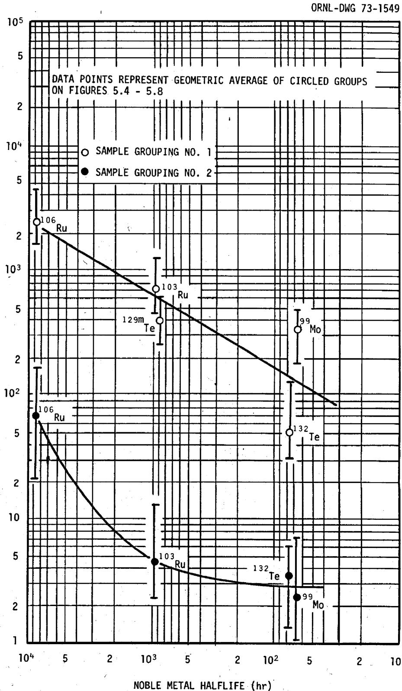  
MEASURED CONCENTRATION IN SALT (dpm/gm-salt) THEORETICAL CONCENTRATION IN SALT (dpm/gm-salt)   
FIGURE 5.10. COMPARISON OF MEASURED TO THEORETICAL CONCENTRATION IN FUEL SALT TO THE NOBLE METAL HALF LIFE BY GROUPS

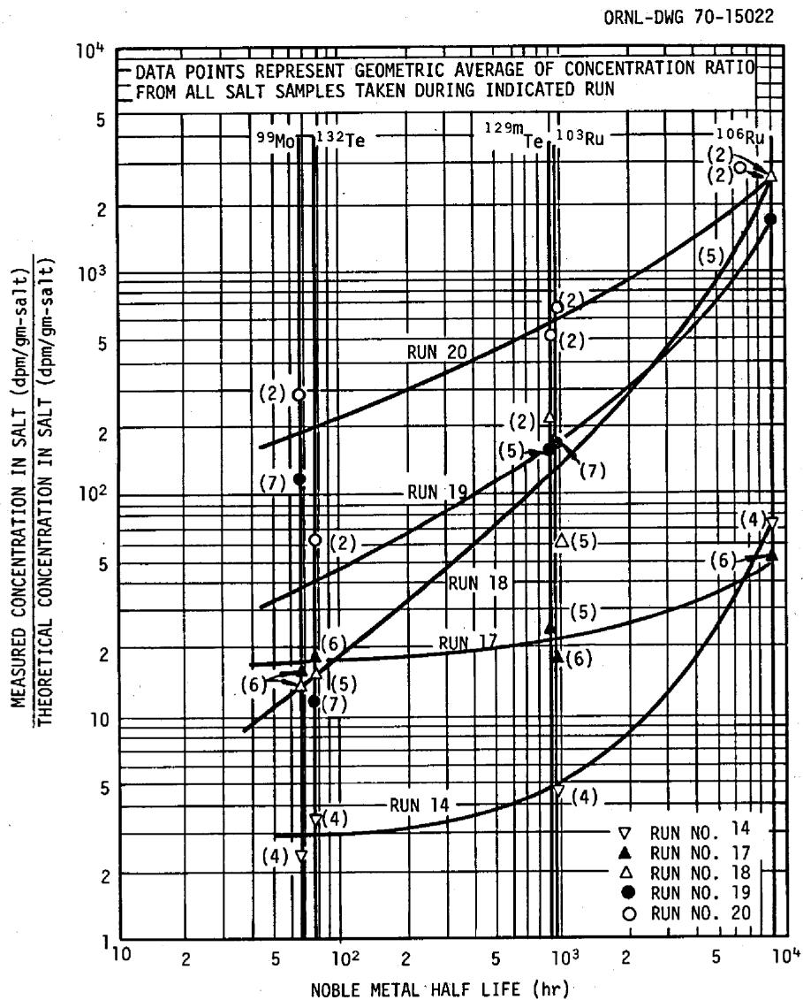  
FIGURE 5.11. COMPARISON OF MEASURED TO THEORETICAL CONCENTRATION IN FUEL SALT TO NOBLE METAL HALF LIFE BY RUN NUMBER

# 5.5 Comparison of Gas Samples with $C^S$

The fact that the noble metals are found in large quantities in the gas samples from the pump bowl may be surprising. They have a vanishingly small vapor pressure so that certainly isn't the mechanism. In Section 5.2 it was noted that noble metal atoms or very small clusters of them can be spontaneously expelled from the surface of quiescent fuel salt. This information was determined in a carefully controlled laboratory test. Under conditions that exist in the pump bowl, one may reasonably expect the bulk of these single atoms and very small clusters to be trapped and coalesce with the larger amounts of noble metal fission products (and noble corrosion products from the chemical reprocessing) in the form of scum and deposits on the bubbles, rather than to break through and migrate to the off-gas system themselves. A more likely mechanism, which is consistent with the conclusions reached so far in this report, is that most of the noble metals measured in the gas samples are carried by a salt mist that is high in noble metal content. The impingement of the jets from the spray ring generates large quantities of bubbles. These bubbles then work their way back to the surface and become froth. We have theorized that this froth is high in noble metal content. A well accepted observation is that pure liquids will not foam. If there is foam present in the pump bowl, it is surely heavy in noble metal fission products and reduced corrosion products. Presumably the pump bowl reaches a steady state foaming condition in which bubbles burst as fast as they are formed. They burst spontaneously or because of mechanical action of the spray. At any rate this process is accompanied by the generation of a salt mist which is highly concentrated in noble metals. Presumably this mist will drift into the gas phase of the sampling volume and influence the gas samples. Small amounts of salt-seeking fission products are always found in gas phase samples indicating fuel salt is present. This mist would also migrate into the off-gas system where noble metals have been found in significant concentrations. This then is the suggested mechanism for the appearance of noble metals in gas phase samples.

The analytical model developed in Section 4 does not contain a term for the noble metal concentration in the gas phases. There is no fundamental basis for using concentration units. The best we can do is to compare the measured noble metal concentration in the gas sample to the theoretical concentration in the fuel salt, at the time of sampling. The theoretical concentration in salt then becomes a normalizing factor. The same conditions apply to the calculated concentration as before. The principle being that the theoretical concentration is computed for the case that noble metals do not migrate to liquid-gas interfaces. Figure 5.12 shows the results of this calculation. The ordinate normalizes the total noble metal count in the gas sample to the theoretical concentration in one gram of salt. The abscissa normalizes the total measured amount of salt seeking fission products in the sample to the theoretical amount in one gram of salt. Since the salt seekers are uniformly distributed in the fuel salt, the abscissa is measured in the amount of salt in the sample. In order to decrease the scatter and the total number of data points, the ordinate value of each data point represents the geometric mean of the five noble metals isotopes indicated in the plot and the abscissa value represents the geometric mean of four salt-seeking fission product isotopes indicated. There does seem to be a correlation between the amount of noble metal fission products in a sample and the amount of salt-Weeking fission products. Although the scatter is high, the noble metal content of a sample is in proportion to the salt content. This is consistent with the idea that the fuel salt is the carrier of noble metals.

Figure 5.13 is a plot of gas sample data equivalent to Figure 5.11 for salt samples. All the reported data from routine gas samples taken during each $^{233}\mathrm{U}$ run were geometrically averaged and plotted against the noble metal half life. The number in parenthesis beside each data point indicates the number of samples used in the geometric average. Note that the curves move down the ordinate with time as indicated by the run number. As noted before this behavior is particularly striking when these curves are compared with the curves in Figure 5.11 for salt samples. The salt sample curves move up the ordinate with time, but less uniformly than the gas sample curves. This behavior is not understood but probably represents a change in frothing characteristics in the pump bowl with time.

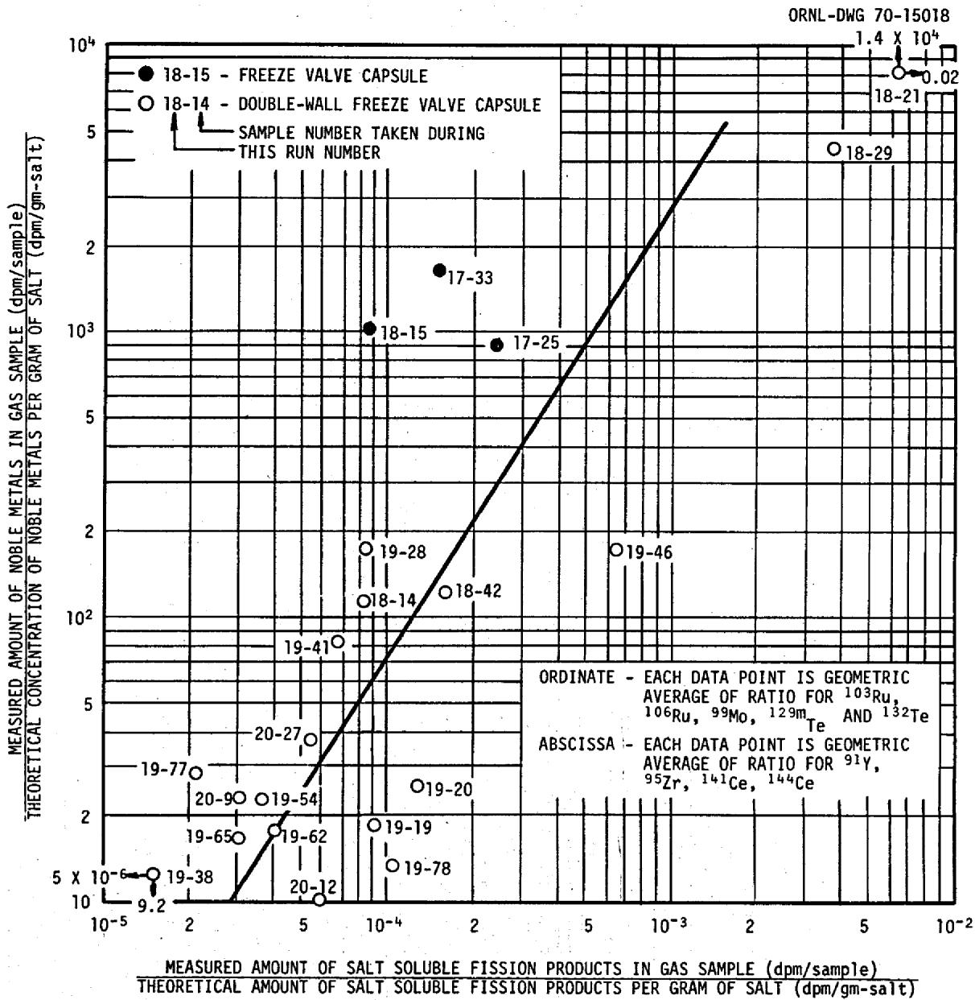  
FIGURE 5.12. COMPARISON OF THE AVERAGE AMOUNT OF NOBLE METALS IN GAS SAMPLES TO THE AVERAGE AMOUNT OF SOLUBLE FISSION PRODUCTS IN GAS SAMPLES

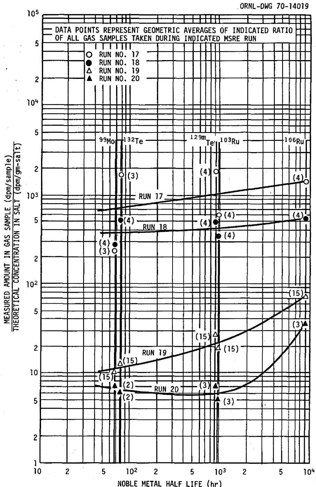  
FIGURE 5.13. COMPARISON TO THE MEASURED (GAS SAMPLE) TO THEORETICAL (IN SALT) CONCENTRATION TO NOBLE METAL HALF LIFE BY MSRE RUN NUMBER

Recall that at the start of $^{233}\mathrm{U}$ operation, a large amount of reduced corrosion products (which act as noble metals) suddenly appeared in the reactor system. Over a period of time they would eventually work their way out of the reactor system and into the off-gas system or possibly the overflow tank or dump tank. At any rate the foaming characteristics of the pump bowl might be expected to change as the amount decreased.

Conclusions. The only conclusion that can be reached from analysis of the gas samples is that the noble metals in the gas samples owe their existence to a salt mist generated by bursting bubbles that are high in noble metal content. This confirms previous conclusions that noble metals adhere to liquid-gas interfaces.

# 5.6 Time Constant for Noble Metals on Interfaces

We have concluded that noble metals deposit on liquid-gas interfaces and remain there with a high degree of stability. This conclusion was reached from qualitative observations of the reactor behavior, and from noble metal migration analysis in this report. In fact, it appears that the measured noble metal content of both, the fuel salt and gas phase samples, is primarily a measure of the concentration associated with these interfaces. This was the rationalization to explain the slopes of the lines in Figures 5.10, 5.11 (salt samples) and 5.13 (gas samples) being other than zero. If we could write an equation for the amount of noble metals associated with the liquid-gas interface, we could compare the measured concentrations from fuel salt and gas phase samples to this quantity and possibly make a significant observation. An equation to do this was derived in Sect. 4.2.10 (Eq. (27)). This equation is the result of a rate balance around the entire gas phase of the fuel loop where the gas phase is defined to include the liquid-gas interfaces. It considers the circulating bubbles and the gas phase of the pump bowl and all their respective interfaces to be well mixed. There is no fundamental basis for using concentration units in the gas phase, so we will compute the total amount of noble metals in this mixture. The sink terms for noble metals in the gas phase involve decay and an arbitrary rate constant which is a measure of the rate at which they migrate out of the gas phase as defined above. In application we will evaluate the undefined rate

constant by forcing the slope of curves equivalent to those referred to above to equal zero. Then we will see if any reasonable physical significance can be assigned to these rate constants. For this analysis we will show only the gas sample data from Run 19. These data will be used, first, because they represent the largest number of samples (15) taken during a single run, second - because the data points are tightly grouped around the line (Figure 5.13) and third - because the slope of the curve (Fig. 5.13) is intermediate between the slopes of all the curves in Figures 5.10, 5.11 and 5.13.

The results of the calculation appear in Figure 5.14, where the measured noble metal in the gas sample (dpm/sample) normalized to the total amount theoretically associated with the liquid-gas interface and gas phase phase (dpm) is plotted against the noble metal half life for three different values of the rate constant. Each data point is the geometric average of the indicated ratio for all gas samples taken during Run 19. The absolute value of the ordinate is of little or no significance in this analysis since we are only looking at the slopes of the lines. It is apparent that no single rate constant will flatten out the entire curve. How then can we rationalize these curves? Note that the curve between the $^{103}\mathrm{Ru}$ and $^{129}\mathrm{Te}$ points and the $^{132}\mathrm{Te}$ and $^{99}\mathrm{Mo}$ points has a zero slope when the rate constant of noble metals in the pump bowl is about 0.01 hrs $^{-1}$ (equivalent half life approximately 3 days). If the horizontal line is extended when one would observe that more $^{106}\mathrm{Ru}$ was measured than this analysis would indicate. If a mechanism were present whereby noble metals could be stored out of the reactor system for a few hundred days and then introduced into the reactor system, the measured $^{106}\mathrm{Ru}$ concentration would be high. In a few hundred days the shorter lived isotopes would have decayed away; therefore, the slope of the right hand slide of the curve would not be significantly affected. Likely suspects for this mechanism would be the overflow tank and the dump tank. The other groups of gas and fuel salt samples have been analyzed in this framework but the results will not be presented. Let me summarize by saying that they are more or less consistent. That is, the curves in Figures 5.10, 5.11 and 5.13 can generally be reduced to a line with slope zero if a half life in the pump bowl of a few days is imposed

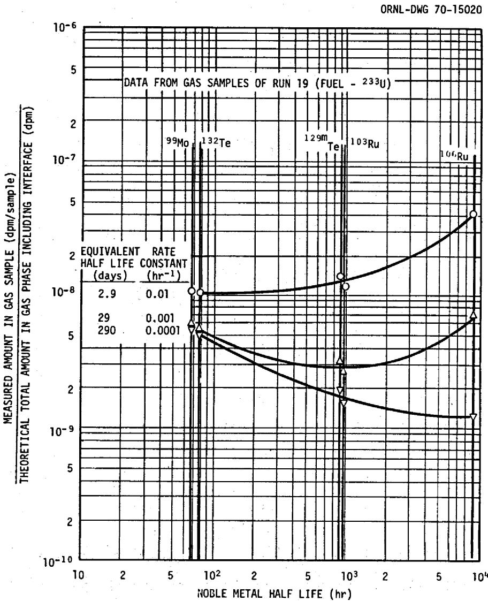  
FIGURE 5.14. COMPARISON OF MEASURED AMOUNT IN GAS SAMPLE TO TOTAL THEORETICAL AMOUNT IN GAS PHASE INCLUDING INTERFACE WITH PARAMETERS OF AN ARBITRARY RATE CONSTANT FOR REMOVAL FROM SYSTEM

on them plus a long decay time of a few hundred to several hundred days after which they are re-introduced into the reactor system. The few days half life may be associated with the time required for the spray ring to splash half the noble metals into the off-gas system as a mist. The few hundred to several hundred day decay time may be associated with the overflow tank or with the frequency of draining and refilling fuel salt in the fuel loop.

Conclusion. The slopes of the curves in Figures 5.10, 5.11 and 5.13 can be explained in terms of reasonable physical phenomena in the MSRE. The physical phenomena have as their foundation the thesis that noble metals migrate and adhere to liquid-gas interfaces.

# 5.7 Miscellaneous Noble Metal Observations

# 5.7.1 Laminar Flow Core Surveillance Sample

Following Run 18, the regular core surveillance specimen fixture (Fig. 2.4) was removed and a special test fixture was installed. Since this was to be the last chance to expose material to an operating moltensalt reactor core, a large number of special experiments was incorporated in this assembly, many of which were not directly related to fission product deposition. The entire assembly is described in detail in Ref. 38. One of the elements that was devoted to fission product deposition is illustrated in Figure 5.15. It was designed to generate laminar flow in a thin annular flow region, the outside surface being graphite and the inside surface being Hastelloy-N. Different surface roughnesses were also incorporated as shown in the figure. The intent of this test was twofold. First, since the graphite and Hastelloy-N annular surfaces were exposed to essentially identical fluid dynamic conditions, any difference in noble metal deposition would be a direct measurement of the sticking fraction of one surface relative to the other, and second, to note any effects of surface roughness. This sample fixture was removed after Run 20 when the MSRE was permanently shut down, and the noble metal deposition was measured.

ORNL-DWG 71-1883

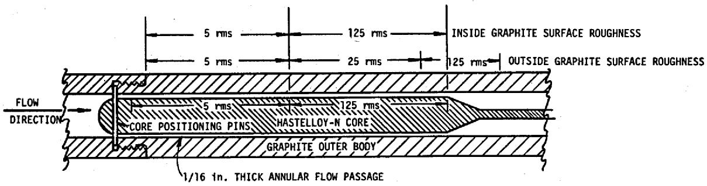  
FIGURE 5.15. SCHEMATIC OF THE LAMINAR FLOW CORE SURVEILLANCE SAMPLE

APPROXIMATELY TO SCALE

In determining the measured amount of noble metals on these surfaces, the Hastelloy-N core was sectioned at the surface roughness lines of demarkation. Two fission product determinations were therefore made, one for each end. Similarly, the graphite outer body was cut into three sections, one for each surface roughness on the outside. Note that the inside has two surface roughnesses. Theoretical amounts of noble metals were computed and compared to the measured amounts in Figure 5.16. Again the computed amount is for the case where noble metals do not deposit on liquid-gas interfaces. The estimated salt velocity through the annulus is 0.7 ft/sec. This will yield a Reynolds number of 206 and a mean mass transfer coefficient throughout the annulus of about 0.23 ft/hr. The data points on Figure 5.16 represent the geometric averages of all determinations on the Hastelloy-N and graphite annular surfaces. The wings indicate the maximum and minimum data points. There was considerable scatter in the data. It was not possible to distinguish fluid dynamic entrance effects and surface roughness effects from the data. For laminar or marginally turbulent flow, the surface roughness effects should have been minimal. Data from the outside surface of the graphite body indicated this to be true. The outside fluid dynamic conditions are not known but the flow should have been either laminar or just barely turbulent. The curves in Figure 5.16 are generally consistent in magnitude of the ordinate with those from the primary heat exchanger (Fig. 5.1) and the Hastelloy-N and graphite core surveillance specimens (Figures 5.3 and 5.2, respectively). The principal observation is that the sticking fraction to graphite is apparently less than the sticking fraction to Hastelloy-N. Because of scatter in the data, it is difficult to draw a firm value, but something in the range of 0.1 - 0.6 would be in order.

# 5.7.2 Noble Metal Distribution in the MSRE

It would be informative to determine the noble metal distribution in the reactor fuel system. The results of this inventory calculation are shown in Table 5.1.

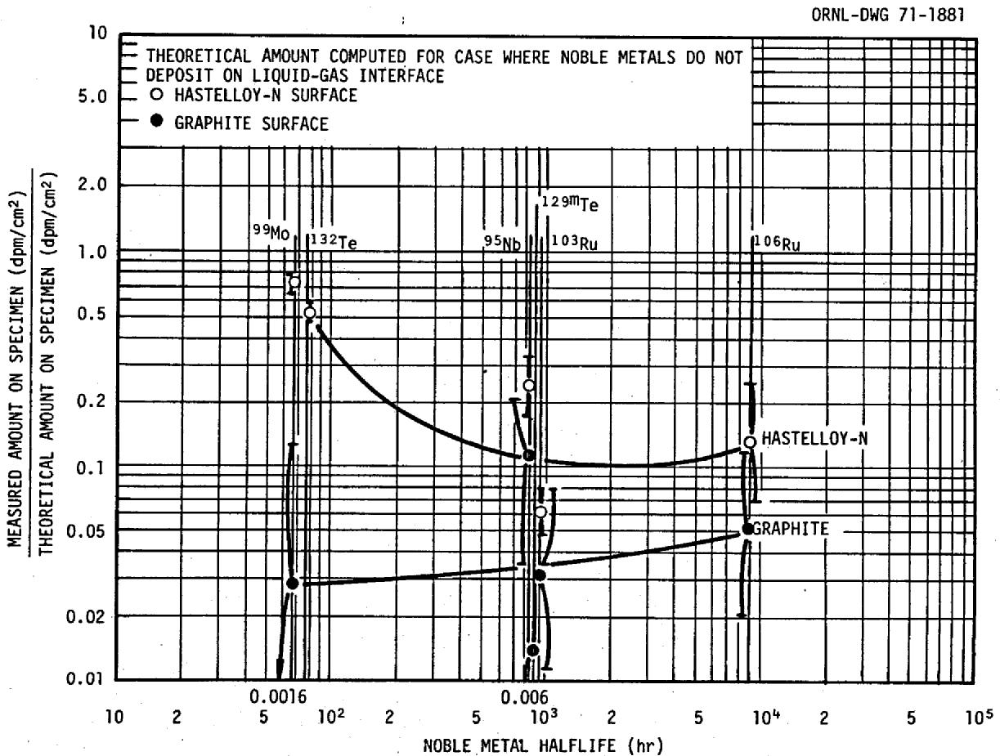  
FIGURE 5.16. COMPARISON OF THE MEASURED TO THEORETICAL AMOUNTS OF NOBLE METALS ON THE LAMINAR FLOW CORE SURVEILLANCE SPECIMENS

Table 5.1   
Noble Metal Distribution in the MSRE*   

<table><tr><td></td><td>During 235U Runs</td><td>During 233U Runs</td></tr><tr><td>Noble Metals on Heat Exchanger Surfaces</td><td>40%</td><td>6%</td></tr><tr><td>Noble Metals on Other Hastelloy-N Surfaces in Fuel Loop</td><td>50</td><td>8</td></tr><tr><td>Noble Metals on Graphite Surfaces in Core</td><td>1</td><td>0.4</td></tr><tr><td>Noble Metals in Pump Bowl, Overflow Tank, Off-Gas System, etc. (by Difference)</td><td>9</td><td>86</td></tr><tr><td></td><td>100%</td><td>100%</td></tr></table>

*Reported as percent of total inventory of noble metals in the reactor system as time measurements were made.

In determining this distribution, the measured amounts of noble metals on the heat exchanger were the same values used to determine the ordinate of Figure 5.1. The percent of inventory of noble metals on other Hastelloy-N surfaces in table, was determined by multiplying the percent of inventory on the heat exchanger by the appropriate ratio of products of mass transfer coefficients and surface area as tabulated in Table B-1. The measured amounts of noble metals on the graphite surfaces were the same values used to determine the ordinate of Figure 5.2. Specifically, the data were obtained from the core surveillance samples removed after run $14^{(235}\mathrm{U})$ and run $18^{(233}\mathrm{U})$ . The measured concentrations from the core surveillance samples were then multiplied by a ratio of mass transfer coefficients (0.063/0.25) to convert them to concentrations on the bulk graphite (see Appendix B). The difference between 100 percent and all the above sinks was assumed to have deposited on bubbles and is therefore distributed in an unknown manner between the pump bowl, overflow tank, off-gas system and dump tank. The difference in distribution between the $^{235}\mathrm{U}$ and $^{233}\mathrm{U}$ runs is quite dramatic, but may not be as large or as significant as it appears. Recall from Section 3.2 where the

gamma spectrometry of the heat exchanger is discussed, it was pointed out that the lower measured values were used for noble metal deposition on the heat exchanger following run 19 ( $^{233}\mathrm{U}$ but more of an average value was used for noble metal deposition following run $14$ ( $^{235}\mathrm{U}$ ). If the measured values following run $14$ were weighted lower, then the percent of inventory on the heat exchanger and other Hastelloy-N surfaces in Table 5.1 for the $^{235}\mathrm{U}$ runs would be less, and the noble metals in the pump bowl would be higher.

# 6. CONCLUSIONS AND RECOMMENDATIONS

# Conclusions

1. Noble metal fission products migrate from the fuel salt, where they are born, to their various depositories in accordance with the laws of mass transfer theory.   
2. Each noble metal isotope migrates as a function of its own concentration in fuel salt, and is not influenced by other elemental species of noble metals, or even isotopic species of the same element. There are however second order effects (probably chemical) which must be considered, for instance, a chemical interaction between Nb and graphite had to be resorted to, in order to explain the high $^{95}\mathrm{Nb}$ concentration found on the MSRE core surveillance samples.   
3. The liquid-gas interface (circulating bubbles and the free surface in the pump bowl) apparently present a stable surface for noble metal deposition, however, the effective sticking fraction to this interface is considerably less than unity. This observation should not be regarded as absolutely conclusive, rather it is primarily a deduced phenomenon used to explain many of the results in this analysis and many of the qualitative observations from the MSRE.   
4. Associated with the last conclusion is the idea that noble metal fission products and also reduced corrosion products attached to a liquid-gas interface have many of the properties of an insoluble surface active material. Again, this idea should not be regarded as conclusive. It was, however, used to suggest an explanation for the dramatic differences in MSRE operating characteristics between the $^{235}\mathrm{U}$ and $^{233}\mathrm{U}$ runs.

5. The sticking fraction of noble metal fission products to graphite is apparently less than the sticking fraction to Hastelloy-N.

# Recommendations

The fundamental questions are - how does one extrapolate these results from the MSRE to a large molten salt reactor in a quantitative manner, and can one use noble metal migration to his advantage in the design of a reactor? The conceptual design of a single fluid 1000 MW(e) MSBR (39) calls for circulating helium bubbles to remove $^{135}\mathrm{Xe}$ . In addition, any molten salt circulating pump would probably have a free liquid surface associated with it to eliminate the need for a packing gland. There may be other liquid-gas interfaces associated with a large reactor. Presumably then, noble metals would migrate to these surfaces. The amounts would be extremely difficult to estimate because of uncertainties in the sticking fraction and other parameters. Then there is the question of what happens to noble metals after they reach these interfaces. If the pump bowl is rather quiescent, noble metals would accumulate and develop into a heat source. On the other hand, noble metals associated with circulating bubbles may migrate by some mechanism into the off-gas system and settle out on various components there. Noble metal sinks associated with liquid-gas interfaces cannot be handled quantitatively at this time.

It is recommended then, that noble metal migration be studied in a circulating salt loop. A special loop may not have to be built, but rather a loop built for some other purpose could be used. Noble metals (probably their precursors) could be added to the salt in tracer amounts and the following studies made.

1. Deposition on solid surfaces and correlation of results with mass transfer theory.   
2. Deposition on liquid-gas interfaces and correlation of results with mass transfer theory.   
3. Stabilizing effects of noble metals (fission products and corrosion products) on bubble and foam interfaces.   
4. Effects of the noble metal chemical species.   
5. Effects of the chemical state of the salt.

6. Various aspects of circulating bubble mechanics when noble metals are attached to their surfaces, such as

a. Interaction of bubbles with solid surfaces.   
b. Bubble dissolution - This probably results in a small packet of noble metals associated again with the salt.   
c. Bubble renucleation - The small packet from above will then probably serve as an excellent bubble renucleation site.

7. Prototype testing of bubble sensitive components proposed for the next generation molten salt reactor to estimate the deposition and further migration of noble metals in these areas.

These studies would be accomplished with tracer quantities of noble metals. The behavior of the next generation reactor would undoubtedly be a function of the gross amounts of noble metals and reduced corrosion products present, and we couldn't hope to properly simulate this in a circulating loop. Therefore, the results of the proposed study would not answer all the questions pertaining to noble metal migration in the reactor, but it would certainly lay a good foundation. The complete story of noble metal migration would ultimately have to come from the operation of the reactor itself.

# 7. REFERENCES

1. R. C. Robertson, MSRE Design and Operations Report: Part 1, Description of Reactor Design, USAEC Report ORNL-TM-728, ORNL, January 1965.   
2. Nuclear Applications and Technology, V. 8, N. 2, February 1970.   
3. Molten-Salt Reactor Program Semiannual Progress Report for Period Ending July 31, 1964, USAEC Report ORNL-3708.   
4. J. R. Engel et.al., Spray, Mist, Bubbles and Foam in the Molten Salt Reactor Experiment, USAEC Report ORNL-TM-3027, ORNL, June 1970.   
5. J. C. Robinson and D. N. Fry, Determination of the Void Fraction of the MSRE Using Small Induced Pressure Perturbations, USEAC Report ORNL-TM-2318, ORNL, Feb. 6, 1969.   
6. Molten-Salt Reactor Program Semiannual Progress Report for Period Ending February 28, 1970, ORNL-4548, p 115.   
7. Molten-Salt Reactor Program Semiannual Progress Report for Period Ending August 31, 1966, ORNL-4037, p 181.   
8. Molten-Salt Reactor Program Semiannual Progress Report for Period Ending August 31, 1968, ORNL-4344, pp 144-145.   
9. R. J. Kedl, A Model for Computing the Migration of Very Short Lived Noble Gases into MSRE Graphite, USAEC Report ORNL-TM-1810, ORNL, July 1967.   
10. R. Blumberg et. al., Measurements of Fission Product Deposition in the MSRE with Ge(Li) Gamma Ray Spectroscopy, ORNL Report ORNL-CF-68-11-20, November 19, 1968, Internal Distribution Only.   
11. A. Houtzeel and F. F. Dyer, A Study of Fission Products in the Molten-Salt Reactor Experiment by Gamma Spectrometry, USAEC Report ORNL-TM-3151, ORNL, August 1972.   
12. R. B. Lindauer, Processing of the MSRE Flush and Fuel Salts, USAEC Report ORNL-TM-2578, ORNL, August 1969.   
13. R. E. Thoma, Chemical Aspects of MSRE Operations, USAEC Report ORNL-4658, ORNL, to be published.   
14. Molten-Salt Reactor Program Semiannual Progress Report for Period Ending February 28, 1969, ORNL-4396, pp 139.   
15. Ibid., pp 95-97.   
16. Molten-Salt Reactor Program Semiannual Progress Report for Period Ending August 31, 1969, ORNL-4449, p 73.

17. Molten-Salt Reactor Program Semiannual Progress Report for Period Ending January 31, 1964, ORNL-3626, pp 132-137.   
18. T. S. Kress and F. H. Neill, Calculating Convective Transport and Deposition of Fission Products, USAEC Report ORNL-TM-2218, ORNL, September 1968.   
19. M. N. Ozisik, "A Heat/Mass Analogy for Fission Product Deposition from Gas Streams," Nuclear Science and Engineering, 19, 164-171, 1964.   
20. G. E. Raines et. al., Experimental and Theoretical Studies of Fission-Product Deposition in Flowing Helium, USAEC Report BMI-1688, BMI, 1964.   
21. F. H. Neill, D. L. Grey and T. S. Kress, Iodine Transport and Deposition in a High-Temperature Helium Loop, USAEC Report ORNL-TM-1386, ORNL, June 1966.   
22. Molten-Salt Reactor Program Semiannual Progress Report for Period Ending February 29, 1968, ORNL-4254, pp 100-108.   
23. Molten-Salt Reactor Program Semiannual Progress Report for Period Ending August 31, 1970, ORNL-4622, pp 70-71.   
24. Molten-Salt Reactor Program Semiannual Progress Report for Period Ending August 31, 1969, ORNL-4449, pp 8-10.   
25. Molten-Salt Reactor Program Semiannual Progress Report for Period Ending February 28, 1970, ORNL-4548, pp 6-7.   
26. Molten-Salt Reactor Program Semiannual Progress Report for Period Ending August 31, 1966, ORNL-4037.   
27. Molten-Salt Reactor Program Semiannual Progress Report for Period Ending August 31, 1967, ORNL-4191.   
28. Molten-Salt Reactor Program Semiannual Progress Report for Period Ending August 31, 1968, ORNL-4344.   
29. Molten-Salt Reactor Program Semiannual Progress Report for period Ending February 28, 1970, ORNL-4548.   
30. S. S. Kirslis, Personnel Communication, Reactor Chemistry Division, Oak Ridge National Laboratory, December 1970.   
31. Molten-Salt Reactor Program Semiannual Progress Report for Period Ending February 28, 1967, ORNL-4119, p 131.   
32. Molten-Salt Reactor Program Semiannual Progress Report for Period Ending February 29, 1968, ORNL-4254, pp 125-128.   
33. E. J. Roberts et. al., "Solids Concentration," Chemical Engineering, June 29, 1970.

34. Molten-Salt Reactor Program Semiannual Progress Report for Period Ending February 29, 1968, ORNL-4254, pp 100-113.   
35. Molten-Salt Reactor Program Semiannual Progress Report for Period Ending August 31, 1968, ORNL-4344, pp 150-151.   
36. Molten-Salt Reactor Program Semiannual Progress Report for Period Ending February 28, 1969, ORNL-4396, pp 148-150.   
37. H. W. Kohn, Bubbles, Drops and Entrainment of Molten Salts, USAEC Report ORNL-TM-2373, ORNL, December 1968.   
38. C. H. Gabbard, Design and Construction of Core Irradiation-Specimen Array for MSRE Runs 19 and 20, USAEC Report ORNL-TM-2743, ORNL, December 22, 1969.   
39. Molten-Salt Reactor Program Staff, Single-Fluid Molten-Salt Breeder Reactor Design Study, USAEC Report ORNL-4541, ORNL (to be published).   
40. R. B. Bird et. al., Transport Phenomena, John Wiley and Sons, Inc., 1960.   
41. F. N. Peebles, Removal of Xenon-135 from Circulating Fuel Salt of the MSBR by Mass Transfer to Helium Bubbles, USAEC Report ORNL-TM-2245, ORNL, July 23, 1968.

# APPENDIX A

# NOMENCLATURE

C $^{\text{S}}$ Concentration of noble metal isotope in fuel salt (atoms/vol)

$C_{0}^{s}$ Value of $C^s$ at time zero

Concentration of noble metal isotope in fuel salt at liquid-gas or liquid-solid interface (atoms/vol)

Concentration of the soluble precursor of the noble metal in fuel salt (atoms/vol)

Cps Value of Cps at time zero

Concentration of noble metal isotope on solids surfaces (atoms/area)

$C_{0}^{m}$ Value of $C^m$ at time zero

I Total amount of noble metal isotope in gas phase of MSRE fuel loop including liquid-gas interfaces (atoms)

I Value of I at time zero

V Volume of fuel salt in fuel loop

t Time

P Reactor power level (MW)

$\mathbf{y}^{\mathrm{p}}$ Cumulative fission yield of soluble precursor of noble metal isotope (fraction)

y Direct fission yield of noble metal isotope (fraction)

$\lambda^{\mathbf{p}}$ Decay constant of soluble precursor of noble metal isotope (hrs-1)

$\lambda$ Decay constant of noble metal isotope $(\mathrm{hrs}^{-1})$

h Gra Mass transfer coefficient to graphite in MSRE core (ft/hr)

$h^{\mathrm{he}}$ Mass transfer coefficient to primary heat exchanger (ft/hr)

h'ub Mass transfer coefficient to circulating bubbles (ft/hr)

$\mathbf{h}^{\mathfrak{m}}$ Mass transfer coefficient to solid surface of interest (ft/hr)

A GRA Surface area of graphite exposed to fuel salt (ft²)

A he Total surface area of Hastelloy-N in heat exchanger exposed to fuel salt (ft2)   
A $^{bub}$ Surface area of circulating bubbles (ft $^2$ )   
X Theoretical rate constant for migration of noble metal isotope from fuel salt to all surfaces exposed to fuel salt-see text $(\mathrm{hrs}^{-1})$   
Generalized rate constant for transport of noble metal isotope from gas phase of fuel loop (including liquid-gas interfaces) to off-gas system (hrs-1)   
heat Heat transfer coefficient (Btu/hr-ft2-°F)   
Mass transfer coefficient (ft/hr)   
d Equivalent diameter (ft)   
k Thermal conductivity (Btu/hr-ft²-°F)   
D Diffusion coefficient (ft²/hr)   
Cp Heat capacity (Btu/lb-°F)   
$\mu$ Viscosity (1b/ft-hr)   
Density (1b/ft³)   
v Velocity (ft/sec)

# APPENDIX B

# EVALUATION OF MIGRATION PARAMETERS FOR THE MSRE

# Mass Transfer Parameters to Fuel Loop Surfaces

It has been hypothesized in this report that noble metals migrate in the MSRE in accordance with mass transfer theory. The physical and chemical basis of this hypotehsis are presented in Section 4.l. This being the case, conventional mass transfer coefficients should control the migration from bulk salt to the various surfaces. These coefficients will be evaluated by the heat transfer-mass transfer analogy. For an excellent derivation of this analogy and assumptions involved, see Reference 40, Chapter 21. The essentials of the analogy state that mass transfer coefficients may be computed from conventional correlations for heat transfer coefficients after the following substitutions have been made.

Heat Transfer Mass Transfer For $\mathrm{Nu} = \frac{\mathrm{h}^{\mathrm{heat}}\mathrm{d}}{\mathrm{k}}$ substitute $\mathrm{Nu}^{\mathrm{mass}} = \frac{\mathrm{h}^{\mathrm{mass}}\mathrm{d}}{\mathrm{D}}$

For $\mathrm{Pr} = \frac{\mathrm{C}_{\mathrm{p}}\mu}{\mathrm{k}}$ substitute $\mathrm{Sc} = \frac{\mu}{\rho D}$

For $\mathrm{Re} = \frac{\rho\mathrm{dv}}{\mu}$ substitute $\mathrm{Re} = \frac{\rho\mathrm{dv}}{\mu}$

The analogy holds true for any flow geometry and for laminar or turbulent flow. By way of example we may apply these substitutions to the Dittus-Boelter equation for turbulent flow as follows:

For heat transfer h heat = 0.023 k d (p dv) 0.8 C μ 0.4 (p k

For mass transfer $h^{\text{mass}} = 0.023 \frac{D}{d} \left( \frac{\rho d v}{\mu} \right)^{0.8} \left( \frac{\mu}{\rho D} \right)^{0.4}$

The MSRE fuel salt loop was divided into major regions. The mass transfer coefficient for each of these regions was estimated using accepted heat transfer coefficient correlations and the analogy above. Results are listed in Table B-1.

Table B-1   
Mass Transfer Parameters for MSRE Fuel Loop   

<table><tr><td></td><td>Mass Transfer* 
Coefficient 
(ft/hr)</td><td>Surface 
Area 
(ft2)</td><td>Product 
(ft3/hr)</td></tr><tr><td>Heat Exchanger (Shell side)</td><td>0.55</td><td>315</td><td>173</td></tr><tr><td>Fuel Loop Piping, Core and Pump 
Volute</td><td>1.23</td><td>71</td><td>87</td></tr><tr><td>Core Wall Cooling Annulus</td><td>0.51</td><td>154</td><td>78</td></tr><tr><td>Core Graphite (Exposed to salt)</td><td>0.063</td><td>1465</td><td>92</td></tr><tr><td>Miscellaneous (Pump Impeller, Core 
Support Grid, etc.) 10 Percent 
of Summation of Above Product</td><td></td><td></td><td>43</td></tr><tr><td>Summation of Products</td><td></td><td></td><td>473</td></tr></table>

*Physical properties from Table 2.1. Diffusion coefficient of noble metals in fuel salt estimated to be 5.1 x 10-5 ft²/hr with no distinction between chemical species.

# Mass Transfer Parameters to Circulating Bubbles

In Section 3.3 it was noted that the void volume of bubbles circulating with the fuel salt was estimated to be in the range of 0.02 percent to 0.045 percent during the $^{235}\mathrm{U}$ operation and in the range of 0.5 percent to 0.6 percent during the $^{233}\mathrm{U}$ operation. The bubble diameter is not known, but estimates from various indirect observations would put the diameter somewhere between 0.001 and 0.010 in. We will use a mean value of 0.005 in. A program is underway at Oak Ridge National Laboratory to determine the mass transfer coefficient to bubbles circulating with a turbulently flowing fluid.(41) This program has not yet been completed, but initial information indicates a mass transfer coefficient to circulating bubbles of about 5.0 ft/hr is a reasonable value. Using mean values of the above ranges of void fractions and a fuel salt volume in the fuel loop of 70.5 ft $^3$ , we compute the mass transfer parameters in Table B-2.

Table B-2   

<table><tr><td></td><td colspan="3">Mass Transfer Parameters to Circulating Bubbles</td></tr><tr><td></td><td>Mass Transfer Coefficient (ft/hr)</td><td>Surface Area (ft2)</td><td>Product (ft3/hr)</td></tr><tr><td>During 235U Runs</td><td>5.0</td><td>345</td><td>1725</td></tr><tr><td>During 233U Runs</td><td>5.0</td><td>5581</td><td>27,900</td></tr></table>

# Mass Transfer Parameters to the Core Surveillance Specimens

The complexity of the fluid dynamic conditions in this region has been discussed briefly in Section 3.2. As the cross sectional view in Figure 2.4 shows, the rectangular graphite specimens are packed together to form a rather complicated fluid dynamic arrangement featuring both inside and outside corners. Adjacent to each major graphite surface and almost touching it are the Hastelloy-N tensile specimens and dosimeter tube. The tensile specimens are particularly difficult to analyze because they form a large number of fluid entrance and exit regions for themselves and the adjacent graphite. This effect would be expected to increase the mass transfer coefficient. On the other hand, the close proximity of the wide part of the tensile specimens to the graphite (about 0.040 in.) might be expected to locally stagnate the fuel salt. This effect would tend to decrease the mass transfer coefficient in the affected region. Finally, the entire sample assembly is enclosed in a perforated basket. The intent of the basket is to allow for cross flow, but it also contributes to the uncertainty of fuel salt velocity past the sample. The perforations also generate an unknown amount of turbulence in the salt. All these fluid dynamic complications were a necessary result of incorporating a large number of different kinds of samples (both graphite and metal) for different purposes into a rather confined volume. I should also point out that when the sample station was built, the necessity of being able to accurately estimate mass transfer coefficients was not fully realized. The salt velocity in the sample station has been estimated to be about 2 ft/sec, partly by indirect measurements and partly by estimate. The uncertainty could be as much as 25 percent. The equivalent diameter of the annular region between the samples and perforated basket, and based on all sample

components exposed to salt is about 0.62 in. The Reynolds Number then, based on these values, is about 3000. This implies that the flow is only marginally turbulent. This being the case, one might expect that the confining nature of the inside corners formed by the graphite, and the zones between the Hastelloy-N samples and graphite surfaces would tend to make the flow laminar. Using the usual relationships for heat transfer coefficients and applying the heat-mass transfer analogy, we would compute an overall mass transfer coefficient of 0.31 ft/hr for turbulent flow and 0.077 ft/hr for laminar flow in this region. In this analysis then, we will pick an intermediate value of 0.25 ft/hr for the mass transfer coefficient to both the graphite and Hastelloy-N specimens. The uncertainty in this number is high, probably more so for the Hastelloy-N than for the graphite.

# Noble Metal Fission Product Parameters

Table B-3 lists the noble metal (and precursor) yield and half life quantities during the $^{233}\mathrm{U}$ runs, and Table B-4 lists those parameters during the $^{235}\mathrm{U}$ runs, used in this analysis.

Table B-3 Noble Metal Fission Product Parameters (233U Runs)   

<table><tr><td>Noble Metal</td><td>Cumulative Yield* of Precursor %</td><td>Direct Yield of Noble Metal %</td><td>Half Life of Precursor</td><td>Half Life of Noble Metal</td></tr><tr><td>99Mo</td><td>4.89</td><td>0.0</td><td>2.4 min</td><td>66.5 hrs</td></tr><tr><td>103Ru</td><td>2.00</td><td>0.0</td><td>1.2 min</td><td>39.7 days</td></tr><tr><td>105Ru</td><td>0.706</td><td>0.0</td><td>9 min</td><td>4.45 hrs</td></tr><tr><td>106Ru</td><td>0.438</td><td>0.0</td><td>&lt;1 min</td><td>1.01 yrs</td></tr><tr><td>125Sb</td><td>0.0839</td><td>0.0</td><td>~9 days</td><td>2.0 yrs</td></tr><tr><td>127Sb</td><td>0.58</td><td>0.0</td><td>1.9 hrs</td><td>91 hrs</td></tr><tr><td>129mTe</td><td>0.71</td><td>0.0</td><td>4.6 hrs</td><td>37 days</td></tr><tr><td>131mTe</td><td>0.441</td><td>0.0</td><td>23 min</td><td>30 hrs</td></tr><tr><td>132Te</td><td>4.43</td><td>0.0</td><td>2.1 min</td><td>77 hrs</td></tr><tr><td>95Nb</td><td>6.00</td><td>0.0</td><td>65 days</td><td>35 days</td></tr><tr><td colspan="5">*Based on the following Fission Distribution</td></tr><tr><td></td><td>Component</td><td>233U</td><td>235U</td><td>239Pu</td></tr><tr><td></td><td>Percent of Fissions</td><td>93.2</td><td>2.3</td><td>4.5</td></tr></table>

Table B-4   
Noble Metal Fission Product Parameters (235U Runs)   
Time Constant for Noble Metals in Fuel Salt   

<table><tr><td>Noble Metal</td><td>Cumulative Yield of Precursor %</td><td>Direct Yield of Noble Metal %</td><td>Half Life of Precursor</td><td>Half Life of Noble Metal</td></tr><tr><td>99Mo</td><td>6.06</td><td>0.0</td><td>2.4 min</td><td>66.5 hrs</td></tr><tr><td>103Ru</td><td>3.00</td><td>0.0</td><td>1.2 min</td><td>39.7 days</td></tr><tr><td>106Ru</td><td>0.39</td><td>0.0</td><td>&lt;1 min.</td><td>1.01 yrs</td></tr><tr><td>129mTe</td><td>0.71</td><td>0.0</td><td>4.6 hrs</td><td>37 days</td></tr><tr><td>132Te</td><td>4.71</td><td>0.0</td><td>2.1 min</td><td>77 hrs</td></tr><tr><td>95Nb</td><td>6.22</td><td>0.0</td><td>65 days</td><td>35 days</td></tr></table>

In Section 4.2 we derived an expression for $C^S$ (the noble metal concentration in fuel salt) where the fuel loop is considered to be a well stirred pot. For this assumption to be adequate, the residence time of noble metals in fuel salt must be greater than the circuit time of salt around the fuel loop ( $\sim$ 25 seconds). The rate constant is defined as

$$
\begin{array}{l} X = \lambda + \frac {1}{V} (h ^ {g r a} A ^ {g r a} + h ^ {h e} A ^ {h e} + (h A) ^ {r e s t} o f l o o p \\ + h ^ {b u b} A ^ {b u b}) \\ \end{array}
$$

With the parameters listed in Tables B-1 and B-2, we can compute the time constants involved and they are listed in Table B-5. The value of $\lambda$ in all cases is negligible so the value of $X$ is the same for all noble metal isotopes. In the case of fuel salt with no bubbles and fuel salt during the $^{235}\mathrm{U}$ runs, the well stirred pot assumption is adequate. It is apparently not adequate during the $^{233}\mathrm{U}$ runs. However, valves in this table assume the sticking fraction of noble metals to bubbles of unity. In Section 5.2 we deduced that the effective sticking fraction to bubbles is considerably less than unity and a value of 0.1 - 0.2 is suggested. If a sticking fraction to bubbles of 0.1 is assumed, then the noble metal half life in fuel salt during the $^{233}\mathrm{U}$ runs becomes 54 seconds. This indicates the well stirred pot assumption is adequate in all cases.

Table B-5   
Time Constants of Noble Metals in Fuel Salt   

<table><tr><td></td><td>X (hrs-1)</td><td>Half Life in Salt (sec)</td></tr><tr><td>Fuel Salt with no Bubbles</td><td>6.7</td><td>370</td></tr><tr><td>Fuel Salt During the 235U Runs</td><td>31.2</td><td>80</td></tr><tr><td>Fuel Salt During the 233U Runs</td><td>402</td><td>6.2</td></tr></table>

# INTERNAL DISTRIBUTION

1.-2. MSRP Director's Office Bldg. 9201-3

3. G. M. Adamson   
4. J. L. Anderson   
5. R.F.Apple   
6. C. E. Bamberger   
7. H. F. Bauman   
8. S.E.Beall   
9. M. J. Bell

10. M. Bender   
11. M. R. Bennett   
12. E. S. Bettis   
13. F. F. Blankenship   
14. R. Blumberg   
15. E. H. Bohlmann   
16. C. J. Borkowski   
17. G. E. Boyd   
18. J. Braunstein   
19. M. A. Bredig   
20. R. B. Briggs   
21. H. R. Bronstein   
22. G. D. Brunton   
23. S. Cantor   
24. W. L. Carter   
25. O. B. Cavin   
26. C.J.Claffey   
27. C. W. Collins   
28. E. L. Compere   
29. L. T. Corbin   
30. J. L. Crowley   
31. F. L. Culler   
32. J.M.Dale   
33. J. R. DiStefano   
34. S.J.Ditto   
35. F. A. Doss   
36. A. S. Dworkin   
37. W. P. Eatherly   
38. J.R. Engel   
39. D. E. Ferguson   
40. L. M. Ferris   
41. A. P. Fraas   
42. J. H. Frye   
43. R.E.Gehlbach   
44. L. O. Gilpatrick   
45. W.R.Grimes   
46. A. G. Grindell   
47. R. H. Guymon   
48. B. A. Hannaford   
49. W. O. Harms   
50. P. N. Haubenreich

51. R. E. Helms   
52. J. R. Hightower   
53. E.C.Hise   
54. B. F. Hitch   
55. H. W. Hoffman   
56. D. K. Holmes   
57. P. P. Holz   
58. W.R.Huntley   
59. P. R. Kasten

60.-64. R.J.Ked1   
65. C.W. Kee   
66. C. R. Kennedy   
67. J. J. Keyes   
68. S. S. Kirslis   
69. J. W. Koger   
70. A. I. Krakoviak   
71. T. S. Kress   
72. R. B. Lindauer   
73. M. I. Lundin   
74. R. N. Lyon   
75. H. G. MacPherson   
76. R. E. MacPherson   
77. C. L. Matthews, AEC-OSR   
78. H. E. McCoy   
79. H. F. McDuffie   
80. H. A. McLain   
81. B. McNabb   
82. L. E. McNeese   
83. A. P. Malinauskas   
84. D. L. Manning   
85. G. Mamantov   
86. A. S. Meyer   
87. R. L. Moore   
88. A. J. Moorehead   
89. J. P. Nichols   
90. E. L. Nicholson   
91. T. S. Noggle   
92. S. M. Ohr   
93. A. M. Perry   
94. T. W. Pickel   
95. C. B. Pollock   
96. B. E. Prince   
97. G. L. Ragan   
98. J. D. Ragan   
99. J. D. Redman   
100. D. M. Richardson   
101. G. D. Robbins   
102. R.C.Robertson   
103. R. G. Ross   
104. J. P. Sanders

# INTERNAL DISTRIBUTION Contd.

105. H. C. Savage   
106. W. F. Schaffer   
107. Dunlap Scott   
108. J. H. Shaffer   
109. M. J. Skinner   
110. G. M. Slaughter   
111. O. L. Smith   
112. I. Spiewak   
113. R.A. Strehlow   
114. J. R. Tallackson   
115. O.K.Tallent   
116. R.E.Thoma   
117. L. M. Toth   
118. D. B. Trauger   
119. H. L. Watts   
120. C. F. Weaver   
121. A. M. Weinberg   
122. J. R. Weir

123. M. E. Whatley   
124. J. C. White   
125. R.P.Wichner   
126. M. K. Silkinson   
127. W.M.Woods   
128. Gale Young   
129. H.C.Young   
130. J.P. Young   
131. E. L. Youngblood   
132. MSRP Program Manager, AEC, Wash.

133.-134. Central Research Library

135. Document Reference Section

136.-138. Laboratory Records

139. Laboratory Records (LRD-RC)

# EXTERNAL DISTRIBUTION

140. M. Shaw, AEC, Washington   
141.-142. N. Haberman, AEC, Washington   
143. D. F. Cope, AEC-OSR.   
144. Kermit Laughon, AEC-OSR   
145. A. R. DeGrazia, AEC, Washington   
146. David Elias, AEC, Washington   
147. J. E. Fox, AEC, Washington   
148. W. H. Hannum, AEC, Washington   
149. E. C. Kovacic, AEC, Washington   
150. D. R. Riley, AEC, Washington   
151. M. A. Rosen, AEC, Washington   
152. F. N. Watson, AEC, Washington   
153. M. J. Whitman, AEC, Washington   
154. Research & Technical Support Division, AEC   
155-156. Technical Information Center, Oak Ridge