# MSR COMPONENT REPLACEMENTS USING REMOTE CUTTING AND WELDING TECHNIQUES

Peter P. Holz

This report was prepared as an account of work sponsored by the United States Government. Neither the United States nor the United States Atomic Energy Commission, nor any of their employees, nor any of their contractors, subcontractors, or their employees, makes any warranty, express or implied, or assumes any legal liability or responsibility for the accuracy, completeness or usefulness of any information, apparatus, product or process disclosed, or represents that its use would not infringe privately owned rights.

Contract No. W-7405-eng-26

Reactor Division

MSR COMPONENT REPLACEMENTS USING REMOTE CUTTING AND WELDING TECHNIQUES

Peter P. Holz

December 1972

OAK RIDGE NATIONAL LABORATORY Oak Ridge, Tennessee 37830 operated by UNION CARBIDE CORPORATION for the U.S. ATOMIC ENERGY COMMISSION

# NOTICE

This report was prepared as an account of work sponsored by the United States Government. Neither the United States nor the United States Atomic Energy Commission, nor any of their employees, nor any of their contractors, subcontractors, or their employees, makes any warranty, express or implied, or assumes any legal liability or responsibility for the accuracy, completeness or usefulness of any information, apparatus, product or process disclosed, or represents that its use would not infringe privately owned rights.

X

。

# CONTENTS

Page

# ABSTRACT VIII

1. INTRODUCTION 1   
2. CONCLUSIONS AND SUMMARY 6   
3. STATUS OF THE TECHNOLOGY 7

3.1 Cell Illumination 7   
3.1.1 Lighting Provisions for Maintenance 7   
3.2 In-Cell Viewing Apparatus 7   
3.2.1 Direct Viewing Through Lead Glass or Zinc-Bromide Windows 7   
3.2.2 Optical Equipment: Mirrors, Periscopes, and Fiber Optics 8   
3.2.3 Closed Circuit Television 9   
3.2.4 Special Inspections 10

3.3 In-Cell Handling Tools 10

3.3.1 Lifting Devices 10   
3.3.2 Miscellaneous Long-Handled Tools 10   
3.3.3 Portable Retaining Brackets 11   
3.3.4 Thermocouple and Electrical Connector Tools 11

3.4 Tool and Equipment Conveyance Means 11

3.5 Pipe Cutting Equipment 12

3.5.1 Pipe Cutters 12   
3.5.2 Seal Weld Cutters 20

3.6 Equipment for Pipe Spreading 25   
3.7 Carriers and Conveyance Means for Use Within the Cell 25   
3.8 Carriers for Use Outside the Cell 25   
3.9 In-Cell Preparations for Equipment Reinstallation 26

3.10 In-Cell Cleanliness Control 26   
3.11 Conveyance of Components to Reinstallation Location 27   
3.12 Pipe Alignment Technology 27   
3.13 Weld Preparation and Tack Welding of Pipe Joints 31   
3.14 Closure Welding 34

3.14.1 Pipe Welding 34   
3.14.2 Seal Welding 37

3.15 Inspection and Acceptance Tests 40

# APPENDIX A

Calculations for Anticipated Maximum Delections and Restoration Forces for Cutting INOR-8 Piping Material 43

# APPENDIX B

1) Proposal for Development of a Split-Bearing-Sleeve Carriage for Remote Maintenance Applications in Nuclear Reactor Systems 49   
2) Manufacturers Information on Split-Roller Bearings 55

REFERENCES 57

# ILLUSTRATIONS

Page

Fig. 1. Typical Replacement Joint Location 5   
Fig. 2. ORNL Cutter or Machining Head Module 13   
Fig. 3. ORNL Orbital Cutting Equipment 14   
Fig. 4. Seal Plate Welds 21   
Fig. 5. Sandwich Seal Weld 22   
Fig. 6. Canopy Weld Schemes 23   
Fig. 7. Seal Lip Closures 24   
Fig. 8. Component Pipe Stub Weld Joint Positioner Arrangement 29   
Fig. 9. Pipe Alignment Jig for Line Cutting and Welding 29   
Fig. 10. ORNL Orbital Welding System 35   
Fig. 11. Equipment Hook-Up, ORNL Weld System 36   
Fig. 12. Conceptual Diaphragm or Sandwich Seal Weld with ORNL Weld Head Supported from a Motorized Carousel Linkage 38   
Fig. 13. Flanged Vessel Seal Weld Closure Scheme for Orbital System Inserts 39   
Fig. 14. Conceptual Design 41

Table 1. Expected Life of Cutter Blades 16

# MSR COMPONENT REPLACEMENTS USING REMOTE CUTTING AND WELDING TECHNIQUES

P. P. Holz

# ABSTRACT

In molten salt reactor systems the maintenance of components in high-radiation zones will be accomplished by using remotely operated tools. System components, such as pumps, heat exchangers, and valves will be exchanged by cutting the inlet and outlet pipe connections, replacing the component, and welding the pipe by remote means.

Remote maintenance requires special equipment for viewing and close inspection of equipment and systems inside the cell to determine what is wrong; it also requires special apparatus to convey tools to the place where work is to be performed. The main steps in remote maintenance procedures will be severing the pipe and other connections, spreading the pipe ends to provide clearance for removing the component, conveying the component from its location inside the cell into a shielded carrier, and transporting the carrier outside. Reinstalling a new component to replace the one removed will involve the steps of maintaining cleanliness control, conveying the replacement equipment to its cell location, realigning the component and the pipe ends for reassembly, tack welding to hold components in place during final closure welding, and then performing the inspection and acceptance checks to assure that the repairs have met quality and reliability standards. Seal weld cutting and rewelding may be required for some vessel enclosures.

Overall system maintenance planning to precede future large scale molten salt breeder reactor construction by industry is envisioned as a four-stage evolution:

1) Technology study - consideration of remote maintenance requirements in conceptual design   
2) Simulation test mockups - component tests under simulated reactor conditions   
3) General engineering reactor project mockups - tests in reactor system mockups   
4) Small demonstration reactor - tests under actual reactor conditions.

Accordingly, this report is intended to serve as a useful program outline guide. The report describes in detail how we intend to perform remote maintenance within the severe in-cell radiation and temperature environments. It also describes the current status of the technology required to perform each remote maintenance task, giving special emphasis to the functions we need to perfect on a first order priority: remote cutting, welding, and positioning device development. Additional development programs are recommended to provide all of the needed remote-control devices to demonstrate complete maintenance procedures for removing and replacing all types of components in the high-radiation, high-temperature zones within the reactor

shielding. The "state of the art" for many of the functional tasks such as viewing, lighting, component and equipment movement and transfer is already adequate for remote control operations, and hence will not require special efforts at this time.

# 1.0 INTRODUCTION

After reactor operations at high-power levels have built up the radiation levels in the shielded cells containing the nuclear system components, the problems of maintenance and repair become more difficult and more important. No reactor is immune to these problems. The need for remote tooling and apparatus to cut, bevel, and weld piping in high-radiation level zones is of utmost importance for the replacement of reactor components that have failed in service.

Exact specifications to cover anticipated temperatures and radiation and contamination levels in the molten-salt reactor cell at the time of a maintenance shutdown are not as yet available, but tentative estimates are given in R. W. McClung's report on "Remote Inspection of Welded Joints."1

"Anticipated temperatures in the reactor cell range from 1000 to $1200^{\circ}\mathrm{F}$ . However, localized cooling for both welding and inspection can probably bring temperatures down to the range 200 to $600^{\circ}\mathrm{F}$ and possibly even to 200 to $400^{\circ}\mathrm{F}$ .

The anticipated level of radiation $^{30}$ in the reactor cell ten days after the system is shut down and drained is expected to be approximately $10^{5} \, \text{R/hr}$ . The dominant radiation will be gamma rays from relatively noble fission products deposited on the metal surfaces of the heat exchanger tubes and on the graphite in the core vessel. The area of highest dose rate (calculated to be $1.4 \times 10^{5} \, \text{R/hr}$ ) is at the midplane immediately adjacent to a heat exchanger. Values in other portions of the cell may be 25 to $30\%$ of the maximum. Most of the radiation will have photon energies of 0.8 MeV and below. $^{31}$

The elevated cell temperatures and radiation levels eliminate any possibility of personnel access into the cell for any direct work whatever on molten salt breeder reactor maintenance. It will be essential that all work be done remotely.

It is planned to replace a component by severing its pipe connections, reverberating the ends of the in-cell piping, aligning the beveled ends with those of the replacement, and rewelding the component into the system, all by the use of remote-control equipment. Adequate viewing, inspection, pipe spreading, and pipe alignment equipment must also be available and demonstrated to be operable by remote control to support the basic operations of remote cutting and rewelding.

Best estimates now indicate that Hastelloy, Inconels, or special 300 series stainless steel alloys, will be used for all the salt-containing pipe and component materials for molten salt breeder reactors. Pipe sizes are expected to range from 1 to 20 inches and pipe wall thicknesses from 1/4 to 1 inch. Cylindrical diameters for the heat exchangers and core vessel will be in the order of 5 feet and 30 feet respectively. The primary system metal selections add a number of restrictions to common repair tool and lubricant material selections. No aluminum or other low-melting alloys, and no sulfur-bearing oils can be used where they might possibly

contact Hastelloy N, because these materials may react to cause a loss of desired Hastelloy N properties. Similarly, for stainless steels, chlorine-free materials must be used.

Semi-remote maintenance is the preferred and safest approach because it reduces personnel radiation exposures and simplifies the problems of decontamination prior to undertaking nuclear repair operations. However, the ability to perform maintenance by remote control requires that the reactor system be designed to provide access to all components, to allow for conveyance of tools and equipment within the cell areas, and to provide also for the storage of contaminated repair tools and related equipment when they are not in use. The reactor designers, stress analysts, and reactor maintenance engineers must confer during all design stages to be sure that clearances are adequate for maintenance access and equipment replacement and that the layout of pipe-runs and components, with provisions for support and expansion, represents the optimum compromise between maintenance needs and nuclear materials inventory in the system.

It is recognized that providing for remote-control removal and replacement of all components of a reactor system would be prohibitively expensive. In practice, therefore, the degree of ease provided for remote maintenance must depend upon the anticipated frequency of maintenance for each component. Pumps, (particularly the rotary pump elements, the jet pumps used for filling the salt system, and the jet pumps used in conjunction with the gas separators), valves, heat exchanger bundles, samplers, and other items may fail or need maintenance more frequently than, say, the reactor vessel, which is designed for a 30-year maintenance-free life. A higher anticipated frequency of maintenance could justify rather elaborate remote-control devices to speed up and make more reliable the operations of repair or replacement.

There is, however, a degree of uncertainty in predicting the locations at which one should be prepared to make repairs by remote control. To reduce the risk of having the reactor system shut down a long time for repair and maintenance, general purpose devices should be readied at the outset to handle unexpected repair operations in virtually all locations with minimum delay. The codes for in-service inspection of nuclear reactor systems recognize the problem of examining radioactive areas where human access is impossible and suggest that it will be necessary to devise and develop methods for the inspection of vessels, pipe, and equipment to detect flaws by remote means. There is a general need for remote handling, positioning, cutting, and welding equipment with which to repair the flaws disclosed. One could conceivably adapt the inspection equipment for application with repair work.

It can be seen from the above that replacement and certain in-place repairs of radioactive components involve the capability to perform a number of sequential steps or functions many of which are essentially the same for most components. The equipment to perform these functions can be developed generally, independent of the specific details of a particular reactor design, if the reactor design is developed with adequate attention to the requirements of remote maintenance and of the remotely controlled

equipment. If, in some cases, the provisions for the performance of a particular function restricts the designer too much, a modified piece of equipment may have to be developed concurrent with the reactor design phase. It is recommended, therefore, that maintenance development for each of the four stages of evolution proceed along the following general pattern:

# I. Technology study

1. Prepare a general survey of maintenance needs of a reactor system based on a general design concept.   
2. During the conceptual design stage, plan how the maintenance of each of the radioactive components of a reactor system will be performed.   
3. From the remote maintenance plans, determine the functions needed and select for study those functions for which there is little or no previous experience.   
4. Conduct studies to identify restrictions which each function may place on the reactor design. Work with the reactor designer to provide for maintenance operations in the design of the reactor system equipment arrangement.

# II. Simulation test mockups

1. Proceed with the development of equipment to perform the various functions and with the demonstration in a mockup designed to simulate features of the reactor system. Alter the details of the equipment design and the reactor design as required to minimize inconvenience, increase safety and reliability, reduce cost, or provide for other considerations which may be significant.

# III. General engineering reactor project mockups

1. Prepare for, and carry out the demonstration of the remote maintenance plan, including all of the functions, in a reactor mockup. Perfect the detailed procedures and check lists.   
2. Acquire and test all of the equipment needed for maintenance of the actual reactor system.

# IV. Small demonstration reactor

Use as much of the maintenance equipment as is necessary during the reactor system construction phase to assure that there have been no changes in the design which would compromise the maintenance plan.

We have already proven the remote cutting and welding operations on pipe to be feasible with adequate piping supports for cutting, and with near precision pipe end realignment for welding. Limited studies made on how to support and realign in-cell reactor piping revealed many new problem areas and uncertainties, and pointed out urgent needs for developmental

experimentation before one can proceed to develop apparatus, equipment, and techniques for this work. We, therefore, recommend that the next step be a more thorough technology study along with mockup tests to establish pipe springback allowances and pipe realignment tolerance requirements. Cutting and welding machinery can thereafter be adapted to meet the best pipe support and positioning criteria we are able to establish. We suggest a new review of automated commercial pipe cutting and welding equipment for that time. The industrial development of such machinery is presently proceeding at a fast pace; therefore, automated cutting and welding equipment should become readily available from commercial sources for adaptations for our work with reactor maintenance tasks.

In this report we have used the reference design for the single fluid molten-salt breeder reactor to determine the need for the component replacement capability and have developed a remote maintenance plan for the replacement of typical components. The plan is generally based on the ORNL maintenance technology employing an orbital carriage which clamps onto a pipe to propel the cutting and/or welding heads around the circumference of a pipe, while a programmer-controller automatically controls the operations involved in pipe cutting, beveling, and welding. For the cutting and welding of flange seals or seals of other types, we plan to utilize the same or similar equipment, except for the carriage and carriage drive. Many seal closure designs are available; the report illustrates and discusses the maintainability of several typical configurations. The "Status of the Technology" section describes the sequential steps or functions which are needed to carry out a maintenance plan and discusses briefly the status of equipment and operating experience for each of the functions. The future development requirements for remote maintenance equipment are described including some cost estimates and suggested priorities. This report includes recommendations from our pipe alignment studies in Appendix A, and suggests piping arrangements for simplified maintenance. Figure 1 illustrates the recommended mounting of components for ease of replacement. The location for the replacement joint can be predesignated and supports provided so that the pipe spreading and realignment requirements can be handled in greatly simplified fashion using standard threaded, hydraulic or pneumatic jacking equipment. Section 3.12.1.1 of the "Experience Status - Pipe Alignment Schemes" and Appendix B, "Proposal for the Development of a Split-Bearing-Sleeve Carriage for Remote Maintenance Applications in Nuclear Reactor Systems," both discuss the highly important subject of equipment and pipe alignment in more detail and suggest development experimentation with sleeves to simplify remote maintenance operations, at least for the smaller pipe sizes.

This report does not include detailed recommendations for the development of special materials for construction for the maintenance equipment to meet the contemplated high temperature and high radiation service requirements. A study should be performed to determine the maximum temperature and radiation intensity to be expected within the reactor cells and to estimate the additional research and development needed to select and test materials that will stand up under these conditions.

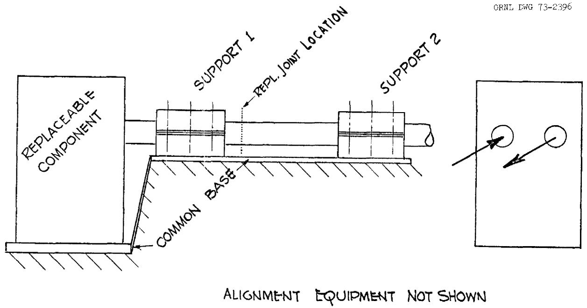  
Fig. 1. Typical Replacement Joint Location

# 2.0 CONCLUSIONS AND SUMMARY

For the sake of completeness, we have included in the report a description of the equipment and technology for performing all of the functions needed for the replacement of a component. Many of these, such as lighting, viewing, and component and maintenance equipment movement reflect the benefit of extensive experience gained during the operation of the HRT, MSRE, and other reactor projects. We believe that they are adequately understood and require essentially no development study before a reactor grade item could be designed.

There are other functions such as carriage orbit propulsion, pipe cutting and welding, which have received only limited evaluation for possible application to molten salt reactors in connection with our work on the orbital pipe welding system with programmed automated cutting, beveling, and welding accessories.[23,25] These studies led to the development of an automated pipe welding system which is now being used by the Tennessee Valley Authority in their Browns Ferry Nuclear Plant construction, and which has served as a prototype and pattern for the units to be used in the Fast Flux Test Facility at Hanford. The development of an industrial capability for the production of the automated welder increases our confidence that the equipment, after modification for the environment and for the remote operation, will perform the functions needed for reactor component replacement. However, there are some aspects of the modifications needed to permit remote operation for which further study would help in optimizing the equipment design. We would reevaluate the automated welding equipment which has become available commercially since the start of our earlier welding program, choose the one which best suits our needs, modify as necessary, and test it under conditions simulating some of those expected in a reactor system. We would expect that the basic equipment for development and testing would be built from standard line materials and that substitute materials would not be needed at this time.

The urgent function for which phase I studies and phase II simulation would be helpful to the early phases of a reactor project is that of pipe and component alignment in preparation for welding. We are proposing that where possible the pipe be made flexible enough to permit the necessary displacement needed for proper alignment. Some preliminary estimates described in Appendix "A" indicate that for most pipe sizes this would be a practical approach. For the very large pipes, or for cases where the pipe length does not permit much flexibility, we are proposing that a short section of pipe be tailored to fit between the misaligned pipe ends and that it be welded in place with the remote welder. Our studies have indicated that the approach is feasible, but we would like to gain some experience in applying the welder to such situations. A proposal for developing a gear-driven split-bearing-sleeve carriage for possible maintenance applications is included in Appendix B. This more rigid carriage would gain additional torque capability for pipe cutting and beveling work, would be more readily adaptable for internal pipe cleaning applications, and hopefully, would also simplify solutions to alignment problems for small pipe sizes by serving to minimize the displacement of pipe ends after being cut. The clamping of the carriage might be enough to hold the displacement to limits within tolerance ranges acceptable for rewelding.

McClung1 has described the development necessary to provide equipment for performance of the inspection function and much of this will be accomplished during the program for the in-service inspections of reactor vessels. We believe that the necessary transport function needed for moving the inspection equipment along the pipe welds can be obtained with the weld carriages. However, the influence of this inspection function on the basic carriage design should be evaluated before final carriage design selections are made.

In the future, during phase III, the general engineering reactor project mockups, when it is time to test the molten salt reactor system designs using semblance of the more complicated systems and components, it would be a great advantage to be able to perform remote maintenance tests on the mockups. This will help to assure that the reactor system components in the final design are capable of being maintained. The satisfactory performance of remote-handling devices, cleanliness control, and operating techniques can also be proved in mockup tests, giving increased confidence in their reliability and providing training in maintenance techniques that will someday reduce downtime.

# 3.0 STATUS OF THE TECHNOLOGY

# 3.1 Cell Illumination

# 3.1.1 Lighting Provisions for Maintenance

3.1.1.1 Experience. In the HRE, the HRT, and the MSRE, in-cell lighting proved adequate for repair purposes.[23,4,5,6] Integral lights on the underside of a portable shield provided supplemental illumination when required. The lights included dimmer controls, placed external to the cell, to provide contrast and shadow effects. Portable, suspended lights were used as required to help distinguish special objects.

3.1.1.2 Future Development Requirements. Update the lighting equipment to be sure that selections represent the best currently available commercial equipment. Permanent in-cell wiring and lighting, if used, should consist of materials to withstand cell radiation exposure levels of up to the order of $10^{11}$ R and ambient cell temperatures of about $1200^{\circ}$ F, and up to $1500^{\circ}$ F for short periods.

# 3.2 In-Cell Viewing Apparatus

# 3.2.1 Direct Viewing Through Lead Glass or Zinc-Bromide Windows

3.2.1.1 Current Concepts. Direct viewing is usually adequate for unobstructed straight line-of-sight and general area observations. For reactor maintenance operations it will be necessary to provide gamma-ray shielding. Commercially

marketed lead-glass shield plugs and zinc-bromide windows are commonly used and are generally satisfactory for vision, illumination and shielding. Shield effectiveness is generally proportional to density. Density values for major reactor shielding materials are as follows:

<table><tr><td>Concrete</td><td>density</td><td>about</td><td>2.2</td></tr><tr><td>Iron</td><td>&quot;</td><td>&quot;</td><td>7.8</td></tr><tr><td>Aluminum</td><td>&quot;</td><td>&quot;</td><td>2.7</td></tr><tr><td>Lead</td><td>&quot;</td><td>&quot;</td><td>11.3</td></tr><tr><td>Lead Glass</td><td>&quot;</td><td>&quot;</td><td>6.2</td></tr><tr><td>Zinc-Bromide Solution</td><td>&quot;</td><td>&quot;</td><td>2.5</td></tr></table>

Hence lead glass shield plugs have approximately $80\%$ of the gamma shielding value of iron, and zinc-bromide windows provide approximately $10\%$ better shielding than concrete.

3.2.1.2 Experience. ORNL and others, including all hot cell operators, have had considerable experience with lead glass and zinc-bromide for shielded viewing applications. Theoretical design information is readily available7 and actual selection details are listed in the design and operations reports for various nuclear installations.6,8

3.2.1.3 Future Development Requirements. None

3.2.2 Optical Equipment: Mirrors, Periscopes, and Fiber Optics

3.2.2.1 Definition. The use of mirrors to assist direct viewing has proven helpful for many remote observations. Simple tilt-linkages can be operated in conjunction with long handled tools to provide sufficient manipulations for adequately aligning the mirror for viewing. Commercially available periscopes, omniscopes, telescopes, and fiber-optics equipment can be obtained to meet all sorts of needs in nominal radiation and high-temperature environments, and have been used effectively in reactor repair and in hot cell work applications.

3.2.2.2 Experience. ORNL has varied experience with optical equipment in numerous applications. The "blanket mirror viewing device" and viewing scopes used in conjunction with HRT core hole plugging operations $^{2,9}$ , optical tooling devices and periscopes used in the MSRE $^{6,8,1}$ , and the periscope used in examinations of the Boiling Nuclear Superheater Power Station (BONUS) at Rincon, Puerto Rico $^{11}$ are examples of apparatus used in some of ORNL's remote viewing experiences. A report on nuclear vessel repairs at Savannah River $^{12}$ lists some of DuPont's optical tooling experiences.   
3.2.2.3 Future Development Requirements. Fiber optics is a relatively new science with potential for observations in areas where access limitations and/or obstructions prevent the use of more conventional viewing equipment. We recommend a literature search into nuclear applications of the technology. All optical equipment must meet the in-cell environmental conditions expected to prevail at the time of repair, and must be tested under actual, or simulated conditions. Insulation, shielding, or cooling development may be necessary for some of the equipment.   
3.2.2.4 Cost Estimate. A quarter-manyear effort should be scheduled for the first phase of a maintenance development program to investigate optical viewing means and to provide recommendations and estimates for subsequent feasibility testing and mockup studies.

# 3.2.3 Closed Circuit Television

3.2.3.1 Experience. Many advances have been made in television technology for nuclear applications during the past few years. General Electric Company, Westinghouse, and others routinely use TV for in-service and special inspections of reactors.[12,13,14] Closed circuit TV performance evaluations are also available from in-cell surveillance and from hot cell users.[15,16] ORNL has also used television for observing reactor repair and surveillance of the HRT and MSRE reactors.[17,18]   
3.2.3.2 Future Development Requirements. The TV camera and wiring must be able to withstand the in-cell temperature and radiation field. Insulation, shielding, or cooling system development may be necessary.

3.2.3.3 Cost Estimate. It is recommended that a quarter manyear effort and $10,000 equipment money be provided for Phase I of a maintenance development program to procure radiation and temperature resistant TV equipment, and to update design criteria, performance specifications and cost estimates for subsequent development work.

# 3.2.4 Special Inspections

3.2.4.1 Experience and Future Development Requirements. Refer to the report by R. W. McClung, Remote Inspection of Welded Joints, ORNL-TM-3561, September 1971.

# 3.3 In-Cell Handling Tools

# 3.3.1 Lifting Devices

3.3.1.1 Concept and Experience. Oak Ridge National Laboratory's standard practice has been to build cradle-type lifting devices for all reactor system components at the time of the components' initial installation in the cell; and this has greatly simplified the subsequent remote handling.[6,19] It is necessary, however, to build the fixtures with features that facilitate the use of remote "slip-on" guides or hook-insert rings for handling. Experience has shown also that where possible, programs for crane movements should be formulated and documented while the plant is being built.

3.3.1.2 Future Development Requirements. All in-cell handling tools and lifting fixtures are usually of all-metal construction of materials compatible with the Hastelloy N primary system material, and of simple designs employing mechanical linkages. The tools and fixtures, therefore, have little or no dependence upon in-cell environmental conditions during maintenance periods, with the exception of metal expansion when exposed to the elevated temperature in the cell. Little time and effort will be required to adapt tools of earlier designs for future applications. Specific fixtures and tools, however, must be proof tested, and operating procedures must be established and documented either during the construction of the reactor, or in full-scale mockup tests.

3.3.1.3 Cost Estimates. An engineering effort of about 1 l/2 man-years for design and development of handling tools will be required, plus $20,000 for materials and prototype equipment.

# 3.3.2 Miscellaneous Long-Handled Tools

3.3.2.1 Concept and Experience. Tools in this category include simple, long-handled utility hooks and rods for in-cell uses to install, or remove, insulation, heaters, etc. The

tools are also used to assist pickup and transfer operations; typical tool designs and operations are documented for HRT repair work.[6,20,21]

3.3.2.2 Future Development Required. None specifically; tools will be developed along with the components they will serve.

# 3.3.3 Portable Retaining Brackets

3.3.3.1 Concept and Experience. Reactor cell roof blocks and cell sides should contain hooks and shelves upon which to hang or set portable brackets for the temporary parking of miscellaneous small in-cell items, such as insulation jackets, heaters, etc., and repair tools. Portable brackets resembling cases for milk bottles were used for HRT and MSRE cell work.[6]   
3.3.3.2 Future Development Required. None specifically; brackets will be developed along with the components they will support.

# 3.3.4 Thermocouple and Electrical Connector Tools

3.3.4.1 Concept and Experience. Simple, long-handled, scissor-action tools were designed for HRE and MSRE in-cell thermocouple maintenance. The base of the thermocouple tool accommodates the male and female halves of a couple. The tool's actuator is used to open or close the scissor linkage to either make or break the coupling. Similar tools are also available for push-pull type electrical connector assembly and disassembly. Wrenches with long handles are available for use with multiple-pin connectors for instruments and controls. The wrench is used to engage and turn the connector's screw coupling. A scissor motion actuator, built into the wrench tool, is employed to align and make or break the coupling halves. Thermocouple tools, electrical connector tools and other ORNL handling equipment items are described in the ORNL Remote Maintenance Catalogue.[22]

3.3.4.2 Future Development Required. None, except for material substitutions.

# 3.4 Tool and Equipment Conveyance Means

3.4.1.1 Concept and Experience. It is assumed that the portable shield maintenance technology developed for the HRE and the MSRE will be applied with molten salt breeder reactors.[19] Cell conditions will determine the need for air locks, etc., however, the basic scheme, proven in prior operation of the experimental reactors, will be to utilize portable shields of lead or steel and to arrange this metallic shielding to protect the operator from radiation after access holes have been opened on top of the cell blocks. The portable shield

will also provide the operator with a shielded platform for loading tools into the cell. Loading holes will be located within a circular turntable insert within the portable shield platform to permit the tools and/or fixtures to be located and centered over the work area as required. The underside of the shield will also include hooks and bars to provide temporary hanger supports for maintenance tools and mobile equipment or components items. The platform of the portable shield will again also be comprised of two separate sections to allow total access for the transfer of large equipment items into the cell through the portable shield's platform frame opening. The reactor building would be temporarily evacuated for this type of maintenance operation. The transfers of large equipment items entail closed circuit TV operations and a zinc-bromide viewing window from a distant specially shielded control room.

3.4.1.2 Future Development Required. The portable maintenance shield approach must be incorporated into the original cell and cell roof block layout design. Mockup trials will be required to establish operating instructions and guides for maintenance. Costs for this effort are undetermined at present.

# 3.5 Pipe Cutting Equipment

# 3.5.1 Pipe Cutters

3.5.1.1 Experience. In 1968 and 1969 ORNL developed and tested prototype units of the automated, orbital pipe cutting and welding machinery as part of a feasibility study for the MSR maintenance program.[23] The machining head (see Fig. 2) was able to cut pipe, trim the ends square, and prepare end bevels on schedule 40 stainless steel pipes in sizes up to 6 inches in diameter with relatively little difficulty. However, problems arose in cutting Inconel because of its work-hardening tendencies, and more difficulties are expected for work on pipe sizes larger than 6 in. as the cutting operations were slow, cutter feed rates were minimal, and cutters dulled rapidly and required frequent replacement.

All ORNL machining tests were performed on horizontal piping. Figure 3 illustrates a cutting operation on 6 in. pipe. Slitting saws and double bevel cutters tracked true within approximately 0.003 in. Single bevel cutters tend to walk out of, and away from the cut, especially on the harder Inconel pipe. The cutter drive motor power and speed control capabilities appeared adequate. Observations indicated, however, that the carriage drive is the limiting factor on cutting capability. We observed roller slippage on the pipe and frequently tripped the carriage drive roller circuit breaker protection. Cutter feed and carriage travel speed adjustment changes, however, restored operations. The carriage and machining head withstood loading and vibrations caused by the milling cutters,

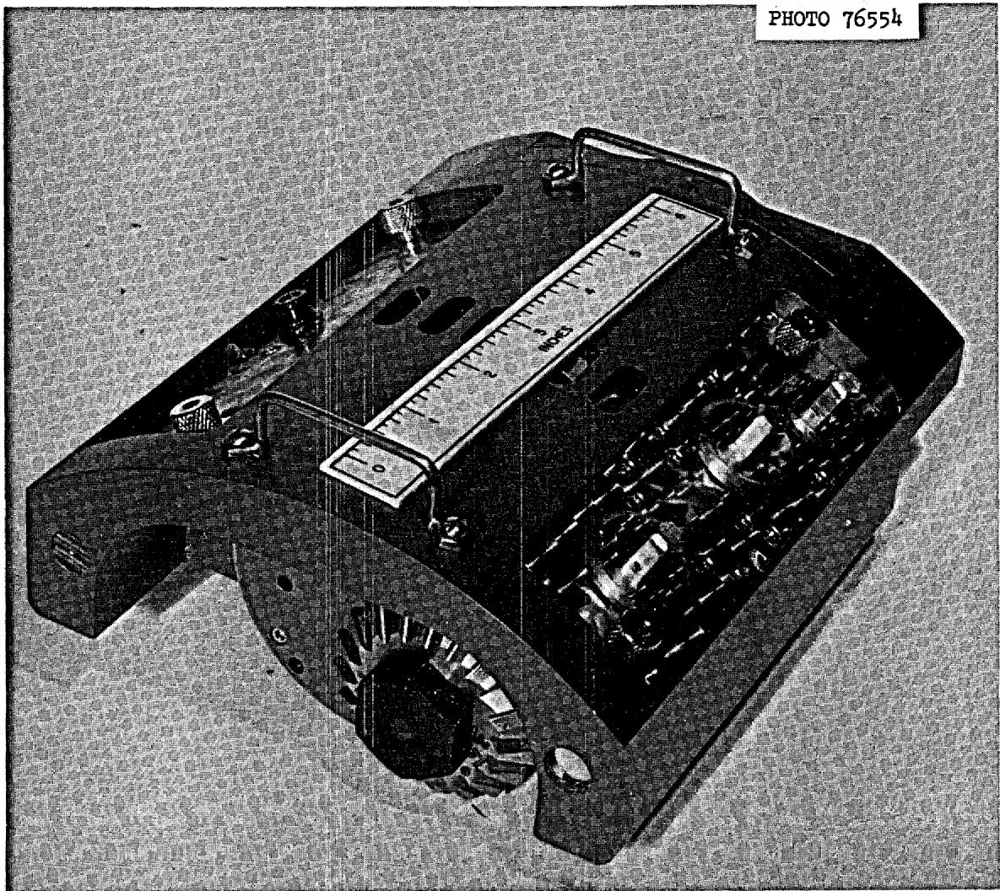  
Fig. 2. ORNL Cutter or Machining Head Module

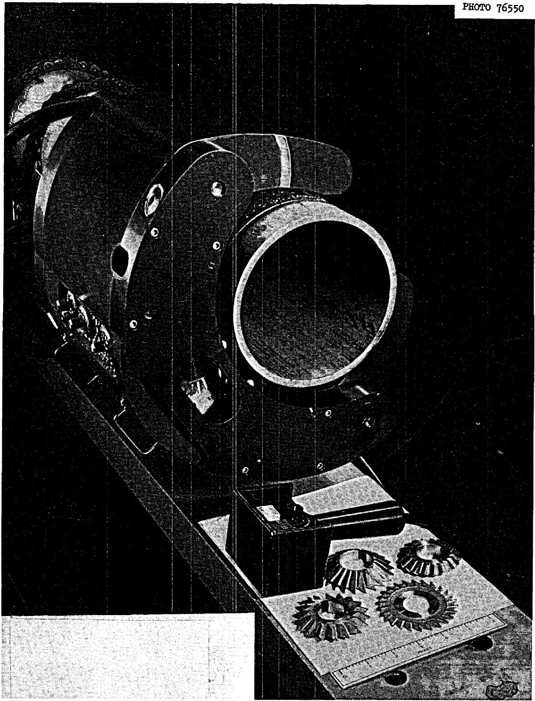  
Fig. 3. ORNL Orbital Cutting Equipment

but only with proper travel speed and tool feed selection. Improvements, however, are required to provide a stronger and more positive cutter depth control and to provide more stable longitudinal adjustments. A split-bearing sleeve carriage concept development is proposed (see 2.5.1.2) which could provide means for a more rigid cutting assembly which could still be remotely installed and operated for in-cell pipe cutting needs. Otherwise, improved locking clamps are desired in conjunction with the present carriage for prevention of longitudinal and radial cutter shifts. Pipe collar clamps are required for pipe cutting operations where the pipe slopes in excess of 5 degrees from horizontal.

We have cut with high-speed and Circoloy alloy slitting saws and milling cutters. The alloyed tool steel appeared to stay sharper longer, - possibly by as much as a factor of one and a half. Tests with carbide cutter blades showed an even longer blade life. Carbide tools, however, are brittle, and we did break some blades, probably as a result of blade chatter. Efficient cutting requires the thickest possible chip per cutting tooth, but this may have to be compromised considerably to obtain reasonable cutter life and proper surface finish. This is particularly true in the case of high-nickel steels where the base material tends to work-harden with the result that chip removal is inadequate or incomplete. Results from Inconel machining experiments indicate that the cutting edges of all cutter teeth must be generously relieved to provide ample clearance for chip fallout. Allowing chips to fall out freely will minimize the Inconel work hardening caused by trapped chips. It is also quite important that all teeth of a cutter engage the work during cutting. Off-the-shelf commercial cutters used appeared to cut with usually only about a fourth of their teeth, and improved cutting was noted where cutters were reground locally to precision specification. Almost $75\%$ tooth engagement can be attained.

The importance of proper tool travel and cutter speed adjustments, especially for cutting Inconel materials, cannot be minimized. Available machine shop machining data do not apply to the orbital cutting assembly because our equipment does not have the driving power of shop machines. Also, dry machining is specified for nuclear reactor system maintenance because coolants are either hazardous or might contaminate the nuclear system. Therefore the tool travel, cutting speeds, and tool feed rates must be several magnitudes lower than usual shop practice.

Table I shows the number of inches of cut a blade can be expected to make before it must be resharpened. The table also shows how deep the blade would cut in traveling the indicated number of inches around a 6-in.-diam pipe, taking a 30 mil or a 12 mil cut, as indicated.

Table 1. Expected Life of Cutter Blades   

<table><tr><td>Description</td><td colspan="4">Blade Lifetime</td></tr><tr><td></td><td colspan="2">In Stainless Steel</td><td colspan="2">In Inconel</td></tr><tr><td>Saw Tooth Speed</td><td colspan="2">70 to 80 ft/min</td><td colspan="2">50 ft/min</td></tr><tr><td>Carriage Speed</td><td colspan="2">3 l/4 in./min</td><td colspan="2">1 in./min</td></tr><tr><td>Feed Per Tooth</td><td colspan="2">.001 in.</td><td colspan="2">.0005 in.</td></tr><tr><td></td><td>Inches of cut, average depth 30 mils. inches</td><td>Total Depth of cut, 6-inch pipe wall. inches</td><td>Inches of cut, average depth 12 mils. inches</td><td>Total Depth of cut, 6-inch pipe wall. inches.</td></tr><tr><td>l/16-in.-thick slitting saw, 3 in. dia., 32 teeth high speed steel</td><td>530</td><td>3/4</td><td></td><td></td></tr><tr><td>l/16-in.-thick slitting saw, 3 in. dia., 32 teeth Circoloy alloy*</td><td>800</td><td>1 l/8</td><td>730</td><td>7/16</td></tr><tr><td>3/32-in.-thick slitting saw, 3 in. dia., 32 teeth high speed steel</td><td>430</td><td>5/8</td><td></td><td></td></tr><tr><td>3/32-in.-thick slitting saw, 3 in. dia., 32 teeth Circoloy alloy*</td><td>650</td><td>7/8</td><td>600</td><td>11/32</td></tr><tr><td>70° included double angle mill 2 3/4 in. dia., 20 teeth, 1/2 in. wide high-speed steel</td><td>470</td><td>11/16</td><td>420</td><td>1/4</td></tr></table>

*Trade name for Circular Tool Company (Providence, R.I.) special high-speed steel alloyed blades of high carbon, medium chrome, high vanadium, high tungsten and medium cobalt composition.

We selected cutting speeds between 70 and 80 surface fpm for cutting stainless steel materials, and chose 50 fpm for Inconel in order to achieve reasonable cutter life. These cutting speeds correspond to approximately 100 and 62.5 revolutions/min for the 3-in.-diam alloy steel slitting saws. Feed per tooth selections compatible with tool strength and tool rigidity were 0.001 in. for stainless steel work and 0.005 in. for Inconel with 3 l/4 and 1 in./min (traversing surface) blade travel rates. Our feed per tooth rates are low when compared to rates in standard machine shop work, but are still creditable considering our small-sized and low-powered equipment. Our cutter motor consists essentially of a 1/3 hp electric drill. The depths of cut depend on available hp and cutter shapes, and on the sharpness of the cutters, as they in turn affect the power required at the cutter motor spindle. We repeatedly cut 0.030 in. deep into stainless steel, and 0.015 in. into Inconel.

All of our machining operations with the ORNL orbital equipment must be accomplished in the standard "milling up" mode of operation where the cutter tooth in contact with the pipe is moving in the same direction as the carriage. We lack rigidity for reverse, or "climb mill" cutting. Our carriage's torsion bar clamping action on the carriage roller does not give enough friction contact for climb cutting.

Oak Ridge National Laboratory also has experience with the Trav-L-Cutter pipe saw and Guillotine pipe saws manufactured by the E. H. Wachs Company of Wheeling, Illinois, and with pipe cutting and beveling machines of the H & M Pipe Beveling Machine Company of Tulsa, Oklahoma.

The Wachs equipment is available with air or electric drives in horsepower ratings equivalent to machine shop saws. H & M equipment is electrically driven; their cutters are furnished with either pneumatic or electrical drives.

One of the prime objectives of the Fast Flux Test Facility (FFTF) at Hanford is to perform nuclear fuels testing for the Liquid Metal Fast Breeder Reactor (IMFBR) program. The test facility must have the capability to install and remove fuel assemblies by remotely controlled equipment. A sizeable program is underway at the Hanford Engineering Development Laboratory (HEDL) to develop and test equipment with which to cut and weld the open- and closed-loop reactor top closures for removal and reinstallation of experimental test assemblies.[24] ORNL is monitoring their development of cutting, welding, and related equipment for application to relatively small (6.72-in. mean diameter) pipe. They are testing their equipment in a mock-up at $500^{\circ}\mathrm{F}$ . Their material and equipment selections are intended to withstand $10^{5}$ R/hr gamma radiation exposures.

3.5.1.2 Future Development Required. Cell layout and available orbit clearance around pipes for the sawing and beveling equipment will be important factors in determining the selection of machinery for remote maintenance and repair operations. The ORNL equipment described is compact and lightweight. Our carriage-cutter head working unit is designed to be remotely clamped around a pipe and is about 4 in. thick in radial dimension, and 10 1/2 in. long. The technology for its application to cut and/or bevel pipes remotely by automated programmed controls is established. Our compact equipment, however, is limited in power for both the tool travel propulsion and the tool feed.

Subsequent sections of this report and Appendix "B" discuss an alternate carriage design using a split-bearing sleeve. The split-sleeve carriage is supported by a set of split-bearings on each end. A separate motor gear drive, mounted to the pipe, couples to a split-gear which is permanently attached to one of the sleeve's end bearings and drives the sleeve around the pipe. This alternate design offers considerably more rigid and uniform carriage propulsion than is available from the flexible, horseshoe-shaped ORNL carriages. Rigid carriages are desirable for pipe cutting service; cutter tool vibrations, or tool chatter are minimized, and cutter shift tendencies are eliminated. A strong possibility exists, however, that pipe ends will tend to spring apart radially (and axially) when cut. The magnitude of this shift tendency will be determined by actual process system layout and piping supports. It will be most pronounced with short pipe runs, and in the larger pipe sizes. We, therefore, anticipate that the split-bearing sleeve carriage design may be limited to cutting applications on the smaller pipe sizes, say, up to through 6- or 8-inch pipes. Beyond these sizes strong possibilities prevail that sleeve end bearings cannot withstand the forces resulting from the spring-action when the pipe is cut, and the bearings may be deformed or crushed. These carriages would also require a minimum of 10 inches pipe clearance, as contrasted to the 4-inch radial clearance requirement for basic ORNL carriages.

Split-sleeve carriage rigidity offers advantages for remotely operated pipe cutting and pipe end beveling operations, plus the possibility of mounting and supporting cutters or brushes to such carriages for internal pipe cleaning needs. (See 2.9.1.2). Also, these carriages could probably be used for maintaining pipe alignment during pipe cutting operations. (See Appendix "B"). These potential benefits seem to outweigh the aforementioned disadvantages and suggest that a development program would be justified to establish feasibility and limitations.

The Wach's equipment has ample power, but the equipment is considerably larger and heavier (by a factor of 10 plus); it requires substantial orbit clearance. The outside dimensions for a Wach's Trav-L-Cutter are $24 \times 3/4 \times 11 \times 1/2 \times 20$ in., as compared to $9 \times 4 \times 10 \times 1/2$ in. for the ORNL orbital equipment. Guillotin saws do not require orbit clearance. They usually fit a space in the order of 6 in. beyond each pipe side, with their operating mechanism in a fixed plane extending up to $3 \times 1/2$ pipe diameters on one side for a width of about 6 inches along the pipe. Guillotine saws can be utilized only to sever or straight cut pipes; they cannot make bevel cuts.

3.5.1.3 Cost Estimates. No work has been done to adapt commercial sawing machinery for remote installation. An equipment design, development, fabrication and checkout program is estimated to require about 1 3/4 many years of effort plus about $24,000 for materials, fabrication, test samples, and mockups. The cost excludes prototype machinery acquisition costs of about $3800 for a Trav-L-Cutter and about $1200 for a Guillotine saw with up to 8-in. pipe sawing capacity.

There are a number of manufacturers who market pipe cutting and beveling machines and lathes for pipe-end preparations. The machines are normally used by pipe fabricators and by large construction companies to prebevel pipe ends for construction welding. Typical machinery consists of circular gear tracks, or horseshoe-shaped gear tracks, to be installed over pipes, with the track utilized to orbit either a torch or an end mill for cutting and/or beveling. ORNL has experience in using an H & M "Pipe-End-Prep Lathe" track to handle 14 to 20 in. pipes. H & M equipment has potential for conversion to remote operation. It is definitely adequate for flame-cut and bevel preparations, but lacks a properly functioning precision "out-of-round" slide attachment to accurately monitor and gauge the out of roundness prevailing in commercial pipes so that compensating tool position changes can be made. The writer believes that H & M type equipment offers certain merits for consideration. Equipment dimensions, weight, and orbit clearances are in between the dimensions listed for ORNL and Wachs' equipment. If the H & M equipment is to be used for reactor work, individual tracks should be selected for each pipe size. The frame-tracks for multiple pipe size application lack some rigidity, and may offer too large an envelope when used on the small end of their pipe capacity range. It is estimated that, if performed in conjunction with the previously proposed work for developing remotely operated saws, the development of a workable H & M track to handle a representative 12 in. pipe cut and bevel preparation would require 3/4 man-year and $8500. Additional costs for H & M equipment items would be in the order of $2500.

A note of caution is repeated: labor, material, and machinery costs quoted previously are based on standard cutting practice with environmental temperature service limited to possibly as high as $300^{\circ}\mathrm{F}$ , and radiation levels up to about $10^{4}$ R/hr. It may be necessary to develop substitute materials to meet the contemplated high-temperature and high-radiation service requirements. All costs for such development and for substitute materials of construction will be additive. A study should be performed first to determine the limiting cell conditions so as to determine the additional research and development needs.

# 3.5.2 Seal Weld Cutters

3.5.2.1 Experience. There are a number of schemes for seal welding, including Diaphragm and Seal Plate Weld schemes, Fig. 4; Sandwich Seal Weld schemes, Fig. 5; Canopy Weld schemes, Fig. 6; and Seal Lip Closures, Fig. 7. The welded seals shown in the illustrations are types for which standard cutting equipment can be adapted to work by remote control. More detailed discussions are given in Section 2.14.4, "Seal Weld Closure Welding."

Various milling and/or grinding means are normally used with conventional hand tooling to sever the seals. To the best of the writer's knowledge, with the exception of mounting portable grinders to extension handles to locate the tool operator away from any direct radiation beams, and/or to permit the installation of portable lead shielding between the work and the operator, Oak Ridge National Laboratory, to date, has had no experience in totally remote cutting of seal welds.

3.5.2.2 Future Development Required. Specific tool, tool support, and tool manipulation devices will vary for each of the types of seal weld listed. Oak Ridge National Laboratory has assembled a file of seal weld cutter tooling selections based on published maintenance information and on observations of naval shipboard practices. The file includes information on grinders and grinding wheels, pipe cutters and cutter bits, saws and blades, pipe-end prep machines and tools, pipe centering and pipe expansion devices.

No time or cost estimate can be prepared prior to selecting the seal joint or joint designs. The development effort for the joint cutter should be performed in conjunction with reweld machinery trials. It is recommended that the designers select tentative seal weld configurations now and thereby permit the developer to proceed with a feasibility study that could include tooling design, purchase, adaption, and tests. Test results should influence and provide direction to the final MSBR seal design.

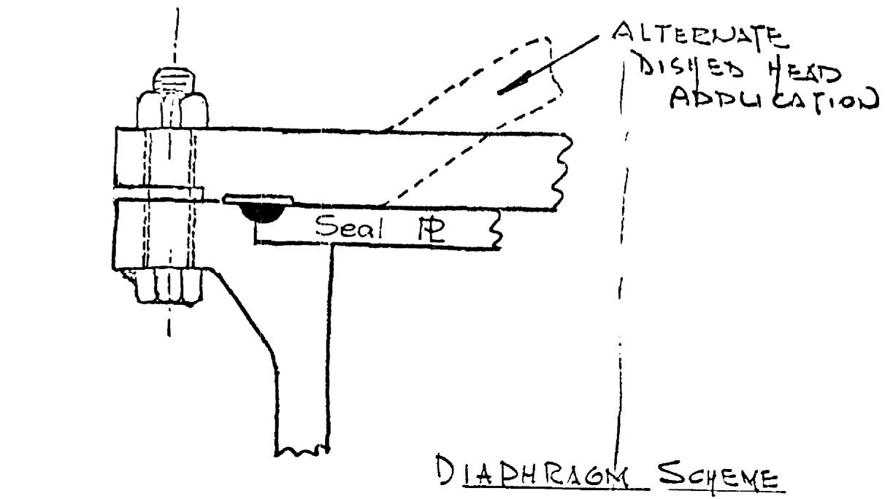

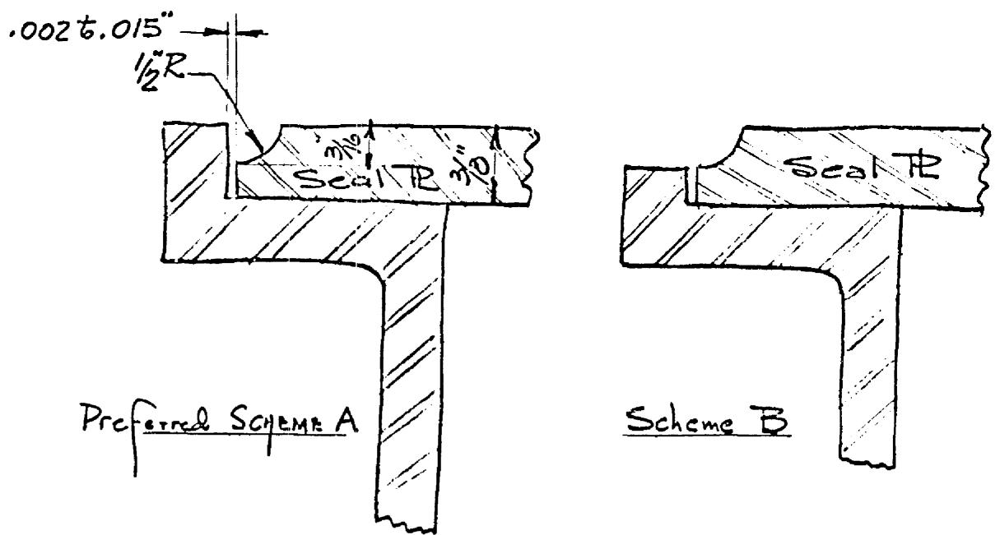  
Fig. 4. Seal Plate Welds

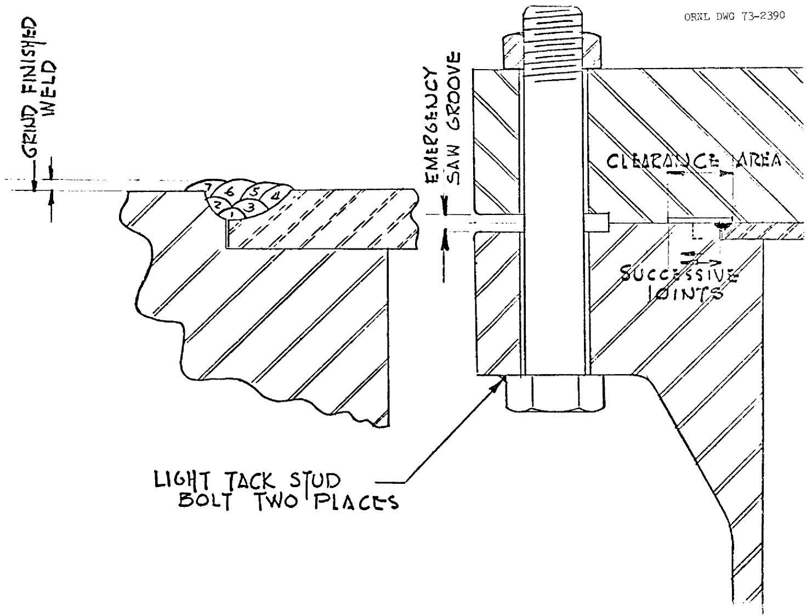  
Fig. 5. Sandwich Seal Weld

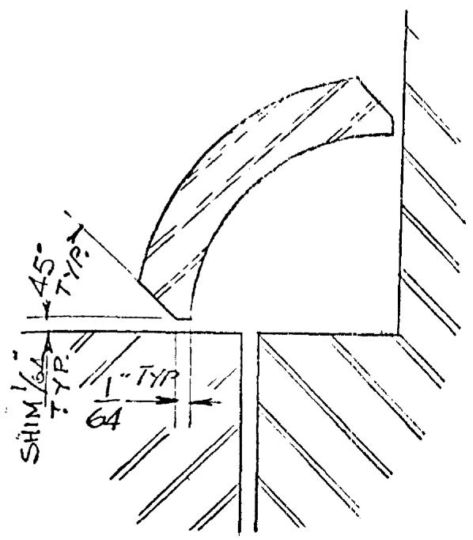

ORNL DWG 73-2391

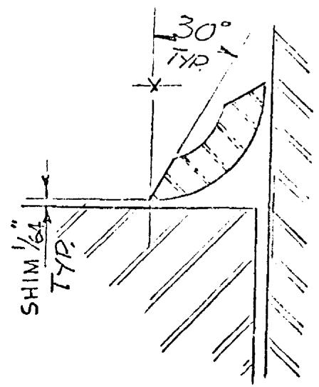

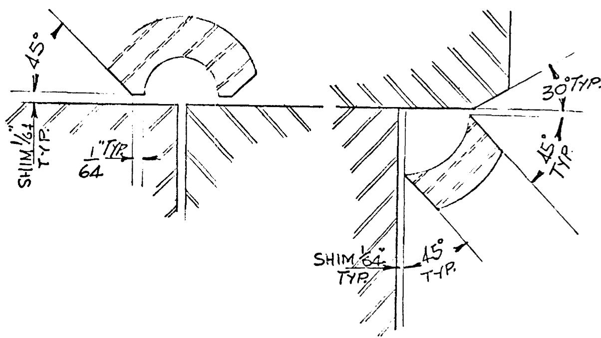  
Fig. 6. Canopy Weld Schemes

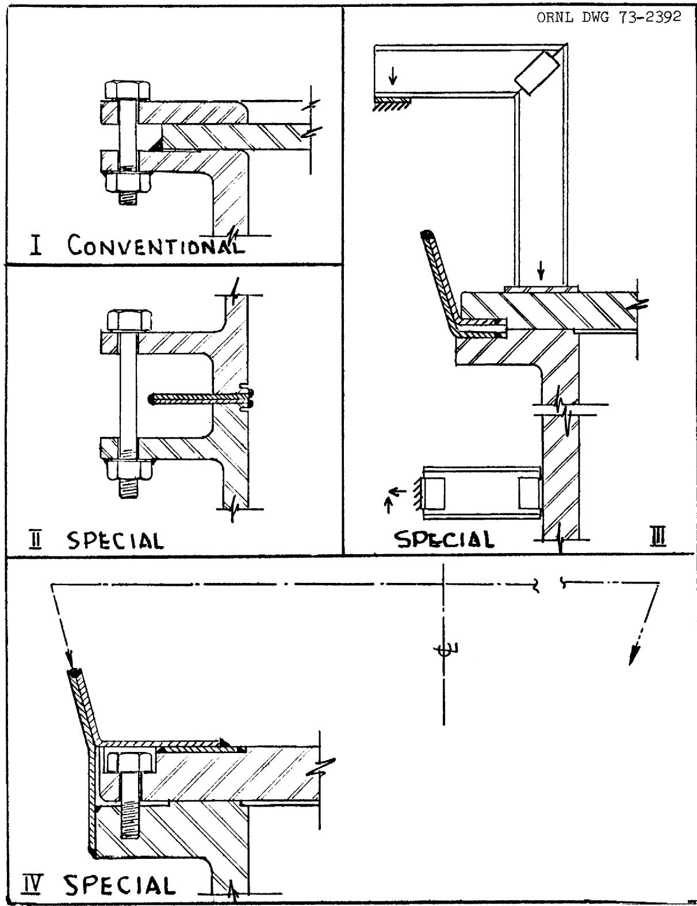  
Fig. 7. Seal Lip Closures

3.5.2.3 Cost Estimates. It is estimated that a budget of three man-years and $40,000 could establish worthwhile guidelines for preliminary seal-cut and seal-reweld feasibility evaluation. (Note: Item 2.14.2, "Closure Welding - Seal Welds" development costs are included with this estimate.)

The cost estimate caution listing stated previously also applies here.

# 3.6 Equipment for Pipe Spreading

3.6.1.1 Concept and Limited Experience. After cutting the pipes on each side of a component one must spread them apart to permit the ready removal of the component. Depending on loop layout, it may also be necessary to jack up one or the other of the pipe ends adjacent to the cut to eliminate binding for the remainder of a cut. For remote operational needs it is planned to utilize the special pipe alignment machinery discussed in Section 2.12, "Pipe Aligning Technology" to also serve the pipe spreading needs, at least for the smaller pipe sizes.

We have limited experience in resolving pipe restraining problems associated with pipe slitting operation. Split-saw cutter bench tests showed the importance of selecting the proper pipe support location relative to the orbiting platform. Care must be taken to permit free movement of the cut piece, and to prevent the binding of this piece against the saw. Slit-saw cutter materials are brittle; our test trials showed that it is possible to crack and break a restrained saw blade.

3.6.1.2 Future Development Required. Refer to item 2.12, "Pipe Aligning Technology".

3.7 Carriers and Conveyance Means for Use Within the Cell

3.7.1.1 Experience. Carrier technology from ORNL and other installations is available so that specialists in carrier design can meet whatever requirements are established by the final design of system components.

3.7.1.2 Future Development Required. None anticipated.

3.8 Carriers for Use Outside the Cell

3.8.1.1 Experience. Carrier technology from ORNL and other installations is available so that specialists in carrier design can meet whatever requirements are encountered.

3.8.1.2 Future Development Required. None anticipated.

# 3.9 In-Cell Preparations for Equipment Reinstallation

3.9.1.1 Definitions and Experience. Final preweld pipe-end joint preparations include kerf and/or chip removal from the open pipe joint, removal of salt including salt traces clinging to the pipe wall and the installation of a suitable purge block plug into the pipe near the open joint. One must also establish acceptable environmental, off-gas airlock and ventilation conditions for the cell. All cutting chips from mechanical sawing, kerf from plasma flame cutting, and salt residue on interior pipe walls adjacent to the cut joint, must be totally removed from the pipe prior to installing purge blocks or making a facsimilie in preparation for final pipe rewelding. Provisions must be made and incorporated with air locks and ventilation systems, to permit the cell off-gas system to safely handle purge and welding gases from subsequent pipe rewelding operations. ORNL has had considerable experience for some of the categories from operational maintenance experiences with homogeneous reactors and the MSRE.[5,6,23] Additional information is also available from the remote top closure evaluation work of the FTTF at Hanford, Washington.[24]

3.9.1.2 Future Development Required. A study should be started early in a reactor project and should combine the efforts of the reactor designers and maintenance personnel to assure that the piping system layout provides adequate clearances for maintenance equipment and for the introduction of replacement components. The group should discuss all phases of the repair and reinstallation requirements. Special tools and other requirements that become apparent from the discussions (such as a pipe wall scraper for removing traces of salt from pipe interior) should be listed and categorized. Where possible, new tooling requirements should be combined with existing tooling, or at least with the masts and manipulators of existing long-handled tools.

3.9.1.3 Cost Estimates. It is estimated that 1 l/4 many years and $18,000 will be required to perform the supplemental work, including the cleanliness control work discussed in Section 2.10 below.

# 3.10 In-Cell Cleanliness Control

3.10.1.1 Definitions and Experience. In-cell cleanliness control includes all the precautionary measures to assure that all prewelding cleanliness requirements of the ASME Code and RDT Standards are met and maintained throughout the welding operation. Wiping joints with acetone solvent and lint-free rags before welding, proper filing of defects observed between passes, and brushing of all weld beads, etc. are terms of cleanliness control that have been found to be necessary.[25,26,27]

3.10.1.2 Future Development Required. Cleanliness control development requirements and associated costs are included with the listing of item 2.9 above.   
3.11 Conveyance of Components to Reinstallation Location   
3.11.1.1 Experience. Carrier and conveyance technology can be obtained from ORNL and other installations for direct application to remote maintenance problems.   
3.11.1.2 Future Development Required. None anticipated.

# 3.12 Pipe Alignment Technology

3.12.1.1 Concept and Experience. There is only limited practical experience with the use of remote control equipment to spread the ends of pipe after cutting, to position new components in proper alignment, and to hold them in position during welding. Most of the available reactor maintenance experience documentation refers to underwater maintenance, with either the cell or the component partially flooded. Molten Salt Breeder Reactor (MSER) maintenance must be performed under dry conditions. The limited dry experience that is available is primarily from work in the MSRE mockup and in the MSRE cell where specially mounted screw-jacks were installed in conjunction with freeze flanges in the primary pipe system to spread or close the flanges. Instructions for pipe alignment were developed as a part of the extensive Westinghouse Pennsylvania Power and Light Company study for the Pennsylvania Advanced Reactor Program (PAR)[23] of the late 1950's. The PAR was planned to use a circulating aqueous slurry fuel pressurized to 1000 psi. The designers recognized that a circulating fuel would increase the radiation levels in the reactor system areas and that completely remote maintenance would be mandatory. The remote control devices and procedures planned for use on the PAR system are described in the following paragraphs.

The primary coolant systems of the PAR consisted of closed loops, each with but one point fixed. Hence, positioners to realign the pipe for welding were not required to apply bending moments to the piping and only simple radial and axial motions were needed to grip the pipe and to align the pipe ends. PAR loop piping was expected to encounter thermal cycles which would introduce stresses that would cause the pipe ends to spring from their original position when the pipe was cut. The PAR design criteria regulated primary pipe stresses to limit pipe expansions so that no point of the piping would move in excess of 1/2 inch during the flexure from hot to cold position. Their reactor vessel, because of its weight and hanger design, had the completely fixed position. All other components and the piping were

free to move about the reactor in a horizontal plane. Because of this flexibility, only relatively simple positioner devices were required to properly hold piping for severance operations and to realign the replacement piping prior to welding. Narrow clamping band units on each side of the cut points included jaws to firmly grip the pipe. The cutting and welding equipment could move radially and axially for realignment and mounting. Cut points were preselected on horizontal pipe runs to further reduce bending moment requirements for the replacement piping. The PAR primary system (16-in. pipe) positioner design assumed that the maximum loads to be imposed on the pipe, in either the radial or the axial direction, would be 15 tons and that a 1-in. axial movement of the pipe to provide clearance would be adequate for removal of the components. Replacement components contained nozzle configurations identical with the removed component. Crane access was chosen to position new components within 1 in. of the final in-cell location. All axial and radial loads were transmitted to permanently installed structures. These supports were designed not to deflect under the calculated loads required for pipe manipulations. During the removal of a component, identical positioners would be lowered over the piping onto the rigid steel structures on each side of the cut point. After the positioners were locked to the supports, their self-contained hydraulic systems were to provide all the forces required to restrain or align the piping. Final alignment was to be accomplished to within 1/32 in.

The termination of the PAR project precluded complete testing of the maintenance schemes to show that they would accomplish all the restraining and pipe aligning manipulations required for proper cutting and rewelding work setups. The project, however, did conduct equipment tests to establish remote maintenance feasibility and to provide valuable guidelines for further studies.

Among the problems that remained when the PAR work had discontinued was the fact that the maintenance equipment and the positioning equipment components were bulky and complex. Many positioners were required to handle the numerous pipe sizes, and each demanded a great deal of cell room. Although ORNL's approach to positioning will generally follow PAR guidelines, we plan to use greatly simplified apparatus. For example, piping will generally be cut at component stub nozzles. The positioner support therefore can be incorporated to the component's structure or framing at considerable space savings. Pipe deflection movements can be minimized. Figure 8 exemplifies a possible arrangement.

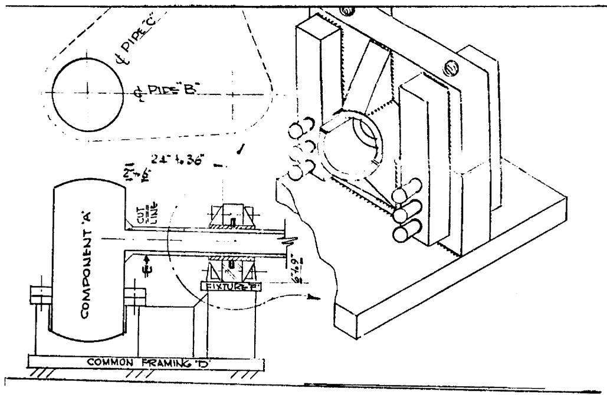  
Fig. 3. Component Pipe Stub Weld Joint Positioner Arrangement

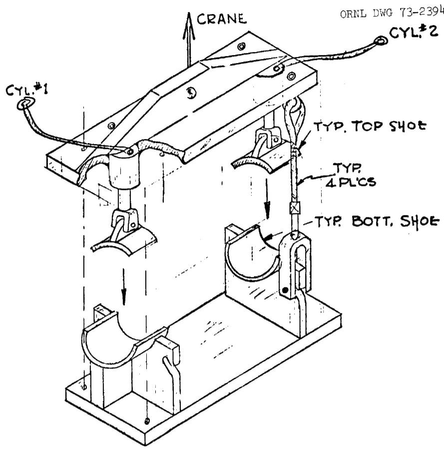  
Fig. 9. Pipe Alignment Jig for Line Cutting and Welding

Component (A) and typical connecting pipes (B) and (C) are commonly supported by framing (D). Preselected cut-point area (E) has accurately machined (to better than normal mill dimensional tolerances) piping, precision indexed to component reference lines. A permanent pipe clamping fixture (F) is both adjustable and removable. The fixture includes a centered ring groove to accomodate a ring welded to the pipe. The integral pipe ring permits the fixture to shift axially during loop heatup expansion and cooldown contraction to minimize the introduction of bending moments and stresses to the pipe. The mating surfaces of the pipe clamp fixture will contain antigall spray coatings. A typical component replacement operation is presently envisioned as follows:

1. Mount the "orbital vehicle" carriage over area (E). Insert an inspection module. Verify that clamp (F) is secured over pipe (B). Apply module's inspection gear to properly index the carriage at the preselected cut-plane; lock carriage drive to pipe.   
2. Install a catch pan and a vacuum cleaner system for "hot chip" control. Install a cutter module in exchange for the inspection module. Test indexing - proceed to cut.   
3. Transfer equipment to pipe line (C); repeat operations 1 and 2.   
4. Detach component (A) from its support, attach a lifting fixture. Use crane for removal.   
5. Enter replacement component $(A')$ . Its pipe stub has been previously machined to template indexing data. Component $(A')$ is bagged, except for stub pipe weld ends, and lowered in place. Bolt component $(A')$ to supports. Attempt to match stubs and piping. If stub ends are too long, matchmark pipe, remove component, remachine. If stubs are too short, obtain wax impressions for machining a spool piece insert. Fit as required to attain joint alignment. Adjust the permanent pipe clamp fixture (F) if required, but only for small displacements to avoid excessive strains.

We plan to use special custom-built spool inserts to connect pipes for rewelding in places where it is otherwise impossible to attain satisfactory pipe-end alignment for rewelding. Many components contain multiple pipe connections. Depending on the respective azimuth locations of the pipes stubs on the replacement component, equipment maintenance procedures to be developed in the mockup will more than likely require spool piece connectors for the makeup of some of these lines. The spool piece scheme avoids the prestressing of pipes for fitup on the final line attachments of multiple lines.

6. Reinstall "orbital vehicle" carriage with the inspection module insert over pipe (B). Check the final alignment of the pipes and align the carriage. Clamp and lock carriage drive to pipe. Swap to cutter module, mill the adjoining pipe ends to get the precision needed. Remove the cutter module, clean the prepared joint; then install the weld module. Tack or stagger weld matched pipe ends to avoid distortion. Perform similar work on pipe line (C). Finally, finish weld both joints.

7. Remove repair equipment. Adjust the supports and tighten bolts. Whenever a pipe section or component is removed after having been in service, residual stresses can exist in the piping and will appear as forces and moments upon cutting the pipe. The forces and moments will be present even though the piping may have been installed initially in a stress-free condition. Stresses can be caused by differences between the ambient temperature at which the piping was installed and that which exists during maintenance operation, by thermal cycling in system operation, by changes due to yielding at high-temperature operation (creep), or by changes of configuration caused by welding, or by shifting of pipe support hangers, supports, or structures. The suggested scheme for cutting only in the vicinity of the component nozzle stubs and for using common-component pipe restraint clamp supports locates pipe cut points adjacent to rigid components and tends to reduce radial pipe movements and pipe bending moments. The scheme thereby minimizes problems with replacement components. The scheme also compensates for axial pipe shifts by letting the pipe clamp fixture shift freely with the pipe's axis. Appendix A lists calculated maximum pipe shifts to be anticipated in cutting of pipe in a maintenance operation on a typical right angle bend pipe-line installation. The illustrations selected represent "ideal" balanced symmetrical layouts; in practice piping systems will more than likely be far more complex. The deflection and restoration force figures, however, illustrate the magnitude of the problem, and the problems dependence upon pipe size and lengths of pipe runs. The longer the pipe's length, the greater its deflection, or shrinkage upon cutting, - but the restoration force requirements decrease with increased pipe lengths to reduce the overall problem of jockeying pipes about to align an old in-cell pipe end with the pipe stub of a newly installed component. Smaller diameter pipes are less rigid, hence considerably less force is required to move the smaller lines within the cell. Accordingly, the ideal cell pipe layout, from a maintenance standpoint, consists of long runs of small diameter balanced geometry pipe lines. We also note negligible angular pipe deflections for the proposed pipe supports affixed to a common base with the respective components; the magnitude of the angular deflection, or rotation, upon cutting the pipes is not sufficient to cause problems of matchup for butted ends for re-welding if the pipe ends are squared to usual tolerances.

Reactor designers cannot predict all possible trouble areas, or it may not be practical to provide pipe stub positioners at every location where they might be needed. Therefore, a portable pipe alignment jig for line cutting and welding, such as shown in Fig. 9, will be needed to provide for pipe maintenance anywhere within the system. The cable-supported positioner assembly could swing into place over the pipe to be cut. Then, two hydraulic cylinders, housed within the jig's top cover, would be energized to extend a set of contoured shoes to firmly grip the pipe and press it into the alignment jig and reestablish radial alignment. Matching corner-cable slings are in tension to balance the applied hold-down forces. Narrow clamps designed to grip the pipe firmly should be installed butted up to each side of the jig's shoes to minimize pipe bending moment stresses when the pipe is cut.

3.12.1.2 Future Development Requirements. We should establish which vessels are to be replaced, which ones to be repaired in place, and which components of vessels are to be removed for repair or replacement. Expected pipe flexibility needs should be estimated for comparison, and for the vessels that are to be replaced it must be determined how pipe sizes, wall thickness, length and method of attachment to the vessel will influence the flexibility. A tightly coupled arrangement such as that proposed for the MSBR's $^{29}$ does not permit much flexibility and it may therefore become necessary to resort to the use of tailored spool pieces for short large diameter pipe runs. Where the large coolant salt piping could have long runs, there may be enough flexibility available to permit some maintenance pipe alignment, however, even here pipe in the 20 inch pipe range is not easily bent. The smaller service lines (6 and 8 inches diameter) could be made flexible enough to permit relatively easy alignment after the vessel is installed and the larger lines welded together. The references to the PAR imply that the largest vessel, or the reactor vessel, would be fixed and that the other components would then be adjusted to it for alignment. The actual supports, rotations, and tilts of these "other components" remain the major problems to be resolved, along with the problems of properly holding the pipes for final alignment before welding. The designer-maintenance study group (see itme 2.9, "In-Cell Preparations for Equipment Reinstallation") should analyze all in-cell pipe systems for anticipated pipe deflection shifts and movements when the pipes are severed during component replacement maintenance operations. Their analyses should determine the equipment and pipe support types needed, the locations of the cut planes, and the space needed for pressure cylinder insertion to move the pipe ends as required.

Alternatively, a study should be sponsored to investigate possible merits of utilizing commercially available split-bearing sleeves to retain pipe alignment for cutting and to

reestablish alignment for preweld and weld-tacking assembly, as detailed in Appendix B. There may be a pipe size restriction for an effective range where split-bearing sleeves permit a highly simplified approach to pipe alignment maintenance needs. An investigatory program should start early in the reactor project. Split bearing sleeve maintenance, even if practicable only for the smaller pipe sizes, would permit substantial overall cost savings.

3.12.1.3 Cost Estimates. A feasibility study on a selected small pipe size of 3-in. sched 40 stainless steel pipe, or of 3-in. 40 Inconel pipe, for split-bearing sleeve maintenance would entail about $\frac{3}{4}$ many years and approximately $15,000. A Phase II extension to determine range limitations for the scheme should be a program of approximately like magnitude. Costs of Phase III final checkouts including more complex alignment apparatus for the larger pipe sizes are indeterminate at this time. Work for this phase should be combined with full-scale mockup schemes of actual component installations, which would entail considerable manpower, material, equipment, and related costs.

# 3.13 Weld Preparation and Tack Welding of Pipe Joints

3.13.1.1 Concept and Experience. At present it is proposed to use "buttered" weld metal rings that are integrally attached to the pipe stubs of the replacement component, or to the replacement pipe.[23] A "buttered" ring is prepared by depositing weld metal around the pipe stub interior and then machining the deposit to a washer shape. The integral weld metal ring is shaped and spaced to simulate a Kellogg-type rectangular ring consumable insert. The final machining of the washer is to be made to match the mating in-cell pipe end by using templates made from wax impressions. The washer shaped pipe end offers the additional advantage of having a fairly rigid end configuration capable of withstanding moderate abuse during pipe handling operations. The final pipe alignment positioning, however, is critical. The prepared end shape of the in-cell pipe section consists of a nominal 1/16-inch root face and a bevel angle. This rootface is comparatively flimsy; hence vulnerable to nicking or deformation with bumping or other improper pipe handling. It is desirable to attempt to contact the joint face only in a butted plane. It may become necessary to temporarily protect the in-cell pipe-joint ends with bumper shields until a replacement component (with its integral pipe stub ends) is lowered to final elevation.

The integral ring and stub will be tack welded to the in-cell pipe using the automated orbital pipe welding equipment as soon as proper alignment is obtained. All aligning machinery must remain energized for the tacking operations to clamp and restrain the pipe sections and thereby firmly seat

the pipe ends. Sufficient tacks must be placed to avoid the breaking of tacks after restraint removal, or during root-pass welding. Preliminary feasibility trials seem to indicate that the above procedure can be made to work properly.[23,25]

3.13.1.2 Future Development Requirements. To be discussed under Section 2.14.1, "Closure Welding - Pipe Welding".

# 3.14 Closure Welding

# 3.14.1 Pipe Welding

3.14.1.1 Experience. The ORNL automated welding feasibility study report, $^{23}$ a follow-up report on further weld development with the ORNL system, $^{25}$ and a report on automated orbital welding with recently available commercial equipment systems, $^{26}$ as well as an ORNL film on Automated Welding, $^{27}$ all describe automated orbital welding operations in considerable detail. Some consideration was given to adapting the original ORNL equipment for remote application, however, essentially no proper scale demonstrations were attempted, and this still remains to be done. It is now also important to monitor the progress of the newly available commercial automated orbital welding systems. $^{25,26}$ Five companies started marketing such equipment in 1972. The AEC is planning to use such machinery extensively for the pipe system construction of LMFBR facilities. It may become appropriate to conduct future maintenance welding experimentation with these commercial systems to utilize trained, knowledgeable operators and qualified welding and inspecting procedures.

The ORNL automated equipment consists of an "orbital" carriage that clamps onto a pipe and propels the welding apparatus around the circumference of the pipe. The carriage accommodates interchangeable heads for cutting pipe or for making tungsten inert-gas-arc welds. There is an automatic welding programmer-controller that constantly maintains all conditions necessary to produce high quality welds. There is also a hand operated pendant unit to provide alternative start and stop controls. To begin automated welding, an appropriate procedure is dialed into the programmer-controller, a button is pushed, and the machine takes over to produce the weld and then shuts itself off. A recorder coupled to the system is used to record the major welding parameters including current, arc voltage, carriage speed, wire feed rate, and start and stop. Figures 10 and 11 show the welding system.

3.14.1.2 Future Development Requirements. Automated welding is now operational for direct pipe welding in construction applications.[26] Commercial equipment systems are now marketed below \(40,000 to automatically butt-weld pipes from 3 to 36 in. diameter and for wall thicknesses of 3/16 to 1 1/2 in. The

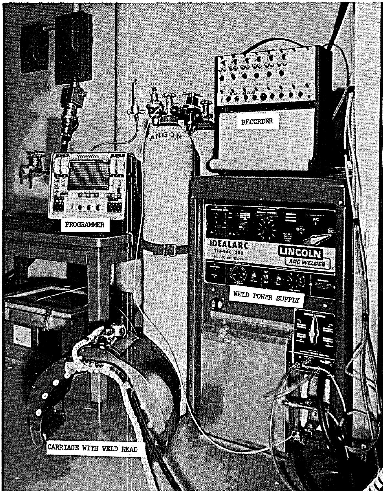  
Fig. 10. ORNL Orbital Welding System

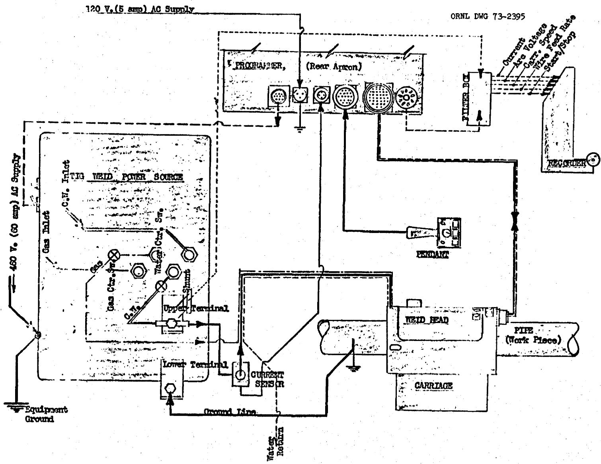  
Fig. 11. Equipment Hook-Up, ORNL Weld System

machines orbit the pipe for welding. Welds produced meet ASME and RDT Code Standards for nuclear-quality gas-tungsten-arc welding of pipe. The commercial machines for the present must be manually mounted on pipes, and operator understanding and judgment are required for the setups. The ORNL orbital carriage and automated welding equipment can be installed remotely and operated from a remote station.

3.14.1.3 Cost Estimates. There is a choice of custom building individual ORNL type systems one at a time at roughly 1 l/2 to 2 times the costs of the commercial mass produced systems, or of attempting to devise means and procedures to adapt and convert the commercial machinery to remote control applications. Since most nuclear piping systems will probably be built with automated welding equipment by the late 1970's, it is recommended that the commercially available equipment be adapted for remote control operation. It is estimated that two man-years of effort plus $40,000 for supporting services and materials will be required in addition to purchase of a commercially available automated welding system, estimated to cost $38,000.

The note of caution, however, must be repeated. As with the pipe cutting and beveling equipment, all present materials of construction for either the ORNL or the commercial welder will not withstand environmental temperatures in excess of $300^{\circ}\mathrm{F}$ and may not hold up for an acceptable life in radiation fields of $10^{5}\mathrm{R/hr}$ . A program must therefore be sponsored to develop substitute materials, to conduct furnace tests, and thereafter, to build prototype weld heads for total weld system checkout in suitable high-temperature test cells. Estimating costs for this work would be premature and will be developed when environmental conditions are set more firmly, and after the establishment of the remote handling capability for commercial welders.

# 3.14.2 Seal Welding

3.14.2.1 Description. Seal weld closures were illustrated and discussed in Section 2.5.2. We expect that the welding head used in ORNL experiments, or a commercial head of equivalent design, could be adapted to follow the circular path of the seal perimeter by attaching the head to the end of a jib-boom, which is centered on the vessel flange, as shown in Fig. 12. Adaptive controls will be used to properly locate the torch and to adjust the torch-tungsten positioning for minor geometrical contour irregularities and/or minor fitup inconsistencies of mating seal members. For seal welds on the side of the vessel, it is possible to support the same type weld head from a carriage to ride a rail track about the perimeter of a vessel, as illustrated in Fig. 13. We have completed a concept study for a crawler-carriage to

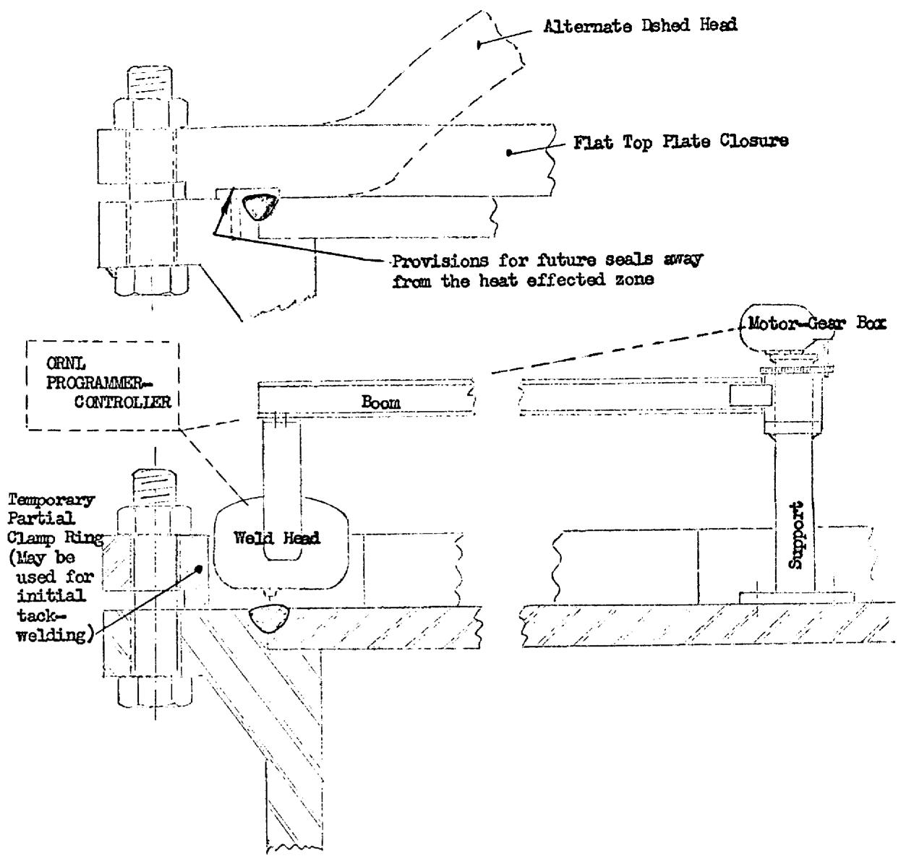  
Fig. 12. Conceptual Diaphragm or Sandwich Seal Weld with ORNL Weld Head Supported from a Motorized Carousel Linkage

For CUTING:

Use air or electric cutting tools, grinders, plasma torch, and/or gouging torch

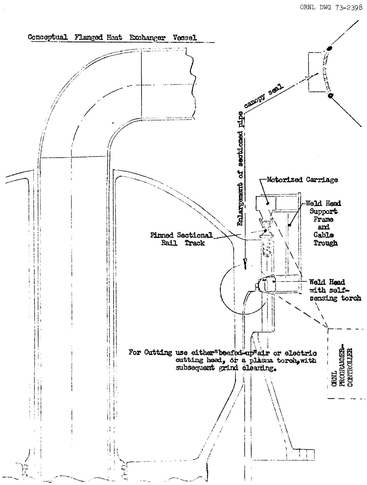  
Fig. 13. Flanged Vessel Seal Weld Closure Scheme for Orbital System Inserts

ride a set of seal lips as shown in Fig. 14. The final design for seal weld closures will govern the selection of the type of carriage to be used with a weld head which is common to other systems.

3.14.2.2 Future Development Required. New types of carriages and weld-head propulsion schemes are needed for seal weld applications. Presently available weld heads from the commercial systems can perform the heliarc seal welds required and the heads need only to be adapted for remote control and automated seal welding operation. It is reasonable to assume that the weld heads developed for pipe welding could be used interchangeable in the seal welder.   
3.14.2.3 Cost Estimates. Approximately three many years and $40,000 should be budgeted if this work can be performed in conjunction with recommended item 2.5.2, "Seal Weld Cutters" development. The special high-temperature and high-radiation equipment stipulations listed under item 2.14.1, "Closure Welding - Pipe Welding" again also apply for seal welding equipment.

# 3.15 Inspection and Acceptance Tests

3.15.1.1 Concept and Experience. The technology of remote inspection and acceptance testing by means of the more conventional penetrant checks, radiography and sonic inspection is described in the report "Remote Inspection of Welded Joints", ORNL-TM-3561, September 1971, by R. W. McClung. In addition, it now appears that it may be possible to evaluate the data recorded as the weld is being made and from the data to determine the likelihood of a flaw in each weld pass. It is known, from experience, that excessive arc voltage and low current will cause lack of weld penetration; low arc voltage and high current, or low wire feed and high weld current will cause melt-through; high wire feed and low weld current will ball the bead; inconsistent carriage travel and hence, uneven weld speeds will result in uneven bead depth and contour; etc. The Recorder shown with the welding system in Figures 10 and 11 charts welding current, arc voltage, carriage speed and wire feed rate. The charted record can be compared to previously prepared acceptable standards. If all plots fall within predetermined allowable band-widths, this is evidence of a good weld. Simultaneously incurred irregularities to any two of the charted functions should cause concern. (Single plot deviations usually indicate instrument calibration, or signal noise fluctuations.) Usually, a careful visual inspection, with the chart's time scale used to calculate the specific location of the suspected flaw, will confirm a weld defect. It is hoped that the Code writers and the inspection agencies will amend their present inspection policies to permit the substitution of information

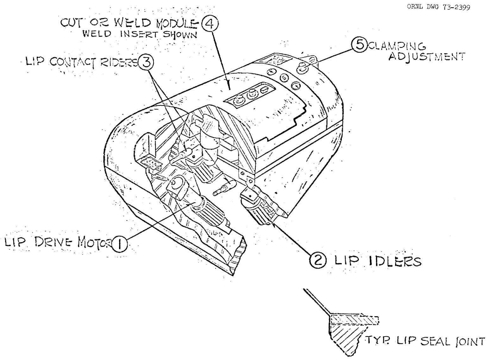  
Fig. 14. Conceptual Design - Remote Seal Device

from recorder charts for those Code requirements that cannot be established with reliability by remote means.

3.15.1.2 Future Development Required. Recommendations for future development work on remote inspection and acceptance tests are contained in McClung's report on "Remote Inspection of Welded Joints".1

# APPENDIX A

# CALCULATIONS FOR ANTICIPATED MAXIMUM DEFLECTIONS AND RESTORATION FORCES FOR CUTTING INOR-8 Piping Material

In considering the problems of remote maintenance on molten salt reactor systems, we have been concerned about how pipe ends might move or spring apart after a cut is made to remove some component which is to be replaced. The weight of components and of the pipe itself will impose stresses as will thermal expansion or thermal cycling after the system was installed. One can anticipate that the pipe ends will surely shift or deflect after a cut has been made. To be able to realign the pipe and hold it in position for rewelding will require some sort of clamping mechanism which will have to be designed to overcome the forces exerted on the pipes. Force will also be required to restore the cut pipe to its original position prior to realigning and rewelding the replacement component into the system.

Two pipe layouts have been analyzed to obtain an approximation of the magnitude of the problem. The cases are somewhat simplified and idealized to permit ready analysis, but the calculated deflection values should nevertheless be reasonable approximations. In any event, with standard supports and braces for the components of the system, the calculated stresses on runs of pipe are such as to cause the cut ends to deflect about an inch or less, not as much as a foot or so. This information is important in determining what sort of equipment will be needed for aligning and holding pipes to be rewelded. The cases that were analyzed were selected to illustrate the effects of pipe length and pipe diameter on the magnitude of the deflection when a cut is made. The calculations of the amount of deflection and the forces required to restore the deflected pipe to its original position indicate values that we can live with, provided that we use proper foresight in establishing the system design to meet reasonable requirements for future maintenance.

# Calculations

For a molten salt reactor system operating near $1300^{\circ}\mathrm{F}$ over a three-year period, we have calculated the maximum deflection of pipe ends after cutting and calculated the forces required to restore the pipe ends to their original position. These calculations are based on the assumption that the system piping was originally installed so that stresses were within those established by the criteria of Code Case 1315. The following paragraphs and illustrations describe the calculations that were performed and show the results that were obtained.

# Given:

1. Maximum permissible creep rate:

Code allowable maximum $= 1\%$ in 100,000 hrs

$= .26\%$ in 3 years

2. Assume:

a) the uniform creep rate conservatively will not exceed $50\%$ max. Select a uniform creep rate of .13% (this represents $\sim 1/7$ of the maximum thermal expansion).   
b) there is no stress in the pipe at assembly.

3. Calculate:

a) Pipe Shifts vs. Pipe Lengths for

1) A typical piping arrangement; both ends of the pipe run are fixed; no permanent pipe end support guides at cut point.   
2) A typical piping arrangement; both ends of the pipe run are fixed; the fixed pipe end supports include a common fixed base with guides on each side of the pipe cut to restrain the pipe being cut.

b) The magnitude of the restoration force to be applied to the cut pipe (first case) to return the pipe to its precut location.

1) Force vs. Pipe Length   
2) Force vs. Pipe Size

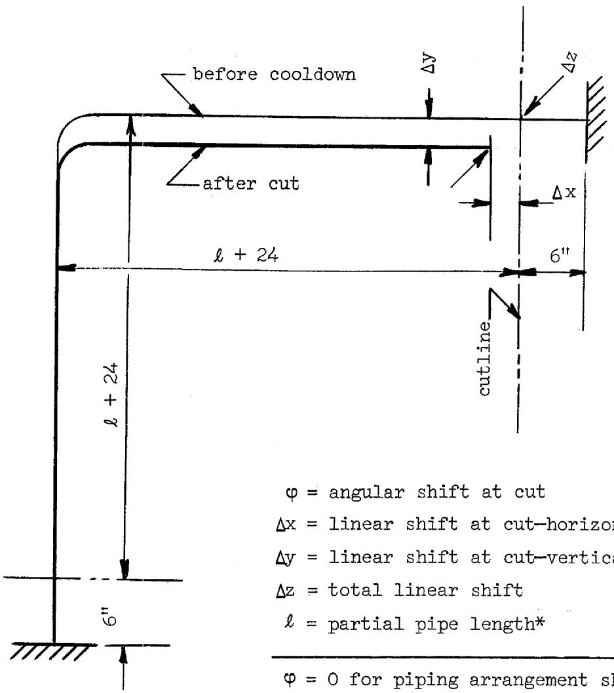

$$
\Delta x = 0. 0 0 1 3 (k + 3 0)
$$

$$
\Delta \mathbf {y} = 0. 0 0 1 3 (k + 3 0)
$$

$$
\Delta x = \Delta y
$$

$$
\Delta z = \sqrt {\Delta x ^ {2} + \Delta y ^ {2}}
$$

PIPE LENGTH*

$$
5 ^ {\prime} + 2 ^ {\prime} 6 ^ {\prime \prime} = 7 ^ {\prime} 6 ^ {\prime \prime}
$$

$$
1 0 ^ {\prime} + 2 ^ {\prime} 6 ^ {\prime \prime} = 1 2 ^ {\prime} 6 ^ {\prime \prime}
$$

$$
1 5 ^ {\prime} + 2 ^ {\prime} 6 ^ {\prime \prime} = 1 7 ^ {\prime} 6 ^ {\prime \prime}
$$

$$
2 0 ^ {\prime} + 2 ^ {\prime} 6 ^ {\prime \prime} = 2 2 ^ {\prime} 6 ^ {\prime \prime}
$$

LINEAR PIPE SHIFTS AT CUT

$$
\Delta x, \Delta y = 0. 1 1 7 ^ {\prime \prime} \quad \Delta z = 0. 1 7 ^ {\prime \prime}
$$

$$
\Delta x, \Delta y = 0. 1 9 5 ^ {\prime \prime} \quad \Delta z = 0. 2 8 ^ {\prime \prime}
$$

$$
\Delta x, \Delta y = 0. 2 7 3 ^ {\prime \prime} \quad \Delta z = 0. 3 8 ^ {\prime \prime}
$$

$$
\Delta x, \Delta y = 0. 3 5 1 ^ {\prime \prime} \quad \Delta z = 0. 5 0 ^ {\prime \prime}
$$

*Pipe lengths were selected to correspond to lengths used for the Case With Support Guides where the +2'6" is the distance between fixed end supports, with the pipe cut made 6" from the rear support fixture.

# CASE WITH SUPPORT GUIDES

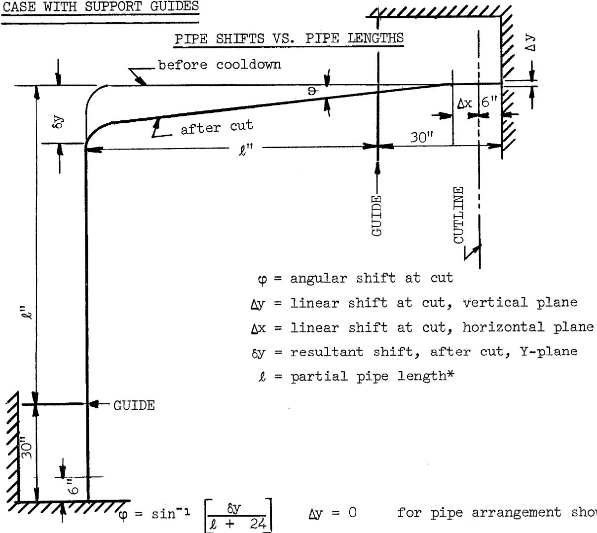

$$
\begin{array}{l} \varphi = \sin^ {- 1} \left[ \frac {\delta y}{\ell + 2 4} \right] \quad \Delta y = 0 \quad \text {f o r p i e a r r a n g e m e n t s h o w n} \\ \Delta x = \Delta x ^ {\prime} + [ (\ell + 2 4) - (\ell + 2 4) \cos \varphi ] \\ \end{array}
$$

Where $\Delta x^{\prime}$ is $\Delta x$ for case without guides.

$$
\begin{array}{l} \delta y = 0. 0 0 1 3 (3 0 + \ell) \\ \varphi = \sin^ {- 1} \left[ \frac {0 . 0 0 1 3 (3 0 + \ell)}{2 4 + \ell} \right] \\ \Delta x = 0. 0 0 1 3 (3 0 + \ell) + [ \ell + 2 4 - \ell + 2 4 \cos \varphi ] \\ [ ] \quad t e r m \approx 0 \quad \therefore \Delta x = . 0 0 1 3 (3 0 + l) \\ \end{array}
$$

PIPE LENGTH*   
ANGULAR AND LINEAR PIPE SHIFTS   

<table><tr><td></td><td>φ</td><td>Δx</td><td>Δy</td><td>δy</td></tr><tr><td>5&#x27; + 2&#x27; 6&quot; = 7&#x27; 6&quot;</td><td>0°-4&#x27;</td><td>0.117&quot;</td><td>0</td><td>0.117&quot;</td></tr><tr><td>10&#x27; + 2&#x27; 6&quot; = 12&#x27; 6&quot;</td><td>0°-4&#x27;</td><td>0.195&quot;</td><td>0</td><td>0.195&quot;</td></tr><tr><td>15&#x27; + 2&#x27; 6&quot; = 17&#x27; 6&quot;</td><td>0°-4&#x27;</td><td>0.273&quot;</td><td>0</td><td>0.273&quot;</td></tr><tr><td>20&#x27; + 2&#x27; 6&quot; = 22&#x27; 6&quot;</td><td>0°-4&#x27;</td><td>0.351&quot;</td><td>0</td><td>0.351&quot;</td></tr></table>

# RESTORATION FORCE VS. PIPE SIZE AND LENGTH

$\Delta y =$ linear line shift

$\ell =$ partial pipe length\*

W = force to restore

I = moment of inertia

$\mathbb{E} =$ modulus of elasticity

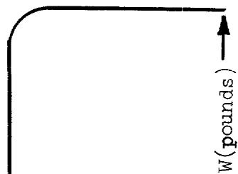

$$
\Delta y = \frac {- 1 / 3 W e ^ {3}}{E I}
$$

$$
W = \frac {- 3 E I \Delta y}{\ell^ {3}}
$$

6" Sched. 80 Pipe (.432 wall) I = 40.49 A = 8.405

20" Sched. 80 Pipe (1.031 wall) I = 2599.07 A = 61.440

Force W to restore: (W is the force required to return the pipe its precut position.)

<table><tr><td>PIPE LENGTH</td><td>6&quot; Sched. 80 Pipe W (pounds)</td><td>20&quot; Sched. 80 Pipe W (pounds)</td></tr><tr><td>5&#x27; + 2&#x27;6&quot; = 7&#x27;6&quot;</td><td>760</td><td>49,000</td></tr><tr><td>10&#x27; + 2&#x27;6&quot; = 12&#x27;6&quot;</td><td>250</td><td>16,200</td></tr><tr><td>15&#x27; + 2&#x27;6&quot; = 17&#x27;6&quot;</td><td>125</td><td>8,000</td></tr><tr><td>20&#x27; + 2&#x27;6&quot; = 22&#x27;6&quot;</td><td>75</td><td>4,750</td></tr></table>

# PROPOSAL FOR DEVELOPMENT OF A SPLIT-BEARING-SLEEVE CARRIAGE FOR REMOTE MAINTENANCE APPLICATIONS IN NUCLEAR REACTOR SYSTEMS

We recommend the building and testing of a more rigid gear-driven carriage to supplement our present flexible horseshoe-shaped friction-roller-drive carriage. The gear-driven carriage could be used to advantage for increased torque capacity remote cutting and beveling work, for highest tracking accuracy needs, and for internal pipe cleaning applications. The substitute carriage consists of a split sleeve which is supported by split roller bearings on each end. A motorized split-gear track is attached to one of the end bearings to orbit the sleeve about the pipe.

The split-sleeve carriage might also provide a simplified solution to pipe alignment problems. It is recommended that a determination be made to establish how much initial pipe displacement can be withstood by a sleeve supported on split bearings. This will show whether the split-bearing-sleeve can be used for remote maintenance pipe cutting needs for some of the reactor service pipe lines. A test program is suggested to ascertain feasibility, to seek the pipe size limits for which split-bearings are capable of transmitting moments, and to compare the non-conventional approach to more commonly accepted alignment technology based on restraints attached to loose pipe ends.

Maintenance operations with split-bearing-sleeve equipment are exemplified below:

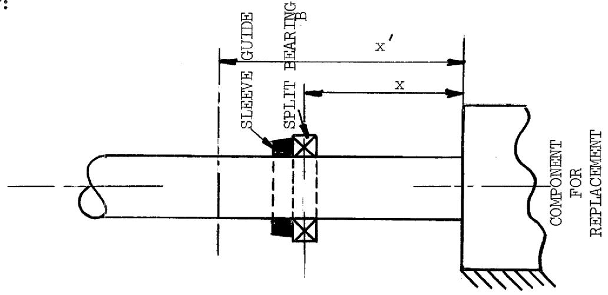

Determine where to cut pipe relative to the replacement component's prefabricated end stub (distance $x'$ ); locate and attach split bearing B* to pipe accordingly (distance $x$ ); bearing B includes a preassembled split front bushing guide. (The split bearings might include a soft material or knurled bushing sleeve to fit inside the inner race for better attachment to the pipe and to make allowance for probably out-of-roundness of the pipe. Otherwise, one must consider two separate functional devices, one to firmly clamp the pipe and one to center the bearing on the pipe. The latter could be in form of on attachment to the pipe clamp.)

*Stocked Split-Roller-Bearings are commercially available from the Cooper Split Roller Bearing Corporation, Pittsburgh, Pa., and from other bearing manufacturers on special order.

# 2. Sk. 2

Insert the lower half of bearing A with a split gear sector attached to the bearing front face into a locating cradle. Position the cradle about bearing B. Next, place the top half of bearing A, with its top gear section preattached, to mate to its lower half. Now permanently install bearing-gear assembly A to the pipe. Remove the locating cradle.

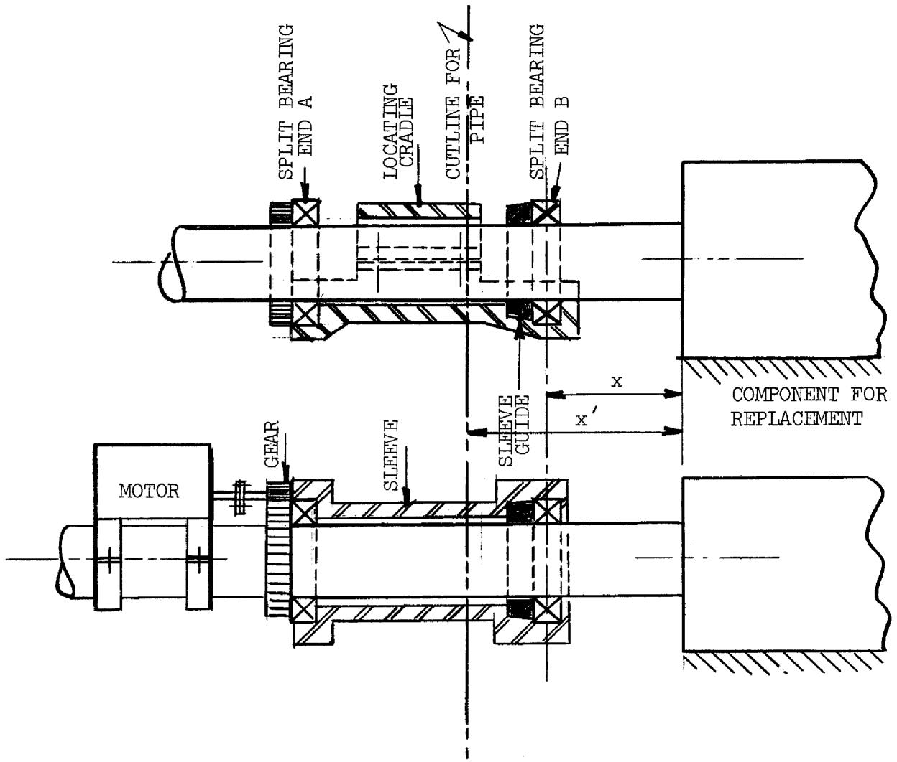

# 3. Sk. 3

Install a cradled motor assembly ahead of gear-bearing assembly A. Check the adjustment of the cradle during tightening to ensure free rotation of the bearing. Install the split sleeve. Test drive the sleeved assembly. The split sleeve contains a large cavity to fit a cutter head module with its sawblade, or the weld head module with its torch. It could also include hosed pressurization, or vacuum exhaust, for chip disposal or accumulation. Install the cutter head and connect the orbital system's power and control cables to the drive gear motor and the module insert. (It is possible to easily adapt the balance of ORNL's automated orbital weld-cut system for this application.)

4. Sk. 4

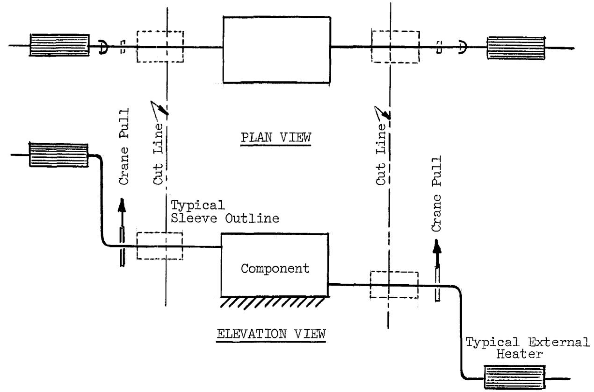

Let us assume we have cut through the pipe to remove the replacement component and that the bearing supported maintenance sleeve assembly is still attached. It is quite likely that a shift will occur in the piping upon severing each line. This shift would be most pronounced for the free end of the permanent pipe as the component is usually anchored and its short stubpipe locates to the anchor support. With the pipe shift, the sleeve may now be placed in strain; in fact, it is doubtful that the sleeve would then be rotatable. Strain gauges attached axially to the sleeve's exterior would be used to indicate the magnitude and the direction of pipe shift. Heat could be applied to the permanent piping in selected locations to permit stress-relieving. The building crane could be utilized for direct up pull, or in combination with slings, pulleys, etc. for required pipe movements in other planes. Eventually, sleeve rotation could then be re-established and final precision pipe shift adjustments could then be made likewise after inserting and observing dial gauges attached to sleeve bosses on each side of the pipe cut-line for guidance. We could transfer pipe stress concentrations away from the pipe cut location and thereby realign the pipe ends formed by the cut to assure near concentric pipe alignment for the stub end of the replacement component. The ensleeved stress-relief approach which aligns pipe ends prior to component removal should establish useable pipe alignment for subsequent reassembly. Dangers from banging into (and upsetting) fragile weld joint contours on the pipe ends are minimized where the pipe fitup is established prior to removing one of the pipe joint members and subsequent re-entry is with an identical pipe. The maintenance sleeve is disassembled from the joint prior to component removal. We would resort to more conventional pipe realigning means if a sleeve and/or its bearings are permanently damaged as a result of excessive pipe moment force action upon severing the pipe.

5. End Preparations and Internal Pipe Cleaning

Sk. 5

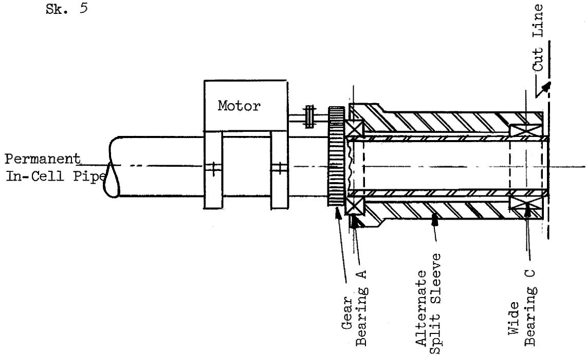

The regular maintenance sleeve and the component, including its pipe stub with end bearing 'B', have been removed.

Attach an alternate split sleeve to the remaining bearing 'A'-gear-motordrive while it is still installed near the end of the permanent in-cell pipe. The alternate sleeve includes internal wide-bearing inserts in location 'C'. This sleeve can be built to accommodate the ORNL machining head module for preparing a beveled pipe end. As this sleeve is self-propelled, it may also include provisions for attaching the equipment needed for all internal pipe cleaning.

# 6. Reassembly

# Sk. 6 (Upper)

Reassembly problems differ for various components and depend upon available axial room for entry of the component with its pipe stub(s). A guided entry utilizing the 'B'-bearing tapered sleeve-guide is preferred if space is available. The split 'B'-bearing-guide-sleeve combination is preassembled on the replacement component's stub-pipe end while the component is out of the cell. The split maintenance sleeve would be reinstalled over the 'A'-bearing prior to installing the replacement component. The component would be first lowered to a final elevation support platform and then scooted into place while guiding the pipe stub into the funnel end of the sleeve. The sleeve would guide the pipe stub into its proper location relative to the in-cell pipe.

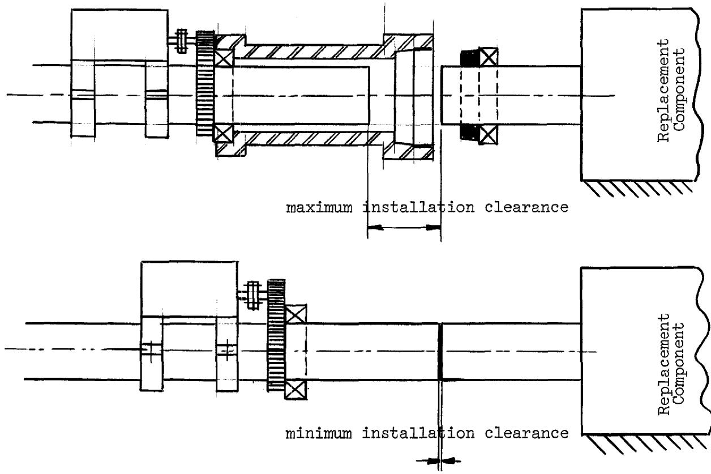  
Sk. 6 (Lower)

For the case of only vertical access for a replacement component, pipe ends would have to be butted. The cradle assembly scheme described with Sk. 2 would apply.

After assembly of the component by either scheme, the rewelding of the pipe ends would be accomplished with the weld head module installed into the sleeve cavity.

OOPER

0

ROLLER BEARINGS

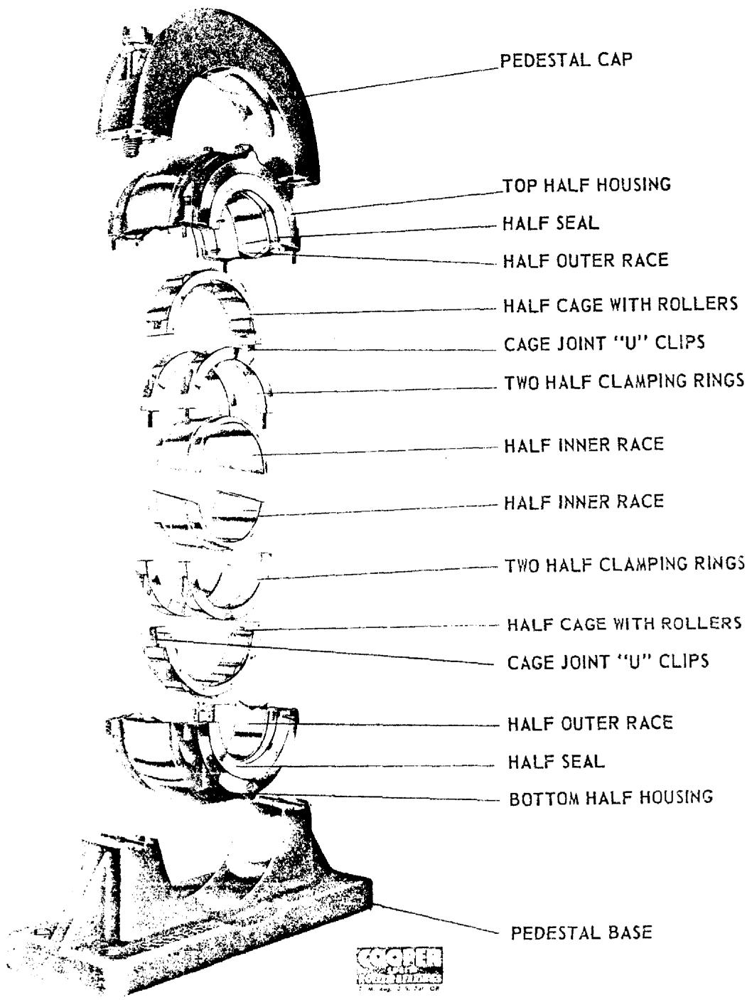

# ASSEMBLY PROCEDURE

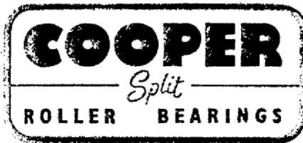

1 Loosen holding bolts and remove top half of pedestal and top half of cartridge housing. Lift out roller assembly and inner race. Withdraw spring steel "U" clips on opposite sides of roller assembly. Separate halves of roller assembly and put to one side - lay on clean piece of paper. Remove the four bolts holding the clamping collars around the inner race - make sure to keep the mating halves of clamping collars together. Separate the halves of the inner race and wash thoroughly with good cleaning solvent and dry with lint-free wiping material or let stand until completely dry. In the same manner, clean and dry the clamping collars, both halves of the roller assembly and the outer race. It is not necessary to remove the outer race from the cartridge housing to clean it. (If ever necessary to remove the outer race, first make sure that all side nipping screws and holding back-screws where fitted are removed.)

2 For normal steady load service, the shaft must be of nominal size within the limits of plus $0.000''$ to minus $0.002''$ , and cylindrically true. Clean and lightly oil the area of the shaft to receive the inner race and place the two halves of the inner race in the proper axial location. Tap the halves of the inner race until secure and snug on the shaft. NEVER HIT THE RACE WITH A HAMMER OR OTHER HARD METALLIC TOOL. USE WOOD OR PLASTIC Mallet. There should be a slight gap at both ends of the halves of the inner race. Put clamping collars in place, making sure they fit snugly against the race shoulder. Clamping collar joint should overlap the race joint by about $\frac{1}{4}''$ to $\frac{1}{2}''$ on Expanion Type Bearings. The amount of overlap is extremely important for the fitted clamping collar of fixed type inner races. It will be noted there is an arrow on this collar which must coincide with the marked race joint. This ensures the alignment of the shoulders of the inner race. Use locking washers under the heads of the clamping collar bolts, and start to tighten them, but before final tightening of bolts, check axial location of inner race to make sure it is in the correct position on the shaft so that it will be central with the rest of the unit when assembled. In cases where axial expansion has to be handled, the inner race is offset so that after full expansion of the shaft has taken place, the races and rolling elements will all be central with one another. Also check to make sure that the two halves of the inner race are NOT TOUCHING each other, and that the slight gap is approximately equal on both sides. The gap is purposely built into the bearing, and should there be NO gap, the shaft is undersize which will result in unsatisfactory performance. If the shaft is within the required limits, the proper amount of gap is automatically present when the clamping collars are finally tightened. Now finish tightening of clamping collar bolts, using a piece of pipe on the socket wrench to make sure they are absolutely tight. See Torque Table on page 12. All four bolts should be pulled up evenly when tightening the inner race on the shaft. In the expansion type unit, check both clamping rings to see that they are hard against the race shoulder all around. In the case of the fixed unit, check the end clamping collar to make sure it is hard against the shoulder all around.

3 Place bottom half of pedestal in position and lightly oil the spherical soot for the cartridge. The position of the bottom half of cartridge will determine on which side of pillow block the grease fitting will be for lubrication. Take care to locate bottom half of cartridge so that grease fitting is easily accessible. If the bearing is to be lubricated by grease, apply the required quantity inside of the lower half of the cartridge with the half outer race in position and then place in the bottom half of the pedestal. Jack up the shaft slightly if this has not already been done.

Take half a roller assembly, grease well all over if bearing is to be lubricated by grease, and then place on inner race and slide around until it is sitting on the bottom half outer race, with the ends of the cage flush with the housing joint face.

4 Remove locking pins (2) from each aluminum triple labyrinth seal and place seal around shaft in correct position with relation to cartridge grooves and reinsert locking pins. The seals, when correctly assembled, will grip the shaft firmly and revolve with it but will permit axial movement of the shaft when necessary.

5 Remove jacking arrangement, allowing shaft to rest evenly in the bearing.

6 Grease the remaining half roller assembly all over (with fairly heavy coat) and place over exposed part of inner race. Replace spring "U" clips by lightly tapping into recesses in roller pockets, thus locking the halves of the roller assembly together.

Grease with the required amount, the inside of top half of cartridge with half outer race in position. Make sure the joints of the cartridge housing, both top and bottom halves, are absolutely clean before applying grease. Place top half of cartridge into position over assembled bearing and seals making sure that joints match the bottom half. Use locking washers on bolts and tighten up evenly all four bolts in cartridge. Make sure and faces of cartridge are flush when completely tightened.

Apply a coating of oil on the spherical seat of the top half of the pedestal and place in position, but do not tighten up bolts.

If possible, turn shaft slowly two or three times to permit the cartridge to find its own alignment so that the loading of the rollers is evenly distributed. If this is not possible, make sure that cartridge faces are absolutely square with the shaft.

10 Tighten up top half of unit. Give bearing three or four shots with grease gun to fill the grease passages so that next time the bearing is greased you will be sure that grease is getting to the rolling parts. Use discretion when greasing, according to speed and duty. Do not overfill with grease, otherwise a "Hot Bearing" may result.

Oil Lubrication. Follow above instructions except substitute lubricating oil for grease. Oil level in bottom half of cartridge should be as outlined under OIL LUBRICATION on page 13.

Should further details be required regarding fitting and lubrication of the bearing, please contact

COOPER SPLIT ROLLER BEARING CORPORATION

1725 Washington Road, Pittsburgh, Pennsylvania 15241

World-Wide Sales and Service

# REFERENCES

1. R. W. McClung, Remote Inspection of Welded Joints, ORNL-TM-3561 (September 1971).   
2. J. S. Culver, Viewing Equipment for Use in the HRT Core and Blanket Vessels, ORNL-2836 (March 1960).   
3. Internal Memo, P. P. Holz to I. Spiewak, "Dry Maintenance Facility for the HRT", October 11, 1960.   
4. Internal Memo, J. P. Jarvis to S. E. Beall, "Use of the Dry Maintenance Facility for HRT Maintenance", May 17, 1962.   
5. P. P. Holz, "Remote Maintenance Through Portable Shields", ANS Winter Meeting, Pittsburgh, Pa., November 1966, (complete paper available from author).   
6. R. Blumberg and E. C. Hise, MSRE Design and Operations Report - Part X - Maintenance Equipment and Procedures, ORNL-TM-910 (June 1968).   
7. Theodore Rockwell III, Reactor Shielding Design Manual, Naval Reactors Branch, Division of Reactor Development, USAEC, Chapter 6, TID-7004 (March 1956).   
8. R. C. Robertson, MSRE Design and Operations Report, Part I, Description of Reactor Design, ORNL-TM-728 (January 1965).   
9. Internal Memo, B. D. Draper and E. C. Hise to Distribution, "Remote Maintenance Procedures Report", November 26, 1959.   
10. Internal Memo, A. A. Abbatiello to Distribution, "Optical Tooling for the MSRE", June 4, 1962.   
11. Correspondence, P. P. Holz to Distribution, "Trip Report to BONUS, (Boiling Nuclear Superheater Power Station), Rincon, Puerto Rico, September 25, 1967 to October 13, 1967".   
12. J. P. Maloney, et al, Repair of a Nuclear Reactor Vessel, DP-1199, Dupont Savannah River Laboratory (June 1969).   
13. D. S. Ritchie, et al., "Remote Controlled Viewing for the Dragon Reactor Main Pressure Vessel", Atomic Energy Establishment, Winfrith, England, Dragon Project Report 228, October 1963.   
14. R. N. Duncan and D. L. Richardson, Final Report on BONUS Reactor Boiler Fuel Element Inspection, October 5 to 12, 1967, Report APED-5392 (Class I), Nuclear Energy Division, General Electric Company, San Jose, California, November 1967.   
15. Conceptual Design of a Surveillance and In-Service Inspection System for the Reactor Vessel Fast Flux Test Facility, Phase B Report, Chapter 3, Southwest Research Institute, San Antonia, Texas, Dec. 31, 1969, (report prepared for the Pacific Northwest Laboratory by the Battelle Memorial Institute).

16. Conceptual Design of a Surveillance and In-Service Inspection System for the Primary Piping and Components, Fast Flux Test Facility, Chapter 3, Phase C Report, Southwest Research Institute, San Antonia, Texas, January 16, 1970, (report prepared for the Pacific Northwest Laboratory, Battelle Memorial Institute).   
17. Internal Memo, P. P. Holz to Distribution, "Miniature TV Camera Manipulator", (for HRT viewing), November 26, 1959.   
18. R. L. Moore, Closed Circuit Television Viewing in Maintenance of Radioactive Systems at ORNL, ORNL-TM-2032 (November 1, 1967), (paper also presented to the ANS Winter Meeting, Pittsburgh, Pa., Nov. 1966).   
19. M. W. Rosenthal, et al., The Development Status of Molten-Salt Breeder Reactors, ORNL-4812, Chapter 12 (August 1972).   
20. Internal Memo, P. P. Holz to Distribution, "Some Miscellaneous Maintenance Tools Used to Manipulate Loose Objects in the HRT Core", Nov. 17, 1959.   
21. Internal Memo, P. P. Holz to Distribution, "Additional Miscellaneous Maintenance Tools Used in the HRT Core", September 26, 1960.   
22. "ORNL Remote Maintenance Tool Catalogue No. 58", June 1960. (Compilation of tools and procedures by the Mechanical Department, Engineering and Mechanical Division.)   
23. P. P. Holz, Feasibility Study of Remote Cutting and Welding for Nuclear Plant Maintenance, ORNL-TM-2712 (November 1969).   
24. R. F. Gilmore, Open- and Closed-Loop Closure Remote Cutting and Welding Evaluation, Battelle Northwest Laboratory Report BNWL-1303 (UC-38), May 1970.   
25. P. P. Holz, The ORNL Automated Orbital Pipe Welding Systems, ORNL 4830 (1973).   
26. G. M. Goodwin and P. P. Holz, Automated Orbital Welding of Type 304 Stainless Steel Pipe with the Astro-Arc System, ORNL-TM Report (draft issue distributed for comments July 1972.)   
27. "Automated Welding", Film available from the ORNL Film Library, 1971.   
28. Pennsylvania Advanced Reactor Project - Layout and Maintenance, WCAP 1104 and 1105, Vol. IV, Parts 1 and 2, Westinghouse Electric Corp. and Pennsylvania Power and Light Company, March 1959, Chapters 3, 4, and 5 (chapter 4.2 for Alignment Discussions).   
29. Molten-Salt Reactor Program Semiannual Progress Report for Period Ending Feb. 28, 1969, ORNL-4396, Chapter 5-MSBR Design (Aug. 1969).   
30. J. R. Tallackson, private communication to R. W. McClung, Jan. 29, 1971.