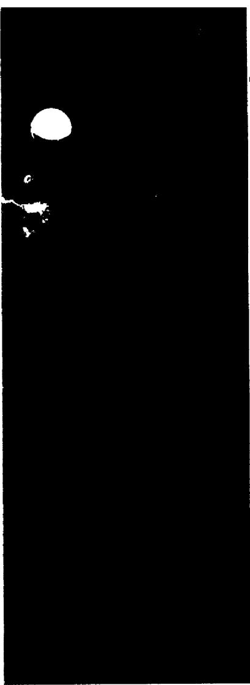

# ZERO-POWER EXPERIMENTS WITH

# 233U IN THE MSRE

J. R. Engel   
B. E. Prince

DISTRIBUTION OF THIS DOCUMENT IS UNLIMITED

OAK RIDGE NATIONAL LABORATORY

OPERATED BY UNION CARBIDE CORPORATION • FOR THE U.S. ATOMIC ENERGY COMMISSION

This report was prepared as an account of work sponsored by the United States Government. Neither the United States nor the United States Atomic Energy Commission, nor any of their employees, nor any of their contractors, subcontractors, or their employees, makes any warranty, express or implied, or assumes any legal liability or responsibility for the accuracy, completeness or usefulness of any information, apparatus, product or process disclosed, or represents that its use would not infringe privately owned rights.

Contract No. W-7405-eng-26

REACTOR DIVISION

ZERO-POWER EXPERIMENTS WITH $^{233}\mathrm{U}$ IN THE MSRE

J. R. Engel

B. E. Prince

DECEMBER 1972

NOTICE

This report was prepared as an account of work sponsored by the United States Government. Neither the United States nor the United States Atomic Energy Commission, nor any of their employees, nor any of their contractors, subcontractors, or their employees, makes any warranty, express or implied, or assumes any legal liability or responsibility for the accuracy, completeness or usefulness of any information, apparatus, product or process disclosed, or represents that its use would not infringe privately owned rights.

OAK RIDGE NATIONAL LABORATORY

Oak Ridge, Tennessee 37830

operated by

UNION CARBIDE CORPORATION

for the

U.S. ATOMIC ENERGY COMMISSION

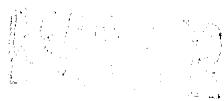

# TABLE OF CONTENTS

# Page

ABSTRACT V

FOREWORD vi

INTRODUCTION 1

TEST PROGRAM 3

System Preparation 3

Chronology of Tests 7

Test Procedures 9

Critical Experiment 9

Control-Rod Calibration 12

Uranium Concentration Coefficient of Reactivity 13

Temperature Coefficient of Reactivity 13

Effective Delayed-Neutron Fraction 14

Dynamic Characteristics 14

Noise Analysis 15

RESULTS AND INTERPRETATIONS 16

Critical Loading 16

Observed 16

Predicted 20

Variations in Predictions 24

Neutron Multiplication in Drain Tank 31

Control-Rod Calibrations 33

Data Analysis 33

Results 41

Concentration Coefficient of Reactivity 46

Temperature Coefficient of Reactivity 46

Effective Delayed Neutron Fraction 48

Dynamics Tests 48

Noise Analysis 52

CONCLUSIONS 53

# ZERO-POWER EXPERIMENTS WITH $^{23}$ U IN THE MSRE

J. R. Engel B. E. Prince

# ABSTRACT

Zero-power nuclear tests were performed in the MSRE with $^{233}\mathrm{U}$ as the principal fissile isotope in October and November 1968. The initial critical loading was $1.9 \pm 1\%$ lower than the corresponding calculated value while the measured control-rod worths, the fuel concentration coefficient, and the temperature coefficient of reactivity were all within $7\%$ of their predicted values. Dynamics tests indicated good nuclear stability and demonstrated the adequacy of the predictions and testing techniques. Neutron noise associated with circulating gas bubbles prevented measurement of the effective delayed neutron fraction with circulating fuel. Uncertainties in the precise condition of the reactor, as a consequence of prior operation with $^{235}\mathrm{U}$ fuel, and a strong dependence of the neutronics calculations on the treatment of neutron leakage prevented any refinement of the basic nuclear data for $^{233}\mathrm{U}$ from the experimental results.

Keywords: *MSRE + *Nuclear Analysis + *Uranium-233 + *Criticality + *Testing + *Startup + *Experience + Neutron Physics + Control rods + Reactivity

# FOREWORD

The zero-power physics experiments with $^{233}\mathrm{U}$ fuel in the Molten Salt Reactor Experiment (MSRE) were performed within a two-month period from September to November, 1968. Prior to that time a general outline of the test program had been published and detailed test procedures had been developed and approved. Because the results of these tests were required for subsequent operations, the data were promptly analyzed and reported in a variety of internal memos and semiannual progress reports of the MSR Program. However, since the analytical techniques and the details of their application to this reactor had been published previously, in connection with the $^{235}\mathrm{U}$ zero-power tests, no single, comprehensive report of the $^{233}\mathrm{U}$ tests was prepared. After the successful conclusion of MSRE operation, it became apparent that a summary report would have some value in bringing together the results of the individual tests and in identifying the techniques and procedures that were applied. The report that follows provides such a summary.

# INTRODUCTION

The MSRE was first made critical with $^{235}\mathrm{U}$ fuel in June, 1965 and that event was followed by a month-long series of zero-power tests. Because this was the first operation of this unique reactor and special analytical techniques were applied to some of the data, a comprehensive report1 of those experiments was subsequently published. The reactor was operated with the $^{235}\mathrm{U}$ fuel at power levels up to 7.5 MW through March, 1968, accumulating some 9000 equivalent full-power hours (EFPH). During that time a decision was reached to extend the operation of the reactor to include a period with $^{233}\mathrm{U}$ as the primary fissile isotope. Accordingly the salt charges were processed on-site by fluoride volatility in August, 1968, to remove and recover the $^{235-238}\mathrm{U}$ mixture as $\mathrm{UF}_6$ (ref. 2). During the next two months 35 kg of $^{233}\mathrm{U}$ fuel as $\mathrm{UF}_4$ -LiF eutectic was added to the fuel carrier salt. The reactor was subsequently operated until December, 1969, accumulating another 4000 EFPH. Comprehensive summaries of the overall operating experience with the MSRE have been published elsewhere. (See, for example, refs. 3 and 4.)

The $^{233}\mathrm{U}$ loading in the MSRE was the first use of this isotope in a molten-salt reactor and the first critical loading in any reactor capable of producing substantial nuclear power. Thus there was considerable interest in comparing the observed critical loading and reactivity coefficients with predicted values. Because of the nature of the reactor and the uncertainties resulting from the residual fission products and other effects of prior operation, however, the experiments could not be expected to yield more precise values for the nuclear characteristics of $^{233}\mathrm{U}$ . Nevertheless, the data were carefully analyzed and published internally because of their direct applicability to the analysis of subsequent power operations.

It is the purpose of this report to present, under one cover, a reasonably complete picture of the zero-power tests that were performed with $^{233}\mathrm{U}$ in the MSRE. To this end, the report begins with a section that outlines the test program and briefly describes the procedures that were used. This is followed by a presentation and interpretation of the results. Since the techniques for performing and analyzing the experiments were essentially the same as those applied to the $^{235}\mathrm{U}$ tests, extensive use is made of references to previously published reports for detailed discussions of these aspects. Finally, some general conclusions are drawn from the results of the tests.

# TEST PROGRAM

The program of zero-power tests that was planned for the $^{233}\mathrm{U}$ operation is described in Ref. 5, along with a general discussion of plans for subsequent operation of the reactor. The objectives of these tests were essentially the same as those for the initial critical loading; i.e., to establish the actual properties of the system and to provide the data required for proper analysis of power operation. The first step was to establish the critical uranium concentration under the simplest attainable conditions - with the fuel salt static in an isothermal core and all three control rods withdrawn to their upper limits. This was followed by more additions of fissile material for control-rod calibration and to provide the excess reactivity required for operation at power. Measurements of the isothermal temperature coefficient of reactivity, the fuel concentration coefficient, and the dynamic properties of the system were also performed.

# System Preparation

The prior operation of the MSRE with $^{235}\mathrm{U}$ and the condition of the $^{233}\mathrm{U}$ that was used in the reactor both imposed special considerations on the performance of the $^{233}\mathrm{U}$ tests. These led to differences in detail between the $^{235}\mathrm{U}$ and the $^{233}\mathrm{U}$ tests.

The first step in preparing for the critical experiment was to remove as much of the original uranium mixture as possible. This was accomplished by contacting first the flush salt and then the fuel salt with fluorine in a facility especially designed and installed for that purpose at the reactor site.[6] The entire charge of flush salt, containing some $6 - 1 / 2\mathrm{kg}$ of uranium, was transferred to the processing tank where it was fluorinated for $6.6\mathrm{hr}$ to reduce its uranium concentration to $7\mathrm{ppm}$ . (The $\mathrm{UF}_6$ product that was produced was collected on NaF traps with an activity

decontamination factor near $10^{9}$ .) The salt was then treated with hydrogen and zirconium metal to reduce to the metallic state the corrosion products produced in fluorination. These were filtered out of the salt as it was returned to the reactor system. The fuel salt was then treated as a single batch with 47 hrs of fluorination required to remove 217 kg of uranium.

In addition to removing uranium from the MSRE salts, the processing operations also removed some of the fission products. For example Mo, I, Te, and Sb would be completely removed, and Nb and Ru would be partly removed in the fluorination step. Some of the more noble metal fission products might have been precipitated in the reduction step but these had probably already been plated out on reactor surfaces before the salt was processed. One important chemical species that was practically unaffected by the processing was the plutonium that was produced by neutron absorptions in $^{238}\mathrm{U}$ during the $^{235}\mathrm{U}$ operation. Within the limits of analytical accuracy, all of the 589 gm of Pu calculated to have been present remained with the salt.

After recovery of the uranium, a portion of the fuel salt was left in the processing tank for use in a salt distillation experiment. (Distillation has been considered as a means of separating fission products from carrier salts in breeder reactors.) This provision, along with the volume reduction produced by the uranium removal, would have left the inventories of both the flush and fuel-carrier salts below their desired levels. Therefore, before the processing operations were started, two increments of salt were added to the fuel and flush tanks to compensate for the anticipated changes.

Although the processing operation was very effective in removing uranium from the salt that was treated, some of the $^{235-238}\mathrm{U}$ mixture was left in the system. The physical configuration of the piping at the MSRE was such that about 17 liters of salt was left in the drain tank when a batch was transferred out for processing. Since the last material to be processed was fuel salt, this heel contained significant amount of uranium. (The flush-salt heel was mixed in with the fuel salt for the final transfer.) This uranium residue was measured before the $^{233}\mathrm{U}$ critical experiment was begun.

The operating plans with $^{233}\mathrm{U}$ included a study of the ratio of captures to fissions in that nuclide in a typical MSR spectrum. This study depended upon precise isotopic assays of the uranium as a function of burnup and a particular initial isotopic composition was desirable for optimum results. The compositions and anticipated amounts of the residual heel and the new fuel charge were such that additional $^{238}\mathrm{U}$ was required. Therefore, a separate addition of about $0.9\mathrm{kg}$ of $^{238}\mathrm{U}$ was made before the start of the $^{233}\mathrm{U}$ loading. This addition was also used as an isotope dilution measurement to evaluate the amount and isotopic composition of the $^{235-238}\mathrm{U}$ heel mentioned above. (In addition, it provided an opportunity to check out the equipment to be used in loading the $^{233}\mathrm{U}$ .)

The high level of fission-product radioactivity that remained in the fuel carrier salt after the uranium recovery made it highly desirable to keep the reactor cell closed and shielded during the $^{233}\mathrm{U}$ critical experiment. Consequently, the provisions in the reactor thermal shield for extra neutron detectors were inaccessible and only the normal reactor instruments could be used to follow the approach to critical and the subsequent experiments. The external neutron source, also in the thermal shield, was equally inaccessible, so the critical experiment excluded any measurements based on source movement. The external source was completely overshadowed by the very intense ( $\alpha$ -n) source inherent $^{10}$ in the fuel salt so that movement of the external source probably would not have been detectable. In addition, there was a substantial ( $\gamma$ -n) source in the fuel from fission-product decay gammas.

The $^{233}\mathrm{U}$ feed material to be used in the MSRE was made available as $\mathrm{UO}_3$ containing 39 kg U of the isotopic composition shown in Table 1. This material was converted at ORNL $^{11}$ to a eutectic mixture of LiF- $\mathrm{UF}_4$ and loaded into containers suitable for use at the reactor site. The presence of 220 ppm of $^{232}\mathrm{U}^*$ and the fact that the material had last been purified some 4 years prior to its use in this application made the oxide a strong source of gamma and high-energy alpha radiation. Conversion to the eutectic fluoride mixture then produced a strong neutron source from (α-n) reactions with Be, Li, and F. Because of these radiation sources, preparation of the feed material had to be carried out in heavily shielded equipment, as described in detail in Ref. 9. In addition, all subsequent operations with the enriching salt required heavy shielding.

Table 1   
Isotopic Composition of $^{23}$ U Feed Material   

<table><tr><td>U Isotope</td><td>Abundance (atom %)</td></tr><tr><td>232</td><td>0.022</td></tr><tr><td>233</td><td>91.49</td></tr><tr><td>234</td><td>7.6</td></tr><tr><td>235</td><td>0.7</td></tr><tr><td>236</td><td>0.05</td></tr><tr><td>238</td><td>0.14</td></tr></table>

As in the case of the $^{235}\mathrm{U}$ loading, most of the enriching salt required for criticality was to be added to the fuel carrier salt in the drain tanks. However, the original procedure - melting the enriching salt in large furnaces atop the drain-tank cell and transfer to the drain tanks in liquid form - could not be used because of the shielding requirements. Instead, the special arrangement of the reactor portable maintenance shield $^{12}$ and the core-graphite sampling shield shown in Fig. 1 was set up to permit the insertion of cans containing up to $7\mathrm{kg}$ of uranium as the solid eutectic directly into the drain tank.

# Chronology of Tests

Fuel loading for the $^{233}\mathrm{U}$ critical experiment was begun on Sept. 10, 1968. Over the next 11 days, about $33\mathrm{kg}$ of uranium was added through the drain tank equipment, and one 95-g capsule was added through the sampler-enricher on the fuel pump to recheck that system. By that time the uranium loading was within $1/2\mathrm{kg}$ of the critical value and plans called for making all subsequent additions through the pump bowl. The progress of the experiment was then interrupted to permit removal of the special equipment from the drain-tank cell and closure and testing of the containment. Uranium loading was resumed on Oct. 2 and initial criticality with $^{233}\mathrm{U}$ was attained on that date after the addition of 3 more capsules of uranium. The schedule of uranium additions (23 more capsules) and various zero-power tests continued for several weeks, ending with a reactor drain on Nov. 28.

Although the physics tests were the major activity during this period, the operation was not devoted exclusively to those tests. Shortly after the start of salt circulation with $^{23}$ U fuel, a change was experienced in the amount of undissolved cover gas in the primary loop and this was investigated extensively. Various aspects of the fuel chemistry were also

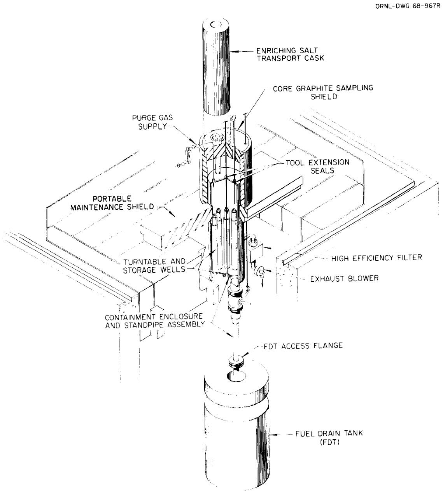  
Fig. 1. Arrangement for Adding $^{233}\mathrm{U}$ Enriching Salt to Fuel Drain Tank.

studied and changes were made in the oxidation-reduction potential of the salt. $^{14}$ An unscheduled drain of the fuel loop part way through the sequence of tests necessitated some minor adjustments in the planned loading program. Just before the conclusion of this phase of the operation, the reactor power was raised briefly to 1.2 and 5.5 MW to check out the heat rejection system.

# Test Procedures

The general procedures to be followed for the various zero-power tests were outlined in Ref. 5. In addition detailed descriptive procedures with step-by-step check lists were supplied to the reactor operators for each operation or measurement. (The analysis group responsible for evaluating the data were on hand for consultation and to oversee the performance of the tests, but the actual manipulations were performed by the operating staff under the immediate direction of the operating shift supervisors.)

# Critical Experiment

As was indicated earlier most of the $^{233}\mathrm{U}$ required for initial criticality was added to the fuel drain tanks using the special equipment shown in Fig. 1. This equipment permitted the transfer of single cans of enriching salt (containing no more than $7\mathrm{kg}$ of U) from the shielded transport cask in which they were delivered to the reactor site into the drain tank under shielded, controlled-ventilation conditions. After the enriching salt had been melted out, each empty can was stored on a turntable within the equipment for removal as a group at the end of the drain-tank loading operations.

The nuclear reactivity of a drain tank containing $^{233}\mathrm{U}$ fuel was somewhat higher than the same drain tank containing the $^{235}\mathrm{U}-^{238}\mathrm{U}$ mixture. Although calculations had indicated that the drain tank would be far subcritical under all normal storage conditions, careful observations were

made during the fuel additions to ensure that criticality was not approached in the tank. To accomplish this, two neutron-sensitive chambers - a sensitive $\mathrm{BF}_3$ chamber and a less-sensitive fission chamber to cover a wide range of counting rates - were installed just outside the drain tank for the loading operations. Since both $(\alpha, n)$ and $(\gamma - n)$ sources were present in the fuel, no external source was required for neutron monitoring.

The intense internal neutron source made counting rates with the external source and no fuel unreliable as a baseline in this critical experiment. Therefore, the counting rates measured during the first loop fill with uranium-bearing salt were used as the first points on the usual inverse-count-rate plots. Thus two loadings of predetermined size were required before extrapolations could be made to establish the size of subsequent loadings. The first two rounds of additions consisted of 21 and $7\mathrm{kg}$ U, respectively, and the subsequent additions were based on extrapolations of count-rate data obtained from the preceding additions with the salt in the reactor. The objective was to bring the uranium loading to within $1/2\mathrm{kg}$ of critical in this manner. The enriching salt was available in cans of various sizes so that arbitrary amounts could be added in $1/2$ -kg increments.

The initial charging operation required the addition of three 7-kg cans of uranium to the fuel drain tank (FD-2). These cans were delivered to the reactor site individually, and inserted into the charging equipment. The cans were remotely suspended in the gas space of FD-2 above the liquid carrier salt. In this position the enriching salt slowly melted and dripped into the carrier salt below it. During this time the can was suspended from a weighing device so that progress of the melting could be followed. At the same time the increase in neutron count rate was observed as the neutron source and subcritical multiplication increased. After the addition, the empty can was weighed more accurately, to ensure that it was empty, and stored on the turntable for later disposal.

Prior to the addition of each can of enriching salt, one-half of the carrier salt was transferred to the adjacent fuel drain tank (FD-1) to provide room in the top of the tank for suspending the cans without contacting the salt. After the withdrawal of the empty can, the remaining

salt was returned to FD-2 for mixing and to provide neutron count-rated data on the full tank. Extrapolations of ratios of these count rates were used in conjunction with observations during additions to ensure that the drain tank remained subcritical. After the addition of the first can of enriching salt, the transfers to FD-1 also removed some uranium to keep $\mathrm{k}_{\mathrm{eff}}$ very low during subsequent additions.

After three cans of enriching salt had been added and cross-mixed between the drain tanks, the core and primary loop were filled with salt to obtain the initial set of subcritical count-rate data. Filling of the reactor vessel (the first component to fill with salt) proceeded in several steps with count-rate data being collected at each level to verify that the full vessel was not going to be critical. The control rods were held in a partly withdrawn position during the fill to allow for the rapid insertion of some negative reactivity and initiation of a fuel drain if criticality should be attained prematurely. The same procedure was followed for two subsequent additions of uranium that were made in the drain tanks. The second addition was $7\mathrm{kg}$ of uranium in one can; the third, $5\mathrm{kg}$ in two cans. Count-rate measurements with the primary loop full after each addition and extrapolation of the data indicated that after the third addition, the system loading was within $500\mathrm{g}$ of the amount required for criticality.

The remaining uranium required for criticality was added in 95-gram increments through the sampler-enricher. (These operations were interrupted for removal of the drain-tank loading equipment and sealing and testing of the containment cell.) Each capsule was added with the fuel salt circulating and one control rod partly inserted to prevent criticality. When the contents of a capsule had been thoroughly mixed in, the fuel pump was stopped and the control rod withdrawn to obtain neutron counting rates. The series of data points thus obtained was used to project the critical loading. After sufficient uranium had been added, static criticality was established by stepwise withdrawal of the final control rod and verified by brief operation at various nuclear power levels up to $5\mathrm{kW}$ .

# Control-Rod Calibration

The basic experimental procedures used to calibrate the control rods for the $^{233}\mathrm{U}$ loading were the same as those employed in the $^{235}\mathrm{U}$ zero-power tests. In essence, data were collected at a variety of control-rod configurations as uranium was added to establish the operating concentration.

From the experience in the $^{235}\mathrm{U}$ tests, we anticipated that a major source of information would be the measured differential worth of the regulating rod as a function of position in the core with the other two rods withdrawn to their upper limits. Accordingly, these measurements were made after each of the 23 uranium enrichments that followed the attainment of criticality in the static system. When the concentration was high enough to allow criticality with the salt circulating, measurements were made both in static salt and with full-flow circulation. Each measurement involved two separate determinations of the differential worth using the rod-bump, period technique. In this approach the reactor was first made just critical (or very slightly supercritical) at about 10 W of nuclear power by manual adjustment of the regulating rod. The rod was then withdrawn a short distance and the increase in power was recorded as a function of time for about a 2-decade rise to determine the stable reactor period. The reactor power indication from the two compensated ion chambers was recorded digitally on magnetic tape at precisely 1/4-sec intervals by the on-line computer. By manually switching the amplifier gain and recording the range with the output, a precise, unambiguous linear power record was obtained. This approach was adopted to eliminate some of the uncertainties associated with the extraction of period data from strip-chart records of the output of log-count-rate meters connected to the fission chambers. (The latter approach was used in the $^{235}\mathrm{U}$ tests because the on-line computer was not fully operational then.) In addition to the measurements just described, two series of differential-worth data were collected with the shim rods inserted various distances into the reactor.

Rod-drop data were collected at two points in the uranium loading sequence, for the purpose of supplementing the differential-worth data. In these tests the reactor integrated power (fission chamber counts accumulated on an electronic scale) was photographed as a function of time

from a few seconds before a rod drop to about 30 seconds thereafter. (The technique was the same as that used in the $^{235}\mathrm{U}$ tests and described in Ref. 1.) The negative reactivity associated with the rod drop was obtained by integrating the reactor kinetics equations and matching the calculated curves to the observed data. Data were obtained for rods dropped singly, in pairs, and as a gang of three, with the fuel salt stationary and circulating.

Additional worth information was obtained from control-rod shadowing measurements in which the critical position of the regulating rod was recorded as it was withdrawn to compensate for insertion of first one and then both shim rods. These data were collected at 4 points in the fuel loading sequence.

# Uranium Concentration Coefficient of Reactivity

Information relating to the uranium concentration coefficient of reactivity was accumulated throughout the zero-power tests. The only data required were the uranium loading of the system and the critical control-rod configuration; the latter giving the reactivity worth by way of the rod calibration results. These data were obtained after each fuel enrichment, both with the salt circulating and stationary.

# Temperature Coefficient of Reactivity

The isothermal temperature coefficient of reactivity of the reactor between 1175 and $1225^{\circ}\mathrm{F}$ was measured on two occasions before the start of power operation with $^{233}\mathrm{U}$ . (The first measurement was made during the zero-power tests themselves and the second was made at the beginning of the next period of reactor operation.) Data were obtained for temperature variations in both directions within this range. Each time, the temperature was varied slowly by adjusting the external heaters while critical control-rod configurations and system temperatures were recorded with the fuel salt circulating. At several points in each test, fuel circulation was stopped and additional data were taken with the salt stagnant. These measurements were subsequently judged unsatisfactory because of the effects of circulating gas bubbles in the system. A third, better determination was made later in the program when installation of a variable

frequency power supply for the fuel pump made it possible to operate the pump at reduced speed so as to circulate void-free salt.

# Effective Delayed Neutron Fraction

In the $^{235}\mathrm{U}$ zero-power tests the loss of delayed neutrons due to fuel circulation was evaluated from reactivity changes associated with starting and stopping the fuel pump. That determination was made possible by the fact that, early in the $^{235}\mathrm{U}$ operation, there were no circulating voids under normal system conditions. With the $^{233}\mathrm{U}$ fuel, a large reactivity effect caused by circulating voids made this type of measurement impractical. However, some indirect data were obtained from the evaluation of the control-rod drop tests.

# Dynamic Characteristics

The zero-power dynamic characteristics of the MSRE with $^{233}\mathrm{U}$ fuel were studied in a series of measurements of the neutron flux-to-reactivity frequency response of the system. Some tests were performed in which single step or pulse reactivity perturbations were imposed on the reactor at very low powers (<100 W). However, the most useful studies were those in which the nuclear reactivity or neutron flux was perturbed in a periodic manner. The periodic signals used were either pseudorandom binary or pseudorandom ternary sequences. These are particular series of square wave pulses that were chosen because they have particular characteristics which permitted determination of the frequency response over a wide spectrum with only one test. The frequency range over which we obtained frequency-response results was from about 0.005 to 0.8 rad/sec. The lower limit was set by the length of one period of the test pattern and the high-frequency limit was determined by the time width of the square wave pulse of shortest duration which the standard equipment would

adequately reproduce. The shortest basic pulse width used in these tests was 3.0 sec. The frequency range covered by these tests was essentially the range over which thermal feedback effects are important in power operation.

The on-line computer (Bunker-Ramo, Model 340) was programmed to generate the sequences by opening and closing a set of relays. Voltage was fed through the relays from an analog computer (Electronic Associates, Inc., Model TR-10). This voltage was used to determine the movement of the control rods, which were forced either to follow the pseudorandom test pattern themselves or to cause the flux to follow the test pattern. The control-rod position and the neutron flux were digitized and recorded every 0.25 sec on magnetic tape. The data were retrieved from the tape and stored on punched cards which could then be processed to yield the frequency-response information.

# Noise Analysis

Several sets of neutron-flux noise data were collected during the zero-power test program with the salt stagnant and circulating. The tests consisted simply in recording the inherent fluctuations in a neutron-flux signal from the unperturbed reactor for subsequent analysis. Objectives of these tests were to supplement the data on the dynamic behavior of the reactor and to gain some information about the effective delayed-neutron fraction. For the equivalent measurements in the $^{235}\mathrm{U}$ zero-power tests, a chamber had been installed in one of the thermal-shield thimbles to obtain the maximum possible sensitivity. Since these thimbles were inaccessible for the $^{233}\mathrm{U}$ tests, the detector had to be installed in the same facility that housed the rest of the nuclear instruments.

# RESULTS AND INTERPRETATIONS

The zero-power tests with $^{233}\mathrm{U}$ established the conditions and empirical information required for subsequent power operation of the reactor. Comparison of observed and predicted values showed the general validity of the calculations for the MSRE, but uncertainties in both the calculations and the measured quantities forestalled refinement of values for $^{233}\mathrm{U}$ nuclear characteristics. The experimental results and the significance of any comparisons that can be made are discussed in the following sections.

# Critical Loading

# Observed

Most of the $^{233}\mathrm{U}$ required for reactor criticality was added to the fuel salt in the drain tanks in three major steps which increased the uranium inventory by 21, 7, and $5\mathrm{kg}$ , respectively. After each addition neutron count-rate data were collected with the salt in the fuel loop to follow the approach toward criticality. Since the neutron source introduced into the fuel with the enriching salt was a major factor in the count rates during the early stages of the operation, the first increment of uranium could not be given any reliable indication of the neutron multiplication. Consequently, the first two increments of fuel were specified on the basis of the theoretical calculations and the resultant data were extrapolated to determine the size of the third.

Normally an approach to criticality is monitored by plotting an inverse function of observed count rates against the uranium loading. This procedure was followed and the results from one of the neutron detectors are shown on Fig. 2 for three different treatments of the data. For each treatment, a straight line was drawn through the last two points and extrapolated, first toward a projected critical loading and then backward to illustrate the deviation of the data from linearity. The solid points are simply the inverse of the observed counting rates, an approach that

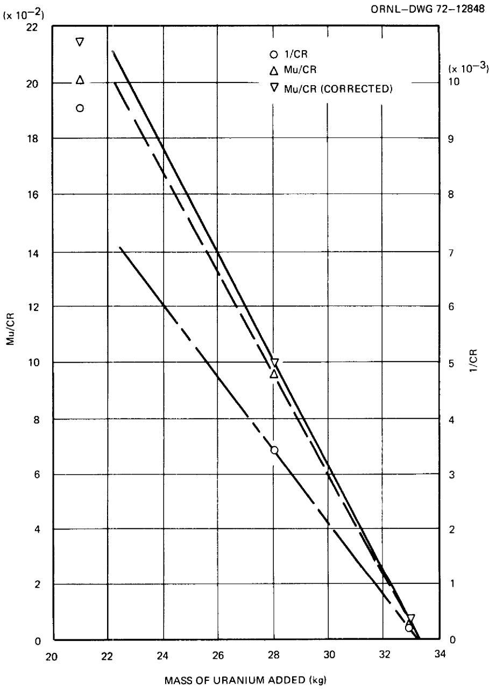  
Fig. 2. Subcritical Count-Rate Data in MSRE Core During $^{233}\mathrm{U}$ Loading.

would be appropriate if the fission-independent neutron source were constant. The strong curvature shows that such a plot would have, in the early stages, projected a smaller uranium loading than that required for criticality. While this type of error would be in the safe direction with regard to premature criticality, it would also increase the number of steps required to reach the critical loading. The open circles in Fig. 2 resulted from multiplying the observed inverse count rates by the uranium loading, a procedure that is correct only if the neutron source is proportional to that loading. The slight downward curvature in these points indicates that, in fact, part of the neutron source was independent of the uranium loading. It may be noted that these data tend to project a critical loading somewhat greater than that actually required. The data actually used to project the $^{233}\mathrm{U}$ critical loading in the MSRE are represented by the X's in Fig. 2. (Data from 3 separate detectors were used with reliance on the most conservative projections.) To obtain these points a correction was applied to account for that portion of the neutron source produced by $\gamma$ -n reactions in the fuel salt. These corrections were derived from information gained during the uranium additions to the drain tanks and were, therefore, only approximately valid for the reactor vessel. In addition the corrections neglected the effect of the external source in the thermal shield. Nevertheless, some added conservatism was gained by using the corrections to project the critical loading. Figure 2 also indicates that, while the above source considerations were important during the early stages of the loading, their importance decreased rapidly as criticality was approached.

After the three major uranium additions shown on Fig. 2, one capsule of enriching salt was added through the sampler-enricher to check out the associated equipment and procedures. Then the fuel loop was drained to permit removal of the charging equipment and closure of the containment. Subsequent uranium additions to attain criticality were then made to the fuel loop with 0.081 of the fuel-salt inventory remaining in the drain tank.

Initial criticality with $^{23}$ U was attained after the addition of 3 more capsules of enriching salt (286 of U) to the primary loop. This

produced a loading equivalent to 14.98 grams of U\* per liter of salt. At criticality, the fuel salt was stagnant (the circulating pump had been off for 33 min), one control rod was inserted a distance equivalent to about 0.015 of its total worth, and the temperature was about $1202^{\circ}\mathrm{F}$ . The core temperature was inferred from the output of thermocouples on the connecting piping shortly before circulation of the fuel salt was stopped. Experience had shown that prolonged stoppages of the fuel pump had almost no effect on the mixed average temperature of the salt, but no data could be obtained on the relation of the stagnant core temperature to the mixed mean. However, deviations of more than a very few degrees are considered unlikely.

Another minor source of uncertainty in the initial critical condition is the amount of undissolved cover gas in the core. Since the circulation of the $^{233}\mathrm{U}$ fuel salt was accompanied by a void fraction around 0.5 vol %, some voids were inevitably present in the core when the pump was stopped. During the first 20 min after a pump stop some of these voids escaped to the free liquid surface, as evidenced by a gradual decline and levelling off of the salt level in the fuel pump. An increase in reactivity during this time indicated that at least some of the voids were migrating out of the core. However, subsequent tests showed that: (1) after the salt had been still for 1-1/2 hr, restarting the pump at low speed removed more gas from the loop and (2) after natural-convection circulation for 12-1/2 hr the core retained a positive pressure coefficient of reactivity. We concluded, from these observations, that a small, but unknown void fraction remained in the core when initial criticality was attained.

Since the core calculations were based on stationary salt at $1200^{\circ}\mathrm{F}$ with the control rods at their upper limits and no voids in the core, the deviations and uncertainties in the observed critical condition are most conveniently expressed as effects on the critical concentration at that condition. The actual concentration depends on the volume of salt to which the uranium was added, as well as on the amount of the additions. The uranium loading was $33.26 \pm 0.015\mathrm{kg}$ and the fuel-salt inventory was

$77.6 \pm 0.5 ft^3$ . Combining these numbers (with a small correction to account for the fact that the last three capsules of enriching salt were added to only part of the salt inventory) leads to a critical concentration of $15.15 \pm 0.10 \, \text{g U per liter of salt}$ . Corrections must be applied to this figure to account for the excess core temperature $(1.7 \pm 2^\circ \text{F})$ , control-rod poisoning $(0.04 \pm 0.02\% \delta \text{k/k})$ , and core voids $(0.1 \pm 0.1 \, \text{vol}\%)$ . The corresponding effects on the uranium concentration are, respectively, $0.006 \pm 0.007$ , $0.016 \pm 0.008$ , and $0.018 \pm 0.018 \, \text{g/λ}$ . These corrections and treatment of the uncertainties as independent errors lead to an effective critical concentration of $15.11 \pm 0.10 \, \text{g U per liter of salt}$ at the nominal standard conditions. Even if all the uncertainties accumulate in the same direction, the maximum error is only $0.13 \, \text{g U/λ}$ . The nominal uncertainty is equivalent to $0.67\%$ in concentration or $0.25\%$ in k_eff.

# Predicted

The original theoretical calculations to predict the $^{233}\mathrm{U}$ critical loading were performed in the summer of 1967. $^{17}$ A major application of the results was the specification of the amount of $^{233}\mathrm{U}$ feed material that had to be prepared for the actual experiment. Although we were aware of several effects of the $^{235}\mathrm{U}$ operation that would influence the critical loading with $^{233}\mathrm{U}$ , the reactor was still operating so we could only estimate their effects. These calculations led to a predicted critical concentration of 15.82 g/liter (uranium of the isotopic composition of the feed material). While this result provided an adequate basis for specifying material requirements, it could not be regarded as a "best effort" at predicting the critical concentration for the conditions that actually prevailed at the time of the experiment.

Some of the factors that affected the critical uranium concentration were not fully evaluated until after the critical experiment had been completed. When tese data became available, we attempted to evaluate the corrections to the original calculations that we knew were required

to make the conditions for the computational model conform to the actual conditions at the time of the experiment. The most important of the necessary changes and updating were as follows:

1. In the original calculations, we had assumed that the operation with $^{235}\mathrm{U}$ would be terminated at approximately 60,000 MWhr exposure. At the time of shutdown from MSRE run 14, the actual exposure was 72,440 MWhr.   
2. In connection with item 1, the residues of plutonium and samarium remaining in the fuel salt had to be reevaluated.   
3. For the earlier calculations the concentrations of the most important neutron-poisoning impurities, $^{6}$ Li in the salt and $^{10}$ B in the graphite, were assumed equal to the concentrations at the start of operation with $^{235}$ U. Hence corrections had to be introduced for the burnout of these nuclides.   
4. The calculations had been based on the assumption that no residue, or heel, or uranium would remain in the reactor system after the transfer and processing of the fuel salt. From isotopic dilution measurements made in the course of the uranium additions, we concluded that 1.935 kg of uranium (isotopic assay: $32.97\%$ ${}^{235}\mathrm{U}$ , $66.23\%$ ${}^{238}\mathrm{U}$ ) from the first loading had been left in the drain tanks. This became a part of the fuel salt when the uranium-free salt was returned from the storage tank for the start of the ${}^{233}\mathrm{U}$ operation.   
5. A special addition of $0.89\mathrm{kg}$ of depleted uranium was made in order to obtain the isotopic abundances necessary for the planned experiment to measure the capture-to-absorption cross-section ratio in ${}^{233}\mathrm{U}$ . This addition had not been considered in the earlier calculations.   
6. Certain changes had been made in the evaluated library of cross-section data for the fissile isotopes since the earlier calculations were performed.

The above modifications were introduced into the theoretical model, and the associated changes in the multiplication constant, as well as the changes in uranium required to compensate for the multiplication changes, were evaluated. The results are summarized in Table 2. It is apparent that the largest single correction is that associated with the uranium

Table 2. Changes in Theoretical Calculation of $^{233}\mathrm{U}$ Critical Loading   

<table><tr><td>Correction</td><td>Reactivity Effect (% Δk/k)</td><td>Uranium Equivalenta(% ΔU/U)</td></tr><tr><td colspan="3">Isotopic changes at 72,440 MWhr</td></tr><tr><td>239Pub</td><td>+0.095</td><td>-0.243</td></tr><tr><td>10B</td><td>+0.379</td><td>-0.973</td></tr><tr><td>149Sm + 151SmC</td><td>+0.061</td><td>-0.156</td></tr><tr><td>6Li</td><td>+0.217</td><td>-0.558</td></tr><tr><td colspan="3">Uranium heel</td></tr><tr><td>235U</td><td>+0.554</td><td>-1.424</td></tr><tr><td>238U</td><td>-0.147</td><td>+0.376</td></tr><tr><td>Depleted uranium addition</td><td>-0.102</td><td>+0.262</td></tr><tr><td>Cross-section changes</td><td>+0.212</td><td>-0.545</td></tr><tr><td>Net</td><td>+1.269</td><td>-3.261</td></tr></table>

$^{a}$ Uranium with isotopic composition of enriching salt (91% $^{233}\mathrm{U}$ ).   
$b$ Assumes no removal during chemical processing.   
${}^{c}$ Net change is positive since effect of dilution by the drain tank salt heel was not accounted for in original calculations.

heel, but all the corrections are significant. Application of these corrections to the originally predicted value led to a revised prediction of 15.30 g/liter at the reference conditions. This value differs from the nominal observed loading (15.11 g/ℓ) by 1.25% in concentration or 0.46% in k_eff.

In addition to the effects listed in Table 2, there are two other reactivity effects that were not explicitly included in either the original calculation or the revised prediction. One of these is the negative reactivity contribution of the low-cross-section fission products remaining from the first fuel loading. The magnitude of this reactivity effect depends on the extent to which various fission products left the salt during the $^{235}\mathrm{U}$ operation and also on any separation which may have occurred during fluorination to remove the uranium. The effect could be as large as $-0.5\%$ $\delta \mathbf{k} / \mathbf{k}$ if all these fission products remained in the salt.

The second reactivity effect is that associated with the distortion of the moderator graphite due to neutron irradiation. Results of a detailed analysis of this phenomenon in the $\mathbf{MSRE^{18}}$ indicate that the reactivity effect at the time of the $^{233}\mathrm{U}$ loading was probably between $-0.04$ and $+0.07\%$ $\delta \mathbf{k} / \mathbf{k}$ . The spread in probable values results from variations in the observed distortion of individual specimens of grade CGB graphite (the material in the MSRE core) as a function of neutron exposure. Although the variations are small compared with the total dimensional change which occurs at high exposures, they represent a substantial fraction of the change associated with the neutron exposures experienced in the MSRE.

If median values for these two effects and uncertainties to cover their possible extreme ranges were included in the calculated loading, the predicted concentration would be $15.40 \pm 0.11 \, \text{g/}\lambda$ . The difference between this value and the observed concentration is $1.9\% \pm 1.0\%$ , where the uncertainty includes the effects of uncertainties in both the calculated and observed quantities. The equivalent effect on $k_{\text{eff}}$ is $0.7 \pm 0.4\%$ .

# Variations in Predictions

Since the $^{233}\mathrm{U}$ loading in the MSRE was the first high-temperature critical experiment with that fuel, there was considerable interest in its outcome and some hope that the results might contribute to an improvement in the basic nuclear data for $^{233}\mathrm{U}$ . However, the precise analyses required for such improvement are severely restricted when, as in the case of the MSRE, the reactor is not designed as a nuclear physics experiment. In addition to uncertainties in the measured critical loading and in the parameters used to define the reactor conditions, significant variations could be produced with small changes in the calculational procedures or in the cross-section data.

Several computations were performed in an effort to elucidate the effects of cross-section data and of calculational techniques on the criticality predictions. Although some of the computations were done for the original $\left({}^{235}\mathrm{U}\right)$ fuel loading, many of the results of this study are also applicable to the situation with ${}^{233}\mathrm{U}$ .

During the actual nuclear operation of the MSRE, the standard computational tools employed for neutronics analysis were the GAM-II (ref. 19) and THERMOS (ref. 20) multigroup spectrum averaging programs, together with the EXTERMINATOR-2, multi-group diffusion program.[21] Subsequently, another generation of programs designed to perform these analyses and oriented for use of the IBM 360/75 and 91 computers became available. These are the XSDRN (ref. 22) and CITATION (ref. 23) programs currently being employed in MSBR studies. The former program performs the combined

spectrum-averaging function of the GAM-THERMOS sequence, and the latter replaces the EXTERMINATOR-2 code. This section describes the comparative analyses of the MSRE neutronics using various combinations of these programs.

The particular approximation of the MSRE core chosen for this set of calculations was a seven-zone model in cylindrical (R-Z) geometry with azimuthal symmetry. The compositions of the salt corresponded to the minimum critical loadings of $^{235}\mathrm{U}$ and $^{233}\mathrm{U}$ at $1200^{\circ}\mathrm{F}$ with the control rods withdrawn to their upper limits. For a given fuel loading, neither the composition nor the geometry was varied in the comparative calculations summarized below.

The simplifications of the core geometry required the cluster of three control rods and sample holder to be represented as an annular ring about the core axis. While this undoubtedly tends to make the relation between absolute calculations of the multiplication factor and critical experiment observations more indirect, the purpose of a comparative study of computing methods, such as described below, could just as well be served by taking advantage of the economy of performing the group-diffusion calculations in two-dimensional geometry.

Table 3 summarizes the various combinations of input data and computer programs used in this study and compares the results in terms of relative changes in multiplication factor and absolute spectrum-averaged capture-to absorption ratios for the fissile components. These two quantities can be used as simple figures of merit for comparing the various cases, since both are functionals of the distribution of neutron flux in energy and position over the reactor core. Cases 1, taken from earlier calculations for the $^{235}\mathrm{U}$ and $^{233}\mathrm{U}$ loadings, were arbitrarily chosen as reference values for comparing the changes in multiplication factor. The details of the comparison between cases 1 and 2 for the $^{235}\mathrm{U}$ loading have been described elsewhere.[24] The differences are due to the use of revised cross-section data. In case 3 we have used the GAM-THERMOS-generated broad-group cross sections as input for a CITATION calculation. In this

Table 3. Comparison of Computation Models for MSRE Multiplication Factors and Capture-to-Absorption Ratios   

<table><tr><td>MSRE Fissile Loading</td><td>Case No.</td><td>Approximate Date</td><td>Multigroup Spectrum-Averaging Program</td><td>Few-Group Diffusion Program</td><td>Number of Broad Slowing-Down Groups</td><td>Number of Broad Thermal Groups</td><td>Extrapolation Distance at Reactor Vessel Boundary</td><td>Δkeff</td><td>Ratio of Radiative Captures in 235U to Absorptions in 235U</td><td>Ratio of Radiative Captures in 235U to Absorptions in 235U</td></tr><tr><td rowspan="6">235U</td><td>1</td><td>November 1968</td><td>GAM-THERMOSa</td><td>EXTERMINATOR-2</td><td>3</td><td>1</td><td>0</td><td>0</td><td>0.2067</td><td>(0.1107)b</td></tr><tr><td>2</td><td>July 1969</td><td>GAM-THERMOSc</td><td>EXTERMINATOR-2</td><td>3</td><td>1</td><td>0</td><td>-0.0053</td><td>0.1977</td><td>(0.1111)</td></tr><tr><td>3</td><td>November 1969</td><td>GAM-THERMOSc</td><td>CITATION</td><td>3</td><td>1</td><td>0</td><td>-0.0026</td><td>0.1977</td><td>(0.1111)</td></tr><tr><td>4</td><td>November 1969</td><td>XSDRNd</td><td>CITATION</td><td>3</td><td>1</td><td>0</td><td>+0.0135</td><td>0.1991</td><td>(0.1128)</td></tr><tr><td>5</td><td>November 1969</td><td>XSDRNd</td><td>CITATION</td><td>3</td><td>1</td><td>0.71 λtr</td><td>+0.0226</td><td>0.1997</td><td>(0.1129)</td></tr><tr><td>6</td><td>November 1969</td><td>XSDRNd</td><td>CITATION</td><td>2</td><td>4</td><td>0.71 λtr</td><td>+0.0235</td><td>0.1998</td><td>(0.1130)</td></tr><tr><td rowspan="2">233U</td><td>1</td><td>December 1968</td><td>GAM-THERMOSc</td><td>EXTERMINATOR</td><td>3</td><td>1</td><td>0</td><td>0</td><td>(0.1858)d</td><td>0.1071</td></tr><tr><td>2</td><td>November 1969</td><td>XSDRN</td><td>CITATION</td><td>3</td><td>1</td><td>0.71 λtr</td><td>+0.0290</td><td>(0.1866)</td><td>0.1086</td></tr></table>

${}^{a}$ Cross-section data libraries for uranium isotopes based on pre-1965 evaluations.   
${}^{b}$ Ratios given in parentheses refer to a fissile component present in the calculation either in small concentrations or at infinite dilution, relative to the primary fissile component.   
New evaluations of uranium isotope cross-section data (see discussion in ref. 24).   
$d_{\text{Cross-section library now used in MSBR studies.}}$ (Data for uranium isotopes same as in case 2.)

latter calculation the basic geometric mesh describing the problem was constructed to correspond as closely as possible to the EXTERMINATOR model. (In both cases the mesh consisted of 37 and 56 intervals in the radial and axial dimensions respectively.) Case 3 indicates that the variations in the finite differencing and computing schemes used in these two programs do give rise to a small change in the calculated multiplication factor. However, this change is of no consequence in this application.

In case 4 we have introduced the XSDRN multigroup spectrum calculation, with its associated cross-section library. One finds in this case a significant change in the multiplication factor ( $\sim 1.6\% \Delta k$ , compared with case 3, which uses the same basic cross-section data for $^{235}\mathrm{U}$ and $^{238}\mathrm{U}$ ). By use of the CITATION perturbation calculation, this difference was shown to be due almost entirely to increases in the calculated broad-group transport cross sections for the various nuclide constituents in the reactor. The largest increase observed for the graphite-moderated region was about $5\%$ , occurring in the thermal group. This appears to originate as follows: In this version of the XSDRN library, the scattering cross-section data for the thermal energy range include only the $\mathsf{P}_0$ component (which is equivalent to assuming isotropic neutron scattering in the laboratory system). In our earlier calculations we had introduced transport corrections for the thermal group in an ad hoc manner using a standard recipe derived from monoenergetic transport theory.[25] Thus it is possible that the thermal transport cross sections used in the earlier calculations may be more reliable in this application. If these values had been used in the calculation for case 4, the perturbation results indicate that the difference in multiplication constants between cases 3 and 4 would have been reduced to about $1.1\% \Delta k$ .

The remaining differences in the calculated transport cross sections occurred in the slowing-down energy range. Of particular significance were the changes for the nuclide constituents in the Hastelloy N reactor vessel, which accounted for about $0.55\% \Delta k$ . Approximately $60\%$ of this change appears to be due to reevaluations of the nuclear data for nickel, chromium,

iron, and molybdenum since the earlier calculations were made. The remaining $40\%$ arises from inherent differences in the methods of calculating transport cross sections in the slowing-down range used in the GAM and XSDRN codes.

In case 5 of Table 3, we have modified the zero-flux boundary condition on the CITATION-calculated neutron flux at the outer surface of the reactor vessel, replacing it with the Milne approximation $^{26}$ of $0.71\lambda_{\mathrm{tr}}$ for the vessel composition. The apparent importance of this correction in calculating the MSRE neutron leakage is reflected by the increase of about $0.9\% \Delta k$ relative to case 4.

In the final case 6, for the $^{235}\mathrm{U}$ loading, we examined the effect of modifying the broad-group energy structure, placing more groups in the thermalization range. (An examination of the influence of the number of slowing-down groups on the calculations has been reported earlier.) Most of our calculations have been made for the few-group energy structure listed in column 2 of Table 4. Here a single broad thermal group was used, based on an effective upper cutoff energy for thermalization of 0.876 eV. We modified this structure as shown in column 3 of Table 4, placing four "thermal" groups below 1.86 eV (the highest energy to which thermal upscattering can occur in the XSDRN model). Although there was a corresponding slight increase in the calculated multiplication factor between cases 5 and 6 of Table 3, this difference is of no consequence for this application.

For the $^{233}\mathrm{U}$ fuel loading, only two cases were studied, which correspond to the comparison of cases 2 and 5 for the $^{235}\mathrm{U}$ loading. No new feature was exhibited by these calculations, although the net difference in multiplication factor was somewhat larger because of the increased neutron leakage for the $^{233}\mathrm{U}$ loading.

The cumulative results of Table 3 display the fact that the sensitivities of the calculated effective multiplication factor and the fissile

Table 4. Broad-Group Energy Structure Used in CITATION Calculations for MSRE   

<table><tr><td>Broad Group 
No.</td><td>Cases 1-5 (Table 3)</td><td>Case 6</td></tr><tr><td>1</td><td>15 MeV-13.71 eV</td><td>15 MeV-13.71 eV</td></tr><tr><td>2</td><td>13.71-3.93 eV</td><td>13.71-1.86 eV</td></tr><tr><td>3</td><td>3.93-0.876 eV</td><td>1.86-0.881 eV</td></tr><tr><td>4</td><td>0.876-0 eV</td><td>0.881-0.180 eV</td></tr><tr><td>5</td><td></td><td>0.180-0.060 eV</td></tr><tr><td>6</td><td></td><td>0.060-0 eV</td></tr></table>

capture-to-absorption ratios to certain details of the computation models are quite different. The particular sensitivity of $\Delta k_{\mathrm{eff}}$ to those details which most strongly affect the leakage calculation is not very surprising, for viewed as a critical assembly, the MSRE has a large neutron leakage. (For the $^{235}\mathrm{U}$ fuel loading, about $36\%$ of the neutrons born within the graphite-moderated region leak from that region, and $31\%$ of all neutrons born within all the salt-containing regions leak to the reactor vessel; for the $^{233}\mathrm{U}$ loading, these numbers are increased to 44 and $39\%$ respectively.) The general behavior of the spectrum-averaged capture-to-absorption ratio for $^{235}\mathrm{U}$ should be considered on a separate basis, however. Here the largest change of about $5\%$ occurred between cases 1 and 2 of Table 3 and corresponded to a substantial revision in the basic cross-section data for $^{235}\mathrm{U}$ and $^{238}\mathrm{U}$ , as described in ref. 24. Between cases 2 and 6 of Table 3, the maximum variation in this ratio is about $1\%$ . Such differences still leave this quantity within the standard deviation of direct measurements of the average ratio for $^{235}\mathrm{U}$ in the MSRE.

Comparison of the relative variations in the capture-to-absorption ratios with those of $\Delta k_{\text{eff}}$ also suggests the caution which should be taken in attempting to correlate differences between calculated and measured multiplication factors from critical experiments, with any particular changes in nuclear cross-section data (such as those for the fissile nu-clides), unless the critical assembly has been designed to minimize or factor out neutron leakage effects. For example, if the changes in multiplication factor were due only to the effective changes in capture-to-absorption ratios listed in Table 3, the differences in $\Delta k_{\text{eff}}$ between cases 2 through 6 would be much smaller in magnitude and would, in fact, be opposite in sign. Consequently, we must refrain from drawing any conclusions about basic nuclear data for $^{235}\text{U}$ or $^{233}\text{U}$ from the results of these critical experiments.

# Neutron Multiplication in Drain Tank

Although it was not an integral part of the core critical experiment, the neutron counting rate in the drain tanks was monitored throughout the $^{233}\mathrm{U}$ loading operations. Calculations had indicated that the drain-tank neutron multiplication would be higher with $^{233}\mathrm{U}$ than with $^{235}\mathrm{U}$ , but that the tanks would still be safely subcritical with the anticipated loading.[29] Thus, the purpose of this monitoring was to demonstrate that criticality was not being approached in the drain tank as fuel additions were made.

As was the case in the core critical experiment, two neutron sources had to be considered: the fission-product photoneutron source which was essentially constant throughout the loading, and the $(\alpha, n)$ source which increased with uranium concentration. In fact, the photoneutron source was more important in the drain tank than in the core because the effective concentrations of the photoneutron producers were higher. (The core contained 77.5 vol % graphite while the drain tank was almost all salt.) Thus, neither the simple inverse count rates, nor the ratios of uranium mass to count rate could be expected to produce data from which reliable extrapolations toward criticality could be made. We, therefore, again resorted to compensating the observed mass-to-count-rate values for the constant photoneutron source. The results are shown graphically in Fig. 3 for one of the two detectors, along with the uncompensated values and the simple inverse count rates. These data show, even more clearly than the core values, the advantage of improved treatment of the source term. All three curves indicate that the drain tank was well below critical at the final loading, but the indication appears earlier and is more obvious with the compensated values. While the results can not be translated into values for $k_{\mathrm{eff}}$ in the drain tank, they do, at least qualitatively support the conclusions reached in the calculations.

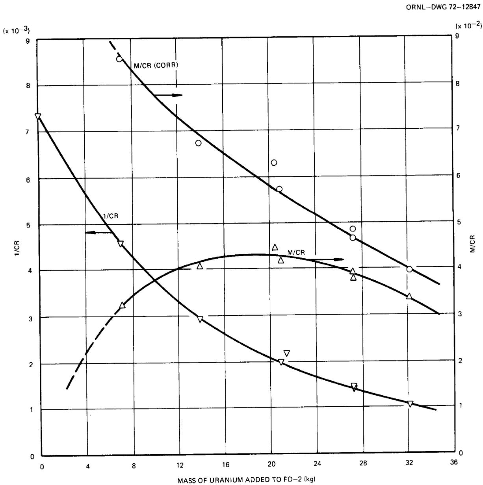  
Fig. 3. Subcritical Count-Rate Data in Fuel Drain Tank During $^{233}\mathrm{U}$ Loading.

# Control-Rod Calibrations

Recalibration of the control rods was necessary for operation with $^{233}\mathrm{U}$ , because of the increased importance of neutron leakage effects and the more "thermalized" energy spectrum relative to the $^{235}\mathrm{U}$ loading. The primary purpose of this calibration, as before, was to provide the data required to accurately evaluate control-rod poisoning as a function of rod configuration for inclusion in the on-line reactivity balance. $^{30}$

# Data Analysis

For the earlier, $^{235}$ U, loading we had performed both period-differential-worth experiments and rod-drop-integral-worth experiments on the regulating rod. $^{1}$ The former measurement determined the slope of the reactivity vs rod position curve at a fixed uranium concentration and an initially critical condition. By adding excess uranium and varying the initial critical rod positions for these experiments, we were able to calibrate the rod over its entire length of travel. In the rod-drop experiments, we determined the total negative reactivity corresponding to the scream of the rod from its initial critical position at some specified uranium concentration. However, because the rod-drop experiment required a more elaborate recording technique and analysis, it was convenient to perform it only a few times during the course of the uranium enrichments. Hence, in the earlier experiments with ${}^{235}$ U, we used the results of integrated period-differential-worth data as the basis of our final evaluation of the rod worths. The drop experiments were used mainly to cross check the integrated period data, as well as to test the technique of the rod-drop experiment itself. These results were then combined with rod-shadowing data to produce the general description of control-rod poisoning for all control-rod configurations.

When we attempted to apply this same general approach to the $^{233}\mathrm{U}$ calibration experiments, we encountered some obstacles, however. In brief, after the data from the differential-worth measurements were collected and analyzed, the precision of the results proved to be too poor for application in the manner described above. Although the exact reasons for all of the scatter were not identified, increased uncertainty in the control-rod position, as a result of wear and aging in the assemblies probably was a major contributor. (Difficulties in positioning the rods precisely also affected the dynamics tests.) Since the rod travel required to establish a given stable reactor period was much smaller with $^{233}\mathrm{U}$ than with $^{235}\mathrm{U}$ , this uncertainty also had a greater effect on these results. Another potential source of scatter is minor variations in the core void fraction during individual period runs. In several cases abrupt changes in the "stable" period were observed, but the cause could not be identified. The occasions on which the period decreased could have been caused by an escape of gas bubbles from the core.

Because of the poor precision of the differential-worth experiments, it became necessary to rely more heavily on the results of the rod-drop measurements to obtain the information required to calibrate the rods. In the course of the zero-power experiments with $^{233}\mathrm{U}$ , we had performed two sets of drop experiments, one near the start of the excess uranium additions and one when the critical position of the regulating rod was near the position of maximum differential worth. The results of analysis of these experiments are described below. Unlike the period-differential-worth measurement, the reactivity determined from the rod-drop experiment is quite insensitive to small errors in the initial and scram positions of the rods. The principal new problem we had to consider was how to interpolate the information from these two sets of experiments to other values of the initial critical rod position and $^{233}\mathrm{U}$ concentration to obtain the shape of the rod worth curves.

The first set of experiments was performed after the addition of capsule No. 23. This corresponded to very nearly $30.78\mathrm{kg}$ of added uranium contained in the fuel loop, or $33.50\mathrm{kg}$ of total uranium added to the salt (including the drain tank residue). At these conditions the critical position of the regulating rod at $1200^{\circ}\mathrm{F}$ was approximately 41.8 in. with the

pump off and 47.3 in. with the pump on. In the ensuing description the regulating rod will be designated as rod 1 and the shim rods as rods 2 and 3.

As described in ref. 1, in these experiments the integral count is measured starting with the reactor critical a few seconds before the scram and ending about 30 sec after the scram. The fission chamber is positioned so that the initial count rate at the critical condition is about 30,000 counts/sec. The attempt was made to start each experiment at a neutron level equivalent to about 50 W. Since it was impractical, however, to try to obtain exactly the same count rate at the time of rod scram in each experiment, for convenience in analysis we first renormalized the measured counts for each case to correspond to an initial rate of $3 \times 10^{4}$ counts/sec. This should not introduce any error since the system is linear in this range.

The results of the measurements and analyses for the first set of experiments (designated as series A) are shown in the bottom curve in Fig. 4 and in all curves in Fig. 5. Figure 4, bottom curve, corresponds to the scream of rod 1 from its initial critical position of 41.8 in. with the pump off. The circled points are the normalized integral count data, and the curve is the result of numerically integrating the reactor kinetics equations in the manner described in ref. 1. The magnitude of the negative reactivity inserted is used as an adjustable parameter to obtain a close fit to the measured count data. The average accelerations of rods 1 and 2 used for these analyses were 150 and 190 in./sec², calculated from average drop-time measurements made subsequent to termination of operation with $^{235}\mathrm{U}$ . In addition, all analyses were normalized to the values of the delayed neutron fractions given in Table 5. These are effective values based on actual yields³¹ with approximate evaluations of (1) the relative abundance of $^{235}\mathrm{U}$ and $^{239}\mathrm{Pu}$ in the fuel salt (source of data for measured delay fractions for all fissile isotopes was ref. 5), (2) the relative energy effectiveness of delayed neutrons in the reactor spectrum,³² and

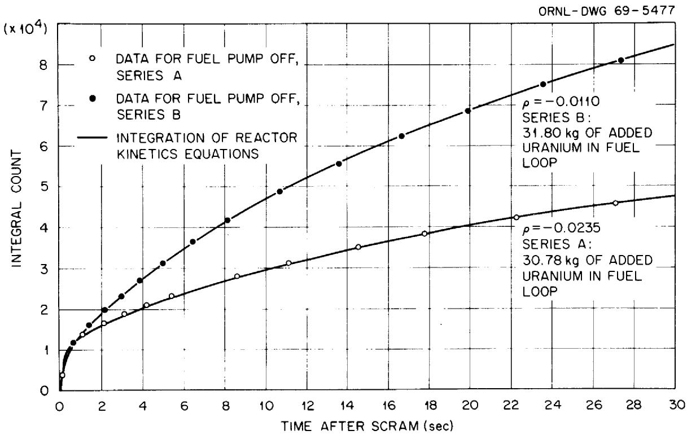  
Fig. 4. Results of Rod-Drop Experiments for Regulating Rod (Rod 1).

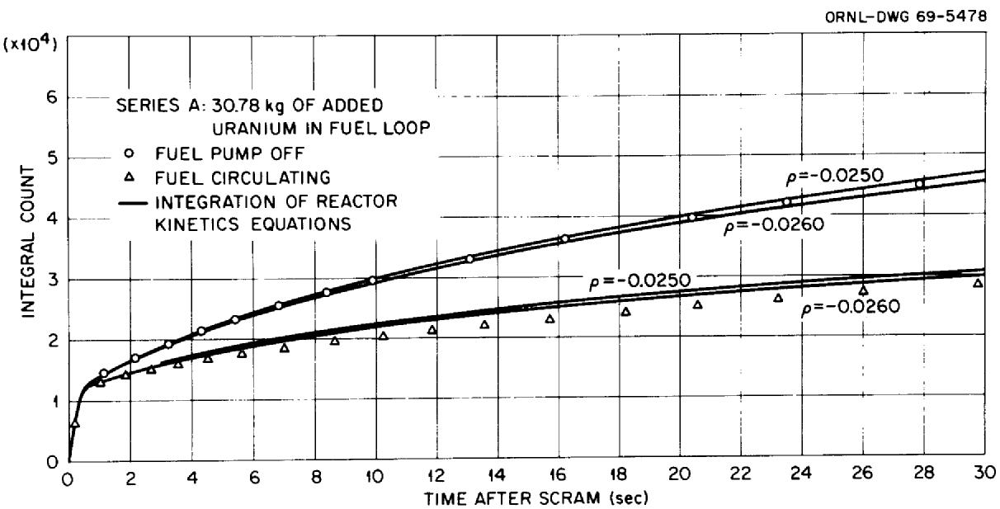  
Fig. 5. Results of Rod-Drop Experiments for Shim Rod 2.

(3) calculated importance-weighted reductions in delay fractions for the conditions of steady fuel circulation. The background for treating the effects of fuel circulation is discussed in detail in ref. 34.

Table 5. Effective Delayed Neutron Fractions for the $^{233}\mathrm{U}$ Loading Used in Analysis of Rod-Calibration Experiments   

<table><tr><td>Group</td><td>Stationary Fuel (neutrons per 104fission neutrons)</td><td>Circulating Fuel (neutrons per 104fission neutrons)</td></tr><tr><td>1</td><td>2.376</td><td>1.137</td></tr><tr><td>2</td><td>8.576</td><td>4.188</td></tr><tr><td>3</td><td>7.190</td><td>4.370</td></tr><tr><td>4</td><td>8.214</td><td>6.654</td></tr><tr><td>5</td><td>1.579</td><td>1.544</td></tr><tr><td>6</td><td>1.003</td><td>0.998</td></tr><tr><td>Total</td><td>28.938</td><td>18.891</td></tr></table>

The data points for the top curves in Fig. 5 correspond to the normalized integral counts for shim rod 2, scrambled from its upper limit of travel. The pump was off, rod 3 remained set at 51 in., and rod 1 remained at 41.35 in., its initial critical position for this experiment. This case is of particular interest because, except for the slight "shadowing" effect caused by the 9.65-in. insertion of the regulating rod, it is a direct measurement of the total worth of a single shim rod. (In

addition, the shim and regulating rods were found to have the same poisoning effect by comparison of their critical positions.)

In order to better illustrate the sensitivity of this measurement to the magnitude of the reactivity insertion, in Fig. 5 we have shown two calculated curves corresponding to $-2.50$ and $-2.60\% \delta k / k$ . These curves closely bracket the count data, and we can assign a reactivity insertion of $-2.55 \pm 0.05\% \delta k / k$ as the "measured" reactivity. Therefore the relative sensitivity or fractional uncertainty in this method should be better than $2\%$ .

The effect of the slight shadowing perturbation caused by rod 1 during the first 10 in. of fall of rod 2 can be estimated from results of rod-shadowing measurements, to be described later in this section. This correction is quite small and should increase the measured reactivity magnitude by about $1\%$ of the nominal value. Thus we can assign $2.58 \pm 0.05\%$ $\delta k / k$ as the total worth of a single rod at the concentration of $^{233}\mathrm{U}$ obtaining in this first set of experiments.

The bottom curves of Fig. 5 represent the data and results of analysis for the same shim rod, taken with the fuel circulating. As in the experiment with the pump off, rod 2 was scrambled from its upper limit of travel. Rod 3 remained set at its upper limit, and rod 1 remained at its critical position with the pump running, 47.32 in. The solid curves are the results of integrating the kinetics equations for the same reactivity magnitudes shown in the top curves of Fig. 5, but with the delayed neutron fractions for each precursor group replaced by effective fractions calculated with the theoretical model used previously for MSRE analysis (Table 5). These results suggest that the calculated losses in delayed neutron fraction due to circulation may be slightly underestimated by the theoretical model. The observed difference is rather small in comparison with the total effect, however, and we concluded that the calculated delayed-neutron losses are within $15\%$ of the actual losses in the MSRE. (Note that the presence of any entrained gas in the circulating fuel salt would not be significant in interpreting this experiment, since these conditions would have remained essentially constant throughout the experiment.)

The second set of experiments (series B) was performed after $31.80\mathrm{kg}$ of uranium had been added to the fuel loop. The top curve in Fig. 4 shows

the result of dropping rod 1 from its new critical position at this loading (22.25 in. with the pump stopped). The negative reactivity obtained from the analysis of this experiment was $-1.10\% \delta k / k$ . As will be shown below, the results in Fig. 4, together with the total measured worth of one rod, provide information sufficient for normalizing and interpolating the rod-calibration measurements.

Another curve of special interest in the control-rod calibration is the variation of excess reactivity with the uranium concentration. Each point on this curve corresponds to the excess reactivity of the system if the rod were withdrawn from its critical position to the upper limit of travel, at a fixed uranium loading. This information is directly applicable to the on-line reactivity balance calculations, since the uranium is depleted and readed in the course of operation. The curve is also of theoretical interest, however, because the uranium additions without compensating rod insertions represent a uniform variation in nuclear properties over the volume of the fuel salt. Of the characteristics calculated in core physics studies, this effect should be one of the most reliable, whereas quantities depending directly on the calculation of the rod polishing effect are probably the least reliable. Therefore for this problem we have made use of theoretical results concerning the shape of the excess-uranium-reactivity curve to aid in interpolating the experimental data described above.

By means of theoretical derivations and arguments based on perturbation theory, one can arrive at the following conclusions:

1. The variation in the excess reactivity $\rho$ with $^{23}^{3}\mathrm{U}$ loading for a fixed rod position is closely approximated by the formula

$$
\rho \cong \frac {K (C - C _ {\circ})}{C} = \frac {K (M - M _ {\circ})}{M}, \tag {1}
$$

where $K$ is a constant, $C$ and $M$ are the concentration and mass of $^{233}\mathrm{U}$ in the salt, and subscript 0 refers to the values at the minimum critical loading.

2. If a reactivity measurement is made which involves the motion of the control rod away from its initial critical position at some fixed uranium loading and we wish to interpolate this measurement to another uranium concentration, the interpolation factor is approximately inversely proportional to the uranium concentration:

$$
\frac {\Delta \rho (C _ {0})}{\Delta \rho (C)} \cong \frac {C}{C _ {0}}. \tag {2}
$$

We first tested the accuracy of approximation (1) by applying it in the case where an experimental curve was attainable from independent measurements. This was the $^{235}\mathrm{U}$ mass-vs-reactivity data determined by integration of period measurements and reported as Fig. 7 of ref. 1. We found that fitting the data by a theoretical curve of the form (1) required only a very slight change from the "empirical" curve reported in ref. 1.

Approximations (1) and (2) provide all the necessary relationships to interpolate the rod calibration data for the $^{233}\mathrm{U}$ loading. The value of $M_0$ , the loading of the fuel loop at the reference conditions for the initial critical experiment, was 30.59 kg of uranium with isotopic composition of the enriching salt. (Note: The heel of $^{235}\mathrm{U}$ and $^{239}\mathrm{Pu}$ remaining in the salt from the $^{235}\mathrm{U}$ loading constitutes a base-line effect in all these measurements and can be shown to have negligible influence on the analysis following.) The approximations were applied as follows. From Eq. (2) the total reactivity effect of one rod at a loading of 31.80 kg of uranium is approximately

$$
2. 58 (30. 78 / 31. 80) = 2. 497 \% \delta k / k
$$

Subtracting the rod-drop reactivity from the total rod effect gives the excess uranium reactivity at $31.80\mathrm{kg}$ of uranium:

$$
\text {e x c e s s} \quad \text {U r e a c t i v i t y} = 2. 4 9 7 - 1. 1 0 = 1. 3 9 7
$$

This result was then applied to generate the reactivity curve corresponding to Eq. (1),

$$
K = \frac {\rho M}{M - M _ {0}} = \frac {(0 . 0 1 3 9 7) (3 1 . 8 0)}{3 1 . 8 0 - 3 0 . 5 9} = 0. 3 6 9.
$$

The curve of Eq. (1) based on these values of the parameters $K$ and $M_0$ is shown in Fig. 6.

These results may be cross-checked for consistency with the rod-drop measurement given by the bottom curve in Fig. 4. In this case the reactivity effect of dropping the regulating rod from its critical position at $30.78\mathrm{kg}$ of uranium was $2.35\% \delta k / k$ . Then

$$
\text {e x c e s s U r e a c t i v i t y} = 2. 5 8 - 2. 3 5 = 0. 2 3
$$

This is observed to be in close agreement with the value obtained from the interpolated curve in Fig. 6.

# Results

To synthesize the results of the preceding sections, we used the simple procedure of combining (1) experimental measurements of the variation in critical rod position with uranium loading and (2) the information given in Fig. 6 to obtain the reactivity effect corresponding to arbitrary insertions of the regulating rod. The result is the calibration curve for one control rod with the other two rods withdrawn to their upper limits. These data are shown as the open circles along the lowest curve in Fig. 7. (The small amount of statistical variation in these data probably corresponds to slight uncertainties in the temperature and the rod position.) To facilitate the use of this information in the on-line reactivity balance calculation, we used Eq. (2) to put all the numerical values of reactivity in Fig. 7 on the basis of one uranium concentration, arbitrarily chosen as the initial critical concentration. Figure 7 also presents a summary of the complete control-rod calibration including the effects of partial insertions of the shim rods. These additional results were obtained by the following procedure. During the course of the uranium

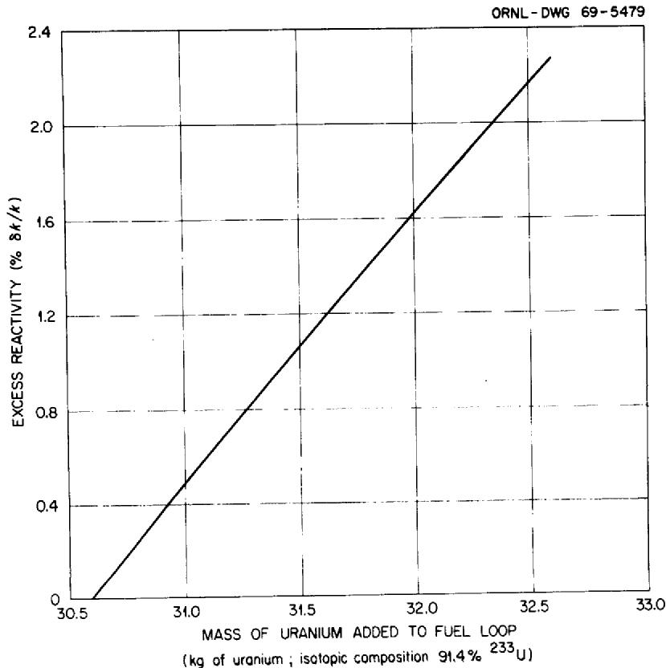  
Fig. 6. Effect of Uranium Mass on Reactivity in $^{233}\mathrm{U}$ Loading; Theoretical Curve, Normalized to Results from Rod-Drop Experiments.

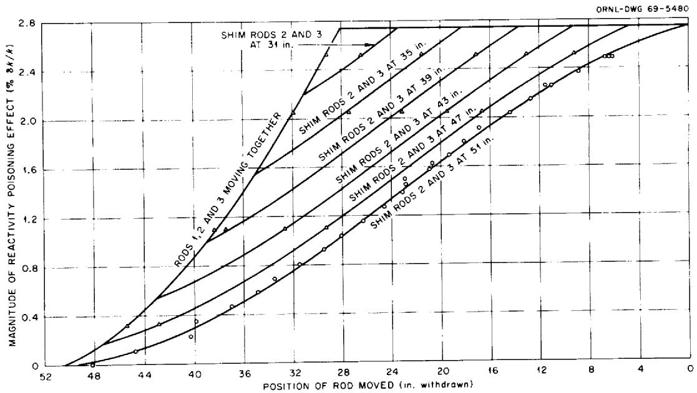  
Fig. 7. Results of Fit of Rod Calibration Data by Least Squares Formula. Data obtained from measurement of critical rod positions and use of Fig. 6. $\Delta$ Data interpolated from rod-shadowing measures (Fig. 8). Reactivity effects normalized to initial critical loading of $30.59\mathrm{kg}$ of uranium in fuel loop.

additions, we performed several rod-shadowing experiments, in which the change in critical position of the regulating rod was measured as one shim rod and then two banked shim rods were inserted. Results of measurements carried out at four different uranium concentrations are plotted in Fig. 8. Here the ordinate and abscissa are the shim- and regulating-rod positions, and each plotted point represents a critical configuration of the rods. The particular conditions for each experiment are also indicated in the figure. A sequence of critical positions taken at a fixed uranium concentration and temperature would represent a contour line of constant reactivity relative to the reference condition if the reactivity were being plotted in the dimension perpendicular to the plane of Fig. 8.

The data taken from the experiments in which the two shim rods were moved in a bank was of special interest in application to the on-line reactivity-balance calculations because this is the configuration used in the operating reactor. This interest is emphasized in Fig. 8 by the smooth curves drawn through these data points. The curves are terminated on the line of equal insertion of the shim and regulating rods because the area to the right of that line is the region in which the rods were operated in the MSRE. From the earlier work with the $^{235}\mathrm{U}$ loading, we developed an analytical formula for the rod reactivity variation with shim- and regulating-rod insertion.[35] This formula contained adjustable parameters which were fitted by least-squares analysis to the measured data in the region of interest. The analysis procedure described in ref. 35 was applied without modification to the $^{233}\mathrm{U}$ experiments, with the resulting least-squares curve fit shown in Fig. 7. The triangular points in this figure are check points for the least-squares formula, interpolated from the smooth curves in Fig. 8. The least-squares formula provided a good fit to the measured data of Fig. 7 for most of the range of rod travel but deviated somewhat from expected values near the upper and lower limits of the range. The total regulating rod reactivity determined from the formula was too large, and the curves probably needed to "bend" more near

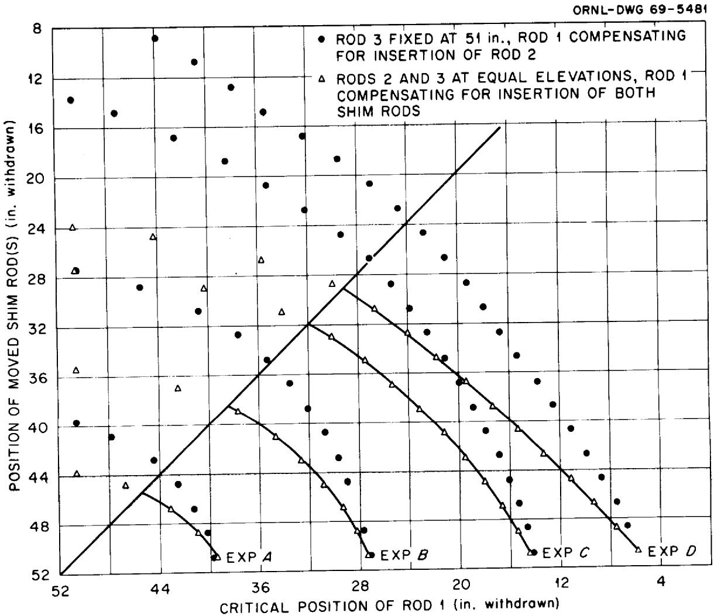  
Fig. 8. Change in Critical Position of Rod 1 as Rods 2 and 3 are Inserted into Core.

Conditions:   

<table><tr><td>Exp.</td><td>After Capsule Addition No.</td><td>Fuel Circulating</td><td>Reactivity Effect (% δk/k)*</td></tr><tr><td>A</td><td>9</td><td>Yes</td><td>0.32</td></tr><tr><td>B</td><td>13</td><td>No</td><td>1.10</td></tr><tr><td>C</td><td>23</td><td>No</td><td>2.05</td></tr><tr><td>D</td><td>27</td><td>Yes</td><td>2.52</td></tr></table>

these limits. (This same situation was encountered earlier in the $^{235}\mathrm{U}$ measurements.) These deviations did not constitute a problem, however, for normal operating procedures kept the tips of the rods well away from these extremes.

Estimates of the reactivity worth of the control-rod's with $^{233}\mathrm{U}$ fuel had been made $^{17}$ along with the early calculations of the critical loading. These estimates were used in a variety of analyses $^{29,36}$ to predict the characteristics of the reactor system. Although it was recognized that the control-rod worths were subject to some uncertainty, the experience with the $^{235}\mathrm{U}$ loading suggested that the differences between projected and actual values would not substantially affect the conclusions of these studies. In addition, it was anticipated that empirical rod-worth data would be used for power operation of the reactor. Thus, there was little incentive to produce "best possible" estimates of control-rod worth. Nevertheless, a comparison of the measured rod worths with the values that were calculated, Table 6, shows that acceptable agreement was obtained.

Table 6. Comparison of Observed and Predicted Control-Rod Worths in MSRE with ${}^{23}{}^{3}\mathrm{U}$ Fuel   

<table><tr><td rowspan="2">Configuration</td><td colspan="2">Value (% δk/k)</td></tr><tr><td>Observed</td><td>Predicted</td></tr><tr><td>1 rod</td><td>2.58</td><td>2.75</td></tr><tr><td>3 rods</td><td>6.9</td><td>7.01</td></tr></table>

# Concentration Coefficient of Reactivity

As we indicated earlier, much of the information relative to the uranium concentration coefficient of reactivity was developed in the evaluation of the control-rod calibrations. The extension of that information to the concentration coefficient proceeds very simply. Differentiation of Eq. (1), p. 39, shows that $K$ is in fact equal to the concentration coefficient at the minimum critical loading; that is,

$$
\left(C \frac {d _ {\rho}}{d C}\right) _ {C = C _ {\rho}} = K = 0. 3 6 9. \tag {3}
$$

(Extension of this process to higher uranium concentrations with the aid of Fig. 6 yields a value of 0.355 at the operating concentration.) The value obtained from theoretical calculations17 for the critical loading was 0.389 which compares quite favorably with the observed quantity.

# Temperature Coefficient of Reactivity

Although only one was made during the zero power tests, all three temperature coefficient measurements that were made in the early part of the $^{233}\mathrm{U}$ operation are discussed here in order to permit presentation of the final results. Each measurement was based on variation of the isothermal system temperature between 1175 and $1225^{\circ}\mathrm{F}$ .

The first measurements were made near the end of the zero-power tests when the uranium concentration was approximately at the value for power operation. Data on critical rod position and temperatures were logged on the computer and manually, both with the pump running and after it had been off for 15 min, at each of nine temperatures. Temperature coefficients were computed by plotting the rod reactivity effects (as determined from the empirical calibration) against system temperature. The points with the pump off fell very close to a straight line with a slope of $-7.75 \times 10^{-5} (\delta k / k) / {}^{\circ} F$ . The points with the fuel circulating were more scattered but gave a distinctly different slope: $-6.9 \times 10^{-5} (\delta k / k) / {}^{\circ} F$ .

The difference was not unexpected, since we knew there was an appreciable amount of entrained cover gas circulating with the salt, and past experience $^{13}$ had demonstrated that the circulating void fraction increased with decreasing temperature. Thus, the fluid density change due to the dependence of gas entrainment on temperature would tend to offset the salt density change with temperature, reducing the magnitude of the reactivity effect of slowly varying temperature. But even the value with the pump off was significantly less than that predicted on the basis of no gas in the salt. Therefore the series of measurements was repeated later with great care. The results with the pump off were practically the same as before, but with circulation the measured value was $-7.4 \times 10^{-5} (\delta k / k)^{\circ} \mathrm{F}$ . The inference was that the variation of the void effect (bubble fraction) with temperature had changed.

After the variable-frequency power supply was put in service and the loop bubble fraction was observed to be very low at reduced fuel circulation rates, the temperature-coefficient measurement was repeated. With the pump running at reduced speed and practically no bubbles circulating with the salt, the data gave a value of $-8.5 \times 10^{-5} (\delta k / k) / {}^{\circ}\mathrm{F}$ . The higher value suggests that the effects of gas had not been completely eliminated in the earlier experiments by simply stopping the pump. This was in agreement with other observations of the gas behavior discussed earlier in this report.

The predicted value of isothermal temperature coefficient of reactivity was $-8.8 \times 10^{-5} (\delta k / k) / {}^{\circ}\mathrm{F}$ at operating fuel concentration $(-9.4 \times 10^{-5}$ at critical concentration). The only directly comparable observed value is the one measured with no circulating gas, which was $3.4\%$ smaller.

The individual contributions of the fuel and the graphite to the overall temperature coefficient were not measured experimentally because of the uncertainties introduced by the circulating gas bubbles. Instead, the calculated values were used on the basis that the close agreement in the overall coefficient could be expected to extend to the separate components.

# Effective Delayed Neutron Fraction

Neutron noise measurements were made during the zero-power tests in an effort to evaluate experimentally the effective delayed neutron fraction, $\beta_{\mathrm{e}}$ , with $^{233}\mathrm{U}$ fuel in this reactor.[37] The noise from two identical neutron-sensitive ionization chambers was reduced to a frequency spectrum using a digital cross-correlation method that eliminates unwanted noise. The resulting frequency spectrum of the reactor correlated noise was least-squares fitted to a point-kinetics model of the MSRE to evaluate the ratio of $\beta_{\mathrm{e}}$ to the prompt neutron generation time $\lambda$ . The calculated value of $\lambda$ was then used to infer $\beta_{\mathrm{e}}$ . The value of $\beta_{\mathrm{e}}$ obtained from the data for noncirculating fuel was $0.0031 \pm 0.0001$ , which compares favorably with the calculated value of 0.0029 (see Table 5). Data were also taken with the fuel circulating but these did not yield a value of $\beta_{\mathrm{e}}$ , because neutron noise caused by helium voids in the circulating fuel masked the effect of $\beta_{\mathrm{e}}$ . Thus, the only experimental support for the calculated delayed neutron fraction with circulating fuel was the indirect observation from the rod-drop experiments (p. 38).

# Dynamics Tests

The results of the zero-power dynamics tests have been reported elsewhere. $^{15}$ In general the results were found to agree favorably with theoretical predictions. $^{38}$ The step and pulse reactivity tests, however, contributed little to this conclusion. Since the signal strength in these aperiodic tests is distributed over the entire frequency range, there was insufficient signal at any one frequency to rise above the very high noise level associated with the high void fraction in the $^{233}\mathrm{U}$ -fueled system. Thus the results contained too much scatter to be useful.

The frequency response tests in which periodic perturbations were introduced were analyzed by several different methods. Although the results of these analyses were not always the same, the agreement with the predicted response was acceptable. Figures 9 and 10 show the experimentally determined zero-power frequency response by two analytical methods in comparison with the predicted response. In both of these tests, one with stationary and one with circulating fuel, the reactivity was perturbed by manipulating a control rod and the response of the neutron flux was measured.

With the fuel stationary, the frequency response of the zero-power MSRE was essentially the same as that of any stationary-fuel, zero-power, $^{233}\mathrm{U}$ -fueled reactor. The measured frequency response with the fuel not circulating is shown in Fig. 9. The magnitude ratio, $\delta n / N_0 \cdot \delta k$ , is seen to be in general agreement with the theory, but the phase angle is not in particularly good agreement. At the higher frequencies, the magnitude ratio and the phase angle were lower than the theoretical at other power levels as well as here. This is thought to have been caused by the control rod not adequately following the test pattern yet giving the indication that it was. The indicators, which are physically located with the drive assembly, accurately display the action of the rod-drive motors; however, the flexibility of the control rod makes it doubtful that the tip of the rod, which is about 17 ft from the drive assembly, reproduces the high-frequency component of the rod-drive movement.

The results of a zero-power test with the fuel circulating are shown in Fig. 10. The shape of the magnitude ratio curve is in excellent agreement with the theoretical curve, but the results have been normalized by multiplying each experimental value by 1.75. The phase angle data was in better agreement with the theoretical predictions than was the case for the non-circulating data, but there is scatter in the results. The need to normalize some results and not to normalize others is also considered to be caused by poor control rod indication. The normalization was subsequently shown not to be power-dependent since some data did and some did not need normalization at each power level, and the normalization factors, when they were required, were different for different tests.

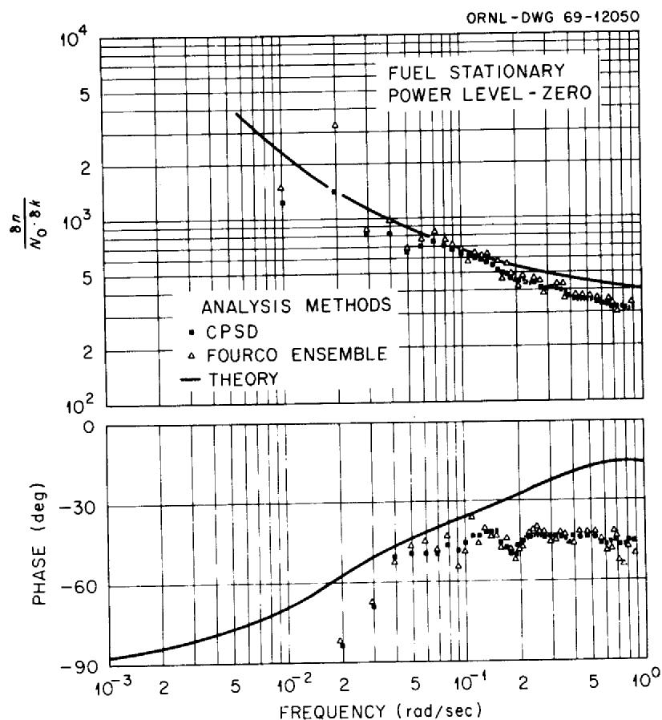  
Fig. 9. Neutron Flux-to-Reactivity Frequency Response of the $^{23}$ U-Fueled MSRE at Zero-Power with Stationary Fuel.

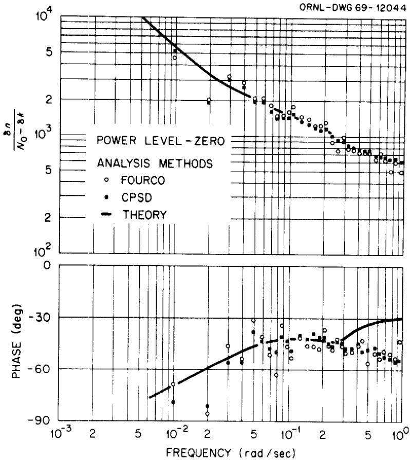  
Fig. 10. Neutron Flux-to-Reactivity Frequency Response of the $^{233}\mathrm{U}$ -Fueled MSRE at Zero-Power with Circulating Fuel.

The zero-power results shown here were supplemented by other tests at higher powers which did much to verify the satisfactory dynamic characteristics of the system.

# Noise Analysis

The nominal purposes for examining the neutron flux noise at zero-power were to complement the dynamics studies and to evaluate the effect of fuel circulation on the delayed neutron fraction. Useful data had been obtained in both of these areas $^{1,39}$ during the $^{235}\mathrm{U}$ zero-power test program. However, in the $^{233}\mathrm{U}$ tests, the neutron detection efficiency was reduced by a factor of $\sim 15$ by the need to locate the detector in the instrument penetration rather than in the thermal shield and the neutron noise contribution from circulating gas bubbles was much higher. Consequently, no useful information could be extracted from the data in these two particular areas. On the other hand, evaluations of the neutron-flux noise had been shown to be of substantial value in studying the behavior of circulating voids in the system $^{40}$ and these techniques were employed throughout the operation with $^{233}\mathrm{U}$ .

# CONCLUSIONS

The primary purpose of the zero-power tests with $^{233}\mathrm{U}$ fuel in the MSRE was to establish the neutronic characteristics required for subsequent analysis of the operation of the reactor at power. That this was successfully accomplished is demonstrated by the fact that there was no suggestion of anomalous nuclear behavior while the system was operated for 4000 EFPH with this fuel. Some changes from the behavior of the system with $^{235}\mathrm{U}$ fuel were observed (particularly with regard to circulating voids) but these were not due to unexplained differences in the nuclear behavior.

In general, the agreement between the observed and calculated nuclear properties was sufficiently close that the analyses and conclusions that were based on calculated values remained valid. Table 7 presents a comparison of the basic results of the zero-power tests with the corresponding predicted quantities. The conclusions that may be drawn from these comparisons and the foregoing discussions are summarized as follows.

1. The critical loading with $^{233}\mathrm{U}$ was predicted less accurately than was the initial loading with $^{235}\mathrm{U}$ . Two possible reasons are recognized: (1) the reactor conditions were less well defined for the $^{233}\mathrm{U}$ case because of the prior operating history with $^{235}\mathrm{U}$ , and (2) the calculation for $^{233}\mathrm{U}$ was more sensitive to uncertainties in the treatment of neutron leakage processes.   
2. The measured control-rod worths were within $7\%$ of the calculated values; the fuel concentration coefficient was within $6\%$ ; and the temperature coefficient was within $5\%$ . Thus the predicted safety characteristics of the reactor that were based on the calculated values were valid.   
3. Although the higher circulating void fraction with $^{233}\mathrm{U}$ complicated the interpretation of some data and prevented some direct measurements (separate fuel and graphite temperature coefficients and loss of delayed neutrons due to fuel circulation), indirect observations provided the confirmations necessary for safe operation of the reactor.   
4. The dynamics tests at zero-power which were only a small part of the continuing surveillance of the system's dynamic behavior, satisfactorily demonstrated the adequacy of the predictions and of the testing procedures.

Table 7. MSRE Nuclear Characteristics with ${}^{233}\mathrm{U}$   

<table><tr><td rowspan="2">Property</td><td colspan="2">Value</td></tr><tr><td>Calculated</td><td>Observed</td></tr><tr><td>Base-line critical concentration,αgrams of uranium per literb</td><td>15.30</td><td>15.11</td></tr><tr><td>Control rod worth, % δk/k</td><td></td><td></td></tr><tr><td>One rod</td><td>2.75</td><td>2.58</td></tr><tr><td>Three rods</td><td>7.01</td><td>6.9</td></tr><tr><td rowspan="2">Temperature coefficient of reactivity(δk/k)/°F</td><td>-8.8 × 10-5</td><td>-8.5 × 10-5e</td></tr><tr><td></td><td>-7.4 × 10-5</td></tr><tr><td>Concentration coefficient of reactivity,(δk/k)/(δC/C)b</td><td>0.389</td><td>0.369</td></tr><tr><td>Change in βeff due to fuel circulation</td><td>-1.005 × 10-3</td><td></td></tr></table>

$^{\alpha}$ At $1200^{\circ}\mathrm{F}$ with fuel stationary and all control rods withdrawn to their upper limits.   
$b$ Uranium of the isotopic composition of the material added during the critical experiment (91% $2^{33}$ U)   
Assumes no gas in the fuel and the operating uranium concentration. The predicted temperature coefficient at the initial critical concentration was $-9.4 \times 10^{-5}$ .   
$\mathcal{A}$ With very little gas.   
eWith about 0.5 vol % gas circulating.

# Internal Distribution

1. L. G. Alexander   
2. J. L. Anderson   
3. C. F. Baes   
4. H. F. Bauman   
5. S. E. Beall   
6. E. S. Bettis   
7. E. G. Bohlmann   
8. R. B. Briggs   
9. E. L. Compere   
O. W. B. Cottrell   
1. J. L. Crowley   
2. F. L. Culler   
3. J. R. DiStefano   
4. S. J. Ditto   
5. W. P. Eatherly

16-20. J.R.Engel

1. D. E. Ferguson   
2. L. M. Ferris   
3. A. P. Fraas   
4. C. H. Gabbard   
5. W. R. Grimes   
6. A. G. Grindell   
7. R.H.Guymon   
8. P. N. Haubenreich   
9. H. W. Hoffman   
0. P. R. Kasten   
1. T. W. Kerlin   
2. J. J. Keyes   
3. A. I. Krakoviak   
4. M. I. Lundin

35. R. N. Lyon   
36. H. F. MacPherson   
37. R. E. MacPherson   
38. H. E. McCoy   
39. H. C. McCurdy   
40. L. E. McNeese   
41. A. S. Meyer   
42. A. J. Miller   
43. R. L. Moore   
44. E. L. Nicholson   
45. A. M. Perry   
46. B. E. Prince   
47. G. L. Ragan

48-49. M. W. Rosenthal

50. Dunlap Scott   
51. Myrtleen Sheldon   
52. M. J. Skinner   
53. O. L. Smith   
54. I. Spiewak   
55. D. A. Sundberg   
56. R.E.Thoma   
57. D. B. Trauger   
58. A. M. Weinberg   
59. J. R. Weir   
60. J. C. White   
61. G. D. Whitman

62-63. Central Research Library

64. Y-12 Document Reference Section

65-67. Laboratory Records Department

58. Laboratory Records (RC)

# External Distribution

69. D. F. Cope, Atomic Energy Commission, RDT Site Office, ORNL, Oak Ridge, TN 37830   
70. W. H. Hannum, USAEC, Washington, D.C. 20545   
71. Kermit Laughon, AEC, RDT Site Office ORNL, Oak Ridge, TN 37830   
72. J. Neff, USAEC, Washington, D.C. 20545   
73. M. Shaw, USAEC, Washington, D.C. 20545   
74. R. C. Steffy, Tennessee Valley Authority, 540 Market St., Chattanooga, TN 37401   
75. M. J. Whitman, USAEC, Washington, D.C. 20545   
76-77. MSBR Program Manager, USAEC, Washington, D.C. 20545   
78-79. Director, Division of Reactor Licensing, USAEC, Washington, D.C. 20545   
80-81. Director, Division of Reactor Standards, USAEC, Washington, D.C. 20545   
82-98. Manager, Technical Information Center, AEC(for ACRS Members)   
99. Research and Technical Support Division, AEC, ORO   
100-101. Technical Information Center, AEC