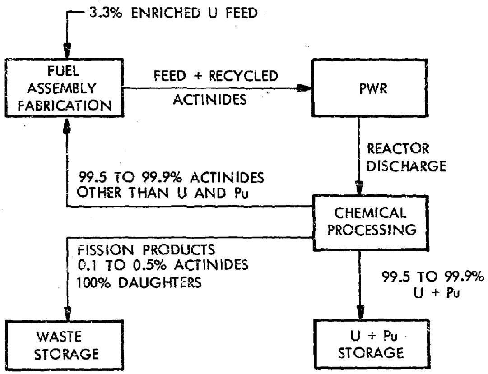
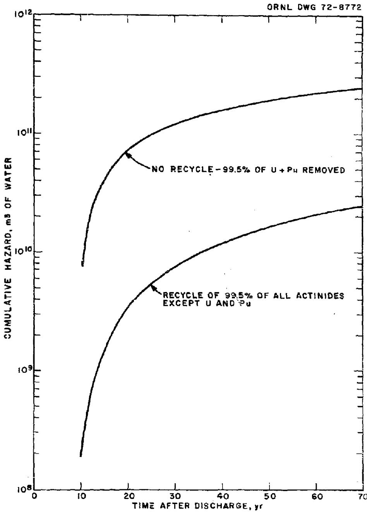
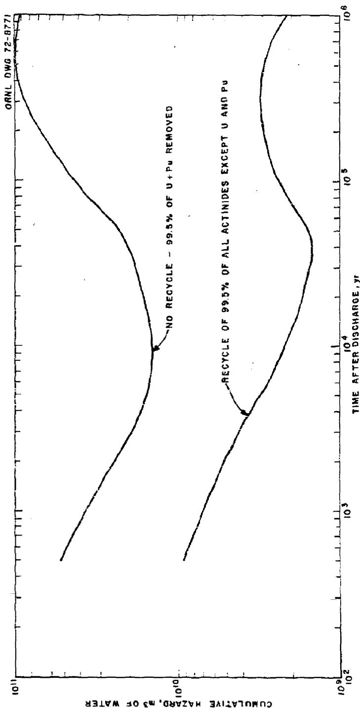
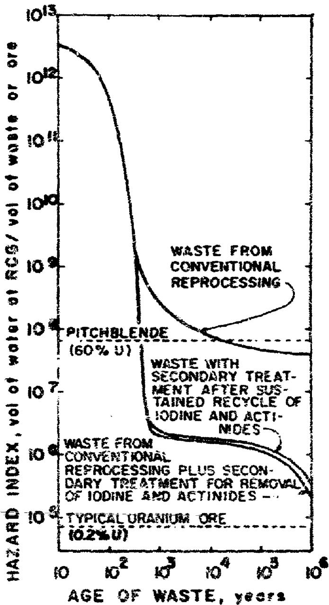
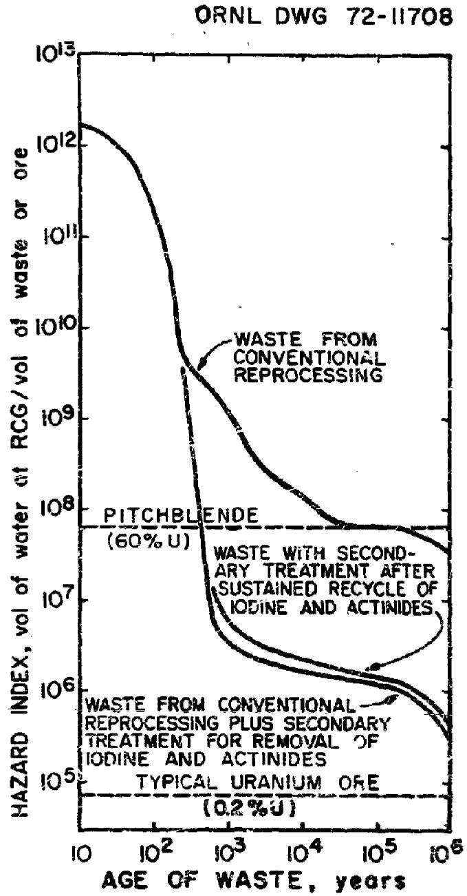

ORNL-TM-3954

Contract No. W-7405-eng-26

CHEMICAL TECHNOLOGY DIVISION

NEUTRON-INDUCED TRANSMUTATION OF HIGH-LEVEL RADIOACTIVE WASTE

H.C.Claiborne

DECEMBER 1972

# NOTICE

This report was prepared as an account of work sponsored by the United States Government, neither the United States nor the United States Atomic Energy Commission, nor any of their employees, nor any of their contractors, subcontractors, or their employees, makes any warranty, express or implied, or assumes any legal liability or responsibility for the accuracy, completeness or usefulness of any information, apparatus, product or process disclosed, or represents that its use would not infringes privately owned rights.

OAK RIDGE NATIONAL LABORATORY

Oak Ridge, Tennessee 37830

operated by

UNION CARBIDE CORPORATION

for the

U.S. ATOMIC ENERGY COMMISSION

# CONTENTS

# Page

Abstract 1

1. Introduction 2   
2. Summary 4   
3. Method for Determining the Hazard of Radioactive Waste 11   
4. Nuclear Calculational Method 13   
5. Reactor Type and Standard Conditions 15   
6. Contribution of Each Component to the Hazard of the Waste from a PWR Spent-Fuel Processing Plant 16   
7. Transmutation of Fission Product Waste 24

7.1 Maximum Burnout-to-Production Ratios for Fission Products 25   
7.2 Reactor Residence Times Required for Fission Product Burnout 26   
7.3 Application of Transmutation Schemes 28

8. Actinide Recycling in a PWR 33

8.1 Flowsheet 33   
8.2 Chemical Processing for Waste Management Simplification 35   
8.3 Effect of Recycle on Reactivity and Flux 39   
8.4 Effect of Recycling on Hazard Measure 39   
8.5 Effect of Recycling on the Hazards of Chemical Processing and Fuel Fabrication 56

9. Conclusions and Recommendations 60   
10. References 62

Appendix I: A Comparison of RCGs Calculated by Laverne (Ref. 9) with Those in the Code of Federal Regulations (Ref. 8) 65

# BLANK PAGE

Page

Appendix II: Radioactivity and Hazard Measure of Each Actinide Nuclide as a Function of Time After Discharge for the Standard Case and After the 60th Recycle 69

Appendix III: Hazard Reduction Achievable by Enhanced Removal of Actinide Elements (Ref. 19) 9

# H.C.Claiborne

# ABSTRACT

The possibility of reducing the potential hazard of high-level radioactive waste by neutron-induced transmutation has received little study. In this report the available information on fission product transmutation is reviewed and discussed, the contribution of individual actinides to the potential hazard of the waste is calculated, and expected hazard reduction factors that would result from recycle through a PwR are calculated for the actinide waste from chemical processing of spent fuel.

It is not practical to burn fission product wastes in power reactors because the neutron fluxes are too low. Developing special burner reactors with the required neutron flux of the order of $10^{17}\mathrm{n/cm}^2\cdot \mathrm{sec}$ or burning in the blankets of thermomolecular reactors is beyond the limits of current technology. It seems that ultimate storage in deep geological formations, such as bedded salt, remains the best method for fission product disposal.

When plutonium and uranium extraction efficiencies exceed $99\%$ , a significant reduction in the long-term hazard potential of the waste can be obtained by similar removal of neptunium, americium, and curium (the other actinides being very small contributors). Consequently, it seems reasonable to concentrate on developing economical chemical processes to extract these three actinides for separate storage or for recycling through the reactors that produce them.

The results of such recycling calculations show that the long-term hazard potential of the waste from light water reactors may be reduced by factors up to 200 if no more than $0.1\%$ of the actinides are discarded to the waste in each pass through the reprocessing plant. Larger reductions of the hazard potential of the waste will become practical if methods are developed to produce sharper separations between the actinides and fission products as the spent fuel is processed.

# 1. INTRODUCTION

The management of high-level, long-lived radioactive wastes associated with a highly developed nuclear power economy based on fission reactors will present a formidable problem to present and future generations. Schemes for management of these wastes that have been under serious consideration involve conversion of the aqueous wastes to solid forms with subsequent storage in man-made vaults or in deep geological formations such as bedded salt.

The possibility of ultimate disposal into deep space or the sun (the only method for complete and permanent removal from the earth) has begun to receive more consideration because of the recent and projected advances in space technology. The only other known method of ultimate disposal (in contrast to permanent storage) is to transmute or burn out (fission in the case of some of the actinides) long-lived radioactive nuclides to stable or short-lived nuclides by exposure to a neutron flux.

Studies have been made1,2 on the possibility of using special high-flux "burner reactors" to reduce the stockpile of the "problem fission products" $85_{\mathrm{Kr}}$ , $90_{\mathrm{Sr}}$ , and $137_{\mathrm{Cs}}$ . The excess neutrons from controlled thermonuclear reactors have also been suggested3,4 for use in transmutation of these fission products and the waste actinides.

Aside from the problems associated with burning fission products (which are discussed later in this report), $^{90}\mathrm{Sr}$ and $^{137}\mathrm{Cs}$ decay to completely innocuous levels in less than 1000 years, a time for which containment in appropriate geological formations can be provided with good assurance. The nuclides $^{85}\mathrm{Kr}$ and $^{3}\mathrm{H}$ with shorter half-lives are even more suitable for long-term storage in geological formations. The isotope $^{129}\mathrm{I}$ (half-life, 16 million years) is one of the exceptional fission products that has an extremely long life but is produced in such low concentrations that its hazard may possibly be reduced to appropriately low levels by isotopic dilution (i.e., by mixing with stable isotopes of the same chemical element).

In contrast, many of the actinides that are produced by transmutation of uranium and thorium in reactors have half-lives in the thousands of years, occur in large quantities, and are not suitable for isotopic dilution because stable forms of these elements do not exist. Consequently, an even stronger motive exists for completely destroying or restricting the accumulation of these alpha-emitters since predictions of the tectonics of geological formations for $10^{5}$ to $10^{6}$ years have a lower confidence level compared to those for the order of 1000 years. In present concepts of power reactors, it is planned that only 99.5 to $99.9\%$ of the uranium, plutonium, and thorium will be recycled. Consequently, it is customarily assumed that all other heavy elements (Cf, Bx, Cm, Am, Np, Pa, Ac, Ra, etc.) will be rejected as waste along with the 0.1 to $0.5\%$ of the U, Pu, and Th that goes to the waste in the present generation of spent fuel reprocessing plants.

The hazard potential of this actinide waste can be reduced by recycl- cling the actinides through the power reactors producing them; elimination occurs by fission at points in the reaction path. The primary objective of this work was to determine the extent of the reduction of the radiological hazard of the waste streams from chemical processing plants and the effect on the neutron economy of a pressurized water reactor (PwR) caused by recycling of the actinides (except for the small amounts lost in the waste streams) back through the reactors producing them. In addition, the individual contribution of each actinide to the waste hazard was determined as a function of decay time and compared with the hazard from all the waste, which includes the fission products, nuclides produced from structural materials, actinides, and all decay products.

In the following sections the bases for calculations are given and pertinent results are presented and discussed. A modified version of ORIGEN, $^{5}$ an isotope generation and depletion code, and its associated nuclear library was used in all the calculations.

The author wishes to acknowledge the many helpful suggestions and criticisms by J. P. Nichols and the careful review of this work by him, J. O. Blomeke, and M. J. Bell.

# 2. SUMMARY

It is generally impractical to appreciably change the hazard potential of fission product wastes by transmitting these wastes with neutrons in nuclear reactors. Developing special burner reactors with the required neutron flux of the order of $10^{17} \, \text{n/cm}^2$ , sec or burning in the blankets of thermonuclear reactors is beyond the limits of current technology. It appears that ultimate storage in deep geological formations is the best method for fission product disposal since less than 1000 years are required to reduce their radioactivity to an innocuous level, a time span for which tectonic stability can be essentially assured in formations such as bedded salt.

In contrast to the fission products, many of the actinides in the waste from spent-fuel processing have half-lives of thousands of years and are not suitable for isotopic dilution. Consequently, a stronger motive exists to find an alternative method of restricting the accumulation of these alpha emitters since the tectonics of geological formations cannot be predicted with as high a confidence level for the longer periods that are required for their decay to innocuous levels.

The determination of the extent of the reduction of the radiological hazard of the waste streams from chemical processing plants and the effect on the neutron economy of a PWR caused by recycling of the actinides was the primary objective of this study.

The relative importance of the contribution that the various components make to the hazard measure (the total water required to dilute each nuclide of a mixture to its $\mathsf{RCG}^{\star}$ ) of the waste from a PWR spent-fuel processing plant is shown in Table 1. Beyond about 400 years, the actinides and their daughters dominate from a hazard viewpoint. When RCGs are used that are less conservative $^{6,9}$ than the recommended default values of the Code of Federal Regulations, the importance of the actinides diminish somewhat for decay times greater than 10 $^{4}$ years.

The actinide waste hazard is controlled by the americium and curium up to 10 $^{4}$ years. At longer decay times the long-lived $^{237}\mathrm{Np}$ and its

Radiation Concentration Guide value, which was formerly called MPC.

Table 1. Relative Contribution of Actinides and Their Daughters to the Hazard Measure of the Waste and of Each Actinide and Its Daughters to Actinide Waste with $99.5\%$ of U + Pu Extracted   

<table><tr><td rowspan="2">Nuclides to Waste</td><td colspan="5">Water Required for Dilution to the RCG2 (% of total water required for the mixture) for Decay Times (yr) of:</td></tr><tr><td>102</td><td>5 x 102</td><td>104</td><td>105</td><td>106</td></tr><tr><td colspan="6">All Components of Waste: b</td></tr><tr><td>Actinides</td><td>0.3</td><td>94</td><td>94</td><td>98</td><td>99</td></tr><tr><td>Fission Products</td><td>99+</td><td>5</td><td>6</td><td>2</td><td>1</td></tr><tr><td>Structural</td><td>0.04</td><td>1</td><td>0.2</td><td>0.03</td><td>4 x 10-4</td></tr><tr><td colspan="6">Actinide Waste: b</td></tr><tr><td>Americium</td><td>51</td><td>56</td><td>24</td><td>8</td><td>8</td></tr><tr><td>Curium</td><td>41</td><td>37</td><td>59</td><td>9</td><td>1</td></tr><tr><td>Neptunium</td><td>0.2</td><td>0.3</td><td>12</td><td>80</td><td>89</td></tr><tr><td>0.5% U + 0.5% Pu</td><td>8</td><td>7;</td><td>5</td><td>3</td><td>1</td></tr><tr><td>Other</td><td>5 x 10-3</td><td>1 x 10-3</td><td>5 x 10-2</td><td>6 x 10-3</td><td>nil</td></tr></table>

aUsing CFR RCGs and recommended default values for the unlisted nuclides. 8   
Round-off may cause column not to total 100.

daughters begin to dominate. Another important point is that the remaining actinides, namely, Ac, Th, Pa, Ek, Cf, and Es, make a negligible contribution to the hazard of the waste. The import of these results is that in any waste management system in which at least $99.5\%$ of the uranium and plutonium is extracted, a significant further reduction in the actinide waste hazard can be obtained by removal of most of the americium, curium, and neptunium from the waste. If $99.5\%$ removal of these three actinides is also effected, the uranium and plutonium become controlling and it would then be profitable (from a waste hazard viewpoint) to increase the extraction efficiency of these latter elements, particularly the plutonium.

The effect of recycling of $99.5\%$ and $99.9\%$ of the actinides other than U or Pu on the hazard measure is shown in Table 2 in terms of a hazard reduction factor as a function of postirradiation decay time. The hazard reduction factor used here is defined as the ratio of the water required for dilution of the waste to the RCG for the standard case (no removal of the actinides other than Pu + U at the indicated extraction efficiency) to that required to dilute the waste after each successive reactor irradiation cycle.

These results show that when recycling is practiced, the hazard measure of the waste is approximately proportional to the neptunium, americium, and curium sent to the waste since the hazard reduction factor is about five times greater when $0.1\%$ of the actinides is sent to the waste after each cycle than that for the $0.5\%$ case. This obtains logically because the reactor discharge composition is little affected by a change of only $0.4\%$ of recycled actinides in the feed stream. In addition the standard case is also little affected by whether $0.1\%$ or $0.5\%$ of $\mathbf{U} + \mathbf{Pu}$ is present since the americium and curium predominate at smaller decay times and neptunium after $10^{5}$ years. It follows that if $99.99\%$ removal of all actinides is effected, the hazard reduction factor for the actinide waste will increase by about a factor of 10 up to around 2000 at $10^{6}$ years. The table also shows that the hazard reduction factors decrease asymptotically with the number of recycles, which is a result of the buildup

Table 2. Effect of Recycle of Actinides Other Than U and Pu on the Hazard Measure of Waste from PWR Spent Fuel Processing   

<table><tr><td rowspan="2">Recycle No.</td><td colspan="5">Water Required for Dilution to RCG,\(^a\) Ratio of Standard to Recycle\(^b\) Case (Hazard Reduction Factor) for Decay Times (yr) of:</td></tr><tr><td>\(10^2\)</td><td>\(10^3\)</td><td>\(10^4\)</td><td>\(10^5\)</td><td>\(10^6\)</td></tr><tr><td colspan="6">Actinide Extraction Efficiency, 99.5%:</td></tr><tr><td>0</td><td>12</td><td>15</td><td>18</td><td>28</td><td>52</td></tr><tr><td>1</td><td>9.3</td><td>12</td><td>13</td><td>20</td><td>46</td></tr><tr><td>2</td><td>8.2</td><td>10</td><td>11</td><td>18</td><td>44</td></tr><tr><td>3</td><td>7.6</td><td>8.4</td><td>9.3</td><td>17</td><td>43</td></tr><tr><td>4</td><td>7.2</td><td>7.4</td><td>8.3</td><td>17</td><td>42</td></tr><tr><td>5</td><td>6.8</td><td>6.5</td><td>7.5</td><td>17</td><td>42</td></tr><tr><td>10</td><td>5.8</td><td>4.7</td><td>5.8</td><td>17</td><td>42</td></tr><tr><td>20</td><td>5.1</td><td>3.8</td><td>4.9</td><td>17</td><td>42</td></tr><tr><td>30</td><td>5.0</td><td>3.6</td><td>4.6</td><td>17</td><td>42</td></tr><tr><td colspan="6">Actinide Extraction Efficiency, 99.9%</td></tr><tr><td>0</td><td>58</td><td>73</td><td>89</td><td>137</td><td>256</td></tr><tr><td>1</td><td>44</td><td>59</td><td>64</td><td>96</td><td>224</td></tr><tr><td>2</td><td>38</td><td>48</td><td>52</td><td>87</td><td>213</td></tr><tr><td>3</td><td>36</td><td>40</td><td>44</td><td>84</td><td>210</td></tr><tr><td>4</td><td>33</td><td>35</td><td>39</td><td>83</td><td>209</td></tr><tr><td>5</td><td>32</td><td>31</td><td>36</td><td>83</td><td>208</td></tr><tr><td>10</td><td>27</td><td>22</td><td>27</td><td>83</td><td>207</td></tr><tr><td>20</td><td>-</td><td>18</td><td>22</td><td>82</td><td>206</td></tr><tr><td>30</td><td>-</td><td>17</td><td>21</td><td>82</td><td>206</td></tr></table>

aUsing CFR RCGs and recommended default values for the unlisted nuclides.   
Chemical processing assumed at 150 days after reactor discharge; one cycle represents 3 years of reactor operation.

of the higher transuranics, and that effective equilibrium is attained in 20 cycles more or less, depending on the decay time.

When the RCGs used by Bell and those calculated by LaVerne are used in place of the recommended default values for the unlisted nuclides in the Code of Federal Regulations, the hazard reduction factors become 6.5 and 10 respectively. The corresponding values for $99.9\%$ extraction of the actinides are 28 and 49. Although the RCGs calculated by LaVerne are more realistic than the more conservative recommended default values, the Code of Federal Regulations must be followed in nuclear reactor design and operation.

Recycling of the actinides and achieving a $99.9\%$ extraction efficiency reduce the hazard measure of the actinides at equilibrium to the same order as that of the long-lived fission products $(^{129}\mathrm{I}, 93\mathrm{Zr}, 93\mathrm{m}_{\mathrm{Nb}}, 99\mathrm{Tc},$ and $^{135}\mathrm{Cs})$ for the longer decay times, the hazard measure of the actinides being about twice that of the long-lived fission products at 1000 years and dropping to about one-half of the fission product value at $10^6$ years. However, if $^{129}\mathrm{I}$ is eliminated as a hazard by isctopic dilution (or separate storage), the actinides would continue to control the total waste hazard potential. An actinide extraction efficiency of $99.9994\%$ along with the recycling is required before the hazard measure of the total waste hazard potential is controlled by the long-lived fission products other than $^{129}\mathrm{I}$ . At some point, however, further extraction of actinides from the waste will become senseless because the waste will then have a long-term hazard potential that is less than that of naturally occurring formations of uranium and thorium. (See, for example, the arguments presented in ref. 6.)

The decrease in the average material neutron multiplication for a typical PWR containing recycled actinides was only $0.8\%$ . This loss of reactivity can be compensated by increasing the fissile enrichment of the reactor by only about $2\%$ (e.g., from 3.3 to $3.4\%$ enrichment in a typical PWR).

Recycling of reactor actinide waste will increase the radiation problem associated with chemical processing and fuel fabrication because

of the increased radioactivity of the reactor feed and discharge streams. After a few recycles, $^{252}$ Cr builds up to be the greatest source of neutrons and reaches $10^{12}$ neutrons/sec per metric ton of spent fuel at 150 days after discharge. A reduction of a factor of 300 is possible if the californium is removed. This can be accomplished by not recycling Cr even though there is an increase in the Cr production with curium buildup. Significant $^{252}$ Cr buildup occurs from successive neutron captures starting with $^{249}$ Cr and $^{250}$ Cr, whose precursors are $^{249}$ Ek and $^{250}$ Ek.

Recycling of actinides through a reactor aids to the inventory of hazardous materials but will probably have no measurable effect on the potential severity of design basis accidents. The hazard measure of the actinide waste based on ingestion was increased by only $12\%$ after 60 recycles. The total is about one-tenth of that for the fission products. If the hazard measure is based on inhalation, recycling increases the potential hazard by a factor of 2 at discharge with the average in the reactor being significantly higher. The actinides have an inhalation hazard measure of a factor of 7 higher than the fission products at discharge. The above statements assume that the reconcentration factors in the environment are approximately the same for actinides and fission products. Present information, however, indicates that certain fission products (e.g., Sr and I) are reconcentrated to a greater extent in the environment. This has the effect of causing the fission products to be the dominant source of both ingestion and inhalation hazard during reactor operation. The actinide concentration in a reactor, however, is not significant in analyzing the "maximum credible accident" (MCA) since the actinide compounds cannot be significantly dispersed into the atmosphere by any credible reactor accident. Transmutation of fission products in burner reactors would, of course, add to the potential hazard of the MCA because the volatile fission products are controlling in an accident analysis.

Recycle of actinides in the LIFBRs should produce even higher hazard reduction factors since the average fission-to-capture ratio of the actinides should be higher in a fast reactor than in a thermal one. The author has found it difficult to quantify this effect because of the current paucity of neutron cross-section data for the higher actinides in fast spectra. Fast cross-section data for the higher actinides should be developed so that recycling studies can be made for the LIFBRs.

It also appears that recycling of the actinides is particularly suited for a fluid fuel reactor such as the HSR. A processing scheme has been visualized that recycles essentially all the uranium, neptunium, thorium, and most of the other actinides. Considerably less americium and curium are produced compared to a PIR, which considerably simplifies the waste disposal problem. In addition, being a fluid fuel reactor, the problems arising from fabrication and handling of heavy neutron-emitting fuel elements are eliminated.

# 3. METHOD FOR DETERMINING THE HAZARD OF RADIOACTIVE WASTE

In comparing the potential hazard from different mixtures of radioactive materials, a standard method is required for determining a specific value for each mixture that is a reflection of its biological hazard. The specific activity alone is insufficient since biological factors are not included.

The controlling consideration of hazard from the viewpoint of long-term storage or disposal of radioactive materials is the danger of their dissolution or dispersal in underground water with subsequent ingestion by human beings. Consequently, a good measure of the ingestion hazard associated with a mixture of radionuclides of widely varying activities is the quantity of water required to dilute the radioactive mixture to a concentration low enough to permit unrestricted use of the water; the larger the amount of water required, the greater the potential hazard. The hazard measure for the mixture is determined by summing the amount of water required to dilute each individual nuclide to its Radiation Concentration Guide value (or RCG, which was formerly called MPC) for unrestricted use of water. This method, which was used in a previous work on the hazards of long-term storage of radioactive wastes, was selected for use in the study. The method has the virtue of simplicity in application and relates to the maximum value of the hazard since no consideration is given to fractionation and paths of travel to human beings. The most recent discussion of other methods of evaluating the hazard potential of radioactive waste is given by Gera and Jacobs,[7] who also propose a new hazard measure that involves both the ingestion hazard used in this study, the inhalation hazard, and the probability of being taken up by humans. Determination of these probabilities is very difficult, however, since statistical data regarding the probability of accidents and other radioactivity releases, including their consequences in all phases of radioactive waste management, are not readily available or easily estimated.

The RCs used in this study were taken from the Code of Federal Regulations, which is currently the guide for unrestricted use of

water in which these nuclides may be dissolved. For nuclides with unlisted RCGs, the recommended default values were used, namely, $3 \times 10^{-6} \mu \mathrm{Ci} / \mathrm{ml}$ for beta-decay nuclides with half-lives greater than 2 hr and $3 \times 10^{-8} \mathrm{Ci} / \mathrm{m}^{3}$ for nuclides that decay by alpha emission or spontaneous fission. These default values represent a conservative estimate of the RCGs. Some of the results in this report are also compared on the basis of the RCGs used by Bell and Dillon and those recently calculated by LaVerne for unlisted nuclides. Bell and Dillon used $6 \times 10^{-7}$ and $2 \times 10^{-6} \mathrm{Ci} / \mathrm{m}^{3}$ for $^{225} \mathrm{Ra}$ and $^{229} \mathrm{Th}$ , respectively, and unity for all other unlisted nuclides. LaVerne calculated RCGs for all the unlisted nuclides and $5 \times 10^{-7}$ and $4 \times 10^{-7} \mathrm{Ci} / \mathrm{m}^{3}$ for $^{225} \mathrm{Ra}$ and $^{229} \mathrm{Th}$ , respectively, the two nuclides that contributed to most of the differences that occurred due to the particular RCGs that were used.

# 4. NUCLEAR CALCULATIONAL METHOD

The nuclear calculations during reactor irradiation and after discharge were made with a modified version of the nuclide generation and depletion code ORIGEN. The calculation during irradiation is based on three neutron energy groups, namely, thermal, a 1/E energy distribution in the resonance region, and a fast group. The cross sections in the library had been predetermined from basic data by weighting with a typical PNR neutron energy spectrum. More details of the original code and cross-section library, which included data for actinides only up to $^{244}$ Cm, are given in refs. 10 and 11.

For calculations involving recycling of the actinides, it was necessary to expand the library to include some higher transuranics and increase the calculational scope of the ORIGEN code. Cross-section and decay data for the following nuclides were added to the PWR actinide library: $240_{\mathrm{U}}, 240_{\mathrm{Pp}}, 240_{\mathrm{Pp}}, 245_{\mathrm{Pu}}, 245_{\mathrm{Am}}, 245_{\mathrm{Cu}}, 246_{\mathrm{Cu}}, 247_{\mathrm{Cu}}, 248_{\mathrm{Cu}}, 249_{\mathrm{Cu}}, 250_{\mathrm{Cu}}, 249_{\mathrm{Bk}}, 250_{\mathrm{Bk}}, 249_{\mathrm{Cr}}, 250_{\mathrm{Cr}}, 251_{\mathrm{Cr}}, 252_{\mathrm{Cr}}, 253_{\mathrm{Cr}}, 254_{\mathrm{Cr}}, 253_{\mathrm{Ss}}$ . Actinides higher than einsteinium were not expected to have a significant effect because they all decay ( $\alpha$ -decay, along with a little spontaneous fission) with short half-lives, thus preventing buildup of the nuclides beyond $253_{\mathrm{Ss}}$ . The calculations confirmed this expectation. The decay method and neutron interaction probabilities are such that no significant amounts of the actinides can be removed from the reaction-decay chain except by fission. Cross sections and decay constants for the transuranic elements that were added to the library were taken from ref. 12.

A calculation of the material multiplication constant or $k_{\infty}$ was added to the code since it was necessary to know the effect of actinide recycle on the reactivity. Although the $k_{\infty}$ calculation ignores core leakage and control rods or other control poisons, the results, which would not be adequate for the core physics, seem adequate for relative comparisons. Neutron yields per fission as a function of energy were taken from the ENDF/B-II data file13 for most of the fissile nuclides. For those not included in that file, the neutron yields were taken or inferred from the publications by Gordeeve and Squirenkin,14 Hopkins

and Diven, $^{15}$ and Clark. $^{16}$ The effective neutron yield from fission of each nuclide by resonance energy neutrons was obtained by weighting the energy dependent yields with a 1/E neutron flux. For fast fissions, the fission spectrum was used as the weighting function.

Other code changes include a recycle option for any number of actinides, an ability to specify removal of any number of actinides after an arbitrary decay time subsequent to reactor discharge for recycling or further decay of the remaining materials, and an ability to account for the fissions of all the fissionable materials.

# 5. REACTOR TYPE AND STANDARD CONDITIONS

The reactor selected for this study was the Diablo Canyon, which is typical of a PWR design. When operating at equilibrium, the fuel is $3.3\%$ enriched uranium with a burnup of 33,000 MW/d/metric ton of uranium. It was assumed that this burnup was obtained by continuous operation at a specific power of 30 MW/d/metric ton over a three-year period. For the usually assumed plant factor of 0.8, intermittent operation at a specific power of 38 MW/d/metric ton for $80\%$ of the time would produce the same burnup. Since (for the time periods involved), the waste hazard measure resulting from a particular burnup is not a sensitive function of any reasonable operation schedule, it was deemed unnecessary to complicate the calculations and analysis by considering a particular operation schedule.

The fuel region is divided into three zones with each one containing about an equal weight of fuel (approximately 28.3 metric tons of uranium). The central zone is discharged yearly and the remaining fuel shuffled inward with the outer zone being recharged with fresh fuel.

In the calculations it was necessary to ignore control rods and to assume that the neutron flux was uniform throughout a region, and that the regions were neutronically uncoupled. A calculation cycle comprised three years of irradiation time between charge and discharge of a zone. This procedure gives the correct values (within the accuracy of the assumptions) for the discharge composition after the irradiation cycle. The average composition, neutron flux, and $k_{\infty}$ for the entire reactor loading "any" over one-year cycles because of the yearly charge and discharge and are not explicitly given in the output of the ORIGEN code. However, these average values can be constructed easily from the output of a calculation cycle.

The "standard" for comparing the effect of actinide recycle on the actinide waste hazard measure was the waste obtained by removing a stipulated percentage of uranium and plutonium at 150 days after discharge and sending the remaining quantities to waste along with all the other actinides, and all actinide daughters generated since discharge from the reactor.

# 6. CONTRIBUTION OF EACH COMPONENT TO THE HAZARD OF THE WASTE FROM A PWR SPENT-FUEL PROCESSING PLANT

The results of the calculations presented in this section show the relative importance of the contribution that the various components make to the hazard of the waste from a PWR spent-fuel processing plant for the previously described standard conditions and $99.5\%$ recovery of uranium and plutonium; i.e., $0.5\%$ of U and Pu and $100\%$ of all other components are discharged as waste and stored some place after suitable processing.

Table 3 shows the percentage contribution of the actinides (including their decay products) to the total hazard measure (water required for dilution of the content of one metric ton to the RCG for the mixture) of the waste as determined with three different sets of RCGs and the effect of removing $\frac{129}{I}$ from the waste. Beyond about 400 years, the actinides and their daughters dominate from a hazard measure viewpoint and show no significant effect up to about $\frac{10}{4}$ years due to the different sets of RCGs. At greater times, the relative importance of the actinides diminishes somewhat when the RCGs of ref. 6 or ref. 9 (see Appendix I) are used for the unlisted nuclides in place of the recommended default values in the Federal Code of Regulations. Most of this difference can be attributed to the difference in RCGs for the nuclides of the $\frac{233}{U}$ decay chain (4n+1 series), particularly those for $\frac{229}{\mathrm{Tn}}$ and $\frac{225}{\mathrm{Ra}}$ .

The remaining contribution to the hazard measure is almost all (structural elements are not important) from fission products with $129\%$ supplying $88\%$ of this total at $10^3$ years and rising to $98.4\%$ at $10^6$ years. Essentially all of the remaining fission product hazard for the longer times is contributed by the $93\mathrm{Zr}$ , $93\mathrm{Mn}$ , $99\mathrm{Tc}$ , and $135\mathrm{Cs}$ .

The relative contributions of each actinide and its daughter to the total hazard measure resulting from the mixture of the actinides and their daughters are given in Table 4, which shows that up to $10^{4}$ years the actinide waste hazard is mostly controlled by the americium and curium with no significant differences resulting from the different RCGs. At much greater decay times, the long-lived $^{237}\mathrm{Mn}$ (2.1 x $10^{6}$ year

Table 3. Relative Contribution of Actinides and Their Daughters to the Total Waste from PWR Spent-Fuel Processing   

<table><tr><td rowspan="2"></td><td colspan="7">Contribution of Actinides and Their Daughters (%) at Decay Times (years) of:</td></tr><tr><td>102</td><td>5 x 102</td><td>103</td><td>104</td><td>105</td><td>5 x 105</td><td>106</td></tr><tr><td colspan="8">Using CFR RCGs and Recommended Default Values for Unlisted Nuclides:</td></tr><tr><td>129I present</td><td>0.34</td><td>94.3</td><td>97.5</td><td>93.8</td><td>97.8</td><td>99.2</td><td>99.1</td></tr><tr><td>129I removed</td><td>0.34</td><td>96.7</td><td>99.6</td><td>99.1</td><td>99.8</td><td>99.9+</td><td>99.9+</td></tr><tr><td colspan="8">Using CFR RCGs and Values from Ref. 6 for Unlisted Nuclides:</td></tr><tr><td>129I present</td><td>0.34</td><td>94.3</td><td>97.5</td><td>92.5</td><td>69.3</td><td>70.8</td><td>61.6</td></tr><tr><td>129I removed</td><td>0.34</td><td>96.7</td><td>99.6</td><td>98.8</td><td>95.7</td><td>98.4</td><td>99.0</td></tr><tr><td colspan="8">Using CFR RCGs and Values from Ref. 9 for Unlisted Nuclides:</td></tr><tr><td>129I present</td><td>0.34</td><td>94.3</td><td>97.5</td><td>92.6</td><td>72.9</td><td>78.4</td><td>73.8</td></tr><tr><td>129I removed</td><td>0.34</td><td>96.7</td><td>99.6</td><td>98.9</td><td>96.4</td><td>98.9</td><td>99.4</td></tr></table>

Table 4. Relative Contribution of Each Actinide and Its Daughters to the Hazard Measure of the Actinide Waste from PWR Spent-Fuel Processing   

<table><tr><td rowspan="2">Nuclides to Waste</td><td colspan="7">Water Required for Dilution to the RCG (% of Total Water Required for Actinide Mixture) at Decay Times (years) of:</td></tr><tr><td>\( 10^2 \)</td><td>\( 5 \times 10^2 \)</td><td>\( 10^3 \)</td><td>\( 10^4 \)</td><td>\( 10^5 \)</td><td>\( 5 \times 10^5 \)</td><td>\( 10^6 \)</td></tr><tr><td colspan="8">Using CFR RCGs and Recommended Default Values for Unlisted Nuclides (Ref. 8):</td></tr><tr><td>Americium</td><td>50.9</td><td>56.1</td><td>44.2</td><td>24.0</td><td>8.2</td><td>8.2</td><td>8.3</td></tr><tr><td>Curium</td><td>41.2</td><td>36.6</td><td>49.3</td><td>58.7</td><td>8.6</td><td>2.8</td><td>1.0</td></tr><tr><td>Neptunium</td><td>0.15</td><td>0.30</td><td>0.48</td><td>12.3</td><td>80.0</td><td>87.3</td><td>89.3</td></tr><tr><td>0.5% U + 0.5% Pu</td><td>7.7</td><td>7.2</td><td>6.1</td><td>4.9</td><td>3.1</td><td>1.7</td><td>1.4</td></tr><tr><td>Other</td><td>\( 4.7 \times 10^{-3} \)</td><td>\( 1.0 \times 10^{-3} \)</td><td>\( 1.6 \times 10^{-2} \)</td><td>\( 5.2 \times 10^{-2} \)</td><td>\( 5.5 \times 10^{-3} \)</td><td>nil</td><td>nil</td></tr><tr><td colspan="8">Using CFR RCGs and Values from Ref. 6 for Unlisted Nuclides:</td></tr><tr><td>Americium</td><td>50.9</td><td>56.1</td><td>44.2</td><td>27.2</td><td>10.8</td><td>6.2</td><td>7.1</td></tr><tr><td>Curium</td><td>41.2</td><td>36.6</td><td>49.3</td><td>66.5</td><td>52.0</td><td>36.4</td><td>14.9</td></tr><tr><td>Neptunium</td><td>0.15</td><td>0.30</td><td>0.43</td><td>1.4</td><td>22.5</td><td>45.1</td><td>67.1</td></tr><tr><td>0.5% U + 0.5% Pu</td><td>7.7</td><td>7.2</td><td>6.1</td><td>4.9</td><td>14.8</td><td>12.5</td><td>10.9</td></tr><tr><td colspan="8">Using CFR RCGs and Values from Ref. 9 for Unlisted Nuclides:</td></tr><tr><td>Americium</td><td>50.9</td><td>56.1</td><td>44.2</td><td>27.0</td><td>10.6</td><td>6.9</td><td>7.6</td></tr><tr><td>Curium</td><td>41.2</td><td>36.6</td><td>49.3</td><td>66.3</td><td>43.6</td><td>24.4</td><td>8.6</td></tr><tr><td>Neptunium</td><td>0.15</td><td>0.30</td><td>0.43</td><td>1.8</td><td>33.1</td><td>60.0</td><td>77.1</td></tr><tr><td>0.5% U + 0.5% Pu</td><td>7.7</td><td>7.2</td><td>6.1</td><td>4.9</td><td>12.6</td><td>8.7</td><td>6.7</td></tr></table>

half-life) and its daughters begin to dominate. Another important point is that the remaining actinides along with their daughters, namely, Ac, Th, Pa, Bk, Cf, and Es, make a negligible contribution to the waste hazard. The contribution of uranium to the hazard of the U + Fu mixture alone varied from negligible to a maximum of $25\%$ at $10^{6}$ years. The import of these results is that in any waste management system in which at least $99.5\%$ of the uranium and plutonium is extracted, a significant reduction in the actinide waste hazard can only be obtained by removal of most of the americium, curium, and neptunium from the waste. If $99.5\%$ removal of these three actinides is also effected, the uranium and plutonium become controlling and it would then pay (from a waste hazard viewpoint) to increase the extraction efficiency of these latter elements, particularly the plutonium.

The absolute values of the contribution of each component to the hazard measure in cubic meters of water per metric ton of fuel are shown in Table 5. To put these values in perspective, consider the required $2.3 \times 10^{10} \mathrm{~m}^3/$ metric ton for dilution of all the nuclides to the RCG after decaying 100 years. This volume of water is approximately equal to the yearly flow of the Mississippi River into the Gulf of Mexico. Note that the last two rows in Table 5 are based on the RCGs given in refs. 6 and 9, respectively, for nuclides unlisted in the Code of Federal Regulations, which (for beyond $10^4$ years) results in an increasingly smaller hazard measure that is about a factor of 67 and 37 lower, respectively, at $10^6$ years.

The apparent large quantity of water required for dilution to the RCG for just one ton of fuel tends to magnify the potential hazard. No reasonable scenario can be constructed that visualizes rapid mixing or dissolution of waste that has been processed into a very slightly soluble form. The ingestion hazard measure refers to potential long-term solutioning. However, consideration of such quantities of water does present one argument for decreasing the quantity of actinides for ultimate disposal by recycling the actinides back through the power reactors producing them. On the other hand, Bell and Dillon (using their RCGs) point out that, after aging 1000 years, the actinide hazard measure of waste stored

Table 5. Contribution of Each Actinide and Its Daughters to the Hazard Measure of the Waste from PWR Spent-Fuel Processing with $99.5\%$ Extraction of U + Pu   

<table><tr><td rowspan="2">Nuclides to Waste</td><td colspan="7">Water Required for Dilution to the RCOa (m3/metric ton of fuel) at Decay Times of:</td></tr><tr><td>102</td><td>5 x 102</td><td>103</td><td>104</td><td>105</td><td>5 x 105</td><td>106</td></tr><tr><td>Americium</td><td>3.93 x 107</td><td>2.22 x 107</td><td>1.21 x 107</td><td>2.53 x 106</td><td>2.53 x 106</td><td>5.91 x 106</td><td>5.67 x 106</td></tr><tr><td>Curium</td><td>3.18 x 107</td><td>1.45 x 107</td><td>1.35 x 107</td><td>6.18 x 106</td><td>2.66 x 106</td><td>2.02 x 106</td><td>6.95 x 105</td></tr><tr><td>Neptunium</td><td>1.17 x 105</td><td>1.20 x 105</td><td>1.32 x 105</td><td>1.30 x 106</td><td>2.48 x 107</td><td>6.31 x 107</td><td>6.12 x 107</td></tr><tr><td>0.5% U + 0.5% Pu</td><td>5.92 x 106</td><td>2.85 x 106</td><td>1.66 x 106</td><td>5.12 x 105</td><td>9.56 x 105</td><td>1.26 x 105</td><td>9.75 x 105</td></tr><tr><td>Ac, Th, and Pa</td><td>3.37 x 103</td><td>3.92 x 103</td><td>4.35 x 103</td><td>5.48 x 103</td><td>1.70 x 103</td><td>4.85 x 101</td><td>2.15</td></tr><tr><td>Bk, Cr, and Es</td><td>2.95 x 102</td><td>1.43 x 102</td><td>6.55 x 101</td><td>7.27</td><td>1.04 x 10-1</td><td>2.66 x 10-1</td><td>2.58 x 10-1</td></tr><tr><td>Total Actinides</td><td>7.72 x 107</td><td>3.96 x 107</td><td>2.74 x 107</td><td>1.05 x 107</td><td>3.10 x 107</td><td>7.23 x 107</td><td>6.85 x 107</td></tr><tr><td>Structural Materials</td><td>8.88 x 106</td><td>4.55 x 105</td><td>2.96 x 104</td><td>1.81 x 104</td><td>8.51 x 103</td><td>5.74 x 102</td><td>2.50 x 102</td></tr><tr><td>Fission Products</td><td>2.29 x 1010</td><td>1.97 x 106</td><td>7.07 x 105</td><td>7.04 x 105</td><td>6.84 x 105</td><td>6.35 x 105</td><td>6.10 x 105</td></tr><tr><td>Total - All Nuclides</td><td>2.30 x 1010</td><td>4.20 x 107</td><td>2.81 x 107</td><td>1.13 x 107</td><td>3.17 x 107</td><td>7.29 x 107</td><td>6.91 x 107</td></tr><tr><td>Total Actinidesb</td><td>7.72 x 107</td><td>3.96 x 107</td><td>2.74 x 107</td><td>8.95 x 106</td><td>1.56 x 106</td><td>1.54 x 106</td><td>9.86 x 105</td></tr><tr><td>Total Actinidesc</td><td>7.72 x 107</td><td>3.96 x 107</td><td>2.74 x 107</td><td>8.99 x 106</td><td>1.86 x 106</td><td>2.30 x 106</td><td>1.72 x 106</td></tr></table>

RCGs (with the exception given in notes b and c) were taken from ref. 8 with the recommended default values used for unlisted nuclides.   
$^{\mathrm{b}}$ RCGs of ref. 6 were used in place of recommended default values.   
$^{\mathrm{c}}$ RCGs of ref. 9 were used in place of recommended default values.

in bedded salt is smaller than the ingestion hazard associated with a quantity of uranium ore and tailings equal to the amount of salt and shale associated with the waste from one metric ton of fuel from a P&R. Furthermore, they show that if the salt bed is dissolved some thousands of years in the future with sufficient water to dilute the radionuclide to their PCBs, the water would be unacceptable as potable water because of its sodium chloride content rather than its radioactivity.

All of this discussion indicates a need for standardizing the values for the RCGs that are not listed, particularly those in the $^{233}\mathrm{U}$ decay chain (4n+1 series), so that a better evaluation of the hazards of very long-term storage can be made.

Table 6 gives the activity in curies per metric ton of fuel in the waste stream for each actinide and its daughters.

Table 7 shows the effect of neglecting the actinides higher than $244\text{cm}$ on the hazard measure of the waste. When the higher actinides are included, the hazard measure of the waste increases slowly up to a maximum factor of near 3 at a little over $10^{4}$ years compared to that obtained when they are neglected. Note, however, there is very little difference in the values for the activity measured in curies.

Table 6. Contribution of Each Actinide and Its Daughters to the Radioactivity of the Waste From PWR Spent-Fuel Processing with 99.5% Extraction of U - Fu   

<table><tr><td rowspan="2">Nuclides to Waste</td><td colspan="7">Radiocatalivity (Ci/metric ton of fuel) at Decay Times (years) of:</td></tr><tr><td>102</td><td>5 x 102</td><td>10-1</td><td>104</td><td>106</td><td>5 x 105</td><td>106</td></tr><tr><td>Americium</td><td>1.75 x 102</td><td>1.05 x 102</td><td>6.41 x 103</td><td>1.72 x 101</td><td>6.36 x 10-1</td><td>2.86 x 10-1</td><td>2.46 x 10-1</td></tr><tr><td>Curium</td><td>1.10 x 102</td><td>9.42</td><td>7.16</td><td>2.96</td><td>2.14 x 10-1</td><td>1.45 x 10-1</td><td>4.60 x 10-2</td></tr><tr><td>Neptunium</td><td>6.80 x 10-1</td><td>6.81 x 10-1</td><td>6.82 x 10-1</td><td>7.31 x 10-1</td><td>1.62</td><td>3.01</td><td>3.05</td></tr><tr><td>0.5% U + 0.5% Pu</td><td>3.02 x 101</td><td>1.23 x 101</td><td>7.39</td><td>2.11</td><td>1.78 x 10-1</td><td>8.64 x 10-2</td><td>6.32 x 10-2</td></tr><tr><td>Ac, Th, and Pa</td><td>2.42 x 10-4</td><td>2.76 x 10-4</td><td>3.03 x 10-4</td><td>3.69 x 10-4</td><td>1.15 x 10-4</td><td>3.22 x 10-6</td><td>1.37 x 10-7</td></tr><tr><td>Bk, Cr, and Es</td><td>8.90 x 10-6</td><td>4.63 x 10-6</td><td>2.52 x 10-6</td><td>6.04 x 10-7</td><td>9.09 x 10-9</td><td>1.53 x 10-9</td><td>1.42 x 10-8</td></tr><tr><td>Total Actinides</td><td>3.16 x 102</td><td>1.27 x 102</td><td>7.93 x 101</td><td>2.30 x 101</td><td>2.69</td><td>3.53</td><td>3.23</td></tr><tr><td>Structural Materials</td><td>2.70 x 102</td><td>1.71 x 101</td><td>4.37</td><td>3.76</td><td>1.83</td><td>2.18 x 10-1</td><td>1.32 x 10-1</td></tr><tr><td>Fission Products</td><td>3.46 x 104</td><td>4.48 x 101</td><td>2.09 x 101</td><td>2.00 x 101</td><td>1.93 x 101</td><td>6.25</td><td>3.29</td></tr><tr><td>Total - All Nuclides</td><td>3.52 x 104</td><td>1.89 x 102</td><td>1.06 x 102</td><td>4.68 x 101</td><td>1.98 x 101</td><td>1.00 x 101</td><td>6.65</td></tr></table>

Table 7. Effect of Neglecting Some Actinide Nuclides and Their Daughters on Hazard Measure of Waste from P/R Spent-Fuel Processing with $99.5\%$ Extraction of U + Pu   

<table><tr><td rowspan="2">Conditions</td><td colspan="7">Hazard Measure or Radioactivity at Decay Times (years) of:</td></tr><tr><td>10</td><td>\( 10^2 \)</td><td>\( 10^3 \)</td><td>\( 10^4 \)</td><td>\( 5 \times 10^4 \)</td><td>\( 10^5 \)</td><td>\( 10^6 \)</td></tr><tr><td colspan="8">Water Required for Dilution to the \( RCO^a \)(m3/metric ton of fuel)</td></tr><tr><td>\( Cut-off at ^{244}cm \)</td><td>\( 3.19 \times 10^8 \)</td><td>\( 6.27 \times 10^7 \)</td><td>\( 1.50 \times 10^7 \)</td><td>\( 3.58 \times 10^6 \)</td><td>\( 1.45 \times 10^6 \)</td><td>\( 1.55 \times 10^6 \)</td><td>\( 9.83 \times 10^5 \)</td></tr><tr><td>\( Includes beyond ^{244}cm \)</td><td>\( 3.36 \times 10^8 \)</td><td>\( 7.72 \times 10^7 \)</td><td>\( 2.74 \times 10^7 \)</td><td>\( 8.96 \times 10^6 \)</td><td>\( 1.74 \times 10^6 \)</td><td>\( 1.56 \times 10^6 \)</td><td>\( 9.86 \times 10^5 \)</td></tr><tr><td colspan="8">Radioactivity (Ci/metric ton of fuel)</td></tr><tr><td>\( Cut-off at ^{244}cm \)</td><td>\( 2.39 \times 10^3 \)</td><td>\( 3.13 \times 10^2 \)</td><td>\( 7.79 \times 10^1 \)</td><td>\( 2.24 \times 10^1 \)</td><td>4.15</td><td>2.64</td><td>3.52</td></tr><tr><td>\( Includes beyond ^{244}cm \)</td><td>\( 2.41 \times 10^3 \)</td><td>\( 3.16 \times 10^2 \)</td><td>\( 7.93 \times 10^1 \)</td><td>\( 2.30 \times 10^1 \)</td><td>4.19</td><td>2.65</td><td>3.23</td></tr></table>

aThe RCGs listed in ref. 6 were used in place of the recommended default values given in ref. 8.

# 7. TRANSMUTATION OF FISSION PRODUCT WASTE

As previously mentioned, the concept of burning the "problem fission products" 85 Kr, 90 Sr, and 137 Cs in nuclear reactors has been studied by Steinberg and co-workers. In this section, their work is discussed briefly along with the suggested use of controlled thermonuclear reactors.

The problem fission products cannot be eliminated by any system of fission power reactors operating in either a stagnant or expanding nuclear power economy since the production rate exceeds the elimination rate by burnout and decay. Only at equilibrium will the production and removal rates be equal, a condition that is never attained in power reactors. Equilibrium can be obtained, however, for a system that includes the stockpile of fission products as part of the system inventory since the stockpile will grow until its decay rate equals the net production rate of the system. For the projected nuclear power economy, however, this will require a very large stockpile with its associated potential for release of large quantities of hazardous radioisotopes to the environment. It is this stockpile that must be greatly reduced or eliminated from the biosphere. A method suggested by Steinberg et al. is transmutation in "burner reactors," which are designed to maximize neutron absorption in separated fission products charged to a reactor. If sufficient numbers of these burners are used, the fission product inventory of a nuclear power system can then reach equilibrium and be maintained at an irreducible minimum, which is the quantity contained in the reactors, the chemical processing plants, the transportation system, and in some industrial plants.

Burning fission products in the blanket of a fusion reactor with the excess neutrons that are produced is, in theory, an excellent method since no fission products would be produced. Considerable tritium will be produced, of course, but this presents a much less severe disposal problem.

Obviously the use of burner reactors or fusion reactors in the system will increase the cost of nuclear power and reduce potential breeding capacity but transmutation is certainly one of two known methods (the other being disposal in space) of eliminating most of these hazardous materials with no possibility of return to the biosphere.

# 7.1 Maximum Burnout-to-Production Ratios for Fission Products

If the assumption is made that burner reactors are a desirable adjunct to a nuclear economy, what are the design requirements and limitations? It is obvious that they must maximize (with due regard to economics) the ratio of burnout of a particular fission product to its production rate in fission reactors, and the neutron flux must be high enough to cause a significant decrease in its effective half-life. Of the fission types, the breeder reactor has the most efficient neutron economy and in principle would make the most efficient burner if all or part of the fertile material can be replaced by a Sr-Cs mixture without causing chemical processing problems or too large a perturbation in the flux spectrum because of the different characteristics of these fission products. The cost accounting in such a system would set the value of neutrons absorbed in the fission product feed at an accounting cost equal to the value of the fuel bred from those neutrons.

The maximum possible burnout of fission products would occur when the excess neutrons per fission that would be absorbed in a fertile material are absorbed instead in the fission product feed. The largest possible burnout ratio would then be the breeding ratio (or conversion ratio for non-breeders) divided by the fission product yield. The estimated breeding ratio for the Molten Salt Breeder Reactor (MSBR), a thermal breeder, is 1.05 and for the Liquid Metal Fueled Fast Breeder Reactor (IMFER), 1.38. The yield of $^{137}\mathrm{Cs} + ^{90}\mathrm{Sr}$ is 0.12 atom/fission, but a number of other isotopes of these elements are produced which would also absorb neutrons. However, if the fission product waste is aged two years before separation of the cesium and strontium, the mixture will essentially

be composed of about $80\%$ $^{137}\mathrm{Cs} + 90\mathrm{Sr}$ and $20\%$ $^{135}\mathrm{Cs}$ (which will capture neutrons to form $^{136}\mathrm{Cs}$ that decays with a 13-day half-life); consequently the maximum burnout ratio for $^{137}\mathrm{Cs} + 90\mathrm{Sr}$ will be decreased by $20\%$ . This leads to a maximum possible burnout ratio of about 7 for the MSBR and about 9 for the LMFBR. Unfortunately, however, the neutron fluxes in these designs are well below $10^{-16}$ $\mathrm{n/cm}^2$ -sec. Any modifications of these designs to create high neutron fluxes will increase the neutron leakage and decrease the burnout ratios significantly.

# 7.2 Reactor Residence Times Required for Fission Product Burnout

Table 5 was prepared to illustrate the effect of neutron flux on the residence times (which affect recycle costs) required for burnout and decay of $99.9\%$ of the important nuclides using a burner reactor with the neutron spectrum similar to that of a typical light water power reactor. It is apparent that the efficiency of burnout increases with increases in neutron flux, cross sections, and half-life. With the exception of ${}^{129}\mathrm{I}$ , which is not nearly as large a problem as the others and can probably be essentially disposed of by isotopic dilution, the times shown in Table 8 indicate that neutron flux levels are required which are much higher than those that have been attained in present nuclear reactors ( $\sim 5 \times 10^{15}$ ) and that fluxes near $10^{17} \mathrm{n/cm}^2$ -sec are probably necessary before serious consideration could be given to burner reactors.

In a conceptual design study by Steinberg et al., it was concluded that the quantities of $137\text{Cs}$ , $90\text{Sr}$ , and $85\text{Kr}$ scheduled for permanent storage in the projected nuclear economy could be reduced by a factor of 1000 by burner reactors operating with neutron fluxes up to $10^{16}\text{n/cm}^2$ . For added costs of 0.63, 0.24, and 0.021 mill/kWhr(e) respectively. The estimated costs for burning out $90\text{Sr}$ and $137\text{Cs}$ in such a system, along with the probable escalation in an actual design study that includes directly the costs of transfer between plants, canning the fission products, additional chemical separations, various temporary storage facilities, and reactor residence times seem to preclude use of this method. A cost of 0.021 mill/kWhr(e) for burning $85\text{Kr}$ seems sufficiently

Table 8. Properties of Several Important Fission Product Nuclides and Time Required for $99.9\%$ Reduction of Their Inventory by Decay and Neutron Transmutation   

<table><tr><td>Nuclide</td><td>90Sr</td><td>137Cs</td><td>85Kr</td><td>3H</td><td>129I</td></tr><tr><td>Half-life, years</td><td>28.9</td><td>30.2</td><td>10.74</td><td>12.33</td><td>1.6 x 107</td></tr><tr><td>Burnout Cross Section, barnsa</td><td>1.2</td><td>0.17</td><td>1.8</td><td>nil</td><td>35</td></tr><tr><td>Curies/metric ton in Spent Fuelb</td><td>77,600</td><td>108,000</td><td>11,400</td><td>708</td><td>0.0367</td></tr><tr><td>Relative Hazard in Spent Fuelc</td><td></td><td></td><td></td><td></td><td></td></tr><tr><td>m3air at RCG/metric ton</td><td>2.6 x 1015</td><td>2.1 x 1014</td><td>3.8 x 1010</td><td>3.5 x 109</td><td>1.8 x 109</td></tr><tr><td>m3water at RCG/metric ton</td><td>2.6 x 1011</td><td>5.4 x 109</td><td>-</td><td>2.3</td><td>6.1 x 105</td></tr><tr><td>Time Required for 99.9% Decay and Burnout, yearsd</td><td></td><td></td><td></td><td></td><td></td></tr><tr><td>Decay Only</td><td>288</td><td>302</td><td>107</td><td>123</td><td>1.6 x 108</td></tr><tr><td>Φ = 1014n/cm2·sece</td><td>249</td><td>295</td><td>106</td><td>123</td><td>63.</td></tr><tr><td>Φ = 1015n/cm2·sece</td><td>112</td><td>245</td><td>98</td><td>123</td><td>5.3</td></tr><tr><td>Φ = 1016n/cm2·sece</td><td>17</td><td>91</td><td>57</td><td>123</td><td>0.63</td></tr><tr><td>Φ = 1017n/cm2·sece</td><td>1.8</td><td>12</td><td>11</td><td>123</td><td>0.06</td></tr></table>

aEffective thermal cross section in typical spectrum of a PWR having average thermal flux of 2.91 x 1013 n/cm2·sec.   
bPer metric ton of uranium charged to a PwR having average specific power of 30 Mw/metric ton and burnup of 33,000 MWd/metric ton.   
Volume of air and water potentially contaminated to RCG (ref. 8) by the content of a metric ton of spent fuel.   
dIndicated times are doubled and tripled for reduction of inventory by factors of $10^{6}$ and $10^{9}$ , respectively.   
eAverage thermal flux assuming spectrum typical of that in a PWR.

low for consideration on an economic basis but the neutron absorption cross-section of $^{85}\mathrm{Kr}$ was taken as 15 b, a value now known to be low by around an order of magnitude. Recent work by Bemis et al. $^{17}$ gives a Maxwellian-averaged thermal value of 1.66 b and a resonance integral of 1.3 b. A reevaluation of the $^{85}\mathrm{Kr}$ removal system using the lower cross section would increase the cost to an uneconomic level.

# 7.3 Application of Transmutation Schemes

Nichols and Blomeke18 have made estimates of the effect of various schemes of neutron-induced transmutation on the potential inventory of radioisotopes and costs of electric power (Table 9). The isotope90 Sr was used as an example because it is the prime contributor to the radiological hazard of spent fuel and does not require the use of isotopic separations (other than providing for decay of 89Sr - half-life 50 days) before recycle to a burner reactor. Their analysis of the use of each reactor system shown in Table 9 are given in following sections.

# 7.3.1 Pressurized Water Reactors

Rows 1 and 2 of Table 9 illustrate that the effect of recycling of $90_{\mathrm{Sr}}$ within a system of light water reactors is to cause essentially no change in the total quantity of $90_{\mathrm{Sr}}$ that is associated with the system since the rate of neutron-induced transmutation is small as compared with the rate of decay. Under current policies and plans, most of the $90_{\mathrm{Sr}}$ associated with the system would be stored at a federal waste repository. In the recycling system most of the inventory would be in reactors while the remainder ( $\sim 25\%$ of the total) would be in canals for postirradiation decay, reprocessing plants, and fuel fabrication plants.

This example illustrates a primary disadvantage of systems for recycle and neutron transmutation of fission product nuclides. These schemes have the common characteristic that larger quantities of radioactive nuclides are being actively handled and processed than if the nuclides were stored. Consequently, larger quantities of these nuclides occur in a dispersible form and are associated with potentially large sources of energy that could provide a mechanism for dispersal.

Table 9. The Inventory of $^{90}\mathrm{Sr}$ and Estimated Costs Associated with the Steady-State Production of Electric Power by Various Schemes of Transmutation   

<table><tr><td rowspan="2"></td><td colspan="3">90Sr Inventory (megacuries) per 1COO MW(e) of Capacity with Plant Factor of 0.8</td><td rowspan="2">Estimated Incremental Costa [mills/kWhr(e)]</td></tr><tr><td>In Reactors</td><td>Outside Reactors</td><td>Total</td></tr><tr><td>1. PWR - conventional operationb</td><td>3.17</td><td>88.0</td><td>91.2</td><td>0</td></tr><tr><td>2. PWR with complete 90Sr recycleb</td><td>64.6</td><td>21.5</td><td>86.1</td><td>0.1</td></tr><tr><td>3. LMFBR - conventional operationc</td><td>1.39</td><td>38.6</td><td>39.9</td><td>0</td></tr><tr><td>4. LMFBR with complete 90Sr recyclec</td><td>28.9</td><td>9.6</td><td>38.5</td><td>0.1</td></tr><tr><td>5. High Flux Isotope Reactor - conventionald</td><td>0.11</td><td>132.</td><td>132.</td><td>24</td></tr><tr><td>6. High Flux Isotope Reactor - 90Sr recycled</td><td>38.3</td><td>12.7</td><td>51.0</td><td>25</td></tr><tr><td>7. 98% of power from LMFBRs pluse</td><td>1.36</td><td>0.91</td><td>3.51</td><td>0</td></tr><tr><td>2% of power from fusion burner</td><td>0.93</td><td>0.31</td><td>3.51</td><td>0</td></tr><tr><td>8. 90% of power from LMFBRs pluse</td><td>1.54</td><td>1.03</td><td>3.23</td><td>0.8</td></tr><tr><td>10% of power from spallation</td><td>0.16</td><td>0.51</td><td>3.23</td><td>0.8</td></tr></table>

aIn excess of the typical power generation cost of approximately 7 mills/kWhr(e).   
Assumes thermal efficiency of $32.5\%$ .   
Assumes thermal efficiency of $41.7\%$ .   
Assumes thermal efficiency of $30\%$ .   
One 1000-MW(e) spallation burner reactor associated with nine 1000-MW(e) LMFBRs. The electricity generated by the burner reactor is used internally to generate a 500-MW beam of 10-BeV protons.

The additional cost of recycling $^{90}\mathrm{Sr}$ to light water power reactors was estimated roughly as 0.1 mill/kWhr(e). The primary source of this cost is an approximately $25\%$ increase in the unit cost of reprocessing and fuel fabrication. This reflects the increased separations and product handling operations that would be required at the reprocessing plants and the requirements for shielding and remote operation of the fuel fabrication plants. The estimated costs of high-level waste disposal would be decreased from about 0.05 to about 0.04 mill/kWhr(e), however.

# 7.3.2 Liquid Metal Fast Breeder Reactor

The effects of recycle of $^{90}\mathrm{Sr}$ in IMFBRs (rows 3 and 4) are essentially the same as those for a system of light water reactors. Inventories of $^{90}\mathrm{Sr}$ are lower, however, because of the lower yield of $^{90}\mathrm{Sr}$ from fission of plutonium.

# 7.3.3 High Flux Isotope Reactor

The effect of recycle of $90\mathrm{Sr}$ to a system of High Flux Isotope Reactors is shown to indicate the relative change in inventory that would result from the use of the maximum thermal neutron flux levels that are available in present reactors ( $\sim 2 \times 10^{15} \mathrm{n/cm}^2$ -sec with targets in place). Even with these high values of flux the effect of recycling is to decrease the inventory associated with the system by only about $60\%$ .

This type of reactor would not be an economical source of electric power, however, because of its small size, high refueling cost, and high neutron leakage.

# 7.3.4 Fusion Reactors

A proposal by Steiner3 involves using the excess neutrons from fusion reactors, which in theory will provide a cheap and abundant source of neutrons and has the advantage of not producing any long-lived fission products. Considerable tritium will be produced, of course, but this presents a much less severe disposal problem. Steiner

estimates, on the basis of calculated tritium breeding ratios and anticipated tritium doubling times, a neutron excess of $20\%$ and a thermal neutron flux available for burnout of $3 \times 10^{16}$ . On this basis, a recycle system from which $98\%$ of the power is generated in LMFBRs and $2\%$ is generated in a fusion burner reactor would have an order-of-magnitude lower $90\mathrm{Sr}$ inventory than a system of LMFBRs.

In a recent paper by Wolkenhauer, some aspects of the problems of burning fission products in controlled thermonuclear reactors were considered in more detail. He concluded that if a D-T reactor with a tritium breeding ratio of 1.2 is used to transmute the total $^{137}\mathrm{Cs}$ and $^{90}\mathrm{Sr}$ from a nuclear power economy, $8\%$ of the generating capacity would have come from CTR plants. Only $1\%$ of the generation capacity would be required if D-D reactors were used. Using the worth of neutrons for the production of fissile plutonium as a basis, it was estimated that the cost of transmitting $^{137}\mathrm{Cs}$ and $^{90}\mathrm{Sr}$ would be at least 10 times as expensive as the estimated cost of storage of all fission products in deep salt formations.

Regardless of any potential merits to using controlled thermonuclear reactors to burn fission products, such systems cannot be seriously considered at present since it is generally felt that the practical fusion reactor is still 30 years in the future.

# 7.3.5 Spallation Reactor

In an effort to devise a system with both a high neutron flux and a high burnout ratio, Gregory and Steinberg2 have suggested the use of a spallation reactor. A typical spallation burner reactor would use a 1000-MW(e) nuclear reactor to power a high-energy accelerator; the accelerator, in turn, would produce a 500-MW beam of 10-BeV protons, a neutron source of greater than $10^{20}$ neutrons/sec in a liquid uranium target, and a thermal flux of about $2 \times 10^{17} \mathrm{n/cm}^2$ . sec in an array of $\mathrm{D}_2\mathrm{O}$ -moderated $90\mathrm{Sr}$ targets. This approach would require extensive development including, in particular, a method for coping with the potentially severe radiation damage and heat transfer problems.

In this system one spallation reactor of capacity 1000 MW(e) would be associated with each 9000 MW(e) of power produced by IMFBRs. The cost penalty would be approximately 0.8 mill/kWhr(e), primarily associated with the capital and operating costs of the spallation reactor that does not produce electricity for sale.

# 8. ACTINIDE RECYCLING IN A PWR

In this section the actinide recycling calculations made with the modified ORIGEN code are discussed and the pertinent results given. In addition, the chemical processing requirements are discussed in general from a viewpoint of simplifying waste management and, more specifically, as applied to actinide recycling.

# 8.1 Flowsheet

The general flowsheet assumed for these actinide recycling calculations is shown in Fig. 1. For the calculations, it was assumed that chemical processing of the spent fuel occurred instantaneously at 150 days after discharge from the reactor. For simplification, the actinides recycled were taken as those present at that time. In any actual recycling scheme, the recycle material would spend more time out of the reactor. However, because of the relatively long half-lives of the actinides and the very small buildup of daughters in any reasonable time between processing and recycle, no significant differences in the results would occur for holdup times of a factor of 2 or so longer.

In addition, it is quite possible that any recycling scheme would include transuranium wastes (from sweepings, sludge, scrap metal, filters, ion exchange resins, etc.) produced in the nuclear industry. Although such wastes would be produced in large quantities, recycling them would not cause significant difference in the results and conclusions of this study.

From a calculational standpoint, the method of including the recycle material with the fuel is immaterial since the calculations must assume homogeneity. The recycle material for each recycle calculation was merely considered as a uniform addition to the normal loading of $3.3\%$ enriched uranium fuel.

ORNL DWG 72-1436

  
Fig. 1. Flowsheet for Actinide Recycling.

# 8.2 Chemical Processing for Waste Management Simplification

In any waste management system, and particularly if recycling of the actinides is practiced, chemical processing plays a key role. The importance is such that the previously unpublished comments by Blomeke and Leuze19 on separation of radioactive materials into selected fractions for improving waste management are given in this section.

One possible way to simplify management of waste from nuclear fuel reprocessing is to separate the radioactive materials into fractions based upon the time they must be stored before release to the environment is allowed. An indication of the magnitude of the problem when the solution of the high-level waste management problem is approached by this path can be gained from Table 10. The fission-product and actinide elements of greatest concern are listed, and the required degree of separation of each from high-level waste is given for various times of decay. After the bulk waste has been stored for 10 years, 12 fission-product elements and 11 actinides (constituting about $15\mathrm{kg}$ /ton of fuel charged to the reactor) must be separated from the remaining fission products ( $\sim 20\mathrm{kg}$ /ton of fuel) and process reagent chemicals by factors ranging from 4 (for actinium) to $2\times 10^{11}$ (for strontium). The residuals would then be of a nature that would permit their release under the present Radiation Concentration Guides (one-third of the values given in ref. 8).

The separated fission products and actinides should ideally be further separated from each other, based on their rates of decay, into at least three groups. The first group would contain Ru, Sb, Ce, Pm, and possibly H, and would require containment for several decades (≤ 100 years). It is conceivable that this group could be retained on-site for this period of time.

The second group would be composed of those fission products requiring storage of the order of 1000 years, i.e., Sr, Eu, and possibly Sm. The remaining fission products with very long half-lives are only feebly radioactive, and it may be reasonable to combine them with the second group for 1000-year storage, or else they could be separated and stored or recycled with the actinides.

Table 10. Decontamination Factors Required to Reduce Constituents in Liquid Waste to RCG Levelsa at Various Times of Decayb   

<table><tr><td rowspan="2">Element</td><td colspan="4">Time Following Reactor Discharge (years)</td></tr><tr><td>10</td><td>100</td><td>1000</td><td>104</td></tr><tr><td>Fission Products</td><td></td><td></td><td></td><td></td></tr><tr><td>Ru</td><td>4 x 107</td><td>-</td><td>-</td><td>-</td></tr><tr><td>Sb</td><td>6 x 106</td><td>-</td><td>-</td><td>-</td></tr><tr><td>Ce</td><td>1 x 107</td><td>-</td><td>-</td><td>-</td></tr><tr><td>Pm</td><td>4 x 107</td><td>-</td><td>-</td><td>-</td></tr><tr><td>H</td><td>1 x 105</td><td>800</td><td>-</td><td>-</td></tr><tr><td>Sr</td><td>2 x 1011</td><td>2 x 1010</td><td>-</td><td>-</td></tr><tr><td>Eu</td><td>2 x 108</td><td>4 x 106</td><td>-</td><td>-</td></tr><tr><td>Sm</td><td>3 x 106</td><td>1 x 106</td><td>1 x 103</td><td>-</td></tr><tr><td>Zr</td><td>2 x 103</td><td>2 x 103</td><td>2 x 103</td><td>2 x 103</td></tr><tr><td>Tc</td><td>7 x 104</td><td>7 x 104</td><td>7 x 104</td><td>7 x 104</td></tr><tr><td>I</td><td>6 x 105</td><td>6 x 105</td><td>6 x 105</td><td>6 x 105</td></tr><tr><td>Cs</td><td>5 x 109</td><td>5 x 108</td><td>3 x 103</td><td>3 x 103</td></tr><tr><td>Heavy Elements</td><td></td><td></td><td></td><td></td></tr><tr><td>Ra</td><td>85</td><td>93</td><td>2 x 103</td><td>1 x 105</td></tr><tr><td>Ac</td><td>4</td><td>12</td><td>13</td><td>20</td></tr><tr><td>Th</td><td>100</td><td>100</td><td>300</td><td>5 x 103</td></tr><tr><td>Pa</td><td>3 x 103</td><td>3 x 103</td><td>4 x 103</td><td>4 x 103</td></tr><tr><td>U</td><td>300</td><td>1 x 103</td><td>2 x 103</td><td>2 x 103</td></tr><tr><td>Np</td><td>3 x 105</td><td>3 x 105</td><td>3 x 105</td><td>2 x 105</td></tr><tr><td>Pu</td><td>2 x 107</td><td>1 x 107</td><td>2 x 106</td><td>1 x 106</td></tr><tr><td>Am</td><td>4 x 107</td><td>4 x 107</td><td>1 x 107</td><td>2 x 106</td></tr><tr><td>Cm</td><td>3 x 108</td><td>2 x 107</td><td>1 x 107</td><td>6 x 106</td></tr><tr><td>Bk</td><td>120</td><td>-</td><td>-</td><td>-</td></tr><tr><td>Cf</td><td>3 x 103</td><td>30</td><td>5</td><td>-</td></tr></table>

${}^{a}$ The Radiation Concentration Guide values are one-third of those given in the CFR ${}^{8}$ (RCGs of ref. 6 were used for the unlisted nuclides),and should result in a radiation dose to the general public of less than l70 mrem/year. (These values, however, are based upon ingestion of the liquid effluents and do not allow for reconcentration in the environment.)   
${}^{\mathrm{b}}$ Waste is generated in reprocessing spent PwR fuel initially enriched to 3.3% 235U,and exposed to 33,000 MWd/metric ton at 30 MW/ton. The waste consists of all the nongaseous fission products plus the actinides remaining after removal of 99.5% of the uranium and plutonium following a post-irradiation decay period of 150 days.

All of the actinides, except Bk and Cf, require containment for a period greater than 10,000 years; hence, they would comprise a third group. It is reasonable that Bk and Cf should be relegated to this group since they would contribute insignificantly to the bulk.

Fractionation of waste into such groups for waste management entails a number of difficult chemical separations. A severe problem is caused by hydrolysis of several materials to form colloids and precipitates. When these are present, it is virtually impossible to obtain the necessary separations. In most cases, the extremely high decontamination factors required have never been demonstrated. Separation of the trivalent actinides (americium and curium) must be made from kilogram quantities of the lanthanides, and the long-lived lanthanides (eupropium and samarium) must be separated from the other lanthanides. These elements have very similar chemical behavior, and separations must be made by chromatographic ion exchange which requires close process control. There is no practical process available for removing tritium from large volumes of aqueous waste, and iodine removal with decontamination factors of $10^{5}$ will be difficult. However, processes now under development for IMFER fuel should make it possible to remove these materials before and during feed adjustment for reprocessing of the fuel.

Difficulties have been encountered during chemical separations with the hydrolysis of plutonium, thorium, protactinium, and zirconium to form colloidal material that does not behave well in separations processes. Most of the plutonium in aqueous waste from the first Purex cycle is in an inextractable form. Even exhaustive extraction will not remove this plutonium unless some treatment can be developed to convert it to a soluble, ionic species. Experience has shown that when significant amounts of zirconium are present, it often hydrolyzes to form colloids or precipitates, or both, which carry polyvalent ions such as americium and curium. This greatly complicates the separations problems and makes it virtually impossible to remove quantitatively the zirconium and associated ions from a waste stream.

Although separations processes have been developed for essentially all of the heavy elements and fission products, these processes are not

directly applicable to the problem of quantitatively isolating these materials into compact fractions for waste management. The existing processes were developed for the purpose of recovering significant quantities of a particular element, and recoveries of 90 to $99\%$ were considered to be satisfactory. Furthermore, these processes usually result in an increase in contaminated waste instead of a decrease, since process chemicals required are discharged into waste streams along with significant amounts of contamination. Modification of these processes to give decontamination factors of $10^{8}$ to $10^{10}$ without creating larger volumes of waste from contaminated chemical reagents will require a major development program. Since the overall fission product decontamination factors usually attained over a single Purex cycle are only about $10^{4}$ , it cannot be expected that fully developed processes for waste fractionation, even for elements that are well behaved chemically, will give larger decontamination factors. Thus two, three, or even four cycles will be required to give overall decontamination factors of $10^{8}$ to $10^{10}$ .

Unfortunately, the optimum grouping of radioactive elements for waste management does not correspond with natural groupings based upon chemical behavior. Processes for removing americium and curium from the waste stream will also remove all of the lanthanides and yttrium ( $\sim$ 11 kg/ton of fuel) with comparable decontamination factors. About 10 kg/ton of fuel of these are either nonradioactive or have short enough half-lives so they can be released after less than 100 years storage if they are adequately decontaminated from Eu, Sm, Am, and Cm (see Table 10); and the Eu and Sm must be stored about 1000 years if they are adequately decontaminated from Am and Cm. Thus, the separation of Am, Cm, Sm, and Eu from the other waste products and into groups for ease in waste management entails a considerable number of process steps, each requiring close process control because of the chemical similarity of these elements and very large decontamination factors required.

In summary, it can be concluded that the greatest contribution to waste management through chemical separations lies in separating the actinide elements from all of the fission products for either storage

or recycling. If not recycled, these elements require virtually permanent containment and this could probably be accomplished with greater ease in the absence of the heat-generating fission products. A quantitative assessment of the reduction in hazard achievable from actinide separations in excess of those considered in the body of this report is presented in Appendix III. There it is shown that, if separations processes can be developed to yield an overall recovery of $99.999\%$ of the uranium, $99.995\%$ of the plutonium, $99.95\%$ of the neptunium, and $99.9\%$ of the americium and curium, the residual wastes would have about the same ingestion hazard as naturally occurring radioactive minerals after only a few hundred years.

# 8.3 Effect of Recycle on Reactivity and Flux

The average material $\mathrm{k}$ (neutron multiplication constant) or $\mathbf{k}_{\infty}$ of the recycled actinides is lower than that for a normal reactor loading, but not much lower, as shown in Tables 11 and 12. Table 11 shows the effect of recycling of $99.5\%$ of the actinides up to 60 times (equivalent to 180 years of reactor operation). The maximum average reactivity decrease is about $0.8\%$ and is attained in about five cycles. This decrease can be counteracted by only about a $2\%$ increase in fissile material, which is not prohibitive since this can be accomplished by increasing the enrichment of the fuel from 3.3 to $3.4\%$ . Similar results are shown in Table 12 for recycling of $99.9\%$ of the actinides which, as $\mathrm{co}$ be expected, causes a slightly greater reactivity decrease. Table 13 shows that the effect of recycling of the actinides (for either $99.9\%$ or $99.5\%$ to three significant figures) on the thermal flux is sufficiently small to be of no significance to the reactor operation.

# 8.4 Effect of Recycling on Hazard Measure

The effect of recycling of $99.5\%$ of the actinides other than U or Pu on the hazard measure of the waste from PWR spent-fuel processing at 150 days after reactor discharge is shown in Table 14 as a function of post-irradiation decay time. Similar results are shown in Table 15 for $99.9\%$ extraction and recycling of the actinides.

The ratio of water required for dilution of the waste to the RCG for the standard case (no removal of actinides other than $99.5\%$ of $\mathsf{Pu} + \mathsf{U}$ , or $99.9\%$ if the ratio is determined for the higher extraction

Table 11. Effect on Reactivity from Recycle of $99.5\%$ Actinides Other Than U and Pu   

<table><tr><td rowspan="2">Recycle No.</td><td colspan="2">Reactivity (k∞)</td><td colspan="3">Reactivity Change (%)</td></tr><tr><td>Starta</td><td>End</td><td>Start</td><td>End</td><td>Average</td></tr><tr><td>0</td><td>1.20145</td><td>1.09391</td><td>0</td><td>0</td><td>0</td></tr><tr><td>1</td><td>1.19252</td><td>1.08904</td><td>-0.743</td><td>-0.445</td><td>-0.594</td></tr><tr><td>2</td><td>1.19029</td><td>1.08785</td><td>-0.929</td><td>-0.555</td><td>-0.742</td></tr><tr><td>3</td><td>1.18964</td><td>1.08754</td><td>-0.983</td><td>-0.583</td><td>-0.783</td></tr><tr><td>4</td><td>1.18945</td><td>1.08746</td><td>-0.999</td><td>-0.590</td><td>-0.794</td></tr><tr><td>5</td><td>1.18940</td><td>1.08745</td><td>-1.003</td><td>-0.591</td><td>-0.797</td></tr><tr><td>10</td><td>1.18938</td><td>1.08747</td><td>-1.005</td><td>-0.589</td><td>-0.797</td></tr><tr><td>15</td><td>1.18937</td><td>1.08748</td><td>-1.005</td><td>-0.588</td><td>-0.797</td></tr><tr><td>20</td><td>1.18937</td><td>1.08748</td><td>-1.005</td><td>-0.588</td><td>-0.797</td></tr><tr><td>40</td><td>1.18937</td><td>1.08749</td><td>-1.005</td><td>-0.588</td><td>-0.797</td></tr><tr><td>60</td><td>1.18937</td><td>1.08749</td><td>-1.005</td><td>-0.588</td><td>-0.797</td></tr></table>

aAt start of an irradiation period 1/3 of core loading has been in reactor for 2 years, 1/3 for 1 year, and the remainder is new fuel.

Table 12. Effect on Reactivity from Recycle of $99.9\%$ Actinides Other Than U and Pu   

<table><tr><td rowspan="2">Recycle No.</td><td colspan="2">Reactivity (km)</td><td colspan="3">Reactivity Change (%)</td></tr><tr><td>Starta</td><td>End</td><td>Start</td><td>End</td><td>Average</td></tr><tr><td>0</td><td>1.20145</td><td>1.09391</td><td>0</td><td>0</td><td>0</td></tr><tr><td>1</td><td>1.19261</td><td>1.08902</td><td>-0.736</td><td>-0.447</td><td>-0.592</td></tr><tr><td>2</td><td>1.19023</td><td>1.08782</td><td>-0.934</td><td>-0.557</td><td>-0.746</td></tr><tr><td>3</td><td>1.18958</td><td>1.08750</td><td>-0.988</td><td>-0.586</td><td>-0.787</td></tr><tr><td>4</td><td>1.18939</td><td>1.08743</td><td>-1.004</td><td>-0.593</td><td>-0.799</td></tr><tr><td>5</td><td>1.18933</td><td>1.08742</td><td>-1.009</td><td>-0.594</td><td>-0.801</td></tr><tr><td>10</td><td>1.18931</td><td>1.08744</td><td>-1.010</td><td>-0.592</td><td>-0.801</td></tr><tr><td>15</td><td>1.18931</td><td>1.08745</td><td>-1.011</td><td>-0.591</td><td>-0.801</td></tr><tr><td>20</td><td>1.18931</td><td>1.08745</td><td>-1.011</td><td>-0.591</td><td>-0.801</td></tr><tr><td>30</td><td>1.18931</td><td>1.08745</td><td>-1.011</td><td>-0.591</td><td>-0.801</td></tr></table>

aAt start of an irradiation period 1/3 of core loading has been in reactor for 2 years, 1/3 for 1 year, and the remainder is new fuel.

Table 13. Effect of Recycling $^2$ on Thermal Neutron Flux in a Typical PwR   

<table><tr><td rowspan="2">Recycle No.</td><td colspan="5">Thermal Neutron Flux x 10-13(n/cm2·sec)at Irradiation Times (days) of:</td><td rowspan="2">Average</td></tr><tr><td>110</td><td>367</td><td>550</td><td>733</td><td>1100</td></tr><tr><td>0</td><td>2.58</td><td>2.64</td><td>2.81</td><td>3.03</td><td>3.45</td><td>2.92</td></tr><tr><td>1</td><td>2.57</td><td>2.64</td><td>2.81</td><td>3.02</td><td>3.42</td><td>2.91</td></tr><tr><td>2</td><td>2.57</td><td>2.63</td><td>2.80</td><td>3.01</td><td>3.41</td><td>2.91</td></tr><tr><td>3</td><td>2.57</td><td>2.63</td><td>2.80</td><td>3.01</td><td>3.40</td><td>2.90</td></tr><tr><td>4</td><td>2.57</td><td>2.63</td><td>2.80</td><td>3.00</td><td>3.40</td><td>2.90</td></tr><tr><td>5</td><td>2.57</td><td>2.63</td><td>2.80</td><td>3.01</td><td>3.40</td><td>2.90</td></tr><tr><td>10</td><td>2.57</td><td>2.63</td><td>2.80</td><td>3.00</td><td>3.40</td><td>2.90</td></tr><tr><td>20</td><td>2.57</td><td>2.63</td><td>2.79</td><td>3.00</td><td>3.40</td><td>2.90</td></tr><tr><td>40</td><td>2.57</td><td>2.63</td><td>2.79</td><td>3.00</td><td>3.40</td><td>2.90</td></tr><tr><td>60</td><td>2.57</td><td>2.63</td><td>2.79</td><td>3.00</td><td>3.40</td><td>2.90</td></tr></table>

aOne cycle represents 3 years of reactor operation.

Table 14. Effect of Recycle of $99.5\%$ of Actinides Other Than U and Pu on Hazard Measure of Waste from PWR Spent-Fuel Processing   

<table><tr><td rowspan="2">Recycle No.</td><td colspan="7">Water Required for Dilution to RCG, b Ratio of Standard to Recycle Case for Decay Times (years) of:</td></tr><tr><td>10</td><td>102</td><td>103</td><td>104</td><td>5 x 104</td><td>105</td><td>106</td></tr><tr><td>0</td><td>40.4</td><td>12.3</td><td>15.3</td><td>18.5</td><td>22.8</td><td>27.9</td><td>52.3</td></tr><tr><td>1</td><td>22.5</td><td>9.30</td><td>12.4</td><td>13.4</td><td>16.0</td><td>19.7</td><td>45.7</td></tr><tr><td>2</td><td>19.3</td><td>8.20</td><td>10.0</td><td>10.8</td><td>14.5</td><td>18.0</td><td>43.6</td></tr><tr><td>3</td><td>17.5</td><td>7.57</td><td>8.43</td><td>9.29</td><td>14.2</td><td>17.4</td><td>42.8</td></tr><tr><td>4</td><td>16.5</td><td>7.15</td><td>7.35</td><td>8.25</td><td>14.0</td><td>17.1</td><td>42.5</td></tr><tr><td>5</td><td>15.8</td><td>6.77</td><td>6.57</td><td>7.53</td><td>14.0</td><td>17.0</td><td>42.5</td></tr><tr><td>10</td><td>13.4</td><td>5.76</td><td>4.72</td><td>5.75</td><td>13.9</td><td>17.0</td><td>42.5</td></tr><tr><td>15</td><td>12.1</td><td>5.32</td><td>4.16</td><td>5.53</td><td>13.8</td><td>17.0</td><td>42.5</td></tr><tr><td>20</td><td>11.4</td><td>5.08</td><td>3.78</td><td>4.89</td><td>13.8</td><td>17.0</td><td>42.5</td></tr><tr><td>25</td><td>11.0</td><td>4.95</td><td>3.63</td><td>4.73</td><td>13.8</td><td>17.0</td><td>42.5</td></tr><tr><td>30</td><td>10.7</td><td>4.89</td><td>3.56</td><td>4.63</td><td>13.6</td><td>17.0</td><td>42.5</td></tr><tr><td>40</td><td>10.5</td><td>4.83</td><td>3.49</td><td>4.55</td><td>13.6</td><td>16.9</td><td>42.5</td></tr><tr><td>50</td><td>10.3</td><td>4.80</td><td>3.46</td><td>4.39</td><td>13.6</td><td>16.9</td><td>42.5</td></tr><tr><td>60</td><td>10.3</td><td>4.80</td><td>3.46</td><td>4.39</td><td>13.6</td><td>16.8</td><td>42.5</td></tr><tr><td>Eff., %</td><td>25.5</td><td>39.0</td><td>22.6</td><td>23.7</td><td>59.6</td><td>60.2</td><td>81.5</td></tr></table>

$0.5\%$ Pu and U sent to waste.   
The recommended default RCGs in the Code of Federal Regulations (ref. 8) were used for unlisted nuclides.

Table 15. Effect of Recycle of $99.9\%$ of Actinides Other than U and Pu on Hazard Measure of Waste from PWR Spent-Fuel Processing   

<table><tr><td rowspan="2">Recycle No.</td><td colspan="7">Water Required for Dilution to RCG, b Ratio of Standard to Recycle Case for Decay Times (years) cf:</td></tr><tr><td>10</td><td>102</td><td>103</td><td>104</td><td>5 x 104</td><td>105</td><td>106</td></tr><tr><td>0</td><td>199</td><td>57.5</td><td>73.1</td><td>88.8</td><td>110</td><td>137</td><td>256</td></tr><tr><td>1</td><td>116</td><td>43.7</td><td>58.9</td><td>64.2</td><td>77.7</td><td>95.9</td><td>224</td></tr><tr><td>2</td><td>94.8</td><td>38.4</td><td>47.7</td><td>51.6</td><td>70.8</td><td>87.3</td><td>213</td></tr><tr><td>3</td><td>85.8</td><td>35.5</td><td>40.1</td><td>44.2</td><td>68.4</td><td>84.4</td><td>210</td></tr><tr><td>4</td><td>80.7</td><td>33.4</td><td>34.8</td><td>39.3</td><td>67.5</td><td>83.4</td><td>209</td></tr><tr><td>5</td><td>77.2</td><td>31.7</td><td>31.1</td><td>35.8</td><td>67.2</td><td>83.2</td><td>208</td></tr><tr><td>10</td><td>65.7</td><td>27.0</td><td>22.1</td><td>27.0</td><td>66.9</td><td>82.7</td><td>207</td></tr><tr><td>15</td><td>58.7</td><td>24.7</td><td>19.1</td><td>23.7</td><td>66.4</td><td>82.3</td><td>206</td></tr><tr><td>20</td><td>54.5</td><td>-</td><td>17.6</td><td>22.2</td><td>66.1</td><td>82.1</td><td>206</td></tr><tr><td>25</td><td>52.0</td><td>-</td><td>16.8</td><td>21.4</td><td>66.0</td><td>82.1</td><td>206</td></tr><tr><td>30</td><td>50.6</td><td>-</td><td>16.5</td><td>20.9</td><td>65.8</td><td>82.1</td><td>206</td></tr><tr><td>Eff., %</td><td>25.4</td><td>-</td><td>22.6</td><td>23.5</td><td>59.8</td><td>59.9</td><td>80.5</td></tr></table>

${}^{a}{0.1}\%$ of all actinides sent to waste.   
bThe recommended default RCGs in the Code of Federal Regulations (ref. 8) were used for unlisted nuclides.

percentage) to that required for dilution of the waste after each successive recycle is an indication of the efficacy of recycling from a potential hazard viewpoint. This ratio is defined as the hazard reduction factor (the higher the ratio, the greater the hazard reduction). Table 16 shows a different method based on the activities in curies for evaluating the efficacy of recycling.

Table 14 shows that the hazard reduction factors of the waste with $99.5\%$ of the actinides extracted equilibrates at 42.5 for a decay time of $10^6$ years. When the RCGs of refs. 6 and 9 are used for the unlisted nuclides in place of the recommended default values in the Code of Federal Regulations, the hazard reduction factors become 6.5 and 10 respectively. The corresponding values for $99.9\%$ extraction of the actinides are 28 and 49. Although it can be argued that the RCGs calculated by LaVerne9 are more realistic than the more conservative recommended default values, the Code of Federal Regulations must be followed in nuclear reactor design and operation.

Note that the last row in both Tables 14 and 15 show recycle efficiencies at each decay time. These efficiencies represent the percentage of the maximum possible hazard reduction factor that is attainable after effective equilibrium is reached in the recycling process. The maximum possible hazard reduction factor is the ratio of water required for dilution of the standard waste with only $99.5\%$ of U + Pu removed (or $99.9\%$ ) to that required for the same waste when $99.5\%$ (or $99.9\%$ ) of all actinides are extracted at 150 days after discharge from the reactor. This is precisely what is contained in Tables 14 and 15 for zero recycle or one pass through the reactor. These are obviously the largest hazard reduction factors obtainable at a specified decay time since they are based on the removal of $99.5\%$ (or $99.9\%$ ) of all the actinides rather than just the U + Pu. Each additional recycle increases the hazard measure of the discharged material in asymptotic fashion. The steady-state recycle efficiencies shown are simply obtained by dividing the values for 60 recycles (or 30 in Table 15) by the values in the first row at corresponding decay times. In a similar fashion, the recycle efficiency can be calculated for each cycle by dividing the value for the particular cycle by that for the zero recycle.

Table 16. Effect of Recycle of $99.5\%$ of Actinides Other Than U and Pu on Activity of Waste from PWR Spent-Fuel Processing Based on Total Curies as a Hazard Measure   

<table><tr><td rowspan="2">Recycle No.</td><td colspan="7">Relative Radioactivity, Ratio of Standard to Recycle Case for Decay Times (years) of:</td></tr><tr><td>10</td><td>\( 10^2 \)</td><td>\( 10^3 \)</td><td>\( 10^4 \)</td><td>\( 5 \times 10^4 \)</td><td>\( 10^5 \)</td><td>\( 10^6 \)</td></tr><tr><td>0</td><td>6.69</td><td>9.97</td><td>10.2</td><td>10.4</td><td>8.44</td><td>13.9</td><td>40.9</td></tr><tr><td>1</td><td>6.12</td><td>7.96</td><td>10.0</td><td>10.0</td><td>7.90</td><td>11.6</td><td>35.8</td></tr><tr><td>2</td><td>5.88</td><td>7.44</td><td>9.91</td><td>9.91</td><td>7.75</td><td>11.0</td><td>34.4</td></tr><tr><td>3</td><td>5.78</td><td>7.25</td><td>9.85</td><td>9.83</td><td>7.69</td><td>10.8</td><td>33.9</td></tr><tr><td>4</td><td>5.74</td><td>7.18</td><td>9.83</td><td>9.79</td><td>7.66</td><td>10.7</td><td>33.7</td></tr><tr><td>5</td><td>5.71</td><td>7.15</td><td>9.80</td><td>9.75</td><td>7.66</td><td>10.7</td><td>33.6</td></tr><tr><td>10</td><td>5.70</td><td>7.13</td><td>9.73</td><td>9.70</td><td>7.64</td><td>10.7</td><td>33.5</td></tr><tr><td>15</td><td>5.70</td><td>7.12</td><td>9.71</td><td>9.66</td><td>7.64</td><td>10.6</td><td>33.5</td></tr><tr><td>20</td><td>5.70</td><td>7.12</td><td>9.68</td><td>9.62</td><td>7.64</td><td>10.6</td><td>33.4</td></tr><tr><td>30</td><td>5.70</td><td>7.12</td><td>9.67</td><td>9.62</td><td>7.62</td><td>10.6</td><td>33.4</td></tr><tr><td>40</td><td>5.70</td><td>7.12</td><td>9.66</td><td>9.62</td><td>7.62</td><td>10.6</td><td>33.4</td></tr><tr><td>50</td><td>5.70</td><td>7.12</td><td>9.66</td><td>9.62</td><td>7.62</td><td>10.6</td><td>33.4</td></tr><tr><td>60</td><td>5.70</td><td>7.12</td><td>9.66</td><td>9.62</td><td>7.62</td><td>10.6</td><td>33.4</td></tr></table>

$0.5\%$ of all actinides sent to waste.

The results in Tables 14 and 15 show that when recycling is practiced, the hazard measure of the waste is approximately proportional to the neptunium, americium, and curium sent to the waste since the hazard reduction factor is about five times greater when $0.1\%$ of the actinides is sent to the waste after each cycle than that for the $0.5\%$ case. This obtains logically because the reactor discharge composition is little affected by a change of only $0.4\%$ of recycled actinides in the feed stream. The standard case is also little affected by whether $0.1\%$ or $0.5\%$ of $\mathsf{U} + \mathsf{Pu}$ is present since the americium and curium predominate at smaller decay times and neptunium after $10^{5}$ years. It is for similar reasons that the cycle efficiencies are virtually independent of the percentage of material that is recycled. It follows that if $99.99\%$ removal is effected, the hazard reduction factors of Table 15 will increase by about a factor of 10 to about 2000 at $10^{6}$ years. All three tables show that the hazard reduction factors decrease asymptotically with the number of recycles, which is a result of the buildup of the higher transuranics, and that effective equilibrium is attained in 20 cycles more or less depending on the decay time.

Minima in the hazard reduction factors of Tables 14 and 15 as a function of decay time occur at around 200 years in the first few recycles with a gradual shift to between $10^{3}$ and $10^{4}$ years for larger numbers of recycles. The reasons for this behavior are rather involved and include the relative change in toxicity as well as the change in total activity of the various nuclides.

As an aid in understanding this and other phenomena, the relative contribution (when $>0.01\%$ ) of each actinide by itself (regardless of whether discharged from the reactor or generated by decay) and by each of their daughters to the hazard measure of zero recycles and 60 recycles are shown in Tables 17 and 18, respectively; the standard case for $99.5\%$ extraction of $\mathsf{U} + \mathsf{Pu}$ is shown in Table 19. (See Appendix II for a listing of activity in curies and the hazard measure of all actinide nuclides as a function of time after discharge.) Note that the basis for these tables is different from that of Tables 4 to 6 where the contribution from each actinide includes all of its daughters. Observe that in the

Table 17. Relative Contribution of Each Component of the Actinide Wastea to the Hazard Measure After One Pass Through the Reactor   

<table><tr><td rowspan="2">Element</td><td colspan="7">Portion of Total Water Required to Dilute Each Element to Its RCG (%) for Decay Times (years) of:</td></tr><tr><td>10</td><td>\( 10^2 \)</td><td>\( 10^3 \)</td><td>\( 10^4 \)</td><td>\( 5 \times 10^4 \)</td><td>\( 10^5 \)</td><td>\( 10^6 \)</td></tr><tr><td>Pb</td><td>nil</td><td>nil</td><td>0.01</td><td>1.0</td><td>4.2</td><td>4.2</td><td>1.7</td></tr><tr><td>Bi</td><td>nil</td><td>nil</td><td>0.03</td><td>4.0</td><td>17.9</td><td>19.5</td><td>16.6</td></tr><tr><td>Po</td><td>0.05</td><td>\( 0.04 \)</td><td>0.05</td><td>7.5</td><td>32.2</td><td>\( 34.2 \)</td><td>22.4</td></tr><tr><td>At</td><td>nil</td><td>nil</td><td>nil</td><td>0.44</td><td>3.8</td><td>5.1</td><td>10.5</td></tr><tr><td>Rn</td><td>nil</td><td>nil</td><td>nil</td><td>0.11</td><td>0.35</td><td>0.35</td><td>0.36</td></tr><tr><td>Fr</td><td>nil</td><td>nil</td><td>nil</td><td>0.44</td><td>3.8</td><td>5.1</td><td>10.5</td></tr><tr><td>Ra</td><td>nil</td><td>nil</td><td>0.02</td><td>3.9</td><td>17.6</td><td>19.2</td><td>16.3</td></tr><tr><td>Ac</td><td>nil</td><td>nil</td><td>nil</td><td>0.44</td><td>3.8</td><td>5.1</td><td>10.5</td></tr><tr><td>Th</td><td>nil</td><td>nil</td><td>0.01</td><td>0.63</td><td>4.3</td><td>5.6</td><td>11.0</td></tr><tr><td>Np</td><td>0.02</td><td>0.03</td><td>0.13</td><td>0.38</td><td>0.24</td><td>0.16</td><td>0.10</td></tr><tr><td>Pu</td><td>62.3</td><td>34.7</td><td>42.1</td><td>74.9</td><td>11.6</td><td>1.8</td><td>0.02</td></tr><tr><td>Am</td><td>21.7</td><td>63.4</td><td>54.0</td><td>1.6</td><td>0.03</td><td>nil</td><td>nil</td></tr><tr><td>Cm</td><td>16.0</td><td>1.7</td><td>3.4</td><td>4.7</td><td>0.12</td><td>nil</td><td>nil</td></tr></table>

$0.5\%$ of all actinides sent to waste.

Table 18. Relative Contribution of Each Component of the Actinide Waste to the Hazard Measure After 60 Recycles   

<table><tr><td rowspan="2">Element</td><td colspan="7">Portion of Total Water Required to Dilute Each Element to Its RCG (%) for Decay Times (years) of:</td></tr><tr><td>10</td><td>102</td><td>103</td><td>104</td><td>5 x 104</td><td>105</td><td>106</td></tr><tr><td>Pb</td><td>nil</td><td>nil</td><td>nil</td><td>0.47</td><td>4.8</td><td>4.9</td><td>1.9</td></tr><tr><td>Bi</td><td>nil</td><td>nil</td><td>nil</td><td>1.7</td><td>19.1</td><td>20.3</td><td>16.8</td></tr><tr><td>Po</td><td>0.05</td><td>0.05</td><td>nil</td><td>3.4</td><td>35.8</td><td>37.3</td><td>23.1</td></tr><tr><td>At</td><td>nil</td><td>nil</td><td>nil</td><td>0.13</td><td>2.7</td><td>3.6</td><td>10.2</td></tr><tr><td>Rn</td><td>nil</td><td>nil</td><td>nil</td><td>0.03</td><td>0.21</td><td>0.21</td><td>0.30</td></tr><tr><td>Fr</td><td>nil</td><td>nil</td><td>nil</td><td>0.13</td><td>2.7</td><td>3.6</td><td>10.2</td></tr><tr><td>Ra</td><td>nil</td><td>nil</td><td>nil</td><td>1.7</td><td>18.9</td><td>20.1</td><td>16.5</td></tr><tr><td>Ac</td><td>nil</td><td>nil</td><td>nil</td><td>0.13</td><td>2.7</td><td>3.6</td><td>10.2</td></tr><tr><td>Th</td><td>nil</td><td>nil</td><td>nil</td><td>0.19</td><td>3.1</td><td>4.1</td><td>10.7</td></tr><tr><td>Np</td><td>nil</td><td>0.01</td><td>0.04</td><td>0.11</td><td>0.18</td><td>0.11</td><td>0.10</td></tr><tr><td>Pu</td><td>29.6</td><td>27.3</td><td>10.0</td><td>18.4</td><td>7.1</td><td>1.2</td><td>0.02</td></tr><tr><td>Am</td><td>5.6</td><td>24.9</td><td>12.4</td><td>0.55</td><td>0.03</td><td>nil</td><td>nil</td></tr><tr><td>Cm</td><td>41.8</td><td>43.5</td><td>75.9</td><td>73.0</td><td>2.7</td><td>0.95</td><td>0.19</td></tr><tr><td>Cr</td><td>22.9</td><td>4.3</td><td>1.6</td><td>nil</td><td>nil</td><td>nil</td><td>nil</td></tr></table>

${}^{a}{0.5}\%$ of all actinides sent to waste.

Table 19. Relative Contribution of Each Component of the Actinide Wastea with 99.5% of U and Pu Extracted   

<table><tr><td rowspan="2">Element</td><td colspan="7">Portion of Total Water Required to Dilute Each Element to Its RCG (%) for Decay Times (years) of:</td></tr><tr><td>10</td><td>\( 10^2 \)</td><td>\( 10^3 \)</td><td>\( 10^4 \)</td><td>\( 5 \times 10^4 \)</td><td>\( 10^5 \)</td><td>\( 10^6 \)</td></tr><tr><td>Pb</td><td>nil</td><td>nil</td><td>nil</td><td>0.28</td><td>0.94</td><td>0.77</td><td>0.10</td></tr><tr><td>Bi</td><td>nil</td><td>nil</td><td>0.02</td><td>2.7</td><td>14.8</td><td>15.2</td><td>14.4</td></tr><tr><td>Po</td><td>nil</td><td>nil</td><td>0.03</td><td>3.6</td><td>17.8</td><td>17.5</td><td>14.4</td></tr><tr><td>At</td><td>nil</td><td>nil</td><td>nil</td><td>1.7</td><td>11.7</td><td>12.6</td><td>14.1</td></tr><tr><td>Rn</td><td>nil</td><td>nil</td><td>nil</td><td>1.2</td><td>0.03</td><td>0.03</td><td>0.02</td></tr><tr><td>Fr</td><td>nil</td><td>nil</td><td>nil</td><td>1.7</td><td>11.7</td><td>12.6</td><td>14.1</td></tr><tr><td>Ra</td><td>nil</td><td>nil</td><td>nil</td><td>2.7</td><td>14.8</td><td>15.1</td><td>14.4</td></tr><tr><td>Ac</td><td>nil</td><td>nil</td><td>nil</td><td>1.7</td><td>11.7</td><td>12.6</td><td>14.1</td></tr><tr><td>Th</td><td>nil</td><td>nil</td><td>0.01</td><td>1.8</td><td>11.8</td><td>12.7</td><td>14.2</td></tr><tr><td>Pa</td><td>nil</td><td>nil</td><td>0.01</td><td>0.04</td><td>0.02</td><td>0.01</td><td>nil</td></tr><tr><td>U</td><td>nil</td><td>nil</td><td>nil</td><td>0.02</td><td>0.02</td><td>0.02</td><td>0.01</td></tr><tr><td>Np</td><td>0.09</td><td>0.38</td><td>1.0</td><td>1.8</td><td>0.76</td><td>0.39</td><td>0.13</td></tr><tr><td>Pu</td><td>7.1</td><td>16.7</td><td>7.7</td><td>13.8</td><td>2.8</td><td>0.37</td><td>0.13</td></tr><tr><td>Am</td><td>13.8</td><td>55.2</td><td>46.7</td><td>17.1</td><td>0.30</td><td>nil</td><td>nil</td></tr><tr><td>Cm</td><td>79.2</td><td>27.8</td><td>44.5</td><td>49.9</td><td>1.0</td><td>0.01</td><td>nil</td></tr></table>

$0.5\%$ of U + Pu and $100\%$ of other actinides sent to waste - standard case.

standard case (Table 19) the curium is $79\%$ of the total after 10 years decay and varies from 16 to $42\%$ during recycling (Tables 17 and 18). In the standard case, the curium is mostly $^{244}\mathrm{Cm}$ (18-year half-life), but its fraction of the total curium content diminishes with recycling. Consequently, it is the relatively rapid decay of the $^{244}\mathrm{Cm}$ (the controlling nuclide in the standard case) compared with the smaller effect on the recycled waste that is responsible for the initial rapid drop in the hazard reduction factors for the first 100 years or so. The shift in the location of the minima to larger decay time can be attributed to the buildup of $^{245}\mathrm{Cm}$ and $^{246}\mathrm{Cm}$ .

After the first few recycles, the hazard reduction factors rise to about the same value, regardless of the number of recycles for long decay times. This reflects the fact that $^{237}\mathrm{Np}$ discharged from the reactor controls the waste hazard at long times and that the concentration of this nuclide rapidly reaches equilibrium. This is borne out by the detailed data which show the $^{233}\mathrm{U}$ decay chain (4n + 1 series), of which $^{237}\mathrm{Np}$ is a member, makes the dominant contribution. Table 20 shows the neptunium (almost all $^{237}\mathrm{Np}$ ) discharged from the reactor attains a constant value after five recycles.

Recycling of the actinides and achieving a $99.9\%$ extraction efficiency reduce the hazard measure of the actinides at equilibrium to the same order as that of the long-lived fission products $(^{129}\mathrm{I}, 93\mathrm{Zr}, 93\mathrm{mNb}, 99\mathrm{Tc},$ and $^{135}\mathrm{Cs})$ for the longer decay times, the hazard measures of the actinides being about twice that of the long-lived fission products at 1000 years and dropping to about one-half of the fission product value at $10^6$ years. However, if $^{129}\mathrm{I}$ is eliminated as a hazard by isotopic dilution (or separate storage), the actinides would still control the total waste hazard. An actinide extraction efficiency of $99.999 + \%$ along with the recycling is required before the hazard measure of the total waste hazard is controlled by the long-lived fission products other than $129\mathrm{I}$ .

Figures 2 and 3 were prepared from the ORIGEN output to show the rate of accumulation of the potential hazard of the actinide waste from

Table 20. Effect of Recycle ${}^{a}$ on the Quantity of Each Actinide Discharged   

<table><tr><td rowspan="2">Recycle No.</td><td colspan="11">Weight, g/metric ton of fuel</td></tr><tr><td>Ae</td><td>Th</td><td>Pa</td><td>U</td><td>Np</td><td>Pa</td><td>Am</td><td>Cm</td><td>Ek</td><td>Cr</td><td>Es</td></tr><tr><td>0</td><td>1.75 x 10-8</td><td>1.35 x 10-3</td><td>5.34 x 10-4</td><td>9.56 x 105</td><td>h.82 x 102</td><td>8.97 x 103</td><td>1.37 x 102</td><td>3.95 x 101</td><td>1.56 x 10-6</td><td>1.49 x 10-6</td><td>4.42 x 10-12</td></tr><tr><td>1</td><td>7.67 x 10-8</td><td>2.04 x 10-3</td><td>1.19 x 10-3</td><td>9.56 x 105</td><td>6.56 x 102</td><td>9.21 x 103</td><td>1.57 x 102</td><td>1.16 x 102</td><td>3.60 x 10-4</td><td>5.00 x 10-4</td><td>4.74 x 10-9</td></tr><tr><td>2</td><td>1.67 x 10-7</td><td>2.45 x 10-3</td><td>1.65 x 10-3</td><td>9.56 x 105</td><td>7.19 x 102</td><td>9.29 x 103</td><td>1.61 x 102</td><td>1.68 x 102</td><td>3.10 x 10-3</td><td>5.28 x 10-3</td><td>8.09 x 10-8</td></tr><tr><td>3</td><td>2.71 x 10-7</td><td>2.73 x 10-3</td><td>1.92 x 10-3</td><td>9.56 x 105</td><td>7.42 x 102</td><td>9.32 x 103</td><td>1.61 x 102</td><td>2.01 x 102</td><td>1.04 x 10-2</td><td>1.98 x 10-2</td><td>3.71 x 10-7</td></tr><tr><td>4</td><td>3.77 x 10-7</td><td>2.96 x 10-3</td><td>2.07 x 10-3</td><td>9.56 x 105</td><td>7.50 x 102</td><td>9.33 x 103</td><td>1.61 x 102</td><td>2.23 x 102</td><td>2.32 x 10-2</td><td>4.68 x 10-2</td><td>9.85 x 10-7</td></tr><tr><td>5</td><td>4.79 x 10-7</td><td>3.15 x 10-3</td><td>2.15 x 10-3</td><td>9.56 x 105</td><td>7.53 x 102</td><td>9.33 x 103</td><td>1.61 x 102</td><td>2.38 x 102</td><td>4.10 x 10-2</td><td>8.63 x 10-2</td><td>1.95 x 10-6</td></tr><tr><td>10</td><td>8.69 x 10-7</td><td>3.86 x 10-3</td><td>2.22 x 10-3</td><td>9.56 x 105</td><td>7.55 x 102</td><td>9.34 x 103</td><td>1.61 x 102</td><td>2.87 x 102</td><td>1.73 x 10-1</td><td>3.97 x 10-1</td><td>1.02 x 10-5</td></tr><tr><td>15</td><td>1.09 x 10-6</td><td>4.29 x 10-3</td><td>2.22 x 10-3</td><td>9.56 x 105</td><td>7.55 x 102</td><td>9.34 x 103</td><td>1.61 x 102</td><td>3.15 x 102</td><td>3.10 x 10-1</td><td>7.32 x 10-1</td><td>1.94 x 10-5</td></tr><tr><td>20</td><td>1.22 x 10-6</td><td>4.57 x 10-3</td><td>2.22 x 10-3</td><td>9.56 x 105</td><td>7.55 x 102</td><td>9.34 x 103</td><td>1.61 x 102</td><td>3.32 x 102</td><td>4.18 x 10-1</td><td>9.96 x 10-1</td><td>2.68 x 10-5</td></tr><tr><td>30</td><td>1.36 x 10-6</td><td>4.84 x 10-3</td><td>2.22 x 10-3</td><td>9.56 x 105</td><td>7.55 x 102</td><td>9.33 x 103</td><td>1.61 x 102</td><td>3.48 x 102</td><td>5.40 x 10-1</td><td>1.30</td><td>3.54 x 10-5</td></tr><tr><td>40</td><td>1.37 x 10-6</td><td>4.96 x 10-3</td><td>2.22 x 10-3</td><td>9.56 x 105</td><td>7.55 x 102</td><td>9.33 x 103</td><td>1.61 x 102</td><td>3.53 x 102</td><td>5.88 x 10-1</td><td>1.42</td><td>3.87 x 10-5</td></tr><tr><td>50</td><td>1.37 x 10-6</td><td>5.01 x 10-3</td><td>2.22 x 10-3</td><td>9.56 x 105</td><td>7.55 x 102</td><td>9.33 x 103</td><td>1.61 x 102</td><td>3.56 x 102</td><td>6.08 x 10-1</td><td>1.47</td><td>4.01 x 10-5</td></tr><tr><td>60</td><td>1.38 x 10-6</td><td>5.02 x 10-3</td><td>2.22 x 10-3</td><td>9.56 x 105</td><td>7.55 x 102</td><td>9.33 x 103</td><td>1.61 x 102</td><td>3.56 x 102</td><td>6.12 x 10-1</td><td>1.48</td><td>4.04 x 10-5</td></tr></table>

Based on recycling of $99.5\%$ of actinides other than U and Pu and cooling 150 days before processing.

  
Fig. 2. Short-Term Cumulative Hazard of Actinide Waste from 60-Year Operation of a Typical PWR.

  
Fig. 3. Long-Term Cumulative Hazard of Actinide Waste from 60-Year   
Operation of a Typical PWR.

one typical PWR operating at 1000 MWe with an 0.8 plant factor and an annual average discharge of about 23 tons/year of spent fuel. Also shown is the effect of recycling on the hazard reduction for an actinide extraction efficiency of $99.5\%$ . These plots represent the waste hazard accumulation per reactor for 60 years of operation when disposal or permanent storage occurs after 10 years. This operation time span seems sufficient to cover the lifetime of a PWR nuclear power industry. Figure 2 shows the cumulative hazard from 10 to 70 years after discharge. The hazard reduction factor (ratio of the standard case to the recycle case at any indicated decay time) achieved by recycling starts at about 40, rapidly drops to 20 in 10 years, and slowly drops to about 10 by 70 years after discharge. Figure 3 shows the same results for decay times between 500 and $10^{6}$ years for which decreases are shown initially in the cumulative hazard because the reactor was considered shut down at 60 years of operation with no further additions to the waste. At later decay times the cumulative hazard increases because of the buildup of $^{229}\mathrm{Th}$ and its daughters as the result of decay of $^{237}\mathrm{Np}$ . This increase would be much smaller if RCGs of ref. 8 were used and the curve would flatten out with the RCGs of ref. 6 (see Table 5). For the long-term decay period shown in Fig. 3, the hazard reduction factor has dropped initially to a little below 10, but after $10^{4}$ years builds back up to a little over 40. At these longer times the hazard reduction factor can be simply obtained by averaging the values for the first 30 recycles (60 years of operation) shown in Table 14 because essentially all the hazard comes from actinides with long half-lives, the shortest being 458 years for $^{241}\mathrm{Am}$ with the others having half-lives measured in thousands of years. For such a condition, it makes little difference that the first discharge is 60 years older than the last one; each discharge contributes about the same to the cumulative hazard for times greater than 500 years. This is, of course, not true for the shorter times, which is the reason for the gap between 60 and 500 years when the hand calculations using the normal ORIGEN output become too long to be practical.

# 8.5 Effect of Recycling on the Hazards of Chemical Processing and Fuel Fabrication

Recycling of reactor actinide waste will increase the radiation problem associated with chemical processing and fuel fabrication because of the increased radioactivity of the reactor feed and discharge streams. In this section these problems are examined somewhat and the effect on chemical processing is discussed.

Table 20 shows the recycle effect on the buildup of each actinide in the reactor discharge stream after cooling 150 days and before any chemical processing. The table also indicates the attainment of effective equilibrium. True equilibrium cannot be attained in practical irradiation times because of the small removal cross sections (decay + capture + fission) of $^{248}\mathrm{Cm}$ and $^{250}\mathrm{Cm}$ . The small changes in the actinides that are still occurring after 60 recycles can be traced primarily to $^{248}\mathrm{Cm}$ ; the amount of $^{250}\mathrm{Cm}$ present is too small to have a noticeable effect. From a purely chemical separations viewpoint, the changes in compositions are not significant. Handling problems, however, are increased by the buildup of nuclides that undergo spontaneous fission. The slight increase of about $3\%$ in the gamma activity that occurred as the result of recycling is of no consequence.

The Purex separations process now in use removes only Pu and U from the waste stream (see Sect. 8.2 for a more detailed discussion on chemical processing). For recycling, the other actinides must also be extracted from this waste stream containing the fission products. It is generally felt that the process can be adjusted to permit $99.9\%$ extraction of the $\mathrm{U} + \mathrm{Pu}$ . By small changes in the process, neptunium could also be extracted. Removal of the Am and Cm is not as easy since some of the rare-earth fission products have similar chemistry. The separation would not have to be too clean, but contamination with rare earths with high neutron cross sections should be large enough to degrade the neutron economy of the reactor when recycled. Whether the Ac, Th, and Pa are removed or sent to waste is not important since their effect on the hazard is negligible (see Sect. 5). The effect of Bk, Cf, and Es produced in one pass through

the reactor also has a negligible effect on the waste hazard, but the buildup of Cf and Cm seriously increases the neutron emission rate by $\alpha_{\mathrm{n}}$ reactions and by spontaneous fission, with the latter dominating. Table 21 shows that the source of neutrons in the material recycled is mostly curium (primarily $^{244}\mathrm{Cm}$ and $^{242}\mathrm{Cm}$ ) after two cycles, but that the Cf (primarily $^{252}\mathrm{Cf}$ ) rapidly becomes controlling after a few recycles.

This increased neutron activity due to recycling should cause no real problem in chemical processing since the thick concrete walls required for gamma shielding should also be adequate for the neutrons. A potential problem arises in fuel fabrication and handling, regardless of whether the recycle material is mixed with new fuel or made into separate elements. The same problem also exists for fabricating fuel elements from recycled plutonium. Bell and Nichols estimate that the neutron source for recycled plutonium builds up to about $10^{9}$ n/sec per metric ton of plutonium. Table 21 shows that if the californium is removed, the curium would control and the neutron source would only be reduced by a factor of 300. The curium produced along with the associated neptunium and americium would generate considerably more neutrons per unit weight ( $3.6 \times 10^{14}$ per metric ton of the mixture at equilibrium) by spontaneous fission and $\alpha, n$ reactions than would plutonium. The quantities involved, however, are smaller than in the case of plutonium recycle. It seems that actinide recycle material could be handled without too much change in the way of design or handling procedures developed for plutonium recycle fuel even if the neutron source strength is somewhat larger. Removal of the neutron source, $^{252}\mathrm{Cf}$ , can be accomplished by not recycling Cf even though there is an increase in the Cf production with curium buildup. Significant $^{252}\mathrm{Cf}$ buildup occurs from successive neutron captures starting with $^{249}\mathrm{Cf}$ and $^{250}\mathrm{Cf}$ , where precursors are $^{249}\mathrm{Ek}$ and $^{250}\mathrm{Ek}$ . The difficulty involved in the efficient extraction of Am and Cm from fission products was pointed out in Sect. 7.2. In all processes for removal of Am and Cm, Cf and Ek are also removed. Consequently, additional complications to the flowsheet would be required to keep these elements separate from the extracted Am and Cm.

Table 21. Effect of Recycling on Hazardous Materials in the Reactor and the Processing Plant   

<table><tr><td rowspan="2">Recycle No.</td><td colspan="2">Air Required for Dilution to RCG, m3/metric ton of fuel</td><td colspan="3">Neutron Yield After 150 d. Decay, n/sec metric ton of fuel</td></tr><tr><td>Reactor Discharge</td><td>150 d. Decay (No U or Pu)</td><td>Actinides (No U or Pu)</td><td>Cf Only</td><td>Cm Only</td></tr><tr><td>0</td><td>1.20 x 1017</td><td>1.41 x 1016</td><td>5.50 x 108a</td><td>1.96 x 105</td><td>4.76 x 108</td></tr><tr><td>1</td><td>1.71 x 1017</td><td>2.02 x 1016</td><td>1.53 x 109</td><td>1.73 x 108</td><td>1.33 x 109</td></tr><tr><td>2</td><td>2.12 x 1017</td><td>4.30 x 1016</td><td>4.66 x 109</td><td>2.77 x 109</td><td>1.87 x 109</td></tr><tr><td>3</td><td>2.23 x 1017</td><td>4.86 x 1016</td><td>1.47 x 1010</td><td>1.24 x 1010</td><td>2.20 x 109</td></tr><tr><td>4</td><td>2.27 x 1017</td><td>5.15 x 1016</td><td>3.50 x 1010</td><td>3.26 x 1010</td><td>2.42 x 109</td></tr><tr><td>5</td><td>2.30 x 1017</td><td>5.31 x 1016</td><td>6.65 x 1010</td><td>6.39 x 1010</td><td>2.60 x 109</td></tr><tr><td>10</td><td>2.36 x 1017</td><td>5.80 x 1016</td><td>3.33 x 1011</td><td>3.30 x 1011</td><td>3.24 x 109</td></tr><tr><td>15</td><td>2.41 x 1017</td><td>6.20 x 1016</td><td>6.32 x 1011</td><td>6.29 x 1011</td><td>3.71 x 109</td></tr><tr><td>20</td><td>2.45 x 1017</td><td>6.50 x 1016</td><td>8.71 x 1011</td><td>8.66 x 1011</td><td>4.03 x 109</td></tr><tr><td>25</td><td>2.48 x 1017</td><td>6.74 x 1016</td><td>1.04 x 1012</td><td>1.03 x 1012</td><td>4.23 x 109</td></tr><tr><td>30</td><td>2.50 x 1017</td><td>6.88 x 1016</td><td>1.15 x 1012</td><td>1.14 x 1012</td><td>4.36 x 109</td></tr><tr><td>40</td><td>2.52 x 1017</td><td>7.02 x 1016</td><td>1.25 x 1012</td><td>1.25 x 1012</td><td>4.49 x 109</td></tr><tr><td>50</td><td>2.53 x 1017</td><td>7.08 x 1016</td><td>1.30 x 1012</td><td>1.29 x 1012</td><td>4.54 x 109</td></tr><tr><td>60</td><td>2.53 x 1017</td><td>7.09 x 1016</td><td>1.31 x 1012</td><td>1.30 x 1012</td><td>4.57 x 109</td></tr></table>

${}^{a}$ Based on 99.5% extraction of actinides.

Recycling of waste through a reactor does add to the inventory of hazardous materials in process which could increase the severity of an accidental release of radioactive material. The hazard measure of the actinide waste based on ingestion was increased by only $12\%$ after 60 recycles. The total is about one-tenth of that for the fission products. If the hazard measure is based on inhalation, recycling increases the potential hazard by a factor of 2 at discharge (see Table 21) with the average in the reactor being significantly higher. Since the fission products produce an inhalation hazard measure of only $3.7 \times 10^{16} \mathrm{~m}^3/\mathrm{metric}$ ton of fuel compared to a value up to $2.5 \times 10^{17}$ for the actinides, it would seem that the potential hazard of an operating reactor would be increased by recycling of the actinides. However, actinide concentration in a reactor is not significant in analyzing the "maximum credible accident" (MCA) since the actinide compounds are not volatile and cannot be significantly dispersed into the atmosphere by any credible reactor accident. Transmutation of fission products in burner reactors would, of course, add to the potential hazard of the MCA because the volatile fission products are controlling in an accident analysis.

# 9. CONCLUSIONS AND RECOMMENDATIONS

Elimination of the fission products, $90_{\text{Sr}}$ , $137_{\text{Cs}}$ , and $85_{\text{Kr}}$ , by neutron-induced transmutation as a result of recycling in existing or projected designs of power reactors is not possible since the neutron fluxes are not high enough to lower the effective half-lives of these nuclides by a significant amount. Special burner reactors with neutron fluxes in the order of $10^{17}$ n/cm²/sec are required for that purpose. Spallation reactors and fusion reactors are possibilities, but the latter is certainly not feasible with current technology. The former, at best, would require an extensive development program including, in particular, a method for coping with the potentially severe radiation damage and heat transfer problems. It seems that ultimate storage in deep geological formations of known characteristics (such as salt mines) remains the best method for fission product disposal since less than 1000 years is required to reduce the activity to an innocuous level. Assurance of tectonic stability for 1000 years with a very high degree of confidence is quite possible in some geological formations. The actinides and their daughters, of course, with half-lives measured in many thousands of years should be excluded from the biosphere for a length of time for which tectonic stability can be assured with a lesser confidence level. There is, therefore, a stronger motive for disposal or reduction in the accumulation of the actinides by some other method such as by transmutation in nuclear reactors.

When over $99\%$ of the plutonium and uranium has been extracted, significant further reduction in the potential long-term hazard of the waste from PWRs (and undcubtedly other types) can only be achieved by similar removal of the neptunium, americium, and curium. Consequently, if the actinides are to be disposed of separately from the fission products, it pays from a waste hazards viewpoint to concentrate on developing economic chemical processes for removal of the latter three actinides from the fission products.

Recycling these actinides through the reactors producing them has promise for reducing the long-term waste hazard, particularly if $99.9\%$

extraction of neptunium, americium, and curium is achieved, an extraction efficiency that already appears feasible for plutonium and uranium. The results of this study indicate that long-term hazard reduction factors up to about 200 are possible with a $99.9\%$ actinide extraction efficiency with subsequent recycling of the neptunium, americium, and curium. Larger hazard reduction factors are possible with higher efficiencies, and the hazard reduction factors are approximately proportional to the quantities of the actinides sent to the waste.

Recycle of actinides in the IMFBRs should produce even higher hazard reduction factors since the average fission-to-capture ratio of the actinides should be higher in a fast reactor than in a thermal one. Fast cross-section sets for the higher actinides should be developed so that recycling studies can be made for the IMFBRs.

It also appears that recycling of the actinides is particularly suited for a fluid fuel reactor such as the MSBR.[21] A processing scheme has been visualized that recycles essentially all the uranium, neptunium, thorium, and most of the other actinides. Considerably less americium and curium are produced compared to a PWR, which considerably simplifies the waste disposal problem. In addition, being a fluid fuel reactor, the problems arising from fabrication and handling of heavy neutron-emitting fuel elements are eliminated. A study similar to this one should be made for the MSER using chemical processing that minimizes the actinide content of the waste streams.

Official or standard values for the RCGs for nuclides appearing in the waste that are unlisted in the Code of Federal Regulations should be established since using the recommended default values seems too conservative for decay times beyond 10,000 years.

Some consideration should be given to other methods of evaluating the potential hazard of the waste from chemical processing and possibly a standard developed that considers the probability of discharge into the biosphere. In particular, scenarios of possible interaction with the environment and potential pathways to the biosphere should be evaluated as part of the conceptual design and site selection process for waste repositories.

# 10. REFERENCES

1. M. Steinberg, G. Wotzak, and B. Manowitz, Neutron Burning of Long-Lived Fission Products for Waste Disposal, BNL-3558 (1958).   
2. M. V. Gregory and M. Steinberg, A Nuclear Transmutation System for the Disposal of Long-Lived Fission Product Waste in an Expanding Nuclear Power Economy, BNL-11915 (1967).   
3. D. Steiner, Some Preliminary Observations Concerning the Role of Fusion Reactors as Radioactive-Waste Burners, FRT-MEMO-71(2). Intra-Laboratory Correspondence, Oak Ridge National Laboratory (June 7, 1971).   
4. W. C. Wolkenhauer, "The Controlled Thermonuclear Reactor as a Fission Product Burner," Trans. Am. Nucl. Soc. 15(1), p. 92 (1972).   
5. M. J. Bell, ORIGEN, The ORNL Isotope Generation and Decay Code, ORNL-4628 (in preparation).   
6. M. J. Bell and R. S. Dillon, The Long-Term Hazard of Radioactive Wastes Produced by the Enriched Uranium, Pu-230U, and 233U-Th Fuel Cycles, ORNL-TM-3548 (November 1971).   
7. F. Gera and D. J. Jacobs, "Hazard Potential of Radioactive Waste," Paper 44, International Symposium on Radioecology Applied to the Protection of Man and His Environment, Rome, Sept. 7-10, 1971.   
8. Code of Federal Regulations, Title 10, Part 20, Col. 2.   
9. M. E. LaVerne, unpublished results, Oak Ridge National Laboratory.   
10. M. J. Bell, Heavy Element Composition of Spent Power Reactor Fuels, ORNL-TM-2897 (May 1970).   
11. M. J. Bell, Radiation Properties of Spent Plutonium Fuels, ORNL-TM-3641 (January 1972).   
12. W. D. Burch, J. E. Bigelow, L. J. King, Transuranium Plant Semiannual Report of Production, Status and Plans for Period Ending June 30, 1971, ORNL-4718 (June 1971).   
13. Evaluated Nuclear Data File B, Version II (ENDF/B-II). Tape available from the National Neutron Cross-Section Center at Brookhaven National Laboratory.   
14. L. D. Gordeeva and G. N. Smirenkin, "An Empirical Formula for the Average Number of Fission Neutrons," Sov. At. Energy 14, 6, 565 (1963).   
15. J. C. Hopkins and B. C. Diven, "Prompt Neutrons from Fission," Nuc. Phys. 48, 433 (1963).

16. H. K. Clark, "Critical Masses of Fissile Transplutonium Isotopes," Trans. Am. Nuc. Soc. 12, 886 (1969).   
17. C. E. Bemis, Jr., R. E. Druschel, J. Halperin, S. R. Walton, "Thermal-Neutron Capture Cross Section and Resonance Integral for 10.7-Year $85\mathrm{Kr}$ ," Nuc. Sci. Eng. 47(3), 371 (March 1972).   
18. J. P. Nichols, private communication, Oak Ridge National Laboratory.   
19. J. P. Nichols, J. C. Blomeke, and R. E. Leuze, private communication, Oak Ridge National Laboratory (October 1972).   
20. M. J. Bell and J. P. Nichols, "Penetrating Radiation Dose Rates and Shield Requirements in Fabrication of Fuels Containing $233\mathrm{U}$ and High Exposure Plutonium," p. 74, CCNF-70C502 (1970).   
21. L. E. McNeese, private communication, Oak Ridge National Laboratory.

APPENDIX I: A COMPARISON OF RCGs CALCULATED BY LaVERNE (REF. 9) WITH THOSE IN THE CODE OF FEDERAL REGULATIONS (REF. 8)

# BLANK PAGE

Table 22. Comparison of RCGs from Ref. 8 and Ref. 9   

<table><tr><td rowspan="2">Nuclide</td><td rowspan="2">Critical Organ</td><td colspan="2">Inhalation RCG</td><td rowspan="2">Critical Organ</td><td colspan="2">Ingestion RCG</td></tr><tr><td>Ref. 9</td><td>Ref. 8</td><td>Ref. 9</td><td>Ref. 8</td></tr><tr><td>225Ac</td><td>Liver</td><td>1 x 10-11</td><td>-</td><td>GI (LLI)</td><td>5 x 10-6</td><td>-</td></tr><tr><td>227Ac</td><td>Bone</td><td>8 x 10-14</td><td>8 x 10-14</td><td>Bone</td><td>2 x 10-6</td><td>2 x 10-6</td></tr><tr><td>228Ac</td><td>Bone</td><td>2 x 10-9</td><td>3 x 10-9</td><td>GI (ULI)</td><td>2 x 10-4</td><td>9 x 10-5</td></tr><tr><td>241Am</td><td>Bone, kidney</td><td>2 x 10-13</td><td>2 x 10-13</td><td>Bone</td><td>4 x 10-6</td><td>4 x 10-6</td></tr><tr><td>242Am</td><td>Bone, kidney</td><td>2 x 10-13</td><td>2 x 10-13</td><td>Bone</td><td>4 x 10-6</td><td>4 x 10-6</td></tr><tr><td>242Am</td><td>Liver</td><td>1 x 10-9</td><td>1 x 10-9</td><td>GI (ULI, LLI)</td><td>1 x 10-4</td><td>1 x 10-4</td></tr><tr><td>243Am</td><td>Bone, kidney</td><td>2 x 10-13</td><td>2 x 10-13</td><td>Bone</td><td>4 x 10-6</td><td>4 x 10-6</td></tr><tr><td>244Am</td><td>Bone, kidney</td><td>1 x 10-7</td><td>1 x 10-7</td><td>GI (S)</td><td>2 x 10-3</td><td>5 x 10-3</td></tr><tr><td>245Am</td><td>GI (ULI)</td><td>3 x 10-7</td><td>-</td><td>GI (ULI)</td><td>1 x 10-3</td><td>-</td></tr><tr><td>217At</td><td>Ovary, thyroid</td><td>9 x 10-5</td><td>-</td><td>Ovary, thyroid</td><td>6 x 10-1</td><td>-</td></tr><tr><td>249Ek</td><td>Bone</td><td>2 x 10-11</td><td>3 x 10-11</td><td>GI (LLI)</td><td>4 x 10-4</td><td>-</td></tr><tr><td>250Bk</td><td>Bone</td><td>5 x 10-9</td><td>5 x 10-9</td><td>GI (ULI)</td><td>3 x 10-4</td><td>-</td></tr><tr><td>210Bi</td><td>Kidney</td><td>2 x 10-10</td><td>2 x 10-10</td><td>GI (LLI)</td><td>4 x 10-5</td><td>4 x 10-5</td></tr><tr><td>211Bi</td><td>Kidney</td><td>1 x 10-7</td><td>-</td><td>GI (S)</td><td>7 x 10-3</td><td>-</td></tr><tr><td>212Bi</td><td>Kidney</td><td>3 x 10-9</td><td>3 x 10-9</td><td>GI (S)</td><td>4 x 10-4</td><td>4 x 10-4</td></tr><tr><td>213Bi</td><td>Kidney</td><td>4 x 10-9</td><td>-</td><td>GI (S)</td><td>5 x 10-4</td><td>-</td></tr><tr><td>214Bi</td><td>Kidney</td><td>1 x 10-8</td><td>-</td><td>GI (S)</td><td>6 x 10-4</td><td>-</td></tr><tr><td>249Cf</td><td>Bone</td><td>5 x 10-14</td><td>5 x 10-14</td><td>Bone</td><td>4 x 10-6</td><td>4 x 10-6</td></tr><tr><td>250Cf</td><td>Bone</td><td>1 x 10-13</td><td>2 x 10-13</td><td>Bone</td><td>1 x 10-5</td><td>1 x 10-5</td></tr><tr><td>251Cf</td><td>Bone</td><td>5 x 10-14</td><td>6 x 10-14</td><td>Bone</td><td>4 x 10-6</td><td>4 x 10-6</td></tr><tr><td>252Cf</td><td>Bone</td><td>2 x 10-13</td><td>7 x 10-13</td><td>GI (LLI)*</td><td>7 x 10-6</td><td>2 x 10-5</td></tr><tr><td>253Cf</td><td>Bone</td><td>3 x 10-11</td><td>3 x 10-11</td><td>GI (LLI)</td><td>1 x 10-4</td><td>1 x 10-4</td></tr><tr><td>254Cf</td><td>Bone</td><td>2 x 10-13</td><td>2 x 10-13</td><td>GI (LLI)</td><td>3 x 10-7</td><td>1 x 10-7</td></tr><tr><td>242Cm</td><td>Liver</td><td>4 x 10-12</td><td>4 x 10-12</td><td>GI (LLI)</td><td>2 x 10-5</td><td>2 x 10-5</td></tr><tr><td>243Cm</td><td>Bone</td><td>2 x 10-13</td><td>2 x 10-13</td><td>Bone</td><td>5 x 10-6</td><td>5 x 10-6</td></tr><tr><td>244Cm</td><td>Bone</td><td>3 x 10-13</td><td>3 x 10-13</td><td>Bone</td><td>7 x 10-6</td><td>7 x 10-6</td></tr><tr><td>245Cm</td><td>Bone</td><td>2 x 10-13</td><td>2 x 10-13</td><td>Bone</td><td>4 x 10-6</td><td>4 x 10-6</td></tr><tr><td>246Cm</td><td>Bone</td><td>2 x 10-13</td><td>2 x 10-13</td><td>Bone</td><td>3 x 10-6</td><td>4 x 10-6</td></tr><tr><td>247Cm</td><td>Bone</td><td>2 x 10-13</td><td>2 x 10-13</td><td>Bone</td><td>4 x 10-6</td><td>4 x 10-6</td></tr><tr><td>248Cm</td><td>Bone</td><td>3 x 10-14</td><td>2 x 10-14</td><td>Bone</td><td>6 x 10-7</td><td>4 x 10-7</td></tr><tr><td>249Cm</td><td>Liver</td><td>2 x 10-7</td><td>4 x 10-7</td><td>GI (S)</td><td>2 x 10-3</td><td>2 x 10-3</td></tr><tr><td>250Cm</td><td>Bone</td><td>3 x 10-15</td><td>-</td><td>Bone</td><td>6 x 10-8</td><td>-</td></tr><tr><td>253Es</td><td>Bone</td><td>2 x 10-11</td><td>3 x 10-11</td><td>GI (LLI)</td><td>2 x 10-5</td><td>2 x 10-5</td></tr><tr><td>221Fr</td><td>Body</td><td>1 x 10-7</td><td>-</td><td>Body</td><td>8 x 10-14</td><td>-</td></tr><tr><td>223Fr</td><td>Body</td><td>4 x 10-8</td><td>-</td><td>Body</td><td>3 x 10-14</td><td>-</td></tr><tr><td>209Pb</td><td>GI (ULI)</td><td>2 x 10-7</td><td>-</td><td>GI (S, LLI)</td><td>3 x 10-3</td><td>-</td></tr><tr><td>210Pb</td><td>Kidney</td><td>4 x 10-12</td><td>4 x 10-12</td><td>Bone, kidney</td><td>2 x 10-7</td><td>1 x 10-7</td></tr><tr><td>211Pb</td><td>Kidney</td><td>1 x 10-8</td><td>-</td><td>Kidney</td><td>4 x 10-4</td><td>-</td></tr><tr><td>212Pb</td><td>Kidney</td><td>6 x 10-10</td><td>6 x 10-10</td><td>Kidney</td><td>2 x 10-5</td><td>2 x 10-5</td></tr><tr><td>214Pb</td><td>Kidney</td><td>1 x 10-8</td><td>-</td><td>Kidney</td><td>5 x 10-4</td><td>-</td></tr><tr><td>236Ni</td><td>Bone</td><td>2 x 10-9</td><td>-</td><td>GI (LLI)</td><td>5 x 10-5</td><td>-</td></tr><tr><td>237Ni</td><td>Bone</td><td>1 x 10-13</td><td>1 x 10-13</td><td>Bone</td><td>2 x 10-6</td><td>3 x 10-6</td></tr><tr><td>238Ni</td><td>Bone</td><td>2 x 10-9</td><td>-</td><td>GI (LLI)</td><td>5 x 10-5</td><td>-</td></tr><tr><td>239Ni</td><td>GI (LLI)</td><td>2 x 10-8</td><td>3 x 10-8</td><td>GI (LLI)</td><td>8 x 10-5</td><td>1 x 10-4</td></tr><tr><td>240Ni</td><td>GI (S)</td><td>8 x 10-7</td><td>-</td><td>GI (S)</td><td>4 x 10-3</td><td>-</td></tr><tr><td>240Ni</td><td>GI (S)</td><td>5 x 10-7</td><td>-</td><td>GI (S)</td><td>2 x 10-3</td><td>-</td></tr><tr><td>236Pu</td><td>Bone</td><td>6 x 10-13</td><td>-</td><td>GI (LLI)</td><td>3 x 10-5</td><td>-</td></tr><tr><td>238Pu</td><td>Bone</td><td>7 x 10-14</td><td>7 x 10-14</td><td>Bone</td><td>5 x 10-6</td><td>5 x 10-6</td></tr><tr><td>239Pu</td><td>Bone</td><td>6 x 10-14</td><td>6 x 10-14</td><td>Bone</td><td>5 x 10-6</td><td>5 x 10-6</td></tr><tr><td>240Pu</td><td>Bone</td><td>6 x 10-14</td><td>6 x 10-14</td><td>Bone</td><td>5 x 10-6</td><td>5 x 10-6</td></tr><tr><td>241Pu</td><td>Bone</td><td>3 x 10-12</td><td>3 x 10-12</td><td>Bone</td><td>2 x 10-4</td><td>2 x 10-4</td></tr><tr><td>242Pu</td><td>Bone</td><td>6 x 10-14</td><td>6 x 10-14</td><td>Bone</td><td>5 x 10-6</td><td>5 x 10-6</td></tr><tr><td>243Pu</td><td>GI (ULI)</td><td>9 x 10-8</td><td>6 x 10-8</td><td>GI (ULI)</td><td>4 x 10-4</td><td>3 x 10-4</td></tr><tr><td>244Pu</td><td>Bone</td><td>6 x 10-14</td><td>6 x 10-14</td><td>Bone</td><td>5 x 10-6</td><td>4 x 10-6</td></tr><tr><td>245Pu</td><td>GI (LLI)</td><td>1 x 10-8</td><td>-</td><td>GI (LLI)</td><td>6 x 10-5</td><td>-</td></tr><tr><td>210Po</td><td>Kidney, spleen</td><td>2 x 10-11</td><td>2 x 10-11</td><td>Kidney</td><td>8 x 10-7</td><td>7 x 10-7</td></tr><tr><td>211Po</td><td>Kidney, spleen</td><td>9 x 10-5</td><td>-</td><td>GI (S)</td><td>3 x 105</td><td>-</td></tr><tr><td>212Po</td><td>Kidney, spleen</td><td>1 x 102</td><td>-</td><td>GI (S)</td><td>4 x 105</td><td>-</td></tr><tr><td>213Po</td><td>Kidney, spleen</td><td>1 x 102</td><td>-</td><td>GI (S)</td><td>3 x 105</td><td>-</td></tr><tr><td>214Po</td><td>Kidney, spleen</td><td>2 x 10-1</td><td>-</td><td>GI (S)</td><td>7 x 103</td><td>-</td></tr><tr><td>215Po</td><td>Kidney, spleen</td><td>1 x 10-2</td><td>-</td><td>GI (S)</td><td>3 x 102</td><td>-</td></tr><tr><td>216Po</td><td>Kidney, spleen</td><td>2 x 10-4</td><td>-</td><td>Kidney, spleen</td><td>7 x 100</td><td>-</td></tr><tr><td>218Po</td><td>Kidney, spleen</td><td>1 x 10-7</td><td>-</td><td>GI (ULI)</td><td>4 x 10-3</td><td>-</td></tr><tr><td>231Pa</td><td>Bone</td><td>4 x 10-14</td><td>4 x 10-14</td><td>Bone</td><td>9 x 10-7</td><td>9 x 10-7</td></tr><tr><td>232Pa</td><td>Liver</td><td>7 x 10-9</td><td>-</td><td>GI (LLI)</td><td>6 x 10-5</td><td>-</td></tr><tr><td>233Pa</td><td>Kidney</td><td>2 x 10-8</td><td>2 x 10-8</td><td>GI (LLI)</td><td>1 x 10-4</td><td>1 x 10-4</td></tr><tr><td>234Pa</td><td>GI (S)</td><td>4 x 10-6</td><td>-</td><td>GI (S'</td><td>2 x 10-2</td><td>-</td></tr><tr><td>244Pa</td><td>GI (ULI)</td><td>3 x 10-8</td><td>-</td><td>GI (ULI)</td><td>1 x 10-4</td><td>-</td></tr><tr><td>223Ra</td><td>Bone</td><td>6 x 10-11</td><td>6 x 10-11</td><td>Bone</td><td>7 x 10-7</td><td>7 x 10-7</td></tr><tr><td>224Ra</td><td>Bone</td><td>2 x 10-10</td><td>2 x 10-10</td><td>Bone</td><td>2 x 10-6</td><td>2 x 10-6</td></tr><tr><td>225Ra</td><td>Bone</td><td>5 x 10-11</td><td>-</td><td>Bone</td><td>5 x 10-7</td><td>-</td></tr><tr><td>226Ra</td><td>Bone</td><td>1 x 10-12</td><td>3 x 10-12</td><td>Bone</td><td>1 x 10-8</td><td>3 x 10-8</td></tr><tr><td>228Ra</td><td>Bone</td><td>2 x 10-12</td><td>2 x 10-12</td><td>Bone</td><td>3 x 10-8</td><td>3 x 10-8</td></tr><tr><td>207T1</td><td>GI (S)</td><td>2 x 10-5</td><td></td><td>GI (S)</td><td>8 x 10-3</td><td></td></tr><tr><td>208T1</td><td>GI (S)</td><td>1 x 10-6</td><td></td><td>GI (S)</td><td>5 x 10-3</td><td></td></tr><tr><td>209T1</td><td>GI (S)</td><td>2 x 10-6</td><td></td><td>GI (S)</td><td>1 x 10-2</td><td></td></tr><tr><td>227Th</td><td>Bone</td><td>1 x 10-11</td><td></td><td>GI (iLLI)</td><td>2 x 10-5</td><td></td></tr><tr><td>228Th</td><td>Bone</td><td>3 x 10-13</td><td>3 x 10-13</td><td>Bone</td><td>7 x 10-6</td><td>7 x 10-6</td></tr><tr><td>229Th</td><td>Bone</td><td>2 x 10-14</td><td></td><td>Bone</td><td>4 x 10-7</td><td></td></tr><tr><td>230Th</td><td>Bone</td><td>7 x 10-14</td><td>8 x 10-14</td><td>Bone</td><td>2 x 10-5</td><td>2 x 10-6</td></tr><tr><td>231Th</td><td>GI (LILI)</td><td>4 x 10-3</td><td></td><td>GI (LILI)</td><td>2 x 10-4</td><td></td></tr><tr><td>232Th</td><td>Bone</td><td>7 x 10-14</td><td>1 x 10-12</td><td>Bone</td><td>2 x 10-6</td><td>2 x 10-6</td></tr><tr><td>233Th</td><td>GI (S)</td><td>5 x 10-7</td><td></td><td>GI (S)</td><td>2 x 10-3</td><td></td></tr><tr><td>234Th</td><td>Bone</td><td>2 x 10-9</td><td>2 x 10-9</td><td>GI (LILI)</td><td>2 x 10-5</td><td>2 x 10-5</td></tr><tr><td>232U</td><td>Bone</td><td>4 x 10-12</td><td>3 x 10-12</td><td>GI (LILI)</td><td>3 x 10-5</td><td>3 x 10-5</td></tr><tr><td>233U</td><td>Bone</td><td>2 x 10-11</td><td>2 x 10-11</td><td>GI (LILI)</td><td>3 x 10-5</td><td>3 x 10-5</td></tr><tr><td>234U</td><td>Bone</td><td>2 x 10-11</td><td>2 x 10-11</td><td>GI (LILI)</td><td>3 x 10-5</td><td>3 x 10-5</td></tr><tr><td>235U</td><td>Bone</td><td>2 x 10-11</td><td>2 x 10-11</td><td>GI (LILI)</td><td>3 x 10-5</td><td>3 x 10-5</td></tr><tr><td>236U</td><td>Bone</td><td>2 x 10-11</td><td>2 x 10-11</td><td>GI (LILI)</td><td>3 x 10-5</td><td>3 x 10-5</td></tr><tr><td>237U</td><td>GI (LILI)</td><td>3 x 10-8</td><td></td><td>GI (LILI)</td><td>1 x 10-4</td><td></td></tr><tr><td>238U</td><td>Bone</td><td>2 x 10-11</td><td>3 x 10-12</td><td>GI (LILI)</td><td>3 x 10-5</td><td>4 x 10-5</td></tr><tr><td>239U</td><td>GI (S)</td><td>5 x 10-7</td><td></td><td>GI (S)</td><td>2 x 10-3</td><td></td></tr><tr><td>240U</td><td>GI (LILI)</td><td>9 x 10-9</td><td>8 x 10-9</td><td>GI (LILI)</td><td>4 x 10-5</td><td>3 x 10-5</td></tr></table>

APPENDIX II: RADIOACTIVITY AND HAZARD MEASURE OF EACH ACTINIDE NUCLIDE AS A FUNCTION OF TIME AFTER DISCHARGE FOR THE STANDARD CASE AND AFTER THE 60th RECYCLE

Table 23. Radioactivity of Each Nuclide as a Function of Time After Discharge from a Typical PWR   

<table><tr><td rowspan="2">Nuclide</td><td colspan="7">Radioactivityb(Ci/metric ton of fuel) after Decay Times (yr) of:</td></tr><tr><td>0</td><td>10</td><td>102</td><td>103</td><td>104</td><td>105</td><td>106</td></tr><tr><td>225Ac</td><td>1.93-7a</td><td>4.15-8</td><td>7.24-7</td><td>6.94-5</td><td>5.54-3</td><td>1.17-1</td><td>2.90-1</td></tr><tr><td>227Ac</td><td>9.70-7</td><td>7.47-6</td><td>2.38-5</td><td>2.60-5</td><td>3.90-5</td><td>2.38-4</td><td>3.31-4</td></tr><tr><td>228Ac</td><td>2.73-12</td><td>2.14-11</td><td>3.78-11</td><td>1.08-10</td><td>1.22-9</td><td>1.86-8</td><td>1.95-7</td></tr><tr><td>227Th</td><td>9.04-7</td><td>7.37-6</td><td>2.35-5</td><td>2.56-5</td><td>3.85-5</td><td>2.35-4</td><td>3.27-4</td></tr><tr><td>228Th</td><td>1.49-3</td><td>1.48-4</td><td>4.03-5</td><td>7.06-9</td><td>1.22-9</td><td>1.86-8</td><td>1.95-7</td></tr><tr><td>229Th</td><td>3.31-8</td><td>4.15-8</td><td>7.24-7</td><td>6.94-5</td><td>5.54-3</td><td>1.17-1</td><td>2.90-1</td></tr><tr><td>230Th</td><td>1.78-5</td><td>2.09-5</td><td>3.45-5</td><td>3.71-4</td><td>3.79-3</td><td>2.32-2</td><td>5.59-3</td></tr><tr><td>231Th</td><td>7.93-1</td><td>8.56-5</td><td>8.58-5</td><td>8.74-5</td><td>1.16-4</td><td>3.12-4</td><td>3.31-4</td></tr><tr><td>232Th</td><td>2.55-11</td><td>3.20-11</td><td>3.85-11</td><td>1.08-10</td><td>1.22-9</td><td>1.86-8</td><td>1.95-7</td></tr><tr><td>233Th</td><td>1.33-2</td><td>0</td><td>0</td><td>0</td><td>0</td><td>0</td><td>0</td></tr><tr><td>234Th</td><td>3.14-1</td><td>1.57-3</td><td>1.57-3</td><td>1.57-3</td><td>1.57-3</td><td>1.57-3</td><td>1.57-3</td></tr><tr><td>231Pa</td><td>2.44-5</td><td>2.47-5</td><td>2.43-5</td><td>2.60-5</td><td>3.90-5</td><td>2.38-4</td><td>3.31-4</td></tr><tr><td>232Pa</td><td>3.57-1</td><td>0</td><td>0</td><td>0</td><td>0</td><td>0</td><td>0</td></tr><tr><td>233Pa</td><td>3.23-1</td><td>3.40-1</td><td>3.45-1</td><td>3.68-1</td><td>3.74-1</td><td>3.64-1</td><td>2.72-1</td></tr><tr><td>234Pa</td><td>3.15-1</td><td>1.57-3</td><td>1.57-3</td><td>1.57-3</td><td>1.57-3</td><td>1.57-3</td><td>1.57-3</td></tr><tr><td>234Pa</td><td>1.25-2</td><td>1.57-6</td><td>1.57-6</td><td>1.57-6</td><td>1.57-6</td><td>1.57-6</td><td>1.57-6</td></tr><tr><td>232U</td><td>6.07-3</td><td>8.69-5</td><td>3.92-5</td><td>6.77-9</td><td>0</td><td>0</td><td>0</td></tr><tr><td>233U</td><td>4.55-5</td><td>1.42-5</td><td>1.46-4</td><td>1.53-3</td><td>1.56-2</td><td>1.29-1</td><td>2.89-1</td></tr><tr><td>234U</td><td>7.52-1</td><td>6.71-3</td><td>2.60-2</td><td>4.65-2</td><td>4.54-2</td><td>3.56-2</td><td>4.30-3</td></tr><tr><td>235U</td><td>1.71-2</td><td>3.56-5</td><td>8.58-5</td><td>8.74-5</td><td>1.16-4</td><td>3.12-4</td><td>3.31-4</td></tr><tr><td>236U</td><td>2.88-1</td><td>1.44-3</td><td>1.46-3</td><td>1.69-3</td><td>3.10-3</td><td>4.03-3</td><td>3.92-3</td></tr><tr><td>237U</td><td>8.65+5</td><td>0</td><td>0</td><td>0</td><td>0</td><td>0</td><td>0</td></tr><tr><td>238U</td><td>3.14-1</td><td>1.57-3</td><td>1.57-3</td><td>1.57-3</td><td>1.57-3</td><td>1.57-3</td><td>1.57-3</td></tr><tr><td>239U</td><td>1.86+7</td><td>0</td><td>0</td><td>0</td><td>0</td><td>0</td><td>0</td></tr><tr><td>240U</td><td>1.69-15</td><td>5.80-14</td><td>6.12-13</td><td>6.13-12</td><td>6.08-11</td><td>5.57-10</td><td>2.67-9</td></tr><tr><td>236Np</td><td>2.91</td><td>0</td><td>0</td><td>0</td><td>0</td><td>0</td><td>0</td></tr><tr><td>237Np</td><td>3.32-1</td><td>3.40-1</td><td>3.45-1</td><td>3.68-1</td><td>3.74-1</td><td>3.64-1</td><td>2.72-1</td></tr><tr><td>238Np</td><td>3.98+5</td><td>0</td><td>0</td><td>0</td><td>0</td><td>0</td><td>0</td></tr><tr><td>239Np</td><td>1.85+7</td><td>1.77+1</td><td>1.75+1</td><td>1.61+1</td><td>7.14</td><td>2.05-3</td><td>2.37-7</td></tr><tr><td>240Np</td><td>1.69-15</td><td>5.89+14</td><td>6.12-13</td><td>6.13-12</td><td>6.08-11</td><td>5.57-10</td><td>2.67-9</td></tr><tr><td>240Np</td><td>3.30+4</td><td>0</td><td>0</td><td>0</td><td>0</td><td>0</td><td>0</td></tr><tr><td>236Pu</td><td>3.49-1</td><td>1.54-4</td><td>4.79-14</td><td>0</td><td>0</td><td>0</td><td>0</td></tr><tr><td>238Pu</td><td>2.74+3</td><td>1.05+2</td><td>5.36+1</td><td>1.29-1</td><td>1.28-19</td><td>0</td><td>0</td></tr><tr><td>239Pu</td><td>3.18+2</td><td>1.62</td><td>1.67</td><td>2.05</td><td>4.03</td><td>5.65-1</td><td>2.37-7</td></tr><tr><td>240Pu</td><td>4.77+2</td><td>4.47</td><td>8.96</td><td>8.30</td><td>3.30</td><td>3.24-4</td><td>2.67-9</td></tr><tr><td>241Pu</td><td>1.05+5</td><td>3.27+2</td><td>4.88</td><td>3.08-1</td><td>1.45-1</td><td>7.62-5</td><td>1.25-37</td></tr><tr><td>242Pu</td><td>1.38</td><td>6.91-3</td><td>7.02-3</td><td>7.29-3</td><td>7.70-3</td><td>6.70-3</td><td>1.29-3</td></tr><tr><td>243Pu</td><td>3.59+5</td><td>2.47-7</td><td>2.47-7</td><td>2.47-7</td><td>2.47-7</td><td>2.46-7</td><td>2.37-7</td></tr><tr><td>244Pu</td><td>1.69-15</td><td>5.90-14</td><td>6.12-13</td><td>6.14-12</td><td>6.09-11</td><td>5.58-10</td><td>2.67-9</td></tr><tr><td>245Pu</td><td>2.23-10</td><td>0</td><td>0</td><td>0</td><td>0</td><td>0</td><td>0</td></tr><tr><td>241Am</td><td>8.59+1</td><td>1.58+2</td><td>1.47+2</td><td>3.5+1</td><td>1.45-1</td><td>7.62-5</td><td>0</td></tr><tr><td>242Am</td><td>4.12</td><td>3.93</td><td>2.61</td><td>4.30-2</td><td>6.43-20</td><td>0</td><td>0</td></tr><tr><td>242Am</td><td>7.01+4</td><td>3.93</td><td>2.61</td><td>4.31-2</td><td>6.43-20</td><td>0</td><td>0</td></tr><tr><td>243Am</td><td>1.76+1</td><td>1.77+1</td><td>1.75+1</td><td>1.61+1</td><td>7.14</td><td>2.05-3</td><td>2.37-7</td></tr><tr><td>244Am</td><td>1.30+5</td><td>7.67-17</td><td>7.96-16</td><td>7.98-15</td><td>7.92-14</td><td>7.25-13</td><td>3.47-12</td></tr><tr><td>245Am</td><td>5.47-8</td><td>1.72-11</td><td>0</td><td>0</td><td>0</td><td>0</td><td>0</td></tr><tr><td>242Am</td><td>3.70+4</td><td>3.23</td><td>8.14</td><td>3.53-2</td><td>5.29-20</td><td>0</td><td>0</td></tr><tr><td>243Am</td><td>5.62</td><td>4.53</td><td>6.44-1</td><td>2.19-9</td><td>0</td><td>0</td><td>0</td></tr><tr><td>244Am</td><td>2.58+3</td><td>1.76+3</td><td>5.60+1</td><td>6.80-14</td><td>7.91-14</td><td>7.25-13</td><td>3.47-12</td></tr><tr><td>245Am</td><td>3.34-1</td><td>3.34-1</td><td>3.30-1</td><td>3.07-1</td><td>1.44-1</td><td>7.61-5</td><td>0</td></tr><tr><td>246Am</td><td>6.70-2</td><td>6.69-2</td><td>6.60-2</td><td>5.78-2</td><td>1.54-2</td><td>2.73-8</td><td>6.35-31</td></tr><tr><td>247Am</td><td>2.47-7</td><td>2.47-7</td><td>2.47-7</td><td>2.47-7</td><td>2.47-7</td><td>2.46-7</td><td>2.37-7</td></tr><tr><td>248Am</td><td>8.01-7</td><td>8.01-7</td><td>8.01-7</td><td>8.00-7</td><td>7.86-7</td><td>6.58-7</td><td>1.12-7</td></tr><tr><td>249Am</td><td>2.60-2</td><td>0</td><td>0</td><td>0</td><td>0</td><td>0</td><td>0</td></tr><tr><td>250Am</td><td>9.35-14</td><td>9.35-14</td><td>9.32-14</td><td>8.99-14</td><td>6.28-14</td><td>1.74-15</td><td>4.66-31</td></tr><tr><td>249Ek</td><td>3.63-3</td><td>1.14-6</td><td>0</td><td>0</td><td>0</td><td>0</td><td>0</td></tr><tr><td>250Ek</td><td>6.50-3</td><td>9.35-14</td><td>9.32-14</td><td>8.99-14</td><td>6.28-14</td><td>1.74-15</td><td>4.66-31</td></tr><tr><td>249Cr</td><td>1.09-6</td><td>9.79-6</td><td>8.20-6</td><td>1.39-6</td><td>2.80-14</td><td>0</td><td>0</td></tr><tr><td>250Cr</td><td>3.89-5</td><td>2.30-5</td><td>1.95-7</td><td>8.99-14</td><td>6.28-14</td><td>1.74-15</td><td>4.67-31</td></tr><tr><td>251Cr</td><td>2.84-7</td><td>2.82-7</td><td>2.63-7</td><td>1.31-7</td><td>2.28-10</td><td>0</td><td>0</td></tr><tr><td>252Cr</td><td>4.88-5</td><td>3.55-6</td><td>2.01-16</td><td>0</td><td>0</td><td>0</td><td>0</td></tr><tr><td>253Cr</td><td>4.00-6</td><td>0</td><td>0</td><td>0</td><td>0</td><td>0</td><td>0</td></tr><tr><td>254Cr</td><td>1.08-9</td><td>7.19-28</td><td>0</td><td>0</td><td>0</td><td>0</td><td>0</td></tr><tr><td>253Es</td><td>2.90-6</td><td>2.60-58</td><td>0</td><td>0</td><td>0</td><td>0</td><td>0</td></tr><tr><td>Total</td><td>3.91+7</td><td>2.41+3</td><td>3.16+2</td><td>7.93+1</td><td>2.30+1</td><td>2.65+0</td><td>3.23+0</td></tr></table>

Read as 1.93 x 10-7.   
bAt 150 days after discharge, $99.5\%$ of U + Pu was extracted,

Table 24. Hazard Measure of Each Actinide Nuclide After Discharge from a Typical PWR   

<table><tr><td rowspan="2">Nuclide</td><td colspan="7">Hazard Measureb (m3 of H2O/metric ton of fuel) after Decay Times (yr) of:</td></tr><tr><td>0</td><td>10</td><td>102</td><td>103</td><td>104</td><td>105</td><td>106</td></tr><tr><td>225Ac</td><td>6.43</td><td>1.38</td><td>2.41+1</td><td>2.31+3</td><td>1.85+5</td><td>3.91+6</td><td>9.67+6</td></tr><tr><td>227Ac</td><td>4.85-1a</td><td>3.74</td><td>1.19+1</td><td>1.30+1</td><td>1.95+1</td><td>1.19+2</td><td>1.66+2</td></tr><tr><td>228Ac</td><td>3.04-8</td><td>2.38-7</td><td>4.20-7</td><td>1.20-6</td><td>1.35-5</td><td>2.07-4</td><td>2.16-3</td></tr><tr><td>227Th</td><td>3.01+1</td><td>2.46+2</td><td>7.82+2</td><td>8.53+2</td><td>1.28+3</td><td>7.83+3</td><td>1.09+4</td></tr><tr><td>228Th</td><td>2.13+2</td><td>2.11+1</td><td>5.76</td><td>1.01-3</td><td>1.74-4</td><td>2.66-3</td><td>2.73-2</td></tr><tr><td>229Th</td><td>1.10</td><td>1.38</td><td>2.41+1</td><td>2.31+3</td><td>1.85+5</td><td>3.91+5</td><td>9.67+6</td></tr><tr><td>230Th</td><td>8.88</td><td>1.04</td><td>1.72+1</td><td>1.86+2</td><td>1.90+3</td><td>1.16+4</td><td>2.79+3</td></tr><tr><td>231Th</td><td>2.64+5</td><td>2.85+1</td><td>2.86+1</td><td>2.91+1</td><td>3.87+1</td><td>1.04+2</td><td>1.10+2</td></tr><tr><td>232Th</td><td>1.28-5</td><td>1.60-5</td><td>1.92-5</td><td>5.41-5</td><td>6.08-4</td><td>9.31-3</td><td>9.73-2</td></tr><tr><td>233Th</td><td>1.83-2</td><td>0</td><td>0</td><td>0</td><td>0</td><td>0</td><td>0</td></tr><tr><td>234Th</td><td>1.57+4</td><td>7.85+1</td><td>7.85+1</td><td>7.85+1</td><td>7.85+1</td><td>7.86+1</td><td>7.86+1</td></tr><tr><td>231Pa</td><td>2.71+1</td><td>2.74+1</td><td>2.75+1</td><td>2.88+1</td><td>4.34+1</td><td>2.65+2</td><td>3.68+2</td></tr><tr><td>232Pa</td><td>1.19+5</td><td>0</td><td>0</td><td>0</td><td>0</td><td>0</td><td>0</td></tr><tr><td>233Pa</td><td>3.23+3</td><td>3.40+3</td><td>3.45+3</td><td>3.68+3</td><td>3.74+3</td><td>3.64+3</td><td>2.72+3</td></tr><tr><td>234Pa</td><td>3.15-1</td><td>1.57-3</td><td>1.57-3</td><td>1.57-3</td><td>1.57-3</td><td>1.57-3</td><td>1.57-3</td></tr><tr><td>234Pa</td><td>4.16+3</td><td>5.24-1</td><td>5.24-1</td><td>5.24-1</td><td>5.24-1</td><td>5.24-1</td><td>5.24-1</td></tr><tr><td>232U</td><td>2.02+2</td><td>2.90</td><td>1.31</td><td>2.26-4</td><td>0</td><td>0</td><td>0</td></tr><tr><td>233U</td><td>1.52</td><td>4.73-1</td><td>4.87</td><td>5.08+1</td><td>5.20+2</td><td>4.28+3</td><td>9.62+3</td></tr><tr><td>234U</td><td>2.51+4</td><td>2.24+2</td><td>8.68+2</td><td>1.55+3</td><td>1.51+3</td><td>1.19+3</td><td>1.43+2</td></tr><tr><td>235U</td><td>5.71+2</td><td>2.85</td><td>2.86</td><td>2.91</td><td>3.87</td><td>1.04+1</td><td>1.10+1</td></tr><tr><td>236U</td><td>9.61+3</td><td>4.81+1</td><td>4.87+1</td><td>5.63+1</td><td>1.03+2</td><td>1.34+2</td><td>1.31+2</td></tr><tr><td>237U</td><td>2.88+11</td><td>0</td><td>0</td><td>0</td><td>0</td><td>0</td><td>0</td></tr><tr><td>238U</td><td>7.85+3</td><td>3.93+1</td><td>3.93+1</td><td>3.93+1</td><td>3.93+1</td><td>3.93+1</td><td>3.93+1</td></tr><tr><td>239U</td><td>1.86+7</td><td>0</td><td>0</td><td>0</td><td>0</td><td>0</td><td>0</td></tr><tr><td>240U</td><td>5.64-11</td><td>1.96-9</td><td>2.04-8</td><td>2.04-7</td><td>2.03-6</td><td>1.86-5</td><td>8.89-5</td></tr><tr><td>236NP</td><td>9.69+5</td><td>0</td><td>0</td><td>0</td><td>0</td><td>0</td><td></td></tr><tr><td>237NP</td><td>1.11+5</td><td>1.13-5</td><td>1.15+5</td><td>1.23+5</td><td>1.25+5</td><td>1.21+5</td><td>9.06+4</td></tr><tr><td>238NP</td><td>1.33+11</td><td>0</td><td>0</td><td>0</td><td>0</td><td>0</td><td>0</td></tr><tr><td>239NP</td><td>1.85+11</td><td>1.77+5</td><td>1.75+5</td><td>1.61+5</td><td>7.14+4</td><td>2.05+1</td><td>2.37-3</td></tr><tr><td>240NP</td><td>1.69-15</td><td>5.89-14</td><td>6.13-13</td><td>6.13-12</td><td>6.08-11</td><td>5.57-10</td><td>2.67-9</td></tr><tr><td>240NP</td><td>3.30+4</td><td>0</td><td>0</td><td>0</td><td>0</td><td>0</td><td>0</td></tr><tr><td>236Pu</td><td>1.16+7</td><td>5.13+3</td><td>1.60-6</td><td>0</td><td>0</td><td>0</td><td>0</td></tr><tr><td>238Pu</td><td>5.48+8</td><td>2.11+7</td><td>1.07+7</td><td>2.58+4</td><td>2.55-14</td><td>0</td><td>0</td></tr><tr><td>239Pu</td><td>6.36+7</td><td>3.24+5</td><td>3.33+5</td><td>4.10+5</td><td>8.07+5</td><td>1.13+5</td><td>4.74-2</td></tr><tr><td>240Pu</td><td>9.54+7</td><td>8.94+5</td><td>1.79+6</td><td>1.66+6</td><td>6.60+5</td><td>6.48+1</td><td>5.34-4</td></tr><tr><td>241Pu</td><td>5.25+8</td><td>1.63+6</td><td>2.44+4</td><td>1.54+3</td><td>7.23+2</td><td>3.81-1</td><td>6.27-34</td></tr><tr><td>242Pu</td><td>2.75+5</td><td>1.38+3</td><td>1.40+3</td><td>1.46+3</td><td>1.54+3</td><td>1.34+3</td><td>2.58+2</td></tr><tr><td>243Pu</td><td>1.20+9</td><td>8.24-4</td><td>8.24-4</td><td>8.24-4</td><td>8.24-4</td><td>8.21-4</td><td>7.90-4</td></tr><tr><td>244Pu</td><td>5.65-8</td><td>1.97-6</td><td>2.0k-5</td><td>2.05-4</td><td>2.03-3</td><td>1.86-2</td><td>8.91-2</td></tr><tr><td>245Pu</td><td>7.42-5</td><td>0</td><td>0</td><td>0</td><td>0</td><td>0</td><td>0</td></tr><tr><td>241Am</td><td>2.15+7</td><td>3.95+7</td><td>3.67+7</td><td>8.75+6</td><td>3.62+4</td><td>1.90+1</td><td>0</td></tr><tr><td>242Am</td><td>1.03+6</td><td>9.83+5</td><td>6.52+5</td><td>1.08+4</td><td>1.61-14</td><td>0</td><td>0</td></tr><tr><td>242Am</td><td>2.34+10</td><td>1.31+6</td><td>8.70+5</td><td>1.44+4</td><td>2.14-14</td><td>0</td><td>0</td></tr><tr><td>243Am</td><td>4.41+6</td><td>4.41+6</td><td>4.38+6</td><td>4.03+6</td><td>1.78+6</td><td>5.13+2</td><td>5.92-2</td></tr><tr><td>244Am</td><td>2.60+7</td><td>1.53-14</td><td>1.59-13</td><td>1.60-12</td><td>1.58-11</td><td>1.45-10</td><td>6.95-10</td></tr><tr><td>245Am</td><td>1.82-3</td><td>5.72-7</td><td>0</td><td>0</td><td>0</td><td>0</td><td>0</td></tr><tr><td>242Cm</td><td>1.85+9</td><td>1.62+5</td><td>1.07+5</td><td>1.77+3</td><td>2.64-15</td><td>0</td><td>0</td></tr><tr><td>243Cm</td><td>1.12+6</td><td>9.05+5</td><td>1.29+5</td><td>4.38-4</td><td>0</td><td>0</td><td>0</td></tr><tr><td>244Cm</td><td>3.68+8</td><td>2.51+8</td><td>8.00+6</td><td>9.71-9</td><td>1.13-8</td><td>1.04-7</td><td>4.96-7</td></tr><tr><td>245Cm</td><td>1.11+7</td><td>1.11+7</td><td>1.10+7</td><td>1.02+7</td><td>4.81+6</td><td>2.54+3</td><td>0</td></tr><tr><td>246Cm</td><td>2.23+6</td><td>2.23+6</td><td>2.20+6</td><td>1.93+6</td><td>5.13+5</td><td>9.10-1</td><td>2.12-23</td></tr><tr><td>247Cm</td><td>8.24</td><td>8.24</td><td>8.24</td><td>8.24</td><td>8.24</td><td>8.21</td><td>7.90</td></tr><tr><td>248Cm</td><td>2.67+1</td><td>2.67+1</td><td>2.67+1</td><td>2.67+1</td><td>2.62+1</td><td>2.19+1</td><td>3.73</td></tr><tr><td>249Cm</td><td>2.60-2</td><td>0</td><td>0</td><td>0</td><td>0</td><td>0</td><td>0</td></tr><tr><td>250Cm</td><td>3.12-6</td><td>3.12-6</td><td>3.11-6</td><td>3.00-6</td><td>2.09-6</td><td>5.80-8</td><td>1.55-23</td></tr><tr><td>249Ek</td><td>1.21+2</td><td>3.81-2</td><td>0</td><td>0</td><td>0</td><td>0</td><td>0</td></tr><tr><td>250Ek</td><td>2.17+2</td><td>3.12-9</td><td>3.11-9</td><td>3.00-9</td><td>2.09-9</td><td>5.80-11</td><td>0</td></tr><tr><td>249Cr</td><td>3.63+1</td><td>3.26+2</td><td>2.73+2</td><td>4.65+1</td><td>9.32-7</td><td>0</td><td>0</td></tr><tr><td>250Cr</td><td>1.30+3</td><td>7.67+2</td><td>6.50</td><td>3.00-6</td><td>2.06-6</td><td>5.80-8</td><td>1.55-23</td></tr><tr><td>251Cr</td><td>9.46</td><td>9.38</td><td>8.76</td><td>4.38</td><td>4.27-3</td><td>0</td><td>0</td></tr><tr><td>252Cr</td><td>1.63+3</td><td>1.18+2</td><td>6.81-9</td><td>0</td><td>0</td><td>0</td><td>0</td></tr><tr><td>253Cr</td><td>1.33+2</td><td>0</td><td>0</td><td>0</td><td>0</td><td>0</td><td>0</td></tr><tr><td>254Cr</td><td>3.59-2</td><td>2.40-20</td><td>0</td><td>0</td><td>0</td><td>0</td><td>0</td></tr><tr><td>253Es</td><td>9.68+1</td><td>0</td><td>0</td><td>0</td><td>0</td><td>0</td><td>0</td></tr><tr><td>Total</td><td>6.35+11</td><td>3.36+8</td><td>7.27+7</td><td>2.74+7</td><td>1.05+7</td><td>3.10+7</td><td>6.85+7</td></tr></table>

aRead as 4.85 x 10-1.   
bAt 150 days after discha:ge,99.5% of Pu + U was extracted.

Table 25. Activity of Each Nuclide as a Function of Time After Discharge After the 60th Recycle   

<table><tr><td rowspan="2">Nuclide</td><td colspan="7">Radioactivityb(Ci/metric ton of fuel) after Decay Times (yr) of:</td></tr><tr><td>0</td><td>10</td><td>102</td><td>103</td><td>104</td><td>105</td><td>106</td></tr><tr><td>225Ac</td><td>1.77-5a</td><td>7.66-8</td><td>8.37-8</td><td>8.74-7</td><td>8.93-5</td><td>2.00-3</td><td>4.96-3</td></tr><tr><td>227Ac</td><td>1.01-4</td><td>5.12-7</td><td>6.50-7</td><td>2.36-6</td><td>1.85-5</td><td>1.17-4</td><td>1.44-4</td></tr><tr><td>228Ac</td><td>9.11-11</td><td>3.90-11</td><td>8.11-12</td><td>7.42-11</td><td>8.43-10</td><td>1.03-8</td><td>1.05-7</td></tr><tr><td>227Th</td><td>9.94-5</td><td>5.06-7</td><td>6.42-07</td><td>2.32-6</td><td>1.83-5</td><td>1.15-4</td><td>1.42-4</td></tr><tr><td>228Th</td><td>1.95-2</td><td>3.12-4</td><td>1.50-4</td><td>2.60-8</td><td>8.43-10</td><td>1.03-8</td><td>1.05-7</td></tr><tr><td>229Th</td><td>1.53-5</td><td>7.66-8</td><td>8.37-8</td><td>8.74-7</td><td>8.93-5</td><td>2.00-3</td><td>4.96-3</td></tr><tr><td>230Th</td><td>3.10-5</td><td>5.37-7</td><td>7.19-6</td><td>1.38-4</td><td>1.44-3</td><td>8.94-3</td><td>3.02-3</td></tr><tr><td>231Th</td><td>1.35-5</td><td>8.66-5</td><td>8.68-5</td><td>8.82-5</td><td>1.01-4</td><td>1.41-4</td><td>1.44-3</td></tr><tr><td>232Th</td><td>3.41-10</td><td>2.41-12</td><td>8.79-12</td><td>7.42-11</td><td>8.43-10</td><td>1.03-8</td><td>2.07-7</td></tr><tr><td>233Th</td><td>2.41-1</td><td>0</td><td>0</td><td>0</td><td>0</td><td>0</td><td>0</td></tr><tr><td>234Th</td><td>3.15-1</td><td>1.57-3</td><td>1.57-3</td><td>1.57-3</td><td>1.57-3</td><td>1.57-3</td><td>1.57-3</td></tr><tr><td>231Pa</td><td>1.04-4</td><td>5.41-7</td><td>7.06-7</td><td>2.36-6</td><td>1.85-5</td><td>1.16-4</td><td>1.44-4</td></tr><tr><td>232Pa</td><td>1.50</td><td>0</td><td>0</td><td>0</td><td>0</td><td>0</td><td>0</td></tr><tr><td>233Pa</td><td>7.31-1</td><td>2.67-3</td><td>3.10-3</td><td>5.58-3</td><td>6.37-3</td><td>6.22-3</td><td>3.36-3</td></tr><tr><td>234mPa</td><td>3.16-1</td><td>1.57-3</td><td>1.57-3</td><td>1.57-3</td><td>1.57-3</td><td>1.57-3</td><td>1.57-3</td></tr><tr><td>234Pa</td><td>2.75-2</td><td>1.57-6</td><td>1.57-6</td><td>1.57-6</td><td>1.57-6</td><td>1.57-6</td><td>1.57-6</td></tr><tr><td>232U</td><td>3.69-2</td><td>3.30-4</td><td>1.46-4</td><td>2.52-8</td><td>0</td><td>0</td><td>0</td></tr><tr><td>233U</td><td>5.05-5</td><td>3.67-7</td><td>1.47-6</td><td>1.93-5</td><td>2.57-4</td><td>2.19-3</td><td>3.63-3</td></tr><tr><td>234U</td><td>7.77-1</td><td>4.93-3</td><td>1.14-2</td><td>1.77-2</td><td>1.73-2</td><td>1.38-2</td><td>1.63-3</td></tr><tr><td>235U</td><td>1.73-2</td><td>8.66-5</td><td>8.68-5</td><td>8.82-5</td><td>1.01-4</td><td>1.41-4</td><td>1.44-4</td></tr><tr><td>236U</td><td>2.87-1</td><td>1.44-3</td><td>1.44-3</td><td>1.51-3</td><td>1.91-3</td><td>2.16-3</td><td>2.05-3</td></tr><tr><td>237U</td><td>8.51-5</td><td>0</td><td>0</td><td>0</td><td>0</td><td>0</td><td>0</td></tr><tr><td>238U</td><td>3.14-1</td><td>1.57-3</td><td>1.57-3</td><td>1.57-3</td><td>1.57-3</td><td>1.57-3</td><td>1.57-3</td></tr><tr><td>239U</td><td>1.83+7</td><td>0</td><td>0</td><td>0</td><td>0</td><td>0</td><td>0</td></tr><tr><td>240U</td><td>2.84-9</td><td>6.22-11</td><td>4.97-10</td><td>4.84-9</td><td>4.78-8</td><td>4.38-7</td><td>2.37-6</td></tr><tr><td>236Np</td><td>4.53</td><td>0</td><td>0</td><td>0</td><td>0</td><td>0</td><td>0</td></tr><tr><td>237Np</td><td>5.25-1</td><td>2.67-3</td><td>3.10-3</td><td>5.58-3</td><td>6.37-3</td><td>6.22-3</td><td>3.36-3</td></tr><tr><td>238Np</td><td>6.21+5</td><td>0</td><td>0</td><td>0</td><td>0</td><td>0</td><td>0</td></tr><tr><td>239Np</td><td>1.83+7</td><td>1.09-1</td><td>1.09-1</td><td>1.00-1</td><td>4.43-2</td><td>1.62-5</td><td>3.25-6</td></tr><tr><td>240Np</td><td>2.84-9</td><td>6.22-11</td><td>4.97-10</td><td>4.84-9</td><td>4.78-8</td><td>4.38-7</td><td>2.37-6</td></tr><tr><td>240Np</td><td>3.21+4</td><td>0</td><td>0</td><td>0</td><td>0</td><td>0</td><td>0</td></tr><tr><td rowspan="2">Nuclide</td><td colspan="7">\( Radioactivity^b \) (Ci/metric ton of fuel) after Decay Times (yr) of:</td></tr><tr><td>0</td><td>10</td><td>\( 10^2 \)</td><td>\( 10^3 \)</td><td>\( 10^4 \)</td><td>\( 10^5 \)</td><td>\( 10^6 \)</td></tr><tr><td>\( 236_{Pu} \)</td><td>9.57-1</td><td>4.21-4</td><td>1.31-13</td><td>0</td><td>0</td><td>0</td><td>0</td></tr><tr><td>\( 238_{Pu} \)</td><td>7.44+3</td><td>3.57+1</td><td>1.77+1</td><td>1.64-2</td><td>6.91-22</td><td>0</td><td>0</td></tr><tr><td>\( 239_{Pu} \)</td><td>3.22+2</td><td>1.63</td><td>1.63</td><td>1.59</td><td>1.25</td><td>9.83-2</td><td>3.39-6</td></tr><tr><td>\( 240_{Pu} \)</td><td>4.81+2</td><td>2.46</td><td>2.56</td><td>2.34</td><td>9.30-1</td><td>9.17-5</td><td>2.10-6</td></tr><tr><td>\( 241_{Pu} \)</td><td>1.05+5</td><td>3.28+2</td><td>4.59</td><td>1.70-2</td><td>8.08-3</td><td>4.26-6</td><td>0</td></tr><tr><td>\( 242_{Pu} \)</td><td>1.38</td><td>6.93-3</td><td>6.96-3</td><td>7.23-3</td><td>8.58-3</td><td>7.74-3</td><td>1.49-3</td></tr><tr><td>\( 243_{Pu} \)</td><td>3.56+5</td><td>3.45-6</td><td>3.46-6</td><td>3.50-6</td><td>3.54-6</td><td>3.52-6</td><td>3.39-6</td></tr><tr><td>\( 244_{Pu} \)</td><td>2.85+9</td><td>6.22-11</td><td>4.97-10</td><td>4.84-7</td><td>4.79-8</td><td>4.39-7</td><td>2.10-6</td></tr><tr><td>\( 245_{Pu} \)</td><td>3.69-4</td><td>0</td><td>0</td><td>0</td><td>0</td><td>0</td><td>0</td></tr><tr><td>\( 241_{Am} \)</td><td>9.11+1</td><td>7.11</td><td>1.59+1</td><td>3.82</td><td>8.09-3</td><td>4.26-6</td><td>0</td></tr><tr><td>\( 242m_{Am} \)</td><td>4.46</td><td>2.13-2</td><td>1.41-2</td><td>2.33-4</td><td>3.48-22</td><td>0</td><td>0</td></tr><tr><td>\( 242_{Am} \)</td><td>7.34+4</td><td>2.13-2</td><td>1.41-2</td><td>2.33-4</td><td>3.48-22</td><td>0</td><td>0</td></tr><tr><td>\( 243_{Am} \)</td><td>2.19+1</td><td>1.09-1</td><td>1.09-1</td><td>1.00-1</td><td>4.43-2</td><td>1.62-5</td><td>3.39-6</td></tr><tr><td>\( 244_{Am} \)</td><td>1.59+5</td><td>8.09-14</td><td>6.46-13</td><td>6.30-12</td><td>6.22-11</td><td>5.70-10</td><td>2.73-9</td></tr><tr><td>\( 245_{Am} \)</td><td>2.17-2</td><td>3.36-8</td><td>0</td><td>0</td><td>0</td><td>0</td><td>0</td></tr><tr><td>\( 242_{Cm} \)</td><td>4.48+4</td><td>1.75-2</td><td>1.16-2</td><td>1.91-4</td><td>2.87-22</td><td>0</td><td>0</td></tr><tr><td>\( 243_{Cm} \)</td><td>1.72+1</td><td>6.94-2</td><td>9.88-3</td><td>3.34-11</td><td>0</td><td>0</td><td>0</td></tr><tr><td>\( 244_{Cm} \)</td><td>1.39+4</td><td>4.72+1</td><td>1.50</td><td>6.30-12</td><td>6.22-11</td><td>5.70-10</td><td>2.73-9</td></tr><tr><td>\( 245_{Cm} \)</td><td>3.53</td><td>1.77-2</td><td>1.77-2</td><td>1.70-2</td><td>8.07-3</td><td>4.25-6</td><td>0</td></tr><tr><td>\( 246_{Cm} \)</td><td>3.75+1</td><td>1.88-1</td><td>1.85-1</td><td>1.62-1</td><td>4.32-2</td><td>7.68-8</td><td>6.62-26</td></tr><tr><td>\( 247_{Cm} \)</td><td>6.91-4</td><td>3.45-6</td><td>3.46-6</td><td>3.50-6</td><td>3.54-6</td><td>3.52-6</td><td>3.39-6</td></tr><tr><td>\( 248_{Cm} \)</td><td>1.24-1</td><td>6.29-4</td><td>6.30-4</td><td>6.29-4</td><td>6.18-4</td><td>5.17-4</td><td>8.79-5</td></tr><tr><td>\( 249_{Cm} \)</td><td>3.96+3</td><td>0</td><td>0</td><td>0</td><td>0</td><td>0</td><td>0</td></tr><tr><td>\( 250_{Cm} \)</td><td>1.95-6</td><td>9.74-9</td><td>9.71-9</td><td>9.37-9</td><td>6.55-9</td><td>1.81-10</td><td>4.86-26</td></tr><tr><td>\( 249_{Bk} \)</td><td>1.42+3</td><td>2.24-3</td><td>0</td><td>0</td><td>0</td><td>0</td><td>0</td></tr><tr><td>\( 250_{Bk} \)</td><td>2.51+3</td><td>9.74-9</td><td>6.71-9</td><td>9.37-9</td><td>6.55-9</td><td>1.81-10</td><td>4.86-26</td></tr><tr><td>\( 249_{Cr} \)</td><td>1.02</td><td>2.21-2</td><td>1.85-2</td><td>3.15-3</td><td>6.32-11</td><td>0</td><td>0</td></tr><tr><td>\( 250_{Cr} \)</td><td>2.69+1</td><td>7.94-2</td><td>6.74-4</td><td>9.37-9</td><td>6.55-9</td><td>1.81-10</td><td>4.86-26</td></tr><tr><td>\( 251_{Cr} \)</td><td>3.03-1</td><td>1.50-3</td><td>1.40-3</td><td>7.01-4</td><td>6.85-7</td><td>0</td><td>0</td></tr><tr><td>\( 252_{Cr} \)</td><td>3.31+2</td><td>1.21-1</td><td>6.94-12</td><td>0</td><td>0</td><td>0</td><td>0</td></tr><tr><td>\( 253_{Cr} \)</td><td>3.45+1</td><td>0</td><td>0</td><td>0</td><td>0</td><td>0</td><td>0</td></tr><tr><td>\( 254_{Cr} \)</td><td>1.74-2</td><td>5.82-23</td><td>0</td><td>0</td><td>0</td><td>0</td><td>0</td></tr><tr><td>\( 253_{Es} \)</td><td>3.41+1</td><td>0</td><td>0</td><td>0</td><td>0</td><td>0</td><td>0</td></tr><tr><td>Total</td><td>3.89+7</td><td>4.32+2</td><td>4.44+1</td><td>8.21</td><td>2.39</td><td>2.49-1</td><td>9.66-2</td></tr></table>

aRead as 1.77 x 10-5.   
bAt 150 days after discharge, $99.5\%$ of $\mathsf{Pu} + \mathsf{U}$ was extracted.

Table 26. Hazard of Each Actinide Nuclide as a Function of Time After Discharge After the 60th Recycle   

<table><tr><td rowspan="2">Nuclide</td><td colspan="7">Hazard Measureb (m3 of H2O/metric ton of fuel) After Decay Times (yr) of:</td></tr><tr><td>0</td><td>10</td><td>102</td><td>103</td><td>104</td><td>105</td><td>106</td></tr><tr><td>225Ac</td><td>5.88+2a</td><td>2.55</td><td>2.79</td><td>2.91+1</td><td>2.98+3</td><td>6.56+4</td><td>1.65+5</td></tr><tr><td>227Ac</td><td>5.04+1</td><td>2.56-1</td><td>3.25-1</td><td>1.18</td><td>9.26</td><td>5.83+1</td><td>7.19+1</td></tr><tr><td>228Ac</td><td>1.01-6</td><td>4.34-7</td><td>9.01-8</td><td>8.24-7</td><td>9.37-6</td><td>1.15-4</td><td>1.16-3</td></tr><tr><td>227Tn</td><td>1.31+3</td><td>1.69+1</td><td>2.14+1</td><td>7.75+1</td><td>6.09+2</td><td>3.83+3</td><td>4.73+3</td></tr><tr><td>228Tn</td><td>2.79+3</td><td>4.46+1</td><td>2.14+1</td><td>3.71-3</td><td>1.20-4</td><td>1.47-3</td><td>1.50-2</td></tr><tr><td>229Tn</td><td>5.09+2</td><td>2.55</td><td>2.79</td><td>2.91+1</td><td>2.98+3</td><td>6.66+4</td><td>1.65+5</td></tr><tr><td>230Tn</td><td>1.55+1</td><td>2.69-1</td><td>3.60</td><td>6.90+1</td><td>7.22+2</td><td>4.47+3</td><td>1.51+3</td></tr><tr><td>231Tn</td><td>4.50+5</td><td>2.89+1</td><td>2.89+1</td><td>2.94+1</td><td>3.35+1</td><td>4.69+1</td><td>4.79+1</td></tr><tr><td>232Tn</td><td>1.71-4</td><td>1.21-6</td><td>4.40-6</td><td>3.71-5</td><td>4.22-4</td><td>5.15-3</td><td>5.24-2</td></tr><tr><td>233Tn</td><td>2.41-1</td><td>0</td><td>0</td><td>0</td><td>0</td><td>0</td><td>0</td></tr><tr><td>234Tn</td><td>1.57+4</td><td>7.86+1</td><td>7.86+1</td><td>7.86+1</td><td>7.86+1</td><td>7.86+1</td><td>7.86+1</td></tr><tr><td>231Pa</td><td>1.16+2</td><td>6.01-1</td><td>7.85-1</td><td>2.62</td><td>2.06+1</td><td>1.29+2</td><td>1.60+2</td></tr><tr><td>232Pa</td><td>5.02+5</td><td>0</td><td>0</td><td>0</td><td>0</td><td>0</td><td>0</td></tr><tr><td>233Pa</td><td>7.31+3</td><td>2.67+1</td><td>3.10+1</td><td>5.58+1</td><td>6.37+1</td><td>6.22+1</td><td>4.65+1</td></tr><tr><td>234Pa</td><td>3.16-1</td><td>1.57-3</td><td>1.57-3</td><td>1.57-3</td><td>1.57-3</td><td>1.57-3</td><td>1.57-3</td></tr><tr><td>234Pa</td><td>9.16+3</td><td>5.24-1</td><td>5.24-1</td><td>5.24-1</td><td>5.24-1</td><td>5.24-1</td><td>5.24-1</td></tr><tr><td>232U</td><td>1.23+3</td><td>1.10+1</td><td>4.87</td><td>8.40-4</td><td>0</td><td>0</td><td>0</td></tr><tr><td>233U</td><td>1.68</td><td>1.22-2</td><td>4.91-2</td><td>6.42-1</td><td>8.57</td><td>7.30+1</td><td>1.64+2</td></tr><tr><td>234U</td><td>2.59+4</td><td>1.64+2</td><td>3.80+2</td><td>5.91+2</td><td>5.78+2</td><td>4.61-2</td><td>8.50+1</td></tr><tr><td>235U</td><td>5.77+2</td><td>2.89</td><td>2.89</td><td>2.94</td><td>3.35</td><td>4.69</td><td>4.79</td></tr><tr><td>236U</td><td>9.58+3</td><td>4.79+1</td><td>4.82+1</td><td>5.03+1</td><td>6.36+1</td><td>7.22+1</td><td>7.03+1</td></tr><tr><td>237U</td><td>2.84+11</td><td>0</td><td>0</td><td>0</td><td>0</td><td>0</td><td>0</td></tr><tr><td>238U</td><td>7.86+3</td><td>3.93+1</td><td>3.93+1</td><td>3.93+1</td><td>3.93+1</td><td>3.93+1</td><td>3.93+1</td></tr><tr><td>239U</td><td>1.83+7</td><td>0</td><td>0</td><td>0</td><td>0</td><td>0</td><td>0</td></tr><tr><td>240U</td><td>9.48-5</td><td>2.07-6</td><td>1.66-5</td><td>1.61-4</td><td>1.59-3</td><td>1.46-2</td><td>6.99-2</td></tr><tr><td>236No</td><td>1.51+6</td><td>0</td><td>0</td><td>0</td><td>0</td><td>0</td><td>0</td></tr><tr><td>237No</td><td>1.75+5</td><td>8.92+2</td><td>1.03+3</td><td>1.86+3</td><td>2.12+3</td><td>2.07+3</td><td>1.55+3</td></tr><tr><td>238No</td><td>2.07+11</td><td>0</td><td>0</td><td>0</td><td>0</td><td>0</td><td>0</td></tr><tr><td>239No</td><td>1.83+11</td><td>1.09+3</td><td>1.09+3</td><td>1.00+3</td><td>4.43+2</td><td>1.62-1</td><td>3.39-2</td></tr><tr><td>240No</td><td>2.84-9</td><td>6.22-11</td><td>4.97-10</td><td>4.84-9</td><td>4.78-8</td><td>4.38-7</td><td>2.10-6</td></tr><tr><td>240No</td><td>3.21+4</td><td>0</td><td>0</td><td>0</td><td>0</td><td>0</td><td>0</td></tr><tr><td>236Pu</td><td>3.19+7</td><td>1.40+4</td><td>4.37-6</td><td>0</td><td>0</td><td>0</td><td>0</td></tr><tr><td>238Pu</td><td>1.49+9</td><td>7.13+6</td><td>3.54+6</td><td>3.28+3</td><td>1.38-16</td><td>0</td><td>0</td></tr><tr><td>239Pu</td><td>6.44+7</td><td>3.27+5</td><td>3.26+5</td><td>3.18+5</td><td>2.49+5</td><td>1.97+4</td><td>6.78-1</td></tr><tr><td>240Pu</td><td>9.63+7</td><td>4.93+5</td><td>5.12+5</td><td>4.68+5</td><td>1.85+5</td><td>1.83+1</td><td>4.20-1</td></tr><tr><td>241Pu</td><td>5.27+8</td><td>1.64+6</td><td>2.29+4</td><td>8.52+1</td><td>4.04+1</td><td>2.13-2</td><td>0</td></tr><tr><td>242Pu</td><td>2.77+5</td><td>1.39+3</td><td>1.39+3</td><td>1.45+3</td><td>1.72+3</td><td>1.55+3</td><td>2.98+2</td></tr><tr><td>243Pu</td><td>1.19+9</td><td>1.15-2</td><td>1.15-2</td><td>1.17-2</td><td>1.18-2</td><td>1.17-2</td><td>1.13-2</td></tr><tr><td>244Pu</td><td>9.49-2</td><td>2.07-3</td><td>1.66-2</td><td>1.61-1</td><td>1.60</td><td>1.46+1</td><td>7.00+1</td></tr><tr><td>245Pu</td><td>1.23+2</td><td>0</td><td>0</td><td>0</td><td>0</td><td>0</td><td>0</td></tr><tr><td>241Am</td><td>2.28+7</td><td>1.78+6</td><td>3.98+6</td><td>9.54+5</td><td>2.02+3</td><td>1.06</td><td>0</td></tr><tr><td>242Am</td><td>1.12+6</td><td>5.33+3</td><td>3.54+3</td><td>5.83+1</td><td>8.71-17</td><td>0</td><td>0</td></tr><tr><td>242Am</td><td>2.45+10</td><td>7.11+3</td><td>4.71+3</td><td>7.78+1</td><td>1.16-16</td><td>0</td><td>0</td></tr><tr><td>243Am</td><td>5.47+6</td><td>2.74+4</td><td>2.72+4</td><td>2.50+4</td><td>1.11+4</td><td>4.06</td><td>8.48-1</td></tr><tr><td>244Am</td><td>3.18+7</td><td>1.62-11</td><td>1.29-10</td><td>1.26-9</td><td>1.24-8</td><td>1.14-7</td><td>5.46-7</td></tr><tr><td>245Am</td><td>7.22+2</td><td>1.12-3</td><td>0</td><td>0</td><td>0</td><td>0</td><td>0</td></tr><tr><td>242Cm</td><td>2.24+9</td><td>8.76+2</td><td>5.80+2</td><td>9.57</td><td>1.43-17</td><td>0</td><td>0</td></tr><tr><td>243Cm</td><td>3.45+6</td><td>1.39+4</td><td>1.98+3</td><td>6.68-6</td><td>0</td><td>0</td><td>0</td></tr><tr><td>244Cm</td><td>1.98+9</td><td>6.75+6</td><td>2.15+5</td><td>9.00-7</td><td>8.89-6</td><td>8.15-5</td><td>3.90-4</td></tr><tr><td>245Cm</td><td>1.18+8</td><td>5.89+5</td><td>5.89+5</td><td>5.67+5</td><td>2.69+5</td><td>1.42+2</td><td>0</td></tr><tr><td>246Cm</td><td>1.25+9</td><td>6.25+6</td><td>6.18+6</td><td>5.41+6</td><td>1.44+6</td><td>2.56</td><td>2.21-18</td></tr><tr><td>247Cm</td><td>2.30+4</td><td>1.12+2</td><td>1.15+2</td><td>1.17+2</td><td>1.18+2</td><td>1.17+2</td><td>1.13+2</td></tr><tr><td>248Cm</td><td>4.12+6</td><td>2.10+4</td><td>2.10+4</td><td>2.10+4</td><td>2.06+4</td><td>1.72+4</td><td>2.93+3</td></tr><tr><td>249Cm</td><td>3.96+3</td><td>0</td><td>0</td><td>0</td><td>0</td><td>0</td><td>0</td></tr><tr><td>250Cm</td><td>6.50+1</td><td>3.25-1</td><td>3.24-1</td><td>3.12-1</td><td>2.18-1</td><td>6.05-3</td><td>1.62-18</td></tr><tr><td>249Ek</td><td>4.73+7</td><td>7.47+1</td><td>0</td><td>0</td><td>0</td><td>0</td><td>0</td></tr><tr><td>250Ek</td><td>8.36+7</td><td>3.25-4</td><td>3.24-4</td><td>3.12-4</td><td>2.18-4</td><td>6.05-6</td><td>1.62-21</td></tr><tr><td>249Cr</td><td>3.41+7</td><td>7.37+5</td><td>6.17+5</td><td>1.05+5</td><td>2.11-3</td><td>0</td><td>0</td></tr><tr><td>250Cr</td><td>8.97+8</td><td>2.65+6</td><td>2.25+4</td><td>3.12-1</td><td>2.18-1</td><td>6.05-3</td><td>1.62-18</td></tr><tr><td>251Cr</td><td>1.01+7</td><td>5.01+4</td><td>4.68+4</td><td>2.34+4</td><td>2.28+1</td><td>1.79-29</td><td>0</td></tr><tr><td>252Cr</td><td>1.10+10</td><td>4.02+6</td><td>2.31-4</td><td>0</td><td>0</td><td>0</td><td>0</td></tr><tr><td>253Cr</td><td>1.15+9</td><td>0</td><td>0</td><td>0</td><td>0</td><td>0</td><td>0</td></tr><tr><td>254Cr</td><td>5.81+5</td><td>1.94-15</td><td>0</td><td>0</td><td>0</td><td>0</td><td>0</td></tr><tr><td>253Es</td><td>1.14+9</td><td>0</td><td>0</td><td>0</td><td>0</td><td>0</td><td>0</td></tr><tr><td>Total</td><td>7.21+11</td><td>3.25+7</td><td>1.61+7</td><td>7.91+6</td><td>2.39+6</td><td>1.84+6</td><td>1.61+6</td></tr></table>

aRead as 5.88 x 102.   
bAt 150 days after discharge, $99.5\%$ of $\mathsf{Pu} + \mathsf{U}$ was extracted.

# APPENDIX III: HAZARD REDUCTION ACHIEVABLE BY ENHANCED REMOVAL OF ACTINIDE ELEMENTS (REF. 19)

On the basis of the duration of the long-term hazard, there is potential merit in the use of separations processes that will greatly reduce the losses of uranium and plutonium to the high-level waste and separate the high-level waste into fission product and actinide fractions. The required separations processes have not yet been developed, but it does appear that secondary treatment processes can be developed that will permit overall recovery of perhaps $99.999\%$ of the uranium, $99.995\%$ of the plutonium, $99.95\%$ of the neptunium, and $99.9\%$ of the americium and curium. Also, approximately $99.9\%$ of the iodine, containing the long-lived isotope $129_{I}$ , can potentially be separated from the remaining fission products on the basis of its high relative volatility.

Figure 4 and Table 27 illustrate the possible merits of these separations by comparing the hazard index* and the hazard measure, respectively, of the wastes from conventional processing of fuel from a typical light water power reactor with those resulting from the postulated secondary treatment. For reference, Fig. 4 also shows the hazard index that may be associated with the mineral pitchblende (which occurs naturally as pebbles and rocks in Africa and Canada) and a uranium ore containing $0.2\%$ $\mathrm{U}_{3}\mathrm{O}_{8}$ (which is typical of the large deposits that occur in the Colorado Plateau). The hazard index of the waste from conventional reprocessing decreases rapidly over the first 1000 years (due to the decay of $^{90}\mathrm{Sr}$ and $^{137}\mathrm{Cs}$ ) but remains greater than that of pitchblende for periods exceeding one million years. The waste resulting from secondary treatment, however, has a hazard index that falls within the range of naturally occurring radioactive materials after only several hundred years, a time span for which it is possible to make reliable extrapolations of the effects of geologic, climatic, and other natural phenomena. As can be seen from Fig. 5 and Table 28, similar conclusions can be drawn if these separations are applied to wastes from reprocessing LMFER fuels. In each case, the RCGs calculated by LaVerne were used in place of the default values recommended in 10 CFR 20.

# BLANK PAGE

ORNL DWG.72-11707

  
Fig. 4. Effect of age and method of Treatment on the Heart Index of High-level Vasses from Reprocessing IwF Fuels.

Table 27. The Effect of Age and Method of Treatment on the Potential Ingestion Hazard of Solidified High-Level Waste Resulting from the Recovery of Spent Fuel from Light Water Power Reactors ${}^{a}$   

<table><tr><td rowspan="2">Type of Waste Treatment</td><td></td><td colspan="6">Hazard Measure, m3 of water at RCO per metric ton of spent fuel or cubic meter of waste at the indicated time (years) since processinga</td></tr><tr><td></td><td>10</td><td>100</td><td>1000</td><td>10,000</td><td>100,000</td><td>1,000,000</td></tr><tr><td>No</td><td>F.P.&#x27;s, m3 H2O/MT of fuel</td><td>2.1(11)f</td><td>2.3(10)</td><td>7.1(5)</td><td>7.0(5)</td><td>6.8(5)</td><td>6.1(5)</td></tr><tr><td rowspan="3">Secondary Treatmentb</td><td>Actinides, m3 H2O/MT of fuel</td><td>3.2(8)</td><td>6.3(7)</td><td>1.5(7)</td><td>3.7(6)</td><td>1.9(6)</td><td>1.7(6)</td></tr><tr><td>Total, m3 H2O/MT of fuel</td><td>2.1(11)</td><td>2.3(10)</td><td>1.6(7)</td><td>4.4(6)</td><td>2.5(6)</td><td>2.3(6)</td></tr><tr><td>Total, m3 H2O/m3 of waste</td><td>3.7(12)</td><td>4.0(11)</td><td>2.8(8)</td><td>7.8(7)</td><td>4.5(7)</td><td>4.1(7)</td></tr><tr><td rowspan="4">Secondary Treatmentc</td><td>F.P.&#x27;s, m3 H2O/MT of fuel</td><td>2.1(11)</td><td>2.3(10)</td><td>8.4(4)</td><td>8.0(4)</td><td>6.2(4)</td><td>1.0(4)</td></tr><tr><td>Actinides, m3 H2O/MT of fuel</td><td>3.8(5)</td><td>1.2(5)</td><td>3.0(4)</td><td>7.5(3)</td><td>2.9(3)</td><td>1.5(3)</td></tr><tr><td>Total, m3 H2O/MT of fuel</td><td>2.1(11)</td><td>2.3(10)</td><td>1.1(5)</td><td>8.8(4)</td><td>6.5(4)</td><td>1.2(4)</td></tr><tr><td>Total, m3 H2O/m3 of waste</td><td>3.7(12)</td><td>4.0(12)</td><td>2.0(6)</td><td>1.6(6)</td><td>1.2(6)</td><td>2.1(5)</td></tr><tr><td rowspan="4">Sustained Recycle and Secondary Treatmentc</td><td>F.P.&#x27;s, m3 H2O/MT of fuel</td><td>2.1(11)</td><td>2.3(10)</td><td>9.0(4)</td><td>8.7(4)</td><td>6.9(4)</td><td>1.7(4)</td></tr><tr><td>Actinides, m3 H2O/m3 of fuel</td><td>1.6(6)</td><td>2.0(5)</td><td>4.7(4)</td><td>1.4(4)</td><td>5.6(3)</td><td>2.3(3)</td></tr><tr><td>Total, m3 H2O/MT of fuel</td><td>2.1(11)</td><td>2.3(10)</td><td>1.4(5)</td><td>1.0(5)</td><td>7.4(4)</td><td>1.9(4)</td></tr><tr><td>Total, m3 H2O/m3 of waste</td><td>3.7(12)</td><td>4.0(11)</td><td>2.4(6)</td><td>1.8(6)</td><td>1.3(6)</td><td>3.3(5)</td></tr></table>

Average fuel exposure of 33,000 MW/metric ton and specific power of 30 MW/metric ton.   
bWaste contains fission products and actinides after recovery of $99.5\%$ of U and Pu.   
Primary and secondary treatment remove $99.9\%$ of iodine, $99.999\%$ of uranium, $99.95\%$ of neptunium, $99.995\%$ of plutonium, and $99.9\%$ of americium and curium.   
Fuel has composition resulting from ~100 years of recycle of I, Np, Am, and Cm to the reactor.   
For comparison, one $m^3$ of typical uranium ore (0.2% U), primarily because of its 286 Ra content, can potentially contaminate about 7.5 x $10^4$ m³ of water to the RCG. One $m^3$ of pitchblende (~60% U) could potentially contaminate 6.6 x $10^7$ m³ of water to the RCG.   
f2.1(11) = 2.1 x 1011.

  
Fig. 5. Effect of Age and Method of Treatment on the Hazard Index of High-Level Wastes from Reprocessing LMPBR Fuels.

Table 20. The Effect of Age and Method of Treatment on the Potential Ingestion Hazard of Solidified High-Level Waste Resulting from the Recovery of Spent Fuel from LMPBR's ${}^{a}$   

<table><tr><td rowspan="2">Type of Waste Treatment</td><td></td><td colspan="6">Hazard Measure, m3of water at RCO per metric ton of spent fuel or cubic meter of waste at the indicated time (years) since processingc</td></tr><tr><td></td><td>10</td><td>100</td><td>1000</td><td>10,000</td><td>100,000</td><td>1,000,000</td></tr><tr><td>No</td><td>F.P.&#x27;s, m3 H2O/MT of fuel</td><td>1.4(11)1</td><td>1.6(10)</td><td>8.6(5)</td><td>8.5(5)</td><td>8.2(5)</td><td>7.3(5)</td></tr><tr><td rowspan="3">Secondary treatmentb</td><td>Actinides, m3 H2O/MT of fuel</td><td>7.4(8)</td><td>4.2(8)</td><td>1.0(8)</td><td>1.2(7)</td><td>4.6(6)</td><td>2.3(6)</td></tr><tr><td>Total, m3 H2O/MT of fuel</td><td>1.4(11)</td><td>1.6(10)</td><td>1.0(8)</td><td>1.3(7)</td><td>5.4(6)</td><td>3.0(6)</td></tr><tr><td>Total, m3 H2O/m3 of waste</td><td>1.7(12)</td><td>1.9(11)</td><td>1.2(9)</td><td>1.5(8)</td><td>6.4(7)</td><td>3.5(7)</td></tr><tr><td rowspan="4">Secondary Treatmentc</td><td>F.P.&#x27;s, m3 H2O/MT of fuel</td><td>1.4(11)</td><td>1.6(10)</td><td>1.2(5)</td><td>1.1(5)</td><td>8.8(4)</td><td>2.1(4)</td></tr><tr><td>Actinides, m3 H2O/MT of fuel</td><td>9.8(5)</td><td>6.4(5)</td><td>1.8(5)</td><td>3.9(4)</td><td>9.9(3)</td><td>3.3(3)</td></tr><tr><td>Total, m3 H2O/MT of fuel</td><td>1.4(11)</td><td>1.6(10)</td><td>3.0(5)</td><td>1.5(5)</td><td>9.8(4)</td><td>2.4(4)</td></tr><tr><td>Total, m3 H2O/m3 of waste</td><td>1.7(12)</td><td>1.9(11)</td><td>3.5(6)</td><td>1.8(6)</td><td>1.2(6)</td><td>2.8(5)</td></tr><tr><td rowspan="4">Sustained Recyclcd and Secondary Treatmentc</td><td>F.P.&#x27;s, m3 H2O/m3 of fuel</td><td>1.4(11)</td><td>1.6(10)</td><td>1.3(5)</td><td>1.2(5)</td><td>9.5(4)</td><td>2.8(4)</td></tr><tr><td>Actinides, m3 H2O/m3 of fuel</td><td>6.7(6)</td><td>1.5(6)</td><td>3.6(5)</td><td>7.6(4)</td><td>2.4(4)</td><td>7.6(3)</td></tr><tr><td>Total, m3 H2O/MT of fuel</td><td>1.4(11)</td><td>1.6(10)</td><td>4.9(5)</td><td>2.0(5)</td><td>1.2(5)</td><td>3.5(4)</td></tr><tr><td>Total, m3 H2O/m3 of waste</td><td>1.7(12)</td><td>1.9(11)</td><td>5.7(6)</td><td>2.3(6)</td><td>1.4(6)</td><td>4.1(5)</td></tr></table>

Average fuel exposure (core plus blankets) of 42,000 MWh/metric ton and specific power of 43 MW/metric ton.   
Waste contains fission products and actinides after recovery of $99.5\%$ of U and Pu.   
Primary and secondary treatment remove $99.9\%$ of iodine, $99.999\%$ of uranium, $99.95\%$ of naptunium, $99.995\%$ of   
Pauton, and 77.78 of Urrigauw and Gwrau,   
Fuel has composition resulting from \~100 years of recycle of I, Np, Am, and Cm to the reactor. For comparison, one m3 of typical uranium ore (0.2% U), primarily because of its 80% Ra content, can potentially contaminate about $7.5\times 10^{4}\mathrm{m}^{3}$ of water to the RCO. One m3 of pitchblonde (\~60% U) could potentially contaminate $6.6\times 10^{7}\mathrm{m}^{3}$ of water to the RCO.   
1.4(11) 1.4×1011.

While the indicated separations of actinides and fission products appear to be feasible, it is apparent that a large development program would be required to reduce these concepts to practice. Separations processes that are used currently, which utilize solvent extraction and ion exchange for recovery of small quantities of certain valuable actinides $(^{244}\mathrm{Cm},^{252}\mathrm{Cf},$ etc.) from specially irradiated materials, have given americium, curium, and neptunium recoveries in the range of 90 to $99\%$ and plutonium recoveries of about $99.5\%$ . Since these processes were originally intended for recovery of the actinide values and not for alleviation of the high-level waste problem, little or no effort was made to achieve higher recoveries or to regulate the amounts and types of chemical reagents for optimum waste handling.

In order to evaluate the practicality of such a waste management system, a comprehensive development program is needed (1) to solve problems that are obvious from past experience, (2) to increase the removal of these actinides to the desired level, (3) to determine the most desirable method to integrate the needed process cycles into one overall system, (4) to choose chemical processes and reagents that minimize high-level waste problems, and (5) to determine the composition of intermediate-level waste streams that will be generated and ways to recycle these streams.