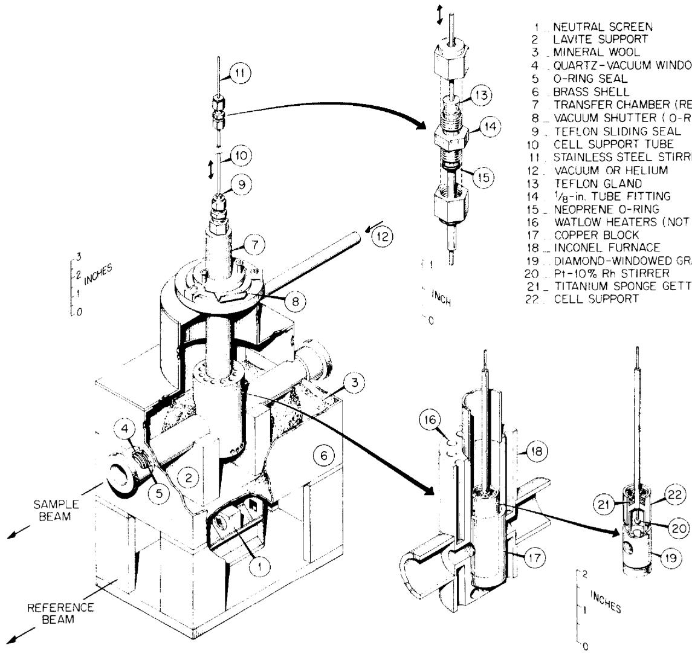
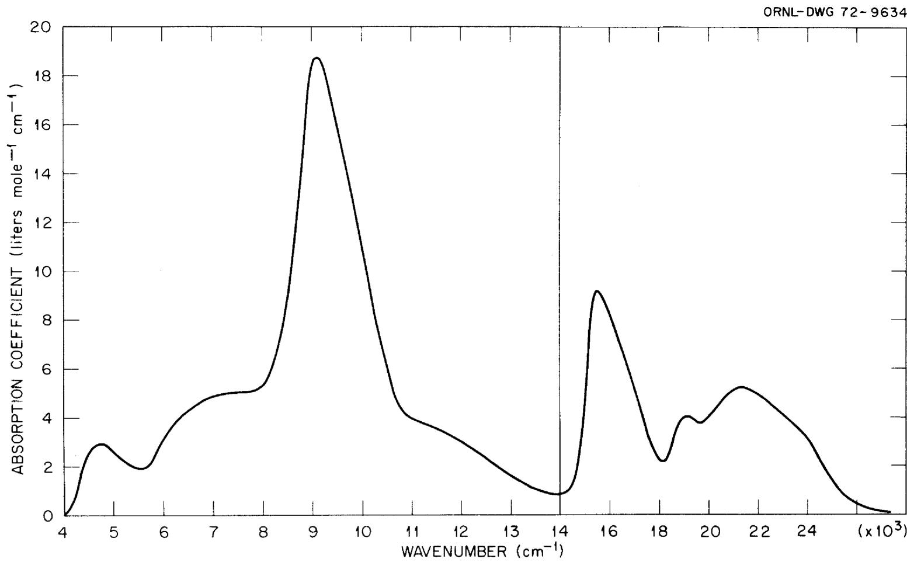
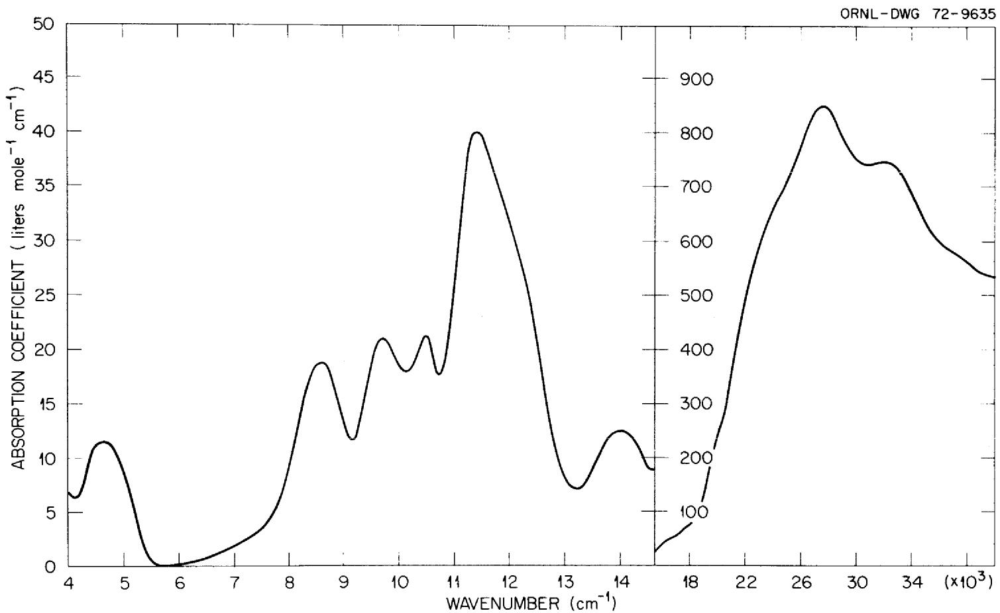
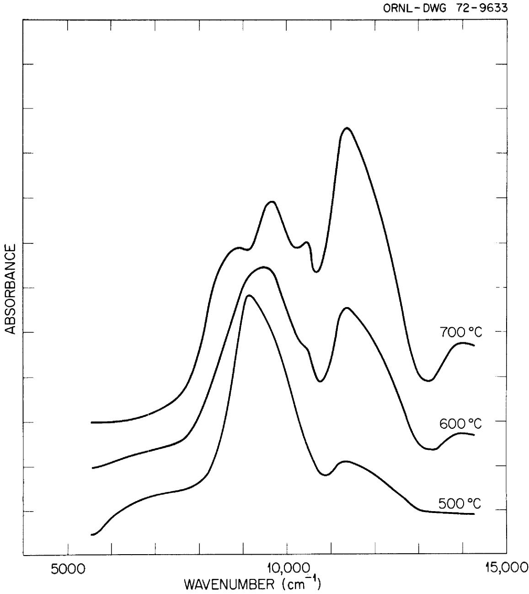
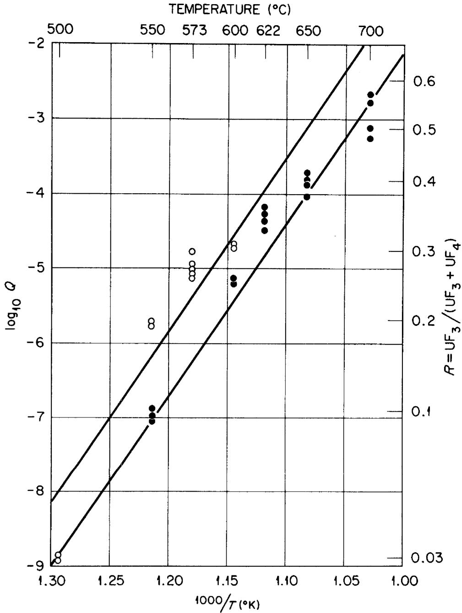
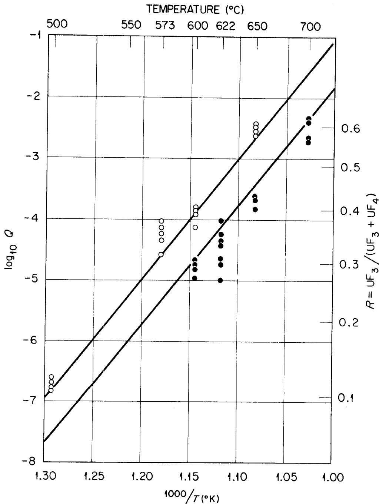
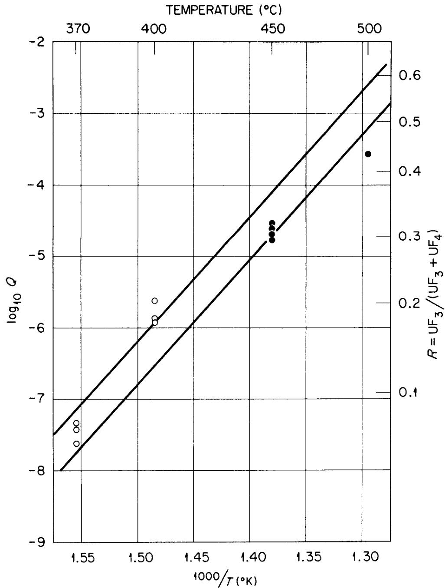
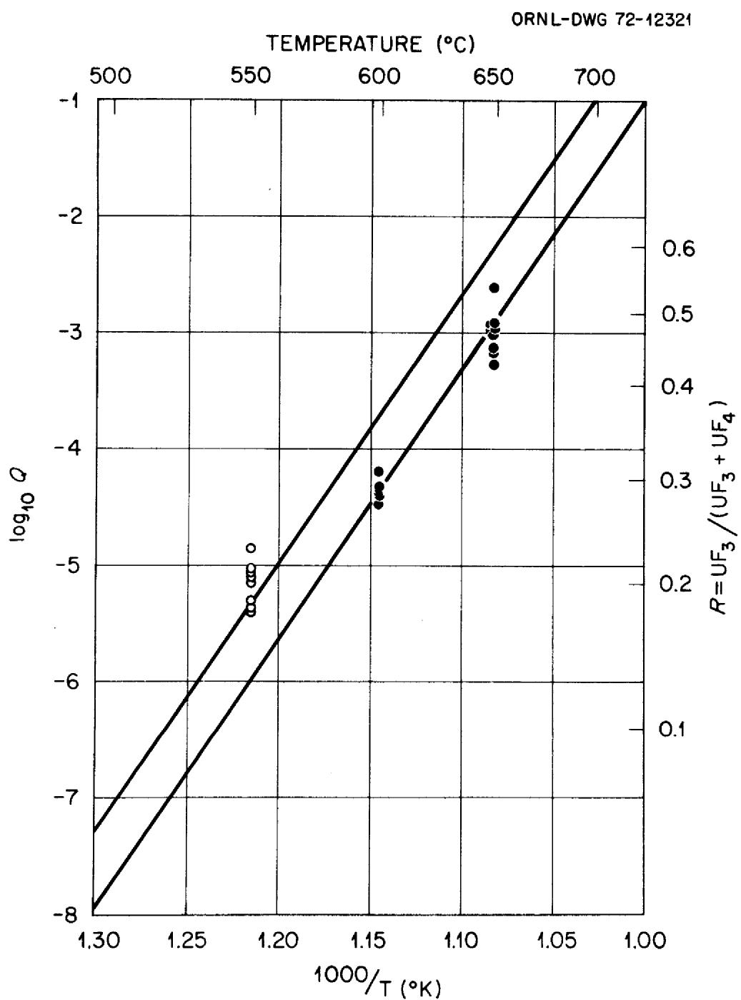
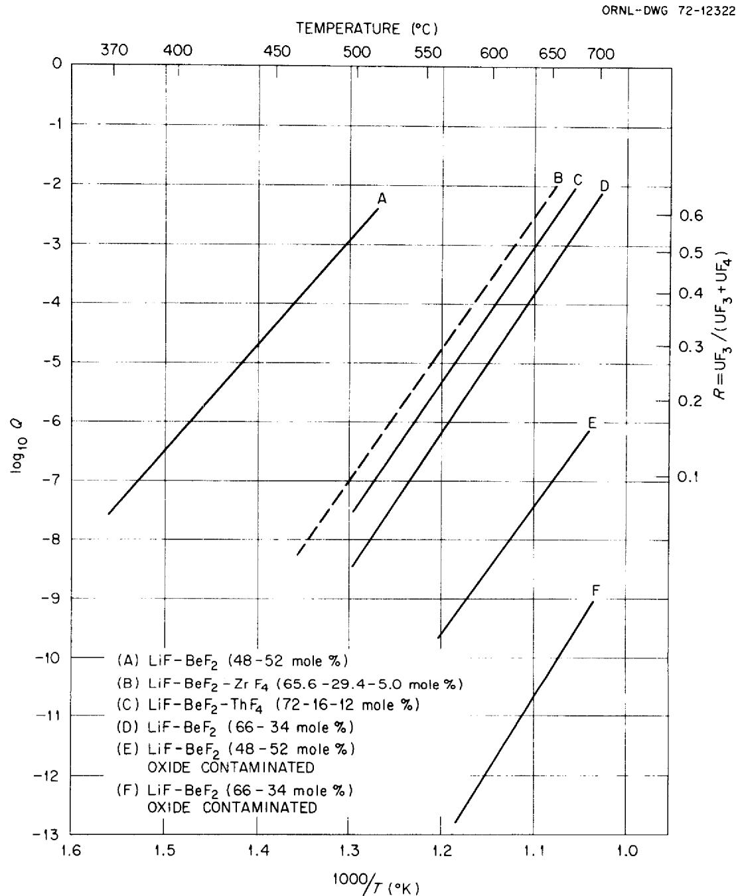

# THE EQUILIBRIUM OF DILUTE $\mathsf{UF}_3$ SOLUTIONS CONTAINED IN GRAPHITE

L. M. Toth

L. O. Gilpatrick

MASTER

DISTRIBUTION OF THIS DOCUMENT IS UNLIMITED

OAK RIDGE NATIONAL LABORATORY

OPERATED BY UNION CARBIDE CORPORATION • FOR THE U.S. ATOMIC ENERGY COMMISSION

This report was prepared as an account of work sponsored by the United States Government. Neither the United States nor the United States Atomic Energy Commission, nor any of their employees, nor any of their contractors, subcontractors, or their employees, makes any warranty, express or implied, or assumes any legal liability or responsibility for the accuracy, completeness or usefulness of any information, apparatus, product or process disclosed, or represents that its use would not infringe privately owned rights.

ORNL-TM- 4056

Contract No. W-7405-eng-26

REACTOR CHEMISTRY DIVISION

THE EQUILIBRIUM OF DILUTE $\mathbf{U}\mathbf{F}_{3}$ SOLUTIONS CONTAINED IN GRAPHITE

L. M. Toth and L. O. Gilpatrick

# NOTICE

This report was prepared as an account of work sponsored by the United States Government. Neither the United States nor the United States Atomic Energy Commission, nor any of their employees, nor any of their contractors, subcontractors, or their employees, makes any warranty, express or implied, or assumes any legal liability or responsibility for the accuracy, completeness or usefulness of any information, apparatus, product or process disclosed, or represents that its use would not infringe privately owned rights.

DECEMBER 1972

OAK RIDGE NATIONAL LABORATORY

Oak Ridge, Tennessee 37830

operated by

UNION CARBIDE CORPORATION

for the

U.S. ATOMIC ENERGY COMMISSION

# THE EQUILIBRIUM OF DILUTE UF3 SOLUTIONS CONTAINED IN GRAPHITE

# L. M. Toth and L. O. Gilpatrick

# ABSTRACT

The equilibrium of dilute $\mathrm{UF}_3\text{-UF}_4$ molten fluoride solutions in contact with graphite and $\mathrm{UC}_2$ :

$$
3 \mathrm {U F} _ {4} + \mathrm {U C} _ {2} \stackrel {\rightleftarrows} {=} 4 \mathrm {U F} _ {3} + 2 \mathrm {C}
$$

has been studied as a function of temperature $(370 - 700^{\circ}\mathrm{C})$ , melt composition and atmospheric contamination. Equilibrium quotients, $Q = (UF_3)^4 / (UF_4)^3$ for the reaction were determined by measuring the $UF_3$ and $UF_4$ concentrations spectrophotometrically. The solvents used were primarily LiF-BeF $_2$ mixtures. Results from this solvent system were related to the reactor solvents LiF-BeF $_2$ -ZrF $_4$ (65.6-29.4-5 mole %) and LiF-BeF $_2$ -ThF $_4$ (72-16-12 mole %). It has been found that the equilibrium quotient is very sensitive to both temperature and solvent changes increasing as either the temperature increases or the alkali-metal fluoride content of the solvent decreases.

# INTRODUCTION

The relative stability of dilute $\mathrm{UF}_3\text{-UF}_4$ molten fluoride solutions contained in graphite is of practical importance to Molten Salt Breeder Reactors, MSBR, in which these solutions are used as nuclear fuels. Because the reactors contain a large amount of graphite in the core serving as a neutron moderator, reaction of $\mathrm{UF}_3$ with graphite:

$$
4 \mathrm {U F} _ {3 (\mathrm {d})} + 2 \mathrm {C} \rightleftharpoons 3 \mathrm {U F} _ {4 (\mathrm {d})} + \mathrm {U C} _ {2} ^ {*} \tag {1-1}
$$

to form $\mathbf{U}\mathbf{F}_{4}$ and uranium dicarbide has long been recognized1 as a major factor limiting the amount of $\mathbf{U}\mathbf{F}_{3}$ which can be maintained in solution.

Although typical fuel mixtures consist essentially of 1 mole $\%$ U $^{235}$ F $_4$ or less in a solution of LiF and BeF $_2$ , the ease of UF $_4$ reduction to UF $_3$ by the chromium in the metal containment vessel**

$$
2 \mathrm {U F} _ {4 (\mathrm {d})} + \mathrm {C r} ^ {\circ} \rightleftarrows 2 \mathrm {U F} _ {3 (\mathrm {d})} + \mathrm {C r F} _ {2 (\mathrm {d})} \tag {1-2}
$$

necessitates the consideration of $\mathbf{U}\mathbf{F}_3$ chemistry as well. The effect of the corrosion reaction of Eq. 1-2 is to leach chromium from the structural metal and cause it to appear in solution as $\mathrm{CrF_2}$ .

In order to minimize the corrosion, the equilibrium of Eq. 1-2 is shifted to the left by reducing a small percentage (approximately $1\%$ ) of the $\mathrm{UF}_4$ to $\mathrm{UF}_3$ through the addition of beryllium metal:

$$
2 \mathrm {U F} _ {4 (\mathrm {d})} + \mathrm {B e} ^ {\circ} \stackrel {\rightarrow} {\leftarrow} 2 \mathrm {U F} _ {3 (\mathrm {d})} + \mathrm {B e F} _ {2} \tag {1-3}
$$

Although a small amount of $\mathbf{U}\mathbf{F}_3$ is beneficial in reversing the corrosion mechanism, it produces complications due to possible reaction via Eq. 1-1 and the resulting undesirable formation of an insoluble uranium carbide. Reference to "UF $_3$ stability" in this paper will therefore mean specifically the equilibrium concentration of UF $_3$ relative to UF $_4$ as determined by Eq. 1-1.

This equilibrium has never been experimentally measured despite the fact that it is the major factor in determining $\mathrm{UF}_3$ stability for molten salt reactor systems. Although they used indirect means, Long and Blankenship4 are the only investigators who have attempted to measure the equilibrium. Since their work is the basis on which all previous estimates of $\mathrm{UF}_3$ stability have been made, it will be reviewed in detail, with the equilibrium expressions in fractional coefficients as used by the authors. They studied the reduction of $\mathrm{UF}_4$ (both pure solid phase $\mathrm{UF}_4$ and in molten fluoride solution) with hydrogen:

$$
\frac {1}{2} \mathrm {H} _ {2} + \mathrm {U F} _ {4} \stackrel {\rightarrow} {\leftarrow} \mathrm {U F} _ {3} + \mathrm {H F} \tag {1-4}
$$

and determined the equilibrium quotients for the above reduction:

$$
Q ^ {R} = \frac {X _ {U F 3}}{X _ {U F 4}} \frac {P _ {H F}}{P _ {H _ {2}} ^ {1 / 2}} = K ^ {R} \frac {\gamma_ {U F 4}}{\gamma_ {U F 3}} \tag {1-5}
$$

by measuring HF and $\mathbf{H}_2$ ratios evolved from a reaction vessel containing $\mathbf{U}\mathbf{F}_4$ and $\mathbf{U}\mathbf{F}_3$ . From the solid-phase $\mathbf{U}\mathbf{F}_4$ reduction they obtained equilibrium constants, $\mathbf{K}^{\mathrm{R}}$ , for the reduction. These, combined with the equilibrium quotient, $\mathbf{Q}^{\mathrm{R}}$ , for the dilute solutions and the activity coefficient for $\mathbf{U}\mathbf{F}_3$ , $\gamma_{\mathbf{U}\mathbf{F}_3}$ , obtained from solubility data, enabled them to calculate the

activity coefficient for $\mathsf{UF}_4$ , $\gamma_{\mathsf{UF}_4}$ , in the molten fluoride solution. By combining the free energy expression for Eq. 1-4 with one for the decomposition of $\mathsf{UF}_3$ into $\mathsf{UF}_4$ and $\mathsf{U}^0$ :

$$
\mathrm {U F} _ {3 (\mathrm {d})} \stackrel {\rightarrow} {\leftarrow} \frac {3}{4} \mathrm {U F} _ {4 (\mathrm {d})} + \frac {1}{4} \mathrm {U} ^ {\circ} \tag {1-6}
$$

they obtained an expression for the equilibrium quotient, $Q^{\mathrm{D}}$ , of Eq. 1-6, in terms of the equilibrium quotient for Eq. 1-4, $Q^{\mathrm{R}}$ , and the activity coefficients of $\mathrm{UF}_4$ and HF. (c.f. p 18, Ref. 4, part II). Using free energies of formation for $\mathrm{UC}_2$ and UC from Rand and Kubachewski, which were acceptable at the time, they estimated uranium activities in the carbides and concluded that solutions in which up to $60\%$ of the initial 1 mole % of $\mathrm{UF}_4$ is converted to $\mathrm{UF}_3$ are expected to be stable in the presence of graphite. In addition they concluded that temperature and solvent changes should have little effect on the equilibrium mechanism of Eq. 1-1 since they found no significant effect from them on the $\mathrm{H}_2$ reduction mechanism of Eq. 1-4.

In view of the significance of Eq. 1-1 to Molten Salt Reactor Technology, a closer examination of it is clearly warranted. The development of spectrophotometric techniques for the study of molten fluorides and the realization of solvent effects on molten fluoride chemistry, have given impetus to the study. We have already identified ${}^{6}\mathbf{U}\mathbf{C}_{2}$ , as the stable uranium carbide phase in equilibrium with $\mathrm{UF_3 - UF_4}$ solutions in graphite. The object of this report is to describe the effects of temperature, solvent, and atmospheric contamination on the equilibrium. Both the forward and the back reaction of Eq. 1-1 in the reference solvent system $\mathrm{LiF - BeF_2}$ have been followed. The data in the reference solvent system have been related to practical reactor solvents such as the Molten Salt Reactor Experiment, MSRE, solvent, $\mathrm{LiF - BeF_2 - ZrF_4}$ (65.6-29.4-5 mole %) and the proposed Molten Salt Breeder Reactor, MSBR, solvent, $\mathrm{LiF - BeF_2 - ThF_4}$ (72-16-12 mole %). Our findings are compared with earlier observations which have not been reviewed before.

# EXPERIMENTAL

Equilibrium quotients for the back-reaction* (Eq. 3-2) were determined by measuring $\mathrm{UF}_3$ and $\mathrm{UF}_4$ concentrations spectrophotometrically with a Cary Model 14-H recording spectrometer. The sample system consisted of a controlled temperature, inert atmosphere furnace shown in Fig. 2-1 which held a diamond-windowed graphite spectrophotometric cell.7 Molten fluoride salt solutions and reagent uranium carbides were contained in this cell. Absorption spectra of the molten salt solution were measured against an air reference. Net spectra due to $\mathrm{UF}_3$ and $\mathrm{UF}_4$ were determined by subtracting independently determined solvent blank spectra using standard digital computer techniques. Spectra were measured in the near infra-red and visible regions from 4000 to $33000\mathrm{cm}^{-1}$ . The absorption spectra of $\mathrm{UF}_3$ and $\mathrm{UF}_4$ served as the primary means of monitoring these components in solution as a function of temperature, time, and solvent composition.

Materials - Molten salt solvent compositions were prepared by mixing calculated amounts of the pure component fluoride salts. Optical quality crystal fragments from the Harshaw Chemical Co. was the source of LiF. Beryllium fluoride was prepared by vacuum distillation from a large special purchase supplied by the Brush Beryllium Co. The water-clear, glass-like product contained no spectrographically detectable cation impurities, but was exceedingly hydrosopic and had to be stored under very anhydrous conditions. Uranium tetrafluoride was taken from a laboratory purified spectroscopic standard which contained less than 10 ppm of total cation impurities. Thorium tetrafluoride was part of a special purchase from the National Lead Co. which contained no greater than 100 ppm in any cation impurities.

Storms and coworkers of the Las Alamos Scientific Laboratory supplied each of the uranium carbides used in this study and supplied the following analysis:

$$
\begin{array}{c} \text {U r a n i u m d i c a r b i d e - U C _ {2}} ^ {* *} \quad \text {w t} \% \mathrm {C} = 8.83 \text {o r} 75.74 \text {m o l e} \% \mathrm {C} \\ \quad \quad \quad \quad \quad \quad \quad \quad \quad \quad \quad \quad \quad \quad \quad \quad \quad \quad \quad \quad \quad \quad \quad \quad \quad \quad \quad \quad \quad \quad \quad \quad \quad \quad \quad \quad \quad \quad \quad \quad \quad \quad \quad \quad \quad \quad \quad \quad \quad \quad \end{array}
$$

ORNL-DWG72-10653

  
2-1 High Temperature Furnace System for Absorption Spectra of Molten Fluorides.

$$
\begin{array}{l} \text {c r e s t a l l a t t i c e b y X - r a y} \quad \mathrm {a} = 3. 5 2 5 1 + 0. 0 0 0 5 \mathrm {A} \\ \mathrm {c} = 5. 9 9 6 2 + 0. 0 0 0 8 \mathrm {A} \end{array}
$$

$$
\begin{array}{l} \begin{aligned} & \text{Uranium sesquicarbide - U}_{2}\mathrm{C}_{3}\quad \text{wt}\% \mathrm{C} = 6.99\text{or} 59.83\text{mole}\% \mathrm{C}\\ & \quad \quad \quad \quad \quad \quad \quad \quad \quad \quad \quad \quad \quad \quad \quad \quad \quad \quad \quad \quad \quad \quad \quad \quad \quad \quad \quad \quad \quad \quad \quad \quad \quad \quad \quad \quad \quad \quad \quad \quad \quad \quad \quad \quad \quad \quad \quad \quad \quad \quad \end{aligned} \\ \text {c r e s t a l} \quad \text {l a t t i c e b y X - r a y} \quad \mathrm {a} = 8. 0 8 8 9 \pm 0. 0 0 0 9 \mathrm {A} \\ \end{array}
$$

These high purity carbides were received as lusterous gray-black granules which ranged in size from 1/2 to $1\mathrm{mm}^3$ . They were shipped sealed in glass ampules and stored in a helium filled dry box. Exposure to even the dry box conditions was kept to the absolute minimum needed for weighings and cell loadings.

Procedure - Even though the reagent salts were quite free of cation impurities, they were not free of oxides and $\mathrm{H}_2\mathrm{O}$ to the degree needed. All compositions were therefore treated while molten at $600^{\circ}\mathrm{C}$ for oxide removal by sparging for several hours with reagent HF gas or $\mathrm{HF - H_2}$ gas mixtures.[9] Residual HF was then stripped from the melt with He prior to cooling. Clean portions of the recovered salt "button" were then crushed and used to charge the spectrophotometer cell, by weighing out the fluorides in a helium drybox which was maintained at a water vapor content $< 0.1$ ppm and at an $0_2$ content $< 2$ ppm. Between 0.5 and $0.6\mathrm{gm}$ of salt solvent made a convenient cell loading to which was added from 5 to as much as $100~\mathrm{mg}$ of the uranium carbide under study. Poco AXF-5Q1 grade graphite[10] spectrophotometric cells were used which were purified after fabrication by heating in an $\mathrm{H}_2$ gas stream to $1000^{\circ}\mathrm{C}$ and then flushed free of $\mathrm{H}_2$ with He. Subsequent dry box handling and loading techniques have been discussed earlier.[11] A "dash pot" stirrer made from platinum- $10\%$ rhodium (see Fig. 2-1) was used to hasten the attainment of equilibrium which is otherwise dependent largely on diffusion. It proved to be a great aid in shortening the time needed to reach equilibrium. We observed a small but temporary loss of transmission directly after stirring in some cases which was equal to 0.15 absorbance units at $4000~\mathrm{cm}^{-1}$ . We have assumed this recoverable loss to be caused by the temporary suspension of fine particles which later settle. Whole grains of the carbide were used after early attempts to increase the surface area by crushing caused the carbide to collect at the window and interfere with the optical transparency of the cell. A large excess of the solid carbide phase was always maintained in the cell. On some occasions,

the experimental sequence was interrupted and additional uranium carbide was added to demonstrate that an excess was indeed present. No change was observed in the concentrations of $\mathrm{UF}_3$ or $\mathrm{UF}_4$ in the homogeneous solutions as a result of these additions.

Spectral Measurements - Molar concentrations of dissolved $\mathrm{UF}_3$ and $\mathrm{UF}_4$ were determined simultaneously in solution at a series of temperatures above the melting point by measuring optical densities at 9174 and $11360~\mathrm{cm}^{-1}$ . These wave numbers represent the maximum absorbance values for dissolved $\mathrm{UF}_4$ and $\mathrm{UF}_3$ respectively in the near infra-red region as shown in Figs. 2-2 and 2-3. The strong $\mathrm{UF}_3$ absorption in the visible region from 16000 to $33000~\mathrm{cm}^{-1}$ was in general too intense to be useful since the solutions studied had initial $\mathrm{UF}_4$ molarities in the range of 0.04 to 0.10. Figures 2-2 and 2-3 show that for spectra of pure $\mathrm{UF}_4$ and $\mathrm{UF}_3$ there is a contribution from each at the most sensitive absorbance region of the other member. Stated differently, the absorbance at $9174~\mathrm{cm}^{-1}$ in a mixed solution is primarily due to $\mathrm{UF}_4$ , but not entirely so. This condition is solved uniquely for the contribution from each species by the solution of a set of simultaneous linear equations equal to number to the number of components in the system which contribute to the net spectra, in our case 2.

Using Beer's law

$$
- \log I / I _ {0} = A _ {v} = (\varepsilon_ {v}) _ {T} (M) _ {T} ^ {\ell} \tag {2-1}
$$

where

$$
I = \text {m e a s u r e d o p t i c a l}
$$

$$
I _ {0} = \text {m e a s u r e d o p t i c a l i n t e n s i t y o f t h e r e f e r e n c e s o l v e n t}
$$

$$
A = \text {t o t a l}
$$

$$
\left(\varepsilon_ {v}\right) _ {T} = \text {m o l a r a b s o r p t i o n c o e f f i c i e n t a v a n d t e m p e r a t u r e T}
$$

$$
\left(\mathrm {M}\right) _ {\mathrm {T}} = \text {m o l a r i t y}
$$

$$
\ell = \text {c e l l p a t h l e n g t h} = 0. 6 3 5 \mathrm {c m}
$$

The following set of equations are sufficient to determine the separate molar concentrations in a mixed solution at a particular temperature.

$$
\mathrm {A} _ {\vee 1} = \mathrm {A} _ {\vee 1} ^ {3} + \mathrm {A} _ {\vee 1} ^ {4} = \varepsilon_ {\vee 1} ^ {4} (\mathrm {M} _ {4}) _ {\mathrm {T}} ^ {\ell} + \varepsilon_ {\vee 1} ^ {3} (\mathrm {M} _ {3}) _ {\mathrm {T}} ^ {\ell} \tag {2-2}
$$

$$
\mathrm {A} _ {\vee 2} = \mathrm {A} _ {\vee 2} ^ {3} + \mathrm {A} _ {\vee 2} ^ {4} = \varepsilon_ {\vee 2} ^ {4} (\mathrm {M} _ {4}) _ {\mathrm {T}} ^ {\ell} + \varepsilon_ {\vee 2} ^ {3} (\mathrm {M} _ {3}) _ {\mathrm {T}} ^ {\ell} \tag {2-3}
$$

  
2-2 UF $_4$ Spectrum (approximately 1 mole %) in LiF-BeF $_2$ -ThF $_4$ (72-16-16 mole %) at $575^{\circ}\mathrm{C}$ .

  
2-3 UF $_3$ Spectrum (approximately 0.3 mole %) in LiF-BeF $_2$ (66-34 mole %) at $600^{\circ}\mathrm{C}$ .

where: $1 = 9174 \, \text{cm}^{-1}$

$$
\begin{array}{l} 2 = 1 1 3 6 0 \mathrm {c m} ^ {- 1} \\ 3 = \mathrm {U F} _ {3} \text {c o m p o n e n t} \\ 4 = \mathrm {U F} _ {4} \text {c o m p o n e n t} \\ \end{array}
$$

Solving Eqs. (2-2) and (2-3) simultaneously for $(\mathsf{M}_4)_\mathsf{T}$ and $(\mathsf{M}_3)_\mathsf{T}$ gives the desired molarities since $A_{v1}$ and $A_{v2}$ are measured and the $\varepsilon$ values are known from previous calibrations.

$$
\begin{array}{l} \left(\mathrm {M} _ {4}\right) _ {\mathrm {T}} = \frac {\left(\varepsilon_ {v 2} ^ {4} \mathrm {A} _ {v 1} - \varepsilon_ {v 1} ^ {3} \mathrm {A} _ {v 2}\right)}{\ell \left(\varepsilon_ {v 2} ^ {3} \varepsilon_ {v 1} ^ {4} - \varepsilon_ {v 1} ^ {3} \varepsilon_ {v 2} ^ {4}\right)} (2-4) \\ \left(\mathrm {M} _ {3}\right) _ {\mathrm {T}} = \frac {\left(\varepsilon_ {\mathrm {v} 1} ^ {4} \mathrm {A} _ {\mathrm {v} 2} - \varepsilon_ {\mathrm {v} 1} ^ {4} \mathrm {A} _ {\mathrm {v} 1}\right)}{\left(\varepsilon_ {\mathrm {v} 2} ^ {3} \varepsilon_ {\mathrm {v} 1} ^ {4} - \varepsilon_ {\mathrm {v} 1} ^ {3} \varepsilon_ {\mathrm {v} 2} ^ {4}\right)} (2-5) \\ \end{array}
$$

Because spectra were recorded versus a neutral screen in the reference beam (see Fig. 2-1) it was always necessary to subtract a solvent spectrum, or blank, which was independently determined for each experimental spectrum, to get the net absorbance due to species in solution.

Analyzing composite spectra required making calibrations for $\varepsilon$ with solvent melts containing a known concentration of pure $\mathrm{UF_4}$ and $\mathrm{UF_3}$ . Values of $\varepsilon$ are reduced with increasing temperature because of two effects: the change of molarity caused by thermal expansion and temperature effects on the absorption spectra themselves.

Changes in molarity due to temperature changes were adjusted by using S. Cantor's data12 for the molal volume of various fused fluoride salts and assuming that the molal volumes are additive to within $\pm 3\%$ according to the following general relations:

$$
\begin{array}{l} \mathrm {N} _ {\mathrm {T}} \left[ \mathrm {x} _ {1} (\mathrm {v} _ {1}) _ {\mathrm {T}} + \mathrm {x} _ {2} (\mathrm {v} _ {2}) _ {\mathrm {T}} - - - - - ] = 1 0 0 0 \mathrm {m l} \right. (2-6) \\ \left(\mathrm {M} _ {1}\right) _ {\mathrm {T}} = \mathrm {N} _ {\mathrm {T}} \mathbf {x} _ {1} (2-7) \\ \end{array}
$$

where $\mathrm{N_T} =$ moles per liter of solution at temperature T

$$
\begin{array}{l} x _ {1} = \text {m o l f r a c t i o n o f c o m p o n e n t # 1} \\ (v _ {1}) _ {T} = \text {m o l a r v o l o f 1 a t t e m p e r a t u r e T i n c c / m o l e} \\ \left(\mathrm {M} _ {1}\right) _ {\mathrm {T}} = \text {m o l a r i t y} 1 \text {i n m o l e s} / 1 \text {a t t e m p e r a t u r e} \mathrm {T} \\ \end{array}
$$

Molar absorptions were first measured for pure $\mathbf{U}\mathbf{F}_4$ solutions at various temperatures using a known concentration and at molarities adjusted for expansion. Measured values of $(\varepsilon_{\nu 1}^{4})_{\mathrm{T}}$ and $(\varepsilon_{\nu 2}^{4})_{\mathrm{T}}$ are recorded in Table 2-1.

A corresponding calibration was performed for pure $\mathbf{U}\mathbf{F}_3$ under identical conditions. This was most easily achieved by adding an excess of a reducing agent. Both zirconium and uranium metal were used for this purpose, they react as shown in Eqs. (2-8) and (2-9).

$$
Z r + 4 U F _ {4} \stackrel {\rightarrow} {=} 4 U F _ {3} + Z r F _ {4} \tag {2-8}
$$

$$
\mathrm {U} + 3 \mathrm {U F} _ {4} \stackrel {\rightleftarrows} {=} 4 \mathrm {U F} _ {3} \tag {2-9}
$$

The effect on the properties of the solutions caused by the production of $\mathrm{ZrF}_4$ in Eq. 2-8 was very small and hence neglected for these dilute solutions. When uranium was used concentrations had to be increased by $1/3$ over those calculated for $\mathrm{UF}_4$ in the initial solutions as shown in Eq.(2-9). Pure $\mathrm{UF}_3$ solutions in contact with graphite result in the loss of uranium from solution by the formation of $\mathrm{UC}_2$ as shown in Eq. (1-1). Fortunately this reaction is rather slow under the conditions that we have studied, and it was possible to correct for this loss by measuring absorbances as a function of time to determine the rate of loss ( $\mathrm{dA}_\nu/\mathrm{dT}$ ), and correcting for the loss by extrapolating back to zero time. Reducing $\mathrm{UF}_4$ with uranium does not result in a loss of $\mathrm{UF}_3$ from solution. The addition of Eq. (1-1) and (2-9) results in the cyclic conversion of U and C to $\mathrm{UC}_2$ with no net change of $\mathrm{UF}_3$ concentration in solution as shown in Eq. (2-10).

$$
4 \mathrm {U F} _ {3} + 2 \mathrm {C} \rightarrow 3 \mathrm {U F} _ {4} + \mathrm {U C} _ {2} \tag {1-1}
$$

$$
3 \mathrm {U F} _ {4} + \mathrm {U} \rightarrow 4 \mathrm {U F} _ {3} \tag {2-9}
$$

$$
\mathrm {U} + 2 \mathrm {C} \rightarrow \mathrm {U C} _ {2} \tag {2-10}
$$

An alternate approach to determining the molar absorption coefficients $(\varepsilon_{\nu})$ for $\mathrm{UF}_3$ in solution has also been used. Since $\mathrm{UF}_4$ solutions are more stable than $\mathrm{UF}_3$ solutions under our experimental conditions, the calibration results for $\mathrm{UF}_4$ are more reliable and associated with less error than are those for $\mathrm{UF}_3$ . Using this fact the uncertainty associated with the $\mathrm{UF}_3$ calibration can be reduced by measuring the absorption spectrum of a mixture

Table 2-1   
Molar Absorption Coefficients for Molten Fluoride Solutions of $\mathbf{U}\mathbf{F}_4$ and $\mathbf{U}\mathbf{F}_3$   

<table><tr><td>Solution in Mole %</td><td colspan="3">L2B Solvent:LiF·BeF2(66.7-33.9)</td><td colspan="3">LB Solvent:LiF·BeF2(48-52)</td><td colspan="3">MSBR Solvent:LiF·BeF2·ThF4(72-16-12)</td></tr><tr><td>Spectra</td><td>UF3</td><td colspan="2">UF4</td><td colspan="2">UF3</td><td>UF4</td><td colspan="2">UF3</td><td>UF4</td></tr><tr><td>Molar Absorption Coefficient</td><td>ε11360 ε9170</td><td>ε11360</td><td>ε9170</td><td>ε11360</td><td>ε9170</td><td>ε11360 ε9170</td><td>ε11360</td><td>ε9170</td><td>ε11360 ε9170</td></tr><tr><td>Temperature °C</td><td></td><td></td><td></td><td></td><td></td><td></td><td></td><td></td><td></td></tr><tr><td>370</td><td></td><td></td><td></td><td>44.2</td><td>7.6</td><td>3.1</td><td>18.4</td><td></td><td></td></tr><tr><td>400</td><td></td><td></td><td></td><td>43.2</td><td>7.8</td><td>3.1</td><td>17.8</td><td></td><td></td></tr><tr><td>450</td><td>46.0</td><td>10.0</td><td>3.90</td><td>18.7</td><td>41.7</td><td>8.1</td><td>3.1</td><td>16.9</td><td></td></tr><tr><td>500</td><td>44.2</td><td>10.0</td><td>3.85</td><td>17.9</td><td>40.1</td><td>8.4</td><td>3.1</td><td>16.0</td><td>58.5 14.5 2.80 19.2</td></tr><tr><td>550</td><td>41.7</td><td>10.0</td><td>3.80</td><td>17.1</td><td>38.5</td><td>8.6</td><td>3.1</td><td>15.1</td><td>56.8 14.5 2.70 18.2</td></tr><tr><td>600</td><td>39.0</td><td>10.0</td><td>3.75</td><td>16.3</td><td>36.9</td><td>8.9</td><td>3.1</td><td>14.2</td><td>55.0 14.5 2.65 17.2</td></tr><tr><td>650</td><td>36.2</td><td>10.0</td><td>3.70</td><td>15.4</td><td>35.3</td><td>9.2</td><td>3.1</td><td>13.3</td><td>53.3 14.5 2.55 16.2</td></tr><tr><td>700</td><td>33.5</td><td>10.0</td><td>3.65</td><td>14.8</td><td>33.7</td><td>9.4</td><td>3.1</td><td>12.4</td><td>51.6 14.5 2.50 15.2</td></tr><tr><td>750</td><td>30.7</td><td>10.0</td><td>3.60</td><td>14.1</td><td></td><td></td><td></td><td></td><td>49.9 14.5 2.40 14.5</td></tr><tr><td>800</td><td></td><td></td><td></td><td></td><td></td><td></td><td></td><td></td><td>48.0 14.5 2.35 13.8</td></tr></table>

of $\mathrm{UF}_3$ and $\mathrm{UF}_4$ where the $\mathrm{UF}_3$ is generated by partially reducing a dilute $\mathrm{UF}_4$ solution of known concentration. (The reductant chosen for partial reduction was $\mathrm{UC}_2$ .) The spectrum is then converted to digital form along with a $\mathrm{UF}_4$ reference spectrum. Using iterative computer techniques, varying amounts of the $\mathrm{UF}_4$ spectrum (i.e., k x ( $\mathrm{UF}_4$ spectrum) where k is the coefficient which is varied in the iteration process) are subtracted until the resulting spectrum visually matches that of previously measured (uncalibrated) $\mathrm{UF}_3$ spectra. When a match is found for a particular value of k, the concentration of $\mathrm{UF}_3$ in solution and thus the absorption coefficient can be calculated knowing the total amount of $\mathrm{UF}_4$ before reduction. Comparison of ε values by this method with the total reduction method showed agreement within a 5% uncertainty.

In Table 2-1, absorption coefficients are listed for the various solutions and temperature ranges that have been studied. Values were taken from smoothed functions which within the limits of our precision are a linear function of temperature.

# RESULTS AND DISCUSSION

An equilibrium expression such as the one written in Eq. 1-1 implies that certain criteria are valid: (1) The equilibrium expression should include all reactants and products which are involved in the reaction and these components should combine in the stoichiometry indicated by the expression. (2) The entire process must be reversible.

Before quantitative data for the equilibrium in Eq. 1-1 were measured, the above criteria were examined in the following manner: The equation represents a heterogeneous equilibrium between a molten-fluoride solution of $\mathrm{UF}_3$ and $\mathrm{UF}_4$ and two solid phases, $\mathrm{UC}_2$ and graphite. The identification of the $\mathrm{UF}_3$ and $\mathrm{UF}_4$ was made by the characteristic absorption spectrum of each component in the near-infrared and visible regions (4000-33000 cm $^{-1}$ ). The identification of these two solute components is well established because their absorption spectra have been thoroughly documented. $^{11}$ In view of the extensive spectroscopic work which has preceded, there is no spectral evidence for any cations in the solution other than $\mathrm{U}^{+3}$ , $\mathrm{U}^{+4}$ .

The solid phase components, $\mathrm{UC}_2$ and graphite, exhibit no measurable solubility in molten fluorides. These phases were identified by their respective X-ray diffraction patterns. A serious anomaly arises as a result of the $\mathrm{UC}_2$ phase identification since its formation is contrary to the established phase diagram for the U-C system which shows $\mathrm{UC}_2$ to be metastable with respect to $\mathrm{U}_2\mathrm{C}_3$ and graphite at temperatures less than $1500^{\circ}\mathrm{C}$ . On the basis of the uranium-carbon phase diagram and the accepted free energies of formation for the uranium carbides at temperatures less than $1000^{\circ}\mathrm{K}$ , $\mathrm{U}_2\mathrm{C}_3$ should be the carbide phase which was identified. Nevertheless, $\mathrm{UC}_2$ has been repeatedly shown to form at these temperatures and has been established as the stable carbide phase in the equilibrium of Eq. 1-1. The reader who is interested in the details of this identification is referred to an earlier paper. In the present paper we have included a series of equilibration experiments where excess $\mathrm{U}_2\mathrm{C}_3$ was used to reduce $\mathrm{UF}_4$ solutions via the back reaction of Eq. 1-1. Results are compared with similar experiments where $\mathrm{UC}_2$ was used as a reductant.

One of the simplest and yet most convincing observations to offer for the equilibrium is that the stoichiometry of the soluble uranium fluoride species follows the four-to-three relationship of Eq. 1-1. When a solution of approximately 0.1 mole $\%$ UF $_3$ in LiF-BeF $_2$ is allowed to react with graphite it is observed that 4 moles of UF $_3$ form 3 moles of UF $_4$ . For example, when a 0.068 molar solution of UF $_3$ was allowed to react via Eq. 1-1 to form UF $_4$ , it was observed that under conditions where reaction was more than $99\%$ complete, a 0.049 molar UF $_4$ solution resulted. If the process were merely one of UF $_3$ oxidation, then 4UF $_3$ should form 4UF $_4$ . For example:

$$
4 \mathrm {U F} _ {3} (\mathrm {d}) + 2 \mathrm {M F} _ {2 (\mathrm {d})} \stackrel {\rightleftarrows} {=} 4 \mathrm {U F} _ {4 (\mathrm {d})} + 2 \mathrm {M} \tag {3-1}
$$

where $M$ is a metal such as Ni.

Finally the reversibility of the reaction was demonstrated by the reversible temperature dependence of the equilibrium. From a particular temperature at which the system had attained equilibrium and concentrations of $\mathrm{UF}_3$ and $\mathrm{UF}_4$ measured, the temperature could be repeatedly raised or lowered causing the relative concentrations of $\mathrm{UF}_3$ and $\mathrm{UF}_4$ to shift and attain equilibrium concentrations at these new temperatures. When the system was

returned to the initial temperature, the original concentrations of $\mathrm{UF}_3$ and $\mathrm{UF}_4$ were reproduced. Quantitative aspects of the temperature dependence will be given in the following sections.

The criteria tests established the equilibrium process as written in Eq. 1-1. We found it more practical to measure the back reaction mechanism:

$$
3 \mathrm {U F} _ {4} + \mathrm {U C} _ {2} \stackrel {\rightarrow} {<  } 4 \mathrm {U F} _ {3} + 2 \mathrm {C} \tag {3-2}
$$

since, by intentionally adding excess $\mathrm{UC}_2$ , we could insure that the molten fluoride solution was always in contact with all the reactive solid phases. Furthermore, we could interrupt the equilibration and add fresh $\mathrm{UC}_2$ to demonstrate that the original carbide had not been consumed or altered during the course of the reaction. This procedure also insured that more active reducing agents, including other uranium carbides, were not present.

An equilibrium quotient for Eq. 3-2 can be written:

$$
Q = \frac {\left(\mathrm {U F} _ {3}\right) ^ {4}}{\left(\mathrm {U F} _ {4}\right) ^ {3}} \tag {3-3}
$$

where $\mathbf{U}\mathbf{F}_3$ and $\mathbf{U}\mathbf{F}_4$ are expressed in mole fractions of the solution. Q is simply the reciprocal of the equilibrium quotient, $Q^{\prime}$ , for the forward reaction of Eq. 1-1. The data in the following paragraphs will be presented as Q values in terms of the back reaction and should not be confused with forward action.

The effect of variables such as temperature, melt composition, carbide composition and atmospheric contamination on the equilibrium of Eq. 3-2 in the solvent system $\mathrm{LiF - BeF}_2$ have been measured and are treated separately in the following sections. Since the equilibrium of Eq. 3-2 (also Eq.1-1) is the central theme of this paper, it will often be cited as simply "the equilibrium."

# Effect of Temperature on the Equilibrium

Previous results from the hydrogen reduction of $\mathbf{U}\mathbf{F}_{4}$ in molten fluoride solutions indicated that the temperature effect on the equilibrium of Eq. 1-1 should be small. However, when we measured the equilibrium by either the forward or the back reaction, we found it to be very sensitive to temperature. This can be seen qualitatively by examining the molten

fluoride absorption spectra of Fig. 3-1 for equilibrium mixtures of dilute $\mathrm{UF}_3$ and $\mathrm{UF}_4$ in LiF-BeF $_2$ (66-34 mole %), in $\mathrm{L}_2\mathrm{B}$ , over excess $\mathrm{UC}_2$ at various temperatures. The spectra are due only to the $\mathrm{UF}_3$ and $\mathrm{UF}_4$ components of the solution. Therefore, by comparing these spectra with the spectra of pure $\mathrm{UF}_4$ and pure $\mathrm{UF}_3$ (Figs. 2-2 and 2-3 respectively), it can be seen that at $500^{\circ}\mathrm{C}$ , most of the uranium in solution is present as $\mathrm{UF}_4$ whereas at $700^{\circ}\mathrm{C}$ , enough $\mathrm{UF}_3$ is present to make the composite spectrum resemble that of Fig. 2-3. The composite spectrum at $600^{\circ}\mathrm{C}$ resembles neither of the two pure component spectra but instead an intermediate mixture of the two.

The quantitative aspects of these spectra were calculated by the procedure described in the experimental section. From absorption spectra such as those in Fig. 3-1 concentrations of $\mathrm{UF}_3$ and $\mathrm{UF}_4$ were determined in mole fractions and used in Eq. 3-3 to calculate equilibrium quotients, Q, at various temperatures. The data are presented in Table 3-1 along with Q values which are then presented in Fig. 3-2 as $\log_{10}Q$ versus $1 / T_K$ (where $T_K$ is the Kelvin temperature). At the top of the figure is shown the centi-grade scale and at the right side of the figure, the equilibrium ratio,

$$
R = \frac {\left[ U F _ {3} \right]}{\left[ U F _ {3} \right] + \left[ U F _ {4} \right]} \tag {3-4}
$$

where $\left[\mathrm{UF}_{3}\right]$ and $\left[\mathrm{UF}_{4}\right]$ are the concentrations in solution. (Note that the denominator of Eq. 3-4 represents the total uranium fluoride in solution.) These R values have been the customary manner in which $\mathrm{UF}_{3}-\mathrm{UF}_{4}$ concentrations are expressed within the MSRE program. The two lines drawn through the data points represent the experimental uncertainty of the data which arises mainly from the baseline error in the absorption spectra. Equilibria at various temperatures were approached from both the high (open circles) and low (closed circles) temperature direction. The system was initially held at ca. $50^{\circ} \mathrm{C}$ above the temperature desired until the $\mathrm{UF}_{3}$ concentration had ceased to grow ( $\mathrm{UF}_{4}$ reacting with $\mathrm{UC}_{2}$ via Eq. 3-2). Then the temperature was dropped $50^{\circ}$ and the $\mathrm{UF}_{3}$ concentration was allowed to fall by reaction of $\mathrm{UF}_{3}$ with graphite until no further change could be detected. The equilibrium could be shifted repeatedly in this manner by varying the temperature of the system. The train of points at any given

  
3-1 Spectra of Dilute $\mathbf{UF}_3$ - $\mathbf{UF}_4$ Mixtures in LiF- $\mathbf{BeF}_2$ (66-34 mole %) Showing Temperature Effect on the Equilibrium: $4\mathbf{UF}_3 + 2\mathbf{C} \neq 3\mathbf{UF}_4 + \mathbf{UC}_2$ .

Q and R are defined by

Eqs. 3-3 and 3-4.

Table 3-1   
Typical Equilibrium data used in Figures 3-2 to 3-5 where   

<table><tr><td>Run</td><td>Solvent</td><td>Carbide Phase</td><td>Temp (°C)</td><td>Measured 11360 cm-1</td><td>Absorbance 9170 cm-1</td><td colspan="2">Mole Fraction UF3(104)UF4(104)</td><td>Q (x108)</td><td>R</td></tr><tr><td>1</td><td>L2B</td><td>UC2</td><td>500</td><td>0.130</td><td>0.515</td><td>0.264</td><td>7.25</td><td>0.128</td><td>0.035</td></tr><tr><td>2</td><td>L2B</td><td>UC2</td><td>550</td><td>0.217</td><td>0.505</td><td>0.804</td><td>7.22</td><td>11.12</td><td>0.10</td></tr><tr><td>3</td><td>L2B</td><td>UC2</td><td>600</td><td>0.485</td><td>0.517</td><td>2.76</td><td>6.68</td><td>1951.0</td><td>0.29</td></tr><tr><td>4</td><td>L2B</td><td>UC2</td><td>650</td><td>0.692</td><td>0.527</td><td>4.57</td><td>6.14</td><td>19080.0</td><td>0.43</td></tr><tr><td>5</td><td>L2B</td><td>UC2</td><td>700</td><td>1.305</td><td>0.780</td><td>9.83</td><td>7.60</td><td>212300.0</td><td>0.56</td></tr><tr><td>6</td><td>L2B</td><td>U2C3</td><td>500</td><td>0.254</td><td>0.538</td><td>0.99</td><td>7.17</td><td>26.0</td><td>0.12</td></tr><tr><td>7</td><td>&quot;</td><td>&quot;</td><td>600</td><td>0.409</td><td>0.416</td><td>2.36</td><td>5.29</td><td>2070.0</td><td>0.31</td></tr><tr><td>8</td><td>&quot;</td><td>&quot;</td><td>700</td><td>1.083</td><td>0.567</td><td>8.29</td><td>4.74</td><td>443000.0</td><td>0.64</td></tr><tr><td>9</td><td>LB</td><td>UC2</td><td>370</td><td>0.147</td><td>0.384</td><td>0.53</td><td>5.52</td><td>4.6</td><td>0.087</td></tr><tr><td>10</td><td>&quot;</td><td>&quot;</td><td>400</td><td>0.215</td><td>0.330</td><td>1.04</td><td>4.67</td><td>115.0</td><td>0.18</td></tr><tr><td>11</td><td>&quot;</td><td>&quot;</td><td>450</td><td>0.380</td><td>0.328</td><td>2.23</td><td>4.36</td><td>2950.0</td><td>0.34</td></tr><tr><td>12</td><td>&quot;</td><td>&quot;</td><td>500</td><td>0.482</td><td>0.274</td><td>3.09</td><td>3.21</td><td>27600.0</td><td>0.49</td></tr><tr><td>13</td><td>MSBR</td><td>UC2</td><td>550</td><td>0.925</td><td>1.317</td><td>3.97</td><td>18.31</td><td>401.0</td><td>0.18</td></tr><tr><td>14</td><td>&quot;</td><td>&quot;</td><td>600</td><td>1.257</td><td>1.165</td><td>6.13</td><td>15.16</td><td>4050.0</td><td>0.29</td></tr><tr><td>15</td><td>&quot;</td><td>&quot;</td><td>650</td><td>2.575</td><td>1.433</td><td>14.0</td><td>14.32</td><td>129000.0</td><td>0.49</td></tr></table>

ORNL-DWG 72-10719R

  
3-2 Equilibrium quotients, $Q = (UF_3)^4 / (UF_4)^3$ , versus temperature for $UC_2 + 3UF_4(d) \stackrel{>}{} 4UF_3(d) + 2C$ in the solvent LiF-BeF $_2$ (66-34 mole%).

temperature represents the approach to equilibrium with only the lowermost (for open circles) and uppermost (for closed circles) being the best measured equilibrium value.

The large temperature effect on the equilibrium is exemplified by Fig. 3.2 where the quotient, Q, shifts by $10^{6}$ in going from 500 to $700^{\circ}\mathrm{C}$ . In practical terms, this means that the concentration of $\mathrm{UF}_3$ relative to the total uranium fluoride in solution is increased from ca. $5\%$ at $500^{\circ}\mathrm{C}$ to ca. $60\%$ at $700^{\circ}\mathrm{C}$ . The same large temperature effect on the equilibrium is found when $\mathrm{U}_2\mathrm{C}_3$ (in place of $\mathrm{UC}_2$ ) is equilibrated with $\mathrm{UF}_4$ solutions. These data are presented in Table 3-1 and the resulting Q values are plotted in Fig. 3-3. Here the Q values are greater at a given temperature than in Fig. 3-2 and therefore support the identification of $\mathrm{UC}_2$ as the stable carbide phase of Eq. 1-1. Furthermore the $\mathrm{U}_2\mathrm{C}_3$ equilibration experiments demonstrate that the $\mathrm{UF}_3$ stability in dilute fluoride solutions as well as the temperature effect on the equilibrium would not be far different from that presented in Fig. 3-2, even if the identification of $\mathrm{UC}_2$ as the stable carbide phase of Eq. 1-1 were not correct.

The data of Fig. 3-2 can be used to calculate the change in enthalpy for the equilibrium. By defining the standard state of the solutes $\mathrm{UF}_3$ and $\mathrm{UF}_4$ as one mole percent in $\mathrm{L}_2\mathrm{B}$ , their activity coefficients are unity and then the equilibrium quotients become equilibrium constants, K. The change in enthalpy, $\Delta H$ , for the reaction in the temperature range of $500 - 650^{\circ}\mathrm{C}$ can be calculated from the slope of the line in Fig. 3-2 using the expression:

$$
\Delta H = - R \frac {d (1 n K)}{d (1 / T)} \tag {3-5}
$$

where R is the gas constant. The value obtained for $\Delta H$ of Eq. 3-2 is 99.3 Kcal/mole which is surprisingly large in view of the enthalpy change calculated from enthalpies of formation for the pure, undiluted components at either $298^{\circ}$ or $800^{\circ}K$ . These values are given in Table 3-2 and yield $\Delta H^{0} = -10$ Kcal/mole for the undissolved components of Eq. 3-2 at $298^{\circ}K$ and $\Delta H^{0} = -12.90$ Kcal/mole at $800^{\circ}K$ . The process of solvation is not included in the calculation since no heats of solution for $\mathbf{U}\mathbf{F}_3$ and $\mathbf{U}\mathbf{F}_4$ are available. It should be noted that even the sign of the $\Delta H$ is different: We measure an endothermic process whereas a slightly exothermic process is expected.

  
3-3 Equilibrium quotients, $Q = (UF_3)^4 / (UF_4)^3$ , versus temperature for $1/2U_2C_3 + 3UF_4(d) \stackrel{<}{=} 4UF_3(d) + 3/2C$ in the solvent LiF-BeF $_2$ (66-34 mole %).

<table><tr><td colspan="5">Table 3-2
Enthalpy Data in (Kcal/mole)
Sources of the Data are from Tabulations referenced as Superscripts</td></tr><tr><td></td><td>UC2</td><td>UF4</td><td>UF3</td><td>C</td></tr><tr><td>ΔH0298</td><td>-20(1)13</td><td>-450(5)5</td><td>-345(10)5</td><td>0</td></tr><tr><td>H0800-H0298</td><td>8.7913</td><td>14.9914</td><td>11.815</td><td>1.8316</td></tr></table>

Table 3-3 Equilibrium Quotients, Q, and Ratios, R, for $\mathbf{U}\mathbf{F}_{3},\mathbf{U}\mathbf{F}_{4}$ Solutions in Atmospheric Contaminated System (Taken from Ref. 24)   

<table><tr><td>Solution (Mole %)</td><td colspan="2">675°C</td><td colspan="2">575°C</td></tr><tr><td>LiF-BeF2</td><td>R</td><td>Q</td><td>R</td><td>Q</td></tr><tr><td>66-34</td><td>.025</td><td>2.7x10-10</td><td>.004</td><td>1.8x10-13</td></tr><tr><td>48-52</td><td>.13</td><td>3x10-7</td><td>.03</td><td>6.2x10-10</td></tr></table>

Heats of solution could plausibly account for a large amount of the discrepancy since it is observed that the heat of solution for $\mathrm{CeF}_3$ in $\mathsf{L}_2\mathsf{B}$ $(600 - 800^{\circ}\mathsf{C})$ is 17 Kcal/mole whereas only 10 to 12 Kcal/mole is predicted. From the enthalpy data, without the heats of solution, we can only conclude that the thermodynamic data is not adequate to predict the change in enthalpy for the reaction.

# Effect of Solvent on the Equilibrium

In the same way that temperature shifted the equilibrium, changes in the solvent composition did also. The original purpose of this research was to demonstrate that changes in the fluoride ion concentration (which have already been shown to affect the coordination behavior of dilute $\mathrm{UF}_4$ solutions $^{18}$ ) might be related to shifts in redox equilibria as well. The effect of changing the solvent composition on the equilibrium is exemplified by comparing the equilibrium quotients, Q, for $\mathrm{LiF - BeF}_2$ (48-52 mole %), LB, in Fig. 3-4 with those previously shown in Fig. 3-2 for the $\mathrm{L}_2\mathrm{B}$ composition. At any given temperature (e.g., $500^{\circ}\mathrm{C}$ ), Q is considerably larger in the LB composition than in the corresponding $\mathrm{L}_2\mathrm{B}$ melt. Therefore the equilibrium of Eq. 3-2 is shifted to the right by increasing the concentration of $\mathrm{BeF}_2$ in the solvent, i.e., by making the solvent more F-deficient through the addition of a component which coordinates strongly with fluoro-ride ions. The ratio, R, of Eq. 3-4 at $500^{\circ}\mathrm{C}$ has been increased from ca. 0.05 for the $\mathrm{L}_2\mathrm{B}$ solvent to ca. 0.55 for the LB solvent (c.f. Figs. 3-2 and 3-4 at $500^{\circ}\mathrm{C}$ ).

The magnitude of this change can be compared with that which is predicted from Baes' activity coefficients for $\mathbf{M}^{3+}$ and $\mathbf{M}^{4+}$ cations. Realizing that the only difference in equilibrium quotients between the two melts is the ratio of the respective activity coefficients, $\gamma$ , for $\mathbf{UF}_3$ and $\mathbf{UF}_4$ raised to the appropriate powers:

ORNL-DWG 72-10718

3-4 Equilibrium quotients, $Q = \left(UF_3\right)^4 / \left(UF_4\right)^3$ , versus temperature for $UC_2 + 3UF_4(d) \stackrel{\rightarrow}{<} 4UF_3(d) + 2C$ in the solvent LiF-BeF $_2$ (48-52 mole %).

$$
K = Q _ {L _ {2} B} \frac {\binom {L _ {2} B} {\gamma_ {U F _ {3}}}}{\binom {L _ {2} B} {\gamma_ {U F _ {4}}}} ^ {4} = Q _ {L B} \frac {\binom {L B} {\gamma_ {U F _ {3}}}}{\binom {L B} {\gamma_ {U F _ {4}}}} ^ {4} \tag {3-6}
$$

where $L_{2}B$ and $LB$ denote the solvent systems. Since Baes defines all activity coefficients as unity in the reference composition, $L_{2}B$ , then:

$$
\frac {\mathrm {Q} _ {\mathrm {L B}}}{\mathrm {Q} _ {\mathrm {L} _ {2} \mathrm {B}}} = \frac {\binom {\mathrm {L B}} {\gamma_ {\mathrm {U F} _ {4}}} ^ {3}}{\binom {\mathrm {L B}} {\gamma_ {\mathrm {U F} _ {3}}} ^ {4}} \tag {3-7}
$$

The right-hand term can be estimated from Baes' data at $600^{\circ}\mathrm{C}^{19}$ where $\gamma_{\mathrm{UF}_3} \approx \gamma_{\mathrm{CeF}_3} = 0.7$ and $\gamma_{\mathrm{UF}_4} \approx \gamma_{\mathrm{ThF}_4} = 10$ by extrapolating to LiF-BeF $_2$ (48-52 mole %). By this procedure $Q_{\mathrm{LB}} / Q_{\mathrm{L}_2\mathrm{B}}$ is estimated to be $4 \times 10^3$ .

From our data, $Q_{LB} / Q_{L2B}$ at $600^{\circ}C$ can be determined by extrapolating the double lines to $600^{\circ}C$ and comparing this value, $Q_{LB}$ , with the value, $Q_{L2B}$ , read from Fig. 3-2. We find $Q_{LB} / Q_{L2B} \approx 5 \times 10^{4}$ agrees reasonably with the estimate from Baes' data. Even better agreement could be obtained if a non-linear extrapolation (which is suggested by the trend in the data of Fig. 3-4) is made. Furthermore, it should be noted that Baes' activity coefficients are only approximate for $UF_3$ since they are actually based on data for $CeF_3$ . The comparison serves to show that the magnitude of the solvent effect is in reasonable agreement with previous data and consequently must be considered when estimating $UF_3$ stabilities in other molten fluoride solvent systems.

This leads then to the practical question, "What $\mathbf{U}\mathbf{F}_{3}$ stability is expected in the MSRE and the MSBR solvents?". In these ternary systems the relative measure of $\mathbf{F}^{-}$ concentration is more difficult to determine than in the binary system LiF-BeF $_2$ since there are two "acidic"* cations in each competing for fluoride ions. It is currently regarded that the MSRE solvent is more $\mathbf{F}^{-}$ deficient than L $_2$ B and results of a previous electrochemical study of UF $_3$ stability by Manning $^{20}$ support this contention. Little

attention has been given to the $\mathbf{U}\mathbf{F}_{3}$ stability in MSBR solvents. We have first attempted to predict it and finally we have measured it directly.

Realizing the solvent effects on $\mathbf{U}\mathbf{F}_3$ stability arise from changes in the available free $\mathbf{F}^{-}$ , an attempt was made to estimate the $\mathbf{F}^{-}$ concentration in MSRE and MSBR solvents based on the earlier observation $^{18}$ that the co-ordination equilibrium of $\mathbf{U}^{4+}$ ions in LiF-BeF $_2$ solvents depended upon $\mathbf{F}^{-}$ according to:

$$
\mathrm {U F} _ {8} ^ {4 -} \rightleftarrows \mathrm {U F} _ {7} ^ {3 -} + \mathrm {F} ^ {-} \tag {3-8}
$$

We have previously suggested $^{21}$ that the $\mathsf{F}^{-}$ could be measured by determining the concentration of $\mathsf{UF}_{8}^{4-}$ and $\mathsf{UF}_{7}^{3-}$ and then estimating the $\mathsf{F}^{-}$ concentration by Eq. 3-8. This method was found to work for LiF-BeF $_2$ solutions with BeF $_2$ concentrations of up to 52 mole % and for the MSRE solvent which is essentially a LiF-BeF $_2$ solvent.

The method then was used to estimate the $\mathbf{F}^{-}$ concentration in the MSBR solvent. Because the spectrum of $\mathbf{U}\mathbf{F}_{4}$ in this solvent was largely $\mathbf{U}\mathbf{F}_{8}^{4-}$ , a $\mathbf{F}^{-}$ concentration greater than that in $\mathbf{L}_{2}\mathbf{B}$ was suggested from Eq. 3-8. We concluded that the stability of $\mathbf{U}\mathbf{F}_{3}$ would be very much less than in $\mathbf{L}_{2}\mathbf{B}$ , and in fact, some earlier $\mathbf{U}\mathbf{F}_{3}$ stability measurements tended to support this conclusion.

In contrast to this viewpoint, were activity coefficient data by C. F. Baes $^{19}$ and $\mathbf{BF}_3$ solubility data by S. Cantor $^{22}$ which suggested that the $\mathbf{UF}_3$ should be slightly more stable in the MSBR solvent than in $\mathbf{L}_2\mathbf{B}$ .

We examined this discrepancy by experimentally measuring the stability of $\mathrm{UF}_3$ in the MSBR solution over excess $\mathrm{UC}_2$ in the graphite spectrophotometric cell. The results are shown as $\log_{10}\mathrm{Q}$ vs $1 / \mathrm{T}_{\mathrm{K}}$ in Fig. 3-5 in the same form as that used for previous figures. These data show that $\mathrm{UF}_3$ is more stable in MSBR than in $\mathbf{L}_2\mathbf{B}$ . From the standpoint of reactor operations, concentration ratios, R, of $\mathrm{UF}_3$ (c.f. Eq. 3-4) of up to 0.03 can be maintained safely down to the ca. $500^{\circ}\mathrm{C}$ freezing point of the solution.

The discrepancy in our earlier $^{21}$ predictions can only be rationalized by allowing a more complex coordination mechanism for the MSBR solvent than is described in Eq. 3-8. This probably involves $U^{4+}$ which are fluoride bridged to neighboring Th $^{4+}$ or Be $^{2+}$ so that, through bridging, the

  
3-5 Equilibrium quotients, $Q = \left(UF_3\right)^4 / (UF_4)^3$ versus temperature for $UC_2 + 3UF_4(d) \stackrel{\rightarrow}{<} 4UF_3(d) + 2C$ in the solvent LiF-BeF2-ThF4 (72-16-12 mole %).

coordination number (and accordingly by Eq. 3-8, the $\mathbf{F}^{-}$ concentration) appears much larger. There is some evidence for this in LiF-BeF $_2$ solvents where the BeF $_2$ concentration is greater than 52 mole%.23

Effect of Atmospheric Contamination on the Equilibrium

In earlier attempts to measure the equilibrium quotients for Eq. 1-1, it was apparent that the equilibrium concentration of $\mathsf{UF}_3$ in LiF-BeF $_2$ solvents was unusually low $^{24}$ compared with the present results. These results are presented in Table 3-3 and were measured by following the reaction of $\mathsf{UF}_3$ in graphite with no uranium carbides added directly to the system. These reactions were always accompanied by the formation of $\mathsf{UO}_2$ and other unidentified solid phases. However after various improvements were made which eliminated obvious signs of atmospheric contamination, such as $\mathsf{UO}_2$ formation, the stability of $\mathsf{UF}_3$ was greatly enhanced. We have subsequently concluded that these earlier measurements involved equilibria of $\mathsf{UF}_3$ and $\mathsf{UF}_4$ solutions in graphite and an oxy-carbide phase (as opposed to a pure carbide phase). It was never possible to identify the oxy-carbide phase by X-ray analysis despite the fact that the equilibria were very easy to reproduce from Eq. 3-2.

The effect of atmospheric contamination is clear -- it greatly reduces the stability of $\mathrm{UF}_3$ and is therefore a major factor which cannot be ignored when considering $\mathrm{UF}_3$ stability in molten fluoride solutions.

Effect of Temperature, Solvent and Contamination Compared

All of the effects of the variables have been collected to compare their relative importance and are shown in Fig. 3-6 as $\log_{10}Q$ vs $T_K^{-1}$ in the same fashion as the previous figures but with a substantial reduction in scale. The effect of increasing temperature is similar in all cases, causing an increase in the stability of $\mathsf{UF}_3$ . There is no reason for the lines to be parallel to each other because they differ principally (except for the case of the atmospheric contamination) in the activity coefficients for $\mathsf{UF}_3$ and $\mathsf{UF}_4$ in the different solutions and these need not change proportionately for all solutions. Neither should it be necessary that the data be represented by straight lines, implying that $\Delta H$ for the reaction is constant. They are used here only because the data are insufficient to

  
3-6 A comparison of equilibrium quotients versus temperature for $\mathrm{UC}_2 + 3\mathrm{UF}_4(\mathrm{d}) \stackrel{\rightarrow}{<} 4\mathrm{UF}_3(\mathrm{d}) + 2\mathrm{C}$ in various solvent systems.

justify greater detail.

Decreasing the $\mathbf{F}^{-}$ concentration by the addition of $\mathrm{BeF}_2$ is very beneficial in increasing $\mathrm{UF}_3$ stability whereas atmospheric contamination causes the opposite and most disastrous effects on $\mathrm{UF}_3$ stability.

Since the MSRE results do not come from our work, the MSRE line is broken. The stability of $\mathbf{U}\mathbf{F}_{3}$ in the MSBR solvent is between that of the MSRE solvent and $\mathbf{L}_{2}\mathbf{B}$ . It is obvious that the region of greatest $\mathbf{U}\mathbf{F}_{3}$ stability is that of high temperature and low $\mathbf{F}^{-}$ concentration. We therefore suggest that little $\mathbf{U}\mathbf{F}_{3}$ could be maintained in $\mathbf{F}^{-}$ rich solvents such as LiF-NaF-KF (46.5-11.5-42.0 mole %) even if the reported $\mathbf{K}^{+}$ reduction by $\mathbf{U}\mathbf{F}_{3}$ (25) were not to occur. Conversely, the greater stability of pure $\mathbf{U}\mathbf{F}_{3}^{(4)}$ (i.e., not dissolved in a molten fluoride solvent) is explained by the absence of solvating $\mathbf{F}^{-}$ .

# Other Considerations

If the thermodynamic data are sufficiently accurate then it should be possible to calculate the free energy change for Eq. 3-2 in the solvent $\mathrm{LiF - BeF_2}$ (66-34 mole %) and then the equilibrium constant by:

$$
\Delta G = - R T \ln K \tag {3-9}
$$

The expressions for the free energy of formation are given in Table 3-4 for $\mathrm{UC}_2$ , $\mathrm{UF}_4$ and $\mathrm{UF}_3$ (where the latter two are for the standard state of

Free Energies of Formation for Pure $\mathbf{U}\mathbf{C}_2$ and the Solutes $\mathbf{U}\mathbf{F}_3$ and $\mathbf{U}\mathbf{F}_4$ in LiF-BeF $_2$ (66-34 mole %) with standard deviations, $\sigma$ , in Kcal/mole for relationship: $\Delta G = A + B$ ( $T_K / 1000$ )

Table 3-4   

<table><tr><td>Component</td><td>A</td><td>B</td><td>C</td><td>Source</td></tr><tr><td>\( UC_2 \)</td><td>-15.82</td><td>-8.2</td><td>-</td><td>\( Storms^{13} \)</td></tr><tr><td>\( UF_3 \)</td><td>-338.04</td><td>40.26</td><td>2</td><td>\( Baes^{26} \)</td></tr><tr><td>\( UF_4 \)</td><td>-445.92</td><td>57.85</td><td>2</td><td>\( Baes^{26} \)</td></tr></table>

one mole percent each in $\mathsf{L}_2\mathsf{B}$ ). These free energy functions, when combined in the proper stoichiometric proportions yield a change of free energy for Eq. 3-2 of $\Delta G = 1.42 - 4.31$ ( $T_{K} / 1000$ ) with a significantly large combined standard deviation of $\pm 16$ Kcal/mole. At $500^{\circ}C$ , $\Delta G$ is $-1.91$ Kcal/mole and the equilibrium constant from Eq. 3-9 is 3.5. Since these are standard states for the $\mathsf{UF}_3$ and $\mathsf{UF}_4$ solutes, then Q is also equal to 3.5 and the ratio, R, of Eq. 3-4 is 0.89. (c.f. with $Q = 1.5 \times 10^{-9}$ and $R = 0.03$ in Fig. 3-2). Therefore, from the existing free energies of formation for the components of the reaction, practically all of a dilute $\mathsf{UF}_3$ solution in contact with graphite should be stable. However, neither our results, nor those from any other investigators support this high a stability of $\mathsf{UF}_3$ .

A word of caution should be given at this point. It may seem obvious to demonstrate $\mathbf{U}\mathbf{F}_3$ stability via Eq. 1-1 by holding $\mathbf{U}\mathbf{F}_3$ solutions in graphite and allowing the $\mathbf{U}\mathbf{F}_3$ to react with graphite. Furthermore, it may be most convenient to generate a $\mathbf{U}\mathbf{F}_3$ solution by reducing a dilute $\mathbf{U}\mathbf{F}_4$ solution with a strong reductant such as Be, Zr, or U metal within the same graphite vessel that will be used for the stability measurement. We have observed that this results in the formation of mixtures of UC, $\mathbf{U}_2\mathbf{C}_3$ and $\mathbf{U}\mathbf{C}_2$ phases accompanied by the consumption of more reducing metal than is expected for the complete $\mathbf{U}\mathbf{F}_4$ reduction. The apparent anomaly is caused by the reversibility of Eq. 1-1 since as soon as $\mathbf{U}\mathbf{F}_3$ is formed in excess of its equilibrium concentration within the graphite vessel, it reacts with graphite forming uranium carbide phases and $\mathbf{U}\mathbf{F}_4$ in solution. The $\mathbf{U}\mathbf{F}_4$ is, in turn, reduced again by the excess reductant, forming more $\mathbf{U}\mathbf{F}_3$ . An example of the process using Zr metal is:

$$
4 \mathrm {U F} _ {4} + 2 r \stackrel {*} {\rightleftarrows} 4 \mathrm {U F} _ {3} + 2 r \mathrm {F} _ {4} \tag {3-10}
$$

$$
4 \mathrm {U F} _ {3} + \mathrm {x C} \stackrel {\rightarrow} {=} 3 \mathrm {U F} _ {4} + \mathrm {U C} _ {\mathrm {x}} \tag {3-11}
$$

so that the net reaction is:

$$
\mathrm {U F} _ {4} + \mathrm {Z r} + \mathrm {x C} \rightleftharpoons \mathrm {Z r F} _ {4} + \mathrm {U C} _ {\mathrm {x}} \tag {3-12}
$$

This is one of the major reasons why we found it more practical to study the equilibrium by the back-reaction mechanism of Eq. 3-2. Although the UC and $\mathsf{U}_2\mathsf{C}_3$ phases do finally react leaving ultimately $\mathsf{UC}_2$ , we found that

even for our small reaction system of less than 0.5 cc, it took an impractical length of time. Larger systems with smaller surface-to-volume ratios would take even longer.

The question of reaction times brings up the final point to be mentioned, that is, the kinetics involved in achieving the equilibrium of Eq. 1-1. Since $\mathrm{UF}_3$ is reacting with graphite to form uranium carbides, the mechanism is obviously heterogeneous. It is considered by these authors far too difficult a mechanism to attempt to clearly describe; but if reaction rates are sought, the initial measurements should demonstrate that the mechanism is heterogeneous by varying the surface-to-volume ratios of the reacting system. We predict that the outcome of such a measurement will substantiate the heterogeneous mechanism. Another point of caution should be made. Since larger surface-to-volume ratios mean slower reaction rates, apparent high stabilities of $\mathrm{UF}_3$ may appear whereas they actually involve metastable states of the equilibrium mechanism which include uranium carbide phases other than $\mathrm{UC}_2$ . These other carbides will ultimately be converted to $\mathrm{UC}_2$ by the mechanism of Eq. 1-1; but, until the conversion is completed, the $\mathrm{UF}_3$ ratio, R, will remain fixed at a high value.

The ultimate aim of the $\mathrm{UF}_3$ stability study has been to describe conditions under which certain $\mathrm{UF}_3$ ratios can be maintained in graphite. To demonstrate the validity of our measurements we mixed dilute $\mathrm{UF}_3$ and $\mathrm{UF}_4$ in the LB solvent so that the resulting solution had a $\mathrm{UF}_3$ ratio, $R = 0.17$ . The solution was maintained for a period of a week in the graphite spectrophotometric cell at $475^{\circ}\mathrm{C}$ with no loss of $\mathrm{UF}_3$ or $\mathrm{UF}_4$ from solution. (c.f. Fig. 3-4 which shows the maximum $R$ at $475^{\circ}\mathrm{C}$ to be 0.40-0.45).

# References

1) W. R. Grimes, "Chemical Research and Development for Molten Salt Breeder Reactors", ORNL-TM-1853, 1967.   
2) M. W. Rosenthal, P. N. Haubenreich, H. E. McCoy, L. E. McNeese, At. Energy Rev., 9 [3], 601 (1971).   
3) W. R. Grimes, Nuc. Application and Technology, 8, 137 (1970).   
4) G. Long and F. F. Blankenship, "The Stability of Uranium Trifluoride", Part I and II, ORNL-TM-2065, 1969.   
5) M. H. Rand and O. Kubaschewski, The Thermochemical Properties of Uranium Compounds, Interscience Publishers, New York, 1963.   
6) L. M. Toth and L. O. Gilpatrick, "Equilibria of Uranium Carbides in Molten Fluoride Solutions of $\mathbf{U}\mathbf{F}_{3}$ and $\mathbf{U}\mathbf{F}_{4}$ Contained in Graphite at $850^{\circ}\mathbf{K}^{\prime \prime}$ , J. of Inorg. & Nuclear Chem., In press.   
7) L. M. Toth, J. P. Young and G. P. Smith, Anal. Chem. 41, 463 (1969).   
8) Preparation of $\mathbf{BeF}_2$ performed by B. F. Hitch of ORNL.   
9) James H. Shaffer, "Preparation and Handling of Salt Mixtures for the Molten Salt Reactor Experiment", ORNL-4616 (Jan. 1971).   
10) Poco Graphite Inc. a subsidiary of Union Oil Co. of California, Decatur, Texas 76234.   
11) J. P. Young, Inorg. Chem. 6, 1486 (1967).   
12) S. Cantor, Reactor Chem. Div. Annu. Progr. Rept. for Period Ending December 31, 1965, ORNL-3913, p. 27.   
13) E. K. Storms, Refractory Materials, Vol. 2, "The Refractory Carbides", Academic Press, New York, 1967.   
14) A. S. Dworkin, J. Inorg. Nucl. Chem. 34, 135 (1972).

15) C. E. Wicks and F. E. Block, "Thermodynamic Properties of 65 Elements, Their Oxides, Halides, Carbides, and Nitrides"; Bureau of Mines Bulletin 605 (1963).   
16) JANAF (Joint Army-Navy-Air Force) Interim Thermochemical Tables, Thermal Research Laboratory, Dow Chemical Co., Midland, Mich.   
17) C. J. Barton, M. A. Bredig, L. O. Gilpatrick, J. A. Fredricksen, Inorg. Chem. 9, 307 (1970).   
18) L. M. Toth, J. Phys. Chem., 75, 631 (1971).   
19) C. F. Baes, Jr., MSR Semiannu. Progr. Rept. for Period Ending Feb. 28, 1970, ORNL-4548, p. 153.   
20) D. L. Manning, private communication, 1970.   
21) L. M. Toth, L. O. Gilpatrick, MSR Semiannu. Progr. Rept. for Period Ending Aug. 31, 1971, ORNL-4728, p 77.   
22) S. Cantor, MSR Semiannu. Progr. Rept. for Period Ending Feb. 29, 1972, ORNL-4782, p. 63.   
23) I. M. Toth, unpublished results.   
24) L. M. Toth, L. O. Gilpatrick, MSR Semiannual Progr. Rept. for Period Ending Aug. 31, 1971, ORNL-4728, p. 77.   
25) F. F. Blankenship, B. H. Clampitt, W. R. Grimes, S. Langer, "The Stability of UF3 in Molten Fluorides," unpublished data.   
26) C. F. Baes, Jr., "The Chemistry and Thermodynamics of Molten Salt Reactor Fuels," presented at AIME Nuclear Fuel Reprocessing Symposium at Ames Laboratory, Ames, Iowa, August 25, 1969, Published 1969, Nuclear Metallurgy Symp., Vol. 15 by the USAEC Div. of Tech. Information Extension.

# INTERNAL DISTRIBUTION

# (99 copies)

J. L. Anderson

C. F. Baes

C. E. Bamberger

C. J. Barton

E. S. Bettis

R. E. Blanco

F. F. Blankenship

E. G. Bohlmann

G. E. Boyd

J. Braunstein

M. A. Bredig

R. B. Briggs

H. R. Bronstein

G. D. Brunton

S. Cantor

E. L. Compere

F. L. Culler

J. M. Dale

J. H. Devan

F. A. Doss

A. S. Dworkin

W. P. Eatherly

J.R.Engel

D. E. Ferguson

L. M. Ferris

J. H. Frye

C. H. Gabbard

R. B. Gallaher

L. O. Gilpatrick

W. R. Grimes

R. H. Guymon

T. H. Handley

P. N. Haubenreich

P. R. Kasten

S. S. Kirslis

J. W. Koger

A. I. Krakoviak

R. B. Lindauer

M. I. Lundin

H. G. MacPherson

D. L. Manning

H. E. McCoy

L. E. McNeese

A. S. Meyer

J. P. Nichols

E. L. Nicholson

A. M. Perry

G. D. Robbins

M. W. Rosenthal (2)

R. G. Ross

C. E. Schilling

Dunlap Scott

J. H. Shaffer

M. J. Skinner

G.P. Smith

R. A. Strehlow

E. H. Taylor

R. E. Thoma

L.M.Toth (20)

D. B. Trauger

C. F. Weaver

A. M. Weinberg

M. E. Whatley

J. C. White

J. P. Young

Central Research Library

ORNL - Y-12 Technical Library (3)

Laboratory Records Department (10)

Laboratory Records, ORNL RC

ORNL Patent Office

# EXTERNAL DISTRIBUTION

Technical Information Center, AEC-OR (2)

Research & Technical Support Division, Oak Ridge

C. B. Deering, AEC

D. F. Cope, AEC

M. Shaw, AEC

T. W. McIntosh, AEC

A. R. DeGrazia, AEC

David Elias, AEC

J. E. Fox, AEC

Norton Haberman, AEC

(11 copies)