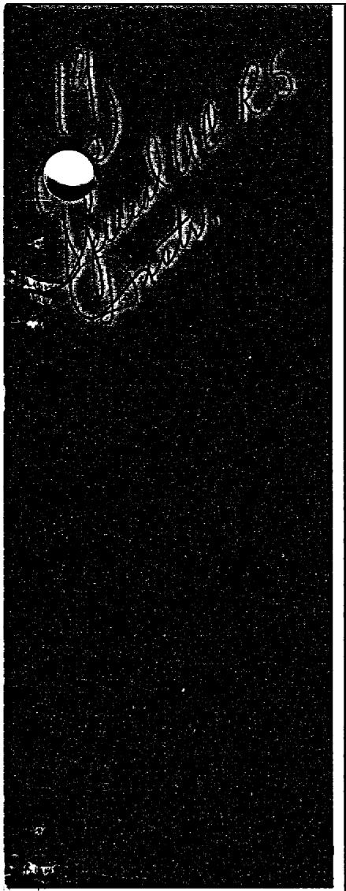

21,0

# FORCED-CONVECTION

# HEAT-TRANSFER MEASUREMENTS WITH

# A MOLTEN FLUORIDE SALT MIXTURE

# FLOWING IN A SMOOTH TUBE

J. W. Cooke   
B. Cox

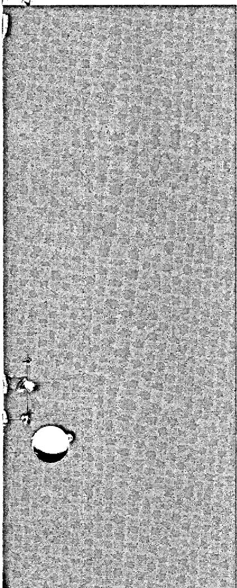

# OAK RIDGE NATIONAL LABORATORY

OPERATED BY UNION CARBIDE CORPORATION • FOR THE U.S. ATOMIC ENERGY COMMISSION

This report was prepared as an account of work sponsored by the United States Government. Neither the United States nor the United States Atomic Energy Commission, nor any of their employees, nor any of their contractors, subcontractors, or their employees, makes any warranty, express or implied, or assumes any legal liability or responsibility for the accuracy, completeness or usefulness of any information, apparatus, product or process disclosed, or represents that its use would not infringe privately owned rights.

Contract No. W-7405-eng-26

Reactor Division

FORCED-CONVECTION HEAT-TRANSFER MEASUREMENTS WITH A MOLTEN FLUORIDE SALT MIXTURE FLOWING IN A SMOOTH TUBE

J. W. Cooke

B. Cox

NOTICE

This report was prepared as an account of work sponsored by the United States Government. Neither the United States nor the United States Atomic Energy Commission, nor any of their employees, nor any of their contractors, subcontractors, or their employees, makes any warranty, express or implied, or assumes any legal liability or responsibility for the accuracy, completeness or usefulness of any information, apparatus, product or process disclosed, or represents that its use would not infringe privately owned rights.

MARCH 1973

OAK RIDGE NATIONAL LABORATORY

Oak Ridge, Tennessee 37830

operated by

UNION CARBIDE CORPORATION

for the

U. S. ATOMIC ENERGY COMMISSION

# CONTENTS

Page   
Abstract 1   
Introduction 1   
Description of the Apparatus 2   
Operating Procedures 11   
Calculations 15   
Results 16   
Discussion 24   
Conclusions 27   
Acknowledgments 27   
References 27   
Appendix A - Additional Details of the Experimental System 29   
Appendix B-Experimental Data 37  
Appendix C - Computer Program 43   
Appendix D - Chemical Analyses and Physical Properties of the Salt. 55

# FORCED-CONVECTION HEAT-TRANSFER MEASUREMENTS WITH A MOLTEN FLUORIDE SALT MIXTURE FLOWING IN A SMOOTH TUBE

J. W. Cooke

B. Cox

# ABSTRACT

Heat-transfer coefficients were determined experimentally for a proposed MSBR fuel salt (LiF-BeF $_2$ -ThF $_4$ -UF $_4$ ;67.5-20.0-12.0-0.5 mole %) flowing by forced convection through a 0.18-in.-ID horizontal, circular tube for the following range of variables:

Reynolds modulus 400-30,600

Prandtl modulus 4-14

Average fluid temperature $(^{\circ}\mathbf{F})$ 1050-1550

Heat flux (Btu/hr·ft²) 22,000 - 560,000

Within these ranges, the heat-transfer coefficient was found to vary from 320 up to 6900 Btu/hr·ft²·°F (Nusselt modulus of 6.5 to 138). Correlations of the experimental data resulted in the equations:

$$
\mathrm {N} _ {\mathrm {N u}} = 1. 8 9 \left[ \mathrm {N} _ {\mathrm {R e}} \mathrm {N} _ {\mathrm {P r}} (\mathrm {D} / \mathrm {L}) \right] ^ {0. 3 3} \left(\mu / \mu_ {\mathrm {s}}\right) ^ {0. 1 4},
$$

with an average absolute deviation of $6.6\%$ for $\mathbb{N}_{\mathrm{Re}} < 1000$ ;

$$
\mathrm {N} _ {\mathrm {N u}} = 0. 1 0 7 \left(\mathrm {N} _ {\mathrm {R e}} ^ {2 / 3} - 1 3 5\right) \mathrm {N} _ {\mathrm {P r}} ^ {1 / 3} (\mu / \mu_ {\mathrm {s}}) ^ {0. 1 4},
$$

with an average absolute deviation of $4.1\%$ for $3500 < N_{\mathrm{Re}} < 12,000$ ; and

$$
\mathrm {N} _ {\mathrm {N u}} = 0. 0 2 3 4 \mathrm {N} _ {\mathrm {R e}} ^ {0. 8} \mathrm {N} _ {\mathrm {P r}} ^ {1 / 3} (\mu / \mu_ {s}) ^ {0. 1 4},
$$

with an average absolute deviation of $6.2\%$ for $\mathbb{N}_{\mathrm{Re}} > 12,000$ .

Keywords: Heat transfer, fused salts, forced convection, heat exchangers, fluid flow, correlations.

# INTRODUCTION

The design of molten salt reactors requires detailed information about the transport properties of the proposed fuel, coolant and blanket mixtures. Although the molten salts generally behave as normal fluids with respect to heat transfer, $^{1,2}$ the possibility of unexpected effects,

such as nonwetting of metallic surfaces or the formation of low-conductance surface films, indicates that heat-transfer measurements for specific reactor salts are needed. $^3$ This report describes heat-transfer experiments with a proposed reactor fuel of mixed fluoride salts (LiF-BeF $_2$ ThF $_4$ -UF $_4$ ; 67.5-20.0-12.0-0.5 mole $\%$ ). The technique employs forced convection of the liquid salts through a smooth thin-walled Hastelloy N tube. Resistance heating supplies the tube with a uniform heat flux. This method is particularly well suited to the molten salt system because the electrical resistance of the molten salt is very large compared with that of the metal tube. Furthermore, the resistance of Hastelloy N remains nearly constant over the entire temperature range of the measurements, which simplifies the achievement of an axially uniform heat flux. In addition, a constant heat capacity of the molten salt in the observed temperature range makes possible several convenient assumptions in the calculation of local fluid bulk temperatures.

# DESCRIPTION OF THE APPARATUS

The apparatus for studying heat transfer with the molten salt system is shown schematically in Fig. 1 and in the photograph, Fig. 2. Moltensalt flows by means of gas pressure through a small diameter, electrically heated test section. The flow of molten salt alternates in direction as pressure from an inert gas supply is added to either of two storage vessels located at each end of the test channel. Each 6-gal salt reservoir is suspended from a weigh cell whose recorded signal indicates the flow rate. The flow of salt reverses automatically by the action of solenoid valves that control the flow of inert gas to the reservoirs. The rate of flow of the salt may be varied from 0.25 to 1.7 gal/min, emptying a reservoir in from 3 to 20 minutes.

The weigh cell circuit shown in Fig. 3 illustrates the electrical and mechanical systems that control the flow of gas and thereby the flow of molten salt. A second suspension system maintains tension on the test section, to prevent it from sagging, by means of counter weights connected by flexible cables. The test section consists of a smooth Hastelloy N tube, 24.5 in. long, 0.25-in. outside diameter, and 0.035-in.-wall

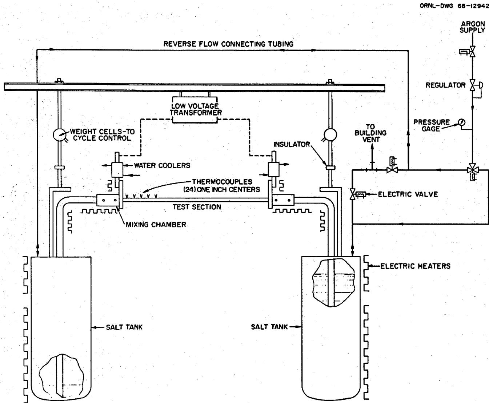  
Fig. 1. Schematic diagram for determining the heat-transfer characteristics of molten salt by forced convection.

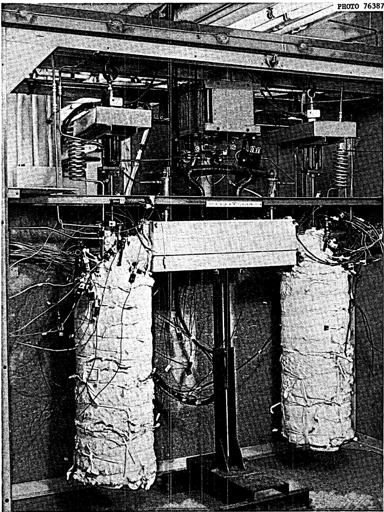  
Fig. 2. Photograph of the apparatus viewed from the same aspect as that of Fig. 1.

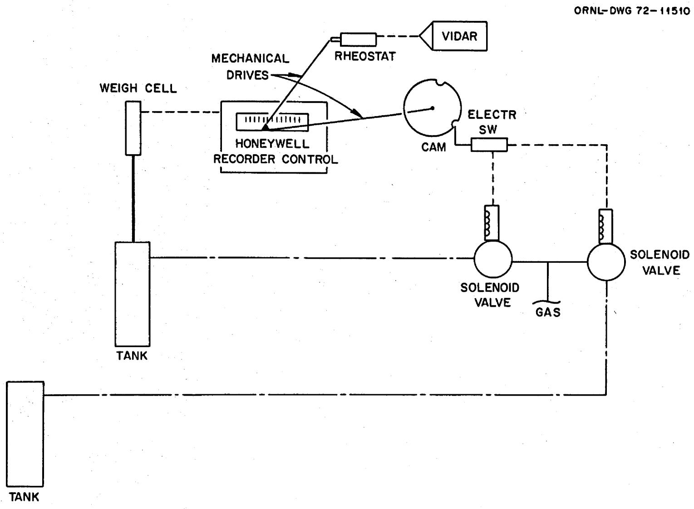  
Fig. 3. Weigh cell circuit for molten salt heat-transfer system.

thickness and is resistance heated with a $60\mathrm{Hz}$ ac power supply. A detail of the mixing chambers located at each end of the test section is shown in Fig. A-1, Appendix A. The electrodes connecting the test section with the power circuit serve also as end plates of the disk-and-donut mixing chambers. The power circuit to the test section is shown in Fig. 4. The electrical power to the test section is supplied by a $440/25\mathrm{v}$ , 25 kva transformer and is measured with a General Electric watt transducer, also shown in Fig. 4. The test section is insulated with a 3-in.-thick layer of vermiculite powder contained in a sheet metal tray. The salt reservoirs and connecting tubes are heated by auxiliary clamshell and Calrod heaters placed in positions indicated in Fig. 1. A typical heater circuit for an auxiliary heater is depicted in Fig. 5.

The inlet and outlet salt temperatures are measured by four, 40-mill-diam, Chromel-Alumel sheathed thermocouples inserted into two wells in each mixing chamber (Fig. A-1). The temperature distribution along the test section is measured by a series of $2^{\text{4}}$ Chromel-Alumel thermocouples (0.005-in.-diam wire) spot welded at l-in. intervals to the outside tube wall. The scheme for attaching these thermocouples is shown in Fig. A-2.

Details of a salt reservoir can be seen in Fig. A-3. The interior of these tanks as well as the test section and the mixing chambers are stress relieved and hydrogen fired before they are assembled.

A data acquisition system provides for the automatic monitoring of the temperatures; record is made by a paper printout and a paper tape punch. In this system a multichannel Vidar data recorder reads emf signals from each thermocouple, from the weigh cells, and from the power circuit in a sequential switching arrangement known as a "crossbar scanner." The manufacturer claims an accuracy of better than $\pm 0.5^{\circ}\mathrm{F}$ for the Vidar system. The data recording equipment is shown schematically in Fig. 6 and in a photograph in Fig. 7.

The weigh cell and wattmeter calibration curves and a list of pertinent experimental equipment may be found in Appendix A as Fig. A-4, Fig. A-5, and Table A-1, respectively.

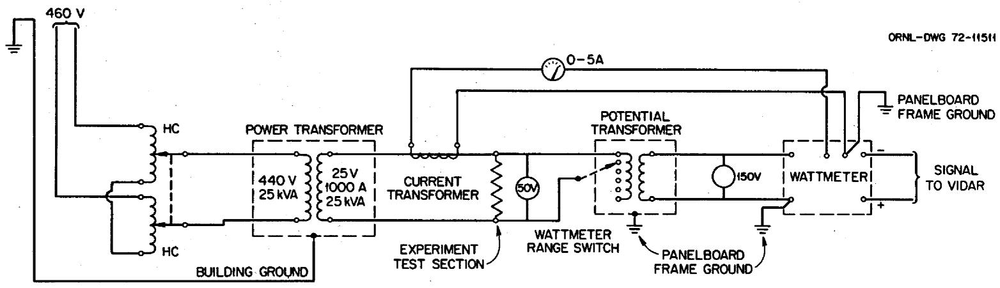  
Fig. 4. Test-section power circuit for molten salt heat-transfer experiment.

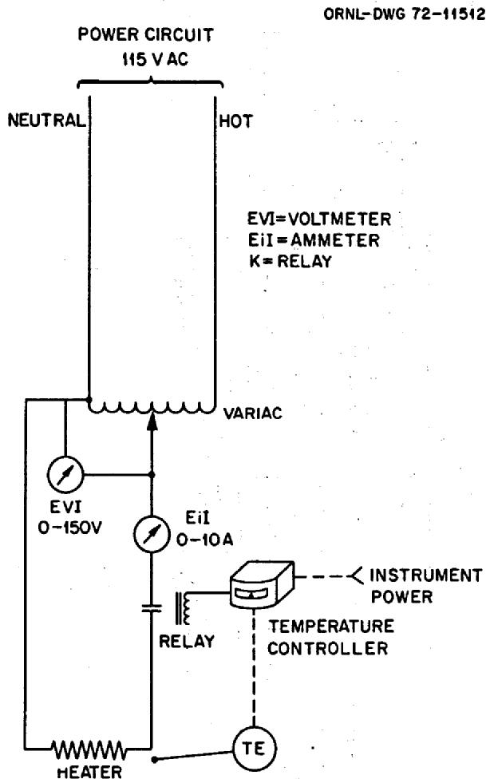  
Fig. 5. Typical heater circuit for molten salt heat-transfer experiments.

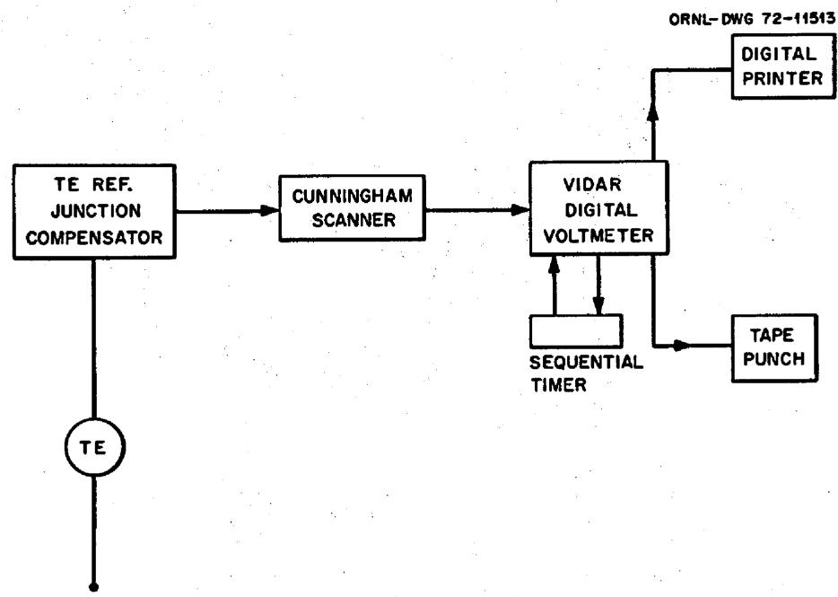  
Fig. 6. Thermocouple circuit for molten salt heat-transfer system.

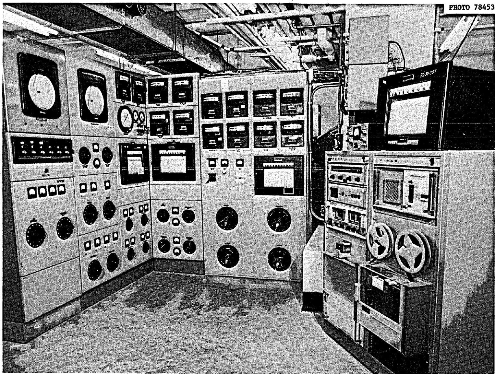  
Fig. 7. Photograph of data recording equipment.

# OPERATING PROCEDURES

In preparation for the addition of the molten salt mixtures, the system including the test section is heated to the desired temperature level above the melting point of the salt mixture. Approximately 165 lb of the molten salt is then introduced into one of the reservoirs by the force of argon gas pressure. Salt is forced back and forth through the test section as the operation of the apparatus is tested - for leaks, blockages, thermocouple and data recording functioning, etc. After the initial checkout procedure, the system is put on a standby mode by venting the gas pressure to the atmosphere and allowing the salt to siphon to equal levels in both reservoirs.* The standby mode is used to protect the test-section thermocouples by minimizing the heating of the test section.

Before each run, temperatures in the test section are raised to about $1000^{\circ}\mathrm{F}$ over a period of 45 minutes and the salt flow is reestablished. A fixed flow rate is established and power to the test-section heater is increased to the desired heat flux. When the temperatures indicate steady-state conditions, all parameters - power input, flow rate, and temperatures - are continuously recorded. The flow of salt is reversed when one reservoir is nearly empty, and the heat flux is momentarily reduced to about half the operating value to prevent a temperature excursion in the test section at the time of zero flow. The upper range of flow rates is limited by the time required to empty one of the reservoirs. Whenever the temperature exceeds the desired level, the system is allowed to cool by reducing the power to the test section and other appropriate heaters.

Periodic calibrations of radial heat losses were made by measuring the power required to maintain an empty test section in an isothermal condition as a function of temperature level. The information furnished by this calibration is used in each run, when an isothermal check of the test-section thermocouples is obtained at the desired temperature level

with the hot salt flowing and only enough heat added to the test section to equal the radial heat loss. In Fig. 8, typical test-section thermocouple readings from an isothermal run show a scatter band of $\pm 4^{\circ}\mathrm{F}$ about the average outside wall temperature. The sheathed thermocouples in the mixing chambers read slightly higher during isothermal runs and are believed to be more accurate. Their readings, therefore, provide the basis for standardization and the tube wall readings are corrected to this standard.

Extensive tests were conducted to insure the reliability of the apparatus and experimental procedures. The first test-section tube produced erratic axial temperature patterns which did not improve with more thermal insulation of the test section. Subsequently, the anomalous axial temperature profiles were traced to the test section, in which a hole had burned through the wall and had been repaired by welding. Excessive weld material protruding into the tube was thought to have disturbed the temperature and velocity profiles. Replacement of the test section eliminated the difficulty.

Other possible sources of error were investigated during the search for the cause of the temperature irregularities. Electrical conduction through the molten salt would result in additional heating of the salt, but the ratio of the resistivity of the salt to that of the test section is greater than 2500, indicating very little heat generated in the salt in this manner. Additional calculations of the radial temperature distribution4 confirmed that not more than $0.2\%$ of the power was expended by electrical conduction in the salt.

Temperature variations due to free convection are believed to be larger than those attributable to internal heating; but according to the criterion of Shannon and DePew, free convection in the horizontal test-section position is insignificant compared with forced convection in the range of Reynolds numbers described in this work.

As an additional check of natural-convection effects, the reactor fuel salt experiments were repeated with the test section anchored in a vertical position while other equipment arrangements and operational procedures remained unchanged. The object of the change was to compare the effects of free convection in the vertical and horizontal positions. A

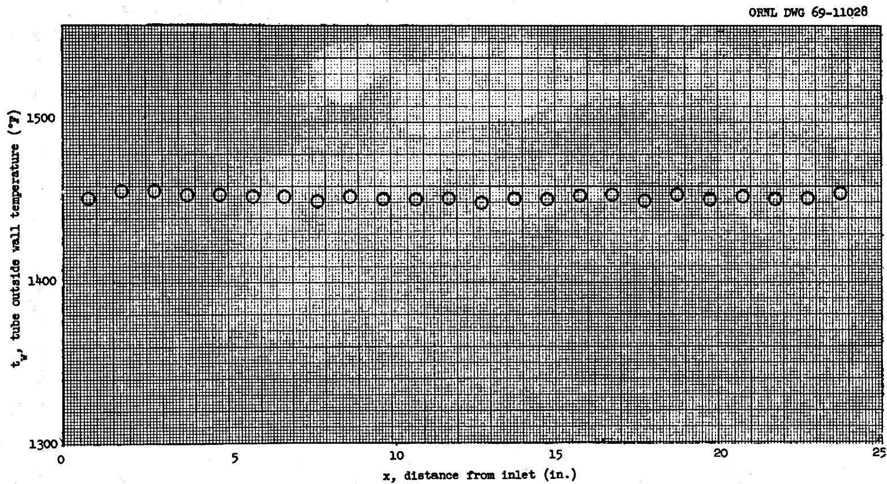  
Fig. 8. Tube wall thermocouple readings during isothermal salt flow.

crack developed in one of the piping connections to the test section after 8 runs and repairs were not attempted. However, the results of the vertical runs did not show any difference in the effect of free convection as related to the orientation of the test section. The data are presented later in the report and in Appendix B.

The possibility of heat conduction losses to the electrodes at the ends of the test section prompted calculations to be made based on the conservative assumptions of maximum heat flux and a minimum Reynolds number. The results of these calculations show that the net heat conduction in the axial direction is less than $0.1\%$ of the total heat generated in the test section at a distance of 0.25 in. from the entrance.

The electrical resistivity of the Hastelloy N test-section tube varies less than $1\%$ in the temperature range of 1000 to $1500^{\circ}\mathrm{F}$ and the heat capacity of the salt varies less than $5\%$ over the same temperature range. The variation of the radial heat loss along length of tube is less than $10\%$ and the heat loss itself is less than $5\%$ . A constant axial voltage drop measured along the test section verified the uniformity of the heat flux generated in the test-section wall and provided a check of the wall thickness and tube radius variation as a function of its length.

Experiments conducted with a well-known heat-transfer salt (HTS)* provided a final test in the new test section of the experimental procedure. Earlier experiments² showed that HTS data are well correlated by standard heat-transfer equations. The experiments with HTS in the present system demonstrated that the outside wall temperatures remained parallel to the mean salt temperature over half of the test-section length, indicating fully developed flow and a constant heat-transfer coefficient.

In ll runs with HTS, the experimentally determined values of the heat-transfer coefficient were compared with those predicted by standard correlations. Ten of the values of the heat-transfer coefficient were within $13\%$ of that predicted by the Sieder-Tate correlation and the other value was within $25\%$ . Before the system was charged with reactor salts, the HTS was removed by extensively flushing with water and drying in heated vacuum for 10 days.

# CALCULATIONS

The local coefficient of forced-convective heat transfer is defined by the equation

$$
h _ {x} \equiv \frac {\left(q / A\right) _ {x}}{\left(t _ {s} - t _ {m}\right) _ {x}}, \tag {1}
$$

where

$h =$ coefficient of heat transfer, Btu/hr·ft²·°F; $h_x$ , at position x along tube;

q = heat-transfer rate to fluid, Btu/hr;

A = heat-transfer (inner) surface area, ft²;

$t =$ temperature, ${}^{\circ}\mathbf{F}$ ; $t_m$ , fluid mixed mean at any position; $t_s$ , inner surface of the tube at any position $x$ ; $t_w$ , outer surface of the tube at any position $x$ .

Beyond the thermal and hydrodynamic entrance regions, $h_{\mathbf{x}}$ reaches an asymptotic value. For a constant heat flux, $(q / A)_{x}$ , this limiting value will occur when $(t_{s} - t_{m})_{x}$ reaches a constant value.

The inside tube wall temperature is related to the measured outside tube wall temperature by the equation

$$
t _ {w} - t _ {s} = \frac {q + q _ {L}}{2 \pi L k _ {m}} \left[ \frac {\left(r _ {w}\right) ^ {2}}{\left(r _ {w}\right) ^ {2} - \left(r _ {s}\right) ^ {2}} \ell n \left(\frac {r _ {w}}{r _ {s}}\right) - \frac {1}{2} \right] - \frac {q _ {L}}{2 \pi L k _ {m}} \left(\ell n \frac {r _ {w}}{r _ {s}}\right), \tag {2}
$$

where

$\mathbf{k} =$ thermal conductivity of fluid, Btu/hr·ft·°F; $\mathbf{k}_{\mathrm{m}}$ , thermal conductivity of tube;

L = test-section length, ft;

$\mathbf{r} =$ test-section tube radius, ft; $\mathbf{r}_{\mathrm{s}}$ , inner surface; $\mathbf{r}_{\mathrm{w}}$ , outer surface;

this is the solution to the one-dimensional steady-state heat conduction equation with a source term and a heat loss, $q_{\mathrm{L}}$ , at the outside wall. The only variable on the right-hand side of Eq. (2) is the thermal conductivity of the metal wall, $k_{\mathrm{m}}$ , which remains nearly constant over small temperature rises along the tube. Thus, when the temperature profiles $t_{\mathrm{w}}$ and $t_{\mathrm{m}}$ are parallel, the fluid flow in the tube is essentially fully developed.

For most of the measurements, the heat gained by the fluid intraversing the test section was calculated by the equation

$$
q = w C _ {p} \left(t _ {m, 0} - t _ {m, 1}\right). \tag {3}
$$

in which

$C_p =$ specific heat of fluid at constant pressure, Btu/lb $^{\circ}$ F,

w = mass flow rate, lb/hr,

and subscripts

o $=$ outlet

i = inlet.

For the later measurements (Runs 210 through 220), the heat gained by the fluid was determined from the electrical heat generation in the test section corrected for the calibrated heat loss. By calculating the heat input in this manner, the influence of the uncertainties in measuring the fluid mixed-mean inlet and outlet temperatures can be reduced.

The computer program used for reducing the experimental data is given in Appendix C.

# RESULTS

Heat-transfer coefficients were determined experimentally in 70 runs covering the laminar, transition, and turbulent flow regimes. Ten runs with HTS to test the equipment are included with data shown in Appendix B. The physical properties and chemical analyses of the molten salt are listed in Appendix D, Tables D-1 and D-2, respectively.

The duration of a run usually permitted time for three thermocouple scans to demonstrate thermal steady state. Figure 9 shows typical outside wall temperatures and mean fluid temperatures. A straight line is drawn between the mean inlet and mean outlet fluid temperatures by assuming constant physical properties of the molten salt and uniform heat transfer over the inner surface of the test-section wall. These assumptions are supported by the constant heat capacity of the molten salt in the observed temperature range and the constant resistance of the Hastelloy N test section mentioned earlier.

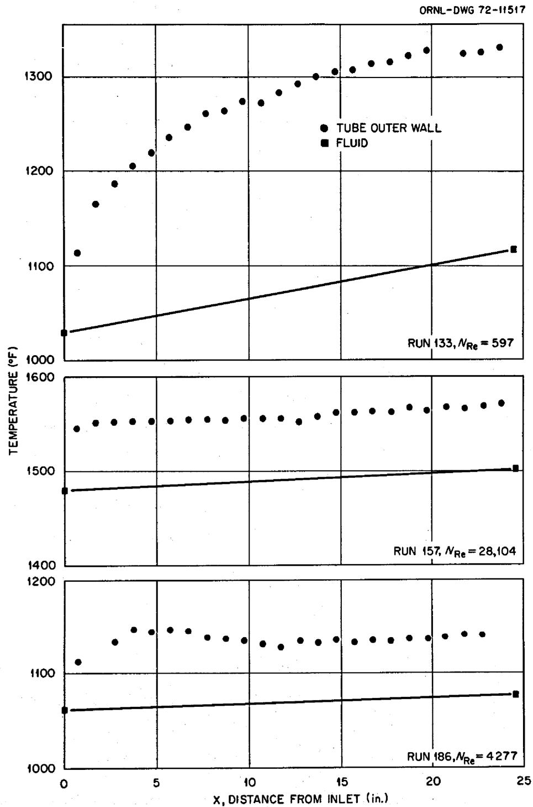  
Fig. 9. Axial temperature profiles for molten salt flowing in a smooth tube at laminar $(\mathrm{N}_{\mathrm{Re}} = 597)$ , turbulent $(\mathrm{N}_{\mathrm{Re}} = 28,104)$ , and transition $(\mathrm{N}_{\mathrm{Re}} = 4277)$ flow.

Three regions of $\mathbf{N}_{\mathrm{Re}}$ are shown in Fig. 9 - the laminar, transition, and turbulent at $\mathbf{N}_{\mathrm{Re}} = 597,4277,$ and $28,104$ , respectively. The coefficient of heat transfer $\mathbf{h}_{\mathbf{x}}$ assumes its limiting value rapidly for turbulent flow; but in laminar and transition flows, a significant entrance region is evident. This entrance region is seen more clearly when $\mathbf{h}_{\mathbf{x}}$ is plotted versus the distance along the test section $\mathbf{x}$ as in Fig. 10 for the transition flow run. After the thermal and hydrodynamic boundary layers become fully developed, $\mathbf{h}_{\mathbf{x}}$ decreases to a limiting value. The test section is not long enough for $\mathbf{h}_{\mathbf{x}}$ to reach the limiting value in laminar flow. Therefore, integrated values of $\mathbf{h}_{\mathbf{x}}$ over the entire tube length, coupled with the parameter $D / L$ , are used in developing the laminar flow correlations; whereas, the limiting constant $\mathbf{h}$ values are used for the transition and turbulent heat-transfer correlations.

Standard heat-transfer correlations for the three flow regimes are given in the following discussion of Eqs. (4) through (8). Heat-transfer data from the 70 runs are then presented in the dimensionless forms of standard correlations for comparison using the data listed in Appendix B and the physical properties in Table D-1.

1. For laminar, forced flow in the absence of natural convection, the equations of Sieder and Tate8 and Martinelli and Boelter9 are, respectively:

$$
\mathrm {N} _ {\mathrm {N u}} = 1. 8 6 \left[ \mathrm {N} _ {\mathrm {R e}} \mathrm {N} _ {\mathrm {P r}} (\mathrm {D} / \mathrm {L}) \right] ^ {1 / 3} (\mu / \mu_ {\mathrm {s}}) ^ {0. 1 4} \tag {4}
$$

and

$$
\mathrm {N} _ {\mathrm {N u}} = 1. 6 2 \left[ \mathrm {N} _ {\mathrm {R e}} \mathrm {N} _ {\mathrm {P r}} (\mathrm {D} / \mathrm {L}) \right] ^ {1 / 3}. \tag {5}
$$

2. For transition region flow beyond the entrance region, a modified form of Hausen equation3 is:

$$
N _ {N u} = 0. 1 1 6 \left(N _ {R e} ^ {2 / 3} - 1 2 5\right) N _ {P r} ^ {1 / 3} (\mu / \mu_ {s}) ^ {0. 1 4}. \tag {6}
$$

3. For turbulent flow, the equations recommended in Ref. 9 and attributed to McAdams and to Sieder and Tate are respectively:

$$
\mathrm {N} _ {\mathrm {N u}} = 0. 0 2 3 \mathrm {N} _ {\mathrm {R e}} ^ {0. 8} \mathrm {N} _ {\mathrm {P r}} ^ {0. 4}, \tag {7}
$$

$$
N _ {N u} = 0. 0 2 7 N _ {R e} ^ {0 \cdot s} N _ {P r} ^ {1 / 3} (\mu / \mu_ {s}) ^ {0 \cdot 1 4}
$$

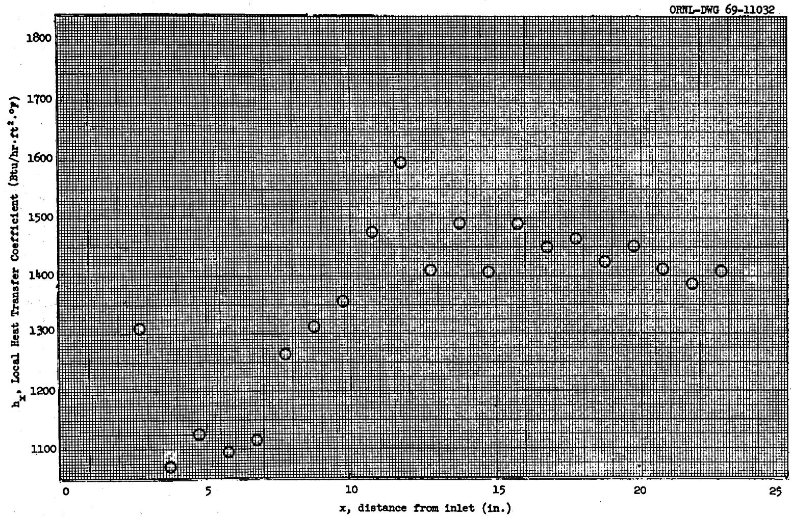  
Fig. 10. Axial variation of the heat-transfer coefficient $(\mathbb{N}_{\mathrm{Re}} = 4277)$ .

where

$\mathbf{N}_{\mathbf{Nu}} = \mathbf{N}$ USSelt modulus, hD/k, dimensionless,

$\mathbf{N}_{\mathrm{Pr}} = \text{Prandtl modulus, } C_{\mathrm{p}} \mu / k,$ dimensionless,

$\mathbf{N}_{\mathrm{Re}} =$ Reynolds modulus, $\rho \mathrm{VD} / \mu$ dimensionless,

and

V = mean velocity of fluid, ft/hr,

D $=$ inside diameter of tube, ft,

$\rho =$ fluid density evaluated at fluid mixed-mean temperature, $\mathrm{lb / ft^3}$

$\mu$ = fluid viscosity evaluated at fluid mixed-mean temperature, lb/hr·ft; $\mu_{s}$ , evaluated at temperature of the inner surface of the tube.

Equations (4), (6), and (8) are compared with the experimental data in Fig. 11. The experimental results are in good agreement in the laminar region but are slightly below the equations representing the transition and turbulent regions. For example, in the range $3500 < \mathrm{N}_{\mathrm{Re}} < 30,000$ , the data lie about $13\%$ below Eqs. (6) and (8). The heat-transfer data could not be correlated in the transition range $2000 < \mathrm{N}_{\mathrm{Re}} < 4000$ because of entrance effects that persisted over the length of the test section. The laminar data do not fit Eq. (5) as well as Eq. (4), as shown by comparing Figs. 12 and 11. Similarly, Eq. (7) provides no significant improvement in the correlation of the data for $\mathrm{N}_{\mathrm{Re}} > 10,000$ over that of Eq. (8) [compare Figs. 13 and 11].

The data plotted in Figs. 11 through 13 suggest that the experimental data for laminar and turbulent flow can be fitted to functions of the form:

$$
\text {O r d i n a t e} = K N _ {\text {R e}} ^ {n}, \tag {9}
$$

where $K$ and $n$ are dimensionless constants having different values for laminar and turbulent flows and the "ordinate" is the ordinate used in Fig. 11. Least-squares fits of the data to the form of Eq. (9) were carried out assuming a constant value (1/3) for the Prandtl modulus exponent. These fits were tried with and without a viscosity ratio correction term. We found that when the viscosity ratio correction term was included, the values for the Reynolds modulus exponent, $n$ , came closer to the commonly accepted values of 1/3 for laminar flow and 0.8 for turbulent flow. The resulting equations fitting the experimental

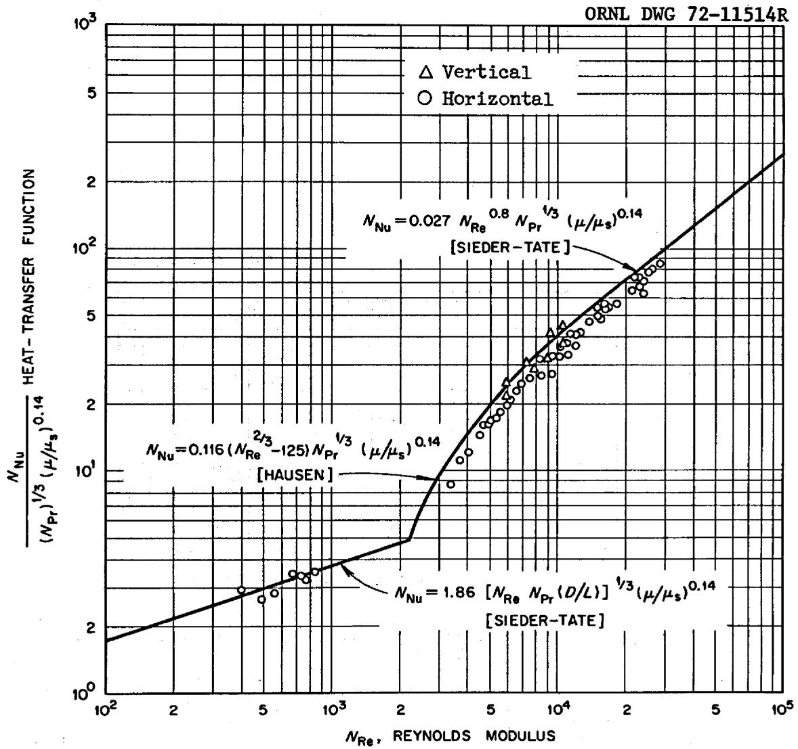  
Fig. 11. Comparisons of the molten salt data for Eqs. (4), (6), and (8).

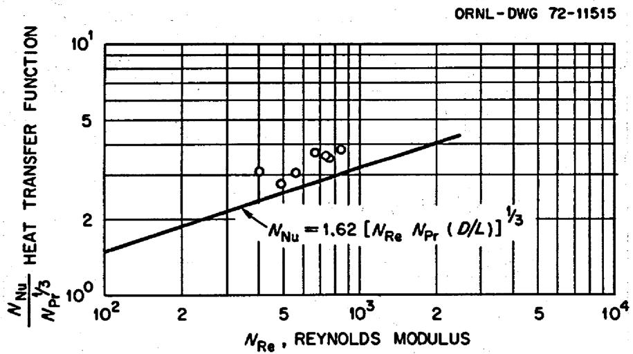  
Fig. 12. Comparison of laminar flow data of molten salt with Eq. (5).

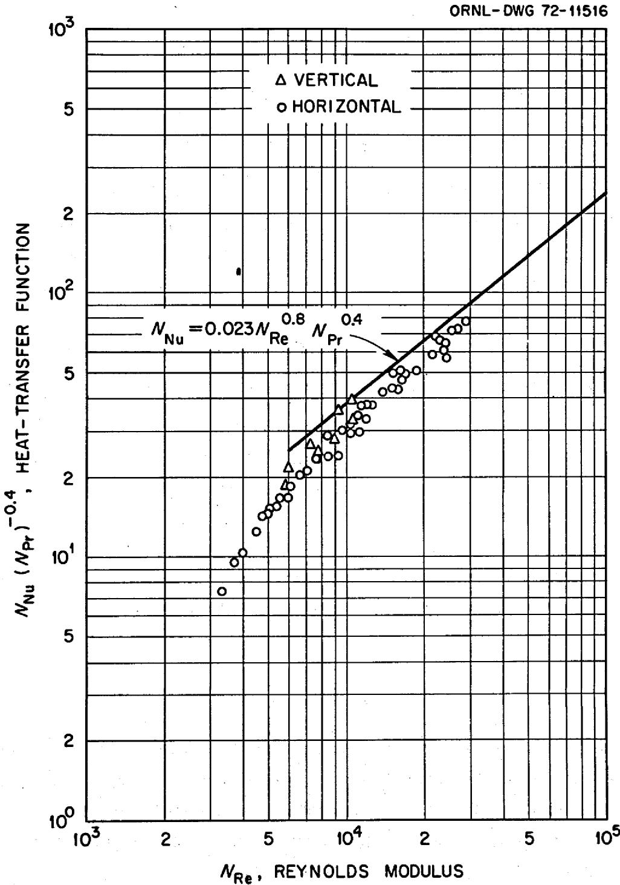  
Fig. 13. Comparison of transition and turbulent data of molten salt with Eq. (7).

data are

$$
\mathrm {N} _ {\mathrm {N u}} = 1. 8 9 \left[ \mathrm {N} _ {\mathrm {R e}} \mathrm {N} _ {\mathrm {P r}} (\mathrm {D} / \mathrm {L}) \right] ^ {0. 3 3} \left(\mu / \mu_ {\mathrm {s}}\right) ^ {0. 1 4}, \tag {10}
$$

with an average absolute deviation of $6.6\%$ for $\mathbb{N}_{\mathrm{Re}} < 1000$ ; and

$$
N _ {N u} = 0. 0 2 3 4 N _ {R e} ^ {2 / 3} N _ {P r} ^ {1 / 3} (\mu / \mu_ {s}) ^ {0. 1 4}, \tag {11}
$$

with an average absolute deviation of $6.2\%$ for $\mathbf{N}_{\mathrm{Re}} > 12,000$ .

Because the data in the transition region did not follow the form of Eq. (9), the equation for the experimental data in this range of $\mathbf{N}_{\mathrm{Re}}$ was obtained by adjusting the coefficient in Eq. (6), giving the following relation:

$$
N _ {N u} = 0. 1 0 7 \left(N _ {R e} ^ {1 / 3} - 1 3 5\right) N _ {P r} \quad \left(\mu / \mu_ {s}\right) ^ {0. 1 4}, \tag {12}
$$

with an average absolute deviation of $4.1\%$ for $3500 < N_{\mathrm{Re}} < 12,000$ .

The heat-transfer measurements made with the test section oriented in a vertical position to test for the possible effects of free convection are in good agreement with the standard correlations, except for four higher points (see Figs. 11 and 13). These higher points were obtained with downflow in contradiction to the predicted enhancement of heat transfer with upflow. Thus, a systematic thermocouple error in one of the mixing chambers is the most probable cause of the higher results with downflow.

# DISCUSSION

The results indicate that the proposed reactor fuel salt behaves as a normal fluid in the range $0.5 < \mathbb{N}_{\mathrm{Pr}} < 100$ with regard to heat transfer. It should be noted that uncertainties in the physical properties of the salts reflect as great an effect on the correlations as does the uncertainty in the heat-transfer coefficient.

Our data lie below the standard correlations in the turbulent and transition regions but not in the laminar region. If the deviations in our data were caused by low-conductance surface films or entrained gas, one would expect the effect to be apparent in all three regions. An uncertainty in the viscosity of the salt might explain the discrepancies in

the turbulent and the transition regions since the heat-transfer function in the laminar region is almost independent of the viscosity. In addition, the lower values in the transition regime could be the result of the failure of the thermal boundary layer to fully develop over the length of the test section.

The problem of boundary-layer development is most pronounced in the range of Reynolds number $2000 < \mathbb{N}_{\mathrm{Re}} < 4000$ , where entrance effects persisted for the entire length of the test section. The same effect could be produced up to $\mathbb{N}_{\mathrm{Re}} = 5000$ at higher wall heat fluxes. Figure 14 illustrates the apparent effect of heat flux on the entrance region length. At $\mathbb{N}_{\mathrm{Re}} = 3762$ and a wall heat flux of $2.55 \times 10^{5}$ Btu/hr·ft², there is no region of constant heat-transfer coefficient. In contrast, temperature profiles at a similar Reynolds number, $\mathbb{N}_{\mathrm{Re}} = 3565$ and the lower wall heat flux of $0.74 \times 10^{5}$ Btu/hr·ft² show a constant heat-transfer coefficient over most of the test-section length. Since the viscosity of the fluid decreases with increasing temperature, heat transfer from the tube wall may be exerting a stabilizing effect on the laminar boundary layer,[9,10] thus delaying transition.

Future experiments with the fuel salt should include system modifications so that the entrance region effects in transition flow can be better evaluated. Possible modifications would be the insertion of an unheated calming section prior to heat addition to permit establishment of the hydrodynamic boundary layer before changing the temperature profile. This would separate the two effects that now occur simultaneously. Another possibility would be to increase the length of the test section while maintaining a constant heat flux along the length. A sufficiently long tube might allow fully developed flow patterns to be reached before the test-section exit.

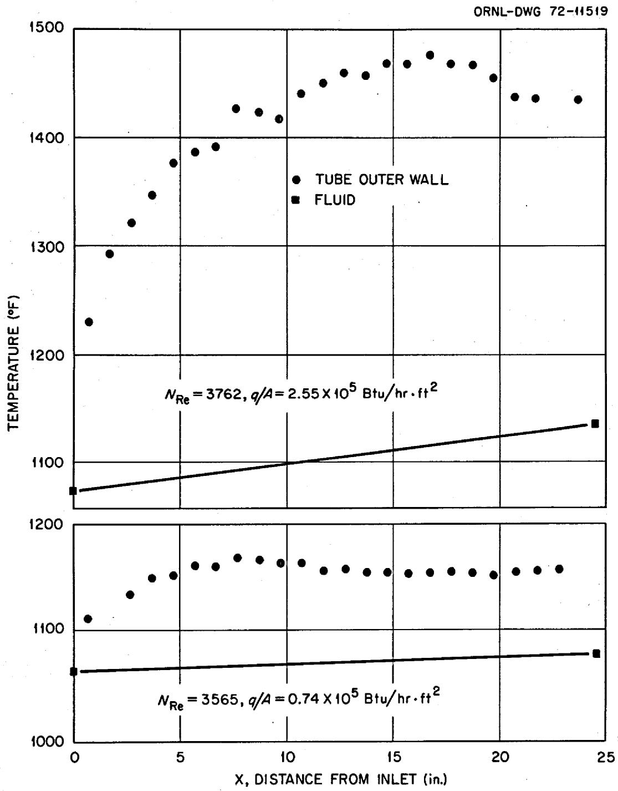  
Fig. 14. Comparison of axial temperature profiles of the molten salt at similar $\mathbf{N}_{\mathrm{Re}}$ with heat flux varied by a factor of 3.5.

# CONCLUSIONS

We have found molten fluoride salt mixtures to behave, for the most part, as normal fluids with respect to forced-convection heating in a smooth tube. Although the present results average $\sim 13\%$ below the standard literature heat-transfer correlations, one must realize that some uncertainties exist in the physical properties of the salt and that the standard correlations themselves are based on heat-transfer data using fluids such as air, steam, water, petroleum, etc., which exhibit a $\pm 20\%$ scatter band around the standard curves.

No evidence of the existence or influence of low-conductance surface films, such as corrosion products, gases, or oxides, was found in the present studies. In the Reynolds modulus range from 2000 to 5000, we did find the heat-transfer coefficient to vary along the length of the tube in a manner which appeared related to a delay in the transition to turbulent flow. We believe this delay in transition is abetted by the stabilizing influence of heating a fluid whose viscosity has a large negative temperature coefficient. We intend to make further studies of this phenomenon.

# ACKNOWLEDGMENTS

The design, construction, and operation of these experiments were made possible by the able assistance of J. J. Keyes, Jr., H. W. Hoffman, R. L. Miller, J. W. Krewson, W. A. Bird, and L. G. Alexander.

# REFERENCES

1. H. W. Hoffman, Turbulent Forced-Convection Heat Transfer in Circular Tubes Containing Molten Sodium Hydroxide, USAEC Report ORNL-1370, Oak Ridge National Laboratory, October 1952; see also Proceedings of the 1953 Heat Transfer and Fluid Mechanics Institute, p. 83, Stanford University Press, Stanford, California, 1953.   
2. H. W. Hoffman and S. I. Cohen, Fused Salt Heat Transfer - Part III: Forced-Convection Heat Transfer in Circular Tubes Containing the Salt Mixture $\mathrm{NaNO}_2$ - $\mathrm{NaNO}_3$ - $\mathrm{KNO}_3$ , USAEC Report ORNL-2433, Oak Ridge National Laboratory, March 1960.

3. H. W. Hoffman and J. Lones, Fused Salt Heat Transfer - Part II: Forced-Convection Heat Transfer in Circular Tubes Containing NaK-KF-LiF Eutectic, USAEC Report ORNL-1777, Oak Ridge National Laboratory, February 1955.   
4. H. F. Poppendiek and L. D. Palmer, Application of Temperature Solutions for Forced-Convection Systems with Volume Heat Sources to General Convection Problems, USAEC Report ORNL-1933, Oak Ridge National Laboratory, September 1955.   
5. R. L. Shannon and C. A. DePew, Forced Laminar Flow Convection in a Horizontal Tube with Variable Viscosity and Free-Convection Effects, ASME Technical Paper 68-WA/HT-20.   
6. E. N. Sieder and G. E. Tate, Heat Transfer and Pressure Drops of Liquids in Tubes, Ind. Eng. Chem. 28(12): 1429-1435 (1936).   
7. P. F. Massier, A Forced-Convection and Nuclear-Boiling Heat-Transfer Test Apparatus, JPL-TR-32-47, Jet Propulsion Laboratory, March 3, 1961.   
8. E. R. G. Eckert, A. J. Diaguila, and A. N. Curren, Experiments on Mixed-Free-and-Forced-Convective Heat Transfer Connected with Turbulent Flow Through a Short Tube, NACA TN-2974, National Advisory Committee for Aeronautics, July 1953.   
9. W. M. Rohsenow and H. Y. Choi, Heat, Mass, and Momentum Transfer, Prentice-Hall, Englewood Cliffs, New Jersey, 1961.   
10. H. Schlichting, Boundary Layer Theory, 4th ed., McGraw-Hill, New York, 1960.   
11. A. R. Wazzan, The Stability of Incompressible Flat Plate Laminar Boundary Layer in Water with Temperature Dependent Viscosity, pp. 184-202 in Proceedings of the Sixth Southeastern Seminar on Thermal Sciences, Raleigh, North Carolina, April 13-14, 1970.   
12. S. Cantor, ed., Physical Properties of Molten-Salt Reactor Fuel, Coolant, and Flush Salts, USAEC Report ORNL-TM-2316, Oak Ridge National Laboratory, August 1968.   
13. J. W. Cooke, Thermophysical Properties, pp. 89-93 in MSRE Semiann. Progr. Rept. Aug. 31, 1969, USAEC Report ORNL-4449, Oak Ridge National Laboratory.

APPENDIX A

ADDITIONAL DETAILS OF THE EXPERIMENTAL SYSTEM

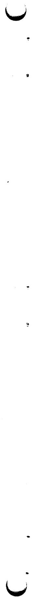

ORNL-DWG 72-11522

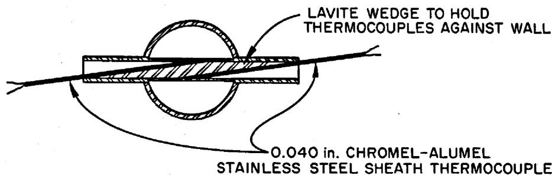

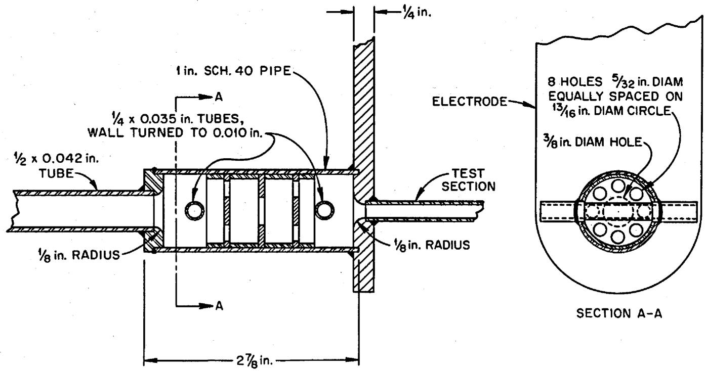  
Fig. A-1. Mixing chamber weldment.

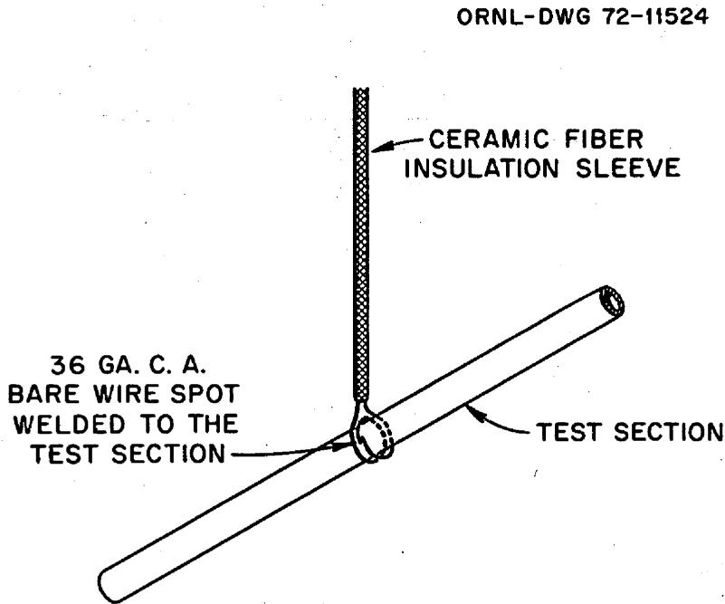  
Fig. A-2. Scheme for the attachment of a test-section thermocouple.

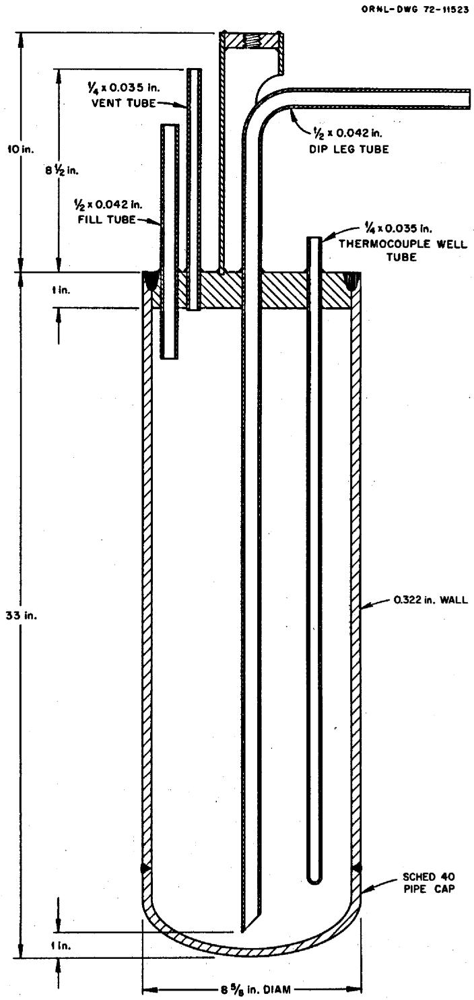  
Fig. A-3. Detail of a Salt reservoir.

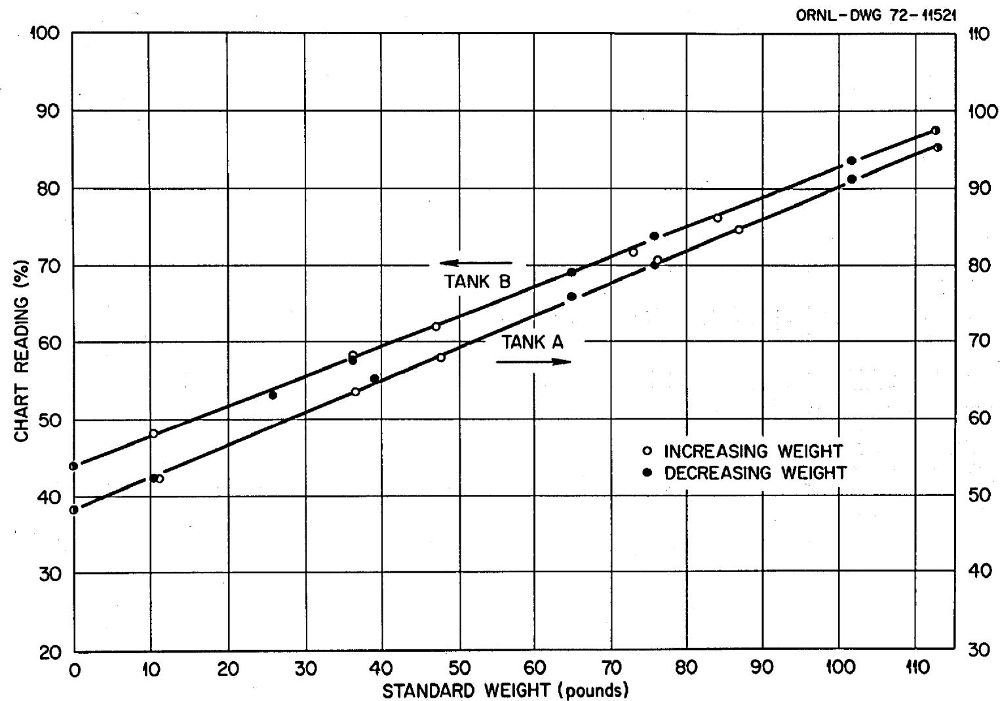  
Fig. A-4. Weigh cell calibration curve.

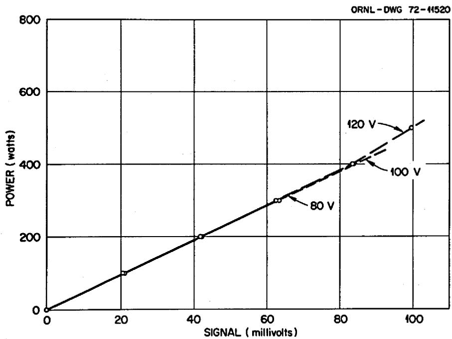  
Fig. A-5. Wattmeter calibration curve.

PERTINENT EXPERIMENTAL EQUIPMENT   

<table><tr><td>Equipment</td><td>Capacity or Range</td><td>Accuracy</td></tr><tr><td>Load Cells</td><td></td><td></td></tr><tr><td>BLH electronics</td><td>500 lb (150% overload)</td><td>±0.02% full scale</td></tr><tr><td>Type T3Pl and T3P2B</td><td>3 mv/v input</td><td>(see Fig. A-4)</td></tr><tr><td>Strip Recorder</td><td></td><td></td></tr><tr><td>Honeywell</td><td>L-2 Special</td><td>±0.25% full scale</td></tr><tr><td>Model BY153X2VV-(W7)</td><td></td><td></td></tr><tr><td>-(IV)Al (modified)</td><td></td><td></td></tr><tr><td>Current Transformer</td><td></td><td></td></tr><tr><td>Nothelfer windings</td><td>25 kva (prim. &amp; sec.)</td><td>-</td></tr><tr><td>Labs, Incorporated</td><td>48 v prim.</td><td></td></tr><tr><td>Model 14388</td><td>4 x 250 amp sec</td><td></td></tr><tr><td>Digital Voltmeter</td><td></td><td></td></tr><tr><td>Vidar</td><td>±10 mv to ±1000 v in</td><td>±0.01% of full scale</td></tr><tr><td>Model 521</td><td>6 decade stages</td><td>(least count 1.0 μv)</td></tr><tr><td>System Coupler</td><td></td><td></td></tr><tr><td>Vidar</td><td>-</td><td>-</td></tr><tr><td>Model 650-12</td><td></td><td></td></tr><tr><td>Scanner</td><td></td><td></td></tr><tr><td>Cunningham</td><td>-</td><td>-</td></tr><tr><td>Scannex Control</td><td></td><td></td></tr><tr><td>Model 000113G</td><td></td><td></td></tr><tr><td>Tape Digital Printer</td><td></td><td></td></tr><tr><td>Franklin Electronics, Inc.</td><td>-</td><td>-</td></tr><tr><td>Tape Punch Process</td><td></td><td></td></tr><tr><td>Tally Corporation</td><td>-</td><td>-</td></tr><tr><td>Model 1665</td><td></td><td></td></tr><tr><td>Tape Drive Model P150</td><td></td><td></td></tr><tr><td>Tape Reader Model 1848</td><td></td><td></td></tr><tr><td>Wattmeter</td><td></td><td></td></tr><tr><td>General Electric</td><td>2.5 - 10.0</td><td>(see Fig. A-5)</td></tr><tr><td>Type 4701</td><td>in 2.5 steps</td><td></td></tr><tr><td>Watt Transducer</td><td></td><td></td></tr><tr><td>Thermocouple Reference-Junction Compensator</td><td></td><td></td></tr><tr><td>Universal Compensator</td><td>-</td><td>-</td></tr><tr><td>Model RJ4801-CS</td><td></td><td></td></tr><tr><td>Thermocouples</td><td></td><td></td></tr><tr><td>Chromel-Alumel</td><td>-</td><td>±0.75%</td></tr></table>

APPENDIX B

EXPERIMENTAL DATA

Table B-1. Experimental Data for Heat-Transfer Studies Using the Salt LiF-BeF $_2$ -ThF $_4$ -UF $_4$ ; 67.5-20.0-12.0-0.5 mole %   

<table><tr><td>Run No.</td><td>T in (°F)</td><td>T out (°F)</td><td>δT (°F)</td><td>w (1b/hr)</td><td>q/A (Btu/hr·ft2× 10-5)</td><td>Heat Balancea</td><td>h (Btu/ hr·ft3·°F)</td><td>NRe</td><td>NPr</td><td>NNu</td><td>NbSt</td></tr><tr><td>107</td><td>1388.3</td><td>1436.0</td><td>47.7</td><td>2532.0</td><td>4.07</td><td>1.05</td><td>4882</td><td>15,993</td><td>6.3</td><td>106.1</td><td>56.000</td></tr><tr><td>115</td><td>1362.7</td><td>1415.8</td><td>53.1</td><td>1387.2</td><td>2.48</td><td>1.12</td><td>2831</td><td>8,345</td><td>6.6</td><td>61.5</td><td>31.902</td></tr><tr><td>117</td><td>1383.7</td><td>1438.4</td><td>54.7</td><td>1807.2</td><td>3.33</td><td>1.01</td><td>3617</td><td>11,419</td><td>6.3</td><td>78.6</td><td>41.497</td></tr><tr><td>119</td><td>1379.1</td><td>1436.6</td><td>57.5</td><td>1185.0</td><td>2.30</td><td>1.05</td><td>2302</td><td>7,495</td><td>6.3</td><td>50.0</td><td>26.270</td></tr><tr><td>121</td><td>1418.0</td><td>1474.4</td><td>56.4</td><td>2191.2</td><td>4.16</td><td>1.04</td><td>4590</td><td>14,917</td><td>5.8</td><td>99.8</td><td>54.082</td></tr><tr><td>122</td><td>1456.2</td><td>1507.9</td><td>51.7</td><td>2968.2</td><td>5.17</td><td>1.04</td><td>6192</td><td>21,647</td><td>5.5</td><td>134.6</td><td>74.415</td></tr><tr><td>123</td><td>1488.2</td><td>1537.8</td><td>49.6</td><td>3206.4</td><td>5.36</td><td>1.00</td><td>6462</td><td>25,119</td><td>5.1</td><td>140.4</td><td>79.762</td></tr><tr><td>127</td><td>1097.9</td><td>1156.4</td><td>58.5</td><td>1636.8</td><td>3.23</td><td>1.05</td><td>1936</td><td>5,005</td><td>13.1</td><td>42.1</td><td>16.713</td></tr><tr><td>129</td><td>1082.7</td><td>1163.3</td><td>80.6</td><td>250.8</td><td>0.68</td><td>1.01</td><td>396</td><td>738</td><td>13.5</td><td>8.6</td><td>3.359</td></tr><tr><td>130</td><td>1081.5</td><td>1177.1</td><td>95.6</td><td>279.6</td><td>0.90</td><td>1.00</td><td>427</td><td>839</td><td>13.3</td><td>9.2</td><td>3.563</td></tr><tr><td>131</td><td>1089.8</td><td>1159.9</td><td>70.1</td><td>227.4</td><td>0.54</td><td>1.02</td><td>407</td><td>673</td><td>13.5</td><td>8.8</td><td>3.488</td></tr><tr><td>132</td><td>1090.6</td><td>1160.2</td><td>69.6</td><td>256.2</td><td>0.60</td><td>0.97</td><td>381</td><td>760</td><td>13.4</td><td>8.3</td><td>3.265</td></tr><tr><td>133</td><td>1029.6</td><td>1118.7</td><td>89.1</td><td>221.4</td><td>0.66</td><td>0.93</td><td>357</td><td>550</td><td>15.9</td><td>7.7</td><td>2.821</td></tr><tr><td>134</td><td>1036.3</td><td>1134.8</td><td>98.5</td><td>155.4</td><td>0.52</td><td>0.93</td><td>358</td><td>405</td><td>15.3</td><td>7.8</td><td>2.944</td></tr><tr><td>143</td><td>1062.8</td><td>1117.7</td><td>54.9</td><td>1785.0</td><td>3.30</td><td>1.04</td><td>1940</td><td>4,940</td><td>14.5</td><td>42.2</td><td>16.148</td></tr><tr><td>144</td><td>1075.4</td><td>1135.7</td><td>60.3</td><td>1900.8</td><td>3.87</td><td>1.04</td><td>2200</td><td>5,523</td><td>13.8</td><td>47.8</td><td>18.563</td></tr><tr><td>145</td><td>1048.2</td><td>1103.4</td><td>55.2</td><td>2007.6</td><td>3.73</td><td>1.04</td><td>2129</td><td>5,304</td><td>15.0</td><td>46.3</td><td>17.459</td></tr><tr><td>146</td><td>1064.0</td><td>1115.9</td><td>51.9</td><td>2199.6</td><td>3.85</td><td>1.04</td><td>2513</td><td>6,026</td><td>14.6</td><td>54.7</td><td>20.984</td></tr><tr><td>147</td><td>1076.9</td><td>1131.0</td><td>54.1</td><td>2307.6</td><td>4.20</td><td>1.04</td><td>2727</td><td>6,573</td><td>14.0</td><td>59.2</td><td>23.072</td></tr><tr><td>148</td><td>1093.5</td><td>1148.3</td><td>54.8</td><td>2506.8</td><td>4.63</td><td>1.03</td><td>3068</td><td>7,583</td><td>13.2</td><td>66.7</td><td>26.549</td></tr><tr><td>149</td><td>1460.4</td><td>1482.9</td><td>22.5</td><td>1166.4</td><td>0.89</td><td>0.94</td><td>2230</td><td>8,393</td><td>5.6</td><td>48.5</td><td>27.007</td></tr><tr><td>150</td><td>1460.6</td><td>1489.5</td><td>28.9</td><td>1700.4</td><td>1.66</td><td>1.03</td><td>3434</td><td>12,260</td><td>5.5</td><td>74.7</td><td>41.743</td></tr><tr><td>151</td><td>1469.4</td><td>1488.4</td><td>19.0</td><td>2093.4</td><td>1.34</td><td>1.01</td><td>3977</td><td>15,282</td><td>5.5</td><td>86.4</td><td>48.472</td></tr><tr><td>152</td><td>1477.0</td><td>1501.8</td><td>24.8</td><td>2458.2</td><td>2.05</td><td>1.00</td><td>4573</td><td>18,300</td><td>5.4</td><td>99.5</td><td>56.022</td></tr><tr><td>153</td><td>1486.7</td><td>1513.4</td><td>26.7</td><td>2784.6</td><td>2.51</td><td>1.09</td><td>5426</td><td>21,235</td><td>5.6</td><td>117.9</td><td>65.520</td></tr><tr><td>Run No.</td><td>T in (°F)</td><td>T out (°F)</td><td>δT (°F)</td><td>w (1b/hr)</td><td>q/A (Btu/hr·ft2 x 10-5)</td><td>Heat Balancea</td><td>h (Btu/ hr·ft2·°F)</td><td>NRe</td><td>NPr</td><td>NNu</td><td>NbSt</td></tr><tr><td>154</td><td>1496.1</td><td>1523.3</td><td>27.2</td><td>3057.0</td><td>2.80</td><td>1.04</td><td>5740</td><td>23,719</td><td>5.1</td><td>124.8</td><td>71.557</td></tr><tr><td>155</td><td>1466.3</td><td>1484.7</td><td>18.4</td><td>3205.2</td><td>1.99</td><td>1.02</td><td>5551</td><td>23,214</td><td>5.5</td><td>120.7</td><td>67.668</td></tr><tr><td>156</td><td>1475.0</td><td>1488.2</td><td>13.2</td><td>3262.2</td><td>1.45</td><td>0.99</td><td>5229</td><td>23,861</td><td>5.5</td><td>113.7</td><td>63.927</td></tr><tr><td>157</td><td>1479.7</td><td>1502.7</td><td>23.0</td><td>3505.8</td><td>2.72</td><td>1.07</td><td>6627</td><td>26,192</td><td>5.4</td><td>144.1</td><td>81.181</td></tr><tr><td>158</td><td>1466.3</td><td>1483.8</td><td>17.5</td><td>1282.2</td><td>0.76</td><td>0.89</td><td>2236</td><td>9,284</td><td>5.5</td><td>48.6</td><td>27.265</td></tr><tr><td>159</td><td>1466.7</td><td>1492.6</td><td>25.9</td><td>1401.6</td><td>1.22</td><td>0.99</td><td>2708</td><td>10,171</td><td>5.5</td><td>58.9</td><td>32.943</td></tr><tr><td>160</td><td>1471.3</td><td>1492.2</td><td>20.9</td><td>1512.0</td><td>1.06</td><td>0.93</td><td>2741</td><td>11,107</td><td>5.5</td><td>59.6</td><td>33.394</td></tr><tr><td>161</td><td>1472.4</td><td>1494.4</td><td>22.0</td><td>1615.2</td><td>1.20</td><td>0.99</td><td>3033</td><td>11,853</td><td>5.5</td><td>66.0</td><td>36.980</td></tr><tr><td>162</td><td>1463.7</td><td>1522.0</td><td>58.3</td><td>1254.6</td><td>2.46</td><td>1.04</td><td>2675</td><td>9,464</td><td>5.2</td><td>58.2</td><td>32.754</td></tr><tr><td>163</td><td>1470.0</td><td>1527.5</td><td>57.5</td><td>1425.6</td><td>2.76</td><td>1.05</td><td>3071</td><td>10,884</td><td>5.2</td><td>66.7</td><td>37.571</td></tr><tr><td>164</td><td>1480.0</td><td>1535.8</td><td>55.8</td><td>1513.8</td><td>2.85</td><td>1.07</td><td>3334</td><td>11,770</td><td>5.1</td><td>72.5</td><td>41.151</td></tr><tr><td>165</td><td>1486.9</td><td>1539.2</td><td>52.3</td><td>2105.4</td><td>3.71</td><td>1.02</td><td>4385</td><td>16,497</td><td>5.1</td><td>95.3</td><td>54.119</td></tr><tr><td>166</td><td>1501.6</td><td>1546.2</td><td>44.6</td><td>2803.2</td><td>4.21</td><td>1.06</td><td>5852</td><td>22,512</td><td>5.0</td><td>127.2</td><td>72.942</td></tr><tr><td>167</td><td>1513.9</td><td>1561.7</td><td>47.8</td><td>3471.0</td><td>5.60</td><td>1.02</td><td>6892</td><td>28,499</td><td>4.9</td><td>149.8</td><td>86.348</td></tr><tr><td>170</td><td>1064.6</td><td>1080.1</td><td>15.5</td><td>1797.0</td><td>0.94</td><td>0.97</td><td>1737</td><td>4,524</td><td>15.9</td><td>37.7</td><td>14.620</td></tr><tr><td>171</td><td>1066.3</td><td>1082.2</td><td>15.9</td><td>2346.0</td><td>1.26</td><td>1.01</td><td>2340</td><td>5,938</td><td>15.7</td><td>50.9</td><td>19.818</td></tr><tr><td>172</td><td>1069.8</td><td>1084.0</td><td>14.2</td><td>2722.8</td><td>1.31</td><td>1.05</td><td>2905</td><td>6,939</td><td>15.6</td><td>63.2</td><td>24.811</td></tr><tr><td>173</td><td>1049.0</td><td>1081.2</td><td>32.2</td><td>202.2</td><td>0.22</td><td>0.96</td><td>320</td><td>493</td><td>16.3</td><td>7.0</td><td>2.671</td></tr><tr><td>186</td><td>1061.6</td><td>1076.2</td><td>14.6</td><td>1597.8</td><td>0.79</td><td>0.94</td><td>1445</td><td>3,986</td><td>16.0</td><td>31.4</td><td>12.161</td></tr><tr><td>191</td><td>1062.0</td><td>1078.5</td><td>16.5</td><td>1318.2</td><td>0.74</td><td>0.94</td><td>1041</td><td>3,322</td><td>15.9</td><td>22.6</td><td>8.713</td></tr><tr><td>192</td><td>1064.6</td><td>1080.3</td><td>15.7</td><td>1460.4</td><td>0.77</td><td>0.99</td><td>1337</td><td>3,690</td><td>15.7</td><td>29.0</td><td>11.274</td></tr><tr><td>193</td><td>1235.2</td><td>1262.7</td><td>27.5</td><td>1106.4</td><td>1.03</td><td>1.01</td><td>1591</td><td>4,731</td><td>9.3</td><td>34.6</td><td>16.075</td></tr><tr><td>195</td><td>1247.0</td><td>1270.6</td><td>23.7</td><td>2333.4</td><td>1.86</td><td>1.04</td><td>3560</td><td>10,200</td><td>9.1</td><td>77.4</td><td>36.392</td></tr><tr><td>198</td><td>1255.8</td><td>1296.0</td><td>40.2</td><td>3001.8</td><td>4.07</td><td>1.04</td><td>4645</td><td>13,693</td><td>8.7</td><td>101.0</td><td>47.638</td></tr><tr><td>199</td><td>1273.2</td><td>1294.4</td><td>21.2</td><td>3219.6</td><td>2.30</td><td>1.09</td><td>4752</td><td>14,944</td><td>8.6</td><td>103.3</td><td>49.533</td></tr><tr><td>Run No.</td><td>T1n(°F)</td><td>Tout(°F)</td><td>δT(°F)</td><td>w(1b/hr)</td><td>q/A(Btu/hr·ft2× 10-5)</td><td>Heat Balancea</td><td>h(Btu/ hr·ft2·°F)</td><td>NRe</td><td>NPr</td><td>NNu</td><td>NbSt</td></tr><tr><td>200</td><td>1279.6</td><td>1303.7</td><td>24.1</td><td>3392.4</td><td>2.76</td><td>1.07</td><td>5050</td><td>16,088.0</td><td>8.4</td><td>109.8</td><td>53.017</td></tr><tr><td>201c</td><td>1237.8</td><td>1263.8</td><td>26.0</td><td>1351.2</td><td>1.18</td><td>1.07</td><td>2406</td><td>5,892.4</td><td>9.14</td><td>52.3</td><td>24.7</td></tr><tr><td>202c</td><td>1250.7</td><td>1272.6</td><td>21.9</td><td>1717.8</td><td>1.27</td><td>1.01</td><td>2762</td><td>7,660.9</td><td>8.94</td><td>60.0</td><td>28.6</td></tr><tr><td>203c</td><td>1252.2</td><td>1276.2</td><td>24.0</td><td>2050.2</td><td>1.66</td><td>1.16</td><td>4029</td><td>9,200.0</td><td>8.89</td><td>87.6</td><td>41.9</td></tr><tr><td>204c</td><td>1258.4</td><td>1282.4</td><td>24.0</td><td>2299.2</td><td>1.86</td><td>0.99</td><td>3625</td><td>10,435.5</td><td>8.79</td><td>78.8</td><td>37.7</td></tr><tr><td>205c</td><td>1229.9</td><td>1255.0</td><td>25.0</td><td>1395.0</td><td>1.18</td><td>1.01</td><td>2119</td><td>5,910.9</td><td>9.41</td><td>46.1</td><td>21.5</td></tr><tr><td>206c</td><td>1231.7</td><td>1255.4</td><td>23.7</td><td>1704.0</td><td>1.36</td><td>1.10</td><td>3004</td><td>7,238.9</td><td>9.39</td><td>65.3</td><td>30.7</td></tr><tr><td>207c</td><td>1243.6</td><td>1268.1</td><td>24.5</td><td>2036.4</td><td>1.68</td><td>0.97</td><td>3122</td><td>8,947.4</td><td>9.08</td><td>67.9</td><td>32.1</td></tr><tr><td>208c</td><td>1247.2</td><td>1270.6</td><td>23.4</td><td>2338.8</td><td>1.84</td><td>1.12</td><td>4337</td><td>10,359.7</td><td>9.00</td><td>94.2</td><td>44.9</td></tr><tr><td>210</td><td>1132.4</td><td>1156.1</td><td>70.1</td><td>2110</td><td>1.69</td><td>1.01</td><td>2416</td><td>6,512</td><td>12.5</td><td>52.5</td><td>22.15</td></tr><tr><td>211</td><td>1168.4</td><td>1215.4</td><td>150.8</td><td>2105</td><td>3.38</td><td>1.01</td><td>3049</td><td>7,696</td><td>10.8</td><td>66.3</td><td>28.96</td></tr><tr><td>212</td><td>1203.4</td><td>1226.7</td><td>59.9</td><td>2102</td><td>1.69</td><td>1.03</td><td>2823</td><td>8,230</td><td>10.2</td><td>61.4</td><td>27.89</td></tr><tr><td>213</td><td>1138.1</td><td>1168.7</td><td>30.6</td><td>2654</td><td>2.76</td><td>1.04</td><td>3477</td><td>8,566</td><td>12.2</td><td>75.6</td><td>32.07</td></tr><tr><td>214</td><td>1097.9</td><td>1149.6</td><td>51.7</td><td>2807</td><td>4.92</td><td>1.01</td><td>3573</td><td>8,297</td><td>13.3</td><td>77.7</td><td>31.27</td></tr><tr><td>215</td><td>1248.1</td><td>1256.1</td><td>8.0</td><td>2887</td><td>0.79</td><td>0.97</td><td>4335</td><td>12,374</td><td>9.2</td><td>94.2</td><td>44.98</td></tr><tr><td>216</td><td>1258.3</td><td>1276.2</td><td>18.0</td><td>2914</td><td>1.77</td><td>1.03</td><td>4490</td><td>12,957</td><td>8.8</td><td>97.6</td><td>46.89</td></tr><tr><td>217</td><td>1280.6</td><td>1310.6</td><td>30.1</td><td>2791</td><td>2.85</td><td>1.05</td><td>4616</td><td>13,454</td><td>8.2</td><td>100.3</td><td>49.10</td></tr><tr><td>218</td><td>1288.1</td><td>1341.7</td><td>53.6</td><td>2753</td><td>5.03</td><td>1.03</td><td>4915</td><td>14,035</td><td>7.7</td><td>106.9</td><td>52.56</td></tr><tr><td>219</td><td>1293.8</td><td>1383.2</td><td>89.4</td><td>1593</td><td>5.04</td><td>1.03</td><td>2999</td><td>8,620</td><td>7.3</td><td>65.2</td><td>32.12</td></tr><tr><td>220</td><td>1118.5</td><td>1155.7</td><td>136.1</td><td>1140</td><td>1.51</td><td>1.02</td><td>1082</td><td>3,554</td><td>12.8</td><td>23.5</td><td>9.60</td></tr></table>

Heat balance = (sensible heat gained by fluid + heat loss)/(electrical heat generation).   
bNSt = NNu (NPr)-1/3 (μ/μs)-0.14   
Test section oriented vertically.

Table B-2. Experimental Data for Heat-Transfer Studies Using the Salt Hitec (KNO₃-NaNO₃-NaNO₃; 44-49-7 mole %)   

<table><tr><td>Run No.</td><td>T1n (°F)</td><td>Tout (°F)</td><td>δT (°F)</td><td>w (1b/hr)</td><td>q/A (Btu/hr·ft2 x 10-5)</td><td>Heat Balancea</td><td>h (Btu/ hr·ft3·°F)</td><td>NRe</td><td>NPr</td><td>NNu</td><td>Nb St</td></tr><tr><td>87</td><td>537.6</td><td>677.3</td><td>139.7</td><td>157.2</td><td>0.85</td><td>0.99</td><td>283.5</td><td>2,314</td><td>9.3</td><td>17.0</td><td>7.34</td></tr><tr><td>88</td><td>540.8</td><td>591.3</td><td>50.5</td><td>1375.2</td><td>2.69</td><td>1.05</td><td>2499.4</td><td>15,450</td><td>11.3</td><td>150.0</td><td>64.3</td></tr><tr><td>89</td><td>567.5</td><td>621.0</td><td>53.4</td><td>2071.8</td><td>4.30</td><td>0.98</td><td>3516.6</td><td>25,640</td><td>10.2</td><td>211.0</td><td>93.1</td></tr><tr><td>96</td><td>574.8</td><td>624.3</td><td>49.5</td><td>2195.4</td><td>4.21</td><td>1.08</td><td>4450.9</td><td>27,578</td><td>10.1</td><td>267.1</td><td>119.7</td></tr><tr><td>97</td><td>601.4</td><td>650.7</td><td>49.3</td><td>1589.4</td><td>3.04</td><td>1.00</td><td>3045.6</td><td>21,716</td><td>9.3</td><td>182.7</td><td>84.2</td></tr><tr><td>98</td><td>608.4</td><td>658.5</td><td>50.1</td><td>1097.4</td><td>2.13</td><td>1.06</td><td>2473.8</td><td>15,349</td><td>9.1</td><td>148.4</td><td>69.3</td></tr><tr><td>99</td><td>618.5</td><td>672.5</td><td>54.0</td><td>630.6</td><td>1.32</td><td>1.03</td><td>1386.4</td><td>9,165</td><td>8.7</td><td>83.2</td><td>39.2</td></tr><tr><td>101</td><td>608.8</td><td>702.4</td><td>93.6</td><td>592.8</td><td>2.15</td><td>1.10</td><td>1332.4</td><td>9,065</td><td>8.3</td><td>79.9</td><td>37.6</td></tr><tr><td>102</td><td>633.1</td><td>657.2</td><td>24.1</td><td>640.2</td><td>0.60</td><td>0.99</td><td>1656.8</td><td>9,142</td><td>8.9</td><td>99.4</td><td>47.7</td></tr><tr><td>103</td><td>618.8</td><td>634.8</td><td>16.1</td><td>1551.6</td><td>0.97</td><td>1.05</td><td>4151.9</td><td>20,848</td><td>9.4</td><td>249.1</td><td>117.6</td></tr><tr><td>104</td><td>582.2</td><td>669.1</td><td>86.9</td><td>1603.8</td><td>5.41</td><td>0.99</td><td>3096.6</td><td>22,357</td><td>9.1</td><td>185.8</td><td>84.1</td></tr></table>

Heat balance = (sensible heat gained by fluid + heat loss)/(electrical heat generation).   
bNSt = NNu (NPr) -1/3 (μ/μs)-0.14

APPENDIX C

COMPUTER PROGRAM

COMPIER OPTIONS - NAME= MAIN,OPT=02,LINECNT=6),SOURCE,BCDIC,NOLIST,DECK,LOAD,MAP,NOEDIT,NCID,NOXPEF

C I AM A WOLTEM SALT HEAT TRANSFER PROGRAM 5

ISN 0002 REAL L,MDOT,K1,K2,K3,K4,NUNC,MU,NJAVG,NNC,KINOW 10

ISN 0603 DIMENSION TO(30),XL(30),TI(30),TB(30),H(30),IN(200),DU(200),D(200) 12

ISN 0004 DIMENSION NUNO(3G) 13

ISNOCOS INTEGER FTC,CTC 15

ISN 006 6010J=1,13 30

ISNOCG7 $[L = 5*(J - 1)] + 1$

ISN 0008 $\mathbb{L} = 5\ast \mathbb{J}$ 50

ISN 0009 READ7,IN(1),DU(1),I=IL,IU) 60

1SN CO10 7 FORMAT(5([3,F5,2,2X)) 70

ISN 0011 10 CONTINUE 75

ISN 0012 0.1 20.1=1,10 76

ISN 0013 [1=NN(1)+1 77

ISN 0C14 [F(OU(I).GE.O.2)] D(II)=DU(II) 77A1

ISN CO16 20 CONTINUE 77A2

ISN OCL7 IF (D(45).LT.900.) GC TO 21 778

[SN 0019] GJ TO 22 77c

ISN 0C20 210(46)=-D(46) 770

ISN OC21 22 CONTINUE 77E

ISN.0022 D301=1,50 78A

ISNOC23 0U(1)=O(1) 768

ISN 0024 3U CONTINUE 78C

CTEMP FITFOLLOFSFOR150FREFJUNCTIONUFTO1900DEGREESF 79

ISN.0025 074201=1,46 79A

ISN 0026 IF (D(1).LT.1.59) GC TO 400 798

ISN 0028 IF $\{D(1),GE,1,99,AND,D(1),LT,5,30\}$ GO TO 401 79C

ISN 0C30 IF (D(I).GE.5.01.AND.D(I).LT.10.C1) GO TO 402 790

ISN CC32 IF (D(I).GE.10.01.AND.D(II).LT.13.01) GO TO 403 79E

ISN G034 IF (D(I).GE.13.01.AND.C(I).LT.17.01) GO TO 404 79F

ISN 0036 IF (D(I).GE.17.01.AND.D(I).LT.22.99) GO TO 405 79G

ISN G038 $\mathbf{I} = \{\mathbf{D}(\mathbf{I}),\mathbf{G}\mathbf{E},22.99,\mathbf{A}\mathbf{N}\mathbf{D}(\mathbf{I}),\mathbf{L}\mathbf{T},27.99\}$ GO TO 406 79H

ISN 0040 IF (D(I).GE.29.99.AND.O(II).LT.33.CO) GO TO 407 791

ISN C042 [F (D(I).GE.33.0.AND.D(I).LT.35.0) GO TO 4C8 79J

ISN 0C44 IF{D(I).GE.36.0.AND.D(I).LT.39.0) GO TO 409 79K

ISN 6046 IF (D(I).GE.39.0) GC TO 410 79L

ISN 0048 40C D(1)=150+(236-150)/1.99*(D(I)-0.) 79L1

ISN 0649 GO TO 420 79M

ISN C050 4(1) D(1)=236.+（371.-236.)/(5.01-1.99)*(D(1)-1.99) 79N

ISN 0051 IF (D(1).GE.258..AND.D(1).LE.290.) D(1)=D(1)-0.6 79N1

ISN 0053 IF (D(1).GE.280..AND.D(1).LE.314.) D(1)=D(1)-0.5 79N2

ISN 0055 GO TO 420 790

ISN.2C56 402 D(1)=372.+（592.-371./(10.01-5.01)*(C(1)-5.01) 79P

ISN 0057 IF (D(1).GE.532.00) D(1)=D(1)-3.80 79P1

ISN 0059 $D(1) = D(1) + 1.0$ 79p2

ISN 0C60 IF (D(I).LE.425.) C(1)=D(1)-0.20 79P3

ISN 0062 GO TO 420 790

ISN G063 403 D(1)=592.+(721.-592.)/(13.01-10.)1)*(C(1)-1C.01) 79R

ISN 0064 GO TO 420 795

ISNOC65 404 D(1)=72.+(891-721)/(17.01-13.01)*(D(1)-13.01) 79T

ISN 0066 GTO420 79U

ISN 0067 4C5 D(1)=891.+(1143.-891.)/(22.99-17.01)*(C(1)-17.01) 79V

ISN 0C68 GO TO 420 79W

1SN 0069 4)6 D(1)=1143.+（1444.-1143.)/(30.00-22.99)*(D(1)-23.00)-C.10 79x

ISN G070 IF (D(1).GE.1396.) D(1)=C(1)+.3 79x1

ISN C672 IF(D(1).Lé.1234.) C(1)=D(1)+.30 79x2

ISN 0C74 GO TO 42C 79Y

ISN 0075 407 D(1)=1444.+(1576.-1444.)/(33.00-29.99)*(D(1)-29.99) 792

ISNOC76 IF(D(I).Lc.1528.)D(1)=D(1)-0.5 7921

<table><tr><td>ISN</td><td>C078</td><td colspan="2">GO TO 420</td></tr><tr><td>ISN</td><td>0079</td><td colspan="2">D(1)=1576+(1710,-1576.)/(36.00-33.00)=(D(1)-33.00)</td></tr><tr><td>ISN</td><td>0080</td><td colspan="2">IF (D(1).GE.1635..AND.D(1).LE.1670.) D(1)=D(1)+0.4</td></tr><tr><td>ISN</td><td>0082</td><td colspan="2">GO TO 420</td></tr><tr><td>ISN</td><td>0C83</td><td colspan="2">D(1)=1710+(1848,-1710)/(39.00-36.00)=D(1)-36.0C)+.10</td></tr><tr><td>ISN</td><td>0C84</td><td colspan="2">GO TO 420</td></tr><tr><td>ISN</td><td>0085</td><td colspan="2">D(1)=1648+(1941,-1848)/(41.00-39.00)=(D(1)-39.00)-.10</td></tr><tr><td>ISN</td><td>0086</td><td colspan="2">IF (D(1).GE.1892.) D(1)=D(1)+0.3</td></tr><tr><td>ISN</td><td>0C88</td><td colspan="2">42C CONTINUE</td></tr><tr><td>ISN</td><td>0089</td><td colspan="2">PRINT 23</td></tr><tr><td>ISN</td><td>0090</td><td colspan="2">23 FORMAT(1H1)</td></tr><tr><td>ISN</td><td>0091</td><td colspan="2">DO 25 I=1,20</td></tr><tr><td>ISN</td><td>0092</td><td colspan="2">J=D(50)+.2</td></tr><tr><td>ISN</td><td>0C93</td><td colspan="2">PRINT 24,J</td></tr><tr><td>ISN</td><td>0C94</td><td colspan="2">24 FORMAT(1MO,)*NEXT IS RUN *,14)</td></tr><tr><td>ISN</td><td>0095</td><td colspan="2">25 CONTINUE</td></tr><tr><td>ISN</td><td>0096</td><td colspan="2">D(41)=DU(41)</td></tr><tr><td>ISN</td><td>0097</td><td colspan="2">D(42)=DU(42)</td></tr><tr><td>ISN</td><td>0098</td><td colspan="2">FTC=DU(41)+0.2</td></tr><tr><td>ISN</td><td>0099</td><td colspan="2">CYC=DU(42)+0.2</td></tr><tr><td>ISN</td><td>0100</td><td colspan="2">UNAVG=AVG(C,1,24,.,750,23,750)</td></tr><tr><td>ISN</td><td>0101</td><td colspan="2">CALL THER(1C,46,UNAVG)</td></tr><tr><td>ISN</td><td>0102</td><td colspan="2">PRINT 51</td></tr><tr><td>ISN</td><td>0103</td><td colspan="2">51 FORMAT(1H1,4X,9HSUBSCRIPT,6X,6HU DATA,9X,6HC DATA)</td></tr><tr><td>ISN</td><td>0104</td><td colspan="2">DO_58.I=1,50</td></tr><tr><td>ISN</td><td>0105</td><td colspan="2">PRINT 52,I,DU(I),C(1)</td></tr><tr><td>ISN</td><td>0106</td><td colspan="2">52 FCRMATT(7X,(3,8X,FE,2,8X,FB,2)</td></tr><tr><td>ISN</td><td>0107</td><td colspan="2">58 CONTINUE</td></tr><tr><td></td><td colspan="3">C CONSTANTS FOLLOW. THE THERMAL K'S ARE TEMP CEPENDENT</td></tr><tr><td>ISN</td><td>0108</td><td colspan="2">R1=.180/2.</td></tr><tr><td>ISN</td><td>0109</td><td colspan="2">D1=0.180/12.</td></tr><tr><td>ISN</td><td>0110</td><td colspan="2">R2=.250/2.</td></tr><tr><td>ISN</td><td>0111</td><td colspan="2">R3=6.00/2.</td></tr><tr><td>ISN</td><td>0112</td><td colspan="2">R4=3.0598</td></tr><tr><td></td><td colspan="3">C K1 IS GIVEN ON CARD 845</td></tr><tr><td>ISN</td><td>0113</td><td colspan="2">K2=0.06</td></tr><tr><td>ISN</td><td>0114</td><td colspan="2">K3=9.00</td></tr><tr><td>ISN</td><td>0115</td><td colspan="2">K4=14.32</td></tr><tr><td>ISN</td><td>0116</td><td colspan="2">N=2</td></tr><tr><td>ISN</td><td>0117</td><td colspan="2">L=24.5</td></tr><tr><td>ISN</td><td>0118</td><td colspan="2">SPH1=0.324</td></tr><tr><td>ISN</td><td>0119</td><td colspan="2">DXA=0.5</td></tr><tr><td>ISN</td><td>0120</td><td colspan="2">DXB=0.5</td></tr><tr><td></td><td colspan="3">C END OF CGCONSTANTIS</td></tr><tr><td>ISN</td><td>0121</td><td colspan="2">XL(1)=.750</td></tr><tr><td>ISN</td><td>0122</td><td colspan="2">DX=1.00</td></tr><tr><td>ISN</td><td>0123</td><td colspan="2">DO 60 I=2,24</td></tr><tr><td>ISN</td><td>0124</td><td colspan="2">N=1-</td></tr><tr><td>ISN</td><td>0125</td><td colspan="2">XL(1)=XL(M)+DX</td></tr><tr><td>ISN</td><td>0126</td><td colspan="2">60 CONTINUE</td></tr><tr><td>ISN</td><td>0127</td><td colspan="2">TAO=(D(27)+D(28))/2.</td></tr><tr><td>ISN</td><td>0128</td><td colspan="2">TAI=(D(29)+D(30))/2.</td></tr><tr><td>ISN</td><td>0129</td><td colspan="2">TBBI=(D(31)+D(32))/2.</td></tr><tr><td>ISN</td><td>0130</td><td colspan="2">TBBO=(D(33)+D(34))/2.</td></tr><tr><td>ISN</td><td>0131</td><td colspan="2">IF (TAD,GT,TAI)GO TC 61</td></tr><tr><td>ISN</td><td>0133</td><td colspan="2">TA=TAI</td></tr><tr><td>ISN</td><td>0134</td><td colspan="2">G) TO 62</td></tr><tr><td>ISN</td><td>0135</td><td colspan="2">TA=TAO</td></tr><tr><td>ISN</td><td>0136</td><td colspan="2">62 IF (TBBG,GT,TBBI) GO TO 63</td></tr><tr><td>ISN</td><td>0138</td><td colspan="2">T8B=TBBI</td></tr><tr><td>ISN</td><td>0139</td><td colspan="2">GO TO 64</td></tr><tr><td>ISN</td><td>0140</td><td colspan="2">63 T8B=TBBO</td></tr><tr><td>ISN</td><td>0141</td><td colspan="2">64 CONTINUE</td></tr><tr><td>ISN</td><td>0142</td><td colspan="2">IF (TA-TBB)66,68,68</td></tr><tr><td>ISN</td><td>0143</td><td colspan="2">66 TIN=TA</td></tr><tr><td>ISN</td><td>0144</td><td colspan="2">TOUT=TBB</td></tr><tr><td>ISN</td><td>0145</td><td colspan="2">GO TO 70</td></tr><tr><td>ISN</td><td>0146</td><td colspan="2">68 TIN=TP B</td></tr><tr><td>ISN</td><td>0147</td><td colspan="2">TOUT=TA</td></tr><tr><td>ISN</td><td>0148</td><td colspan="2">70 CONTINUE</td></tr><tr><td>ISN</td><td>0149</td><td colspan="2">IF (TA-TBB)73,71,71</td></tr><tr><td>ISN</td><td>0150</td><td colspan="2">71 DO 72 I=1,24</td></tr><tr><td>ISN</td><td>0151</td><td colspan="2">M=25-I</td></tr><tr><td>ISN</td><td>0152</td><td colspan="2">TO(I)=C(M)</td></tr><tr><td>ISN</td><td>0153</td><td colspan="2">72 CONTINUE</td></tr><tr><td>ISN</td><td>0154</td><td colspan="2">GO TO 80</td></tr><tr><td>ISN</td><td>0155</td><td colspan="2">73 DO 75 I=1,24</td></tr><tr><td>ISN</td><td>0156</td><td colspan="2">TO(II)=C(II)</td></tr><tr><td>ISN</td><td>0157</td><td colspan="2">75 CONTINUE</td></tr><tr><td>ISN</td><td>0158</td><td colspan="2">80 CONTINUE</td></tr><tr><td></td><td></td><td colspan="2">C CARE MUST BE TAKEN WITH REARGD TO SIGN CCANVENTION FOR FOLLOWING Q AND DT</td></tr><tr><td>ISN</td><td>0159</td><td colspan="2">QWM=400./83.6*0(47)*200.*3.412/D(49)</td></tr><tr><td>ISN</td><td>0160</td><td colspan="2">MOOT=0(48)*60.</td></tr><tr><td>ISN</td><td>0161</td><td colspan="2">DT=UMAVG-D(46)</td></tr><tr><td>ISN</td><td>0162</td><td colspan="2">QLCAL=-((0.275TE-3)*CT*DT+0.1100*DT-0.1724E-1)</td></tr><tr><td>ISN</td><td>0163</td><td colspan="2">QLF=QLCAL/(2.03.14*R2*L/144.)</td></tr><tr><td>ISN</td><td>0164</td><td colspan="2">QLF=-QLF</td></tr><tr><td>ISN</td><td>0165</td><td colspan="2">QEL=K4*,375*17./8./12.*((D(43)-D(25))/DXA+(D(44)-D(26))/DXB)</td></tr><tr><td>ISN</td><td>0166</td><td colspan="2">DT=AVG(D,1,24,750,23,750)-D(46)</td></tr><tr><td>ISN</td><td>0167</td><td colspan="2">QINS=2.*3.14*(L-0.5)/12.*(-DT)/(ALOG(R3/R2)/K2+ALOG(R4/R3)/K3)</td></tr><tr><td>ISN</td><td>0168</td><td colspan="2">QLEST=QEL+QINS</td></tr><tr><td>ISN</td><td>0169</td><td colspan="2">QF=MDOT*SPH1*(TOUT-TIN)</td></tr><tr><td>ISN</td><td>0170</td><td colspan="2">QODP=QF/(2.03.14*R1*L)*144.</td></tr><tr><td>ISN</td><td>0171</td><td colspan="2">QBAL=(QF-QLCAL)/QMM</td></tr><tr><td>ISN</td><td>0172</td><td colspan="2">XI=FTC</td></tr><tr><td>ISN</td><td>0173</td><td colspan="2">X1=X1-.250</td></tr><tr><td>ISN</td><td>0174</td><td colspan="2">X2=FTC+CTC-1</td></tr><tr><td>ISN</td><td>0175</td><td colspan="2">X2=X2-.250</td></tr><tr><td>ISN</td><td>0176</td><td colspan="2">110 PRINT 111</td></tr><tr><td>ISN</td><td>0177</td><td colspan="2">111 F#RMAT (LH1,09X,1HX,11X,3HX/D,10X,1HH,11X,2HTB,11X,2HTI,11X,2HTO</td></tr><tr><td></td><td></td><td colspan="2">8 ,12X,2HNU,11X,2HRE,12X,2HPR)</td></tr><tr><td>ISN</td><td>0178</td><td colspan="2">DO LI5 I=1,24</td></tr><tr><td>ISN</td><td>0179</td><td colspan="2">X=XL(I)</td></tr><tr><td>ISN</td><td>0180</td><td colspan="2">ATT=TO(I)-25.</td></tr><tr><td>ISN</td><td>0181</td><td colspan="2">KL=TK(ATT)</td></tr><tr><td>ISN</td><td>0182</td><td colspan="2">TI(I)=TC(I)-(OF-CLCAL)/(2.03.14*L/12.*K1)*</td></tr><tr><td></td><td></td><td colspan="2">(R2*R2/(R2*R2-R1*R1)*ALOG(R2/R1)-0.500)</td></tr><tr><td></td><td></td><td colspan="2">+QLF*R2/12./K1*ALOG(R2/R1)</td></tr><tr><td>ISN</td><td>0183</td><td colspan="2">ATT=(TI(I)+TC(I))/2.</td></tr><tr><td>ISN</td><td>0184</td><td colspan="2">KI NOW=TK(ATT)</td></tr><tr><td>ISN</td><td>0185</td><td colspan="2">UK=ABS(K1NOW-K1)</td></tr><tr><td>ISN</td><td>0186</td><td colspan="2">IF (UK,GE,0,1) GO TC 112</td></tr><tr><td>ISN</td><td>0188</td><td colspan="2">XOD=X/(2.*R1)</td></tr><tr><td>ISN</td><td>0189</td><td colspan="2">TB(I)=TIN+QCDP*3.14*2.*R1*X/MDCT/SPH1/144.</td></tr><tr><td>ISN</td><td>0190</td><td colspan="2">H(I)=QDP/(TI(I)-TE(I))</td></tr><tr><td>ISN</td><td>0191</td><td colspan="2">CALL PRCP(RENO,PRNC,PU,RHO,TB(I),R1,CCND,SPH1,MDOT)</td></tr></table>

<table><tr><td>ISN</td><td>0192</td><td></td><td>NUNO(I)=H(I)*2,*R1/12./CCND</td></tr><tr><td>ISN</td><td>0193</td><td></td><td>PRINT 114,x,XOD,H(I),TB(I),TI(I),TO(I),NUNO(I),RENO,PRND</td></tr><tr><td>ISN</td><td>0194</td><td>114</td><td>FORMAT(1HO,9F13.4)</td></tr><tr><td>ISN</td><td>0195</td><td>115</td><td>CONTINLE</td></tr><tr><td>ISN</td><td>0196</td><td></td><td>HAVG=AVG(H,FTC,CTC,X1,X2)</td></tr><tr><td>ISN</td><td>0197</td><td></td><td>PRINT 450,HAVG</td></tr><tr><td>ISN</td><td>0198</td><td>450</td><td>FORMAT(1HO,'AVG H BTU/HRSQFTDEGF = ',F10.2)</td></tr><tr><td>ISN</td><td>0199</td><td></td><td>HAVG=AVG(TI,FTC,CTC,X1,X2)</td></tr><tr><td>ISN</td><td>0200</td><td></td><td>PRINT 451,bAVG</td></tr><tr><td>ISN</td><td>0201</td><td>451</td><td>FORMAT(1HO,'AVG INNER WALL TEMP DEGF = ',F10.3)</td></tr><tr><td>ISN</td><td>0202</td><td></td><td>BAVG=AVG(TB,FTC,CTC,X1,X2)</td></tr><tr><td>ISN</td><td>0203</td><td></td><td>PRINT 452,BAVG</td></tr><tr><td>ISN</td><td>0204</td><td>452</td><td>FORMAT(1HO,'AVG BULK TEMP DEGF = ',F10.3)</td></tr><tr><td>ISN</td><td>0205</td><td></td><td>DAVG=AVG(TO,FTC,CTC,X1,X2)</td></tr><tr><td>ISN</td><td>0206</td><td></td><td>PRINT 453,CAVG</td></tr><tr><td>ISN</td><td>0207</td><td>453</td><td>FORMAT(1HO,'AVG OUTER WALL TEMP DEGF = ',F10.3)</td></tr><tr><td>ISN</td><td>0208</td><td></td><td>NUAVG=AVG(NNO,FTC,CTC,X1,X2)</td></tr><tr><td>ISN</td><td>0209</td><td></td><td>PRINT 454,NUVG</td></tr><tr><td>ISN</td><td>0210</td><td>454</td><td>FORMAT(1HG,'AVG NUSSELT NO.= ',F10.3)</td></tr><tr><td>ISN</td><td>0211</td><td></td><td>CALL PROP(RENO,PRNC,PU,RHO,PAVG,R1,CCAD,SPH1,MDOT)</td></tr><tr><td>ISN</td><td>0212</td><td></td><td>VRAT=MU</td></tr><tr><td>ISN</td><td>0213</td><td></td><td>BETA=0.02328/RHO</td></tr><tr><td>ISN</td><td>0214</td><td></td><td>PRINT 90,QWM</td></tr><tr><td>ISN</td><td>0215</td><td>90</td><td>FORMAT(1HI,'WATTMETER BTU/HR = ',T35,F10.3)</td></tr><tr><td>ISN</td><td>0216</td><td></td><td>PRINT 91,OF</td></tr><tr><td>ISN</td><td>0217</td><td>91</td><td>FORMAT(1HO,'HEAT TC SALT BTU/HR = ',T35,F10.3)</td></tr><tr><td>ISN</td><td>0218</td><td></td><td>PRINT 93,QLCAL</td></tr><tr><td>ISN</td><td>0219</td><td>93</td><td>FORMAT(1HO,'CAL HEAT LOSS BTU/HR = ',T35,F10.3)</td></tr><tr><td>ISN</td><td>0220</td><td></td><td>PRINT 94,QLEST</td></tr><tr><td>ISN</td><td>0221</td><td>94</td><td>FORMAT(1HO,'EST HEAT LOSS BTU/HR = ',T35,F10.3)</td></tr><tr><td>ISN</td><td>0222</td><td></td><td>PRINT 96,N</td></tr><tr><td>ISN</td><td>0223</td><td>96</td><td>FORMAT(1HO,'TEST SECT(CN NO.= ',T35,I10)</td></tr><tr><td>ISN</td><td>0224</td><td></td><td>G=MDOT/(3.14*R1*R1)*144.</td></tr><tr><td></td><td>C</td><td>PRINT 97,G</td><td></td></tr><tr><td>ISN</td><td>0225</td><td>97</td><td>FORMAT(1HO,'G LB/HRF2 = ',T33,E12.5)</td></tr><tr><td>ISN</td><td>0226</td><td></td><td>VEL=MDOT/RHO/(3.14*R1*R1/144.)/3600.</td></tr><tr><td></td><td>C</td><td>PRINT 98,VEL</td><td></td></tr><tr><td>ISN</td><td>0227</td><td>98</td><td>FORMAT(1HO,'TEST VELOCITY FT/SEC = ',T35,F10.3)</td></tr><tr><td>ISN</td><td>0228</td><td></td><td>PRINT 99,RHO</td></tr><tr><td>ISN</td><td>0229</td><td>99</td><td>FORMAT(1HO,'BULK SALT DENSITY LB/FT3 = ',T35,F10.2)</td></tr><tr><td>ISN</td><td>0230</td><td></td><td>PRINT 100,PU</td></tr><tr><td>ISN</td><td>0231</td><td>100</td><td>FORMAT(1HC,'BULK SALT VISCOSITY LB/HRF = ',T35,F10.3)</td></tr><tr><td>ISN</td><td>0232</td><td></td><td>PRINT 101,COND</td></tr><tr><td>ISN</td><td>0233</td><td>101</td><td>FORMAT(1HO,'BULK SALT CCND BTU/HRF TDEGF = ',T35,F10.3)</td></tr><tr><td>ISN</td><td>0234</td><td></td><td>PRINT 472,TIN</td></tr><tr><td>ISN</td><td>0235</td><td>472</td><td>FORMAT(1HO,'INLET TEMP DEGF = ',T35,F10.3)</td></tr><tr><td>ISN</td><td>0236</td><td></td><td>PRINT 473,TOUT</td></tr><tr><td>ISN</td><td>0237</td><td>473</td><td>FORMAT(1HO,'OUTLET TEMP DEGF = ',T35,F10.3)</td></tr><tr><td>ISN</td><td>0238</td><td></td><td>TCHG=ICUT-TIN</td></tr><tr><td>ISN</td><td>0239</td><td></td><td>PRINT 474,TCHG</td></tr><tr><td>ISN</td><td>0240</td><td>474</td><td>FORMAT(1HO,'TOUT - TIN DEGF = ',T35,F10.3)</td></tr><tr><td>ISN</td><td>0241</td><td></td><td>PRINT 471,PDOT</td></tr><tr><td>ISN</td><td>0242</td><td>471</td><td>FORMAT(1HO,'MASS FLOW RATE LB/HR = ',T35,F10.3)</td></tr><tr><td>ISN</td><td>0243</td><td></td><td>PRINT 477,FENO</td></tr><tr><td>ISN</td><td>0244</td><td>477</td><td>FORMAT(1HC,'BULK REYNCLDS NO.= ',T35,F10.2)</td></tr><tr><td>ISN</td><td>0245</td><td></td><td>PRINT 478,PRND</td></tr><tr><td>ISN</td><td>0246</td><td>478</td><td>FORMAT(1HC,'BULK PRANCTL NO.= ',T35,F10.3)</td></tr><tr><td>ISN</td><td>0247</td><td></td><td>PRINT 470,CDDP</td></tr><tr><td>ISN</td><td>0248</td><td>470</td><td>FORMAT(1HO,°NET HEAT FLUX PTU/HRSQFT = ' ,T33,E12.5)</td></tr><tr><td>ISN</td><td>0249</td><td></td><td>PRINT 476,CBAL</td></tr><tr><td>ISN</td><td>0250</td><td>476</td><td>FORMAT(1HO,°HEAT BALANCE = ' ,T35,F10.3)</td></tr><tr><td>ISN</td><td>0251</td><td></td><td>DEFH=DMOT*SPHL*(TOUT-TIN)/(2.*3.14*R1*L/144.(WAVG-BAVG))</td></tr><tr><td>ISN</td><td>0252</td><td></td><td>PRINT 475,CEFH</td></tr><tr><td>ISN</td><td>0253</td><td>475</td><td>FORMAT(1HL,'H BY DEF BTU/HRSQFTDEGF = ' ,T35,F10.2)</td></tr><tr><td>ISN</td><td>0254</td><td></td><td>NNO=DEFH*2.*R1/12./CCNC</td></tr><tr><td>ISN</td><td>0255</td><td></td><td>PRINT 4751,NNO</td></tr><tr><td>ISN</td><td>0256</td><td>4751</td><td>FORMAT(1HO,°NUSSELT NC.= ' ,T35,F10.2)</td></tr><tr><td></td><td></td><td colspan="2">C FROM HERE ON THE NNO USED WILL BE THE INTEGRATED VALUE</td></tr><tr><td>ISN</td><td>0257</td><td></td><td>NNO=NUAVG</td></tr><tr><td>ISN</td><td>0258</td><td></td><td>GRNO= D1 **3*BETA*32.2*RHO**2*(WAVG-BAVG)/(MU/36CO.1)**2</td></tr><tr><td>ISN</td><td>0259</td><td></td><td>PRINT 981,GRNO</td></tr><tr><td>ISN</td><td>0260</td><td>981</td><td>FORMAT(1HO,°GRASHOF AO.= ' ,T35,F10.4)</td></tr><tr><td>ISN</td><td>0261</td><td></td><td>GZNO=3.14/4.*RENO*PRAO*2.*R1/(X2-X1)</td></tr><tr><td>ISN</td><td>0262</td><td></td><td>PRINT 4752,GZNO</td></tr><tr><td>ISN</td><td>0263</td><td>4752</td><td>FORMAT(1HO,°GRAETZ NO.(P-B)= ' ,T35,F10.4)</td></tr><tr><td>ISN</td><td>0264</td><td></td><td>BTRM=0.0722*(GRNO*PRAO*2.*R1/(X2-X1))**0.75</td></tr><tr><td>ISN</td><td>0265</td><td></td><td>PRINT 4753,BTRM</td></tr><tr><td>ISN</td><td>0266</td><td>4753</td><td>FORMAT(1HO,°BUOYANCY TERM FOR VERT,LAM = ' ,T35,F10.4)</td></tr><tr><td>ISN</td><td>0267</td><td></td><td>STF=NNO/(PPNO**0.33)/(MU**0.14)</td></tr><tr><td>ISN</td><td>0268</td><td></td><td>DSF=NNO/PRAO**0.4</td></tr><tr><td>ISN</td><td>0269</td><td></td><td>DBH=COND/(2.*R1/12.)*C.023*(RENO**0.8)*(PRNO**0.4)</td></tr><tr><td>ISN</td><td>0270</td><td></td><td>PRINT 481,CBH</td></tr><tr><td>ISN</td><td>0271</td><td>481</td><td>FORMAT(1HO,°MC ADAMS M BTU/HRSCTCEGF = ' ,T35,F10.2)</td></tr><tr><td>ISN</td><td>0272</td><td></td><td>STTH=COND/(2.*R1/12.)*C.027*(RENO**0.8)*(PRNO**0.33)*(MU**0.14)</td></tr><tr><td>ISN</td><td>0273</td><td></td><td>HTRH=COND/(2.*R1/12.)*0.116*(RENO**.667-125.)*PRNO**.33</td></tr><tr><td></td><td></td><td>8</td><td></td></tr><tr><td></td><td></td><td></td><td>*(MU**0.14)</td></tr><tr><td>ISN</td><td>0274</td><td></td><td>STH=COND/(2.*R1/12.)*1.86*(RENC*PRNO*2.*R1/(X2-X1))**0.33</td></tr><tr><td>ISN</td><td>0275</td><td></td><td>IF (TA-T85) 200,210,210</td></tr><tr><td>ISN</td><td>0276</td><td>200</td><td>DLH=COND/D1*1.75*(GZNO-BTRM)**0.33</td></tr><tr><td>ISN</td><td>0277</td><td></td><td>GO TO 220</td></tr><tr><td>ISN</td><td>0278</td><td>210</td><td>DLH=COND/D1*1.75*(GZNO-BTRF)**0.33</td></tr><tr><td>ISN</td><td>0279</td><td>220</td><td>CONTINUE</td></tr><tr><td>ISN</td><td>0280</td><td></td><td>STH=STH*(ML**0.14)</td></tr><tr><td>ISN</td><td>0281</td><td></td><td>COLH=0.023*(D1*G)**0.8/D1*CCND**0.667*SPH1**0.33</td></tr><tr><td>ISN</td><td>0282</td><td></td><td>CLMH=1.65*COND/D1*(GZNC*MU)**0.33</td></tr><tr><td>ISN</td><td>0283</td><td></td><td>FGRNO=GRNO*PUM**2</td></tr><tr><td>ISN</td><td>0284</td><td></td><td>CF=NNO/(PRNO**0.33)*(MU**0.33)</td></tr><tr><td>ISN</td><td>0285</td><td></td><td>FILM=(HAVG+BAVG)/2.</td></tr><tr><td></td><td></td><td>C DIM</td><td>GROUPS AND PROPS THAT FOLLOW ARE NO LCNGER AT BULK TEMP</td></tr><tr><td>ISN</td><td>0286</td><td></td><td>CALL PROP(REND,PRNC,MU,RHO,FILM,R1,CCND,SPH1,MDOT)</td></tr><tr><td>ISN</td><td>0287</td><td></td><td>COLH=CLH*PU**0.33/MU**0.8</td></tr><tr><td>ISN</td><td>0288</td><td></td><td>FGRNO=FGRNC/MU**2</td></tr><tr><td>ISN</td><td>0289</td><td></td><td>IF (TA-T88) 230,240,240</td></tr><tr><td>ISN</td><td>0290</td><td>230</td><td>CLMH=CLMH/MU**0.33*(1. - 0.015*(FGRNO)**0.33)</td></tr><tr><td>ISN</td><td>0291</td><td></td><td>GO TO 250</td></tr><tr><td>ISN</td><td>0292</td><td>240</td><td>CLMH=CLMH/MU**0.33*(1. + 0.015*(FGRNC)**0.33)</td></tr><tr><td>ISN</td><td>0293</td><td>250</td><td>CONTINUE</td></tr><tr><td>ISN</td><td>0294</td><td></td><td>CF=CF/MU**C.33</td></tr><tr><td>ISN</td><td>0295</td><td></td><td>CRENO=RENO</td></tr><tr><td>ISN</td><td>0296</td><td></td><td>PRINT 4811,COLH</td></tr><tr><td>ISN</td><td>0297</td><td>4811</td><td>FORMAT(1HO,°COLBURN TURB H BTU/HRSQFTDEGF = ' ,T35,F10.2)</td></tr><tr><td>ISN</td><td>0298</td><td></td><td>CALL PROP(REND,PRNC,MU,RHO,WAVG,R1,CCND,SPH1,MDOT)</td></tr><tr><td>ISN</td><td>0299</td><td></td><td>STTH=SITH/(MU**0.14)</td></tr><tr><td>ISN</td><td>0300</td><td></td><td>HTRH=TRH/(MU**0.14)</td></tr><tr><td>ISN</td><td>0301</td><td></td><td>STH=STH/(ML**0.14)</td></tr><tr><td>ISN</td><td>0302</td><td></td><td>PRINT 482,STTH</td></tr></table>

<table><tr><td>ISN</td><td>0303</td><td>482</td><td>FDRMATT(1HO,°S-T TURBULENT H BTU/HRSCFTDEGF = &#x27; ,T35,F10.2)</td><td>1365</td></tr><tr><td>ISN</td><td>0304</td><td></td><td>PRINT 4821,HTRH</td><td>1366</td></tr><tr><td>ISN</td><td>0305</td><td>4821</td><td>FDRMATT(1HO,°HAUSEN TR H BTU/HRSQFTDEGF = &#x27; ,T35,F10.2)</td><td>1366A</td></tr><tr><td>ISN</td><td>0306</td><td></td><td>PRINT 483,STH</td><td>1367</td></tr><tr><td>ISN</td><td>0307</td><td>483</td><td>FDRMATT(1HO,°S-T LAMINAR H BTU/HRSQFTCEGF = &#x27; ,T35,F10.2)</td><td>1368</td></tr><tr><td>ISN</td><td>0308</td><td></td><td>PRINT 484,DLH</td><td>1369A</td></tr><tr><td>ISN</td><td>0309</td><td>484</td><td>FDRMATT(1HO,°MART VER,LAM H BTU/HRSQFTCEGF = &#x27; ,T35,F10.2)</td><td>1369B</td></tr><tr><td>ISN</td><td>0310</td><td></td><td>PRINT 4840,CLMH</td><td>1369B1</td></tr><tr><td>ISN</td><td>0311</td><td>4840</td><td>FDRMATT(1HO,°COL VERT,LAM H BTU/HRSQFTDEGF = &#x27; ,T35,F10.2)</td><td>1369B2</td></tr><tr><td>ISN</td><td>0312</td><td></td><td>PRINT 4841,DBF</td><td>1369C1</td></tr><tr><td>ISN</td><td>0313</td><td>4841</td><td>FDRMATT(1HC,°MC ADAMS FACTCR = &#x27; ,T35,F10.3)</td><td>1369C2</td></tr><tr><td>ISN</td><td>0314</td><td></td><td>PRINT 4842,CF</td><td>1369C3</td></tr><tr><td>ISN</td><td>0315</td><td>4842</td><td>FDRMATT(1HO,°COL BURN FACTOR = &#x27; ,T35,F10.3)</td><td>1369C4</td></tr><tr><td>ISN</td><td>0316</td><td></td><td>PRINT 4843,CRENO</td><td>1369C5</td></tr><tr><td>ISN</td><td>0317</td><td>4843</td><td>FDRMATT(1HO,°CLBRN RENC = &#x27; ,T35,F10.2)</td><td>1369C6</td></tr><tr><td>ISN</td><td>0318</td><td></td><td>STF=STF*(ML**0.14)</td><td>1370A</td></tr><tr><td>ISN</td><td>0319</td><td></td><td>PRINT 485,STF</td><td>1370B</td></tr><tr><td>ISN</td><td>0320</td><td>485</td><td>FDRMATT(1HO,°S-T FACTOR = &#x27; ,T35,F10.3)</td><td>1370C</td></tr><tr><td>ISN</td><td>0321</td><td></td><td>ETL=X2=X1</td><td>1372</td></tr><tr><td>ISN</td><td>0322</td><td></td><td>PRINT 486,ETL</td><td>1373</td></tr><tr><td>ISN</td><td>0323</td><td>486</td><td>FDRMATT(1HO,°EFF TUBE LENGTH IN = &#x27; ,T35,F10.3)</td><td>1374</td></tr><tr><td>ISN</td><td>0324</td><td></td><td>VRAT=(VRAT/MUI**0.14</td><td>1375</td></tr><tr><td>ISN</td><td>0325</td><td></td><td>PRINT 487,VRAT</td><td>1376</td></tr><tr><td>ISN</td><td>0326</td><td>487</td><td>FDRMATT(1HO,°VIS RATIO TO 0.14 = &#x27; ,T35,F10.4)</td><td>1377</td></tr><tr><td>ISN</td><td>0327</td><td></td><td>DFACT=STF*VRAT</td><td>1378</td></tr><tr><td>ISN</td><td>0328</td><td></td><td>PRINT 488,CFACT</td><td>1379</td></tr><tr><td>ISN</td><td>0329</td><td>488</td><td>FDRMATT(1HO,°MART FACTOR = &#x27; ,T35,F10.3)</td><td>1380</td></tr><tr><td></td><td></td><td colspan="2">C A LOOK AT A SMCOTH CURVE THRU THE DATA POINTS MAY BE EDUCATIONAL</td><td>1390</td></tr><tr><td>ISN</td><td>0330</td><td></td><td>CALL YLS(TC,FTC,CTC,2)</td><td>1391</td></tr><tr><td>ISN</td><td>0331</td><td></td><td>GJ TO 6</td><td>1400</td></tr><tr><td>ISN</td><td>0332</td><td></td><td>END</td><td>1401</td></tr></table>

ADCONS FOR EXTERNAL REFERENCES

CCMPILER CPTIONS - NAME= MAIN, CPT=02, LIVECNT=63, SOURCE, EBCDIC, NOLIST, DECK, LOAD, MAP, NOEDIT, NOID, NOXREF

C THIS FUNCTION CCMITS 3RD CRDER CTHROGCNAL SINS BY AVERAGING VALUES A10 C BEGINNING WITH NO. M AT X1 AND ENDING WITH I CCNSECUTIVE VALUES AT X2 A11

ISN 0002 FUNCTION AVG(Y,M,I,X1,X2) A20

ISN 0003 DIMENSION Y(50),X(50),A(4),P(50,4),SP2(50,4) A30

ISN 0004 REAL NP,LS A35

ISN0005 A(1)=0 A40

ISN 0006 A(2) = 0 A50

ISNOC07 A(3)=0 A60

ISN 0008 A(4)=0

ISN 0009 $\mathsf{P}(1,1) = 1$ A72

ISN 0010 P(1,2)=1. A73

ISN 0011 P(1,3)=1. A74

ISN 0012 P(1,4)=1. A75

ISN 0013 NP=1-1 A90

ISN 0014 DO 490 L=2,1 A95

ISN 0015 X(L)=L-1 A97

ISNOC16 P(L,1)=1. A100

ISN C017 P(L,2)=1,-2.*X(L)/NP A11C

ISN 0018 P(L,3)=1.-6. $\ast X(L) / NP + 5\ast X(L)\ast (X(L) - 1.) / NP / (NP - 1.)$ A120

ISN 0019 $P(L,4) = 1. - 12. * X(L) / NP + 30. * X(L) * (X(L) - 1.) / NP / (NP - 1.)$ A130

9 -20. $\ast X(L)\ast (X(L) - 1,)\ast (X(L) - 2,1) / NP / (NP - 1,1) / (NP - 2,1)$ A131

ISN 0020 490 CONTINUE A135

ISN 0021 $\mathsf{SP2}(\mathsf{I},\mathsf{I}) = \mathsf{NP + I}$ A140

ISBN 0022 ${S}^{2}{2\left( {1,2}\right) } = \left( {{NP} + 1,1}\right)  * \left( {{NP} + 2,1}\right) /\left( {{3}_{2} * {NP}}\right)$ A150

ISN 0023 $S P2(1,3) = (NP + 1.)*(NP + 2.)*(NP + 3.) / (5. * NP) / (NP - 1.)$ A160

ISNOC24 $SP2(1,4) = (NP + 1.)*(NP + 2.)*(NP + 3.)*(NP + 4.)/(7. *NP1 / (NP - 1.)/(NP - 2.))$ A170

150025 07550J=1,4 A200

1SN 0026 00500K=1,1 A210

ISN 0027 A $(J) = A(J) + Y(K + M - 1)*P(K,J)$ （20 4220

ISN 0028 500 CONTINUE A230

ISN0029 A(J) $=$ A(J)/SP2(I,J) A240

ISN 0030 550 CONTINUE A250

ISN 0031 PRINT 6C0 A270

ISN 0032 600 FORMAT (1H1,10HORIGINAL ,13HLEAST SCUARES,LOH PDEV) A280

ISN C033 D9700 J=1,I A290

1SN.0034 LS=A(1)*P(J,2)+A(2)*P(J,2)+A(3)*F(J,3)+A(4)*P(J,4) A3CO

ISN 0035 PDEV=(LS-Y(J+M-1))*100./Y(J+M-1) A305

ISN 0036 PRINT 650,Y(J+M-1),LS,PDEV A310

ISNOC37 65C FORMAT(F8.2,5x,F8.2,5x,F8.2) A320

1SN 0038 700 CONTINUE A330

ISN 0039 X3=X2-X1 A340

[SN 0040 750 A[NT=A(1)*x3 + A(2)*(X3-X3**2/NP) A350

8 A(3)*(X3-3. $\ast \times 3\ast \ast 2 / \mathrm{NP} + 6$ ./NP/(NP-1.)*(X3\*\*3/3.-X3\*\*2 A351

8 12.11 + A352

8 A(4)*(X3-6. $\ast \times 3\ast \ast 2 / \text{NP} +30$ ./NP/(NP-2.1 $\ast (X3\ast \ast 3 / 3, - X3\ast \ast 2$ A353

8 /2.1-20./NP/(NP-1.0)/(NP-2.0)*(3*4/4.-X*3+X*3) A354

ISN 0041 AVG=AINT/X3 A390

ISN.0042 RETURN A440

ISN 0043 END A450

COMPILER CPTIONS -NAPE $\equiv$ MAIN.CPT=02 LINECNT60.SOURCE.EBCDIC.NOLIST.DECK.LOAD.MAP.NO

<table><tr><td colspan="3">C THIS FUNCTION DETERMINES THERMAL K FOR INCR-8</td></tr><tr><td>ISN 0002</td><td colspan="2">FUNCTION TK(TEMPF)</td></tr><tr><td>ISN 0003</td><td colspan="2">TEMPC=(TEMPF-32.)*5.79.</td></tr><tr><td>ISN 0004</td><td colspan="2">IF (TEMPC-440.)10,10,20</td></tr><tr><td>ISN 0005</td><td colspan="2">10 TK=0.128+(.155-.128)/200.(TEMPC-200.)</td></tr><tr><td>ISN 0006</td><td colspan="2">GO TO 80</td></tr><tr><td>ISN 0607</td><td colspan="2">20 IF (TEMPC-500.130,30,40</td></tr><tr><td>ISN 0008</td><td colspan="2">3C TK=0.160+(.174-.160)/6C.(TEMPC-440.)</td></tr><tr><td>ISN 0009</td><td colspan="2">GJ TO 80</td></tr><tr><td>ISN 0010</td><td colspan="2">40 IF (TEMPC-680.150,50,6C</td></tr><tr><td>ISN 0011</td><td colspan="2">50 TK=0.174+(.193-.174)/100.(TEMPC-500.)</td></tr><tr><td>ISN 0012</td><td colspan="2">GO TO 80</td></tr><tr><td>ISN 0013</td><td colspan="2">60 IF (TEMPC-740.)70,70,75</td></tr><tr><td>ISN 0014</td><td colspan="2">7C TK=0.208+(.230-.208)/6C.(TEMPC-680.)</td></tr><tr><td>ISN 0015</td><td colspan="2">GO TO 80</td></tr><tr><td>ISN 0016</td><td colspan="2">75 TK=0.230+(.248-.230)/160.(TEMPC-740.)</td></tr><tr><td>ISN 0017</td><td colspan="2">8C TK=TK*57.82</td></tr><tr><td>ISN 0018</td><td colspan="2">RETN</td></tr><tr><td>ISN 0019</td><td colspan="2">END</td></tr></table>

CCMPILER OPTIONS - NAME = MAIN, OPT = 02, LINECNT = 60, SOURCE, EBCOIC, NOLIST, DECK, LOAD, MAP, NOEDIT, NCIC, NOXREF

C THIS SUBROUTINE TAKES AN AFRAY Y WHCSE 1ST VALUE IS AT M WITH I TOTAL AIO

C CONSECUTIVE VALUES AND REPLACES THIS ARRAY WITH AN NTH ORCER FIT ALL

ISN 0002 SUBROUTINE YLS(Y,M,I,N) A20

ISNOC03 DIMENSIONY(50),X(50),A(4),P(50,4),SP2(50,4) A30

ISN 0004 REAL NP,LS A35

ISN 0005 A(1)=0 440

1SN006 A(2)=0 A50

ISN 0007 A(3)=0 A60

ISN 0008 A(4)=0 A70

ISN 009 P(1,1)=1. A72

1SN 0010 P(1,2)=1. A73

ISN0011 P(1,3)=1. A74

ISN 0012 P(1,4)=1. A75

ISN 0013 $\mathbf{N}^{\mathrm{p}} = \mathbf{I} - \mathbf{I}$ A90

ISN0014 00490L=2,I A95

ISN 0015 X(L)=L-1 A97

ISN 0016 P(L,1) = 1. A100

1SN 0017 P(L,2)=1,-2. \*X(L)/NP A110

ISN 0018 $\rho (L,3) = 1. - 6.\ast \lambda (L) / N^{\circ} + 5\ast X(L)\ast (X(L) - 1.) / N P / (N P - 1.)$ A120

ISN 0019 P(L,4)=1. -12. *X(L)/NP+30. *X(L)*(X(L)-1.)/NP/(NP-1.) A130

-20. $\ast X(L)\ast (X(L) - 1.)\ast (X(L) - 2.) / NP / (NP - 1.) / (NP - 2.)$ A131

ISN 0020 490 CONTINUE A135

ISN 0021 $\mathsf{Sp}2(1,1) = \mathsf{NP} + 1.$ A140

ISN 0022 SP2(1,2) = (NP+1.)*(NP+2.)/(3.)*NP) A150

1SN 0023 $\mathsf{S}^{\mathsf{D}}\mathsf{Z}(1,3) = (\mathsf{NP} + 1.)^{*}(\mathsf{NP} + 2.)^{*}(\mathsf{NP} + 3.) / (5.^{*}\mathsf{NP}) / (\mathsf{NP} - 1.)$ A160

ISN 0024 SP2(1,4)=(NP+1.)*(NP+2.)*(NP+3.)*(NP+4.)/(7. *NP)/(NP-1.)/(NP-2.） A170

ISN 0025 D550J=1,4 A200

ISN 0026 DO500K=1,1 A210

ISN 0027 A $(J) = A(J) + Y(K + M - 1)*P(K,J)$ A220

ISN 0028 500 CONTINUE A230

15N 0C29 A(J) = A(J)/SP2(I,J) A240

ISN 0030 550 CONTINUE A250

ISN 0C31 PRINT 600 A270

ISN 0032 600 F-ORMAT (1H1,10HORIGINAL ,13HLEAST SCUARES,1OH PDEV) A280

ISN 0033 00700J=1,I A290

ISNOC34 IF(N.LT.3)A(4)=0 A294

ISN 0036 IF(N.LT.2) A(3)=0 A295

ISNOC38 $\mathbf{[F(N,L,T,1)A(2) = 0}$ A296

[SN 0040 LS=A(1)*P(J,1)+A(2)*P(J,2)+A(3)*F(J,3)+A(+)*P(J,4) A300

ISN 0041 POeV=（LS-γ（J+M-1））*100./γ（J+M-1） A305

ISBN 0042 PRINT 650,Y(J+P-1),LS,PDEV A310

ISN 0043 650 FORMAT(F8.2,5x,F8.2,5x,F8.2) A320

15N 0C44 V（J+H-2）=LS A330

15NOC45 7UC CONTINUE A350

ISN 0046 RETURN A370

154 0C47 END A371

COMPILER OPTIONS - NAME= MAIN.DPT=02 LINECNT=60 SIZE=0000K.

SOURCE, EBCDIC, NOLIST, NODECK, LOAD, MAP, NOEDIT, NOID, NOXREF

C. THIS SUBROUTINE USES THERMOPHYSICAL DATA FROM CRNL-TH-2316 AND ORNL-4449

ISN 0002 SUBROUTINE PROP(RE,PR,V,RHO,TEMPF,R,COND,CP,M) P20  
ISN 0003 T=TEMPF-32.01/1.8   
ISN 0004 T=T+273.0   
: ISN 0005 $V = 0.077^{*}E X P(14430.0 / I)$   
ISN 0006 V=2.419*V   
ISN.0007 RHO=3.687-16.5E-04#.TJ   
ISN 0008 RHO=RHO*62.428   
ISN 0009 COND=0.69   
ISN 0010 PR=CP\*V/COND P140   
ISN 0011 RE=4./V/3.14/(2*R/12.)*p   
1SN 0012 RETURN P100   
100 100 100 100 100 100 100 100 100 100 100 100 100 100 100 100 100 100 100 100 100 100 100 100 100 100

# APPENDIX D

CHEMICAL ANALYSES AND PHYSICAL PROPERTIES OF THE SALT

#

Table D.l. Analyses of the Fluoride Salt Mixture (LiF-BeF2-ThF4-UF4; 67.5-20.0-12.0-0.5 mole %) Before, During, and After Heat- Transfer Determinations   

<table><tr><td rowspan="2">Impurity</td><td colspan="3">Weight %</td></tr><tr><td>Before</td><td>Duringa</td><td>After</td></tr><tr><td>Li</td><td>7.14</td><td>7.27</td><td>6.64</td></tr><tr><td>Be</td><td>2.57</td><td>2.53</td><td>2.46</td></tr><tr><td>Th</td><td>42.1</td><td>41.3</td><td>43.5</td></tr><tr><td>U</td><td>1.87</td><td>1.84</td><td>1.72</td></tr><tr><td>F</td><td>45.4</td><td>46.4</td><td>45.4</td></tr><tr><td>Ni</td><td>20 ppm</td><td>-</td><td>-</td></tr><tr><td>Cr</td><td>&lt;25 ppm</td><td>-</td><td>-</td></tr><tr><td>Fe</td><td>78 ppm</td><td>-</td><td>-</td></tr><tr><td>S</td><td>&lt;10 ppm</td><td>-</td><td>-</td></tr><tr><td>Na</td><td>-</td><td>0.66</td><td>0.55</td></tr></table>

aAnalysis made just prior to removal of the first test section.

Table D.2. Thermophysical Property Data for Molten Salt Mixture LiF-BeF $_2$ -ThF $_4$ -UF $_4$ (67.5-20-12-0.5 Mole %)   

<table><tr><td></td><td>Uncertainty</td><td>Ref.</td></tr><tr><td>μ (lb/ft·hr) = 0.187 exp [8000/T(°R)]a</td><td>±25%</td><td>12</td></tr><tr><td>k (Btu/hr·ft·°F) = 0.69b</td><td>±12%</td><td>13</td></tr><tr><td>ρ (lb/ft3) = 230.89 - 22.54 × 10-3t (°F)a</td><td>± 3%</td><td>12</td></tr><tr><td>Cp (Btu/lb·°F) = 0.324a</td><td>± 4%</td><td>12</td></tr><tr><td>Liquidus temperature ≈ 895°Fa</td><td>±10°F</td><td>12</td></tr></table>

Estimated values for the salt mixture LiF-BeF2-ThF4-UF4 (68-20-11.7-0.3 mole%).   
Measured value for the subject salt mixture.

# INTERNAL DISTRIBUTION

1. L. B. Alexander

2. J. L. Anderson

3. S.E.Beall

4. M. Bender

5. E. S. Bettis

6. E. G. Bohlmann

7. C. J. Borkowski

8. C. E. Boyd

9. R. B. Briggs

10. R.H.Chapman

ll. S.J.Claiborne, Jr.

21. J. W. Cooke

22. W. B. Cottrell

23-27. B. Cox (K-25)

28. F. L. Culler

29. J.H.DeVan

30. J.R. DiStefano

31. S. J. Ditto

32. A. S. Dworkin

33. W. P. Eatherly

34. D. M. Eissenberg

35. J.R. Engel

36. D. E. Ferguson

37. L. M. Ferris

38. A. P. Fraas

39. J.H.Frye

40. C. H. Gabbard

41. R. B. Gallaher

42. W.R.Gambill

43. R. H. Guymon

44. P. N. Haubenreich

45. R. B. Heimdahl

46-55. H.W.Hoffman

56. W.R.Huntley

57. P.R. Kasten

58. R.J.Kedl

59. J. J. Keyes, Jr.

60. O.H.Klepper

61. A. I. Krakoviak

62. T. S. Kress

63. J. W. Krewson

64. C. G. Lawson

65. M. I. Lundin

66. R. N. Lyon

67. H. G. MacPherson

68. R.E. MacPherson

69. H. E. McCoy

70. H.C. McCurdy

71. D. L. McElroy

72. H. A. McLain

73. L. E. McNeese

74. J.R. McWherter

75. A. S. Meyer

76. A. J. Miller

77. S. L. Milora

78. W.R.Mixon

79. R. L. Moore

80. A.M.Perry

81. J. Pidkowicz

82-83. M. W. Rosenthal

84. W. K. Sartory

85. Dunlap Scott

86. J.H.Shaffer

87. Myrtleen Sheldon

88. J. D. Sheppard

89. M. J. Skinner

90. I. Spiewak

91. D. A. Sunberg

92. R.E.Thoma

93. D. G. Thomas

94. D. B. Trauger

95. J.R.Weir

96. G. D. Whitman

97. R.P. Wichner

98. M. K. Wilkinson

99. A. M. Weinberg

O-102. Central Research

103. Y-12 Document Reference Section

4-105. Laboratory Records

106. Laboratory Records - Record Copy

# EXTERNAL DISTRIBUTION

107. Branch Chief, Special Technology, RDT, USAEC, Washington, DC 20545   
108. Director, Division of Reactor Development and Technology, USAEC, Washington, DC 20545   
109-111. Director, Division of Reactor Licensing, USAEC, Washington, DC 20545   
112-113. Director, Division of Reactor Standards, USAEC, Washington, DC 20545   
114-130. Manager, Technical Information Center, USAEC (For ACRS Members)   
131-132. MSBR Program Manager, USAEC, Washington, DC 20545   
133. Research and Technical Support Division, USAEC, ORO   
134-135. Technical Information Center, USAEC   
136. D.F.Cope, RDT Site Office, ORNL   
137. A. R. DeGrazia, USAEC, Washington, DC 20545   
138-139. Norton Haberman, USAEC, Washington, DC 20545   
140. Kermit Laughton, RDT Site Office, ORNL