# DEVELOPMENT OF A VENTURI TYPE BUBBLE GENERATOR FOR USE IN THE MOLTEN-SALT REACTOR XENON REMOVAL SYSTEM

C. H. Gabbard

MASTER

OAK RIDGE NATIONAL LABORATORY

OPERATED BY UNION CARBIDE CORPORATION • FOR THE U.S. ATOMIC ENERGY COMMISSION

This report was prepared as an account of work sponsored by the United States Government. Neither the United States nor the United States Atomic Energy Commission, nor any of their employees, nor any of their contractors, subcontractors, or their employees, makes any warranty, express or implied, or assumes any legal liability or responsibility for the accuracy, completeness or usefulness of any information, apparatus, product or process disclosed, or represents that its use would not infringe privately owned rights.

Contract No. W-7405-eng-26

Reactor Division

DEVELOPMENT OF A VENTURI TYPE BUBBLE GENERATOR FOR USE IN THE MOLTEN-SALT REACTOR XENON REMOVAL SYSTEM

C. H. Gabbard

Molten-Salt Reactor Program

# NOTICE

This report contains information of a preliminary nature and was prepared primarily for internal use at the originating installation. It is subject to revision or correction and therefore does not represent a final report. It is passed to the recipient in confidence and should not be abstracted or further disclosed without the approval of the originating installation or DTI Extension, Oak Ridge.

# NOTICE

This report was prepared as an account of work sponsored by the United States Government. Neither the United States nor the United States Atomic Energy Commission, nor any of their employees, nor any of their contractors, subcontractors, or their employees, makes any warranty, express or implied, or assumes any legal liability or responsibility for the accuracy, completeness or usefulness of any information, apparatus, product or process disclosed, or represents that its use would not infringe privately owned rights.

December 1972

OAK RIDGE NATIONAL LABORATORY Oak Ridge, Tennessee 37830 operated by UNION CARBIDE CORPORATION for the U.S. ATOMIC ENERGY COMMISSION

MASTER

TABLE OF CONTENTS   

<table><tr><td></td><td>Page</td></tr><tr><td>ABSTRACT</td><td>1</td></tr><tr><td>I. INTRODUCTION</td><td>1</td></tr><tr><td>II. BUBBLE GENERATOR DESIGN</td><td>2</td></tr><tr><td>III. OPERATING CHARACTERISTICS AND TEST RESULTS</td><td>5</td></tr><tr><td>III.-1. Bubble Size</td><td>7</td></tr><tr><td>III.-2. Gas Injection Pressure Characteristics</td><td>14</td></tr><tr><td>IV. CONCLUSIONS AND RECOMMENDATIONS</td><td>27</td></tr><tr><td>V. ACKNOWLEDGEMENT</td><td>28</td></tr><tr><td>NOMENCLATURE</td><td>29</td></tr><tr><td>REFERENCES</td><td>30</td></tr><tr><td>APPENDIX</td><td>31</td></tr></table>

# LIST OF FIGURES

<table><tr><td>Figure 1. Bubble Generator Design Configurations which were
Given Reduced Scale Evaluation Tests</td><td>4</td></tr><tr><td>Figure 2. Bubble Generator Design for the Gas Systems
Technology Facility</td><td>6</td></tr><tr><td>Figure 3. Bubble Size Produced by 2.1 in. Throat Diameter
Bubble Generator as a Function of Liquid Flow Rate</td><td>9</td></tr><tr><td>Figure 4. Bubble Size Produced by GSTF Bubble Generator
as a Function of Surface Tension</td><td>10</td></tr><tr><td>Figure 5. Surface Tension as a Function of Sodium Oleate
Concentration for Laboratory Batch Samples and
for Loop Samples</td><td>11</td></tr><tr><td>Figure 6. Bubble Size Correlation for GSTF Design Bubble
Generator</td><td>16</td></tr><tr><td>Figure 7. Simplified Flow Diagram of the Gas Systems Technology
Facility</td><td>16</td></tr><tr><td>Figure 8. Gas Injection Pressure and Overall Pressure Drop
of Prototype Bubble Generator as a Function
of Gas Flow Rate</td><td>17</td></tr><tr><td>Figure 9. Geometry of Bubble Generator Used in Analysis of
Gas Injection Pressure and Overall Head Loss</td><td>19</td></tr><tr><td>Figure 10. Pressure Drop of Gas Feed Passages as a Function
of Gas Flow Rate</td><td>22</td></tr><tr><td>Figure 11. Pressure Drop Across the Gas Plume Interface
as a Function of Throat Void Fraction</td><td>24</td></tr><tr><td>Figure 12. Correlation of Plume ΔH (H6) to Throat Liquid
Velocity and Throat Void Fraction</td><td>25</td></tr></table>

# DEVELOPMENT OF A VENTURI TYPE BUBBLE GENERATOR FOR USE IN THE MCLTEN-SALT REACTOR XENON REMOVAL SYSTEM

C. H. Gabbard

# ABSTRACT

A venturi type bubble generator was developed for application in the xenon removal system proposed for a molten-salt breeder reactor. Gas injected into the high velocity liquid at the venturi throat is formed into bubbles by the fluid turbulence in the diffuser cone. Tests were conducted using aqueous solutions to determine the various pressure drops of the bubble generator as a function of liquid and gas flow rates and to determine the bubble diameter produced. Empirical relationships were developed which could be used in combination with the more conventional fluid flow equations to predict the overall head loss and the gas injection pressure of the bubble generator. A dimensionless correlation for predicting the bubble diameter was developed for bubble generators of similar geometry.

Keywords: Bubble Generator, Bubbles, Bubble Size, Gas Injection, Fused Salts, MSBE, MSBR, Performance, Xenon, Fluid Flow.

# I. INTRODUCTION

In a nuclear reactor operating in the thermal energy range, the continuous removal of the gaseous fission product poison xenon-135 is necessary to obtain a breeding ratio greater than 1.0. In a molten-salt breeder reactor (MSBR), the xenon-135 circulates in solution with the molten fluoride fuel salt. A proposed method of removing this xenon is to continuously inject helium bubbles into the salt stream to a gas volume fraction of 0.2 to 1.0 percent at the reactor core midplane. The xenon-135 would transfer by turbulent diffusion and would be stripped from the salt when the bubbles were removed. Calculations indicate that, even with this low gas volume fraction, adequate xenon-135 removal would be obtained by stripping the bubbles from a bypass stream which is about 10 percent of the main salt flow. Little advantage would be gained by stripping larger flows. A more complete discussion of xenon removal from a MSBR by this method is presented in Reference (1).

This report describes the design, development, and operating characteristics of the bubble generator proposed for use in a 150 MW(t) molten-salt breeder experiment (MSBE). A full scale Plexiglas model of this bubble generator was studied in a test facility using water, glycerin-water mixtures, and $\mathrm{CaCl}_2$ aqueous solutions. A prototype model of Hastelloy "N" will be further evaluated with molten salt as part of the test program of the Gas System Technology Facility (GSTF).

# II. BUBBLE GENERATOR DESIGN

The ultimate goal of the development program was to obtain information which could be used to design a full scale bubble generator which could be tested in the GSTF using molten salt. Several design criteria that have evolved during the development of the bubble generator are listed in Table I. Devices requiring auxiliary power or having moving parts were considered originally but were rejected as being unnecessarily complex for a high-temperature molten-salt system. Fluid powered devices basically resembling flow venturi appeared to satisfy the criteria and three configurations were selected for continued development. The different configurations, shown in Figure 1, are variations in the method of forming the high velocity throat region. Helium injected into the high velocity salt stream at the throat forms small bubbles as a result of the fluid turbulence in the diffuser section.

Reduced scale tests were performed on these three configurations and each performed satisfactorily. Initial testing of the "teardrop" design indicated that the resulting bubble size was about one-fourth of the salt flow gap over the range of liquid flows tested.[4] Consequently, a flow passage of 0.080 in. would be required to produce 0.020 in. diameter bubbles. The "multivane" design was an extension of this principle to provide a more uniform bubble distribution over larger pipe sizes and to avoid the large diameter that would have been required in a full scale teardrop design with a 0.080 in. annulus. Tests of a single vane prototype revealed a flow oscillation around the trailing edge of the vane. In addition, the gas distribution along the width of the vane and between the flow passages on either side of the vane was difficult to control. Reduced scale tests on the "venturi" design were performed using $3/4$ in. and $1\frac{1}{2}$ in. pipe size commercial jet pumps that were modified to more

# Table I

# Bubble Generator Criteria

1. The bubble generator should be sized for application in the MSBE.   
2. Nominal salt flow rate $= 500\mathrm{gpm}$   
3. Gas flow rate $= 0 - 0.65$ scfm helium.   
4. The generated bubble diameter should be 0.020 in. or less.   
5. The gas bubbles should be uniformly dispersed in the flowing salt stream.   
6. The bubble generator should be simple, reliable, and maintenance-free.   
7. The bubble generator should operate from pressure drop inherent in the overall system design and should not require a gas compression for the injection of gas.

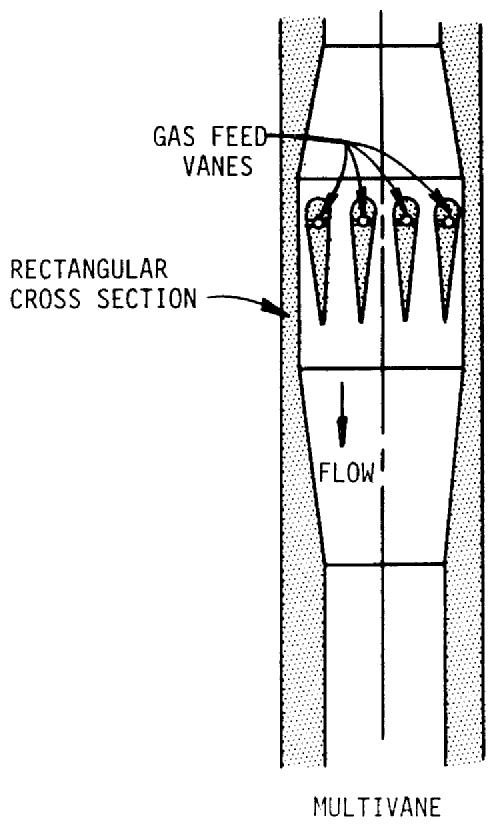

ORNL-DWG 71-10220

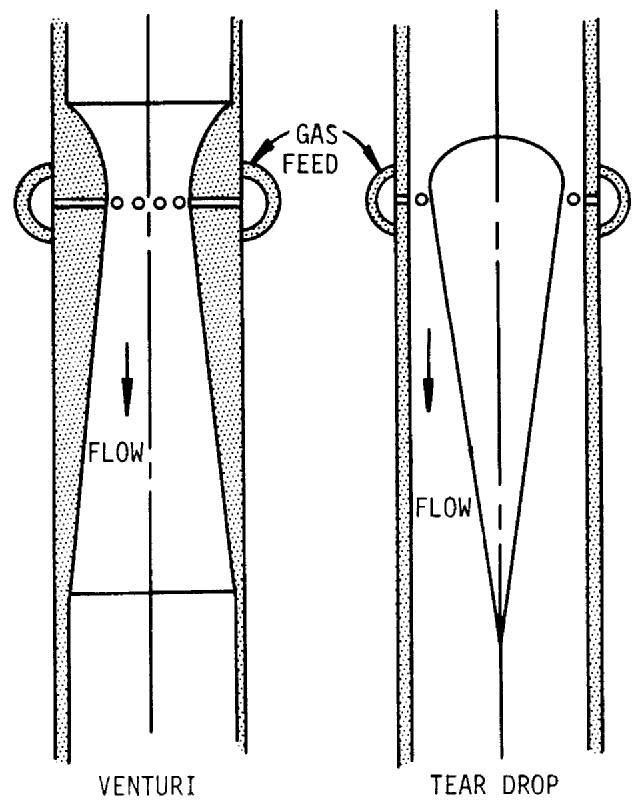  
FIGURE 1   
BUBBLE GENERATOR DESIGN CONFIGURATIONS WHICH WERE   
GIVEN REDUCED SCALE EVALUATION TESTS

closely provide a venturi geometry. These tests showed that well distributed bubbles of about the desired size could be produced.

Because of its simplicity and ability to meet the other requirements, the venturi design was selected for full scale development. Figure 2 shows the final design chosen for further testing with molten salts at high temperature in the GSTF. This design is a modified venturi with the 2.10 in. diameter throat stepped to 2.18 in. at the gas feed holes. The gas is injected through 18 - 1/8 in. diameter radial holes into the high velocity region at the venturi throat. An annular gas cavity forms between the wall of the bubble generator and the flowing liquid in the 2.18 in. diameter cylindrical mixing chamber. The length of this cavity depends on the gas flow rate, and at full gas flow the cavity extends into the $15^{\circ}$ diffuser section. The actual bubble formation occurs in the fluid turbulence in the entry of the diffuser cone.

# III. OPERATING CHARACTERISTICS AND TEST RESULTS

A full scale model of the proposed bubble generator with a 2.1 in. diameter throat and with 4 in. diameter inlet and outlet piping connections was fabricated of Plexiglas for complete testing and evaluation. Tests on this bubble generator were conducted to determine the bubble size produced, various pressure drops, and general operating characteristics. The tests were run with demineralized water, 41.5 wt percent glycerin in water, and 31 wt percent $\mathrm{CaCl}_2$ aqueous solution. The glycerin-water mixture and the $\mathrm{CaCl}_2$ solution have the same kinematic viscosity as fuel salt and provided dynamic similarity. Tests were also conducted with up to about 200 ppm n-butyl alcohol or sodium oleate added to demineralized water. The n-butyl alcohol, a surfactant; stabilized small bubbles and inhibited coalescence but had little effect on the density, viscosity, or surface tension of the bulk fluid. The sodium oleate, also a surfactant, decreased the surface tension by about a factor of two and inhibited bubble coalescence, but did not alter the density or viscosity of the bulk fluid.

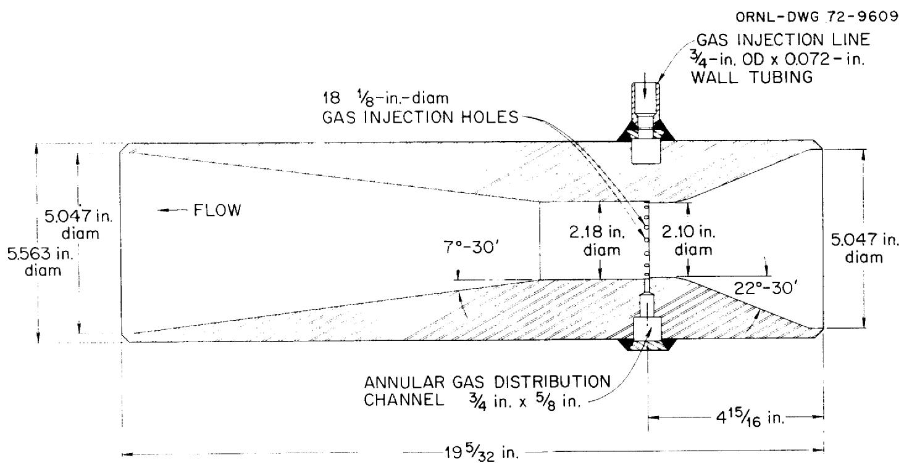  
FIGURE 2   
BUBBLE GENERATOR DESIGN FOR THE   
GAS SYSTEMS TECHNOLOGY FACILITY

# III.-1. Bubble Size

# III.-1.l Test Condition

In the proposed xenon removal system, helium bubbles are to be injected and removed in a 10 percent bypass loop. The bubbles on the average are expected to circulate several times around the primary circuit of the reactor before being processed in the side stream. During this circulation, the bubbles will be affected by solution and dissolution as they pass through different regions of pressure and temperature, and by breakup and coalescence as they pass through high and low shear regions (e.g., the pump). Consequently, the circulating bubble size is likely to be controlled by the system dynamics rather than by the bubble generator itself. However the size generation characteristics of the bubble generator should be of general interest for other systems and for possible unanticipated modes of operation, such as full flow gas injection and removal. In addition, the size produced may serve as an "initializing" condition for monitoring changes as the bubbles pass through the system. Consequently, some analysis and some limited tests were made to obtain an indication of the bubble size produced by the bubble generator as it is affected by flow and fluid properties. Flow rate was varied from 200 gpm to 550 gpm and surface tension was varied from 72 dynes/cm to 30 dynes/cm by adding different amounts of sodium oleate. An antifoaming agent, G.E. Silicone Emulsion AF-72, was also added at concentrations of 10 percent of the sodium oleate.

# III.-1.2 Bubble Size Measurements

The bubble size distributions produced by the bubble generator were determined by taking still photographs at the discharge of the diffuser cone. A conventional studio camera with a 12 in. focal length lens was used to take the photographs on $4 \times 5$ Polaroid film. A strobe light with a 1/30,000 second duration was used to "stop" the bubble motion and to provide back lighting.

The photographs, which were about actual size, were enlarged to obtain a total magnification of 8. Enlargements to greater magnification resulted in a loss of resolution. The bubble size distributions for each condition were determined by scaling bubble sizes directly from the

enlargements. The diameters were measured by comparison with a plastic template having drilled holes ranging from 1/32 to $3/4$ in. in increments of 1/32 in. A volume averaged bubble diameter as defined below was calculated for each distribution:

$$
<   d _ {v} > = \left[ \frac {\sum \left(n _ {i} d _ {i} ^ {3}\right)}{\sum n _ {i}} \right] ^ {1 / 3}
$$

where: $n_j$ is the number of bubbles of a given diameter,

$\mathbf{d}_{\mathbf{i}}$ ,per unit area of the photograph.

The resolution of the photographs was adequate to measure bubble diameters in the 0.008 in. range (1/16 in. on the enlargement), but no bubbles could be identified in the 0.004 in. diameter range. The results of these tests are shown on Figures 3 and 4.

Figure 3 shows the volume average bubble diameter produced by two bubble generator designs plotted as a function of liquid flow rate at several values of surface tension. The data are compared with a slope of -0.8 power dependence discussed in greater detail later in this report. There was a high degree of scatter in some of the sets of data at constant surface tension. Consequently, only selected data sets having low scatter are shown on the plot. Although there were differences in the slope of the various lines, the data tend to support a -0.8 power dependence. Similar data taken previously also support a -0.8 power, and none of the data have suggested a slope significantly different from -0.8.

Figure 4 is a plot of the bubble diameter as a function of surface tension at three flow rates. The measured surface tension data from loop samples taken during the course of this experiment were scattered and did not agree with the data from previous laboratory scale samples which were in general agreement with the sodium oleate supplier's literature. The values of surface tension used in Figure 4 were obtained from the calculated concentrations in the test loop and the surface tension vs concentration data from the laboratory samples as shown on Figure 5. The measured surface tension data from the loop samples are also shown on Figure 5. The discrepancy between these is not fully understood. However, the actual circulating concentration of sodium oleate could change

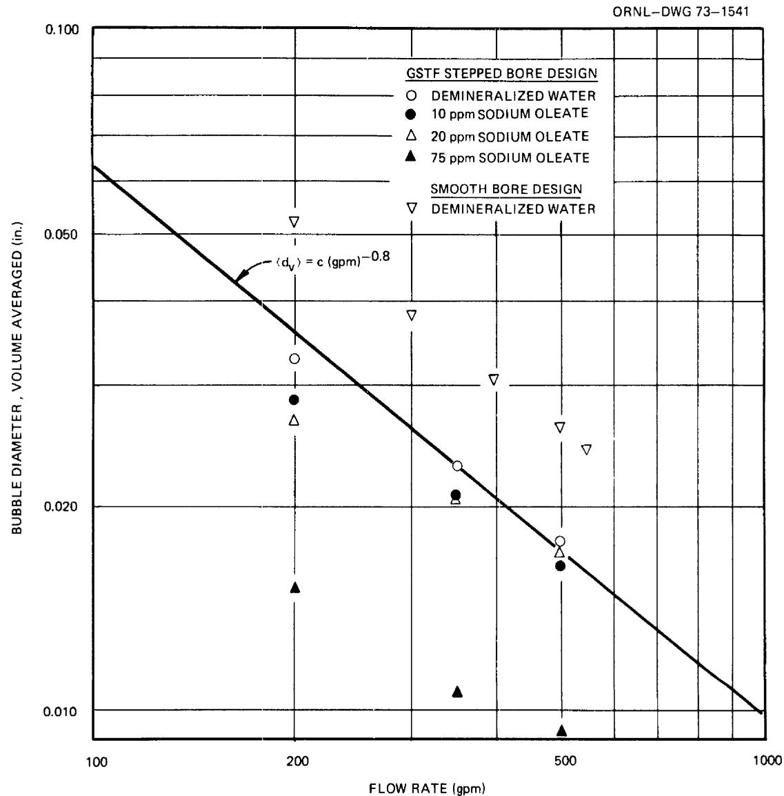  
FIGURE 3   
BUBBLE SIZE PRODUCED BY 2.1 IN. THROAT DIAMETER BUBBLE GENERATOR AS A FUNCTION OF LIQUID FLOW RATE

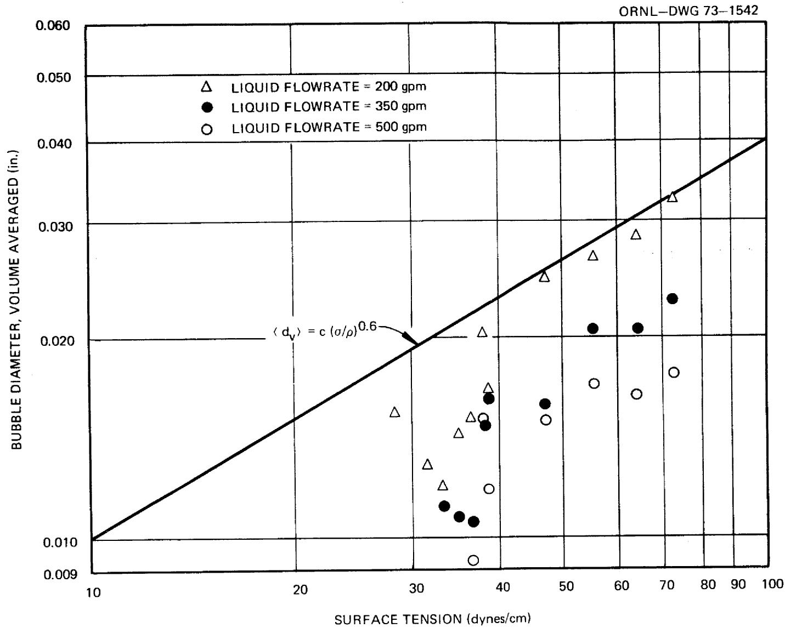  
FIGURE 4   
BUBBLE SIZE PRODUCED BY GSTF BUBBLE GENERATOR   
AS A FUNCTION OF SURFACE TENSION

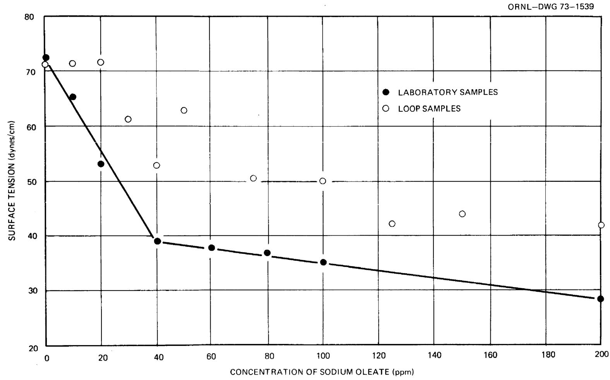  
FIGURE 5   
SURFACE TENSION AS A FUNCTION OF SODIUM OLEATE CONCENTRATION   
FOR LABORATORY BATCH SAMPLES AND FOR LOOP SAMPLES

during a given test run because the sodium oleate, being a surfactant, would be stripped from the circulating loop along with the bubbles. The concentration in the loop samples could then be less than the calculated average concentration for the entire loop depending on the time the samples were taken. The bubble photographs were taken immediately after gas flow was started following an hour's circulation without gas flow. This procedure should have provided a concentration of sodium oleate essentially equal to the calculated average at the time the photographs were taken.

The bubble diameter data of Figure 4 are too scattered to accurately determine the actual power dependence. However, the data tend to support a value of 0.6 as predicted by the theoretical considerations discussed below and as illustrated on Figure 4.

# III.-1.3 Analysis of Bubble Size Data

The bubbles produced by the bubble generator are apparently formed in the entrance region of the conical diffuser as a result of fluid turbulence. The following equation has been proposed to predict the size of gas bubbles produced by fluid turbulence.

$$
d = k _ {1} \left[ \frac {\sigma g _ {c}}{\rho} \right] ^ {3 / 5} \left[ \frac {\rho}{\varepsilon g _ {c}} \right] ^ {2 / 5} \tag {1}
$$

Equation (1) was used by Hinze $^{(5)}$ to calculate droplet diameters produced by emulsification of one liquid in another in an isotropic-turbulent flow field. Assuming turbulent flow in a conduit with conditions such that the friction factor would be constant, the power dissipation per unit volume ( $\varepsilon$ ) can be expressed as:

$$
\varepsilon = k _ {2} \frac {\mu^ {3} N _ {R e} ^ {3}}{\rho^ {2} D _ {2} ^ {4} g _ {c}}. \tag {2}
$$

Substituting this relationship for the power dissipation, Equation (1) gives:

$$
\frac {d}{D _ {2}} = k \left[ \frac {\sigma \rho D _ {2} g _ {c}}{\mu^ {2}} \right] ^ {3 / 5} \left[ \frac {V _ {2} D _ {2} \rho}{\mu} \right] ^ {- 1. 2} \tag {3}
$$

The bubble size data presented in Figures 3 and 4 generally confirm a $3/5$ power dependence for the surface tension term, but indicate an exponent of $-0.8$ for the Reynolds Number term rather than $-1.2$ as indicated by Equation (3). This would tend to confirm the form of Equation (1), but suggests a relation different from Equation (2) for the power dissipation rate in the bubble generation region of our device. Equation (3) might apply when power is added to the fluid continuously as in an agitated tank or in pipeline flow where the friction losses represent a continuous energy dissipation within the fluid. In the present bubble generator, the fluid may receive an "energy impulse" as some of the kinetic energy of the high velocity fluid in the throat is converted to fluid turbulence in the diffuser, and the above equations may not apply specifically for this mechanism.

An alternate expression for the power dissipation rate based on the wall shear stress has been proposed by Kress* for the GSTF bubble generator design. Using his proposed relation for power dissipation, Equation (1) gives the following relationship predicting a 3/5 power dependence on surface tension and a -4/5 power dependence on the Reynolds number as observed.

$$
\frac {d}{D _ {t}} = C \left[ \frac {\sigma \rho D _ {2} ^ {1 / 3} \delta^ {2 / 3} g _ {c}}{\mu_ {e} ^ {4 / 3} \mu_ {g} ^ {2 / 3}} \right] ^ {3 / 5} \left[ \frac {V _ {t} D _ {2} \rho}{\mu_ {e}} \right] ^ {- 4 / 5} \tag {4}
$$

At the present time, there are insufficient data to verify Equation (4) because only the liquid velocity and liquid surface tension have been varied. Therefore, we have elected to empirically correlate the data using the dimensionless groups that appear in Equation (3). These same dimensionless groups have been obtained independently by dimensional analysis.

The recommended form of the equation for the GSTF bubble generator is then:

$$
<   d _ {v} > = K D _ {2} \left[ \frac {\sigma \rho D _ {2} g _ {c}}{\mu^ {2}} \right] ^ {3 / 5} \left[ \frac {V _ {2} D _ {2} \rho}{\mu} \right] ^ {- 4 / 5} \tag {5}
$$

where $\mathrm{K} = 4.54 \times 10^{-2}$ .

*Personal communication, T. Kress to C. H. Gabbard, Dec. 4, 1972.

The comparison of this correlation with the data is shown in Figure 6. Several data points which were not used in determining the value of K are indicated on the plot. These were the points on Figure 4 that did not fall on the lines representing the 3/5 power of surface tension. Based on this correlation, the bubble diameter produced by the GSTF bubble generator operating with fuel salt flowing at 500 gpm should be about 0.01. The value of "K" given above is believed applicable only to bubble generators that are geometrically similar to the GSTF design. This is shown by the data on Figure 3 for the smooth bore design which had the same throat diameter, but had a $7^{\circ}$ diffuser cone instead of the $15^{\circ}$ cone in the GSTF design. A larger value of "K" would be required for the smooth bore design.

# III.-2. Gas Injection Pressure Characteristics

To appreciate the importance of the gas injection pressure, an understanding is needed of the relationship of the bubble generator to other portions of a reactor system. Figure 7 is a simplified flow diagram of the GSTF which is representative of a reactor system in regard to the operation of the bubble generator. The gas injected into the following salt at the bubble generator is removed by the bubble separator and is recycled back to the bubble generator via the bulk salt separator, the drain tank, and the gas holdup tank. The gas holdup tank including the throttle valves on either end simulates the delay time and flow restriction of a 48-hr charcoal trap which in a reactor system, would allow radioactive decay of the Xe-135 concentration to an acceptable level prior to reinjection of the helium sweep gas back into the salt system. If the pressure required to inject the gas into the bubble generator were sufficiently below the pump tank (or drain tank) pressure to provide the pressure drops for the 48-hr charcoal bed and for the gas flow control valve, a compressor for highly radioactive gas would not be required. This concept has been shown to be feasible and the necessary design features have been incorporated into the final GSTF bubble generator and system designs for continued evaluation with hot fuel salt.

The measured pressure differences vs gas flow rate of the final GSTF prototype bubble generator are shown in Figure 8 for a liquid flow rate of 500 gpm. These pressure differences are expressed as zero-void liquid head

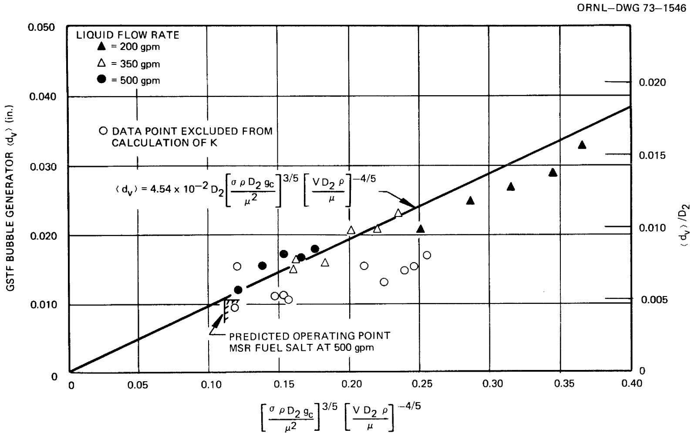  
FIGURE 6

BUBBLE SIZE CORRELATION FOR GSTF DESIGN BUBBLE GENERATOR

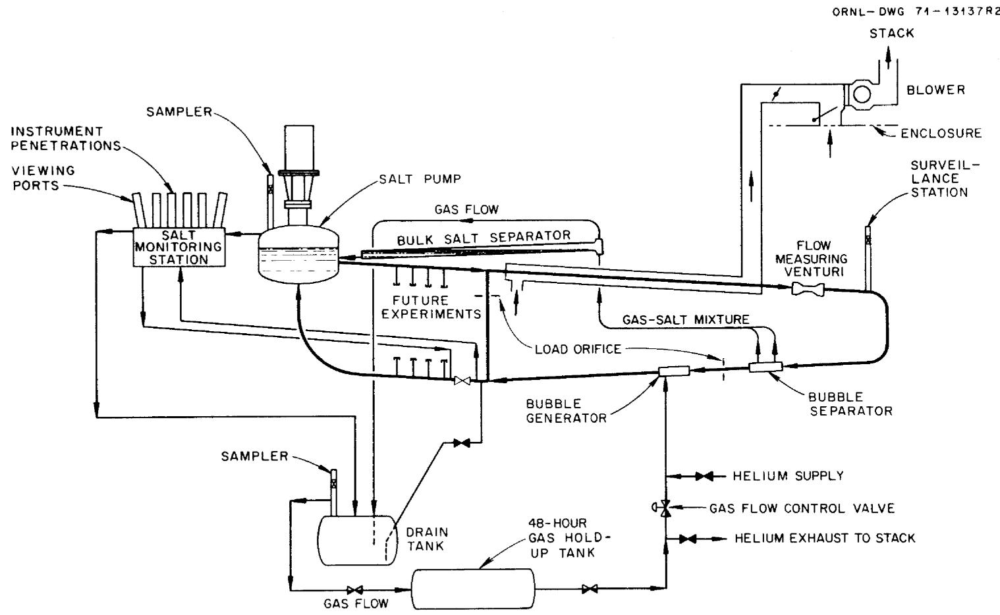  
FIGURE 7   
SIMPLIFIED FLOW DIAGRAM OF THE GAS SYSTEMS TECHNOLOGY FACILITY

LIQUID HEAD DIFFERENCE (ft of liquid)   
FIGURE 8   
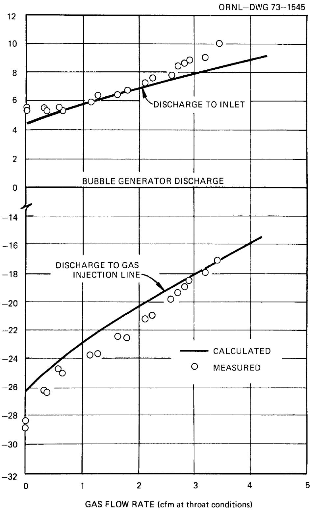  
GAS INJECTION PRESSURE AND OVERALL PRESSURE DROP OF PROTOTYPE BUBBLE GENERATOR AS A FUNCTION OF GAS FLOW RATE

and are referenced to the bubble generator discharge because, in the proposed piping system, this pressure is more closely related to the system reference pressure in the pump tank gas space. The increase in gas injection pressure with gas flow rate was greater than would be indicated by the increase in diffuser losses and by the increase in the gas passage pressure drop.

A study of the measured pressure drop data and the various hydrodynamic mechanisms of the bubble generator indicated that the pressure differences could be described by six terms:

The inlet to throat head difference.   
The mixing losses and head recovery across the sudden enlargement from 2.1 in. to 2.18 in.   
The mixing losses and head recovery across the $15^{\circ}$ diffuser cone.   
The liquid head equivalent to the gas compression work between throat and discharge pressure.   
The liquid head equivalent to the pressure drop in the gas passages.   
The liquid head difference between the liquid and the gas plume.

As a convenience in comparing different fluids, each of the above terms were expressed as feet of zero-void liquid head. With the exceptions of $\mathsf{H}_1$ , which is dependent only on the liquid and of $\mathsf{H}_5$ , which is dependent only on the gas, the pressure differences are a function of both liquid and gas flow rates. The procedures used in evaluating these six terms are discussed below.

Figure 9 shows the bubble generator geometry used for the following analysis and the location of the various pressure drops outlined above. The fluid head, $\mathsf{H}_{\perp}$ , between the inlet and the throat may be calculated from the conventional venturi equation:

$$
Q = F _ {a} F _ {t} A _ {2} C _ {v} \left(2 g H _ {l}\right) ^ {1 / 2}
$$

$$
H _ {1} = \frac {1}{2 g} \left[ \frac {Q _ {1}}{A _ {2} F _ {a} F _ {t} C _ {v}} \right] ^ {2} \tag {6}
$$

ORNL-DWG 73-1544

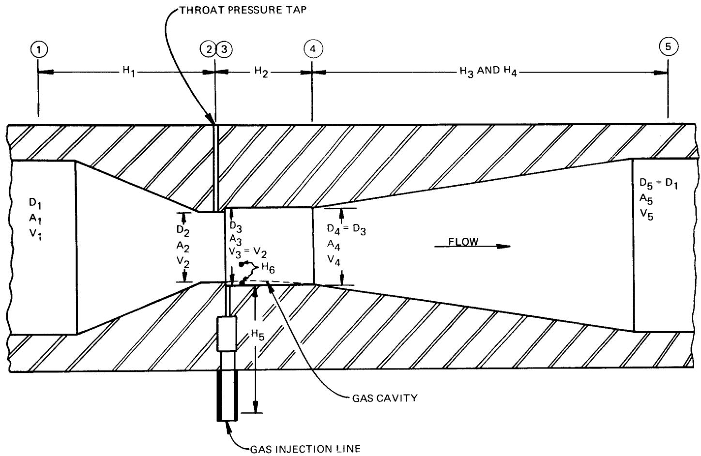  
FIGURE 9   
GEOMETRY OF BUBBLE GENERATOR USED IN ANALYSIS OF GAS INJECTION   
PRESSURE AND OVERALL HEAD LOSS

The observed inlet-throat head difference agreed with the calculated value within about $2\%$ .

The change in fluid head across the sudden enlargement from a diameter of 2.1 in. to 2.18 in. $\mathbf{H}_{2}$ , can be calculated theoretically by a momentum balance across the length of the 2.18 in. cylindrical bore. The effect of the gas volume on the fluid velocity was also included in the momentum balance. The boundaries for the momentum balance are taken just within the 2.18 in. diameter at each end. The upstream velocity at Station No. 3 is assumed uniform and equal to the average velocity at Station No. 2. The liquid and any injected gas are assumed mixed and at uniform velocity at Station No. 4. The increase in mass flow rate due to the gas addition was negligible compared to the mass flow of liquid and was not included in this calculation.

$$
\begin{array}{l} \Sigma F = \frac {M _ {e} (V _ {4} - V _ {3})}{g _ {c}} \\ P _ {3} A _ {3} - P _ {4} A _ {4} = \frac {A _ {2} V _ {3} \rho_ {e} (V _ {4} - V _ {3})}{g _ {c}} \\ A _ {3} = A _ {4} \\ \mathrm {H} _ {2} = \frac {\left(\mathrm {P} _ {3} - \mathrm {P} _ {4}\right)}{\rho_ {\mathrm {e}}} = \frac {\mathrm {A} _ {2} \mathrm {V} _ {3} \left(\mathrm {V} _ {4} - \mathrm {V} _ {3}\right)}{\mathrm {A} _ {3} \mathrm {g} _ {\mathrm {c}}} \tag {7} \\ \end{array}
$$

The value of $\mathbf{H}_2$ obtained from the momentum balance includes a mixing loss as well as the change in velocity head that would be predicted by the Bernoulli equation.

The pressure recovery and head loss in the diffuser cone can be calculated by the Bernoulli equation.

$$
\frac {\mathrm {P} _ {5} - \mathrm {P} _ {4}}{\rho_ {\mathrm {e}}} = \frac {\mathrm {V} _ {4} ^ {2} - \mathrm {V} _ {5} ^ {2}}{2 g _ {\mathrm {c}}} - \mathrm {h}
$$

where "h" is the "Borda-Carnot" loss:

$$
\mathrm {h} = \frac {\mathrm {K} _ {1} \left(\mathrm {v} _ {4} - \mathrm {v} _ {5}\right) ^ {2}}{2 \mathrm {g} _ {\mathrm {c}}}.
$$

A value of $\mathbf{K}_1 = 0.317$ , determined experimentally for the existing bubble generator, agrees closely with the conventional textbook value for a $15^\circ$ diffuser.(7) A void fraction correction was applied to express the calculated head rise of the diffuser section in terms of zero-void fluid:

$$
\mathrm {H} _ {3} = \left[ \frac {\mathrm {V} _ {4} ^ {2} - \mathrm {V} _ {5} ^ {2}}{2 \mathrm {g} _ {\mathrm {c}}} - \frac {\mathrm {K} _ {1} (\mathrm {v} _ {4} - \mathrm {v} _ {5}) ^ {2}}{2 \mathrm {g} _ {\mathrm {c}}} \right] \left[ 1 - \mathrm {x} \right]. \tag {8}
$$

In addition to the normal hydraulic losses in the diffuser, the work required to compress the gas is supplied by the kinetic energy of the liquid and decreases the head rise in the diffuser. The work required for a polytropic compression of the gas is given by the equation:

$$
W = \frac {n R T}{(1 - n) M} \left[ \left(\frac {P _ {5}}{P _ {4}}\right) ^ {\frac {n - 1}{n}} - 1 \right].
$$

The work of compression can be converted to equivalent liquid head by multiplying by the ratio of the mass flow rate of gas to that of liquid.

$$
\mathrm {H} _ {4} = \frac {\mathrm {n R T}}{(\mathrm {l} - \mathrm {n}) \mathrm {M}} \quad \left[ \begin{array}{c c c} \mathrm {P} _ {5} & \frac {\mathrm {n} - 1}{\mathrm {n}} \\ (\frac {\mathrm {P} _ {4}}{\mathrm {P} _ {4}}) & - 1 \end{array} \right] \quad \frac {\mathrm {m} _ {\mathrm {g}}}{\mathrm {m} _ {\mathrm {e}}} . \tag {9}
$$

The pressure drop through the gas passages of the bubble generator was determined experimentally as a function of the gas volume flow rate. Figure 10 shows the results of the tests. The results expressed as feet of gas head vs volume flow rate are applicable to any gas. The gas pressure drop expressed as feet of liquid head is given by the following equation which applies specifically to the geometry tested:

$$
\mathrm {H} _ {5} = \mathrm {C} \quad \mathrm {Q} ^ {2} \quad \left(\frac {\rho}{\rho_ {\mathrm {e}}}\right) \tag {10}
$$

where $C = 59.4 \, \text{min}^2 / \text{ft}^5$ ; $Q =$ volume flow rate of gas, cfm.

During the various pressure drop tests of the bubble generator, the gas feed pressure was observed to be higher than the sum of the static throat pressure and the pressure drop across the gas feed passages. This "Plume D/P" apparently represents the pressure difference required to divert the liquid around the gas cavity similar to an impact pressure

FIGURE 10   
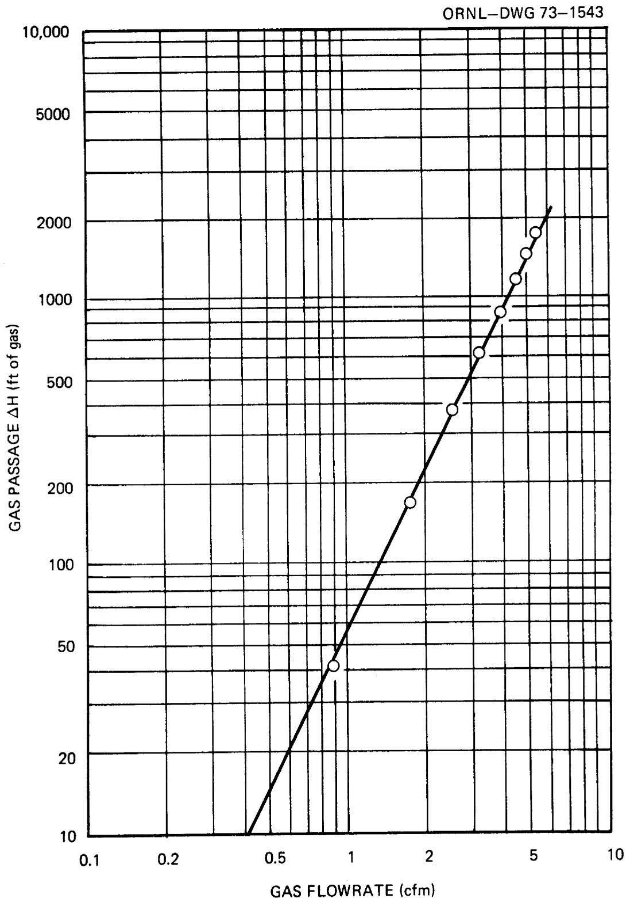  
PRESSURE DROP OF GAS FEED PASSAGES AS A FUNCTION   
OF GAS FLOW RATE

on a solid object. Direct measurements of this pressure difference were made on the original smooth bore bubble generator design by using one of the gas feed holes as a static pressure tap for the throat liquid. The pressure drop across the interface of the gas plume was obtained by subtracting the gas passage pressure drop "H₅" from the measured pressure difference between the gas injection line and the static tap. The results of the measurements are shown in Figure 11.

The "Plume D/P" was found to be directly proportional to the liquid specific gravity and was found to be a function of both the liquid and the gas flow rates. An empirical correlation relating the plume D/P, the liquid velocity in the throat, and the void fraction at the throat was determined which gave a good representation of the data from various flow rates for two fluids. A coefficient "K2" was defined as the ratio of the plume D/P, expressed as feet of liquid head, to the liquid velocity to the 2.5 power. The value of K2 vs the void fraction for the existing data was fit to a polynomial by the least squares method. The value of K2 was best described by a cubic equation, and the results of the fit are shown in Figure 12. The value of the plume D/P would then be calculated as follows:

$$
\mathrm {H} _ {6} = \mathrm {K} _ {2} \mathrm {V} _ {2} ^ {2. 5} \tag {11}
$$

$$
\begin{array}{l} w h e r e K _ {2} = (A + B X + C X ^ {2} + D X ^ {3}) \\ X = \frac {Q _ {g}}{Q _ {e} + Q _ {g}} \\ \end{array}
$$

$$
\begin{array}{l} \text {a n d} \quad A = - 1. 8 4 8 2 5 \times 1 0 ^ {- 6} \\ B = - 1. 2 6 8 0 2 \times 1 0 ^ {- 2} \\ C = 0. 1 7 1 3 2 4 \\ D = - 0. 8 8 5 8 1 9 \\ V _ {2} = \text {L i q u i d v e l o c i t y a t t h r o a t (f t / s e c)}. \\ \end{array}
$$

Equation (11) gives a negative value of $H_6$ consistent with the sign convention used in the computer program, BGNDGN, discussed in the Appendix. The pressure in the gas relative to the liquid is actually positive.

The pressure distribution of the bubble generator can be obtained by the summation of the above six terms. A BASIC language computer program, BGNDGN, was written to calculate the pressure distribution of the GSTF

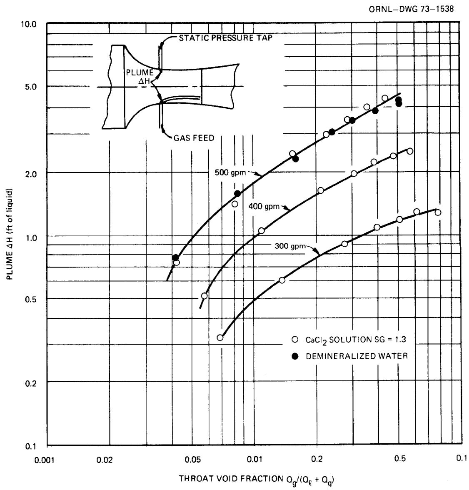  
FIGURE 11   
PRESSURE DROP ACROSS THE GAS PLUME INTERFACE   
AS A FUNCTION OF THROAT VOID FRACTION

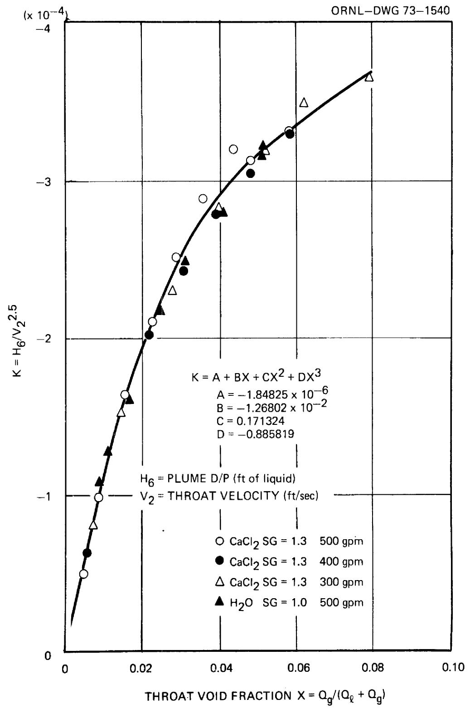  
FIGURE 12   
CORRELATION OF PLUME $\Delta H$ (H) TO THROAT LIQUID VELOCITY   
AND THROAT VOID FRACTION

bubble generator as a function of the liquid and gas flow rates. Although the procedure for calculating the value of $\mathsf{H}_6$ was based on data from an earlier bubble generator design, this procedure was used in the BGNDGN program and the results appear to be applicable to the final GSTF design. A listing of this program and sample output for the GSTF operating with fuel salt are included in the Appendix. The above procedures and the computer program were developed specifically for the bubble generator design for the GSTF and were checked against data from the prototype in the water test loop. However, with the exception of the gas passage pressure drop, the procedures are believed to be applicable to various fluids and sizes assuming a reasonable geometric similarity. The calculation of the gas passage pressure drop could be revised to use conventional pressure drop calculation procedures for any other particular design.

A comparison of the calculated and measured pressure distributions for the GSTF prototype design is shown in Figure 8. These pressure distributions apply specifically to the prototype bubble generator in the water test loop and would differ slightly from the distributions of the actual GSTF bubble generator because of the difference in pipe size and the difference in absolute pressure. The calculated pressures for the GSTF bubble generator operating at design conditions with water and two types of molten-salt are shown in the Appendix.

The calculations in the Appendix for fuel-salt indicate the gas flow for normal gas recycle operation will be limited to about 1 scfm by the various pressure changes inherent in the system. These calculations were based on a pump tank pressure of 15 psig, a salt pressure of 28 psig at the bubble generator discharge, and a pressure drop of 7.5 psi across the 48-hr holdup tank at 0.8 scfm gas flow rate. Operation of the GSTF at higher gas flows up to 1.3 scfm can be achieved by either opening the throttle valves at the 48-hr holdup tank or by operating on an open cycle with the gas supplied from an external source at somewhat higher pressure. The gas flow capacity of the GSTF was specified a factor of 2 greater than for the MSBE to provide a margin for experimental purposes, and the maximum gas flow of 1 scfm would not be a limitation in the MSBE. The lower than predicted gas feed pressure was probably caused by a local flow disturbance at the step in throat diameter. This belief is supported by

the facts that the measurements of the throat pressure just upstream of the step were in good agreement with the calculated value of $\mathsf{H}_{1}$ , and at low gas flow rates the overall pressure drop of the bubble generator was in good agreement with the summation of $\mathsf{H}_{1}, \mathsf{H}_{2}, \mathsf{H}_{3}$ and $\mathsf{H}_{4}$ .

The calculated values of $\mathsf{H}_2$ , $\mathsf{H}_3$ and $\mathsf{H}_4$ are subject to some degree of error because in an actual bubble generator it is impractical to provide a throat mixing length long enough to complete the momentum transfer assumed in the calculations. Part of the mixing losses assigned to the mixing section occur in the diffuser and could account for the differences in slope between the calculated and measured pressures shown on Figure 8.

# IV. CONCLUSIONS AND RECOMMENDATIONS

The bubble generator design developed for application in the Gas Systems Technology Facility and the Molten-Salt Breeder Experiment is expected to successfully meet the criteria specified in Table I.

The gas flow limit at about 1 scfm would be a valuable safety feature in the event of a malfunction of the gas flow control system at the maximum flow position. However, an initial transient at a higher flow could occur depending on the location and size of holdup volumes and pressure drops in the gas system. The design of a reactor gas-system should attempt to minimize the rate and duration of this transient.

There are uncertainties in regard to the mechanism of bubble formation in the bubble generator and a relatively extensive program would be required to fully evaluate the proposed mechanisms. However, the bubble size produced by the bubble generator is believed to have a minor influence on the overall operation of a reactor circulating system because of the bubble degradation and compression in passing through the pump and the other changes in size that may occur because of coalescence, gas solubility, and pressure changes. Therefore, an effort to fully evaluate the proposed mechanisms of bubble formation does not appear to be justified at this time. However, plans have been made to check the viscosity dependence of the recommended correlation.

The calculation procedures and computer program developed for estimating the pressure distribution as a function of liquid and gas flow rates appears to be sufficiently accurate for most applications. The suitability of these design calculations to cover operation in a high

temperature salt system will be evaluated from the operating data of the GSTF.

The calculation procedures for various pressures and bubble diameter are believed to be applicable to other sizes, but we have no experimental verification of this. The reduced scale tests completed early in the program were survey type experiments and insufficient data were taken to evaluate scale effects. Therefore any bubble generator of significantly different size or geometry should be checked experimentally against the calculations prior to use in any critical application.

# V. ACKNOWLEDGEMENT

The author is indebted to many individuals for their cooperation and assistance in completing this work. In particular, the contribution of T. S. Kress in suggesting mechanisms for the bubble size correlation and the contribution of G. M. Winn for this operation of the test loop and his execution of the various experiments are gratefully acknowledged.

# NOMENCLATURE

A1 - A5 Cross sectional areas of bubble generator (see Fig. 9)(ft2)

$\mathbf{D}_{1} - \mathbf{D}_{5}$ Diameters of bubble generator (see Fig. 9)(ft)

$\mathbf{F}_{\mathrm{a}}$ Approach area factor $[1 - (A_{2} / A_{1})^{2}]^{-1/2}$

Thermal expansion factor $[1 + \alpha (\mathrm{T} - 530)]^2$

$\mathrm{H}_{1} - \mathrm{H}_{6}$ Various differential heads associated with bubble generator (see Fig. 9) (ft of zero void liquid)

Molecular weight of gas

Reynolds number, VDρ/μ

$\mathrm{P}_{3} - \mathrm{P}_{5}$ Static pressures in bubble generator (see Fig. 9)(lbf/ft²)

$Q_{e}, Q_{g}$ Volume flow rate of liquid or gas (ft $^3$ /sec)

R Universal gas constant 1545.3 ft/1bf/# mole-°R

T Temperature, ${}^{\circ}\mathbb{R}$

$\mathbf{V}_{1} - \mathbf{V}_{5}$ Velocities in bubble generator (see Fig. 9)(ft/sec)

X Void fraction

$\mathbf{C}_{\mathbf{V}}$ Velocity coefficient assumed $= 1.0$

d Bubble diameter (ft)

$< \mathrm{d}>$ Volumeaveragedbubble diameter (ft)

Gravitational conversion factor (1bm-ft/1bf-sec²)

M, M Mass flow rate of liquid or gas (lbm/sec)

n Polytropic gas compression constant

α Coefficient of thermal expansion per ${}^{\circ}\mathrm{F} = 8\mathrm{x}10^{-6}$

Gas film thickness (ft)

Power dissipation per unit volume (ft-lb/ft-sec)

$\mu_{e}, \mu_{g}$ Viscosity of liquid or gas (lbm/ft-sec)

$\rho_{e}, \rho_{g}$ Density of liquid or gas (1b/m/ft³)

Surface tension (1bf/ft)

# REFERENCES

(1) M. W. Rosenthal, P. N. Haubenreich, and R. B. Briggs, The Development Status of Molten-Salt Breeder Reactors, ORNL-4812, August 1972, pp 274-297.   
(2) J. R. McWherter, Molten Salt Breeder Experiment Design Bases, ORNL-TM-3177, November 1970.   
(3) R. H. Guymon, System Design Description of the Gas Systems Technology Facility, ORNL-CF-72-3-1, March 30, 1972.   
(4) MSR Program Semiannual Progress Report Feb. 28, 1969, ORNL-4396, p 95.   
(5) J. O. Hinze, Fundamentals of the Hydrodynamic Mechanism of Splitting in Dispersion Processes, AIChE Journal, Vol. 1, No. 3, 1955, p 295-298.   
(6) T. S. Kress, Mass Transfer Between Small Bubbles and Liquids in Cocurrent Turbulent Pipeline Flow, ORNL-TM-3718, April 1972, p 58.   
(7) J. K. Vernard, Elementary Fluid Mechanics, John Wiley and Sons, 1947, p 176.

# APPENDIX

COMPUTER PROGRAM, BGNDGN, FOR CALCULATING GAS INJECTION PRESSURE AND OVERALL PRESSURE DROP OF VENTURI TYPE BUBBLE GENERATOR

A computer program, BGNDGN, was written in BASIC language to calculate the overall pressure drop and the gas injection pressure of the bubble generator. This program, which uses the relationships discussed in Section III-2, was written specifically for the GSTF bubble generator design. The program should be valid for different sizes with geometric similarity. The program is listed below along with output covering the bubble generator operation in the GSTF with the proposed fluids.

The required data input for running the program are in statements 450 and 451 as follows:

450 Data F1, G, G9, Mo, N  
F1 = liquid flow rate (gpm)  
G = liquid specific gravity  
G9 = gas density (lbs/ft³)  
MO = molecular weight of gas  
N = polytropic constant for gas  
451 Data D8, P9, P8, T2, K9  
D8 = inlet and discharge pipe ID (in.)  
D9 = pressure at discharge (psig)  
P8 = pump tank pressure (psig)  
T2 = salt temperature (°F)  
K9 = thermal expansion factor $(1 + \alpha \Delta T)$ for Hastelloy "N"

The gas flow rates are input into statement 140 as scfm. Different throat and mixing chamber diameter (inches) could be entered in statement 30 and 31, respectively.

There are four lines of output for each gas flow rate as follows:

Line 1. a. Hl = lead difference across the diffuser cone (ft of zero void liquid)

b. H2 = head difference across the mixing chamber (ft of zero void liquid)

c. H3 = head equivalent to gas compression work (ft of zero void liquid)

d. $\mathbf{H}^{4} =$ total head difference between the gas injection line and the salt at throat (ft of zero void liquid).   
e. H5 = head difference across the gas passages (ft of zero void liquid).

Line 2. a. The gas flow rate (scfm).

b. The gas flow rate (cfm at throat pressure and temperature).   
c. The salt static pressure at the throat (psig).   
d. The static pressure at the gas injection line (psig).

Line 3. a. The pressure in the GSTF gas line 210 upstream of the flow control valve (psig).   
b. The pressure drop across the GSTF gas flow control valve (psig).   
Line 4. a. The overall head loss of the bubble generator (ft of zero void liquid).   
b. The head difference between bubble generator discharge and the gas injection line (ft of zero void liquid).

A negative value of the value D/P in output line 3 indicates the pressure drop available in the GSTF gas-system is insufficient to provide recycle operation at that flow rate and at the design flow restriction of the 48-hr holdup tank. This calculation assumes a 7.5 psi pressure drop across the 48-hr holdup tank at 0.8 scfm and that the pressure drop varies with the square of the volume flow rate.

1 REM RGNDGN CHG 6/8/72 CALC PURPLE GEN PRESS DIST

9 READ A1,A2,A3,A4

10 READ F1,G,G9,MO,N

20 READ D8,P9,P8,T2,K9

21 H1=0

22 H2=0

23 H3=0

30 D9=2·10

31 D1=2·18

45 PO=14.7

50 PRINT "LIQ SG="G,"MOL WT="MO,"DIS PRESS="P9

60 PRINT "LIQ FLOW="F1,"THR DIA="D9,"BORE DIA="D1

61 D2=D8/12

62 D=D1/12

63 D0=D9/12

70P2=P9+14.7

80 T=T2+460

90 K1=N/(1-N)

100 $k2 = (N - 1) / N$

110 00=F1/(7·48*60)

120 M1=Q0*G*62.4

130 V0=Q0/(0.785*(DO*K9)+2)

131 $V = 00 / (0.785*(D2*K9) + 2)$

132 H=（V0+2-V+2）/64.4

140 F0R F2=0 T0 1.41 STEP·2

150 M2=F2*G9/60

160 $z = 0$

161 $P0 = P2 - (H1 + H2 + H3)*62.4*G / 144$

170 Q1=Q0+F2*T/493*14.7/(P0*60)

180 Q2=Q0+F2*T/493*14.7/(P2*60)

190 $\mathsf{v}1 = 01 / (0.785*(D*K9) + 2)$

200 V2=Q2/(0.785*(D2*K9)+2)

210 F9=F2*14.7/P0*T/(493*60)

220 $x2 = F9 / (00 + F9)$

230 H1=((V1+2-V2+2)/64.4-0.317/64.4*(V1-V2)+2)*(1.0-X2)

240 G1=G*Q0/Q1

249 F3=F2*T/493*14.7/P0

250 H2=-V1*G1*(V1-V0)/(32.2*G)-F3*0.4167

260 P0=P2-(H1+H2+H3)*62.4*G/144

261 IF PO<0 THEN 404

270 W=K1*1545*T/M0*(P2/P0)×(2-1.0)

280 H3=W*M2/M1

290 P0=P2-(H1+H2+H3)*62.4*G/144

300 F3=F2*T/493*14.7/P0

310 G8=69*493/T*PO/14.7

320 H5=-59·488*F3†2*G8/(G*62.4)

321 $x3 = F3 / (F1 / 7\cdot 48 + F3)$

322 $x3 = A1 + A2 * X3 + A3 * X3 + 2 + A4 * X3 + 3$

323 H4=K3*V0+2·50+H5

332 $P3 = P0 - 14.7$

340 P0=P2-(H1+H2+H3+H4)*62.4*6/144

360 $Z = Z + 1$

370 IF Z<3 THEN 170

380 P7=P8-9.58*(F2+0.08476)12

381 $P6 = P7 - (P0 - 14.7)$

382 L1=H1+H2+H3+H4

383 L=H-(H1+H2+H3)

399 PRINT

400 PRINT H1,H2,H3,H4,H5

401 PRINT"SCFM="F2,"TCFM="F3,"T PR="P3,"G PR="PO-14.7

402 PRINT"L 210 PR="P7,"VALVE D/P="P6

403 PRINT "I-0 D/H="L,"0-G D/H="L1

404 NEXT F2

405 DATA -1.84825E-6, -1.26802E-2, 0.171324, -0.885819

450 DATA 500,3.2836,0.0112,4,1.67

451 DATA 5.047,28,15,1300,1.009

500 END

Table A-1   
GSTF Bubble Generator Operation on Fuel-Salt and Helium   

<table><tr><td colspan="2">LIQ SG= 3.2836</td><td>MOL WT= 4</td><td>DIS PRESS= 28</td><td></td></tr><tr><td colspan="2">LIQ FLOW= 500 THR DIA= 2.1</td><td>BORE DIA= 2.18</td><td></td><td></td></tr><tr><td>20.9288</td><td>4.30198</td><td>0</td><td>-2.58365E-2</td><td>0</td></tr><tr><td>SCFM= 0</td><td>TCFM= 0</td><td>T PR=-7.90077</td><td>G PR=-7.86401</td><td></td></tr><tr><td colspan="2">L 210 PR= 14.9312</td><td>VALVE D/P= 22.7952</td><td></td><td></td></tr><tr><td colspan="2">I-0 D/H= 5.97787</td><td>0-G D/H= 25.205</td><td></td><td></td></tr><tr><td>21.1968</td><td>3.20759</td><td>-0.256411</td><td>-2.5625</td><td>-8.18451E-4</td></tr><tr><td>SCFM= 0.2</td><td>TCFM= 1.25849</td><td>T PR=-6.36006</td><td>G PR=-2.7139</td><td></td></tr><tr><td colspan="2">L 210 PR= 14.2232</td><td>VALVE D/P= 16.9371</td><td></td><td></td></tr><tr><td colspan="2">I-0 D/H= 7.06068</td><td>0-G D/H= 21.5855</td><td></td><td></td></tr><tr><td>21.3703</td><td>2.50307</td><td>-0.462839</td><td>-3.67663</td><td>-2.90790E-3</td></tr><tr><td>SCFM= 0.4</td><td>TCFM= 2.23567</td><td>T PR=-5.31064</td><td>G PR=-7.91799E-2</td><td></td></tr><tr><td colspan="2">L 210 PR= 12.7488</td><td>VALVE D/P= 12.828</td><td></td><td></td></tr><tr><td colspan="2">I-0 D/H= 7.7982</td><td>0-G D/H= 19.7339</td><td></td><td></td></tr><tr><td>21.5242</td><td>1.8788</td><td>-0.637301</td><td>-4.23788</td><td>-5.96038E-3</td></tr><tr><td>SCFM= 0.6</td><td>TCFM= 3.05499</td><td>T PR=-4.39319</td><td>G PR= 1.63686</td><td></td></tr><tr><td colspan="2">L 210 PR= 10.508</td><td>VALVE D/P= 8.87111</td><td></td><td></td></tr><tr><td colspan="2">I-0 D/H= 8.44298</td><td>0-G D/H= 18.5278</td><td></td><td></td></tr><tr><td>21.6677</td><td>1.29773</td><td>-0.787922</td><td>-4.55608</td><td>-9.80036E-3</td></tr><tr><td>SCFM= 0.8</td><td>TCFM= 3.76738</td><td>T PR=-3.5562</td><td>G PR= 2.92662</td><td></td></tr><tr><td colspan="2">L 210 PR= 7.50077</td><td>VALVE D/P= 4.57415</td><td></td><td></td></tr><tr><td colspan="2">I-0 D/H= 9.03121</td><td>0-G D/H= 17.6214</td><td></td><td></td></tr><tr><td>21.802</td><td>0.754595</td><td>-0.920421</td><td>-4.77094</td><td>-1.43230E-2</td></tr><tr><td>SCFM= 1</td><td>TCFM= 4.40476</td><td>T PR=-2.7859</td><td>G PR= 4.00264</td><td></td></tr><tr><td colspan="2">L 210 PR= 3.72717</td><td>VALVE D/P=-0.275467</td><td></td><td></td></tr><tr><td colspan="2">I-0 D/H= 9.57257</td><td>0-G D/H= 16.8652</td><td></td><td></td></tr><tr><td>21.9267</td><td>0.250605</td><td>-1.03916</td><td>-4.95226</td><td>-1.94674E-2</td></tr><tr><td>SCFM= 1.2</td><td>TCFM= 4.98902</td><td>T PR=-2.07739</td><td>G PR= 4.96915</td><td></td></tr><tr><td colspan="2">L 210 PR=-0.812827</td><td>VALVE D/P=-5.78198</td><td></td><td></td></tr><tr><td colspan="2">I-0 D/H= 10.0705</td><td>0-G D/H= 16.1859</td><td></td><td></td></tr><tr><td>22.0416</td><td>-0.21224</td><td>-1.14751</td><td>-5.13858</td><td>-2.52009E-2</td></tr><tr><td>SCFM= 1.4</td><td>TCFM= 5.53574</td><td>T PR=-1.42803</td><td>G PR= 5.88362</td><td></td></tr><tr><td colspan="2">L 210 PR=-6.11923</td><td>VALVE D/P=-12.0028</td><td></td><td></td></tr><tr><td colspan="2">I-0 D/H= 10.5269</td><td>0-G D/H= 15.5432</td><td></td><td></td></tr></table>

GSTF Bubble Generator Operation on Flush Salt (66-34 Mole % LiF-BeF2) and Helium

Table A-2   

<table><tr><td colspan="2">LIO SG= 1.942 M0L WT= 4</td><td colspan="2">DIS PRESS= 22.69</td></tr><tr><td colspan="2">LIO FLOW= 500 THR DIA= 2.1</td><td colspan="2">P0RE DIA= 2.18</td></tr><tr><td>20.9288</td><td>4.30198</td><td>0</td><td>-2.58365E-2</td></tr><tr><td>SCFM= 0</td><td>TCFM= 0</td><td>T PR= 1.45742</td><td>G PR= 1.47916</td></tr><tr><td colspan="2">L 210 PR= 14.9312</td><td colspan="2">VALVE D/P= 13.452</td></tr><tr><td colspan="2">I-0 D/H= 5.97787</td><td colspan="2">0-G D/H= 25.205</td></tr><tr><td>21.108</td><td>3.57596</td><td>-0.177838</td><td>-1.47477</td></tr><tr><td>SCFM= 0.2</td><td>TCFM= 0.625965</td><td></td><td>T PR= 2.0673</td></tr><tr><td colspan="2">L 210 PR= 14.2232</td><td colspan="2">VALVE D/P= 10.9148</td></tr><tr><td colspan="2">I-0 D/H= 6.7026</td><td colspan="2">0-G D/H= 23.0313</td></tr><tr><td>21.2619</td><td>2.95381</td><td>-0.339626</td><td>-2.4979</td></tr><tr><td>SCFM= 0.4</td><td>TCFM= 1.21356</td><td>T PR= 2.59748</td><td>G PR= 4.69954</td></tr><tr><td colspan="2">L 210 PR= 12.7488</td><td colspan="2">VALVE D/P= 8.04923</td></tr><tr><td colspan="2">I-0 D/H= 7.33261</td><td colspan="2">0-G D/H= 21.3782</td></tr><tr><td>21.4023</td><td>2.38724</td><td>-0.488344</td><td>-3.22396</td></tr><tr><td>SCFM= 0.6</td><td>TCFM= 1.77081</td><td>T PR= 3.08124</td><td>G PR= 5.79431</td></tr><tr><td colspan="2">L 210 PR= 10.508</td><td colspan="2">VALVE D/P= 4.71367</td></tr><tr><td colspan="2">I-0 D/H= 7.90747</td><td colspan="2">0-G D/H= 20.0773</td></tr><tr><td>21.5347</td><td>1.85413</td><td>-0.625723</td><td>-3.73996</td></tr><tr><td>SCFM= 0.8</td><td>TCFM= 2.30244</td><td>T PR= 3.53413</td><td>G PR= 6.68143</td></tr><tr><td colspan="2">L 210 PR= 7.50077</td><td colspan="2">VALVE D/P= 0.819344</td></tr><tr><td colspan="2">I-0 D/H= 8.44564</td><td colspan="2">0-G D/H= 19.0231</td></tr><tr><td>21.6615</td><td>1.34347</td><td>-0.752975</td><td>-4.10849</td></tr><tr><td>SCFM= 1</td><td>TCFM= 2.81173</td><td>T PR= 3.96418</td><td>G PR= 7.42162</td></tr><tr><td colspan="2">L 210 PR= 3.72717</td><td colspan="2">VALVE D/P=-3.69445</td></tr><tr><td colspan="2">I-0 D/H= 8.95668</td><td colspan="2">0-G D/H= 18.1435</td></tr><tr><td>21.7843</td><td>0.849762</td><td>-0.871064</td><td>-4.376</td></tr><tr><td>SCFM= 1.2</td><td>TCFM= 3.30129</td><td>T PR= 4.37573</td><td>G PR= 8.05827</td></tr><tr><td colspan="2">L 210 PR=-0.812827</td><td colspan="2">VALVE D/P=-8.8711</td></tr><tr><td colspan="2">I-0 D/H= 9.44572</td><td colspan="2">0-G D/H= 17.387</td></tr><tr><td>21.9036</td><td>0.370441</td><td>-0.980826</td><td>-4.5775</td></tr><tr><td>SCFM= 1.4</td><td>TCFM= 3.7733</td><td>T PR= 4.77109</td><td>G PR= 8.6232</td></tr><tr><td colspan="2">L 210 PR=-6.11923</td><td colspan="2">VALVE D/P=-14.7424</td></tr><tr><td colspan="2">I-0 D/H= 9.91553</td><td colspan="2">0-G D/H= 16.7157</td></tr></table>

Table A-3   
GSTF Bubble Generator Operation on Water and Helium   

<table><tr><td>LIQ SG=1</td><td>MOL WT=4</td><td>DIS PRESS=18.959</td><td></td></tr><tr><td>LIQ FLOW=500 THR DIA=2.1</td><td>PORE DIA=2.18</td><td></td><td></td></tr><tr><td>21.6925</td><td>4.45896</td><td>0</td><td>-2.70202E-2</td></tr><tr><td>SCFM=0</td><td>TCFM=0</td><td>T PR=7.6267</td><td>G PR=7.63841</td></tr><tr><td>L 210 PR=14.9312</td><td></td><td>VALVE D/P=7.29277</td><td></td></tr><tr><td>I-0 D/H=6.196</td><td></td><td>0-G D/H=26.1245</td><td></td></tr><tr><td>21.9089</td><td>3.5988</td><td>-0.234371</td><td>-1.69285</td></tr><tr><td>SCFM=1</td><td>TCFM=0.695957</td><td></td><td>T PR=8.0072</td></tr><tr><td>L 210 PR=3.72717</td><td></td><td>VALVE D/P=-5.0136</td><td></td></tr><tr><td>I-0 D/H=7.07409</td><td></td><td>0-G D/H=23.5805</td><td></td></tr><tr><td>22.1104</td><td>2.79977</td><td>-0.449001</td><td>-2.87493</td></tr><tr><td>SCFM=2</td><td>TCFM=1.37067</td><td>T PR=8.35917</td><td>G PR=9.60498</td></tr><tr><td>L 210 PR=-26.6368</td><td></td><td>VALVE D/P=-36.2418</td><td></td></tr><tr><td>I-0 D/H=7.88634</td><td></td><td>0-G D/H=21.5862</td><td></td></tr><tr><td>22.3024</td><td>2.03906</td><td>-0.64615</td><td>-3.70827</td></tr><tr><td>SCFM=3</td><td>TCFM=2.02683</td><td>T PR=8.69104</td><td>G PR=10.298</td></tr><tr><td>L 210 PR=-76.1608</td><td></td><td>VALVE D/P=-86.4588</td><td></td></tr><tr><td>I-0 D/H=8.65218</td><td></td><td>0-G D/H=19.987</td><td></td></tr><tr><td>22.488</td><td>1.30439</td><td>-0.827413</td><td>-4.2973</td></tr><tr><td>SCFM=4</td><td>TCFM=2.66637</td><td>T PR=9.00751</td><td>G PR=10.8697</td></tr><tr><td>L 210 PR=-144.845</td><td></td><td>VALVE D/P=-155.715</td><td></td></tr><tr><td>I-0 D/H=9.3825</td><td></td><td>0-G D/H=18.6677</td><td></td></tr><tr><td>22.6688</td><td>0.589443</td><td>-0.994064</td><td>-4.72431</td></tr><tr><td>SCFM=5</td><td>TCFM=3.29081</td><td>T PR=9.3112</td><td>G PR=11.3584</td></tr><tr><td>L 210 PR=-232.689</td><td></td><td>VALVE D/P=-244.047</td><td></td></tr><tr><td>I-0 D/H=10.0833</td><td></td><td>0-G D/H=17.5399</td><td></td></tr><tr><td>22.8454</td><td>-0.108465</td><td>-1.14722</td><td>-5.05471</td></tr><tr><td>SCFM=6</td><td>TCFM=3.90148</td><td>T PR=9.60347</td><td>G PP=11.7938</td></tr><tr><td>L 210 PR=-339.693</td><td></td><td>VALVE D/P=-351.487</td><td></td></tr><tr><td>I-0 D/H=10.7578</td><td></td><td>0-G D/H=16.535</td><td></td></tr></table>

# INTERNAL DISTRIBUTION

1. S. E. Beall   
2. M. Bender   
3. C. E. Bettis   
14. E. S. Bettis   
5. R.B.Briggs   
6. C. J. Claffey   
7. C.W. Collins   
8. W. B. Cottrell   
9. D. E. Ferguson

10. A. P. Fraas

11.-12. C.H.Gabbard

13. A. G. Grindell   
14. P. N. Haubenreich   
15. H.W.Hoffman   
16. P. R. Kasten   
17. M. I. Lundin   
18. R.N.Lyon   
19. H. G. MacPherson   
20. R.E. MacPherson   
21. H. C. McCurdy   
22. A. J. Miller   
23. A.M.Perry

24.-25. M.W.Rosenthal

26. Dunlap Scott   
27. M. Sheldon   
28. M.J. Skinner   
29. I. Spiewak   
30. D. A. Sundberg   
31. D. B. Trauger   
32. G. D. Whitman

33.-34. Central Res. Library   
35. Document Ref. Section   
36.-38. Laboratory Records   
39. Laboratory Records (LRD-RC)

# EXTERNAL DISTRIBUTION

40. M. Shaw, AEC-Wash.

41.-42. N. Haberman, AEC-Wash.   
43. D. F. Cope, AEC-OSR   
44. David Elias, AEC-Wash.   
45. J.E.Fox，AEC-Wash.   
46. E. C. Kovacic, AEC-Wash.

47.-49. Director, Division of Reactor Licensing, AEC-Wash.

50.-51. Director, Division of Reactor Standards, AEC-Wash.

52.-68. Manager, Technical Information Center, AFC-For ACRS Members

69. Research and Technical Support Division, AFC, ORO

70.-71. Technical Information Center, AEC