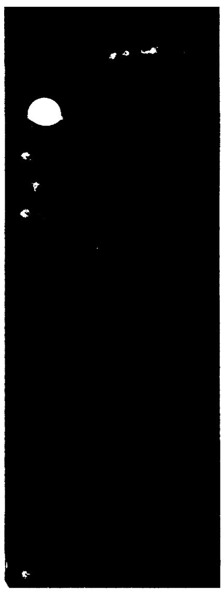
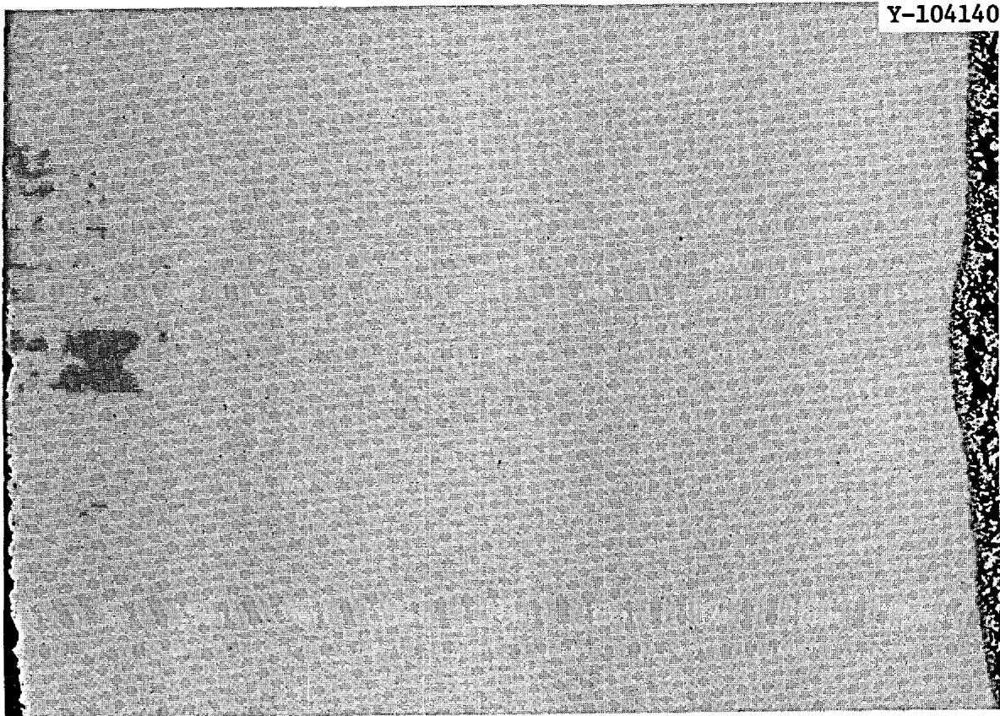
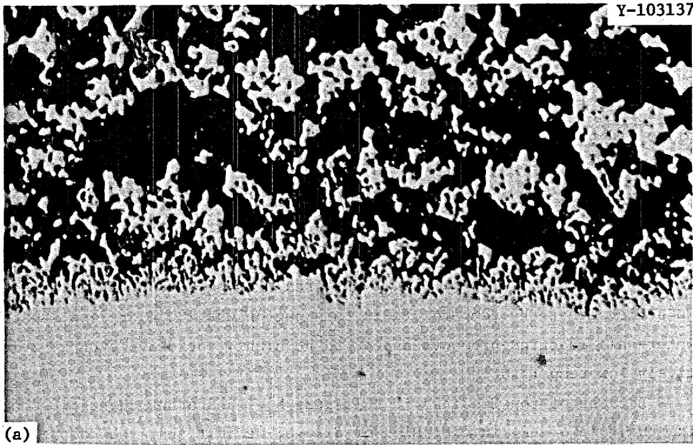
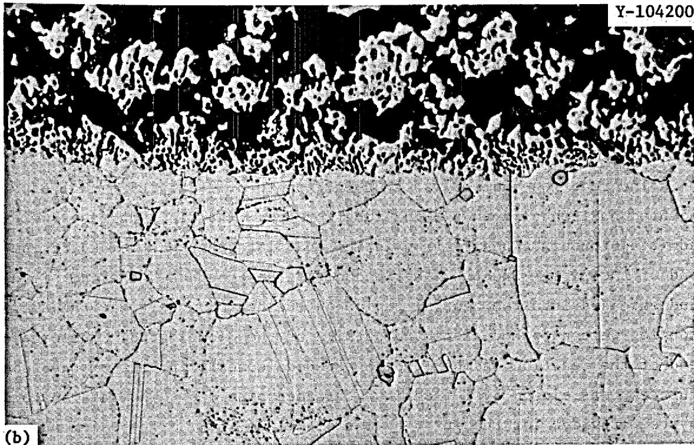
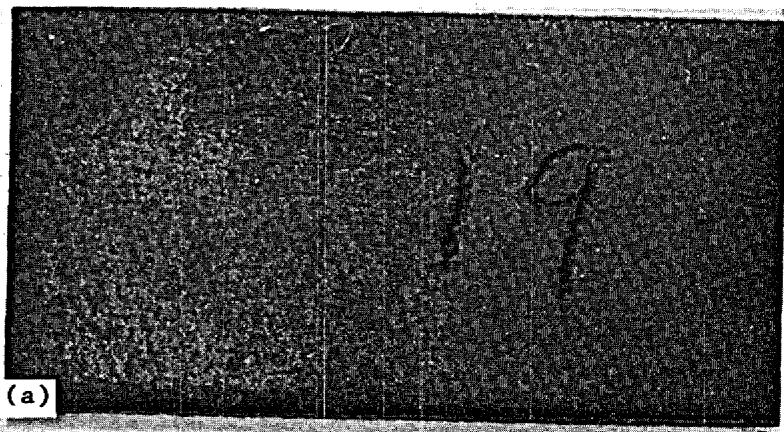
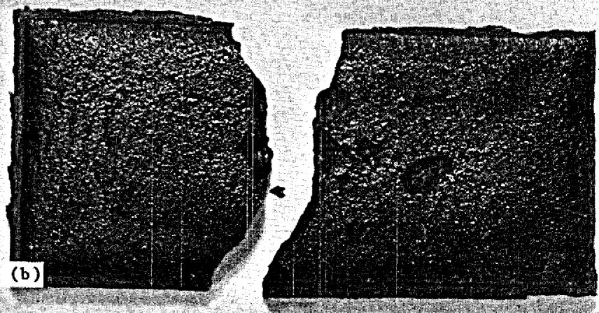
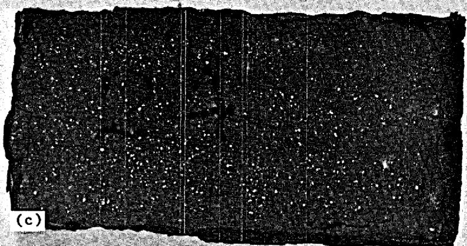

# CORROSION OF TYPE 304L STAINLESS STEEL AND HASTELLOY N BY MIXTURES OF BORON TRIFLUORIDE, AIR, AND ARGON

J. W. Koger

THIS DOCUMENT CONFIRMED AS UNCLASSIFIED   
DIVISION OF CLASSIFICATION BY I. h. Cucchiara / we.   
DATE 6/12/13

OAK RIDGE NATIONAL LABORATORY

OPERATED BY UNION CARBIDE CORPORATION • FOR THE U.S. ATOMIC ENERGY COMMISSION

This report was prepared as an account of work sponsored by the United States Government. Neither the United States nor the United States Atomic Energy Commission, nor any of their employees, nor any of their contractors, subcontractors, or their employees, makes any warranty, express or implied, or assumes any legal liability or responsibility for the accuracy, completeness or usefulness of any information, apparatus, product or process disclosed, or represents that its use would not infringe privately owned rights.

Contract No. W-7405-eng-26

METALS AND CERAMICS DIVISION

CORROSION OF TYPE 304L STAINLESS STEEL AND HASTELLOY N BY MIXTURES OF BORON TRIFLUORIDE, AIR, AND ARGON

J. W. Koger

# NOTICE

This report was prepared as an account of work sponsored by the United States Government. Neither the United States nor the United States Atomic Energy Commission, nor any of their employees, nor any of their contractors, subcontractors, or their employees, makes any warranty, express or implied, or assumes any legal liability or responsibility for the accuracy, completeness or usefulness of any information, apparatus, product or process disclosed, or represents that its use would not infringe privately owned rights.

DECEMBER 1972

OAK RIDGE NATIONAL LABORATORY

Oak Ridge, Tennessee 37830

operated by

UNION CARBIDE CORPORATION

for the

U.S. ATOMIC ENERGY COMMISSION

# CONTENTS

Page

Abstract 1

Introduction 1

Background Data 3

Results of the Current Experiments 8

Conclusions 13

Acknowledgments 14

J. W. Koger

# ABSTRACT

Corrosion of type 304L stainless steel and Hastelloy N was studied in gaseous mixtures of $\mathrm{BF}_3$ , air, and argon at 600, 300, and $200^{\circ}\mathrm{C}$ . In some tests the alloy specimens and gases were in contact with molten fluoride mixtures. At $600^{\circ}\mathrm{C}$ under air, specimens of both alloys were completely destroyed in both fuel salt and fluoroborate salt mixtures. No significant weight changes were measured for Hastelloy N immersed in salt exposed to argon or $\mathrm{BF}_3$ , but type 304L stainless steel lost weight under the same conditions. This weight loss was greater under $\mathrm{BF}_3$ than under argon and greater in the fluoroborate mixture than in the fuel salt. With no salt immersion, the various gases produced very small changes in the alloys at $200^{\circ}\mathrm{C}$ . Also with no salt, only small changes were noted at 300 and $600^{\circ}\mathrm{C}$ for Hastelloy N in any gas and for the stainless steel in air. At $600^{\circ}\mathrm{C}$ , large quantities of chromium and iron oxides were produced on the stainless steel by the air- $\mathrm{BF}_3$ mixture and large amounts of unidentified corrosion products by $\mathrm{BF}_3$ , argon- $\mathrm{BF}_3$ , and argon-air. Drying the argon decreased the amount of corrosion. Hastelloy N was more resistant than type 304L stainless steel to corrosion by the gases tested in these experiments.

# INTRODUCTION

Over the past few years, increased interest has been shown in the use of a sodium fluoroborate mixture, $\mathrm{NaBF}_4 - 8$ mole % NaF, as a coolant in a Molten-Salt Breeder Reactor. The physical properties of the salt mixture have been determined1 and many experiments2-12 have been undertaken to

ascertain the corrosion of various alloys in this salt. The use of this mixture in a high-temperature environment is somewhat complicated by the fact that the $\mathrm{NaBF}_4$ dissociates by the reaction

$$
\mathrm {N a B F} _ {4} \rightleftharpoons \mathrm {N a F} + \mathrm {B F} _ {3} (g)
$$

and the effect of the $\mathrm{BF}_3$ gas must be considered. The equilibrium pressure above a melt of $\mathrm{NaBF}_4 - 8$ mole % NaF as a function of temperature is given by

$$
\log \mathrm {P} _ {\text {t o r r}} = 9. 0 2 4 - 5 9 2 0 / \mathrm {T} (^ {\circ} \mathrm {K})
$$

The maximum design temperature for the coolant salt mixture is $621^{\circ}\mathrm{C}$ , and this corresponds to a partial pressure of $\mathrm{BF}_3$ of 252 torr. Because of the appreciable vapor pressure of $\mathrm{BF}_3$ at operating temperatures, cover gases

containing equivalent concentrations of $\mathrm{BF}_3$ must be maintained in the free volume of the pump bowl of dynamic systems or used for gas sparge operations.

# BACKGROUND DATA

An early report on corrosion experiments with gaseous boron trifluoride $^{13}$ noted that the $\mathrm{BF}_3$ reacted rapidly with traces of moisture to give hydroxyfluoboric acid (HBF $_3$ OH) and HF. It also showed that $\mathrm{BF}_3$ and glass reacted at an appreciable rate just above $200^{\circ}\mathrm{C}$ . Under the conditions of those experiments, there was no appreciable attack by $\mathrm{BF}_3$ on any metal or alloy examined at temperatures up to $200^{\circ}\mathrm{C}$ .

A systematic study of the compatibility of Hastelloy N with $\mathbf{BF}_3$ had not been undertaken before this study, but several observations indicated possible compatibility problems. These observations were often made in the course of experiments where compatibility was not the primary objective, and the results are difficult to interpret. However, these miscellaneous observations do contribute to our understanding of metal- $\mathbf{BF}_3$ -moisture reactions.

In one experimental program $^{14}$ $\mathrm{BF}_3$ contacted chromium metal (a constituent almost all alloys considered for use in a molten salt system) 60 hr at $650^{\circ}\mathrm{C}$ . The chromium sample gained weight (about $4\%$ ), and the weight gain showed a linear dependence on the square root of the reaction time. The surface of the chromium sample contained substantial quantities of $\mathrm{Cr_2O_3}$ and minor quantities of $\mathrm{CrF_2 - CrF_3}$ . Thus, commercially available $\mathrm{BF}_3$ did promote the oxidation of pure chromium.

In all Hastelloy N thermal convection loop tests $^{5-12}$ that have involved the fluoroborate mixture, specimens have been placed in the vapor

space above the hot and cold leg surge tanks to provide some data on the compatibility of $\mathrm{BF}_3$ with Hastelloy N. The vapor space contained about 220 torr $\mathrm{BF}_3$ and 5 psig He. Since the mass transfer rates in these systems were quite dependent on salt purity, which varied from loop to loop, the weight changes of the specimens exposed to the vapor (Table 1) are scattered. However, in none of the cases were the losses excessive. Based on uniform removal of all alloy constituents, the maximum corrosion rate was 0.04 mil/year.

In another experiment Hastelloy N specimens were exposed to static $\mathrm{BF}_3$ vapor for 6800 hr at $605^{\circ}\mathrm{C}$ in capsules that contained the fluoroborate mixture. The $\mathrm{BF}_3$ pressure was varied in each capsule. Table 2 shows the measured weight changes. The weight changes were quite small, and no composition changes were noted in any of the specimens.

Another experience with $\mathrm{BF}_3$ involved a pump loop (PKP-1), which was used to test a molten-salt pump with the fluoroborate mixture. $^{15,16}$ An Inconel 600 bubbler tube, which had been used for $\mathrm{BF}_3$ addition and salt level indication, had been in service 11,567 hr and was suspected to have become plugged just before the loop shutdown. During most of the test program the total gas flow rate was $370~\mathrm{cm}^3/\mathrm{min}$ . The gas was He-13.5 vol % $\mathrm{BF}_3$ . The outside of the tube was exposed to the fluoroborate mixture at $550^{\circ}\mathrm{C}$ . After removal from the loop, examination disclosed a plug at the bottom of the inside of the tube. Above the plug, in order, were a thin black film, a gray thin deposit with a sprinkling of green particles, a bright green deposit, and finally green material covered with magnetic powder. The green deposit was $\mathrm{Na}_3\mathrm{CrF}_6$ , and the magnetic mixture was equivalent to $\mathrm{Ni}_3\mathrm{Fe}$ . Figure 1 shows a cross section of the tubing wall near the liquid-gas interface. We saw a zone of metallic crystals on the inner surface to a thickness of approximately 20 mils. In view of the apparent loss of wall thickness in this area, these crystals probably represent vestiges of the original metal surface. Figure 2 shows a higher

Table 1. Weight Losses of Hastelloy N Specimens Exposed to $\mathsf{BF}_3$ in a Thermal Convection Loops   

<table><tr><td>Temperature (°C)</td><td>Time (hr)</td><td>Weight Loss (mg/cm2)</td><td>Rate of Weight Loss (mg cm-2 hr-1)</td></tr><tr><td>530</td><td>4,150</td><td>0</td><td>0 × 10-5</td></tr><tr><td>530</td><td>21,983</td><td>0.3</td><td>1.4</td></tr><tr><td>530</td><td>23,427</td><td>0.3</td><td>1.3</td></tr><tr><td>530</td><td>32,090</td><td>0.15</td><td>0.47</td></tr><tr><td>593</td><td>19,433</td><td>0.4</td><td>2.1</td></tr><tr><td>607</td><td>4,150</td><td>0.4</td><td>9.7</td></tr><tr><td>607</td><td>21,983</td><td>2.2</td><td>10</td></tr><tr><td>607</td><td>23,427</td><td>0.3</td><td>1.3</td></tr><tr><td>607</td><td>32,090</td><td>2.0</td><td>6.2</td></tr><tr><td>687</td><td>19,433</td><td>0.3</td><td>1.5</td></tr></table>

Table 2. Weight Losses of Hastelloy N Specimens Exposed to Various Pressures of $\mathbf{BF}_3$ at $605^{\circ}\mathrm{C}$ for 6800 hr.a   

<table><tr><td>BF3Pressure (psia)</td><td>Weight Loss (mg/cm2)</td></tr><tr><td>4.2</td><td>0.03</td></tr><tr><td>64.7</td><td>0.3</td></tr><tr><td>114.7</td><td>0.4</td></tr><tr><td>414.7</td><td>0</td></tr></table>

aJ. W. Koger and A. P. Litman, Compatibility of Fused Sodium Fluoroborates and $BF_{3}$ Gas with Hastelloy N Alloys, ORNL-TM-2978 (June 1970).

  
Fig. 1. As-Polished Cross Section from Near Liquid-Gas Interface of Inconel 600 Bubbler Tube from PKP-1 Pump Loop, $100 \times$ .

Outside

Inside

magnification of the inside surface, both as polished and etched, and tends to corroborate that the crystals are a result of material leaving the surface rather than material deposition. The material on the inside of the tube above the liquid level appeared to be the result of attack by water-derived impurities in the $\mathbf{BF}_3$ .

On removing the pump rotary element from the loop and dismantling the various pump components, Smith17 found that the inner heat baffle plates had been severely attacked, as evidenced by holes in some places and by severe pitting in other places. The attack was not homogeneous on any one plate or constant from one plate to another. The top surface of the top

  
Fig. 2. Inside Surface of Inconel 600 Bubbler Tube from PKP-1 Pump Exposed to He-13.5 vol % BF₃ for 11,500 hr. (a) As Polished, $500 \times$ . (b) Etched with Aqua Regia, $500 \times$ .

plate was severely pitted, but the other surfaces that combined to form the chamber above the top plate (shaft, inner surface of impeller housing support cylinder, and lower surface of the cooling oil chamber) were relatively free of attack. All baffle plates except the one below the top plate had holes corroded completely through. The inner heat baffles fitted very tightly against the inner surface of the upper impeller housing support cylinder, so that probably most of the gas flow was past the inner annulus between the baffle plate and the pump shaft. The attack was attributed to the intimate contact of purge gas (or more correctly, the moisture in the purge gas) with puddles of salt that lay on the baffle surfaces. We believe that the temperature in this region was $280^{\circ}\mathrm{C}$ or less, so the water-salt reaction products appear to be highly corrosive even at relatively low temperatures.

Because of the findings in this pump bowl and other questions concerning the role of $\mathrm{BF}_3$ in corrosion of alloys, we felt that the compatibility of $\mathrm{BF}_3$ and various gas mixtures with candidate alloys for molten salt use should be studied systematically. As a first test, we exposed type 304L stainless steel and Hastelloy N to argon, air, $\mathrm{BF}_3$ , and mixtures of these for $100\mathrm{hr}$ at temperatures from 200 to $600^{\circ}\mathrm{C}$ .

# RESULTS OF THE CURRENT EXPERIMENTS

The reaction chamber was a 30-in. length of 2-in. IPS nickel pipe, mounted horizontally in a 3-in. tube furnace. The reacting gases were admitted through a penetration in the end plate that was welded to one end of the pipe. Sheathed thermocouples also penetrated the end plate and extended into the central region on the heated zone. Several thermocouples were attached along the outside of the nickel pipe. The other end of the reaction chamber, which extended some 10 in. out of the tube furnace, was closed by Teflon in a threaded pipe cap. The gas manifold system provided for the introduction of helium, $\mathrm{BF}_3$ , argon, air, or mixtures of these gases at known flow rates into the reaction chamber. The system was sealed from the atmosphere by bubbling the gas effluent through a fluorocarbon oil. Metal samples were carried in nickel boats inserted

through the threaded access port. In several runs, metal specimens were placed with a fuel salt, LiF-20 mole % BeF $_2$ -11.7 mole % ThF $_4$ -0.3 mole % UF $_4$ , or a coolant salt, NaBF $_4$ -8 mole % NaF, in the nickel boats. The tests lasted 100 hr, and the gas flow rate was $100~\mathrm{cm}^3/\mathrm{min}$ . The metal specimens were approximately $0.75 \times 0.375 \times 0.030$ in. and weighed about 1 g. Specimens were weighed before and after each test, and reaction products were analyzed whenever possible. The nominal amounts of the major alloying constituents of Hastelloy N and type 304L stainless steel are given in Table 3.

Table 3. Nominal Compositions of Alloys   

<table><tr><td rowspan="2">Alloy</td><td colspan="4">Content, wt %</td></tr><tr><td>Ni</td><td>Cr</td><td>Fe</td><td>Mo</td></tr><tr><td>Hastelloy N</td><td>70</td><td>7</td><td>5</td><td>17</td></tr><tr><td>Type 304L stainless steel</td><td>10</td><td>18</td><td>69</td><td>0</td></tr></table>

Table 4 gives the results for the metal-salt combinations exposed to various gases at $600^{\circ}\mathrm{C}$ for 100 hr.

As was expected, air in combination with the fluoride salts produced highly corrosive conditions, which destroyed not only the specimens but the nickel boats. None of the weight changes measured for the Hastelloy N immersed in salt and exposed to any of the gas mixtures other than air were significant. For the stainless steel specimens immersed in salt, $\mathrm{BF}_3$ gas caused more attack than argon. A larger moisture content in the $\mathrm{BF}_3$ probably caused the greater attack. The fluoroborate mixture was more aggressive toward the stainless steel than the fuel salt. Weight losses rather than weight gains occurred because the corrosion products were dissolved from the specimens by the salt.

Table 5 gives the results for alloys exposed to the various gas mixtures without salt at temperatures from 200 to $600^{\circ}\mathrm{C}$ for 100 hr. In most cases, weight gains were found, since the corrosion products remained on the specimens and were not carried away.

Table 4. Weight Changes of Hastelloy N and Type 304L Stainless Steel Exposed to Various Gases while Immersed in Fluoride Salts at $600^{\circ}\mathrm{C}$ for 100 hr. Gas Flow 100 cm³/min   

<table><tr><td rowspan="2">Alloy</td><td rowspan="2">Salt</td><td colspan="3">Weight Change, a mg/cm2</td></tr><tr><td>Argonb</td><td>BF3c</td><td>Ar-BF3</td></tr><tr><td rowspan="2">Hastelloy N</td><td>Fueld</td><td>-0.03</td><td>+0.03</td><td>0</td></tr><tr><td>Coolante</td><td>+0.06</td><td>0</td><td>-0.06</td></tr><tr><td rowspan="2">Type 304L stainless steel</td><td>Fueld</td><td>-0.3</td><td>-1.4</td><td>-1.6</td></tr><tr><td>Coolante</td><td>-1.2</td><td>-5.2</td><td>-2.4</td></tr></table>

aSpecimens exposed to air containing 7.5 ppm moisture were completely destroyed.

b24 ppm moisture.

c50 ppm moisture.

LiF-20 mole % BeF $_2$ -11.7 mole % ThF $_4$ -0.3 mole % UF $_4$ .

eNaBF4-8 mole % NaF.

For Hastelloy N, the only significant changes measured at $600^{\circ}\mathrm{C}$ were in the mixtures containing air. This effect can be attributed to too small an amount of chromium in the Hastelloy to provide good resistance to air oxidation. At 200 and $300^{\circ}\mathrm{C}$ , all changes were rather small.

For the stainless steel at $600^{\circ}\mathrm{C}$ , the air- $\mathbf{BF}_3$ mixture produced a large amount of chromium and iron oxides, which is shown in Fig. 3(b). The stainless steel specimen from which the oxides in Fig. 3(b) had been removed is shown in Fig. 3(c), and a relatively unaffected stainless steel specimen that had been exposed to air at $200^{\circ}\mathrm{C}$ is shown in Fig 3(a). By itself, $\mathbf{BF}_3$ at $600^{\circ}\mathrm{C}$ also produced a large amount of corrosion product on the stainless steel and was more aggressive than argon. Significant weight gains of the stainless steel specimens were produced at $300^{\circ}\mathrm{C}$ and $600^{\circ}\mathrm{C}$ by all gas mixtures except air. At $200^{\circ}\mathrm{C}$ , most changes were rather small. Reaction of the stainless steel with argon, air, and an argon- $\mathbf{BF}_3$ mixture resulted in a red corrosion product on the surface, whereas reaction with $\mathbf{BF}_3$ by itself resulted in the formation of white material on the surface. These red and white corrosion products could not be

Table 5. Weight Changes of Hastelloy N and Type 304L Stainless Steel Exposed to Various Gases at 200 to $600^{\circ}\mathrm{C}$ for 100 hr. Gas Flow 100 cm³/min   

<table><tr><td rowspan="2">Gas</td><td rowspan="2">Moisture (ppm)</td><td rowspan="2">Temp. (°C)</td><td colspan="2">Weight Change, mg/cm2</td></tr><tr><td>Hastelloy N</td><td>Stainless Steel</td></tr><tr><td rowspan="3">Argon</td><td rowspan="3">24</td><td>600</td><td>+0.06</td><td>+0.1</td></tr><tr><td>300a</td><td>0</td><td>+0.3b</td></tr><tr><td>200</td><td>+0.03</td><td>+0.05</td></tr><tr><td rowspan="3">Argonc</td><td rowspan="3">2</td><td>600</td><td>+0.03</td><td>+0.05</td></tr><tr><td>300a</td><td>0</td><td>+0.17</td></tr><tr><td>200</td><td>-0.03</td><td>+0.03</td></tr><tr><td rowspan="3">BF3</td><td rowspan="3">&lt;50</td><td>600</td><td>0</td><td>+5.2</td></tr><tr><td>300a</td><td>+0.2</td><td>+3.3d</td></tr><tr><td>200</td><td>-0.03</td><td>0</td></tr><tr><td rowspan="3">Air</td><td rowspan="3">7.5</td><td>600</td><td>+0.2</td><td>+0.03</td></tr><tr><td>300a</td><td>+0.03</td><td>-0.03b</td></tr><tr><td>200</td><td>+0.03</td><td>0</td></tr><tr><td rowspan="3">Argon-BF3</td><td rowspan="3">24e</td><td>600</td><td>-0.03</td><td>+0.22</td></tr><tr><td>300a</td><td>+0.03</td><td>+5.85f</td></tr><tr><td>200</td><td>0</td><td>0</td></tr><tr><td rowspan="3">Argon-C-BF3</td><td rowspan="3">2e</td><td>600</td><td>+0.03</td><td>+0.05</td></tr><tr><td>300a</td><td>+0.3</td><td>+2.0</td></tr><tr><td>200</td><td>0</td><td>0</td></tr><tr><td rowspan="3">Air-BF3</td><td></td><td>600</td><td>+0.2</td><td>+119.2g</td></tr><tr><td></td><td>300a</td><td>0</td><td>+25.4</td></tr><tr><td></td><td>200</td><td>0</td><td>-1.2</td></tr><tr><td rowspan="3">Argon-air</td><td rowspan="3">24e</td><td>600</td><td>-0.1</td><td>+0.8</td></tr><tr><td>300a</td><td>0</td><td>+10.0h</td></tr><tr><td>200</td><td>-0.03</td><td>+0.2</td></tr></table>

aNear gas entrance.   
bAdherent red layer on surface.   
Dried by passing through heated titanium sponge.   
Large amount of nonadherent white material on surface; 0.0290 g removed.   
e In the argon.   
Large amount of nonadherent red material on surface; 0.0745 g removed.   
Large amount of oxide on surface, identified by x-ray diffraction as 25 mole $\%$ Cr $_2$ O $_3$ and 75 mole $\%$ Fe $_2$ O $_3$ .   
hLarge amount of material flaked off.

  
0.10 IN\DIV.   
Fig. 3. (a) Type 304L Stainless Steel Specimen Exposed to Air at $200^{\circ}\mathrm{C}$ for 100 hr. (b) Chromium and iron oxides removed from a similar specimen after exposure to mixed air and $\mathbf{BF}_3$ for 100 hr at $600^{\circ}\mathrm{C}$ . (c) Specimen from which oxide in (b) had been removed.

identified by x-ray analysis but contained iron, chromium, oxygen, and, where $\mathrm{BF}_3$ was involved, fluorine. Thus, the corrosion products were probably complex mixtures of metal oxides and perhaps fluorides.

The use of drier argon (2 ppm moisture as opposed to 24 ppm) lowered the weight gain of the stainless steel specimens by about one-half. The effect of moisture was more dramatic when the gas was an argon- $\mathrm{BF}_3$ mixture (Table 5).

Even though air had almost no effect on the stainless steel, the air- $\mathrm{BF}_3$ mixture had the worst effect of any of the gases, much worse than just $\mathrm{BF}_3$ . The air in combination with argon also produced more corrosion products than either of the two gases by themselves. In combination with salt, $\mathrm{BF}_3$ had the worst effect. These results underline the problems that can result in a system that allows air and/or moisture to come in contact with molten fluoride salts or with the $\mathrm{BF}_3$ vapor.

Except in air at $600^{\circ}\mathrm{C}$ , Hastelloy N was much more resistant to corrosion than the type 304L stainless steel.

# CONCLUSIONS

1. At $600^{\circ}\mathrm{C}$ , air completely destroyed Hastelloy N and type 304L stainless steel specimens that were immersed in either a fuel salt or the fluoroborate coolant mixture.   
2. No significant weight changes were measured for Hastelloy N immersed in salt exposed to argon or $\mathrm{BF}_3$ at $600^{\circ}\mathrm{C}$ , but type 304L stainless steel lost weight.   
3. For the stainless steel immersed in salt, the $\mathrm{BF}_3$ gas was more corrosive than the argon.   
4. Stainless steel weight losses were larger in the fluoroborate mixture than in the fuel salt.   
5. At $200^{\circ}\mathrm{C}$ , the various gases produced very small changes in the alloys.   
6. At 300 and $600^{\circ}\mathrm{C}$ , only small changes were noted in the Hastelloy N specimens.   
7. Small changes were noted in the stainless steel exposed to air at $300^{\circ}\mathrm{C}$ , but large amounts of corrosion products were produced by $\mathrm{BF}_3$ , argon- $\mathrm{BF}_3$ , air- $\mathrm{BF}_3$ , and argon-air.

8. At $600^{\circ}\mathrm{C}$ , the air- $\mathbf{BF}_3$ mixture produced large quantities of chromium oxide and iron oxide on the stainless steel; also large amounts of corrosion products were produced by $\mathbf{BF}_3$ , argon- $\mathbf{BF}_3$ , and argon-air.   
9. Drying the argon decreased the amount of corrosion.   
10. Hastelloy N is more resistant to corrosion by the gases tested in this experiment than type 304L stainless steel.

# ACKNOWLEDGMENTS

It is a pleasure to acknowledge E. J. Lawrence, who operated the experiment and was responsible for the weight change measurements of all the corrosion specimens. I am indebted to H. E. McCoy, J. H. DeVan, and T. S. Lundy for constructive review of the manuscript.

Special thanks are extended to C. E. Zachary for metallographic work, R. M. Steele for the x-ray diffraction, and the Metals and Ceramics Reports Office for invaluable assistance.

# INTERNAL DISTRIBUTION

# (77 copies)

(3) Central Research Library

ORNL - Y-12 Technical Library

Document Reference Section

(10) Laboratory Records Department

Laboratory Records, ORNL RC

ORNL Patent Office

G. M. Adamson, Jr.

C. F. Baes

C. E. Bamberger

S. E. Beall

E. G. Bohlmann

R. B. Briggs

S. Cantor

E. L. Compere

W. H. Cook

F. L. Culler

J. E. Cunningham

J. M. Dale

J. H. DeVan

J. R. DiStefano

J.R.Engel

D. E. Ferguson

J. H Frye, Jr.

L. O. Gilpatrick

W. R. Grimes

A. G. Grindell

W. O. Harms

P. N. Haubenreich

(3) M. R. Hi11

W. R. Huntley

H. Inouye

(5)

P. R. Kasten

J. W. Koger

E. J. Lawrence

A. L. Lotts

T. S. Lundy

R. N. Lyon

H. G. MacPherson

R. E. MacPherson

W. R. Martin

R. W. McClung

H. E. McCoy

C. J. McHargue

H. A. McLain

B. McNabb

L. E. McNeese

A. S. Meyer

P. Patriarca

A. M. Perry

M. W. Rosenthal

H. C. Savage

J. L. Scott

J. H. Shaffer

G. M. Slaughter

G.P. Smith

R. A. Strehlow

R. E. Thoma

D. B. Trauger

J. R. Weir

J. C. White

L. V. Wilson

EXTERNAL DISTRIBUTION

(24 copies)

BABCOCK & WILCOX COMPANY, P.O. Box 1260, Lynchburg, VA 24505

B. Mong

BLACK AND VEATCH, P.O. Box 8405, Kansas City, MO 64114

C. B. Deering

BRYON JACKSON PUMP, P.O. Box 2017, Los Angeles, CA 90054   
G. C. Clasby   
CABOT CORPORATION, STELLITE DIVISION, 1020 Park Ave., Kokomo, IN 46901   
T. K. Roche   
CONTINENTAL OIL COMPANY, Ponca City, OK 74601   
J. A. Acciarri   
EBASCO SERVICES, INC., 2 Rector Street, New York, NY 10006   
D. R. deBoisblanc   
T. A. Flynn   
THE INTERNATIONAL NICKEL COMPANY, Huntington, WV 25720   
J. M. Martin   
UNION CARBIDE CORPORATION, CARBON PRODUCTS DIVISION, 12900 Snow Road, Parma, OH 44130   
R. M. Bushong   
USAEC, DIVISION OF REACTOR DEVELOPMENT AND TECHNOLOGY, Washington, DC 20545   
David Elias   
J. E. Fox   
Norton Haberman   
C. E. Johnson   
T. C. Reuther   
S. Rosen   
Milton Shaw   
J. M. Simmons   
USAEC, DIVISION OF REGULATIONS, Washington, DC 20545   
A. Giambusso   
USAEC, RDT SITE REPRESENTATIVES, Oak Ridge National Laboratory, P.O. Box X, Oak Ridge, TN 37830   
D. F. Cope   
Kermit Laughon   
C. L. Matthews   
USAEC, OAK RIDGE OPERATIONS, P.O. Box E, Oak Ridge, TN 37830  
Research and Technical Support Division   
USAEC, TECHNICAL INFORMATION CENTER, P.O. Box 62, Oak Ridge, TN 37830   
(2)