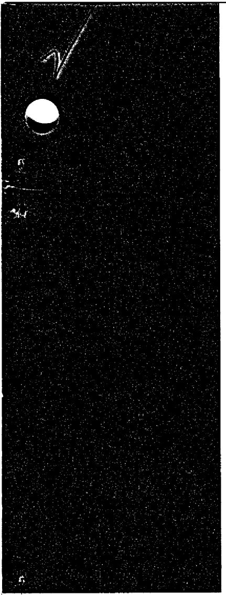

# POSTIRRADIATION EXAMINATION OF MATERIALS FROM THE MSRE

H. E. McCoy

B. McNabb

MASTER

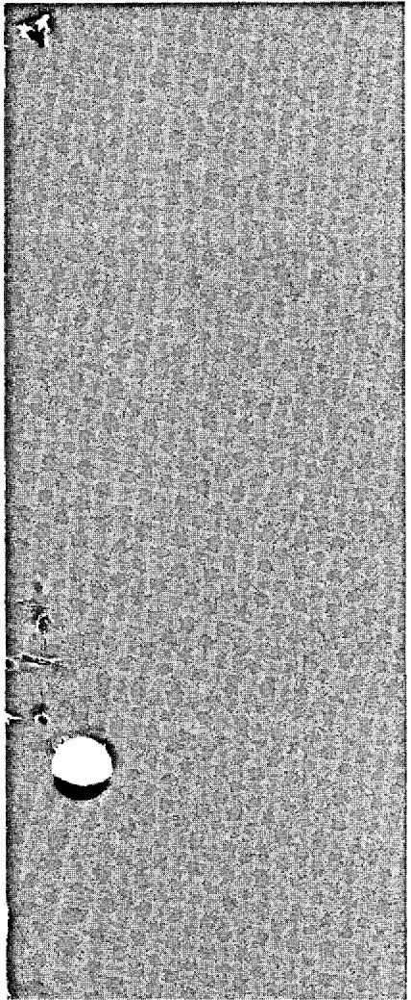

OAK RIDGE NATIONAL LABORATORY

OPERATED BY UNION CARBIDE CORPORATION • FOR THE U.S. ATOMIC ENERGY COMMISSION

This report was prepared as an account of work sponsored by the United States Government. Neither the United States nor the United States Atomic Energy Commission, nor any of their employees, nor any of their contractors, subcontractors, or their employees, makes any warranty, express or implied, or assumes any legal liability or responsibility for the accuracy, completeness or usefulness of any information, apparatus, product or process disclosed, or represents that its use would not infringe privately owned rights.

Contract No. W-7405-eng-26

METALS AND CERAMICS DIVISION

POSTIRRADIATION EXAMINATION OF MATERIALS FROM THE MSRE

H.E.McCoy B.McNabb

# DECEMBER 1972

# NOTICE

This report was prepared as an account of work sponsored by the United States Government. Neither the United States nor the United States Atomic Energy Commission, nor any of their employees, nor any of their contractors, subcontractors, or their employees, makes any warranty, express or implied, or assumes any legal liability or responsibility for the accuracy, completeness or usefulness of any information, apparatus, product or process disclosed, or represents that its use would not infringe privately owned rights.

OAK RIDGE NATIONAL LABORATORY

Oak Ridge, Tennessee 37830

operated by

UNION CARBIDE CORPORATION

for the

U.S. ATOMIC ENERGY COMMISSION

MASTER

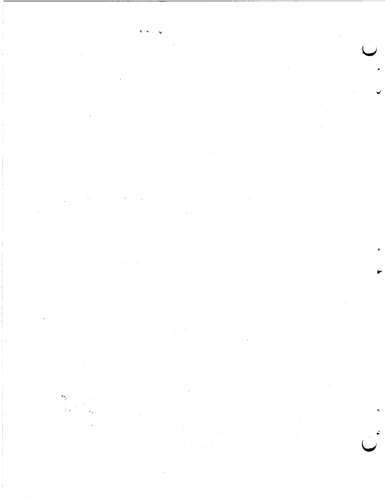

# CONTENTS

Abstract 1

Introduction 1

The MSRE and Its Operation 1

Description 2

History 2

Examination of a Graphite Moderator Element 6

Description of Graphite Elements 6

Visual Examination of Element 1184 8

Chemical Analysis of the Moderator Element 10

Summary of Observations 14

Examination of the Graphite and INOR-8 Surveillance Specimens 14

Examination of INOR-8 Control Rod Thimble 15

Physical Description 15

Undeformed Samples 18

Deformed Samples 23

Summary of Observations 31

Examination of Freeze Valve 105 31

Physical Description 31

Visual and Metallographic Examination 31

Mechanical Property Tests 39

Summary of Observations 44

Examination of the Sampler Assembly 44

Physical Description 44

47

Mist Shield 54

Summary of Observations 62

Examination of a Copper Sample Capsule 65

Physical Description 65

Examination 65

Summary of Observations 69

Examination of the Primary Heat Exchanger 69

Physical Description 69

Examination 70

Summary of Observations 79

Examination of the Coolant Radiator 79

Physical Description 79

Observations 80

Summary of Observations 92

Summary 92

Acknowledgment 95

# POSTIRRADIATION EXAMINATION OF MATERIALS FROM THE MSRE

H.E.McCoy B.McNabb

# ABSTRACT

The Molten-Salt Reactor Experiment operated very successfully. The fuel loop was above $500^{\circ}\mathrm{C}$ for 30,807 hr and contained fuel salt for 21,040 hr. A surveillance program was active during operation to follow the property changes of the graphite moderator and the INOR-8 structural material. After operation was discontinued in December 1969, several components were removed for examination. These included a graphite moderator element from the core, a control rod thimble, freeze valve 105, the sample cage and mist shield from the fuel salt pump bowl, a copper sampler capsule, tubes and a portion of the shell of the primary heat exchanger, and tubes and two thermocouple wells from the air-cooled radiator.

Examination of these materials showed excellent mutual chemical compatibility between the salts, graphite, and INOR-8. The INOR-8 exposed to fuel salt formed shallow intergranular cracks believed to be due to the ingress of the fission product tellurium. The INOR-8 was also embrittled by exposure to thermal neutrons, and this was attributed to the formation of helium by the $^{10}\mathrm{B}(n,\alpha)^{7}\mathrm{Li}$ transmutation.

# INTRODUCTION

The Molten-Salt Reactor Experiment was a unique fluid-fuel reactor. It operated at temperatures around $650^{\circ}\mathrm{C}$ for more than 30,000 hr between 1965 and December 1969. Operation was terminated in 1969 because the technical feasibility and promise of molten salt systems had been demonstrated, and the operating funds were needed for development work associated with advanced concepts of molten-salt reactors.

Surveillance samples of graphite and INOR-8 were removed periodically during operation of the MSRE, and these were examined in detail. After operation, parts of several components were examined. The details of the examinations of the various sets of INOR-8 surveillance samples were reported, $^{2-5}$ and some of the observations made on the various components were discussed in a topical report $^{6}$ dealing with intergranular cracking of INOR-8. The present report consolidates the observations made on the surveillance samples and the components. The components include a control-rod thimble from the core, a freeze valve that isolated the reactor vessel and a fuel drain tank, the salt sampler cage and mist shield from the fuel salt pump bowl, a portion of the shell and several tubes from the primary heat exchanger, two thermocouple wells from the coolant circuit, and several tubes from the air radiator in the coolant circuit.

# THE MSRE AND ITS OPERATION

The MSRE and an account of most of its history are described by Haubenreich and Engel, $^{1}$ and Robertson $^{7}$ has described in detail all components and systems. Because these references are widely available, the

1. P. N. Haubenreich and J. R. Engel, "Experience with the MSRE," Nucl. Appl. Technol. 8, 118 (1970).   
2. H. E. McCoy, An Evaluation of the Molten-Salt Reactor Experiment Hastelloy N Surveillance Specimens - First Group, ORNL-TM-1997 (November 1967).   
3. H. E. McCoy, An Evaluation of the Molten-Salt Reactor Experiment Hastelloy N Surveillance Specimens - Second Group, ORNL-TM-2359 (February 1969).   
4. H. E. McCoy, An Evaluation of the Molten-Salt Reactor Experiment Hastelloy N Surveillance Specimens - Third Group, ORNL-TM-2647 (January 1970).   
5. H. E. McCoy, An Evaluation of the Molten-Salt Reactor Experiment Hastelloy N Surveillance Specimens - Fourth Group, ORNL-TM-3063 (March 1971).   
6. H. E. McCoy and B. McNabb, Intergranular Cracking of INOR-8 in the MSRE, ORNL-4829 (November 1972).   
7. T. C. Robertson, MSRE Design and Operations Report, Part I - Description of Reactor Design, ORNL-TM-728 (January 1965).

description here is restricted to that necessary for the reader to understand the function of each component and the significance of the postoperation examination.

# Description

The parts of the MSRE with which we will be concerned are included in the flowsheet in Fig. 1. The MSRE consisted basically of the primary circuit including the reactor vessel, a fuel pump, and an intermediate heat exchanger; a coolant circuit including the tube side of the intermediate heat exchanger, a coolant pump, and an air radiator; and several auxiliary components associated with fuel and coolant salt storage and fission gas processing. All metallic parts that contacted salt were made of a nickel-base alloy known as INOR-8 and now available commercially under the trade names of Hastelloy N and Allvac N. This alloy, developed at Oak Ridge National Laboratory8 specifically for use in fluoride salts, has the nominal composition Ni-16% Mo-7% Cr-5% Fe-0.05% C. The graphite moderator was made of a special low-porosity graphite, grade CGB, to exclude salt from the graphite pore structure.9 The graphite was produced in the form of bars 2.5 in. square by 72 in. long. These were machined to 2 in. square with a channel on each face for fuel salt flow.

The fuel salt composition was $\mathrm{LiF - BeF_2 - ZrF_4 - UF_4}$ (65-30-5<1 mole $\%$ ); the coolant was LiF-34 mole $\% \mathrm{BeF}_2$ . At full power the 1200-gpm fuel stream normally entered the reactor vessel at $632^{\circ}\mathrm{C}$ and left at $654^{\circ}\mathrm{C}$ ; the maximum outlet temperature at which the reactor operated for any substantial period of time was $663^{\circ}\mathrm{C}$ ( $1225^{\circ}\mathrm{F}$ ). When the reactor was at low power, the salt systems were usually nearly isothermal at about $650^{\circ}\mathrm{C}$ . During extended shutdowns the salt was drained into tanks, where it was kept molten while the circulating loops were allowed to cool. Plugs of salt frozen in flattened sections of pipe ("freeze valves") were used to isolate the drain tanks from the loop. The liquidus temperature of the fuel salt was about $440^{\circ}\mathrm{C}$ and that of the coolant salt was $459^{\circ}\mathrm{C}$ , so the loops were heated to 600 to $650^{\circ}\mathrm{C}$ with external electric heaters before the salt was transferred from the storage tanks. Helium (sometimes argon) was the cover gas over the fuel and coolant salts.

During operation, samples of fuel salt were obtained by lowering small copper buckets (capsules) into the pool of salt in the pump bowl. The pump bowl served as the surge space for the loop and also for separation of gaseous fission products from a 50-gpm stream of salt sprayed out into the gas space above the salt pool. To protect the sample bucket from the salt spray in the pump bowl, a spiral baffle of INOR-8 extended from the top of the bowl down into the salt pool. A cage of INOR-8 rods inside the spiral baffle guided the sample capsule in the pump bowl.

The fuel system was contained in a cell in which an atmosphere of nitrogen containing from 2 to $5\%$ oxygen was maintained. This containment atmosphere was recirculated through a system that provided cooling for the control rods and the freeze valves. Most of the coolant piping was exposed to air.

# History

The history of the MSRE during the four years in which it operated at significant power is outlined in Fig. 2. Construction was finished and salt was charged into the tanks late in 1964. Prenuclear testing, including $1100\mathrm{hr}$ of salt circulation, occupied January through May 1965. During nuclear startup experiments in May through July 1965, fuel salt was circulated for $800\mathrm{hr}$ . The salt was drained, and final

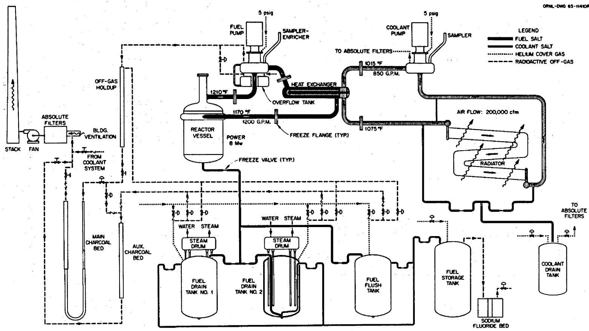  
Fig. 1. Design flowsheet of the MSRE.

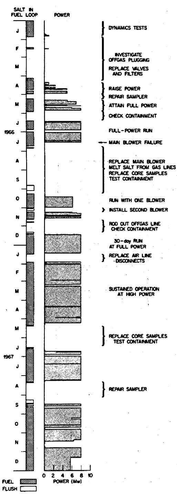

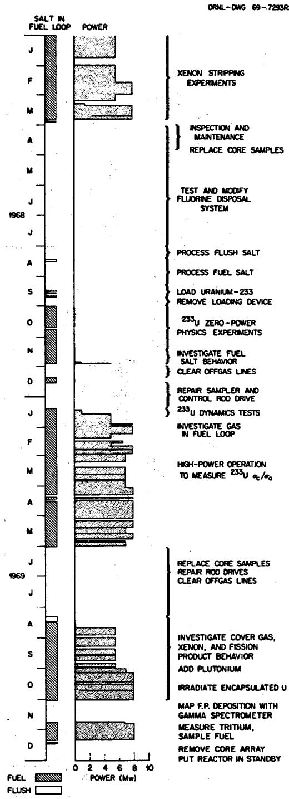  
Fig. 2. Outline of the four years of MSRE power operation.

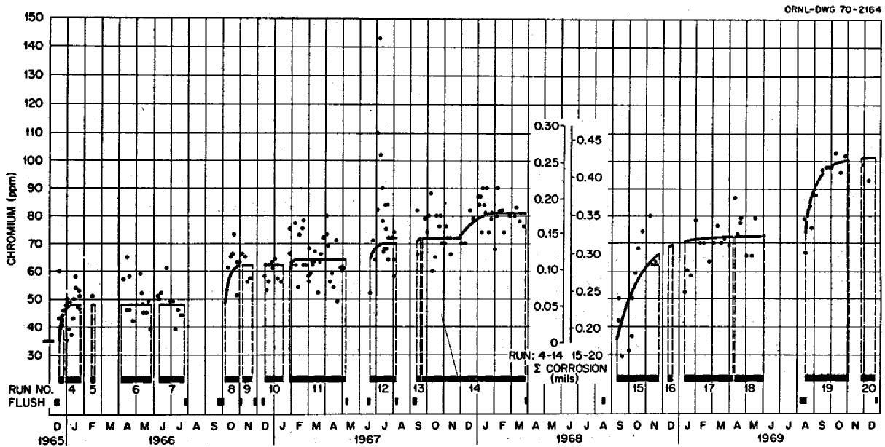  
Fig. 3. Corrosion of the MSRE fuel circuit in $^{235}\mathbf{U}$ and $^{233}\mathbf{U}$ power operations, as measured by chromium concentration in the fuel salt.

preparations for power operations were made in the fall of 1965. Low-power experiments in December led into the history covered in Fig. 2 (see Haubenreich and Engel10 and MSR Program semiannual progress reports for more detail).

The nuclear fuel was $33\%$ -enriched ${}^{235}\mathrm{U}$ , and the $\mathrm{UF_4}$ concentration in the fuel salt was 0.8 mole $\%$ until 1968. Then the uranium was removed by fluorination and ${}^{233}\mathrm{UF_4}$ was substituted. The $\mathrm{UF_4}$ concentration required with ${}^{233}\mathrm{U}$ was only 0.13 mole $\%$ . The composition of the fuel salt was observed by frequent sampling from the pump bowl.[11] Aside from the ${}^{233}\mathrm{U}$ loading and periodic additions of small increments of uranium or plutonium to sustain the nuclear reactivity, the only other additions to the fuel salt were more or less routine small ( $\sim 10\mathrm{-g}$ ) quantities of beryllium and, in two or three experiments, a few grams of zirconium and $\mathrm{FeF_2}$ . The purpose of these additions was to adjust the $\mathrm{U(III) / U(IV)}$ ratio, which affects the corrosion potential and the oxidation state of corrosion-product iron and nickel and fission product niobium.

The primary corrosion mechanism in the fuel salt system was selective removal of chromium by

$$
2 \mathrm {U F} _ {4} + \mathrm {C r} (\text {i n a l l o y}) \rightleftharpoons 2 \mathrm {U F} _ {3} + \mathrm {C r F} _ {2} (\text {i n s a l t}),
$$

and the concentration of chromium in salt samples was the primary indicator of corrosion. Figure 3 shows chromium concentrations observed in the MSRE fuel over the years of power operation. The step-down in chromium concentration in the salt in 1968 was effected by processing the salt after the $^{235}\mathrm{U}$ fluorination. The total increase in chromium in the $4700\mathrm{-kg}$ charge of fuel salt is equivalent to leaching all of the chromium from the $852\mathrm{ft}^2$ of INOR-8 exposed to fuel salt to a depth of about 0.4 mil.

Since the coolant salt did not contain uranium, the corrosion rate was extremely low. During operation, the chromium content of the coolant salt remained at 32 ppm, within the accuracy of the analysis.

# EXAMINATION OF A GRAPHITE MODERATOR ELEMENT

# Description of Graphite Elements

The properties of the grade CGB graphite used to fabricate the moderator elements are given by McCoy and Weir.12 It is basically a petroleum needle coke that was bonded with coal-tar pitch, extruded to rough shape, and heated to $2800^{\circ}\mathrm{C}$ . High density and low permeability were achieved through multiple impregnations and heat treatments. The product was well graphitized and highly anisotropic.

The graphite was produced as bars 2.5 in. square by 72 in. long. These bars were machined to several configurations, but most of them had the geometry shown in Fig. 4. These elements were assembled as shown in Fig. 5 to form the core. The elements fit together to form channels for salt flow. Four moderator blocks were left out to leave spaces for three control rod thimbles and a surveillance assembly. The five elements "enclosed" by the four spaces had INOR-8 lifting lugs so that they could be easily removed for examination.

12. H. E. McCoy and J. R. Weir, Materials Development for Molten-Salt Breeder Reactors, ORNL-TM-1854, p. 46 (June 1967).

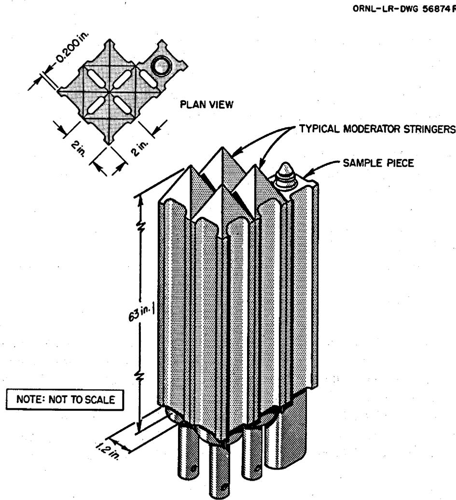  
Fig. 4. Typical graphite stringer arrangement.

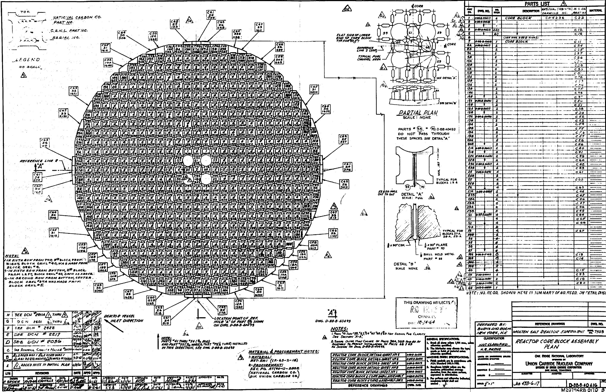  
Fig. 5. Reactor core block assembly plan, drawing D-BB-B-40416.

# Visual Examination of Element 1184

One of the five removable graphite core moderator elements (1184) was examined in the High-Radiation-Level Examination Laboratory (HRLEL) after completion of the operation of the MSRE. Visual examination revealed machining marks still plainly visible in the fuel channels and on surfaces not exposed directly to flowing fuel salt, indicating little if any change during operation. Figure 6 is a photograph of the fuel channel facing the center of the reactor, and it shows the excellent condition of the core block. The small thumbnail flaw in the fuel channel about 39 in. from the top is likely a small crack that was in the bar during fabrication, since tool marks are on the top of the flaw and skip over an area at the end of the flaw. The few scratches on the surface are not very deep and were likely caused by handling.

There was a crack in the graphite around the INOR-8 lifting stud that was screwed into the top of the bar. This crack extended about halfway around the bar, as shown by the short arrows in Fig. 7. The long arrow indicates the same channel in the different views. The small punch mark visible in the top view was made to indicate the fuel channel toward the center of the reactor, with a control rod on one side and the surveillance sample basket on the other side. The crack in the graphite did not affect the integrity of the bar, since it was on the end, and several threads remained to secure the lifting stud. The crack was probably caused by the approximate twofold difference in thermal expansion of graphite and INOR-8.

Length, width, and bowing were measured. There were no significant changes - all measurements were within the original tolerance for fabrication of the core block. The measured length of the approximately rectangular portion of the bar was $64.50 \pm 0.03$ in. Thus, there was no measurable change in length. Width measurements across the flat parallel surfaces were made by reading 1- to 2-in. micrometers through the Kollmorgen periscope. The original dimensional tolerances were $1.998_{-0.005}^{+0.000}$ in. The measurements shown in Table 1 were made at approximately 1-ft intervals from top to bottom of the side facing the center of the reactor. Measurements were also made near the top, middle, and bottom at $90^{\circ}$ to those listed in Table 1 on the sides that had 0.0375 in. relief on each side for flow between the channels starting 2 in. from either end. Values obtained were: top = 1.9226 in., middle = 1.9231 in., and bottom = 1.9230 in. All measurements were within tolerance, so we believe that there were no significant changes or observable trends, even though no actual measurements of the individual bars were recorded before operation.

The bowing was measured by stretching a string tightly between two C-clamp fixtures at either end of the bar and measuring the distance between the bar and the string with a cathetometer, then rotating the

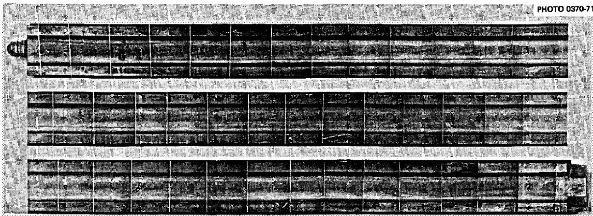  
Fig. 6. One of the removable graphite moderator elements after operation in the MSRE, showing the fuel channel facing the center of the reactor. Machining marks are plainly visible in the fuel channel, showing excellent condition of the core block.

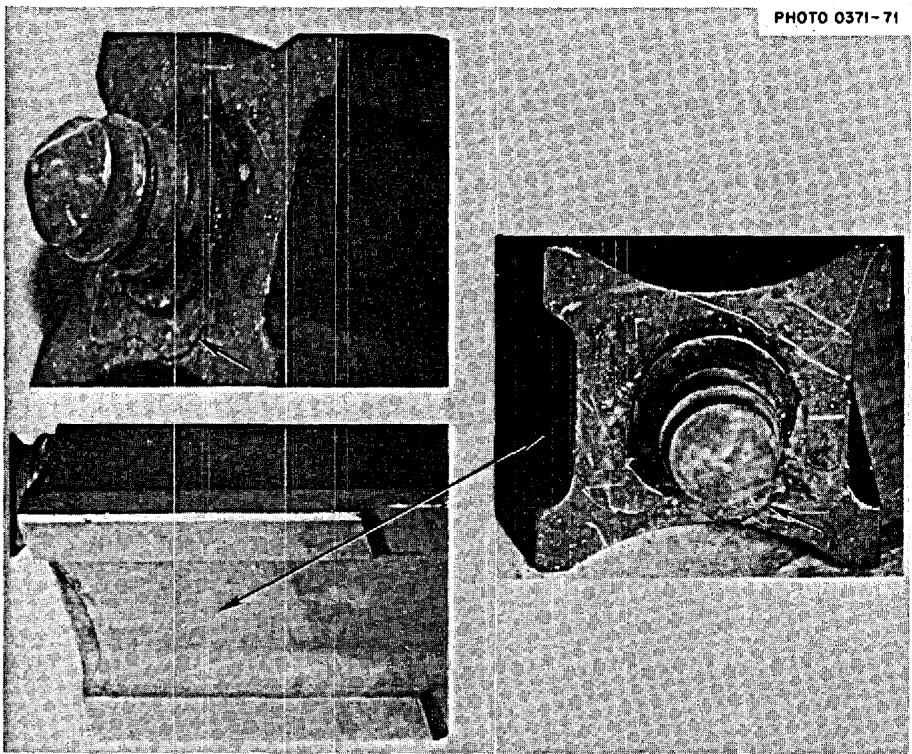  
Fig. 7. Top of the graphite moderator element. The short arrows show the crack originating at the INOR-8 lifting stud and extending partway around the graphite block. The long arrow indicates the same channel in the different views. The crack was probably caused by the approximate twofold difference in thermal expansion between the INOR-8 and the graphite during thermal cycling of the reactor.

Table 1. Dimensional measurements of graphite moderator element   

<table><tr><td>Location</td><td>Measured widtha (in.)</td></tr><tr><td>Top</td><td>1.9947</td></tr><tr><td>1 ft</td><td>1.9954</td></tr><tr><td>2 ft</td><td>1.9944</td></tr><tr><td>3 ft</td><td>1.9948</td></tr><tr><td>4 ft</td><td>1.9942</td></tr><tr><td>Bottom</td><td>1.9971</td></tr></table>

$a$ Dimensional tolerances were $1.998 + 0.000$ in., so that the width could vary from 1.998 to 1.993 in.

bar $90^{\circ}$ , sighting on another bar surface, and repeating the measurement. The maximum observed bowing was 0.012 in., with the string being closer to the bar in the center, possibly indicating slight sagging of the string. We concluded that there was no appreciable bowing. No tolerances for bowing were included in the specifications, and the bar was not supported on a flat surface; absolute measurements were not made or considered necessary, since the bar was removed easily from the MSRE core.

Figure 8 shows the bottom of core block 1184 as it appeared in 1964 during the assembly of the core and (inset) as it appeared in the HRLEL after operation for the full life of the MSRE (including 22,000 hr

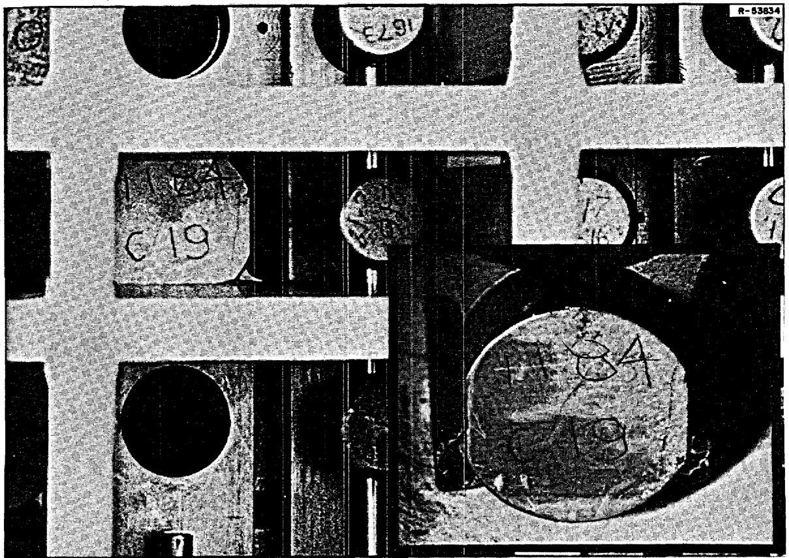  
Fig. 8. Comparison of the bottom positioning stud on the graphite moderator element when initially installed in the MSRE and after operation. The large picture was made before the reactor was operational, and the small picture in the lower right corner was made in the hot cells after the moderator element had been at temperature for over three years.

exposure to molten salt). There is no apparent change, as the small cracks and the small chip missing from the bottom are apparent in both photographs, and the numbers are just as legible as before operation.

A cross section of the INOR-8 lifting stud in contact with the graphite is shown in Fig. 9. There appears to be little if any reaction with the graphite. There is a surface modified layer about 1 or 2 mils deep similar to that observed on surveillance samples and attributed to cold working of the surface and subsequent heat treatment during service. There appears to be very little difference in the side of the thread in contact with the graphite and the root of the thread, which probably was not in intimate contact.

# Chemical Analysis of the Moderator Element

Small samples were core-drilled from various locations of the moderator element for chemical analyses by the spark-source mass spectrograph and by Auger spectroscopy. Small electrodes $\left(^{1}\right)$ in. diam) were used in the spark-source mass spectrograph. Small amounts of the electrodes were vaporized and the concentrations of various atomic masses measured. In Auger spectroscopy the surface of the sample is bombarded with electrons. Vacancies are created in the inner electron shell of some atoms, and some of the excited atoms revert to the ground state by emitting an electron as a result of a radiationless transition. $^{13-15}$ This Auger electron has an energy that is characteristic of the parent atom. Only the atoms in the first one to three layers are involved, and excellent sensitivities are attainable.

13. L. A. Harris, J. Appl. Phys. 39, 1419 (1968).   
14. L. A. Harris, J. Appl. Phys. 39, 1428 (1968).   
15. R.E. Clausing, MSR Program Semiannu. Progr. Rep. Feb. 28, 1971, ORNL-4676, pp. 143-45.

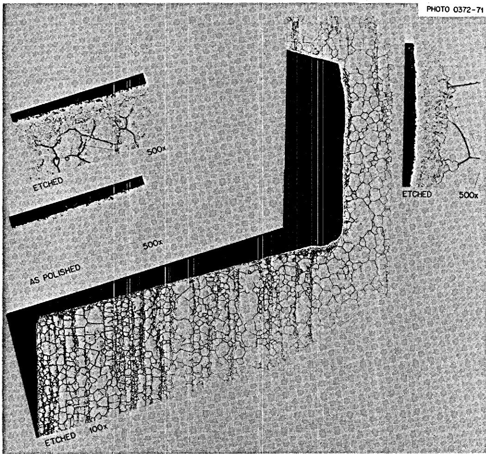  
Fig. 9. INOR-8 thread that was in contact with graphite for about three years at $650^{\circ}\mathrm{C}$ . The modified layer is likely due to working effects from machining the thread. Reduced $35\%$ .

The results of the mass spectrographic analyses are given in Table 2. These data are quite useful, but several factors limit their accuracy. The penetration of the spark into the graphite was likely a hemisphere, so some new surface continued to be included as the penetration depth increased. The calculated depths are estimates of the maximum depths sampled, and the sensitivity of the analysis increases with increasing current. The size of the area sampled is also of concern, particularly at the lower penetration depths. This graphite has pores about $0.1\mu \mathrm{m}$ (1000 Å) in diameter, and the compositions of the first samples (taken from areas a few angstroms in diameter) could be quite dependent upon the location. These factors make it impossible to obtain a quantitative concentration profile, but it appears that the fission products are concentrated at the surface and decrease rapidly with depth.

Auger analyses were performed on several samples from the MSRE. The results are summarized in Table 3. Sample 6, the first analyzed, was taken from a core surveillance specimen removed from the MSRE in April 1968 at the conclusion of operation with $^{235}\mathrm{U}$ fuel. The other samples were all 0.3-in.-diam plugs taken by core drilling various parts of the graphite moderator element 1184. The data in Table 3 are normalized relative to a carbon peak of 100, and peak heights are given in arbitrary units. The data are not quantitative due to lack of suitable standards, and because the sensitivity is different for different elements and for different peaks for the same element, peak height cannot be equated to concentration.

Table 2. Concentration of elements on surface of MSRE graphite stringer at reactor midplane   

<table><tr><td rowspan="2">Mass</td><td rowspan="2">Element</td><td colspan="7">Concentration (wt %) at various maximum penetration depths (A)</td></tr><tr><td>~2.5</td><td>~25</td><td>800</td><td>900</td><td>2000</td><td>3000</td><td>4000</td></tr><tr><td colspan="9">Fission Products Detected</td></tr><tr><td>87</td><td>Rb</td><td></td><td></td><td>0.0018</td><td></td><td></td><td></td><td></td></tr><tr><td>89</td><td>Y</td><td></td><td></td><td>0.0044</td><td></td><td></td><td></td><td></td></tr><tr><td>90</td><td>Sr</td><td></td><td></td><td>0.0067</td><td></td><td></td><td></td><td></td></tr><tr><td>\( Fission^a \)</td><td>Mo</td><td>3.6</td><td>2.4</td><td>0.59</td><td>0.09</td><td>0.26</td><td>0.30</td><td>0.24</td></tr><tr><td>93</td><td>Nb</td><td></td><td></td><td>0.003</td><td></td><td></td><td>0.002</td><td>0.001</td></tr><tr><td>99</td><td>Tc</td><td>0.57</td><td>0.39</td><td>0.09</td><td>0.02</td><td>0.05</td><td>0.05</td><td>0.04</td></tr><tr><td>101,102,106</td><td>Ru</td><td>1.4</td><td>0.95</td><td>0.19</td><td>0.04</td><td>0.11</td><td>0.09</td><td>0.09</td></tr><tr><td>103</td><td>Rh</td><td>0.34</td><td>0.22</td><td>0.055</td><td>0.01</td><td>0.03</td><td>0.02</td><td>0.02</td></tr><tr><td>110</td><td>Pd</td><td></td><td>0.11</td><td>0.053</td><td>0.01</td><td>0.02</td><td>0.015</td><td>0.01</td></tr><tr><td>109</td><td>Ag</td><td></td><td></td><td>0.0073</td><td></td><td></td><td></td><td>0.003</td></tr><tr><td>114</td><td>Cd</td><td></td><td></td><td>0.0046</td><td></td><td>0.015</td><td></td><td>0.007</td></tr><tr><td>125</td><td>Sb</td><td></td><td>0.01</td><td>0.0057</td><td></td><td>0.005</td><td></td><td>0.004</td></tr><tr><td>130</td><td>Te</td><td>0.41</td><td>0.30</td><td>0.046</td><td>0.009</td><td>0.02</td><td>0.02</td><td>0.01</td></tr><tr><td>133</td><td>La</td><td></td><td></td><td>0.004</td><td></td><td>0.006</td><td>0.003</td><td>0.002</td></tr><tr><td>138</td><td>Ba</td><td></td><td></td><td>0.005</td><td></td><td></td><td></td><td></td></tr><tr><td>140</td><td>Ce</td><td></td><td></td><td>0.007</td><td></td><td>0.01</td><td>0.006</td><td>0.005</td></tr><tr><td>141</td><td>Pr</td><td></td><td></td><td>0.003</td><td></td><td>0.003</td><td></td><td>0.003</td></tr><tr><td>144</td><td>Nd</td><td></td><td></td><td>0.01</td><td></td><td>0.01</td><td></td><td>0.006</td></tr><tr><td>147</td><td>Pm</td><td></td><td></td><td>0.0008</td><td></td><td></td><td></td><td></td></tr><tr><td colspan="9">Nonfission Elements Detected</td></tr><tr><td></td><td>Mo</td><td>0.87</td><td>0.58</td><td>0.20</td><td>0.03</td><td>0.02</td><td>0.11</td><td>0.07</td></tr><tr><td></td><td>Ni</td><td></td><td>0.9</td><td></td><td></td><td></td><td></td><td></td></tr><tr><td></td><td>Fe</td><td></td><td>0.3</td><td></td><td></td><td></td><td></td><td></td></tr><tr><td></td><td>Cr</td><td>0.05</td><td></td><td></td><td></td><td></td><td></td><td></td></tr><tr><td></td><td>Mn</td><td>0.005</td><td></td><td></td><td></td><td></td><td></td><td></td></tr></table>

$a$ Mass numbers of molybdenum fission products.

Samples 5, 7, and 10 were taken from the flow channel: sample 5, 3 in. from the top; sample 7, in the center; and sample 10, 3 in. from the lower end of the element. Samples M6 and 13 were taken from the edge of the graphite moderator element (outside the main flow channel), with sample 13 about 3 in. from the bottom of the element and sample M6 about halfway along the element.

All the samples examined had substantial amounts of Mo, Tc, S, and Rh. Iron, nickel, and chromium were present on most of the samples, with the two samples from the bottom of the moderator element (samples 10 and 13) having the largest concentrations. Tellurium is probably present on all the samples and is discussed briefly below. Peaks that may be associated with antimony were detectable on samples 10 and 13, although the peaks are not listed in Table 3. An unresolved pair of peaks tentatively identified as due to palladium were detected at $330\mathrm{eV}$ on nearly all of the samples. Tellurium, chromium, and ruthenium concentrations are difficult to determine because of interference from strong lines of oxygen, carbon, and molybdenum. The largest amounts of tellurium and chromium are probably similar in quantity to the largest amounts of iron. We believe that ruthenium is probably present, but the lines are not nearly as strong as those for molybdenum. Low-energy Auger peaks like that at $20\mathrm{eV}$ for tellurium are frequently very strong; thus the large amplitudes listed in Table 3 need not be associated with high surface concentrations of tellurium. Pure tellurium would have several strong peaks between 400 and $500\mathrm{eV}$ , but our data do not disclose strong lines on any of the recorded spectra at these energies.

Table 3. Comparison of relative Auger peak heights obtained from surfaces of graphite samples removed from the MSRE core ${}^{a}$   

<table><tr><td rowspan="2">Sample</td><td rowspan="2">Estimated depth (atom layers)</td><td colspan="10">Relative peak heights for various energies and indicated elements</td></tr><tr><td>20 eV, Te</td><td>150 eV, Tc, Mo, S</td><td>182 eV, Tc, Mo</td><td>197eV, Nb</td><td>302 eV, Rh</td><td>330 eV, Pd</td><td>383 eV, N</td><td>510 eV, O</td><td>650 eV, Fe</td><td>850 eV, Ni</td></tr><tr><td rowspan="3">6 (surveillance specimen)</td><td>0</td><td>na</td><td>29</td><td>9</td><td>2</td><td>na</td><td>na</td><td>na</td><td>na</td><td>na</td><td>na</td></tr><tr><td>10</td><td>na</td><td>5</td><td>23</td><td>4</td><td>na</td><td>na</td><td>na</td><td>na</td><td>na</td><td>na</td></tr><tr><td>25</td><td>na</td><td>4</td><td>16</td><td>3</td><td>na</td><td>na</td><td>na</td><td>na</td><td>na</td><td>na</td></tr><tr><td rowspan="3">7 (flow channel, center)</td><td>0</td><td>na</td><td>na</td><td>na</td><td>na</td><td>na</td><td>na</td><td>na</td><td>na</td><td>na</td><td>na</td></tr><tr><td>15</td><td>na</td><td>19</td><td>40</td><td>nd</td><td>9</td><td>na</td><td>12</td><td>25</td><td>na</td><td>na</td></tr><tr><td>30</td><td>na</td><td>26</td><td>50</td><td>nd</td><td>11</td><td>na</td><td>17</td><td>26</td><td>na</td><td>na</td></tr><tr><td rowspan="2">5 (flow channel, top)</td><td>0</td><td>na</td><td>13</td><td>5</td><td>w</td><td>4</td><td>w</td><td>2</td><td>14</td><td>nd</td><td>w</td></tr><tr><td>15</td><td>1,600</td><td>35</td><td>16</td><td>w</td><td>5</td><td>1</td><td>13</td><td>37</td><td>2</td><td>1</td></tr><tr><td rowspan="2">10 (flow channel, bottom)</td><td>0</td><td>na</td><td>na</td><td>na</td><td>na</td><td>na</td><td>na</td><td>na</td><td>na</td><td>na</td><td>na</td></tr><tr><td>16</td><td>4,000</td><td>63</td><td>13</td><td>w</td><td>2</td><td>w</td><td>13</td><td>96</td><td>3</td><td>2</td></tr><tr><td rowspan="2">M6 (edge, center)</td><td>0</td><td>na</td><td>15</td><td>21</td><td>w</td><td>1</td><td>w</td><td>8</td><td>24</td><td>nd</td><td>nd</td></tr><tr><td>15</td><td>nd</td><td>24</td><td>15</td><td>w</td><td>2.5</td><td>w</td><td>5</td><td>19</td><td>nd</td><td>nd</td></tr><tr><td rowspan="2">13 (edge, bottom)</td><td>0</td><td>4,300</td><td>13</td><td>14</td><td>2</td><td>6</td><td>2</td><td>15</td><td>64</td><td>5</td><td>1</td></tr><tr><td>15</td><td>16,000</td><td>131</td><td>24</td><td>5</td><td>8</td><td>w</td><td>17</td><td>97</td><td>10</td><td>11</td></tr></table>

$a_{\mathbf{W}} =$ weak, nd $\equiv$ not detected, na $=$ not analyzed.

# Summary of Observations

One graphite moderator element that had been in the MSRE during its entire operation was removed and was examined in the hot cells. The element was in excellent mechanical condition, and no dimensional changes were detectable. One small crack, which appeared to have been present in the element before installation, was noted in one of the fuel channels, and a small crack was formed adjacent to an INOR-8 lifting stud by differential expansion during thermal cycling.

Some samples were taken from the moderator element and from one surveillance assembly for chemical analysis. Techniques involving the spark source mass spectrograph and Auger spectroscopy were utilized. These techniques were not sufficiently developed and the number of samples was too few to warrant sweeping conclusions. However, most of the fission products and the elements in INOR-8 were noted near the graphite surface; penetration into the graphite was very limited.

# EXAMINATION OF THE GRAPHITE AND INOR-8 SURVEILLANCE SPECIMENS

Two surveillance facilities were available in the MSRE. One was in the core in the lower-left open position shown in Fig. 5 and contained INOR-8 and graphite specimens that were exposed to the fuel salt. (The other three positions contained control rods.) Another surveillance facility was outside the core, where INOR-8 was exposed to the cell environment of 2 to $5\% \mathrm{O}_2$ in nitrogen. Samples were removed periodically from both facilities. They were examined visually, and the INOR-8 samples were subjected to mechanical property tests and metallographic examination.

The details of the visual examinations were reported previously. $^{16-19}$ The first assembly removed from the core suffered some damage because relative movement of the graphite and INOR-8 parts was restricted. $^{16}$ Minor design modifications eliminated this problem. The graphite in each surveillance assembly was in excellent condition; machining marks were clearly visible, and we found no evidence of chemical reaction with the fuel salt. The peak fluence received by the graphite was about $1 \times 10^{21}$ neutrons/cm $^2$ ( $>50$ keV), and the resulting dimensional changes should have been less than $0.1\%$ . $^{20}$ These dimensional changes should not have resulted in significant changes in the mechanical properties of the graphite, so no tests were run on the samples. Numerous samples were used to study fission product deposition and penetration into the graphite, and the results of these studies have been summarized elsewhere. $^{21}$

INOR-8 specimens were removed from the surveillance facilities inside and outside the reactor vessel. These specimens were examined visually and metallographically and were subjected to various mechanical property tests. The details of these examinations are presented in other reports $^{2,2-2,5}$ and will only be summarized here.

16. W. H. Cook, MSR Program Semiannu. Progr. Rep. Aug. 31, 1966, ORNL-4037, pp. 97-102.   
17. W.H. Cook, MSR Program Semiannu. Progr. Rep. Aug. 31, 1967, ORNL-4191, pp. 196-200.   
18. W.H. Cook, MSR Program Semiannu. Progr. Rep. Aug. 31, 1968, ORNL-4344, pp. 211-15.   
19. W. H. Cook, MSR Program Semiannu. Progr. Rep. Aug. 31, 1969, ORNL-4449, pp. 165-68.   
20. C. R. Kennedy, MSR Program Semiannu. Progr. Rep. Aug. 31, 1968, ORNL-4344, pp. 233-35.   
21. M. W. Rosenthal et al., The Development Status of Molten-Salt Breeder Reactors, ORNL-4812, pp. 116-35 (1972).   
22. H. E. McCoy, An Evaluation of the Molten-Salt Reactor Experiment Hastelloy N Surveillance Specimens - First Group, ORNL-TM-1997 (November 1967).   
23. H. E. McCoy, An Evaluation of the Molten-Salt Reactor Experiment Hastelloy N Surveillance Specimens - Second Group, ORNL-TM-2359 (February 1969).   
24. H. E. McCoy, An Evaluation of the Molten-Salt Reactor Experiment Hastelloy N Surveillance Specimens - Third Group, ORNL-TM-2647 (January 1970).   
25. H. E. McCoy, An Evaluation of the Molten-Salt Reactor Experiment Hastelloy N Surveillance Specimens - Fourth Group, ORNL-TM-3063 (March 1971).

Specimens outside the reactor vessel were above $500^{\circ}\mathrm{C}$ up to 17,483 hr and received a peak thermal fluence of $2.6 \times 10^{19}$ neutrons/cm $^2$ . They were oxidized, and metallographic examination revealed that the oxide penetrated about 5 mils. The specimens from the core were exposed to fuel salt and were only slightly discolored. They were above $500^{\circ}\mathrm{C}$ for periods up to 19,136 hr and received thermal fluences up to $1.5 \times 10^{21}$ neutrons/cm $^2$ . Metallographic examination revealed only minor changes in microstructure. A shallow layer of modified structure less than 1 mil thick was noted. This layer etched more rapidly and contained some lamellar product. The amount of this modified layer did not vary systematically with time or temperature of exposure. Experiments produced evidence that the effect was likely due to cold work from machining, causing carbide to precipitate more rapidly near the surface during high-temperature service. This structural change is not of significant importance.

The postirradiation mechanical property tests on the INOR-8 samples showed that the high-temperature fracture strain of the alloy was decreased by irradiation. This is attributed to the helium produced by the $10^{\textbf{B}}(n,\alpha)^{7}$ Li transmutation. However, considerable progress has since been made in developing an alloy with modified chemical composition that has improved resistance to helium-induced embrittlement.[26]

Metallographic examination of the deformed surveillance samples revealed shallow intergranular cracking, particularly in samples deformed at $25^{\circ}\mathrm{C}$ . This type of cracking indicates intergranular embrittlement, and considerable evidence shows that the embrittlement is due to the inward diffusion of the fission product tellurium.[27] Although the cracks were only a few mils deep in samples from the MSRE, there is considerable concern over how cracks would propagate by this process in a power reactor over a 30-year operating period.

# EXAMINATION OF INOR-8 CONTROL ROD THIMBLE

# Physical Description

The MSRE used three control rods fabricated of $\mathrm{Gd}_2\mathrm{O}_3$ and $\mathrm{Al}_2\mathrm{O}_3$ canned in Inconel 600.[28] The control rods operated inside thimbles made of 2-in.-OD $\times 0.065$ -in.-wall INOR-8 tubing. The assembly before insertion in the MSRE is shown in Fig. 10. Thimble 3 was examined in some detail.

The detailed shop drawings for the thimble are shown in Fig. 11. The thimble tubing was made from INOR-8 heat Y-8487, and spacers were machined from INOR-8 heat 5060 (see Table 4 for compositions). The spacers were joined to the thimble by beads of weld metal that were deposited on the tubing through clearance holes in the sleeves.

The exterior of the thimble was exposed to fuel salt and the interior to the cell environment of $\mathbf{N}_2 + \mathbf{O}_2$ . The tubing was above $500^{\circ}\mathrm{C}$ for 30,807 hr and received a peak thermal fluence of $1.9 \times 10^{21}$ neutrons/cm². The lower portion of the control rod thimble was severed by electric arc cutting and moved to the hot cells for examination. Figure 12 shows the electric arc cut at the left (about at the midplane of the core), the spacer sleeves, and the end closure (located at the bottom of the core). The fuel salt appears to have wet the INOR-8 near the center of the core, where the temperature and flux were highest (as shown around the left and center spacer sleeves), but not at the bottom (as shown on the right sleeve). Some of

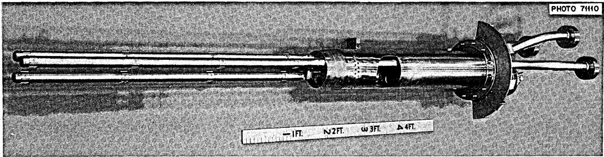  
Fig. 10. Control rod thimble assembly before insertion in the MSRE.

Table 4. Heats of INOR-8 examined after exposure in MSRE   

<table><tr><td rowspan="2">Heat</td><td rowspan="2">Location</td><td colspan="15">Content (%)</td></tr><tr><td>Mo</td><td>Cr</td><td>Fe</td><td>Mn</td><td>C</td><td>Si</td><td>S</td><td>P</td><td>Cu</td><td>Co</td><td>Al</td><td>V</td><td>Ti</td><td>W</td><td>B</td></tr><tr><td>Y-8487</td><td>Control rod thimble</td><td>16.8</td><td>7.3</td><td>4.1</td><td>0.3</td><td>0.05</td><td>0.17</td><td>0.0075</td><td>0.004</td><td>0.03</td><td>0.1</td><td>0.16</td><td></td><td>0.25</td><td></td><td>0.007</td></tr><tr><td>5060</td><td>Rod thimble sleeve</td><td>16.4</td><td>7.05</td><td>3.9</td><td>0.45</td><td>0.06</td><td>0.52</td><td>0.006</td><td>0.001</td><td>0.01</td><td>0.07</td><td>0.01</td><td>0.28</td><td>0.01</td><td></td><td>0.005</td></tr><tr><td>5094</td><td>Freeze valve 105</td><td>16.3</td><td>7.1</td><td>3.8</td><td>0.52</td><td>0.07</td><td>0.76</td><td>0.007</td><td>0.001</td><td>0.01</td><td>0.08</td><td>\( 0.02^a \)</td><td>0.39</td><td></td><td>0.05</td><td>0.004</td></tr><tr><td>5059</td><td>Sampler cage</td><td>16.9</td><td>6.6</td><td>3.9</td><td>0.35</td><td>0.07</td><td>0.59</td><td>0.003</td><td>0.001</td><td></td><td>0.07</td><td>0.01</td><td>0.21</td><td>0.01</td><td>0.04</td><td></td></tr><tr><td>5075</td><td>Sampler mist shield</td><td>16.4</td><td>6.6</td><td>4.0</td><td>0.46</td><td>0.07</td><td>0.58</td><td>0.006</td><td>0.003</td><td>0.01</td><td>0.06</td><td>0.02</td><td>0.26</td><td>0.02</td><td>0.09</td><td>0.001</td></tr><tr><td>5068</td><td>Heat exchanger shell</td><td>16.5</td><td>6.45</td><td>4.0</td><td>0.45</td><td>0.05</td><td>0.58</td><td>0.008</td><td>0.03</td><td>0.02</td><td>0.1</td><td>0.01</td><td>0.27</td><td>0.01</td><td></td><td></td></tr><tr><td>N2-5101</td><td>Heat exchanger tubes</td><td>16.4</td><td>6.9</td><td>3.9</td><td>0.45</td><td>0.06</td><td>0.60</td><td>0.009</td><td>0.001</td><td>0.01</td><td>0.1</td><td>0.01</td><td>0.33</td><td>0.01</td><td>0.06</td><td>0.006</td></tr><tr><td>5097</td><td>Radiator tubes</td><td>16.2</td><td>7.0</td><td>4.2</td><td>0.47</td><td>0.06</td><td>0.62</td><td>0.01</td><td>0.001</td><td>0.01</td><td>0.18</td><td>\( 0.02^a \)</td><td>0.33</td><td></td><td>0.20</td><td>0.02</td></tr><tr><td>2477</td><td>Thermocouple wells</td><td>16.3</td><td>7.1</td><td>4.3</td><td>0.04</td><td>0.057</td><td>0.015</td><td>0.003</td><td>0.008</td><td>0.10</td><td>0.14</td><td>0.055</td><td></td><td>0.10</td><td>0.47</td><td></td></tr><tr><td>Y-8699</td><td>Radiator header</td><td>16.9</td><td>6.8</td><td>3.2</td><td>0.30</td><td>0.06</td><td>0.13</td><td>0.003</td><td></td><td>0.03</td><td></td><td>0.20</td><td>0.002</td><td>0.24</td><td></td><td></td></tr></table>

$^{a}$ Al plus Ti.

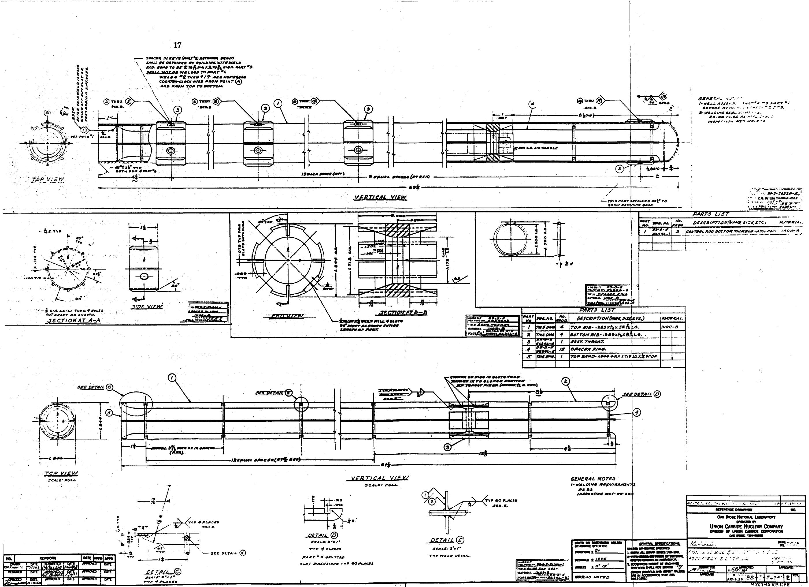  
Fig. 11. Control rod bottom thimble assembly and details, drawing BB-B-56346E.

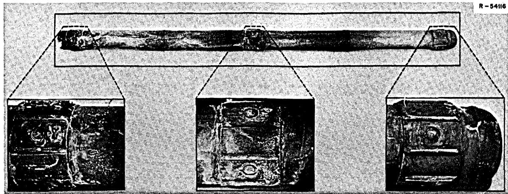  
Fig. 12. Portion of control rod thimble examined after operation of MSRE was terminated. The thimble is made of 2-in.-OD × 0.065-in.-wall INOR-8 tubing (heat Y-8487). The electric arc cut on the left was near the center line of the core.

the variations in light and dark areas are due to uneven lighting for the several photographs that make up Fig. 12.

The first saw cut was made through the sleeve and thimble nearest the electric arc cut. The spacer sleeve had been machined with ribs 0.100 in. high and 0.125 in. wide to position it relative to the graphite moderator, and the sleeve had four drilled holes through which weld beads were deposited on the thimble to hold the sleeve in place. According to the shop drawings, the minimum and maximum diametral clearances between the thimble and the sleeve were 0.000 and 0.015 in. respectively. Thus salt would likely enter this annular region and be in contact with most of the metal surfaces.

# Undeformed Samples

Samples of the control rod thimble and the spacer sleeve were cut and examined to determine their condition at the end of service. Typical photomicrographs of the inside of the thimble tube are shown in Fig. 13. This surface was oxidized to a depth of about 2 mils by the cell environment of nitrogen containing 2 to $5\% \mathrm{O}_2$ . The oxidation process modified the microstructure to a depth of 4 mils, likely by the selective removal of chromium.

Photomicrographs of one of the weld beads are shown in Fig. 14. All of the surface shown was exposed to flowing fuel salt. Some grains were dislodged near the surface, and grain boundaries are visible in the as-polished condition to a depth of 1 to 1.5 mils.

Photomicrographs involving the interface between the thimble and sleeve are shown in Fig. 15. Figure $15(a)$ shows the annular region with a separation of about 7 mils and some salt present. Few surface irregularities are visible at a magnification of $100\mathrm{x}$ , indicating that they are considerably below 1 mil. Figure $15(b)$ is a $500\mathrm{x}$ view of the thimble and shows some surface cracks to a depth of 0.3 mil. The outside of the sleeve is shown in Fig. $15(c)$ ; a few grain boundaries to a depth of about 1 mil are visible. Additional photomicrographs of the sleeve are shown in Fig. 16. The sleeve material does not appear to have received much work, since the carbide is very inhomogeneously distributed. Grain size is larger than usual away from the stringers. The inner and outer surfaces both have modified structures. A higher magnification view of the inner surface [Fig. $16(b)$ ] shows that much of the modification is a high density of primary carbide. The outer surface [Fig. $16(c)$ ] has a shallow layer of small grains, likely due to a working operation.

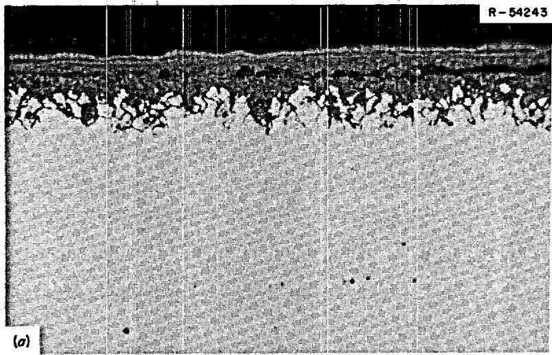  
0007 INCHES 500x

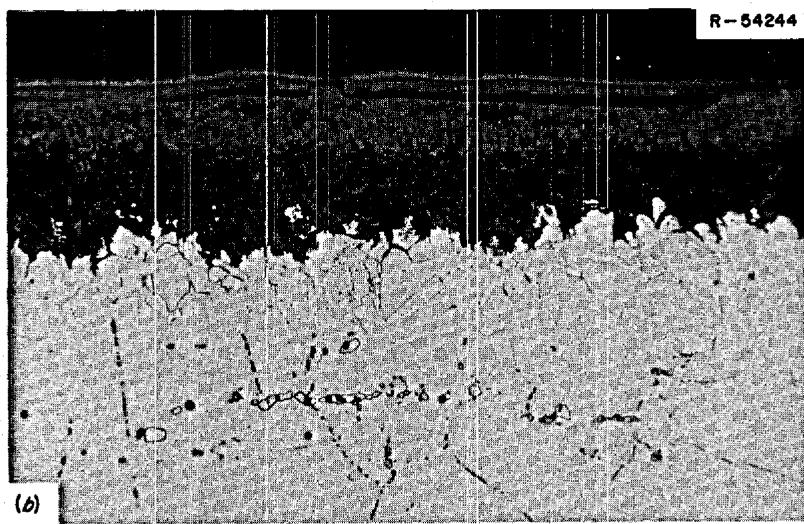  
0.007 INCHES 1000x 100

Fig. 13. Inner surface of INOR-8 control thimble in as-removed condition. This surface was exposed to cell environment of $\mathbf{N}_2$ containing 2 to $5\%$ $\mathrm{O_2}$ . (a) As polished; (b) etched; (c) etched, typical microstructure. Etchant: aqua regia. Reduced $30.5\%$ .   
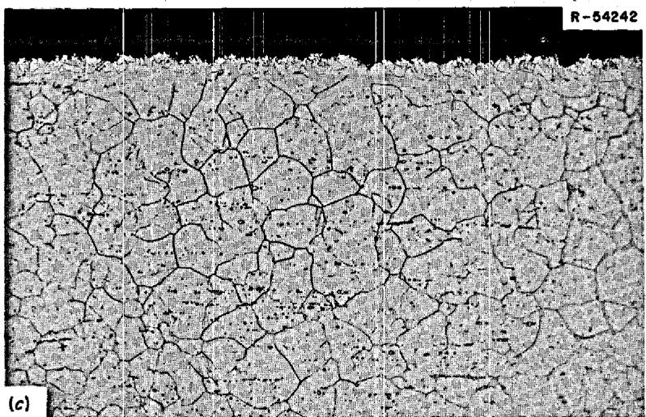  
0.035 INCHES 10.030 in 1000 x 10.00 in

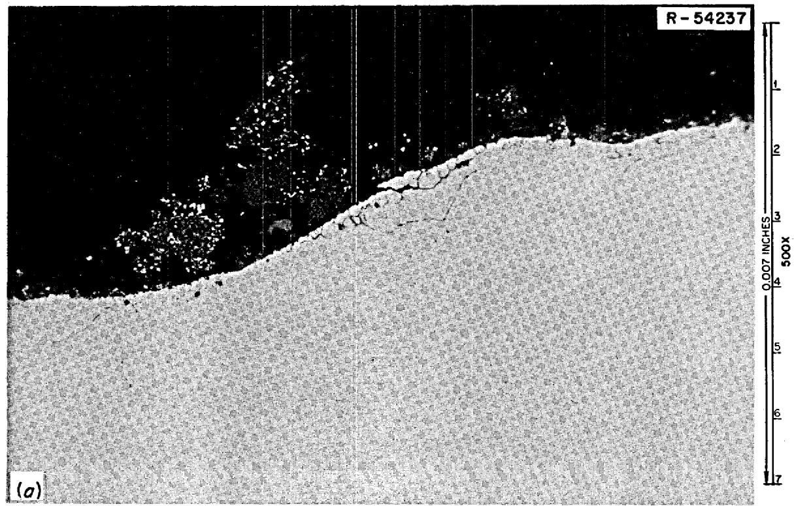

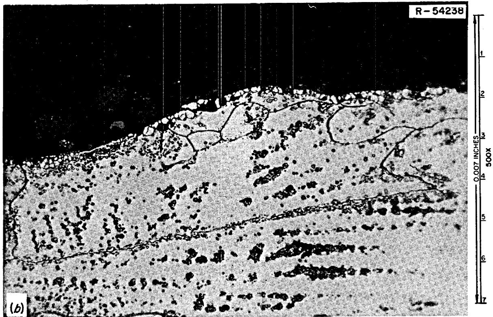  
Fig. 14. Outer surface of INOR-8 control rod thimble showing weld deposit made to hold spacer sleeve. The weld surface was exposed to flowing salt. (a) As polished; (b) etched with aqua regia.

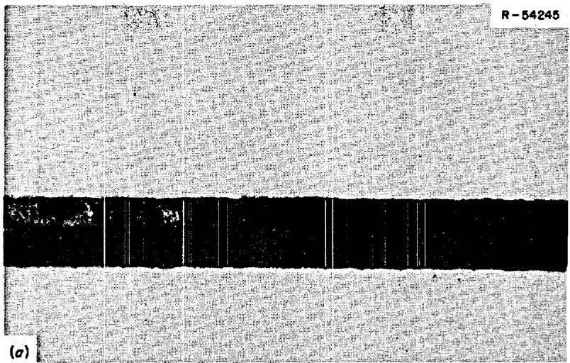  
0001 0000

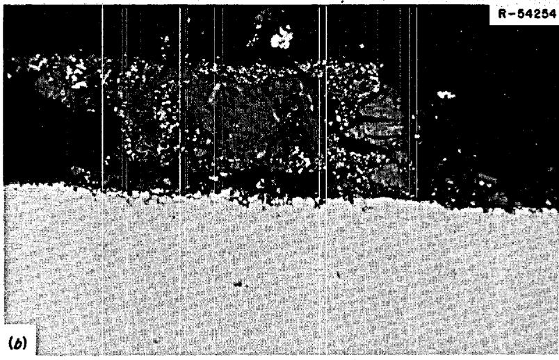  
1 1000 1000

Fig. 15. As-polished surfaces of INOR-8 control rod thimble and sleeve. (a) Annulus between thimble and sleeve; thimble surface is in upper part of picture. (b) Outside surface of control rod thimble, showing presence of some salt and shallow surface cracking. (c) Outside surface of sleeve; surface exposed to flowing fuel salt.   
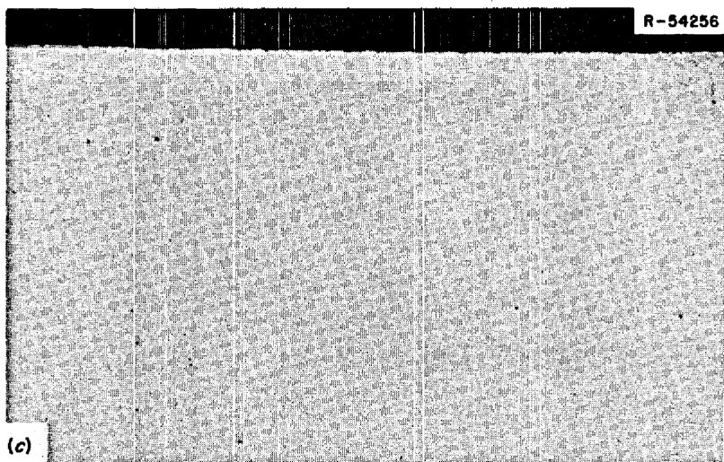  
100% 99

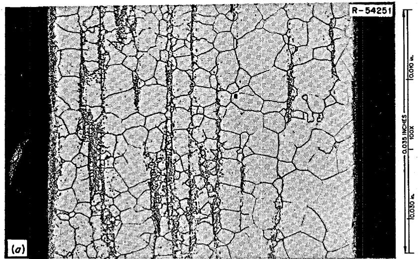

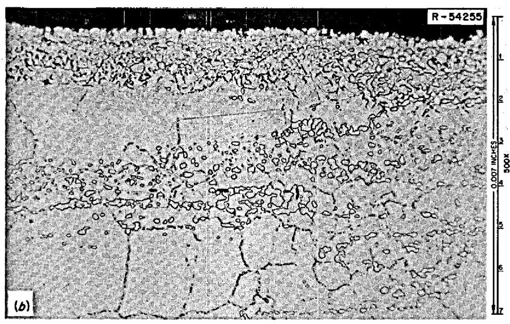

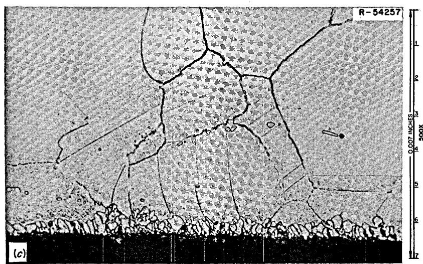  
Fig. 16. INOR-8 control rod sleeve. Etched with aqua regia. (a) General microstructure; inner surface is on left and outer surface is on right. (b) Inner surface of sleeve. (c) Outer surface of sleeve. Reduced $30.5\%$ .

A second cut was made away from the sleeve, and typical photomicrographs are shown in Fig. 17. This part of the thimble was exposed to flowing salt. Some of the grain boundaries are visible in the as-polished condition to a depth of about 4 mils, and there is some surface modification [Fig. 17(a)]. Etching [Fig. 17(b)] delineates more of the grain structure and shows the shallow surface modification.

Microprobe scans were run on the thimble samples that were taken from under the sleeve and outside the sleeve. In the first case the thimble wall was exposed to almost static fuel salt, and no gradients in iron and chromium concentration could be detected within the $3 - \mu \mathrm{m}$ region of uncertainty near the surface. The sample outside the sleeve, which was exposed to flowing fuel salt, was depleted in chromium to a depth of almost $20\mu \mathrm{m}$ and in iron to a depth of $10\mu \mathrm{m}$ (Fig. 18). Thus the amount of corrosion that occurred varied considerably in the two regions. Measurements were not actually made, but we would expect similar results for the spacer sleeve. The inside surface was exposed to almost static salt and was likely not corroded detectably. The outside surface was exposed to flowing salt and probably was depleted in iron and chromium.

# Deformed Samples

The next step was to deform some of the thimble and the sleeve to determine whether surface cracks were formed similar to those noted in the surveillance samples. Since the product was tubular, we used a relatively quick and cheap ring test. The fixture shown in Fig. 19 was made by (1) cutting $5/8$ in. through a 1-in.-thick carbon steel plate with a 2-in.-diam hole saw, (2) cutting out the partially cut region with ample clearance around the hole, (3) cutting the plate in two along the diameter and removing $1/8$ in. of material on each side of the cut, and (4) tapping a $3/4$ -in.-diam thread into the two pieces. Then rings $1/4$ in. wide were cut from the thimble and the sleeve. They fit into the groove and were pulled to failure, with the resultant geometry shown in Fig. 19. The initial loading curves include strain associated with the ring conforming to the geometry of the grip, so we cannot tell precisely how much the sample is deforming. Thus the yield strength and the elongation are only relative numbers, but the ultimate tensile strength and reduction in area obtained from these tests are true values. Obviously, this type of test is deficient in giving good mechanical property data, but is sufficient for deforming the material and observing the incidence of surface cracking.

The tensile properties of the rings are shown in Table 5. The test results show the following important facts:

1. All the unannealed specimens of heat Y-8487 tested at $25^{\circ}\mathrm{C}$ have a "yield stress" of 52,000 to 61,000 psi, with these values appearing to be random in the variables examined.   
2. At $25^{\circ} \mathrm{C}$ the crosshead displacement was about 1.2 in. for the unirradiated tubing and 0.4 to 0.5 in. for the irradiated tubing. Again the variations from 0.4 to 0.5 in. appeared random.   
3. The yield stresses at $650^{\circ}\mathrm{C}$ were about equivalent for irradiated and unirradiated tubing. However, the crosshead displacement before fracture decreased from about 0.4 in. to 0.1 in. after irradiation. This was due to embrittlement from helium formed from the ${}^{10}\mathbf{B}(n,\alpha)^7$ Li transmutation.   
4. No material of heat 5060 (sleeve material) is available for unirradiated tests, but the vendor's certification sheet showed a yield stress of 46,300 psi, an ultimate tensile stress of 117,000 psi, and a fracture strain of $52\%$ . The values that we obtained show higher strengths and lower ductility.

Several of the specimens that had been strained were examined metallographically to determine the extent of cracking during straining. Photomicrographs of the control rod thimble, which was exposed to flowing salt, are shown in Fig. 20. The inside surface was oxidized, and the oxide cracked as the specimen was strained. The oxide should be brittle, but it is important that these cracks did not penetrate the metal.

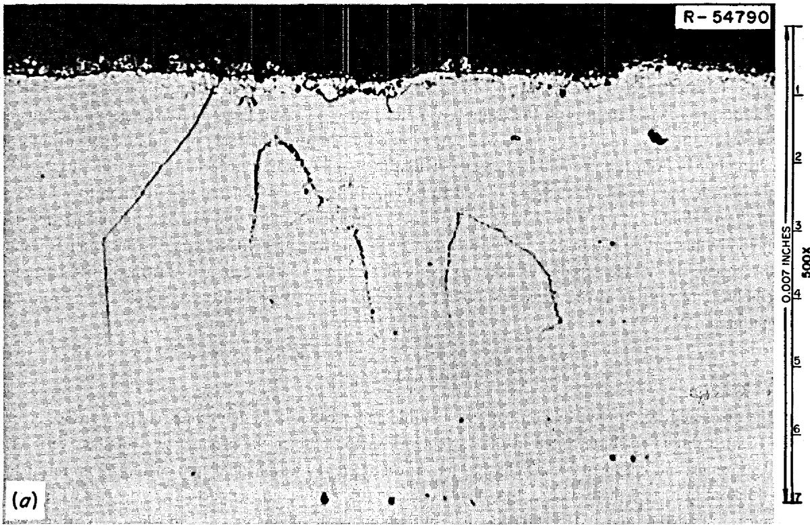

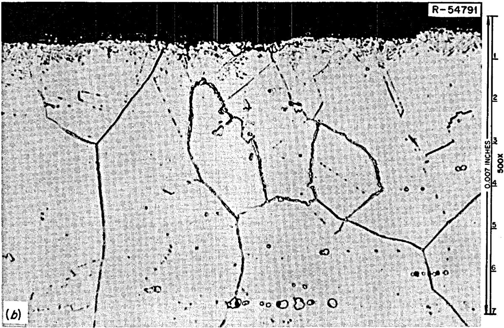  
Fig. 17. INOR-8 control rod thimble where it was exposed directly to flowing salt. (a) As polished; (b) etched with aqua regia.

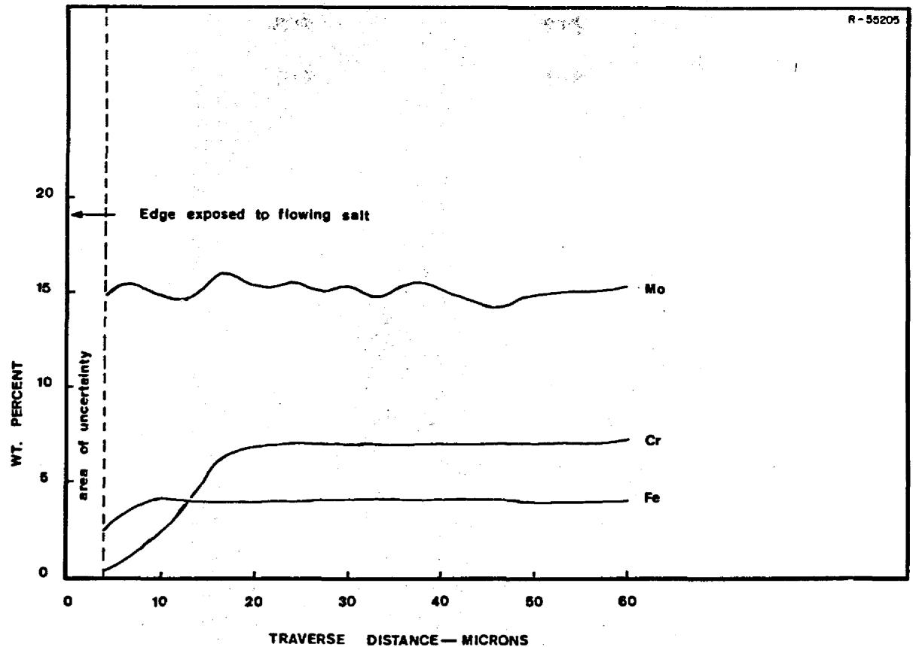  
Fig. 18. Electron microprobe scan of INOR-8 sample from control rod thimble. Thimble had been exposed to fuel salt for 21,040 hr and had been above $500^{\circ}\mathrm{C}$ for 30,807 hr.

Table 5. Tensile data on rings from control rod thimble 3 (heat Y-8487)   

<table><tr><td>Specimen</td><td>Condition</td><td>Postirradiation anneal</td><td>Test temperature (℃)</td><td>Crosshead speed (in./min)</td><td>Yield stressa (psi)</td><td>Ultimate stress (psi)</td><td>Crosshead travel (in.)</td><td>Reduction in area (%)</td></tr><tr><td>1</td><td>Unirradiated</td><td></td><td>25</td><td>0.05</td><td>52,000</td><td>114,400</td><td>1.20</td><td>44.5</td></tr><tr><td>2</td><td>Unirradiated</td><td></td><td>25</td><td>0.05</td><td>56,900</td><td>117,500</td><td>1.17</td><td>46.0</td></tr><tr><td>3</td><td>Unirradiated</td><td></td><td>25</td><td>0.05</td><td>58,000</td><td>124,300</td><td>1.18</td><td>43.0</td></tr><tr><td>4</td><td>Unirradiated</td><td></td><td>650</td><td>0.05</td><td>39,100</td><td>76,700</td><td>0.37</td><td>28.7</td></tr><tr><td>5</td><td>Unirradiated</td><td></td><td>650</td><td>0.002</td><td>40,700</td><td>62,300</td><td>0.20</td><td>20.6</td></tr><tr><td>6</td><td>Irradiated</td><td>None</td><td>25</td><td>0.05</td><td>54,400</td><td>105,100</td><td>0.54</td><td>23.2</td></tr><tr><td>7</td><td>Irradiated</td><td>None</td><td>25</td><td>0.05</td><td>53,300</td><td>102,500</td><td>0.51</td><td>29.7</td></tr><tr><td>8</td><td>Irradiated</td><td>None</td><td>25</td><td>0.05</td><td>60,500</td><td>110,800</td><td>0.42</td><td>28.5</td></tr><tr><td>9</td><td>Irradiated</td><td>None</td><td>650</td><td>0.05</td><td>38,300</td><td>51,200</td><td>0.099</td><td>12.1</td></tr><tr><td>10</td><td>Irradiated</td><td>None</td><td>650</td><td>0.002</td><td>34,200</td><td>38,200</td><td>0.061</td><td>9.7</td></tr><tr><td>11</td><td>Irradiated</td><td>8 hr at 871°C</td><td>25</td><td>0.05</td><td>49,300</td><td>100,500</td><td>0.36</td><td>34.9</td></tr><tr><td>12</td><td>Irradiated</td><td>141 hr at 871°C</td><td>25</td><td>0.05</td><td>48,700</td><td>104,900</td><td>0.39</td><td>34.4</td></tr><tr><td>13</td><td>Irradiatedb</td><td>None</td><td>25</td><td>0.05</td><td>51,700</td><td>98,600</td><td>0.45</td><td>32.9</td></tr><tr><td>14</td><td>Irradiatedc</td><td>None</td><td>25</td><td>0.05</td><td>42,400</td><td>123,000</td><td>0.20</td><td>18.0</td></tr></table>

${}^{a}$ Based on 0.002 in. offset of crosshead travel.   
$b_{\mathrm{Located}}$ under spacer sleeve.   
$c$ Spacer sleeve, Heat 5060.

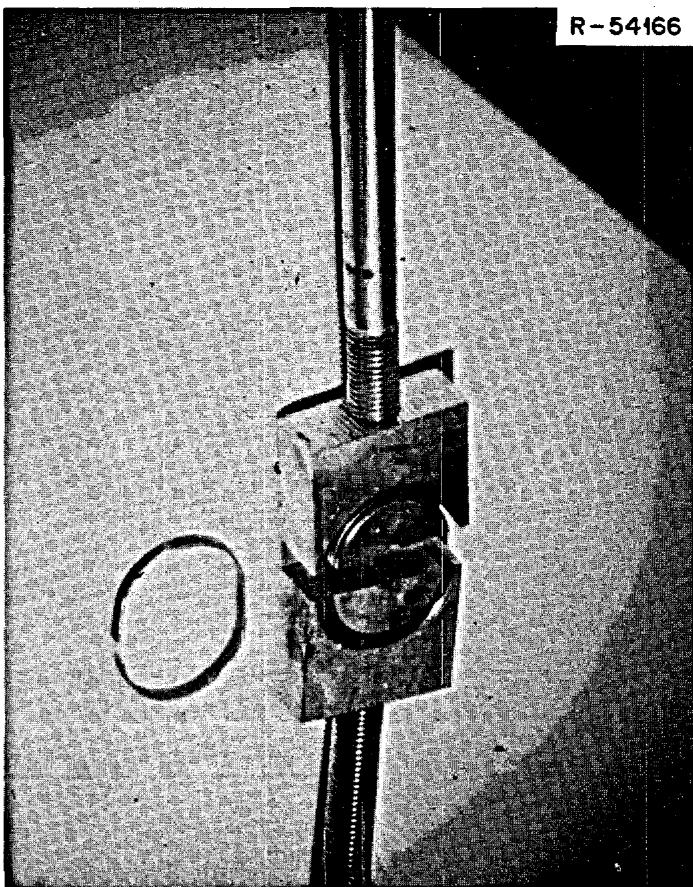  
Fig. 19. Fixture for testing rings of control rod thimble and spacer sleeve. A tested sample is shown on the left.

However, the side exposed to the salt exhibited profuse intergranular cracking. Almost every grain boundary cracked, and the cracks generally propagated to a depth of one grain, although there are several instances where the crack depth exceeded a depth of one grain. Several photomicrographs were combined and rephotographed to obtain Fig. 21. This sample had 192 cracks per inch, with average and maximum depths of 5.0 and 8.0 mils respectively. Many of the cracks shown in Figs. 20 and 21 have blunt tips, indicating that they did not propagate into the metal as the specimen was strained.

A similar sample was cut from the thimble under the sleeve, where the salt access was restricted. Photomicrographs of a specimen tested at $25^{\circ}\mathrm{C}$ are shown in Fig. 22. The cracks are quite similar to those in Fig. 20 for a sample that was exposed to flowing salt. The composite photograph in Fig. 23 is quite similar to Fig. 21 of the sample exposed to flowing salt. The sample in Fig. 23 had 257 cracks per inch, with average and maximum depths of 4.0 and 8.0 mils respectively. The accuracy of our statistics and possible sampling inhomogeneities lead us to conclude that the severity of cracking is equivalent in the samples exposed to flowing and almost static salt. Thus flow rate over the range represented by these two sample locations does not appear to be an important variable.

Examination of the spacer sleeve gave us another opportunity to determine whether salt velocity and cracking were related. The photomicrograph in Fig. 24 shows cracks on both sides, with more being present in the field photographed on the side where the salt was rapidly flowing. However, the composite photograph in Fig. 25 shows that cracking is about equivalent on both sides. Cracking statistics on the side

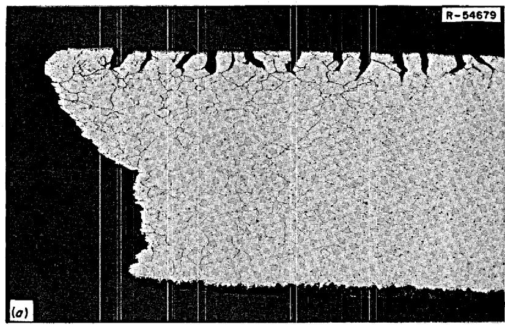

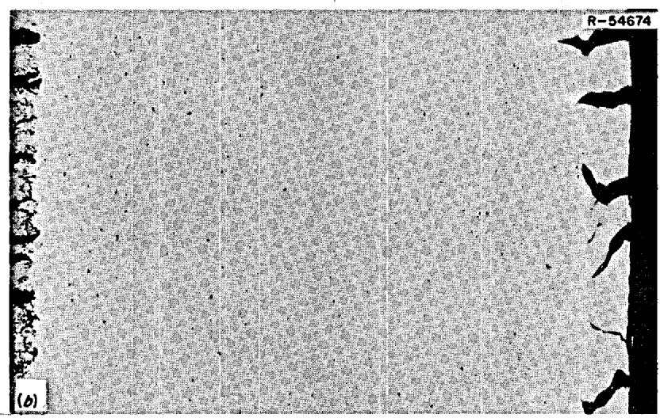

Fig. 20. INOR-8 control rod thimble specimen exposed to flowing salt and tested at $25^{\circ}\mathrm{C}$ . (a) Fracture - dark edge is oxide on inner surface of tube; cracks formed on outer surface; etched. (b) Cracks in outer surface of tubing as polished. (c) Cracks in outer surface of tubing; etched. Etchant: aqua regia. Reduced $30.5\%$ .   
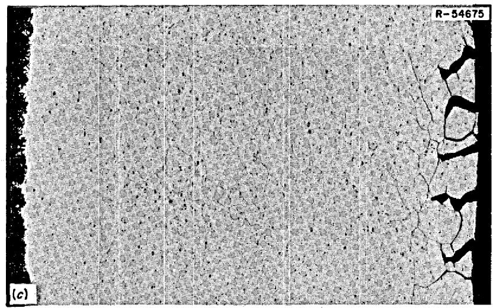  
0.035 INCHES 100x 10xio in.   
0.035 INCHES 10.030 in. 100x 10.010 in.

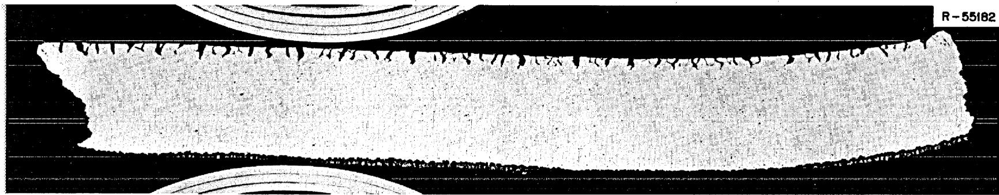  
Fig. 21. Deformed section of INOR-8 control rod thimble. Fracture is on the left. The upper surface was in contact with flowing salt; the lower surface was exposed to the cell environment of $\mathbf{N}_2$ plus 2 to $5\% \mathrm{O}_2$ . The sample is about 0.06 in. thick.

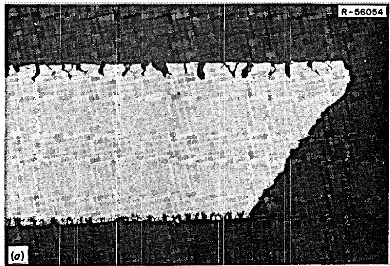

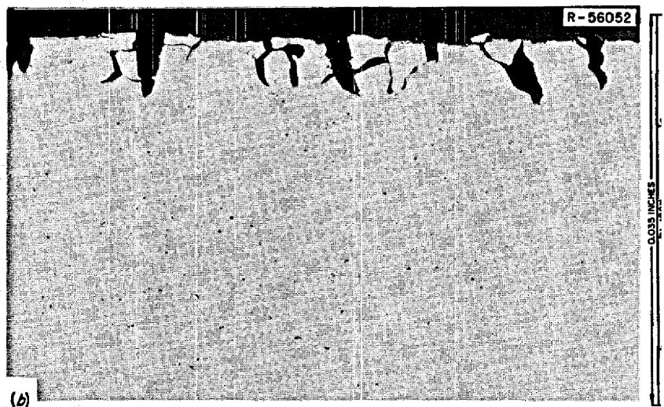

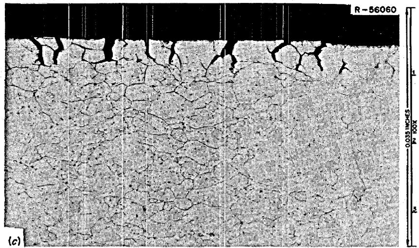  
Fig. 22. INOR-8 control rod thimble exposed to fuel salt under a spacer sleeve and tested at $25^{\circ}\mathbf{C}$ . (a) As-polished view of fracture. $40\times$ . (b) As-polished view of cracks. (c) Etched view of cracks. Etchant: aqua regia. Reduced $30.5\%$ .

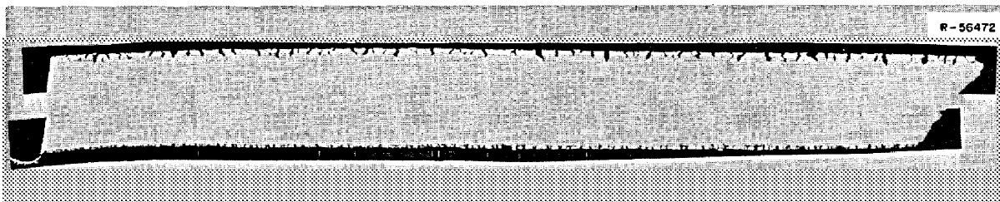  
Fig. 23. Composite photograph showing density of cracking along edge of portion of deformed INOR-8 control rod thimble. $9.5 \times$ . The sample is 0.58 in. long. The fracture is on the right, the upper surface was exposed to fuel salt, and the lower surface was exposed to the cell environment of $\mathbf{N}_2$ plus 2 to $5 \% \mathrm{O}_2$ .

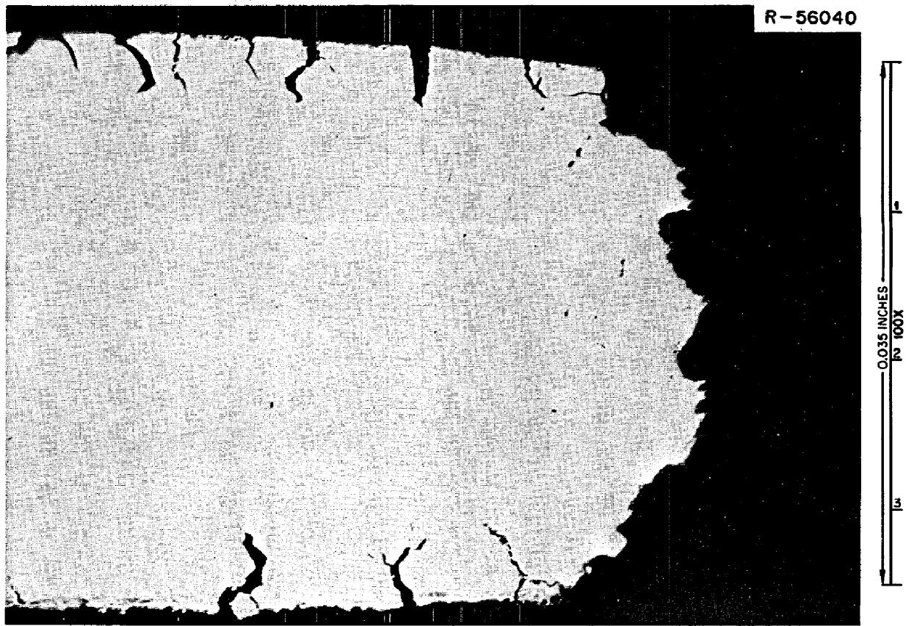  
Fig. 24. Section of INOR-8 spacer sleeve tested at $25^{\circ}\mathrm{C}$ ; as polished. The upper surface was exposed to almost static fuel salt, and the lower surface was exposed to rapidly flowing fuel salt.

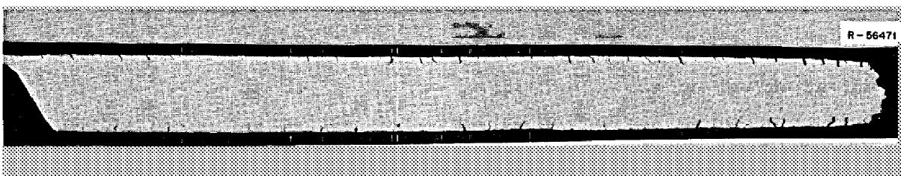  
Fig. 25. Composite photograph comparing density of cracking on sides of INOR-8 spacer sleeve exposed to almost static salt (top) and to flowing salt (bottom). $11 \times$ . The sample is 0.52 in. long. Reduced $43\%$ .

exposed to rapidly flowing salt revealed 178 cracks per inch, with a maximum depth of 7.0 mils. The side exposed to restricted salt flow had 202 cracks per inch, with a maximum depth of 5.0 mils. The average depth was 3.0 mils on both sides. These observations also indicate that salt flow rate is not a significant factor in intergranular cracking.

# Summary of Observations

The control rod thimble was in excellent physical condition, with only slight discoloration and chromium depletion to a depth of 0.8 mil $(20\mu \mathrm{m})$ observed. Mechanical property tests showed that the thimble was embrittled slightly at $25^{\circ}\mathbf{C}$ and to a greater extent at $650^{\circ}\mathbf{C}$ . The reduction in ductility at $25^{\circ}\mathbf{C}$ was likely due to carbide precipitation and that at $650^{\circ}\mathbf{C}$ to helium from the ${}^{10}\mathrm{B}(n,\alpha)^7\mathrm{Li}$ transmutation.

The examination of the control rod thimble spacer revealed rather uniform cracking of all surfaces exposed to fuel salt. This points out two important characteristics of the cracking. (1) Irradiation of the metal was not solely responsible for the cracking. The flux attenuation across the wall of the thimble would have been very slight, but cracks only formed in the metal on the fuel side (Fig. 20). Thus, irradiation alone does not cause the cracking, but contact with the fuel salt is required. (2) The severity of cracking was not sensitive to salt flow rate over the flow range experienced in a fuel channel and under a spacer with restricted flow.

# EXAMINATION OF FREEZE VALVE 105

# Physical Description

Freeze valve 105 failed during the final thermal cycle involved in terminating the MSRE. The valve was used to isolate one of the fuel drain tanks and was frozen only when salt was in that drain tank. The line was filled with salt from the drain tanks, so the fission product concentration would have been relatively low. The line was filled with salt at temperatures above $500^{\circ}\mathrm{C}$ for about 21,000 hr, and the salt was static except when the reactor was being filled.

Detailed fabrication drawings for FV-105 are shown in Fig. 26. The MSRE used several freeze valves. In each section of tubing was aircooled to freeze a salt plug that prevented salt or gas flow through the pipe. The tubing was usually flattened, and a thin housing for the air coolant was welded around the flattened section. The portion of the housing parallel to the tubing was kept thin so that it would accommodate the differential expansion between the pipe and the housing when the valve was being thawed or frozen. Freeze valve 105 involved a field modification to obtain more coolant. This modification, shown in detail in Fig. 27 and schematically in Fig. 28, resulted in the housing becoming too rigid to expand freely. The inability of the inside to move freely relative to the coolant housing led to a fatigue failure in the inside pipe. The location of the valve is shown in Fig. 29.

# Visual and Metallographic Examination

The salt was partially removed to reveal the crack shown in Figs. 30 through 32. The crack begins at the spot on the weld and proceeds about 1 in. parallel to the weld.

A metallographic sample was taken from the cracked area. An as-polished view is shown in Fig. 33 and an etched view in Fig. 34. The weld was on the outside of the tubing and supported the $1/8$ in. end plate of the cooling shroud. The crack began near the weld outside the cooling shroud and penetrated the tube wall.

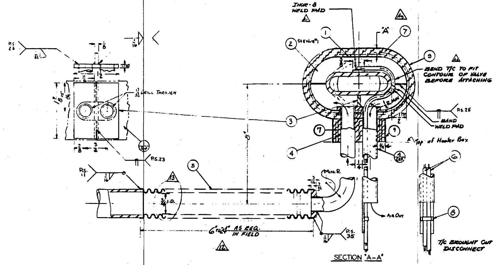

<table><tr><td>F V</td><td></td><td></td><td></td><td>N?</td><td>Nθ</td><td>Nθ</td><td>Nθ</td><td>N</td><td>N</td></tr><tr><td>A</td><td></td><td></td><td></td><td>1/2</td><td>1/2</td><td>1/2</td><td>1/2</td><td>1/2</td><td>1/2</td></tr></table>

32 PART NO. 1 1 2 3 4 5   

<table><tr><td>PART
NO.</td><td>DWG.NO.</td><td>NO.
REQD.</td><td>DESCRIPTION (NAME, SIZE, ETC.)</td><td>MATERIAL</td></tr><tr><td>1</td><td>D-6G-C-35509-1</td><td>1</td><td>SHIM STOCK 0239 L&quot;8&quot;</td><td></td></tr><tr><td>2</td><td>D-6G-C-35509-2</td><td>4</td><td>PL. # &quot;Tun X&quot;72&quot;</td><td></td></tr><tr><td>3</td><td>D-6G-C-35509-3</td><td>1</td><td>PL. # &quot;Tun X&quot;72&quot;</td><td></td></tr><tr><td>4</td><td>D-6G-C-35509-4</td><td>2</td><td>J3ING X&#x27;0&quot; X&#x27;02 NALU 10</td><td></td></tr><tr><td>5</td><td>D-6G-GSS50-5</td><td>1</td><td>FABRIC COCK WARTC METAL TUN J004H004H004H004H004H004H004H004H004H004H004H004H004H004H004H004H004H004H004H004H004H004H004H004H004H004</td><td></td></tr><tr><td>6</td><td>D-HA-Q-45509</td><td>2</td><td>#C. TC. INCONOL SHEARM</td><td></td></tr><tr><td>7</td><td>D-GG-C-35509</td><td>4</td><td>J7TN RIFER FRAX INSUL PAPER TIME 970 M 2&quot;10</td><td></td></tr><tr><td>8</td><td>D-GG-C-35509D</td><td>AS REOD</td><td>SHEET 15 M. TINCK</td><td></td></tr><tr><td>9</td><td>D-GG-C-35509</td><td>1</td><td>SHIM STOCK SM U Tmcn 2&quot;10&quot;</td><td></td></tr></table>

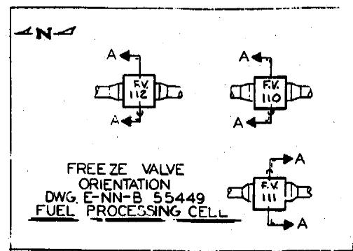

NOTES:

1. PREFIRE INSULATION - ITEM 7 @1600°F / N/A FOR 4 HOURS.

2.ITEM ② TO BE CUT TO MATCH CONTA CF FREEZE VAVE

3. ITEM5 USED ON ITEM4 OR 50 DEFENDING IN LOCATION IN SYSTEM. See DWG E-5G-D-41512.

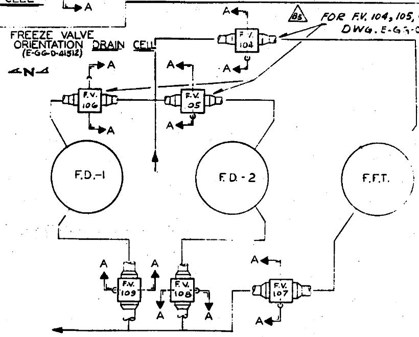  
#

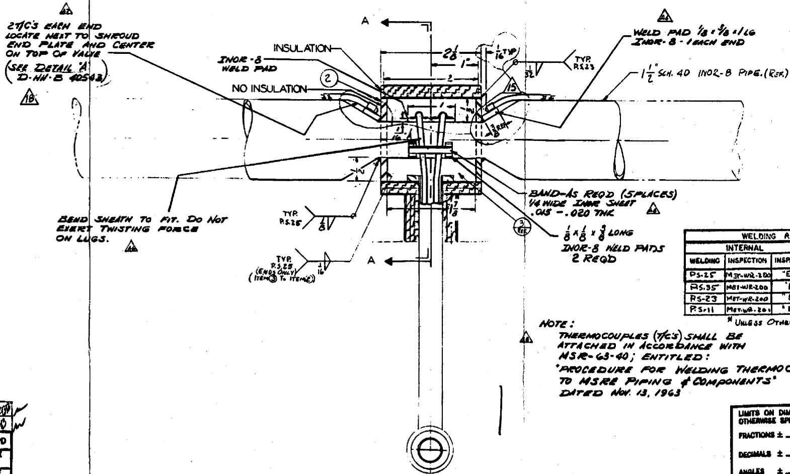

<table><tr><td colspan="5">WELDING REQUIREMENTS</td></tr><tr><td colspan="3">INTERNAL</td><td colspan="2">EXTERNAL</td></tr><tr><td>WELDING</td><td>INSPECTION</td><td>INSPE. SCA.</td><td>WELDING DINSPECT.</td><td>OTHER REFERENCE</td></tr><tr><td>PS-2.5</td><td>MT-WR-2.00</td><td>&quot;E&quot; #</td><td>MT-WR-2</td><td>MT-WS-3</td></tr><tr><td>PS-3.5</td><td>MT-WR-2.00</td><td>&quot;E&quot; #</td><td>MT-WR-7</td><td>MT-WS-3</td></tr><tr><td>PS-2.3</td><td>MT-WR-2.00</td><td>&quot;E&quot; #</td><td>MT-WR-2</td><td>MT-WS-3</td></tr><tr><td>PS-11</td><td>MT-WR-2.01</td><td>&quot;E&quot; #</td><td>MT-WR-1</td><td>MT-WS-3</td></tr></table>

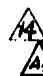  
Fig. 26. Fabrication drawings for freeze valve 105, drawing D-GG-C-55509.

<table><tr><td>1K FRETZE VALVE MODIFICATION RV104-105-106</td><td>S-G-C-S235</td></tr><tr><td>FRETZE VALVE $ HATER INSULATION</td><td>EMN.237490</td></tr><tr><td>T.E. LOCATIONS FRETZE VALVES</td><td>D-H-2 ACES</td></tr><tr><td>FUEL PROCESSING CELL</td><td>EMN.85549</td></tr><tr><td>FRETZE VALVE S-JER</td><td>F.W.C.-1</td></tr><tr><td>RANG IN REACTOR FULL FLUID DRAIN TANK CELL</td><td>F 46.2.2.2.</td></tr><tr><td>REFERENCE DRAWINGS</td><td>NO.</td></tr><tr><td colspan="2">OAK RIDGE NATIONAL LABORATORY
OPERATED BY
UNION CARBIDE NUCLEAR COMPANY
DIVISION OF UNION CARBIDE CORPORATION
OAK RIDGE, TENNESSEE</td></tr></table>

<table><tr><td>B</td><td colspan="3">THEU A SEE DCN 3031</td><td>DATE</td><td>APFD</td><td>APPD</td></tr><tr><td>A</td><td colspan="3">A TO A SEE DCN 2739</td><td>2-2-24
2-2-24</td><td rowspan="2"></td><td rowspan="2"></td></tr><tr><td>NO.</td><td colspan="3">REVISIONS</td><td>DATE</td></tr><tr><td>DRAWN
C. HURTE</td><td>DATE
17-07-63</td><td>SUBMITTED
VJULIUS</td><td>DATE
9/19/63</td><td colspan="2">APPROVED</td><td>DATE</td></tr><tr><td>DEIGNED
W. CHANDuR</td><td>DATE</td><td>APPROVED
PULICINA</td><td>DATE
9/19/63</td><td colspan="2">APPROVED</td><td>DATE</td></tr><tr><td>CHECKED</td><td>DATE
17-12-63</td><td>APPROVED
KACSLA</td><td>DATE
9/19/63</td><td colspan="2">APPROVED</td><td>DATE</td></tr></table>

<table><tr><td colspan="2">LIMITS ON DIMENSIONS UNLESS
OTHERWISE SPECIFIED:</td></tr><tr><td colspan="2">FRACTIONS ± /12</td></tr><tr><td colspan="2">DECIMALS ± -</td></tr><tr><td colspan="2">ANGLES ± -</td></tr><tr><td colspan="2">SCALE: 1&quot; 1&quot;</td></tr></table>

<table><tr><td colspan="4">MSRE
BLDG
NO. 75, :</td></tr><tr><td colspan="4">12&quot; MSRE FREEZE VALVE
REACITOR DIVISION</td></tr><tr><td>SUBMITTED
/ Lnd#</td><td>APPROVED
RSTHyme</td><td colspan="2">APPROVED</td></tr><tr><td>APPROVED</td><td>1003*433.6.8D</td><td>GG-C
555.9</td><td>REV.</td></tr></table>

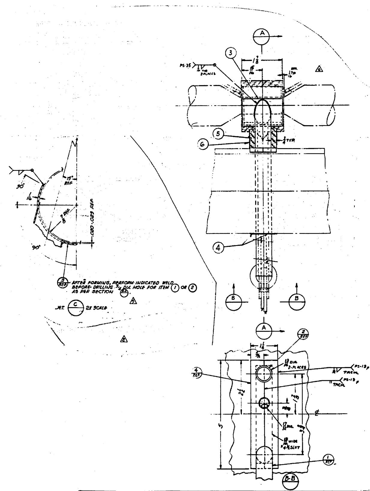

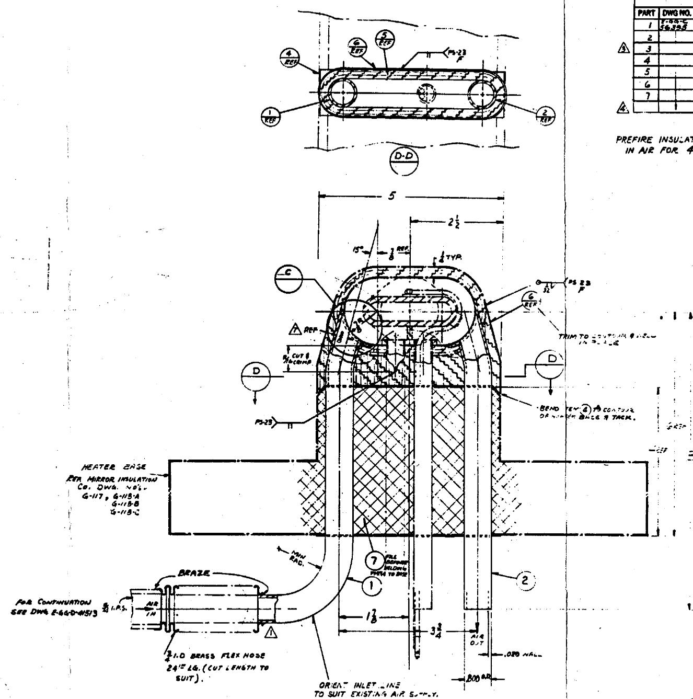

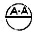  
Fig. 27. Modifications for freeze valve 105, drawing R-GG-C-56395.

EXCEPT ASVCEC   

<table><tr><td>P2-2A</td><td>P2-1A</td><td>E</td><td>MFT-WG-1</td><td>MFT-WG-3</td></tr><tr><td>P2-3A</td><td>P2-1A</td><td>F</td><td>MFT-WG-7</td><td>MFT-WG-8</td></tr><tr><td>P2-2B</td><td>P2-1B</td><td>E a</td><td>MFT-WG-2</td><td>MFT-WG-3</td></tr><tr><td>P2-3B</td><td>P2-1B</td><td>F</td><td>MFT-WG-4</td><td>MFT-WG-5</td></tr><tr><td rowspan="2">SOLDING</td><td rowspan="2">INSPECTION</td><td>INSPECTION</td><td rowspan="2">WELCOME</td><td rowspan="2">DATE
REFERENCES</td></tr><tr><td>EXHIBIT</td></tr><tr><td colspan="2">INTRINSICAL FABRICATION</td><td colspan="3">INTRINSICAL FABRICATION</td></tr><tr><td colspan="5">WELDING &amp; INSPECTION PROCEDURE</td></tr></table>

<table><tr><td colspan="2">GENERAL SPECIFICATIONS</td><td colspan="2">TOLERANCES UNLESS
OTHERS SPECIFIED</td><td>A.</td><td>1.</td><td>2.</td><td>3.</td><td>4.</td><td>5.</td><td>6.</td><td>7.</td><td>8.</td><td>9.</td><td>10.</td></tr><tr><td colspan="2">UNLESS OTHERWISE SPECIFIED:</td><td>NO.</td><td colspan="5">REVISIONS</td><td>DATE</td><td>APPD</td><td>APPD</td><td></td><td></td><td></td><td></td></tr><tr><td rowspan="2" colspan="2">1. BREXH ALL SHARP EROWS.
BETWEENSHARPSHAPPROVED
AMC*BRANCHED BYOPEON
DASALINE/AMC*BRANCHED BYOPEON
DEGREE/AMC*BRANCHED BYOPEON
ANGLE:</td><td>DRAWN</td><td>DATE
12-6</td><td>SUBMITTED
01-5-6</td><td>DATE
12-6-6</td><td>APPROVED</td><td>DATE</td><td></td><td></td><td></td><td></td><td></td><td></td><td></td></tr><tr><td>REVISIONED</td><td>DATE</td><td>APPROVED</td><td>DATE</td><td>APPROVED</td><td>DATE</td><td>SUBMITTED
01-5-6</td><td>ACCEPTED</td><td colspan="5">MARCHES</td></tr><tr><td>2. MAINTAINED SURFACE FINISH
SNALL NOT EXCEED: 12-
ASA DALL-140</td><td>SCALE:</td><td>CHECKED</td><td>DATE
12-6</td><td>APPROVED</td><td>DATE</td><td>APPROVED</td><td>DATE</td><td></td><td></td><td>28</td><td>633-6-5</td><td>2</td><td>53-C
56-395</td><td>REV.</td></tr></table>

${D2079}$ 个 ${B}_{2}$

<table><tr><td colspan="6">PARTS LIST</td></tr><tr><td>PART</td><td>DWG NO.</td><td>REOD</td><td>DESCRIPTION</td><td>STOCK SIZE</td><td>MATERIAL</td></tr><tr><td>1</td><td>3085-56293</td><td>1</td><td>INLET TUBE 800&quot; - 270 Mpa</td><td>3&quot;</td><td>304 5.5</td></tr><tr><td>2</td><td></td><td>1</td><td>OUTET TUBE 800&quot; - 280 Mpa</td><td>8</td><td>304 5.5</td></tr><tr><td>3</td><td></td><td>2</td><td>PARKET</td><td>13,24</td><td>...</td></tr><tr><td>4</td><td></td><td>4</td><td>SMA</td><td>5</td><td>...</td></tr><tr><td>5</td><td></td><td>1</td><td>12.2m - 10 m</td><td>2*2*2</td><td></td></tr><tr><td>6</td><td></td><td>1</td><td>3m - 2&quot; - 4.5m -</td><td>2*2*2</td><td></td></tr><tr><td>7</td><td></td><td>1</td><td>INSULI - 1.7 - 0.85cm - 5N</td><td>...</td><td>...</td></tr><tr><td></td><td></td><td></td><td></td><td></td><td></td></tr></table>

INSULATION-ITEMS387

IN AER FOR 4 HOVES.

SUE.TEDMETHOD OF MCDLEHT.2N

1. DRILL OUT POP RIVETS CONNECT V3

TWO HALVES OF HEATER BASE 25AM:8- EATER BASE.

2CUTMIMUMSIZESOUTIN-ATERB

FOR COOLING AIR TUBE.

MAME .TNE MODIHTA A. SNCCN CN DIV 0

REASSENNEENATEE BAE E NITN

PCP EIVETS

STUFF OPEN INS ARG.NC

9DBES WIFF FIBERAECSNSVCAP.

NNEEL MSSA:1:NSEAS 24783

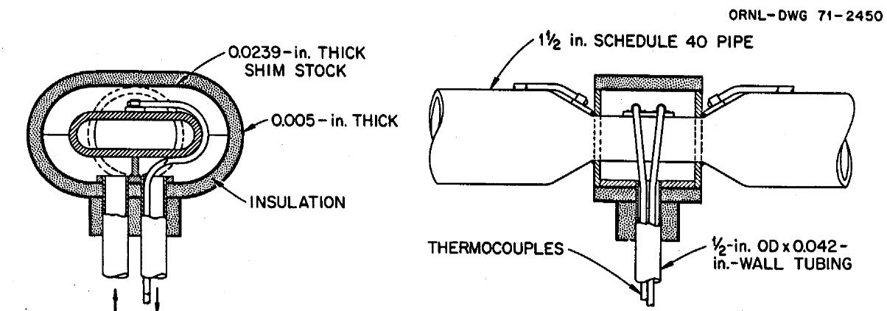  
(a) ORIGINAL DESIGN

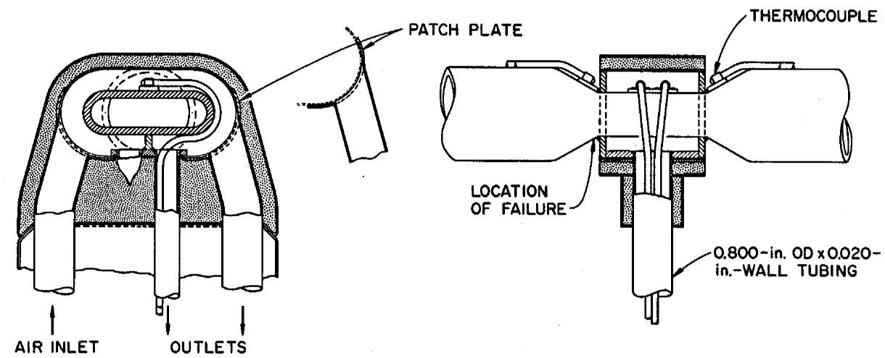  
(b) MODIFICATION   
Fig. 28. Diagram showing possible cause of freeze-valve failure after modification.

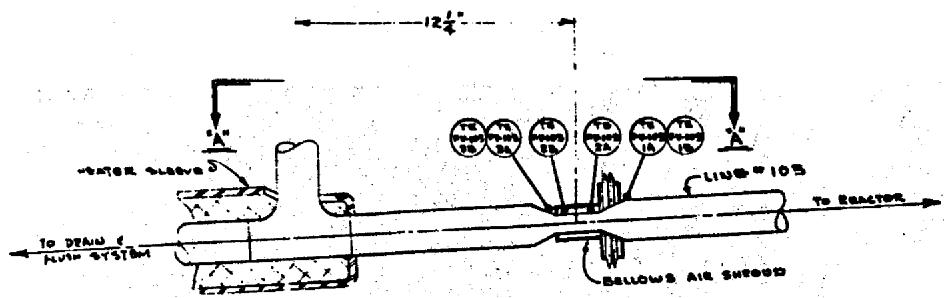  
35

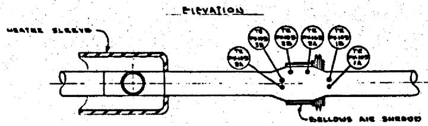  
VIEWA·A   
FRETZVALVE* FV-103

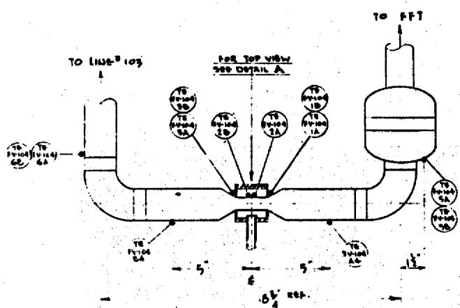  
FOR COATLECTION AND IMMERCOUPLER DETAILS   
FRETZE VALVE $^ { \text{喜} }$ FV-104

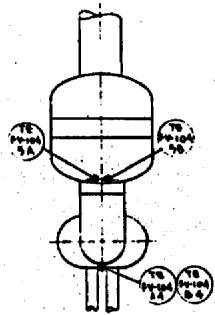

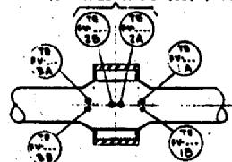  
SWITCHED THERMOCOUPLE LEADS ROUTED THEY ARE OUTLET TUBE   
DETAIL   
TYPICAL TOP VIEW   
:REEEVALVES+104,105,106,107   
$\therefore {108}, - {109}, - {110}, - {111}, - {112}$   
FOR CONSTRUCTION AND THEMOCOUPLES DETAILS   
380 0-4a-c-3g3g09

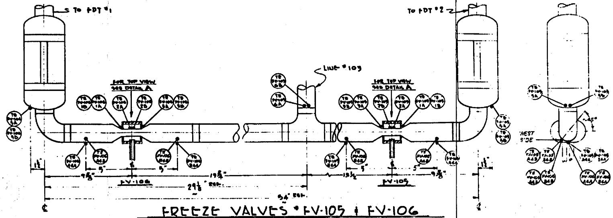

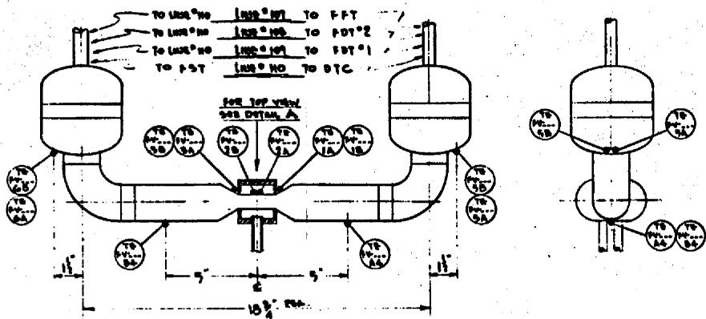  
TYPICAL FOR   
FREEZE VALVES FV-107, FV-108, FV-109 FV-110

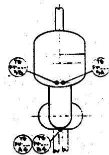

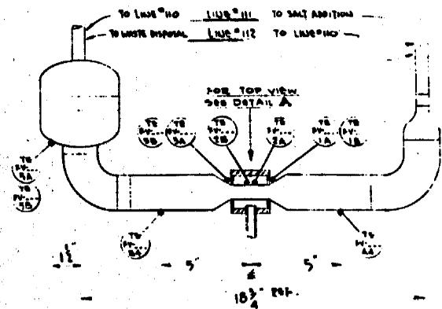  
TYPICAL FOR   
FREEZE VALVES EV-III 4 EV-112

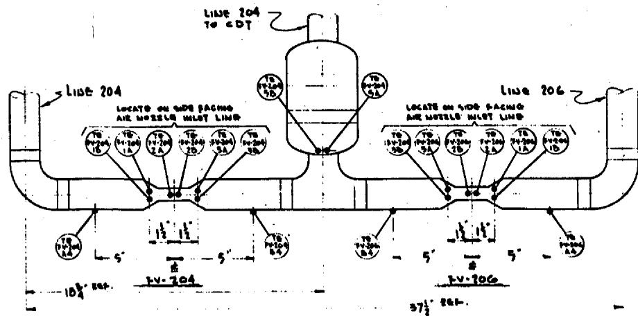  
FREEZE VALVES $^\circ$ FV-204 + FV-206

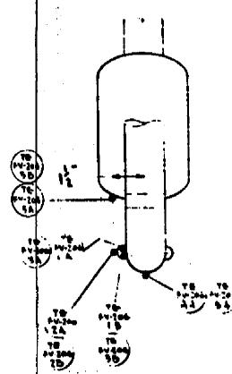  
Fig. 29. Freeze valve and thermocouple locations, drawing D-HH-B-40543.

120794RH 029D 3   

<table><tr><td>SPECIAL TOXICITY</td><td>ACGTED
LI###</td><td>APPROVED
LI###</td></tr><tr><td></td><td></td><td></td></tr></table>

<table><tr><td>3</td><td>CHANGE</td><td>NOTICE</td><td colspan="2">552</td><td>123.65</td><td>71</td><td>R88</td></tr><tr><td>E</td><td>CHANGE</td><td>01.04</td><td colspan="2">3080</td><td>54.45</td><td>1.00</td><td>UPA</td></tr><tr><td>A</td><td>CHANGE</td><td>NOT.CB</td><td colspan="2">271G</td><td>3900A</td><td>1.00</td><td>UPD</td></tr><tr><td>NO.</td><td colspan="4">REVISIONS</td><td>DATE</td><td>APPD</td><td>APPD</td></tr><tr><td>MATERIAL
2.V.S.B</td><td>DATE
9.4.6</td><td>APPROVED</td><td>DATE</td><td>APPROVED</td><td>DATE</td><td>DATE</td><td></td></tr><tr><td>CUSTOMERS
C.H.A.</td><td>DATE</td><td>APPROVED
12.10.16</td><td>DATE
12.10.16</td><td>APPROVED</td><td>DATE</td><td>DATE</td><td></td></tr><tr><td>CHECKED</td><td>DATE</td><td>APPROVED</td><td>DATE</td><td>APPROVED</td><td>DATE</td><td>DATE</td><td></td></tr></table>

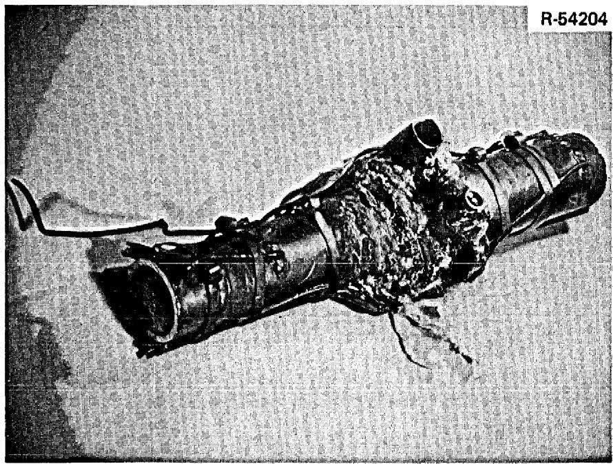  
Fig. 30. Bottom portion of freeze valve 105.

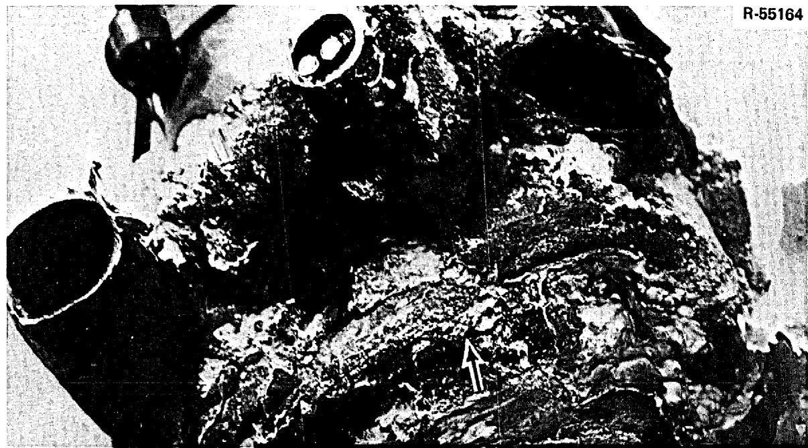  
Fig. 31. Closeup of the bottom of freeze valve 105 showing INOR-8 gas inlet and outlet line of type 304 stainless steel that was corroded completely. The crusty substance is the salt. Note that there is no salt in the air annulus.

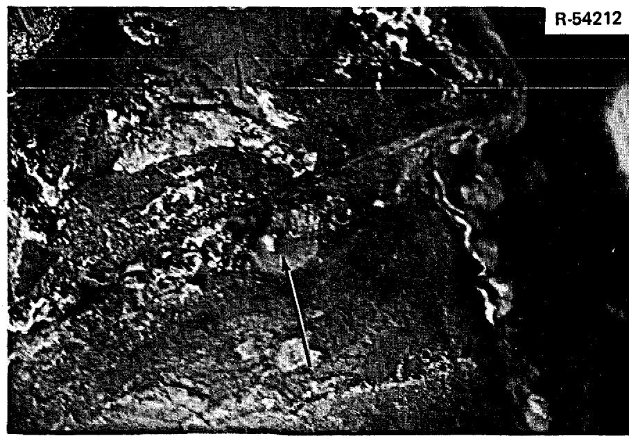  
Fig. 32. Weld at one end of cooling shroud. The crack begins at the round salt stain and proceeds for about 1 in. along the pipe. The arrow points to the salt stain with the crack at $90^{\circ}$ to the arrow.

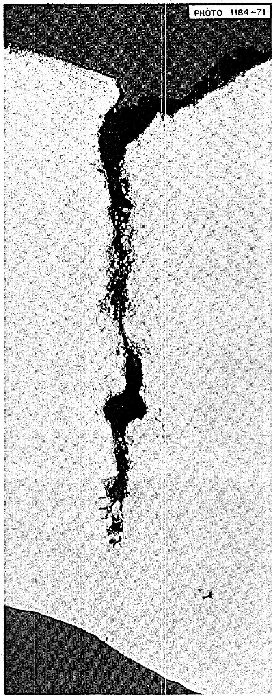  
Fig. 33. INOR-8 tube wall of freeze valve 105 where the failure occurred. As polished, $50 \times$ . Bottom surface was exposed to fuel salt and the upper surface to air, with some salt after the leak occurred. Reduced $15\%$ .

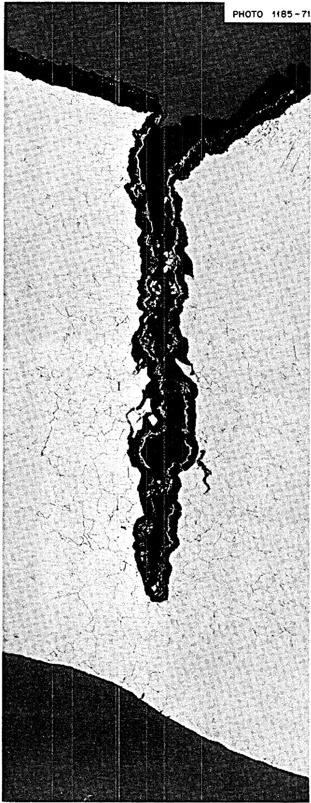  
Fig. 34. INOR-8 tube wall of freeze valve 105 where the failure occurred. The weld supports the end of the cooling shroud; the failure occurred outside the cooling shroud. Etchant: aqua regia. $50 \times$ . Reduced $15 \%$

A comparison of the etched and unetched views shows that some attack occurred along the crack and the outer surface of one tubing and that etching completely removed material from the attacked region. The attack was likely due to the simultaneous exposure of the INOR-8 to salt and moist air, and probably involved the selective removal of chromium and iron, leaving metal that was heavily attacked by the etchant. No such attack occurred on the inside, where only salt was present.

The failure that released salt was due to thermal fatigue. The cooling shroud was initially 0.020 in. thick, but the added cooling tubes increased the thickness to 0.083 in. on the bottom. This made the shroud relatively rigid on the bottom. During freezing and thawing, the outer part of the shroud changed temperature more rapidly than the wall of the salt-containing tube. Whereas the outer part of the shroud was originally thin enough to deflect to accommodate the differences in length of the two members, the field modifications made the bottom portion quite rigid. The result was that differences in temperature imposed on the cooling shroud a stress that was transferred by the rigid $(1/8$ -in.) end plate to the tube wall. A crack was nucleated at the surface and propagated through the pipe wall during the numerous cycles.

Parts of three tubes are visible in Figs. 30 and 31. The large tube in relatively good condition is the type 304 stainless steel air inlet tube, the center tube is the original INOR-8 air outlet tube with two thermocouples visible, and the hole is the remains of the type 304 stainless steel outlet tube. The original INOR-8 air inlet line was capped off and is hidden by the salt. Attack of the type 304 stainless steel by salt when air was present is as expected. The relative nobility of INOR-8 in this environment is a strong argument for the use of INOR-8 where salt may be present.

# Mechanical Property Tests

Three rings $3/16$ in. wide were cut from the pipe away from the flattened section and were pulled in tension in the same manner as previously described for the control rod thimble rings. One rectangular piece was cut and bend-tested with the inside surface of the pipe in tension. Table 6 lists the observed mechanical properties. The yield stress was essentially unchanged, and the ultimate stress was reduced about $15\%$ from the vendor's certified properties. The elongation was reduced considerably but was still greater than $25\%$ . A gage section is difficult to define in a ring test, so crosshead travel and reduction in area are reported for the rings from freeze valve 105 rather than percent elongation. The bend test was discontinued because of strain limitations of the bend fixture after 0.41 in. crosshead travel, which corresponds to $33\%$ strain in the outer fibers of the specimen and to a $90^{\circ}$ bend angle. The yield stress calculated from the forces on the bend specimen is too high because elastic formulas were used in the calculation and the specimen deformed plastically, but this calculated quantity is useful for comparison with other bend tests that will be reported later for the mist shield.

Table 6. Results of mechanical property tests on specimens from freeze valve 105 (heat 5094) at $25^{\circ}\mathrm{C}$ and a deformation rate of 0.05 in./min   

<table><tr><td>Type of test</td><td>Yield stress (psi)</td><td>Ultimate tensile stress (psi)</td><td>Crosshead travel (in.)</td><td>Reduction in area (%)</td></tr><tr><td>Vendor&#x27;s, tensile</td><td>45,800</td><td>106,800</td><td></td><td>52.6</td></tr><tr><td>Ring, tensile</td><td>45,800</td><td>89,700</td><td>0.72</td><td>25</td></tr><tr><td>Ring, tensile</td><td>48,900</td><td>90,100</td><td>0.59</td><td>29</td></tr><tr><td>Ring, tensile</td><td>41,900</td><td>90,300</td><td>0.73</td><td>37</td></tr><tr><td>Wall segment, bend</td><td>71,300</td><td></td><td>0.41</td><td>\( 33^a \)</td></tr></table>

$a$ Maximum strain in outer fibers.

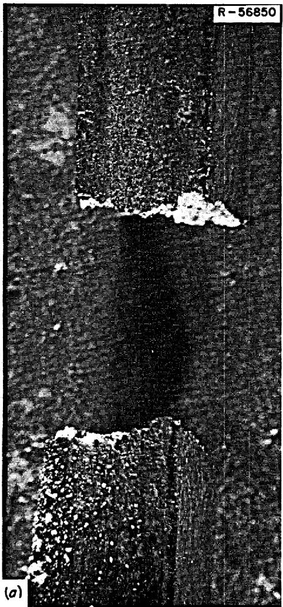

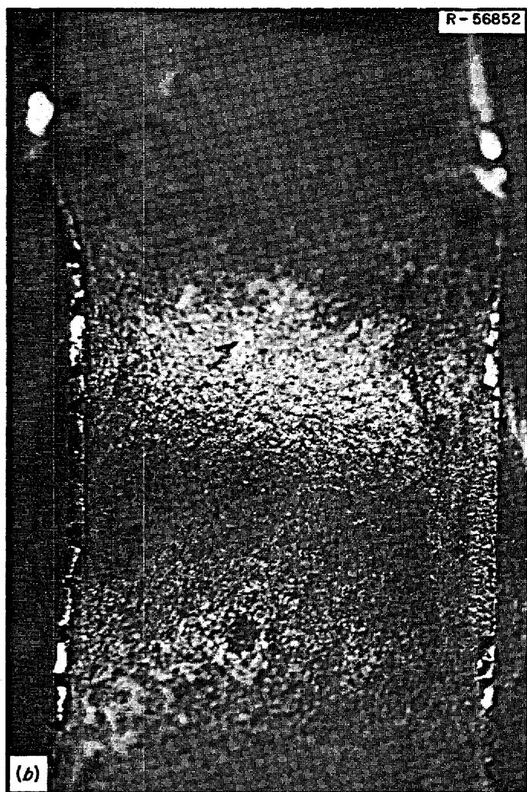  
Fig. 35. INOR-8 surfaces exposed to salt in freeze valve 105 after deformation at $25^{\circ}\mathbf{C}$ . (a) Fracture of ring specimen pulled in tension. Note surface cracks near fracture. $4\times$ . (b) Surface of bend specimen. Note some cracks on surface and edge cracks. $7\times$ . Reduced $18.5\%$ .

Figure 35 shows the tension side of the bend specimen. Some very fine shallow cracks are visible on the surface in tension, and cracking is visible at the edges in the burrs remaining from the remote cutting operation.

One of the three tensile-tested rings was examined metallographically. Figure 36 is a composite of photomicrographs of a section through the specimen showing the inside surface, which was exposed to fuel salt (top), and the outside, which was exposed to the cell environment of 2 to $5\% \mathrm{O}_2$ in nitrogen. The reason for the unevenness of the oxide on the outside is not known. Possibly it was due to corrosion after the leak, although the rings were cut approximately 4 in. away from the nearest visible residue from the salt leak. Figure 37 shows at $500\mathrm{x}$ the oxide in one of the worst areas. The crack ends tend to be blunted and did not penetrate the metal beyond the oxidized surface. Figure 38 shows at $500\mathrm{x}$ the inside of the pipe exposed to fuel salt. About 1 crack per grain or 240 cracks per inch show, but the cracks are shallow and blunt, having an average depth of 0.75 mil and a maximum depth of 1.5 mils. Figure 39 shows that a large amount of strain occurred before fracture.

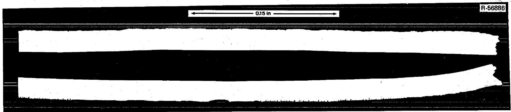  
Fig. 36. Composite of photomicrographs of INOR-8 ring from freeze valve 105 that was pulled in tension. Upper surface was exposed to salt and the lower surface to the cell environment of $\mathbf{N}_2$ plus 2 to $5\%$ $\mathbf{O}_2$ . Top portion is the tension side, and the lower part is the compression side.

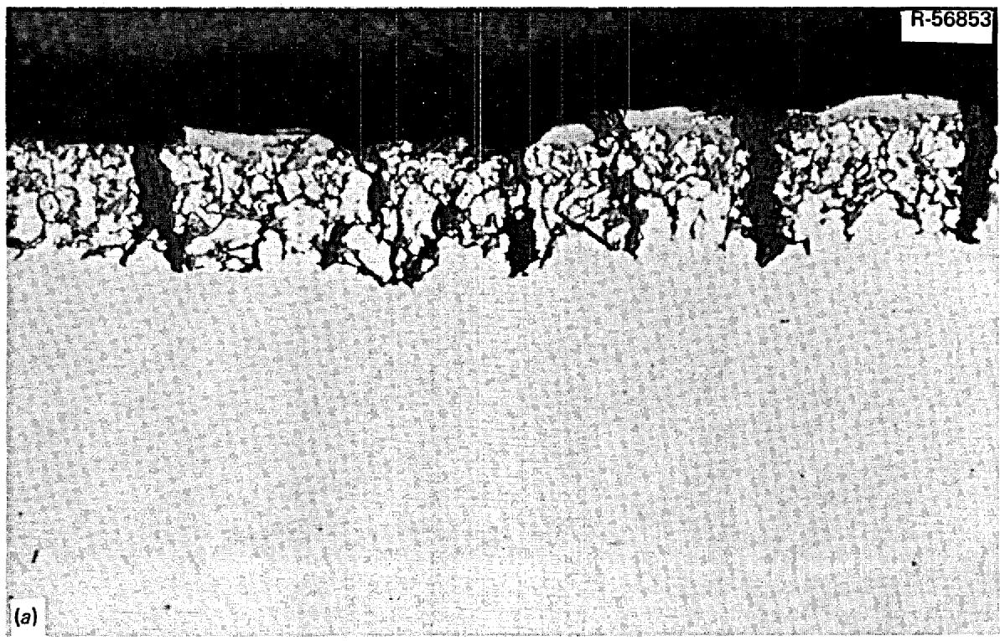  
0.007 INCHES C. 007 in. 10,005 in. 500X 10,003 in. 10,001 in.

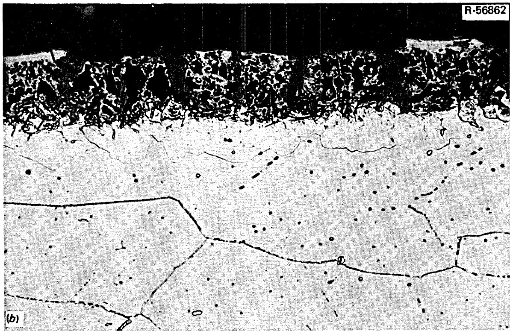  
0.007 INCHES 10.005 in. 500x 10.003 in. 10.001 in.   
Fig. 37. INOR-8 tensile sample of freeze valve 105 showing the oxide that formed on the outside of the pipe. The cracks penetrated only the depth of the oxide. (a) As polished; (b) etched with lactic acid, $\mathrm{HNO}_3$ , HCl.

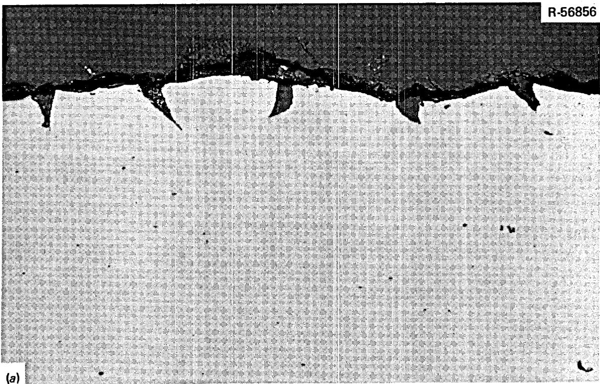  
0.007 INCHES C.007 in. 1 10.005 in. 1 500x 10.003 in. 1 10.001 in.

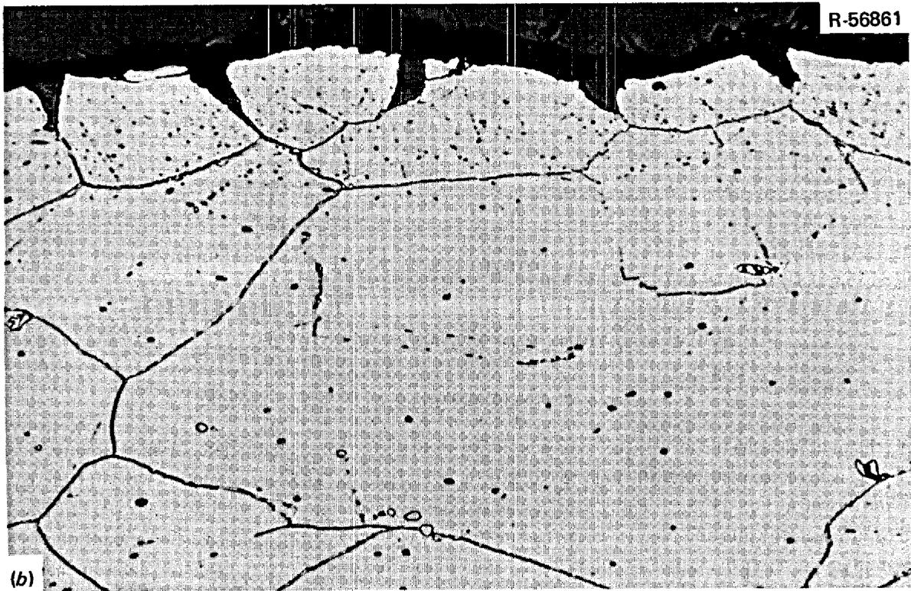  
0.007 INCHES 10.005 in. 1 500x 10.003 in. 1 10.001 in.   
Fig. 38. Salt side of an INOR-8 tensile specimen from freeze valve 105. (a) As polished; (b) etched with lactic acid, $\mathrm{HNO}_3$ , HCl.

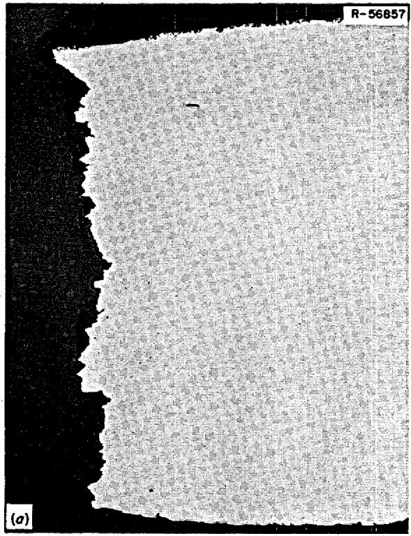

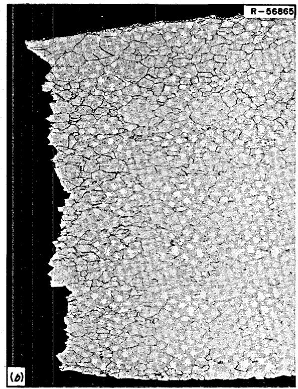  
Fig. 39. Fracture of an INOR-8 ring specimen from freeze valve 105 that was deformed at $25^{\circ}\mathbf{C}$ . (a) As polished; (b) etched with lactic acid, $\mathrm{HNO}_3$ , HCl. $40\times$ . Reduced $29.5\%$ .

# Summary of Observations

The failure in freeze valve 105 was due to thermal fatigue as a result of the cooling shroud being too rigid. The mechanical properties of the INOR-8 in the freeze valve were not degraded seriously by the long exposure to fuel salt containing some fission products. Numerous intergranular cracks were formed on the surfaces exposed to the salt during postoperation deformation. These cracks were similar to those on the surfaces from the primary circuit but were shallower.

# EXAMINATION OF THE SAMPLER ASSEMBLY

# Physical Description

A schematic view of the MSRE fuel pump is shown in Fig. 40; more details are reported elsewhere.[29] The components examined were the mist shield and the sampler cage. The fabrication drawings for these parts are shown in Fig. 41. Salt-sample capsules or additions of uranium or beryllium were lowered by a windlass arrangement into the sampler cage. The mist shield was provided to minimize the amount of salt spray that would reach the sampler. The vertical sampler cage rods were $\frac{1}{4}$ in. in diameter and were made of INOR-8 heat 5059, and the mist shield was made of $\frac{1}{8}$ -in. sheet of INOR-8 heat 5075 (see Table 4 for

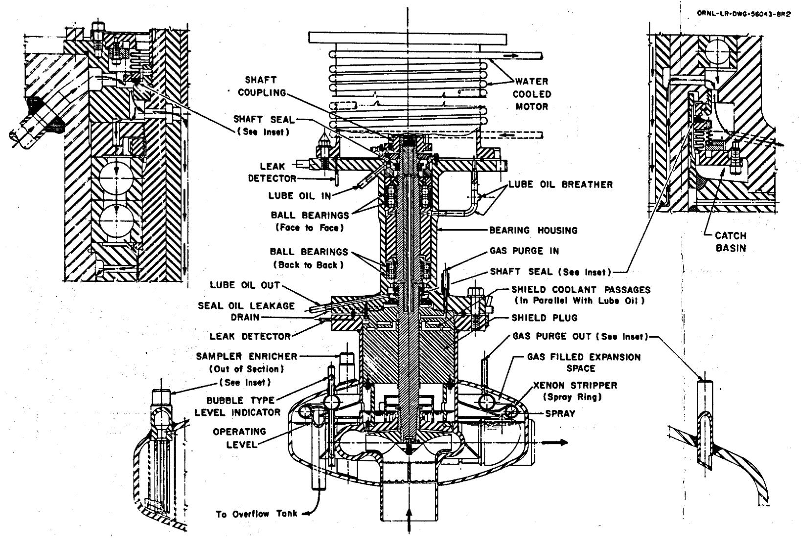  
Fig. 40. Section of MSRE fuel pump with details of several areas. The mist shield and the sampler cage examined are shown in the lower left insert.

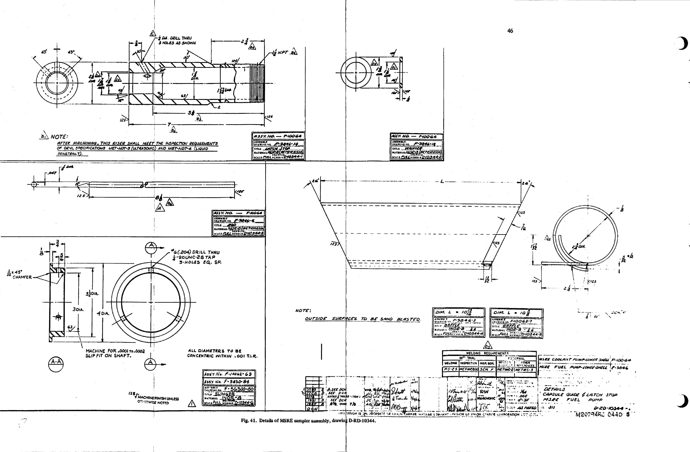

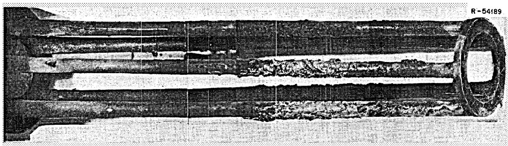  
Fig. 42. Sampler cage. The assembly is 8.5 in. high. The salt-vapor interface corresponds with the region of highest material deposition.

compositions). The mist shield was a $1\frac{1}{4}$ -turn spiral about 2 in. $\mathbf{ID} \times 3$ in. OD. The outside was exposed up to the normal liquid level to salt that was agitated by the stripper jets and to salt spray and the purge gas above that level. There was also organic vapor and soot in this region from the decomposition of lubricating oil that leaked into the pump bowl at a rate of a few grams per day. The inside was exposed to more nearly quiescent salt up to the normal salt level and primarily to the purge gas above that level. The pump components were above $500^{\circ}\mathrm{C}$ for 30,807 hr and in contact with fuel salt for 21,040 hr.

The general appearance of the sampler cage is shown in Fig. 42. The salt normally stayed at a level near the center of the cage, but the level fluctuated slightly. The amount of material deposited on the surface is much greater below the liquid interface than above. A gross gamma scan had a similar profile with a maximum near the liquid interface. A carbonaceous deposit was present at the top of the sampler. The mist shield had some deposits, which were heavier below the liquid level and on the outer surface of the shield.

# Sampler Cage

One of the sampler cage rods was examined metallographically. Photomicrographs of samples from the vapor and liquid regions are shown in Figs. 43 and 44 respectively. No intergranular penetration is visible at this magnification. A heavy surface deposit was on the sample from the liquid region. This deposit was examined by the electron microprobe analyzer. It contained some salt but had regions that were high in the elements of INOR-8: Ni, Cr, Fe, and Mo. This is illustrated by the x-ray displays in Figs. 45 and 46, which also show that the deposits were very inhomogeneous.

One of the sampler cage rods was pulled in tension at $25^{\circ}\mathrm{C}$ . The certified properties of this material were a yield stress of 51,200 psi, an ultimate tensile stress of 115,300, and an elongation of $51\%$ . The measured properties of the sampler cage rod were a yield stress of 42,500 psi, an ultimate tensile stress of 93,400 psi, and an elongation of $35.7\%$ . The property changes are not large and are likely due to some stress relief, which decreased the yield and ultimate stress values, and carbide precipitation, which reduced the ductility. A composite of the tested sample in Fig. 47 shows that the fracture occurred below the center near the average liquid-gas interface. One metallographic sample was taken on the liquid side of the fracture. A composite of the badly cracked edges is shown in Fig. 48. Note that the cracks extended to a depth of 12 mils. A higher magnification view of an area near the fracture shows that the cracks extend deeper than three grains and that several grains have fallen out (Fig. 49). Another metallographic sample was taken $\frac{3}{4}$ in. above the fracture. A composite of photographs along the edge shows that the depth of cracking decreases with increasing distance into the vapor region (Fig. 50). The severity of cracking is different on the two edges of the rod. Unfortunately, we do not know the orientation of the rod relative to the sampler and the mist sheild.

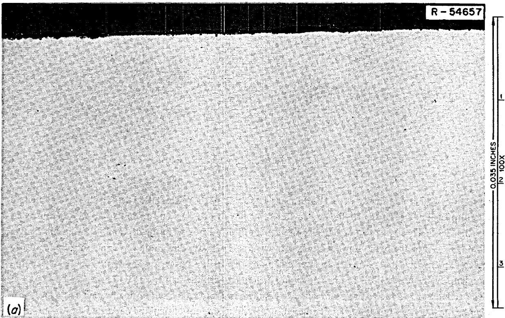

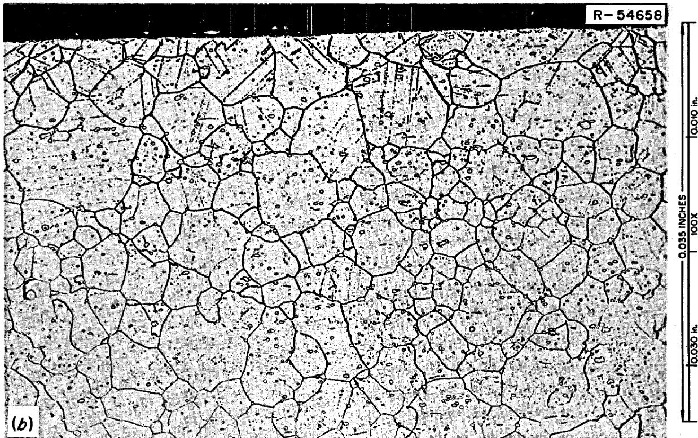  
Fig. 43. INOR-8 rod from sampler assembly located above normal salt level. (a) As polished; (b) etched with aqua regia.

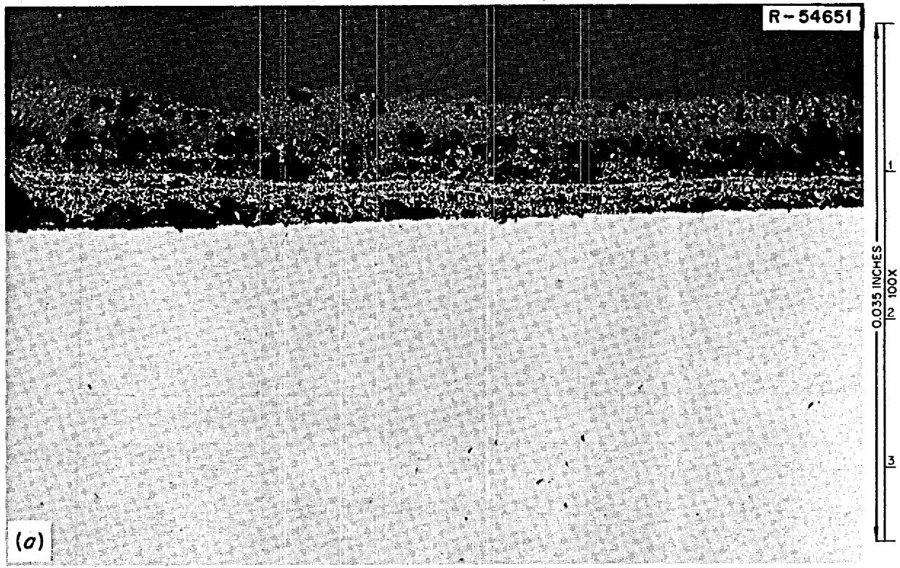

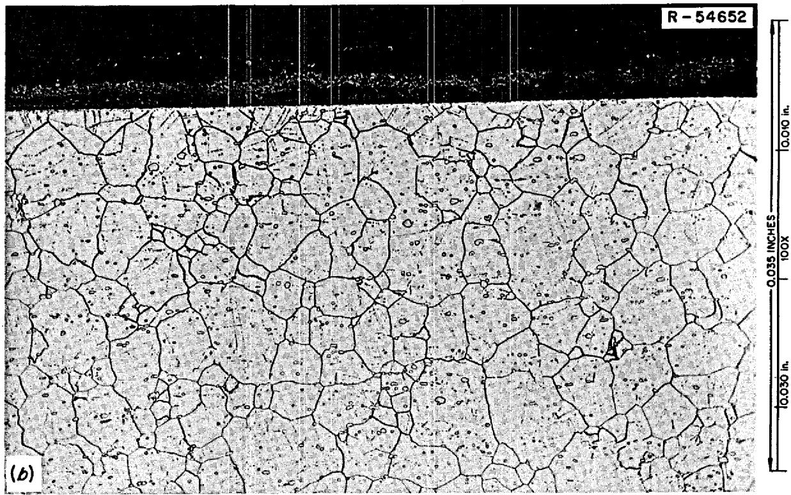  
Fig. 44. INOR-8 rod from the sampler assembly. Normally located below the salt level. (a) As polished; (b) etched with aqua regia.

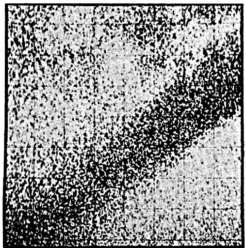  
Fe Kα X RAYS

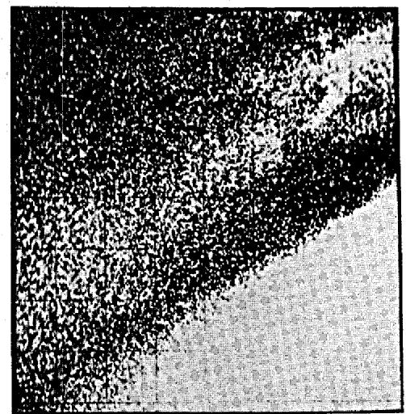  
Ni Kα X RAYS

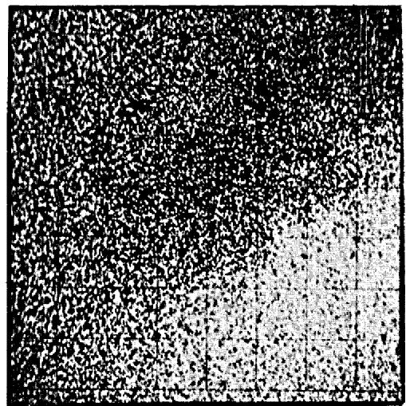  
Cr Kα X RAYS

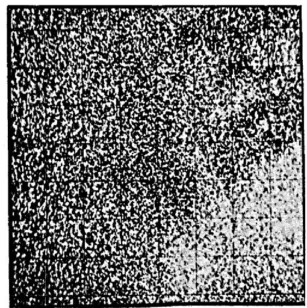  
Mo Lα X RAYS

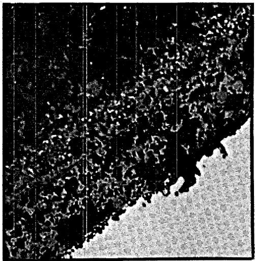  
OPTICAL   
500X   
Fig. 45. X-ray displays from the surface deposit on a sampler cage rod immersed in fuel salt in the pump bowl. $400 \times$

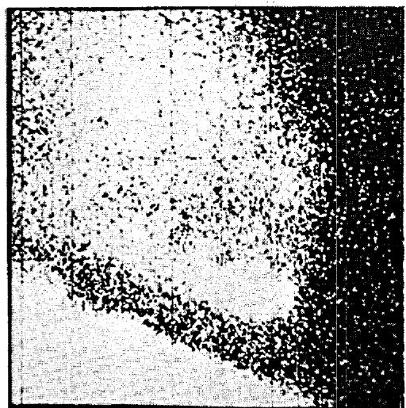  
Fe Kα X RAYS

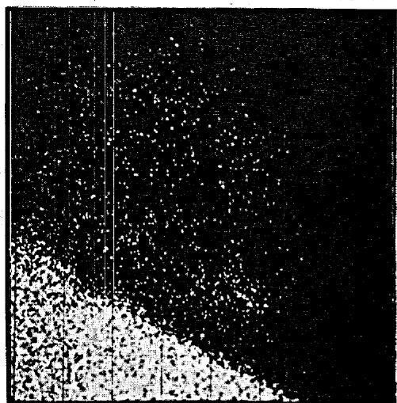  
Ni Kα X RAYS

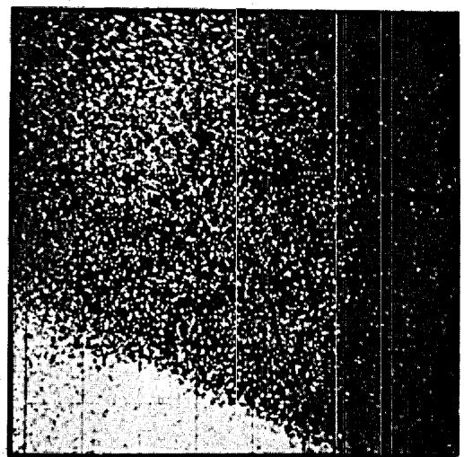  
Cr Kα X RAYS

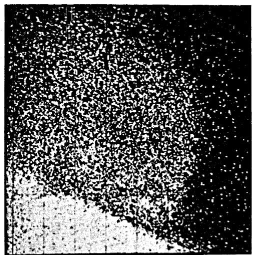  
Mo Lα X RAYS

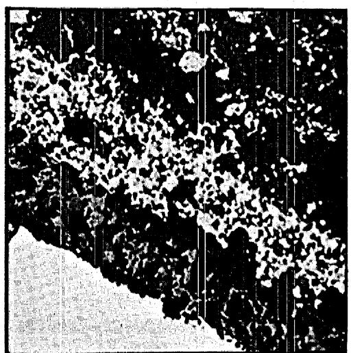  
OPTICAL   
500X   
Fig. 46. X-ray displays from the surface deposit on a sampler cage rod immersed in fuel salt in the pump bowl. $400\times$

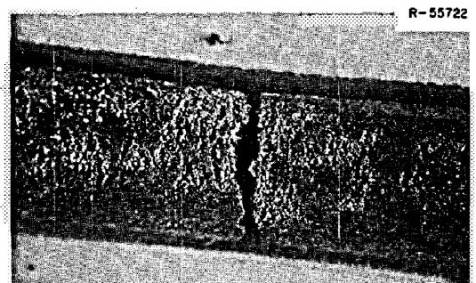  
(a)

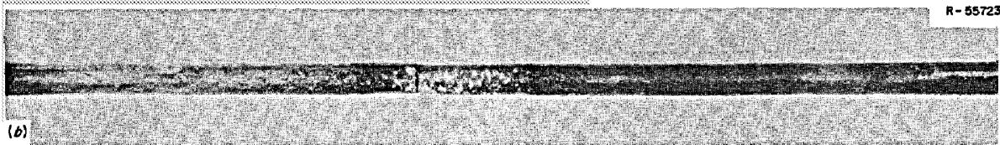  
Fig. 47. Tensile-tested INOR-8 sampler cage rod from pump bowl. Rupture occurred near the average liquid-vapor interface. (a) Rupture area showing extensive surface cracking. (b) Composite of entire rod, with top at right. Rod diameter is $\frac{1}{4}$ in.

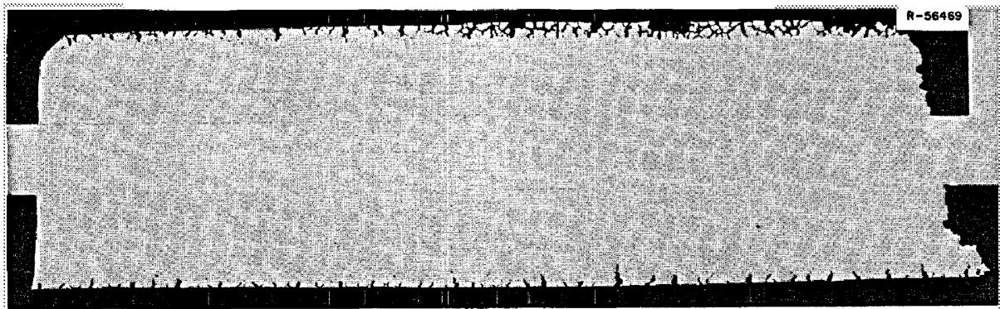  
Fig. 48. Section of INOR-8 sample cage rod that was deformed at $25^{\circ}\mathrm{C}$ . 9.2x. The fracture (right) occurred at the salt-vapor interface. The rod is immersed further in the liquid from right to left. The length of the sample is 0.63 in.

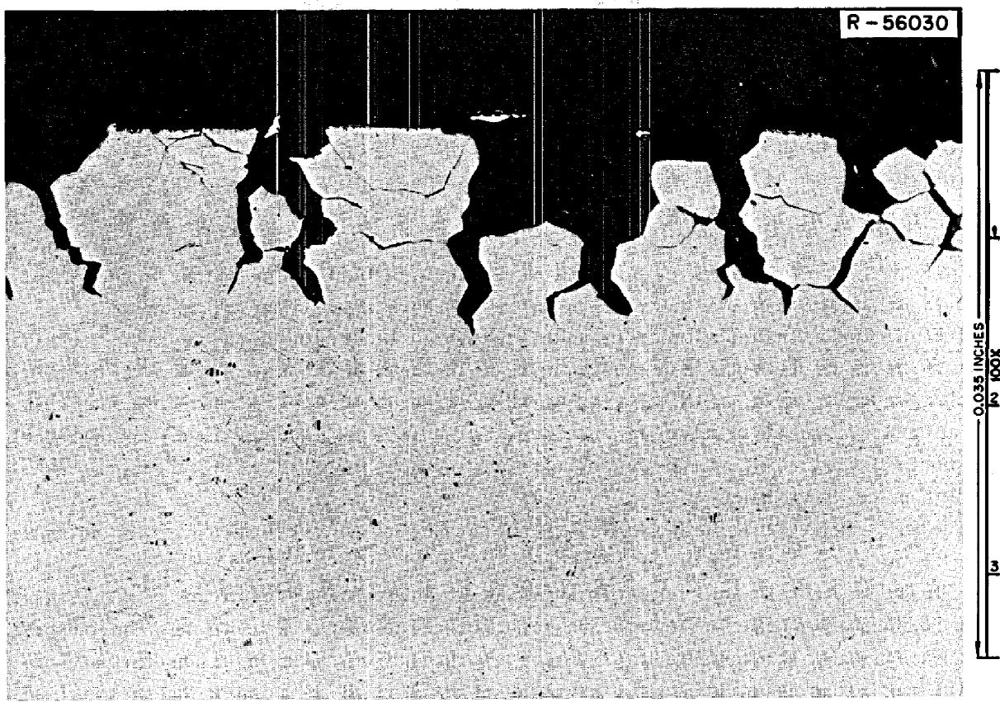  
Fig. 49. Deformed INOR-8 sampler cage rod near the fracture. As polished.

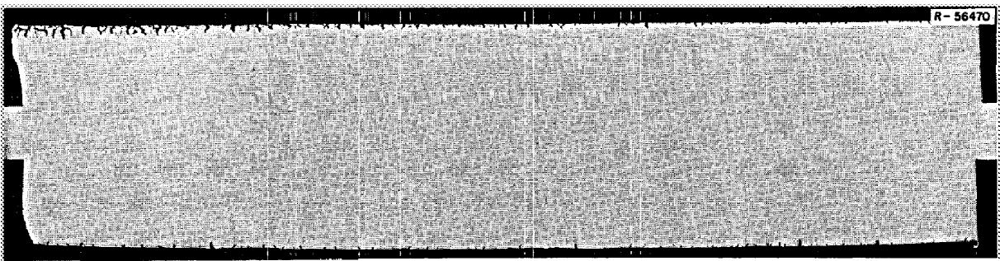  
Fig. 50. Composite of photomicrographs of INOR-8 sampler cage rod strained at $25^{\circ}\mathrm{C}$ . $8.2\times$ . Left end of sample was $3/4$ in. from fracture. The rod progressed further into the vapor region from left to right. Sample length is 0.72 in.

# Mist Shield

Figure 51 shows the mist shield after removal from the MSRE. The shield has been split to reveal the inside surface. Four specimens approximately 1 in. (vertical) $\times 1/2$ in. (circumferential) were cut from the mist shield. Their locations were (1) outside the spiral and immersed in salt, (2) outside the spiral and exposed to salt spray, (3) inside the spiral and immersed in salt, and (4) inside the spiral and exposed primarily to gas. Bend tests were performed on these specimens at $25^{\circ}\mathrm{C}$ using a three-point bend fixture. $^{30}$ They were bent about a line parallel to the $1/2$ -in. dimension so that the outer surface was in tension. The information obtained from such a test is a load deflection curve. The equations normally used to convert this to a stress-strain curve do not take into account the plastic deformation of the part, and the stresses obtained by this method become progressively in error (too high) as the deformation progresses.

Table 7 shows the results of bend tests on the specimens from the mist shield. Note that the yield and ultimate stresses are about double those reported for uniaxial tension. The fracture strain is the parameter of primary interest. Unexposed INOR-8 (heat N3-5106) did not fail after $40.5\%$ strain in the outer fibers. (No material was available of heat 5075, the material used in fabricating the mist shield.) Although all of the samples strained more than $10\%$ before failure, the two samples from the outside of the spiral were less ductile than the other samples.

The bend samples of the mist shield were examined metallographically. Photomicrographs of the sample from the inside vapor region are shown in Fig. 52, and a composite of several photomicrographs is shown in Fig. 53. The edge cracks were intergranular and about 1 mil deep. The photomicrographs of the sample from the liquid region (Fig. 54) show that the cracks extended to a depth of about 8 mils. The composite photograph in Fig. 55 also shows the increased frequency and depth of cracking in the liquid region.

The sample from the outside liquid region was quite similar metallographically to that from the inside liquid region. Photomicrographs of the fracture and a typical region of the tension side near the fracture are shown in Figs. 56 and 57 respectively. A composite of several photomicrographs is shown in Fig. 58.

30. H. E. McCoy and J. R. Weir, The Effect of Irradiation on the Bend Transition Temperatures of Molybdenum- and Niobium-Base Alloys, ORNL-TM-880, pp. 7-10 (July 1964).

Table 7. Bend tests at ${25}^{ \circ  }\mathrm{C}$ on parts of the MSRE mist shield ${}^{a}$   

<table><tr><td colspan="2">Specimen</td><td>Yield stressb (psi)</td><td>Maximumc tensile stress (psi)</td><td>Strain (%)</td><td>Environment</td></tr><tr><td></td><td></td><td>×103</td><td>×103</td><td></td><td></td></tr><tr><td>S-52</td><td>Mist shield top inside</td><td>97</td><td>269</td><td>46.9d</td><td>Vapor region, shielded</td></tr><tr><td>S-62</td><td>Mist shield top outside</td><td>155</td><td>224</td><td>10.7d</td><td>Vapor region, salt spray</td></tr><tr><td>S-60</td><td>Mist shield bottom inside</td><td>161</td><td>292</td><td>31.6d</td><td>Liquid region, shielded, salt flow</td></tr><tr><td>S-68</td><td>Mist shield bottom outside</td><td>60</td><td>187</td><td>17.7d</td><td>Liquid region, rapid salt flow</td></tr><tr><td>N3-S106</td><td>Unirradiated control test, 1/8 in. thick</td><td>128</td><td>238</td><td>40.5</td><td></td></tr></table>

${}^{a}$ The mist shield was fabricated of heat 5075 with certified room-temperature properties of 53,000 psi yield stress, 116,000 psi ultimate stress, and ${49}\%$ elongation.   
$b$ Based on 0.002 in. offset of crosshead travel.   
${}^{c}$ Maximum tensile stress was controlled by fracture of sample or by strain limitation of test fixture.   
$d_{\mathrm{Specimen}}$ broke.

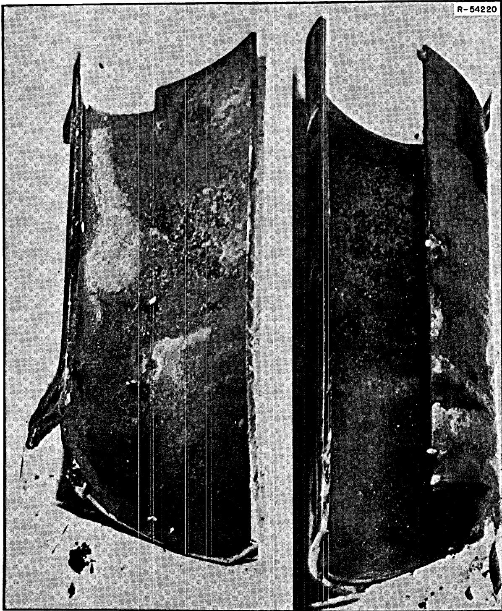  
Fig. 51. Interior of INOR-8 mist shield. Right part of right segment overlapped left part of segment on left.

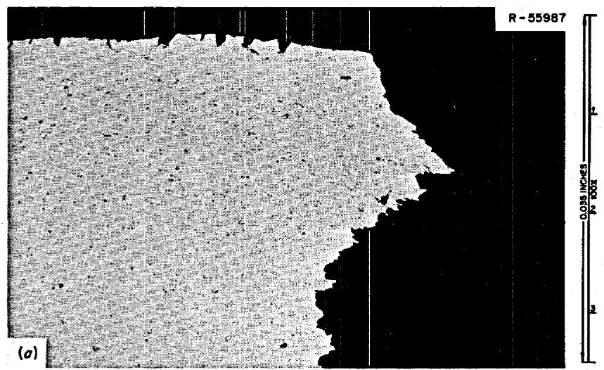

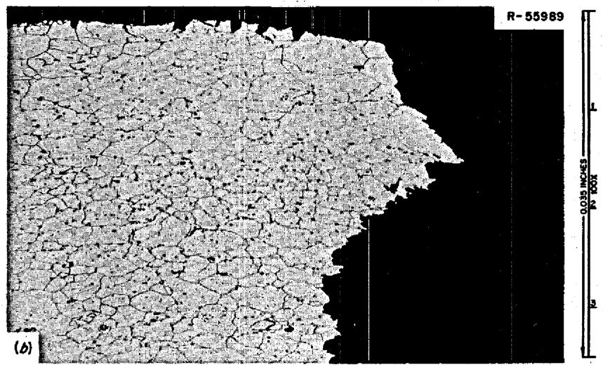

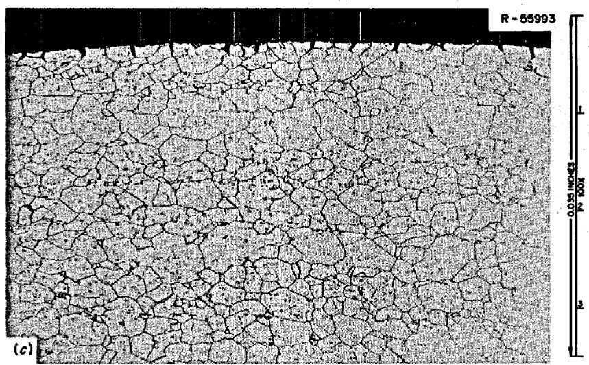  
Fig. 52. Bend specimen of INOR-8 mist shield from inside vapor region. (a) Fracture and tension side, as polished. (b) Fracture and tension side, etched. (c) Tension side, etched. Etchant: aqua regia. Reduced $31\%$ .

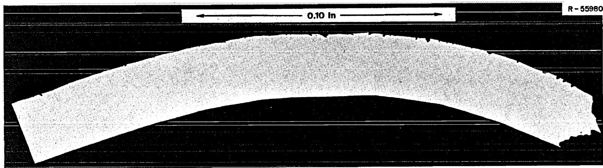  
Fig. 53. Composite photograph of tension side of bend sample from inside vapor region of INOR-8 mi t shield. Lower edge is not the compression side of the sample.

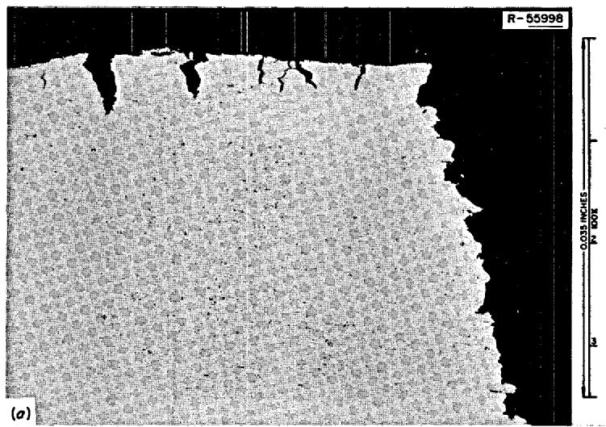

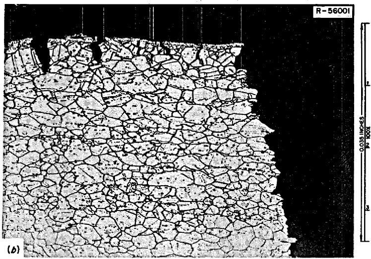

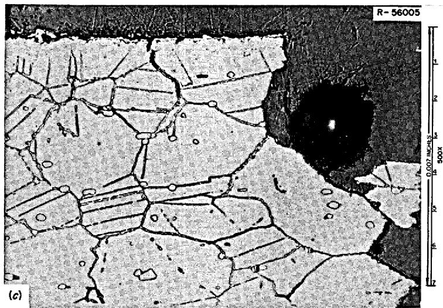  
Fig. 54. Bend specimen of INOR-8 mist shield from inside liquid region. Fracture and tension side $(a)$ as polished, $(b)$ and $(c)$ etched with aqua regia.

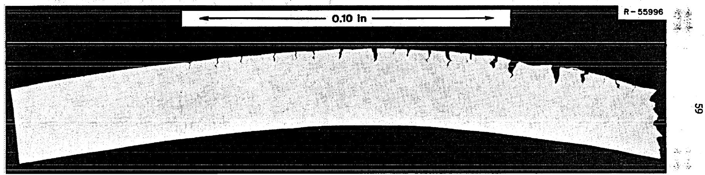  
Fig. 55. Composite photograph of tension side of bend sample from inside liquid region of INOR-8 mist shield. Lower edge is not the compression side of sample.

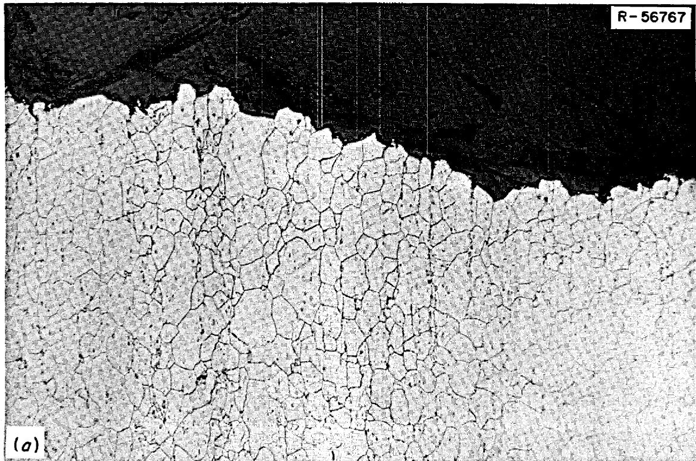  
XOO4001 301

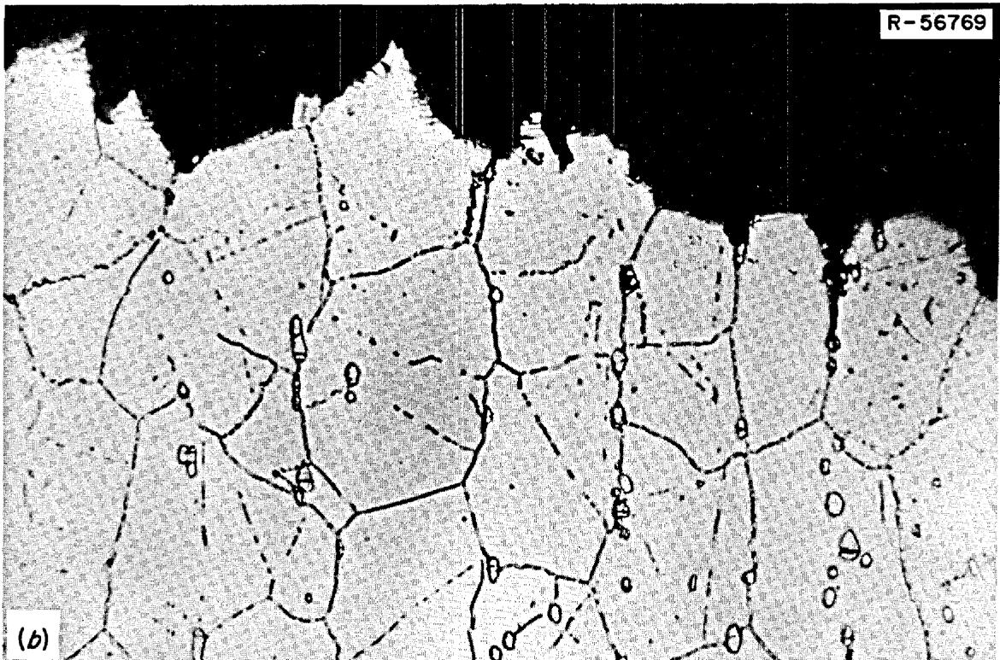  
1000000000000000000000000000000000000000000000   
Fig. 56. Fracture of bend specimen from outside liquid region of INOR-8 mist shield. (a) $100 \times$ ; (b) $500 \times$ . Etchant: lactic acid, $\mathrm{HNO}_3$ , HCl.

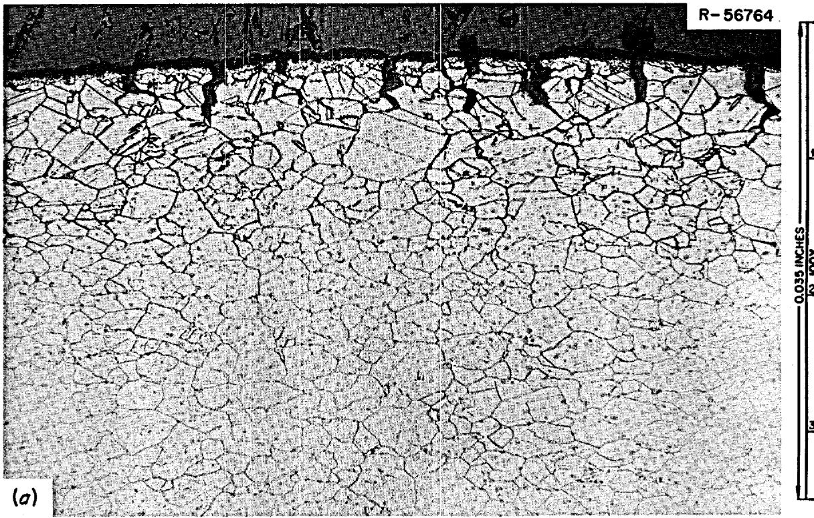

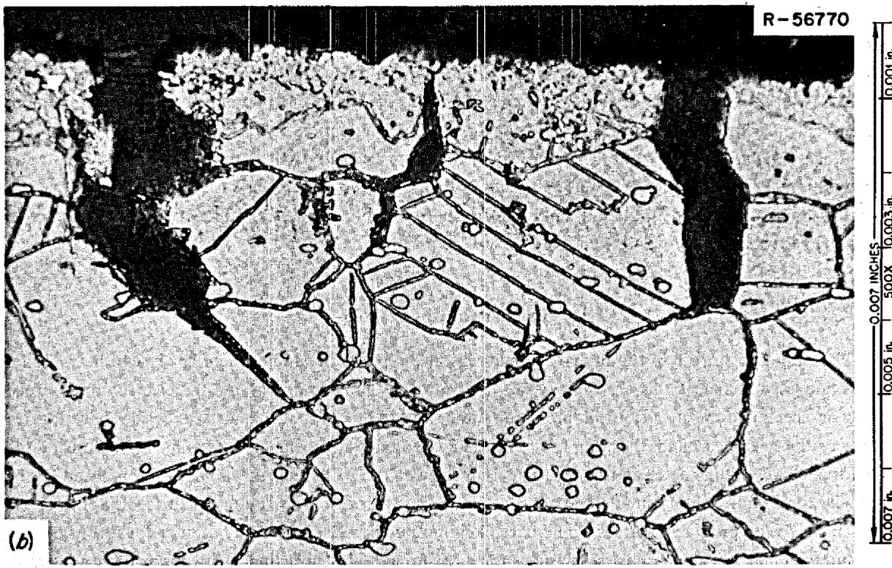  
Fig. 57. Tension side near fracture of bend specimen from outside liquid region of INOR-8 mist shield. (a) $100 \times$ ; (b) $500 \times$ . Etchant: lactic acid, $\mathrm{HNO}_3$ , HCl.

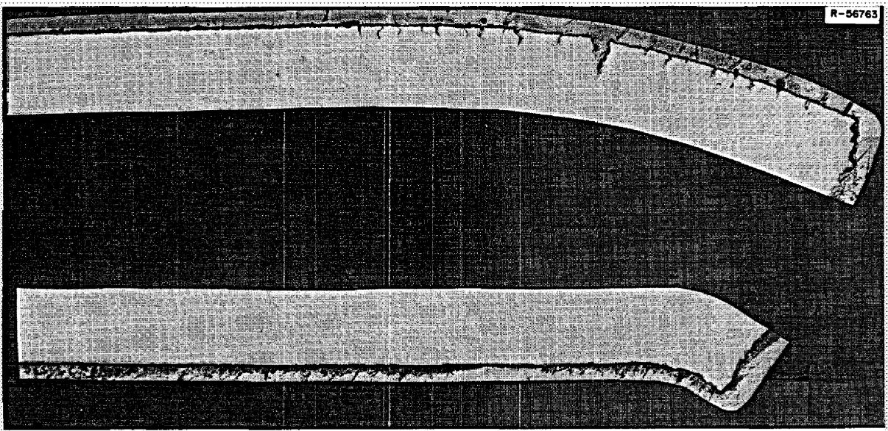  
Fig. 58. Composite of several photomicrographs of bend specimen from outside liquid region of INOR-8 mist shield. Top portion shows the tension side, and the lower portion shows the compression side. $24 \times$ . Reduced $44 \%$

Photomicrographs of the outside vapor (salt spray) bend specimen at the fracture and on the tension side near the fracture are shown in Figs. 59 and 60 respectively. The composite of several photomicrographs in Fig. 61 shows that the cracks are not much deeper nor more frequent than in the liquid regions (compare Figs. 55, 58, and 61), but the tendency for grains to fall out is much greater. This is even more significant when one notes that the strain was the least in the sample from the outside vapor region (Table 7).

The reduced ductility of these samples remains unexplained. The maximum crack depth in the liquid region was only 8 mils, and it is quite unlikely that an 8-mil reduction in a sample thickness of 125 mils would cause much embrittlement. The embrittlement may have been partially due to the extensive carbide precipitation shown in Figs. 53, 55, 56, 58, and 59. However, the outside and inside of the shield received identical thermal treatments, but the samples from the outside had lower ductilities. Thus, attributing the embrittlement solely to carbide formation does not seem appropriate.

# Summary of Observations

The only free surface in the primary circuit was in the pump bowl, and there appears to have been a collection of material at this surface. Visual observation, gamma scanning, and the electron microprobe show an accumulation of salt, fission products, and corrosion products at this surface. Besides having a free surface, the region around the sampler was often exposed to a reducing environment because of the addition of beryllium metal at this location. Fluorides of the structural metals would be reduced to the metallic form and could accumulate at the free surface or deposit on nearby metal surfaces. Some of the less stable fission product fluorides would have likely reacted in a similar way. Thus, it is not surprising that the intergranular cracks are most severe near the free surface. The most important observation relative to the cracking is that its severity was much less in material exposed primarily to gas. This allows the conclusion that exposure to liquid salt is necessary for the cracking to occur.

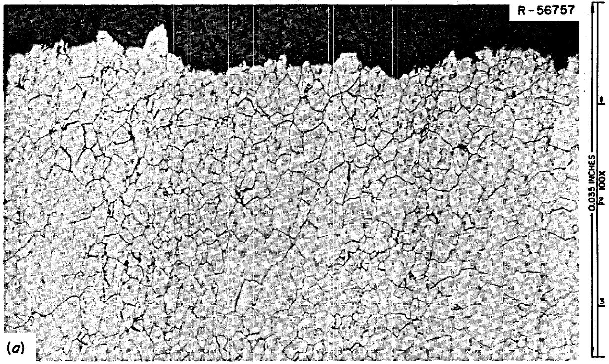

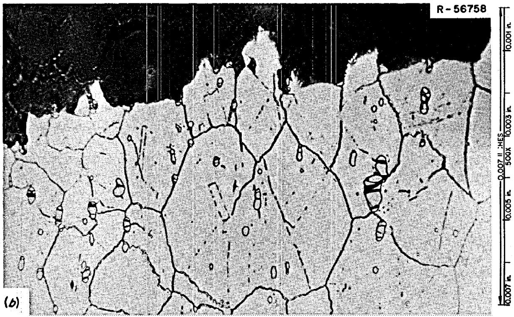  
Fig. 59. Fracture of a bend specimen from outside vapor portion of INOR-8 mist shield. (a) $100 \times$ ; (b) $500 \times$ . Etchant: lactic acid, $\mathrm{HNO}_3$ , HCl.

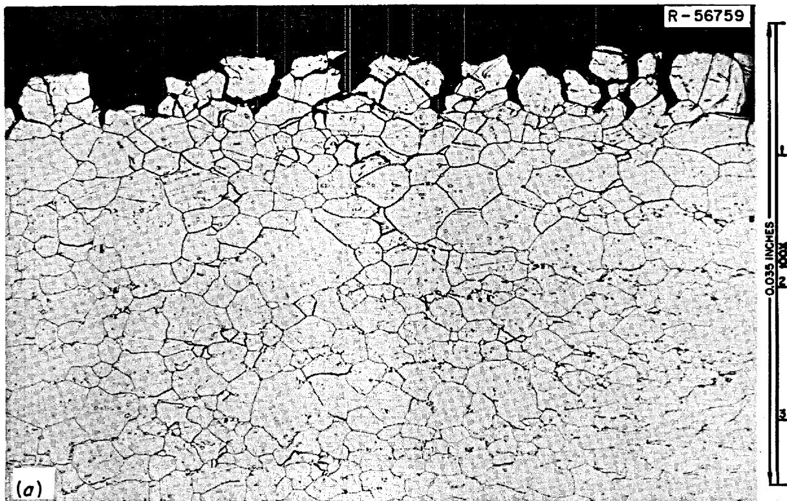

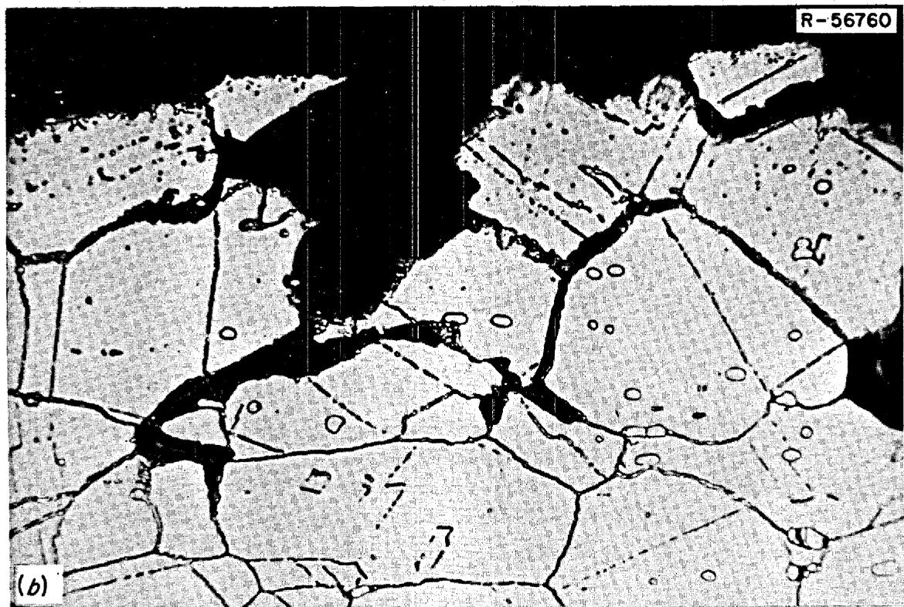  
0.007 INCHES 10.005 in. 500X 10.003 in. 10.001 in.   
Fig. 60. Edge near fracture of bend specimen from outside vapor portion of INOR-8 mist shield. (a) $100 \times$ ; (b) $500 \times$ . Etchant: lactic acid, $\mathrm{HNO}_3$ , HCl.

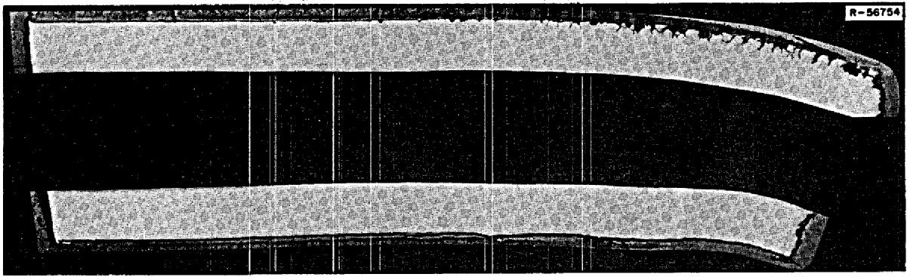  
Fig. 61. Composite of several photomicrographs of bend specimen from outside vapor region of INOR-8 mist shield. Top portion is tension side, and lower part is compression side. $15 \times$ Reduced $44\%$ .

# EXAMINATION OF A COPPER SAMPLE CAPSULE

# Physical Description

Salt samples were routinely taken from the pump bowl for chemical analysis. About $10\mathrm{g}$ of salt was required for an analysis, and the oxygen-free high-conductivity (OFHC) copper capsule shown in Fig. 62 was used to isolate this size of sample. The capsule was $\frac{3}{4}$ in. in diameter by 1.6 in. long, with hemispherical top and bottom. Salt entered through the two windows. The solid top was made of nickel-plated iron and was sufficiently heavy to ensure that the capsule would be submerged in the salt. A nickel-plated steel key was attached to the top of the capsule by a loop of $\frac{1}{3}2$ -in.-diam stranded stainless steel rope, which provided the flexibility necessary for the sample assembly to pass through the two 15-in.-radius bends in the transfer tube. The key locked the assembly to the latch on the drive unit cable. The capsule was lowered into the pump bowl by a windlass arrangement that has been discussed in detail.[31]

The sampler facility worked well during the operation of the MSRE; 593 samples were taken and 152 fuel additions were made. However, two small capsules were lost, and one of these (which we examined) was retrieved when the sample cage was removed from the fuel pump. The sample capsule was likely lost in August 1967 and flattened during retrieval attempts with heavy magnets in April 1968. (The heavily corroded steel cap was recovered at that time.) When actually recovered in January 1971 the capsule was discolored, deformed, and cracked. While in the MSRE, the capsule was almost certainly lying on the bottom of the pump bowl, where it would have been exposed to flowing fuel salt. The capsule would have been above $500^{\circ}\mathrm{C}$ for 16,400 hr and exposed to fuel salt for 13,025 hr.

# Examination

Figure 63 shows a cracked area of the sample capsule with some deposited material on the outside of the capsule. Figure 64 is a photomicrograph of the cracked area polished below the surface, showing the intergranular nature and extent of the cracks. Figure 65 is a photomicrograph of a cross section of the copper capsule, showing the thick deposit of material on both surfaces of the capsule.

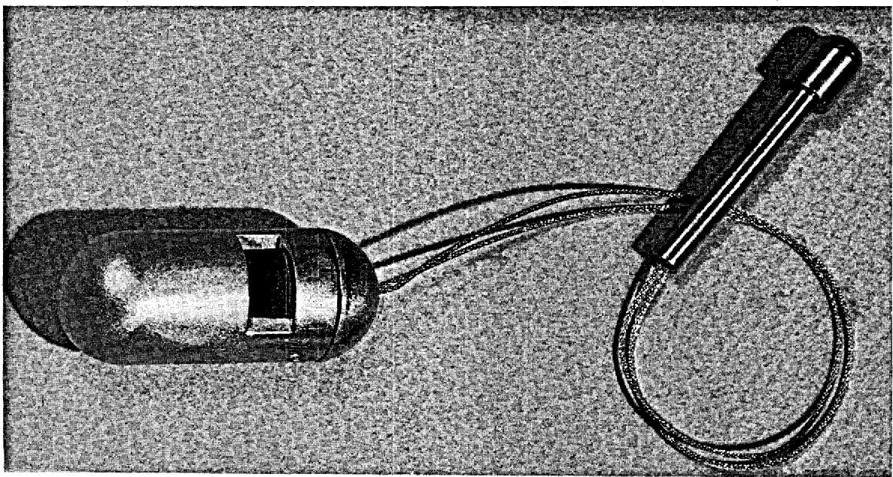  
Fig. 62. Sample capsule used in MSRE.

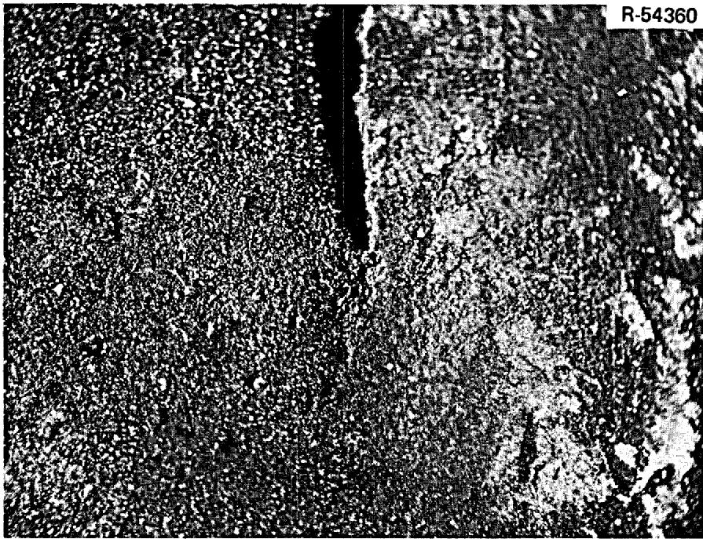  
Fig. 63. Crack formed in copper sampler retrieved from pump bowl. Outer surface was coated with deposited material.

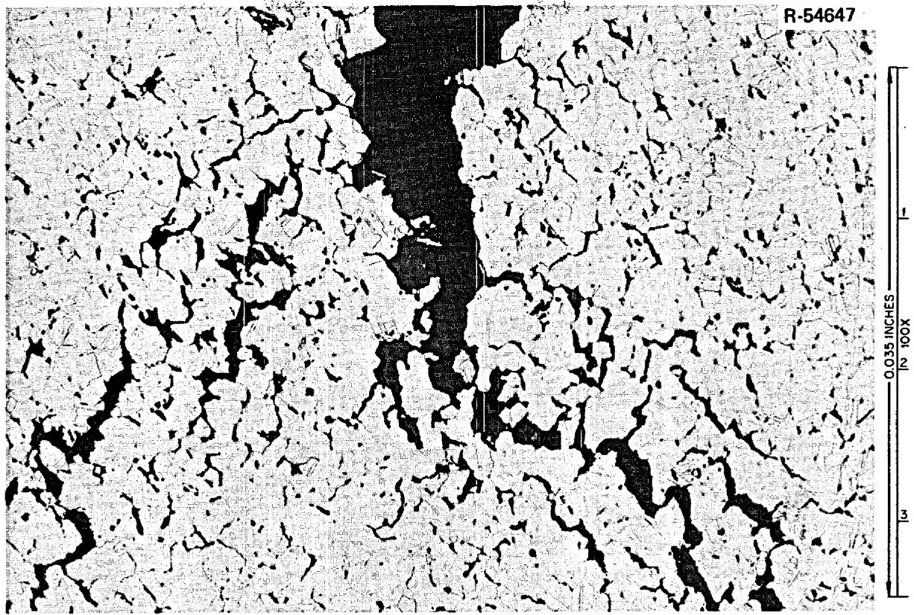  
Fig. 64. Section of copper capsule showing extensive intergranular cracking.

PHOTO 1183-71

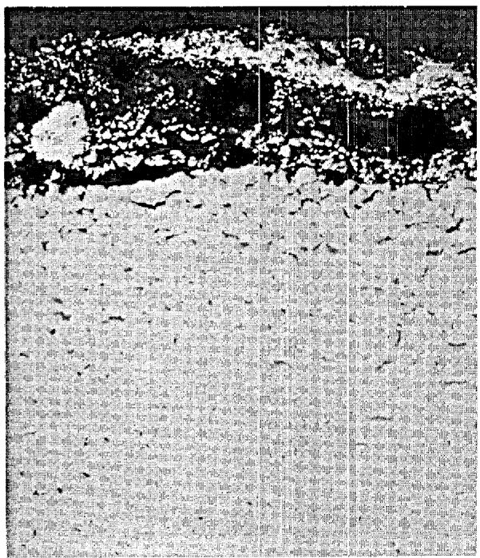

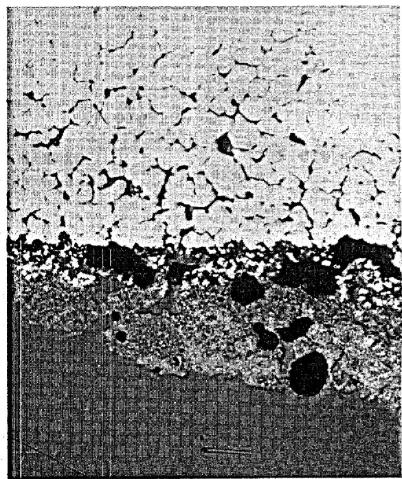  
Fig. 65. Photomicrographs of copper MSRE fuel sampler showing layers on outside surface (left) and inner surface (right).

Y-106552

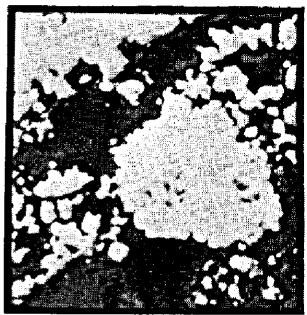  
Photomicrograph of Area Scan

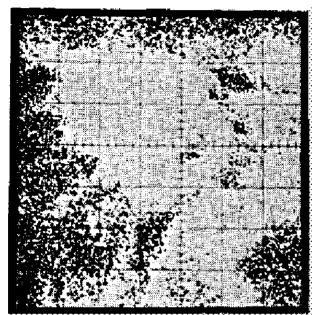  
CuKα X-Ray Scan

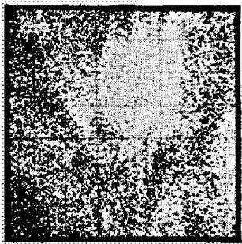  
NiKa X-Ray Scan

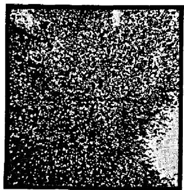  
FeKa X-Ray Scan

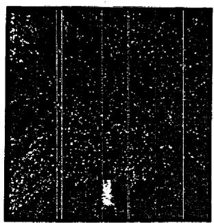  
CrKa X-Ray Scan

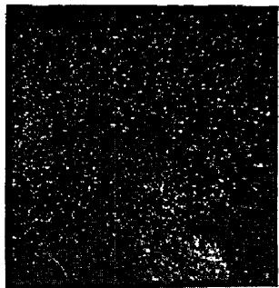  
MoLa X-Ray Scan   
Fig. 66. Views of the surface of the copper sampler in the electron-probe microanalyzer. The upper left picture is an optical photomicrograph showing deposited metal crystals. The other pictures show the intensity of x-ray fluorescence for various elements. These displays are a mirror image of the first optical picture. Note that certain areas are enriched in Ni, Fe, Cr, and Mo. Some copper from the capsule is present in the deposited material. Approx $200\times$ .

Table 8. Analysis of the copper capsule   

<table><tr><td>Element</td><td>Concentration (ppm)</td><td>Element</td><td>Concentration (ppm)</td></tr><tr><td>As</td><td>1</td><td>Si</td><td>70</td></tr><tr><td>Be</td><td>1000</td><td>Sn</td><td>~20</td></tr><tr><td>Ca</td><td>~5</td><td>Sr</td><td>~1</td></tr><tr><td>Cr</td><td>30</td><td>Te</td><td>&lt;5</td></tr><tr><td>C</td><td>M</td><td>233U</td><td>5</td></tr><tr><td>Fe</td><td>300</td><td>235U</td><td>500</td></tr><tr><td>K</td><td>~5</td><td>238U</td><td>1000</td></tr><tr><td>Mg</td><td>10</td><td>V</td><td>0.3</td></tr><tr><td>Mn</td><td>1</td><td>Zn</td><td>20</td></tr><tr><td>Mo</td><td>30</td><td>Zr</td><td>10,000</td></tr><tr><td>Nb</td><td>1</td><td>F</td><td>~1000</td></tr><tr><td>Ni</td><td>1500</td><td></td><td></td></tr><tr><td>P</td><td>2</td><td></td><td></td></tr><tr><td>Pb</td><td>5</td><td></td><td></td></tr></table>

An electron-probe microanalysis of the material in the grain boundaries and x-ray scans for the distribution of Ni, Fe, Cr, and Cu in the surface layer in the area around the large metallic particle on the outer surface were made. Figure 66 shows the distribution of these elements, and it appears that the surface layers were made up mostly of copper and nickel, with some areas containing high concentrations of chromium and molybdenum. The inner and outer surfaces of the capsule appear similar. The grain-boundary precipitate was only $28\%$ Cu, and no other element could be detected. This observation indicates that the remainder is a light element, perhaps beryllium or lithium, that could not be detected by the instrument.

The surface deposits were ground away from two small pieces about $\frac{1}{16}$ in. square by $\frac{1}{4}$ in. long. These pieces were used as electrodes for the spark source mass spectrograph. We do not know the exact depth of sparking, but we suspect that it was near the surface. The analysis of the copper is shown in Table 8. Several important points can be made from this analysis. The spectrograph was not adjusted to detect lithium, but the presence of U, Zr, Be, and F indicates that the fuel salt was present. Also, the isotopic concentrations of uranium correspond to those of the first fuel charge rather than the later fuel charge in which the uranium was predominantly $^{233}\mathrm{U}$ . The weight percentages of various elements present in the initial fuel charge were approximately $10.9\%$ Zr, $6.3\%$ Be, $67\%$ F, $5.1\%$ U, and $10.8\%$ Li. These data indicate that relative to uranium the material in the copper capsule was enriched in Zr and depleted in F and Be. There were also significant quantities of Fe, Ni, Mo, and Cr, the main elements in INOR-8, as well as detectable quantities of several other elements, many of which may have been present in the copper initially.

The copper is very brittle, and the present analytical results do not shed much light on what element is responsible for the embrittlement.

# Summary of Observations

Although copper is generally accepted as being compatible with fuel salt, this capsule was severely embrittled in its 13,000-hr exposure to MSRE fuel salt. Heavy deposits quite similar to those noted on the sample cage and shield were present on the surfaces of the copper capsule. Some of the constituents of these deposits may have caused the embrittlement, but we were unable to identify the responsible element.

# EXAMINATION OF THE PRIMARY HEAT EXCHANGER

# Physical Description

The MSRE heat exchanger was the tube-and-shell type, with the fuel salt on the shell side and the coolant salt in the U-tubes. The shell was $16\frac{3}{4}$ in. $\mathrm{OD} \times \frac{1}{2}$ in. wall $\times$ about 8 ft long and was fabricated from INOR-8 heat 5068. The heat exchanger tubing was $\frac{1}{2}$ in. $\mathrm{OD} \times 0.042$ in. wall from INOR-8 heat N2-5101 (see Table 4 for chemical compositions). The structural details of the heat exchanger ${}^{3,2}$ and the special method of joining the tubes to the header, which involved welding and back brazing, have been described. The completed tube bundle is shown in Fig. 67.

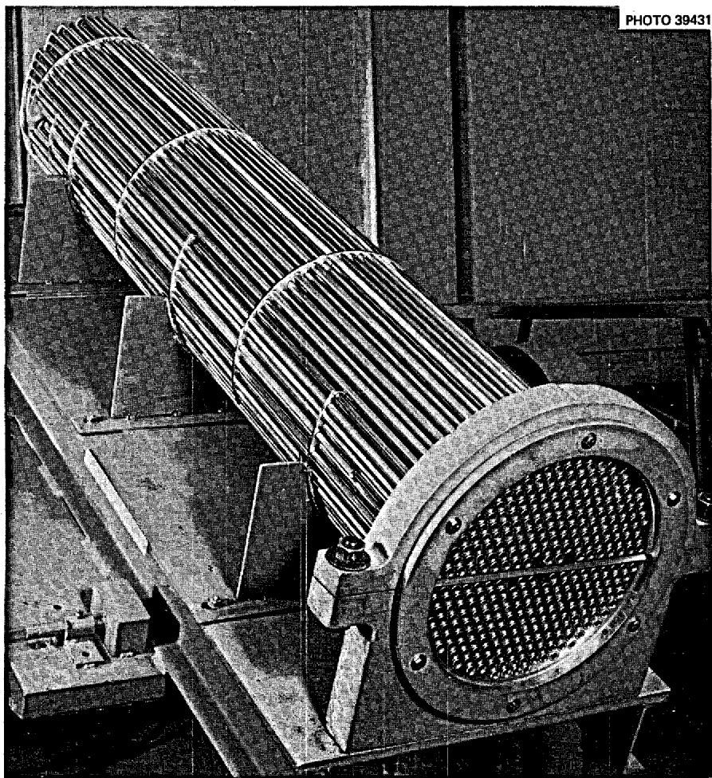  
Fig. 67. Completed tube bundle in fixture.

# Examination

The heat exchanger was above $500^{\circ}\mathrm{C}$ for 30,807 hr and was exposed to fuel salt for 21,040 hr. An oval piece of the shell $10 \times 13$ in. was cut by plasma torch near the outlet end of the heat exchanger. This same cut severed a piece of one tube, and pieces of five others were cut by an abrasive wheel. These parts are shown in Figs. 68 and 69. The outside of the shell had a dark adherent oxide; the inside surfaces were discolored slightly and had a thin bluish-gray coating, probably caused by the plasma cutting operation. Some of this powder was brushed off and found by gamma scanning to contain $^{106}\mathrm{Ru}$ and $^{125}\mathrm{Sb}$ .

Photomicrographs of a cross section through the outer surface of the shell are shown in Fig. 70. The oxide on the outside surface is typical of that observed on INOR-8 at this temperature and extends to a depth of about 5 mils. Etching attacks the metal in the oxidized layer and etches the grain boundaries near the surface more rapidly than those in the interior. The inside surface of the shell (Fig. 71) shows some structural modifications to a depth of about 1 mil. No samples of the shell were deformed.

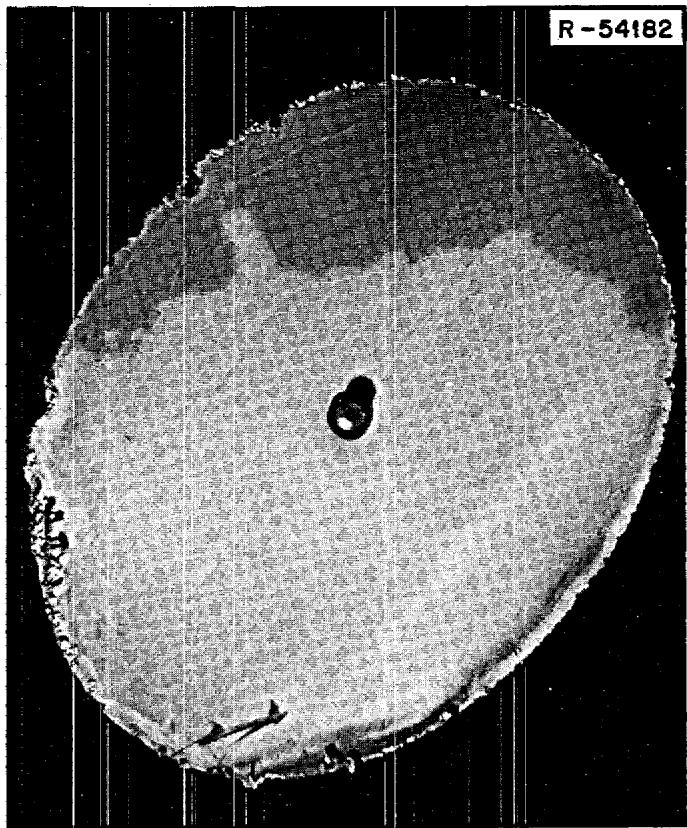  
Fig. 68. Section $10 \times 13$ in. cut from the primary heat exchanger shell. The piece was cut with a plasma torch, and the center stud was used for guiding the torch.

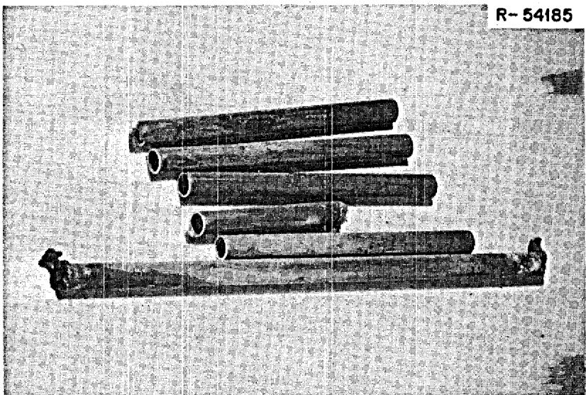  
Fig. 69. The $\frac{1}{2}$ -in.-OD INOR-8 tubes from the primary heat exchanger. The different shades arise from a dark film thought to have been deposited when the shell was being cut. The film was deposited on the side of the tubes facing the shell.

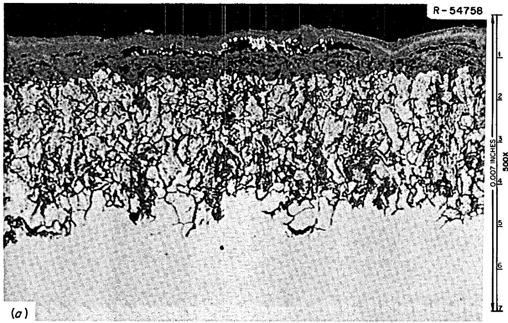

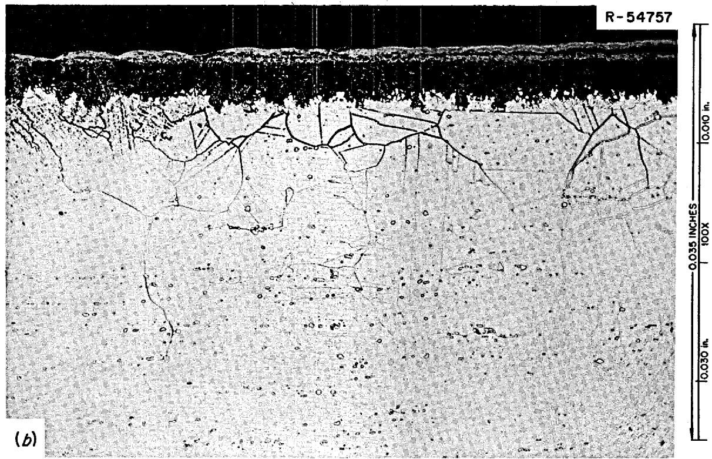  
Fig. 70. Outside edge of INOR-8 primary heat exchanger shell. This surface was exposed to 2 to $5\% \mathrm{O}_2$ in nitrogen. (a) As polished, showing selective oxidation. (b) Etched view showing that metal in oxidized layer was completely removed. Etchant: aqua regia.

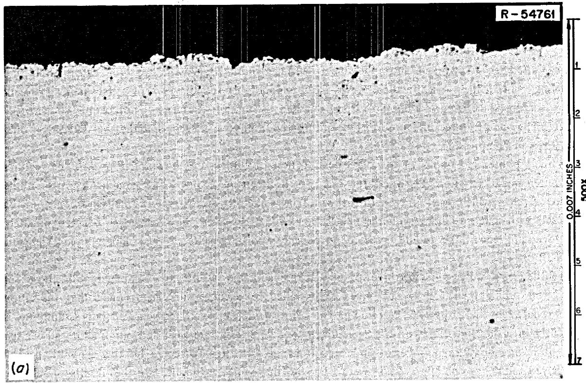

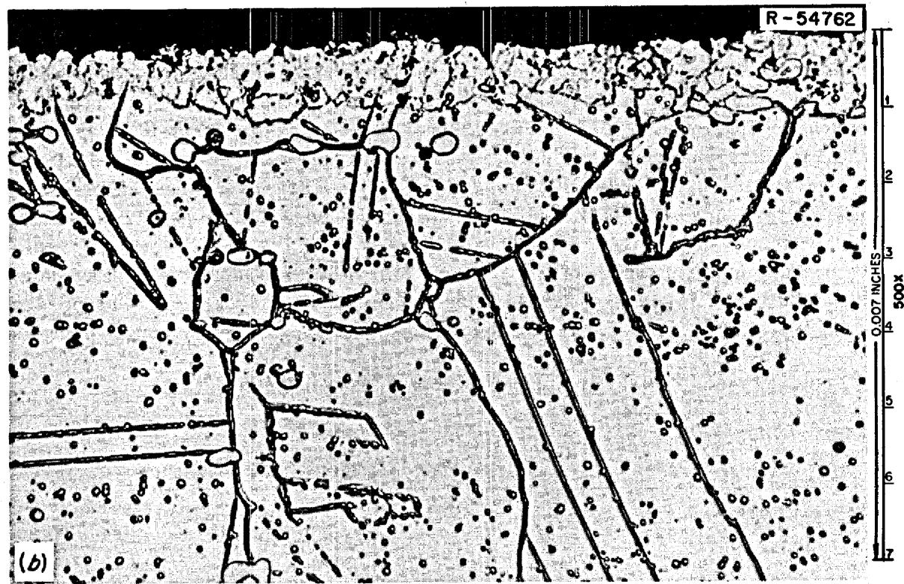  
Fig. 71. Inside surface of INOR-8 primary heat exchanger shell. The surface was exposed to fuel salt, and the modified structure to a depth of about 1 mil is apparent. (a) As polished; (b) etched with aqua regia.

Photomicrographs of a typical cross section of the heat exchanger tubing are shown in Fig. 72. The overall view shows that both sides etch more rapidly than the center to a depth of about 7 mils. This is not unusual for a tubular product and is often attributed to impurities (primarily lubricants) that are worked into the metal surface during repeated steps of deformation and annealing. The higher magnification views in the as-polished condition show that grain boundary attack (or cracking) occurred on the surface exposed to fuel salt (outer) but not on the coolant side (inner). The temperatures under normal operating conditions were such that the fuel salt side would have been in compression.

Similar photomicrographs of a longitudinal section of tubing are shown in Fig. 73. The features are quite similar to those discussed for Fig. 72. Both figures show some metallic deposits on the outside surface, which was exposed to fuel salt. These deposits are extremely small and could not be analyzed with much accuracy with the in-cell microprobe. However, they seemed to be predominately iron. Scanning across the tubing detected no concentration gradients of the major alloying elements in INOR-8.

Tensile tests were run on three of the tubes, and the results are compared with those for as-received tubing in Table 9. The tubes were pulled in tension, and we assumed that the entire section between the grips was deforming. The grips offer some end restraint, so our assumption is obviously in error, and the errors are such that our yield stresses are high and our fracture strains are low; however, the ultimate stresses and reductions in area are unaffected by this assumption. The as-received and postoperation tests were run by the same technique, so the results should be comparable. The largest changes during service were reductions in the yield stress, fracture strain, and reduction in area. The tubing was bought in the "cold drawn and annealed" condition, but such tubing normally is cold worked some during a final straightening operation. The reduction in yield strength during service may have been due to annealing out the effects of this working. The reductions in the ductility were likely due to the precipitation of carbides along the grain boundaries.

Photomicrographs of one of the tubes deformed at $25^{\circ}\mathrm{C}$ are shown in Fig. 74. Profuse intergranular cracks were formed to a depth of about 5 mils on the side exposed to fuel salt, but none were formed on the coolant salt side. Etching again revealed the abnormal etching characteristics near the surface, but whatever caused this abnormality did not result in grain-boundary embrittlement.

Unstressed and stressed sections of tubing were photographed over relatively large distances to get more accurate statistics on crack numbers and depths. Composite photographs of the two samples are shown in Fig. 75. The cracks are readily visible in the stressed sample but may not be apparent in

Table 9. Tensile data on heat exchanger tubes (heat N2-S101)   

<table><tr><td>Specimen</td><td>Condition</td><td>Crosshead Speed (in./min)</td><td>Temperature (°C)</td><td>Yield Stress (psi)</td><td>Ultimate Tensile Stress (psi)</td><td>Fracture Strain (%)</td><td>Reduction in Area (%)</td></tr><tr><td>7</td><td>From heat exchanger</td><td>0.05</td><td>650</td><td>44,300</td><td>67,400</td><td>21.3</td><td>22.4</td></tr><tr><td>6</td><td>From heat exchanger</td><td>1.0</td><td>25</td><td>66,300</td><td>118,000</td><td>37.0</td><td>20.5</td></tr><tr><td>5</td><td>From heat exchanger</td><td>0.05</td><td>25</td><td>64,800</td><td>122,000</td><td>39.0</td><td>29.0</td></tr><tr><td>4</td><td>As received</td><td>0.05</td><td>650</td><td>53,900</td><td>74,600</td><td>40.0</td><td>14.5</td></tr><tr><td>2</td><td>As received</td><td>0.05</td><td>25</td><td>73,000</td><td>127,400</td><td>51.1</td><td>42.6</td></tr><tr><td>3</td><td>As received</td><td>0.05</td><td>25</td><td>70,900</td><td>126,200</td><td>50.1</td><td>40.0</td></tr><tr><td>1</td><td>Vendor certification</td><td></td><td>25</td><td>58,900</td><td>120,700</td><td>47.0</td><td></td></tr></table>

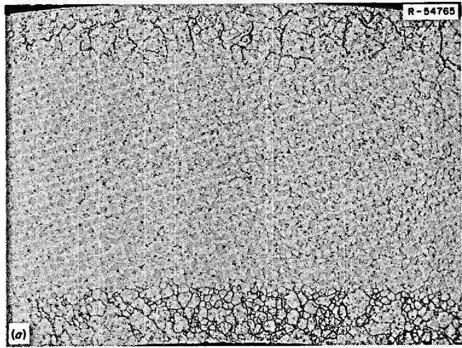

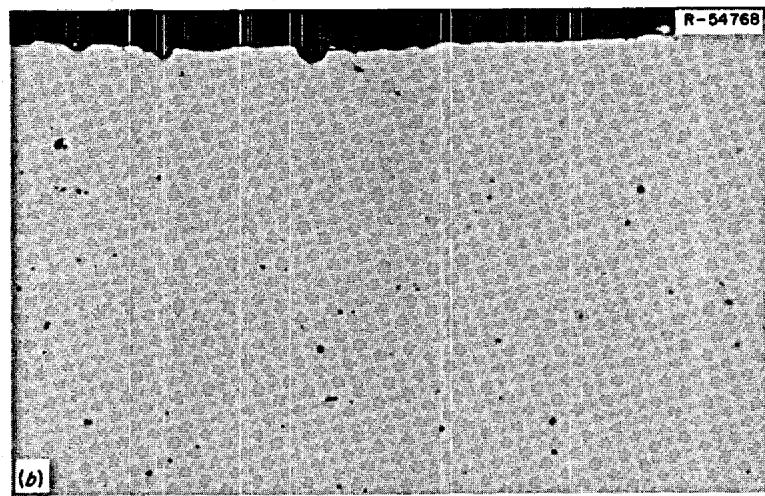

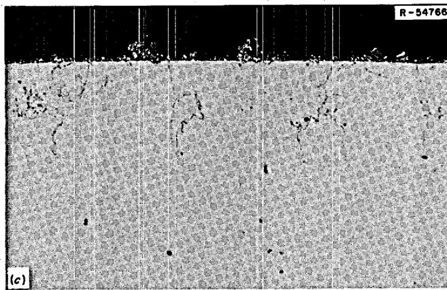  
Fig. 72. Cross section of INOR-8 heat exchanger tube. (a) Etched with glyceria regia. (b) Inside surface in the as-polished condition after exposure to coolant salt. (c) Outside surface in the as-polished condition after exposure to fuel salt. Reduced $34\%$ .

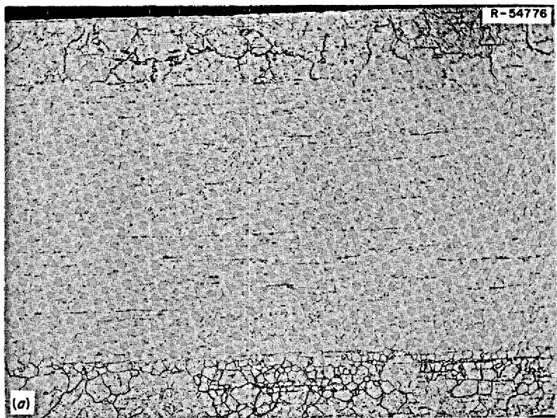  
0.035 INCHES 100x 10.010 in

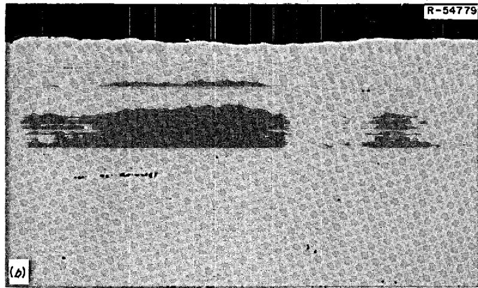  
0.007 INCHES 10000

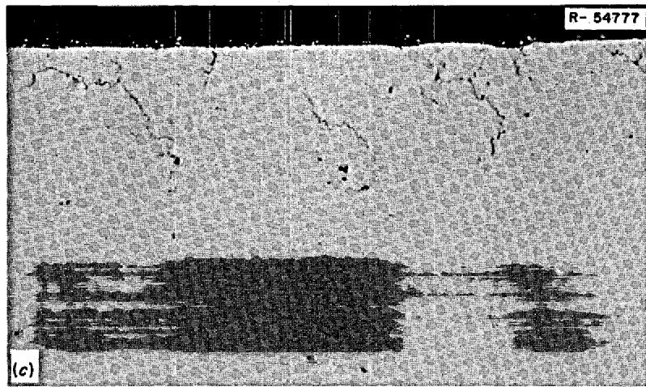  
Fig. 73. Longitudinal section of INOR-8 heat exchanger tube. (a) Etched with glyceria regia. (b) Inside surface in the as-polished condition after exposure to coolant salt. (c) Outside surface in the as-polished condition after exposure to fuel salt. Reduced $31\%$ .

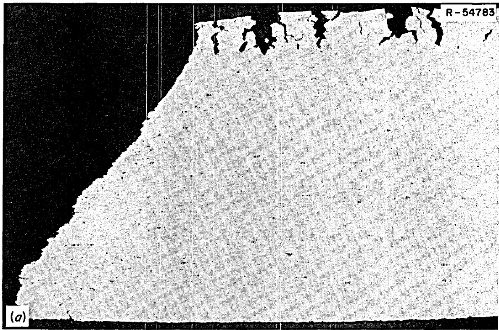  
0.035 INCHES 10.030 in. 100x 10.010 in.

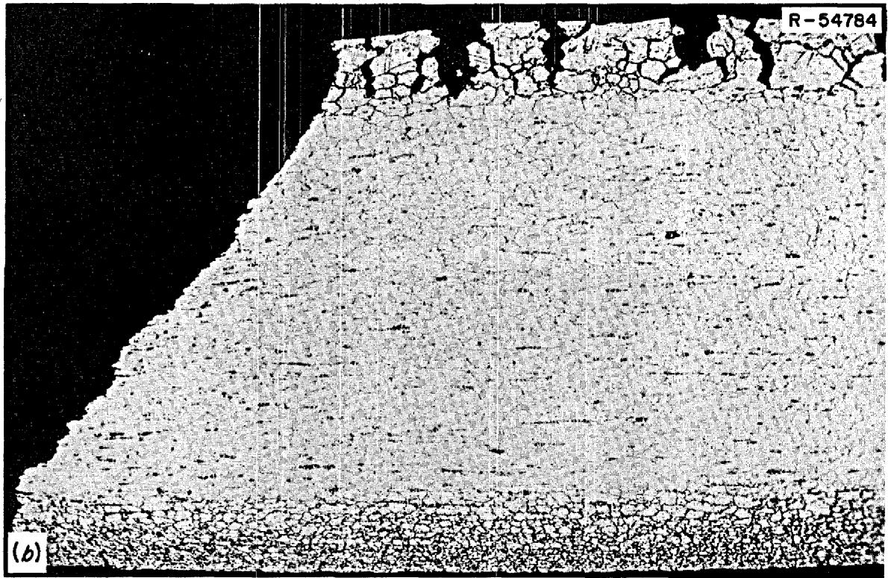  
10.030 in. 100x 10.010 in.   
Fig. 74. INOR-8 heat exchanger tube deformed to fracture at $25^{\circ}\mathrm{C}$ . (a) As polished; (b) etched with aqua regia.

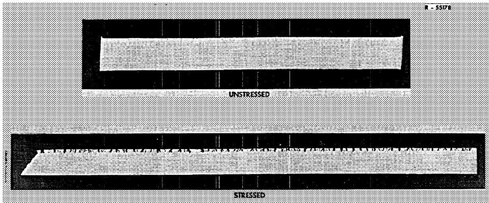  
Fig. 75. Composite photographs of INOR-8 heat exchanger tubing before and after stressing. Width of unstressed sample is 0.042 in.

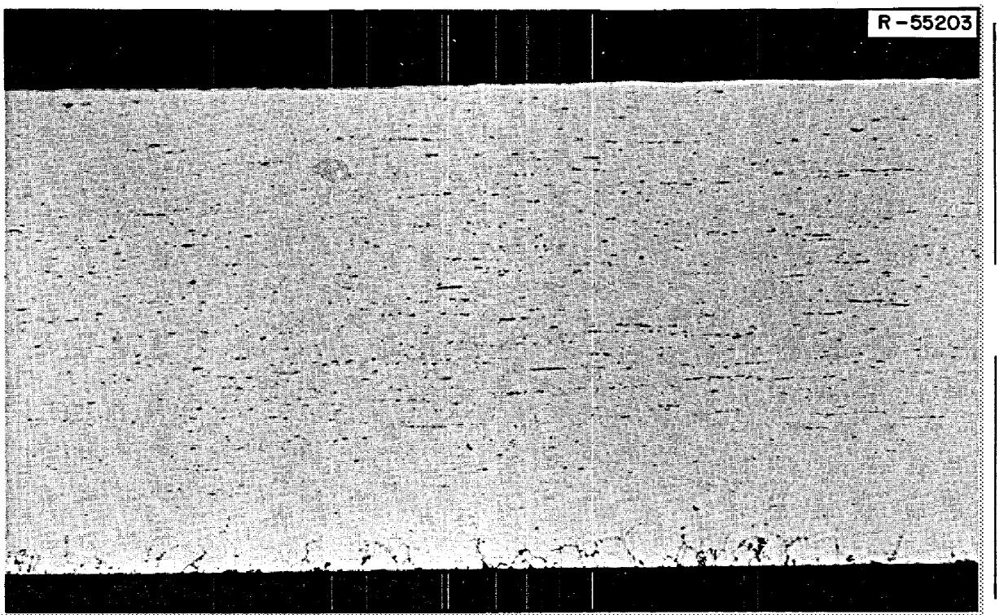  
Fig. 76. INOR-8 heat exchanger tubing in the unstressed condition. The side with the small cracks was exposed to fuel salt, and the other was exposed to coolant salt.

the unstressed sample. A higher magnification print used in making the composite is shown in Fig. 76; the cracks can be more easily seen. The stressed sample had 262 cracks per inch with an average depth of 5.0 mils. Two counts were made on the unstressed sample. In the first count only those features that unequivocally were cracks were counted. This gave a crack count of 228 per inch with an average depth of 2.5 mils. In another count, we included some features that were possibly cracks, and this gave a crack frequency of 308 per inch. Thus the number of cracks present before straining was about equivalent to that noted after straining. Straining did increase the visible depth. Some indirect evidence that the cracks were present initially and only spread open further during the tensile test was obtained from examination of the sample in Fig. 75. The sample length shown deformed $39\%$ (Table 9), and the combined widths of the cracks account for $35\%$ strain. Thus, the crack widths very closely account for the total strain and indicate that the cracks formed with little or no deformation and spread open as the sample was deformed.

# Summary of Observations

The primary heat exchanger operated in contact with fuel salt for 21,040 hr without any leaks or other problems developing. The outside of the shell was oxidized to a depth of a few mils. The surfaces exposed to coolant salt showed no evidence of intergranular cracking or corrosion. The tube surfaces exposed to fuel salt had shallow intergranular cracks that opened further when samples were strained but did not propagate much deeper into the tube wall. Since the neutron fluence received by this component was quite small, neutron irradiation evidently was not a significant factor in causing the intergranular cracking. However, the need for contact with the fuel salt was clearly demonstrated, since cracks were formed only on the outside surface of the tubing.

# EXAMINATION OF THE COOLANT RADIATOR

# Physical Description

The energy produced in the MSRE was dissipated through a radiator cooled by air. The coolant fluid was LiF-34 mole $\%$ BeF $_2$ and flowed through the tube side of the primary heat exchanger, the coolant pump, and the radiator. The coolant circuit was at service conditions for about 26,000 hr. About half this time the system was isothermal at $650^{\circ}\mathrm{C}$ , and during the other half the salt temperature varied from $593^{\circ}\mathrm{C}$ entering the radiator to $538^{\circ}\mathrm{C}$ leaving.

The examination of the tubes exposed to coolant in the primary heat exchanger was described in the previous chapter. We also examined some tubes from the inlet and outlet ends of the radiator and two thermocouple wells located at the inlet and outlet ends of the radiator. The results of this examination will be discussed in this section.

The details of the construction and operation of the radiator have been reported, $^{34}$ and an assembly drawing is shown in Fig. 77. The radiator tubing was $\frac{3}{4}$ in. $\mathrm{OD} \times 0.072$ in. wall, of INOR-8 heat 5097 (see Table 4 for chemical composition). The tubing was fabricated by Wall Tube and Metal Products Company, Newport, Tennessee, to specifications MET-RM-B-163, MET-NDT-3, and MET-NDT-165. After fabrication the material was annealed at some unspecified temperature, likely in the range 1000 to $1200^{\circ}\mathrm{C}$ .

The details of the thermocouple wells are shown in Fig. 78. The well itself was fabricated from INOR-8 heat 2477 and welded to the 5-in. schedule-40 header pipe of INOR-8 heat Y-8699 (see Table 4 for compositions). As shown in Fig. 78, the well was machined with a lip that had to be hand finished in the field to fit the contour of the 5-in. pipe.

# Observations

Visual examination of the tubing revealed an adherent oxide on the outside surface, which was exposed to air. The inside surface of the tubing was exposed to coolant salt and was very clear and free of deposits of metal or salt.

Typical photomicrographs of the as-received tubing are shown in Fig. 79. The relatively fine grain size of the material and the carbide stringers in the primary working direction are evident in Fig. $79(a)$ . Figure $79(b)$ shows a typical high-magnification view of the carbide stringers in the as-polished condition. The carbide is quite brittle, and the particles fracture during fabrication to produce cracks a few tenths of a mil long. An etched view of the inside edge is shown in Fig. $79(c)$ . The etchant attacked the carbide readily, causing particles to fall out and to leave holes. A typical etched cross-sectional view is shown in Fig. $79(d)$ . The stringers are not apparent since they are being viewed from the ends.

The microstructure of the tubing was altered two ways during service. The outside of the tubing was oxidized, and the inside of the tubing etched more rapidly to a depth of about 5 mils. These changes are shown in Fig. 80 for tubing at the inlet end and in Fig. 81 for the outlet end. The oxidation is not excessive, and the penetration of the oxide front is typical for nickel alloys with chromium content as low as that in INOR-8.

We investigated further the difference in etching characteristics near the inside surface of the tubing. A less aggressive electrolytic etchant was used to delineate the carbide structure better. The as-received material is shown in Fig. 82. There is still some attack of the primary carbide stringers, but very few fine carbide particles are present. The tubing from the inlet end of the heat exchanger is shown in Fig. 83. Fine carbide is present throughout the material, concentrated along the grain boundaries and even more concentrated near the surface. The tubing from the outlet end looked very similar. Thus the long time in service caused carbide to precipitate throughout the material, particularly near the inside surface.

In further pursuit of the different etching characteristics near the surface, we examined the samples with the electron microprobe analyzer. No composition variations in Cr, Mo, Ni, or Fe were observable to within $2\mu \mathrm{m}$ of the surface (the allowable working range on these samples). The lubricants used in drawing tubing are often high in silicon or carbon, but the concentrations of these elements were too low for the electron microprobe analyzer. We machined turnings from the tube for analysis for these elements, and the results are given in Table 10. The analysis shows a higher carbon concentration at the inside surface, a fact that should lead to increased carbide precipitation. The carbon would be dissolved by the postfabrication anneal and reprecipitate during service.

We tensile tested a piece of pipe from the outlet end and a piece of as-received tubing from the same lot (heat 5101). The properties are given in Table 11. The only significant property changes were the fracture strain and the reduction in area. However, these changes are rather modest and do not indicate a serious embrittlement of the material.

The inlet thermocouple well after it was cut off with a coated welding electrode is shown in Fig. 84. The oxidized appearance and the metal fragments on the part arose from the cutting operation. The circular piece of material is part of the 5-in. pipe wall. The thermocouple well was machined from bar stock and extended about 3 in. into the flowing salt stream. The cross-sectional view of part of the inlet well in Fig. 85 makes the geometry more evident. The pipe wall, the welds, and the thermocouple well are evident.

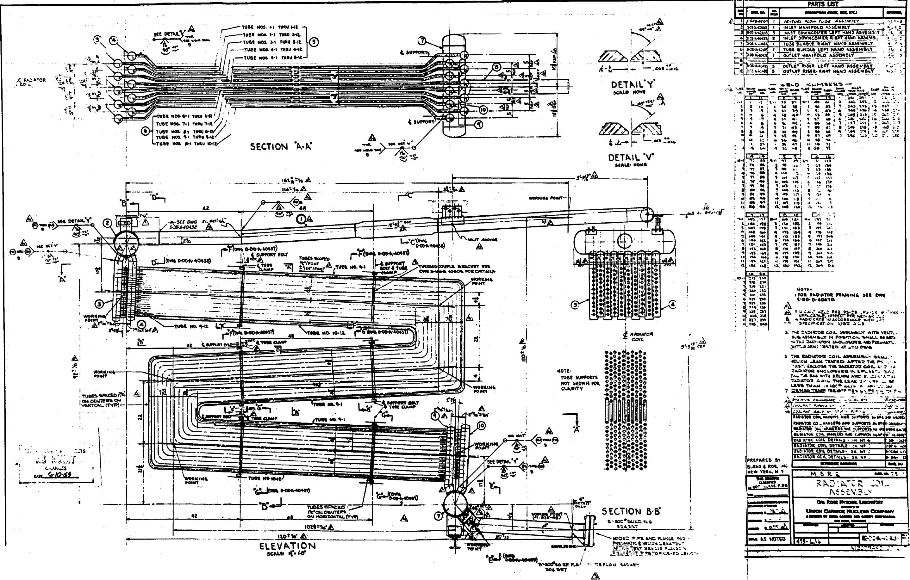  
Fig. 77. MSRE radiator coil assembly, drawing E-DD-A-4043.

<table><tr><td>PART
NO.</td><td>DWG. NO.</td><td>NO.
REDO.</td><td>DESCRIPTION (NAME, SIZE, ETC.)</td><td>MATERIAL</td></tr><tr><td colspan="5">NOTES:-
1. Wires MATURE PAPEONALL, Ate Witee Bucn up, Spieces Ralcaed
2. Noce DE T Poc 2 Moes, two Poc Maceauw.
3. Witea MPECPTON FIS Specif#rion Mar Nc-200.
4. Liave PuTAPANT OursA Suprae or Paeonwall Apyas
5. Pint MAMINUS A##TAING Pe at Mep Nc-6.
6. Wipanee P###mell Apya Pint MAMINUS A##TAING Paer on Mep Nc-8.</td></tr><tr><td>UNITS ON DIMENSIONS UNLESS
OTHER SPECIFICATIONS
FRACTION S: 1/4
DEIMALS ± .005
ANGLES ± 2°
SCALE: As N/PAID</td><td>GENERAL SPECIFICATIONS
UNLESS OTHERWISE SPECIFIED:
1. BREAK ALL SHAPED EDGS 1/4 MAX.
2. PRINCIPALS OR AURIMA OF MATTER
STEP TO CHOOSE IF PARRICATION.
3. ROUGHNES HEIGHT OF MAHINED,
SURFACES SHALL NOT EICKED P/A.
(FRESH SYMBOLS AND HIGREHT VALUES
ARE IN ACCORDANCE WITH ASA
BAIL-1955)</td><td>M.S. RE:</td><td>BLOG NO.
STANDARD THERMOWELL
FOR IOR-B PIPING
RECTOR DIASON
APPROVED
1/4
APPROVED
1/4
APPROVED
1/4
APPROVED
1/4
APPROVED
1/4
APPROVED
1/4
APPROVED
1/4
APPROVED
1/4
APPROVED
1/4
APPROVED
1/4
APPROVED
1/4
APPROVED
1/4
APPROVED
1/4
APPROISED
1/4
APPROVED
1/4
APPROVED
1/4
APPROVED
1/4
APPROVED
1/4
APPROVED
1/4
APPROVED
1/4
APPROVED
1/4
APPROVED
1/4
APPROVED
1/4
APPROVED
1/4
APPROVED
1/4
APPROVED
1/2
APPROVED
1/2
APPROVED
1/2
APPROVED
1/2
APPROVED
1/2
APPROVED
1/2
APPROVED
1/2
APPROVED
1/2
APPROVED
1/2
APPROVED
1/2
APPROVED
1/2
APPROVED
1/2
APPROVED
1/2
APPROXED
1/2
APPROXED
1/2
APPROXED
1/2
APPROXED
1/2
APPROXED
1/2
APPROXED
1/2
APPROXED
1/2
APPROXED
1/2
APPROXED
1/2
APPROXED
1/2
APPROXED
1/2
APPROXED</td><td></td></tr></table>

120794RG 134D

Fig. 78. Standard thermowell for INOR-8 piping, drawing D-GG-B-56259.

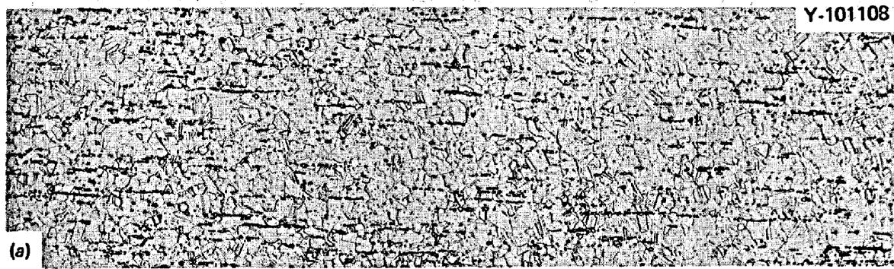

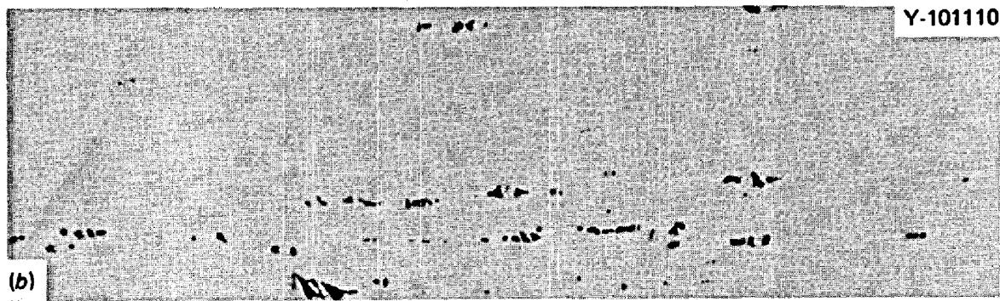

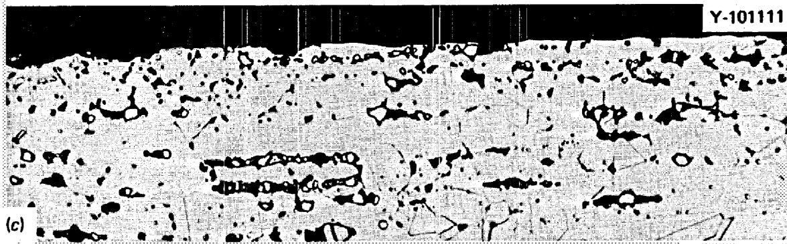

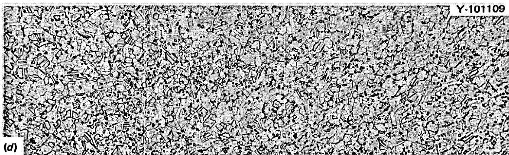  
Fig. 79. Typical photomicrographs of as-received INOR-8 (heat 5097) tubing used in the MSRE radiator. (a) Longitudinal view, etched with glyceria regia, $100 \times$ ; (b) as-polished longitudinal view, $500 \times$ ; (c) inside edge of tubing etched with glyceria regia, $500 \times$ ; (d) cross-sectional view, etched with glyceria regia, $100 \times$ .

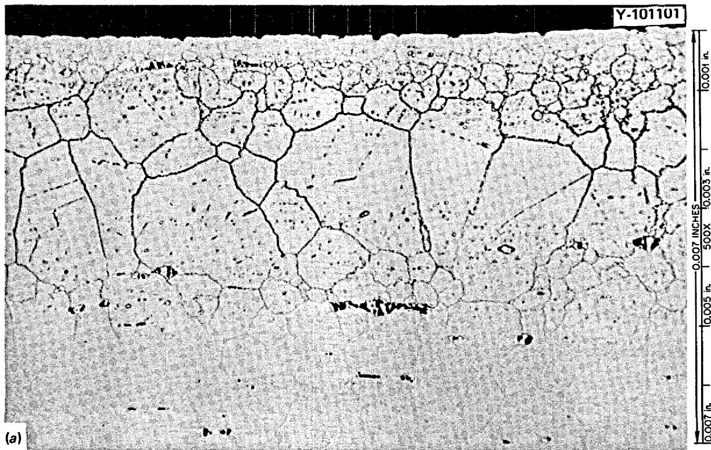

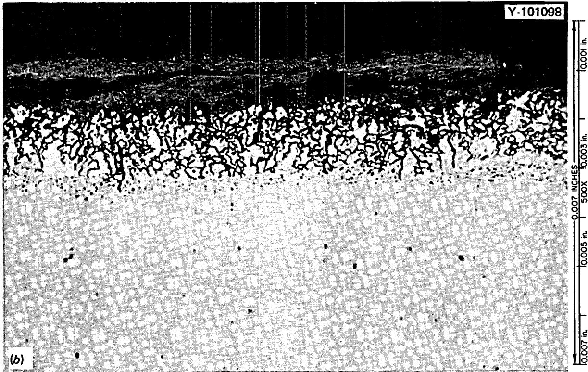  
Fig. 80. Microstructures of a longitudinal section of INOR-8 tubing from the inlet end of the MSRE radiator. (a) Inside of pipe wall, etched with glyceria regia; (b) outside of pipe wall, as polished.

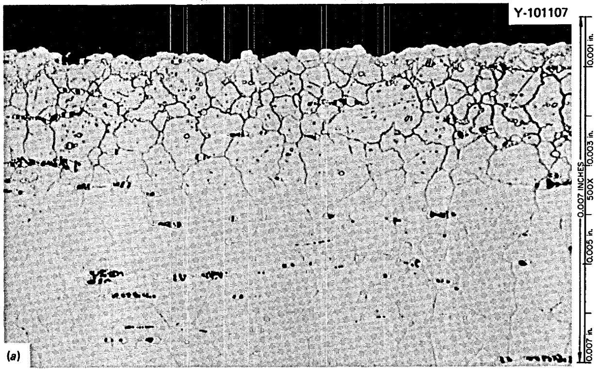

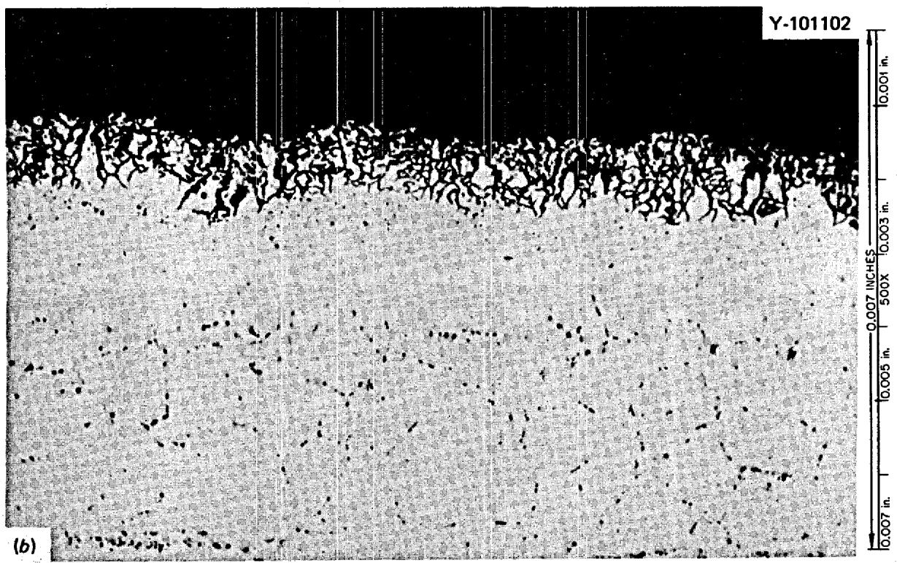  
Fig. 81. Microstructures of a longitudinal section of INOR-8 tubing from the outlet end of the MSRE radiator. (a) Inside of pipe wall, etched with glyceria regia; (b) outside of pipe wall, as polished.

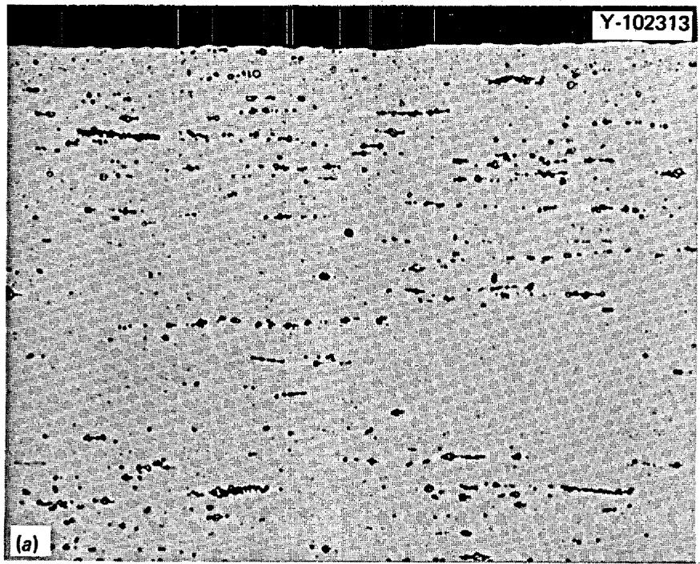

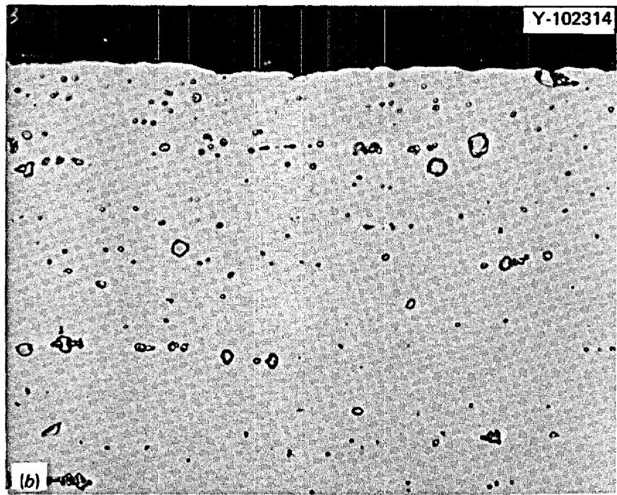  
Fig. 82. As-received INOR-8 tubing used in the MSRE radiator. Etched electrolytically in aqueous solution of $5\%$ sodium citrate, $5\%$ sodium acetate, $1\%$ citric acid, $1\%$ potassium thiocyanate. $600\mathrm{mV}$ , $1.5\mathrm{mA}$ for 15 sec plus $700\mathrm{mV}$ , $2.5\mathrm{mA}$ for 10 sec. (a) $250\mathrm{x}$ ; (b) $1000\mathrm{x}$ .

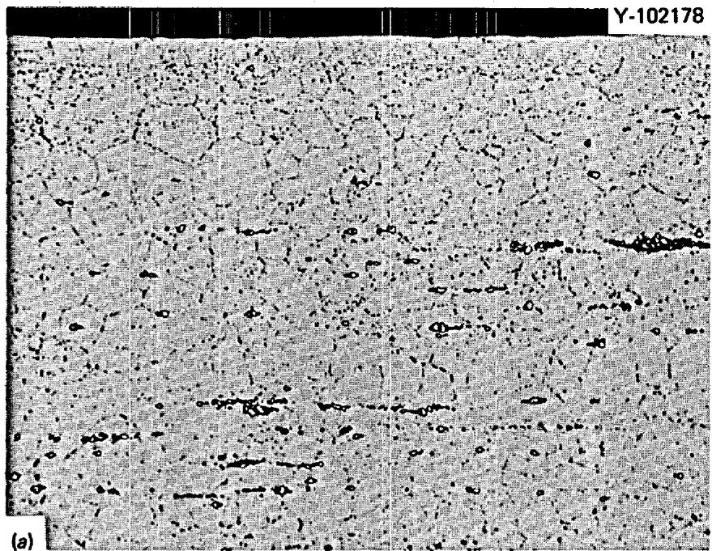

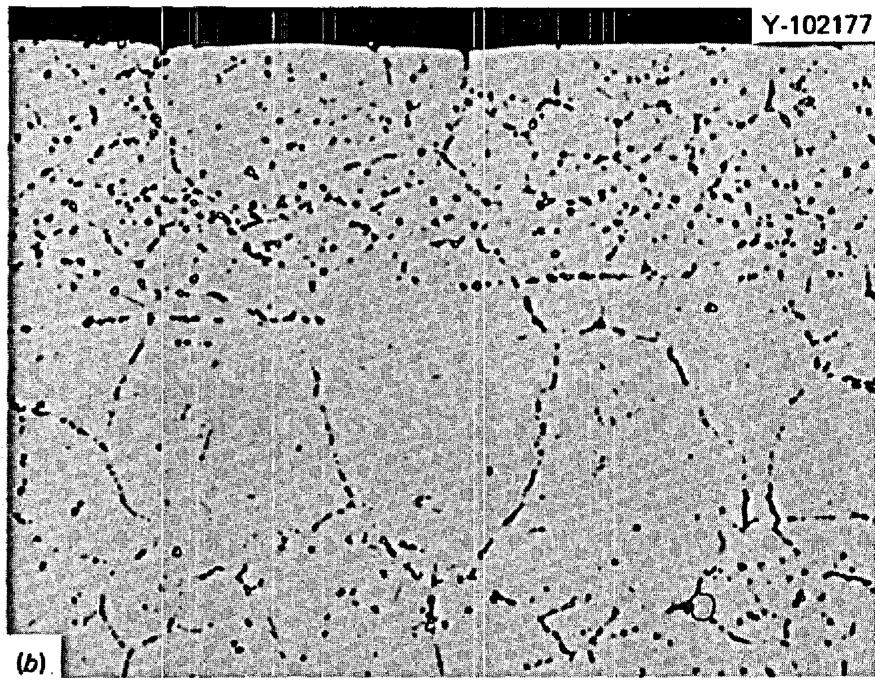  
Fig. 83. Tubing from the inlet end of the MSRE INOR-8 radiator. Etched electrolytically in an aqueous solution of $5\%$ sodium citrate, $5\%$ sodium acetate, $1\%$ citric acid, $1\%$ potassium thiocyanate. $700 \mathrm{mV}$ for 10 sec, started at $8 \mathrm{~mA}$ and dropped to $4 \mathrm{~mA}$ . (a) $250 \times$ ; (b) $1000 \times$ .

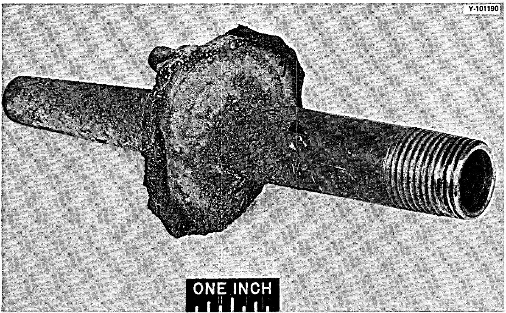  
Fig. 84. INOR-8 thermocouple well removed from the inlet line to the radiator of the MSRE. Much of the discoloration and the fragments of metal resulted from cutting the part out with a coated welding electrode.

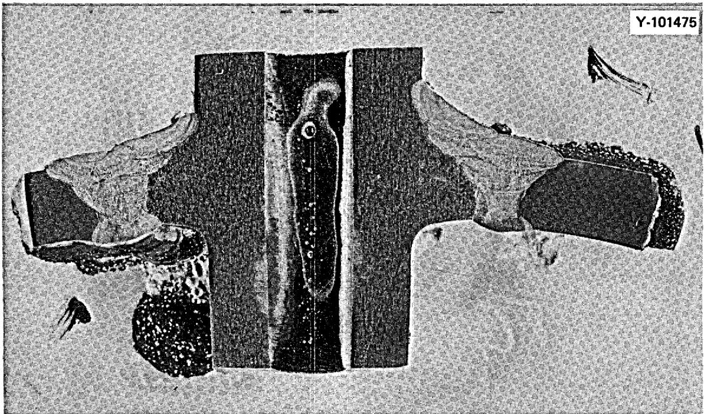  
Fig. 85. Cross section of INOR-8 thermocouple well from the inlet line to the MSRE radiator. From left to right the components are the 5-in. coolant line, the weld, and the thermocouple well. The side having the most weld metal was exposed to air, and the other side was exposed to coolant salt.

Table 10. Chemical analyses of sections of as-received INOR-8 radiator tubing   

<table><tr><td></td><td>Silicon (%)</td><td>Carbon (%)</td></tr><tr><td>Inner 5 mils of wall</td><td>0.53</td><td>0.095</td></tr><tr><td>Center 62 mils of wall</td><td>0.79</td><td>0.073</td></tr><tr><td>Outer 5 mils of wall</td><td>0.79</td><td>0.036</td></tr><tr><td>Bulk composition</td><td>0.62a</td><td>0.06a</td></tr></table>

${}^{a}$ Vendor analysis; others made at ORNL.

Table 11. Tensile properties at $25^{\circ}\mathbf{C}$ of INOR-8 tubing from the outlet end of the MSRE heat exchanger and as-received material   

<table><tr><td></td><td>Yield stress (psi)</td><td>Ultimate tensile stress (psi)</td><td>Fracture strain, % in 2 in.</td><td>Reduction in area (%)</td></tr><tr><td>As received</td><td>63,500</td><td>123,100</td><td>52.0</td><td>44.1</td></tr><tr><td>Heat exchanger</td><td>64,600</td><td>123,800</td><td>38.8</td><td>29.5</td></tr></table>

Metallographic examination of the mounted cross section shown in Fig. 85 revealed that the weld had cracked on the salt side of the pipe. The cracks on both of the polished surfaces in Fig. 85 are shown in Fig. 86. In the worst case the cracks penetrated to a depth of about 3 mils. The remaining half of the well was cleaned by acid etching to remove the metal left from the cutting operation, and the weld was checked with dye penetrant. A photograph of the weld with dye still present is shown in Fig. 87. Note that the crack, as indicated by the dark color, extends almost completely around the weld. There is also an area where penetration of the root pass was incomplete. We propose that the cracks formed as the weld was made, because of the poor fit-up of the parts to be welded. The welds were not stress relieved, and the fact that the cracks did not penetrate further attests to the lack of stress and crevice corrosion by lithium-beryllium fluoride salts.

We did not section the outlet well, but we did clean the weld and examine it with dye penetrant. No cracks were observed.

The outside surface of the 5-in. pipe was exposed to air and was oxidized. Figure 88 shows the spotty nature of the oxide and its maximum thickness of about 3 mils.

A cross section from the bottom of the well was examined. A macroscopic view of this section is shown in Fig. 89. The inside of the well was prepared by drilling, and the pointed shape of the drill is still apparent at the bottom. The weld metal deposit on the bottom was made to ensure that salt did not leak along the carbide stringers. The amount of oxidation was greater at the bottom of the well than further up. The transition to the thinner oxide about $\frac{1}{8}$ in. from the bottom is apparent in Fig. 89. Figure $90(a)$ shows the oxide layer of about 5 mils at the bottom of the well, and Fig. $90(b)$ shows the abrupt transition about $\frac{1}{8}$ in. from the bottom. Since lubricant would have been used during drilling, we suggest that this difference may have been due to the bottom of the well not being as clean as the sides.

A further significant observation was that the surfaces of the well exposed to the salt looked quite similar to those of surveillance samples removed from the MSRE (Fig. 91). We have previously attributed this modified surface structure to cold working from machining and have shown that it can be produced in the absence of salt. The structure likely results from carbide forming on the slip bands produced by machining. Thus there is no evidence of corrosion of this part.

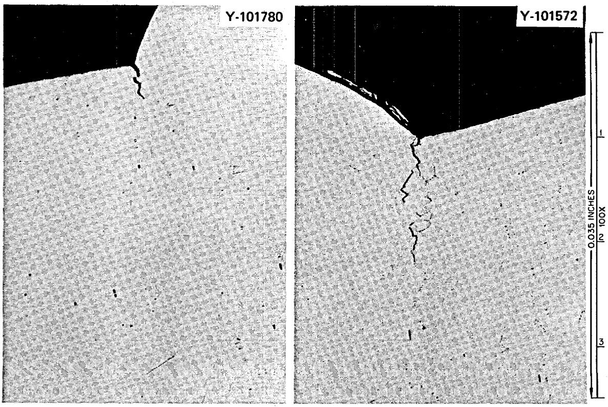  
Fig. 86. Cracks in the root pass of the inlet weld. The cracks occurred at the fusion line and likely resulted from the poor fit-up of the parts. As polished.

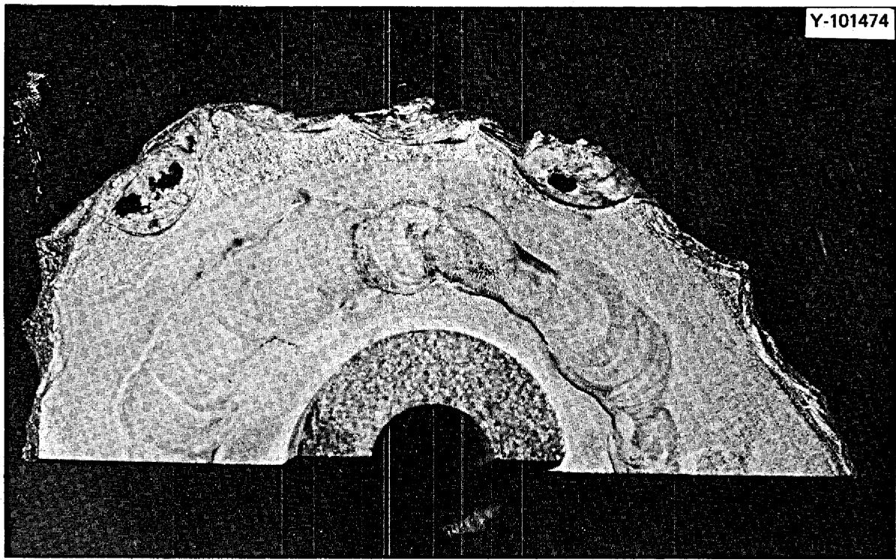  
Fig. 87. Underside (salt side) of half of the INOR-8 thermocouple well from the inlet line to the MSRE radiator. The part was acid etched and coated with dye penetrant. Note the indication of a crack around most of the weld and an incomplete root pass region.

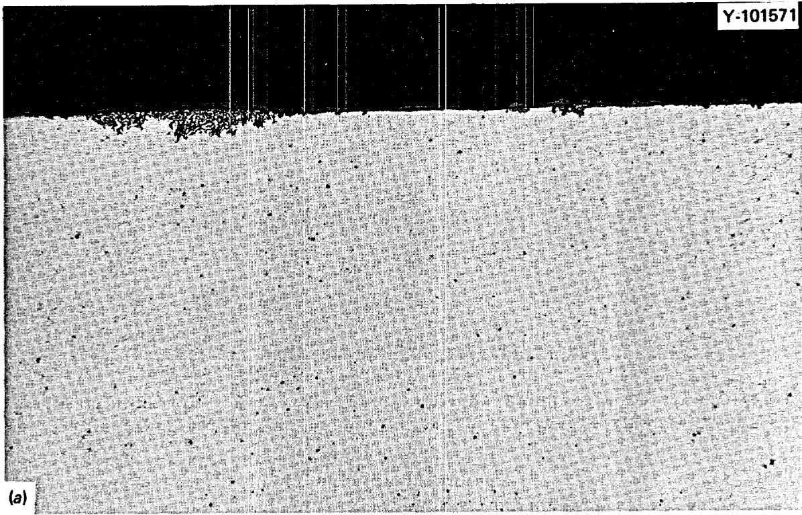  
0.035 INCHES 100X

Fig. 88. Oxide formed on the outside of the 5-in. INOR-8 coolant line. As polished. (a) $100 \times$ ; (b) $500 \times$ .   
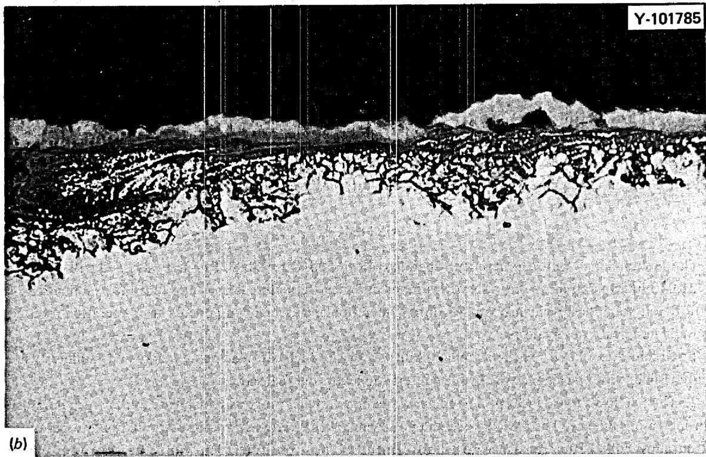  
10.007 in. 1 10.005 in. 1 500x 10.003 in. 1 10.001 in.

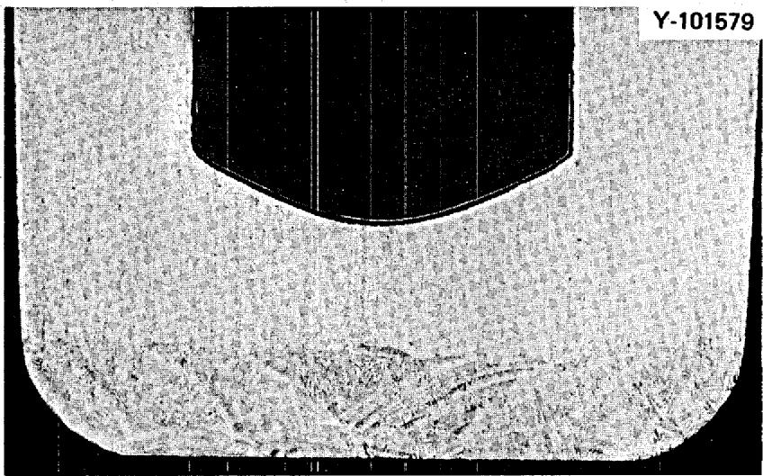  
Fig. 89. Cross section of the inlet INOR-8 thermocouple well. The outside was exposed to coolant salt, and the inside contained the thermocouple in air. $8 \times$ ; as polished.

# Summary of Observations

The surfaces of the radiator (tubes and thermocouple wells) that were exposed to air formed a shallow adherent oxide, while the surfaces exposed to salt were clean and showed no evidence of corrosion. Two slight modifications of microstructure were noted. A shallow layer on the inside surface of the tubing etched more readily, and we attribute this to contamination of the tubing by fabrication lubricants. A structural modification near the surface of the machined thermocouple well was similar to that noted on surveillance specimens and is attributed to the effects of cold working on carbide precipitation.

The cracked weld where the inlet thermocouple well was attached to the 5-in. pipe header likely resulted from poor fit of the parts during welding. The crack probably formed when the weld was being made, and it is encouraging that it did not propagate further during service.

# SUMMARY

The Molten-Salt Reactor Experiment operated above $500^{\circ}\mathrm{C}$ for 30,807 hr and was filled with fuel salt for 21,040 hr. Operation of the system was never detained by materials problems, but the examination of INOR-8 and graphite surveillance samples during operation and several components after operation resulted in several important observations.

1. Graphite exhibited excellent compatibility with the fuel salt. Machining marks and numbers were clearly visible, with no evidence of chemical interaction with the fuel salt.   
2. The INOR-8 surveillance specimens clearly demonstrated a progressive decrease in the creep ductility with increasing fluence. The MSRE vessel did not become brittle enough to cause termination of operation, but an alloy with better resistance to embrittlement by neutron irradiation will be necessary for power reactors with a 30-year design lifetime. Considerable progress has been made in developing a modification of INOR-8 that contains $2\%$ Ti and has improved resistance to embrittlement.[35]

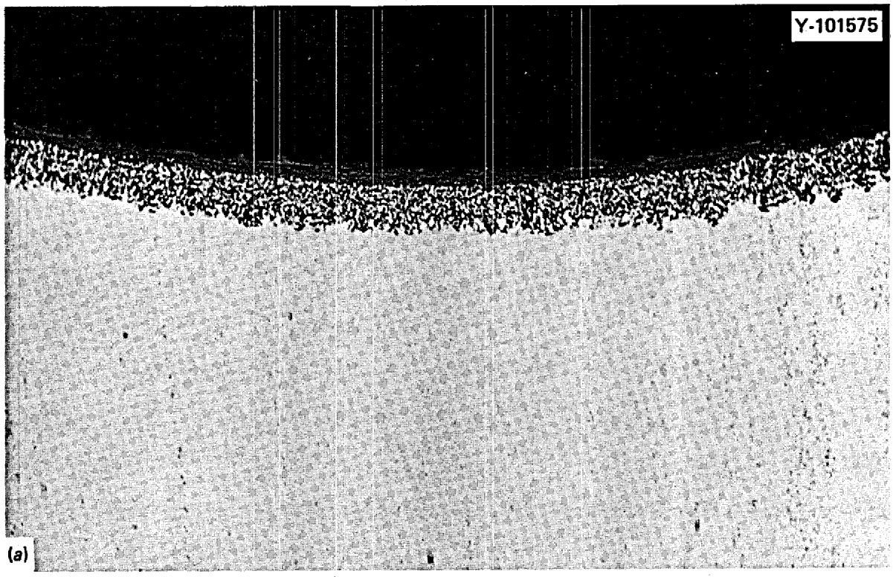  
0.035 INCHES 100x

Fig. 90. Oxide inside the inlet INOR-8 thermocouple well. As polished. (a) At the bottom; (b) transition in depth about $\frac{1}{8}$ in. from bottom of well.   
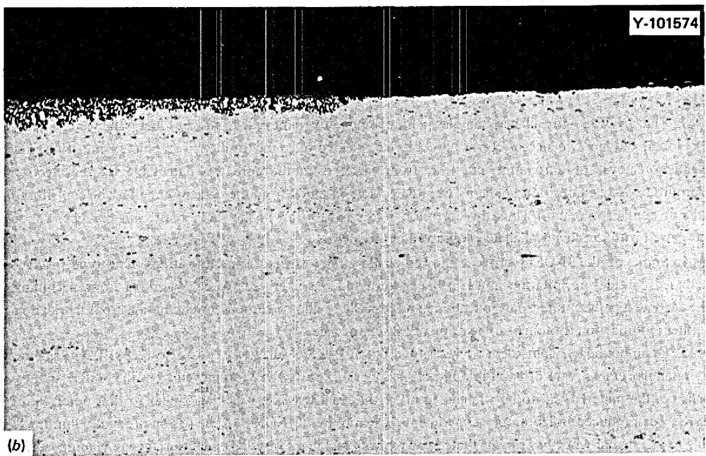  
0.035 INCHES 100X

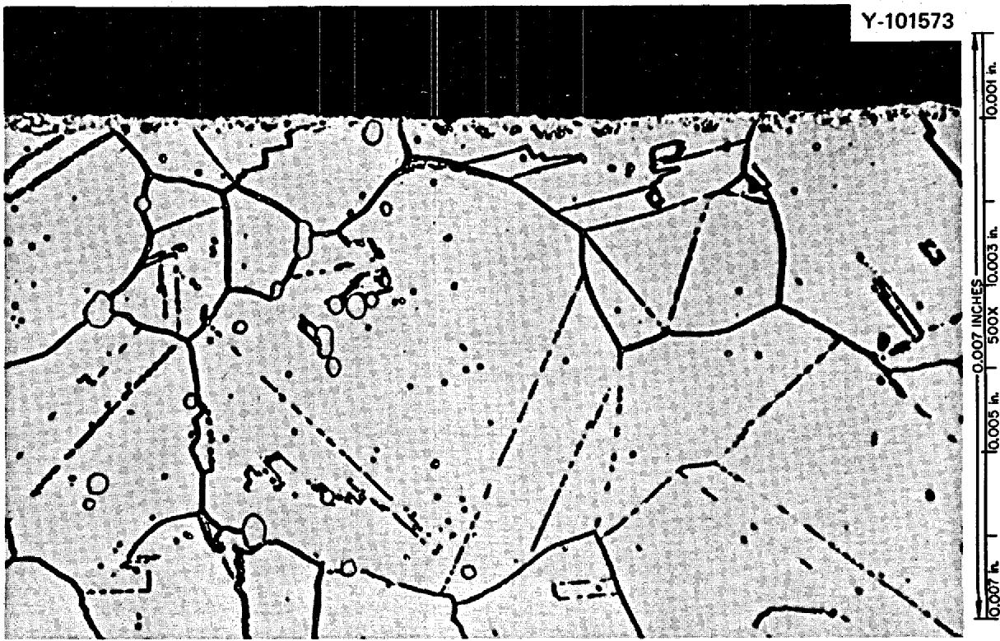  
Fig. 91. The outside of the inlet INOR-8 thermocouple well that was exposed to coolant salt. Note the modified layer near the outer surface. Etchant: glyceria regia.

3. The INOR-8 surveillance samples and components removed from the fuel salt were slightly discolored, but no evidence of corrosion could be detected by standard metallographic examination. The selective removal of chromium and iron from metal from the core was detectable by the electron microprobe. No composition gradients were detectable in metal from the coolant circuit. (The coolant salt did not contain uranium.) Thus the corrosion rate was very low in the fuel circuit, and this observation agrees well with the chemical changes observed in the fuel salt.[36]   
4. Some of the INOR-8 surfaces showed shallow microstructural modifications. One type involved increased carbide precipitation in a lamellar pattern and was likely due to cold working from machining. The second type was noted only on tubing and was likely due to carbon contamination from fabrication. Neither modification is thought to be of practical significance.   
5. Grain-boundary embrittlement was noted on all INOR-8 surfaces exposed to fuel salt. The shallow intergranular cracks were often visible in polished sections of INOR-8 as removed from the MSRE. In most instances the material had to be strained to make the cracks visible. Cracking similar to that noted in the MSRE was produced in laboratory experiments by exposure of INOR-8 to the fission product tellurium.[37] This experimental work has shown that the extent of cracking is very dependent on the alloy composition.   
6. Freeze valve 105 failed from thermal fatigue due to improper construction and not from a basic materials problem.

7. A crack was noted in the weld that attached the thermocouple well to the radiator coolant salt header. This crack was restricted to the root pass and was likely a result of poor fit-up of the parts. The crack probably formed when the weld was made and did not propagate during service.   
8. Oxide films were formed on all the INOR-8 surfaces exposed to air or the cell environment of nitrogen containing 2 to $5\% \mathrm{O}_2$ . The oxide generally consisted of a uniform surface layer about 1 mil thick and a selective oxidation front extending to a depth of 4 or 5 mils. This depth and type of oxidation are what would be expected for an alloy that contains only $7\%$ Cr, such as INOR-8.   
9. A copper sample capsule that had been in the fuel salt pump bowl for several thousand hours was very brittle. Chemical analysis showed that constituents of the fuel salt and INOR-8 had penetrated the copper, but the element responsible for the embrittlement was not identified.

# ACKNOWLEDGMENT

The observations in this report cover several years and include contributions from many individuals. W. H. Cook and A. Taboada designed the surveillance fixture, and W. H. Cook was responsible for its assembly and disassembly. The MSRE operations staff, headed by P. N. Haubenreich, exercised extreme care in handling the surveillance fixture and in removing the various components for examination. The Hot-Cell Operation Staff, headed by E. M. King, developed several special tools and techniques for various examinations and tests of materials from the MSRE. The metallography was performed by H. R. Tinch, E. H. Lee, N. M. Atchley, and E. R. Boyd. The microprobe scans were made by T. J. Henson and R. S. Crouse. The mechanical property tests were performed by B. C. Williams, H. W. Kline, J. W. Chumley, L. G. Rardon, and J. C. Feltner. The chemical analyses were performed under the supervision of W. R. Laing, E. I. Wyatt, and J. Carter. Assistance was received from several members of the Reactor Chemistry Division in several phases of this work. J. W. Koger, J. R. DiStefano, P. N. Haubenreich, and J. R. Weir reviewed the manuscript of this report and made many helpful suggestions. Kathy Gardner made the original drafts of this report, and the drawings were prepared by the Graphic Arts Department.

# INTERNAL DISTRIBUTION

# (94 copies)

(3) Central Research Library

ORNL - Y-12 Technical Library

Document Reference Section

(20) Laboratory Records Department

Laboratory Records, ORNL R.C.

ORNL Patent Office

G.M. Adamson, Jr.

C.F.Baes

C.E.Bamberger

R. Blumberg

E.G.Bohlmann

R. B. Briggs

S. Cantor

E. L. Compere

W. H. Cook

J. L. Crowley

F. L. Culler

J. E. Cunningham

J.M.Dale

J.H.DeVan

J.R.DiStefano

J.R.Engel

D. E. Ferguson

J.H.Frye,Jr.

W. R. Grimes

R. H. Guymon

W. O. Harms

P. N. Haubenreich

(3) M. R. Hill

W. R. Huntley

H. Inouye

P. R. Kasten

R.J.Kedl

J.W.Koger

A. L. Lotts

R. N. Lyon

H. G. MacPherson

R. E. MacPherson

W. R. Martin

R.W.McClung

(5) H. E. McCoy

C. J. McHargue

H. A. McLain

(5) B. McNabb

L. E. McNeese

A. S. Meyer

R.B.Parker

P. Patriarca

A.M.Perry

M. W. Rosenthal

H. C. Savage

Dunlap Scott

J. L. Scott

J.H.Shaffer

G. M. Slaughter

G.P. Smith

R. A. Strehlow

R. E. Thoma

D.B.Trauger

A.M.Weinberg

J.R.Weir

J.C. White

L.V.Wilson

# EXTERNAL DISTRIBUTION

# (24 copies)

BABCOCK & WILCOX COMPANY, P.O. Box 1260, Lynchburg, VA 24505

B. Mong

BLACK AND VEATCH, P.O. Box 8405, Kansas City, MO 64114

C. B. Deering

BRYON JACKSON PUMP, P.O. Box 2017, Los Angeles, CA 90054

G.C.Clasby

CABOT CORPORATION, STELLITE DIVISION, 1020 Park Ave., Kokomo, IN 46901 T. K. Roche   
CONTINENTAL OIL COMPANY, Ponca City, OK 74601 J. A. Acciarri   
EBASCO SERVICES, INC., 2 Rector Street, New York, NY 10006   
D.R.deBoisblanc   
T. A. Flynn   
THE INTERNATIONAL NICKEL COMPANY, Huntington, WV 25720 J. M. Martin   
UNION CARBIDE CORPORATION, CARBON PRODUCTS DIVISION, 12900 Snow Road, Parma, OH 44130 R. M. Bushong   
USAEC, DIVISION OF REACTOR DEVELOPMENT AND TECHNOLOGY, Washington, DC 20545 David Elias   
J. E. Fox Norton Haberman   
C. E. Johnson   
T.C.Reuther   
S.Rosen   
Milton Shaw   
J. M. Simmons   
USAEC, DIVISION OF REGULATIONS, Washington, DC 20545  
A. Giambusso   
USAEC, RDT SITE REPRESENTATIVES, Oak Ridge National Laboratory, P.O. Box X, Oak Ridge, TN 37830   
D.F.Cope   
Kermit Laughon   
C. L. Matthews   
USAEC, OAK RIDGE OPERATIONS, P.O. Box E, Oak Ridge, TN 37830 Research and Technical Support Division   
USAEC, TECHNICAL INFORMATION CENTER, P.O. Box 62, Oak Ridge, TN 37830 (2)