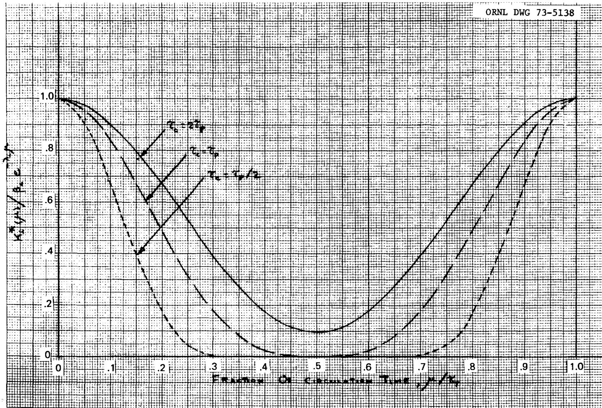

# IMPROVED REPRESENTATION OF SOME ASPECTS OF CIRCULATING-FUEL REACTOR KINETICS

B. E. Prince

OAK RIDGE NATIONAL LABORATORY

OPERATED BY UNION CARBIDE CORPORATION • FOR THE U.S. ATOMIC ENERGY COMMISSION

This report was prepared as an account of work sponsored by the United States Government. Neither the United States nor the United States Atomic Energy Commission, nor any of their employees, nor any of their contractors, subcontractors, or their employees, makes any warranty, express or implied, or assumes any legal liability or responsibility for the accuracy, completeness or usefulness of any information, apparatus, product or process disclosed, or represents that its use would not infringe privately owned rights.

Contract No. W-7405-eng-26

REACTOR DIVISION

IMPROVED REPRESENTATION OF SOME ASPECTS OF CIRCULATING-FUEL REACTOR KINETICS

B. E. Prince

MAY 1973

# NOTICE

This report was prepared as an account of work sponsored by the United States Government. Neither the United States nor the United States Atomic Energy Commission, nor any of their employees, nor any of their contractors, subcontractors, or their employees, makes any warranty, express or implied, or assumes any legal liability or responsibility for the accuracy, completeness or usefulness of any information, apparatus, product or process disclosed, or represents that its use would not infringe privately owned rights.

OAK RIDGE NATIONAL LABORATORY

Oak Ridge, Tennessee 37830

operated by

UNION CARBIDE CORPORATION

for the

U.S. ATOMIC ENERGY COMMISSION

# CONTENTS

Page

Preface . . . . . . . . . . . . . . . . . . . . . . . . . . . . . . . . v   
Abstract. 1   
Introduction. 2   
Background. 2   
Mathematical Description. 5   
Example of Delayed Neutron Kernal Calculations. 18   
Discussion of Results and Future Extensions 22   
Appendix 26   
References. 32

# PREFACE

# P. N. Haubenreich

The formulations that are presented here were worked out by Blynn Prince in 1968 in connection with his analysis of the kinetics of the Molten-Salt Reactor Experiment with $^{233}\mathrm{U}$ fuel. Although he made some significant progress toward an improved mathematical description of circulating-fuel reactor kinetics, the work was suspended and these results were not previously reported because of a contraction of reactor analysis effort in the Molten-Salt Reactor Program that involved the assignment of the author to a different program. Whether or not molten salt reactor development work is continued in the future, the results contained here may be of interest from the standpoint of theoretical reactor kinetics analyses. They also indicate a starting point that could lead to improved, practical computations of molten-salt reactor kinetics. As such they are recorded here for possible future use.

# IMPROVED REPRESENTATION OF SOME ASPECTS

# OF CIRCULATING-FUEL REACTOR KINETICS

B. E. Prince

# Abstract

The general space-energy dependent reactor kinetic equations for a circulating-fuel reactor were studied to help determine the type of mathematical representation most appropriate for analysis and computation of reactor transient behavior. It is shown that, with inclusion of fluid transport terms in these equations, the application of the usual adjoint-weighting and integration techniques used to derive "global" kinetic equations from the general equations do not result in the usual set of time-dependent ordinary differential equations associated with stationary-fuel reactor-kinetics. However, a time-dependent integro-differential equation describing the kinetics of the neutron population can still be obtained. General formulas for calculating the weighted delayed-neutron precursor kernels in this equation are given, and a numerical example is included which illustrates the nature of the solution. Directions are also suggested for calculating the analogous weighted temperature-distribution kernels for analysis of power-temperature kinetics. The qualitative influence of fluid mixing on the kernels is described, and the connections between the distributed parameter and lumped-parameter representations of the system kinetics are also discussed.

# INTRODUCTION

A complete mathematical description of the nuclear fission chain reaction in any power reactor is a formidable task, which is further complicated by circulation of the fuel. Fortunately, for many purposes greatly simplified descriptions are sufficient - as Weinberg and Wigner point out, the first full-scale reactors (Hanford) were designed with desk calculators and slide rules.2 More detailed analyses are increasingly desirable, however, as reactor designs are refined to obtain higher performance without compromising reliability and safety. As part of the vast growth in reactor technology, analysis of stationary-fuel reactors has evolved to a high level. Representation of the unique aspects of the kinetics of circulating-fuel reactors has naturally received much less attention and so has advanced to a lesser degree. Methods were developed for representing the latest circulating-fuel reactor, the Molten-Salt Reactor Experiment, that proved to be quite adequate for that purpose. But design of large-scale, high-performance MSR power plants would undoubtedly lead to demands for improved kinetics calculations. The work described in this report is intended to help lay the groundwork for these calculations.

# BACKGROUND

In the analysis of reactor dynamics, wide use has always been made of the so-called "point" kinetics model. The great utility of this space-independent model is largely a result of the ability to decompose the problem of calculating the gross details of the time dependence of a system from the multi-dimensional problem of calculating the neutron distribution. Although the early reactor physics literature contains some discussion of the relation between the point kinetics model and the complete mathematical description of the time-dependent neutron population,[2,3] to the writer's knowledge, the first rigorous exposition of the relation, showing its derivation from the time-dependent Boltzmann equation, and describing the criteria for the point-kinetics equations to provide a precise description of the system motion, was given in 1958 by A. F. Henry.[4]

The derivation of the point kinetics equations is ordinarily carried out for the case of a stationary-fueled reactor. Although the point kinetics approximation has been applied to circulating-fuel reactors, if one begins at the most basic level to describe a circulating fluid-fueled reactor, it is somewhat more natural to consider an Eulerian type of description of the basic mathematical relations between the important variables such as flux, precursor densities, and temperatures. One is then led to inquire what differences in mathematical formalism from the standard point-kinetics equations are suggested for the practical analysis of circulating-fuel-reactor kinetics problems.

The reactor physics literature describes many different investigations of the unusual aspects of circulating-fuel-reactor-kinetics, of which references 5-10 are significant examples. These unusual aspects are especially well identified in a 1962 article by B. Wolfe9 in which he considers, inter alia, the direct effects of motion imparted to the entire neutron population by the moving fluid. Wolfe concludes that, except in very severe reactor accident conditions, the special reactivity effects so introduced are quite small. On the other hand, in the calculation of the delayed neutron precursor distributions and effectiveness in a circulating-fuel reactor, he reemphasizes the importance of an accurate mathematical description of the fluid motion effects in kinetics analysis.

Of the variety of mathematical models which have been used in studies of the kinetic behavior of circulating fuel reactors, most can be designated as "special purpose approximations," useful for the analysis of particular characteristics or regimes of the system motion, but each neglecting certain features of the physical system which would be required for other applications. For example, analyses focusing mainly on determining the conditions for ultimate dynamic stability of the reactor core will often neglect the effects of the delayed neutrons. In another case, studies of reactor transients under abnormal, or accident conditions, which occur on a time scale less than, or comparable to, the transit time of a fluid particle through the core, can often neglect the description of the system external to the core, together with any transients in the temperature or precursor concentrations in the fluid re-entering the core. As an example, the ZORCH program, developed for studies of the nuclear safety of the

MSRE, $^{11}$ is based on this approach. ZORCH uses a simplified treatment of the delayed neutron precursor dynamics based on an "effective" delayed fraction, which gives the correct initial normalization for the reactivity margin between delayed and prompt critical. The main effort is then given to a numerical treatment of the distributed parameter problem of heat convection and temperature feedback during the transient.

Other investigations connected with the MSRE were aimed at describing the reactor dynamic characteristics appropriate to a time scale comparable to, or larger than, the core transit time.12 Here the entire circulating system, including the heat exchanger, must be included in the description. The general approach has been to develop a "lumped parameter" model for the system, which provides an adequate description of the dynamics of the power, precursor concentrations, and temperatures, for the purposes intended.

The various investigations of the kinetics of the MSRE and subsequent MSR designs are briefly described in a recent memorandum by Haubenreich. $^{13}$ All involve approximations of one kind or another that limit the general applicability of the methods. If further development of molten-salt reactors takes place, it seems likely that kinetics-computational models which are of greater generality and flexibility would ultimately be required for the analysis of routine nuclear operations, kinetics experiments, and unusual occurrences. The investigations reported here were initiated with this general philosophy in mind. They are aimed at analyzing some of the most important consequences of the fuel motion in practical kinetics computations and the interpretation of kinetics experiments for circulating-fuel reactors. Although differing in emphasis, the approach has much in common with some of the past investigations mentioned above. However, we wish to focus on certain aspects of the differences in mathematical formulation and practical computation with the kinetics equations which, in our opinion, previous studies have not sufficiently developed and clarified. In this writing, we shall consider in detail only the simplest case of interest, the case of negligible temperature feedback effects, or the "zero-power" case. However, following the discussion of this case, we will indicate some connections to the case of temperature-dependent kinetics.

# MATHEMATICAL DESCRIPTION

In the case where one is able to neglect the direct effects of fluid motion on the neutron population, as described in the preceding section, one can show that the main line of Henry's derivation can be carried over to the circulating-fuel reactor, and that the form obtained for the resulting "global," or space-lethargy-integrated kinetic equation governing the magnitude of the neutron population is the same as in the stationary fuel case. This is demonstrated mathematically in the Appendix of this report. In each case, the resulting kinetic equation for the neutron population magnitude is,

$$
\frac {\mathrm {d} \mathrm {T}}{\mathrm {d} t} = \frac {\rho - \bar {\beta}}{\Lambda} \mathrm {T} + \sum_ {i = 1} ^ {6} \lambda_ {i} c _ {i}, \tag {1}
$$

where $T(t)$ is a time-dependent amplitude function, obtained by factoring the general transient flux distribution, $\Phi(\underline{r}, u, t)$ , into a product of $T(t)$ and a normalized "shape" function, $\phi(\underline{r}, u, t)$ . In Eq. 1, the source terms, $\lambda_i c_i$ , associated with decay of delayed neutron precursors have the form,

$$
\lambda_ {i} c _ {i} (t) = \frac {1}{\Lambda F} \int_ {R} \int_ {u} \lambda_ {i} C _ {i} (\underline {{r}}, t) f _ {d i} (u) \phi_ {o} ^ {*} (\underline {{r}}, u) d \underline {{r}} d u. \tag {2}
$$

Here, $C_i (\underline{r}, t)$ is the local density of precursors for the $i^{\text{th}}$ delayed group, $f_{di}(\mathbf{u})$ are the lethargy spectra of delayed neutron emission (each normalized to unity), $\phi_o^* (\underline{r}, \mathbf{u})$ is the solution of the adjoint equation for a reference reactor condition, and $R$ is the reactor volume. As Henry's derivation shows (see Appendix), the parameters $\rho(t)$ , $\Lambda(t)$ , and $\overline{\beta}(t)$ are defined quantities which intrinsically require knowledge of the time-dependent neutron distribution for their exact calculation, but which are useful because they can be closely approximated by simpler indirect calculations, in many practical cases. The parameter, $\rho(t)$ , is the reactivity change, relative to a reference, stationary state of the reactor, where there is no circulation of the fuel. The parameter, $\Lambda(t)$ , is the prompt-neutron generation-time, and $\overline{\beta}(t)$ is the effective delayed neutron fraction,

weighted according to the lethargy spectra of delayed neutron emissions. Mathematical definitions for all these quantities are given in the Appendix. The factor $F(t)$ , is a normalized rate-of-production (of prompt neutrons plus precursors). This factor is included in the definition of $\rho$ , $\Lambda$ , and $\overline{\beta}$ , but in such a way that the ratio $(\rho - \beta) / \Lambda$ in Eq. (1), and the product $\Lambda F$ in Eq. (2) are independent of its magnitude.

The important difference introduced in the case when the fuel is circulating is in the equation governing $C_i$ ( $r, t$ ). The latter now has the form of a continuity equation,

$$
\frac {\partial C _ {i}}{\partial t} = \beta_ {i} P \Phi - \lambda_ {i} C _ {i} - V \circ \nabla C _ {i} \tag {3}
$$

where $\mathbf{P}$ is a time-dependent linear operator on the flux distribution, such that $\beta_{\mathbf{i}} \mathbf{P} \Phi(\underline{\mathbf{r}}, t)$ is the total production rate of $\mathbf{i}^{\text{th}}$ group precursors at position $\underline{\mathbf{r}}$ and time $t$ . (Here, $\mathbf{P}$ can be regarded as a linear integral operator in the lethargy, which may also depend on position.) The last term on the right-hand side of Eq. 3 represents the spatial transport of precursors by fluid motion, with $\underline{\mathbf{V}}$ as the velocity of the fluid.

In applications to a circulating-fuel reactor such as the MSRE, where the fuel motion was in channels parallel to the core axis, it is sufficient to consider the one-dimensional version of the transport term, $V\partial C_{i} / \partial z$ in Eq. 3. Here, the velocity within an individual channel is assumed to be uniform across the channel, equal to the average axial velocity of the fluid; the velocity may, however, vary according to the radial position of the channel within the reactor. For practical purposes, therefore, our problem is one of including an adequate mathematical treatment of the resulting partial differential equation into the calculation of the global quantities, $c_{j}(t)$ , defined by (2).

As a starting point for mathematical treatment of Eq. (3), the general time-dependent flux distribution, $\Phi (\underline{\mathbf{r}},\mathbf{u},t)$ may, as in the derivation of Eq. (1), be written in form of a product, $\mathrm{T}(t)\phi (\underline{\mathbf{r}},\mathbf{u},t)$ . Then, the source term in Eq. (3) becomes,

$$
\begin{array}{l} \beta_ {i} P \Phi = \beta_ {i} T (t) P \phi , \\ = \beta_ {i} T (t) G (\underline {{r}}, t), \tag {4} \\ \end{array}
$$

where $G(\underline{r}, t)$ is a normalized, time-dependent distribution of fissions in the reactor.

Now, in the analysis of a number of reactor kinetic experiments, we are interested in describing situations where the core properties do not vary markedly during the transient. For these situations, we can approximate the production operator by its time-average values, $\overline{\mathbb{P}}$ , during the transient. It is then conceptually useful to represent the time-dependent normalized flux distribution, $\phi (\underline{\mathbf{r}},\mathbf{u},t)$ by an expansion in a set of basis functions, appropriate to the boundary conditions on the reactor. Although there is some flexibility in the choice of these basis functions, one possible choice is that of the eigenfunctions of the time-independent problem (i.e., the neutron flux equation with the neutron multiplication parameters adjusted to obtain a stationary solution), corresponding to the average material properties during the transient. In this approach, the lead term in the expansion can be chosen to approximate the asymptotic, or persisting neutron distribution which would be associated with this material configuration. $^{14}$ Thus, if we write

$$
\begin{array}{l} \phi (\underline {{r}}, u, t) = \sum_ {k = 0} ^ {\infty} A _ {k} (t) \phi_ {k} (\underline {{r}}, u), (5) \\ P \phi \simeq \bar {P} \phi = \sum_ {k = 0} ^ {\infty} A _ {k} (t) \bar {P} \phi_ {k} (\underline {{r}}, u), \\ = \sum_ {k = 0} ^ {\infty} A _ {k} (t) G _ {k} (\underline {{r}}), (6) \\ \end{array}
$$

then a useful approximation for the treatment of many time-dependent problems may be obtained by dropping all but the lead terms in the above expansions. In the physically time-separable case (i.e., the case where the reactor flux is changing on a stable period), the single-term approximation

becomes an exact description. $^{15}$ Although this approximation also implies that we limit consideration to problems where the initial and asymptotic flux distributions do not differ markedly, as indicated above, many significant kinetics problems are subsumed under this category. For these cases where a single term approximation is sufficient, $A_0(t)$ may be chosen equal to unity by appropriate normalization of the fission distribution, $G_0(\underline{r})$ , and the time-dependence of the precursor source term, Eq. (4), is entirely contained in $T(t)$ .

Alternatively, it may be necessary in some instances to include more than one term in the expansion representation of the flux. For example, another possible approximate procedure would represent the flux as a linear combination of two flux functions, appropriate to the "initial" and "final" configurations of the reactor. The retention of more than one term, or "mode" in the flux expansion generally leads to a system of neutron population amplitude equations, as opposed to the single kinetic equation of the form (1). In this type of description, however, note that Eq. (3) is linear, and superposition of solutions corresponding to individual source terms of the form $\beta_{i} T(t) G(\underline{r})$ can always be applied.

Stemming from the arguments given above, we will consider the mathematical treatment of Eq. (3) for kinetics problems where space-time separability of the source term can be assumed to hold. To simplify our notation, henceforth, we drop further consideration of the expansion subscript, and rewrite Eq. (3) as,

$$
\frac {\partial C _ {i}}{\partial t} + \lambda_ {i} C _ {i} + V \frac {\partial C _ {i}}{\partial z} = \beta_ {i} T (t) G (\underline {{r}}). \tag {7}
$$

To complete the mathematical description of the problem, we require the boundary conditions on Eq. (7). At a given instant of time, the delayed precursor concentration in the fluid must be continuous around the circulation path; moreover, in that part of the circulating system which is "out" of the neutron flux (i.e. beyond the boundary where the neutron flux distribution specified in Eq. (5) vanishes), the delayed emitter concentrations are governed by the homogeneous form of Eq. (7), where the

right-hand side is set equal to zero and $z$ is considered to be a more general position variable, parallel to the direction of average flow. To a close approximation, the flow velocity $\underline{v}$ can be assumed constant in various subregions of the circulation path, and to undergo rapid transitions between these regions (e.g. between the core and the external piping).

As determined by Eq. 7, the delayed emitter concentrations $C_i$ are dependent on three space dimension variables, through the source distribution $G(\underline{r})$ . Our present interest is in applications where channelled flow in cylindrical geometry with near-azimuthal symmetry is appropriate such as was the case for the MSRE. For this case, in addition to the time dependence, the delayed emitter concentrations will vary with axial location along a channel and with the radial position of the channel within the core. With the MSRE as an example, it is clear that the hydraulic design of the circulating system has the effect of radially smoothing and averaging of the concentrations exiting at a given instant from the channelled region, and of providing essentially a radially uniform concentration of emitters entering the channels. Because of this feature, it is necessary to carry out the integration of Eq. 7 along specified channels, radially average the concentrations exiting from the channels, and then continue the integration along the remainder of the path of circulation. The treatment of the radial dependences presents no problem in principle, although the mechanics of the computation become more involved. Because we wish to focus attention on certain other aspects of the mathematical treatment of Eq. 7, we limit consideration here to the case where the flux and fission distributions depends on only one space variable, corresponding to the axial direction of flow.

Laplace transform theory provides a convenient and general approach to the treatment of Eq. 7. To apply this approach, it is useful to first separate the problem of obtaining the initial conditions in time, the distributions $C_{i} (z, t = o) = C_{io}(z)$ , from that of solving the time-dependent equation. In many cases of physical interest, steady-state conditions will prevail at $t = o$ , and the $C_{io}(z)$ are determined by,

$$
V \frac {\partial C _ {i o}}{\partial z} + \lambda_ {i} C _ {i o} = \beta_ {i} T (o) G (z). \tag {8}
$$

Subtracting Eq. 8 from Eq. 7, we obtain a similar partial differential equation for the change in emitter concentrations, $\mathbf{E}_{\mathbf{i}} = \mathbf{C}_{\mathbf{i}} - \mathbf{C}_{\mathbf{i0}}$ , which has zero initial conditions on the dependent variable,

$$
\frac {\partial \mathrm {E} _ {i}}{\partial t} + \lambda_ {i} \mathrm {E} _ {i} + V \frac {\partial \mathrm {E} _ {i}}{\partial z} = \beta_ {i} (\mathrm {T} (t) - \mathrm {T} (0)) \mathrm {G} (z). \tag {9}
$$

Although the Laplace transform technique can be applied directly to the solution of Eq. 9, one should first observe the $\mathrm{T}(t)$ is not an arbitrarily specified function of time; rather, as indicated previously, it is determined by the "global" time-dependent equation for the neutron population, required to complete the description of the system dynamics. This latter equation and the delayed emitter equations are coupled through terms of the form (2). Eliminating the dependent variables $C_i$ by solving Eqs. 7 in terms of $\mathrm{T}(t)$ is equivalent to replacing the space-lethargy-integrated, system-kinetics equations by a single Volterra integro-differential equation in the time variable. A direct route to this end is to obtain the solution of Eq. 9 in terms of the "impulse" response,[16] the response when the source term in Eq. 9 is concentrated as a delta function at $t = \xi$ . Thus, if we denote $E_i$ by $K_i$ for this special case,

$$
\begin{array}{l} \frac {\partial K _ {i}}{\partial t} + \lambda_ {i} K _ {i} + \gamma \frac {\partial K _ {i}}{\partial z} = \beta_ {i} \delta (t - \xi) G (z) \quad \text {i n c o r e r e g i o n} \tag {10} \\ = 0 \quad \text {i n} \\ \end{array}
$$

The same initial and boundary conditions apply to Eqs. 9 and 10. Once the impulse response of the system is obtained, by using linear superposition and the properties of the delta function, we may set

$$
E _ {i} (z, t) = \int_ {0} ^ {t} K _ {i} (z, t - \xi) [ T (\xi) - T (o) ] d \xi \tag {11}
$$

and from the above definition of $\mathbf{E}_i$ , together with the solution of Eq. 8,

$$
C _ {i} (z, t) = C _ {i o} (z) + \int_ {0} ^ {t} K _ {i} (z, t - \xi) [ T (\xi) - T (o) ] d \xi 。 \tag {12}
$$

Finally we may obtain integral expressions for the central quantities of interest by substituting (12) in the "global" delayed neutron source terms defined by Eq. 2. Upon interchanging the order of the time integration and the space-lethargy integrations, these may be written in the form,

$$
\lambda_ {i} c _ {i} = \frac {\lambda_ {i} C _ {i o} ^ {*}}{\Lambda F} + \frac {1}{\Lambda F} \int_ {0} ^ {t} \lambda_ {i} K _ {i} ^ {*} (t - \xi) [ T (\xi) - T (o) ] d \xi \tag {13}
$$

where we define,

$$
C _ {i o} ^ {*} = \int_ {o} ^ {H} \int_ {u} C _ {i o} (z) f _ {d i} (u) \phi_ {o} ^ {*} (z, u) d z d u, \tag {14}
$$

$$
\mathrm {K} _ {\mathrm {i}} ^ {*} (\mathrm {t} - \xi) = \int_ {\mathrm {o}} ^ {\mathrm {H}} \int_ {\mathrm {u}} \mathrm {K} _ {\mathrm {i}} (\mathrm {z}, \mathrm {t} - \xi) f _ {\mathrm {d i}} (\mathrm {u}) \phi_ {\mathrm {o}} ^ {*} (\mathrm {z}, \mathrm {u}) \mathrm {d z} \mathrm {d u}, \tag {15}
$$

and $0 \leq z \leq H$ represents the region of the flow path in which the neutron flux and adjoint functions are non-zero.

The kinetic equation (1) for the flux magnitude now becomes

$$
\mathrm {d} \mathrm {T} / \mathrm {d} t = \frac {\rho - \bar {\beta}}{\Lambda} \mathrm {T} + \sum_ {\mathbf {i}} \frac {\lambda_ {\mathbf {i}} C _ {\mathbf {i o}} ^ {*}}{\Lambda F} + \sum_ {\mathbf {i}} \frac {\lambda_ {\mathbf {i}}}{\Lambda F} \int_ {0} ^ {t} K _ {\mathbf {i}} ^ {*} (t - \xi) [ T (\xi) - T (o) ] d \xi , \tag {16}
$$

or if we define the effective fraction, $\overline{\beta}_{ic}$ of $i^{\text{th}}$ -group delayed neutrons emitted under conditions of steady-state circulation and stationary neutron population,

$$
\bar {\beta} _ {i c} = \frac {\lambda_ {i} C _ {i o} ^ {*}}{F T (o)}, \tag {17}
$$

then the modified form of the neutron population kinetic equation is,

$$
d T / d t = \frac {\rho - \bar {\beta}}{\Lambda} T + \sum_ {i} \frac {\bar {\beta} _ {i c} T (o)}{\Lambda} + \sum_ {i} \frac {\lambda_ {i}}{\Lambda F} \int_ {0} ^ {t} K _ {i} ^ {*} (t - \xi) [ T (\xi) - T (o) ] d \xi . \tag {18}
$$

In this form, it may readily be seen that stationary conditions of the neutron population will prevail when the reactivity has a small positive magnitude equal to the net "loss" of $\beta$ due to circulation, i.e.,

$$
\rho_ {o} = \bar {\beta} - \sum_ {i} \bar {\beta} _ {i c}. \tag {19}
$$

As a result of reformulating the kinetic equation as a single time-dependent integro-differential equation, it is possible to regard the calculation of the adjoint-weighted impulse responses, or kernel function, $\mathbf{K}_1^*$ , as a fundamental element of circulating-fuel reactor-kinetics analysis. The remainder of this section, therefore, is devoted to obtaining explicit mathematical expressions for these functions.

Since $\xi$ is to be regarded as a fixed time in Eq. 10, one may simplify (10) by shifting the origin of time to this point. This is equivalent to replacing the variable $t$ by $\mu = t - \xi$ , where $\mu$ is the "age" between the application of the impulse and the evaluation of the response. Denoting the unilateral Laplace transform of $\mathbf{K}_{i}$ with respect to the variables $\mu$ by,

$$
\overline {{\mathrm {K}}} _ {i} (z; s) = \int_ {0} ^ {\infty} e ^ {- s \mu} \mathrm {K} _ {i} (z, \mu) d \mu , \tag {20}
$$

we may obtain the transform of Eq. 10 as,

$$
\begin{array}{l} s \bar {K} _ {i} + \lambda_ {i} \bar {K} _ {i} + V \frac {\partial \bar {K} _ {i}}{\partial z} = \beta_ {i} G (z) \quad i n c o r e r e g i o n (21a) \\ = 0 \quad \text {i n} (21b) \\ \end{array}
$$

Since the transformed equation can be treated as an ordinary differential equation, its solution, obeying the conditions of continuity along the circulation path, is easily obtained. The integration of (21a) along the path through the core yields,

$$
\overline {{K}} _ {i} (z; s) = \overline {{K}} _ {i} (o; s) e ^ {- (s + \lambda_ {i}) \frac {z}{V _ {c}}} + \int_ {o} ^ {z} \beta_ {i} e ^ {- (s + \lambda_ {i}) \left(\frac {z - z ^ {\prime}}{V _ {c}}\right)} G (z ^ {\prime}) \frac {d z ^ {\prime}}{V _ {c}}, \tag {22a}
$$

Where $V_{c}$ is the fluid velocity in the core region. Similarly, integration of (21b) between $z = H$ and $z = 0$ (the entrance and exit of the external piping) results in,

$$
\overline {{\mathrm {K}}} _ {\mathrm {i}} (\mathrm {o}; \mathrm {s}) = \overline {{\mathrm {K}}} _ {\mathrm {i}} (\mathrm {H}; \mathrm {s}) e ^ {- (s + \lambda_ {\mathrm {i}}) \frac {\mathrm {L}}{\mathrm {V}}} \mathrm {p} = \overline {{\mathrm {K}}} _ {\mathrm {i}} (\mathrm {H}; \mathrm {s}) e ^ {- (s + \lambda_ {\mathrm {i}}) \tau} \mathrm {p}, \tag {22b}
$$

where $L$ , $V_p$ , and $\tau_p$ are the effective length, fluid velocity, and residence time in the region designated as external piping.

Equations $22a$ and $22b$ constitute the complete system of relations necessary to solve for the transforms of the kernel functions $\overline{\mathbf{K}}_i(z;s)$ . For example, setting $z = H$ in $(22a)$ and then substituting $(22b)$ into $(22a)$ results in the following relation for $\overline{\mathbf{K}}_i(H;s)$ ,

$$
\bar {K} _ {i} (H; s) = \bar {K} _ {i} (H; s) e ^ {- (s + \lambda_ {i}) (\tau c + \tau p)} + \int_ {0} ^ {H} \beta_ {i} e ^ {- (s + \lambda_ {i}) \left(\frac {H - z ^ {\prime}}{V _ {c}}\right)} G (z ^ {\prime}) \frac {d z ^ {\prime}}{V _ {c}}, \tag {23}
$$

where $\tau_{\mathrm{c}} = \mathrm{H} / V_{\mathrm{c}}$ is the fluid residence time in the core region.

We next consider the inversion of the transforms in Eqs. 22 and 23, in order to obtain the explicit relations for $\mathbf{K}_{\mathbf{i}}$ in the time domain. To accomplish this, while still retaining the general form for the functional dependence of the fission distribution, $G(z)$ , it is necessary to invoke some formal mathematical manipulations involving delta functions, whose rigorous justification requires the theory of generalized functions, or "distributions" (see Ref. 16, Appendix A). We will not attempt to present rigorous proofs here. Instead, after indicating these manipulations and the resulting formulas, we will discuss the results in terms of a specific

example which does not require these formal manipulations. In the development given below, use is made of the following important property of the Laplace transform:

-as

Translation Property: The inverse transform of the product $e \cdot \overline{f}(s)$ is $f(t - a)$ , where $f(t) = 0$ when $t < 0$ .

To carry out the formal inversion of the transforms in Eq. 23, we interchange the order of the spatial integration and inversion, and employ the translation property in both terms on the right-hand side of the equation. Thus

$$
\mathrm {K} _ {\mathrm {i}} (\mathrm {H}, \mu) = \mathrm {K} _ {\mathrm {i}} (\mathrm {H}, \mu - \tau_ {\mathrm {T}}) e ^ {- \lambda_ {\mathrm {i}} \tau_ {\mathrm {T}}} + \int_ {\mathrm {o}} ^ {\mathrm {H}} \beta_ {\mathrm {i}} \delta (\mu - \frac {\mathrm {H} - \mathrm {z} ^ {\prime}}{\mathrm {V} _ {\mathrm {c}}}) e ^ {- \lambda_ {\mathrm {i}} \left(\frac {\mathrm {H} - \mathrm {z} ^ {\prime}}{\mathrm {V} _ {\mathrm {c}}}\right)} \mathrm {G} (\mathrm {z} ^ {\prime}) \frac {\mathrm {d z} ^ {\prime}}{\mathrm {V} _ {\mathrm {c}}} ， \tag {24}
$$

where $\tau_{\mathrm{T}} = \tau_{\mathrm{c}} + \tau_{\mathrm{p}}$ is the total circuit time. Next, performing the spatial integration in the second term and again making use of the formal properties of the delta function, we obtain the basic recurrence relation,

$$
\mathrm {K} _ {\mathbf {i}} (\mathrm {H}, \mu) = 0 \quad \text {i f} \mu <   0 \tag {25a}
$$

$$
\mathrm {K} _ {\mathrm {i}} (\mathrm {H}, \mu) = \mathrm {K} _ {\mathrm {i}} (\mathrm {H}, \mu - \tau_ {\mathrm {T}}) e ^ {- \lambda_ {\mathrm {i}} \tau_ {\mathrm {T}}} + \beta_ {\mathrm {i}} e ^ {- \lambda_ {\mathrm {i}} \mu} G (\mathrm {H} - V _ {\mathrm {c}} \mu) \quad i f 0 \leq \mu \leq \tau_ {\mathrm {c}} \tag {25b}
$$

$$
\mathrm {K} _ {\mathbf {i}} (\mathrm {H}, \mu) = \mathrm {K} _ {\mathbf {i}} (\mathrm {H}, \mu - \tau_ {\mathrm {T}}) e ^ {- \lambda_ {\mathbf {i}} \tau_ {\mathrm {T}}} \quad \text {i f} \mu > \tau_ {\mathrm {c}} \tag {25c}
$$

Note that we have formally included the "time-lagged" first term on the right hand side of (25b), although, by use of (25a), this term is identically zero for $0 \leq \mu \leq \tau_{c}$ .

Application of a similar procedure to Eq. 22 results in,

$$
\mathrm {K} _ {\mathrm {i}} (z, \mu) = 0 \quad \text {i f} \mu <   0, \tag {26a}
$$

$$
\begin{array}{l} \mathrm {K} _ {\mathrm {i}} (z, \mu) = \mathrm {K} _ {\mathrm {i}} (\mathrm {H}, \mu - \tau_ {\mathrm {p}} - \frac {z}{V _ {\mathrm {c}}}) e ^ {- \lambda_ {\mathrm {i}} (\tau_ {\mathrm {p}} + \frac {z}{V _ {\mathrm {c}}})} + \beta_ {\mathrm {i}} e ^ {- \lambda_ {\mathrm {i}} \mu} G (z - V _ {\mathrm {c}} \mu) \text {i f} 0 \leq \mu \leq \frac {z}{V _ {\mathrm {c}}} ， (26b) \\ \mathrm {K} _ {\mathrm {i}} (\mathrm {z}, \mu) = \mathrm {K} _ {\mathrm {i}} \left(\mathrm {H}, \mu - \tau_ {\mathrm {p}} - \frac {\mathrm {z}}{\mathrm {V} _ {\mathrm {c}}}\right) e ^ {- \lambda_ {\mathrm {i}} \left(\tau_ {\mathrm {p}} + \frac {\mathrm {z}}{\mathrm {V} _ {\mathrm {c}}}\right)} \quad i f \mu > \frac {\mathrm {z}}{\mathrm {V} _ {\mathrm {c}}} (26c) \\ \end{array}
$$

where the functions $\mathbf{K}_{\mathbf{i}}(\mathbf{H},\mathbf{x})$ in the first term on the right hand of (26) are to be determined from the recurrence relations (25). By making use of Eq. 26 and the defining equation (15), we may also write a formal recurrence relation for the space-lethargy integrated kernel function, $\mathbf{K}_{\mathbf{i}}^{*}(\mu)$ ;

$$
\mathrm {K} _ {\mathrm {i}} ^ {*} (\mu) = 0 \quad \text {i f} \mu <   0 \tag {27a}
$$

$$
\begin{array}{l} K _ {i} ^ {*} (\mu) = \int_ {0} ^ {H} \int_ {u} K _ {i} (H, \mu - \tau_ {p} - \frac {z}{V _ {c}}) e ^ {- \lambda_ {i} (\tau_ {p} + \frac {z}{V _ {c}})} f _ {d i} (u) \phi_ {o} ^ {*} (z, u) d z d u \\ + \beta_ {i} e ^ {- \lambda_ {i} \mu H} \int_ {V _ {c} \mu} \int_ {u} G (z - V _ {c} \mu) f _ {d i} (u) \phi_ {o} ^ {*} (z, u) d z d u \text {i f} 0 \leq \mu \leq \tau_ {c} \tag {27b} \\ \end{array}
$$

$$
K _ {i} ^ {*} (\mu) = \int_ {0} ^ {H} \int_ {u} K _ {i} (H, \mu - \tau_ {p} - \frac {z}{V _ {c}}) e ^ {- \lambda_ {i} (\tau_ {p} + \frac {z}{V _ {c}})} f _ {d i} (u) \phi_ {o} ^ {*} (z, u) d z d u i f \mu > \tau_ {c}
$$

(27c)

Finally, by combining Eqs. 25 with Eq. 27c, we may also obtain a recurrence relation which is based on the total circuit time, $\tau_{\mathrm{T}}$ , and applies for arbitrary values of $\mu > \tau_{\mathrm{T}}$ :

$$
\mathrm {K} _ {\mathbf {i}} ^ {*} (\mu) = \mathrm {K} _ {\mathbf {i}} ^ {*} (\mu - \tau_ {\mathrm {T}}) e ^ {- \lambda_ {\mathbf {i}} \tau_ {\mathrm {T}}} \tag {28}
$$

Although this relation is reasonably obvious from an intuitive standpoint, its formal proof may be carried out as follows. There are two cases to distinguish:

(a)

$$
\tau_ {T} <   \mu <   \tau_ {T} + \tau_ {c}. R e w r i t e E q. 2 7 c i n t h e f o r m,
$$

$$
\begin{array}{l} K _ {i} ^ {*} (\mu) = \int_ {0} ^ {V _ {c} (\mu - \tau_ {T})} \int_ {u} K _ {i} (H, \mu - \tau_ {p} - \frac {z}{V _ {c}}) e ^ {- \lambda_ {i} (\tau_ {p} + \frac {z}{V _ {c}})} f _ {d i} (u) \phi_ {o} ^ {*} (z, u) d z d u \tag {29} \\ + \int_ {V _ {\mathrm {c}} (\mu - \tau_ {\mathrm {T}})} ^ {\mathrm {H}} \int_ {\mathrm {u}} K _ {\mathrm {i}} (\mathrm {H}, \mu - \tau_ {\mathrm {p}} - \frac {\mathrm {z}}{V _ {\mathrm {c}}}) e ^ {- \lambda_ {\mathrm {i}} (\tau_ {\mathrm {p}} + \frac {\mathrm {z}}{V _ {\mathrm {c}}})} f _ {\mathrm {d i}} (\mathrm {u}) \phi_ {\mathrm {o}} ^ {*} (\mathrm {z}, \mathrm {u}) d \mathrm {z} d \mathrm {u}. \\ \end{array}
$$

The first term on the right hand side of (29) may be transformed by using Eq. 25c, i.e.,

$$
K _ {i} \left(H, \mu - \tau_ {p} - \frac {z}{V _ {c}}\right) = K _ {i} \left(H, \mu - \tau_ {p} - \frac {z}{V _ {c}} - \tau_ {T}\right) e ^ {- \lambda_ {i} \tau_ {T}}
$$

$$
\text {i f} 0 \leq z \leq V _ {c} (\mu - \tau_ {T}). \tag {30}
$$

Similarly, the second term in (29) can be transformed using $(25b)$ ,

$$
\begin{array}{l} K _ {i} (H, \mu - \tau_ {p} - \frac {z}{V _ {c}} = K _ {i} (H, \mu - \tau_ {p} - \frac {z}{V _ {c}} - \tau_ {T}) e ^ {- \lambda_ {i} \tau_ {T}} + \\ \beta_ {i} e ^ {- \lambda_ {i} (\mu - \tau_ {p} - \frac {z}{V _ {c}})} G \left(H - V _ {c} (\mu - \tau_ {p} - \frac {z}{V _ {c}})\right) \text {i f} V _ {c} (\mu - \tau_ {T}) \leq z \leq H. \tag {31} \\ \end{array}
$$

Putting (30) and (31) into Eq. 29 results in

$$
\begin{array}{l} K _ {i} ^ {*} (\mu) = e ^ {- \lambda_ {i} \tau_ {T}} \int_ {0} ^ {H} \int_ {u} K _ {i} (H, \mu - \tau_ {p} - \frac {z}{V _ {c}} - \tau_ {T}) e ^ {- \lambda_ {i} (\tau_ {p} + \frac {z}{V})} f _ {d i} (u) \phi_ {o} ^ {*} (z, u) d z d u \\ + \beta_ {i} e ^ {- \lambda_ {i} \mu} \int_ {V _ {c} (\mu - \tau_ {T})} ^ {H} \int_ {u} G \left(H - V _ {c} (\mu - \tau_ {p} - \frac {z}{V _ {c}})\right) f _ {d i} (u) \phi_ {o} ^ {*} (z, u) d z d u \\ = \mathrm {K} _ {\mathrm {i}} ^ {*} (\mu - \tau_ {\mathrm {T}}) e ^ {- \lambda_ {\mathrm {i}} \tau_ {\mathrm {T}}} \tag {32} \\ \end{array}
$$

where the final result follows by applying Eq. 27b, with $\mu$ replaced by $\mu -\tau_{\mathrm{T}}$ , and by using the simple algebraic rearrangement,

$$
\mathrm {H} - V _ {\mathrm {c}} \left(\mu - \tau_ {\mathrm {p}} - \frac {\mathrm {z}}{V _ {\mathrm {c}}}\right) = z - V _ {\mathrm {c}} \left(\mu - \tau_ {\mathrm {T}}\right). \tag {33}
$$

(b)

$\tau_{\mathrm{T}} + \tau_{\mathrm{c}} \leq \mu \leq 2\tau_{\mathrm{T}}$ . The required result follows immediately by putting Eq. 25c into Eq. 27c, with $\mu$ replaced by $\mu - \tau_{\mathrm{T}}$ . Thus,

$$
\begin{array}{l} K _ {i} ^ {*} (u) = e ^ {- \lambda_ {i} \tau_ {T}} \int_ {0} ^ {H} \int_ {u} K _ {i} (H, u - \tau_ {p} - \frac {z}{V _ {c}} - \tau_ {T}) e ^ {- \lambda_ {i} (\tau_ {p} + \frac {z}{V})} f _ {d i} (u) \phi_ {o} ^ {*} (z, u) d z d u \\ = e ^ {- \lambda_ {i} \tau_ {T}} K _ {i} ^ {*} (\mu - \tau_ {T}) \tag {34} \\ \end{array}
$$

Finally, the complete proof of the recurrence relation (28) for arbitrary values of $\mu$ follows from inductive application of the preceding results.

The system of relations expressed by Eqs. 25, 27, and 28 form a basis for the calculation of the kernels, $\mathbf{K}_{\mathbf{i}}^{*}(\mu)$ . Explicitly, the problem of computing $\mathbf{K}_{\mathbf{i}}^{*}$ over the interval $0 \leq \mu \leq \tau_{\mathbf{T}}$ is reduced to numerical integration of expressions involving the fission neutron source function, $G(z)$ , and the importance function $\phi_{o}^{*}(z,u)$ . The function $\mathbf{K}_{\mathbf{i}}^{*}(\mu)$ can then be extended to the interval $\mu > \tau_{\mathbf{T}}$ by application of the recurrence relation, Eq. 28. Such a procedure is readily adaptable to development of a digital algorithm for numerical calculation of these functions.

Once the kernels, $\mathbf{K}_{\mathbf{i}}^{*}(\mu)$ , are obtained, they can be applied in the solution of the integro-differential equation for the neutron population, Eq. 18, when an arbitrary variation of the reactivity is imposed. Because this part of the analysis, in a sense, subsidiary to the main theme of this memo (i.e., that of obtaining and interpreting expressions for the kernels), we will not pursue it in any detail here. Use of an integro-differential form of the neutron kinetic equation is common to some investigations of stationary-fuel reactor kinetics, and several approaches are possible for using the equation for numerical calculation of transients. Instead, we will attempt to gain further insight into the preceding mathematical description by considering a special case which illustrates the nature of the solution.

# EXAMPLE OF DELAYED NEUTRON KERNEL CALCULATIONS

One specific instance where analytical evaluation of the integrals implied in the preceding formulas is possible is that of a homogeneous slab reactor, through which fuel circulates in the direction of variation of the neutron flux. In fact, the specialization of the preceding formulas to this case reproduces results of some of the early studies in circulating-fuel reactor kinetics.6 In addition to lending to simple interpretation, the results for this special case are of interest as a reference in evaluating various quadrature techniques of potential use in treating the more general inhomogeneous reactor problem (i.e., the case where the spatial dependences of the neutron flux and adjoint functions cannot be specified analytically, and complete numerical treatment of the problem is necessary).

In the special case, the flux and adjoint functions are proportional to $\sin \pi z / H$ , and for the purposes of the example, we can drop further consideration of the lethargy dependence. It is then possible to calculate the kernel functions in a more direct manner than used in the preceding derivations, by first performing the spatial integrations and then inverting the Laplace transforms. The resulting expressions can be shown to be identical with those obtained by application of the preceding formulas. The expressions for $K_{i}(H,\mu)$ and $K_{i}^{*}(\mu)$ which result in this case are,

$$
\begin{array}{l} \mathrm {K} _ {\mathrm {i}} (\mathrm {H}, \mu) = 0 \quad \text {i f} \mu <   0 (35a) \\ = \beta_ {i} e ^ {- \lambda_ {i} \mu} \sin \frac {\pi \mu}{\tau_ {c}} \quad i f 0 \leq \mu \leq \tau_ {c} (35b) \\ = \mathrm {K} _ {\mathbf {i}} (\mathrm {H}, \mu - \tau_ {\mathrm {T}}) e ^ {- \lambda_ {\mathbf {i}} \tau_ {\mathrm {T}}} \quad \text {i f} \tau_ {\mathrm {c}} <   \mu , (35c) \\ \end{array}
$$

$$
\begin{array}{l} \mathrm {K} _ {i} ^ {*} (\mu) = 0 \quad \text {i f} \mu <   0 (36a) \\ = \beta_ {i} e ^ {- \lambda_ {i} \mu} \left\{ \begin{array}{l l} (1 - \frac {\mu}{\tau_ {c}}) \cos \frac {\pi \mu}{\tau_ {c}} + \frac {1}{\pi} \sin \frac {\pi \mu}{\tau_ {c}}, & i f 0 \leq \mu \leq \tau_ {c} \\ 0 & i f \tau_ {c} \leq \mu \leq \tau_ {T} \end{array} \right\} + \\ + \beta_ {i} e ^ {- \lambda_ {i} \mu} \left\{ \begin{array}{l l} 0 & \text {i f} 0 \leq \mu \leq \tau_ {\mathrm {p}} \\ \frac {1}{\pi} \sin \frac {\pi (\mu - \tau_ {\mathrm {p}})}{\tau_ {\mathrm {c}}} - \frac {(\mu - \tau_ {\mathrm {p}})}{\tau_ {\mathrm {c}}} \cos \frac {\pi (\mu - \tau_ {\mathrm {p}})}{\tau_ {\mathrm {c}}} \\ & \text {i f} \tau_ {\mathrm {p}} \leq \mu \leq \tau_ {\mathrm {T}} \end{array} \right\} (36b) \\ + \mathrm {K} _ {\mathrm {i}} ^ {*} (\mu - \tau_ {\mathrm {T}}) e ^ {- \lambda_ {\mathrm {i}} \tau_ {\mathrm {T}}} \quad \text {i f} \tau_ {\mathrm {T}} \leq \mu 。 (36c) \\ \end{array}
$$

Inspection of Eqs. 35 and 36 reveals several qualitative features of the impulse response functions for the precursor dynamics. As a result of impulse in the fission rate, occurring at $\mu = 0$ , additional precursors are produced in the distribution of the fundamental mode, throughout the core. The exit concentration, $\mathrm{K}_{\mathrm{i}}(\mathrm{H},\mu)$ begins to rise as the fluid containing these precursors leaves the core region, its time dependence corresponding to a superposition of the translated "modal" concentration, with a damping factor due to radioactive decay of the precursors. Following the completion of one core transit time, the exit concentration change remains zero until the completion of the first circulation cycle. These concentration changes then have a periodic recurrence during further circulation cycles, with the changes always damped by the decay factor, $\mathrm{e}^{-\lambda_{\mathrm{i}}\mu}$ .

The same general features describe the changes in the adjoint-weighted precursor concentrations, $\mathbf{K}_{\mathbf{i}}^{*}(\mu)$ . In this case, however, the variation in the response function is smoothed by the integral weighting over the entire neutron flux region, at each instant of the circulation cycle. The time dependence of this function during one complete circulation cycle, with the radioactive decay factor suppressed, (i.e., the sum of the bracketed terms in Eq. 36b) is plotted in Fig. 1. Note that the function is symmetric about $\mu = \tau_{\mathrm{T}} / 2$ , regardless of the relative values of $\tau_{\mathrm{c}}$ and $\tau_{\mathrm{p}}$ .

Perhaps the most basic characteristics of the impulse response functions, exhibited by this example, is the (damped) periodicity in concentrations corresponding to the circulation period, and the fact that the only damping introduced into the response functions is that due to radioactive decay. Put in other terms, the precursor impulse response function tends to exhibit a "memory" of the modal shape dependence of production by fission, which is diminished only by radioactive decay. The origin of this characteristic lies in the assumption, contained in our basic mathematical description, of a slug-flow regime throughout the circulation path. This description does not account for any effects of mixing, and therefore it gives rise to the basic characteristic of our solution - a translation of the precursor distributions in the direction of flow, superimposed on their radioactive decay. Now, it is apparent that the hydraulic characteristics of any real circulating fuel system will give rise to non-negligible fluid mixing effects. One type of effect, that of radial mixing

  
Fig. 1. Delayed Neutron Kernel Function for a Homogeneous Slab Reactor

which occurs as new precursors exit from the core and enter the external piping system, has already been mentioned. This gives rise to the necessity of averaging the channel exit concentrations over the radial direction before computing the concentrations subsequently reentering the core. However, there will also be some degree of mixing along the direction of flow, before the precursors produced by the "primary" impulse re-enter the core for subsequent circulation cycles. Hence, mixing will likely have the effect of attenuating the secondary peak concentrations additionally to that resulting from radioactive decay, and also of broadening the response interval during these secondary cycles. Ultimately, the precursors would tend to become uniformly mixed throughout the circulating system. The important point to emphasize is that, as long as the flow in the core is channeled, that portion of the weighted primary impulse response between the time of precursor production and the first exit from the core should have a magnitude much closer to that derived through the procedure we have described, rather than one which assumes complete and instantaneous mixing in the core. The specific effects of mixing external to the core might be investigated by introducing idealized "mixing chambers" along the path of flow external to the core, or otherwise modeling the real system hydraulics. In this way, the influence of mixing on the concentrations of the original impulse of precursors on successive re-entries to the core could be systematically studied.

# DISCUSSION OF THE RESULTS AND FUTURE EXTENSIONS

As was specified at the outset, the mathematical description in the preceding sections is limited in scope, and by no means constitutes a complete foundation for analysis of all types of circulating-fuel-reactor-kinetics problems. Perhaps the most important of these limitations was the assumption of negligible temperature feedback conditions. Even with these restrictions, however, several important features emerge from an examination of the kinetic description for this case. Their significance is best seen in reference to the analogous description for the stationary-fuel reactor. As Henry's derivation of the conventional global kinetic equations for this latter case shows, $^4$ the resulting equations governing

the changes in delayed neutron precursors have the form of ordinary differential equations, and the complete mathematical system, including the global equation for the amplitude of the neutron population, is a system of coupled ordinary differential equations in the time variable.

By contrast, in attempting to obtain an analogous global kinetic description for the circulating-fuel reactor, one must abandon efforts to force the description (without introducing ad hoc approximations) into the conventional ordinary differential equation format; instead, it is necessary to work directly with the integro-differential equation for the neutron population amplitude. We should include the possibly obvious remark that this latter mathematical formalism can also be used in the case of the fixed-fuel reactor. (It is a trivial exercise to show that the kernel function, $\mathbf{K}_i^*$ , for this case are proportional to $\mathrm{e}^{-\lambda_i\mu}$ .) Because the global kinetic equations governing the precursor concentrations in a fixed-fuel reactor have the form of linear, time-invariant ordinary differential equations, the Laplace transforms of the kernel functions are simple rational algebraic expressions. For the circulating fuel reactor, however, we have seen that the transforms contain transcendental functions, whose inversion yields relations exhibiting the fluid translation effects.

It may also be noted that multimode generalizations of the preceding description of the neutron kinetic equations can be developed. This generalization would give rise to coupled sets of integro-differential equations for the modal amplitudes of the neutron flux. However, for the analysis of many kinetics experiments of interest, the single-mode description is quite adequate, and therefore we have avoided this further complication in this memorandum.

Another important feature arising from the preceding mathematical description is the use of recurrence relations in describing the kernel functions for the precursor concentrations. These relations constitute a natural means of expressing the particular physical attributes and boundary conditions of this problem, i.e., the periodicity effects in the delayed neutron source terms introduced by the steady recirculation of the fuel. One of the reasons why some of the mathematical descriptions of this same general problem, given in earlier studies,[6,7] appear cumbersome and not easily amenable to interpretation, is because the attempt is made to develop

explicit formulas for the kernel functions by expansion of the functions in infinite series involving only elementary functions. Contrawise, we have shown that the preceding description readily admits interpretation. Moreover, the recurrence relations are readily adaptable to the development of a digital computer algorithm for kinetics analysis.

The question arises as to what extent the general approach used in the preceding description of the precursor kinetics can be extended to the temperature-dependent kinetics. There are certain formal similarities in the basic equations governing the fuel temperatures variations and the precursor concentration variations (Eq. 3) along the circulation path. In addition, the way in which the temperature field influences the global kinetic equation for the neutron population amplitude is through a reactivity feedback term approximated by a functional relationship similar to Eq. 1. In this analogy, $C(\underline{r}, t)$ would be replaced by the temperature $T(\underline{r}, t)$ , and the weighting function would contain products of the direct and adjoint fluxes, rather than only the latter.[17] Aside from these similarities, however, there are also differences. In the MSRE, for example, a small fraction of the energy released in fission was deposited directly in the graphite moderator. Thus, the temperature equations must include coupling terms describing the heat transfer lags between fuel and graphite. Also, in the precursor equations, removal from the system only occurs through radioactive decay along the circulation path. The analogous treatment of the temperature response kernels corresponding to secondary passes of fuel through the reactor after the primary impulse in the power level would require coupling with the temperature-kinetic equations for the heat exchanger and secondary coolant system. Hence, several extensions of the preceding mathematical description would be necessary before the method could be readily transcribed to analysis of power-temperature kinetics. However, in one interesting example where there was need to determine the reactivity perturbations for short periods during observed power variations in the MSRE, the graphite heat-transfer lags and the secondary heat removal effects could be ignored. Hence, the integro-differential Eq. 18 was used directly to calculate these reactivity perturbations.[18]

In any extended investigation along these lines, we recommend that the use of the distributed-parameter approach and its method of decomposition

described in this memo be further explored in application to the power-temperature kinetics of circulating-fuel reactors. This includes the development of numerical procedures to calculate the kernels for precursor concentrations and temperatures, and systematic study of the effects of fluid mixing on these kernels. This approach should be considered as a parallel and complementary step to the development of approximate lumped-parameter models for the system dynamics. We do not imply that the distributed-parameter approach should necessarily replace the use of the lumped-parameter models in analysis and design of control systems for these reactors. For many purposes, the lumped models are quite adequate, and moreover, are well suited to techniques of digital and analogue computation. They proved very useful in many of the studies of system kinetics of the MSRE. $^{12}$ However, in certain types of large transients, differences in the treatment of spatial neutron importances and time-lag effects between these two approaches can give rise to significant differences in kinetic responses. $^{19}$ A combination of the two approaches may ultimately prove essential for studies of the dynamics and control of this type of reactor. Perhaps the basic message of this memo is that, without close attention to the most elemental form of the mathematical description of the physical system, together with its "natural" mathematical decomposition, it is often difficult to determine the precise limitations of the lumped models. Thus, it would not be surprising if these investigations could result in improving the resolution of the latter models.

# APPENDIX

# Derivation of the Global Kinetic Equation for the

# Neutron Population Amplitude

To derive Equations 1 and 2 of this report, and hence establish the point-of-departure for analyzing the special aspects of circulating fuel systems, we will use a notationally abbreviated version of Henry's original derivation. This employs a linear operator formulation of the general time-dependent reactor equations, as opposed to the detailed development in ref. 4, describing the physical constituents of the transport equation. The operator form of the equations describing time dependences of the neutron flux and precursor population are,

$$
- L \Phi + (1 - \beta) f _ {p} \frac {P \Phi}{k _ {e} ^ {o}} + \sum_ {i = 1} ^ {6} \lambda_ {i} f _ {d i} C _ {i} = v ^ {- 1} \frac {\partial \Phi}{\partial t} \tag {A1}
$$

$$
\beta_ {i} \frac {P \Phi}{k _ {e} ^ {o}} - \lambda_ {i} C _ {i} - \underline {{V}} \cdot \nabla C _ {i} = \frac {\partial C _ {i}}{\partial t}, i = 1, 2, \dots . 6. \tag {A2}
$$

Here, $\Phi (\underline{\mathbf{r}},\mathbf{u},t)$ and $C_i$ (r,t) represent the local neutron flux and precursor densities, respectively. (We shall assume a description of the neutron flux in terms of space (r) and lethargy (u) variables as a starting point; Henry treats the more general case including directional variables, but this inclusion is not vital for our discussion.) The operator, L, is a time-dependent linear operator representing the net of all neutron loss processes (which includes leakage, absorptions, and energy transfer by scattering), and P is a time-dependent linear operator representing the total productions from fission. In Eq. Al, therefore, $\Phi$ is the total rate at which prompt neutrons plus delayed precursors are produced at r; multiplication of $\Phi$ by 1- $\beta = 1 - \sum_{i=1}^{6} \beta_i$ gives the total rate of production of

of prompt neutrons at $\underline{\mathbf{r}}$ , and multiplication by $\beta_{i}$ gives the rate of production of $i^{th}$ -group precursors at $\underline{\mathbf{r}}$ . In Eq. A2, $\mathsf{P}\Phi$ is taken to be zero in that part of the circulating fuel system where the neutron population is negligible. Of the remaining symbols, $\lambda_{i}$ is the decay constant for the $i^{th}$ precursor group, and the quantities $\mathsf{f}_{\mathsf{p}}$ and $\mathsf{f}_{\mathsf{di}}$ are lethargy distributions of prompt and delayed neutron production, i.e., the fractions of the total production which are emitted in specified lethargy ranges. The lower case velocity, $\mathsf{v}(\mathsf{u})$ , is the neutron velocity at lethargy $\mathsf{u}$ , and $\underline{\mathbf{V}}$ is the circulation velocity of the fuel.

Following Henry's derivation, the multiplication factor, $k_{e}^{0}$ , has been introduced to provide a correspondence with a reference state of the reactor, known to have stationary (critical) flux and precursor densities. In our case, we must further qualify this to mean stationary with no circulation of the fuel. We will denote the physical conditions corresponding to this stationary state by adding zero subscripts to the operators, flux, and precursor densities. The equations describing the reference state may then be obtained from Eqs. A1 and A2 by setting the right hand sides equal to zero and setting the fluid velocity $V = 0$ . Then, the precursor densities may be eliminated from the equations, and it is easily shown that

$$
- L _ {o} \phi_ {o} + \bar {F} \frac {P _ {o}}{k _ {e} ^ {o}} \phi_ {o} = 0, \tag {A3}
$$

where,

$$
\bar {f} = (1 - \beta) f _ {p} + \sum_ {i = 1} ^ {6} \beta_ {i} f _ {d i}. \tag {A4}
$$

To convert the "local" kinetic equation for the neutron distribution (Eq. A1) to a "global" kinetic equation for a population magnitude, Henry multiples the former equation by an appropriate weighting function and

integrates over the independent variables of the neutron distribution. For the weighting function, it proves convenient to choose the static adjoint flux, $\phi_0^*$ , the solution of the adjoint equation corresponding to Eq. (A3). With asterisks indicating the adjoint operators of (A3), this is,

$$
L _ {o} ^ {*} \phi_ {o} ^ {*} + \frac {\left[ \bar {f} P _ {o} \right] ^ {*}}{k _ {e} ^ {o}} \phi_ {o} ^ {*} = 0. \tag {A5}
$$

We will write the integrals using a scalar product notation, e.g., $(\phi_0^*, L\Phi)$ will represent the product of $\phi_0^*$ and $L\Phi$ , integrated over the domains of the lethargy and spatial variables for the neutron population. Therefore, by first forming the scalar product of $\phi_0^*$ with Eq. (Al), we have,

$$
\begin{array}{l} - \left(\phi_ {0} ^ {*}, L \Phi\right) + (1 - \beta) \left(\phi_ {0} ^ {*}, f _ {p} \frac {P}{k _ {e} ^ {o}} \Phi\right) + \sum_ {i = 1} ^ {6} \lambda_ {i} \left(\phi_ {0} ^ {*}, f _ {d i} C _ {i}\right) \\ + \frac {\partial}{\partial t} \left(\phi_ {0} ^ {*}, v ^ {- 1} \Phi\right) \tag {A6} \\ \end{array}
$$

Secondly, we form a similar scalar product of $\Phi$ , the time-dependent solution of Eq. Al, with the adjoint equation for the reference stationary-state (Eq. A5),

$$
\left(- \Phi , L _ {0} ^ {*} \phi_ {0} ^ {*}\right) + \left(\Phi , \frac {\left[ \overline {{f}} P _ {0} \right] ^ {*}}{k _ {e} ^ {0}} \phi_ {0} ^ {*}\right) = 0. \tag {A7}
$$

By using the definition (A4), we may rearrange the term associated with prompt neutron production in Eq. A6 as follows:

$$
(1 - \beta) \left(\phi_ {0} ^ {*}, f _ {p} \frac {P}{k _ {e} ^ {o}} \Phi\right) = \left(\phi_ {0} ^ {*}, \bar {f} \frac {P}{k _ {e} ^ {o}} \Phi\right) - \sum_ {i} \beta_ {i} \left(\phi_ {0} ^ {*}, f _ {d i} \frac {P}{k _ {e} ^ {o}} \Phi\right). \tag {A8}
$$

Applying this in Eq. A6 and subtracting Eq. A7 from Eq. A6 gives,

$$
\begin{array}{l} - \left(\phi_ {o} ^ {*}, L \Phi\right) + \left(\Phi , L _ {o} ^ {*} \phi_ {o} ^ {*}\right) + \left(\phi_ {o} ^ {*}, \frac {\bar {F} P}{k _ {e} ^ {o}} \Phi\right) - \left(\Phi , \frac {\left[ \bar {F} P _ {o} \right] ^ {*}}{k _ {e} ^ {o}} \phi_ {o} ^ {*}\right) \\ - \sum_ {i = 1} ^ {6} \beta_ {i} \left(\phi_ {o} ^ {*}, f _ {d i} \frac {P}{k _ {e} ^ {o}} \Phi\right) + \sum_ {i = 1} ^ {6} \lambda_ {i} \left(\phi_ {o} ^ {*}, f _ {d i} C _ {i}\right) \\ = \frac {\partial}{\partial t} \left(\phi_ {0} ^ {*}, v ^ {- 1} \Phi\right). \tag {A9} \\ \end{array}
$$

Henry now partitions the function $\Phi (\underline{\mathbf{r}},\mathbf{u},\mathbf{t})$ into a product of a shape function, $\phi (\underline{\mathbf{r}},\mathbf{u},\mathbf{t})$ and a time function $\mathrm{T}(t)$ , with a normalization requirement that

$$
\frac {\partial}{\partial t} \left(\phi_ {0} ^ {*}, v ^ {- 1} \phi\right) = 0. \tag {A10}
$$

By doing this, it can be seen that the right hand side of Eq. (A9) may be written,

$$
\frac {\partial}{\partial t} \left(\phi_ {0} ^ {*}, v ^ {- 1} \Phi\right) = \left(\phi_ {0} ^ {*}, v ^ {- 1} \phi\right) \frac {d T}{d t}. \tag {A11}
$$

and Eq. A9 becomes, on factoring out the time-dependent amplitude, $\mathrm{T}(t)$ ,

$$
\begin{array}{l} \left\{- \left(\phi_ {0} ^ {*}, L \phi\right) - \left(\phi , L _ {0} ^ {*} \phi_ {0} ^ {*}\right) + \left(\phi_ {0} ^ {*}, \frac {\bar {f} P}{k _ {e} ^ {o}} \phi\right) - \left(\phi , \frac {\left[ \bar {f} P _ {0} \right] ^ {*} \phi_ {0} ^ {*}}{k _ {e} ^ {o}}\right) \right\} T (t), \\ - \sum_ {i = 1} ^ {6} \beta_ {i} \left(\phi_ {o} ^ {*}, f _ {d i} \frac {P}{k _ {e} ^ {o}} \phi\right) T (t) + \sum_ {i = 1} ^ {6} \lambda_ {i} \left(\phi_ {o} ^ {*}, f _ {d i} C _ {i}\right) \\ = \left(\phi_ {0} ^ {*}, v ^ {- 1} \phi\right) \frac {d T}{d t}. \tag {A12} \\ \end{array}
$$

The group of terms inside the braces of this equation formally represents the algebraic difference between weighted increments in the production rate and weighted increments in the neutron loss rates. To put this net expression, or coefficient, into a form which does not depend explicitly on the normalization of the flux shapes, it is convenient to rewrite the coefficient as a fraction of the normalized production rate. The choice of this normalization factor is somewhat arbitrary; however, as demonstrated in ref. 4, it is useful to divide both sides of Eq. A12 by the factor,

$$
F (t) = \left(\phi_ {0} ^ {*}, \overline {{f}} P \phi\right). \tag {A13}
$$

Thus, by factoring the time-dependent population magnitude, $T(t)$ , from all quantities on the left hand side of Eq. (A9) one obtains the "global" kinetic equation,

$$
\frac {\rho - \bar {\beta}}{\Lambda} T + \sum_ {i = 1} ^ {6} \lambda_ {i} C _ {i} = \frac {d T}{d t} \tag {A14}
$$

where, by definition,

$$
\begin{array}{l} \rho (t) = \frac {1}{F (t)} \left[ - \left(\phi_ {0} ^ {*}, L \phi\right) + \left(\phi , L _ {0} ^ {*} \phi_ {0} ^ {*}\right) + \left(\phi_ {0} ^ {*}, \frac {\bar {f}}{k _ {e} ^ {o}} P _ {0} \phi\right) \right. \\ - \left(\phi , \frac {\left[ \bar {F} P \right] ^ {*} k _ {e} ^ {*}}{k _ {e} ^ {o}}\right) \Bigg ], \tag {A15} \\ \end{array}
$$

$$
\bar {\beta} (t) = \frac {1}{F (t)} \sum_ {i = 1} ^ {6} \beta_ {i} \left(\phi_ {o} ^ {*} f _ {d i} \frac {P}{k _ {e} ^ {o}} \phi\right), \tag {A16}
$$

$$
\Lambda (t) = \frac {1}{F (t)} \left(\phi_ {0} ^ {*}, v ^ {- 1} \phi\right), \tag {A17}
$$

$$
C _ {i} (t) = \frac {1}{\Lambda F (t)} \left(\phi_ {0} ^ {*}, f _ {d i} C _ {i}\right). \tag {A18}
$$

# REFERENCES

1. A. M. Weinberg and E. P. Wigner, The Physical Theory of Neutron Chain Reactors, p. vi, Univ. of Chicago Press (1958).   
2. H. Hurwitz, Jr., "Derivation and Integration of the Pile-Kinetic Equations", *Nucleonics* 5, 61-67, (July 1949).   
3. H. Soodak, "Pile Kinetics", Chapter 8 in The Science and Engineering of Nuclear Power, Vol. 2, C. Goodman, Ed., Addison-Wesley, Cambridge, Mass. (1940).   
4. A. F. Henry, "The Application of Reactor Kinetics to the Analysis of Experiments," Nucl. Sci. Eng., 3(1), 52-70 (January 1958).   
5. W. K. Ergen, "Kinetics of the Circulating-Fuel Nuclear Reactor", J. Appl. Phys., 25(6), 702-711, (June 1954).   
6. J. A. Fleck, Jr., "Kinetics of Circulating Reactors at Low Power", *Nucleonics*, 12(10), 52-55 (October, 1954).   
7. J. A. Fleck, Jr., "The Temperature-Dependent Kinetics of Circulating Fuel Reactors," BNL-357, (July 1955).   
8. J. MacPhee, "The Kinetics of Circulating Fuel Reactors", Nucl. Sc. Eng., 4(4), 588-597 (October 1958).   
9. B. Wolfe, "Reactivity Effects Produced by Fluid Motion in a Reactor Core", Nucl. Sci. Eng., 13(2), 80-90 (June 1962).   
10. M. J. Kolar and F. D. Miraldi, "The Temperature-Dependent Kinetics of a Two-Dimensional Circulating Fuel Reactor", ANS Trans., 11(1), 222-223 (June 1968).   
11. C. W. Nestor, Jr., "ZORCH-An IBM-7090 Program for the Analysis of Simulated MSRE Power Transients with a Simplified Space Dependent Kinetics Model," ORNL-TM-345, (September 1962).   
12. S. J. Ball and T. W. Kerlin, "Stability Analysis of the Molten-Salt Reactor Experiment," ORNL-TM-1070, (December 1965).   
13. P. N. Haubenreich, A Catalog of Dynamics Analyses for Circulating-Fuel Reactors, ORNL internal memorandum (January 1973).   
14. A. M. Weinberg, and E. P. Wigner, The Physical Theory of Neutron Chain Reactors, pp. 406-410, University of Chicago Press (1958).   
15. B. E. Prince, "Period Measurements on the Molten-Salt Reactor Experiment During Fuel Circulation: Theory and Experiment," ORNL-TM-1626 (October 1966).

16. L. A. Zadeh and C. A. Desoer, Linear System Theory: The State Space Approach, Chapters 3 and 8, McGraw-Hill (1963).   
17. B. E. Prince and J. R. Engel, "Temperature and Reactivity Coefficient Averaging in the MSRE," ORNL-TM-379 (October 1962).   
18. MSR Program Semiannu. Progr. Rep., Feb. 28, 1969, ORNL-4396, pp. 43-45.   
19. MSR Program Semiannu. Progr. Rep., Feb. 29, 1968, ORNL-4254, pp. 48-49.

# Internal Distribution

1. J. L. Anderson   
2. S.J.Ba11   
3. S. E. Beall   
4. E. S. Bettis   
5. E. G. Bohlmann   
6. R. B. Briggs   
7. O.W.Burke   
8. W. B. Cottrell   
9. F. L. Culler   
10. S.J.Ditto   
11. J. R. Engel   
12. A. P. Fraas   
13. D. N. Fry

14-18. P.N.Haubenreich

19. H. W. Hoffman   
20. P. R. Kasten   
21. T. W. Kerlin   
22. M. I. Lundin   
23. R. N. Lyon   
24. H. G. MacPherson   
25. R.E. MacPherson   
26. H. C. McCurdy

27. A. J. Miller   
28. R. L. Moore   
29. C. W. Nestor   
30. L. C. Oakes   
31. A. M. Perry

32-36. B.E. Prince   
37. J. C. Robinson   
38-39. M. W. Rosenthal   
40. Dunlap Scott   
41. Myrtleen Sheldon   
42. W.H. Sides   
43. M. J. Skinner   
44. O. L. Smith   
45. I. Spiewak   
46. D. A. Sundberg   
47. D. B. Trauger   
48. J. C. Turnage   
49. A. M. Weinberg   
50. G. D. Whitman   
51-52. Central Research Library   
53. Y-12 Document Reference Section   
54-56. Laboratory Records Department   
57. Laboratory Records (RC)

# External Distribution

58. D. R. deBoisblanc, Evasco Services, Inc., 2 Rector St., New York, N.Y. 10006   
59. D. F. Cope, Atomic Energy Commission, RDT Site Office, ORNL, Oak Ridge, TN 37830   
60. N. Haberman, USAEC, Washington, D.C. 20545   
61. Kermit Laughon, AEC, RDT Site Office ORNL, Oak Ridge, TN 37830   
62. M. Shaw, USAEC, Washington, D.C. 20545   
63. R. C. Steffy, Jr., Tennessee Valley Authority, 540 Market St., Chattanooga, TN 37401   
64. F. N. Watson, USAEC, Washington D.C. 20545   
65-67. Director, Division of Reactor Licensing, USAEC, Washington, D.C. 20545   
68-69. Director, Division of Reactor Standards, USAEC, Washington, D.C. 20545   
70-86. Manager, Technical Information Center, AEC (For ACRS Members)   
87. Research and Technical Support Division, AEC, ORO   
88-89. Technical Information Center, AEC