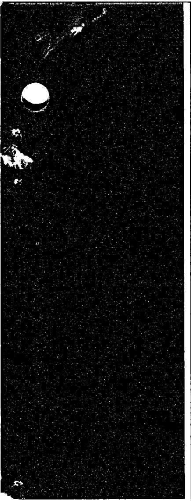

${2}^{2},0 = {50}$

# EFFECT OF $\mathsf{FeF}_2$ ADDITION ON

# MASS TRANSFER IN A

# HASTELLOY N-LiF-BeF $_2$ -UF $_4$

# THERMAL CONVECTION LOOP SYSTEM

J. W. Koger

THIS DOCUMENT CONFIRMED AS UNCLASSIFIED

DIVISION OF CLASSIFICATION BY:

BIL

OAK RIDGE NATIONAL LABORATORY

OPERATED BY UNION CARBIDE CORPORATION • FOR THE U.S. ATOMIC ENERGY COMMISSION

${13}/{14}$

A

This report was prepared as an account of work sponsored by the United States Government. Neither the United States nor the United States Atomic Energy Commission, nor any of their employees, nor any of their contractors, subcontractors, or their employees, makes any warranty, express or implied, or assumes any legal liability or responsibility for the accuracy, completeness or usefulness of any information, apparatus, product or process disclosed, or represents that its use would not infringe privately owned rights.

Contract No. W-7405-eng-26

METALS AND CERAMICS DIVISION

EFFECT OF $\mathsf{FeF}_2$ ADDITION ON MASS TRANSFER IN A HASTELELOY N - LiF-BeF $_2$ -UF $_4$ THERMAL CONVECTION LOOP SYSTEM

J.W.Koger

# -NOTICE

This report was prepared as an account of work sponsored by the United States Government. Neither the United States nor the United States Atomic Energy Commission, nor any of their employees, nor any of their contractors, subcontractors, or their employees, makes any warranty, express or implied, or assumes any legal liability or responsibility for the accuracy, completeness or usefulness of any information, apparatus, product or process disclosed, or represents that its use would not infringe privately owned rights.

DECEMBER 1972

OAK RIDGE NATIONAL LABORATORY

Oak Ridge, Tennessee 37830

operated by

UNION CARBIDE CORPORATION

for the

U.S. ATOMIC ENERGY COMMISSION

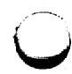

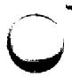

# CONTENTS

Abstract 1

Introduction 1

Background 1

Experimental System 8

Results and Discussion 11

Conclusions 19

0

# EFFECT OF $\mathbf{F e F}_{2}$ ADDITION ON MASS TRANSFER IN A HASTELLOY N-LiF-BeF $_2$ -UF $_4$ THERMAL CONVECTION LOOP SYSTEM

J.W.Koger

# ABSTRACT

The compatibility of Hastelloy N with high-purity $\mathrm{LiF - BeF_2 - UF_4}$ (65.5-34.0-0.5 mole %) in a low-flow temperature-gradient system (maximum temperature $704^{\circ}\mathrm{C}$ , minimum temperature $538^{\circ}\mathrm{C}$ ) was shown to be quite good. (The maximum corrosion rate was 0.04 mil/year over 29,500 hr of operation.) Subsequent experimental additions of $\mathrm{FeF_2}$ increased the mass transfer of the system; specifically, the maximum weight loss rate before $\mathrm{FeF_2}$ additions was $1\times 10^{-4}\mathrm{mgcm}^{-2}\mathrm{hr}^{-1}$ , while after addition the rate was $6\times 10^{-3}\mathrm{mgcm}^{-2}\mathrm{hr}^{-1}$ .

Cracks which transformed into voids were found in the specimens after exposure to the salt containing $\mathbf{FeF}_2$ .

# INTRODUCTION

The Molten Salt Reactor Program has been concerned with the development of nuclear reactors which use fluid fuels that are solutions of fissile and fertile materials in suitable carrier salts. A major goal has been to achieve a thermal breeder molten salt reactor (MSBR). One concept considered was a two-fluid MSBR. The fuel would be $^{233}\mathrm{UF}_4$ or $^{235}\mathrm{UF}_4$ dissolved in a salt consisting of LiF and $\mathrm{BeF}_2$ (66-34 mole%). The blanket would be $\mathrm{ThF}_4$ dissolved in a carrier of similar composition. Hastelloy N, a nickel-based alloy used in the Molten Salt Reactor Experiment (MSRE) was favored as the material out of which the reactor would be constructed. The design of the two-fluid MSBR showed the fuel salt entering the core at $538^{\circ}\mathrm{C}$ and leaving at $704^{\circ}\mathrm{C}$ .

As part of our materials program for molten salt reactor development, we studied the compatibility of Hastelloy N with fuel salt. One such experiment was a thermal convection loop (NCL-16), which was operated at a maximum temperature of $704^{\circ}\mathrm{C}$ and a minimum of $538^{\circ}\mathrm{C}$ . During the operation of NCL-16, the MSRE was shut down and selected portions were examined. The Hastelloy N removed from the MSRE appeared sound, but all metal surfaces that had been exposed to fuel salt showed shallow intergranular cracking when strained at $25^{\circ}\mathrm{C}$ . We subsequently used loop NCL-16 to investigate the possibility that the attack in the MSRE was related to the localization of normal corrosion processes to grain boundaries. In our study of cracking, we twice added 500 ppm $\mathrm{FeF}_2$ to the loop and examined the corrosion specimens for signs of cracking.

# BACKGROUND

In the beginning of the Molten Salt Reactor Program, several fluorides were considered as diluents for the $\mathrm{UF_4}$ fuel. $^{3,4}$ After much investigation and consideration of nuclear properties and chemical stability, $^{5,6}$ $\mathrm{BeF_2}$ and ${}^{7}\mathrm{LiF}$ were selected as the diluent.

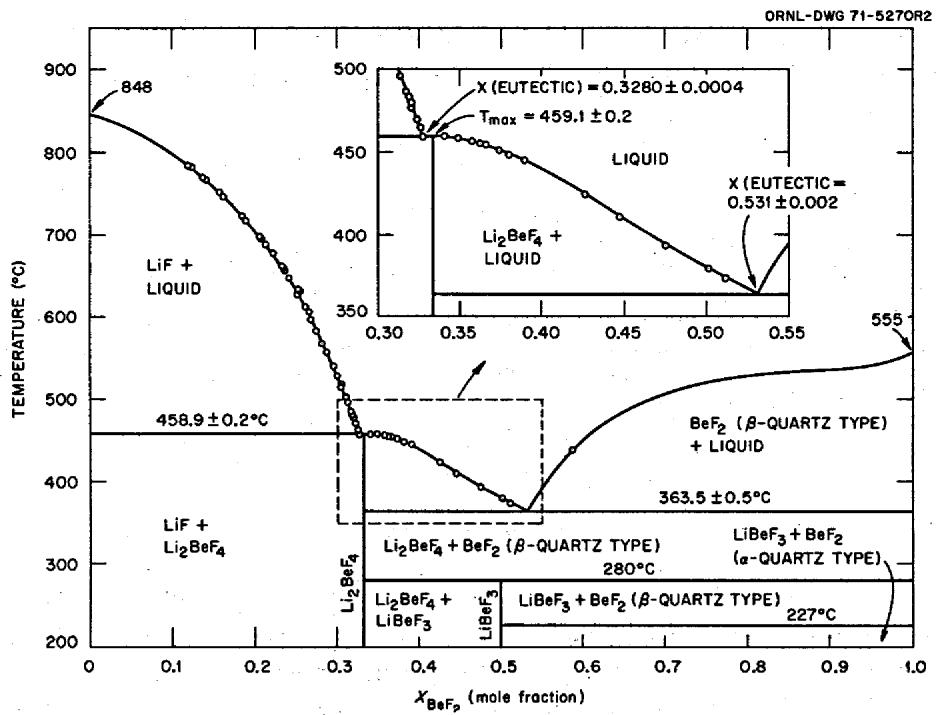  
Fig. 1. The system $\mathbf{LiF - BeF}_2$ .

The phase behavior of systems based upon LiF and $\mathsf{BeF}_2$ as the major constituents has, accordingly, been examined in detail.7 Fortunately for the molten fluoride reactor concept, the phase diagram of LiF-BeF $_2$ -UF $_4$ is such as to make it useful as a fuel.

The binary system $\mathsf{LiF - BeF_2}$ has melting points below $500^{\circ}C$ over the concentration range from 33 to 80 mole $\% \mathrm{BeF}_2$ . The phase diagram, presented in Fig. 1, is characterized by a single eutectic (52 mole $\%$ $\mathrm{BeF}_2$ , melting at $360^{\circ}C$ ) between $\mathrm{BeF}_2$ and $2\mathrm{LiF}\cdot \mathrm{BeF}_2$ . The compound $2\mathrm{LiF}\cdot \mathrm{BeF}_2$ melts incongruity to LiF and liquid at $458^{\circ}C$ . $\mathsf{LiF}\cdot \mathsf{BeF}_2$ is formed by the reaction of solid $\mathrm{BeF}_2$ and solid $2\mathrm{LiF}\cdot \mathrm{BeF}_2$ below $280^{\circ}C$ .

The phase diagram of the $\mathrm{BeF}_2$ - $\mathrm{UF}_4$ system (Fig. 2) shows a single eutectic containing very little $\mathrm{UF}_4$ . That of the LiF- $\mathrm{UF}_4$ system (Fig. 3) shows three compounds, none of which melts congruently and one of which shows a low-temperature limit of stability. The eutectic mixture of $4\mathrm{LiF}\cdot \mathrm{UF}_4$ and $7\mathrm{LiF}\cdot 6\mathrm{UF}_4$ occurs at 27 mole $\%$ $\mathrm{UF}_4$ and melts at $490^{\circ}\mathrm{C}$ . The ternary system8 LiF- $\mathrm{BeF}_2$ - $\mathrm{UF}_4$ , of primary importance in reactor fuels, is shown as Fig. 4. The system shows two eutectics. These are at 1 mole $\%$ $\mathrm{UF}_4$ and 52 mole $\%$ $\mathrm{BeF}_2$ and at 8 mole $\%$ $\mathrm{UF}_4$ and 26 mole $\%$ $\mathrm{BeF}_2$ ; they melt at 350 and $435^{\circ}\mathrm{C}$ respectively. Moreover, the system shows a very wide range of compositions melting below $525^{\circ}\mathrm{C}$ .

The corrosion resistance of metals to fluoride fuels has been found to vary directly with the "nobility" of the metal - that is, inversely with the magnitude of the free energy of formation of fluorides involving the metal. Accordingly, corrosion of multicomponent alloys tends to be manifested by the selective oxidation and removal of the least noble component. In the case of Hastelloy N, corrosion is selective with respect to chromium. The selective removal of chromium by fluoride mixtures depends on various chemical

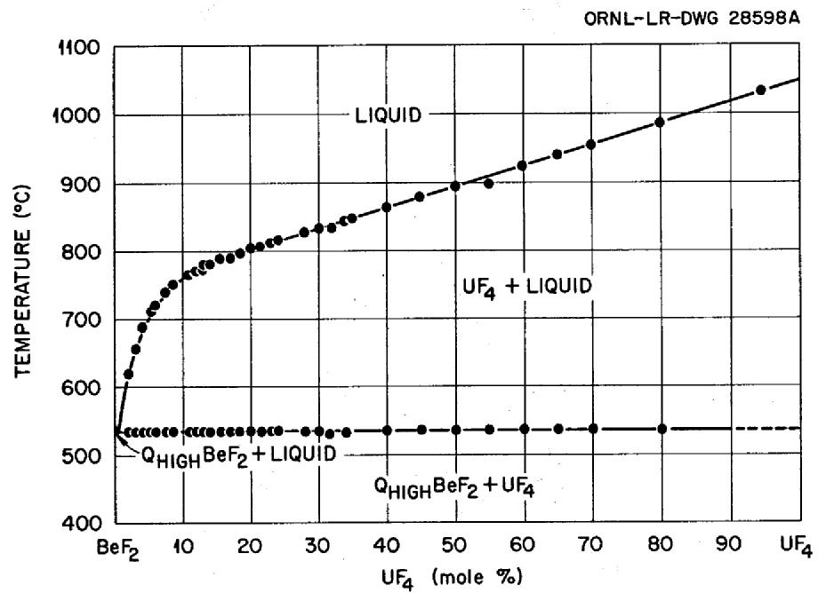  
Fig.2.The system $\mathbf{BeF}_2\text{-}\mathbf{UF}_4$

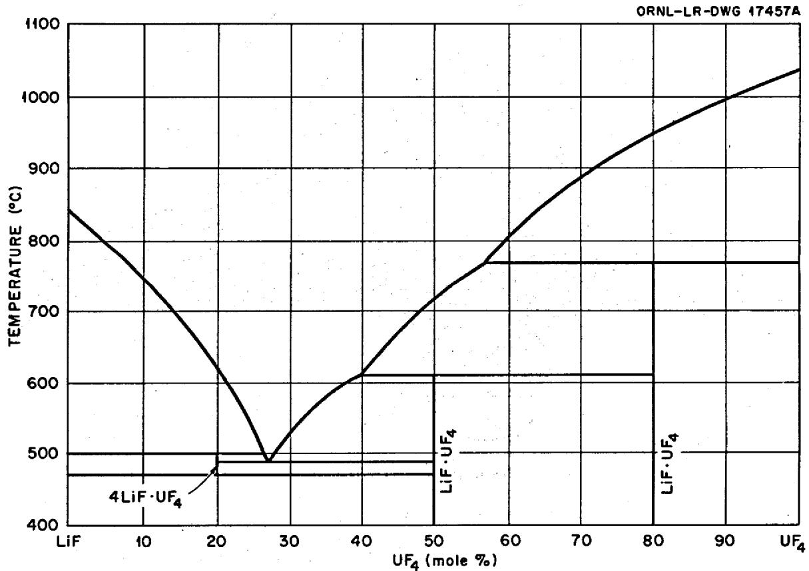  
Fig. 3. The system $\mathrm{LiF - UF_4}$

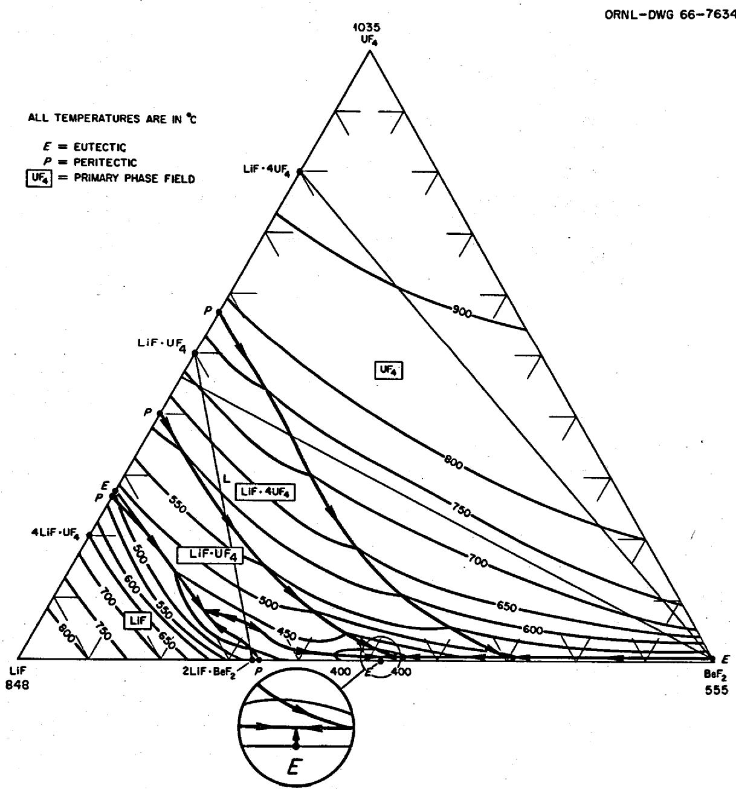  
Fig. 4. The system $\mathbf{LiF - BeF}_2\cdot \mathbf{UF}_4$

reactions, as follows:

1. Due to impurities in the melt, for example,

$$
\mathrm {F e F} _ {2} + \mathrm {C r} \rightleftharpoons \mathrm {C r F} _ {2} + \mathrm {F e}, \tag {1}
$$

$$
2 \mathrm {H F} + \mathrm {C r} \rightleftharpoons \mathrm {C r F} _ {2} + \mathrm {H} _ {2}. \tag {2}
$$

2. Dissolution of oxide films from the metal surface, for example,

$$
2 \mathrm {F e} ^ {3 +} (\text {f r o m f i l m}) + 3 \mathrm {C r} \rightleftharpoons 2 \mathrm {F e} + 3 \mathrm {C r} ^ {2 +}. \tag {3}
$$

3. Due to constituents in the fuel, particularly,

$$
\mathrm {C r} + 2 \mathrm {U F} _ {4} \rightleftharpoons 2 \mathrm {U F} _ {3} + \mathrm {C r F} _ {2}. \tag {4}
$$

If pure salt containing $\mathbf{U}\mathbf{F}_4$ (and no corrosion products) is added to a Hastelloy N loop operating polythermally, all points of the loop initially experience a loss of chromium in accordance with the $\mathrm{Cr - UF_4}$ reaction, Eq. (4), and by reaction with impurities in the salt (such as HF, $\mathrm{NiF}_2$ , or $\mathrm{FeF}_2$ ).

Impurity reactions go rapidly to completion at all temperature points and are important only in terms of short-range corrosion effects. The $\mathrm{UF_4}$ reaction, however, whose equilibrium is temperature-dependent, provides a mechanism by which the alloy at high temperature is continuously depleted and the alloy at low temperature is continuously enriched in chromium. All parts of the loop are attacked as the corrosion-product $(\mathrm{CrF}_2)$ concentration of the salt is increased by the impurity and $\mathrm{UF_4}$ reactions. Eventually the lowest temperature point of the loop achieves equilibrium with respect to the $\mathrm{UF_4}$ reaction. However, in regions at higher temperature, because of the temperature dependence for this reaction, a driving force still exists for chromium to react with $\mathrm{UF_4}$ . Thus, the corrosion-product concentration will continue to increase, and the temperature points at equilibrium will begin to move away from the coldest temperature point. At this stage, chromium is returned to the walls at the coldest point in the system. The rise in corrosion-product concentration in the circulating salt continues until the amount of chromium returning to the walls exactly balances the amount of chromium entering the system in the hot-leg regions. Under these conditions, the two positions of the loop at equilibrium with the salt are termed the "balance points," and they do not shift measurably with time. Thus, a quasi-steady-state situation is eventually achieved in which there is a fixed chromium surface concentration at each point-in the loop and chromium is transported at very low rates. This idea is supported by the fact that concentrations of $\mathrm{CrF}_2$ , $\mathrm{UF_4}$ , and $\mathrm{UF_3}$ achieve steady-state concentrations in the salt even though attack slowly increases with time. A schematic of this mass transfer process is shown in Fig. 5.

Subsurface voids are often formed in alloys exposed to molten salts. The formation of these voids is initiated by the oxidation and removal of chromium from exposed surfaces. As the surface is depleted in chromium, chromium from the interior diffuses down the concentration gradient to the surface. Since diffusion occurs by a vacancy process and, in this particular situation, is essentially nondirectional, it is possible to build up an excess number of vacancies in the metal. These precipitate in areas of disregistry, principally at grain boundaries and impurities, to form voids. These voids tend to agglomerate and grow in size with increasing time and/or temperature. Studies have demonstrated that such subsurface voids are not interconnected with each other or with the surface. Voids of this same type have also been developed in Inconel by high-temperature oxidation tests and high-temperature vacuum tests in which chromium is

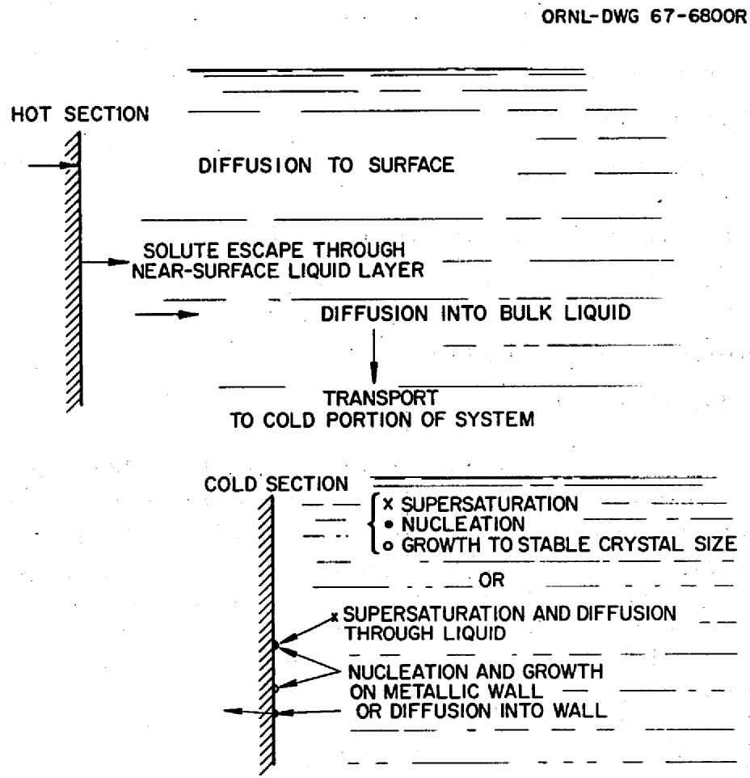  
Fig. 5. Temperature-gradient mass transfer.

selectively removed. $^9$ Voids similar to these have also been developed in copper-brass diffusion couples and by the dezincification of brass. $^{10}$ All of these phenomena arise from the so-called Kirkendall effect, whereby solute atoms of a given type diffuse out at a faster rate than other atoms comprising the crystal lattice can diffuse in to fill the vacancies which result from outward diffusion.

The removal of the least noble constituent is often preferential along grain boundaries. In time, given a continuing electrochemical process, this will lead to crevices in the grain boundaries. Diffusional processes within a crevice may lead to its broadening and ultimately to the formation of pits. However, if the root of the crack is anodically polarized relative to the walls, knife-line attack will continue. Such a condition may arise if the walls of the crevice become covered with a very noble material (nickel or molybdenum). This covering by a noble constituent can occur either by the noble material remaining on the wall when the least noble constituent is removed or by dissolution of all the alloy constituents with subsequent precipitation of the more noble constituents.

Table 1. Thermal convection loops that have operated with LiF-BeF $_2$ -UF $_4$ salts   

<table><tr><td>Salt</td><td>Alloy</td><td>Maximum temperature (°C)</td><td>Hours operated</td><td>Remarks</td></tr><tr><td rowspan="8">LiF-BeF2-UF4(53-46-1 mole %)</td><td>Inconel 600a</td><td>677</td><td>1000</td><td>General subsurface voids to 21/2mils</td></tr><tr><td>Inconel 600</td><td>677</td><td>8664</td><td>Heavy intergranular voids to 7 mils</td></tr><tr><td>Inconel 600</td><td>677</td><td>8760</td><td>Moderate to heavy intergranular voids to 7 mils</td></tr><tr><td>Inconel 600</td><td>732</td><td>8760</td><td>Heavy intergranular voids to 15 mils</td></tr><tr><td>Inconel 600</td><td>732</td><td>8760</td><td>Heavy intergranular voids to 15 mils</td></tr><tr><td>Hastelloy Nb</td><td>677</td><td>1000</td><td>No attack</td></tr><tr><td>Hastelloy N</td><td>677</td><td>8760</td><td>No attack</td></tr><tr><td>Hastelloy N</td><td>732</td><td>8760</td><td>Light surface pitting</td></tr><tr><td rowspan="7">LiF-BeF2(71-29 mole %)</td><td>Inconel 600</td><td>677</td><td>1000</td><td>Few voids &lt;1 mil</td></tr><tr><td>Inconel 600</td><td>677</td><td>1000</td><td>Few voids &lt;1 mil</td></tr><tr><td>Inconel 600</td><td>677</td><td>8760</td><td>Light to moderate intergranular voids to 5 mils</td></tr><tr><td>Inconel 600</td><td>732</td><td>8760</td><td>Moderate to heavy intergranular voids to 61/2mils</td></tr><tr><td>Hastelloy N</td><td>677</td><td>1000</td><td>Light surface roughening</td></tr><tr><td>Hastelloy N</td><td>677</td><td>3114</td><td>Light surface roughening</td></tr><tr><td>Hastelloy N</td><td>732</td><td>8760</td><td>Heavy surface roughening</td></tr><tr><td rowspan="9">LiF-BeF2-UF4(62-37-1 mole %)</td><td>Inconel 600</td><td>677</td><td>1000</td><td>General intergranular attack &lt;1 mil</td></tr><tr><td>Inconel 600</td><td>732</td><td>1000</td><td>Intergranular voids to 3 mils</td></tr><tr><td>Inconel 600</td><td>732</td><td>1000</td><td>Intergranular voids &lt; 2 mils</td></tr><tr><td>Inconel 600</td><td>732</td><td>1000</td><td>Intergranular voids to 4 mils</td></tr><tr><td>Inconel 600</td><td>677</td><td>8760</td><td>Heavy intergranular and general voids to 5 mils</td></tr><tr><td>Inconel 600</td><td>732</td><td>8760</td><td>Heavy intergranular voids to 14 mils</td></tr><tr><td>Hastelloy N</td><td>677</td><td>1000</td><td>No attack</td></tr><tr><td>Hastelloy N</td><td>677</td><td>8760</td><td>Light surface roughening</td></tr><tr><td>Hastelloy N</td><td>732</td><td>8760</td><td>Light surface roughening</td></tr><tr><td rowspan="3">LiF-BeF2UF4(60-36-4 mole %)</td><td>Inconel 600</td><td>677</td><td>1000</td><td>Intergranular voids &lt;1 mil</td></tr><tr><td>Hastelloy N</td><td>677</td><td>1000</td><td>Light surface roughening</td></tr><tr><td>Hastelloy N</td><td>677</td><td>8760</td><td>Moderate surface roughening</td></tr><tr><td rowspan="2">LiF-BeF2-UF4(70-10-20 mole %)</td><td>Hastelloy N</td><td>677</td><td>1000</td><td>No attack</td></tr><tr><td>Hastelloy N</td><td>732</td><td>1000</td><td>Moderate surface roughening</td></tr></table>

$a15\%$ Cr-7% Fe-bal Ni.   
$b7\% \mathrm{Cr} - 5\% \mathrm{Fe} - 16\% \mathrm{Mo}$ -bal Ni.

Table 1 lists the results of previous Hastelloy N and Inconel 600 thermal convection loop tests using salts made up of LiF, $\mathbf{BeF}_2$ , and $\mathbf{UF}_4$ . There were no corrosion specimens in the loops, so no weight change data are available. Yet, it is interesting to compare the behavior of the various salts, the various alloys, and different times and temperatures. In all cases the Hastelloy N showed better corrosion resistance, and, in general, the higher peak temperature and longer times resulted in greater corrosion. The

11. MSR Quart. Progr. Rep. Sept. 1, 1957, ORNL-2378, p. 3.   
12. Ibid., Oct. 31, 1957, ORNL-2431, pp. 23-29.   
13. Ibid., Jan. 31, 1958, ORNL-2474, pp. 51-54.   
14. Ibid., Oct. 31, 1958, ORNL-2626, pp. 53-55.   
15. Ibid., Jan. 31, 1959, ORNL-2684, pp. 75-76.   
16. Ibid., Apr. 30, 1959, ORNL-2723, pp. 51-54.   
17. Ibid., July 31, 1959, ORNL-2799, pp. 47-55.   
18. Ibid., Jan. 31 and Apr. 30, 1960, ORNL-2973, pp. 33-36.

salts containing no more than 1 mole $\%$ $\mathrm{UF_4}$ at $677^{\circ}\mathrm{C}$ only produced light surface roughening on the Hastelloy N. A little more attack was produced at $732^{\circ}\mathrm{C}$ and by the salts with the larger amounts of $\mathrm{UF_4}$ . Based on these results for our specific salt and temperature conditions, Hastelloy N should be quite resistant to attack.

# EXPERIMENTAL SYSTEM

The thermal convection loop is an excellent corrosion test system that is intermediate in complexity and cost between isothermal capsules and pumped loops. The loop is particularly suited for small-scale tests that involve flow and temperature gradient mass transfer. The flow in the system results from the difference in density of the liquid in the hot and the cold leg. A schematic of a thermal convection loop is shown in Fig. 6, and an actual photograph of loop NCL-16 is seen in Fig. 7.

Thermal convection loop NCL-16 contained 14 specimens, 7 in each leg. Twelve specimens were titanium-modified Hastelloy N, and two specimens were standard Hastelloy N. Their compositions are given in Table 2. The loop itself was constructed of standard Hastelloy N. The test specimens were $1.9 \times 0.95 \times 0.076 \mathrm{~cm}$ and weighed approximately $1 \mathrm{~g}$ , with a surface area of $3.5 \mathrm{~cm}^2$ . They were measured to within $0.0025 \mathrm{~cm}$ to obtain surface area and were triply weighed to within $0.01 \mathrm{mg}$ . The specimens were attached by wires to the specimen fixture, which consisted of $0.32 \mathrm{~cm}$ -diam rod welded to $0.63 \mathrm{~cm}$ -OD Hastelloy N tubing. Salt for analysis was dip-sampled from the harp portion of the loop into a hydrogen-fired copper container attached to $0.63 \mathrm{~cm}$ -OD copper tubing. Both the specimen fixture and the copper salt sampler were lowered into the loop through standpipes. The standpipes consisted of $1.0 \mathrm{in}$ . (2.54-cm) sched 40 type 304L stainless steel pipe with a $1.9 \mathrm{~cm}$ ball valve on one end and a sliding Teflon seal at the other through which the $0.63 \mathrm{~cm}$ -OD tubing extended. Before they were opened to the loop environment, the standpipes were evacuated and backfilled with helium. On removal the specimen fixture or salt sample was pulled into the standpipe, isolated from the loop, and allowed to cool to room temperature.

The initial preparation of the fuel salt, $\mathrm{LiF - BeF_2 - UF_4}$ (65.5-34.0-0.5 mole %), first involved weighing and mixing the pure constituents in a nickel-lined container. Two steps were required for purification of the fuel salt: one for removal of oxides and sulfides and one for the removal of metallic fluorides. The oxides and sulfides were removed by gas sparging for several hours at $650^{\circ}\mathrm{C}$ with an anhydrous mixture of hydrogen fluoride in hydrogen (1:4). The impurities reacted directly with hydrogen fluoride, and the process was continued until the same amount of hydrogen fluoride left the reaction vessel as entered. The reaction was then considered complete.

To remove metallic fluorides, particularly $\mathrm{FeF_2}$ and $\mathrm{NiF_2}$ , hydrogen gas sparging of the melt at $700^{\circ}\mathrm{C}$ for 24 hr was used. The reduction of $\mathrm{CrF_2}$ by hydrogen is too slow to be effective at process temperatures, but analysis of the melt for chromium after sparging indicated a very low concentration. The by-product of hydrogen sparging is hydrogen fluoride, and the process was continued until the hydrogen fluoride evolution was below a certain level.

Table 2. Composition of Hastelloy N specimens in NCL-16   

<table><tr><td rowspan="2"></td><td colspan="7">Weight percent</td></tr><tr><td>Mo</td><td>Cr</td><td>Fe</td><td>Si</td><td>Mn</td><td>Ti</td><td>Ni</td></tr><tr><td>Ti-modified</td><td>13.8</td><td>7.3</td><td>&lt;0.1</td><td>0.05</td><td>0.13</td><td>0.47</td><td>Bal</td></tr><tr><td>Standard</td><td>17.2</td><td>7.4</td><td>4.5</td><td>0.64</td><td>0.55</td><td>0.02</td><td>Bal</td></tr></table>

ORNL-DWG 68-3987

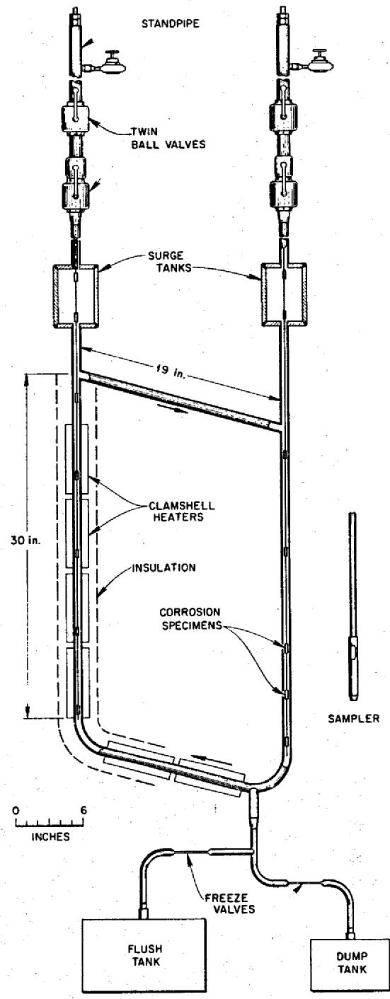  
Fig. 6. Schematic of thermal convection loop.

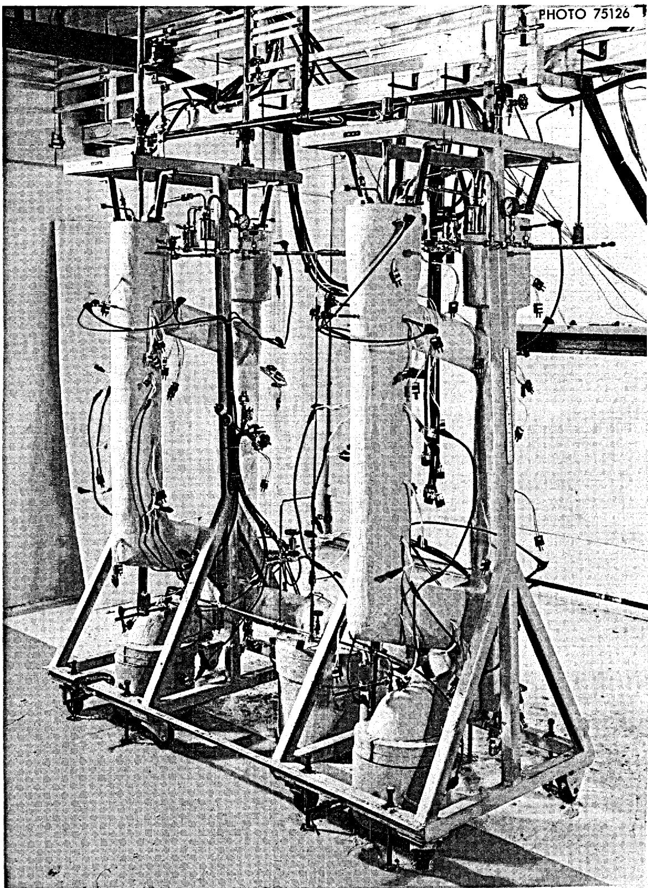  
Fig. 7. Natural circulation loops NCL-15 and NCL-16 prior to operation.

Before filling with salt, the loop was degreased with ethyl alcohol, dried, and then heated to $150^{\circ}\mathrm{C}$ under vacuum to remove any traces of moisture. A helium mass spectrometer leak detector was used to check for leaks in the system.

The procedure for filling the loop consisted in heating the loop, the salt pot, and all connecting lines to approximately $550^{\circ}\mathrm{C}$ and applying helium pressure to the salt supply vessel to force the salt into the loop. Air was continuously blown on freeze valves leading to the dump and flush tanks to provide a positive salt seal. All fill lines exposed to the salt were Hastelloy N, and all temporary connections from fill line to loop were made with stainless steel compression fittings.

The first charge of salt was held for 24 hr in the loop at the maximum operation temperature and then dumped into the flush tank. This flush salt charge was intended to remove surface oxides or other impurities left in the loop. The loop was then refilled with fresh salt, and operation was begun. Once the loop was filled, the heaters on the cold leg of the loop were turned off. As much insulation was removed as necessary to obtain the proper temperature difference by exposing the cold leg to ambient air. This temperature difference caused the salt to flow in the loop. A salt sample was then taken, and the specimens were inserted into the loop. Helium cover gas of $99.998\%$ purity and under slight pressure (approx 5 psig) was maintained over the salt in the loop during operation.

# RESULTS AND DISCUSSION

Prior to its use in the cracking studies, loop NCL-16 operated for 29,500 hr with the fuel salt circulating in the system. The maximum weight loss for this period was $2.9\mathrm{mg/cm}^2$ , and the largest weight gain was $1.7\mathrm{mg/cm}^2$ . Assuming uniform loss, the maximum corrosion rate was 0.04 mil/year. The chromium content of the salt had increased 500 ppm, and the iron had decreased about 100 ppm. The changes in chromium and iron concentration in the salt during the first 12,000 hr are shown in Fig. 8. These changes suggest that besides the $\mathbf{U}\mathbf{F}_4$ reaction, Eq. (4), the $\mathbf{FeF}_2$ reaction, Eq. (1), also played a large part in the mass transfer of chromium in the system. Because the mass transfer involved mainly chromium transfer and the mass transfer rates were low, it appears that solid-state diffusion of chromium in the alloy controlled the overall process. Titanium-modified Hastelloy N specimens ( $\mathrm{Ni}-12\% \mathrm{Mo}-7\% \mathrm{Cr}-0.5\% \mathrm{Ti}$ ) had smaller weight losses than standard Hastelloy N specimens ( $\mathrm{Ni}-16\% \mathrm{Mo}-7\% \mathrm{Cr}-5\% \mathrm{Fe}$ ) under equivalent

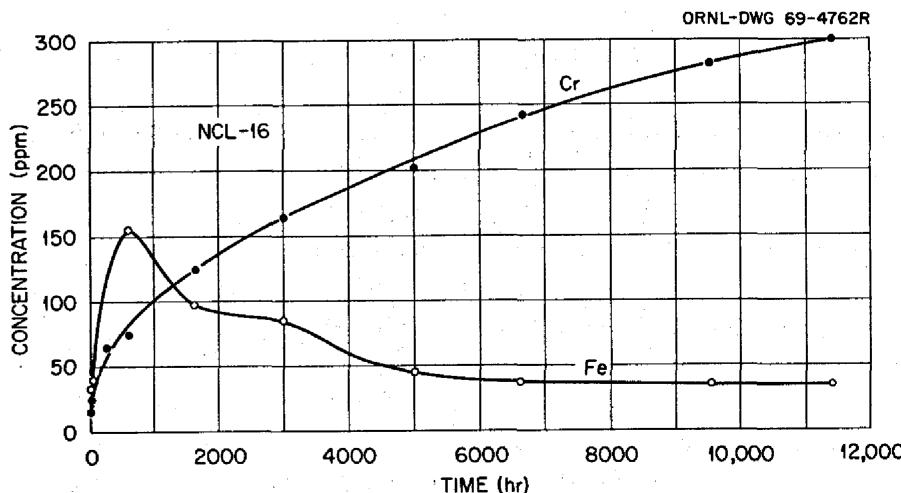  
Fig. 8. Concentration of iron and chromium in the fuel salt in loop NCL-16.

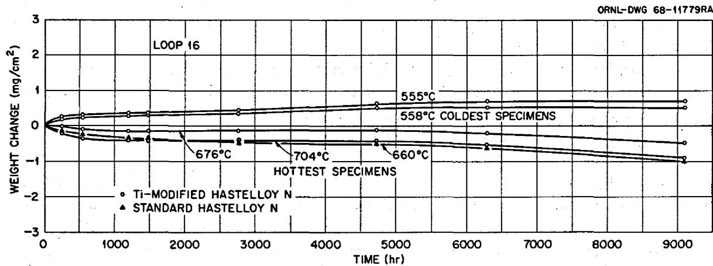  
Fig. 9. Weight change vs time for standard and titanium-modified specimens in loop NCL-16 exposed to fuel salt $(\mathrm{LiF - BeF_2 - UF_4}, 65.5 - 34.0 - 0.5\text{ mole}\%)$ at various temperatures.

conditions. These differences are seen in Fig. 9 and are generally attributed to the absence of iron in the modified alloys. Even though iron is more noble than chromium, some iron is removed during the corrosion process; thus, an iron-free alloy is more resistant to molten salts.

In our investigation of the relationship of salt impurities to the cracking that had been observed in Hastelloy N for the MSRE, we initially added 500 ppm $\mathbf{FeF}_2$ to the salt. Specimens were removed and weighed and portions of specimens were examined metallographically 450 and 1100 hr after the first addition. Then an additional 500 ppm $\mathbf{FeF}_2$ was added. Specimens were then examined three times after this second addition.

After each specimen removal, we found weight changes typical of all our temperature-gradient mass transfer systems, with weight losses in the hot section and weight gains in the cold section. Figure 10 shows the weight changes of selected specimens as a function of time. (Not shown are the results at the conclusion of operation after about $36,400\mathrm{hr}$ .) Figure 11 shows the changes completely around the loop. Note that the balance point (the point at which there is no weight change) did not shift. Note, also, that the weight changes after the $\mathbf{FeF_2}$ additions were relatively large. The changes during the $450\mathrm{hr}$ after the first addition equaled those during the previous $10,000\mathrm{hr}$ . Weight changes during the next $650\mathrm{hr}$ were two or three times those for the first $450\mathrm{hr}$ and were larger than those obtained during $29,500\mathrm{hr}$ of operation before any additions.

Optical micrographs of various specimens under different conditions are shown in Fig. 12. Very little attack or deposit was seen before the $\mathrm{FeF_2}$ additions. Metallographic examination after the initial $\mathrm{FeF_2}$ additions disclosed grain boundary attack, which altered the polishing characteristics of the specimen, but no cracks were visible. Examination of the hottest specimen $800\mathrm{hr}$ after the second addition revealed more grain boundary attack but still no cracks. The surface of the specimen was "lacy" due to severe chromium removal from the alloy. This specimen was bent, and some cracking was induced in the depleted area, but no cracks penetrated the matrix. Specimen examination after $2900\mathrm{hr}$ exposure to $\mathrm{FeF_2}$ disclosed that the weight losses were six times as great as in the previous $29,500\mathrm{hr}$ operation of the loop, and cracks were now visible to a depth of $0.5\mathrm{mil}$ . The cracks seemed to be similar to those seen in the MSRE samples but were much shallower. Over the next few thousand hours the "cracks" became voids in the hotter specimens in which no cracks as such were seen. Figure 13 shows an optical micrograph of all the specimens at the end of the test. No voids were seen in the hottest specimens, as the surface layer was completely removed by

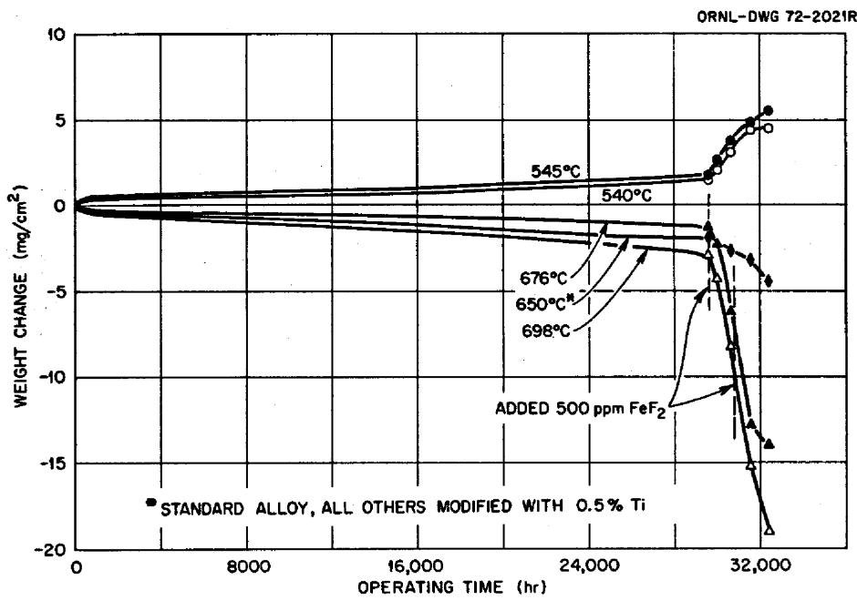  
Fig. 10. Weight changes of Hastelloy N specimens exposed to LiF-BeF $_2$ -UF $_4$ (65.5-34.0-0.5 mole %), with FeF $_2$ added, in NCL-16 as a function of time and temperature.

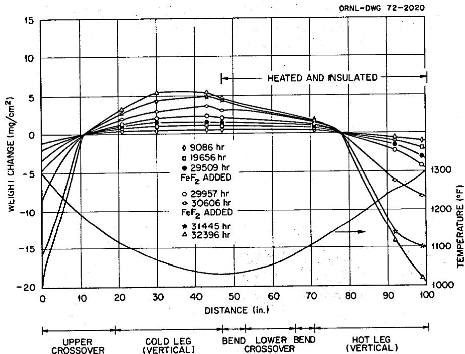  
Fig. 11. Weight changes of Hastelloy N specimens exposed to LiF-BeF $_2$ -UF $_4$ (65.5-34.0-0.5 mole %), with FeF $_2$ added, in NCL-16 as a function of position and time.

the corrosion process. Note the deposits on the specimens from the cold leg. The maximum weight loss rate before impurity additions was $1 \times 10^{-4} \, \text{mg cm}^{-2} \, \text{hr}^{-1}$ , while after addition the rate was $6 \times 10^{-3} \, \text{mg cm}^{-2} \, \text{hr}^{-1}$ .

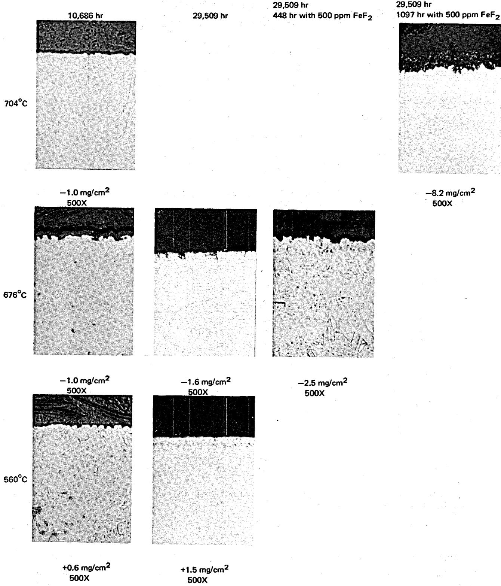

29,509 hr  
1097 hr with 500 ppm $\mathsf{FeF}_2$ 839 hr with 500 ppm $\mathsf{FeF}_2$ additional

29,509 hr  
1097 hr with 500 ppm $\mathsf{FeF}_2$ 1800 hr with 500 ppm $\mathsf{FeF}_2$ additional

29,509 hr  
1097 hr with 500 ppm $\mathsf{FeF}_2$ 5150 hr with 500 ppm $\mathsf{FeF}_2$ additional

29,509 hr  
1097 hr with 500 ppm $\mathsf{FeF}_2$ 5800 hr with 500 ppm $\mathsf{FeF}_2$ additional

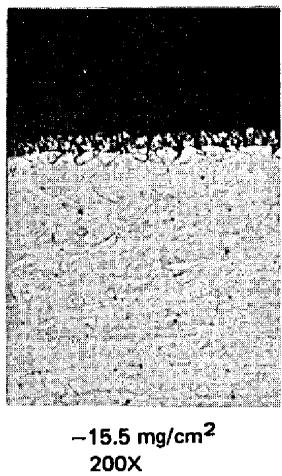

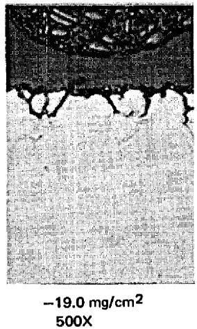

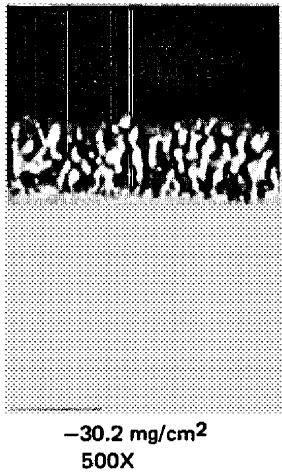

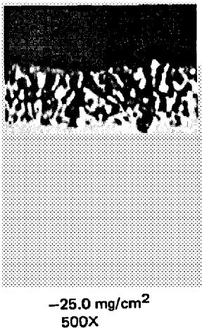

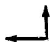  
Fig. 12. Optical micrographs of specimens exposed to $\mathrm{LiF - BeF_2 - UF_4}$ (65.5-34.0-0.5 mole %) at various temperatures and times.

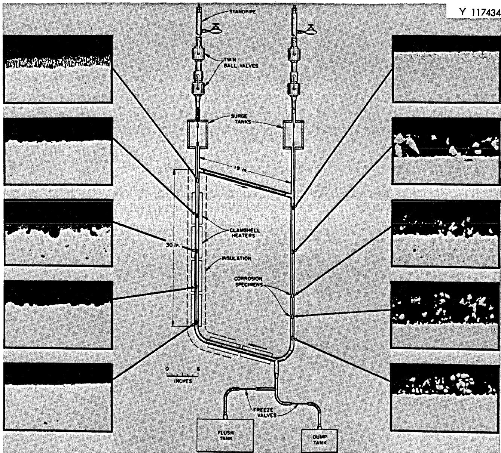  
Fig. 13. Optical micrographs of specimens from various portions of the loop at the end of the test. Approximately 36,400 hr exposure.

Table 3. Activity coefficients estimated for various fluorides in molten LiF-BeF $_2$ solutions at $1000^{\circ}$ K   

<table><tr><td>Species</td><td>ΔFof(kcal per fluorine)</td><td>Equilibrium studied</td><td>Approximate mole fraction</td><td>γa</td></tr><tr><td>UF4</td><td>-95.3</td><td>UF4 + 2H2O ⇌ UO2 + 4HF</td><td>0.02</td><td>0.55</td></tr><tr><td>UF3</td><td>-101.4</td><td>UF4 + 1/2H2 ⇌ UF3 + HF</td><td>0.0001</td><td>50</td></tr><tr><td>FeF2</td><td>-66.5</td><td>FeF2 + H2 ⇌ Fe + 2HF</td><td>0.005</td><td>1.6</td></tr><tr><td>CrF2</td><td>-74</td><td>CrF2 + H2 ⇌ Cr + 2HF</td><td>0.001</td><td>0.5</td></tr></table>

$a$ Based on the crystalline solid as reference state.

A $1/8$ -in. Hastelloy N specimen rod from the hot leg was inadvertently broken during one of the specimen removal periods. The rod had been exposed to the unaltered fuel salt for 10,301 hr, to the salt with 500 ppm $\mathrm{FeF}_2$ for 1100 hr, and to the salt with an additional 500 ppm $\mathrm{FeF}_2$ for 3254 hr. The total exposure time was 14,655 hr. The rod was sectioned and examined at different positions which represented different exposure temperatures (Fig. 14). Voids were quite evident at the hottest positions, with the amount and depth of the voids decreasing with decreasing temperature.

Observations of the specimen rods correlate quite well with the specimen behavior. The balance point (no gains or losses) as determined from the specimen weight change is about $621^{\circ}\mathrm{C}$ , so all but one of the rod specimens should have been attacked, and this is what we found.

It is interesting to compare values for actual mass transfer in a loop system such as NCL-16 with calculated values based on quite basic chemical equilibrium experiments. Data obtained from studies of hydrogen reduction equilibria by Long $^{19}$ and by Blood $^{20}$ can be used to compute reasonable (and consistent) estimates of the activity coefficients of the several species in fluoride salt melts. These activity coefficients based on the crystalline solid as reference state are shown in Table 3.

From these values and the values of $\Delta F^{\circ}_f$ for the several compounds (where $\Delta F^{\circ} = RT\ln K$ ), we may assess the extent of the reaction

$$
2 \mathrm {U F} _ {4} + \mathrm {C r} \rightleftharpoons \mathrm {C r F} _ {2} + 2 \mathrm {U F} _ {3}, \tag {4}
$$

where the $\mathbf{U}\mathbf{F}_4$ , $\mathbf{CrF}_2$ , and $\mathbf{UF}_3$ are in solution in the fuel salt and the chromium is at the relatively low activity it has in unaltered Hastelloy N. For this reaction,

$$
K _ {a} = 2. 4 \times 1 0 ^ {- 3} = \frac {a _ {\mathrm {U F} _ {3}} {} ^ {2} a _ {\mathrm {C r F} _ {2}}}{a _ {\mathrm {U F} _ {4}} {} ^ {2} a _ {\mathrm {C r}}} = \frac {(N \gamma) _ {\mathrm {U F} _ {3}} {} ^ {2} (N \gamma) _ {\mathrm {C r F} _ {2}}}{(N \gamma) _ {\mathrm {U F} _ {4}} {} ^ {2} a _ {\mathrm {C r}}}. \tag {5}
$$

If, initially, the salt were completely pure and the metal contained no oxide (so that all $\mathrm{CrF_2}$ was generated by this reaction), then

$$
N _ {\mathbf {U F} _ {3}} = 2 N _ {\mathbf {C r F} _ {2}}. \tag {6}
$$

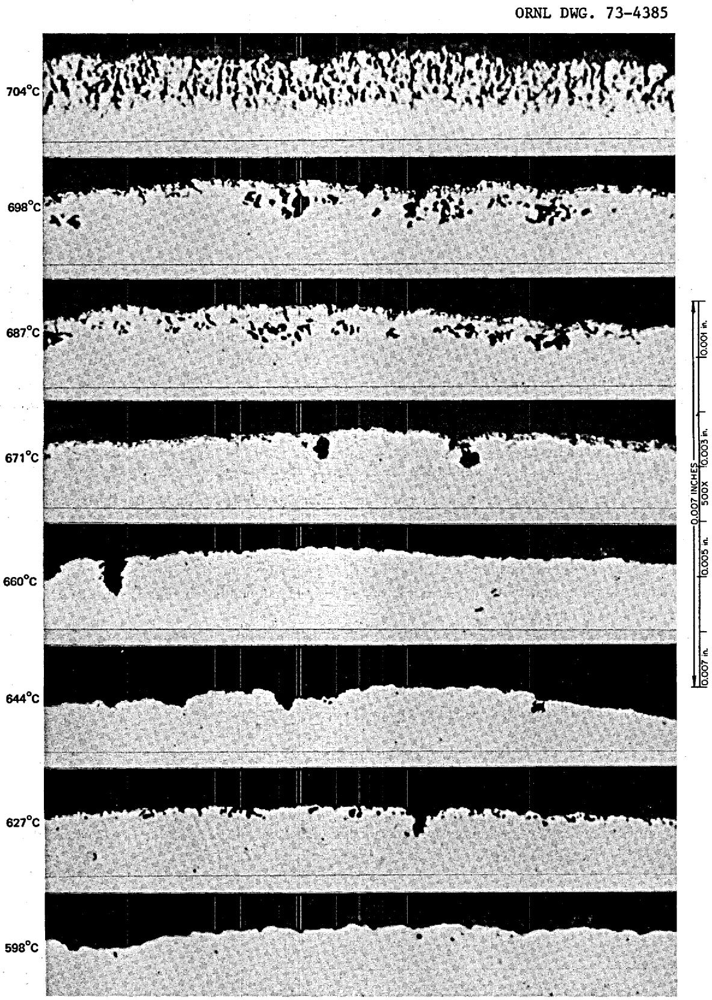  
Fig. 14. Hastelloy N specimen rod exposed to LiF-BeF $_2$ -UF $_4$ (65.5-34.0-0.5 mole %) for 14,655 hr (4354 hr with 1000 ppm FeF $_2$ in the salt).

For reaction of the fuel from NCL-16 ( $N_{\mathrm{UF}_4} = a_{\mathrm{UF}_4} = 0.005$ ) with Hastelloy N ( $a_{\mathrm{Cr}} = 0.083$ ), the equilibrium indicated in Eq. (6) is satisfied at

$$
N _ {\mathrm {C r F} _ {2}} = 0. 7 \times 1 0 ^ {- 4}
$$

and

$$
N _ {\mathrm {U F} _ {3}} = 1. 4 \times 1 0 ^ {- 4}.
$$

Accordingly, less than $3\%$ of the $\mathrm{UF_4}$ would be reduced to $\mathrm{UF_3}$ , and the chromium fluoride concentration of the melt would be 70 ppm (as Cr). In our system we produced 400 ppm Cr as $\mathrm{CrF_2}$ in 29,500 hr; thus other sources such as $\mathrm{FeF_2}$ were available for the oxidation of chromium. For the reaction

$$
\mathrm {F e F} _ {2} + \mathrm {C r} \rightleftharpoons \mathrm {F e} + \mathrm {C r F} _ {2}, \tag {1}
$$

according to ref. 20,

$$
K _ {N} = \frac {N _ {\mathrm {C r F} _ {2}} N _ {\mathrm {F e}}}{N _ {\mathrm {C r}} N _ {\mathrm {F e F} _ {2}}} = 6 0 0 0, \tag {7}
$$

where the chromium is in solid solution in the Hastelloy N ( $a = 0.083$ ) and the iron is crystalline iron at unit activity. Thus, the reaction should proceed until the ratio

$$
\frac {N _ {\mathrm {C r F} _ {2}}}{N _ {\mathrm {F e F} _ {2}}} \cong 5 0 0, \tag {8}
$$

which means that large amounts of $\mathrm{CrF_2}$ can be produced by very little $\mathrm{FeF_2}$ . Depletion of chromium at the surface of the alloy will lower this ratio. If we attribute 70 ppm Cr as $\mathrm{CrF_2}$ to oxidation by $\mathrm{UF_4}$ and 330 ppm Cr as $\mathrm{CrF_2}$ to oxidation by $\mathrm{FeF_2}$ , which decreased by about 100 ppm in 29,500 hr, the calculated equilibrium constant for the $\mathrm{FeF_2}$ reaction in the first 29,500 hr is 40. During the periods of $\mathrm{FeF_2}$ additions the calculated equilibrium constant ranged from 12.5 to 36. Thus the depleted alloy caused the equilibrium constant to be lowered an order of magnitude.

# CONCLUSIONS

1. The compatibility of Hastelloy N with $\mathrm{LiF - BeF_2 - UF_4}$ (65.5-34.0-0.5 mole %) which contains few impurities in a low-flow temperature gradient system (maximum temperature $704^{\circ}\mathrm{C}$ , minimum temperature $538^{\circ}\mathrm{C}$ ) is quite good. The maximum corrosion rate was 0.04 mil/year.   
2. Additions of impurities such as $\mathrm{FeF}_2$ increase the mass transfer of the system; specifically, the maximum weight loss rate before impurity additions was $1 \times 10^{-4} \mathrm{mg} \mathrm{cm}^{-2} \mathrm{hr}^{-1}$ , while after addition the rate was $6 \times 10^{-3} \mathrm{mg} \mathrm{cm}^{-2} \mathrm{hr}^{-1}$ .   
3. Cracks which transformed into voids were found in the specimens exposed to the impurity-laden salt. However, these cracks were not equivalent in appearance to those noted in Hastelloy N in the MSRE; thus attack by $\mathbf{FeF}_2$ was not the primary cause of the crack formation.

# INTERNAL DISTRIBUTION

(79 copies)

(3) Central Research Library

ORNL - Y-12 Technical Library

Document Reference Section

(10) Laboratory Records Department Laboratory Records, ORNL RC ORNL Patent Office

G.M. Adamson, Jr.

C.F.Baes

C. E. Bamberger

S.E.Beall

E.G.Bohlmann

R. B. Briggs

S. Cantor

E. L. Compere

W. H. Cook

F. L. Culler

J. E. Cunningham

J.M.Dale

J.H.DeVan

J.R. DiStefano

J.R. Engel

D. E. Ferguson

J.H.Frye,Jr.

L. O. Gilpatrick

W. R. Grimes

A. G. Grindell

W. O. Harms

P. N. Haubenreich

(3) M. R. Hill

W. R. Huntley

H. Inouye

P. R. Kasten

(5) J. W. Koger

E. J. Lawrence

A. L. Lotts

T. S. Lundy

R.N.Lyon

H. G. MacPherson

R. E. MacPherson

W.R.Martin

R.W.McClung

H. E. McCoy

C. J. McHargue

H. A. McLain

B. McNabb

L.E.McNeese

A. S. Meyer

R.B.Parker

P. Patriarca

A.M.Perry

M. W. Rosenthal

H. C. Savage

J. L. Scott

J. H. Shaffer

G. M. Slaughter

G.P. Smith

R.A. Strehlow

R. E. Thoma

D. B. Trauger

A. M. Weinberg

J. R. Weir

J. C. White

L.V.Wilson

# EXTERNAL DISTRIBUTION

(24 copies)

BABCOCK & WILCOX COMPANY, P. O. Box 1260, Lynchburg, VA 24505

B. Mong

BLACK AND VEATCH, P. O. Box 8405, Kansas City, MO 64114

C. B. Deering

BRYON JACKSON PUMP, P. O. Box 2017, Los Angeles, CA 90054

G.C.Clasby

CABOT CORPORATION, STELLITE DIVISION, 1020 Park Ave., Kokomo, IN 46901

T. K. Roche

CONTINENTAL OIL COMPANY, Ponca City, OK 74601

J. A. Acciarri

EBASCO SERVICES, INC., 2 Rector Street, New York, NY 10006

D.R.deBoisblanc

T. A. Flynn

THE INTERNATIONAL NICKEL COMPANY, Huntington, WV 25720

J.M.Martin

UNION CARBIDE CORPORATION, CARBON PRODUCTS DIVISION, 12900 Snow Road, Parma, OH 44130

R. M. Bushong

USAEC, DIVISION OF REACTOR DEVELOPMENT AND TECHNOLOGY, Washington, DC 20545

David Elias

J.E.Fox

Norton Haberman

C. E. Johnson

T.C.Reuther

S. Rosen

Milton Shaw

J. M. Simmons

USAEC, DIVISION OF REGULATIONS, Washington, DC 20545

A. Giambusso

USAEC, RDT SITE REPRESENTATIVES, Oak Ridge National Laboratory, P. O. Box X, Oak Ridge, TN 37830

D. F. Cope

Kermit Laughon

C. L. Matthews

USAEC, OAK RIDGE OPERATIONS, P. O. Box E, Oak Ridge, TN 37830

Research and Technical Support Division

USAEC, TECHNICAL INFORMATION CENTER, P. O. Box 62, Oak Ridge, TN 37830

(2)