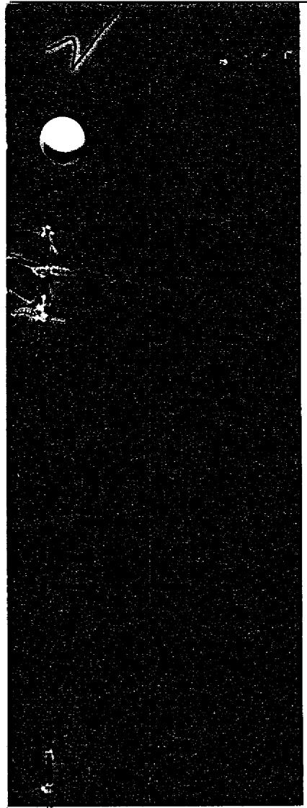

# EVALUATION OF HASTELLOY N ALLOYS

# AFTER NINE YEARS EXPOSURE TO BOTH

# A MOLTEN FLUORIDE SALT AND AIR AT

# TEMPERATURES FROM 700 TO $560^{\circ}C$

J. W. Koger

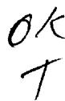

THIS DOCUMENT CONFIRMED AS UNCLASSIFIED

DIVISION OF CLASSIFICATION

BY TL CuCChiCar pAB

DATE 8/11/73

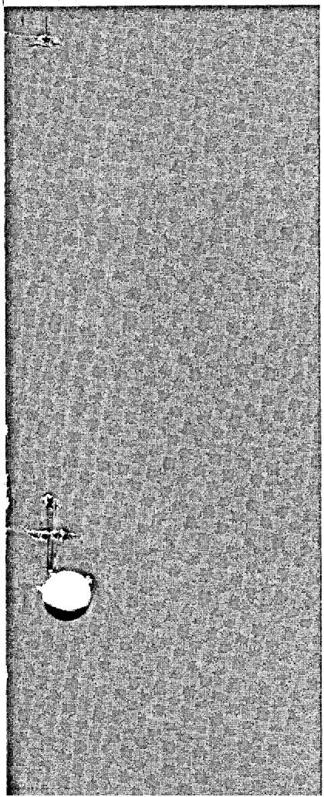

OAK RIDGE NATIONAL LABORATORY

OPERATED BY UNION CARBIDE CORPORATION FOR THE U.S. ATOMIC ENERGY COMMISSION

This report was prepared as an account of work sponsored by the United States Government. Neither the United States nor the United States Atomic Energy Commission, nor any of their employees, nor any of their contractors, subcontractors, or their employees, makes any warranty, express or implied, or assumes any legal liability or responsibility for the accuracy, completeness or usefulness of any information, apparatus, product or process disclosed, or represents that its use would not infringe privately owned rights.

Contract No. W-7405-eng-26

METALS AND CERAMICS DIVISION

EVALUATION OF HASTELLOY N ALLOYS AFTER NINE YEARS EXPOSURE TO BOTH A MOLTEN FLUORIDE SALT AND AIR AT TEMPERATURES FROM 700 TO $560^{\circ}C$

J.W.Koger

DECEMBER 1972

# -NOTICE

This report was prepared as an account of work sponsored by the United States Government. Neither the United States nor the United States Atomic Energy Commission, nor any of their employees, nor any of their contractors, subcontractors, or their employees, makes any warranty, express or implied, or assumes any legal liability or responsibility for the accuracy, completeness or usefulness of any information, apparatus, product or process disclosed, or represents that its use would not infringe privately owned rights.

OAK RIDGE NATIONAL LABORATORY

Oak Ridge, Tennessee 37830

operated by

UNION CARBIDE CORPORATION

for the

U.S. ATOMIC ENERGY COMMISSION

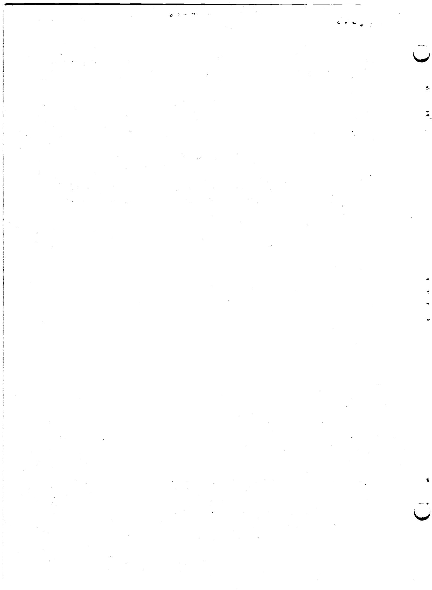

# CONTENTS

Abstract 1   
Introduction 1   
Experimental Procedure and Materials 3   
Results 5

Loop Failure 5   
Mass Transfer 11   
Air Oxidation 19   
Weld Corrosion Resistance 20

Discussion 26

Temperature-Gradient Mass Transfer 26   
Void Formation 29   
Comparison of Mass Transfer in Loop 1255 and Another Hastelloy N Loop 29   
Comparison of Mass Transfer in Loop 1255 and a Type 304L Stainless Steel Loop 31   
Mass Transfer Calculations 31   
Failure Analysis 34   
Air Oxidation 34   
Weld Corrosion Resistance 34

Conclusions 35

# EVALUATION OF HASTELLOY N ALLOYS AFTER NINE YEARS EXPOSURE TO BOTH A MOLTEN FLUORIDE SALT AND AIR AT TEMPERATURES FROM 700 TO $560^{\circ}\mathrm{C}$

J. W. Koger

# ABSTRACT

A Hastelloy N thermal convection loop, some portions of which consisted of a Hastelloy N alloy modified with $2\%$ Nb for improved weld properties and containing LiF-23 mole $\%$ $\mathrm{BeF}_2 - 5$ mole $\%$ $\mathrm{ZrF_4 - 1}$ mole $\%$ $\mathrm{UF_4 - 1}$ mole $\%$ $\mathrm{ThF_4}$ , was operated for 9.2 years at a maximum temperature of $700^{\circ}\mathrm{C}$ and a minimum of $560^{\circ}\mathrm{C}$ . Loop operation ended with the occurrence of a salt leak. The failure of the loop was attributed to a reaction between impurities in a ceramic bushing and the modified Hastelloy $\mathbf{N} - 2\%$ Nb tubing. Microscopic examination of the loop tubing revealed that mass transfer of material (material removal and deposition) did occur. The attack, which occurred in the hot section, was manifested in the formation of voids, in a zone of maximum depth of 4 mils. Deposition was noted on the colder portions. On the basis of salt analysis and microprobe analysis of the tubing, the mass transfer appeared to be selective with respect to chromium, which is what would be predicted from thermodynamic considerations. The actual void formation and chromium depletion agrees favorably with that predicted from calculations. No difference in corrosion could be seen in the standard Hastelloy N and the modified Hastelloy $\mathbf{N} - 2\%$ Nb alloy. No change in mass transfer could be seen in the welded areas. A two-layer oxide of 2 mils thickness was the maximum formed under the heaters in 9.2 years exposure to air. Hastelloy N is much more resistant to mass transfer than type 304L stainless steel exposed to the same salt under similar conditions. It was concluded from this experiment that Hastelloy N is suitable for long-term use as a container material for the molten salt used in this test and has acceptable air oxidation resistance at the temperatures tested.

# INTRODUCTION

Hastelloy N (initially known as INOR-8, nominal composition $72\%$ Ni- $16\%$ Mo- $7\%$ Cr- $5\%$ Fe) was developed at the Oak Ridge National Laboratory (ORNL) in the Aircraft Nuclear Propulsion (ANP) Program and was viewed as the most promising container material for molten fluorides exposed to the severe $(800^{\circ}\mathrm{C})$ ANP conditions. Actual use of Hastelloy N in the Molten Salt Reactor Experiment (MSRE) and in many experimental programs has shown that the alloy is an effective container material for molten fluoride salt under a variety of conditions. However, during routine qualification of welders on Hastelloy N material in 1961 (before widespread use of the alloy) the presence of a possible weld-cracking problem was detected in one heat of the alloy. Both bend tests and metallographic examination revealed the incidence of cracking, and a cursory examination of the welding procedures indicated no obvious remedy. Because of the importance of this problem an investigation was immediately started to determine its seriousness and to develop preventive methods.

In one effort to overcome the weld-metal cracking difficulties, an experimental Hastelloy N weld-metal composition containing 2 wt % Nb was investigated. This filler metal was developed in the course of the Hastelloy N welding program conducted by the Welding and Brazing Laboratory of ORNL and was considered exceptionally promising in view of its excellent elevated-temperature mechanical properties.[2] Welds made on the suspect heat of plate exhibited no evidence of weld-metal cracking, either in bend tests or in metallographic sections. Wire from two laboratory melts of this alloy was deposited with no evidence of defects in the weld metal, indicating that use of this alloy would prevent weld-metal cracking.

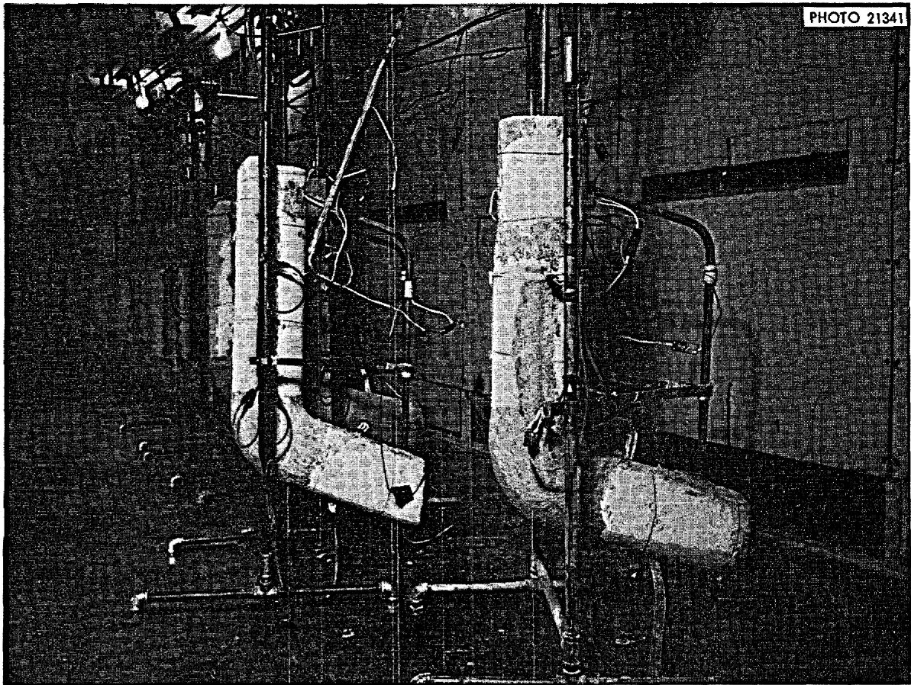  
Fig. 1. Thermal convection loops in operation.

Because of the possible widespread use of the modified alloy in a molten fluoride salt environment, corrosion tests were scheduled to evaluate the resistance to salt attack of Hastelloy N that had been modified by the addition of $2\%$ Nb. In addition to corrosion data on Hastelloy N- $2\%$ Nb, it was planned that these tests would also supply data on the corrosion properties of various types of weld junctions listed below:

1. Hastelloy N welded with Hastelloy N weld rod,   
2. Hastelloy N welded with Hastelloy $\mathbf{N} - 2\%$ Nb weld rod,   
3. Hastelloy N-2% Nb welded with Hastelloy N-2% Nb weld rod.

Since molten salts in a reactor system would most likely be used as heat transfer fluids, the corrosion test was conducted in a loop system which would provide flow and a temperature gradient. The test system used was a Hastelloy N thermal convection loop (designated loop 1255) similar to the ones shown in Fig. 1. The temperature gradient is produced by heating a portion of the loop while insulating or exposing the remainder of the loop to ambient air as necessary to provide the desired temperature difference. The salt flow results from the difference in density of the salt in the hot and cold portions of the loop. The maximum temperature chosen for this test was $700^{\circ}\mathrm{C}$ and the minimum $560^{\circ}\mathrm{C}$ . The velocity of the salt resulting from this temperature difference was approximately 5 bpm.

The experiment was started April 11, 1962, and, with only a few minor interruptions, operated until July 20, 1971. On the day operation was ended, the amperage to the loop heaters decreased to one-half of normal. Investigation revealed that half the main heaters were open and, in addition, grounded (which often indicates the presence of salt). At this time, all power to the loop was shut down. After cool-down, the insulation and heaters were removed, revealing a small amount of salt on the outside of the tubing.

During the last few years, we planned to operate the loop as long as possible to provide long-term data on mass transfer in a fluoride salt, air oxidation of Hastelloy N, and corrosion properties of various weld junctions. Thus, the failure provided an end to the experiment. In this report, we will discuss the loop failure, the compatibility of the Hastelloy N alloys and their welds with the salt, and the air oxidation of the alloy. The results of this experiment are still quite significant in that recent developments3 have indicated that certain Hastelloy N alloys containing additions of Ti, Hf, Nb, and Zr have good mechanical properties (better than standard Hastelloy N) after being irradiated at $760^{\circ}\mathrm{C}$ . Thus, the possibility of using a modified alloy similar to the one tested in this experiment still exists.

# EXPERIMENTAL PROCEDURE AND MATERIALS

Figure 2 is a photograph of a typical thermal convection loop with heaters and thermocouples installed but without insulation. Thermocouples are located at the top of the hot and cold leg, at the bottom of the cold leg, at the insert specimen locations, and over the modified Hastelloy N tubing. A schematic view of the loop is shown in Fig. 3. The parts of the loop we will refer to are the hot leg (heated vertical tubing), cold leg (unheated vertical tubing), upper crossover, and lower crossover. The major portion of the loop was constructed of $\frac{3}{8}$ -in. sched 10 standard Hastelloy N pipe (approx 0.675 in. OD) from heat No. Y-8460 (Superior Tube) and an experimental heat specified as Haynes SP-19. The top 9 in. of the hot leg contained two tube inserts. The top insert was Hastelloy N-2% Nb, and the bottom one was standard Hastelloy N. The inserts were 3-in.-long cylinders, 0.595 in. OD, 0.025 in. wall, which were fitted into machined portions of the loop tubing, thus retaining the same flow cross section throughout the loop. The next 6-in. section of the hot leg was Hastelloy N-2% Nb tubing, and the remainder of the loop was standard Hastelloy N. The Hastelloy N-2% Nb alloy was from experimental heat MP-13. The compositions of the alloys are given in Table 1.

In forming the modified Hastelloy N tubing, a $\frac{1}{4}$ -in. slab was first rolled and cross-rolled until the final thickness was approximately 0.040 in. The sheet was then formed into a tube and welded with Hastelloy N-2% Nb weld wire. The insert tubing was swaged to approximate size and then machined to final tolerance, while the loop tubing was used as fabricated.

Table 1. Composition of alloys   

<table><tr><td></td><td>Cr</td><td>Mo</td><td>Fe</td><td>Nb</td><td>Mn</td><td>Si</td><td>Ni</td></tr><tr><td>Hastelloy N-2% Nb</td><td>7.5</td><td>15.4</td><td>3.9</td><td>2.1</td><td>0.54</td><td>N.a.</td><td>Bal</td></tr><tr><td>Regular Hastelloy N (Haynes SP-19)</td><td>7.4</td><td>16.7</td><td>4.8</td><td></td><td>0.48</td><td>0.13</td><td>Bal</td></tr><tr><td>Regular Hastelloy N (Heat Y-8460)</td><td>7.3</td><td>15.9</td><td>2.4</td><td></td><td>0.31</td><td>0.15</td><td>Bal</td></tr></table>

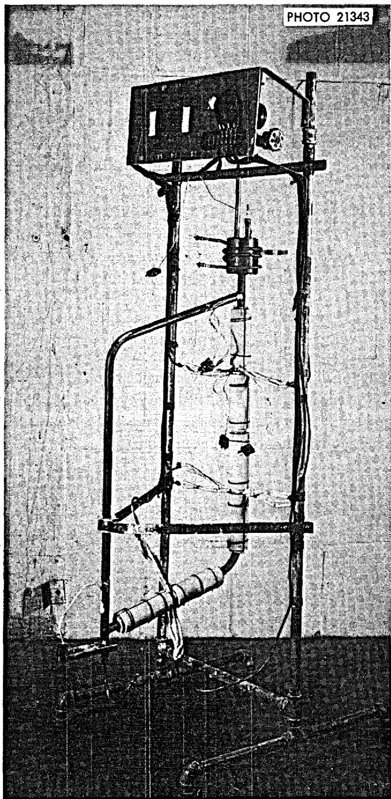  
Fig. 2. Thermal convection loop with heaters and thermocouples installed.

The hot portion of each loop was heated by sets of clamshell heaters with the input power controlled by silicon controlled rectifiers (SCR units) and the temperature controlled by a Leeds and Northrup Speedomax H series 60 type C.A.T. (current proportioning) controller. Ceramic bushings were used to space the heaters from the loop. The loop temperatures were measured by Chromel-P vs Alumel thermocouples that were spot welded to the outside of the tubing, covered by a layer of quartz tape, and then covered with Inconel shim stock.

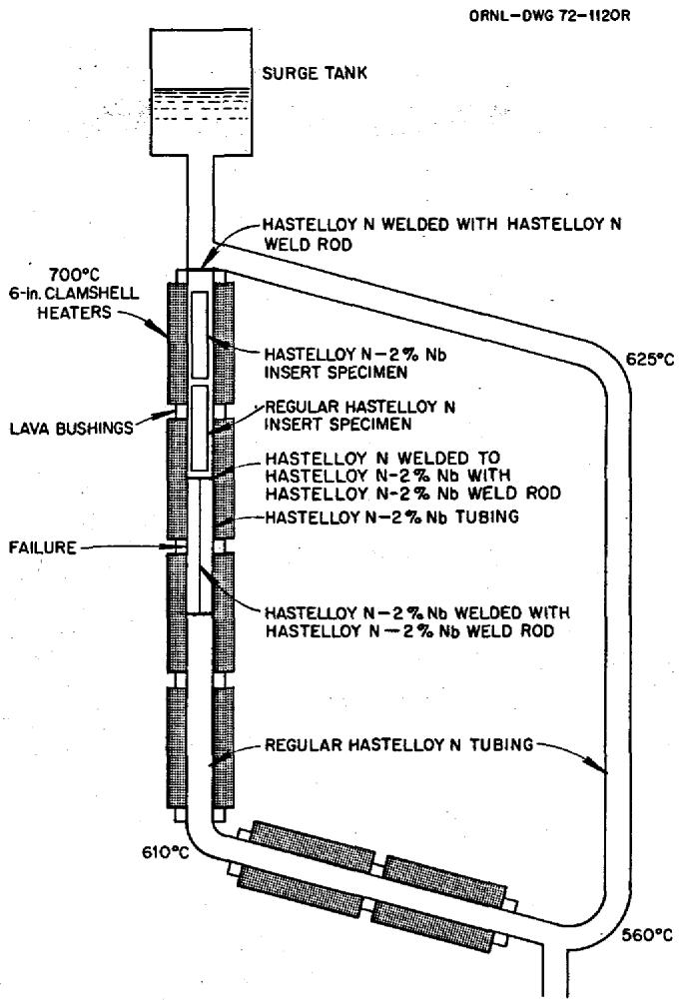  
Fig. 3. Schematic view of thermal convection loop.

Prior to filling, the loop was heated under a vacuum of $10\mu$ for leak-checking and bake-out. The loop was then filled with flush salt, which was dumped after $2\mathrm{hr}$ , and then was filled with the operating salt. The salt used was the proposed MSRE fuel salt with a nominal composition of LiF-23 mole $\%$ BeF $_2$ -5 mole $\%$ ZrF $_4$ -1 mole $\%$ UF $_4$ -1 mole $\%$ ThF $_4$ . The operating temperatures are given in Fig. 3.

This loop had no facility in which to dump the salt at the end of operation, so the salt was frozen in place. To remove the salt, various portions of the loop were cut into small pieces, placed in a graphite-lined nickel container, and heated under argon for 4 hr at $800^{\circ}\mathrm{C}$ .

# RESULTS

# Loop Failure

The loop failure occurred in the middle of the hot leg under the ceramic bushing between two sets of heaters. The bushing material used was grade A Lava, which was manufactured by the American Lava Company. Grade A Lava is hydrous aluminum silicate fired after machining to drive off the chemically bound water and develop a hard electric insulator.

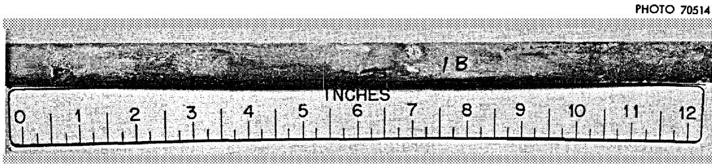  
Fig. 4. Corrosive attack on exterior of Hastelloy N tubing underneath ceramic bushings after 552 hr at 675 to $785^{\circ}\mathrm{C}$ .

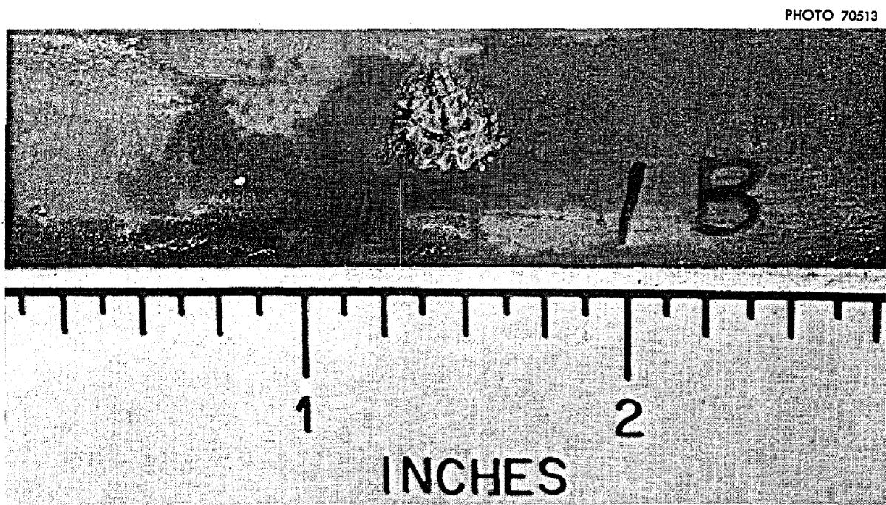  
Fig. 5. Close-up of deepest exterior corrosion pit on Hastelloy N tubing. Depth of pit, 0.037 in.

Background. Metal-bushing compatibility problems have previously existed, and at least one case involving Hastelloy N at ORNL has been reported. In 1964, ORNL conducted a corrosion program in support of the SNAP-8 electrical-generating system. A "chromized" Hastelloy N was used as the fuel cladding and contained NaK. Several instances of excessive corrosion were noted on the exterior of the "chromized" Hastelloy N tubing underneath ceramic bushings similar to those used in loop 1255. The first instance noted was on a loop after 552 hr of operation at design temperature, $760^{\circ}\mathrm{C}$ maximum, $593^{\circ}\mathrm{C}$ minimum. The corrosion was found during replacement of heaters. No NaK leakage had occurred. Exterior pitting was found on the chromized $\frac{3}{4}$ -in.-OD, 0.072-in.-wall Hastelloy N tubing under the ceramic bushings (grade A Lava, unfired) used to space the electric heaters from the tubing (Fig. 4). The attack was noticeable on the tube wall at the location where the temperature was estimated to have reached $675^{\circ}\mathrm{C}$ , and the attack increased toward the high-temperature end of the tubing, where the temperature was calculated to have been approximately $785^{\circ}\mathrm{C}$ . The maximum attack found near the hottest end of the tube (Fig. 5) was 0.037 in. deep, as determined by external measurements and x rays of the area. While the exact

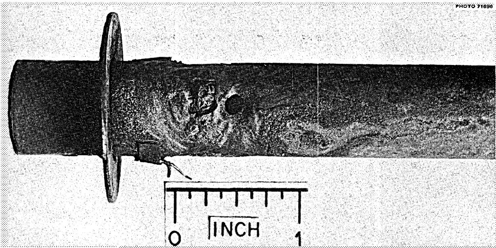  
Fig. 6. Failed region of Hastelloy N hot-spot piping. Loop operated $1300\mathrm{hr}$ at $785^{\circ}\mathrm{C}$ .

nature of this attack was not determined, it was attributed to oxidation-inducing volatile material driven out of the ceramic bushings. Subsequent to this, all ceramic bushings of the grade A Lava type were fired at $1100^{\circ}\mathrm{C}$ prior to installation.

The second case of exterior corrosion on chromized Hastelloy N happened later in the same program on another loop. The exterior corrosion occurred on the $3/4$ -in.-OD, 0.072-in.-thick wall of the hot-spot section, which was operating at $785^{\circ}\mathrm{C}$ . A NaK leak developed after $1300\mathrm{hr}$ of operation. Visual inspection of the failed area showed that the Hastelloy N piping had been excessively oxidized in very localized areas under the fired ceramic insulator bushing in the heater section. Figure 6 shows both the hole through which the leak occurred and an adjacent area with accelerated oxidation that had not quite penetrated the wall. A magnified section taken through the area adjacent to the hole is shown in Fig. 7. The metallographic examination revealed a mixture of metal and oxides in the corrosion products, which x-ray-diffraction analysis proved to be mostly nickel and NiO.

The circumstances surrounding this incidence of catastrophic oxidation suggest that breakdown of the normally protective oxide layer on the pipe exterior surface was attributable either to contamination from some unknown element or compound in the ceramic bushing or to oxygen starvation in the stagnant area under the bushing. An Inconel shim was placed between the ceramic bushings and the tubing to eliminate these conditions in the remaining loops.

Loop 1255. Figure 8 shows a macrograph and a micrograph of the failed region that ended the operation of loop 1255 (Fig. 3). The tubing in this section of the loop was modified Hastelloy N with the $2\%$ Nb added. The longitudinal weld which joined the tubing is also shown in Fig. 8a. A micrograph of the weld will be seen in a later section of the report. Electron beam scanning images were made of the area just to the left of the portion of the tube wall that was attacked (circled area of Fig. 8a). This area, shown in Fig. 8b, included the Inconel 600 shim stock (foil) which covered the thermocouple, a spongy oxide which

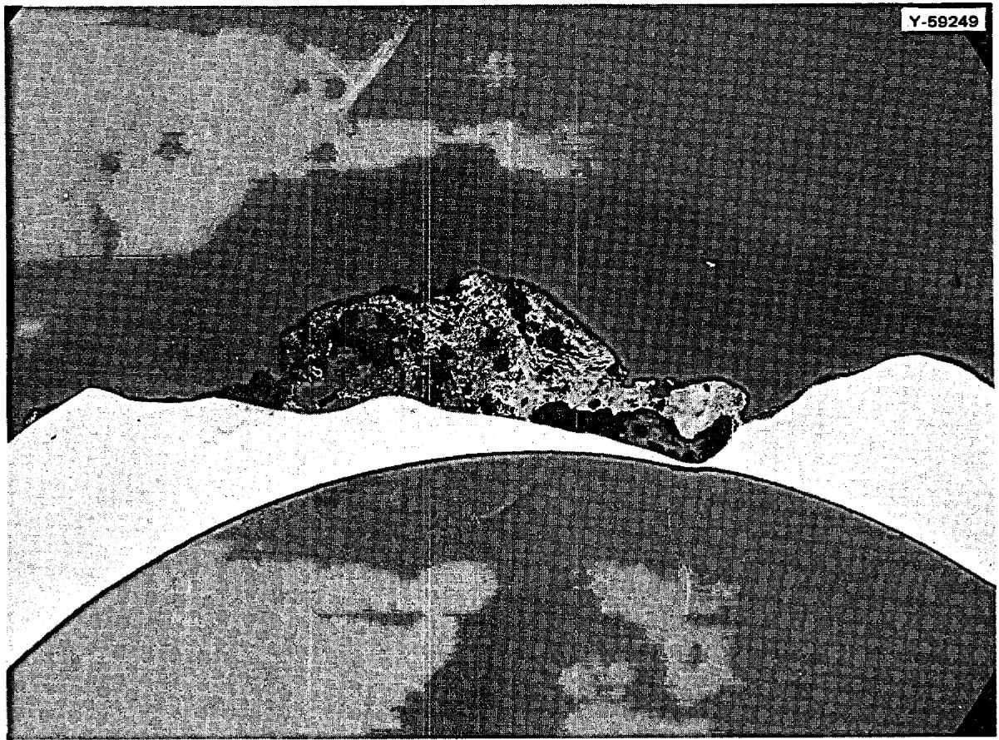  
Fig. 7. Cross section of oxidized region adjacent to hole in failed section of loop. As polished, about $14 \times$

also included frozen salt that had leaked out, and a layered oxide found on both sides of the foil. The electron beam scanning images are shown in Fig. 9. The quantitative values are given in Table 2.

The analysis of the spongy-oxide-salt mixture combination shows an agglomerate of oxides and metal which includes the elements zirconium, molybdenum, iron, nickel, and chromium. The composition shown in Table 2 reflects an average of three readings in different areas for each element. The zirconium probably comes from the salt, while the other elements are constituents of the alloy which have been removed from the Hastelloy N during the failure process.

Table 2. Composition of foil and oxide in the failed region   

<table><tr><td rowspan="2"></td><td colspan="5">Weight percenta</td></tr><tr><td>Ni</td><td>Fe</td><td>Cr</td><td>Mo</td><td>Zr</td></tr><tr><td>Foil</td><td>90.0</td><td>0.8</td><td>9.1</td><td>&lt;0.5</td><td>&lt;0.5</td></tr><tr><td>Spongy-oxide-salt mixture, average</td><td>19.8</td><td>1.6</td><td>1.9</td><td>17.3</td><td>11.3</td></tr><tr><td>Adherent oxide</td><td>4.8</td><td>0.7</td><td>16.2</td><td>22.7</td><td>7.5</td></tr></table>

${}^{a}$ Data corrected for absorption,fluorescence,and atomic number effects using the theoretical alpha method.

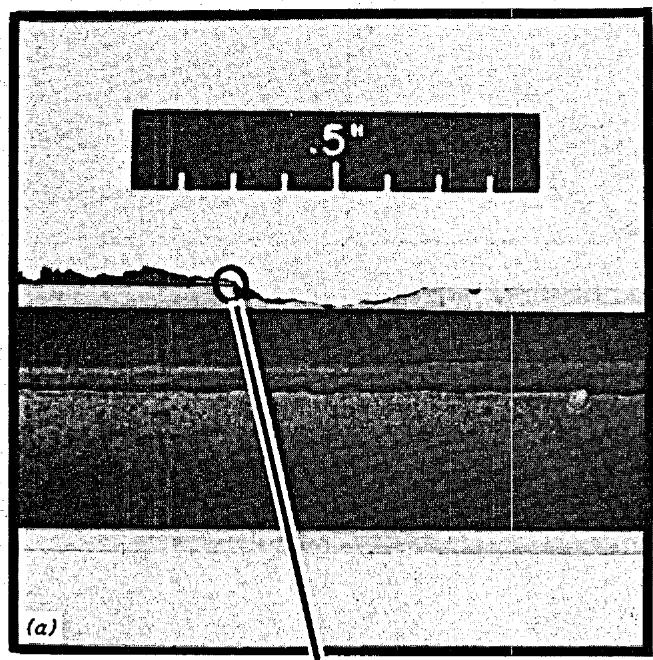

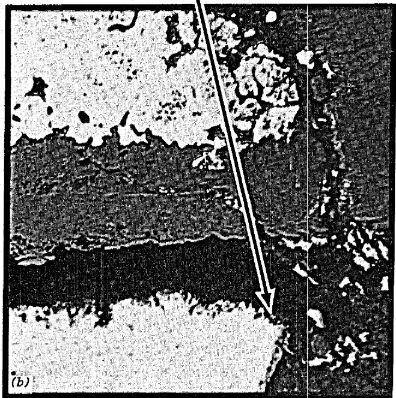  
Fig. 8. Failed region of loop 1255. (a) Macrograph of modified Hastelloy N-2% Nb tubing and the failure. Circled area was analyzed with the electron beam microanalyzer. (b) Optical micrograph of circled area.

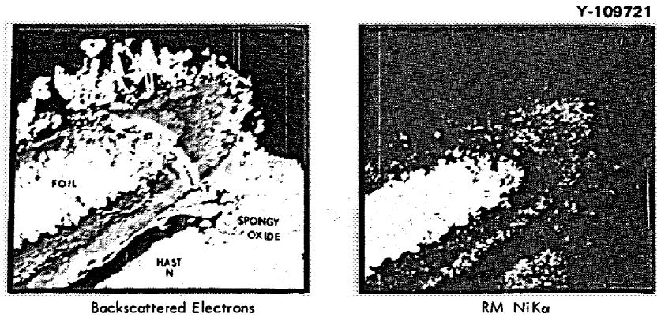

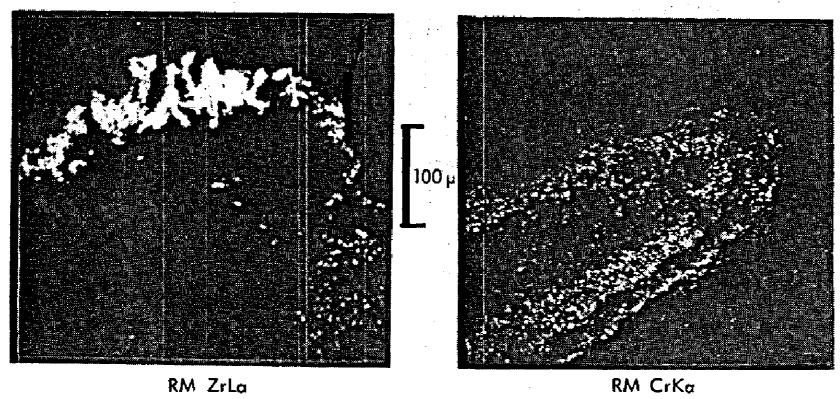

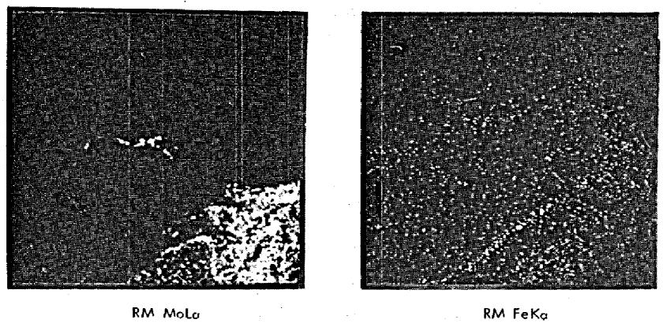  
Fig. 9. Electron beam scanning images of area near the failure.

The foil, which analyzed as $90\% \mathrm{Ni} - 9\% \mathrm{Cr} - 1\% \mathrm{Fe}$ , was documented as Inconel 600, and its purpose was to cover the thermocouples. The nominal composition of Inconel 600 is $76\% \mathrm{Ni} - 16\% \mathrm{Cr} - 8\% \mathrm{Fe}$ ; thus it was possible that iron and chromium were depleted from the Inconel 600 during the reaction that caused the failure. It is also possible that the foil was not Inconel 600.

The adherent metal oxide on this alloy would normally contain only nickel and chromium, but the analysis also showed substantial quantities of elements that were present in the spongy-oxide-salt mixture. Thus, this analysis represented a mixture of reaction products.

Figure 10 shows the tubing at the point of failure. Note that the largest amount of material is removed at the outer surface, with the amount of material removed decreasing as the inner surface is approached. This mode of material removal establishes the outside-to-inside direction of the failure process.

Fig. 10. Micrograph of modified Hastelloy N-2% Nb at the point of failure. Location C, Fig. 11. Outside surface at top; inside surface (exposed to salt) at bottom. As polished.   
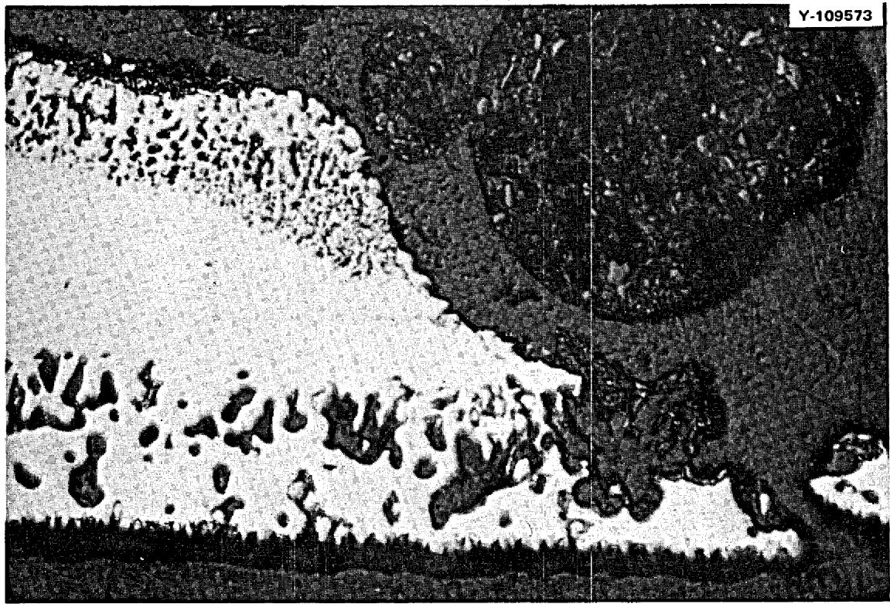  
0.007 INCHES 10.007 in. 1 500x 10.003 in. 1 10.001 in.

# Mass Transfer

The salt analysis before and after test is given in Table 3. Of importance here is the large amount of chromium after test, representing a large increase, with little if any change in the other constituents or impurities.

Figure 11 shows representative micrographs of the inside surface (exposed to salt) of specimens and tubing completely around the loop. Note the attack and void formation in the heated areas (hot leg) and the deposition in the cooler regions. Figures 12 and 13 show micrographs of the inside surfaces of the insert specimens. Figure 12 shows the modified Hastelloy N-2% Nb insert specimen from the top of the hot leg (A, Fig. 11). The salt temperature at this position was approximately $695^{\circ}\mathrm{C}$ . Voids extend 2 mils into the matrix. The etched specimen shows that the etching characteristics of the material near the surface are quite different from the matrix. This generally represents depletion of an alloy constituent - in this case, chromium. Figure 13 shows the standard Hastelloy N insert specimen located 6-9 in. below the top of the hot leg (B, Fig. 11). The salt temperature at this location was approximately $675^{\circ}\mathrm{C}$ . These voids extend about 3 mils into the matrix. Again, the etching delineates the depleted area.

Table 3. Analysis of salt circulated in Hastelloy N loop for nine years before and after test   

<table><tr><td rowspan="2"></td><td colspan="6">Weight percent</td><td colspan="5">Ppm</td></tr><tr><td>Li</td><td>Be</td><td>U</td><td>Th</td><td>Zr</td><td>F</td><td>Ni</td><td>Cr</td><td>Fe</td><td>Mo</td><td>Nb</td></tr><tr><td>Béfore</td><td>10.0</td><td>5.60</td><td>5.97</td><td>5.73</td><td>9.94</td><td>62.6</td><td>40</td><td>100</td><td>120</td><td></td><td></td></tr><tr><td>After</td><td>10.8</td><td>4.99</td><td>6.15</td><td>6.28</td><td>8.77</td><td>62.9</td><td>101</td><td>1800</td><td>69</td><td>23</td><td>87</td></tr></table>

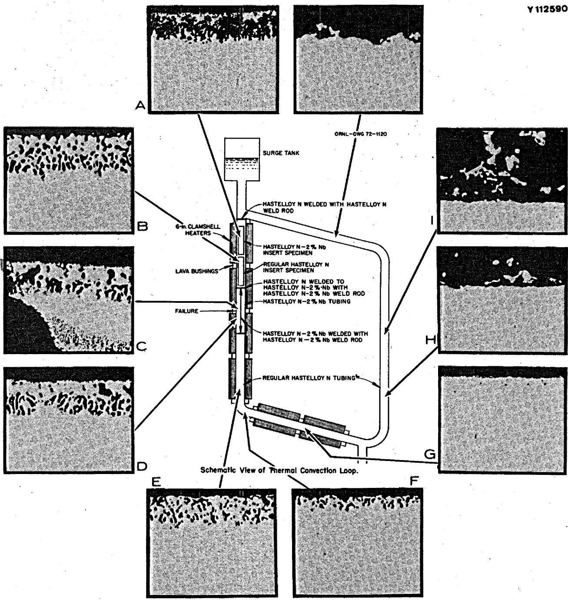  
Fig. 11. Micrographs of tubing and specimens from loop 1255 exposed to LiF-23 mole $\%$ BeF $_2$ -5 mole $\%$ ZrF $_4$ -1 mole $\%$ ThF $_4$ -1 mole $\%$ UF $_4$ molten salt at $560 - 700^{\circ}\mathrm{C}$ for 9.2 years. As polished, $500\times$ . Reduced $15\%$ .

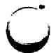

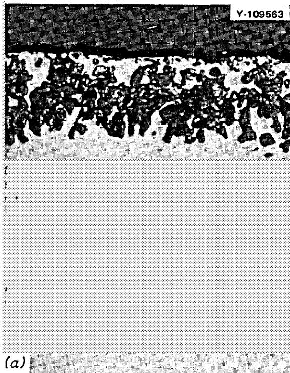

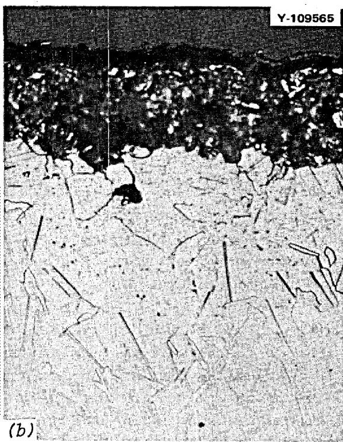  
10.007 INCHES 10.006 in. 1 500X 10.003 in. 1 10.001 in.

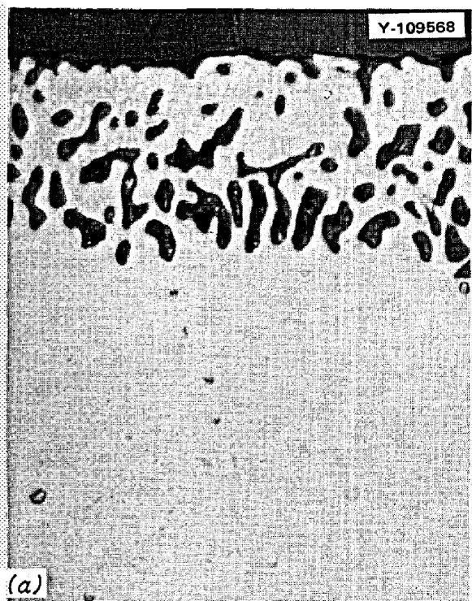  
Fig. 12. Inside surface of modified Hastelloy N-2% Nb insert specimen, exposed to salt at $687 - 700^{\circ}\mathrm{C}$ . Location A, Fig. 11. (a) As polished, (b) etched with glyceria regia.

Fig. 13. Inside surface of standard Hastelloy N insert specimen, exposed to salt at $665 - 687^{\circ}\mathbf{C}$ . Location B, Fig. 11. (a) As polished, (b) etched with glyceria regia.   
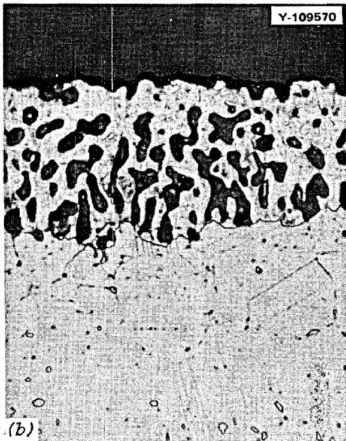  
0.007 INCHES 10.005 in. 1 500x 10.003 in. 1 10.001 in.

Figure 14 shows through-wall sections of both insert specimens. The inner surface of the insert specimens was exposed to the salt, while the outer surface was in contact with the inner surface of the loop tubing, which was directly under a heater. Note the poor outside surface of the modified alloy. In fabricating these specimens, the material was swaged and machined; this is the surface resulting from these operations. We also note that the areas modified by heating (outer surface) and by corrosion (inner surface) have approximately the same affected thickness (5 mils) for both alloys. On the outer surface, the depth of disturbance (as seen by the disappearance of the precipitate, probably carbides) is 5 mils. On the inner surface, the layer that contains the voids is 2 or 3 mils deep, with carbide removal (probably redistribution) extending another 2 mils. It is also noted that the precipitates in the standard alloy are spherical, while those in the modified alloy are platelike. Thus the niobium addition also affects the morphology of the carbides in the Hastelloy N. X-ray diffraction of electrolytically extracted precipitates (matrix dissolved) from the modified alloy shows the presence of both $\mathbf{M}_6\mathbf{C}$ and $\mathrm{Ni}_3\mathrm{Mo}$ . The metallic constituents of $\mathbf{M}_6\mathbf{C}$ are primarily nickel and molybdenum with some chromium. The carbide is rich in silicon as compared with the matrix.

Figure 15 is the modified Hastelloy N-2% Nb tubing away from the failure $(D, \text{Fig. 11})$ . The temperature of the salt at this position during operation was approximately $650^{\circ}\text{C}$ . Voids at this location extend 3 to 4 mils into the matrix. An electron microprobe scan analysis of the salt-exposed surface disclosed a chromium- and iron-depleted area of $75\mu$ (3 mils). Table 4 gives quantitative values for the alloy constituents as obtained by the microprobe. Figure 10 shows similar void formation on the inner surface of the Hastelloy N-2% Nb tubing at the point of failure.

Figures 16 and 17 show the standard Hastelloy N tubing at the lower portion of the hot leg. The voids extend about 2 mils into the alloy in Fig. 16, at approximately $630^{\circ}\mathrm{C}$ (E, Fig. 11), and 1 mil in Fig. 17, at

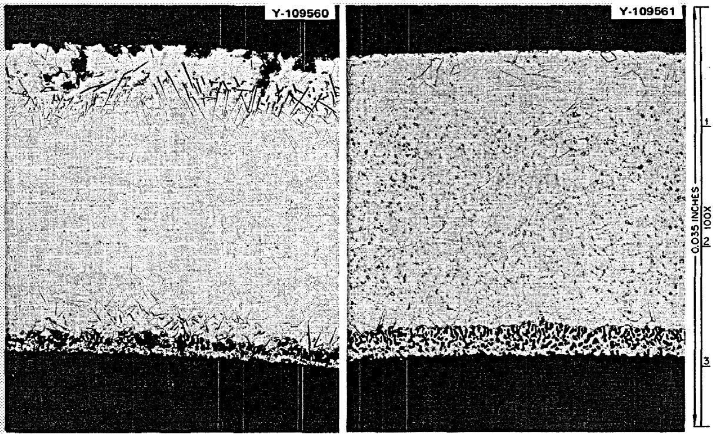  
Fig. 14. Cross sections of Hastelloy N insert specimens. (a) Modified Hastelloy N-2% Nb (A, Fig. 11), (b) standard Hastelloy N (B, Fig. 11). Outside surface, exposed to air, at top; inside surface, exposed to salt, at bottom. Etched with glyceria regia.

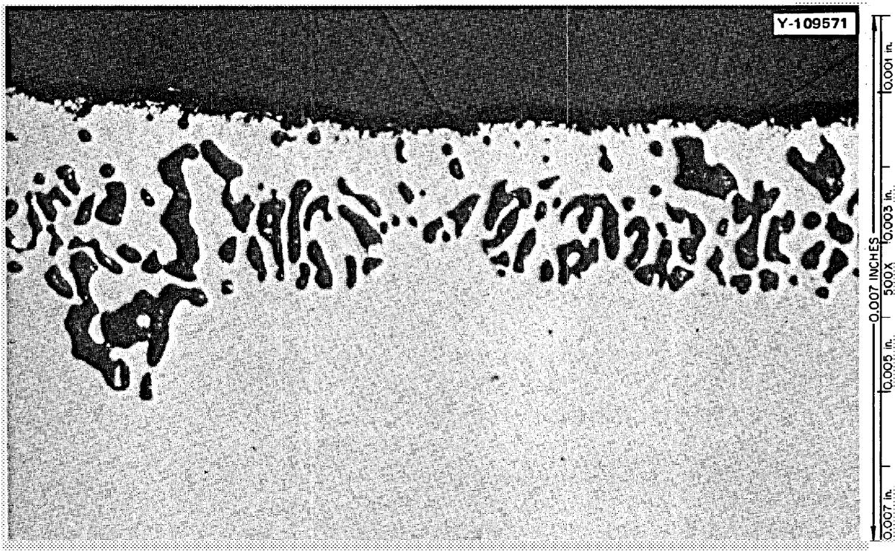  
Fig. 15. Inside surface of modified Hastelloy N-2% Nb tubing, exposed to salt at $640 - 665^{\circ}\mathrm{C}$ . Location D, Fig. 11. As polished.

Table 4. Composition of Hastelloy N alloy and depleted layer   

<table><tr><td rowspan="2"></td><td colspan="4">Weight percenta</td></tr><tr><td>Ni</td><td>Fe</td><td>Cr</td><td>Mo</td></tr><tr><td>Inside surface disturbed layer</td><td>77.9</td><td>&lt;0.5</td><td>0.5</td><td>20.2</td></tr><tr><td>Matrix</td><td>71.8</td><td>4.5</td><td>7.3</td><td>16.0</td></tr></table>

${}^{a}$ Data corrected for absorption,fluorescence,and atomic number effects using the theoretical alpha method.

about $610^{\circ}\mathrm{C}$ ( $F$ , Fig. 11). In Fig. 16 it is also apparent that the carbides are removed from the grain boundaries for a distance of 2 mils, as compared with 1 mil in the lower T section.

Figure 18 is the micrograph of the middle of the upper crossover portion of the loop $(J, \text{Fig. 11})$ . The material is standard Hastelloy N tubing, and there are deposits on the surface. The temperature in this region was $660^{\circ}\text{C}$ .

Figure 19 is the midpoint of the standard Hastelloy N cold leg tubing $(593^{\circ}\mathrm{C};I,$ Fig. 11). Deposited material was pulled from the surface into the mounting material. Figure 20 is the lower portion of the cold leg $(H,$ Fig. 11) and shows fewer deposits, even though the temperature is lower $(560^{\circ}\mathrm{C})$

Figure 21 is the middle of the standard Hastelloy N lower crossover tubing $(G, \text{Fig. 11})$ . The temperature of the salt at this position was $580^{\circ}\text{C}$ . Little surface change is noted. In the as-polished micrograph, some deposit is seen; in the etched micrograph, carbide depletion and grain boundary modification are evident.

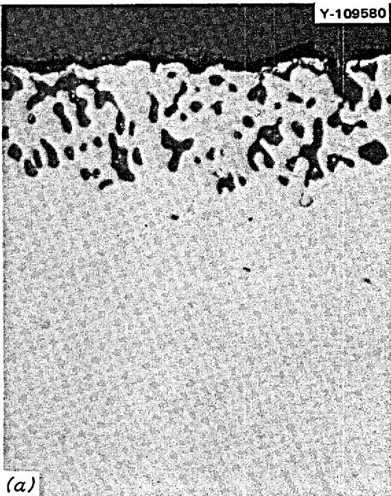

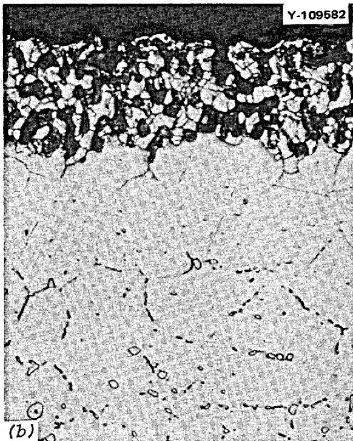  
Fig. 16. Inside surface of standard Hastelloy N tubing, exposed to salt at $620 - 640^{\circ}\mathbf{C}$ . Location $E$ , Fig. 11. (a) As polished, (b) etched with glyceria regia. $500\times$

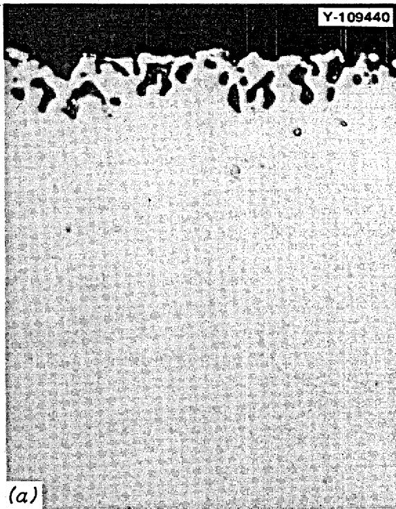

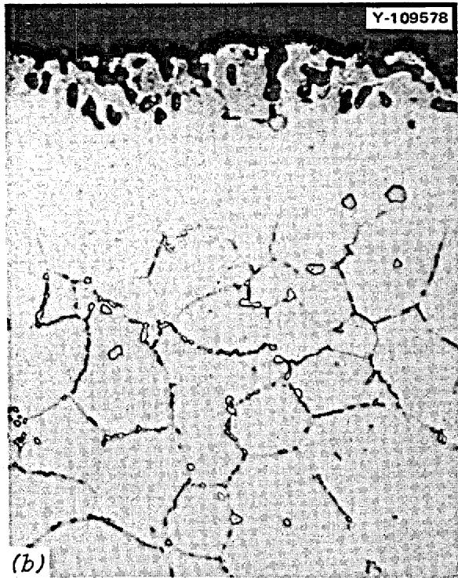  
Fig. 17. Inside surface of standard Hastelloy N tubing, exposed to salt at $604 - 620^{\circ}\mathrm{C}$ . Location $F$ , Fig. 11. (a) As polished, (b) etched with glyceria regia. $500\times$

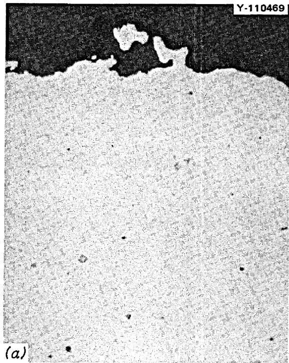

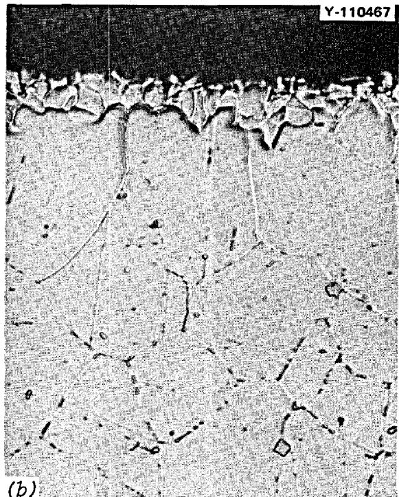  
Fig. 18. Inside surface of standard Hastelloy N tubing, exposed to salt at $660^{\circ}\mathrm{C}$ . Location $J$ , Fig. 11. (a) As polished, (b) etched with glyceria regia. $500\times$

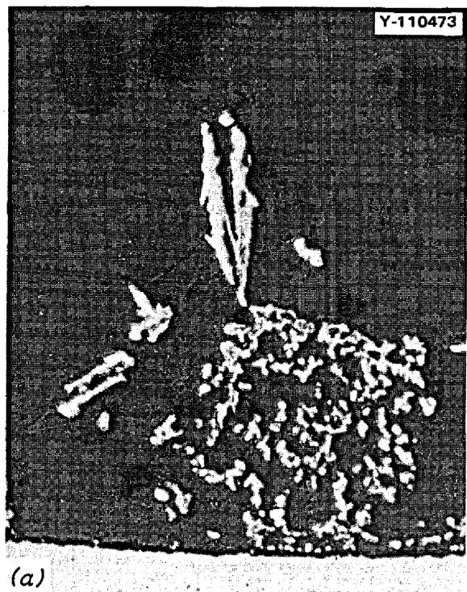

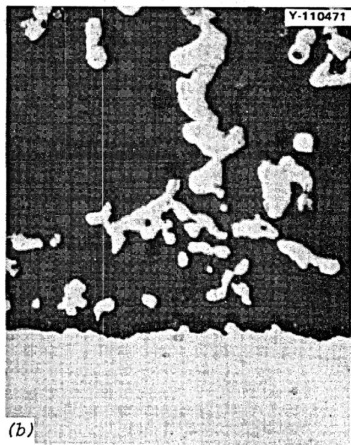  
Fig. 19. Inside surface of standard Hastelloy N tubing, exposed to salt at $593^{\circ}\mathbf{C}$ . Location I, Fig. 11. (a) $100\times$ , (b) $500\times$ .

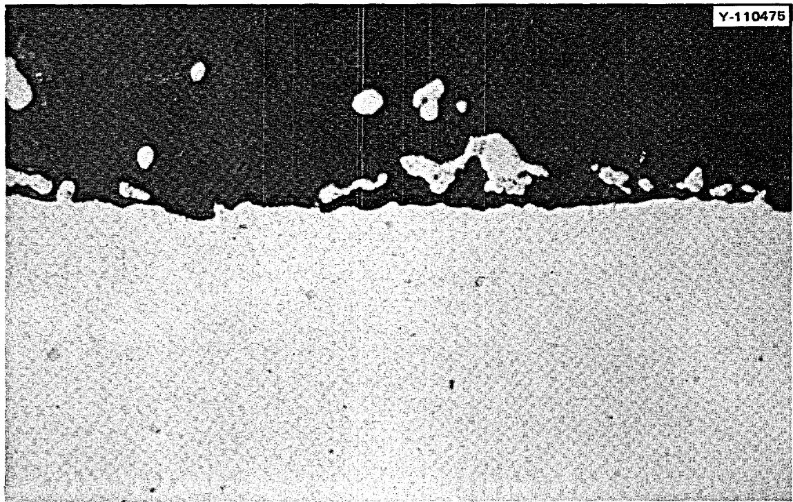  
0.007 INCHES

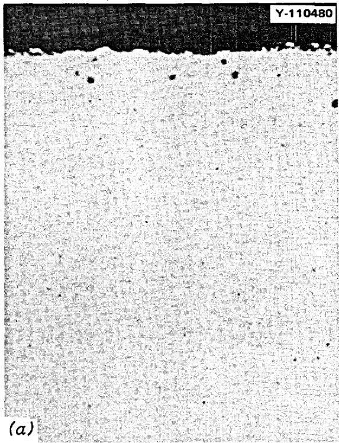  
Fig. 20. Inside surface of standard Hastelloy N tubing, exposed to salt at $560^{\circ}\mathrm{C}$ . Location $H$ , Fig. 11.

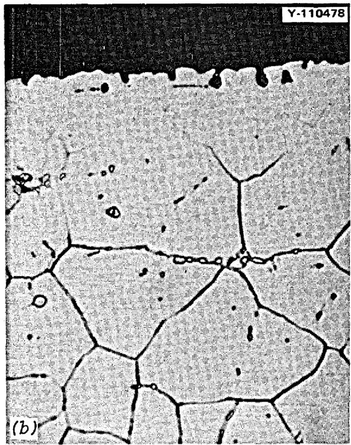  
Fig. 21. Inside surface of standard Hastelloy N tubing, exposed to salt at $580^{\circ}\mathrm{C}$ . Location G, Fig. 11. (a) As polished, (b) etched with glyceria regia. $500\times$ .

# Air Oxidation

Figure 22 shows micrographs of the outside of the tubing which had been exposed to air. The oxide layers on the outside of the loop tubing underneath heaters are shown in Figs. 23-25, and the oxide layers on the loop tubing just exposed to air are shown in Figs. 26-28. Figures 23-25 $(A, B, C, \text{Fig. 22})$ include the hot leg and lower crossover, while Figs. 26-28 $(D, E, F, \text{Fig. 22})$ include the upper crossover and the cold leg. The salt temperatures in these areas were 560 to $660^{\circ}\text{C}$ . The outside surfaces underneath heaters are appreciably hotter than the salt because of the temperature gradient across the salt film at the inside surface. This temperature difference mainly results from the fact that we have laminar flow. Because of the

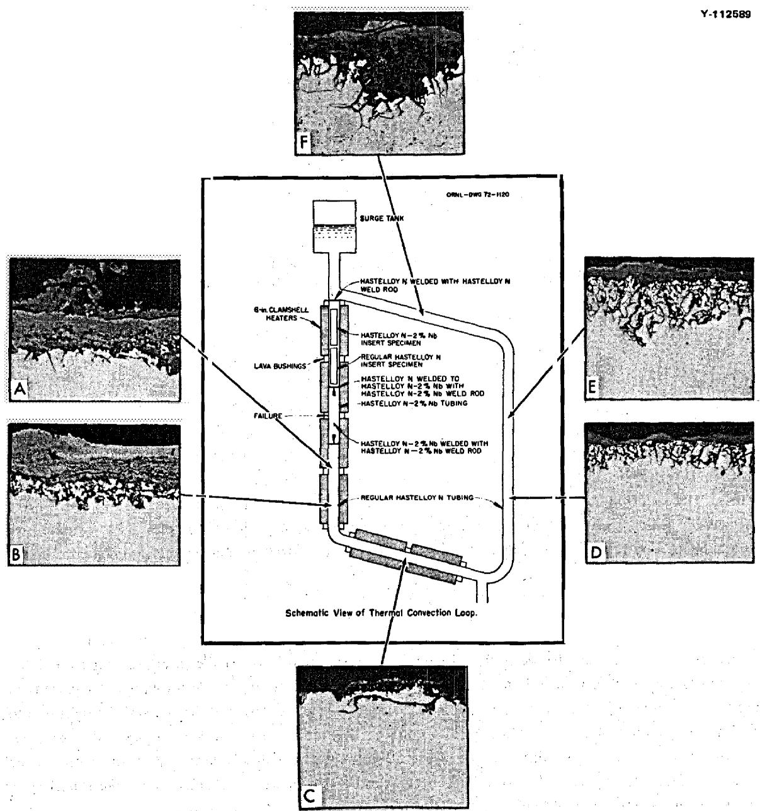  
Fig. 22. Micrographs of the outside of tubing of loop 1255, exposed to air at $560 - 700^{\circ}\mathrm{C}$ for 9.2 years. As polished, $500\times$ . Reduced $16\%$ .

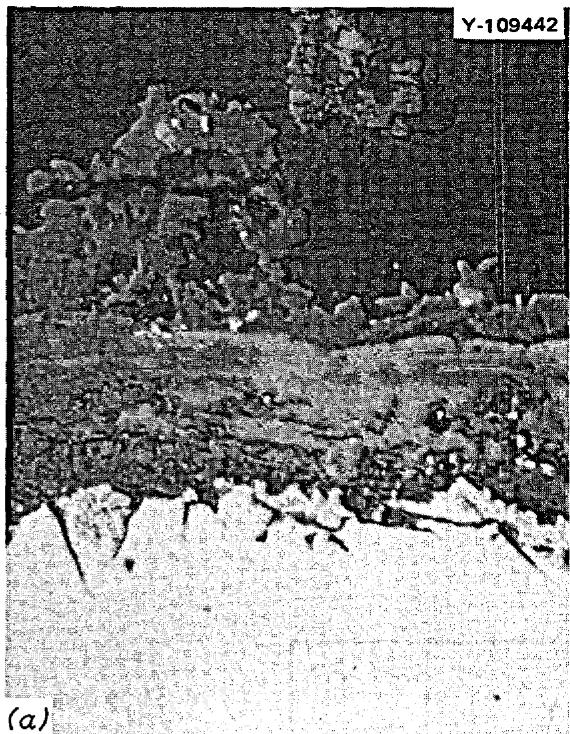

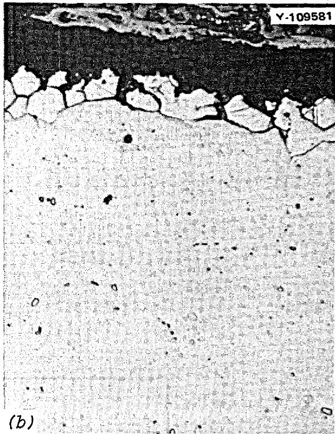  
Fig. 23. Outside surface of standard Hastelloy N tubing, exposed to air underneath a heater at temperatures above $620 - 640^{\circ}\mathbf{C}$ . Location A, Fig. 22. (a) As polished, (b) etched with glyceria regia. $500\times$ .

damage done to the outer surface of the tubing by the salt leakage at the failure, no outer surface samples from the upper portion of the hot leg were available for oxide layer analysis. Two layers of oxide, probably NiO and $\mathrm{Cr_2O_3}$ , are seen on most of our oxidized specimens. The existence of the $\mathrm{Cr_2O_3}$ on our Hastelloy N tubing is verified by the presence of chromium-depleted areas at the outer surface which extend into the matrix of the oxidized alloys. It is also interesting to note in Figs. 23b and 26b that etching completely destroyed the lower oxide layer, and $\mathrm{Cr_2O_3}$ is readily attacked by our etchant. In Ni-27% Cr alloys exposed to oxygen at $800 - 1200^{\circ}\mathrm{C}$ , NiO forms at the outer surface, followed by $\mathrm{Cr_2O_3}$ adjacent to the matrix. In oxidized Ni-Cr alloys with 3-10% chromium, the outer layer is NiO, followed by $\mathrm{Cr_2O_3}$ particles in a nickel matrix next to a surface. The etching of the oxidized samples disclosed extensive intergranular penetration which extended about 3 mils into the matrix. No oxide penetration greater than 3 mils was seen.

# Weld Corrosion Resistance

Figure 29 is the weld between the Hastelloy N tubing that covered the insert specimens and the modified Hastelloy N-2% Nb tubing. The upper right piece is the tubing, while the upper left piece is an insert spacer above which sat the insert specimen. The left side was exposed to the salt and the right side to air. The temperature of the salt at the weld was $665^{\circ}\mathrm{C}$ . The outside of the tubing was exposed to a heater, so its temperature was higher than $665^{\circ}\mathrm{C}$ . Figure 30 shows the Hastelloy N insert spacer, the center of the weld, and the modified Hastelloy N tubing after exposure to the salt. Figure 31 shows the Hastelloy N tubing, the weld, and the modified Hastelloy N tubing, respectively, after exposure to air.

7. G.C. Wood, T. Hodgkiess, and D.P. Whittle, Corros. Sci. 6, 129-47 (1966).   
8. N. Birks and H. Rickert, J. Inst. Metals 91, 308 (1962).

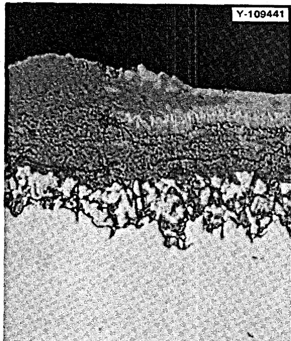  
(a)

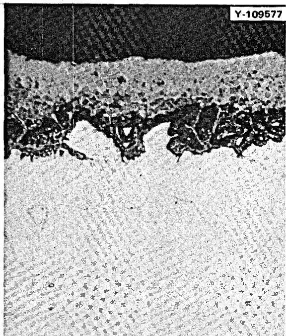  
(b)   
Fig. 24. Outside surface of standard Hastelloy N tubing, exposed to air underneath a heater at temperatures above $605 - 620^{\circ}\mathbf{C}$ . Location B. Fig. 22. (a) As polished, (b) etched with glyceria regia. $500\times$ .

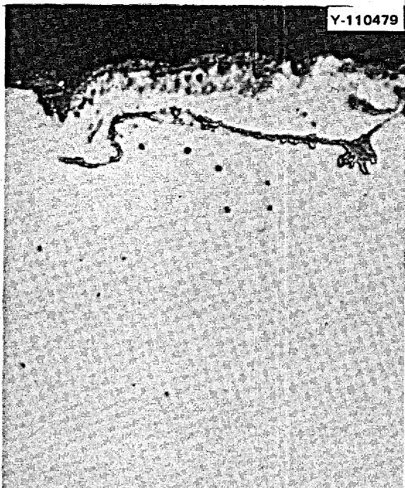  
(a)

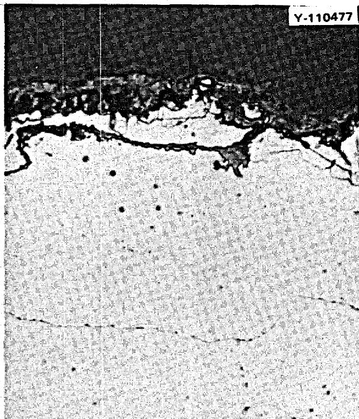  
(b)   
Fig. 25. Outside surface of standard Hastelloy N tubing, exposed to air underneath a heater at temperatures above $580^{\circ}\mathbf{C}$ . Location C, Fig. 22. (a) As polished, (b) etched with glyceria regia. $500\times$ .

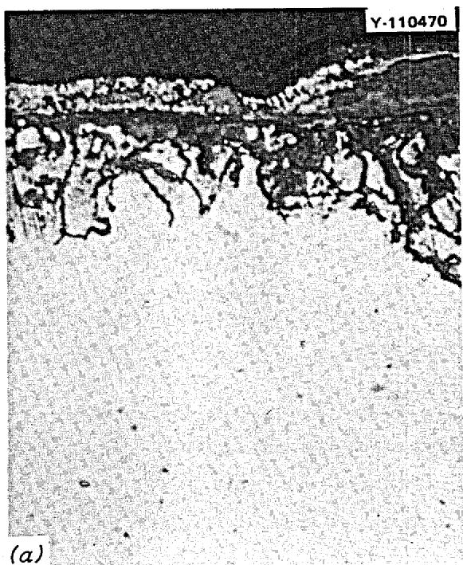

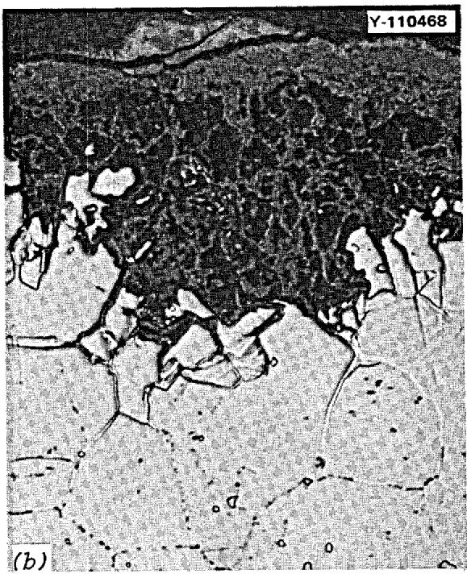  
Fig. 26. Outside surface of standard Hastelloy N tubing, exposed to air at $660^{\circ}\mathbf{C}$ . Location $F$ , Fig. 22. (a) As polished, (b) etched with glyceria regia. $500\times$

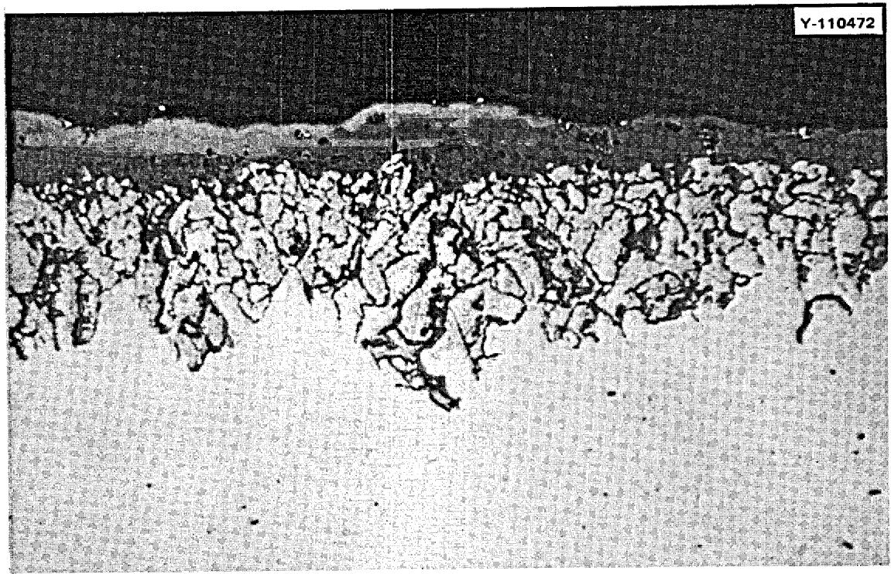  
Fig. 27. Outside surface of standard Hastelloy N tubing, exposed to air at $593^{\circ}\mathrm{C}$ . Location $E$ , Fig. 22. As polished, $500\times$

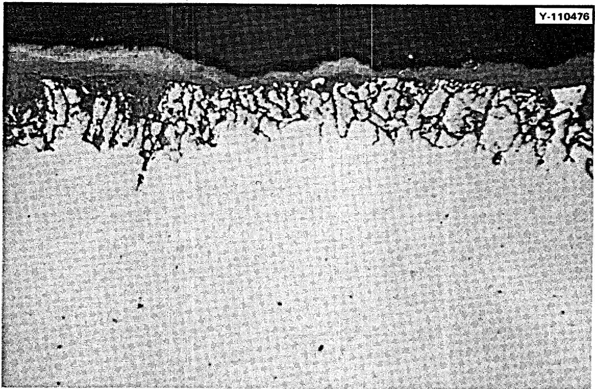  
Fig. 28. Outside surface of standard Hastelloy N tubing, exposed to air at $560^{\circ}\mathrm{C}$ . Location $D$ , Fig. 22. As polished, $500\times$

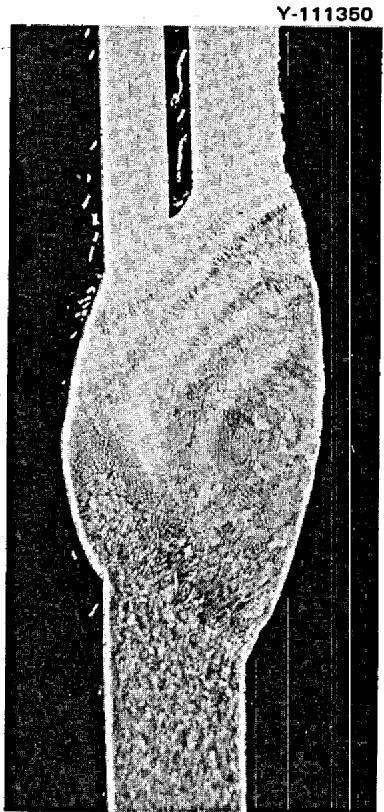  
Fig. 29. Weld joining standard Hastelloy N tubing (top, right) and spacer (top, left) to modified Hastelloy N-2% Nb tubing (below). Left side exposed to salt at $665^{\circ}\mathrm{C}$ ; right side exposed to air. Etched with glyceria regia. 12X.

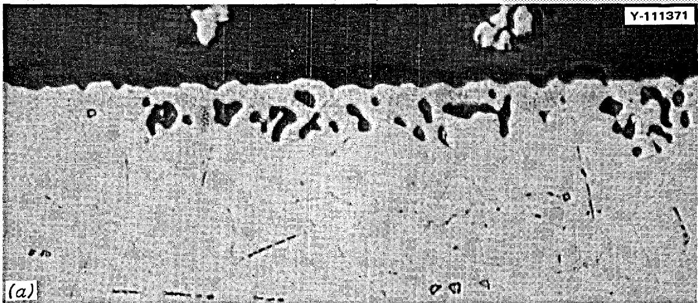

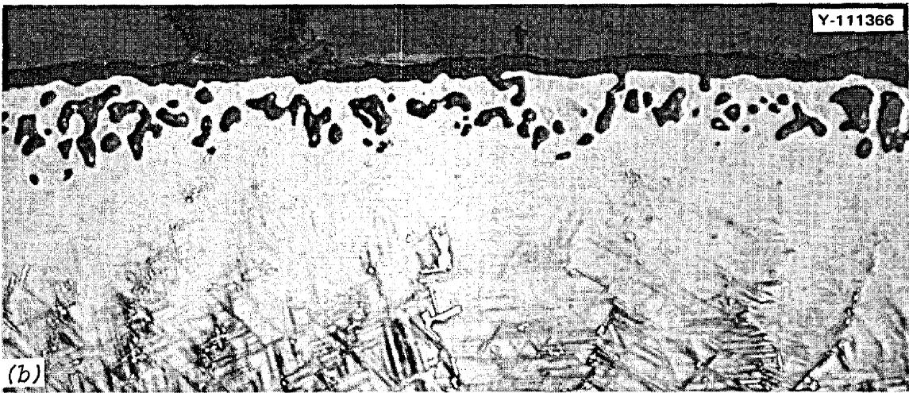

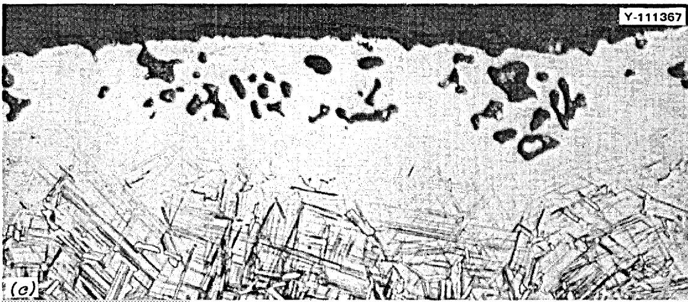  
Fig. 30. Inside surface, exposed to salt, of weld joining Hastelloy N tubing and spacer to modified Hastelloy N. Higher magnification of left side of Fig. 29. (a) Hastelloy N spacer; (b) weld; (c) Hastelloy N-2% Nb tubing. Etched with glyceria regia. $500 \times$

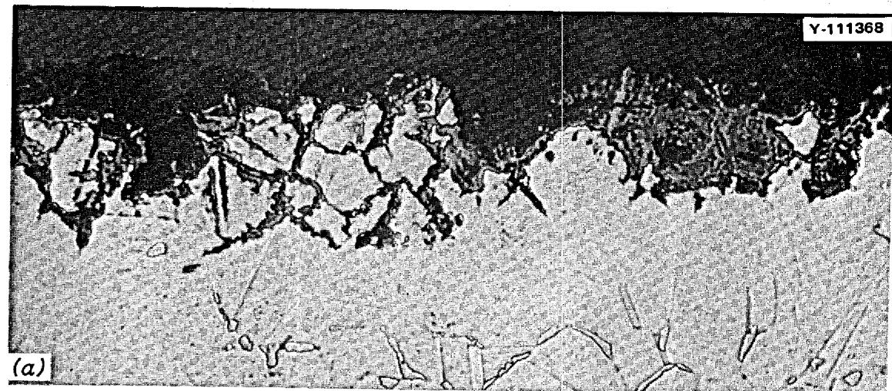

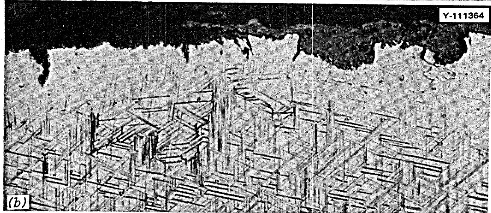

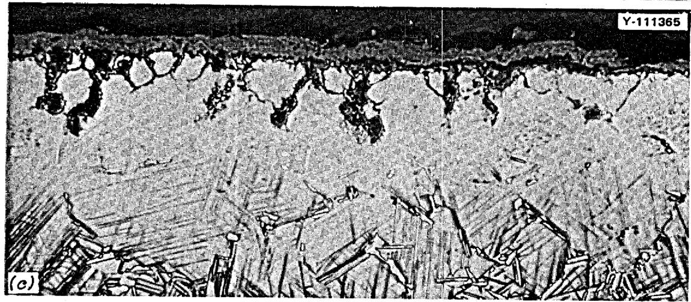  
Fig. 31. Outside surface, exposed to air, of weld joining Hastelloy N tubing and spacer to modified Hastelloy N. Higher magnification of right side of Fig. 29. (a) Hastelloy N tubing; (b) weld; (c) Hastelloy N-2% Nb tubing. Etched with glyceria regia. $500 \times$ .

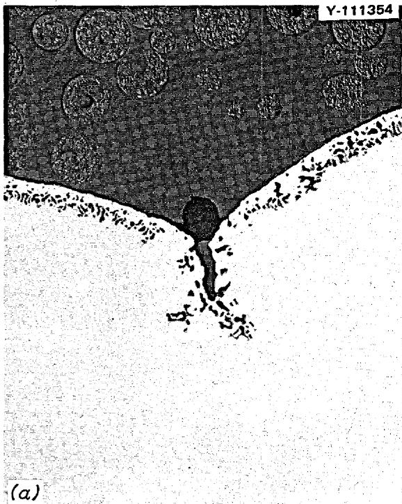

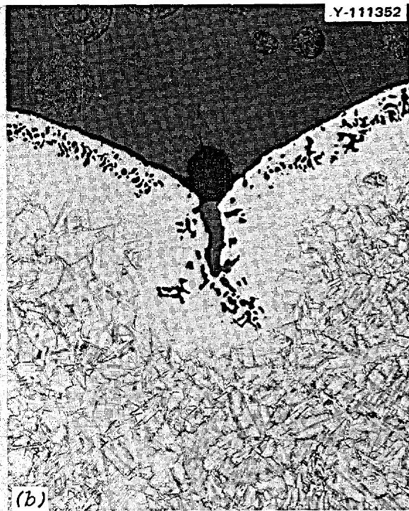  
Fig. 32. Inside surface, exposed to salt at $650^{\circ}\mathbf{C}$ , of welded Hastelloy $\mathbf{N}-2\%$ Nb tubing, showing the weld. (a) As polished, (b) etched with glyceria regia. $100\times$ .

The modified Hastelloy N-2% Nb tubing was formed from sheet and welded. Figure 32 shows the inside surface of the tubing, at the weld. The temperature of the salt at this position was about $650^{\circ}\mathrm{C}$ . Note the increased void formation at the tip of the closure.

Figure 33 is one side of Hastelloy N tubing welded to Hastelloy N tubing at the lower crossover portion of the loop. The temperature of the salt at this position was $580^{\circ}\mathrm{C}$ . Figure 34 is the inside surface of the tubing, which was exposed to the salt. Very little change in the microstructure was seen or expected in this region.

# DISCUSSION

# Temperature-Gradient Mass Transfer

The corrosion resistance of metals to fluoride salts has been found to vary directly with the "nobility" of the metal - that is, inversely with the magnitude of the free energy of formation of fluorides involving the metal. Accordingly, corrosion of multicomponent alloys tends to be manifested by the selective oxidation and removal of the least noble component. In the case of Hastelloy N, corrosion is selective with respect to chromium, as seen in this experiment. The selective removal of chromium by fluoride mixtures depends on various chemical reactions, as follows:

1. Due to impurities in the salt, for example,

$$
\mathrm {F e F} _ {2} + \mathrm {C r} \rightleftharpoons \mathrm {C r F} _ {2} + \mathrm {F e}. \tag {1}
$$

2. Dissolution of oxide films from the metal surface, for example,

$$
2 \mathrm {F e} ^ {3 +} (\text {f r o m f i l m}) + 3 \mathrm {C r} \rightleftharpoons 2 \mathrm {F e} + 3 \mathrm {C r} ^ {2 +}. \tag {2}
$$

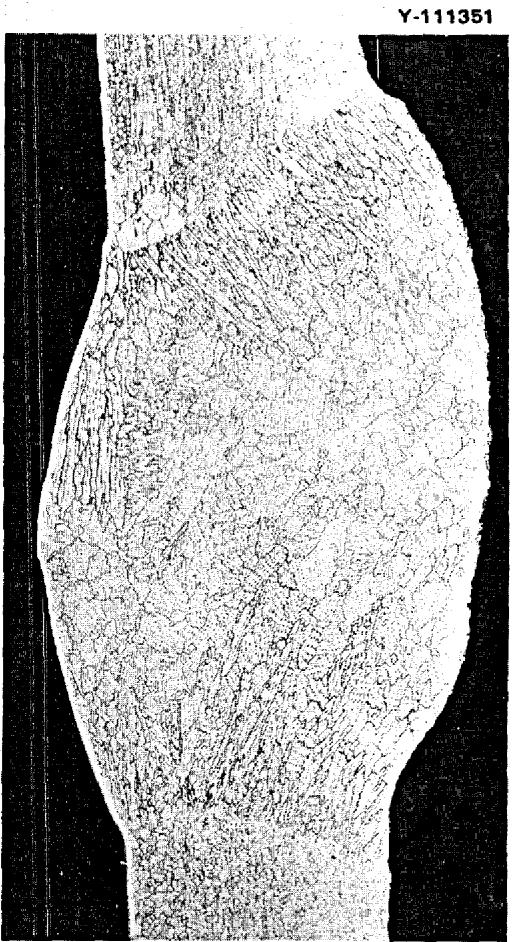  
Fig. 33. Weld joining two pieces of Hastelloy N tubing. Left side exposed to salt at $580^{\circ}\mathrm{C}$ ; right side exposed to air. Etched with glyceria regia. $20\times$ .

3. Due to constituents in the fuel, particularly,

$$
\mathrm {C r} + 2 \mathrm {U F} _ {4} \rightleftharpoons 2 \mathrm {U F} _ {3} + \mathrm {C r F} _ {2}. \tag {3}
$$

If pure salt containing $\mathrm{UF_4}$ (and no corrosion products) is added to a Hastelloy N loop operating polythermally, all points of the loop initially experience a loss of chromium in accordance with the $\mathrm{Cr - UF_4}$ reaction, Eq. (3), and by reaction with impurities in the salt (such as HF, $\mathrm{NiF_2}$ , or $\mathrm{FeF_2}$ ). Impurity reactions go rapidly to completion at all temperature points and are important only in terms of short-range corrosion effects.

The $\mathbf{U}\mathbf{F}_4$ reaction, however, which is temperature-sensitive, provides a mechanism by which the alloy at high temperature is continuously depleted and the alloy at low temperature is continuously enriched in chromium. As the corrosion-product concentration of salt is increased by the impurity and $\mathbf{U}\mathbf{F}_4$ reactions, the lowest temperature point of the loop eventually achieves equilibrium with respect to the $\mathbf{U}\mathbf{F}_4$ reaction. At regions of higher temperature, because of the temperature dependence for this reaction, a driving force still exists for chromium to react with $\mathbf{U}\mathbf{F}_4$ . Thus, the corrosion-product concentration will continue to increase, and the temperature points at equilibrium will begin to move away from the coldest temperature point. At this stage, chromium is returned to the walls of the coldest point of the system. The rise in

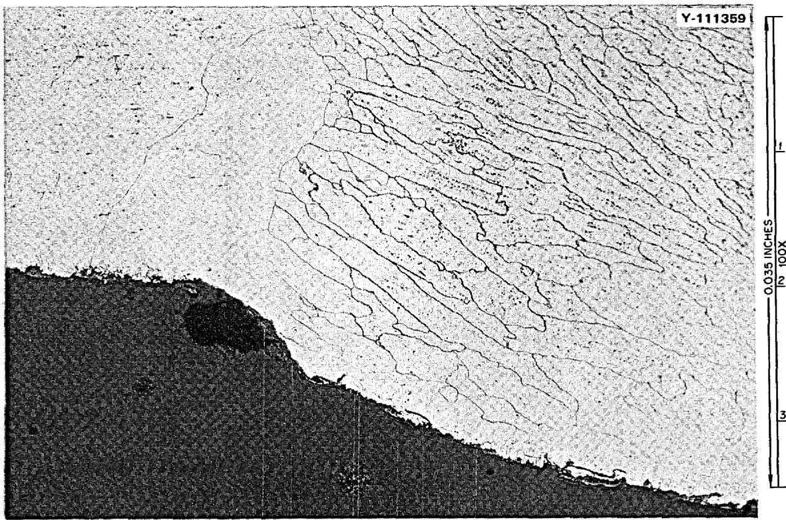  
Fig. 34. Microstructure of weld joining two pieces of Hastelloy N tubing, exposed to salt at $580^{\circ}\mathbf{C}$ . Etched with glyceria regia.

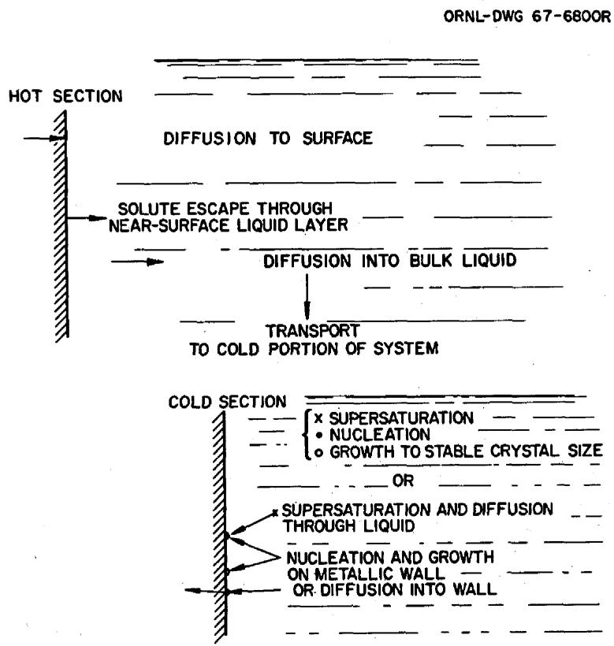  
Fig. 35. Temperature-gradient mass transfer.

corrosion-product concentration in the circulating salt continues until the amount of chromium returning to the walls exactly balances the amount of chromium entering the system in the hot-leg regions. Under these conditions, the two positions of the loop at equilibrium with the salt, termed the "balance point," do not shift measurably with time. Thus, a quasi-steady-state situation is eventually achieved whereby chromium is transported at very low rates and under conditions of a fixed chromium surface concentration at any given loop position. A schematic of this mass transfer process is shown in Fig. 35. Our results in this experiment show material loss in the hot portions of the loop and material deposition in the cold portion.

# Void Formation

The formation of subsurface voids as seen in loop 1255 is initiated by the oxidation of chromium along exposed surfaces through oxidation-reduction reactions with impurities or constituents of the molten fluoride mixture. As the surface is depleted in chromium, chromium from the interior diffuses down the concentration gradient to the surface. Since diffusion occurs by a vacancy process and in this particular situation is essentially unidirectional, it is possible to build up an excess number of vacancies in the metal. These precipitate in areas of disregistry, principally at grain boundaries and impurities, to form voids. These voids tend to agglomerate and grow in size with increasing time and/or temperature. Examinations have demonstrated that the subsurface voids are not interconnected with each other or with the surface. Voids of this same type have been developed in Inconel 600 by high-temperature oxidation tests and high-temperature vacuum tests in which chromium is selectively removed.9 Voids similar to these have also been developed in copper-brass diffusion couples and by thedezincification of brass.10 All of these phenomena arise from the so-called Kirkendall effect, whereby solute atoms of a given type diffuse out at a faster rate than other atoms comprising the crystal lattice can diffuse in to fill vacancies which result from the outward diffusion.

The time dependence of void formation in Inconel observed both in thermal- and forced-convection systems indicates that attack is initially quite rapid, but then decreases until a straight-line relationship exists between depth of void formation and time. This effect, which is illustrated in Fig. 36 for the salt mixture NaF-46 mole $\%$ ZrF $_4$ -4 mole $\%$ UF $_4$ , can be explained in terms of the corrosion reactions discussed above. The initial rapid attack shown for both types of loops stems from the reaction of chromium with impurities in the melt (reactions 1 and 2) and with the UF $_4$ constituent of the salt (reaction 3) to establish a quasi-equilibrium amount of CrF $_2$ in the salt. At this point, attack proceeds linearly with time and occurs by a mass transfer mechanism discussed earlier. During this latter stage of attack the chromium content of the salt remains at essentially a constant value. This can be seen by referring to Table 5, where chromium concentrations are shown for fluoride salts at a series of operating times. Note that between the 50 hr and 1000 hr operating times, no significant increase in CrF $_2$ content has occurred.

# Comparison of Mass Transfer in Loop 1255 and Another Hastelloy N Loop

Figure 37 shows quantitative mass transfer data during $9000\mathrm{hr}$ of operation for a standard Hastelloy $\mathbf{N}-\mathbf{LiF}-34.0$ mole $\% \mathrm{BeF}_2-0.5$ mole $\% \mathrm{UF_4}$ thermal convection loop system (NCL-16) which operated at a maximum temperature of $700^{\circ}\mathrm{C}$ and a minimum temperature of $540^{\circ}\mathrm{C}$ . This loop operated an additional

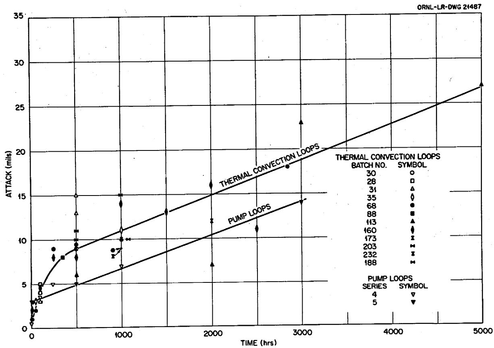  
Fig. 36. Variation in depth of fluoride corrosion in Inconel thermal convection and forced-circulation loops as a function of operating time. From W. D. Manly, J. H. Coobs, J. H. DeVan, D. A. Douglas, H. Inouye, P. Patriarca, T. K. Roche, and J. L. Scott, "Metallurgical Problems in Molten Fluoride Systems," Progress in Nuclear Energy, Series IV, vol. 2, pp. 164-79, 1960.

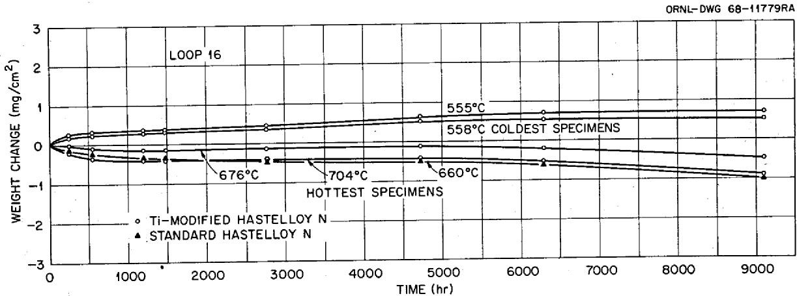  
Fig. 37. Weight change vs time for standard and titanium-modified specimens in loop NCL-16, exposed to fuel salt (LiF-34.0 mole $\%$ BeF $_2$ -0.5 mole $\%$ UF $_4$ ) at various temperatures.

Table 5. Analyses of fluoride mixtures before and after circulation in Inconel forced-circulation loops at $815^{\circ}\mathrm{C}$   

<table><tr><td rowspan="2">Operating time (hr)</td><td rowspan="2">When sampled</td><td colspan="3">Impurities (ppm)</td></tr><tr><td>Ni</td><td>Cr</td><td>Fe</td></tr><tr><td rowspan="2">10</td><td>During filling</td><td>15</td><td>70</td><td>45</td></tr><tr><td>After termination</td><td>25</td><td>635</td><td>30</td></tr><tr><td rowspan="2">50</td><td>During filling</td><td>50</td><td>65</td><td>30</td></tr><tr><td>After termination</td><td>10</td><td>800</td><td>25</td></tr><tr><td rowspan="2">100</td><td>During filling</td><td>15</td><td>35</td><td>20</td></tr><tr><td>After termination</td><td>8</td><td>725</td><td>50</td></tr><tr><td rowspan="2">1000</td><td>During filling</td><td>25</td><td>60</td><td>60</td></tr><tr><td>After termination</td><td>10</td><td>765</td><td>45</td></tr></table>

Source: W. D. Manly, J. H. Coobs, J. H. DeVan, D. A. Douglas, H. Inouye, P. Patriarca, T. K. Roche, and J. L. Scott, "Metallurgical Problems in Molten Fluoride Systems," Progress in Nuclear Energy, Series IV, vol. 2, pp. 164-79, 1960.

Table 6. Chromium concentration in salt of Hastelloy N loop NCL-16 as a function of time   

<table><tr><td>Time (hr)</td><td>Cr concentration in salt (ppm)</td></tr><tr><td>3</td><td>25</td></tr><tr><td>600</td><td>75</td></tr><tr><td>1,631</td><td>125</td></tr><tr><td>2,979</td><td>162</td></tr><tr><td>4,970</td><td>205</td></tr><tr><td>6,637</td><td>242</td></tr><tr><td>9,520</td><td>279</td></tr><tr><td>11,381</td><td>300</td></tr><tr><td>16,546</td><td>403</td></tr><tr><td>20,458</td><td>421</td></tr><tr><td>26,646</td><td>556</td></tr><tr><td>30,508</td><td>571</td></tr></table>

21,000 hr, and the only change in salt chemistry was a chromium increase to 570 ppm. Table 6 gives the chromium concentration in the salt for various times. These data indicate a gradual decrease in mass transfer with time. No voids were seen in any Hastelloy N specimens from NCL-16.

In comparison to this loop there appears to be more mass transfer in loop 1255. The increase in chromium concentration of the salt is about the same in both cases if you assume a linear increase with time. However, this is generally not the case, and we would expect very little additional increase of chromium in the salt of NCL-16. Thus, the chromium concentration in the salt of loop 1255 would probably have been much higher than that of NCL-16 after 30,000 hr. Also, as mentioned above, no void formation was seen in any specimens from NCL-16.

# Comparison of Mass Transfer in Loop 1255 and a Type 304L Stainless Steel Loop

A thermal convection loop of type 304L stainless steel has contained salt from the same batch as loop 1255 for over eight years at a maximum temperature of $688^{\circ}\mathrm{C}$ and a minimum temperature of $588^{\circ}\mathrm{C}$ . A plot of the weight change of specimens in the loop as a function of time and temperature is given in Fig. 38. These specimens were placed in the loop after the loop had operated three years. Figure 39 shows the voids formed in the specimen exposed at $688^{\circ}\mathrm{C}$ for 5700 hr. Microprobe analyses of this specimen disclosed an appreciable chromium gradient for 1.2 mils.

Comparisons between loop 1255 and the type 304L stainless steel loop show that the void formation in the stainless steel after 5700 hr equaled that of the Hastelloy N after 9.2 years. Thus, exposed to identical fluoride salts under similar conditions, it appears that Hastelloy N is more resistant to mass transfer.

# Mass Transfer Calculations

The schematic temperature profile of loop 1255 as a function of loop position is shown in Fig. 40. The points are actual measured temperatures at certain positions. On the right-hand ordinate scale the probable regions of weight loss and weight gain based on mass transfer theory and quantitative data from loops such

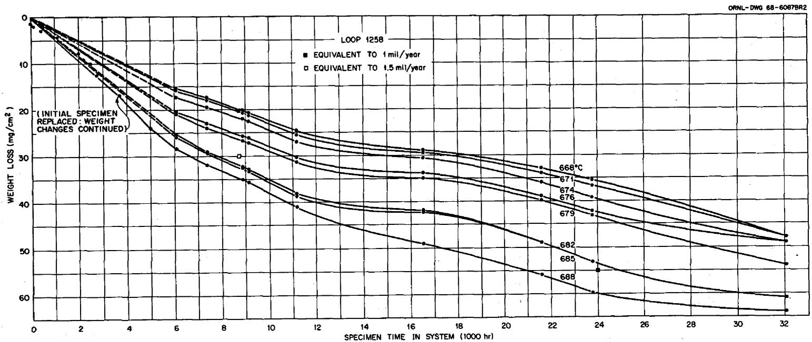  
Fig. 38. Weight loss of type 304L stainless steel specimens as a function of operation time at various temperatures in LiF-23 mole $\%$ $\mathrm{BeF}_2 - 5$ mole $\%$ $\mathrm{ZrF}_4 - 1$ mole $\%$ $\mathrm{ThF}_4 - 1$ mole $\%$ $\mathrm{UF}_4$ salt.

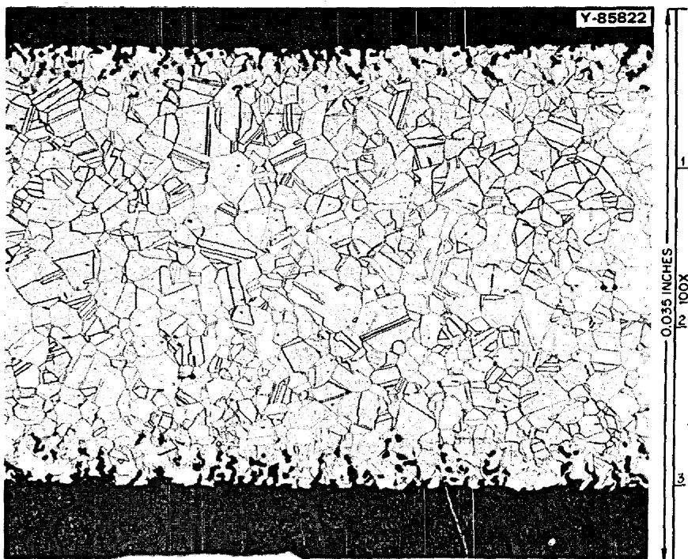  
Fig. 39. Microstructure of type 304L stainless steel specimen in loop 1258, exposed to fuel salt for 5700 hr at $688^{\circ}\mathrm{C}$ .

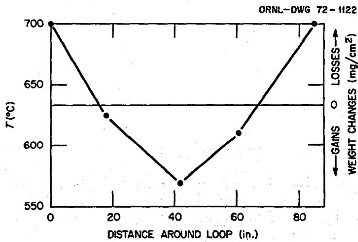  
Fig. 40. Temperature profile and mass transfer schematic.

as those discussed previously are noted. Positions (temperatures) above the zero line will probably lose material, while those below will gain material.

A simple calculation based on the increase of $1700~\mathrm{ppm}$ chromium in the salt during operation gives us some insight on the amount of material removed. The amount of material that would have to be removed to equal the number of grams of chromium found in the salt was 2.2 mils of Hastelloy N over one-half the length of the loop. It is assumed that half the loop gained material while half lost material. Thus, the average depth of complete chromium depletion in the hot leg would be 2.2 mils. Based on past experience

and results schematically represented in Fig. 40, this means we could expect a maximum depletion of 4.4 mils at the hottest position at the top of the hot leg, $700^{\circ}\mathrm{C}$ , decreasing to zero at $630^{\circ}\mathrm{C}$ . We have assumed that all positions at temperatures below $630^{\circ}\mathrm{C}$ gain weight.

Micrographs of the inside surfaces of insert specimens and loop tubing that were exposed to the salt disclose regions of both material loss and gain. In most cases the micrographs agree with the calculations and with Fig. 40. Fewer voids were seen in the regular Hastelloy N than the Hastelloy N modified with $2\%$ Nb; however, the temperatures were different, so no definite statement can be made comparing the compatibility of these two alloys. The concentration of chromium corrosion product in the salt was never large enough to cause precipitation in the cold leg, so no plugging trends were ever noted.

# Failure Analysis

In Fig. 8, the shim stock (foil) that covered the thermocouple can still be seen. This shim stock was located between the ceramic bushings that separated the heaters in the center of the hot leg. The failure was adjacent to the shim stock and was directly under a ceramic bushing. The failure in loop 1255 looked very much like the loop failure referenced in an earlier portion of this report. Thus, on the basis of the earlier work and our findings, we attribute the failure to a reaction between the bushing and the modified Hastelloy N-2% Nb tubing. It would appear, although it cannot be proved, that the bushing in question was perhaps unfired or at least contained impurities responsible for the failure. With time and temperature, the moisture and other impurities, normally removed before installation, reacted with the outside surface, moving inward until the tubing was finally penetrated. At this time the molten salt leaked outward and caused the noticeable failure of the heaters.

It is worth while to mention that $\mathsf{MoO}_3$ melts at $795^{\circ}\mathbf{C}$ and the eutectic between $\mathsf{MoO}_2$ and $\mathsf{MoO}_3$ is at $778^{\circ}\mathbf{C}$ . Thus one might also consider the possibility of a low-melting combination between $\mathsf{MoO}_3$ and an oxide associated with the bushing that could lead to a failure of the type mentioned in this report.

# Air Oxidation

Our observations of the air oxidation of the Hastelloy N during the 9.2 years of operation disclosed about a 2-mil-thick layer of mixed oxide as the worst condition. As the temperature decreased (Figs. 23-28), the oxide layer thickness decreased, along with a decrease in intergranular penetration and chromium depletion.

As part of the molten salt corrosion program, the outside of Hastelloy N tubing containing fluoride salt is routinely examined to determine its behavior under air oxidation conditions.11 Table 7 gives some typical results. The only evidence of intergranular penetration was seen in the material exposed for 11,300 hr, and in this case the penetration was quite small.

Thus, we conclude that Hastelloy N in service at temperatures below $700^{\circ}\mathrm{C}$ has shown good resistance to air oxidation, with penetration not exceeding 2 mils/year.

# Weld Corrosion Resistance

Part of the purpose of this experiment was to determine the corrosion resistance of various types of weld junctions:

1. Hastelloy N welded with Hastelloy N weld rod,

Table 7. Thickness of oxide layer formed on the outside of Hastelloy N tubing exposed to air as a function of time and temperature   
Inside of tubing was exposed to molten fluoride salt   

<table><tr><td>Temperature (°C)</td><td>Time (hr)</td><td>Thickness of oxide layer (mils)</td></tr><tr><td>550</td><td>70</td><td>0</td></tr><tr><td>550</td><td>1,400</td><td>&lt;0.05</td></tr><tr><td>550</td><td>2,700</td><td>0.1</td></tr><tr><td>550</td><td>4,800</td><td>0.1</td></tr><tr><td>550</td><td>11,300</td><td>0.25</td></tr><tr><td>610</td><td>4,700</td><td>0.25</td></tr><tr><td>700</td><td>4,800</td><td>0.2</td></tr></table>

Source: J. W. Koger, unpublished results.

2. Hastelloy N welded with Hastelloy N- $2\%$ Nb weld rod,   
3. Hastelloy N-2% Nb welded with Hastelloy N-2% Nb weld rod.

We found no difference in the corrosion (either in air or salt) of the weld and the adjacent alloy. The corrosion that occurred at the base of the Hastelloy N-2% Nb tubing weld (Fig. 32) was interesting as it showed much greater corrosion at the tip; the voids extended much deeper into the alloy at this point. The weld corrosion resistance was as good as that of the alloys.

# CONCLUSIONS

1. We saw, from microscopic examination of the loop tubing, that mass transfer of material (material removal and material deposition) did occur during the 9.2-year exposure of the Hastelloy N alloys to the LiF-23 mole $\%$ BeF $_2$ -5 mole $\%$ ZrF $_4$ -1 mole $\%$ UF $_4$ -1 mole $\%$ ThF $_4$ salt.   
2. The attack, which occurred in the hot section, was manifested in the formation of voids. The maximum depth of the void zone was 4 mils. Deposition was noted on the colder portions.   
3. On the basis of salt analysis and microprobe analysis of the tubing, the mass transfer appeared to be selective with respect to chromium, which is what would be predicted.   
4. The actual void formation and chromium depletion agree favorably with that predicted from calculations.   
5. No mass transfer difference could be seen between the standard Hastelloy N and the modified Hastelloy N-2% Nb alloy.   
6. No increase or decrease in mass transfer could be seen in the welded areas.   
7. A two-layer oxide of 2 mils thickness was the maximum formed in 9.2 years exposure to air.   
8. The failure of the loop was tentatively attributed to a reaction between the impurities in a ceramic bushing and the modified Hastelloy N-2% Nb tubing.   
9. In comparison with type 304L stainless steel exposed to salt from the same batch and under similar conditions, Hastelloy N is much more resistant to mass transfer.   
10. Hestelloy N is suitable for long-term use as a container material for a molten salt of the type used in this test and has acceptable air oxidation resistance at the temperatures used.

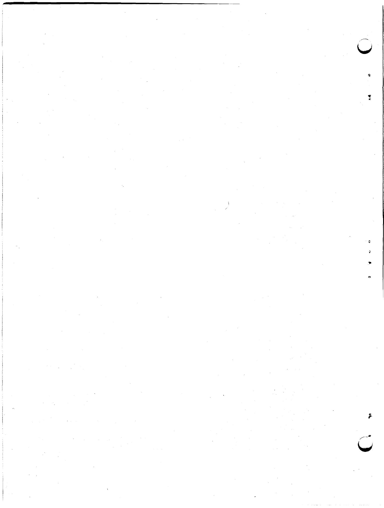

# INTERNAL DISTRIBUTION

# (79 copies)

(3) Central Research Library

ORNL - Y-12 Technical Library

Document Reference Section

(10) Laboratory Records Department

Laboratory Records, ORNL RC

ORNL Patent Office

G. M. Adamson, Jr.

C.F.Baes

C. E. Bamberger

S. E. Beall

E.G.Bohlmann

R. B. Briggs

S. Cantor

E. L. Compere

W. H. Cook

F. L. Culler

J. E. Cunningham

J.M.Dale

J.H.DeVan

J.R. DiStefano

J.R.Engel

D. E. Ferguson

J.H.Frye,Jr.

L. O. Gilpatrick

W. R. Grimes

A. G. Grindell

W. O. Harms

P. N. Haubenreich

(3) M. R. Hill

W. R. Huntley

H. Inouye

P.R.Kasten

(5) J. W. Koger

E. J. Lawrence

A. L. Lotts

T. S. Lundy

R.N.Lyon

H. G. MacPherson

R.E. MacPherson

W.R.Martin

R.W.McClung

H. E. McCoy

C. J. McHargue

H. A. McLain

B. McNabb

L. E. McNeese

A. S. Meyer

R. B. Parker

P. Patriarca

A.M.Perry

M. W. Rosenthal

H. C. Savage

J. L. Scott

J. H. Shaffer

G. M. Slaughter

G.P. Smith

R. A. Strehlow

R. E. Thoma

D. B. Trauger

A.M.Weinberg

J.R.Weir

J.C. White

L.V.Wilson

# EXTERNAL DISTRIBUTION

# (24 copies)

BABCOCK & WILCOX COMPANY, P. O. Box 1260, Lynchburg, VA 24505

B. Mong

BLACK AND VEATCH, P. O. Box 8405, Kansas City, MO 64114

C. B. Deering

BRYON JACKSON PUMP, P. O. Box 2017, Los Angeles, CA 90054

G.C.Clasby

CABOT CORPORATION, STELLITE DIVISION, 1020 Park Ave., Kokomo, IN 46901

T. K. Roche

CONTINENTAL OIL COMPANY, Ponca City, OK 74601

J. A. Acciarri

EBASCO SERVICES, INC., 2 Rector Street, New York, NY 10006

D. R. deBoisblanc   
T. A. Flynn

THE INTERNATIONAL NICKEL COMPANY, Huntington, WV 25720

J. M. Martin

UNION CARBIDE CORPORATION, CARBON PRODUCTS DIVISION, 12900 Snow Road, Parma, OH 44130

R. M. Bushong

USAEC, DIVISION OF REACTOR DEVELOPMENT AND TECHNOLOGY, Washington, DC 20545

David Elias   
J.E.Fox   
Norton Haberman   
C. E. Johnson   
T.C.Reuther   
S. Rosen   
Milton Shaw   
J. M. Simmons

USAEC, DIVISION OF REGULATIONS, Washington, DC 20545

A. Giambusso

USAEC, RDT SITE REPRESENTATIVES, Oak Ridge National Laboratory, P. O. Box X, Oak Ridge, TN 37830

D. F. Cope   
Kermit Laughon   
C. L. Matthews

USAEC, OAK RIDGE OPERATIONS, P. O. Box E, Oak Ridge, TN 37830

Research and Technical Support Division

USAEC, TECHNICAL INFORMATION CENTER, P. O. Box 62, Oak Ridge, TN 37830

(2)