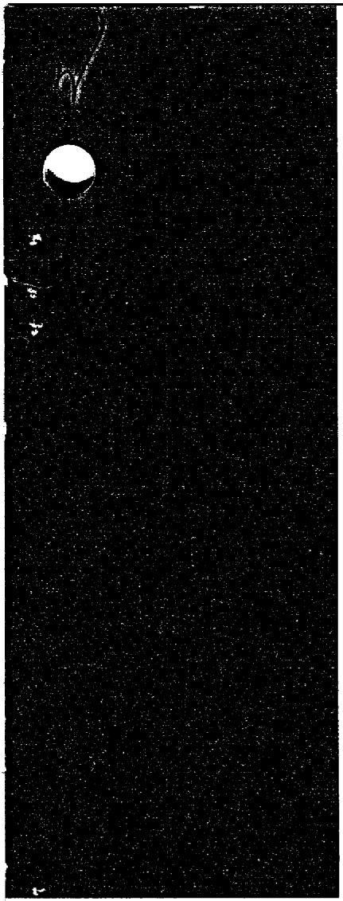

# A FORCED-CIRCULATION LOOP FOR

# CORROSION STUDIES:

# HASTELLOY N COMPATIBILITY WITH

# $\mathsf{NaBF}_4$ -NaF (92-8 mole $\%$ )

J. W. Koger

MASTER

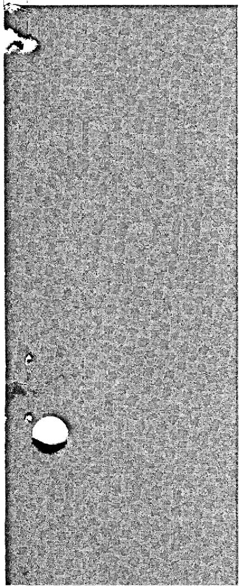

# OAK RIDGE NATIONAL LABORATORY

OPERATED BY UNION CARBIDE CORPORATION • FOR THE U.S. ATOMIC ENERGY COMMISSION

This report was prepared as an account of work sponsored by the United States Government. Neither the United States nor the United States Atomic Energy Commission, nor any of their employees, nor any of their contractors, subcontractors, or their employees, makes any warranty, express or implied, or assumes any legal liability or responsibility for the accuracy, completeness or usefulness of any information, apparatus, product or process disclosed, or represents that its use would not infringe privately owned rights.

Contract No. W-7405-eng-26

METALS AND CERAMICS DIVISION

A FORCED-CIRCULATION LOOP FOR CORROSION STUDIES: HASTELLOY N COMPATIBILITY WITH $\mathsf{NaBF}_4$ -NaF (92-8 mole %)

J.W.Koger

DECEMBER 1972

# NOTICE

This report was prepared as an account of work sponsored by the United States Government. Neither the United States nor the United States Atomic Energy Commission, nor any of their employees, nor any of their contractors, subcontractors, or their employees, makes any warranty, express or implied, or assumes any legal liability or responsibility for the accuracy, completeness or usefulness of any information, apparatus, product or process disclosed, or represents that its use would not infringe privately owned rights.

OAK RIDGE NATIONAL LABORATORY

Oak Ridge, Tennessee 37830

operated by

UNION CARBIDE CORPORATION

for the

U.S. ATOMIC ENERGY COMMISSION

# CONTENTS

Abstract 1   
Introduction 1   
Design Approach 1   
Design Data 6   
Operation 9   
Preliminary-Operation 9   
Design Operation 11   
Corrosion Results 11   
Conclusions 16

# A FORCED-CIRCULATION LOOP FOR CORROSION STUDIES: HASTELLOY N COMPATIBILITY WITH $\mathrm{NaBF}_4$ -NaF (92-8 mole %

J.W.Koger

# ABSTRACT

A sophisticated pumped loop system was designed and operated to study the compatibility of Hastelloy N to flowing $\mathrm{NaBF_4}$ -NaF (92-8 mole $\%$ ) at a maximum temperature of $620^{\circ}\mathrm{C}$ and a minimum of $454^{\circ}\mathrm{C}$ . One unique feature of the design of this loop was the ability to remove or add corrosion test specimens without draining the fluid from the loop. Principal test variables included temperature, velocity, time, and impurities in the fluid.

Measurements disclosed weight losses in hot-zone specimens, weight gains in cold-zone specimens, with a balance point (no gain or loss) at a temperature halfway between the maximum and minimum. Under certain conditions, larger weight losses and gains were found in specimens exposed to higher-velocity salt. In time, mass transfer rates became much lower, and no velocity effect was noted. Specimen examination early in the life of the loop disclosed a definite downstream effect. The first specimen of three exposed to the salt (same temperature, same velocity for each specimen) showed the largest gain or loss, the next specimen showed the next largest change, and the last specimen showed the smallest change of the three. Overall average corrosion rate of the hottest specimen $(620^{\circ})$ was 0.94 mil/year at 20.8 fps and 0.74 mil/year at 10.9 fps. An average corrosion rate of 0.05 mil/year for the hottest specimen was found in one 1256-hr increment.

# INTRODUCTION

A molten-salt forced-circulation loop, MSR-FCL-2, was designed and operated by W. R. Huntley of the Reactor Division and H. C. Savage of the Reactor Chemistry Division to determine the corrosion resistance and mass transfer characteristics of Hastelloy N in a fluoroborate-type coolant salt system proposed for the MSBR. The coolant salt proposed for an MSBR is the eutectic mixture of $\mathrm{NaBF}_4$ -NaF (92-8 mole %), which has a melting point (liquidus temperature) of $385 \pm 1^{\circ}\mathrm{C}$ ( $725 \pm 1.8^{\circ}\mathrm{F}$ ). The Metals and Ceramics Division had the responsibility for the analysis of the corrosion and mass transfer behavior of the system.

# Design Approach

To simulate MSBR coolant circuit conditions, the salt was circulated in the loop piping at a velocity of $\sim 10$ fps at bulk fluid temperatures from 454 to $620^{\circ}\mathrm{C}$ . Corrosion test specimens were installed at three locations in the loop circuit for exposure to the salt at three different temperatures (620, 537, and $454^{\circ}\mathrm{C}$ ) and at bulk flow velocities of 10 and 20 fps (4 gpm flow rate). The corrosion specimen installation and removal system, shown in Fig. 1, is unique in that the corrosion specimens can be installed or removed without draining the salt from the loop, although it is necessary to stop the pump and thaw the freeze valve. The specimens were attached to the specimen rod by clips held in place by small wires. The clips and wires could be attached or removed with a minimum of labor and without damaging the corrosion specimens. Different cross sections of the specimen rod permitted the different salt velocities. Thus three specimens were exposed to one velocity and three to another (10 and 20 fps). Access ports and salt sampling equipment were provided to remove salt samples from the loop and sump tank for analysis and for installation of cold-finger devices. An inert cover gas system (high-purity helium) was used to prevent salt contamination by water and oxygen.

An isometric schematic of MSR-FCL-2 is shown in Fig. 2, and an actual picture of the loop is shown in Fig. 3. It consisted of approximately 80 ft of 0.50-in.-OD by 0.042-in.-wall Hastelloy N tubing through which the salt was circulated by means of the salt pump, Fig. 4 (designated ALPHA). The new pump was designed for variable salt flow rates up to 30 gpm, pressure heads to 300 ft, speeds to 6000 rpm, and

ORNL-DWG 70-5629

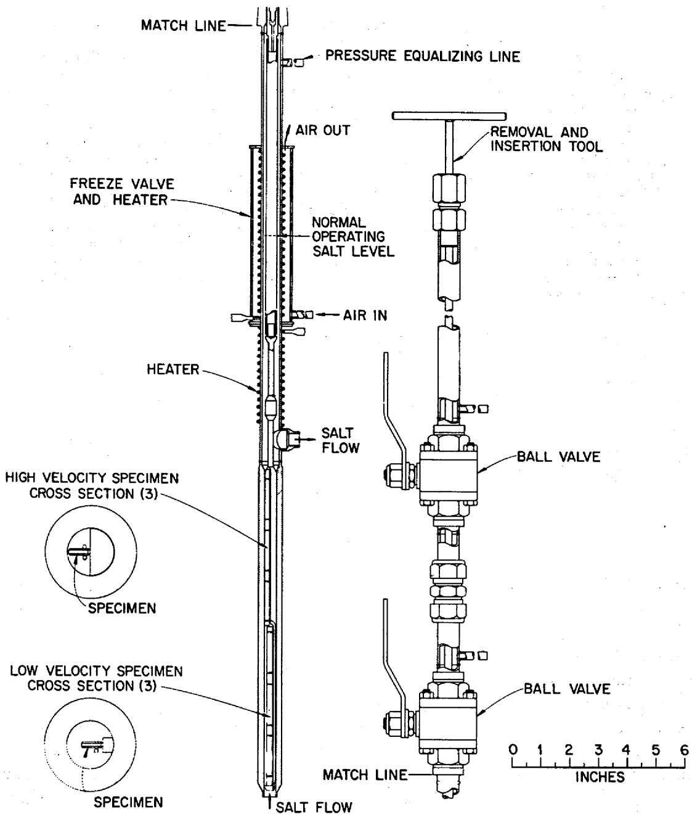  
Fig. 1. Corrosion specimen installation and removal system for MSR-FCL-2.

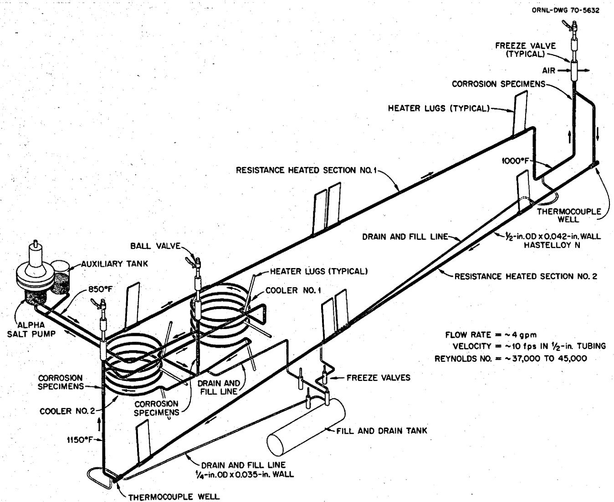  
Fig. 2. Molten-salt forced-convection corrosion loop MSR-FCL-2.

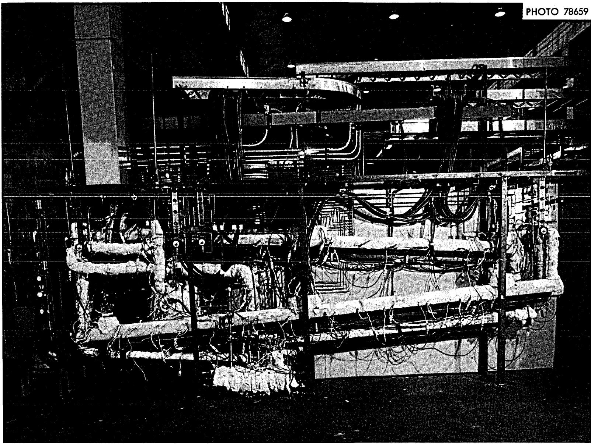  
Fig. 3. Photograph of MSR-FCL-2.

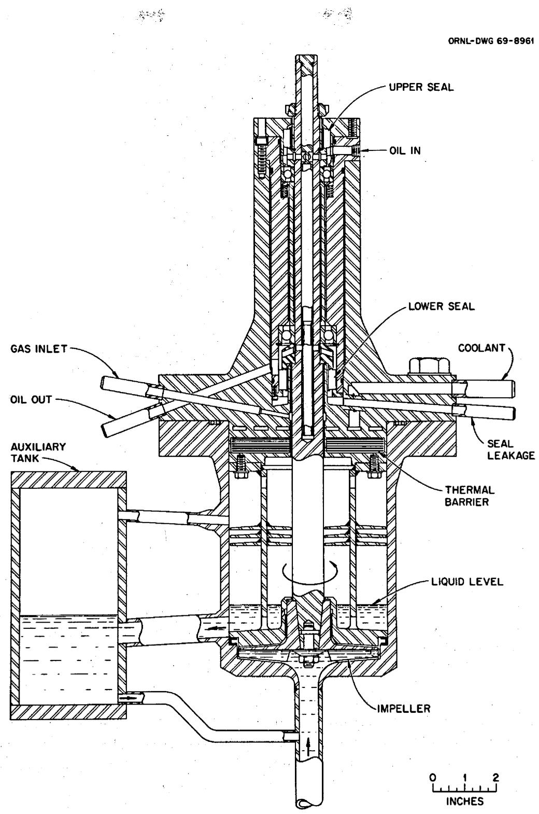  
Fig. 4. ALPHA pump and auxiliary tank of MSR-FCL-2.

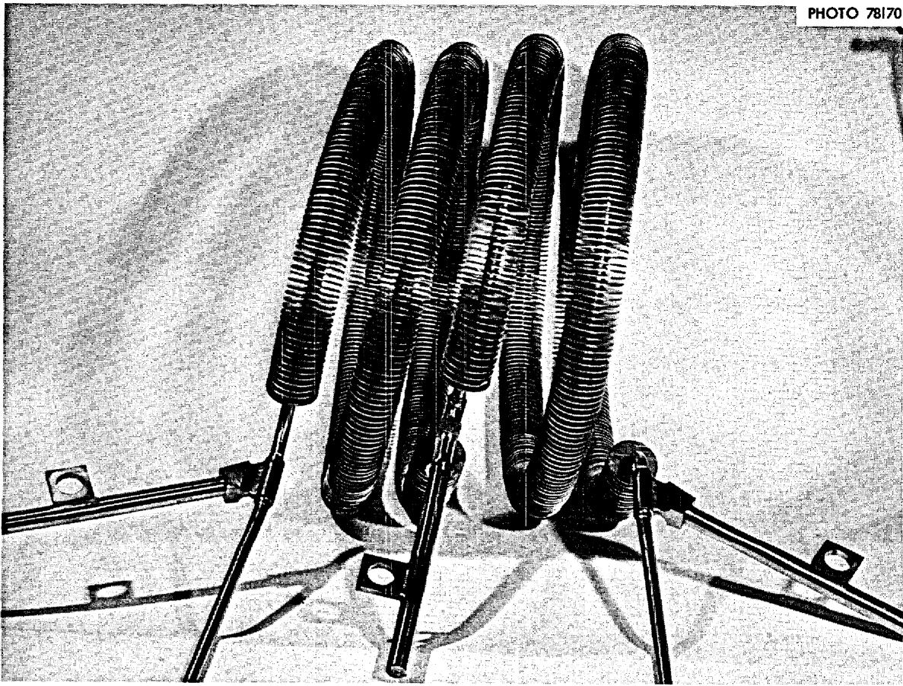  
Fig. 5. Air-cooled finned radiators of MSR-FCL-2.

temperatures to $760^{\circ}\mathrm{C}$ . Thus the new pump allowed much flexibility in the operation of the loop. Along with the pump was an auxiliary tank which could be used for sampling or additions. In addition to the loop tubing, all parts of the loop systems which were contacted by salt were fabricated of Hastelloy N. The salt was heated from 454 to $620^{\circ}\mathrm{C}$ in passing through two resistance-heated sections of the loop tubing, and then was cooled to $454^{\circ}\mathrm{C}$ in passing through two air-cooled finned radiators (Fig. 5) before returning to the pump suction.

# Design Data

Some of the pertinent engineering design data for MSR-FCL-2 are given in Table 1. Heat transfer values shown in Table 1 are based on the properties of $\mathrm{NaBF_4}$ -NaF (92-8 mole %) and Hastelloy N (INOR-8) given in Table 2. The calculated temperature profile around the loop circuit at design operating conditions is shown in Fig. 6.

# Table 1. Engineering design data for MSR-FCL-2

A. Materials, temperatures, velocities

Tubing and corrosion specimens, standard Hastelloy N

Nominal tubing size, $\frac{1}{2}$ -in. OD by 0.042-in. wall

Approximate tubing length, 90 ft

Bulk fluid temperatures, 454 to $620^{\circ}\mathrm{C}$ (850 to $1150^{\circ}\mathrm{F}$ )

Bulk fluid $\Delta T, 166^{\circ}\mathrm{C}$ (300°F)

Flow rate, 4 gpm

Fluid velocity, 10 fps (to 20 fps past corrosion specimens)

System $\Delta P$ at 4 gpm, 82 psi

B. System volumes

Piping $(\frac{1}{2}$ -in. OD by 0.042-in. wall, 147 in.3 (2400 cm3)

Pump (at $1\frac{1}{2}$ -in. salt depth), 30 in. ${}^{3}$ (492 cm $^{3}$ )

Auxiliary tank (at 4-in. salt depth), 80 in. $^{3}$ (1311 cm $^{3}$ )

Drain lines $(1 / 4$ in.by0.035-in.wall),10in.3 (164 cm3)

Total salt volume in loop, 267 in.3 (4380 cm3)

Capacity of fill and drain tank (5-in. sched 40 pipe by 22 in. long), 440 in. $^{3}$ ( $7200\mathrm{cm}^{3}$ )

C. Heat transfer (heaters and coolers)

1. Coolers

Material, $\frac{1}{2}$ -in.-OD by 0.042-in.-wall Hastelloy N tubing with $\frac{1}{16}$ -in.-thick nickel fins

Number of cooler sections, 2

Finned length of cooler No. 1, 18.8 ft

Finned length of cooler No. 2, 17.9 ft

Coolant air flow, 2000 cfm per cooler

Cooling capacity No. 1 cooler (1000 2-in.-OD by $\frac{1}{16}$ -in.-thick fins), 101 kW (345,000 Btu/hr)

Cooling capacity No. 2 cooler (645 $1^{1/2}$ -in.-OD by ${}^{1}_{16}$ -in.-thick fins), 43 kW (146,000 Btu/hr)

Total heat removal (both coolers), 144 kW (491,000 Btu/hr)

Heat flux (based on tube ID)

Cooler 1, 168,000 Btu hr-1 ft-2

Cooler 2, 71,000 Btu hr-1 ft-2

Inside wall temperature at outlet, cooler No. 2, $425^{\circ}\mathrm{C}$ (798°F)

2. Heaters

Material, $1 / 2$ -in.-OD by 0.042-in.-wall Hastelloy N

Number of heated sections, 2

Length of each

Heat input, each heater, $62.5\mathrm{kW}$ (213,000 Btu/hr)

Total, 125 kW (426,000 Btu/hr)

Inside wall temperature at outlet heater No. 2, $680^{\circ}\mathrm{C}$ (1256°F)

Outside wall temperature at outlet heater No. 2 (maximum pipe wall temperature), $692^{\circ}\mathrm{C}$ $(1278^{\circ}\mathrm{F})$

Heat flux, 162,000 Btu hr-1 ft-2

Salt Reynolds numbers in loop piping at 4 gpm, 31,000 to 51,000

Table 2. Properties of ${\mathrm{{NaBF}}}_{4} - \mathrm{{NaF}}$ (92-8 mole %) and Hastelloy N (t is in ${}^{ \circ  }\mathrm{F};\mathrm{T}$ is in ${}^{ \circ  }\mathrm{R}$ )   

<table><tr><td colspan="2">A. Properties of NaBF4-NaF (92-8 mole %)</td></tr><tr><td colspan="2">Density (lb/ft3), 142.6-0.025t</td></tr><tr><td colspan="2">Heat capacity, Cp [Btu lb-1(°F)-1], 0.36</td></tr><tr><td colspan="2">Thermal conductivity, k [Btu hr-1ft-1(°F)-1], 0.23</td></tr><tr><td colspan="2">Viscosity (lb ft-1hr-1), 0.2121 exp (4032/T)</td></tr><tr><td colspan="2">Melting point (°F), 725</td></tr><tr><td colspan="2">B. Properties of Hastelloy N</td></tr><tr><td colspan="2">Thermal conductivity, k [Btu hr-1ft-1(°F)-1], 6.057 + 2.453 × 10-3t + 1.931 × 10-6t2(at 850°F = 9.54) (at 1150°F = 11.43)</td></tr><tr><td colspan="2">Electrical resistivity (μΩ-in.), 47.5 at 75°F, 49.6 at 1300°F</td></tr><tr><td colspan="2">Mean coefficient of thermal expansion [10-6in. in.-1(°F)-1], 7.8 (70-1200°F)</td></tr><tr><td colspan="2">Chemical composition (%)</td></tr><tr><td colspan="2">Chromium, 6.00-8.00</td></tr><tr><td colspan="2">Molybdenum, 15.00-18.00</td></tr><tr><td colspan="2">Iron, 5.00, max</td></tr><tr><td colspan="2">Silicon, 1.00, max</td></tr><tr><td colspan="2">Manganese, 0.80, max</td></tr><tr><td colspan="2">Carbon, 0.04-0.08</td></tr><tr><td colspan="2">Nickel, balance</td></tr></table>

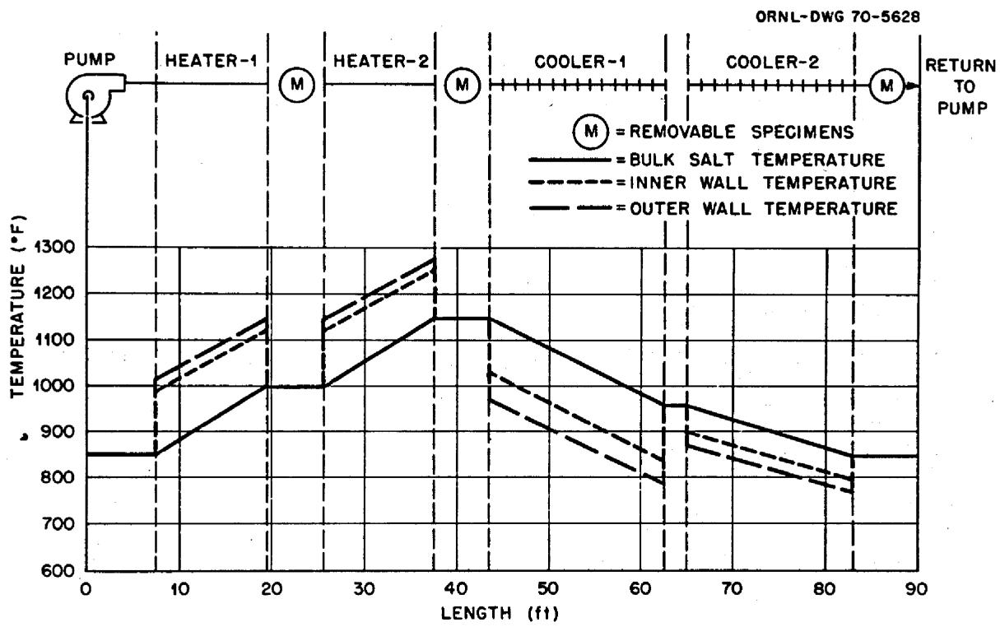  
Fig. 6. Temperature profile of MSR-FCL-2 at design operating conditions.

# OPERATION

# Preliminary Operation

Salt and gas purification. The salt charge for MSR-FCL-2 was processed to improve its purity prior to transfer into the loop. The first routine processing was done after $25\mathrm{kg}$ of the salt components were mixed and sealed in a vessel. The mixed powders were heated to $149^{\circ}\mathrm{C}$ and evacuated with a mechanical vacuum pump for $45\mathrm{hr}$ to remove moisture. The salt was then heated to $500^{\circ}\mathrm{C}$ , and $16.7\mathrm{kg}$ was transferred to a small filling pot. The salt in the filling pot was heated under static vacuum to check for further impurity outgassing. The pressure rose from $-28.7$ in. $\mathrm{Hg}$ at $149^{\circ}\mathrm{C}$ to $-26.4$ in. $\mathrm{Hg}$ at $470^{\circ}\mathrm{C}$ , which indicated little outgassing above the expected $\mathrm{BF}_3$ vapor pressure of the salt. An equilibrium mixture of $\mathrm{He - BF}_3$ was bubbled through the salt at $480^{\circ}\mathrm{C}$ at about $100\mathrm{cc / min}$ for $60\mathrm{hr}$ , and the effluent gas was passed through a cold trap at $0^{\circ}\mathrm{C}$ . This test was run to check for impurity collections such as were noted during operation of a liquid level bubbler in the PKP loop. The inlet gas mixture was prepared for the experiment by mixing dried helium ( $<1\mathrm{ppmH_2O})$ with $\mathrm{BF}_3$ in the proper ratio to balance the vapor pressure of the hot salt.

Impurities were found in the gas mixture after it had bubbled through the salt. A gas rotameter downstream of the cold trap initially became fouled with a clear liquid. A white film also deposited on the walls of the glass cold trap. A total of 0.15 cc of brown liquid was collected in the trap after 60 hr, and the materials collected appeared similar to those noted by Smith5 during operation of the PKP loop. Analysis was inconclusive as it only disclosed major quantities of Na, B, and F, with ppm values for many other elements. These instances of impurity collection show that presently available sodium fluoroborate systems can be expected to give problems with acid collection and fouling when devices such as liquid level bubblers are used. From the small amount of material collected, we concluded that our method was not practical for removing large amounts of impurities. However, we feel that improvements could be made on the basic process which could provide more efficient removal.

Heat transfer measurements. During hot shakedown operations we measured the heat transfer performance of the coolant salt. Heat transfer data were obtained at Reynolds moduli from 4200 to 48,000, salt velocities from 1.25 to 10.6 fps, heat fluxes from 43,000 to 157,000 Btu $\mathrm{hr}^{-1}$ ft $^{-2}$ , film coefficients from 230 to 2100 Btu $\mathrm{hr}^{-1}$ ft $^{-2}$ ( $^\circ\mathrm{F}$ ) $^{-1}$ , and at salt temperatures from 454 to $616^{\circ}\mathrm{C}$ . The test section was $1/2$ -in.-OD tubing with a measured ID of 0.416 in. Resistance heating was supplied by a three-lug system with voltage applied to the center lug and the two exterior lugs at ground potential. Therefore, there was a section at the center lug of the heated length which had an interrupted heat flux. The actively heated length was 11.5 ft, which gives an $L/D$ ratio of 331. Guard heaters were located on the heater lugs and along the resistance-heated tube to reduce heat losses during the heat transfer tests.

The temperature of the bulk fluid was measured by three thermocouples located in wells at the inlet and exit to the test section. Wall temperatures along the heated section were measured by thermocouples that were wrapped at $180^{\circ}$ intervals circumferentially around the tubing and clamped against the wall at about 1-ft intervals. The above-mentioned thermocouples were all sheathed, insulated junction, 0.040-in.-OD Chromel-Alumel and were precalibrated. Four bare wire thermocouples (0.010-in.-OD Chromel-Alumel) were also placed on the heated wall and read out on a potentiometer for comparison with the sheathed thermocouples recorded by the DEXTIR data logger. The readings of the two types of thermocouples were in good agreement.

The heat transfer data obtained with sodium fluoroborate in MSR-FCL-2 were put in dimensionless form and are shown in Fig. 7. The data are in good agreement with the empirical correlation of Sieder and

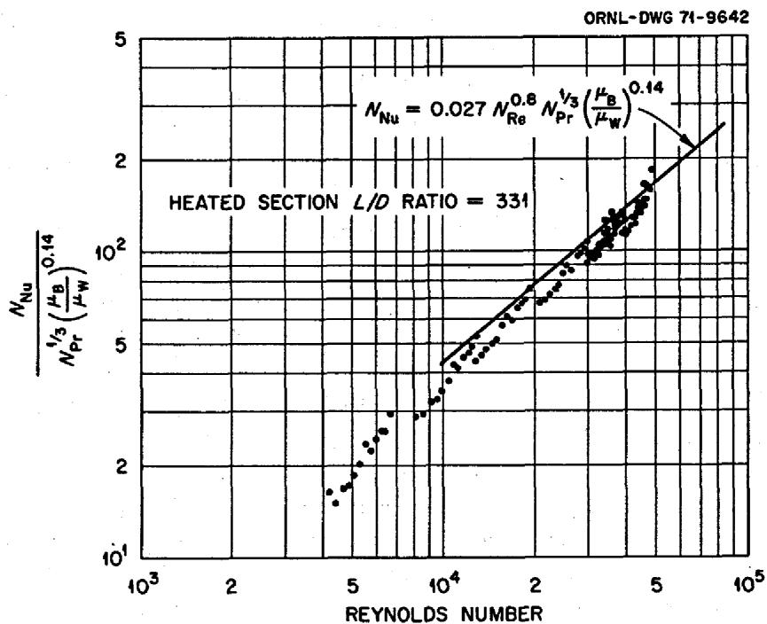  
Fig. 7. Heat transfer characteristics of $\mathrm{NaBF_4}$ NaF (92-8 mole %) flowing in 0.416-in-ID tube.

Tate, $^{6}$ which is shown by the solid line. The plotted data points were obtained with more precise thermocouple techniques than those used in earlier work by Huntley; $^{7}$ therefore the data of Fig. 7 are considered the best available evidence that sodium fluoroborate does indeed perform as a typical heat transfer fluid.

Pump seal leak. A gas leak occurred at an O-ring seal within the ALPHA pump on July 7, 1971, as the test was being brought to design operating conditions. At that time the salt had been in the loop for $510\mathrm{hr}$ and had been circulated by the pump for $56\mathrm{hr}$ . The salt inventory was sampled to check for impurity additions resulting from the gas leak, and none were found. The system was then drained to repair the pump. The gas leak resulted from $\mathsf{BF}_3$ attack of a Buna-N O-ring in the mechanical seal cartridge. The manufacturer of the mechanical seal had indicated during early engineering discussions that Viton (a Du Pont fluoroelastomer which is more resistant to $\mathsf{BF}_3$ than Buna-N) would be used in this application, but this was changed during actual assembly of the seals. The pump was reassembled with new seal cartridges containing Viton O-rings.

Corrosion. Corrosion test specimens were in the loop while the heat transfer measurements were made. These specimens were examined after total salt exposure of $510\mathrm{hr}$ and exposure to circulating salt with the ALPHA pump for 56 of those hours. During the heat transfer measurements the pump operated at speeds between 1400 and $5400\mathrm{rpm}$ , and the specimens were exposed to temperatures between 440 and $620^{\circ}\mathrm{C}$ .

The weight changes of the corrosion specimens were higher than expected (maximum weight loss of 1.5 $\mathrm{mg/cm^2}$ ) and showed a definite velocity effect. The specimens exhibited expected temperature-gradient mass transfer behavior of weight losses in the high-temperature region, very little change in the medium-temperature region, and weight gains in the cold region.

Analyses of salt samples indicated that chromium in the salt increased from 64 to $82~\mathrm{ppm}$ , and the iron changed from 359 to $347~\mathrm{ppm}$ . The indicated oxide content of salt samples varied from 500 to $800~\mathrm{ppm}$ and the $\mathbf{H}^+$ content ranged from 27 to $31~\mathrm{ppm}$ . Mass transfer was not considered excessive, and the decision was made to go to design conditions.

# Design Operation

Corrosion loop MSR-FCL-2 began routine operation on September 1, 1971, and operated for 5283 hr with very little difficulty. Salt was not drained from the loop during this time period. On April 28, 1972, an oil leak occurred at a soft-soldered seal plug in the upper end of the pump shaft. This leak necessitated draining the salt into the dump tank.

After repairs to the pump shaft, the loop was refilled on May 25, 1972. After operating only a few hours, an alarm was noted. A low level of salt was found in the auxiliary tank, and the loop was dumped. We found that salt was above the freeze valve on all three metallurgical specimen stations and had traveled 200 in. into the gas lines above station 2. The salt was forced into the gas lines because some of the salt dump lines were plugged and the pressure could not equalize as the loop was being filled. The ball sections of all the ball valves above the metallurgical specimens were removed and replaced with flat copper washers, heaters were installed near plugged lines, and the salt around the specimens was melted so the specimens could be removed, examined, and weighed. All gas lines containing salt were replaced. The loop had operated only 186 hr since April 20, 1972. After all repairs and replacement of the specimens, the loop was again refilled June 29, 1972.

Operational problems with the ALPHA pump resulted in the final shutdown of the corrosion test facility on October 23, 1972. The pump had operated successfully without maintenance for more than $6800\mathrm{hr}$ prior to this incident. Disassembly disclosed that salt deposits were found above the normal salt operating level in the pump bowl. Salt had entered and frozen in the shaft annulus and helium purge inlet line which resulted in abnormal operation. The exact time of the salt level excursion into these regions is not known. However, level surging and gas trapping did occur in earlier operation when plugged filling lines between the dump tank and system piping resulted in improper salt filling. This appears to be the most likely time for the salt level excursion to have occurred within the pump.

# CORROSION RESULTS

Cumulative weight changes subsequent to the beginning of design operation are shown in Fig. 8. (Changes during $500\mathrm{hr}$ of startup testing ranged from $+0.9$ to $-1.5\mathrm{mg/cm^2}$ and are not included.) Table 3 gives the incremental and total weight changes for the specimens. The total average weight loss at 20.8 fps and $620^{\circ}\mathrm{C}$ was $16.6\mathrm{mg/cm^2}$ and at 10.9 fps and $620^{\circ}\mathrm{C}$ was $13.1\mathrm{mg/cm^2}$ . The total average weight gain at 20.8 fps and $454^{\circ}\mathrm{C}$ was $5.7\mathrm{mg/cm^2}$ and at 10.9 fps and $454^{\circ}\mathrm{C}$ was $1.58\mathrm{mg/cm^2}$ . Each point is the average for more than one specimen exposed to a particular combination of temperature and velocity. These results indicate temperature-gradient mass transfer at a steadily decreasing rate, with a significant velocity effect. Specimens in the hottest position remained fairly bright, the specimens in the middle temperature position were darker, and those in the coldest position were the darkest (Fig. 9). Differences in appearance such as these have been previously observed. $^8$

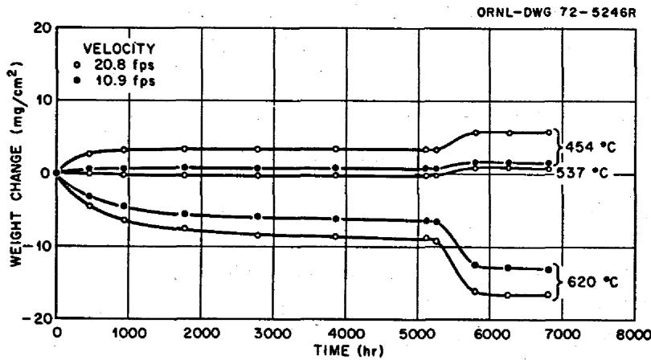  
Fig. 8. Weight changes of Hastelloy N specimens exposed to $\mathrm{NaBF_4}$ - $\mathrm{NaF}$ (92-8 mole %) in MSR-FCL-2 as a function of time, temperature, and velocity.

Table 3. Weight changes of specimens exposed to ${\mathrm{{NaBF}}}_{4} - \mathrm{{NaF}}$ (92-8 mole %) in MSR-FCL-2   

<table><tr><td colspan="2">Operating time (hr)</td><td colspan="6">Average weight change (mg/cm2)</td></tr><tr><td rowspan="2">Period end</td><td rowspan="2">Interval</td><td colspan="2">620°C</td><td colspan="2">537°C</td><td colspan="2">454°C</td></tr><tr><td>at 10.9 fps</td><td>at 20.8 fps</td><td>at 10.9 fps</td><td>at 20.8 fps</td><td>at 10.9 fps</td><td>at 20.8 fps</td></tr><tr><td>450</td><td>450</td><td>-3.13</td><td>-4.40</td><td>0</td><td>0</td><td>+0.76</td><td>+2.9</td></tr><tr><td>914</td><td>464</td><td>-1.40</td><td>-1.76</td><td>0</td><td>-0.10</td><td>+0.10</td><td>+0.6</td></tr><tr><td>1780</td><td>866</td><td>-1.11</td><td>-1.53</td><td>0</td><td>0</td><td>+0.06</td><td>+0.2</td></tr><tr><td>2774</td><td>994</td><td>-0.28</td><td>-0.58</td><td>0</td><td>0</td><td>0</td><td>-0.1</td></tr><tr><td>3846</td><td>1072</td><td>-0.29</td><td>-0.38</td><td>0</td><td>0</td><td>0</td><td>-0.2</td></tr><tr><td>5102</td><td>1256</td><td>-0.16</td><td>-0.16</td><td>0</td><td>0</td><td>-0.03</td><td>0</td></tr><tr><td>5283a</td><td>181</td><td>-0.26</td><td>-0.26</td><td>0</td><td>0</td><td>-0.10</td><td>-0.2</td></tr><tr><td>5792</td><td>509</td><td>-5.70</td><td>-6.76</td><td>+0.46</td><td>+0.61</td><td>+0.90</td><td>+2.7</td></tr><tr><td>6272</td><td>480</td><td>-0.55</td><td>-0.57</td><td>+0.04</td><td>-0.06</td><td>-0.03</td><td>-0.1</td></tr><tr><td>6806</td><td>534</td><td>-0.20</td><td>-0.20</td><td>-0.05</td><td>-0.07</td><td>-0.08</td><td>-0.1</td></tr><tr><td>Totals</td><td>6806</td><td>-13.1</td><td>-16.6</td><td>+0.37</td><td>+0.38</td><td>+1.58</td><td>+5.7</td></tr></table>

${}^{a}$ Three-month shutdown after 5283 hr; loop drained.

Corrosion-product concentrations in the salt showed no anomalous behavior, either during the startup or in subsequent operation. As shown in Fig. 10 the chromium concentrations increased by about 60 ppm during the startup period, rose another 70 ppm or so during the first few hundred hours of routine operation, and thereafter changed very little. The iron concentration decreased, and molybdenum and nickel remained low.

In sets of specimens exposed at the same temperature to the same superficial salt velocity, the upstream specimen generally showed the greatest weight change, the second specimen in line showed less, and the downstream specimen showed the least. The differences (on the order of $10\%$ between the first and last specimen) were clear early in the operation when weight changes were relatively large, but became practically indistinguishable later when all weight changes approached the limits of precision of measurement. Changes of this nature are quite common in liquid metals systems ("downstream" effect) and are most likely due to a concentration gradient driving-force effect between the wall and the fluid, although turbulence may also be a contributing factor.

PHOTO Y-107703

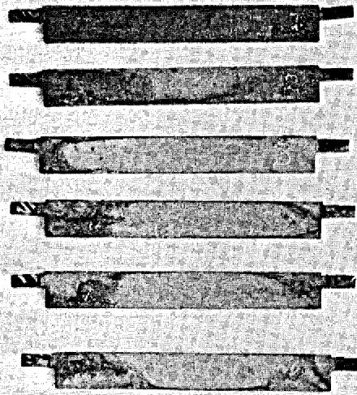  
1

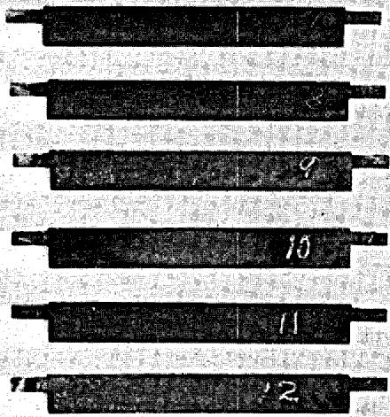  
2

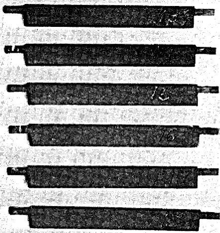  
3   
Fig. 9. Removable corrosion specimens from MSR-FCL-2.

The dependence of the rates of weight change on time and velocity that is evident in Fig. 9 is revealed more sharply in Table 4, which shows weight losses of the high-temperature specimens from one measurement to the next. For the sake of comparison with other corrosion data, the weight losses are also expressed as an equivalent corrosion rate during the interval. The overall average corrosion rate of the hottest specimen $(620^{\circ}\mathrm{C})$ was $0.94\mathrm{mil/year}$ at 20.8 fps and $0.74\mathrm{mil/year}$ at 10.9 fps.

For the first 5100 hr (before the extended shutdown) we saw continuously decreasing corrosion rates (Table 5). Over the last 1250 hr of the 5100-hr run, the corrosion rate of the hottest specimens $(620^{\circ}\mathrm{C})$ was $0.05\mathrm{mil/year}$ (assuming uniform dissolution). No velocity effect was seen for the last 2330 hr of the 5100-hr run. The average corrosion rate at $620^{\circ}\mathrm{C}$ for the first 5100 hr was $0.48\mathrm{mil/year}$ for specimens exposed to salt at 10.8 fps and $0.67\mathrm{mil/year}$ for specimens exposed to salt at 20.9 fps. Half the entire weight loss occurred during the first 450 hr. Almost no weight changes were measured for the specimens

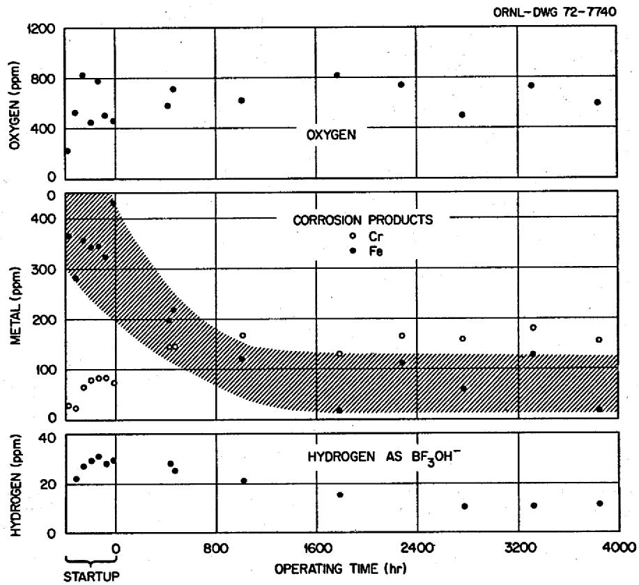  
Fig. 10. Results of MSR-FCL-2 salt analyses.

Table 4. Weight losses and equivalent corrosion rates of hottest (620°C) specimens exposed to NaBF₄-NaF (92-8 mole %) in MSR-FCL-2   

<table><tr><td colspan="2">Operating time (hr)</td><td colspan="2">Average weight loss (mg/cm2)</td><td colspan="2">Equivalent corrosion ratea(mils/year)</td></tr><tr><td>Period end</td><td>Interval</td><td>at 10.9 fps</td><td>at 20.8 fps</td><td>at 10.9 fps</td><td>at 20.8 fps</td></tr><tr><td>450</td><td>450</td><td>3.13</td><td>4.40</td><td>2.7</td><td>3.8</td></tr><tr><td>914</td><td>464</td><td>1.40</td><td>1.76</td><td>1.17</td><td>1.46</td></tr><tr><td>1780</td><td>866</td><td>1.11</td><td>1.53</td><td>0.49</td><td>0.68</td></tr><tr><td>2774</td><td>994</td><td>0.28</td><td>0.58</td><td>0.11</td><td>0.23</td></tr><tr><td>3846</td><td>1072</td><td>0.29</td><td>0.38</td><td>0.10</td><td>0.14</td></tr><tr><td>5102</td><td>1256</td><td>0.16</td><td>0.16</td><td>0.05</td><td>0.05</td></tr><tr><td>5283b</td><td>181</td><td>0.26</td><td>0.26</td><td>0.55</td><td>0.55</td></tr><tr><td>5792</td><td>509</td><td>5.70</td><td>6.76</td><td>4.32</td><td>5.12</td></tr><tr><td>6272</td><td>480</td><td>0.55</td><td>0.57</td><td>0.44</td><td>0.46</td></tr><tr><td>6806</td><td>534</td><td>0.20</td><td>0.20</td><td>0.14</td><td>0.14</td></tr><tr><td>Totals</td><td>6806</td><td>13.1</td><td>16.6</td><td>0.74</td><td>0.94</td></tr></table>

$a_{\text{Assuming uniform material removal of all constituents}}$   
$b$ Three-month shutdown after 5283 hr; loop drained.

Table 5. Corrosion rate of Hastelloy N specimens exposed to $\mathrm{NaBF_4}$ -NaF (92-8 mole $\%$ ) at $620^{\circ}C$ as a function of time and velocity   

<table><tr><td rowspan="2">Time interval</td><td colspan="2">Corrosion ratea(mils/year)</td></tr><tr><td>at 10.9 fps</td><td>at 20.8 fps</td></tr><tr><td>Entire 5100 hr</td><td>0.48</td><td>0.67</td></tr><tr><td>Last 4650 hr</td><td>0.27</td><td>0.36</td></tr><tr><td>Last 4200 hr</td><td>0.17</td><td>0.25</td></tr><tr><td>Last 3320 hr</td><td>0.09</td><td>0.13</td></tr><tr><td>Last 2330 hr</td><td>0.08</td><td>0.08</td></tr><tr><td>Last 1250 hr</td><td>0.06</td><td>0.06</td></tr></table>

$a$ Assuming uniform material removal.

exposed at 454 and $537^{\circ}\mathrm{C}$ for the last 1250 hr. These data indicate that the controlling kinetic corrosion mechanism over the 2330 hr mentioned above (no velocity effect) was probably solid-state diffusion of constituent elements of the alloy to the surface.[9] The weight changes for the 509 hr after the extended shutdown were quite large, and there was a velocity effect, which was indicative of general solution-rate control of corrosion (caused by impurities), as opposed to selective removal of the least-noble alloy constituent. The velocity effect was seen early in the experiment and essentially disappeared as the rate of mass transfer decreased.

Our overall corrosion rate at the highest velocity before shutdown was less than 0.7 mil/year for 5100 hr. The corrosion rate for this 509-hr time period was 5.2 mil/year, the largest measured in Loop MSR-FCL-2. The corrosion rate for the first 450 hr of operation was 3.8 mil/year. It is obvious that impurities, which probably entered the system during the four months that the loop was down, grossly affected the corrosion. Within 1000 hr after the second startup, the corrosion rate was quite low, and no velocity effect was evident. Almost 4000 hr was required after the initial startup to approach this low corrosion-rate condition. We saw no evidence of increased corrosion rate due to our pump difficulties.

Chromium is the least-noble constituent of Hastelloy N; thus it is selectively oxidized from the alloy. This selective oxidation can occur through reduction of a metal fluoride impurity in the salt; that is,

$$
\mathrm {F e F} _ {2} + \mathrm {C r} \rightleftharpoons \mathrm {C r F} _ {2} + \mathrm {F e}. \tag {1}
$$

(The $\mathbf{FeF_2}$ and $\mathrm{CrF_2}$ are probably actually NaF-FeF $_2$ and NaF-CrF $_2$ type compounds.) Our experience indicates that water is responsible for most corrosion in fluoroborate systems. Reactions that are believed to be involved include the following:

$$
\mathrm {H} _ {2} \mathrm {O} + \mathrm {N a B F} _ {4} \rightleftharpoons \mathrm {N a B F} _ {3} \mathrm {O H} + \mathrm {H F}, \tag {2}
$$

$$
\mathrm {N a B F} _ {3} \mathrm {O H} \rightleftharpoons \mathrm {N a B F} _ {2} \mathrm {O} + \mathrm {H F}, \tag {3}
$$

$$
6 \mathrm {H F} + 6 \mathrm {N a F} + 2 \mathrm {C r} \rightleftharpoons 2 \mathrm {N a} _ {3} \mathrm {C r F} _ {6} + 3 \mathrm {H} _ {2}. \tag {4}
$$

Under certain conditions, HF will attack all the alloy constituents; so instead of Cr, we can write Fe, Ni, or Mo. Equations (2), (3), and (4) may be combined to give

$$
6 \mathrm {N a B F} _ {3} \mathrm {O H} + 6 \mathrm {N a F} + 2 \mathrm {C r} \rightleftharpoons 6 \mathrm {N a B F} _ {2} \mathrm {O} + 2 \mathrm {N a} _ {3} \mathrm {C r F} _ {6} + 3 \mathrm {H} _ {2}, \tag {5}
$$

$$
3 \mathrm {H} _ {2} \mathrm {O} + 3 \mathrm {N a B F} _ {4} + 6 \mathrm {N a F} + 2 \mathrm {C r} \rightleftharpoons 3 \mathrm {N a B F} _ {2} \mathrm {O} + 2 \mathrm {N a} _ {3} \mathrm {C r F} _ {6} + 3 \mathrm {H} _ {2}. \tag {6}
$$

Thus, both the $\mathrm{NaBF}_3\mathrm{OH}$ initially in the salt and any $\mathrm{H}_2\mathrm{O}$ that may be admitted later result in corrosion and the production of hydrogen, which can diffuse through the hot metal walls and be lost from the system. Removal of hydrogen from the system by diffusion through the metal would drive reactions (5) and (6) to the right. The results of the tritium addition to a thermal convection loop supported the contention that little if any hydrogen-containing impurities existed in the molten fluoroborate. $^{10}$ Because of the connection with corrosion (and, as discussed below, with tritium transport), samples of salt from MSR-FCL-2 were routinely analyzed for oxygen and for $\mathrm{BF}_3\mathrm{OH}^-$ . The oxygen results shown in Fig. 10 do not reveal any trend with time. The measured concentrations of hydrogen as $\mathrm{BF}_3\mathrm{OH}^-$ , on the other hand, clearly indicate a downward trend for about $2800\mathrm{hr}$ , then little change over the next $1000\mathrm{hr}$ .

The hydrogen behavior in the fluoroborate salt in Loop MSR-FCL-2 is of great interest because of its implications for tritium transport in an MSBR. The concentrations shown in Fig. 10 indicate a much less rapid loss of hydrogen than would be expected on the basis of the interrelations of $\mathrm{BF}_3\mathrm{OH}^-$ concentration, hydrogen pressure, and diffusion through Hastelloy N observed in other experiments.

# CONCLUSIONS

1. The pump loop system used in this experiment is ideally suited for quite sophisticated corrosion studies and can be adapted to any flowing liquid.   
2. Measurable temperature gradient mass transfer did occur in this experiment. Our measurements disclosed weight losses for the hot specimens, weight gains for the cold specimens, with a balance point (no gain or loss) at a temperature halfway between the maximum and minimum.   
3. A velocity effect existed under certain conditions and resulted in higher weight losses and gains for the specimens exposed to the higher velocity salt. In time the velocity effect disappeared and mass transfer rates were quite low.   
4. Specimen examination early in the life of the loop disclosed a definite downstream effect. The first specimen of three exposed to the salt (same temperature, same velocity for each specimen) showed the largest gain or loss, the next specimen showed the next largest change, and the last specimen showed the smallest change of the three.   
5. Specimens in the hottest position remained fairly bright, with the specimens in the middle temperature position darker, and the specimens in the coldest position the darkest. Differences in appearance such as these have been previously observed.   
6. Overall average corrosion rate of the hottest specimen $(620^{\circ}\mathrm{C})$ was 0.94 mil/year at 20.8 fps and 0.74 mil/year at 10.9 fps. An average corrosion rate of 0.05 mil/year for the hottest specimen was found in one 1256-hr increment.

# INTERNAL DISTRIBUTION

(79 copies)

(3) Central Research Library

ORNL - Y-12 Technical Library

Document Reference Section

(10) Laboratory Records Department

Laboratory Records, ORNL RC

ORNL Patent Office

G. M. Adamson, Jr.

C.F.Baes

C. E. Bamberger

S.E.Beall

E.G.Bohlmann

R. B. Briggs

S. Cantor

E. L. Compere

W. H. Cook

F. L. Culler

J. E. Cunningham

J.M.Dale

J.H.DeVan

J.R. DiStefano

J.R. Engel

D. E. Ferguson

J.H.Frye,Jr.

L. O. Gilpatrick

W. R. Grimes

A. G. Grindell

W. O. Harms

P. N. Haubenreich

(3) M. R. Hill

W. R. Huntley

H. Inouye

P. R. Kasten

(5) J. W. Koger

E.J.Lawrence

A. L. Lotts

T. S. Lundy

R.N.Lyon

H. G. MacPherson

R. E. MacPherson

W.R.Martin

R.W.McClung

H. E. McCoy

C.J.McHargue

H. A. McLain

B. McNabb

L. E. McNeese

A. S. Meyer

R. B. Parker

P. Patriarca

A.M.Perry

M. W. Rosenthal

H.C.Savage

J. L. Scott

J. H. Shaffer

G.M.Slaughter

G.P. Smith

R. A. Strehlow

R.E.Thoma

D. B. Trauger

A. M. Weinberg

J. R. Weir

J. C. White

L. V. Wilson

# EXTERNAL DISTRIBUTION

(24 copies)

BABCOCK & WILCOX COMPANY, P. O. Box 1260, Lynchburg, VA 24505

B. Mong

BLACK AND VEATCH, P. O. Box 8405, Kansas City, MO 64114

C. B. Deering

BRYON JACKSON PUMP, P. O. Box 2017, Los Angeles, CA 90054

G.C.Clasby

CABOT CORPORATION, STELLITE DIVISION, 1020 Park Ave., Kokomo, IN 46901

T. K. Roche

CONTINENTAL OIL COMPANY, Ponca City, OK 74601

J.A. Acciarri

EBASCO SERVICES, INC., 2 Rector Street, New York, NY 10006

D.R.deBoisblanc

T. A. Flynn

THE INTERNATIONAL NICKEL COMPANY, Huntington, WV 25720

J. M. Martin

UNION CARBIDE CORPORATION, CARBON PRODUCTS DIVISION, 12900 Snow Road, Parma, OH 44130

R. M. Bushong

USAEC, DIVISION OF REACTOR DEVELOPMENT AND TECHNOLOGY, Washington, DC 20545

David Elias

J.E.Fox

Norton Haberman

C. E. Johnson

T.C.Reuther

S. Rosen

Milton Shaw

J.M.Simmons

USAEC, DIVISION OF REGULATIONS, Washington, DC 20545

A. Giambusso

USAEC, RDT SITE REPRESENTATIVES, Oak Ridge National Laboratory, P. O. Box X, Oak Ridge, TN 37830

D. F. Cope

Kermit Laughon

C. L. Matthews

USAEC, OAK RIDGE OPERATIONS, P. O. Box E, Oak Ridge, TN 37830

Research and Technical Support Division

USAEC, TECHNICAL INFORMATION CENTER, P. O. Box 62, Oak Ridge, TN 37830

(2)