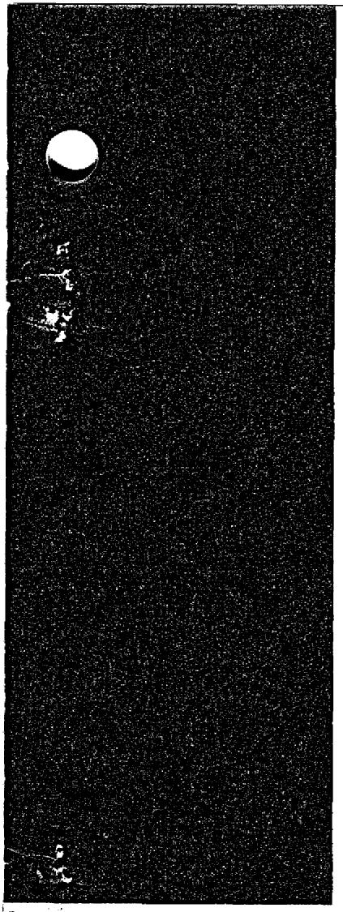

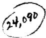

# ALLOY COMPATIBILITY WITH LiF-BeF $_2$ SALTS CONTAINING ThF $_4$ AND UF $_4$

J. W. Koger

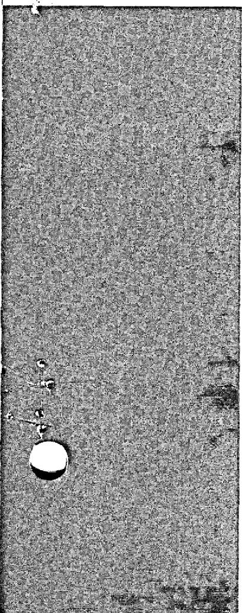

OAK RIDGE NATIONAL LABORATORY

OPERATED BY UNION CARBIDE CORPORATION • FOR THE U.S. ATOMIC ENERGY COMMISSION

This report was prepared as an account of work sponsored by the United States Government. Neither the United States nor the United States Atomic Energy Commission, nor any of their employees, nor any of their contractors, subcontractors, or their employees, makes any warranty, express or implied, or assumes any legal liability or responsibility for the accuracy, completeness or usefulness of any information, apparatus, product or process disclosed, or represents that its use would not infringe privately owned rights.

ORNL-TM-4286

Contract No. W-7405-eng-26

METALS AND CERAMICS DIVISION

ALLOY COMPATIBILITY WITH LiF-BeF $_2$ SALTS CONTAINING

ThF4 AND UF4

J.W.Koger

December 1972

# -NOTICE

This report was prepared as an account of work sponsored by the United States Government. Neither the United States nor the United States Atomic Energy Commission, nor any of their employees, nor any of their contractors, subcontractors, or their employees, makes any warranty, express or implied, or assumes any legal liability or responsibility for the accuracy, completeness or usefulness of any information, apparatus, product or process disclosed, or represents that its use would not infringe privately owned rights.

OAK RIDGE NATIONAL LABORATORY

Oak Ridge, Tennessee 37830

operated by

UNION CARBIDE CORPORATION

for the

U.S. ATOMIC ENERGY COMMISSION

MASTER

# CONTENTS

Abstract 1

Introduction 1

Molten Salt Chemistry 3

Thermodynamic Data 6

Metal Corrosion 7

Salt Preparation 9

Materials Selection and Fabrication 10

Loop Operations 10

Results 11

Hastelloy N 11

Loop 15 11

Loop 15A 15

Loops 18 and 19 17

Loop 21 23

Loop 16A 27

Type 304L Stainless Steel 28

Loop 1258 28

Maraging Steel 33

Type 316 Stainless Steel 36

Loop 22 36

Other Alloys 40

Loop 18A 40

Conclusions 43

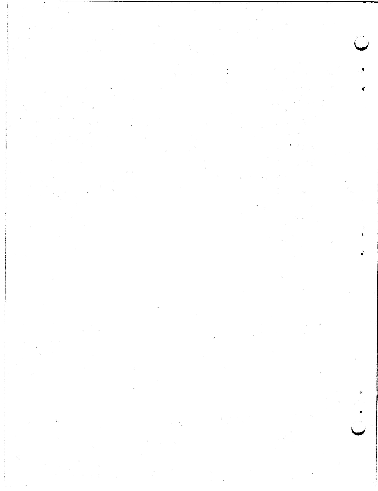

# ALLOY COMPATIBILITY WITH LiF-BeF $_2$ SALTS CONTAINING ThF $_4$ AND UF $_4$

J.W.Koger

# ABSTRACT

Various compatibility tests between $\mathrm{LiF - BeF_2}$ -based salts and Hastelloy N and certain steels were conducted in thermal convection loops. Temperature gradient mass transfer, as noted by weight losses in the hot leg and weight gains in the cold leg, was evidenced in all tests. The weight changes of corrosion specimens increased with increasing temperature and time.

From an operational standpoint, some difficulty was encountered in melting $\mathrm{LiF - BeF_2 - ThF_4}$ salt without mechanically failing the loop. The difficulty stemmed from the high melting point of the salt and the high melting point of certain phases in the salt.

All the salts tested were quite compatible with Hastelloy N. Bismuth in contact with a fuel salt had no effect on mass transfer in a Hastelloy N loop. We established that electrochemical methods to determine the oxidation potential of molten fluoride salts could be used to predict the corrosion behavior of a thermal convection loop. The values obtained by the electrochemical methods correlated well with specimen weight change data. We showed that tellurium (as plated on Hastelloy N specimens) does mass transfer in a molten fluoride salt system and that an equilibrium between tellurium in the salt and tellurium on the alloy can be established.

A type 304L stainless exposed to a fuel salt for 9.5 years in a type 304L stainless steel loop showed a maximum uniform corrosion rate of 0.86 mil/year. Voids extended 10 mils into the matrix. Chromium depletion was found.

The corrosion resistance of maraging steel (12% Ni-5% Cr-3% Mo-bal Fe) at $662^{\circ}\mathrm{C}$ was better than type 304L stainless but worse than Hastelloy N under equivalent conditions. The uniform corrosion rate was 0.55 mil/year. Subsurface voids were seen in the microstructure of the specimens after 5700 hr, and microprobe analysis disclosed a definite depletion of chromium and iron.

Type 316 stainless steel exposed to a fuel salt in a type 316 stainless steel loop showed a maximum uniform corrosion rate of 1 mil/year for 4298 hr. Mass transfer of chromium and iron did occur in the system.

For selected nickel- and iron-base alloys a direct correlation was found between corrosion resistance in a molten fluoride salt and the chromium and iron content of an alloy. The more chromium and iron in the alloy, the less the corrosion resistance.

# INTRODUCTION

A large portion of the support work of the Molten-Salt Breeder Reactor (MSBR) Program involved studies of the compatibility and mass transfer of various alloys with LiF-BeF $_2$ -based molten salts. Table 1 gives the alloys involved, the salt compositions, and the details of the tests. Many of these tests were conducted in thermal convection loops like that shown schematically in Fig. 1. The loops are essentially

Table 1. Thermal convection loop experiments ${}^{a}$ involving LiF-BeF ${}_{2}$ -based molten salts   

<table><tr><td>Loop No.</td><td>Salt composition (mole %)</td><td>Maximum temperature (°C)</td><td>ΔT (°C)</td><td>Time (hr)</td></tr><tr><td>1258</td><td>LiF-BeF2-ZrF4-UF4-ThF4(70-23-5-1-1)</td><td>688</td><td>100</td><td>83,516</td></tr><tr><td>15</td><td>LiF-BeF2-ThF4(73-2-25)</td><td>677</td><td>55</td><td>2,003</td></tr><tr><td>15A</td><td>LiF-BeF2-ThF4(73-2-25)</td><td>677</td><td>55</td><td>39,476</td></tr><tr><td>16b</td><td>LiF-BeF2-UF4(65.5-34-0.5)</td><td>704</td><td>170</td><td>37,942</td></tr><tr><td>16A</td><td>LiF-BeF2-UF4(65.5-34-0.5)</td><td>704</td><td>170</td><td>5,878</td></tr><tr><td>18</td><td>LiF-BeF2-ThF4-UF4(68-20-11.7-0.3)</td><td>704</td><td>170</td><td>15,930</td></tr><tr><td>18A</td><td>LiF-BeF2-ThF4-UF4(68-20-11.7-0.3)</td><td>704</td><td>170</td><td>2,278</td></tr><tr><td>19</td><td>LiF-BeF2-ThF4-UF4(68-20-11.7-0.3)</td><td>704</td><td>170</td><td>4,745</td></tr><tr><td>19A</td><td>LiF-BeF2-ThF4-UF4(68-20-11.7-0.3)</td><td>704</td><td>170</td><td>24,515</td></tr><tr><td>21</td><td>LiF-BeF2-ZrF4-UF4(65.4-29.1-5.0)</td><td>610</td><td>110</td><td>13,798</td></tr><tr><td>22</td><td>LiF-BeF2-ThF4-UF4(68-20-11.7-0.3)</td><td>650</td><td>110</td><td>4,491</td></tr></table>

${}^{a}$ Loop 1258 constructed of type 304L stainless steel; loop 22 constructed of type 316 stainless steel; all other loops constructed of Hastelloy N.   
bThis loop is discussed in another report, J. W. Koger, Effect of $FeF_{2}$ Addition on Mass Transfer in a Hastelloy N-LiF-BeF $_2$ -UF $_4$ Thermal Convection Loop System, ORNL-TM-4188 (December 1972).

ORNL-DWG 68-3987R3

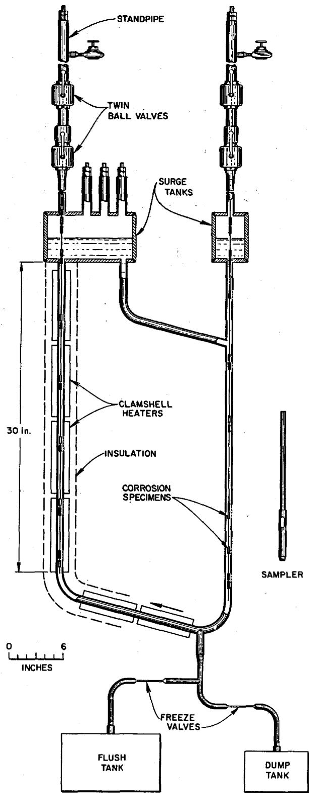  
Fig. 1. MSRP natural circulation loop and salt sampler.

test bed systems wherein metal specimens suspended in the salt and salt samples can be removed and/or replaced at operating temperature without disturbing flow or introducing air contamination. The salt flow in the thermal convection loops is generated by the difference in density of the salt in the hot and cold legs of the loop and ranges from 1.5 to $7\mathrm{ft / min}$ depending on salt density and viscosity.

A thorough chemistry background and physical properties of the molten salts are covered elsewhere by Grimes.

# MOLTEN SALT CHEMISTRY

Uranium tetrafluoride and uranium trifluoride are the only fluorides of uranium which appear useful as constituents of molten fluoride fuels. Uranium tetrafluoride $(\mathrm{UF}_4)$ is relatively stable, nonvolatile, and nonhygroscopic. It melts at $1035^{\circ}\mathrm{C}$ $(1895^{\circ}\mathrm{F})$ , but its freezing point is markedly depressed by useful diluent fluorides. Uranium trifluoride disproportionates at temperatures above $\sim 1000^{\circ}\mathrm{C}$ by the reaction

$$
4 \mathrm {U F} _ {3} \rightleftharpoons 3 \mathrm {U F} _ {4} + \mathrm {U} ^ {0}. \tag {3}
$$

It is chemically unstable $^{2,3}$ at lower temperatures in most molten fluoride solutions and is tolerable in reactor fuels only with a large excess of $\mathrm{UF_4}$ so that the activity of $\mathbf{U}^0$ is so low as to avoid appreciable reaction with moderator graphite or container metal.

Thorium tetrafluoride $(\mathrm{ThF}_4)$ is the only known fluoride of thorium. It melts at $1111^{\circ}\mathrm{C}$ $(2032^{\circ}\mathrm{F})$ , but fortunately its freezing point is markedly depressed by fluoride diluents which are also useful with $\mathrm{UF}_4$ .

Consideration of nuclear properties alone leads one to prefer as diluents the fluorides of Be, Bi, $^{7}\mathrm{Li}, \mathrm{Mg}, \mathrm{Pb}$ , and $\mathrm{Zr}$ in that order. Simple consideration of the stability of these fluorides toward reduction by structural metals, however, eliminates the bismuth fluorides from consideration. This leaves $\mathrm{BeF}_2$ and $^{7}\mathrm{LiF}$ as the preferred diluent fluorides. Phase behavior of systems based upon LiF and $\mathrm{BeF}_2$ as the major constituents has, accordingly, been examined in detail. Fortunately the phase diagrams of $\mathrm{LiF - BeF}_2\text{-UF}_4$ and $\mathrm{LiF - BeF}_2\text{-ThF}_4$ are such as to make these materials useful as fuels.

The binary system $\mathrm{LiF - BeF_2}$ has melting points below $500^{\circ}C$ over the concentration range from 33 to 80 mole $\% \mathrm{BeF}_2$ . The phase diagram presented in Fig. 2 is characterized by a single eutectic (52 mole $\% \mathrm{BeF}_2$ , melting at $360^{\circ}C$ ) between $\mathrm{BeF}_2$ and 2LiF $\cdot \mathrm{BeF}_2$ . The compound 2LiF $\cdot \mathrm{BeF}_2$ melts incongruently to LiF and liquid at $458^{\circ}C$ . LiF $\cdot \mathrm{BeF}_2$ melts below $280^{\circ}C$ .

The phase behavior of the $\mathrm{BeF}_2\text{-UF}_4^{6,7}$ and $\mathrm{BeF}_2\text{-ThF}_4^3$ systems is very similar. Both systems show simple single eutectics containing very small concentrations of the heavy metal fluoride. $\mathrm{ThF}_4$ and $\mathrm{UF}_4$ are isostructural; they form a continuous series of solid solutions.

The binary diagrams $\mathrm{LiF - UF_4}^9$ and $\mathrm{LiF - ThF_4}^{10}$ are generally similar and much more complex than the binary diagrams just discussed. The $\mathrm{LiF - UF_4}$ system has three compounds (none of which melt

1. W. R. Grimes, "Molten-Salt Reactor Chemistry," Nucl. Appl. Technol. 8, 137 (1970).   
2. W. R. Grimes, "Materials Problems in Molten Salt Reactors," in Materials and Fuels for High Temperature Nuclear Energy Applications, M. T. Simnad and L. R. Zumwalt, eds., the M.I.T. Press, Mass. (1964).   
3. W. R. Grimes, MSR Program Semiannu. Progr. Rep. July 31, 1964, ORNL-3708, p. 214.   
4. Alvin Glassner, The Thermochemical Properties of the Oxides, Fluorides, and Chlorides to $2500^{\circ}K$ , ANL-5750.   
5. L. Brewer, L. A. Bromley, P. W. Gilles, and N. L. Lofgren, MDDC-1553 (1945) and L. Brewer in The Chemistry and Metallurgy of Miscellaneous Materials, Thermodynamics, L. L. Quill, ed., McGraw-Hill, New York, pp. 76-192 (1950).   
6. R.E. Thoma, Phase Diagrams of Nuclear Reactor Materials, ORNL-2548 (Nov. 6, 1959).   
7. L. V. Jones, D. E. Etter, C. R. Hudgens, A. A. Huffman, T. B. Rhinehammer, N. E. Rogers, P. A. Tucker, and L. J. Wittenberg, "Phase Equilibria in the Ternary Fused-Salt System LiF-BeF $_2$ -UF $_4$ ," J. Amer. Ceram. Soc. 45, 79 (1962).   
8. R. E. Thoma, H. Insley, H. A. Friedman, and C. F. Weaver, "Phase Equilibria in the Systems $\mathsf{BeF}_2$ - $\mathsf{ThF}_4$ and LiF- $\mathsf{BeF}_2$ - $\mathsf{ThF}_4$ ," J. Phys. Chem. 64, 865 (1960).   
9. C. J. Barton, H. A. Friedman, W. R. Grimes, H. Insley, and R. E. Thoma, "Phase Equilibria in the Alkali Fluoride-Uranium Tetrafluoride Fused Salt System: 1. The Systems LiF-UF $_4$ and NaF-UF $_4$ ," J. Amer. Ceram. Soc. 41, 63 (1958).   
10. R. E. Thoma, H. Insley, B. S. Landau, H. A. Friedman, and W. R. Grimes, "Phase Equilibria in the Fused Salt Systems LiF-ThF $_4$ and NaF-ThF $_4$ ," J. Phys. Chem. 63, 1266 (1959).

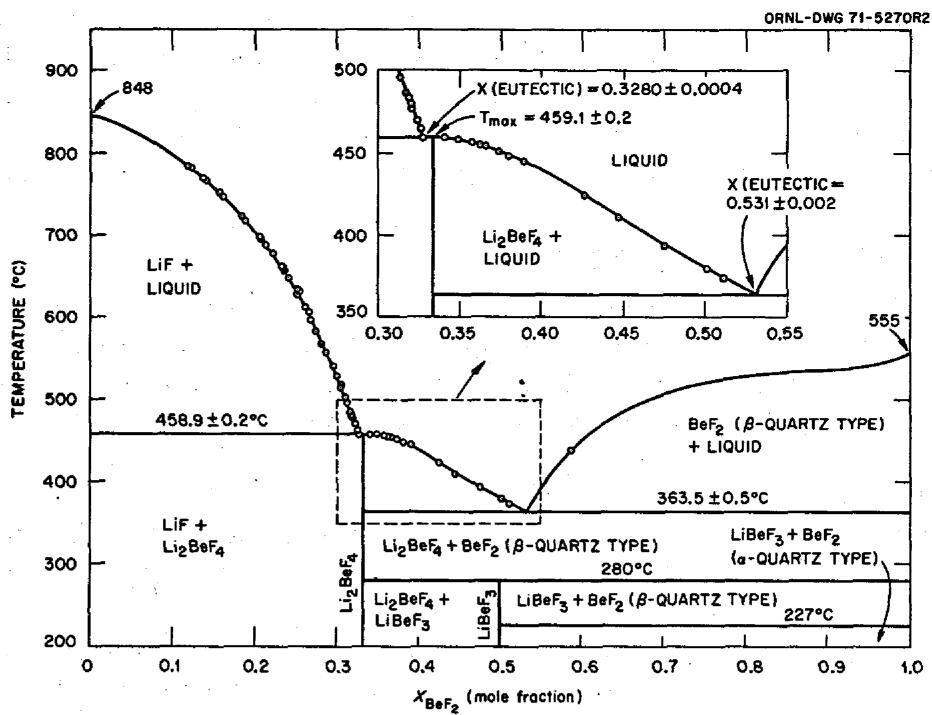  
Fig. 2. The system $\mathbf{LiF - BeF}_2$ .

congruently) and a single eutectic at 27 mole $\%$ UF $_4$ , melting at $490^{\circ}\mathrm{C}$ . The LiF-ThF $_4$ system contains four binary compounds, one (3LiF·ThF $_4$ ) which melts congruently, with two eutectics at $570^{\circ}\mathrm{C}$ and 22 mole $\%$ ThF $_4$ and at $560^{\circ}\mathrm{C}$ and 29 mole $\%$ ThF $_4$ .

The ternary system $\mathrm{LiF - ThF_4 - UF_4}$ ,11 shown in Fig. 3, has no ternary compounds and a single eutectic freezing at $488^{\circ}\mathrm{C}$ with 1.5 mole $\%$ $\mathrm{ThF_4}$ and 26.5 mole $\%$ $\mathrm{UF_4}$ . Most of the area on the diagram is occupied by the primary phase fields of the solid solutions $\mathrm{UF_4 - ThF_4}$ , $\mathrm{LiF\cdot 4UF_4 - LiF\cdot 4ThF_4}$ , and $\mathrm{LiF\cdot UF_4 - LiF\cdot ThF_4}$ . Liquidus temperatures decrease generally to the $\mathrm{LiF - UF_4}$ edge of the diagram.

The single-fluid molten-salt breeder fuel will need a concentration of $\mathrm{ThF_4}$ much higher than that of $\mathrm{UF_4}$ . Accordingly, the phase behavior of the fuel parallels that of the LiF-BeF $_2$ -ThF $_4$ system. Figure 4 gives the ternary system LiF-BeF $_2$ -ThF $_4$ ; this system shows a single ternary eutectic at 47 mole % LiF and 1.5 mole % ThF $_4$ , melting at $360^{\circ}\mathrm{C}$ . The system is complicated to some extent by the fact that the compound 3LiF·ThF $_4$ can incorporate $\mathrm{Be}^{2+}$ ions in both interstitial and substitutional sites to form solid solutions whose compositional extremes are represented by the shaded triangular region near that compound. Liquidus temperatures $< 550^{\circ}\mathrm{C}$ ( $1022^{\circ}\mathrm{F}$ ) are available at $\mathrm{ThF_4}$ concentrations as high at 22 mole %. The maximum $\mathrm{ThF_4}$ concentration available at liquidus temperatures of $500^{\circ}\mathrm{C}$ ( $932^{\circ}\mathrm{F}$ ) is above 14 mole %. Inspection of the diagram reveals that a considerable range of compositions with $>10$ mole % $\mathrm{ThF_4}$ will be completely molten at or below $500^{\circ}\mathrm{C}$ .

As expected from the general similarity of $\mathrm{ThF_4}$ and $\mathrm{UF_4}$ - and especially from the substitutional behavior shown by the LiF- $\mathrm{UF_4}$ -ThF $^4$ system (Fig. 3) - substitution of a small quantity of $\mathrm{UF_4}$ for $\mathrm{ThF_4}$ scarcely changes the phase behavior. Accordingly and to a very good approximation, Fig. 4 represents the behavior of the LiF-BeF2-ThF4-UF4 (MSBR fuel) system over concentration regions such that the mole fraction of $\mathrm{ThF_4}$ is much greater than that of $\mathrm{UF_4}$ .

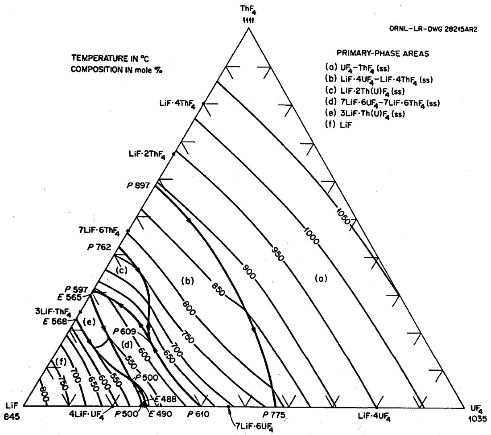  
Fig. 3. The system $\mathbf{LiF - ThF_4 - UF_4}$

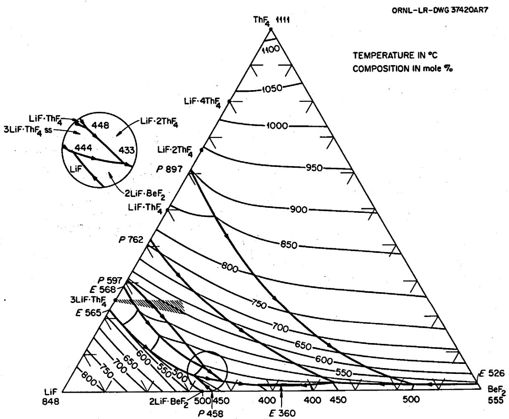  
Fig. 4. The system $\mathrm{LiF - BeF_2 - ThF_4}$

# THERMODYNAMIC DATA

The success of an MSBR is strongly dependent on the compatibility of the container materials with the molten salts used in the primary and secondary circuits of the reactor. Because the products of oxidation of metals by fluoride melts are quite soluble in the corroding media, passivation is precluded, and the corrosion rate depends on other factors, including the thermodynamic driving force of the corrosion reactions. Design of a practicable system utilizing molten fluoride salts, therefore, demands the selection of salt constituents such as LiF, $\mathrm{BeF}_2$ , $\mathrm{UF}_4$ , and $\mathrm{ThF}_4$ that are not appreciably reduced by available structural metals and alloys whose components Fe, Ni, and Cr can be in near thermodynamic equilibrium with the salt.

A continuing program of experimentation over many years has been devoted to definition of the thermodynamic properties of many corrosion product species in molten LiF-BeF $_2$ solutions. Many of the data have been obtained by direct measurement of equilibrium pressures for reactions such as

$$
\mathrm {H} _ {2} (\mathrm {g}) + \mathrm {F e F} _ {2} (\mathrm {d}) \rightleftharpoons \mathrm {F e} ^ {0} (\mathrm {c}) + 2 \mathrm {H F} (\mathrm {g}) \tag {4}
$$

and

$$
2 \mathrm {H F} (\mathrm {g}) + \mathrm {B e O} (\mathrm {c}) \rightleftharpoons \mathrm {B e F} _ {2} (\mathrm {l}) + \mathrm {H} _ {2} \mathrm {O} (\mathrm {g}), \tag {5}
$$

Table 2. Standard free energies of formation for species in molten $2\mathrm{LiF}\cdot \mathrm{BeF}_2$ 733 to $1000^{\circ}\mathrm{K}$   

<table><tr><td>Materiala</td><td>-ΔGf(kcal/mole)</td><td>-ΔGf(1000°K) (kcal/mole)</td></tr><tr><td>LiF(1)</td><td>141.8–16.6 × 10-3T°K</td><td>125.2</td></tr><tr><td>BeF2(1)</td><td>243.9–30.0 × 10-3T°K</td><td>106.9</td></tr><tr><td>UF3(d)</td><td>338.0–40.3 × 10-3T°K</td><td>99.3</td></tr><tr><td>UF4(d)</td><td>445.9–57.9 × 10-3T°K</td><td>97.0</td></tr><tr><td>ThF4(d)</td><td>491.2–62.4 × 10-3T°K</td><td>107.2</td></tr><tr><td>ZrF4(d)</td><td>453.0–65.1 × 10-3T°K</td><td>97.0</td></tr><tr><td>NiF2(d)</td><td>146.9–36.3 × 10-3T°K</td><td>55.3</td></tr><tr><td>FeF2(d)</td><td>154.7–21.8 × 10-3T°K</td><td>66.5</td></tr><tr><td>CrF2(d)</td><td>171.8–21.4 × 10-3T°K</td><td>75.2</td></tr><tr><td>MoF6(g)</td><td>370.9–69.6 × 10-3T°K</td><td>50.2</td></tr></table>

${}^{a}$ The standard state for LiF and ${\mathrm{{BeF}}}_{2}$ is the molten $2\mathrm{{LiF}} \cdot  {\mathrm{{BeF}}}_{2}$ liquid. That for ${\mathrm{{MoF}}}_{6}\left( \mathrm{\;g}\right)$ is the gas at 1 atm. That for all species with $\mathbf{d}$ is that hypothetical solution with the solute at unit mole fraction and with the activity coefficient it would have at infinite dilution.

where $\mathbf{g}$ , $\mathbf{c}$ , and $\mathbf{d}$ represent gas, crystalline solid, and solute, respectively, using the molten fluoride (l) as reaction medium. Baes has reviewed all these studies12 and, by combining the data with the work of others, has tabulated thermodynamic data for many species in molten 2LiF·BeF2. Table 2 records pertinent data for the major components of MSRE and MSBR fuels and for corrosion products in molten 2LiF·BeF2.

From these data one can assess the extent to which $\mathbf{U}\mathbf{F}_3$ -bearing melt will disproportionate according to the reaction

$$
4 \mathrm {U F} _ {3} (\mathrm {d}) \rightleftharpoons 3 \mathrm {U F} _ {4} (\mathrm {d}) + \mathrm {U} (\mathrm {d}). \tag {6}
$$

For the case where the total uranium content of the salt is 0.9 mole % (as in the Molten-Salt Reactor Experiment), the activity of metallic uranium (referred to the pure metal) is near $10^{-15}$ with $1\%$ of the $\mathrm{UF_4}$ converted to $\mathrm{UF_3}$ and is near $2 \times 10^{-10}$ with $20\%$ of the $\mathrm{UF_4}$ so converted. $^{13}$ Operation of the reactor with a small fraction (usually $< 2\%$ ) of the uranium present as $\mathrm{UF_3}$ is advantageous insofar as corrosion and the consequences of fission are concerned. Such operation with some $\mathrm{UF_3}$ present should result in formation of an extremely dilute (and experimentally undetectable) alloy of uranium with the surface of the container metal. Operation with $>50\%$ of the uranium as $\mathrm{UF_3}$ would lead to much more concentrated (and highly deleterious) alloying and to formation of uranium carbides. All evidence to date demonstrates that operation with relatively little $\mathrm{UF_3}$ is completely satisfactory.

# METAL CORROSION

The data of Table 2 reveal clearly that in reactions with structural metals (M)

$$
2 \mathrm {U F} _ {4} (\mathrm {d}) + \mathrm {M} (\mathrm {c}) \rightleftharpoons 2 \mathrm {U F} _ {3} (\mathrm {d}) + \mathrm {M F} _ {2} (\mathrm {d}), \tag {7}
$$

chromium is much more readily attacked than iron, nickel, or molybdenum. $^{13,14}$

Nickel-base alloys, more specifically Hastelloy N and its modifications, are considered the most promising for use in molten salts and have received most attention. Stainless steels, having more chromium than Hastelloy N, are more susceptible to corrosion by fluoride melts but can be considered for some applications.

Oxidation and selective attack may also result from impurities in the melt,

$$
\mathrm {M} + \mathrm {N i F} _ {2} \rightarrow \mathrm {M F} _ {2} + \mathrm {N i}, \tag {8}
$$

$$
\mathrm {M} + 2 \mathrm {H F} \rightarrow \mathrm {M F} _ {2} + \mathrm {H} _ {2}, \tag {9}
$$

or oxide films on the metal,

$$
\mathrm {N i O} + \mathrm {B e F} _ {2} \rightarrow \mathrm {N i F} _ {2} + \mathrm {B e O}, \tag {10}
$$

followed by reaction of $\mathbf{NiF}_2$ with M.

Reactions (8), (9), and (10) will proceed essentially to completion at all temperatures within the MSBR circuit. Accordingly, such reactions can lead (if the system is poorly cleaned) to a rapid initial corrosion rate. However, these reactions do not give a sustained corrosive attack.

Reaction (7) with $\mathrm{UF}_4$ , on the other hand, may have an equilibrium constant which is strongly temperature dependent; hence, when the salt is forced to circulate through a temperature gradient, a possible mechanism exists for mass transfer and continued attack. Reaction (7) is of significance mainly in the case of alloys containing relatively large amounts of chromium.

If nickel, iron, and molybdenum are assumed to form regular or ideal solid solutions with chromium (as is approximately true), and if the circulation rate is very rapid, the corrosion process for alloys in fluoride salts can be simply described. At high flow rates, uniform concentrations of $\mathrm{UF}_3$ and $\mathrm{CrF}_2$ are maintained throughout the fluid circuit. Under these conditions, there exists some temperature (intermediate between the maximum and minimum temperatures of the circuit) at which the initial chromium concentration of the structural metal is at equilibrium with the fused salt. This temperature $T_{\mathrm{BP}}$ is called the balance point. Since the equilibrium constant for the chemical reaction with chromium increases with increasing temperature, the chromium concentration in the alloy surface tends to decrease at temperatures higher than $T_{\mathrm{BP}}$ and tends to increase at temperatures lower than $T_{\mathrm{BP}}$ . At some point in time, the dissolution process will be controlled by the solid state diffusion rate of chromium from the matrix to the surface of the alloy. In some melts (NaF-LiF-KF-UF $_4$ , for example) the equilibrium constant for reaction (7) with chromium changes sufficiently as a function of temperature to cause formation of dendritic chromium crystals in the cold zone. For MSBR fuel and other LiF-BeF $_2$ -UF $_4$ mixtures, the temperature dependence of the mass transfer reaction is small, and the equilibrium is satisfied at reactor temperature conditions without the formation of crystalline chromium. Thus, the rate of chromium removal from the salt stream by deposition at cold-fluid regions is controlled by the rate at which chromium diffuses into the cold-fluid wall; the chromium concentration gradient tends to be small, and the resulting corrosion is well within tolerable limits. A schematic of the temperature gradient mass transfer process is shown in Fig. 5.

ORNL-DWG 67-6800R

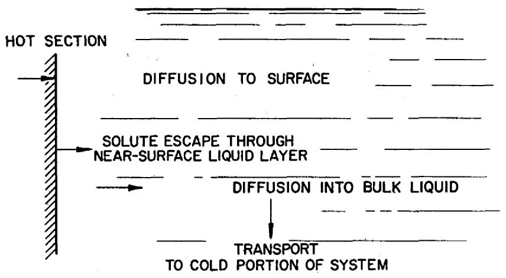

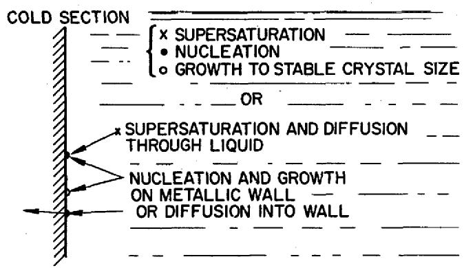  
Fig. 5. Temperature-gradient mass transfer.

# SALT PREPARATION

The salt for the loops was prepared by the Fluoride Processing Group of the Reactor Chemistry Division. Although starting materials of very high purity were used in production of fused fluoride mixtures, further purification was needed before the salts were used in loop systems. Two steps were required: one for the removal of oxides and sulfides and one for the removal of metallic fluorides. For the blanket and fuel salts, the oxides and sulfides were removed by gas sparging for several hours (usually 10 to 20) at $650^{\circ}\mathrm{C}$ with an anhydrous mixture of HF in hydrogen (1:4). The purification reactions are of the type

$$
\mathrm {O} ^ {2 -} + 2 \mathrm {H F} \rightleftharpoons 2 \mathrm {F} ^ {-} + \mathrm {H} _ {2} \mathrm {O}. \tag {1}
$$

The process is continued until the same amount of HF leaves the reaction vessel as enters. The reaction is then considered complete.

Gas sparging of the melt at $700^{\circ}\mathrm{C}$ with hydrogen alone for several hours (usually 20 to 40) was used as the final phase of the purification process to reduce $\mathrm{FeF_2}$ and $\mathrm{NiF_2}$ concentrations to low values and to remove any residual HF:

$$
\mathrm {H} _ {2} + \mathrm {M F} _ {2} \rightleftharpoons \mathrm {M} ^ {0} + 2 \mathrm {H F}. \tag {2}
$$

The reduction of $\mathrm{CrF_2}$ by hydrogen is too slow to be effective at process temperatures. However, the chromium concentration of the starting materials is very low. The by-product of the hydrogen sparging is HF, and the process is continued until the HF evolution is below a certain level.

# MATERIALS SELECTION AND FABRICATION

The Hastelloy N material for loops 15, 16, 18, 19, and 21 was from heat No. 5097 obtained from Stellar Division, Cabot Corp, and the composition is given in Table 3. The loops were fabricated from 0.750-in.-OD annealed tubing with a wall thickness of 0.072 in. Machined pieces were annealed at $1175^{\circ}\mathrm{C}$ in $\mathbf{H}_2$ before welding. The material was TIG welded in conformance with ORNL Specifications PS-23 and PS-25 and inspected under ORNL Specification MET-WR-200. After welding, the loops were stress relieved at $880^{\circ}\mathrm{C}$ for 8 hr.

Table 3. Composition of Hastelloy N loop material (heat 5097)   

<table><tr><td>Element</td><td>Weight percent</td></tr><tr><td>Mo</td><td>16.5</td></tr><tr><td>Cr</td><td>6.9</td></tr><tr><td>Fe</td><td>4.5</td></tr><tr><td>Si</td><td>0.69</td></tr><tr><td>Mn</td><td>0.54</td></tr><tr><td>Ti</td><td>0.02</td></tr><tr><td>Ni</td><td>Bal</td></tr></table>

# LOOP OPERATIONS

The loops were heated by pairs of clamshell heaters placed end to end around two legs of the loop (Fig. 1). The input power was controlled by silicon controlled rectifier (SCR) units, and the temperature controlled by a current proportioning controller. The loop temperatures were measured by Chromel-P vs Alumel thermocouples that had been spot welded to the outside of the tubing, covered by a layer of quartz tape, and then covered with stainless steel shim stock. Tubular electric heaters controlled by variable autotransformers furnished the heat to the cold leg portions of the loops during startup of the loops.

Before filling with salt, the loops were degreased with ethyl alcohol, dried, and then heated to $150^{\circ}\mathrm{C}$ under vacuum to remove any traces of moisture. A helium mass spectrometer leak detector was used to check for leaks in the system.

The procedure for filling the loops consisted of heating the loop, the salt pot, and all connecting lines to approximately $550^{\circ}\mathrm{C}$ and applying helium pressure to the salt supply vessel to force the salt into the loop. Air was continuously blown on freeze valves leading to the dump and flush tanks to provide a positive salt seal.

Normally the first charge of salt was held for $24\mathrm{hr}$ in the loops at the maximum operating temperature and then dumped. This flush salt charge was intended to remove surface oxides or other impurities left in the loops. The loop was then refilled with fresh salt, and operation began. Once the loop was filled, the heaters on the cold leg of the loop were turned off. As much insulation was removed as necessary to obtain the proper temperature difference by exposing the cold leg to ambient air. Helium cover gas of $99.998\%$ purity and under slight pressure (approx 5 psig) was maintained over the salt in the loops during operation.

With the exception of loop 1258 which only had specimens in the hot leg, the loops all contained 14 to 16 specimens $0.75 \times 0.38 \times 0.030$ in., each with a surface area of 0.55 in. $^{2}$ ( $3.45\mathrm{cm}^{2}$ ). Generally two of the specimens were titanium-modified Hastelloy N. (Modifications to the standard Hastelloy N composition were made to test for improved mechanical properties after neutron irradiation.) The composition of the standard and modified Hastelloy N specimens is given in Table 4. Eight specimens were attached at different vertical positions on each of two $\frac{1}{8}$ -in. rods. One rod was inserted in the hot leg and another in the cold leg. The rods were placed into or removed from the loop from standpipes atop each leg. The rods were moved through a Teflon sliding seal compression fitting at the top of the standpipe and a ball valve at the bottom. Another ball valve on the loop above each leg assured removal or insertion without disturbing loop operation or introducing air contamination.

The corrosion specimens were withdrawn periodically along with salt samples to follow corrosion processes as a function of time. During the removal periods all specimens were weighed and measured. Portions of the hottest and coldest specimens were removed and examined metallographically during tests, and all specimens were examined metallographically after test.

Table 4. Composition of Hastelloy N specimens   

<table><tr><td rowspan="2"></td><td colspan="7">Weight percent</td></tr><tr><td>Mo</td><td>Cr</td><td>Fe</td><td>Si</td><td>Mn</td><td>Ti</td><td>Ni</td></tr><tr><td>Ti-modified</td><td>13.8</td><td>7.3</td><td>&lt;0.1</td><td>0.05</td><td>0.13</td><td>0.47</td><td>Bal</td></tr><tr><td>Standard</td><td>17.2</td><td>7.4</td><td>4.5</td><td>0.64</td><td>0.55</td><td>0.02</td><td>Bal</td></tr></table>

# RESULTS

# Hastelloy N

Loop 15. Loop 15 was operated to determine the compatibility of a proposed blanket salt for a two-fluid molten salt breeder reactor with Hastelloy N. Figure 6 shows loop 15 on the left in place before operation.

For loop 15 the fuel pot and associated lines had to be heated to $730^{\circ}\mathrm{C}$ and higher than normal inert gas pressure applied to fill the loop with salt. During the initial salt transfer the fill line failed and resulted in a spill. After repairs, we managed to fill the loop with the flush charge but found it impossible to initiate circulation even after heating the loop's hot leg to $760^{\circ}\mathrm{C}$ . The loop was drained and then refilled with clean salt and put into operation. The loop was operated at a maximum temperature of $676^{\circ}\mathrm{C}$ with a temperature difference of $54^{\circ}\mathrm{C}$ . A helium cover gas under slight positive pressure ( $\sim$ 5 psig) was maintained over the salt in the loops during operation.

On May 1, 1968, after 2003 hr of uneventful operation, the loop cooled due to a blown fuse, and all salt was frozen. Heat was applied to the loop in order to thaw the salt, and a rupture occurred in the hot leg loop piping 30 in. down from the hot leg surge tank (Figs. 7 and 8), thus ending the operation of loop 15.

The weight changes of the specimens in the hottest and coldest positions are plotted vs time of operation in Fig. 9. The standard Hastelloy N specimen at a lower temperature lost more weight than the titanium-modified specimen at the higher temperature. We attribute this increased corrosion resistance to the lower iron concentration of the titanium-modified alloy (Table 4). Weight losses were measured for hot leg specimens and weight gains for cold leg specimens, thus implying that temperature gradient mass transfer had occurred. The weight changes in all cases were quite small.

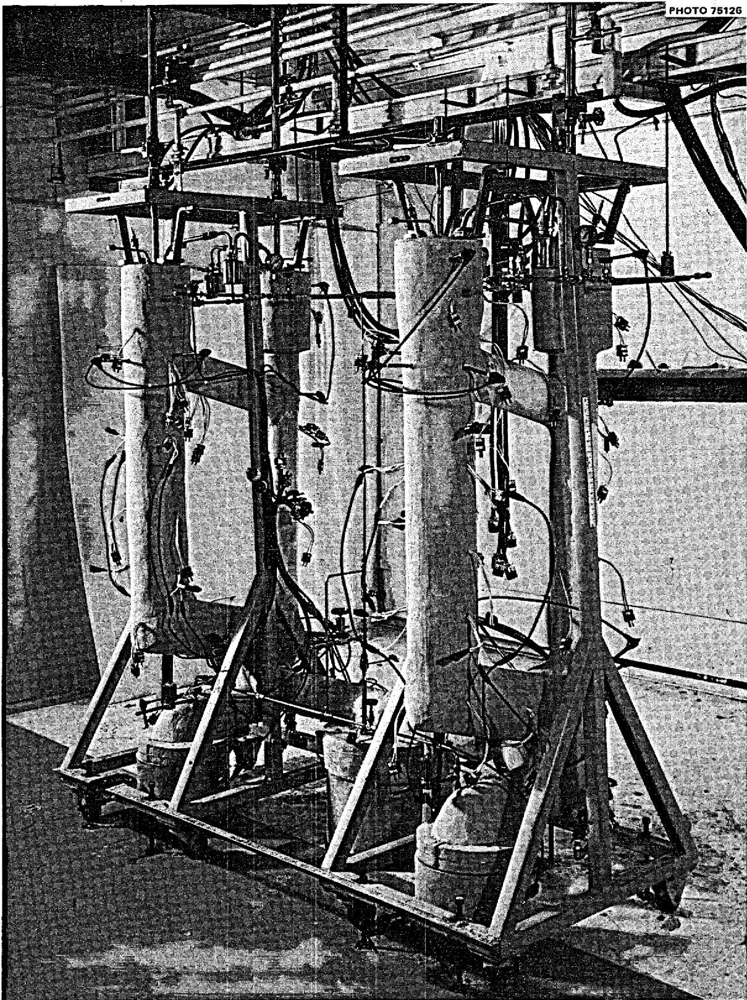  
Fig. 6. Left to right, loops 15 and 16 before operation.

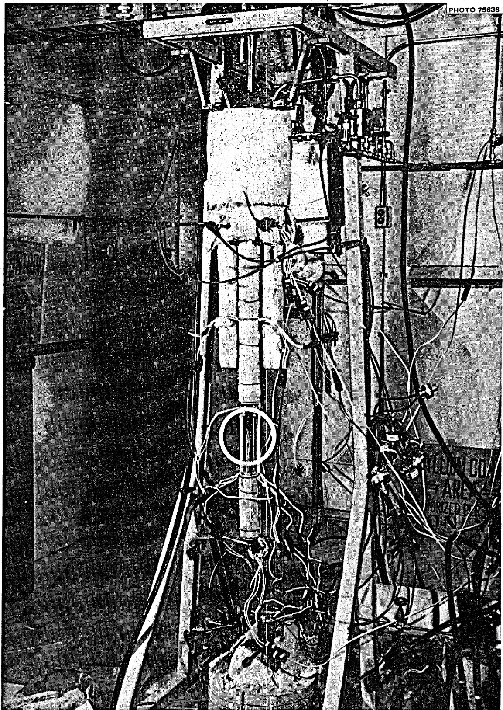  
Fig. 7. View of loop 15 and the ruptured area of NCL-15.

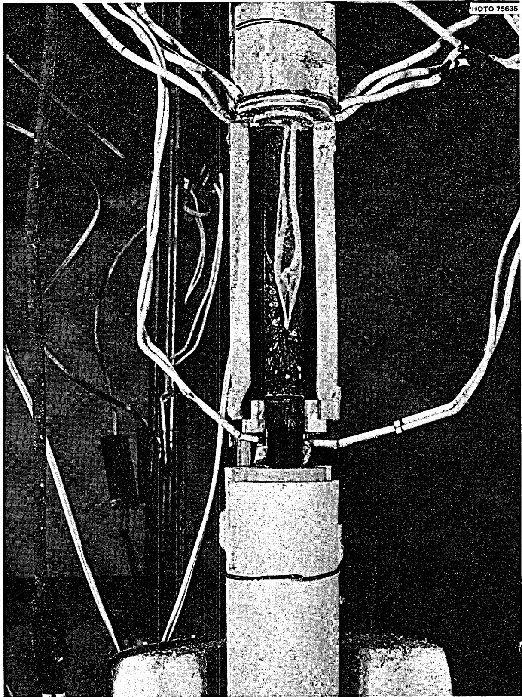  
Fig. 8. Ruptured area of NCL-15.

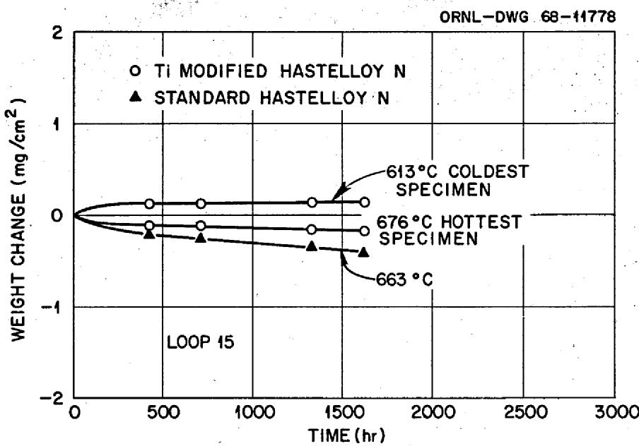  
Fig. 9. Weight changes of Hastelloy N specimens in loop 15 vs time of operation in LiF-BeF $_2$ -ThF $_4$ (73-2-25 mole%).

Figure 10 shows microstructures of the specimens in the hottest and coldest positions, respectively. There is little or no indication of corrosion or mass transfer effects.

The salt was periodically analyzed for its major constituents, the major alloying elements of the container material, and oxygen and water. The chromium and iron increased with time, but the changes were very small (about 20 ppm increase). Nickel showed a small overall increase, molybdenum remained at $< 20$ ppm during operation, oxygen ranged from $< 50$ to a high of 244 to a value of 75 ppm just before the rupture, and water was $< 500$ ppm in each analysis. The latter four values are quite low and preclude any possibility of air or water contamination.

Table 5 gives pertinent details of loops that had operated in past years for various times with LiF-ThF $_4$ (71-29 mole %) salt. The two Inconel loops that operated for a year (8760 hr) showed subsurface void formation for distances up to $6^{1/2}$ mils, but the INOR-8 (Hastelloy N) loop that operated for a year showed no voids. The improved behavior of INOR-8 was somewhat expected since there is less chromium present. None of the loops showed any signs of plugging, and no large increases of any of the alloy constituents are noted in the salt. Our experiment substantiated and quantified the previously observed good behavior of Hastelloy N in LiF-ThF $_4$ salts.

From the operational viewpoint, this salt provided more difficulties than any other fluoride salt that has been handled by the present Reactor Materials Group personnel. The first problem was the high temperature $(730^{\circ}\mathrm{C})$ needed to transfer the fuel and the apparent presence of unmelted salt constituents. It is thought that there was perhaps a separation of a high melting component which caused this problem. The second problem was the rupture of the loop while trying to thaw the frozen salt. This thawing procedure had been used with other salts quite successfully with no failures.

Loop 15A. The ruptured area of loop 15, which still contained frozen salt, was cut from the loop and another piece of tubing was attached by means of compression-type fittings. The loop was then heated, the salt was melted and dumped, and the test specimens were removed. The temporary fitting was removed, and the joints to be welded were reamed to remove any remaining salt and corroded metal and filed to provide the proper weld joint configuration. Welding was done in conformance with ORNL specifications

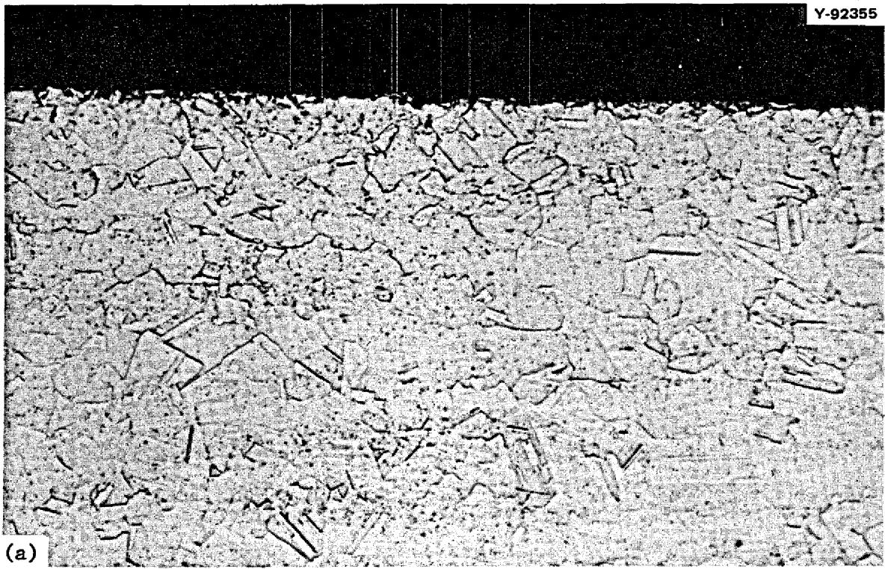  
0.007 INCHES 10.007 in. 1 500x 10.003 in. 1 10.001 in.

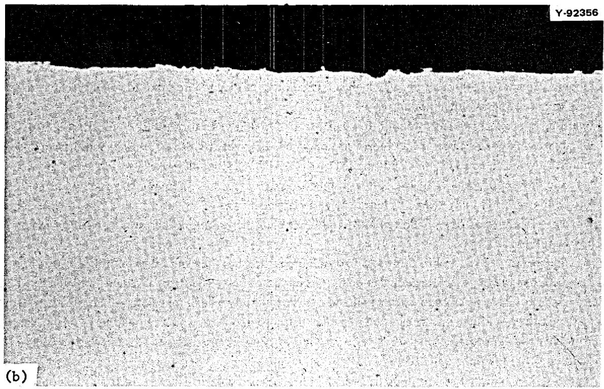  
0.007 INCHES 10.005 in. 1 500x 10.003 in. 1 10.001 in.   
Fig. 10. Microstructures of Hastelloy N specimens for loop 15 after 2000 hr exposure to LiF-BeF $_2$ -ThF $_4$ (73-2-25 mole%). (a) Hot leg, $676^{\circ}\mathrm{C}$ ; (b) cold leg, $613^{\circ}\mathrm{C}$ .

Table 5. Thermal convection loops that operated with LiF-ThF ${}_{4}$ (71-29 mole %) salt   

<table><tr><td rowspan="2">Loop material</td><td rowspan="2">Hours operated</td><td rowspan="2">Maximum temperature (°C)</td><td rowspan="2">ΔT (°C)</td><td colspan="2">Chemical changes in salt (ppm)</td><td rowspan="2">Hot leg condition</td></tr><tr><td>Cr</td><td>Fe</td></tr><tr><td>Inconela</td><td>1000</td><td>692</td><td>111</td><td>45</td><td>0</td><td>Light surface roughening, few voids to a depth of &lt;1 mil.</td></tr><tr><td>Inconela</td><td>1000</td><td>676</td><td>75</td><td>70</td><td>0</td><td>Few pits to 1½ mils, few voids to a depth of &lt;1 mil. Moderate surface roughening.</td></tr><tr><td>Inconela</td><td>8760</td><td>733</td><td>90</td><td>95</td><td>20</td><td>Intergranular voids to 6½ mils. Moderate surface roughening</td></tr><tr><td>Inconela</td><td>8760</td><td>676</td><td>79</td><td>300</td><td>0</td><td>Pits to 1 mil, voids to 5 mils. Moderate surface roughening</td></tr><tr><td>INOR-8b</td><td>8760</td><td>733</td><td>93</td><td>240</td><td>60</td><td>Heavy surface roughening.</td></tr><tr><td>INOR-8c</td><td>3114</td><td>690</td><td>72</td><td>65</td><td>50</td><td>Light surface roughening.</td></tr><tr><td>INOR-8d</td><td>1000</td><td>682</td><td>61</td><td>40</td><td>120</td><td>Light surface roughening.</td></tr></table>

$a_{15}$ Cr, 7 Fe, bal Ni.   
$b_{17}$ Mo, 8 Cr, 5 Fe, bal Ni.   
c15 Mo,6 Cr,5 Fe,bal Ni.   
$d_{15.8\mathrm{Mo}}$ 6.99 Cr,4.85 Fe,bal Ni.

PS-23 and PS-25 and inspected under ORNL specification MET-WR-200. The first welding attempt was unsuccessful because of poor penetration from excessive gas pressure in the loop. The second attempt was successful and demonstrates that a successful weld can be made on material that has contained a molten salt.

The loop was filled with salt from the original batch and designated 15A. After operation began, specimens were found to have a "glaze" or coating (probably a high-melting thorium compound) that was impossible to remove without damaging the specimen. However, based on changes of chromium concentration and metallographic studies, little if any mass transfer was indicated. Toward the end of the run the coating on specimen surfaces disappeared, and the weight changes were measurable. For a total specimen exposure time of $37,792\mathrm{hr}$ , the maximum weight loss was $4.7\mathrm{mg/cm^2}$ , equivalent to a uniform corrosion rate of $0.05\mathrm{mil/year}$ , and the maximum weight gain was $4.2\mathrm{mg/cm^2}$ . Figure 11 shows the microstructure of the hottest and coldest specimens. Some attack along the grain boundaries of the hottest specimen is seen.

Loop 18 and 19. Loops 18 and 19 were constructed of standard Hastelloy N with removable specimens in each leg and were operated with the salt mixture $68\%$ LiF- $20\%$ $\mathrm{BeF}_2 - 11.7\%$ $\mathrm{ThF}_4 - 0.3\%$ $\mathrm{UF_4}$ (mole%). Loop 19 had a molybdenum hot finger containing bismuth at the bottom of the hot leg (Fig. 12) which allowed contact between the flowing salt and the bismuth. The loops were operated to obtain data on the compatibility of a fertile-fissile salt mixture with Hastelloy N and to determine if contacting the salt with liquid bismuth would affect the corrosion rate.

After a power outage at 4741 hr the bismuth finger on loop 19 was inadvertently heated to temperatures over $1000^{\circ}\mathrm{C}$ . Subsequent examination disclosed localized melting of the Hastelloy N which surrounded the molybdenum container. Portions of the loop and the finger were removed for examination and replacement parts fabricated for repair.

Prior to the 4741-hr shutdown the maximum weight loss for a standard Hastelloy N specimen at $704^{\circ}\mathrm{C}$ was $0.8\mathrm{mg/cm}^2$ . Assuming uniform dissolution this weight loss is equivalent to 0.07 mil/year, an insignificant corrosion rate. The chromium content of the salt increased from 25 to 66 ppm while iron decreased from 78 to 23. Figure 13 shows the metallographic appearance of the hottest and coldest

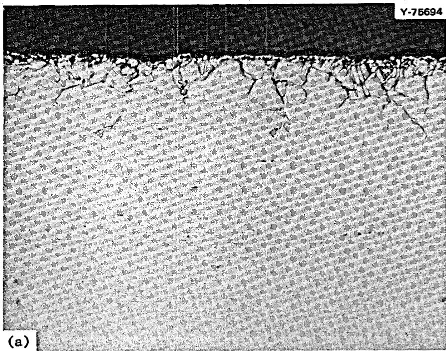

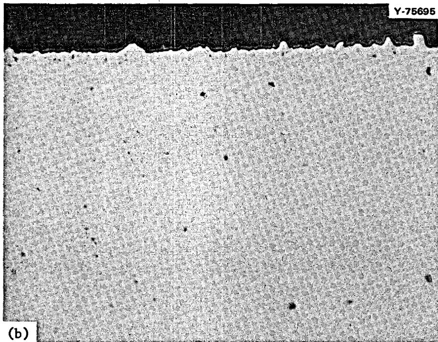  
Fig. 11. Microstructures of Hastelloy N specimens from loop 15A after 37,792 hr exposure to LiF-BeF $_2$ -ThF $_4$ (73-2-25 mole %). (a) Hot leg, $676^{\circ}\mathrm{C}$ ; (b) cold leg, $613^{\circ}\mathrm{C}$ . 500X.

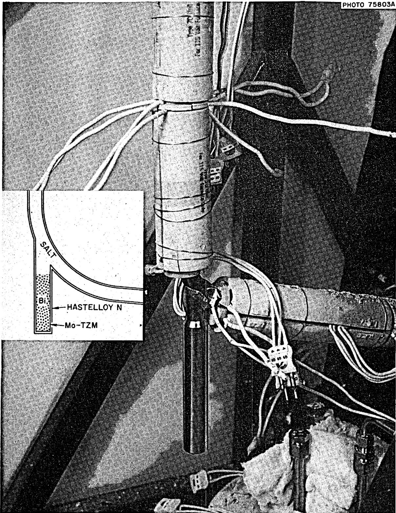  
Fig. 12. Bismuth "hot finger" contained in molybdenum with Hastelloy N jacket on loop 19.

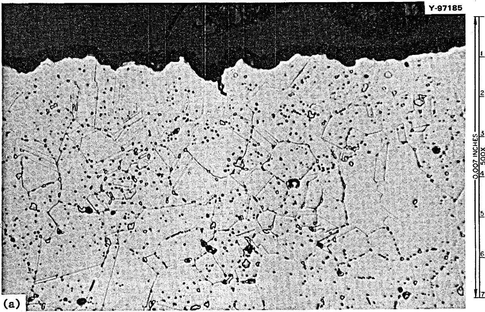

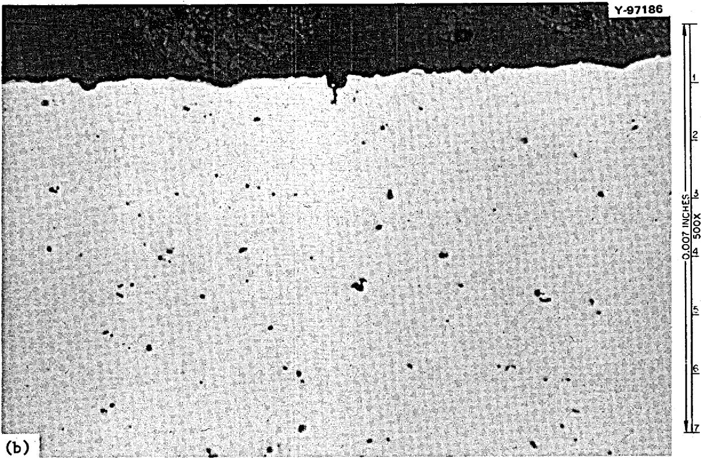  
Fig. 13. Microstructure of Hastelloy N from loop 19 exposed to LiF-BeF $_2$ -ThF $_4$ -UF $_4$ (68-20-11.7-0.3 mole %) 4741 hr. (a) Hot leg, $700^{\circ}\mathrm{C}$ ; (b) cold leg, $550^{\circ}\mathrm{C}$ .

specimens. Little attack or deposition is seen. The bismuth content of the salt was $< 20$ ppm for the last 1500 hr. After the temperature excursion the salt and the bismuth at the top of the finger were both analyzed for certain metal impurities, and the results are given in Table 6.

Table 6 shows that bismuth extracted impurities from the salt in quantities proportional to the solubility of these structural metals in bismuth. Analysis of the dumped salt from loop 19 disclosed 225 ppm bismuth.

At the time of this analysis, in loop 18 the maximum weight loss of a standard Hastelloy N specimen was $0.8\mathrm{mg/cm}^2$ at $704^{\circ}\mathrm{C}$ in 3400 hr, a very low rate, equivalent to 0.08 mil/year assuming uniform attack. The chromium concentration in the salt in this loop had increased from 21 to 90 ppm. We showed no difference in mass transfer in the two loops at this time.

The specimen from the hottest position of loop 19 was bent around a $\frac{1}{4}$ -in.-diam tube and examined metallographically (Fig. 14). There was no indication of cracking or weakening of grain boundaries, and there were no signs of salt or bismuth attack.

Table 6. Analysis of salt and bismuth from hot finger portion of loop 19   

<table><tr><td>Major constituent</td><td>Impurities</td><td>Concentration (ppm)</td><td>Solubility at 600°Ca</td></tr><tr><td rowspan="4">Bismuth</td><td>Ni</td><td>3000</td><td>6.0%</td></tr><tr><td>Cr</td><td>80</td><td>140 ppm</td></tr><tr><td>Fe</td><td>10</td><td>50 ppm</td></tr><tr><td>Mo</td><td>0.2</td><td>&lt;1 ppm</td></tr><tr><td>Salt</td><td>Bi</td><td>225</td><td></td></tr></table>

$^{a}$ C. J. Klamut et al., "Material and Fuel Technology for an LMFR," pp. 433-72 in Progress in Nuclear Energy, Series IV, vol. 2, Technology, Engineering and Safety, Pergamon, London, 1960.

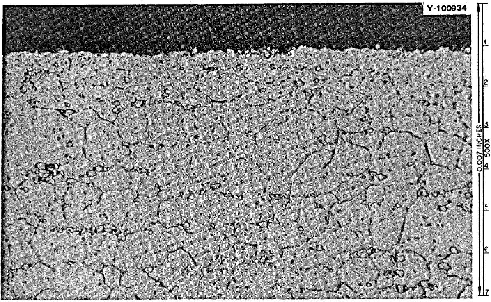  
Fig. 14. Microstructure of stressed Hastelloy N specimen from loop 19 exposed to LiF-BeF $_2$ -ThF $_4$ -UF $_4$ (68-20-11.7-0.3 mole %) for 4741 hr at $700^{\circ}\mathrm{C}$ .

Repairs were made to loop 19 and the molybdenum finger, and the system was restarted with fresh salt and bismuth with the loop designated as 19A. Loop 19A operated 24,515 hr, and the weight changes are shown in Fig. 15. Little if any attack was seen on the hottest specimen. Assuming uniform loss the maximum weight loss was equivalent to only 0.02 mil/year. A modified Hastelloy N alloy (Ni-13.0% Mo-8.5% Cr-0.1% Fe-0.8% Ti-1.6% Nb) lost less weight than a standard alloy at the same position. We attribute this difference to the low iron in the modified alloy, compared with about 5% in the standard alloy. The chromium content of the salt increased 194 ppm in 18,000 hr, while iron decreased 70 ppm, and there was no detectable bismuth in the salt. During the last exposure period, the specimens in the hot leg were inadvertently placed 4 in. lower than usual. This put the bottom specimen into the molten bismuth during operation. On removing the stringer, this bottom specimen was missing. The end of the stringer appeared to have been in contact with the bismuth but was not dissolved. Thus it is likely that the very small specimen attachment pins dissolved during the run, and the specimen fell off the stringer. As we had surmised earlier in loop 19, the bismuth in contact with the salt appeared to have had no effect on our mass transfer results as loops 18 and 19 showed about the same amount of mass transfer (Fig. 16).

Loop 18 operated a total of 15,930 hr, and the maximum weight loss was $1.5 \, \mathrm{mg/cm}^2$ at $704^\circ \mathrm{C}$ , equivalent to a corrosion rate of 0.05 mil/year. Chromium in the salt increased from 20 to 190 ppm while iron decreased from 80 to 20 ppm.

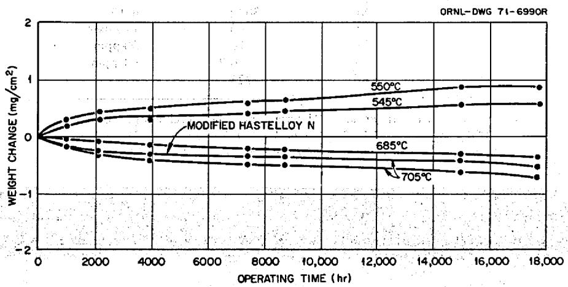  
Fig. 15. Weight changes of Hastelloy N from loop 19 exposed to LiF-BeF $_2$ -ThF $_4$ -UF $_4$ (68-20-11.7-0.3 mole %) for various times.

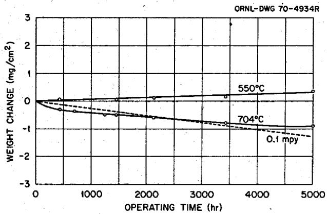  
Fig. 16. Comparative corrosion rates of Hastelloy N in $\mathrm{LiF - BeF_2 - UF_4 - ThF_4}$ salt with and without bismuth.

Loop 21. Loop 21, a Hastelloy N thermal convection loop (Fig. 17) with removable specimens in each leg and containing the Molten-Salt Reactor Experiment reference fuel salt (Table 1), operated for 13,798 hr. The loop was equipped with electrochemical probes which measured the $\mathrm{U}^{3+}/\mathrm{U}^{4+}$ ratio, and hence provided an instantaneous measure of the oxidation potential of the salt. The probes were designed and operated by J. M. Dale and A. S. Meyer of the Analytical Chemistry Division. Previous use of these probes had been limited to small static systems, and this experiment was intended to evaluate their possible use for on-stream analysis in a large system. This loop differed from our other thermal convection loops in that the salt flow up the hot leg went directly into a large surge tank. In our other loops the salt was circulated only through tubing which was in a harp-shaped configuration. From the large surge tank the salt then flowed out the bottom of the tank into a crossover leg and into the cold leg. The electrochemical probes passed through mechanical fittings (separated from the metal by Teflon), which were on risers 10 in. from the surge tank (to protect the Teflon from the heat of the salt) and then entered the salt in the large hot leg surge tank, as shown in Fig. 18. There were five access ports for the probes.

The loop was filled on July 20, 1971, and held under isothermal conditions at about $650^{\circ}\mathrm{C}$ until July 26, at which time the cold leg temperature was established and Hastelloy N specimens were inserted into both the hot and cold leg of the loop for corrosion studies. Analyses of the $\mathbf{U}^{3+}$ concentration of the melt were started on July 22 and were continued on a routine basis until the specimens were removed from the loop on August 23. More details about these analyses can be found in refs. 15, 16, and 17.

The original measurements in the melt indicated that about $0.02\%$ of the total uranium was present as $\mathrm{U}^{3+}$ . The $\mathrm{U}^{3+}$ concentration showed a gradual increase until a value of $0.05\%$ was reached at 475 hr of loop operation. At this point the rate of formation of $\mathrm{U}^{3+}$ increased, and the concentration reached a value of about $0.15\%$ when the metal specimens were removed from the loop. The maximum weight loss of a hot leg specimen was $0.2\mathrm{mg/cm}^2$ , and the maximum weight gain of a cold leg specimen was $0.05\mathrm{mg/cm}^2$ .

To evaluate whether material floating on the salt was affecting the potential measurements, the electrode assembly was modified to allow the salt to be flushed from around the electrode with helium. This assembly was installed in the loop after the metal specimens were removed. The electrode was encased in a $\frac{1}{2}$ -in. nickel tube, open at the bottom, which protruded below the surface of the melt. During computer-controlled runs the salt entered the electrode compartment from below the melt surface and remained there for the time of measurement. The salt was then flushed from the compartment, and the electrode remained in a helium gas envelope when not in use. This appeared to keep floating material away from the electrode and also should have increased the lifetime of the electrodes or electrode area-defining insulators which may be added at a later time.

After the system was started the analyses were performed unattended through computer control. At initiation of the analyses a signal from a logic circuit that we added to the computer started a timer which caused the pressure in the electrode assembly to be released, and salt entered the electrode compartment. The computer then operated the voltammeter to perform five analyses for $\mathbf{U}^{3+}$ , and the results plus some diagnostic information were printed out on a Teletype after each analysis. At the end of the run the average $\mathbf{U}^{3+}$ concentration and standard deviation were calculated and printed out. When the run was completed, the timer shut off causing the salt to be flushed from the electrode assembly. As an example of the precision of the analysis system, a standard deviation of $2.1\%$ was obtained for the results of the hourly analyses made over a one-weekend period when the $\mathbf{U}^{3+}$ concentration appeared to be relatively stable.

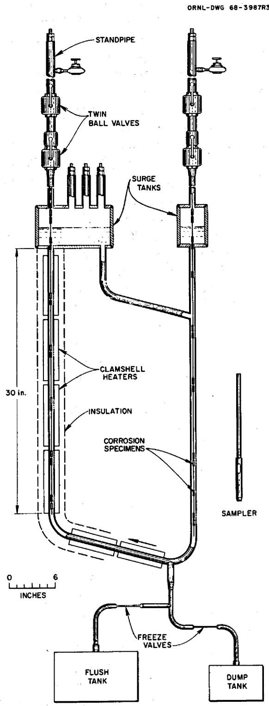  
Fig. 17. Schematic of loop 21.

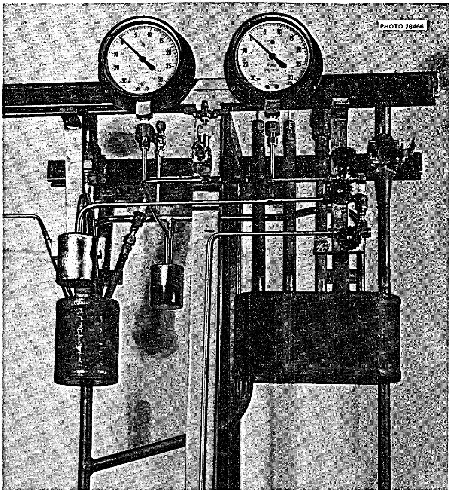  
Fig. 18. Upper portion of loop 21.

The percent of the total uranium which was present as $\mathbf{U}^{3+}$ for the first 3600 hr of loop operation is shown in Figs. 19-21. The irregular appearance of the data at 600 hr was due to large temperature fluctuations in the electrode tank. The first measurements with the shielded electrode were made at 1200 hr and are plotted as the squares in Figs. 19 and 20.

At about 1250 hr it was first noted that analyses with the shielded and unshielded electrodes gave different values of the $\mathbf{U}^{3+}$ concentration. This was later shown to be an effect of the nickel tube around the shielded electrode and not to a difference in the electrode response. At 2350 hr the nickel tube shield was raised out of the melt, and the measurements with the two electrodes were in agreement as shown in Fig. 20.

The second time the specimens were removed was November 29, 1971. The specimens had been exposed a total of $2513\mathrm{hr}$ , and the maximum weight loss was $0.2\mathrm{mg/cm^2}$ while the maximum weight gain was $0.05\mathrm{mg/cm^2}$ . The last time the specimens were removed was February 8, 1972. The total exposure time was $4169\mathrm{hr}$ , and the maximum weight loss was $0.23\mathrm{mg/cm^2}$ , which would correspond to a corrosion

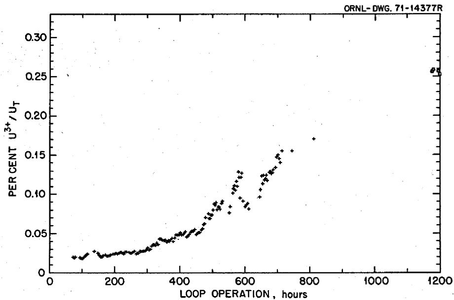  
Fig. 19. Uranium(III) in loop 21 fuel salt, 7/20/71 to 9/8/71.

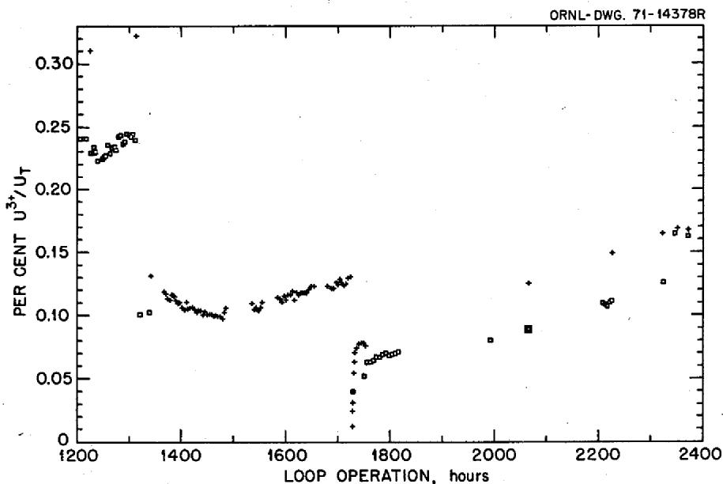  
Fig. 20. Uranium(III) in loop 21 fuel salt, 9/8/71 to 10/28/71.

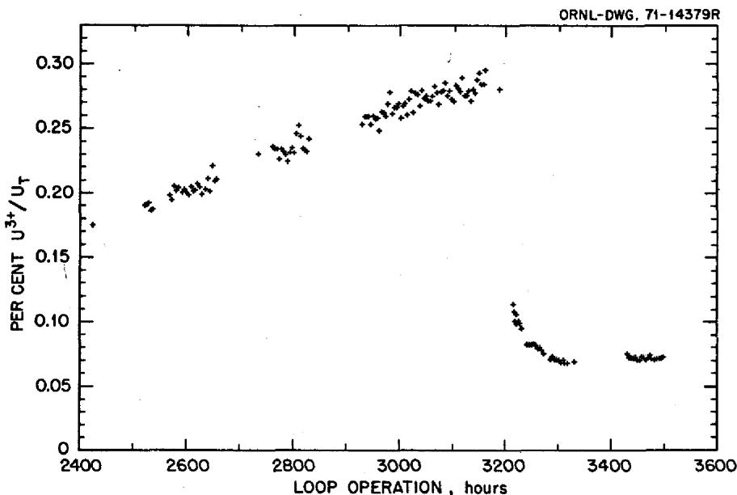  
Fig. 21. Uranium(III) in loop 21 fuel salt, 10/28/71 to 12/17/71.

rate of 0.02 mil/year, assuming uniform material removal. The chromium content of the salt increased 40 ppm. Except for the first time, when the $\mathbf{U}^{3+}$ concentration was already at a low value, the insertion of the metal specimens appeared to introduce an oxidant which caused a decrease in the $\mathbf{U}^{3+}$ concentration (1316 hr on Fig. 20 and 3200 hr on Fig. 21). Special precautions were taken for the next specimen insertion to determine if this operation could be performed without oxidizing the $\mathbf{U}^{3+}$ . At 1725 hr the shielded electrode, which had previously been removed for examination, was put back into the loop without immersing it into the salt. As shown in Fig. 20, the $\mathbf{U}^{3+}$ concentration decreased and then rapidly recovered, probably due to dilution effects caused by the salt flow.

In summary, the results of the ratio measurements generally showed excellent reproducibility and were consistent with the known factors of loop operation. Despite certain operational problems such as the offset in the potential of shielded electrodes, smaller offset voltages observed between the reference and working electrodes, and the establishment of accurate calibrations for the determination of corrosion products, experience with this test system gives confidence that this relatively simple transducer system can be widely applied to other test systems and ultimately to in-line reactor streams.

Loop 16A. Loop 16A was operated to determine the kinetics of tellurium transport in a temperature gradient loop system where the tellurium is introduced as a metallic coating on Hastelloy N. The reason for the experiment was the discovery of cracks in stressed Hastelloy N that had been exposed to fuel salt in the MSRE, $^{18}$ and subsequent evidence that tellurium entering salt as a fission product could cause cracks of this nature. The test bed for this experiment was a Hastelloy N thermal convection loop that had previously operated $\sim 38,000$ hr as loop 16A with the fuel mixture $65.5\%$ LiF $-34\%$ BeF $_2$ $-0.5\%$ UF $_4$ (mole%). Operating conditions for loop 16A are noted in Table 1.

For the initial experiment (which lasted 3400 hr), a Hastelloy N specimen coated with $1.6\mathrm{mg/cm}^2$ tellurium was added to the normal complement of standard Hastelloy N specimens. In the first $1300\mathrm{hr}$ of operation the weight loss of the tellurium-coated specimen equaled the amount of tellurium coated on the specimen. In the last $2100\mathrm{hr}$ the weight loss of the tellurium-coated specimen was the same as the hottest

Hastelloy N specimen located in a neighboring position at the same temperature. Thus, all the tellurium was apparently removed in the first 1300 hr. Half the tellurium removed was found in the salt and half on a specimen in the cold leg. These results indicate that tellurium has some solubility in the salt and is capable of being redistributed by temperature-dependent mass transfer. The specimens were removed from the loop and were stressed and examined metallographically for cracks. No cracks were found.

We then placed radioactive tellurium-coated Hastelloy N specimens in the hot and cold leg of the loop and we used weight change measurements and radioactive analysis to monitor the movement of the tellurium. The isotope used was $^{127\mathrm{m}}\mathrm{Te}$ , and it was electroplated on the specimens. Specimens were placed in the vapor space, in stagnant salt, and in the circulating salt of the loop. The specimens were removed after 42, 159, 396, 701, 1318, and 1792 hr exposures. We expected no corrosion of the Hastelloy N by the fuel salt in these time periods, so all weight changes were attributed to movement of the tellurium.

After the first $42\mathrm{hr}$ in the loop, all specimens lost at least $66\%$ of their initial activity. Our standard specimen which had remained at room temperature in air lost $4\%$ of its activity. After $159\mathrm{hr}$ in the loop, all specimens had lost $75\%$ of their initial activity. The standard specimen had lost $8\%$ . In the next two weighing and measuring periods, we saw an increase of activity on the cold leg specimens and a continued decrease of activity on the hot leg specimens. In the last two examination periods, there were almost no weight or activity changes. Weight changes correlated quite well with the activity measurements; specimens in the hot leg lost weight, and specimens in the cold leg gained weight.

Therefore, after large initial activity losses, we observed mass transfer of tellurium from the hot leg to the cold leg analogous to our normal movement of chromium in a Hastelloy N-salt system. In a Hastelloy N system, until an equilibrium between the salt and the alloy is established at one point in the system, all points of the loop lose material. After this equilibrium is established at the balance point, losses are seen in the hot leg accompanied by gains in the cold leg. The tellurium in this system behaved in somewhat the same manner.

# Type 304L Stainless Steel

Loop 1258. Loop 1258, constructed of type 304L stainless steel (11.07% Ni, 18.31% Cr, 0.028% C, bal Fe) and containing removable corrosion specimens in the hot leg, operated nine years (80,000 hr) and thus provided long-term stainless steel-fuel salt compatibility data. An LiF-BeF $_2$ -ZrF $_4$ -UF $_4$ -ThF $_4$ (70-23-5-1-1 mole %) salt circulated in the loop at a maximum temperature of $688^{\circ}\mathrm{C}$ and a minimum temperature of $588^{\circ}\mathrm{C}$ . The loop with its one surge tank is seen in Fig. 22. Corrosion specimens were present in the hot leg only.

The loop was started July 29, 1963. Four of ten specimens were removed October 31, 1963, after 2244 hr exposure and are pictured in Fig. 23. The weight losses were 11.6, 11.3, 8.1, and $3.3\mathrm{mg/cm}^2$ . In terms of uniform material removal, the maximum corrosion rate was over 2 mils/year. Figure 24 shows a micrograph of a specimen removed after 15,000 hr at $680^{\circ}\mathrm{C}$ . We see a maximum of 2 mils grain boundary penetration. In January 1967 after approx 30,000 hr, the remainder of the original specimen set was removed, and a second set, consisting of ten new specimens, was placed in the hot leg. The hottest specimen was replaced after 3700 hr, and the rest of the specimens remained in the loop (periodic removals for examination) until its shutdown. The specimen exposed at the highest temperature, $688^{\circ}\mathrm{C}$ , was removed for detailed metallurgical analysis after 5700 hr (between May 1967 and February 1968). Figure 25 shows all the specimens at this time (9400 hr exposure). No gross corrosive effects are evident. The microstructure of the hottest specimen is seen in Fig. 26. Voids extend into the matrix for a maximum distance of 2.5 mils along grain boundaries. The microprobe analysis of this specimen for chromium and iron is shown in Fig. 27. Note that the chromium concentration of the alloy is decreased for a distance of $28\mu \mathrm{m}$ . Thus chromium depletion does appear to be occurring in this system.

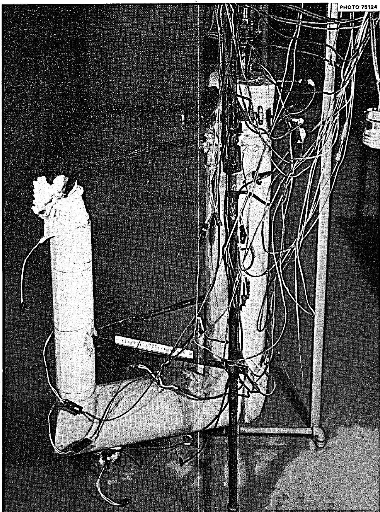  
Fig. 22. Loop 1258.

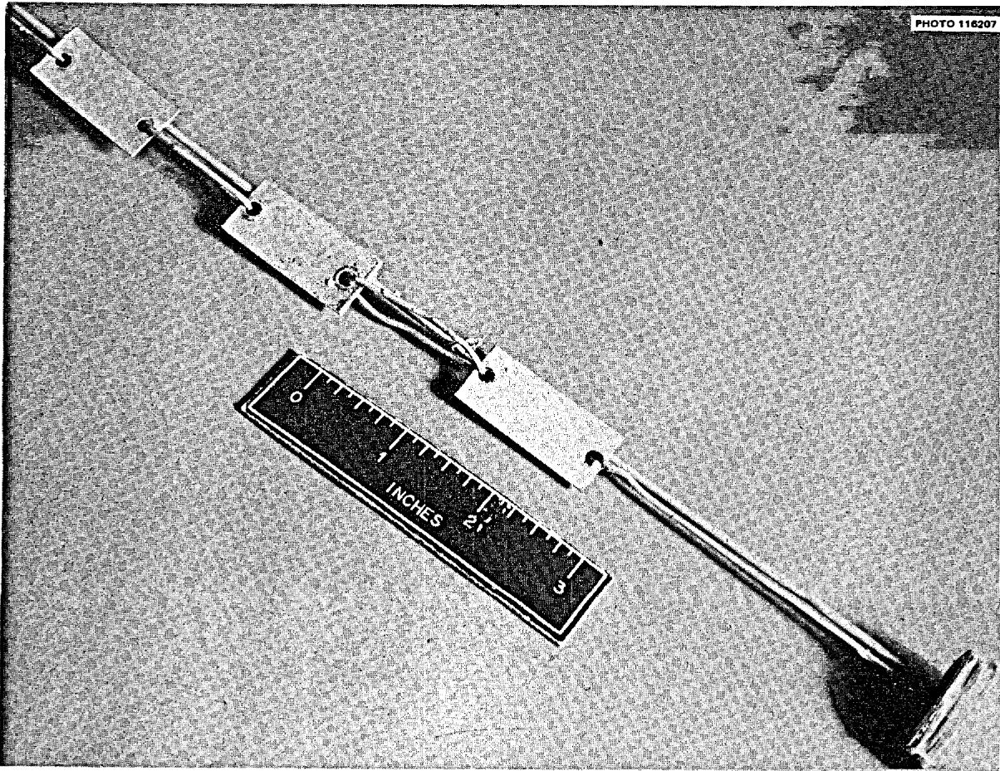  
Fig. 23. First corrosion specimens in loop 1258.

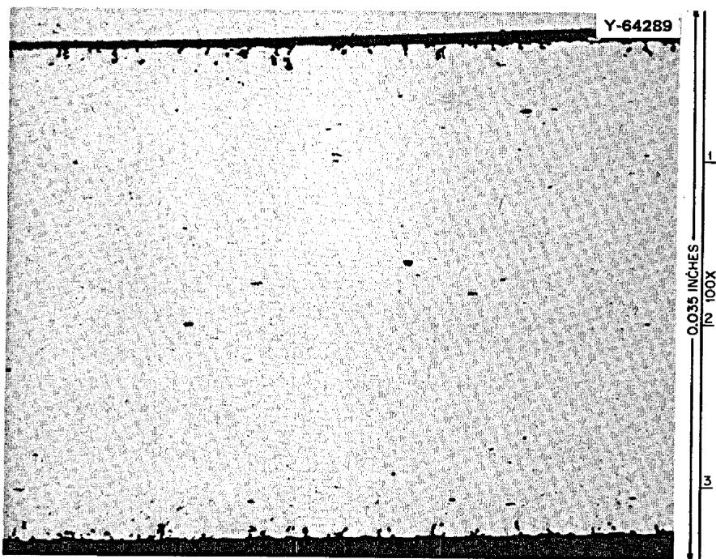  
Fig. 24. Microstructure of type 304L stainless steel specimen exposed to LiF-BeF $_2$ -ZrF $_4$ -ThF $_4$ -UF $_4$ (70-23-5-1-mole %) for 15,000 hr at $680^{\circ}\mathrm{C}$ .

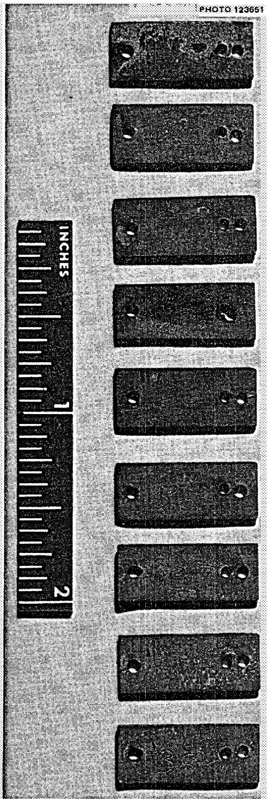  
Fig. 25. Type 304L stainless steel specimens from loop 1258 exposed to LiF-BeF $_2$ -ZrF $_4$ -ThF $_4$ -UF $_4$ (70-23-5-1-1 mole %) for 9400 hr at temperature ranges from $688^{\circ}\mathrm{C}$ (top specimen) to $668^{\circ}\mathrm{C}$ (bottom specimen).

After 62,600 hr operation of the loop (September 1970) we replaced the heaters and thermocouples of the loop. Operation of the loop had become increasingly difficult as heater and thermocouple failures became more frequent. When the heaters were removed, we found many green chromium oxide crystals on the loop exterior directly under the heaters. These crystals were the result of a fairly common phenomenon in Nichrome-wound heaters where chromium, because of its high vapor pressure, is selectively vaporized from the heater wire over a long period of time. This vaporization changes the heating characteristics of the

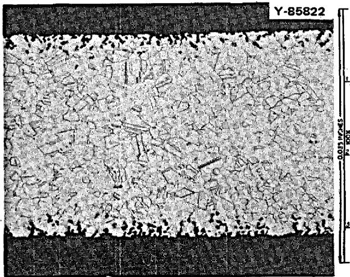  
Fig. 26. Microstructure of type 304L stainless steel specimen for loop 1258 exposed to LiF-BeF $_2$ -ZrF $_4$ -ThF $_4$ -UF $_4$ (70-23-5-1-1 mole %) for 5700 hr at $688^{\circ}\mathrm{C}$ .

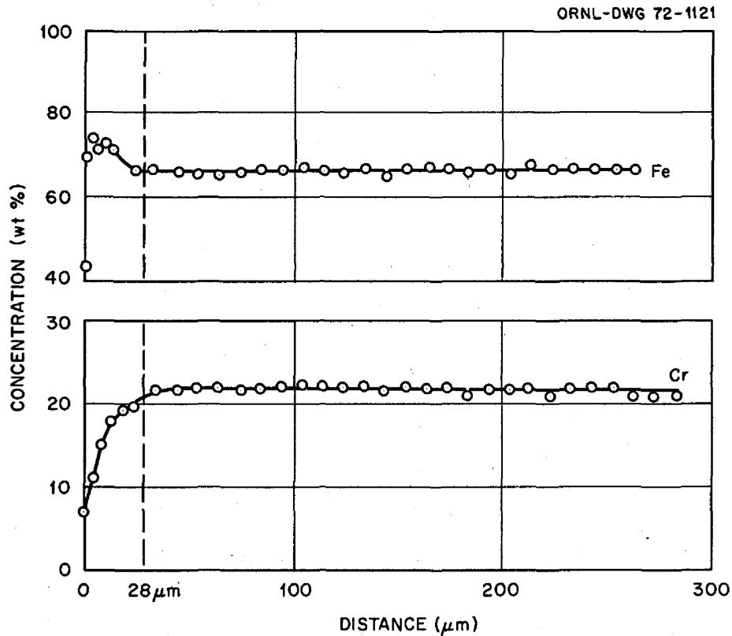  
Fig. 27. Chromium and iron concentration gradient in a type-304L stainless steel specimen from loop 1258 exposed to $\mathrm{LiF - BeF_2 - ZrF_4 - ThF_4 - UF_4}$ (70-23-5-1-1 mole %) for 5700 hr at $688^{\circ}\mathrm{C}$ ;

wire and certainly contributed to some of our operating problems. The salt was successfully thawed and loop operation continued.

The weight changes of the second specimen set after 32,000 hr are seen in Fig. 28. Note the dependence of weight loss with time and temperature. The microstructures of three specimens after 45,724 hr salt exposure are shown in Fig. 29. Voids extend for at least 10 mils into each specimen. At loop shutdown the second specimen set had been exposed to the salt for 49,057 hr. The maximum weight loss was 95.9 mg/cm², equivalent to a uniform corrosion rate of 0.86 mil/year.

For both specimen sets, the weight losses and depth of void formation increased approximately in proportion to the one-half power of the operating time. This suggests that the corrosion process was selective toward chromium and was controlled by the solid-state diffusion rate of chromium.

# Maraging Steel

Because of interest in iron-base alloys with lower chromium contents for possible containment of molten salts, we tested a maraging steel (12% Ni-5% Cr-3% Mo-bal Fe) specimen in loop 1258. The specimen was annealed 1 hr at $800^{\circ}\mathrm{C}$ and air cooled. Table 7 compares the weight loss and corrosion rate of this specimen with type 304 stainless steel and Hastelloy N under similar conditions of exposure. As expected, the maraging steel showed better corrosion resistance than the stainless steel because of its lower chromium content. However, the corrosion behavior of the Hastelloy N was still superior to both.

Figure 30 shows the metallographic appearance of the maraging steel specimen after exposure for 5700 hr at $662^{\circ}\mathrm{C}$ . Most of the attack is manifested as surface pitting, but there are also subsurface voids such as were seen in the stainless steel specimens of this loop. The void formation is attributed to removal of chromium atoms from the surface. This results in a concentration gradient and causes like atoms from the underlying region to diffuse toward the surface, thus leaving behind a zone enriched with vacancies. In time these vacancies accumulate and form visible voids.

The specimen of maraging steel was examined using the electron-beam microprobe. Using an accelerating voltage of $20\mathrm{kV}$ and specimen current of $0.01\mu \mathrm{A}$ , x-ray intensities were recorded (Fe $K\alpha$ , Ni $K\alpha$ , Cr $K\alpha$ , and Mo $L\alpha$ ) in both as-received and corroded specimens. Since x-ray intensities of a given element are directly related to the weight percent of the element, a comparison of intensities should reflect the change in composition in the attacked zone in the corrosion specimen. Table 8 shows the comparison for each of the four elements. Figure 31 shows the cathode ray tube display and corroborates the quantitative data. One can see the depletion of iron and chromium and the increase in nickel. Molybdenum seems to remain about the same.

Table 7. Comparison of weight losses of alloys at approx $663^{\circ}\mathrm{C}$ in similar flow fuel salts in a temperature gradient system   

<table><tr><td rowspan="2">Alloy</td><td colspan="2">Weight loss (mg/cm2)</td><td rowspan="2">Average corrosion rate (mils/year)</td></tr><tr><td>2490 hr</td><td>3730 hr</td></tr><tr><td>Maraging steel</td><td>3.0</td><td>4.8</td><td>0.55</td></tr><tr><td>Type 304 stainless steel</td><td>6.5</td><td>10.0</td><td>1.1</td></tr><tr><td>Hastelloy N</td><td>0.4</td><td>0.6</td><td>0.06</td></tr></table>

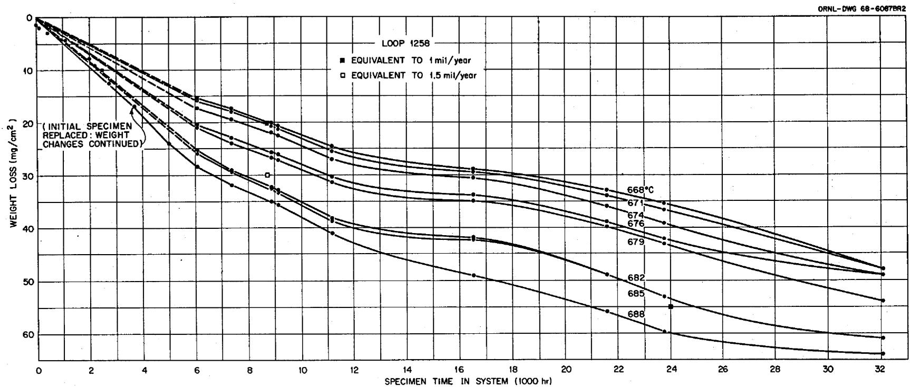  
Fig. 28. Weight changes of type 304L stainless steel specimens from loop 1258 exposed to LiF-BeF $_2$ -ZrF $_4$ -ThF $_4$ -UF $_4$ (70-23-5-1-1 mole %) for various times and temperatures.

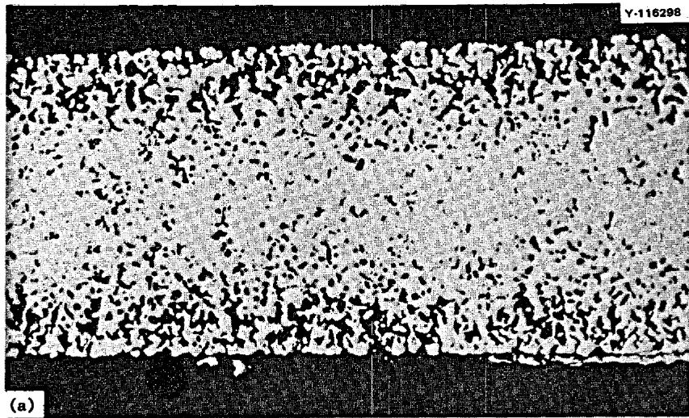

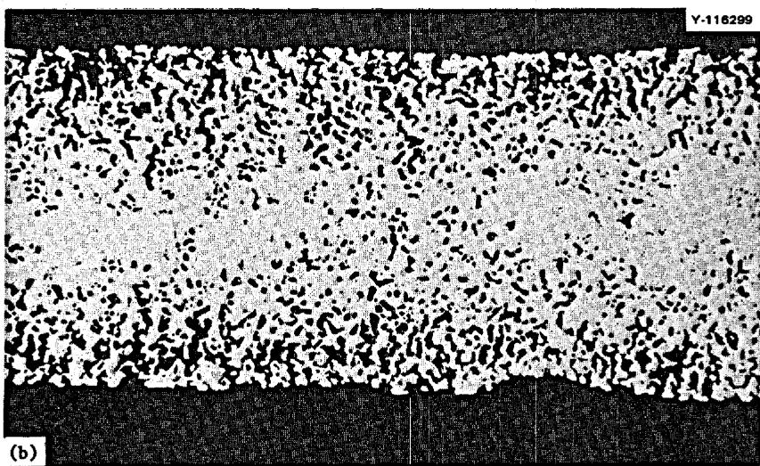

Fig. 29. Microstructures of type 304L stainless steel specimens from loop 1258 exposed to LiF-BeF $_2$ -ZrF $_4$ -ThF $_4$ -UF $_4$ (70-23-5-1-mole %) for 45,724 hr at (a) $685^{\circ}\mathrm{C}$ , (b) $679^{\circ}\mathrm{C}$ , and (c) $674^{\circ}\mathrm{C}$ . Reduced $28\%$ .   
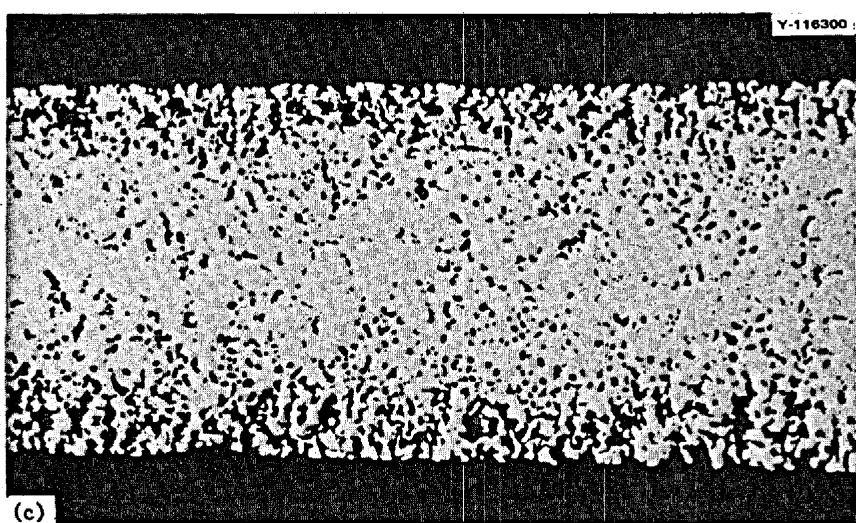  
0.035 INCHES 10.030 in. 100x 10,010 in.   
0.035 INCHES 10.030 in. 100x 10.010 in.   
10.030 in 1000 x 10,000 m.

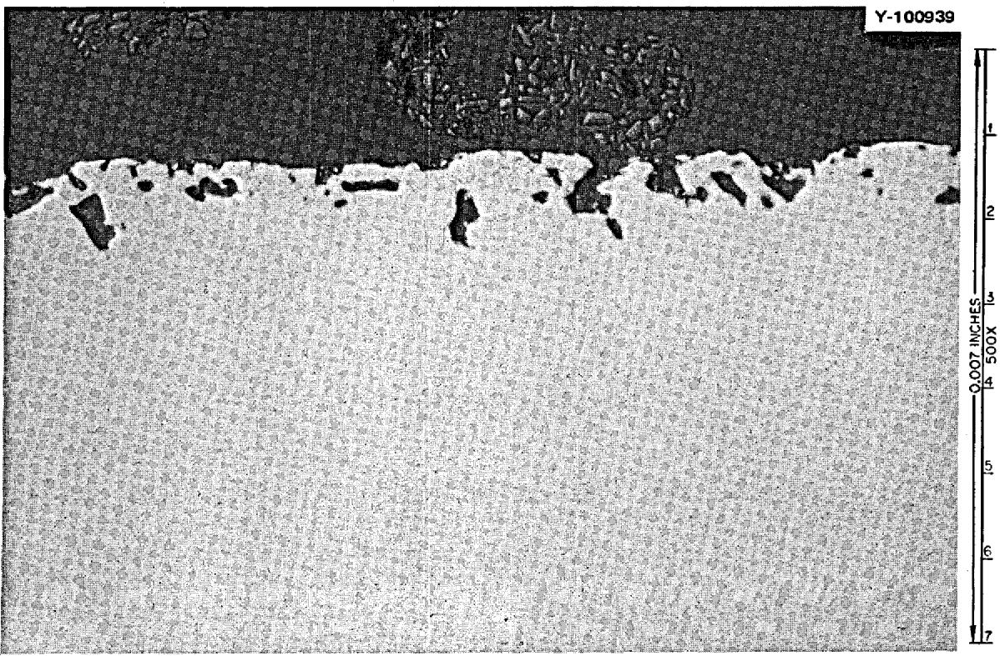  
Fig. 30. Microstructure of a maraging steel (12% Ni-5% Cr-3% Mo-bal Fe) exposed to LiF-BeF $_2$ -ZrF $_4$ -ThF $_4$ -UF $_4$ (70-23-5-1-1 mole %) for 5700 hr at $662^{\circ}\mathrm{C}$ . As polished.

Table 8. X-ray intensities of constituents of maraging steel   

<table><tr><td>Element</td><td>Intensity ratios, attack/as received</td></tr><tr><td>Fe</td><td>0.77</td></tr><tr><td>Ni</td><td>3.25</td></tr><tr><td>Cr</td><td>0.32</td></tr><tr><td>Mo</td><td>1.00</td></tr></table>

# Type 316 Stainless Steel

Loop 22. Loop 22 was a type 316 stainless steel thermal convection loop which operated for 4491 hr with a $\mathrm{LiF - BeF_2 - ThF_4 - UF_4}$ salt mixture identified in Table 1. The harp portion of the loop was 1-in.-OD tubing with 0.109-in. wall thickness. The material was from heat X-22662, U.S. National Tube, and the ORNL Inspection Engineering Number was IR-9141, Y-12 No. 8194. The nominal composition of the alloy was $16.6\%$ Cr, $13.6\%$ Ni, $2.25\%$ Mo, bal Fe. The loop was operated to determine the compatibility of stainless steel with a well-purified fuel salt. The weight changes of the specimens as a function of position and temperature are given in Fig. 32. Figure 33 shows the microstructure of the hottest specimen after 1410 hr. Subsurface voids are seen for a distance of 1 mil. After 2842 hr exposure the specimen at $650^{\circ}\mathrm{C}$ had lost a total of $6.2\mathrm{mg/cm}^2$ , equivalent to a uniform corrosion rate of 0.96 mil/year.

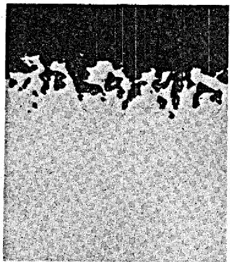  
500X   
OPTICAL

Y-101733

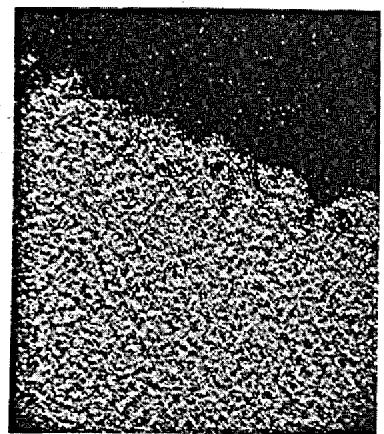  
Fe Ka

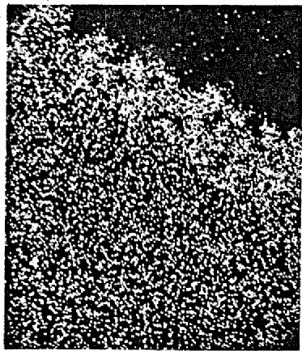  
Ni Ka

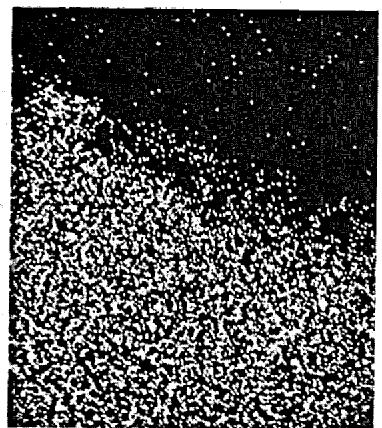  
${Cr}{K}_{a}$

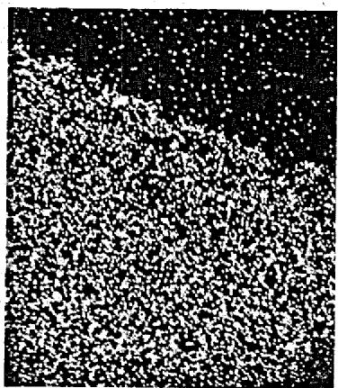  
Fig. 31. Characterization of attack zone in maraging steel. Reduced $10\%$ .

Mo La

X-RAYS

(MAG. 500X)

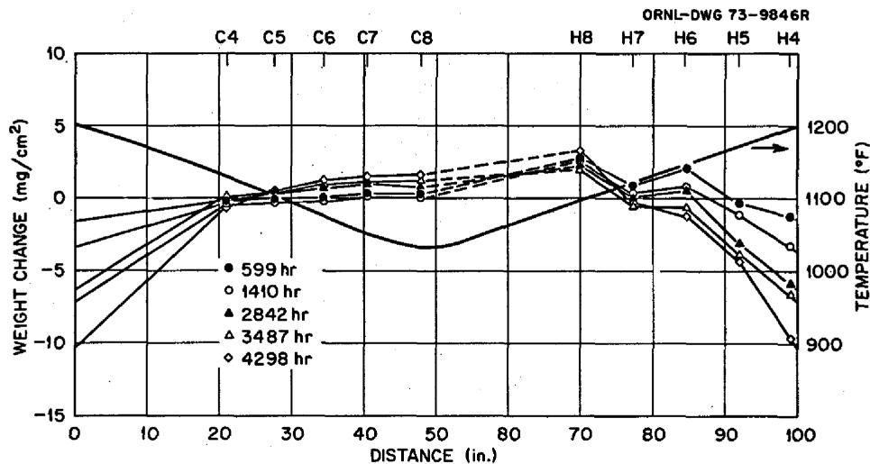  
Fig. 32. Weight changes of type 316 stainless steel specimens in loop 22 exposed to $\mathrm{LiF - BeF_2 - ThF_4 - UF_4}$ (68-20-11.7-0.3 mole %) as a function of position and temperature.

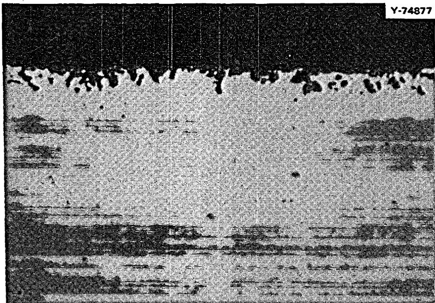  
Fig. 33. Microstructure of type 316 stainless steel specimen in loop 22 exposed to LiF-BeF $_2$ -ThF $_4$ -UF $_4$ (68-20-11.7-0.3 mole %) after 1410 hr at $650^{\circ}\mathrm{C}$ . 500X.

The main corrosion reaction in this system is $2\mathrm{UF}_4 + \mathrm{Cr} \rightleftharpoons \mathrm{CrF}_2 + 2\mathrm{UF}_3$ ; thus, in order to determine if we could decrease the mass transfer of the stainless steel, we added $\mathrm{UF}_3$ to the salt after the 2842-hr exposure measurements to make the salt less oxidizing. In the next 645-hr time period the mass transfer was somewhat less, and the overall corrosion rate was 0.83 mil/year. In the final 811-hr time period, the weight loss of the hottest specimen increased such that the uniform corrosion rate was $>1$ mil/year. However, the overall mass transfer, as evidenced by weight changes of other corrosion specimens, remained quite low.

The average uniform corrosion rate for the hottest specimen was 1 mil/year for the entire 4298-hr period of loop operation. Figure 34 shows the microstructures of hottest and coldest specimens at the end of the run. Figure $34a$ shows a $100\times$ cross section of the specimen with voids extending about 1 mil into

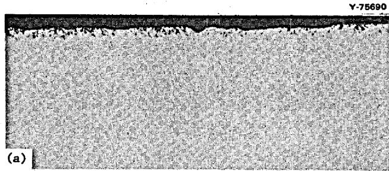

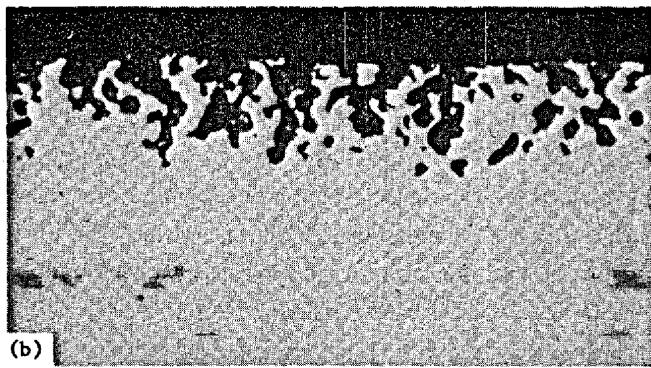

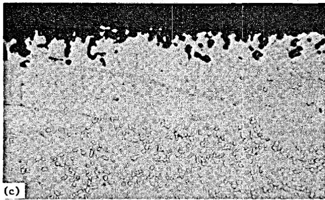

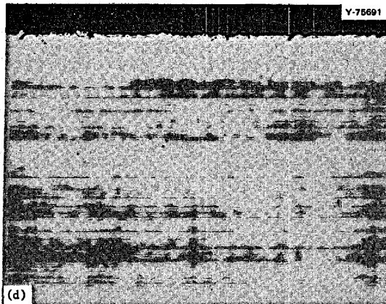  
Fig. 34. Microstructures of type 316 stainless steel specimens in loop 22 exposed to LiF-BeF $_2$ -ThF $_4$ -UF $_4$ (68-20-11.7-0.3 mole %) after 4298 hr. Hot leg, $650^{\circ}\mathrm{C}$ : (a) cross section of specimen, $100\times$ ; (b) as polished, $500\times$ ; (c) etched, $500\times$ . Cold leg, $560^{\circ}$ : (d) as polished, $500\times$ . Reduced $24.5\%$ .

the surface. Figures 34b and 34c are $500\times$ views as polished and etched respectively. In Fig. 34c note that the etching reveals a 3-mil-wide affected area. This complete area is probably depleted of chromium. Figure 34d shows the specimen in the coldest position $(560^{\circ}\mathrm{C})$ . Some deposits are seen.

# Other Alloys

Loop 18A. After a problem resulting from a heater short to the loop tubing, loop 18 was drained and the hot leg replaced. New salt was added, and the loop was designated 18A. The operating conditions for loop 18A are listed in Table 1. We placed several alloys with improved resistance to cracking by tellurium in fuel salt in the loop (NCL-18A) to determine their relative compatibility. Tables 9 and 10 show the alloys tested, their compositions, and the total weight change. Figure 35 shows the time dependence of the weight changes. The weight change results show a correlation between corrosion resistance and alloy constituents that form stable fluorides. There is, of course, a rather good correlation between weight changes and chromium or iron content. The nickel-base alloys are far more resistant to corrosion than the iron-base alloy. It is not possible to obtain absolute corrosion information from a test with so many materials present, but the detrimental effects of increasing chromium and iron are obvious. If the loop had been constructed entirely of one of the test alloys, the corrosion rate of the alloy might not have been as large as we noted in our experiment. The less-corrosion-resistant material always suffers in comparison with the corrosion-resistant material when they are in the same system.

The microstructures of the alloys are shown in Fig. 36. No attack is seen on the Hastelloy N, and there is little attack on the Inconel 600. You will note a layer of deposit on the Monel with voids underneath.

Table 9. Compositions of test alloys   

<table><tr><td></td><td>Ni</td><td>Cr</td><td>Fe</td><td>Mo</td><td>Cu</td><td>Al</td><td>Nb</td><td>Mn</td></tr><tr><td>Monel</td><td>65</td><td></td><td></td><td></td><td>35</td><td></td><td></td><td></td></tr><tr><td>Hastelloy N</td><td>~70</td><td>7</td><td>5</td><td>16</td><td></td><td></td><td></td><td></td></tr><tr><td>Inconel 600</td><td>~75</td><td>15</td><td>7</td><td></td><td></td><td></td><td></td><td></td></tr><tr><td>Inconel 606</td><td>~70</td><td>20</td><td>2</td><td></td><td></td><td></td><td>2</td><td>3</td></tr><tr><td>Inconel 601</td><td>~60</td><td>23</td><td>14</td><td></td><td></td><td>1</td><td></td><td></td></tr><tr><td>Inconel 690</td><td>~50</td><td>30</td><td>15</td><td></td><td></td><td></td><td></td><td></td></tr><tr><td>Incoloy 811E</td><td>~30</td><td>21</td><td>47</td><td></td><td></td><td></td><td></td><td></td></tr></table>

Table 10. Weight changes of alloys exposed to LiF-BeF $_2$ -ThF $_4$ -UF $_4$ (68-20-11.7-0.3 mole %) at $690^{\circ}\mathrm{C}$ for 2776 hr   

<table><tr><td>Alloy</td><td>Chromium content (%)</td><td>Iron content (%)</td><td>Total active alloying \( \text{constituents}^{\mathrm{a}} \)(%)</td><td>Weight change (mg/cm2)</td></tr><tr><td>Monel</td><td>0</td><td>1</td><td>2</td><td>+0.78</td></tr><tr><td>Hastelloy N</td><td>7</td><td>5</td><td>14</td><td>-0.15</td></tr><tr><td>Inconel 600</td><td>15</td><td>7</td><td>25</td><td>-0.49</td></tr><tr><td>Inconel 606</td><td>20</td><td>2</td><td>27</td><td>-6.6</td></tr><tr><td>Inconel 601</td><td>23</td><td>14</td><td>38</td><td>-16.0</td></tr><tr><td>Inconel 690</td><td>30</td><td>15</td><td>45</td><td>-55.5</td></tr><tr><td>Incoloy 811E</td><td>21</td><td>47</td><td>70</td><td>-116.7</td></tr></table>

${}^{a}$ Constituents that tend to form rather stable fluorides. All corrosion specimens were annealed $1\mathrm{{hr}}$ at ${1121}^{ \circ  }\mathrm{C}$ except Monel,which was annealed $1\mathrm{{hr}}$ at ${800}^{ \circ  }\mathrm{C}$ .

Since the composition of the Monel alloy is most unlike that of any of the other alloys, it is reasonable to assume that after some initial attack, some material deposited on the Monel by an activity gradient transfer mechanism, thus causing the weight gain that we measured. Thus the Monel was not quite as corrosion resistant as our weight changes showed. The cross-section view of the Inconel 606 is unusual since at one end of the specimen we see heavy attack while at the other end almost no attack. This corrosion specimen was not placed any differently in the loop, so its behavior is not completely understood. We would suspect that there might be a homogeneity problem in the specimen. The attack of the Inconel 601, Inconel 690, and the Incoloy 811E was more straightforward and resulted in large areas of void formation: 5 mils for Inconel 601, 15 mils for Inconel 690, and 18 mils for Incoloy 811E.

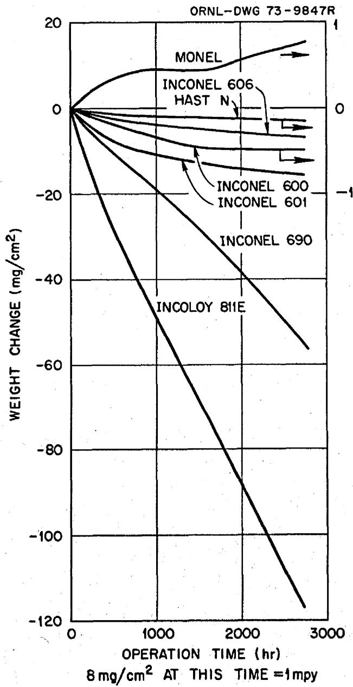  
Fig. 35. Weight changes of various alloys exposed to LiF-BeF $_2$ -ThF $_4$ -UF $_4$ (68-20-11.7-0.3 mole %) at $690^{\circ}\mathrm{C}$ in loop 18.

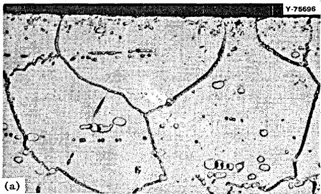

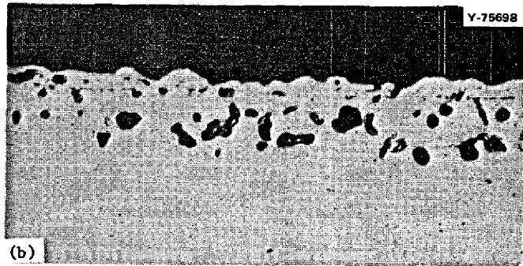

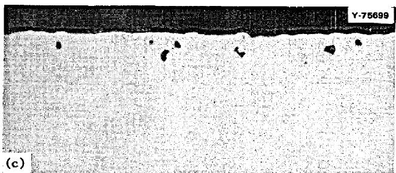

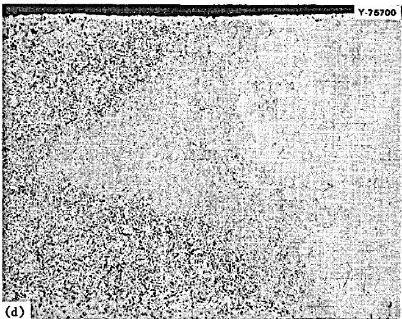

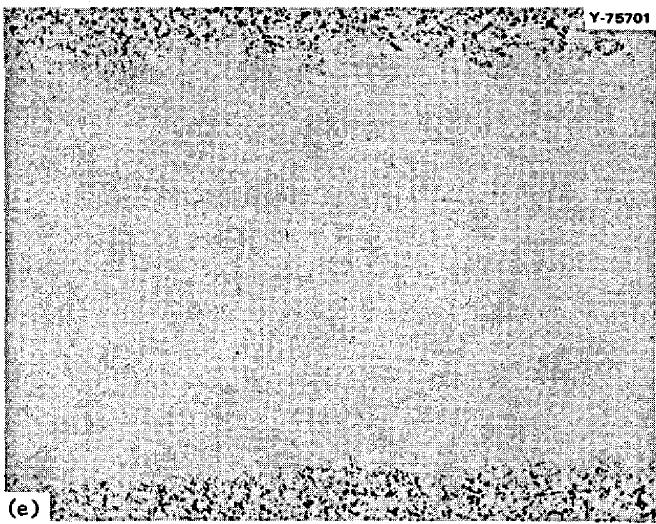

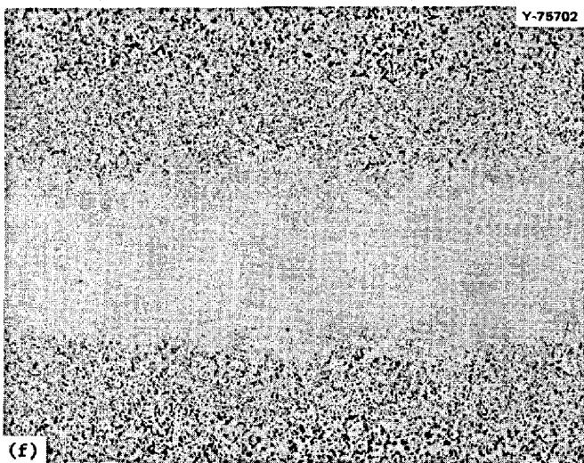

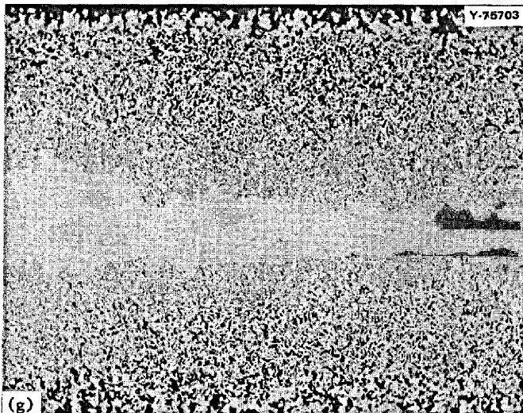  
Fig. 36. Microstructures of various alloys exposed to LiF-BeF $_2$ -ThF $_4$ -UF $_4$ (68-20-11.7-0.3 mole %) at $690^{\circ}\mathrm{C}$ for 2776 hr. (a) Hastelloy N, $500\times$ ; (b) Monel, $500\times$ ; (c) Inconel 600, $500\times$ ; (d) Inconel 606, $100\times$ ; (e) Inconel 601, $100\times$ ; (f) Inconel 690, $100\times$ ; (g) Incoloy 811E, $100\times$ . Reduced $24.5\%$ .

# CONCLUSIONS

1. Temperature gradient mass transfer, as noted by weight losses in the hot leg and weight gains in the cold leg, was evidenced in all systems tested.   
2. The weight changes of corrosion specimens increased with increasing temperature and time.   
3. Some difficulty was encountered in melting $\mathsf{LiF - BeF_2}\cdot \mathsf{ThF_4}$ salt which was frozen in a loop. The difficulty stemmed from its high melting point and the high melting point of certain phases in the salt.   
4. Repairs and welds were made on tubing which had been exposed to molten fluoride salts.   
5. All the salts tested were compatible with Hastelloy N.   
6. Bismuth in contact with a fuel salt had no effect on mass transfer in a Hastelloy N loop.   
7. We established that electrochemical methods to determine the oxidation potential of molten fluoride salts could be used on a thermal convection loop. The values obtained by the electrochemical methods correlated well with specimen weight change data.   
8. We showed that tellurium (as plated on Hastelloy N specimens) does mass transfer in a molten fluoride salt system and that an equilibrium between tellurium in the salt and tellurium on the alloy can be established.   
9. A type 304L stainless steel exposed to a fuel salt for 9.5 years in a type 304L stainless steel loop showed a maximum uniform corrosion rate of 0.86 mil/year. Voids extended into the matrix for 10 mils. Chromium depletion was found.   
10. The corrosion resistance of a maraging steel (12% Ni-5% Cr-3% Mo-bal Fe) at $662^{\circ}\mathrm{C}$ was better than type 304L stainless but worse than Hastelloy N under equivalent conditions. The uniform corrosion rate was 0.55 mil/year. Voids were seen in the microstructure of the specimens after 5700 hr, and microprobe analysis disclosed a definite depletion of chromium and iron.   
11. Type 316 stainless steel exposed to a fuel salt in a type 316 stainless steel loop showed a maximum uniform corrosion rate of 1 mil/year for 4298 hr. Mass transfer did occur in the system.   
12. For selected nickel- and iron-base alloys a direct correlation was found between corrosion resistance in a molten fluoride salt and chromium and iron content of an alloy. The more chromium and iron in the alloy, the less corrosion resistance.

# INTERNAL DISTRIBUTION

(79 copies)

(3) Central Research Library

ORNL - Y-12 Technical Library

Document Reference Section

(10) Laboratory Records Department

Laboratory Records, ORNL RC

ORNL Patent Office

G.M.Adamson, Jr.

C.F.Baes

C. E. Bamberger

S.E.Beall

E.G.Bohlmann

R.B.Briggs

S. Cantor

E. L. Compere

W. H. Cook

F. L. Culler

J. E. Cunningham

J. M. Dale

J.H.DeVan

J.R. DiStefano

J.R.Engel

D. E. Ferguson

J.H.Frye,Jr.

L. O. Gilpatrick

W.R.Grimes

A.G.Grindell

W. O. Harms

P. N. Haubenreich

(3) M. R. Hill

W. R. Huntley

H. Inouye

P. R. Kasten

(5) J. W. Koger

E. J. Lawrence

A. L. Lotts

T. S. Lundy

R.N.Lyon

H.G.MacPherson

R. E. MacPherson

W.R.Martin

R.W.McClung

H. E. McCoy

C.J.McHargue

H. A. McLain

B. McNabb

L. E. McNeese

A. S. Meyer

R. B. Parker

P. Patriarca

A.M.Perry

M. W. Rosenthal

H. C. Savage

J. L. Scott

J. H. Shaffer

G. M. Slaughter

G.P. Smith

R. A. Strehlow

R.E.Thoma

D. B. Trauger

A.M.Weinberg

J. R. Weir

J. C. White

L.V.Wilson

# EXTERNAL DISTRIBUTION

(24 copies)

BABCOCK & WILCOX COMPANY, P. O. Box 1260, Lynchburg, VA 24505

B. Mong

BLACK AND VEATCH, P. O. Box 8405, Kansas City, MO 64114

C. B. Deering

BRYON JACKSON PUMP, P. O. Box 2017, Los Angeles, CA 90054

G.C.Clasby

CABOT CORPORATION, STELLITE DIVISION, 1020 Park Ave., Kokomo, IN 46901

T. K. Roche

CONTINENTAL OIL COMPANY, Ponca City, OK 74601

J. A. Acciarri

EBASCO SERVICES, INC., 2 Rector Street, New York, NY 10006

D. R. deBoisblanc

T. A. Flynn

THE INTERNATIONAL NICKEL COMPANY, Huntington, WV 25720

J. M. Martin

UNION CARBIDE CORPORATION, CARBON PRODUCTS DIVISION, 12900 Snow Road, Parma, OH 44130

R. M. Bushong

USAEC, DIVISION OF REACTOR DEVELOPMENT AND TECHNOLOGY, Washington, DC 20545

David Elias

J. E. Fox

Norton Haberman

C. E. Johnson

T. C. Reuther

S. Rosen

Milton Shaw

J.M.Simmons

USAEC, DIVISION OF REGULATIONS, Washington, DC 20545

A. Giambusso

USAEC, RDT SITE REPRESENTATIVES, Oak Ridge National Laboratory, P. O. Box X, Oak Ridge, TN 37830

D. F. Cope

Kermit Laughon

C. L. Matthews

USAEC, OAK RIDGE OPERATIONS, P. O. Box E, Oak Ridge, TN 37830

Research and Technical Support Division

USAEC, TECHNICAL INFORMATION CENTER, P. O. Box 62, Oak Ridge, TN 37830

(2)