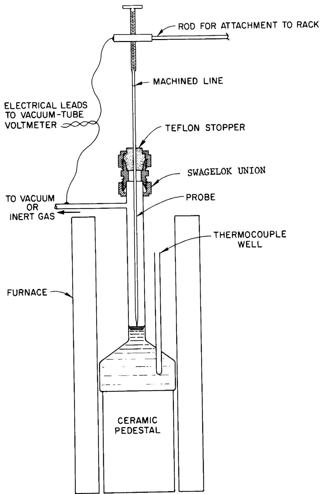
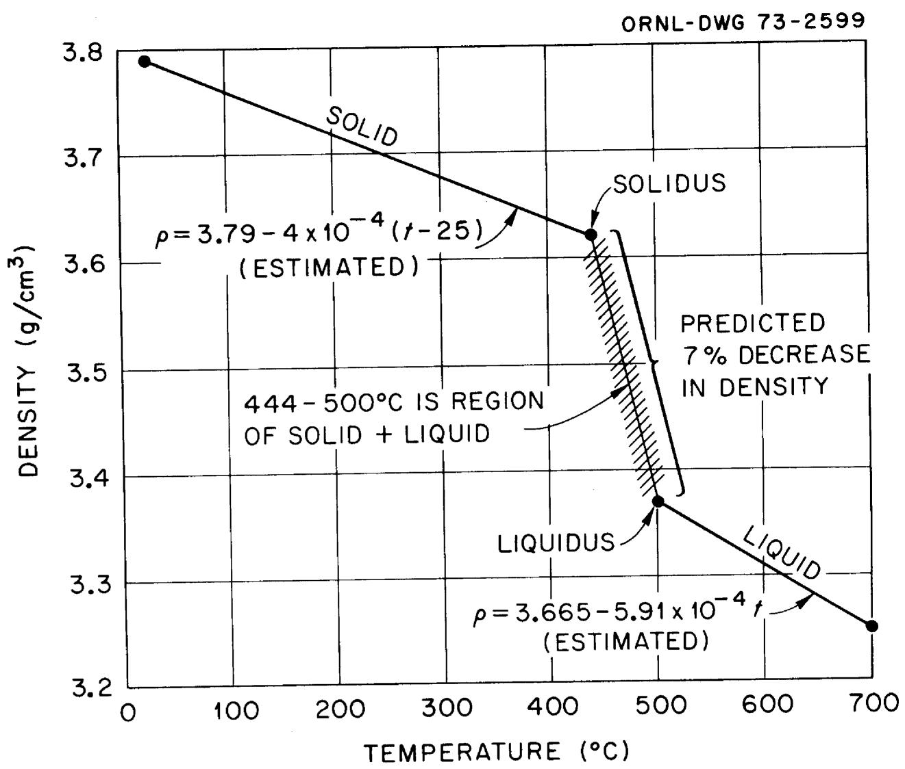
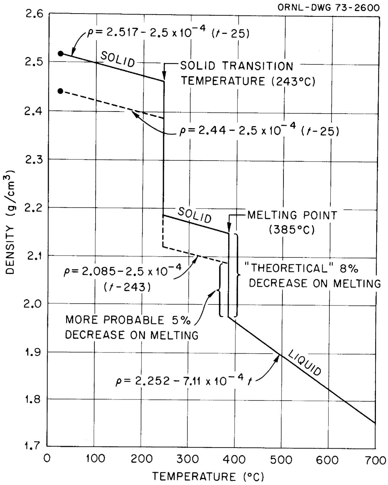
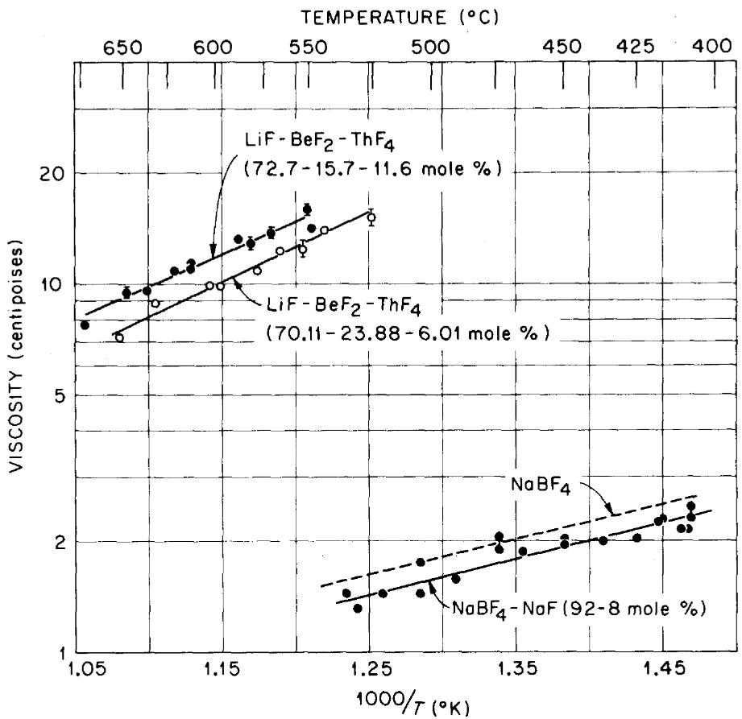
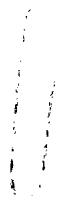

# DENSITY AND VISCOSITY OF SEVERAL MOLTEN FLUORIDE MIXTURES

Stanley Cantor

OAK RIDGE NATIONAL LABORATORY

CENTRAL RESEARCH LIBRARY

DOCUMENT COLLECTION

LIBRARY LOAN COPY

DO NOT TRANSFER TO ANOTHER PERSON

If you wish someone else to see this

document, send in name with document

and the library will arrange a loan.

UCN-7969

(3 3-67)


OAK RIDGE NATIONAL LABORATORY

OPERATED BY UNION CARBIDE CORPORATION • FOR THE U.S. ATOMIC ENERGY COMMISSION

This report was prepared as an account of work sponsored by the United States Government. Neither the United States nor the United States Atomic Energy Commission, nor any of their employees, nor any of their contractors, subcontractors, or their employees, makes any warranty, express or implied, or assumes any legal liability or responsibility for the accuracy, completeness or usefulness of any information, apparatus, product or process disclosed, or represents that its use would not infringe privately owned rights.

ORNL-TM-4308

Contract No. W-7405-eng-26

CHEMICAL TECHNOLOGY DIVISION

DENSITY AND VISCOSITY OF SEVERAL MOLTEN

FLUORIDE MIXTURES

Stanley Cantor

March 1973

OAK RIDGE NATIONAL LABORATORY

Oak Ridge, Tennessee 37830

operated by

UNION CARBIDE CORPORATION

for the

U.S. ATOMIC ENERGY COMMISSION

# CONTENTS

Page

ABSTRACT 1

DENSITY OF MOLTEN SALTS 2

Experimental 2

Materials 4

Results 4

Table 1A. Density of LiF-BeF2-ThF4 (70.11-23.88-6.01 mole %) 5

Table 1B. Density of LiF-BeF2-ThF4 (70.06-17.96-11.98 mole %) 6

Table 1C. Density of LiF-BeF2-ThF4 (69.98-14.99-15.03 mole %). 7

Table 1D. Density of LiF-BeF $_2$ (66-34 mole %)

Table 1E. Density of LiF-BeF2-ZrF4 (64.7-30.1-5.2 mole %) 9

Table 1F. Density of LiF-BeF2-ZrF4-UF4 (64.79-29.96-4.99-0.26 mole %) 10

Table 1G. Density of $\mathrm{NaBF}_4$ -NaF (92-8 mole %) 11

Table 2. Density of KNO3 . . . . . . . . . . . . . . . . . . . . . . . . . . . . . . . . . . . . . . . . . . . . . . . . . . . . .

Discussion 13

Additive Molar Volumes 13

Table 3. Molar Volumes of Fluoride Mixtures 14 Expansivity 15

Room-Temperature Density and Estimated Density Change, Upon Melting, of MSBR Fuel and Coolant Salts 15

VISCOSITY 19

Introduction and Experimental 19

Results and Discussion 20

Table 4. Viscosity of NaBF4-NaF (92-8 mole %) 21

Table 5. Viscosity of LiF-BeF2-ThF4 (72.7-15.7-11.6 mole %) 22

Table 6. Viscosity of LiF-BeF2-ThF4 (70.11-23.88-6.01 mole %) 23

Table 7. Viscosity at $800^{\circ}\mathrm{K}$ and $900^{\circ}\mathrm{K}$ of $\mathsf{LiF - BeF}_2\mathsf{-ThF}_4$ (or $\mathsf{UF}_4$ ) 25

REFERENCES 26

# DENSITY AND VISCOSITY OF SEVERAL MOLTEN FLUORIDE MIXTURES

Stanley Cantor

# ABSTRACT

Using a dilatometric method, densities were determined for the following molten salts:

```txt
LiF-BeF2 (66-34 mole %)  
LiF-BeF2-ThF4 (70.1-23.9-6.0, 70-18-12, 70-15-15 mole %)  
LiF-BeF2-ZrF4 (64.7-30.1-5.2 mole %)  
LiF-BeF2-ZrF4-UF4 (64.79-29.96-4.99-0.26 mole %)  
NaBF4-NaF (92-8 mole %)  
KNO3 
```

The last salt was measured to assure the accuracy of the method; the densities measured for $\mathrm{KNO}_3$ agreed within $0.15\%$ with critically evaluated densities obtained by Archimedean methods.

For the fluorides, molar volumes obtained from the density measurements agreed within $2\%$ with volumes calculated from additive contributions of the components. The expansivities of three LiF-BeF $_2$ -ThF $_4$ mixtures were practically identical, $2.5 \times 10^{-4} / ^{\circ}\mathrm{C}$ .

Density-temperature curves from $25 - 700^{\circ}\mathrm{C}$ for $\mathrm{LiF - BeF_2 - ThF_4}$ (72-16-12 mole %) and for $\mathrm{NaBF_4 - NaF}$ (92-8 mole %) were derived from room-temperature pycnometric determinations and from estimated expansivities of the solid salts. The calculated expansion, upon melting, for the former is $7\%$ , for the latter $8\%$ .

Viscosities of three salt mixtures were determined by oscillating-cup methods:

```txt
LiF-BeF2-ThF4 (72.7-15.7-11.6, 70.1-23.9-6.0 mole %) NaBF4-NaF (92-8 mole %) 
```

Viscosity measurements were conducted at Mound Laboratory, Miamisburg, Ohio, using capsules and samples prepared at ORNL. The viscosities of the two melts composed of LiF, BeF $_2$ , and ThF $_4$ were analogous to viscosities reported for similar mixtures containing UF $_4$ instead of ThF $_4$ .

# DENSITY OF MOLTEN SALTS

The objectives of this investigation were: (a) to measure, with high accuracy, densities and expansivities of several molten fluoride mixtures that are significant to molten-salt reactors, (b) to derive additive molar volume contributions which can serve to predict densities in LiF-BeF $_2$ -(Th,U)F $_4$ molten solutions, (c) to estimate density changes upon melting of the fuel-carrier and coolant salts of the molten-salt breeder reactor.

# Experimental

Apparatus and Procedures: Densities were determined in a nickel dilatometer (Figure 1), the details of which have been previously described. $^{1,2}$ In the apparatus a metal probe detects the changes in liquid level in the neck of a volume-calibrated metal vessel. The escape of vapor is prevented by a Teflon stopper, which also permits vertical displacement of the probe. When the probe contacts the liquid surface, a vacuum-tube voltmeter changes from an open circuit reading to a detectable resistance. The probe height is measured to $\pm 0.02$ mm with a cathetometer. Through a side arm in the neck of the vessel, an inert insoluble gas (argon) is introduced to suppress bubbles in the melt. By taking measurements at argon pressures of approximately 5 atm, entrapped gas bubble volumes were reduced to less than $0.1\%$ of the liquid sample.

After completing measurements at elevated temperatures, the contents of the vessel were removed and weighed to be certain that weight changes had been negligible. For any sample measured, weight changes never exceeded $0.05\%$ . After each run, the dilatometric vessel was recalibrated at room temperature with distilled water. The recalibrations indicated that the nickel vessels sustained permanent expansions of about $0.2\%$ .

Melt temperatures were controlled to $\pm 0.2^{\circ}$ by regulating the furnace with a Leeds and Northrup Speedomax proportional controller. Temperatures of the melt were determined with Pt-Rh thermocouples previously calibrated by the National Bureau of Standards; these thermocouples are stated to be accurate within $0.5^{\circ}$ in the temperature range $(400 - 820^{\circ}\mathrm{C})$ of measurement.

  
Fig. 1. Dilatometer for Measuring Volume of Molten Salts. The part of the probe above the Teflon stopper is longer than indicated in the figure.

# Materials

The salt mixtures, $\mathrm{LiF - BeF_2}$ (66-34 mole %) and $\mathrm{LiF - BeF_2 - ZrF_4}$ (64.7-30.1-5.2 mole %), were supplied by J. H. Shaffer, ORNL, from batches that had been sparged by $\mathrm{H}_2$ -HF gaseous treatment.<sup>3</sup> By adding purified, crystalline LiF and $\mathrm{UF_4}$ to the latter, we prepared $\mathrm{LiF - BeF_2 - ZrF_4 - UF_4}$ (64.79-29.96-4.99-0.26 mole %). In the order given above, the three compositions corresponded to the MSRE coolant, carrier salt, and fuel salt mixtures.

Mixtures of LiF-BeF $_2$ -ThF $_4$ (used in both density and viscosity measurements) were constituted from LiF-BeF $_2$ (66-34 mole %), crystalline LiF, and LiF-ThF $_4$ mixtures. The LiF-ThF $_4$ , retained from a previous density study, had been stored in a vacuum desiccator. The mixture, NaBF $_4$ -NaF (92-8 mole %), was constituted from the purified components. $^{2,6}$

Analytical-grade $\mathrm{KNO}_3$ (J. T. Baker Chemical Co., Phillipsburg, N.J.) was used as received. Measurements of the salt were carried out primarily for checking the accuracy of the dilatometric method used in the present investigation.

Argon gas, used for suppressing bubbles in the melts (see above), was obtained from Airco, Chester, W. Va. The gas was shown by mass spectrographic analysis to exceed $99.9\%$ in purity. Prior to entry into the vessel, the gas was passed through molecular sieve to remove traces of moisture.

All salt loadings were carried out in a glovebox filled with helium. To insure that the liquid level reached into the neck of the vessel (see Figure 1), two loadings were usually required; after melting the initial charge of the salt, the vessel was returned to the glovebox for further loading.

# Results

The densities of seven fluoride mixtures were measured over about a $200^{\circ}\mathrm{C}$ temperature range. The data are listed in Tables 1A - 1G; also included are the least-squares equation and the densities calculated from the equation. For each melt the plot of density versus temperature was linear. Data for $\mathrm{KNO}_3$ are given in Table 2.

Table 1A. Density of LiF-BeF $_2$ -ThF $_4$ (70.11-23.88-6.01 mole %)   

<table><tr><td rowspan="2">Temperature (°C)</td><td colspan="2">Density (g/cm3)</td></tr><tr><td>Experimental</td><td>Calculateda</td></tr><tr><td>555.1</td><td>2.7406</td><td>2.7395</td></tr><tr><td>571.9</td><td>2.7276</td><td>2.7282</td></tr><tr><td>580.9</td><td>2.7238</td><td>2.7222</td></tr><tr><td>596.7</td><td>2.7111</td><td>2.7116</td></tr><tr><td>606.2</td><td>2.7049</td><td>2.7052</td></tr><tr><td>621.3</td><td>2.6940</td><td>2.6951</td></tr><tr><td>628.7</td><td>2.6901</td><td>2.6901</td></tr><tr><td>646.8</td><td>2.6774</td><td>2.6780</td></tr><tr><td>655.1</td><td>2.6711</td><td>2.6724</td></tr><tr><td>673.2</td><td>2.6606</td><td>2.6603</td></tr><tr><td>681.2</td><td>2.6536</td><td>2.6549</td></tr><tr><td>707.4</td><td>2.6398</td><td>2.6372</td></tr></table>

aFrom the least-squares equation:

$$
\rho (g / c m ^ {3}) = 3. 1 1 1 8 - 6. 7 0 7 x 1 0 ^ {- 4} t (^ {\circ} C).
$$

Table 1B. Density of LiF-BeF ${}_{2} - {\mathrm{{ThF}}}_{4}\left( {{70.06} - {17.96} - {11.98}\text{ mole }\% }\right)$   

<table><tr><td rowspan="2">Temperature (°C)</td><td colspan="2">Density (g/cm3)</td></tr><tr><td>Experimental</td><td>Calculateda</td></tr><tr><td>533.2</td><td>3.3942</td><td>3.3936</td></tr><tr><td>558.1</td><td>3.3730</td><td>3.3735</td></tr><tr><td>561.4</td><td>3.3698</td><td>3.3709</td></tr><tr><td>580.7</td><td>3.3551</td><td>3.3553</td></tr><tr><td>588.8</td><td>3.3481</td><td>3.3488</td></tr><tr><td>603.4</td><td>3.3364</td><td>3.3370</td></tr><tr><td>615.0</td><td>3.3278</td><td>3.3277</td></tr><tr><td>626.5</td><td>3.3198</td><td>3.3184</td></tr><tr><td>640.2</td><td>3.3060</td><td>3.3073</td></tr><tr><td>649.6</td><td>3.3009</td><td>3.2997</td></tr><tr><td>673.1</td><td>3.2837</td><td>3.2808</td></tr><tr><td>696.9</td><td>3.2630</td><td>3.2616</td></tr><tr><td>721.0</td><td>3.2412</td><td>3.2422</td></tr><tr><td>741.2</td><td>3.2237</td><td>3.2259</td></tr></table>

aFrom the least-squares equation:

$$
\rho (g / c m ^ {3}) = 3. 8 2 3 6 - 8. 0 6 4 x 1 0 ^ {- 4} t (^ {\circ} C).
$$

Table 1C. Density of LiF-BeF $_2$ -ThF $_4$ (69.98 - 14.99 - 15.03 mole %)   

<table><tr><td rowspan="2">Temperature (°C)</td><td colspan="2">Density (g/cm3)</td></tr><tr><td>Experimental</td><td>Calculateda</td></tr><tr><td>543.4</td><td>3.6632</td><td>3.6634</td></tr><tr><td>556.7</td><td>3.6493</td><td>3.6507</td></tr><tr><td>582.9</td><td>3.6242</td><td>3.6258</td></tr><tr><td>608.5</td><td>3.6021</td><td>3.6014</td></tr><tr><td>620.9</td><td>3.5897</td><td>3.5896</td></tr><tr><td>633.7</td><td>3.5788</td><td>3.5774</td></tr><tr><td>646.4</td><td>3.5668</td><td>3.5653</td></tr><tr><td>659.1</td><td>3.5541</td><td>3.5532</td></tr><tr><td>672.6</td><td>3.5413</td><td>3.5403</td></tr><tr><td>698.9</td><td>3.5163</td><td>3.5153</td></tr><tr><td>713.7</td><td>3.5000</td><td>3.5012</td></tr><tr><td>730.2</td><td>3.4836</td><td>3.4854</td></tr><tr><td>749.5</td><td>3.4665</td><td>3.4671</td></tr></table>

aFrom the least-squares equation:

$$
\rho (g / c m ^ {3}) = 4. 1 8 1 1 - 9. 5 2 6 x 1 0 ^ {- 4} t (^ {\circ} C).
$$

Table 1D. Density of LiF-BeF $_2$ (66-34 mole %)   

<table><tr><td rowspan="2">Temperature (°C)</td><td colspan="2">Density (g/cm3)</td></tr><tr><td>Experimental</td><td>Calculateda</td></tr><tr><td>514.5</td><td>2.0292</td><td>2.0284</td></tr><tr><td>540.5</td><td>2.0153</td><td>2.0157</td></tr><tr><td>564.9</td><td>2.0030</td><td>2.0038</td></tr><tr><td>590.5</td><td>1.9915</td><td>1.9913</td></tr><tr><td>614.6</td><td>1.9797</td><td>1.9795</td></tr><tr><td>616.0</td><td>1.9785</td><td>1.9788</td></tr><tr><td>667.1</td><td>1.9540</td><td>1.9539</td></tr><tr><td>719.5</td><td>1.9285</td><td>1.9283</td></tr><tr><td>772.2</td><td>1.9027</td><td>1.9025</td></tr><tr><td>794.7</td><td>1.8911</td><td>1.8915</td></tr><tr><td>820.3</td><td>1.8792</td><td>1.8790</td></tr></table>

aFrom the least-squares equation:

$$
\rho (g / c m ^ {3}) = 2. 2 7 9 7 - 4. 8 8 4 x 1 0 ^ {- 4} t (^ {\circ} C).
$$

Table 1E. Density of LiF-BeF $_2$ -ZrF $_4$ (64.7-30.1-5.2 mole %)   

<table><tr><td rowspan="2">Temperature (°C)</td><td colspan="2">Density (g/cm3)</td></tr><tr><td>Experimental</td><td>Calculateda</td></tr><tr><td>452.0</td><td>2.2780</td><td>2.2780</td></tr><tr><td>475.8</td><td>2.2628</td><td>2.2642</td></tr><tr><td>501.0</td><td>2.2497</td><td>2.2497</td></tr><tr><td>503.5</td><td>2.2481</td><td>2.2483</td></tr><tr><td>523.4</td><td>2.2371</td><td>2.2368</td></tr><tr><td>530.6</td><td>2.2320</td><td>2.2326</td></tr><tr><td>546.9</td><td>2.2235</td><td>2.2232</td></tr><tr><td>570.8</td><td>2.2096</td><td>2.2094</td></tr><tr><td>594.9</td><td>2.1960</td><td>2.1955</td></tr><tr><td>597.7</td><td>2.1940</td><td>2.1939</td></tr><tr><td>619.0</td><td>2.1822</td><td>2.1816</td></tr><tr><td>622.6</td><td>2.1813</td><td>2.1796</td></tr><tr><td>642.2</td><td>2.1696</td><td>2.1682</td></tr><tr><td>647.5</td><td>2.1660</td><td>2.1652</td></tr><tr><td>666.5</td><td>2.1547</td><td>2.1542</td></tr><tr><td>672.4</td><td>2.1489</td><td>2.1508</td></tr><tr><td>698.2</td><td>2.1350</td><td>2.1359</td></tr><tr><td>703.9</td><td>2.1314</td><td>2.1327</td></tr></table>

aFrom the least-squares equation:

$$
\rho (g / c m ^ {3}) = 2. 5 3 8 7 - 5. 7 6 9 x 1 0 ^ {- 4} t (^ {\circ} C).
$$

Table 1F. Density of LiF-BeF ${}_{2} - {\mathrm{{ZrF}}}_{4} - {\mathrm{{UF}}}_{4}$ (64.79-29.96-4.99-0.26 mole %)   

<table><tr><td rowspan="2">Temperature (°C)</td><td colspan="2">Density (g/cm3)</td></tr><tr><td>Experimental</td><td>Calculateda</td></tr><tr><td>524.3</td><td>2.2576</td><td>2.2587</td></tr><tr><td>571.1</td><td>2.2319</td><td>2.2324</td></tr><tr><td>617.2</td><td>2.2057</td><td>2.2064</td></tr><tr><td>625.6</td><td>2.2054</td><td>2.2017</td></tr><tr><td>640.7</td><td>2.1928</td><td>2.1932</td></tr><tr><td>664.1</td><td>2.1800</td><td>2.1801</td></tr><tr><td>697.5</td><td>2.1626</td><td>2.1613</td></tr><tr><td>715.8</td><td>2.1493</td><td>2.1510</td></tr><tr><td>761.1</td><td>2.1251</td><td>2.1256</td></tr></table>

aFrom the least-squares equation:   
$\rho (\mathrm{g} / \mathrm{cm}^{3}) = 2.5533 - 5.620\times 10^{-4}\mathrm{t}(\mathrm{^{\circ}C}).$

Table 1G. Density of $\mathsf{NaBF}_4$ -NaF (92-8 mole %)   

<table><tr><td rowspan="2">Temperature (°C)</td><td colspan="2">Density (g/cm3)</td></tr><tr><td>Experimental</td><td>Calculateda</td></tr><tr><td>399.5</td><td>1.9650</td><td>1.9680</td></tr><tr><td>423.4</td><td>1.9502</td><td>1.9511</td></tr><tr><td>448.0</td><td>1.9364</td><td>1.9336</td></tr><tr><td>471.9</td><td>1.9180</td><td>1.9166</td></tr><tr><td>494.6</td><td>1.9013</td><td>1.9004</td></tr><tr><td>495.8</td><td>1.9007</td><td>1.8996</td></tr><tr><td>519.8</td><td>1.8822</td><td>1.8825</td></tr><tr><td>543.4</td><td>1.8664</td><td>1.8657</td></tr><tr><td>567.4</td><td>1.8466</td><td>1.8487</td></tr><tr><td>590.8</td><td>1.8314</td><td>1.8320</td></tr></table>

aFrom the least-squares equation:   
$\left(\mathrm{g} / \mathrm{cm}^{3}\right) = 2.2521 - 7.110 \times 10^{-4} \mathrm{t} \left(^{\circ} \mathrm{C}\right)$ .

Table 2. Density of ${\mathrm{{KNO}}}_{3}$   

<table><tr><td rowspan="2">Temperature (°C)</td><td colspan="2">Density (g/cm3)</td></tr><tr><td>Experimental</td><td>Calculateda</td></tr><tr><td>343.6</td><td>1.8716</td><td>1.8695</td></tr><tr><td>360.4</td><td>1.8579</td><td>1.8571</td></tr><tr><td>369.8</td><td>1.8503</td><td>1.8501</td></tr><tr><td>375.2</td><td>1.8456</td><td>1.8461</td></tr><tr><td>384.0</td><td>1.8391</td><td>1.8395</td></tr><tr><td>384.6</td><td>1.8380</td><td>1.8391</td></tr><tr><td>386.4</td><td>1.8374</td><td>1.8378</td></tr><tr><td>389.0</td><td>1.8348</td><td>1.8358</td></tr><tr><td>395.8</td><td>1.8307</td><td>1.8308</td></tr><tr><td>399.5</td><td>1.8275</td><td>1.8280</td></tr><tr><td>403.1</td><td>1.8239</td><td>1.8253</td></tr><tr><td>412.6</td><td>1.8171</td><td>1.8183</td></tr><tr><td>414.8</td><td>1.8179</td><td>1.8167</td></tr><tr><td>416.8</td><td>1.8185</td><td>1.8152</td></tr><tr><td>425.9</td><td>1.8068</td><td>1.8084</td></tr><tr><td>426.0</td><td>1.8090</td><td>1.8083</td></tr><tr><td>437.7</td><td>1.8000</td><td>1.7996</td></tr><tr><td>445.8</td><td>1.7933</td><td>1.7936</td></tr><tr><td>450.9</td><td>1.7894</td><td>1.7898</td></tr><tr><td>474.0</td><td>1.7721</td><td>1.7727</td></tr><tr><td>499.4</td><td>1.7543</td><td>1.7538</td></tr><tr><td>511.8</td><td>1.7443</td><td>1.7446</td></tr><tr><td>537.9</td><td>1.7252</td><td>1.7252</td></tr><tr><td>560.3</td><td>1.7087</td><td>1.7086</td></tr><tr><td>586.3</td><td>1.6893</td><td>1.6893</td></tr><tr><td>611.9</td><td>1.6707</td><td>1.6702</td></tr></table>

aFrom the least-squares equation:

$$
\rho (g / c m ^ {3}) = 2. 1 2 4 8 - 7. 4 2 8 \times 1 0 ^ {- 4} t (^ {\circ} C).
$$

The standard error in density was approximately $0.001\mathrm{g/cm}^3$ , corresponding to about $0.05\%$ . Other sources of error (creep sustained by the vessel, bubble volume, small amounts of salt condensed on the upper neck of the vessel) increase the total error to $\pm 0.3\%$ . This percentage error was determined by comparing our results with those of Bloom et al.<sup>7</sup> Janz,<sup>8</sup> in his critical review, judges the uncertainty in Bloom's results to be about $0.2\%$ ; our results differ from those of Bloom by $0.15\%$ . The density-temperature equations for $\mathrm{KNO}_3$ are:

$$
\rho \left(g / c m ^ {3}\right) = 2. 1 1 6 - 7. 2 9 x 1 0 ^ {- 4} t (^ {\circ} C) \quad B l o o m e t a l. ^ {7}
$$

$$
\rho \left(\mathrm {g} / \mathrm {c m} ^ {3}\right) = 2. 1 2 5 - 7. 4 3 \times 1 0 ^ {- 4} t (^ {\circ} \mathrm {C}) \quad \text {o u r r e s u l t s .}
$$

# Discussion

# Additive Molar Volumes

The simplest, and often quite successful, way for estimating the density of solutions is to assume that the volume of a mixture is the sum of additive contributions of the component compounds. The additive contributions are usually available from density measurements of the components; the density - and hence the molar volumes, of LiF, $^{4}$ ThF $_{4}$ , and BeF $_{2}$ $^{10}$ have been reported by the author. At 550 and $700^{\circ}\mathrm{C}$ , the molar volumes obtained from these investigations are:

Volume (cm3)   

<table><tr><td></td><td>550°C</td><td>700°C</td></tr><tr><td>LiF</td><td>13.24</td><td>13.77</td></tr><tr><td>BeF2</td><td>24.0</td><td>24.2</td></tr><tr><td>ThF4</td><td>46.15</td><td>47.00</td></tr></table>

Molar volumes of the three $\mathrm{LiF - BeF_2 - ThF_4}$ mixtures and the $\mathrm{LiF - BeF_2}$ mixture were calculated from the values above; the calculated and experimental molar volumes are compared in Table 3. Calculated volumes are approximately one percent greater than experimental values. The good agreement is probably due to the small sizes and low polarizabilities of the ions which comprise these mixtures.

The concentrations of $\mathrm{ZrF_4}$ and $\mathrm{UF_4}$ in the two mixtures studied were not large enough to test whether or not their molar volume contributions

Table 3. Molar<sup>a</sup> Volumes of Fluoride Mixtures   

<table><tr><td colspan="3">Composition (mole fraction, N1)</td><td colspan="3">550°C</td><td colspan="3">700°C</td></tr><tr><td>LiF</td><td>BeF2</td><td>ThF4</td><td>Expt1.</td><td>Calcd. b</td><td>Diff. c</td><td>Expt1.</td><td>Calcd. b</td><td>Diff. c</td></tr><tr><td>0.7011</td><td>0.2388</td><td>0.0601</td><td>17.47</td><td>17.79</td><td>1.89%</td><td>18.14</td><td>18.26</td><td>0.88%</td></tr><tr><td>0.7006</td><td>0.1796</td><td>0.1198</td><td>18.79</td><td>19.11</td><td>1.65%</td><td>19.49</td><td>19.62</td><td>0.56%</td></tr><tr><td>0.6998</td><td>0.1499</td><td>0.1503</td><td>19.55</td><td>19.80</td><td>1.79%</td><td>20.34</td><td>20.33</td><td>-0.15%</td></tr><tr><td>0.66</td><td>0.34</td><td>-</td><td>16.46</td><td>16.90</td><td>2.67%</td><td>17.08</td><td>17.32</td><td>1.41%</td></tr><tr><td>LiF</td><td>BeF2</td><td>ZrF4</td><td></td><td></td><td></td><td></td><td></td><td></td></tr><tr><td>0.647</td><td>0.301</td><td>0.052</td><td>17.84</td><td>18.18</td><td>1.91%</td><td>18.56</td><td>18.60</td><td>0.22%</td></tr><tr><td>0.6479</td><td>0.2996</td><td>0.0499 +0.0026UF4</td><td>17.85</td><td>18.18</td><td>1.85%</td><td>18.54</td><td>18.69</td><td>0.81%</td></tr><tr><td>NaBF4</td><td>NaF</td><td></td><td></td><td></td><td></td><td></td><td></td><td></td></tr><tr><td>0.92</td><td>0.08</td><td></td><td>56.08</td><td>56.11</td><td>0.05%</td><td>59.49d</td><td>59.71</td><td>0.37%</td></tr></table>

${}^{a}$ A mole of salt mixture is defined: $\overline{\mathrm{M}} = \sum {\mathrm{N}}_{\mathrm{i}}{\mathrm{M}}_{\mathrm{i}}$ ,where $\overline{\mathrm{M}}$ is molar mass, ${\mathrm{N}}_{\mathrm{i}}$ is mole fraction of component i, ${\mathrm{M}}_{\mathrm{i}}$ is gram-formula weight of component i.

bCalculated from the equation $\overline{\mathbf{V}} = \Sigma \mathbf{N}_{\mathbf{i}}\mathbf{V}_{\mathbf{i}}$ where $\overline{\mathbf{V}}$ and $V_{i}$ are, respectively, molar volumes of the mixture and of component i, both at the same temperature. Values of $V_{i}$ given in the Discussion.

c100 x (Calculated volume minus experimental volume) experimental volume

dExtrapolated.

were additive. Nonetheless, the molar volumes at 550 and $700^{\circ}\mathrm{C}$ of the mixtures containing these components were calculated using, in addition to the LiF and $\mathrm{BeF}_2$ molar volume given above, the following:

$$
\begin{array}{l} \mathrm {Z r F _ {4} : 4 6 c m ^ {3} a t 5 5 0 ^ {\circ} C ; 4 8 c m ^ {3} a t 7 0 0 ^ {\circ} C} \\ \mathrm {U F _ {4} : 4 5 . 1 c m ^ {3} a t 5 5 0 ^ {\circ} C ; 4 6 . 1 c m ^ {3} a t 7 0 0 ^ {\circ} C} \end{array}
$$

The $\mathrm{ZrF_4}$ volumes were derived (not measured directly) from the densities of alkali fluorides - $\mathrm{ZrF_4}$ melts studied by Mellors and Senderoff.11 Molar volumes for $\mathrm{UF_4}$ are extrapolated from densities measured by Kirshenbaum and Cahill.12

For $\mathrm{NaBF}_4$ -NaF (92-8 mole %), the observed molar volume would not be expected to deviate from the additive value. Table 3 shows that volumes calculated from additive contributions agree within $0.4\%$ with experimental results. The additive contributions<sup>2,13</sup> are:

$$
\begin{array}{l l} \mathrm {N a B F} _ {4}: & 5 9. 3 5 \mathrm {c m} ^ {3} \text {a t} 5 5 0 ^ {\circ} \mathrm {C}; \quad 6 3. 2 0 \mathrm {c m} ^ {3} \text {a t} 7 0 0 ^ {\circ} \mathrm {C} \\ \mathrm {N a F}: & 1 8. 8 2 \mathrm {c m} ^ {3} \text {a t} 5 5 0 ^ {\circ} \mathrm {C}; \quad 1 9. 6 2 \mathrm {c m} ^ {3} \text {a t} 7 0 0 ^ {\circ} \mathrm {C} \end{array}
$$

# Expansivity

An interesting result, derived from the three mixtures containing $\mathrm{ThF}_4$ , is that the expansivity (fractional change of volume with temperature) did not seem to change with the concentrations of $\mathrm{BeF}_2$ and $\mathrm{ThF}_4$ . Given that any fuel mixture for a molten-salt breeder reactor will contain about 70 mole % LiF, then the results suggest that the expansivity will be very close to $2.5 \times 10^{-4} / ^{\circ}\mathrm{C}$ . The actual results were:

Salt Composition

(mole %)

70.11 LiF, 23.88 BeF $_2$ , 6.01 ThF $_4$

70.06 LiF, 17.96 BeF $_2$ , 11.98 ThF $_4$

69.98 LiF, 14.99 BeF $_2$ , 15.03 ThF $_4$

Expansivity, $\alpha = \frac{-1}{\rho} \frac{\partial \rho}{\partial T}$ at $600^{\circ} \mathrm{C}$

Units are $(^{\circ}\mathrm{C})^{-1}$

$$
2. 4 _ {8} \times 1 0 ^ {- 4}
$$

$$
2. 4 _ {1} \times 1 0 ^ {- 4}
$$

$$
2. 6 _ {4} \times 1 0 ^ {- 4}
$$

Room-Temperature Density and Estimated Density Change, Upon Melting, of MSBR Fuel and Coolant Salts

This short investigation was conducted in order to provide reactor designers with a reasonable estimate of the density change, upon melting, of MSBR fuel and coolant salts.

Densities, at room temperature, were determined pycnometrically in a $25\text{-cm}^3$ Kimax "specific gravity bottle". The precise volume of the bottle was determined with distilled water. Cottonseed oil was used as the displacement liquid for the salts; the latter had been prefused and only relatively large ( $>2\text{mm}$ ) crystalline fragments were used in the pycno-meter. The results obtained were:

$$
\begin{array}{l} \mathrm {LiF - B e F _ {2} - T h F _ {4}} (7 2 - 1 6 - 1 2 \text {m o l e} \%) ; \quad 3. 7 8 8 _ {7} \mathrm {g / c m} ^ {3} \\ \mathrm {N a B F _ {4}} (1 0 0 \text {m o l e} \%) : \quad 2. 4 3 5 _ {6} \mathrm {g / c m} ^ {3} \end{array}
$$

The pycnometric density of $\mathrm{NaBF}_4$ was $3\%$ less than the x-ray density of 2.5075 reported by Brunton. $^{14}$

A density-temperature curve (Fig. 2) for $\mathrm{LiF - BeF_2 - ThF_4}$ (72-16-12 mole %) was constructed on the basis of the following assumptions: a) the pycnometrically determined density at $25^{\circ}C$ is representative of the bulk density of the solid salt; b) the volume expansivity of the solid is $1\times 10^{-4} / ^{\circ}C$ , an estimate based on the value of this property in other salts; c) the density above the liquidus is reliably predicted from the additive molar volumes for LiF, $\mathrm{BeF}_2$ , and $\mathrm{ThF_4}$ listed in the first part of this report. The calculations result in a predicted $7 \%$ decrease in density over the temperature range of melting (or freezing). Equations and other details are noted in Figure 2.

Two curves depicting the density-temperature behavior of MSBR coolant (92-8 mole $\%$ $\mathrm{NaBF}_4$ -NaF) are given in Figure 3. The solid lines refer to "theoretical" or x-ray densities. At $243^{\circ}\mathrm{C}$ and at $385^{\circ}\mathrm{C}$ , the dashed and solid lines coincide over a range of densities. The curves were generated with the assumptions: (i) at room temperature the molar volumes are additive, (ii) the density of this solid mixture is $3\%$ less than the x-ray density (as was observed pycnometrically for pure $\mathrm{NaBF}_4$ ); (iii) the temperature coefficient of density for the solid is a constant, $2.5 \times 10^{-4} / ^{\circ}\mathrm{C}$ ; this coefficient corresponds to an expansivity of $1 \times 10^{-4} / ^{\circ}\mathrm{C}$ ; (iv) the x-ray density of the high-temperature form of crystalline $\mathrm{NaBF}_4$ is $2.17 \, \mathrm{g/cm}^3$ at $243^{\circ}\mathrm{C}$ (the same as Bredig obtained at $265^{\circ}\mathrm{C}$ ).

On the basis of these four assumptions and experimental data for the liquid, a density decrease of $8\%$ upon melting is possible; however, a

  
Fig. 2. Density of LiF-BeF $_2$ -ThF $_4$ (72-16-12 mole %).

  
Fig. 3. Density of $\mathrm{NaBF}_{4}$ -NaF (92-8 mole%).

decrease of about $5\%$ is more likely. It should be noted that this salt undergoes a rather large density change in the solid at $243^{\circ}\mathrm{C}$ . The predicted density decrease at this temperature is about $12.7\%$ .

# VISCOSITY

# Introduction and Experimental

Viscosity is an important physical property in assessing the heat transfer performance and fluid dynamics of reactor liquids. In these regards, information on fluoroborates was of special interest. Viscosity measurements on molten fluoroborates are relatively difficult because of their high volatility.

For volatile liquids at elevated temperatures, accurate measurement of low viscosities (<10 centipoises) are conveniently determined by oscillating-cup viscometry. In this method, a cylindrical vessel, which encapsulates the sample, is caused to execute torsional oscillations. The rate at which the amplitude of the oscillations is damped depends on the viscous drag of the liquid upon the walls of the container. The viscosity is determined through the basic equations of fluid dynamics from: the damping rate, the period of oscillation, the dimensions of the apparatus, and the mass and density of the liquid.

Over a period of several years, L. J. Wittenberg and his co-workers at Mound Laboratory, Miamisburg, Ohio (an AEC-owned facility), have gained much experience in measuring molten materials, mainly liquid metals,[17] via oscillating-cup viscometry. Because it was both faster and less expensive for Mound rather than ORNL to obtain accurate viscosities of fluoroborates and other fluorides of reactor interest, a purchase order for Mound's services was obtained. Viscometric measurements and treatment of the data were performed by L. J. Wittenberg and R. Dewitt of Mound Laboratory. Preparation of samples, fabrication of capsules and supplementary interpretation of the data were done at ORNL under the supervision of the author.

The viscosities of five salt melts were determined. Two of these, single-component melts of $\mathrm{NaBF}_4$ and $\mathrm{KBF}_4$ , have been reported and discussed in another publication.[18] The other three, the subjects of this report, are: $\mathrm{NaBF}_4$ -NaF: 92-8 mole %

LiF-BeF $_2$ -ThF $_4$ : 72.7-15.7-11.6 mole % and 70.1-23.9-6.0 mole %.

Wittenberg has published details of the general technique $^{17}$ and methods for treating the data. $^{19}$ The specific apparatus used for this investigation is described elsewhere. $^{18}$

Capsules, machined out of nickel stock, consisted of a cap and a cylindrical cup, the latter with approximate dimensions: 1.75 cm I.D., 1.85 cm O.D., and 7.5 cm long. After the dimensions were accurately measured, the capsules were charged with salt equivalent to about $15~\mathrm{cm}^3$ in the expected temperature range of measurements. Weighing and charging of samples were carried out in a glovebox. After these operations, the glovebox was evacuated at $\sim 30~\mu$ for 20 hours. After flushing the box twice with helium (purified by passing through a charcoal trap maintained at liquid nitrogen temperature), the cap was fuse-welded to the cup by means of an argon arc torch. During welding, the capsule was kept in a copper block whose purpose was to absorb most of the heat generated at the weld. The efficiency of heat removal was indicated by a small piece of masking tape attached to the cup about 2.5 cm below the weld-work; the tape did not appear charred or altered by the welding operations. Success in the heat removal was confirmed by the negligible losses in capsule weights taken after welding.

# Results and Discussion

The viscosities of the three salt mixtures are listed and compared with least-squares values in Tables 4, 5, and 6. The temperature of the viscosity determination was measured with a chromel-alumel thermocouple positioned near the capsule but not touching it. At each temperature, at least two, and usually three sets of amplitude and period measurements were taken; hence, there is more than one experimental viscosity entry for each temperature in Tables 4, 5, and 6. The data and least-squares fit are plotted in Figure 4.

(92 - 8 mole %)

Least squares fit: $\eta (\mathrm{cP}) = 0.0877\exp (2240 / \mathrm{T}(^{\circ}\mathrm{K}))$

Table 4. Viscosity of $\mathbf{NaBF}_4$ -NaF   

<table><tr><td>T(°C)</td><td>Experimental n(cP)</td><td>Calculated n(cP)</td></tr><tr><td>409</td><td>2.18, 2.15</td><td>2.34</td></tr><tr><td>411</td><td>2.15, 2.20</td><td>2.32</td></tr><tr><td>418</td><td>2.29, 2.29, 2.30</td><td>2.24</td></tr><tr><td>425</td><td>2.05, 2.05, 2.05</td><td>2.17</td></tr><tr><td>436</td><td>2.02, 2.00</td><td>2.06</td></tr><tr><td>465</td><td>1.89, 1.91, 1.86</td><td>1.82</td></tr><tr><td>491</td><td>1.59, 1.59, 1.59</td><td>1.64</td></tr><tr><td>505</td><td>1.45, 1.43, 1.47</td><td>1.56</td></tr><tr><td>521</td><td>1.45, 1.46</td><td>1.47</td></tr><tr><td>532</td><td>1.31, 1.30, 1.31</td><td>1.42</td></tr><tr><td>408</td><td>2.50, 2.38, 2.46</td><td>2.35</td></tr><tr><td></td><td>2.36, 2.38, 2.35</td><td></td></tr><tr><td>417</td><td>2.27, 2.35, 2.33</td><td>2.25</td></tr><tr><td>450</td><td>2.03, 2.04, 1.96</td><td>1.94</td></tr><tr><td>474</td><td>1.91, 1.96, 2.08</td><td>1.76</td></tr><tr><td>505</td><td>1.77</td><td>1.56</td></tr><tr><td>537</td><td>1.47, 1.48, 1.44</td><td>1.39</td></tr></table>

(72.7-15.7-11.6 mole %)

Least-squares fit: $\eta (\mathbf{cP}) = 0.1094\exp (4092 / T(^{\circ}K))$

Table 5. Viscosity of LiF-BeF ${}_{2} - {\mathrm{{ThF}}}_{4}$   

<table><tr><td>T(℃)</td><td>Experimental η(cP)</td><td>Calculated η(cP)</td></tr><tr><td>553</td><td>14.1, 14.3, 14.15</td><td>15.5</td></tr><tr><td>582</td><td>12.4, 13.4, 13.0</td><td>13.1</td></tr><tr><td>613</td><td>11.4, 11.2, 11.1</td><td>11.1</td></tr><tr><td>638</td><td>9.74, 9.56, 9.47</td><td>9.76</td></tr><tr><td>622</td><td>11.5, 11.5, 11.4</td><td>10.6</td></tr><tr><td>588</td><td>13.4, 13.5, 13.4</td><td>12.7</td></tr><tr><td>555</td><td>15.5, 16.5, 16.1</td><td>15.3</td></tr><tr><td>572</td><td>13.45, 13.3, 14.15</td><td>13.9</td></tr><tr><td>649</td><td>9.21, 9.79, 9.22</td><td>9.25</td></tr><tr><td>673</td><td>7.74, 7.75, 7.74</td><td>8.27</td></tr></table>

(70.11-23.88-6.01 mole %)

Least-squares fit: $\eta (\mathrm{cP}) = 0.06602\exp (4380 / \mathrm{T}(^{\circ}\mathrm{K}))$

Table 6. Viscosity of LiF-BeF ${}_{2} - {\mathrm{{ThF}}}_{4}$   

<table><tr><td>T(°C)</td><td>Experimental n(cP)</td><td>Calculated n(cP)</td></tr><tr><td>653</td><td>7.30, 7.06, 7.06</td><td>7.47</td></tr><tr><td>547</td><td>14.1, 13.9, 14.15</td><td>13.8</td></tr><tr><td>598</td><td>9.87, 9.87, 9.88</td><td>10.1</td></tr><tr><td>633</td><td>8.92, 8.97, 8.81</td><td>8.30</td></tr><tr><td>526</td><td>15.39, 16.53, 16.05</td><td>15.8</td></tr><tr><td>567</td><td>12.35, 12.56, 12.35</td><td>12.1</td></tr><tr><td>579</td><td>11.06, 10.92, 10.91</td><td>11.3</td></tr><tr><td>603</td><td>9.69, 10.19, 9.96</td><td>9.79</td></tr><tr><td>557</td><td>12.59, 12.69, 11.85</td><td>12.9</td></tr></table>

ORNL-DWG73-2601

  
Fig. 4. Viscosities of Three Fluoride Mixtures. All the points at the bottom refer to viscosity of $\mathrm{NaBF}_{4}$ - $\mathrm{NaF}$ (92-8 mole%).

The viscosity of $\mathrm{NaBF}_4$ -NaF (92-8 mole %) is very much like that of $\mathrm{NaBF}_4$ .<sup>18</sup> Evidently the presence of 8 mole % NaF leads to a somewhat lesser viscosity (see Fig. 4).

The data for the two ternary melts show that the mixture with the greater viscosity contains the lesser concentration of $\mathrm{BeF}_2$ and the greater concentration of $\mathrm{ThF}_4$ . Qualitatively, this behavior was predicted from the viscosity measured in mixtures of $\mathrm{LiF - BeF}_2 - \mathrm{UF}_4^{20}$ : "for LiF concentrations of 60 mole % or greater, substitution of $\mathrm{UF}_4$ (or $\mathrm{ThF}_4$ ) for $\mathrm{BeF}_2$ (at const. temperature) causes an increase in viscosity." Indeed, as Table 7 reveals, the $\mathrm{UF}_4$ -containing mixtures serve as an excellent basis for quantitatively predicting viscosities in analogous $\mathrm{ThF}_4$ -containing melts.

Table 7. Viscosity at ${800}^{ \circ  }\mathrm{K}$ and ${900}^{ \circ  }\mathrm{K}$ of ${\mathrm{{LiF}}}_{2} - {\mathrm{{ThF}}}_{4}$ (or ${\mathrm{{UF}}}_{4}$ )   

<table><tr><td rowspan="2">Composition (mole %)</td><td colspan="2">Viscosity (cP)</td></tr><tr><td>800°K</td><td>900°K</td></tr><tr><td>LiF-BeF2-ThF4</td><td></td><td></td></tr><tr><td>72.7-15.7-11.6</td><td>18.2</td><td>10.3</td></tr><tr><td>LiF-BeF2-UF4a</td><td></td><td></td></tr><tr><td>70-18-12</td><td>18.9a</td><td>10.4a</td></tr><tr><td>LiF-BeF2-ThF4</td><td></td><td></td></tr><tr><td>70.11-23.88-6.01</td><td>15.8</td><td>8.58</td></tr><tr><td>LiF-BeF2-UF4a</td><td></td><td></td></tr><tr><td>70-24-6</td><td>18.5a</td><td>10.1a</td></tr></table>

aSee Reference 20.

# REFERENCES

1. S. Cantor, "Metal Dilatometer for Determining Density and Expansivity of Volatile Liquids at Elevated Temperature," Rev. Sci. Instr. 40, 967 (1969).   
2. S. Cantor, D. P. McDermott, and L. O. Gilpatrick, "Volumetric Properties of Molten and Crystalline Alkali Fluoroborates," J. Chem. Phys. 52, 4600 (1970).   
3. J. H. Shaffer, Preparation and Handling of Salt Mixtures for the Molten Salt Reactor Experiment, ORNL-4616 (January 1971).   
4. D. G. Hill, S. Cantor, and W. T. Ward, "Molar Volumes in the LiF-ThF $_4$ System," J. Inorg. Nucl. Chem. 29, 241 (1967).   
5. S. Cantor and T. S. Carlton, "Freezing Point Depressions in Sodium Fluoride. II. Effect of Tetravalent Fluorides," J. Phys. Chem. 66, 2711 (1962).   
6. S. Cantor, "Freezing Point Depressions in Sodium Fluoride. Effect of Alkaline Earth Fluorides," J. Phys. Chem. 65, 2208 (1961).   
7. H. Bloom, I. W. Knaggs, J. J. Molloy, and D. Welch, "Molten Salt Mixtures Part I. Electrical Conductivities, Activation Energies of Ionic Migration and Molar Volumes of Molten Binary Halide Mixtures," Trans. Faraday Soc. 49, 1459 (1953).   
8. G. J. Janz et al., "Molten Salts: Volume 1, Electrical Conductance, Density, and Viscosity Data," National Bureau of Standards, Natl. Std. Ref. Data Ser. No. NSRDS-NBS-15 (U.S. Government Printing Office, Washington, D. C., 1968).   
9. S. Cantor, D. G. Hill, and W. T. Ward, "Density of Molten $\mathsf{ThF}_4$ , Increase of Density on Melting," Inorg. Nucl. Chem. Letters 2, 15 (1966).   
10. S. Cantor, W. T. Ward, and C. T. Moynihan, "Viscosity and Density in Molten $\mathsf{BeF}_2$ -LiF Solutions," J. Chem. Phys. 50, 2874 (1969).   
11. G. W. Mellors and S. Senderoff, "The Density and Surface Tension of Molten Fluorides," pp. 578-593 in Electrochemistry, Proceedings of the 1st Australian Conference, February 1963, Pergamon Press (1964).   
12. A. D. Kirshenbaum and J. A. Cahill, "The Density of Molten Thorium and Uranium Tetrafluorides," J. Inorg. Nucl. Chem. 19, 65 (1961).   
13. J. D. Edwards, C. S. Taylor, L. A. Cosgrove, and A. S. Russell, "Electrical Conductivity and Density of Molten Cryolite with Additives," J. Electrochem. Soc. 100, 508 (1953).

14. G. D. Brunton, "Refinement of the Structure of $\mathrm{NaBF}_4$ ," Acta Cryst. B-24, 1703 (1968).   
15. American Institute of Physics Handbook, Second Edition, p. 4:72, McGraw-Hill Company, New York (1963).   
16. M. A. Bredig, Chemistry Division Annual Progr. Rept. May 20, 1971, ORNL-4706, p. 155.   
17. L. J. Wittenberg and D. Ofte, "Viscometry and Densitometry - A. Viscosity of Liquid Metals," Physicochemical Measurements in Metals Research, Part 2, R. A. Rapp (ed.), Interscience Publishers, New York, 1970, pp. 193-217.   
18. R. Dewitt, L. J. Wittenberg, and S. Cantor, "Viscosity of Molten NaCl, $\mathrm{NaBF}_4$ , and $\mathrm{KBF}_4$ ," accepted for publication in Physics and Chemistry of Liquids (1973).   
19. L. J. Wittenberg, D. Ofte, and C. F. Curtiss, "Fluid Flow of Liquid Plutonium Alloys in an Oscillating-Cup Viscosimeter," J. Chem. Phys. 48, 3253 (1968).   
20. B. C. Blanke et al., Density and Viscosity of Fused Mixtures of Lithium, Beryllium, and Uranium Fluorides, Mound Laboratory Report MLM-1086 (December 1956).   
21. S. Cantor et al., Physical Properties of Molten-Salt Reactor Fuel, Coolant, and Flush Salts, ORNL-TM-2316 (August 1968), p. 9.



# INTERNAL DISTRIBUTION

1-3. Central Research Library

4. ORNL - Y-12 Technical Library   
5. Document Reference Section

6-15. Laboratory Records Department   
16. Laboratory Records Department-RC   
17. ORNL Patent Office   
18. C.F.Baes   
19. C. E. Bamberger   
20. S.E.Beall   
31. M. R. Bennett   
32. E. G. Bohlmann   
23. R. B. Briggs   
24. K. B. Brown

25-39. S. Cantor

40. E. L. Compere   
41. J. L. Crowley   
42. F. L. Culler   
43. J.M.Dale   
44. J.H.DeVan   
45. J.R. Engel   
46. D. E. Ferguson   
47. L. M. Ferris   
48. W. R. Grimes

49. A. G. Grindell   
50. P. N. Haubenreich   
51. W.R.Huntley   
52. R. B. Lindauer   
53. H. E. McCoy   
54. A. P. Malinauskas   
55. L. E. McNeese   
56. A. S. Meyer   
57. A. M. Perry   
58. J. D. Redman   
59. M. W. Rosenthal   
60. H. C. Savage   
61. C. D. Scott   
62. Dunlap Scott   
63. J. H. Shaffer   
64. F. J. Smith   
65. G.P.Smith   
66. R. A. Strehlow   
67. D. B. Trauger   
68. A. M. Weinberg   
69. J.R.Weir   
70. J. C. White   
71. R.G.Wymer

# EXTERNAL DISTRIBUTION

72. A. R. DeGrazia, Division of Reactor Research and Development, USAEC, Washington, D. C. 20545   
73. Norton Haberman, Division of Reactor Research and Development, USAEC, Washington, D. C. 20545   
74. F. Dee Stevenson, Division of Physical Research, USAEC, Washington, D. C. 20545   
75. D. F. Cope, USAEC, RDT Site Representative, ORNL, P.O. Box X, Oak Ridge, Tenn. 37830   
76. Kermit Laughon, USAEC, RDT Site Representative, ORNL, P.O. Box X, Oak Ridge, Tenn. 37830   
77. Research and Technical Support Division, USAEC, Oak Ridge Operations, P.O. Box E, Oak Ridge, Tenn. 37830   
78-79. Technical Information Center, P.O. Box 62, Oak Ridge, Tenn. 37830   
80. J. A. Acciarri, Continental Oil Company, Ponca City, Oklahoma 74601   
81. D. R. de Boisblanc, Evasco Services, Inc., 2 Rector St., New York, N. Y. 10006   
82. J. W. Koger, Union Carbide Nuclear Corporation, Y-12 Plant, Oak Ridge, Tenn. 37830